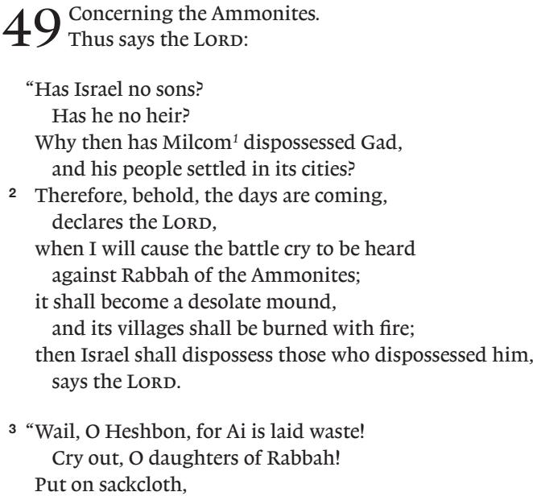

# ESV Expository Commentary

VOL. VI

Isaiah–Ezekiel

Expository Commentary - Volume 6.indd 1 5/10/22 10:21 AM

### EDITORS

*Iain M. Duguid James M. Hamilton Jr. Jay Sklar*

Expository Commentary - Volume 6.indd 2 5/10/22 10:21 AM


# *Commentary*

VOL. VI

*Isaiah–Ezekiel*

Isaiah *Bob Fyall*

Lamentations *Jonathan Gibson*

Jeremiah *Jerry Hwang*

Ezekiel *Iain M. Duguid*


Expository Commentary - Volume 6.indd 3 5/10/22 10:21 AM

*ESV Expository Commentary, Volume 6: Isaiah–Ezekiel*

Copyright © 2022 by Crossway

Published by Crossway

1300 Crescent Street Wheaton, Illinois 60187

All rights reserved. No part of this publication may be reproduced, stored in a retrieval system, or transmitted in any form by any means, electronic, mechanical, photocopy, recording, or otherwise, without the prior permission of the publisher, except as provided for by USA copyright law. Crossway® is a registered trademark in the United States of America.

Cover design: Jordan Singer

First printing 2022

Printed in Italy

Unless otherwise indicated, Scripture quotations are from the ESV® Bible (The Holy Bible, English Standard Version®), copyright © 2001 by Crossway, a publishing ministry of Good News Publishers. ESV Text Edition: 2016. Used by permission. All rights reserved. The ESV text may not be quoted in any publication made available to the public by a Creative Commons license. The ESV may not be translated into any other language.

Scripture quotations marked CSB are from *The Christian Standard Bible*®. Copyright © 2017 by Holman Bible Publishers. Used by permission.

Scripture quotations marked KJV are from the *King James Version* of the Bible.

The Scripture quotation marked MESSAGE is from THE MESSAGE. Copyright © 1993, 1994, 1995, 1996, 2000, 2001, 2002 by Eugene H. Peterson. Used by permission of NavPress. All rights reserved. Represented by Tyndale House Publishers, Inc.

Scripture quotations marked NASB are from *The New American Standard Bible*®. Copyright © The Lockman Foundation 1960, 1962, 1963, 1968, 1971, 1972, 1973, 1975, 1977, 1995. Used by permission.

Scripture quotations marked NIV are from The Holy Bible, New International Version®, NIV® . Copyright © 1973, 1978, 1984, 2011 by Biblica, Inc.™ Used by permission. All rights reserved worldwide.

The Scripture quotation marked NIV 1984 is taken from The Holy Bible, New International Version®, NIV®. Copyright © 1973, 1978, 1984 by Biblica, Inc.™ Used by permission. All rights reserved worldwide.

Scripture quotations marked NLT are from *The Holy Bible*, *New Living Translation*, copyright © 1996, 2004. Used by permission of Tyndale House Publishers, Inc., Wheaton, IL, 60189. All rights reserved.

The Scripture quotation marked RSV is from *The Revised Standard Version*. Copyright © 1946, 1952, 1971, 1973 by the Division of Christian Education of the National Council of the Churches of Christ in the U.S.A.

Expository Commentary - Volume 6.indd 4 5/10/22 10:21 AM

Scripture quotations marked AT are the author's translation.

All emphases in Scripture quotations have been added by the authors.

Hardcover ISBN: 978-1-4335-4648-8

Crossway is a publishing ministry of Good News Publishers.

| LEGO |    | 32 | 31 | 30 | 29 | 28 | 27 | 26 |   | 25 | 24 | 23 |   | 22 |
|------|----|----|----|----|----|----|----|----|---|----|----|----|---|----|
| 15   | 14 | 13 | 12 | 11 | 10 | 9  | 8  | 7  | 6 | 5  | 4  | 3  | 2 | 1  |

# CONTENTS

| Tables                                    | 7                                  |
|-------------------------------------------|------------------------------------|
| Preface to the ESV Expository Commentary9 |                                    |
| Contributors11                            |                                    |
| Abbreviations                             | 13                                 |
| Isaiah 19<br>Bob Fyall                    | Lamentations785<br>Jonathan Gibson |
| Jeremiah<br>.419<br>Jerry Hwang           | Ezekiel907<br>Iain M. Duguid       |
| Scripture Index 1209                      |                                    |

Expository Commentary - Volume 6.indd 5 5/10/22 10:21 AM

Expository Commentary - Volume 6.indd 6 5/10/22 10:21 AM

# TABLES

| Ezekiel                                      |  |
|----------------------------------------------|--|
| 4.1 Coming Judgment Depicted in Ezekiel 7959 |  |

Expository Commentary - Volume 6.indd 7 5/10/22 10:21 AM

Expository Commentary - Volume 6.indd 8 5/10/22 10:21 AM

# PREFACE

# TO THE ESV EXPOSITORY COMMENTARY

The Bible pulsates with life, and the Spirit conveys the electrifying power of Scripture to those who lay hold of it by faith, ingest it, and live by it. God has revealed himself in the Bible, which makes the words of Scripture sweeter than honey, more precious than gold, and more valuable than all riches. These are the words of life, and the Lord has entrusted them to his church, for the sake of the world.

He has also provided the church with teachers to explain and make clear what the Word of God means and how it applies to each generation. We pray that all serious students of God's Word, both those who seek to teach others and those who pursue study for their own personal growth in godliness, will be served by the ESV Expository Commentary. Our goal has been to provide a clear, crisp, and Christ-centered explanation of the biblical text. All Scripture speaks of Christ (Luke 24:27), and we have sought to show how each biblical book helps us to see the "light of the knowledge of the glory of God in the face of Jesus Christ" (2 Cor. 4:6).

To that end, each contributor has been asked to provide commentary that is:

- *exegetically sound*—self-consciously submissive to the flow of thought and lines of reasoning discernible in the biblical text;
- *biblically theological*—reading the Bible as diverse yet bearing an overarching unity, narrating a single storyline of redemption culminating in Christ;
- *globally aware*—aimed as much as possible at a global audience, in line with Crossway's mission to provide the Bible and theologically responsible resources to as many people around the world as possible;
- *broadly reformed*—standing in the historical stream of the Reformation, affirming that salvation is by grace alone, through faith alone, in Christ alone, taught in Scripture alone, for God's glory alone; holding high a big God with big grace for big sinners;
- *doctrinally conversant*—fluent in theological discourse; drawing appropriate brief connections to matters of historical or current theological importance;
- *pastorally useful*—transparently and reverently "sitting under the text"; avoiding lengthy grammatical/syntactical discussions;
- *application-minded*—building brief but consistent bridges into contemporary living in both Western and non-Western contexts (being aware of the globally diverse contexts toward which these volumes are aimed);

Expository Commentary - Volume 6.indd 9 5/10/22 10:21 AM

• *efficient in expression*—economical in its use of words; not a word-byword analysis but a crisply moving exposition.

In terms of Bible translation, the ESV is the base translation used by the authors in their notes, but the authors were expected to consult the text in the original languages when doing their exposition and were not required to agree with every decision made by the ESV translators.

As civilizations crumble, God's Word stands. And we stand on it. The great truths of Scripture speak across space and time, and we aim to herald them in a way that will be globally applicable.

May God bless the study of his Word, and may he smile on this attempt to expound it.

Expository Commentary - Volume 6.indd 10 5/10/22 10:21 AM

—The Publisher and Editors

# CONTRIBUTORS

### *Editors*

IAIN M. DUGUID PhD, University of Cambridge Professor of Old Testament, Westminster Theological Seminary

JAMES M. HAMILTON JR.

PhD, The Southern Baptist Theological Seminary Professor of Biblical Theology, The Southern Baptist Theological Seminary; Preaching Pastor, Kenwood Baptist Church, Louisville

### JAY SKLAR

PhD, University of Gloucestershire Professor of Old Testament, Covenant Theological Seminary

# *Authors*

BOB FYALL PhD, University of Edinburgh Retired Senior Tutor, Cornhill Training Course, Scotland *(Isaiah)*

### JERRY HWANG

PhD, Wheaton College Academic Dean and Associate Professor of Old Testament, Singapore Bible College *( Jeremiah)*

### JONATHAN GIBSON

PhD, University of Cambridge Associate Professor of Old Testament, Westminster Theological Seminary *(Lamentations)*

Expository Commentary - Volume 6.indd 11 5/10/22 10:21 AM

IAIN M. DUGUID PhD, University of Cambridge Professor of Old Testament, Westminster Theological Seminary *(Ezekiel)*

Expository Commentary - Volume 6.indd 12 5/10/22 10:21 AM

# ABBREVIATIONS

### *General*

| AT     | Author's Translation  | ibid.   | ibidem, in the same       |
|--------|-----------------------|---------|---------------------------|
| b.     | born                  |         | place                     |
| c.     | circa, about,         | i.e.    | that is                   |
|        | approximately         | Lat.    | Latin                     |
| cf.    | confer, compare, see  | lit.    | literal, literally        |
| ch(s). | chapter(s)            | LXX     | Septuagint                |
| d.     | died                  | mg.     | marginal reading          |
| ed(s). | editor(s), edited by, | MT      | Masoretic Text            |
|        | edition               | NT      | New Testament             |
| e.g.   | for example           | OT      | Old Testament             |
| esp.   | especially            | r.      | reigned                   |
| et al. | and others            | repr.   | reprinted                 |
| etc.   | and so on             | rev.    | revised (by)              |
| ff.    | and following         | trans.  | translator, translated by |
| Gk.    | Greek                 | v., vv. | verse(s)                  |
| Hb.    | Hebrew                | vol(s). | volumes                   |
|        |                       | vs.     | versus                    |
|        |                       |         |                           |

### *Bibliographic*

| AB    | Anchor Bible                                                                                                                                       |
|-------|----------------------------------------------------------------------------------------------------------------------------------------------------|
| ACCS  | Ancient Christian Commentary on Scripture                                                                                                          |
| AnBib | Analecta Biblica                                                                                                                                   |
| ANET  | Ancient Near Eastern Texts Relating to the Old Testament. Edited by<br>James B. Pritchard. 3rd ed. Princeton: Princeton University Press,<br>1969. |
| AUSS  | Andrews University Seminary Studies                                                                                                                |
| AYB   | Anchor Yale Bible                                                                                                                                  |
| BA    | Biblical Archaeologist                                                                                                                             |
|       |                                                                                                                                                    |

Expository Commentary - Volume 6.indd 13 5/10/22 10:21 AM

- *BBR Bulletin for Biblical Research*
- BDB Brown, Francis, S. R. Driver, and Charles A. Briggs. *A Hebrew and English Lexicon of the Old Testament.*
- *BibInt Biblical Interpretation*
	- *BSac Bibliotheca Sacra*
	- BJS Brown Judaic Studies
	- BLS Bible and Literature Series
	- BST The Bible Speaks Today
- *CBQ Catholic Biblical Quarterly*
- *COS The Context of Scripture*. Edited by William W. Hallo and K. Lawson Younger, Jr. 4 vols. Leiden: Brill, 1997–2017.
- *CurTM Currents in Theology and Mission*
	- *DCH Dictionary of Classical Hebrew*. Edited by David J. A. Clines. 9 vols. Sheffield: Sheffield Phoenix Press, 1993–2014.
	- *DDD Dictionary of Deities and Demons in the Bible*. Edited by Karel van der Toorn, Bob Becking, and Pieter W. van der Horst. Leiden: Brill, 1995. 2nd rev. ed. Grand Rapids, MI: Eerdmans, 1999.
	- EBC Expositor's Bible Commentary
- ESVEC ESV Expository Commentary
	- FAT Forschungen zum Alten Testament
- *HALOT The Hebrew and Aramaic Lexicon of the Old Testament*. Ludwig Koehler, Walter Baumgartner, and Johann J. Stamm. Translated and edited under the supervision of Mervyn E. J. Richardson. 5 vols. Leiden: Brill, 1994–2000.
- HCOT Historical Commentary on the Old Testament
	- *HAR Hebrew Annual Review*
	- HSM Harvard Semitic Monographs
	- *IBHS An Introduction to Biblical Hebrew Syntax*. Bruce K. Waltke and Michael O'Connor. Winona Lake, IN: Eisenbrauns, 1990.
	- ICC International Critical Commentary
	- IRT Issues in Religion and Theology
- *JANESCU Journal of the Ancient Near Eastern Society of Columbia University*
	- *JBL Journal of Biblical Literature*
	- *JETS Journal of the Evangelical Theological Society*
	- *JNSL Journal of Northwest Semitic Languages*
	- Joüon Joüon, Paul. *A Grammar of Biblical Hebrew*. Translated and revised by T. Muraoka. 2 vols. Rome: Pontifical Biblical Institute, 1991.

Expository Commentary - Volume 6.indd 14 5/10/22 10:21 AM

- JPSTC The JPS Torah Commentary
	- *JSOT Journal for the Study of the Old Testament*
- JSOTSup Journal for the Study of the Old Testament Supplement Series *JSS Journal of Semitic Studies*
	- JTISup Journal of Theological Interpretation, Supplements
- LHBOTS The Library of Hebrew Bible/Old Testament Studies
	- MOT Mastering the Old Testament
	- NAC New American Commentary
	- NCBC New Century Bible Commentary
	- NIBC New International Bible Commentary
- NICOT New International Commentary on the Old Testament
- *NIDOTTE New International Dictionary of Old Testament Theology and Exegesis*. Edited by Willem A. VanGemeren. 5 vols. Grand Rapids: Zondervan, 1997.
	- NIVAC NIV Application Commentary
	- *NPNF2 Nicene and Post-Nicene Fathers, Series 2*
	- NSBT New Studies in Biblical Theology
		- *NTS New Testament Studies*
		- *OTE Old Testament Essays*
		- OTL Old Testament Library
		- OTS Old Testament Studies
		- PTW Preaching the Word
		- *PTR Princeton Theological Review*
		- RCS Reformation Commentary on Scripture
		- REC Reformed Expository Commentary
	- SBLDS Society of Biblical Literature Dissertation Series
		- SBS Stuttgarter Bibelstudien
	- SHBC Smyth & Helwys Bible Commentary
		- *SJT Scottish Journal of Theology*
		- SSN Studia Semitica Neerlandica
			- *TA Tel Aviv*
	- THOTC Two Horizons Old Testament Commentary

Expository Commentary - Volume 6.indd 15 5/10/22 10:21 AM

- TOTC Tyndale Old Testament Commentary
- *TynBul Tyndale Bulletin*
	- *VT Vetus Testamentum*
- VTSup Supplements to Vetus Testamentum
	- WBC Word Biblical Commentary
	- WCF Westminster Confession of Faith
	- WSC Westminster Shorter Catechism
	- *WTJ Westminster Theological Journal*

#### *Books of the Bible*

| Gen.      | Genesis         | Joel     | Joel            |
|-----------|-----------------|----------|-----------------|
| Ex.       | Exodus          | Amos     | Amos            |
| Lev.      | Leviticus       | Obad.    | Obadiah         |
| Num.      | Numbers         | Jonah    | Jonah           |
| Deut.     | Deuteronomy     | Mic.     | Micah           |
| Josh.     | Joshua          | Nah.     | Nahum           |
| Judg.     | Judges          | Hab.     | Habakkuk        |
| Ruth      | Ruth            | Zeph.    | Zephaniah       |
| 1 Sam.    | 1 Samuel        | Hag.     | Haggai          |
| 2 Sam.    | 2 Samuel        | Zech.    | Zechariah       |
| 1 Kings   | 1 Kings         | Mal.     | Malachi         |
| 2 Kings   | 2 Kings         | Matt.    | Matthew         |
| 1 Chron.  | 1 Chronicles    | Mark     | Mark            |
| 2 Chron.  | 2 Chronicles    | Luke     | Luke            |
| Ezra      | Ezra            | John     | John            |
| Neh.      | Nehemiah        | Acts     | Acts            |
| Est.      | Esther          | Rom.     | Romans          |
| Job       | Job             | 1 Cor.   | 1 Corinthians   |
| Ps., Pss. | Psalms          | 2 Cor.   | 2 Corinthians   |
| Prov.     | Proverbs        | Gal.     | Galatians       |
| Eccles.   | Ecclesiastes    | Eph.     | Ephesians       |
| Song      | Song of Solomon | Phil.    | Philippians     |
| Isa.      | Isaiah          | Col.     | Colossians      |
| Jer.      | Jeremiah        | 1 Thess. | 1 Thessalonians |
| Lam.      | Lamentations    | 2 Thess. | 2 Thessalonians |
| Ezek.     | Ezekiel         | 1 Tim.   | 1 Timothy       |
| Dan.      | Daniel          | 2 Tim.   | 2 Timothy       |
| Hos.      | Hosea           | Titus    | Titus           |

Expository Commentary - Volume 6.indd 16 5/10/22 10:21 AM

| Philem. | Philemon | 1 John | 1 John     |
|---------|----------|--------|------------|
| Heb.    | Hebrews  | 2 John | 2 John     |
| James   | James    | 3 John | 3 John     |
| 1 Pet.  | 1 Peter  | Jude   | Jude       |
| 2 Pet.  | 2 Peter  | Rev.   | Revelation |

Expository Commentary - Volume 6.indd 17 5/10/22 10:21 AM

Expository Commentary - Volume 6.indd 18 5/10/22 10:21 AM

# ISAIAH

*Bob Fyall*

Expository Commentary - Volume 6.indd 19 5/10/22 10:21 AM

Expository Commentary - Volume 6.indd 20 5/10/22 10:21 AM

### INTRODUCTION TO

# ISAIAH

### *Overview*

On approaching the long and magnificent book of Isaiah, this commentator is reminded of the Breton Fisherman's Prayer: "The sea is so large and my boat is so small." Such is a good attitude to have, reminding us that this book sits in judgment on us, not we on the book. Yet the length should not be exaggerated. In the *ESV Reader's Bible —*in which the text is free flowing, without verses, multiple columns, or other distractions—the book runs to 120 pages, which would not generally be regarded as a particularly long book.

Isaiah 6, in which Isaiah relates his call to be a prophet, crystallizes many themes of the book: the holiness of God, his kingship, sin and atonement, the weakness but continuing future of the Davidic line, the deafness and blindness of God's people, and the exile and the subsequent perpetuation of a holy seed. In many ways these are the concerns of all the preexilic prophets, yet Isaiah develops these themes in an especially full-orbed way. In particular he explores in depth how God's covenant is not set aside by the judgment of the exile. Further, Isaiah's vision is not confined to that period; judgment and salvation span all God's dealings with humanity, from the fall to the new creation.

These themes are particularly related to the Jerusalem/Zion motif. From Isaiah's vantage point in the eighth century BC, which encompasses the whole book, the prophet sees the kingdoms of this world and all their glory (esp. in the oracles against the nations in chs. 13–27) and foresees that one day the Davidic king will reign in heaven and on earth. Isaiah is continually moving between Jerusalem and the rest of the world because one day Zion and the new creation will be one.

The prophet's message is uncompromising, bringing deafness and blindness as the people of his own day harden their hearts against the word of the Lord. Yet judgment is not to be the final word; light will overcome darkness, and there will be a message of hope for the nations. This hope will be realized only by those who have faith in the Lord: "If you are not firm in faith, you will not be firm at all" (7:9).

#### *Title*

"The vision of Isaiah" (1:1) stands as the title of the whole book, and no other author is named in the course of the prophecy. Isaiah is mentioned again in 2:1;

Expository Commentary - Volume 6.indd 21 5/10/22 10:21 AM

7:3; 13:1; 20:2; 37:2, 6, 21; 38:1, 4, 21; 39:3, 5, 8. He does not appear explicitly in chapters 40–66, but by itself this proves nothing. The earliest edition of the book found at Qumran is usually dated to 125–100 BC and contains the entire prophecy.

### *Author*

It is likely that the author of Isaiah is the prophet himself (cf. Preaching from Isaiah: Authorship and Unity). Isaiah moved in circles close to the court (rather like Elisha and Zephaniah). He was married, with children (7:3; 8:3). His ministry spanned at least fifty years, from the death of Uzziah to that of Hezekiah. He probably lived on into the dreadful days of Manasseh and may have been martyred during that reign (perhaps alluded to in Heb. 11:37). This is the view of the apocryphal *Ascension of Isaiah* and would fit the statement that "Manasseh shed very much innocent blood" (2 Kings 21:16).

### *Date and Occasion*

During the reigns of the four kings mentioned in Isaiah 1:1, two main developments form the background of Isaiah's prophecy—and, indeed, that of other prophets as well, such as Hosea, Amos, and Micah. The first relates to the international scene, especially the growing Assyrian menace. Uzziah had been a good and effective king until he tragically overreached (2 Chronicles 26). By the time of Uzziah's death, Assyria, which had been relatively weak, began to flex its muscles. This began first under the powerful king Tiglath-pileser III (744–727 BC), who embarked on an aggressive policy of bringing neighboring countries under his control. This is the king whom Ahaz foolishly seeks to enlist as an ally against a coalition of Syria and the northern kingdom of Israel (2 Kings 16:5–16; 2 Chron. 28:16–21). That danger is the background of Isaiah 7–10, as Ahaz chooses power politics instead of trust in the Lord (Isa. 7:9). The policy is futile and dangerous, and the northern kingdom of whom Ahaz is so afraid is itself exiled in 722 BC.

A very different attitude regarding Assyria is shown by Hezekiah when Sennacherib (705–681 BC) invades Judah but fails to take Jerusalem. The story in chapters 36–37 recounts Hezekiah's trust in Yahweh, in contrast to his father (37:14–20). An unwise flirtation with King Merodach-baladan of Babylon results in a prophecy concerning the future exile of Judah in that country. Yet Ahaz and Hezekiah represent the two attitudes of 1:19–20: Ahaz refuses and rebels, but Hezekiah, despite all his flaws, is willing and obedient. Faith matters in the world of international powers.

The second development is related to social disintegration and disregard of the poor on the part of the rich, already powerfully exposed by Amos (e.g., Amos 5:10–24). Isaiah critiques the same attitude and behavior in chapter 1 of his prophecy. The leaders of Judah have turned Zion into Sodom; counterfeit religion and blatant hypocrisy follow the prescribed rituals of Scripture but do not tremble at the word of the Lord. Justice is trampled underfoot, while the

Expository Commentary - Volume 6.indd 22 5/10/22 10:21 AM

poor and weak are oppressed and bribery and corruption abound. Faith matters in daily life.

These concerns run throughout the whole book. The choice facing everyone is between life and death (cf. Isa. 1:18–20 with 66:24). The power politics are placed against the background of Yahweh's lordship of the nations, through which the mighty Assyrians are simply the "rod of [his] anger" (10:5). This idea is developed in relation to the powers of the day in the oracles against the nations. In chapters 40–48 the theology of Yahweh's absolute sovereignty is further developed, as Cyrus is seen as God's anointed instrument to restore the people to their land (44:24–45:13). This points onward to the day in which the Lord will restore Zion (60:1–22) and create a new heavens and a new earth (65:17). A much greater savior and servant than Cyrus will bring justice to the nations (42:1–4), be a light to the Gentiles (49:1–7) and bear the sins of his people (52:13–53:12). This servant is Immanuel (7:14) and the child with four names (9:6), who is the "shoot from the stump of Jesse" (11:1).

The concern for social justice, community, and personal righteousness of the early chapters is powerfully present also in chapters 56–66, in which the new creation is marked by these qualities so lacking in the present. This echoes chapters 2–4, in which the Zion to come (2:2–5; 4:2–6) is contrasted with false Zion (2:6–4:1). Such links point to the unity of the book and its origin in eighthcentury-BC Jerusalem.

### *Genre and Literary Features*

The book of Isaiah is a literary masterpiece and one of the peaks of the canon alongside such works as Job, Psalms, Romans, and Hebrews. The book displays a blend of poetic oracles, preaching, and history that forms one of the fullest and richest presentations of the message of judgment and salvation to be found anywhere in the Bible. To glimpse something of this, it would be useful to look at three passages from different parts of the book.

The first passage is the fine Zion poem (2:2–5) that establishes the theme of Zion, the mountain of the Lord, as the place at which the glory of God will be fully revealed. The language is of cosmic transformation, of the small hill of Zion becoming a great mountain filling the whole earth. The startling metaphor of the nations' "flowing" shows this to be a work of God; water does not usually flow uphill. Peace will reign and weapons of war will no longer be needed. All of this will come from an obedience to the Word of God that shows itself in transformed living. Such passages inspire godly living on earth to anticipate that day.

The second passage is the great chapter 40, the most glorious in the book, with its theology of the incomparability of Yahweh, its magnificent evocation of the vastness of the universe, and its overall message of hope and a God who cannot fail. An additional element here is a powerful satire on the silliness of idolatry, which involves worshiping not only something that is less than God but something that is even less than humanity (40:19–20, developed more fully in 44:9–20). The

Expository Commentary - Volume 6.indd 23 5/10/22 10:21 AM

contrast with Yahweh, Creator and Lord of history, could not be more striking. Eloquent words express something of the greatness of the Lord.

The third passage is that which sections the new heavens and the new earth (65:13–25), a glowing and evocative passage that, as do earlier sections of the book, sees the new cosmos and the new Jerusalem as different ways of looking at the same reality. The language is of human life and activity totally freed from the curse, akin to an animal being freed from predators. This is more than merely restoration of the garden of Eden, for the Serpent is gone and there is no more possibility of sin or death. Salvation is far more than return from exile or even the present rule of God. The ultimate aim is for God's glory, which fills the whole earth (6:3), to be visibly experienced and enjoyed.

### *Theology of Isaiah*

The message of judgment and salvation (cf. 1:18–20) is thoroughly explored in the commentary. Here it will be possible only to sketch lightly the main themes.

#### GOD

The Bible as a whole is God's book about God, but nowhere is his majesty more eloquently expressed than in Isaiah. This theme flows from the call of the prophet, who sees the God of transcendent holiness seated on his throne. God is the Creator and Lord of history, two vital elements in Hezekiah's prayer for help against Sennacherib (37:14–20). In chapters 40–48, the Lord God controls the future, which idols are incapable of doing. Israel's God is not part of the cosmos but is its Creator.

God hates oppression and injustice, along with the counterfeit worship that conceals them (1:1–20). But he is tender and compassionate to his people (e.g., 25:8; 40:27–31; 63:7–9). This is further illustrated in chapter 61, which the Lord Jesus Christ uses to introduce his public ministry (Luke 4:17–19).

#### IMMANUEL

How is God's power and salvation to be realized in history? Further, how is his promise to the house of David to be carried out after the exile (cf. esp. 55:3–5)? Ahaz is a disgrace to the Davidic line (7:13), and thus the Immanuel promise (7:14) and the child with four names (9:6) is vital for the future. Hezekiah is a credit to the royal line and stands up to Sennacherib as David had to Goliath (chs. 36–37), yet even he succumbs to flattery (39:1–4). Only the shoot from the stump of Jesse (11:1–10) will be the King who rules in righteousness and peace.

The anticipated figure is developed in chapters 40–66 mainly in the role of the servant of the Lord. In chapter 2, the nation had been called to be a light to the nations, but, as the true Israel, the servant will bring light and justice. Through his suffering (52:13–53:12) the way back to God is opened for all who believe. The servant is truly fulfilled in Jesus, the light of the world (John 8:12); he will reign over the new creation.

Expository Commentary - Volume 6.indd 24 5/10/22 10:21 AM

#### FAITH

The leaders of Israel are challenged in Isaiah 1–39 to have faith in God rather than trusting in political alliances. This emphasis is strong later in the book as well, as pagan gods are primarily personifications of natural phenomena or forces both benevolent and destructive. They are assumed to be arbitrary, and they cannot be trusted but must be placated by magic. Faith not only is relevant to eighthcentury-BC Jerusalem but is at the heart of the gospel. The central chapters 36–37 show the ultimate wisdom of trusting God because of his unchanging covenant with his people.

#### SIN AND SALVATION

Deliberate sin or rebellion is the opposite of believing faith; its importance is shown by its occurrence at the beginning (1:2) and end (66:24) of the book. This is illustrated by idolatry and pride. Pride is the overwhelming characteristic of Assyria; the other nations and the people of Judah are repeatedly warned against this. The Lord does not seek mere religion; he demands genuine holiness. Trembling at the word of God is the antidote to both pride and fear (66:2).

Salvation comes from God alone, and the prophet repeatedly calls the people to experience the same cleansing he did at his calling (6:6–7). Salvation is a fulfillment of the promises to Abraham and has been shown specifically in the exodus. The servant's work brings salvation not only from physical exile (as Cyrus did) but from sin and death. This will result not only in transformed individuals but in a new creation.

Numerous other themes run through the book: Zion/Jerusalem; the theology of history; the dual identity of God's people as Jacob/Israel, which forms a shorthand for the whole history of God's people; the work of the Spirit; and the new creation. All ultimately focus on Christ, who is Immanuel and brings light to the people dwelling in darkness in Galilee, fulfilling 9:1–2. He is the promised son of David who will reign forever, and his cross and exaltation begin an irresistible movement toward the new creation—where death will be swallowed up forever.

### *Preaching from Isaiah*

Isaiah can be a daunting challenge to preachers because of its length, its profundity, and the complexity of much of its poetry. As Paul says of himself, it is often "unknown, and yet well known" (2 Cor. 6:9). Sermons are often preached on Isaiah 6, particularly at ordinations and commissioning services. Parts of chapters 7–9 see frequent use at Christmas. Chapters 40 and 53 are very familiar—not least through Handel's Messiah. But large parts of chapters 13–34, for example, are seldom covered.

This is a great shame, for particularly in our self-centered culture we need sermons that will exalt God, strengthen faith, and warn of judgment. The doctrine of God needs to be preached not merely theoretically but in its practical and lifechanging power. For that purpose, Isaiah's splendid and multilayered picture of the

Expository Commentary - Volume 6.indd 25 5/10/22 10:21 AM

The best way to tackle Isaiah is likely not to preach through the entire book at once but to cover it in two to three years, taking perhaps five or six Sundays at a time and interspersing shorter series on smaller books from time to time. It is important that the gaps should not be so long that the overall theme of the book is lost. It is not necessary always to take only one chapter, as some units clearly straddle chapter divisions (notably 52:13–53:12), and it may be that chapter 40 could be tackled in three parts, for example.

Most preachers will find the oracles against the nations (chs. 13–27) the most difficult to preach. One way to do so would be to take the oracles against Babylon (13:1–14:23) and Egypt (19:1–20:6) as representative of the truths of this section. This does not mean the other oracles do not matter; depending on one's situation a preacher might lead Bible studies on these or deliver a few other sermons majoring on God's message to the nations and its contemporary relevance.

Again, depending on one's situation, the preacher might want to spend a few sessions on some of the longer chapters. Chapter 40 could usefully be treated in this way: Is God big enough to control history (40:1–11)? Is he big enough to rule creation (40:12–26)? Is he big enough to care for us (40:27–31)? A similar treatment would be appropriate for other chapters, and this might also work well if a church had a midweek service. The opposite method could be used, with a small cluster of chapters such as Isaiah 2–4 leading to a sermon on true and false Zion.

This commentary has been particularly written with preachers and teachers in mind, not only in the *Response* section but also in the body of the exposition, where a foundation of responsible exegesis is laid for the application of this great book. Of course, interpreters will disagree at some points, but it is part of good teaching to weigh possibilities and come to well considered conclusions.

Christ fills this book not only in the obvious passages such as Isaiah 7–9; 53 but in the fulfillment of judgment and salvation in his death, resurrection, ascension, sending of the Spirit, and return in power and glory. He alone can cleanse our sins, keep us faithful, and present us before the presence of his glory. Thus when we preach this book we have an unusually varied opportunity to preach Christ.1

#### AUTHORSHIP AND UNITY

Matters of date and authorship should not loom large in our preaching, but preachers need to engage with these issues in order to handle Scripture properly. The book has come to us as a unity, and, until the eighteenth century, this unity was hardly questioned. Late in that century, Doderlein and Eichhorn argued that chapters 40–66 came from a prophet of the exile who became known as "Deutero-Isaiah," or sometimes "Isaiah of Babylon." This view was popularized in the English-speaking world by George Adam Smith's 1890 commentary. The work of Bernhard Duhm in his 1892 commentary became the dominant critical

Expository Commentary - Volume 6.indd 26 5/10/22 10:21 AM

<sup>1</sup> David Jackman, *Teaching Isaiah: Unlocking Isaiah for the Bible Teacher*, rev. ed. (Fearn, UK: Christian Focus, 2014).

orthodoxy. He argued for a "Trito-Isaiah" who was responsible for chapters 56–66. Anticipating later views, he further argued that much of chapters 1–39 was not from "Isaiah of Jerusalem." More recent critical studies have argued for a more unitary book compiled by a redactor possibly in the fifth century BC, but without accepting one author.

Two main reasons are given for this multiauthor view; they can be classed as literary and theological reasons. It is argued that there is a major difference in style and tone beginning at chapter 40 and a less obvious but still discernible change at chapter 56, which shows, it is claimed, that the book is the work of at least three and probably far more authors. But this ignores two considerations. The first is the sheer length of Isaiah's ministry over forty—perhaps nearer to fifty—years. Shakespeare's writing career was only some twenty-one years, but the differences between an early play such as *The Taming of the Shrew* and a late one such as *Cymbeline*  are profound. We would expect a speaker/author to develop his style over the years. Another version of this argument addresses Isaiah's sheer versatility. John Goldingay argues that there are four voices in the book: the ambassador, the disciple, the poet, and the preacher.2 This is perhaps reasonable enough in itself, but why should these "voices"—and others—not be the words of one superbly gifted speaker and writer?

Also, that which is often perceived as an inconsistency, such as the portrait of the servant and God the warrior, may be complementary—for no one metaphor can contain the whole truth about God. Similarly, the judgment and hope passages are two sides of the same coin. If the prophet, unable to preach publicly during the dark days of Manasseh, collected his material and perhaps supplemented it with written oracles never publicly delivered, this would make good sense of the book as we have it. It is a literary masterpiece, and such works are not generally produced by redactors.

The second main argument is theological and concerns the very nature of revelation and inspiration. The argument holds that an eighth-century prophet could not have known of the exile and especially the name of the Persian king Cyrus, who would bring it to an end almost two centuries after his time. This is based on a view of prophets as those who spoke simply to and for their own generation, perhaps making a few shrewd guesses about the future. The biblical view, however, is that the prophets "spoke from God as they were carried along by the Holy Spirit" (2 Pet. 1:21). Obviously Isaiah spoke to his own time, and, as already argued, all his material is relevant to the eighth century. Yet, because they spoke from the perspective of the day of the Lord, the prophets' message was relevant to all times, not simply to the immediate situation. The exile would be such a challenge to Israel's faith that God's people had to be prepared for it ahead of time; they had to know that it would come to an end and that God's covenant with the remnant of his people would remain intact—not only to the postexilic world but to all eternity.

Expository Commentary - Volume 6.indd 27 5/10/22 10:21 AM

<sup>2</sup> John Goldingay, *Isaiah*, NIBC (Peabody, MA: Hendrickson, 2001). The view is presented on pp. 2–5, and his commentary is based on it.

As already noted, the book comes to us as a unity. In the earliest manuscript from Qumran (1QIsaa ; c. 125 BC), chapter 40 begins on the last line of the column containing chapter 39. There is no textual evidence for the existence of Deutero- or Trito-Isaiah. Chapter 39 ends with a prediction of exile in Babylon, and chapter 40 opens with the return of the exiles.

The NT, which quotes Isaiah more often than any other prophet, frequently brings together citations from different parts of the book, attributing them equally to Isaiah. John 12:38–40 quotes Isaiah 53:1 and 6:10, attributing both to Isaiah. Luke 4:17–19 cites Isaiah 61:1–2 as from the "scroll of the prophet Isaiah." Paul in Romans 9–10 quotes from different parts of the book and sees them each as the words of Isaiah. There are other examples, but these suffice to show that the NT regards the book as the work of one man.

The real danger of the fragmentation of the book is that it destroys confidence in a well-defined structure for the book, beginning as it does with calling heaven and earth to condemn the people's sin and rebellion (Isa. 1:2) and ending with the new heavens and earth as the home of the redeemed people. This is a gospel that fulfils the purpose for which God has created the universe.

### *Outline*

- I. The King High and Lifted Up (1:1–12:6)
	- A. How the Lord Deals with His People's Sin (1:1–31)
	- B. A Tale of Two Cities (2:1–22)
	- C. God Gave Them Up (3:1–4:1)
	- D. Zion Is Secure (4:2–6)
	- E. The Song of the Vineyard (5:1–30)
	- F. Holy, Holy, Holy (6:1–13)
	- G. God with Us (7:1–25)
	- H. Darkness and Light (8:1–9:7)
	- I. Discipline and Deliverance (9:8–10:34)
	- J. The King Will Reign (11:1–12:6)
- II. The Oracles against the Nations (13:1–27:13)
	- A. The First Series (13:1–20:6)
		- 1. The World Passes Away: Babylon and Assyria (13:1–14:27)
		- 2. Difficult Neighbors: Philistia and Moab (14:28–16:14)
		- 3. Near and Far: Damascus and Ephraim (17:1–18:7)
		- 4. I Cannot Tell How He Will Win the Nations: Egypt (19:1–20:6)
	- B. The Second Series (21:1–23:18)
		- 1. Nations under Judgment: The Desert by the Sea (21:1–17)

Expository Commentary - Volume 6.indd 28 5/10/22 10:21 AM

- 2. Impaired Vision in the Valley of Vision (22:1–25)
- 3. Uncertain Riches: Tyre (23:1–18)
- C. The Third Series (24:1–27:13)
	- 1. The Earth Shaken in Judgment (24:1–23)
	- 2. The Earth Blessed by Salvation (25:1–12)
- 3. Something to Sing About (26:1–27:1)
- 4. The Overflowing Vineyard (27:2–13)
- III. History and Faith (28:1–39:8)
	- A. Opening Eyes to Reality (28:1–29)
	- B. Can Jerusalem Be Saved? (29:1–24)
	- C. Trust and Obey (30:1–31:9)
	- D. Your Kingdom Come (32:1–20)
	- E. God Will Be God and the World Will Know It (33:1–24)
	- F. The Desert and the Garden (34:1–35:10)
	- G. The Lord Enthroned in Zion (36:1–37:38)
	- H. Grace from Start to Finish (38:1–39:8)
- IV. To Whom Can You Compare God? (40:1–55:13)
	- A. Is Our God Big Enough? (40:1–31)
	- B. Seeing the World as God Sees It (41:1–29)
	- C. Enter the Servant (42:1–25)
	- D. Grace from Beginning to End (43:1–28)
	- E. Living God and Dead Idols (44:1–23)
	- F. The Surprising Shepherd (44:24–45:25)
	- G. Babylon the Great Has Fallen (46:1–47:15)
	- H. Standing Firm in Faith or Not Standing at All (48:1–22)
	- I. The Servant and the Salvation of the World (49:1–26)
	- J. Israel Complains but the Servant Obeys (50:1–11)
	- K. Singing on the Way to Zion (51:1–52:12)
	- L. The Servant Whose Death Destroys Death (52:13–53:12)
	- M. Rejoicing in the Covenant (54:1–17)
	- N. Come to the Party (55:1–13)
- V. Looking to the New Creation (56:1–66:24)
	- A. Waiting in Expectation (56:1–8)
	- B. Two Contrasting Lifestyles (56:9–57:21)
	- C. False Religion and True Obedience (58:1–14)
	- D. A Desperate Situation and a Powerful Remedy (59:1–21)

Expository Commentary - Volume 6.indd 29 5/10/22 10:21 AM

- E. The Whole Earth Is Full of His Glory (60:1–22)
- F. Grace That Transforms (61:1–11)
- G. God's Passionate Love for Zion (62:1–12)
- H. He Is Trampling Out the Vintage (63:1–6)
- I. A Passionate Prayer (63:7–64:12)
- J. Judgment and Salvation (65:1–25)
- K. Then Comes the End (66:1–24)

# ISAIAH 1

1 The vision of Isaiah the son of Amoz, which he saw concerning Judah and Jerusalem in the days of Uzziah, Jotham, Ahaz, and Hezekiah, kings of Judah.

- **<sup>2</sup>** Hear, O heavens, and give ear, O earth; for the Lord has spoken: "Children*<sup>1</sup>* have I reared and brought up, but they have rebelled against me.
- **<sup>3</sup>** The ox knows its owner, and the donkey its master's crib, but Israel does not know, my people do not understand."
- **<sup>4</sup>** Ah, sinful nation, a people laden with iniquity, offspring of evildoers, children who deal corruptly! They have forsaken the Lord, they have despised the Holy One of Israel, they are utterly estranged.
- **<sup>5</sup>** Why will you still be struck down? Why will you continue to rebel? The whole head is sick, and the whole heart faint.
- **<sup>6</sup>** From the sole of the foot even to the head, there is no soundness in it, but bruises and sores and raw wounds; they are not pressed out or bound up or softened with oil.
- **<sup>7</sup>** Your country lies desolate; your cities are burned with fire; in your very presence foreigners devour your land; it is desolate, as overthrown by foreigners.

Expository Commentary - Volume 6.indd 30 5/10/22 10:21 AM

- **<sup>8</sup>** And the daughter of Zion is left like a booth in a vineyard, like a lodge in a cucumber field, like a besieged city.
- **<sup>9</sup>** If the Lord of hosts had not left us a few survivors,

 we should have been like Sodom, and become like Gomorrah.

- **<sup>10</sup>** Hear the word of the Lord, you rulers of Sodom! Give ear to the teaching*<sup>2</sup>* of our God, you people of Gomorrah!
- **<sup>11</sup>** "What to me is the multitude of your sacrifices? says the Lord;
- I have had enough of burnt offerings of rams and the fat of well-fed beasts;
- I do not delight in the blood of bulls, or of lambs, or of goats.
- **<sup>12</sup>** "When you come to appear before me, who has required of you this trampling of my courts?
- **<sup>13</sup>** Bring no more vain offerings; incense is an abomination to me. New moon and Sabbath and the calling of convocations— I cannot endure iniquity and solemn assembly.
- **<sup>14</sup>** Your new moons and your appointed feasts my soul hates;
- they have become a burden to me; I am weary of bearing them.
- **<sup>15</sup>** When you spread out your hands, I will hide my eyes from you; even though you make many prayers, I will not listen; your hands are full of blood.
- **<sup>16</sup>** Wash yourselves; make yourselves clean; remove the evil of your deeds from before my eyes; cease to do evil,
- **<sup>17</sup>** learn to do good; seek justice, correct oppression; bring justice to the fatherless, plead the widow's cause.
- **<sup>18</sup>** "Come now, let us reason*<sup>3</sup>* together, says the Lord: though your sins are like scarlet, they shall be as white as snow; though they are red like crimson,
- they shall become like wool.
- **<sup>19</sup>** If you are willing and obedient, you shall eat the good of the land;
- **<sup>20</sup>** but if you refuse and rebel, you shall be eaten by the sword; for the mouth of the Lord has spoken."

Expository Commentary - Volume 6.indd 31 5/10/22 10:21 AM

**<sup>21</sup>** How the faithful city has become a whore,*<sup>4</sup>* she who was full of justice!  Righteousness lodged in her, but now murderers.

- **<sup>22</sup>** Your silver has become dross, your best wine mixed with water.
- **<sup>23</sup>** Your princes are rebels and companions of thieves. Everyone loves a bribe and runs after gifts. They do not bring justice to the fatherless, and the widow's cause does not come to them.
- **<sup>24</sup>** Therefore the Lord declares, the Lord of hosts, the Mighty One of Israel:
- "Ah, I will get relief from my enemies and avenge myself on my foes.
- **<sup>25</sup>** I will turn my hand against you and will smelt away your dross as with lye and remove all your alloy.
- **<sup>26</sup>** And I will restore your judges as at the first, and your counselors as at the beginning.
- Afterward you shall be called the city of righteousness, the faithful city."
- **<sup>27</sup>** Zion shall be redeemed by justice, and those in her who repent, by righteousness.
- **<sup>28</sup>** But rebels and sinners shall be broken together, and those who forsake the Lord shall be consumed.
- **<sup>29</sup>** For they*<sup>5</sup>* shall be ashamed of the oaks that you desired; and you shall blush for the gardens that you have chosen.
- **<sup>30</sup>** For you shall be like an oak whose leaf withers, and like a garden without water.
- **<sup>31</sup>** And the strong shall become tinder, and his work a spark, and both of them shall burn together, with none to quench them.

1Or *Sons*; also verse 4 2Or *law* 3Or *dispute* 4Or *become unchaste* 5Some Hebrew manuscripts *you*

### *Section Overview: How God Deals with His People's Sin*

It is hard to imagine a more impressive opening to this prophecy than a vast courtroom drama in which God is the judge, with his people in the dock and heaven and earth called as jury. This powerful rhetoric sets the tone for the book and adds depth and power to its message. The court of heaven, not the court of earth, will arbitrate what happens in this world. As a result, the whole people of God throughout history are challenged, not simply the original hearers and listeners.

Expository Commentary - Volume 6.indd 32 5/10/22 10:21 AM

Yet, as this great book begins, we are faced with a problem: Why does the prophet's call not come until chapter 6? Is that later chapter an account of a second call after the disillusionment evident in chapters 1–5? This would suggest that the preaching in these earlier chapters fails in its purpose in some way. It is far more likely that Isaiah is outlining the dire situation and calling for a radical repentance that can only come from experiencing the Holy One of Israel as seen in chapter 6.3

In this interpretation chapter 6 is the pivot of chapters 1–12, which form the first main section of the book. The first five chapters outline the rebellion of God's people as well as the glorious future that can be theirs, examining whether that future has now been made impossible by the people's unfaithfulness. Could eighth-century Jerusalem ever become Zion, city of our God, where the joyful nations will gather? These early chapters lack specific historical references, unlike chapters 7–12, which are firmly set in the reign of Ahaz and the threat to the house of David.

These chapters balance judgment with hope. The prophet alternates between these themes, and although chapter 5 ends with darkness, it hints that this is not to be the last word for Israel. Sin is deadly, but grace is stronger still.

### *Section Outline*

- I. The King High and Lifted Up (1:1–12:6)
	- A. How the Lord Deals with His People's Sin (1:1–31)
		- 1. Setting (1:1)
		- 2. Breakdown in Relationships (1:2–9)
		- 3. Obsession with Religion (1:10–20)
		- 4. Collapse of Caring and Compassionate Society (1:21–31)

### *Comment*

1:1 This brief verse introduces the prophet's ministry, which lasts for more than forty years and exercises an incalculable effect down through the ages. He calls his book a "vision" (Hb. *khazon*) that God gives the prophet to show his people the heavenly reality behind visible history. A "vision" is concerned not so much with seeing things that are *not* there but with seeing clearly all that *is* there, through the revelation of God. The title for the book centers our attention on Judah and Jerusalem. Isaiah frequently addresses the northern kingdom as well (e.g. 9:1; 28:1–8), and other nations also (chs. 13–27), but Judah and especially Jerusalem are at the heart of God's covenant promises (cf. 2 Samuel 7). In particular, the importance of the line of David is emphasized. For the history represented by the kings mentioned here cf. Introduction.

1:2 Isaiah's message begins with God's people summoned to a courtroom as wide as the universe itself. In this awesome tribunal the witnesses are heaven and earth, an early reminder of God's purpose to transform creation and free it from the curse of

Expository Commentary - Volume 6.indd 33 5/10/22 10:21 AM

<sup>3</sup> Cf. comments on 6:1–13.

Genesis 3:18 (cf. Isa. 11:6–9; 25:6–9; 35:1–10; 40:3–5; 41:17–20; 60:1–13; 61:10– 11; 65:17–25). There is a deliberate echo of Moses' words in Deuteronomy 28 and 29, for the prophets all took the message of the great lawgiver and applied it to their time. There is no authority in the OT that bypasses or supersedes that of Moses, the prophet *par excellence* (Deut. 18:15).

There has been a breakdown in relationships that runs through the whole of life and has created a profoundly unnatural situation. This is more than children accidentally straying; this is deliberate and persistent disobedience on Israel's part. The word "rebelled" (Hb. *pashaʿ*) suggests a defiant and willful breaking of God's commands.

1:3 The people's behavior is profoundly unnatural and compares badly even to the instinctive actions of domestic animals. The verb "know" is not simply intellectual knowledge, although it includes that, but is a word of intimacy (Gen. 4:1) and covenant (Amos 3:1–2). God's people are sinning away their privileges.

1:4 A cluster of words continue the anatomy of sin: "sinful" (Hb. *khataʾ*) describes the actual activity of sinning; "iniquity" (*ʿawon*) is the twisted disposition from which these actions come. This has led to a despising and rejecting of Yahweh, the Holy One of Israel.4 Relationships have broken down completely.

1:5–8 The situation is desperate: the land lies crushed under an invader. The two possible scenarios are the Syro-Ephraimite War around 735 BC (2 Kings 15:37–16:6) or the Assyrian invasion of 701 (Isaiah 36–37). What is more important than the exact circumstances is Isaiah's view of history as an arena in which God uses the nations to carry out his purpose (this will be developed further in 10:5–19). The enemy has rendered the land to be like a diseased body (1:5–6), with no health in it. It is laid waste under a foreign yoke. Daughter Zion is no longer smiling at all her foes but is flimsy and precarious: she is like a temporary hut in a harvest field, threatened on all sides by rapacious warlords.

1:9 It is at just this moment that Isaiah introduces a theme that is to become increasingly prominent: the remnant to whom and from whom the Messiah will ultimately come. Unlike with Sodom and Gomorrah, which were destroyed by the Lord's wrath (cf. Genesis 19), there is hope for Israel, because the Lord who judges is also rich in mercy. Moreover, he is Yahweh of hosts, the ruler of the armies of heaven, who has all the resources needed to rescue his people and destroy their enemies.

1:10 Any idea of "cheap grace" is instantly dismissed by the chilling words of this verse: there is no moral difference between eighth-century Jerusalem and the cities God overthrew. Leaders are to blame for failing to provide good teaching and role models, and the people are to blame for slavishly following such leaders.

Expository Commentary - Volume 6.indd 34 5/10/22 10:21 AM

<sup>4</sup> "Holy One of Israel" is Isaiah's characteristic term for God, occurring more often in the book than in the whole of the rest of the OT. Cf. comments on 6:1–13.

1:11–12 Isaiah is not condemning idolatry here—there is plenty of that to come in chapters 40–48. This is something even more dangerous, as outwardly all prescribed rituals and sacrifices are being offered—but they have become empty charades. The people imagine that if they bring the right animals, say the right words, and keep attending the Lord's courts, there is no need to bother about sin and holiness. The prophet is not condemning sacrifices as such, any more than he rejects the Sabbath (v. 13) or prayer (v. 15). These are God-given means of grace, but when they become ends in themselves and do not result in loving hearts or changed lives, they become obnoxious to the Lord.5 True worship is about appearing before God, not parading a meaningless system of religious activities.

1:13–15 The genuine faith of true believers has been reduced to "vain offerings" that are empty because the worshipers' hearts are empty. We are irresistibly reminded of our Lord's words, "Why do you call me, 'Lord, Lord,' and not do what I tell you?" (Luke 6:46). This is underlined in Isaiah 1:14, as the divinely appointed means of grace have become "*your* new moons and *your* appointed feasts." It is not the festivals themselves that Yahweh condemns but the way in which they have been robbed of meaning. Yahweh is heartsick of this parody of true worship; it is difficult to see how the people can avoid the fate of Sodom and Gomorrah. They pray, but like Claudius in *Hamlet* their prayers are meaningless and go nowhere.6 "Hands . . . full of blood" demonstrates that compassion and mercy have gone, anticipating the final section of the chapter.

1:16–17 But there is a way back to God—albeit one that involves drastic action. Sin is serious, the remedy costly. Only radical repentance will lead to radical forgiveness. Washing appears many times in both Testaments as a metaphor for inner cleansing. This does not mean that people can cleanse themselves by their own efforts; rather, it stresses that repentance is needed for the cleansing power of grace to be unleashed. Here that repentance is specifically to show itself first in personal renewal and then in reform of society, which curbs the oppressor and cares for the oppressed. This is to restore the original harmony of creation that God pronounced good: "learn to do good." Heaven and earth have been called to witness God's plans to restore his creation (a theme to be developed in later passages; e.g. 2:2–5; 11:1–9; 25:6–9).

1:18 As the court case continues, this key verse summons the people to embrace the remedy offered for their sin. Some have argued that the tone is ironic, mocking the possibility that deep-dyed sin could be completely forgiven. In that case the command for cleansing in verses 16–17 would be meaningless. But there *is* redemption. It is not automatic but must be preceded by repentance. The verse does

Expository Commentary - Volume 6.indd 35 5/10/22 10:21 AM

<sup>5</sup> Eugene Peterson's vivid paraphrase catches powerfully the stinging impact of these verses: "Quit your worship charades. I can't stand your trivial religious games: Monthly conferences, weekly Sabbaths, special meetings—meetings, meetings, meetings—I can't stand one more" (Isa. 1:13ff. MESSAGE).

<sup>6</sup> "My words fly up, my thoughts remain below. / Words without thoughts never to heaven go" (*Hamlet*, 3.3.97–98).

not stand alone but follows the command to wash (vv. 16–17) and is succeeded by the two alternatives of blessing or judgment.

1:19–20 Blessing follows obedience of heart ("willing") and action ("obedient"). This is not meritorious good works but a response to grace. The alternatives are stark: a peaceful and prosperous land or the horrors of war. This is not the prophet's opinion but the word of Yahweh.

1:21–31 Is it possible that God's people can still be restored, or has the rot gone too far? This final section of the chapter falls into two parts: lament (vv. 21–26) and judgment (vv. 27–31).

1:21 The emphasis is still on relationships, here the most intimate one of husband and wife. The faithful wife, Zion, has become a whore. This theme is less common in Isaiah than in Hosea, Jeremiah, and Ezekiel, but it is very powerful here because Jerusalem stands for the whole people, who have collectively abandoned Yahweh. Thus they do not reflect his justice and have contempt for human life. Dethroning Yahweh has led to the enthroning of self and a consequent indifference to others.

1:22–23 In a change of metaphor the city is not only a prostitute but has become damaged and shoddy goods. Like silver adulterated with dross, like watered-down wine, Jerusalem is destined for the garbage dump. Justice, which governs all God's dealings, has been perverted into selfish chasing after position and wealth, while the disadvantaged are forgotten.

1:24 From the failure of the nation's leaders Isaiah turns to the supreme Ruler, underlining his authority by piling up titles. He is the Lord (Hb. *haʾadon*), the sovereign enthroned on high; the hosts of heaven obey him, and he is in a special relationship with his people. This is no abstract theology; this sovereign God will defeat all his enemies—including his own people if they turn against him.

1:25–26 Even in judgment, however, God remembers mercy (cf. Hab. 3:2), and the dross will be purged from his people. This purging will be bitter but will result in the renewal promised in Isa. 1:26. The ultimate purpose of the cleansing is the restoration of the Davidic kingdom. David is not mentioned here in chapter 1, but increasingly Isaiah will see this restoration in terms of a new son of David (e.g., chs. 7–11), who will present his bride as ransomed, healed, restored, and forgiven.

1:27–28 The characteristic notes of blessing and judgment continue, with the emphasis that, while blessing is available, it is not automatic. Zion can be saved, but this will require justice and righteousness. These are, first of all, attributes of God, but the same virtues will necessarily be evident in the attitudes and behavior of those who are redeemed. Those who do not come back to Yahweh will find only death.

Expository Commentary - Volume 6.indd 36 5/10/22 10:21 AM

1:29–31 At the root of forsaking Yahweh is turning to idols. Earlier we saw Isaiah's condemnation of true religion practiced in an ungodly way. Here it is the worship of false gods that is condemned. Sacred trees and gardens were at the heart of Canaanite fertility cults, since pagan worship associated these with life force and virility. At heart, this is what Paul describes as worshiping the "creature rather than the Creator" (Rom. 1:25). This is a religion that appeals to pride and selfishness and makes no inconvenient ethical commands. Yet it holds within it the seeds of its own decay: withered leaves and barren ground, which, as in Psalm 1:4–5, are destroyed like chaff. They have been tested by Yahweh and found wanting, "for our God is a consuming fire" (Heb. 12:29).

### *Response*

In our people-centered age, we too often think of God simply as a resource to meet our needs. Isaiah begins with God and sees everything else in the light of who he is and what he does. This is the first main theme of this chapter. In particular, a number of realities about the Lord are underlined. These are not abstractions but practical in that they show us what he requires of us. Isaiah certainly cares passionately about people, but he knows that unless we begin with our relationship with God everything else will go wrong.

God is first the Creator, who summons his creation as the jury in the lawsuit against his people. He rules heaven and earth: no power can defeat him, and no loyalty can take precedence over him. He is Lord of the armies of heaven, an idea especially relevant given the threat of Assyria at this time. He is Lord of history, both in terms of the four contemporary kings mentioned and in his judgments on Sodom and Gomorrah.

He is also the covenant God committed to his people, but obedience is necessary for that relationship to be enjoyed. God is the Holy One. The big question running through all of the preexilic and exilic prophets is whether grace can save his people—or have they sinned away their blessings? Jeremiah, for example, ponders agonizingly on this theme. The promise of a Davidic king who will deliver his people is a powerful theme throughout Isaiah. All these themes and other aspects of God's character are developed throughout the book.

God's city, Zion, is another major theme. The center of God's covenant was Jerusalem, David's city to which the book is addressed and that forms a microcosm of all God's people. Apart from the Psalms, Isaiah contains the largest cluster of references to Zion, with the bulk in chapters 1–39. The term has a poetic flavor, as in the Zion psalm (Isa. 2:2–5): she is the bride, albeit the faithless one of Yahweh. A frequent contrast is drawn between the dismal reality of what Zion is and the glorious vision of what she will be.

True and false religion are also contrasted. False religion is not confined to idolatry but can found at the heart of God-appointed practices pursued with self-indulgence and indifference to others. The essence of counterfeit religion is hedonism and a sense of the supernatural without any awkward ethical demands.

Expository Commentary - Volume 6.indd 37 5/10/22 10:21 AM

True covenant faith, springing from a loving relationship with the Lord, creates godly individuals who care for the stranger and the outcast. Isaiah returns to this theme in later chapters, especially chapter 58.

There is a concern here with the problem of sin in all its facets, from deliberate disobedience to sloppy and careless behavior. Sin remains a problem, and without it there would be no need of a savior, of a word to guide us, or a need for holiness. Isaiah avoids two dead ends. The first is legalism, which is adept at pointing out what is wrong and creating a sense of guilt without alleviating it. As sinful people, we easily become judgmental of other people while happily ignoring our own failures. The second is liberalism, which, although it sounds kind, simply sweeps everything under the carpet without ever facing or dealing with the problem.

Isaiah says uncompromisingly that we are all guilty sinners who need cleansing and, equally uncompromisingly, that there is a way back to God through repentance and faith.

These are the great themes that introduce the book with a wealth of colorful imagery and theological profundity. Sin is abounding, but grace is to abound even more. Salvation is at the heart of the message; indeed, the meaning of Isaiah's name is "Yahweh saves." Judgment is necessary, but beyond it is blessing for God's people.

# ISAIAH 2

2 The word that Isaiah the son of Amoz saw concerning Judah and Jerusalem.

| 2 | It shall come to pass in the latter days              |
|---|-------------------------------------------------------|
|   | that the mountain of the house of the Lord            |
|   | shall be established as the highest of the mountains, |
|   | and shall be lifted up above the hills;               |
|   | and all the nations shall flow to it,                 |
| 3 | and many peoples shall come, and say:                 |
|   | "Come, let us go up to the mountain of the Lord,      |
|   | to the house of the God of Jacob,                     |
|   | that he may teach us his ways                         |
|   |                                                       |

and that we may walk in his paths."

- For out of Zion shall go forth the law,*<sup>1</sup>* and the word of the Lord from Jerusalem.
- **<sup>4</sup>** He shall judge between the nations, and shall decide disputes for many peoples; and they shall beat their swords into plowshares, and their spears into pruning hooks; nation shall not lift up sword against nation, neither shall they learn war anymore.

Expository Commentary - Volume 6.indd 38 5/10/22 10:21 AM

- **<sup>5</sup>** O house of Jacob, come, let us walk in the light of the Lord.
- **<sup>6</sup>** For you have rejected your people, the house of Jacob, because they are full of things from the east and of fortune-tellers like the Philistines, and they strike hands with the children of foreigners.
- **<sup>7</sup>** Their land is filled with silver and gold, and there is no end to their treasures; their land is filled with horses, and there is no end to their chariots.
- **<sup>8</sup>** Their land is filled with idols; they bow down to the work of their hands, to what their own fingers have made.
- **<sup>9</sup>** So man is humbled, and each one is brought low do not forgive them!
- **<sup>10</sup>** Enter into the rock and hide in the dust from before the terror of the Lord, and from the splendor of his majesty.
- **<sup>11</sup>** The haughty looks of man shall be brought low, and the lofty pride of men shall be humbled, and the Lord alone will be exalted in that day.
- **<sup>12</sup>** For the Lord of hosts has a day against all that is proud and lofty, against all that is lifted up—and it shall be brought low;
- **<sup>13</sup>** against all the cedars of Lebanon, lofty and lifted up; and against all the oaks of Bashan;
- **<sup>14</sup>** against all the lofty mountains, and against all the uplifted hills;
- **<sup>15</sup>** against every high tower, and against every fortified wall;
- **<sup>16</sup>** against all the ships of Tarshish, and against all the beautiful craft.
- **<sup>17</sup>** And the haughtiness of man shall be humbled, and the lofty pride of men shall be brought low, and the Lord alone will be exalted in that day.
- **<sup>18</sup>** And the idols shall utterly pass away.
- **<sup>19</sup>** And people shall enter the caves of the rocks and the holes of the ground,*<sup>2</sup>*
- from before the terror of the Lord, and from the splendor of his majesty, when he rises to terrify the earth.
- **<sup>20</sup>** In that day mankind will cast away their idols of silver and their idols of gold,

Expository Commentary - Volume 6.indd 39 5/10/22 10:21 AM

 which they made for themselves to worship, to the moles and to the bats,

- **<sup>21</sup>** to enter the caverns of the rocks and the clefts of the cliffs, from before the terror of the Lord, and from the splendor of his majesty, when he rises to terrify the earth.
- **<sup>22</sup>** Stop regarding man in whose nostrils is breath, for of what account is he?

1Or *teaching* 2Hebrew *dust*

### *Section Overview: A Tale of Two Cities*

The fate of Zion is an important theme in the book. Isaiah 2:1 begins a section that runs to 4:6 and contrasts true and false Zion. There is a mixture of hope and judgment here in which many of the later parts of the book are anticipated. The prophet skillfully weaves pictures of the Zion to come with the grim reality of present Jerusalem, thus providing both hope for the future and challenge to present complacency.

Two primary issues arise. The first is the question about when the nations will come to Zion to walk in the ways of God. One important thing to remember is that prophecies, while culminating in the final coming of the kingdom, may have earlier and partial fulfillments, especially in the first coming of Christ, which introduces the "last days" (Heb. 1:2). Thus, on the day of Pentecost, people from many nations come to Zion and hear the "mighty works of God" proclaimed in their own languages (Acts 2:8–11). As the gospel continues to spread throughout the world, the day when all the nations will worship at the feet of Jesus comes closer.

Second, the teaching of this section of Isaiah is very practical. Prophecy does not primarily feed speculation about the future but encourages perseverance in the present. The future of believers is secure, since the heavenly city is already in place (Heb. 11:10). This reality is an encouragement to anticipate and work now toward what we will experience fully then. This tale of two cities continues and confronts us with an appeal to "walk in the light of the Lord" now (Isa. 2:5).

Expository Commentary - Volume 6.indd 40 5/10/22 10:21 AM

### *Section Outline*

- I. The King High and Lifted Up (1:1–12:6) . . .
	- B. A Tale of Two Cities (2:1–22)
		- 1. Title (2:1)
		- 2. What Zion Will Be (2:2–5)
		- 3. What Zion Is Now (2:6–11)
		- 4. How Zion Will Be Judged (2:12–22)

### *Comment*

2:1 Apart from the list of kings, this verse is identical to 1:1 and probably indicates a separate section that the prophet has placed here as an indication of how the nation must repent and pursue godliness. The concentration on Zion is a significant indication of the importance of the Zion/Jerusalem theme to the book. "Zion" occurs forty-seven times in the book; the Psalms is the other biblical book in which the term occurs frequently, although its desolation is vividly portrayed throughout Lamentations as well. Zion was captured from the Jebusites by David (2 Sam. 5:6–10) and particularly associated with the Davidic king, even in exile. Zion is thus both the city of Jerusalem and a symbol of the city to come, through which the river of God flows (Rev. 22:1–3). In the NT, Zion is the "city of the living God" (Heb. 12:22) and the secure rock on which the Lamb stands (Rev. 14:1–5). As this chapter shows, there is a continual tension between Zion and Jerusalem, just as there is between Jacob and Israel. Trust in Yahweh is at the heart of experiencing the true blessing of the city of God.

2:2–5 This glorious passage is a tapestry of Isaianic and biblical themes and gives us our bearings for much that is to follow. It is both rooted in Jerusalem and universal in scope. It is identical with Micah 4:1–4, leading to much discussion of the relationship between the passages.7

2:2 The call to the nations echoes that to Abraham, in whom all the nations of the earth would be blessed (Gen. 12:3), and thus links it with the history of the whole people of God. This is placed against the background of cosmic upheaval accompanying the coming of God into his creation (cf. Isa. 40:4–5; Zech. 14:4–5; Luke 1:52). The great themes of God as Creator and Savior are at the heart of Isaiah's message. Mountains (as in the Canaanite Zaphon or the Greek Olympus) were believed to be the dwelling place of the pagan gods, but Zion is the city of the Great King, the dwelling place of the true God. The fact that this is a divine gathering and not a mere human migration is emphasized by the word "flow," whose usual meaning is reversed, as the peoples "flow" uphill.

2:3 Yet this divine call needs a human response; here the peoples come gladly and eagerly, anxious to share the good news with each other. They seek no longer their former national gods but Yahweh, Lord of the nations—the One, who transformed Jacob into Israel. To walk in his ways, however, we require teaching from the Word of the Lord. The prospect of God's Word going out from Zion is fulfilled as the gospel spreads to the ends of the earth, beginning in Jerusalem (Acts 1:8).

2:4 The coming of the gospel brings peace to the world. This may seem a hopelessly idealistic prospect, as wars have raged, many of them because of religious reasons, throughout the centuries. Yet harmony comes partially when people have

Expository Commentary - Volume 6.indd 41 5/10/22 10:21 AM

<sup>7</sup> One possibility is that both prophets used a "Zion psalm" that does not occur in the Psalter. Whatever the origin of this passage, the important thing to note is that Isaiah has made this very much his own and it has become part of the inspired and canonical text.

peace with God and fully when the king returns. In Isaiah 9:6 we meet the child who is called "Prince of Peace" and who will reign on the throne of David forever. The nations, having realized the folly of pride, will live in unity and peace. This will be discussed further in chapter 11.

2:5 The previous verses are no mere daydream but a motivation to God's people to walk in the light now. The future reality is to be anticipated already to some extent in the present life of the church of God.

2:6–11 Isaiah is a master of contrasts, and the glorious vision of Zion is followed by a sharp wake-up call that begins with *ki* (Hb. "for") and demonstrates the reason for the call of verse 5 for God's people to walk in the light.

2:6–7 We love the words "If God is for us, who can be against us?" (Rom. 8:31), but here is the dark mirror image. If God is against us, all our securities are false. "Full of things from the east" perhaps refers to the way in which Israelites were adopting Assyrian and Babylonian superstitions and practices, which Ezekiel 16 so graphically portrays. The Philistines in the west may suggest that, instead of coming together to Zion, God's people have searched all over the world for enlightenment. "Strike [or "clasp"] hands" may refer to making alliances with pagan nations.

This has been paralleled by a search for economic and military security. Wealth is not evil as such, nor is military security, represented by horses and chariots. However, these are feeble substitutes for trusting in Yahweh, as Isaiah will tell Ahaz (Isa. 7:9). Such securities will fail and lead to defeat and, ultimately, exile.

2:8 Isaiah has one word for such false securities: "idols." A major element of his polemic against idolatry, particularly in chapters 40–55, is not so much its evil but its silliness. To make an idol is to make something not merely less than God, but less even than humanity. The word used here for "idols" is *elilim* ("worthless ones," "nonentities").

2:9–11 Instead of boasting in its achievements and security, humanity both in general and in particular ("each one") is humbled. Instead of strutting on the world stage, mankind needs to hide from God's judgment in nooks and crannies (cf. Rev. 6:15–17). The phrase "Do not forgive them" is odd, but the prophet is probably not directly commanding the Lord not to forgive; forgiveness is, after all, God's prerogative. Rather, the prophet is declaring that the inevitable result of the people's behavior is judgment by a holy God. There is no room for pride in the kingdom of God, for he will share his glory with no one else.

2:12 The phrase "Has a day" expresses the conviction that the "day of the Lord" is already fixed and will come in spite of seeming delay. This day will reverse all worldly standards of success and is thus a call to humility in the present.

Expository Commentary - Volume 6.indd 42 5/10/22 10:21 AM

2:13–17 Specific examples from both the natural and human world remind us that, when Adam fell, nature was cursed as well (Gen. 3:18). The "cedars of Lebanon" and "oaks of Bashan" were beautiful and impressive in themselves but here become a symbol of human pride, much as the tree in Nebuchadnezzar's vision (Dan. 4:20–23) is a symbol of the king's arrogance. Similarly, mountains may be another allusion to the thrones of the gods, in contrast to Zion. The tower and wall represent human security—there may be a reference here to Babel (Gen. 11:1–9). Maritime wealth is also castigated by the phrases "ships of Tarshish" and "beautiful craft." These ships are good in themselves when used for trading and other peaceful purposes but become further evidence of human arrogance in the pursuit of far-flung empires. All of these represent the pride that is the natural condition of the human heart without the grace of God.

2:18–19 One day, idols will be seen for the illusions they are, whether material or spiritual, while the self-sufficiency of humanity will be exposed as futile. The caves and rocks provide no covering from the gaze of the one who sees everything (cf. Ps. 139:7–12). The "splendor of his majesty" will be at the heart of the great vision of Isaiah 6, in which the whole earth is filled with the glory of the Lord.

2:20–21 Another example of Isaiah's skill in irony, which he often uses to show the emptiness of idolatry, is seen here in the contrast between apparently impressive silver and gold idols and moles and bats. Humanity without God is reduced to the level of creeping animals, skulking in caves. When God appears, he reduces human pride to ashes.

2:22 The chapter ends with a stern rebuke against trusting in mankind. Interestingly, it does not condemn trusting in idols.8 Rather, it is those who create idols that are ultimately foolish. Idolatry, with its pride in human craftsmanship, enthrones humanity at the center of the universe. The phrase "In whose nostrils is breath" echoes Genesis 2:7 and underlines that man without God simply would cease to exist. The same point is made by Daniel to Belshazzar (Dan. 5:23), as the king had worshiped lifeless idols but not the living God.

"Of what account is he?" means not that humanity is worthless but that they are not reliable guides to the way God is. The next chapters will explore trust and reliability, and this statement reminds us that no mortal can exalt himself above God—as Sennacherib of Assyria will learn (Isa. 37:21–35).

### *Response*

This chapter is ultimately about reality, visible and invisible. Do we trust in economic and military securities and create material objects reflecting that trust, or do we trust in Yahweh, who is unseen? What is a truly biblical view of humanity and

Expository Commentary - Volume 6.indd 43 5/10/22 10:21 AM

<sup>8</sup> Cf. John N. Oswalt, *The Book of Isaiah: Chapters 1–39*, NICOT (Grand Rapids, MI: Eerdmans, 1986), 128–129.

culture, and how do we arrive at a true assessment of these? The glorious vision of the new Zion (2:2–5) will be fully realized in due season, but this also has massive implications for the present. Three in particular are worth noting.

The first implication is the importance of teaching the word of the Lord (v. 3). Such teaching will lead positively to a transformed lifestyle and negatively to the exposure of the unreality of idols (Rev. 21:1–6). Such teaching will always have a practical outcome (Isa. 2:5) and will lead to walking in light rather than in darkness. Isaiah's own ministry is a significant part of such teaching and has been preserved for all future generations to encourage and challenge us on the way to Zion.

The second implication is the danger of idolatry, which opens the door to unreality. To trust idols is to live in a fantasy world. A classic passage in Psalm 135:15–18 witheringly exposes this world of unreality. Idols are a human creation. They apparently have all the senses — mouths, eyes, ears, noses, hands but no breath in their nostrils. A god who cannot speak can never rebuke, but neither can he teach. A god who cannot see may be attractive if a human is committing evil, but it cannot guide that human toward the right path. A god who cannot hear is advantageous if someone is telling lies but is of no benefit if that one desires his prayers to be answered. A god without breath can give no life or hope. Ultimately, idols are mere projections of our fears and fantasies, and they lead us to pride and self-dependence instead of humility and dependence on the true and living God.

A third point is related to how the chapter views human achievement. What Isaiah condemns here is not human wisdom and economic or military power as such but the pride that sees these things as evidence of human superiority and self-sufficiency. What Yahweh is against is "all that is proud and lofty," whether it trusts in wisdom, knowledge, power, or wealth. When these are seen as gifts, they are part of God's generous provision for a fulfilling life. But when they become idols, they are destructive and under God's judgment. A particularly striking presentation of that concept is found in Job 28, where human achievement is lauded but shown to be inadequate in the finding of true wisdom. All these themes will occur again in Isaiah, especially chapters 40–55.

Expository Commentary - Volume 6.indd 44 5/10/22 10:21 AM

# ISAIAH 3:1–4:1

3 For behold, the Lord God of hosts is taking away from Jerusalem and from Judah support and supply,*<sup>1</sup>* all support of bread, and all support of water; **<sup>2</sup>** the mighty man and the soldier, the judge and the prophet, the diviner and the elder, **<sup>3</sup>** the captain of fifty and the man of rank, the counselor and the skillful magician and the expert in charms. **<sup>4</sup>** And I will make boys their princes, and infants*<sup>2</sup>* shall rule over them. **<sup>5</sup>** And the people will oppress one another, every one his fellow and every one his neighbor; the youth will be insolent to the elder, and the despised to the honorable. **<sup>6</sup>** For a man will take hold of his brother in the house of his father, saying: "You have a cloak; you shall be our leader, and this heap of ruins shall be under your rule"; **<sup>7</sup>** in that day he will speak out, saying: "I will not be a healer;*<sup>3</sup>* in my house there is neither bread nor cloak; you shall not make me leader of the people." **<sup>8</sup>** For Jerusalem has stumbled, and Judah has fallen, because their speech and their deeds are against the Lord, defying his glorious presence.*<sup>4</sup>* **<sup>9</sup>** For the look on their faces bears witness against them; they proclaim their sin like Sodom; they do not hide it.

Woe to them!

For they have brought evil on themselves.

Expository Commentary - Volume 6.indd 45 5/10/22 10:21 AM

- **<sup>10</sup>** Tell the righteous that it shall be well with them, for they shall eat the fruit of their deeds.
- **<sup>11</sup>** Woe to the wicked! It shall be ill with him, for what his hands have dealt out shall be done to him.
- **<sup>12</sup>** My people—infants are their oppressors, and women rule over them. O my people, your guides mislead you
- and they have swallowed up*<sup>5</sup>* the course of your paths.
- **<sup>13</sup>** The Lord has taken his place to contend; he stands to judge peoples.
- **<sup>14</sup>** The Lord will enter into judgment with the elders and princes of his people:
- "It is you who have devoured*<sup>6</sup>* the vineyard, the spoil of the poor is in your houses.
- **<sup>15</sup>** What do you mean by crushing my people, by grinding the face of the poor?"

declares the Lord God of hosts.

- **<sup>16</sup>** The Lord said:
- Because the daughters of Zion are haughty and walk with outstretched necks, glancing wantonly with their eyes, mincing along as they go, tinkling with their feet,
- **<sup>17</sup>** therefore the Lord will strike with a scab the heads of the daughters of Zion, and the Lord will lay bare their secret parts.

**<sup>18</sup>** In that day the Lord will take away the finery of the anklets, the headbands, and the crescents; **<sup>19</sup>** the pendants, the bracelets, and the scarves; **<sup>20</sup>** the headdresses, the armlets, the sashes, the perfume boxes, and the amulets; **<sup>21</sup>** the signet rings and nose rings; **<sup>22</sup>** the festal robes, the mantles, the cloaks, and the handbags; **<sup>23</sup>** the mirrors, the linen garments, the turbans, and the veils.

- **<sup>24</sup>** Instead of perfume there will be rottenness; and instead of a belt, a rope; and instead of well-set hair, baldness; and instead of a rich robe, a skirt of sackcloth; and branding instead of beauty.
- **<sup>25</sup>** Your men shall fall by the sword and your mighty men in battle.
- **<sup>26</sup>** And her gates shall lament and mourn; empty, she shall sit on the ground.

4 And seven women shall take hold of one man in that day, saying, "We will eat our own bread and wear our own clothes, only let us be called by your name; take away our reproach."

1Hebrew *staff* 2Or *caprice* 3Hebrew *binder of wounds* 4Hebrew *the eyes of his glory* 5Or *they have confused* 6Or *grazed over*; compare Exodus 22:5

Expository Commentary - Volume 6.indd 46 5/10/22 10:21 AM

### *Section Overview: God Gave Them Up*

The clause used here as a title ("God gave them up") occurs three times in Romans (Rom. 1:24, 26, 28) and refers to God's response to human sin: it is not that God compels people to sin but rather that, when we do, his response is to underwrite our freely made decision. The judgment of God is therefore not arbitrary but an inevitable consequence of rejection of his revelation. In Romans 1 Paul is speaking of the responsibility of all humanity because of creation's witness to God's "eternal power and divine nature" (Rom. 1:20). Isaiah, however, is emphasizing that Judah is far more to blame, because they have rejected the words given to them by God through his prophets.

The immediate context is the absurdity of placing too much faith in humans (Isa. 2:22), for this leads to excessive pride in achievements and an ignoring of our own vulnerability and mortality. The general sins of pride and idolatry (2:12–22) are now spelled out in more detail. As so often in Isaiah, we find here a mixture of poetry and prose—poetry that shows the inner nature of reality and prose that shows its outward manifestation.

### *Section Outline*

- I. The King High and Lifted Up (1:1–12:6) . . .
	- C. God Gave Them Up (3:1–4:1)
		- 1. Corrupt Leadership (3:1–7)
		- 2. Why Judgment Is Coming (3:8–15)
		- 3. Fading Beauty (3:16–4:1)

### *Comment*

3:1 Isaiah never allows us to lose sight of who God is. God has the right to judge because he is *haʾadon*, the Sovereign of time and space who rules everywhere. But he is also Yahweh of hosts, the covenant God of Israel, so his people owe him a double loyalty as their Creator and their Savior. As Creator, he controls the basic necessities of life, symbolized here by bread and water.9

3:2–3 Nothing is more damaging to community life than bad leadership, and here all aspects of such leadership are under judgment. Every part of the nation's life lacks direction. In threatening times military leadership ("mighty man," "soldier") is not to be found. Civic and religious leadership is also lacking.10 Along with proper leaders God will also remove the leaders of false religion ("the skillful magician and the expert in charms"), so there will be no man in whom to trust.

Expository Commentary - Volume 6.indd 47 5/10/22 10:21 AM

<sup>9</sup> Some commentators see the reference to bread and water as out of place, since the following verses refer to people. But behind all the breakdown of society is this most basic deprivation, which relates to creation and the power of the Creator to withhold as well as give.

<sup>10</sup> We might wonder why "prophet" is mentioned in this list, since these are themselves the words of a prophet. However, we need to remember there were many false prophets in Israel and Judah (cf. esp. the many references to such people in Jeremiah). Psalm 74:9 also speaks of the lack of prophets at a time of national crisis.

3:4–5 All of this will be made worse by the fact that the surviving leadership will be immature and oppressive. "Boys" and "infants" are often inexperienced and petulant. There will be a lack of respect among the generations and a disdain for true merit.

3:6–7 The underlying problem is a lack of any concept of true leadership. The key is this: "You have a cloak; you shall be our leader" (v. 6). In other words, if someone dresses like leader (what nowadays is called power dressing), then that will do. Yet the potential leader is unwilling to accept the task and shrugs off any responsibility for others. National life has descended into bathos, cynicism, and a total lack of any sense of mutual responsibility.

3:8 There is a close connection here with the previous section. "For" shows the evidence of Judah's collapse, while "because" indicates the root cause—turning away from the Lord.11 There has been a total turning away, involving both speech and action; Isaiah later identifies "unclean lips" (6:5) as a characteristic of the times. The phrase "Defying his glorious presence" is literally "Defying the eyes of his glory," implying that, although the Lord sees everything, the people think they are immune from his anger.

3:9 The people's sin is blatant, like Sodom's (cf. 1:9). Once again, it involves speech ("they proclaim it") and action ("do not hide it"). They bring judgment on themselves and are without excuse.

3:10–11 But the judgment is not indiscriminate; the righteous will be rewarded. This is not teaching salvation by works but encouraging fruitful lives that honor the covenant Lord. As in Psalm 1, the wicked will reap the reward of their ill treatment of others.12

3:12 Isaiah began with a courtroom metaphor (1:2) and returns to it here as the Lord summons the oppressive leaders to judgment. As in 3:4, "infants" may refer to clueless immaturity rather than age, perhaps like Rehoboam's advisers (1 Kings 12:10). "Women" may refer to the demanding wives of the weak leaders, as in Amos 4:1.13 Those responsible to lead have abdicated responsibility, and the indicators of the right way to live have vanished as if swallowed.

3:13–15 The Lord does not judge hastily but lays out the charges and challenges the leadership. His vineyard (an idea that will recur in Isaiah 5) has been devastated and his people ill-treated. As always in such situations, it is the poor and vulnerable who suffer most. Yet the cries of the oppressed have reached the ears of the Judge, Yahweh of hosts, Lord of the armies of heaven.

Expository Commentary - Volume 6.indd 48 5/10/22 10:21 AM

<sup>11</sup> Both words translate the Hebrew *kiʾ*, but the ESV is probably right to translate them differently to bring out the distinction between the evidence of the collapse and its root cause.

<sup>12</sup> Both "righteous" and "wicked" here are singular, showing that, while the whole community has responsibility, each one must make an individual choice.

<sup>13</sup> Cf. Oswalt, *Isaiah 1–3*9, 138n13. Oswalt makes the interesting suggestion that there may be "something of the unhappy memory of Queen Athaliah here" (cf. 2 Kings 11:1–20).

3:16 The indictment continues as the haughty "daughters of Zion" are condemned. It is important that we do not read this as a chauvinist tirade against women (cf. Response section). In the first place, these are the true mates of the unsatisfactory male leaders and simply show their pride in a different way. The key word is "haughty." These women are not condemned for wearing jewelry or attractive clothes but for being arrogant and consciously flaunting themselves.

3:17 Again the retribution is appropriate. Because image matters so much to these women, it is their appearance that will bring them to shame. The imagery here is unpleasant, but we must realize that arrogance is not pretty, and its exposure is likewise unattractive.

3:18–23 From here to the end of the section the poetry gives way to prose. The poetry has shown the inner nature of Jerusalem, while the prose deals with the outward reality. None of the items mentioned here are wrong in themselves; they are simply listed as examples of clothes and accessories and would likely also be part of the wardrobe of any wealthy woman, arrogant or not. These items of everyday life will disappear in the coming disaster.

3:24 The grim reality facing the proud is now set out by five contrasts: sweet smells give way to stench, ornament to imprisonment, well-groomed hair to baldness, designer clothes to sackcloth, and good looks to disfigurement.

3:25–4:1 The prophet returns to address the men and the inevitable destruction of much of the male population. The city will be like a bereaved woman who mourns the death of her children, alone and dejected. Lacking husbands and the security marriage brings, women will be desperate to be relieved from poverty and the resulting hunger in any way possible.

### *Response*

This is an uncomfortable chapter, one that would be unlikely to appear in a selection of favorite passages from Isaiah. The overall effect is similar to the letters to the seven churches in Revelation 2–3, or at least to the messages of stern judgment there. Yet it is a necessary part of the book, as in the first five chapters the prophet describes the situation in which his ministry begins.

First, taking the analogy with the churches in Roman Asia, we can be sure this would not be the way in which people in Jerusalem would have described themselves. This is particularly evident in the church at Laodicea (Rev. 3:14–22), where the church's self-image ("you say") is challenged by the Lord's exposure of its apathy. The spin doctors in Jerusalem would likely have praised the situation in which anyone was given the opportunity to be a leader and would have hailed increased economic prosperity as a sign of divine blessing. We too need to be humble and honest about our sins and shortcomings, the first step on the road to repentance.

Expository Commentary - Volume 6.indd 49 5/10/22 10:21 AM

Second, the judgment of God must be faced and preached. This is not easy, because we want to be liked and have a legitimate fear of presenting our own judgmentalism rather than God's just judgment. But sometimes it is necessary to identify what is wrong and not simply affirm what is right. We recognize this in ordinary life. If we are driving down the road, we need to know that we turn off at Exit 5, not Exit 6; if we take medicine, we need to know it is this dose, not that dose. If someone is about to take the wrong exit, or swallow the incorrect dose, a strong intervention may be necessary. Isaiah will show us in chapter 6 how to preach judgment without being judgmental when he acknowledges that we are all under deserved judgment (Isa. 6:5).

Third, we must not confuse appearance and reality. As already mentioned, the women are condemned not for taking care of their appearance but for vanity. Shabbiness and scruffiness is not a sign of godliness. Taking pride in appearance is not the same as being obsessed with image. Here again, judgmentalism is to be avoided, as pride lurks deep in the human heart and is easy to conceal. Acknowledging our own heart's sins often makes it easier to help others do the same.

Fourth, the cruelty of war is underlined in the slaughter of many, especially young men. These words are being written in 2018, just a hundred years after the ending of the First World War. In that war a whole generation of young men was killed; many of their girlfriends never married. Similar stories could doubtless be told of massacres around the globe in the killing fields of the world. This is part of the curse and leads us to long for the day when "nation shall not lift up sword against nation, neither shall they learn war anymore" (2:4).

That dark background of war and violence, however, also causes the light of the gospel to shine all the more brightly. True, it does not offer immediate relief from such situations, but when former enemies renounce their hostilities, there is an anticipation of the day in which hatred and war will cease, as well as a reminder of the good news that in Christ our warfare with God is ended and we are at peace with him (Eph. 2:17–20).

# ISAIAH 4:2–6

**<sup>2</sup>** In that day the branch of the Lord shall be beautiful and glorious, and the fruit of the land shall be the pride and honor of the survivors of Israel. **<sup>3</sup>**And he who is left in Zion and remains in Jerusalem will be called holy, everyone who has been recorded for life in Jerusalem, **4**when the Lord shall have washed away the filth of the daughters of Zion and cleansed the bloodstains of Jerusalem from its midst by a spirit of judgment and by a spirit of burning.*<sup>1</sup>* **<sup>5</sup>**Then the Lord will create over the whole site of

Expository Commentary - Volume 6.indd 50 5/10/22 10:21 AM

Mount Zion and over her assemblies a cloud by day, and smoke and the shining of a flaming fire by night; for over all the glory there will be a canopy. **6**There will be a booth for shade by day from the heat, and for a refuge and a shelter from the storm and rain.

1Or *purging*

#### *Section Overview: Zion Is Secure*

Often jewelers show off particularly beautiful gems against a dark background; here the beauty of true Zion shines particularly brightly against the darkness of the Zion of Isaiah's day. There is no cheap grace offered; a purging is necessary. But the result of that purging will be a truly cleansed people settled in the place prepared for them. This section, which began in 2:1, now culminates in a picture of a restored Zion. In 2:1–5 the prophet showed us God's people gathering in Zion; here the emphasis is on how that gathering in Zion comes about through the work of the branch.

This is one of the many pictures in the book of the new creation, expressed in vivid imagery and drawing here on the exodus story, a prominent theme in later chapters. Like all such pictures, this is no mere pious wish but a sure and certain announcement of what will happen.

### *Section Outline*

- I. The King High and Lifted Up (1:1–12:6) . . .
	- D. Zion Is Secure (4:2–6)
		- 1. The Branch Will Flourish (4:2)
		- 2. Lives Will Be Transformed (4:3–4)
		- 3. A Glory and a Covering (4:5–6)

#### *Comment*

4:2–6 Up to now (since 2:5) the phrase "in that day" has been ominous (2:12, 17; 3:7, 18; 4:1), and the harsh reality of judgment has been confronted head-on. But the ultimate purpose of "that day" is blessing that will come from Yahweh himself. Here the fruitful (in all senses) metaphor of the branch is introduced. In the next new-creation poem (chs. 11–12), the same idea is expressed with slightly different words, while the "holy seed" (6:13) is a similar glimmer of hope in the darkness. In Jeremiah 33:15 and Zechariah 3:8; 6:12 the branch is the messianic figure from the house of David that Yahweh causes to spring up to bring salvation.

Some argue that "branch" refers to the transformed land, but this somewhat misses the point. The verb *tsamach* first occurs in Genesis 2:5, describing vegetation in the infant earth, so it is already associated with the activity of the Creator; given the fact that here it refers to the fruitful growth of the new creation, it seems likely that the branch is the one who will introduce the new creation. "Fruit of the land" may well refer to the Messiah's earthly origin and ministry, just as "branch of the

Expository Commentary - Volume 6.indd 51 5/10/22 10:21 AM

Lord" refers to his heavenly origin.14 The glory of Yahweh will dwell in the land, and the remnant will rejoice in it.

4:3–4 After the judgment there will be survivors who have been made holy and whose names are written in the book of life. This holiness is not a natural aptitude but the result of cleansing. The "spirit" in Isaiah 4:4 is almost certainly the Holy Spirit, who comes in tongues of fire on the day of Pentecost (cf. Acts 2). Judgment has done its work: every stain has been removed to create a redeemed community. Isaiah himself experiences that purifying fire via a coal from the heavenly altar (Isa. 6:6).

4:5 Here is the great word of the first creation (Hb. *baraʾ*), which is used only of God, who brings life out of nothing and whose purposes for the new creation are to complete and perfect that work. This new Zion will be the perfect place for those he has redeemed and the work of God alone. In contrast to Zion's assemblies in 1:13, marked by hypocrisy and disobedience, these assemblies will be the place where Yahweh can dwell happily and his glory will be seen.

4:6 The language here comes from the exodus story, showing the continuity of God's people with their spiritual roots. Yet there is a significant difference from the exodus account, in that now all the Lord's people—not only the priests—have immediate access to him. The Lord will protect his people from the burning heat of clear-sky days, as well as from torrential deluges; this is a merism covering all conceivable circumstances.

### *Response*

This short but rich passage creates an inclusio with 2:2–5 and brings this section on the true and false cities to a close. The main themes about Zion—its divine creation, constitution, environment, and worship—have been established, and the people's rebellion against these have been exposed. Several points may be made.

First, this judgment is certain to come; as already noted, the phrase "that day" is the day God is committed to bringing about. This has great practical value, as only a strong doctrine of the world to come will keep us going through the challenges that face us in this world. This is not being "too heavenly minded for any earthly use," a common but rather silly phrase (as I doubt any of us has ever met anyone like that in our lives). Rather, like the people of ancient Judah, we can be so caught up in the ways of our society that we forget this world is not everything there is. Indeed, the more firmly we believe that Christ will wind up the affairs of this world and usher in a better one, the more diligently we will pursue lawful and worthy activities here until he comes.

Second, we cannot enter the new Zion in our sins but need to be made holy. This is the great theme of chapter 6, but here it is particularly related to citizen-

Expository Commentary - Volume 6.indd 52 5/10/22 10:21 AM

<sup>14</sup> This is explored in some detail by Franz Delitzsch. Cf. C. F. Keil and Franz Delitzsch, *Commentary on the Old Testament in Ten Volumes*, vol. 7, *Isaiah* (repr., Grand Rapids, MI: Eerdmans, 1982), 151–153.

ship in the new Jerusalem. This idea is picked up in the vision of the holy city at the end of the Bible, from which unrepentant sinners are excluded (Rev. 21:8). The great blessing is that this cleansing is a work of God himself; all human efforts to be holy without the Spirit of God are doomed to failure. This message is fully developed in the NT, where the forgiveness that comes through the gospel results in freedom from our sins by the blood of Christ (Rev. 1:5).

Third, there is a wonderful sense of the continuity of God's purposes and people throughout history. This is one of the great gifts to help us on our journey, "surrounded by so great a cloud of witnesses" (Heb. 12:1). The cloud and fire echo the signs of God's presence that accompanied the Israelites on their desert wanderings. The sense of his continual protection of his people is powerfully expressed.

# ISAIAH 5

- 
- 5 Let me sing for my beloved my love song concerning his vineyard: My beloved had a vineyard on a very fertile hill.
- **<sup>2</sup>** He dug it and cleared it of stones, and planted it with choice vines; he built a watchtower in the midst of it, and hewed out a wine vat in it; and he looked for it to yield grapes, but it yielded wild grapes.
- **<sup>3</sup>** And now, O inhabitants of Jerusalem and men of Judah, judge between me and my vineyard.
- **<sup>4</sup>** What more was there to do for my vineyard, that I have not done in it? When I looked for it to yield grapes, why did it yield wild grapes?
- **<sup>5</sup>** And now I will tell you what I will do to my vineyard. I will remove its hedge,
- and it shall be devoured;*<sup>1</sup>*
- I will break down its wall, and it shall be trampled down.
- **<sup>6</sup>** I will make it a waste; it shall not be pruned or hoed, and briers and thorns shall grow up;

Expository Commentary - Volume 6.indd 53 5/10/22 10:21 AM

 I will also command the clouds that they rain no rain upon it.

**<sup>7</sup>** For the vineyard of the Lord of hosts is the house of Israel, and the men of Judah are his pleasant planting; and he looked for justice, but behold, bloodshed;*<sup>2</sup>* for righteousness,

but behold, an outcry!*<sup>3</sup>*

- **<sup>8</sup>** Woe to those who join house to house, who add field to field, until there is no more room, and you are made to dwell alone in the midst of the land.
- **<sup>9</sup>** The Lord of hosts has sworn in my hearing: "Surely many houses shall be desolate, large and beautiful houses, without inhabitant.
- **<sup>10</sup>** For ten acres*<sup>4</sup>* of vineyard shall yield but one bath, and a homer of seed shall yield but an ephah."*<sup>5</sup>*
- **<sup>11</sup>** Woe to those who rise early in the morning, that they may run after strong drink, who tarry late into the evening as wine inflames them!
- **<sup>12</sup>** They have lyre and harp, tambourine and flute and wine at their feasts, but they do not regard the deeds of the Lord, or see the work of his hands.
- **<sup>13</sup>** Therefore my people go into exile for lack of knowledge;*<sup>6</sup>* their honored men go hungry,*<sup>7</sup>* and their multitude is parched with thirst.
- **<sup>14</sup>** Therefore Sheol has enlarged its appetite and opened its mouth beyond measure, and the nobility of Jerusalem*<sup>8</sup>* and her multitude will go down,
- her revelers and he who exults in her.
- **<sup>15</sup>** Man is humbled, and each one is brought low, and the eyes of the haughty*<sup>9</sup>* are brought low.
- **<sup>16</sup>** But the Lord of hosts is exalted*<sup>10</sup>* in justice, and the Holy God shows himself holy in righteousness.
- **<sup>17</sup>** Then shall the lambs graze as in their pasture, and nomads shall eat among the ruins of the rich.
- **<sup>18</sup>** Woe to those who draw iniquity with cords of falsehood, who draw sin as with cart ropes,
- **<sup>19</sup>** who say: "Let him be quick,
- let him speed his work
- that we may see it;
- let the counsel of the Holy One of Israel draw near, and let it come, that we may know it!"

Expository Commentary - Volume 6.indd 54 5/10/22 10:21 AM

- **<sup>20</sup>** Woe to those who call evil good and good evil, who put darkness for light and light for darkness, who put bitter for sweet
- and sweet for bitter!
- **<sup>21</sup>** Woe to those who are wise in their own eyes, and shrewd in their own sight!
- **<sup>22</sup>** Woe to those who are heroes at drinking wine, and valiant men in mixing strong drink,
- **<sup>23</sup>** who acquit the guilty for a bribe, and deprive the innocent of his right!
- **<sup>24</sup>** Therefore, as the tongue of fire devours the stubble, and as dry grass sinks down in the flame, so their root will be as rottenness, and their blossom go up like dust; for they have rejected the law of the Lord of hosts,

and have despised the word of the Holy One of Israel.

- **<sup>25</sup>** Therefore the anger of the Lord was kindled against his people, and he stretched out his hand against them and struck them, and the mountains quaked;
- and their corpses were as refuse in the midst of the streets. For all this his anger has not turned away,
- and his hand is stretched out still.
- **<sup>26</sup>** He will raise a signal for nations far away, and whistle for them from the ends of the earth; and behold, quickly, speedily they come!
- **<sup>27</sup>** None is weary, none stumbles, none slumbers or sleeps, not a waistband is loose, not a sandal strap broken;
- **<sup>28</sup>** their arrows are sharp, all their bows bent, their horses' hoofs seem like flint,
- and their wheels like the whirlwind.
- **<sup>29</sup>** Their roaring is like a lion, like young lions they roar; they growl and seize their prey; they carry it off, and none can rescue.
- **<sup>30</sup>** They will growl over it on that day, like the growling of the sea. And if one looks to the land, behold, darkness and distress; and the light is darkened by its clouds.

Expository Commentary - Volume 6.indd 55 5/10/22 10:21 AM

<sup>1</sup>Or *grazed over*; compare Exodus 22:5 2The Hebrew words for *justice* and *bloodshed* sound alike 3The Hebrew words for *righteous* and *outcry* sound alike 4Hebrew *ten yoke*, the area ten yoke of oxen can plow in a day 5A *bath* was about 6 gallons or 22 liters; a *homer* was about 6 bushels or 220 liters; an *ephah* was about 3/5 bushel or 22 liters 6Or *without their knowledge* 7Or *die of hunger* 8Hebrew *her nobility* 9Hebrew *high* 10Hebrew *high*

### *Section Overview: The Song of the Vineyard*

This is the climax of chapters 1–5, in which the prophet has outlined in vivid language the conditions in which he has been called to minister. Preaching of judgment has alternated with bright glimpses of future Zion, but in this chapter the note of hope appears to be absent. Perhaps the nation has sinned away its blessings, with only judgment remaining.

The vineyard metaphor is picked up from 1:8; it will occur again in Isaiah, especially in chapter 27. The vineyard is a sign of prosperity and abundance and is used frequently as a symbol of the restoration of Israel. But here the fertile vineyard has produced only grapes of wrath, and the sense of coming doom hangs like a black cloud over the chapter.

Two different kinds of genre occur here: a love song (5:1–7) and a judgment oracle (vv. 8–30). The power of the passage lies in the deliberate placing of these together. The love song shows the depth of the Father's love for his people, while the judgment oracle shows his outraged holiness. This paradox is at the heart of the gospel: how can a holy God forgive blatant sin and accept the sinners into his presence?

### *Section Outline*

- I. The King High and Lifted Up (1:1–12:6) . . .
	- E. The Song of the Vineyard (5:1–30)
		- 1. Betrayed Love (5:1–7)
		- 2. Deserved Judgment (5:8–30)

### *Comment*

5:1–7 The vineyard ought to have been bursting with life and fruitfulness, but the vine that Yahweh brought from Egypt and planted in the Promised Land (Ps. 80:8–13) has produced a rotten crop. This vine has been given every possible kind of love and care but has wasted every opportunity and despised every privilege.

5:1–2 The warmth and devotion with which the chapter begins is a testimony to Isaiah's personal devotion to Yahweh, whom he calls "my beloved"—the fact that this is a song only increases the powerful emotion. At the outset all is positive, as Yahweh outlines the care lavished on the vineyard. Even before it was planted, the ground was chosen for its fertility, and hindrances to growth were removed; a watchtower was made for its security, as well as a wine vat to store the expected crop. But these joyful expectations were quickly dashed: "It yielded wild grapes."15

5:3–4 The point is now driven home, and the hearers asked to be judge and jury. The fault lies entirely with the vine, as the vineyard owner has taken every possible action to secure a good harvest. Could anything more have been done?

Expository Commentary - Volume 6.indd 56 5/10/22 10:21 AM

<sup>15</sup> The word used for "wild grapes" (Hb. *beʾushim*) has the nuance of "stink" and a powerful suggestion of decay and death.

5:5–6 Now comes the inevitable consequence: Yahweh will not simply abandon his vineyard but will destroy it. All these actions, such as "devouring," "breaking," and "trampling," will be done by external enemies, notably the Assyrians, but these foreign invaders are merely instruments (cf. 10:5). The land will be cursed and its fertility removed as God withholds the rain.

5:7 Next is the direct application of the message to the whole nation, Israel and Judah, in whom Yahweh has taken intense pleasure—yet they have broken his heart. The wordplay here hammers home the message: he looked for *mishpat* but found *mispakh* ("justice" and "bloodshed," respectively) and for *tsedaqah* but found *tsaʿaqah* ("righteousness" and "outcry," respectively). How alike the words sound, but how differently they play out!

5:8–30 Judgment is coming, summed up in six woes (vv. 8, 11, 18, 20, 21, 22). The word "woe" is not simply an expression of distaste but an announcement of coming destruction that applies to all aspects of life, outward and inward. The material state of the nation, with its breakdown of justice and compassion, is simply a reflection of the inward decay of the people's spiritual lives. This is a bitter crop, as the Lord of the harvest tramples out the vintage.

5:8 The exploitation of the land is condemned, as the wealthy gobble up more and more of it. The emerging ruling class builds ever larger and more elaborate houses surrounded by huge estates that drive out those who cannot afford such luxuries. This breaks the basic principle on which the land was originally given to Israel: Yahweh was the landowner, and the people his tenants (cf. Leviticus 25; Num. 27:1–11; 36:1–12).

5:9–10 This ostentation is nearing its end as Yahweh pronounces judgment on it. Worldly security will disappear as the houses become empty and desolate and the fruits of vine and field dwindle. A "bath" is about six gallons, scarcely anything for ten acres of vineyards, while a "homer" of seed is about sixty gallons, which will yield an "ephah," also six gallons. Instead of the abundant fruit of the land of the restored Zion (Isa. 4:2), hunger and poverty will stalk the countryside.

5:11–12 The second woe is self-indulgence marked by an inordinate appetite for wine. Wine itself is a gift of God, but its excessive use is condemned here. Partying and hedonism is at the heart of the people's lifestyle, blinding them to the "deeds of the Lord," which refers presumably to the divine government of the world and especially his care for the nation. "Work of his hands" probably refers to Yahweh as Creator. The two great twin truths undergirding Israel's understanding of God—that he made heaven and earth and is Lord of history—are matters of total indifference to the people. They are living in an unreal world.

5:13–15 "Therefore" introduces the consequences of the behavior condemned in the first two woes. Exile will replace luxurious living; hunger and thirst will

Expository Commentary - Volume 6.indd 57 5/10/22 10:21 AM

replace indulgence. The root cause is "lack of knowledge," especially lack of the fear of Yahweh, which is the beginning of wisdom (Prov. 1:7). Lack of true leadership is condemned, as the "honored men" are those whose position and wealth will not save them when judgment comes. Their punishment fits the crime.

These men will die with their appetites unfulfilled, but Sheol's appetite will be satisfied. "Sheol" is the abode of the unrighteous dead and the end of all earthly life. The unrighteous go there unchanged and unrepentant, with no understanding of what awaits them. Just as the sin involved leaders ("nobility of Jerusalem") and the whole people ("her multitude"), so the judgment will be similarly comprehensive. The sin of pride will be visited with humiliation and with the contempt that the proud showed toward others.

5:16 By contrast Yahweh's holiness and justice will shine brightly. In chapter 6, the whole earth will see his glory. The display of God's holiness will expose how far the people have dishonored and disobeyed their God.

5:17 The end result of the building of lavish houses (v. 8) will be a desolate ruin in which lambs will graze and nomadic people camp. Such is the vanity of human greatness, a theme that will be developed in the ruins at the hands of Babylon (13:19–22).

5:18–19 The next woe turns to the moral and spiritual decline underlying the decay of the glittering outward society. The people, for all their conceit in their own achievements, are like beasts harnessed to sinful attitudes and actions. They think they are in charge of their sinful appetites but are in fact enslaved by them. "Cords" and "ropes" suggest an increasingly strong slavery. God is too slow for them; they will believe only if he hurries and shows them some evidence of his presence. Like Herod (Luke 23:8), they want to see a miracle to satisfy their curiosity.

5:20 The next woe is a stage further—these people not only are no longer ashamed of doing wrong but turn the terms "good" and "evil" on their head.16 This shows the intimate relation of worldview to personal behavior. "Light" and "darkness" are the great realities of time and space. "Bitter" and "sweet" are matters of personal taste that replace the eternal and unnegotiable truth of God. This is the ultimate "mix and match" view of life.

5:21 The inevitable result of this is the subject of the next woe. Humans make themselves like God as the arbiter of truth and righteousness, and declare themselves the judge and jury of behavior.

5:22–23 What does such a view of humanity achieve? Does it lead to progress and a fairer and more just society? Far from it, says the final woe. Rather, it leads to a pathetic community in which people's prowess is judged by how skilled they are at

Expository Commentary - Volume 6.indd 58 5/10/22 10:21 AM

<sup>16</sup> Like the witches in Shakespeare's *Macbeth*, whose worldview is encapsulated in "fair is foul, and foul is fair" (1.1.111).

holding their drink. But it is sinister as well as pathetic, for the normal safeguards of the justice system are overturned in order to free the guilty and condemn the innocent.

5:24 Once again "therefore" introduces the consequences of this behavior. The people had criticized the Lord for being slow (Isa. 5:19), but now his judgment will be like fire that devours stubble. They are wholly rotten, from diseased root to withered blossom. Their sin has been to reject Yahweh's gracious revelation and holy word, a course of action that has inevitably led to their disappearance like chaff (cf. Ps. 1:4).

5:25 Another and longer "therefore" section follows, linking the coming judgment with the power of Yahweh in creation and history. The created order is an instrument in the Creator's hand. Earthquakes were often a sign of judgment, and this may refer to an actual earthquake in the days of Uzziah (Amos 1:1; Zech. 14:5). In any case this is a stark reminder of human helplessness in the face of natural phenomena. Bodies as "refuse in the . . . streets" is a grim token of the vanity of imagining that we are masters of our fate. Yet this is only part of God's anger—and there is more to come.

5:26–28 Yahweh controls history as well as creation, and the nations are his to command. This is not limited to Judah but extends to the "ends of the earth." This requires no effort on his part, merely a gesture and a whistle. With clever irony, the idea that Yahweh needs to "speed his work" (v. 19) is shown to be absurd as the nations hasten to obey him. Their physical power and military hardware is impressive as they rush to invade the doomed land.

5:29–30 Two further images, prey cowering before a lion and a storm-tossed sailor hoping that land will be a haven but finding only "darkness and distress," complete the grim picture of total devastation. Is darkness to have the last word?

### *Response*

The first five chapters of Isaiah show the circumstances in which the prophet carries out his ministry. Human sin appears to have caused the total collapse of God's people, and it seems as if darkness has triumphed. Yet we must see how the pictures of the Zion to come (2:1–4; 4:2–6) fit into the picture; we must understand how the love song that begins chapter 5 is not ultimately to be frustrated. The question that now arises is whether grace can even save God's people. Two things can be said.

First, the love song and the judgment oracle have been deliberately placed together, and thus each must be read in terms of the other. How can unconditional love and holy anger be reconciled? They cannot be if God's anger is seen as a kind of impersonal force rather than the grief of an outraged lover. An impersonal force cannot forgive, but a betrayed lover can.

Expository Commentary - Volume 6.indd 59 5/10/22 10:21 AM

Second, the day of Yahweh is seen in terms of darkness (e.g., Amos 5:18, 20; Zeph. 1:15) as God carries out his judgment. Where else do we see this? "From the sixth hour there was darkness over all the land until the ninth hour" (Matt. 27:45). The ultimate expression of human rebellion attracted the ultimate expression of God's anger. Yet that judgment also brought forgiveness and blazed a trail into the presence of God, as the "curtain of the temple was torn in two, from top to bottom" (Matt. 27:51). Darkness is not to have the final word. Because the Lord Jesus Christ went into the darkness for us, we can now walk in the light and enjoy the sunshine of his presence.

# ISAIAH 6

6In the year that King Uzziah died I saw the Lord sitting upon a throne, high and lifted up; and the train*<sup>1</sup>* of his robe filled the temple. **<sup>2</sup>**Above him stood the seraphim. Each had six wings: with two he covered his face, and with two he covered his feet, and with two he flew. **3**And one called to another and said:

"Holy, holy, holy is the Lord of hosts; the whole earth is full of his glory!"*<sup>2</sup>*

**<sup>4</sup>**And the foundations of the thresholds shook at the voice of him who called, and the house was filled with smoke. **5**And I said: "Woe is me! For I am lost; for I am a man of unclean lips, and I dwell in the midst of a people of unclean lips; for my eyes have seen the King, the Lord of hosts!"

**<sup>6</sup>**Then one of the seraphim flew to me, having in his hand a burning coal that he had taken with tongs from the altar. **7**And he touched my mouth and said: "Behold, this has touched your lips; your guilt is taken away, and your sin atoned for."

**<sup>8</sup>**And I heard the voice of the Lord saying, "Whom shall I send, and who will go for us?" Then I said, "Here I am! Send me." **9**And he said, "Go, and say to this people:

Expository Commentary - Volume 6.indd 60 5/10/22 10:21 AM

" 'Keep on hearing,*<sup>3</sup>* but do not understand; keep on seeing,*<sup>4</sup>* but do not perceive.' **<sup>10</sup>** Make the heart of this people dull,*<sup>5</sup>* and their ears heavy, and blind their eyes; lest they see with their eyes, and hear with their ears, and understand with their hearts, and turn and be healed." **<sup>11</sup>** Then I said, "How long, O Lord?"

And he said:

"Until cities lie waste without inhabitant, and houses without people, and the land is a desolate waste, **<sup>12</sup>** and the Lord removes people far away, and the forsaken places are many in the midst of the land. **<sup>13</sup>** And though a tenth remain in it, it will be burned*<sup>6</sup>* again, like a terebinth or an oak, whose stump remains when it is felled." The holy seed*<sup>7</sup>* is its stump.

1Or *hem* 2Or *may his glory fill the whole earth* 3Or *Hear indeed* 4Or *see indeed* 5Hebrew *fat* 6Or *purged* 7Or *offspring*

### *Section Overview: Holy, Holy, Holy*

This powerful and eloquent chapter tells the story of the prophet's call and is the pivot between chapters 1–5 and 7–12, with their respective messages of judgment and hope. Chapter 1 began with the historical setting of the four kings during whose reigns Isaiah ministers: chapter 7 focuses on one of these, the faithless Ahaz, while this chapter is dated by the reign of another, Uzziah. The overall context is the Assyrian threat, which is counterbalanced by the reign of the Davidic king.

The placement of the chapter is unusual. Prophetic calls usually come at the beginning of a prophet's ministry. The great prophet Moses himself is called in Exodus 3–4 before his great work begins. Jeremiah and Ezekiel both describe their calls in the first chapters of their books; John on Patmos does likewise in Revelation 1. This is not, however, invariable. Amos tells of his call in Amos 7:14–15, and it may be that Micah is speaking of his call in Micah 3:8, although this is less certain. Here the prophet's call is better understood after the outline of the context in which he is called to preach, a context that explains his message of devastating judgment as well as longer-term hope.

This accounts for the emphases of Isaiah 6. Death broods heavily over the chapter, from the dead king at the beginning to the dead tree at the end. The prophet and people seem dead in trespasses and sins, and only help from outside will change this. Both the death and the hope are real, but the hope is ultimately more powerful, for the prophet and the remnant are to be rescued from death the stump has the potential to grow again.

The theme of holiness is dramatized powerfully by the magnificence of God's throne and the seraphim. There can be little doubt that this experience accounts for the title "Holy One of Israel," which occurs twenty-six times in Isaiah, compared with only six times in the rest of the OT (2 Kings 19:22 [= Isa. 37:23]; Pss. 71:22; 78:41; 89:18; Jer. 50:29; 51:5). The awesome majesty of God and his overwhelming holiness is to be at the very heart of the prophet's ministry.

Expository Commentary - Volume 6.indd 61 5/10/22 10:21 AM

### *Section Outline*

- I. The King High and Lifted Up (1:1–12:6) . . .
	- F. Holy, Holy, Holy (6:1–13)
		- 1. Confronting a God of Awesome Holiness (6:1–4)
		- 2. Confessing a Sin of Terrifying Proportions (6:5–7)
		- 3. Consecrated to Preach a Radical Message (6:8–13)

### *Comment*

6:1 Two statements are made at the outset; the first roots this experience in the grim world of the eighth century BC, while the second opens up a vista onto a far greater reality. Both the seen and the unseen worlds are real, but it is the unseen that controls the big picture. Movement between the visible world of Isaiah's Jerusalem and the world beyond time and space is characteristic of the book.

The opening statement ("In the year that King Uzziah died"17) is a foreboding one. If this king is known at all, it is usually because of this obituary notice. Yet he was one of the most remarkable of Judah's kings. The account of him in 2 Chronicles 26:1–15 sees him as another David and another Solomon. Yet that text contains the chilling statement "He was marvelously helped, till he [became] strong" (2 Chron. 26:15). The rest of that chapter recounts his tragic decline, which reflects the nation's own. At the time of his death he had reigned for fifty-two years (his last years were perhaps a co-regency with his son Jotham), and it was difficult to imagine life without him.

The connection between the statement "I saw the Lord sitting upon a throne" and the previous one is obvious. The king of Judah is dead, but Isaiah's vision is filled with a king who can never die and a throne that can never be emptied. The temple here is not only the Jerusalem temple but the heavenly archetype, whose throne towers above all earthly powers.18

Language struggles to express the majesty of this God. The train of his robe suggests that though the highest heaven cannot contain him, he graciously touches earth (cf. 1 Kings 8:27–30). Symbolic language is used, but this is a real experience; God is there. And in the presence of his holiness the prophet and his readers are overwhelmed.

6:2 The seraphim (or the "burning ones") stand "above him" (or "around him"). This does not imply superiority but rather that they are servants standing ready to do their master's bidding, while he is seated. Fire is regularly associated with God and his holiness (e.g., Gen. 3:24; Ex. 3:1–6; Lev. 10:1–2; Dan. 7:9–11). The verbs "covered" and "flew" are participles, suggesting continuous action. Indeed, the seraphim perhaps resemble huge flames, adding to the overwhelming nature of the vision. Covering one's face suggests reverence. Covering one's feet possibly suggests an unwillingness to take one's own path, or perhaps modesty. Flying suggests swiftness in carrying out God's commands.

Expository Commentary - Volume 6.indd 62 5/10/22 10:21 AM

<sup>17</sup> The year is disputed, but a date between 742 and 740 BC is likely.

<sup>18</sup> The temple can represent the whole universe (e.g., Isa. 40:22, where the heavens are God's dwelling). The extended meaning is implied by the reference to the "whole earth" in Isaiah 6:3.

6:3 The angels' worship expresses itself in antiphonal praise as they express the supreme holiness of God. Hebrew uses repetition to suggest superlatives, but this is the only text containing threefold repetition of an attribute of God. This is the fullest truth about him. Indeed, we might have to use a child's word and say "God is holy to the gazillionth degree" in order to seek to understand this phrase. This is what God is in himself; all other holiness is derivative.

Yet the next clause ("The whole earth is full of his glory") shows us that, although God is unapproachable in his transcendence, he reveals himself in the visible world and not only in the temple. His glory, his utter reality and blinding splendor, fills the earth. Ultimately, this will be expressed in the new creation (e.g., 11:1–9; 35:1–10; 60:1–3), but even now in the fallen world we see glimpses of it.

6:4 The assault on the senses continues as the doorposts and thresholds shake and the temple is filled with smoke. Possibly the threshold is mentioned because Isaiah does not dare to venture any further. The smoke suggests the presence of the God of Sinai (Ex. 19:18). This is another possible link between Isaiah and Moses, as in Isaiah 1:2, which echoes Deuteronomy 32:1. The Lord is shrouded in mystery.

6:5–7 This gigantic and overwhelming vision brings a sense not so much of insignificance as of sinfulness.

6:5 As the prophet hears the pure worship of the seraphim, he is especially conscious not merely of the fact of his own sin but of the reality that his sin particularly relates to his speaking, as he bewails his "unclean lips." As do other leaders such as Daniel (Dan. 9:3–19) and Ezra (Ezra 9:6–15), Isaiah identifies with the sin of the people. For Isaiah, called to preach, to admit that he has unclean lips would be a particularly painful confession. Thus he anticipates only judgment: "Woe is me! For I am lost." He feels excluded from the worship of heaven and unable to carry out his work on earth.

6:6–7 Plainly, the prophet considers his case hopeless. Yet just as the initial vision was totally God's initiative, so here his overwhelming grace is prominent as one of the seraphim is sent as a messenger of blessing. The blazing holiness of God, dramatized by the seraphim and the burning coal, becomes the means of salvation. The altar where fire burns continually (Lev. 16:14–19) shows the true nature of forgiveness. In chapter 1, Isaiah condemned the people for ritual offerings that did not affect heart and life. This offering, however, atones for—"covers"—the prophet's sin, so that he stands cleansed and forgiven.

More than that, this cleansing meets him at the immediate point of need: his mouth. It provides both inward and outward cleansing. "Guilt" is the inner attitude that causes wrong behavior, whereas "sin" is the specific outward expression of this attitude. Isaiah now has "clean hands and a pure heart" (Ps. 24:4).19

Expository Commentary - Volume 6.indd 63 5/10/22 10:21 AM

<sup>19</sup> There is a range of Hebrew words for sin that Isaiah has already used in chapter 1. *Khataʾ* is the act of wrongdoing;*ʿawah* means "twisted," referring to the basic warp in human nature; and *pashaʾ* means deliberate disobedience, sometimes translated "rebellion" or "transgression."

The humbled and cleansed prophet is no longer on the threshold but is near enough to hear the voice of the Lord. The Lord is surrounded by his entourage, the heavenly court or divine council (cf. 1 Kings 22:19–23), and the prophet is permitted to listen. It would also be right to see here one of the OT's foreshadowings of the Trinity, not least because these verses are related to Jesus (John 12:41) and the Spirit (Acts 28:25). Obviously, this is not yet the full revelation of the NT, but it is certainly compatible with what is to come.

6:8 Although the Lord's words are not addressed directly to Isaiah, he immediately offers himself as a messenger. There is a subtle blend here of volunteering ("go") and compulsion ("send"). Yet the message about to be given is daunting in the extreme.

6:9–10 On the face of it, this seems a bizarre message. Isaiah is to go and tell people that they will not understand, however much they listen. Indeed, he is to make sure that they do not. Some have argued that these words are not original to this context but are written much later, when the people's rejection of the word has become obvious. This reflects more of a problem in the minds of the interpreters, for there is no evidence that the prophet himself senses any such problem. Isaiah realizes after his experience in the temple that only radical cleansing could fit sinful people for the presence of a holy God. The word that alone can heal will bring judgment if rejected, yet it still must be preached. Isaiah's generation will not listen and in their pride will pass the point of no return. Yet in the ultimate grace of God, the same message will save future generations if they indeed heed it.

The importance of this message is emphasized by its use in the NT. Matthew 13:14–15 uses it of the rejection of the Messiah himself when he comes and his preaching leads to further rejection. Paul also quotes this to Jewish leaders (Acts 28:26–27) and predicts that the Gentiles will listen (an issue he wrestles with deeply in Romans 9–11). Since this is the only message that can truly heal, any attempt to water it down will lead only to false hope (such as is peddled by the false prophets who opposed Jeremiah; e.g., Jeremiah 23).

6:11–12 Understandably, the prophet shrinks from the implications of his call. He will obey, but he wonders if there is any hope in the end, using language familiar from the lament psalms (e.g., Pss. 6:3; 94:3). The Lord's answer gives little comfort, as it anticipates devastation and exile: first for the northern kingdom, taken off to Assyria during Isaiah's own lifetime, and then for Judah, who will later be exiled to Babylon. At this moment Assyria is the main threat, but Isaiah sees beyond the immediate danger. This will be the particular theme of chapter 39. The exile to Babylon will not be a historical accident; it is Yahweh who will send them into exile, fulfilling the covenant curses of Deuteronomy 28:36.

6:13 Is there, then, no hope at all? The devastation will be complete, and the nation will be like a great tree that lies where it has fallen. There will be a remnant,

Expository Commentary - Volume 6.indd 64 5/10/22 10:21 AM

though, and that remnant will have life in it. Such hope is small at the moment, but it will eventually burst into life. Indeed, one particular figure is spoken of: "a shoot from the stump of Jesse" (Isa. 11:1), that is, a Davidic king who will eventually come to and from the remnant. In Luke 1–2 the remnant is very small: essentially Mary and Joseph, Elizabeth and Zechariah, Simeon, and Anna. Where there is an "offspring of evildoers" (Isa. 1:4) there will one day be a "holy seed." God will not finally abandon his people. In many ways this chapter is a concise summary of the themes of the whole book.

### *Response*

This great chapter is like an hourglass through which pass all the major themes of the book. The chapter needs to be taken as a whole in order to receive its full force. Verses 1–8 are often read at ordination and commissioning services, which is understandable. However, if we stop at "Here I am! Send me," we are then left free to write the agenda: "Send me to be a popular preacher, a social worker, a committee person, even to write up the story of my wonderful visions." The rest of the chapter will not allow us to do so. Four matters call for consideration.

First is the truly overwhelming picture of God. This is no mere godlet, confined to one locality or sphere of activity. This God reigns while human powers come and go. He is the sovereign of heaven and earth whose blazing reality penetrates everywhere, whatever outward appearances may suggest. He is essentially holy and requires holiness from his worshipers. This has implications for the nature of our worship. We live in a nondeferential age in which we relate informally with each other. But we often forget that God is "high and lifted up," and we grow very casual in our approach to him. Trembling before him is not an attitude that comes easily to us. To be sure, we do not want pompous formality and dead traditionalism, and we know that different cultures express worship in different ways. Yet, when Isaiah sees the Lord, it is not fun; on the contrary, it is terrifying and leaves him all but dead. So too our hearts should express true reverence when we come before God, whatever that looks like in our culture.

Second is the importance of the prophetic call. In one sense this is unique to biblical prophets, and we should not simply transfer it directly to a call to pastoral ministry. On the other hand we must be careful not to distance ourselves completely from such a prophetic call, so that it becomes of only historical interest or even of relevance only to pastors and missionaries. We are not Isaiah, but we too serve Isaiah's God and are all called to go into the world and spread the message (Matt. 28:19–20). The call of God is a challenge to go into all the world—or at least that part of the world in which God has placed us—with the good news. It is a call for us to take up the cross and serve. All God's people are called to be his messengers and share the faith at home, at work, and among all kinds of people, albeit often in unknown and obscure ways.

Third, the message we have to deliver is radical. Isaiah, like Jeremiah after him, is called to preach stern and inexorable judgment. That *may* be the case today, as

Expository Commentary - Volume 6.indd 65 5/10/22 10:21 AM

some are called to the demanding and heartbreaking task of preaching to a community of people who have hardened their hearts. Yet the Lord sometimes also calls others to ministries that know great blessing; there are faithful servants who exercise a worldwide ministry.

The radical message cuts at the root of human self-centeredness. Many of us are far more comfortable with a soothing message of fulfilling our potential and living comfortably, and so we shrink from this proclamation of judgment. Yet the message of judgment is given so that people can hear and repent before they pass the point of no return. If someone is walking along the road, deep in thought, not seeing a bus headed straight toward him, and someone else shouts "Get out of the way!" that person is not a nuisance! They care for another's welfare and do not want him to be mowed down.

But fourth, judgment does not have the last word; there will be life beyond the death that ends the chapter. This is hinted at rather than proclaimed loudly in Isaiah 6; such proclamation awaits later chapters in the book. There is specific application of this hope in the return of exiles to rebuild the temple and city after the Babylonian exile. But, while the return from exile is a vital stage in the progressive hope of God's people, Ezra and Nehemiah do not yet see the nations flowing to Zion (Isa. 2:2) or the desert blossoming like the crocus (Isa. 35:1). Now, however, great David's greater Son has come. In Jesus the kingdom of God has broken into history, and one day the vision of Isaiah 6:3 will be realized fully as the new creation, redeemed from the curse, will be set ablaze with the Lord's glory.

# ISAIAH 7

7In the days of Ahaz the son of Jotham, son of Uzziah, king of Judah, Rezin the king of Syria and Pekah the son of Remaliah the king of Israel came up to Jerusalem to wage war against it, but could not yet mount an attack against it. **2**When the house of David was told, "Syria is in league with*<sup>1</sup>* Ephraim," the heart of Ahaz*<sup>2</sup>* and the heart of his people shook as the trees of the forest shake before the wind.

**3**And the Lord said to Isaiah, "Go out to meet Ahaz, you and Shearjashub*<sup>3</sup>* your son, at the end of the conduit of the upper pool on the highway to the Washer's Field. **4**And say to him, 'Be careful, be quiet, do not fear, and do not let your heart be faint because of these two smoldering stumps of firebrands, at the fierce anger of Rezin and Syria and the son of Remaliah. **5**Because Syria, with Ephraim and the son of Remaliah, has devised evil against you, saying, **<sup>6</sup>** "Let us go up against Judah and terrify it, and let us conquer it*<sup>4</sup>* for ourselves, and set up the son of Tabeel as king in the midst of it," **<sup>7</sup>** thus says the Lord God:

Expository Commentary - Volume 6.indd 66 5/10/22 10:21 AM

" 'It shall not stand, and it shall not come to pass.

**<sup>8</sup>** For the head of Syria is Damascus, and the head of Damascus is Rezin. And within sixty-five years Ephraim will be shattered from being a people.

**<sup>9</sup>** And the head of Ephraim is Samaria, and the head of Samaria is the son of Remaliah. If you*<sup>5</sup>* are not firm in faith,

you will not be firm at all.'"

**<sup>10</sup>**Again the Lord spoke to Ahaz: **<sup>11</sup>** "Ask a sign of the Lord your*<sup>6</sup>* God; let it be deep as Sheol or high as heaven." **12**But Ahaz said, "I will not ask, and I will not put the Lord to the test." **13**And he*<sup>7</sup>* said, "Hear then, O house of David! Is it too little for you to weary men, that you weary my God also? **14**Therefore the Lord himself will give you a sign. Behold, the virgin shall conceive and bear a son, and shall call his name Immanuel.*<sup>8</sup>* **<sup>15</sup>**He shall eat curds and honey when he knows how to refuse the evil and choose the good. **16**For before the boy knows how to refuse the evil and choose the good, the land whose two kings you dread will be deserted. **<sup>17</sup>**The Lord will bring upon you and upon your people and upon your father's house such days as have not come since the day that Ephraim departed from Judah—the king of Assyria!"

**<sup>18</sup>** In that day the Lord will whistle for the fly that is at the end of the streams of Egypt, and for the bee that is in the land of Assyria. **19**And they will all come and settle in the steep ravines, and in the clefts of the rocks, and on all the thornbushes, and on all the pastures.*<sup>9</sup>*

**<sup>20</sup>** In that day the Lord will shave with a razor that is hired beyond the River*1 0*—with the king of Assyria—the head and the hair of the feet, and it will sweep away the beard also.

**<sup>21</sup>** In that day a man will keep alive a young cow and two sheep, **<sup>22</sup>** and because of the abundance of milk that they give, he will eat curds, for everyone who is left in the land will eat curds and honey.

**<sup>23</sup>** In that day every place where there used to be a thousand vines, worth a thousand shekels*<sup>11</sup>* of silver, will become briers and thorns. **24**With bow and arrows a man will come there, for all the land will be briers and thorns. **25**And as for all the hills that used to be hoed with a hoe, you will not come there for fear of briers and thorns, but they will become a place where cattle are let loose and where sheep tread.

1Hebrew *Syria has rested upon* 2Hebrew *his heart* 3*Shear-jashub* means *A remnant shall return* 4Hebrew *let us split it open* 5The Hebrew for *you* is plural in verses 9, 13, 14 6The Hebrew for *you* and *your* is singular in verses 11, 16, 17 7That is, Isaiah 8*Immanuel* means *God is with us* 9Or *watering holes*, or *brambles* 10That is, the Euphrates 11A *shekel* was about 2/5 ounce or 11 grams

### *Section Overview: God with Us*

Why is biblical prophecy so complicated? Why could the prophets not just have said, "One day a couple named Mary and Joseph will arrive at Bethlehem, and a child will be born to Mary, and he will be called Jesus, who will be the heir of David, the King of Israel and the Savior of the world"? Well, apart from the fact that this would have been an open invitation to dozens of Marys and Josephs to turn up

Expository Commentary - Volume 6.indd 67 5/10/22 10:21 AM

at Bethlehem just as the woman is about to give birth, more fundamentally the time of preparation for the coming of the Savior must be completed. The event is to be so significant that part of its preparation is the long and detailed prophetic Scriptures that deal with it in an often bewildering variety of ways.

From here until Isaiah 9:7 there is a concentration on the idea of children with symbolic names who will carry God's purposes to fulfillment. The idea of the remnant also becomes increasingly important as the nation drifts farther away from God. The "holy seed" (6:13) is to be that descendant of David who will come both to and from the remnant, which is the great emphasis of Luke 1–2. There the remnant anticipating the coming Messiah is little more than six people: Elizabeth and Zechariah, Mary and Joseph, Anna, and Simeon. Yet to these waiting people comes the "sunrise . . . from on high" (Luke 1:78) and the "consolation of Israel" (Luke 2:25).

The historical situation of Isaiah 7 takes us to the reign of Ahaz and to what is known as the Syro-Ephraimite alliance. The northern kingdom of Israel has formed a coalition with Syria in order to tackle the rising menace of Assyrian imperialism, probably hoping that Ahaz and Judah would join them. This is a time of danger for Judah, during which Edomite and Philistine raids seriously weaken the kingdom (2 Chron. 28:16–19). Ahaz, however, decides to ask for help from the Assyrian king, Tiglath-pileser, and, as the Chronicler significantly notes, "Tiglath-pileser king of Assyria came against him and afflicted him instead of strengthening him" (2 Chron. 28:20)

All this leads to the question of who can be trusted and where real power lies. Ahaz sees himself as a politician, but he is not a very astute one, misreading the situation drastically. This is a moment of decision for the king and his advisers, and they are not prepared to make the right move.

### *Section Outline*

- I. The King High and Lifted Up (1:1–12:6) . . .
	- G. God with Us (7:1–25)
		- 1. A Moment of Decision (7:1–9)
		- 2. A Divine Sign (7:10–17)
		- 3. A Terrifying Enemy (7:18–25)

### *Comment*

7:1–2 Ahaz's immediate predecessors are likely mentioned in order to emphasize the Davidic dynasty, a key element of this chapter. Thus the message is to be heard by the "house of David." Ahaz is important primarily as the representative of David's house, for whom the decisions he makes will be of enormous importance. This will help us to understand the Immanuel prophecy later. The name "Ephraim" is used often in the prophets as a synonym for the northern kingdom of Israel. The news of the impending invasion causes panic in the royal court.

Expository Commentary - Volume 6.indd 68 5/10/22 10:21 AM

7:3 Unlike his grandson Hezekiah (36:1–2),20 Ahaz does not seek out the prophet in the face of a crisis. Rather, much as Yahweh sends Elijah to confront King Ahab (1 Kings 18:1), so too here he sends the prophet to the king. The "conduit of the upper pool" is where Jerusalem's above-ground water supply is especially vulnerable. Isaiah does not come alone; he brings a visible sign of the remnant, his son Shear-jashub, whose name means "A remnant shall return" (ESV mg.). This name symbolizes both judgment and mercy: only a remnant will survive, but that remnant *will* return, and from it will come abundant life.

7:4 Ahaz is told, in effect, to stand still and see the salvation of the Lord rather than playing politics. The enemies he fears are burnt-out embers who cannot stand before the blazing fire of Yahweh's holiness. Is Ahaz prepared to trust God's promises, or will he substitute trust in his skill in international diplomacy?

7:5–8 Isaiah cuts the threat down to size by refusing to mention the invaders' names, simply promising that the plans they devise will not succeed. The fate of both Syria and Ephraim is to be crushed by Assyria; indeed, Ephraim will shortly be deported and cease to be a people at all. Thus will perish the grandiose schemes of the nations, for the Lord has spoken.

7:9 Why are the heads of Syria and Israel mentioned here? Probably to question who truly is the head of Judah. Jerusalem is the city of the great King, the place of David's throne, and it is to David that the promise of an eternal dynasty was given (2 Sam. 7:16). This links directly to the challenge to Ahaz to stand firm in faith. If Ahaz goes the way of worldly alliances, he will surely sink in a quagmire rather than having a rock under his feet. But it is not only Ahaz who must have faith: the verbs are plural, calling the leadership and thus the entire nation to trust Yahweh.

7:10–17 The second message goes further and predicts what the future will be. It is not clear if it immediately follows the earlier prophecy, but it is obviously related to what has gone before.21

7:10–11 The Lord speaks again to Ahaz; the omission of Isaiah's name shows that the messenger is less important than the message. Yahweh seeks to help Ahaz's faith by promising him a sign to confirm the spoken word. Ahaz can choose anything throughout the universe, from the deepest depths to the highest heights. He will have none of it, however.

7:12 Ahaz uses the language of piety, but he is insincere. It is Yahweh who has promised a sign, not Ahaz who has asked for one, so it can hardly be putting the Lord to the test to accept his offer. If Yahweh gives him a sign, it will be difficult for Ahaz not to accept it. But Ahaz has already made up his mind. He is no more

Expository Commentary - Volume 6.indd 69 5/10/22 10:21 AM

<sup>20</sup> The contrast is underlined by the fact that both meetings take place "at the conduit of the upper pool." 21 For this section I am particularly indebted to Dale Ralph Davis for a fresh and illuminating discussion of the Immanuel prophecy; cf. Davis, *Stump Kingdom: Isaiah 6–12* (Fearn, UK: Christian Focus, 2017), 21–37.

interested in Yahweh's guidance than Ahab was in hearing a true word about a course of action on which he had already decided (1 Kings 22:5–28).

7:13 Again this word is addressed not to Ahaz personally but to the house of David—whose future at this moment is looking decidedly shaky, with an unbelieving king and an idolatrous nation. Ahaz is a nasty piece of work who has introduced idolatry on a grand scale, including even the inhuman practice of child sacrifice (2 Kings 16:3–4). How can David's dynasty succeed or even survive?

7:14 The great Immanuel prophecy is introduced by "therefore," which shows that, while the promise is ultimately good news, in the short term it represents judgment on Ahaz and is far from good news for him.22 Ahaz has refused the way of faith—just as Immanuel is rejected by his own people (John 1:11). This is an early example of what Simeon says when he holds Immanuel in his arms: "This child is appointed for the fall and rising of many in Israel, and for a sign that is opposed" (Luke 2:34). Some interpreters hold to a double fulfillment of this prophecy, both in a son of Isaiah and/or Ahaz and also in Jesus the Christ. But this commentary holds that there is no need to look for a fulfillment of this sign in Ahaz's time, since it is a sign for the continuing Davidic dynasty. This does not mean, however, that there are no glimpses of Immanuel, notably in the great reforming kings Hezekiah and Josiah. These only impel us to the future, however, for both these kings, godly as they are, prove to be weak humans.

"Behold" draws attention to the importance of what follows. Many dispute the translation of *ʿalmah* as "virgin," arguing that the word simply means "young woman" and that *betulah* would have been the normal word for "virgin." However, *betulah*, unless otherwise qualified, would simply mean "girl of marriageable age."23 In Isaiah's time an unmarried girl would be assumed to be a virgin, unless there was evidence to the contrary.24 As already mentioned, there are to be glimpses along the way that point to Immanuel: the virgin is glimpsed in Daughter Zion, of whom Mary is part of the faithful remnant whose hopes center on Immanuel. Thus while the passage points ultimately to the virgin birth, like the other prophecies it remains a mystery until the events unfold.

The title Immanuel does not occur in the Davidic covenant (2 Samuel 7) but is consistent with the flow of thought there, as may be seen from Psalm 2, where the Davidic king is called "son of God." When Immanuel comes, "God with us" is more than a fine-sounding theological term; in Jesus, God becomes one of us and is one of us still.

7:15–17 The boy Immanuel will grow up in poverty. Curds and honey are the food of the poor. When Mary and Joseph take the baby Jesus to the temple, they offer "a pair of turtle doves" (Luke 2:24), evidence of a family that cannot afford a

Expository Commentary - Volume 6.indd 70 5/10/22 10:21 AM

<sup>22</sup> "The king Ahaz will receive will *not* be Immanuel, but the king of Assyria." Davis, *Stump Kingdom*, 30.

<sup>23</sup> Cf. Gordon J. Wenham, "Betûlāh 'A Girl of Marriageable Age,'" *VT* 22/3 (January 1972): 326–348.

<sup>24</sup> Cf. J. Alec Motyer, *Isaiah: An Introduction and Commentary*, TOTC (Leicester, UK: Inter-Varsity Press, 1999), 78–79.

lamb. His life will be marked by refusing evil and choosing good, which contrasts sharply with Ahaz's choosing the way of evil and unbelief.

Some may argue that Isaiah 7:16 suggests the Immanuel prophecy will be fulfilled within the next few years through the fall of Damascus and then Assyria. The question turns on the sense given to the infinitive of the verb "to know" used here. Most translations, including the ESV, give it a temporal reference, but it is possible to see a causal reference (i.e., the child eats curds and honey "so that he may know" how to refuse evil). This fits with the picture of the servant's growing up "like a root out of dry ground" (53:2). The land Syria and Israel seek to invade will become desolate, and Assyria (7:17) will be the agent of that destruction. It will be after that destruction that Immanuel will appear and bring the exile to an end. The message is of judgment to Ahaz and beyond, eventually including the whole house of David. The land will be desolate and the tree cut down, but in its root is life that will one day flourish abundantly.

One obvious difficulty of this interpretation is that if there is no dual fulfillment, it is difficult to see how this could be a sign to Ahaz. The solution is perhaps related to his pious-sounding words (v. 12) in which he says he will not ask or put the Lord to the test. This is not faith but unbelief; Ahaz has no intention of listening to Yahweh. If he had, he could easily inquire further, but in failing to do so he shows he is not interested in discovering the meaning of the sign. A comparison might be found in Matthew 13, where Jesus speaks in parables to the crowds so that they will not understand (Matt. 13:13), seeing this as a fulfillment of Isaiah 7:14–15. The crowds there, like Ahaz here, have already rejected the message. On the other hand, Isaiah, like the disciples, while not fully understanding, realizes that the Immanuel prophecy promises that God will intervene decisively, although the time of that intervention is unknown.

7:18–25 This section spells out the incredible folly of trusting Assyria rather than Yahweh. The phrase "in that day" refers ultimately to the last day, but the Assyrian invasion foreshadows that time. Ahaz, having chosen the way of worldly wisdom, will find that this is ultimately the way of foolishness.

7:18–19 To Yahweh, the superpowers of Egypt and Assyria are simply swarming insects, no more than flies and bees, completely at his beck and call. That is why it is stupid for Judah to look to Egypt for help (31:1) or for Ahaz to trust Assyria. Yahweh is Lord of history and of the world and everything in it. The invader will occupy every part of the land, whether steep and inhospitable territory or pastureland.

7:20 Not only the land but the people will be devastated; the metaphor of a razor shows how thorough this will be. Head and feet imply totality: the people as well as the land will be totally devastated. It is possible that "feet" is a euphemistic allusion to genitals and may imply emasculation and humiliation.

7:21–22 There will be poverty and "curds and honey." Arable farming will probably be impossible because of the invaders' ruining the land, which will have

Expository Commentary - Volume 6.indd 71 5/10/22 10:21 AM

limited supplies of dairy as an impoverished people ekes out a miserable existence scavenging for wild honey. How different this is to the original promise of a land "flowing with milk and honey" (Ex. 3:8) and with the gospel promise of abundant wine and milk (Isa. 55:1)!

7:23–25 The vineyard recalls 5:5–6, while "briers and thorns" point further back to the curse of the fall (Gen. 3:18). The land will be hostile, and "with bow and arrows a man will come there," suggesting the need of protection from predators, human and animal alike. Repetitive labor with a hoe will be fruitless because of the tangled overgrowth, and cattle and sheep will be let loose to salvage whatever they can.

### *Response*

"Without faith it is impossible to please him" (Heb. 11:6)—these words sum up the situation of the king of Judah. Faith is not about Ahaz or anyone else taking a leap in the dark but about seeing the awesome power of Yahweh and the ineffectiveness of the nations. This is the kind of faith exemplified by Moses, who was not "afraid of the anger of the king, for he endured as seeing him who is invisible" (Heb. 11:27). Ahaz preferred to trust in visible securities. It is not that the way of faith is ever easy, as Hezekiah will find some thirty years later (Isaiah 36–37). When Isaiah speaks the words of Yahweh to Ahaz he is met with unbelief, but when he speaks similar words to Hezekiah he is met with faith.

But, while faith is personal, it is never simply private; Isaiah's words are addressed not only to king and court but to the whole covenant people. As already mentioned, the prophecy of Immanuel is both good and bad news, depending on whether the response is faith or unbelief.

"God with us" is one of the great binding themes of Scripture, first introduced in Genesis 3:8, as the Lord God walks in Eden to meet Adam and Eve. Even after that fellowship is broken, God still walks with those like Enoch (Gen. 5:22) and Noah (Gen. 6:9). Such fellowship is exemplified in the experience of Abraham, who is called the "friend of God" (Genesis 12–25; Isa. 41:8; James 2:23). The desire of God to be with us is underlined in the exodus story, in which a sanctuary is made—the tabernacle—so that God may dwell in the midst of his people (Ex. 25:8). Through all the checkered history of judges and kings, this reality is never lost sight of; even the exile cannot undo it. This is why Haggai is so insistent that the temple must be rebuilt, in order to show that the returned exiles truly desire God to be among them.

The reality of God's presence with his people is emphasized as the Word becomes flesh and pitches his tent among us (John 1:14). No longer is the temple a building of stone and timber but rather is living stones (1 Pet. 2:5). The final reality is the assurance that God will no longer merely visit us but live permanently with his people (Rev. 21:3). This is the glorious fulfillment of the Immanuel prophecy.

Expository Commentary - Volume 6.indd 72 5/10/22 10:21 AM

# ISAIAH 8:1–9:7

8 Then the Lord said to me, "Take a large tablet and write on it in common characters,*<sup>1</sup>* 'Belonging to Maher-shalal-hash-baz.'*<sup>2</sup>* **<sup>2</sup>**And I will get reliable witnesses, Uriah the priest and Zechariah the son of Jeberechiah, to attest for me."

**<sup>3</sup>**And I went to the prophetess, and she conceived and bore a son. Then the Lord said to me, "Call his name Maher-shalal-hash-baz; **<sup>4</sup>** for before the boy knows how to cry 'My father' or 'My mother,' the wealth of Damascus and the spoil of Samaria will be carried away before the king of Assyria."

**<sup>5</sup>**The Lord spoke to me again: **<sup>6</sup>** "Because this people has refused the waters of Shiloah that flow gently, and rejoice over Rezin and the son of Remaliah, **<sup>7</sup>** therefore, behold, the Lord is bringing up against them the waters of the River,*<sup>3</sup>* mighty and many, the king of Assyria and all his glory. And it will rise over all its channels and go over all its banks, **<sup>8</sup>** and it will sweep on into Judah, it will overflow and pass on, reaching even to the neck, and its outspread wings will fill the breadth of your land, O Immanuel."

- **<sup>9</sup>** Be broken,*<sup>4</sup>* you peoples, and be shattered;*<sup>5</sup>* give ear, all you far countries; strap on your armor and be shattered; strap on your armor and be shattered.
- **<sup>10</sup>** Take counsel together, but it will come to nothing; speak a word, but it will not stand, for God is with us.*<sup>6</sup>*

**<sup>11</sup>**For the Lord spoke thus to me with his strong hand upon me, and warned me not to walk in the way of this people, saying: **<sup>12</sup>** "Do not call conspiracy all that this people calls conspiracy, and do not fear what they fear, nor be in dread. **13**But the Lord of hosts, him you shall honor as holy. Let him be your fear, and let him be your dread. **14**And he will become a sanctuary and a stone of offense and a rock of stumbling to both houses of Israel, a trap and a snare to the inhabitants of Jerusalem. **15**And many shall stumble on it. They shall fall and be broken; they shall be snared and taken."

**<sup>16</sup>**Bind up the testimony; seal the teaching*<sup>7</sup>* among my disciples. **<sup>17</sup>** I will wait for the Lord, who is hiding his face from the house of Jacob, and I will hope in him. **18**Behold, I and the children whom the Lord has given me are signs and portents in Israel from the Lord of hosts, who dwells on Mount Zion. **19**And when they say to you, "Inquire of the mediums and the necromancers who chirp and mutter," should not a people inquire of their God? Should they inquire of the dead on behalf of the living? **<sup>20</sup>**To the teaching and to the testimony! If they will not speak according

Expository Commentary - Volume 6.indd 73 5/10/22 10:21 AM

to this word, it is because they have no dawn. **21**They will pass through the land,*<sup>8</sup>* greatly distressed and hungry. And when they are hungry, they will be enraged and will speak contemptuously against*<sup>9</sup>* their king and their God, and turn their faces upward. **22**And they will look to the earth, but behold, distress and darkness, the gloom of anguish. And they will be thrust into thick darkness.

9 *<sup>10</sup>*But there will be no gloom for her who was in anguish. In the former time he brought into contempt the land of Zebulun and the land of Naphtali, but in the latter time he has made glorious the way of the sea, the land beyond the Jordan, Galilee of the nations.*<sup>11</sup>*

- **<sup>2</sup>** *<sup>12</sup>* The people who walked in darkness have seen a great light; those who dwelt in a land of deep darkness, on them has light shone.
- **<sup>3</sup>** You have multiplied the nation; you have increased its joy; they rejoice before you as with joy at the harvest, as they are glad when they divide the spoil.
- **<sup>4</sup>** For the yoke of his burden, and the staff for his shoulder, the rod of his oppressor, you have broken as on the day of Midian.
- **<sup>5</sup>** For every boot of the tramping warrior in battle tumult and every garment rolled in blood will be burned as fuel for the fire.
- **<sup>6</sup>** For to us a child is born, to us a son is given; and the government shall be upon*<sup>13</sup>* his shoulder, and his name shall be called*<sup>14</sup>* Wonderful Counselor, Mighty God, Everlasting Father, Prince of Peace.
- **<sup>7</sup>** Of the increase of his government and of peace there will be no end, on the throne of David and over his kingdom,
- to establish it and to uphold it with justice and with righteousness

from this time forth and forevermore.

The zeal of the Lord of hosts will do this.

Hebrew *with a man's stylus* 2*Maher-shalal-hash-baz* means *The spoil speeds, the prey hastens* 3That is, the Euphrates 4Or *Be evil* 5Or *dismayed* 6The Hebrew for *God is with us* is *Immanuel* 7Or *law*; also verse 20 Hebrew *it* 9Or *speak contemptuously by* 10Ch 8:23 in Hebrew 11Or *of the Gentiles* 12Ch 9:1 in Hebrew Or *is upon* 14Or *is called*

### *Section Overview: Darkness and Light*

Large placards and billboards are a feature of life, placed strategically so that passersby will be confronted with some product and be impressed enough to explore it further. The word translated "large tablet" (Isa. 8:1) has the implication of an eye-catching public display of Isaiah's message. No one is to be left in any doubt

Expository Commentary - Volume 6.indd 74 5/10/22 10:21 AM

about what the prophet is saying. He is to write the name of his son, a name that spells out judgment but also hope for the believing remnant.

There is plainly a close connection between this sign and that given to Ahaz in 7:10–17; both speak of conceiving and giving birth to a son, and both are linked to contemporary historical events—the impending destruction of Israel and Syria and the greater menace of Assyria. Throughout this section the theme of darkness and light is prominent, especially the darkness that comes from superstitious practices and the light that comes from true revelation.

Isaiah speaks a faithful word to the people and summons to faith that will provide a light in the darkness of the world. That light will be embodied in the Word made flesh (9:1–7). The challenge is to believe that, in a terrifying world, God is truly with us.

# *Section Outline*

- I. The King High and Lifted Up (1:1–12:6) . . .
	- H. Darkness and Light (8:1–9:7)
		- 1. An Unmistakable Message (8:1–10)
		- 2. A Countercultural Lifestyle (8:11–15)
		- 3. A True Testimony (8:16–22)
		- 4. The Light of the World (9:1–7)

### *Comment*

8:1 Isaiah and his message are interchangeable; he himself is part of the signs. The phrase "in common characters" is literally "with a man's stylus" and is probably an idiom suggesting both legibility and easy understanding; no one will be able to claim that the message is unclear.

Yet his message is not simplistic; it is intended to raise questions. Like the child of 9:6–7, this boy also has four names; they are ominous, meaning something like "rushing to the plunder, dashing to the prey." This powerfully suggests a swift and ruthless invader.

8:2 This testimony will be witnessed by two members of the establishment. Uriah the priest had followed Ahaz's instructions to build an altar modeled on that of Damascus. The identity of Zechariah is uncertain. But the fact that they are Ahaz's men adds authenticity; Isaiah is not relying on his friends to underwrite this, ensuring his warning gets a hearing at the court.

8:3–4 Isaiah's wife is given the term "prophetess" not simply as a courtesy title but because, as will be supremely the case with Mary, she carries the word of the Lord.25 Isaiah himself does not know the full significance of the name when he makes the placard; the act is a step of faith forming another contrast with Ahaz. At first the oracle is good news, because before the child speaks his first words

Expository Commentary - Volume 6.indd 75 5/10/22 10:21 AM

the king of Assyria will invade and sack Damascus and Samaria. This occurs in 733–732 BC when Tiglath-pileser III raids Galilee and Syria, removing the threat that Ahaz and his court fear so much (7:2).

8:5–8 However, there is bad news for those who do not believe but are crowing at the humiliation of Syria and Israel. The unbelief of Ahaz is echoed in the wider community. The "waters of Shiloah" refer to the small Gihon spring flowing down the Kidron Valley. The people have seen Yahweh's help as ineffectual—as nothing more than a little spring—and desire something more impressive. Isaiah says that they will get more than they bargain for; if they want Assyria, they will get it in overflowing measure, like a flooding river that will sweep over Judah and hardly leave her head above water. This is a significant detail. When Assyria comes, Israel will be totally overwhelmed—but Judah will survive. (This will happen some thirty years later, when Hezekiah turns to Yahweh in faith in the midst of the crisis, unlike Ahaz.)

The metaphor of the deluge is accompanied by that of an enormous bird of prey whose wings will overshadow the land. Who will cause the flood to subside and destroy the bird of prey? The name Immanuel recurs rather unexpectedly, but there are good reasons for its appearance here. Only the coming of Immanuel will bring a true end to war and invasion (cf. 9:6–7). Yet even in the present, the believing remnant is given a message of hope to be partly fulfilled when Hezekiah provides a glimpse of the King who is to come (cf. Isaiah 36–37).

8:9–10 Isaiah, representing the believing remnant, speaks these words of faith because he believes in Immanuel. The nations, so full of pride and bluster, are challenged to put on their military gear and defy Yahweh, but they will fail. Their politics, like their warfare, will not stand, which is surely a reference back to 7:10–12, in which Ahaz chooses the way of politics rather than the way of faith. The promise of Yahweh is not mere words; rather, it is the assurance of his presence. The way of faith anticipates the day when the kingdom will fully come. The believing remnant will be saved despite their sins, for God is faithful.

8:11 The way of faith is more than believing certain facts; it includes acting in the light of these. Yahweh will address the people as well as the prophet. His strong hand is a reminder of his power to keep his promises and enable the faithful to carry out his commands. The "way of this people" is essentially that exemplified by Ahaz and his court, which leads to darkness and confusion.

8:12–13 The verbs here are plural because the message is for the people as well as the prophet, who warns against being bullied by public opinion. The word translated "conspiracy" (Hb. *qesher*) is not altogether easy to interpret. It is related to a verb meaning "to bind together," sometimes used literally and sometimes figuratively. It may refer to the Syro-Ephraimite coalition of chapter 7, in which case it would mean something like, "Do not panic in the way the authorities are panicking." Another possible nuance of the word is "alliance," in which case it

Expository Commentary - Volume 6.indd 76 5/10/22 10:21 AM

would refer to the alliance Ahaz has made or is about to make with the king of Assyria. Either meaning would suit the context in the sense that both are denials of faith. The second possibility seems more likely because of the emphasis here on the greater menace of Assyria.

The fear of Assyria will be banished only by the fear of Yahweh. He is the Lord of hosts who has the armies of heaven at his disposal. He is holy, recalling the great vision of chapter 6: all life is lived under his all-seeing eye. The fear of God puts other fears in true perspective.

8:14–15 Such believing faith is the secret of security, because Yahweh will dwell among his people, as he promised in Exodus 25:8. This is a different metaphor but carries on the Immanuel theme. For those who will not believe, in both north and south, he will become an obstacle to trip or ensnare them. He is not a different God to different sets of people; he is the same God of mercy and judgment, but how we experience him depends on our response. C. S. Lewis puts it well: "You will carry out God's purpose however you act, but it makes a difference to you whether you serve like Judas or like John."26

8:16 This verse provides a fascinating glimpse into how the book of Isaiah may have been put together. "Bind" suggests that the message is not to be tampered with; this is reinforced by "seal," which may refer to the final written form of the document. In any case, this is a testimony to help those who are walking the way of faith not only during Isaiah's day but beyond it as well.

8:17 An essential part of faith is believing when there seems to be no evidence. Two words sum up this attitude: the prophet says he will "wait" (Hb. *khakah*), referring to the act itself—a determination to see this through—and "hope" (*qavah*), expressing confidence that the waiting will be rewarded (cf. 40:31). The Lord's hiding his face is the opposite of "making his face shine" in the Aaronic blessing (Num. 6:25).

8:18 As supports to that believing faith, Isaiah speaks of the "children whom the Lord has given me." His children, with their symbolic names of Shear-jashub and Maher-shalal-hash-baz, are signs that Yahweh still has good purposes for the believing remnant. Zion is under severe threat, but Yahweh is committed to it; while the coming devastation will be temporary, the divine choice of Zion is eternal.

8:19 There must be no trust placed in counterfeit revelation—pressure to trust in the occult is to be rejected. "Inquire" suggests not an unfortunate lapse but a deliberate decision to turn to superstition. "Mediums" (Hb. *ʾobot*) are those who claim to be in touch with the spirit world, while "necromancers" (*yiddeʿonim*) are literally "those in the know," claiming supernatural knowledge because of their

Expository Commentary - Volume 6.indd 77 5/10/22 10:21 AM

<sup>26</sup> C. S. Lewis, *The Problem of Pain* (New York: Macmillan, 1960), 111.

ability to communicate with the dead. In Deuteronomy 18:11 these are contrasted with prophets who bring a clear word from Yahweh. Such people have no message but "chirp and mutter," reflecting a common belief that the dead spoke in birdlike whispers. It is absurd to turn to the dead to discover the meaning of life, especially when there is clear revelation from God.

8:20 There is a law and a testimony, and it is available to all who look for it in the right place. Without that word there is no hope and no dawn; no light-filled future but only hopeless darkness.

8:21–22 This unbelief will be experienced in a distressing journey marked by famine, perhaps evoking the tragedy of going into exile. The people's response is to blame the king or God—anyone but themselves. Finding no help from above, they will look below but will find nothing but darkness in its various shapes. As they have brought this on themselves, God will underwrite their deliberate choice by thrusting them into the dark. Yet darkness is not to have the final word.

9:1 The so-called "prophetic perfect" in Hebrew is used because there is no possibility of God's promises not coming to pass. This is the story of God's eternal purposes to bring light out of darkness. The light will not follow immediately on the darkness of 8:22, but faith can hold on in darkness, knowing that it *will* come. All the action here is on God's side. Just like he brought the darkness of Assyrian oppression because of the people's unbelief, he can undo it.

The northern tribes of Zebulon and Naphtali will be the first to be gobbled up by the Assyrian invader. Naphtali is to the north and west of the Sea of Galilee, while Zebulon is between it and the Mediterranean. Isaiah, although a prophet of Jerusalem, is concerned also with the northern kingdom and sees Israel and Judah as both participating in future restoration. But the scope is wider than this—hence the unique phrase "Galilee of the nations." The light is for the whole world, not simply the ethnic people of Israel. This idea has been introduced already in 2:2, where the nations come to the restored Zion, and will be developed further in 42:1, 6; 49:6; 60:1–3. The "latter time" refers to both comings of the Lord Jesus Christ, with both events being future to Isaiah and the latter still future to us.

9:2 Light is the first act of creation and is also the first act of new creation. The lands that first fall to Assyria are those on which the light of the world first shines, as Jesus begins his ministry "in the territory of Zebulon and Naphtali" (Matt. 4:13). In that Gospel it is also the Gentiles who come to worship the Jewish Messiah.

9:3 The clause "You have multiplied the nation" at first sight seems odd, given the small numbers of the remnant. However, such a conclusion ignores the joy of the harvest, which not only represents the yearly joy of Yahweh's giving but also points forward to the end of the age and the vast numbers of God's people rejoicing together. "Spoil" suggests the fruits of victory that the Prince of Peace will bring.

Expository Commentary - Volume 6.indd 78 5/10/22 10:21 AM

9:4–5 "For" suggests that the rejoicing is because of liberation from enemies, echoing that great liberation of the exodus in such words as "yoke," "staff," and "oppressor" (e.g., Ex. 3:7; 5:6, 10, 13; Ps. 81:6). Similarly, the Assyrian kings would boast of imposing their yoke on defeated nations.27 God's salvation of his people included not merely the liberation from Egypt but continued, as exemplified by the "day of Midian," in which Gideon's drastically reduced army was given victory over the Midianites as light flashed from broken jars (Judg. 7:20); this victory took place in the very territory of Zebulon and Naphtali.

But this is not merely one victory: military hardware and equipment will be destroyed, as in Isaiah 2:2–4. Here the people enjoy the fruits of Yahweh's victory without themselves needing to fight. It is important to see that, as in 2:2–4, this is praise and not simply a bland statement of what will happen in the future.

9:6 But *how* will this happen? Its fulfillment lies ultimately in the birth of the child who is Immanuel, here given four names that develop the reality of God with us as the Word becomes flesh. The language here is very careful: the child is "born" and enters the world in the normal way, but that the son is "given" suggests a specific intervention of God. The emphasis here is on his birth, but even in that moment of supreme vulnerability he is stronger than all the powers of the world. The names communicate the fact that God himself will come and not merely send a messenger. He is the ultimate fulfillment of who Immanuel is.

The first name is "Wonderful Counselor," or perhaps "wonder counselor."28 "Wonder" implies "supernatural," something beyond human power; the term is used of the acts of God, not least of which are the exodus events (Ex. 3:20; 34:10). It was particularly the task of the king to give wise counsel; in Solomon's case this was more than natural wisdom (1 Kings 3:28). Ahaz may have thought he was politically astute, but his policies became disastrous because he lacked this divine wisdom.

"Mighty God" has been taken simply to mean "godlike warrior," but its use in 10:21, clearly referring to Yahweh, makes this most unlikely. Jeremiah 32:18 uses the phrase in reference to the Creator, who is also the covenant Lord. This child is himself God—as the hymnwriter put it, "fullness of God in helpless babe."29

"Everlasting Father" or "Father of eternity" indicates a father figure who possesses the divine perfection of eternity. Many ancient kings claimed to be fathers of their people, but none were everlasting. "Father" is not one of the more common terms for God in the OT, and it refers to his care and gentleness (Ps. 103:13; cf. Mal. 2:10). This balances the warrior image—he is not an aggressive bully but knows our frailties and weaknesses.

"Prince of Peace" is a fitting climax to a passage that has spoken of the horrors of war. Peace is more than the absence of war, although the ending of violence is a necessary condition for its establishment. Peace with God and humans is the

Expository Commentary - Volume 6.indd 79 5/10/22 10:21 AM

<sup>27</sup> Cf. Oswalt, *Isaiah 1–3*9, 244.

<sup>28</sup> The KJV makes it two names ("wonderful, counselor"), but this misunderstands the idiom.

<sup>29</sup> Stuart Townend and Keith Getty, "In Christ Alone" (© 2001 Thankyou Music).

wholesome, perfectly reconciled and loving community that the new creation brings, which can be enjoyed partially on earth.

9:7 This king will be the final one, to reign forever. He not only will continue to reign, but his kingdom will expand to fill the whole earth. It will be marked not by corruption and self-seeking but by justice and righteousness. Even the best of David's sons and David himself were flawed, but this king will be the Davidic ruler who will bring universal harmony.

Yet how will this come true in a world in which Assyria is growing ever more powerful? The answer is that the true King, whom Isaiah saw in the temple, is passionately committed to making it happen. It is not a matter of indifference to him; he will pursue his faithless people and refuse to let them go.

### *Response*

This section is a call to the remnant to stand firm in faith and also an assurance that this faith will be rewarded eventually. It will depend not on the shifting pattern of world politics, or the worthiness or otherwise of the particular representative of the house of David, but on the one son of David who will not fail and whose kingdom will last forever.

It is first a call to God's people to "walk in the light" (1 John 1:7) and to "cast off the works of darkness" (Rom. 13:12). While the revelation of God is clear and consistent, the darkness shows itself in various ways. It may be the deviousness and politicking of Ahaz or the refusal of people to accept the true revelation, turning instead to superstition. In either case, the result is darkness. By contrast, the word of God is unmistakable, represented by the large scroll or placard Isaiah displays, and is at first a message of judgment.

This passage and Isaiah 7 affirm the supreme importance of children in God's purposes. This is not to be sentimental; after all, the Bible tells us that the first child to be born into the world was a murderer and the second child to be born was his victim (Gen. 4:1–16). Rather, children are a sign of God's continued blessing and his good plans for the future, as in the early command to "be fruitful and multiply" (Gen. 1:28). Isaiah's own two children, whose symbolic names communicate both that judgment will come and that a remnant will return, are consistent with the message of judgment and mercy running throughout the book.

Above all, the Word is to become flesh. This is again foreshadowed in the prophet's children, who embody his message and foreshadow Immanuel. The great poem in Isaiah 9:6–7 fleshes this out and tells us that God will not simply send messengers but will come himself in the Word made flesh. That true light will be the light not just of Israel but of the world.

Expository Commentary - Volume 6.indd 80 5/10/22 10:21 AM

# ISAIAH 9:8–10:34

- **<sup>8</sup>** The Lord has sent a word against Jacob, and it will fall on Israel;
- **<sup>9</sup>** and all the people will know, Ephraim and the inhabitants of Samaria, who say in pride and in arrogance of heart:
- **<sup>10</sup>** "The bricks have fallen, but we will build with dressed stones; the sycamores have been cut down, but we will put cedars in their place."
- **<sup>11</sup>** But the Lord raises the adversaries of Rezin against him, and stirs up his enemies.
- **<sup>12</sup>** The Syrians on the east and the Philistines on the west devour Israel with open mouth.
- For all this his anger has not turned away, and his hand is stretched out still.
- **<sup>13</sup>** The people did not turn to him who struck them, nor inquire of the Lord of hosts.
- **<sup>14</sup>** So the Lord cut off from Israel head and tail, palm branch and reed in one day—
- **<sup>15</sup>** the elder and honored man is the head, and the prophet who teaches lies is the tail;
- **<sup>16</sup>** for those who guide this people have been leading them astray,

and those who are guided by them are swallowed up.

- **<sup>17</sup>** Therefore the Lord does not rejoice over their young men, and has no compassion on their fatherless and widows; for everyone is godless and an evildoer, and every mouth speaks folly.*<sup>1</sup>*
- For all this his anger has not turned away, and his hand is stretched out still.
- **<sup>18</sup>** For wickedness burns like a fire; it consumes briers and thorns; it kindles the thickets of the forest,
- and they roll upward in a column of smoke.
- **<sup>19</sup>** Through the wrath of the Lord of hosts the land is scorched, and the people are like fuel for the fire; no one spares another.
- **<sup>20</sup>** They slice meat on the right, but are still hungry, and they devour on the left, but are not satisfied; each devours the flesh of his own arm,

Expository Commentary - Volume 6.indd 81 5/10/22 10:21 AM

**<sup>21</sup>** Manasseh devours Ephraim, and Ephraim devours Manasseh; together they are against Judah. For all this his anger has not turned away, and his hand is stretched out still.

10 Woe to those who decree iniquitous decrees, and the writers who keep writing oppression, **<sup>2</sup>** to turn aside the needy from justice

 and to rob the poor of my people of their right, that widows may be their spoil,

and that they may make the fatherless their prey!

**<sup>3</sup>** What will you do on the day of punishment, in the ruin that will come from afar? To whom will you flee for help, and where will you leave your wealth?

**<sup>4</sup>** Nothing remains but to crouch among the prisoners or fall among the slain. For all this his anger has not turned away,

and his hand is stretched out still.

**<sup>5</sup>** Woe to Assyria, the rod of my anger; the staff in their hands is my fury!

**<sup>6</sup>** Against a godless nation I send him, and against the people of my wrath I command him, to take spoil and seize plunder, and to tread them down like the mire of the streets.

**<sup>7</sup>** But he does not so intend, and his heart does not so think; but it is in his heart to destroy,

- and to cut off nations not a few; **<sup>8</sup>** for he says: "Are not my commanders all kings?
- **<sup>9</sup>** Is not Calno like Carchemish? Is not Hamath like Arpad? Is not Samaria like Damascus?
- **<sup>10</sup>** As my hand has reached to the kingdoms of the idols, whose carved images were greater than those of Jerusalem and Samaria,
- **<sup>11</sup>** shall I not do to Jerusalem and her idols as I have done to Samaria and her images?"

**12**When the Lord has finished all his work on Mount Zion and on Jerusalem, he*<sup>2</sup>* will punish the speech*<sup>3</sup>* of the arrogant heart of the king of Assyria and the boastful look in his eyes. **13**For he says:

Expository Commentary - Volume 6.indd 82 5/10/22 10:21 AM

"By the strength of my hand I have done it,

and by my wisdom, for I have understanding;

I remove the boundaries of peoples,

and plunder their treasures;

like a bull I bring down those who sit on thrones.

**<sup>14</sup>** My hand has found like a nest the wealth of the peoples;

 and as one gathers eggs that have been forsaken, so I have gathered all the earth; and there was none that moved a wing or opened the mouth or chirped."

- **<sup>15</sup>** Shall the axe boast over him who hews with it, or the saw magnify itself against him who wields it? As if a rod should wield him who lifts it, or as if a staff should lift him who is not wood!
- **<sup>16</sup>** Therefore the Lord God of hosts will send wasting sickness among his stout warriors, and under his glory a burning will be kindled, like the burning of fire.
- **<sup>17</sup>** The light of Israel will become a fire, and his Holy One a flame, and it will burn and devour his thorns and briers in one day.
- **<sup>18</sup>** The glory of his forest and of his fruitful land the Lord will destroy, both soul and body, and it will be as when a sick man wastes away.
- **<sup>19</sup>** The remnant of the trees of his forest will be so few that a child can write them down.

**<sup>20</sup>** In that day the remnant of Israel and the survivors of the house of Jacob will no more lean on him who struck them, but will lean on the Lord, the Holy One of Israel, in truth. **21**A remnant will return, the remnant of Jacob, to the mighty God. **22**For though your people Israel be as the sand of the sea, only a remnant of them will return. Destruction is decreed, overflowing with righteousness. **23**For the Lord God of hosts will make a full end, as decreed, in the midst of all the earth.

**<sup>24</sup>**Therefore thus says the Lord God of hosts: "O my people, who dwell in Zion, be not afraid of the Assyrians when they strike with the rod and lift up their staff against you as the Egyptians did. **25**For in a very little while my fury will come to an end, and my anger will be directed to their destruction. **26**And the Lord of hosts will wield against them a whip, as when he struck Midian at the rock of Oreb. And his staff will be over the sea, and he will lift it as he did in Egypt. **27**And in that day his burden will depart from your shoulder, and his yoke from your neck; and the yoke will be broken because of the fat."*<sup>4</sup>*

Expository Commentary - Volume 6.indd 83 5/10/22 10:21 AM

- **<sup>28</sup>** He has come to Aiath; he has passed through Migron; at Michmash he stores his baggage;
- **<sup>29</sup>** they have crossed over the pass; at Geba they lodge for the night; Ramah trembles; Gibeah of Saul has fled.
- **<sup>30</sup>** Cry aloud, O daughter of Gallim! Give attention, O Laishah! O poor Anathoth!
- **<sup>31</sup>** Madmenah is in flight; the inhabitants of Gebim flee for safety.
- **<sup>32</sup>** This very day he will halt at Nob; he will shake his fist at the mount of the daughter of Zion, the hill of Jerusalem.
- **<sup>33</sup>** Behold, the Lord God of hosts will lop the boughs with terrifying power; the great in height will be hewn down, and the lofty will be brought low.
- **<sup>34</sup>** He will cut down the thickets of the forest with an axe, and Lebanon will fall by the Majestic One.

1Or *speaks disgraceful things* 2Hebrew *I* 3Hebrew *fruit* 4The meaning of the Hebrew is uncertain

### *Section Overview: Discipline and Deliverance*

Now arrives an unwelcome contrast: after the light and joy of Immanuel's kingdom comes the grim reality of the present and the immediate future. This word is addressed particularly to the northern kingdom, which will soon fall to Assyria, but is also a warning to Judah. It is more than a comment on the political situation; it is a word from Yahweh, a challenge to Judah not to follow the way of unbelief that has characterized Israel.

The message is grim. From 9:8 to 10:4 an uncompromising statement is repeated four times: "For all this his anger has not turned away, and his hand is stretched out still" (9:12, 17, 21; 10:4). God's anger will be poured out because most of the people of Judah do not care about the child or his kingdom. If people continue to reject the values of the coming kingdom, there will be further darkness.

This is why we need guidance to understand history and see the purposes behind the apparently random ebb and flow of world events. In 10:5–19 the place of Assyria in both bringing judgment and being judged is outlined. Assyria is being used to judge Israel, but its own arrogance will be its undoing as it falls under judgment. Yahweh uses sinful people to carry out his purposes without in any way being compromised by their sin. He is Lord of history, and his kingdom will come as he has promised.

Yet he will always have a remnant of his people who will never totally be destroyed; this is the emphasis of 10:20–34. The Assyrians, secure in their military pride, may reach the very gates of Jerusalem, but there they will be cut down like trees. This will be described in chapters 36–37. Relief will come for those who trust, while pride will be humbled.

#### *Section Outline*

- I. The King High and Lifted Up (1:1–12:6) . . .
	- I. Discipline and Deliverance (9:8–10:34)
		- 1. There Is Worse to Come (9:8–10:4)
		- 2. The Proud Will Be Laid Low (10:5–19)
		- 3. The Remnant Will Be Preserved (10:20–34)

Expository Commentary - Volume 6.indd 84 5/10/22 10:21 AM

### *Comment*

9:8–10:4 This is a very carefully constructed section in which judgment is pronounced on the nation. Four reasons are given, each followed by a grim formula declaring that there is more judgment to come (9:12, 17, 21; 10:4)

Here the message is particularly addressed to Israel, whose downfall is near, but it also serves as a warning to Judah. The word "fall" (Hb. *napal*; 9:8) also occurs in 10:4, forming an inclusio and showing the unity of the section.

9:9–12 The first sin, underlying all the others, is an overwhelming pride that refuses to accept limitations. If the invaders remove mudbricks and sycamore trees, the Israelites claim they will simply replace them with fine stone and impressive cedars. In fact, Yahweh is judging them by sending Syrians and Philistines against them. These enemies come not of their own volition but because Yahweh sends them (cf. 10:5). The sad reality, evident from 2 Kings 15, is that the northern kingdom is lurching from one short-lived reign to another, churning through six kings in twenty years. Judgment has begun, but there is more to come.

9:13–17 The people are corrupt from top to bottom, but this second sin relates especially to poor leadership. Having failed to take Yahweh seriously, the people kowtow to inadequate leaders who turn them ever further from the true way. "Head and tail" and "branch and reed" are merisms indicating totality.

The prophet explains his metaphor: the prophets who should have been leading in the way of truth have become the religious tail wagging the political dog. This has resulted in a self-perpetuating elite whose only concern is maintaining power. Society has become completely godless, and both military prowess and protection of the vulnerable have fallen by the wayside. Instead of obeying Yahweh's word, society is awash with godless action and foolish thought. Thus for a second time the ominous judgment formula sounds.

9:18–21 This third stanza addresses the breakdown of natural affections and the destruction of community spirit. Wickedness is self-destructive but is also caught up in the overwhelming fire of God's holiness. The gluttony and greed of the people is suggested in their craving of food on both sides but still failing to satisfy their hunger. The northern tribes hate and attack each other and are united only in their enmity for Judah. For the third time the judgment oracle is spoken.

10:1–4 The final stanza of the poem again returns to wretched leadership; they not simply are feckless and incompetent but propagate deliberate institutional injustice to preserve the power of the ruling class and to oppress the weak. Laws are heavily weighted against the poor and vulnerable. But the rulers will be hoist with their own petard as they themselves become the helpless ones on the "day of punishment." Their wealth will vanish as they become cowering prisoners. For a fourth time the bell tolls, and judgment comes nearer.

Expository Commentary - Volume 6.indd 85 5/10/22 10:21 AM

10:5–19 In this section the terrifying threat of Assyria remains, but it is placed in perspective by the sovereignty of God. This is a key passage for making sense of history both in the prophet's own time and in any other. The Assyrian threat is not idle: judgment will come on all those who reject the way of faith and choose the kingdom of this world. Yet Assyria itself will be destroyed and God's people protected.

10:5–6 Assyria is an instrument, a rod and staff in Yahweh's hand (but to punish, not to protect; cf. Ps. 23:4). The sense here is paralleled in Habakkuk 1:6 in reference to Babylon. The Assyrian invasion is no accident of history; like all nations they are under the hand of Yahweh. The result will be the devastation of Israel and the near destruction of Judah. This is the world as seen by the one who sits in the heavens while the nations plot and bluster (Psalm 2)

10:7–9 The Assyrian king sees things differently. He thinks he sits on the throne of the universe, holding the destinies of nations in his hand. He has no sense that Yahweh controls him. The states he has already captured show that his commanders have more status than those states' "kings." The cities conquered are mentioned in geographical terms, from Carchemish on the Euphrates in the north to Calno and Hamath some 50 miles (80 km) to the southwest, with Arpad in a similar region. Further south is Damascus, and still further south is Samaria.

10:10–11 To destroy a nation is to defeat its gods; Samaria and Jerusalem are amateur idolaters and so have no hope in the eyes of the Assyrian king. This is true in the case of Samaria but will not be in the case of Zion. To the Assyrians, gods are simply part of the universe; they have not yet encountered Yahweh, Maker of heaven and earth.

10:12 From the Assyrian worldview we turn to Yahweh's, with a powerful reminder that the Assyrian invasion is his work. The final part of this section contrasts the view of events seen from earth with that from heaven. Yahweh indeed is judging his people, but the use of the covenant name here reminds us that judgment is not the final word, while "finished" is a reminder that he never leaves work uncompleted. The Assyrian king is an open book to Yahweh: he sees both his inner arrogance and his outward scorn.

Some have argued that verse 12 (which is in prose) is an interpolation. However, the verse makes perfect sense in context as Yahweh speaks of himself in the third person. This is a statement of the reality of the situation, as opposed to the vantage point of Assyrian boasting. Yahweh is Lord of history; his verdict is the one that matters.

10:13–14 How grandiose are the Assyrian's claims! Their king thinks he has not only unlimited power but boundless wisdom. He rules the nations, obliterating their boundaries, removing their wealth, and deposing their kings. To him the nations are no more than a bird's nest from which he steals eggs. He bestrides the world like a god; no one can stand up to him.

Expository Commentary - Volume 6.indd 86 5/10/22 10:21 AM

10:15 How different is the reality! Far from being a god, the Assyrian monarch is something less than human, a mere instrument in the hand of the true God. All the activity is on Yahweh's part, while the Assyrian boasting is not only arrogant but stupid. The king of Assyria may be active, filling the earth with terror, but he is only a "rod" used by God in his purposes of judgment.

10:16–17 Judgment is now pronounced on Assyria under two metaphors: wasting sickness, which suggests gradual decay, and blazing fire, suggesting total destruction. The military power ("stout warriors") and imperial splendor ("glory") will vanish. Although Judah will be judged, she is still Yahweh's light to the nations, from whom the true illumination will come. Assyria will be destroyed by the blazing holiness Isaiah saw in the heavenly temple (6:3); one day the whole earth will be filled with the glory of God.

10:18–19 Forest and fruitful land together express the complete devastation of Assyria. Again, the metaphor of wasting sickness suggests inevitable decay. The proud will be so diminished that even a child will no longer be afraid of them.

10:20 "In that day," while referring to the immediate situation outlined in chapter 7 of the removal of both the Syro-Ephraimite threat and the greater one from Assyria, also points to the coming of God's kingdom and the final defeat of all his enemies. Ahaz has foolishly relied on Assyria coming to help; instead, as Hezekiah will do (37:14–20), he and his followers should lean on Yahweh, their Holy God and Savior.

10:21–23 The message of Shear-jashub (7:3) is reinforced: a remnant will return. This necessitates true repentance and coming to the mighty God, God the warrior, the God of the exodus, the Immanuel whose kingdom will come. The phrase "sand of the sea" recalls the promise to Abraham (Gen. 22:17) and perhaps is best understood in the light of "in that day." Only a remnant will return after the exile (Ezra 2), but at the end God's people will indeed be a "great multitude that no one could number" (Rev. 7:9). The first remnant may seem small, but they are truly God's people: Ezra 3 emphasizes the fact that they will reinstate the great festivals of "Moses the man of God" (Ezra 3:2) and are heirs to the earlier promises (Ezra 3:11). The remnant will ultimately see the coming of Immanuel. Destruction of evil is necessary for the establishment of righteousness. The culmination of the activity of the Lord God of hosts will be his reasserting his lordship over the earth.

10:24–27 The threat of Assyria to Zion is described in language evoking the exodus. Faith in both Testaments is based on who God is and what he has done (1 Cor. 15:3–8). The story of the defeat of Midian is again referenced (cf. Isa. 9:4). The God who rescued his people from Egypt will rescue Jerusalem when the angel of Yahweh destroys Sennacherib's army (37:36). The "yoke" and the "burden" are again exodus language. The former oppression was removed; so too will be the Assyrian oppression. The last clause of 10:27 ("The yoke will be broken because

Expository Commentary - Volume 6.indd 87 5/10/22 10:21 AM

of the fat") is difficult. Perhaps it refers back to verse 16, in which Assyria's "stout warriors" (lit., "fat ones") are destroyed. Motyer's suggestion is helpful and probably as near to the meaning as we can get: "Their inner resources are not equal to the challenge, but Israel has a secret fatness of which they know nothing."30

10:28–32 Assyria is still a formidable threat, and a vivid poetic passage speaks of the terrifying advance of their armies. Sennacherib approached Jerusalem from Lachish in the southwest (36:2), whereas this passage clearly describes a relentless progress from the north in terms of key places on the road to Jerusalem. This may be simply a poetic evocation of the march of a northern enemy. In the same way Jeremiah, speaking of the Babylonians, refers to the north from which disaster will come, although Nebuchadnezzar's final assault follows much the same route as Sennacherib's (Jer. 1:13–15). It is also entirely possible that when Samaria falls, the Assyrians send a chariot division south to shake the mailed fist at Jerusalem. Either way, the terrifying power of Assyria is emphasized.

The Assyrians are already near Jerusalem. Aiath, probably Ai (Josh. 7:2), is only 15 miles (24 km) to the north, with Migron being the region around it; Michmash is a key pass into Judah's territory and a place where the invader might stop. But the Assyrians press on to Geba at the other side of the pass, and the towns on the direct road to the holy city are personified as wailing, panicking, and fleeing. Anathoth, Jeremiah's hometown (Jer. 1:1), is only 5 miles (8 km) to the northwest. Nob is probably Mount Scopus, just 1 mile (1.6 km) from the city. Isaiah 10:32 lends support to the idea that Isaiah is speaking of a raiding party after Samaria has fallen. In any case Judah will experience the Assyrians approaching not simply to shake the fist but to devastate and destroy Jerusalem (chs. 36–37).

10:33–34 Yet the all-conquering Assyrians will be met by a greater warrior with far more powerful hosts at his disposal. These verses not only put the Assyrian threat in perspective but form a natural transition to the poem about the royal Messiah in chapters 11–12. The powerful forest of trees that is the Assyrian Empire will be cut down, while the seed of David will grow and fill the earth. The Assyrians boast in power akin to the majestic cedars of Lebanon, but their fall will be like that of mighty cedars. The actual story of their fall is told in chapters 36–37, but here the emphasis is on the greatness of Yahweh and the weakness of humanity, in the context both of present troubled times and of those around Immanuel's coming.

### *Response*

Making sense of history is not easy, with its apparently random ebb and flow of events. All of this has become more of an issue as modern communications and 24/7 news bring the remotest parts of the world into our living rooms. This has been well expressed by the distinguished historian H. A. L. Fisher: "Men wiser and more learned than I have discerned in history a plot, a rhythm, a predetermined

Expository Commentary - Volume 6.indd 88 5/10/22 10:21 AM

pattern. These harmonies are concealed from me. I can see only an emergency following upon another as wave follows upon wave."31 What Fisher discerned, to be fair, was not so much his own limitations (after all, his work is still in print and valued after over seventy years) as a basic human limitation to understand the sweep of history, even that little part in which we are directly involved.

We, of course, are not prophets and cannot read the world scene and see exactly what the Lord is doing and make authoritative comments on where the nations of the world are going. Passages such as this, however, give us guidance like a "lamp shining in a dark place" (2 Pet. 1:19) and thus help us to live the life of faith. Ahaz chooses the way of worldly wisdom, which to him and his advisers makes perfect sense: "We are being bullied by our northern neighbors; Assyria is clearly the biggest kid on the block, so let us bring him in to help." Yet the human perspective on history is quite different from the perspective of "he who sits above the circle of the earth" (Isa. 40:22).

The first divinely revealed principle is that disobedience brings judgment. This is particularly manifested in the case of arrogance—especially in the case of Assyria, whose kings think not only that they understand history but that they control it. But it is also evident among God's people, whose leaders do not tremble at the Word of Yahweh.

The second reality is that judgment is under God's control, whatever the rich and powerful may think. Assyria is no more than an instrument in the hands of the Lord of history. None of this is obvious except to the eye of faith. The "arm of the Lord" that smites Rahab (51:9; cf. comment there) is revealed in the humility and weakness of the servant (53:1–3) and appears to be crushed and destroyed. Yet it is that weakness that shows the power of God (cf. 1 Cor. 1:18–21). History shows countless examples of powers crushed by greater powers, but such victories, good as some of them may be, do not bring in the kingdom. The power of God is about love and not simply force, about creating a kingdom in which love and peace reign. This is dramatized powerfully in the enthronement scene of Revelation 5. The Lion of Judah who opens the scroll of world history and pronounces judgment is the slain Lamb (Rev. 5:1–8). On the ultimate throne of the universe sits one who has all power but also rules in love.

Expository Commentary - Volume 6.indd 89 5/10/22 10:21 AM

<sup>31</sup> H. A. L. Fisher, *A History of Europe* (London: HarperCollins, 1969), 1.

# ISAIAH 11:1–12:6

# 11 There shall come forth a shoot from the stump of Jesse, and a branch from his roots shall bear fruit.

- **<sup>2</sup>** And the Spirit of the Lord shall rest upon him, the Spirit of wisdom and understanding, the Spirit of counsel and might, the Spirit of knowledge and the fear of the Lord.
- **<sup>3</sup>** And his delight shall be in the fear of the Lord. He shall not judge by what his eyes see, or decide disputes by what his ears hear,
- **<sup>4</sup>** but with righteousness he shall judge the poor, and decide with equity for the meek of the earth; and he shall strike the earth with the rod of his mouth, and with the breath of his lips he shall kill the wicked.
- **<sup>5</sup>** Righteousness shall be the belt of his waist, and faithfulness the belt of his loins.
- **<sup>6</sup>** The wolf shall dwell with the lamb, and the leopard shall lie down with the young goat, and the calf and the lion and the fattened calf together; and a little child shall lead them.
- **<sup>7</sup>** The cow and the bear shall graze; their young shall lie down together; and the lion shall eat straw like the ox.
- **<sup>8</sup>** The nursing child shall play over the hole of the cobra, and the weaned child shall put his hand on the adder's den.
- **<sup>9</sup>** They shall not hurt or destroy
- in all my holy mountain;
- for the earth shall be full of the knowledge of the Lord as the waters cover the sea.

**<sup>10</sup>** In that day the root of Jesse, who shall stand as a signal for the peoples—of him shall the nations inquire, and his resting place shall be glorious.

**<sup>11</sup>** In that day the Lord will extend his hand yet a second time to recover the remnant that remains of his people, from Assyria, from Egypt, from Pathros, from Cush,*<sup>1</sup>* from Elam, from Shinar, from Hamath, and from the coastlands of the sea.

Expository Commentary - Volume 6.indd 90 5/10/22 10:21 AM

**<sup>12</sup>** He will raise a signal for the nations and will assemble the banished of Israel, and gather the dispersed of Judah from the four corners of the earth.

**<sup>13</sup>** The jealousy of Ephraim shall depart, and those who harass Judah shall be cut off; Ephraim shall not be jealous of Judah, and Judah shall not harass Ephraim. **<sup>14</sup>** But they shall swoop down on the shoulder of the Philistines in the west, and together they shall plunder the people of the east. They shall put out their hand against Edom and Moab, and the Ammonites shall obey them. **<sup>15</sup>** And the Lord will utterly destroy*<sup>2</sup>* the tongue of the Sea of Egypt, and will wave his hand over the River*<sup>3</sup>* with his scorching breath,*<sup>4</sup>* and strike it into seven channels, and he will lead people across in sandals. **<sup>16</sup>** And there will be a highway from Assyria for the remnant that remains of his people, as there was for Israel when they came up from the land of Egypt.

12 You*<sup>5</sup>* will say in that day: "I will give thanks to you, O Lord, for though you were angry with me, your anger turned away, that you might comfort me.

**<sup>2</sup>** "Behold, God is my salvation; I will trust, and will not be afraid; for the Lord God*<sup>6</sup>* is my strength and my song, and he has become my salvation."

**<sup>3</sup>**With joy you*<sup>7</sup>* will draw water from the wells of salvation. **4**And you will say in that day:

"Give thanks to the Lord, call upon his name, make known his deeds among the peoples, proclaim that his name is exalted.

- **<sup>5</sup>** "Sing praises to the Lord, for he has done gloriously; let this be made known*<sup>8</sup>* in all the earth.
- **<sup>6</sup>** Shout, and sing for joy, O inhabitant of Zion, for great in your*<sup>9</sup>* midst is the Holy One of Israel."

1Probably *Nubia* 2Hebrew *devote to destruction* 3That is, the Euphrates 4Or *wind* 5The Hebrew for *you* is singular in verse 1 6Hebrew *for Yah, the Lord* 7The Hebrew for *you* is plural in verses 3, 4 8Or *this is made known* 9The Hebrew for *your* in verse 6 is singular, referring to the *inhabitant of Zion*

# *Section Overview: The King Will Reign*

Things look bad for Judah and the house of David, with the Assyrians shaking their mailed fist. Yet what the prophet speaks of here is not just the rescue of the

Expository Commentary - Volume 6.indd 91 5/10/22 10:21 AM

city from an imminent invader but a day in which not only God's people but the whole earth will be filled with his glory. In this way the problems and perplexities described in chapters 1–10 will finally be solved: the ultimate solution will be no temporary fix but the establishment of the eternal kingdom of Immanuel.

The king who is to come will fulfill all God's promises to the house of David; he will not simply give glimpses of better things, as undoubtedly happens in the reigns of Hezekiah and Josiah. The unimpressive beginning like the mustard seed (Matt. 13:31–32) will culminate in a universal kingdom of justice and peace. Here Isaiah spells out the nature of Immanuel's reign.

The two poems constituting this section are very closely connected. Isaiah 11 speaks of the King, his character, and the nature of his rule in a way that, while drawing on the circumstances of the time, offers a vision of the world to come. Isaiah 12 responds to this vision in a song of praise both recalling the exodus and looking to the future. The prose insertion (11:10–11) relates to how God will recall the remnant wherever they may be in the world.

### *Section Outline*

- I. The King High and Lifted Up (1:1–12:6) . . .
	- J. The King Will Reign (11:1–12:6)
		- 1. The King Will Reign in Righteousness (11:1–5)
		- 2. The King Will Restore Eden (11:6–10)
		- 3. The King Will Reign over the Whole World (11:11–16)
		- 4. The King Deserves Praise (12:1–6)

### *Comment*

11:1 The Hebrew text begins with "and" (Hb. *waw*), establishing a close connection between this verse and 10:33–34. The towering Assyrian trees will be cut down, but the tiny stump of the house of Jesse will grow and flourish to fill the whole earth. The descendant of David arises from the remnant but also comes to it. Both his human ancestry and his divine origin are emphasized.

At this moment the house of David, represented by Ahaz, looks to be in terminal decline, a stump indeed. The tension is real—David's house will face both disaster and glory. Yet that stump has life in it; in the winter of exile, it will not be destroyed but will defy all appearances. A royal house will come from a humble carpenter and his wife.

11:2 That life will be the Spirit of the Lord, powerfully active at the dawning of creation (Gen. 1:2) and later coming upon people for specific tasks, such as the craftsmanship of Bezalel in building the tabernacle (Ex. 31:3). Nothing merely human will bring about this kingdom. The Spirit will give to this king all that has been lacking in the godless reign of Ahaz and his officials. "Wisdom and understanding" are kingly qualities (Deut. 1:13; 1 Kings 3:9) and will be manifested abundantly in the "Wonderful Counselor" (Isa. 9:6), whose power will be exercised wisely. "Knowledge"

Expository Commentary - Volume 6.indd 92 5/10/22 10:21 AM

is far more than knowing about someone; it refers to a committed relationship (Gen. 4:1). The "fear of the Lord" is what characterized David's kingship (2 Sam. 23:2–3). Only the one in whom the Spirit dwells in all his fullness can be the true King.

11:3–5 The prophet now turns to how the King will rule and will delight in the fear of the Lord. "Delight" is used elsewhere of God's smelling a sweet odor from sacrifices (Gen. 8:21) and suggests a total commitment and enthusiastic endorsement. He will have integrity that looks beyond outward appearances to the heart of the matter. The vulnerable and the poor will be protected from and given justice against their oppressors. Indeed, the oppressors will be struck "with the rod of his mouth," for it is the King's word that holds power (Rev. 19:15). The Spirit will carry out his will.

The metaphor of clothing is a recurring theme in the Bible, from Genesis 3:21, where Adam and Eve are first given clothes to cover their nakedness, to Revelation 19:7–8, where the bride of the Lamb is given white robes to wear. The clothes here express inner qualities and purpose. The belt symbolizes readiness and action. "Righteousness" suggests that when the King judges, he will do so with complete fairness; "faithfulness" suggests he will be true to himself and others. Paul echoes this image in his picture of the armor of God (Eph. 6:14–17).

11:6–10 So far the emphasis has been on the character of the King and how he will put right the evils of society, but now we move up a gear. The imagery here expands to include the whole earth via the reversal of the curse of Genesis 3:17–19. Indeed, the phrase "restoring Eden" does not go far enough, for what will happen is a return not merely to a golden age but to one in which there is no Serpent. The stump of Isaiah 11:1 has now become a tree that fills the earth.

11:6–9 Predators and prey will now live happily together; indeed, the very concepts of killer and prey are absent. The original command to humans to rule over the earth (Gen. 1:28), never revoked, and indeed reaffirmed after the flood (Gen. 9:1), is now to be realized but without cruelty and exploitation. Such is the safety and harmony of the new creation that a small child is perfectly safe and that harmony between humans and the rest of the created order is secure.

Are these literal pictures of what is to happen? Plainly, descriptions of the world to come must be given in terms of this world and thus cannot tell the full story. Nevertheless, since these are God's pictures, they are not merely a flowery way of saying that everything will get better. Isaiah will give us other glimpses of the new creation, culminating in 65:17–25, but some points can be made here. The new creation will be not a disembodied existence in a shadowland but physical, solid and glorious. Just as the resurrection body of Jesus is no ghost, so in the world to come resurrection bodies will live in a beautiful and tangible world. This world in many respects will be like the present one but without evil, sin, or the curse; it will realize to its full potential what God made it to be.

There is a hint of this in Mark's brief account of the temptation in the wilderness (Mark 1:13–14), as Jesus is "with the wild animals." Some have taken this to

Expository Commentary - Volume 6.indd 93 5/10/22 10:21 AM

mean that these animals are an additional hazard, but perhaps a totally different point is being made. There are many parallels between this story (fuller accounts are given in Matt. 4:1–11 and Luke 4:1–13) and the fall (Genesis 3). Because of these parallels, it seems that these beasts, faced with perfect holiness, are deprived of their ferocity in Jesus' presence as the new creation is anticipated in the last Adam's defeat of the Tempter. A similar motif emerges later as the winds and the sea obey him (Mark 4:35–41).

Isaiah 11:9 summarizes and explains verses 6–8. This kingdom will be brought about not by human effort but by the activity of Yahweh. Also—and this is characteristic of Isaiah—the local and the universal are combined. The "holy mountain" (cf. 2:2) emphasizes locality; the earth, universality. So it will be in the new creation: each creature will have a prepared place as well as the whole earth to explore and enjoy. The boundless ocean suggests the expanse of the earth as filled with his glory (6:3); what is presently grasped by faith will then become a visible and tangible reality.

11:10 "In that day" is parallel to verse 1. This time we see a "root" rather than a "shoot" because the emphasis is on the gathering of the nations that will be drawn to the true Davidic King. This King both comes from David and is the one from whom David comes. The work will be completed when the King returns, but it is anticipated in John 12:32 ("I, when I am lifted up from the earth, will draw all people to myself") and further on the day of Pentecost when people from all over the world hear about the wonderful acts of God (Acts 2:8–11). Paul specifically quotes this Isaiah passage (Rom. 15:12) and sees it being fulfilled as Gentiles come to believe in the true Davidic King.

11:11–12 Again the vision is eschatological: "in that day" and "a second time" sees the gathering of the remnant as a new exodus, but this time with a worldwide scope. This return begins with the great powers of Assyria and Egypt, who cannot prevent this new exodus, and then moves south of Egypt to Pathros in the Nile Valley and Cush, or Ethiopia. Then it moves east of Assyria to Elam and Shinar (the old name for Babylon). Hamath is in the far north, while "coastlands" (or "islands") look west, to the Mediterranean. These are the limits of geographical horizons in Isaiah's time, but whatever the true horizon, the Lord will gather his people, Jew and Gentile, into the kingdom from every horizon.

The people of God will be reunited; this new exodus will involve both Israel and Judah. The worldwide nature of this restoration is underlined by the phrase "four corners of the earth." This is to be fulfilled ultimately when the Son of Man returns in "power and great glory" and gathers his elect "from the four winds, from one end of heaven to the other" (Matt. 24:30–31).

11:13 This gathering will be marked by the healing of divisions between Ephraim and Judah. This is first particularly relevant to the Syro-Ephraimite war (Isaiah 7) but finally to the people of God, with all divisions gone and true harmony reigning.

Expository Commentary - Volume 6.indd 94 5/10/22 10:21 AM

The verse is balanced: both Ephraim and Judah share the blame of these divisions, which spring from both emotion ("jealousy") and hostile activity ("harass"). But there will be genuine unity, not simply unification.

11:14 This verse seems incongruous with a peaceable kingdom, but we must remember that the defeat of implacable enemies is a necessary condition for the establishment of peace. God the warrior will not allow his peaceable kingdom to be destroyed. It was David who unified the kingdom and made it secure by his conquests, dealing with the Philistine menace (2 Samuel 5; 8), Edom (2 Sam. 8:12), Moab (2 Sam. 8:2–14), and Ammon (2 Samuel 10–12). The King will conquer many of his enemies by making them his friends, but those who continue to rebel will face judgment.

11:15–16 Now Isaiah returns to the theme of the exodus and the crossing of the sea, linking this with the "River" in its usual OT meaning of the Euphrates. God's people will be rescued from ancient enemies and their modern counterparts. Wearing sandals suggests that the way is free from water and that the journey will be pleasant.

The reference to "his people," and separately to Israel, suggests that the people who return will be the one united people of God, with Jew and Gentile participating together in this last great exodus.

12:1–6 Here theology becomes doxology as the amazing truths of Isaiah 11 are woven into a great song of praise. The redeemed will rejoice and worship as these great realities overwhelm them.

12:1–2 Again "in that day" occurs, linking the song with the previous prophecies. Divine anger has been turned away; as a result, divine reassurance has come and thus the forgiven sinner can now join in the praise of the seraphim (Isa. 6:3). The exodus theme continues as 12:2 echoes the song of Moses (Ex. 15:2). The theme of faith is also prominent, in contrast again to the politicking of Ahaz (Isa. 7:9), who fears Assyria more than Yahweh and has chosen the way of unbelief and death.

12:3–4 The "you" in verses 1–2 has been singular, as each individual must make a personal choice of the way of faith, but now there is a change to plurals as the redeemed community rejoices together. Perhaps the water imagery here continues the exodus theme, where Yahweh, who brought his people out of Egypt, sustained them in the desert (Exodus 15; 17).32 The community encourages one another to give thanks and praise and to declare to all the message of that special relationship through which their God has revealed himself by the covenant name "Yahweh."

12:5–6 This song overflows to the world. This is not an artificial working up of emotion but a response to who Yahweh is and what he has done. This is the spirit of the early Christians, who said, "We cannot but speak of what we have seen and

Expository Commentary - Volume 6.indd 95 5/10/22 10:21 AM

<sup>32</sup> Cf. Davis, *Stump Kingdom*, 122.

heard" (Acts 4:20). Zion here represents the united people of God, rejoicing in their salvation and the security that comes from Yahweh's dwelling among them. In another echo of the great vision of Isaiah 6, this God is the "Holy One of Israel." Sinful Israel, cleansed and renewed, is now a fit place for the holy God to live.

These chapters form a fitting conclusion to this first main part of the book. Judah and Jerusalem are sinful. Zion is arrogant and fallen. Foreign invasion threatens. Her leaders are corrupt and oppressive and lack vision, while the Davidic king, Ahaz, is a disgrace to the dynasty. Yet there is a way back to God and the forgiveness of sin (1:18) and cleansing that comes from the great vision of Yahweh (ch. 6). Repentance will be painful and exile real and terrible, but beyond that is the covenant love of God, who will preserve a remnant. One day from that remnant will come Immanuel, who will reign forever and whose kingdom will fill the earth.

### *Response*

When we read passages like this, we must remember that this is not a nostalgic longing for a mythical golden age or a vague hope for the future. This is a prophecy of what the Lord will do. It is given not to encourage idle dreaming but to offer incentive to press on and live the life of faith in anticipation of the glories to come. The rich and splendid poetry draws on all the resources of language to help us participate imaginatively and see even now glimpses of what is to come.

Thus, while the ultimate fulfillment is future to us, as it was to the prophet, this does not mean there are no glimpses of the kingdom even now. Wherever someone is converted, wherever churches grow, wherever faith is shown in times of great pressure, the kingdom is already visible just as it was in old Judah, when Hezekiah saw the Lord destroy his enemies (chs. 36–37). This was not yet the coming of the kingdom in its fullness, but it *was* a powerful sign of what God would yet do.

A passage like this also shows the consistency and unchanging nature of God's purposes. Isaiah does so by drawing on the great twin truths of creation and salvation. God, who created heaven and earth, will not only restore creation but make it more glorious while removing its curse. The God who led his people out of Egypt will lead all his people to a greater exodus and more complete freedom. This is a gospel worth proclaiming and a song worth singing.

Expository Commentary - Volume 6.indd 96 5/10/22 10:21 AM

# OVERVIEW OF ISAIAH 13–27

Isaiah is continually moving between his particular situation in Jerusalem in the eighth century BC and the wider world, both historically and geographically. This new section follows on from the declaration of the worldwide rule of the Davidic king throughout history and the day of Yahweh, which will establish the eternal kingdom. Since the passage considered here introduces the next major section of the book, the overview will look at this major section as a whole as well as introduce 13:1–14:27. This section is sometimes called the "oracles against the nations"; similar passages occur in other prophets (e.g., Jeremiah 46–51; Ezekiel 25–32; Amos 1–2; more briefly, Zephaniah 2). The theme here is God's relationship with the nations, and there are two main parts.

- (1) Chapters 13–23: specific and historically identifiable nations. Here we can discern two subdivisions of five oracles, with more specific prophecies first, followed by more cryptic titles.
	- (a) The first five oracles concern nations near and far: Babylon and Assyria (13:1–14:27), Philistia (14:28–32), Moab (15:1–16:14), Damascus/Cush (17:1–18:7), and Egypt (19:1–20:6).
	- (b) The second cycle again begins with Babylon (the Desert by the Sea; 21:1–10) before moving to Edom (21:11–12), Arabia (21:13–17), Jerusalem (the Valley of Vision; 22:1–25),33 and Tyre and Sidon (23:1–18).
- (2) Chapters 24–27: more eschatological and apocalyptic visions involving the whole world.

In the whole biblical canon, a worldwide perspective is a key recurring theme. God's concern for the nations, including their geographical spread, is spelled out in Genesis 10, often called the table of nations. The call of Abraham (Gen. 12:1–3) includes the promise that in him all the families of earth will be blessed. The history of God's people is continually linked with the great powers of the Tigris/ Euphrates and the Nile Valleys, as well as with smaller surrounding states. Wisdom literature has an international flavor (e.g., 1 Kings 4:29–34). All the prophets are aware of international issues. This continues in the NT, in the spreading of the

Expository Commentary - Volume 6.indd 97 5/10/22 10:21 AM

<sup>33</sup> Cf. J. Alec Motyer, *The Prophecy of Isaiah* (Downers Grove, IL: InterVarsity Press, 1993), 131–134. Jerusalem is not strictly a "foreign nation," but here Jerusalem is treated as if she were one, providing a warning against presumption on her part.

worldwide gospel (Matt. 28:19; Acts 1:8). The ultimate result of God's concern for the nations is the "great multitude that no one could number, from every nation" (Rev. 7:9). This means not that all the nations will be saved but that the gospel is for all the world.

Although these oracles are addressed to nations of the time, we are not to suppose that the prophet tours foreign capitals preaching them. Rather, like the whole Bible, they are addressed primarily to the covenant community in order to warn it of the dangers of pride and unbelief that mark the nations of the world. This also culminates in Revelation 18:4–5, in which God's people are warned not to be like Babylon in order to avoid sharing Babylon's judgment.

God's purpose is for all of the nations to come to Zion (Isa. 2:2–5) and the whole earth to be filled with his glory (6:3). This remains true in our day, and we must have the conviction that the eternal God is working out his purposes among the present nations and that his covenant people have the same calling to take that message to the ends of the earth. It is against this background that the denunciatory passages must be seen; God wishes everyone "to come to the knowledge of the truth" (1 Tim. 2:4), but that will not occur if they continue to reject him.

# ISAIAH 13:1–14:27

- 13 The oracle concerning Babylon which Isaiah the son of Amoz saw.
- **<sup>2</sup>** On a bare hill raise a signal; cry aloud to them; wave the hand for them to enter the gates of the nobles.
- **<sup>3</sup>** I myself have commanded my consecrated ones, and have summoned my mighty men to execute my anger, my proudly exulting ones.*<sup>1</sup>*
- **<sup>4</sup>** The sound of a tumult is on the mountains as of a great multitude! The sound of an uproar of kingdoms,
- of nations gathering together! The Lord of hosts is mustering
- a host for battle.
- **<sup>5</sup>** They come from a distant land, from the end of the heavens, the Lord and the weapons of his indignation, to destroy the whole land.*<sup>2</sup>*
- **<sup>6</sup>** Wail, for the day of the Lord is near; as destruction from the Almighty*<sup>3</sup>* it will come!

Expository Commentary - Volume 6.indd 98 5/10/22 10:21 AM

- **<sup>7</sup>** Therefore all hands will be feeble, and every human heart will melt.
- **<sup>8</sup>** They will be dismayed: pangs and agony will seize them; they will be in anguish like a woman in labor. They will look aghast at one another; their faces will be aflame.
- **<sup>9</sup>** Behold, the day of the Lord comes, cruel, with wrath and fierce anger, to make the land a desolation and to destroy its sinners from it.
- **<sup>10</sup>** For the stars of the heavens and their constellations will not give their light; the sun will be dark at its rising, and the moon will not shed its light.
- **<sup>11</sup>** I will punish the world for its evil, and the wicked for their iniquity; I will put an end to the pomp of the arrogant,
- and lay low the pompous pride of the ruthless.
- **<sup>12</sup>** I will make people more rare than fine gold, and mankind than the gold of Ophir.
- **<sup>13</sup>** Therefore I will make the heavens tremble, and the earth will be shaken out of its place, at the wrath of the Lord of hosts in the day of his fierce anger.
- **<sup>14</sup>** And like a hunted gazelle, or like sheep with none to gather them, each will turn to his own people, and each will flee to his own land.

**<sup>15</sup>** Whoever is found will be thrust through, and whoever is caught will fall by the sword.

- **<sup>16</sup>** Their infants will be dashed in pieces before their eyes; their houses will be plundered and their wives ravished.
- **<sup>17</sup>** Behold, I am stirring up the Medes against them, who have no regard for silver and do not delight in gold.
- **<sup>18</sup>** Their bows will slaughter*<sup>4</sup>* the young men; they will have no mercy on the fruit of the womb; their eyes will not pity children.
- **<sup>19</sup>** And Babylon, the glory of kingdoms, the splendor and pomp of the Chaldeans, will be like Sodom and Gomorrah
- when God overthrew them. **<sup>20</sup>** It will never be inhabited or lived in for all generations;
- no Arab will pitch his tent there; no shepherds will make their flocks lie down there.

Expository Commentary - Volume 6.indd 99 5/10/22 10:21 AM

- **<sup>21</sup>** But wild animals will lie down there, and their houses will be full of howling creatures; there ostriches*<sup>5</sup>* will dwell, and there wild goats will dance.
- **<sup>22</sup>** Hyenas*<sup>6</sup>* will cry in its towers, and jackals in the pleasant palaces; its time is close at hand and its days will not be prolonged.

14 For the Lord will have compassion on Jacob and will again choose Israel, and will set them in their own land, and sojourners will join them and will attach themselves to the house of Jacob. **2**And the peoples will take them and bring them to their place, and the house of Israel will possess them in the Lord's land as male and female slaves.*<sup>7</sup>* They will take captive those who were their captors, and rule over those who oppressed them.

**<sup>3</sup>**When the Lord has given you rest from your pain and turmoil and the hard service with which you were made to serve, **<sup>4</sup>** you will take up this taunt against the king of Babylon:

"How the oppressor has ceased, the insolent fury*<sup>8</sup>* ceased!

- **<sup>5</sup>** The Lord has broken the staff of the wicked, the scepter of rulers,
- **<sup>6</sup>** that struck the peoples in wrath with unceasing blows, that ruled the nations in anger with unrelenting persecution.
- **<sup>7</sup>** The whole earth is at rest and quiet; they break forth into singing.
- **<sup>8</sup>** The cypresses rejoice at you, the cedars of Lebanon, saying, 'Since you were laid low,

no woodcutter comes up against us.'

- **<sup>9</sup>** Sheol beneath is stirred up to meet you when you come;
- it rouses the shades to greet you,
- all who were leaders of the earth;
- it raises from their thrones
- all who were kings of the nations.
- **<sup>10</sup>** All of them will answer and say to you: 'You too have become as weak as we! You have become like us!'
- **<sup>11</sup>** Your pomp is brought down to Sheol, the sound of your harps; maggots are laid as a bed beneath you, and worms are your covers.

Expository Commentary - Volume 6.indd 100 5/10/22 10:21 AM

**<sup>12</sup>** "How you are fallen from heaven, O Day Star, son of Dawn!

 How you are cut down to the ground, you who laid the nations low!

- **<sup>13</sup>** You said in your heart, 'I will ascend to heaven; above the stars of God I will set my throne on high; I will sit on the mount of assembly
- in the far reaches of the north;*<sup>9</sup>* **<sup>14</sup>** I will ascend above the heights of the clouds; I will make myself like the Most High.'
- **<sup>15</sup>** But you are brought down to Sheol, to the far reaches of the pit.
- **<sup>16</sup>** Those who see you will stare at you and ponder over you:
- 'Is this the man who made the earth tremble, who shook kingdoms,
- **<sup>17</sup>** who made the world like a desert and overthrew its cities, who did not let his prisoners go home?'
- **<sup>18</sup>** All the kings of the nations lie in glory, each in his own tomb;*<sup>10</sup>*
- **<sup>19</sup>** but you are cast out, away from your grave, like a loathed branch, clothed with the slain, those pierced by the sword,
- who go down to the stones of the pit,
- like a dead body trampled underfoot.
- **<sup>20</sup>** You will not be joined with them in burial, because you have destroyed your land, you have slain your people.

"May the offspring of evildoers nevermore be named!

**<sup>21</sup>** Prepare slaughter for his sons because of the guilt of their fathers, lest they rise and possess the earth, and fill the face of the world with cities."

**<sup>22</sup>** "I will rise up against them," declares the Lord of hosts, "and will cut off from Babylon name and remnant, descendants and posterity," declares the Lord. **<sup>23</sup>** "And I will make it a possession of the hedgehog,*<sup>11</sup>* and pools of water, and I will sweep it with the broom of destruction," declares the Lord of hosts.

Expository Commentary - Volume 6.indd 101 5/10/22 10:21 AM

**<sup>24</sup>** The Lord of hosts has sworn:

"As I have planned, so shall it be, and as I have purposed, so shall it stand,

# **<sup>25</sup>** that I will break the Assyrian in my land, and on my mountains trample him underfoot;

 and his yoke shall depart from them, and his burden from their shoulder."

- **<sup>26</sup>** This is the purpose that is purposed concerning the whole earth, and this is the hand that is stretched out over all the nations.
- **<sup>27</sup>** For the Lord of hosts has purposed, and who will annul it? His hand is stretched out, and who will turn it back?

1Or *those who exult in my majesty* 2Or *earth*; also verse 9 3The Hebrew words for *destruction* and *almighty* sound alike 4Hebrew *dash in pieces* 5Or *owls* 6Or *foxes* 7Or *servants* 8Dead Sea Scroll (compare Septuagint, Syriac, Vulgate); the meaning of the word in the Masoretic Text is uncertain 9Or *in the remote parts of Zaphon* 10Hebrew *house* 11Possibly *porcupine*, or *owl*

### *Section Overview: The World Passes Away*

The present passage (Isa. 13:1–14:27) sets the scene for the whole of the section. The prophet is addressing not just the contemporary scene but the whole sweep of history, which is why he begins with Yahweh's summoning his armies to the last battle (13:2–16). This is followed by an account of the fall of Babylon (13:17–22), Yahweh's protection of his people (14:1–2), the king of Babylon as a supreme symbol of pride (14:3–23), and a footnote on Assyria (14:24–27). The day of the Lord governs not only these chapters but the whole section; what God does in history is totally consistent with what he will do at the end.

A powerful theme continuing throughout this section is the importance of faith in the living God rather than seduction by power politics. This picks up from 7:9: "If you are not firm in faith, you will not be firm at all." The unbelieving Ahaz illustrates this as his alliance with Assyria brings only trouble. In contrast, the believing Hezekiah experiences the victory of faith (ch. 37). The Lord reigns; he is the one true God, and ultimately the whole world will know it.

### *Section Outline*

- II. The Oracles against the Nations (13:1–27:13)
	- A. The First Series (13:1–20:6)
		- 1. The World Passes Away: Babylon and Assyria (13:1–14:27)
			- a. Judgment Is Inevitable (13:1–16)
			- b. Judgment Is Specific (13:17–22)
			- c. Judgment Can Be Avoided (14:1–2)
			- d. Judgment of the Prince of This World (14:3–23)
			- e. Judgment Anticipated (14:24–27)

### *Comment*

13:1 This verse claims Isaiah unambiguously as author, not just for this verse but for the whole section. The word "oracle" (Hb. *massaʾ*) means a "burden," either literally as a load carried by an animal or figuratively as a heavy message to deliver. There is also the nuance of a raised voice, showing the importance of the utterance.

Expository Commentary - Volume 6.indd 102 5/10/22 10:21 AM

13:2–3 The prophet begins with a call to arms, as a banner is raised on an otherwise empty hillside. God's armies will storm the gates of the powerful. This army is the host of heaven, anticipating the day when the rider on the white horse will lead the armies of heaven to judge the nations (Rev. 19:11–16). These warriors are consecrated to the task of destroying evil.

13:4–5 A cluster of verbless phrases suggests the swift approach of the armies of Yahweh, unimpeded by natural obstacles such as mountains or vast distances. "Land" could also be translated "earth" in view of the worldwide nature of the army's activities.

13:6–8 This is no passing episode in history but the day of the Lord, "the world's last session" as Milton calls it in his *On the Morning of Christ's Nativity*. On this day all human power and achievement will be helpless. Further, there will be complete emotional and physical collapse, as the vaunted pomp and show of the kingdom of this world vanish and people realize they have trusted the wrong things.

13:9 The day of the Lord is not cruel but a just and severe response to human wickedness, required by the holiness of God. Once again "land" could also be translated "earth" to capture the universal nature of judgment. The earth will be devastated (cf. Isaiah 24)—and sinners along with it. Sin is the reason for inevitable judgment: the holy God cannot allow sin to triumph.

13:10 But the day of the Lord extends further than the earth and even affects the heavens. Cosmic disturbance is the sign that God is on the move. This is also the emphasis of the Olivet Discourse (Matt. 24:29–30; Mark 13:24–25; Luke 21:25–26). The Lord will cleanse the whole of creation and usher in the new heavens and new earth. Among other things, this shows how foolish it is for people to worship the heavenly bodies and regard them as controlling earthly destinies. Like human powers, they are completely subject to the hand that made them.

13:11–13 The specific human sin in view is pride, which causes humans to put themselves in the place of God. The "world" (Hb. *tebel*, describing the human world) and the "wicked" who are its inhabitants will be judged fairly, and injustices will be eliminated. Humanity will be reduced and become scarce. The whole scene is summarized in Isaiah 13:13, as heaven and earth are shaken and creation is undone as at the flood—imagery that is developed in 24:18–20.

13:14–16 There will be panic-stricken flight as refugees flood the roads, as well as acts of cruelty against the helpless and vulnerable. Pride and self-obsession lead inevitably to contempt and indifference to others; fallen human nature is prone to cruelty, both physical and mental. When the endless kingdom is established, however, the destruction of evil and sin will come.

13:17–22 The ultimate day is foreshadowed by other events, and so the prophet now turns to the fall of Babylon, a city on the Euphrates near modern Baghdad.

Expository Commentary - Volume 6.indd 103 5/10/22 10:21 AM

It is prominent from around 2000 BC onward and is often involved in conflict with Assyria in the north, which has its capital, Nineveh, on the Tigris (same site as modern Mosul). It may seem odd that Babylon rather than Assyria is the main subject here, since Assyria is the dominant power of Isaiah's day, but Isaiah knows that it is Babylon that will be the ultimate threat to Judah (cf. ch. 39). This is why the specific judgment on this city and empire comes first on the prophet's list.

But Babylon is also the archetypal example of the city of this world (ch. 24), whose final destruction is told in Revelation 18–19 and whose enemy is Zion again, not only the literal Jerusalem but also the city of God, representing the faithful throughout the ages. From earliest times Babylon has been a symbol of human rebellion (Gen. 10:8–12), first under the sinister warlord and city-builder Nimrod. Thus its destruction aptly heads the oracles against the nations and establishes principles running throughout the whole section.

13:17–18 The instrument of Babylon's overthrow will be the Medes, from the country now known as Iran. There is no mention here of the Persians, who are still largely unknown in Isaiah's time, and thus attempts to date this oracle to the fall of Babylon in 539 BC are unconvincing.34 It is significant that the conqueror of Babylon is called "Darius the Mede" (Dan. 5:30–31). What is particularly significant is that Yahweh "stirs up the Medes." The raising up of "Assyria, rod of my anger" (Isa. 10:5) was no isolated episode; God controls all the movements of history. The Medes cannot be bribed and are ruthless in their cruelty, destroying the young people of their enemies to ensure the future for themselves.

13:19 Now Babylon is mentioned explicitly; its great wealth and cultural power are emphasized in such words as "glory" and "splendor," which were used in 4:2 of Yahweh's branch and in 28:5 of Yahweh himself. Like Assyria (8:7–8), the Babylonians behave as if they were gods. Yet like Sodom and Gomorrah they will be overthrown. There is another warning here to the covenant people as they themselves have been described as Sodom and Gomorrah (1:10). God's activity in history is continual and consistent.

13:20–22 The destruction of Babylon will be total, and human life will disappear; even transitory visitors such as bedouins and shepherds will shun the place. Instead, animals will inhabit the crumbling ruins. These are sinister creatures, and the superstitious will be afraid that ghostly entities haunt the desolate city. "Its time" is not a calendar date but the appointed day when God judges. The fall of this city points to the day when God will judge the world.

14:1–2 This short passage might seem out of place until we realize that this is the other side of the day of Yahweh, which will bring not only judgment to the unrepentant but salvation to the faithful. There was an interim fulfillment in the

Expository Commentary - Volume 6.indd 104 5/10/22 10:21 AM

<sup>34</sup> Cf. comments on 44:28–45:5 regarding Cyrus.

days of Haggai and Zechariah, when the exiles returned to rebuild temple and city. There was a further fulfillment on the day of Pentecost, when people from many nations came to Jerusalem and heard the word of the Lord (Acts 2:7–11). Yet just as the judgment on the city of Babylon points ultimately to the great white throne (Rev. 20:11–15), so this promise of restoration points ultimately to the holy city, coming down out of heaven (Rev. 21:1–4).

14:1 "Compassion" is a rich word expressing a mother's love and including the entire people, as the reference to the house of Israel shows. This will be a new and greater exodus and will include "sojourners" from all lands. Jacob and Israel are a common pairing; Jacob is what we are by nature, and Israel is how we are transformed by grace (Gen. 32:28).

14:2 Exile will be reversed and former captors will become captives. However, this will be not harsh military domination but the rule of the Prince of Peace. Former enemies will be reconciled and all that is of Babylon will be gone.

14:3–23 The stakes are now raised, and we are ushered behind the scenes of what is happening in the fall of Babylon and indeed throughout human history.

14:3–4a The "rest" is the final kingdom, but there are anticipations of this in the days of the monarchy. In spite of failure David and Solomon (in his better days), as well as Asa and Jehoshaphat, and particularly Hezekiah and Josiah, give genuine glimpses of the king and kingdom to come, for God works consistently throughout history. The emphasis here is not on oppressors throughout history so much as it is on a particular "king of Babylon," who sums up the spirit of the world and indeed is the energizing principle behind it. The word for "taunt" is *mashal*, the regular term for "proverb" or "parable," literary genres that penetrate to the inner meaning of what is happening. The poem that follows is magnificent in the power and range of its imagery and the way the real enemy is exposed.

At this point we must ask who this poem is about. On one level it is about a human king who descends to Sheol and about the city of Babylon, which will be "made . . . a possession of the hedgehog,35 and pools of water" (Isa. 14:23). Yet it is also a brilliant exposure of the sinister power behind all warlords and oppressors, the Prince of the world himself. Human history is a conflict between the Serpent and the Descendant of the woman (Gen. 3:15), which continues even after the cross and resurrection strike Satan a mortal blow (cf. Revelation 12–13).

Seeing this passage as referring to the Prince of this world is by no means a universal view. Oswalt argues that though Satan is indeed an example of creaturely pride, the verses do not refer directly to him.36 Goldingay sees this interpretation as an attempt to satisfy our curiosity on a subject about which the Bible has little

Expository Commentary - Volume 6.indd 105 5/10/22 10:21 AM

<sup>35</sup> Notwithstanding the LXX and modern Hebrew, the *qippod* is unlikely to be a hedgehog (cf ESV mg.). In Zephaniah 2:14 it is some kind of bird. Here it seems to denote a bird that feels at home in marshes, perhaps a heron.

<sup>36</sup> Oswalt, *Isaiah 1–39*, 321n13.

to say.37 Motyer simply does not mention it. In at least some cases, there seems to be an unwillingness to see the workings of Satan in human history.

I argue for this interpretation because the whole section is dominated by the pride of rulers, such as the kings of Babylon and Assyria, who think themselves gods. In this they are themselves being deceived by the Serpent, whose temptation to humanity was that they would be like gods. Moreover, the cosmic and overtly supernatural nature of the imagery points to something bigger than mere human pride, to something of which human pride is merely a manifestation. Perhaps the fullest depiction of this is found in Daniel 7–12, where spiritual powers are seen behind the rise of great empires and where Michael is defender of God's people. Revelation 12 and 13 similarly go behind the scenes, showing us the high command of good and evil and their influence on earthly events. Much mystery still remains, but the activity of powers of supernatural evil on earth better explains the dire situation in the world than attributing everything to human sin, gigantic though that is.

14:5–6 The power of humans is great, represented by staffs and scepters, but these are helpless against the Lord; their power is broken and their ceaseless persecution brought to an end. Human life was never intended to be one of endless hardship and monstrous cruelty, and the day of Yahweh will bring that to an end.

14:7–8 The language now extends to the created order itself, as nothing less than the liberation of the entire cosmos is envisaged. Its rest is heralded by singing, a song that will be sung by the whole of creation. This is partially anticipated even now (cf. Psalm 148) but will fully characterize the new heavens and earth. Lebanon is frequently a symbol not only of God's power but of his beauty (Ps. 104:16), and thus savagely cutting down its great trees is a parody of true human dominion over the earth. Nature will rejoice in the judgment delivered on the great Oppressor.

14:9–11 Having looked at the earth, Isaiah now pays an imaginative visit to Sheol. This is not a theological statement of how the Hebrews regarded the world of death and beyond the grave. Yet it does draw attention to important principles, not least that death is not the end and that personality continues beyond this life. Fuller revelation awaits the resurrection of Jesus and his revelation of "life and immortality" (2 Tim. 1:10), but nothing said here or elsewhere in the OT contradicts that later revelation. Pride continues as the departed kings sit on their thrones and greet the new arrival with mockery. Truly the glory of the world passes away. Instead of the luxury of earth, we find maggots and worms.

14:12 The scene now moves to heaven and the prideful self-exaltation of "Day Star, son of Dawn" and his failed coup against God. "Laid the nations low" makes good sense on two levels. The king of Babylon and other tyrants oppress the nations and humiliate them. But on a deeper level the sinister power behind the earthly rulers orchestrates their activities in his defiance of God.

Expository Commentary - Volume 6.indd 106 5/10/22 10:21 AM

<sup>37</sup> Goldingay, *Isaiah*, 105.

14:13–14 Here the inner motivation of the king is exposed in language full of mythological references. This does not mean Isaiah accepts pagan myth but rather that the language is common currency of his time and underlines the point he is making. The "mount of assembly" is Mount Zaphon in Syria, where the gods were believed to assemble (like Mount Olympus in Greek mythology). Psalm 48 (NIV) references the "utmost heights of Zaphon,"38 which cannot compare with Zion, where God has made himself known. Here "far reaches of the north" could also be rendered "far parts of Zaphon." This is another illustration of the multilayered nature of the language. "The Most High" is first used in Genesis 14:14–20 of the priesthood of Melchizedek, where the emphasis is on God as Creator.

14:15 Yet this pretension ends not on the throne of heaven but in Sheol. When angels or humans attempt to become gods, the end is not life and splendor but death and judgment. These verses (Isa. 14:12–15) are the most overtly supernatural part of the poem, which moves between Satan and earthly tyrants he energizes. One more indication of the nature of this figure is evident when we look at the section as a whole. These oracles against the nations begin with the king of Babylon and end with the smiting of Leviathan (27:1), which symbolizes God's destruction of evil so that his vineyard can flourish again.39

14:16–21 We now return to earth: the picture of the king's body lying unattended is a powerful picture of how death has reversed his fortunes. He had made the earth a desert and deported his victims far away from their homes. Now he himself is, in a profound sense, homeless.

14:22–23 The destruction of both king and city, whatever secondary means such as the Medes are used, will be the direct action of Yahweh. Unlike with the servant, who will "see his offspring" (53:10), the very name of Babylon will disappear. The broom suggests a total cleansing, leaving no trace behind. Thus every demonic and human power will disappear.

14:24–27 But what about the immediate situation, with Assyria apparently at the height of its power and more threatening than ever? Here Isaiah provides a kind of footnote to the passage and sees the coming judgment on Assyria as anticipating the final judgment on all who walk in pride. Assyria and Babylon both represent the power of the ancient civilization in the Tigris/Euphrates valley; the humiliation of Assyria in Isaiah's own day is an example of the divine ruling of history.

14:24 There is no such thing as a historical accident; God has committed himself to carrying out his purpose, as indicated by the verb "sworn." This has already been underlined in the section on Assyria (10:5–19) and is the guiding principle

Expository Commentary - Volume 6.indd 107 5/10/22 10:21 AM

<sup>38</sup> "Utmost heights of Zaphon" follows the NIV in seeing a reference to the cosmic mountain of Canaanite mythology.

<sup>39</sup> Cf. comments on 27:2–13, but the inclusio here at the beginning and end of the section is a powerful reminder of the malignant influence of Satan on world history.

of Isaiah's thinking. It is the failure of Ahaz to grasp this (ch. 7) that leads him to embrace worldly wisdom, with disastrous results.

14:25–27 This is the two-part conclusion to the oracle that began in 13:1. The first part declares that Assyria will be broken in Immanuel's land: chapter 37 shows how the angel of Yahweh destroys Sennacherib's great army. The "yoke" and "burden" already referenced in 10:27 will be removed as the Egyptian yoke and burden were once removed.

Second, this is no isolated episode but is "concerning the whole earth." This will transpire because the Lord of the armies of heaven has not only planned this but will carry it out. The children's chorus "He's Got the Whole World in His Hands" makes the same point in its penetrating simplicity.

### *Response*

On April 30, 1945, Adolf Hitler took his own life and the Second World War came to an end. Shortly afterward, preacher and theologian Helmut Thielicke preached in a Berlin church on what he called "Hitler's text": Isaiah 14:16–17. Thielicke had no doubt that these verses had another application to the dreadful events of the war and Hitler's boast of a thousand-year Reich. This passage covers all such events past, present, and future because it shows how the Lord of history controls the destinies of nations and allows no tyrant to get away with their tyranny forever. The sinister activities of the powers of evil are always present until the kingdom comes, but they will not be with us forever.

As all throughout the book, the prophet encourages us to gain a worldwide vision and see beyond the local and immediate. The local and the immediate matter, but history is moving to a time in which a king will reign in righteousness and the glory of the Lord will fill the earth. This is a bulwark for faith in perplexing times, when the powers of evil seem to be ascendant. It is also a warning against arrogance, especially in those in positions of power but in fact for everyone, everywhere. Pride is the natural human condition without the grace of God. The essential weakness of human power is exposed, based as it is on a false understanding of who God is and who we are. Human pretentiousness ends not in glory but in Sheol.

Genesis 3:15, the *protoeuangelion*, is in many ways a summary of human history, and the fact that it is God who initiates the struggle means that he will win it. What Paul says about the battle with the principalities and powers (Eph. 6:10–18) is true also of world history.

The brief note on the destruction of Assyria is a reminder that there are partial anticipations of the defeat of evil throughout history and that God is totally consistent. The many backward glances at the exodus remind us of that great saving event and point forward to that greater exodus (Luke 9:30–31). The words of Daniel 4:37 sum up the message of this passage: "All his works are right and his ways are just; and those who walk in pride he is able to humble."

Expository Commentary - Volume 6.indd 108 5/10/22 10:21 AM

# ISAIAH 14:28–16:14

**<sup>28</sup>** In the year that King Ahaz died came this oracle:

| 29 | Rejoice not, O Philistia, all of you,                 |
|----|-------------------------------------------------------|
|    | that the rod that struck you is broken,               |
|    | for from the serpent's root will come forth an adder, |
|    | and its fruit will be a flying fiery serpent.         |
| 30 | And the firstborn of the poor will graze,             |
|    | and the needy lie down in safety;                     |
|    | but I will kill your root with famine,                |
|    | and your remnant it will slay.                        |
| 31 | Wail, O gate; cry out, O city;                        |
|    | melt in fear, O Philistia, all of you!                |
|    | For smoke comes out of the north,                     |
|    | and there is no straggler in his ranks.               |
|    |                                                       |
| 32 | What will one answer the messengers of the nation?    |
|    | "The Lord has founded Zion,                           |
|    | and in her the afflicted of his people find refuge."  |
|    | An oracle concerning Moab.                            |
|    | 15                                                    |
|    | Because Ar of Moab is laid waste in a night,          |
|    | Moab is undone;                                       |
|    | because Kir of Moab is laid waste in a night,         |
|    | Moab is undone.                                       |
| 2  | He has gone up to the temple,1<br>and to Dibon,       |
|    | to the high places2<br>to weep;                       |
|    | over Nebo and over Medeba                             |
|    | Moab wails.                                           |
|    | On every head is baldness;                            |
|    | every beard is shorn;                                 |
| 3  | in the streets they wear sackcloth;                   |
|    | on the housetops and in the squares                   |
|    | everyone wails and melts in tears.                    |
| 4  | Heshbon and Elealeh cry out;                          |
|    | their voice is heard as far as Jahaz;                 |
|    | therefore the armed men of Moab cry aloud;            |
|    | his soul trembles.                                    |
| 5  | My heart cries out for Moab;                          |
|    | her fugitives flee to Zoar,                           |

Expository Commentary - Volume 6.indd 109 5/10/22 10:21 AM

- to Eglath-shelishiyah.
- For at the ascent of Luhith they go up weeping;

 on the road to Horonaim they raise a cry of destruction;

- **<sup>6</sup>** the waters of Nimrim are a desolation; the grass is withered, the vegetation fails, the greenery is no more.
- **<sup>7</sup>** Therefore the abundance they have gained and what they have laid up they carry away
- over the Brook of the Willows. **<sup>8</sup>** For a cry has gone around the land of Moab; her wailing reaches to Eglaim; her wailing reaches to Beer-elim.
- **<sup>9</sup>** For the waters of Dibon*<sup>3</sup>* are full of blood; for I will bring upon Dibon even more, a lion for those of Moab who escape, for the remnant of the land.
	-
- 16 Send the lamb to the ruler of the land, from Sela, by way of the desert,
- to the mount of the daughter of Zion.
- **<sup>2</sup>** Like fleeing birds, like a scattered nest, so are the daughters of Moab at the fords of the Arnon.
- **<sup>3</sup>** "Give counsel;
- grant justice; make your shade like night at the height of noon; shelter the outcasts; do not reveal the fugitive;
- **<sup>4</sup>** let the outcasts of Moab sojourn among you; be a shelter to them*<sup>4</sup>*
- from the destroyer.
- When the oppressor is no more,
- and destruction has ceased,
- and he who tramples underfoot has vanished from the land,
- **<sup>5</sup>** then a throne will be established in steadfast love, and on it will sit in faithfulness in the tent of David one who judges and seeks justice
- and is swift to do righteousness."
- **<sup>6</sup>** We have heard of the pride of Moab how proud he is! of his arrogance, his pride, and his insolence; in his idle boasting he is not right.

Expository Commentary - Volume 6.indd 110 5/10/22 10:21 AM

**<sup>7</sup>** Therefore let Moab wail for Moab, let everyone wail.

 Mourn, utterly stricken, for the raisin cakes of Kir-hareseth.

**<sup>8</sup>** For the fields of Heshbon languish, and the vine of Sibmah; the lords of the nations have struck down its branches, which reached to Jazer and strayed to the desert; its shoots spread abroad and passed over the sea. **<sup>9</sup>** Therefore I weep with the weeping of Jazer for the vine of Sibmah; I drench you with my tears,

 O Heshbon and Elealeh; for over your summer fruit and your harvest

the shout has ceased.

- **<sup>10</sup>** And joy and gladness are taken away from the fruitful field,
- and in the vineyards no songs are sung, no cheers are raised;
- no treader treads out wine in the presses; I have put an end to the shouting.
- **<sup>11</sup>** Therefore my inner parts moan like a lyre for Moab, and my inmost self for Kir-hareseth.

**<sup>12</sup>**And when Moab presents himself, when he wearies himself on the high place, when he comes to his sanctuary to pray, he will not prevail.

**<sup>13</sup>**This is the word that the Lord spoke concerning Moab in the past. **<sup>14</sup>**But now the Lord has spoken, saying, "In three years, like the years of a hired worker, the glory of Moab will be brought into contempt, in spite of all his great multitude, and those who remain will be very few and feeble."

1Hebrew *the house* 2Or *temple, even Dibon to the high places* 3Dead Sea Scroll, Vulgate (compare Syriac); Masoretic Text *Dimon*; twice in this verse 4Some Hebrew manuscripts, Septuagint, Syriac; Masoretic Text *let my outcasts sojourn among you; as for Moab, be a shelter to them*

### *Section Overview: Difficult Neighbors*

One of the characteristics of Isaiah's message is his switching from the universal to the local, and vice versa. Here in this next section we move from a panorama to a close-up. The great Mesopotamian superpowers are replaced by smaller neighboring states whose hostility to Judah and Israel stretched far back into history. Philistia and Moab had opposed the settlement of God's people in the Promised Land in different ways and appear here and elsewhere as opponents of God's purposes.

The selection of these two peoples, however, is not random—there are good reasons for their placement here in the oracles against the nations. First, as we shall see, there is evidence for their attempts to form common cause with Judah against Assyria. Second, the pride that marks Babylon is also seen in them, especially Moab.

Expository Commentary - Volume 6.indd 111 5/10/22 10:21 AM

There is also an important link with chapters 1–12 in the mention of the death of Ahaz (14:28), who disgraced the Davidic house and stood for the way of unbelief (7:9). By contrast, we see a reminder of David himself, who dealt with the Philistine threat and brought Moab into his kingdom, serving as pointer to his descendant Immanuel, who will reign in righteousness (16:5).

The first part of this section, the brief oracle on Philistia (14:28–32), is linked with the death of Ahaz and its implications for the Davidic house. The complacency of Philistia is evident, though there is no reason for their complacency, as their only hope lies ultimately in Zion. The longer oracle against Moab (15:1–16:14) focuses particularly on its pride; once again its only hope lies in the Davidic king.

Both passages are poetic and sometimes cryptic, although the general sense is clear enough. The poetry penetrates behind the outward reality, showing these peoples for what they are but also pointing to hope in Yahweh, who has chosen Zion.

### *Section Outline*

II.A. The First Series (13:1–20:6) . . .

- 2. Difficult Neighbors: Philistia and Moab (14:28–16:14)
	- a. The Significance of Ahaz's Death (14:28)
	- b. No Cause for Complacency (14:29–31)
	- c. Only One Security (14:32)
	- d. Moab Filled with Mourning (15:1–4)
	- e. The Judge Grieves (15:5–9)
	- f. Can Zion Help Us? (16:1–4a)
	- g. The Future Davidic King (16:4b–5)
	- h. Help Proudly Refused (16:6–12)
	- i. Judgment Is Near (16:13–14)

# *Comment*

14:28 This is one of three dated oracles in Isaiah (cf. 6:1; 20:1). The Davidic house is in real trouble; in chapter 7 the call to faith had been addressed to Ahaz not simply as an individual but as representative of the dynasty (7:2, 13). The mention of the Philistines provides a reminder of David's victories against them, beginning with his encounter with Goliath (1 Samuel 17) and continuing with his many victories in 1 Samuel 18 and 2 Samuel 5. In the immediate context it is worth noting that, while Ahaz does the Davidic house no credit, his son Hezekiah is seen as the most Davidic of kings (2 Kings 18:3), partly because of his willingness to fight the Philistines (2 Kings 18:8). Hezekiah is a sign that the promised Immanuel will come.

14:29 "All of you" refers to the five city states of Philistia (Ashdod, Ashkelon, Ekron, Gaza, and Gath), which were a coalition but did not always act together, probably reflecting their origin as part of the "Sea Peoples" who came from the Greek Islands

Expository Commentary - Volume 6.indd 112 5/10/22 10:21 AM

around 1200 BC. The Philistines are warned not to be complacent, even though the "rod" that beat them is broken. The identity of this rod is disputed. Some have seen it as Ahaz because of the reference to his death, but there is no record of any activity against the Philistines during his reign. The suggestion that the background is an attempt by a Philistine delegation to Hezekiah to gain support against Assyria40 sits oddly with the commendation of Hezekiah in 2 Kings 18 already mentioned. The "rod" refers more likely to the Assyrian king who died the same year as Ahaz. This would probably be Tiglath-pileser III, though some have suggested his successor, Shalmaneser. Perhaps it refers more generally to a period of Assyrian weakness and the premature rejoicing before the even greater Assyrian menace to come under Sargon and Sennacherib.

In other words, the Serpent is not dead but will produce further offspring more dangerous than has yet been seen (cf. Isaiah 36–37). Another reference to the exodus is probably intended. Just as Pharaoh's magicians were able to produce serpents out of rods (Ex. 7:10–12) and yet saw these swallowed by Aaron's rod, so the serpents from the rod of Assyria will be destroyed not by human power but by God.

14:30 This verse is a contrast to the previous one but has another probable exodus reference. "Firstborn" is used of Israel in Exodus 4:22–23 as Pharaoh is challenged to let the people go. Then, as now, Yahweh will defend his people. The "root" of Philistia will die, unlike the root of David; their "remnant" will be destroyed, while the remnant of Judah will be saved.

14:31–32 The enemy from the north will return and the "gate" will be yielded, causing the whole city to fall. Yet Zion will be secure, not because of worldly alliances (as Ahaz thought) but because Yahweh, who founded it, will protect his people.

15:1–4 The second oracle turns to Moab, a plateau east of the Dead Sea between the wadis of Arnon and Zered. Its ancestor was the product of an incestuous liaison between drunk Lot and his eldest daughter (Gen. 19:30–38), and the Moabites became a hostile presence during Israel's desert wanderings and after their conquest of the land. Moab appears frequently in prophetic judgment oracles (Jeremiah 48; Ezek. 25:8–11; Amos 2:1–3; Zeph. 2:8–11). Moab appears in Isaiah 25 as a representative of the proud nations who defy Yahweh. Yet surprisingly, in the book of Ruth a Moabite woman becomes ancestor of David himself.

15:1–2 Here Moab is personified as disaster overtakes it. There has been much discussion of the nature of this catastrophe but no consensus on exactly when the events described here take place. The Assyrian advance throughout the Middle East must have affected Moab as well as other regions, although here the emphasis is "on content, not on occasion."41 This may be confirmed by the general phrase

Expository Commentary - Volume 6.indd 113 5/10/22 10:21 AM

<sup>40</sup> Motyer, *Prophecy of Isaiah*, 148.

<sup>41</sup> Ibid., 150.

Isaiah 14:28–16:14 114

"lords of the nations" (Isa. 16:8). The oracle is linked with the previous ones by the pride of Moab, echoing that of Babylon, and by the emphasis that only in Zion is there real security.

The cities of Ar in the north and Kir in the south show that disaster has overtaken the whole land. This is reinforced in 15:2 with its reference to Dibon, also in the north and containing a shrine and high place of the Moabite god Chemosh, along with the towns of Nebo and Medeba, further north.

15:3–4 National grief is now reflected in local and domestic sorrow, with mourning both heartfelt and visible in towns to the north, such as Heshbon and Elealah and extending farther south to Jahaz. The entire population is afraid, including the military, as the people sense their impending defeat.

15:5–6 This disaster causes God no satisfaction; as he judges, he grieves. The sense of fugitives' flight in panic is conveyed powerfully as another list of place-names suggests a frantic search for a place of safety. The towns here are in the south and would be natural locations to traverse in an attempt to escape from the northern invader. Zoar is at the south end of the Dead Sea, a desolate landscape with no shelter for fugitives.

15:7–9 As they flee, the refugees attempt to salvage their possessions, though these now give them no security. The "Brook of the Willows" may be the Zered Wadi, the boundary between Moab and Edom. The refugees' cries fill the land, with Eglaim and Beer-elim being boundary markers. "Dibon" forms an inclusio with verse 2 and rounds off this section neatly. There is no escape from the lion of judgment, who is ultimately not Assyria but Yahweh himself.

16:1–2 A change of scene occurs; what is envisaged is probably an emissary from Moab asking for help from Jerusalem. Sela is in the south, and from there the delegation will seek to reach Zion. Sending a lamb would symbolize traditional Moabite tribute such as that sent by Mesha (2 Kings 3:4). The panic on the northern borders doubtless prompts this action. The leaders have heard of the headlong flight and will be particularly concerned with the fate of their women, who always suffer most in such crises.

16:3–4a The message the envoys bring to Zion is first of all a general request for guidance and justice. The plea for shelter anticipates a king who will reign in righteousness and will be like a rock that gives shade from the blazing sun (Isa. 32:1–2). This anticipates the messianic imagery of the next verses. The refugees need a welcome and a promise to protect them from the destroyer.

16:4b–6 As occurs so often in Isaiah, the immediate and local point to the eternal future. The Assyrian oppressor will vanish from the land, but then the Babylonians and others will come; only at the end will there be perfect security. In the present, Zion can offer faith in God—the path that Ahaz refused—but in the end a king

Expository Commentary - Volume 6.indd 114 5/10/22 10:21 AM

will reign there in righteousness. This will bring about the final destruction of evil and the arrival of the kingdom of peace.

The great covenant word *hesed* (Hb. "steadfast love") is used here to show that God's promises to his people will be honored; he will never fail them, however often they may fail him. The throne of the coming kingdom will not be overturned by enemies; rather, a king will reign there in a truly just and merciful way. He will be the true heir of David, while Moab represents the nations who will come to Zion on that day (2:2–5).

16:6 Zion has offered help, but it has been refused. Moab's pride will not allow them to bow to Zion's king; such pride expresses itself in insolent selfregard and empty talk. Moab has created a dream world and must suffer the consequences.

16:7 The Lord had wept for Moab, but now, having rejected him, Moab must weep for herself. It is not obvious why raisin cakes are mentioned here. It may be that since the next verses picture Moab as a spreading vine, this is mourning for the former fruit of the vine, representing plenty and stability.

16:8–11 The spreading vine that once symbolized the prosperity of Moab, which stretched in every direction and was marked by export of wines, is now cut down. The phrase "lords of the nations" shows that this is not simply a one-off event; the fate of Moab is shared by many others. Again the prophet weeps because the destruction of prosperity is devastating—God mourns when his good gifts are abused and destroyed. The grief here strongly contrasts with the harvest joy Immanuel's kingdom will bring (9:3). When whole villages turn out to celebrate a good harvest, there is only gloom and despair instead.

16:12–14 Moab's doom is fixed. Not only will her boasted wealth and commercial enterprise not save her, but her gods are powerless as well. The Lord has fixed the time of her judgment, and nothing can prevent it. "Three years" is probably not a literal term so much as a declaration that their time is up and the end will come swiftly. Their glory is not the glory of Yahweh, which fills the whole earth; they will be left as a pathetic rump, without power or influence.

### *Response*

The combining of the near and far, already mentioned, gives much of the power to this section. These oracles are spoken to people whose distant horizons are filled with the menace of Assyria but whose near horizons are full of difficult neighbors. This is so today: problems of terrorism, political uncertainty, and economic turmoil fill the news, but daily life is dominated by more immediate concerns such as family, employment, and health. Then, as now, the prophet's answer is trust in God; if we do not trust in him, there is no security. The words to Ahaz in 7:9 regarding standing firm in faith are vital.

Expository Commentary - Volume 6.indd 115 5/10/22 10:21 AM

This section is also important in its picture of God. Here we have no remote tyrant who stands aloof from suffering. The God who judges is also the God who weeps and longs for humanity to repent and live. There is a striking parallel in Matthew 23:37–38, in which Jesus foretells the destruction of Jerusalem. He has pronounced the city's doom in the "seven woes" (Matt. 23:1–36) but now weeps over it and longs to gather the people as a mother hen protects her chicks.

The theme of the Davidic king continues, especially in Isaiah 16:5 but also in the reminder that it was David who subdued the Philistines and brought Moab into his kingdom. These were genuine glimpses of the kingdom to come. Chapters 36–37 will show a true son of David standing up to another Goliath.42

# ISAIAH 17:1–18:7

17 An oracle concerning Damascus. Behold, Damascus will cease to be a city and will become a heap of ruins. **<sup>2</sup>** The cities of Aroer are deserted; they will be for flocks, which will lie down, and none will make them afraid. **<sup>3</sup>** The fortress will disappear from Ephraim, and the kingdom from Damascus; and the remnant of Syria will be like the glory of the children of Israel, declares the Lord of hosts. **<sup>4</sup>** And in that day the glory of Jacob will be brought low, and the fat of his flesh will grow lean. **<sup>5</sup>** And it shall be as when the reaper gathers standing grain and his arm harvests the ears, and as when one gleans the ears of grain in the Valley of Rephaim. **<sup>6</sup>** Gleanings will be left in it, as when an olive tree is beaten two or three berries in the top of the highest bough, four or five on the branches of a fruit tree, declares the Lord God of Israel.

**<sup>7</sup>** In that day man will look to his Maker, and his eyes will look on the Holy One of Israel. **8**He will not look to the altars, the work of his hands,

Expository Commentary - Volume 6.indd 116 5/10/22 10:21 AM

<sup>42</sup> Chapter 37 follows the storyline of 1 Samuel 17 very closely, not least in the boastfulness of the enemy.

and he will not look on what his own fingers have made, either the Asherim or the altars of incense.

**<sup>9</sup>** In that day their strong cities will be like the deserted places of the wooded heights and the hilltops, which they deserted because of the children of Israel, and there will be desolation.

- **<sup>10</sup>** For you have forgotten the God of your salvation and have not remembered the Rock of your refuge; therefore, though you plant pleasant plants and sow the vine-branch of a stranger,
- **<sup>11</sup>** though you make them grow*<sup>1</sup>* on the day that you plant them, and make them blossom in the morning that you sow,
- yet the harvest will flee away*<sup>2</sup>*

in a day of grief and incurable pain.

**<sup>12</sup>** Ah, the thunder of many peoples; they thunder like the thundering of the sea! Ah, the roar of nations; they roar like the roaring of mighty waters!

- **<sup>13</sup>** The nations roar like the roaring of many waters, but he will rebuke them, and they will flee far away, chased like chaff on the mountains before the wind and whirling dust before the storm.
- **<sup>14</sup>** At evening time, behold, terror! Before morning, they are no more! This is the portion of those who loot us, and the lot of those who plunder us.

18 Ah, land of whirring wings that is beyond the rivers of Cush,*<sup>3</sup>* **<sup>2</sup>** which sends ambassadors by the sea, in vessels of papyrus on the waters! Go, you swift messengers, to a nation tall and smooth, to a people feared near and far, a nation mighty and conquering, whose land the rivers divide.

- **<sup>3</sup>** All you inhabitants of the world, you who dwell on the earth, when a signal is raised on the mountains, look! When a trumpet is blown, hear!
- **<sup>4</sup>** For thus the Lord said to me: "I will quietly look from my dwelling like clear heat in sunshine, like a cloud of dew in the heat of harvest."
- **<sup>5</sup>** For before the harvest, when the blossom is over, and the flower becomes a ripening grape,
- he cuts off the shoots with pruning hooks, and the spreading branches he lops off and clears away.

Expository Commentary - Volume 6.indd 117 5/10/22 10:21 AM

**<sup>6</sup>** They shall all of them be left to the birds of prey of the mountains and to the beasts of the earth. And the birds of prey will summer on them, and all the beasts of the earth will winter on them.

**<sup>7</sup>**At that time tribute will be brought to the Lord of hosts

 from a people tall and smooth, from a people feared near and far, a nation mighty and conquering, whose land the rivers divide,

to Mount Zion, the place of the name of the Lord of hosts.

1Or *though you carefully fence them* 2Or *will be a heap* 3Probably *Nubia*

### *Section Overview: Near and Far*

The prophet once again shows his skillful blending of the local and universal, as these passages contain many echoes of earlier parts of the book and reflections on the implications of those prophecies. Chapter 17 is closely linked with the Syro-Ephraimite war and the challenge to Ahaz to trust Yahweh, while chapter 18 has as its starting point the efforts orchestrated by Egypt to form an anti-Assyrian coalition (a theme to which Isaiah will return in chs. 30–31). The reverberations of contemporary events of Isaiah's day are never far away.

However, these chapters are also eschatological, as is shown by the repeated phrases "In that day" (17:4, 7, 9) and "At that time" (18:7), as well as the characteristic blend of judgment and mercy that will mark the last day. Here, although there are allusions to events already mentioned, there is more concern with the underlying movements of history and God's providence guiding them (themes to be explored further in chs. 40–55). God's consistency throughout history is one of the main emphases of Isaiah's theology.

The further emphasis on the nations returning to Zion (18:7) echoes 2:2–5 and anticipates 35:10. The God of Zion is not only the Holy One of Israel but also the Maker of heaven and earth, and one day the whole earth will recognize this fact. This is presented first in terms of two more of Judah's neighbors, Syria and Israel, and then in terms of distant Cush, which is probably at the limit of Israel's geographical horizons at this time.

### *Section Outline*

- II.A. The First Series (13:1–20:6) . . .
	- 3. Near and Far: Damascus and Ephraim (17:1–18:7)
		- a. Bad Alliances Bring Disaster (17:1–6)
		- b. Restored People (17:7–8)
		- c. Reasons behind the Fall of Israel (17:9–11)

Expository Commentary - Volume 6.indd 118 5/10/22 10:21 AM

- d. Why Do the Nations Rage? (17:12–14)
- e. Nations Gathering to Zion (18:1–7)

### *Comment*

17:1–2 The setting here is the Syro-Ephraimite war of chapter 7, with its accompanying dangers of trusting worldly power instead of the promises of Yahweh (cf. 2 Kings 16:1–9; Isa. 7:9). Ephraim, the northern kingdom, is viewed not so much as a separate entity as a people allied with Damascus and sharing its doom.

Damascus occupied a strategic location on the main route between Mesopotamia and Egypt. It was conquered by Shalmaneser in 732 BC and reduced to rubble. The city was subsequently rebuilt many times, but here it represents earthly power that passes away and affords no real security to those who trust in it. The "cities of Aroer" are of uncertain location. This may be a reference to Aroer in Gad (Num. 32:34), but in any case the reference is to deserted communities and land given over to livestock.

17:3 Here Damascus and Ephraim are directly linked, but neither can help the other. Yet hope is not absent from this oracle, as the Lord promises that there will ultimately be a remnant saved from Syria, and also Israel, as part of God's promise of future blessing to the nations.

17:4 Yet judgment will come first. This is the first mention of "that day," which will reveal Jacob's false glory for what it is, described in the metaphor of a body wasting away from illness—reminiscent of the picture of the people in Isaiah 1:5–6.

17:5 The metaphor of internal decay is replaced by one of external destruction in the picture of a reaper in the fertile Valley of Rephaim, south of Jerusalem, in which a rich harvest is gathered and only a few stray ears are left.

17:6 There is room for hope here through an image of an olive tree on which a few fruits are left. This reflects the theme of the remnant, which appears in different metaphors throughout the book and is a promise pledged by the Lord himself.

17:7 The second of the "in that day" sections (cf. v. 4) does not interrupt the flow of thought—as many have argued—but rather, given the inevitability of judgment, shows who can be trusted and what really lies behind the people's false confidence. The focus here on *haʾadam* (Hb. "mankind") is wider than Israel or Syria and looks to the final gathering of God's people. "Look on" means more than a passing glance; it is a fixing of the eyes on God as the only source of strength. "Maker" is a contrast to the human inventions of verse 8. But the Creator is also the "Holy One of Israel," who, unlike lifeless idols, fills the earth with his glory.

17:8 Negatives reinforce the positives of verse 7, because we so easily slip into false conceptions of God and must be reminded of what he is not, as well as what he *is*. The whole paraphernalia of idolatry is cogently exposed here. Idols are essentially

Expository Commentary - Volume 6.indd 119 5/10/22 10:21 AM

human inventions and, as such, are not merely less than Yahweh but less than humanity. As such they require a visible support system of altars that glorify the maker rather than the supposed god. The Asherah poles (cf. 2 Kings 23:6) were dedicated to the goddess Asherah, queen of heaven and consort of El, the Canaanite high god. Her worship centered on wooden poles, which may have been stylized representations of trees, symbolizing fertility.43 The "altars of incense" were also linked with Baal worship. Calling them the "work of his hands" and "what his own fingers have made" show that this is essentially humanity worshiping its own creation.

17:9–11 The final "in that day" section returns to the theme of judgment and is closely linked to the reality of Yahweh and the emptiness of idols (Isa. 17:7–8). Worldly alliances are not so much the cause of God's judgment but rather a symptom of the idolatry that has caused the people's trust to shift from Yahweh to false gods and unreliable humans.

17:9 The "wooded heights" are probably the overgrown and deserted hilltop ruins of preconquest Canaan. If there is a reference here to the notorious high places that many kings failed to remove, then the link with verse 8 is very close.44 The irony is that God's people have turned back to these discredited pagan practices instead of trusting in Yahweh.

17:10 "Forgetting" in Scripture is not a simple lapse of memory but a deliberate turning away from God, here described as the "God of your salvation." This language is associated particularly with the great exodus events, but it has a far wider reference: what God did then was not simply an isolated action but a revelation of his character.45 The people could have had the security of Yahweh as their "Rock" of refuge but instead have dabbled in fertility religion, the probable referent of the images of planting and sowing represented by the phrase "vine-branch of a stranger."

17:11 Their efforts are futile; the harvest will be a bitter disappointment. No frequency of fertility practices will impress Yahweh, who, unlike Baal, is not a nature god but the God of nature. Since the days of Cain, who offered God the work of his hands, false religion has always sought to impress, placate, and provoke a divine response. How different is the gospel! Man says, "I do good; therefore, God accepts me." The gospel says, "God accepts me; therefore, I do good."

17:12–14 This magnificent poem builds on the earlier part of the chapter. Although there may be specific nations in view, the emphasis is on God as enthroned far

Expository Commentary - Volume 6.indd 120 5/10/22 10:21 AM

<sup>43</sup> In some cases they may have been actual living trees. The KJV regularly translates the word as "groves," for example, the "prophets of the groves" who, alongside the prophets of Baal, battled Elijah on Mount Carmel (1 Kings 18:19).

<sup>44</sup> The artifacts of pagan worship were dismantled by Hezekiah (2 Kings 18:3–8). Indeed, the clause "He removed the high places" (2 Kings 18:4) is emphatic—"*he* was the one" who eventually got rid of them.

<sup>45</sup> It is no accident that in the lament psalms the psalmist calls on the God of the exodus to come and rescue him (e.g., Ps. 77:11–20). In the bleakest of these psalms, Psalm 88, the sufferer calls to "Yahweh, God of my salvation."

above the raging seas of the nations as a whole, emphasizing the futility of shifting alliances and false gods. History is no accident; what applies to Damascus/Ephraim illustrates God's overall control of history and prepares the way to show that such principles apply also to remote Cush. It may be that the immediate reference is to Sennacherib's invasion (chs. 36–37), but the poem shows that human power in general is being marginalized.

17:12 The metaphor of the raging sea occurs in Psalm 2, as the nations rage against Yahweh and his anointed king. It is the main theme of Psalm 93, in which Yahweh sits enthroned above the raging waters, which are also the haunt of demonic powers (cf. Dan. 7:1–7).

17:13 The world powers may rage, but there is a more powerful voice: "He will rebuke them." The verb *gaʾar* used here also occurs in Job 26:11 of God's rebuking the pillars of heaven, linked with the stilling of the sea and the smiting of the sea monster Rahab. As in Isaiah 14, more than human power is involved. It is significant that in chapters 36–37 much of the narrative is driven by the contrast between the boasting words of the Assyrians and the powerful words of Yahweh (cf. comments on Isaiah 36–37). The enemies will become like chaff (cf. Ps. 1:4); instead of being a powerful incoming tide, they will be driven helplessly before a superior power.

17:14 Just as the Assyrian army will cause terror to Jerusalem at night, they will vanish in the morning, an event probably also reflected in Psalm 46:5. Again the reference is far wider: God cares for his people, and woe betide those who ill-treat them.

18:1–3 The background of this section is the accession to the throne of Egypt of the Ethiopian Piankhi (also known as Piye) in 715 BC. He immediately becomes involved in international diplomacy and sends envoys to the Palestinian states in an attempt to involve them in an anti-Assyrian coalition. Once again, Isaiah looks beyond this to the wider issues involved in power politics and to the question of who is to be trusted. This section ends with the nations gathering to Zion.

18:1–2 The "land of whirring wings" is a reference to the prolific insect life of the Nile Valley, but there is also a probable connection to the "fly that is at the end of the streams of Egypt" (Isa. 7:18). Cush was the father of Nimrod (Gen. 10:6–8) and thus linked from an early time with world power politics. The region of Cush is essentially the Upper Nile region, including parts of Ethiopia (thus relating to the new pharaoh, an Ethiopian); here it is representing the ends of the earth, as well as preparing the way for the oracle on Egypt.

The sense of covering vast distances is well conveyed by the image of papyrus boats traveling swiftly. The reference to the "tall" people is probably because the Ethiopians were proverbial for their height in the ancient world. The end of the verse, addressing the mighty conquering nation, widens out to include the Egyptians.

Expository Commentary - Volume 6.indd 121 5/10/22 10:21 AM

18:3 This may well be a summary of the message given to the ambassadors by Pharaoh. But it is far more a message from the King himself, who calls the nations to witness what he is doing in history. Just as at the beginning of the oracles a banner is raised (Isa. 13:2) and at the end a trumpet is blown (27:13), so here the world is summoned to hear a message that affects everyone and is the subject of 18:4–7.

18:4–7 The prophet now shares the message Yahweh has given him; this is yet another reminder that this word is revelation, in sharp contrast to the oftendevious talk of diplomacy.

18:4 Unlike the showy and blustering activities of the princes of this world, Yahweh works silently, like the warmth of the sun or the cool of the dew cloud. These are not just facts of nature; they are signs of the Creator in heaven, who is active also on earth. His looking on the earth is not simply observing events but the continuing providential care of all he has made.

18:5–6 The harvest is under God's control; he cuts off the rich pickings the world rulers thought were their own. This is illustrated in the case of Sennacherib, but the ultimate fulfillment is in Revelation 19:11–21, where the armies of the beast and the false prophet are destroyed and their corpses form part of a gruesome feast for predatory creatures (cf. Ezek. 39:4). Summer and winter suggest a settled state, not simply a temporary respite.

18:7 "At that time" suggests the final gathering of the nations to Zion, here represented by the Ethiopians, who will come to Jerusalem not for diplomacy but for worship. One striking example of this is the Ethiopian finance minister who comes to Jerusalem to worship and, while returning, meets not only Philip the Evangelist but the Lord Jesus Christ (cf. Acts 8:26–39). Isaiah has already spoken of this gathering in 2:2–5 and in other passages throughout the book.

# *Response*

This section, while clearly a unity, probably comes from different points in Isaiah's ministry and has been carefully edited and brought together in this overall section of the oracles against the nations. This illustrates the important principle that God's Word given at one time remains relevant and powerful well beyond the circumstances in which it is originally proclaimed. This is why the words of Isaiah have application well beyond the eighth century BC. The prophet is looking at the principles behind the government of the universe and at how, as history unfolds, there are always situations in which the burning issue is the question of whom we will trust.

The concern always is that man should worship the true God, whom Isaiah saw in the temple, and that this worship should spread throughout the whole world. We will always be tempted to trust in visible means of support and become

Expository Commentary - Volume 6.indd 122 5/10/22 10:21 AM

impatient with God's unseen providence; this is no less true in our day than in Isaiah's. A religion that offers outward symbols and evidence of human ingenuity will always appear to be more attractive than the biblical gospel.

This section is a reminder of the importance of both the immediate and the eternal. We must understand the times and keep in touch with what is occurring both in our local communities and further afield in order to be good citizens and to take an intelligent interest in events. Yet we need always to look beyond the present and see what God is doing on a larger scale. We are not prophets, but we have the word of the prophets and apostles, shedding light on the dark places of the world (2 Pet. 1:19).

The oracle is rounded off by the assurance that its results are not because of human effort but as the action of Yahweh of hosts. Thus as we reach the midpoint of this first section of the oracles against the nations, we find that even Egypt, the old enemy, and Assyria, the present one, will be involved in the final ingathering.

# ISAIAH 19:1–20:6

19 An oracle concerning Egypt.

 Behold, the Lord is riding on a swift cloud and comes to Egypt;

 and the idols of Egypt will tremble at his presence, and the heart of the Egyptians will melt within them.

- **<sup>2</sup>** And I will stir up Egyptians against Egyptians, and they will fight, each against another and each against his neighbor, city against city, kingdom against kingdom;
- **<sup>3</sup>** and the spirit of the Egyptians within them will be emptied out, and I will confound*<sup>1</sup>* their counsel; and they will inquire of the idols and the sorcerers, and the mediums and the necromancers;
- **<sup>4</sup>** and I will give over the Egyptians into the hand of a hard master, and a fierce king will rule over them, declares the Lord God of hosts.
- **<sup>5</sup>** And the waters of the sea will be dried up, and the river will be dry and parched,
- **<sup>6</sup>** and its canals will become foul, and the branches of Egypt's Nile will diminish and dry up, reeds and rushes will rot away.

Expository Commentary - Volume 6.indd 123 5/10/22 10:21 AM

**<sup>7</sup>** There will be bare places by the Nile, on the brink of the Nile,

 and all that is sown by the Nile will be parched, will be driven away, and will be no more.

**<sup>8</sup>** The fishermen will mourn and lament, all who cast a hook in the Nile; and they will languish

who spread nets on the water.

- **<sup>9</sup>** The workers in combed flax will be in despair, and the weavers of white cotton.
- **<sup>10</sup>** Those who are the pillars of the land will be crushed, and all who work for pay will be grieved.
- **<sup>11</sup>** The princes of Zoan are utterly foolish; the wisest counselors of Pharaoh give stupid counsel. How can you say to Pharaoh,
	- "I am a son of the wise,

a son of ancient kings"?

- **<sup>12</sup>** Where then are your wise men? Let them tell you that they might know what the Lord of hosts has purposed against Egypt.
- **<sup>13</sup>** The princes of Zoan have become fools, and the princes of Memphis are deluded; those who are the cornerstones of her tribes have made Egypt stagger.
- **<sup>14</sup>** The Lord has mingled within her a spirit of confusion, and they will make Egypt stagger in all its deeds, as a drunken man staggers in his vomit.
- **<sup>15</sup>** And there will be nothing for Egypt that head or tail, palm branch or reed, may do.

**<sup>16</sup>** In that day the Egyptians will be like women, and tremble with fear before the hand that the Lord of hosts shakes over them. **17**And the land of Judah will become a terror to the Egyptians. Everyone to whom it is mentioned will fear because of the purpose that the Lord of hosts has purposed against them.

**<sup>18</sup>** In that day there will be five cities in the land of Egypt that speak the language of Canaan and swear allegiance to the Lord of hosts. One of these will be called the City of Destruction.*<sup>2</sup>*

**<sup>19</sup>** In that day there will be an altar to the Lord in the midst of the land of Egypt, and a pillar to the Lord at its border. **<sup>20</sup>** It will be a sign and a witness to the Lord of hosts in the land of Egypt. When they cry to the Lord because of oppressors, he will send them a savior and defender, and deliver them. **21**And the Lord will make himself known to the Egyptians, and the Egyptians will know the Lord in that day and worship with sacrifice and offering, and they will make vows to the Lord and perform them. **22**And the Lord will strike Egypt, striking and healing, and they will return to the Lord, and he will listen to their pleas for mercy and heal them.

**<sup>23</sup>** In that day there will be a highway from Egypt to Assyria, and Assyria will come into Egypt, and Egypt into Assyria, and the Egyptians will worship with the Assyrians.

**<sup>24</sup>** In that day Israel will be the third with Egypt and Assyria, a blessing in the midst of the earth, **25**whom the Lord of hosts has blessed, saying,

Expository Commentary - Volume 6.indd 124 5/10/22 10:21 AM

"Blessed be Egypt my people, and Assyria the work of my hands, and Israel my inheritance."

20In the year that the commander in chief, who was sent by Sargon the king of Assyria, came to Ashdod and fought against it and captured it— **<sup>2</sup>** at that time the Lord spoke by Isaiah the son of Amoz, saying, "Go, and loose the sackcloth from your waist and take off your sandals from your feet," and he did so, walking naked and barefoot.

**<sup>3</sup>**Then the Lord said, "As my servant Isaiah has walked naked and barefoot for three years as a sign and a portent against Egypt and Cush,*<sup>3</sup>* **<sup>4</sup>** so shall the king of Assyria lead away the Egyptian captives and the Cushite exiles, both the young and the old, naked and barefoot, with buttocks uncovered, the nakedness of Egypt. **5**Then they shall be dismayed and ashamed because of Cush their hope and of Egypt their boast. **6**And the inhabitants of this coastland will say in that day, 'Behold, this is what has happened to those in whom we hoped and to whom we fled for help to be delivered from the king of Assyria! And we, how shall we escape?' "

1Or *I will swallow up* 2Dead Sea Scroll and some other manuscripts *City of the Sun* 3Probably *Nubia*

### *Section Overview: I Cannot Tell How He Will Win the Nations*

This section concludes the first part of the oracles against the nations and is an astonishing passage, showing how the old enemy Egypt will be severely judged by Yahweh but will one day be welcomed into Zion, along with the contemporary enemy Assyria. The structure of the text is clear, although some details are obscure. There is first stern judgment on Egypt (19:1–15), then amazing blessing on that nation (19:16–25), and finally a warning to Isaiah's contemporaries not to trust Egypt (20:1–6). Again there is a characteristic blend of poetry and prose.

The poetry of the judgment passage (19:1–15) is powerful and echoes other passages both in Isaiah and elsewhere. Once again it is probably a mistake to try to find specific events behind each statement, although they do reflect history. Rather, this is a brilliant exposure of the hollowness of Egypt's vaunted civilization in terms of its religion, economy, politics, and wisdom. Attempts to deny Isaianic authorship of this passage are misguided because such attempts tend to attribute various episodes to a later time and impose an unrealistic specificity of interpretation on statements that are more general in their application.

The amazing blessing passage (19:16–25) goes far beyond any contemporary events, as is shown by the repetition of "in that day." What we have here is far more than a temporary respite from tyranny; rather, we have a picture of how all the lands will worship and the whole people of God will rejoice in a new earth when old discords have gone. Also, verses 19–22 are a wonderful picture of a life that has turned to God and experiences all of the covenant blessings.

But Isaiah is always the realist, and the short historical section (20:1–6) tells of the Assyrian destruction of the Philistine city of Ashdod, which had foolishly trusted that Egypt would help her. This is a warning to Judah's leaders of the futility of trusting Egypt, which will become more explicit in chapters 30–31.

Expository Commentary - Volume 6.indd 125 5/10/22 10:21 AM

# *Section Outline*

- II.A. The First Series (13:1–20:6) . . .
	- 4. I Cannot Tell How He Will Win the Nations: Egypt (19:1–20:6)
		- a. Egypt Will Be Judged (19:1–15)
		- b. Egypt Will Be Blessed (19:16–25)
		- c. Egypt Is an Unreliable Ally (20:1–6)

# *Comment*

19:1–15 This section exposes the weakness of Egypt despite its impressive past history and apparent current strength. Its religion, economy, politics, and learning are all ruthlessly dissected and shown to be inadequate.

19:1 Yahweh, Lord of creation, the rider on the clouds (Deut. 33:26), comes swiftly to Egypt. This exodus reference is reinforced by a reference to the idols' trembling at his presence. This echoes Exodus 12:12, which also speaks of a judgment on the gods of Egypt. The Lord's coming will cause the Egyptians to become completely disoriented.

19:2–3 This threat to their worldview causes disintegration in society: parts of the kingdom are engaged in civil war with other regions and power centers, struggling for dominance. This is not only the disintegration of society but a divine judgment ("I will confound their counsel"), leading to superstition and necromancy. This is an echo of 8:19, in which the leaders of Judah were condemned for exactly the same reason. This is not just about Egypt—it is about all humanity. When people do not obey the true God, they inevitably look for other sources of guidance and authority.

19:4 All of this leads to a weakening of national resolve—a weakness easily exploited by tyrants. The "fierce king" is probably Esarhaddon, son of Sennacherib (cf. 37:38), who subdued Egypt in 670 BC (an event alluded to in Nah. 3:8–9). The clear picture is of the decline of Egypt as a big player on the world stage.

19:5–7 A second area of disintegration is the economy of Egypt and its total dependence on the Nile. A significant feature of this section is the repetition of "Nile" and its various synonyms. This is closely connected to the discrediting of Egypt's religion, for the Egyptians regarded the Nile itself as a god; it was the first deity to be judged by Yahweh at the beginning of the plague narratives (Ex. 7:14–25). The "sea" is the Nile itself, viewed as Egypt's life-giving water. Instead of abundant water irrigating the land, drought and its unpleasant consequences will come instead. The "canals" and "branches"—irrigation channels of the Nile—will become stagnant and stinking, as the dead frogs stank in the exodus narrative (Ex. 8:13–14). The grain trade of Egypt will be destroyed as plants wither beside the desolate river.

19:8 The fishing industry will collapse, whether involving hook or nets, because aquatic life will perish. Fishing was a major part of Egypt's economy; there may be

Expository Commentary - Volume 6.indd 126 5/10/22 10:21 AM

a further reference to the exodus narrative, as the people in the desert complained about the lack of the "fish we ate in Egypt that cost nothing" (Num. 11:5).

19:9 There will also be the collapse of the weaving industry, which is totally dependent on the Nile for flax. Manufacturing industries, as well as those more immediately related to the river, will be devastated.

19:10 The exact translation here is not obvious. The word *shatoteha* is translated in the LXX as "weavers," which would make good sense and follow naturally from verse 9. The ESV translation ("pillars") takes the word in a metaphorical sense as leaders and anticipates verse 11, while "all who work for pay" would be those they employ. In any case, total economic collapse is envisaged.

19:11 The religious and economic distress is compounded by the fact that Egypt's leaders, both political and intellectual, are bankrupt of ideas and paralyzed by inaction. Their wisdom, for all its worldwide reputation, is helpless before Yahweh. The main cities are in chaos, and there is no decisive leadership. Zoan is the main city in northern Egypt on the east side of the Delta and would be the first major place encountered by someone traveling south. The counselors there are regarded as an elite class but can tell Pharaoh nothing but nonsense in spite of their illustrious pedigree.

19:12 Here Isaiah anticipates chapters 41–42, in which Yahweh summons the nations and their gods to ascertain if they can understand his purposes; here, as there, they cannot. Paul is to echo this language: "Where is the one who is wise? (1 Cor. 1:20).

19:13–15 The other great city of Lower Egypt, Memphis, is also blamed for leading the Egyptians astray. The condemnation of the leaders of Egypt is reminiscent of that of Judah's leaders (Isa. 1:10–17). Particularly in totalitarian societies, those in positions of power are responsible for how they lead. The picture here is a disgusting one of Egypt staggering like a drunkard who slips in his own vomit. The whole society from top to bottom is corrupt.

19:16–25 Here the God of surprises is not only the Judge but also the Savior of Egypt. The previous section emphasized the folly of trusting Egypt because of her religious, social, political, and economic decline. Here, more fundamentally, the prophecy anticipates a time when Egypt, representing the Gentiles, will turn from its foolish ways. The repetition of "in that day" (vv. 16, 18, 19, 23, 24) shows the certainty of this event, reinforced by the title "Lord of hosts" (16, 17, 25).

19:16–17 The first "in that day" section addresses the judgment that will lead to repentance and transformation. There may also be a contemporary reference in Judah's becoming a terror to the Egyptians. During Sennacherib's invasion (701 BC) Egypt sent an army to relieve Judah, but it was turned back at Eltekeh, north of Ashdod. Then the Assyrian power was humbled at Jerusalem. Doubtless the news

Expository Commentary - Volume 6.indd 127 5/10/22 10:21 AM

of this would have reached Egypt and left them astonished and more than a little afraid. This fear of Yahweh is the same fear the prophet himself experienced in the temple (6:4–5), the fear everyone must experience if there is to be true repentance. Here they realize that the Lord has purposes for the nations, but they do not yet realize that these purposes are ultimately for their blessing.

19:18 This second "in that day" section has provoked much discussion, but the general meaning is clear enough. The first evidence of Egypt's turning to Yahweh is their speaking the "language of Canaan." This is in many ways a reversal of Babel and an anticipation of Pentecost, when everyone hears "in our own tongues the mighty works of God" (Acts 2:11). This is followed by swearing allegiance to the Lord. The "five cities" have been variously interpreted but may suggest small beginnings of what is to be a great movement. The "City of Destruction" is obscure; the phrase has also been translated "City of the Sun" (ESV mg.). Heliopolis, known as On in the OT, was the center of worship of Amun-Ra, the sun god. This would make good sense here, as the heart of pagan worship is one day seen as welcoming the sun of righteousness. If so, it would anticipate how "nations shall come to your light, and kings to the brightness of your rising" (Isa. 60:3).

19:19–22 The third "in that day" section is a truly astonishing picture of what happens when anyone turns to God (cf. Response section). Here is a true relationship marked by fundamental change.

19:19–20 The altar is the place where guilty people can be reconciled to a holy God. Since this is "in the midst of the land of Egypt," it is also a "pillar" of witness akin to the altar built by the returning tribes from the Transjordan to symbolize their full membership of Israel (Josh. 22:24). This incorporation into the covenant community will be symbolized by prayer to the only one who can save.

19:21 The Egyptians will receive revelation from the Lord. Their religion, like other pagan worldviews, is essentially a search for God through other means. The repetition of "in that day" points to the time when we shall know as we are known (in contrast to the insincere offerings of Isa. 1:11–15). This will be demonstrated by personal commitment to the Lord.

19:22 There will be discipline on that day, but such striking will show God's love and lead to a return to him and to healing. The historical Egypt, like Babylon, represents the world called to repent and turn to Israel's God. This shows that what will happen fully "in that day" will be anticipated in the present world, in which there is still need for painful learning and subsequent healing (Hos. 6:1–2).

19:23 There will be true harmony in worship "in that day," as the various voices worshiping different gods will be silenced and true worship of the true God will fill the whole earth. The "highway" (cf. Isa. 40:3) marks free mutual movement in a world in which warring nations represented by Egypt and Assyria are at peace

Expository Commentary - Volume 6.indd 128 5/10/22 10:21 AM

and, in place of trampling armies, worshipers come to Zion (35:10) to praise God together.

19:24–25 In this final "in that day" section the nations are now equal and blessed by the Lord. Israel here is blessed alongside Egypt and Assyria. As Paul puts it, "The Gentiles are fellow heirs, members of the same body, and partakers of the promise in Christ Jesus through the gospel" (Eph. 3:6). The terms used here ("my people," "work of my hands," "my inheritance") were used regularly of Israel but now are used of the one body, the united people of God.

20:1–6 This short section is one of the three specific historical sections in Isaiah (cf. Isa. 7:1–8:3; 36:1–39:8) and gives a contemporary reference of the Lord's overall purposes. Egypt is still under judgment, and thus reliance on her for military help is pointless. This is illustrated via a successful raid by the Assyrians on the Philistine city of Ashdod, where Egypt proves to be a totally useless ally. This may seem an anticlimax or even a contradiction of the glorious picture at the end of the previous chapter, that of Egypt and Assyria joined with Judah in the worship of Yahweh. In fact, it is governed by the same reality: the power of Yahweh's word. Just as "in that day" his word will gather the nations, so in this episode the proud nations are still subject to that word of judgment. This should give his people confidence that the final outcome will indeed come.

20:1 The year is 711 BC and the background is still Egypt's fomenting discontent and seeking to form an anti-Assyrian alliance in Palestine. The Philistine city of Ashdod is some 30 miles (50 km) from Jerusalem; Sargon's puppet ruler has been deposed and a pro-Egyptian installed. This is the occasion of the Assyrian commander-in-chief's expedition that results in the fall of Ashdod. Sargon is one of the most powerful Assyrian kings (r. 722–705 BC). In his annals he claims credit for the capture of Samaria begun by his predecessor, Shalmaneser V. This may gain some credence from 2 Kings 17:6, which states simply that the city is captured by the "king of Assyria." It is interesting that Hezekiah is not threatened at this time; the subjugation of the Philistines is listed in 2 Kings 18:8 as one of his achievements.

20:2 "At that time" is a common narrative phrase placing an event in the same time frame as another event rather than offering a specific date. Isaiah is likely given this oracle some three years before the fall of Ashdod and has carried out this acted parable for all or part of this period. This is the only such sign-act reported of Isaiah, but these are fairly frequent with Ezekiel and to a lesser extent Jeremiah, who face more consistently hostile audiences. This is no easy assignment, whether Isaiah goes completely naked or only partially so. Sackcloth suggests mourning or the rough dress of prophets such as Elijah (2 Kings 1:8) and John the Baptist (Matt. 3:4).

20:3–4 Significantly, Isaiah is called "my servant," underlining the fact that this apparently eccentric behavior is a sign not of personal oddity but of obedience to Yahweh's word. Egypt and Cush are linked, as an Ethiopian dynasty rules over

Expository Commentary - Volume 6.indd 129 5/10/22 10:21 AM

the whole country. The deportation of Egypt and Cush will not occur for some forty years, when Esarhaddon invades in 671 BC (although some Egyptians are deported after the Battle of Eltekeh in 701 BC). However, the humbling of the pride of the once all-conquering Egypt is underlined here; Ashdod's fate is simply an illustration of this.

20:5–6 Ashdod has looked to Egypt for help against Assyria and has been let down; thus, the message is hammered home once again, saying in effect, "Do not trust in Egypt." The theme of trust is important, for Assyria is still powerful and the greatest threat under Sennacherib is still to come.

### *Response*

One of the real pleasures of engaging in depth with the whole book of Isaiah is to discover real gems in passages often passed over quickly on a superficial reading. So it is here, where from a context containing apparently unpromising material (in some people's eyes) there emerges wonderful and heartwarming truth.

This passage is a powerful statement of how the unchanging God works out his purposes in ever-changing circumstances in ways wholly consistent with his character. The exodus language reminds us that his saving activity at the time of the rescue from Egypt is not simply a particular series of actions—although of course it is that—but is an expression of the very essence of his nature. This rescuing nature of God not only characterizes the whole of history but will be shown particularly on the last day, when the redeemed from every nation will gather in Zion.

There is also the characteristic Isaianic, indeed biblical, emphasis of combining the eternal and the contemporary. Thus chapter 20 is a reminder that teaching about the promised new creation is not given for the sake of idle speculation but rather to help God's people living by faith in the present.

Perhaps the most astonishing passage is 19:19–22, in which the marks of a true, living faith are outlined using language reminiscent of the Pentateuch, such as "altar," "sign," and "witness." We begin at the altar (v. 19), where the substitutionary lamb turns away God's anger and the way is opened into his presence. From there we go on to prayer, which links our weakness with his power. Then there is revelation (v. 21), through which we listen to and meditate on God's Word, which leads to genuine worship and service. Yet we are fickle and need providential discipline, which is not pleasant in itself but shows we belong to the family (Heb. 12:7). In our own day this is still a magnificent summary of God's grace toward us.

Expository Commentary - Volume 6.indd 130 5/10/22 10:21 AM

# ISAIAH 21

21 The oracle concerning the wilderness of the sea. As whirlwinds in the Negeb sweep on, it comes from the wilderness, from a terrible land. **<sup>2</sup>** A stern vision is told to me; the traitor betrays, and the destroyer destroys. Go up, O Elam; lay siege, O Media; all the sighing she has caused I bring to an end. **<sup>3</sup>** Therefore my loins are filled with anguish; pangs have seized me, like the pangs of a woman in labor; I am bowed down so that I cannot hear; I am dismayed so that I cannot see. **<sup>4</sup>** My heart staggers; horror has appalled me; the twilight I longed for has been turned for me into trembling. **<sup>5</sup>** They prepare the table, they spread the rugs,*<sup>1</sup>* they eat, they drink. Arise, O princes; oil the shield! **<sup>6</sup>** For thus the Lord said to me: "Go, set a watchman; let him announce what he sees. **<sup>7</sup>** When he sees riders, horsemen in pairs, riders on donkeys, riders on camels, let him listen diligently, very diligently." **<sup>8</sup>** Then he who saw cried out:*<sup>2</sup>* "Upon a watchtower I stand, O Lord, continually by day, and at my post I am stationed whole nights. **<sup>9</sup>** And behold, here come riders, horsemen in pairs!" And he answered, "Fallen, fallen is Babylon; and all the carved images of her gods he has shattered to the ground."

Expository Commentary - Volume 6.indd 131 5/10/22 10:21 AM

#### Isaiah 21 132

**<sup>10</sup>** O my threshed and winnowed one, what I have heard from the Lord of hosts, the God of Israel, I announce to you.

**<sup>11</sup>**The oracle concerning Dumah.

 One is calling to me from Seir, "Watchman, what time of the night? Watchman, what time of the night?"

**<sup>12</sup>** The watchman says: "Morning comes, and also the night.

 If you will inquire, inquire; come back again."

**<sup>13</sup>**The oracle concerning Arabia.

 In the thickets in Arabia you will lodge, O caravans of Dedanites.

- **<sup>14</sup>** To the thirsty bring water; meet the fugitive with bread, O inhabitants of the land of Tema.
- **<sup>15</sup>** For they have fled from the swords, from the drawn sword, from the bent bow, and from the press of battle.

**<sup>16</sup>**For thus the Lord said to me, "Within a year, according to the years of a hired worker, all the glory of Kedar will come to an end. **17**And the remainder of the archers of the mighty men of the sons of Kedar will be few, for the Lord, the God of Israel, has spoken."

1Or *they set the watchman* 2Dead Sea Scroll, Syriac; Masoretic Text *Then a lion cried out*, or *Then he cried out like a lion*

### *Section Overview: Nations under Judgment*

The poetry here is particularly rich and allusive as we enter the second section of oracles. This section is more concerned with general themes than specifics but is still recognizably related to historical circumstances of the eighth century BC. There are again five oracles, as in chapters 13–20; three brief ones form the content of this chapter. At first sight they seem to have little in common, but close links can be discerned, as well as a clear connection with the previous chapters. Egypt has been shown to be an unreliable ally, but the lessons have still not been learned by Judah. The message that only Yahweh's word is reliable must be hammered home.

There has been great controversy as to when the oracle about the "wilderness of the sea" (21:1–10)—identified as Babylon only in verse 9—is to be placed. Many scholars connect it to the sack of Babylon by Cyrus in 539 BC; while that may be part of the overall meaning, the destruction of the city by Sennacherib in 689 BC is a more contemporary reference, one that also fits better with the overall flow of the prophecy. Behind this passage lies the figure of Merodach-baladan, sent an

Expository Commentary - Volume 6.indd 132 5/10/22 10:21 AM

embassy to Hezekiah in 39:1. He was ruler of part of the ancient land of Chaldea who in 712–710 BC and again in 705–702 BC secured the independence of Babylon. Like Pharaoh, he sought to form anti-Assyrian alliances with smaller states, including Judah, and here Isaiah is showing that Babylon is no more reliable an ally than Egypt.

What is surprising is that this cryptic title "wilderness of the sea" is used in place of one that makes it clearer that Merodach-baladan is involved. His omission probably sets the scene for the later oracles, in which the setting is not one historical event. Such was the case to some extent in the earlier oracles, but it is more pronounced here, as we approach the ruined world city of chapter 24. This is an intensification of the prophetic word that speaks to the prophet's own day—but, since it is the word of Yahweh, it also speaks to the circumstances of every day.

The three oracles are linked in various ways, not least by the figure of the watchman (21:8, 11, 12), by the background of Assyrian terror, and by the way in which the undefined time of verses 11–12 becomes the specific time of verse 16. There is emphasis on the word of Yahweh (vv. 6, 8, 10, 16), which controls history. The first ten verses address the end of Babylon and its gods, while the second two oracles speak of Edom and Arabia, which were adjacent to one another and fearful about Assyria.

### *Section Outline*

- II. The Oracles against the Nations (13:1–27:13) . . .
	- B. The Second Series (21:1–23:18)
		- 1. Nations under Judgment: The Desert by the Sea (21:1–17)
			- a. The Captains and the Kings Depart (21:1–10)
			- b. Will Time Bring Relief? (21:11–12)
			- c. Notice Given to Worldly Power (21:13–17)

### *Comment*

21:1 The dense and allusive nature of this oracle is immediately established by the phrase "wilderness of the sea." Some have suggested that this refers to the marshy land around the Persian Gulf—Merodach-baladan's heartland. Alternatively, it could apply to the bleak terrain in the Negeb just south of the Dead Sea, where the prophet may have received this vision. Perhaps both are indicated as a reminder that all lands, including Judah (the subject of ch. 22), are to be judged. The vague "It comes" increases the terror of something sinister but undefined ("from a terrible land"), a phrase used also of the desert through which Israel traveled (Deut. 8:15).

21:2 The feeling of doom intensifies with a vision that is "stern" (or "unbearable"), a term used in 1 Kings 14:6 of the message brought by the prophet Ahijah to Jeroboam's wife about the impending fall of the dynasty. The "traitor" and "destroyer" is probably Assyria (Isa. 33:1), but like everything else in this oracle the titles have a wider application to the fickleness of humans and the unreliability of alliances. Elam is in southern Iran along the east coast of the Persian Gulf and thus

Expository Commentary - Volume 6.indd 133 5/10/22 10:21 AM

near Merodach-baladan's sphere of influence. It is part of a coalition with the Medes (Isa. 13:17–22) that bring down Babylon in 539 BC. But in the immediate context the prophet is using these names as pictures of well-known marauding peoples to show the shifting nature of international politics. Once allies of Merodach-baladan, these peoples in a later generation turn traitor and help in Babylon's overthrow.

21:3–4 The oracle causes the prophet extreme dismay, experienced and expressed in physical terms (cf. the first oracle on Babylon; 13:7–8). He suffers cramps like a woman giving birth and is doubled over in pain and distress. Why should he be so dismayed at the overthrow of Babylon? It is not because he questions the justice of Babylon's punishment but because he shudders at the depth of human suffering it will involve—he has real empathy for the victims. The reference to "twilight" is difficult to interpret, but since the Hebrew word can also mean "darkness," it may be that the just judgment he has longed for will cause such agony that he is filled with trembling.

21:5 The scene turns from war to a banquet, in both its preparation and its feasting. Commentators differ in their interpretation of this verse. Motyer sees this as the complacent rejoicing of Hezekiah's court as they receive Merodach-baladan's ambassadors.46 Oswalt refers it to the account of Belshazzar's feast in Daniel 5 and, further, the last day (Mark 13:35–36).47 Given the multilayered nature of the passage, it seems likely that multiple references are in view. Yet the lapse of Hezekiah is very different from the sustained rebellion of Belshazzar. In any case, the peril of complacency and trust in worldly alliances is a continuing danger.

21:6 Isaiah is concerned to show that this powerful and difficult poetry is divine revelation and as such must be proclaimed to others. The "watchman" has no choice but to tell what he sees; this is no mere political comment but the word of Yahweh.

21:7 What the watchman sees is mounted warriors riding in pairs on horses, donkeys, and camels. This is not self-evidently revelation, so the watchman is told to listen and listen very carefully.

21:8 "Then he who saw cried out" is "And the lion called" in the MT (cf. ESV mg.). Since the reference is clearly to the watchman, the probable implication is that he is brave and unlikely to be diverted from his task. Like Habakkuk (Hab. 2:1), he stands on a watchtower, giving an unimpeded view of the surrounding countryside. He perseveres throughout the day and night and does not abandon his post.

21:9 What he sees is the procession already referenced, but this time an interpretation is given. This is a victorious army returning from conquest with the message that Babylon is no more; not only the city but its religion is destroyed. A

Expository Commentary - Volume 6.indd 134 5/10/22 10:21 AM

<sup>46</sup> Cf. Motyer, *Prophecy of Isaiah*, 175. Motyer has a more negative view of Hezekiah than myself. Cf. comments on 22:8–11; passim on 28:1–39:8, esp. 37:1–39:8. Since Hezekiah is not condemned for seeking an alliance with Egypt, I believe efforts at such alliances come from influential members of his court, not the king himself. 47 Oswalt, *Isaiah 1–39*, 393–394.

preliminary destruction of Babylon occurs in 689 BC, but the final application is still future and speaks of the ultimate fall of the world city (Rev. 18:2). Isaiah will say more of Babylon's idols in chapters 46–47, but here the passing away of the world system opposed to God is powerfully conveyed.

21:10 The oracle is rounded off by a reaffirmation that it is the word of Yahweh and not merely the prophet's comments. "Threshed" and "winnowed" refer to the process of separating grain from stalks and husks and blowing away the chaff. This process is what is happening to God's people to encourage them to be faithful. History is in the hands of "the Lord of the harvest" (Matt. 9:38).

21:11–12 This brief oracle is closely related to the preceding by the figure of the watchman and the reference to morning and night. This reference to "time" is also taken up in the oracle on Arabia, where it becomes specific (v. 16). Both Edom (cf. comment on 21:11) and Arabia are subject to attacks by Sargon and Sennacherib and are involved in Merodach-baladan's diplomacy.

21:11 "Dumah" means "silence," but there is probably an allusion to Edom here, as the voice calls from Mount Seir, which is in Edom (cf. Gen. 32:3). There is an eerie, disembodied feel about this voice that calls in the night and waits sleeplessly for the morning. The repetition further suggests the sense of a slow and seemingly endless time. When will the long night of oppression be over?

21:12 The watchman's reply is cryptic and equivocal. He sees hope but also judgment represented by morning and night. As the oracle on Babylon was not selfexplanatory but needed a word from God, so here diligent inquiry is needed. Just as in Isaiah 55:6–7 the listeners are urged to seek Yahweh and return to him, so here enlightenment from the word of God is needed to help sustain perseverance during the long hours of night.

21:13–17 This oracle addresses Arabia, also an ally of Merodach-baladan, and perhaps focuses on exiles fleeing from Edom as the Assyrian invasion continues. Tema was an oasis city 100 miles (160 km) south of Elath and 200 miles (320 km) east of the Red Sea. Dedan and Kedar were similarly part of this region, attacked by Sargon in 715 BC and by Sennacherib in 703 BC.

21:13 "Thickets" probably suggests rough ground (there are no forests in Arabia); it describes uncultivated areas off the beaten track where fugitives might seek temporary refuge.48 Refugees fleeing south to Arabia would hope for shelter.

21:14–15 Bread and water, the basic necessities, would be a lifeline to those fleeing the Assyrians. The comprehensive nature of the invasion from which they are fleeing is brought out by "sword" and "bow"—weapons that kill at close quarters and those that kill from a distance.

Expository Commentary - Volume 6.indd 135 5/10/22 10:21 AM

<sup>48</sup> The LXX reads what in Hebrew would be *baʾereb* ("in the evening") for the MT *baʾrab* ("of Arabia"). This would fit well with the night/morning theme of the Dumah oracle.

21:16–17 But there is no security in Kedar, or indeed in any worldly power, because the Lord has unleashed Assyria, the rod of his anger (10:5). There is no delay now; Kedar will be destroyed within a year. The glory of Yahweh will fill the earth, and only his people will ultimately be saved.

### *Response*

Isaiah's poetry here is at its most dense and allusive; readers must respond with imagination, not merely intellect. This does not mean that the words are deliberately obscure—after all, they are given to enlighten—but the great theology here cannot be dismissed in sound bites. While historical fact—especially the activities of Merodach-baladan—lie behind the words, the main emphasis is on the slow march of time and God's activities throughout the millennia. This has the effect of reminding us of his greatness and of how time-conditioned power can never equal his might. This leads both to awe and a sense of ultimate security. This is a message relevant to every generation; indeed, it is eternally relevant, for what God *does* reveals who he *is*.

This powerful message does not come without a cost, as 21:3–4 reveals. Indeed, this is part of the prophetic experience in receiving revelation. Isaiah has already experienced such a reaction when he received his first revelation (6:5). Jeremiah's whole ministry exemplifies this (cf. esp. Jer. 20:9). Daniel knows of this (cf. Dan. 7:28; 8:27). We are not prophets, but those who preach and teach the Word know something of this as well, particularly as we first seek to handle passages that expose our own sinfulness and then with fear and trembling seek to teach these to others.

This is related to the figure of the watchman. The figure has a particular role for the prophet, yet it also provides a picture of the church's calling, which is to bring the gospel to everyone. The world's problems cannot be solved by the world's methods; God alone rules history and will bring it to its appointed end.

A further characteristic Isaianic theme is the fact that God speaks (Isaiah 6; 10; 17), alongside the companion emphasis on the need to inquire and persist in such inquiry. This theme will be particularly developed in chapter 55 with its powerful picture of the giving of the word (55:10–11) and the necessity of seeking the Lord (vv. 6–7).

Expository Commentary - Volume 6.indd 136 5/10/22 10:21 AM

# ISAIAH 22

# 22 The oracle concerning the valley of vision.

 What do you mean that you have gone up, all of you, to the housetops,

- **<sup>2</sup>** you who are full of shoutings, tumultuous city, exultant town? Your slain are not slain with the sword or dead in battle.
- **<sup>3</sup>** All your leaders have fled together; without the bow they were captured. All of you who were found were captured,
- though they had fled far away.
- **<sup>4</sup>** Therefore I said: "Look away from me; let me weep bitter tears; do not labor to comfort me concerning the destruction of the daughter of my people."
- **<sup>5</sup>** For the Lord God of hosts has a day of tumult and trampling and confusion in the valley of vision,
- a battering down of walls and a shouting to the mountains.
- **<sup>6</sup>** And Elam bore the quiver with chariots and horsemen, and Kir uncovered the shield.
- **<sup>7</sup>** Your choicest valleys were full of chariots, and the horsemen took their stand at the gates.
- **<sup>8</sup>** He has taken away the covering of Judah.

In that day you looked to the weapons of the House of the Forest, **<sup>9</sup>** and you saw that the breaches of the city of David were many. You collected the waters of the lower pool, **<sup>10</sup>** and you counted the houses of Jerusalem, and you broke down the houses to fortify the wall. **11**You made a reservoir between the two walls for the water of the old pool. But you did not look to him who did it, or see him who planned it long ago.

Expository Commentary - Volume 6.indd 137 5/10/22 10:21 AM

- **<sup>12</sup>** In that day the Lord God of hosts called for weeping and mourning, for baldness and wearing sackcloth;
- **<sup>13</sup>** and behold, joy and gladness, killing oxen and slaughtering sheep, eating flesh and drinking wine.

"Let us eat and drink,

 for tomorrow we die." **<sup>14</sup>** The Lord of hosts has revealed himself in my ears: "Surely this iniquity will not be atoned for you until you die,"

says the Lord God of hosts.

**<sup>15</sup>**Thus says the Lord God of hosts, "Come, go to this steward, to Shebna, who is over the household, and say to him: **16**What have you to do here, and whom have you here, that you have cut out here a tomb for yourself, you who cut out a tomb on the height and carve a dwelling for yourself in the rock? **17**Behold, the Lord will hurl you away violently, O you strong man. He will seize firm hold on you **<sup>18</sup>** and whirl you around and around, and throw you like a ball into a wide land. There you shall die, and there shall be your glorious chariots, you shame of your master's house. **<sup>19</sup>** I will thrust you from your office, and you will be pulled down from your station. **<sup>20</sup>** In that day I will call my servant Eliakim the son of Hilkiah, **<sup>21</sup>** and I will clothe him with your robe, and will bind your sash on him, and will commit your authority to his hand. And he shall be a father to the inhabitants of Jerusalem and to the house of Judah. **22**And I will place on his shoulder the key of the house of David. He shall open, and none shall shut; and he shall shut, and none shall open. **23**And I will fasten him like a peg in a secure place, and he will become a throne of honor to his father's house. **24**And they will hang on him the whole honor of his father's house, the offspring and issue, every small vessel, from the cups to all the flagons. **<sup>25</sup>** In that day, declares the Lord of hosts, the peg that was fastened in a secure place will give way, and it will be cut down and fall, and the load that was on it will be cut off, for the Lord has spoken."

### *Section Overview: Impaired Vision in the Valley of Vision*

"Where there is no prophetic vision the people cast off restraint" (Prov. 29:18); these words are apposite here. The "vision" is that of the prophet and may mean that the prophets themselves have no vision or, as is the case here, that the prophet has a vision but no one else sees it. Two questions arise: Why is Jerusalem dealt with, and why here? As to the first, this is part of the biblical emphasis that, although Israel is God's chosen people, on another level it is simply another nation; thus it is included in the general prophecies against the nations. More will be said of this in the Response section. As to the second, this neatly balances the placing of Ephraim fourth in the first section of oracles in chapter 17.

The first section (22:1–14) speaks of a siege of Jerusalem, which foreshadows the last day (v. 5), of trusting in human resources—including a water supply rather than the Creator, and of inappropriate rejoicing instead of mourning. There is much controversy about the exact events lying behind this oracle, which will be explored further in the comments. The poetry is characteristically dense and allusive enough to cover more than one scenario.

In 22:15–25 we find two contrasting pictures of leaders: Shebna, pompous and self-important (vv. 15–19), and Eliakim, faithful but not ultimately success-

Expository Commentary - Volume 6.indd 138 5/10/22 10:21 AM

ful. Leadership has been a major concern for Isaiah from chapter 1 onward, and so it is here.

# *Section Outline*

II.B. The Second Series (21:1–23:18) . . .

- 2. Impaired Vision in the Valley of Vision (22:1–25)
	- a. Inappropriate Revelry (22:1–14)
	- b. The Weakness of Strength (22:15–19)
	- c. Faithful but Inadequate (22:20–25)

# *Comment*

22:1 The cryptic phrase "valley of vision" corresponds to "wilderness of the sea" (21:1) and is an indication of the comparison being made between Babylon and Jerusalem. Many commentators take the phrase to be sarcastic, for *vision* is what Judah does not appear to have. This is likely one of the nuances of the phrase, but it probably refers also to the bleak vision of Isaiah as he contemplates the fate of Jerusalem. "What do you mean" probably refers to the people's unthinking rush to the housetops, rather like the Ephesus crowd's reaction to Paul (Acts 19:28–40).

22:2–3 The commotion intensifies as the whole city appears to take to the streets for a celebration, even though the reverse would be more fitting. They have been abandoned by their leaders, and the streets are full of dead bodies. The situation is described in 2 Kings 25, as Zedekiah and other leaders flee and the city is sacked by Nebuchadnezzar.

22:4 As in Isaiah 21:3–4, the prophet is again gripped by sorrow, which is characteristic of biblical preachers of judgment (e.g., Jer. 9:1; Mic. 1:8). The supreme example of this is the Christ's lament over Jerusalem in Matthew 23:37–39. The tears of Isaiah are not for show ("look away from me"); neither will he listen to false words of comfort.

22:5–6 As so often is the case, a particular disaster is linked to the ultimate judgment. Yahweh "has a day"; just as he judges throughout history, there will come a time when final judgment is pronounced. The imagery is vivid and suggests a scene of sound and fury, signifying nothing.49 There is panic as the walls of the city collapse, while cries for help bounce off the surrounding mountains. The mention of Elam to the east of Babylon fits better with the siege of Jerusalem under Nebuchadnezzar, since in Isaiah's time it was an independent power allied with Babylon against Assyria. It is probable that some Elamites formed part of the Babylonian army that attacked Jerusalem in 587 BC. However, the term may also be used here in a more general sense as a hostile nation, as in Isaiah 21:2.

22:7 This vividly gives the sense of approaching doom: chariots fill the broad valleys, while horsemen wait at the city gates to prevent escape. The enemy has

Expository Commentary - Volume 6.indd 139 5/10/22 10:21 AM

encountered no opposition while sweeping through the country and is now poised to attack and destroy the city.

22:8–9 "He" is Yahweh himself; whatever the secondary causes and whoever the earthly power, he is the one who controls history—as much when he punishes his people as when he saves them. With frantic intensity, preparations are made to hold back the invader as the defenses of Jerusalem are repaired. The water supply of Jerusalem is a key element in its defense, but the details of its location are uncertain. Hezekiah at some point built a tunnel under the old city of Jerusalem connecting the Gihon Spring to the east with the Pool of Siloam on the west, thus securing a supply of water inaccessible to an invader.

22:10–11 A survey is likely made of all the houses to see if any material could be used to reinforce the walls and make the city less vulnerable. The reservoir may be the same as the lower pool (v. 9). Yet all of this seems to be reliance on worldly methods and evidence of lack of faith in the Creator and Lord of history. Thus Motyer argues, "Hezekiah's tunnel contradicted the way of faith."50 On the face of it, that is what the passage seems to say. However, this is hard to reconcile with the other biblical accounts of Hezekiah and the water supply. Second Kings 20:20 sees this achievement as part of the activities that showed "all his might" (cf. 2 Chron. 32:30).51 Also, Sennacherib fails to take Jerusalem, so the events of Isaiah 22:2–3 better fit Jehoiachin (2 Kings 24:10–17) or Zedekiah (2 Kings 25:4–7) than Hezekiah. It is possible that there may be a reference to the Assyrian attack on Ashdod in 711 BC (Isa. 20:1); there must have been fear in Jerusalem when that occurred, followed by inappropriate revelry as the Assyrians returned home.

It is also possible that in the early years of Hezekiah, before he had time to establish himself, many members of his court flirted with Egypt and even Babylon, since Hezekiah himself succumbed to the latter temptation (ch. 39). Chronologically, the visit of Merodach-baladan was before the invasion of Sennacherib, but there are good theological and canonical reasons for the order of events presented in chapters 36–39. Here the court is still dominated by figures like Shebna, who would almost certainly be pro-Babylonian and pro-Egyptian and would play a major part in the festivities. This means that we do not have to see Hezekiah's tunnel as an alternative for faith, while still recognizing that there are those both then and later who rely on it rather than trusting Yahweh.

22:12–13 Instead of weeping, as the prophet had done, the citizens of Jerusalem indulge in merriment and feasting, living only for the moment. In uncertain times this is at best irresponsible and at worst faithless. Paul takes up part of verse 13 and applies them to those who see nothing beyond the grave (1 Cor. 15:32).

Expository Commentary - Volume 6.indd 140 5/10/22 10:21 AM

<sup>50</sup> Motyer, *Prophecy of Isaiah*, 185.

<sup>51</sup> There may be a further allusion to the water supply in Psalm 46, probably a psalm of praise at the rescue of the city from Sennacherib: "There is a river whose streams make glad the city of God" (Ps. 46:4). While the primary reference is to the river of paradise, representing the life-giving presence of God's Spirit, there is probably a secondary reference to the water supply that brought relief to the besieged.

22:14 Isaiah himself has confessed his iniquity, and his sin has been atoned for, but nothing like that is happening here. It is not that God is unwilling to forgive, but there must be repentance and confession of sin for atonement to happen; apart from that there is no prospect but death. Again the title of God as "Lord of hosts" reminds us that he alone rules in heaven and earth.

22:15 The pride and complacency of the people is illustrated in this brief portrait of Shebna, a high official who finds his identity in his pride and, instead of looking to Yahweh, seeks to preserve that pride beyond this life via an ostentatious tomb. The phrase "this steward" strikes a somewhat contemptuous note, as this high official is cut down to size. "Over the household" suggests something like a prime minister, who would sometimes act as deputy to the king; indeed, it is used in that sense of Jotham when his father, Uzziah, contracts leprosy (2 Kings 15:5).

22:16 The tomb is probably built on the hilly area across the Kidron Valley, perhaps near the modern village of Silwan, where there are many fine tombs, including one reputed to be that of daughter of the Pharaoh whom Solomon married. In any case, Shebna, instead of carrying out the duties of his office, is concerned only for his future reputation. Psalm 49:11–14 is a sober comment on the likes of Shebna, as the psalmist reflects on the end of such people who build elaborate tombs but are "like the beasts that perish." Similarly, Job 3:13–19 speaks of the inevitable democracy of the grave, where small and great lie together. It is surely improbable that Shebna actually carves and cuts the tomb personally, but he doubtless comes to watch its progress.

22:17–18 Nothing is known of the circumstances of Shebna's death; he receives no state funeral in a magnificent tomb but rather is tossed aside in a "wide land," perhaps implying deportation to Assyria. "Glorious chariots" may be the carriages he drove in and out of the city while surveying the progress of his tomb. He has demeaned his high office and is a disgrace to the royal house.

22:19 More immediately, Shebna will lose his high position and be demoted to "secretary" (Isa. 36:3). Oswalt comments that the fact he still keeps a post reflects the bureaucratic compromises that, then as now, make government a matter of balancing various factions.52

22:20 Attention now shifts to a very different kind of leader, Eliakim, who replaces Shebna as chief minister. "My servant" is an especially important title in the book: it is first applied to Isaiah in 20:3 and then to Israel and the Messiah in chapters Isaiah 40–55 and again Isaiah 65–66. Elsewhere it is used frequently of Moses and David and also of Job (Job 1:8). It is a term of both privilege and responsibility.

22:21–22 This authority will be expressed outwardly in the robe and sash of office. This is no mere "power dressing" but will involve genuine authority exercised in

Expository Commentary - Volume 6.indd 141 5/10/22 10:21 AM

a fatherly way for the good of the people, anticipating the king who will reign in righteousness (32:1). The "key of the house of David" may be a literal symbol of office like the robe and sash but certainly involves admitting or excluding from the king's presence. That latter sense is echoed in the letter to the church in Philadelphia, where the free offer of the gospel is the key to admission to the presence of the King (Rev. 3:7). Such authority requires great integrity from the holder of the office.

22:23–24 Much will hang on Eliakim; like a peg in the wall, he will carry a heavy weight. Unlike Shebna, who was a disgrace, he will be a credit to his father's house, which could mean either the family of which he is a member or the royal house itself. The responsibility is comprehensive; he must be a good example to the younger members of the family and care for various apparently insignificant items that could easily be neglected.

22:25 This verse comes as a shock and reminds us that no human leader, however good or gifted, can bring about ultimate salvation. The work of Eliakim and the reforms of Hezekiah are necessary and valuable but do not change Judah's immediate destiny. Only beyond the fires of exile and the coming of the true King will Israel be fully restored. Only Yahweh of hosts can not only promise but actually deliver on all his promises.

### *Response*

Once again, in a difficult and densely packed passage there is much to learn. In particular the theme of impaired vision is central to the flow of the passage, warning against the danger of failing to see things clearly. The close parallel with Isaiah 21 draws a clear comparison between Jerusalem and Babylon and thus serves as a call for God's people not to be like Babylon, lest they get caught up in Babylon's judgment (cf. Rev. 18:4).

The ever-present danger of complacency is the sense that as God's people we are somehow immune from his judgment. This is expressed powerfully by Amos. On the one hand, privilege leads to greater judgment (Amos 3:1–2). On the other, Amos 9:7 speaks of Israel as simply one of the nations God directs as they migrate and settle. Every nation is under God's scrutiny, as is every human being. Israel must live in the present in light of the past, especially the exodus. As Christians, we must avoid a self-satisfied and self-righteous complacency and remember God's kindness to us in the past.

This impaired vision is linked particularly with questions of leadership, as elsewhere in Isaiah. Bad leadership, here represented by Shebna, blinds people to the realities of sin and repentance and encourages them to value power and prestige. When we become more concerned about our reputations and our material future than the kingdom of God, we have lost sight of what is truly important.

Good leadership, represented by Eliakim, embodies far different qualities. Here the emphasis is on care, protection, and honoring the Lord. Such leadership

Expository Commentary - Volume 6.indd 142 5/10/22 10:21 AM

creates a sense of stability; people are made to feel welcome and the community enjoys peace. Yet we are reminded in Isaiah 22:25 that no earthly leadership is permanent; ultimately the true leader is the Lord himself. This was the lesson learned by Joshua as he surveyed Jericho and learned that someone other than he was the "commander of the army of the Lord" (Josh. 5:13–15). We should honor good leaders, "those who spoke to you the word of God" (Heb. 13:7), but at the same time recognize that there is only one permanent Leader: Jesus Christ, who "is the same yesterday and today and forever" (Heb. 13:8).

# ISAIAH 23

- 23 The oracle concerning Tyre.
- Wail, O ships of Tarshish, for Tyre is laid waste, without house or harbor! From the land of Cyprus*<sup>1</sup>* it is revealed to them.
- **<sup>2</sup>** Be still, O inhabitants of the coast; the merchants of Sidon, who cross the sea, have filled you.
- **<sup>3</sup>** And on many waters
- your revenue was the grain of Shihor, the harvest of the Nile; you were the merchant of the nations.
- **<sup>4</sup>** Be ashamed, O Sidon, for the sea has spoken, the stronghold of the sea, saying:
- "I have neither labored nor given birth, I have neither reared young men nor brought up young women."
- **<sup>5</sup>** When the report comes to Egypt, they will be in anguish*<sup>2</sup>* over the report about Tyre.
- **<sup>6</sup>** Cross over to Tarshish; wail, O inhabitants of the coast!
- **<sup>7</sup>** Is this your exultant city whose origin is from days of old, whose feet carried her to settle far away?
- **<sup>8</sup>** Who has purposed this against Tyre, the bestower of crowns, whose merchants were princes, whose traders were the honored of the earth?
- **<sup>9</sup>** The Lord of hosts has purposed it, to defile the pompous pride of all glory,*<sup>3</sup>* to dishonor all the honored of the earth.

Expository Commentary - Volume 6.indd 143 5/10/22 10:21 AM

- **<sup>10</sup>** Cross over your land like the Nile, O daughter of Tarshish; there is no restraint anymore.
- **<sup>11</sup>** He has stretched out his hand over the sea; he has shaken the kingdoms; the Lord has given command concerning Canaan to destroy its strongholds.
- **<sup>12</sup>** And he said:

"You will no more exult, O oppressed virgin daughter of Sidon; arise, cross over to Cyprus, even there you will have no rest."

**<sup>13</sup>**Behold the land of the Chaldeans! This is the people that was not;*<sup>4</sup>* Assyria destined it for wild beasts. They erected their siege towers, they stripped her palaces bare, they made her a ruin.

**<sup>14</sup>** Wail, O ships of Tarshish, for your stronghold is laid waste.

**<sup>15</sup>** In that day Tyre will be forgotten for seventy years, like the days*<sup>5</sup>* of one king. At the end of seventy years, it will happen to Tyre as in the song of the prostitute:

**<sup>16</sup>** "Take a harp; go about the city, O forgotten prostitute! Make sweet melody; sing many songs, that you may be remembered."

**<sup>17</sup>**At the end of seventy years, the Lord will visit Tyre, and she will return to her wages and will prostitute herself with all the kingdoms of the world on the face of the earth. **18**Her merchandise and her wages will be holy to the Lord. It will not be stored or hoarded, but her merchandise will supply abundant food and fine clothing for those who dwell before the Lord.

1Hebrew *Kittim*; also verse 12 2Hebrew *they will have labor pains* 3The Hebrew words for *glory* and *hosts* sound alike 4Or *that has become nothing* 5Or *lifetime*

### *Section Overview: Uncertain Riches*

This section on God and the nations that began with Babylon concludes with Tyre; it thus ends with a great city in the west, as it had begun with a great city in the east. Babylon was a great military power, as Tyre was a great economic power, so both geographically and in terms of influence these peoples represent world power in its broadest sense. Tyre was a very ancient city whose history stretched back to the third millennium BC; the city consisted of two parts, one on the Phoenician coast and the other on a neighboring island, making both defense and trading easier. Its outlook was westward, exploiting the mercantile possibilities of the

Expository Commentary - Volume 6.indd 144 5/10/22 10:21 AM

Mediterranean Sea, not least with Egypt, with whom it became an early trading partner. David and Solomon had good relations with Tyre; Hiram of Tyre made an alliance with David (1 Kings 5:1) and renewed this friendship with Solomon (1 Kings 5:12). Less happily, Solomon took Phoenician wives who brought with them the Ashtoreth cult (1 Kings 11:1, 5). Battles with this religion are a major theme in the Elijah/Elisha stories (1 Kings 17–2 Kings 13)

Once again we have to ask if the prophet has some specific event in mind. There are various possibilities. Between Isaiah's own time and 332 BC Tyre was attacked five times: by the Assyrians (Sennacherib and Esarhaddon), by Nebuchadnezzar, by the Persian Artaxerxes III in 343 BC, and by Alexander the Great in 332 BC. Of these, only Alexander's attack was a complete success, as he demolished the mainland city and built a causeway to the island. After this Tyre never regained its ancient position. However, like the other oracles, this passage has an eschatological thrust, and much of its language is applied to Babylon in Revelation 18:11–24. As with Babylon in Isaiah 13–14, this is another picture of the glory of this world passing away.

The oracle falls into two broad divisions: the humbling (Isa. 23:1–14) and the restoring (vv. 15–18) of Tyre. Both humiliation and restoration are the work of Yahweh and form a fitting climax to the warning that has run through these chapters: since all nations are under the judgment of God, it would be folly for his people to trust such nations—whether militarily, politically, or commercially.

### *Section Outline*

II.B. The Second Series (21:1–23:18) . . .

- 3. Uncertain Riches: Tyre (23:1–18)
	- a. The Lord Will Humble Tyre (23:1–14)
	- b. The Lord Will Restore Tyre (23:15–18)

### *Comment*

23:1 A note of lament is struck as mourning spreads across the Mediterranean. The "ships of Tarshish" were the merchant vessels of the day, built for long-haul travel but dependent on Tyre for trade and protection. Traditionally Tarshish is associated with Spain, but the nuance may simply be ships capable of long voyages to distant destinations. Both the city ("house") and the commercial center ("harbor") have gone. We can imagine one of these ships calling at Cyprus on the way to Tyre and hearing the dreadful news.

23:2 Not only Tyre but the whole region is devastated; Sidon represents the rest of Phoenicia. "Be still" is used in the sense of being both silent and motionless; Phoenicia is reeling at the shock.

23:3 To the south, Egypt feels the loss of revenue from its grain trade. "Shihor" is a synonym for the Nile (Josh. 13:3; cf. Jer. 2:18). The nations are left without their merchants, and so their riches have disappeared.

Expository Commentary - Volume 6.indd 145 5/10/22 10:21 AM

23:4 There has been some discussion concerning the identification of the one speaking in the second half of this verse; some assume it to be the personified sea, while others argue it to be Tyre. As so often, both nuances are probably present. The Hebrew could read in part "Yam, the mighty one of the sea." And since "Yam" lacks the article, there is probably an allusion to the Canaanite sea god known from Ugaritic texts.53 But Tyre in its pride has almost assumed the role of the sea god and behaved as if the sea belonged to her.54 Yet Tyre has failed to produce children (in marked contrast to the servant; Isa. 53:10).

23:5–6 Egypt will be devastated at the fall of Tyre because of the drying up of one of the most important sources of her trade. This is more than the fall of a city; the whole world is affected, which is to be the major theme of the next chapter. As the news spreads around the Mediterranean world to its farthest parts, the effect is devastating.

23:7 A feeling of incredulity grips the international community, as no one can remember a time when Tyre has not dominated the commercial world with great vitality and bustling life. From almost the dawn of history, the restless, questing Phoenicians have traveled the seas and colonized settlement after settlement.

23:8–9 The lament now changes from dismay to probing questions about how such an ancient and influential city could have been destroyed. Tyre had founded colonies ruled by kings, and her great ones had behaved like disposers of destinies, enjoying the adulation of the world. But the one who sits in the heavens, Yahweh of hosts, decided her time had come, so the reversal of her fortunes was inevitable. This is the theme that has run through these oracles: earthly power is transient, and those who walk in pride will be humiliated.

23:10–11 Verse 10 is difficult; the best way to understand it is probably to take Tarshish as representing Tyre's far-flung colonies, which can now move without restraint, just as the Nile moves through Egypt. There may be the nuance that Tyre's former subordinates are no longer in any awe of her. More significantly, their newfound freedom is a direct action of Yahweh himself, the Lord of creation and history. As he had stretched out his hand over the sea and shaken the kingdom of Egypt at the exodus, so now that hand is active again (Ex. 14:16, 26; 15:4–6). Yam may claim to be the sea god, but Yahweh is God of the sea; "The sea is his, for he made it" (Ps. 95:5). Not only Tyre but the whole of Phoenicia will be destroyed, as the reference to Canaan makes plain.

23:12 The proud commercial empire is now reduced to a mourning girl (as is Babylon; Isa. 47:1). There is no escape by sea, for Cyprus will provide no refuge. In any case, even if they could flee from the Assyrians and others, they cannot escape God (Ps. 139:9–12).

Expository Commentary - Volume 6.indd 146 5/10/22 10:21 AM

<sup>53</sup> Cf. J. C. L. Gibson, *Canaanite Myths and Legends*, 2nd ed. (Edinburgh, UK: T&T Clark, 1977), 37–45.

<sup>54</sup> This would fit in with the probable mythological implications of "Day Star, son of Dawn" (14:12ff.) and would anticipate Leviathan (27:1). Ezekiel in his much longer portrait of Tyre emphasizes its godlike arrogance (Ezek. 28:1–19).

23:13 If the Phoenicians imagined they could escape, the fate of Babylon should have warned them as they contemplated its destruction at the hands of Sargon in 710 BC and Sennacherib in 689. Babylon had been reduced to impotence as the Assyrian war machine obliterated her palaces.

23:14 This verse forms an inclusio with verse 1, bringing this first part of the oracle to a close. The merchant ships have nowhere to go; what seemed strong has instead perished. Tyre is no more a place of refuge than is Babylon or Egypt: this is yet another call to Judah to trust in Yahweh as her refuge and strength.

23:15–18 These verses contain once again both an interim and an eschatological fulfillment. The overall thrust is clear enough, although some of the details are obscure. One day restored nations will come to Zion and will be marked by holiness.

23:15 The immediate referent here is probably the decline of Assyria and the recovery of Tyre somewhere around 630 BC. The seventy years parallel the exile of Judah, although "seventy years, like the days of one king" is enigmatic and may well simply mark a defined period. "Song of the prostitute" is probably the title of the poem in verse 16 and may seem odd for what is to be a positive end to the oracle. However, this is probably a reminder that all of Tyre's commercial activity, as in prostitution, was carried out for mercenary motives; they required a change of heart and life.

23:16 This verse is probably ironic, demonstrating that the prostitute is no longer popular because of age and thus would need to turn to music in order to lure clients.

23:17 The Lord now takes the initiative in blessing, as he had done in judgment. The verb "visit" (Hb. *paqad*) usually has positive overtones; it is used in Genesis 50:24 of the eventual return of Jacob's sons to the Promised Land, in Exodus 3:16–17 of the exodus events, and in Ruth 1:6 of Yahweh's visiting his people to relieve them from famine.

23:18 Here all thought of prostitution is gone as the wealth of Tyre is now to be set apart for the service of God, more specifically for the garments of those who serve in the presence of God. There was a glimpse of this in the old temple, as Tyrian wealth provided its building materials. Wealth will no longer be hoarded but be used for the benefit of those who are holy to the Lord. Trade is not intrinsically evil and can be a blessing when pursued in a spirit of mutual generosity. The ultimate fulfillment of this comes in Revelation 21:24–26, in which the kings of the earth bring "the glory and the honor of the nations" into the new Jerusalem. All that has been honorable and good in the old creation, freed from sin and fallenness, will find its place in the new.

# *Response*

The oracle addressing Tyre, like the previous ones, has shown the folly of trusting in human power—whether political, military, commercial, or personal. The world does indeed pass away, along with all its glory and prestige. These chapters

Expository Commentary - Volume 6.indd 147 5/10/22 10:21 AM

prepare the way for the final part of this section on God and the nations, where the whole world—indeed, the universe—is the center of Yahweh's activities. As in the other oracles, the message here is to trust in the Lord of hosts and not in uncertain power and riches.

More specifically the emphasis is on wealth and the temptations it brings. Wealth can give the illusion that anything can be bought and that happiness and security lie in the stockpiling of possessions. But where everyone and everything can be bought, real value disappears. Riches are not wrong in themselves, nor are other good created things, as is made clear in the Revelation passage quoted above. Indeed, there are anticipations now of this future scene, such as when wealthy people give generously to Christian and other charitable works. We must not despise material possessions but recognize them as gifts from God.

In 1897, on the occasion of Queen Victoria's Diamond Jubilee, at the height of late-Victorian imperial splendor, Rudyard Kipling wrote the poem "Recessional," sounding a cautionary note on the transience of human power:

 Lo, all our pomp of yesterday Is one with Nineveh and Tyre.

In a vastly different world, well over a century later, these words seem even more apposite today.

# ISAIAH 24

24 Behold, the Lord will empty the earth*<sup>1</sup>* and make it desolate, and he will twist its surface and scatter its inhabitants. **<sup>2</sup>** And it shall be, as with the people, so with the priest; as with the slave, so with his master; as with the maid, so with her mistress; as with the buyer, so with the seller; as with the lender, so with the borrower; as with the creditor, so with the debtor. **<sup>3</sup>** The earth shall be utterly empty and utterly plundered;

Expository Commentary - Volume 6.indd 148 5/10/22 10:21 AM

for the Lord has spoken this word.

- **<sup>4</sup>** The earth mourns and withers; the world languishes and withers; the highest people of the earth languish.
- **<sup>5</sup>** The earth lies defiled under its inhabitants;
- for they have transgressed the laws,
- violated the statutes,
- broken the everlasting covenant.
- **<sup>6</sup>** Therefore a curse devours the earth, and its inhabitants suffer for their guilt; therefore the inhabitants of the earth are scorched, and few men are left. **<sup>7</sup>** The wine mourns, the vine languishes,
- all the merry-hearted sigh. **<sup>8</sup>** The mirth of the tambourines is stilled,
- the noise of the jubilant has ceased, the mirth of the lyre is stilled.
- **<sup>9</sup>** No more do they drink wine with singing; strong drink is bitter to those who drink it.
- **<sup>10</sup>** The wasted city is broken down; every house is shut up so that none can enter.
- **<sup>11</sup>** There is an outcry in the streets for lack of wine; all joy has grown dark; the gladness of the earth is banished.
- **<sup>12</sup>** Desolation is left in the city; the gates are battered into ruins.
- **<sup>13</sup>** For thus it shall be in the midst of the earth among the nations, as when an olive tree is beaten,
- as at the gleaning when the grape harvest is done.
- **<sup>14</sup>** They lift up their voices, they sing for joy; over the majesty of the Lord they shout from the west.*<sup>2</sup>*
- **<sup>15</sup>** Therefore in the east*<sup>3</sup>* give glory to the Lord; in the coastlands of the sea, give glory to the name of the Lord, the God of Israel.
- **<sup>16</sup>** From the ends of the earth we hear songs of praise, of glory to the Righteous One.
- But I say, "I waste away, I waste away. Woe is me! For the traitors have betrayed,
- with betrayal the traitors have betrayed."
- **<sup>17</sup>** Terror and the pit and the snare*<sup>4</sup>* are upon you, O inhabitant of the earth!
- **<sup>18</sup>** He who flees at the sound of the terror shall fall into the pit, and he who climbs out of the pit
- shall be caught in the snare.
- For the windows of heaven are opened,
- and the foundations of the earth tremble.
- **<sup>19</sup>** The earth is utterly broken, the earth is split apart, the earth is violently shaken.
- **<sup>20</sup>** The earth staggers like a drunken man; it sways like a hut;
- its transgression lies heavy upon it, and it falls, and will not rise again.

Expository Commentary - Volume 6.indd 149 5/10/22 10:21 AM

- **<sup>21</sup>** On that day the Lord will punish the host of heaven, in heaven, and the kings of the earth, on the earth.
- **<sup>22</sup>** They will be gathered together as prisoners in a pit; they will be shut up in a prison, and after many days they will be punished.
- **<sup>23</sup>** Then the moon will be confounded and the sun ashamed, for the Lord of hosts reigns on Mount Zion and in Jerusalem, and his glory will be before his elders.

1Or *land*; also throughout this chapter 2Hebrew *from the sea* 3Hebrew *in the realm of light*, or *with the fires* 4The Hebrew words for *terror*, *pit*, and *snare* sound alike

### *Section Overview: The Earth Shaken in Judgment*

Chapters 24–27 are the culmination of the oracles against the nations, which began with Babylon and ended with Tyre. Here the same emphases of judgment and blessing continue but broaden out to include the whole earth, indeed the universe. The chapters form a continuous section whose major theme is the tale of two cities, first introduced in chapters 2–4; here the world city is destroyed and Mount Zion established. It is probably pointless to seek to discern specific incidents behind the poetry; rather, Isaiah is unfolding the destiny of humanity and the gathering of the ransomed in Zion.

The protection and preservation of the Lord's people in a dissolving world city is the theme of chapter 24. Chapter 25 focuses on the city of God, Mount Zion. The people of God as secure in his city while not immune from the surge of history is central to chapter 26. And chapter 27 shows us the final gathering on the holy mountain. Because of their strong eschatological emphasis, these chapters have often been called the "Isaiah Apocalypse." This title has usually been linked with ascribing a late date to the section because apocalyptic literature is regarded as a late development. This appellation, however, is unconvincing: major elements of apocalyptic literature are absent, such as symbolic numbers and creatures, and the material does not resemble the fully developed apocalyptic of Daniel 7–8 or Revelation 12–13. There is not a hard and fast distinction between prophecy and apocalypse, either. The book of Revelation describes itself as an apocalypse (Rev. 1:1), a prophecy (Rev. 1:3), and a letter (Rev. 1:11), for example. These three epithets refer to the book as a whole. More specifically, as this section began with the downfall of Babylon—the world city—in Isaiah 13–14, it makes good sense to round off chapters 13–27 with the final victory of the Lord and the destruction of the city.

Chapter 24 is full of vivid poetry that encapsulates something of the horror of a collapsing world, seen here as a "wasted city" (v. 10). The prophet makes clear that this is not a series of natural calamities but the action of Yahweh himself (vv. 1, 3,

Expository Commentary - Volume 6.indd 150 5/10/22 10:21 AM

21). As the chapter unfolds, the divine judgment is seen to be the outworking of the curse of Genesis 3:17–19. The song and jollity of the city is stilled, but a song of hope intervenes, though there is still plenty about which to weep; the concluding section speaks of the universal judgment that will establish God's reign on Mount Zion.

# *Section Outline*

- II. The Oracles against the Nations (13:1–27:13) . . .
	- C. The Third Series (24:1–27:13)
		- 1. The Earth Shaken in Judgment (24:1–23)
			- a. Universal Desolation (24:1–3)
			- b. Outworking of the Curse (24:4–6)
			- c. Vanished Songs (24:7–13)
			- d. Another Song (24:14–16)
			- e. Judgment like the Flood (24:17–20)
			- f. Judgment Leads to Glory (24:21–23)

### *Comment*

24:1 This verse is a dramatic declaration of divine action that parallels the ultimate divine blessing (vv. 21–23). This is no mindless cataclysm but a total purging of evil. "Empty" could equally be translated "lay waste," which is what the emptying will involve. The Hebrew word *balaq (*"make it desolate") is used also in the poetic account of the fall of Nineveh (Nah. 2:10–11). The face of the earth will be desolate and its inhabitants scattered like the earlier inhabitants of Babel (Gen. 11:8–9).

24:2 The desolation of the planet will affect the whole of society, from top to bottom. In disasters such as wars, earthquakes, and famines it is often the poor and vulnerable who suffer most. Not so here: high and low, rich and poor, powerful and powerless will be equally engulfed.

24:3 The verbs here are infinitive absolutes, emphasizing the totality of the destruction. This is the word of Yahweh, which can destroy as well as create. The rest of the chapter will provide the reason for his actions. This is a bleak mirror image of the security of the believer when the earth is shaken (Ps. 46:2).

24:4 This section turns to the blight brought upon the planet by sinful humans, such that the earth is personified as a mourner. The "world" here translates *tebel*, referring to the inhabited human world as opposed to the planet. Once again, high as well as low are affected. A blighted human nature has blighted the environment.

24:5 The previous idea is developed further here: humanity has polluted the earth, and the curse of Genesis 3:18 is being worked out. This reality has caused

Expository Commentary - Volume 6.indd 151 5/10/22 10:21 AM

the garden to become a wilderness. The language of the fall is spelled out in three ways. People have "transgressed the laws" (here *torah* is plural, suggesting a comprehensive disobedience). They have repudiated revelation and have gone their own way (cf. Isa. 53:6). "Violated" suggests they have altered the words of God, while "statutes" suggests words engraved on stone to last into the future, perhaps an allusion to the stone tablets of the Decalogue. The "everlasting covenant" is used of the covenant with Noah (Gen. 9:16; cf. Response section). Human rebellion is a fundamental violation of the covenant relationship (cf. Isa. 1:2–3).

24:6 Sin causes the original curse in Genesis 3:17–18, and as time passes that curse deepens. This curse of the covenant means not that Yahweh has broken his covenant but that he is purging the community of false members. As in the time of Noah, there will be a remnant—an idea common in Isaiah.

24:7 Both the fruit of the vine and the vine itself have vanished. Here, as always, wine itself is not condemned and is rather a symbol of rejoicing and partying. All natural joviality disappears as life becomes meaningless.

24:8–9 Music is the next casualty—instruments lie silent because there is nothing to sing about. Wine and beer have run out; even if there is any still available, people have lost the taste for it.

24:10 This city in fact is like the earth in its unformed state. The "wasted city" is a city of *tohu*, the Hebrew word used alongside *bohu* of the desolate and unformed earth (Gen. 1:2) before the great creating Word said, "Let there be light" (Gen. 1:3). What is needed here is nothing less than a new creation. The city is marked by fear; the doors are locked and no one ventures out.

24:11 Yet people are still calling for the refreshments that failed, as humanity left to its own resources can only keep on seeking what has already proved to be ineffective. This city of revelry is now a city of darkness and despair.

24:12–13 The city is a broken ruin, while harvest fields lie desolate and olive trees are denuded of their fruit. Harvest, traditionally a joyful occasion, is a time of singing, but here all joy has vanished; the outlook is bleak.

24:14 It is just at this moment of despair, as the joyful song fades into silence, that another song rings out. The prophet is thrilled with the prospect of a new world, although there's much to grieve about in the destruction of the world city. This can be compared to the universal rejoicing at the fall of Nineveh (Nah. 3:19). Eschatologically, it foreshadows the rejoicing in heaven at the fall of Babylon (Rev. 19:1–8).

24:15–16a This song is one of universal worship, as praise begins in the east, where the sun rises, and then spreads to the west, to the Mediterranean and its islands. One day there will be universal recognition of the glory of Yahweh, which already

Expository Commentary - Volume 6.indd 152 5/10/22 10:21 AM

fills the earth (Isa. 6:3) but will then become visible to all. All nations will praise and honor the God of Israel, while the earth will rejoice.

24:16b Yet this will not happen without great tragedy and suffering, as the effects of sin and the curse are still seen all around, causing physical stress and debilitation to the prophet. "Woe is me" echoes 6:5 and shows the only true response of sinful humans before a holy God. Even if the prophet sees the glorious eternal future clearly, there is still much to grieve before that destination is reached. Daniel shows similar sorrow in Daniel 7:28; 8:27.

24:17–18 The sense of comprehensive destruction is evoked by "terror and the pit," a snare laid to trap all those who have defied God; a similar set of images is found in Amos 5:19. This judgment was foreshadowed by the flood; "windows of heaven" echo Genesis 7:11. Jeremiah 4:23–26 speaks of the coming exile in similar terms. The quaking of the earth is a common motif in theophany passages (cf. Judg. 5:5; 2 Sam. 22:8; Ps. 68:8–9).

24:19–20 The universal building is dissolving: "utterly broken" suggests cracks throughout the fabric, "split apart" suggests the resulting collapse, and "violently shaken" suggests a scattering of the fragments. The earth staggers like a drunkard and sways like a flimsy structure. This is because of human rebellion and its crushing load of guilt, leading to fatal collapse.

24:21–22 The eschatological emphasis is underlined by "on that day" and shows Yahweh as sole disposer of destinies. The judgment involves heaven and earth, as both the principalities and powers and the earthly rulers they have dominated are judged. There is an intimate connection between the two, as has already been suggested (cf. comments on 14:12–21).55 All powers opposed to God will be judged; no part of heaven and earth will escape that scrutiny. "After many days" probably suggests that the judgment of the final day is the culmination of all those that have occurred throughout history.

24:23 The reference to the sun and moon is likely a reminder that these are not deities but simply light bearers. Indeed, here they are simply the "white one" and the "hot one." This is perhaps an echo of Genesis 1:16, where they are referred to simply as the "greater" and "lesser" lights. Their shame is because a greater light has appeared, as the glory of Yahweh shines from Zion. The "elders," representing God's people, will see his glory, and the curse will vanish.

### *Response*

The poetry of Isaiah 24 is powerful, brilliantly encapsulating the sense of the cosmic temple shattering to its foundations. The brief songs of praise (vv. 14–16a)

Expository Commentary - Volume 6.indd 153 5/10/22 10:21 AM

<sup>55</sup> Here I disagree with Motyer (*Prophecy of Isaiah*, 206), who rejects a link with Daniel 8:3–25; 10:13–20, in which the connection between earthly and heavenly conflicts is spelled out more specifically. My suggestion is that this final day is the culmination of the conflict in the heavenly realms, which, as Daniel shows, is even now reflected on earth.

and of the glory of Zion (v. 23) throw open windows into a new creation emerging from the old. Isaiah is fond of these kinds of contrasts, and there are more to come, such as in chapters 34–35.

This is also an intensely practical chapter, and its implications are best grasped if we remember the words of 2 Peter 3:11: "Since all these things are thus to be dissolved, what sort of people ought you to be in lives of holiness and godlessness." Since the present world is passing away, we should not set too high a value on it nor find in it our ultimate identity or security. Like Abraham, we look for a different city and sing a different song. Yet because there will be new heavens and a new earth, we must not despise the present creation, which is indeed fallen but will nonetheless share in the glorious redemption of the children of God (Rom. 8:18–23).

This is further seen in the way that human sin affects the planet. We have often not been good stewards of creation: we have polluted the earth, destroyed many species, created deserts, and had scant respect for the world. Evangelicals have often been too cavalier about this, but, while we do not believe that concern about the world and a proper stewardship of the earth's resources are the way to salvation, they *are* one of the fruits of salvation.

# ISAIAH 25

25 O Lord, you are my God; I will exalt you; I will praise your name, for you have done wonderful things, plans formed of old, faithful and sure.

- **<sup>2</sup>** For you have made the city a heap, the fortified city a ruin; the foreigners' palace is a city no more; it will never be rebuilt.
- **<sup>3</sup>** Therefore strong peoples will glorify you; cities of ruthless nations will fear you.
- **<sup>4</sup>** For you have been a stronghold to the poor, a stronghold to the needy in his distress, a shelter from the storm and a shade from the heat; for the breath of the ruthless is like a storm against a wall,
- **<sup>5</sup>** like heat in a dry place. You subdue the noise of the foreigners; as heat by the shade of a cloud, so the song of the ruthless is put down.
- **<sup>6</sup>** On this mountain the Lord of hosts will make for all peoples a feast of rich food, a feast of well-aged wine, of rich food full of marrow, of aged wine well refined.

Expository Commentary - Volume 6.indd 154 5/10/22 10:21 AM

- **<sup>7</sup>** And he will swallow up on this mountain the covering that is cast over all peoples, the veil that is spread over all nations.
- **<sup>8</sup>** He will swallow up death forever; and the Lord God will wipe away tears from all faces, and the reproach of his people he will take away from all the earth, for the Lord has spoken.
- **<sup>9</sup>** It will be said on that day, "Behold, this is our God; we have waited for him, that he might save us. This is the Lord; we have waited for him; let us be glad and rejoice in his salvation."
- **<sup>10</sup>** For the hand of the Lord will rest on this mountain, and Moab shall be trampled down in his place, as straw is trampled down in a dunghill.*<sup>1</sup>*
- **<sup>11</sup>** And he will spread out his hands in the midst of it as a swimmer spreads his hands out to swim, but the Lord will lay low his pompous pride together with the skill*<sup>2</sup>* of his hands.
- **<sup>12</sup>** And the high fortifications of his walls he will bring down, lay low, and cast to the ground, to the dust.

1The Hebrew words for *dunghill* and for the Moabite town *Madmen* (Jeremiah 48:2) sound alike 2Or *in spite of the skill*

### *Section Overview: The Earth Blessed by Salvation*

The song that broke out briefly in 24:14–16 now resumes in joyful praise of Yahweh. This is the response to the destruction of the world city in chapter 24 and, as such, anticipates the rejoicing in heaven over the destruction of Babylon (Rev. 19:1–8). It also emphasizes the theme of faith so prominent in the book, from Isaiah 7, where faithless Ahaz trusts Assyria, to Isaiah 37, where faithful Hezekiah trusts in Yahweh. God's faithfulness has been abundantly demonstrated in the destruction of enemies.

The chapter unfolds in three movements: thanksgiving for deliverance, echoing the theme and indeed the language of the exodus (Isa. 25:1–5); the holy mountain, Zion, where a great banquet is being prepared (vv. 6–8); and the God who completes his work (vv. 9–12).

### *Section Outline*

- II.C. The Third Series (24:1–27:13) . . .
	- 2. The Earth Blessed by Salvation (25:1–12)
		- a. God of Surprises (25:1–5)
		- b. God of Lavish Generosity (25:6–8)
		- c. God Who Completes His Work (25:9–12)

### *Comment*

25:1 This song opens with a deeply personal testimony ("You are my God"), but the language makes clear that the focus is on Yahweh and his mighty acts, echoing

Expository Commentary - Volume 6.indd 155 5/10/22 10:21 AM

Moses' song in Exodus 15. The theme of Yahweh as the God of the exodus who rescued and continues to rescue his people runs through the book. This God deserves praise and honor—the appropriate response to who he is and what he does. He is the God of surprise who does "wonderful things," with the Hebrew word *peleʾ* ("wonderful") describing acts beyond human power. The term for "plans" (*ʿetsot*) is related to the "counselor" of Isaiah 9:6 and relates particularly to God's activities on behalf of his people, in contrast to the capricious unreliability of the pagan gods. In 37:26 this faithfulness is exemplified in the defeat of Sennacherib. This is not merely a God who is rather good at responding to emergencies; this is a God who is in total control of what has happened, what is happening, and what will happen.

25:2 The Lord's power is shown in the humbling of the world city, whether specific places in the present or the final destruction of Babylon in the future. The city is a symbol of power and a concentration of strength that easily breeds pride in human security. That is no true security, however, and salvation cannot be found in the city.

25:3 This will ultimately be understood when the proud of the city56 and the strong people come to recognize that worldly power is illusory. This is what conversion is about: turning from our own strength and sources of security to fear the Lord, which is the beginning of wisdom.

25:4–5 But the destruction of pride is not an end in itself. Rather, it is meant for the relief of the oppressed and downtrodden. The theme of God as refuge is common in the hymns of the Bible (including in Isaiah; cf. 32:1–2). The Lord protects his people against violent storms and searing heat, not only in the form of natural phenomena but as they represent the fierce opposition of enemies. The enemy's song will be short-lived as the song of victory resounds from Zion.

25:6 A lavish eschatological banquet is being prepared on Zion at God's command, at which all the redeemed nations will gather to praise and feast. There is a breathtaking generosity about God, which this passage abundantly demonstrates. The richness of the food and wine make an important point: these are good gifts and, when received with gladness, are blessings. It is in the world city, where gluttony and drunkenness abound, that they become perverted. This will be emphasized again in 55:1–3. The same picture occurs in Proverbs 9, where Wisdom and Folly issue invitations to their parties. They both speak in public places using similar words, but whereas Wisdom invites to a beautiful house and a lavish meal, Folly invites people down to Sheol with stolen bread and water. The idea further occurs in the parable of the great banquet (Luke 14:12–24) and in the wedding feast of the Lamb (Rev. 19:9).

25:7–8 But all these victories will remain hollow without deliverance from the ultimate enemy. Unless death itself is defeated and destroyed, everything is des-

Expository Commentary - Volume 6.indd 156 5/10/22 10:21 AM

<sup>56</sup> The Hebrew is singular ("people" and "city") in reference to the world city of Isaiah 24. The plural follows the LXX.

tined to end in tears. Death is the ultimate leveler and the grim frontier post that ends all our hope and ambitions. In the face of this specter, the tenderness of the Lord is powerfully conveyed; it is not just that there will be no more tears but that God will wipe the tearstained faces of his people as a parent comforts a child. The "veil" here is the shroud casting its universal fear and blight over all humanity and mocking the power of the nations. This not only will be removed but will utterly vanish; it is not just that no one will die but that even the possibility of death will be absent. The swallower will be swallowed.57

This is glorious poetry, but like all good poetry it is a window into reality, pointing to the death and resurrection of Jesus, who by dying destroyed "the one who has the power of death" (Heb. 2:14) and thus opened the way for the last enemy to be defeated forever (1 Cor. 15:12–17). The "reproach of his people" is their failure to obey and their consequent exile, as well as, more generally, the way that as God's people we still sin and die. But in the new creation sin and death will be gone forever.

Many argue that there is no clear picture of resurrection here and that such a picture does not occur until Daniel 12:2. This is unnecessarily skeptical. Enoch and Elijah were both evidently taken to heaven without dying, showing that even in the fallen world death operates only under God's permission. Until the resurrection and the empty tomb of Christ the picture was not as clear, but it is hard to believe that people of faith throughout the OT did not look forward to a life in God's immediate presence (cf. Pss. 16:10–11; 23:6; 139:8). As so often, Isaiah underlines the reality of what he describes with the words "The Lord has spoken."

25:9–12 The final section focuses on joy in the Lord, who has faithfully delivered on his promises. Yet there is a dark mirror image as some refuse to obey.

25:9 "On that day" shows that here the last day has come and God's people are rejoicing in the arrival of the long-awaited kingdom. The wait has been worth it, as salvation is fully realized and the party begins. Such a spirit marked Paul in his last days as he looked forward to resting from his labors and enjoying his full salvation, anticipating this joy with "all who have loved his appearing" (2 Tim. 4:8). Waiting, of course, is a major part of faith, an important theme in Isaiah.

25:10 The hand of the Lord resting on Zion is paralleled by his foot resting on Moab. Throughout these chapters addressing the nations, attention has been focused on both big and small powers. Moab has already been addressed in Isaiah 15–16. Here she represents arrogant self-sufficiency that refuses the offer of salvation. The language here is stark. Motyer expresses it vividly: "The alternative to the banquet is the midden."58

Expository Commentary - Volume 6.indd 157 5/10/22 10:21 AM

<sup>57</sup> The Ugaritic texts speak of Mot, the god of death whose jaws stretch from heaven to earth and who swallows all the living. But he is essentially a nature god who dies in winter and rises in spring. Here, by contrast, is a once-for-all event by which the God who does marvelous things destroys death forever. 58 Motyer, *Prophecy of Isaiah*, 211. A "midden" is a garbage heap.

25:11–12 In spite of this, Moab will not yield but instead attempts self-assertion, conveyed here by the simile of the swimmer. The picture then changes back to that of the walled city, which will be completely demolished from top to bottom. Indeed, not even ruins will remain; dust will be Moab's only memorial.

### *Response*

Isaiah is a master of the use of contrast to make his points, as is shown again in the contrasting cities of this chapter and the previous one. The exodus theme is again prominent, while the song of joy recalls earlier songs such as in 2:2–4 and anticipates later ones such as in chapter 35. A sense of joy and gratitude pervades the chapter.

The holy mountain is both local and universal. This echoes the earliest chapters of the Bible—though the whole earth is given to mankind, there is a particular place on Mount Eden where man experiences God's presence. If they had not fallen, Adam and Eve and their descendants would have gone out from the garden to "Edenize" the world. The fall did not ultimately derail that purpose, however, because in the new creation redeemed humanity will reign over the earth as God's vice-regents. More will be said of this in discussions of such chapters as 35 and 65.

The defeat of death is a major theme in Isaiah; without it, any earthly victories are empty triumphs. As exile loomed and the death of the nation beckoned, God's people needed reassurance of the ultimate victory of the Lord of life. This is why this chapter breathes such an air of rejoicing.

# ISAIAH 26:1–27:1

Expository Commentary - Volume 6.indd 158 5/10/22 10:21 AM

26In that day this song will be sung in the land of Judah:

- "We have a strong city; he sets up salvation as walls and bulwarks.
- **<sup>2</sup>** Open the gates, that the righteous nation that keeps faith may enter in.
- **<sup>3</sup>** You keep him in perfect peace whose mind is stayed on you, because he trusts in you.
- **<sup>4</sup>** Trust in the Lord forever, for the Lord God is an everlasting rock.
- **<sup>5</sup>** For he has humbled the inhabitants of the height, the lofty city.

 He lays it low, lays it low to the ground, casts it to the dust.

**<sup>6</sup>** The foot tramples it, the feet of the poor, the steps of the needy."

**<sup>7</sup>** The path of the righteous is level; you make level the way of the righteous.

**<sup>8</sup>** In the path of your judgments, O Lord, we wait for you; your name and remembrance are the desire of our soul.

**<sup>9</sup>** My soul yearns for you in the night; my spirit within me earnestly seeks you. For when your judgments are in the earth, the inhabitants of the world learn righteousness.

**<sup>10</sup>** If favor is shown to the wicked, he does not learn righteousness; in the land of uprightness he deals corruptly and does not see the majesty of the Lord.

**<sup>11</sup>** O Lord, your hand is lifted up, but they do not see it. Let them see your zeal for your people, and be ashamed. Let the fire for your adversaries consume them.

- **<sup>12</sup>** O Lord, you will ordain peace for us, for you have indeed done for us all our works.
- **<sup>13</sup>** O Lord our God, other lords besides you have ruled over us, but your name alone we bring to remembrance.
- **<sup>14</sup>** They are dead, they will not live; they are shades, they will not arise; to that end you have visited them with destruction
- and wiped out all remembrance of them. **<sup>15</sup>** But you have increased the nation, O Lord, you have increased the nation; you are glorified; you have enlarged all the borders of the land.
- **<sup>16</sup>** O Lord, in distress they sought you; they poured out a whispered prayer when your discipline was upon them.
- **<sup>17</sup>** Like a pregnant woman who writhes and cries out in her pangs when she is near to giving birth, so were we because of you, O Lord;
- **<sup>18</sup>** we were pregnant, we writhed, but we have given birth to wind. We have accomplished no deliverance in the earth, and the inhabitants of the world have not fallen.
- **<sup>19</sup>** Your dead shall live; their bodies shall rise. You who dwell in the dust, awake and sing for joy! For your dew is a dew of light, and the earth will give birth to the dead.

Expository Commentary - Volume 6.indd 159 5/10/22 10:21 AM

- **<sup>20</sup>** Come, my people, enter your chambers, and shut your doors behind you; hide yourselves for a little while until the fury has passed by.
- **<sup>21</sup>** For behold, the Lord is coming out from his place to punish the inhabitants of the earth for their iniquity, and the earth will disclose the blood shed on it, and will no more cover its slain.

27In that day the Lord with his hard and great and strong sword will punish Leviathan the fleeing serpent, Leviathan the twisting serpent, and he will slay the dragon that is in the sea.

### *Section Overview: Something to Sing About*

As we have seen, Isaiah breaks frequently into song: this song and that of 27:1–13 form the climax of the singing in chapters 24–27. Again there are two cities and a worldwide vision. As always, the coming glory is presented not as a roadmap of how events will unfold but as a stimulus to persevering faith. The emphasis is on the work of the Lord; the key is 26:12 ("You have indeed done for us all our works").

The chapter begins with the security of the city among its enemies (vv. 1–4); this security is brought about by the destruction of the city of the world (vv. 5–6). Then the way of faith is described in terms of a pilgrimage that has not always been easy, marked frequently by unfaithfulness—yet through it all God has blessed (vv. 7–15). The experience has been disheartening and unproductive, but death will give place to life (vv. 16–19). God's people will be kept as judgment engulfs the earth and the dragon is destroyed (26:20–27:1). From start to finish the initiative and action belong to Yahweh. The repetition of "in that day" in 26:1 and 27:1 shows that final glory is the central subject of the passage.

### *Section Outline*

- II.C. The Third Series (24:1–27:13) . . .
	- 3. Something to Sing About (26:1–27:1)
		- a. The Song of the Righteous (26:1–6)
		- b. The Path of the Righteous (26:7–15)
		- c. The Resurrection of the Righteous (26:16–19)
		- d. The Victory of the Righteous (26:20–27:1)

### *Comment*

26:1 This is a song of salvation, as the reality of God's continual protection is now experienced visibly and finally in the eternal city. Salvation, already experienced in a preliminary way in earthly life, is now complete, and the city is secure from all possible enemies. This point is underlined by the double imagery of walls and ramparts, emphasizing total security.

Expository Commentary - Volume 6.indd 160 5/10/22 10:21 AM

26:2–3 Yet this secure city also boasts gates, suggesting access and welcome. Verse 2 reads like one of the entrance liturgies in the Psalter, such as Psalm 24 or the collection of psalms known as the Psalms of Ascent (Psalms 120–134), sung by pilgrims on their way to the great Jerusalem festivals. The city is secure, but there is a free invitation to enter. This is echoed in Revelation 21, where the new Jerusalem is guarded by a massive wall yet its gates are perpetually open, as the "kings of the earth will bring their glory into it" (Rev. 21:24).

This city is marked by "perfect peace" (Hb. "peace, peace"; the repetition is emphatic, cf. Isa. 6:3). Before the final unveiling of the city, believing faith is necessary—an important theme from chapter 7 onward. The "mind" is a vital element of faith; faith is not simply a matter of feelings. Paul calls for transformation by the renewing of our minds (Rom. 12:2). Our faith will fluctuate, but it is God who gives and sustains it; even when we do not feel justified in our faith, we still must hold on—faith is essential for a godly lifestyle.

26:4 Trust in the Lord is not a leap in the dark but a stand on a firm foundation. He is our rock, an image that is both static and dynamic. The metaphor recalls Exodus 17 and the rock from which water flowed, an image Paul develops in 1 Corinthians 10:1–5, where he identifies the rock as Christ himself. Thus God not only is a rock at the beginning of the life of faith but continues to be so throughout the entire journey.

26:5–6 The peace and security of God's city means the world city's threatening its peace has been destroyed from top to bottom, crumbling into dust like the great vision of Nebuchadnezzar (Dan. 2:35). Such was the fate of Nineveh and Babylon, and such will be the fate of all not resting on the rock. This is no accident of history; the agent of destruction is the Lord himself. It is safe now for the poor and needy to walk about freely.

26:7 Faith here is a pilgrimage. This language recalls Psalm 1 and Proverbs, as this is the way of wisdom. Making "level" does not mean removing difficulties but means finding a way through them.

26:8 "Judgments" here may be the painful disciplines of the life of faith or the final judgment. Both would fit, and probably both are intended, since the trials that come to God's people would not be bearable if there were no last day on which all will be well. The "name" is Yahweh, the covenant Lord, committed to his people by promises he cannot and will not break. "Remembrance" is an active word, involving not simply recalling but also positively and continually bringing to mind God's character and his promises, which both create and strengthen in the deepest levels of our being the desire to be with him.

26:9 The language changes here to the first person; while the experiences of the previous verses apply to the whole people of God, each must apply it individually. When this happens, others realize that there is a God who judges and that there is a superior lifestyle based on faith and godly living.

Expository Commentary - Volume 6.indd 161 5/10/22 10:21 AM

26:10–11 However, convincing the world that there is a God in heaven who judges is by no means easy. God shows grace and mercy, but this does not always lead people to amend their lives. Rather, the ungodly blindly carry on their corrupt lifestyle and are equally blind to the majesty of God. Nor do they see the Lord's hand, as the burning holiness of God would change them. Yet unless they are cleansed, they will experience his anger.

26:12 Here is the heart of the chapter: God's people owe everything to him and can do nothing without him. The heart of God's blessings is peace, which provides the atmosphere in which all other blessings can be enjoyed. The darkness of the previous verses is caused by the impenetrable blindness of those who refuse to see God at work. Only when we are brought from darkness to light can we give God glory and realize that salvation is all gift and that thus there is no room for boasting.

26:13–14 The people's history, however, seems to raise questions about how Yahweh has cared for them in times of trouble. Pharaoh, along with the various oppressors during the time of the judges, ruled over them harshly, and, in the immediate context, so too will the Assyrians. But Yahweh has never abdicated his lordship over his people, while his faithfulness to his name implies that the covenant has remained intact. The oppressors have gone; only a vague memory of them remains. They have died and will not come back.

26:15 By contrast God has increased his people and extended their territory (cf. Isa. 9:2–3). The expansion of the land refers ultimately to the worldwide spread of the gospel, but during the reigns of David and Solomon, the land reached the boundaries promised to Abraham (cf. Gen. 15:18–20; cf. also 2 Sam. 8:1–13; 1 Kings 4:21).

26:16 Yet even at their lowest point the Lord did not forsake his people. Perhaps this verse suits the time of the judges, when recurring times of penitence caused the people to turn to him and discover that he was indeed gracious. Their prayer may have been feeble ("they poured out a whispered prayer"), but even a weak petition put them in touch with the God who hears and answers prayer. These times of discipline were painful, but they were God's punishments for their sin. This left room for hope, as the hand that was strong to smite was also strong to save (cf. Hos. 6:1).

26:17–18 Unlike God's, the people's efforts came to nothing, vividly conveyed by the simile of a pregnant woman unable to produce a child in spite of her birth pangs. Sadly, the pangs were pangs of death, not of life. This section has already spoken of the anticipated party on Mount Zion, but what of those who have lived and died with no apparent results for their labor?

26:19 This verse has attracted much discussion, with many scholars arguing that (like Dan. 12:2) it must be a late addition, probably the second century BC. Some argue that this verse has in view mainly a national resurrection, as in Ezekiel

Expository Commentary - Volume 6.indd 162 5/10/22 10:21 AM

37:1–14. The problem with this interpretation, though such may be a secondary nuance, is that the Ezekiel passage clearly goes beyond the end of the exile, speaking of an "everlasting covenant" (Ezek. 37:26); here too the smiting of Leviathan is plainly an eschatological act (Isa. 27:1). Also, Egyptian thinking included an elaborate and detailed mythology of life after death centuries earlier than Isaiah, so there is no reason to deny the possibility of such a concept in Isaiah's time.

Resurrection will be accompanied with shouts of joy at the banquet on Mount Zion. Here a physical resurrection is envisaged (a reality Paul will develop fully in 1 Corinthians 15): instead of dusty death, there will be the fresh dew of morning. There may be an echo here of Exodus 16:13–14, in which dew is linked with manna, the gift that removed the threat of death. The darkness of death will be replaced by the light of life, for God's goodness is not turned aside by death. From time to time in the OT there are glimpses of what will be revealed fully in the resurrection. Paul tells us that Jesus "abolished death and brought life and immortality to light through the gospel" (2 Tim. 1:10). Life and immortality were always there, but it took the resurrection of Christ to shine a clear light into the world of the dust.

26:20 There has always been a way of escape from judgment for those who would accept it. "Shut your doors" echoes Genesis 7:1, 16 and preservation through the flood. Going indoors recalls Exodus 12:22–23, in which the firstborn are saved from death. "Passed by" is the verb *ʿabar*, used also of the Lord's passing through the land of Egypt (Ex. 12:12, 23).

26:21 The coming of the Judge is certain, however long it may be from our perspective until this occurs. The earth's crying out for vengeance for shed blood recalls the murder of Abel in Genesis 4:10, echoed in Job 16:18; Hebrews 12:24; and in the voices under the altar in Revelation 6:10. The created order actively participates in exposing what has lain hidden.

27:1 Commentators differ as to whether this verse rounds off Isaiah 26 or begins Isaiah 27. The view taken here is that because of the recurrence of *paqad* (Hb. "punish") and the deepening of the theme of judgment, this verse more naturally rounds off the former section, guaranteeing the fruitful vineyard to follow.

Yahweh has defeated his enemies throughout history and will see off the Assyrians and all subsequent enemies as well; indeed, death itself will be swallowed up in victory. But one enemy still remains: the fearsome "Leviathan," the "ancient prince of hell."59 It has long been recognized that the language here echoes Ugaritic texts,60 reflecting Canaanite background. Isaiah, like Paul in Acts 17, is using language connecting with the thought-background of many of his readers. The Lord's sword that will smite Leviathan is described in terms showing the unrelenting and effective nature of this judgment. Revelation 19:15 speaks of

Expository Commentary - Volume 6.indd 163 5/10/22 10:21 AM

<sup>59</sup> Martin Luther, "*Eine Feste Burg*" (1529).

<sup>60</sup> "Was not the dragon captured and vanquished? / I did destroy the wriggling serpent, / The tyrant with seven heads." Cf. Gibson, *Canaanite Myths and Legends*, 35.

the sword emerging from the mouth of the rider on the white horse as he comes from heaven to destroy his enemies. The sword in both cases is the Word of God, which has the power to create and to destroy.

The "serpent" and "dragon" are terms implying supernatural existence; behind them lurks the Devil himself, as in Eden. This is another example of the evil power that lies behind all earthly power opposed to God, whether that power is Assyria, Babylon, Rome, or any other. It follows naturally from the Lord's punishing "the host of heaven" (Isa. 24:21). The whole universe will be cleansed and renewed, and there will be no more curse.61 Isaiah will return to this theme in 51:9, where the smiting of Rahab (an alternative name for Leviathan) is linked with the overthrow of Egypt.

### *Response*

Three areas call for comment. First, this is another song. The importance of singing in this section has already been noted; there is still another song to come in 27:2–13. However, given the nature of this chapter as a song sung in the midst of opposition—both earthly and demonic—it is helpful to comment further here. Singing in enemy territory is a declaration of faith and forms a challenge to the enemy. Such praise need not be magnificent; indeed, it can be very tentative. When small children sing "My God Is a Great Big God," these young lips are proclaiming the reality that the Lord reigns. This is the emphasis of Psalm 8:2, which speaks of God's establishing "out of the mouth of babies and infants" strength that "stills the enemy," the Devil himself.

Second, this passage provides strength amid the inevitable waiting that is a part of faith, as the kingdom never seems to be coming and our efforts seem to have little result. This reminds us that the work is not ours, the victory is not ours, and the praise is not ours.

Third, the passage reminds us that we are wrestling not against flesh and blood but against spiritual evil in the heavenly places (Eph. 6:10–12). This is why prayer, even when weak (Isa. 26:16), is so important. These issues are dealt with fully in the later chapters of Daniel but are an important part of Isaiah's message here as well.

Expository Commentary - Volume 6.indd 164 5/10/22 10:21 AM

<sup>61</sup> A fuller treatment of Leviathan and a defense of its identification with Satan can be found in Bob Fyall, *Now My Eyes Have Seen You: Images of Creation and Evil in the Book of Job*, ed. D. A. Carson, NSBT (Downers Grove, IL: InterVarsity Press, 2002), 139–174.

# ISAIAH 27:2–13

- **<sup>2</sup>** In that day,
	- "A pleasant vineyard,*<sup>1</sup>* sing of it!
- **<sup>3</sup>** I, the Lord, am its keeper; every moment I water it. Lest anyone punish it,
- I keep it night and day; **<sup>4</sup>** I have no wrath. Would that I had thorns and briers to battle! I would march against them, I would burn them up together.
- **<sup>5</sup>** Or let them lay hold of my protection, let them make peace with me, let them make peace with me."
- **<sup>6</sup>** In days to come*<sup>2</sup>* Jacob shall take root, Israel shall blossom and put forth shoots and fill the whole world with fruit.
- **<sup>7</sup>** Has he struck them as he struck those who struck them? Or have they been slain as their slayers were slain?
- **<sup>8</sup>** Measure by measure,*<sup>3</sup>* by exile you contended with them; he removed them with his fierce breath*<sup>4</sup>* in the day of the east wind.
- **<sup>9</sup>** Therefore by this the guilt of Jacob will be atoned for, and this will be the full fruit of the removal of his sin:*<sup>5</sup>* when he makes all the stones of the altars like chalkstones crushed to pieces,
- no Asherim or incense altars will remain standing.
- **<sup>10</sup>** For the fortified city is solitary, a habitation deserted and forsaken, like the wilderness; there the calf grazes;

there it lies down and strips its branches.

**<sup>11</sup>** When its boughs are dry, they are broken; women come and make a fire of them.

For this is a people without discernment;

 therefore he who made them will not have compassion on them; he who formed them will show them no favor.

**<sup>12</sup>** In that day from the river Euphrates*<sup>6</sup>* to the Brook of Egypt the Lord will thresh out the grain, and you will be gleaned one by one, O people of Israel. **13**And in that day a great trumpet will be blown, and those who were lost in the land of Assyria and those who were driven out to the

Expository Commentary - Volume 6.indd 165 5/10/22 10:21 AM

land of Egypt will come and worship the Lord on the holy mountain at Jerusalem.

1Many Hebrew manuscripts *A vineyard of wine* 2Hebrew *In those to come* 3Or *By driving her away*; the meaning of the Hebrew word is uncertain 4Or *wind* 5Septuagint *and this is the blessing when I take away his sin* 6Hebrew *from the River*

# *Section Overview: The Overflowing Vineyard*

Yet another song brings the long section of chapters 13–27, and more particularly chapters 24–27, to a close. Yet the song also displays many links to the earlier part of the book, not least in its depiction of the gathering of the nations to Zion, echoing 2:2–5. Elsewhere Isaiah often draws a contrast between two cities (Babylon and Jerusalem); here, as in chapter 5, he offers a tale of two vineyards. Chapter 27 echoes and completes the vineyard song of chapter 5.

The chapter begins with a song sung by Yahweh himself, as the vineyard he has planted and lovingly tended reaches its maturity and its blessings overflow to the whole world. He guards it jealously and allows enemies no access. This vineyard has been completed via painful and costly disciplines that have purged it of idolatry. In contrast to the world city, which now lies desolate, the Lord's vineyard is flourishing. This culminates in the great harvest of the last day, in which warring nations (cf. 2:4) are reconciled and united in the worship of Yahweh on the holy mountain.

# *Section Outline*

- II.C. The Third Series (24:1–27:13) . . .
	- 4. The Overflowing Vineyard (27:2–13)
		- a. The Fruitful Vine (27:2–6)
		- b. The Purifying and Pruning (27:7–11)
		- c. The Worldwide Harvest (27:12–13)

# *Comment*

27:2 The vineyard is a treasure to sing about, and Yahweh himself leads the song. "In that day" shows the song will be sung in the new creation. Its subject is a "pleasant vineyard" (Hb. *kerem khemed*); a very slight change would give *kerem khemer* ("productive vineyard"), which would contrast 5:2, 4, in which wine from a spoiled vineyard is undrinkable. In either case, the sense is of a fertile and joyful environment.

27:3 The vineyard enjoys complete and continual protection from Yahweh, whose care never ceases, day or night. Yet there is more than protection here; he also waters and keeps the ground fertile. In addition the Lord offers a warning of judgment on those who attack his vineyard.

27:4–5 The Lord and his vineyard are at peace, but such is his care for it that he would wish an enemy to appear so that he could show his zeal. This is a stern warning that enemies will be destroyed in the blazing fire of his holiness. The warning is balanced

Expository Commentary - Volume 6.indd 166 5/10/22 10:21 AM

by an invitation to enemies to become friends and enter the safety of his city. "Lay hold of my protection [or stronghold]" links the metaphors of vineyard and city, emphasizing the growth of the kingdom and its total security. Peace is not only that between nations but primarily the peace that the justified enjoy with God (Rom. 5:10).

27:6 This vine will not only blossom in Israel but will be fruitful across the world. Jacob/Israel, as so often, represents the whole people of God. The name "Jacob" fits what we are by nature, while "Israel" describes what we become by grace. This may also refer specifically to the northern kingdom after they are scattered by the Assyrians, thus offering a message of hope in dark times. In any case, the prophet looks to the time when the good news will spread from Jerusalem to the ends of the earth (Acts 1:8).

27:7–8 How has the spoiled vine of Isaiah 5 become the fruitful vine of Isaiah 27? By a long process of purifying and pruning. God has judged his people, but not as severely as he did their enemies. "Exile" here refers not to the national deportation to Babylon but to the many earlier times when the people were oppressed and captives taken. For example, in 2 Kings 5 a young girl is part of a group taken to Syria, where she becomes the servant of Naaman's wife.

Such experiences were like a bitter and savage east wind. However, "day of the east wind" suggests that such times, although traumatic, were temporary. God punishes his people but does not destroy them. Jeremiah offers a similar emphasis: "The whole land shall be a desolation; yet I will not make a full end" (Jer. 4:27).

27:9 "By this" shows that God's judgments are tempered with mercy to effect atonement for his people's sins. Only in this manner can bad grapes be purged and good fruit gathered. The nation needs the same atonement the prophet himself received (Isa. 6:7). This inward cleansing will be matched by a change in their outward actions, including removing altars and crushing them to powder. The Asherim and incense altars are associated with fertility rites and the Baal cult; these must be destroyed as an outward evidence of inward cleansing.

27:10–11 For contrast we return briefly to the world city, which stands lifeless and desolate. It has been abandoned by humans and taken over by livestock. There is little there for foragers aside from sticks to make fires. But the real problem is not physical desolation but the total lack of understanding from the people. They have forfeited God's compassion because they will not turn to him in repentance and faith; therefore, they will experience only his judgment.

27:12 The chapter—and indeed the whole section of oracles against the nations ends with the picture of a worldwide harvest as the Lord gathers his people home. This verse reminds us of the ancient boundaries of the land promised to Abraham, stretching from the Euphrates to the Nile (Gen. 15:18–20). These boundaries encompassed virtually the entire known world of the time. The harvest is being patiently gathered as God's people, one by one, reach glory.

Expository Commentary - Volume 6.indd 167 5/10/22 10:21 AM

27:13 The climax is yet to come: all God's people will finally be gathered together in the new Jerusalem. This glorious and evocative verse brings the oracles against the nations to a fitting conclusion. The "trumpet" holds exodus allusions. At Sinai the trumpet summoned the people to hear as Moses went up the mountain and returned with the word of God (Ex. 19:16). But probably the main reference is to the Jubilee trumpet (Lev. 25:9), which signaled the freeing of slaves and the clearing of debts. This is a reminder that only listening to and obeying the Word of God results in the clearing of debts and full salvation. Looking to the future, these ideas come together in the trumpet of God that announces the return of Jesus (1 Thess. 4:16).

This trumpet will mean the end of exile and the final gathering of the people of God. Again Isaiah uses contemporary names from a world still dominated by Mesopotamia and Egypt. Just as real people suffered, so real people will be blessed. The final outcome is the worldwide worship of Yahweh on Mount Zion.

### *Response*

The oracles against the nations have often made for tough and difficult reading, reflecting the nature of living in a fallen and sinful world and battling the powers of darkness. But the end of the story is praise and worship in the new creation. Isaiah continues to balance these ideas, as we will see in the next section.

Three things can be said. First, the new creation, just like the old, is entirely the Lord's work. He has patiently watched over his vineyard, transforming the sour grapes of chapter 5 into an abundant and fruitful harvest. He has protected it from enemies and refreshed and cherished it, preparing it for the day in which it will fill the whole earth.

Second, judgment is a necessary part of this process, including the judgment of his people, which is to refine and not destroy. There must be an abandoning of the seductions of idolatry and an atoning for guilt. This is judgment now, to avoid judgment then. But we have also seen punishment of Israel's enemies, which has been altogether more severe. God does not tolerate attempts to destroy his people; we may think of Sennacherib, Haman, and Herod as examples of this.

But, third, the offer of grace is worldwide: former enemies become part of the redeemed community if they accept the offer of grace. This is strikingly illustrated in the mention of Egypt, the ancient enemy, and Assyria, the contemporary one. Indeed, this has been the whole thrust of this section: God's love is worldwide, and all who come to him in repentance and faith will find salvation. The words of Psalm 86:9–10 fittingly sum up this chapter and section:

Expository Commentary - Volume 6.indd 168 5/10/22 10:21 AM

 All the nations you have made shall come and worship before you, O Lord, and shall glorify your name. For you are great and do wondrous things; you alone are God.

# OVERVIEW OF ISAIAH 28–39

Isaiah regularly moves between Jerusalem and the wider world; this next section focuses more on the local scene, including at first the northern kingdom. The material here is more like chapters 1–12. There is general scholarly agreement that this next section (chs. 28–39) comes from the period starting just before the fall of Samaria in 722 BC, stretching to Sennacherib's invasion of Judah in 701 BC. The text offers severe warnings about alliances with Egypt; some commentators blame Hezekiah's folly in refusing to serve Sennacherib and seeking Egyptian help to fend him off. Certainly, negotiations with Egypt would not have occurred without at least Hezekiah's tacit approval, but that view of affairs is too simplistic.

Isaiah is forthright in condemning worldly alliances, as with Ahaz and Tiglathpileser in chapter 7 and Hezekiah and his ill-fated dalliance with Merodachbaladan in chapter 39. However, in the chapters condemning the alliance with Egypt, it is the leaders of Judah who are addressed rather than the king. Far from reading the text as describing Hezekiah's "lunatic fascination with militarist solutions,"62 it is preferable to see him as a man of faith seeking to trust Yahweh in perilous times.

Second Kings 18:7 describes Hezekiah's rebellion against the king of Assyria as one of the positive signs of his David-like kingship, along with removing the high places and keeping the Lord's commandments. That verse reads "The Lord was with him," making it difficult to accept Webb's statement that Hezekiah's rebellion was a "foolhardy move."63 In any case, as we shall see in Isaiah 33, Sennacherib would likely have made some excuse to invade Judah.

The section emphasizes faith and obedience, recalling the prophet's words to Ahaz in 7:9. Trust in the invisible Lord in the face of all-too-visible enemies is at the heart of these chapters. We can further subdivide the material into three movements. Chapters 28–33 in particular develop this theme of trusting the Lord's promises and obeying his commands over against the allure of worldly alliances. These two ways culminate in chapters 34 and 35, which show human pride's ending in a desert and the way of faith's ending in a garden—another glorious passage describing the new creation. This leads to the third part (chs. 36–39), in which faith is tested by the hard realities of history.

Expository Commentary - Volume 6.indd 169 5/10/22 10:21 AM

<sup>62</sup> Motyer, *Prophecy of Isaiah*, 183.

<sup>63</sup> Barry Webb, *The Message of Isaiah*, BST (Downers Grove, IL: InterVarsity Press, 1996), 116.

The first segment (chs. 28–35), offers six oracles beginning with *hoy* (28:1; 29:1, 15; 30:1; 31:1; 33:1). This word is sometimes translated "woe" and can also imply strong emotion expressed by a word such as "Ah!" The term contains the nuance of judgment, lament, and sometimes invitation (as in 55:1). The underlying idea is of summoning a person to a bar of judgment. Isaiah began his book with a summons to a courtroom, with the whole universe as witness, while in 41:21–24 Yahweh summons the gods of the nations to make their case (if they have one).

# ISAIAH 28

28 Ah, the proud crown of the drunkards of Ephraim, and the fading flower of its glorious beauty, which is on the head of the rich valley of those overcome with wine!

- **<sup>2</sup>** Behold, the Lord has one who is mighty and strong; like a storm of hail, a destroying tempest, like a storm of mighty, overflowing waters, he casts down to the earth with his hand.
- **<sup>3</sup>** The proud crown of the drunkards of Ephraim will be trodden underfoot;
- **<sup>4</sup>** and the fading flower of its glorious beauty, which is on the head of the rich valley, will be like a first-ripe fig*<sup>1</sup>* before the summer: when someone sees it, he swallows it as soon as it is in his hand.
- **<sup>5</sup>** In that day the Lord of hosts will be a crown of glory,*<sup>2</sup>* and a diadem of beauty, to the remnant of his people,
- **<sup>6</sup>** and a spirit of justice to him who sits in judgment, and strength to those who turn back the battle at the gate.

Expository Commentary - Volume 6.indd 170 5/10/22 10:21 AM

#### **<sup>7</sup>** These also reel with wine

and stagger with strong drink;

the priest and the prophet reel with strong drink,

- they are swallowed by*<sup>3</sup>* wine,
- they stagger with strong drink,
- they reel in vision,

they stumble in giving judgment.

- **<sup>8</sup>** For all tables are full of filthy vomit, with no space left.
- **<sup>9</sup>** "To whom will he teach knowledge, and to whom will he explain the message? Those who are weaned from the milk, those taken from the breast?
- **<sup>10</sup>** For it is precept upon precept, precept upon precept, line upon line, line upon line, here a little, there a little."
- **<sup>11</sup>** For by people of strange lips and with a foreign tongue the Lord will speak to this people,
- **<sup>12</sup>** to whom he has said, "This is rest; give rest to the weary; and this is repose";

yet they would not hear.

**<sup>13</sup>** And the word of the Lord will be to them precept upon precept, precept upon precept, line upon line, line upon line, here a little, there a little, that they may go, and fall backward, and be broken, and snared, and taken.

**<sup>14</sup>** Therefore hear the word of the Lord, you scoffers, who rule this people in Jerusalem!

**<sup>15</sup>** Because you have said, "We have made a covenant with death, and with Sheol we have an agreement,

 when the overwhelming whip passes through it will not come to us, for we have made lies our refuge,

and in falsehood we have taken shelter";

**<sup>16</sup>** therefore thus says the Lord God,

"Behold, I am the one who has laid*<sup>4</sup>* as a foundation in Zion, a stone, a tested stone,

- a precious cornerstone, of a sure foundation: 'Whoever believes will not be in haste.'
- **<sup>17</sup>** And I will make justice the line, and righteousness the plumb line; and hail will sweep away the refuge of lies, and waters will overwhelm the shelter."
- **<sup>18</sup>** Then your covenant with death will be annulled, and your agreement with Sheol will not stand; when the overwhelming scourge passes through, you will be beaten down by it.
- **<sup>19</sup>** As often as it passes through it will take you; for morning by morning it will pass through, by day and by night;

and it will be sheer terror to understand the message.

Expository Commentary - Volume 6.indd 171 5/10/22 10:21 AM

- **<sup>20</sup>** For the bed is too short to stretch oneself on, and the covering too narrow to wrap oneself in.
- **<sup>21</sup>** For the Lord will rise up as on Mount Perazim; as in the Valley of Gibeon he will be roused; to do his deed—strange is his deed!
- and to work his work—alien is his work! **<sup>22</sup>** Now therefore do not scoff, lest your bonds be made strong;

 for I have heard a decree of destruction from the Lord God of hosts against the whole land.

- **<sup>23</sup>** Give ear, and hear my voice; give attention, and hear my speech.
- **<sup>24</sup>** Does he who plows for sowing plow continually? Does he continually open and harrow his ground?
- **<sup>25</sup>** When he has leveled its surface, does he not scatter dill, sow cumin, and put in wheat in rows and barley in its proper place, and emmer*<sup>5</sup>* as the border?
- **<sup>26</sup>** For he is rightly instructed; his God teaches him.
- **<sup>27</sup>** Dill is not threshed with a threshing sledge, nor is a cart wheel rolled over cumin, but dill is beaten out with a stick, and cumin with a rod.
- **<sup>28</sup>** Does one crush grain for bread? No, he does not thresh it forever;*<sup>6</sup>* when he drives his cart wheel over it with his horses, he does not crush it.
- **<sup>29</sup>** This also comes from the Lord of hosts; he is wonderful in counsel and excellent in wisdom.

1Or *fruit* 2The Hebrew words for *glory* and *hosts* sound alike 3Or *confused by* 4Dead Sea Scroll *I am laying* 5A type of wheat 6Or *Grain is crushed for bread; he will surely thresh it, but not forever*

### *Section Overview: Opening Eyes to Reality*

Chapter 28 begins with judgment pronounced on Ephraim, which is lurching to an end but has not yet fallen. This suggests a date for the oracle before 722 BC. Commentators differ as to whether the oracle turns to Judah in verse 6 or in verse 14. This commentary takes verses 1–13 as referring to Ephraim, but the interpretation is not greatly altered if the oracle to Judah begins at verse 7. The middle section (vv. 14–22) certainly refers to Judah and speaks of fatal choices and their consequences. The language of verses 23–29 recalls the style of wisdom literature and is another example of Isaiah's mastery of many genres.

### *Section Outline*

- III. History and Faith (28:1–39:8)
	- A. Opening Eyes to Reality (28:1–29)
		- 1. Pride and a Fall (28:1–13)
		- 2. A Fatal Choice (28:14–16)
		- 3. The Consequences of That Choice (28:17–22)

Expository Commentary - Volume 6.indd 172 5/10/22 10:21 AM

4. The Way of True Wisdom (28:23–29)

### *Comment*

28:1 As already mentioned, this commentary views verses 1–13 as a unit, not least because "also" in verse 7 suggests that the same group is being addressed, while Jerusalem is then specifically addressed in verse 14. *Hoy* (cf. Overview of Isaiah 28–39) suggests a pronouncement of judgment with an undertone of lament; the Lord takes no pleasure in this action. The "proud crown" is Samaria, built by Omri (1 Kings 16:24). It is a strong city, strategically situated on a hill amid lush countryside. There is probably also the nuance of garlands on the heads of partygoers, which now look bedraggled as the party comes to an end. The rich valley will soon be a desolate ruin. "Overcome with wine" is another example of the vineyard imagery; this is probably a deliberate contrast to Isaiah 25:6, comparing the enjoyment of wine as a gift in the new creation with its abuse here in Samaria. Like the drunken revelers in Daniel 5, people are wining and dining away from reality as the enemy approaches the gates. Their eyes are closed to the reality of what is happening.

28:2 What will happen is totally in the hands of the sovereign Lord. The agent he uses here is Assyria (Isa. 10:5–19), but the indeterminate clause "One who is mighty and strong" shows that the Lord always has instruments to carry out his will. The imagery used here of storm, hail, and waters is a reminder that he also controls the forces of nature—this is the language of theophany. The words, as always, are chosen carefully. "Mighty" relates to control, "strong" is an intrinsic quality, and "hand" shows the personal involvement of the Lord in history.

28:3–4 The party will end in disaster; the garlands will be trampled underfoot, and Samaria will be consumed like a fig. This will all happen with devastating swiftness, as there seems to be no time between the plucking and eating of the fig: "He swallows it as soon as it is in his hand."

28:5–6 "In that day" introduces a note of hope and new beginnings; there is a true crown that is not fading and a remnant that in every age prefigures the final great gathering of all the Lord's people. The Lord is King, and he will create a beautiful and just society marked by justice and security against enemies, echoing the strong city whose walls and bulwarks are salvation (26:1).

28:7–8 By contrast, not only are Ephraim's civil leaders corrupt, but priests and prophets who ought to give guidance and teaching are similarly dissolute. Note the irony of "swallowed by wine"; wine has taken over and swallowed its drinkers. The priests and prophets are incapable of giving the people vision, for they have no vision themselves. The imagery of verse 8 is deliberately disgusting, for false teaching is sordid and ugly. Prophets were to call people to right living and guide them toward wise decisions, but no such leadership is found here.

28:9–10 The "he" is the prophet, and thus some imagine that this must be Isaiah himself addressing the leaders of Judah. But that is not necessarily the case. Hosea

Expository Commentary - Volume 6.indd 173 5/10/22 10:21 AM

and Amos had addressed the northern kingdom and warned of judgment. Earlier the great prophets Elijah and Elisha had spoken powerfully to the godless dynasty of Ahab, as had others such as Micaiah in 1 Kings 22. The indefinite "he" draws attention to the fact that it is the message and not the messenger that is important. In any case, people complain about the prophets' treating them like young children being taught the rudiments of education via simple and repetitive language. The word *tsav* is probably a shortened form of *mitsvah*, meaning "commandment" (cf. Hos. 5:11). *Qav* is a measuring line, used in 1 Kings 7:23 of measurements in the temple. "Here a little, there a little" exactly conveys the gradual building up of knowledge.

28:11–12 Here the people's mocking words are turned against them. Since they refused to listen to the gentle teacher, they will have a harsh one. The message of rest has been rejected, as the people have not trusted and obeyed. The Lord's word echoes the speech of the scoffers but gives it an ironic twist: now it will be spoken in the language of the Assyrians, which is different enough from Hebrew to require an interpreter. This interpreter will be the harsh reality of exile.

28:13 This will result in a path of stumbling and in brokenness and captivity. There is no security outside the path of obedience, which, while it may be hard, leads home.

28:14–15 Israel is doomed; there is no cause for rejoicing in Judah, which can be saved only if it recognizes where its true security lies. The "scoffer" is the one who fails to see reality, the cynic who mocks the truth. Isaiah has already provided a picture of such a person in Shebna, the steward in Isaiah 22:15–19, and it may well be that Shebna and others are at the heart of the faction pushing for an alliance with Egypt. The covenant with Yahweh has been replaced with an alliance with "death" and "Sheol." The "overwhelming whip" is the Assyrian invasion (cf. similar metaphor in 8:6–8); the image combines the metaphors of a whip and a flood, and no alliance with Egypt will help Judah.

28:16 The Lord speaks into this situation with words that remind his people where true security lies and thus call the scoffers to abandon false hopes. Echoing Moses (Deut. 30:19), Isaiah calls on the people to choose life, not death. The stone laid in Zion can be understood as a "stone, namely, Zion,"64 referring to the city as the center of God's promises (cf. Psalm 87; Isa. 2:2–4). The prophet here offers a rich cluster of ideas emphasizing the faithfulness of Yahweh and the need to trust him. At its heart is the Davidic monarchy and the Messiah. In a later age Zechariah 3:9 will use the stone as a messianic symbol, which would one day find fulfillment in Christ himself (1 Pet. 2:4–6). The "tested stone" could mean one that, having been tested, now tests others to build on it as a secure foundation. "Precious" refers to its intrinsic value as a "sure foundation" on which people can build their lives. "In

Expository Commentary - Volume 6.indd 174 5/10/22 10:21 AM

haste" (Hb. *hus*) may refer to ambassadors' hurrying off to Egypt and in general to a fretful and hectic lifestyle, which is the opposite of resting in the Lord.

28:17 The standards for measurement for God's building will be justice and righteousness, on which alone a structure will stand, with false structures in contrast being swept away. So Jesus describes houses with true and false foundations (Matt. 7:24–27).

28:18–19 In this situation, the people's only protection is the true covenant with Yahweh, not its counterfeit with death and Sheol, which will collapse when the Assyrians come like a flood. This will not simply be a single calamity; the Assyrian annals show abundant evidence of repeated attacks. "Pass through" is the verb used in the Passover story (Ex. 12:12), but now it is used in the sense of judgment on God's people.

28:20 A popular proverb is used here to reinforce the inadequacy of trusting in any security other than Yahweh. An alternate refuge will prove to be unfit for its intended purpose.

28:21–22 "For" sums up the section by evoking the overwhelming reality of God's presence. "The Lord will rise up"; unless the people repent, they will be overwhelmed. This recalls the Davidic victories at Mount Perazim and the Valley of Gibeon (2 Sam. 5:17–25). Unless the scoffers repent, they will experience a judgment that is strange and alien because it is involves God's punishing his people. Without such repentance, the land is doomed. Isaiah 36–37 shows that such repentance did happen and that the land was saved, at least for a while.

28:23 The language here recalls wisdom literature and its emphasis on how the processes of nature follow God's patterns. Isaiah used a similar approach in 1:3 in contrasting the natural behavior of the ox and the donkey with the unnatural behavior of God's people.65 "Give ear" occurs in Proverbs 4:1; 7:24 in the context of avoiding seductive temptations and is thus particularly appropriate here.

28:24–25 The Lord reveals himself in the created order, including in the rhythms of sowing, plowing, and reaping. Everything has a purpose: plowing and sowing are not ends in themselves but natural stages on the way to harvest. Careful and considered action is indicated by these verbs, as the farmer knows that the natural world is not random but has a controlling mind behind it. Thus seeds have different characters: dill and cumin are scattered while the larger seeds are placed in marked rows with a specific border. This may appear simplistic, like the prophetic teaching in Isaiah 28:9–10, but attention to detail makes sense and produces a harvest. Behind this idea lies the covenant with creation after the flood (Gen. 8:9–17), in which God commits himself again to the creation he will one day make new.

Expository Commentary - Volume 6.indd 175 5/10/22 10:21 AM

<sup>65</sup> It is interesting that Proverbs 25:1 speaks of "proverbs of Solomon which the men of Hezekiah king of Judah copied." The king was often associated with wisdom, and the activity of Hezekiah's scribes in transmitting the wisdom of Solomon builds up the favorable picture of the king advocated by this commentary.

28:26 Creation itself reveals God not only in the marvels of the heavens (Ps. 19:1) but also in the everyday business of cultivating land. The God who speaks in his Word is the same God who shows his ways in the created order.

28:27–28 The same principles operate in the practice of threshing, which discriminates between small and larger grains. The threshing sledge would be disastrous for dill and the cartwheel or roller for cumin, which must be harvested by hand with stick and rod. Similarly, grain is threshed only when the wheat is separated from the chaff, in order that bread can be made. A similar process is followed if horses are used for threshing. It has also been suggested that a parallel is being drawn between the mechanized threshing and the invading horsemen of an enemy army.66

28:29 This revelation of wise behavior in the natural realm comes from the Lord just as much as spiritual revelation does. He is the Wonderful Counselor of Isaiah 9:6 and the source of all true wisdom. Only those who are blind will refuse a God like this.

### *Response*

As the poet T. S. Eliot once wrote, "Human kind cannot bear very much reality."67 Certainly the leaders of Ephraim and Judah seem far removed from realism regarding their situation. Their drunkenness is a flight from what is actually happening and offers a false, rose-tinted picture of reality. Yet it is ultimately not drinking but arrogance that leads to their downfall. In their arrogance they rely on the powerful and the influential while despising what they see as the naïve and simplistic teaching of the prophets. This can also be the case in the church if preachers who present the straightforward gospel are denigrated while those who appear to be more learned are lauded. But anyone can be complicated; this is often a marker that preparation is inadequate or that the truth of a passage is too near the bone to be presented straightforwardly. The true teacher is one who can take profound truths and present them in a way people can understand.

The theme of trust looms large here, as does the question regarding the foundation of true faith. Zion may look weak, but it is founded on the Rock of Ages; worldly alliances, however impressive looking, are doomed to certain failure. The covenant with Yahweh will outlast all others.

The way of faith is the way of wisdom: this is demonstrated through the natural world, in which the rule of the Creator is ignored at our peril. The Lord is wiser than us, and his purposes will prevail.

Expository Commentary - Volume 6.indd 176 5/10/22 10:21 AM

<sup>66</sup> Oswalt, *Isaiah 1–39*, 524.

<sup>67</sup> T. S. Eliot, "Burnt Norton," *Four Quartets*, lines 42–43.

# ISAIAH 29

29 Ah, Ariel, Ariel, the city where David encamped! Add year to year; let the feasts run their round.

- **<sup>2</sup>** Yet I will distress Ariel, and there shall be moaning and lamentation, and she shall be to me like an Ariel.*<sup>1</sup>*
- **<sup>3</sup>** And I will encamp against you all around, and will besiege you with towers and I will raise siegeworks against you.
- **<sup>4</sup>** And you will be brought low; from the earth you shall speak, and from the dust your speech will be bowed down; your voice shall come from the ground like the voice of a ghost, and from the dust your speech shall whisper.
- **<sup>5</sup>** But the multitude of your foreign foes shall be like small dust, and the multitude of the ruthless like passing chaff. And in an instant, suddenly,
- **<sup>6</sup>** you will be visited by the Lord of hosts with thunder and with earthquake and great noise, with whirlwind and tempest, and the flame of a devouring fire.
- **<sup>7</sup>** And the multitude of all the nations that fight against Ariel, all that fight against her and her stronghold and distress her, shall be like a dream, a vision of the night.
- **<sup>8</sup>** As when a hungry man dreams, and behold, he is eating, and awakes with his hunger not satisfied, or as when a thirsty man dreams, and behold, he is drinking, and awakes faint, with his thirst not quenched, so shall the multitude of all the nations be that fight against Mount Zion.
- **<sup>9</sup>** Astonish yourselves*<sup>2</sup>* and be astonished; blind yourselves and be blind! Be drunk,*<sup>3</sup>* but not with wine; stagger,*<sup>4</sup>* but not with strong drink!
- **<sup>10</sup>** For the Lord has poured out upon you a spirit of deep sleep, and has closed your eyes (the prophets), and covered your heads (the seers).

**<sup>11</sup>**And the vision of all this has become to you like the words of a book that is sealed. When men give it to one who can read, saying, "Read this," he says, "I cannot, for it is sealed." **12**And when they give the book to one who cannot read, saying, "Read this," he says, "I cannot read."

Expository Commentary - Volume 6.indd 177 5/10/22 10:21 AM

| 13 | And the Lord said:                                                                        |
|----|-------------------------------------------------------------------------------------------|
|    | "Because this people draw near with their mouth                                           |
|    | and honor me with their lips,<br>while their hearts are far from me,                      |
|    | and their fear of me is a commandment taught by men,                                      |
| 14 | therefore, behold, I will again                                                           |
|    | do wonderful things with this people,                                                     |
|    | with wonder upon wonder;                                                                  |
|    | and the wisdom of their wise men shall perish,                                            |
|    | and the discernment of their discerning men shall be hidden."                             |
| 15 | Ah, you who hide deep from the Lord your counsel,                                         |
|    | whose deeds are in the dark,                                                              |
|    | and who say, "Who sees us? Who knows us?"                                                 |
| 16 | You turn things upside down!                                                              |
|    | Shall the potter be regarded as the clay,                                                 |
|    | that the thing made should say of its maker,                                              |
|    | "He did not make me";<br>or the thing formed say of him who formed it,                    |
|    | "He has no understanding"?                                                                |
|    |                                                                                           |
| 17 | Is it not yet a very little while<br>until Lebanon shall be turned into a fruitful field, |
|    | and the fruitful field shall be regarded as a forest?                                     |
| 18 | In that day the deaf shall hear                                                           |
|    | the words of a book,                                                                      |
|    | and out of their gloom and darkness                                                       |
|    | the eyes of the blind shall see.                                                          |
| 19 | The meek shall obtain fresh joy in the Lord,                                              |
|    | and the poor among mankind shall exult in the Holy One of                                 |
| 20 | Israel.<br>For the ruthless shall come to nothing                                         |
|    | and the scoffer cease,                                                                    |
|    | and all who watch to do evil shall be cut off,                                            |
| 21 | who by a word make a man out to be an offender,                                           |
|    | and lay a snare for him who reproves in the gate,                                         |
|    | and with an empty plea turn aside him who is in the right.                                |
|    | 22Therefore thus says the Lord, who redeemed Abraham, concerning                          |
|    | the house of Jacob:                                                                       |
|    |                                                                                           |
|    | "Jacob shall no more be ashamed,<br>no more shall his face grow pale.                     |
| 23 | For when he sees his children,                                                            |
|    | the work of my hands, in his midst,                                                       |
|    | they will sanctify my name;                                                               |
|    | they will sanctify the Holy One of Jacob                                                  |
|    | and will stand in awe of the God of Israel.                                               |

**<sup>24</sup>** And those who go astray in spirit will come to understanding, and those who murmur will accept instruction."

Expository Commentary - Volume 6.indd 178 5/10/22 10:21 AM

### *Section Overview: Can Jerusalem Be Saved?*

The spotlight continues to shine on Jerusalem, here called "Ariel" (cf. comment on 29:1). The background is Sennacherib's invasion (chs. 36–37) and Jerusalem's miraculous rescue. It is often forgotten that after the fall of Samaria and the northern exile, that northern land became an Assyrian province, bringing the invader to within a few miles of Jerusalem. The events are described later, but the principles of the Lord's sovereignty over history and the fact that he will have the last word is underlined here. Again there is the characteristic mix of judgment and blessing and the note of hope for the future.

The chapter unfolds in three movements. The first movement (29:1–8) is the humbling of God's city and its rescue from the invader. Verse 8 shows that while the immediate situation is Sennacherib's invasion, the passage looks beyond that event to the final destruction of God's enemies. God both humbles and rescues his people.

The second movement (vv. 9–16) is an attack on religion without reality, echoing the denunciation from chapter 1 of empty ritual. The people exhibit an unwillingness to read and obey God's revelation and a tendency to rely on human wisdom. Thus they live in a world of confusion, seeking to limit God as if he were a pagan deity. Formalism and idolatry are different versions of that same problem.

The third movement (vv. 17–24) turns to a vision of a new creation that is continuous with the promise made to Abraham and results in transformation of both the created order and human lives. Trust and obedience will replace self-reliance and rebellion. There will be clear vision and true understanding.

### *Section Outline*

- III. History and Faith (28:1–39:8) . . .
	- B. Can Jerusalem Be Saved? (29:1–24)
		- 1. God Is Teaching His People Humility (29:1–8)
		- 2. God Is Showing His People What They Are Really Like (29:9–16)
		- 3. God Is Preparing a New World (29:17–24)

#### *Comment*

29:1 The name "Ariel" for Jerusalem is puzzling. "Lion of God" (ESV mg.) is a possible meaning that would fit well enough with the reference to David but is one that does not appear to have any other relation to the context. The meaning "altar hearth" (cf. Ezek. 43:15) would better fit the mention of festivals; as the place where fire was continually kept burning (from which a coal cleansed the prophet's lips; Isa. 6:7), this hearth emphasizes the burning holiness of God's presence, which was both saving and judging. The association with David is valid only when a truly Davidic king such as Hezekiah sits on the throne. The yearly run of festivals continues but has become a meaningless ritual (cf. 1:11–15). A regular rhythm of worship is necessary, but when it becomes meaningless ritual, its reason for existence is destroyed.

Expository Commentary - Volume 6.indd 179 5/10/22 10:21 AM

29:2 Because of such empty rituals, God himself will distress Ariel, and the city will become a sacrifice because the true sacrifice has been rejected. The city will be a place of distress and mourning, not merry feasting.

29:3 Even though the earthly agent will be Assyria, it is God who will bring this enemy against Jerusalem (cf. 10:5–19). Similarly, Amos in his oracles against the nations (Amos 1; 2) does not identify individual attackers but attributes all the work to Yahweh. The picture is of a siege, which would include wheeled towers and battering rams.

29:4 As a result, Judah will be brought down to the grave and a ghostlike existence in the shadowlands. The people will be reduced to a state of total weakness and humiliation, from which no human power will save them.

29:5 But, just at this moment of terror, he who sits in the heavens will dramatically turn the tables. The fearsome enemy will become dust and blown chaff. A similar metaphor is used in Daniel 2:35, as the great statue representing world power is reduced to fine dust.

29:6 Now the picture is filled with the fearsome coming of Yahweh of hosts—the language is of a theophany (cf. Ex. 19:16–19; 1 Kings 19:11–13; Ezek. 20:47–48; Hab. 3:3–15), in which God controls the forces of nature and uses them to carry out his purposes. Paganism saw such phenomena as thunder, fire, and earthquakes as gods themselves, but the Bible recognizes them as manifestations of the true God, who created heaven and earth.

29:7–8 Faced with Yahweh's awesome power, the nations seem no more than a bad dream. This will be the experience when Sennacherib's army disappears without a blow being struck (cf. Isa. 37:36). Since the plural "multitude of all the nations" is used, the prophet is looking beyond the immediate crisis to the time all enemies will finally be destroyed and the nations will gather in Zion. The same idea is expressed in Psalm 126:1: "When the Lord restored the fortunes of Zion, we were like those who dream."

29:9 God's people are still blind, probably indicating those in leadership most attached to an alliance with Egypt against Assyria. Here Isaiah is frustrated with these leaders, saying in effect, "If you want to live in a fantasy world, go ahead and do it. Behave like a drunkard, and be intoxicated with your own stupidity." Again there is no mention of the king who in Isaiah 36–37 trusts in Yahweh.

29:10 It is Yahweh who has brought this sleep on them, just as it is he who will besiege the city. The main culpability lies with the prophets who should have been opening people's eyes to reality. The picture here is exactly parallel to 1 Kings 22:22, where Yahweh sends "a lying spirit" to Ahab's prophets after Ahab has rejected the words of the true prophet, Micaiah.

Expository Commentary - Volume 6.indd 180 5/10/22 10:21 AM

29:11–12 The "book" here is God's book; those who can read and write will not break the seal and read it, for they do not care. This makes the situation impossible for those who are unable to read. This situation is replicated in many churches today in which the Bible is marginalized and "the hungry sheep look up, and are not fed."68

29:13–14 The reality is that of hypocritical religion: all talk, with no engagement of the heart. The fear of Yahweh is replaced with loyalty to merely human words and institutions This leads to a crippling set of rules and regulations but no real rejoicing in God or loving his Word. Often God breaks through such complacency with a powerful demonstration of his power and presence to show the emptiness of mere human wisdom. These wonders are not contradictions of his normal providence; the exodus was such a wonder (Ex. 3:20; 15:11; Ps. 78:11; and numerous other examples) and the destruction of Sennacherib is another. God is wholly consistent.

29:15 Here the prophet further exposes the attitudes of those who reject Yahweh and seek to hide their thoughts and activities. As with Adam and Eve, their attempt to hide from God is futile (Gen. 3:8). If they had a genuine understanding of God instead of a merely formal religion, they would realize how foolish they are. Their god is not one who can save.

29:16 Their world is a complete reversal of the truth. They speak of the Creator as if he were a pagan god, trapped in nature, rather than its Maker and the Disposer of its destinies. The image of the potter speaks of his loving care as he shaped humanity from dust (Gen. 2:7). This emphasis on creation is to be developed powerfully in Isaiah 40–48. The people's view of reality confines Yahweh to a box and makes him impotent and irrelevant.

29:17 As already anticipated in verse 8, Isaiah is showing that the removal of the Assyrian threat is not an isolated incident but one that points to a new world. The blindness that sees things only in terms of visible power and worldly wisdom will be set aside, and a new creation will emerge. "A very little while" is God's perspective on history, for with him "a thousand years . . . are but as yesterday when it is past" (Ps. 90:4). Transformation both of the natural world and of human beings will happen in his time. The turning of Lebanon into a garden land recalling Eden anticipates the lifting up of valleys and flattening of mountains in Isaiah 40:4.

29:18 In complete contrast to verses 9–12, those who are deaf will hear and obey the words of the book, and blind eyes will be opened. This is illustrated by the book of Isaiah itself, as words rejected in the prophet's own day continue to provide light and life to passing generations. By extension this applies to the whole of Scripture, which continues to shine like a light in a dark place (2 Pet. 1:19).

Expository Commentary - Volume 6.indd 181 5/10/22 10:21 AM

29:19 This transformation will extend to the humble and poor and thus bring about a society marked by praise to the Holy One of Israel. Lifeless religion was and is marked by tepid devotion, limp singing, and mechanical ritual. But true joy in the Lord will fill the earth with praise.

29:20–21 This transformation will signal the end of oppression and cynical indifference toward others. The "ruthless" are those who use their power to crush others. The "scoffer" is the cynic who mocks ordinary standards of decency and is unconcerned about the fate of others. A society dominated by such people is one in which false testimony abounds and the innocent are made to appear guilty. Those who seek to defend the innocent "in the gate"—where legal matters were heard—are subject to intimidation, and serious cases are dismissed as if they were trivial.

29:22 "Therefore" sums up what has been stated in the chapter so far. Truth will prevail; falsehood will be crushed. This is in keeping with God's age-old purposes when he redeemed Abraham. Jacob, the name associated so often with failure, will no longer be ashamed of his descendants, as he sees the same transformation in them that God carried out in him.

29:23 Children have already been a prominent theme in Isaiah, as in the Immanuel prophecies; here children continue the line of Jacob yet are the work of God's hands. They are one family, devoted to proclaiming God's holiness to the world. They or we cannot make God holy, but by our words and our lives we can express his holiness. Here there is no flippant self-sufficiency but rather trembling awe before the God of Israel.

29:24 The transformed individuals will no longer go astray but will understand the true ways of God. The complainers will learn the truth and accept it rather than arrogantly rejecting it or flippantly casting it aside.

# *Response*

As the Assyrian juggernaut comes ever closer, the need to decide who to trust becomes ever starker. Thirty years before, Ahaz failed to trust Yahweh and cozied up to Tiglath-pileser instead; now the danger to be explored in the next two chapters is the temptation to trust Egypt for defense against Assyria. Ephraim has already fallen, as have many other kingdoms; what hope is there for tiny Judah?

Along with politicking and diplomacy, the routines of religious life tick along as they have all along (cf. Isaiah 1). Such futile ritual—so different from robust faith—has reduced Yahweh to a mere godlet. Those in Judah who pursue such empty routines make the same error as the Rabshakeh makes (36:18–19) and that Hezekiah challenges (37:18–20). Why is this kind of religion so popular? Legalism and formalism will always have an appeal because they are self-justifying. They depend on our good works and have no need for humble repentance before God.

Expository Commentary - Volume 6.indd 182 5/10/22 10:21 AM

False religion always focuses on what we do rather than what God has done, is doing, and will do.

The God of Isaiah is always totally consistent. His wonderful acts, such as the exodus and the destruction of Sennacherib, are special examples of his providence and power, which are written small as well as large across creation and throughout history. This is the God to whom Hezekiah prays in chapter 37. Failure to grasp this is bound up with failure to read and obey the book of God; indeed, there is a double failure of the prophets to teach and of the people to listen. So it is today that when the Bible is not taught, the people wander and are lost in a world without chart and compass.

But nothing—neither the might of God's enemies nor the failure of his people—can prevent the coming of a new creation in which all false values will be reversed and light will shine. This will happen because God has decreed it: this, like the other prophecies of the world to come, is not a longing for a never-never land but a statement of what will certainly happen.

# ISAIAH 30:1–31:9

- 30 "Ah, stubborn children," declares the Lord, "who carry out a plan, but not mine, and who make an alliance,*<sup>1</sup>* but not of my Spirit, that they may add sin to sin;
- **<sup>2</sup>** who set out to go down to Egypt, without asking for my direction, to take refuge in the protection of Pharaoh and to seek shelter in the shadow of Egypt!
- **<sup>3</sup>** Therefore shall the protection of Pharaoh turn to your shame, and the shelter in the shadow of Egypt to your humiliation.
- **<sup>4</sup>** For though his officials are at Zoan and his envoys reach Hanes,
- **<sup>5</sup>** everyone comes to shame through a people that cannot profit them, that brings neither help nor profit, but shame and disgrace."
	- **<sup>6</sup>**An oracle on the beasts of the Negeb.

 Through a land of trouble and anguish, from where come the lioness and the lion, the adder and the flying fiery serpent, they carry their riches on the backs of donkeys, and their treasures on the humps of camels, to a people that cannot profit them.

Expository Commentary - Volume 6.indd 183 5/10/22 10:21 AM

- **<sup>7</sup>** Egypt's help is worthless and empty; therefore I have called her " Rahab who sits still."
- **<sup>8</sup>** And now, go, write it before them on a tablet and inscribe it in a book, that it may be for the time to come as a witness forever.*<sup>2</sup>*
- **<sup>9</sup>** For they are a rebellious people, lying children, children unwilling to hear the instruction of the Lord;
- **<sup>10</sup>** who say to the seers, "Do not see," and to the prophets, "Do not prophesy to us what is right; speak to us smooth things, prophesy illusions,
- **<sup>11</sup>** leave the way, turn aside from the path, let us hear no more about the Holy One of Israel."
- **<sup>12</sup>** Therefore thus says the Holy One of Israel, "Because you despise this word and trust in oppression and perverseness and rely on them,
- **<sup>13</sup>** therefore this iniquity shall be to you like a breach in a high wall, bulging out and about to collapse, whose breaking comes suddenly, in an instant;
- **<sup>14</sup>** and its breaking is like that of a potter's vessel that is smashed so ruthlessly that among its fragments not a shard is found with which to take fire from the hearth, or to dip up water out of the cistern."
- **<sup>15</sup>** For thus said the Lord God, the Holy One of Israel, "In returning*<sup>3</sup>* and rest you shall be saved; in quietness and in trust shall be your strength." But you were unwilling, **<sup>16</sup>** and you said,
- "No! We will flee upon horses"; therefore you shall flee away; and, "We will ride upon swift steeds";
- therefore your pursuers shall be swift.
- **<sup>17</sup>** A thousand shall flee at the threat of one; at the threat of five you shall flee,
- till you are left like a flagstaff on the top of a mountain, like a signal on a hill.
- **<sup>18</sup>** Therefore the Lord waits to be gracious to you, and therefore he exalts himself to show mercy to you. For the Lord is a God of justice; blessed are all those who wait for him.

**<sup>19</sup>**For a people shall dwell in Zion, in Jerusalem; you shall weep no more. He will surely be gracious to you at the sound of your cry. As soon as he

Expository Commentary - Volume 6.indd 184 5/10/22 10:21 AM

hears it, he answers you. **20**And though the Lord give you the bread of adversity and the water of affliction, yet your Teacher will not hide himself anymore, but your eyes shall see your Teacher. **21**And your ears shall hear a word behind you, saying, "This is the way, walk in it," when you turn to the right or when you turn to the left. **22**Then you will defile your carved idols overlaid with silver and your gold-plated metal images. You will scatter them as unclean things. You will say to them, "Be gone!"

**<sup>23</sup>**And he will give rain for the seed with which you sow the ground, and bread, the produce of the ground, which will be rich and plenteous. In that day your livestock will graze in large pastures, **<sup>24</sup>** and the oxen and the donkeys that work the ground will eat seasoned fodder, which has been winnowed with shovel and fork. **25**And on every lofty mountain and every high hill there will be brooks running with water, in the day of the great slaughter, when the towers fall. **26**Moreover, the light of the moon will be as the light of the sun, and the light of the sun will be sevenfold, as the light of seven days, in the day when the Lord binds up the brokenness of his people, and heals the wounds inflicted by his blow.

- **<sup>27</sup>** Behold, the name of the Lord comes from afar, burning with his anger, and in thick rising smoke;*<sup>4</sup>* his lips are full of fury, and his tongue is like a devouring fire; **<sup>28</sup>** his breath is like an overflowing stream that reaches up to the neck; to sift the nations with the sieve of destruction,
- and to place on the jaws of the peoples a bridle that leads astray.

**<sup>29</sup>**You shall have a song as in the night when a holy feast is kept, and gladness of heart, as when one sets out to the sound of the flute to go to the mountain of the Lord, to the Rock of Israel. **30**And the Lord will cause his majestic voice to be heard and the descending blow of his arm to be seen, in furious anger and a flame of devouring fire, with a cloudburst and storm and hailstones. **31**The Assyrians will be terror-stricken at the voice of the Lord, when he strikes with his rod. **32**And every stroke of the appointed staff that the Lord lays on them will be to the sound of tambourines and lyres. Battling with brandished arm, he will fight with them. **33**For a burning place*<sup>5</sup>* has long been prepared; indeed, for the king it is made ready, its pyre made deep and wide, with fire and wood in abundance; the breath of the Lord, like a stream of sulfur, kindles it.

31 Woe*<sup>6</sup>* to those who go down to Egypt for help and rely on horses, who trust in chariots because they are many and in horsemen because they are very strong, but do not look to the Holy One of Israel or consult the Lord! **<sup>2</sup>** And yet he is wise and brings disaster; he does not call back his words, but will arise against the house of the evildoers and against the helpers of those who work iniquity. **<sup>3</sup>** The Egyptians are man, and not God,

Expository Commentary - Volume 6.indd 185 5/10/22 10:21 AM

and their horses are flesh, and not spirit.

 When the Lord stretches out his hand, the helper will stumble, and he who is helped will fall, and they will all perish together.

| 4 | For thus the Lord said to me,                          |
|---|--------------------------------------------------------|
|   | "As a lion or a young lion growls over his prey,       |
|   | and when a band of shepherds is called out against him |
|   | he is not terrified by their shouting                  |
|   | or daunted at their noise,                             |
|   | so the Lord of hosts will come down                    |
|   | to fight7<br>on Mount Zion and on its hill.            |
| 5 | Like birds hovering, so the Lord of hosts              |
|   | will protect Jerusalem;                                |
|   | he will protect and deliver it;                        |
|   | he will spare and rescue it."                          |

**<sup>6</sup>**Turn to him from whom people*<sup>8</sup>* have deeply revolted, O children of Israel. **7**For in that day everyone shall cast away his idols of silver and his idols of gold, which your hands have sinfully made for you.

|   | 8 "And the Assyrian shall fall by a sword, not of man; |
|---|--------------------------------------------------------|
|   | and a sword, not of man, shall devour him;             |
|   | and he shall flee from the sword,                      |
|   | and his young men shall be put to forced labor.        |
| 9 | His rock shall pass away in terror,                    |
|   | and his officers desert the standard in panic,"        |
|   | declares the Lord, whose fire is in Zion,              |
|   | and whose furnace is in Jerusalem.                     |
|   |                                                        |

1Hebrew *who weave a web* 2Some Hebrew manuscripts, Syriac, Targum, Vulgate, and Greek versions; Masoretic Text *forever and ever* 3Or *repentance* 4Hebrew *in weight of uplifted clouds* 5Or *For Topheth* 6Or *Ah,* 7The Hebrew words for *hosts* and *to fight* sound alike 8Hebrew *they*

### *Section Overview: Trust and Obey*

In these two chapters, which form a natural unity, Isaiah turns from the general principles of God's rule of history to the specific situation of his day. The small states on the Mediterranean coast are being threatened by Assyria under Sennacherib, who has succeeded his father, Sargon (20:1); in 701 BC Sennacherib attacks Judah. Faced with this terrifying crisis, Judah is tempted to seek help from Egypt. From the fifteenth to the twelfth century BC, Egypt had been the dominant power in the Middle East; by now it has declined considerably but is still a force to be reckoned with. Despite her strength, however, Yahweh had defeated her at the time of the exodus. Both theologically and militarily, Egypt is a weak and unreliable ally (36:6).

The necessity of trusting Yahweh and obeying his commands forms the heart of this section, which contrasts the reliability and power of Yahweh with the unreliability and weakness of Egypt. Chapter 30 opens with the foolishness of trusting Egypt and the dangerous and futile journey of the envoys sent to Pharaoh (vv. 1–7). The rebellious attitudes among the people of Judah will be punished, as they

Expository Commentary - Volume 6.indd 186 5/10/22 10:21 AM

evince a lack of faith. Sennacherib's devastation of most of the Judean towns has been a hard blow, and the prophet emphasizes the need to trust in Yahweh rather than military solutions (vv. 8–17). Yet judgment is not the final word—grace will bring about a changed people and a new creation (vv. 18–26). Judgment on Assyria will result in joy in Zion (vv. 27–33).

Chapter 31 speaks of the weakness of Egypt in contrast to the power of Yahweh (vv. 1–5). A further call to repentance and the abandoning of idols is followed by a prophecy of the destruction of Sennacherib's army by divine agency (vv. 6–9). While this section specifically relates to the events of 701 BC, Isaiah characteristically sees contemporary events in light of the day of Yahweh (30:18–26).

### *Section Outline*

- III. History and Faith (28:1–39:8) . . .
	- C. Trust and Obey (30:1–31:9)
		- 1. How Foolish It Is to Trust Egypt (30:1–5)
		- 2. A Dangerous and Futile Journey (30:6–7)
		- 3. Wrong Attitudes and Judgment (30:8–14)
		- 4. Need for Repentance for Trusting in Militarism (30:15–17)
		- 5. Changed People and a New Creation (30:18–26)
		- 6. Judgment on Assyria and Joy in Zion (30:27–33)
		- 7. Helpless Egypt and God Almighty (31:1–5)
		- 8. Repentance and Destruction of Assyria (31:6–9)

### *Comment*

30:1 Judah is in trouble and has been misled into trusting Egypt instead of Yahweh. Hezekiah's name is not mentioned, probably because his heart is not in this and his advisers have gained the upper hand.69 In any case, the children of God are being rebellious, failing to take him at his word. Their plans do not originate from the Lord, and their "alliance"70 is sinful in a double way, as it both makes plans without prayer and seeks protection other than Yahweh himself.

30:2 This journey to Egypt is a deliberate action without asking Yahweh or being guided by his revelation. "Shelter" and "refuge" are frequently used in the Psalter to refer to God's protection (e.g., Pss. 14:6; 62:8; 91:2; 104:18). To reject the Lord's protection for that of a mere mortal is foolish in the extreme. The repetition of "Egypt" suggests the futility of the exercise and the frustration of the prophet.

30:3 Although Egypt looks strong under the Nubian Pharaoh Shabaka, they are humiliated by Assyria. Their shame is underlined by the mocking words of the Rabshakeh (Isa. 36:6). God is pledged to defend Judah, but Egypt proves impotent.

Expository Commentary - Volume 6.indd 187 5/10/22 10:21 AM

<sup>69</sup> Cf. Oswalt, *Isaiah 1–39*, 544.

<sup>70</sup> The Hebrew word *masseka* can be translated "protective covering" (cf. Isa. 28:20). The related verb means "to weave a web," suggesting diplomatic intrigues as an alliance is made. It is also used of drink offerings, which would imply recognition of the Egyptian gods.

30:4–5 It is not clear whether the "officials" are those of Pharaoh or of Judah, but in any case the overall meaning of the text is plain. Zoan is in the Nile Delta in the northeast of Egypt, while Hanes is south of Memphis, which means that Shabaka controls the whole country. He looks impressive but is not as powerful as he appears. The result of the visit to Egypt will be shame and humiliation, which is underlined by the verbs used. "Comes to shame" (Hb. *hibʾish*) is in the perfect tense and thus implies that the embassy is doomed before it starts, whereas "cannot profit" is imperfect, indicating a habitual lack of usefulness.

30:6 This vivid oracle dramatizes not just the foolishness but the danger of the journey to seek Pharaoh's help. This section is not an intrusion, as some have claimed, but a powerful reinforcement in colorful words of the message of verses 1–5. The Negeb is a barren area south of the Judean hills, crossed by important trade routes to Egypt. There is another link with the exodus here, as God forbade the people to go by the ordinary route through Philistia (Ex. 13:17) but led them though this very desert that the envoys are now crossing in the reverse direction. The terrain is infested with lions and snakes and requires great and fruitless effort for carrying treasures on the backs of beasts of burden.

30:7 All this effort is futile because Egypt is incapable of helping; she is "Rahab who sits still." Rahab is a name for the demonic sea monster (Job 9:13; 26:12; Ps. 89:10), used also of Egypt (Ps. 87:4; Isa. 51:9). Yahweh's control of this creature (also named Leviathan) shows that no power in either the visible or the invisible world can stand against him. The use of the name for Egypt shows the awareness that evil powers stand behind pagan world powers (cf. comments on 14:12–21). Yet here the ferocious Rahab is simply a sleepy monster without the capacity to move, far less to attack.

30:8 What were the attitudes prompting the ill-fated attempt to find help in Egypt? The fundamental problem is the failure to trust Yahweh and obey his word. This is significant enough to call for a written record: "tablet" suggests a public record, "book" a private one. It may be that the verses addressing Rahab are placed on a public placard, while the book refers to the material on the Egyptian alliance in chapters 28–31. In any case, this is a "witness forever," not just Isaiah's own day. Similarly to 8:16, these words will be of enormous value to later generations.

30:9 These words underline the failure of the people to listen. Again their rebelliousness is emphasized, along with their rejection of true wisdom. The language of verse 10 will speak of "children" (Prov. 2:1; etc.) and "instruction" (Hb. *torah*), which is more than law—it includes the entire revealed Word of God. This recalls the use of such language in Isaiah 28:23–29.

30:10–11 Most commentators agree that these are probably not the actual words of the people, but they certainly represent their true feelings. They desire the

Expository Commentary - Volume 6.indd 188 5/10/22 10:21 AM

path of least resistance and ensure that those responsible for their spiritual welfare leave them in a comfortable fog. They have no desire to walk in the light or hear uncomfortable truths. What they want are bland platitudes, with no call for repentance or amendment of life but rather a world of pleasant waffle and lack of vision. Characteristically, they do not want to hear about the Holy One of Israel, which would require lives of holiness.

30:12 This verse is full of irony, as the prophet says that the people cannot escape the Holy One of Israel but will be forced to listen to what he says. Their leadership has despised the living Word, and the result has not been freedom but an oppressive and corrupt society that chooses deviousness instead of clarity.

30:13–14 All this unbelief has consequences, illustrated by two pictures. The first is of a wall's collapse under its own weight. The process of cracking may take a long time, but when the collapse comes it is total and instantaneous. The second picture is of a jar being dropped and smashed, ceasing to be of any use. The first picture indicates that the corrupt society will disintegrate because of its sinfulness, while the second suggests divine judgment.

30:15 "For" gives further evidence of Judah's culpability in refusing a gracious offer of protection, which contrasts with the frantic efforts of fleeing on horses. What is needed is repentance and trust, discovering the peace that comes not from frenetic activity but from confidence in the sovereign Lord.

30:16 To refuse the way of faith is to make necessary the way of militarism, here represented by horses as symbols of swift and sudden destruction. But the enemy has more powerful horses (36:8), and in this kind of contest Judah can only lose. Her pursuers will be more numerous; if the contest is one of military strength, then Judah is doomed. If she is to be saved, someone more powerful will have to intervene on her behalf (31:1–3).

30:17 Moses had said that five Israelites would chase a hundred and a hundred would chase ten thousand of their enemies (Lev. 26:8), but this is now reversed (cf. 1 Samuel 17). The people will be reduced to waving signs and banners without any substance behind them. As in Isaiah 1:8, only fragments of the people will remain.

30:18 The emphasis is now on the faithfulness and unchanging generosity of Yahweh. "Therefore" balances verse 12, as God's just judgment is in view and cannot be set aside. But judgment is not his final work; though he must punish sin, he will not forsake his purposes or turn aside from his covenant love. He waits eagerly for the prodigals to return so that he can show them his grace and his overflowing love. God is a God of justice—here likely meaning one who always makes the right decisions and is never unfair or arbitrary in his dealings. Those who live in dependence on him will find true security and blessing.

Expository Commentary - Volume 6.indd 189 5/10/22 10:21 AM

30:19 The juxtaposition of Zion and Jerusalem shows that both the eternal and the temporal city share in God's purposes. "Weep no more" echoes 25:8 and points to the day in which sorrow and death will be no more. Judgment has been necessary, but grace is waiting for responsive hearts. This happens whenever people turn from their sin and call on God, but the ultimate blessing will be realized only when the King returns.

30:20–21 The people's experiences under judgment have been "bread of adversity and the water of affliction." The nouns in this phrase are in apposition, meaning bread *that is adversity* and water *that is affliction*. This suggests siege conditions and a struggle to survive—conditions in which God and his purposes are concealed. But now the "Teacher"71 will reveal himself and blind eyes will open and deaf ears will hear (as in 35:5). The Teacher will also be a protective presence behind them, correcting deviations to the right or left. The presence of God is continually necessary because of our continual tendency to go astray. Such protection is in marked contrast to verse 12, in which the people rely on themselves.

30:22 The combined result of judgment and blessing will be the people's realization of the stupidity of idolatry (cf. 41:23, 24). Here the emphasis is on the silliness of imagining that overlaying wood with silver and gold will increase its spiritual, as opposed to material, value. To "defile" an object is the opposite of consecrating it; such destruction of idols was a feature of Josiah's great reformation (2 Kings 23:4–14). Both the scattering and the command "Be gone!" are important, as the first removes the physical evidences of idolatry and the second is a confession of faith in Yahweh vis-à-vis dumb idols.

30:23–24 A transformed world will be the perfect environment for a transformed people. Sin brought a curse (Gen. 3:17–19), but the new creation will remove that curse and restore earth's bounty and blessings. Both the world and the animals who live in it will be blessed. "Large pastures" suggests a spacious and congenial environment, as there is nothing penny-pinching about God's provision (cf. comment on 32:17–18). Even the draft animals will share in plentiful and rich fodder.

30:25 Water—with all its life-giving properties—will flow throughout creation, in sharp contrast to the water of affliction (v. 20). Human pride will be destroyed, as represented by falling towers. The ordinary state of affairs will be completely reversed, as high hills and mountaintops are not usually associated with springs of water.

30:26 Creation will be more than usually beautiful as the sun and moon shine radiantly and powerfully, showing creation to be restored to its true glory. This will be associated with true healing, as the wounds of judgment are bound up and God's people are made whole.

Expository Commentary - Volume 6.indd 190 5/10/22 10:21 AM

<sup>71</sup> The Hebrew word *moreyka* can be plural, but, given the emphasis on hearing and obeying the Word, it is probable that the teacher is the Lord himself.

30:27–28 In the immediate situation, the Assyrian threat remains to be faced. The language is that of theophany (cf. Ps. 18:8–15; Hab. 3:3–15), as God approaches in storm and fire. The name of the Lord expresses his revealed character as the covenant God who will not and cannot break his promises and who protects his people. The language is anthropomorphic, expressing his total involvement in this action. "From afar" could suggest the signs of an approaching storm as well as the slow outworking of God's purposes throughout history. Smoke and fire were exodus symbols in the pillar of fire (Ex. 13:21) and the theophany at Sinai (Ex. 19:18); this shows God's consistency, as his works are in keeping with who he has revealed himself to be.

In Isaiah 8:6–8 the image of an overflowing river was used of Assyria, while the sieve that shakes out the chaff and the bridle that controls and directs a horse provides a glorious collage of mixed metaphors emphasizing the comprehensive nature of Yahweh's judgment. It might be objected that these phenomena were not literally present at the destruction of Sennacherib's army, but that would be to miss the point. The God of the exodus is active in the salvation of his people; recalling the events of that time shows us that it is the covenant Lord who redeems his people.

A similar technique is evident in Psalm 18, in which David rejoices in his rescue from Saul and other enemies. The psalm speaks of the trembling earth, smoke and fire from God's nostrils, thunder and lightning, and the parting of the sea (Ps. 18:7–19). These might not have literally happened in David's experience, but he is giving thanks that the God who rescued Moses is the same God who has rescued him. The exodus was not simply a one-off act of God but one that reveals his unique power and character.

30:29 This idea is reinforced when the people break into a joyful song (as in Exodus 15). The "holy feast" refers primarily but not exclusively to the Passover, and this celebration will be no formality (in contrast to Isa. 1:11–15; 29:13) but a heartfelt response in song and music to the mighty acts of the Lord. The Psalms testify to the abundant use of music, not least the full orchestra of Psalm 150 that concludes the "Hallelujah Chorus" with which the Psalter ends (Psalms 146–150).

30:30–31 That song will reiterate the power of God, who thunders with majestic voice (Job 37:4). His arm will be raised to protect his people, and his anger will burn against his enemies, who cower in terror before him. There is a wonderful irony in the Lord's striking Assyria with his rod, for in Isaiah 10:5 Assyria had been described as the rod of his anger. Assyria imagines that it is lord of its and others' destinies, but it will be struck down in turn.

30:32 The themes of judgment and rejoicing come together here: the destruction of Assyria is accompanied by music and rejoicing, as at the destruction of Pharaoh's army (Exodus 15). A similar event occurs in 2 Chronicles 20:13–30, as God gives Jehoshaphat victory over a coalition of Ammonites and Moabites

Expository Commentary - Volume 6.indd 191 5/10/22 10:21 AM

and the court singers praise Yahweh in the great covenant psalm, Psalm 136. The brandishing or shaking of God's arm shows the power of Yahweh against his enemies.

30:33 The striking of Assyria is no mere random event but one long prepared by the Lord of history, who holds this "burning place" or "Topheth" in reserve for such a moment. Vile deeds such as the burning of children took place at Topheth in the Valley of Hinnom, which was destroyed by Josiah as part of his great reformation (2 Kings 23:10). Yet this was to be the funeral pyre for a king, the great king of Assyria, who is about to meet the King of the universe. The breath of God will destroy him and his army.

31:1 This short chapter parallels chapter 30 in its focus on the weakness of Egypt and the coming doom of Assyria, again underlining the importance of trusting Yahweh. "Go down" is a participle emphasizing a habitual action, or at least a characteristic attitude. The emphasis on horses and chariots draws attention to Egypt's ancient proficiency in that type of warfare, suited particularly to the flat terrain. The prophet is not decrying such methods but rather pointing out that they must be seen as secondary to trust in God. This God is the Holy One, who saves and judges—the same Yahweh whose covenant faithfulness was shown in the exodus. It is this God to whom Hezekiah will turn in chapters 36–37.

31:2 In contrast to leaders advocating an Egyptian alliance, Yahweh has true wisdom and is consistent both in word and action, meaning that he is unrelenting in his opposition to evildoers. For this reason it cannot be right for God's people to look to his enemies for help.

31:3 Ultimately, trust in Egypt is plain foolishness, for humanity can never equal God, and horses or other securities are perishable. God is the only life-giver; all creatures receive life from him. Even if Egypt helps Judah, a mere movement of the Lord's hand would bring it to naught. Without the Lord, all life vanishes and all greatness comes to an end.

31:4–5 The kind of protection offered by the Lord is shown by two very different similes: one of great power, the other of tender protection. The Lion of Judah is there to protect his people; he cannot be frightened but will come to rescue as he did at the exodus (Ex. 3:8). There is some dispute about the shepherds, who may represent the ineffective help of Egypt—but it is never wise to press every detail in an illustration too far. The main point is that Yahweh will defend his people and no one will prevent him.

The illustration of the flying birds suggests a mother bird hovering over her chicks in order to keep them safe from predators, adding the image of warm care to that of strong protection. God is not simply a great power before whom lesser powers must bow but a gentle and loving savior who "gathers the lambs in his arms" (Isa. 40:11).

Expository Commentary - Volume 6.indd 192 5/10/22 10:21 AM

31:6–7 These prose verses form a bridge to the final section of the chapter, in which the rescue from Assyria prepares the way for the King, who will reign in righteousness (32:1) and pour out his Spirit. Those who have led Judah astray must repent sincerely for aggravated rebellion against God. This repentance will be shown by removing their idols, which are mere human inventions. Throughout the prophecy Isaiah has continually moved between the specific situation and the final day when the kingdom comes. The phrase "in that day" shows that here he is likewise looking beyond the immediate crisis to the day of the Lord. Both emphases are necessary because each new situation must be assessed in terms of judgment day.

31:8 Here the immediate situation of 701 BC is seen as a direct intervention of Yahweh. No human weapon will destroy Sennacherib's army; the "angel of the Lord" will do so (37:36). Assyria does not fall immediately, nor is Sennacherib killed—but he is assassinated nineteen years later by his own sons (37:38). Indeed, under Esarhaddon, Assyria seems to grow stronger and gains short-lived sovereignty over Egypt, but the writing is on the wall; a slow decline follows, and Nineveh is destroyed in 612, an event celebrated by the prophet Nahum.

31:9 The "rock" is the king of Assyria, in contrast to the Lord, the Rock of Israel (30:29). As the rock falls, so the nation passes into oblivion; as the Lord lifts his banner, the army deserts in panic. Ariel (29:1) has become the altar hearth on which the Assyrians are burned by the flame of God. The blazing holiness of the Lord that Isaiah saw in the temple has dealt with this tyrant and will deal with every other one as well.

### *Response*

The concepts of trust and obedience dominate these chapters set in the frantic days leading to the Assyrian invasion of 701 BC. Many in the leadership of Judah hanker after a military alliance with Egypt. The situation is specific, but the issues raised are relevant for every generation. We can approach this issue by asking two basic questions: Why is it wrong to trust Egypt? Why is it right to trust the Lord?

In terms of the first question, we must ask what Egypt represents. Egypt is not just a military empire but what 1 John 2:15 calls "the world," the anti-God spirit, sometimes called "Babylon," which is energized by Satan and hostile to God's purposes and people. Trusting Egypt is primarily a denial of salvation, a return to the land from which God delivered his people. For us, it is essentially a denial of God's power to save.

Also, Egypt is ineffective. By 700 BC it has declined greatly from its ancient stature and is futile in its decay. This today would be the equivalent of seeking to do God's work via worldly methods that do not reach the root of the problem. Egypt is always temporary as a helper. This is the point of Isaiah 31:3—Egypt is "flesh," referring here not to what is evil but to that which is perishable. To choose such "flesh" is ultimately to choose death rather than life.

Expository Commentary - Volume 6.indd 193 5/10/22 10:21 AM

As to the second question, the key is not great faith but rather faith in a great God. We trust first because we have a relationship with him; we are his children (30:1, 9). We trust because he is eternal and the life-giver (31:3). We trust because he is the Judge, who will have the last word. As the hymn says, "Trust and Obey,"72 for there really is no other way to be happy but to trust God's promises and obey his commands.

# ISAIAH 32

- 32 Behold, a king will reign in righteousness,
	- and princes will rule in justice.
- **<sup>2</sup>** Each will be like a hiding place from the wind, a shelter from the storm,

 like streams of water in a dry place, like the shade of a great rock in a weary land.

- **<sup>3</sup>** Then the eyes of those who see will not be closed, and the ears of those who hear will give attention.
- **<sup>4</sup>** The heart of the hasty will understand and know, and the tongue of the stammerers will hasten to speak distinctly.
- **<sup>5</sup>** The fool will no more be called noble, nor the scoundrel said to be honorable.
- **<sup>6</sup>** For the fool speaks folly, and his heart is busy with iniquity, to practice ungodliness,

 to utter error concerning the Lord, to leave the craving of the hungry unsatisfied, and to deprive the thirsty of drink.

- **<sup>7</sup>** As for the scoundrel—his devices are evil; he plans wicked schemes to ruin the poor with lying words, even when the plea of the needy is right.
- **<sup>8</sup>** But he who is noble plans noble things, and on noble things he stands.
- **<sup>9</sup>** Rise up, you women who are at ease, hear my voice; you complacent daughters, give ear to my speech.

Expository Commentary - Volume 6.indd 194 5/10/22 10:21 AM

- **<sup>10</sup>** In little more than a year you will shudder, you complacent women; for the grape harvest fails, the fruit harvest will not come.
- **<sup>11</sup>** Tremble, you women who are at ease, shudder, you complacent ones;

<sup>72</sup> John H. Sammis, "Trust and Obey" (1887).

 strip, and make yourselves bare, and tie sackcloth around your waist.

- **<sup>12</sup>** Beat your breasts for the pleasant fields, for the fruitful vine,
- **<sup>13</sup>** for the soil of my people growing up in thorns and briers, yes, for all the joyous houses in the exultant city.
- **<sup>14</sup>** For the palace is forsaken, the populous city deserted; the hill and the watchtower
- will become dens forever,
- a joy of wild donkeys, a pasture of flocks;
- **<sup>15</sup>** until the Spirit is poured upon us from on high, and the wilderness becomes a fruitful field, and the fruitful field is deemed a forest.
- **<sup>16</sup>** Then justice will dwell in the wilderness, and righteousness abide in the fruitful field.
- **<sup>17</sup>** And the effect of righteousness will be peace, and the result of righteousness, quietness and trust*<sup>1</sup>* forever.
- **<sup>18</sup>** My people will abide in a peaceful habitation, in secure dwellings, and in quiet resting places.
- **<sup>19</sup>** And it will hail when the forest falls down, and the city will be utterly laid low.
- **<sup>20</sup>** Happy are you who sow beside all waters, who let the feet of the ox and the donkey range free.

1Or *security*

### *Section Overview: Your Kingdom Come*

Isaiah has been concerned throughout his book about leadership, with many words of criticism for leaders who have led the people astray. Here we have a promise of the true King, whose reign will bring righteousness and peace (9:6–7). God himself is the true King (6:3), who will rescue his people from Assyria and whose reign on earth will be a true blessing. The thought of the chapter develops in three movements.

The first eight verses tell of how the true King will offer protection and provision as well as true teaching that will open ears and eyes. As a corollary of this, falsehood and villainy will be exposed and integrity valued. All that is deceitful and shoddy will be exposed for what it is. Under the rule of this King, the leaders of society will also be just and fair.

Isaiah 32:9–14 sounds a darker note as they speak of the attitudes that must be removed for this just King to rule. The key word is "complacent," mentioned three times in verses 9–11. The setting is probably a harvest festival at which women are too much at ease, not seeing the danger of an impoverished land and a desolate city. The need of repentance before blessing is emphasized. Verse 14

Expository Commentary - Volume 6.indd 195 5/10/22 10:21 AM

probably looks beyond the immediate situation, in which Jerusalem is to be saved from Sennacherib, to the exile.

These negatives are followed by glorious positives (vv. 15–20) that provide another glimpse of the true kingdom. The absolute need of the Spirit of God, active in the original creation (Gen. 1:2), is the theme here. The Spirit will transform both the earth and the people on it. Righteousness and justice will lead to genuine peace.

The chapter points clearly to the Messiah (cf. 9:1–7; 11:1–9), because only when the Messiah reigns will such things fully happen. However, at their best the Davidic kings offer glimpses of the king who is to come. Thus in 2 Samuel 23:3–4 David compares just rule to morning light and refreshing rain. Here in Isaiah 32 there is probably a secondary allusion to Hezekiah and his godly reign (2 Kings 18:1–8). The promise of Genesis 3:15 of the Serpent Crusher is anticipated in the better parts of the reigns of the better kings.

## *Section Outline*

- III. History and Faith (28:1–39:8) . . .
	- D. Your Kingdom Come (32:1–20)
		- 1. A New King and Transformed People (32:1–8)
		- 2. A Call to Repentance (32:9–14)
		- 3. The Fullness of the Spirit (32:15–20)

# *Comment*

32:1 The word "behold" introduces a new scenario, inviting the reader to look intently and carefully. The righteousness of the King's character has already been emphasized in Isaiah 9:7; 11:1–5. Here that essential part of his character is extended to his government. The "princes"—members of the royal house and other leaders—help to apply righteousness in just decisions (Hb. *mishpat*). Perhaps something of this is seen in 22:15–22, as the vain and pompous Shebna is replaced by Hilkiah, to whom is given the key of David.

32:2 "Each" literally reads "a man," and while this may be emphasizing the fact that under the true King the whole government is honorable, Isaiah may also be utilizing an idiom of indeterminateness, thus referencing a "unique, special man."73 The King will provide protection from storms both literal and metaphorical and provision for the thirsty in the shadow of a great rock.

32:3–4 This reign will result in a spiritual transformation that will radically alter the people's blindness (cf. 28:7–13). The people will demonstrate a new willingness to see reality and to hear the truth. Those who were previously rash and impulsive will learn restraint, while those unable to communicate properly will now be able to do so. This will be no superficial change but will affect the heart.

Expository Commentary - Volume 6.indd 196 5/10/22 10:21 AM

<sup>73</sup> Cf. N. H. Snaith, *Notes on the Hebrew Text of Isaiah xxviii-xxxii* (London: Epworth, 1945), 251–257. Compare KJV: "And a man shall be as an hiding place from the wind, and a covert from the tempest."

32:5 The transformation will be not merely of individuals but will encompass society as whole, as wrong and prejudiced judgments will be set aside. This will apply even to the "fool," whose characteristic assumption is that God does not care and perhaps does not even exist (Ps. 14:1). Such an attitude leads to pride and self-sufficiency without moral accountability. The "scoundrel" is one who actively works for his own advantage and the hurt of others. In a corrupt society, such people are often applauded; however, those who lack sensitivity (like the "fool") and those who actively promote themselves and trample on others will have no place when this King comes.

32:6–7 These verses develop the marks of the "fool" and the "scoundrel" in terms of their characteristic behavior, both speaking and acting. The fool is not merely an amiable buffoon but someone who has deliberately chosen to reject God in favor of the way of death. "Speaks" denotes not an occasional remark but the whole tone and pattern of what one says. This leads to behavior that destroys society via an uncaring attitude toward the plight of the hungry and thirsty. The "scoundrel" deliberately tramples on others if they stand in his way. His characteristic behavior is to plan evil schemes. He is totally unscrupulous and manipulates the law to his own advantage and the detriment of others, especially the poor. In a corrupt society he is praised rather than condemned because in the eyes of the world he is successful.

32:8 The word "noble" condemns both the indifference of the fool and the unscrupulousness of the scoundrel. The word suggests generosity both to God, in giving to the tabernacle (Ex. 35:5, 22), and to the people (Prov. 19:6). Under the rule of the true King, such generosity and largeness of heart, rather than self-interest, characterizes the citizens.

32:9 As so often, Isaiah sounds a warning note, here reminding people that the kingdom is built on repentance and an openness to God's word. The problem here is complacency, also identified in Amos 6:1. The warning is addressed to a group of women at a harvest festival. This does not mean that women are more prone to complacency than men; after all, the male ruling class has been comprehensively condemned many times. Perhaps the prophet is hoping that they will influence their husbands to change and read the signs of the times.

32:10 "In little more than a year" could be rendered "Days upon a year," which probably means that the trouble will come within a year. If the reference is to the invading Assyrians, then this statement would be prophesying the devastation of Judah despite the salvation of Jerusalem. There may also be a hint of trusting creation rather than the Creator and taking for granted that the harvests will come.

32:11 This is a call to mourning for the land about which the people are so confident. Women in the ancient world would bare their breasts in mourning and tie sackcloth around their waists. This reflects the grim conditions not just of Judah at the time but of all countries occupied by invaders.

Expository Commentary - Volume 6.indd 197 5/10/22 10:21 AM

32:12 In the phrase translated "beat your breasts," the Hebrew verb *sopedim* normally means to "wail" or "moan." However, the action of beating one's breasts would undoubtedly be accompanied by wailing and lamenting, so both ideas are present here.

32:13–14 "Thorns and briers" are symbols of the curse on the fallen earth (Gen. 3:18) and relate what is happening in Judah in 701 BC to the wider picture of desolation. The fate of the land will be shared by the city, which will one day be destroyed. The palace as well as the streets will be deserted, and the watchtower and hill (probably the Temple Mount; cf. Lam. 5:18) will become a haunt for wild beasts. Since this does not occur in 701, the text is probably referencing the sixthcentury Babylonian destruction.

32:15 The grim picture of Isaiah 32:13–14 is not the end of the story, for the Spirit, the Lord and giver of life, will reverse the devastation just as he moved on the chaotic waters at the first creation (Gen. 1:2). Other prophets also refer to the outpouring of the Spirit (Ezek. 36:26–27; Joel 2:28–29). The coming of the Spirit on the day of Pentecost is a fulfillment of this (Acts 2:1–21), but the final fulfillment awaits the new creation and the final coming of the kingdom. Then the earth will be transformed with abundant crops growing in what was once desert — former apparently luxurious growth will seem like scrubland in comparison.

32:16 This physical transformation will be paralleled by a spiritual one: those who live in the renewed earth will be Spirit-filled, and righteousness and justice will flourish. The desert and fruitful land represent the whole new world.

32:17–18 True peace will also flourish because of righteousness. This peace is first of all peace with God (Rom. 5:1). Unlike with the scoundrel and the fool, there will be no need for ruthless championing of oneself or indifference or aggression toward others. Even on the present earth this justice is anticipated in Christian communities, albeit not perfectly. This leads to a trusting lifestyle without frantic worry, again not fully realized in this world. The besieged city will give way to a peaceful home and true security.

32:19 This verse seems out of place but is a salutary reminder that any landscape or city separated from God will remain untransformed. Isaiah is always moving between the immediate and the future, and here he is probably speaking of how pride must be humbled before the Spirit comes. This might also be a reference to the Assyrian threat and its ultimate removal. In 10:33–34 Isaiah spoke of how God would destroy huge trees representing the Assyrian army. The city here may be Nineveh, which does not fall in Isaiah's day but is destined for destruction, with a reminder that if Jerusalem is like Nineveh, she will suffer the same fate. There may be the additional idea here that God will protect his people among upheavals (Ps. 46:2–3).

Expository Commentary - Volume 6.indd 198 5/10/22 10:21 AM

32:20 In any case, the chapter ends on an upbeat note, with a promise of complete blessing. Crops will be sown on the banks of streams without fear that they will not produce a harvest. Livestock will range widely without fear of danger.

### *Response*

Christians have prayed for centuries, "Your kingdom come, your will be done, on earth as it is in heaven," and a chapter such as this gives us courage to persevere. As already noted, when God is honored and people are cared for, the kingdom is anticipated—and for this we ought to be thankful.

The nature of the King is shown in his righteous and just government and the just and peaceful society blessed by it. The people who flourish there are not rogues and cheats but those who humbly accept his rule in their lives. These glowing pictures are given to inspire us in the present to live *now* in the light of *then*.

Repentance, the great antidote to complacency, is always needed, as is trust in the Creator and seeing his creation as good gifts, not gods to be worshiped. None of this will happen without the generous gift of the Spirit. Post-Pentecost, this promise resonates even more deeply. The kingdom will come not by our efforts but by the Lord, the Spirit. God is amazingly generous and always has good gifts for those who love him.

# ISAIAH 33

33 Ah, you destroyer, who yourself have not been destroyed, you traitor, whom none has betrayed! When you have ceased to destroy, you will be destroyed; and when you have finished betraying, they will betray you. **<sup>2</sup>** O Lord, be gracious to us; we wait for you. Be our arm every morning, our salvation in the time of trouble.

- **<sup>3</sup>** At the tumultuous noise peoples flee; when you lift yourself up, nations are scattered,
- **<sup>4</sup>** and your spoil is gathered as the caterpillar gathers; as locusts leap, it is leapt upon.
- **<sup>5</sup>** The Lord is exalted, for he dwells on high; he will fill Zion with justice and righteousness,

Expository Commentary - Volume 6.indd 199 5/10/22 10:21 AM

- **<sup>6</sup>** and he will be the stability of your times, abundance of salvation, wisdom, and knowledge; the fear of the Lord is Zion's*<sup>1</sup>* treasure.
- **<sup>7</sup>** Behold, their heroes cry in the streets; the envoys of peace weep bitterly.
- **<sup>8</sup>** The highways lie waste; the traveler ceases. Covenants are broken; cities*<sup>2</sup>* are despised; there is no regard for man.
- **<sup>9</sup>** The land mourns and languishes; Lebanon is confounded and withers away; Sharon is like a desert, and Bashan and Carmel shake off their leaves.
- **<sup>10</sup>** "Now I will arise," says the Lord, "now I will lift myself up; now I will be exalted.
- **<sup>11</sup>** You conceive chaff; you give birth to stubble; your breath is a fire that will consume you.
- **<sup>12</sup>** And the peoples will be as if burned to lime, like thorns cut down, that are burned in the fire."
- **<sup>13</sup>** Hear, you who are far off, what I have done; and you who are near, acknowledge my might.
- **<sup>14</sup>** The sinners in Zion are afraid; trembling has seized the godless:
- "Who among us can dwell with the consuming fire? Who among us can dwell with everlasting burnings?"
- **<sup>15</sup>** He who walks righteously and speaks uprightly, who despises the gain of oppressions, who shakes his hands, lest they hold a bribe, who stops his ears from hearing of bloodshed and shuts his eyes from looking on evil,
- **<sup>16</sup>** he will dwell on the heights; his place of defense will be the fortresses of rocks; his bread will be given him; his water will be sure.
- **<sup>17</sup>** Your eyes will behold the king in his beauty; they will see a land that stretches afar.
- **<sup>18</sup>** Your heart will muse on the terror: "Where is he who counted, where is he who weighed the tribute? Where is he who counted the towers?"
- **<sup>19</sup>** You will see no more the insolent people, the people of an obscure speech that you cannot comprehend, stammering in a tongue that you cannot understand.

Expository Commentary - Volume 6.indd 200 5/10/22 10:21 AM

- **<sup>20</sup>** Behold Zion, the city of our appointed feasts! Your eyes will see Jerusalem, an untroubled habitation, an immovable tent,
- whose stakes will never be plucked up, nor will any of its cords be broken.
- **<sup>21</sup>** But there the Lord in majesty will be for us a place of broad rivers and streams, where no galley with oars can go, nor majestic ship can pass.
- **<sup>22</sup>** For the Lord is our judge; the Lord is our lawgiver; the Lord is our king; he will save us.
- **<sup>23</sup>** Your cords hang loose; they cannot hold the mast firm in its place or keep the sail spread out.
- Then prey and spoil in abundance will be divided; even the lame will take the prey.
- **<sup>24</sup>** And no inhabitant will say, "I am sick"; the people who dwell there will be forgiven their iniquity.

1Hebrew *his* 2Masoretic Text; Dead Sea Scroll *witnesses*

### *Section Overview: God Will Be God and the World Will Know It*

The immediate context of Isaiah 33 is the Assyrian invasion, which causes devastation throughout the land as the army approaches Jerusalem. Yet this is also a chapter containing great truths about God, a chapter looking forward to the time of his eschatological triumph, when God will be God and the world will know it. Verse 13 is key: "far" and "near" refer to the entire world, whose inhabitants will one day acknowledge God.

The chapter has three main parts. The first (vv. 1–6) speaks of the treacherous and bullying attitudes of Sennacherib, but the plurals "peoples" and "nations" (v. 3) indicate a wider reference here to all liars and traitors. A believing remnant turns to prayer and calls on Yahweh to save; verses 5–6 show the rightness of that response by emphasizing God's power, justice, and salvation.

The second section (vv. 7–16) speaks of the destruction and break-up of normal life caused by the Assyrian invaders. The "envoys" may be those who took the tribute money to Sennacherib (2 Kings 18:16) and returned bemoaning his treachery. Yet it is in this situation that Yahweh will intervene to judge the nations and show himself to be holy and a consuming fire. His fire is burning in Zion (cf. Isa. 29:1).

The final section (33:17–24) is another picture of the coming King, who will remove terror and lead his people into the wide-open spaces of his love. The festivals, which in the past had so often degenerated into meaningless ritual, will be restored to their true meaning as God is honored in Zion. Once again Isaiah offers a magnificent cluster of images showing the richness and beauty of the coming kingdom. The final affirmation of the chapter is that healing and forgiveness will overcome disease and sin.

### *Section Outline*

- III. History and Faith (28:1–39:8) . . .
	- E. God Will Be God and the World Will Know It (33:1–24)

Expository Commentary - Volume 6.indd 201 5/10/22 10:21 AM

- 1. God Is the Savior of Zion (33:1–6)
- 2. God Judges the Nations (33:7–16)
- 3. God Reigns in Zion (33:17–24)

### *Response*

33:1 The tables are turning; the mighty Assyrian who has lived by conquest is about to die by it. The point of this verse is that Sennacherib is not only a bully but also a cheat. He receives Hezekiah's tribute and still continues his campaign of destruction, intending to crush Jerusalem (2 Kings 18:13). Yet Sennacherib himself will suffer the ultimate betrayal when he is murdered by his own sons (Isa. 37:38). This is true not only of Assyria; human power repeatedly self-destructs when it becomes accountable to no one. Such examples abound in history, including in our own day.

33:2 In this crisis the believing remnant turns to the Lord in prayer. This is further exemplified when Hezekiah spreads Sennacherib's insulting letter before Yahweh (37:14–20). Indeed, this verse contains a mini-theology of believing prayer, echoing ideas often seen also in the Psalms (e.g., Ps. 25:3, 5, 21). The prayer begins with a call to Yahweh, the covenant God, who is committed to his people by promises he cannot and will not break. Our hope is not in our merits but in his grace; we depend entirely on him. Patience ("We wait for you") is necessary because the answer may not come immediately. Prayer is both for everyday and for times of crisis: his arm sustains us "every morning" and is salvation "in the time of trouble."

33:3–4 Before Yahweh the nations are powerless. "Tumultuous noise" may refer to thunder, which is often associated with the voice of God (cf. Psalm 29). The Lord has only to stand up and the nations flee in disarray. The end of their vaunted power will be like a field devoured by locusts (cf. Joel 1:4).

33:5–6 The overall message of the powerlessness of the nations and the power of Yahweh is emphasized here; this is the God to whom the believing remnant pray, the one who can save them and destroy their enemies. He is the one who is truly exalted, before whose face earth's empires rise and pass away. This remains true about God in—and is thus relevant for—every situation. His city will reflect his just dealings and faithful ways. He is the true rock on which his people can build their lives, the generous giver whose salvation, wisdom, and knowledge are poured out unstintingly. His fear is a blessing, not a curse, and is part of the treasure he has stored up for his people.

33:7 Here is another example of the type of contrast the prophet regularly presents as he moves between the bleak present and the glorious future, similar in the way in which he contrasted true and false Zion in chapters 2–4. The "heroes" are probably the people's leaders, with the "envoys of peace" being those sent with tribute to Sennacherib who now weep in frustration and fear at their failure.

Expository Commentary - Volume 6.indd 202 5/10/22 10:21 AM

33:8 The infrastructure of society has broken down at the merciless Assyrian advance. Communications are disrupted and no travelers venture out, rather like the abandoned highways in Judges 5:6. Indeed, this is the situation of any nation in which an invading force wreaks havoc on ordinary life. "Covenants" here probably refer to the treaty Assyria has broken but again holds parallels in every situation in which a great power breaks promises made to smaller countries, as did Adolf Hitler in the years leading to the Second World War.

33:9 The land itself is desolate; the poignancy of the picture is increased by personifying her as a mourner. Lebanon with its magnificent cedars is in great distress. Sharon's beauty becomes a wasteland. The fertile regions of Bashan and Carmel are stripped and bare. "Land" could also mean "earth" and thus include a wider reference to the world under the curse of Genesis 3:18.

33:10 The human and natural situation is bleak, but now, in another contrast, comes the divine response, with the emphatic "now" (Hb. *ʿatta*) repeated three times. The waiting time has been worth it and the decisive moment for action has come. The exalted Lord will move against his enemies. Although the immediate context is the Assyrian invasion, the ultimate stretch of this verse looks to the ultimate coming of God's kingdom.

33:11–13 The destroyer has produced nothing but chaff (cf. Ps. 1:4). He will destroy himself by his own breath and will burn out. As in Isaiah 33:3, "peoples" applies this fate more widely to all who live arrogantly and self-sufficiently. But there is more here than simply the destructive effects of sin. The passive "burned" suggests an external agent—God, acting in a judgment that will be intense.

This is in many ways the key to the chapter, because sooner or later everyone will hear of the mighty acts of God. "Far off" and "near" express totality and point to the day in which the whole world will stand before God. A similar idea is expressed in 45:23, in which every knee will bow from all over the world and every tongue confess the true God.

33:14 When everyone sees and hears, there will be terror—for holiness always causes fear in sinful people. Yet such fear is the beginning of wisdom when followed by repentance. This, after all, was the experience of Isaiah himself when confronted by the Lord of hosts. It was fire that cleansed and commissioned him (6:6–7), and a similar experience must be had by others.

33:15 Here we have the answer to the question of verse 14 in the form of an entrance liturgy, as in Psalms 15 and 24. Fear is not simply an emotion but must be expressed in radical obedience and transformation if people are genuinely serious about approaching and living with God. The singular verbs show that each person must respond individually. Such a response involves integrity in both action and speech, refusal to benefit from the misfortunes of others, and a repudiation of being swayed to participate in dishonest gain or devious and violent conspiracies.

Expository Commentary - Volume 6.indd 203 5/10/22 10:21 AM

33:16 For such a person God will be a strong mountain fortress. Yet although such a person may live in barren places, he will also enjoy abundant provision, including security and food and drink.

33:17 In another contrast the imagery moves from a dark valley into sunny uplands. The text conveys a palpable sense of relief at the end of the Assyrian terror but also a deeper note that looks forward to the new heavens and the new earth. The beauty and radiance of the king foreshadows the risen Lord and "his face . . . like the sun shining in [its] full strength" (Rev. 1:16). People no longer are confined to tiny Judah but range freely to the far horizons of God's kingdom. There may also be an echo here of the promise to Abraham that the land at its full extent would stretch from the Nile to the Euphrates (Gen. 15:18). This was realized during the reign of David, who conquered that whole territory (2 Sam. 8:3), and the early years of Solomon, who reigned over it (1 Kings 4:24). This is a reminder that although the King here is the Messiah, the better kings, including Hezekiah, offer genuine glimpses of the true King. The next two verses will evoke the relief at the destruction of Sennacherib's army—this deliverance is a pointer to the day in which the Prince of Peace (Isa. 9:6) will reign forever.

33:18–19 At one moment the world seems to belong to Sennacherib, with arrogant Assyrian officials counting tribute money and counting assault towers. Their "obscure speech" echoes 28:11, 19; no doubt they mock the humiliation of those they are about to destroy. But this moment of boasting triumph will end in sudden and swift death. This event is probably echoed in Psalm 48, one of the Zion psalms. There the tables have turned and the nations have been repelled:

 Walk about Zion, go around her, number her towers, consider well her ramparts, go through her citadels. (Ps. 48:12–13)

Zion still stands, but the invader has gone (cf. comments on Isaiah 36–37).

33:20 The true Zion will be a place where not only will people see the king but also the "appointed feasts" will fulfill their true function of honoring the Lord rather than being the meaningless rituals condemned in 1:10–17; 29:13. It may seem odd to use a tent as a symbol of permanence, but the point is that this was the place God regularly met with his people. Hebrews 9:11 speaks of the "greater and more perfect tent," where the Great High Priest stands at the heavenly altar. The imagery is taken up in Revelation 21:3, where the tabernacle of God is with mankind (cf. ESV mg.). On that day the pilgrimage will be over, but to all eternity we will continue to explore the wonders of God.

33:21 The emphasis here is on security and the majesty of Yahweh, who will triumph over all his enemies, not only the Assyrians. This is another of the

Expository Commentary - Volume 6.indd 204 5/10/22 10:21 AM

splendid poems concerning the new creation that are so prominent in Isaiah. The abundant life of God is described as "broad rivers and streams" because it is his abundant life that sustains creation. A similar point is made in Psalm 46:4 (another psalm that may have been inspired by the rescue from Assyria), which celebrates, "There is a river whose streams make glad the city of God." The psalmist is echoing Genesis 2:10, which describes the river of Eden, and anticipating the river in the new Jerusalem (Rev. 22:1–2). Most great cities stood, and still do stand, on rivers, valuable for trade and defense but also sometimes vulnerable to water-borne attacks. Zion's river, however, cannot be attacked by naval forces.

33:22 This security is underlined by three affirmations about Yahweh. He is the judge who is the supreme authority on earth (Gen. 18:25). As such he promulgates laws for the right governing of the universe. He is also the king who brings salvation, and no one can stand against him.

33:23 At first sight this verse may seem odd and out of place. Some argue that the crippled ship refers to Assyria, which is in disarray and about to be plundered. But it would be odd to turn without warning to refer to Assyria. It is far more natural to see this as continuing the address to Judah. Jerusalem has been saved, but around her is a desolate land like a crippled ship. Yet, disabled as she is, Zion will take the spoils.

33:24 Fittingly, the chapter ends with an emphasis on healing and forgiveness (also associated in Isa. 53:4, 11). Plainly not all illness is associated with specific sins; much is due to life in a fallen world. In the world to come, all ailments physical and spiritual will have gone. Sin will be forgiven and broken just as Sennacherib's army is destroyed. This is thus a pointer to the day when all will be made new.

### *Response*

Here we have a particularly clear example of the message of a true prophet. It springs from the terror and foreboding in Judah and Jerusalem concerning the Assyrian invasion in 701 BC and the joy at the removal of that threat. Yet it is relevant to all generations who face similar threats, whether in lands where warlords tyrannize people or in other circumstances such as severe illness or death itself. It not only shows what God does in specific situations but also points to the final defeat of all God's enemies. In this way it encourages perseverance in dark and difficult times. The message also emphasizes the need for believing prayer, which shows both our helplessness and the power of God. Such prayer requires patience as we wait on the Lord. Prayer is both a daily necessity and a help in times of crisis.

A number of verses (33:5, 10, 22) remind us of great truths about God, especially regarding his lordship over the nations, passion for justice and righteousness,

Expository Commentary - Volume 6.indd 205 5/10/22 10:21 AM

and commitment to Zion. He is no absentee landlord but is totally involved in creation and history. These are truths that all the world needs to hear.

The sin and brokenness of the world cause misery to both people and the world around us. This is why the chapter ends with the healing of the body and the forgiveness of sin. Once again the immediate situation is the devastated land mauled by the Assyrians, but the ultimate message is about the establishment of true peace by the Prince of Peace, because of which the arts of war need not be studied any longer (2:4).

# ISAIAH 34–35

- 34 Draw near, O nations, to hear, and give attention, O peoples! Let the earth hear, and all that fills it; the world, and all that comes from it.
- **<sup>2</sup>** For the Lord is enraged against all the nations, and furious against all their host; he has devoted them to destruction,*<sup>1</sup>* has given them over for slaughter.
- **<sup>3</sup>** Their slain shall be cast out, and the stench of their corpses shall rise; the mountains shall flow with their blood.
- **<sup>4</sup>** All the host of heaven shall rot away, and the skies roll up like a scroll. All their host shall fall, as leaves fall from the vine, like leaves falling from the fig tree.
- **<sup>5</sup>** For my sword has drunk its fill in the heavens; behold, it descends for judgment upon Edom, upon the people I have devoted to destruction.
- **<sup>6</sup>** The Lord has a sword; it is sated with blood; it is gorged with fat, with the blood of lambs and goats, with the fat of the kidneys of rams. For the Lord has a sacrifice in Bozrah, a great slaughter in the land of Edom.
- **<sup>7</sup>** Wild oxen shall fall with them, and young steers with the mighty bulls. Their land shall drink its fill of blood, and their soil shall be gorged with fat.
- **<sup>8</sup>** For the Lord has a day of vengeance, a year of recompense for the cause of Zion.

Expository Commentary - Volume 6.indd 206 5/10/22 10:21 AM

- **<sup>9</sup>** And the streams of Edom*<sup>2</sup>* shall be turned into pitch, and her soil into sulfur; her land shall become burning pitch.
- **<sup>10</sup>** Night and day it shall not be quenched; its smoke shall go up forever.
- From generation to generation it shall lie waste; none shall pass through it forever and ever.
- **<sup>11</sup>** But the hawk and the porcupine*<sup>3</sup>* shall possess it, the owl and the raven shall dwell in it. He shall stretch the line of confusion*<sup>4</sup>* over it, and the plumb line of emptiness.
- **<sup>12</sup>** Its nobles—there is no one there to call it a kingdom, and all its princes shall be nothing.
- **<sup>13</sup>** Thorns shall grow over its strongholds, nettles and thistles in its fortresses. It shall be the haunt of jackals, an abode for ostriches.*<sup>5</sup>*
- **<sup>14</sup>** And wild animals shall meet with hyenas; the wild goat shall cry to his fellow; indeed, there the night bird*<sup>6</sup>* settles and finds for herself a resting place.
- **<sup>15</sup>** There the owl nests and lays and hatches and gathers her young in her shadow; indeed, there the hawks are gathered, each one with her mate.
- **<sup>16</sup>** Seek and read from the book of the Lord: Not one of these shall be missing; none shall be without her mate. For the mouth of the Lord has commanded,
- and his Spirit has gathered them. **<sup>17</sup>** He has cast the lot for them; his hand has portioned it out to them with the line; they shall possess it forever; from generation to generation they shall dwell in it.

35 The wilderness and the dry land shall be glad; the desert shall rejoice and blossom like the crocus;

Expository Commentary - Volume 6.indd 207 5/10/22 10:21 AM

- **<sup>2</sup>** it shall blossom abundantly and rejoice with joy and singing. The glory of Lebanon shall be given to it, the majesty of Carmel and Sharon. They shall see the glory of the Lord, the majesty of our God.
- **<sup>3</sup>** Strengthen the weak hands, and make firm the feeble knees.
- **<sup>4</sup>** Say to those who have an anxious heart, "Be strong; fear not! Behold, your God will come with vengeance,
- **<sup>5</sup>** Then the eyes of the blind shall be opened, and the ears of the deaf unstopped;
- **<sup>6</sup>** then shall the lame man leap like a deer, and the tongue of the mute sing for joy. For waters break forth in the wilderness, and streams in the desert;
- **<sup>7</sup>** the burning sand shall become a pool, and the thirsty ground springs of water; in the haunt of jackals, where they lie down, the grass shall become reeds and rushes.
- **<sup>8</sup>** And a highway shall be there, and it shall be called the Way of Holiness; the unclean shall not pass over it. It shall belong to those who walk on the way; even if they are fools, they shall not go astray.*<sup>7</sup>*
- **<sup>9</sup>** No lion shall be there, nor shall any ravenous beast come up on it; they shall not be found there, but the redeemed shall walk there.
- **<sup>10</sup>** And the ransomed of the Lord shall return and come to Zion with singing; everlasting joy shall be upon their heads; they shall obtain gladness and joy, and sorrow and sighing shall flee away.

1That is, set apart (devoted) as an offering to the Lord (for destruction); also verse 5 2Hebrew *her streams* 3The identity of the animals rendered *hawk* and *porcupine* is uncertain 4Hebrew *formlessness* 5Or *owls* 6Identity uncertain 7Or *if they are fools, they shall not wander in it*

### *Section Overview: The Desert and the Garden*

Two powerful chapters bring to a culmination Isaiah's messages against the nations that began in chapter 13. Indeed, these two chapters echo much earlier parts of the book, not least the summons to repentance and faith (1:18) and the Zion hymn (2:2–5). Here are the ultimate destinations of the way of prideful unbelief and the way of humble faith. Isaiah has continuously blended the situation in his own day with future fulfillments, including the ultimate fulfillment of the last day. Here the emphasis is mainly eschatological but still powerfully relevant to his own—and every—day.

These chapters exhibit two main divisions: the desert (ch. 34) and the garden (ch. 35). Within these, further smaller units build up a powerful picture of judgment and hope.

The Lord's anger against the nations, indeed the whole cosmos, is the subject of 34:1–4. This summons is not to a trial (as in 1:18; 42:21) but to hear the sentence delivered. The eerie sense of a verdict that affects the whole universe points to this

Expository Commentary - Volume 6.indd 208 5/10/22 10:21 AM

being the last judgment before the great white throne (Rev. 20:11–15). The Judge of all is handing out irreversible verdicts.

His anger is focused on Edom (Isa. 34:5–17), the ancient enemy and inveterate opponent of Jacob. Grim and total judgment will come upon Edom not only because of its sin but also because of its hostility to Zion. Its judgment will be like that of Sodom and Gomorrah: it will be total. Yet this is no arbitrary action; it springs from the word of the Lord and the activity of his Spirit.

Chapter 35 forms a complete contrast. Although Edom will become a desert, here the desert will become a garden. There will be joyful transformation as the earth breaks into abundant life and the desert is totally transformed into beauty, fertility, and splendor. Over it all God's glory will shine.

This transformation will be both physical and spiritual (35:3–7); the anticipation of this delightful future will give renewed strength to the weary and faith to those who are wilting as they look forward to God's coming in both judgment and blessing. He will bring both healing of illness and forgiveness of sin. Water will flow freely and the barren lands will become hospitable.

Zion will be reached by a highway (35:8–10) that will be holy, traversed by those who have been made holy as their scarlet sins have been made white as snow (cf. 1:18). As the pilgrims approach the city, they burst into song, a song that will have no ending. All negative experiences and emotions will depart, never to return, and joy will fill every heart as the Lord's people gather to their home.

### *Section Outline*

- III. History and Faith (28:1–39:8) . . .
	- F. The Desert and the Garden (34:1–35:10)
		- 1. The Lord's Anger against the World (34:1–4)
		- 2. The Lord's Anger against Edom (34:5–17)
		- 3. The Desert Rejoices (35:1–2)
		- 4. Humanity and Earth Transformed (35:3–7)
		- 5. The Highway to Zion (35:8–10)

### *Comment*

34:1 There is a summons here (cf. 1:18; 41:1; 45:20–21), not to present a case but to hear the verdict from the Judge of all the earth. The summons is universal, involving the earth itself and the people who live on it (cf. Ps. 24:1). Here the folly of trusting the nations (as Ahaz did in Isaiah 7) is exposed for what it is. There is only one Judge, and he will have the last word.

34:2 The explanation for this universal gathering is that the Lord is angry. This anger burns fiercely, but it is wholly just. Much of our anger is due to injured vanity and an aggressive reaction without knowing the full facts. However, the Lord's anger is not a quick reaction; indeed, it is described as "slow" (Ex. 34:6). The time for mercy is now past; grace has been rejected. Thus the nations have been devoted

Expository Commentary - Volume 6.indd 209 5/10/22 10:21 AM

to destruction (Hb. *herem*), spoils of battle wholly for the Lord, as in the conquest of the Promised Land (Josh. 6:21)

34:3 Exposure of dead bodies reveals the ultimate end of rebellion to be a pile of rotting corpses. The language is powerful and shocking (cf. Isa. 66:24, the last verse of the book). The result of defying God is not to ascend to heaven but to be cast down to Sheol (14:11).

34:4 Here the language becomes apocalyptic and involves the whole cosmos. There is a clear echo of chapter 24. The "host of heaven" could be the heavenly bodies or else the pagan gods associated with the powers of sky, earth, and sea. The evil haunting the created order has already been noted in 14:12–20; 28:1. In the day of judgment all the effects of the curse will be dealt with as evil is rooted out of God's universe. He will usher in the new heavens and the new earth.

34:5 The prophet now offers Edom as a specific example of a nation that will receive the judgment it deserves. The Esau/Jacob rivalry, beginning in Genesis 25:23, reverberates through the OT, to Malachi 1:2–3 and 2 Chronicles 21:8–10; 25:11; 28:17 (the last book of the Hb. OT). Some have argued that this antagonism suggests a postexilic date for this oracle, but the hostility between Israel and Edom is evident in Amos 1:11–12, as well as in the Chronicles passages already referenced. The sword that had struck the heavenly powers (cf. Isa. 28:1) is now to fall on this rebellious nation.

34:6–7 The destruction of Edom is seen as a sacrifice in which fat and blood are offered on the Lord's altar. All sin needs atoned for; if the sacrifice made possible by God is rejected, then the sinner must be punished. This devastation will be evident in Bozrah, Edom's capital, some 30 miles (50 km) south of the Dead Sea. The oxen, steers, and bulls probably refer to Edom's leaders, who will not escape when Edom falls.

34:8 This judgment is caused not only by God's anger at Edom's sin but also by his acting on behalf of his people to compensate for all the wrong they have suffered. "Day" suggests quick and final punishment, while "year" suggests continued blessing.

34:9–10 The fate of the land is as a perpetual waste of burning sulfur. The terms used recall those applied to Sodom and Gomorrah (Gen. 19:24–28) and suggest a land that has become totally uninhabitable. This is the ultimate result of the curse (Gen. 3:18). The language is strong because the reality is terrifying.

34:11 The disappearance of humans makes way for beasts to overrun the land. The exact identification of these creatures has been disputed, but they are clearly beasts at home in the desert, which is inimical to human life. Indeed, the land has returned to the desolation of Genesis 1:2, before the created order with its surging life and meticulous planning was created by God. The Hebrew words *tohu* and *bohu* ("confusion" and "emptiness") show that Edom will descend into primeval chaos.

Expository Commentary - Volume 6.indd 210 5/10/22 10:21 AM

34:12 This verse is not altogether clear, but the suggestion is probably that human pride, which has exaggerated its importance and seen itself as the center of the universe, is exposed as a failure. Far from being a kingdom, Edom is a place without genuine rule or real substance.

34:13–15 The destruction does not involve only the remote parts of the land— "strongholds" suggests the seats of government and military power have become overgrown and deserted. Weeds (cf. the curse of Gen. 3:18) now invade places where the powerful once held sway. "Jackals" and "ostriches" appear together in Job 30:29, where Job's plight is symbolized by a desolate landscape of the kind haunted by these creatures, and in Micah 1:8, where mourners find themselves in similar company. Some have seen in the "wild goat" and "night bird" a reference to demonic creatures, and that may well be the nuance here, given that the underlying theme of evil powers involved in human sin has already been noted several times. The owls and the hawks are now the future inhabitants of the land, as the references to "young" and "mate" suggest.

34:16–17 The poem ends by emphasizing that, since God has decreed this judgment, there is no question as to whether these events will happen; this is no fanciful nightmare. Those who desire to understand the meaning of these events must consult the "book of the Lord." This is not easy to understand, as no similar passage in the Bible corresponds to this in detail. Certainly the account of the final judgment speaks of opened books (Rev. 20:12), and we must not pedantically interpret every detail in poetic passages as literal statements. We must search the Word of God diligently, realizing that here we have what the "mouth" of the Lord has spoken and what will be carried out by his Spirit. This is true not only in general terms but in precise detail, so that even the birds of Edom are part of his purpose and will possess this land that mankind by its pride has forfeited. As early as Isaiah 8:16 the prophet has spoken of the need to preserve the Word and pass it on to future generations. This is the true way to hear the voice of God in every age.

35:1 Judgment is never the last word; the grim and challenging poem of chapter 34 is now followed by one of the most glorious and inspiring poems in the whole book. Just as Edom was turned into a desert, so here the desert is transformed into a garden. Edom was a symbol of the nations in their pride, but here the desert is a symbol of what grace can accomplish. Pride and trust in the nations leads to desolation; trust in God leads to glory. Not only does this chapter bring to a climax the long section on the nations; it also anticipates much of the language and thought of chapters 40–66. Further, it bears a close connection with chapters 36–39, as we shall see.

With amazing swiftness, the desert is transformed into a place of water—once again an exodus reference (Exodus 17). Flowers74 now abound as refreshing rain falls on the land.

Expository Commentary - Volume 6.indd 211 5/10/22 10:21 AM

<sup>74</sup> The word translated in the ESV as "crocus" is of uncertain meaning and may indicate any of a number of desert wildflowers.

35:2 In Isaiah 6:3 the prophet had spoken of the whole earth as filled with Yahweh's glory; that now becomes visible and is reflected in the transformed landscape. The desert will become a place of fertility like Lebanon, of cultivation like Carmel, of beauty like Sharon. Yet the main beauty will be not the landscape but the majesty and glory of God. This will cause singing and rejoicing by the earth itself, a theme also celebrated in the Psalms (e.g., Pss. 65:9–13; 98:4–9; 148:1–10).

35:3–4 As always, prophecy has a practical application, and so this glorious future is a call for persevering faith in the present. God's people are still in the waiting time, now as well as when these words were first written. "Hands" suggests the need for continuing action, "knees" for stability, and "heart" for a deep conviction at the center of our being that this will happen. The the Immanuel prophecy will be fulfilled, because the Lord will come—first "in great humility" and then "in his glorious majesty."75 The call is to be strong and unafraid, for he is coming to judge and to save.

35:5–6 This coming will be marked by physical transformation of the people, who will now see with unclouded vision and hear with total clarity. The lame will be not simply healed but given greater mobility than before; the mute will be able not only to speak but to sing rapturously. Such fulfillment was seen partially in the earthly ministry of Christ and will be seen fully in the new creation (cf. Luke 7:22; John 7:37). This will be a new and greater exodus, as the whole desert is blessed with abundant water.

35:7 In total contrast to the abandoned landscape of chapter 34 overrun by wild beasts, the newly irrigated landscape and the former haunt of jackals will become a hospitable environment and a place of rest.

35:8 This is the rousing climax of the poem, as a highway runs through this transformed landscape. Since this is the way to the immediate presence of the Holy One of Israel, it is itself a holy way for those with "clean hands and a pure heart" (Ps. 24:4). Isaiah himself had been cleansed (Isa. 6:7), and all who walk this way require similar cleansing. The holy are not the sinless but those who recognize their need of forgiveness and grace to sustain them to the end. Even the foolish, inclined to stumble and stray, will find clear guidance.

35:9 In chapter 34 wild animals had taken over the land, but now predators are removed, an echo of 11:6–9 and a contrast to the desert land the envoys traversed on the futile journey to Egypt (30:6–7). Those who are traveling are the "redeemed," who have availed themselves of grace.

35:10 This verse is quoted in 51:11, which underlines its exodus echoes, as the Redeemer brings his people home. The coming to Zion will be marked with songs of joy (cf. Jude's doxology in Jude 24–25). This will be no fleeting emotion but a

Expository Commentary - Volume 6.indd 212 5/10/22 10:21 AM

<sup>75</sup> From the Collect for the first Sunday of Advent in the *Book of Common Prayer*.

lasting and deepening joy, secured by the banishing of sorrow and the sighing that is its companion. This is the prospect for God's people among the stern trials of this world; Isaiah 36–37 is to show how greatly this eschatological hope is needed.

### *Response*

From 1:18 the prophet has called on the people to reject the way of sin and follow the Lord; these chapters show the ultimate result of that choice. Moses had spoken of "life and good, death and evil" and the consequences of following those paths (Deut. 30:15). Jesus himself underlines the same thing (Matt. 7:13–14). The end will either be a desert or a garden.

The obvious question asks when these things will happen. Again, as often in the prophets, there are different layers of interpretation and partial fulfillments before the end. The fall of empires (including Assyria) offer examples in history of both the self-destructive nature of violence and the divine judgment on it. Similarly, the return of the exiles in the days of Ezra and Nehemiah is a faint illustration of the return to Zion. This was a low-key but nonetheless real sign that God was still with them. The true fulfillment of the prophecies, however, is still future.

Practically, as already suggested, there is a warning to escape coming judgment by means of repentance and faith. Positively, there is the strengthening of faith that comes from the glorious vision of the Lord's people gathering in Zion and rejoicing in their full salvation. This is well expressed in these words:

 From earth's wide bounds, from ocean's furthest coast, Through gates of pearl streams in the countless host, Singing to Father, Son and Holy Ghost. Hallelujah!76

# ISAIAH 36–37

36In the fourteenth year of King Hezekiah, Sennacherib king of Assyria came up against all the fortified cities of Judah and took them. **2**And the king of Assyria sent the Rabshakeh*<sup>1</sup>* from Lachish to King Hezekiah at Jerusalem, with a great army. And he stood by the conduit of the upper pool on the highway to the Washer's Field. **3**And there came out to him Eliakim the son of Hilkiah, who was over the household, and Shebna the secretary, and Joah the son of Asaph, the recorder.

**<sup>4</sup>**And the Rabshakeh said to them, "Say to Hezekiah, 'Thus says the great king, the king of Assyria: On what do you rest this trust of yours? **<sup>5</sup>**Do you think that mere words are strategy and power for war? In whom

Expository Commentary - Volume 6.indd 213 5/10/22 10:21 AM

<sup>76</sup> William W. How, "For All the Saints" (1884).

do you now trust, that you have rebelled against me? **6**Behold, you are trusting in Egypt, that broken reed of a staff, which will pierce the hand of any man who leans on it. Such is Pharaoh king of Egypt to all who trust in him. **7**But if you say to me, "We trust in the Lord our God," is it not he whose high places and altars Hezekiah has removed, saying to Judah and to Jerusalem, "You shall worship before this altar"? **8**Come now, make a wager with my master the king of Assyria: I will give you two thousand horses, if you are able on your part to set riders on them. **9**How then can you repulse a single captain among the least of my master's servants, when you trust in Egypt for chariots and for horsemen? **10**Moreover, is it without the Lord that I have come up against this land to destroy it? The Lord said to me, "Go up against this land and destroy it." ' "

**<sup>11</sup>**Then Eliakim, Shebna, and Joah said to the Rabshakeh, "Please speak to your servants in Aramaic, for we understand it. Do not speak to us in the language of Judah within the hearing of the people who are on the wall." **12**But the Rabshakeh said, "Has my master sent me to speak these words to your master and to you, and not to the men sitting on the wall, who are doomed with you to eat their own dung and drink their own urine?"

**13**Then the Rabshakeh stood and called out in a loud voice in the language of Judah: "Hear the words of the great king, the king of Assyria! **<sup>14</sup>**Thus says the king: 'Do not let Hezekiah deceive you, for he will not be able to deliver you. **15**Do not let Hezekiah make you trust in the Lord by saying, "The Lord will surely deliver us. This city will not be given into the hand of the king of Assyria." **16**Do not listen to Hezekiah. For thus says the king of Assyria: Make your peace with me*<sup>2</sup>* and come out to me. Then each one of you will eat of his own vine, and each one of his own fig tree, and each one of you will drink the water of his own cistern, **17**until I come and take you away to a land like your own land, a land of grain and wine, a land of bread and vineyards. **18**Beware lest Hezekiah mislead you by saying, "The Lord will deliver us." Has any of the gods of the nations delivered his land out of the hand of the king of Assyria? **19**Where are the gods of Hamath and Arpad? Where are the gods of Sepharvaim? Have they delivered Samaria out of my hand? **20**Who among all the gods of these lands have delivered their lands out of my hand, that the Lord should deliver Jerusalem out of my hand?' "

**<sup>21</sup>**But they were silent and answered him not a word, for the king's command was, "Do not answer him." **22**Then Eliakim the son of Hilkiah, who was over the household, and Shebna the secretary, and Joah the son of Asaph, the recorder, came to Hezekiah with their clothes torn, and told him the words of the Rabshakeh.

37 As soon as King Hezekiah heard it, he tore his clothes and covered himself with sackcloth and went into the house of the Lord. **2**And he sent Eliakim, who was over the household, and Shebna the secretary, and the senior priests, covered with sackcloth, to the prophet Isaiah the son of Amoz. **3**They said to him, "Thus says Hezekiah, 'This day is a day of distress, of rebuke, and of disgrace; children have come to the point of birth, and there is no strength to bring them forth. **<sup>4</sup>** It may be that the Lord your God will hear the words of the Rabshakeh, whom his master the king of Assyria has sent to mock the living God, and will rebuke the words that the Lord your God has heard; therefore lift up your prayer for the remnant that is left.' "

Expository Commentary - Volume 6.indd 214 5/10/22 10:21 AM

**<sup>5</sup>**When the servants of King Hezekiah came to Isaiah, **<sup>6</sup>** Isaiah said to them, "Say to your master, 'Thus says the Lord: Do not be afraid because of the words that you have heard, with which the young men of the king of Assyria have reviled me. **7**Behold, I will put a spirit in him, so that he shall hear a rumor and return to his own land, and I will make him fall by the sword in his own land.' "

**<sup>8</sup>**The Rabshakeh returned, and found the king of Assyria fighting against Libnah, for he had heard that the king had left Lachish. **9**Now the king heard concerning Tirhakah king of Cush,*<sup>3</sup>* "He has set out to fight against you." And when he heard it, he sent messengers to Hezekiah, saying, **<sup>10</sup>** "Thus shall you speak to Hezekiah king of Judah: 'Do not let your God in whom you trust deceive you by promising that Jerusalem will not be given into the hand of the king of Assyria. **11**Behold, you have heard what the kings of Assyria have done to all lands, devoting them to destruction. And shall you be delivered? **12**Have the gods of the nations delivered them, the nations that my fathers destroyed, Gozan, Haran, Rezeph, and the people of Eden who were in Telassar? **13**Where is the king of Hamath, the king of Arpad, the king of the city of Sepharvaim, the king of Hena, or the king of Ivvah?' "

**<sup>14</sup>** Hezekiah received the letter from the hand of the messengers, and read it; and Hezekiah went up to the house of the Lord, and spread it before the Lord. **15**And Hezekiah prayed to the Lord: **<sup>16</sup>** "O Lord of hosts, God of Israel, enthroned above the cherubim, you are the God, you alone, of all the kingdoms of the earth; you have made heaven and earth. **<sup>17</sup>** Incline your ear, O Lord, and hear; open your eyes, O Lord, and see; and hear all the words of Sennacherib, which he has sent to mock the living God. **18**Truly, O Lord, the kings of Assyria have laid waste all the nations and their lands, **<sup>19</sup>** and have cast their gods into the fire. For they were no gods, but the work of men's hands, wood and stone. Therefore they were destroyed. **<sup>20</sup>** So now, O Lord our God, save us from his hand, that all the kingdoms of the earth may know that you alone are the Lord."

**<sup>21</sup>**Then Isaiah the son of Amoz sent to Hezekiah, saying, "Thus says the Lord, the God of Israel: Because you have prayed to me concerning Sennacherib king of Assyria, **<sup>22</sup>** this is the word that the Lord has spoken concerning him:

Expository Commentary - Volume 6.indd 215 5/10/22 10:21 AM

- " 'She despises you, she scorns you the virgin daughter of Zion; she wags her head behind you the daughter of Jerusalem.
- **<sup>23</sup>** " 'Whom have you mocked and reviled? Against whom have you raised your voice and lifted your eyes to the heights? Against the Holy One of Israel!
- **<sup>24</sup>** By your servants you have mocked the Lord, and you have said, With my many chariots I have gone up the heights of the mountains, to the far recesses of Lebanon, to cut down its tallest cedars, its choicest cypresses,

 to come to its remotest height, its most fruitful forest.

**<sup>25</sup>** I dug wells and drank waters, to dry up with the sole of my foot all the streams of Egypt.

**<sup>26</sup>** " 'Have you not heard that I determined it long ago? I planned from days of old what now I bring to pass, that you should make fortified cities crash into heaps of ruins,

**<sup>27</sup>** while their inhabitants, shorn of strength, are dismayed and confounded, and have become like plants of the field and like tender grass, like grass on the housetops,

 blighted*<sup>4</sup>* before it is grown.

**<sup>28</sup>** " 'I know your sitting down and your going out and coming in, and your raging against me.

**<sup>29</sup>** Because you have raged against me and your complacency has come to my ears, I will put my hook in your nose and my bit in your mouth, and I will turn you back on the way

by which you came.'

**<sup>30</sup>** "And this shall be the sign for you: this year you shall eat what grows of itself, and in the second year what springs from that. Then in the third year sow and reap, and plant vineyards, and eat their fruit. **31**And the surviving remnant of the house of Judah shall again take root downward and bear fruit upward. **32**For out of Jerusalem shall go a remnant, and out of Mount Zion a band of survivors. The zeal of the Lord of hosts will do this.

**<sup>33</sup>** "Therefore thus says the Lord concerning the king of Assyria: He shall not come into this city or shoot an arrow there or come before it with a shield or cast up a siege mound against it. **34**By the way that he came, by the same he shall return, and he shall not come into this city, declares the Lord. **35**For I will defend this city to save it, for my own sake and for the sake of my servant David."

**<sup>36</sup>**And the angel of the Lord went out and struck down 185,000 in the camp of the Assyrians. And when people arose early in the morning, behold, these were all dead bodies. **37**Then Sennacherib king of Assyria departed and returned home and lived at Nineveh. **38**And as he was worshiping in the house of Nisroch his god, Adrammelech and Sharezer, his sons, struck him down with the sword. And after they escaped into the land of Ararat, Esarhaddon his son reigned in his place.

1*Rabshakeh* is the title of a high-ranking Assyrian military officer 2Hebrew *Make a blessing with me* 3Probably *Nubia* 4Some Hebrew manuscripts and 2 Kings 19:26; most Hebrew manuscripts *a field*

Expository Commentary - Volume 6.indd 216 5/10/22 10:21 AM

### *Section Overview: The Lord Enthroned in Zion*

These chapters form a continuous narrative best considered as one text. Before a more specific overview of the passage is offered, three other matters call for comment: the relationship of these chapters (including 38–39) to chapters 28–35; the historical background; and these chapters' relationship to chapter 40 onward.

Some commentators take chapters 36–39 as a separate section. Since the section from chapter 28 (and indeed from chapter 13) has focused on God's triumph over the nations, it makes sense to see these chapters as the firm grounding of that theological point in the historical facts of the prophet's time. Indeed, this section forms a deliberate contrast to chapter 7, where Ahaz faced a similar threat but preferred to take the way of politics instead of the way of faith. The theme of trusting Yahweh, which has run through the book so far, now reaches its peak. A further specific link is found to the end of chapter 36, where the redeemed come to Zion singing joyfully. Here Zion is threatened by the greatest menace it has ever faced.

That brings us to the historical context of 701 BC, when Sennacherib has taken most of Judah's fortified cities, including Lachish, Judah's second city, and is now coming to attack Jerusalem itself. One problem is the reference to the "fourteenth year of King Hezekiah," since 701 BC would be at least twenty-four (not fourteen) years after the king's accession—2 Kings 18:1, 9 would require a date for Hezekiah's becoming king around 729/728 BC. Many theories have been advanced to account for this, including postulating a period of co-regency with his father, Ahaz, but perhaps the simplest solution is that "fourteen" is a copyist's error for "twenty four."77 As we shall see, the illness in Isaiah 38 and the visit of Merodach-baladan in chapter 39 actually occur *before* Sennacherib's invasion, and this emendation provides a longer time frame for those events to occur. By 701 Sennacherib has ruled Assyria for about four years and has been occupied with rebellions in Babylon and Elam, but at this point he turns west to deal with Hezekiah (among other rebels), which is when the events recorded here unfold.

The further question of how chapters 36–37 relate to chapters 38–39 has been answered in different ways. Alec Motyer detaches chapters 38–39 from the earlier chapters and sees them as a transition to chapters 40–55. This implies, but does not necessitate, a more negative view of Hezekiah than the one taken in this commentary.78 While not denying that chapters 38–39 are looking to chapter 40 onward, this commentary sees it as more natural to take all four chapters as concluding the unit begun in chapter 28. Hezekiah was not the Messiah, and the people's hope was never to be placed in a merely human king, yet Hezekiah was a man of faith as well as flaws.

Turning to the overview of chapters 36–37 themselves, we can discern six stages in the narrative. The first (36:1–22) is the sending of the Assyrian ambassadors, with two speeches from the Rabshakeh that contain a mixture of threats and promises, truth and lies. This section establishes the pattern of the whole

Expository Commentary - Volume 6.indd 217 5/10/22 10:21 AM

<sup>77</sup> This would involve a very minor alteration in the Hebrew text from *ʾarba ʾesreh* to *ʿarba ʿesrim*.

<sup>78</sup> Cf. Motyer, *Prophecy of Isaiah*, 290.

narrative, with an emphasis on words echoing 1 Samuel 17, where Hezekiah's ancestor David faced Goliath.

The second stage (37:1–13) is Hezekiah's appeal to Isaiah for help, marked by repentance and confession, along with the helplessness that is the basis for genuine trust in God. This becomes more urgent in the third stage (37:9–11), in which Sennacherib's boasts are added to the Rabshakeh's.

The fourth (37:14–20) is Hezekiah's prayer, which marginalizes the terrifying Assyrians by calling on the God who made heaven and earth. This is a model prayer centered on great thoughts about God and a concern for his glory. It also serves as a powerful polemic against idolatry, anticipating chapters 41–48.

The fifth stage (37:21–35) is a powerful speech by Isaiah. Because these are the words of God, they do not return empty (55:11). The theology of chapter 10 concerning the sovereignty of God in history is applied powerfully to the present situation. We also see the promise that the ruined land will be restored and crops will grow, for Yahweh is the Lord of the harvest.

The final stage (37:36–38) describes the astonishing swiftness of the destruction of the Assyrian army by the angel of Yahweh. Then, in a flash-forward of some twenty years, the king himself is assassinated in the temple of his ineffective gods.

### *Section Outline*

- III. History and Faith (28:1–39:8) . . .
	- G. The Lord Enthroned in Zion (36:1–37:38)
		- 1. Goliath Threatens David (36:1–22)
		- 2. Hezekiah's Appeal for Help (37:1–7)
		- 3. Sennacherib's Boasting (37:8–13)
		- 4. Hezekiah's Prayer of Faith (37:14–20)
		- 5. Isaiah's Powerful Words (37:21–35)
		- 6. Judgment on Assyria and Its King (37:36–38)

### *Comment*

36:1 The thought of pilgrims reaching Zion with songs of joy, as the preceding chapter ended, now receives a nasty shock as the Assyrian juggernaut approaches the holy city. In his annals, Sennacherib claims that forty-six cities of Judah fell to him.79 Lachish, some 35 miles (56 km) southwest of Jerusalem, has fallen, or is about to fall, and now Jerusalem is left alone to face the full force of the invader.

36:2 Sennacherib sends the "Rabshakeh" as his envoy; the word probably means "chief cupbearer" and would certainly indicate a high official, a close confidante of the king, trusted to speak for him.80 The location at which the Assyrian delegation

Expository Commentary - Volume 6.indd 218 5/10/22 10:21 AM

<sup>79</sup> Cf. Alan Millard, "Sennacherib," in *NIDOTTE*, 4.1182.

<sup>80</sup> The parallel passage (2 Kings 18:17) mentions two other high officials: the "Tartan," who was army commander (also mentioned in Isa. 20:1), and the "Rabsaris," probably the chief eunuch. The Rabshakeh is the only one mentioned here likely because he is the one who does the speaking.

pauses ("the conduit of the upper pool on the highway to the Washer's field") is enormously significant: this is where, some thirty years before, Ahaz rejected the way of faith urged by Isaiah and chose the way of worldly alliances (7:4–9).

36:3 Three cabinet members come out from Jerusalem to delegation, headed by Eliakim, the prime minister. With him is Shebna, now demoted to secretary (cf. 22:20–23), and Joah, who appears to be responsible for liaising between king and people. Hezekiah will not deal personally with Sennacherib's underlings, which already somewhat marginalizes the Assyrian top brass.

36:4–5 The Rabshakeh shows himself to be no mere loudmouthed bully; much of what he says is true and indeed echoes some of the prophet's own words. His worldview, however, revolves around a total confidence in the Assyrian domination of the world and the futility of opposing its king. He does not give Hezekiah the title "king" but speaks of the incomparably greater power of "the great king, the king of Assyria," a phrase he is to repeat. Unwittingly, he echoes 7:4–9, in which Ahaz rejected the way of faith. Scornfully, he dismisses "mere words"—yet words are crucial both in Hezekiah's prayer (37:14–20) and in Isaiah's judgment oracle (37:21–35).

36:6 The Rabshakeh is on safer ground when he dismisses Egypt as a spent force; indeed, his words are not unlike Isaiah's on this subject (19:14–16; 30:7; 31:3). The hapless king of Ashdod discovered the unreliability of Egypt when the Egyptians handed him over to the Assyrians (ch. 20). Egypt is not only unreliable but will inflict serious injury on those who trust it.

36:7 The Rabshakeh is well informed about Hezekiah's reform program (2 Kings 18:1–7; 2 Chronicles 29–31); with his pagan background, he assumes Yahweh is simply a local god that Hezekiah has demoted and dishonored. The Rabshakeh likely has the intuition that not everyone is sympathetic to Hezekiah's reforms; he implicitly appeals to them to distance themselves from the king.

36:8–9 The Rabshakeh returns to the subject of Egypt and derides Judah's weakness in cavalry, even if Egyptian help is forthcoming. How can little Judah defy the great king when she is too weak even to face one of his captains?

36:10 The Assyrians no doubt have spies in Jerusalem who have heard what Isaiah has said. After all, in Isaiah 8:7–8 and 10:5–6 the prophet said God would use the Assyrians to punish his people. However, the spies have failed to tell the Rabshakeh of the content of 10:12 and its message concerning Yahweh's punishing the arrogant boasting of Assyria's king.

36:11–12 This speech clearly troubles Eliakim and the other envoys, who appeal to the Rabshakeh to use Aramaic, the diplomatic language of the day, in order to avoid spreading panic among the citizens and weakening the loyalty of those uncommitted to Hezekiah's reforms. No doubt the Rabshakeh is flaunting his

Expository Commentary - Volume 6.indd 219 5/10/22 10:21 AM

mastery of languages by speaking in the "language of Judah," which would have been the particular dialect of Hebrew spoken in and around Jerusalem. He further resorts to a coarse, bullying tone as he speaks in the most offensive terms of the horrors of a siege.

36:13–17 In his second speech the Assyrian again emphasizes the titles of Sennacherib and the weakness of Hezekiah, scorning the idea of putting faith in a small king and his god. Once again the theme of trust, so prominent throughout the book, comes to the fore. In effect the Rabshakeh is claiming that Sennacherib is more trustworthy than Yahweh: since the Hebrews' God would inevitably let them down, they ought to recognize reality and open the gates to the great king.

Then the Rabshakeh speaks in tones of sweet reasonableness. Having spoken of the horrors of a siege, he now paints a happy picture of people allowed to return to their homes and live in peace. He is too shrewd to make a promise that they will be left alone, for everyone knows of the Assyrian practice of deportation. What he does is gloss over the miseries of deportation and represents their future destination as a home away from home. The news of the fate of Lachish and other cities, where captured inhabitants were flayed alive, would scarcely inspire confidence in these promises.

36:18–20 Now the Rabshakeh makes his fatal error. He treats Yahweh and his promises as if he were a pagan godlet, claiming that Yahweh will not deliver because he cannot. He is just one more of the gods whose cities the Assyrians have destroyed. Hamath was an important Syrian city on the River Orontes, about 150 miles (240 km) north of Damascus, while Arpad was about 100 miles (160 km) further north. Sepharvaim is unknown but may be a general name for the district. The mention of Samaria is historically accurate because, had the Assyrians failed to take these northern towns of Syria, they would have failed to strike south to the capital of Israel. The logic of all this is that if the gods of these cities have failed to rescue them, it is pointless to expect Yahweh to deliver Jerusalem (not least since Samaria claimed to follow this Yahweh as well). Sennacherib believes he is stronger than the one who made heaven and earth.

36:21–22 The envoys are silent because on any rational grounds there is no answer to the Assyrian boasts. Hezekiah warned them not to engage in a shouting match. But the chapter ends in deep despair as the envoys return with torn clothes, a sign of mourning.

37:1–2 Here the focus is on Hezekiah, now given his title of king that the Rabshakeh has denied him. His attitude is one of penitence and grief. He is king, father of his people, and must lead the nation in repentance. He could pray anywhere, but to go to the house of Yahweh is particularly appropriate. Long before, when the temple was dedicated, Solomon recognized that the highest heaven could not contain Yahweh but that he would listen to the prayers offered in the sanctuary (1 Kings 8:27–30).

Expository Commentary - Volume 6.indd 220 5/10/22 10:21 AM

Hezekiah then sends envoys to Isaiah, who will receive them far differently than how they were treated by the Rabshakeh.

37:3–4 The words of the king to the prophet are an admission of failure and a recognition of total helplessness. The Assyrian invasion is a sign that just judgment has come on the land and that its future is bleak. Children will not be brought to birth; hopes are dashed. These words show something of the character of Hezekiah. He does not hope God will hear him because of his vigorous program of reform and commitment to God; rather he appeals for help while being conscious that he and his people deserve nothing.

The words "your God" do not mean that Hezekiah has no personal faith; rather this is recognition of the prophet as the channel of true revelation. When Hezekiah says "It may be," he is not doubting Yahweh's power but instead is unsure of whether he will act in this situation (cf. Dan. 3:17). This God is the "living God," unlike the lifeless idols (Isa. 46:5–7), and it is this God to whom David had appealed against Goliath's taunts (1 Sam. 17:26, 36). Goliath had similarly mocked Yahweh—and had suffered for it.

37:5–7 When the envoys come to Isaiah, he does not pray but immediately announces that the Assyrian threat will be removed. He had earlier told Ahaz not to be afraid, and now he uses the same words in speaking to Hezekiah. He further expresses contempt for the threat by describing the menacing and self–important Assyrian delegation as the "young men of the king of Assyria," swaggering macho young men full of confidence in their own powers and with egos the size of a planet. This does not impress Yahweh at all and need not inspire fear in the people.

The "spirit" here is probably not the Holy Spirit but rather part of an assertion that God is in complete control of human attitudes and emotions. The king's heart is indeed in Yahweh's hands (Prov. 21:1). There is here no mention of the coming destruction of the Assyrian army but simply an assurance that Sennacherib will be dealt with.

37:8–13 Attention now switches to Sennacherib himself and the military situation. The Rabshakeh returns to his master, hearing that Lachish has fallen and that Sennacherib is now at Libnah, 10 miles (16 km) further to the north. The news about Tirhakah king of Cush is probably the "rumor" of Isaiah 37:7, which shows that, for all the Assyrian contempt for Egypt and Cush, they fear being trapped far from home. The Egyptians have already been defeated at Eltekeh but are by no means destroyed. In any case, the divinely sent rumor is part of the process by which the Assyrians will fail to take Jerusalem. Sennacherib, like his envoy, warns the people that Yahweh is not to be trusted and that Assyria will conquer Jerusalem as they have conquered everyone else. The point of this little section is not simply to repeat and reinforce the words of the Rabshakeh but to show that this is a contest no longer between Assyria and Judah but between Sennacherib and Yahweh.

Expository Commentary - Volume 6.indd 221 5/10/22 10:21 AM

Sennacherib boasts that, just as earlier Assyrian kings had devastated cities between the Tigris and Euphrates, from Gozan in the east to Telassar in the west, so also will he destroy Jerusalem. In a menacing way he plays on Hezekiah's own instincts for survival by focusing not on the cities but on their kings. The gauntlet has been thrown down; the great king of Assyria has defied the great King, the Lord of hosts.

37:14–15 As already mentioned, Hezekiah could pray anywhere, but the physical action of taking the threatening letter and placing it before Yahweh is a sign that he means business with God. At the end of the chapter Sennacherib will also go to the house of his god, but instead of finding an answer from a lifeless idol he will be assassinated by his own sons (37:38).

Hezekiah's prayer is one of the great prayers of the Bible. It begins not with the immediate need but with the greatness of God. Sometimes people use the pious-sounding phrase "Prayer changes things," which implies that our human words are more important than the one to whom we pray. In fact, prayer calls on the power of the God who changes things.

37:16 Who is this God to whom Hezekiah prays? He is the covenant Lord, committed to his people by promises he cannot and will not break. He is the Lord of hosts, with every power in the universe at his disposal. He is the one who actually sits on the throne, not Sennacherib. The "cherubim" were the figures at each end of the ark of the covenant (Ex. 37:6–9), which formed Yahweh's throne in the midst of his people. He is Lord of the nations, and thus—despite Sennacherib's taunts—it is folly not to trust him. He is the Creator, the maker of heaven and earth. This conviction is at the heart of Israel's faith: "My help comes from the Lord, who made heaven and earth" (Ps. 121:2). No power in heaven or earth can stand against him.

37:17 Unlike the pagan gods, the Lord can listen and see, for he is the "living God," in contrast to dead idols. He does not depend on his creatures; rather, they derive their life from him.

37:18–19 This statement anticipates the polemic against idolatry in Isaiah 41–48. It is not that Judah is strong and the other nations defeated by the Assyrians are weak. Rather, it is that the other nations believe in powerless gods, who are mere human inventions.

37:20 Hezekiah's prayer closes not with his desire to be vindicated but with a concern that all nations would abandon their idols and acknowledge Yahweh alone as God. This concern remains at the heart of the gospel, which is a message for all the nations, not just Israel.

37:21–22 The Rabshakeh has said that "mere words" (36:5) will not help Judah. But *these* words are the words of Yahweh, which dominate the rest of the story and will not return empty (55:11). The ridicule Sennacherib had directed at Zion is

Expository Commentary - Volume 6.indd 222 5/10/22 10:21 AM

turned back on him. He thought he could despise Zion and her God, but it is Zion who now mocks him: "He who sits in the heavens laughs; the Lord holds them in derision" (Ps. 2:4). The title "Isaiah, son of Amoz" indicates that this is an authentic oracle by the author of the book. The response comes immediately after Hezekiah's prayer and shows that the Lord is providing the king immediate reassurance.

37:23 Sennacherib has in fact mocked not Zion but the God of Zion, the Holy One of Israel. Isaiah is not afraid of the great king of Assyria, because he has stood in the presence of the King, the Lord of hosts (Isa. 6:5).

37:24–25 "By your servants" is another reference to the Rabshakeh and his companions and is further evidence of Assyrian boasting. The Assyrians claim power over every kind of terrain and landscape. With their "many chariots," they are lord of all they survey. Sennacherib boasts about cutting down the mighty forests of Lebanon, but he and his mighty army will be cut down like trees (10:18–19). He sees the mighty Nile as a small irrigation channel he can block with his foot. He surveys the whole earth at his feet and believes nothing could stand in his way. This kind of hyperbolic language is typical of the Assyrian annals.81

37:26–27 What Sennacherib fails to realize is that he is not lord of history—not even his own. Long before his time, Yahweh had planned for Assyria to be the rod of his anger (10:5). As with all that God plans, the outcome is certain. "Determined" is literally "did," which speaks of the still-future act as already accomplished; "planned" is a word used of a potter shaping his materials with meticulous care, while "bring to pass" shows how these plans are working out. A good illustration of this comes from Amos 1–2, where the only agent mentioned in the destruction of the cities listed there is Yahweh himself. It is not that the Lord necessarily approves of military violence but that in the outworking of his plans he uses nations to punish other nations, after which they themselves are judged. This is the problem with which Habakkuk wrestles (cf. Hab. 1:5–11). The weakness of the conquered nations is brought out by the similes of plants and tender grass.

37:28–29 In language reminiscent of Psalm 139 Isaiah emphasizes Yahweh's total sovereignty. Sennacherib has behaved as a bully; his arrogance has caused him to imagine complacently that he is invulnerable. It is ironic that Assyria will suffer the same fate as her victims, who are dragged with hooks away to exile.

37:30–32 Ahaz refused a sign (Isa. 7:12), but after he has dealt with the Assyrians God will give a sign that he is still with his people, not only in the big crises but in the ordinary life of a community dependent on agriculture. For two years there will be subsistence-level farming only, but in the third year agriculture and normal living will resume. The mention of a vineyard is a reminder that a vine requires peaceful conditions for cultivation and growth. Peace will return to the land.

Expository Commentary - Volume 6.indd 223 5/10/22 10:21 AM

<sup>81</sup> Cf. Oswalt, *Isaiah 1–39*, 704–705. Oswalt provides an extract from the Annals of Sargon, Sennacherib's father, which are full of similar boasting.

The "remnant" always looks beyond the immediate conditions and is an assurance that God's purposes will continue. This is reinforced by the phrase "the zeal of the Lord of hosts will do this" (9:7); the promised future will eventually be fulfilled in the the Prince of Peace, who will come both to and from the remnant (Luke 1–2).

37:33–35 Jerusalem will be saved. Isaiah has already predicted that Assyrian power will be broken in the hills of Judah (Isa. 14:24–27), and indeed Sennacherib himself will not come near enough to shoot an arrow into the city, which will not be subject to a siege. Indeed, Sennacherib will return to Nineveh, the object of his campaign unfulfilled. He imagines that what he says counts, but in the end what matters is not what he says about Yahweh but what Yahweh says about him. The Lord will defend and save the city to demonstrate that he is sovereign—otherwise Sennacherib's boasts might be believed. The covenant with David will be honored (2 Sam. 7:16), highlighting the fact that the present king, Hezekiah, is indeed a true son of David.

37:36 With terrifying swiftness the judgment on Assyria unfolds and the invincible army melts away. The agent of destruction is the angel of the Lord, that figure who is both the Lord and distinct from him (cf. Ex. 3:2–6, where the speaker from the bush is described both as the angel and as God himself).

Many have dismissed this event as legendary but give no convincing reason other than a denial of the miraculous. Those who hold such a view must ask why Sennacherib, in a large room in his most important palace in Nineveh, lavishly portrays the fall of Lachish, a town of which most people in Assyria would never have heard. There is a Lachish Room at the British Museum in London—but no Jerusalem Room. Assyrian spin doctors do not report failures as failures; they always focus on the positive, which in this case does not involve the capture of the city.

37:37–38 The king of Assyria cannot get away quickly enough; the piling up of the verbs "departed," "returned," and "lived" emphasizes his desire to forget this episode. He reigns for a further twenty years but never returns to the west. As far as Isaiah is concerned, Sennacherib is already history; he thus telescopes events by next recording his death in 681 BC.

The irony of his death is shown in that this man who thinks he is a god is assassinated as he prays to his god. Not only is he insecure; he loses his life as well, with his god powerless to help him. Hezekiah's living God saves him, but Sennacherib's lifeless god cannot protect him. Sennacherib is succeeded by Esarhaddon, who establishes a short-lived ascendancy over Egypt (cf. Nah. 3:8–10), but the Assyrian Empire is already on its way out and will soon begin to vanish.

### *Response*

This is a wonderful example of biblical narrative with a fast-paced plot, suspense, and gripping characterization. Above all it is a powerful demonstration that we must have big thoughts of God and must link our helplessness with his power.

Expository Commentary - Volume 6.indd 224 5/10/22 10:21 AM

This narrative offers a vivid illustration of Proverbs 21:30: "No wisdom, no understanding, no counsel can avail against the Lord."

The power of words for good and ill is emphasized. The subtle blend of truth and lies in the Rabshakeh's speeches echo the words of the Archtempter himself in Genesis 3:1–5. The prayer of Hezekiah, conversely, is a model of true prayer because it springs from a conviction about who God is and trusts the invisible Lord in face of the all-too-visible enemy. Furthermore, the prophetic word expresses this invisible reality and thus encourages us to be strong in faith.

Ultimately, the theology of this passage expresses itself in praise and worship. Two psalms (Psalms 46; 48) probably reflect this incident. Psalm 46 speaks of God in the midst of his city while terror in the natural and military worlds rage all around. This God destroys military hardware and is exalted among the nations. Psalm 48 speaks of the beauty of Zion and the panic of the kings assembled against it. The psalm ends with a call to walk around Zion and see that her ramparts and palaces are still there. That deliverance is something to tell to future generations as history becomes doxology.

# ISAIAH 38–39

38In those days Hezekiah became sick and was at the point of death. And Isaiah the prophet the son of Amoz came to him, and said to him, "Thus says the Lord: Set your house in order, for you shall die, you shall not recover."*<sup>1</sup>* **<sup>2</sup>**Then Hezekiah turned his face to the wall and prayed to the Lord, **<sup>3</sup>** and said, "Please, O Lord, remember how I have walked before you in faithfulness and with a whole heart, and have done what is good in your sight." And Hezekiah wept bitterly.

**<sup>4</sup>**Then the word of the Lord came to Isaiah: **<sup>5</sup>** "Go and say to Hezekiah, Thus says the Lord, the God of David your father: I have heard your prayer; I have seen your tears. Behold, I will add fifteen years to your life.*<sup>2</sup>* **<sup>6</sup>** I will deliver you and this city out of the hand of the king of Assyria, and will defend this city.

**<sup>7</sup>** "This shall be the sign to you from the Lord, that the Lord will do this thing that he has promised: **8**Behold, I will make the shadow cast by the declining sun on the dial of Ahaz turn back ten steps." So the sun turned back on the dial the ten steps by which it had declined.*<sup>3</sup>*

**<sup>9</sup>**A writing of Hezekiah king of Judah, after he had been sick and had recovered from his sickness:

Expository Commentary - Volume 6.indd 225 5/10/22 10:21 AM

- **<sup>10</sup>** I said, In the middle*<sup>4</sup>* of my days I must depart;
- I am consigned to the gates of Sheol for the rest of my years.

| 11 | I said, I shall not see the Lord,                                  |
|----|--------------------------------------------------------------------|
|    | the Lord in the land of the living;                                |
|    | I shall look on man no more<br>among the inhabitants of the world. |
| 12 | My dwelling is plucked up and removed from me                      |
|    | like a shepherd's tent;                                            |
|    | like a weaver I have rolled up my life;                            |
|    | he cuts me off from the loom;                                      |
|    |                                                                    |
|    | from day to night you bring me to an end;<br>I calmed myself5      |
| 13 | until morning;                                                     |
|    | like a lion he breaks all my bones;                                |
|    | from day to night you bring me to an end.                          |
| 14 | Like a swallow or a crane I chirp;                                 |
|    | I moan like a dove.                                                |
|    | My eyes are weary with looking upward.                             |
|    | O Lord, I am oppressed; be my pledge of safety!                    |
| 15 | What shall I say? For he has spoken to me,                         |
|    | and he himself has done it.                                        |
|    | I walk slowly all my years                                         |
|    | because of the bitterness of my soul.                              |
|    |                                                                    |
| 16 | O Lord, by these things men live,                                  |
|    | and in all these is the life of my spirit.                         |
|    | Oh restore me to health and make me live!                          |
| 17 | Behold, it was for my welfare                                      |
|    | that I had great bitterness;                                       |
|    | but in love you have delivered my life                             |
|    | from the pit of destruction,                                       |
|    | for you have cast all my sins                                      |
|    | behind your back.                                                  |
| 18 | For Sheol does not thank you;                                      |
|    | death does not praise you;                                         |
|    | those who go down to the pit do not hope                           |
|    | for your faithfulness.                                             |
| 19 | The living, the living, he thanks you,                             |
|    | as I do this day;                                                  |
|    | the father makes known to the children                             |
|    | your faithfulness.                                                 |
| 20 | The Lord will save me,                                             |
|    | and we will play my music on stringed instruments                  |
|    | all the days of our lives,                                         |
|    |                                                                    |

at the house of the Lord.

**<sup>21</sup>**Now Isaiah had said, "Let them take a cake of figs and apply it to the boil, that he may recover." **22**Hezekiah also had said, "What is the sign that I shall go up to the house of the Lord?"

39 At that time Merodach-baladan the son of Baladan, king of Babylon, sent envoys with letters and a present to Hezekiah, for he heard that he had been sick and had recovered. **2**And Hezekiah welcomed them gladly. And he showed them his treasure house, the silver, the

Expository Commentary - Volume 6.indd 226 5/10/22 10:21 AM

gold, the spices, the precious oil, his whole armory, all that was found in his storehouses. There was nothing in his house or in all his realm that Hezekiah did not show them. **3**Then Isaiah the prophet came to King Hezekiah, and said to him, "What did these men say? And from where did they come to you?" Hezekiah said, "They have come to me from a far country, from Babylon." **4**He said, "What have they seen in your house?" Hezekiah answered, "They have seen all that is in my house. There is nothing in my storehouses that I did not show them."

**<sup>5</sup>**Then Isaiah said to Hezekiah, "Hear the word of the Lord of hosts: **<sup>6</sup>**Behold, the days are coming, when all that is in your house, and that which your fathers have stored up till this day, shall be carried to Babylon. Nothing shall be left, says the Lord. **7**And some of your own sons, who will come from you, whom you will father, shall be taken away, and they shall be eunuchs in the palace of the king of Babylon." **8**Then Hezekiah said to Isaiah, "The word of the Lord that you have spoken is good." For he thought, "There will be peace and security in my days."

1Or *live*; also verses 9, 21 2Hebrew *to your days* 3The meaning of the Hebrew verse is uncertain 4Or *In the quiet* 5Or (with Targum) *I cried for help*

#### *Section Overview: Grace from Start to Finish*

These two chapters can again conveniently be taken together as the conclusion of this historical section (chs. 36–39) and also of the section addressing God and history (chs. 28–39) — which itself concludes all of the issues raised in chapters 13–27 concerning God and the nations. Moreover, the importance of faith, underlined in the Ahaz episode in chapter 7, is also present here as Isaiah concludes his message concerning God and Assyria. By the time chapter 40 opens, Assyria and even Babylon will have come to an end. This does not imply that chapters 40–66 are the work of a later author but rather means that Isaiah is probing more deeply into the issues already raised in chapters 1–39 concerning the future of God's people.

The expressions "In those days" (38:1) and "At that time" (39:1) show that the prophet is concerned here not so much with precise chronology as he is with locating these events in Hezekiah's reign. If Hezekiah reign begins in 727/726 BC (cf. 2 Kings 18:1), probably as a co-regency with his father, Ahaz, then his death would be in 696, meaning fifteen years before that (cf. Isa. 38:5) would be 712/711. This is more likely than some dating schemes that place these events in 703 BC, by which time Merodach-baladan was no longer a threat to the Assyrians. Neither possibility, however, alters the point of the pairing of the two episodes. What is significant is that these chapters belong chronologically *before* the events of Isaiah 36–37.

The reason for this dischronologization is theological rather than historical. The need to trust God during and beyond the inevitable exile must be addressed. Why does Yahweh, who rescues his people from the Assyrians, not rescue them from the Babylonians? The answer is not in terms of the significance of their leaders, however admirable, but in the unfathomableness of Yahweh, which is to be the great theme of chapters 40–55. The Lord always has the power to rescue

Expository Commentary - Volume 6.indd 227 5/10/22 10:21 AM

his people, but sometimes it is better for them to go *through* trials rather than *around* them.

These chapters relate two crises in Hezekiah's life and balance the picture given in chapters 36–37. Hezekiah was a good man and an effective king; even chapter 39 does not set aside this reality. However, he is not the child promised in chapter 9 or the suffering servant of Isaiah 53; he is mortal and fallible, as may be seen from these chapters.

The narrative develops in five movements. The first (38:1–8) shows the king in the grip of a mortal illness, during which he receives a word from Isaiah that he will not recover. He turns to Yahweh and hears words of comfort assuring him that he *will* recover, as well as an additional promise that fifteen years will be added to his life and he will be rescued from Assyria. This word is confirmed by a sign: Yahweh causes the shadows on Ahaz's sundial to turn back.

Hezekiah responds to this in a psalm (38:9–20) that blends lament and praise, showing him as a vulnerable but grateful man reflecting on death and the contrast of Sheol to the world of the living. A third brief section (38:21–22) speaks of God's healing and Hezekiah's desire to go to the temple.

Section four (39:1–4) describes letters and a delegation from Merodachbaladan, hoping to persuade Hezekiah to join an anti-Assyrian alliance. Hezekiah is flattered and unwisely shows the delegation his treasures and Judah's arsenal.

The final section (39:5–8) shows that all these worldly goods will end up in Babylon, as will Hezekiah's own royal descendants. Hezekiah accepts this but is thankful for the gracious promise that he will not share in the exile.

### *Section Outline*

- III. History and Faith (28:1–39:8) . . .
	- H. Grace from Start to Finish (38:1–39:8)
		- 1. Grace That Answers Prayer (38:1–8)
		- 2. A Psalm of Lament and Praise (38:9–20)
		- 3. A Footnote on Hezekiah's Healing (38:21–22)
		- 4. An Ominous Embassy (39:1–4)
		- 5. A Prophecy of Judgment and Grace (39:5–8)

### *Comment*

38:1 Sometimes life seems more than usually unfair, and so it is here, as this godly king who has reformed the nation's life is struck down with a mortal illness. Hezekiah is probably around thirty-nine years old at this point, and he is appalled at the thought of being cut off without an heir82 and with his work unfinished. He therefore turns to the Lord in prayer, taking Isaiah's words not as his final statement and asking for more time to continue his work.

Expository Commentary - Volume 6.indd 228 5/10/22 10:21 AM

<sup>82</sup> Since Hezekiah's successor, Manasseh, is twelve years old when he becomes king (2 Kings 21:1) and the Lord promises here to add fifteen years to Hezekiah's life (20:6), it seems that Manasseh is not yet born. It is sadly ironic that the successor he is able to father because of the Lord's grace turns out to be Judah's worst king, undoing most of his father's reforms.

38:2–3 To die without children is no blessing (Gen. 15:2), so Hezekiah turns to the living God for help. Some have been critical of this prayer, comparing it unfavorably to that of chapter 37, in which the emphasis is on the glory of God. The prayer of chapter 37 actually comes later in Hezekiah's life than these events, and the king is following David in claiming covenant promises (cf. Ps. 18:20–24). He is asserting not perfection but faithfulness to the covenant.

38:4–6 Again Yahweh speaks, this time about life rather than death. He has seen Hezekiah's tears (Isa. 38:5; cf. 25:8), and his heart has moved in compassion. The living God promises Hezekiah fifteen more years, providing a temporary reprieve for the nation also as the Assyrian menace is removed. Isaiah reinforces the theme of covenant commitment by reporting that this word is from the "Lord, the God of David your father."

38:7–8 The gracious word is confirmed by a gracious sign. The actual details of the sign are not easy to interpret. Perhaps "steps" refers to gradations on a sundial, but they might just as well be literal steps constructed by Ahaz on which the sunlight falls to indicate various times of day. Just as the shadow cast by the sun is turned back, so the shadow of death hanging over Hezekiah is turned back for fifteen years. Both the sign and the prolonging of the king's life are actions of the living God.

38:9 It is not surprising that this most Davidic of kings now expresses himself in a psalm, or a "writing."83 This psalm is not found in the parallel passage in 2 Kings 20, but 2 Chronicles 32:32 suggests that Isaiah had access to Hezekiah's private papers unavailable to the author of Kings. The Chronicler in his account of Hezekiah's reforms tells of how the king would encourage the singing of the songs of David and Asaph in the temple. This psalm is a blend of lament and thanksgiving, moving from the gates of Sheol to the gates of the temple.

38:10–11 Hezekiah's illness has been a death-in-life experience vividly expressed as going to the "gates of Sheol." The fear of an heirless, untimely death, with his work uncompleted, left the king staring at a bleak landscape without light or hope. It is not a sign of faithlessness to wish for the prolonging of earthly life or to pray for the recovery of those with serious illnesses. In his despair Hezekiah feared loss of contact with God and humans (cf. comment on 38:18–19).

38:12–14 The experience is further described in imagery of fragility and despair. The first image is of a shepherd's tent pulled down and removed as if it had never been, emphasizing the fragility of life. In a second image the pattern of life woven by an individual is cut off from the loom and taken away. It is not the person himself who does the cutting but someone else who decides when the weaving is over: the Lord, in whose hand are life and death.

Expository Commentary - Volume 6.indd 229 5/10/22 10:21 AM

<sup>83</sup> The Hebrew word for "writing" is *miktab*, which some have suggested may be a copyist's error for *miktam*, a term used of Psalms 56–60, especially since the forms of the Hebrew letters *bet* and (final) *mem* are similar.

The next simile of a lion is more violent and suggests ceaseless misery, with no respite day or night. The phrase "I calmed myself" could mean that the king had resigned himself to his fate, but this would make little sense in the context. The sense is more probably something like "I cried out for help," which fits well with the sense of being attacked by a lion. Hezekiah is like Job, feeling as if he is under terrible attack (Job 16:12–17). The sense of having no respite day or night is paralleled in one of the lament psalms (Ps. 77:2). The final simile compares the king's helplessness to the feeble chirping of birds—yet he will not give up his plea. The oppression has come from God, and Hezekiah now appeals to the same God to save him from it. The oppressor is also the Savior, and therein lies his hope.

38:15 Here the answer begins to emerge. The severe illness has been God's method of speaking to Hezekiah, and it will govern his future pathway. He will "walk slowly," a word used in Psalm 42:4 of walking in procession to the temple, suggesting that this will end in praise of God. The "bitterness of my soul" refers presumably to the experience that he has gone through and that will influence the rest of his life.

38:16–17 Isaiah 38:16 is not easy to understand, but the first phrase probably means something along these lines: "Everyone should profit from learning of Hezekiah's experience of both trial and salvation." Indeed, this is why the psalm has been preserved for us. Hezekiah will provide the example, and his spirit will reflect on the experience through which he has just passed. The outcome has been restoration to health and life itself. "Restore" could either be a plea or an affirmation. The latter is more likely since it seems the restoration is well underway; the verb is imperfect, suggesting an ongoing process.

Bitterness has been turned to blessing as Hezekiah has been rescued from Sheol. Hezekiah believed the illness was a punishment for sin, but the fact he has been healed means God is not dealing with him in anger. Psalm 103:3–4 speaks of God's forgiving sin, healing illness, and delivering the soul from the pit.

38:18–19 Here the psalm returns to the theme of Isaiah 38:10–11: there is no praise of God in Sheol. This is not a statement about death in general but a reflection of Hezekiah's fears that he would not praise God in Sheol after dying with his sins unforgiven. But he has been rescued and now is able to praise God. This he will pass on to his children; since at this time he has no heir, this is a statement of faith and hope in the Lord. Some have speculated that Hezekiah fails in this duty, given Manasseh's reign. Yet such speculation may not be entirely true. The Chronicler recounts Manasseh's capture and imprisonment in Babylon by the king of Assyria (2 Chron. 33:10–19). There he turns to Yahweh in belated repentance. It is just possible that some of his father's teaching is remembered in that dark moment.

38:20 The experience begun at the gates of Sheol ends in the house of the Lord. "The Lord will save me" is an infinitive construct to express direction or tendency, and it means that the Lord is committed to saving, as Hezekiah sees in the rescue from Assyria. A lifetime of praise is the only appropriate response (cf. Isa. 35:10).

Expository Commentary - Volume 6.indd 230 5/10/22 10:21 AM

Again, while God can be praised anywhere, to do so at the place at which he dwells among his people is particularly appropriate.

38:21–22 These verses are a brief note providing an explanation of what has happened. The Lord's word is now confirmed by the Lord's action. It is always the Lord who heals wherever there is healing, but most of the time he uses ordinary means. We cannot identify Hezekiah's illness nor pinpoint the significance of fig cakes applied to a boil, but the important thing is that this method works, confirming God's word of verse 5.

39:1 The phrase "At that time" links the events of chapters 38–39 closely together; the delegation probably occurs in the same year as the illness (likely 712/711 BC, as already suggested). Merodach-baladan was a thorn in the side of Assyria since the time of Sargon, and he continued to be so well into Sennacherib's reign. Here he is called "son of Baladan," probably highlighting how his similarly named father had also resisted the Assyrians (he is mentioned by Tiglath-pileser III in 731 BC). The illness and the healing, and perhaps also the miracle of the sundial, likely provide the pretext for the visit, but the Babylonian king is also seeking to form an anti-Assyrian coalition.

39:2 Here Hezekiah is presented with a very different kind of danger. It would be very flattering to receive such important visitors and to be seen as a big player on the international stage. Hezekiah foolishly shows the visitors all the treasures of the palace as well as Judah's arsenal, though these might have seemed insignificant in comparison to their Mesopotamian counterparts.

39:3–4 Into this scene of international diplomacy comes the prophet with a word of judgment. His question concerning the identity of the visitors is probably not because he does not know their identity but rather to force Hezekiah to confess to the reality of the situation. Exile is coming, and neither people nor possessions will remain in Judah. In Oswalt's vivid phrase, "Mammon would go to Mammon."84

39:5–6 Some have seen Isaiah's prediction of the exile as the work of a later author, as it is supposedly unrealistic that an eighth-century prophet could tell of an event so far in the future. But when he prophesies no one knows how near or how distant the event will be. Moreover, at this time it seems entirely possible that Merodachbaladan could defeat Assyria, as his descendants eventually do. Even so, the event is relevant to Isaiah's contemporaries as part of the warning against trusting in military power rather than in Yahweh.

39:7 The promised exile will involve the taking of Hezekiah's family to Babylon, raising major questions about the future of the house of David and God's covenant with it. Yet the line will not be extinguished; in 2 Kings 25:27–30 (cf. Jer. 52:31–34) we see Jehoiachin, a Davidic descendant, seated at the king's table in Babylon.

Expository Commentary - Volume 6.indd 231 5/10/22 10:21 AM

39:8 Commentators differ concerning the interpretation of Hezekiah's prayer. Some see it as little more than a cynical comment that at least the disaster will not happen on his watch, but the prayer can be read rather differently. Hezekiah acknowledges that the word of God is good. There is mercy as well as judgment here, as he is to be spared from exile; God will show steadfast faith in the great Assyrian crisis to come. Hezekiah's experience is a reminder that even the best people live only by grace.

### *Response*

We learn here the oft-forgotten lesson that we must not trust in humans to rescue us. Hezekiah is an impressive king, but he is also vulnerable and not the messiah of whom Isaiah has prophesied. While we must not denigrate our leaders in either state or church, neither must we expect them to be infallible. Rather, we ought to pray for them and, if necessary, show them from the Word of God where they have gone wrong.

In addition, we must not expect our own faithfulness to shield us from illness or other trauma. We must pray from our hearts, honestly and sincerely, when such things happen. Hezekiah's prayers are part of the rich tapestry of prayers in the Bible that shows us flawed but faithful people taking their burdens to the Lord.

We ought always to recognize the danger of flattery, which is not a problem for the king of Judah only. In our evangelical celebrity culture we often inordinately praise big names and show to their most ordinary utterances the respect due only to the Word of God.

In the end we are saved, kept, and will finally reach glory by grace alone. This is the true antidote to overvaluing ourselves or others. The Bible is God's story, primarily concerning him and his greatness—not human characters.

### OVERVIEW OF

# ISAIAH 40–55

This next major part of the book is by any reckoning one of the most glorious and powerful sections of the Bible, comparable in its sweep and eloquence to the letter to the Hebrews. Mind-boggling truths are expressed in sustained and powerful poetry, and the picture of God is overwhelming in its power.

It is well known that many scholars regard these chapters as Second or Deutero-Isaiah, largely because they deal with events well beyond the eighth-century prophet's time, even mentioning the Persian king Cyrus by name (44:28; 45:1). These matters are dealt with in Introduction: Author; here it will suffice to show

Expository Commentary - Volume 6.indd 232 5/10/22 10:21 AM

that when Isaiah collated the book, he saw fit to place chapter 40 immediately after the prediction of exile in chapter 39. If the book had ended at chapter 39, we would have to conclude that the messages of hope, especially chapter 35, were merely whistling in the wind and that judgment was to have the last word. In any case, Isaiah has already predicted the fall of Babylon in 13:1–14:22. Thus he must now show how the hopes about Zion are not illusory, as he does in these chapters.

In this context it is useful to consider how the prophet's life likely developed in its later years. The last we hear of his public ministry is in chapter 37, at the time of Sennacherib's 701 BC invasion. We do not know his age "in the year that King Uzziah died" (6:1), which was 741/740 BC. We may assume he was about thirty, as 8:3 speaks of his wife bearing a child. This would mean that he was in his late sixties when Sennacherib invaded, and by the time Hezekiah died some three years later he could have been in his early seventies. Probably he lived on for a few more years into the dark days of Manasseh; Jewish tradition says he died as a martyr by being sawn in two,85 an event perhaps referenced in Hebrews 11:36–37.

It is likely that the repressive regime of Manasseh made public preaching impossible (cf. 2 Kings 21:16), and that Isaiah devoted himself to collecting and editing his earlier messages and completing them by adding these chapters, with their message of consolation. This would also account for why this section reads more like written than oral ministry.

The message not only is about a future after exile but, like all prophecy, speaks to the prophet's own day—and indeed to every day. The chapters address the key question of how God can forgive his disobedient people. The first part (Isaiah 40–48) shows that he is willing to forgive and emphasizes that Babylon is merely a tool for his purposes, as was Assyria before them (47:9). Yahweh, not Babylonian gods such as Nebo, is Lord of history. The second part (chs. 49–55) shows how the Lord will deal with the sin that caused the exile in the first place, ending with a restored and renewed creation (55:12–13).

# ISAIAH 40

40 Comfort, comfort my people, says your God. Speak tenderly to Jerusalem, and cry to her that her warfare*<sup>1</sup>* is ended, that her iniquity is pardoned, that she has received from the Lord's hand double for all her sins.

Expository Commentary - Volume 6.indd 233 5/10/22 10:21 AM

Isaiah 40 234 **<sup>3</sup>** A voice cries:*<sup>2</sup>* "In the wilderness prepare the way of the Lord; make straight in the desert a highway for our God. **<sup>4</sup>** Every valley shall be lifted up, and every mountain and hill be made low; the uneven ground shall become level, and the rough places a plain. **<sup>5</sup>** And the glory of the Lord shall be revealed, and all flesh shall see it together, for the mouth of the Lord has spoken." **<sup>6</sup>** A voice says, "Cry!" And I said,*<sup>3</sup>* "What shall I cry?" All flesh is grass, and all its beauty*<sup>4</sup>* is like the flower of the field. **<sup>7</sup>** The grass withers, the flower fades when the breath of the Lord blows on it; surely the people are grass. **<sup>8</sup>** The grass withers, the flower fades, but the word of our God will stand forever. **<sup>9</sup>** Go on up to a high mountain, O Zion, herald of good news;*<sup>5</sup>* lift up your voice with strength, O Jerusalem, herald of good news;*<sup>6</sup>* lift it up, fear not; say to the cities of Judah, "Behold your God!" **<sup>10</sup>** Behold, the Lord God comes with might, and his arm rules for him; behold, his reward is with him, and his recompense before him. **<sup>11</sup>** He will tend his flock like a shepherd; he will gather the lambs in his arms; he will carry them in his bosom, and gently lead those that are with young. **<sup>12</sup>** Who has measured the waters in the hollow of his hand and marked off the heavens with a span, enclosed the dust of the earth in a measure and weighed the mountains in scales and the hills in a balance?

- **<sup>13</sup>** Who has measured*<sup>7</sup>* the Spirit of the Lord, or what man shows him his counsel?
- **<sup>14</sup>** Whom did he consult, and who made him understand? Who taught him the path of justice, and taught him knowledge, and showed him the way of understanding?
- **<sup>15</sup>** Behold, the nations are like a drop from a bucket, and are accounted as the dust on the scales; behold, he takes up the coastlands like fine dust.

Expository Commentary - Volume 6.indd 234 5/10/22 10:21 AM

- **<sup>16</sup>** Lebanon would not suffice for fuel, nor are its beasts enough for a burnt offering.
- **<sup>17</sup>** All the nations are as nothing before him, they are accounted by him as less than nothing and emptiness.
- **<sup>18</sup>** To whom then will you liken God, or what likeness compare with him?
- **<sup>19</sup>** An idol! A craftsman casts it, and a goldsmith overlays it with gold and casts for it silver chains.
- **<sup>20</sup>** He who is too impoverished for an offering chooses wood*<sup>8</sup>* that will not rot; he seeks out a skillful craftsman to set up an idol that will not move.
- **<sup>21</sup>** Do you not know? Do you not hear? Has it not been told you from the beginning? Have you not understood from the foundations of the earth?
- **<sup>22</sup>** It is he who sits above the circle of the earth, and its inhabitants are like grasshoppers; who stretches out the heavens like a curtain, and spreads them like a tent to dwell in;
- **<sup>23</sup>** who brings princes to nothing, and makes the rulers of the earth as emptiness.
- **<sup>24</sup>** Scarcely are they planted, scarcely sown, scarcely has their stem taken root in the earth, when he blows on them, and they wither, and the tempest carries them off like stubble.

**<sup>25</sup>** To whom then will you compare me, that I should be like him? says the Holy One.

- **<sup>26</sup>** Lift up your eyes on high and see: who created these? He who brings out their host by number, calling them all by name; by the greatness of his might
- and because he is strong in power, not one is missing.
- **<sup>27</sup>** Why do you say, O Jacob, and speak, O Israel, "My way is hidden from the Lord, and my right is disregarded by my God"?
- **<sup>28</sup>** Have you not known? Have you not heard? The Lord is the everlasting God, the Creator of the ends of the earth. He does not faint or grow weary;
- his understanding is unsearchable.

Expository Commentary - Volume 6.indd 235 5/10/22 10:21 AM

| 29 | He gives power to the faint,                       |
|----|----------------------------------------------------|
|    | and to him who has no might he increases strength. |
| 30 | Even youths shall faint and be weary,              |

and young men shall fall exhausted;

**<sup>31</sup>** but they who wait for the Lord shall renew their strength; they shall mount up with wings like eagles;

they shall run and not be weary;

they shall walk and not faint.

1Or *hardship* 2Or *A voice of one crying* 3Revocalization based on Dead Sea Scroll, Septuagint, Vulgate; Masoretic Text *And someone says* 4Or *all its constancy* 5Or *O herald of good news to Zion* 6Or *O herald of good news to Jerusalem* 7Or *has directed* 8Or *He chooses valuable wood*

### *Section Overview: Is Our God Big Enough?*

Isaiah 40 is a magnificent overture to what follows, as many of the great truths developed in the following chapters are expressed here. The covenant-keeping God is faithful to his promises and will visit his people. He is a forgiving God who is restoring Zion and carrying her to her future destiny. He is able to do so because he is Lord of creation and history—yet he also cares for the welfare of individuals. Three major sections express these great truths.

God is Lord of history (40:1–11), and he will rescue his people from exile and bring them back to Zion. There is a warm and affectionate tone here, as three voices proclaim the news that God's glory will fill the earth, that his word and Spirit will ensure his purposes are carried out, and that from Zion will go forth the message that God is on the move. As is so often the case, there are distinct layers of fulfillment here, including a return from exile to rebuild the temple and city (Ezra–Nehemiah), the gospel's spreading from Jerusalem to Judea and Samaria and then to the ends of the earth (Acts 1:8), the day of Pentecost (Acts 2), and the final coming of the kingdom.

God is Lord of creation (Isa. 40:12–26). Here we can imagine Isaiah standing on the shore near modern Tel Aviv and looking out at the Mediterranean; what the OT calls the Great Sea seems to go on forever, but it is a mere puddle in the Lord's hand. Then Isaiah looks at the coastal plain sweeping upward to the plateau of Lebanon and thinks that if this were a vast altar and all its trees were cut down and its teeming wildlife sacrificed, this would be a present far too small to offer the Lord. As darkness falls, the stars come out like sheep on the pasturelands of space. Surely there is no god like him.

God is Lord of people's lives (vv. 27–31). As the prophet turns from the macrocosm to everyday experience, he shows that this God not only controls the galaxies and the great movements of history but also cares for this small nation and the individuals in it. There is no security in youth or strength, but there *is* security in the unwearied power of the Lord, who gives strength to the weak without diminishing his own.

Expository Commentary - Volume 6.indd 236 5/10/22 10:21 AM

### *Section Outline*

- IV. To Whom Can You Compare God? (40:1–55:13)
	- A. Is Our God Big Enough? (40:1–31)
		- 1. Big Enough to Control History (40:1–11)
		- 2. Big Enough to Rule Creation (40:12–26)
		- 3. Big Enough to Care for His People (40:27–31)

### *Comment*

40:1–2 The opening words set the tone not just for chapter 40 but for the rest of the book. The text takes a warm and affectionate tenor as a destiny of salvation is announced, including the forgiveness of past sins. "Comfort, comfort," used here in the old sense of "make strong," are plural imperatives addressed to the three messengers (vv. 3, 6, 9), who are probably to be understood as members of the heavenly court. "Says" is imperfect, suggesting God's habitual speech. "Speak tenderly" could be rendered "speak to the heart" and is the language of covenant love from the covenant Lord who has graciously forgiven. There is no evidence of a Babylonian setting here; as in earlier chapters, the prophet is addressing Jerusalem and speaking of the exile as "warfare" or hard labor. Like the prophet himself, the nation has been pardoned for iniquity and sins (cf. comment on 6:6–7). "Double for all her sins" does not suggest double punishment; the Hebrew word *kiplayim*, a dual form from *kepel*, suggests a sheet folded over so that the two halves exactly correspond. Yahweh can speak this way because he is Lord of history (a theme to be developed in 41:21–24).

40:3 The first voice (vv. 3–5) echoes the voices of the seraphim proclaiming God's glory (6:3), recalling ancient pictures of Yahweh as coming to his people's help (Deut. 33:2; Judg. 5:4). God coming to help his people in the desert is a traditional exodus motif, found also in other passages of Scripture such as Habakkuk 3.

40:4 No geographical obstacles will prevent or hinder his coming, as the Lord speedily overturns all barriers, with the mountains becoming plains and rough places becoming smooth.

40:5 The result of God's coming will be the revelation of his glory, visible to all. The events already referenced, as well as further times of revival throughout history, have offered glimpses of this, but the ultimate fulfillment is described in Revelation 21–22. "Glory" is a frequent term in Isaiah (forty-seven times, with five of these in chapter 66). Such glory is expressed fully in Christ (John 1:1–14); humans can share in this glory only as God chooses to share it (John 17:22–24). This transformation will take place, "for the mouth of the Lord has spoken." This exact phrase occurs first at Isaiah 1:20, where it speaks of the certainty of judgment following rebellion, but here and at 58:14 it speaks of blessing resulting from obedience.

Expository Commentary - Volume 6.indd 237 5/10/22 10:21 AM

40:6 Once again a voice calls and commands another to cry out. Neither voice is identified, which highlights the message rather than the messengers. The messengers may pass on, but the message remains, for it is the eternal Word of God. Grass is a symbol of transience (cf. Ps. 90:5–6).

40:7 The mighty empires of Assyria and Babylon might look impressive, but they will wither and fade and pass away. This is not just because of the intrinsic temporariness of humanity but because the "breath" (or "Spirit") of the Lord of history will blow on them. This transience is also the mark of the Lord's people ("people" in the last phrase of v. 7 almost certainly denotes Jacob/Israel; cf. Isa. 40:27). The Spirit makes real the personal presence of the Lord everywhere in time and space (Ps. 139:7).

40:8 Security lies outside ourselves, in the permanence of God and his Word. This truth is to be developed more fully at the end of this section (Isa. 55:10–11), and it is the unchanging reality among the rise and fall of nations then and now. The Spirit who spoke words of judgment to the disobedient is the one who speaks the eternal word of hope to believers.

40:9 The third voice declares that this is a message to be proclaimed. This is good news, and Yahweh calls on Jerusalem to tell the world that God is coming. Zion, denoting the people of God, is commissioned to share that message. This anticipates the words of the risen Lord in Acts 1:8 that the good news is not just for Jerusalem but for the whole world. The "high mountain" is chosen so that all may see and hear. This message requires confidence ("fear not") and points to the Lord's coming in power and compassion. "Behold your God" echoes the Immanuel prophecy and is full of promise for the future.

40:10 The "arm" of the Lord is a metaphor not only for his power but also for his close personal involvement; the image will recur frequently in the rest of the book (e.g., 48:14; 51:5; 53:1). God is on the march, as in the exodus. "Reward" and "recompense" are basically synonyms and suggest that Yahweh's redeemed people are the fruits of his victory (cf. 53:12).

40:11 Yahweh is Israel's shepherd as well as sovereign; although in the ancient world kings often described themselves in similar terms, these were usually words of empty self-adulation. Here, however, the emphasis is on care of the flock, particularly the vulnerable—the young and the pregnant. The arm of the Lord, which has destroyed his enemies, is now employed to protect and to cherish. This anticipates the closing verses of the chapter.

40:12–26 This is a majestic creation poem, comparable to Job 28 or Psalm 104. Metaphor is piled on metaphor to show the incomparability of Yahweh and the foolishness of idolatry.

Expository Commentary - Volume 6.indd 238 5/10/22 10:21 AM

40:12 In a series of rhetorical questions Isaiah sets out the case for the supreme greatness of Yahweh, not as one god in a pantheon—not even the supreme one but as the sole Creator and Lord of the universe. The total nature of his lordship is expressed by ways of opposites. From the depths of the sea to the vault of heaven, he is sovereign; everything from the dust to the great mountains is his, for he made it. He knows its exact dimensions and weight, because all is a product of his master craftsmanship. He knows no limits.

40:13–14 The prophet has shown Yahweh's mastery of the created order and our inability to understand it. How, then, can we understand God himself? Paul echoes these words in Romans 11:34 and probably has them in mind in 1 Corinthians 2:16. How can any human understand the Spirit, who was active in creation (Gen. 1:2)? In Babylonian mythology Marduk had to consult Ea, the all-wise, and the rest of the pantheon. The "sons of God" were filled with praise at the creation of the earth (Job 38:7), but they were not co-creators. The "path of justice" must include salvation as well as the created order, as in Romans 11:34. The Hebrew term *mishpat* includes the idea of civil and social justice, which will flourish perfectly in the world to come and for which we pray in this world. The ways of God are marked by wisdom and the ability to see right to the heart of every matter, as demonstrated in Proverbs.

40:15 From the cosmos Isaiah turns to the place of humanity in the created order. He is not addressing the specific situations of the nations in chapters 13–39 but rather humans generally and their relation to the power of the Creator. Humanity in its collective aspects cannot match the Creator. The nations, for all their boasted pomp and show, are like a drop of water in a bucket or dust on a scale. How can they stand before the one who holds all the waters of earth in his hand like a drop of water? Before the Lord, the nations and coastlands86 are like fine dust, which does not even cause a movement on his scales.

40:16 Not only is military power and prestige inadequate; human religion is as well. Even if the plateau of Lebanon formed an altar, with all its vast forests cut down to provide wood for sacrifice and its teeming wildlife slaughtered, it would not be an adequate sacrifice, for it would simply represent human effort. The only sacrifice worthy of Yahweh will be described in chapter 53.

40:17 This verse is not suggesting that humanity is worthless but rather is insisting that, without God, life has no meaning or purpose. The phrase "before him" means that in comparison with God the nations are indeed drops of water or dust. They only exist by him; without him they are of no significance. "Emptiness" is *tohu*  (Gen. 1:2). The suggestion is that, just as the Spirit breathed life into the unformed earth and waters, so only by the Spirit can mankind live.

Expository Commentary - Volume 6.indd 239 5/10/22 10:21 AM

<sup>86</sup> The Hebrew word *ʿiyyim* occurs nine times in Isaiah 40–55 and can refer to the Mediterranean littoral regions as well as to islands. There is no need to argue that this suggests a postexilic date for the section. Already by Isaiah's time the Greek city-states were flexing their muscles and traders from that area were familiar visitors to the Levant.

40:18 Faced with the reality of Isaiah 40:17, the answer to the challenge of this verse is that no one can rival or equal God. He is not like the pagan gods, who are not gods at all but human inventions (37:19). There are no human or material comparisons that could encompass him.

40:19–20 The true problem with idolatry and its fundamental foolishness is that an idol is not only less than God but even less than the human who makes it. God's image, after all, is already in the world, even after the fall (cf. Gen. 9:6; James 3:9). The word order here reinforces the contempt Isaiah has for idolatry: "idol," the object of the sentence, comes first ("As for an idol . . . !"). The process of making the idol is described, but however attractive it may be as an artifact, adorned with gold and silver, it is a lifeless object. This is true even at the top of the scale, but the same process is followed for a wooden object. There is care lavished to make sure it is formed from valuable wood and carefully carved to ensure that, unlike the Philistine god Dagon, it does not topple from its perch (1 Sam. 5:2–5). There it stands secure in its lifelessness and uselessness. It may look impressive and evoke a sense of mystery, but it remains an *objet dʾart* and has no resources or power beyond the human craftsmanship that made it. Such is the foolishness of idolatry.

40:21 Once again a series of rhetorical questions insists on the priority and power of the creator God over and against human inventions. Have the people listened to their own Scriptures, which begin with the creation of heaven and earth and the absolute sovereignty of the one who made it all? The phrase "foundations of the earth" implies there was a time when the earth did not exist and that the living God was there before it (and before time itself), creating the worlds and working out his purposes. The verbs are significant: "know" has the nuance not merely of being aware of an idea but of making it one's own; "hear" shows that there is no excuse for Judah not to know, because the truth has been proclaimed—a fact underlined by the addition of "told you." "Understood" could be rendered "Been caused to discern," implying that teachers have done their job well.

40:22–23 What they had been told is the absolute transcendence of the true God, who sits above the "circle of the earth," which might be the "vault of heaven" (Job 22:14) or the horizon. From there, the whole universe is his tent and humans are like insects. This is no grandiose boast, for from his throne in heaven he rules the great ones of the earth (cf. Dan. 4:34–35). "Princes" (Hb. *roznim*) are those who hold power, while "rulers of the earth" are those who execute their decisions.

40:24 The language here recalls Isaiah 40:6–8 and emphasizes the transience of humanity. The repeated particle *ʿap* underlines individuals' brief appearance on the human stage, which is terminated as the Lord blows them away. They are reduced to chaff and driven away to oblivion.

40:25–26 These verses echo the theme of verse 12 with another rhetorical question. Here God speaks to his people and keeps on speaking: "says" is a participle,

Expository Commentary - Volume 6.indd 240 5/10/22 10:21 AM

suggesting continuous action. Earlier, God's transcendence was shown by his power and wisdom (vv. 12–14), majesty (vv. 15–20), and sovereignty (vv. 21–23). Here it is related particularly to his holiness, which points back to the call of the prophet (6:3–8). This marks the Lord's character, which he seeks to share with his people (4:3–4; 62:12). His power and authority will never be exercised in a brutal or arbitrary way; all his actions will be consistent with his moral perfection.

40:26 This creation poem ends with the starry heavens, so often associated with astral worship not only by Judah's pagan neighbors but by the godless Manasseh (2 Kings 21:3). Yet the truly splendid panorama of the night sky is not self-existent or self-propagating, as shown by the use of the word "created" (Hb. *baraʾ*), used only of God. This echoes Genesis 1 and reminds us that everything seen and unseen comes from his hand. Thus, though to us the stars are countless, God knows each one and has given each its name; he is interested not only in totality but in individual detail.

40:27–31 Another problem presents itself. If God is as great as these preceding verses have claimed, how can he be concerned (as we might put it today) with a tiny planet circling a minor star in a remote galaxy on the far edge of the universe? The answer to this is expressed memorably by Derek Kidner: "The wrong inference from God's transcendence is that he is too great to care; the right one is that he is too great to fail."87

40:27 The designation Jacob/Israel is almost a summary of the checkered history of the people. The shepherd theme of Isaiah 40:11 probably echoes Jacob's words: "God . . . has been my shepherd all my life" (Gen. 48:15). There is more than a hint of the murmuring and complaining that so often characterized God's people (cf. esp. Ps. 95:7–9). "Say" and "speak" are imperfect tense, suggesting a habitual attitude. The use of the word "way" (Hb. *derek*) is significant, particularly recalling Isaiah 35:8, where the term is used of the highway to Zion along which the rejoicing pilgrims would travel. Far from ignoring them, the Lord forgives their sinful ways and leads them in the way of righteousness. "My right" is *mishpati*, here used of God's just and fair ordering of the universe; to doubt this is to doubt God himself.

40:28 A solution to their problem is at hand in the truth they already possess (Deut. 30:11–14). The verbs "know" and "heard," used already in Isaiah 40:21, refer to the truth that has come to them, first taught by Moses and then by others called (as was Isaiah) to pass on that message. Their God is eternal. And as Creator he is not part of the universe; he made it and sees to its furthest reaches. Creation itself wears out and is exhausted, but not the Creator (Ps. 102:25–28). We cannot know all there is to know about him, but he chooses to reveal himself (cf. comments on 55:6–11). Thus we must not limit him to our own small vision or time-conditioned horizons.

Expository Commentary - Volume 6.indd 241 5/10/22 10:21 AM

<sup>87</sup> F. D. Kidner, "Isaiah," in *New Bible Commentary*, ed. G. J. Wenham et al., 21st-Century Edition (Downers Grove, IL: InterVarsity Press, 1994), 655.

40:29 What is even more amazing is that this creator God of power and wisdom is willing to share his strength. "He gives power" is a participle, suggesting habitual action. Thus those bowed down under life's pressures, with their energy draining away, can trust him.

40:30–31 What has been true of the history of Jacob/Israel is true also in everyday life. This is not the natural strength exhibited by the young and fit, who in the end become worn down nonetheless. "Youths" are young people at the stage of life at which nothing seems impossible; "young men" refers to fit and athletic types, the kind of people who nowadays run marathons and engage in vigorous sports. Even they do not have limitless energy but may collapse exhausted after intense activity.

How, then, can we keep going if natural strength gives out? There is a way to persevere, and it comes through waiting for the Lord. To "wait" (Hb. *qavah*) is not to sit around hoping something will turn up but rather to hold an attitude of confident expectation. It is to cease from frantic efforts at working out one's own salvation and instead to look in faith to the Lord. This will result in flying like an eagle, running amid the business of life and walking without giving up. It may be that this refers to different stages of life: soaring in youth as life opens up so many possibilities, then running through middle age as responsibilities and problems need sustained focus, and finally in old age continuing to walk the path, finding the strength in God to do so. This is reassurance indeed.

### *Response*

Nothing can be more important for the contemporary church than the recovery of a sense of the transcendence of God and his absolute power as Creator and Lord of history. A chapter such as this will expand our thoughts about God and his power and will save us from attempting to domesticate him. This will have practical effects, reminding us that nothing in heaven or earth could prevent his purposes from being fulfilled. Nothing in the natural world or among the nations could stop him from carrying out his promises. Our faith is often weak, but the God in whom we have faith is strong, and thus we can trust his promises in uncertain times.

This chapter also provides a true view of humanity. We are weak and transient, but the Lord cares for us; when we come to the end of our resources, he is already giving strength without limit. It is not that our human concerns do not matter; rather, we must see them in the light of who God is. Too often we trust in our own schemes and remedies and quick fixes rather than in God.

Perhaps the best commentary on Isaiah 40 comes at the end of Job 26, another magnificent creation poem that sweeps from Sheol to the starry heavens and describes God's power in curbing the raging waters.

Expository Commentary - Volume 6.indd 242 5/10/22 10:21 AM

 Behold, these are but the outskirts of his ways, and how small a whisper do we hear of him! But the thunder of his power who can understand? (Job 26:14)

# ISAIAH 41

41 Listen to me in silence, O coastlands; let the peoples renew their strength; let them approach, then let them speak; let us together draw near for judgment.

- **<sup>2</sup>** Who stirred up one from the east whom victory meets at every step?*<sup>1</sup>* He gives up nations before him, so that he tramples kings underfoot; he makes them like dust with his sword, like driven stubble with his bow.
- **<sup>3</sup>** He pursues them and passes on safely, by paths his feet have not trod.
- **<sup>4</sup>** Who has performed and done this, calling the generations from the beginning?
- I, the Lord, the first, and with the last; I am he.
- **<sup>5</sup>** The coastlands have seen and are afraid; the ends of the earth tremble; they have drawn near and come.
- **<sup>6</sup>** Everyone helps his neighbor and says to his brother, "Be strong!"
- **<sup>7</sup>** The craftsman strengthens the goldsmith, and he who smooths with the hammer him who strikes the anvil,

 saying of the soldering, "It is good"; and they strengthen it with nails so that it cannot be moved.

Expository Commentary - Volume 6.indd 243 5/10/22 10:21 AM

- **<sup>8</sup>** But you, Israel, my servant, Jacob, whom I have chosen, the offspring of Abraham, my friend;
- **<sup>9</sup>** you whom I took from the ends of the earth, and called from its farthest corners, saying to you, "You are my servant, I have chosen you and not cast you off";
- **<sup>10</sup>** fear not, for I am with you; be not dismayed, for I am your God; I will strengthen you, I will help you, I will uphold you with my righteous right hand.
- **<sup>11</sup>** Behold, all who are incensed against you shall be put to shame and confounded;

Isaiah 41 244 those who strive against you shall be as nothing and shall perish. **<sup>12</sup>** You shall seek those who contend with you, but you shall not find them; those who war against you shall be as nothing at all. **<sup>13</sup>** For I, the Lord your God, hold your right hand; it is I who say to you, "Fear not, I am the one who helps you." **<sup>14</sup>** Fear not, you worm Jacob, you men of Israel! I am the one who helps you, declares the Lord; your Redeemer is the Holy One of Israel. **<sup>15</sup>** Behold, I make of you a threshing sledge, new, sharp, and having teeth; you shall thresh the mountains and crush them, and you shall make the hills like chaff; **<sup>16</sup>** you shall winnow them, and the wind shall carry them away, and the tempest shall scatter them. And you shall rejoice in the Lord; in the Holy One of Israel you shall glory. **<sup>17</sup>** When the poor and needy seek water, and there is none, and their tongue is parched with thirst, I the Lord will answer them; I the God of Israel will not forsake them. **<sup>18</sup>** I will open rivers on the bare heights, and fountains in the midst of the valleys. I will make the wilderness a pool of water, and the dry land springs of water. **<sup>19</sup>** I will put in the wilderness the cedar, the acacia, the myrtle, and the olive. I will set in the desert the cypress, the plane and the pine together, **<sup>20</sup>** that they may see and know, may consider and understand together, that the hand of the Lord has done this, the Holy One of Israel has created it.

- **<sup>21</sup>** Set forth your case, says the Lord; bring your proofs, says the King of Jacob.
- **<sup>22</sup>** Let them bring them, and tell us what is to happen. Tell us the former things, what they are, that we may consider them,
- that we may know their outcome;
- or declare to us the things to come.
- **<sup>23</sup>** Tell us what is to come hereafter, that we may know that you are gods;

Expository Commentary - Volume 6.indd 244 5/10/22 10:21 AM

do good, or do harm,

that we may be dismayed and terrified.*<sup>2</sup>*

- **<sup>24</sup>** Behold, you are nothing, and your work is less than nothing; an abomination is he who chooses you.
- **<sup>25</sup>** I stirred up one from the north, and he has come, from the rising of the sun, and he shall call upon my name; he shall trample on rulers as on mortar, as the potter treads clay.
- **<sup>26</sup>** Who declared it from the beginning, that we might know, and beforehand, that we might say, "He is right"? There was none who declared it, none who proclaimed, none who heard your words.
- **<sup>27</sup>** I was the first to say*<sup>3</sup>* to Zion, "Behold, here they are!" and I give to Jerusalem a herald of good news.
- **<sup>28</sup>** But when I look, there is no one; among these there is no counselor who, when I ask, gives an answer.
- **<sup>29</sup>** Behold, they are all a delusion; their works are nothing; their metal images are empty wind.

1Or *whom righteousness calls to follow?* 2Or *that we may both be dismayed and see* 3Or *Formerly I said*

### *Section Overview: Seeing the World as God Sees It*

The incomparability of Yahweh as Creator and Lord of history has been set out eloquently in chapter 40, in which the emphasis was on how these truths relate particularly to the destiny of his people. Now the implications for the nations of the world are spelled out, as is shown by the use of "coastlands" (cf. comment on 40:15). There is a renewed summons here to the Lord's courtroom, as in 1:18. The power of God over the nations and their idols has already been demonstrated in the destruction of the Assyrians (37:34–38); this is shown to be no isolated incident but evidence that Yahweh is Lord of history. The passage is both a command and an invitation to the nations to abandon their idolatry and see the world as God sees it.

The thought develops in three sections. The first section (41:1–7) focuses on the need for the world to listen to what God is saying and to see history not as a series of isolated events but as a working out of the purposes of God as Lord of history. The world is summoned to the bar of God's court and asked to consider the evidence and thus to abandon foolish attempts to ally against him.

The second section (vv. 8–20) speaks of Israel/Jacob as God's servant, while the mention of Abraham reminds us that from the very beginning the gospel was for the nations (Gen. 12:3). God is both Redeemer and Creator—this is a message to proclaim to the world. A poetic passage looks to the renewal of creation, recalling Isaiah 35:1–2 and anticipating 55:12.

The final scene (41:21–29) summons idols and idol worshipers to make their case in court. They are challenged to account for what has happened and to predict

Expository Commentary - Volume 6.indd 245 5/10/22 10:21 AM

the future. This is an important passage for establishing the validity of predictive prophecy. Only Yahweh controls history, knowing the end from the beginning; if he wishes to reveal some of this to his servants, he does so.

# *Section Outline*

- IV. To Whom Can You Compare God? (40:1–55:13) . . .
	- B. Seeing the World as God Sees It (41:1–29)
		- 1. The Danger of Ignoring Yahweh (41:1–7)
		- 2. The Delight of Trusting Yahweh (41:8–20)
		- 3. The Delusion of Trusting False Gods (41:21–29)

# *Comment*

41:1 The command to keep silent in the presence of Yahweh is paralleled in Habakkuk 2:20; there what is to be heard is a message about the exodus, and, as here in Isaiah, the Lord's power in history and creation is powerfully evoked. The extent of the summons is universal both geographically and historically, including "the coastlands" (cf. comment on 40:15) and the "peoples." The phrase "renew their strength" exactly parallels 40:31 and shows that the nations are being offered the same salvation as Israel's. Before that happens, however, a courtroom case must be answered, just as with Israel (1:18).

41:2–3 God first brings to the court evidence of his activity in history by speaking of an unnamed conqueror he "stirred up," a word suggestive of wakening from sleep. The Lord thus initiated the conqueror's actions. Calvin and some other earlier commentators argued that this figure was Abraham, particularly referring to his defeat of the kings in Genesis 14. This was held to be reinforced by the reference to *tsedeq* (cf. Gen. 15:6).88 The trouble is that there is nothing else in these two verses that suggests Abraham; the conqueror is far more likely to be Cyrus, who will be named in Isaiah 44:28. It is implied that these victories were planned by the Lord and that he does nothing out of line with his righteous nature. The verbs are in the perfect tense because, although the events are still future, from the prophet's perspective their fulfillment is certain. Like all other world powers, Babylon will end up as dust and chaff.

The conqueror leaves havoc in his wake as he moves swiftly "by paths his feet have not trod." This probably refers to the speed of his conquest, rather like Alexander the Great, who is portrayed as a male goat crossing the whole earth "without [his feet] touching the ground" (Dan. 8:5).

41:4 However impressive the conqueror may be, his activity is traced back to the Lord. Cyrus's rise is no isolated episode; it is characteristic of a God who has worked this way from the beginning and throughout all succeeding generations. He is the

Expository Commentary - Volume 6.indd 246 5/10/22 10:21 AM

<sup>88</sup> This is probably to take too narrow a view of the meaning of *tsedeq*. The LXX, following the Targum, translates verse 2a as "Who roused righteousness from the east and called it to his feet?" But this would more naturally refer to the victories of Cyrus, which brought about the ending of the exile.

first and will be there at the end. Indeed, he is the great "I am," Yahweh who was and is and is to come (Rev. 1:8).

41:5–7 At first it seems as if the nations will respond; they are terrified at the evidence of Yahweh's power. Yet their attitude is not one of genuine repentance, for they are afraid of the human conqueror rather than of the Lord of hosts. In their panic they turn to futile gods to protect them. As in Psalm 2:1–2 they gather in collective security against the true God. The laborious effort of idol making and reliance on human ingenuity is what marks them out. Like many today, they trust in technology and human enterprise; instead of thanking the Giver, they idolize his gifts.

41:8–9 The perspective now moves from the nations and their idols to the Lord's people; the contrast between their confidence and the fearfulness induced by serving false gods is underlined by "but." The servant theme is introduced here with reference to Jacob/Israel. To be a servant of such a mighty Lord is an honor; it is to be chosen by God as an instrument to carry out his purposes. Israel's identity as the seed of Abraham shows that right from the beginning of the nation God had unceasingly fulfilled his promises. Further, calling Abraham God's "friend" emphasizes the fact that God's calling is not remote and impersonal but one of warm relationship. That relationship involved the bringing of their ancestors from remote Mesopotamia—and return from exile will confirm this. God has punished his people but not rejected them, which is a profound reassurance.

41:10 Anyone can say "fear not," but unless they have the power to protect, the utterance is little more than an encouragement to positive thinking. Here the command not to be afraid rests on the emphatically stated character of God, literally as "With you I am." He is Yahweh, the great "I am," who is also Immanuel ("God with us") and who relates personally to his people. This is a truth Ahaz had rejected (Isa. 7:14) but which is reinforced by action expressed in the verbs "strengthen," "help," and "uphold," all of which are symbolized by his "righteous right hand."

41:11–12 This support is spelled out more specifically as protection from all enemies, both present and future. This covers potential enemies ("all who are incensed against you") and actual ones ("those who strive against you"). It includes those who translate their hostility into action ("those who contend," perhaps involving hostile lawsuits) and those whose behavior is aggressive ("those who war against you"). All this opposition is as nothing (cf. 40:17) and will quickly vanish.

41:13 In an echo of verse 10 the Lord not only has a strong right hand but, with his other hand, also holds his servant's right hand. He is personally committed to standing with his people in all circumstances. This is another example of the power and tenderness of Yahweh, expressed so eloquently in chapter 40.

Expository Commentary - Volume 6.indd 247 5/10/22 10:21 AM

41:14 God will not only defend his people but will transform their weakness into strength. The use of "worm" suggests what is weak and mortal, but the parallel "men" suggests that it does not imply scorn or disgust. Human incapacity is made into strength by divine power; God is the Redeemer, who stands in for his next of kin, the one who takes all their weaknesses and forgives all their sins. Because he is the "Holy One of Israel," he is also the only one who can remove sin.

41:15 The transformation of the worm into a "threshing sledge" is a divine work. The sledge was a heavy wooden platform with sharp stones and pieces of metal which was dragged over grain to separate kernels from husks. Here it is capable of bulldozing mountains, which sounds implausible until we remember that it is God who lifts up valleys and flattens hills (40:4).

41:16 Here the threshing sledge becomes a winnowing wind, a tempest that scatters enemies and leaves no trace of them behind. This will lead to joy among God's people and a realization that, whatever instruments he may have used, the glory belongs to him. This is the kind of joy reflected in Psalm 126, where the Lord restores the fortunes of Zion and laughter and happiness are ubiquitous.

41:17 The truth of God as Lord of history is accompanied here, as so often in Isaiah, with the reality of his power as Creator, which he exercises on behalf of the "poor and needy." Such people are burdened not merely by material poverty but by a sense of helplessness and an inability to cope with life. The desperate need for water recalls the exodus wanderings and is met by the God who hears and answers prayer.

41:18–19 God is amazingly generous: these verses not only testify to his provision for the everyday needs of his people but are a picture of the wonder of the new creation, echoing Isaiah 35:1–2 and anticipating 55:12. Water will flow abundantly and trees will provide shelter. The water will appear in new locations, "on the bare heights" and in the desert, and the springs of water already in existence will flow more freely. The work of God always brings life and makes fruitful what is barren.

41:20 This is not simply a vision to be enjoyed but a message to be proclaimed. The piling up of verbs shows the necessity of reflecting on God's revelation. The experience of seeing must lead to knowing the significance of what is seen (contrast vv. 22–23). Considered and understanding meditation, rather than hasty reaction, is the appropriate response to this revelation. Such reverent thought will lead to abandonment of false gods, a new trust in the power of God ("the hand of the Lord"), and a new sense of wonder at his power as Creator.

41:21 We return to the court case of verses 1–7. The claims Yahweh has made about creating the earth and directing its history are the same kind of claims other gods would have made. Thus the rival claims must be tested (cf. 1 Kings 18). The particular point at stake here is the question of who rules over history. The idolaters are addressed and challenged to make a case for their gods and furnish proof for

Expository Commentary - Volume 6.indd 248 5/10/22 10:21 AM

the claims they make. God here calls himself "King of Jacob," emphasizing his national status to make the contest as fair as possible.

41:22–23 "Let them bring them" is ironic: your "gods" have to be carried (cf. Isa. 46:1). Yahweh issues two challenges that go to the very heart of the delusions of idolatry. The first concerns whether can they predict the future ("Tell us what is to come hereafter"), while the second concerns whether they can explain the past ("Tell us the former things, what they are"). This is far more than asking for a simple narrative of events; it is a challenge to describe the flow of history and to show their understanding of events and how the past shapes the present. This is a necessary part of any claim to be a god; failure here means failure everywhere. Pagan myths recount the activities of gods, but they are generally cyclical and show no clue of how events are shaped by an almighty hand.

Indeed, these gods need to prove that they exist at all. The merism "Do good, or do harm" covers the whole of life and is underlined by the responses of being "dismayed and terrified." Can they do anything to cause surprise, as the servant does in 52:14?

41:24 The Judge, having received no answer, now pronounces his verdict. The gods have totally failed the test—unsurprisingly, as they have no existence except in the imagination of the deluded. If this is the case, idolaters are not simply making a mistake but are guilty of perversion, as shown by the use of "abomination," something abhorrent to the Lord (Deut. 7:25–26).

41:25–26 Yahweh now challenges the gods: which of them predicted the coming of Cyrus (cf. Isa. 44:28; 45:1)? The whole emphasis here is that God is Lord of history; if he chooses, he may reveal some of this to his servants. If, however, these words come from "Deutero-Isaiah" during or after the exile — as many argue — then the dismissal of the pagan gods is no more than a rather cheap rhetorical jibe if Yahweh could no more predict the future than could any other god. If we reject predictive prophecy, we destroy the whole argument of this section concerning the incomparability of Yahweh. This throws doubt on the integrity of the writer, especially since God declares in 41:27 that these words are for Jerusalem. Isaiah is no charlatan; the precision of some of his prophecies is remarkable.

"I stirred up" is in the perfect tense, suggesting a definite event and showing that not only did Yahweh know beforehand of Cyrus, but he planned his rise.89 The phrase "call upon my name" may seem problematic, but perhaps it only means that he spoke using the name of God, as suggested in Ezra 1:2–4. He will be like a potter, and the nations unresisting clay. Again the gods are challenged to match this predictive power: To have "declared it from the beginning, that we might know, and beforehand" is another evidence of the importance of the prophetic word that

Expository Commentary - Volume 6.indd 249 5/10/22 10:21 AM

<sup>89</sup> Here he is described as "from the north," while Isaiah 41:2 says he is "from the east." This is because he was originally from the north, where he subdued the Medes, and then he attacked Babylon from the east.

speaks in God's name and unfolds the significance of events. By contrast, the gods are dumb, for they have nothing to say.

41:27 The first part of the verse (lit., "behold them, behold them") is puzzling, but it seems to be a dramatic announcement of coming events that are good news to Zion/Jerusalem (anticipating Isa. 52:7–10).

41:28–29 In light of the evidence the court case against the false gods is summed up. Unlike Yahweh, they have no message to give, nor can they explain what is happening. The gods are a complete delusion, an empty wind. Their metal images might look impressive, but they are mere human inventions—not only less than God but less than humans also.

### *Response*

The word "listen" sets the tone for this section, for we would have nothing at all to say to God unless he first spoke to us. He summons the nations to his court, where all will be justly assessed; the evidence will be heard and judgment passed accordingly. This is important because, generally speaking, we are often more afraid of people and circumstances than we are of God, and we often fear the court of public opinion more than the judgment seat of Christ.

Yahweh is uniquely God because he controls history from beginning to end and thus is not taken by surprise or thrown off course by unexpected events. He knows the first and the last because he *is* the First and the Last (Rev. 1:8). This means that in uncertain times (and what times are not uncertain?) we can trust him both to rule in the course of history and to bring his kingdom in the end. The importance of predictive prophecy has already been noted; such prophecy is given not so that we can construct road maps of the future but so that we may continue to persevere in the present in the light of the future.

Idolatry gives no help, neither in daily living nor in making sense of history as a whole. Idols are trapped in the system and cannot break out of it, because they are part of the natural world, not its creators. They are essentially personifications of natural phenomena such as wind, sea, and mountains or certain positive qualities, such as love and pleasure, or dark ones, such as plague, war, and death. This means that the pagan heart is hopelessly divided, and life often consists of playing one god off against another.

We do not bow down to wood and stone, but we often harbor other idols, both material and spiritual. Indeed, idolatry is the natural condition of the human heart without the grace of God. Love, money, employment, leisure, and the like are all good gifts of God to be received thankfully. When they become autonomous, however, our lives are in thrall to them, and we cease to glorify God.

Expository Commentary - Volume 6.indd 250 5/10/22 10:21 AM

# ISAIAH 42

42 Behold my servant, whom I uphold, my chosen, in whom my soul delights; I have put my Spirit upon him; he will bring forth justice to the nations.

**<sup>2</sup>** He will not cry aloud or lift up his voice, or make it heard in the street;

**<sup>3</sup>** a bruised reed he will not break, and a faintly burning wick he will not quench; he will faithfully bring forth justice.

**<sup>4</sup>** He will not grow faint or be discouraged*<sup>1</sup>* till he has established justice in the earth; and the coastlands wait for his law.

**<sup>5</sup>** Thus says God, the Lord, who created the heavens and stretched them out, who spread out the earth and what comes from it, who gives breath to the people on it and spirit to those who walk in it:

**<sup>6</sup>** "I am the Lord; I have called you*<sup>2</sup>* in righteousness; I will take you by the hand and keep you;

 I will give you as a covenant for the people, a light for the nations,

**<sup>7</sup>** to open the eyes that are blind, to bring out the prisoners from the dungeon, from the prison those who sit in darkness.

**<sup>8</sup>** I am the Lord; that is my name; my glory I give to no other, nor my praise to carved idols.

**<sup>9</sup>** Behold, the former things have come to pass, and new things I now declare; before they spring forth I tell you of them."

**<sup>10</sup>** Sing to the Lord a new song, his praise from the end of the earth, you who go down to the sea, and all that fills it, the coastlands and their inhabitants.

**<sup>11</sup>** Let the desert and its cities lift up their voice, the villages that Kedar inhabits; let the habitants of Sela sing for joy,

let them shout from the top of the mountains.

Expository Commentary - Volume 6.indd 251 5/10/22 10:21 AM

- **<sup>12</sup>** Let them give glory to the Lord, and declare his praise in the coastlands.
- **<sup>13</sup>** The Lord goes out like a mighty man, like a man of war he stirs up his zeal; he cries out, he shouts aloud, he shows himself mighty against his foes.
- **<sup>14</sup>** For a long time I have held my peace; I have kept still and restrained myself; now I will cry out like a woman in labor; I will gasp and pant.
- **<sup>15</sup>** I will lay waste mountains and hills, and dry up all their vegetation; I will turn the rivers into islands,*<sup>3</sup>*
- and dry up the pools.
- **<sup>16</sup>** And I will lead the blind in a way that they do not know, in paths that they have not known
- I will guide them.
- I will turn the darkness before them into light, the rough places into level ground.
- These are the things I do,
- and I do not forsake them.
- **<sup>17</sup>** They are turned back and utterly put to shame, who trust in carved idols, who say to metal images,
	- " You are our gods."
- **<sup>18</sup>** Hear, you deaf,
- and look, you blind, that you may see!
- **<sup>19</sup>** Who is blind but my servant, or deaf as my messenger whom I send? Who is blind as my dedicated one,*<sup>4</sup>* or blind as the servant of the Lord?
- **<sup>20</sup>** He sees many things, but does not observe them; his ears are open, but he does not hear.
- **<sup>21</sup>** The Lord was pleased, for his righteousness' sake, to magnify his law and make it glorious.
- **<sup>22</sup>** But this is a people plundered and looted; they are all of them trapped in holes and hidden in prisons; they have become plunder with none to rescue,
- spoil with none to say, "Restore!"
- **<sup>23</sup>** Who among you will give ear to this, will attend and listen for the time to come?
- **<sup>24</sup>** Who gave up Jacob to the looter, and Israel to the plunderers? Was it not the Lord, against whom we have sinned, in whose ways they would not walk, and whose law they would not obey?

Expository Commentary - Volume 6.indd 252 5/10/22 10:21 AM

**<sup>25</sup>** So he poured on him the heat of his anger and the might of battle;

 it set him on fire all around, but he did not understand; it burned him up, but he did not take it to heart.

1Or *bruised* 2The Hebrew for *you* is singular; four times in this verse 3Or *into coastlands* 4Or *as the one at peace with me*

### *Section Overview: Enter the Servant*

Introduced here is the figure of the servant through whom Yahweh's purposes are to be carried out. Verses 1–4 (perhaps including vv. 5–9) are often regarded as the first of four Servant Songs in Isaiah. The others are 49:1–6; 50:4–9; and 52:13–53:12.

Isaiah 42 makes a clear contrast between the servant of verses 1–4 and Israel, the failed servant of verses 18–25. Israel/Jacob was indeed called to be Yahweh's servant (41:8) but had signally failed in that task, although in every generation a remnant kept the faith alive. It was to and from this remnant that the true servant would come and fulfill what Israel had failed to do. Thus when Jesus calls himself the "true vine" (John 15:1–17), he is thinking of the spoiled vine of Israel, taken from Egypt and planted in the Promised Land but never producing a good harvest (cf. Psalm 80; Isaiah 5, the picture of a spoiled vineyard).

The chapter unfolds in four sections. The first (42:1–4) presents God's chosen servant, who brings justice and is distinguished not only for his ability to complete the work but also for the blend of strength and tenderness in his character. His work will affect not only Israel but the whole world.

This task is confirmed by Yahweh himself (vv. 5–9), who again presents himself as Creator and Lord of history who cares deeply for the peoples of the earth and seeks to call them into a covenant relationship with him. His glory will be established and his name honored.

The third section (vv. 10–17) is a call for universal praise from all the varied seascapes and landscapes of the world. God's victory will be the subject of song, and his coming will turn the world upside down. It will reveal the barrenness of idolatry and bring light into the world.

By contrast verses 18–25 focus on the failure of Israel as Yahweh's servant. They had been deaf to his word and blind to his working in the world. They had therefore not only failed to share the message but had not modeled what it was like to be God's servant. Thus judgment had come, and they had still failed to see what God was doing.

#### *Section Outline*

- IV. To Whom Can You Compare God? (40:1–55:13) . . .
	- C. Enter the Servant (42:1–25)
		- 1. He Leads Strongly and Gently (42:1–4)
		- 2. The One Who Calls Him Rules Space and Time (42:5–9)

Expository Commentary - Volume 6.indd 253 5/10/22 10:21 AM

- 3. The Lord Is Worthy of Universal Praise (42:10–17)
- 4. The Blindness of Israel (42:18–25)

### *Comment*

42:1 "Behold" is repeated from 41:29, demonstrating a deliberate contrast between the showy but useless idols and the unassuming but effective servant. The title "my servant" is used to indicate a particular relationship to Yahweh and is used frequently of Moses and David. Here, without an attached name, it implies a unique servant who is the supreme model of what servanthood means, especially in his loving relationship with Yahweh and in the mutual fellowship they enjoy. The clause "I have put my Spirit upon him" is clearly echoed in the account of Jesus' baptism (Matt. 3:13–17). The rite of baptism did not make Jesus the servant, but it nonetheless was a visible, public demonstration that he was the one who ultimately fulfilled such prophecies as these. The quotation from this passage in Matthew 12:18–21 is further indication of how Matthew saw Isaiah 42 to be a messianic passage.

The servant's mission is to bring "justice" (Hb. *mishpat*)to the nations; while this includes judicial fairness, it goes much further and involves the establishing of a community in which God is honored and peace and harmony prevail. This will not be achieved as long as people worship competing gods that exalt national pride and deify the natural order. The servant will "bring forth" this justice—it will be a revelation and not something achieved by human effort.

42:2–3 In contrast to the bluster and bombast of Sennacherib and the Rabshakeh (Isaiah 36–37), this servant will not be ostentatious or promote himself. This does not mean that what he says will be weak and ineffective, but neither will it come in a threatening or aggressive manner. It will protect the lowly crushed reed and will not snuff out a guttering wick. The answer to the proud of the world is not more pride but grace that raises the humble and fallen (more of this in ch. 53). All this he will do "faithfully," or "in truth," suggesting the eternal validity of what he does and his successful completion of his work.

42:4 There is no danger of his tiring physically or spiritually until the work is done. Once again "coastlands" (cf. comment on 40:15) shows that his work will not be confined to Israel but will be for the whole world. His "law" or teaching will be universal and is the hope for which the world is waiting.

42:5 Any idea that the servant is ineffective because he is unassuming is instantly dispelled by this verse, which shows, in language recalling 40:12–26, his intimate relationship with the Creator of space and time. In the earlier chapter these words were directed to God's people, but here they extend to the whole earth. "God" here is *haʾel*; the use of the definite article shows his incomparability. The verbs here are participles, indicating continuing activity; creation is not simply the beginning but the continuing process of God's involvement with and commitment to the created order. "What comes from it" is the work not of fertility gods but of the Lord, for the soil has no life in itself. Humanity likewise lives and breathes only because the Creator gives life and breath. Paul in his address in the Areopagus is probably echoing this passage (Acts 17:25).

Expository Commentary - Volume 6.indd 254 5/10/22 10:21 AM

42:6–7 The emphasis here is on the one who calls the servant: "I am the Lord." This call is "in righteousness," which implies not only for right purposes but also at the right time. He will carry out God's purposes and will be upheld by God as he does so. The servant will be a "covenant" and a "light for the nations." This is first a reminder of the covenant with Noah and the whole of creation (Gen. 9:8–17), which has the promise not only of the redemption of humanity but also of the renewal of creation. The light to the nations is in contrast to the darkness of idolatry, which blinds and enslaves people. God had consistently kept his covenant even when people had broken it; even after the exile there is hope of a new covenant that will extend its light to all nations (Isa. 60:1–3).

42:8–9 This section is summed up with another contrast between Yahweh and idols: his glory can be shared with no one else. This glory was seen by Isaiah in the temple (6:3) and will one day be visible to the whole world, so that praise will be given to Yahweh alone. The "former things" refers to the work of Cyrus (41:2–4), and the "new things" to the work of the servant. As yet the shoots have not broken through the ground, but their appearance is certain.

42:10 A "new song" (cf. Pss. 96:1; 98:1) responds to a new initiative of God and refers in the first place to the return from exile. This certainly does not exhaust its meaning, however, for its ultimate implications are worldwide. Praise will spread across land and sea and the song of praise will be unprecedented in scope.

42:11–12 Praise moves to inland deserts, with Kedar representing the far south in Arabia and Sela probably the Edomite city (cf. Isa. 16:1), which shows the ancient enemy joining the praise echoing from the mountains. All the earth is to join in the song Isaiah heard from the seraphim (6:3).

42:13 The motif of the Lord as a warrior goes back to Exodus 15 and Judges 5, where he fights on behalf of his people; it is related to the child who is "Mighty God" (Isa. 9:6). It is not Cyrus but the Lord who will rescue his people, whatever human instruments he may use. He will shout in victory as he triumphs over his enemies. This will be a universal victory heralding the new creation.

42:14 Here the image changes from a conquering warrior to a woman in labor. The time has been long, but every baby must wait for its moment of birth. God's silence is hard to bear, but these times do not mean he has forgotten his people; when the time comes, he will act decisively and will produce new life. As with the image of the warrior, we must be careful not to limit God to any one metaphor, still less to draw rigid contrasts between them. However, it is clear that the emphasis on both power and tenderness continues from chapter 40.

42:15 This is a picture of the devastation and desolation necessary before a new world can emerge. The devastation of all the secure places of earth ("mountains and hills") and of its green life ("all their vegetation") shows the Lord's total power

Expository Commentary - Volume 6.indd 255 5/10/22 10:21 AM

over creation. Turning rivers into islands sounds odd but, linked with the drying of pools, probably suggests the emerging of previously submerged land. The Creator can do what he wills with creation.

42:16 As always, judgment is not the last word; Isaiah turns to salvation and the amazing things the Lord will do. The servant (v. 7) was already seen as one who would open blind eyes, and this is underwritten by God himself. This blindness is not just personal incapacity but an inability to see neither the way ahead nor the need of guidance "in paths that they have not known." No obstacles can prevent this, since God is committed to leading and guiding them.

42:17 These amazing things are the prerogative of the true God and are another evidence of the impotence of idols. Following idols means that the blind will never see and the lost never find the way home. This is another devastating indictment of the futility and hopelessness of paganism.

42:18 The servant here is clearly the nation of Israel, who cannot unlock deaf ears or open blind eyes because of her own deafness and blindness. Thus there is a need for another servant to rescue those who are deaf to the Torah and blind to the truth revealed in it. Until then the peoples of the earth can neither hear nor see. "Deaf" and "blind" are plural in Hebrew, suggesting it is still the nations who are being addressed and who will again be invited to hear and respond (55:1).

42:19 If there were any doubt that Israel was being referred to under the figure of the servant, such doubt is dispelled in this verse. Blindness has been the characteristic condition of God's people throughout the book, hence the threefold repetition. This idea also occurs ironically in chapter 22, where Jerusalem is called a "valley of vision"—the one thing she distinctly lacks. This deafness is the particular failure to hear God's word (cf. 30:9–11; Amos 2:4). A deaf messenger is a useless messenger who has nothing to say and who needs the same cleansing experience as the prophet himself (Isa. 6:7) in order to take the message to the world.

42:20 The probable echo of chapter 6 continues into this verse, as seeing but not observing—and hearing but not listening—are at the heart of Isaiah's message (cf. 6:9). Unlike idols, Israel has the faculties of seeing and hearing but fails to use them. This remains a particularly culpable sin. The change here from second to third person is frequent (as often in the Psalms), driving home the point by joining direct address with a statement to others.

42:21 The clause "The Lord was pleased" (Hb. *yhwh khapets*) is identical to that of 53:10 and suggests the Lord's finding satisfaction in his plans. Here the satisfaction is in making the Torah, in all its magnificence and beauty, available to the world and thus displaying his righteous character, which ought to result in a fundamental transformation of lives. This is also the emphasis of Paul in Romans 1:17, where the righteousness of God is revealed in the gospel.

Expository Commentary - Volume 6.indd 256 5/10/22 10:21 AM

42:22 Yet this purpose remains unfulfilled because, far from leading the nations to the light, Israel is trapped and herself in need of rescue. This cannot reflect the life of the exiles in Babylon, which Jeremiah 29 suggests is not as bad as it might have been, but rather recognizes that the future of Israel as a nation seems extremely doubtful.

42:23 The prophet continues to challenge the people, this time concerning their ability to hear. They have failed, but there is now an appeal that the future might be different: "Attend and listen for the time to come." There will be a future after the exile, and it is important for the people to interpret history in the light of God's Word, the very thing idols cannot do (Isa. 41:21–23). They need not be trapped by past mistakes and sins if they unlock their deaf ears and open their blind eyes.

42:24 The lesson that God is the Lord of history is not only something the nations need to learn but is a reality that Israel herself has so often failed to recognize, and thus she disastrously misinterprets events as they unfold. There are always second causes, but nothing is more important than to realize that, although the Lord uses other agents, the direction of events always remains under his control. The theology here is identical to that of Daniel 1:2, in which it is recorded that the Lord gave Jehoiakim, king of Judah, into Nebuchadnezzar's hand, just as he previously used Naaman to punish Israel (2 Kings 5:1). Both of these and many other examples are the result of persistent disobedience against the revealed will of God. This is no occasional disobedience but persistent sin in lifestyle—not merely a neglect but a deliberate repudiation of the Torah.

42:25 This leads to God's anger being unleashed upon his people; once again the metaphor of fire is used, reminding us that if Israel is to be cleansed, this will come only by the healing fire of God, just as with the prophet himself (Isa. 6:6–7). For this to occur there must be a true understanding of God's judgment. Failure to realize the necessity of God's judgment leads to failure to appreciate his grace.

### *Response*

This chapter has much to say about true authority and leadership, which is embodied in the person of the servant. This title is significant because it shows his accountability, unlike the great kings of the time, who were accountable to nobody. Yet the title "servant" does not imply subservience, because he comes in the name of, and empowered by, the Spirit of Yahweh—indeed, as one equal with the Lord God himself. This accountability has much to say to leadership in the church, where lip service is often paid to servant ministry but too often the reality is a love of power and manipulation—as with "Diotrephes, who likes to put himself first" (3 John 9). A concern for the weak and struggling will always mark the true servant leader.

A concern for the future of God's creation marks this chapter, as does so much of the rest of the book. The created order matters to God, and he will be praised not only by the inhabitants of the earth but by creation itself (cf. Psalms 147–150).

Expository Commentary - Volume 6.indd 257 5/10/22 10:21 AM

The praise of God will open blind eyes and unlock deaf ears. Praising God in the present creation—which is still good, though fallen—anticipates the day in which everything that has breath will praise the Lord.

The failure of Israel in her servant task is often mirrored in the continuing failure of God's people to teach his Word and reflect his glory. It is particularly important to be faithful to God's Word and to proclaim it clearly and faithfully, thus shining light into the surrounding darkness. Above all, the failure of human servants means that a divine servant is needed; the following chapters will explore this theme further.

# ISAIAH 43

43 But now thus says the Lord, he who created you, O Jacob, he who formed you, O Israel: "Fear not, for I have redeemed you; I have called you by name, you are mine. **<sup>2</sup>** When you pass through the waters, I will be with you; and through the rivers, they shall not overwhelm you; when you walk through fire you shall not be burned, and the flame shall not consume you. **<sup>3</sup>** For I am the Lord your God, the Holy One of Israel, your Savior. I give Egypt as your ransom, Cush and Seba in exchange for you. **<sup>4</sup>** Because you are precious in my eyes, and honored, and I love you, I give men in return for you, peoples in exchange for your life. **<sup>5</sup>** Fear not, for I am with you; I will bring your offspring from the east, and from the west I will gather you. **<sup>6</sup>** I will say to the north, Give up, and to the south, Do not withhold; bring my sons from afar and my daughters from the end of the earth, **<sup>7</sup>** everyone who is called by my name, whom I created for my glory, whom I formed and made." **<sup>8</sup>** Bring out the people who are blind, yet have eyes, who are deaf, yet have ears! **<sup>9</sup>** All the nations gather together, and the peoples assemble.

Expository Commentary - Volume 6.indd 258 5/10/22 10:21 AM

 Who among them can declare this, and show us the former things? Let them bring their witnesses to prove them right, and let them hear and say, It is true. **<sup>10</sup>** "You are my witnesses," declares the Lord, "and my servant whom I have chosen, that you may know and believe me and understand that I am he. Before me no god was formed, nor shall there be any after me. **<sup>11</sup>** I, I am the Lord, and besides me there is no savior. **<sup>12</sup>** I declared and saved and proclaimed, when there was no strange god among you; and you are my witnesses," declares the Lord, "and I am God. **<sup>13</sup>** Also henceforth I am he; there is none who can deliver from my hand; I work, and who can turn it back?" **<sup>14</sup>** Thus says the Lord, your Redeemer, the Holy One of Israel: "For your sake I send to Babylon and bring them all down as fugitives, even the Chaldeans, in the ships in which they rejoice. **<sup>15</sup>** I am the Lord, your Holy One, the Creator of Israel, your King." **<sup>16</sup>** Thus says the Lord, who makes a way in the sea, a path in the mighty waters, **<sup>17</sup>** who brings forth chariot and horse, army and warrior; they lie down, they cannot rise, they are extinguished, quenched like a wick: **<sup>18</sup>** "Remember not the former things, nor consider the things of old. **<sup>19</sup>** Behold, I am doing a new thing; now it springs forth, do you not perceive it? I will make a way in the wilderness and rivers in the desert. **<sup>20</sup>** The wild beasts will honor me, the jackals and the ostriches, for I give water in the wilderness, rivers in the desert, to give drink to my chosen people, **<sup>21</sup>** the people whom I formed for myself that they might declare my praise. **<sup>22</sup>** "Yet you did not call upon me, O Jacob; but you have been weary of me, O Israel! **<sup>23</sup>** You have not brought me your sheep for burnt offerings,

or honored me with your sacrifices.

Expository Commentary - Volume 6.indd 259 5/10/22 10:21 AM

 I have not burdened you with offerings, or wearied you with frankincense.

- **<sup>24</sup>** You have not bought me sweet cane with money, or satisfied me with the fat of your sacrifices. But you have burdened me with your sins; you have wearied me with your iniquities.
- **<sup>25</sup>** "I, I am he

 who blots out your transgressions for my own sake, and I will not remember your sins.

- **<sup>26</sup>** Put me in remembrance; let us argue together; set forth your case, that you may be proved right.
- **<sup>27</sup>** Your first father sinned, and your mediators transgressed against me.
- **<sup>28</sup>** Therefore I will profane the princes of the sanctuary, and deliver Jacob to utter destruction and Israel to reviling.

### *Section Overview: Grace from Beginning to End*

The opening "But now" shows the close link with the previous section. Once again the emphasis is on the Lord's speaking and commenting on the situation, something the pagan gods have signally failed to do. The fire of judgment has indeed fallen on God's people (42:25), but it will not totally consume them. This chapter focuses on the grace of the covenant Lord and underlines his commitment to his people. The thought develops in four sections.

The first section (vv. 1–7) speaks of reversing the disaster of the exile, but it also goes much further and anticipates the final homecoming of God's people from all corners of the earth. There is a fine balance here between past blessings and future glory. The characteristic Jacob/Israel pairing is a reminder of who they are by nature and what they can become by grace.

The second section (vv. 8–13) is another courtroom scene in which God calls on witnesses to confirm the truth of what he is saying. These witnesses are his own people, despite their blindness and deafness. The Lord's claims are not fables but truths that can be verified and attested in a court of law. The idols, by contrast, belong to a world of fantasy. Only Yahweh is Lord of time, and he makes his purposes known before carrying them out.

In the third section (vv. 14–21) the overthrow of Babylon is promised and the theme of God as Lord of history continues as the fall of the city and the end of the exile is described in terms of the exodus. God is wholly consistent in his workings but is unbound by the past; he can act in sovereign freedom. He is also Lord of the natural order, which he can transform to carry out his purposes.

In the fourth section (vv. 22–28) the Lord turns to the continuing disobedience of his people. Grace is given not to lead to complacency but to result in transformed lives. In a passage reminiscent of 1:10–15, cultic ritual without true heart engagement is attacked and shown to be wearisome to Yahweh. This

Expository Commentary - Volume 6.indd 260 5/10/22 10:21 AM

disobedience is no passing phase but has been characteristic of Jacob/Israel throughout its history.

# *Section Outline*

- IV. To Whom Can You Compare God? (40:1–55:13) . . .
	- D. Grace from Beginning to End (43:1–28)
		- 1. All Israel Will Be Saved (43:1–7)
		- 2. You Are My Witnesses (43:8–13)
		- 3. The Downfall of Babylon (43:14–21)
		- 4. Sin Must Be Removed (43:22–28)

# *Comment*

43:1 "But now" (Hb. *weʾatta*) introduces a contrast between deserved judgment and undeserved grace.90 The verse is rich with great words of creation and salvation, showing the consistency of God and his capacity to do what no idol possibly could. The word from Genesis 1 for "create" (*baraʾ*), used there of the created order, refers here to the creation of God's people as an act of sovereign freedom. Creation and new creation belong together (cf. 2 Cor. 4:6). This is followed by *yatsar*, the word from Genesis 2 for "create," with its suggestions of the loving and painstaking care of a craftsman in forming an object, pointing toward the doctrine of providence. The recurrence of the pairing Jacob/Israel again emphasizes that this care is not occasional or fitful but extends throughout Israel's entire history. And God has also redeemed his people; the verb *gaʾal* ("redeem") shows that the people are to be freed from slavery (Lev. 25:25) and adds the further nuance that, like Boaz (Ruth 4:3–10), the Lord has married his people. They bear his name and are eternally linked to him. All of this is good reason not to be afraid.

43:2 These great theological truths are now applied to the perplexing circumstances of life. Water and fire are a merism suggesting the totality of life. God promises not avoidance of these dangers but protection in and through them, such as Daniel's friends experienced (Dan. 3:25, 27). In Motyer's words, the Lord pledges "waters without drowning, fire without burning up."91

43:3 These promises are rooted in God's character and mighty acts, especially the exodus. The words recall the Sinai covenant (Ex. 20:1)—the one who rescued them from Egypt is the one whom Isaiah saw in the temple (Isaiah 6) and who gave the prophet his entire message. The exodus was at the expense of Egypt and its southern neighbors, Cush and Seba (cf. Ex. 10:7). God sees no price as being too high for the redemption of his people; ultimately, he did not spare even his Son (Rom. 8:32).

Expository Commentary - Volume 6.indd 261 5/10/22 10:21 AM

<sup>90</sup> A striking example of a similar contrast is found in Romans 3:21, where, after cataloging human sin at its most degraded and most respectable, Paul shows how the righteousness of God, which condemns human sin, also provides the only remedy for that sin.

<sup>91</sup> Motyer, *Prophecy of Isaiah*, 331.

43:4 This idea of finding a ransom continues here as God declares that his people are "precious," "honored," and "loved." These verbs are in the perfect tense, suggesting definitive actions in the past whose effects continue into the present and the future. His people matter to him eternally, and he continues to care tenderly for them.

43:5–6 The Lord's people are scattered throughout the world, but his intention is to gather them home. This looks far beyond the return from Babylon to the final gathering of the nations, which is still future for us, as it was for Isaiah. This vision emphasizes continuity: when that gathering takes place, all God's people from the beginning will participate (cf. Jer. 30:10–11). These are the people he has redeemed, his sons and daughters, and not one will be missing. Despite the ultimate end-time fulfillment of this vision, it is also seen partially in the people's return from exile (cf. Isa. 2:2–5) and even more so in the gathered nations at the day of Pentecost (Acts 2). God graciously gives anticipations in history of what he will do at the end of history.

43:7 The section closes with an inclusio echoing Isaiah 43:1. Those whom God will restore are those who belong to him and were created and shaped for his glory. One day they will reveal that glory to the world (6:3). The purpose of God cannot be thwarted; the full outworking of his glory as Creator and Redeemer lies in the future. Yet evidence of the coming of his kingdom is seen throughout history as people turn to him in faith.

43:8 Once again Isaiah uses courtroom imagery; his declaration is not fable or speculation but truth for which there is evidence that can be presented to a judge. The first party to come to court is described as blind, yet having eyes, and deaf, yet having ears. "Bring out" is probably the call to the bailiff to present them in court. This group is probably God's own people, who ought not to be blind and deaf in light of the revelation they have received. This does not negate the promises of verses 1–7 but is a reminder that such promises ought to lead to obedience, not complacency. They ought to be witnesses, but their spiritual perception is lacking.

43:9 The nations are now summoned to the court and again challenged to comment authoritatively on the events of history. "Former things" may suggest God's ability to comment on the past, not least the exodus itself, and to show how this was a revelation of the true God, as opposed to being the work of idols, who have no such actions to their credit. Because of this lack, the nations are challenged to produce witnesses to testify to their gods' activity. The whole course of OT history revolves around the twin poles of exodus and exile, the former being the prime evidence for Yahweh's intervention in history and the latter appearing to challenge that evidence.92 The point to be emphasized here is that Yahweh is no better than the other gods if he fails to predict and control the future and indeed rule over the whole sweep of history.

Expository Commentary - Volume 6.indd 262 5/10/22 10:21 AM

<sup>92</sup> Cf. Introduction on the significance of the exile for Isaiah's ministry.

43:10 Now God turns to his people and reminds them that they not merely are observers but have a responsibility to make known who he is and what he does. To be a servant includes bearing witness to the truth about the Lord and understanding his actions (as much as humanly possible). If they are not doing so, they are no better than the other nations or their gods. This involves a developing understanding. "Know" is the initial experience, which then becomes a conviction: to "believe." This is followed by "understand," which is a deepening knowledge and insight into who God is. This God is self-existent and self-sufficient, with no rivals or potential equals. This is the mandate for worldwide mission: the Lord is Creator and Savior of the world, and human destiny is entirely bound up with him.

43:11 This verse is a summary of the previous truths. The one speaking is Yahweh, who was and is and is to come. This is no mere abstraction; rather, because he alone has these properties, he alone can save. This was uniquely demonstrated in the exodus, but the Lord has delivered his people many times, not least in the rescue of Jerusalem from Sennacherib (ch. 37).

43:12 The Lord not only did these things but "declared" them, which implies that they were the subject of revelation. Events are not self-explanatory. After all, the exodus could be "explained" as a group of Semitic people on the fringe of the Egyptian empire escaping through the shallow waters of the Sea of Reeds while being pursued by a chariot division that was overwhelmed when a strong wind whipped up the water. That would be no gospel to proclaim. God's Word comes first as he announces the events and then as he grants further and fuller revelation to interpret the events. No other gods were involved, and thus these events become saving truths to be taken to the nations by God's witnesses.

43:13 If his witnesses will not proclaim these truths, then the Lord himself must sum up the case and deliver the verdict. "Henceforth" is *gam miyyom*, which can mean "from ancient days" or "since time began," and can imply that the situation is the same now. Whether in the past, the present, or the future, there is only one God; no one can save but him, and no one can prevent him from working.

43:14–15 The downfall of Babylon, mentioned here for the first time since 39:3–6, is specifically linked with the exodus. This is important because it confirms that the God of the exodus is active once again; this is part of his saving activity, and another homeward journey is envisaged. The Lord is holy, and all he does relates to his holiness. He is Redeemer, and his activity is always directed to the saving of his people. It is for their sake that he will destroy Babylon. The once great empire will be reduced to a status as "fugitives." The Euphrates in which they take pride as their shipping passes along it will be deserted. The use of the name "Chaldeans" is a reminder of their whole history back to Nimrod (Gen. 10:8–10) and of their age-old civilization. The linking of Babylon with ships may also be echoed by Jeremiah in his long oracle against Babylon, in which he speaks of the drying up of her waters (Jer. 50:38) and of their dwelling "by many waters, rich in treasures" (Jer. 51:13).

Expository Commentary - Volume 6.indd 263 5/10/22 10:21 AM

43:16–17 The language use here echoes the exodus story (Exodus 14–15) and emphasizes the power of the Lord in that event. It was God, not Pharaoh, who was in charge of the Egyptian chariots, which were reduced to impotence and snuffed out like candle wicks. The verbs are participles, suggesting the unchanging character of the Lord. Neither natural forces (such as the sea) nor human might or power can stop his progress.

43:18–19 The past is recalled in order to teach God's people, not to trap them. Isaiah is not stating that Israel should forget God's goodness in the past; nevertheless, God is always active, and there is a danger of yearning for past glories while neglecting present blessings. The "new thing" includes the return from Babylon, but it is not to be confined to that. The ultimate fulfillment is when God declares, "Behold, I am making all things new" (Rev. 21:5). The exodus imagery continues with the Lord's making a way through the desert and providing springs of water.

43:20 This new thing also includes transformation of nature (as in Isaiah 11; 35) and points to restored harmony throughout all God's creation and among all his creatures. Creation will one day not merely see Eden restored but be an environment in which God's people will drink of the water of life.

43:21 God, like a patient potter, is forming his people, through all their changing circumstances, for the day when they will praise him fully. This remains true for us: the NT speaks of praise as the purpose for which we were made and redeemed (e.g., Eph. 1:4–6).

43:22 Isaiah is a master of contrast, this time focusing on the Lord's desire for a praising people, which is not what he currently finds among them. They were made to praise but instead have wearied of God; indeed, they have become bored with him. Their hearts are neither listening to his word nor worshiping him as they should.

43:23–24 At first glance we might imagine that the people's failure has been in not following the divinely ordained pattern of worship. In fact, this is a repeat of the accusation of Isaiah 1:11–14: the people go through the motions of worship, but their hearts are not in it. Similar accusations are made by Amos (Amos 4:4–5; 5:21–24) and Micah (Mic. 6:6–8), and they will be repeated by Isaiah (Isa. 66:3), Jeremiah (Jer. 7:5–10), and Malachi (Mal. 1:7). God commands these acts, but without true engagement of heart and mind they become empty charades. The actions are vivid parables of the Lord's holiness, our sinfulness, and the sacrifice needed for sin, but they become meaningless when carried out without any realization of the realities to which they point. This is why the sacrifices do not honor God and bring no benefit to those who present them. If ritual becomes more important than the truth to which the ritual points, no true worship occurs. These sacrifices are meant to bring relief for the people from the burden of sin through a sense of being welcomed back into the presence of God. Whether it is regular daily sac-

Expository Commentary - Volume 6.indd 264 5/10/22 10:21 AM

rifices or frankincense used in the anointing oil (Ex. 30:23), the various sacrifices and rituals are all about placing God at the center.

There is a powerful contrast in these verses between "me" and "you." They bring their offerings but not to the Lord. The emphatic position of "me" suggests that the rituals are followed but are not honoring to God. The peoples' concern is for their own satisfaction rather than for glorifying God. This is reinforced by the wordplay on "wearied," from the Hebrew verb *ʿabad*, meaning "to make a slave of, to oppress." That is exactly what Egypt did to Israel, but the exodus brought them out of the "house of slavery" (Ex. 20:2). Their cultic rituals were never meant to be a wearisome burden but have become so because the focus on worship has been lost in the details of the regulations; the result is weariness for both the Lord and his people. The verb *yaga*, suggesting "becoming weary," shows how the offerers fail to find the joy of the Lord's presence; the sacrifices allegedly offered for sin leave it unforgiven because of a lack of true repentance.

43:25 The hope of rescue lies, as always, in the nature of God himself. "I, I am he" is emphatic and emphasizes the eternal character of God, who here is the one who removes sin completely. What he does is an expression of who he is. "Blots out" is a participle expressing a habitual attitude; David longs for this wiping clean in Psalm 51:3. "Transgressions" are deliberate faults, while "sins" are the habitual imperfections so much part of us. When God forgives, he intentionally forgets, and no accuser can undo that.

43:26 As humans, we tend to excuse our sins, so God here invites us to put forth our case. We tend to want to see some good in ourselves rather than to accept his grace. In order to receive forgiveness, however, we must acknowledge our own unworthiness and helplessness.

43:27 The problem with the path of self-justification is that sin is no temporary slip but goes back through all generations. "First father" may refer to Adam, or perhaps Abraham or Jacob. "Your mediators" could be the priests who offered the sacrifices or the leaders of the nation from Moses himself, none of whom were sinless. The Bible never glosses over the failings of its heroes, for all of them were sinners who required forgiveness.

43:28 Such persistent sinfulness inevitably brings judgment. Repentance leads to forgiveness and the blotting out of sin, but persistent disobedience brings judgment not only through the exile but in all subsequent history. The priests will be judged for their unholiness, and the "destruction" (Hb. *herem*)that came on the Canaanites (Josh. 6:17) will come on God's own people. The only hope is in God's grace.

### *Response*

This is a chapter about God's grace in all its overflowing generosity and its provision of salvation. Such grace is rooted in the nature of God himself, the Creator,

Expository Commentary - Volume 6.indd 265 5/10/22 10:21 AM

Redeemer, and covenant Lord. And such grace, while eternal, always comes to people at their point of need. Here the specific issue is the exile, which is still future as Isaiah writes but nonetheless certain to occur. All the great truths of God as Lord of creation and history are needed to explain this event and to sustain his people through it and beyond it.

Yet there is a deeper problem, one common to every age. The people need rescue not only from Babylon but ultimately from sin. This problem, already identified in Isaiah 1:18, runs through the whole book; in this section the theme culminates in 52:13–53:12. What the prophet himself experiences in 6:7 as his sin is cleansed must be experienced by his contemporaries and by people in every age.

God's people, however, fail to appreciate his grace and holiness, a failure at the heart of their empty worship. This is not pagan idolatry but something more insidious: God-given words and rituals used with neither meaning nor engagement with the living God. This remains a danger. So often we feel that, as long as we are doing the right things and saying the right words, we are truly serving God. How easy it is to study the Bible, saying the right things without truly believing them! Bible in the head without Christ in the heart is an ever-present temptation, especially to those who preach and teach. Even prayer can focus on techniques and methods rather than on the one who hears and answers. We can become proud of our abilities, our churches, and our seminaries and rely solely on worldly techniques and human praise rather than listening for the only "well done" that matters.

Grace is given to lead to lives of holiness, not as an excuse for sin. As with the Judah of Isaiah's day, we must remember that we are sinners and come from a long line of sinners. The only remedy is to throw ourselves on the grace of a merciful God and to walk humbly before him.

# ISAIAH 44:1–23

Expository Commentary - Volume 6.indd 266 5/10/22 10:21 AM

- 44"But now hear, O Jacob my servant, Israel whom I have chosen!
- **<sup>2</sup>** Thus says the Lord who made you, who formed you from the womb and will help you: Fear not, O Jacob my servant, Jeshurun whom I have chosen.
- **<sup>3</sup>** For I will pour water on the thirsty land, and streams on the dry ground; I will pour my Spirit upon your offspring, and my blessing on your descendants.
- **<sup>4</sup>** They shall spring up among the grass
- like willows by flowing streams.

**<sup>5</sup>** This one will say, 'I am the Lord's,' another will call on the name of Jacob, and another will write on his hand, 'The Lord's,' and name himself by the name of Israel."

- **<sup>6</sup>** Thus says the Lord, the King of Israel and his Redeemer, the Lord of hosts: "I am the first and I am the last; besides me there is no god.
- **<sup>7</sup>** Who is like me? Let him proclaim it.*<sup>1</sup>* Let him declare and set it before me, since I appointed an ancient people.

Let them declare what is to come, and what will happen.

**<sup>8</sup>** Fear not, nor be afraid; have I not told you from of old and declared it? And you are my witnesses! Is there a God besides me? There is no Rock; I know not any."

**<sup>9</sup>**All who fashion idols are nothing, and the things they delight in do not profit. Their witnesses neither see nor know, that they may be put to shame. **10**Who fashions a god or casts an idol that is profitable for nothing? **11**Behold, all his companions shall be put to shame, and the craftsmen are only human. Let them all assemble, let them stand forth. They shall be terrified; they shall be put to shame together.

**<sup>12</sup>**The ironsmith takes a cutting tool and works it over the coals. He fashions it with hammers and works it with his strong arm. He becomes hungry, and his strength fails; he drinks no water and is faint. **13**The carpenter stretches a line; he marks it out with a pencil.*<sup>2</sup>* He shapes it with planes and marks it with a compass. He shapes it into the figure of a man, with the beauty of a man, to dwell in a house. **14**He cuts down cedars, or he chooses a cypress tree or an oak and lets it grow strong among the trees of the forest. He plants a cedar and the rain nourishes it. **15**Then it becomes fuel for a man. He takes a part of it and warms himself; he kindles a fire and bakes bread. Also he makes a god and worships it; he makes it an idol and falls down before it. **16**Half of it he burns in the fire. Over the half he eats meat; he roasts it and is satisfied. Also he warms himself and says, "Aha, I am warm, I have seen the fire!" **17**And the rest of it he makes into a god, his idol, and falls down to it and worships it. He prays to it and says, "Deliver me, for you are my god!"

**<sup>18</sup>**They know not, nor do they discern, for he has shut their eyes, so that they cannot see, and their hearts, so that they cannot understand. **19**No one considers, nor is there knowledge or discernment to say, "Half of it I burned in the fire; I also baked bread on its coals; I roasted meat and have eaten. And shall I make the rest of it an abomination? Shall I fall down before a block of wood?" **20**He feeds on ashes; a deluded heart has led him astray, and he cannot deliver himself or say, "Is there not a lie in my right hand?"

Expository Commentary - Volume 6.indd 267 5/10/22 10:21 AM

- **<sup>21</sup>** Remember these things, O Jacob, and Israel, for you are my servant;
- I formed you; you are my servant; O Israel, you will not be forgotten by me.

#### Isaiah 44:1–23 268

- **<sup>22</sup>** I have blotted out your transgressions like a cloud and your sins like mist; return to me, for I have redeemed you.
- **<sup>23</sup>** Sing, O heavens, for the Lord has done it; shout, O depths of the earth; break forth into singing, O mountains, O forest, and every tree in it! For the Lord has redeemed Jacob, and will be glorified*<sup>3</sup>* in Israel.

1Or *Who like me can proclaim it?* 2Hebrew *stylus* 3Or *will display his beauty*

### *Section Overview: Living God and Dead Idols*

The opening "But now" links this section with 43:1—this chapter will be the answer to the judgment oracle of 43:22–28. Judgment is real, but it is not the final word. In spite of Israel's sin, there are good days ahead. The fact that the Lord is still speaking to Jacob/Israel shows that there is more to hear and, by implication, to obey.

There are four main parts to this chapter. The first section (44:1–5) speaks of God's continuing love for his people, whom he still addresses as "my servant." His promises speak of a coming abundance that will be guaranteed by the presence of the Spirit in all his fullness. The future is also secure because his people will have descendants. The exile is not the end of Israel's story, as future generations will come into the blessings given by the covenant Lord.

The second section (vv. 6–8) again emphasizes the total supremacy of Yahweh, the only true God active in time and eternity. He, unlike any other god, chose a people for his name so that they could be witnesses to him. The pagan gods are again challenged to show their understanding of history and to demonstrate their power, if they have any.

The third section (vv. 9–20) is the climax of the exposure of idolatry. The emphasis here is on the elaborate process of crafting an idol. Some commentators have attacked Isaiah for his alleged misunderstanding of paganism, arguing that he should have realized that the idol is only a representation of a god, not the god itself. But Isaiah knew perfectly well that the whole process of image making showed the emptiness of paganism because it inevitably reduced the god not only to something less than himself but to something less than human. If these gods are trapped in nature, they can control nothing, not even themselves. The "gods" are the product of human creativity, not vice versa.

The final section (vv. 21–23) emphasizes the importance of remembering Israel's call and subsequent history. The forgiveness of sin is at the heart of this: redemption is something they—and we—must never forget. As always, this redemption not just involves the saving of individuals but results in a restored creation that will praise the Lord. Appropriately, the trees are not cut down to form idols but instead join in the universal chorus of praise to God.

Expository Commentary - Volume 6.indd 268 5/10/22 10:21 AM

# *Section Outline*

- IV. To Whom Can You Compare God? (40:1–55:13) . . .
	- E. Living God and Dead Idols (44:1–23)
		- 1. The Promise of the Spirit (44:1–5)
		- 2. Who Is Like the Lord? (44:6–8)
		- 3. How Stupid Is Idolatry! (44:9–20)
		- 4. Rejoicing in Blessing (44:21–23)

# *Comment*

44:1 The initial "But now" (cf. 43:1) shows that judgment is not the final word for Jacob/Israel; this is reinforced by the word "chosen." They are still God's people, and the purpose for which he chose them still stands. The verb is in the perfect tense, suggesting a completed action whose consequences continue to avail.

44:2 The people are reminded that they owe their very existence to the Lord who made them and shaped them. The addition of "from the womb," although referring to the origins of the nation, also suggests an intimate personal care. This is close to the idea in Hosea 11:3 ("It was I who taught Ephraim to walk"). "Will help" is an imperfect verb, suggesting repeated activity. Jacob is still "my servant," although there is still a lot of the old cheater in him. This is underlined by the use of the name "Jeshurun" (Deut. 32:15; 33:5, 26), which is probably connected to *yashar* (Hb. "upright"). So, whether the people are displaying the characteristics of the deceiver or of the upright, they still belong to the Lord. Both names emphasize grace in that only undeserved love can transform Jacob; Jeshurun's uprightness is possible only through experiencing that same grace.

44:3–4 The imagery here is of abundance, particularly of life-giving water. This is once again an echo of the exodus story. Yet the reference to the Spirit shows the necessity for spiritual renewal (cf. Ezek. 36:26–28; Joel 2:12–14, 28–29). The main problem is not the exile itself but the sin that brought it about in the first place. This cannot be solved by a simple return from Babylon, or anywhere else. The prophets did not see in detail the events of Pentecost but certainly looked forward to a time in which the Spirit would descend in power. The blending of a restored natural world and a redeemed people looks ultimately to the new creation.

44:5 This verse underlines the individual nature of the choice to be part of God's people. A similar pattern occurs in Psalm 87:4–6. These individuals become part of a redeemed community belonging to the Lord; this becomes a visible identity, symbolized by writing on the hand.

44:6 "Thus says the Lord" is a reminder that, unlike the idols, Yahweh is not dumb but reveals himself by speaking. He is especially related to Israel, whom he redeemed, but he is also "Lord of hosts" whose dominion and power has no end and whose messengers are "mighty ones who do his word" (Ps. 103:20). He controls

Expository Commentary - Volume 6.indd 269 5/10/22 10:21 AM

the flow of history from beginning to end. This is more than saying he is the greatest of the gods: rather, he is the only God, and every other existence—from start to finish—exists only in him.

44:7 The challenge to pagan gods continues and sets out the conditions that would have to be met if they were to claim equality with Yahweh. They would have to demonstrate and prove detailed knowledge of events and foretell the future accurately. The challenge also includes a new element: had they chosen and established a people and supervised their history?

44:8 In light of this God's people are urged not to tremble fearfully, for he will not abandon them. He has continually given them his Word so that they might be his witnesses, and he is the rock on which they can safely build their lives. This is a deliberate echo of Moses' words (Deut. 32:4, 15, 18, 30, 31, 37). The revelation given to Moses remains authoritative and life-giving.

44:9 As already noted, Isaiah focuses on the elaborate process of making an idol because it is precisely here that the contrast between God and the gods is sharpest. All the emphasis in the early part of the chapter has been on God's initiative and activity, but here the focus is on human ingenuity and activity; indeed, there would be no idols if humans did not make them. This means that these gods are made in man's image—and therein lies their fatal flaw. God's image is already in the world despite being spoiled by the fall (Gen. 9:6; James 3:9). Isaiah develops more fully here comments made in Isaiah 40:19–20. He begins with a comprehensive indictment of the futility of idolatry. The idol maker has no sense of meaning or purpose; in spite of the infatuation of idols' devotees, the end result is totally profitless. Their witnesses have no message for the world but instead will one day be shamefaced as the powerlessness of their gods is exposed. We have already seen (ch. 37) how Yahweh saved Hezekiah while Sennacherib's gods were powerless to protect him.

44:10 A rhetorical question reinforces verse 9; again the emphasis is on the futility of the whole enterprise. Why would anyone be so foolish as to fashion a god which, by definition, is unable to help?

44:11 There is a collective blindness involved in making idols, and all who do so will be deeply embarrassed. They are mere humans, with all the limitations that involves. When confronted with the unreality of their enterprise, they will be afraid and ashamed as the emptiness of their worldview is exposed.

44:12 The process of idol making is described in terms of its final stage, as we are introduced to the *haras barzel*, the ironsmith or metal worker, who adds metal to the wooden frame. He depends on his strong arm but, unlike Yahweh (40:28), grows weary and needs refreshment. How could such a man produce something stronger than himself—of supernatural strength? Unlike the biblical gospel, all the activity here is from humanity to the gods.

Expository Commentary - Volume 6.indd 270 5/10/22 10:21 AM

44:13 We now step backward to the "carpenter" (or "woodworker"; Hb. *kharas ʾetsim*), who once again is a master of multiple skills. He begins by making an outline with a sharp stylus and then creates the figure of a man in all his glory, who needs a house to live in just as his maker does. In a real sense this is the worship of humanity, for its maker's thoughts can reach no further. Pagan religion is not open to revelation from outside.

44:14 Turning from the craftsmen to the material with which they work, Isaiah shows the absurdity by which one part of the physical world suddenly becomes "divine." Various trees are mentioned to give the impression of the complex nature of pagan rituals; again, the dependence of the gods on natural phenomenon such as rain is emphasized. The impotence of such gods is well illustrated in 1 Kings 18, where Baal, the god of rain and thunder, is shown to be incapable of preventing drought or relieving it.

44:15 The relentless irony continues as the idol maker receives God's good gifts of warmth and food while part of exactly the same wood is made into an idol to be worshiped. When these gifts are accepted as such and received with gratitude, they are blessings; when they become objects of worship, they are deadly. The worshiper is trapped in a closed system that admits of no development and offers no hope.

44:16–17 The use of part of the wood is the subject of Isaiah 44:16, which expresses satisfaction with a good meal and a warm fire—again, perfectly legitimate feelings. This is why the use of the "rest of it" is so absurd. The sense of reverence, the desire to pray, and the need of salvation that can be satisfied only by the true God is given to a piece of wood, which contrasts with the skill expended on making the idol. How can a piece of wood that has been used for mundane purposes suddenly excite reverence or provide care?

44:18 What the idolater does can be explained only by self-deception and a deliberate closing of one's eyes. They could have behaved differently but did not want to. The argument here is similar to that of Romans 1, where the terrible divine hands-off ("God gave them up") occurs three times (Rom. 1:24, 26, 28). It is not that God forces them to worship the created order but that, as they choose that path, he underwrites their decision.

44:19 This willful blindness is no mere mistake but an "abomination," for it gives divine honors to something other than God. This is an analysis of how the deluded pagan mind fails to apply rational thinking and capacity to discern the absurdity involved in giving reverence to a block of wood. This attitude ruthlessly forms a universe in our image and thus is indeed an abomination.

44:20 "Feeds" is normally a positive image in Isaiah (e.g., Isa. 5:17; 11:7; 14:30; 30:23; 40:11; 61:5; 65:25). Here is feeding not on rich grass, however, but on smoldering embers and the ashes of burned wood. This kind of delusion leads not to

Expository Commentary - Volume 6.indd 271 5/10/22 10:21 AM

freedom but to imprisonment in an irrational world. He holds the idol in his hand and cannot break free because he is ensnared by what he has made.

44:21 The contrast with the previous section is deliberate as Isaiah turns from the delusions of idolatry to great truths about God at the heart of Israel's faith. "Remembering" is actively recalling and living in the light of what is recalled. Here it is the special relationship with the Lord who has made and shaped his people and appointed them to the role of servant, repeated for emphasis. Nothing will cause the Lord to forget them.

44:22 In an echo of 43:25, redemption from sin and guilt is emphasized. "Cloud" and "mist" represent what is insubstantial and soon disappears, whereas God's faithfulness is unchanging. To "return" is necessary in order to enjoy the blessings of redemption. Grace issues the invitation, but it must be accepted.

44:23 Creation and redemption belong together; the ultimate goal of both is a restored creation inhabited by a redeemed people. Just as the universe was summoned to witness Israel's rebellion in 1:2, here the heavens and the earth are encouraged to rejoice over Israel's salvation (cf. 55:12–13). Totality is suggested by the heavens and the depths of the earth as well as the bare mountaintops and the wooded valleys. The praise of nature foreshadows the rejoicing at the final redemption of God's people (cf. Rom. 8:20–23). God's glory will shine through his redeemed people and the restored creation.

### *Response*

This section is a powerful reminder of the contrast between the living God and dead idols. The prophet issues a blend of reminders of past blessings and anticipations of future glory. This carries on the theme of previous chapters: God is the Lord of history and controls it from beginning to end. The return from exile is predicted, but far more than that is anticipated, not least in the foreshadowing of Pentecost. God will never abandon his people or his purposes. His people can trust him because of his past faithfulness and present help.

The polemic against idolatry is often sidelined until we realize that lapsing into idolatry is far too easy. We can often detect the idolatry of others and at the same time fail to recognize the idols in our own hearts. Whenever we trust in institutions or methods and overpraise human achievements, we are lapsing into idolatry. God's good gifts are to be received gratefully but must not become ends in themselves. It is no surprise that John concludes his first epistle with the admonition, "Little children, keep yourselves from idols" (1 John 5:21).

Expository Commentary - Volume 6.indd 272 5/10/22 10:21 AM

# ISAIAH 44:24–45:25

**<sup>24</sup>** Thus says the Lord, your Redeemer, who formed you from the womb:

"I am the Lord, who made all things, who alone stretched out the heavens, who spread out the earth by myself,

**<sup>25</sup>** who frustrates the signs of liars and makes fools of diviners, who turns wise men back and makes their knowledge foolish,

**<sup>26</sup>** who confirms the word of his servant and fulfills the counsel of his messengers, who says of Jerusalem, 'She shall be inhabited,' and of the cities of Judah, 'They shall be built,

- and I will raise up their ruins';
- **<sup>27</sup>** who says to the deep, 'Be dry; I will dry up your rivers';

**<sup>28</sup>** who says of Cyrus, 'He is my shepherd, and he shall fulfill all my purpose'; saying of Jerusalem, 'She shall be built,' and of the temple, 'Your foundation shall be laid.'"

45 Thus says the Lord to his anointed, to Cyrus, whose right hand I have grasped, to subdue nations before him and to loose the belts of kings, to open doors before him that gates may not be closed:

**<sup>2</sup>** "I will go before you and level the exalted places,*<sup>1</sup>* I will break in pieces the doors of bronze

and cut through the bars of iron,

- **<sup>3</sup>** I will give you the treasures of darkness and the hoards in secret places, that you may know that it is I, the Lord, the God of Israel, who call you by your name.
- **<sup>4</sup>** For the sake of my servant Jacob, and Israel my chosen, I call you by your name, I name you, though you do not know me.
- **<sup>5</sup>** I am the Lord, and there is no other, besides me there is no God; I equip you, though you do not know me,

Expository Commentary - Volume 6.indd 273 5/10/22 10:21 AM

- **<sup>6</sup>** that people may know, from the rising of the sun and from the west, that there is none besides me; I am the Lord, and there is no other.
- **<sup>7</sup>** I form light and create darkness; I make well-being and create calamity; I am the Lord, who does all these things.

### **<sup>8</sup>** "Shower, O heavens, from above,

and let the clouds rain down righteousness;

 let the earth open, that salvation and righteousness may bear fruit; let the earth cause them both to sprout; I the Lord have created it.

- **<sup>9</sup>** "Woe to him who strives with him who formed him, a pot among earthen pots! Does the clay say to him who forms it, 'What are you making?'
- or 'Your work has no handles'?
- **<sup>10</sup>** Woe to him who says to a father, 'What are you begetting?' or to a woman, 'With what are you in labor?' "
- **<sup>11</sup>** Thus says the Lord,

the Holy One of Israel, and the one who formed him:

"Ask me of things to come;

 will you command me concerning my children and the work of my hands?*<sup>2</sup>*

- **<sup>12</sup>** I made the earth
- and created man on it;
- it was my hands that stretched out the heavens, and I commanded all their host.
- **<sup>13</sup>** I have stirred him up in righteousness, and I will make all his ways level; he shall build my city and set my exiles free,
- not for price or reward,"
- says the Lord of hosts.

**<sup>14</sup>** Thus says the Lord:

"The wealth of Egypt and the merchandise of Cush, and the Sabeans, men of stature,

shall come over to you and be yours;

they shall follow you;

they shall come over in chains and bow down to you.

Expository Commentary - Volume 6.indd 274 5/10/22 10:21 AM

They will plead with you, saying:

'Surely God is in you, and there is no other, no god besides him.' "

- **<sup>15</sup>** Truly, you are a God who hides himself, O God of Israel, the Savior.
- **<sup>16</sup>** All of them are put to shame and confounded; the makers of idols go in confusion together.
- **<sup>17</sup>** But Israel is saved by the Lord with everlasting salvation;

 you shall not be put to shame or confounded to all eternity.

- **<sup>18</sup>** For thus says the Lord, who created the heavens (he is God!), who formed the earth and made it (he established it; he did not create it empty, he formed it to be inhabited!):
- "I am the Lord, and there is no other. **<sup>19</sup>** I did not speak in secret,
- in a land of darkness; I did not say to the offspring of Jacob, 'Seek me in vain.'*<sup>3</sup>*
- I the Lord speak the truth; I declare what is right.
- **<sup>20</sup>** "Assemble yourselves and come; draw near together, you survivors of the nations! They have no knowledge who carry about their wooden idols, and keep on praying to a god that cannot save.
- **<sup>21</sup>** Declare and present your case; let them take counsel together! Who told this long ago? Who declared it of old?
- Was it not I, the Lord?
- And there is no other god besides me,
- a righteous God and a Savior; there is none besides me.
- **<sup>22</sup>** "Turn to me and be saved, all the ends of the earth! For I am God, and there is no other.
- **<sup>23</sup>** By myself I have sworn; from my mouth has gone out in righteousness a word that shall not return:
- 'To me every knee shall bow, every tongue shall swear allegiance.'*<sup>4</sup>*
- **<sup>24</sup>** "Only in the Lord, it shall be said of me, are righteousness and strength; to him shall come and be ashamed all who were incensed against him.
- **<sup>25</sup>** In the Lord all the offspring of Israel shall be justified and shall glory."

Expository Commentary - Volume 6.indd 275 5/10/22 10:21 AM

### *Section Overview: The Surprising Shepherd*

Yahweh, his word, and his uniqueness dominate this section—the astonishing nature of his rescue plan is at the heart of the passage. Israel has a double problem: the exile of the people and the sinfulness of their hearts. So far, Isaiah has spoken in general terms of Israel's sin and salvation. This will be resolved, with return from exile being only a part—albeit a significant one—of Yahweh's ongoing purposes for his people and the world as a whole. The hitherto unnamed agent (42:2, 3, 23; 43:14) is now identified as Cyrus, the Persian emperor who will overthrow Babylon and allow the exiles to return home.

The section can be divided into four parts. A shepherd will come (44:24–28) and facilitate the rebuilding of Jerusalem and the other towns of Judah; this shepherd is Cyrus.93 This promise is made in the context of a reminder of Yahweh's relationship with Israel, which is part of his sovereignty as Creator. For the first time in Isaiah we find specific reference to the rebuilding of Jerusalem and the restoration of the temple, events described in Ezra-Nehemiah.

Cyrus will be not only a shepherd but also the Lord's anointed (Isa. 45:1–8). This would be even more astonishing to Isaiah's audience; the verbs in this passage remind us that all the initiative belongs to Yahweh. Thus enemies will fall before Cyrus, gates will be opened, and mysteries will be revealed. The purpose of raising up Cyrus is for Israel/Jacob to be vindicated and the world to know that there is only one true God, who is behind everything that happens, whether weal or woe. This will cause the whole of creation to flourish as life-giving rain comes from heaven.

Third, in response to this unusual turn of events, the prophet emphasizes God's right to do what he chooses (45:9–13). As both Maker and Father he has the power and care to use whomever he pleases. He created the world and humanity and now has raised up Cyrus to carry out this next stage of his purpose, the rebuilding of his city (Jerusalem) and the return of his exiles.

The final section, which relates to how Israel's return will bring blessing to the nations (45:14–25), goes well beyond mere return from exile. Once again, the absolute power of Yahweh as Creator and Savior is contrasted with the impotence of idols. The whole world is invited to trust this God, who is far more than the national God of Israel and whose people will include Gentile believers.

### *Section Outline*

- IV. To Whom Can You Compare God? (40:1–55:13) . . .
	- F. The Surprising Shepherd (44:24–45:25)
		- 1. The Lord's Shepherd (44:24–28)

Expository Commentary - Volume 6.indd 276 5/10/22 10:21 AM

<sup>93</sup> Cyrus was originally from Anshan, in present-day Iran. He rebelled against his Median overlords and incorporated Media into the Persian Empire, entering Babylon in 539 BC. Those who argue that this chapter must have been written after the event serve only to destroy the whole premise on which the argument of chapters 40 onward depends, which is that Yahweh as Lord of history controls and thus can predict the future. If we accept predictive prophecy, we must not limit its scope. We may compare 1 Kings 13:2, where the man of God from Judah predicts the coming of Josiah and his great reformation.

- 2. The Lord's Anointed (45:1–8)
- 3. God's Right to Do What He Chooses (45:9–13)
- 4. The Salvation of Nations and Israel's Glory (45:14–25)

### *Comment*

44:24 Moving into this astonishing section, Isaiah is careful to underline that what is to occur is because of the word of God; the prophet seeks further to remind his readers of who that God is and of his relationship to his people. He is the Redeemer, the savior and champion of his people who personally formed them even before their birth. But not only has he made Israel; he has made everything, stretching out the vault of heaven and the wide earth. These verbs are participles, expressing continuing activity and involvement.

44:25 These truths about Yahweh mean that other so-called sources of revelation are necessarily counterfeit; their purported wisdom is false and misleading. Liars and particularly "diviners" (Hb. *qosemim*) are those who pretend to predict the future but cannot (like Nebuchadnezzar's wise men in Daniel 2). The wise here are not always wrong; Isaiah's point is that when they seek to apply human reason to give meaning to the course of history, they are exposed as using totally inadequate criteria.

44:26 By contrast the prophetic word from God is true and reliable. Here his word is not simply a general prediction of the future but specifically a promise of return from exile and the rebuilding of Jerusalem and the other cities of Judah. God indeed will judge Judah, with both city and temple destroyed and the people deported—but that is not the last word.

44:27 The "deep" is probably another reference to the exodus story, specifically the crossing of the Red Sea and later of the Jordan. This also likely is creation language that echoes how the Spirit of God hovered over the great deep as life was made. The Creator is sovereign over his creation; when he chooses, he can dry up seas and rivers and make a way through them.

44:28 Now the conqueror referenced in Isaiah 41:2–3, 25 is named specifically as Cyrus, who will be God's agent in bringing about these things. The Davidic imagery of "shepherd" (2 Sam. 5:2; Ps. 78:72) is used of him because his activity will pave the way for the true Davidic king eventually to come. The reference to the temple is particularly significant. Malachi will later declare, "The Lord whom you seek will suddenly come to his temple" (Mal. 3:1). For this to transpire there must be a temple in which he may dwell, which is the major emphasis of the prophet Haggai.

45:1–2 Again this section begins with a reminder that this is the word of the Lord; the need for such a reminder is not surprising, for if the title "shepherd" applied to Cyrus shocked Isaiah's audience, how much more would his being called the Lord's "anointed" ("messiah"), a title used of priests, prophets, and kings of Israel?

Expository Commentary - Volume 6.indd 277 5/10/22 10:21 AM

However, we must not *overstate* the sense of shock. Saul is frequently called the Lord's anointed when he is behaving in a godless manner, while even Jehu of Israel and Hazael of Syria are anointed by a prophet (1 Kings 19:15). The Lord is carrying out his purpose, and Cyrus is his appointed agent at this time.

The conquests of Cyrus are to be swift and comprehensive,94 emphasized via vocabulary that shows how God is the one who grants him victory. To "grasp" the "right hand" refers to choosing or protecting (Ps. 73:23). To "loose the belts of kings" suggests weapon belts hanging limply and uselessly as opponents are disarmed. Cities such as Babylon will fall to Cyrus, and their defenses will crumble. All barriers, both natural and artificial, will fall before him, but the real power is Yahweh, who will remove all that stands in Cyrus's way.

45:3 The "treasures of darkness" refer to that which is hidden. This again is a condemnation of pagan gods, who neither know the future nor understand the past. This may also be an echo of Deuteronomy 29:29, which declares that the secret things belong to Yahweh. The second half of the verse states not that Cyrus will come to a knowledge of the Lord but that the divine purpose will be evident in his career for all who have eyes to see.

45:4–5 The specific raising up of Cyrus is for the sake of Jacob/Israel, who are chosen by Yahweh and called to be his servant. God is Lord of history and chooses whom he will to carry out his purpose, whether or not they know it. The unexpected rise of Cyrus is simply a particular example of God's absolute sovereignty, and thus it is irrelevant as to whether Cyrus knows him beforehand or later. There is only one primary Cause, whatever secondary causes may exist.

45:6 Ultimately, God will use Cyrus so that the whole world might know that he is the one and only God. This is not because Yahweh is proud but because salvation can be found in no one but him (Isa. 45:22). This is the great truth behind all the condemnation of idolatry in previous sections and the insistence on God's uniqueness demonstrated through his self-revelation. All this comes to fulfillment in Christ and the apostolic insistence that he is the only way to God and the only Savior (John 14:6; Acts 4:12).

45:7 "Light" and "darkness" could be the natural rhythms of day and night, standing for the whole course of life, or could refer respectively to times of joy and sorrow. It is likely that both shades of meaning are found here. The latter meaning is spelled out clearly in "well-being" and "calamity." The exile is probably the immediate calamity and well-being the rescue from it, but the prophet also refers more widely to all of the circumstances of life.

At heart this verse is an exposure of the dualism at the heart of merely human thinking and religion. Paganism is essentially dualistic, as shown in the belief in benevolent and malevolent gods who cause all the good and evil in the world. If

Expository Commentary - Volume 6.indd 278 5/10/22 10:21 AM

<sup>94</sup> Daniel speaks in vivid and pictorial language of the conquests of Cyrus (and later kings) as a two-horned ram coming from the east, carrying all before him (Dan. 8:2–4).

the world or a community or an individual is going through bad times, an evil god or gods has thwarted the purposes of a good god or gods. But the Bible will have none of this: all that happens in this world is the result of his will, as seen in the life of Joseph, for example, in which the Lord ordained the good and bad in Joseph's life in order to carry out his purposes. "You meant evil against me, but God meant it for good," reflected Joseph (Gen. 50:20). This did not mean that the brothers' intentions were ever anything but malevolent, but nevertheless God's good purposes stood above them. (Paul is probably echoing this idea in Romans 8:28 and applying it to all the circumstances of life.) God is totally supreme, and there is no equal, or even a rival, to him. Satan is not an equal power to God; rather, he operates only under God's permission. As C. S. Lewis wrote, "As the leader or dictator of devils, [Satan] is the opposite, not of God, but of Michael."95 As Creator, God is ultimately responsible for everything in nature and everything in history; this is a tremendous bulwark to faith.

45:8 These truths about God are ultimately not simply great theology but must lead to doxology—which is always the goal of biblical doctrine. Here both the created order and salvation history are called on to praise Yahweh and join in his purposes. "Heavens" and "earth" again express totality and point to the new creation but also to the foretaste of that blessing in life-giving rain and deeds of righteousness on earth. What God has created must praise him; this language is to be used again at the end of this major section (Isa. 55:12–13).

45:9 In spite of these marvelous truths about Yahweh as Creator and Lord of history, many would still think that God had no right to use such an instrument as Cyrus. After all, at the exodus it was Moses himself who had been God's chosen leader. Such reasoning explains the tone of anger and disappointment in this section, as a further implication of God's sovereignty is spelled out: no creature has the right to tell him who to choose or what to do. This is a "woe" oracle showing the seriousness of the charge and the presumption of those who question God's ways.

Why is this? The "pot among earthen pots" metaphor shows the totally created nature and limitations of all humans. Doubtless, some pots are more skillfully constructed and more beautiful than others, but they are still simply pots. They have no right to question the potter's intentions or abilities. The phrase "Has no hands [ESV "handles"]" is obscure but probably refers to the potter's skills. For the people of the time, there would simply be the exchanging of one conqueror for another; in spite of such passages as 2:2–5, the idea that the church would be worldwide had not yet gripped their hearts and imaginations. Indeed, it had still not fully dawned on God's people at the time of Christ's ascension (Acts 1:6).

45:10 The metaphor moves from potters to parents but with the same underlying meaning. Childbearing is something that only the parents concerned can understand, and it is not to be subject to inappropriate questions. Oswalt offers

Expository Commentary - Volume 6.indd 279 5/10/22 10:21 AM

<sup>95</sup> C. S. Lewis, *Screwtape Letters* (New York: Macmillan, 1959), vii.

an interesting comment on why "woman" rather than "mother" is used here. He points to the physical continuity between woman and child and thus argues that there is a concern here to avoid any hint of mother goddesses or associations with fertility rites.96 In any case, the point remains unaltered: parenthood, like pottery, must not be subjected to presumptuous questioning.

45:11 Both illustrations are now applied. The word "formed" (Hb. *yatsar*) is the potter's word; this is followed by reference to children. Yahweh is both potter and parent to Israel, and he has revealed his holiness to them. His control over the future is again emphasized: "Ask me of things to come," for they are part of his overall control of all that is. Although this is rebuke, it also offers comfort, for Israel/Jacob are still his children and are still fashioned by him; in these truths lies their security.

45:12 By virtue of being the Creator of both the physical and the human worlds, God is in control. He rules the host of heaven—both angels and stars—and is in total command of them. No one on earth is in any position to command him or to ask him to give an account of what he is doing. Human craftsmen have not made him, as they have made idols.

45:13 This section is rounded off with a return to the specific case of Cyrus, who has been "stirred . . . up in righteousness," referring to behavior in accordance with God's holiness and right dealing. The level paths will be constructed not by Cyrus but by God. This will be not because God offers payment but because of the irresistible nature of providence. Cyrus's place in God's story is not his conquests as such but his role in allowing the exiles to return and Jerusalem to be built.

45:14 Israel is at the center of God's purposes for the nations, as we have already seen in Isaiah 2:2–5 and will see again in chapter 60. The nations of the exodus are used here to symbolize the nations as a whole. They are powerful nations, with great wealth and ability; they are "men of stature." The fact that they "come over in chains" suggests not a conquest but a willing surrender, just as bowing down suggests a voluntary action. They come not because of Israel per se but because they recognize that the true God is among the Israelites and that national barriers fade away in the face of spiritual unity. This is what creates a true community of nations.

45:15 This verse's statement could be offered by new worldwide converts or by Israel herself—or both, in view of the amazing work of God. Paul, after outlining the amazing plan of God to bring Jew and Gentile into one family, exclaims that God's judgments are unsearchable and his ways past finding out (Rom. 11:33). God is reaching out to the nations and by doing so fulfills his ancient promise to Abraham (Gen. 12:3). Isaiah is to say later that God's thoughts and ways are not ours (Isa. 55:8), and thus we must not be presumptuous, carrying on the theme

Expository Commentary - Volume 6.indd 280 5/10/22 10:21 AM

<sup>96</sup> John N. Oswalt, *The Book of Isaiah: Chapters 40–66*, NICOT (Grand Rapids, MI: Eerdmans, 1998), 202.

of chapters 11–12. "Savior" is a great exodus title and is to be realized fully in the incarnation (Matt. 1:21).

45:16–17 The idols are human inventions, and their worshipers will be ashamed and humiliated when their inability to save is revealed (cf. Isa. 46:1–2). This is inevitable, for there is only one God, and in him alone is full salvation. This salvation is "everlasting"; no events even of the magnitude of the exile can set it aside. Israel here is all the people of God across time and space, who will in the end be vindicated for all eternity. Again, Paul speaks of this when he declares, citing Isaiah 28:16, "Whoever believes in him will not be put to shame" (Rom. 9:33; 10:11). Whatever the hardships of the journey, the destination is certain.

45:18 "For" (Hb. *ki* ) shows the connection with the preceding verses. Worldwide salvation flows naturally from the fact that God is the Creator. The verbs show the comprehensiveness of this fact: "created" (originating in himself), "formed" (as a potter shapes material), "made" (completed the task), and "established" (made it firm and stable). All of this was not *tohu*, which suggests somewhere dark, meaningless, and empty (Gen. 1:2), but was made to be filled with people who were created to love, serve, and obey.

45:19 God's words were not unnecessarily hidden but were spoken to be understood by those who had ears to hear. Cyrus has very much fallen into the background as God speaks of the perspicacity of his word, which like creation itself is given for the purpose of revealing God and declaring his truth (cf. Psalm 19). The words are similar to those spoken by Moses in Deuteronomy 30:11–14. The Lord's word is not deliberately misleading or unnecessarily complicated but is there for those who will seek it and obey.

45:20 Another court summons is addressed to "survivors of the nations," but it is possible that this refers to those who have come to Israel to escape the fate of idolaters. The magi in Matthew 2 could be such people. The idols carried about have no power to save and are signs of ignorance rather than knowledge.

45:21 Once again evidence, especially relating to predictions of the future, is called for. The whole section from Isaiah 41 onward has focused on history and the ability of Yahweh to foretell it since he has planned all things and in his own time will fulfill what he has promised. All these events, beginning with the exile itself, were foretold long ago—that is, the original words of Isaiah spoken around 700 BC would indeed be "long ago" to the people returning from exile in 539 BC. Thus this truly remarkable verse sums up the relevance of God's position as the Lord of history. When the prophet wrote these words, possibly in the dreadful days of Manasseh, it would be clear that exile was coming and that the curtain would fall on a depopulated land. The faithful remnant of that time would find reassurance that judgment was not the final word and thus it was worth persevering in faithfulness to the Lord. Those later generations, as the exile came to an end,

Expository Commentary - Volume 6.indd 281 5/10/22 10:21 AM

would recognize the truth of these words and thus see that their God was indeed supreme. This God is "righteous," suggesting that he always acts in keeping with his holiness and his just plans for the world. These plans are for salvation, and he alone can save.

45:22–23 In light of the stern condemnation of idolaters and idolatry, there is now a call for them to forsake their idols and turn to the only God who can save them. If Yahweh is the Creator and Lord of history, then no other god matters; he alone is the Savior of the world. The reality that Yahweh is God not only of Israel but of the whole earth has run through the book, from 2:2–5 onward, and will be emphasized again at the end (66:1–18). Although Yahweh is doing "new things" (42:9), the phrase "By myself I have sworn" comes from the promise to Abraham in Genesis 22:16 and thus is a reminder that the events about to unfold have been God's purpose from the beginning. The word of God is spoken "in righteousness," suggesting a totally reliable utterance that will fulfill its purpose and "not return" until it has done so (cf. Isa. 55:11). Paul echoes the final part of Isaiah 45:23 in Philippians 2:9–11, where the words are applied to the exalted Lord Jesus, who will judge the world on the last day.

45:24–25 These final verses speak of the security of all who believe and are saved. Their only hope is in the Lord himself, because only in him is "righteousness"; this word is plural here in Hebrew because all that is true and just is concentrated in him. His strength in this case is particularly to deliver, that is, to be true to his promises, in contrast to the gods, who are totally impotent. This is recognized by those who confess their sin, who are ashamed of their former life, in which they rebelled against God. Now there is justification for "all the offspring of Israel," which includes all who are saved by Israel's God and who, however imperfectly, reflect his glory. "Offspring" anticipates Isaiah 53:10, where the servant "shall see his offspring," who will be saved by his mighty acts of the new exodus (Luke 9:31).

### *Response*

This section is a reminder of the power of God's Word and its controlling influence in world history. The pagan gods were dumb, but this God speaks, and as he speaks things happen in history, as they happened at the dawn of creation (cf. repetition of "God said" in Genesis 1). That Word is relevant to all ages and is not time conditioned. The prediction about Cyrus is made about a century and a half before the events spoken of here unfold. That Word calls everyone worldwide to repentance and faith. It is that Word that we now have in its complete form, which is powerful in the world today.

The choosing of Cyrus is an indication that God chooses whom he pleases and that we have no right to question his choices. We are often inclined to imagine that if God does an unusual work in our day, he will do it through someone in our circles. But God does not need to give an account of himself to us, for he is both our Maker and our Father.

Expository Commentary - Volume 6.indd 282 5/10/22 10:21 AM

As the book progresses, the idea of God as Savior of the world and not only Israel becomes ever more emphatic. The pagan gods have been shown to be mere human inventions, incapable of doing anything good or bad. Yahweh is ultimately in control of all that takes place; over the whole of history we can write the words of Joseph, "God meant it for good" (Gen. 50:20). There is no such thing as blind fate or chance, a truth that ought to serve as a bulwark to faith in uncertain times.

These great truths anticipate a new creation in which redeemed nature praises its Creator (Isa. 45:8). The aim of great doctrines is not only to exercise our minds but also to stir our hearts. When theology becomes doxology, we anticipate the life of the world to come, where "all the offspring of Israel" will truly reflect Christ and the whole earth will be visibly full of God's glory (6:3).

# ISAIAH 46:1–47:15

- 46 Bel bows down; Nebo stoops; their idols are on beasts and livestock; these things you carry are borne as burdens on weary beasts.
- **<sup>2</sup>** They stoop; they bow down together; they cannot save the burden, but themselves go into captivity.
- **<sup>3</sup>** "Listen to me, O house of Jacob, all the remnant of the house of Israel, who have been borne by me from before your birth, carried from the womb;
- **<sup>4</sup>** even to your old age I am he, and to gray hairs I will carry you. I have made, and I will bear; I will carry and will save.
- **<sup>5</sup>** "To whom will you liken me and make me equal, and compare me, that we may be alike?
- **<sup>6</sup>** Those who lavish gold from the purse, and weigh out silver in the scales, hire a goldsmith, and he makes it into a god; then they fall down and worship!
- **<sup>7</sup>** They lift it to their shoulders, they carry it, they set it in its place, and it stands there; it cannot move from its place.

Expository Commentary - Volume 6.indd 283 5/10/22 10:21 AM

 If one cries to it, it does not answer or save him from his trouble.

- **<sup>8</sup>** "Remember this and stand firm, recall it to mind, you transgressors,
- **<sup>9</sup>** remember the former things of old; for I am God, and there is no other; I am God, and there is none like me,
- **<sup>10</sup>** declaring the end from the beginning and from ancient times things not yet done, saying, 'My counsel shall stand, and I will accomplish all my purpose,'
- **<sup>11</sup>** calling a bird of prey from the east, the man of my counsel from a far country. I have spoken, and I will bring it to pass; I have purposed, and I will do it.
- **<sup>12</sup>** "Listen to me, you stubborn of heart, you who are far from righteousness:
- **<sup>13</sup>** I bring near my righteousness; it is not far off, and my salvation will not delay; I will put salvation in Zion,
- for Israel my glory."

47 Come down and sit in the dust, O virgin daughter of Babylon; sit on the ground without a throne, O daughter of the Chaldeans! For you shall no more be called tender and delicate.

- **<sup>2</sup>** Take the millstones and grind flour, put off your veil, strip off your robe, uncover your legs,
- pass through the rivers.
- **<sup>3</sup>** Your nakedness shall be uncovered, and your disgrace shall be seen. I will take vengeance,
- and I will spare no one.
- **<sup>4</sup>** Our Redeemer—the Lord of hosts is his name is the Holy One of Israel.
- **<sup>5</sup>** Sit in silence, and go into darkness, O daughter of the Chaldeans; for you shall no more be called the mistress of kingdoms.
- **<sup>6</sup>** I was angry with my people; I profaned my heritage; I gave them into your hand; you showed them no mercy; on the aged you made your yoke exceedingly heavy.
- **<sup>7</sup>** You said, "I shall be mistress forever," so that you did not lay these things to heart or remember their end.
- **<sup>8</sup>** Now therefore hear this, you lover of pleasures, who sit securely,

Expository Commentary - Volume 6.indd 284 5/10/22 10:21 AM

 who say in your heart, "I am, and there is no one besides me; I shall not sit as a widow or know the loss of children":

- **<sup>9</sup>** These two things shall come to you in a moment, in one day; the loss of children and widowhood shall come upon you in full measure, in spite of your many sorceries and the great power of your enchantments.
- **<sup>10</sup>** You felt secure in your wickedness; you said, "No one sees me"; your wisdom and your knowledge led you astray, and you said in your heart, "I am, and there is no one besides me."
- **<sup>11</sup>** But evil shall come upon you, which you will not know how to charm away; disaster shall fall upon you, for which you will not be able to atone; and ruin shall come upon you suddenly, of which you know nothing.
- **<sup>12</sup>** Stand fast in your enchantments and your many sorceries, with which you have labored from your youth; perhaps you may be able to succeed; perhaps you may inspire terror.
- **<sup>13</sup>** You are wearied with your many counsels; let them stand forth and save you, those who divide the heavens, who gaze at the stars, who at the new moons make known
- what shall come upon you.
- **<sup>14</sup>** Behold, they are like stubble; the fire consumes them; they cannot deliver themselves from the power of the flame. No coal for warming oneself is this, no fire to sit before!
- **<sup>15</sup>** Such to you are those with whom you have labored, who have done business with you from your youth; they wander about, each in his own direction; there is no one to save you.

### *Section Overview: Babylon the Great Has Fallen*

Here, for the final time in the book, Isaiah concentrates on Babylon. This represents both the literal city on the Euphrates, whose downfall will bring the exile to an end, and the city of the world in all ages, whose downfall will usher in the

Expository Commentary - Volume 6.indd 285 5/10/22 10:21 AM

kingdom of God (Revelation 17–19). Thus there is here a blend of historical truth and symbolic significance that gives depth and power to these chapters and makes them relevant to every generation. The full significance of the earlier chapters on Babylon (Isaiah 13–14; 21; 39) is seen here.

The thought develops in five sections. The first section (46:1–7) shows the total ineffectiveness of Babylon's gods. This is the culmination of the polemic against idols that began in 40:19–20 and continues as a major theme in chapters 41–45. Here is the underlying cause of Babylon's fall: her devotion to idols, which are themselves so ineffective that they have to be carried. By contrast Yahweh carries and upholds his people.

This leads to the next section (46:8–13), which is a challenge to face the truth about Yahweh, the unique and eternal Lord who governs history from beginning to end. Again there is a specific reference to Cyrus, here depicted as a bird of prey. The Lord will restore Zion, but this will necessitate obedience and humility.

Babylon's humiliation is the subject of the third part (47:1–4). Her beauty and refinement will turn to dust and ashes. The refined lady will become a slave, toiling at the grinding of flour; her body will be exposed, and she will be totally humbled. Yet this is no arbitrary act of judgment but the action of a holy and righteous God who is acting to save his people.

The fourth section (47:5–11) concentrates on Babylon's pride and total selfsufficiency. Her hedonism will be replaced by the loss of all that makes life precious, while her arrogant assumption that she was accountable to no one will result in loss of empire and complete ruin. She has chosen evil, and now evil has overwhelmed her.

The fifth section (47:12–15) forms an inclusio with 46:1–4 as it exposes the emptiness of Babylon's magic arts. The whole panoply of pagan religion will vanish like stubble in a fire. The entire argument of chapters 40–47 is summed up here. Idols cannot save—only Yahweh can.

### *Section Outline*

- IV. To Whom Can You Compare God? (40:1–55:13) . . .
	- G. Babylon the Great Has Fallen (46:1–47:15)
		- 1. Gods Who Need to Be Carried (46:1–7)
		- 2. The God Who Needs to Be Taken Seriously (46:8–13)
		- 3. Babylon's Humiliation (47:1–4)
		- 4. Babylon's Pride (47:5–11)
		- 5. Babylon's Magic (47:12–15)

### *Comment*

46:1–2 Before Isaiah turns to Babylon itself he exposes the real reason for its weakness: its gods are totally ineffective. Bel or "lord" (the same root as "Baal") is Marduk, chief god of the city itself and head of the Babylonian pantheon (cf. Jer. 50:2). Nebo is Marduk's son and god of wisdom and writing, whose main temple

Expository Commentary - Volume 6.indd 286 5/10/22 10:21 AM

was at Borsippa, 10 miles (16 km) down the Euphrates from Babylon. A prominent feature of Babylonian worship involved processions carrying the images of these gods from city to city and in Babylon itself, especially at the New Year Festival. These were occasions of great celebrity, color, and pride. But the prophet exposes the unreality of this. What kind of god needs to be carried on beasts of burden? After all, Yahweh carries his lambs (Isa. 40:11), an idea picked up here in 46:3–4. This is not so much a specific prophecy of what will happen when Cyrus enters Babylon, because his policy was to affirm the national gods (cf. Ezra 1:2), but rather an exposure of the emptiness of a religion whose gods are simply part of the natural order.

Marduk and Nebo are part of a tottering empire: far from being able to save it, they are themselves engulfed in its ruin. They are no saviors but rather serve as visible evidence of the empire's downfall. The stooping and bowing that was part of the ritual of their worshipers now becomes a demonstration of their own ineffectiveness. The pagans believed there were actual deities behind these idols, but in fact they were human inventions, with no power to create or save.

46:3–4 Polemic against idolatry is never merely for its own sake, and in anticipation of chapter 48 God calls on his people to learn the lessons themselves. They must examine their history and see if there was ever a time in which they carried their God. In fact, from the very beginning *he* has carried *them*. Indeed, he carried them before they were a nation; from the womb he has watched over them (reminiscent of Psalm 139). This carrying continues until old age and the end of life. He has made them, and he will save them. The repetition of "I" in Isaiah 46:4 underlines the fact that it is Yahweh and no one else who creates, carries, or listens. The failure of other gods to do these things—or indeed anything at all—has been emphasized from chapter 40 onward.

46:5 The logical conclusion is that there is no other god equal or even in any way comparable to Yahweh. Indeed, there are no other gods at all. If gods such as Marduk and Nebo are simply man-made objects, there is no way in which they can be compared to the Lord, who made heaven and earth.

46:6–7 As before (40:19–20; 41:6–7; 44:9–20), the prophet emphasizes the foolishness of comparing Yahweh to other gods by means of another exposé of the contradictions and futility of idol worship. Making an idol is a complete waste of resources, both financial wealth and skilled workmanship. Why should humans bow to something that is not only less than God but less than themselves? Again the theme of carrying is introduced, a reminder of the pomp and show of the religious processions. The idols are incapable of movement, hearing, or speaking; above all, they cannot save. Such are the gods of the city of the world.

46:8 Israel is reluctant to believe in God's intervention by Cyrus, in spite of the long history of Yahweh's faithfulness; the people are looking instead for a restoration of the Davidic monarchy. Thus Yahweh calls them to remember his help in the past,

Expository Commentary - Volume 6.indd 287 5/10/22 10:21 AM

to trust him now, and to persevere in that trust (unlike faithless Ahaz in 7:9). Not to do so is to continue to be "transgressors" and to dishonor God.

46:9 This trusting is the way of wisdom; it is exemplified throughout their whole history, including that of the patriarchs, the exodus, the monarchy, and beyond. Indeed, it goes back further than that: the "former things of old" go back to creation itself. Yahweh is the only God; the futility of other gods has been abundantly exposed.

46:10–11 The claim of the incomparability of Yahweh is established by a number of participles showing that his calling of Cyrus is not an isolated act but characteristic of his ways throughout history. The emphasis is first on his word, shown by "declaring" and "saying." This indicates not only that the whole course of history is known to him but that he reveals his purposes and establishes what he has predicted. The second is the specific call of Cyrus, who will have the ruthlessness of a bird of prey—yet Cyrus is no mindless killing machine but a "man of my counsel." The affirmations of verse 11 show the complete identity between what God says and what he does, along with the assurance that his promises will be kept.

46:12–13 These truths about God are a challenge as well as a comfort: there is rebuke for the "stubborn of heart." This is no mere lapse of faith but a settled disbelief, as in the Kadesh-barnea episode in Exodus 17:1–7. This event is highlighted again in Psalm 95:7–8, which appeals to God's people not to harden their hearts. Such an attitude leads to people who are "far from righteousness" and who reject the goodness of the covenant Lord. Yet God's righteousness is the only way of salvation, and it will not be thwarted. Only in Zion will that salvation come to fruition and the glory of the Lord be revealed. Yet, if we are to enjoy these blessings, we must not harden our hearts and thus forfeit those promises.

47:1 Having exposed the idolatry at the heart of Babylon, the prophet now turns to the city itself: her luxurious and hedonistic lifestyle has turned to dust and ashes. Far from sitting on a throne, she is now sprawled on the ground. This echoes Isaiah 14:15, in which the king of Babylon is brought down to Sheol. The ancient name "Chaldeans" shows that Babylon has remained unchanged throughout her history.

47:2 This fall is reflected in a drastic change of status and lifestyle. The work of grinding flour at millstones is considered an abject form of slavery (Ex. 11:5). This menial and backbreaking work is paralleled by the humiliation of exposure: instead of luxurious garments, they would go semi-naked. The rivers are probably irrigation ditches, where other demeaning work would take place.

47:3 The nakedness in view here is not merely physical but implies that Babylon's pretensions will be exposed for what they truly are. The emperor has no clothes. There will be no exceptions made, for this judgment is just and God will allow no one to thwart his purposes. If people remain stubbornly defiant, the only pos-

Expository Commentary - Volume 6.indd 288 5/10/22 10:21 AM

sible outcome is judgment. This is an inevitable corollary of God's unique claims as Creator and Savior.

47:4 This somewhat surprising interjection of praise is entirely appropriate in context. The overthrow of Babylon is for the sake of Israel (cf. Isa. 14:1–2); this verse reminds us of the nature of the God who carries out this judgment. He is the "Redeemer," the next of kin who rescues a widowed bride and frees the slaves. He has the power to do so because he controls the hosts of heaven, with every power in the universe at his disposal. He is the "Holy One of Israel," enthroned above the seraphim.

47:5 The proud empire that lords over the nations will go into oblivion, and her authority will disappear as if it had never been. Her reputation and prestige will vanish, and darkness will fall over her. This is the fate not merely of the literal city but ultimately of the world city, echoing the prophecy of chapter 24.

47:6 Babylon, like Assyria before her (10:5–11), has been used by God to punish his people for their unbelief and godless lifestyles. Yet Babylon exceeds its mandate and shows merciless cruelty far in excess of what was demanded. Especially reprehensible is its treatment of the vulnerable and its lack of compassion. Of course, all war involves suffering, but a lack of mercy makes this all the more intolerable.

47:7 Yet it is not cruelty but arrogance that receives the strongest condemnation. Babylon assumes she is in charge of world events and will never be deposed. She thinks she is accountable to no one, godlike in her power. Habakkuk later wrestles with this same attitude on Babylon's part and finds comfort in the absolute sovereignty of God in his holy temple (Hab. 2:20).

47:8–9 The key to Babylon's attitude is that she thinks only of herself and her pretensions of divinity. "I am," a parody of the divine name, is used by Tyre (Ezek. 28:2) and Nineveh (Zeph. 2:15), showing the ultimate pride of the human heart, which can be traced back to the words of the Serpent: "You will be like God" (Gen. 3:5). Babylon loves luxury but will be reduced to the unthinkable vulnerability of a childless widow. Such is the fate of someone who thinks she is above the fate of ordinary mortals. Security and hope will vanish. This will transpire with astonishing rapidity. Such is indeed true of Cyrus's conquest of Babylon but is true also of all God's judgments—as, for example, with the rich man who looked only to amassing further wealth and was called to judgment that very night (Luke 12:20). Babylon's "sorceries" and "enchantments" will not save her, a warning anticipating the fuller treatment of Isaiah 47:12–15.

47:10 Babylon lives in a world of false security, believing there is no higher power to which she is accountable, relying on her own wisdom and knowledge. Such wisdom has turned out to be "earthly, unspiritual, demonic" (James 3:15). Wisdom and knowledge are good gifts of God, but when used in a spirit of arrogance they

Expository Commentary - Volume 6.indd 289 5/10/22 10:21 AM

become destructive and unaccountable. This is closely related to the theme of idolatry, for pride in learning is itself an idol. Such thinking leaves no room for a God who made heaven and earth; it is an attitude that says, "There is no one besides me."

47:11 The end result is that "evil" (Hb. *raʾah*) will engulf Babylon. This is the same word translated "wickedness" in Isaiah 47:10. They have chosen evil, and evil is what they will get. None of their magical arts will be able to prevent this, nor will any sacrifice provide a ransom for their sins, for they have passed the point of no return. They will neither see the evil coming nor be able to take any measures to prevent it.

47:12 The section began with the futility of the Babylonian gods and ends with a denunciation of Babylonian magic, which was part of the whole complex package of idolatry, concentrated on controlling the future. "Stand fast" is likely ironic and implies "Well, go ahead and see if all your magic works," as Yahweh had challenged the gods in 41:21–24. "Enchantments" suggests spells such as casting horoscopes and divining, while "sorceries" are probably the incantations used against enemies. Again, the issue regards whose word will prevail. Will it be the word of Yahweh or the incantations of Babylonian astrologers? Now that the empire is at its last gasp, this is the time for the pagan priests to show their muscle and drive away the invader.

47:13 Polytheism is essentially a worldview of unrelenting complexity because of the multitude of gods staking out their own territory. Thus devotion to such religion inevitably becomes burdensome as it produces no results and cannot ultimately save its devotees. "Dividing" the heavens refers to the Babylonian method of separating the heavens into segments or "houses" in order to track the motions of the heavenly bodies and thus attempt to predict events on earth. Again the issue revolves around who can control and thus predict the events of history.

47:14–15 Here the prophet reveals the outcome of magical activities to be complete destruction, like stubble burned in a fire; a similar picture occurs in Malachi 4:1. There is probably an ironic reference to Isaiah 44:16–17, in which the idolater takes part of the same tree from which he has carved an idol and uses it to make a fire to warm him. None of those with whom Babylon has traded over the years will come to her rescue—no one will save her. This section is indeed a fitting conclusion to the whole thrust of chapters 40–47, which is the incomparability of Yahweh, Creator and Savior, and the futility of idols.

# *Response*

The apostle's declaration that "the world is passing away" (1 John 2:17) summarizes this section, for Babylon here is the world city whose character and destiny are summed up in Revelation 17–18. However, as does all Scripture, this passage

Expository Commentary - Volume 6.indd 290 5/10/22 10:21 AM

addresses the covenant people and calls us to come out of Babylon (Rev. 18:4). There is still a call to God's people to renounce Babylonian attitudes.

Chief among these attitudes is a prideful self-sufficiency shown in a total lack of any sense of accountability. Historical Babylon had destroyed the mighty Assyrian Empire, subduing all of its lands and even humbling Egypt (cf. Jer. 44:8–13). A similar pride can be seen in long-lasting governments, even democratic ones, and is at the root of many international issues. It is all too easy, however, for us to distance ourselves from this reality and to forget that pride is the natural condition of the human heart apart from the grace of God. Often in our churches and academia there is a pride in status, talent, and accomplishments that goes beyond a natural sense of satisfaction in work well done and forgets that we have nothing except what we have received.

Idolatry has been a major strand in the tapestry of Isaiah 40–47; in this passage it is dramatized by the weakness of the two major gods of this vast empire. Yet again this is immediately challenging to Jacob/Israel in 46:4–11. Idols seem impressive because they belong to the visible world and are usually perversions of good things. In Revelation 18:22–23 the items mentioned, such as music, art, and relationships, are good things in themselves and—purged from idolatry—will be part of the new Jerusalem. We can make idols of so many things when we take God's gifts for granted and worship the creation rather than the Creator.

Lack of concern for the weak and helpless is also characteristic of Babylon (Isa. 47:6–7). This is not to advocate a "social gospel" but to underline the importance of the social implications of the one true gospel. Feeding the hungry, housing the homeless, and caring for the disadvantaged and the like must be the church's concern. It is a fair observation that in churches with a biblical expository ministry the same Word that impels some into Word ministry will also impel some to care for orphans, work in poverty-stricken areas, and much else. There is no contradiction here: the gospel will be commended by our care for others (cf. James 2).

There is indeed strong condemnation of Babylonian pride and its unsavory fruit in this passage, but the overwhelming message is of the greatness and grace of the covenant Lord and his commitment to Zion. He carries his people from the womb to the grave and through all of history. This is the positive message reinforced by the futility of idols. But to appreciate this message requires repentance and faith, along with an increasing appreciation of the grace that saves us, keeps us, and will see us home.

Expository Commentary - Volume 6.indd 291 5/10/22 10:21 AM

# ISAIAH 48

48 Hear this, O house of Jacob, who are called by the name of Israel, and who came from the waters of Judah, who swear by the name of the Lord and confess the God of Israel, but not in truth or right.

- **<sup>2</sup>** For they call themselves after the holy city, and stay themselves on the God of Israel; the Lord of hosts is his name.
- **<sup>3</sup>** "The former things I declared of old; they went out from my mouth, and I announced them; then suddenly I did them, and they came to pass.
- **<sup>4</sup>** Because I know that you are obstinate, and your neck is an iron sinew and your forehead brass,
- **<sup>5</sup>** I declared them to you from of old, before they came to pass I announced them to you, lest you should say, 'My idol did them,
- my carved image and my metal image commanded them.'
- **<sup>6</sup>** "You have heard; now see all this; and will you not declare it? From this time forth I announce to you new things, hidden things that you have not known.
- **<sup>7</sup>** They are created now, not long ago; before today you have never heard of them, lest you should say, 'Behold, I knew them.'
- **<sup>8</sup>** You have never heard, you have never known, from of old your ear has not been opened. For I knew that you would surely deal treacherously, and that from before birth you were called a rebel.
- **<sup>9</sup>** "For my name's sake I defer my anger; for the sake of my praise I restrain it for you, that I may not cut you off.
- **<sup>10</sup>** Behold, I have refined you, but not as silver; I have tried*<sup>1</sup>* you in the furnace of affliction.
- **<sup>11</sup>** For my own sake, for my own sake, I do it, for how should my name*<sup>2</sup>* be profaned? My glory I will not give to another.

Expository Commentary - Volume 6.indd 292 5/10/22 10:21 AM

**<sup>12</sup>** "Listen to me, O Jacob, and Israel, whom I called! I am he; I am the first, and I am the last.

**<sup>13</sup>** My hand laid the foundation of the earth, and my right hand spread out the heavens; when I call to them, they stand forth together.

- **<sup>14</sup>** "Assemble, all of you, and listen! Who among them has declared these things? The Lord loves him; he shall perform his purpose on Babylon, and his arm shall be against the Chaldeans.
- **<sup>15</sup>** I, even I, have spoken and called him; I have brought him, and he will prosper in his way. **<sup>16</sup>** Draw near to me, hear this:
- from the beginning I have not spoken in secret, from the time it came to be I have been there." And now the Lord God has sent me, and his Spirit.
- **<sup>17</sup>** Thus says the Lord, your Redeemer, the Holy One of Israel:
- "I am the Lord your God, who teaches you to profit, who leads you in the way you should go.
- **<sup>18</sup>** Oh that you had paid attention to my commandments! Then your peace would have been like a river, and your righteousness like the waves of the sea;
- **<sup>19</sup>** your offspring would have been like the sand, and your descendants like its grains; their name would never be cut off or destroyed from before me."
- **<sup>20</sup>** Go out from Babylon, flee from Chaldea, declare this with a shout of joy, proclaim it, send it out to the end of the earth; say, "The Lord has redeemed his servant Jacob!"
- **<sup>21</sup>** They did not thirst when he led them through the deserts; he made water flow for them from the rock; he split the rock and the water gushed out.
- **<sup>22</sup>** " There is no peace," says the Lord, "for the wicked."

1Or *I have chosen* 2Hebrew lacks *my name*

### *Section Overview: Standing Firm in Faith or Not Standing at All*

The "Cyrus plan" is in place; the exile will end and God's people will come home from Babylon. However, there is still one problem: it is easier to take the people out of Babylon than it is to take Babylon out of them. The stubbornness and unbelief

Expository Commentary - Volume 6.indd 293 5/10/22 10:21 AM

of Israel must be addressed. This reminds us of a much earlier part of the book, in which Ahaz is told that if he does not stand firm in faith he will not stand at all (7:9). Here in chapter 48, as in the case of Ahaz, there is an endemic failure to hear and obey. The prophet offers a blend of promise and warning.

The chapter falls into two main sections: verses 1–11, which mainly concern the past, and verses 12–22, which mainly concern the future. The first section (vv. 1–11) is a challenge to learn from the past. Isaiah draws an implied contrast between what God's people say about themselves and the reality of their hearts and lives. They claim to belong to the holy city, but their attitudes and behavior are incompatible with belonging to the people of the Holy One of Israel. They are deliberately stubborn and have lost sight of the consistent faithfulness of God in the past. This means that Yahweh must take them a stage further and do "new things" in order to disturb their complacency and challenge their mulish self-sufficiency. Their hope lies in the faithfulness of the covenant Lord to his promises and the honor of his name. He is refining them so that they may truly give him glory.

The second section (vv. 12–22) looks to the future with a renewed call to listen and a characteristic courtroom scene. God reminds his people of his power in creation and history and underlines the appropriateness of his choice of Cyrus while emphasizing that the Persian is merely his instrument. The language in verses 17–19 is that of a disappointed parent whose children have failed to realize their potential, along with another reminder of the exodus and the abundant provision of that time. The chapter ends with a stern warning of the danger of stepping outside of God's will (v. 22).

### *Section Outline*

- IV. To Whom Can You Compare God? (40:1–55:13) . . .
	- H. Standing Firm in Faith or Not Standing at All (48:1–22)
		- 1. Failure to Trust God for What Is Past (48:1–11)
		- 2. Challenge to Trust God for What Is to Come (48:12–22)

### *Comment*

48:1–2 The abrupt opening of the chapter reflects the seriousness of the situation facing God's people, challenging their complacency. These people claim status and pedigree but have forfeited the right to enjoy these privileges. The names are a summary of the status of the people of God: Jacob, Israel, and Judah represent the people's history and covenant blessings. But the telling clause is that "they call themselves," which shows that the people have forfeited their right to the claims they make. They may boast about their relationship to Judah and the holy city, but their hearts are empty of the reality these places symbolize. The "waters" (i.e., the line) of Judah suggest a river flowing from its source, but God's people have no living connection with that source. This is not a new idea in the book; indeed, it is introduced in 1:10–15, as Judah's leaders are denounced for empty talk and ritual. A striking parallel is seen in the church at Laodicea (Rev. 3:14–22),

Expository Commentary - Volume 6.indd 294 5/10/22 10:21 AM

where the "you say" of the church is contrasted with the unerring judgment of the risen Lord.

Such a situation arises because, although the people profess dependence upon Yahweh, they do not realize what such dependence means. If Yahweh is the "God of Israel," he is the God of the covenant—and they have drastically failed to keep their commitments. If he is the "Lord of hosts," he is the sole Lord of space and time and must be honored and obeyed.

48:3 This situation arises first from a failure to appreciate what God has done in the past and has announced he will do in the future. This echoes times in the past in which God announced his future intentions, such as telling Abraham about Israel's time in Egypt (Gen. 15:13–16) or informing Josiah of the exile (2 Kings 22:15–17). His word initiates and also explains the event. "Suddenly" implies that the prophecy does not always meet human expectations but reflects God's sovereign freedom. After all, the Immanuel prophecies did not mean that when Jesus came he would be greeted with universal acclaim—and so it is with all prophecies.

48:4–5 God provided such prophecies in order to prepare the way for what was to happen, but they were misunderstood and even deliberately rejected. The image here, often used elsewhere in the Bible as well, is of a stubborn animal that digs in its heels and seeks to go in a direction directly opposite to what its owner intends. A "forehead [of] brass" may refer to a determined jutting out of one's face, indicating a total rejection of what has been said. "Iron" and "brass" may have a secondary allusion to idols and the propensity of humans to cling stubbornly to them.

Prophecy is an important antidote to idolatry, just as it serves as compelling evidence that God is who he says he is. Bel and Nebo did not predict the rise of Cyrus nor the fall of Babylon, but Yahweh did, revealing these future events through the prophet. Nor could the Babylonian gods prevent the Judean exiles' return. Such gods, unlike Yahweh, are incapable of either action or speech.

48:6 Moving on, Isaiah declares that the prophecies have been heard and that if the people would only look with open eyes, they would see that the words have been fulfilled. The verb "see" (Hb. *khazah*) is not the usual word for "see" but rather is used of looking at events with prophetic insight, as in Isaiah's own sight (1:1; 2:1). This seeing is not confined to the past; in anticipation of 48:12–22, God's activity covers the future—once again he will work in sovereign freedom. His actions are not forced on him by circumstances; rather, he controls circumstances and reveals appropriate guidance for each new stage.

48:7 Humans do not have perfect knowledge and, like idols, cannot predict the course of events. Our attempts to foretell what will happen are doomed because we cannot see the complete picture. If God revealed everything at once, we would become complacent and assume we knew everything we needed to know. Prophecy is given primarily not so that we can know the future but so that we might trust the God who has been faithful in the past and will continue to be so.

Expository Commentary - Volume 6.indd 295 5/10/22 10:21 AM

48:8 Had such fuller information been given, far from leading to renewed trust in God it would instead simply have given new opportunities for unbelief. There has been no genuine hearing—no attempt to understand and no expectant listening. These verbs are all participles, suggesting habitual attitudes. This attitude has been present since the very beginning of Israel's story and is thus an original tendency; such is true not only of Israel but of every human, being born already a sinner.

48:9 Is there hope of escape not only from exile but from the just anger of God? The answer lies in God's grace. Idols cannot save, so the true God must save or his name will be tarnished and his praise diminished. Thus he will rescue not because his people deserve it but so that the world might know that he is God alone. His anger is just and will result in exile, but judgment comes so that people might repent and be saved from eternal judgment.

48:10 Thus the process that could have led to Israel's destruction becomes a refining process intended to discipline rather than to annihilate. "Not as silver" is important because, unlike in the normal refining procedure, only dross would remain. The "furnace of affliction," whether Egypt or Babylon, is a necessary part of the refining process.

48:11 All of this flows from the divine nature, which is totally consistent and faithful to the covenant. If he abandoned his people, it would look as if Yahweh were simply one of the gods. His glory fills the earth (6:3), and one day that glory will be seen.

48:12 A renewed call to listen is linked with another powerful statement about the nature of the God who speaks. Yet, while it echoes verse 1, there is a significant difference. The former verse was what Jacob/Israel said about himself, while here the call of God himself is emphasized, and the covenant relationship is affirmed. The echo of the covenant name "I am who I am" (Ex. 3:14) is a reminder of God's election of Israel and his control from beginning to end.

48:13 God is Creator of all there is—this verse is a brief summary of Isaiah 40:22–26. Heaven and earth obey when he calls, and the challenge to his people is to show a similar obedience. This also recalls the very beginning of the book, in which heaven and earth are called to witness the people's sin (1:2–3) and the prophet offers an appeal for the people to return and have their sins forgiven (1:18).

48:14 Part of the people's blindness is seen in their unwillingness to believe that God could use Cyrus, here described as someone loved by the Lord, an expression not so much of affection as of choice. Cyrus is not an automaton but shows considerable skill and judgment as he crushes Babylon. Again, this is the literal city, but the use of the ancient name "Chaldeans" underlines the overthrow of a system hostile to God from the distant past.

Expository Commentary - Volume 6.indd 296 5/10/22 10:21 AM

48:15 The emphasis on "I" who speaks, calls, and carries out is a reminder that Cyrus is only an instrument. Cyrus can do nothing without the Lord, even though he is powerful and a great warrior and leader. No idol could predict him or preside over his career.

48:16 This verse summarizes the argument of the previous four verses. God's words have not been obscure; thus his promises can be verified. From the beginning he has spoken and prepared for the coming of the living Word (Heb. 1:1–2), and all he has said has come true. The final part of the verse prepares for the next appearance of the servant of the Lord in Isaiah 49. Yet it is also true to an extent of all the prophets, including Isaiah, sent and inspired by the Spirit, a truth emphasized by the Hebrews passage just cited and also by Peter (2 Pet. 1:21).

48:17 God's people must listen to him because of who he is. He is Yahweh, the covenant Lord, the kinsman-redeemer who meets our need for salvation, and the Holy One who shows us how to live for his glory, which is the only profitable lifestyle for mankind.

48:18 The language here is that of a grieving parent; it can be compared to Jesus' lament over Jerusalem (Matt. 23:37). Obedience to God's words would have resulted in peace flowing like a river as powerful as the waves. God's people would have enjoyed the abundant blessings of creation.

48:19 The people would also have enjoyed the blessings promised to Abraham (Gen. 15:5; 22:17): their name would have been carried on and their identity preserved instead of being absorbed into great empires. In spite of the people's sin, this promise will still be fulfilled; its ultimate fulfillment is envisioned in Revelation 7:9–10.

48:20 To listen to and to obey this verse entails that God's people become proclaimers. They are not to sneak out of Babylon but are to leave with heads high and to tell the world the truth about Yahweh and his lordship of history. The salvation of Israel is the prerequisite for the salvation of the world and is thus a message relevant to everyone and everywhere. This is a message of redemption for fallen Jacob and for fallen humanity. This remains the message all God's people must take to the world because God is the same today as he was then; in Jesus that same gospel is to be taken to the ends of the earth (Acts 1:8).

48:21 This coming deliverance is not unprecedented, as is shown by the use of exodus language. Such does not imply a mere repetition of the exodus events but instead suggests new experiences of life-giving water and daily provision. That river is the Spirit himself (John 7:37–39), who waters barren lands and barren hearts. A further development of these ideas is to be found in Isaiah 52.

48:22 Yet there is a stern warning here. The nation will not be wiped out, but individuals in it who fail to obey will be judged. This is a reminder that simply parroting the words and claiming the promises of God (as in vv. 1–2) will lead not

Expository Commentary - Volume 6.indd 297 5/10/22 10:21 AM

to peace but to a failure to enjoy the blessings of salvation. This anticipates the warning at the very end of the book (66:24).

### *Response*

This chapter is a great testimony to the value of biblical prophecy and the need to listen and obey. Peter's words in 2 Peter 1:19–20 about prophecy's role as a "lamp shining in a dark place" and the fact that the prophets spoke as the Spirit revealed God's will to them is just as relevant today as it was in Isaiah's day. God provided the prophetic word in order to open our eyes to reality and to cut through our tendency to formality and insincere talk.

God will not abandon his people; those who are truly his will listen to his voice. This is also the emphasis of the NT: "The sheep hear his voice," says Jesus (John 10:3). This voice is not obscure. While it does not reveal everything, it reveals all that is necessary for life and godliness.

The utter superiority of God over idols comes to a climax in this chapter. His control of history is absolute; when he chooses to act, he reveals something of this plan to his prophets for the benefit of all succeeding generations. The Cyrus plan and its aftermath is announced 150 years before it occurs; there will never be any circumstances beyond the Lord's control. This is why we can praise him for the past and trust him for the future.

# ISAIAH 49

49 Listen to me, O coastlands, and give attention, you peoples from afar. The Lord called me from the womb, from the body of my mother he named my name.

- **<sup>2</sup>** He made my mouth like a sharp sword; in the shadow of his hand he hid me; he made me a polished arrow; in his quiver he hid me away.
- **<sup>3</sup>** And he said to me, "You are my servant, Israel, in whom I will be glorified."*<sup>1</sup>*
- **<sup>4</sup>** But I said, "I have labored in vain; I have spent my strength for nothing and vanity; yet surely my right is with the Lord, and my recompense with my God."

#### **<sup>5</sup>** And now the Lord says,

 he who formed me from the womb to be his servant, to bring Jacob back to him; and that Israel might be gathered to him—

Expository Commentary - Volume 6.indd 298 5/10/22 10:21 AM

 for I am honored in the eyes of the Lord, and my God has become my strength— **<sup>6</sup>** he says: "It is too light a thing that you should be my servant to raise up the tribes of Jacob and to bring back the preserved of Israel; I will make you as a light for the nations, that my salvation may reach to the end of the earth." **<sup>7</sup>** Thus says the Lord, the Redeemer of Israel and his Holy One, to one deeply despised, abhorred by the nation, the servant of rulers: "Kings shall see and arise; princes, and they shall prostrate themselves; because of the Lord, who is faithful, the Holy One of Israel, who has chosen you." **<sup>8</sup>** Thus says the Lord: "In a time of favor I have answered you; in a day of salvation I have helped you; I will keep you and give you as a covenant to the people, to establish the land, to apportion the desolate heritages, **<sup>9</sup>** saying to the prisoners, 'Come out,' to those who are in darkness, 'Appear.' They shall feed along the ways; on all bare heights shall be their pasture; **<sup>10</sup>** they shall not hunger or thirst, neither scorching wind nor sun shall strike them, for he who has pity on them will lead them, and by springs of water will guide them. **<sup>11</sup>** And I will make all my mountains a road, and my highways shall be raised up. **<sup>12</sup>** Behold, these shall come from afar, and behold, these from the north and from the west,*<sup>2</sup>* and these from the land of Syene."*<sup>3</sup>* **<sup>13</sup>** Sing for joy, O heavens, and exult, O earth; break forth, O mountains, into singing! For the Lord has comforted his people and will have compassion on his afflicted. **<sup>14</sup>** But Zion said, "The Lord has forsaken me; my Lord has forgotten me." **<sup>15</sup>** "Can a woman forget her nursing child, that she should have no compassion on the son of her womb? Even these may forget, yet I will not forget you. **<sup>16</sup>** Behold, I have engraved you on the palms of my hands; your walls are continually before me.

Expository Commentary - Volume 6.indd 299 5/10/22 10:21 AM

**<sup>17</sup>** Your builders make haste;*<sup>4</sup>* your destroyers and those who laid you waste go out from you.

**<sup>18</sup>** Lift up your eyes around and see; they all gather, they come to you. As I live, declares the Lord, you shall put them all on as an ornament; you shall bind them on as a bride does.

**<sup>19</sup>** "Surely your waste and your desolate places and your devastated land surely now you will be too narrow for your inhabitants, and those who swallowed you up will be far away.

**<sup>20</sup>** The children of your bereavement will yet say in your ears:

'The place is too narrow for me; make room for me to dwell in.'

**<sup>21</sup>** Then you will say in your heart: 'Who has borne me these?

 I was bereaved and barren, exiled and put away, but who has brought up these? Behold, I was left alone; from where have these come?' "

**<sup>22</sup>** Thus says the Lord God: "Behold, I will lift up my hand to the nations, and raise my signal to the peoples; and they shall bring your sons in their arms,*<sup>5</sup>*

 and your daughters shall be carried on their shoulders. **<sup>23</sup>** Kings shall be your foster fathers, and their queens your nursing mothers. With their faces to the ground they shall bow down to you, and lick the dust of your feet. Then you will know that I am the Lord; those who wait for me shall not be put to shame."

**<sup>24</sup>** Can the prey be taken from the mighty, or the captives of a tyrant*<sup>6</sup>* be rescued?

**<sup>25</sup>** For thus says the Lord: "Even the captives of the mighty shall be taken, and the prey of the tyrant be rescued, for I will contend with those who contend with you, and I will save your children.

## **<sup>26</sup>** I will make your oppressors eat their own flesh, and they shall be drunk with their own blood as with wine. Then all flesh shall know that I am the Lord your Savior,

and your Redeemer, the Mighty One of Jacob."

Expository Commentary - Volume 6.indd 300 5/10/22 10:21 AM

### *Section Overview: The Servant and the Salvation of the World*

This is Isaiah's second Servant Song (although cf. comments on 42:1–4 regarding the unhelpfulness of separating these songs from their context). Here the focus continues to be on captivity and rescue, but now Cyrus and Babylon are in the background; the emphasis is on redemption from moral and spiritual captivity and the central role of the servant in this rescue. In 42:1–4 the Lord commends his servant, but here the servant himself speaks of his character and mission, which is to be worldwide, not only to Israel.

The thought unfolds in four movements. The first (49:1–4) is the servant's calling, which is addressed to the whole world. He has been called from the womb and named as God's instrument to speak challenging words that will not fail to hit their target. His name is "Israel" because, as he comes from and to that nation, he will accomplish what they failed to do. He comes with humility and experiences many disappointments but relies on God's faithfulness to vindicate him.

The second section (49:5–7) details the servant's mission, which is first to bring Jacob/Israel back to God. Yet that mission is only a small part of his bringing of light and salvation to the whole earth. In the course of this mission the servant will be hated and despised but will ultimately be honored by the Lord and receive the homage of the great ones of earth.

The third section (49:8–13) speaks of the servant himself not only confirming but also embodying the covenant. In language reminiscent of the Year of Jubilee (Leviticus 25), the servant will free prisoners and restore inheritances. The returning exiles (not only those who came home after the edict of Cyrus) will experience both protection and provision as they make their way to Zion from the remotest parts of the earth. Such blessings are cause for universal praise from the created order as well as from the redeemed people.

The final section (Isa. 49:14–26) begins with a cry of Zion, fearing that she has sinned away her blessings. This is answered by the most vivid and tender promises of the Lord's unfailing love. Zion is still the bride and the mother who will bear countless children. All opposition will be crushed and prisoners freed. This is because Yahweh is committed to his people via promises he cannot and will not break; his saving plan will come to glorious consummation.

### *Section Outline*

- IV. To Whom Can You Compare God? (40:1–55:13) . . .
	- I. The Servant and the Salvation of the World (49:1–26)
		- 1. The Servant's Call (49:1–4)
		- 2. The Servant's Mission (49:5–7)
		- 3. The Servant and the Day of Salvation (49:8–13)
		- 4. The Servant and the Restoring of Zion (49:14–26)

Expository Commentary - Volume 6.indd 301 5/10/22 10:21 AM

### *Comment*

49:1 The servant summons people to listen with all the authority of the Lord himself. The "coastlands" (cf. comment on 40:15) suggest a wide geographical spread, and "peoples" a wide national spread. The servant was called "from the womb"; similar language is used of Jeremiah (Jer. 1:5) and Paul (Gal. 1:15). Yet no prophet or apostle ever called people to himself but rather pointed hearers to his message. "Named my name" links the servant with the Immanuel prophecies, in particular to the mention of the mother (Isa. 7:14). Thus the text presents someone as distinct from Yahweh yet who not only speaks with Yahweh's authority but himself embodies the message; here in fact is the Word made flesh (John 1:14).

49:2 The servant's weapons are described as a "sharp sword "and a "polished arrow." This does not mean he will engage in physical fighting; these are metaphors of the power of his word (cf. Heb. 4:12; Rev. 19:15). The power of God's word has been shown over and over again by the prophets; that word has the power to build up or to tear down (Jer. 1:9–10). The servant will show that power in the fullest manner and the widest way, with the sword suggesting power near at hand and the arrow suggesting power that can reach far away. To be hidden "in his quiver" refers to a long period of preparation, in the sense of both the time elapsed since Genesis 3:15 and the years of silence before Jesus began his public ministry.

49:3 The servant is the culmination of all that God is doing in history, not least of all with the people of Israel. To call him "Israel" does not mean that the servant is not an individual; after all, Israel was a personal name before becoming a national one (Gen. 32:27–28; 35:9–15). Just as Jesus is the true vine (John 15:1)—fulfilling what Israel the vine failed to be—so here the servant will complete the task of bringing the nations to God. This means that the servant cannot be the prophet himself, or Jeremiah, as some have argued. Rather, these and the other prophets draw attention away from themselves to the one who is to come; as John the Baptist says, "He must increase, but I must decrease" (John 3:30). God will be glorified in the true Israel, and all kinds of people will respond.

49:4 Yet, in spite of all this, the servant will not enjoy universal recognition but will often seem to have labored in vain. Indeed, it is his perseverance in spite of hostility and suffering that the author of Hebrews uses as an example to encourage faltering Christians (Heb. 12:1–4). The servant is truly human and able to help those who are tempted and discouraged. God will offer the final assessment of his work and grant him the due reward.

49:5 This shows decisively that the servant cannot be collective Israel, for the nation is incapable of saving itself. With a reminder of his call and his own response, the servant's first task is to bring Jacob/Israel back to God. This will take place because of the Lord's commitment to honor the servant and because God's strength is his strength.

Expository Commentary - Volume 6.indd 302 5/10/22 10:21 AM

49:6 The restoration of Israel is only the first part of his mission; the greater part is to bring the gospel to the nations. The thought here is similar to that of Acts 1:6, in which the apostles ask if Jesus will at that point "restore the kingdom to Israel." Jesus' reply does not so much rebuke them as point out that they have set their sights far too low. This is not simply a Jewish gospel but one to be taken to the ends of the earth. The light of the world will continue to shine until the last person is added to the kingdom; salvation will continue to spread throughout the world until the earth is filled with the knowledge of the glory of God.

49:7 The lack of obvious initial success anticipates Isaiah 52:13–53:12, but the familiar piling up of titles of God points to ultimate triumph. The Redeemer, who is the Holy One, cannot ignore sin but has provided the remedy, even though the servant will be despised, hated, and rejected—a pattern that develops throughout the Gospels. One day the great ones of earth will bow and acknowledge that Jesus is Lord, a testimony to God's faithfulness to his chosen servant. The Holy One does not break his word.

49:8 The cry of the servant in verse 4 is answered here by assuring him of God's support. The "time of favor" uses language drawn from the Jubilee year (Leviticus 25), when slaves were to be freed and inheritances restored. Salvation will come through the servant as he establishes the broken covenant; indeed, he himself embodies that covenant. This will mean restoration of the people to the land; as Joshua once did, the Lord will again apportion their inheritances. This sees a partial fulfillment in the time of Ezra and Nehemiah. When Paul quotes this verse in 2 Corinthians 6:2, he declares that the day of God's favor has fully arrived in Jesus.

49:9–10 The servant will free prisoners and open blind eyes, but his ministry will not stop there. It is one thing to set people free and open their eyes, but quite another to lead them home. The imagery here is rich, drawing both from exodus imagery and from Psalm 23, showing that on the journey there will be protection and provision. This will be dependent not on the nature of the terrain—which may be hostile—but on the faithfulness of the Lord. This is a reminder of God's faithfulness throughout the generations.

The people will be protected from bodily needs, represented by hunger and thirst, and from external conditions, represented by wind and sun. This is an example not simply of God's power but of his tenderness as he is moved by compassion for those he leads. The quotation of this verse in Revelation 7:16–17 reveals that ultimately it is the heavenly Zion that is in view, but there are anticipations of this goal along the way.

49:11 In an echo of Isaiah 40:4, the Lord promises to remove obstacles. The creation cannot impede the progress of his people. At the heart of Israel's faith is the knowledge that God is the Creator; this is no abstract theory but immensely practical as they face the challenges of life in the confidence that the Lord is in complete control of the journey and its destination.

Expository Commentary - Volume 6.indd 303 5/10/22 10:21 AM

49:12 This journey will not be impeded by the distance to be covered or the geographical location from which it begins. "From the west" is literally "from the sea" (ESV mg.); this probably echoes "coastlands" as the prophet looks to the day in which the gospel will spread around the Mediterranean world. "Syene" is unknown but may be Aswan, referenced in Ezekiel 29:10; 30:6 in oracles against Egypt. There the locale is associated with the southernmost parts of Egypt and may represent the limits of the known world.

49:13 A song of praise is the only appropriate response to this vision of future salvation. This salvation involves not only redeemed people but also a renewed creation (cf. Isaiah 55:12–13; 65:17), so that heaven and earth burst into full-throated praise. The restoration of the universe is also linked by Paul with the full redemption of God's people (Rom. 8:19–23), who writes that the groaning of creation will cease when the children of God are fully like Christ. This is anticipated as God comforts his people (echoing Isa. 40:1) and shows compassion to the downtrodden. At the very heart of Isaiah is this conviction of God's ultimate triumph over evil, which will herald the dawning of the new creation.

49:14 Yet all is not well with Zion; her cry of distress is a stark contrast to the song of praise. There is abundant evidence that God can save Zion; indeed, he had already done so from Assyria in chapters 36–37. But Zion fears she may have sinned away her blessings; while there may be a return to Jerusalem, can there be a return to God? She is a rejected wife and barren woman; can her future be fruitful, or is she condemned to unfruitfulness? Is it true that Yahweh has abandoned his covenant?

49:15 The most vivid and poignant image of God's commitment to his people is expressed in a rhetorical question involving mothers and children. A mother should always love and cherish her child; normally it is unthinkable that she would forsake her. Yet sad cases do occur of neglected and abandoned children, which are all the more shocking because of their unnaturalness. But even if some mothers behave in this way, God never will. The love of the Lord exceeds even the most tender of earthly loves (cf. Ps. 27:10). It is vital never to drive a wedge between God's just judgment and his unfailing love.

49:16 The even more striking metaphor of the inscription of the name of Zion on her Master's palms reinforces the earlier one. In the ancient world it would normally be the name of the master written on the servant's hand. Here the metaphor of the bride merges into that of the city whose walls are not abandoned by God but will be rebuilt for his glory. This image of the bride who is also the city appears in Revelation 21:2, where the bride of the Lamb is the new Jerusalem. Status as a bride suggests personal intimacy with Christ; status as a city suggests redeemed community.

49:17 Some have quibbled at the clause "Your builders make haste," pointing out that Nehemiah was dismayed to hear that the walls of Jerusalem were still not rebuilt a century and a half after their destruction (Neh. 1:3–4). This fails to

Expository Commentary - Volume 6.indd 304 5/10/22 10:21 AM

take into account the theological and poetic nature of the passage. The walls were eventually rebuilt, but the temple was the priority, as seen in Ezra and Haggai. But far more is in view here: ultimately, the building of the heavenly Zion is the emphasis. All who are opposed to her will disappear, as has already occurred to Sennacherib, whose arrogant officers and officials are no longer seen (cf. Isa. 30:18).

49:18 Zion is urged to look up and see her children's return. This is again a picture of how people have come over the centuries to the city of the living God. This is no bereaved woman but a joyful bride, with children adorning her. The mixed metaphor of bride and mother is rich with all the freshness of new love and mature growth. No one metaphor can exhaust the depth and riches of the love of God.

49:19 The syntax of this verse is rather odd; we might expect a further statement to follow after "devastated land," yet poetically this expresses the prophet's excitement as he jumps from the wasted land to the glories of the future, which blot out the bleak past.97 Isaiah quickly abandons the wasteland for a vision of Zion overflowing with people even as those wishing her ill have disappeared.

49:20–21 The focus is now on Zion's new family, one not of natural descent but the fruit of the servant's work (53:10). The original pioneers who returned in 539 BC were relatively small in number (cf. Ezra 2), but this looks far beyond them to a "great multitude that no one could number" (Rev. 7:9). Zion will be amazed as she sees the new family, just as Sarah was amazed that she should give birth at her age (Gen. 18:12). The point is that these blessings are gifts of God, not products of Zion's fruitfulness or deserving. This remains true; we cannot bring life—only the Spirit can.

49:22–23 The plethora of children and all the subsequent blessings depend wholly on the Lord, so it is suitable that what follows is authenticated by a word from him. God will raise a signal to the nations to obey. Earlier in the book a signal was a token of judgment as he summoned the nations to punish Israel (Isa. 5:26), but now it is a sign of blessing. The picture is a charming one of queens' cuddling children in their arms and kings' carrying them on their shoulders. The great ones of the earth will come in humility and submission and give homage to Zion's Lord. This is not a military conquest of the nations so much as their coming to the Lord in humble and repentant faith. The same idea is expressed when Jesus declares, "I, when I am lifted up from the earth, will draw all people to myself" (John 12:32). This will not happen immediately; there is need for patient waiting (cf. Isa. 40:31). We do not know when God will act, but we can be certain that he will. Even if this does not happen in our lifetime, such delay does not deny the certainty.

49:24–25 Inevitably, God's intervention to save his people will not go unchallenged by the powerful. Once again the human difficulty is underlined in a rhetorical

Expository Commentary - Volume 6.indd 305 5/10/22 10:21 AM

<sup>97</sup> As seen in the ESV's use of the em dash. A similar and better known example occurs in Ephesians, as Paul breaks off a sentence to revel in the mystery now revealed: the Gentiles are part of the one people of God and the inheritors of the promises (Eph. 3:1).

question. In this world, might is often right: despots terrorize whole populations, with no one able to prevent them. But there is a greater power that will fight the wolf and save the sheep. This has already been demonstrated earlier in the book: Ahaz turned to Assyria for help and failed to stand in faith (7:9), whereas Hezekiah called to Yahweh to rescue him from Assyria and was heard (37:16). The ultimate example of this is when Jesus disarms the strong man and rescues his victims (Matt. 12:29).

49:26 The imagery of the defeat of God's enemies is vivid, reminiscent of Psalm 137:8–9. Brutality breeds brutality, and those who continually oppose God and his people will be crushed. The book will end on such a solemn note in Isaiah 66:24. Yet the picture here ends on a positive note, as "all flesh"—the whole world will see the mighty acts of God. He is the Savior who rescues, the Redeemer who removes sins, the mighty Protector of weak and vacillating Jacob. This God will one day receive the homage of all mankind.

### *Response*

The servant's life and ministry is a reminder that all who serve the Lord will have times of despondency and a sense of futility. The one who served him perfectly knew such times, and as is the Master, so are the servants. Such times require the assurance, prominent in this chapter, that our labor is not in vain in the Lord, who will fulfill his good purposes.

Sometimes this sense of failure is compounded by a lack of visible success, with few people coming to the Lord and his people showing indifference. At such times we require a renewed vision of the vast multitude of Zion's children across time and space, the fruit of the servant's labors. We must remember that one day Christ will reign and put all of his enemies under his feet.

Above all, we must join the chorus of praise of 49:13 and realize that it is not our brilliance but his great compassion that will bring us to glory. Great thoughts of God will lead us to a deeper faith and a realization of our own unworthiness.

# ISAIAH 50

Expository Commentary - Volume 6.indd 306 5/10/22 10:21 AM

50 Thus says the Lord: "Where is your mother's certificate of divorce, with which I sent her away? Or which of my creditors is it to whom I have sold you? Behold, for your iniquities you were sold, and for your transgressions your mother was sent away.

**<sup>2</sup>** Why, when I came, was there no man; why, when I called, was there no one to answer? Is my hand shortened, that it cannot redeem?

Or have I no power to deliver?

Behold, by my rebuke I dry up the sea,

I make the rivers a desert;

 their fish stink for lack of water and die of thirst.

**<sup>3</sup>** I clothe the heavens with blackness and make sackcloth their covering."

**<sup>4</sup>** The Lord God has given me the tongue of those who are taught, that I may know how to sustain with a word him who is weary. Morning by morning he awakens;

 he awakens my ear to hear as those who are taught.

**<sup>5</sup>** The Lord God has opened my ear, and I was not rebellious; I turned not backward.

**<sup>6</sup>** I gave my back to those who strike, and my cheeks to those who pull out the beard; I hid not my face from disgrace and spitting.

**<sup>7</sup>** But the Lord God helps me; therefore I have not been disgraced; therefore I have set my face like a flint, and I know that I shall not be put to shame.

- **<sup>8</sup>** He who vindicates me is near. Who will contend with me? Let us stand up together. Who is my adversary? Let him come near to me.
- **<sup>9</sup>** Behold, the Lord God helps me; who will declare me guilty? Behold, all of them will wear out like a garment; the moth will eat them up.
- **<sup>10</sup>** Who among you fears the Lord and obeys the voice of his servant? Let him who walks in darkness and has no light trust in the name of the Lord and rely on his God.
- **<sup>11</sup>** Behold, all you who kindle a fire, who equip yourselves with burning torches! Walk by the light of your fire, and by the torches that you have kindled! This you have from my hand:

Expository Commentary - Volume 6.indd 307 5/10/22 10:21 AM

you shall lie down in torment.

### *Section Overview: Israel Complains but the Servant Obeys*

More rhetorical questions underline a sense of frustration and weariness as the stubborn unbelief of Israel continues. This chapter contrasts two attitudes: stubborn self-sufficiency on the part of Israel and total commitment and perseverance on the part of the servant.

The chapter can be divided into three parts. The first (50:1–3) dismisses the suggestion that God has abandoned his people. Two metaphors are used: divorce and sale into slavery. The first effectively denies God's covenant love, whereas the second questions his power to redeem. Both express a disgraceful unbelief in the holy character of Yahweh. This is countered by a reminder of his power in creation and history.

The second part of the chapter (vv. 4–9) is the third servant song, with two main emphases. The first is on the regular obedient listening of the servant that in turn makes him an effective teacher. The second is on his suffering and apparent defeat yet certain ultimate vindication.

The final section (vv. 10–11) calls for obedience to the servant, an obedience equated with fearing the Lord. The choice is stark: trust the Lord or depend on one's own resources. Such resources will lead only to destruction and judgment.

### *Section Outline*

IV. To Whom Can You Compare God? (40:1–55:13) . . .

- J. Israel Complains but the Servant Obeys (50:1–11)
	- 1. An Unthinkable Desertion (50:1–3)
	- 2. A Persevering Servant (50:4–9)
	- 3. A Stark Choice (50:10–11)

### *Comment*

50:1 The declaration "Thus says the Lord" underlines the seriousness of the people's continuing unbelief, as they doubt the love and power of God. What is at stake first is the question of whether the marriage between God and his people has ended in divorce. Marriage is a frequent illustration of covenant (e.g., Jer. 2:1–3; 3:1–2; Ezekiel 16) and is one of the pictures of the new creation (Rev. 19:7). But do the exile and similar judgments mean that God has abandoned his people? Deuteronomy 24:1–4 describes a process by which a man divorces his wife and requires the production of a certificate to prove as much. Here no such certificate exists, and thus God has not divorced mother Zion. Thus the possibility of reconciliation persists.

The second picture is of being sold into slavery to pay off a debt, for which a creditor could also enslave the debtor's children (e.g., 2 Kings 4:1–2). Judah has indeed gone into exile, but, as previous chapters have been at pains to point out, a rescue plan is already in place. In previous backslidings (e.g., Judges) God has given his people into the hand of their enemies, but he has always provided rescue (albeit at the hands of flawed individuals such as Jephthah and Samson). These punishments were deserved as the result of "iniquities" (Hb. *ʿawon*), which

Expository Commentary - Volume 6.indd 308 5/10/22 10:21 AM

is the inner fallen nature, and "transgressions" ( *peshaʾ*), the deliberate actions that express said nature. The people have had available to them the same remedy as the prophet himself, whose sin was portrayed as cleansed by a coal from the heavenly altar (Isa. 6:7).

50:2–3 God has not abandoned his people—but where, then, is his response? He has called and will continue to call his people through his prophets, including Isaiah himself. He has the power to rescue. His "hand" (or "arm") shows the personal nature of that intervention; it is no mere force but a deep commitment to carry out his purposes. As so often, Isaiah speaks of God's power in creation and history, which is abundant evidence that he can carry out what he promises.

The evidence is dramatic: drying seas and waters and skies shrouded with darkness. We also see here echoes of the plague narratives in Exodus, in which the Nile was turned to blood and fish stank (Ex. 7:17–18) and the land was covered with darkness (Ex. 10:21). God also dried up the Red Sea as the people left Egypt (Ex. 14:21–22). How could they doubt a God like that? He is waiting for them, if only they will return to him.

50:4 This is the third Servant Song, although the servant is not specifically identified until Isaiah 50:10. The song makes a very deliberate connection between the servant and the "no one" of verse 2—he answers and responds, unlike faithless Israel. There is also a striking parallel to the scene in heaven in Revelation 5, in which no one throughout creation is able to open the scroll; the Lion/Lamb is worthy to do what no one else can and thus complete the plan of salvation. Here the true servant is all that the faithless servant is not, and thus he is the only one who can save his people.

This section is dominated by the title "Lord God," or "Sovereign Lord" (Isa. 50:4, 5, 7, 9), which suggests the closest possible relationship between the servant and God Most High and thus the certainty of the ultimate success of his mission. The servant is first the mouthpiece of God; his tongue is to be the instrument by which God's power will be shown. He will be an effective teacher because he is a good listener; his words will build up and encourage the weary (cf. 42:2–3). He is a model disciple, recalling 8:16.98

The teaching is fresh: it comes every morning to the servant's receptive ear, forming a pattern for all disciples. We catch a glimpse of this in the picture of the young Jesus in the temple listening and asking questions (Luke 2:46–47). The Master's commitment to hearing the word of God demands no less a discipline from his servants.

50:5 Here the contrast with rebellious Israel is at its starkest. They have not opened their ears and thus have rejected the word of God, as predicted in Isaiah 6:9–10.

Expository Commentary - Volume 6.indd 309 5/10/22 10:21 AM

<sup>98</sup> Cf. Goldingay, *Isaiah*, 290. Goldingay argues that this makes him a "Second Isaiah." The argument is that an unknown poet builds on the work of Isaiah of Jerusalem and applies his words to a later age as a disciple of the earlier prophet. This does not account for the fact that the prophet is not speaking of himself. Cf. Introduction: Authorship and Unity.

No mere human could say what the servant says here; indeed, Isaiah himself was painfully conscious of his own sin (6:5). Often the prophets shrank from their task, notably Jeremiah (Jer. 1:6), but here we find total commitment.

50:6 The song places emphasis on the suffering the servant's commitment will cost, anticipating 52:13–53:12. The language is vivid, and reading the Gospels' passion narratives (e.g., Matt. 27:27–31) shows it is not exaggerated. In one sense many prophets suffered terribly, notably Jeremiah, but here in the servant's case it is particularly shocking. This is suffering not because of his faults but because of his faithfulness; it is an inevitable result of speaking truth to power.

50:7 The next mention of the "Lord God" shows that this suffering is under sovereign control; the servant's cause will not ultimately end in defeat. Because of this the servant can set his face "like a flint" and go forward in confidence. Two passages in the NT relate how Jesus "set his face to go to Jerusalem" (Luke 9:51) and "endured the cross, despising the shame" (Heb. 12:2). The latter passage is used as an encouragement for his followers to persevere.

50:8 As so often, Isaiah envisages a law court scene in which the servant will be vindicated, unlike the idols of Isaiah 41:21–24. The servant has one who will prove his complete innocence, and he is not far away but alongside to help. "Contend" and "adversary" are legal terms. The servant is confident that the case against him will fall; indeed, it will not even come to trial. It is probable that Paul has this passage in mind when he speaks of the security of believers in Christ, who by being "justified" have already secured a favorable verdict in the heavenly court (Rom. 8:31–34).

50:9 Indeed, it is the accusers who will be humiliated by the "Lord God," who will pronounce their judgment. Their fate, like that of the wicked (Ps. 1:4), will simply be to fade away as if they had never been. This is also a further warning to rebellious Israel not to build their lives on insubstantial foundations. The accusers may look unassailably powerful, but in the end it is the humble suffering of the servant that will be the power of God for salvation (cf. Isa. 52:13–53:12).

50:10 Now God specifically calls on people to heed the word of the servant. Indeed, obeying the servant is identified with fearing the Lord himself. Such obedience will not be easy but will involve an experience of darkness and dismay that—far from showing God's disfavor—will prove the authenticity of discipleship. The "name" of Yahweh is that of the covenant Lord, who at times of darkness remains faithful to his people. He is the God who can be trusted in the most adverse of circumstances.

50:11 However, there will always be those who seek to create their own light and deal with darkness by their own devices. The metaphor here is not entirely clear, but "burning torches" is literally "put on flames"; perhaps the picture might be of the careless lighting of a fire that causes injury or even death. In any case, the lights they have kindled will not provide clear guidance in the darkness of a world

Expository Commentary - Volume 6.indd 310 5/10/22 10:21 AM

in which the only safe light is the Word of God. The hand of God that protects his people will destroy stubborn and unrepentant opponents. Such a destruction has already come upon Sennacherib, for whom a "burning place" was prepared (30:33).

### *Response*

Nothing is more important than listening to and obeying God's Word. This is one of the major emphases of this chapter, beginning as it does with "Thus says the Lord." The results of disobedience are fatal, leading ultimately to emptiness (50:9) and judgment (v. 11). This is not merely an intellectual difficulty—few people reject God's Word purely for such reasons. Rather, it is ultimately a falling out of love with the Lord and refusing to believe in his good purposes for his people. It is always easy to see this in others, but there is a particular danger for those of us who spend many hours studying and teaching the Word of God. That danger may be described as "Bible in the head at the expense of Christ in the heart."

In our evangelical celebrity culture it is easy to glamorize the teacher and forget we are all merely servants (cf. 1 Cor. 3:5). Isaiah himself had been shown that his ministry would be hard and apparently unproductive (Isa. 6:9–10). However, it is important not to despair in times of difficulty and unproductiveness, for the Lord will vindicate not only his servant but also all those who, despite their faults and failings, seek to be faithful. We cannot serve the Lord perfectly, but by his grace we can serve him acceptably.

The importance of being a disciple and listening attentively before we speak is underlined especially in 50:4. The message is given, is not made up, and is fresh and vibrant. Such a message may initially fall on stony ground but will ultimately be effective (55:11).

# ISAIAH 51:1–52:12

Expository Commentary - Volume 6.indd 311 5/10/22 10:21 AM

| 51 | "Listen to me, you who pursue righteousness, |
|----|----------------------------------------------|
|    | you who seek the Lord:                       |
|    | look to the rock from which you were hewn,   |
|    | and to the quarry from which you were dug.   |
| 2  | Look to Abraham your father                  |
|    | and to Sarah who bore you;                   |
|    | for he was but one when I called him,        |
|    | that I might bless him and multiply him.     |
| 3  | For the Lord comforts Zion;                  |
|    | he comforts all her waste places             |
|    | and makes her wilderness like Eden,          |

her desert like the garden of the Lord;

 joy and gladness will be found in her, thanksgiving and the voice of song.

- **<sup>4</sup>** "Give attention to me, my people, and give ear to me, my nation; for a law*<sup>1</sup>* will go out from me, and I will set my justice for a light to the peoples.
- **<sup>5</sup>** My righteousness draws near, my salvation has gone out, and my arms will judge the peoples; the coastlands hope for me, and for my arm they wait.

**<sup>6</sup>** Lift up your eyes to the heavens, and look at the earth beneath; for the heavens vanish like smoke, the earth will wear out like a garment, and they who dwell in it will die in like manner;*<sup>2</sup>* but my salvation will be forever, and my righteousness will never be dismayed.

- **<sup>7</sup>** "Listen to me, you who know righteousness, the people in whose heart is my law; fear not the reproach of man, nor be dismayed at their revilings.
- **<sup>8</sup>** For the moth will eat them up like a garment, and the worm will eat them like wool, but my righteousness will be forever, and my salvation to all generations."
- **<sup>9</sup>** Awake, awake, put on strength, O arm of the Lord; awake, as in days of old, the generations of long ago. Was it not you who cut Rahab in pieces, who pierced the dragon?
- **<sup>10</sup>** Was it not you who dried up the sea, the waters of the great deep, who made the depths of the sea a way for the redeemed to pass over?
- **<sup>11</sup>** And the ransomed of the Lord shall return and come to Zion with singing; everlasting joy shall be upon their heads; they shall obtain gladness and joy, and sorrow and sighing shall flee away.
- **<sup>12</sup>** "I, I am he who comforts you; who are you that you are afraid of man who dies, of the son of man who is made like grass,

Expository Commentary - Volume 6.indd 312 5/10/22 10:21 AM

**<sup>13</sup>** and have forgotten the Lord, your Maker, who stretched out the heavens and laid the foundations of the earth,

 and you fear continually all the day because of the wrath of the oppressor, when he sets himself to destroy? And where is the wrath of the oppressor? **<sup>14</sup>** He who is bowed down shall speedily be released; he shall not die and go down to the pit, neither shall his bread be lacking. **<sup>15</sup>** I am the Lord your God,

 who stirs up the sea so that its waves roar the Lord of hosts is his name. **<sup>16</sup>** And I have put my words in your mouth

 and covered you in the shadow of my hand, establishing*<sup>3</sup>* the heavens and laying the foundations of the earth, and saying to Zion, 'You are my people.' "

**<sup>17</sup>** Wake yourself, wake yourself, stand up, O Jerusalem, you who have drunk from the hand of the Lord the cup of his wrath, who have drunk to the dregs the bowl, the cup of staggering.

**<sup>18</sup>** There is none to guide her among all the sons she has borne; there is none to take her by the hand among all the sons she has brought up.

- **<sup>19</sup>** These two things have happened to you who will console you? devastation and destruction, famine and sword; who will comfort you?*<sup>4</sup>*
- **<sup>20</sup>** Your sons have fainted; they lie at the head of every street like an antelope in a net; they are full of the wrath of the Lord, the rebuke of your God.
- **<sup>21</sup>** Therefore hear this, you who are afflicted, who are drunk, but not with wine:

**<sup>22</sup>** Thus says your Lord, the Lord, your God who pleads the cause of his people: "Behold, I have taken from your hand the cup of staggering; the bowl of my wrath you shall drink no more;

Expository Commentary - Volume 6.indd 313 5/10/22 10:21 AM

**<sup>23</sup>** and I will put it into the hand of your tormentors, who have said to you, 'Bow down, that we may pass over'; and you have made your back like the ground and like the street for them to pass over."

52 Awake, awake, put on your strength, O Zion; put on your beautiful garments, O Jerusalem, the holy city;

- for there shall no more come into you the uncircumcised and the unclean.
- **<sup>2</sup>** Shake yourself from the dust and arise; be seated, O Jerusalem; loose the bonds from your neck, O captive daughter of Zion.

**<sup>3</sup>**For thus says the Lord: "You were sold for nothing, and you shall be redeemed without money." **4**For thus says the Lord God: "My people went down at the first into Egypt to sojourn there, and the Assyrian oppressed them for nothing.*<sup>5</sup>* **<sup>5</sup>**Now therefore what have I here," declares the Lord, "seeing that my people are taken away for nothing? Their rulers wail," declares the Lord, "and continually all the day my name is despised. **<sup>6</sup>**Therefore my people shall know my name. Therefore in that day they shall know that it is I who speak; here I am."

- **<sup>7</sup>** How beautiful upon the mountains are the feet of him who brings good news, who publishes peace, who brings good news of happiness, who publishes salvation, who says to Zion, "Your God reigns."
- **<sup>8</sup>** The voice of your watchmen—they lift up their voice; together they sing for joy; for eye to eye they see the return of the Lord to Zion.
- **<sup>9</sup>** Break forth together into singing, you waste places of Jerusalem, for the Lord has comforted his people; he has redeemed Jerusalem.
- **<sup>10</sup>** The Lord has bared his holy arm before the eyes of all the nations, and all the ends of the earth shall see the salvation of our God.
- **<sup>11</sup>** Depart, depart, go out from there; touch no unclean thing; go out from the midst of her; purify yourselves, you who bear the vessels of the Lord.
- **<sup>12</sup>** For you shall not go out in haste, and you shall not go in flight, for the Lord will go before you, and the God of Israel will be your rear guard.

1Or *for teaching*; also verse 7 2Or *will die like gnats* 3Or *planting* 4Dead Sea Scroll, Septuagint, Syriac, Vulgate; Masoretic Text *how shall I comfort you* 5Or *the Assyrian has oppressed them of late*

#### *Section Overview: Singing on the Way to Zion*

Isaiah is at his most impassioned and lyrical here as he celebrates God's faithfulness throughout history and looks forward to the future glory of Zion. The background is the return from the Babylonian exile, but the scope is far wider and ultimately

Expository Commentary - Volume 6.indd 314 5/10/22 10:21 AM

is about returning to the Lord (55:6). The way is being prepared for the servant of 52:13–53:12, through whom all God's purposes will be fulfilled.

The section unfolds in five main movements. The first (51:1–11) opens with the need to be serious about returning to the Lord and a call to listen to his words. The people are reminded of their roots and the way that Abraham and Sarah were blessed beyond their imagining (Gen. 21:1–7). Indeed, the blessing began at creation itself; Zion will be Eden restored.

But this salvation will be not only worldwide but eternal, outlasting even the cosmos in its present form. Truth will endure when its opponents have vanished. This leads to a cry for the God of the exodus to act powerfully again, including a direct quotation from Isaiah 35:10, which sees the redeemed singing joyfully as they return to Zion.

The second section of this passage (51:12–16) is encouragement to those who are fearful of mortals and forget who God is and what he has done. The oppressors are real enough, but the Lord of creation will rescue his people from both prison and famine. The section ends with an address to the servant, whose words are God's words and who protects and reassures the people with all the power and care of the Creator.

Third (51:17–23) we find a wake-up call to Jerusalem, echoing the call to the Lord in verse 9. Israel has drunk deeply of the cup of God's anger and seems broken and barren. The land has been depopulated and the people deported—and this is no tragic accident but God's judgment. The tables, however, are turning, and it is the oppressors in all their cruelty who will now drink that cup of God's anger.

Another wake-up call begins the passage's fourth part (52:1–6). This time the call is for Zion to put on beautiful clothes to mark her inner transformation; it is time for the city to become truly the holy place. Ransomed Zion will no longer languish in the dust but will be seated in the presence of God. The past experience of humiliation at the hands of arrogant tyrants from Egypt to Assyria will be replaced by the knowledge of God.

The final part (52:7–12) celebrates the arrival of a swift runner greeted by an ever-widening circle of praise. The restoration of Zion and the reign of Zion's king will be seen by the whole world. In an echo of the exodus God's people once again leave slavery behind: this time, however, it is no nighttime escape but rather a public vindication.

### *Section Outline*

- IV. To Whom Can You Compare God? (40:1–55:13) . . .
	- K. Singing on the Way to Zion (51:1–52:12)
		- 1. From Eden to Zion (51:1–11)
		- 2. The Saving Lord (51:12–16)
		- 3. The Cup of Judgment and Blessing (51:17–23)

Expository Commentary - Volume 6.indd 315 5/10/22 10:21 AM

- 4. Beautiful Zion (52:1–6)
- 5. Your God Reigns (52:7–12)

### *Comment*

51:1 The command to listen is at the heart of this section, for humans must respond to God's righteousness—his total faithfulness and holiness of character in repentance and faith. This is no mere abstract pursuit of right doctrine but a relationship of faith, as shown by the parallel clause "seek the Lord" (cf. 55:6). This is addressed to people who seriously desire a relationship with the Lord and are "pursuing" it with all their hearts. They are urged to explore their past and "look" to it, just as Abraham looked to the skies and saw in the innumerable stars a picture of his descendants (Gen. 15:5). The "rock" and "quarry" both have implications of labor and careful craftsmanship, reflecting the skill and loving care lavished on their creation and preservation.

51:2 The history of Abraham and Sarah is particularly relevant not only because of their ancestral importance but because of their long wait to see the fulfillment of God's promises and the apparent impossibility of childbearing at their age. It was belief in the promises of God that sustained Abraham during the long days of waiting, especially his belief in a further fulfillment beyond this world (Heb. 11:8–16). These promises remain true for Isaiah's day and for ours. God's people will ultimately be an uncountable host.

51:3 Yet even before Abraham, God was working. Zion will one day become Eden, the garden of the Lord. The curse of Genesis 3:18 will be removed from the earth, leading to rejoicing and praise. The "comfort" (Isa. 40:1) will not be temporary. The whole world is in view here, not simply the city of Jerusalem; it is characteristic of Isaiah to move continually between the local and the universal, between the present and the future.

51:4 The repetition of "my" in this verse and the next is significant as it underlines God's personal commitment to his purposes. "People" suggests the individuals who constitute God's family, and "nation" suggests the organized community through whom his purposes are to be carried out. The Torah of Yahweh will be the lifestyle flowing from his Word, which will be for the whole world, the "peoples," and will bring them light (echoing 2:2–5). The law of Yahweh that expresses his justice will be the light to the nations. This is partially realized when people "walk in the light" (2:5) even in this present world and will be fully recognized in the world to come.

51:5 The worldwide nature of this promise is emphasized by the use of "coastlands" (cf. comment on 40:15). The return from Babylon is not merely evidence that God keeps his promises; it is also a preview for something far greater yet to come. "Righteousness" is the character of God that he imparts to his people (50:1); "salvation" is the manner in which he brings this about. This is an active process, indicated by the verbs "draws near" and "gone out." A study of Christian mission from Acts 1:8 onward illustrates the unstoppable nature of the gospel. The "arms" of God—a plural of intensification—reveal the worldwide nature of what God's

Expository Commentary - Volume 6.indd 316 5/10/22 10:21 AM

arm has already done for Israel. In the immediate context this may seem low-key, as relatively small numbers return (cf. Ezra 2), but the promise is to result eventually in a "great multitude that no one could number" (Rev. 7:9).

51:6 Yet it is the length of time that passes before the fulfillment of these promises that causes many to falter in their faith. The answer to this lies in the eternity of God, whose commitment to his people outlasts even the heavens and the earth (cf. Ps. 102:25–28). The human environment and human lives may be transient, but the eternal God remains. Smoke that vanishes and clothes that wear out are images suggestive of the fleeting nature of this present world. Yet God's plan of salvation will never fail, and his kingdom will last forever.99

51:7–8 The emphasis on righteousness continues as the righteous—those who know God and whose hearts are committed to him—are encouraged not to fear transient mortals (echoing Isa. 51:6). Here the emphasis is on both verbal and physical decay, inescapable parts of life in the present. The truth of God will outlast these mortals, however, so to choose the way of salvation is to share in God's eternity.

51:9 The cry for God to intervene on the people's behalf is reminiscent of lament psalms (e.g., Psalm 77) in which the speaker remembers the mighty deeds of God in the past and longs to see evidence of these in the present. This is not unbelief but faith seeking reassurance. As such it is vastly different from complaint, which is condemned in Psalm 95:7–11, in which people doubt that God has blessed them in the past and believe him to be impotent in the present.

Here the "arm of the Lord," so active in the past, especially at the exodus, is described in imagery that evokes mythological nuances. "Rahab" has already been used as a name for Egypt in Isaiah 30:7; it is also used in Job 9:13; 26:12 and in Psalm 87:4. The word itself is of uncertain origin but may relate to the verb *rahab*  ("to act stormily, angrily"). The term appears to be another name for Leviathan, the sea monster who is a prominent figure in rabbinic legend.100 The reference here to the "dragon" is akin to Psalm 74:12–15, in which the Creator and Lord of history is praised for his saving acts, one of which is his destruction of the sea monster. The sea typifies the powers of chaos and darkness subdued by Yahweh (Job 38:8–11). Why do the biblical writers use this pagan imagery? On one level they are simply alluding to stories familiar to many of their listeners, just as Paul quotes from Greek poets (Acts 17:28) and as modern preachers might refer to contemporary novels or films.

But there is a deeper issue here. Some commentators, notably Oswalt,101 are at pains to point out that the prophet would not have believed in these myths;

Expository Commentary - Volume 6.indd 317 5/10/22 10:21 AM

<sup>99</sup> This does not mean an entire disjunction of this world and the eternal world. Cf. comment on 65:17–25, which is echoed in Revelation 21–22. Just as our physical bodies, freed from sin and death, will be made like Christ, so the good aspects of this creation will also be freed from sin and death and will endure (cf. Rom. 8:18–23).

<sup>100</sup> Cf. Louis Ginzberg, *The Legends of the Jews*, trans. Henrietta Szold, vol. 5, *From the Creation to the Exodus*  (Philadelphia: JPS, 1925), 26. Here Rahab, Leviathan, and the angel of Death are considered to be identical. 101 Oswalt (*Isaiah 40–66*, 342) argues that allusions to near Eastern myth all "occur after 750 B.C., long after the basic antimythic character of Biblical faith had been established." Surprisingly, he includes the Job refer-

this is true, but it somewhat misses the point. The biblical authors are very much aware that behind human sin and evil are spiritual powers of darkness. The battle initiated by the Lord God in Genesis 3:15 rages throughout human history, at both an individual and a national level (cf. esp. Daniel 10). Thus historical events, notably the exodus, are not simply human events but the judgment of Yahweh on evil powers, such as those represented by the gods of Egypt (Ex. 12:12). So here, the drying up of the waters of the great deep and of the depths of the sea are real events in time and space but also an outcropping of the battle between Satan and the descendant of the woman. Seen in that light, the awestruck question of the disciples on the Sea of Galilee gains even deeper significance: "Who then is this, that even the wind and the sea obey him?" (Mark 4:41). None of this denies the historicity of the events; rather, an extra dimension is added (cf. comments on Isa. 14:12–21; 27:1). The redeemed are those who have been rescued from the dragon and saved by the blood of the Lamb (Rev. 12:7–11).

51:10 This celebration of the crossing of the sea echoes the Song of Moses (Ex. 15:4–8), which itself echoes the Holy Spirit's brooding over the lifeless deep (Gen. 1:2). Similarly, Daniel sees the "four winds of heaven were stirring up the great sea" (Dan. 7:2), a poetic picture of the Spirit's involvement in the rise and fall of nations. Again we see the emphasis that something beyond the historical events of that day are in view; throughout history Satan battles for world domination.

51:11 This verse is virtually identical with Isaiah 35:10 and shows that, however long the journey, all God's children will make it home in the end, with rejoicing. If some see a slight incongruity between this and the cry of 51:9–10, we must remember that faith trembles while it believes; this verse is a song of faith anticipating what is to come.

51:12 This is the Lord's response to the cry of verses 9–10, as he continues to draw on the contrast of mortality and eternity. "I, I am he," with its echo of the divine name, is a reminder to Israel that their God is the same yesterday, today, and forever. This comfort (40:1) is a reminder that the Lord has not forgotten his people. The reminder that mortals are like grass is a further echo of 40:6–8. The empires of Assyria, Babylon, and all the rest will fade as if they had never been. The word for "man" here is the poetic *ʿenosh*, which suggests frail or mortal man, while "son of man" suggests humans shut up to their own resources, without divine help. The fear of the Lord is the beginning of wisdom, but the fear of mortals brings crippling paralysis.

51:13 The antidote to such fear is to remember who God is; Isaiah regularly combats human weakness by placing it in the context of divine power. The covenant Lord made all mankind, with all the suggestions of careful planning and loving care that such an act entails, and in his majesty he also made heaven and earth. It

Expository Commentary - Volume 6.indd 318 5/10/22 10:21 AM

ences; while a post-750 BC date is possible for the book of Job, it is reasonable, and perhaps more plausible, to argue for an earlier date.

is not that the anger and cruelty of the oppressors is not real—it is, and it causes intense suffering (cf. v. 23)—but in the sight of God they are impotent. This theme has already emerged earlier: Ahaz capitulated to Assyria, whereas Hezekiah trusted in the living God.

51:14 The oppressors have deprived God's people of freedom and reduced them to starvation, but God will not allow them to perish. The Lord will deliver and protect them from all dangers.

51:15 This freeing from prison and famine will come because of God's covenant relationship with his people. His power to do so shows that he is indeed the one who cut Rahab to pieces. In language reminiscent of Psalm 93 the Lord is enthroned above the raging waves he holds in his hand (cf. 40:12).

51:16 The Lord turns now to address the servant, the one who speaks his words and is sheltered by God until the time comes for him to be revealed. This is another indication that the servant must not be confined to the four Songs in this portion of the book. God's creating power is again emphasized: the heavens were "planted" (ESV mg.), suggesting a growing and ongoing work, while the foundations of the earth suggest a stable and solid base on which to build. "Saying to Zion" shows the integral nature of God's people to the fulfilling of his purpose.

51:17 This is further answer to the cry of Isaiah 51:9–10: it is Zion, not God, who must wake up. The verb here is reflexive ("wake yourself") because Zion must respond. The real reason for her humiliation is not the power of the nations but the judgment of God, here vividly described as the "cup of his wrath." Zion must shake off her drunken stupor and face reality. Yet even here there is hope: Zion has drunk the cup of God's anger to its dregs, and because he now calls her to wake he must have further purposes for her.

51:18–19 Zion is helpless, a widow whose sons are no more. Both her present and her future are bleak. If she is to stand, she will need help from outside herself, and there is only one who can provide it. The "two things" are likely widowhood and barrenness. But "two things" can also suggest totality—we may compare Pharaoh's double dream that provided the certainty of what was to occur (Gen. 41:32). The city is destroyed and the people are killed or starved, with no one to comfort. Yet we know there is one who comforts (Isa. 51:12); in him is hope for the future.

51:20 The scene is bleak; the language of this verse anticipates Lamentations 2:19 and is similar to Amos 8:13. The emphasis here is on total vulnerability. Again the Lord's wrath is mentioned, and also his rebuke. Israel lies impotent, like a deer in a trap.

51:21 Great calamity requires great rescue; Israel has been "afflicted" and has lost all that made her great. The only way out of this impasse is for her to listen and obey. Zion has drunk deeply of the cup of God's anger, and her cause is desperate.

Expository Commentary - Volume 6.indd 319 5/10/22 10:21 AM

51:22 The remedy is at hand, and it is the Judge himself who will be the Savior. He is sovereign and cannot be hindered; he is the Lord, related to them by covenant, and the Advocate for his people. He made them drink the cup because of their sin, but such sin is now fully pardoned (Isa. 40:2). He will now take away the cup of wrath, demonstrating that the matter is fully in the past. His anger is satisfied; the people are justified.

51:23 However, there are others who deserve to drink from that cup: the enemies of God's people, who have treated them with barbaric savagery, grinding them to the earth. At the Passover God punished Egypt and its gods; in Isaiah's time Assyria was the rod of his anger, and in a later generation Habakkuk was perplexed at God's using the Chaldeans to punish his own people. In each of these and countless similar cases the avenging powers thought they were self-sufficient and behaved as if they were God.

52:1 Here is another wake-up call for Zion, but one of a very different kind. The people are now asked to respond to what they had called God to do in 51:9. He is clothed in strength, but they now must shake off their slumbers and become what God in grace has made them. Clothing is often used as a metaphor of inward character, as here: Zion's new clothes express inward strength and beauty. There is an echo here of 4:2–6, in which God speaks of the new Zion as "beautiful and glorious," reflecting his character. There is a further echo of the garments of Aaron and his sons, which were "for glory and for beauty" (Ex. 28:2, 40). God's people were always intended to be priests (Ex. 19:6). The culmination of this imagery is when the bride of the Lamb is dressed "with fine linen, bright and pure" (Rev. 19:8). The community of the faithful is separated from those who will not return to the Lord.

52:2 Unlike Babylon, who sits in the dust (Isa. 47:1), Zion is called to get up and to sit, presumably on a throne. She is rescued by the Lord but must respond by obeying the command to get dressed, rise from the dust, and throw away her chains. We cannot break our chains ourselves but can remove them once God has broken them. Zion must learn to be free and to seize the opportunity.

52:3 This verse begins to address the question of how it is possible for Zion to put on her new clothes and enjoy her new status (hence the initial "for"). Picking up from 50:1, the Lord says that no creditor has any claim on Israel; no money has changed hands. Money will not be paid by the Redeemer, but we learn in 52:13–53:12 what the true cost of Zion's redemption will be.

52:4 These next verses develop the reality of what this redemption involves. The title "Lord God" reminds us that the speaker is the one who holds all power in his hands. He recounts a minihistory of oppression, beginning in Egypt and culminating in Assyria in Isaiah's own lifetime. The people were sold to Egypt but went there of their free will and with the blessing of God (Gen. 46:3). Similarly, Assyria had no rights over them.

Expository Commentary - Volume 6.indd 320 5/10/22 10:21 AM

52:5 If God was not compelled to let his people go, what is he going to do about it now? The rulers of the people wail helplessly; God's name and reputation are held in contempt. This contempt is habitual and extended, "continually all the day."

52:6 The answer is twofold: God's people will have a new appreciation of who he really is, and his word will come in fresh power. The character of God and the giving of his word are closely linked, for it is the speaking of his word that reveals his character. If he is speaking, that word will not be empty (Isa. 55:11).

52:7 The triumph of God will be greeted not with silence but, as so often in Isaiah, with a song of praise that spreads wider and wider. As Zion waits breathlessly for good news, a lone runner appears with glorious news. How appropriate it is that beautiful Zion should have this message brought by beautiful feet. This news is breathtakingly comprehensive: peace has dawned, true happiness arrived, and sinners are saved. Surely this can mean only one thing: the reign of God has begun. The third voice in Isaiah 40:10 declared, "Behold, the Lord God comes with might," and this is now taking place. This is the universal reign of God that will bring all promised blessings.

52:8 A single voice hailed the coming of the messenger, but now the watchmen join the song. The atmosphere is electric: not only is a messenger coming, but behind him comes the Lord himself. "Eye to eye" in our idiom means to be in agreement but here more probably suggests seeing with clarity that the promises are being fulfilled. Right in front of the watchmen's eyes Yahweh is returning to his city.

52:9 Unsurprisingly we find a call for all Jerusalem to join the song. Even if Zion is a wasteland, the coming of Yahweh will transform it. In a sense Zion is a symbol here of the whole earth under the curse (Gen. 3:18), an earth that will be transformed into Eden (Isa. 51:3). The "comfort" of 40:1 is no intangible dream but a victory the redeemed celebrate with shouts of joy. The final realization of this is in the future, but it can already be anticipated by faith. When we sing our songs of praise, we are affirming our belief that our God reigns and that one day all the world will see that reign.

52:10 This victory is not simply the defeat of a great power by an even greater one but the defeat of evil and the enthronement of righteousness. It is God's "holy arm" that is bared; his victory establishes righteousness and peace, not tyranny or oppression. His victory means freedom from slavery and sin and a kingdom in which love reigns—not just in Jerusalem but throughout the whole world. The metaphor of baring the arm is of taking off a cloak to be ready for battle; our expression "rolling up sleeves" conveys a similar idea. This will be a visible manifestation of the Lord's coming. John expresses the same idea in different words, "Behold, he is coming with the clouds, and every eye will see him" (Rev. 1:7).

52:11–12 Plainly, as elsewhere in this section, these verses contain a reference to leaving Babylon, which occurs in time not as a hurried flight, as in the exodus, but in a mass movement with the blessing of the authorities. Yet the language cannot be

Expository Commentary - Volume 6.indd 321 5/10/22 10:21 AM

limited to that departure but must refer to a much greater rescue, of which return from exile is only a faint picture. God's holy arm opens prison doors wherever salvation comes and wherever there is the response of faith. To this action of God there must be two responses: leaving the doomed place and embracing holiness. The call is to exercise the freedom that has been won for God's people and to embrace the lifestyle that flows from this reality. "Bear the vessels of the Lord" need not be taken literally but may be understood as a continuation of the metaphor of priestly garments of Isaiah 52:1. This was indeed what the revelation at Sinai was all about; the return from Babylon is seen as a new exodus and a new start.

Unlike in the exodus, from Babylon there will be no need for flight from a capricious tyrant who is reluctant to let them go and may attempt all too soon to bring the people back. Yet there is a more positive echo of the exodus narrative in verse 12, which refers to the episode in which the angel of the Lord, who had been leading Israel's army, withdrew and came behind them to protect them from the pursuing Egyptians (Ex. 14:19–20). The exodus motif not only runs through the OT but is prominent in the NT as well, not least in Luke 9:30–31, as Jesus speaks with Moses and Elijah about the "departure" (Gk. *exodos*) he will accomplish at Jerusalem. We shall see in the next section how the sacrifice of the servant will be the way in which the salvation of Zion and of the world will be carried out.

#### *Response*

This very rich section contains many important lessons for God's people, one of the most prominent being how to live *now* in the light of *then*. This is exemplified in Abraham, who looked for a son and a city and over long decades believed the Lord would fulfill these promises. In our lives we do not always see what God has promised, but his faithfulness endures through all generations.

A parallel truth is that, while God's salvation is entirely his work, we must respond in faith. Zion cannot save herself, for she lies in a helpless and drunken stupor. But when God rescues her, she must get on her feet and shake off her chains. Grace must not lead to our sitting back and doing nothing; we must fight sin and positively pursue holiness. This is the very opposite of man-made religion. Man says, "I do good; therefore, God accepts me"; the gospel says, "God forgives and accepts me; therefore, I do good."

The coming of Yahweh to Zion is a preview of his final coming in "glorious majesty to judge the living and the dead."102 It may be true that some evangelicals in earlier generations became obsessed with attempting to work out the details of the events surrounding Christ's coming, with ever more elaborate schemes of a rapture and the millennium and much else. Unfortunately, in reaction to those extremes there is sometimes a reluctance to speak about Christ's coming. But the reality is that the more certain we are that Christ will return, the more urgent it is to engage in all lawful and worthy activities until he comes.

Expository Commentary - Volume 6.indd 322 5/10/22 10:21 AM

<sup>102</sup> From the Collect for the first Sunday of Advent, Thomas Cranmer, *The Book of Common Prayer* (1662).

# ISAIAH 52:13–53:12

- **<sup>13</sup>** Behold, my servant shall act wisely;*<sup>1</sup>* he shall be high and lifted up, and shall be exalted.
- **<sup>14</sup>** As many were astonished at you his appearance was so marred, beyond human semblance, and his form beyond that of the children of mankind—
- **<sup>15</sup>** so shall he sprinkle*<sup>2</sup>* many nations. Kings shall shut their mouths because of him, for that which has not been told them they see, and that which they have not heard they understand.

- 53 Who has believed what he has heard from us?*<sup>3</sup>* And to whom has the arm of the Lord been revealed?
- **<sup>2</sup>** For he grew up before him like a young plant, and like a root out of dry ground; he had no form or majesty that we should look at him,
- and no beauty that we should desire him. **<sup>3</sup>** He was despised and rejected*<sup>4</sup>* by men, a man of sorrows*<sup>5</sup>* and acquainted with*<sup>6</sup>* grief;*<sup>7</sup>* and as one from whom men hide their faces*<sup>8</sup>* he was despised, and we esteemed him not.
- **<sup>4</sup>** Surely he has borne our griefs and carried our sorrows; yet we esteemed him stricken, smitten by God, and afflicted.
- **<sup>5</sup>** But he was pierced for our transgressions; he was crushed for our iniquities; upon him was the chastisement that brought us peace, and with his wounds we are healed.
- **<sup>6</sup>** All we like sheep have gone astray; we have turned—every one—to his own way; and the Lord has laid on him the iniquity of us all.
- **<sup>7</sup>** He was oppressed, and he was afflicted, yet he opened not his mouth; like a lamb that is led to the slaughter, and like a sheep that before its shearers is silent, so he opened not his mouth.
- **<sup>8</sup>** By oppression and judgment he was taken away; and as for his generation, who considered
- that he was cut off out of the land of the living, stricken for the transgression of my people?

Expository Commentary - Volume 6.indd 323 5/10/22 10:21 AM

- **<sup>9</sup>** And they made his grave with the wicked and with a rich man in his death, although he had done no violence, and there was no deceit in his mouth.
- **<sup>10</sup>** Yet it was the will of the Lord to crush him; he has put him to grief;*<sup>9</sup>* when his soul makes*<sup>10</sup>* an offering for guilt, he shall see his offspring; he shall prolong his days; the will of the Lord shall prosper in his hand.
- **<sup>11</sup>** Out of the anguish of his soul he shall see*<sup>11</sup>* and be satisfied; by his knowledge shall the righteous one, my servant, make many to be accounted righteous, and he shall bear their iniquities.
- **<sup>12</sup>** Therefore I will divide him a portion with the many,*<sup>12</sup>* and he shall divide the spoil with the strong,*<sup>13</sup>* because he poured out his soul to death and was numbered with the transgressors; yet he bore the sin of many, and makes intercession for the transgressors.

Or *shall prosper* 2Or *startle* 3Or *Who has believed what we have heard?* 4Or *forsaken* 5Or *pains*; also verse 4 Or *and knowing* 7Or *sickness*; also verse 4 8Or *as one who hides his face from us* 9Or *he has made him sick* Or *when you make his soul* 11Masoretic Text; Dead Sea Scroll *he shall see light* 12Or *with the great* 13Or *with the numerous*

### *Section Overview: The Servant Whose Death Destroys Death*

Here is the climax of the portrait of the servant in Isaiah 40–55. Yet, bearing in mind this commentary's earlier warnings not to detach these songs from their overall context, it is important to see how the major themes from chapter 40 onward flow through here, and how chapters 54–55 are also closely connected to this song. The "comfort" of 40:1 is firmly established here, while the calling back of God's own people as well as the winning of the nations depends on the servant's work. Cyrus was used to rescue the people from Babylon, but a greater messiah is needed to rescue from sin and death. Issues hinted at in the earlier songs, notably the servant's sufferings (50:6), are now fully developed.

This carefully crafted poem unfolds in five sections. The servant's exaltation and humiliation (52:13–15) set the tone for the whole poem and will be developed more fully in the final section. The servant here is described in terms normally used of Yahweh, yet the reaction of nations and kings is a puzzled one, as they need further revelation.

The arm of the Lord (53:1–3) is seen in a surprising way. Here it is not a powerful arm smiting Rahab (51:9) but that of an apparently unimpressive figure whom no one regards or wants to know. He is one who takes the sorrows of others, and only revelation will make clear who he truly is.

The servant takes our place (53:4–6); here the doctrine of penal substitution is presented as an essential part of understanding the servant's work. The contrast of

Expository Commentary - Volume 6.indd 324 5/10/22 10:21 AM

"he" and "we" shows our total dependence on him for salvation from our straying and fallen nature.

The servant's death is undeserved (53:7–9). He willingly submits himself to both verbal and physical abuse. None of his contemporaries fully understand who he is and what is happening to him at the time. Yet his body is not thrown into a common grave.

The servant's suffering leads to glory (53:10–12); this section returns to the theme of 52:13–15. The whole experience of suffering is driven by the will of the Lord, yet the servant actively participates and sees unparalleled blessing as a result. Instead of barrenness comes fruitfulness; instead of condemnation comes one who intercedes for sinners.

### *Section Outline*

- IV. To Whom Can You Compare God? (40:1–55:13) . . .
	- L. The Servant Whose Death Destroys Death (52:13–53:12)
		- 1. His Death Confounds Our Expectations (52:13–15)
		- 2. He Challenges Our Prejudices (53:1–3)
		- 3. He Stands In for Us (53:4–6)
		- 4. He Suffers and Dies Willingly (53:7–9)
		- 5. He Brings People to Glory (53:10–12)

#### *Comment*

52:13 The Hebrew word *hinneh* ("behold") links this passage with the opening words of the first servant song (42:1) and also continues the commands to "listen" and "see" from chapter 51. All the promised blessings throughout the book, seen most recently in 52:1–10, will be fulfilled in the character and work of the servant. He will "act wisely" (or "prosper"; ESV mg.), which suggests both that he will consider carefully the right things to do and that he will have the power to carry them out. This is an important point to establish here, for much of the rest of the song will seem to point in the opposite direction.

It is also important to establish the identity of the servant; the words "high and lifted up" and "exalted" occur elsewhere in the book in reference to Yahweh. The first such instance is at 6:1, in the initial vision that dominates the whole book and shows the power of God throughout the earth—as well as his ability to forgive sin. These descriptors occur again in 33:10 in an oracle that is directed particularly at Sennacherib but ranges more widely to include the nations. Then in 57:15 the uniqueness and exaltation of Yahweh will mean that he relates to the contrite and humble. To apply these words to the servant shows that he is the one through whom all the blessings of a Holy God can come to sinners.

52:14 The servant does not conform to expected notions of greatness. He seems hardly human, so disfigured and repulsive is his appearance. Some apply this to Jesus' maltreatment and suffering on the cross. That is doubtless the culmination,

Expository Commentary - Volume 6.indd 325 5/10/22 10:21 AM

but the description probably refers more widely to Jesus' rejection by "many" throughout his earthly life; this is developed in 53:1–3.

52:15 This verse is perhaps describing the amazement at the servant's exaltation, comparable to that which greeted his humiliation. The word "sprinkle" has been the subject of much discussion; some have derived the underlying Hebrew from a different Arabic root meaning to "startle" (ESV mg.). While this would make sense in context, the translation "sprinkle" can be defended, relating to the servant's priestly ministry as his blood is sprinkled on the nations. Paul certainly seems to take it that way (Rom. 15:21); in Romans 15:16 he describes his own missionary work as "priestly service." The unique humbling and exaltation require a unique revelation that opens eyes and ears and silences opposition.

53:1 Who could have believed that the arm of the Lord that smote Rahab (51:9) would look like a suffering man when it appeared on earth? Only the word of the Lord can open eyes and lead to belief. That word is equivalent to a powerful arm, though many will not recognize is as such—as Paul discovers in Corinth (1 Cor. 2:1–5).

53:2 A root normally needs fertile ground to flourish, but the plant and root representing the servant are unimpressive. We might expect something imposing, like the cedars of Lebanon, rather than a tiny plant easily crushed underfoot. When we look at the bigger picture, however, something far different is happening. In Isaiah 6:13 a stump remained that contained the life of the remnant, but in 10:33–34 the mighty trees representing the Assyrian army are cut down, whereas the shoot from the branch of Jesse bears fruit (11:1).

Although Jesus came from despised Nazareth and had no outward beauty, his death was to draw all men to himself (John 12:32). Yet he would not be picked out in a crowd or seem outstanding in any way.

53:3 The servant is not only ignored but deliberately disowned. "Despised" has overtones of contempt and a sense of superiority on the part of the despisers. "Rejected by men" is in Hebrew "cessation of men," likely referring to how man will give up on him as someone of no significance. This is exacerbated by the fact that he is a "man of sorrows" and thus taken by others as an also-ran; in reality, however, he is the one who will take the sorrows of others. People look at him and make up their minds that he counts for nothing.

53:4 "Surely" shows a contrast between people's assessment of the servant and his actual effectiveness. This section draws a sharp contrast between "he" and "we" as the servant takes our griefs and sins as his own. We are in need of comprehensive forgiving and remaking. "Griefs" are our inward feelings and sicknesses, recalling the image of the desperately ill nation (Isa. 1:5–6); "sorrows" are our outward experiences and circumstances. This is true inner healing, being transformed from the inside. The servant not only shares our sufferings but takes them upon

Expository Commentary - Volume 6.indd 326 5/10/22 10:21 AM

himself in a way that means death for him but life for us. The language of "striking" echoes 50:6.

53:5 The servant deals with the ailments flowing from the fundamental problem of our sin and rebellion. "He" is emphatic: "He was the one—no one else." "Pierced" (or "wounded") is used of the dragon in 51:9 and reinforces the supernatural interpretation of those verses in earlier comments. Destroying the work of the Devil involves the piercing and crushing of the servant. At the beginning of the book (1:5–6) the nation was described as dangerously ill, with untreated wounds. Now the servant's self-giving will deal comprehensively with those wounds; indeed, not only with the sickness of Judah and Jerusalem but with that of all humanity. In addition to being "pierced" the servant is also "crushed," a word used in Lamentations 3:4 for the misery of exile.

This is not only substitution but *penal* substitution, as the servant takes on himself the "chastisement" or "punishment" our sins deserve. Once again, the different words used express the nature of sin: "transgressions" refers to the deliberate disobeying of God's words, while "iniquities" suggests the fallen nature from which such actions and attitudes flow. Only when God's just anger is removed can there be "peace," a word that suggests all the blessings of a restored relationship with God and the personal and communal harmony that is its consequence. His "wounds" are injuries inflicted particularly by flogging, wounds deserved by us but taken by him as he becomes our substitute. This results not only in forgiveness of sin but in the healing of the whole person. Such healing is a mark of many of the miracles of Jesus during his earthly ministry, which anticipate the day when full and final healing will take place (cf. Isa. 19:22; 30:26).

53:6 The simile of sheep underlines the congenital tendency to wander that characterizes the whole of humanity—emphasized by the "all we" that opens and closes the verse. Yet the herd instinct cannot completely be blamed, for the reference to "every one" underscores that we are each individually responsible. Yet God himself transferred his people's iniquity to the servant, which means that the cross was not a ghastly accident but the means of bringing people to glory.

53:7 The sheep imagery continues, not with wandering sheep but with a submissive sheep that submits to a sacrificial death. Animal sacrifices in the OT were pictures pointing to the final Lamb of God; they were genuine acts but were provisional, for only a willing victim could truly substitute for humanity. The word "afflicted" here, echoing verse 4, is reflexive and thus suggests "afflicted himself," which is surely the emphasis of Paul's "he humbled himself" (Phil. 2:8). The servant is not the victim of circumstances but willingly embraces the way of the cross.

The physical abuse is received in silence, as shown by the repeated clause "He opened not his mouth." As he was on trial and then taken to be crucified, Jesus refused to defend himself, to the frustration of Pilate and Herod. What had happened to the mighty voice that raised Lazarus and stilled the raging waves? He was

Expository Commentary - Volume 6.indd 327 5/10/22 10:21 AM

silent because he was standing in for us; our guilt could not be put away except by his death, and thus at that moment there was nothing to say. Here the contrast is complete with rebellious Israel, who had complained that God had forgotten them (Isa. 40:27; 49:14).

53:8 This verse clearly refers to the death of the servant, but scholars debate many of the details. The preposition *min* ("by"), attached to "oppression and judgment," can be understood in different ways. It could mean he is taken away "from" such treatment, which hardly suits the context, or that he is taken away "because" of these things, which would certainly emphasize both the brutality and injustice of Christ's death. He suffers because of a corrupt system and due to false witnesses.

The Hebrew word *dor* is not identical in meaning to the English "generation." Essentially the word means "circle" and can be used of a group gathered around a particular individual—as we speak of moving in various social or familial "circles." If that meaning is the correct one, it would follow naturally from "he opened not his mouth" (v. 7). At Jesus' trial no one spoke for him, and from the point of view of his contemporaries there was no evidence that this would be the death to destroy death. It looked like total failure. He was dead, his work apparently in ruins—yet all the time God was in Christ "reconciling the world to himself" (2 Cor. 5:19).

There is also uncertainty about the antecedent of "my" in the phrase "my people": is the Lord speaking, or is Isaiah himself associating with the people? It is probably the latter, recalling the prophet's identification with the sin of the people (Isa. 6:5) and pointing out that through the work of the servant the same remedy is open to them that was available to Isaiah.

53:9 After death comes burial, underlining the factual nature of the servant's death. Like the wicked, he is buried and thus seems to have suffered the common destiny of humanity. The "rich man" is plainly Joseph of Arimathea (Matt. 27:57; Mark 15:43; Luke 23:50; John 19:38), another example of the astonishing accuracy of the prophecy. The word "death" is plural and can be taken as a plural of intensity, showing the unique and eternal significance of this death.

"Although" shows the total integrity of the servant. He committed no violent actions, and his speaking was totally plain and lacking in deviousness. Once again we can see a connection with Isaiah 6:5, as only someone with clean lips can save those with unclean lips.

53:10 The wheel has turned full circle, as the song concludes by echoing 52:13–15 and the exaltation theme that introduced this section is now spelled out. The suffering and death of the servant is the "will of the Lord." The first occurrence of the phrase shows that this originates in the overall plan of God for the salvation of the world; the second occurrence shows that the servant willingly embraces this plan. Such an action on the part of God is justified by the magnitude of what is achieved. The Lord does not inflict suffering gratuitously; here he does so because

Expository Commentary - Volume 6.indd 328 5/10/22 10:21 AM

the suffering and death of the servant will open the way into the eternal kingdom to all who believe, reversing the curse of sin (cf. 55:12–13).

The servant has become the guilt offering (Lev. 5:14–19), regardless of whether the clause is to be translated "His soul makes an offering for guilt" or "When you make his soul an offering for guilt" (ESV mg.). The Father and Son are both involved; it may be that the phrase, with its possible reference to both, emphasizes both the Father's will and the Son's acceptance of it. "Soul" suggests the servant's total commitment; in turn there must be a sincere response from individuals who return to God and confess their guilt.

Such people become the servant's offspring, and he will rejoice in the blessing of descendants. Those redeemed by him will come from every nation and will show that his death was not the end but the beginning of the fullness of resurrection life. "Prolong his days" must refer to the postresurrection period, which follows on God's acceptance of Christ's sacrifice. He now lives to carry out the Lord's will and to bring his purposes to completion.

53:11 The results of the servant's work continue for both himself and his people. "Anguish" involves not simply pain and suffering but also the sheer busyness of living, which can be burdensome and wearing; in the servant's case, however, his life's results will be visible and will more than compensate for the agony. The servant's knowledge means that he has seen God's purpose clearly and will not deviate from it, whatever the cost (echoing Isa. 52:13; "act wisely"). In addition, this servant is the "righteous one," whose character means he accomplishes a work that totally satisfies God and also imparts righteousness to others. While Cyrus sent the exiles back to their land, the servant brings people back to God by bearing and removing their sins. Thus while being himself sinless, he becomes one of us without ceasing to be one with God, giving us the righteousness we could not achieve ourselves.

53:12 "Therefore" shows that, as a consequence of the servant's unparalleled humiliation, God has granted him unparalleled exaltation (52:13). The servant will receive "the many," the great multitude he has saved, and will receive the strong as spoil.103 This echoes previous references to nations and kings (52:15). Yet this conquest is accomplished not by brute force but by sacrificial love as the Lion triumphs through the suffering of the Lamb. Those he redeemed he intercedes for in the court of heaven.

### *Response*

The question of the Ethiopian high official to the evangelist Philip, "About whom . . . does the prophet say this?" (Acts 8:34), gives us our bearings for interpreting this chapter. This does not in any way deny the need for careful exegetical work or for placing the passage in its context in Isaiah but rather emphasizes how all

Expository Commentary - Volume 6.indd 329 5/10/22 10:21 AM

<sup>103</sup> Cf. the detailed argumentation of Motyer, *Prophecy of Isaiah*, 442–443.

Isaiah 52:13–53:12 330

Scripture leads to Christ. The theme of return from exile so prominent throughout Isaiah 40–55 shows the relevance of that theme for an exiled humanity that strays ever farther from Eden and goes its own way.

The emphasis here is on the necessity of suffering in the path to exaltation, which is also the pattern of discipleship. This suffering is not an end itself but leads to joy and glory (Heb. 12:2). Immanuel will reign but must suffer before he enters his glory. All this makes sense only through the eyes of faith (quite unlike Ahaz in Isa. 7:9, 12).

Just as in the earlier Immanuel passages the full identity of the coming king is not revealed in detail to the prophet, so here the identity of the servant awaits further revelation. Yet as we read the Gospels, the astonishing way in which these prophecies are fulfilled in Jesus of Nazareth becomes ever clearer. Further, when we read such passages as Philippians 2:5–11 or Revelation 5, the picture becomes clearer still.

Ultimately, this passage leads to worship; in the language of praise we find a way of responding to these great truths and expressing something of their wonder.

 Here is love, vast as the ocean; Loving kindness, as the flood, When the Prince of life, our ransom, Shed for us his precious blood. Who his love cannot remember? Who can cease to sing his praise? He can never be forgotten Throughout heaven's eternal days.104

# ISAIAH 54

54 "Sing, O barren one, who did not bear; break forth into singing and cry aloud, you who have not been in labor! For the children of the desolate one will be more than the children of her who is married," says the Lord. **<sup>2</sup>** "Enlarge the place of your tent, and let the curtains of your habitations be stretched out; do not hold back; lengthen your cords and strengthen your stakes. **<sup>3</sup>** For you will spread abroad to the right and to the left, and your offspring will possess the nations and will people the desolate cities.

Expository Commentary - Volume 6.indd 330 5/10/22 10:21 AM

<sup>104</sup> William Rees, "Here is Love" (1855); trans. William Edwards (1848–1929).

|    | 4 "Fear not, for you will not be ashamed;                     |
|----|---------------------------------------------------------------|
|    | be not confounded, for you will not be disgraced;             |
|    | for you will forget the shame of your youth,                  |
|    | and the reproach of your widowhood you will remember no more. |
| 5  | For your Maker is your husband,                               |
|    | the Lord of hosts is his name;                                |
|    | and the Holy One of Israel is your Redeemer,                  |
|    | the God of the whole earth he is called.                      |
| 6  | For the Lord has called you                                   |
|    | like a wife deserted and grieved in spirit,                   |
|    | like a wife of youth when she is cast off,                    |
|    | says your God.                                                |
| 7  | For a brief moment I deserted you,                            |
|    | but with great compassion I will gather you.                  |
|    |                                                               |
| 8  | In overflowing anger for a moment                             |
|    | I hid my face from you,                                       |
|    | but with everlasting love I will have compassion on you,"     |
|    | says the Lord, your Redeemer.                                 |
|    |                                                               |
|    | 9 "This is like the days of Noah1<br>to me:                   |
|    | as I swore that the waters of Noah                            |
|    | should no more go over the earth,                             |
|    | so I have sworn that I will not be angry with you,            |
|    | and will not rebuke you.                                      |
| 10 | For the mountains may depart                                  |
|    | and the hills be removed,                                     |
|    | but my steadfast love shall not depart from you,              |
|    | and my covenant of peace shall not be removed,"               |
|    | says the Lord, who has compassion on you.                     |
|    | 11 "O afflicted one, storm-tossed and not comforted,          |
|    | behold, I will set your stones in antimony,                   |
|    | and lay your foundations with sapphires.2                     |
| 12 | I will make your pinnacles of agate,3                         |
|    | your gates of carbuncles,4                                    |
|    |                                                               |
|    | and all your wall of precious stones.                         |
| 13 | All your children shall be taught by the Lord,                |
|    | and great shall be the peace of your children.                |
| 14 | In righteousness you shall be established;                    |
|    | you shall be far from oppression, for you shall not fear;     |
|    | and from terror, for it shall not come near you.              |
| 15 | If anyone stirs up strife,                                    |
|    | it is not from me;                                            |
|    | whoever stirs up strife with you                              |
|    | shall fall because of you.                                    |
| 16 | Behold, I have created the smith                              |
|    | who blows the fire of coals                                   |
|    | and produces a weapon for its purpose.                        |
|    | I have also created the ravager to destroy;                   |
| 17 | no weapon that is fashioned against you shall succeed,        |
|    | and you shall refute every tongue that rises against you in   |
|    | judgment.                                                     |
|    |                                                               |
|    |                                                               |

Expository Commentary - Volume 6.indd 331 5/10/22 10:21 AM

 This is the heritage of the servants of the Lord and their vindication*<sup>5</sup>* from me, declares the Lord."

1Some manuscripts *For this is as the waters of Noah* 2Or *lapis lazuli* 3Or *jasper*, or *ruby* 4Or *crystal* 5Or *righteousness*

### *Section Overview: Rejoicing in the Covenant*

Chapters 54–55 conclude the section of the book that began in chapter 40, and they are a fitting response to the work of the servant. In 52:13–53:12 the servant has opened the kingdom of heaven to all who believe and, as well as restoring Zion, has extended his saving benefits to the whole earth. There is an air of joy as the covenant of Yahweh is seen to be shining in splendor and fruitfulness. The first part of the chapter is about the rejoicing woman, and the second is about the restored city. Since the picture of the woman is of her blessing as both mother and bride, we will consider the chapter in three sections.

The barren woman who now has children (54:1–5) is the theme of the first section: her blessing causes her to sing. Behind this image is especially the stories of Sarah (Gen. 16:1) and Hannah (1 Sam. 1:2), and it anticipates the experience of Elizabeth as well (Luke 1:36). Here, as at these other times, the God who brings life will again intervene and the barren will be fruitful. Yahweh, the covenant Lord, has not abandoned his people.

The second section (Isa. 54:6–10) speaks of the reconciliation of Yahweh and his bride. His anger is brief, but his covenant love endures forever. The redeemer welcomes back his erring wife and calls on her to forget the shame of the past. The covenant with Noah and his family is remembered as a sign that even creation itself is less enduring than God's love.

The metaphor of the final section (54:11–17) changes from a woman to a city, which is founded securely and adorned beautifully. Once again the emphasis is on permanent restoration after brief terror and on a renewed relationship. This is guaranteed by the Lord, who provides a secure inheritance and all the blessings of redemption.

#### *Section Outline*

- IV. To Whom Can You Compare God? (40:1–55:13) . . .
	- M. Rejoicing in the Covenant (54:1–17)
		- 1. Bearing Many Children (54:1–5)
		- 2. Restored to a Loving Marriage (54:6–10)
		- 3. A Glorious and Secure City (54:11–17)

#### *Comment*

54:1 As so often in the book (12:6; 14:7; 24:14; 26:1; 30:29; 35:6; 42:10–13; 44:23; 45:8; 49:13; 52:9; 65:14), the coming of God's salvation brings a chorus of praise. This is, of course, not unique to Isaiah but is a theme running through the whole

Expository Commentary - Volume 6.indd 332 5/10/22 10:21 AM

Bible. Two examples will suffice: the outburst of praise of the sons of God at the creation of the earth (Job 38:7) and the angel chorus at the birth of the Savior (Luke 2:13). Praise is the inevitable consequence of seeing God's salvation.

Plainly, both the woman and the city are Zion, yet the name is not mentioned, for this chapter—and even more so Isaiah 55—will emphasize the universal nature of the offer of salvation. Again, references abound to much earlier times in history, especially to Sarah and Hannah. This explosion of life can be explained only as the arm of the Lord at work, as the servant sees his offspring (53:10).

54:2 The image of the tent evokes the story of Abraham and Sarah as well as the desert wanderings of Israel. Jeremiah sees these days of wilderness experience as the "devotion of your youth, your love as a bride" (Jer. 2:2). The tent is a particularly rich image, evoking as it does Moses and the tabernacle. In Amos 9:11 this imagery is linked with David, evoking kingship as well as priesthood. This tent is to be enlarged to accommodate the expected growth. The "stretching" does not mean straining the existing fabric but adding further material as wide as the heaven itself (cf. Isa. 40:22; God "stretches out the heavens like a curtain, and spreads them like a tent to dwell in"). Here is the ultimate fulfillment of Exodus 25:8 ("Let them make me a sanctuary, that I may dwell in their midst"; cf. Rev. 21:3). Although this is a tent, it is secure, as its pegs are firmly fixed.

54:3 This growth is based on earlier promises: Abraham was promised that his offspring would be as innumerable as the stars (Gen. 15:5), a promise repeated to Isaac (Gen. 26:4) and Jacob (Gen. 28:14). In Egypt the people also increased to such an extent that Pharaoh sought to destroy them (Ex. 1:12). "Possess the nations" is a reference to various passages in Deuteronomy (Deut. 9:1; 11:23; 12:2; 31:3) and perhaps may initially refer to return from exile and repossession of the land, a hope reinforced by the rebuilding of ruined cities. This return, however low-key, is an essential phase in the regathering of God's people.

54:4 The "for" links this verse closely with Isaiah 54:1–3. The people had seemed destined to perpetual childlessness, as had seemed to be the case with Sarah (Gen. 16:4) and Hannah (1 Sam. 1:6). "Youth" and "widowhood" can refer to the whole life of a woman, suffering first from being childless and then from being bereaved. However, in light of the many allusions to Israel's history in the past few verses, this may refer to the whole experience of the nation: Hosea 11:1 speaks of the nation's childhood, while Lamentations 1:1 speaks of the exile as widowhood. In either case the entire past, with its disgrace and shame, is wiped away.

54:5 All of this will occur because of who God is. We have noticed over and over again how every blessing flows from the character of God, and here a cluster of titles reinforces this idea. He has the intimate knowledge of his people that only their Maker could have. He is their husband, bound to them by covenant promises he cannot and will not break. "Lord of hosts" recalls the great vision of Isaiah 6:3 of the God whose glory fills the earth. As the Holy One of Israel he is totally other

Expository Commentary - Volume 6.indd 333 5/10/22 10:21 AM

and consistent in his righteous character. As Redeemer he not only rescues from slavery but pays the debt humans cannot. Yet he is the God not only of Israel but of the whole earth and thus cannot be hindered from carrying out his purposes; he is not a vain idol (cf. 44:9–20). Thus his promises will be fulfilled and the people's childlessness and widowhood brought to an end.

54:6 The female imagery continues but picks up the reference to the Lord as "husband," hence the "for" linking this verse with verses 1–5. Here the picture is of a deserted and grieving wife whose youthful hopes have been dashed. Again, Jeremiah and Hosea provide parallel passages: Jeremiah 2:1–7 speaks of the Lord's memory of Israel's youthful love, while Hosea 3:1 relates how the prophet is asked to renew his love for his wife just as the Lord has remained faithful to his covenant. God remains loyal to his word, and this guarantees the welcoming back of his faithless wife.

54:7 The language here of brief anger and endless love recalls Psalm 30:5. God justly punishes sin, but the very heart of his being is love. The work of the servant has removed God's anger, and thus he can welcome back sinners without being unfaithful to his holiness. In our time a "brief moment" may seem to last forever, but in the sweep of God's eternal purposes it is brief. Paul expresses the same idea as he contrasts "light momentary affliction" with "eternal weight of glory" (2 Cor. 4:17).

54:8 The contrast continues in this verse, as God's anger and love are further unfolded. His anger was indeed fierce, "overflowing" and sweeping away everything. But the heart of his anger was the hiding of his face—the opposite of the Aaronic blessing (Num. 6:24–26). That blessing speaks of God's face as turned toward his people in grace and love, which is that which must be restored. God's steadfast love (Hb. *khesed*) is forever (cf. esp. Psalm 136), ensuring a future of blessing. The Redeemer lives, and his people are safe.

54:9 The previous reference to "overflowing" (Isa. 54:8) perhaps leads to the allusion to the flood, an instance of overwhelming judgment followed by a covenant and a promise that never again will the waters cover the earth. The God of Noah is still the same God who is "slow to anger, and abounding in steadfast love" (Ex. 34:6). The exile resembled the flood (Isa. 24:17–20), but, just as then, judgment was carried out and blessing lay beyond it. This does not mean there will never be judgment again. but the principle of brief punishment and endless love remains.

54:10 Even if the most solid things in creation—mountains and hills (which were covered by the flood)—were to depart, God's covenant love would nevertheless last forever. Jeremiah 31:35–36 makes a similar point concerning the new covenant: it is God himself who remains, for he is far more substantial than anything he has made. The "covenant of peace" is the covenant that both secures peace and ensures that it continues. We know that this covenant necessitated the death of the servant (Isa. 53:5), whose death brought all the benefits of a restored relationship with God.

Expository Commentary - Volume 6.indd 334 5/10/22 10:21 AM

54:11–12 The imagery now changes from bride to city, connecting with the rich thread running through the book of the city to which the world will flow (2:2–4) — the cleansed city (4:2–6), the strong city (26:1). Here, like the bereft bride, the city is in a sorry state, buffeted by storms and in despair, but transformation is at hand. This description is echoed and expanded in Revelation 21:18–21. Stones are to be set in "antimony," a word used of eye shadow in 2 Kings 9:30; Jeremiah 4:30 and which here probably refers to colored mortar that would set off the elegance of the paving stones. "Sapphires" (or more precisely "lapis lazuli"; ESV mg.) are blue stones regarded as particularly beautiful in the ancient world.

From secure and beautiful foundations the prophet looks up to "pinnacles," or battlements, of "agate" (or "ruby"; ESV mg.), which would be particularly spectacular in the sunlight. The gates are "carbuncles" (or "crystal"; ESV mg.), and the walls are made of precious stones. This highly imaginative picture shows both the security and the splendor of the city, and it is in total contrast to the image of a storm-tossed ship.

54:13 The earlier part of the chapter is picked up here with references to children and to the importance of a true relationship with the Lord, symbolized by the precious materials with which the city was built. The inhabitants of the city will be "taught by the Lord"; in fact, their experience will be that of the servant (Isa. 50:4). Such teaching, as it works out in their lives, will lead to their becoming true disciples (8:16) and enjoying true peace. The importance of hearing and receiving the Word of God cannot be overemphasized, for it is the committed disciples who truly benefit from its teaching.

54:14–15 The city is founded on righteousness (28:16), the lack of which had caused Jerusalem to be destroyed. True stability follows from obedience to the Word of God; ultimately these promises point to the new Jerusalem. "Oppression" or tyranny will be absent, and "terror" such as that caused by Sennacherib will be far away.

The reason for this security is set out in 54:15 and relates directly to the view of history in 10:5–19. The Assyrians did not come against Judah as an accident or because they alone initiated the invasion. Rather they were under the sovereign control of God, which is why they ultimately failed in their objective. But this is true of all troubles and trial, which are ultimately under the control of God and thus can do no lasting damage to God's children. Tragedies come in this world, but they cannot divert God from his purpose, which is to bring his people to glory. Nothing can tear us from his hand (Rom. 8:35–39).

54:16 God is the Creator; he is in charge of all stages of the production of weapons, including the making and the wielding of all such devices. There may be an ironic glance back here to Isaiah 44:9–17, where metalsmiths and woodworkers fashion "gods," imagining them to be in full control both of the materials and of the skill

Expository Commentary - Volume 6.indd 335 5/10/22 10:21 AM

in construction. Here is a God for whom nothing is too small to take into account nor too big to handle.

54:17 The argument concludes with the assertion that no weapon can succeed against God's people. This claim may seem to be belied by the events of history, including the prophesied exile. But while Jerusalem may be destroyed again and again, and persecution may result in the church's being driven underground, no one can prevent the Lord from achieving his gracious purposes when his kingdom fully comes. Just as physical persecution cannot ultimately destroy God's people, neither can court cases or legal judgments, for we have an advocate with the Father (53:12).

The "heritage" (or "inheritance") of God's people is secure, for the work of the servant has resulted in servants who reflect his character. "Vindication" may be understood as "righteousness," which is applied by the servant himself (53:11). This is the message to be shared with the world in chapter 55, as those who have benefited from the work of the servant proclaim that work to others.

### *Response*

Isaiah, like the Psalms, is full of calls to praise the Lord for his wonderful works that produce fruitfulness out of barrenness, beauty out of ashes, life out of death. Here, as so often, the call to praise provides words and thoughts to give voice to such praise. The character and promises of God are usually at the heart of such passages. His faithfulness in creation and history provide encouragement for the present and hope for the future.

Here the depth and the variety of the ways to express God's relationship with his people are prominent. The two images of woman and city are to culminate in the book of Revelation, where so much is drawn from Isaiah. Perhaps the image of the bride suggests perfect individual intimacy with the Lord, while the city points to a redeemed community, in which fundamental fellowship with God is reflected in renewed relationships among his people.

The emphasis on covenant is strong. Here the covenant of peace encompasses all the blessings of salvation, as the nations do not "learn war anymore" (Isa. 2:4). The security of God's people, whatever trials they may endure on the way, is a result of God's covenant love, which ensures that his anger with his people is brief but his love everlasting.

Expository Commentary - Volume 6.indd 336 5/10/22 10:21 AM

# ISAIAH 55

55 "Come, everyone who thirsts, come to the waters; and he who has no money, come, buy and eat! Come, buy wine and milk without money and without price. **<sup>2</sup>** Why do you spend your money for that which is not bread, and your labor for that which does not satisfy? Listen diligently to me, and eat what is good, and delight yourselves in rich food. **<sup>3</sup>** Incline your ear, and come to me; hear, that your soul may live; and I will make with you an everlasting covenant, my steadfast, sure love for David. **<sup>4</sup>** Behold, I made him a witness to the peoples, a leader and commander for the peoples. **<sup>5</sup>** Behold, you shall call a nation that you do not know, and a nation that did not know you shall run to you, because of the Lord your God, and of the Holy One of Israel, for he has glorified you. **<sup>6</sup>** "Seek the Lord while he may be found; call upon him while he is near; **<sup>7</sup>** let the wicked forsake his way, and the unrighteous man his thoughts; let him return to the Lord, that he may have compassion on him, and to our God, for he will abundantly pardon. **<sup>8</sup>** For my thoughts are not your thoughts, neither are your ways my ways, declares the Lord. **<sup>9</sup>** For as the heavens are higher than the earth, so are my ways higher than your ways and my thoughts than your thoughts. **<sup>10</sup>** "For as the rain and the snow come down from heaven and do not return there but water the earth, making it bring forth and sprout, giving seed to the sower and bread to the eater, **<sup>11</sup>** so shall my word be that goes out from my mouth; it shall not return to me empty, but it shall accomplish that which I purpose, and shall succeed in the thing for which I sent it.

Expository Commentary - Volume 6.indd 337 5/10/22 10:21 AM

**<sup>12</sup>** "For you shall go out in joy and be led forth in peace; the mountains and the hills before you shall break forth into singing, and all the trees of the field shall clap their hands. **<sup>13</sup>** Instead of the thorn shall come up the cypress; instead of the brier shall come up the myrtle; and it shall make a name for the Lord, an everlasting sign that shall not be cut off."

### *Section Overview: Come to the Party*

Along with chapter 54, this chapter brings this magnificent section of the book (chs. 40–55) to a stirring conclusion. The text evinces an atmosphere of overflowing generosity, celebration, and joy. The work of the servant, which restored the abandoned woman and rebuilt the ruined city, now calls not only Israel but the whole world to the party that celebrates victory won and enemies defeated. The Word of God dominates the chapter, which develops in five sections.

The prophet first offers a universal invitation (55:1–2), one to share not only basic necessities such as water and bread but luxuries such as wine and milk. The emptiness of the alternative is outlined. The paradox is that we are invited to buy what we cannot afford because someone else has paid for us.

Covenant promises underlie the invitation (vv. 3–5), for the promises to David remain valid even after the exile. The Davidic covenant is not simply for Israel but extends to the nations and will be honored by Yahweh. Listening corresponds to eating and drinking as the message becomes part of all who believe.

Humans must turn to the Lord (vv. 6–9); the text communicates urgency here because the time of invitation will not last forever. Seeking the Lord involves changes in thinking and in the way of life that flows from wrong thoughts. There is a real gulf between God and humans, a gap that can be bridged only by God's covenant love and the response of faith and repentance.

The gift of the Word (vv. 10–11), like the rain and snow, is unconditional and totally effective. It works secretly yet never fails to produce its intended results. When God speaks, he never speaks in vain.

A complete transformation both in people and in the world order (vv. 12–13) will be the result of the proclamation of the Word. The curse will be removed and all nature will rejoice as God's name and covenant are fully vindicated.

Expository Commentary - Volume 6.indd 338 5/10/22 10:21 AM

### *Section Outline*

- IV. To Whom Can You Compare God? (40:1–55:13) . . .
	- N. Come to the Party (55:1–13)
		- 1. A Generous Invitation (55:1–2)
		- 2. An Unbreakable Promise (55:3–5)
		- 3. An Urgent Summons (55:6–9)
- 4. An Unfailing Word (55:10–11)
- 5. A Transformed Creation (55:12–13)

# *Comment*

55:1 God's people are left in no doubt that they are welcome with the fourfold use of "come." The first two instances emphasize the universal craving for water; the plural "waters" shows that the provision is more than adequate. The third "come" shows that, paradoxically, while we have no money for the water, we are still invited to partake.105 This does not mean it is valueless—far from it. The price has been paid by the servant of God, and so redemption is offered freely. The last "come" shows that what is on offer is not simply a basic necessity but a luxury, as wine and milk are on offer as well as bread and water. The language here recalls the feast on Zion (Isa. 25:6), where abundant and generous food and wine were available. There is also an echo here of Lady Wisdom's invitation (Prov. 9:1–6), in contrast to Lady Folly, who offers only bread and water obtained in dubious circumstances. "Everyone" shows that this is a universal offer, but "come" is singular, indicating that this is a matter for individual response.

55:2 By contrast this verse spells out the emptiness of the alternative. The gift of salvation is freely offered, but the tasteless and worthless substitutes must be paid for. No amount of work can justify us in God's sight; it is foolish even to try. "Listen" is now bracketed with "eat," showing that this is a whole-person activity. The Word of God is spiritual food as well as a stimulus for thought and behavior. This listening involves not merely being present when the words are spoken but a careful, attentive attitude. "Delight" suggests a whole-person engagement and relationship. Such a generous invitation deserves a warmhearted response.

55:3 The need for diligent listening is developed in this verse. "Incline your ear" suggests a deliberate weighing of alternatives; the world is full of voices that call in very different directions, and the only way to navigate the dangerous crosscurrents is to listen to the voice of God. That voice will bring life to the "soul," which is not some disembodied entity but rather the very self, what man is in the deepest part of his being.

This verse relates no empty promise of God but is underlined by his "everlasting covenant," which has not been set aside by exile and never will be. This is further described as the promises to David of an eternal dynasty (2 Sam. 7:12, 16; 1 Kings 8:23–26; Ps. 89:34–37). This echoes earlier passages such as Isaiah 11:1–5, in which the reign of Jesse's son will bring transformation to both society and the created order. God's covenant love will ensure it.

55:4 But how can this happen? After all, when the exiles returned there never again was a Davidic king on the throne in Jerusalem.106 So how can David be a "witness

Expository Commentary - Volume 6.indd 339 5/10/22 10:21 AM

<sup>105</sup> The verb "buy" almost always means buying grain for bread (e.g., Gen. 41:57; 42:2, 5), and thus this other basic necessity is implied along with that of water.

<sup>106</sup> Zerubbabel is presented as a messianic figure by Haggai, and Yahweh also calls him "my servant" (Hag. 2:20–23). However, he is only "governor" of Judah, not king.

to the peoples"? In Romans 15 Paul sees that, as the nations hear the gospel and turn in faith to great David's greater Son, the kingdom comes, foreshadowing the day in which it will come fully (cf. Rom. 15:12, where, although Paul is specifically referring to Isaiah 11, his surrounding statements also apply to this verse). The word "leader" (Hb. *nagid*) is regularly used of David and usually emphasizes his divine anointing; "commander" emphasizes his regal nature and echoes "God the Warrior" (Isa. 9:6).

55:5 This verse echoes 2:2–5, in which the nations come to Zion to learn the ways of the God of Israel, who is also God of the nations. Again the note of invitation sounds ("You shall call") as the message goes throughout the earth. "Run" shows the enthusiastic response called for in earlier verses. The nature and character of God will ensure that all these blessed events will indeed take place: he is sovereign, the Holy One of Israel, whose blessings will flow to the whole world through the work of his servant.

55:6 The theme of the necessity to respond to God's call is developed here. There is a sense of urgency, for the invitation will not always be available. Thus man must "seek," a word implying repentance and a settled determination (cf. 9:13). The Lord has graciously made himself available to all who will come, but this opportunity will not last forever. Not only has he issued an invitation, but he has come near both in the work of the servant and in the preaching of the prophet. The experience of seeking the Lord involves not merely finding out about him but also coming into a covenant relationship with him.

55:7 This verse is closely linked to the previous one, as it spells out what is involved in seeking the Lord. Negatively, this requires turning away from evil thoughts and the bad behavior flowing therefrom—a complete repentance both in our thoughts and imagination and in our lifestyle. Positively, it involves returning to the Lord so that he might repair the broken relationship. Such a return will be met by a generous acceptance expressed in overflowing kindness and forgiveness of sin. This is far more than restoration to the land, although that was a necessary part of the ongoing story; rather, it includes a complete and unconditional welcome to the Father's house as the prodigals return.

55:8–9 Radical repentance is needed because of the gulf between a holy God and sinful people. Man cannot reason his way to God, nor can he know the right way to live unless God reveals it. The stark contrast is underlined by the first of multiple illustrations from the natural world that continue to the end of the chapter. The gulf between heaven and earth is not merely physical but spiritual and thus can be bridged only by repentance. The vital part the word of God plays in bridging the gap is now to be the focus.

55:10 From high heaven, which man cannot attain by his own efforts, comes the gift of God's word, which guarantees life to those who receive it. The prophet

Expository Commentary - Volume 6.indd 340 5/10/22 10:21 AM

makes an extended comparison between rain and snow and the word. Like these forces, the word is a gift sent without preconditions and which "does not return." It is effective as it does its secret work that produces life and food. This can be applied to the Bible itself, given and working secretly both in the way it came together and in its work in human hearts. The process of how the canon eventually emerged is a story only imperfectly known, but the canon comes to us as the living Word able to make us wise to salvation. Indeed, we can go further and see here an analogy with the Living Word himself, living in obscurity for many years before his public ministry began. The Word that spoke creation is alive and active.

55:11 The phrases "from heaven" (v. 10) and "from my mouth" are parallel in reference to the word planted like a seed in the heart to bring life; Peter may have had this in mind when he spoke of being born again of the imperishable seed of the "word of God" (1 Pet. 1:23). God's words are never ineffective; they have eternal consequences. Some will hear and obey; others will reject and face judgment (as Isaiah was told to expect; Isa. 6:9–10). In either case the word is not empty. The invitation to the party has been sent out, and only unbelief will keep people from the great feast.

55:12 There is a great sense of liberation and exuberance in these verses that speak of not only personal but also universal transformation. "Go out" is a picture of the exodus and returning from exile, but the glorious results of this go far beyond those events and look to the new creation. Joy and peace are gospel words; joy is no passing emotion but the deep happiness of being at peace with God. This is the "peace of God, which surpasses all understanding" (Phil. 4:7). The joy of the redeemed merges with the singing of the restored creation. This is the theology of Paul in Romans 8:18–23, in which creation groans and longs for the final salvation of the children of God. Then the ancient mandate to rule the earth (Gen. 1:26–30) can be realized, and redeemed humanity will be in perfect harmony with the new creation. This same exaltation occurs in many of the Psalms (e.g., Ps. 98:8) as well as in passages in Isaiah such as 35:1–2.

55:13 Creation fell with humanity and is under a curse (Gen. 3:17–19), symbolized by the thorn and the brier, but here that curse is removed. The cypress and the myrtle are symbols of life and hope. That this is no temporary event is shown by the third of the everlasting elements mentioned in these two chapters (the first is God's covenant love, Isa. 54:8; the second is the covenant, 55:10–11): a "sign." In 7:14 Ahaz had refused to believe the Immanuel sign, but now the overwhelming evidence is for all to see. This sign will "make a name for the Lord"; in other words, it will be an eternal demonstration of the kind of God he is. All this is the result of the work of his servant.

### *Response*

This splendid section ends on a high note that not only brings the themes of chapters 40–55 to a rousing conclusion and echoes earlier parts of the book but also

Expository Commentary - Volume 6.indd 341 5/10/22 10:21 AM

points forward to the final major section (chs. 56–66). A profound theology of the Word of God runs throughout the chapter, calling to repentance—amendment of life—and pointing to a glorious future. All of this was adumbrated in the call of the prophet himself in chapter 6; this is the message he has preached, even amid hostility. This is the message he has ensured will be preserved for future generations (8:16). This is the message in which we must have confidence, believing that it will never fail and that the way back to God is still open to all who come in repentance and faith. We may never know in this world all that has been achieved as that Word is passed on.

The unbreakable promises of God are at the heart of this chapter. David will come again and reign forever. This is confirmed in Revelation 5:5, where "the Lion of the tribe of Judah, the Root of David" has conquered, and his control of history is no less absolute than it was in the days of Sennacherib. Unlike the idols, God is no human invention but holds time in his hand.

The prospect of the new creation is glorious and breathtaking as we look at the world around us and inside us. God's purposes in all of their extravagant generosity will be fulfilled. This is one of the reasons Isaiah is such an important book, lifting our eyes from our own concerns to the coming kingdom and thus giving us strength to keep going in the present.

> OVERVIEW OF ISAIAH 56–66

Chapters 56–66 form the last main section of the book. Before exploring them, it will be helpful to make some comments on the section as a whole. It is important to remember that the whole book belongs to the period 739–700 BC and is first addressed to the situation of that time. However, chapters 40–55 plainly look forward to the return from exile and the saving power of God in bringing the people back to the land. Similarly, the present chapters address the situation of the returned exiles. However, as in the study of chapters 40–55 we saw there was far more in view than return from exile, so here—and even more so—the postexilic situation must not be allowed to hold a controlling mandate on the interpretation of these chapters. In particular, we shall note many echoes of chapters 1–39 as the business of just and righteous living is addressed.

The theme of waiting is an important one, as the promises are still to be fulfilled: Immanuel has not yet come, Zion is still mourning, and the glory of the Lord is still hidden. The remnant has not yet grown into the great multitude;

Expository Commentary - Volume 6.indd 342 5/10/22 10:21 AM

life in the present can appear bleak and hard. God's people often fail to live lives of justice and righteousness and are hostile to the few who seek to follow these principles. Amid all of this is the promise of a servant-like figure (61:1–2) and a conqueror (63:1–6) who will bring salvation. There will be a new heaven and earth (65:17–25), and the Lord himself will come in blessing and judgment (66:15–24).

It is a great loss that these often are the most neglected chapters in Isaiah, for their message is vital to any era in the waiting age. The believing remnant by faith and obedience look forward to the time in which the full extent of the servant's work will be revealed. As will be shown in the exposition, chapter 56 follows directly from the themes of chapters 54–55, which themselves unfold the consequences of the servant's work. Until the servant is finally vindicated, godly living is required in the present circumstances.

# ISAIAH 56:1–8

- 56 Thus says the Lord: "Keep justice, and do righteousness, for soon my salvation will come, and my righteousness be revealed.
- **<sup>2</sup>** Blessed is the man who does this, and the son of man who holds it fast, who keeps the Sabbath, not profaning it, and keeps his hand from doing any evil."
- **<sup>3</sup>** Let not the foreigner who has joined himself to the Lord say, "The Lord will surely separate me from his people"; and let not the eunuch say, "Behold, I am a dry tree."
- **<sup>4</sup>** For thus says the Lord:
- "To the eunuchs who keep my Sabbaths, who choose the things that please me and hold fast my covenant,
- **<sup>5</sup>** I will give in my house and within my walls a monument and a name better than sons and daughters;
- I will give them an everlasting name that shall not be cut off.
- **<sup>6</sup>** "And the foreigners who join themselves to the Lord, to minister to him, to love the name of the Lord, and to be his servants,
- everyone who keeps the Sabbath and does not profane it, and holds fast my covenant—

Expository Commentary - Volume 6.indd 343 5/10/22 10:21 AM

- **<sup>7</sup>** these I will bring to my holy mountain, and make them joyful in my house of prayer; their burnt offerings and their sacrifices will be accepted on my altar; for my house shall be called a house of prayer for all peoples."
- **<sup>8</sup>** The Lord God, who gathers the outcasts of Israel, declares,
- "I will gather yet others to him besides those already gathered."

### *Section Overview: Waiting in Expectation*

Isaiah 56:1–8 is a concise but powerful unit outlining the appropriate response to the servant's work both among his own people and as it reaches across the world. This is not about works-righteousness; it is about grace's work in the lives of those who have already responded and in others who will respond in the future.

The theme develops in three movements. There is grace while we wait (vv. 1–2), which produces a way of life marked by integrity and forgiveness. These virtues anticipate the coming of the kingdom. This is reminiscent of the blessed life of Psalm 1. It lives by the principles of Sabbath rest and turns away from evil.

This is not an exclusive offer, for all who will may come (Isa. 56:3–7), even foreigners and eunuchs, who would usually be regarded as outcasts. No one is excluded by ethnic background or physical disability. They are included in the eternal blessings of the covenant and will become fruitful because of the work of the servant. If they seek the Lord, they will be welcomed into his land and his house.

This welcome is for Israel and the whole world (v. 8). Since this is a declaration by Yahweh himself, it cannot fail (55:11). This is not a new idea in Isaiah (19:25; 49:6–7).

### *Section Outline*

- V. Looking to the New Creation (56:1–66:24)
	- A. Waiting in Expectation (56:1–8)
		- 1. Grace in the Waiting Time (56:1–2)
		- 2. All Are Welcome (56:3–7)
		- 3. From Earth's Wide Bounds (56:8)

#### *Comment*

56:1 Isaiah moves continually between the glorious future awaiting God's people and the often mundane realities of life facing them in the present. The new creation of 55:12–13 is exchanged for what could only too easily be taken as a moralizing tone. However, Isaiah is not offering works-righteousness here but rather calling for a particular response to grace; and, as will be seen, there is a very close connection here to chapter 55. "Justice" is the ordering of the world according to

Expository Commentary - Volume 6.indd 344 5/10/22 10:21 AM

God's principles of integrity and fairness; "righteousness" is the result of the forgiveness achieved for believers by the suffering servant. Exodus and return from exile are the great historical examples of "salvation" and deliverance, but the work of the servant will achieve a far greater rescue from sin and death.

56:2 The kind of person who is just and righteous is further defined in language reminiscent of Psalm 1. The word used here for "man" (Hb. *ʿenosh*) usually denotes mankind in its frailty and weakness, which confirms that the type of behavior commended is a gift of grace. "Son of man" suggests descent from Adam and thus need of forgiveness. This is one who seeks the Lord and forsakes unrighteous thoughts and behavior (55:6–7). "Does" and "holds it fast" are in the imperfect tense, suggesting habitual attitudes and behavior.

The Sabbath is the rest associated with the completed creation (Gen. 2:1–3). There is no eighth day in God's week of creation because ultimately the unending seventh day points to the new creation. Thus in context Sabbath keeping is associated with the joyful transformation of the created order (Isa. 55:12–13), itself guaranteed by the work of the servant. This is no burdensome ritual but a time of rejoicing in God's favor, worshiping him with changed hearts and anticipating the day in which all creation will rejoice. A similar emphasis is seen in Jeremiah 17:21–24, where Sabbath keeping is a command not to carry out a dead ritual but to look to the heart's true home in Zion. Avoidance of evil is the heart's response to the grace that provides Sabbath rest.

56:3 Such blessing is not confined to Israel but reaches to the whole world; no one is excluded because of ethnic origin or physical defect. Deuteronomy 23:1–8 explicitly excludes eunuchs as well as Ammonites and Moabites, but that passage relates to specific historical circumstances. The specific reason for excluding eunuchs in Deuteronomy is not made clear but probably relates to the fact that a eunuch would be unable to produce a family and thus contribute to the continuity of the community. This would make the promise of an everlasting name even more precious (Isa. 56:5). The reason for Deuteronomy's exclusion of Ammonites and Moabites is because of their failure to help Israel on the journey through the desert. The book of Ruth, however, recounts grace's inclusion of the title Moabitess, who even appears in the genealogy of the Savior (Matt. 1:5).

Some have argued that this passage reflects the views of disciples of "Second Isaiah" who are rejecting the rigid views of the disciples of Ezekiel.107 This view misses the qualifications applied to both groups. In Isaiah the foreigners are specifically those who have "joined [themselves] to the Lord" (56:3; i.e., people like Ruth), whereas Ezekiel's concern is with foreigners who have no commitment to Israel's God ("uncircumcised in heart and flesh"; Ezek. 44:8–11) but are in the temple for professional reasons. This latter group would include the royal guards

Expository Commentary - Volume 6.indd 345 5/10/22 10:21 AM

<sup>107</sup> This view, given classic form by Paul D. Hanson, *The Dawn of Apocalyptic: The Historical and Sociological Roots of Jewish Apocalyptic Eschatology* (Philadelphia: Fortress, 1975), lacks any solid evidence and ignores the strong continuities of Isaiah 56–66 with the rest of the book.

in the first temple (Cherethites and Pelethites; cf. 1 Kings 1:38), whom Ezekiel anticipates being replaced by Levites, to whom such sacred guard duties properly belong. The emphasis here in Isaiah is that no circumstances of birth or physical condition bars anyone from membership in God's family.

56:4 All of this is underlined by the Lord himself, who explains why such groups need no longer feel excluded. Eunuchs cannot have children, but this does not deprive them of covenant promises. The vital thing is that they come into a close relationship with the Lord. Once again these verbs are in the imperfect tense, speaking of repeated actions and attitudes. The eunuchs are to celebrate the Creator who gave them Sabbath rest, to live lives that please God, and to take seriously the covenant promises, so as to enjoy the blessings of belonging to God's family.

56:5 This is no mere effort on the part of the eunuchs but is prompted and underwritten by God himself, as is shown by the threefold repetition of "I." The eunuch will not remain in the outer court but will be welcomed into God's immediate presence. The "monument" and "name" show God's eternal and unconditional commitment. A NT eunuch can go on his way rejoicing in Acts 8:39, for surely that episode is a striking fulfillment of this passage, as a man who is both a eunuch and a foreigner is welcomed into God's family. He has an "everlasting name" in the pages of Scripture itself.

56:6–7 Isaiah now outlines similar blessings for foreigners. First, they "join themselves to the Lord" (Isa. 56:3), suggesting a close relationship. They also "minister," a word typically used of cultic service (60:7, 10; 61:6), suggesting the honored privilege of being a priest in the Lord's temple. Peter rejoices in this priesthood's extension to all believers (1 Pet. 2:5). Ultimately this is fulfilled in the new Jerusalem, where God's servants will serve him and see his face (Rev. 22:4–5). The fact that this is no perfunctory joining is emphasized by the words "To love the name of the Lord," which remove any idea of mere cultic obedience. As already seen, to keep the Sabbath is to participate happily in the rhythms of rest and work built into the created order; such heartfelt observance will honor the Lord and exemplify the covenant relationship.

The idea of the new creation, and the harmony and feasting associated with it, is further suggested by the reference to the "holy mountain" (Isa. 2:3; 11:9; 25:6), where the nations will gather. This is not a grudging acceptance but a natural realization of the promise to Abraham; more specifically, it is an outworking of Solomon's prayer for God to hear foreigners when they pray to the God of Israel (1 Kings 8:41–43). Haggai speaks in a similar vein (Hag. 2:6–9), as does Malachi (Mal. 1:11). In such an atmosphere, sacrifices—so debased by Israel in Isaiah 1:11–14—show their true worth as God's appointed way of people approaching his holy presence. This was the experience of Isaiah himself (Isa. 6:7–8) and is available to all who come.

Expository Commentary - Volume 6.indd 346 5/10/22 10:21 AM

56:8 The solemn declaration that this is an oracle of Yahweh sums up this brief passage; these are the words of the sovereign Lord and therefore cannot be broken or ineffective (55:11). His great purpose is to gather his scattered people; this is not just return from exile but a gathering from across the world and throughout the ages of God's people. The "yet others" reinforces this idea of a worldwide gathering that continues as the gospel advances. This is echoed in John 10:16, where Jesus speaks of other sheep to be gathered by the one Shepherd into the one flock—an idea further developed in Ephesians 2:11–18. The same thought occurs in Isaiah 55:5. There is one people of God throughout both testaments.

### *Response*

This section gives us our bearings as we navigate the final chapters of the book, looking back at the journey already taken and forward to the conclusion. Far from being downbeat, it crystallizes many of the great truths of Isaiah's prophecy and underlines God's grace and the necessary human response. As often noted, Isaiah's own experience of cleansing and commissioning in chapter 6 is the model for others to follow. More immediately, this kind of redeemed community has been made possible by the work of the servant.

The true meaning of the Sabbath, the covenant, and the house of God are prominent here and form a stark contrast with the empty rituals of chapter 1. These, properly understood, are anticipations of the new creation and as such give strength to continue in the present.

God gathers and establishes; all blessings flow from grace. However, the benefits of grace cannot be enjoyed without a response—not a one-off decision but a continual offering of our lives to the Lord. The emphasis on the universal call of the gospel has sounded right from chapter 2 and is especially clear here, as those not been born Israelites and those laboring under physical imperfections are welcomed on the same basis as the ancient people of God.

# ISAIAH 56:9–57:21

Expository Commentary - Volume 6.indd 347 5/10/22 10:21 AM

- **<sup>9</sup>** All you beasts of the field, come to devour all you beasts in the forest.
- **<sup>10</sup>** His watchmen are blind; they are all without knowledge; they are all silent dogs; they cannot bark, dreaming, lying down, loving to slumber.
- **<sup>11</sup>** The dogs have a mighty appetite; they never have enough.

 But they are shepherds who have no understanding; they have all turned to their own way, each to his own gain, one and all. **<sup>12</sup>** "Come," they say, "let me get wine; let us fill ourselves with strong drink; and tomorrow will be like this day, great beyond measure." 57 The righteous man perishes, and no one lays it to heart; devout men are taken away, while no one understands. For the righteous man is taken away from calamity; **<sup>2</sup>** he enters into peace; they rest in their beds who walk in their uprightness. **<sup>3</sup>** But you, draw near, sons of the sorceress, offspring of the adulterer and the loose woman. **<sup>4</sup>** Whom are you mocking? Against whom do you open your mouth wide and stick out your tongue? Are you not children of transgression, the offspring of deceit, **<sup>5</sup>** you who burn with lust among the oaks,*<sup>1</sup>* under every green tree, who slaughter your children in the valleys, under the clefts of the rocks? **<sup>6</sup>** Among the smooth stones of the valley is your portion; they, they, are your lot; to them you have poured out a drink offering, you have brought a grain offering. Shall I relent for these things? **<sup>7</sup>** On a high and lofty mountain you have set your bed, and there you went up to offer sacrifice. **<sup>8</sup>** Behind the door and the doorpost you have set up your memorial; for, deserting me, you have uncovered your bed, you have gone up to it, you have made it wide; and you have made a covenant for yourself with them, you have loved their bed, you have looked on nakedness.*<sup>2</sup>* **<sup>9</sup>** You journeyed to the king with oil and multiplied your perfumes; you sent your envoys far off, and sent down even to Sheol. **<sup>10</sup>** You were wearied with the length of your way, but you did not say, "It is hopeless"; you found new life for your strength, and so you were not faint.*<sup>3</sup>*

Expository Commentary - Volume 6.indd 348 5/10/22 10:21 AM

| 11 | Whom did you dread and fear,                                |  |
|----|-------------------------------------------------------------|--|
|    | so that you lied,                                           |  |
|    | and did not remember me,                                    |  |
|    | did not lay it to heart?                                    |  |
|    | Have I not held my peace, even for a long time,             |  |
|    | and you do not fear me?                                     |  |
| 12 | I will declare your righteousness and your deeds,           |  |
|    | but they will not profit you.                               |  |
| 13 | When you cry out, let your collection of idols deliver you! |  |
|    | The wind will carry them all off,                           |  |
|    | a breath will take them away.                               |  |
|    | But he who takes refuge in me shall possess the land        |  |
|    | and shall inherit my holy mountain.                         |  |
| 14 | And it shall be said,                                       |  |
|    | "Build up, build up, prepare the way,                       |  |
|    | remove every obstruction from my people's way."             |  |
| 15 | For thus says the One who is high and lifted up,            |  |
|    | who inhabits eternity, whose name is Holy:                  |  |
|    | "I dwell in the high and holy place,                        |  |
|    | and also with him who is of a contrite and lowly spirit,    |  |
|    | to revive the spirit of the lowly,                          |  |
|    | and to revive the heart of the contrite.                    |  |
| 16 | For I will not contend forever,                             |  |
|    | nor will I always be angry;                                 |  |
|    | for the spirit would grow faint before me,                  |  |
|    | and the breath of life that I made.                         |  |
| 17 | Because of the iniquity of his unjust gain I was angry,     |  |
|    | I struck him; I hid my face and was angry,                  |  |
|    | but he went on backsliding in the way of his own heart.     |  |
| 18 | I have seen his ways, but I will heal him;                  |  |
|    | I will lead him and restore comfort to him and his          |  |

- mourners, **<sup>19</sup>** creating the fruit of the lips. Peace, peace, to the far and to the near," says the Lord, "and I will heal him.
- **<sup>20</sup>** But the wicked are like the tossing sea; for it cannot be quiet, and its waters toss up mire and dirt.
- **<sup>21</sup>** There is no peace," says my God, "for the wicked."

1Or *among the terebinths* 2Or *on a monument* (see 56:5); Hebrew *on a hand* 3Hebrew *and so you were not sick*

### *Section Overview: Two Contrasting Lifestyles*

Isaiah is a master of contrast: true and false Zion (chs. 2–4), the world city and the holy city (chs. 24–25), Edom and Zion (chs. 34–35). This section is another such example, as the vision of 56:1–8 transitions into the reality of bad leadership. Within the section itself are a number of sharp distinctions between those who seek self-gratification and those who turn in repentance to the Lord.

Expository Commentary - Volume 6.indd 349 5/10/22 10:21 AM

There are four main topics in the passage. As in chapter 1, the rot is traced to bad leadership (56:9–12). The watchmen are idle; the shepherds feed themselves. The language here is vivid and violent—this is a wake-up call for any who will heed it.

By contrast 57:1–2 speaks of the true peace of those who are taken away from the evil times and enter rest. Yet this is linked to the previous verses, for the atrocious leadership has so blinded people that they are incapable of discerning the reality of what is transpiring.

Another consequence of failure of leadership is the proliferation of false religion (57:3–13). This is marked by debauchery and cruelty as well as blatant flaunting of idolatrous practices. As in 1 Kings 11 and Ezekiel 16 there is a parallel here between adultery and apostasy; apostasy is not simply believing the wrong things but being false to the true Lover.

In spite of all this, there is a way back (Isa. 57:14–21), which God himself has made. His judgment was just, but his anger is brief, while his love endures forever. However, there must be a genuine repentance, without which there can be no peace. Unlike the just of verses 1–2, those who fail to repent will have no peace in either this world or the world to come.

### *Section Outline*

- V. Looking to the New Creation (56:1–66:24) . . .
	- B. Two Contrasting Lifestyles (56:9–57:21)
		- 1. Shepherds Who Feed Themselves (56:9–12)
		- 2. True Peace (57:1–2)
		- 3. False Religion (57:3–13)
		- 4. A Way Back to God (57:14–21)

#### *Comment*

56:9 The sharp contrast here with 56:1–8, and indeed with chapters 54–55, is deliberate. Grace, particularly as embodied in the servant, is good news, but it requires a response demonstrated by a transformed lifestyle. Here, as in 1:10–20, ungodly behavior springs from a total failure of leadership. The destruction of land and people by wild beasts is seen in the Torah as a judgment of God for disobedience (Lev. 26:22; Deut. 28:26; 32:24; a similar point is made in 2 Kings 17:25). The language also recalls the spoiled vineyard of Isaiah 5:5.

56:10 "Watchmen" is used particularly of prophets, those given revelation to prepare people for what will take place (Isa. 21:6; 52:8; Jer. 6:17; Ezek. 3:17; Hab. 2:1). But these are false prophets, blind to the signs of the times and ignorant of both God and people. They have nothing to say but live in a fantasy world of idleness and sleep. Indeed, the picture would be laughable were it not so serious.

56:11 This idleness and irresponsibility toward duty is in total contrast to the false prophets' unbridled commitment to satisfying themselves. They behave like

Expository Commentary - Volume 6.indd 350 5/10/22 10:21 AM

ravenous dogs and suit only themselves. They have failed to respond to the true Shepherd, who gave his life so that others who have "turned to their own way" can have life and share it with others.

56:12 A snippet of the shepherds' conversation concludes this section, as a speaker invites others to join in a drinking bout. A similar indictment of leaders occurs in Isaiah 28:7–8. They see nothing beyond today, for they think there will be no judgment or calling to account. This is a clear contrast with the great feast of 25:6, in which the Lord will provide rich food and superb wine without gluttony or drunkenness.

57:1 This verse is closely connected with the preceding ones, as blindness among the leaders has led to failure to see the reality of what is happening. Here we have a very different group of people from the bad leaders; these figures are right with God and live to please him. They are "devout men" (lit., "men of unfailing love"), who have been loved by God and seek to love in return. There may be a specific background here: Manasseh massacred myriad innocent people (2 Kings 21:16), many of whom would likely have been loyal to Yahweh. Indeed, Isaiah himself may have suffered such a fate (cf. Introduction). In any case, the text holds a more general application to the failure to recognize that death is not the end, that there is life beyond it. This was what the leaders signally failed to realize (Isa. 56:12). An example in a later generation of a godly man taken away from coming evil is Josiah (2 Kings 22:20). The disappearance of the righteous is probably taken as a good thing by the false leaders, who fail to see that judgment is coming nearer.

57:2 The singular words "he" and "who" and the plural "they" suggest that righteous behavior is both an individual choice and an entrance into fellowship. There is a contrast here between the righteous' resting in bed and the laziness of the leaders (56:10), and indeed the lustful bed of 57:7–8. Death for the believer is the gateway to peace.

57:3 "But you" is a contrast with verses 1–2; here it is not only the leaders but the whole of society that has become corrupt (1:6). The whole paraphernalia of pagan religion will be described as a "collection of idols" (57:13). Far from being descended from Abraham and Sarah (51:2), these people are the product of witchcraft and adultery. The OT often links idolatry and adultery, since disobedience is a matter not simply of believing wrong things but of breaking the marriage covenant with the Lord. This is seen powerfully in 1 Kings 11, as Solomon's adultery is the counterpart of his forsaking of Yahweh. Hosea explores this theme in depth, as does Ezekiel 16; 23. Isaiah himself refers to this reality in 1:2. The postexilic books of Ezra, Nehemiah, Haggai, Zechariah, and Malachi have much to say about apathy, disobedience, and cynicism, but by then idolatry has mostly been burned out of the people by the experience of exile.

Expository Commentary - Volume 6.indd 351 5/10/22 10:21 AM

57:4 Outward signs of this attitude are mocking laughter, cynical sneering, and loud mouths. These betray descent not from the patriarchs but from those who have been willfully disobedient and full of deceit.

57:5 The persistent pursuit of Canaanite religion is shown in two activities: fertility rites and child sacrifice. The vigorous verbs "lusted" after and "slaughtered" show that these are not aberrations but deliberate and wanton involvement. Trees are seen as representing fertility and also provide shade and cover for sexual license (Hos. 4:13). Child sacrifice is part of the idolatrous practice of Ahaz (2 Kings 16:3) and Manasseh (2 Kings 23:10). Apart from its heartless cruelty, this is a deliberate flouting of the command to be fruitful and fill the earth (Gen. 1:28). The phrase "under the clefts of the rocks" suggests concealment.

57:6 This verse parrots the belief that every part of the physical world is a manifestation of the divine. This is a perversion of the truths that the whole of creation reflects God's glory but that he is not confined to any part of it. The verse captures what Paul describes as worshiping the "creature rather than the Creator" (Rom. 1:25). This is rebutted also in Psalm 95:4–5, where the mountains, the depths of the earth, the sea, and the land are all in God's hand because he made them. As in Isaiah 1, the people are bringing the prescribed sacrifices, but these are now abhorrent to God. The gift of the land is seen as a right rather than a privilege, and the varied splendor of earth is regarded as divine rather than reflecting the one whose glory fills the world (Isa. 6:3).

57:7–8 These verses continue the themes of the geographical spread of the peoples' prostitution. Their spiritual adultery does not simply occur in the shade of trees and rocks but is blatantly displayed on the summits of high mountains. This anticipates the vivid language of Ezekiel 16; 23 and shows that all sense of shame has been lost. The worship of God has become totally drowned in a sea of sensuality.

The reference to "the door and the doorpost" has a certain ambiguity. It is a clear echo of Deuteronomy 6:9; 11:20, which prescribes the placing of portions of the Torah on doorposts. Thus this text may mean that, while adultery is practiced in secret, lip service is paid to Yahweh. Following from Isaiah 57:7, however, the text is at least as likely to be describing public symbols of adultery. This may be confirmed by "uncovering" and "making wide" one's bed, which suggest that exclusive loyalty has gone and sexual license is acceptable. The covenant with Yahweh is exchanged for a covenant that expresses itself in indulgence and promiscuity. "Looked on nakedness" is literally "looked on a hand." Some have suggested "hand" is a euphemism for the male sexual organ, though such evidence is slight; this could fit the context, but the term could equally be a metaphor for power. Perhaps both nuances are intended.

57:9–10 Scholars debate the significance of "journeyed to the king," which could refer to alliances with Egypt or with Merodach-baladan of Babylon. As unwise as such overtures may have been, however, they did not involve pagan deities in

Expository Commentary - Volume 6.indd 352 5/10/22 10:21 AM

Hezekiah's case, unlike in Ahaz's. It is more likely that "the king" is Molech, the evil god to whom children were sacrificed. This would reflect 28:18 and the covenant with death and hell and make more sense of the journey to Sheol. Ultimately, behind pagan gods stand demonic powers devoted to the destruction of humanity and seducing people from the way of peace.

Yet even this effort and weariness do not cure the addiction to foreign gods amid the fantasy world in which the people are trapped. The clause "You found new life for your strength" is literally "Life in your hand you found." This probably means relying on one's own resources and forgetting that even the young and vigorous do not have unlimited energy (40:30). Pagan religion ultimately exalts humanity and makes man trust in his own ability instead of relying on the Lord to help. This is, in fact, a denial of grace.

57:11 Isaiah shows the foolishness of these attitudes as he asks the people why they have so comprehensively turned away from God. Is there someone or something they fear more than the Lord? They are immersed in a world of deceit in which they forget who God is and what he has done. Moreover, unlike the righteous of verse 1, they do not see God as engaging with them deeply. They take him for granted as an inactive bystander (cf. Zeph. 1:12).

57:12 But one day God will act: the people's pseudorighteousness will be exposed and the activities on which they depend will be seen to be of no value. Unlike the devout men of the beginning of the chapter, they will find no peace.

57:13 What the people have relied on is described as a "collection of idols" that have no substance but will be blown away by the wind. God's glory fills the earth (Isa. 6:3), and it will expose the sham. Yet there is a way of escape (this leads into the next section), and even those who have rebelled can return. The whole of nature may have been ransacked for gods, but in the end the "holy mountain," the new Jerusalem to which the whole earth comes, will display the visible glory of the Lord, and there will be no rival gods.

57:14 It is time to begin the homeward journey. As in 40:3; 62:10, an unidentified voice speaks words of welcome and calls people to the road that leads to God. The road will be unmistakable, as it will be built up, with all obstacles removed in order for the redeemed to come to Zion (cf. 35:10). Today the work of the Lord's servant has opened the way; the curtain of the temple has been torn from top to bottom (Matt. 27:51).

57:15 As so often, Isaiah relates his message to the character of God himself. Who is this God who prepares a way and removes all obstacles? He is the sovereign, "high and lifted up," whom the prophet encountered in the temple (6:1). He is not confined to time and space, in contrast to the local godlets of 57:5–8. He is thus never constrained by historical accidents or local difficulties. He is the transcendent Creator who has no equals and no rivals. But this is combined with

Expository Commentary - Volume 6.indd 353 5/10/22 10:21 AM

another great truth: he is also immanent and thus can intervene in any part of his universe without in any way diminishing himself. His chosen companions are not the proud tyrants but those who recognize that they are creatures who owe their life to him, in contrast to the swaggering Assyrian (10:5–18) or the king of Babylon (14:12–18). The "contrite" are those who confess their sin and enjoy the forgiveness the servant's work has made possible; the "lowly" are those who recognize that no effort of their own could achieve salvation. Such people receive the life-giving breath of God.

57:16 This all seems too good to be true. How can the Holy One live with sinners? How can the righteous Judge pardon the guilty? But God's anger is brief, while his love is eternal (cf. Ps. 30:5). Humanity is too feeble and frail to stand before God, but he has provided a substitutionary sacrifice (Isa. 53:10–12), enabling the repentant to stand before him. Psalm 103:14 expresses a similar idea: "He knows our frame; he remembers that we are dust."

57:17 This is no cheap salvation. God's anger has been righteous because of the people's behavior. The phrase "unjust gain" presumably refers to a way of life dedicated to selfish ends. This clearly refers to more than money, encompassing the attitude that everything exists primarily for one's own pleasure and security. This attitude is addressed by the tenth commandment, which forbids coveting. This is no anticlimax; rather, it is the sin that lies at the root of all other sins, dethroning God by coveting another's wife, possessions, or even life.108 This sin caused God to "hide [his] face," but persistent rebellion continued. Indeed, the word that called Israel to repent itself produced further disobedience (Isa. 6:9–10).

57:18 The remedy is provided by God himself, who cannot rely on a real turning to him by backslidden people. They cannot heal or restore themselves, so God must provide the remedy that faces up to their sinfulness. They must be healed; Isaiah has depicted the nation as a body filled with disease and sick from top to toe (1:5–6). The remedy is the work of the servant, for "with his wounds we are healed" (53:5). "Restore comfort" echoes 40:1 and is a powerful impetus to return to God.

57:19 The vision of transformation continues via the word "creating," which shows that the change is entirely the work of God. "Lips" recalls the prophet's own experience: when he was conscious of "unclean lips," his mouth was cleansed by a coal from the altar (6:5–7). This experience is offered to others throughout the world. Paul refers to this when he says of Christ, "He came and preached peace to you who were far off and peace to those who were near" (Eph. 2:17). Only when lips are cleansed can voices be used for the glory of God, whether in confession or in praise. The repetition of "peace" is a superlative to emphasize the universal offer of healing and salvation to all who will believe.

Expository Commentary - Volume 6.indd 354 5/10/22 10:21 AM

<sup>108</sup> This is probably what Paul refers to in Romans 7:7–8, where he writes that apart from the law he would not have known what it was to covet. Adultery, murder, and theft are obviously sinful, but covetousness can lurk unidentified in what appears to be a respectable life.

57:20–21 Yet this peace is not available to the wicked, that is, to those who refuse to confess their sin and come to be healed. This anticipates the stark choice with which the book ends (Isa. 66:24). Such refusal to repent leads to lives like turbulent seas, throwing up flotsam and jetsam. This picture is taken up in Jude 13 as part of a series of metaphors of the unproductiveness of godless living. Unlike the godly of Isaiah 57:1–2, the wicked find no rest either in this life or in the next. This is no mere opinion; it is a word of God.

#### *Response*

This section has again outlined the consequences of choices made and the importance of godly thinking and lifestyles, and it does this by a vivid series of contrasts. It is easy to slip into sloppy thinking and careless living and thus avoid the challenge of God's Word.

The importance of good leadership is shown by the caricature of bad leaders in 56:9–12. Hyperbole is used to make the point as forcefully as possible. It is easy to distance ourselves from such a passage, but we know that within each of us is the temptation to look after ourselves, neglect our responsibilities, and love the world. Such strong language as used here is an alarm call.

A true biblical understanding of death is underlined in 57:1–2. We sometimes say that we are glad that someone did not live to see some trial in family or church life; the Lord took them away to avoid such sorrow. Yet it is hard for us to face the reality of our own mortality and to "get a heart of wisdom" (Ps. 90:12). The prophet sees beyond the grave (already, Isa. 25:6–8; later, 65:17–25).

The danger of superficial and self-indulgent religion is developed in 57:3–13. Again, we must be careful not to apply this only to others. Often in evangelicalism we opt for what is comfortable and easy rather than for the Word of God in all its fullness. We look to be happy rather than holy, to be fulfilled rather than disciples. We do not fear the Lord or tremble at his Word.

There is a road to travel (57:14–21) that leads to peace, but to walk that way requires a recognition of the holiness of God and our sinfulness. We are small and God is great; we are mortal and God is eternal. We need the experience of Isaiah himself in chapter 6. That road leads us back to God.

Expository Commentary - Volume 6.indd 355 5/10/22 10:21 AM

# ISAIAH 58

58 "Cry aloud; do not hold back; lift up your voice like a trumpet; declare to my people their transgression, to the house of Jacob their sins. **<sup>2</sup>** Yet they seek me daily and delight to know my ways, as if they were a nation that did righteousness and did not forsake the judgment of their God; they ask of me righteous judgments; they delight to draw near to God. **<sup>3</sup>** 'Why have we fasted, and you see it not? Why have we humbled ourselves, and you take no knowledge of it?' Behold, in the day of your fast you seek your own pleasure,*<sup>1</sup>* and oppress all your workers. **<sup>4</sup>** Behold, you fast only to quarrel and to fight and to hit with a wicked fist. Fasting like yours this day will not make your voice to be heard on high. **<sup>5</sup>** Is such the fast that I choose, a day for a person to humble himself? Is it to bow down his head like a reed, and to spread sackcloth and ashes under him? Will you call this a fast, and a day acceptable to the Lord? **<sup>6</sup>** "Is not this the fast that I choose: to loose the bonds of wickedness, to undo the straps of the yoke, to let the oppressed*<sup>2</sup>* go free, and to break every yoke? **<sup>7</sup>** Is it not to share your bread with the hungry and bring the homeless poor into your house; when you see the naked, to cover him, and not to hide yourself from your own flesh? **<sup>8</sup>** Then shall your light break forth like the dawn, and your healing shall spring up speedily; your righteousness shall go before you; the glory of the Lord shall be your rear guard. **<sup>9</sup>** Then you shall call, and the Lord will answer; you shall cry, and he will say, 'Here I am.'

 If you take away the yoke from your midst, the pointing of the finger, and speaking wickedness,

Expository Commentary - Volume 6.indd 356 5/10/22 10:21 AM

- **<sup>10</sup>** if you pour yourself out for the hungry and satisfy the desire of the afflicted, then shall your light rise in the darkness and your gloom be as the noonday.
- **<sup>11</sup>** And the Lord will guide you continually and satisfy your desire in scorched places and make your bones strong; and you shall be like a watered garden, like a spring of water, whose waters do not fail.

**<sup>12</sup>** And your ancient ruins shall be rebuilt; you shall raise up the foundations of many generations; you shall be called the repairer of the breach, the restorer of streets to dwell in.

**<sup>13</sup>** "If you turn back your foot from the Sabbath, from doing your pleasure*<sup>3</sup>* on my holy day, and call the Sabbath a delight and the holy day of the Lord honorable;

 if you honor it, not going your own ways, or seeking your own pleasure,*<sup>4</sup>* or talking idly;*<sup>5</sup>*

**<sup>14</sup>** then you shall take delight in the Lord, and I will make you ride on the heights of the earth;*<sup>6</sup>* I will feed you with the heritage of Jacob your father, for the mouth of the Lord has spoken."

1Or *pursue your own business* 2Or *bruised* 3Or *business* 4Or *pursuing your own business* 5Hebrew *or speaking a word* 6Or *of the land*

### *Section Overview: False Religion and True Obedience*

Here again is a characteristic contrast between ritualistic religion and true heart engagement with the covenant, a contrast with close links to chapter 1. The text also follows naturally from the call to repentance in chapter 57. Here the specific issue of fasting, and how it relates to lives that truly please God, is addressed.

The chapter develops in three sections. First is a wake-up call (58:1–5). This is not merely helpful advice but an urgent summons to people who may appear to be seeking God but are in fact pagan in their attitude, using religion as a bargaining tool. Self-seeking is masquerading as genuine heart devotion, but the truth is exposed in a ritualistic approach to fasting.

The prophet unfolds the true meaning of fasting (vv. 6–12). It is not simply about depriving oneself of food; more important is genuine care for others who are hungry, homeless, and naked, in need of care and love. This is the true fast that will lead to the joy of the Lord, fellowship with him, and his continued blessing upon his people throughout the generations.

Finally, echoing 56:1–6, the prophet returns to the true use of the Sabbath (58:13–14) and the blessings that flow therefrom. The "house of Jacob," summoned to abandon false ritual (v. 1–2), will enjoy all of the blessings originally promised to the patriarch if they do so (cf. Gen. 28:3–4).

Expository Commentary - Volume 6.indd 357 5/10/22 10:21 AM

### *Section Outline*

- V. Looking to the New Creation (56:1–66:24) . . .
	- C. False Religion and True Obedience (58:1–14)
		- 1. Trying to Bargain with God (58:1–5)
		- 2. Heart Devotion Needed (58:6–12)
		- 3. Enjoying Covenant Blessings (58:13–14)

### *Comment*

58:1 The word of God bursts into the midst of a complacent and self-centered people who are convinced that their religious activities are pleasing to God (in this case, fasting) and have put him in their debt. The prophet, like Wisdom (Prov. 1:20–21), is to "cry aloud" (lit., "with the throat"), calling people to urgent listening. This call will be like the blast of a trumpet, which is more than simply a loud noise; the trumpet sounded at Sinai (Num. 10:1–10) as a signal that it was time to break camp and move on and was also sounded on the appointed feast days to call the people to remember who Yahweh is. Here it is addressed to the rebellious house of Jacob, whose sins are evident. They are called to be an exodus people, living in obedience and moving on as God guides them.

58:2 What makes their attitude worse is that they appear to be genuinely seeking God (cf. Isa. 55:5–9), when in reality they are rebels and sinners. They act as if they were enjoying the daily round of worship and look like people whose ways are righteous. Externally, they are conforming to God's law, but, as 58:3 makes plain, their hearts are not truly committed. Jesus condemns such punctilious observance of the letter of the law without justice, mercy, or faithfulness (Matt. 23:23–24). "Drawing near" probably suggests an overreliance on temple worship, of the kind Jeremiah condemns in his temple sermon (Jer. 7:1–29).

58:3–4 Behind this state of affairs lies what is essentially a pagan idea of worship, little different from that of Isaiah 57:3–13. The essence of paganism is that the gods are to be bargained with and that the carrying out of prescribed rituals gains their favor. This is illustrated in the case of fasting, which the people see as pleasing to God and thus a way to merit his favor. Fasting was prescribed for the Day of Atonement (Lev. 16:29–30), but other fasts are mentioned in, for example, Ezra 8:23; Zechariah 7:4–14. The essence of fasting is not the pagan idea that God owes us a favor but rather that our ways are not God's ways and that we must humble ourselves and return to him in prayer. Here fasting has become self-indulgence, the exact opposite of its designated purpose. It has become an occasion for oppressing workers rather than for seeking justice and fairness for all. If this is the case, then, like so much else in Isaiah, this oracle is addressed especially to the ruling classes.

The accusation continues with the claim that their fasting produces quarrelling, even violence. It is not entirely clear what this means, but it may be that

Expository Commentary - Volume 6.indd 358 5/10/22 10:21 AM

self-righteous attitudes combined with lack of food have produced a spirit of bitterness resulting in aggression. This type of religious activity has no influence in heaven, where the one who is high and lifted up listens to the repentant and humble (Isa. 57:15).

58:5 The people have misunderstood the point of fasting, identifying it with the externals of bowing down and wearing sackcloth. "Is this what you call a fast?" says the prophet in effect. It is not that these bodily postures are wrong but that they are of no value in themselves and have degenerated into mindless ritual. How well this describes the attitudes of eighth-century-BC Jerusalem (cf. 1:10–17)! Such attitudes, however, are not unique to that time and place; whenever outward and ritualistic practices become ends in themselves, true spiritual life dies.

58:6 The previous verse makes clear that the current practice of fasting is not what God would have chosen, so what kind of fasting will please him? The fasting is inward looking and selfish; true fasting looks outward and is not so much about depriving ourselves as it is about caring for others. The verbs here all relate to freeing from slavery: "loose," "undo," "go free," and "break every yoke." Judah is to live as exodus people, behaving as those who understand what the year of jubilee is about (cf. Leviticus 25). Counterfeit religion enslaves; true faith liberates. Peter expresses this same idea when he writes, "Live as people who are free" (1 Pet. 2:16).

58:7 More specifically, setting free is seen as feeding the hungry, housing the homeless, and clothing the naked. In other words, negative denying of oneself, which can be done for selfish reasons, is replaced by the positive helping of others and showing them God's compassion. Job speaks in similar terms (Job 31:13–23), as does Ezekiel (Ezek. 18:5–9); James expresses it succinctly (James 1:27). This attitude is to extend to all people; "your own flesh" almost certainly is not only relatives but all who share a common humanity.

58:8 Such behavior has wonderful consequences. The satisfaction the people vainly sought in religious exercises now comes as a gracious gift from God. Light will not simply shine on them but will "break forth" with every new dawn. They will experience healing, or, more exactly, new flesh growing over their wounds. In the desert the pillar of fire and cloud guided the people and when necessary protected them by coming between them and their pursuers (Ex. 13:21–22; 14:19–20). Righteousness now goes before them to ensure they finish the journey in peace (Isa. 57:1–2), and the glory that fills the whole earth (6:3) protects them from danger. This is the gift of the amazingly generous God of 55:1–2.

58:9 Further blessing results in the shape of the fellowship with God that external religion fails to provide. This again echoes 55:6–7, but this time positively. Genuine calling on the Lord is expressed by freeing others from intolerable burdens. Disdain for others was expressed by the pointing finger; a comparison with

Expository Commentary - Volume 6.indd 359 5/10/22 10:21 AM

Proverbs 6:12–19 shows that this bodily gesture often expresses contempt for those one meets. In addition "speaking wickedness" suggests nasty gossip and slander.

58:10 Just as God is generous, his people must reflect that generosity. To "pour yourself out" is no offhand contribution but a life devoted to loving service. This is what it means to "walk in the light" (1 John 1:7). If God is with us, even times of gloom will be light.

58:11 Such times of gloom are often marked by not knowing where to go, along with fear lest we stumble; this fear is met by the promise of continual guidance and the provision of oases in the desert. This too is an exodus image, but it is not confined to that era. External protection and provision for God's people will be matched by inward strengthening of the body, which will culminate in the new Jerusalem (Isa. 66:13–14). Important resources such as rain will never dry up (John 4:14; 7:37–39). This is a striking contrast with Isaiah 1:30, in which false religion is compared to a waterless garden.

58:12 The promised blessing continues into the future. The rebuilding of the ruins alludes to Judah's return from exile, but it goes far beyond that and points to the building composed of future generations of God's people. Faithful people throughout the generations, including Ezra and Nehemiah, will build for God. The people and the city to which they are going blend together here.

58:13 This chapter, as with Isaiah 56–57, contrasts counterfeit religion and true heart devotion. So the prophet returns to the Sabbath, a key aspect of faithful obedience (56:1–8). Fasting is one aspect of Israel's ceremonial life, but Sabbath perhaps more than any other marker—illustrates the difference between true and false religion. It too can be manipulated to suit one's own agendas, but when seen as a gracious gift—indeed, as a "delight"—its true purpose becomes clear. It is a day to be treated as special, not because God is harsh but because the Sabbath is an opportunity to remind oneself of the gift of rest that anticipates the new creation. Thus the central element of Sabbath is that on that day God's people especially luxuriate in his grace.

58:14 "Delighting in the Lord" easily slips into delighting in ourselves, especially if religion has become a means of self-indulgence. Helping others can become a low priority. Truly understood, the Sabbath is liberating. "Riding on the heights of the earth" is an idea associated with enjoying covenant blessings in Deuteronomy 32:13, echoed in Habakkuk 3:19. "Heritage" of your father Jacob" forms an inclusio with "house of Jacob" (Isa. 58:1); the sinners of the earlier verse are now invited to enjoy the covenant blessings. When the Lord feeds his people, he does so abundantly (55:2). This is also an echo of 1:19, in which "eating the good of the land" is a result of forgiveness, a forgiveness guaranteed by the work of the servant. This is no idle promise; as so often in Isaiah, all these blessings are guaranteed by the word of Yahweh, the word that will accomplish his purpose (cf. 55:11).

Expository Commentary - Volume 6.indd 360 5/10/22 10:21 AM

### *Response*

Man-made religion often appeals because it panders to one's sense of self-worth and induces feelings of superiority. Practices that may be good in themselves can become idols and make us feel that we are not like others. It is easy for us to see this in others but to be blind to it in our own lives. We rightly deprecate those who see social service as a road into the kingdom rather than the fruit of a believing heart, but we often fail to notice our own idolatries. What Isaiah condemns here and in chapter 1 is not the worship of false gods but the worship of the true God in a way that is essentially pagan. We can all too easily slip into thinking that the number of meetings we attend, the number of Bible chapters we read every day, or even the number of people who attend our church must give us a special claim on the Lord. We always have mixed motives and must be honest enough to realize and acknowledge this.

The Sabbath is a case in point. We can go to an extreme and make it a day of crippling legalism and joyless piety; this mistake is perhaps less common now, although it lingers in certain quarters. This is not how the Sabbath is presented in these chapters (or elsewhere in the Bible); rather, the Sabbath is a joyful anticipation of the new creation, with its perfect rhythms of rest and work in Christ. It is a gift and a privilege.

This chapter also reminds us that, while we are not saved by works of compassionate service, our salvation may be called into question if we do not engage in good works and thus reflect the compassion of the Lord who has saved us. This will always depend on circumstances, but our common humanity is a call to be compassionate and caring. Humility is at the heart of our faith because of the holiness of God and our sinfulness. If we simply follow a set of rules and regulations, we will have missed the heart of the gospel. However, if in all our weakness and failure we love the Lord and our fellow humans, then compassionate service will be a natural fruit of such love.

# ISAIAH 59

Expository Commentary - Volume 6.indd 361 5/10/22 10:21 AM

59 Behold, the Lord's hand is not shortened, that it cannot save,

- or his ear dull, that it cannot hear;
- **<sup>2</sup>** but your iniquities have made a separation between you and your God, and your sins have hidden his face from you so that he does not hear.
- **<sup>3</sup>** For your hands are defiled with blood and your fingers with iniquity;

|    | your lips have spoken lies;                        |
|----|----------------------------------------------------|
|    | your tongue mutters wickedness.                    |
| 4  | No one enters suit justly;                         |
|    | no one goes to law honestly;                       |
|    | they rely on empty pleas, they speak lies,         |
|    | they conceive mischief and give birth to iniquity. |
| 5  | They hatch adders' eggs;                           |
|    | they weave the spider's web;                       |
|    | he who eats their eggs dies,                       |
|    | and from one that is crushed a viper is hatched.   |
| 6  | Their webs will not serve as clothing;             |
|    | men will not cover themselves with what they make. |
|    | Their works are works of iniquity,                 |
|    |                                                    |
|    | and deeds of violence are in their hands.          |
| 7  | Their feet run to evil,                            |
|    | and they are swift to shed innocent blood;         |
|    | their thoughts are thoughts of iniquity;           |
|    | desolation and destruction are in their highways.  |
| 8  | The way of peace they do not know,                 |
|    | and there is no justice in their paths;            |
|    | they have made their roads crooked;                |
|    | no one who treads on them knows peace.             |
|    |                                                    |
| 9  | Therefore justice is far from us,                  |
|    | and righteousness does not overtake us;            |
|    | we hope for light, and behold, darkness,           |
|    | and for brightness, but we walk in gloom.          |
| 10 | We grope for the wall like the blind;              |
|    | we grope like those who have no eyes;              |
|    | we stumble at noon as in the twilight,             |
|    | among those in full vigor we are like dead men.    |
| 11 | We all growl like bears;                           |
|    | we moan and moan like doves;                       |
|    | we hope for justice, but there is none;            |
|    | for salvation, but it is far from us.              |
| 12 | For our transgressions are multiplied before you,  |
|    | and our sins testify against us;                   |
|    | for our transgressions are with us,                |
|    | and we know our iniquities:                        |
| 13 | transgressing, and denying the Lord,               |
|    | and turning back from following our God,           |
|    | speaking oppression and revolt,                    |
|    | conceiving and uttering from the heart lying       |
|    | words.                                             |
|    |                                                    |
| 14 | Justice is turned back,                            |
|    | and righteousness stands far away;                 |
|    | for truth has stumbled in the public squares,      |
|    | and uprightness cannot enter.                      |
| 15 | Truth is lacking,                                  |
|    | and he who departs from evil makes himself a       |

prey.

Expository Commentary - Volume 6.indd 362 5/10/22 10:21 AM

 The Lord saw it, and it displeased him*<sup>1</sup>* that there was no justice.

- **<sup>16</sup>** He saw that there was no man, and wondered that there was no one to intercede; then his own arm brought him salvation, and his righteousness upheld him.
- **<sup>17</sup>** He put on righteousness as a breastplate, and a helmet of salvation on his head; he put on garments of vengeance for clothing, and wrapped himself in zeal as a cloak.
- **<sup>18</sup>** According to their deeds, so will he repay, wrath to his adversaries, repayment to his enemies; to the coastlands he will render repayment.
- **<sup>19</sup>** So they shall fear the name of the Lord from the west, and his glory from the rising of the sun; for he will come like a rushing stream,*<sup>2</sup>* which the wind of the Lord drives.
- **<sup>20</sup>** "And a Redeemer will come to Zion, to those in Jacob who turn from transgression," declares the Lord.

**<sup>21</sup>** "And as for me, this is my covenant with them," says the Lord: "My Spirit that is upon you, and my words that I have put in your mouth, shall not depart out of your mouth, or out of the mouth of your offspring, or out of the mouth of your children's offspring," says the Lord, "from this time forth and forevermore."

1Hebrew *and it was evil in his eyes* 2Hebrew *a narrow river*

### *Section Overview: A Desperate Situation and a Powerful Remedy*

This is a powerful chapter with colorful language, encompassing a stern denunciation of sin, a heartfelt repentance, and a magnificent picture of the divine warrior. The thought is closely connected with 58:1–3 and echoes 1:15; God is not hearing the people's prayers because of their sinful hearts and actions.

There are three stages in the thought of this chapter. The first section (Isa. 59:1–8) shows us that unanswered prayer is a consequence not of God's impotence but, in this case, of the people's sin. Both in attitude and action they have grievously offended God and trampled fellow humans. Their activities are both poisonous and insubstantial. They have chosen this way of life and run headlong to destruction.

In the second section (vv. 9–15a) is a change to the third-person plural as the prophet identifies with the people and gives voice to a deep repentance. Here there is an emphasis on justice and righteousness as well as a sense of total helplessness and the need for outside intervention if there is to be a remedy.

That remedy comes in the third section (vv. 15b–21) with the advent of the divine warrior, who comes to judge the world. This universal aspect of his work will make him known throughout the earth. But judgment is the prelude to blessing: the Judge is also the Redeemer who will come to Zion, and from there

Expository Commentary - Volume 6.indd 363 5/10/22 10:21 AM

the covenant blessings will spread throughout the world, from generation to generation.

# *Section Outline*

- V. Looking to the New Creation (56:1–66:24) . . .
	- D. A Desperate Situation and a Powerful Remedy (59:1–21)
		- 1. There Is No One Righteous (59:1–8)
		- 2. A Deep Repentance (59:9–15a)
		- 3. Salvation Is of the Lord (59:15b–21)

# *Comment*

59:1–2 "Behold" (or "surely") introduces a truth that ought to be self-evident. God is not answering their prayers, and the people instantly assume the fault to be in him rather than them. As in 58:2–3 (cf. 1:10–20), they are going through the right motions, but their hearts are not right. Far from God's power being impotent ("hand is not shortened") or his attention wandering ("his ear dull"), he is as strong and all-seeing as ever—as is to become evident in 59:15b–16.

The real reason for the apparent divine absence is in the people's "iniquities," their twisted nature and the "sins" that are its product. These have erected a barrier between themselves and God and also have caused a personal alienation ("hidden his face from you"). They are far from him, in stark contrast to those who "seek the Lord while he may be found" (55:6). A similar point is made by Jeremiah (Jer. 5:25) and John (1 John 1:6). Unconfessed sin will always spoil one's relationship with God.

59:3 The behaviors causing this alienation with God are now enumerated. Bloodshed characterizes them (cf. Isa. 1:15). This is emphasized by Isaiah's use of "hands" (lit., "palms"), which suggests a personal taking hold of a weapon to harm others; "fingers" implies that the whole hand and thus the whole person is involved in violence. The sinning of the hand is compounded by the sinning of the "lips" and "tongue," which suggests that every aspect of speech is corrupt. The people not only have uttered lies but have fostered a general culture of deception corresponding to the culture of violence. The reference to "lips" recalls 6:5, in which the prophet himself confessed the uncleanness of his speech; if these people are to be saved, they will require the same cleansing as the prophet's.

59:4 This corruption is not confined to individuals—the whole of society is corrupt. Not only is justice perverted and the innocent condemned; the whole *concept* of justice itself has been corrupted. The essence of any good judicial system is its total equity—its refusal to allow the strong to bully the weak. But here the powerful manipulate the system for their own benefit and misuse their influence to protect themselves and destroy others. What is bred from this is not life but "mischief" (or "trouble"). The whole process is marked by *tohu*, the Hebrew word used in Genesis 1:2 of the chaos before the divine Word spoke and order and beauty

Expository Commentary - Volume 6.indd 364 5/10/22 10:21 AM

resulted. Such *tohu* in Isaiah's day will likewise require the activity of the Creator in order to be transformed.

59:5–6 Two illustrations provide a vivid picture of this corrupt society: poisonous eggs and flimsy webs. Some snake eggs are poisonous when consumed. The eating here may allude to the eating of the forbidden fruit in Eden; in any case, it is deadly. The crushing of the egg simply produces another deadly snake. Eggs are normally good to eat and healthy, but here they are deadly. The words of James are an appropriate commentary: "Desire when it has conceived gives birth to sin, and sin when it is fully grown brings forth death" (James 1:15).

Sin is flimsy as well as deadly, which is illustrated by a spiderweb. This clothing, unlike the divine warrior's (Isa. 59:17), will not cover or protect. The works that spring from human sin have a self-destructive element; once again, "hands" suggest personal and deliberate involvement in sin. Far from the transformed landscape of 55:12–13, all that has been produced is a wasteland, as symbolized by the snake eggs and spiderwebs.

59:7–8 All restraints have gone; there is a mad rush to evil. Not only are "hands" involved, but the people's "feet" carry them away, suggesting that the whole body is involved in evil and violence. Behind this are basic attitudes of thought that, like society, have become totally corrupt. "Highways" is a common metaphor in Isaiah (11:16; 19:23; 35:8; 40:3; 49:11; 62:10) for the ways to Zion and to the peace that sinful highways will never reach. Those who travel such sinful ways will achieve not peace but destruction. Paul's use of these words in Romans 3:7–8 shows that this condition is a universal problem.

59:9 In a change to first-person plural the prophet speaks for those who have repented. "Therefore" indicates this change of heart to be a result of seeing the situation as God sees it and thus responding in deep humility. The prophet has already identified with his people's sin (Isa. 6:5); now he speaks with and for them. This recalls Daniel's prayer (Dan. 9:3–19) and Ezra's (Ezra 9:6–15), in which again the leaders identify with the people. Even if they have not personally committed these particular sins, they are all too aware of the sinfulness of their own hearts. This prayer is bracketed by a preoccupation with "justice" and "righteousness" (Isa. 59:9, 14), with "justice" being the order of the new creation in which God's perfect character will be revealed and "righteousness" being the saving activity that will bring about this order. Isaiah often uses "light" and "darkness" to characterize that heavenly kingdom (e.g., 2:5; 9:2). However, the present kingdom is in darkness; the light is yet to dawn.

59:10 The darkness is not only external but is part of human nature. Instead of walking in a straight path, people wander aimlessly and helplessly. Indeed, their condition is worse than blindness, as "those who have no eyes"; not only are they unable to see, but they have no *possibility* of seeing unless the Creator himself gives them eyes. They are experiencing one of the covenant curses pronounced by

Expository Commentary - Volume 6.indd 365 5/10/22 10:21 AM

Moses (Deut. 28:29). They are not only blind but have no strength, stumbling like disembodied shadows among "those in full vigor." Blindness is what the prophet was told would be the response to his message (Isa. 6:10); this blindness can only healed be by the Lord's servant (42:7; 61:2). Spiritual blindness and death require a miracle akin to that of the first creation (2 Cor. 4:6).

59:11 Such is the people's condition that they are reduced to witless muttering again, a condition that only the Spirit can remove. This is seen by Paul as part of the groaning of creation and the church's desire to be set free from the curse (Rom. 8:22–23). It is only the Spirit who can take these inarticulate longings and present them in the court of heaven (Rom. 8:26). "Justice" and "salvation" seem far away. It is only when we become aware of our helplessness that our waiting can come to an end.

59:12 A court scene like that of Isaiah 1:2 is envisaged, this time with sin as the prosecutor. The indictment is comprehensive: "transgressions" are acts of rebellion, "sins" are specific actions, and "iniquities" are the fallen nature from which these proceed. These cannot be ignored or denied, for they are "with us," part of us and our constant companions. "We know" refers to far more than bare knowledge; these sins and attitudes are personal to us and an intimate part of who we are.

59:13 The confession continues, its comprehensive nature indicated by the grammar. The verbs are infinitive absolutes, denoting habitual activity. The first three verbs express rebellion against Yahweh; the next three describe sins against other humans. We have defied God: we have been treacherous to him and have wandered away from him. As far as humans are concerned, our words have shown the sin in our hearts. We have used words to bully and intimidate, to stir up sedition and create a climate of deception. We have not a shred of goodness to present before the Lord, as our hearts are totally corrupt; we do not even mean well.

59:14–15a The language here utilizes personification to make the point as strongly as possible (rather in the way Lady Wisdom and Lady Folly are portrayed in Proverbs 7–9). The great gifts of God—righteousness, justice, truth, uprightness—are outside us and strangers to us. "Justice" is forcefully prevented from entering our gates. "Righteousness" does not even try to come in. "Truth" falls in the public squares, the place where business is transacted. And "uprightness" (or "integrity") finds no welcome. "Truth" is absent, in the sense both of God's truth and of personal honesty. Anyone who tries to resist the prevailing evil loses out.

59:15b "The Lord saw" is the key to the solution to this desperate situation. This is the clause used in Exodus 2:23–25 of the Lord's looking on his people in Egypt before launching a rescue operation. Here he is looking in judgment—but this itself is reassuring, as the evils described must be removed before any blessing can result.

Expository Commentary - Volume 6.indd 366 5/10/22 10:21 AM

59:16 No mere human, however gifted, could resolve this crisis; God recognizes that it requires his personal intervention. His arm must be revealed, as in Isaiah 51:9; 53:1. This arm is now to be seen working on behalf of his fallen people. His "righteousness" is his character to which he must be consistently faithful, not least in fulfilling his promises.

59:17 Here God is the divine warrior (à la the "Mighty God" of 9:6), whose zeal will destroy evil and establish his kingdom. His attributes are seen as military clothing, a passage echoed in Ephesians 6:13–17; 1 Thessalonians 5:8. Clothes are typically in Scripture an outward expression of some inner quality; the picture begins in Eden with Adam and Eve clothed with garments of skin and culminates with the bride of the Lamb clothed in white linen (Rev. 19:8). Here the military clothing shows God as going to war with the forces of evil. It is probably unnecessary to press every detail of the picture; instead, we ought to see this as an overall metaphor for the divine warrior. Similarly, God is "robed in majesty" (Ps. 93:1) as he sits enthroned above the raging waters and "clothed with splendor and majesty" and "covered . . . with light as with a garment" (Ps. 104:1–2). "Vengeance" is no arbitrary behavior but a necessary component of restoring righteousness and justice.

59:18 Justice here is not merely the punishment for the corrupt practices of the early part of the chapter but a true repayment of all that has been done to spoil God's creation. "Wrath" is the burning anger of God against sin. Unlike human anger, it is never disproportionate because God is "slow to anger" (Ex. 34:6). His wrath is directed against those whose enmity and hostility to him is implacable. This is worldwide (cf. note on "coastlands" in the comment on 40:15).

59:19 God's defeat of his enemies will result in worldwide fear of his name and the realization that his glory visibly fills the earth (Isa. 6:3). "Fear" is both terror for those who disobey and allegiance for those who repent. His coming will be like a torrent pouring through a narrow valley. Water is often a symbol of the Spirit (cf. John 4:14; 7:37–39).

59:20 The warrior is also the Redeemer; judgment on sin opens the way for him to be the Redeemer. He has come to Zion and by dying and rising again has opened the kingdom of heaven to all who believe. In Isa. 58:1 the sinful "house of Jacob" was condemned for its sin; here the remnant in Jacob who turn from their sin will be forgiven.

59:21 In 55:3–5 God had said that his covenant with David would call all nations to come, and that idea is not absent here, although the main emphasis is on the Spirit's empowerment of the people and their offspring across the world and throughout the generations to spread his Word. These are the offspring of the servant (53:10). The repetition of "says the Lord" shows the certainty of this prophecy's fulfillment.

Expository Commentary - Volume 6.indd 367 5/10/22 10:21 AM

### *Response*

The three parts of the chapter provides much material for reflection. On the whole, we do not take sin as seriously as God does. We tend to see it as the behavior of pederasts, rapists, murderers, and drug pushers; we distance ourselves from people like that, forgetting that the seeds of all these and other sins are in our own hearts. Alternatively, we trivialize sin and deem our own sins to be fairly minor; while this may be true of our outward behavior, it fails to recognize that our hearts are deceitful.

Then, because we do not take sin seriously, we tend to be cavalier about repentance and make excuses rather than confess our sins. The prophet here recognizes that there is a collective as well as an individual aspect to sin. We must help each other in our battle with the world, the flesh, and the devil.

The way both to recognize our sin and to repent of it is through a deeper appreciation of the greatness of our salvation. The divine warrior has overcome sin and Satan, making the fruits of that victory available to believers. Big thoughts of God are at the heart of all true repentance, as Isaiah himself experienced in chapter 6. This gives us indeed a gospel to proclaim.

# ISAIAH 60

60 Arise, shine, for your light has come, and the glory of the Lord has risen upon you.

- **<sup>2</sup>** For behold, darkness shall cover the earth, and thick darkness the peoples; but the Lord will arise upon you, and his glory will be seen upon you.
- **<sup>3</sup>** And nations shall come to your light, and kings to the brightness of your rising.
- **<sup>4</sup>** Lift up your eyes all around, and see; they all gather together, they come to you; your sons shall come from afar, and your daughters shall be carried on the hip.
- **<sup>5</sup>** Then you shall see and be radiant; your heart shall thrill and exult,*<sup>1</sup>* because the abundance of the sea shall be turned to you, the wealth of the nations shall come to you.
- **<sup>6</sup>** A multitude of camels shall cover you, the young camels of Midian and Ephah; all those from Sheba shall come.
- They shall bring gold and frankincense, and shall bring good news, the praises of the Lord.

Expository Commentary - Volume 6.indd 368 5/10/22 10:21 AM

- **<sup>7</sup>** All the flocks of Kedar shall be gathered to you; the rams of Nebaioth shall minister to you; they shall come up with acceptance on my altar, and I will beautify my beautiful house.
- **<sup>8</sup>** Who are these that fly like a cloud, and like doves to their windows?
- **<sup>9</sup>** For the coastlands shall hope for me, the ships of Tarshish first,
- to bring your children from afar, their silver and gold with them, for the name of the Lord your God, and for the Holy One of Israel, because he has made you beautiful.
- **<sup>10</sup>** Foreigners shall build up your walls, and their kings shall minister to you; for in my wrath I struck you, but in my favor I have had mercy on you.
- **<sup>11</sup>** Your gates shall be open continually; day and night they shall not be shut, that people may bring to you the wealth of the nations, with their kings led in procession.
- **<sup>12</sup>** For the nation and kingdom that will not serve you shall perish; those nations shall be utterly laid waste.
- **<sup>13</sup>** The glory of Lebanon shall come to you, the cypress, the plane, and the pine, to beautify the place of my sanctuary, and I will make the place of my feet glorious.
- **<sup>14</sup>** The sons of those who afflicted you shall come bending low to you, and all who despised you shall bow down at your feet; they shall call you the City of the Lord, the Zion of the Holy One of Israel.
- **<sup>15</sup>** Whereas you have been forsaken and hated, with no one passing through, I will make you majestic forever,
- a joy from age to age.
- **<sup>16</sup>** You shall suck the milk of nations; you shall nurse at the breast of kings; and you shall know that I, the Lord, am your Savior and your Redeemer, the Mighty One of Jacob.

Expository Commentary - Volume 6.indd 369 5/10/22 10:21 AM

- **<sup>17</sup>** Instead of bronze I will bring gold, and instead of iron I will bring silver; instead of wood, bronze, instead of stones, iron.
- I will make your overseers peace and your taskmasters righteousness.

| 18 | Violence shall no more be heard in your land,    |
|----|--------------------------------------------------|
|    | devastation or destruction within your borders;  |
|    | you shall call your walls Salvation,             |
|    | and your gates Praise.                           |
|    |                                                  |
| 19 | The sun shall be no more                         |
|    | your light by day,                               |
|    | nor for brightness shall the moon                |
|    | give you light;2                                 |
|    | but the Lord will be your everlasting light,     |
|    | and your God will be your glory.3                |
| 20 | Your sun shall no more go down,                  |
|    | nor your moon withdraw itself;                   |
|    | for the Lord will be your everlasting light,     |
|    | and your days of mourning shall be ended.        |
| 21 | Your people shall all be righteous;              |
|    | they shall possess the land forever,             |
|    | the branch of my planting, the work of my hands, |
|    | that I might be glorified.4                      |
| 22 | The least one shall become a clan,               |
|    | and the smallest one a mighty nation;            |
|    | I am the Lord;                                   |
|    | in its time I will hasten it.                    |
|    |                                                  |
|    |                                                  |

1Hebrew *your heart shall tremble and grow wide* 2Masoretic Text; Dead Sea Scroll, Septuagint, Targum add *by night* 3Or *your beauty* 4Or *that I might display my beauty*

### *Section Overview: The Whole Earth Is Full of His Glory*

Isaiah 60–62 is rich and joyful: these chapters present the light and glory of the Lord as radiating from Zion to the whole world—the gathering to the holy city, first seen in 2:2–5, is becoming a reality. These chapters are bracketed by two pictures of the divine warrior (59:15b–21; 63:1–6). Although these passages are partly fulfilled in the near future, the picture here goes far beyond the return from exile and looks to the final glory of the coming kingdom. They anticipate the day when the whole earth, already filled with the glory of the Lord (6:3), will display that glory unmistakably for all to see. The image of light dominates chapter 60, reflecting earlier parts of the book (2:5; 5:20; 9:2; 10:17; 42:6; 49:6; 51:4). The emphasis on righteousness links chapter 60 with chapters 56; 59.

There are various ways of dividing the chapter; here a threefold division is suggested. The first section (60:1–9) shows the nations' streaming to Zion, drawn by the light and glory shining from it. They receive a true welcome as they come bringing gifts. The worldwide nature of this pilgrimage is evoked by a range of names representing the far-flung parts of the earth. They come not because of any quality intrinsic to Zion but because they are attracted by Zion's God.

The second section (vv. 10–16) shows that those who come are immediately involved in the life and work of Zion, whose gates are continually open to receive the wealth from far and near. The wealth is not only from humans but from

Expository Commentary - Volume 6.indd 370 5/10/22 10:21 AM

The final section (vv. 17–22) speaks of the splendor of the city, a city built to last. This is the ultimate expression of salvation to which the only appropriate response is praise. Light fills the city; those who live there have been made righteous by the work of the servant. The Lord has already decreed the time in which all these wonderful things will happen.

### *Section Outline*

- V. Looking to the New Creation (56:1–66:24) . . .
	- E. The Whole Earth Is Full of His Glory (60:1–22)
		- 1. The World Gathering in Zion (60:1–9)
		- 2. Former Enemies Bring Treasure to the City (60:10–16)
		- 3. The Beautiful City (60:17–22)

### *Comment*

60:1 Zion can now enjoy and share all that the Lord has done for her. The light is not Zion's own but is visible because God has come to her; the Redeemer has come to Zion (59:20). This echoes 9:2 and points to its first fulfillment, when Jesus begins his public ministry (Matt. 4:12–17). It is further fulfilled on the day of Pentecost, as a multinational crowd hears the wonderful deeds of God (Acts 2:5–11). It continues to be fulfilled as the gospel spreads throughout the world, but the language here goes far beyond all these and looks forward to the new creation. This is the only hope for a troubled world.

"Glory" was the seraphim's message (Isa. 6:3), a glory belonging to Yahweh alone, but here by grace he shares it with his people. John 1:14 and 17:4 speak of how this glory radiates uniquely from the servant himself. We "have sinned and fall short of the glory of God" (Rom. 3:23), but grace means that "we . . . are being transformed into [his] same image from one degree of glory to another" (2 Cor. 3:18); this idea will be developed in the next verse.

60:2 The language here uses imagery from the plague of darkness (Ex. 10:21–23); as so often, God's mighty acts in the past, especially the exodus, are seen as grounds of confidence for the future. The light that shines is not simply for Zion but for the whole world. This is a natural consequence of Yahweh's being creator and sovereign, which Isaiah saw so clearly and which leaves no room for alternative gods. God will not share his glory with idols (Isa. 42:8; 48:11), but he *will* share it with his people, who will in turn become a light to the world.

60:3 People will be attracted by the light shining from Zion. "Nations" suggest whole societies; "kings" will hail a greater King. This continues the idea of 2:3, in which the nations learn from the Torah the true ways of God, shining in the darkness of the world. The Word of God always points fully and faithfully to the living Word, who is the light of the world.

Expository Commentary - Volume 6.indd 371 5/10/22 10:21 AM

60:4 As in 49:18, Israel is called to believe and see the evidence of God's promises. Not only the exiled people of Israel but all God's people will converge on Zion. "Sons" and "daughters" speak of progeny and a guaranteed future. They will come from the remotest parts of earth and will even carry the weak.

60:5 This will be an overwhelming experience of both awe and rejoicing. The verb "be radiant" can also mean "tremble" and expresses the sense of both fear at the greatness of the Lord and rejoicing in his amazing graciousness. Wealth will come from sea and land; in the context of the time, the "abundance of the sea" probably refers to Phoenicia's trading ventures.

60:6–7 Now the prophet illustrates this universal pilgrimage to Zion by specifying places from which the travelers come. As well as from the sea (v. 5), he sees camels from the southeast bringing riches. A similar picture of wealth coming to Solomon's court occurs in 1 Kings 10:14–22. Midian and Ephah in the far south are descendants of Abraham. Sheba is also in the south, while Kedar and Nebaioth are in the north Arabian desert. They come not only to bring wealth but to worship at God's altar. It is difficult to read of "gold and frankincense" without recalling the magi who come to worship the one who is not only King of the Jews but King of heaven and earth (Matt. 2:11).

60:8–9 The prophet now looks again to the sea, where he sees sails of an approaching fleet that resemble flocks of birds flying home. The "coastlands" (cf. Isa. 40:15) are a vision of the west, the lands of the NT. The fleet is led by the swift "ships of Tarshish." These bring God's children home to Zion and, more importantly, to Zion's God. His name and character are what make Zion the attraction. Redeemed people return to the Holy One of Israel, as the prophet himself has done.

60:10 In 56:3 Isaiah spoke of the incorporation of "foreigners" into the kingdom of God; that thought is developed here as they become fully part of the life of the city. They are first involved in the rebuilding of the walls, a reference initially to the restoring of Jerusalem in the time of Ezra and Nehemiah—but going far beyond that.109 Kings had once destroyed the city (2 Kings 25:1–17), and God had used foreigners to punish his people, but now they will be instruments of his grace. This assistance in rebuilding will be voluntary and a mark of the end of hostility.

60:11 "Gates" are normally a sign of security; open gates demonstrate a lack of fear of enemies. However, the emphasis here is on the ceaseless stream of wealth flowing into the city. All that is good and honorable finds a welcome in Zion. "Kings led in procession" indicates not so much their being dragged in a victory procession but, having come to Zion's king, their full participation in the blessings of the covenant.

Expository Commentary - Volume 6.indd 372 5/10/22 10:21 AM

<sup>109</sup> Although Nehemiah refused help from some foreigners who were not truly committed to the welfare of Jerusalem (Neh. 2:17–20).

60:12 This verse may seem to strike a jarring note, but it dramatizes the two destinies: we must serve God either willingly or unwillingly. This was set out as long ago as Isaiah 1:19–20, and the warning is sounded again at the very end of the book (66:24). Ultimately, our attitude to Zion and Zion's God will determine our destiny. This verse goes far beyond any historical period and speaks of the final destiny of all men.

60:13 The imagery now particularly echoes Solomon's temple and the bringing of wood from Lebanon (1 Kings 5:7–11) to make the building as beautiful as possible. The phrase "glory of Lebanon" also occurs in Isaiah 35:2, where it speaks of the desert's blossoming. This suggests that Zion is not the only place to which the wealth of the nations will come, though it will display all the glory of the new creation. Different images complement each other and provide a richer picture than any one individual metaphor. In Ezekiel 40–48 the new creation is visualized in a marvelously detailed picture of a temple that answers the abuses of the contemporary Jerusalem temple described in Ezekiel 8–11. Isaiah concentrates more on the city whose corruption he exposed in chapters 1–5. As a result, restored Zion is especially important for him. Both images are about the meeting of heaven and earth and the dwelling of God with redeemed humanity.

60:14 The descendants of those who had humiliated Zion will bow to Zion's God. In the power politics of the age of Sennacherib, tiny Judah did not rate more than a contemptuous laugh (cf. the Rabshakeh's words in Isa. 36:4–10). But for those with eyes to see and hearts willing to obey, Zion is the place of God's delight, the place where his holiness dwells. History is full of instances of persecutors bowing in repentance, not least Saul of Tarsus. When the Lord reveals himself to such, a radical transformation takes place.

60:15–16 The image of the city merges into that of the bride, once forsaken but now rejoicing. The forsaken woman and the abandoned city are images of loneliness and the disintegration of community. Yet both will be "majestic" (or "exalted") which comes not from pride in human achievement but in being lifted up by God. The other blessing is perpetual joy, which will never fade throughout the generations.

The relationship between Zion and the nations and kings of the earth will now be one in which fruitful life will flow from Zion. This is the work of her God, the Savior and Redeemer, the one who transformed Jacob into Israel.

60:17 Here again language breaks its bounds as the city is evoked in the most exquisite poetry. Two extremes must be avoided when interpreting passages such as this. The first is a pedantic literalism that sees the sun and moon as no longer needed (v. 19) as a contradiction of the same sun and moon's never setting (v. 20). The other extreme is to collapse into vague generalizations, saying little more than that the new creation will be better than this present world. Readers must listen to the language and respond to its richness. Poetry is not merely a flowery

Expository Commentary - Volume 6.indd 373 5/10/22 10:21 AM

way of saying something that could be said equally well in prose, but rather it exploits the resources of language to express as fully as possible inward as well as outward reality.

The background here is perhaps initially the splendors of Solomon's kingdom (1 Kings 9:14–27), but the text far surpasses that early glory and looks to the new Jerusalem (Rev. 21:11–21). Neither there nor here are we to think of a city made of metal or of precious gems. Rather, what is emphasized is strength and stability; a similar idea is found in Zechariah, in which four chariots come between two bronze mountains (Zech. 6:1) that symbolize the heavenly Zion. The new creation will be tangible and real, not a disembodied existence in the shadowlands. The administration of the city will be in keeping with God's character. Words associated with Egyptian slavery, "overseers" and "taskmasters" (Ex. 3:7), are now transformed to suggest godly, just, and benevolent rule. The greater exodus (Luke 9:31) accomplished by the work of the servant is now complete in a world of peace and love.

60:18 The triumph of peace and righteousness brings about the end of war (Isa. 2:4). This would have a powerful resonance to those who have suffered the devastation of Sennacherib's invasion, as well as to succeeding generations. The "walls" of salvation represent the destruction of sin and Satan and point to eternal security. As people at the old temple were exhorted to "enter his gates with thanksgiving, and his courts with praise" (Ps. 100:4), so here all who enter are rejoicing in their salvation (cf. Isa. 26:1–4; 33:20–22).

60:19–20 This chapter began with light; the metaphor continues here. There is only one uncreated light: "God is light, and in him is no darkness at all" (1 John 1:5), and the living Word reveals that light (John 1:5, 9). Light was the first act of creation (Gen. 1:3). It was not until the fourth day that the sun and moon appeared (Gen. 1:16), and they are called simply the "greater" light and the "lesser" light, followed by the wonderful throwaway line "and the stars." This is clearly a warning against worship of heavenly bodies, so prominent in the ancient world, in which pagan religion worshiped the creation rather than the Creator. Here the point is that in the new creation we will see clearly that God is the sole Creator, who has blessed us with himself, the source of all light and glory. This is not so much a description of the cosmology of the new creation as a God-exalting picture of how we will see clearly and walk perfectly in the light. All that has been good in the present creation will shine with the Lord's reflected glory. "Days of mourning" will be gone because death itself will be destroyed (Isa. 25:8).

60:21–22 The prophet now turns from the city to the people who will live there. They will be characterized by the righteousness for which the prophet called (1:21, 26), which is the mark of Immanuel's kingdom (9:7). This righteousness is the nature of God himself, given to his people as a result of the work of the servant. Because the people are righteous, they will inherit the earth, or "land"—the original promise to Abraham (Gen. 12:1). Hebrews tells us that Abraham lived as

Expository Commentary - Volume 6.indd 374 5/10/22 10:21 AM

a pilgrim in the land of promise because he realized that this life was pointing to something greater, "the city that has foundations, whose designer and builder is God" (Heb. 11:9–10). The vineyard metaphor of Isaiah 5:1–7; 27:2–6 is now fully realized, displaying its Maker's splendor. The addition of the picture of the vineyard to that of the city shows that, while God's people are eternally secure, they will continue to grow and develop as his eternal purposes unfold.

The promise to Abraham of descendants (Gen. 15:5) will be abundantly realized as a small remnant grows into a multitude no one can count. In case all of this seems too good to be true, we are reminded that the one who is promising is Yahweh himself, the God of Sinai who brought his people out of Egypt and is committed to them via promises he cannot and will not break. Time is in his hand; just as it seemed the Messiah would never come when the "sunrise . . . from on high" (Luke 1:78) broke into our world, so too the Son of Man will be like lightning that lights up the sky (Luke 17:24) when he returns in glorious majesty.

### *Response*

This chapter shows a wonderful blend of confident hope in the future and ground for perseverance in the present. The whole earth is already full of God's glory (Isa. 6:3), but only the eye of faith allows us to see this reality. To be sure, golden moments of human love and generosity and wonderful places on earth rustle with the expectation of the coming kingdom, but these are glimpses rather than habitual experience. We must see the world as does the Bible, which does not speak of the supernatural and natural worlds as if only one belonged to God. Rather, it presents the seen and unseen worlds as both real and as both belonging to the Lord.

Thus Zion is a present as well as a future reality. The city is already there, and we have access to it: "You have come to Mount Zion and to the city of the living God, the heavenly Jerusalem" (Heb. 12:22). On earth we are "surrounded by so great a cloud of witnesses" (Heb. 12:1) and also by angels and archangels. This is the incentive to keep going and finish the race.

Zion is the center of salvation, but that salvation is worldwide because God is the Creator of the whole earth. The future is glorious, although the present road is tough. We must not spiritualize the promises and miss the glimpses of the new creation in the here and now. God intends to transform the whole of creation to complete the work begun in Genesis 1:1 and anticipated in Genesis 2:1–3. The light of the world that the darkness has never put out is shining already and will one day visibly fill the earth. That time is in God's hands, and he will bring it about.

Expository Commentary - Volume 6.indd 375 5/10/22 10:21 AM

61 The Spirit of the Lord God is upon me, because the Lord has anointed me to bring good news to the poor;*<sup>1</sup>* he has sent me to bind up the brokenhearted, to proclaim liberty to the captives, and the opening of the prison to those who are bound;*<sup>2</sup>* **<sup>2</sup>** to proclaim the year of the Lord's favor, and the day of vengeance of our God; to comfort all who mourn; **<sup>3</sup>** to grant to those who mourn in Zion to give them a beautiful headdress instead of ashes, the oil of gladness instead of mourning, the garment of praise instead of a faint spirit; that they may be called oaks of righteousness, the planting of the Lord, that he may be glorified.*<sup>3</sup>* **<sup>4</sup>** They shall build up the ancient ruins; they shall raise up the former devastations; they shall repair the ruined cities, the devastations of many generations. **<sup>5</sup>** Strangers shall stand and tend your flocks; foreigners shall be your plowmen and vinedressers; **<sup>6</sup>** but you shall be called the priests of the Lord; they shall speak of you as the ministers of our God; you shall eat the wealth of the nations, and in their glory you shall boast. **<sup>7</sup>** Instead of your shame there shall be a double portion; instead of dishonor they shall rejoice in their lot; therefore in their land they shall possess a double portion; they shall have everlasting joy. **<sup>8</sup>** For I the Lord love justice;

- I hate robbery and wrong;*<sup>4</sup>* I will faithfully give them their recompense, and I will make an everlasting covenant with them.
- **<sup>9</sup>** Their offspring shall be known among the nations, and their descendants in the midst of the peoples; all who see them shall acknowledge them, that they are an offspring the Lord has blessed.

Expository Commentary - Volume 6.indd 376 5/10/22 10:21 AM

**<sup>10</sup>** I will greatly rejoice in the Lord; my soul shall exult in my God,

 for he has clothed me with the garments of salvation; he has covered me with the robe of righteousness, as a bridegroom decks himself like a priest with a beautiful headdress, and as a bride adorns herself with her jewels. **<sup>11</sup>** For as the earth brings forth its sprouts, and as a garden causes what is sown in it to sprout up,

 so the Lord God will cause righteousness and praise to sprout up before all the nations.

1Or *afflicted* 2Or *the opening* [of the eyes] *to those who are blind*; Septuagint *and recovery of sight to the blind* 3Or *that he may display his beauty* 4Or *robbery with a burnt offering*

### *Section Overview: Grace That Transforms*

An unidentified speaker announces good news that will transform Israel and the entire world. The language is similar to that used by the servant (42:1–4; 49:1–4) and also of the messianic figure (11:2); this is another indication of the profound unity of the whole book. This figure is Immanuel, the coming King and the suffering servant. He is the one through whom all God's purposes will be carried out. This identification is placed beyond doubt when Jesus uses this passage to launch his public ministry (Luke 4:16–21).

The first section of this chapter (Isa. 61:1–3) speaks of how the Anointed One will transform people and circumstances. In language reminiscent of the Jubilee Year (Leviticus 25), liberation, comfort, and joy are promised to the "poor," a term that goes far beyond material deprivation.

The second section (61:4–9) turns to rebuilding and restoration; again, this goes far beyond rebuilding the ruined city of Jerusalem and looks to the worldwide spreading of the gospel. The priestly nature of God's people will be fully realized and will be a cause of great joy. God's justice will be vindicated and his covenant established forever.

The final section (vv. 10–11) is a song of praise as redeemed Zion rejoices in its full salvation. The marriage relationship of the Lord and his people is seen in all its beauty and flourishing.

### *Section Outline*

- V. Looking to the New Creation (56:1–66:24) . . .
	- F. Grace That Transforms (61:1–11)
		- 1. Proclaiming Good News (61:1–3)
		- 2. Restoring and Expanding (61:4–9)
		- 3. Rejoicing in Salvation (61:10–11)

### *Comment*

61:1 Isaiah 60 painted a glowing picture of Zion's future glory, and here we are introduced to the one who will bring this about. Thus this is another picture of

Expository Commentary - Volume 6.indd 377 5/10/22 10:21 AM

Immanuel—the Prince of Peace, the Servant, the King.110 The concept of the Spirit of God resting on someone usually implies gifting for a particular situation, as seen in Joseph's capacity to deal with the crisis in Egypt (Gen. 41:38), in Bezalel's endowment to construct the tent in the desert (Ex. 31:2–3), and in Moses himself (Num. 11:17). Here, especially echoing Isaiah 11:2, the Anointed One will speak words in the power of the Spirit to bring about transformation. Filling with the Spirit and anointing come together here, as they do in the establishment of David's kingship (1 Sam. 16:13). At the end of his life, David again celebrates the anointing and the words that the Spirit speaks through him (2 Sam. 23:1–2). Spirit-filled words will never be ineffective but will accomplish what they announce (Isa. 55:11). The figure here not only preaches but is himself the one who liberates.

The language here recalls the Year of Jubilee, which saw the proclaiming of liberty throughout the land (Lev. 25:10) and the canceling of debts (Lev. 25:35–55). The "poor" are not only the economically disadvantaged but those who are victims and downtrodden; ultimately, they represent all men before they come to Christ. The "brokenhearted" are also in the end all who live in a fallen and broken world. Release from prison is not only return from exile, which the anointed Cyrus accomplishes (Isa. 45:1), but freedom from sin and death, which the servant accomplishes (52:13–53:12). Jesus declares at the start of his public ministry that no one else has fulfilled these words—but he will.

61:2 What is to be proclaimed is developed more fully in this verse as a year of favor and a day of vengeance. Some have wanted to see these terms as expressing an extended period of mercy and a short, sharp time of judgment. This should probably not be pressed too far, as in the passage on Edom (34:8–9), for example, the terms appear to be interchangeable. When Jesus uses this passage at the beginning of his ministry, he stops reading at the "year of the Lord's favor" (cf. Luke 4:19), although nearing the end of his earthly ministry he speaks of "days of vengeance" (cf. Luke 21:22). Here, while judgment is announced, the focus is on grace and "comfort" (Isa. 40:1).

61:3 The mourners are here further defined as "those who mourn in Zion," which suggests that they mourn not only for their sin but also for Zion. Such mourning is powerfully expressed in the book of Lamentations but is also a continuing theme today, as God's people mourn for the vestiges of sin in the church. Both of these causes of mourning will ultimately be removed because of the work of the Anointed One. The imagery of clothing is used again to suggest the transformation of attitude. The time for mourning is over; the ashes of sorrow and penitence will be replaced by a beautiful headdress, symbolizing joy and smelling of beautiful oil. The "garment of praise" expresses a total attitude of thanksgiving, replacing a depressed heart.

Expository Commentary - Volume 6.indd 378 5/10/22 10:21 AM

<sup>110</sup> Cf. Motyer, *Prophecy of Isaiah*, 13. Motyer structures his commentary around three portraits of the Messiah: the king (1–37), the servant (38–55), and the anointed conqueror (56–66). This is helpful, but it is probably better to see each emphasis present in varying degrees throughout the entire book.

The result of this transformation will be reflected in a new name ("oaks of righteousness") reflecting a new status, as with Jacob's change of name to Israel (Gen. 32:28). This reflects Isaiah 1:29–31, in which sinful Zion—and especially her leaders—are described as oaks that wither because they are symbols of pride (cf. 57:5). Here, planted in righteousness, these oaks are evidence of the Lord's planting and sustaining; they reflect his glory and give him praise.

61:4 The initial fulfillment of this verse is the return of the exiles: first, the early pioneers return, then Ezra and Nehemiah, who rebuild the temple and the city walls and then the city itself. However, as always from chapter 40 onward, the return from Babylon is a foretaste of greater things yet to come. Unlike Babylon (14:22–23), the city of God will rise from the ashes and continue. More fully, this is "Zion . . . the city of the living God, the heavenly Jerusalem" (Heb. 12:22), founded on the rock of ages and secure to all eternity, representing the people of God throughout the ages and across the world.

61:5 The promises, however, are not limited to restoration but include expansion throughout the nations. At first sight it seems as if other nations are to be subjugated to Israel and serve her in menial occupations. However, comparing this verse with Isaiah 56:3, it appears that the meaning is rather that foreigners will be welcomed as part of the covenant community. The gospel originates with Israel but begins to expand at Christ's first advent to include people from all nations.

61:6 The role of Israel as a priestly nation (Ex. 19:6), as mediators between God and humanity, will increasingly become a reality. Paul relates this to the spread of the gospel as he speaks of "the priestly service of the gospel of God" (Rom. 15:16) and of himself as a "minister of Christ Jesus to the Gentiles"; Peter likewise speaks of all God's people as priests (1 Pet. 2:9). The verb "ministers" is used of the service of Levites (Num. 3:6–8) and occurs again in Isaiah 66:21.

The "wealth of the nations" has already been mentioned in 60:6–9, and here it becomes part of the new Zion. Again, Romans 15:27 speaks of blessings both spiritual and material; this emphasizes the glorious destiny of all the people of God and of mutual sharing in all these benefits.

61:7 "Shame" here probably includes the disgrace of exile, but it goes far beyond that referent to encompass the reproach of the curse of sin and death. This probably echoes Isaiah 26:8, in which God speaks of destroying death and removing his people's shame. Jesus took that shame upon himself at the cross (Heb. 12:2). The "double portion" probably refers to the inheritance of the firstborn (Deut. 21:17), a principle seen also in the possession of land, which refers ultimately to the new creation. This is no temporary state but will continue for all eternity.

61:8 As so often, Isaiah links these promises with the character of the Lord, who is not only just but indeed a lover of justice. This is paralleled by the statement that the Lord "hates robbery and wrong," which in the MT reads "robbery in burnt

Expository Commentary - Volume 6.indd 379 5/10/22 10:21 AM

offering."111 The MT echoes Isaiah 1:13 in describing the obnoxious mixture of hypocritical religion and social injustice so frequently portrayed in the early chapters of the book. In a later generation, Malachi condemns similar abuses (Mal. 1:8). If true commitment is lacking, no punctilious observance of rituals—even those prescribed by God—will suffice. But God remains committed to his people: the eternal covenant guarantees eternal blessing.

61:9 Because of the work of the servant (Isa. 53:10), future generations will be recognizably God's people. This does not mean they will gloat as the nations realize how wrong they have been but rather that the revelation given originally to Israel will bless the whole world (Rom. 11:15). In this way the original promises to Abraham will be abundantly fulfilled.

61:10 The chapter concludes with a joyful song of praise; characteristically, the prophet follows an announcement of the mighty acts of God by a hymn (cf. Isa. 12:1–6; 42:10–13; 49:13–21; 54:1–17). Some argue that this is the same speaker as the Anointed One, as the song refers to salvation fully accomplished. It seems more probable, however, that this is a blend of rejoicing in final salvation and of anticipation in the present. Thus the singer is Zion, responding to the salvation already accomplished (which foreshadows the fuller glories still to come). The rejoicing is not primarily in the blessings but in the Giver of those benefits.

The joy here is full and overflowing. The imagery of clothes expresses the totality of the salvation, which covers all our sin and need and allows us to approach the eternal throne. Just as the divine warrior is dressed in his righteousness (59:16–17), so he gives said righteousness to his people. This is cause for rejoicing, as attaining full righteousness is far beyond our human efforts.

The festivity of the occasion is heightened by the use of wedding imagery, which is also linked with priestly imagery. Again, the joy is not over the wedding clothes but because of the one who gives them. In a similar way Paul reflects on the mystery of marriage, which points to the even greater mystery of Christ and the church, giving himself to make her a glorious bride "without spot or wrinkle" (Eph. 5:25–27).

61:11 In a creation image recalling Isaiah 55:10, God guarantees that righteousness will prevail as surely as the soil bears fruit and a garden is cultivated (cf. 45:8). This also recalls 4:2, which speaks of restored Israel and indeed of the Messiah, who will restore her. Again, this will be a cause for praise. The chapter begins and ends with the "Lord God," the sovereign King who will cause all of these wonderful things to occur.

### *Response*

We have already noted the unique significance of this chapter in the ministry of the Lord Jesus Christ—only he could fulfill it (Luke 4:21). Yet there are important

Expository Commentary - Volume 6.indd 380 5/10/22 10:21 AM

<sup>111</sup> The ESV is following the LXX and a number of Hebrew manuscripts, which read different vowels for the same consonants to give the meaning "robbery and wrong."

lessons for all involved in ministry, and indeed all Christians, not least the vital link between Word and Spirit. Words are only effective when the Spirit uses them. This basic theology is established in Genesis 1, in which God's words create what they say and do not depend on any external power to make them effective.

From this it follows that there must be a close correspondence between word and action. Fine words about caring for the poor and helping the downtrodden must be expressed in action (James 2:14–17). This is not to argue for a "social gospel," in which works of charity replace conversion. Rather, these acts of mercy are *fruits* of the gospel. It is no accident that churches with a strong Word ministry often also lead the way in caring for addicts and those who have lost their way, helping the needy and feeding the hungry. All of these flow from a response to the living Word.

Chapters such as this grant us a truly worldwide perspective and point to the coming of the people of God from all lands and languages before the throne of God and the Lamb (Rev. 7:9). There is nothing parochial about the gospel. In a world in which so many are dispossessed and rootless, the church can and must anticipate this rich diversity that is as broad as humanity.

Praise is the natural response to God's amazing and transforming grace, for contemplating the greatness and goodness of God is a challenge to our self-absorption. He is committed to bringing a glorious new creation.

# ISAIAH 62

62 For Zion's sake I will not keep silent, and for Jerusalem's sake I will not be quiet, until her righteousness goes forth as brightness, and her salvation as a burning torch.

- **<sup>2</sup>** The nations shall see your righteousness, and all the kings your glory, and you shall be called by a new name that the mouth of the Lord will give.
- **<sup>3</sup>** You shall be a crown of beauty in the hand of the Lord, and a royal diadem in the hand of your God.
- **<sup>4</sup>** You shall no more be termed Forsaken,*<sup>1</sup>* and your land shall no more be termed Desolate,*<sup>2</sup>* but you shall be called My Delight Is in Her,*<sup>3</sup>* and your land Married;*<sup>4</sup>* for the Lord delights in you, and your land shall be married.

Expository Commentary - Volume 6.indd 381 5/10/22 10:21 AM

**<sup>5</sup>** For as a young man marries a young woman, so shall your sons marry you,

 and as the bridegroom rejoices over the bride, so shall your God rejoice over you.

**<sup>6</sup>** On your walls, O Jerusalem, I have set watchmen; all the day and all the night they shall never be silent. You who put the Lord in remembrance, take no rest,

**<sup>7</sup>** and give him no rest until he establishes Jerusalem and makes it a praise in the earth.

- **<sup>8</sup>** The Lord has sworn by his right hand and by his mighty arm:
- "I will not again give your grain to be food for your enemies, and foreigners shall not drink your wine for which you have labored;
- **<sup>9</sup>** but those who garner it shall eat it and praise the Lord, and those who gather it shall drink it
- in the courts of my sanctuary."*<sup>5</sup>*
- **<sup>10</sup>** Go through, go through the gates; prepare the way for the people; build up, build up the highway; clear it of stones; lift up a signal over the peoples.
- **<sup>11</sup>** Behold, the Lord has proclaimed to the end of the earth: Say to the daughter of Zion, "Behold, your salvation comes; behold, his reward is with him,
- and his recompense before him."
- **<sup>12</sup>** And they shall be called The Holy People, The Redeemed of the Lord; and you shall be called Sought Out, A City Not Forsaken.

1Hebrew *Azubah* 2Hebrew *Shemamah* 3Hebrew *Hephzibah* 4Hebrew *Beulah* 5Or *in my holy courts*

### *Section Overview: God's Passionate Love for Zion*

The language here holds a power and intensity that reflects the overwhelming love of God and his determination to bless his people. The speaker is probably Yahweh (cf. comments). The original audience in eighth-century-BC Jerusalem, with the exile still to come, would need reassurance that his promises would be fulfilled.

The chapter is a unity that unfolds in four movements. The first section (vv. 1–5) expresses Yahweh's commitment to Zion, which will show his glory and result in both a restored land and a renewed relationship. This will involve a new status

Expository Commentary - Volume 6.indd 382 5/10/22 10:21 AM

for God's people, expressed by new names. The language is sparkling and the atmosphere filled with light.

The second section (vv. 6–7) speaks of the security of restored Zion, in which God will place watchmen on the walls. These may be prophets or angels (cf. comments). In any case, their activity is an essential part of the city's security.

The third section (vv. 8–9) underlines Zion's safety by declaring that God has confirmed her security with an oath; no longer will predatory nations steal food or wine. Rather, daily life will become a festival of praise involving both physical and spiritual renewal.

The final section (vv. 10–12) uses the familiar image of the highway to evoke the end of the pilgrimage, with full salvation realized in Zion. That salvation is expressed in new names, embodying the character of transformed people and places.

### *Section Outline*

- V. Looking to the New Creation (56:1–66:24) . . .
	- G. God's Passionate Love for Zion (62:1–12)
		- 1. The Beauty of Restored Zion (62:1–5)
		- 2. Praying without Ceasing (62:6–7)
		- 3. A Powerful Oath (62:8–9)
		- 4. A Triumphant Homecoming (62:10–12)

#### *Comment*

62:1–12 The imagery and power of this section follows naturally from chapters 60–61, especially 61:10, and brings this central section of chapters 56–66 to a triumphant climax. Yet chapter 66 also contains echoes of much earlier parts of the book, notably 2:2–5; 35:8–10; 40:3–11, which provide further testimony to the unity of the whole book. Scholars debate the identity of the speaker here. Some argue that it is the prophet, wholly absorbed with the vision of future Zion and expressing his intention to intercede daily for that outcome. However, while "watchmen" (62:6) could refer to prophets, the speaker says he will set the watchmen on the walls of Jerusalem, and thus it is more natural to see Yahweh himself as the speaker, confirming his promises.

62:1 "For Zion's sake" is emphatic, underlining Yahweh's total commitment. The pairing of Zion and Jerusalem is similar to that of Jacob and Israel, indicating both human and divine aspects. This is another response to the allegations that God has been unresponsive to his people's cries (42:14; 45:15–19; 57:11; 64:12; 65:6). His aim is for Zion to shine with righteousness, reflecting his own character. The "burning torch" echoes the "burning coal" (6:6) and, as has often been noted, shows that the people require the same cleansing experience as the prophet's. In 59:9 darkness rather than brightness had marked unrighteous Zion, but God will not permit this to continue; he will work ceaselessly to transform Zion.

Expository Commentary - Volume 6.indd 383 5/10/22 10:21 AM

62:2 The theme of light continues, as the nations and their kings see God shining from Zion (cf. Ps. 50:2). Nations large and small will see that God has vindicated Zion. These are the nations of the oracles of Isaiah 13–23, and indeed all nations throughout history; this is the goal to which God is working. The kings will see God's glory (6:3), an idea relevant to the time of Sennacherib or Nebuchadnezzar and to every time in which the kingdoms of the world and their glory seem overpowering. This glory will be symbolized by a change of name (cf. Gen. 32:28), which shows a change of nature and direction, just as it did for Jacob. Reference to the "mouth of the Lord" shows that the entire initiative comes from him and that Zion is righteous and glorious only by grace.

62:3 Another image—a crown of beauty—further describes transformed Zion. The only other mention of this metaphor is at Isa. 28:1–4, in which Samaria described herself as a crown, but that was drunken pride; by contrast, God gives to his people freely and generously. It may seem odd that the crown and diadem are held in the hand rather than placed on the head, but readers must not press the imagery too far. The point is that Zion is totally safe in the Lord's hands and now reflects his beauty and his character.

62:4–5 Zion's new names are revealed, showing the dramatic contrast between her ruin and redemption (cf. the new names given to Hosea's children in Hosea 1). There is a clear connection here with Isaiah 1:7, in which the land lies "desolate." This picture also occurs in 6:11; 17:9; 49:19; 64:10 and illustrates the burden of the whole book, which is with how the deserted land and forsaken bride can become fruitful and glorious. The devastation caused by Sennacherib and the greater one caused by Nebuchadnezzar—as well as all future experiences of desolation for God's people—are seen in the context of the renewal and restoration of Zion.

The marriage imagery continues on from 61:10; the delight of a happy marriage breathes through these verses. God is passionate about Zion, his bride, and will bring her safely to his home. Here we have the essence of the covenant relationship, of which human marriage is both an echo and an anticipation. Paul speaks in similar terms when he speaks of the church as presented to the Lord "without spot or wrinkle or any such thing" (Eph. 5:27). The ultimate fulfillment is the new Jerusalem, "prepared as a bride adorned for her husband" (Rev. 21:2).

62:6 As mentioned above, scholars debate the identity of the "watchmen." The word also occurs in Isa. 21:11, in which a watchman is asked to look into the distance and discern what is coming. A similar word is used in 52:8, in which watchmen report the return of God to Jerusalem. Some have argued that these are prophets who intercede continually to God for the people and remind him of his promises. This could be the case, but the word could equally well be used of angels (cf. Dan. 4:13; Zech. 1:12). The idea here would be similar, as angels are associated with prayer at Revelation 8:3, in which an angel offers the prayers of the saints on the "golden altar before the throne." The Lord never forgets, but his

Expository Commentary - Volume 6.indd 384 5/10/22 10:21 AM

people's prayers are part of how he accomplishes his purposes. There is mystery here; while God's will cannot be thwarted, there is still a place for his servants to cooperate with its working out.

62:7 The thought here is similar to that of Luke 18:1–8 and the parable of the persistent widow. The kingdom will certainly come, but we are nonetheless commanded to pray that it will. Simeon waited "for the consolation of Israel" and saw the dawning of salvation (Luke 2:25). As the church continues to pray "Come, Lord Jesus!" (Rev. 22:20), it anticipates the day in which Zion will shine with God's glory.

62:8 God's commitment is underlined by his oath, which cannot be broken. Here his oath is related particularly to his power, represented by his "right hand" and his "mighty arm"—the arm that smote Rahab (Isa. 51:9) and was revealed in the servant (53:1). The devastated land, with its bread and wine stolen by the enemy, will no longer be deprived but will revert to its true inhabitants.

62:9 This picture continues with eating and drinking associated with festivals. These are not empty celebrations (as in 1:11–14) but genuine feasting (as in 55:1–2). This will be accompanied by genuine praise, which is always the true response to a generous God. The "courts of my sanctuary" are no longer local and limited but embrace the whole of the redeemed earth. Foreigners will no longer invade and destroy Judah but will become part of the community in which love and peace reign.

62:10 The pilgrimage metaphor returns with its reminder that the goal has not yet been reached; there is still a road to travel. The "highway" has been featured in 11:16 (where once-hostile Assyria joins the march to Zion), in 19:23 (where Egypt comes on the path), and in 35:10 (where all the redeemed arrive joyfully in Zion). Throughout chapters 40–55 (beginning with 40:3) God himself travels that way. The highway is in place, but, as in chapter 40, obstacles must be removed. "Lift up a signal" recalls 13:2, in which God's judgment on the nations is announced. That judgment spells hope for Zion.

62:11 The message is a universal one, now being fulfilled in the worldwide preaching of the gospel. The God who saves Israel is the only Savior; those who seek to share that salvation will become a part of her. There is a clear echo here of 40:10, in which the Lord God brings salvation. However, here he himself *is* that salvation. When he comes he will not only preach good news but will himself be that news, the "Word became flesh" (John 1:14). If there is a nuance of difference between "reward" and "recompense," it is that "reward" is the actual gift and "recompense" its abiding consequences (Isa. 53:12).

62:12 A cluster of names speaks of restored relationships; the language here is of warm covenant relationships (as in verses 4–5). The "Holy People" are those who are now fit to live with the Holy One of Israel and have received the cleansing the

Expository Commentary - Volume 6.indd 385 5/10/22 10:21 AM

prophet himself earlier experienced (cf. 6:6–7). They are an exodus people, bought not by the blood of bulls and goats but by that of the servant—it is his blood that makes them holy. They are "Sought Out" (cf. Ezek. 34:11, where the Lord searches for his sheep). Zion will never be forsaken, for God has pledged himself to her with promises he cannot and will not break.

### *Response*

Isaiah's magnificent poetry not only stretches the mind but warms the heart, and nowhere more so than here. The passionate commitment of God to his people is conveyed powerfully in a series of vivid images that leave us gasping. It is important to believe the right things, but if the great truths fail to grip us and lead to praise, our spiritual lives will be thin and impoverished.

Relationships are vital, and the prophet uses marriage language to illustrate the closeness of the bond between God and his people. As noted, this points to the final transformation of the people of God, for which the whole world longs and which will certainly come.

This transformation will be radical, as shown by the emphasis on changed names, which expresses changed character. Light is a prominent theme, as are eating and drinking, recalling the banquets of chapters 25; 55. The feast is universal; all nations are invited to join in.

# ISAIAH 63:1–6

63 Who is this who comes from Edom, in crimsoned garments from Bozrah, he who is splendid in his apparel, marching in the greatness of his strength? "It is I, speaking in righteousness, mighty to save."

**<sup>2</sup>** Why is your apparel red, and your garments like his who treads in the winepress?

Expository Commentary - Volume 6.indd 386 5/10/22 10:21 AM

- **<sup>3</sup>** "I have trodden the winepress alone, and from the peoples no one was with me;
- I trod them in my anger

and trampled them in my wrath;

- their lifeblood*<sup>1</sup>* spattered on my garments,
- and stained all my apparel.
- **<sup>4</sup>** For the day of vengeance was in my heart, and my year of redemption*<sup>2</sup>* had come.
- **<sup>5</sup>** I looked, but there was no one to help; I was appalled, but there was no one to uphold; so my own arm brought me salvation, and my wrath upheld me.
- **<sup>6</sup>** I trampled down the peoples in my anger; I made them drunk in my wrath, and I poured out their lifeblood on the earth."

1Or *their juice*; also verse 6 2Or *the year of my redeemed*

#### *Section Overview: He Is Trampling Out the Vintage*

This short but powerful section, along with 59:16–20, brackets the glorious visions of restored Zion in chapters 60–62, which themselves form the heart of chapters 56–66. In particular these verses develop the "day of vengeance" (63:4) but, as did 61:2, place this concept in the overall context of God's salvation. The carrying out of the eternal plan requires drastic action, and thus the divine warrior appears to judge and save.

In chapters 60–62 the emphasis was on future glory, whereas chapters 56–59 stressed sin and rebellion. This reflects earlier parts of the book, notably chapter 1, in which departure from God and the ruin of Zion are presented, and 2:2–5, in which the future glory of Zion as a magnet for the nations is celebrated. This is another of the many indications of the unity of the book as the work of the prophet Isaiah, a far better explanation than assuming that later writers (for whom there is no evidence) took the words of the eighth-century prophet and applied them to later generations (cf. Introduction: Authorship and Unity).

The section develops the "day of vengeance of our God" (61:2), but the divine warrior is mentioned earlier in Hebrew as *el gibbor* ("Mighty God"; 9:6). Indeed, an anticipation of the later destruction of enemies can be seen in the destruction of Sennacherib's army by the angel of Yahweh (37:36). The figure also occurs in earlier Scriptures (e.g., Josh. 5:13–15; Judg. 5:4–5; Ps. 68:7–8). These all point forward to the final appearance of the divine warrior as he rides out of heaven for judgment and salvation (Rev. 19:11–16).

The section unfolds in three parts. In Isaiah 63:1 an impressive and powerful figure comes from the land of age-old enemy Edom and its capital city, Bozrah. As in 59:17 the emphasis is on this warrior's dress. His answer to the query about his identity is both revelatory and mysterious.

The second part (63:2–3) is awash with the imagery of the wine vat and blood; its vividness compels attention. The figure treading the grapes is solitary, yet his anger and power are awesome and all-consuming. The anger of God is an unpopular but vital truth as we contemplate both his love and his holiness.

The final part (63:4–6) develops the parallel between vengeance and salvation at the heart of the section. Salvation is freely offered, but if it is refused then only judgment remains, which will be final. Again, the solitary initiative of the divine warrior is emphasized.

Expository Commentary - Volume 6.indd 387 5/10/22 10:21 AM

### *Section Outline*

- V. Looking to the New Creation (56:1–66:24) . . .
	- H. He Is Trampling Out the Vintage (63:1–6)
		- 1. The Mysterious Warrior (63:1)
		- 2. Treading the Winepress (63:2–3)
		- 3. A Solitary Triumph (63:4–6)

### *Comment*

63:1 Someone, presumably a watchman, sees a lone and impressive figure approaching from the land of age-old enemy Edom and from the heart of that land, its capital of Bozrah. Edom in Isaiah 34 is the symbol of all Israel's enemies, both historical and eschatological (as in other OT passages; e.g., Ezekiel 35). As in Isaiah 59:17, the warrior's clothes are emphasized both because they are spattered with blood or grapes and because they are rich and gorgeous. This figure is no timid traveler; he marches in power as a conquering hero.

Yet even more impressively, he speaks in a way that combines revelation and mystery about who he is and what he does. "It is I" echoes the divine name, and the manner in which he speaks reflects his character. He is one who speaks authoritatively and with integrity, in a way idols cannot (43:9). Any Edom past, present, or future will be defeated. Yet his ultimate purpose is salvation, which lies beyond the winepress of judgment.

63:2 Bozrah was noted for its vineyards, and thus the imagery of treading newly harvested grapes is an obvious one to represent the image of spattered blood. A similar image occurs in Joel 3:13, in which the Lord judges the nations in the Valley of Jehoshaphat.

63:3 The language of "treading" and "trampling" is violent; the identification of the "peoples" with crushed grapes is powerful. The language is not easy, but readers must remember that salvation has been offered and rejected, and as a result God's anger is aroused and his heart grieved. In addition, the language of "treading" refers ultimately to the defeat of Satan, the power behind all of the world's rebellion (Gen. 3:15). Thus Paul writes, "The God of peace will soon crush Satan under your feet" (Rom. 16:20). Unrepentant evil must be crushed before creation can be free.

63:4 Here again vengeance and redemption are inextricably linked—this is not arbitrary destruction of enemies but the breaking of the power of sin and evil so that the oppressed can go free. "In my heart" suggests God is committed to his plan of redemption, recalling how "the zeal of the Lord of hosts will do this" (Isa. 9:7). The phrase "had come" means the waiting time is over and final judgment has arrived.

63:5 This verse closely follows 59:16. Once again, the solitary nature of the warrior's triumph over sin and evil is emphasized. The "arm of the Lord" frequently expresses God's power to destroy his enemies, but 53:1–9 has shown that the ser-

Expository Commentary - Volume 6.indd 388 5/10/22 10:21 AM

vant takes that sin and evil upon himself to open the way back to God for all who will believe. Thus "salvation" and "wrath" are the two consequences of the power of his arm, salvation to the repentant and wrath to the defiant. These are wholly consistent with God's gracious and righteous character.

63:6 The imagery of the wine press and the linked image of blood comes to a dramatic climax here. The verbs are violent: "trampled" recalls the fate of the king of Babylon (14:19), "made them drunk" echoes judgment on oppressors (49:26), and "poured out" is the judgment on those who rejected the servant, who "poured out" his soul to death (53:12). The picture recurs in the vivid portrait of the Son of Man who presides over the "harvest of the earth" (Rev. 14:14–20). These enemies are not simply human but are the dark powers behind human sin and rebellion (cf. comments on 14:12–21; 63:3).

### *Response*

Perhaps the best way to approach this section is to use the words of the service for the burial of the dead from the Book of Common Prayer, which speaks of the "Holy and merciful Savior, thou most worthy Judge eternal." The Savior and the Judge are one and the same; the mercy of the Savior and the integrity of the Judge are therefore totally in keeping with one another. It is the work of the servant, by his cross and resurrection, that brings both salvation and judgment. This is the gospel, the message that brings judgment if rejected (6:9–13) but also speaks of salvation beyond that judgment.

The reality of evil, sin, and suffering admits no cosmetic solutions; only the arm of the Lord can banish these things to bring about a new creation. What often hinders the gospel's impact is a watered-down message that emphasizes personal fulfillment and happiness without the need for true repentance. This is why the imagery of the warrior here and in 59:16–20 brackets the glowing picture of restored Zion in chapters 60–62.

# ISAIAH 63:7–64:12

Expository Commentary - Volume 6.indd 389 5/10/22 10:21 AM

- **<sup>7</sup>** I will recount the steadfast love of the Lord, the praises of the Lord, according to all that the Lord has granted us, and the great goodness to the house of Israel that he has granted them according to his compassion, according to the abundance of his steadfast love.
- **<sup>8</sup>** For he said, "Surely they are my people, children who will not deal falsely." And he became their Savior.

| 9 | In all their affliction he was afflicted,1              |
|---|---------------------------------------------------------|
|   | and the angel of his presence saved them;               |
|   | in his love and in his pity he redeemed them;           |
|   | he lifted them up and carried them all the days of old. |

- **<sup>10</sup>** But they rebelled and grieved his Holy Spirit; therefore he turned to be their enemy, and himself fought against them.
- **<sup>11</sup>** Then he remembered the days of old, of Moses and his people.*<sup>2</sup>* Where is he who brought them up out of the sea with the shepherds of his flock? Where is he who put in the midst of them
- his Holy Spirit, **<sup>12</sup>** who caused his glorious arm
- to go at the right hand of Moses, who divided the waters before them
- to make for himself an everlasting name,
- **<sup>13</sup>** who led them through the depths? Like a horse in the desert, they did not stumble.
- **<sup>14</sup>** Like livestock that go down into the valley, the Spirit of the Lord gave them rest. So you led your people, to make for yourself a glorious name.
- **<sup>15</sup>** Look down from heaven and see, from your holy and beautiful*<sup>3</sup>* habitation. Where are your zeal and your might? The stirring of your inner parts and your compassion
- are held back from me. **<sup>16</sup>** For you are our Father, though Abraham does not know us, and Israel does not acknowledge us; you, O Lord, are our Father,

our Redeemer from of old is your name.

- **<sup>17</sup>** O Lord, why do you make us wander from your ways and harden our heart, so that we fear you not? Return for the sake of your servants, the tribes of your heritage.
- **<sup>18</sup>** Your holy people held possession for a little while;*<sup>4</sup>* our adversaries have trampled down your sanctuary.
- **<sup>19</sup>** We have become like those over whom you have never ruled, like those who are not called by your name.
- 64 Oh that you would rend the heavens and come down, that the mountains might quake at your presence—
- **2** *5* as when fire kindles brushwood
- and the fire causes water to boil—
- to make your name known to your adversaries, and that the nations might tremble at your presence!

Expository Commentary - Volume 6.indd 390 5/10/22 10:21 AM

- **<sup>3</sup>** When you did awesome things that we did not look for, you came down, the mountains quaked at your presence.
- **<sup>4</sup>** From of old no one has heard or perceived by the ear, no eye has seen a God besides you, who acts for those who wait for him.
- **<sup>5</sup>** You meet him who joyfully works righteousness, those who remember you in your ways. Behold, you were angry, and we sinned;
- in our sins we have been a long time, and shall we be saved?*<sup>6</sup>* **<sup>6</sup>** We have all become like one who is unclean,
- and all our righteous deeds are like a polluted garment. We all fade like a leaf,
- and our iniquities, like the wind, take us away.
- **<sup>7</sup>** There is no one who calls upon your name, who rouses himself to take hold of you; for you have hidden your face from us, and have made us melt in*<sup>7</sup>* the hand of our iniquities.
- **<sup>8</sup>** But now, O Lord, you are our Father; we are the clay, and you are our potter; we are all the work of your hand.
- **<sup>9</sup>** Be not so terribly angry, O Lord, and remember not iniquity forever. Behold, please look, we are all your people.
- **<sup>10</sup>** Your holy cities have become a wilderness; Zion has become a wilderness, Jerusalem a desolation.
- **<sup>11</sup>** Our holy and beautiful*<sup>8</sup>* house, where our fathers praised you, has been burned by fire,

and all our pleasant places have become ruins.

**<sup>12</sup>** Will you restrain yourself at these things, O Lord? Will you keep silent, and afflict us so terribly?

1Or *he did not afflict* 2Or *Then his people remembered the days of old, of Moses* 3Or *holy and glorious* 4Or *They have dispossessed your holy people for a little while* 5Ch 64:1 in Hebrew 6Or *in your ways is continuance, that we might be saved* 7Masoretic Text; Septuagint, Syriac, Targum *have delivered us into* 8Or *holy and glorious*

### *Section Overview: A Passionate Prayer*

Isaiah is continually moving between the realities of the present and the glories of the future, as well as recalling God's mighty acts in the past, especially the exodus. Indeed, the book begins with the dismal state of present Jerusalem contrasted with the glories of Zion in the future (chs. 1–5); the shorthand Jacob/Israel encapsulates that emphasis. The work of the servant who is also the divine warrior ensures the future restoration of Zion, but at the time of the initial prophecy the reality seems far different.

Thus the prophet offers one of the most powerful prayers in the Bible, comparable to Ezra 9 or Daniel 9. The prayer also bears similarities to various psalms of

Expository Commentary - Volume 6.indd 391 5/10/22 10:21 AM

communal lament, such as Psalm 44 or Psalm 88. Israel's history, and particularly God's unfailing love during that time, is particularly emphasized, while the exodus is again recalled as a manifestation of God's character and glory. The key to Israel's history is her relationship with Yahweh.

The prayer contains four main movements. The first movement (Isa. 63:7–14) speaks of the unfailing covenant love of Yahweh, which surely would have been expected to result in loyalty and gratitude. Yet sadly the people's response was sinful and unbelieving, which provoked God's anger. In spite of this God's covenant love, displayed especially at the exodus, was not finally taken away, and the Promised Land was eventually reached.

The second movement (63:15–19) bewails the perceived lack of God's power and love at work in their lives, again using exodus language but sensing that the Lord is no longer among his people as he once was.

The third movement (64:1–7) calls on God to act in earth-shaking power. Once again this echoes Sinai language and is an appeal to God to show himself unmistakably. Why is nothing like God's work at Sinai seen in the prophet's day, and why has the sense of the Lord's presence disappeared? Why is the incomparable Yahweh of chapters 40–48 now silent? Is it really true that the whole earth is filled with his glory (6:3)?

The fourth movement (64:8–12) appeals to Yahweh as Father and Maker to look on the distressed state of his people and land. There is a powerful sense here that he must intervene for the sake of his covenant.

### *Section Outline*

- V. Looking to the New Creation (56:1–66:24) . . .
	- I. A Passionate Prayer (63:7–64:12)
		- 1. God's Steadfast Love (63:7–14)
		- 2. God Seems Far Away (63:15–19)
		- 3. Call On God to Act (64:1–7)
		- 4. The Silence of God (64:8–12)

### *Comment*

63:7 The prayer begins rightly with God and his character, which is the way all true prayer must begin. The particular aspect of God's nature emphasized here is his boundless generosity, his *hesed*, his covenant love, which begins and ends the verse. The word is plural, indicating its limitless quality. This is something to "recount" in both corporate and individual experience, as throughout the history of Israel the fundamental graciousness of God has been demonstrated even in times of rebellion. The only true response to this is praise. Nor is this love primarily an expression of general benevolence. Rather, it is overflowing compassion, suggesting the love of a mother for her child. This must be remembered: whatever the circumstances, God's love never fails.

Expository Commentary - Volume 6.indd 392 5/10/22 10:21 AM

63:8–9 This fundamental truth flows from God's choosing of his people, who he then expected to behave as members of his family. He was their Savior as well as their Father; as a result, blessings would flow from obedience, while judgment would be the consequence of disobedience (cf. Deuteronomy 28). God suffered along with them in their suffering and was no remote bystander. All this means it was reasonable to suppose his children would not be false to him.

This closeness of identification is carried a stage further in the mention of the "angel of his presence" or "his face" (same word in Hebrew). This is the angel of Yahweh, who brings the fullness of Yahweh's presence but is distinct from Yahweh himself (cf. comment on 63:10 regarding the Holy Spirit). This is the figure whom Joshua met outside Jericho (Josh. 5:13–15). "He lifted them up and carried them" echoes Exodus 19:4 and Deuteronomy 32:11, but the phrase is used also in Isaiah in 40:11; 46:4. Whether at the time of the exodus or upon return from exile—or indeed at any other time—God's care and protection are consistent and continuing.

63:10 In spite of all the love and power exerted on their behalf, the people were rebellious, which indicates deliberate and conscious turning away from God. Such behavior "grieved" the Holy Spirit (cf. Eph. 4:30). Delitzsch sees in these verses a reference to the third person of the Trinity and thus an adumbration of the triune God. He writes, "Hence Jehovah and the angel of his face and the Spirit of His Holiness, are distinguished as three persons."112

The result of the rebellion is the Savior's becoming their enemy, not because of a change in him but because of a change in them. The covenant is unilateral, but a response of faith is needed in order to enjoy its blessings. As early as Isaiah 1:24 Yahweh announced that those who rebel become his enemies.

63:11–13 But this could not be the end, because during the early days of the relationship God committed himself to his people by promises he cannot and will not break (cf. Jer. 2:2). That early bond is stronger than the present sin, although true repentance is required for that earlier relationship to be restored. At the heart of the exodus experience Moses led God's people and crossed the sea with them. Aaron was also involved, hence the plural "shepherds" (Ps. 77:19–20). In the exodus story, the Holy Spirit was given to Bezalel for the work of building the tabernacle (Ex. 28:3) and to Moses and later to the elders (Num. 11:17). "In the midst of them" (echoing Ex. 25:8) may refer to the tabernacle (cf. Hag. 2:5), where the real presence of God was shown by the shekinah glory in their midst.

The crossing of the sea was caused by the "arm of beauty," or the "glorious arm," showing that Moses himself was not that arm but was supported by it. "Divided the waters" probably refers to the Red Sea and the Jordan, demonstrating that Israel was under the Lord's protection the whole way. God's name and honor were at stake, then as now, and nothing can thwart his purpose.

Expository Commentary - Volume 6.indd 393 5/10/22 10:21 AM

63:14 The Spirit did not leave them at the end of the journey but gave them rest. This rest was in danger of being forfeited by their disobedience. Whether at the time of return from exile or in any future generation, the danger of losing that rest through unbelief was always present (cf. Ps. 95:11; Heb. 3:7–4:11). The only sure rest lies in faith and obedience, trusting the Lord's promises.

63:15 The exodus days and the presence of the Spirit may now seem remote—the sentiments expressed here have often been repeated over the years. Heaven is a beautiful place, but it is remote and unreachable. Yet in some ways this is a salutary thought, expressed by Solomon in his great prayer at the dedication of the temple (1 Kings 8:27–30). How indeed could God dwell in human temples? Yet Solomon asked that, when he prayed in the earthly temple, his words would be heard in the heavenly temple. Indeed, Solomon's prayer for protection was heard when Hezekiah took Sennacherib's insulting letter into the house of the Lord (Isa. 37:14–20).

Both God's power—his "zeal"—and his tender love are being doubted. His zeal carries out his purpose, and his might ensures that he will not fail. But deeper still is the inner compassion that moves the Lord to rescue his people. This is the language of lament (cf. Psalms 77; 88).

63:16 In such circumstances there is no point in appealing even to the patriarchs. The "Father" is not Abraham or Jacob but Yahweh himself. He is also the Redeemer, the one who freed the people from Egyptian slavery and thus bound himself to them by unbreakable ties. No mere human, however distinguished, can rescue us from sin and bring us into the divine presence. To believe otherwise might reveal a pagan superstition concerning ancestor worship, as John Oswalt interestingly points out.113 Whether or not that is true, it does illustrate the danger of overreliance on humans to shape our destiny.

63:17 This verse should not be read as stating that God had caused his people to sin; rather, as the people have rejected the message, the Lord sentences them to the consequences of their own choices. This possibility was set out in the opening vision of Isaiah 6:9–10, in which hearers who reject the only message that can save them will receive only judgment. Their only hope is that God himself will "turn" (cf. Ps. 80:14–19). Again exodus language is used: "tribes" and "heritage" recall Deuteronomy 4:20.

63:18–19 The people's inward sin is exposed as they are dispossesed from the land. The exile saw God's enemies trample over the holy places (Ps. 74:4–8). It seemed as if Israel was no longer God's people at all but had never belonged to him. God's name was not honored; his praise was not sung.

64:1–2 If God is so far away, surely the solution is for him to burst through the heavens and "come down" (cf. Ex. 3:8). This is another appeal to the God of the

Expository Commentary - Volume 6.indd 394 5/10/22 10:21 AM

exodus to intervene again. The quaking of the mountains continues this theme with its evocation of Sinai (Ex. 19:18). Similarly, fire is a sign of the presence of God (cf. Gen. 3:24; Ex. 3:2). In Isaiah this theme especially recalls chapter 6, with the Lord surrounded by the "seraphim," the "burning ones," and a burning coal; there too we see the shaking of the foundations, reminiscent of Sinai. In 1 Kings 18:38 the fire of God falls on the altar before the much-needed rain comes, showing that it is the God of the exodus who answers.

That fire would burn stubble (cf. Mal. 4:1; Luke 3:17) and cause water to boil, as God's name is made known to the nations—and the nations as well as mountains tremble. Sennacherib may boast of his conquest of mountain territory (Isa. 37:24), but only one can make the mountains tremble. When God arises, the world will know.

64:3 What God did was "awesome" (a word related to the verb "to fear"), revealing power greater than any in this world. This is not confined to the exodus; Isaiah himself experienced such a sensation in the temple (ch. 6), and God's power was demonstrated at the destruction of Sennacherib's army as well (37:36). But if such mighty acts are not confined to the past, the question for Isaiah's hearers is "Why are they not happening now?"

64:4 This verse continues the theme of the incomparability of Yahweh, which has been both heard and seen by those who have ears to hear and eyes to see. These exploits are not myth but have solid historical reality. No other god is like this, because no other god has revealed himself. This is shown powerfully in 1 Kings 18: Baal's prophets hold an all-day prayer meeting marked by ever-increasing fanaticism, but all they have to say is, "O Baal, answer us" (1 Kings 18:26). They have nothing to say to Baal because he has said nothing to them. By contrast, Elijah prays to the God who revealed himself to the patriarchs and listens to his faithful servant. Likewise here, this God "acts for those who wait for him." This is the God who renews the strength of such people (Isa. 40:31). This fits perfectly with a setting in eight-century Jerusalem, in which the prophet warned Ahaz that if he did not stand firm in faith, he would not stand at all. By contrast, Hezekiah, in spite of his flaws, did take such a stand (37:14–20).

64:5 Godly waiting is further defined here, marked by righteousness that is not grudging but joyful (cf. 56:7). This is what it means to "remember" God's ways, believing that in times of drudgery—as well as in times of revival—God's love remains, as does his holiness. When this occurs, God "meets" his people (an echo of calling on him while he is near; 55:6).

But is this possible, given God's anger at his people's sin? This verse is not stating that God's anger made the people sin but rather pointing out that the fundamental problem of sin is the breaking of man's relationship with God. Righteousness is something we cannot achieve on our own; only the righteous servant can grant us such a character (53:11). This requires repentance and a real

Expository Commentary - Volume 6.indd 395 5/10/22 10:21 AM

Isaiah 63:7–64:12 396

turning to God. The sin is long-lasting in both the nation and the individual, and the question arises as to whether such continuous disobedience can be forgiven.

64:6 Sin is described here, drawing heavily on the prophet's own experience in chapter 6. Sin defiles everything but is most obvious and culpable in the presence of the Holy One (6:5). Thus the "Holy People" (62:12) are unclean, like lepers or like clothes stained by bodily fluids. To this is added the picture of a dead leaf (cf. 1:30; 28:1). Jude uses a similar image of "fruitless trees in late autumn, twice dead" (Jude 12). Their destiny is to be blown away, like the chaff of Psalm 1:4—but unlike the fruitful shoot of Jesse (Isa. 11:1).

64:7 The result is that God himself is ignored; instead of patiently waiting, the people have no concern for their sin and no desire to honor his name—which means no concern for his revelation. No one "rouses himself"; they are sunk in slumber. Unlike Jacob (Gen. 32:24–32), they are not serious about grappling with God. God has hidden his face (as in Isa. 8:17), yet the prophet continues to warn. Instead of experiencing the power and protection of God's hand, the Lord has given them over to the tyrannical hand of their iniquities (as in Rom. 1:18–24). This has caused what we would call a meltdown, suggesting a total lack of energy or strength.

64:8 Is there a way out of the impasse? What comes next is the very heart of the gospel: the only hope lies in the character of God. The "but now," as in Romans 3:21, reveals that the fact of human sin can be dealt with only by the sovereign purposes of God, revealed in both creation and history. God called Israel into being and, as in Psalm 103, is capable of removing sin "as far as the east is from the west," having compassion on his children (Ps. 103:8–14). Similarly, he shaped them lovingly, as the potter shapes clay—they are his creation. Sin cannot be denied, but neither can the sovereign purposes of God.

64:9 Isaiah is not disputing God's just anger but is pleading that it should not result in the total destruction of his people (the force of "terribly" or "beyond measure"). Like David, he prays that the Lord will not turn his face away in anger (Ps. 27:9). As in Isaiah 6, the prophet identifies with the people: "we are all your people." He makes no plea for special treatment.

64:10–11 The whole people is now followed by the whole land, where the "holy cities"—not least the "holy and beautiful house"—are in ruins, the outward sign of inward sin. These verses have been held to show that this section must be postexilic, but such a view will hardly hold water. Although the returning exiles were greeted with a ruined temple and city, along with a desolate land, the fact that they had returned was already a sign that God had not kept his anger forever. Rather, these verses are a prophetic picture of what exile will bring (cf. Ps. 74:4–8). Also, as so often in Isaiah and other prophets, these verses point to all times of

Expository Commentary - Volume 6.indd 396 5/10/22 10:21 AM

desolation and defeat in the history of God's people, times at which it seems God's purposes might never be fulfilled.

64:12 The only hope for God's people, then and now, lies in two appeals to him. The first is a cry for the Lord not to remain inactive (cf. Isa. 51:9); the second asks him to speak and bring about salvation. From the ruins of defeat and despair, can a new thing arise? There is no presumption here, merely a sense that the only hope lies in God's intervention.

### *Response*

This passage contains one of the Bible's great prayers. It has much to teach us. The truth is not so much that "prayer changes things" but rather that prayer puts us in touch with the God who changes things. This is why prayer must begin with God. When this commentator was a boy, he used to get irritated with prayers that began with praising God for who he is, thinking to himself, "Why do they not get on with the business of praying?" But praising God *is* the "business of praying"! This does not mean that every prayer must begin with a list of the attributes of the Trinity; however, since prayer depends on the character of God, praise and adoration must be an important part of our praying. Here his abundant compassion and past faithfulness are an assurance to Israel that he hears and answers.

We must not lapse into an assumption of cheap grace that ignores our response and the way we live. We cannot earn our salvation, but, equally, we cannot live as if our sin were something trivial. This passage powerfully balances two realities: God is gracious; we are sinful. He loves us unconditionally, but in order to enjoy his love we must respond.

As so often, extremes must be avoided. The first would be a kind of triumphalism that expects regular miracles and attributes their absence to lack of faith. This may sometimes be the case but is by no means a rule. The other extreme to avoid would be a kind of pessimism that, while not denying that God can work mightily, virtually relegates such things to the past. The truth is that God's mighty acts reveal his character, which is always the same, whether or not "awesome things" are occurring. This is why the psalmists sometimes call on the God of the exodus to rescue them in their particular circumstances (e.g., Ps. 77:16–20).

True prayer always springs from a sense of helplessness and God's greatness. Reflecting on this great prayer teaches us both of these lessons.

Expository Commentary - Volume 6.indd 397 5/10/22 10:21 AM

### 65 I was ready to be sought by those who did not ask for me; I was ready to be found by those who did not seek me. I said, "Here I am, here I am," to a nation that was not called by*<sup>1</sup>* my name. **<sup>2</sup>** I spread out my hands all the day to a rebellious people, who walk in a way that is not good, following their own devices; **<sup>3</sup>** a people who provoke me to my face continually, sacrificing in gardens and making offerings on bricks; **<sup>4</sup>** who sit in tombs, and spend the night in secret places; who eat pig's flesh, and broth of tainted meat is in their vessels; **<sup>5</sup>** who say, "Keep to yourself, do not come near me, for I am too holy for you." These are a smoke in my nostrils, a fire that burns all the day. **<sup>6</sup>** Behold, it is written before me: "I will not keep silent, but I will repay; I will indeed repay into their lap **<sup>7</sup>** both your iniquities and your fathers' iniquities together, says the Lord; because they made offerings on the mountains and insulted me on the hills, I will measure into their lap payment for their former deeds."*<sup>2</sup>* **<sup>8</sup>** Thus says the Lord: "As the new wine is found in the cluster, and they say, 'Do not destroy it, for there is a blessing in it,' so I will do for my servants' sake, and not destroy them all. **<sup>9</sup>** I will bring forth offspring from Jacob, and from Judah possessors of my mountains; my chosen shall possess it, and my servants shall dwell there.

**<sup>10</sup>** Sharon shall become a pasture for flocks, and the Valley of Achor a place for herds to lie down, for my people who have sought me.

Expository Commentary - Volume 6.indd 398 5/10/22 10:21 AM

- **<sup>11</sup>** But you who forsake the Lord, who forget my holy mountain, who set a table for Fortune and fill cups of mixed wine for Destiny,
- **<sup>12</sup>** I will destine you to the sword, and all of you shall bow down to the slaughter, because, when I called, you did not answer; when I spoke, you did not listen, but you did what was evil in my eyes and chose what I did not delight in."
- **<sup>13</sup>** Therefore thus says the Lord God: "Behold, my servants shall eat, but you shall be hungry; behold, my servants shall drink, but you shall be thirsty; behold, my servants shall rejoice, but you shall be put to shame;
- **<sup>14</sup>** behold, my servants shall sing for gladness of heart, but you shall cry out for pain of heart and shall wail for breaking of spirit.
- **<sup>15</sup>** You shall leave your name to my chosen for a curse, and the Lord God will put you to death, but his servants he will call by another name,
- **<sup>16</sup>** so that he who blesses himself in the land shall bless himself by the God of truth, and he who takes an oath in the land shall swear by the God of truth; because the former troubles are forgotten and are hidden from my eyes.
- **<sup>17</sup>** "For behold, I create new heavens and a new earth, and the former things shall not be remembered or come into mind.
- **<sup>18</sup>** But be glad and rejoice forever in that which I create; for behold, I create Jerusalem to be a joy, and her people to be a gladness.
- **<sup>19</sup>** I will rejoice in Jerusalem and be glad in my people; no more shall be heard in it the sound of weeping and the cry of distress.
- **<sup>20</sup>** No more shall there be in it an infant who lives but a few days, or an old man who does not fill out his days, for the young man shall die a hundred years old, and the sinner a hundred years old shall be accursed.

Expository Commentary - Volume 6.indd 399 5/10/22 10:21 AM

- **<sup>21</sup>** They shall build houses and inhabit them; they shall plant vineyards and eat their fruit.
- **<sup>22</sup>** They shall not build and another inhabit; they shall not plant and another eat;

|    | for like the days of a tree shall the days of my people be, |
|----|-------------------------------------------------------------|
|    | and my chosen shall long enjoy3<br>the work of their hands. |
| 23 | They shall not labor in vain                                |
|    | or bear children for calamity,4                             |
|    | for they shall be the offspring of the blessed of the Lord, |
|    | and their descendants with them.                            |
| 24 | Before they call I will answer;                             |
|    | while they are yet speaking I will hear.                    |
| 25 | The wolf and the lamb shall graze together;                 |
|    | the lion shall eat straw like the ox,                       |
|    | and dust shall be the serpent's food.                       |
|    | They shall not hurt or destroy                              |
|    | in all my holy mountain,"                                   |
|    | says the Lord.                                              |
|    |                                                             |

1Or *that did not call upon* 2Or *I will first measure their payment into their lap* 3Hebrew *shall wear out* 4Or *for sudden terror*

### *Section Overview: Judgment and Salvation*

The issues of life and death, of salvation and judgment, have been at the heart of the prophet's message from the beginning: 1:18–20 said clearly that there is a way of obedience and a way of rebellion. As the book draws to a close, however, these realities are even starker. At first sight, 65:1–16 appear to be unrelated to verses 17–25 until we remember that contrasting the often grim realities of the present with the glories of the future has been characteristic of Isaiah. Thus the exposure of Jerusalem/Zion in chapter 1 is followed by the glories of future Zion in chapters 2:2–5; the Assyrian threat of chapter 11:5–34 is countered by the vision of the new creation in chapters 11–12. Here the prayer of 63:15–64:12 is answered by the Lord, first in terms of his faithfulness and the people's rebellion, as well as the faithful remnant that represents those who will live in the new Jerusalem. Then the glories of the new creation are introduced, echoing many earlier parts of the prophecy.

The chapter can be seen as falling into four divisions. The first section, addressing the extent of God's welcome (65:1), carries on much of the thought of chapter 56, in which foreigners were invited into the covenant community to share its blessings, both now and in eternity. The width of the invitation echoes that of 55:1.

The second section (65:2–7) focuses on faithless Israel and her unauthorized and sinister worship, as well as her pride. These pagan practices will inevitably lead to judgment, which will be totally fair.

The third section (vv. 8–16) draws a series of stark contrasts between the ways of life and of death. The opposite lifestyles lead to different destinations, in which the full consequences of each are worked out.

The fourth section (vv. 17–25) is a lyrical evocation of the new creation no longer overshadowed by sin, death, or the curse. The language is rich, and there is much mystery, for we can never grasp fully now how wonderful the world to come will be.

Expository Commentary - Volume 6.indd 400 5/10/22 10:21 AM

### *Section Outline*

- V. Looking to the New Creation (56:1–66:24) . . .
	- J. Judgment and Salvation (65:1–25)
		- 1. A Worldwide Invitation (65:1)
		- 2. A Stern Indictment (65:2–7)
		- 3. Contrasting Ways to Live and Die (65:8–16)
		- 4. Everything Made New (65:17–25)

### *Comment*

65:1 The prophet has prayed earnestly on behalf of the people, who wonder why God has seemed so distant. Now Yahweh responds, showing that the separation was caused by them and their sin. Divine initiative goes further than they in their parochialism could imagine. Paul in Romans 10:20 applies these words to the Gentile mission, which has been referenced often in earlier parts of Isaiah (e.g., Isa. 2:2–5; 19:23–24; 56:3) and recurs at 66:18–21. The Lord's call was more than passive willingness, as shown by the repeated phrase "I was ready"; it is active and continual revelation: "Here I am, here I am." The divine name is implied in the invitation; this is the same God who revealed himself to Moses (Ex. 3:14). The name above every name is the saving name for all mankind.

65:2 The complaint of the people was that God had forgotten them; in reality, *they* had rebelled against *him*. He had pleaded continually with them; "spread out my hands" is used typically of humble prayer (1 Kings 8:22; Ps. 143:6). In a chilling paradox Yahweh himself pleads with his rebellious people. Significantly, this phrase occurs at Isaiah 1:15 in God's appeal to the people to turn to him. This has been no inadvertent sin but blatant rebellion, turning away from revelation to follow their own ideas of right and wrong. This is always characteristic of human religion, which seeks to follow its own ideas of what pleases God rather than obeying what he has said. This is exactly the point made in 55:6–11: we do not think the way God thinks. Unless we are subject to his Word, our ideas about him and his ways will be distorted.

65:3 The exact nature of this rebellion is now spelled out. Those who attempt to date the book to the postexilic period have difficulties here because these religious aberrations are characteristic of the preexilic period; Isaiah has already condemned these in 1:28–31. The books of Ezra and Nehemiah, as well as Haggai, Zechariah, and Malachi, discuss other problems, but pagan worship is scarcely mentioned. The verbs here are participles, suggesting continual actions and attitudes. The people are provoking Yahweh "to my face," emphasizing the idea of deliberate rebellion and the complacent attitude toward God that accompanies it.

The garden (cf. Isa. 1:29; 66:17) may indicate a kind of pagan nature-worship associated with fertility rites. Sacrificing in gardens reveals how the people have chosen places of worship by whim rather than attending the sanctuary in

Expository Commentary - Volume 6.indd 401 5/10/22 10:21 AM

Jerusalem, as God had commanded. It is not uncommon to find similar attitudes today, as all too easily the worship of creation usurps worship of the Creator. Similarly, "making offerings on bricks" implies using materials for altars that the Torah does not countenance (Ex. 20:25; Deut. 27:5–6). These may seem trivial matters, but Isaiah is about to reveal a darker side.

65:4 "Sitting in tombs" and "spending the night in secret places" refer to necromancy, already condemned in Isaiah 8:19–20. The eating of unclean food might seem to be less serious than necromancy, but this is probably a pagan ritual that gives outward expression to an inner attitude. The purity laws of the Torah forbid the eating of pigs (Lev. 11:7; Deut. 14:8).

65:5 When people abandon the Word of God, it is not only individual sins that result but a totally distorted lifestyle, not least a completely perverted idea of holiness. When Isaiah was confronted by the Holy One of Israel, his first response was to confess his sin (Isa. 6:5). Here, far from demonstrating humility or repentance, the unclean people see themselves as too holy to be contaminated by others! They despise others they view as less holy than themselves and do not want to associate with them or even be near them. Behind this self-deception lurk the sins of pride and self-love, the root of all such undesirable attitudes and behavior.

The Holy One of Israel was surrounded by the seraphim ("burning ones") in chapter 6, and here his anger is a fire (such as that which consumed the king of Assyria; 30:33). To claim to be holy while rejecting the Word of God can lead only to judgment. This has already been powerfully conveyed in the early chapters of the book, in which the prophet condemned "those who call evil good and good evil" (5:20).

65:6 The serious nature of this judgment is indicated by "behold," which draws attention to what Yahweh is about to say. "It is written before me" suggests that a record of human life is kept (cf. Dan. 7:10; Rev. 20:12). Earlier God was accused of keeping silent (Isa. 63:15, 17; 64:1–2) but now that he speaks the people might wish he had not, for his word is one of judgment. "Repay into their lap" probably suggests that the judgment will penetrate into the deepest part of their lives.

65:7 This deliberate rebellion is no new thing but has continued throughout the generations. The immediate readers were not responsible for the sins of their ancestors, but they *were* guilty of continuing them. As time passed, guilt increased and the whole of national life became corrupt, as powerfully demonstrated in chapter 1. "Making offerings on the mountains" probably refers not only to actual mountains but to the notorious "high places," regularly condemned in 1–2 Kings. During the prophet's own lifetime these sites were ignored by Jotham (2 Kings 15:35), exploited by Ahaz (2 Kings 16:4), removed by Hezekiah (2 Kings 18:4), and reinstated by Manasseh (2 Kings 21:3). Behind the fashion for worshiping on mountains and elevated sites is the error of Babel, which asserts that we can rise to God by our own efforts (Gen. 11:4) and that we are nearer to God if we climb. By

Expository Commentary - Volume 6.indd 402 5/10/22 10:21 AM

contrast, Jacob sees that the ladder is already there, provided by God (Gen. 28:12). Because of the people's failure to renounce the sins of their ancestors, God will pay them what their work has earned: judgment.

65:8 Again it is underlined that these are Yahweh's words; they continue the theme of an unbelieving nation that still holds a believing remnant (cf. 6:11–13; 7:11–20; 10:20–23). Thus there is no need to interpret this passage as referring to particular parties in postexilic Jerusalem; these issues are common to all ages. Indeed, the concept of a remnant first emerges in the flood narrative, as Noah and his family are saved (Gen. 6:18); it occurs again in the "seven thousand in Israel, all the knees that have not bowed to Baal" (1 Kings 19:18), and frequently elsewhere.

The vine metaphor is used again, this time showing a discrimination between good and bad grapes, much as Jeremiah 24 employs a picture of good and bad figs. As good grapes will be saved, so will God's servants when the reaping comes. This is also the emphasis in Matthew 13:40 regarding the separation of wheat and weeds. God's grace is again evident, as response to his word averts judgment.

65:9 Not only is judgment averted, but positively the patriarchal promises of descendants and land are emphasized. Offspring has already been promised as the outcome of the servant's work (Isa. 53:10). The "mountains" here are no longer places of idolatry but a central part of the land promised by God (cf. Ezekiel 36). God has "chosen" and now his people respond, showing something of the characteristics of the servant himself. Here are underlined the twin truths of God's electing love and the reality of the servanthood of those who have responded.

65:10 The promise of land is developed via two contrasting places, the fertile coastal plain of Sharon to the west and the barren but transformed Valley of Achor in the east (thus encompassing the whole land). Sharon became a desert (Isa. 33:9), while Achor was associated with Achan's sin (Josh. 7:24–26)—but the past will be forgotten in the bright days to come. This will be the place for those of all nations who have genuinely "sought" the Lord (cf. Isa. 55:6), not for those who have merely gone through the motions of ritual piety.

65:11–12 Far different is the fate of those who have turned their back on Yahweh. They have loved idolatrous practices on the mountains but have disdained the one mountain that mattered. In their desire to manipulate the future, they worshiped the gods of "Fortune" and "Destiny," whom they sought to placate by serving them food and drink. The god "Fortune"(Hb. *gad*) is known from place names such as Baal-gad (Josh. 11:17) and Migdal-gad (Josh. 15:37). "Destiny" is not otherwise known, but the word "destine" repeats its consonants (Hb. *mny*).

The people had attempted to manipulate destiny, but they were destined for sword and slaughter. This was not arbitrary—God had called and spoken as clearly to those who had rejected his word as he had done to those who responded. But they failed either to answer the call or to hear the word, resulting in deliberate

Expository Commentary - Volume 6.indd 403 5/10/22 10:21 AM

rebellion and indulgence in what God detested. This encompasses not simply their religious practices but their whole lifestyle (cf. Isa. 2:6–4:10).

65:13–14 In a series of sharp contrasts God compares the experience of the remnant with that of the unbelievers. God's servants will eat and drink; his enemies will be hungry and thirsty. To put it another way, those who are willing and obedient will enjoy the great banquet of 55:1–2, whereas those who rebel will remain unsatisfied. Eating and drinking are frequent metaphors not only for meeting bodily needs but for satisfying the whole person (e.g., Isa. 25:6; Matt. 5:6; John 6:54; Rev. 7:16). Rejoicing will be experienced by the faithful; shame in the sense of having wasted their opportunities will result for the unrighteous. The outward expression of the servant's experience will be seen in songs of joy; the unbelievers will weep and lament. The servants will enjoy the full experience of being blessed; the unbelievers will be under the curse.

65:15–16 One's name, as so often in Scripture, is an indicator of character and destiny, and so it is here. The unbelievers had shown by repeated disobedience their fundamental character; for this, God will destroy them. They had practiced idolatry, used the names of other gods, and brought dishonor to the name of Yahweh. Such a path can lead only to death. But God's servants will be given another name (as in Jacob's becoming Israel; Gen. 32:28). This culminates in the book of Revelation, in which we read that God's "name will be on [the saints'] foreheads" (Rev. 22:4).

This name reflects the blessing that comes from the sure promises of the "God of truth," literally the "God of the amen" (cf. 2 Cor. 1:20). The "land" (or "earth") anticipates Isa 65:17–25, in which the full reality of God's promises will be realized. Not the least of these promises is that God's faithfulness has blotted out past sins, troubles, and failures.

65:17 "Behold" shows that all the earlier promises have come gloriously true. Language here overflows its boundaries; we do well to remember 64:4, echoed by Paul (1 Cor. 2:9). In speaking of the world to come, man must use language that describes present realities, for there is no other language to use. The entire book has placed emphasis on God's role as Creator as the foundation of all that he is and does. The work of the servant has made this wonderfully possible. These words echo Genesis 1:1, in which God creates the universe, and anticipate Revelation 21:5, in which the one who sits on the throne declares, "Behold, I am making all things new." God committed himself to his creation, he recommitted himself after the flood (Gen. 9:11–16), and he will complete that good work.

The "former things" are specified further in Revelation 21:4 as death and its grim satellites: mourning, crying, and pain. Isaiah has already spoken of such in 25:8, and it will be developed further in 65:20. This statement does not mean that God's mighty acts or his innumerable kindnesses will be forgotten, nor even that what is good in this present creation will disappear. Rather, all that is good here and now, cleansed from sin and decay, will come to full beauty in the new creation.

Expository Commentary - Volume 6.indd 404 5/10/22 10:21 AM

But sin, sorrow, tragedy, and especially bereavement will be no more; all memory of them will be removed.

65:18 From the macrocosm we move to the creation of joyful Jerusalem. It is not that the new Jerusalem will be an element of the new creation; rather, it is the new creation itself, viewed from a different angle. The new heavens and new earth suggest the wide-open spaces of God's love to be explored and reveled in to all eternity. The city suggests the intimacy of God's fellowship with his people as each reaches full maturity in Christ. This will be a place of eternal rejoicing, in which Zion's children experience "solid joys and lasting treasures."114 The very nature of the city will radiate gladness and joy, as will its inhabitants.

65:19 It is one thing to say that the citizens of new Jerusalem will be filled with joy; even more wonderful, however, is the reality that God himself will rejoice in it. This will no longer be the city that causes him such grief and sorrow but the fulfillment of his purposes in creating heaven and earth and calling it "good." This anticipates the imagery of the bride of the Lamb (Rev. 19:7; 21:2). On earth, even the happiest times are overshadowed by weeping and sorrow, but in the future no such emotions or their physical expressions will intrude.

65:20 There will be no pain because the last enemy, the grim tyrant who stalks human life, will be no more. We must not read these words with crude literalism, as if death will still be there but merely take much longer to come. This is glorious poetry; Isaiah has already stated that death will be destroyed (Isa. 25:7–8), and he is not contradicting himself here. Rather, he is taking examples from the whole of life in our world, in which death invades, and showing that in the full life of the new creation death will no longer have power over any part of our experience. No infant will be cut off. Old age will be extended. No sorrow or bereavement will be found. Furthermore, there will be no sinners in the new Jerusalem — and even if there were, they would be found out and the curse of death would fall on them.

65:21–22 Life in all of its aspects will be blessed. Here such life is contrasted with the bitter experience of exile, and indeed of the normal transience of life, in which unfinished business is a typical reality. Houses and vineyards will be enjoyed by those who labor for them. A tree can sometimes be a symbol of pride (1:29–31), but here it suggests durability and prosperity (cf. Ps. 1:3). There will be no unfinished projects or wasted labor. The new creation will not be not a place of idleness; what will be absent is the weariness and frustration that so often marks earthly life (Gen. 3:17–19).

65:23 Such fulfilling activity will remove the frustration of earthly life but *will also* be the fruit of faithful labor in this life (1 Cor. 15:58). The people are the

Expository Commentary - Volume 6.indd 405 5/10/22 10:21 AM

<sup>114</sup> John Newton, "Glorious Things of Thee Are Spoken" (1779).

#### Isaiah 65 406

offspring of the servant (Isa. 53:10), whose work means that the will of the Lord is brought to fulfillment. The whole family is gathered home. In this world, so many know the blessing of being born into godly families in which they are taught to love the Lord and his Word; this will come to glorious consummation in the new earth.

65:24 Often on earth we lose touch with God through sin and carelessness. We often fail to pray, or we pray unwisely. But in the future real fellowship will be unhindered. There will be no need to attempt to distinguish God's voice from the multitude of competing voices.

65:25 This harmony will extend to the whole created order; these words echo the description in 11:9–11 of the kingdom of the Davidic Messiah, whose coming will restore Eden (cf. comments on 11:6–12). Predators and their prey will live together happily on the holy mountain. There will be peace throughout the whole creation; the mourning of creation as well as humanity will be over (Rom. 8:21).

There is, however, one significant detail added here: "Dust shall be the serpent's food." This is more than Eden restored; in the new creation, the serpent will be banished and there will be no danger of the fall or the curse ever happening again. The servant has dealt Satan the deathblow, and he will no longer be on the earth to bring death and sin. This is underlined by the word of the Lord, which spoke the original creation into being and will do so with the new creation as well.

### *Response*

A chapter like this leaves us gasping at the scope of God's purposes. Two comments can be made. The first is that Isaiah 65:1–16 dramatizes vividly the choices to be made and the destinies to which they lead. This revealing of two distinct ways to live and die is underlined starkly in the final chapter. God who saves and destroys does neither arbitrarily; our choice, first discussed in chapter 1, is to obey and live or to disobey and die.

The other point to make is the wonderful and astonishing nature of the world to come. In Isaiah and elsewhere a full and rich picture emerges of the new heavens and the new earth: perfect worship, a transformed landscape, eating and drinking, harmonious relationships with people and nature, and much else. Of course, mystery remains, "but we know that when he appears we shall be like him, because we shall see him as he is" (1 John 3:2).

Expository Commentary - Volume 6.indd 406 5/10/22 10:21 AM

# ISAIAH 66

66 Thus says the Lord: "Heaven is my throne, and the earth is my footstool; what is the house that you would build for me, and what is the place of my rest? **<sup>2</sup>** All these things my hand has made, and so all these things came to be, declares the Lord. But this is the one to whom I will look: he who is humble and contrite in spirit and trembles at my word. **<sup>3</sup>** "He who slaughters an ox is like one who kills a man; he who sacrifices a lamb, like one who breaks a dog's neck; he who presents a grain offering, like one who offers pig's blood; he who makes a memorial offering of frankincense, like one who blesses an idol. These have chosen their own ways, and their soul delights in their abominations; **<sup>4</sup>** I also will choose harsh treatment for them and bring their fears upon them, because when I called, no one answered, when I spoke, they did not listen; but they did what was evil in my eyes and chose that in which I did not delight." **<sup>5</sup>** Hear the word of the Lord, you who tremble at his word: "Your brothers who hate you and cast you out for my name's sake have said, 'Let the Lord be glorified, that we may see your joy'; but it is they who shall be put to shame. **<sup>6</sup>** "The sound of an uproar from the city! A sound from the temple! The sound of the Lord, rendering recompense to his enemies!

Expository Commentary - Volume 6.indd 407 5/10/22 10:21 AM

**<sup>7</sup>** "Before she was in labor she gave birth; before her pain came upon her she delivered a son.

- **<sup>8</sup>** Who has heard such a thing? Who has seen such things? Shall a land be born in one day? Shall a nation be brought forth in one moment? For as soon as Zion was in labor she brought forth her children.
- **<sup>9</sup>** Shall I bring to the point of birth and not cause to bring forth?" says the Lord;

"shall I, who cause to bring forth, shut the womb?" says your God.

**<sup>10</sup>** "Rejoice with Jerusalem, and be glad for her, all you who love her; rejoice with her in joy, all you who mourn over her;

**<sup>11</sup>** that you may nurse and be satisfied from her consoling breast; that you may drink deeply with delight from her glorious abundance."*<sup>1</sup>*

- **<sup>12</sup>** For thus says the Lord: "Behold, I will extend peace to her like a river, and the glory of the nations like an overflowing stream; and you shall nurse, you shall be carried upon her hip, and bounced upon her knees.
- **<sup>13</sup>** As one whom his mother comforts, so I will comfort you; you shall be comforted in Jerusalem.
- **<sup>14</sup>** You shall see, and your heart shall rejoice; your bones shall flourish like the grass;

 and the hand of the Lord shall be known to his servants, and he shall show his indignation against his enemies.

- **<sup>15</sup>** "For behold, the Lord will come in fire, and his chariots like the whirlwind, to render his anger in fury, and his rebuke with flames of fire.
- **<sup>16</sup>** For by fire will the Lord enter into judgment, and by his sword, with all flesh; and those slain by the Lord shall be many.

**<sup>17</sup>** "Those who sanctify and purify themselves to go into the gardens, following one in the midst, eating pig's flesh and the abomination and mice, shall come to an end together, declares the Lord.

**<sup>18</sup>** "For I know*<sup>2</sup>* their works and their thoughts, and the time is coming*<sup>3</sup>* to gather all nations and tongues. And they shall come and shall see my glory, **<sup>19</sup>** and I will set a sign among them. And from them I will send survivors to the nations, to Tarshish, Pul, and Lud, who draw the bow, to Tubal and Javan, to the coastlands far away, that have not heard my fame or seen my glory. And they shall declare my glory among the nations. **20**And they shall bring all your brothers from all the nations as an offering to the Lord, on horses and in chariots and in litters and on mules and on drome-

Expository Commentary - Volume 6.indd 408 5/10/22 10:21 AM

daries, to my holy mountain Jerusalem, says the Lord, just as the Israelites bring their grain offering in a clean vessel to the house of the Lord. **21**And some of them also I will take for priests and for Levites, says the Lord.

**<sup>22</sup>** "For as the new heavens and the new earth that I make shall remain before me, says the Lord, so shall your offspring and your name remain. **<sup>23</sup>** From new moon to new moon,

 and from Sabbath to Sabbath, all flesh shall come to worship before me, declares the Lord.

**<sup>24</sup>** "And they shall go out and look on the dead bodies of the men who have rebelled against me. For their worm shall not die, their fire shall not be quenched, and they shall be an abhorrence to all flesh."

1Or *breast* 2Septuagint, Syriac; Hebrew lacks *know* 3Hebrew *and it is coming*

### *Section Overview: Then Comes the End*

This rich and powerful chapter not only concludes chapters 56–66 but sums up the entire book. Many have complained that there is no discernible structure here, but, bearing in mind similar problems in chapter 65, we can reasonably see 66 as a fitting ending to Isaiah's prophecy. The text exhibits many echoes of chapters 1–5 and 40–55, and behind much of it there are less obvious but nonetheless real links here to chapter 6.

Five sections can be discerned in this chapter, and, as in the previous one, there is regular movement between two different responses to the message of salvation and judgment. The first section (66:1–2) presents the transcendent God of heaven and earth, who cannot be confined to human temples, for he is the creator of all that is. Yet in grace he responds to those who repent and tremble at his word.

Section two (vv. 3–6) castigates counterfeit religion, which makes ritual an end in itself. The language is hard-hitting, but the targets ought to be hit hard! Yet there is also the promise of a faithful remnant preserved through judgment. When God's word is ignored, superstition and the attempted manipulation of circumstances become destructive.

The third section (vv. 7–14) celebrates faithful Zion, in which the curse has been removed and replaced by overflowing joy. The emphasis is on tenderness and abundance. God's power can do what no human can even begin to imagine (Eph. 3:20–21). This blessing will not only be for Zion but will embrace the whole earth.

The fourth section (66:15–17) returns to the theme of verses 3–6 and pronounces the final judgment on counterfeit religion. God will intervene in fire and tempest, and unbelievers will be destroyed. Counterfeit religion is a particular example of the rebellious attitude and behavior condemned here.

The final section (vv. 18–24) speaks of blessing flowing from Zion to the whole world. All barriers will be removed and God's glory fully revealed. The Creator's

Expository Commentary - Volume 6.indd 409 5/10/22 10:21 AM

purposes will be triumphantly vindicated and true worship restored. This worship of the one God who revealed himself in Zion will come from all nations. The book concludes with a final warning that disobedience will lead to destruction.

# *Section Outline*

- V. Looking to the New Creation (56:1–66:24) . . .
	- K. Then Comes the End (66:1–24)
		- 1. God of Glory and Grace (66:1–2)
		- 2. Counterfeit Religion (66:3–6)
		- 3. Fruitful Zion (66:7–14)
		- 4. Fire of Judgment (66:15–17)
		- 5. Worldwide Blessing (66:18–24)

# *Comment*

66:1 This verse is a fitting culmination to the great truths of God that have dominated the book and from which have flowed the prophet's message. Large ideas concerning God provide a true perspective on everything else. "Heaven" and "earth" is the creation of the universal Lord, with earth being his lowly footstool. This recalls Isaiah 6:1, in which the Lord sits on the throne and the hem of his robe fills the temple. The mention of the temple here strengthens the link with that passage and all that it signified in the ministry of the prophet.

The theology of creation and temple here is consistent with the total biblical picture. The transcendent God cannot be confined in any space but graciously provides a means whereby human beings can meet with him. This is true even in the unfallen world, in which he provides the garden/temple as a place not only for humans to flourish but for them to meet with him. The clearest expression of this theology is in Solomon's great prayer at the dedication of the temple (1 Kings 8:12–30). There he states that the house is a divine dwelling (1 Kings 8:13) and that a divine mandate was given to him to build it (1 Kings 8:18–21). In 1 Kings 8:27–30, however, he realizes that the whole universe does not suffice as a dwelling for the Lord—yet he asks that in grace the Lord would meet with his people in the earthly temple.

There is no need to look for a postexilic setting for this passage, although obviously it would have particular resonance for those early pioneers who returned to build the temple (Ezra 2–3). But it had equal resonance in the eighth century, in which Isaiah had his vision in the temple (Isa. 6:1) and Hezekiah took Sennacherib's letter into the Lord's house (37:14). Neither prophet nor king imagined Yahweh to be confined within its walls; both passages draw attention to his transcendence. Indeed, the whole universe is Yahweh's temple. Such Psalms as 29; 93 celebrate his power in storm and wind, and both identify it with his glory and holiness in creation (Pss. 29:9; 93:5).115

Expository Commentary - Volume 6.indd 410 5/10/22 10:21 AM

<sup>115</sup> The temple is a major theme in both Testaments, and a detailed study is impossible here. However, a few points can be made. Haggai, if read carefully, is not promoting mere ritual but rather is conscious that the

66:2 If there is any doubt that both the heavenly and earthly temple belong to Yahweh, it is dispelled in the statement "All these things my hand has made," echoing Isaiah 40:26. "Came to be" is probably an allusion to Genesis 1, in which all that God commanded came into being. Yet that majestic God, whom the whole universe cannot contain, looks with favor on one who is "humble," who takes the lowest place and is "contrite in spirit," a phrase sometimes used of physical ailment but here of one who is conscious of sin and weakness in the presence of God. Such a person "trembles" at God's word; this term recurs in Ezra 9:4; 10:3 of those willing to be obedient, however painful it might be.

God truly dwells in the hearts of those who love him, and they become his temple. If, as already suggested, the prophet's experience in the temple in Isaiah 6 lies behind these verses, then the prophet himself is such a person. He trembled at the word of God, confessed his sin and brokenness, and devoted his life to calling the people to such repentance and obedience.

66:3 The connection here with Isaiah 66:1–2 is plain: if God cannot be confined to buildings, then he certainly cannot be confined in meaningless ritual. These verses echo 1:10–20 but are worded even more strongly. At first sight they appear to say that even divinely ordained sacrifices are at best irrelevant and at worst "abominations." This echoes condemnations from other prophets: Amos 5:21–25 reveals that God did not want Israel's offerings even in the desert, Jeremiah 7:21–23 contrasts ritual with obedience, and Micah 6:6–8 contrasts sacrifices with justice and humility. Placing the practice of counterfeit religion via authorized forms side by side with disobedient and rebellious hearts shows that, when the heart is wrong, it cannot be sanctified by sacred buildings and rituals. The choice is stark.

This is further dramatized by language showing the grotesque consequences of the disjunction of outward ritual from true obedience. When such obedience is absent, the actual content of the sacrifices becomes irrelevant and might as well involve dog's or pig's blood.

At heart is a deliberate choice to go one's own way, which is always the way of self-gratification, and to reject the ministry of the servant (Isa. 53:6). Not only did the people choose that path—they positively rejoiced in and celebrated it. Yet to Yahweh these were "abominations," like the idols Josiah destroyed (2 Kings 23:24) and Jeremiah denounces (Jer. 4:1). There is no fear of God here or obedience to his word.

66:4 What the people have chosen is now matched by what God has chosen: not reward but "harsh treatment." This word can also mean "capriciousness," implying they have no idea of the fate that will overtake them. The real issue is their refusal to heed the divine word; for this reason, they will suffer the judgment already shown to the prophet (Isa. 6:9–12). They have attempted to manipulate the future

Expository Commentary - Volume 6.indd 411 5/10/22 10:21 AM

temple is the emblem and node of Yahweh's presence among his people. Ezekiel 40–48 sees the new creation as a temple, which at first sight contradicts Revelation 21:22 ("I saw no temple in the city"). But both are referring to the same reality from different angles. Ezekiel sees the true temple as the experienced presence of God in the holy city, while John sees no need for a physical structure because God and the Lamb are there.

(65:11–12), but they will end in destruction. This attempt to substitute superstition for revelation has been deliberate, as shown by the repetition of "chose."

66:5 God now reassures those who tremble at his word: they will not be caught up in the judgment of the rebellious. "Your brothers" may belong outwardly to God's family, but their attitudes to God, his word, and his people have destined them for judgment. They hate those who obey and tremble (such a situation is also seen in 5:18–19; 8:11–20, in which those who follow religion are contrasted with those who obey Yahweh). The prophet himself was part of the group who trusted the Lord; thus he was able to rebuke Ahaz (7:3–25) and encourage Hezekiah (37:21–35). The unbelievers used the language of piety, but they will end in shame because such piety is not the language of their hearts.

66:6 The voice of God will speak in judgment (cf. Joel 3:16; Amos 1:2; Rev. 19:15); if people will not listen to his word through the prophet, they will certainly hear the voice of judgment. Those who supposed that God ought to "recompense" them for their pious living will find that he rewards justly what they have chosen in unbelief.

66:7 As the book nears its end, the eschatological note predominates as Lady Zion reaches the joyful culmination of her story.116 What is particularly in view here is the reversal of the curse of pain in childbirth (Gen. 3:16). The effects of the fall will be removed so that life can flourish in all its fullness and creation can enjoy undisturbed blessing.

66:8 A series of rhetorical questions underlines the wonder of what is to happen. These future events will seem totally contrary to that which is normal, for this is the direct intervention of the Creator, who is not bound in or by the created order. He can, if he chooses, introduce new events that profoundly alter the shape of history. The imagery is breathtaking, involving the whole sweep of God's purposes but focusing on the final coming of Christ's kingdom. The same idea is expressed by Gabriel to Mary: "Nothing will be impossible with God" (Luke 1:37).

66:9 But how can we be sure that this will happen? By looking at God's dealings throughout history. He did not leave his people in Egyptian captivity; he will bring them back from Babylonian exile. Nor will he leave his Son in a grave or fail to establish his eternal kingdom. In the beginning he created the heavens and the earth, and the rest of the Bible shows that he will complete that task in a new creation. He has not brought Zion to birth merely to abandon her. This is underlined by the repeated use of "says"; the divine word will always accomplish its purpose (Isa. 55:11).

66:10 The time of mourning for Jerusalem is past; the time to rejoice with and for her has come. The state of the visible church is often a cause for mourning,

Expository Commentary - Volume 6.indd 412 5/10/22 10:21 AM

<sup>116</sup> For a dramatic parallel cf. Revelation 12:1–6.

and it is sometimes difficult to imagine blessings to come. The "mourners" in the immediate context are those who tremble at God's word, not those who are complacent or boastful.

66:11 This rejoicing is expressed more explicitly as a child's feeding contentedly at his mother's breast. The milk here flows freely (as it does in the invitation to the banquet in 55:1–2). There is no sense of providing only the least that would suffice; everything reflects overflowing generosity as well as loving care. The word "comfort" occurs three times in 66:13; this same word opened chapter 40 and suggests the giving of strength as well as loving protection.

66:12–13 Again this blessing is guaranteed by the word of the Lord. "Behold" invites wonder and gratitude as metaphors of abundance continue. The river of God's peace echoes 48:18 and contrasts with the river of Assyria (8:7). A river will also flow from the nations, who are no longer hostile (as was Assyria) but bring many gifts. The "glory of the nations" will no longer be seductive and corrupting but will be a sign of universal believing. The blessing of peace means that the nations will learn war no more (2:4). This same reality is expressed in Revelation 21:22–26, in which the kings of the nations bring their treasures into the new Jerusalem.

God is the one who ultimately comforts, and he does so in Zion. This comfort is comprehensive: physical, spiritual, and emotional, satisfying every part of us. The love of a mother is shown by the Lord himself toward Jerusalem, which is now fully the city of the Great King.

66:14 This is no fantasy: "You shall see." This anticipates Revelation 22:3–4 ("His servants will worship [or "serve"] him. They will see his face"). The inner person will be glad, and the physical body will flourish—this refers to the perfect harmony of the physical and the spiritual in the new creation. The saving hand of the Lord for his people is contrasted with his anger against the disobedient. The "servants" are those who have responded to the Lord's servant and now reflect his character. They have obeyed the word and now experience the blessings.

66:15 "For behold" develops the "indignation" of the previous verse. The coming of the Lord is heralded by fire, a common symbol of his presence (Isa. 10:17; 29:6; 30:27, 30). Elsewhere a flaming sword guards the gates of Eden (Gen. 3:24); similarly, fire appears at the burning bush (Ex. 3:2) and at Sinai (19:18) and is a sign of the holiness of God. Instead of peace, God's enemies face chariots and whirlwind and anger. The Lord's holiness had been encountered by the prophet and led to cleansing, but here the time to return has passed and thus God's holiness is an expression of judgment.

66:16 Here the emphasis is on God's justice; he may *use* fire and sword, but *he* is the one who judges. This same idea occurs in Amos 1–2, in which the immediate agents of judgment are not named—it is the Lord who punishes. Yet this is not

Expository Commentary - Volume 6.indd 413 5/10/22 10:21 AM

arbitrary, as if the Lord indiscriminately dealt out slaughter; rather, this is the just punishment of those who have made the choice to disobey and rebel. Unforgiven sin must be punished for the new creation to come.

66:17 The specific sin here echoes Isaiah 65:3–7; these are not the only conceivable sins, but they serve here to reveal the proud and unbelieving heart from which all sin springs. Ritualistic use of gardens—probably as centers of fertility cults—was seen as the key to prosperity and gratification. "Following one in the midst" is an obscure phrase but may reference a ritual in which a leader stands in the middle of a circle and orchestrates pagan rites (cf. Ezek. 8:11). Perhaps an Asherah pole stood in a garden or room and was used in illicit worship. Ritual meals of prohibited species may also have formed part of these acts. But both humans and ritual apparatus will end together in swift judgment.

66:18 Now is outlined the vision and future of those who tremble at the word of God as a part of his final purpose for the world. Jerusalem, the holy city of Hebrews 12:22 and Revelation 21, will be the center of God's purposes as the nations gather to Zion (Isa. 2:2–5; 35:10). The glory of the Lord, already present (6:3), will be fully revealed to all nations as the good news spreads worldwide (Acts 1:8). Thus the whole period between the comings of Christ is envisaged here. All who respond become citizens of Zion. The glory revealed at Sinai (Ex. 24:16–17) is revealed fully in Jesus Christ (John 1:14).

66:19 The "sign" ultimately is the cross, anticipating John 12:32 ("I . . . will draw all people to myself"). The evangelization of the world is envisaged here, as "survivors" are "sent" to the nations. The survivors are those who have escaped God's judgment by trembling at his word and are now charged to take that word to others. They have received peace and thus have become messengers urging others to be reconciled to God.

The sense of worldwide mission is evoked by a series of place names that suggest the boundaries of geographical knowledge of the time. "Tarshish" represents the far western end of the Mediterranean, "Pul" and "Lud" are uncertain but may have been in the south (perhaps Africa), "Tubal" was probably to the northeast, and "Javan" was perhaps the Greek islands—and in case any place was omitted, "coastlands far away" (cf. 40:15) encompass the earth. These were places that had not heard of God's actions and character at the time of Isaiah. The clause "Who draw the bow" (cf. Jer. 46:9; Ezek. 27:10) could refer to inevitable dangers, of which the narratives of Paul's missionary journeys provide abundant evidence.

66:20 The purpose of all this activity is to bring "brothers," Gentile believers who join Jewish believers as part of the one people of God, fulfilling the promise of Isaiah 56:8. This is expressed also by Paul, who sees the "priestly service of the gospel of God" as bringing about the conversion of Gentiles who become an acceptable offering to God (Rom. 15:16). All forms of transport will be employed, both military and domestic, to ensure that all the brothers come home. The "grain

Expository Commentary - Volume 6.indd 414 5/10/22 10:21 AM

offering" was part of the firstfruits (Deut. 26:2) and the sign of an abundant harvest. This is fitting for the house of the Lord.

66:21 Israel was called to be a priestly people, and from the nation some were specially set aside to be official priests to act on their behalf (Ex. 19:6). Now all of God's people will be priests (1 Pet. 2:5), only because of the Great High Priest who shares the covenant blessings with his people (Heb. 10:19–25).

66:22 The note of rejoicing in the new creation (65:17) sounds again here as the Creator commits himself to the new creation and the final fulfillment of the promises of land and descendants. The Lord has promised, and his promises cannot be forfeited. Just as heaven and earth were summoned to witness the just judgment of God (1:2) so now they are a testimony to his faithfulness. Jeremiah speaks in similar terms of the blessings of the new covenant (Jer. 31:31–34).

66:23 These promises are for the worldwide people of God; "all flesh" will now be part of the worshiping community. "From new moon to new moon" suggests the regularity of such worship and its governing of the whole of life. The Sabbath, sometimes marked by joyless legalism, will become what it has always been intended to be: a celebration of the goodness of the Creator, who gives rest and peace. "Come to worship" suggests that, although the earthly pilgrimage will be over, heights and depths will remain to be explored and discovered throughout all eternity.

Worship and work will blend perfectly together and will no longer be rivals, as they so often are on earth. Again, the language here is highly poetic, and we ought not imagine people from all over the world traveling continually to Jerusalem. As noted before, the new Jerusalem is not an entity in the new creation but is that new creation itself, seen from a different angle. Redeemed humanity will enjoy the unveiled presence of God that Adam and Eve glimpsed in Eden. The festivals, identified at the beginning of the book as corrupt and debased (Isa. 1:13), will now celebrate God's holiness and love, and the whole earth will see his glory. The rhythms of life will reflect the perfect peace that the work of the Lord's suffering servant achieved.

66:24 A final stern warning is necessary in order to avoid complacency and the taking lightly of sin. The message of Isaiah is universal, as the offer of salvation is for everyone—"all flesh." Yet enjoyment of that salvation requires a humble and contrite heart and a trembling at God's word. This reality has been established as early as 1:15–18, in which mankind was called to accept the fairness and reasonableness of God's word and warned of judgment if it rebelled. This was further illustrated in the oracles against the nations and the destruction of Sennacherib's army.

"They shall go out" possibly refers to the Valley of Hinnom, where fires burned continually to consume the city's waste. The Greek place-name was *Gehenna*, used by Jesus as a term for the place of eternal judgment (Matt. 5:22; Mark 9:43;

Expository Commentary - Volume 6.indd 415 5/10/22 10:21 AM

Luke 12:5). Bodies lie there because of deliberate disobedience; the worm of corruption triumphs, and the fires of judgment do not go out. Thus the prophet presents us with the eternal consequences of unrepented sin.

The good news of the servant's work (Isa. 52:13–53:12) is not negated by this final verse; rather the verse shows the lengths to which the Lord has gone to prevent people from reaching this calamitous place. This image is the grim alternative to a new creation in which love, peace, and harmony reign forever. The choices presented clearly by Moses (Deut. 30:15) and underlined by Jesus (Matt. 7:13) are at the heart of Isaiah's message as well.

### *Response*

On coming to the end of this majestic book, we are left, like the Queen of Sheba, with the sense that the half has not been told. Isaiah is above all a book about God, and in this final chapter many of his attributes explored earlier come together. He is the Creator (Isa. 66:1–2), and thus nothing in heaven or earth can oppose his will. He is the Judge (vv. 3–6, 15–17, 24). He is the Lover of Zion (vv. 7–11). He is the Lord of the nations, who offers his salvation to all (vv. 18–23). Underlying all of this is the reality that he is the holy God who welcomes the repentant and judges the unrepentant.

At the heart of all God's ways is the reality that he is the one who speaks and whose voice gives life and must be obeyed. Too often we do not tremble at his Word; indeed often we edit it to suit ourselves and sit lightly at the parts we do not like. Especially those of us who preach and teach must treat this not merely as a job but as an enormous and terrifying privilege.

Isaiah looked to the rule of God in which Immanuel would reveal himself in all his splendor in the new Jerusalem. With an abundance of imagery and profound spiritual insight, the prophet saw the glories of the world to come and waxed eloquent about both the kingdom and its King. He has provided for all future generations a glorious prospect, a solemn warning, and an impetus to worship.

# BIBLIOGRAPHY

This is not a full-scale bibliography but a selection of books used in the preparation of this commentary.

Alter, Robert. *The Art of Biblical Poetry*. New York: Basic Books, 1985.

Auld, A. Graeme. "Poetry, Prophecy, Hermeneutic: Recent Studies in Isaiah." *SJT*  33/6 (1980): 567–581.

Calvin, John. *Commentary on the Book of Isaiah*. 4 vols. Edinburgh: Clark, 1850–1854.

Expository Commentary - Volume 6.indd 416 5/10/22 10:21 AM

- Conrad, Edgar W. *Reading Isaiah*. Overtures to Biblical Theology. Minneapolis: Fortress Press, 1991.
- Dumbrell, William J. "The Purpose of the Book of Isaiah." *TynBul* 36 (1985): 111–128.
- Goldingay, John. *Isaiah*. NIBC. Peabody, MA: Hendrickson, 2001.
- Hanson, Paul D. *Isaiah 40–66*. Interpretation. Louisville: John Knox Press, 1995.
- Jackman, David. *Teaching Isaiah*. London: Proclamation Trust, 2010.
- Keil, C.F. and Franz Delitzsch. *Isaiah*. Vol. 7 of *Commentary on the Old Testament in Ten Volumes*. Translated by by J. Martin. Reprinted, Grand Rapids, MI: Eerdmans, 1986.
- Kidner, F. Derek. "Isaiah." In *The New Bible Commentary*, 588–625. Edited by D. A. Carson et al. 21st-Century Edition.Downers Grove, IL: InterVarsity Press, 1982.
- Miscall, Peter D. *Isaiah*. Sheffield: Sheffield Academic Press, 1993.
- Motyer, J. Alec. *The Prophecy of Isaiah*. Downers Grove, IL: InterVarsity Press, 1993. ——*—*. *Isaiah: An Introduction and Commentary*. TOTC. Leicester, UK: Inter-Varsity Press, 1999.
- ——*—*. *Isaiah by the Day: A New Devotional Translation*. Fearn, UK: Christian Focus, 2011.
- Oswalt, John N. *The Book of Isaiah*. 2 vols. NICOT. Grand Rapids, MI: Eerdmans, 1986–1989.
- ——*—*. *Isaiah*. NIVAC. Grand Rapids, MI: Zondervan, 2003.
- Watts, John D. W. *Isaiah*. 2 vols. WBC. Nashville: Thomas Nelson, 1985–1987.
- Webb, B. *The Message of Isaiah*. BST. Downers Grove, IL: InterVarsity Press, 1996.
- Williamson, Hugh Godfrey Maturin. *The Book Called Isaiah: Deutero-Isaiah's Role in Composition and Redaction*. Oxford: Clarendon Press, 1994.
- Young, Edward J. *The Book of Isaiah*. 3 vols. Grand Rapids, MI: Eerdmans, 1956– 1972.

Expository Commentary - Volume 6.indd 417 5/10/22 10:21 AM

Expository Commentary - Volume 6.indd 418 5/10/22 10:21 AM

# JEREMIAH

*Jerry Hwang*

Expository Commentary - Volume 6.indd 419 5/10/22 10:21 AM

Expository Commentary - Volume 6.indd 420 5/10/22 10:21 AM

# INTRODUCTION TO JEREMIAH

### *Overview*

The book of Jeremiah is simultaneously perhaps the most *compelling* and the most *confusing* book of the OT. Contrary as these traits might seem, they reinforce one another in this book due to a marvelous combination of historical sweep, literary intensity, and theological surprises. The book's unparalleled breadth comes not only from sheer length, though Jeremiah is indeed the longest book in Bible by word count.1 More than this, it is a "book of books" (cf. 25:13; 29:1; 30:2; 36:2; 45:1; 51:60, 63) that speaks to a series of different situations in the course of Judah's last days. Covering a period of about fifty years, the prophet and his book move from the best days of the southern kingdom under King Josiah to its quick decline through several rounds of exile and finally the destruction of Jerusalem in 587 BC. The book of Jeremiah also addresses the Jewish diaspora community's struggle for survival as well as its return from exile, an event foreshadowed in the book's final paragraph and its unexpected release of King Jehoiachin from a Babylonian prison (52:31–34). All told, the words of Jeremiah as a "prophet to the nations" (1:5; cf. 1:10) literally traverse the entire ancient Near East, from Babylon to Egypt and almost everywhere in between.

The many intricacies of Jeremiah's message can often be oversimplified in efforts to make it more understandable and palatable, whether by scholars in the academy or by the person in the pew. For scholars, the standard view has been that Judah's exile was a legal matter of punishment to fulfill the covenant curses of Deuteronomy 27–28. True as that may be, the book of Jeremiah subordinates such judicial facts to the relational pain of God in the agony of loving and hating his people at the same time (e.g., Jer. 3:1; 12:8; 31:3; 44:4). It is not merely the prophet who grieves deeply, as the famous paintings of Jeremiah by Michelangelo and Rembrandt might suggest. It is the God of Israel himself who also cries out in anguish,

Oh that my head were waters,

and my eyes a fountain of tears,

Expository Commentary - Volume 6.indd 421 5/10/22 10:21 AM

<sup>1</sup> Cf. Justin Taylor, "What Is the Longest Book in the Bible? (Hint: It's Not the Psalms)," *Between Two Worlds* (blog), *The Gospel Coalition*, September 6, 2016, http://www.thegospelcoalition.org/blogs/justin-taylor/what-is -the-longest-book-in-the-bible-hint-its-not-the-psalms/.

that I might weep day and night

for the slain of the daughter of my people. (9:1)2

David Bosworth observes rightly, "Indeed, Yhwh weeps more often than Jeremiah does, and even Jeremiah's tears embody the tears of Yhwh."3

Similarly for the layman, the most familiar part of Jeremiah is undoubtedly Yahweh's statement, "I know the plans I have for you, declares the Lord, plans for welfare and not for evil, to give you a future and a hope" (29:11). As of the end of 2018, Bible Gateway identified this verse as the year's most frequently read on its website. Moreover, as *Christianity Today* observed,

Not only was Jeremiah 29:11 the most popular verse of the year [2018] on Bible Gateway, it also claimed the YouVersion top spot in countries in the developed West (Australia, Canada, Japan, and the United Kingdom) and the Global South (Ghana, Indonesia, Nigeria, the Philippines, and the United Arab Emirates), spanning demographics in a way that other verses didn't.4

It is unfortunate, though, that the common understanding of this verse as God's promise to bring prosperity and blessing is nearly the opposite of what it meant for despondent Judean refugees in Babylon. The prophet who was the most strident in criticizing the prosperity theology of his time has ironically become its most vocal advocate in the hands of some modern interpreters!

By contrast to these tame and tamed readings, the book of Jeremiah is *bracing* in the best sense of the word. The fall of tiny Judah to mighty Babylon was not the demotion of Yahweh from a national deity to a regional deity, as those versed in that world of power politics might have thought. The book of Jeremiah declares instead that the defeat of Yahweh's people demonstrates that he is, in fact, the incomparable King over all peoples:

There is none like you, O Lord;

you are great, and your name is great in might.

Who would not fear you, O King of the nations?

For this is your due;

for among all the wise ones of the nations

and in all their kingdoms

there is none like you. (10:6–7)

Not only does Yahweh rule the nations; he stands supreme over their gods and all their supposed domains as well:

Expository Commentary - Volume 6.indd 422 5/10/22 10:21 AM

<sup>2</sup> Tradition identifies these words as those of a "weeping prophet," as when the NASB renders 9:1–2 using lowercase pronouns ("*my* head . . . *my* eyes . . . *my* people"; cf. "they do not know *Me*," v. 3 NASB). In the context, however, it is likely that Yahweh is the same speaker who laments throughout Jeremiah 9:1–3. Cf. comment on 9:1–3.

<sup>3</sup> David A. Bosworth, "The Tears of God in the Book of Jeremiah," *Biblica* 94 (2013): 24.

<sup>4</sup> Griffin Paul Jackson, "The Top Bible Verses of 2018 Don't Come from Jesus for Paul," *Christianity Today*, December 10, 2018, http://www.christianitytoday.com/news/2018/december/most-popular-bible-verse-2018 -youversion-app-bible-gateway.html.

But the Lord is the true God;

he is the living God and the everlasting King.

At his wrath the earth quakes,

and the nations cannot endure his indignation.

Thus you shall say to them: "The gods who did not make the heavens and the earth shall perish from the earth and from under the heavens."

 It is he who made the earth by his power, who established the world by his wisdom, and by his understanding stretched out the heavens. (10:10–12)

The fact that the verdict of verse 11 against other gods comes in the lingua franca of Aramaic, rather than Judah's own language of Hebrew, ensures that the nations and their deities hear Yahweh's claim to sovereignty over the whole world, even as his people lose their foothold in their own land. Such a daring assertion would have been unthinkably insulting to powerful empires and their patron deities. And it should have been welcome news to Judah, but the recalcitrant people of Yahweh responded by opposing the prophet Jeremiah rather than embracing him.

### *Title and Author*

How did such an amazing book of the OT come to be? And who was Jeremiah? For the uniqueness of this prophetic word to speak on its own terms, we must reexamine the numerous traditions concerning the book of Jeremiah that can pose both a help and a hindrance to proper interpretation. Most readers approach Jeremiah not as a blank slate but with certain assumptions already formed about the prophet, which in turn inform their understanding of the book. The figure of "Jeremiah" has paradoxically become both larger and smaller than the prophet and the book bearing his name.

To begin with, modern people are accustomed to speaking of the "*book* of Jeremiah," as if the prophet himself were responsible for the finished literary product in our hands. The book instead introduces itself as the "*words* of Jeremiah" (1:1). This is an allusion to the farewell orations of Moses that the opening verse of Deuteronomy summarizes as the "*words* that Moses spoke to all Israel" (Deut. 1:1). The book of Jeremiah does contain acts of writing, but it is usually Baruch, the friend of Jeremiah, who engages in these activities (Jer. 36:2–6, 17–18, 27–29; 45:1). Jeremiah is one who receives Yahweh's speech or who himself speaks (e.g., 1:11; 7:1; 21:1; 25:1–2; 26:7) more than being one who writes (cf. 30:2). The description in chapter 51 of Seriah's (brother of Baruch) participating in the process of transmitting Jeremiah's words suggests that these two sons from the scribal family of Neriah play a significant role in preserving oral traditions on behalf of a prophet first imprisoned in Jerusalem and then taken to Egypt. Thus it is important for readers to think of Jeremiah more as a *speaker* of God's words than as an author or writer. This reorientation is particularly necessary for *hearing* Jeremiah's poetry

Expository Commentary - Volume 6.indd 423 5/10/22 10:21 AM

as oral proclamations for the ear rather than literary compositions for the eye. That is, the book of Jeremiah is more *oral* and *aural* than written in nature, as is the Bible generally.5

Another tradition about Jeremiah to reconsider is the book's position in English Bibles, which, following the Greek manuscript tradition, places Jeremiah between Isaiah and Lamentations. This canonical ordering means that Jeremiah is grouped with Isaiah, even though Isaiah dates from nearly a century prior, while being detached from Ezekiel, Jeremiah's contemporary during the last days of Judah (though Ezekiel was in Babylon rather than Jerusalem). It is certainly not incorrect to read Isaiah and Jeremiah together as a historical progression, for these two prophets ministered in Jerusalem about a century apart. However, a closer look at Jeremiah will reveal that his prophecy is largely a response to *misunderstandings* of Isaiah that led to the presumption of God's favor upon the Davidic monarchy and its chosen city of Zion. It is therefore crucial to recognize that Jeremiah is closer in its theological emphases to 1–2 Kings, Hosea, and Deuteronomy, even though these books are farther away in the Protestant canon than is Isaiah.

What, then, of Lamentations, the other book in the OT traditionally associated with Jeremiah? Although some English Bibles go as far as titling this book "Lamentations of *Jeremiah*" (e.g., NASB), it is an anonymous work that never mentions any prophet by name. This may be one reason the Hebrew Bible places Lamentations among the Writings (i.e., its third section) rather than among the Prophets (i.e., its second section). A connection between Jeremiah and Lamentations remains plausible, though, since one Jewish tradition (Talmud; Bava Batra 14b) also attributes Lamentations and 1–2 Kings to Jeremiah.

Coming closer to the book called Jeremiah, it is deeply ironic that the meaning of this name is at such odds with the downward trajectory of the prophet's life. The Hebrew name literally means "May Yahweh exalt," but no biblical figure other than Jesus himself in his earthly ministry was ever asked to stoop as low and suffer as much as was Jeremiah. The identification of Jeremiah as the "weeping prophet" whose characteristic lament is the *jeremiad* has a long and honored history in Christian interpretation. Even so, the first-person sections for which the prophet is best known (such as his "Confessions"; chs. 11–20) are distinctly in the minority. Third-person narratives about Jeremiah (such as those of chs. 7; 26; 36) are more common. This is not to say that the historical *person* of Jeremiah lies at an unbridgeable distance from the literary *work* called Jeremiah (as critical scholars often argue), only that the book as we now have it is an anthology of various oral and literary traditions connected to Jeremiah that Baruch and other scribes have compiled.

Indeed, the tendency to read Jeremiah as a flat *text* stands most at odds with the multitude of *textures* within the book. Such literary complexity is not only a challenge within the canonical form of Jeremiah, for the book itself is attested

Expository Commentary - Volume 6.indd 424 5/10/22 10:21 AM

<sup>5</sup> Jerry Hwang, "Textuality and Orality in the Bible," *Mission Round Table: The Occasional Bulletin of OMF International Mission Research* 11 (2016): 4–8.

in multiple Hebrew and Greek versions that differ somewhat from one another. Each manuscript tradition was nevertheless authoritative for the Jewish communities in Palestine, Egypt, and Babylon that preserved the words of the prophet as sacred Scripture. Jeremiah diverges notably in this respect from other OT books for which scholarly speculation about the presence of literary layers or conflicting versions has no basis in actual manuscripts. Following the Reformers' emphasis on the original languages of Scripture, the book of Jeremiah has been translated in the Protestant tradition from the ben Asher family of manuscripts that became the standard within Palestinian Judaism (known collectively as the MT). The present commentary on Jeremiah follows in these venerable footsteps since the ESV also derives from the same Hebrew manuscripts. It is significant, however, that the Greek manuscript tradition of Jeremiah (which the Eastern Orthodox Church still uses today) comes from a different stream of Judaism.

Below we will explore the theological implications of Jeremiah as a combination of multiple literary traditions. It is first necessary to trace the historical roots of such complexity as a response to the chaotic times in which the prophet Jeremiah ministered. Compellingly, the modern reader's inclination to wonder about the nature of prophetic authority and the apparently conflicting traditions that originate with Jeremiah mirror closely the issues in the sixth-century-BC transition from the fall of Jerusalem to the rise of diaspora Judaism. The numerous "Jeremiahs" of tradition express the massive historical shifts at a most important crossroads of Israelite history.

### *Date and Occasion*

The dynamism of Jeremiah's prophetic word and ministry begins at a rather modest point in the history of Judah. The superscription to this book identifies Jeremiah's first instance of receiving divine revelation as occurring during the "days of Josiah the son of Amon, king of Judah, in the thirteenth year of his reign" (1:2; cf. 25:3). This would have been 627 BC, about five years before the epochmaking revival that King Josiah initiated in Jerusalem when the priest Hilkiah rediscovered the Deuteronomic "Book of the Law" in the temple (2 Kings 22:8–20). Beginning around 622 BC, Josiah led Judah to put away pagan idols, priests, and customs while restoring the neglected observance of Passover (2 Kings 23:4–24). The reforms instituted by Josiah earned him great commendation: "Before him there was no king like him, who turned to the Lord with all his heart and with all his soul and with all his might, according to all the Law of Moses, nor did any like him arise after him" (2 Kings 23:25; cf. Deut. 6:5; 2 Kings 23:3). Josiah was truly the pinnacle of Israelite kingship, for David and Solomon were never described in such glowing spiritual terms even though Yahweh had blessed their physical kingdom to extend from the Euphrates to the edge of Egypt (1 Kings 4:21–24).

In light of such praise for Josiah in 2 Kings, it is surprising that the book of Jeremiah scarcely mentions him beyond the superscription, and always in retrospect from a time when Josiah was no longer king (e.g., Jer. 3:6; 22:11, 18; 25:1;

Expository Commentary - Volume 6.indd 425 5/10/22 10:21 AM

36:2). This silence about Josiah's revival is especially puzzling given that Jeremiah's oracles would clearly have supported Josiah's agenda to turn an apostate people back to Yahweh. Although any solution to this riddle will be tentative,6 the balance of evidence indicates that the prophet remained mostly in the background while Josiah carried out his reforms (3:6; 25:3) but emerged reluctantly from obscurity (1:6; 20:18) when Jehoiakim quickly undid his father's life work. The themes of Jeremiah's preaching echo the measures taken in Josiah's reformation, but the prophet was probably seeking to reinforce the spiritual lessons of the recent past that Judah had already forgotten. If, however, the Hilkiah named in the superscription as Jeremiah's father or ancestor (1:1) is the same Hilkiah who discovered the "Book of the Law" (2 Kings 22:8–10), then Jeremiah's main connection to Josiah would have been the ongoing support his Benjamite priestly family offered to this boy-king (2 Kings 22:1–2) as he grew into a reformer-king.

The exact manner of Jeremiah's involvement in these reforms is ultimately moot, however. Josiah passed from the scene as suddenly as he had risen to Judah's throne at the age of eight. In 609 BC Josiah suffered an untimely death when he foolishly and mortally joined a battle between Egypt and Assyria in which he had no personal stake (2 Kings 23:29–30). With this tragedy began the final days of Judah that saw not one but three exiles by the hand of Babylon's King Nebuchadnezzar. Following his decisive victory over Assyria at the 605 BC Battle of Carchemish, Nebuchadnezzar turned to lay siege to Jerusalem. In the process he pillaged the precious vessels of the temple and deported some of the city's nobles (such as Daniel and his friends) to Babylon (Dan. 1:2–4). These actions brought Judah into Babylon's orbit as a vassal. King Jehoiakim (formerly known as Eliakim) found this circumstance unacceptable and sought to overturn it in a 598 BC rebellion (2 Kings 24:1).

Nebuchadnezzar responded to this treachery by deposing Jehoiakim, a king whose loyalty had been doubtful anyway because he was once a puppet ruler of Egypt (the old rival of Babylon; cf. 2 Kings 23:34–35). This cloud over Jehoiakim's family was the likely reason Nebuchadnezzar also deported Jehoiakim's son Jeconiah and others associated with his royal court (such as the prophet Ezekiel) in a second exile to Babylon (2 Kings 24:14–16). In place of Jeconiah (also known as Jehoiachin and Coniah) Nebuchadnezzar installed Zedekiah (also known as Mattaniah), an uncle of Jeconiah and brother of Jehoiakim, on Judah's throne (2 Kings 24:17–18). The resulting theological crisis for the Davidic monarchy, with Jewish communities in Jerusalem and Babylon both having a legitimate heir to the chosen line of David, became a major source of controversy in Judah's final decade as a semi-independent state. Zedekiah did turn out to be the weak ruler Nebuchadnezzar had intended. This same pliability of character nonetheless also made Zedekiah easily swayed by Jerusalem's false prophets, who eventually impelled him to rebel against Nebuchadnezzar in 589 BC (2 Kings 24:20). The king of Babylon answered Judah's insurrection by laying siege to the city of Jerusalem

Expository Commentary - Volume 6.indd 426 5/10/22 10:21 AM

<sup>6</sup> Cf. Michael Avioz, *"I Sat Alone": Jeremiah among the Prophets* (Piscataway, NJ: Gorgias Press, 2009), 45.

once more. Nebuchadnezzar's third campaign against Jerusalem led to its sacking in 587 BC and the deportation of even more inhabitants to Babylon.

Such a chaotic history for Judah means that the literary complexity of the book of Jeremiah is a close reflection of the times into which it first spoke—before, during, and after three exiles to Babylon. Indeed, the demise for a nation as rebellious as Judah would not be the relatively quick death that Assyria inflicted on Israel in 721 BC. Destruction would stretch instead over two complicated decades of sieges, deportations, and exiles. Each of these traumas in 605, 598, and 587 BC left its stamp on the book.

The upheavals of 605 BC were the first events to furnish a backdrop to passages in Jeremiah. During this momentous year (the 4th year of Jehoiakim's reign) the entire region was in transition as Nebuchadnezzar of Babylon came to power (Jer. 25:1; cf. Dan. 1:1) and consolidated his rule over the entire ancient Near East by defeating an Egyptian-led coalition (Jer. 46:2). The rise of Babylon coincided with the reign of Jehoiakim and his open resistance to Jeremiah's message of submission to the empire, as when the king burned a scroll of prophetic oracles that Baruch brought to him (ch. 36). The destruction of this first version of Jeremiah's prophecy (perhaps some form of chs. 1–25) gave rise to a second version, both of which are included in the canonical form of the book (cf. 36:32). The motif of Jehoiakim's disobedience to Yahweh then became a recurring feature of the reconstituted book as the "Jehoiakim Frame,"7 which lends structure to its entire second section (i.e., chs. 26–45).

The messy aftermath of 598 BC also corresponds to several passages in Jeremiah. Following this second round of exile to Babylon, the prophetic ministry of Jeremiah shifted its emphasis to the rather different Jewish communities residing in Jerusalem and Babylon. On the one hand, those remaining in Jerusalem grew increasingly convinced that they were the true Israel and that Zedekiah was the true Davidic king (e.g., chs. 22–24). On the other hand, exiles in Babylon were disconsolate over the triumph of their enemies as a result of Yahweh's apparent abandonment (chs. 28–29). Yet the latter group persisted in viewing Jehoiachin as the worthy successor to David's kingship, as when Ezekiel dates the beginning of his prophetic ministry to the beginning of Jehoiachin's captivity rather than Zedekiah's reign (Ezek. 1:2). All these viewpoints found supposed support from prophets of one kind or another, so narratives about prophetic conflict are prominent during this period (e.g., Jeremiah 20; 28).

Given that the prophet Jeremiah remained in Jerusalem with Zedekiah despite his loyalties being with the exiles in Babylon, the book of Jeremiah records a similarly complex relationship between prophet and king. As the third and final exile of Judah in 587 BC drew near, Zedekiah alternated between sympathy and contempt for Jeremiah. These unpredictable attitudes also caused Jeremiah to waver at times. Like Jehoiakim before him (chs. 7; 26; 36), Zedekiah eventually rejected Jeremiah's message of submission to Babylon (chs. 21; 25; 27; 37) and received an

Expository Commentary - Volume 6.indd 427 5/10/22 10:21 AM

<sup>7</sup> Gary E. Yates, "Narrative Parallelism and the 'Jehoiakim Frame': A Reading Strategy for Jeremiah 26–45," *JETS* 48 (2005): 263–281.

even harsher yoke of siege and destruction (ch. 39). Following the fall of Jerusalem, a group of Judean refugees refused to accept Babylonian rule and eventually fled to Egypt, taking Jeremiah with them (chs. 41–44).

Finally, the book of Jeremiah pushes past the historical horizons of Judah's final exile to speak of eschatological judgment and restoration. Jeremiah's "Book of Consolation" (chs. 30–33) redirects the attention of the exiles (whether in Egypt or Babylon) to Yahweh's ultimate deliverance that lies beyond the Babylonian crises of the sixth century BC. The same fate for the nations, Babylon notably excepted, is prefigured in the "Oracles concerning the Nations" (chs. 46–51). Nonetheless, the book of Jeremiah returns to the historical plane with a narrative about the sacking of Jerusalem in 587 BC and the release of Jeconiah from Babylonian prison in 562 BC (ch. 52; cf. 2 Kings 24–25).

### *Genre and Literary Features*

Readers may have noticed that the preceding overview of Jeremiah was structured in a rough historical sequence. Yet this required jumping between different sections and literary genres within the book. Most OT prophetic books unfold in a more linear way, making it possible for a commentary to treat literary issues separately from compositional issues. By contrast, the book of Jeremiah can often be elliptical in a manner that defies categorization, with some even characterizing the book as "unreadable."8 Taking a more optimistic approach, however, this commentary will explore how the sprawling character of Jeremiah is an expression of the sovereignty of God reaching deeply into specific situations, times, and places that themselves seem impossible to reconcile. God's speech through his prophet has a slightly different thrust to each of its various audiences in Jerusalem, Babylon, and Egypt, where the inhabitants of Judah were scattered.

The literary diversity of Jeremiah is already evident in the various Hebrew and Greek manuscripts of the book. As the evangelical OT scholar J. Daniels Hays summarizes, "The Greek Septuagint translation (LXX) of Jeremiah differs significantly from the Hebrew Masoretic Text (MT). The LXX is approximately 2,700 words shorter, or about one-eighth shorter, than the MT. The LXX omits numerous words, phrase, and even longer passages that the MT contains."9 For example, the LXX relocates the entire section of the Oracles concerning the Nations (chs. 46–51 in the MT and English translations) to the middle of Jeremiah 25 and its discussion of King Nebuchadnezzar as Yahweh's agent of judgment. The LXX also arranges Yahweh's address to these nations in a different order than does the MT (e.g., Elam is first in the LXX, whereas the MT places Egypt first). Besides issues of literary sequence, some chapters in the MT are either shorter in the LXX (e.g., ch. 33) or in one case entirely absent (i.e., ch. 52's narrative of the fall of Jerusalem).

Expository Commentary - Volume 6.indd 428 5/10/22 10:21 AM

<sup>8</sup> Carolyn J. Sharp, *Prophecy and Ideology in Jeremiah: Struggles for Authority in the Deutero-Jeremianic Prose*, OTS (London: T&T Clark, 2003), 175.

<sup>9</sup> J. Daniel Hays, "Jeremiah, the Septuagint, the Dead Sea Scrolls and Inerrancy," in *Evangelicals & Scripture: Tradition, Authority, and Hermeneutics*, ed. Vincent Bacote, Laura C. Miguélez, and Dennis L. Okholm (Downers Grove, IL: InterVarsity Press, 2004), 136–137.

These gaps are difficult to explain only as differences of translation between Hebrew (the source language) and Greek (the target language). Previous generations of scholars sometimes argued that the Greek version of the book was an abridged or faulty translation. This is unlikely, however, since the LXX's renderings tend to be literal in the passages that overlap with the MT of Jeremiah.10 The combination of LXX Jeremiah's generally literal approach to translation and its notable differences from the MT suggests that the translators of LXX Jeremiah were working from manuscripts that were similar, but not identical, to the Hebrew tradition underlying our English Bibles.

This proposal became a reality with the discovery of the Dead Sea Scrolls in the mid-twentieth century. Beginning in 1947, numerous caves in the Judean Desert began to reveal their treasures in what the eminent biblical archaeologist William Foxwell Albright memorably called the "greatest archaeological find of the twentieth century." The most famous of these, Cave 4 in Qumran, contained several Hebrew manuscripts with readings that supported the LXX rather than the MT. These manuscripts (which scholars have labeled 4QJerb and 4QJerd) were fragmentary rather than complete, but their discovery proved that multiple Hebrew manuscripts were associated with the Jeremianic tradition. The LXX is the heir to the earlier and shorter manuscripts of Jeremiah, while the MT is a faithful reproduction of the later and longer manuscripts. Interestingly, Cave 4 at Qumran also contained specimens of Hebrew manuscripts that support MT readings (e.g., 4QJera , 4QJerc ). The Jewish community at Qumran evidently did not regard literary diversity as being at odds with theological coherence.

The practice of *textual criticism*—the study and comparison of ancient manuscripts—naturally raises theological questions about the inspiration of Scripture that must wait until the next section of this Introduction. In the meantime, it is essential to observe that the multiplicity of manuscript traditions is simply an extension of the extraordinary multiplicity of literary genres within the book. At times, the book of Jeremiah becomes an avalanche of different literary types that collide: prophetic visions to Jeremiah from Yahweh (e.g., ch. 1), third-person poetic speeches by Jeremiah (e.g., chs. 2–6), third-person prose speeches by Jeremiah (e.g., ch. 7), first-person poetic speeches by Jeremiah to Yahweh (e.g., ch. 12), letters from Jeremiah to the exiles (e.g., ch. 29), and prophetic sign-acts in which Jeremiah communicates via bodily actions or with other objects (e.g., ch. 13), to provide only a partial list. The fact that the LXX and MT arrange their material somewhat differently is an eloquent testimony to how literary disorder serves to convey the unparalleled disorder caused by Jeremiah's prophetic ministry of the divine word, both *to* him and *from* him.11

But even as chaotic form expresses chaotic function, there remains an internal logic that the outline of Jeremiah will describe below. The coherence of this book

Expository Commentary - Volume 6.indd 429 5/10/22 10:21 AM

<sup>10</sup> Emanuel Tov, *The Greek and Hebrew Bible: Collected Essays on the Septuagint*, VTSup 72 (Atlanta: Society of Biblical Literature, 2006), 363.

<sup>11</sup> On the relationship between these kinds of disorder cf. Louis J. Stulman, "Jeremiah as a Messenger of Hope in Crisis," *Interpretation* 62 (2008): 5–20.

bearing the name of a "prophet to the nations" (1:5, 10) is ultimately found in tracing the movement of the *missio dei*, the mission of God, from the particular horizon of Judah to the universal horizon of the nations.12 The missional power of Jeremiah's literary traditions is also why they came to expression in both the local language of Hebrew for Jews in Palestine and Babylon as well as somewhat differently in the international language of Greek for Jews in Egypt and the rest of the Hellenistic world. It lies beyond the scope of this volume to offer commentary on the Greek version of Jeremiah, which offers an alternative contextualization of the prophet's message for a more "Western" audience in the Hellenistic world than the more "Eastern" hearers who encountered the book in Hebrew instead.

# *Theology of Jeremiah and Its Relationship to the Rest of the Bible and to Christ*

All the main themes of Jeremiah appear in chapter 1, a narrative about the call of the prophet. Jeremiah had been chosen before birth to serve as a "prophet to the nations" (v. 5).13 This ministry of international scope will come at great cost to Jeremiah. He immediately protests ("Ah, Lord God!") that he lacks both the stature and the skills to serve in this way (v. 6). Objections are a typical feature of biblical call narratives, but Jeremiah's is unique for the prolonged nature of his resistance toward God.14 The expected statement of God's assurance (e.g., Ex. 3:16; Judg. 6:16) is delayed (cf. Jer. 1:8) by a rebuttal in which God turns Jeremiah's lament directly against him: "Do not say, 'I am only a youth'; for to all to whom I send you, you shall go, and whatever I command you, you shall speak" (v. 7).

For Jeremiah to go wherever Yahweh *sends* for the purpose that he may *speak* involves the twin elements of movement and intentionality that characterize the *missio dei*. 15 Jeremiah's reluctance to proceed, however, illustrates the important paradox that God's calling to ministry and the minister's conflicts with God are often two sides of the same coin. The rest of the book, and especially Jeremiah's "Confessions" (chs. 11–20), shows that the pain of the prophet mirrors that of his impassioned God as they struggle together against Judah. Jeremiah has an undeniably contentious relationship with Yahweh, yet this angst pales in comparison to his identification with the divine pathos in their shared exasperation with an unresponsive nation.

On this note, chapter 1 also previews the conflicts Jeremiah will have with his own people. Yahweh urges him, "Do not be afraid of *them*, for I am with you to deliver you" (v. 8), an apparent reference to his audience as a "prophet to *the nations*"

Expository Commentary - Volume 6.indd 430 5/10/22 10:21 AM

<sup>12</sup> Jerry Hwang, "The *Missio Dei* as an Integrative Motif in Jeremiah," *BBR* 23 (2013): 481–508.

<sup>13</sup> Of course, the terms "Eastern" and "Western" are oversimplifications of complex realities. Globalization and communication between East and West are hardly modern phenomena, as shown by Norman K. Gottwald, "Proto-Globalization and Proto-Secularization in Ancient Israel," in *Confronting the Past: Archaeological and Historical Essays on Ancient Israel in Honor of William G*. *Dever*, ed. Seymour Gitin, J. Edward Wright, and J. P. Dessel (Winona Lake, IN: Eisenbrauns, 2006), 207–214; and Jan Nederveen Pieterse, "Globalization Goes in Circles: Hybridities East-West," in *Hybridising East and West: Tales beyond Westernisation — Empirical Contributions to the Debates on Hybridity*, ed. Dominique Schirmer, Gernot Saalmann, and Christl Kessler, Southeast Asian Modernities 2 (Berlin: LIT Verlag, 2006), 21–32.

<sup>14</sup> Brent A. Strawn, "Jeremiah's In/Effective Plea: Another Look at נער in Jeremiah I 6," *VT* 55 (2005): 374–377. 15 Eckhard J. Schnabel, *Paul the Missionary: Realities, Strategies and Methods* (Downers Grove, IL: InterVarsity Press, 2008), 22–27.

(v. 5), making it a surprise that the rest of the book describes Jeremiah's main opponents as his own people in Judah. Why would a "prophet to the nations" have only two sections in the book that bears his name (chs. 25; 46–51) addressing the universal horizons of the *missio dei*? The troubling reason is that Jeremiah's people are the first and worst among the pagan "nations" (e.g., 2:11) whom God must act "to pluck up and to break down, to destroy and to overthrow, to build and to plant" (1:10). As the six verbs of this verse are reused and applied to a variety of historical situations in the book, the three stages of the prophet's international ministry come into view: First, Jeremiah will go to Judah as a pagan nation under Yahweh's discipline by the hand of other pagan nations. Second, he will speak to those same nations who face divine judgment for their own sins, at a time coinciding with deliverance for Judah. Third and finally, he addresses all the inhabitants of the earth, both Judah and the nations, as those whom Yahweh will save.

The historical dynamism of the nations in Judah's history— as agents of divine judgment against Judah, as witnesses of Yahweh's acts, and in turn as objects of both judgment and deliverance by Yahweh—has major implications for Jeremiah's theology of the divine word. Since Yahweh addresses Judah over a period of nearly five decades, the book of Jeremiah both records and participates in the lengthy process by which Judah received Yahweh's words and rejected them and Yahweh responded by giving more of his words. This means that the canonical version of Jeremiah is a diverse work with sections that may seem at odds, as when repentance on Judah's part seems both possible and impossible (e.g., chs. 2–10).

Although we cannot always reconstruct the precise historical circumstances behind a given prophetic oracle, it is clear that Jeremiah's present form as a literary work postdates Jerusalem's fall in 587 BC. The canonical book thus stands as a testimony to the epochal shifts occurring as Judah's relationship to exile changed from *threat* to *likelihood* and finally to *inevitability* and *finality*. In other words, Jeremiah not merely is a finished product of theological reflection but also contains snapshots of how the theology of the book came to be during a time of massive upheaval in Judah. The process of canonization is part of the book itself (cf. Jeremiah 36; comments there) in a manner unique within Scripture.

Jeremiah's distinctive way of doing theology in crisis is also evident in its relationship to the prophecy of Isaiah, the other of the major prophets who ministered in Jerusalem to the southern kingdom of Israel. In the face of the Assyrian threat, Isaiah had memorably promised "perfect peace" (Hb. *shalom shalom*; Isa. 26:3) for Yahweh's people if only they would trust in him (cf. Isa. 26:12; 27:5). Along with these *shalom* oracles, Isaiah offered promises of deliverance for Zion/Jerusalem (e.g., Isa. 2:1–4) that would have emboldened the inhabitants of the city even as Assyria was besieging it in the last decade of the eighth century BC. Though this "Zion theology" was vindicated by Jerusalem's miraculous deliverance in 701 BC, the faith in Yahweh that King Hezekiah had shown in Isaiah's time eventually becomes the superstition in Jeremiah's time that uttering *shalom shalom* would invoke Yahweh's protection over Jerusalem (e.g., Jer. 6:14; 8:11).

Expository Commentary - Volume 6.indd 431 5/10/22 10:21 AM

The false prophets who make such claims have conflated Yahweh's power with Yahweh's will—what he *could* do in delivering Jerusalem from Babylon has become what he *must* do. As "Zion theology" is distorted into "prosperity theology," Jeremiah confronts such misunderstandings of Isaiah by asserting that the *shalom*  of Judah's security in the land was always predicated upon the *shalom* of living by Yahweh's covenantal requirements.16 The presence of the temple in Jerusalem could never serve as a talisman to ensure that Yahweh would always protect the city. Indeed, the prophet Ezekiel was a contemporary of Jeremiah who saw visions of the divine presence dwelling in Babylon (Ezekiel 1; cf. 11:16) as well as leaving wicked Jerusalem behind (Ezekiel 10).

In the history of redemption, Jeremiah's calling to confront the Jerusalem temple establishment in the sixth century BC leads naturally to the coming of Jesus Christ in the first century AD. The empire has changed from Babylon to Rome and the temple in Jerusalem is now the second rather than first. Yet the people of Yahweh have still refused to learn history's lesson that a sacred place could never summon their God's presence without his people having holy lives to match. Both Jeremiah and Jesus are prophets who speak truth to power but encounter opposition that causes them great sorrow when Israel fails to repent. Persecution leads each prophet to traverse a *via dolorosa* (Lat. "sorrowful way") as he struggles with a beloved people and weeps over a doomed city.17 With the house of Yahweh having twice become a "den of robbers" (Matt. 21:13; cf. Jer. 7:11), the destruction of Jerusalem's second temple in AD 70 tragically mirrors that of the first temple in 587 BC.

Compared to Jeremiah, however, Jesus goes further by offering himself as a substitute sanctuary for God's people (cf. 1 Cor. 3:16–17; 2 Cor. 6:16; Eph. 2:21) that will ultimately overcome the failures of Jerusalem's two temples and the spiritual corruption of the leaders associated with them (John 2:21; cf. Jer. 7:3–7). Jesus does so by willingly draining the cup of divine wrath (Matt. 26:39; Mark 14:36; Luke 22:42; cf. Jer. 25:28) and inaugurating Jeremiah's "new covenant" (cf. Jer. 31:31–34). He is the perfect Messianic King, "the Lord is our righteousness" (Jer. 23:6), who succeeds where the Davidic line before him failed. As we encounter the book of Jeremiah with these NT horizons in mind, it becomes clear that the prophet and his ministry serve as a forerunner to the much greater Prophet whose ministry follows his.

### *Preaching from Jeremiah*

Jeremiah is the longest book of the Bible, so it may not be practical to preach expository sermons of the conventional chapter-by-chapter variety from the book. Not only are Jeremiah's chapters often unequal in length, but the non-chronological ordering of the book will likely be confusing to listeners if the preacher covers them in consecutive order. A better approach presents itself, however, once

Expository Commentary - Volume 6.indd 432 5/10/22 10:21 AM

<sup>16</sup> Jonathan Paige Sisson, "Jeremiah and the Jerusalem Conception of Peace," *JBL* 105 (1986): 430–431.

<sup>17</sup> For an exploration of these thematic parallels between Jeremiah and Jesus cf. Ross E. Winkle, "The Jeremiah Model for Jesus in the Temple," *AUSS* 24 (1986): 155–172.

we recognize that the book is still composed of discrete thematic sections even though its overall literary structure is more iterative than linear (cf. Interpretive Challenges; Outline).

The book of Jeremiah is divisible into eleven main sections: (1) a prologue, which introduces the book's main themes (ch. 1; cf. Theology of Jeremiah); (2) a series of impassioned disputations between Yahweh and his people (chs. 2–10); (3) the "Confessions," which bring the prophet Jeremiah into the agony of the divine pathos in contending against a rebellious people (chs. 11–20); (4) a topical section on the potential and peril of Davidic kingship in Judah's last days (chs. 21–24); (5) an interlude at the literary hinge of the book concerning judgment and deliverance for all nations, Judah first among them (ch. 25); (6) another topical section, this time about various conflicts between true and false prophets (chs. 26–29); (7) the "Book of Consolation," which addresses Judah's exile and restoration (chs. 30–33); (8) another interlude, which contrasts faithless and faithful responses to the Babylonian threat (chs. 34–35); (9) narratives of Jeremiah's *via dolorosa*, anticipating those of Jesus Christ (chs. 36–45); (10) the "Oracles concerning the Nations," which mirror the interlude in Jeremiah 25 (chs. 46–51); and (11) a narrative epilogue recording the fall of Jerusalem, exile to Babylon, and a fleeting hope for the Davidic royal line (ch. 52).

This summary of the book lends itself to several possibilities in designing a preaching series. The shorter sections within Jeremiah (e.g., chs. 1; 25; 34–35; 52) could each be allocated one sermon, while the longer ones are best handled by several sermons on representative passages within the section. In preaching through the "Confessions" (chs. 11–20), for example, it would be useful to trace a three-part topical progression on (1) Jeremiah's betrayal by his family and his protest that Psalm 1 is false (Jer. 11:18–12:6), coupled with the later affirmation that Psalm 1 remains true (Jer. 17:7–8); (2) a consideration of Jeremiah's consecutive sign-acts (chs. 18–19) that seeks to explore the curiosity and revulsion that his audience would have felt; and (3) a juxtaposition of Jeremiah's private protest and God's rebuke (15:15–21; 20:7–18) with the narrative of his public conflict with Pashhur the priest (20:1–6). In short, the book of Jeremiah requires a unique combination of fidelity to individual passages and a keeping in sight of the whole. The preacher will also need to recognize that paradox and misdirection are essential elements of how the book conveys its themes, instead of domesticating its message into something more uniform or acceptable to the audience (cf. Overview).

On this note, the power of the book will become clearer to listeners if in his public reading the preacher intentionally highlights the plurality of competing voices present. Two examples will suffice. In chapter 10 several distinct kinds of speech can be identified: (1) Yahweh's words to Judah (vv. 1–5, 17–18); (2) Judah's responses of praise (vv. 6–10) and protest (vv. 19–21); (3) Judah's pointed speech *to*  foreign nations (v. 11); (4) a doxology on the powerful Creator vis-à-vis powerless idols (vv. 12–16); (5) a lament from an unidentified speaker about Judah's punishment *through* the nations (v. 22); and (6) Jeremiah's own lament *against* the nations

Expository Commentary - Volume 6.indd 433 5/10/22 10:21 AM

(vv. 23–25). Ideally, the preacher's reading of Jeremiah 10 will be sufficiently selfaware to reflect the interplay of these voices.

Or, in the rather different case of chapter 20, the voice of the prophet diverges sharply between the boldness of his challenge to Pashhur (vv. 1–6) and his nearsuicidal complaint to Yahweh (vv. 7–18). Jeremiah is the main speaker throughout this chapter, unlike the array of voices in chapter 10, but a monotonic reading of his words would obscure the chasm between his public opposition toward Pashhur and private struggle with God.

### *Interpretive Challenges*

The difficulties in interpreting Jeremiah are real but not insurmountable. As noted above, foremost among these is the fact that the book is an embodiment of literary disorder that communicates the theological disorder of Judah's last days, when Yahweh was mightily at work "to pluck up and to break down, to destroy and to overthrow, to build and to plant" (1:10). The opposing nature of Yahweh's actions leads to the need to determine whether a given passage within Jeremiah belongs to the *constructive* or the *destructive* part of his purposes—or both (e.g., 4:5–31). That is, does judgment ever become so inevitable for Judah that destruction must run its course before deliverance can occur (e.g., 8:1–22)? Alternatively, is the threat of judgment presented because (1) it need not happen if Jeremiah's audience repented (e.g., the Temple Sermon of ch. 7), or (2) because it is a foregone conclusion (e.g., the narrative in ch. 34 of Zedekiah and his futile machinations during the Babylonian siege)?

The long historical span envisioned within this "book of books" (cf. Date and Occasion) magnifies the problem, as some passages seem applicable to multiple periods of Judah's history (e.g., 5:1–13). The comments on individual passages below will attempt to balance the time-bound and timeless aspects of Jeremiah's judgment oracles by identifying their historical setting when such information is available, even as Jeremiah's status as Scripture means that it is equally directed to later audiences, who must embrace the theological lessons Judah failed to learn.

The persistence of apostasy throughout the decades of Jeremiah's ministry leads to another challenge. This prophetic book traces yet another distressing iteration through the fourfold cycle of history in which (1) God is gracious to his people, (2) God's people become complacent and forget him, (3) God uses pagan nations to punish his people who want to be pagan, and (4) God's people repent and turn back to him. Because repentance (stage 4) and restoration (stage 1) have so often led Israel back into forgetfulness (stage 2) and discipline (stage 3), weary readers of Jeremiah inevitably begin to wonder if there is any escape from these ever-deepening ruts in Israel's history (e.g., Judg. 2:11–23).

But instead of being overwhelmed by the length of this book or the forcefulness of its oracles against Judah, readers must regain a sense of theological perspective. The sustained emotional intensity of the book stems directly from its participation in the pathos of an exasperated God who has exercised centuries of patience toward

Expository Commentary - Volume 6.indd 434 5/10/22 10:21 AM

his apostate people. Our encounter with this lengthiest of books in the Bible must turn from resignation and exhaustion toward a fresh sense of wonder—how did Yahweh bear with his people for so long, as attested in Jeremiah's breadth and depth, only to see his grace enlarge their sense of entitlement until they dared even to claim that he had been unfair to them? The difficulty in reading and teaching Jeremiah is but a small theological reminder of the immense long-suffering of God.

However, the bracing character of Jeremiah raises a final interpretive issue: what patterns, if any, can a book of such extremes provide for Christian theology or praxis? And most prominently among the questions we could ask, to what extent should Jeremiah's troubled and angry prayers become a pattern for our own prayers? The comments on and Response sections to the "Confessions" (chs. 11–20) will address this issue in detail, but it is noteworthy that the inclination to soften Jeremiah's laments reflects "*the difference between this usage* [of lament's frequency in the Bible] *and that of Christian tradition in the West*. . . . In Western Christendom the lament has been totally excluded from man's relationship with God, with the result that it has completely disappeared above all from prayer and worship."18 The theological preference for piety and detachment is hardly unique to Western cultures and their influences from Greek stoicism, since many Eastern cultures have the identical trait due to Confucian ideas of "saving face" and emotional aloofness. It is possible to go too far in one's raw emotions toward God, of course, but walking in the footsteps of Jeremiah seems a necessary risk in light of how Christians everywhere often labor under the misimpression that only praise and thanksgiving, not lament and protest, are welcome in our life with God.19 The worst thing that could result from being too honest with God would be that he rebukes us, as happened to Jeremiah (15:15–21), but hearing even this from him would be far better than suffering silently in a manner our impassioned God never intended.

### *Outline*

- I. Prologue: Yahweh and His Catalytic Word through a "Prophet to the Nations" (1:1–19)
	- A. Superscription to the Book (1:1–3)
	- B. The Call Narrative of Jeremiah (1:4–19)
- II. Disputations between Yahweh and His People (2:1–10:25)
	- A. Judah's Spiritual Adultery and the Withering of Creation (2:1–3:5)
	- B. Yahweh's Shaming of a Shamelessly Pagan People (3:6–4:4)
	- C. The Possibility of Judah's Repentance Becoming the Certainty of Judgment (4:5–31)
	- D. Babylon's Arrival against a Spiritually Numb People (5:1–31)
	- E. The Exasperated Pathos of Yahweh and Jeremiah against Judah (6:1–30)

Expository Commentary - Volume 6.indd 435 5/10/22 10:21 AM

<sup>18</sup> Claus Westermann, "The Role of the Lament in the Theology of the Old Testament," *Interpretation* 28 (1974): 25, emphasis original.

<sup>19</sup> For more on this cross-cultural tendency and its consequences cf. Jerry Hwang, "'How Long Will My Glory Be Reproach?' Honour and Shame in Old Testament Lament Traditions," *OTE* 30 (2017): 684–686.

- F. Jeremiah's Temple Sermon, Version 1 (7:1–34; cf. ch. 26)
- G. The Inevitability of Judgment for a Self-Deceived People (8:1–22)
- H. The Grief of Yahweh and His Prophet for Judah (9:1–26)
- I. A Discourse on Idolatry, Idolaters, Judah, and the Nations (10:1–25)
- III. The "Confessions" of Jeremiah and the Divine Pathos with Judah (11:1–20:18)
	- A. Jeremiah's Ministry of Word and Prayer, Which Meets Opposition (11:1–23)
	- B. Jeremiah's Complaint, Yahweh's Mild Rebuke of the Prophet, but Severe Rebuke of the People (12:1–17)
	- C. Two Sign-Acts and Two Speeches of Judah's Coming Demise (13:1–27)
	- D. Three Cycles of Yahweh's Decree of Judgment and Jeremiah's Pained Responses (14:1–22)
	- E. Yahweh's Rejection of His Intercessors and Rebuke of Jeremiah's Complaint (15:1–21)
	- F. Exile to Babylon as the End of Judah's Regular Life (16:1–21)
	- G. Miscellaneous Psalmic and Wisdom Traditions about Judah's Exile (17:1–27)
	- H. Two Sign-Act Narratives (18:1–19:15)
		- 1. The Potter and His Pot (18:1–23)
		- 2. The Shattered Flask (19:1–15)
	- I. Jeremiah's Confrontation with Pashhur (20:1–18)
		- 1. Jeremiah's Public Debate with Pashhur (20:1–6)
		- 2. Jeremiah's Private Anguish before God (20:7–18)
- IV. The Potential and Peril of Davidic Kingship (21:1–24:10)
	- A. A Specific Indictment of King Zedekiah (21:1–14)
	- B. A General Indictment of the Davidic Line of Kings (22:1–30)
	- C. The Sins of Judah's Kings, Prophets, and Priests (23:1–40)
	- D. Jeremiah's Vision of Bad Figs in Jerusalem and Good Figs in Babylon (24:1–10)
- V. First Interlude: Judgment and Deliverance for All Nations (25:1–38)
- VI. Conflicts between True and False Prophets (26:1–29:32)
	- A. Jeremiah's Temple Sermon, Version 2 (26:1–24; cf. ch. 7)
	- B. The Misguided Politics of False Prophets (27:1–22)
	- C. The Incorrect Theology of False Prophets (28:1–17)
	- D. Yahweh's Letters to the Exiles on Prosperity Theology (29:1–32)
- VII. The "Book of Consolation" (30:1–33:26)
	- A. The Historical Tensions between Judah's Exile and Return (30:1–24)
	- B. The Pathos of Yahweh in Love, Wrath, and the "New Covenant" (31:1–40)

Expository Commentary - Volume 6.indd 436 5/10/22 10:21 AM

- C. A Strange Real Estate Transaction and Its Aftermath (32:1–44)
- D. The Need for Judah and the Nations to Respond to Yahweh's Covenants (33:1–26)
- VIII. Second Interlude: Faithless vs. Faithful Responses to the Babylonian Threat (34:1–35:19)
	- A. The Faithlessness of Zedekiah (34:1–22)
	- B. The Faithfulness of the Rechabites (35:1–19)
	- IX. The *Via Dolorosa* of the Prophet Jeremiah (36:1–45:5)
		- A. The Triumph of Yahweh's Word over Its Opponents (36:1–32)
		- B. The Fickleness of King Zedekiah in the Face of Babylon's Siege (37:1–21)
		- C. The Fear of King Zedekiah in the Face of Babylon's Siege (38:1–28)
		- D. The Fall of Jerusalem and Babylon's Arrangements with Judah (39:1–40:16)
			- 1. The Fall of Jerusalem (39:1–10)
			- 2. The Kindness of Babylon toward Jeremiah (39:11–40:6)
			- 3. The Kindness of Babylon toward Judah's Remnant (40:7–12)
			- 4. The Conspiracy of Judah's Remnant against Gedaliah (40:13–16)
		- E. Jeremiah's Reluctant Journey to Egypt (41:1–44:30)
			- 1. The Violent Treachery of Ishmael (41:1–18)
			- 2. The Fear and Insincerity of the Judean Remnant (42:1–22)
			- 3. The Remnant's Flight to Egypt and Yahweh's Sign-Act against Egypt (43:1–13)
			- 4. Syncretism and Forgetfulness among the Remnant in Egypt (44:1–30)
		- F. Yahweh's Rebuke and Salvation Oracle to Baruch (45:1–5)
	- X. Oracles concerning the Nations (46:1–51:64)
		- A. Superscription (46:1)
		- B. Concerning Egypt (46:2–26)
			- 1. Judgment against Egypt's Army (46:2–12)
			- 2. Judgment against Egypt via Babylon's Intervention (13–26a)
			- 3. Deliverance for Egypt (46:26b)
		- C. Concerning Deliverance for Israel/Judah (46:27–28)
		- D. Concerning Judgment against Philistia (47:1–7)
		- E. Concerning Moab (48:1–47)
			- 1. Judgment against Moab (48:1–46)
			- 2. Deliverance for Moab: Yahweh's Surprising Promise of Moab's Restoration (48:47)
		- F. Concerning Ammon (49:1–6)
			- 1. Judgment against Ammon's Cities, People, and Gods (49:1–5)

Expository Commentary - Volume 6.indd 437 5/10/22 10:21 AM

- 2. Deliverance for Ammon (49:6)
- G. Concerning Judgment against Edom (49:7–22)
- H. Concerning Judgment against Damascus (49:23–27)
- I. Concerning Judgment against Kedar and Hazor (49:28–33)
- J. Concerning Elam (49:34–39)
	- 1. Judgment against Elam (49:34–38)
	- 2. Deliverance for Elam (49:39)
- K. Concerning Judgment against Babylon, Part 1 (50:1–46)
- L. Concerning Judgment against Babylon, Part 2 (51:1–64)
- XI. Epilogue: The Fall of Jerusalem, Exile to Babylon, and Fleeting Hope for the Davidic Line (52:1–34)

# JEREMIAH 1:1–3

1 The words of Jeremiah, the son of Hilkiah, one of the priests who were in Anathoth in the land of Benjamin, **<sup>2</sup>** to whom the word of the Lord came in the days of Josiah the son of Amon, king of Judah, in the thirteenth year of his reign. **<sup>3</sup>** It came also in the days of Jehoiakim the son of Josiah, king of Judah, and until the end of the eleventh year of Zedekiah, the son of Josiah, king of Judah, until the captivity of Jerusalem in the fifth month.

### *Section Overview*

These three verses introduce the OT's longest book by word count in the original Hebrew (though not chapter count in modern Bibles). In the fifty-two chapters that follow, the human "words of Jeremiah" (1:1) are equated to the divine "word of the Lord" (v. 2). God's communication *to*, *through*, and *about* his chosen prophet spans five decades, from the thirteenth year of King Josiah in 627 BC (v. 2) to King Zedekiah, Judah's last ruler, deposed at the time of Jerusalem's captivity in 587 BC (v. 3). The book of Jeremiah also contains two narrative sections about periods later than the exile: the prophet's *via dolorosa* of being taken from Jerusalem to Egypt (chs. 41–44) as well as the narrative of Judah's captivity and subsequent deportation to Babylon (ch. 52).

### *Section Outline*

- I.A. Superscription to the Book (1:1–3)
	- 1. The Identity of Jeremiah, Yahweh's Prophet to Judah (1:1)
	- 2. The Span of Jeremiah's Ministry (1:2–3)
		- a. From Josiah's Thirteenth Year (1:2)
		- b. During Jehoiakim's Reign and until Jerusalem's Fall in Zedekiah's Eleventh Year (1:3)

Expository Commentary - Volume 6.indd 438 5/10/22 10:21 AM

### *Comment*

1:1 The superscription to the book of Jeremiah (vv. 1–3) identifies the prophet as a member of a priestly family from Anathoth, a village in the territory of Benjamin, just north of the larger territory allocated to the tribe of Judah. At the time of Joshua's conquest of Canaan, Anathoth was among the towns in Benjamin given to the Aaronic line of priests (Josh. 21:18). Its location only a few miles northeast of Jerusalem becomes significant when Jeremiah's life and ministry in the temple are threatened by conspirators from his nearby hometown (Jer. 11:21–23). The proximity of Anathoth to Jerusalem also underlies the later odd request from Jeremiah's relatives that he exercise his right to buy a familial plot of land even as he lies imprisoned and Judah is about to fall to Babylon (32:7–9).

1:2 Jeremiah's word ministry begins in the days of Josiah (c. 640–609 BC; cf. Jer. 25:3), the best king the two kingdoms of Israel ever had. Josiah is the catalyst for the most comprehensive revival that Yahweh's people experienced in their troubled history (2 Kings 22–23; 2 Chronicles 34–35). Not only this, but the author of 2 Kings also tells us that "before him there was no king like him, who turned to the Lord with all his heart and with all his soul and with all his might, according to all the Law of Moses, nor did any like him arise after him" (2 Kings 23:25). Never were David and Solomon, nor any of the kings of David's line after them, described by the OT in such glowing terms. Josiah's devotion to Yahweh "with all his heart and with all his soul and with all his might" recalls Deuteronomy 6:5, the OT commandment identified by Jesus as the greatest of all (Matt. 22:37; Mark 12:30; Luke 10:27).

The start of Jeremiah's ministry is dated to the "days of Josiah the son of Amon, king of Judah, in the thirteenth year of his reign." This be approximately 627 BC, five years before Josiah's unprecedented reforms in about 622. Though Jeremiah's ministry begins during the height of revival, he will also see and experience the depths of Judah's apostasy and its awful consequences.

1:3 An ominous turn appears in this verse's references to Jehoiakim and Zedekiah, two of Josiah's sons. They follow Josiah as kings in the last decades of the southern kingdom of Judah. King Jehoiakim (c. 609–598 BC) oversees two decades of severe spiritual decay that undo his father's good work (2 Kings 23:34–37). In the book of Jeremiah, Jehoiakim's penchant for rebellion is attributed to his irreverence toward Yahweh's word (Jer. 22:18–23; 36:1–32).

King Zedekiah, Judah's last king (598–587 BC), is a Pilate-like figure who alternates between sympathy and contempt for Jeremiah as well as friendliness and hostility toward Babylon. This fickleness will eventually lead Nebuchadnezzar of Babylon to sack Jerusalem and take Judah into exile. These tragic events are narrated in Jeremiah 39; 52; and 2 Kings 25.

Elsewhere in Jeremiah, two other kings of Judah with short reigns are mentioned as well. Jehoahaz, also known as Shallum (Jer. 22:11), is another son of Josiah who is the original choice to replace his father. His reign is nevertheless cut short after only three months in 609 BC due to Pharaoh Neco's intervention to replace

Expository Commentary - Volume 6.indd 439 5/10/22 10:21 AM

him with Jehoiakim (formerly known as Eliakim; 2 Kings 23:31–34). Similarly, Jehoiachin (also known as Coniah; Jer. 22:24, 28; 37:1) reigns three months in place of his father, Jehoiakim, before Nebuchadnezzar of Babylon comes to replace him with his uncle Zedekiah (also known as Mattaniah; 2 Kings 24:15–17). All told, the prophet Jeremiah ministers through the topsy-turvy reigns of five Judean kings, only one of them righteous (Josiah).

### *Response*

Jeremiah's opening references to the family of King Josiah present a study of God's mysterious ways in history. Josiah is the grandson of King Manasseh, Judah's most wicked king, whose actions make the exile necessary (2 Kings 21:9–16). Not only this, but Josiah ascends to the throne at the tender age of eight when his father, Amon, another evil king of Judah, is assassinated by his own servants (2 Kings 21:19–24). Despite such gloomy beginnings, Josiah's piety redeems for a time the heritage of the Davidic line and fulfills God's original design for his kings (cf. Deut. 17:14–20).

Even as Josiah's yet-unborn life is not doomed by his evil ancestors, it is also true that Josiah's sons do not follow the godly example of their father. The startling inconsistency of piety across the generations repeats itself not only across Israel's history but also in the individual lives of Israel's kings—Josiah, like David and Solomon before him, starts well but ends his life without the sort of divine favor and empowerment characterizing his reformation (2 Kings 23:29; 2 Chron. 35:20–24). In short, the history of Josiah and his family indicates that past apostasy is no prohibition against future piety, nor is past piety any guarantee against future apostasy. The past and future of Yahweh's people lie in his sovereign hands, as the following narrative of Jeremiah's call will make abundantly clear.

# JEREMIAH 1:4–19

**<sup>4</sup>**Now the word of the Lord came to me, saying,

**<sup>5</sup>** "Before I formed you in the womb I knew you, and before you were born I consecrated you; I appointed you a prophet to the nations."

**<sup>6</sup>**Then I said, "Ah, Lord God! Behold, I do not know how to speak, for I am only a youth." **7**But the Lord said to me,

Expository Commentary - Volume 6.indd 440 5/10/22 10:21 AM

"Do not say, 'I am only a youth'; for to all to whom I send you, you shall go, and whatever I command you, you shall speak.

**<sup>8</sup>** Do not be afraid of them, for I am with you to deliver you,

declares the Lord."

**<sup>9</sup>**Then the Lord put out his hand and touched my mouth. And the Lord said to me,

"Behold, I have put my words in your mouth.

**<sup>10</sup>** See, I have set you this day over nations and over kingdoms, to pluck up and to break down, to destroy and to overthrow, to build and to plant."

**<sup>11</sup>**And the word of the Lord came to me, saying, "Jeremiah, what do you see?" And I said, "I see an almond*<sup>1</sup>* branch." **12**Then the Lord said to me, "You have seen well, for I am watching over my word to perform it."

**<sup>13</sup>**The word of the Lord came to me a second time, saying, "What do you see?" And I said, "I see a boiling pot, facing away from the north." **<sup>14</sup>**Then the Lord said to me, "Out of the north disaster*<sup>2</sup>* shall be let loose upon all the inhabitants of the land. **15**For behold, I am calling all the tribes of the kingdoms of the north, declares the Lord, and they shall come, and every one shall set his throne at the entrance of the gates of Jerusalem, against all its walls all around and against all the cities of Judah. **16**And I will declare my judgments against them, for all their evil in forsaking me. They have made offerings to other gods and worshiped the works of their own hands. **17**But you, dress yourself for work;*<sup>3</sup>* arise, and say to them everything that I command you. Do not be dismayed by them, lest I dismay you before them. **18**And I, behold, I make you this day a fortified city, an iron pillar, and bronze walls, against the whole land, against the kings of Judah, its officials, its priests, and the people of the land. **19**They will fight against you, but they shall not prevail against you, for I am with you, declares the Lord, to deliver you."

1*Almond* sounds like the Hebrew for *watching* (compare verse 12) 2The Hebrew word can mean *evil*, *harm*, or *disaster*, depending on the context; so throughout Jeremiah 3Hebrew *gird up your loins*

#### *Section Overview*

The calling of Jeremiah as prophet bears many similarities to other such call narratives in the Bible. Like Moses and Gideon, Jeremiah is overwhelmed by God's glorious presence, commissioned for a difficult ministry, troubled by his own inadequacies, and rebuked by God for his unbelief before finally receiving assurance in the form of God's promises and miracles (cf. Exodus 3–4; Judg. 6:11–18; Ezekiel 1–2). Uniquely among these OT servants, however, Jeremiah is appointed even before his birth as a "prophet to the nations" (Jer. 1:5; cf. Gal. 1:15).

A ministry of international scope awaits this frightened minister. To his priestly duties, he must now add the prophetic task of speaking exactly and only what his God says (Jer. 1:6–12). Though his own people in Judah will remain his primary audience, Jeremiah is also calling all nations to account, both to war against this chosen nation as well as to eventual judgment for their own sins of idolatry against

Expository Commentary - Volume 6.indd 441 5/10/22 10:21 AM

Yahweh, the ruler of all nations (vv. 13–16; cf. 10:10–16). This is a monumental challenge that will require divinely given strength to oppose and triumph over his enemies, who also happen to be God's enemies (1:17–19). Yet all is not doom and gloom, since Yahweh has already ordained that Jeremiah's prophetic ministry will result ultimately in rebuilding, not merely destruction (cf. v. 10).

# *Section Outline*

- I.B. The Call Narrative of Jeremiah (1:4–19)
	- 1. Yahweh's First Word to Jeremiah: Calling as Prophet to the Nations (1:4–12)
		- a. Jeremiah Called before Conception and Birth (1:4–5)
		- b. Jeremiah's Objection to Prophetic Ministry (1:6)
		- c. Yahweh's Rebuke and Reassurance to Jeremiah (1:7–8)
		- d. Content of the Prophetic Word, Both Destructive and Constructive (1:9–10)
		- e. Confirmation through Jeremiah's Vision of an Almond Branch (1:11–12)
	- 2. Yahweh's Second Word to Jeremiah: Commissioning as Prophet to the Nations (1:13–19)
		- a. Jeremiah's Vision of a Boiling Pot (1:13)
		- b. Explanation of the Vision as the Nations' Gathering to Jerusalem (1:14–15)
		- c. Yahweh's Verdict against All Nations, Judah Included (1:16)
		- d. Jeremiah's Commissioning to Preach Boldly (1:17–18)
		- e. Yahweh's Warning of Enemies and Reassurance of His Presence (1:19)

# *Comment*

1:4–5 The prophecy of Jeremiah begins with the first of many instances in which he receives the "word of the Lord" (a phrase occurring over fifty times in the book). Unlike in later passages, this occasion of God's authoritative speech is for the prophet himself rather than others—Jeremiah must realize that he not merely is *called* to ministry but was literally *created* by his God for ministry. The description of being "formed" looks back to how Yahweh "formed" humanity from the dust of the ground (Gen. 2:7), as well as being the same term Jeremiah uses later to identify Yahweh as the unique God who has "formed" all things" (Jer. 10:16; 33:2; 51:19). For Yahweh to "know" (1:5) him even before conception is synonymous with being "chosen" (cf. Gen. 18:19; Amos 3:2).

It is also startling that Jeremiah was consecrated for ministry "before [he was] born" (Jer. 1:5) even though he was already from a priestly family of Benjamin (cf. v. 1). To be selected before birth for a divine purpose is characteristic of kings in the ancient world. For Jeremiah, however, his calling is not as ruler but as a "prophet to the nations." First and foremost, a prophet in the Bible is one who speaks for

Expository Commentary - Volume 6.indd 442 5/10/22 10:21 AM

God in *forthtelling* more than predicting the future in *foretelling*. Jeremiah will certainly address the age to come, but his words are directed mainly at his audience in the present time.

The identity of Jeremiah's audience is specified as "the nations" (v. 5). But why are the oracles that follow directed mostly at Judah (with the exceptions of chs. 25; 46–51)? The answer is found in how the Hebrew term for "nation" (*goy*) connotes the pagan character of non-Israelite peoples. Ironically, the nation of Judah is being lumped with other "nations" because of its reprehensible behavior more befitting a pagan "nation" (e.g., 2:11; 5:19; 7:28) than a chosen "people" (*ʿam*; cf. Ex. 33:13). Much of Jeremiah's prophecy as a "prophet to the nations," then, is directed at restoring the status of Judah as the distinctive people of Yahweh (cf. Jer. 1:10).

1:6 Contrary to what one might expect, a clear calling from Yahweh leads Jeremiah to protest rather than assurance. Using the same verb that just expressed how Yahweh "knew" him (*yadaʿ*; 1:5), Jeremiah retorts, "I do not know [*yadaʿ*] how to speak, for I am only a youth" (v. 6). Never did Moses or Gideon object so sharply to his calling using the exact words God used in calling either of them. This previews how Jeremiah, despite a calling experience as unmistakable as any other, will have a uniquely contentious ministry as one who intercedes between a holy God and his unholy people. Speaking of Jeremiah 20, a passage linked closely to Jeremiah 1, Abraham Joshua Heschel rightly notes that "Jeremiah hated his prophetic mission."20 The seeds of this loathing are already being sown by Jeremiah's unwillingness expressed here.

1:7–8 Here Yahweh rejects Jeremiah's contention that he is only a "youth" (v. 6). To be called by his God before birth (v. 5) overrides the fact that Jeremiah is young and untested. Not only this, but the primacy of Yahweh's calling is why Jeremiah's objection is immediately rebuked with two instances of "Do not . . ." (vv. 7, 8). First, Yahweh turns back his youthful prophet's excuse with the command to go to whomever and speak whatever God directs Jeremiah (v. 7). Second, Yahweh redirects Jeremiah's fear of "them" (v. 8), a plural group referring back to "the nations" (v. 5, Judah included), toward this assurance: "I am with you to deliver you" (v. 8). The declaration "I am with you" recalls Yahweh's promise to Joshua before his entering Canaan (Josh. 1:9). It nonetheless also suggests that Jeremiah's enemies will likewise be fierce.

1:9–10 Having addressed Jeremiah's attitude toward prophetic ministry (Jer. 1:5–8), Yahweh now provides the content (vv. 9–10) and confirmation (vv. 11–12) of the prophetic word he is to speak. Both aspects of the prophetic word are illustrated using *sign-acts*, which provide visual reinforcement of God's truth (e.g., the ruined loincloth in ch. 13 as a sign of Judah's impending ruin). The first sign-act involves Yahweh's hand placing his words directly in Jeremiah's mouth (1:9).

Expository Commentary - Volume 6.indd 443 5/10/22 10:21 AM

<sup>20</sup> Abraham J. Heschel, *The Prophets* (New York: Harper & Row, 1962), 1:119.

Jeremiah will later describe the divine word in his mouth as a raging fire, with power to consume evildoers (e.g., 5:14; cf. 20:9). A hint of this destructive power is already given here through the ability of Jeremiah's speech "to pluck up and to break down, to destroy and to overthrow" (1:10). These four verbs of destruction are woven throughout the book of Jeremiah and applied to a variety of situations and nations, including but not limited to Judah's uprooting in 587 BC (e.g., 12:17; 18:7; 24:6). Yet the botanical metaphor does not end with destruction, for the constructive power of Jeremiah's words will later be seen in their ability "to build and to plant" (1:10). Yahweh's ultimate intentions to redeem a lost people are most evident in the "Book of Consolation" (chs. 30–33).

1:11–12 The first sign-act's climactic exhortation to "See!" (v. 10) leads to a second sign-act about what Jeremiah ought to see. In a shift to question and answer, Yahweh asks Jeremiah what he sees, to which the prophet responds that he sees an almond branch (v. 11). The meaning of this sign-act of the divine word lies in the fact that the Hebrew word for "almond" (*shaqed*) signifies how Yahweh is "watching over [*shoqed*]" his word "to perform it" (v. 12). The certainty of Yahweh's words in the mouth of the prophet (cf. vv. 9–10) is now transposed to the realm of vigilance in Yahweh's sight, much like that of a watchman (e.g., Ps. 127:1; Prov. 8:34). The link between divine word and sight reappears in Yahweh's vow to "watch over" (*shaqad*) Judah for both destruction (Jer. 44:27) and restoration (31:28). Both these passages use the same botanical verbs found in Jeremiah 1:10.

1:13 Another episode of question and answer introduces the second sign-act Jeremiah sees in this verse. Yahweh shows Jeremiah a pot, whose scalding contents are ready to be poured out from the north toward the south. As a nation situated southwest of the traditional empires of Mesopotamia (e.g., Assyria, Babylon) and at the junction of the Mediterranean's trade routes, the northern part of Israel was always its most vulnerable frontier. Divine judgment by the hand of northern nations has been simmering on Yahweh's patient watch for centuries but is finally due to boil over.

1:14–16 The next three verses offer an unexpected explanation of the sign-act, however. The first surprise is that Yahweh's yet-unidentified agent from the north will bring "disaster" (*raʿah*; cf. ESV mg.). This rather general term in Hebrew can refer to natural catastrophe (e.g., 5:12) as well as moral evil (e.g., 1:16; 2:13). Either way, Yahweh's act of sending a destructive force against his people underscores the burning question that occupies the prophet and his book: How is our God still good even though he punishes a chosen but evil nation using nations more evil than they? Jeremiah's struggles to be such a "prophet to the nations" (1:5; cf. v. 10) come to painful expression in his "Confessions" (chs. 11–20).

The second wordplay in these verses is that disaster comes against "all the inhabitants of the land [*erets*]" (1:14). The Hebrew term *erets* can mean either "land" or "earth," and it is this latter sense that also emerges in the foreign nations' later

Expository Commentary - Volume 6.indd 444 5/10/22 10:21 AM

summons to attack Jerusalem (v. 15), as well as in their own judgment (v. 16). Though they rightly serve as Yahweh's instruments of "disaster" (*raʿah*; v. 14), the impudence of "their evil [*raʿah*] in forsaking me" (v. 16) means that the nations will not escape the consequences of their own wickedness.21 In effect, these verses echo verses 7–8 in saying that Judah's choice to live as a pagan nation has doomed it to be judged both *by* pagan nations as well as *like* pagan nations. The essence of idolatry is offering worship to false gods (v. 16), of which all nations, including Yahweh's people, are equally guilty (cf. 10:1–10).

1:17–19 Attention returns to Jeremiah and the immense challenges awaiting him on the international scene (cf. vv. 5, 10). The time for his objections has passed; the prophet's ministry to the nations must get moving. For Jeremiah to "dress [himself] for work" (v. 17) is the Hebrew idiom for girding one's loins in preparation for running or engaging in a confrontation (cf. 2 Kings 9:1; Job 40:7). His weapons for Yahweh's battle will be verbal rather than physical, as he is called to "say to them everything that I command you" (Jer. 1:17; cf. v. 7). Nevertheless, the prophet's words from God will be dangerous enough to his opponents that they will seek to take his life (e.g., 11:21; 38:16). In anticipation of such threats, Yahweh warns him again, more ominously this time (cf. 1:8), that "to be dismayed" before his enemies will result in even greater "dismay" from Yahweh in their presence (v. 17). Shame will be added to destruction if he turns back from his task. How can even the natural human reaction of fear in such circumstances be denied to Jeremiah?

Yahweh answers in verses 18–19 by extending the martial metaphor to Jeremiah's person in an unprecedented way. Though he prophesies destruction against his own city, Jeremiah receives God's promise of becoming "a fortified city, an iron pillar, and bronze walls" (v. 18). More than an assurance that Jeremiah will triumph, here is also a hint that the prophet himself symbolizes the remnant "city" that will survive this awful moment of deportation and exile (cf. 29:7; 31:23; 32:44; 33:10–13). Jeremiah's own city will eventually fall (cf. chs. 39; 52), but he is the firstfruits of a better, impenetrable city of Jerusalem (1:18) that will ultimately win its battle against old, sinful Jerusalem (1:19). In this regard Jeremiah mirrors Isaiah a century earlier in describing how exile from the land is more than punishment for an unrighteous people—it also becomes the unexpected bridge back to Jerusalem as a restored Zion, the righteous city of God (Isa. 2:1–4; 35:10; Jer. 31:6, 12).

#### *Response*

The vast sweep of Jeremiah is evident from its opening chapter. Most prominently among its themes, we see the high cost that must be paid by those God has called to his work. Like other prophets before and after him, Jeremiah has

Expository Commentary - Volume 6.indd 445 5/10/22 10:21 AM

<sup>21</sup> The phrase "*their* evil" (1:16) contains a masculine plural pronoun in Hebrew and must refer to foreign nations (as in vv. 5, 8, 10), not the "the cities of Judah" (v. 15), since the latter phrase is grammatically feminine.

been chosen for a difficult task, for which he feels unworthy and inadequate. The prophet's suffering at the hands of a hostile audience is not only inevitable but also part and parcel of how God accomplishes his redemptive purposes to judge and restore. Six centuries later, the apostle Paul may have had Jeremiah in mind when he exhorted the church in Philippi to be "not frightened in anything by your opponents. This is a clear sign to them of their destruction, but of your salvation, and that from God. For it has been granted to you that for the sake of Christ you should not only believe in him but also suffer for his sake" (Phil. 1:28–29). Suffering, ridicule, and shame are neither surprises nor unfortunate byproducts of ministry but often the essence of faithfulness when interceding between a holy God and sinful people (Jer. 15:15–18; Phil. 2:5–11). The weaknesses of such a minister are the preferred instruments of a powerful God to work out his plan in redeeming his people.

The fierce opposition faced by Jeremiah also reflects the reality that not all those who identify themselves as God's people truly belong to him. The prophet is called to the "nations" (Jer. 1:5, 10), but his recorded confrontations with Judah show that the most resistant of these pagan "nations" is actually his own. In this regard, this passage's contrast between Jerusalem as an apostate city full of pagan worship (vv. 15–16) and the prophet Jeremiah as the struggling, though still faithful, symbol of a triumphant city yet to come (v. 18) anticipates Augustine's exposition in book fourteen of *The City of God*. As Augustine writes of the city of man and the city of God, the former visible but fallen and the latter mostly invisible yet triumphant,

Two cities have been formed by two loves: the earthly by the love of self, even to the contempt of God; the heavenly by the love of God, even to the contempt of self. The former, in a word, glories in itself, the latter in Yahweh. For the one seeks glory from men; but the greatest glory of the other is God, the witness of conscience.22

The agony of the prophet Jeremiah in the following chapters shows us how to *sojourn* in an unrighteous city while *living as a citizen* of God's righteous city to come. Jeremiah 1 therefore introduces the contours of a biblical theology of the city that will be developed later in chapter 29, as well as chapters 50–51.

Expository Commentary - Volume 6.indd 446 5/10/22 10:21 AM

<sup>22</sup> Augustine, *The City of God*, trans. Marcus Dods (Peabody, MA: Hendrickson, 2009), 430.

# JEREMIAH 2:1–3:5

2 The word of the Lord came to me, saying, **<sup>2</sup>** "Go and proclaim in the hearing of Jerusalem, Thus says the Lord,

"I remember the devotion of your youth, your love as a bride, how you followed me in the wilderness, in a land not sown. **<sup>3</sup>** Israel was holy to the Lord, the firstfruits of his harvest.

All who ate of it incurred guilt;

disaster came upon them,

declares the Lord."

**<sup>4</sup>**Hear the word of the Lord, O house of Jacob, and all the clans of the house of Israel. **5**Thus says the Lord:

|   | "What wrong did your fathers find in me             |
|---|-----------------------------------------------------|
|   | that they went far from me,                         |
|   | and went after worthlessness, and became worthless? |
| 6 | They did not say, 'Where is the Lord                |
|   | who brought us up from the land of Egypt,           |
|   | who led us in the wilderness,                       |
|   | in a land of deserts and pits,                      |
|   | in a land of drought and deep darkness,             |
|   | in a land that none passes through,                 |
|   | where no man dwells?'                               |
| 7 | And I brought you into a plentiful land             |

 to enjoy its fruits and its good things. But when you came in, you defiled my land and made my heritage an abomination.

**<sup>8</sup>** The priests did not say, 'Where is the Lord?' Those who handle the law did not know me; the shepherds*<sup>1</sup>* transgressed against me; the prophets prophesied by Baal and went after things that do not profit.

**<sup>9</sup>** "Therefore I still contend with you,

declares the Lord,

Expository Commentary - Volume 6.indd 447 5/10/22 10:21 AM

and with your children's children I will contend.

**<sup>10</sup>** For cross to the coasts of Cyprus and see, or send to Kedar and examine with care; see if there has been such a thing.

- **<sup>11</sup>** Has a nation changed its gods, even though they are no gods? But my people have changed their glory for that which does not profit.
- **<sup>12</sup>** Be appalled, O heavens, at this; be shocked, be utterly desolate,

declares the Lord,

- **<sup>13</sup>** for my people have committed two evils: they have forsaken me, the fountain of living waters, and hewed out cisterns for themselves,
- broken cisterns that can hold no water.
- **<sup>14</sup>** "Is Israel a slave? Is he a homeborn servant? Why then has he become a prey?
- **<sup>15</sup>** The lions have roared against him; they have roared loudly. They have made his land a waste; his cities are in ruins, without inhabitant.
- **<sup>16</sup>** Moreover, the men of Memphis and Tahpanhes have shaved*<sup>2</sup>* the crown of your head.
- **<sup>17</sup>** Have you not brought this upon yourself by forsaking the Lord your God, when he led you in the way?
- **<sup>18</sup>** And now what do you gain by going to Egypt to drink the waters of the Nile? Or what do you gain by going to Assyria to drink the waters of the Euphrates?*<sup>3</sup>*
- **<sup>19</sup>** Your evil will chastise you, and your apostasy will reprove you. Know and see that it is evil and bitter for you to forsake the Lord your God; the fear of me is not in you,

declares the Lord God of hosts.

**<sup>20</sup>** "For long ago I broke your yoke and burst your bonds; but you said, 'I will not serve.' Yes, on every high hill and under every green tree you bowed down like a whore.

- **<sup>21</sup>** Yet I planted you a choice vine, wholly of pure seed. How then have you turned degenerate
- and become a wild vine? **<sup>22</sup>** Though you wash yourself with lye
- and use much soap, the stain of your guilt is still before me,

declares the Lord God.

Expository Commentary - Volume 6.indd 448 5/10/22 10:21 AM

**<sup>23</sup>** How can you say, 'I am not unclean, I have not gone after the Baals'?

 Look at your way in the valley; know what you have done a restless young camel running here and there,

- **<sup>24</sup>** a wild donkey used to the wilderness, in her heat sniffing the wind! Who can restrain her lust? None who seek her need weary themselves; in her month they will find her.
- **<sup>25</sup>** Keep your feet from going unshod and your throat from thirst. But you said, 'It is hopeless, for I have loved foreigners, and after them I will go.'

**<sup>26</sup>** "As a thief is shamed when caught, so the house of Israel shall be shamed: they, their kings, their officials, their priests, and their prophets,

**<sup>27</sup>** who say to a tree, 'You are my father,' and to a stone, 'You gave me birth.' For they have turned their back to me, and not their face.

 But in the time of their trouble they say, 'Arise and save us!'

**<sup>28</sup>** But where are your gods that you made for yourself? Let them arise, if they can save you, in your time of trouble; for as many as your cities are your gods, O Judah.

**<sup>29</sup>** "Why do you contend with me? You have all transgressed against me,

declares the Lord.

Expository Commentary - Volume 6.indd 449 5/10/22 10:21 AM

**<sup>30</sup>** In vain have I struck your children; they took no correction; your own sword devoured your prophets like a ravening lion.

**<sup>31</sup>** And you, O generation, behold the word of the Lord. Have I been a wilderness to Israel, or a land of thick darkness? Why then do my people say, 'We are free,

### we will come no more to you'? **<sup>32</sup>** Can a virgin forget her ornaments, or a bride her attire? Yet my people have forgotten me days without number.

- **<sup>33</sup>** "How well you direct your course to seek love! So that even to wicked women
- you have taught your ways.
- **<sup>34</sup>** Also on your skirts is found the lifeblood of the guiltless poor; you did not find them breaking in. Yet in spite of all these things
- **<sup>35</sup>** you say, 'I am innocent; surely his anger has turned from me.' Behold, I will bring you to judgment for saying, 'I have not sinned.'
- **<sup>36</sup>** How much you go about, changing your way! You shall be put to shame by Egypt as you were put to shame by Assyria.
- **<sup>37</sup>** From it too you will come away with your hands on your head, for the Lord has rejected those in whom you trust, and you will not prosper by them.
- a man divorces his wife
- 3 "If*<sup>4</sup>* and she goes from him and becomes another man's wife, will he return to her? Would not that land be greatly polluted? You have played the whore with many lovers; and would you return to me?

declares the Lord.

- **<sup>2</sup>** Lift up your eyes to the bare heights, and see! Where have you not been ravished? By the waysides you have sat awaiting lovers like an Arab in the wilderness. You have polluted the land
- with your vile whoredom.
- **<sup>3</sup>** Therefore the showers have been withheld, and the spring rain has not come; yet you have the forehead of a whore; you refuse to be ashamed.
- **<sup>4</sup>** Have you not just now called to me, 'My father, you are the friend of my youth—
- **<sup>5</sup>** will he be angry forever, will he be indignant to the end?' Behold, you have spoken, but you have done all the evil that you could."

1Or *rulers* 2Hebrew *grazed* 3Hebrew *the River* 4Septuagint, Syriac; Hebrew *Saying, "If*

### *Section Overview*

Coming after the call narrative of chapter 1, Jeremiah 2:1–3:5 is the first part of an oracle about Judah that extends from 2:1 to 4:4. The present passage introduces all the thematic threads that later ones will draw together: idolatry as spiritual adultery, the irony that pagan rituals will backfire for Israel, and Yahweh's vexation at his people. And just as interesting as its *message*, the passage's *means* of com-

Expository Commentary - Volume 6.indd 450 5/10/22 10:21 AM

munication is to bring the marital concepts of courtship, wedding, and divorce alongside an assortment of images from creation. With remarkable creativity, the God of Israel/Judah makes several exasperated declarations: (1) an aborted honeymoon has become a journey toward apostasy, (2) estrangement from the Creator will make creation wither rather than flourish, and (3) a people who lust after other nations will find that their paramours are coming to ransack rather than to rescue.

# *Section Outline*

II.A. Judah's Spiritual Adultery and the Withering of Creation (2:1–3:5)

- 1. Word-Event Formula (2:1)
- 2. Command to Recount Israel's Past Devotion to Yahweh (2:2–3)
- 3. Command to Confront Israel's Present Apostasy from Yahweh (2:4–8)
- 4. A Guilty Verdict from Yahweh (2:9–19)
- 5. Five Apostate Quotes from Israel and Yahweh's Rejoinders (2:20–28)
- 6. A Meditation on the Unresponsiveness of Yahweh's People (2:29–37)
- 7. Another Refusal of Judah to Repent (3:1–5)
	- a. Three Rhetorical Questions about Betrayal (3:1)
	- b. An Exposé of Judah's Shamelessness (3:2–5)

# *Comment*

2:1–3 This overture to the passage develops two related images: Israel as Yahweh's bride and Israel as his harvest from the land. The twin themes of marriage and creation will recur throughout chapters 2–4. Looking back to Israel's early days after the exodus, Yahweh recalls that Israel was like both a bride on honeymoon as well as the fresh produce from the honeymoon's fertile location (v. 2). Simple devotion to Yahweh while honeymooning then shifts to the word-picture of Israel as the land's blessings themselves, which are "holy to the Lord, the firstfruits of his harvest" (v. 3). Because Israel was both virgin people and virgin land in Yahweh's eyes, her divine Groom caused "disaster" (v. 3) to any who sought to harm her ("bride" and "land" in v. 2 are both grammatically feminine in Hebrew). These are imaginative ways of portraying Yahweh's protection throughout the entire history of Israel, not strictly limited to the exodus from Egypt, the wilderness wanderings, and the conquest of Canaan. The cyclical (more than linear) retelling of Israel's history also characterizes verses 20–28.

2:4–8 The youthful innocence of Israel is nevertheless a distant memory. Here the image of virgin Israel recedes as Yahweh confronts the sinful leaders of the "house of Jacob" and "all the clans of the house of Israel" (v. 4) for their unfaithfulness. Beginning already with "your fathers" who came out of Egypt (v. 5), Israel

Expository Commentary - Volume 6.indd 451 5/10/22 10:21 AM

J er em iah 2:1–3:5 452

has historically been guilty of forgetfulness toward Yahweh (cf. Deuteronomy 8; Joshua 23–24). Apostasy as amnesia is then elaborated using the metaphor of Israel's physical and spiritual journeys. The ancestors "went after worthlessness, and became worthless" (Jer. 2:5), an idiom referring to the emptiness of following false gods (e.g., Deut. 4:3; Josh. 23:16; Judg. 2:12, 17, 19).23 Forgetfulness in their travels also coincided with ignoring the God who brought Israel out of Egypt and through an uninhabitable wilderness (Jer. 2:6) as well as into a fertile land (v. 7). Israel repeatedly polluted the holy place of Yahweh's presence, which he poignantly identifies as "*my* land" and "*my* heritage" (v. 7). The language of desecration used here recalls Israel's syncretism with the abominations of Canaanite nature religion (cf. Judg. 3:5–7; 1 Kings 11:4–8; Hos. 4:13–14).

Jeremiah 2:8 focuses attention on Israel's syncretism by specifying the responsibilities and failures of sinful leaders. Three groups and their sins are named. The priests, who should have mediated Yahweh's presence to the people (cf. Num. 6:24– 26), failed to know the God they claimed to serve (cf. Hos. 4:1–8). The "shepherds," a metaphor for kings (cf. 2 Sam. 5:2; 7:7; Jer. 3:15; Ezek. 34:1–10), were likewise guilty of moral corruption. And finally the prophets, who ought to have spoken Yahweh's word to Israel, instead took the lead in directing the people toward emptiness. This is the same Hebrew idiom for waywardness found in Jeremiah 2:5.

2:9–19 In response, the opening "therefore" (v. 9) levels Yahweh's devastating verdict against those who are "[his] people" (v. 11) but act like a pagan "nation" (v. 11). Here is another lawsuit of Yahweh against his people (e.g., Isa. 3:13; Hos. 2:2–13; Mic. 6:1–5). As in other prophetic books, Jeremiah 2:9–19 uses history to outline the vast gap between what Israel should have been and what she actually is. Compared to the references to Israel's history in verses 4–8, though, the scope of the present historical recounting broadens to include the participation of other nations (vv. 10–11, 16–18) and indeed all creation (vv. 12–15).

Verse 10 begins the outline with a challenge to compare Israel to other nations. But who is the audience? This verse's three commands to "cross" over, "send," and "see" are grammatically plural, meaning that the entire unit of verses 10–12 is summoning the "heavens" (not mentioned until v. 12) as Yahweh's investigators. They must determine whether Israel's deconversion from her God has any precedents or parallels in history: "Has a nation changed its gods, even though they are no gods?" (v. 11). In Yahweh's negative reply to his own rhetorical question, verse 11 exposes the illogic of rejecting "their glory" (i.e., a reference to Yahweh's incomparable worth; 1 Sam. 15:29; Ps. 106:20) for "that which does not profit" (cf. Jer. 2:5, 8). Idolatry is not merely wrong; it is exasperating to Yahweh and nonsensical for Israel due to the inferiority of other gods!

The result is that creation's role in witnessing Israel's apostasy (vv. 10–11) takes on the new role of enforcing the Creator's verdict (vv. 12–15). The personified

Expository Commentary - Volume 6.indd 452 5/10/22 10:21 AM

<sup>23</sup> The Hebrew word for "worthlessness" (Jer. 2:5) is the signature term for "vanity" (*hebel*) that occurs twentynine times in Ecclesiastes.

heavens as "appalled," "shocked," and "utterly desolate" (v. 12) joins the creational punishment of drought with the human effects of fear and mourning it induces (cf. Jer. 4:28; Hos. 4:3; Amos 1:2). Drought in a supposedly fertile land ensues from rejecting Yahweh the Creator as the "fountain of living waters" in favor of selfmade "broken cisterns that can hold no water" (Jer. 2:13). In summary, the God of Israel would have been the ultimate nature deity if only Israel had rejected the nature gods of Canaan. As in Elijah's time three centuries prior, however, Israel's syncretistic attempts to worship Baal led Yahweh to send a drought to undercut this Canaanite deity's roles and power (1 Kings 17).

Jeremiah 2:14–19 adds the specter of Israel's exile to verse 13's picture of creational ruin. The descending spiral of questions in verse 14 emphasizes that Israel is no longer a slave, nor even a household servant, but has been demoted to the status of food for animals. The next image of roaring and pillaging lions (v. 15) works on multiple levels, as a description both of predatory nations (Jer. 2:30; Joel 1:6) and of Yahweh as the Creator who ultimately sends them as his de-creating agents (Hos. 5:14; Amos 1:2). In this regard the undertakers of the Egyptian cities of Memphis and Tahpanhes are also portrayed as shaving Israel's captives for burial (Jer. 2:16; cf. Hos. 9:6). Shame before powerful nations will be the inevitable consequence of forsaking the God who delivered Israel in the exodus (Jer. 2:17). Likewise, no benefit will come from appealing to Egypt or Assyria to satisfy Israel's figurative thirst for security, represented here as a quest for the two great rivers of those empires (v. 18; cf. v. 13). The refusal to live as an exodus-shaped people indicates that Israel must learn the hard way that "it is evil and bitter for you to forsake the Lord your God" (v. 19). Fear of these nations rather than Yahweh will lead to the first fear becoming an overwhelming reality.

2:20–28 The theme of shamelessness is probed by quoting the outrageous speech of Yahweh's people. Five times in this section the saga of the people's refusal to repent is exposed using their own words. First, the people saved in the exodus refused to acknowledge Yahweh as a better master than Egypt: "I will not serve" (v. 20). Instead they engaged in Canaanite fertility rituals after the conquest and became as wild as the inhabitants they replaced (vv. 20–21). Second, in denying the reality of their guilt (v. 22), the people insist that they are innocent of sin: "I am not unclean, I have not gone after the Baals" (v. 23). The next verse therefore marshals the evidence of Israel's spiritual promiscuity using a truly beastly image—a camel or donkey at the height of heat during mating season (v. 24).

Third, the people reverse course from denying their guilt (v. 23) to boast openly about their syncretism with the nations: "It is hopeless, for I have loved foreigners, and after them I will go" (v. 25). Fourth and still more blatantly, a people who should feel ashamed (v. 26) are instead shameless idolaters "who say to a tree, 'You are my father,' and to a stone, 'You gave me birth'" (v. 27). Fifth and finally, a nation in trouble cries out halfheartedly to the gods of their choice and demands, "Arise and save us!" (v. 27).

Expository Commentary - Volume 6.indd 453 5/10/22 10:21 AM

In verse 28 Yahweh issues a sarcastic retort to such melodrama. Earlier in this chapter, the people and their leaders had refused to ask after the presence of their God ("Where is the Lord . . . ?"; vv. 6, 8). The faithful God of Israel turns their decision to spurn him into a challenge: using the same "Where?" question, Yahweh taunts the people and the empty shells they worship: "But where are your gods that you made for yourself? Let them arise, if they can save you, in your time of trouble; for as many as your cities are your gods, O Judah" (v. 28). In using such strong words, the God of Israel is being truthful instead of spiteful, for his dumb people are venerating deities as useless as they are numerous (cf. v. 11).

2:29–37 Another cycle of challenge and response (cf. vv. 20–28) centers on the stubbornness of Israel. Yahweh again questions his people for their recalcitrant words, since he is the only party in this relationship that has been wronged: "Why do you contend with me? You have all transgressed against me" (v. 29; see repetition of "contend" from v. 9). They have not only rejected their God's attempts to discipline and address them through the prophets (v. 30) but apparently blamed him for their suffering even though it was self-inflicted (v. 31).

Israel's declaration of independence from Yahweh ("We are free, we will come no more to you"; v. 31) leads to Yahweh's extended meditation on the themes of journey and fickleness. In contrast to the devoted bride mentioned earlier (v. 2), the people are like an absent-minded bride who has somehow forgotten her own wedding garments. Yahweh's point is that such a situation is unthinkable—yet this is precisely what Israel has done in forgetting her Groom (v. 32). Idolatry of this magnitude means that immorality and injustice cannot be far behind, as named here in Yahweh's biting critique of Canaanite rites (v. 33) and the fabrication of charges against the poor (v. 34). Yet his people still have the gall to assert "I am innocent" and "I have not sinned" (v. 35)!

This pagan people will get precisely what they ask for: the abject ways of pagans, in all their cruelty. Redirecting their course toward the nations (v. 36) will ironically provide a cue for Egypt and Assyria to shame Yahweh's people and claim them as their spoil (v. 37). The earlier metaphor of preferring a leaky vessel to Yahweh's living springs (v. 13) has become something much more severe, that of preferring the nations as oppressors to Yahweh as their deliverer. This is the only way for an unresponsive people to realize that their idols will continually fail rather than causing them to "prosper" (v. 37; cf. Ps. 1:3; Jer. 12:1).

3:1 This verse extends the argument of the preceding section with three rhetorical questions. The previous passage addressed Israel's shaming in the political realm (esp. 2:33–37), while this theme is now applied to the realm of creation through a series of pointed twists on the marriage metaphor (cf. 2:2). The first question (3:1a–d) sets the stage with a "no" response to whether a divorcée could ever return to her first husband after marrying someone else. Because Deuteronomy 24:1–4 identifies this as a case of defiling the *land* (and not merely the ex-wife), the second question offers an implicit yes to the question, "Would not that land be greatly

Expository Commentary - Volume 6.indd 454 5/10/22 10:21 AM

polluted?" (3:1e). It then remains to draw these questions together with a third question regarding the connection between spiritual promiscuity and defilement of the land. Yahweh emphatically answers no to the self-deception that Israel could consort with "many lovers" (i.e., Canaanite deities and their defiling rituals; Hos. 2:5, 7; 8:9) while claiming to "return to" the Lord (Jer. 3:1g). The verb "return" (or "repent"; Hb. *shub*) will play a prominent role in Jeremiah 3:1–4:4.

3:2–5 Following the loaded questions of verse 1, the exposé of Canaanite fertility religion as spiritual promiscuity begins in verse 2. Yahweh challenges Judah with the fact that the "bare heights" (i.e., Canaanite high places) were continually the site of the veneration of other gods such as Baal (e.g., 1 Kings 14:22–23; 2 Kings 23:5–8), sometimes through sexualized rites (e.g., Hos. 4:13–14). Israel viewed these practices as ways to ensure the fertility of the land. But the reality is that their perpetrators were victims who were "ravished" yet were proud of losing their dignity.

Shamelessness also characterized Judah (and Israel before it) in the "waysides," where the people awaited their paramours "like an Arab in the wilderness." This description refers to the nomadic character of Bedouin life. In summary, searching high and low for paramours resulted in Judah's defiling herself and her land: "You have polluted the land with your vile whoredom." In the covenant given at Sinai, the ability of Israel to remain in Yahweh's land is often measured by whether she rejects the abominations of the people who used to live there (e.g., Lev. 18:24–28; 20:22–23). Faithfulness to Yahweh means faithfulness to his land.

Yet before Yahweh ejects these polluters from his land, he is willing to show them the folly of pursuing Canaan's old gods. The stripping away of the rains of Canaan is intended to expose the futility of paramours who promise such blessings (cf. 1 Kings 17; Amos 4:7–8). Shameless Israel nonetheless persists in adultery like a prostitute who refuses to hide her face (Jer. 3:3). Inconceivably, the people claim to remain friends with the God they long ago rejected (v. 4), even to the point of saying that their present suffering means that Yahweh has treated them unjustly (v. 5). Such is the pretense of Judah in feigning piety and pitying herself before God!

#### *Response*

The OT prophets often depict the exclusivity of Yahweh's relationship with his people in terms of marriage. Thus the people's idolatry with other gods is akin to estrangement or even divorce. Though such a portrayal of covenant fidelity and apostasy is a familiar part of Jeremiah, the present passage is distinct in the book for addressing the issue of idolatry in particularly creative ways. Jeremiah 2:1–3:5 therefore furnishes an eloquent challenge to modern secularism's view that the concept of idolatry is an expression of religious intolerance. For example, Regina Schwartz claims that monotheism in Israel merely served as a cover for oppression of various kinds: "Not only does God possess the people, but the people possess the land and men possess women. This possession is the dark

Expository Commentary - Volume 6.indd 455 5/10/22 10:21 AM

#### J er em iah 2:1–3:5 456

side of monotheism."24 How should we understand condemnations of idolatry in light of this critique?

The first response that Jeremiah offers is that idolatry is bad because it is bad *for Israel*. In rejecting Yahweh, his people actually harm themselves in pursuing "things that do not profit" (2:8) and exchanging the "fountain of living waters" for "broken cisterns that can hold no water" (v. 13). The irrationality of choosing pagan ways also comes to the fore in the passage through rhetorical questions: "And now what do you gain by going to Egypt to drink the waters of the Nile? Or what do you gain by going to Assyria to drink the waters of the Euphrates?" (v. 18). Idols may seem to have much to offer, humanly speaking, which is why idolatry is tempting at first. But apostasy is built on false promises that will inevitably disappoint those who depart from the true God.

Besides idolatry as *self-destruction*, Jeremiah's second response is that it includes *self-deception* as well. The contradictory statements of Israel in the passage reveal a deeply conflicted people. Idolatrous Israel at first has the willpower to say, "I will not serve" God (v. 20), and to protest against Yahweh, "I am not unclean, I have not gone after the Baals" (v. 23). Triumphalism collapses and becomes resignation when Israel then cries out to nobody in particular, "It is hopeless, for I have loved foreigners, and after them I will go" (v. 25). For a brief moment Israel even prays to Yahweh, "Arise and save us!" (v. 27), yet suddenly declares its apostasy: "We are free, we will come no more to you" (v. 31). At the same time, Israel is unable to resist a parting shot at Yahweh: "I am innocent; surely his anger has turned from me. . . . I have not sinned" (v. 35). These are the words of self-deceived people who have lost touch with knowing not only God but also themselves. This interconnection that the Bible teaches is why John Calvin introduced his magisterial *Institutes of the Christian Religion* by showing that the nature of truth always involves both kinds of knowledge: "Nearly all the wisdom we possess, that is to say, true and sound wisdom, consists of two parts: the knowledge of God and of ourselves."25

For this prophetic book to attack idolatry is therefore not religious intolerance, still less a matter of a prudish narrowness in "Jeremiah's kinky confusion of idolatry and adultery."26 Instead, the rejection of idols involves the clearest kind of thinking about God, the gracious acts that he has done for his people, and the loyalty toward him that his people ought to exercise as a result. The idolater who refuses the truth hereby consigns himself to a lesser life of self-destruction and self-deception.

Expository Commentary - Volume 6.indd 456 5/10/22 10:21 AM

<sup>24</sup> Regina Schwartz, "The Violence of Idolatry," *The Bible and Critical Theory* 4 (2008): 02.3–4.

<sup>25</sup> John Calvin, *Institutes of the Christian Religion*, ed. John T. McNeill, trans. Ford Lewis Battles (Louisville: Westminster John Knox, 2006), 35.

<sup>26</sup> This is the unfortunate wording of Schwartz, "Violence of Idolatry," 02.3.

# JEREMIAH 3:6–4:4

**<sup>6</sup>**The Lord said to me in the days of King Josiah: "Have you seen what she did, that faithless one, Israel, how she went up on every high hill and under every green tree, and there played the whore? **7**And I thought, 'After she has done all this she will return to me,' but she did not return, and her treacherous sister Judah saw it. **<sup>8</sup>** She saw that for all the adulteries of that faithless one, Israel, I had sent her away with a decree of divorce. Yet her treacherous sister Judah did not fear, but she too went and played the whore. **9**Because she took her whoredom lightly, she polluted the land, committing adultery with stone and tree. **10**Yet for all this her treacherous sister Judah did not return to me with her whole heart, but in pretense, declares the Lord."

**<sup>11</sup>**And the Lord said to me, "Faithless Israel has shown herself more righteous than treacherous Judah. **12**Go, and proclaim these words toward the north, and say,

" 'Return, faithless Israel,

declares the Lord.

 I will not look on you in anger, for I am merciful,

declares the Lord;

I will not be angry forever.

**<sup>13</sup>** Only acknowledge your guilt, that you rebelled against the Lord your God and scattered your favors among foreigners under every green tree, and that you have not obeyed my voice,

declares the Lord.

**<sup>14</sup>** Return, O faithless children,

declares the Lord;

for I am your master;

 I will take you, one from a city and two from a family, and I will bring you to Zion.

**<sup>15</sup>** " 'And I will give you shepherds after my own heart, who will feed you with knowledge and understanding. **16**And when you have multiplied and been fruitful in the land, in those days, declares the Lord, they shall no more say, "The ark of the covenant of the Lord." It shall not come to mind or be remembered or missed; it shall not be made again. **17**At that time Jerusalem shall be called the throne of the Lord, and all nations shall gather to it, to the presence of the Lord in Jerusalem, and they shall no more stubbornly follow their own evil heart. **<sup>18</sup>** In those days the house of Judah shall join the house of Israel, and together they shall come from the land of the north to the land that I gave your fathers for a heritage.

Expository Commentary - Volume 6.indd 457 5/10/22 10:21 AM

**<sup>19</sup>** " 'I said, How I would set you among my sons, and give you a pleasant land, a heritage most beautiful of all nations. And I thought you would call me, My Father, and would not turn from following me. **<sup>20</sup>** Surely, as a treacherous wife leaves her husband, so have you been treacherous to me, O house of Israel, declares the Lord.' " **<sup>21</sup>** A voice on the bare heights is heard, the weeping and pleading of Israel's sons because they have perverted their way; they have forgotten the Lord their God. **<sup>22</sup>** "Return, O faithless sons; I will heal your faithlessness." "Behold, we come to you, for you are the Lord our God. **<sup>23</sup>** Truly the hills are a delusion, the orgies*<sup>1</sup>* on the mountains. Truly in the Lord our God is the salvation of Israel. **<sup>24</sup>** "But from our youth the shameful thing has devoured all for which our fathers labored, their flocks and their herds, their sons and their daughters. **25**Let us lie down in our shame, and let our dishonor cover us.

For we have sinned against the Lord our God, we and our fathers, from our youth even to this day, and we have not obeyed the voice of the Lord our God."

4 "If you return, O Israel, declares the Lord, to me you should return. If you remove your detestable things from my presence, and do not waver, **<sup>2</sup>** and if you swear, 'As the Lord lives,' in truth, in justice, and in righteousness, then nations shall bless themselves in him, and in him shall they glory." **<sup>3</sup>**For thus says the Lord to the men of Judah and Jerusalem: "Break up your fallow ground, and sow not among thorns. **<sup>4</sup>** Circumcise yourselves to the Lord; remove the foreskin of your hearts,

O men of Judah and inhabitants of Jerusalem;

Expository Commentary - Volume 6.indd 458 5/10/22 10:21 AM

lest my wrath go forth like fire,

 and burn with none to quench it, because of the evil of your deeds."

### *Section Overview*

Jeremiah 3:6–4:4 dates from the reign of King Josiah (3:6), the last righteous ruler of the southern kingdom of Judah (cf. 2 Kings 22–23). The invitations in this passage to "return/repent" (Jer. 3:12, 14, 22) come from the beginning of Jeremiah's ministry, when the exile to Babylon was not yet inevitable. At this fleeting moment in history, Judah's many centuries of sinfulness require a blunt and painful diagnosis from the prophet; Yahweh shames his people using graphic sexual language designed to shock the shameless (3:1–5). Yahweh's past grace to Judah has led only to greater boldness in defiling the land, especially through the pursuit of Canaanite fertility religion (3:6–11). While the Creator's judgment of drought must begin, full restoration of creation remains available if this shameless people will finally feel shame for their perversions (3:12–25). The God of Israel would gladly restore their exalted place among the nations if only they would change their self-destructive ways (4:1–4)!

### *Section Outline*

II.B. Yahweh's Shaming of a Shamelessly Pagan People (3:6–4:4)

- 1. Judah's Shamelessness in Canaanite Practices Surpasses Israel (3:6–11)
- 2. A Merciful God's Offer to Restore a Repentant and Shamed People (3:12–25)
	- a. Yahweh's Summons to the Exiled Northern Kingdom (3:12–14)
	- b. Yahweh's Promises of Restoration for Both Kingdoms (3:15–18)
	- c. Another Summons to an Unrepentant People (3:19–21)
	- d. A Conversation between Yahweh and Judah: The Beginnings of Reconciliation (3:22–25)
- 3. Yahweh's Final Summons for Judah to Choose Life Rather Than Death (4:1–4)

#### *Comment*

3:6–11 Jeremiah's confrontation of shamelessness and melodrama in Judah now shifts from poetry to prose. In doing so, the elliptical nature of poetic speeches gives way to the direct confrontation of a prosaic comparison with Israel—no angel herself. By the time of King Josiah (640–609 BC), when Jeremiah receives this oracle, the northern kingdom of Israel has ceased to exist for nearly a century (cf. 2 Kings 17). Israel's syncretism with Canaanite fertility practices (Jer. 3:6) eventually led to her exile in 721 BC, here described in marital terms as a "decree of divorce" (v. 8). This was a drastic measure intended to warn the southern kingdom of Judah against following in her sister's apostate footsteps (cf. v. 7).

Nevertheless, the historical reality of Israel's destruction has had the opposite effect on Judah. The southern kingdom has instead become emboldened in

Expository Commentary - Volume 6.indd 459 5/10/22 10:21 AM

J er em iah 3:6–4:4 460

spiritual adultery (vv. 8–9). The source of Judah's misplaced confidence is later revealed in Jeremiah to be, among other things, the presence of the temple in Jerusalem (7:4, 10), the sacred space the northern kingdom lacked. In fact, the delay in Judah's judgment by God has apparently created a sham religious industry of ministers who lead the people to repent "in [or "with"] pretense" (3:10; cf. 5:11–13; 6:14; 23:13–17). This self-deception means that the southern kingdom is now worse than the northern kingdom (3:11) despite the latter's going into exile first. The worsening threat from Babylon in the course of Jeremiah's ministry means that he has numerous competitors among the "prophets" who claim salvation is on the horizon, as when Judah (unlike Israel) was delivered from Assyria a century before (e.g., chs. 20; 28).

3:12–14 What hope remains for such a people seemingly beyond repentance? The answer comes through a surprising shift in the passage back to Israel, the northern kingdom already in exile. Yahweh directs his "prophet to the nations" (1:5) to turn in the direction of their exile and summon this (nonexistent) nation back to him: "Return, faithless Israel, declares the Lord. I will not look on you in anger, for I am merciful, declares the Lord" (3:12). Because of Yahweh's abundant compassion (v. 13), for Israel to "return" (in the sense of repentance) will lead to "return" (in the sense of restoration from exile) when, as God says, "I will take you, one from a city and two from a family, and . . . bring you [back] to Zion" (v. 14). The use of the Hebrew verb *shub* ("repent, return") in the OT indicates that repentance serves both to avert the punishment of exile and also to enable Israel's return after exile has already occurred.

3:15–21 The possibility that an already judged Israel can still be saved is intended to prick the numb conscience of Judah. If shock language does not work (cf. vv. 1–5), perhaps unimaginable hope will (vv. 12–14). As if this were not enough, Yahweh promises—whether or not his people respond to the present invitation to give them a future with spiritual leaders who are no longer corrupt, as in their past. The "shepherds after my own heart" (v. 15) are an allusion to King David (1 Sam. 13:14), yet they will be better than David since they will always keep their people's welfare in mind rather than becoming the predatory leader that David sadly became in the Uriah-Bathsheba incident (2 Samuel 11).

Other nations join Israel's parade of returning exiles in Jeremiah 3:16–18. The plural "you" who receive good leaders (v. 15) and multiply in the land (v. 16) change to a "they" whose identity is not given as "all nations" until verse 17. This group of non-Israelites shall note that the ark of the covenant has become obsolete (v. 16), whether as an instrument of worshiping Yahweh (e.g., Exodus 25–31) or as the war standard going before Israel in battle (e.g., Joshua 3; 1 Samuel 4). Both understandings of the ark appear to be likely background for Jeremiah 3:17, when the nations journey to Jerusalem as a place of pilgrimage rather than as the site of battle and judgment (cf. 1:15). With this reference to Zion/Jerusalem as the place of Yahweh's reign on earth (cf. Psalm 48; Jer. 33:9, 16), Jeremiah's vision of the future

Expository Commentary - Volume 6.indd 460 5/10/22 10:21 AM

includes all nations under the aegis of Jeremiah's "new covenant" (Jer. 31:31–34), with a reunited Israel and Judah first among them (3:18).

The "prophet to the nations" (1:5) remains firmly rooted in the present, however. From the *foretelling* of the preceding verses he returns to *forthtelling* Yahweh's yearning for this generation to call him "My Father" (3:19) rather than continuing to act like a treacherous wife toward him (v. 20). This shift from marital to parental metaphor heralds a new beginning: the children of Israel have begun to mourn over their forgetfulness (v. 21; cf. 2:32).

3:22–23 Yahweh beckons his children closer—a conversation between these two estranged parties begins to take place. Again Yahweh summons his hearers, "Return, O faithless sons; I will heal your faithlessness" (v. 22), this time including Judah and not only Israel (cf. vv. 12, 14). A reunited people respond to Yahweh's invitation by confessing him as their God and renouncing their faith in the ability of Canaanite rituals and gods (vv. 22–23). What is more, to confess that Yahweh alone is "salvation" (v. 23) is to remember the long-forgotten truth that he is the incomparable God who delivered Israel in the exodus (cf. 2:6; Ex. 14:30; 15:2).

3:24–25 The prophet adds his voice to the growing ranks of the pious (the voice of "we/us" in these verses could also be that of the people from vv. 22–23). Taking a longer view of Israel's syncretism, the prophet renounces veneration of the "shameful thing" (v. 24), probably a condemnation of various kinds of idolatry the OT frequently categorizes as "shame/shamefulness." These can be other gods (e.g., Isa. 42:17; Hos. 9:10; 10:6), military help from human armies instead of Yahweh (e.g., Isa. 30:1–5), and or even Yahwistic (but still syncretistic) icons such as King Jeroboam's golden calves (e.g., 1 Kings 12:28–32). In the future, those who venerated shameful idols will no longer be shameless (Jer. 3:24) but will recognize the shame such idols bring to the worshiper (v. 25). Significantly, Jeremiah notes that these apostasies are not recent but have characterized the entire history of Yahweh's people: "we have sinned against the Lord our God, we and our fathers, from our youth even to this day, and we have not obeyed the voice of the Lord our God" (v. 25). Sins of idolatry date back to Israel's spiritual adultery with the golden calf (Exodus 32–34).

4:1–4 Though apostasy has tragically been the norm instead of the exception, Yahweh is summoning his people for one last chance to repent (cf. Jer. 3:7, 10, 12, 14). Jeremiah 4:1–2 is an extended if-then sentence that outlines three conditions of repentance. The first is that Israel/Judah must "return" (4:1) to her God with sincerity (v. 2) instead of continuing halfheartedly along paths of spiritual adultery (cf. 3:1). Second and similarly, this people of Yahweh must "remove [their] detestable things from [his] presence" (4:1) by putting away other gods and the syncretistic rituals used to venerate them (cf. 3:22; 7:30; 13:27). The final condition is for Israel/Judah to live as a people whose vows in Yahweh's name are sworn "in truth, in justice, and in righteousness" (4:2). Other passages in Jeremiah describe

Expository Commentary - Volume 6.indd 461 5/10/22 10:21 AM

J er em iah 3:6–4:4 462

Israel's use of the oath formula "As the Lord lives" (mentioned in v. 2) as a cover for evils such as injustice (5:2) and idolatry (12:16).

Repentance by a chosen nation will lead to Yahweh's blessing upon all nations. In a remarkable allusion to the Abrahamic promises (Gen. 12:1–3), Israel/Judah's fulfillment of the "if"—obedience to Yahweh (Jer. 4:2a–b)—leads to the worldwide result that "then nations shall bless themselves in him, and in him they shall glory" (v. 2c–d; cf. Gen. 22:17–18). Because Israel/Judah was called to be a countercultural nation (Ex. 19:5–6; Deut. 26:16–19), the loss of distinctiveness among the nations has undermined its ability to be a blessing to the nations.

Since the stakes in Israel's holiness are international, Yahweh again issues a summons for his particular people to live as he has called them to be. Addressing now the people of Judah and Jerusalem in particular (Jer. 4:3), the Creator commands repentance from the heart using the creational metaphors of softening unfertile ground and sowing seed in fertile places. The prophet Hosea used similar agricultural metaphors of sowing and reaping a century prior in addressing the northern kingdom of Israel (Hos. 10:12). Unique to Jeremiah, though, is that creational ideas for repentance (v. 3) are followed by the priestly language of circumcising oneself and removing the foreskin (v. 4). This is an allusion to Israel's consecrated identity as "a kingdom of priests and a holy nation" (Ex. 19:6). As Deuteronomy has already stated and the apostle Paul will also emphasize, true circumcision comes from the heart, not just the body (Deut. 10:16; Rom. 2:25–29; Phil. 3:2–3).

The window for repentance is closing, but this passage concludes by highlighting Yahweh's willingness to forgive despite centuries of sin. The commands to repent that precede are intended to stir Israel's conscience and avert a fearful encounter with the other side of Yahweh's character: "lest my wrath go forth like fire, and burn with none to quench it, because of the evil of your deeds" (Jer. 4:4). Here the connecting words "lest" and "because" are supremely important. "Lest" (Hb. *pen*) indicates that Yahweh would rather not judge, while "because" (*mipne*) shows that judgment, should it become inevitable (as it does later in Jeremiah's ministry), will have been due to the accumulated sins of Judah rather than the fickleness of Yahweh. For Judah to refuse Yahweh's grace means choosing to face his wrath, and such a disaster will be self-inflicted, not something for which the people blame Yahweh. Amazingly, though, in what follows both the prophet Jeremiah and the people he serves often accuse their God of being unfair (e.g., v. 10).

### *Response*

Martin Luther asserted in the first of his ninety-five theses, "When our Lord and Master Jesus Christ said, 'Repent' (Matt. 4:17), he willed the entire life of believers to be one of repentance." Luther's words tend to come as a surprise to Christians, then and now, who are more accustomed to thinking of repentance as being for *nonbelievers*. The OT's reasoning for *believers* to learn repentance as a posture toward

Expository Commentary - Volume 6.indd 462 5/10/22 10:21 AM

life is most comprehensively given in Jeremiah 3:6–4:4. This passage offers three reasons for adopting repentance as a lifestyle.

First, believers tend to compare themselves (wrongly) with one another instead of to God's perfect standard. Jeremiah 3:6–11 details Judah's faulty rationale in comparing itself with Israel. The southern kingdom of Judah not only witnessed the apostasy of the northern kingdom and decided to imitate it (vv. 6–9) but even dared to imagine itself on the better end of a comparison since Judah experienced deliverance from Assyria in the eighth century BC in a manner that Israel did not. By contrast, repentance involves a recognition that the insincere act of comparing ourselves with another already makes us inferior (v. 11). To exit this cycle of futility, all God's children must acknowledge their rebellion against him and repent of their own sins (vv. 12–14).

Second, the believer's lack of repentance brings exasperation to God. The pain of such estrangement is so acute, in fact, that it requires more than one familial metaphor for Yahweh to convey. On the one hand, he is a parent who longs to hear obedient children call to him, "My Father" (v. 19), as he heals their apostasy (vv. 22–24). On the other, he is a betrayed husband who must witness his wife leaving him for the sake of many other lovers (vv. 13, 20). This combination of sonship and marriage images is incompatible, speaking literalistically, but serves to illustrate the mysterious combination of compassion and disgust as a holy God relates to his sinful people (cf. 31:20).

Third, the believer's repentance will lead to blessing for all nations. Surprisingly, the effect of Israel and Judah's renouncing their sins of idolatry and injustice (4:1– 2b) would be that "nations shall bless themselves in [Yahweh], and in him shall they glory" (v. 2c–d). Regarding this echo of the Abrahamic promises in Genesis 12:1–3, Christopher Wright rightly notes:

The logic of the whole sentence is remarkable. God's mission to the nations is being hindered because of Israel's continuing spiritual and ethical failure. Let Israel return to *their* mission (to be the people of Yhwh), worshipping him exclusively and living according to this moral demands), and God can return to *his* mission—blessing the nations.27

Unrepentance among believers, then, is an urgent problem with high stakes for God's work in the world through his people. In modern society, the common charge that Christians are hypocritical would lose its force if believers demanded repentance of themselves as much as for nonbelievers.

Expository Commentary - Volume 6.indd 463 5/10/22 10:21 AM

<sup>27</sup> Christopher J. H. Wright, "'A Prophet to the Nations': Missional Reflections on the Book of Jeremiah," in *A God of Faithfulness: Essays in Honour of J*. *Gordon McConville on His 60th Birthday*, LHBOTS 538 (London: T&T Clark, 2011), 123–124.

**<sup>5</sup>**Declare in Judah, and proclaim in Jerusalem, and say,

"Blow the trumpet through the land; cry aloud and say, 'Assemble, and let us go into the fortified cities!'

- **<sup>6</sup>** Raise a standard toward Zion, flee for safety, stay not, for I bring disaster from the north, and great destruction.
- **<sup>7</sup>** A lion has gone up from his thicket, a destroyer of nations has set out; he has gone out from his place to make your land a waste; your cities will be ruins without inhabitant.
- **<sup>8</sup>** For this put on sackcloth, lament and wail, for the fierce anger of the Lord has not turned back from us."

**<sup>9</sup>** "In that day, declares the Lord, courage shall fail both king and officials. The priests shall be appalled and the prophets astounded." **10**Then I said, "Ah, Lord God, surely you have utterly deceived this people and Jerusalem, saying, 'It shall be well with you,' whereas the sword has reached their very life."

**<sup>11</sup>**At that time it will be said to this people and to Jerusalem, "A hot wind from the bare heights in the desert toward the daughter of my people, not to winnow or cleanse, **<sup>12</sup>** a wind too full for this comes for me. Now it is I who speak in judgment upon them."

Expository Commentary - Volume 6.indd 464 5/10/22 10:21 AM

- **<sup>13</sup>** Behold, he comes up like clouds; his chariots like the whirlwind; his horses are swifter than eagles woe to us, for we are ruined!
- **<sup>14</sup>** O Jerusalem, wash your heart from evil, that you may be saved. How long shall your wicked thoughts lodge within you?
- **<sup>15</sup>** For a voice declares from Dan and proclaims trouble from Mount Ephraim.
- **<sup>16</sup>** Warn the nations that he is coming; announce to Jerusalem,

"Besiegers come from a distant land; they shout against the cities of Judah.

**<sup>17</sup>** Like keepers of a field are they against her all around, because she has rebelled against me,

declares the Lord.

**<sup>18</sup>** Your ways and your deeds have brought this upon you. This is your doom, and it is bitter; it has reached your very heart."

**<sup>19</sup>** My anguish, my anguish! I writhe in pain! Oh the walls of my heart! My heart is beating wildly; I cannot keep silent, for I hear the sound of the trumpet,

the alarm of war.

**<sup>20</sup>** Crash follows hard on crash; the whole land is laid waste. Suddenly my tents are laid waste, my curtains in a moment.

**<sup>21</sup>** How long must I see the standard and hear the sound of the trumpet?

**<sup>22</sup>** "For my people are foolish; they know me not; they are stupid children; they have no understanding. They are 'wise'—in doing evil! But how to do good they know not."

**<sup>23</sup>** I looked on the earth, and behold, it was without form and void;

and to the heavens, and they had no light.

**<sup>24</sup>** I looked on the mountains, and behold, they were quaking,

and all the hills moved to and fro.

- **<sup>25</sup>** I looked, and behold, there was no man, and all the birds of the air had fled.
- **<sup>26</sup>** I looked, and behold, the fruitful land was a desert, and all its cities were laid in ruins before the Lord, before his fierce anger.

**<sup>27</sup>**For thus says the Lord, "The whole land shall be a desolation; yet I will not make a full end.

Expository Commentary - Volume 6.indd 465 5/10/22 10:21 AM

- **<sup>28</sup>** "For this the earth shall mourn, and the heavens above be dark; for I have spoken; I have purposed; I have not relented, nor will I turn back."
- **<sup>29</sup>** At the noise of horseman and archer every city takes to flight;

 they enter thickets; they climb among rocks; all the cities are forsaken, and no man dwells in them.

**<sup>30</sup>** And you, O desolate one, what do you mean that you dress in scarlet, that you adorn yourself with ornaments of gold, that you enlarge your eyes with paint? In vain you beautify yourself. Your lovers despise you;

they seek your life.

- **<sup>31</sup>** For I heard a cry as of a woman in labor, anguish as of one giving birth to her first child, the cry of the daughter of Zion gasping for breath, stretching out her hands,
	- " Woe is me! I am fainting before murderers."

### *Section Overview*

Jeremiah 4:5–31 begins a transition from the lingering possibility of repentance for Judah to the near certainty of judgment. Earlier prophetic oracles of Jeremiah threatening exile (e.g., 2:35–37) have now become an imminent reality. Judah must brace for attack by a great military power, which is Yahweh's instrument to terrify his people and decimate his land (4:5–9). The need for such a severe remedy stems from Judah's own rebellion (v. 18). Speaking for his people, however, the prophet pointedly accuses God of misleading them into thinking there will be continuing *shalom* ("peace, welfare," apparently a slogan of the false prophets; cf. 6:14; 8:11; 14:13). To the prophet's frank but misguided charge (4:10) Yahweh responds with both justice and grace: the time for gentler methods of discipline has passed (vv. 11–12), but there remains a fleeting hope of deliverance if only the people will listen. "O Jerusalem, wash your heart from evil, that you may be saved. How long shall your wicked thoughts lodge within you?" (v. 14).

Not only does Yahweh's urgent summons fall on deaf ears, but the question itself becomes rhetorical when Jeremiah (or perhaps still Yahweh; the "I" speech could be from either of them) laments for the people as if they are already suffering in exile. Protest gives way to the lament (cf. v. 10) that the attackers might as well be here (v. 19), along with the clamor of war and destruction they bring (vv. 20–21). After an interlude in which Yahweh rebuffs Jeremiah's objections once again (v. 22), the prophet sees a vision of all creation cast into disarray through its defilement by a once-priestly people. The arrival of the enemy is nothing short of the reentry of primeval chaos into the world (vv. 23–28). Despite these dire warnings, Jerusalem persists as a prostitute on the hunt for lovers (i.e., foreign nations and their gods), whom she fails to realize are cruel—before long she will be a panting victim in their hands (vv. 30–31). These ideas preview the larger constellation of themes in Jeremiah 4:5–6:30.

Expository Commentary - Volume 6.indd 466 5/10/22 10:21 AM

### *Section Outline*

- II.C. The Possibility of Judah's Repentance Becoming the Certainty of Judgment (4:5–31)
	- 1. A War Oracle against Judah! (4:5–9)
		- a. Prepare for Battle and Enter the Cities! (4:5)
		- b. Brace for Attack from the Lion of the North! (4:6–7)
		- c. Lament and Fear because Yahweh's Anger Is against Us! (4:8–9)
	- 2. Jeremiah's Struggles with His God (4:10)
	- 3. Yahweh's Retort that Discipline Is Past, but Punishment Is Present (4:11–18)
	- 4. A Disagreement between Resolute Yahweh and His Empathetic Prophet (4:19–22)
		- a. The Prophet's Lament from the Enemy Getting Louder (4:19–21)
		- b. Yahweh's Reply That His People Choose This Self-Destructive Path (4:22)
	- 5. Jeremiah's Vision of De-creation as Punishment (4:23–28)
	- 6. The Daughter of Zion as Victim of the Lovers She Seeks (4:29–31)
		- a. Jerusalem Adorning Herself in Search of Lovers (4:29–30)
		- b. Her Lovers Inflicting Pain like That of a Mother in Labor (4:31)

### *Comment*

4:5–9 The war oracle begins with Yahweh exhorting the people to warn each other that an enemy is coming. In verses 5–6 the commands about sounding the alarm (e.g., "declare," "blow the trumpet") are all plural rather than singular, a distinction in Hebrew that modern English no longer makes (compare the KJV's clearer but archaic "declare *ye* . . . and "blow *ye* the trumpet"). The prophet Jeremiah is therefore not the audience of verse 5. Instead, the self-addressed summons "Let *us* go into the fortified cities" (v. 5) means that Yahweh desires the people of Judah and Jerusalem to warn themselves that fortified cities will soon be the only sanctuary when the enemy arrives (although, as Babylon's siege carried on, Jerusalem itself became a death trap). Besides Judah's speech to itself, the present war oracle (vv. 5–9) also contains speech from Jeremiah to the people (v. 8) and from Yahweh to the people (vv. 6–7, 9).

Yahweh interjects (v. 6) by commanding his people in Judah to move to Zion (a more theological name for Jerusalem; e.g., 1 Kings 8:1; Ps. 135:21). An unnamed northern power—later identified in Jeremiah as Babylon—is coming as Yahweh's instrument of judgment. And turning to Jerusalem herself (Jer. 4:7), Yahweh addresses the personified city ("your" in this verse is feminine singular) to warn that this superpower has set out like a hungry lion consuming everything in its path. Indeed, ancient empires such as Babylon and Assyria were fond of styling themselves as marauding lions. While Babylon acts of its own accord in ransacking

Expository Commentary - Volume 6.indd 467 5/10/22 10:21 AM

the land of Judah and emptying its cities of buildings and people, it is ultimately the God of Israel who has brought this about (cf. v. 6).

Jeremiah reinforces his God's words by imploring the people to mourn (v. 8), something that he himself will do in a moment (cf. v. 10). This change of speaker from Yahweh to Jeremiah is not signaled explicitly in the text, but the confession that "the fierce anger of the Lord has not turned back from *us*" (v. 8) indicates that it is now the prophet who addresses Judah and Jerusalem. The voice of Yahweh returns in the next verse with a vow that the apostate leaders who are most responsible for Judah's destruction—king, officials, priests, and prophets—will find their brazenness giving way to utter terror (v. 9).

4:10 While Jeremiah has been a faithful communicator of Yahweh's words to the people, his own struggles with this calling are ongoing (compare the same "Ah, Lord God" exclamation in 1:6). The scene in Jeremiah 4 changes from public proclamation (vv. 5–9) to a private debate (v. 10). In effect, the troubled prophet accuses Yahweh of making two apparently irreconcilable statements to the people: You told us we would be safe! But we are about to be destroyed! The first of these is a promise ("It shall be well with you"; lit., "There will be *shalom* for you"), while the second is its antithesis ("The sword has reached their very life"; lit., "The sword has touched their throat").

How do we reconcile Jeremiah's public persona with his private frustration? While this tension will be explored in greater detail in the comments on Jeremiah's "Confessions" (chs. 11–20), it is evident that the prophet's emotional anguish stems from a larger struggle between truth and deception. Taking their cue from the many references in Isaiah to Zion's *shalom* ("peace, welfare, well-being"; e.g., Isa. 9:5–6; 26:3; 32:18), false prophets in the time of Jeremiah had evidently distorted such promises into superstitious formulas that could be invoked to guarantee the safety of Jerusalem (e.g., Jer. 6:14; 7:4; 8:11). The deliverance of Jerusalem from the mighty armies of King Sennacherib the Assyrian in 701 BC had served to embolden several generations of complacent but sinful leaders by the time Jeremiah's ministry began around 627 BC. As Jerusalem's crisis deepens in the sixth century BC, Jeremiah remains a true prophet of Yahweh who is growing in his own understanding of the connection between promises of salvation and threats of judgment (e.g., Jer. 18:7–11; 28:5–11). We will see later that Jeremiah continues to proclaim Yahweh's words publicly even when he does not fully understand them or agree with them privately.

4:11–18 Yahweh responds indirectly in these verses to his prophet's complaint. The preceding verses spoke explicitly of an invading army, but Yahweh speaks momentarily of a desert wind (v. 11). This wind will usher in his judgment (v. 12) and is none other than onrushing chariots, whose arrival can be heard and felt like the whirlwind (v. 13).

Though this "lightning war" may seem an inevitability, Yahweh declares that he would rather not have this happen. He again implores Jerusalem to repent (v. 14),

Expository Commentary - Volume 6.indd 468 5/10/22 10:21 AM

while an unnamed voice sounds within Judah to warn that the nations are indeed coming as his agents of judgment (vv. 15–16). Lest Judah claim this outcome be unjust, Yahweh emphasizes that destruction is the irrational path his people have chosen for themselves:

 *Your* ways and *your* deeds have brought this upon you. This is your doom, and it is bitter; it has reached your very heart. (v. 18)

The rest of Jeremiah 4–10 shows, unfortunately, that the bitterness of this outcome serves further to embitter Judah rather than bringing repentance.

4:19–22 The speaker in these cries of agony is hard to identify. The earlier complaint of Jeremiah (cf. v. 10) could suggest that he is the one who exclaims,

 My anguish, my anguish! I writhe in pain! . . . My heart is beating wildly; I cannot keep silent, for I hear the sound of the trumpet, the alarm of war. (v. 19)

However, the following lament ("My *tents* are laid waste, my *curtains* in a moment"; v. 20) indicates that the voice of the agitated prophet has fused with that of the beloved city with which he deeply identifies.28 The personified city even has the chutzpah to wonder aloud about whether such a violent end is really necessary (v. 21). Though his people feign ignorance and dare to question his fairness, Yahweh pointedly responds that they are indeed ignorant about him and his righteous ways (v. 22). The fact that Judah can be surprised by judgment (cf. 2:23, 35) is precisely the problem at hand.

4:23–28 Jeremiah adds his support to Yahweh's rebuttal by bringing the cosmic stakes of disobedience into view. Because Judah has sought to manipulate creation through fertility rituals (cf. 3:8–10), Yahweh decrees the opposite effect: the earth will return to its original state of being "without form and void" (4:23; cf. Gen. 1:2). De-creation will involve the shaking of the "mountains" and "hills" (Jer. 4:24), the disappearance of people and birds (v. 25), and finally the wrath of Yahweh drying up the land itself so that it no longer bears the fruit Judah seeks (v. 26). The scope of creation's destruction will not be total, but Yahweh decrees that this verdict against Judah must still run its course and inflict massive damage (vv. 27–28).

4:29–31 A jarring contrast in these verses serves to highlight Judah's cluelessness in the face of death. Though the enemy is arriving to take Jerusalem and the other

Expository Commentary - Volume 6.indd 469 5/10/22 10:21 AM

<sup>28</sup> On the ambiguities of the "I" voices in Jeremiah and their power to generate emotional identification between God, prophet, people, and city cf. T. Polk, *The Prophetic Persona*, JSOTSup (Sheffield, UK: JSOT Press, 1984), 58–126.

cities of Judah (v. 29), the people welcome their destroyers like a prostitute warmly welcoming her clients (v. 30). But the reality is that these "lovers" hate her and will victimize her greatly, leading desperate Judah to cry out with pain like a woman in childbirth (v. 31). Judah will discover, too late, that she has repeatedly rejected the only one who can help her.

# *Response*

This passage contains two difficult-to-reconcile statements of Yahweh concerning the Babylonian crisis. On the one hand, deliverance from Babylon remains possible in Yahweh's command to Jerusalem:

```
 Wash your heart from evil,
that you may be saved.
How long shall your wicked thoughts
lodge within you? (v. 14)
```
On the other hand, judgment for Judah appears to be inevitable:

 For this the earth shall mourn, and the heavens above be dark; for I have spoken; I have purposed; *I have not relented*, *nor will I turn back*. (v. 28)

The most common approach to this problem attributes these statements to distinct eras in Judah's history, with the command of verse 14 originating at a moment when repentance was still a possibility, while the verdict of verse 28 would be from when destruction was already a foregone conclusion. The failure of the people to respond would supposedly make judgment irreversible. Unfortunately, such proposals stand at odds with the lack of any indication in the passage that Yahweh's statements come from different occasions.

What is the connection between judgment and deliverance? Does human unresponsiveness to God reach a "tipping point" at which repentance and forgiveness become impossible? Though these questions will require several different Response sections in the commentary to address adequately, it is crucial to note that the OT prophets issue proclamations of judgment that are simultaneously conditional and unconditional in nature. The reluctant preaching of Jonah, for example, appears to announce the unavoidability of judgment: "Yet forty days, and Nineveh shall be overthrown!" (Jonah 3:4). However, this apparently unconditional message is followed by Nineveh's repentance (Jonah 3:5–9), which in turn leads Yahweh to relent from judgment (Jonah 3:10). As Paul Raabe observes, "Thus an oracle announcing impending doom might function as an indirect call to repentance."29

Expository Commentary - Volume 6.indd 470 5/10/22 10:21 AM

<sup>29</sup> Paul R. Raabe, "Why Prophetic Oracles against the Nations?," in *Fortunate the Eyes That See: Essays in Honor of David Noel Freedman*, ed. A. B. Beck et al. (Grand Rapids, MI: Eerdmans, 1995), 251.

Such a paradox is also found in Jeremiah's oracles of judgment. Although Jeremiah 4:5–31 does not make this dynamic explicit, another passage does outline the general principle that repentance is always possible in God's dealings with a people: "If at any time I declare concerning a nation or a kingdom, that I will pluck up and break down and destroy it, and if that nation, concerning which I have spoken, turns from its evil, I will relent of the disaster that I intended to do it" (18:7–8). This open-endedness means that God's people always stand between the twin theological possibilities of judgment and deliverance: "Thus says the Lord, Behold, I am shaping disaster against you and devising a plan against you. Return, every one from his evil way, and amend your ways and your deeds" (18:11).

Repentance and restoration are always possible, even when God's judgment seems already to have begun—and even after it is complete (more on this theme in Jeremiah 40). So we must acknowledge that no one is beyond the reach of God's mercy, even those who have wrecked their lives, incurred God's wrath, and even brought the consequences of their actions on others. It is all too easy for us to write off such sinners as hopeless. But if Manasseh, Judah's king who was ultimately responsible for the exile (2 Kings 21:10–16; cf. 23:26), could repent and be forgiven (2 Chron. 33:13), then why not any other sinner? May God grant us discernment and compassion to restore those who have truly repented for their sins, regardless of what they have done in the past. The example of Yahweh with Judah shows why we should never give up on anyone.

# JEREMIAH 5

Expository Commentary - Volume 6.indd 471 5/10/22 10:21 AM

|   | Run to and fro through the streets of Jerusalem, |
|---|--------------------------------------------------|
| 5 | look and take note!                              |
|   | Search her squares to see                        |
|   | if you can find a man,                           |
|   | one who does justice                             |
|   | and seeks truth,                                 |
|   | that I may pardon her.                           |
| 2 | Though they say, "As the Lord lives,"            |
|   | yet they swear falsely.                          |
| 3 | O Lord, do not your eyes look for truth?         |
|   | You have struck them down,                       |
|   | but they felt no anguish;                        |
|   | you have consumed them,                          |
|   | but they refused to take correction.             |
|   | They have made their faces harder than rock;     |
|   | they have refused to repent.                     |

- **<sup>4</sup>** Then I said, "These are only the poor; they have no sense; for they do not know the way of the Lord, the justice of their God.
- **<sup>5</sup>** I will go to the great and will speak to them, for they know the way of the Lord, the justice of their God." But they all alike had broken the yoke; they had burst the bonds.

**<sup>6</sup>** Therefore a lion from the forest shall strike them down; a wolf from the desert shall devastate them.

 A leopard is watching their cities; everyone who goes out of them shall be torn in pieces, because their transgressions are many, their apostasies are great.

**<sup>7</sup>** "How can I pardon you? Your children have forsaken me and have sworn by those who are no gods. When I fed them to the full, they committed adultery

- and trooped to the houses of whores. **<sup>8</sup>** They were well-fed, lusty stallions, each neighing for his neighbor's wife.
- **<sup>9</sup>** Shall I not punish them for these things?

declares the Lord;

 and shall I not avenge myself on a nation such as this?

- **<sup>10</sup>** "Go up through her vine rows and destroy, but make not a full end; strip away her branches, for they are not the Lord's.
- **<sup>11</sup>** For the house of Israel and the house of Judah have been utterly treacherous to me,

declares the Lord.

- **<sup>12</sup>** They have spoken falsely of the Lord and have said, 'He will do nothing; no disaster will come upon us, nor shall we see sword or famine.
- **<sup>13</sup>** The prophets will become wind; the word is not in them. Thus shall it be done to them!'"

**<sup>14</sup>** Therefore thus says the Lord, the God of hosts: "Because you have spoken this word, behold, I am making my words in your mouth a fire, and this people wood, and the fire shall consume them.

Expository Commentary - Volume 6.indd 472 5/10/22 10:21 AM

**<sup>15</sup>** Behold, I am bringing against you a nation from afar, O house of Israel, declares the Lord. It is an enduring nation; it is an ancient nation, a nation whose language you do not know,

nor can you understand what they say.

**<sup>16</sup>** Their quiver is like an open tomb; they are all mighty warriors.

**<sup>17</sup>** They shall eat up your harvest and your food; they shall eat up your sons and your daughters; they shall eat up your flocks and your herds; they shall eat up your vines and your fig trees; your fortified cities in which you trust they shall beat down with the sword."

**<sup>18</sup>** "But even in those days, declares the Lord, I will not make a full end of you. **19**And when your people say, 'Why has the Lord our God done all these things to us?' you shall say to them, 'As you have forsaken me and served foreign gods in your land, so you shall serve foreigners in a land that is not yours.' "

| 20 | Declare this in the house of Jacob; |
|----|-------------------------------------|
|    | proclaim it in Judah:               |

**<sup>21</sup>** "Hear this, O foolish and senseless people, who have eyes, but see not, who have ears, but hear not.

**<sup>22</sup>** Do you not fear me? declares the Lord. Do you not tremble before me?

 I placed the sand as the boundary for the sea, a perpetual barrier that it cannot pass;

 though the waves toss, they cannot prevail; though they roar, they cannot pass over it.

**<sup>23</sup>** But this people has a stubborn and rebellious heart; they have turned aside and gone away.

**<sup>24</sup>** They do not say in their hearts, 'Let us fear the Lord our God, who gives the rain in its season, the autumn rain and the spring rain, and keeps for us

the weeks appointed for the harvest.'

**<sup>25</sup>** Your iniquities have turned these away, and your sins have kept good from you.

**<sup>26</sup>** For wicked men are found among my people; they lurk like fowlers lying in wait.*<sup>1</sup>* They set a trap;

Expository Commentary - Volume 6.indd 473 5/10/22 10:21 AM

they catch men.

**<sup>27</sup>** Like a cage full of birds, their houses are full of deceit; therefore they have become great and rich;

**<sup>28</sup>** they have grown fat and sleek.

 They know no bounds in deeds of evil; they judge not with justice the cause of the fatherless, to make it prosper, and they do not defend the rights of the needy. **<sup>29</sup>** Shall I not punish them for these things? declares the Lord, and shall I not avenge myself on a nation such as this?" **<sup>30</sup>** An appalling and horrible thing

 has happened in the land: **<sup>31</sup>** the prophets prophesy falsely, and the priests rule at their direction; my people love to have it so, but what will you do when the end comes?

1The meaning of the Hebrew is uncertain

### *Section Overview*

Compared to chapter 4, the stakes in Jeremiah 5 increase dramatically as the specter of divine judgment by Babylon appears on the near horizon. Gone is any expression of pain or hint of repentance on Judah's part (cf. 4:19–21, 31), replaced instead in this chapter by the spiritual numbness of Yahweh's people, who still refuse his overtures. Thus in a grating echo of Abraham's intercession for Sodom and Gomorrah (Gen. 18:22–33), Yahweh challenges the prophet and his people to mount a search party for anyone who is righteous (Jer. 5:1). The prophet Jeremiah, though initially optimistic, discovers that poor and rich alike in Jerusalem have chosen to reject their God (vv. 2–5). The people will therefore not escape judgment for their treachery against Yahweh (vv. 6–11). And worse than this, the false prophets among them have *encouraged* their sins by distorting centuries of Yahweh's grace into the misconception that he will *never* judge his people (vv. 12–13).

False prophets who offer false words of assurance (perhaps through the making of vows and oaths; cf. vv. 2, 7) must be rebutted by Yahweh's true words of judgment through Jeremiah, his true prophet (vv. 14–15). Jeremiah proclaims that judgment against disbelieving Judah has become inevitable (vv. 16–17) and will inflict great suffering on a people who have lost touch with the Creator's standards of right and wrong (vv. 20–31). Even so, the theological heart of Jeremiah 5 is Yahweh's lasting intention to restore his people, as expressed in verses 18–19 (cf. 1:10). The pain of exile is ultimately intended not to destroy the people (5:18; cf. v. 10) but to awaken their conscience to wonder—finally—why has this happened (v. 19a–b). On that day, Yahweh will answer that it was Judah's own choice to worship foreign gods, resulting in deportation to foreign lands (v. 19c–d). Before restoration from exile can happen, however, a people who are corrupt from their leaders downward must face the consequences of their unwise decisions (vv. 30–31).

Expository Commentary - Volume 6.indd 474 5/10/22 10:21 AM

### *Section Outline*

II.D. Babylon's Arrival against a Spiritually Numb People (5:1–31)

- 1. Commission a Search Party for Any Righteous Left! (5:1–5)
	- a. Find Anyone in Jerusalem Who Is Righteous—Yahweh Would Forgive Them (5:1)
	- b. Jeremiah's Wonderment about Whether Anyone Righteous Remains (5:2–5)
- 2. "How Can I Pardon You?" Could the Creator Forgive Such a Brazen People? (5:6–11)
	- a. Predators Are Standing By to Devour Them (5:6)
	- b. They Have Become Spiritual Adulterers with False Gods (5:7–9)
	- c. This Treacherous Vineyard Must Be Stripped, Though Not Totally Bare (5:10–11)
- 3. False Prophets to Be Answered by Yahweh's True Prophet (5:12–29)
	- a. Their Erroneous Claim That Yahweh Will Never Judge (5:12–13)
	- b. Yahweh's Response That His True Prophet Speaks Certain Judgment (5:14–17)
	- c. Even So, Yahweh's Plan Is Not Ultimately to Destroy Judah (5:18–19)
	- d. "Shall I Not Punish Them for These Things?" Judgment Must Still Come First (5:20–29)
- 4. False Prophets and Leaders to Meet Their End in Exile (5:30–31)

### *Comment*

5:1–5 These verses recall the ancient dialogue concerning the fate of Sodom and Gomorrah (Gen. 18:22–33). But rather than Abraham pleading with God on behalf of the righteous who might be in these cities, it is Yahweh who commissions both Jeremiah and his compatriots (the four verbs to "run," "look," "take note," and "search" are plural commands in Hb.) to locate anyone "who does justice and seeks truth" (Jer. 5:1). Abraham's intention in Genesis is to avoid any possibility that Yahweh would "sweep away the righteous with the wicked" (Gen. 18:23), but in Jeremiah 5 it becomes apparent that no such moral mixture exists.

Any search for the righteous in Jerusalem is a fool's errand, for its inhabitants are all wicked. Their failure to uphold "justice" (*mishpat*; Jer. 5:1) is more than a failure of Judah's legal system, for this term in Hebrew denotes the covenant community's ethical obligation to protect the vulnerable among them (e.g., 7:5; 9:24; 22:3). To seek "truth" (or "faithfulness," *emunah*; 5:1) is similarly relational in referring to the honesty and integrity of one's words (e.g., 7:28; 9:3). Incredibly, Yahweh has set the bar so low for forgiving Jerusalem that a single person in the city who had these virtues (v. 1) and did not swear falsely (v. 2) would result

Expository Commentary - Volume 6.indd 475 5/10/22 10:21 AM

in forgiveness for everyone (v. 1g)! Jerusalem has nonetheless degenerated into something worse than Sodom and Gomorrah centuries earlier: whereas Abraham thought he might negotiate the threshold for judgment down to *ten* people in those proverbially wicked cities, Yahweh hints that not *one* such person will be found in his chosen city.

Jeremiah offers a conflicted reply (vv. 3–5). On the one hand, he echoes Yahweh's insistence that "truth/faithfulness" (cf. v. 1) is what he seeks but has not found among this numb people who continue to refuse divine discipline (v. 3). On the other hand, the prophet voices the hope that his people may be unresponsive due to either ignorance or poverty ("poor" in v. 4 can mean both). Surely the powerful in Judah who are spared these handicaps will respond (v. 5a–d)? But whether poor or rich, ignorant or educated, Jeremiah discovers that apostasy knows no class distinctions: "They all alike had broken the yoke; they had burst the bonds" (v. 5e–f). Judah has sought to overthrow the gracious rule of the God who delivered his people in the exodus (cf. 2:20).

5:6–11 The apostate nation that imagines itself to be free from Yahweh (as exemplified in Judah's cry, "I will not serve [Yahweh]"; 2:20) will soon find itself "free" to be chased down by its predators. The lion, wolf, and leopard (5:6) represent a range of natural habitats and hunting tendencies. Taking this trio as a figurative expression for enemies with no weaknesses, it becomes clear that Judah will be pursued in any and every place without the protection afforded by Yahweh's care (v. 5; cf. 4:7; Hos. 13:7). This destruction is nevertheless self-inflicted because of Judah's choice to revel in many sins (Jer. 5:6) and pursue false gods shamelessly like beasts in heat (vv. 7–8). Yahweh's deep exasperation with his people is evident in two sets of rhetorical questions framing this paragraph section: (1) "How can I pardon you?" (v. 7) and (2) "Shall I not punish them for these things? . . . Shall I not avenge myself on a nation such as this?" (v. 9). The answer to the first question about punishment is a resounding no, while to the second about vengeance it is a qualified yes (on which cf. the Response section on 4:5–31).

Yahweh turns in 5:10–11 to deploy the predators (i.e., foreign nations) mentioned in verse 6. Now, however, Judah is depicted as an immobile and helpless vineyard rather than a fugitive on the move (cf. v. 5). This shift in spatial imagery corresponds to a milder command than previously (cf. 4:7) for Judah's enemies to "destroy, but make not a full end" (5:10; cf. 4:27). The commission of the enemies is to prune away the bad branches in Israel and Judah (5:10–11) instead of completely ransacking them. Later in the book, this boundary set by Yahweh will provide the ethical basis for confronting Babylon due to its cruelty toward Judah (e.g., Jeremiah 50–51).

5:12–29 At this moment before the onset of exile, though, the theological problem of unrequited evil centers on Judah and not Babylon. Verses 12–13 quote the false prophets in Judah's midst, ancient peddlers of a form of "prosperity theology"—the attractive heresy that divine judgment and/or suffering could never be

Expository Commentary - Volume 6.indd 476 5/10/22 10:21 AM

the fate of God's people. Other passages in Jeremiah cite the false prophets' teaching that Jerusalem will always prosper (e.g., 6:14; 8:8; 23:17), even as that which masquerades as a theology of assurance merely provides cover for currying favor with the city's elites and propping up immoral lifestyles (e.g., 23:14–17). Yahweh decrees that the opposite of what these false prophets say is precisely what will happen to them (5:13).

In response to the false prophets, verse 14 also contains Yahweh's address to both Jeremiah as true prophet and the false prophets around him. The three references to "you/your" in verses 14–15 need special comment due to English's limitations in rendering Hebrew's second-person pronouns. Yahweh first speaks against the false prophets as a plural "you" in Hebrew for speaking lies about him (v. 14b). Turning to Jeremiah as a singular "you," Yahweh places catalytic words (v. 14c–d) in his true prophet's mouth. Finally, these words through Jeremiah will herald the coming of a foreign nation to consume a plural "you," referring now to the entire "house of Israel" (v. 15). That nation will be a ravenous, destroying invader who devours Israel's people and all the goods of the land (vv. 16–17). Here is an intentional overlap between the conceptual fields of Yahweh's word as consuming fire (v. 14; cf. 4:4; 20:9) and Babylon's arrival as consuming predator (5:15–17). The wordplay in these verses on the Hebrew verb *ʾakal* ("to eat, consume") emphasizes how the God of Israel is sovereign even as he uses destructive human agents to fulfill his will.

Yet a disobedient nation continues to wonder, "Why has the Lord our God done all these things to us?" (v. 19). This theological question about evil's ultimate source is likely why Yahweh again insists that this punishment will be redemptive in the end. In addition to destruction being neither complete nor final (v. 18), Yahweh explains that exile in a foreign land is necessitated by Israel's choice of foreign gods (v. 19). Idolatry is not merely wrong but self-destructive for its choice of useless and impotent gods (vv. 20–21) over Yahweh, who alone is Creator (v. 22). To cut oneself off from the Creator is also to remove creation's good gifts, such as the rains so essential to Israel's survival in a dry land (vv. 23–25).30

Rejection of the Creator also results in distortion of his image as found in humanity, the crown of creation. In contrast to Jeremiah's earlier hope that he could reason with them (cf. 5:5), the rich and powerful grow even more so due to their scheming against the helpless (vv. 26–27) and their failure to uphold proper justice (v. 28). These verses contain a series of general allusions to the ethical abominations catalogued in other passages: (1) oppression of the orphan, widow, and sojourner (7:6); (2) practice of human sacrifice for venerating Canaanite gods (7:31; 32:35); and (3) the tendency of Judah's kings to enlist vast armies of corvée labor for royal projects (22:13–15). This litany of sins means that the answer to Yahweh's question is an unfortunate yes—"Shall I not punish them for these things? . . . Shall I not avenge myself on a nation such as this?" (5:29; cf. 4:14, 28). It is tragically accurate that Yahweh identifies Israel/Judah using the impersonal term "nation" (*goy*), with

Expository Commentary - Volume 6.indd 477 5/10/22 10:21 AM

<sup>30</sup> From more on idolatry as self-destruction and self-deception cf. the Response section on 2:1–3:5.

its pagan connotations (cf. 2:11; 5:9, 15). This insult means that the first audience of this "prophet to the *nations*" (1:5, 10) is his own apostate people.

5:30–31 The passage concludes by revisiting an earlier accusation against the false prophets (cf. vv. 12–13). Contrary to what Jeremiah's audience would expect, Yahweh issues the surprise that the "appalling and horrible thing" (v. 30) is not Babylon and its despoiling armies. Instead, the greatest threat at hand is Judah's conspiracy against Yahweh, which has taken hold at every level of society. Verse 31 lists three groups: false prophets who invent their own words but pass them off as Yahweh's (e.g., 23:25–27), priests who join prophets in abusing their spiritual authority (e.g., 6:13; 20:1–7; 23:11), and the common people of Judah, who "love to have it so" (5:31). Later passages in Jeremiah will also confront Judah's kings for their stake in Judah's social hierarchy, which rewards prophets and priests for their false promises of prosperity (e.g., Jer. 23:25–39) while marginalizing Yahweh's true servants, like Jeremiah, who face abuse for speaking the truth (e.g., ch. 28). The true prophet of Yahweh must speak truth in Judah's halls of power, yet such figures in human history have never been welcome when doing so.

### *Response*

God's ministers must love their people deeply, but this calling also lends itself to the occupational hazard of loving them too much. In this chapter it becomes evident that Jeremiah's care for Judah makes him too optimistic that righteous people remain within Jerusalem (5:1–5). Against Jeremiah's initial suggestion that these sinners may merely be ignorant, Yahweh responds several times that they know exactly what they are doing (vv. 6–7, 23–29). They even dare to employ theological reasoning to support their sins; Yahweh's grace in delivering Judah through the centuries supposedly means that judgment will never come (v. 12)! And when judgment finally comes, these sinners will feign ignorance: "Why has the Lord our God done all these things to us?" (v. 19). Sin is thus more pervasive and deeply rooted than seems fathomable among the children of God.

For those who serve God's people and have received his mandate to love them, it is imperative to reset one's expectations in order to be surprised when they do *good* rather than when they do *evil*. This is not cynicism but a realism about the human condition—a realism that Yahweh uses in looking at his people (vv. 22–29). The amazing truth is that this omniscient God will nonetheless declare, "I have loved you with an everlasting love; therefore I have continued my faithfulness to you" (31:3). The "new covenant" will bring the end of self-deception among God's people by transforming their sinful hearts (31:31–34).

Expository Commentary - Volume 6.indd 478 5/10/22 10:21 AM

# JEREMIAH 6

6 Flee for safety, O people of Benjamin, from the midst of Jerusalem! Blow the trumpet in Tekoa, and raise a signal on Beth-haccherem, for disaster looms out of the north, and great destruction. **<sup>2</sup>** The lovely and delicately bred I will destroy, the daughter of Zion.*<sup>1</sup>* **<sup>3</sup>** Shepherds with their flocks shall come against her;

 they shall pitch their tents around her; they shall pasture, each in his place.

- **<sup>4</sup>** "Prepare war against her; arise, and let us attack at noon! Woe to us, for the day declines, for the shadows of evening lengthen!
- **<sup>5</sup>** Arise, and let us attack by night and destroy her palaces!"
- **<sup>6</sup>** For thus says the Lord of hosts: "Cut down her trees;

cast up a siege mound against Jerusalem.

- This is the city that must be punished; there is nothing but oppression within her.
- **<sup>7</sup>** As a well keeps its water fresh, so she keeps fresh her evil; violence and destruction are heard within her; sickness and wounds are ever before me.
- **<sup>8</sup>** Be warned, O Jerusalem, lest I turn from you in disgust, lest I make you a desolation, an uninhabited land."
- **<sup>9</sup>** Thus says the Lord of hosts: "They shall glean thoroughly as a vine the remnant of Israel; like a grape gatherer pass your hand again over its branches."
- **<sup>10</sup>** To whom shall I speak and give warning, that they may hear?
- Behold, their ears are uncircumcised, they cannot listen;

Expository Commentary - Volume 6.indd 479 5/10/22 10:21 AM

 behold, the word of the Lord is to them an object of scorn; they take no pleasure in it.

**<sup>11</sup>** Therefore I am full of the wrath of the Lord; I am weary of holding it in.

"Pour it out upon the children in the street, and upon the gatherings of young men, also; both husband and wife shall be taken, the elderly and the very aged.

**<sup>12</sup>** Their houses shall be turned over to others, their fields and wives together, for I will stretch out my hand against the inhabitants of the land,"

declares the Lord.

- **<sup>13</sup>** "For from the least to the greatest of them, everyone is greedy for unjust gain; and from prophet to priest, everyone deals falsely.
- **<sup>14</sup>** They have healed the wound of my people lightly, saying, 'Peace, peace,' when there is no peace.

**<sup>15</sup>** Were they ashamed when they committed abomination? No, they were not at all ashamed; they did not know how to blush.

 Therefore they shall fall among those who fall; at the time that I punish them, they shall be overthrown," says the Lord.

**<sup>16</sup>** Thus says the Lord:

"Stand by the roads, and look, and ask for the ancient paths, where the good way is; and walk in it,

and find rest for your souls.

But they said, 'We will not walk in it.'

- **<sup>17</sup>** I set watchmen over you, saying, 'Pay attention to the sound of the trumpet!' But they said, 'We will not pay attention.'
- **<sup>18</sup>** Therefore hear, O nations, and know, O congregation, what will happen to them.
- **<sup>19</sup>** Hear, O earth; behold, I am bringing disaster upon this people, the fruit of their devices, because they have not paid attention to my words; and as for my law, they have rejected it.

Expository Commentary - Volume 6.indd 480 5/10/22 10:21 AM

**<sup>20</sup>** What use to me is frankincense that comes from Sheba, or sweet cane from a distant land? Your burnt offerings are not acceptable,

 nor your sacrifices pleasing to me. **<sup>21</sup>** Therefore thus says the Lord: 'Behold, I will lay before this people stumbling blocks against which they shall stumble;

fathers and sons together,

neighbor and friend shall perish.' "

**<sup>22</sup>** Thus says the Lord: "Behold, a people is coming from the north country, a great nation is stirring from the farthest parts of the earth.

**<sup>23</sup>** They lay hold on bow and javelin; they are cruel and have no mercy; the sound of them is like the roaring sea; they ride on horses, set in array as a man for battle,

against you, O daughter of Zion!"

**<sup>24</sup>** We have heard the report of it; our hands fall helpless; anguish has taken hold of us, pain as of a woman in labor.

**<sup>25</sup>** Go not out into the field, nor walk on the road, for the enemy has a sword; terror is on every side.

**<sup>26</sup>** O daughter of my people, put on sackcloth, and roll in ashes;

make mourning as for an only son,

 most bitter lamentation, for suddenly the destroyer

will come upon us.

- **<sup>27</sup>** "I have made you a tester of metals among my people, that you may know and test their ways.
- **<sup>28</sup>** They are all stubbornly rebellious, going about with slanders; they are bronze and iron; all of them act corruptly.
- **<sup>29</sup>** The bellows blow fiercely; the lead is consumed by the fire; in vain the refining goes on, for the wicked are not removed.
- **<sup>30</sup>** Rejected silver they are called, for the Lord has rejected them."

1Or *I have likened the daughter of Zion to the loveliest pasture*

### *Section Overview*

The deepening conflict between Yahweh and Judah is captured in a passage that shifts tumultuously in speaker and audience. With increasing exasperation, Yahweh addresses Judah/Jerusalem directly in imperatives (e.g., Jer. 6:1, 8, 16, 17) and to "you" (e.g., vv. 8, 20, 22–23), as well as speaking indirectly about "her" (e.g., vv. 2, 6–7) and "them" (e.g., vv. 10–15). Besides these poignant modulations of addressee, Yahweh also turns from Judah to speak to the nations (e.g., vv. 18–21).

The prophet Jeremiah adds his own sympathy to this chapter's bracing display of the divine pathos. Mediating between a holy God and an unholy people, he laments that war is coming (vv. 4, 24) and summons Jerusalem/Judah to mourning

Expository Commentary - Volume 6.indd 481 5/10/22 10:21 AM

(vv. 25–26). Yahweh also speaks directly to the troubled prophet to affirm that he has spoken rightly despite the people's resistance to his message (vv. 27–30). The close emotional identification between Yahweh and Jeremiah is evident in how Jerusalem is addressed both as "daughter of Zion" (Yahweh's speech in vv. 2, 23) and as "daughter of my people" (Jeremiah's speech in v. 26). God and his prophet also stand together against a nation whose rebellious speech against them is quoted in this passage (vv. 14, 16, 17). The relational chasm that is widening between these parties is similarly reflected in how second-person addresses to "you" modulate into third-person addresses to "them" (vv. 20–21), as if Yahweh begins to turn away (grammatically and relationally) from his people. A full accounting of how these literary forms serve the functions of emotional expression and theological message will be provided in the comments.

# *Section Outline*

- II.E. The Exasperated Pathos of Yahweh and Jeremiah against Judah (6:1–30)
	- 1. A War Oracle against Jerusalem, the Daughter of Zion (6:1–5)
		- a. Yahweh's Summons to Flee Jerusalem (6:1)
		- b. A Warning of Coming Destruction (6:2–3)
		- c. The Nations' Mobilization for Invasion (6:4a–b, 5)
		- d. Jeremiah/Jerusalem Lament the Coming Invasion (6:4c–d)
	- 2. Jerusalem's Last Chances—Yahweh as Ready to Judge, Yet Willing to Forgive (6:6–8)
		- a. The Nations Are Deployed for Siege (6:6)
		- b. Jerusalem's Sins Are Both Fresh and Foul (6:7)
		- c. Yahweh's Final "Lest" (6:8)
	- 3. Yahweh's Exasperation with Judah and the Prophet's Sympathy with Him (6:9–15)
		- a. Judah Is a Vulnerable Vine, a Deaf and Scornful People (6:9–10)
		- b. Jeremiah Must Speak Yahweh's Wrath (6:11–12)
		- c. Judah's Leaders Are Especially Guilty and Shameless (6:13–15)
	- 4. An Address to Israel/Judah and the Nations about the "Good Way" with Yahweh (6:16–21)
		- a. Israel Is a Historical Case Study for Rejecting Yahweh's "Good Way" (6:16–17)
		- b. All Nations Must Know the Consequences for Disregarding Yahweh (6:18–19)
		- c. Sacrifices and Offerings Are Useless for Pacifying Yahweh (6:20)
		- d. Yahweh Will Bring Upon Sinners the Consequences of Their Choices (6:21)
	- 5. A Cruel Nation's Coming and a Prophet's Anguish (6:22–30)
		- a. Yahweh Warns that a Great Empire Readies Itself for War (6:22–23)

Expository Commentary - Volume 6.indd 482 5/10/22 10:21 AM

- b. Jeremiah Laments for Jerusalem—Pained Mother in Labor, Mourning Daughter, Dying Son (6:24–26)
- c. Yahweh Affirms Jeremiah's Difficult Ministry (6:27–30)

### *Comment*

6:1–5 The conflicted opening of Jeremiah 6—both wistful and warlike—reflects the rising emotional tensions of this chapter. Whereas the previous section began with open-ended imperatives about whether any righteous ones remained in Jerusalem (5:1–3), the present section begins with imperatives to unrighteous Jerusalem to brace for the certainty of war (6:1–4). Verse 1 warns inhabitants of Benjamin, the tribe of the prophet Jeremiah, to leave the endangered city of Jerusalem; those from Tekoa and Beth-haccherem, two towns to the south of Jerusalem, must also take heed of a fierce enemy who will soon be on their doorstep.

Amid the darkening clouds of war, a poignant touch remains when Yahweh calls his chosen city "daughter of Zion" (v. 2; probably best understood as "daughter *who is* Zion," i.e., "Miss Zion").31 This affectionate term for Jerusalem clashes with the reality that the city's female inhabitants are about to see their beauty turned to ugliness by invading armies (v. 3; cf. 3:1–5). This is the first of many instances in chapter 6 in which kinship terms are used in Yahweh's speech to his people.

The war oracle from Yahweh in 6:1–5 also mixes in the speech of human parties. The bloodthirst of the coming invaders is placed on their lips as they summon themselves for attack (vv. 4a–b, 5). Between these battle cries, the voice of Jerusalem/Zion (cf. v. 2) is heard shuddering with fear that disaster is coming (v. 4c–d), here perhaps a word spoken by the prophet Jeremiah as the representative of his people. To a complacent audience in Jerusalem that is not yet under siege, Yahweh intends the words of imagined warriors to sound the solemn warning that a terrible invasion is at hand.

6:6–8 The war oracle continues in these verses with Yahweh personally directing the invader to besiege the fortifications of Jerusalem. The God of Israel will deploy an evil empire to judge his people in Jerusalem as the "city that must be punished" (v. 6). The endlessness of Jerusalem's social injustices is likened both to a fresh spring of water that never runs out as well as to foul sickness and wounds that cannot heal (v. 7). Yet even as time is running out for Jerusalem, two pregnant uses of "lest" in verse 8 emphasize the possibility of averting the destruction to come. The punishment of Yahweh in giving his people over to Babylon is still evitable. He is ready to judge, so Jerusalem must "be warned" (v. 8), but he remains willing to forgive if only his people would return to him.

6:9–15 Judgment becomes inevitable, not because of Yahweh's unwillingness to forgive but because of Jerusalem's unwillingness to repent. The consequences

Expository Commentary - Volume 6.indd 483 5/10/22 10:21 AM

<sup>31</sup> On the reasons for attributing daughterhood to Zion rather than the English idiom's sense that Zion herself has a daughter cf. W. F. Stinespring, "No Daughter of Zion: A Study of the Appositional Genitive in Hebrew Grammar," *Encounter* 26 (1965): 133–141.

of losing the land (cf. v. 8) are reinforced by a portrait of Judah as a barren field, gleaned to nothing (v. 9). This picture of total estrangement is also communicated in Yahweh's speech that has shifted from second-person address ("you"; cf. v. 8) to more distant terms such as "them" (v. 10). More than merely failing to obey Yahweh, unrepentant Judah has hardened itself into a nation that is *unable* to do so and actively *despises* the prophetic word that could have saved it.

Then ensues a private conversation between Jeremiah and his God (vv. 9–15). In response to the complaint that holding back words of judgment has become unbearable (v. 11; cf. 20:9), Yahweh implores his prophet to "pour it out" (6:11) upon different groups of people in Jerusalem. Several images for God's terrifying wrath collide as if tumbling in a kaleidoscope: a dangerous liquid that overflows against children (v. 11c–d), people and property seized by Babylon as the spoils of war (v. 11e–12b), and, worst of all, Yahweh's mighty hand stretching against his people (v. 12c–d) rather than delivering them as in the exodus (cf. Ex. 9:15; Jer. 21:5). Jeremiah must therefore speak these words of Yahweh's wrath.

Yahweh goes on to name two interrelated sins as the reason judgment is now inevitable. The first is social injustice (6:13), as elaborated especially in the next chapter's Temple Sermon, while the second is the ministry of Jerusalem's leaders, who invoke the shallow formula of "Peace, peace" (v. 14; cf. 8:11) when the deeper *shalom* of justice is lacking among the city's inhabitants. False prophets' claim to the promise of *shalom* in military protection (cf. 8:11) could never conceal Jerusalem's perversion of *shalom* through abominations such as extortion, failing to pay workers, and the strong oppressing the weak (2:34; 5:28; 7:6, 9; 22:13; cf. Isa. 57:19–21).32 The utter shamelessness of this people and their leaders, even after Jeremiah repeatedly confronts them, means the city must be overthrown (Jer. 6:15).

6:16–21 In a brief respite from the anger of the preceding verses, Yahweh adds the nations to Israel/Judah as those who must hear his words. Though not mentioned explicitly as part of the audience until later (a poetic device called delayed identification), the nations besides Israel/Judah to whom this book also speaks (cf. 1:5, 10) are invited to contemplate the fate of Israel/Judah as a model for themselves. The passage begins (6:16) with imperatives summoning a wandering people to retrace the ethical standards of Yahweh's "roads," "ancient paths," and "good way" (cf. 18:15)—life as journeying with Yahweh as directed by Israel's legal and wisdom traditions (e.g., Ps. 119:35; Prov. 1:15). But Israel/Judah has refused these journeys ("We will not walk in it"; Jer. 6:16) and has denied a hearing to Yahweh's messengers who have sought to exhort them ("We will not pay attention"; v. 17).

The nations overhearing Yahweh's speech to Israel/Judah come to the forefront in verses 18–19. While Yahweh was just addressing his people (note "you"/"your" in vv. 16–17), his audience has also been the nations (v. 18) — and the whole earth (v. 19) — who must witness their apostasy and consider its

Expository Commentary - Volume 6.indd 484 5/10/22 10:21 AM

<sup>32</sup> Sisson, "Jeremiah and the Jerusalem Conception of Peace," 431.

consequences. Coming on the heels of these second-person exhortations, the rhetorical question to "you" (v. 20) concerning the futility of exotic offerings to Yahweh is most naturally understood as a challenge to the nations to reconsider their own relationship to him. Unlike their own gods, the God of Israel cannot be bribed with sacrifices. The nations must therefore ponder the outcome of thinking that Yahweh can be trifled or negotiated with, a mistake that will lead to Judah's destruction (v. 21).

6:22–30 The agent of Judah's coming downfall is then introduced as a member of those very same nations to which Yahweh has just spoken in verses 19–21. The belligerent words of these nations were already quoted in verses 4–5. To that description this passage adds the description of a remote nation from the north (v. 22; cf. 1:13–14) that will arrive with both cruelty and the latest military technology in their hands (v. 23). Most surprising of all, Yahweh's account of Babylon concludes with a sudden statement to his people that all this was prepared "against you, O daughter of Zion!" (v. 23).

The shock of hearing oneself suddenly picked out of a crowd appears to be the impetus for the lament of Jeremiah and/or Jerusalem that follows. Gone is the earlier bravado of "We will not walk in [Yahweh's ways]" and "We will not pay attention" (vv. 16–17), replaced with terror before a superior foe:

 We have heard the report of it; our hands fall helpless; anguish has taken hold of us, pain as of a woman in labor. (v. 24)

Whether the speaker is Jeremiah (the more likely option; cf. vv. 25–26) or the personified city, the kinship language clearly moves from Yahweh's warning against a wayward daughter (v. 23) to this paragraph's pained response of Judah in pain like a mother in labor.

In the face of such an invasion, the following verses record Jeremiah's turning to warn his people against the folly of attempting to flee the enemy (v. 25). The prophet is clearly the speaker, as he both calls the people "daughter of *my* people" (v. 26) and also predicts that "suddenly the destroyer will come upon *us*" (v. 26). Rather than trying to escape, the people should begin mourning their inevitable destruction. There will be no escape this time (v. 27), unlike the miraculous deliverance of Jerusalem in 701 BC, during Hezekiah's reign (cf. 2 Kings 18–20).

Jeremiah 6:27–30 concludes the passage with Yahweh's address to the prophet. Though the people's reaction to the preceding oracle is not given, other passages in the book narrate both the vigorous opposition evoked by Jeremiah's preaching as well as his depression that results (e.g., chs. 11–12). Thus it is likely that Yahweh uses this series of metallurgical images to reassure Jeremiah that the intense friction generated by his oracles stems from his faithfulness in speaking the divine word. The prophet's calling is to be a "tester of metals" (6:27; cf. 1:18) for a people

Expository Commentary - Volume 6.indd 485 5/10/22 10:21 AM

whose hardness of heart is "bronze and iron" (6:28) and whose impurities cannot be removed even by the intense heat generated by Jeremiah's ministry (v. 29). Thus Judah/Jerusalem will be cast out as "rejected silver" (v. 30)—they were once a precious metal like silver but now are rejected by Yahweh as too contaminated even to be salvaged as scrap metal.

# *Response*

Jeremiah 6 provides the best example in the book of knowing one's audience—the most basic element in communication. Although the prophets of Israel are often thought to have engaged in one-sided confrontations with passive hearers, this chapter reflect a dynamic conversation among different speakers and audiences concerning the prophetic word. The cumulative effect is

that when Yhwh or the prophet is speaking a whole parliament of dialog partners with many different parties is present. . . . No party and no individual can lean back and listen "objectively" as an observer to the speech of Yhwh or the prophet. The chance or "danger" of being drawn into the conversation by a direct address is always present. No participant can rest, for at any time and fully expectedly one can become the discourse partner of the divine voice.33

In other words, the *how* of involving Jeremiah's audience in communication is just as important as the *what* of Jeremiah's content that is being communicated.

A brief examination of Jeremiah 6:16 will demonstrate why it is crucial to recognize this interplay of different voices. This familiar verse makes a frequent appearance in devotional literature as an invitation for believers to find rest by walking in God's ways:

 Thus says the Lord: "Stand by the roads, and look, and ask for the ancient paths, where the good way is; and walk in it, *and find rest for your souls*." (6:16)34

Helpful as this approach can be, the partial quotation omits how Judah has chosen the path of anxiety throughout its history: "But they said, 'We will not walk in it'" (6:16; cf. Isa. 30:15). The complete verse indicates that God is quoting a past promise of rest not to offer it in the present35 but to underscore how his people continue to reject it. It is thus more accurate to say that anxiety tends to be an intentional choice to trust one's own (finite) resources rather than being the result

Expository Commentary - Volume 6.indd 486 5/10/22 10:21 AM

<sup>33</sup> Oliver Glanz, *Understanding Participant-Reference Shifts in the Book of Jeremiah: A Study of Exegetical Method and Its Consequences for the Interpretation of Referential Incoherence*, SSN 60 (Leiden: Brill, 2013), 346.

<sup>34</sup> E.g., Brett Heintzman, *The Crossroads: Asking for the Ancient Paths* (Bloomington, IN: Westbow Press, 2014). 35 "Thus *had said* the Lord" may be a better translation of 6:16a. Not only is the Hebrew verb in the perfective conjugation, a past-tense rendering would furnish a pair with the people's response ("But they said"; v. 16f) to a previously spoken word from Yahweh.

of stressful circumstances or even God's delay in offering rest. In sum, this verse intends to rebuke rather than comfort. It is not until Jesus offers rest in himself that these words, on his lips (Matt. 11:28–30), become an invitation.

The multitextured character of Jeremiah 6:16 is evident on another level. Within its broader context this verse's exposition of rest promised and rejected is also an object lesson Yahweh offers to other nations (Jer. 6:18–21). As witnesses of what will happen to any who ignore Yahweh's words (v. 19), they must also come to Yahweh on his terms rather than theirs (v. 20). Interestingly, Yahweh's aside to the nations is then nested within a larger speech to Judah concerning other nations who will come as his agents of judgment (vv. 22–26). And finally, at the highest level of the discourse, all the preceding words to Judah and other nations are entrusted to the prophet Jeremiah so that he may test the hearts of his own people and call them to response (vv. 27–30).

# JEREMIAH 7

7 The word that came to Jeremiah from the Lord: **<sup>2</sup>** "Stand in the gate of the Lord's house, and proclaim there this word, and say, Hear the word of the Lord, all you men of Judah who enter these gates to worship the Lord. **3**Thus says the Lord of hosts, the God of Israel: Amend your ways and your deeds, and I will let you dwell in this place. **4**Do not trust in these deceptive words: 'This is the temple of the Lord, the temple of the Lord, the temple of the Lord.'

**<sup>5</sup>** "For if you truly amend your ways and your deeds, if you truly execute justice one with another, **<sup>6</sup>** if you do not oppress the sojourner, the fatherless, or the widow, or shed innocent blood in this place, and if you do not go after other gods to your own harm, **<sup>7</sup>** then I will let you dwell in this place, in the land that I gave of old to your fathers forever.

**<sup>8</sup>** "Behold, you trust in deceptive words to no avail. **9**Will you steal, murder, commit adultery, swear falsely, make offerings to Baal, and go after other gods that you have not known, **<sup>10</sup>** and then come and stand before me in this house, which is called by my name, and say, 'We are delivered!'—only to go on doing all these abominations? **11**Has this house, which is called by my name, become a den of robbers in your eyes? Behold, I myself have seen it, declares the Lord. **12**Go now to my place that was in Shiloh, where I made my name dwell at first, and see what I did to it because of the evil of my people Israel. **13**And now, because you have done all these things, declares the Lord, and when I spoke to you persistently you did not listen, and when I called you, you did not answer, **<sup>14</sup>** therefore I will do to the house that is called by my name, and in which you trust, and to the place that I gave to you and to your fathers, as I did to Shiloh. **<sup>15</sup>**And I will cast you out of my sight, as I cast out all your kinsmen, all the offspring of Ephraim.

Expository Commentary - Volume 6.indd 487 5/10/22 10:21 AM

**<sup>16</sup>** "As for you, do not pray for this people, or lift up a cry or prayer for them, and do not intercede with me, for I will not hear you. **17**Do you not see what they are doing in the cities of Judah and in the streets of Jerusalem? **18**The children gather wood, the fathers kindle fire, and the women knead dough, to make cakes for the queen of heaven. And they pour out drink offerings to other gods, to provoke me to anger. **<sup>19</sup>** Is it I whom they provoke? declares the Lord. Is it not themselves, to their own shame? **20**Therefore thus says the Lord God: Behold, my anger and my wrath will be poured out on this place, upon man and beast, upon the trees of the field and the fruit of the ground; it will burn and not be quenched."

**21**Thus says the Lord of hosts, the God of Israel: "Add your burnt offerings to your sacrifices, and eat the flesh. **22**For in the day that I brought them out of the land of Egypt, I did not speak to your fathers or command them concerning burnt offerings and sacrifices. **23**But this command I gave them: 'Obey my voice, and I will be your God, and you shall be my people. And walk in all the way that I command you, that it may be well with you.' **24**But they did not obey or incline their ear, but walked in their own counsels and the stubbornness of their evil hearts, and went backward and not forward. **25**From the day that your fathers came out of the land of Egypt to this day, I have persistently sent all my servants the prophets to them, day after day. **26**Yet they did not listen to me or incline their ear, but stiffened their neck. They did worse than their fathers.

**<sup>27</sup>** "So you shall speak all these words to them, but they will not listen to you. You shall call to them, but they will not answer you. **28**And you shall say to them, 'This is the nation that did not obey the voice of the Lord their God, and did not accept discipline; truth has perished; it is cut off from their lips.

**<sup>29</sup>** " 'Cut off your hair and cast it away;

 raise a lamentation on the bare heights, for the Lord has rejected and forsaken the generation of his wrath.'

**<sup>30</sup>** "For the sons of Judah have done evil in my sight, declares the Lord. They have set their detestable things in the house that is called by my name, to defile it. **31**And they have built the high places of Topheth, which is in the Valley of the Son of Hinnom, to burn their sons and their daughters in the fire, which I did not command, nor did it come into my mind. **32**Therefore, behold, the days are coming, declares the Lord, when it will no more be called Topheth, or the Valley of the Son of Hinnom, but the Valley of Slaughter; for they will bury in Topheth, because there is no room elsewhere. **33**And the dead bodies of this people will be food for the birds of the air, and for the beasts of the earth, and none will frighten them away. **34**And I will silence in the cities of Judah and in the streets of Jerusalem the voice of mirth and the voice of gladness, the voice of the bridegroom and the voice of the bride, for the land shall become a waste.

### *Section Overview*

The so-called Temple Sermon of Jeremiah 7 is one of the most important passages in the book because of its comprehensive summary of themes. In this chapter

Expository Commentary - Volume 6.indd 488 5/10/22 10:21 AM

Jeremiah receives an extended oracle of Yahweh (v. 1) against a rebellious people who use a glorious history in the past as an excuse for apostasy in the present. The prophet must therefore take a stand against worshipers in Jerusalem (vv. 2–3) who have deluded themselves into thinking that the presence of their temple guarantees the city's safety against enemies (v. 4). Spiritual complacency in Judah is worse than the people's social injustices (vv. 5–7) or violations of the Decalogue (v. 9), as reprehensible as such practices are. Yet these pale in comparison to how sin is emboldened by the people's superstition that a holy place somehow cancels out the sins of an unholy nation (vv. 8, 10).

Yahweh confronts this self-deceived people who have exchanged covenantal obligations for "cheap grace" and true worship for magical incantations. He asserts that the temple that supports these superstitions will surely be destroyed, as Shiloh was (vv. 12–14). This was the cultic place where the ark of the covenant was kept in Israel's premonarchical era (1 Samuel 4). Judah will go into exile, much like the northern kingdom of Ephraim a century earlier (Jer. 7:15). Jeremiah's presentation of these themes echoes the rich covenantal theology of Deuteronomy.

While Jeremiah 7 records the full judgment oracle from Yahweh against the people, an abridged version of the Temple Sermon, as well as how the people receive it, is given in chapter 26. The latter chapter comes after the midpoint of the book in Jeremiah 25 and serves as a second introduction for chapters 26–52. Distinct to chapter 7, however, is Yahweh's ordinance that the words of the prophet *to* the people are no longer to be accompanied by his priestly intercession *for* the people. In commanding Jeremiah to stop praying for Judah (vv. 16–20), Yahweh will no longer withhold his wrath against a long history of sin dating to the time of Israel's ancestors (vv. 21–26). And because the present generation also refuses to listen to Jeremiah (vv. 27–29), the pagan rituals they bring into Jerusalem's temple (e.g., human sacrifice; vv. 30–31) will ironically become the means of their punishment on the day of judgment (vv. 32–34).

### *Section Outline*

II.F. Jeremiah's Temple Sermon, Version 1 (7:1–34; cf. ch. 26)

- 1. Word-Event Formula (7:1)
- 2. Yahweh's Command to Confront Superstitious Worshipers in the Temple (7:2–7)
	- a. A Summons to Repentance (7:2–4)
	- b. The Need to Repent from Social Injustice and Apostasy (7:5–7)
- 3. Another Exposé of the People's Sins and Their Coming Punishment (7:8–15)
	- a. Trusting in Deceptive Words (7:8)
	- b. Violating the Decalogue (7:9)
	- c. Wrongly Claiming Protection from the Temple (7:10–11)
	- d. The Coming Destruction of This Temple like Shiloh and Ephraim (7:12–15)

Expository Commentary - Volume 6.indd 489 5/10/22 10:21 AM

- 4. Yahweh's Private Speech to Jeremiah (7:16–20)
	- a. A Prohibition on Intercession (7:16)
	- b. The Guilt and Apostasy of All Israel (7:17–19)
	- c. The Inevitability of Divine Wrath (7:20)
- 5. Yahweh's Ironic Address to the People (7:21–26)
	- a. Make More Pagan Sacrifices! (7:21)
	- b. I Never Commanded Sacrifices, but Obedience (7:22–23)
	- c. But Israel's Disobedience Since the Exodus Has Been Getting Worse (7:24–26)
- 6. Another Private Speech to Jeremiah (7:27–34)
	- a. The People Have Defiled the Temple with Pagan Sacrifices from Topheth (7:27–31)
	- b. The Defiled Place of Topheth Shall Become Their Burial Ground (7:32)
	- c. Actually, They Will Not Be Buried at All (7:33)
	- d. All Joy and Celebration Will Cease in Jerusalem (7:34)

# *Comment*

7:1 This is the book's first instance in which Yahweh's word-event comes "to *Jeremiah*" (v. 1) rather than "to *me*" (cf. 1:2, 4, 6; 2:1). This difference indicates that what follows is a third-person account of divine speech *through* Jeremiah rather than a literary collection of oracles *to* him (as found in chs. 2–6). In chapter 7 the Temple Sermon is parallel to the narrative account in Jeremiah 26, a passage that adds the historical note that the prophet preaches this message in the temple of Jerusalem at the beginning of King Jehoiakim's reign. Such information sets Jeremiah 7; 26 around 609 BC, shortly after Josiah is abruptly slain in a battle against Egypt (2 Kings 23:29–30), as well as after the troubled three-month reign of his son Jehoahaz (2 Kings 23:31–33). As the following verses show, the spiritual revival started by Josiah is overturned by a people who revert quickly to pagan ways. The efforts of Josiah succeed only in effecting skin-deep changes; they do not transform Judah's sinful heart.

7:2–7 The prophet Jeremiah must therefore stand at the threshold of the temple gates and summon the worshipers entering and departing to hear Yahweh's word (Jer. 7:2). Heartfelt repentance is necessary to remain in the Land of Promise (v. 3), not the superstitious practice of invoking "the temple of the Lord, the temple of the Lord, the temple of the Lord" as a formula that somehow guarantees the people's ability to dwell there (v. 4). The "deceptive words" mentioned in verse 4 refer not only to the threefold formula itself but also to the deceptions spread by false prophets who promise security for Jerusalem without true confession of sin (e.g., 6:11–15; 23:14–15). The people of the city have fallen into the wishful thinking that holiness is a zero-sum game, as if performing rituals at a place of worship could cancel out sins committed away from that place.

Expository Commentary - Volume 6.indd 490 5/10/22 10:21 AM

The repentance Yahweh demands in verses 5–6 concerns sins of injustice and apostasy committed *away* from the temple. Against this mistaken people who limit Yahweh's jurisdiction to a single location, the God of Israel reminds them that he knows everything and everywhere in "this [whole] place" (i.e., the entire land; vv. 6–7), such as injustice toward one another, exploitation of the weak, and pursuit of other gods. The trio "sojourner," "fatherless," and "widow" (v. 6) is explicitly protected by Pentateuchal law (e.g., Ex. 22:22; Deut. 24:17–22). Yahweh is the Lord of the poor who fights oppressors much like he delivered helpless Israel from Egypt's power (Deut. 10:17–19; cf. James 2:5). Only those thus shaped by the exodus were able to conquer and dwell in the land that Yahweh promised (Jer. 7:7).

7:8–15 However, Judah has lost touch with its heritage as an exodus-shaped community. By trusting in the "deceptive words" of false prophets (v. 8; cf. v. 4), this people has rejected Yahweh's authoritative word as given especially in the Decalogue (v. 9). In this regard the southern kingdom of Judah is repeating the same sins as the northern kingdom of Ephraim a century prior (cf. Hos. 4:2). But, having experienced deliverance from the same Assyrians who sacked Ephraim (2 Kings 18–20), Judah's spiritual condition has hardened into the temerity that enters Yahweh's temple and claims "We are delivered!" while then exiting that same temple to continue sinning in the same ways (Jer. 7:10–11). The quotations of the people's impudent speech in verses 4, 10 indicate their belief that the temple would set the people of Judah on a different historical path from their northern relatives, who, in lacking this temple, were destroyed in 721 BC. History would repeat itself in Jesus' day when the second temple in Jerusalem was distorted into a talisman against evil and again became a "den of robbers" (7:11; cf. Matt. 21:13// Mark 11:17//Luke 19:46).

Yahweh offers another lesson from history to illustrate that Judah and Ephraim will not fare differently after all. One hundred years before Solomon dedicated Jerusalem's temple as "the house that is called by [Yahweh's] name" (Jer. 7:14), the northern tribes had similarly possessed Yahweh's "place that was in Shiloh, where [he] made [his] name dwell at first" (v. 12). The ark of the covenant stored there did not prevent defeat by the Philistines (cf. 1 Samuel 4–5). What is more, Shiloh itself was destroyed as a preview of what eventually happened to the northern kingdom (Jer. 7:14–15). Yahweh's commitment to Judah is not unconditional, contrary to the people's fixation on the temple as an unconditional symbol of security.

7:16–20 Turning now to address his prophet privately, Yahweh commands Jeremiah to cease praying for his people (v. 16). Intercession and speaking of the divine word were the primary responsibilities of prophets who followed in the line of Moses (Deut. 18:15–18).36 Much like Moses and Samuel before him (cf. 1 Sam. 12:23; Ps. 99:6; Jer. 15:1), Jeremiah's prayers to a compassionate God have been the real protection over the city, contrary to this sinful people's superstition that the

Expository Commentary - Volume 6.indd 491 5/10/22 10:21 AM

<sup>36</sup> Michael Widmer, *Standing in the Breach: An Old Testament Theology and Spirituality of Intercessory Prayer*, Siphrut 13 (Winona Lake, IN: Eisenbrauns, 2015), 338.

temple serves as their protector (cf. Jer. 7:4, 10). Ironically, though, the success of Jeremiah's prayers for Jerusalem has increased the people's audacity in their sins, notably their offerings to other gods (vv. 17–18). The depth of their apostasy is also reflected in their failure to realize that idolatry is sinful not only because Yahweh is offended but also because of the self-inflicted shame that results from worshiping false gods (v. 19). Their corruption has progressed to the point that even selfish motivations are no longer operative (to say nothing of noble ones!). This nation must therefore experience the full force of Yahweh's wrath (v. 20). Here is another instance in which the book of Jeremiah emphasizes that Judah's old ways must be destroyed before restoration can occur (e.g., 1:10).

7:21–26 These verses use sarcasm and hyperbole to expose further the cluelessness of Judah. To an oblivious people beyond the reach of normal communication, Yahweh employs an ancient form of reverse psychology to show how their attempts at self-preservation through multiplying sacrifices will lead only to annihilation. Yahweh's surprising command to sacrifice *more* rather than *less* (v. 21; cf. 6:20) removes any obstacles that would keep a sinful nation from pursuing its own futile ways. And as this freely chosen course leads to self-destruction (cf. 7:17–18), it will become evident that Yahweh's covenant has always been less concerned about offerings (v. 22) than about obedience to his ways (v. 23). The contrast in these verses is therefore a case of rhetorical rather than absolute negation, much like Hosea's assertion that Yahweh desires "steadfast love *more than* sacrifice, the knowledge of God *more than* burnt offerings" (Hos. 6:6 AT).

The emotionally charged character of the passage continues in that Judah's refusal to heed Jeremiah is what Moses and Hosea also experienced. Beginning with the first generation that exited Egypt (Jer. 7:24–25a; cf. Exodus 16), the people of Yahweh have not only rejected the prophets sent to them. Over time, their disobedience has even exceeded that of their ancestors (Jer. 7:25b–26), and so their guilt cannot be denied.

In sum, apostasy has climaxed in the present moment among Jeremiah's audience at the end of the seventh century BC. This reality grows in significance after the exile, since the remnant that survives deportation to Babylon will begin to use a proverb that blames their ancestors for their troubles: "The fathers have eaten sour grapes, and the children's teeth are set on edge" (Jer. 31:29; Ezek. 18:2). The prophets Jeremiah and Ezekiel will respond to this excuse making with the assertion that the current generation has sinned no less, and in fact has sinned more, than their ancestors.

7:27–34 Yahweh directs Jeremiah to address Judah again, but the purpose this time is not to invite repentance but to confirm their judgment. Following Judah's rejection of his words (Jer. 7:27), the prophet will pronounce Yahweh's verdict: "This is the nation that did not obey the voice of the Lord their God, and did not accept discipline; truth has perished; it is cut off from their lips" (v. 28). For Yahweh to call Judah a "nation" (Hb. *goy*) underscores how far they have fallen from their status

Expository Commentary - Volume 6.indd 492 5/10/22 10:21 AM

as Yahweh's privileged "people" (*ʿam*). Jeremiah's audience has not yet experienced the full force of the Babylonian war machine, but the funeral dirge to be sung in verse 29 shows that this people might as well already be dead.

Verses 30–34 portray Judah's impending death as the ironic outcome of the pagan rituals the people perform. Besides bringing abominations into the temple in Jerusalem (v. 30), they have erected high places for human sacrifice at Topheth, a location in the Hinnom Valley south of Jerusalem (v. 31). Sometime before Josiah became king, Judah had used Topheth as a site for sacrificing a limited number of children (e.g., 2 Kings 23:10). But in Babylon's impending invasion so many will be slain that Topheth will instead become a burial ground for corpses that have no graves elsewhere (Jer. 7:32). Unburied corpses will become so plentiful that wild animals will eat them freely, while the living will be so few that nobody will be left to shoo away such predators (v. 33). With death and sorrow of this magnitude in it, Jerusalem will cease to be the scene of the joyful rhythms of life (v. 34).

#### *Response*

The Temple Sermon leaps across over two millennia to confront animism in all its modern forms. Although animism may seem like a category for primitive societies, the human psyche in every time retains a primeval desire to manipulate the cosmos. Whether through rituals or via technology, all people reflect the humanism of the Enlightenment to some degree—the illusion that we are autonomous possessors of "the secret of knowledge and therefore the secret of mastery over the world."37 That is to say, ancient and modern peoples can be equally animistic in their desire to harness control of the world around them. Jeremiah 7 identifies three ways in which sincere believers can inadvertently be the most superstitious of all.

The first form of superstition lies in thinking that occasional dwelling in a holy place can cancel out a pattern of unholy deeds. Much like Judah thought that the presence of the Jerusalem temple would guarantee the people's safety (7:1–4), Christians can make the same error of using as a talisman their attendance at a place of worship. Today's appropriation of OT terminology such as "sanctuary" for a church edifice can convey the false impression that believers' presence in worship is all that is required of them for spiritual "safety." This is the theological error of compartmentalization, which leads people to imagine that they can live as "secular" beings when away from that "sacred" space and time. But the God of Jeremiah is sovereign over all life and every place in both heaven and earth (cf. 10:12–16).

A second kind of superstition is found in the misconception that God's past favor guarantees his future grace toward his people. In the time of Jeremiah, Judah believed that its history of deliverance from enemies meant that judgment would never come. King Josiah's reforms in the recent past, as well as Hezekiah's deliverance from Assyria less than a century earlier, no doubt reinforced the sense that all was well in Judah. But, as Eugene Peterson observes,

Expository Commentary - Volume 6.indd 493 5/10/22 10:21 AM

<sup>37</sup> Lesslie Newbigin, *Foolishness to the Greeks: The Gospel and Western Culture* (Grand Rapids, MI: Eerdmans, 1986), 23.

This sermon by Jeremiah is so important to us. It is especially important in times of success, when everything is going well, when the church is admired and church attendance swells. We think everything is fine because the appearances are fine and the statistics are impressive. The church is never in so much danger as when it is popular and millions of people are saying, "I am born again, born again, born again."38

The aftermath of the Temple Sermon shows that the line between revival and complacency is much thinner than God's people realize—only half a decade stands between Josiah's death in 609 BC and the attempt by Jerusalem's inhabitants to kill Jeremiah for preaching this sermon in 605 BC (26:10–15).

The third form of superstition holds that the ministry of God's servants is a sure channel for receiving God's blessings. Because Jeremiah's intercession for the security of Jerusalem has bolstered the people's desire to worship other gods with impunity, Yahweh directs him to stop praying for them (7:16–18). It is true that faithful ministry can bring God's favor upon an entire community, but this becomes counterproductive when the minister's presence ends up keeping people from their own reckoning with God. The equivalent of such a phenomenon in the modern world is the aura of power that often accompanies Christian luminaries such as renowned authors, speakers, and preachers. Then and now, God prescribes a rather simple solution when the ills of celebrity culture so envelop an influential minister that God is no longer the focus: put a pause on the ministry. When this happens, "consumers" of religion who were formerly grateful for services received will inevitably turn against "producers," as happened in the case of the prophet Jeremiah. Any ministry that becomes so prominent and powerful that its beneficiaries hide behind it runs the same risk of animism and superstition.

# JEREMIAH 8

8"At that time, declares the Lord, the bones of the kings of Judah, the bones of its officials, the bones of the priests, the bones of the prophets, and the bones of the inhabitants of Jerusalem shall be brought out of their tombs. **2**And they shall be spread before the sun and the moon and all the host of heaven, which they have loved and served, which they have gone after, and which they have sought and worshiped. And they shall not be gathered or buried. They shall be as dung on the surface of the ground. **3**Death shall be preferred to life by all the remnant that remains of this evil family in all the places where I have driven them, declares the Lord of hosts.

Expository Commentary - Volume 6.indd 494 5/10/22 10:21 AM

<sup>38</sup> Eugene H. Peterson, *Run with the Horses: The Quest for Life at Its Best* (Downers Grove, IL: InterVarsity Press, 1983), 65.

**<sup>4</sup>** " You shall say to them, Thus says the Lord: When men fall, do they not rise again? If one turns away, does he not return?

**<sup>5</sup>** Why then has this people turned away in perpetual backsliding? They hold fast to deceit;

 they refuse to return. **<sup>6</sup>** I have paid attention and listened, but they have not spoken rightly; no man relents of his evil, saying, 'What have I done?' Everyone turns to his own course,

like a horse plunging headlong into battle.

**<sup>7</sup>** Even the stork in the heavens knows her times, and the turtledove, swallow, and crane*<sup>1</sup>* keep the time of their coming, but my people know not the rules*<sup>2</sup>* of the Lord.

**<sup>8</sup>** "How can you say, 'We are wise, and the law of the Lord is with us'? But behold, the lying pen of the scribes has made it into a lie.

**<sup>9</sup>** The wise men shall be put to shame; they shall be dismayed and taken; behold, they have rejected the word of the Lord, so what wisdom is in them?

**<sup>10</sup>** Therefore I will give their wives to others and their fields to conquerors,

because from the least to the greatest

everyone is greedy for unjust gain;

 from prophet to priest, everyone deals falsely.

**<sup>11</sup>** They have healed the wound of my people lightly, saying, 'Peace, peace,' when there is no peace.

**<sup>12</sup>** Were they ashamed when they committed abomination? No, they were not at all ashamed; they did not know how to blush.

 Therefore they shall fall among the fallen; when I punish them, they shall be overthrown,

says the Lord.

Expository Commentary - Volume 6.indd 495 5/10/22 10:21 AM

**<sup>13</sup>** When I would gather them, declares the Lord, there are no grapes on the vine, nor figs on the fig tree; even the leaves are withered, and what I gave them has passed away from them."*<sup>3</sup>*

**<sup>14</sup>** Why do we sit still? Gather together; let us go into the fortified cities and perish there,

 for the Lord our God has doomed us to perish and has given us poisoned water to drink, because we have sinned against the Lord.

- **<sup>15</sup>** We looked for peace, but no good came; for a time of healing, but behold, terror.
- **<sup>16</sup>** "The snorting of their horses is heard from Dan; at the sound of the neighing of their stallions the whole land quakes.

 They come and devour the land and all that fills it, the city and those who dwell in it.

**<sup>17</sup>** For behold, I am sending among you serpents, adders that cannot be charmed, and they shall bite you,"

declares the Lord.

- **<sup>18</sup>** My joy is gone; grief is upon me;*<sup>4</sup>* my heart is sick within me.
- **<sup>19</sup>** Behold, the cry of the daughter of my people from the length and breadth of the land:
	- "Is the Lord not in Zion?
- Is her King not in her?"
- "Why have they provoked me to anger with their carved images and with their foreign idols?"
- **<sup>20</sup>** "The harvest is past, the summer is ended, and we are not saved."
- **<sup>21</sup>** For the wound of the daughter of my people is my heart wounded;

I mourn, and dismay has taken hold on me.

**<sup>22</sup>** Is there no balm in Gilead? Is there no physician there? Why then has the health of the daughter of my people not been restored?

1The meaning of the Hebrew word is uncertain 2Or *just decrees* 3The meaning of the Hebrew is uncertain 4Compare Septuagint; the meaning of the Hebrew is uncertain

### *Section Overview*

This chapter continues the same emphasis on death and its consequences that concluded the previous one (7:30–34). The real purpose of shaming the dead and their useless gods (8:1–2) is not to disrespect the deceased but rather to shame the remnant living in Jerusalem and thus keep them from death (v. 3). However, the obstinacy of Judah has become so deep-seated as to be beyond repentance (vv. 4–7). The nation exhibits the incredible self-deception of claiming to possess wisdom while in reality it is far from Yahweh (v. 8). This predicament comes from the example of Judah's shameless and sinful leaders (vv. 8–12).

Judgment by the hand of Babylon can no longer be avoided. Although Yahweh laments this sad fact (v. 13), Judah is embittered and blames its fully deserved

Expository Commentary - Volume 6.indd 496 5/10/22 10:21 AM

destruction on Yahweh, believing him to be unfair and unreasonable (vv. 14–15). Yahweh then responds that Judah must be punished even more harshly as a result (vv. 16–17). As the mediator in this dispute, Jeremiah responds with a heartbroken lament of his own for the "daughter of my people" (vv. 18–22). While his pleading questions ("Is there no balm in Gilead? Is there no physician there?"; v. 22) must receive a negative answer for the time being, the conclusion of judgment will inaugurate the beginning of Yahweh's restoration and healing for his people (cf. chs. 30–33).

### *Section Outline*

II.G. The Inevitability of Judgment for a Self-Deceived People (8:1–22)

- 1. A Discourse on Death and Life, Idolatry, and Shame (8:1–3)
- 2. Jeremiah Must Confront a People Dumber Than Animals (8:4–7)
- 3. Yahweh Confronts Judah's Shameless and Lying Leaders (8:8–12)
- 4. A Lament by Yahweh but Bitterness from His People for the Coming Destruction (8:13–15)
- 5. Judah Must Be Utterly Destroyed by Babylon (8:16–17)
- 6. Jeremiah's Lament for His City and People (8:18–22)

### *Comment*

8:1–3 The phrase "at that time" (8:1) introduces this section as an explanation of the preceding passage and its portrayal of Judah's coming death (cf. 7:30–34). Besides the tragedy of corpses that outnumber graves in Jerusalem (7:33), Yahweh declares that the city's existing graves will be reopened and the bones inside them exposed for display (8:1). Intriguingly, the audience for this exhibition is initially said to be "the sun and the moon and all the host of heaven, which [the bones' owners] have loved and served" (v. 2). To open Jerusalem's tombs and spill their contents is a double act of desecration: the dead are stripped of dignity as punishment for their idolatry while alive, and the idols Judah worships are forced to witness their inability to save their worshipers from death and judgment. However, the most important audience of all is not actually these heavenly bodies but the remnant in Jerusalem that needs to know it will soon suffer a fate worse than death (v. 3). The living must understand that the trauma of Babylonian siege warfare will make them envy the lot of the dead even though the latter will be treated shamefully as "dung on the surface of the ground" (v. 2).

8:4–7 In a shift from prose to poetry, Jeremiah is next directed by Yahweh to address his people. What follow are several imaginative word-pictures illustrating the foolishness of Yahweh's people in clinging to sin. In spatial terms, Judah is as stubborn as a fallen man who refuses to get up or a lost man who refuses to return (vv. 4–5). In relational terms, there is no regret toward others for having done or spoken wrong (v. 6a–d). Or, in animal terms, Judah not only is as ignorant as a horse in battle surging forward to death (v. 6e–f) but knows even

Expository Commentary - Volume 6.indd 497 5/10/22 10:21 AM

less about Yahweh's ways than birds, who at least know the proper seasons for migration (v. 7). Sin is not just sinful because it is wrong; apostasy from Yahweh is irrational at its root.

8:8–12 Having spoken *of* the stupidity of Judah (cf. vv. 4–7), Yahweh now turns *to* his stupid people, who have the gall to claim, "We are wise, and the law of the Lord is with us." Responsibility for this self-deception is laid at the feet of the scribes and wise men, who should have taught the true wisdom of walking in Yahweh's ways (v. 8–9). Thus it is these leaders who must be judged first for their injustice and deception (v. 10), the latter sin being evident in the false teaching that Jerusalem would forever and always experience "peace, peace" (v. 11; cf. 6:14). This unusual repetition of *shalom* ("peace, welfare, well-being") is a misunderstanding of Isaiah's prophecy that a restored Zion would experience "perfect peace" (Hb. *shalom shalom*; Isa. 26:3). The penchant of Judah for using incantations or formulas to protect Jerusalem was mentioned in the previous chapter (Jer. 7:4). But a complacent nation fixated on restoration, even before judgment has run its course, has clearly forgotten Isaiah's reminder a hundred years prior that "there is no peace [*shalom*] . . . for the wicked" (Isa. 48:22; 57:21). Or, as Jeremiah 8 goes on to describe apostasy in terms of honor and shame, Judah is a shameless nation that has forgotten even to blush and thus cannot escape destruction (Jer. 8:12).

8:13–15 These verses are a lament by Yahweh (v. 13) followed by a bitter outburst from the people (vv. 14–15). While both utterances mention the sins of Judah as grounds for judgment, closer examination reveals that the tone and thrust of the two laments are rather different. Yahweh is wistful in expressing his sadness that Judah's apostasy has resulted in their losing many of the creational blessings he has given (v. 13). By contrast, the people of Judah are resigned and perhaps even sarcastic in announcing their intentions to enter a war zone and die there (v. 14a–c). Sarcasm from a rebellious heart seems more likely in Judah's assertion "The Lord our God has doomed us to perish and has given us poisoned water to drink" (v. 14d–e; cf. 9:15). Otherwise the people would not complain in the very next breath about the loss of "peace" (Hb. *shalom*) and "good" (*tov*), as if they had never known that covenantal obedience was required to receive these gifts from Yahweh (cf. 6:14, 20; 8:11). Interestingly, though, the prophet Jeremiah will later repeat the same charge that Yahweh has been deceptive and stingy toward his people (14:19).

8:16–17 The discourse swings back in the next two verses to Yahweh's speaking ("declares the Lord") about the invaders that will come to discipline his people. As they come from the north and penetrate Judah's feeble defenses, the rumbling horses of Babylon's war machine will both cause the land to quake and also devour everything in their path (v. 16). The animal imagery then changes from war horses to poisonous snakes that will inflict lethal bites on the inhabitants remaining in

Expository Commentary - Volume 6.indd 498 5/10/22 10:21 AM

the land (v. 17). The combined danger of horses and snakes means that the destruction of Judah will be utterly complete.

8:18–22 To this point in the chapter Jeremiah has been transmitting Yahweh's words (vv. 1–3, 8–17) or has been addressed by him directly (vv. 4–7). In these closing verses, however, Jeremiah finally speaks for himself. Between two cries of anguish (vv. 18, 21) Jeremiah expresses his brokenheartedness as he quotes from the disputation between Yahweh and Judah, the two parties to whom he is loyal. He serves both as a priest who speaks for Judah and as a prophet who speaks for Yahweh. Jeremiah the priest voices Judah's doubts about whether Yahweh is still present in Zion (vv. 19a–d) as well as her concerns as to why deliverance has been slow in coming (v. 20). But Jeremiah the prophet replies on Yahweh's behalf that Judah is a serial idolater who has repeatedly angered her God (v. 19e–f).

Mediating these conflicts between a holy God and an unholy people, as well as the identity crisis between his roles as priest and prophet, results in unbearable pain. Although Jeremiah opens this passage by expressing his own grief three times (v. 18), these feelings spring ultimately from empathy with the city that he thrice calls the "daughter of my people" (vv. 19, 21, 22). The entwined anguish of Jeremiah and Jerusalem is so deep that not even ointments made from trees in Gilead, Israel's fertile land in the Transjordan, could soothe the pain or restore health (v. 22). In this passage, at least, Jeremiah has chosen to cast his lot with his people as their priest over and above speaking against them as Yahweh's prophet. Whether this decision is correct is another matter. The "Confessions" of Jeremiah (chs. 11–20) and Yahweh's rebukes will show that he is always honest, but sometimes mistaken.

### *Response*

This chapter presents various aspects of the will of God amid evil and suffering — the problem of theodicy. In the Western world, the tendency has been to take a philosophical approach to such questions, such as considering whether the presence of evil in the world undermines the greatness or the goodness of God.39 In the non-Western world, the more pragmatic bent of Eastern religions tends to employ the notion of karma — sin and suffering tightly joined as cause and effect — to explain the presence of evil. While both approaches to theodicy contain some elements of truth,40 Jeremiah 8 offers a perspective on evil and suffering that proves more comprehensive than either the Western or the Eastern approach.

Jeremiah 8 begins with an exposition of divine retribution. Yahweh warns that Judah's disobedience to his commands will incur a harsh penalty (vv. 1–3). Though this might seem like a straightforward case of karma, the following

Expository Commentary - Volume 6.indd 499 5/10/22 10:21 AM

<sup>39</sup> On which cf. Marcel Sarot, "Theodicy and Modernity," in *Theodicy in the World of the Bible*, ed. Antti Laato and Johannes C. de Moor (Leiden: Brill, 2003), 1–23.

<sup>40</sup> For the seminal cross-cultural analysis of theodicy cf. Max Weber, *The Sociology of Religion*, trans. Johannes Winckelmann, 4th ed. (Boston: Beacon, 1963), 138–150.

verses indicate that punishment is not the ultimate end. Yahweh asserts instead that suffering is intended to provide a wake-up call, but one that Judah has still failed to heed:

 When men fall, do they not rise again? . . . Why then has this people turned away in perpetual backsliding? . . . No man relents of his evil, saying, "What have I done?" (vv. 4–6)

The notion that suffering can be redemptive is central to both Western and Eastern religions, but what makes Jeremiah 8 distinct (as well as the Bible as a whole) is God's personal involvement in turning *retributive* punishment into *restorative* discipline. Karma, by contrast, is an impersonal principle of causality woven into the fabric of a mechanistic universe.

Another unique contribution of this chapter comes in its true-to-life depiction of the unrighteous sufferer's dilemma (the prophet's own struggle as righteous sufferer will often be our focus in the Response sections for chs. 11–20). Despite the restorative purpose of suffering (cf. 8:4–6), Judah responds to the arrival of long-deserved punishment by blaming Yahweh for not being more gracious, when in fact the delay of punishment was due to his grace in the first place. The people dare to complain that Yahweh is unfair:

```
 Why do we sit still?
Gather together; let us go into the fortified cities
and perish there,
for the Lord our God has doomed us to perish
and has given us poisoned water to drink,
because we have sinned against the Lord.
We looked for peace, but no good came;
for a time of healing, but behold, terror. (vv. 14–15)
```
At first hearing this sounds like a sincere confession of sin, yet Judah's accusation that Yahweh has supplied "poisoned water" (v. 14) and failed to provide "peace" (v. 15) rings hollow. It was the people who first exchanged Yahweh as the "fountain of living waters" for other gods, who were "broken cisterns that can hold no water" (2:13). Only after the people's idolatry did Yahweh make this threat (cf. 9:15), not before. And likewise in Jeremiah 8 the false prophets were those who turned "Peace, peace" into a good-luck charm for national security (8:11; cf. 6:14) while disavowing the "peace" of societal justice.41

A final area in which Jeremiah 8 surpasses both East and West is its ability to entertain questions about theodicy even after they have already received a definitive answer. Despite the prophet Jeremiah's being the one through whom Yahweh

Expository Commentary - Volume 6.indd 500 5/10/22 10:21 AM

<sup>41</sup> Sisson, "Jeremiah and the Jerusalem Conception of Peace."

has responded to Judah's objections, he is permitted to lament the very theology he has communicated:

 My joy is gone; grief is upon me; my heart is sick within me. Behold, the cry of the daughter of my people from the length and breadth of the land: "Is the Lord not in Zion? Is her King not in her?" (vv. 18–19)

Even as he knows that his exasperated God asks, "Why have they provoked me to anger with their carved images and with their foreign idols?" (v. 19), he is still given room to wonder,

 Is there no balm in Gilead? Is there no physician there? Why then has the health of the daughter of my people not been restored?" (v. 22)

The permission to voice one's pain, whether it is deserved or not, is an essential part of the grieving process that both Eastern and Western approaches to suffering tend to overlook. This aspect of Jeremiah's grieving orthodoxy will thus receive more attention in the Response section on Jeremiah 9, for which the present chapter is merely an overture.42

# JEREMIAH 9

9 *<sup>1</sup>* Oh that my head were waters, and my eyes a fountain of tears, that I might weep day and night for the slain of the daughter of my people! **2** *2* Oh that I had in the desert a travelers' lodging place, that I might leave my people and go away from them! For they are all adulterers, a company of treacherous men. **<sup>3</sup>** They bend their tongue like a bow;

 falsehood and not truth has grown strong*<sup>3</sup>* in the land;

Expository Commentary - Volume 6.indd 501 5/10/22 10:21 AM

<sup>42</sup> Jeremiah 9:1 in English Bibles is 8:23 in Hebrew Bibles. The fluidity of this boundary between chapters shows both how closely they belong together as well as how entwined Jeremiah's laments (8:18–22) are with Yahweh's (MT 9:1–3 [8:23–9:2]).

 for they proceed from evil to evil, and they do not know me, declares the Lord.

- **<sup>4</sup>** Let everyone beware of his neighbor, and put no trust in any brother, for every brother is a deceiver, and every neighbor goes about as a slanderer.
- **<sup>5</sup>** Everyone deceives his neighbor, and no one speaks the truth; they have taught their tongue to speak lies; they weary themselves committing iniquity.
- **<sup>6</sup>** Heaping oppression upon oppression, and deceit upon deceit,
- they refuse to know me, declares the Lord.
- **<sup>7</sup>** Therefore thus says the Lord of hosts: "Behold, I will refine them and test them, for what else can I do, because of my people?
- **<sup>8</sup>** Their tongue is a deadly arrow; it speaks deceitfully; with his mouth each speaks peace to his neighbor,
- but in his heart he plans an ambush for him.
- **<sup>9</sup>** Shall I not punish them for these things? declares the Lord, and shall I not avenge myself on a nation such as this?
- **<sup>10</sup>** "I will take up weeping and wailing for the mountains, and a lamentation for the pastures of the wilderness, because they are laid waste so that no one passes through, and the lowing of cattle is not heard; both the birds of the air and the beasts have fled and are gone. **<sup>11</sup>** I will make Jerusalem a heap of ruins,
- a lair of jackals, and I will make the cities of Judah a desolation,
- without inhabitant."

**<sup>12</sup>**Who is the man so wise that he can understand this? To whom has the mouth of the Lord spoken, that he may declare it? Why is the land ruined and laid waste like a wilderness, so that no one passes through? **13**And the Lord says: "Because they have forsaken my law that I set before them, and have not obeyed my voice or walked in accord with it, **14**but have stubbornly followed their own hearts and have gone after the Baals, as their fathers taught them. **15**Therefore thus says the Lord of hosts, the God of Israel: Behold, I will feed this people with bitter food, and give them poisonous water to drink. **<sup>16</sup>** I will scatter them among the nations whom neither they nor their fathers have known, and I will send the sword after them, until I have consumed them."

Expository Commentary - Volume 6.indd 502 5/10/22 10:21 AM

**<sup>17</sup>** Thus says the Lord of hosts:

"Consider, and call for the mourning women to come; send for the skillful women to come;

- **<sup>18</sup>** let them make haste and raise a wailing over us, that our eyes may run down with tears and our eyelids flow with water.
- **<sup>19</sup>** For a sound of wailing is heard from Zion: 'How we are ruined! We are utterly shamed, because we have left the land, because they have cast down our dwellings.' "
- **<sup>20</sup>** Hear, O women, the word of the Lord, and let your ear receive the word of his mouth; teach to your daughters a lament, and each to her neighbor a dirge.
- **<sup>21</sup>** For death has come up into our windows; it has entered our palaces, cutting off the children from the streets and the young men from the squares.
- **<sup>22</sup>** Speak: "Thus declares the Lord, 'The dead bodies of men shall fall like dung upon the open field, like sheaves after the reaper, and none shall gather them.' "

**<sup>23</sup>**Thus says the Lord: "Let not the wise man boast in his wisdom, let not the mighty man boast in his might, let not the rich man boast in his riches, **<sup>24</sup>**but let him who boasts boast in this, that he understands and knows me, that I am the Lord who practices steadfast love, justice, and righteousness in the earth. For in these things I delight, declares the Lord."

**<sup>25</sup>** "Behold, the days are coming, declares the Lord, when I will punish all those who are circumcised merely in the flesh— **26**Egypt, Judah, Edom, the sons of Ammon, Moab, and all who dwell in the desert who cut the corners of their hair, for all these nations are uncircumcised, and all the house of Israel are uncircumcised in heart."

1Ch 8:23 in Hebrew 2Ch 9:1 in Hebrew 3Septuagint; Hebrew *and not for truth they have grown strong*

#### *Section Overview*

Jeremiah 9 gives voice to lament and frustration with Judah's sins, on the part both of Yahweh and of his prophet. The intense emotions pervading the chapter are evident from its opening verses: the prophet in Jerusalem urges himself to weep harder for the "daughter of my people" (v. 1; cf. 8:19, 21, 22) while he nevertheless longs to leave them and their sins behind (9:2). The voice of Jeremiah is reinforced by Yahweh's in their shared accusation that Judah is a crooked people (v. 3). Then follows a similar convergence of the prophet's exasperation with that of his God concerning deception and injustice in Jerusalem (vv. 4–9). Yahweh's own lament for the punishment he must inflict on Judah (vv. 10–11) leads to a respite in the form of an interlude on the nature of true wisdom (vv. 12–16).

The latter part of the chapter (vv. 17–26) is a shorter mirror of its first half, focusing on the response of Jerusalem and Judah. Parallel to the earlier lament

Expository Commentary - Volume 6.indd 503 5/10/22 10:21 AM

by Jeremiah and Yahweh (vv. 1–3), the people of the city are themselves enjoined to locate mourning women to weep for Jerusalem (vv. 17–19). These professional mourners must also teach others to join them in lamenting the finality of Jerusalem's coming death (vv. 20–22). And, as in the first half of Jeremiah 9, the conclusion of this section eases in emotional intensity with Yahweh's exposition of true wisdom (cf. vv. 12–16), though here this exposition includes other nations in addition to Judah (vv. 23–26).

### *Section Outline*

II.H. The Grief of Yahweh and His Prophet for Judah (9:1–26)

- 1. Lament and Frustration, Part 1: Judah as Object (9:1–16)
	- a. Jeremiah's Lament and Frustration with the People—and Yahweh's Too (9:1–3)
	- b. Yahweh's Determination to Punish a Lying People (9:4–9)
	- c. Yahweh's Own Lament for Jerusalem (9:10–11)
	- d. A First Interlude by Jeremiah about True Wisdom (9:12–16)
- 2. Lament and Frustration, Part 2: Judah as Subject (9:17–26)
	- a. Yahweh's Summons for Mourning Women to Lament with Him and Jeremiah (9:17–22)
	- b. A Second Interlude by Yahweh about True Wisdom (9:23–26)

# *Comment*

9:1–3 The twin "Oh that" exclamations that open verses 1–2 express two paradoxical desires of the speaker. The first wish is for larger reservoirs of tears to pour out for Jerusalem than the speaker's miniscule tear ducts can hold (v. 1; cf. 13:17). Those to be mourned are the "slain of the daughter of my people," a poignant reference to his fellow inhabitants in Jerusalem (cf. 6:26; 8:19, 21–22), who, though still alive, are as good as dead due to their sins (cf. 7:29–8:3). A tender lament quickly becomes disgust in the second "Oh that" assertion, which maintains that it would be better to dwell far from the people. This is not because of the speaker's inability to cope with grief but is due to the fact that "they are all adulterers, a company of treacherous men" (v. 2). Judah's sins of adultery and treachery have already been named several times in the book (e.g., 3:8, 9, 11, 20; 5:7, 11; 7:9).

Who, however, is this impassioned speaker? The difficulty of distinguishing Yahweh's voice from Jeremiah's expresses the shared pathos between the prophet and his God. Even if we identify the first two verses as coming from Jeremiah, by the third verse's end it is clear that Yahweh is participating in the discourse to add force to his prophet's words: "They do not know *me*, declares *the Lord*." This powerful duo of "I" voices employs the imagery of a military invasion to describe Judah's falsehoods as a bow drawn and ready to shoot (v. 3a), a warrior growing in strength (v. 3b), and perhaps also an army that maneuvers quickly in battle (v. 3c). Here is the first of many occasions in which Jeremiah draws from Hosea to describe

Expository Commentary - Volume 6.indd 504 5/10/22 10:21 AM

covenantal obedience as the right kind of "knowing/knowledge" (cf. 9:24; 22:16; Hos. 2:20; 4:1; 5:4; 6:6; 13:4).

9:4–9 The harm wrought by Judah's lies is unmasked through ironic warnings for the people to be vigilant against *themselves*. It is true both that "everyone" must suspect even his or her own kin and that "everyone" is guilty of deception (v. 4). Not only this, but the sins of "everyone" are so pervasive that sinners tire themselves out by their conduct (v. 5). All this is evidence not merely of a failure to know God (cf. v. 3) but, worse, of an outright *refusal* to know God (v. 6).

Yahweh indicates in the following verses that gentler disciplinary methods are a thing of the past. Similar to the winnowing wind of 4:11–12, the time has come for impurities to be purged from Judah much like an artisan purifies metal by fire (9:7). Against this people whose hypocrisy between peacemaking lips and murderous hearts knows no limits (v. 8), two rhetorical questions that demand affirmation serve as confirmation that Yahweh's justice cannot be questioned:

 Shall I not punish them for these things? declares the Lord, and shall I not avenge myself on a nation such as this? (v. 9)

This is another of several instances in the book (e.g., 5:9; 7:28) in which Judah is denigrated for conduct befitting a pagan "nation" (Hb. *goy*) rather than acting righteously as a chosen "people" (*ʿam*).

9:10–11 Yahweh does not enjoy punishing his people—far from it. The same "I" who just declared the need for judgment (cf. vv. 7–9) voices his own lament and weeps for a people to be destroyed (v. 10a–b). Though some interpreters suggest that Jeremiah is the one now mourning for a city devoid of all animal and human inhabitants (v. 10c–f),43 the "I" of the following verse unmistakably refers to Yahweh, who vows to destroy Jerusalem and its environs (v. 11). It is not merely Jeremiah but also his God who cries out in pain for a people to be destroyed. How are we to understand such a rapid shift in God's emotions, theologically speaking? Is Yahweh conflicted within himself for both destroying his people as well as lamenting their destruction? Though these important questions will be addressed in the Response section, it is important to note that the Bible consistently portrays divine emotions as more, not less, real and intense than human ones. Thomas Weinandy offers a useful guideline for understanding God's emotions: "Statements of divine pathos must not be lowered to the human level, but raised to the 'superhuman' level."44

9:12–16 The return of didactic prose in these verses corresponds to less impassioned speech compared to what precedes. Jeremiah's own voice also makes a return

Expository Commentary - Volume 6.indd 505 5/10/22 10:21 AM

<sup>43</sup> E.g., Jack R. Lundbom, *Jeremiah 1–20: A New Translation with Introduction and Commentary*, AB 21A (New York: Doubleday, 2009), 549.

<sup>44</sup> Thomas G. Weinandy, *Does God Suffer?* (Notre Dame, IN: University of Notre Dame Press, 2000), 66.

(cf. vv. 1–2), though in the indirect method of question-and-answer dialogue characteristic of OT wisdom traditions (e.g., Job 12:9; 21:31; Prov. 17:16; 31:10). The dialogue begins in Jeremiah 9:12 with the prophet posing three rhetorical questions: (1) Who can understand Yahweh's judgment? (2) Who possesses Yahweh's authority to declare his message? (3) Why has Yahweh desolated the land? To these, Yahweh replies only to the final one, since the first two have obvious answers: nobody is wise enough to understand Yahweh's mysteries, and Jeremiah is the sole prophet entrusted with Yahweh's words.

But in the third question the fairness of divine justice is itself at stake. This appears to be why Yahweh's reply emphasizes the willful disobedience of his people despite all the truth they possess (v. 13). In fact, their pursuit of other gods is not a recent innovation but a historical pattern from Israel's ancestors, who taught later generations to venerate the Baals (v. 14), the local deities of Canaan whose shrines Israel failed to destroy after the conquest (Judg. 2:11, 13; 3:7; 10:6). And likely because of this ongoing infatuation with nature gods and their benefits, Yahweh makes the punishment for idolatry a transformation of the creational blessings that these deities were wrongly thought to give their worshipers. The real Creator will instead feed his people with bitter food and poisonous drink (Jer. 9:15). Deprivation of this kind is a figurative way of describing the process of becoming scattered as exiles among the nations (v. 16).

9:17–22 In this beginning of the passage's second half, Yahweh (vv. 17–19) and Jeremiah (vv. 20–22) both direct the inhabitants of Jerusalem to summon professional mourners for their dying city. The arrival of this specialized class of women (v. 17), whose conduct involves exaggerated wails and sobbing, will impel the tears of Jerusalem to flow all the more (v. 18) and lead to even louder cries of dereliction (v. 19). Here the imagery of eyes whose tears flow like a fountain mirrors the grief expressed in verse 1, confirming that Jeremiah 9 is structured as two somewhat parallel panels (vv. 1–16, 17–26).

The prophet then addresses the women of Jerusalem directly. Besides obeying Yahweh's summons to lament (v. 20a–b), they must also receive his instruction to teach a morbid song to their daughters and neighbors concerning the extent of death in the city (vv. 20c–21). The lyrics of this funeral dirge addressing the desecration of the dead are supplied by none other than Yahweh himself (v. 22). Though the language here is stark and graphic, other passages in Jeremiah make abundantly clear that exposure to public shaming is the only language this longshameless people will understand (e.g., 2:26, 36; 6:15; 8:9, 12).

9:23–26 Even so, the prophet and his people protest that the violent punishment to come is unbearable (cf. 4:19–21; 8:18–21). Perhaps to preempt this (halting, but sometimes angry) objection from them, Jeremiah 9 concludes with another interlude on wisdom that highlights the universal character of divine justice. Yahweh is opposed to any form of human boasting (v. 23) except the sort that springs from truly knowing him to be a God who exemplifies "steadfast love, justice, and

Expository Commentary - Volume 6.indd 506 5/10/22 10:21 AM

righteousness in the earth." Boasting in this God glorifies him as the one who does these virtues: "steadfast love" (Hb. *khesed*) is the covenantal commitment that Yahweh initiates with his people (e.g., Ex. 15:13; 20:6), "justice" (*mishpat*) is the inclination to intervene and protect the wronged (e.g., Jer. 7:5–6), and "righteousness" (*tsedaqah*) is steadfastness in fulfilling one's duties in a relationship (e.g., Gen. 38:26; Isa. 5:7–8). Together they not only refer to the virtues Yahweh demonstrates toward all people (Jer. 9:24c) but also demand that the community of his people do the same (v. 24d).

The people of Yahweh are hardly alone in their accountability, however. The God of Israel is bringing a time of reckoning for "all those who are circumcised merely in the flesh" (v. 25). Here the language of Israel's rite is applied to any nation that has failed to display holiness before Yahweh, whether his own people (e.g., Judah, Israel), relatives of Israel (e.g., Ammon, Moab), or those who are unrelated (e.g., Egypt). Jeremiah has truly become a "prophet to the nations" (1:5), as all peoples will be called to account by Yahweh, the God of Israel who is also God of the whole world. Chapter 25 will flesh out in much more detail how Yahweh is sovereign over the nations, in both judgment and salvation.

### *Response*

More so even than the book of Lamentations, Jeremiah 9 offers a comprehensive theology of grief. Lamentations does contain multiple grieving voices, but its narrower scope is reflective of the fact that the book never records Yahweh himself speaking, much less weeping. This is not the case in Jeremiah, which adds divine emotions to the equation. Yahweh weeps over his people even as he is also the one who decrees their end, a portrait especially apparent in chapter 9 (as noted in the comments above).

How are we to understand these shifts in God's emotions, theologically speaking? Is Yahweh conflicted within himself for both destroying his people as well as lamenting their destruction? Taking a cue from the passage's own suggestion that this mystery requires God-given wisdom to understand (Jer. 9:12), it is significant that the OT in general (and the book of Jeremiah in particular) presents divine emotions as analogous, but not identical, to human ones. Encountering the limitations of human language and feelings when describing God, a phenomenon called anthropopathism, is a step the Bible takes so that God's people can begin to appreciate the genuineness of his emotions toward them.45 And it is especially in those prophetic books describing the covenant between Yahweh and Israel as a kinship relationship—Hosea, Jeremiah, and Ezekiel—that portrayals of Yahweh's agony are used to convey the mystery of how divine justice and divine compassion coexist without conflict (e.g., Hos. 11:8–9; Jer. 31:20). The ultimate expression of this is in Jesus Christ, whose suffering Isaac Watts's hymn "When I Survey the Wondrous Cross" famously describes:

Expository Commentary - Volume 6.indd 507 5/10/22 10:21 AM

 See from His head, His hands, His feet Sorrow and love flow mingled down! Did e'er such love and sorrow meet Or thorns compose so rich a crown?

Despite embracing Christ as a "man of sorrows and acquainted with grief" (Isa. 53:3), Christians often still have a conflicted relationship with their own sorrows and grief. Kathleen O'Connor's observation about scholars is equally true of nonscholars:

The resistance of biblical scholarship to poetic characterization of God as a weeping deity may be because such a deity [is alleged to be] too vulnerable, powerless and embodied, or perhaps insufficiently macho, to accord with the jealous husband and angry warrior from the book's earlier poetry.46

Such reluctance to accept divine grief finds its mirror on the human plane. It is thus significant that Yahweh does not grieve alone, nor only with Jeremiah. Instead, Yahweh summons an army of mourners to join him and his prophet in grief (Jer. 9:17) in order to impel everyone, both deity and people, to let the tears flow freely (v. 18).47 Amazingly, the fact that Judah fully deserves the destruction to come is no reason not to grieve. The continuous flow of tears will instead serve in the future as a memorial to how horrible it is to suffer God's judgment (vv. 19–22). Similarly for Christians, a good cry is often the first step in honestly acknowledging our sins, lamenting the brokenness of our world, and joining an impassioned God as he moves with us from mourning toward healing.

# JEREMIAH 10

10 Hear the word that the Lord speaks to you, O house of Israel. **<sup>2</sup>**Thus says the Lord:

- "Learn not the way of the nations, nor be dismayed at the signs of the heavens because the nations are dismayed at them,
- **<sup>3</sup>** for the customs of the peoples are vanity.*<sup>1</sup>* A tree from the forest is cut down and worked with an axe by the hands of a craftsman.
- **<sup>4</sup>** They decorate it with silver and gold; they fasten it with hammer and nails so that it cannot move.

Expository Commentary - Volume 6.indd 508 5/10/22 10:21 AM

<sup>46</sup> Kathleen M. O'Connor, "The Tears of God and Divine Character in Jeremiah 2–9," in *Troubling Jeremiah*, ed. A. R. Pete Diamond, Kathleen M. O'Connor, and Louis Stulman, JSOTSup 260 (Sheffield, UK: Sheffield Academic Press, 1999), 400.

<sup>47</sup> Bosworth, "Tears of God in the Book of Jeremiah," 35–36.

**<sup>5</sup>** Their idols*<sup>2</sup>* are like scarecrows in a cucumber field, and they cannot speak; they have to be carried, for they cannot walk. Do not be afraid of them, for they cannot do evil, neither is it in them to do good."

- **<sup>6</sup>** There is none like you, O Lord; you are great, and your name is great in might.
- **<sup>7</sup>** Who would not fear you, O King of the nations? For this is your due; for among all the wise ones of the nations and in all their kingdoms
- there is none like you.
- **<sup>8</sup>** They are both stupid and foolish; the instruction of idols is but wood!
- **<sup>9</sup>** Beaten silver is brought from Tarshish, and gold from Uphaz.
- They are the work of the craftsman and of the hands of the goldsmith;
- their clothing is violet and purple;
- they are all the work of skilled men.
- **<sup>10</sup>** But the Lord is the true God; he is the living God and the everlasting King. At his wrath the earth quakes, and the nations cannot endure his indignation.

**<sup>11</sup>**Thus shall you say to them: "The gods who did not make the heavens and the earth shall perish from the earth and from under the heavens."*<sup>3</sup>*

**<sup>12</sup>** It is he who made the earth by his power, who established the world by his wisdom, and by his understanding stretched out the heavens. **<sup>13</sup>** When he utters his voice, there is a tumult of waters in the heavens, and he makes the mist rise from the ends of the earth. He makes lightning for the rain, and he brings forth the wind from his storehouses. **<sup>14</sup>** Every man is stupid and without knowledge; every goldsmith is put to shame by his idols, for his images are false, and there is no breath in them. **<sup>15</sup>** They are worthless, a work of delusion; at the time of their punishment they shall perish. **<sup>16</sup>** Not like these is he who is the portion of Jacob, for he is the one who formed all things, and Israel is the tribe of his inheritance; the Lord of hosts is his name.

Expository Commentary - Volume 6.indd 509 5/10/22 10:21 AM

**<sup>17</sup>** Gather up your bundle from the ground, O you who dwell under siege!

- **<sup>18</sup>** For thus says the Lord: "Behold, I am slinging out the inhabitants of the land at this time, and I will bring distress on them, that they may feel it."
- **<sup>19</sup>** Woe is me because of my hurt! My wound is grievous. But I said, "Truly this is an affliction, and I must bear it."
- **<sup>20</sup>** My tent is destroyed, and all my cords are broken; my children have gone from me, and they are not; there is no one to spread my tent again and to set up my curtains.
- **<sup>21</sup>** For the shepherds are stupid and do not inquire of the Lord; therefore they have not prospered, and all their flock is scattered.
- **<sup>22</sup>** A voice, a rumor! Behold, it comes! a great commotion out of the north country to make the cities of Judah a desolation, a lair of jackals.
- **<sup>23</sup>** I know, O Lord, that the way of man is not in himself, that it is not in man who walks to direct his steps.
- **<sup>24</sup>** Correct me, O Lord, but in justice; not in your anger, lest you bring me to nothing.
- **<sup>25</sup>** Pour out your wrath on the nations that know you not, and on the peoples that call not on your name, for they have devoured Jacob; they have devoured him and consumed him, and have laid waste his habitation.

1Or *vapor*, or *mist* 2Hebrew *They* 3This verse is in Aramaic

### *Section Overview*

Jeremiah 10 contains a medley of competing voices. The passage falls into two parts, the first half optimistic about Judah's recognition of Yahweh (vv. 1–16) and the second half pessimistic since Judah and Jerusalem must be punished for their sins, idolatry first among them (vv. 17–25). Both sections open with Yahweh's speech (vv. 1–5, 17–18) followed by Judah's (vv. 6–10, 19–21). But whereas the first half continues with Judah's speaking *to* foreign nations (v. 11), the second half is about Judah's punishment *through* another nation (v. 22) and Jeremiah's ensuing lament *against* the nations (vv. 23–25).

Expository Commentary - Volume 6.indd 510 5/10/22 10:21 AM

The main theme of Jeremiah 10 is idolatry. This is evident in the chapter's opening exhortation for Yahweh's people to stop imitating the pagan worship of the nations (vv. 1–2). The latter go to ridiculous lengths in constructing idols that cannot help them (vv. 3–5). In response, Judah confesses that Yahweh is indeed unique among the gods of the nations and that his wisdom has no equal (vv. 6–10). This affirmation leads to Yahweh's command for Judah to confront those same nations in Aramaic, their native tongue, with an exposé revealing that their gods are impotent: "The gods who did not make the heavens and the earth shall perish from the earth and from under the heavens" (v. 11). From this "prophet to the nations" (1:5), all peoples must come to understand what Yahweh's people should also have known: he has no equal, and all other deities are impostors. The Hebrew language reappears to expound Yahweh's greatness as uncreated Creator (10:12–13, 16), in contrast to the dumb idols that ignorant people make with their hands (vv. 14–15).

Abruptly, Jeremiah 10 shifts from the theme of the folly of idolatry to Judah's punishment for idolatry. Yahweh summons the inhabitants of Judah to pack their bags and prepare for exile (vv. 17–18). Jerusalem responds, though not directly to Yahweh (cf. vv. 6–10), with a woe concerning her dwellings that will be destroyed as punishment for her sins (vv. 19–21). An unidentified voice then joins the chorus to announce that Babylon has indeed come to accomplish Yahweh's purposes in judgment (v. 22). In light of the invader's arrival, Jeremiah takes on the conflicted persona of his city, both in acknowledging the need for judgment (vv. 23–24) and also in pleading for Yahweh to repay the pagan instruments of his judgment (v. 25). Once again the voices of prophet, people, and city become nearly indistinguishable in casting themselves on Yahweh as a God of justice—a divine attribute that operates both *for* and *against* his people.

### *Section Outline*

- II.I. A Discourse on Idolatry, Idolaters, Judah, and the Nations (10:1–25)
	- 1. Yahweh Speaking: Don't Bother with Imposing but Useless Idols! (10:1–5)
	- 2. Judah Responds: You, O Lord, Are Incomparable! (10:6–10)
	- 3. A Global Announcement against the Nations (10:11)
	- 4. Doxology: Yahweh the Powerful Creator vs. Powerless Idols (10:12–16)
	- 5. Yahweh Warns: Time for Exile! (10:17–18)
	- 6. Jerusalem Pities Itself: Woe Is Me! (10:19–21)
	- 7. A Local Announcement about Babylon's Arrival (10:22)
	- 8. Jeremiah's Penitence and Imprecation against the Nations (10:23–25)

### *Comment*

10:1–5 Yahweh has already been quoted numerous times in Jeremiah exhorting his people to "Hear!" (e.g., 2:4; 5:21; 7:2; 9:20). But 10:1 marks the first time in

Expository Commentary - Volume 6.indd 511 5/10/22 10:21 AM

the book that this summons serves as an invitation to trust rather than as a confrontation against sin. The next two verses implore Judah to reject the "way of the nations" (v. 2b) and the "customs of the peoples" (v. 3). These are the pagan ways of using astral signs for guidance (v. 2c) and making cultic images of deity out of precious materials (vv. 3–4). Both kinds of practices were used by the superstitious peoples around Judah to seek the will of the gods regarding a yet-unknown destiny. Israel and Judah should have known better than to imitate the nations, but the OT historical books narrate how the people of Yahweh were often as pagan as other peoples—if not more so (e.g., Judg. 2:19–23; 1 Kings 11:1–10; 2 Kings 17:7–23). But as Jeremiah 10 will demonstrate, the path of pursuing other gods is "vanity" (Hb. *hebel*; v. 3)—the kind of futility and frustration that Ecclesiastes explains in similarly physical terms as "striving after wind" (e.g., Eccles. 1:14; 2:11; 4:4).

Yahweh proceeds to turn the folly of superstition and idolatry on its head. The passage continues in the same vein as other satires on idolatry (e.g., Psalms 115; 135; Isa. 44:9–20). While the nations' gods may appear preciously crafted and imposing in stature, Yahweh unmasks them to be only as valuable and intimidating as a scarecrow (Jer. 10:5a). In this word-picture the images have been moved from their privileged location in temples to open exposure in a cucumber field. The ineffectiveness of this farmer's trick to shoo away birds stems from the scarecrow's being mute and immobile (v. 5b–d). As inert things rather than living agents, idols' impotence also extends to the moral realm, since they are helpless to send either blessing ("do good") or curse ("do evil") among their worshipers; the deadness of these gods means Judah need not be afraid as the nations are (v. 5e–g). Yahweh profanes what was thought to be sacred in the ancient world in order to show that idolatry is as irrational as it is sinful.

10:6–10 The people answer Yahweh with a liturgy of joy and gratitude. Because the God of Judah has no equal in power or reputation (v. 6), he deserves worship from all peoples as "King of the nations" (v. 7). Here the doctrine of Yahwistic monotheism is conceived not so much as a denial of the *existence* of other gods as an assertion of their *irrelevance* compared to Yahweh. In fact, anyone who worships them is insulted as "both stupid and foolish; the instruction of idols is but wood!" (v. 8). It matters nothing that the finest materials and expert workmanship are involved (v. 9); the truth of the matter is that "the Lord is the true God; he is the living God and the everlasting King" (v. 10). As the "living God," Yahweh need not die and rise annually, like Baal the Canaanite god; because Yahweh is the "everlasting King," he is superior to Marduk, the Babylonian god who seized control over the pantheon of Mesopotamia by toppling other gods. The God of Judah is not just a regional deity, nor even a national deity, but a cosmic deity who rules supremely over creation and all nations (v. 10).

10:11 Most provocatively of all, other nations must hear these truths in their own language. Verse 11 switches to Aramaic, a lingua franca associated with imperial

Expository Commentary - Volume 6.indd 512 5/10/22 10:21 AM

power (e.g., 2 Kings 18:26). This is an anticipation of Pentecost, at which Yahweh's message is proclaimed in many languages (Acts 2). But here the audience is the entire world, not merely a small diaspora of Jews, for Jeremiah's bilingual audience is directed to switch from Hebrew to Aramaic and thereby expose the shortcomings of the gods of the nations. The reversal of fortunes that these gods must suffer is chronicled by a remarkable example of literary *form* serving theological *function*. This is the original word order in Aramaic:

(A) The gods

- (B) who the heavens and the earth (C) did not make (C') shall perish (B') from the earth
	- and from under the heavens.

This is a chiastic structure highlighting the fact that noncreator gods are lower than the Creator, who stands above the heavens and the earth he has made. In fact, the missing A' parallel to the A element ("The gods") supplies literary support of the theological truth that these impotent deities are invisible, of less use even than a scarecrow (cf. Jer. 10:5), which is at least visible (though nonetheless oft-ignored).

10:12–16 Further evidence for the polemic against other gods (cf. v. 11) comes in a doxology praising Yahweh's uniqueness as the powerful Creator who made the earth and the heavens (v. 12). Verses 12–16 and their exposition of the Creator's might are repeated in 51:15–19, a rather different context in which Babylon's certain fall is predicted. In Jeremiah 10, however, emphasis lies on the contrast between Yahweh's wisdom and human folly. The God of Judah is also the Creator of the universe, who unfolded his creative works by means of "wisdom" and "understanding" (v. 12; cf. Job 38:4, 36–37; Prov. 8:22–31). He exercises control over his dominion simply through speech (Jer. 10:13; cf. Genesis 1; Ps. 147:18).

The human who makes idols lacks all such creative power. This stark contrast between humanity and God is unfolded in Jeremiah 10:14–16 through a litany of insults. Not only are idol makers "stupid and without knowledge," but the idols they make are "false," and "there is no breath in them" due to their being "worthless, a work of delusion." To the extent that these gods may be said to exist, their fate is clear: "At the time of their punishment they shall perish." The Hebrew root for "perish" (*ʾabad*) is a cognate to the Aramaic root used earlier (v. 11), thereby showing this section to be a further explanation in Judah's own language of the verdict Yahweh has leveled against other gods.

The last verse of this section emphasizes that the universal King over the nations also has a special relationship with Judah. He is both the "portion of Jacob" as well as the "one who formed all things." Similarly, the family language of Israel as the "tribe of [Yahweh's] inheritance" (cf. Deut. 4:20) converges with a

Expository Commentary - Volume 6.indd 513 5/10/22 10:21 AM

description of Yahweh's creational power as the "Lord of hosts" (Jer. 10:16; cf. Gen. 2:1; Ps. 46:7). By contrast with the gods of the nations, who are thought to be involved only in either universal or particular dimensions of human affairs, Yahweh rules equally over both realms. Indeed, the difficulty of grasping these theological poles in such a cultural context is precisely what has made Yahweh's people susceptible to idolatry.

10:17–18 The chapter shifts suddenly here in tone, speaker, message, audience, and setting. Preceding these verses was Judah's proclamation to the nations of Yahweh's uniqueness as Creator, while Yahweh now warns Jerusalem with a command to prepare for deportation. Though Babylon has not yet arrived (cf. Jer. 10:22), the inhabitants of the city are pictured as already under siege (v. 17) because of Yahweh's determination that punishment can no longer be postponed for an obstinate people (v. 18).

The starkest of contrasts lies between "this time" and previous times, when repentance on the part of Judah was still possible. In the larger plot of Jeremiah 1–10, Judah's initial refusal to return (e.g., 5:3; 8:4–6) and her halfhearted repentance (e.g., 3:1, 10) toward Yahweh's summons (e.g., 3:14; 4:1) are now confirmed as inevitable—the path of repentance has been closed off to a recalcitrant people, who must learn the hard way in exile (10:18; cf. 4:28).

10:19–21 Too little and too late does Judah lament the suffering soon to come by the hand of Babylon. The portrayal of personified Jerusalem as a sufferer expressing woe (v. 19) with broken buildings and missing inhabitants (v. 20) has numerous similarities with the book of Lamentations. Notably missing, though, in Jerusalem's present expression ("Woe is me because of my hurt") is the contrition evidenced in her later confession ("Woe to us, *for we have sinned!*"; Lam. 5:16). In Jeremiah 10:19–20 there is instead a fixation on Jerusalem's own pain without direct mention of her own sin or of Yahweh. Why is this so?

Pain of punishment can lead one to either repentance toward God or bitterness against him. The latter course appears to be what Jerusalem's inhabitants choose in blaming their affliction on their leaders:

 The shepherds are stupid and do not inquire of the Lord; therefore they have not prospered, and all their flock is scattered. (v. 21)

"Shepherds" is a standard term for kings in the ancient Near East (cf. Jer. 3:15; 23:1–6; Ezekiel 34). The prophet Jeremiah has continually outlined the reality, however, that the common people of Judah are just as apostate as their leaders (e.g., Jer. 2:13, 31–32; 5:20–31).

10:22 The self-centered pain of the preceding verses reinforces the necessity of the exile to come. In this verse the rumbling arrival of Babylon's war machine is noted

Expository Commentary - Volume 6.indd 514 5/10/22 10:21 AM

by a third-party observer, perhaps Jeremiah himself (the speaker in vv. 23–25). What begins as "a voice, a rumor!" increases in volume to "a great commotion out of the north country" (v. 22). This invading army will leave Jerusalem emptied of inhabitants and fit only for scavengers (v. 22c–d; cf. 6:8; 9:10). Other passages in Jeremiah complete this picture of exile by describing Babylon's invasion as the arrival of marauding armies that consume everything of value in Jerusalem (e.g., 5:14–17; 8:16).

10:23–25 The prophet Jeremiah, perhaps already the source of "a voice, a rumor" (v. 22), returns here with an understanding of exile that is quite different than his people's. Compared to the bitter self-pity of Judah's "I" voice (vv. 19–21), the prophet's "I" voice in these verses expresses similar pain, but with the penitence his people lack. None of Judah's narcissism is found in the confession that mankind's own knowledge and paths are not to be trusted (v. 23); here the tone and themes echo those of Israel's wisdom traditions (e.g., Job 42:1–6; Prov. 3:5–7; 30:2–3). Nor is there any challenge to divine justice in Jeremiah's request to Yahweh: "Correct me, . . . but in justice; not in your anger, lest you bring me to nothing" (Jer. 10:24). The virtue of "justice" (Hb. *mishpat*) is exactly what Judah has perverted in the rich's exploitation of the poor and in powerful figures' failure to defend the weak (e.g., 5:28; 7:5–6; 22:3). The same covenantal term can also be rendered "judgment" (e.g., 1:16; 4:12) to denote the punishment Judah must suffer for its sins.

There is another face to divine justice/judgment, however, given that the agent of Yahweh's righteous wrath is a nation more unrighteous than his own. The same prophet who asked for Yahweh's justice to correct him (10:24) also requests that this same justice be directed against the "nations that know you not" (v. 25). In a chapter that has already confronted both Judah and the nations for the foolishness of idolatry (vv. 1–16), it is evident that Yahweh has commissioned his "prophet to the nations" (1:5) with no double standard when it comes to their sins and his judgment—both his own people and other peoples must come to acknowledge him as the one and only "King of the nations" (10:7).

This theological truth applies even to those ignorant nations who have been Yahweh's instruments. Here again is the paradox raised by OT prophets regarding exile as a theological problem: Yahweh judges his own people by the hand of the nations while also judging those nations for the sins they commit while acting as his agents (cf. Isaiah 10). Divine sovereignty and human freedom each remains intact, so that Judah's exile is both a punishment for the sinner as well as grounds for punishment for the unholy instruments who punish the sinner.

### *Response*

This chapter is Jeremiah's fullest discussion of idolatry, the most common theme in the OT prophets. Idolatry is explored in all its forms as a category encompassing every kind of sin. More than the *philosophical* questions of how many gods exist or

Expository Commentary - Volume 6.indd 515 5/10/22 10:21 AM

whether Israel has worshiped the correct deity, this passage outlines the *practical* consequences of failing to venerate Yahweh as the God of the universe, the God of the nations, as well as the God of his own people. In other words, he simultaneously occupies the roles of cosmic deity, national deity, and family deity—three tiers for "godhood" in the ancient world, of which deities were thought to occupy only one at a time.

Jeremiah 10 draws a series of biting contrasts between Yahweh and the idols Judah foolishly worships. Idols are fleeting (vv. 3, 11, 15), costly to make (vv. 4, 9), but useless and helpless to do anything (vv. 5, 8). By contrast, Yahweh is an incomparable deity, as he performs all the functions of cosmic deity (vv. 10–13), national deity (vv. 6–7), and family deity (v. 16). He is the only one with true power; for all the supposed power of idols, those who venerate them live in fear (vv. 2, 5) and become dumb like the idols themselves (v. 14). Since Yahweh asserts his rule over every realm, the stakes involved in rejecting him are not merely communal and national but also international and cosmic in nature.

People in the modern world tend to conceive of gods in terms of secular pluralism by relegating one's choice of deity to the individual and unseen realms. Against such attempts to trivialize these matters into the domain of "religion" (itself a modern construct), Jeremiah 10 places all peoples on notice in their own language that Yahweh will not tolerate other gods (v. 11), nor be regarded as less than the God of all creation (vv. 12–13). Any other view is "stupid and without knowledge" (v. 14). This is cultural engagement at its thoughtful and incisive best: idolatry remains an indispensable category for public theology instead of being relegated to a private realm of religious devotion.

### OVERVIEW OF

# JEREMIAH 11–20

Jeremiah 11 marks the beginning of what are commonly called Jeremiah's "Confessions" (chs. 11–20), though this label is less than accurate for two reasons. First, the individual laments of the prophet are only a fraction of the whole (11:18–20; 12:1–6; 15:10–18; 17:14–18; 18:19–23; 20:7–18). The broader section includes prophetic oracles (e.g., 11:1–17; 12:7–17), sign-acts (13:1–11; 18:1–12), a discourse about false prophets (14:13–18), communal laments (14:19–22), and other types of passages. Second, the tendency to focus on the prophet's inner life and psychological struggle obscures the literary function of lament in chapters 11–20 as well as the broader flow of chapters 1–25, the first half of the book. The

Expository Commentary - Volume 6.indd 516 5/10/22 10:21 AM

trouble that the prophet encounters is the bridge between his call to ministry (ch. 1) and his people's exile, which fulfills the word Yahweh has entrusted to him (ch. 25). Similarly on this note, chapters 11–20 are framed by two episodes of opposition: the murder conspiracy of Jeremiah's own clan from Anathoth (11:18–23) and his persecution by the hand of Pashhur the priest (20:1–6). His life embodies the God with whom the people struggle all the way to their judgment.

# JEREMIAH 11

11 The word that came to Jeremiah from the Lord: **<sup>2</sup>** "Hear the words of this covenant, and speak to the men of Judah and the inhabitants of Jerusalem. **3**You shall say to them, Thus says the Lord, the God of Israel: Cursed be the man who does not hear the words of this covenant **<sup>4</sup>** that I commanded your fathers when I brought them out of the land of Egypt, from the iron furnace, saying, Listen to my voice, and do all that I command you. So shall you be my people, and I will be your God, **<sup>5</sup>** that I may confirm the oath that I swore to your fathers, to give them a land flowing with milk and honey, as at this day." Then I answered, "So be it, Lord."

**<sup>6</sup>**And the Lord said to me, "Proclaim all these words in the cities of Judah and in the streets of Jerusalem: Hear the words of this covenant and do them. **7**For I solemnly warned your fathers when I brought them up out of the land of Egypt, warning them persistently, even to this day, saying, Obey my voice. **8**Yet they did not obey or incline their ear, but everyone walked in the stubbornness of his evil heart. Therefore I brought upon them all the words of this covenant, which I commanded them to do, but they did not."

**<sup>9</sup>**Again the Lord said to me, "A conspiracy exists among the men of Judah and the inhabitants of Jerusalem. **10**They have turned back to the iniquities of their forefathers, who refused to hear my words. They have gone after other gods to serve them. The house of Israel and the house of Judah have broken my covenant that I made with their fathers. **<sup>11</sup>**Therefore, thus says the Lord, Behold, I am bringing disaster upon them that they cannot escape. Though they cry to me, I will not listen to them. **12**Then the cities of Judah and the inhabitants of Jerusalem will go and cry to the gods to whom they make offerings, but they cannot save them in the time of their trouble. **13**For your gods have become as many as your cities, O Judah, and as many as the streets of Jerusalem are the altars you have set up to shame, altars to make offerings to Baal.

**<sup>14</sup>** "Therefore do not pray for this people, or lift up a cry or prayer on their behalf, for I will not listen when they call to me in the time of their trouble. **15**What right has my beloved in my house, when she has done many vile deeds? Can even sacrificial flesh avert your doom? Can you then exult? **16**The Lord once called you 'a green olive tree, beautiful with good fruit.' But with the roar of a great tempest he will set fire to it, and its branches will be consumed. **17**The Lord of hosts, who planted you, has

Expository Commentary - Volume 6.indd 517 5/10/22 10:21 AM

- **<sup>18</sup>** The Lord made it known to me and I knew; then you showed me their deeds.
- **<sup>19</sup>** But I was like a gentle lamb led to the slaughter.
- I did not know it was against me they devised schemes, saying,
- "Let us destroy the tree with its fruit, let us cut him off from the land of the living, that his name be remembered no more."
- **<sup>20</sup>** But, O Lord of hosts, who judges righteously, who tests the heart and the mind, let me see your vengeance upon them, for to you have I committed my cause.

**<sup>21</sup>**Therefore thus says the Lord concerning the men of Anathoth, who seek your life, and say, "Do not prophesy in the name of the Lord, or you will die by our hand"— **<sup>22</sup>** therefore thus says the Lord of hosts: "Behold, I will punish them. The young men shall die by the sword, their sons and their daughters shall die by famine, **<sup>23</sup>** and none of them shall be left. For I will bring disaster upon the men of Anathoth, the year of their punishment."

### *Section Overview*

Jeremiah 11 involves the prophet's receiving and transmitting the "words of this covenant" (vv. 3, 6, 8; cf. v. 10) to a rebellious people, much like Moses reiterated the terms of the same covenant at Sinai to Israel's second generation, preparing to enter Canaan (Deut. 1:5–6; 29:1). He therefore stands in the Mosaic line of a "prophet like me from among you" (Deut. 18:15), who bears the sacred duty of reminding Yahweh's people to remain faithful to him (Jer. 11:1–8). Sadly, the present generation in Judah is stubborn like their ancestors, who rebelled continually against Yahweh (vv. 9–13).

In Israel's long history of apostasy, Yahweh raised up prophets like Moses and Samuel to pray for the people and direct them to repentance (e.g., 1 Sam. 7:5–9; Jer. 15:1). Jeremiah has the same prophetic duty to pray for their welfare. But, unlike the prophets before him, Jeremiah is commanded by Yahweh to stop praying for the people because the time for intercession is over. Their long-delayed judgment has become inevitable (Jer. 11:14–17; cf. Ex. 33:13–17; Num. 11:2; 12:13; 1 Sam. 12:23). And as a prophet who must warn that divine wrath must come, Jeremiah is vilified as a traitor; his life comes under threat by his own kin from Anathoth, his ancestral village in Benjamin (Jer. 11:20–21; cf. 1:1; 32:7–9). Yahweh will nonetheless protect Jeremiah by punishing the conspirators from Anathoth, just as he will the rest of Judah (11:22–23).

Expository Commentary - Volume 6.indd 518 5/10/22 10:21 AM

### *Section Outline*

- III.A. Jeremiah's Ministry of Word and Prayer, Which Meets Opposition (11:1–23)
	- 1. A Glimpse Backward at Sinai as "the Words of This Covenant" (11:1–5)
	- 2. The Apostasy of Israel/Judah against Yahweh's Covenant, Past and Present (11:6–10)
	- 3. "I Will Not Listen"—Yahweh Will No Longer Answer Prayers (11:11–17)
	- 4. The Resulting Conspiracy against Jeremiah's Life (11:18–23)

### *Comment*

11:1–5 The chapter opens with the second of the book's many instances of the word-event formula "The word that came to Jeremiah from the Lord" (11:1; cf. 7:1; 18:1; 21:1; 25:1). As with other instances of this formula, the content of the divine word is the covenant relationship Yahweh established but his people failed to keep. Jeremiah is taking on the Mosaic task (cf. Deuteronomy 28–30) of reiterating the Israelite covenant originally given at Sinai (Exodus 19–24) to a new generation in danger of forgetting the past.

To his amnesiac audience, Jeremiah must review Israel's history for the people of Yahweh in the southern kingdom, particularly those in Jerusalem (Jer. 11:2). Their obligation is to remember both the stipulations and the promises of Sinai (vv. 3–5). Disobedience is repeatedly portrayed as a failure to "hear" (Hb. *shamaʿ*; vv. 2, 3), that is, in the Deuteronomic terms of "listening to [*shamaʿ*]" the word of Yahweh (e.g., Deut. 4:1; 5:1; 6:4). Failed hearing/listening will bring the curses Deuteronomy threatens for disobedience (Jer. 11:3), while the obedient life of faithful hearing/listening will bring the twin blessings of covenant relationship with Yahweh (v. 4) and life in an abundant land (v. 5). The prophet cannot help but affirm Yahweh's retrospective look at history with "So be it, Lord" (or "Amen, O Yahweh").

11:6–10 Nonetheless, the next word from Yahweh that Jeremiah receives is tougher to swallow. The prophet must proclaim the earlier injunction to "hear the words of this covenant" (v. 6; cf. v. 2), but with two solemn additions. First, Judah must "do them" (v. 6), in contrast to previous generations, who received the same words (v. 7) but failed to do them (v. 8). Second, it was infidelity to the "words of this covenant" (i.e., the Israelite covenant at Sinai) that brought about the curses stipulated in that same covenant (v. 8), as detailed in the catalogs of curses in Leviticus 26; Deuteronomy 28.

Incredibly, the apostate generation listening to Jeremiah's preaching still refuses to learn the lessons of history. The sins of the prophet's audience continue in the line of the "iniquities of their forefathers, who refused to hear my words" (Jer. 11:10). The kind of intentional apostasy condemned here evokes

Expository Commentary - Volume 6.indd 519 5/10/22 10:21 AM

both Israel's past idolatries with bovine images (e.g., Exodus 32; 1 Kings 12) as well as the numerous pagan practices King Josiah had abolished more recently (2 Kings 23). The untimely death of Josiah in 609 BC quickly made that reformation a distant memory, even though Jeremiah began his preaching ministry in the fourth year of King Jehoiakim, only four years after Josiah's death (Jer. 7:1; 25:1).

11:11–17 By now Judah has so decisively rejected Yahweh that he responds by vowing twice, "I will not listen" (vv. 11, 14). The first instance of the vow comes in Yahweh's description of how punishment will cause his people to cry out to him, not sincerely in repentance but insincerely due to the pain wrought by exile. The proof of their insincerity comes in Judah's turning away from Yahweh to call upon any and all other gods in the futile hope that they can deliver Judah instead (v. 12). With not a little sarcasm, Yahweh observes that Judah remains in danger despite multiplying gods, rituals, and altars beyond number (v. 13). This insight into Judah's pragmatic motives in prayer— whatever works, to whichever deity might be listening — explains why Yahweh can no longer answer the prayers of his people for deliverance. Doing so would reinforce the superstitions of a people who seek their God/gods only when help is needed.

Yahweh goes further in verses 14–17 by shutting off the prayers of even a pious servant like Jeremiah. The second instance of the vow "I will not listen" arises in a prohibition of Jeremiah's intercession (v. 14). From the book's other two passages that enjoin Jeremiah to stop praying (7:16; 14:11), it is clear that his prayers for Yahweh's protection on the city are all that stand between an unresponsive people and their punishment. The stoppage of prayer is thus analogous to refusing to enable an addict who feels deserving of special treatment or another (quickly squandered) chance.

It is apostasy's peculiar sense of entitlement that Yahweh seeks to overturn with his piercing rhetorical questions: "What right has my beloved in my house, when she has done many vile deeds?" (11:15). Turning to confront his smug people directly for their misconception that offerings can be used as bribes (as they try to do toward other gods), Yahweh demands, "Can even sacrificial flesh avert your doom? Can you then exult?" The answer to all three rhetorical questions in verse 15 must be an emphatic no. Finally, Yahweh introduces a word-picture from creation to support his assertion that Jeremiah may no longer pray. There is massive incongruity between the grace he has given and the ingratitude his people have shown. Therefore, although Yahweh once planted Israel/Judah as a lovely and fertile tree, it will be consumed by his fiery judgment (v. 16), which is itself ignited by Israel/Judah's provoking him to anger (v. 17). This causal link between sin and judgment is underscored in verse 17 by a Hebrew wordplay on *raʿah* ("evil, harm, disaster") that is difficult to reproduce in English. The fairness of divine justice is evident in that "disaster" (*raʿah*) from Yahweh comes as a result of the "evil" (*raʿah*) his people have done.

Expository Commentary - Volume 6.indd 520 5/10/22 10:21 AM

11:18–23 Following the preceding discourse on justice, the prophet prays to Yahweh regarding the same topic due to an assassination conspiracy against him. Yahweh has given insight to Jeremiah (v. 18) regarding a plot that seems to involve the use of coded language to trap an oblivious victim (v. 19). In contrast to what Jeremiah now knows (v. 18), he previously "did not know" (v. 19) the meaning of the enigmatic statements made by his enemies:

 Let us destroy the tree with its fruit, let us cut him [or "it," since "tree" in Hb. is masculine] off from the land of the living, that his [or "its"] name be remembered no more.

These statements could refer credibly to a "tree," so that "name" would denote the tree's "reputation" (another connotation of Hb. *shem*) instead of a person's "name." Yahweh has revealed to the prophet that this allusive language refers to the work of murderers instead of arborists.

Jeremiah's prayer concludes (v. 20) by drawing attention to the gap remaining between the divine knowledge he has received concerning his opponents and the divine intervention he still requires in order to survive their plot. He thus directs his petition to the "Lord of hosts, who judges righteously, who tests the heart and the mind." Because Jeremiah expects justice against the conspirators (v. 20a) but has already experienced insight about their conspiracy (v. 20b), he casts himself fully upon his God: "Let me see your vengeance upon them, for to you have I committed my cause."

Yahweh responds with a "therefore" (*laken*; v. 21) that affirms the faith of the prophet. Yahweh not only names the opponents for the first time as Jeremiah's relatives from Anathoth but also decodes their language (cf. v. 19) as a stark threat for Jeremiah to stop prophesying or else face death (v. 21). Yet for them to oppose Yahweh's prophet is to oppose Yahweh himself. This leads to another "therefore" (v. 22), here introducing a vow to turn Jeremiah's opponents into an example of the judgment already mentioned. As described in verse 22–23, the men of Anathoth will suffer a death by sword and famine characteristic of exile as a national "disaster" (*raʿah*; cf. v. 17).

Subsequent chapters will record the prophet's continued struggle in his prayers with the distance between Yahweh's promises and their fulfillment. Jeremiah 12 opens with another request for help from the God whom he knows to be "righteous" (12:1; cf. 11:20) but who seems to delay in punishing the wicked. Building on Jeremiah 11:18–23, this will be a continuation of the first of the famous "Confessions" (cf. 11:18–12:6; 15:10–18; 17:14–18; 18:19–23; 20:7–18) in which Jeremiah questions why he must face such undeserved suffering.

### *Response*

This section will be combined with the Response for Jeremiah 12. These chapters go together in recording the enormous cost that the prophet pays after announcing

Expository Commentary - Volume 6.indd 521 5/10/22 10:21 AM

that Yahweh's covenant curses have come upon his people. The unjust suffering Jeremiah experiences not only shows that faithful prophets often must suffer for speaking truth to power but also confirms the fairness of God in offering one more chance to repent, which his people reject.

# JEREMIAH 12

- 12 Righteous are you, O Lord, when I complain to you; yet I would plead my case before you. Why does the way of the wicked prosper? Why do all who are treacherous thrive?
- **<sup>2</sup>** You plant them, and they take root; they grow and produce fruit; you are near in their mouth and far from their heart.
- **<sup>3</sup>** But you, O Lord, know me; you see me, and test my heart toward you. Pull them out like sheep for the slaughter, and set them apart for the day of slaughter.
- **<sup>4</sup>** How long will the land mourn and the grass of every field wither? For the evil of those who dwell in it the beasts and the birds are swept away, because they said, "He will not see our latter end."
- **<sup>5</sup>** "If you have raced with men on foot, and they have wearied you, how will you compete with horses? And if in a safe land you are so trusting, what will you do in the thicket of the Jordan?
- **<sup>6</sup>** For even your brothers and the house of your father, even they have dealt treacherously with you; they are in full cry after you;
- do not believe them, though they speak friendly words to you."
- **<sup>7</sup>** "I have forsaken my house; I have abandoned my heritage; I have given the beloved of my soul into the hands of her enemies.
- **<sup>8</sup>** My heritage has become to me like a lion in the forest;
- she has lifted up her voice against me; therefore I hate her.

Expository Commentary - Volume 6.indd 522 5/10/22 10:21 AM

- 
- **<sup>9</sup>** Is my heritage to me like a hyena's lair? Are the birds of prey against her all around? Go, assemble all the wild beasts; bring them to devour.
- **<sup>10</sup>** Many shepherds have destroyed my vineyard; they have trampled down my portion; they have made my pleasant portion a desolate wilderness.
- **<sup>11</sup>** They have made it a desolation; desolate, it mourns to me. The whole land is made desolate, but no man lays it to heart.
- **<sup>12</sup>** Upon all the bare heights in the desert destroyers have come,

 for the sword of the Lord devours from one end of the land to the other; no flesh has peace.

**<sup>13</sup>** They have sown wheat and have reaped thorns; they have tired themselves out but profit nothing. They shall be ashamed of their*<sup>1</sup>* harvests because of the fierce anger of the Lord."

**<sup>14</sup>**Thus says the Lord concerning all my evil neighbors who touch the heritage that I have given my people Israel to inherit: "Behold, I will pluck them up from their land, and I will pluck up the house of Judah from among them. **15**And after I have plucked them up, I will again have compassion on them, and I will bring them again each to his heritage and each to his land. **16**And it shall come to pass, if they will diligently learn the ways of my people, to swear by my name, 'As the Lord lives,' even as they taught my people to swear by Baal, then they shall be built up in the midst of my people. **17**But if any nation will not listen, then I will utterly pluck it up and destroy it, declares the Lord."

1Hebrew *your*

### *Section Overview*

Chapter 12 is a continuation of the first of the prophet's "Confessions," found in 11:18–23. Following Jeremiah's appeal to divine justice that contains ironic echoes of Psalm 1 (Jer. 12:1–4), Yahweh answers with a mild reprimand of the prophet (vv. 5–6) but a fierce rebuke of the disobedient people he serves (vv. 7–13). The prophet's suffering pales in comparison to that of his God, whose tender devotion to "my house," "my heritage," and the "beloved of my soul" (v. 7) has been repaid with treachery by this people (v. 8). Rebuke thus becomes necessary against the leaders of Judah who have nonchalantly desecrated the land with their sins (vv. 10–13). These verses addressing creation's destruction expand on the earlier lament of Jeremiah for the land's suffering under the burden of human sin (cf. v. 4).48 In summary,

Expository Commentary - Volume 6.indd 523 5/10/22 10:21 AM

<sup>48</sup> Terence E. Fretheim, "The Earth Story in Jeremiah 12," in *Readings from the Perspective of Earth*, ed. Norman C. Habel (Sheffield, UK: Sheffield Academic Press, 2000), 96–110.

J er em iah 12 524

Yahweh's judgment that comes upon the land of Judah (v. 12) is merely the completion of the people's foolishly seeking their own demise (vv. 10–11). The creational language pervading this chapter (e.g., vv. 2, 4, 8–13) is used to show that a sinful people will reap what they themselves have sown.

The unstated agent of Yahweh's justice is the nations that will come to ransack Judah (cf. 4:16; 5:15; 6:22–23). Although Yahweh's people must be chastised by the hand of the nations, divine justice also demands that the nations must suffer the consequences of being "all [his] evil neighbors who touch the heritage that [he has] given [his] people Israel to inherit" (12:14). Then will follow a time of restoration for all nations, including Israel and Judah, when Yahweh replants each people in their own "heritage" (v. 15; cf. vv. 9, 14) and allows them the opportunity to learn his ways from Israel and Judah (v. 16). There will be no double standard by which people can be saved, but any nation that continues to resist Yahweh after receiving such mercy will be plucked up and destroyed (v. 17; cf. 1:10). Jeremiah's initial complaint to Yahweh, who is "righteous" (12:1), has been vindicated for the moment in every conceivable way, though the upcoming "Confessions" will record a deepening of his own struggles with divine justice.

### *Section Outline*

- III.B. Jeremiah's Complaint, Yahweh's Mild Rebuke of the Prophet, but Severe Rebuke of the People (12:1–17)
	- 1. Jeremiah's Appeal to Divine Justice, Continued (12:1–4; cf. 11:18–23)
	- 2. Yahweh's Rejoinder to Jeremiah (12:5–6)
	- 3. Yahweh's Rebuke of Judah (12:7–13)
	- 4. Judging and Restoring Those Nations Who Are Yahweh's Instruments to Judge (12:14–17)

### *Comment*

12:1–4 These verses show how sincere complaint against God is the seedbed of revitalized faith rather than crippling doubt. Jeremiah makes Yahweh's righteousness (v. 1a) his basis for grappling with questions of divine justice (v. 1b–c). In the prophet's mouth, the familiar language of Psalm 1 becomes a provocative challenge to Yahweh concerning his delay in judging the wicked (cf. 11:21–23).

Whereas the first psalm praises the wise man who avoids the "counsel of the wicked" and the "way of sinners" (Ps. 1:1), Jeremiah instead wonders, "Why does the way of the wicked *prosper*?" (Jer. 12:1). Psalm 1 uses the same Hebrew root to describe the wise man who receives the promise ("In all that he does, he *prospers*"; Ps. 1:3). It likewise ought to be the righteous who flourish "like a tree planted by streams of water that yields its fruit in its season" (Ps. 1:3), but Jeremiah complains that the treacherous appear to receive God's blessing ("You plant them, and they take root; they grow and produce fruit"; Jer. 12:2). The prophet clearly knows the

Expository Commentary - Volume 6.indd 524 5/10/22 10:21 AM

wisdom traditions of Psalm 1 (cf. Jer. 17:7–8), but in this complaint he has turned them upside down. Is Psalm 1 no longer true?

Before this parody of Psalm 1 becomes too grotesque, Jeremiah also reuses the psalm's language to confess, "You, O Lord, *know* me" (Jer. 12:3), much like the "Lord *knows* the way of the righteous" (Ps. 1:6). His earlier appeal to the "Lord of hosts, who judges righteously, who *tests the heart* and the mind" (Jer. 11:20), resurfaces here in the intensely personal confession, "You see me, and *test my heart* toward you" (12:3). The prophet Jeremiah is thus able to redirect his earlier language of being threatened "like a gentle lamb led to the slaughter" (11:19) outward toward his enemies through the demand that Yahweh would treat them "like sheep for the slaughter" (12:3).

All is not resolved for Jeremiah, though, since Yahweh has not yet made good on his promise to repay the wicked (cf. 11:21–23). The prophet's lament of "How long?" indicates that, in the meantime, the polluting sins of the people cause the land to mourn for itself and all the creatures Yahweh has set in Judah (v. 4; cf. 4:28; Hos. 4:3). More damningly than this, the people of Judah even have the gall to claim that Yahweh is blind to their actions: "He will not see our latter end" (Jer. 12:4). Now that Jeremiah has thrown down the gauntlet by pointing out injustices in a just God's world (cf. 12:1), how will Yahweh respond?

12:5–6 The challenge raised by the prophet leads to a pointed rejoinder from Yahweh. Here the imagery of racing with men and competing with horses (vv. 5–6) is often taken as a positive example of how "to live life at its best—to fuse freedom and spontaneity with purpose and meaning."49 This idealized understanding, however, is truer to an American tendency to romanticize horses as paragons of rugged individualism (as in the use of mustangs on the prairie as cultural icon) than to Jeremiah's ancient Near Eastern context, in which these imposing animals were symbols of imperialism or even mythical power (e.g., Ex. 14:9; Jer. 4:13; 46:9; Ezek. 26:7).50 Being forced to "run with the horses" amid a barren landscape would have evoked terror instead of sentimentality for the original audience of this book.

Yahweh is therefore not commending Jeremiah in these verses. Rather, the lesser-to-greater comparisons between racing with men (v. 5a) and competing with horses (v. 5b), as well as living "in a safe land" (v. 5c) and dwelling "in the thicket of the Jordan" (v. 5d), serve a different purpose: a harbinger of tougher trials for which Jeremiah must prepare. His present difficulties seem extreme to him, but in retrospect they will be easy races in a safe land compared to the faster races and harder terrain to come as Jeremiah and his people go into exile. In this and others of the "Confessions," the *content* of Jeremiah's lament (vv. 1–4) is not incorrect

Expository Commentary - Volume 6.indd 525 5/10/22 10:21 AM

<sup>49</sup> Taken from the back cover of Peterson, *Run with the Horses*. Though rightly seeing Yahweh's words as a challenge and rebuke to Jeremiah, an anachronistic and Western inclination to self-actualization seems to underlie his paraphrase of 12:5–6: "Now at the first sign of difficulty you are ready to quit. If you are fatigued by this run-of-the-mill crowd of apathetic mediocrities, what will you do when the real race starts, *the race with the swift and determined horses of excellence*?" (ibid., 18, emphasis added).

<sup>50</sup> To illustrate the cultural contrast differently, some Asian Christians avoid keeping images of horses in their homes. This is both because of the OT prophets' injunction not to trust in horses (e.g., Isa. 31:1–3) and because mythical horses are common in Asian religions.

(for Yahweh will later take up its themes in vv. 7–13) as much as the *tone* of his complaint borders on irreverence. But even in such reprimands of the prophet (e.g., 15:19–21) Yahweh offers solemn encouragement for the prophet to persevere despite difficulties. Vigilance on his part is necessary due to the family members' plotting treachery against him (v. 6; cf. v. 1), even as Yahweh will ultimately do his part in judging their sins (11:21–23).

12:7–13 Yahweh's determination to vindicate innocent sufferers like Jeremiah is rooted in the fact that he is numbered among those who have suffered on Judah's account. Compared to the somewhat didactic reprimand of Jeremiah in verses 5–6, Yahweh's rebuke against Judah is stinting and impassioned in tone. The four "I" assertions of verses 7–8 are particularly poignant: "*I* have forsaken my house" (v. 7), "*I* have abandoned my heritage" (v. 7), "*I* have given [over] the beloved of my soul" (v. 7), and "therefore *I* hate her" (v. 8). For Judah to be described successively as an ancestral family, a family estate, a beloved wife, and a banished wife shows the depth of Yahweh's distress that arises when his compassion and justice meet.

Yet we must not go too far in understanding the intensity of these emotions to mean that the divine personality is at war with itself.51 It is noteworthy that Yahweh's anger is entirely justified in the fact that his people have betrayed him in unconscionable ways: speaking against this God of love (v. 8b) and violating the fertile inheritance he lavished on them (vv. 10–11; cf. 11:5). What is more, Judah's "heritage" (Hb. *nakhalah*) in the land is the focus of this section (cf. 12:4) in no less than five ways: as (1) the lair of scavengers against which predatory nations will gather (v. 9); (2) the victim of Judah's sins (v. 10); (3) the personification of an innocent sufferer crying out to God (v. 11); (4) the desolated wilderness in which no creature will dwell securely after Yahweh's judgment (v. 12); and (5) the metaphorical vehicle to portray how Judah's sinful sowing has yielded destructive reaping (v. 13). The agents of judgment are both humans and animals, and the nature of divine causality may be indirect or direct, but all that will come upon Judah is "because of the fierce anger of the Lord" (v. 13).

12:14–17 A final aspect of this chapter's description of a nation's land as its Godgiven "heritage" (Hb. *nakhalah*) remains to be explored. Just as it is true that Judah's "heritage" was abandoned by Yahweh (v. 7) for being guilty of sin (v. 8) and was thus handed over to be prey (v. 9), it is also the case that the nations who invade Judah are guilty of violating the sanctity of Yahweh's "heritage" (v. 14). Notable in this verse is the allusion to Jeremiah 1:10 in that Yahweh will both "pluck up" (*nathats*) pagan nations from their land and move to "pluck up" (*nathats*) Judah's exiles from among them. Once all nations have lost their "heritage" by suffering exile (Israel and Judah included), Yahweh promises to give this "heritage" back to them (12:15). All nations will thus be judged fairly for their sins, even (and especially!) when they are committed while the nations are serving as Yahweh's chosen

Expository Commentary - Volume 6.indd 526 5/10/22 10:21 AM

<sup>51</sup> For an extended interaction with those who make this argument cf. the Response section on Jeremiah 31.

instruments. God's lack of a double standard toward all peoples is a prominent theme in this book, notably in chapters 25; 45–51.

Return from exile confronts each nation with a pivotal choice, Israel and Judah again not excepted. Amazingly, pagan nations will receive an opportunity to learn the faith and ethics of Israel/Judah, instead of the other way around. What is more, these nations will even be accorded equal status to Yahweh's chosen people if only they turn to him by swearing, "As the Lord lives," rather than swearing by Baal, the impotent fertility god of Canaan (v. 16) who needed to die and come back to life every year (cf. 1 Kings 18). Failure to respond to such a marvelous offer, however, means that a nation will suffer ultimate destruction (Jer. 12:17). This verse's threat to "pluck up" (*nathats*) and "destroy" (*ʾabad*) echoes the botanical verbs that feature in Jeremiah 1:10 and run throughout the book (e.g., 4:26; 18:7).

Jeremiah has been chastised for his complaints (12:5–6), and will continue to be (15:19–21), but the present act of speaking Yahweh's words to nations besides Israel/Judah means that he remains faithful as a "prophet to the nations" (1:5, 10). Judgment or salvation is available to all individuals and nations who respond sincerely to Yahweh (cf. 18:7–12).

### *Response*

Jeremiah 11–12 provides a comprehensive OT case study of an observation Jesus made when he returned to Nazareth: "A prophet is not without honor, except in his hometown and among his relatives and in his own household" (Mark 6:4). It may be, though, that Jeremiah never experienced the honor among his family that Jesus did, however briefly (cf. Luke 4:22). Jeremiah's own clan seems from the beginning to have arisen to challenge his faithfulness in speaking Yahweh's words of judgment. The fact that Jeremiah experienced great suffering in ministry is a truism, but it is particularly his prayer of protest (11:18–12:6) that serves as an outstanding example of *how* to struggle as a minister who possesses dual loyalties to both God and man.

The notion that ministry *should be* a struggle, and not just *is* one, may come as a surprise. When ministry is expected to be a path lined with blessings and breakthroughs, the reality of difficulties naturally leads to doubts about one's own faithfulness. The most important duty of the minister, however, is to serve as herald who says only and exactly what God has already said (11:1–5). And because God is holy but his people are not, the minister is inevitably thrust into the position of bringing an uncomfortable message (vv. 6–13) that engenders hostility from one's own people (v. 18). Struggles with loneliness and alienation, as Jeremiah experienced, are thus intrinsic to ministry because of the need ultimately to follow God rather than man.

Jeremiah also shows us that the promise of God's vindication (vv. 21–23) is not as assuring to a still-sinful minister as we might expect. The greater struggle is with God himself, who has the power to make ministry easier but chooses not to do so. Why does dedication to him meet frequently with opposition, while those

Expository Commentary - Volume 6.indd 527 5/10/22 10:21 AM

who oppose the minister continue to flourish (12:1–4)? To commit the outcome to God (11:20) is a beginning but not an end, for the minister must also confront the gap between God's righteousness and the unfairness of evil people flourishing more than the righteous do.

Yet, the minister who has shown such honesty with God may receive the disconcerting answer that opposition will increase rather than decrease (12:5–6). Such a response from God does not merely serve to toughen up the minister; the minister who learns perseverance in pain also becomes a visible mirror of God's love toward the unlovable as he participates in the pathos of what an all-knowing God feels in struggling with his beloved people (vv. 7–13).

# JEREMIAH 13

13 Thus says the Lord to me, "Go and buy a linen loincloth and put it around your waist, and do not dip it in water." **<sup>2</sup>** So I bought a loincloth according to the word of the Lord, and put it around my waist. **<sup>3</sup>**And the word of the Lord came to me a second time, **<sup>4</sup>** "Take the loincloth that you have bought, which is around your waist, and arise, go to the Euphrates and hide it there in a cleft of the rock." **<sup>5</sup>** So I went and hid it by the Euphrates, as the Lord commanded me. **6**And after many days the Lord said to me, "Arise, go to the Euphrates, and take from there the loincloth that I commanded you to hide there." **7**Then I went to the Euphrates, and dug, and I took the loincloth from the place where I had hidden it. And behold, the loincloth was spoiled; it was good for nothing.

**<sup>8</sup>**Then the word of the Lord came to me: **<sup>9</sup>** "Thus says the Lord: Even so will I spoil the pride of Judah and the great pride of Jerusalem. **10**This evil people, who refuse to hear my words, who stubbornly follow their own heart and have gone after other gods to serve them and worship them, shall be like this loincloth, which is good for nothing. **11**For as the loincloth clings to the waist of a man, so I made the whole house of Israel and the whole house of Judah cling to me, declares the Lord, that they might be for me a people, a name, a praise, and a glory, but they would not listen.

**<sup>12</sup>** "You shall speak to them this word: 'Thus says the Lord, the God of Israel, "Every jar shall be filled with wine." ' And they will say to you, 'Do we not indeed know that every jar will be filled with wine?' **13**Then you shall say to them, 'Thus says the Lord: Behold, I will fill with drunkenness all the inhabitants of this land: the kings who sit on David's throne, the priests, the prophets, and all the inhabitants of Jerusalem. **14**And I will dash them one against another, fathers and sons together, declares the Lord. I will not pity or spare or have compassion, that I should not destroy them.' "

Expository Commentary - Volume 6.indd 528 5/10/22 10:21 AM

**<sup>15</sup>** Hear and give ear; be not proud, for the Lord has spoken.

- 529 J er em iah 13 **<sup>16</sup>** Give glory to the Lord your God before he brings darkness, before your feet stumble on the twilight mountains, and while you look for light he turns it into gloom and makes it deep darkness. **<sup>17</sup>** But if you will not listen, my soul will weep in secret for your pride; my eyes will weep bitterly and run down with tears, because the Lord's flock has been taken captive. **<sup>18</sup>** Say to the king and the queen mother: "Take a lowly seat, for your beautiful crown has come down from your head." **<sup>19</sup>** The cities of the Negeb are shut up, with none to open them; all Judah is taken into exile, wholly taken into exile. **<sup>20</sup>** "Lift up your eyes and see those who come from the north. Where is the flock that was given you, your beautiful flock? **<sup>21</sup>** What will you say when they set as head over you those whom you yourself have taught to be friends to you? Will not pangs take hold of you like those of a woman in labor? **<sup>22</sup>** And if you say in your heart, 'Why have these things come upon me?' it is for the greatness of your iniquity that your skirts are lifted up and you suffer violence. **<sup>23</sup>** Can the Ethiopian change his skin or the leopard his spots? Then also you can do good who are accustomed to do evil. **<sup>24</sup>** I will scatter you*<sup>1</sup>* like chaff driven by the wind from the desert. **<sup>25</sup>** This is your lot, the portion I have measured out to you, declares the Lord, because you have forgotten me and trusted in lies. **<sup>26</sup>** I myself will lift up your skirts over your face, and your shame will be seen. **<sup>27</sup>** I have seen your abominations, your adulteries and neighings, your lewd whorings, on the hills in the field.
- Woe to you, O Jerusalem! How long will it be before you are made clean?"

Expository Commentary - Volume 6.indd 529 5/10/22 10:21 AM

### *Section Overview*

Jeremiah 13 contains the first of several sign-acts in the prophetic books of the sixth-century BC. These are symbolic actions in which the messenger becomes or embodies the message of Yahweh (cf. Jeremiah 18; 19; Ezekiel 4; 12). The result is a connection between doctrine and everyday life that surprises the audience as they wonder what Jeremiah's undergarment, of all things, has to do with exile, human pride, and the failure to be a missional people for Yahweh (Jer. 13:1–11).

On a similar note, the communicative device of disputation is used in this passage to shine new light on old truths. After Jeremiah's impatient hearers respond to a cryptic statement about vessels being filled with wine, the prophet offers a startling word-picture that portrays Judah's helplessness and terror before enemies like a drunken man, as well as characterizing the people as wine jars to be shattered against one another in the destruction to come (vv. 12–14). In summary, the prophetic books of Jeremiah and Ezekiel employ these novel means to speak Yahweh's words during a time of unprecedented apathy. Otherwise their hardened audiences would not be inclined to listen.

Following the use of sign-act and disputation (vv. 1–14), Jeremiah 13 takes further aim at Judah's pride using more conventional methods. Speaking successively to Judah in this poetic section are the prophet (vv. 15–19) and his God (vv. 20–27). The prophet first pleads with the people at large to render to Yahweh the honor due to him (vv. 15–17) and then directs the people to exhort the royal court in Jerusalem to do the same (vv. 18–19). The speaker then changes to Yahweh for the rest of the chapter (note "declares the Lord" as a marker in v. 25). This section is an emotionally charged speech to the people, poignant especially for its rapid grammatical shifts between plural address to "you [all]" (vv. 23–24) and feminine singular "you" (vv. 20–22, 25–27). Yahweh knows his people from every possible angle, as a nation of individual apostates and as a wayward city personified as his daughter.

Whether in prose or in poetry, Jeremiah 13 offers a window into the heart of an impassioned God using every avenue of communication to reach his cynical people. The heart of his prophet beats in tune with the divine pathos in all its vexation. As coming chapters will make clear, Yahweh's declaration to Judah that closes Jeremiah 13 ("Woe to you, O Jerusalem! *How long will it be before you are made clean?*"; v. 27) will receive the answer that this apostate nation must suffer seventy years of exile to be purified from their sins (25:11–12), after which they will be crowned again as Yahweh's special people (33:8–9).

### *Section Outline*

# III.C. Two Sign-Acts and Two Speeches of Judah's Coming Demise

(13:1–27)

1. Two Creative Sign-Acts of Judah's Coming Demise (13:1–14)

Expository Commentary - Volume 6.indd 530 5/10/22 10:21 AM

- a. A Sign-Act regarding Jeremiah's Loincloth (13:1–11)
	- (1) The Sign-Act of the New Loincloth (13:1–5)
- (2) The Ruin of the New Loincloth (13:6–7)
- (3) The Ruined Loincloth as the Ruined Pride of Judah and Jerusalem (13:8–11)
- b. A Disputation regarding Judah as Filled but Then Shattered Wine Jars (13:12–14)
- 2. Two Impassioned Speeches about Judah's Coming Demise (13:15–27)
	- a. Jeremiah's Plea for the People and Their Leaders to Repent (13:15–19)
		- (1) Repent of Arrogance and Give Glory to Yahweh before It's Too Late! (13:15–17)
		- (2) Tell the Royal Court to Humble Itself before It's Too Late! (13:18–19)
	- b. Yahweh's Vow to Punish a Treacherous People with Exile (13:20–27)
		- (1) Judah's "Allies" Who Now Come as Enemies (13:20–21)
		- (2) Judah's Pain as Wholly Self-Inflicted by an Unrepentant Heart (13:22–23)
		- (3) Yahweh's Shaming of a Shameless People in order to Purify Them (13:24–27)

# *Comment*

13:1–5 Jeremiah 13 begins with the first true narrative in the book since the prophet's call to ministry in chapter 1.52 Yahweh directs Jeremiah to purchase a new loincloth made of linen—an expensive fabric used for the tabernacle and for garments of the Levitical priests (e.g., Ex. 26:1; 28:4–8)—and to place this cloth around his waist (Jer. 13:1). Jeremiah's obedience to these commands (v. 2) leads to Yahweh's direction to take the loincloth on a journey to Babylon and hide it in a rocky crevice on the Euphrates River (vv. 3–5). As William Holladay observes, the mention of the mighty Euphrates along with its "cleft of the rock" alludes intentionally to several other prophetic passages.53 The overflowing banks of the Euphrates are a symbol for the expansionism of Mesopotamia's empires (Isa. 8:7–8), while a cleft in the rock there evokes the places in which Judah futilely sought refuge from the agent of Yahweh's discipline (Isa. 7:18–20; Jer. 16:16). Taken together, this underlines the reality that the imperial armies of Babylon will come like a flood that roots out Judah from hiding.

13:6–7 A delay of "many days" (v. 6) ensues before Jeremiah receives another command from Yahweh to unearth the loincloth from where he buried it. The previously new loincloth has been ruined by the abundant moisture alongside

Expository Commentary - Volume 6.indd 531 5/10/22 10:21 AM

<sup>52</sup> The Temple Sermon in Jeremiah 7 is a transcript of the sermon itself, while the narrative account of its delivery and aftermath is not found until chapter 26.

<sup>53</sup> William L. Holladay, *Jeremiah 1: A Commentary on the Book of the Prophet Jeremiah, Chapters 1–25*, Hermeneia (Philadelphia: Fortress, 1986), 398.

the river (v. 7). It is now "spoiled" and "good for nothing," two descriptions soon to be applied to Judah (vv. 9, 10).

13:8–11 The word of Yahweh comes to Jeremiah a third time in the chapter (v. 8; cf. vv. 1, 3) to explain the significance of the spoiled loincloth (vv. 1–7). Here the explanation of the sign-act explores two dimensions of its meaning. The first is that Judah is like the "spoiled" loincloth in that Yahweh must "spoil" her in Babylon as punishment for the pride shown by Judah and Jerusalem (v. 9), particularly in exchanging Yahweh for false gods and becoming "good for nothing" (v. 10). The second is that Judah ought to have remained on intimate terms with Yahweh, just as the loincloth is the article of clothing that sits closest to the skin (v. 11). The loincloth in its newness mirrors the prestige Yahweh imparted to Judah as "a people, a name, a praise, and a glory" (cf. Deut. 26:19). But Judah's special identity was squandered by the reality that "they would not listen [or obey]" (cf. Jer. 3:13; 7:13; 11:3). Israel and Judah repeatedly forgot that their honor among the nations was dependent on their continued relationship with Yahweh rather than being an entitlement or intrinsic to their existence (cf. Deut. 4:5–8; 7:7; Jer. 33:9).

13:12–14 The protracted sign-act of the previous verses is followed by Yahweh's anticipation of a disputation that will occur between Jeremiah and the people. Yet when Yahweh commands Jeremiah to address Judah directly (for the first time in this chapter), the statement he must make is somewhat puzzling: "Every jar shall be filled with wine" (v. 12). Yahweh foresees that the people will respond in irritation that they already know this fact (v. 12b) rather than probing this enigmatic statement—only four words in Hebrew—for its deeper meaning (cf. Ezek. 24:19; 37:18). This sort of apathy and hostility toward the divine word is consistent with how a disobedient people have been characterized in Jeremiah (e.g., Jer. 13:11).

At this point, Jeremiah must reveal the symbolism of the wine jars, whether his people want to hear him or not. Compared to the later image of the cup as a straightforward symbol for Yahweh's wrath (cf. 25:15–28), the full wine jars here are more complex. On the one hand, they represent the divine wrath that Judah's inhabitants and leaders must imbibe and stagger under the weight of (13:13; cf. 25:15–16; 49:12; 51:7). On the other hand, they also symbolize the fragility of Judah's people, who will be smashed against each other in Yahweh's judgment to come through the Babylonian war machine (13:14; cf. 51:20–23). It should be noted, however, that the conclusion of Jeremiah's prophetic book indicates that Babylon will also receive its just deserts when Yahweh overthrows this ruthless destroyer (51:24–26).

13:15–17 The awful picture of judgment in the preceding verses drives the prophet Jeremiah to make a desperate appeal to Judah. In staccato, almost breathless statements, the prophet beseeches his arrogant people (cf. v. 8) to humble themselves and heed their God, who has repeatedly spoken to them (v. 15). The fading possibility of averting national disaster leads to Jeremiah's eleventh-hour plea to "give

Expository Commentary - Volume 6.indd 532 5/10/22 10:21 AM

glory to the Lord your God" (v. 16). This is an injunction to venerate Yahweh as the sole deity to deserve honor and allegiance (cf. Ps. 115:1; Mal. 2:2). Judah had foolishly offered loyalty to fertility deities of the nations such as Baal and the Queen of Heaven, whose impotence (in every sense, for they were fertility deities!) Yahweh would soon expose (Jer. 1:16; 2:11; 7:9; 11:13; 44:18).

The continuation of this historical failure to acknowledge Yahweh as supreme Creator will turn creation itself against Judah. God will bring darkness to such an extent that light itself will become gloom and deep darkness (v. 16). This punishment is reminiscent of the plague of darkness against Egypt and anticipates later passages about the day of Yahweh (Ex. 10:21–23; Amos 5:8; Zeph. 1:15). And if his people refuse to obey, as the prophet seems to anticipate, then there is nothing left for him to do but to mourn privately for the stubbornness that leads Judah into exile (Jer. 13:17). Jeremiah is truly a "weeping prophet," whose exasperation and grief for an obstinate people mirrors that of his God (cf. 8:18–9:3).

13:18–19 Before giving up, though, Jeremiah attempts one last maneuver to save his people prior to Yahweh's shattering words in the following verses (vv. 20–27). Having already implored the people to humble themselves before the Creator (vv. 15–16), the prophet urges them to turn against their leaders—king and queen mother in particular—by pointing out that their splendorous crowns have already begun falling off their heads (v. 18). The accompanying description of besieged cities in Judah's far south, as well as all Judah, being in exile (v. 19) perhaps suggests that Jeremiah 13 originates from a time very close to the final sacking of Jerusalem in 587 BC. However, even though the chapter does not provide an explicit historical setting, its timeless message remains that people can never steal glory from God without disastrous consequences.

13:20–23 The people of Jerusalem now become the audience as Yahweh again speaks (cf. vv. 1–14). In addition, the form of address shifts from plural to singular pronouns, a clue that what follows is an exasperated message akin to earlier passages to or about his "daughter" (e.g., 6:2, 23). As noted above, though, the speech of Yahweh can also change suddenly to plural address ("you [all]"; vv. 23–24). This rhetorical use of the plural resembles Deuteronomy in emphasizing the ethical responsibility of individuals within Israel (e.g., Deut. 4:1–8), in contrast to the singular as a form of collective address.

Jerusalem is first addressed as a female, personified city. Notable in Yahweh's command to "lift up your eyes and see" is what *can* and *cannot* be seen. The invaders from the north are visible on the horizon (v. 20a–b), but a question describing the people as "the flock that was given you" and "your beautiful flock" (vv. 20c–d) indicates that they are missing and thus unseen. This contrast of sight indicates that this chosen city has taken poor care of its inhabitants, particularly in the way the kings of Judah (addressed throughout Jeremiah as "shepherds"; e.g., 3:15; 23:1–4) exploited their people through injustice (e.g., 22:11–17). The irony thickens when the arriving armies of Babylon are further described as those that Judah believed

Expository Commentary - Volume 6.indd 533 5/10/22 10:21 AM

to be "friends to you" (13:21). Here is likely a reference to Judah's long history of flirtation with "lovers" who promised political, economic, or military help (e.g., 3:1; 4:30; cf. Hos. 2:5; 8:9).

These foreign powers will prove to be opportunists rather than the allies they had promised to be. Foremost among these is Babylon, before whose intimidating armies Jerusalem will be gasping in pain like a woman in labor (v. 21). And should Jerusalem play the victim card by protesting that this is unfair, Yahweh responds that these invaders are only doing what Judah has invited them to do (v. 22).

The question in verse 23 regarding the changing of one's skin color deserves special comment due to the long-running historical error in many cultures (seen, e.g., in Aesop's fables of ancient Greece or in Erasmus's *Adagia* of the Renaissance) of associating dark skin with moral inferiority. The point of asking "Can the Ethiopian change his skin or the leopard his spots" (v. 23) is not to say that changing skin color is desirable, even less that dark skin is somehow an obstacle to overcome. The irrelevance of ethnicity for who can receive Yahweh's favor is evidenced by how Ebed-melech, an Ethiopian eunuch, is one of Jeremiah's rescuers after he is handed over by King Zedekiah to a slow death in a muddy cistern (ch. 38). Instead, the present parallel with the leopard and its spots (Jer. 13:23) simply uses a biological impossibility (notwithstanding modern skin-bleaching techniques) to point out the incorrigibility of Judah's tendency toward evil. With an implicit negative answer in mind, the assertion that "you can do good who are accustomed to do evil" (v. 23) is a similar impossibility, this one ethical rather than dermatological.

13:24–27 These verses mark a new section, with Yahweh's "I" speech returning for the first time since verse 14. The theological emphasis also moves to Yahweh's portrayal of himself, not a foreign nation, as the primary agent of judgment (cf. vv. 20). Judah will suffer judgment both like chaff blown by the wind (v. 24) and like the recipient of an unfavorable lot (v. 25). Yet these descriptions are mild compared to the graphic portrayal of Judah as sexually shamed women and promiscuous beasts in heat (vv. 26–27). How such crude language ought to be interpreted today will be explored in the Response section below.

For now it is sufficient to observe that the book of Jeremiah is drawing on a long OT tradition of using the most intimate relationship in human experience to portray Israel's covenant with Yahweh. This brings with it the consequence that apostasy against Yahweh is painful betrayal of the highest order, and thus the brazenness of Judah's adultery with other gods in spurning Yahweh necessitates such a retort. Even as Yahweh's words are shocking to modern ears, it is important to remember that his people are the ones who have defiled themselves and need to be purified (v. 27). They are ultimately not *victims*, whether of Yahweh or of Babylon, but *perpetrators*. Even so, Yahweh's "How long?" question concerning the duration of his people's judgment is a lament that will eventually become an invitation. In the "Book of Consolation" (chs. 30–33), "How long?" will become a summons for this faithless people to return home (31:22).

Expository Commentary - Volume 6.indd 534 5/10/22 10:21 AM

#### *Response*

Jeremiah 13 contains two forms of extreme communication from Yahweh to Judah that deserve special comment. The first is the book's uses of sign-acts to convey the message of Yahweh to his apostate people (vv. 1–14), while the second is the use of sexually charged imagery to describe their apostasy in rather crude terms (vv. 22, 26–27). Given the emphasis of this commentary on following the book's *methods* and not merely its *message*, we must address whether these forms of communication are normative. The evidence of the relevant passages in the chapter itself suggests that they apply only in extraordinary circumstances.

Regarding the first form of communication, it is notable that sign-acts in the OT are mainly confined to Hosea, Jeremiah, and Ezekiel (there is a brief sign-act in Isaiah 20). It is no coincidence that these are the three prophetic books that also employ the marriage metaphor for the estrangement between Yahweh and his people. We will return to this observation presently, but it is noteworthy that these books are each associated with the final days of the two Israelite kingdoms (Hosea in the north; Jeremiah and Ezekiel in the south).

Urgency was thus at its highest point for Yahweh's people due to the imminence of their exiles coupled with the depth of their apathy. This resulted in the need for prophetic sign-acts as a last desperate measure to reach the people. The cryptic or bizarre nature of sign-acts was thus intended to stoke their curiosity (e.g., Ezek. 12:9; 24:19; 37:18), though such an approach was not necessarily effective (Jer. 13:12). The creativity of prophetic sign-acts was clearly meant to reinforce the spoken word of God and stave off exile rather than being the center of attention. Tragically, even Judah's final deportation to Babylon did not cure the tendency of the exiles to view their prophets as a source of entertainment (Ezek. 33:30–33).

The spiritual state of Judah also explains why the book of Jeremiah adopts the second form of communication. Since exile represented the demise of the nation, the use of sexualized imagery in the book represents the final attempts to resuscitate a dying patient. As in the time of Hosea, Jeremiah and Ezekiel use marriage terminology to convey Yahweh's anguish when his people are unfaithful to him (e.g., Jer. 3:1; 31:32; Ezek. 16:32). Their unresponsiveness to this approach eventually makes it necessary to expose their shamelessness using the most shameful image available, that of a naked person who is clueless about her vulnerability before others (Jer. 13:26–27; Ezek. 16:15–17). Again, the historical circumstances involved in Hosea, Jeremiah, and Ezekiel suggest that this approach to communication should probably be a last resort. However, the intensity of the divine pathos in these books can be seen in other communicative devices that polite company would usually consider offensive (e.g., sarcasm, hyperbole, irony, accusation, and disputation). The shock value of these devices will be explored in the Response sections on Jeremiah 14–15; 18–19; 20.

Expository Commentary - Volume 6.indd 535 5/10/22 10:21 AM

# OVERVIEW OF JEREMIAH 14–15

These chapters contain three of the prophet's "Confessions" (14:7–10, 19–22; 15:10–18) that dot the landscape of chapters 11–20. Here it is notable that Jeremiah's prayers for Judah and himself are sincere but nonetheless are rejected by a sovereign God who has decreed that judgment must come before restoration be possible. The time for Jeremiah's prayers of repentance and protest lies in the past (14:11; 15:1, 19–21).

Despite this reality, it is striking that these heartfelt cries to God are recorded in the inspired and authoritative book of Scripture bearing Jeremiah's name. More important even than answers to prayer is the impassioned dialogue between this prophet and his God, for in it is modeled the oft-painful process of mutual commitment that Judah failed to uphold in its own covenant with Yahweh. The rest of the Comment sections on Jeremiah 11–20 will show how the prophet's agonized prayers in these chapters, which sometimes appear to contradict themselves and certainly seemed futile to him, serve as Yahweh's instrument in judgment and redemption. In addition, the combined Response section on chapters 14–15 will explore the theological significance of this cluster of intercessory prayers, in particular the questions of why God might prohibit intercession (14:11) or refuse to answer prayer (15:1). After all, there are many biblical passages, including one in Jeremiah, that invite believers to pray fervently, since God promises to answer (e.g., Jer. 29:13; Matt. 7:7–8; Luke 18:1–5; 1 Thess. 5:17).

Expository Commentary - Volume 6.indd 536 5/10/22 10:21 AM

# JEREMIAH 14

# 14 The word of the Lord that came to Jeremiah concerning the drought:

- **<sup>2</sup>** "Judah mourns, and her gates languish; her people lament on the ground, and the cry of Jerusalem goes up.
- **<sup>3</sup>** Her nobles send their servants for water; they come to the cisterns; they find no water; they return with their vessels empty;
- they are ashamed and confounded and cover their heads.
- **<sup>4</sup>** Because of the ground that is dismayed, since there is no rain on the land, the farmers are ashamed; they cover their heads.
- **<sup>5</sup>** Even the doe in the field forsakes her newborn fawn because there is no grass.
- **<sup>6</sup>** The wild donkeys stand on the bare heights; they pant for air like jackals; their eyes fail because there is no vegetation.
- **<sup>7</sup>** "Though our iniquities testify against us, act, O Lord, for your name's sake; for our backslidings are many; we have sinned against you.
- **<sup>8</sup>** O you hope of Israel, its savior in time of trouble, why should you be like a stranger in the land, like a traveler who turns aside to tarry for a night?
- **<sup>9</sup>** Why should you be like a man confused, like a mighty warrior who cannot save? Yet you, O Lord, are in the midst of us, and we are called by your name; do not leave us."
- **<sup>10</sup>** Thus says the Lord concerning this people: "They have loved to wander thus; they have not restrained their feet; therefore the Lord does not accept them; now he will remember their iniquity and punish their sins."

Expository Commentary - Volume 6.indd 537 5/10/22 10:21 AM

**<sup>11</sup>**The Lord said to me: "Do not pray for the welfare of this people. **<sup>12</sup>**Though they fast, I will not hear their cry, and though they offer burnt offering and grain offering, I will not accept them. But I will consume them by the sword, by famine, and by pestilence."

**<sup>13</sup>**Then I said: "Ah, Lord God, behold, the prophets say to them, 'You shall not see the sword, nor shall you have famine, but I will give you assured peace in this place.' " **14**And the Lord said to me: "The prophets are prophesying lies in my name. I did not send them, nor did I command them or speak to them. They are prophesying to you a lying vision, worthless divination, and the deceit of their own minds. **15**Therefore thus says the Lord concerning the prophets who prophesy in my name although I did not send them, and who say, 'Sword and famine shall not come upon this land': By sword and famine those prophets shall be consumed. **<sup>16</sup>**And the people to whom they prophesy shall be cast out in the streets of Jerusalem, victims of famine and sword, with none to bury them—them, their wives, their sons, and their daughters. For I will pour out their evil upon them.

**<sup>17</sup>** "You shall say to them this word:

'Let my eyes run down with tears night and day, and let them not cease, for the virgin daughter of my people is shattered with a great wound, with a very grievous blow.

**<sup>18</sup>** If I go out into the field, behold, those pierced by the sword! And if I enter the city, behold, the diseases of famine! For both prophet and priest ply their trade through the land and have no knowledge.' "

- **<sup>19</sup>** Have you utterly rejected Judah? Does your soul loathe Zion? Why have you struck us down so that there is no healing for us? We looked for peace, but no good came; for a time of healing, but behold, terror.
- **<sup>20</sup>** We acknowledge our wickedness, O Lord, and the iniquity of our fathers, for we have sinned against you.
- **<sup>21</sup>** Do not spurn us, for your name's sake; do not dishonor your glorious throne; remember and do not break your covenant with us.
- **<sup>22</sup>** Are there any among the false gods of the nations that can bring rain?

Expository Commentary - Volume 6.indd 538 5/10/22 10:21 AM

- Or can the heavens give showers?
- Are you not he, O Lord our God?
- We set our hope on you,
- for you do all these things.

### *Section Overview*

Chapter 14 contains three cycles of Yahweh's decrees of judgment (vv. 1–6, 11–12, 14–18) and Jeremiah's pained responses (vv. 7–10, 13, 19–22). The first cycle describes judgment using the creational image of drought (vv. 1–6), one of the punishments threatened in the law of Moses for apostasy (e.g., Deut. 11:16–17). The fact that drought is a covenant curse rather than a climatological coincidence is indicated by Jeremiah's prayer of repentance in which he confesses Judah's sins and appeals to Yahweh to deliver for his own name's sake (Jer. 14:7–9).

Surprisingly, Yahweh not only refuses Jeremiah's prayer (v. 10) but also commands the stoppage of prayer itself (v. 11), for judgment must come (v. 12) before restoration can occur. Following Jeremiah's complaint about false prophets who nevertheless contradict this teaching and presume upon Yahweh for Jerusalem's prosperity to continue (v. 13), Yahweh decrees that false prophets and their deceived hearers will both perish for their lack of knowledge concerning his ways (vv. 14–17). Jeremiah will pay a high price for being a true prophet who speaks Yahweh's words rather than the lies of prosperity theology his people want to hear (cf. Jeremiah 20; 28).

Even as Jeremiah protests the ministry of the false prophets, the reality of Judah's destruction impels him to accuse Yahweh of acting unfairly in forsaking Judah. He appeals to Yahweh not to rupture the covenant with his people (14:21), even though it is clear throughout the OT prophets (including Jeremiah itself) that the sufferings of Israel and Judah are precisely in accordance with that covenant's terms. At the conclusion of the third cycle of dialogue in this chapter, the insistent faith of the prophet in fixing his eyes on Yahweh (v. 22) is certainly admirable and worthy of emulation. But, as chapter 15 will show, Jeremiah's people do not share his devotion to Yahweh and thus must be judged. The content of Jeremiah's prayer of repentance is correct, but its timing is not. Or, more precisely, the band of rebels whom Jeremiah serves is not willing to be beneficiaries of his intercession or coparticipants in his repentance.

### *Section Outline*

- III.D. Three Cycles of Yahweh's Decree of Judgment and Jeremiah's Pained Responses (14:1–22)
	- 1. First Cycle (14:1–10)
		- a. Yahweh's Decree of Judgment (14:1–6)
		- b. Jeremiah's Pained Response (14:7–10)
	- 2. Second Cycle (14:11–13)
		- a. Yahweh's Decree of Judgment (14:11–12)
		- b. Jeremiah's Pained Response (14:13)
	- 3. Third Cycle (14:14–22)
		- a. Yahweh's Decree of Judgment (14:14–18)

Expository Commentary - Volume 6.indd 539 5/10/22 10:21 AM

b. Jeremiah's Pained Response (14:19–22)

### *Comment*

14:1–6 This chapters opens with a reference to a "drought" (Hb. *batsarah*; v. 1) in Judah. This Hebrew term emphasizes drought's result of deprivation and destitution more than the lack of rainfall itself. Such a connotation is borne out by the following verses, which describe the sorry state of the people in Judah and Jerusalem (v. 2), especially their despair of not finding water anywhere (vv. 3–4). Not only does this people mourn but the desiccated land and thirsty animals of creation join them in longing for rain (vv. 5–6). Life in Canaan is dependent on seasonal rains for survival, unlike the great empires of Egypt and Mesopotamia and their nourishing great rivers.

Rain is an annual gift lavished on Israel as a sign of the covenant relationship between Yahweh and his people. Therefore, disobedience to this covenant's stipulations brings drought as the indicator that Israel is on its own without Yahweh, the only deity who can give moisture and fertility in this land (cf. Deut. 8:7–10; 11:8–17; 28:12–24; Hos. 2:8–9). Judah's syncretism with Baal and other fertility deities (e.g., Jer. 7:9; 11:17; 17:2) means that the blessings supposedly imparted by them will disappear.

14:7–10 Jeremiah recognizes that drought results from infidelity to the covenant, but he still cannot accept the final verdict of Yahweh that Judah's final punishment by the hand of Babylon has become inevitable (cf. 11:15–17; 12:7–9; 13:9–10). Thus he offers a model prayer of penitence that, under other circumstances, Yahweh would surely hear. His appeal for Yahweh to forgive "for your name's sake" (14:7) appeals for Yahweh to intervene because his reputation in the world is being shamed by his apostate people (cf. Ezek. 36:20; 39:25; Dan. 9:18–19). In doing this Jeremiah is praying in a long OT tradition of intercessors who, knowing that no good remains in Israel, make desperate recourse to Yahweh's own gracious reputation as the basis for forgiving or delivering his people (e.g., Num. 14:15–16; Pss. 79:10; 115:2).

Yet the prophet goes a step further in offering penitence and intercession that Yahweh will eventually reject (cf. Jer. 14:11). He rightly remembers that Yahweh is the "hope of Israel, its savior in time of trouble" (v. 8), titles for Yahweh that evoke his mighty deeds in the exodus and conquest (e.g., Ex. 14:30; Pss. 44:3–8; 106:8–10). But in challenging Yahweh's apparent silence (Jer. 14:8) and even forgetfulness and impotence (v. 9a–b), he verges on the same risky territory that earned Moses a sharp rebuke (e.g., Deut. 3:23–26). Jeremiah then retreats to safer theological ground in confessing that Yahweh indeed remains among his people and that they bear his "name" as a seal of ownership (Jer. 14:9c–d; cf. 1 Kings 8:43; Isa. 4:1; Dan. 9:18–19). Will Yahweh be swayed by this moving prayer of penitence that concludes, "Yet you, O Lord, are in the midst of us, . . . do not leave us"?

Yahweh replies sharply that the request for him to stay among the people is laudable but misinformed. In reality, they are the ones who have willingly left him. The people of Judah have "loved to wander thus" and "have not restrained

Expository Commentary - Volume 6.indd 540 5/10/22 10:21 AM

their feet" (Jer. 14:10), two vivid phrases using the image of wayward journeys to describe apostasy (cf. 2:5, 25; 9:14). In addition, Yahweh's refusal to "accept" (or "delight [in]," Hb. *ratash*) them but instead to "remember" (*zakar*) their iniquities stems from the reality that the integrity of divine justice would itself come into question if he continued to bear with people who sin with such impunity (v. 10d–f; cf. 7:8–10).

14:11–13 Yahweh's foregoing determination to confront Judah with the consequences of its sins leads to his command for Jeremiah to stop praying for the people (v. 11). This prohibition on prayer is not absolute, of course, but stems from the fact that continual intercession, whether by the prophet or by an unrepentant people for themselves, would be counterproductive. For Yahweh to answer affirmatively with forgiveness would only lead Judah to enter another exasperating cycle of apostasy, punishment, penitence, and restoration. The cycle will now end with destruction "by the sword, by famine, and by pestilence" (v. 12), a trio of punishments intended to effect exile's sanctifying work of weeding Judah of sins before planting a remade people in the land (1:10; cf. 12:14; 18:7; 31:28).

Yahweh's vow to send sword, famine, and pestilence strikes another raw nerve with Jeremiah. He objects that these punishments are precisely what other prophets insist will never come (14:13). As mentioned earlier in the book of Jeremiah, they hold out the promise of unconditional "peace" (Hb. *shalom*; 6:14; 8:11), believing Jerusalem's security to be sacrosanct while neglecting Isaiah's warning that "there is no peace [*shalom*] . . . for the wicked" (Isa. 48:22; 57:21). The most notable confrontation between Jeremiah and the false prophets is narrated in chapters 20; 28.

14:14–16 This is the beginning of the chapter's final cycle of dialogue. Yahweh assures Jeremiah that he is well aware of the spread of prosperity theology in Judah that contradicts the message of his true prophet (cf. v. 13; 5:13, 31). Despite claiming to speak for Yahweh, the false prophets are actually propounding a "lying vision, worthless divination, and the deceit of their own minds" (14:14). When this verse describes the misunderstanding at hand as "vision" (Hb. *khazon*) and "divination" (*qesem*), more here is amiss than simply self-deception or irrational hope on their part.

Instead, these Hebrew terms usually refer to supernatural experiences originating from outside rather than inside the mind (e.g., 1 Sam. 3:1; Dan. 8:1); it appears that deception concerning Judah's safety ultimately has a supernatural origin in the occult or demonic realm (cf. 1 Kings 22:18–23). The participation of the people in forbidden practices is amply mentioned in the book of Jeremiah (e.g., Jer. 27:9; 29:8; 44:17). No attempt by the people to manipulate spiritual powers, however, can stave off the complete destruction Yahweh has decreed for Jerusalem and Judah (14:15–16). Though punishing all Jerusalem's inhabitants may seem drastic or cruel, it is notable that such devastation is described as the outworking of the people's own actions: "I will pour out their evil [*raʿah*] upon them" (14:16).

Expository Commentary - Volume 6.indd 541 5/10/22 10:21 AM

As in Jeremiah 11:17, the Hebrew term *raʿah* combines the notion of "evil" with the "harm" that results—Judah's pain and suffering are ultimately self-inflicted.

14:17–22 Yahweh is nonetheless far from indifferent to the suffering of his people. He directs Jeremiah to weep with cries for the "virgin daughter of my people," which clearly represents more than the prophet's own agony. Besides how Jeremiah is to speak these words verbatim at Yahweh's command (v. 17), the similarly tender title "daughter of my people" as a name for Jerusalem has been found on the lips of both Yahweh (4:11; 9:1) and Jeremiah (6:26) to such an extent that their grieving voices at times become indistinguishable (8:19–9:1 [4x]). The prophet is thus speaking with and for his God when describing the horror of seeing death and famine come in response to the sins of Jerusalem's leaders (14:18).

Even so, Jeremiah's identification with the pathos of Yahweh remains incomplete. In verse 19 he again wonders about Yahweh's motives and Judah's future. His three questions in this verse are not rhetorical in nature but have already received answers elsewhere in the book: "Have you utterly rejected Judah?" and "Does your soul loathe Zion?" (v. 19) both have the answer "Only temporarily" (e.g., 12:14, 17). And Jeremiah's accusation "Why have you struck us down so that there is no healing for us?" (14:19) is incorrect, strictly speaking, for it repeats the sarcastic words of his people when they remained resistant to discipline (cf. 8:14–15).

But, unlike unrepentant Judah, Jeremiah freely confesses the sins of his people (14:20) and names Yahweh's own glory ("for your name's sake"; v. 21; cf. v. 7) as the basis and motive for seeking forgiveness. What is more, the prophet declares that his God is unique among the fertility deities of the nations (v. 22a–c) and is therefore able to end the drought (cf. v. 1). Will Jeremiah be heard by Yahweh, as Moses eventually was, for his persistent refusal to accept that divine judgment must run its course? He trusts fully in Yahweh and his almighty power (v. 22d–e). But is forgiveness a matter of his God's will or of God's power? Even though Yahweh responds negatively in chapter 15, Jeremiah's refusal to accept reality, his willingness to go toe-to-toe with Yahweh, furnishes a salutary example that is the opposite of fatalism, of that sort of resignation to circumstances that easily passes for faith—then and now.

#### *Response*

The earnestness of Jeremiah in chapter 14 probes both the possibilities and the limits of intercession for a wayward people. Because his closing protest in the present passage receives an answer in the next chapter, the Response section on Jeremiah 15 will cover Jeremiah 14 as well.

Expository Commentary - Volume 6.indd 542 5/10/22 10:21 AM

# JEREMIAH 15

15 Then the Lord said to me, "Though Moses and Samuel stood before me, yet my heart would not turn toward this people. Send them out of my sight, and let them go! **2**And when they ask you, 'Where shall we go?' you shall say to them, 'Thus says the Lord:

" 'Those who are for pestilence, to pestilence, and those who are for the sword, to the sword; those who are for famine, to famine, and those who are for captivity, to captivity.'

**<sup>3</sup>** I will appoint over them four kinds of destroyers, declares the Lord: the sword to kill, the dogs to tear, and the birds of the air and the beasts of the earth to devour and destroy. **4**And I will make them a horror to all the kingdoms of the earth because of what Manasseh the son of Hezekiah, king of Judah, did in Jerusalem.

- **<sup>5</sup>** "Who will have pity on you, O Jerusalem, or who will grieve for you? Who will turn aside to ask about your welfare?
- **<sup>6</sup>** You have rejected me, declares the Lord; you keep going backward,

 so I have stretched out my hand against you and destroyed you— I am weary of relenting.

- **<sup>7</sup>** I have winnowed them with a winnowing fork in the gates of the land;
- I have bereaved them; I have destroyed my people; they did not turn from their ways.
- **<sup>8</sup>** I have made their widows more in number than the sand of the seas;
- I have brought against the mothers of young men a destroyer at noonday;
- I have made anguish and terror fall upon them suddenly.
- **<sup>9</sup>** She who bore seven has grown feeble; she has fainted away;
- her sun went down while it was yet day;

she has been shamed and disgraced.

 And the rest of them I will give to the sword before their enemies,

declares the Lord."

**10**Woe is me, my mother, that you bore me, a man of strife and contention to the whole land! I have not lent, nor have I borrowed, yet all of them

Expository Commentary - Volume 6.indd 543 5/10/22 10:21 AM

curse me. **11**The Lord said, "Have I not*<sup>1</sup>* set you free for their good? Have I not pleaded for you before the enemy in the time of trouble and in the time of distress? **12**Can one break iron, iron from the north, and bronze?

**<sup>13</sup>** "Your wealth and your treasures I will give as spoil, without price, for all your sins, throughout all your territory. **<sup>14</sup>** I will make you serve your enemies in a land that you do not know, for in my anger a fire is kindled that shall burn forever."

**<sup>15</sup>** O Lord, you know;

 remember me and visit me, and take vengeance for me on my persecutors. In your forbearance take me not away; know that for your sake I bear reproach.

- **<sup>16</sup>** Your words were found, and I ate them, and your words became to me a joy and the delight of my heart, for I am called by your name, O Lord, God of hosts.
- **<sup>17</sup>** I did not sit in the company of revelers, nor did I rejoice; I sat alone, because your hand was upon me,
- for you had filled me with indignation.
- **<sup>18</sup>** Why is my pain unceasing, my wound incurable, refusing to be healed? Will you be to me like a deceitful brook, like waters that fail?
- **<sup>19</sup>** Therefore thus says the Lord: "If you return, I will restore you, and you shall stand before me.
- If you utter what is precious, and not what is worthless,
- you shall be as my mouth.
- They shall turn to you,
- but you shall not turn to them.
- **<sup>20</sup>** And I will make you to this people
- a fortified wall of bronze;
- they will fight against you,
- but they shall not prevail over you,
- for I am with you
- to save you and deliver you,

declares the Lord.

**<sup>21</sup>** I will deliver you out of the hand of the wicked, and redeem you from the grasp of the ruthless."

1The meaning of the Hebrew is uncertain

### *Section Overview*

Chapter 15 continues the discourse on prayer from Jeremiah 14, specifically in providing Yahweh's negative response to a moving plea from the prophet for his people (cf. 14:19–22). In turning back his prophet, who again disobeys the pro-

Expository Commentary - Volume 6.indd 544 5/10/22 10:21 AM

hibition on intercession (cf. 14:11–12), Yahweh asserts that even the prayers of Moses and Samuel would be ineffectual for apostate Judah (15:1). This people is irreversibly destined for four kinds of destruction through four kinds of destroyers (vv. 2–4). The dissipation of Jerusalem's final chance at repentance is epitomized by Yahweh's turn from impassioned second-person speech (vv. 5–6) to the curtness of third-person speech (vv. 7–9).

Despite the evident emphasis on forgiveness and restoration as being impossible, the descriptions in the passage for the timing of Judah's destruction are somewhat puzzling. For example, Jeremiah 15 seems at different junctures to portray the sacking of Jerusalem as a past as well as a future event. Yahweh asserts, for example, both that "I *will* appoint over them four kinds of destroyers" (v. 3) and that "I *have* destroyed my people" (v. 7). Here the issue is an important grammatical difference between modern European languages and ancient Hebrew, since the latter sometimes uses the "prophetic perfect" as a rhetorical device to describe a future event as already complete rather than being in process.54 This explains why Jerusalem's destruction is pronounced in verses 5–9 with a devastating combination of Hebrew perfective verbs and poetic repetition: "I have winnowed them," "I have bereaved them," "I have destroyed my people," and the like. Grammar serves theology as the impending death of Judah is announced as a foregone conclusion.

The prophet Jeremiah finds this message unbearable even as he faithfully bears it to his people. The conflict between his commission and his feelings is evident in several conflicting echoes of his call narrative (ch. 1). Even as Jeremiah protests his birth for a prophetic mission (15:10–13; cf. 1:5), he also confesses his faith that Yahweh "knows" his predicament (15:15; cf. 1:5), that divine words reside in his own mouth (15:16; cf. 1:9), and that he has stood alone against his people as an embodiment of divine wrath (15:17; cf. 1:17). But when Jeremiah accuses Yahweh of misleading him "like a deceitful brook, like waters that fail" (15:18), he has gone far beyond his earlier protest about feeling inadequate for ministry (1:6). This angry simile about water shows that he risks becoming no better than his people—Yahweh has already confronted them for forsaking their God as the "fountain of living waters" in favor of "broken cisterns that hold no water" (2:13).

All is not lost, however, for Jeremiah—unlike for Judah. Yahweh beckons him to repentance so that he will "stand before me" (15:19) in intercession, as Moses and Samuel once did (cf. 15:1). And when Jeremiah returns to speaking proven rather than worthless words, Yahweh will strengthen him like a fortified city against his apostate people (15:20). This declaration makes the prophet a temporary replacement for the chosen city of Jerusalem, which will not survive the Babylonian assault (cf. chs. 39; 52). In receiving assurance of deliverance from Yahweh following his repentance (15:21), Jeremiah represents a faithful remnant that contrasts starkly with the rest of his people, who will soon find it too late to repent (cf. 15:5–9).

Expository Commentary - Volume 6.indd 545 5/10/22 10:21 AM

<sup>54</sup> *IBHS* §30.5.1e; Joüon §112h. English Bibles do not always handle the prophetic perfect in a uniform way (e.g., "I have destroyed my people" [ESV] vs. "I will destroy My people" [NASB]).

# *Section Outline*

- III.E. Yahweh's Rejection of His Intercessors and Rebuke of Jeremiah's Complaint (15:1–21)
	- 1. Yahweh's Negative Answer to Jeremiah's Penitential Prayer (15:1–
		- 4; cf. 14:19–22)
		- a. No More Prayers to Be Answered (15:1)
		- b. Four Kinds of Coming Disaster and Destroyers (15:2–3)
		- c. The Inevitability of Exile (15:4)
	- 2. Yahweh's Challenge to Jerusalem's Apostasy (15:5–9)
		- a. Questions to Jerusalem (15:5–6)
		- b. Verdicts about Jerusalem (15:7–9)
	- 3. Jeremiah's Debate with Yahweh about His Fate (15:10–21)
		- a. Round 1: Jeremiah's Lament and Yahweh's Response (15:10–14)
		- b. Round 2: Jeremiah's Complaint and Yahweh's Rebuke (15:15–21)

### *Comment*

15:1 This chapter begins with prose narrative on the heels of the poetry that closes Jeremiah 14. In what precedes, Jeremiah confessed the sins of his people (14:19–20) and implored Yahweh to deliver them from the military crisis at hand (14:21–22). However, this action violated Yahweh's earlier prohibition of the usual intercessory role of a prophet (14:11; cf. 7:16; 11:14).

Following this latest prayer of Jeremiah, Yahweh's speech escalates into a warning that not even Moses or Samuel—the quintessential intercessors for Israel (e.g., Ex. 32:11–14; 1 Sam. 12:23)—would be able to turn away divine wrath (Jer. 15:1). Jeremiah must instead do the opposite of what Moses did in leading Israel out of Egypt: "Send them out of my sight, and let them go!" The new destiny of Judah will be as a sorry people whose salvation in the exodus will now go in reverse toward exile.

15:2–3 But where will they go? Yahweh preempts his people's question regarding where their exile will take them (v. 2). In a poetic interjection Yahweh lists four kinds of destruction that Judah will suffer: (1) "pestilence," using the Hebrew term for "death" (Hb. *mawet*); (2) the "sword" of battle as the means of death; (3) "famine" as the lot of those trapped in Jerusalem; and (4) "captivity" as the ultimate fate of those who survive the siege. Following this is a return to prose to portray the weapons of destruction, both the human "sword" of Babylon as well as animals that will prey ruthlessly on Judah from both air and land (v. 3).

15:4 The brutal punishment of Judah serves a larger purpose than merely retribution for wrongdoing. Judah's crooked dealings with Yahweh have international stakes, for other nations are watching to see how the God of Israel deals with a people who have disobeyed him so shamelessly. Yahweh thus vows to turn his

Expository Commentary - Volume 6.indd 546 5/10/22 10:21 AM

people into a "horror to all the kingdoms of the earth" since they have dishonored his reputation among the nations (cf. 6:15; 8:12). The offenses in question are those of King Manasseh (687–642 BC), who encouraged every manner of idolatry in Jerusalem (15:4), even to the extent of child sacrifice and the bringing of foreign gods into the temple of Yahweh (2 Kings 21:2–7). The valiant reforms of King Josiah (640–609 BC), grandson of Manasseh, could not change the fact that Judah's exile was sealed (2 Kings 21:11–15) even before Jeremiah began his ministry during Josiah's reign (cf. Jer. 1:2–3; 25:1). Yahweh's ban of the prophetic intercession that has safeguarded the welfare of the people is the final step in leaving them to their fate.

15:5–6 Lest Judah's death be misunderstood in fatalistic or impersonal terms, however, the heightened emotion of poetry returns in these verses as Yahweh addresses his people directly. The "you" of verses 5–6 is a feminine singular address from Yahweh to his estranged wife/daughter. Verse 5 consists of three rhetorical questions that each demands "Nobody!" for an answer. Each question emphasizes what should have been painfully obvious: rejecting Yahweh's help would lead both to trouble as well as the absence of any deliverer for said trouble. Throughout the history of Judah (and the northern kingdom of Israel before her), the people trusted in a multitude of foreign gods and nations through alliances that inevitably became exploitative.

Verse 6 therefore pronounces the verdict of exile for Judah's historical pattern: "You . . . rejected me" and "you [kept] going backward." In another devastating reversal of the exodus tradition (cf. v. 1), Yahweh declares, "I have stretched out my hand against you" (v. 6). The Israelites had received salvation through Yahweh's "hand" that was "stretched out" against Egypt (e.g., Ex. 7:5), but this mightiest of weapons will now be deployed against Judah for exile rather than exodus (cf. Deut. 2:15; Jer. 21:5). The destruction that Judah's repentance could have made unnecessary has become unavoidable, for Yahweh says, "I am weary of relenting" (Jer. 15:6). Toward all nations and not just Judah, the willingness of Yahweh to "relent" (Hb. *nakham*) is generous but not without limits (cf. Jer. 18:8).

15:7–9 In turning away to talk *about* his people rather than *to* them, Yahweh outlines how Judah is as good as dead even though Babylon has not yet sacked Jerusalem (cf. 14:2; 32:2). Prose was used earlier to describe the military instruments of destruction (15:1–4), while the poetry of these verses emphasizes the emotional suffering of women who lose their husbands and sons in battle (v. 7). The number of widows and bereaved mothers will grow without number (v. 8) until those who survive Babylon's initial siege will also succumb to the sword (v. 9). Worse still than the sting of bereavement will be the prolongment of their own deaths.

15:10 Jeremiah responds in a surprising way to this awful future for Judah's bereaved women. Rather than lamenting the losses of Jerusalem's wives and mothers, as earlier passages lead us to expect (e.g., 8:18–9:1), the prophet calls out to

Expository Commentary - Volume 6.indd 547 5/10/22 10:21 AM

his own mother: "Woe is me, my mother, that you bore me, a man of strife and contention to the whole land!" These frustrated words represent the beginning of his rejection of God's prenatal call to ministry. Jeremiah has not yet turned inward to the point of feeling suicidal, as he will later (cf. 20:14–18). He still has sufficient strength at this point to direct his frustration outward at those who reproach him despite his innocence.

15:11–12 Though Jeremiah has been speaking to his mother (cf. v. 10), it is Yahweh who responds to his frustration by posing three rhetorical questions. The meaning of these questions is somewhat elusive, but their expected answers seem to share the theme that divine help will empower Jeremiah to continue in his ministry: (1) Jeremiah is not yet a captive but remains "free" (v. 11)—unlike his people, who will soon be destroyed. (2) Yahweh has advocated for Jeremiah before his enemies (v. 11). (3) Neither iron nor bronze is easily broken (v. 12), probably a reference to Yahweh's opening promise to strengthen Jeremiah into "a fortified city, an iron pillar, and bronze walls" (1:18) who overcomes his enemies.

15:13–14 Abruptly in these verses Yahweh turns to confront the wicked city that has harbored Jeremiah's enemies (about whom he was just complaining). Unlike the strong prophet, whom Yahweh has made impervious to the Babylonian "iron from the north" (cf. v. 12), Judah will be broken when their "wealth and [their] treasures [Yahweh] will give as spoil, without price, for all [their] sins, throughout all [their] territory" (v. 13). The next clause confirms that "your" refers to Judah rather than Jeremiah via a verdict of banishment "in a land that you do not know" (v. 14; cf. 17:4). Yet the closing statement ("In my anger a fire is kindled that shall burn *forever*"; v. 14) is not a fixed injunction but must be understood in light of Jeremiah's later explanation:

 The fierce anger of the Lord will not turn back *until he has executed and accomplished the intents of his [heart]*." (30:24)

God's emotions are unique for combining intensity with intentionality of purpose, unlike human ones, which tend toward only one or the other.

15:15–18 The preceding judgment speech was about Judah's exile to a "land that [they] do not *know*" (v. 14). With great unction Jeremiah takes up the same verb as the basis for his prayer for vindication: "O Lord, you *know* [my predicament]" (v. 15). His plea for vindication from enemies (v. 15b–d) is also rooted in his conviction that Yahweh must "*know* that for [his] sake [Jeremiah] bears reproach" (v. 15e). These are echoes of his call narrative in which "before I [i.e., Yahweh] formed you in the womb I *knew* you [Jeremiah]" (1:5), as well as Jeremiah's protest in response, "I do not *know* how to speak" (1:6). Divine omniscience is a paradox to Jeremiah; he trusts that Yahweh knows his travails yet wonders why Yahweh does not act upon this knowledge by opposing his persecutors.

Expository Commentary - Volume 6.indd 548 5/10/22 10:21 AM

Jeremiah elaborates upon his devotion to Yahweh in 15:16–17. His declaration ("Your words were found, and I ate them") may refer to the discovery of the Book of the Law that impelled the spiritual reforms of Josiah (2 Kings 22:8), the same king of Judah during whose reign Jeremiah began his ministry (Jer. 1:2; 25:3). Apostasy returned after Josiah's death almost as suddenly as reformation began, however. The singular devotion of Jeremiah to God's Word (15:16) has driven him to indignation on Yahweh's behalf toward a frivolous people who are too fixated on self-amusement to take divine wrath seriously (v. 17). In fact, Jeremiah's difficult message eventually finds a more welcome reception from foreigners such as Ebedmelech the Ethiopian (ch. 38) and Nebuzaradan the captain of the Babylonian guard (ch. 40), a rather ironic way for him to serve as "prophet to the nations" (1:5).

But turning back to the present (15:18), Jeremiah's heart is filled with such bitterness that he utters an outburst that quickly brings Yahweh's rebuke (cf. vv. 19–21). His first of two questions about unending anguish (v. 18a–c) is understandable, and it echoes other expressions of pain in the book (e.g., 4:19; 8:18–21). The second question, however, goes too far by directly accusing Yahweh of failing him "like a deceitful brook, like waters that fail" (15:18). In this reckless simile about water the prophet has briefly become like his people Yahweh has already rebuked for forsaking him as the "fountain of living waters" in favor of "broken cisterns that can hold no water" (2:13).

15:19–21 Yet Jeremiah receives another chance—unlike Judah, whose chances have run out. Four forms of the Hebrew verbal root *shuv* figure prominently in Yahweh's summons for Jeremiah to "return" or "repent" in order that Yahweh may "restore" him to usefulness as a prophet for Yahweh and an intercessor for his people (v. 19a–e; cf. v. 1). In whatever manner his people "turn" to face him (perhaps a reference to flattery; cf. 1:16), Jeremiah must refuse to "turn" toward them and instead keep his allegiance with Yahweh alone (15:19f–g).

As vulnerable as Jeremiah has felt, Yahweh promises that he will again become a strong and fortified city (v. 20; cf. 1:18). He will not be like the people in Jerusalem, who have become *his* enemies and will therefore not experience deliverance from *their* enemies. Later passages in the book make explicit that Yahweh's hand is with Babylon in the siege of Jerusalem (e.g., 21:4–6). It is tragic that the "wicked" and "ruthless" from whom Jeremiah needs deliverance (15:21) are his own people, those who have been deceived by false prophets into believing that Yahweh stands on their side and against his true prophet (cf. 28:1–17).

### *Response*

This passage's prohibition on intercession for others seems to clash with others in Jeremiah, as well in as the rest of the Bible. For Yahweh to command his prophet, "Do not pray for the welfare of this people" (14:11; cf. 7:16; 11:14), sounds contradictory, for example, to Paul's injunction to "pray without ceasing" (1 Thess. 5:17). Closer to the prophetic tradition in which Jeremiah stands, Samuel asserts

Expository Commentary - Volume 6.indd 549 5/10/22 10:21 AM

that prayerlessness on his part would be sinful: "As for me, far be it from me that I should sin against the Lord by ceasing to pray for [Israel]" (1 Sam. 12:23). To reconcile Jeremiah 14:11 with other passages it is first necessary to examine the understanding of prayer present in these chapters of Jeremiah.

The first principle in Jeremiah 14 is that no amount of intercession, however sincere, can guarantee a positive response from God. Jeremiah certainly offers a model prayer of penitence (14:7–9) that recalls Moses' epochal intercession for Israel after the golden calf incident (Ex. 32:11–14). However, Yahweh responds to Jeremiah that his repentance on behalf of his people is a case of wishful thinking—his people do not share his attitude (Jer. 14:10). For this reason, any understanding of spiritual renewal that regards a single person's willingness to "stand in the breach" (a phrase taken from Ezek. 22:30) as the difference between revival and apostasy is misguided. Too heavy a burden falls on one person, while God's sovereignty is ignored. Similarly, the notion that "identificational repentance" by a leader of God's people may bring forgiveness upon all,55 to the extent that it is valid, needs major qualification. The fact that Ezra and Daniel prayed in such a way and were answered does not promise, for example, that what begins as an individual's intercession for his people must lead to spiritual breakthrough for everyone. Thus the final answer to the question of "why revival tarries"56 rests with God rather than his people or any methods of prayer they undertake.

The second principle is that the overexpectation of answered prayer can lead to a form of superstition. When Yahweh commands Jeremiah to stop interceding, it is because Judah must experience the trio of "sword," "famine," and "pestilence" (14:12). This is precisely the punishment that the false prophets hold to be a theological impossibility, though they apparently attribute Judah's deliverance from enemies thus far to their own acts of intercession rather than Jeremiah's. Because the people are all too willing to believe the testimony of the false prophets (vv. 13–16), Jeremiah must stop praying and safeguarding Jerusalem's security before the people can finally learn their lesson. Ironically, Christian clichés about "power through prayer"57 can sometimes represent a focus on prayer's power rather than God's. The syncretism that results may look outwardly like great faith but inwardly may be a sense of entitlement that demands God to act on the believer's terms.

The third principle is that it is better to lament suffering boldly and hear God's rebuke than to keep silent and receive only God's silence in our suffering. Though this might appear at odds with the first two principles, an examination of Jeremiah 15:10–21 in the broader context of his "Confessions" (chs. 11–20) reveals that Jeremiah's failed argument with God has two important functions. His pronouncement of woe upon his day of birth (15:10; cf. 20:14–15) represents a rejection of his prenatal calling (1:5). In response, Yahweh's promise to make

Expository Commentary - Volume 6.indd 550 5/10/22 10:21 AM

<sup>55</sup> E.g., John Dawson, *Healing America's Wounds: Discovering Our Destiny* (Ventura, CA: Regal, 1994).

<sup>56</sup> As notably posed by Leonard Ravenhill, *Why Revival Tarries* (Minneapolis: Bethany House, 2004).

<sup>57</sup> Cf. Edward M. Bounds, *Power through Prayer* (Springdale, PA: Whitaker House, 1982).

him like "iron" and "bronze" (15:12) reaffirms the calling that Jeremiah would become like "a fortified city, an iron pillar, and bronze walls, against the whole land, against the kings of Judah, its officials, its priests, and the people of the land" (1:18). And though Jeremiah persists in accusing Yahweh even to the point of blasphemy (15:18), Yahweh offers him a restoration of his commission that leads to an opportunity to become the firstfruits of a new Israel.

The wordplay on the Hebrew root *shuv* ("to repent, return, turn, restore") shows that Jeremiah can succeed where Israel failed:

 If you return [*shuv*], I will restore [*shuv*] you, and you shall stand before me. If you utter what is precious, and not what is worthless, you shall be as my mouth. They shall turn [*shuv*] to you, but you shall not turn [*shuv*] to them. (15:19)

Jeremiah's complaint has undoubtedly gone too far, but his "turn" to God and away from his people results in a greater strength for ministry (vv. 20–21) than he otherwise would have received.

In this regard Jeremiah's choice to engage God in anger stands in stark contrast to a passive-aggressive approach that refuses to talk to God. Such a posture might appear pious but actually represents a giving up on the relationship under the guise of maintaining harmony.58 For Jeremiah to assert himself means that his relationship with God matters enough for him to be honest, to express anger, and to receive a reply (even if negative) that moves this relationship to a new stage of understanding that deepens his ministry as a result. Indeed, the coming chapters will mark an escalation of the conflict between Yahweh and Judah, with Jeremiah standing in the middle.

# JEREMIAH 16

16 The word of the Lord came to me: **<sup>2</sup>** "You shall not take a wife, nor shall you have sons or daughters in this place. **3**For thus says the Lord concerning the sons and daughters who are born in this place, and concerning the mothers who bore them and the fathers who fathered them in this land: **4**They shall die of deadly diseases. They shall not be lamented, nor shall they be buried. They shall be as dung on the surface of the ground. They shall perish by the sword and by famine, and their dead bodies shall be food for the birds of the air and for the beasts of the earth.

Expository Commentary - Volume 6.indd 551 5/10/22 10:21 AM

<sup>58</sup> On the theological importance of voicing lament rather than stifling it cf. Walter Brueggemann, "The Costly Loss of Lament," *JSOT* 36 (1986): 57–71.

**<sup>5</sup>** "For thus says the Lord: Do not enter the house of mourning, or go to lament or grieve for them, for I have taken away my peace from this people, my steadfast love and mercy, declares the Lord. **6**Both great and small shall die in this land. They shall not be buried, and no one shall lament for them or cut himself or make himself bald for them. **7**No one shall break bread for the mourner, to comfort him for the dead, nor shall anyone give him the cup of consolation to drink for his father or his mother. **8**You shall not go into the house of feasting to sit with them, to eat and drink. **9**For thus says the Lord of hosts, the God of Israel: Behold, I will silence in this place, before your eyes and in your days, the voice of mirth and the voice of gladness, the voice of the bridegroom and the voice of the bride.

**<sup>10</sup>** "And when you tell this people all these words, and they say to you, 'Why has the Lord pronounced all this great evil against us? What is our iniquity? What is the sin that we have committed against the Lord our God?' **<sup>11</sup>** then you shall say to them: 'Because your fathers have forsaken me, declares the Lord, and have gone after other gods and have served and worshiped them, and have forsaken me and have not kept my law, **<sup>12</sup>** and because you have done worse than your fathers, for behold, every one of you follows his stubborn, evil will, refusing to listen to me. **<sup>13</sup>**Therefore I will hurl you out of this land into a land that neither you nor your fathers have known, and there you shall serve other gods day and night, for I will show you no favor.'

**<sup>14</sup>** "Therefore, behold, the days are coming, declares the Lord, when it shall no longer be said, 'As the Lord lives who brought up the people of Israel out of the land of Egypt,' **15**but 'As the Lord lives who brought up the people of Israel out of the north country and out of all the countries where he had driven them.' For I will bring them back to their own land that I gave to their fathers.

**<sup>16</sup>** "Behold, I am sending for many fishers, declares the Lord, and they shall catch them. And afterward I will send for many hunters, and they shall hunt them from every mountain and every hill, and out of the clefts of the rocks. **17**For my eyes are on all their ways. They are not hidden from me, nor is their iniquity concealed from my eyes. **18**But first I will doubly repay their iniquity and their sin, because they have polluted my land with the carcasses of their detestable idols, and have filled my inheritance with their abominations."

**<sup>19</sup>** O Lord, my strength and my stronghold,

my refuge in the day of trouble,

to you shall the nations come

from the ends of the earth and say:

- "Our fathers have inherited nothing but lies, worthless things in which there is no profit.
- **<sup>20</sup>** Can man make for himself gods? Such are not gods!"

**<sup>21</sup>** "Therefore, behold, I will make them know, this once I will make them know my power and my might, and they shall know that my name is the Lord."

Expository Commentary - Volume 6.indd 552 5/10/22 10:21 AM

### *Section Overview*

Jeremiah 16 is a prophetic oracle about exile as the end of Judah's regular life. Following the preceding verdict—that banishment from the land has become inevitable (cf. 14:2–6; 15:2–4, 13–14)—the present chapter is a divine word through Jeremiah (16:1) that describes exile as the cessation of everyday activities such as marriage and childbearing (vv. 2–3). Instead, death will become commonplace (cf. 11:22; 14:12, 18) to an extent that mourning will be neither practical (16:4, 6) nor even permitted by Yahweh (v. 5). In fact, the dead will come to outnumber the living in Judah so widely that the characteristic sounds of feasting and mourning will give way to eerie silence (vv. 7–9).

Judah again fails to understand why all this must happen (v. 10). Thus Yahweh preempts this line of questioning by equipping Jeremiah to challenge his audience's misconception, unspoken in this passage but mentioned elsewhere (cf. Jer. 31:29; Ezek. 18:2), that their ancestors are to blame for the exile they will suffer. Jeremiah must respond that the ancestors were indeed evil enough to experience exile (16:11), but their descendants (i.e., the prophet's hearers in Jerusalem) are in fact worse (v. 12). It not only is fair for Jeremiah's audience to be the generation that is finally punished; their punishment will be doubly appropriate for receiving what they always wanted—the poetic justice of worshiping (cruel and useless) foreign gods to their hearts' (dis)content (v. 13).

The second half of Jeremiah 16 introduces the nations as instruments and witnesses of Yahweh's purposes. To his current renown as the powerful God of the exodus (v. 14), Yahweh will add to his reputation in the future by scattering his people as well as gathering them home from their exile (vv. 15–16). He is therefore a unique God, who possesses both the holiness to discipline his people and the power necessary to reverse the effects of his own judgment (vv. 17–18).

The close of this chapter records the prophet's response in faith with a model prayer. Jeremiah, unlike his idolatrous people, confesses that Yahweh is incomparable among the gods of the nations (vv. 19–20). Ironically, it will be pagan nations who place no faith in their ancestors ("Our fathers have inherited nothing but lies"; v. 19) and false gods ("Can man make for himself gods?"; v. 20), while Judah merely blames the ancestors and refuses to turn to the true God (cf. v. 11). For both his own people and other peoples, Yahweh is on a universal mission to make them "know that my name is the Lord" (v. 21)— the saving God of the exodus (cf. Ex. 6:7; 29:46) as well as the judging God of the exile (Ezek. 11:10, 12; 32:15).

### *Section Outline*

- III.F. Exile to Babylon as the End of Judah's Regular Life (16:1–21)
	- 1. Yahweh Pronouncing through Jeremiah the End of Judah's Normal Life (16:1–9)

Expository Commentary - Volume 6.indd 553 5/10/22 10:21 AM

- a. Cessation of Family Life (16:1–2)
- b. Death by Disease, Sword, and Famine (16:3–4a)
- c. No Mourning Allowed (16:4b–7)
- d. No Rejoicing Allowed (16:8–9)
- 2. Yahweh Preempting Judah's Objections to Exile (16:10–18)
	- a. What Have We Done to Deserve This? (16:10–11)
	- b. Exile as Homeopathy for the Sins of Yahweh's People, Then and Now (16:12–13)
	- c. Restoration from Exile after Double Punishment for Polluting the Land (16:14–18)
- 3. Jeremiah's Dialogue with Yahweh (16:19–21)
	- a. The Irony of Other Nations' Greater Reverence Than Idolatrous Judah (16:19–20)
	- b. Judah to Know Again Yahweh's Unique Name and Power (16:21)

# *Comment*

16:1–4a The opening note that "the word of the Lord came" (v. 1) to Jeremiah shows that he has repented of his reckless speech against God (cf. 15:18) and has been restored to his position as a divine mouthpiece (cf. 15:19). Yahweh's messenger again becomes the message when Jeremiah is prohibited from getting married and having children (16:2), "you" here being singular in Hebrew. His deprived life is a symbol of how exile brings death to Judah's families through disease, sword, and famine (vv. 3–4a). This description of the horrible fate to be suffered by fathers, mothers, sons, and daughters "in this place" (a reference to Jerusalem; vv. 2, 9; cf. v. 3) contrasts sharply with the exiles in Babylon, whom Yahweh will direct to engage in normal family activities such as marriage and childbearing (29:6).

16:4b–9 The indignity of those who are punished will continue after their death. Nobody will mourn or bury them, leaving their corpses to become food for scavengers (v. 4b–e). This will be due not only to Judah's dead being too numerous (v. 6), but all the more because Yahweh prohibits the living from lamenting the dead (v. 5) or even comforting one another (v. 7). As in Ezekiel's injunction against mourning for the destroyed temple in Jerusalem (Ezekiel 24), the normal human response of empathy as seen in a "cup of consolation to drink for his father or his mother" (Jer. 16:7) would generate too much self-pity and distract from the fact that the people are to blame for their own demise. Similarly, for Judah to experience happiness in the "house of feasting" (v. 8) would be just as counterproductive for Yahweh's purposes as sadness in the "house of mourning" would be (cf. v. 5). He will therefore put an end to every joyful sound, most notably the happiness of bride and groom on their wedding day (v. 9).

16:10–13 Yahweh anticipates that these harsh words through Jeremiah will be puzzling to Judah. Despite prophets through the centuries faithfully warning the Israelite kingdoms of judgment, the Judah of Jeremiah's time still wonders: "Why has the Lord pronounced all this great evil against us? What is our iniquity? What is the sin that we have committed against the Lord our God?" (v. 10).

Expository Commentary - Volume 6.indd 554 5/10/22 10:21 AM

For Judah to attribute "this great evil" to Yahweh slanders his character, while to claim to be innocent and free from "iniquity" and "sin" excuses their own character from many sins of immorality, injustice, and idolatry (cf. 7:4–10). The people of Yahweh are sincere but tragically mistaken in their belief that they are unworthy of judgment.

Jeremiah is directed by Yahweh to refute such self-deception with a history lesson. Against his people's delusions, the prophet must point out to his hearers that Israel and Judah have exhibited a long pattern of forsaking Yahweh. Following other gods was characteristic not only of their ancestors (v. 11) but even more of "every one" of his current hearers who "follows his stubborn, evil will, refusing to listen" to Yahweh (v. 12). The only recourse for a people whose will is fixated on evil is, ironically, to give them exactly what they want. Infatuation with foreign gods will be cured by the homeopathic remedy of sending Judah into a foreign land to venerate such gods constantly (v. 13)—and to realize too late the empty promises of these gods, about which the prophets had continuously reminded Israel and Judah (cf. Isa. 44:9–20; Hos. 14:3).

16:14–18 Having mentioned the nations briefly, the passage now takes a longer look at their role as witnesses of Yahweh's work, not merely agents of divine punishment. The nations' own relationship to the God of Israel is of utmost importance, since he is also the God of the whole world (cf. Jer. 10:11). Previously these nations knew Yahweh's reputation as the mighty God of the exodus (16:14), much as Rahab (Josh. 2:10) and the Philistines did (1 Sam. 6:6). Following the exile, however, the nations will recognize that he is also the God of exile and restoration (Jer. 16:15).

The nations are probably still the audience in verses 16–18 when Yahweh employs several word-pictures to explain how Judah's restoration from exile is to take place. The vast reach of Yahweh's vision and power toward the exiles can be expressed only with a combination of images. In two animal images (v. 16) the people of Judah are portrayed as fish brought in by fishermen as well as prey found in their hiding places by hunters. Switching to a human image (v. 17), Yahweh explains that his supernatural eyes see every "iniquity" of his people—in stark contrast to the people, who still fail to perceive their own "iniquity" (cf. v. 10, where the same Hb. term occurs). And in another pointed response to clueless Judah, Yahweh declares that he must punish Judah for the "iniquity" and "sin" (cf. v. 10) of using idols to pollute and desecrate his land (v. 18; cf. Lev. 18:25–28; Ezek. 36:17–18). The people of Yahweh can no longer remain as tenants in Canaan since they have failed to abide by the statutes given by the holy Owner of this inheritance (cf. Deut. 4:25–27; 12:1).

16:19–21 By now it is clear that Yahweh's mighty dealings with Judah occur on an international stage, as the eyes of the nations are watching. In keeping with his calling as a "prophet to the nations" (1:5), Jeremiah responds with a poetic interjection that other peoples will recognize that their gods are inferior to the

Expository Commentary - Volume 6.indd 555 5/10/22 10:21 AM

God of Israel. The dreadful exile to come drives Jeremiah to declare interrelated truths of a personal and corporate nature: Yahweh is both "[his] strength and [his] stronghold, [his] refuge in the day of trouble" *for the prophet himself* as well as the true King *for all nations*, beckoning them to renounce their own deities as "worthless things in which there is no profit" (16:19; cf. ch. 10). Yahweh's homeopathic remedy of using idols to judge Judah for idolatry will have the effect of showing the nations that he is superior to their gods and goddesses.

In sum the fact that Judah is being punished for worshiping the gods of the nations impels these same nations to turn toward Yahweh instead. He is the mighty God of the exodus, who declares that his future deeds will also bring honor to himself, much like the purpose of delivering Israel in the exodus was to make his incomparable power known to both Israelites and Egyptians (e.g., Ex. 8:10, 19; 9:14). Yahweh's intent toward the nations is again to "make them know my power and my might, and they shall know that my name is the Lord" (Jer. 16:21).

### *Response*

Along with Jeremiah 38 and 40, chapter 16 is one of several passages that present a surprising ministry for Jeremiah as "prophet to the nations" (1:5). Previous studies of the book have often puzzled over why his call to a ministry of international scope ends up focusing mostly on his own people in Judah and Jerusalem. The answer is found in this chapter's shaming description that Judah is indeed among the "nations" (Hb. *goyim*). This Hebrew term emphasizes the pagan orientation of a people and is still used in Jewish communities today to describe Gentiles as outsiders who are not readily welcome.59 The embarrassing truth of Jeremiah 16 (as well as chs. 38; 40) is that the *goyim* are often more sincere toward Yahweh than are insiders like Judah.

As noted above, the cluelessness of God's people is evident in their questions of why exile must happen (16:10). Such denial of one's own sinfulness, despite centuries of warnings through the prophets, is a classic temptation of the "frozen chosen," who believe that being a chosen people exempts them from judgment. When even a lengthy explanation of exile's suffering (vv. 1–9) and reasons (vv. 11–13) fails to convince Judah, God uses the last resort of comparing them unfavorably to other peoples. It is mortifying to hear that other nations embrace the truth that Judah does not: idols are completely useless (vv. 19–20).

This shows that shame can play a positive role in God's purposes. Christians almost invariably view shame as negative, along with its related communicative devices such as sarcasm. *Unjustified* shame has certainly done great damage to many, but this passage demonstrates how God uses *justified* shaming as a final strategy to help those who are so oblivious to their sins as to be shameless. Ezekiel and Paul use this strategy at times to prick the numb consciences of their audiences

Expository Commentary - Volume 6.indd 556 5/10/22 10:21 AM

<sup>59</sup> As engagingly narrated in Chaim Potok's *The Chosen* (New York: Ballantine, 1982), his novel about the identity crisis faced by two Jewish youths in mid-twentieth-century America.

and instill the need for repentance (e.g., Ezek. 6:9–10; 36:31; 1 Cor. 6:5; 15:34).60 Since this approach comes with a real risk of despair or excessive self-loathing (cf. 2 Cor. 7:10), it will be necessary to return to this topic in the Response section for Jeremiah 20.

# JEREMIAH 17

17"The sin of Judah is written with a pen of iron; with a point of diamond it is engraved on the tablet of their heart, and on the horns of their altars, **2**while their children remember their altars and their Asherim, beside every green tree and on the high hills, **<sup>3</sup>** on the mountains in the open country. Your wealth and all your treasures I will give for spoil as the price of your high places for sin throughout all your territory. **4**You shall loosen your hand from your heritage that I gave to you, and I will make you serve your enemies in a land that you do not know, for in my anger a fire is kindled that shall burn forever."

- **<sup>5</sup>** Thus says the Lord: "Cursed is the man who trusts in man and makes flesh his strength,*<sup>1</sup>* whose heart turns away from the Lord.
- **<sup>6</sup>** He is like a shrub in the desert, and shall not see any good come. He shall dwell in the parched places of the wilderness, in an uninhabited salt land.
- **<sup>7</sup>** "Blessed is the man who trusts in the Lord, whose trust is the Lord.
- **<sup>8</sup>** He is like a tree planted by water, that sends out its roots by the stream, and does not fear when heat comes, for its leaves remain green, and is not anxious in the year of drought, for it does not cease to bear fruit."
- **<sup>9</sup>** The heart is deceitful above all things, and desperately sick; who can understand it?
- **<sup>10</sup>** "I the Lord search the heart and test the mind,*<sup>2</sup>* to give every man according to his ways, according to the fruit of his deeds."

Expository Commentary - Volume 6.indd 557 5/10/22 10:21 AM

<sup>60</sup> On which cf. Jacqueline E. Lapsley, "Shame and Self-Knowledge: The Positive Role of Shame in Ezekiel's View of the Moral Self," in *The Book of Ezekiel: Theological and Anthropological Perspectives*, ed. Margaret S. Odell and John T. Strong, SBL Symposium Series 9 (Atlanta: SBL, 2000), 143–173; Te-Li Lau, "I Write These Things Not to Shame You," *JETS* 60 (2017): 105–124.

**<sup>11</sup>** Like the partridge that gathers a brood that she did not hatch, so is he who gets riches but not by justice; in the midst of his days they will leave him, and at his end he will be a fool. **<sup>12</sup>** A glorious throne set on high from the beginning is the place of our sanctuary. **<sup>13</sup>** O Lord, the hope of Israel, all who forsake you shall be put to shame; those who turn away from you*<sup>3</sup>* shall be written in the earth, for they have forsaken the Lord, the fountain of living water. **<sup>14</sup>** Heal me, O Lord, and I shall be healed; save me, and I shall be saved, for you are my praise. **<sup>15</sup>** Behold, they say to me, "Where is the word of the Lord? Let it come!" **<sup>16</sup>** I have not run away from being your shepherd, nor have I desired the day of sickness. You know what came out of my lips; it was before your face. **<sup>17</sup>** Be not a terror to me; you are my refuge in the day of disaster. **<sup>18</sup>** Let those be put to shame who persecute me, but let me not be put to shame; let them be dismayed, but let me not be dismayed; bring upon them the day of disaster; destroy them with double destruction!

**<sup>19</sup>**Thus said the Lord to me: "Go and stand in the People's Gate, by which the kings of Judah enter and by which they go out, and in all the gates of Jerusalem, **<sup>20</sup>** and say: 'Hear the word of the Lord, you kings of Judah, and all Judah, and all the inhabitants of Jerusalem, who enter by these gates. **21**Thus says the Lord: Take care for the sake of your lives, and do not bear a burden on the Sabbath day or bring it in by the gates of Jerusalem. **22**And do not carry a burden out of your houses on the Sabbath or do any work, but keep the Sabbath day holy, as I commanded your fathers. **23**Yet they did not listen or incline their ear, but stiffened their neck, that they might not hear and receive instruction.

**<sup>24</sup>** " 'But if you listen to me, declares the Lord, and bring in no burden by the gates of this city on the Sabbath day, but keep the Sabbath day holy and do no work on it, **<sup>25</sup>** then there shall enter by the gates of this city kings and princes who sit on the throne of David, riding in chariots and on horses, they and their officials, the men of Judah and the inhabitants of Jerusalem. And this city shall be inhabited forever. **26**And people shall come from the cities of Judah and the places around Jerusalem, from the land of Benjamin, from the Shephelah, from the hill country, and from the Negeb, bringing burnt offerings and sacrifices, grain offerings and frankincense, and bringing thank offerings to the house of the Lord. **27**But if you do not listen to me, to keep the Sabbath day holy, and

Expository Commentary - Volume 6.indd 558 5/10/22 10:21 AM

not to bear a burden and enter by the gates of Jerusalem on the Sabbath day, then I will kindle a fire in its gates, and it shall devour the palaces of Jerusalem and shall not be quenched.' "

1Hebrew *arm* 2Hebrew *kidneys* 3Hebrew *me*

#### *Section Overview*

Jeremiah 17 is a passage comprising two parts, though how they fit together is somewhat difficult to discern. The first is Yahweh's word to Judah and the pained response of Jeremiah his prophet (vv. 1–18), while the second is a directive for Jeremiah to warn the inhabitants of Jerusalem about their duty to keep the Sabbath (vv. 19–27). Besides these differences in content, the two sections of Jeremiah 17 also appear to diverge in their time references; exile is described as both an inevitability due to Judah's disobedience (vv. 1–4) as well as a threat that can still be averted through Judah's obedience (vv. 24–27).

Rather than being contradictory, these tensions reflect a creative combination of Israel's psalmic and wisdom traditions for the sake of exploring the timeless paradoxes characterizing those types of literature. Central in this regard is the contrast between the wicked and the righteous (vv. 5–8) using terms recalling Psalm 1. What might seem to be incompatible fates for Judah are in reality the outworking of different responses to Yahweh (Jer. 17:9–10), whether to live and die by human strength (vv. 5–6) or to trust in the Creator (vv. 7–8), the "fountain of living water" (v. 13). Similarly, the portrayal of judgment as "fire" both certain (v. 4) and avoidable (v. 27) is reminiscent of how the book of Proverbs juxtaposes statements that appear irreconcilable at first glance (e.g., Prov. 26:4–5 on whether to answer a fool according to his folly). This is a teaching technique in OT wisdom that impels the hearer to ponder how the nature of true wisdom reaches deeper than formulaic statements.

In Jeremiah 17 the main paradox is that Judah's obsession with the gods of the land will lead to their being cast out from that same land. The pursuit of Canaanite nature religion will instead cause creational ruin (vv. 1–6), while those who trust in Yahweh the Creator rather than other gods, incessant labor, or injustice will experience the creational flourishing that these pagan practices promise but fail to provide (vv. 7–8, 11, 19–27). Yet, how will Judah react in the face of this decision? Is Judah's heart incurably sick (v. 9), or is there still room for healing (v. 14)—or perhaps some combination of both (cf. 18:7–11)? These and other mysteries in this passage will receive attention in the comments below.

### *Section Outline*

III.G. Miscellaneous Psalmic and Wisdom Traditions about Judah's Exile

- (17:1–27)
- 1. The Creator's Discourse on Syncretism with Nature Gods (17:1–18)

Expository Commentary - Volume 6.indd 559 5/10/22 10:21 AM

- a. Canaanite Nature Religion Will Lead to Exile from Canaan (17:1–4)
- b. The Drought of the Wicked vs. the Flourishing of the Righteous (17:5–8)
- c. Wisdom Teaching about the Human Heart and the Folly of Injustice (17:9–11)
- d. A Worshiper's Response of Praise and Plea for Deliverance (17:12–18)
- 2. The Creator's Directive for Jeremiah to Confront Sabbath Breakers (17:19–27)
	- a. Jeremiah's Responsibility to Address All Who Cross the People's Gate in Jerusalem (17:19–20)
	- b. Jerusalem's Responsibility for Its Inhabitants Not to Work on the Sabbath (17:21–23)
	- c. Obeying the Sabbath Will Make Jerusalem an Eternal Dwelling (17:24–26)
	- d. Disobeying the Sabbath Will Make Jerusalem an Eternal Desolation (17:27)

# *Comment*

17:1–4 Judah's sinful disposition has become indelible, like something carved with an iron stylus or a diamond point (v. 1). What is irreversibly etched on the hearts of this people is not Yahweh's word (cf. Prov. 3:3; 7:3; Jer. 8:8) but a fondness for pagan influences that should not have remained after Israel's conquest of Canaan (cf. Deut. 12:2–3). These verses mention three objects and places in particular: (1) altars where syncretistic worship occurred (Jer. 17:2); (2) sacred pillars known as "Asherim" (v. 2), which some English translations (e.g., NIV) render as "Asherah poles" due to their ritual connection to Asherah, the Canaanite fertility goddess (cf. Deut. 16:21; Judg. 6:25–30; 1 Kings 18:19); and (3) high places on the hills and mountains (Jer. 17:3) that hosted fertility or child-sacrifice rituals (cf. Jer. 7:31; 19:5; 32:35).

During their centuries of apostasy, the Israelite kingdoms often supposed that adopting Canaan's indigenous practices would lead to the prosperity of the land and thereby strengthen their foothold there (e.g., Deut. 31:16; Judg. 2:11–13; 1 Kings 11:7). The opposite has been true, however (cf. Hos. 2:5–9). Yahweh warns that life in the land has always been a gift predicated upon continuing and exclusive loyalty to him. Since Judah has failed to uphold its covenantal obligations, contented life in his good land must give way to cruel life in a foreign land (Jer. 17:4).

17:5–8 Yahweh continues to speak, now explicitly as the Creator, and in poetry rather than in prose. The shift to poetry also corresponds to this chapter's allusions to the Psalter and OT wisdom literature. In these verses and several psalms, the

Expository Commentary - Volume 6.indd 560 5/10/22 10:21 AM

one who "trusts" (v. 5) in fleeting human strength is, by definition, also one who rejects God's lasting sufficiency (cf. Pss. 20:7; 56:11; 118:8). The outcome of such a life is described with creational images alluding to OT wisdom psalms, in this case a shriveled shrub and a desolate land (Jer. 17:6; cf. Pss. 1:4; 37:35–36).

Psalm 1 then becomes even more prominent in the depiction of a faithful person who "trusts" in the Creator instead of in another person like himself. Better even than that wisdom psalm's fruitful tree, which is planted and nourished by water (Jer. 17:8a–b, 8f; cf. Ps. 1:3), this individual will receive the additional blessing of freedom from anxiety and fear when drought comes (Jer. 17:8c–e). This declaration by Yahweh—that the promises of Psalm 1 are emphatically true—offers a rebuttal to the first of Jeremiah's "Confessions" in Jeremiah 12 and its protest that Psalm 1 has proven false in his own experience:

 Why does the way of the wicked prosper? Why do all who are treacherous thrive? You plant them, and they take root; they grow and produce fruit; you are near in their mouth and far from their heart. (12:1–2)

Due to his persecution by the men of Anathoth, the prophet had complained that it is the wicked who appear to prosper while the righteous perish (cf. Ps. 1:4–6). Yahweh's words in Jeremiah 17:7–8 are intended as both rebuke and reassurance for Jeremiah.

17:9–11 These verses turn to more of Israel's wisdom and psalmic tradition in teaching about the wiles of the human heart (vv. 9–10) and the folly of injustice (v. 11). In a subtle dig at Israel's ancestor and his equally crooked descendants, Yahweh states, "The heart is deceitful [*ʿaqov*] above all things, and desperately sick" (17:9). The name "Jacob" (*yaʿaqov*) derives from the same root as the term "deceitful," thereby reminding Jeremiah's hearers of their solidarity with a dishonest patriarch (Jer. 9:4; cf. Gen. 27:36; Hos. 12:2–4).

The wretchedness of the "heart" (Jer. 17:9) refers to self-deception at the seat of a person's inner being, including the faculties of both thinking and feeling. Such deep-seated corruption means that the rhetorical question "Who can understand it?" (17:9) demands "Nobody!" for an answer. At the same time, Yahweh asserts that, as in Psalm 139, he uniquely can "search" and "test" (Jer. 17:10; the same Hb. verbs are found in Ps. 139:23) the inner person for the sake of rendering fair judgments. No matter how hidden one's sins are, or even unaware of them a sinner may be, the vision of an all-seeing God cannot be thwarted.

In a similar creational vein, the agricultural image of sowing and reaping (v. 10c–d) leads to an avian image to portray the futility of injustice (v. 11). Those who attempt to gain wealth by oppressing and exploiting others, of which Jeremiah has already accused Judah's people (9:6) and will later predicate of kings

Expository Commentary - Volume 6.indd 561 5/10/22 10:21 AM

(22:17), will backfire like a bird that attempts to enlarge its nest by taking eggs from other birds but will not see them hatch. Illicit gain not only will fail to enrich the unjust individual but will ultimately expose him or her as a "fool" (17:11)—the kind of ignorant and arrogant person whom OT wisdom literature describes as his or her own worst enemy (e.g., Prov. 10:8; 12:15; 26:12).

17:12–13 The passage now shifts to the speech of an unnamed leader of worship in Judah. Yahweh receives praise for setting his royal presence among his people (Jer. 17:12) and for being a just God who withholds his blessings from those who forsake him (v. 13). The speaker must be someone from Judah, as Yahweh's temple in Jerusalem is described as the "place of *our* sanctuary" (v. 12) and Yahweh himself is addressed in the second person (v. 13). The affirmation that Yahweh is the "fountain of living water" is a faithful response from the Judean community to Yahweh's teaching that the fool will be parched like a desert (cf. v. 6), while the wise will be nourished like a green tree (cf. v. 8).

In an interesting reversal of roles, it is unlikely that this speaker is Jeremiah. The confident statement ("All who forsake you shall be *put to shame*"; v. 13) is difficult to reconcile with the prophet's plea to Yahweh a few verses later ("Let those be *put to shame* who persecute *me*, but let *me* not be *put to shame"*; v. 18). It is true that those who sin will ultimately suffer the consequences of forsaking Yahweh (cf. v. 11), but Jeremiah's frustrated prayer of the following verses exemplifies how divine justice can often feel slow in coming. Here and elsewhere, the canonical book of Jeremiah juxtaposes the voices of praise and protest to illustrate that the life of faith retains both without contradiction.

17:14–18 The prophet begins his plea for vindication with a daring request: "Heal me, O Lord, and I shall be healed" (v. 14). Divine help is needed to overturn the earlier diagnosis that "the heart is deceitful above all things, and desperately sick" (v. 9). This description of the human predicament as "desperately sick" (Hb. *ʾanush*) had referred to a permanent medical condition. So even as the prophet acknowledges that he shares the spiritual malaise of his people, he seeks to rise above it through personal transformation (v. 14a) and deliverance from the persecution that has come by their hands (v. 14b). In addressing his God reverently as "my praise," Jeremiah stands against a people who have become enemies of both him and Yahweh, as described in the following verses (vv. 15–18).

The irreverence of Jeremiah's enemies becomes evident in their challenge to him: "Where is the word of the Lord? Let it come!" (v. 15). This taunt likely denotes Jeremiah's tendency to prophesy disaster, in contrast to false prophets who predict peace instead (cf. 4:10; 6:14; 14:13; 23:16–17). The problem at hand is not that Jeremiah is failing to speak in Yahweh's name but that his message of judgment has been relegated to a minority voice. Too many prophets claim to speak for Yahweh and have confused the people about the identity of his true messenger (e.g., ch. 28).

Expository Commentary - Volume 6.indd 562 5/10/22 10:21 AM

Though Jeremiah's enemies thus slander him, he comes to Yahweh rather than against them for his vindication. In 17:16 he presents three facts about his prophetic ministry that prove his faithfulness: (1) He has not been negligent in his leadership as a "shepherd" of Judah (cf. 23:1–3). (2) He has hardly enjoyed the task of proclaiming the "day of sickness" but has nonetheless announced this arrival of divine wrath. (3) The integrity of his words is evident before an all-knowing God. As convinced as he is of the rightness of his message, Jeremiah still seeks assurance from God that he will be treated differently than those who are being punished for their sins. Jeremiah asks that his experience of Yahweh in the judgment to come be not as a "terror" to him but as his "refuge in the day of disaster" (17:17).

Turning back to his enemies in the present, Jeremiah longs for his vindication to be public, just as his reproach has been. Much like the supplicant in lament psalms, Jeremiah has been reproached in the community and pleads for "shame" and "dismay" (v. 18) to be turned back upon his mocking opponents (e.g., Pss. 25:2–3; 35:4; 71:1). "Shame" and "dismay" in Israel's traditional culture refer more to the communal issue of an unjustly damaged reputation (in this case Jeremiah's honor being entwined with Yahweh's) than to an individual's emotions or psychological state. The fact that Yahweh's honor has itself come under threat when people attack his authorized representative explains why Jeremiah asks that the opponents be decisively repaid on the "day of disaster" with "double destruction" (Jer. 17:18).

17:19–20 Here begins the second instance of the book in which Jeremiah is directed to confront his people at various gates in Jerusalem, the Temple Sermon (ch. 7) and its parallel narrative (ch. 26) being the first. In the present episode Yahweh commands his prophet to station himself at the thresholds of the "People's Gate" used by Judah's kings and of other gates used by Jerusalem's populace (17:19). The mention of different gates suggests that Jeremiah's ministry is repeated and itinerant in nature, giving him opportunity to confront all his people with the words of Yahweh (v. 20). Prophets in the ancient Near East were typically commissioned by the gods to speak directly to kings, which makes it striking that everyone must hear Yahweh's words through Jeremiah. Moreover, he will address the people about the Sabbath, a feature of Israel's life also unique in the ancient Near East.61

17:21–23 The content of the divine word through Jeremiah is the familiar command to keep the Sabbath and not do any work on this consecrated day (vv. 21–22; cf. Ex. 20:8–11; Deut. 5:12–15). This injunction was first given to Israel's ancestors but was not kept by them (Jer. 17:23). The Sabbath should have been a centerpiece of the countercultural community Israel became in exiting their Egyptian "bondage," where all they had known was incessant "work" (these Hb. terms in Ex. 20:2, 9

Expository Commentary - Volume 6.indd 563 5/10/22 10:21 AM

<sup>61</sup> David L. Baker, *Tight Fists or Open Hands? Wealth and Poverty in Old Testament Law* (Grand Rapids, MI: Eerdmans, 2009), 294.

come from the same verbal root *ʿabad*). But this privileged people rejected Yahweh's gift of rest and instead responded like Pharaoh in refusing to listen (cf. Ps. 95:8–11).

17:24–27 Jeremiah's generation nevertheless has a final chance to turn back a history that has proven more restless than restful. These verses are structured using the classic *if-then* alternating pattern of Deuteronomic covenant theology (e.g., Deut. 8:19; 11:13–17; 30:17–18). If Jeremiah's hearers will keep the Sabbath and do no more work on it (Jer. 17:24), then they and their kings shall continue to enter an eternally secure Jerusalem by the gates at which the prophet is standing (v. 25) and bring offerings of all kinds to Yahweh (v. 26). But if they refuse, then the city will be destroyed when Yahweh burns it with a "fire" that cannot be extinguished (v. 27). The mention of fire links this passage with Yahweh's earlier verdict that Jerusalem will definitely be burned by "fire" (v. 4). These passages need not be contradictory, for it is true both that Judah has a genuine opportunity from Yahweh to avoid judgment but also that its historical pattern of stubbornness has made judgment a practical certainty for some time.

### *Response*

As noted above, this chapter asserts that human efforts to seize control over creation will result in loss of control instead. The Sabbath is Yahweh's gift to address this irony, rather than being the burden that Christians have sometimes regarded it to be (due to Jesus' debates with the Pharisees about legalistic observance of the Sabbath). The real-world significance of such cessation from work lies in freedom from the anxiety that characterized Israel's existence in Egypt, a place where Israel needed to produce endless bricks not only without straw but without rest as well (Ex. 5:6–19).

Abraham Joshua Heschel rightly identifies the antithesis of Sabbath as humanity's compulsion to rule the means and ends of work. This obsession with production and productivity has backfired in modern times:

Technical civilization is the product of labor, of man's exertion of power for the sake of gain, for the sake of producing goods. It begins when man, dissatisfied with what is available in nature, becomes engaged in a struggle with the forces of nature in order to enhance his safety and to increase his comfort. To use the language of the Bible, the task of civilization is to subdue the earth, to have dominion over the beast. How proud we often are of our victories in the war with nature, proud of the multitude of instruments we have succeeded in inventing, of the abundance of commodities we have been able to produce. Yet our victories have come to resemble defeats. In spite of our triumphs, we have fallen victims to the work of our hands; it is as if the forces we had conquered have conquered.62

Expository Commentary - Volume 6.indd 564 5/10/22 10:21 AM

<sup>62</sup> Abraham J. Heschel, *The Sabbath: Its Meaning for Modern Man* (New York: Farrar, Strauss and Giroux, 1951), 27.

Jeremiah 17 addresses precisely this problem of futility. The efforts of Judah to control God's gift of fertility (vv. 2–3) find their analogue today in every attempt to wring production from an unwilling or tired creation, as every modern idolization of productivity (e.g., unsustainable farming, workaholism) seeks to do in one form or another. Fruitfulness is instead God's blessing upon those who no longer need to be anxious because of their trust in God (vv. 5–8). It is in this context that the famous statement about human depravity is found.

 The heart is deceitful above all things, and desperately sick; who can understand it? (v. 9)

Coming between sections about creational blessing, this is more (but not less) than the OT's most important assertion about the sinful ease of self-deception. It is also an outstanding example of the Bible's choice between drawing upon God's resources to become a "tree planted by water" (v. 8) and the fatigue of those who draw upon themselves and "have forsaken the Lord, the fountain of living water" (v. 13). Although Jeremiah 17 is undoubtedly harsh in its verdict of destruction toward those who have rejected God's countercultural gift of rest, this must be the outcome of humanity's desire to labor on its own rather than in concert with its Creator (cf. 6:16).

# OVERVIEW OF JEREMIAH 18–19

Jeremiah 18–19 is a literary unity, as both chapters are sign-act narratives about clay vessels made by a potter. The sign-act is a symbolic story that involves the prophet as part of the message itself, in addition to being Yahweh's messenger. Such sign-acts are common in the books of Jeremiah and Ezekiel, the two prophets who ministered around the time of Judah's exile and were directed by Yahweh to use creative means to communicate with their insolent people.

Expository Commentary - Volume 6.indd 565 5/10/22 10:21 AM

# JEREMIAH 18

18 The word that came to Jeremiah from the Lord: **<sup>2</sup>** "Arise, and go down to the potter's house, and there I will let you hear*<sup>1</sup>* my words." **<sup>3</sup>** So I went down to the potter's house, and there he was working at his wheel. **4**And the vessel he was making of clay was spoiled in the potter's hand, and he reworked it into another vessel, as it seemed good to the potter to do.

**<sup>5</sup>**Then the word of the Lord came to me: **<sup>6</sup>** "O house of Israel, can I not do with you as this potter has done? declares the Lord. Behold, like the clay in the potter's hand, so are you in my hand, O house of Israel. **<sup>7</sup>** If at any time I declare concerning a nation or a kingdom, that I will pluck up and break down and destroy it, **<sup>8</sup>** and if that nation, concerning which I have spoken, turns from its evil, I will relent of the disaster that I intended to do to it. **9**And if at any time I declare concerning a nation or a kingdom that I will build and plant it, **<sup>10</sup>** and if it does evil in my sight, not listening to my voice, then I will relent of the good that I had intended to do to it. **11**Now, therefore, say to the men of Judah and the inhabitants of Jerusalem: 'Thus says the Lord, Behold, I am shaping disaster against you and devising a plan against you. Return, every one from his evil way, and amend your ways and your deeds.'

**<sup>12</sup>** "But they say, 'That is in vain! We will follow our own plans, and will every one act according to the stubbornness of his evil heart.'

Expository Commentary - Volume 6.indd 566 5/10/22 10:21 AM

**<sup>13</sup>** "Therefore thus says the Lord:

Ask among the nations,

 Who has heard the like of this? The virgin Israel

has done a very horrible thing.

- **<sup>14</sup>** Does the snow of Lebanon leave the crags of Sirion?*<sup>2</sup>* Do the mountain waters run dry,*<sup>3</sup>* the cold flowing streams?
- **<sup>15</sup>** But my people have forgotten me; they make offerings to false gods; they made them stumble in their ways, in the ancient roads,

 and to walk into side roads, not the highway,

- **<sup>16</sup>** making their land a horror, a thing to be hissed at forever. Everyone who passes by it is horrified and shakes his head.
- **<sup>17</sup>** Like the east wind I will scatter them before the enemy.

 I will show them my back, not my face, in the day of their calamity."

**<sup>18</sup>**Then they said, "Come, let us make plots against Jeremiah, for the law shall not perish from the priest, nor counsel from the wise, nor the word from the prophet. Come, let us strike him with the tongue, and let us not pay attention to any of his words."

| 19 | Hear me, O Lord,                                    |
|----|-----------------------------------------------------|
|    | and listen to the voice of my adversaries.          |
| 20 | Should good be repaid with evil?                    |
|    | Yet they have dug a pit for my life.                |
|    | Remember how I stood before you                     |
|    | to speak good for them,                             |
|    | to turn away your wrath from them.                  |
| 21 | Therefore deliver up their children to famine;      |
|    | give them over to the power of the sword;           |
|    | let their wives become childless and widowed.       |
|    | May their men meet death by pestilence,             |
|    | their youths be struck down by the sword in battle. |
| 22 | May a cry be heard from their houses,               |
|    | when you bring the plunderer suddenly upon them!    |
|    | For they have dug a pit to take me                  |
|    | and laid snares for my feet.                        |
| 23 | Yet you, O Lord, know                               |
|    | all their plotting to kill me.                      |
|    | Forgive not their iniquity,                         |
|    | nor blot out their sin from your sight.             |
|    | Let them be overthrown before you;                  |
|    | deal with them in the time of your anger.           |

1Or *will cause you to hear* 2Hebrew *of the field* 3Hebrew *Are foreign waters plucked up*

### *Section Overview*

Chapter 18 is a sign-act of the prophet Jeremiah traveling to a potter's house and the various reactions by Judah, Yahweh, and Jeremiah to events there. In contrast to the next chapter's portrayal of a shattering pot, this passage narrates Jeremiah's direction from Yahweh to witness a potter choosing to remake his pot (18:1–4). This action serves to demonstrate that Yahweh has a similar choice to fashion Judah as he wishes (vv. 5–6). Nevertheless, this is not a statement of determinism. To the earlier image of the potter's prerogative Yahweh adds that he is the gardener as well—Yahweh waits patiently to see how the nations respond to his summons before deciding whether to plant them or to uproot them from their land (vv. 7–10).

The first reaction to the prophetic sign-act is that Judah chooses to reject Yahweh's offer of repentance (vv. 11–12). This leads to a poetic oracle from Yahweh that voices his exasperation and determination to uproot Judah from its land (vv. 13–17). Even so, the unrepentant audience responds to Yahweh's message by

Expository Commentary - Volume 6.indd 567 5/10/22 10:21 AM

attacking his messenger (v. 18). Since they threaten Jeremiah even as he intercedes for their welfare (vv. 19–20), he changes his tune and finally agrees with Yahweh's earlier directives to stop praying for this stubborn people (cf. 7:14; 11:14; 14:11). The prophet now demands that Yahweh repay them for what their sins deserve (18:21–23).

# *Section Outline*

- III.H.1. The Potter and His Pot (18:1–23)
	- a. A Prophetic Sign-Act about the Potter's Choice to Rework His Clay (18:1–4)
		- (1) Jeremiah's Commission to the Potter's House (18:1–2)
		- (2) The Potter's Choice to Shape the Clay as He Desires (18:3–4)
	- b. The Sign-Act as Explanation of Yahweh's Choice to Relent from Anger (18:5–10)
		- (1) Yahweh's Choice to Shape Israel as He Desires (18:5–6)
		- (2) Yahweh's Response as Gardener Who Uproots or Plants according to the Nation's Response (18:7–10)
	- c. Responses to the Sign-Act (18:11–23)
		- (1) A Summons to Repent and Judah's Final Refusal (18:11–12)
		- (2) Yahweh's Exasperation and Determination to Uproot Judah (18:13–17)
		- (3) Judah's Plot against the Prophet of Yahweh's Word (18:18)
		- (4) Jeremiah's Plea for Yahweh to Repay Those Conspiring to Kill Him (18:19–23)

### *Comment*

18:1–4 This passage marks the second of three instances (cf. ch. 13) of Yahweh's communication through the life of Jeremiah the messenger as part of his message. Like similar sign-acts in the book of Ezekiel (e.g., exile depicted through the prophet's carrying baggage and digging through the city walls in Ezekiel 8; 12), the symbolic stories of Jeremiah 13; 18; 19 use the prophet as both a witness and an illustration of Yahweh's word.

The narrative of the sign-act begins with Yahweh's command for Jeremiah to proceed to a potter's house (18:2), where he sees the craftsman at work (v. 3). This would be a rather common sight given the short lifespan of pottery in the ancient world (broken pottery is typically the most plentiful find at archaeological sites). What Jeremiah witnesses next, the potter's choosing to reshape clay as he desires (v. 4), is also a rather mundane event.

18:5–6 Once Yahweh's word comes to Jeremiah a second time (cf. v. 1), though, the everyday tasks of a potter illustrate a deeper principle. Yahweh asks his people a question that expects an affirmative answer: "O house of Israel, can I not do with you as this potter has done?" (v. 6). The other OT references to Yahweh as "potter"

Expository Commentary - Volume 6.indd 568 5/10/22 10:21 AM

or one who "fashions" (both from the Hb. root *yatsar*) are generally positive for emphasizing the personal touch of the Creator's workmanship (e.g., Gen. 2:7, 8, 19; Pss. 95:5; 139:16; Isa. 44:21; 64:8). But in Jeremiah 18:6 Yahweh's use of the simile "Like the clay in the potter's hand, so are you in my hand" presents the incomparable power of his "hand" as a warning to Judah, not a comfort. At this juncture, when Judah's exile is nearly beginning, Jeremiah portrays the same powerful "hand" that brought Israel out of Egypt (cf. Ex. 13:3, 9; 32:11; Deut. 4:34; 5:15) as now deployed against the present generation due to its rebellion (Jer. 16:21; 21:5; 25:15; cf. Deut. 2:14–15). As we will see below, Jeremiah 19 brings the image to a smashing conclusion, literally, when the sign-act continues with the prophet's casting a clay flask on the ground as a symbol of judgment.

18:7–10 The image used for Yahweh shifts from potter to gardener as part of a broadening of the manner of his dealings with Israel into a case study for all nations. He is far from a tyrannical God who acts out of sheer power, as the potter simile could be misunderstood to imply on its own.63 Yahweh says that he is also like a patient gardener who waits for the plant's response. His decision regarding any nation or kingdom to "pluck up and break down and destroy it" (Jer. 18:7) is not irreversible but can be averted when that nation turns from its sins and Yahweh offers a reprieve from his wrath (v. 8). Conversely, Yahweh's decree to "build and plant" a given people (v. 9) also becomes reversible, for harm will come if that people no longer responds to his word.

These verses reuse the agricultural verbs of uprooting and planting found in Jeremiah's commission to prophetic ministry (1:10). But now they appear in a double *if-then* framework in which human responses to the divine word determine whether deliverance or destruction will be the result. Walter Moberly insightfully summarizes,

Yhwh's sovereignty is not exercised arbitrarily, but responsibly and responsively, taking into account the moral, or immoral, actions of human beings. This episode of the potter's house becomes a striking formulation of the relationship between divine sovereignty and human responsibility.64

Yahweh's will is neither deterministic nor indeterminate but rather seeks people who freely respond to his invitation to repentance.

18:11–12 Exile is already a foregone conclusion, however, for this unrepentant people lacks appreciation for theological precision (to say nothing of the grace that has kept them from judgment thus far). Having illustrated the general principle that repentance is available to all nations (vv. 7–10), Yahweh turns back toward his own people with the warning that he is "shaping" (Hb. *yatsar*; the same artisanal

Expository Commentary - Volume 6.indd 569 5/10/22 10:21 AM

<sup>63</sup> "The oracle asserts Yahweh's complete sovereignty and Israel's complete subservience. That is the nature of the relationship, which finally cannot be avoided or denied." Walter Brueggemann, *A Commentary on Jeremiah: Exile and Homecoming* (Grand Rapids, MI: Eerdmans, 1998), 167.

<sup>64</sup> R. W. L. Moberly, *Prophecy and Discernment* (Cambridge, UK: Cambridge University Press, 2006), 51.

verb is found in vv. 2, 3, 4, 6) judgment against them, yet they can still repent (v. 11). Judah retorts brazenly, "That is in vain! We will follow our own plans, and will every one act according to the stubbornness of his evil heart" (v. 12). The people have freely decided to become the nation that "does evil in [Yahweh's] sight, not listening to [his] voice," (v. 10) and must therefore face the consequence that he "will relent of the good that [he] had intended to do to it" (v. 10; cf. Yahweh's offer from v. 9). The theological issue at stake is not whether the people *can* repent, for Yahweh's offer of restoration is genuine, but that they *will not* repent. Only in Jeremiah's "Book of Consolation" (chs. 30–33) will the problem of corrupt hearts receive a decisive answer.

18:13–17 Judah's rebellion is so egregious that Yahweh responds with deep exasperation. He challenges his people to query other peoples as to whether such fickleness has ever been seen before:

 Ask among the nations, Who has heard the like of this? The virgin Israel has done a very horrible thing. (v. 13)

The jarring contrast between the tender address to "virgin Israel" and her abomination of a "horrible thing" points to the idiocy of abandoning a faithful and powerful God for worthless and powerless idols (cf. 2:11). Even pagan nations are more loyal to their inferior gods than Judah has been!

Apostasy to this degree is an anomaly in creation as well. In contrast to water flowing steadily from Lebanon's icy peaks as part of creation's order (18:14), Judah's ignorance surpasses that of these lower creatures by forgetting Yahweh in favor of making offerings to empty idols (v. 15a–b). Unlike the true Creator, who leads and sustains his creatures, these idols will lead those who venerate them onto stumbling journeys (v. 15c–f). Judah's inclination to follow these "false gods" (v. 15, probably a reference to Canaanite fertility deities; cf. 17:2; 44:17–25), will have the ironic effect of draining creation of its vitality (18:16a–b) to such an extent that passersby will heap scorn on a formerly fertile land (v. 16c–d). Instead, the creational forces to be experienced by Judah will be the helplessness of being blown away like wind before chaff: "Like the east wind I will scatter them before the enemy" (v. 17). The "east wind" is a figure for marauding foreign armies (cf. Hos. 13:15) from which Yahweh will no longer protect his people. At the time of battle, they will experience only "[his] back, not [his] face" (Jer. 18:17). Yahweh is still present among his people, but now for harm rather than benefit, for his power has shifted decisively to the side of their invaders.

18:18 The stumbling of Judah to be induced by idols (cf. v. 15) begins in this verse. As a response to Yahweh's words through Jeremiah, his enemies instigate yet another conspiracy (cf. 11:19–23) against him: "Come, let us make plots against Jeremiah. . . . Come, let us strike him with the tongue." This double self-summons

Expository Commentary - Volume 6.indd 570 5/10/22 10:21 AM

for the people to "come" (imperative of Hb. *halak*) reflects the outworking of their evil determination to "follow [*halak*] our own plans" (v. 12), since this wayward journey with idols will lead them to "walk [*halak*] into side roads, not the highway" (v. 15).

Another lexical link that reinforces the folly of Judah's scheming lies in how Judah's "plans" (v. 12) are expressed as making "plots" (v. 18) against Jeremiah both of these terms deriving from the Hebrew root *khashab* ("to plan, plot, intend"). Against their futile machinations, Yahweh is the sovereign God who has power to "intend/plan" (*khashab*; vv. 8, 11) whatever he wishes. The people will ultimately fail in their attempts to save their deceived leaders under divine judgment (v. 18c; cf. 8:9; 14:18), even though they vilify Jeremiah as their enemy (18:18e).

18:19–23 While the people have already resolved that they will "not pay attention [*khashab*]" (v. 18) to Jeremiah's words, the prophet himself turns to God and asks, "Hear [*khashab*] me, O Lord, and listen to the voice of my adversaries" (v. 19). This repetition of the Hebrew root *khashab* ("to pay attention, give heed") indicates that Judah's closed ears to Jeremiah become the impetus for him to plead with Yahweh for open ears — to hear his cries (v. 19a) and also the boastful words of his persecutors (v. 19b). To the God who called him to prophetic ministry, Jeremiah protests the injustice of being harmed by those he sought to help: "Should good be repaid with evil? Yet they have dug a pit for my life" (v. 20). His attempts to intercede for the people and avert God's wrath (v. 20c–e) have been met with opposition.

The pain of betrayal causes a sharp turn in Jeremiah's mood, from plaintive to angry. In verses 21–23 he demands that Yahweh repay his enemies and their families with death (v. 21) of a sudden and terrifying nature (v. 22). His outrage even causes him to implore Yahweh not to forgive the people for their sins (v. 23). Is this the same prophet who confessed the sins of the people on their behalf (e.g., 14:7–10)? It is noteworthy that Jeremiah's intercession was undertaken at that time despite Yahweh's forbidding him repeatedly from doing so (cf. 7:16; 11:14; 14:11). This suggests that the prophet swings between emotional extremes because of an admirable but unwise affection for those about to be destroyed. Since Jeremiah has become too attached to his people in praying for them, he is surprised by their stubbornness when they repay his prayers with a death plot.

### *Response*

The chapter's prophetic sign-act of pottery (18:1–11) continues in the next chapter's sign-act of a shattered pot (19:1–15). Thus the Response section on Jeremiah 18 will be combined with that for Jeremiah 19.

Expository Commentary - Volume 6.indd 571 5/10/22 10:21 AM

19 Thus says the Lord, "Go, buy a potter's earthenware flask, and take some of the elders of the people and some of the elders of the priests, **<sup>2</sup>** and go out to the Valley of the Son of Hinnom at the entry of the Potsherd Gate, and proclaim there the words that I tell you. **3**You shall say, 'Hear the word of the Lord, O kings of Judah and inhabitants of Jerusalem. Thus says the Lord of hosts, the God of Israel: Behold, I am bringing such disaster upon this place that the ears of everyone who hears of it will tingle. **4**Because the people have forsaken me and have profaned this place by making offerings in it to other gods whom neither they nor their fathers nor the kings of Judah have known; and because they have filled this place with the blood of innocents, **<sup>5</sup>** and have built the high places of Baal to burn their sons in the fire as burnt offerings to Baal, which I did not command or decree, nor did it come into my mind— **<sup>6</sup>** therefore, behold, days are coming, declares the Lord, when this place shall no more be called Topheth, or the Valley of the Son of Hinnom, but the Valley of Slaughter. **7**And in this place I will make void the plans of Judah and Jerusalem, and will cause their people to fall by the sword before their enemies, and by the hand of those who seek their life. I will give their dead bodies for food to the birds of the air and to the beasts of the earth. **8**And I will make this city a horror, a thing to be hissed at. Everyone who passes by it will be horrified and will hiss because of all its wounds. **9**And I will make them eat the flesh of their sons and their daughters, and everyone shall eat the flesh of his neighbor in the siege and in the distress, with which their enemies and those who seek their life afflict them.'

**<sup>10</sup>** "Then you shall break the flask in the sight of the men who go with you, **<sup>11</sup>** and shall say to them, 'Thus says the Lord of hosts: So will I break this people and this city, as one breaks a potter's vessel, so that it can never be mended. Men shall bury in Topheth because there will be no place else to bury. **12**Thus will I do to this place, declares the Lord, and to its inhabitants, making this city like Topheth. **13**The houses of Jerusalem and the houses of the kings of Judah—all the houses on whose roofs offerings have been offered to all the host of heaven, and drink offerings have been poured out to other gods—shall be defiled like the place of Topheth.' "

**<sup>14</sup>**Then Jeremiah came from Topheth, where the Lord had sent him to prophesy, and he stood in the court of the Lord's house and said to all the people: **<sup>15</sup>** "Thus says the Lord of hosts, the God of Israel, behold, I am bringing upon this city and upon all its towns all the disaster that I have pronounced against it, because they have stiffened their neck, refusing to hear my words."

Expository Commentary - Volume 6.indd 572 5/10/22 10:21 AM

# *Section Overview*

The imagery of clay vessels takes a dark turn in Jeremiah 19. Whereas the previous chapter used the potter's work to illustrate that Yahweh is sovereign to remake his people as he wills, the prophetic sign-act employs a similar picture of a potter's flask to point out that Judah is beyond remaking and must be shattered (vv. 3–13). The scene has shifted from the potter's house (cf. 18:1) to Topheth (19:2), a place on Jerusalem's southern edge where Judah defiled herself with sacrifices to foreign gods and even offered child sacrifices (vv. 4–5). When Jeremiah takes Yahweh's message of judgment from Topheth to the temple in Jerusalem (vv. 14–15), the following chapter continues the story of how he is persecuted by Pashhur the priest (20:1–6) and suffers one of his darkest moments (20:7–18).

# *Section Outline*

III.H.2. The Shattered Flask (19:1–15)

- a. Introduction to a Prophetic Sign-Act about a Potter's Flask (19:1–3)
	- (1) Yahweh's Instructions to Obtain an Earthenware Flask and Summon Judah's Leaders (19:1)
	- (2) Jeremiah's Commission to Travel to Topheth and Address the Leaders (19:2–3)
- b. The Sign-Act as Explanation of Divine Judgment upon Judah (19:4–9)
	- (1) Yahweh's Exposé of Defilement from Offerings to Foreign Gods and Child Sacrifice (19:4–5)
	- (2) Yahweh's Verdict of Destruction for Jerusalem and the Shaming of Its Inhabitants (19:6–9)
- c. The Sign-Act Resumed (19:10–13)
	- (1) Yahweh's Command to Shatter the Flask (19:10)
	- (2) Yahweh's Pronouncement of Jerusalem's Defilement like Topheth (19:11–13)
- d. The Prophet's Journey to the Temple to Repeat the Message of Judgment (19:14–15)

# *Comment*

19:1–3 The prophet Jeremiah must acquire a potter's vessel for a sign-act instead of merely observing how a potter handles it (cf. 18:1–4). Yahweh directs him to buy a clay flask and gather the people's leaders (19:1) to an outdoor location ("the Valley of the Son of Hinnom at the entry of the Potsherd Gate"; v. 2). This place, just to the south of Jerusalem proper, is already mentioned in Jeremiah's Temple Sermon as the site of child sacrifice (7:31–32). The Chronicler states that King Manasseh even passed his own sons through the fire there (2 Chron. 33:6). The people apparently restarted their pagan use of this site soon after Josiah had sought to undo Manasseh's abuses by tearing it down (2 Kings 23:10). As perverse

Expository Commentary - Volume 6.indd 573 5/10/22 10:21 AM

and widespread as idolatry has become since Josiah's reforms, the valley of the Son of Hinnom represents the very worst kind of sins in Judah. It is thus no surprise that Yahweh directs Jeremiah to this place for an unforgettable sign-act of divine judgment that will sting the eyes and ears of his audience (Jer. 19:3).

19:4–5 Unlike the previous sign-act of the potter working at his wheel (ch. 18), the performance of the present sign-act of the potter's flask is preceded by a detailed explanation of Judah's sins. In echoing the Temple Sermon (chs. 7; 26) these verses offer three examples of what it means to "forsake" Yahweh: (1) polluting what should be a holy land by making offerings to other gods (cf. 7:6, 9, 18); (2) committing social injustice by shedding innocent blood (cf. 7:6, 9); and (3) building high places where child sacrifices are offered to Baal (cf. 7:30–31). Further information about these transgressions is provided in the comments on 7:1–34, where the book mentions each sin for the first time.

19:6–9 The opening conjunction "therefore" heralds Yahweh's verdict against such abominations. The southern district of Jerusalem will be renamed from "Topheth" and "Valley of the Son of Hinnom" to "Valley of Slaughter" as a reflection of the massacre to take place at Babylon's invasion (v. 6). For Yahweh to oppose the "plans of Judah and Jerusalem" (v. 7) describes Judah's futile search for allies, a quest that will end with this people consumed by Babylon's sword and their corpses exposed as food for beasts. The city of Jerusalem—formerly a place of Yahweh's glory, which attracts the nations (cf. Psalms 46–48)—will instead become a revulsion to them because of the ugliness of its devastation (Jer. 19:8). Yet the degree of disgust outside the city will be exceeded by the desperation inside it during Babylon's siege, for inhabitants of Jerusalem will survive only by eating their family members (cf. Deut. 28:53–57).

19:10–13 Jeremiah is finally commanded to shatter the potter's flask (Jer. 19:10). The preview of the sign-act's meaning (cf. vv. 4–9) is set in motion by Yahweh's determination to "break this people and this city, as one breaks a potter's vessel, so that it can never be mended" (v. 11). Gone is the previous chapter's possibility that the vessel could be reworked while still on the potter's wheel (cf. 18:4). Death will instead become so commonplace in Jerusalem that Topheth will need to become a cemetery, an ironic but appropriate fate for a place where child sacrifices are made (cf. 19:6). This brand of poetic justice will be leveled against all Jerusalem, since every place where the people defile themselves with foreign gods will be desecrated just as Topheth will be (v. 12). These rituals have occurred not only at the temple in Jerusalem (cf. 7:18; Ezek. 8:5–6) but also at private homes throughout the city (Jer. 19:13)—another indication of just how pervasive idolatry has become in Judah.

19:14–15 These verses are a bridge to the narrative found in the next chapter. Jeremiah travels to the temple in Jerusalem from Topheth, a relatively minor place that has served to illustrate Yahweh's object lesson that defilement leads to defilement (v. 14). Much like in the chapter 7 Temple Sermon, the prophet announces

Expository Commentary - Volume 6.indd 574 5/10/22 10:21 AM

Yahweh's judgment against an obstinate people (19:15). And, like the aftermath of the Temple Sermon as recorded in chapter 26, Jeremiah will pay a heavy personal price for his faithfulness to Yahweh. The story of his suffering at the hand of Pashhur the priest is told in chapter 20.

### *Response*

Isaiah 64 has a vision of the people as repentant clay pots:

 But now, O Lord, you are our Father; we are the clay, and you are our potter; we are all the work of your hand. (Isa. 64:8)

The pots in Jeremiah 18 remain quiet, however, as examples of the potter's authority over the clay (vv. 1–6). Yet, as noted above, the chapter also records Yahweh's asserting his right to change his mind depending on how people respond to him (vv. 7–11). The contrasting biblical depictions of people as clay vessels (e.g., Isa. 45:9; Rom. 9:19–23; 2 Tim. 2:20–21) mean that such imagery has always figured largely in theological controversies over divine sovereignty and human freedom.

Jeremiah 18–19 presents a unique contribution to the debate in its multisided presentation of the pottery metaphor. It is notable that the pottery metaphor continues in Yahweh's threat, "I am shaping disaster against you and devising a plan against you" (18:11). The declaration that Yahweh is "shaping" (Hb. *yatsar*) uses the same Hebrew root that previously referred to him as the "potter" (*yotser*), but now it is future harm that Judah will face. This outcome is not predetermined from a human perspective, since Yahweh immediately adds that his people can still listen: "Return, every one [of you] from his evil way, and amend your ways and your deeds" (v. 11). The people respond to Yahweh's declared "plan/will" (*makhshev*; v. 11) by expressing their desire to follow their own "plans" (*makhshevot*) to continue in sin (v. 12) despite the end such a course will bring (vv. 13–17).

Such a conclusion to the pottery metaphor indicates that the soft clay vessels Yahweh could remake in his "plan" have hardened their resolve to follow their own "plans." It only remains for Jeremiah to complete the sign-act by casting down another earthenware flask in the sight of his people as a symbol of irrevocable judgment (19:1–15). The real possibility of averting judgment has closed, not because the people *could* not repent but because they *would* not do so. In the final analysis, this imagery captures all facets of a balanced portrayal of God. On the human side of the equation, C. S. Lewis's famous summary about final judgment ("The damned are, in one sense, successful, rebels to the end; that the doors of hell are locked on the *inside*."65) applies equally well to Judah's road to exile in Jeremiah 18–19.

Expository Commentary - Volume 6.indd 575 5/10/22 10:21 AM

<sup>65</sup> C. S. Lewis, *The Problem of Pain* (London: Macmillan, 1944), 130, emphasis original.

20 Now Pashhur the priest, the son of Immer, who was chief officer in the house of the Lord, heard Jeremiah prophesying these things. **<sup>2</sup>**Then Pashhur beat Jeremiah the prophet, and put him in the stocks that were in the upper Benjamin Gate of the house of the Lord. **3**The next day, when Pashhur released Jeremiah from the stocks, Jeremiah said to him, "The Lord does not call your name Pashhur, but Terror on Every Side. **<sup>4</sup>**For thus says the Lord: Behold, I will make you a terror to yourself and to all your friends. They shall fall by the sword of their enemies while you look on. And I will give all Judah into the hand of the king of Babylon. He shall carry them captive to Babylon, and shall strike them down with the sword. **5**Moreover, I will give all the wealth of the city, all its gains, all its prized belongings, and all the treasures of the kings of Judah into the hand of their enemies, who shall plunder them and seize them and carry them to Babylon. **6**And you, Pashhur, and all who dwell in your house, shall go into captivity. To Babylon you shall go, and there you shall die, and there you shall be buried, you and all your friends, to whom you have prophesied falsely."

**<sup>7</sup>** O Lord, you have deceived me, and I was deceived; you are stronger than I,

and you have prevailed.

- I have become a laughingstock all the day; everyone mocks me.
- **<sup>8</sup>** For whenever I speak, I cry out, I shout, "Violence and destruction!" For the word of the Lord has become for me a reproach and derision all day long.
- **<sup>9</sup>** If I say, "I will not mention him, or speak any more in his name," there is in my heart as it were a burning fire shut up in my bones, and I am weary with holding it in, and I cannot.
- **<sup>10</sup>** For I hear many whispering. Terror is on every side!
- "Denounce him! Let us denounce him!" say all my close friends, watching for my fall.

Expository Commentary - Volume 6.indd 576 5/10/22 10:21 AM

"Perhaps he will be deceived; then we can overcome him and take our revenge on him."

**<sup>11</sup>** But the Lord is with me as a dread warrior; therefore my persecutors will stumble; they will not overcome me.

They will be greatly shamed,

 for they will not succeed. Their eternal dishonor

will never be forgotten.

- **<sup>12</sup>** O Lord of hosts, who tests the righteous, who sees the heart and the mind,*<sup>1</sup>* let me see your vengeance upon them, for to you have I committed my cause.
- **<sup>13</sup>** Sing to the Lord; praise the Lord! For he has delivered the life of the needy from the hand of evildoers.
- **<sup>14</sup>** Cursed be the day on which I was born! The day when my mother bore me, let it not be blessed!
- **<sup>15</sup>** Cursed be the man who brought the news to my father, "A son is born to you," making him very glad.
- **<sup>16</sup>** Let that man be like the cities that the Lord overthrew without pity; let him hear a cry in the morning and an alarm at noon,
- **<sup>17</sup>** because he did not kill me in the womb; so my mother would have been my grave, and her womb forever great.
- **<sup>18</sup>** Why did I come out from the womb to see toil and sorrow, and spend my days in shame?

1Hebrew *kidneys*

### *Section Overview*

Chapter 20 continues the narrative begun in chapter 19, as Jeremiah returns from Topheth to Jerusalem in order to prophesy at the temple. His message for those coming to worship is that Yahweh has already begun to bring judgment against this rebellious nation by the hand of Babylon (cf. 19:14–15). Upon hearing Jeremiah's words, Pashhur the priest seizes and beats him (20:1) before placing him in stocks to shame him publicly (v. 2). When Jeremiah is released the next day, he prophesies against Pashhur, who will personally witness the destruction of his family, community, and nation before going into exile (vv. 3–6).

The public boldness of Jeremiah contrasts starkly with his private struggle from the pain of being a prophet. He accuses Yahweh of tricking him into ministry and bringing him only trouble (vv. 7–8), even while recognizing that he cannot

Expository Commentary - Volume 6.indd 577 5/10/22 10:21 AM

cease from speaking Yahweh's word, which is "in my heart [like] . . . a burning fire shut up in my bones" (v. 9). His enemies may plot his demise (v. 10), but Jeremiah trusts that Yahweh will protect and vindicate him (vv. 11–12) as the God the community must praise (v. 13). Abruptly, however, the prophet turns away from both Yahweh (cf. vv. 7–12) and the community (cf. v. 13) in the most bitter of all laments in the book (vv. 14–18). Gerhard von Rad rightly observes of this section, "Night has now completely enveloped the prophet."66 Jeremiah's cry that he would have been better off never being born (vv. 14–16) or being slain by Yahweh in the womb (vv. 17–18) is the closest the OT ever comes to describing a suicide wish.

# *Section Outline*

III.I. Jeremiah's Confrontation with Pashhur (20:1–18)

- 1. Jeremiah's Public Debate with Pashhur (20:1–6)
	- a. Pashhur Beats and Imprisons Jeremiah after Hearing His Prophecy against Judah (20:1–2)
	- b. Upon His Release, Jeremiah Prophesies against Pashhur (20:3–6)
- 2. Jeremiah's Private Anguish before God (20:7–18)
	- a. Lord, You Tricked and Forced Me into Ministry! (20:7)
	- b. Prophetic Ministry for Yahweh is Both Impossible and Impossible to Escape (20:8–9)
	- c. Enemies Come against Me but Yahweh Will Vindicate Me (20:10–12)
	- d. A Brief (and Bizarre) Interlude of Praise (20:13)
	- e. Jeremiah's Wish to Have Never Existed (20:14–18)
		- (1) Cursed Be the Day I Was Born! (20:14)
		- (2) Cursed Be the Messenger Who Brought News of My Birth! (20:15–17)
		- (3) Why Was I Born for Such Trouble and Reproach? (20:18)

### *Comment*

20:1–2 As in Jeremiah's Temple Sermon (chs. 7; 26), the act of speaking Yahweh's blunt words immediately brings an angry reaction. Opposition comes this time in the form of Pashhur, a priest described as "chief officer in the house of the Lord" (20:1), that is, a Levitical official who oversees priests rather than himself being the high priest (cf. 2 Chron. 24:11). Pashhur (or perhaps someone authorized by him) assaults Jeremiah and displays him publicly in stocks at the upper Benjamin Gate, one of the northern entrances to the court of the temple in Jerusalem.67 This is likely where Jerusalem's own kindred from Benjamin would pass him on their way to worship, magnifying his shame (cf. Jer. 17:18).

Expository Commentary - Volume 6.indd 578 5/10/22 10:21 AM

<sup>66</sup> Gerhard von Rad, "The Confessions of Jeremiah," in *Theodicy in the Old Testament*, ed. James L. Crenshaw, IRT 4 (Philadelphia: Fortress, 1983), 95.

<sup>67</sup> Menahem Haran, *Temples and Temple-Service in Ancient Israel: An Inquiry into Biblical Cult Phenomena and the Historical Setting of the Priestly School* (Winona Lake, IN: Eisenbrauns, 1985), 97n15.

20:3–6 Jeremiah is released quickly from detention this time, unlike in Jerusalem's last days under siege (cf. ch. 37). For a moment the object of his prophecy shifts from Jerusalem to Pashhur, whom Yahweh will no longer address as "Pashhur" but as "Terror on Every Side" (20:3). The ironic meaning of Pashhur's new name later becomes apparent when Jeremiah complains to Yahweh that his enemies say of him, "Terror is on every side!" (v. 10; cf. 46:5). The real cause of Judah's "terror" is not Jeremiah but Pashhur, who symbolizes Judah's corrupt leadership that has brought "terror" upon this nation whom Yahweh is judging through Babylon (20:4). The Babylonian king's armies will take Judah's people (v. 4) and possessions (v. 5) into exile. Pashhur will die in Babylon, but only after surviving to witness these horrific events (v. 6). It would have been the lesser suffering to perish during the siege (cf. 8:3; 39:5–7).

20:7–9 Jeremiah has served publicly as Yahweh's bold instrument, but the faithfulness of his ministry cannot quell the storm that rages privately within him. In these verses he confronts his God with even stronger words than those that already earned Yahweh's rebuke (cf. 15:15–21). To complain "O Lord, you have deceived me, and I was deceived" (20:7) is to accuse his God of tricking him into the prophetic office, while to add "You are stronger than I, and you have prevailed" (v. 7) is to indicate that he never had a real choice (cf. 1:5).

What is more, Jeremiah goes on to detail his suffering as a public spectacle for speaking Yahweh's words of "violence and destruction" (20:8). Hebrew poetry majors in repetition, making it an appropriate medium for the prophet to heap up poignant descriptions of his pain: he is a "laughingstock" and "everyone mocks me" (v. 7), because prophetic ministry has made him a "reproach and derision all day long" (v. 8). Why is such a complaint from Jeremiah not considered blasphemy that Yahweh rebukes? After all, he faced censure in chapter 15 for milder words than these.

The reason is that the depth of Jeremiah's anger is surpassed by an even deeper commitment to speak Yahweh's word. Even as prophetic ministry feels impossible (vv. 7–8), more important is the fact that it is impossible to escape from Yahweh (v. 9). Jeremiah cannot muzzle himself from speaking (v. 9a–b), for Yahweh's word is like an unquenchable inferno that cannot be contained within him (v. 9c–f). The book has already described this word through Jeremiah as a fire to be kindled against Judah in judgment (5:14).

20:10–12 More than Jeremiah's strength of conviction, the severity of the people's sins is that which truly causes the word of Yahweh to swell within Jeremiah and come out like flame. Arrayed against the prophet are numerous opponents, his close friends included, who wait for a vulnerable moment to cause his demise for speaking the truth that Judah will be judged (v. 10). A previous passage has already mentioned the plot against Jeremiah's life from his own clan in the Benjamite village of Anathoth (11:21–23). In fact, the book that bears his name records only three friends who help him against a multitude of enemies: Baruch and Seraiah, sons of Neriah, and Ebed-melech the Ethiopian eunuch.

Expository Commentary - Volume 6.indd 579 5/10/22 10:21 AM

Jeremiah is nevertheless confident that he will prevail against his enemies. In contrast to his earlier protest that Yahweh is "like a mighty warrior [*gibbor*] who cannot save" (14:9), he now believes that "the Lord is with [him] as a dread warrior [*gibbor*]" (20:11). His persecutors will be not only defeated (v. 11b–c) but also shamed before the community (v. 11d–g).

Yet even in speaking these words of trust, Jeremiah struggles with the reality that deliverance still lies in the future. Thus he appeals again to Yahweh as a righteous and all-knowing God to repay his enemies (v. 12; cf. 11:20; 12:3). For Jeremiah to seek "vengeance" (Hb. *neqamah*; 20:12) is not a personal vendetta on his part but the punishment due to those who have plotted "revenge" (*neqamah*; v. 10) against Jeremiah. In fact, his pain in being betrayed mirrors that of Yahweh, who has been treated the same way by Judah:

 Shall I not punish them for these things? declares the Lord; and shall I not avenge [*naqam*] myself on such a nation as this? (5:9)

The heart of the prophet and Yahweh are one in seeking justice against Judah.

20:13 For the briefest of moments the prophet Jeremiah summons others to join him in worship. The two commands ("Sing to the Lord; praise the Lord!"; v. 13), are plural imperatives, as Jeremiah is addressing the community. But given how even his intimates have deserted him (v. 10), it is difficult to know whom he is exhorting to praise Yahweh for helping the vulnerable against the wicked. Jeremiah draws on familiar psalmic formulas in his prayer (e.g., Pss. 35:10; 72:12; 82:4), but is he being sincere or sarcastic? The following verses seem to tilt the passage toward the latter option.

20:14–18 The praise in Jeremiah's mouth proves to be short-lived, if indeed it ever were sincere. The curse he invokes on the day he was born (Jer. 20:14) and on the messenger who announced his birth to Jeremiah's father (v. 15) is an indirect way of rejecting Yahweh, who called him to ministry before birth (cf. 1:5; 15:10). Jeremiah wishes that the messenger had overheard the sound of wailing rather than of rejoicing, as in the sorrow "like the cities that the Lord overthrew without pity" (20:16)—perhaps a reference to the fate of Sodom and Gomorrah (cf. Gen. 19:25, 29).

Returning to his mother, whom he mentioned first (Jer. 20:14), Jeremiah wishes that Yahweh had killed him in utero so that he could have been entombed in her womb (v. 17). This is an unmistakable verbal projectile directed at God's choice of Jeremiah even "before [he] formed [Jeremiah] in the womb" (1:5). This kind of "prenatal predestination"68 renders moot Jeremiah's searing question about why he needed to be born (20:18), for the decision was never his to begin with. At the

Expository Commentary - Volume 6.indd 580 5/10/22 10:21 AM

<sup>68</sup> Esther H. Roshwalb, "Jeremiah 1.4–10: 'Lost and Found' in Translation and a New Interpretation," *JSOT* 34 (2010): 352.

same time, his doubts about why the divine will requires him to live merely "to see toil and sorrow, and spend [his] days in shame" are timeless and eminently worth voicing. Jeremiah's rhetorical question finds an answer through the historical narratives of the subsequent chapters. As Joep Dubbink observes,

The book does not end with chap. 20 but resumes in 21.1, in the only possible way: "The word that came from Yhwh to Jeremiah . . ." The prophet goes his way to the end as one called. The word that almost crushed him by the great force it exudes [20:9], also takes him along on the way where he is going.69

Jeremiah's ministry will continue to limp along painfully, but it must continue, even at massive cost to him.

### *Response*

With the possible exception of Psalm 88, this passage offers the darkest picture of a person suffering from depression in the entire Bible. But Jeremiah is not just any person, of course; he is a "prophet to the nations" (Jer. 1:5). He has also received special assurance that God will be with him despite any and all opposition (1:18–19). How could any true believer struggle to the point of feeling suicidal like this, much less a minister like Jeremiah?

The answers lie in a series of paradoxes that characterize the biblical understanding of lament. The prophet who confidently rebukes Pashhur (20:6) is the same individual who exudes agony in almost the next breath (v. 7). While the redaction critic "solves" the paradox by attributing such tensions in the passage to different sources,70 this is unnecessary, for psychologists have long known what interpreters of the Bible tend to overlook: "All too often biblical criticism has been hampered by the unrealistic assumption that [grieving] people react to events with a single consistent emotion or opinion."71 What is more, the passage makes clear that Jeremiah's emotional tailspin comes not from any lack of fortitude or trust in God but precisely because he has been obedient (v. 8). This leads to another paradox, but this time about ministry: faithfulness to God leads to pain, which leads to lament, yet protesting against God's apparent indifference is somehow not a matter of unfaithfulness.

Jeremiah's approach to such paradoxes shows how to keep pain, ministry, and faithfulness in the proper tension. Though he feels ceaseless pain for the sake of faithful ministry and wants to give up, he also affirms the opposing truth: he cannot back down, because God's word is within him like a burning fire (v. 9). The

Expository Commentary - Volume 6.indd 581 5/10/22 10:21 AM

<sup>69</sup> Joep Dubbink, "Jeremiah: Hero of Faith or Defeatist? Concerning the Place and Function of Jeremiah 20.14–18," *JSOT* 24 (1999): 81.

<sup>70</sup> E.g., Ronald E. Clements attributes the brief summons to worship as an intrusion: "In verse 13 the short invocation to the praise of God, which marks a transition to the bitter personal cry of lamentation, reads strangely and appears to be out of place. It can be best understood perhaps as an addition by a later scribe introducing a note of thanksgiving for the courage and work of Jeremiah." *Jeremiah*, Interpretation (Atlanta, GA: John Knox Press, 1988), 120. Such a suggestion not merely lacks manuscript evidence but also operates with an unrealistic expectation of how trauma typically operates on people.

<sup>71</sup> Paul Joyce, "Lamentations and the Grief Process: A Psychological Reading," *BibInt* 1 (1993): 313.

reality that ministry can bring suffering still pales in comparison to the deeper pain that would come from refusing to suffer as God intends. This conviction turns Jeremiah's doubts about suffering back into the trust that Yahweh is with him and that he has served faithfully (vv. 10–13). But without warning another struggle appears when Jeremiah's assurance turns suddenly back to doubt (vv. 14–18). Why does someone who speaks with such conviction *to* God (and not just *for* God, as in the preceding verses) remain prone to despair—and not just once, but several times in the chapter?

Again, this is where biblical scholarship has tended to mirror the simplistic picture that many believers have about grief, lament, and suffering. For nearly a century, the standard view on biblical laments has been that they conclude with the "certainty of being heard" by God, as Hermann Gunkel's influentially described the resolution of many laments.72 But as Federico Villanueva has shown, a notinsignificant number of laments go in the opposite direction and end without the turn toward faith that scholars and laymen alike have come to expect.73

Together with Lamentations, Jeremiah 20 furnishes an outstanding reminder that praise and lament are not mutually exclusive, nor are they even different points along the same faith journey. Instead, they can often be simultaneous and intense experiences in the believer's life that each needs space to meander rather than being forced into a linear progression of what faithfulness to God is expected to be. The prophet Jeremiah exemplifies how the paradox of living honestly between pain *and* promise is an essential step in the journey of recovering from brokenness.74

### OVERVIEW OF

# JEREMIAH 21–24

Chapters 21–24 form the first of a two-part bridge between the "Confessions" of the prophet (chs. 11–20) and the "Book of Consolation" (chs. 30–33). Between those sections, which are largely poetry, the two main units of Jeremiah 21–24; 26–29 are mostly prose narratives and speeches about the military threat Babylon poses to Judah's revolving door of kings in the early sixth century BC. Jehoiakim and Zedekiah, the two most important rulers of Judah's last days, are both mentioned by name for the first time (21:1; 22:18) since the superscription of the book (cf. 1:3).

Expository Commentary - Volume 6.indd 582 5/10/22 10:21 AM

<sup>72</sup> Hermann Gunkel and Joachim Begrich, *Introduction to Psalms: The Genres of the Religious Lyric of Israel*, Mercer Library of Biblical Studies (Macon, GA: Mercer University Press, 1998), 180.

<sup>73</sup> Federico G. Villanueva, *The Uncertainty of a Hearing: A Study of the Sudden Change of Mood in the Psalms of Lament*, VTSup 121 (Leiden; Boston: Brill, 2008).

<sup>74</sup> On this topic cf. Kathleen M. O'Connor, *Jeremiah: Pain and Promise* (Minneapolis: Fortress, 2011).

Chapter 25 is a literary hinge not only between chapters 21–24 and 26–29 but also for the entire book, due to a discourse about the nations that joins the book's opening commission to a "prophet to the nations" (1:5) with its closing "Oracles concerning the Nations" (chs. 46–51).

It is important to realize that Jeremiah 21–24 is organized thematically, not chronologically. The first section about Zedekiah (21:1–14) is followed by a general indictment of Judah's kings (22:1–10) before turning back time, as it were, to speak of earlier kings such as Shallum (22:11–17) and Jehoiachin (22:24–30). Another general pronouncement of judgment against the Davidic kings is then followed by the book's most extensive discussion of the coming Messiah (23:1–8). As will be discussed below, this nonchronological scheme serves to emphasize that all Judah's kings are rotten, not only specific rulers or their deeds. The entirety of the Davidic line amounts to nothing, while the people await its perfect representative.

Compared to the negative assessment of Judah's kings in these chapters, King Nebuchadnezzar of Babylon is painted in a mostly positive light as Yahweh's instrument of discipline. This startling portrayal contrasts with Jeremiah 50–51, when Babylon's depiction changes into a wicked empire to be judged rather than as the tool of Yahweh's judgment. The reason for this shift is given in Jeremiah 25, a key chapter in which the gears of world history turn around a tiny pivot—the miniscule nation of Judah and its shifting relationship to the mighty empires of the world, Babylon foremost among them.

# JEREMIAH 21

21 This is the word that came to Jeremiah from the Lord, when King Zedekiah sent to him Pashhur the son of Malchiah and Zephaniah the priest, the son of Maaseiah, saying, **<sup>2</sup>** "Inquire of the Lord for us, for Nebuchadnezzar*<sup>1</sup>* king of Babylon is making war against us. Perhaps the Lord will deal with us according to all his wonderful deeds and will make him withdraw from us."

**<sup>3</sup>**Then Jeremiah said to them: "Thus you shall say to Zedekiah, **<sup>4</sup>** 'Thus says the Lord, the God of Israel: Behold, I will turn back the weapons of war that are in your hands and with which you are fighting against the king of Babylon and against the Chaldeans who are besieging you outside the walls. And I will bring them together into the midst of this city. **<sup>5</sup>** I myself will fight against you with outstretched hand and strong arm, in anger and in fury and in great wrath. **6**And I will strike down the inhabitants of this city, both man and beast. They shall die of a great pestilence. **<sup>7</sup>**Afterward, declares the Lord, I will give Zedekiah king of Judah and his servants and the people in this city who survive the pestilence, sword, and famine into the hand of Nebuchadnezzar king of Babylon and into the hand of their enemies, into the hand of those who seek their lives. He

Expository Commentary - Volume 6.indd 583 5/10/22 10:21 AM

shall strike them down with the edge of the sword. He shall not pity them or spare them or have compassion.'

**<sup>8</sup>** "And to this people you shall say: 'Thus says the Lord: Behold, I set before you the way of life and the way of death. **9**He who stays in this city shall die by the sword, by famine, and by pestilence, but he who goes out and surrenders to the Chaldeans who are besieging you shall live and shall have his life as a prize of war. **10**For I have set my face against this city for harm and not for good, declares the Lord: it shall be given into the hand of the king of Babylon, and he shall burn it with fire.'

**<sup>11</sup>** "And to the house of the king of Judah say, 'Hear the word of the Lord, **12**O house of David! Thus says the Lord:

" 'Execute justice in the morning, and deliver from the hand of the oppressor him who has been robbed, lest my wrath go forth like fire, and burn with none to quench it, because of your evil deeds.' "

**<sup>13</sup>** "Behold, I am against you, O inhabitant of the valley, O rock of the plain,

declares the Lord;

 you who say, 'Who shall come down against us, or who shall enter our habitations?'

**<sup>14</sup>** I will punish you according to the fruit of your deeds,

declares the Lord;

 I will kindle a fire in her forest, and it shall devour all that is around her."

1Hebrew *Nebuchadrezzar*, an alternate spelling of *Nebuchadnezzar* (king of Babylon) occurring frequently from Jeremiah 21–52; this latter spelling is used throughout Jeremiah for consistency

#### *Section Overview*

Chapter 21 is the first of a series of passages in chapters 21–23 that concern the Davidic line of kings in Judah. In this section King Zedekiah seeks assurance from Jeremiah that Babylon's present siege of Jerusalem will not succeed (21:1–2). Stunningly, the prophet answers that Yahweh himself supports the siege by Judah's enemies (vv. 3–5). The fall of Jerusalem to Babylon's well-honed war machine will be followed by pestilence and sword consuming the inhabitants of the city (vv. 6–7).

Two rays of hope nevertheless remain despite this awful fate. The first is that the penitent in Jerusalem can still save their lives by surrendering to Babylon before the sacking of the city (vv. 8–10)—later passages in Jeremiah indicate that Yahweh has already begun preserving a remnant of his people in Babylon (chs. 24; 29). The second is that Jerusalem's kings can still heed the command to rule their people justly (21:11–12). There is the genuine possibility that they *can* repent, though, as mentioned in Jeremiah 18, the advanced state of their apostasy means that they *will* not. Thus Yahweh declares that Judah has made its own punishment inevitable (21:13–14).

Expository Commentary - Volume 6.indd 584 5/10/22 10:21 AM

### *Section Outline*

IV.A. A Specific Indictment of King Zedekiah (21:1–14)

- 1. Yahweh's Response to the Request of Zedekiah for Deliverance (21:1–7)
	- a. Zedekiah Seeks Assurance That Babylon's Siege Will Fail (21:1–2)
	- b. Jeremiah Responds with Yahweh's Word That Jerusalem Will Fall (21:3–7)
- 2. Yahweh's Warning That Only Those Who Surrender to Babylon Will Survive (21:8–10)
- 3. A General Indictment by Yahweh against Davidic Kings (21:11–14)
	- a. Unless They Uphold Justice, the Kings Will Face Yahweh's Wrath (21:11–12)
	- b. Yahweh Determines That Unrepentant Judah Must Be Judged (21:13–14)

### *Comment*

21:1–2 This brief chapter opens by recording the desire of Zedekiah, the final king of the southern kingdom, to determine whether Yahweh will lift Babylon's current siege of Jerusalem. The historical setting is the final years of Judah (shortly before Jerusalem's fall in 587 BC), when false teachers such as Pashhur, son of Malchiah, and Zephaniah, son of Maaseiah, predict that Jerusalem will soon be delivered (v. 1). The former is a different Pashhur from the one who seized Jeremiah and had him imprisoned in the Benjamin Gate (cf. 20:1–6), while the latter is not the same Zephaniah as the prophet who ministered earlier, during Josiah's reign (cf. Zeph. 1:1).

Pashhur and Zephaniah have been sent by the king to learn whether Jerusalem will survive Babylon's onslaught. Would Jeremiah offer the same promise that Isaiah did a century earlier to Hezekiah, the ancestor of Zedekiah, that Jerusalem would be miraculously delivered from another Mesopotamian empire (cf. Isa. 37:31–38)? For Zedekiah's messengers to seek history to repeat itself comes not only from the eighth-century deliverance from Assyria; their wish for Yahweh to perform "all his wonderful deeds" (Jer. 21:2) refers to nothing less than his "wonders" in Israel's exodus from Egypt (Ex. 3:20; 15:11).

21:3–7 No miracle like the exodus is forthcoming, however. To a people who apostatized countless times after Yahweh saved them, the prophet Jeremiah responds (Jer. 21:3) that Yahweh is now fighting in an *anti-exodus* against his people (v. 4), using the same "outstretched hand and strong arm" (v. 5) once deployed against Egypt (cf. Deut. 2:14–16).75 It is not just Babylon but Yahweh himself who will

Expository Commentary - Volume 6.indd 585 5/10/22 10:21 AM

<sup>75</sup> This terminology for the motif of exodus reversal was coined for Deuteronomy 2 by William L. Moran, "The End of the Unholy War and the Anti-Exodus," in *A Song of Power and the Power of Song: Essays on the Book of Deuteronomy*, ed. Duane L. Christensen, Sources for Biblical and Theological Study 3 (Winona Lake: Eisenbrauns, 1993), 147–155.

slay all Israel's creatures with sword and pestilence (Jer. 21:6). Those who survive these punishments, Zedekiah among them, will live through Jerusalem's fall only to become captives killed by Nebuchadnezzar. The king of Babylon has, unthinkably, become Yahweh's instrument of judgment (v. 7). Later in the book, the God of Israel even names Nebuchadnezzar as "my servant" (25:9; 27:6; 43:10)—a Davidic title (33:21, 22, 26; cf. 2 Sam. 7:5, 8)! In Yahweh's surprising purposes, Babylon will stand in for Jerusalem as the keeper of his people (Jeremiah 24), while Nebuchadnezzar temporarily replaces David's descendant as ruler (ch. 25).

21:8–10 Turning now from Zedekiah (cf. v. 4) to address the people, Yahweh offers a grim but real option for survival. His offer to Judah ("I set before you the way of life and the way of death"; v. 8) is no longer the straightforward choice that Moses offered Israel between life and death *in the land* (Deut. 30:15–19). In Jeremiah's generation, the impending success of Babylon's invasion means that death will be the only option for those who remain in the land, while life must be found in surrendering to Babylon and becoming exiles in a foreign land (Jer. 21:9). Judah's ultimate enemy is not Babylon but Yahweh himself, who has "set [his] face against this city for harm and not for good" (v. 10; cf. Lam. 2:4–5).

21:11–14 These verses return to confronting the king of Judah (Jer. 21:11), but now the entirety of the "house of the king of Judah" (v. 11) and the "house of David" (v. 12) rather than only Zedekiah. David and his descendants were appointed by Yahweh to uphold justice in Israel (v. 12c–e) as a microcosm of Yahweh's just rule over the whole earth (Psalm 72). But this ideal often clashed with the reality that Judah's kings were often the worst purveyors of injustice. The following chapter, for example, describes how King Shallum (also known as Jehoahaz), a brother of Zedekiah whose reign began a decade before his, withheld the wages of the workers who built his grandiose palace (Jer. 22:13–14). The sinful combination of extravagance toward self and oppression toward others will bring divine wrath upon Judah's kings (21:12f–h).

Finally in this chapter, Yahweh issues an edict of destruction against the whole land and its rebellious inhabitants. People ("O inhabitant of the valley") as well as the rest of creation ("O rock of the plain") must face the consequences of Babylon's assault (v. 13). The reason for the suffering of both parties is hinted at in the explanation that this is the "fruit of your deeds" (v. 14). This creational image is borrowed from the prophet Hosea and indicates that Judah, like the northern kingdom of Israel before it, will suffer the consequences of syncretism with Canaanite nature religion (e.g., Jer. 7:9; 11:13, 17). The imagery of sowing and reaping indicates that people and land have become tainted in symbiotic ways (cf. Hos. 9:16; 10:1, 13).

### *Response*

Jeremiah 21:11–23:8 is a continuous section on the Davidic kings, their sense of entitlement as a chosen line, and the sins of injustice and idolatry they refuse

Expository Commentary - Volume 6.indd 586 5/10/22 10:21 AM

to confess as a result. What follows is only the Response section on 21:1–10; the Response section on 21:11–14 will be combined with that of the following chapters.

A popular worship song expresses the believer's desire to give thanks to God "*with* a grateful heart / *with* a song of praise / *with* an outstretched arm." All three of these "with" statements certainly use biblical terminology. But the last one, interestingly, never appears in contexts of worship. Instead, it is always Yahweh, never his people, who possesses an "outstretched arm" (Ex. 6:6; 2 Kings 17:36). This is a military image that satirizes Egyptian iconography of a gigantic pharaoh with an oversized arm as he wields a mace against tiny enemies.76 In the Exodus narrative, the mighty warrior with an outstretched arm to win the battle is Yahweh, not Pharaoh. So even if we mistakenly predicate an outstretched arm of ourselves, a correct understanding of this word picture would lead our fellow worshipers to duck from an incoming blow!

Knowing the original meaning of exodus imagery proves critical in understanding Jeremiah 21:1–10. As noted in the Comment section, the king of Judah's hope for "wonderful deeds" (v. 2) uses a Hebrew term that is identical to the "wonders" (ESV, NIV, NASB renders "miracles") Yahweh did in the exodus (Ex. 3:20). It is therefore difficult to overstate the shock of hearing Yahweh declare that the "Egypt" at hand is not Babylon but Judah! Not only does Yahweh vow that he himself "will fight against [Judah] with outstretched *hand* and strong *arm*" (Jer. 21:5; cf. Deut. 4:34; 5:15; Ps. 44:3; Jer. 32:21); he also will assist Babylon's siege by delivering Judah "into the *hand* of Nebuchadnezzar king of Babylon and into the *hand* of their enemies, into the *hand* of those who seek their lives" (21:7). These repetitions of "hand" (Hb. *yad*) would be unnerving for the audience because of their reversals of exodus images. In sum, to be truly biblical means more than simply using biblical terminology. An OT prophetic book like Jeremiah will often use cherished idioms against Yahweh's people. However, the modern reader who is unfamiliar with their original sense will miss the irony directed at numb hearers who similarly know what their Bible *says* but neglect what it *means*.

Expository Commentary - Volume 6.indd 587 5/10/22 10:21 AM

<sup>76</sup> James K. Hoffmeier, "The Arm of God Versus the Arm of Pharaoh in the Exodus Narratives," *Biblica* 67 (1986): 378–387.

# JEREMIAH 22

22 Thus says the Lord: "Go down to the house of the king of Judah and speak there this word, **<sup>2</sup>** and say, 'Hear the word of the Lord, O king of Judah, who sits on the throne of David, you, and your servants, and your people who enter these gates. **3**Thus says the Lord: Do justice and righteousness, and deliver from the hand of the oppressor him who has been robbed. And do no wrong or violence to the resident alien, the fatherless, and the widow, nor shed innocent blood in this place. **4**For if you will indeed obey this word, then there shall enter the gates of this house kings who sit on the throne of David, riding in chariots and on horses, they and their servants and their people. **5**But if you will not obey these words, I swear by myself, declares the Lord, that this house shall become a desolation. **6**For thus says the Lord concerning the house of the king of Judah:

" 'You are like Gilead to me, like the summit of Lebanon, yet surely I will make you a desert, an uninhabited city.*<sup>1</sup>*

**<sup>7</sup>** I will prepare destroyers against you, each with his weapons, and they shall cut down your choicest cedars and cast them into the fire.

**<sup>8</sup>** " 'And many nations will pass by this city, and every man will say to his neighbor, "Why has the Lord dealt thus with this great city?" **9**And they will answer, "Because they have forsaken the covenant of the Lord their God and worshiped other gods and served them." ' "

**<sup>10</sup>** Weep not for him who is dead, nor grieve for him, but weep bitterly for him who goes away, for he shall return no more to see his native land.

**<sup>11</sup>**For thus says the Lord concerning Shallum the son of Josiah, king of Judah, who reigned instead of Josiah his father, and who went away from this place: "He shall return here no more, **12**but in the place where they have carried him captive, there shall he die, and he shall never see this land again."

Expository Commentary - Volume 6.indd 588 5/10/22 10:21 AM

**<sup>13</sup>** "Woe to him who builds his house by unrighteousness, and his upper rooms by injustice, who makes his neighbor serve him for nothing and does not give him his wages,

- **<sup>14</sup>** who says, 'I will build myself a great house with spacious upper rooms,' who cuts out windows for it, paneling it with cedar and painting it with vermilion.
- **<sup>15</sup>** Do you think you are a king because you compete in cedar? Did not your father eat and drink and do justice and righteousness? Then it was well with him.
- **<sup>16</sup>** He judged the cause of the poor and needy; then it was well. Is not this to know me? declares the Lord.
- **<sup>17</sup>** But you have eyes and heart only for your dishonest gain, for shedding innocent blood, and for practicing oppression and violence."

**<sup>18</sup>**Therefore thus says the Lord concerning Jehoiakim the son of Josiah, king of Judah:

"They shall not lament for him, saying, 'Ah, my brother!' or 'Ah, sister!' They shall not lament for him, saying, 'Ah, lord!' or 'Ah, his majesty!'

- **<sup>19</sup>** With the burial of a donkey he shall be buried, dragged and dumped beyond the gates of Jerusalem."
- **<sup>20</sup>** "Go up to Lebanon, and cry out, and lift up your voice in Bashan; cry out from Abarim,

for all your lovers are destroyed.

- **<sup>21</sup>** I spoke to you in your prosperity, but you said, 'I will not listen.' This has been your way from your youth, that you have not obeyed my voice.
- **<sup>22</sup>** The wind shall shepherd all your shepherds, and your lovers shall go into captivity; then you will be ashamed and confounded because of all your evil.
- **<sup>23</sup>** O inhabitant of Lebanon, nested among the cedars, how you will be pitied when pangs come upon you, pain as of a woman in labor!"

**<sup>24</sup>** "As I live, declares the Lord, though Coniah the son of Jehoiakim, king of Judah, were the signet ring on my right hand, yet I would tear you off **<sup>25</sup>** and give you into the hand of those who seek your life, into the hand of those of whom you are afraid, even into the hand of Nebuchadnezzar king of Babylon and into the hand of the Chaldeans. **<sup>26</sup>** I will hurl you and the mother who bore you into another country, where you were not

Expository Commentary - Volume 6.indd 589 5/10/22 10:21 AM

born, and there you shall die. **27**But to the land to which they will long to return, there they shall not return."

- **<sup>28</sup>** Is this man Coniah a despised, broken pot, a vessel no one cares for? Why are he and his children hurled and cast into a land that they do not know?
- **<sup>29</sup>** O land, land, land, hear the word of the Lord!

**<sup>30</sup>** Thus says the Lord: "Write this man down as childless, a man who shall not succeed in his days, for none of his offspring shall succeed in sitting on the throne of David and ruling again in Judah."

1Hebrew *cities*

### *Section Overview*

Jeremiah 22 continues the preceding discourse on social injustices (cf. 21:11–14) as the cause of the fall of the Davidic monarchy. As noted in the introduction to chapter 21, general indictments about oppression by Judah's kings (22:1–10) are followed by verdicts against specific kings of Judah, each of whom is known by multiple names: Shallum/Jehoahaz (vv. 11–17), Jehoiakim/Eliakim (vv. 18–19), and Coniah/Jehoiachin/Jeconiah (vv. 24–30). None of these three descendants of Josiah can match his commitment to justice:

 Did not your father [Josiah] eat and drink and do justice and righteousness? Then it was well with him. He judged the cause of the poor and needy; then it was well. (22:15–16)

As expressed also in 9:23–24, justice on behalf of the weak is a direct reflection of what it means to know and obey Yahweh: "Is not this to know me?" (22:16). Conversely, injustice violates Yahweh's covenant with Israel, leading to exile from the land (vv. 8–9) and the violent removal of Davidic kings from power (vv. 11–12, 19, 24–27). The next chapter will address the future of that dynasty (23:1–8).

## *Section Outline*

- IV.B. A General Indictment of the Davidic Line of Kings (22:1–30)
	- 1. General Indictments about Judah's Unjust Kings (22:1–9)
		- a. Yahweh's Present Command for Jeremiah to Confront Judah's Kings (22:1)
		- b. Yahweh's Past Command for Judah's Kings to Do Justice and Righteousness (22:2–3)

Expository Commentary - Volume 6.indd 590 5/10/22 10:21 AM

- c. Obedience to the Covenant Yields Peace in the Land, Disobedience Yields Destruction (22:4–7)
- d. The Nations' Amazement at the Destruction of Jerusalem (22:8–9)
- 2. Specific Verdicts against Judah's Unjust Kings (22:10–30)
	- a. A Call to Weep for Judah's Fallen and Exiled Kings (22:10)
	- b. Shallum/Jehoahaz (22:11–17)
	- c. Jehoiakim/Eliakim (22:18–19)
	- d. A Poetic Interlude about the Death of Lady Jerusalem (22:20–23)
	- e. Coniah/Jehoiachin/Jeconiah (22:24–30)

### *Comment*

22:1–3 These verses are a chain of several commands. First, Yahweh directs the prophet to descend from the temple, where he has apparently been based as a priest (cf. 19:14), to the royal palace built by David (22:1). The Temple Mount in the "City of David" was at a slightly higher elevation than the royal palace. Second, Jeremiah is to summon the Davidic king to hear Yahweh's word (v. 2). The particular king of Judah is not mentioned, but it is notable that the command to "hear the word of the Lord" is grammatically singular in Hebrew and addresses the king directly in the presence of his nobles.

Third, and most important for this passage, Jeremiah puts the king(s) on notice regarding Yahweh's covenantal stipulations concerning justice, which they have repeatedly violated (v. 3). With only a few exceptions (Josiah most prominently among them), kings in Judah failed to defend the cause of the vulnerable, those who should have been protected under the Deuteronomic Torah: the resident alien, orphan, and widow (Deut. 10:18–19; 24:17–22; 26:12–13). Judgment by Yahweh is now a foregone conclusion, as the rest of the passage makes clear. The conclusion "Thus says the Lord" (Jer. 22:3) is a perfective verb ("Thus *had said* the Lord") indicating that the time for Judah's kings to repent of their injustices is past.

22:4–7 The requirements of two important OT covenants are rehearsed (vv. 4–5) in order to show that Yahweh is righteous for condemning Judah to judgment. The *if-then* structure of blessings for obedience, on the one hand, and curses for disobedience, on the other, mirrors Yahweh's pronouncement of the Israelite covenant at Mount Sinai: "If you will indeed obey my voice and keep my covenant, you shall be my treasured possession among all peoples" (Ex. 19:5). At the same time, the conduct of the people in the Israelite covenant is closely tied to the fate of kings in the Davidic covenant (2 Samuel 7). The obedience of the people should have led to the Davidic kings' continued rule on the throne of Israel (Jer. 22:4), while disobedience results in the destruction of both the Davidic dynasty as well as the palace where the kings reside (v. 5). Here the phrase "this house" is ambiguous and can refer to both David's family as well as his palace.

Expository Commentary - Volume 6.indd 591 5/10/22 10:21 AM

By this late juncture in Judah's history, however, it is the road of disobedience that Judah (and Israel before it) has repeatedly taken. Therefore Yahweh declares that the Davidic dynasty/palace (both likely in view as the "house of the king of Judah"; cf. v. 1) will surely be destroyed. Although the "house" was as beautiful as fertile Gilead or Lebanon's majestic heights, it will be emptied out of his inhabitants (v. 6) by coming invaders (v. 7). The reference to foreigners who "cut down your choicest cedars and cast them into the fire" (v. 7) tilts the imagery toward the palace of David rather than his dynasty, as will also become explicit later in the chapter, as Judah's kings come under criticism for the unjust means of building their luxurious "house" (i.e., palace; vv. 13–15).

22:8–9 The scope of Jerusalem's destruction will be horrifying to other nations as well. In this grotesque inversion of Zion's missional attraction to the nations (cf. Psalms 47–48), passersby will gawk at a ransacked Jerusalem because of its former status as a blessed city. In response to the question "Why has the Lord dealt thus with this great city?" (Jer. 22:8) will come the answer, "Because they have forsaken the covenant of the Lord their God and worshiped other gods and served them" (v. 9; cf. Deut. 29:24–25).

This will not be the only time in the book of Jeremiah that a non-Israelite is said to internalize the stipulations of the Israelite covenant. In chapter 40, after Jerusalem has fallen, Nebuzaradan the Babylonian captain muses, "The Lord your God pronounced this disaster against this place. The Lord has brought it about, and has done as he said. Because you sinned against the Lord and did not obey his voice, this thing has come upon you" (40:2–3). Jeremiah's mission as a "prophet to the nations" (1:5) is an ironic success, for the fulfillment of his message of judgment has led a pagan invader to know Yahweh's ways better than his own people do.

22:10–17 A call to corporate mourning issues forth (v. 10) in response to the news of the sacking of Jerusalem and the fall of the Davidic monarchy (cf. vv. 1–9). What follows, provocatively enough, is not a eulogy for the dead king, as one might expect (cf. 2 Sam. 1:17–27). Instead, Yahweh issues *condemnations* for *three* kings *still living* in Judah.77 Each one of them is apparently alive at the moment their respective oracle is given (cf. Overview of Jeremiah 21–24 on the topical instead of sequential arrangement of this chapter), but they might as well be dead because of the egregiousness of their sins.

Epitaphs for the living are announced against Shallum (22:11–17), Jehoiakim (vv. 18–19), and Coniah (vv. 24–30) for their sins of injustice. Shallum was the first of several sons of Josiah to reign in Jerusalem, with Jehoiakim and Zedekiah being the others (cf. 2 Kings 23–25). During a brief but wicked three-month reign (2 Kings 23:31–33), he committed enough sins to warrant being exiled from the land (Jer. 22:11–12) to Egypt by the hand of Pharaoh Neco (2 Kings 23:34).

Expository Commentary - Volume 6.indd 592 5/10/22 10:21 AM

<sup>77</sup> Several verbs in this section are participles, suggesting that the kings are still engaged in actions of "reigning" (v. 11), "building" their temples (v. 13), and "competing" in cedar (v. 15).

No particular transgressions of Shallum are mentioned in the narrative account from 2 Kings 23. Jeremiah 22, however, singles him out for extravagance in palace building when compared to his father, Josiah. Shallum, or perhaps Jehoiakim (if Jer. 22:13–17 is intended to pair with the mention of Jehoiakim in vv. 18–19), has compelled Judah to build him a palace without paying his workers (v. 13). This royal house contains the most expensive of amenities (v. 14) due to the motivation of Shallum and/or Jehoiakim to stand alongside other ancient Near Eastern kings (v. 15). But the selfish pursuit of luxury stands at odds with Yahweh's countercultural ideal for Israel and Judah's kings (cf. Deut. 17:14–20), Josiah being the best of them, to uphold justice for the weak and so demonstrate that they truly know their God (Jer. 22:16–17).

22:18–19 These verses are about Jehoiakim, another son of Josiah, who reigned over Judah (2 Kings 23:35–37) following Pharaoh's deposing of his brother Shallum. This section may also be a conclusion to the foregoing description of injustice (Jer. 22:11–17), given that the book attributes sins of oppression to Jehoiakim's reign as well (7:1–9; cf. 26:1–6). In any case, the wickedness of Jehoiakim means that he will not be mourned with honor at the time of his death (22:18; cf. v. 10). Instead his corpse will be cast outside Jerusalem's city gates and buried with a common beast of burden (v. 19). Jehoiakim of Judah, much like Ahab of the northern kingdom before him (1 Kings 22:37–38), has been an unrighteous king who will suffer an unceremonious death.

22:20–23 An interlude follows that speaks to a grammatically feminine "you." Who is this intended audience? Three clues are provided in Jeremiah 22:20–22. First, her mourning for shattered "lovers" should impel her to travel up to Lebanon and in Abarim and Bashan (v. 20), the latter two being regions east of the Jordan River in the land of Moab. The mention of "lovers" recalls Judah's spiritual harlotry mentioned earlier (3:1, 20; 4:30; cf. Hos. 2:5, 13; 8:9), though is it unclear why Judah would need to travel to these places to mourn. Second, the good life has made her rebellious against Yahweh from her "youth" (Jer. 22:21). This description evokes Israel's complacency since the days of Moses (e.g., Deut. 8:1–20). Third and most cryptically, both her "shepherds" (her leaders?; cf. Jer. 3:15; 23:1–4) and her "lovers" (her false gods, or alliance partners?) will be removed to captivity, while she herself will be "ashamed and confounded because of all [her] evil" (Jer. 22:22). If Judah is the referent of the passage, as the reference to "shepherds" suggests, the reason for deporting her "lovers" as well is somewhat opaque.

Although the balance of evidence in these verses points to Judah, it is surprising that she is finally addressed as "O inhabitant of Lebanon, nested among the cedars," who will experience overwhelming birth pangs (v. 23). In light of the chapter's polemic against the kings of Judah for their fascination with the towering cedars of Lebanon (vv. 7, 14, 15), this verse likely personifies Judah/Jerusalem as a girl far from real security in Yahweh's presence, instead mourning and suffering among the very things she thought would bring security.

Expository Commentary - Volume 6.indd 593 5/10/22 10:21 AM

22:24–30 Yahweh's speech moves forward about two decades from the two sons of Josiah just mentioned (cf. vv. 11–23) to address Coniah, son of Jehoiakim and the only one of Josiah's grandsons to rule as king of Judah. Like Shallum his uncle, Coniah is deposed by a foreign king after a brief but wicked three-month reign (cf. 2 Kings 24:6–12). But, unlike Shallum, Coniah's personal exile will come at the hands of Nebuchadnezzar of Babylon rather than those of Neco of Egypt (Jer. 22:25–27; cf. 2 Kings 23:33). This will occur despite Coniah's being Yahweh's "signet ring on my right hand" (Jer. 22:24), that is, a prized king of David's line (cf. Hag. 2:23).

What hope remains for the Davidic monarchy? Yahweh had once sworn to David, "Your house and your kingdom shall be made sure forever before me. Your throne shall be established forever" (2 Sam. 7:16; cf. Pss. 89:3–4; 132:11). Jeremiah 22 concludes with a haunting question on whether Coniah represents the end of the Davidic covenant:

```
 Is this man Coniah a despised, broken pot,
a vessel no one cares for?
Why are he and his children hurled and cast
into a land that they do not know? (v. 28)
```
The degradation of Coniah mirrors the discarded pot in Jeremiah's vision of the potter and his wheel (18:4) while also anticipating the portrayal of Moab as a "vessel for which no one cares" (48:38).

A land bereft of its Davidic kings now hears Yahweh's vowing that none of Coniah's sons will sit on the throne of Judah (22:29–30). Nor will the fulfillment of the Davidic covenant come through Zedekiah, another uncle of Coniah and son of Josiah, who reigns over Judah as Nebuchadnezzar's puppet king before rebelling against him and being deported to Babylon (2 Kings 24:18–25:7; Jer. 52:1–11). Rather, Jeremiah 23 foresees that Yahweh will set a different, faithful shepherd from David's line over his people (23:1–5). This king will succeed in executing justice and righteousness in the manner that Judah's kings failed to do (cf. 22:13–17), and intriguingly his very name will be "The Lord is *our* righteousness" (23:6). This is a veiled critique of the social injustices perpetuated under King Zedekiah (e.g., Jeremiah 34), who failed to live out his name's meaning of "The Lord is *my* righteousness." It remains for Ezekiel, the prophetic contemporary of Jeremiah after the exile to Babylon, to make the more explicit connection that the perfect shepherd from David's line is ultimately Yahweh himself (Ezek. 34:12–16; 37:24–27).

### *Response*

This Response section covers Jeremiah 21:11–23:8, a unified passage about leadership. On this note, it is common across times and cultures for leaders to claim to act justly at all times and to do what is best for their people. Far fewer in history, of course, are those leaders who actually seek the welfare of others. The kings of the

Expository Commentary - Volume 6.indd 594 5/10/22 10:21 AM

ancient Near East, such as Israel's mighty neighbors in Babylon and Egypt, were no different in claiming that their patron gods had chosen them to uphold justice and righteousness over the created order, a concept known as sacral kingship. In the Law Code of Hammurabi, for example, this absolute ruler of Babylon asserted that it was his duty "to make justice prevail in the land, to abolish the wicked and the evil, to prevent the strong from oppressing the weak, to rise like the sun-god Shamash over all humankind, to illuminate the land."78 Even in Egypt, where the Pharaoh was divinized as a god on earth, the king was ultimately subject to the cosmic principle of *maʾat*, that is, the "essentially positive notion that embodies ideas of sociability, concern for others, and the maintenance of social networks down the generations."79

The key difference in Israelite kingship was that the king was not the only royal figure in society. Instead, all Israelites were "children of God" (Ex. 4:22; Deut. 14:1), an elevation of status that relativized the position of the king to the first among "brothers" (Deut. 17:15). This meant that the Israelite king's duty to uphold justice was as an equal, not as an unequal party who could enrich and empower himself (Deut. 17:14–20). Counterintuitive as it might sound to modern ears, kingship in Israel was supposed to be an ancient form of "servant leadership" because of its unique emphasis on giving away, rather than accumulating, power.80

Already with King David, however, the rulers of Israel and Judah tended to act no differently than other ancient Near Eastern rulers in treating themselves as superior to their people. This trend accelerated until the Babylonian crisis of the sixth century BC, when the prophets Jeremiah and Ezekiel declared that time has finally run out for the Davidic kings who have enriched themselves by their position and power (Jer. 21:10–22:30; Ezek. 34:1–10). Because those who should have been "shepherds" have instead been predators, Yahweh will raise up a new David to gather the flock that his shepherds have scattered (Jer. 23:1–8; Ezek. 37:21–24).

This new David is Jesus Christ, who identifies himself as the "good shepherd" (John 10:11) that Jeremiah and Ezekiel envisioned. In doing so, Jesus is not only asserting his care and guidance for those who are his sheep, as reading Psalm 23 alongside with John 10 would rightly indicate. Because Jeremiah and Ezekiel are even more prominently in the background to John 10, it is essential to hear Jesus also declaring that he is the God of justice who fulfills the prophetic vision of leadership: "He shall reign as king and deal wisely, and shall execute justice and righteousness in the land" (Jer. 23:5; cf. 33:15). For Jesus to assume the epithet "The Lord is our righteousness" (Jer. 23:6; cf. 33:16) is more than a statement of an individual believer's justification; it is also an announcement that a new era of justice has dawned in and through the community that constitutes his kingdom on earth. Followers of this new Davidic king must therefore live out both vertical

Expository Commentary - Volume 6.indd 595 5/10/22 10:21 AM

<sup>78</sup> "The Laws of Hammurabi," trans. Martha Roth, *COS*, 2.131:336.

<sup>79</sup> John Baines, "Ancient Egyptian Kingship: Official Forms, Rhetoric, Context," in *King and Messiah in Israel and the Ancient Near East: Proceedings of the Oxford Old Testament Seminar*, ed. John Day, JSOTSup 270 (Sheffield, UK: Sheffield Academic Press, 1998), 44.

<sup>80</sup> Joshua Berman, *Created Equal: How the Bible Broke with Ancient Political Thought* (Oxford: Oxford University Press, 2008), 51–80.

and horizontal dimensions of the reconciliation Christ has accomplished on their behalf—both justification with God and justice toward others. Such a countercultural ethic will be attractive in a world that has often come to associate Christians with empire and oppression. We will return to these important themes in the Response section on Jeremiah 25.

# JEREMIAH 23

23"Woe to the shepherds who destroy and scatter the sheep of my pasture!" declares the Lord. **2**Therefore thus says the Lord, the God of Israel, concerning the shepherds who care for my people: "You have scattered my flock and have driven them away, and you have not attended to them. Behold, I will attend to you for your evil deeds, declares the Lord. **3**Then I will gather the remnant of my flock out of all the countries where I have driven them, and I will bring them back to their fold, and they shall be fruitful and multiply. **<sup>4</sup>** I will set shepherds over them who will care for them, and they shall fear no more, nor be dismayed, neither shall any be missing, declares the Lord.

**<sup>5</sup>** "Behold, the days are coming, declares the Lord, when I will raise up for David a righteous Branch, and he shall reign as king and deal wisely, and shall execute justice and righteousness in the land. **<sup>6</sup>** In his days Judah will be saved, and Israel will dwell securely. And this is the name by which he will be called: 'The Lord is our righteousness.'

**<sup>7</sup>** "Therefore, behold, the days are coming, declares the Lord, when they shall no longer say, 'As the Lord lives who brought up the people of Israel out of the land of Egypt,' **8**but 'As the Lord lives who brought up and led the offspring of the house of Israel out of the north country and out of all the countries where he*<sup>1</sup>* had driven them.' Then they shall dwell in their own land."

**<sup>9</sup>**Concerning the prophets:

 My heart is broken within me; all my bones shake;

 I am like a drunken man, like a man overcome by wine, because of the Lord

and because of his holy words.

**<sup>10</sup>** For the land is full of adulterers;

because of the curse the land mourns,

and the pastures of the wilderness are dried up.

Their course is evil,

and their might is not right.

**<sup>11</sup>** "Both prophet and priest are ungodly; even in my house I have found their evil,

declares the Lord.

Expository Commentary - Volume 6.indd 596 5/10/22 10:21 AM

| 12 | Therefore their way shall be to them      |
|----|-------------------------------------------|
|    | like slippery paths in the darkness,      |
|    | into which they shall be driven and fall, |
|    | for I will bring disaster upon them       |
|    | in the year of their punishment,          |

declares the Lord.

**<sup>13</sup>** In the prophets of Samaria I saw an unsavory thing: they prophesied by Baal and led my people Israel astray.

**<sup>14</sup>** But in the prophets of Jerusalem I have seen a horrible thing: they commit adultery and walk in lies; they strengthen the hands of evildoers, so that no one turns from his evil; all of them have become like Sodom to me,

and its inhabitants like Gomorrah."

**<sup>15</sup>** Therefore thus says the Lord of hosts concerning the prophets:

"Behold, I will feed them with bitter food and give them poisoned water to drink, for from the prophets of Jerusalem ungodliness has gone out into all the land."

**16**Thus says the Lord of hosts: "Do not listen to the words of the prophets who prophesy to you, filling you with vain hopes. They speak visions of their own minds, not from the mouth of the Lord. **17**They say continually to those who despise the word of the Lord, 'It shall be well with you'; and to everyone who stubbornly follows his own heart, they say, 'No disaster shall come upon you.' "

| 18 | For who among them has stood in the council of the Lord |
|----|---------------------------------------------------------|
|    | to see and to hear his word,                            |
|    | or who has paid attention to his word and listened?     |
| 19 | Behold, the storm of the Lord!                          |
|    | Wrath has gone forth,                                   |
|    | a whirling tempest;                                     |
|    | it will burst upon the head of the wicked.              |
| 20 | The anger of the Lord will not turn back                |
|    | until he has executed and accomplished                  |
|    | the intents of his heart.                               |
|    | In the latter days you will understand it clearly.      |
|    | 21 "I did not send the prophets,                        |
|    | yet they ran;                                           |
|    | I did not speak to them,                                |
|    | yet they prophesied.                                    |
| 22 | But if they had stood in my council,                    |
|    | then they would have proclaimed my words to my          |
|    |                                                         |

people,

 and they would have turned them from their evil way, and from the evil of their deeds.

Expository Commentary - Volume 6.indd 597 5/10/22 10:21 AM

**<sup>23</sup>** "Am I a God at hand, declares the Lord, and not a God far away? **<sup>24</sup>**Can a man hide himself in secret places so that I cannot see him? declares the Lord. Do I not fill heaven and earth? declares the Lord. **<sup>25</sup>** I have heard what the prophets have said who prophesy lies in my name, saying, 'I have dreamed, I have dreamed!' **26**How long shall there be lies in the heart of the prophets who prophesy lies, and who prophesy the deceit of their own heart, **27**who think to make my people forget my name by their dreams that they tell one another, even as their fathers forgot my name for Baal? **28**Let the prophet who has a dream tell the dream, but let him who has my word speak my word faithfully. What has straw in common with wheat? declares the Lord. **<sup>29</sup>** Is not my word like fire, declares the Lord, and like a hammer that breaks the rock in pieces? **30**Therefore, behold, I am against the prophets, declares the Lord, who steal my words from one another. **31**Behold, I am against the prophets, declares the Lord, who use their tongues and declare, 'declares the Lord.' **32**Behold, I am against those who prophesy lying dreams, declares the Lord, and who tell them and lead my people astray by their lies and their recklessness, when I did not send them or charge them. So they do not profit this people at all, declares the Lord.

**<sup>33</sup>** "When one of this people, or a prophet or a priest asks you, 'What is the burden of the Lord?' you shall say to them, 'You are the burden,*<sup>2</sup>* and I will cast you off, declares the Lord.' **34**And as for the prophet, priest, or one of the people who says, 'The burden of the Lord,' I will punish that man and his household. **35**Thus shall you say, every one to his neighbor and every one to his brother, 'What has the Lord answered?' or 'What has the Lord spoken?' **36**But 'the burden of the Lord' you shall mention no more, for the burden is every man's own word, and you pervert the words of the living God, the Lord of hosts, our God. **37**Thus you shall say to the prophet, 'What has the Lord answered you?' or 'What has the Lord spoken?' **38**But if you say, 'The burden of the Lord,' thus says the Lord, 'Because you have said these words, "The burden of the Lord," when I sent to you, saying, "You shall not say, 'The burden of the Lord,' " **<sup>39</sup>** therefore, behold, I will surely lift you up*<sup>3</sup>* and cast you away from my presence, you and the city that I gave to you and your fathers. **40**And I will bring upon you everlasting reproach and perpetual shame, which shall not be forgotten.' "

1Septuagint; Hebrew *I* 2Septuagint, Vulgate; Hebrew *What burden?* 3Or *surely forget you*

#### *Section Overview*

Jeremiah 23 exposes the sins of two groups of leaders within Judah: kings (vv. 1–8) and prophets (vv. 9–40). Priests are also mentioned alongside prophets, likely due to their shared role in bringing Yahweh's word (vv. 11, 33, 34). In their own ways both kings and prophets misused their authority and oppressed their people.

The kings of Judah, here called "shepherds" (v. 1), as was customary in the ancient Near East, have been predatory leaders who will receive their due penalty for abusing Yahweh's flock (v. 2). Yahweh will bring back his sheep/people from exile and give them better leaders (vv. 3–4), most prominently a new king from David's line who will reign perfectly in justice and righteousness (v. 5). His name

Expository Commentary - Volume 6.indd 598 5/10/22 10:21 AM

will be "The Lord is our righteousness" (v. 6), an unmistakable wordplay on Zedekiah, Judah's last king, whose name means "The Lord is my righteousness." The link between that divine king from David's line (vv. 5–6) and Yahweh, who saves from exile (vv. 7–8), echoes Isaiah 40–55, a passage that similarly connects the Messiah with Israel's new exodus from exile.

The prophets of Judah are similarly charged by Yahweh for acting in their own interest rather than his people's. Following Jeremiah's brief lament (23:9–10), Yahweh indicts prophets and priests (though mainly the former) for their unholy conduct (vv. 11–14) that has polluted both land and people (v. 15). Despite their claims to speak oracles of peace in Yahweh's name, false prophets have not stood in the divine council in which Yahweh's true words of judgment are given (vv. 16–22). Yahweh sees through all their attempts to distort his fiery word into their own delusional words (vv. 23–29), which in any case they have either stolen from each other (v. 30) or invented as their own lies to deceive the people (vv. 31–32).

Turning to Jeremiah, Yahweh directs his true prophet to turn back the religiosity of Judah's prophets and priests. In the hypothetical conversation recorded in verses 33–37, Yahweh anticipates that prophets will feign interest in learning the "burden of [or "from"] the Lord" (i.e., Yahweh's prophetic word), but Jeremiah is to respond that they actually represent the "burden of [or "to"] Yahweh" (i.e., an onerous weight to him). Those who claim to bear the "burden of Yahweh" will in fact be cast into exile and reproach (vv. 38–40).

### *Section Outline*

IV.C. The Sins of Judah's Kings, Prophets, and Priests (23:1–40)

- 1. A Woe Oracle of Yahweh against Judah's Leaders (23:1–8)
	- a. The Wicked Kings Responsible for Exile Shall Be Judged (23:1–2)
	- b. Yahweh Will Gather Judah's Exiles and Give Them Righteous Leaders (23:3–4)
	- c. David's Line Will Gain a Righteous and Just Branch (23:5–6)
	- d. Yahweh Will Be Known as God of Both the Exodus and the New Exodus from Exile (23:7–8)
- 2. Lament by Jeremiah and Yahweh about Evil Prophets and Priests (23:9–15)
	- a. Jeremiah's Lament about Prophets (23:9–10)
	- b. Yahweh's Lament about Prophets and Priests (23:11–15)
- 3. Yahweh's Indictments of the False Teaching of Prophets and Priests (23:16–32)
	- a. The Prophets Speak Their Own Words of Peace, Not Yahweh's Words of Judgment (23:16–17)
	- b. False Prophets Have Not Stood in Yahweh's Council (23:18–22)
	- c. Yahweh's Word Will Destroy the False Words of Those Who Claim to Speak for Him (23:23–32)

Expository Commentary - Volume 6.indd 599 5/10/22 10:21 AM

- 4. Yahweh's Instructions to Jeremiah about Handling False Prophecies (23:33–40)
	- a. People Will Ask Him for "the Burden [from] Yahweh" (23:33)
	- b. "The Burden [to] Yahweh" Is Judah's False Teachers (23:34–37)
	- c. False Prophets Who Continue Claiming "the Burden of Yahweh" Will Be Punished (23:38–40)

# *Comment*

23:1–4 The chapter begins with the third in a series of woe oracles against the rulers of Judah (cf. 22:13, 18), thereby showing that the diatribes against kingship in chapters 22–23 form a single rhetorical unit. But compared to the earlier woe oracles against Shallum (22:11–17) and Jehoiakim (22:18–19), Jeremiah 23 takes a broader historical view by pronouncing woe upon all of Judah's kings. They are identified here as "shepherds" in keeping with a standard way ancient Near Eastern rulers were identified (e.g., Hammurabi of Babylon in his Law Code; 2 Sam. 5:2; Ezek. 37:24). But rather than being keepers of creational order, as this title implies, Judah's kings have "driven . . . away" (Hb. *nadah*) Yahweh's flock and failed to "attend" ( *paqad*) to its needs, thereby receiving the poetic justice that Yahweh will "attend" ( *paqad*) to their sins (Jer. 23:1–2). The punishment of Judah's kings will exactly fit their crimes. On this note of symmetry it is striking that Yahweh himself is also characterized as one who has "driven" away (*nadah*; v. 3) the flock into exile but who will likewise restore them to a secure place with faithful shepherds over them (v. 4). The punishment of exile is due to both flawed human leaders and God's sovereign design, while return from exile will be accomplished by divine initiative and power alone.

23:5–8 Looking to a future after the historical failures of Judah's kings, Yahweh envisions a new and better David, identified as a "righteous Branch" who will "reign as king and deal wisely" (v. 5). The term "branch" is figurative for a human sprout from David's royal line (Ps. 132:17; Zech. 3:8).81 More important than bloodline, however, is the nature of this Messiah's reign as one who "shall execute justice and righteousness in the land" (Jer. 23:5). Upholding the covenantal virtues of "justice and righteousness" is the ideal of Davidic kingship (Psalm 72). But this is precisely what the kings of Jeremiah's time have failed to do, as mentioned in the previous chapter (e.g., Jer. 22:13, 15).

No particular king is mentioned in Jeremiah 23, unlike the strictures against Shallum, Jehoiakim, and Coniah in chapter 22. Even so, Yahweh's promise to bring a Davidic ruler whose name is "The Lord is *our* righteousness" clearly takes aim at Zedekiah, whose name ironically means "Yahweh is *my* righteousness." He was Judah's last king and briefly set free the Hebrew slaves within Jerusalem in a halfhearted attempt to do justice and head off Yahweh's judgment (34:1–10). But he quickly reversed course and brought severer wrath on himself (34:11–22).

Expository Commentary - Volume 6.indd 600 5/10/22 10:21 AM

<sup>81</sup> Isaiah 11:1 uses a different Hebrew term for "branch."

This fickle king, whose selfish connection to Yahweh is ironically confined to "my righteousness," must be replaced by a faithful king who not only pursues the conduct of a faithful leader but whose name itself is divine and brings God's righteousness.

Jeremiah 23:7–8 predicts that the arrival of a just Davidic ruler will coincide with Judah's return from exile, much as prophesied in Isaiah 40–55. Yahweh is already known among the nations as the uniquely powerful God of the exodus (Jer. 23:7; cf. Deut. 4:34; Josh. 2:10). To this reputation will be added the mighty deeds of a God who rescues his people from the very exile (Jer. 23:8) with which he punished his people (cf. v. 3).

23:9–10 Here the passage shifts to an indictment of the prophets (and priests by extension), the leaders in Israel and Judah who should be holding kings accountable to Yahweh's teaching in the covenant (cf. Deut. 17:9, 18; 18:15–22). Jeremiah feels crushed by the massive gap he sees between Yahweh's holy words (Jer. 23:9) and the unholy conduct exemplified by Judah's leaders, whose reprehensible behavior even causes all creation to be cursed (v. 10; cf. 4:23–28). In these poignant verses are found numerous echoes of Jeremiah's unbearable conflict in his "Confessions" (chs. 11–20) as he interceded between a righteous God and an unrighteous people (e.g., 13:17; 20:9).

23:11–15 Yahweh adds his voice to Jeremiah's lament with a much harsher edge, befitting his status as the divine Sovereign over Judah. Yahweh confronts the apostasy that prophets and priests have brought into "[his] house" (v. 11), probably referring to the veneration of nature gods that Ezekiel witnessed in visionary form in Jerusalem and its temple in the 590s BC, roughly the same period as Jeremiah's ministry (Ezek. 8:13–18). Whatever the referent for the spiritual pollution mentioned here, Yahweh warns that walking in the "way" of sin will lead to the predictable result of "slippery paths in the darkness, into which they shall be driven and fall" (Jer. 23:12). This refers to the coming exile of Judah and is another of this chapter's descriptions of exile being both the natural consequence of human sin as well as the punishment God has ordained (cf. vv. 2–3).

Yahweh follows this indictment with a painful comparison between bad and worse. The prophets of the northern kingdom of Samaria were certainly bad for their complicity with the kings (e.g., Ahab) who introduced Baal worship. But where the southern kingdom of Judah tended to regard itself as superior for being delivered from the Assyrians, Yahweh declares that the prophets of Judah are actually worse than Samaria's for adding wicked conduct to false teaching. Their depravity means that a formerly chosen people have fallen to the unthinkable extent that "all of them have become like Sodom to [Yahweh], and its inhabitants like Gomorrah" (v. 14; cf. Isa. 1:9–10). These prophets must therefore be punished severely for being enthusiastic enablers rather than opponents of ungodliness (Jer. 23:15).

Expository Commentary - Volume 6.indd 601 5/10/22 10:21 AM

23:16–22 Shifting to addressing the people, Yahweh exhorts them not to heed the false prophets, who propagate "vain hopes" and "visions of their own minds, not from the mouth of the Lord" (v. 16). Their attractive message to a besieged Jerusalem is "It shall be well with you" and "No disaster shall come upon you" (v. 17). These are the lies of false prophets who claim that Jerusalem will soon be delivered from the Babylonian threat (e.g., Hananiah in ch. 28). It is just this type of misguided advice that will embolden King Zedekiah to rebel against Babylon (52:3) instead of submitting to the yoke of Nebuchadnezzar as Jeremiah had commanded (27:8).

A poetic voice interjects briefly in 23:18–22, in contrast to the prose speeches that precede and follow. The speaker appears to be Jeremiah in verses 18–20, as Yahweh's voice returns explicitly in verse 21. In contrast to the false prophets, Jeremiah is a true prophet who is numbered among the "council of the Lord" (vv. 18, 22) and has received the divine word (cf. Amos 3:7). The true prophet's message to sinful people is one of divine wrath (Jer. 23:19–20) rather than the false prophets' mantra of "Peace, peace" (quoted in Jer. 6:14; 8:11). Peace is undoubtedly a more welcome message than war (cf. 28:8–9), but the fact remains that Yahweh has neither sent such prophets nor spoken through them (23:21). They lack the basic qualification of standing in Yahweh's council to hear his fiery word of judgment against sinners (cf. vv. 9, 29). It will only be this searing, unforgettable experience of Yahweh's presence that transforms reluctant people like Jeremiah into faithful prophets who proclaim the threat of judgment and bring revival among Yahweh's people (v. 22).

23:23–32 Returning to prose, this section is a monologue from Yahweh that employs rhetorical questions to expose the lies of the false prophets. Their first error is to imagine that God's nearness and farness are mutually exclusive: "Am I a God at hand, declares the Lord, and not a God far away?" (v. 23). Theological shallowness leads directly to their second error, that of overestimating human power: "Can a man hide himself in secret places so that I cannot see him?" (v. 24). Third, and in response, Yahweh asserts that his presence is simultaneously *up there* and *down here*: "Do I not fill heaven and earth?" (v. 24), against their misconception that divine presence in one place means absence from another (cf. Ezek. 8:12). Fourth and finally, Yahweh mocks the inflated opinion that the false prophets have of their own ministry: "How long shall there be lies in the heart of the prophets who prophesy lies, and who prophesy the deceit of their own heart, who think to make my people forget my name by their dreams that they tell one another, even as their fathers forgot my name for Baal?" (Jer. 23:26–27). The false prophets are deluded, supposing their feeble words to be impressive. For this reason Yahweh repeatedly exposes their prophecies as the wishful thinking of "dreams" (vv. 25, 27, 28, 32) that fail to understand that Yahweh's power and intimacy toward his people are not at odds.

In fact, the chasm between the prophets' words and Yahweh's word (v. 28) goes far beyond their different visions of whether Jerusalem will be saved. More than

Expository Commentary - Volume 6.indd 602 5/10/22 10:21 AM

just its description of a powerful judgment, Yahweh's word itself has the destructive power of fire or a hammer (v. 29; cf. 5:14; 20:9). Its uniqueness stands over and against the false prophets, whose impotence leads them to plagiarize their oracles from one another (23:30) and to invoke Yahweh's name as the authority behind their lies (v. 31). As seen especially in chapters 27–28, peace oracles in Yahweh's name were common in Jerusalem when the city was under siege by Babylon. Yahweh warns that prophets who bring such false assurance to his people will no doubt be popular but will ultimately bring more harm than good (23:32).

23:33–40 Having excoriated the false prophets (vv. 9–32), Yahweh gives further instructions to Jeremiah, his true prophet. In the near future some of Judah's people and leaders may approach Jeremiah with the question, "What is the burden of the Lord?" (v. 33). Their request to know the "burden of the Lord" (Hb. *massaʾ yhwh*) reflects the self-deception that their nation's future remains open-ended, the Hebrew term *massaʾ* usually being rendered in English as the prophetic "oracle" concerning specific nations (e.g., Isa. 13:1; 15:1; 17:1; Nah. 1:1; Zech. 1:1). Yahweh responds with this word's other meaning: "You are the burden, and I will cast you off" (Jer. 23:33). With this devastating wordplay, those who desire to know an "oracle" *from* Yahweh are placed on notice that their sinfulness is a "burden" *to* Yahweh. Judgment has now become inevitable.

In addition, Yahweh resolves to punish those who continue to peddle their own message as Yahweh's *massaʾ* (v. 34). It is still acceptable for the people to ask sincerely, "What has the Lord answered?" or "What has the Lord spoken?" (vv. 35, 37; cf. 21:2; 32:3). But for anyone to claim possession of an authoritative *massaʾ* (23:36), as the false prophets apparently do (cf. 14:13), is to presume not only knowledge of the future but also the power to change it through chanting a "Peace, peace" mantra (cf. 6:14; 8:11). Anyone who propagates such a *massaʾ* about peace and security (cf. 23:17) will find that the opposite comes true (vv. 38–40), for Judah's future lies in the hands of Yahweh alone.

### *Response*

Jeremiah 23 confronts prophets and priests as coconspirators with kings in the abuse of power. While kings were exploiters of legal and political power (cf. the indictment of Judah's kings in vv. 1–8, covered in the Response section on Jeremiah 22), prophets and priests worked with them as abusers of spiritual power in their roles as mediators between God and the people. This convergence of roles means that prophets and priests in ancient Judah most resemble the role of the full-time minister today due to their responsibilities to communicate for God to the people (the prophet) and to bring the people before God (the priest). These duties of speaking *for* and *to* God not only were a privilege for prophets and priests but also entailed the danger of twisting God's message to suit their own.

Jeremiah 23:9–40 therefore stands as a timeless critique against leaders who sin under the cover of God's authority. For both Israelite prophets and priests in

Expository Commentary - Volume 6.indd 603 5/10/22 10:21 AM

ancient times and Christian leaders in modern times, this passage outlines three principles that characterize spiritual leadership and its fragility in combining divine power and words with human weakness and words.

First, spiritual leaders can easily fall into exploiting those they lead. Like Eli's sons, who slept with the women at the tent of meeting (1 Sam. 2:22), the prophets of Jeremiah's time defiled the temple (Jer. 23:11) and committed adultery (v. 14). The additional indictment that "they strengthen the hands of evildoers, so that no one turns from his evil" (v. 14) undoubtedly refers to Judah's establishment, most notably how both kings and the people committed injustices without fearing confrontation from the prophets (e.g., 7:5–7; 22:13–17). Later passages in the book show that Jeremiah is one of the few prophets in his time (cf. 26:20) who dares to speak truth to power. Unlike in other ancient Near Eastern societies, Israelite prophets and priests should have held the king accountable rather than being employees of the king. Much the same is true today in that spiritual leaders are paid by the organization or church to which they belong but must answer ultimately to God rather than to their human supervisors.

This leads to the second principle: spiritual leaders are prone to misuse their gifts or influence for the sake of gaining popularity or avoiding difficulty. In Jeremiah's time, prophets of peace were celebrated for claiming God's blessing on Jerusalem: "It shall be well with you," and "No disaster shall come upon you" (23:17). A true prophet like Jeremiah instead suffered persecution from both false prophets and nationalistic kings such as Jehoiakim and Zedekiah (e.g., chs. 7; 20; 26; 36). Particularly in chapter 28, Jeremiah confronts his fellow prophet Hananiah with the reality that oracles of deliverance, though they find a welcome audience, have a higher burden of proof than do oracles of judgment (28:7–8). People will know the difference between true and false prophets by whose word is fulfilled (28:9). Since this form of validation is delayed, however, how can the spiritual leader assess his own faithfulness to God?

This question finds its answer in the third and most important principle on ministry from this passage: the spiritual leader must be one who has dwelled genuinely in God's presence (23:18–20). Those who have done so will hear God's words (v. 22), as opposed to the words of dreamers, who tantalize their audience with lying words (vv. 25–27) that pale next to the unmistakable impact of God's true words (vv. 28–29). The faddishness of lies is evident in how false teachers steal from one another (v. 30), though their popularity among people will quickly fade, as they will benefit no one (v. 32). The spiritual leader must therefore be measured by God's standards of faithfulness rather than human ideas of success. Indeed, those who use ministry for their own agenda will ultimately be judged a burden to God, which he will cast off (vv. 33–40).

Expository Commentary - Volume 6.indd 604 5/10/22 10:21 AM

# JEREMIAH 24

24 After Nebuchadnezzar king of Babylon had taken into exile from Jerusalem Jeconiah the son of Jehoiakim, king of Judah, together with the officials of Judah, the craftsmen, and the metal workers, and had brought them to Babylon, the Lord showed me this vision: behold, two baskets of figs placed before the temple of the Lord. **2**One basket had very good figs, like first-ripe figs, but the other basket had very bad figs, so bad that they could not be eaten. **3**And the Lord said to me, "What do you see, Jeremiah?" I said, "Figs, the good figs very good, and the bad figs very bad, so bad that they cannot be eaten."

**<sup>4</sup>**Then the word of the Lord came to me: **<sup>5</sup>** "Thus says the Lord, the God of Israel: Like these good figs, so I will regard as good the exiles from Judah, whom I have sent away from this place to the land of the Chaldeans. **<sup>6</sup>** I will set my eyes on them for good, and I will bring them back to this land. I will build them up, and not tear them down; I will plant them, and not pluck them up. **<sup>7</sup>** I will give them a heart to know that I am the Lord, and they shall be my people and I will be their God, for they shall return to me with their whole heart.

**<sup>8</sup>** "But thus says the Lord: Like the bad figs that are so bad they cannot be eaten, so will I treat Zedekiah the king of Judah, his officials, the remnant of Jerusalem who remain in this land, and those who dwell in the land of Egypt. **<sup>9</sup>** I will make them a horror*<sup>1</sup>* to all the kingdoms of the earth, to be a reproach, a byword, a taunt, and a curse in all the places where I shall drive them. **10**And I will send sword, famine, and pestilence upon them, until they shall be utterly destroyed from the land that I gave to them and their fathers."

1Compare Septuagint; Hebrew *horror for evil*

### *Section Overview*

This vision narrative occurs chronologically prior to Jeremiah 21, which was set during a period in which King Zedekiah had already been reigning in Jerusalem for some time as Babylon's puppet king. In chapter 24, however, Jeconiah (also known as Coniah or Jehoiachin; cf. 22:24–30) has recently been deposed by Babylon (24:1). Zedekiah, Jeconiah's uncle who replaces him as king, has just been appointed by Nebuchadnezzar. This occasion in 598 BC is also when Babylon takes a significant group of Judah's nobles and artisans into exile. Once the population is split between Babylon and Judah after this deportation (as well as the earlier deportation of 605 BC), there arises an urgent theological question that receives special attention in Jeremiah 24; 29: Where are the true people of Yahweh located?

Expository Commentary - Volume 6.indd 605 5/10/22 10:21 AM

Chapter 24 provides the first answer to this question in the form of a vision, much like Jeremiah's opening visions of an almond tree (1:11–12) and a boiling pot (1:13–16). Shortly after Nebuchadnezzar the king of Babylon partially deports Judah's population, the prophet sees a vision of two baskets of figs (24:1), one with first-ripe figs and the other containing rotten ones (vv. 2–3). To the disbelief of Jeremiah and his audience, Yahweh declares that the good figs in the vision signify the exiles in Babylon, whose chastening will lead them to know Yahweh again (vv. 4–7). The bad figs, by contrast, represent King Zedekiah and his officials who are determined to remain in Jerusalem as well as those who flee southwest toward Egypt—the opposite direction to Babylon in the northeast (v. 8). The group that remains in Jerusalem, fixated on the supposed invulnerability of the city, will experience only reproach and death in this no-longer-chosen place (vv. 9–10; cf. 7:11; 1 Kings 8:16–20). The despondent exiles in Babylon will instead be preserved alive in order to return to the land after seventy years (cf. Jer. 25:11–12; 29:4–14).

### *Section Outline*

- IV.D. Jeremiah's Vision of Bad Figs in Jerusalem and Good Figs in Babylon (24:1–10)
	- 1. Jeremiah's Vision of Good and Bad Figs (24:1–3)
	- 2. Yahweh's Explanation That Good Figs Signify the Exiles in Babylon (24:4–7)
	- 3. Yahweh's Explanation That Bad Figs Signify Those Remaining in Judah and the Exiles in Egypt (24:8–10)

### *Comment*

24:1–3 The historical setting of this chapter is given as the time following the brief three-month reign of King Jeconiah. In 598 BC King Nebuchadnezzar of Babylon comes against Judah a second time (the first being in 605 BC; cf. Dan. 1:1) and takes Jeconiah as well as Judah's nobles and artisans into exile (Jer. 24:1; cf. 2 Kings 24:15–17). The prophet Ezekiel is in this group (Ezek. 1:1–2). Jeremiah is not taken from Jerusalem but ministers there as prophet through the reign of King Zedekiah (cf. Jer. 1:1–3) until Jerusalem's final destruction by Nebuchadnezzar around 587 BC (Jeremiah 39; 52; 2 Kings 25). The historical timeline of Judah's last days shows that Jeremiah 21–29 is arranged topically rather than chronologically—chapter 21 is set in Zedekiah's reign, but chapter 24 is about Jeconiah, who reigns before Zedekiah.

The exile of Jeconiah to Babylon and the rise of Zedekiah as Nebuchadnezzar's puppet king in Jerusalem provides the occasion for Jeremiah's vision of two baskets of figs in front of the temple. The first basket is composed of first-ripe figs, while the other contains inedible, rotten figs (24:2). As in the visions of chapter 1, Yahweh asks Jeremiah what he sees, and he responds correctly (v. 3). Answering rightly is more difficult than it might seem, since the especially sweet, first-ripe figs, which appear in the month of June, would never coexist in real life with rotten

Expository Commentary - Volume 6.indd 606 5/10/22 10:21 AM

figs, which come from later in the fig season or have been sitting for too long. Why does Yahweh show Jeremiah this agricultural impossibility?

24:4–7 The reason is simple: Judah and Babylon have begun to switch places in Yahweh's purposes. The "good figs" symbolize those who are no longer in a land known for its figs: "Like these good figs, so I will regard as good the exiles from Judah, whom I have sent away from this place to the land of the Chaldeans" (v. 5; cf. 5:17; 1 Kings 4:25). Remarkably, the exiles that the previous chapter describes as being "driven" (Hb. *nadah*; cf. Jer. 23:2–3, 8) to Babylon in punishment are now "sent away" (*shalakh*) to a foreign nation, much like Jeremiah himself was "sent" (*shalakh*; 1:7) as a "prophet to the nations" (1:5). The exile is not merely punishment for Judah but is also intended as a place of blessing in which Yahweh plans to do "good" (*tov*) for his people (cf. 24:5) in preparing a chastened people for two kinds of return—both to the land and to Yahweh (vv. 6–7). In the meantime, these refugees will be called to embody the Abrahamic promises in Babylon for seventy years (29:5–6).

24:8–10 No such good future awaits the "bad figs," who have taken their future into their own hands. The "bad figs" are identified in these verses as two groups: (1) Zedekiah and those who remain in Jerusalem with him during Babylon's siege, as well as (2) those who flee the siege in the opposite direction by going to Egypt (v. 8). Though they end up in different places, they share the trait of resisting Yahweh's command to surrender to Babylon (cf. 27:7–8, 12–15), the place where the "good figs" will be preserved alive to return someday (cf. 24:4–7).

Other chapters in Jeremiah narrate how Zedekiah is resistant to Jeremiah's prophecy that Jerusalem must fall (32:3–4; 37:1–2) because of false prophets who promise that Babylon's siege will soon be broken (27:14–16; 28:3–4). Zedekiah's stubbornness leads him to rebel against Nebuchadnezzar king of Babylon, a foolhardy idea that ends in Jerusalem's destruction (52:3–14). Although Nebuchadnezzar is the human agent who accomplishes this, ultimately it is Yahweh who has shamed his people on the world stage (24:9) and commissioned the destructive trio of "sword, famine, and pestilence" against them (v. 10).

The fate of those in Judah who flee to Egypt is not explicitly mentioned here. But chapters 41–44 make clear that this group fares little better than those in Jerusalem, for the postexilic community in Egypt is characterized by strife, violence, and syncretism. To live and die by the sword is the natural consequence for those who reject Yahweh's command to surrender to Babylon and find refuge there (cf. 40:9; 42:11–22).

### *Response*

This chapter introduces briefly the motif of *reversal in divine election* that reverberates in later chapters. While the Response sections on those passages will explore the significance of each reversal, here it is necessary to comment generally on divine election and the dangers that potentially accompany this doctrine. Self-deception

Expository Commentary - Volume 6.indd 607 5/10/22 10:21 AM

by its nature is hard to detect, and this difficulty can be compounded by a strong sense of chosenness by God.82 In Jeremiah 24 the theological rationalization that Yahweh's people use to justify their apathy meets its match in the theological surprise that they are no longer God's people.

The covenants in which Yahweh chose Israel as his people were foundational to their identity as a special people. Stretching back to Yahweh's choice of Abraham (Gen. 12:1–3; 15:7; 18:19), the descendants of Abraham received a calling as a holy nation (Ex. 19:5–6). This found special expression in the royal line of David, which would never end (2 Sam. 7:8–16). David's city of Jerusalem/Zion was also where Yahweh, through the temple, would always dwell with his people (Psalm 48).

Against all odds, this covenantal people left Egypt, established a foothold in a land of porous borders, and survived incursions from stronger powers. Although the northern kingdom of Samaria was sacked in 721 BC, the southern kingdom of Judah and the temple in Jerusalem carried on. As God's patience with Judah became distorted into the superstition that the temple could guarantee Jerusalem's security (Jer. 7:3–4), it became clear that the unthinkable had to happen—Jerusalem and the temple had to be destroyed.

The big picture of Judah's last days shows that this passage is the first step in setting the unthinkable in motion. The chosen people of Yahweh are no longer in Jerusalem, which will be destroyed, but are the exiles of 598 BC—refugees in Babylon who will flourish there (Jer. 24:5–7). The chosen king is no longer Zedekiah the descendant of David (v. 8); later chapters will even assert that "my [Yahweh's] servant" is King Nebuchadnezzar of Babylon (25:9; 27:6), a Davidic title that appears in the narrative of the Davidic promises (2 Sam. 7:5, 8; cf. Jer. 33:21–22)!

In surprising the audience that good and bad figs have switched places, Jeremiah 24 thus provides an OT precursor to the NT's parable of the good Samaritan and its reframing of how insiders and outsiders have also switched places (Luke 10:29–37). However, given that the NT parable has lost its element of surprise for most people, retelling the less familiar but equally provocative story of figs in Jeremiah 24 is likely to be more effective. Indeed, the prophet Jeremiah was nearly lynched as a traitor for his seditious message that God had seemingly shifted his choice from the Davidic king and the inhabitants of Jerusalem to the king of Babylon and the refugees in Babylon (ch. 26). The same fate of persecution by God's own people often awaits those who are called by God to confront the sort of apostasy that comes from misunderstandings of divine election.

Expository Commentary - Volume 6.indd 608 5/10/22 10:21 AM

<sup>82</sup> For a theological and philosophical treatment of self-deception cf. Gregg Ten Elshof, *I Told Me So: Self-Deception and the Christian Life* (Grand Rapids, MI: Eerdmans, 2009).

# JEREMIAH 25

25 The word that came to Jeremiah concerning all the people of Judah, in the fourth year of Jehoiakim the son of Josiah, king of Judah (that was the first year of Nebuchadnezzar king of Babylon), **<sup>2</sup>**which Jeremiah the prophet spoke to all the people of Judah and all the inhabitants of Jerusalem: **<sup>3</sup>** "For twenty-three years, from the thirteenth year of Josiah the son of Amon, king of Judah, to this day, the word of the Lord has come to me, and I have spoken persistently to you, but you have not listened. **4**You have neither listened nor inclined your ears to hear, although the Lord persistently sent to you all his servants the prophets, **<sup>5</sup>** saying, 'Turn now, every one of you, from his evil way and evil deeds, and dwell upon the land that the Lord has given to you and your fathers from of old and forever. **6**Do not go after other gods to serve and worship them, or provoke me to anger with the work of your hands. Then I will do you no harm.' **7**Yet you have not listened to me, declares the Lord, that you might provoke me to anger with the work of your hands to your own harm.

**<sup>8</sup>** "Therefore thus says the Lord of hosts: Because you have not obeyed my words, **9**behold, I will send for all the tribes of the north, declares the Lord, and for Nebuchadnezzar the king of Babylon, my servant, and I will bring them against this land and its inhabitants, and against all these surrounding nations. I will devote them to destruction, and make them a horror, a hissing, and an everlasting desolation. **10**Moreover, I will banish from them the voice of mirth and the voice of gladness, the voice of the bridegroom and the voice of the bride, the grinding of the millstones and the light of the lamp. **11**This whole land shall become a ruin and a waste, and these nations shall serve the king of Babylon seventy years. **12**Then after seventy years are completed, I will punish the king of Babylon and that nation, the land of the Chaldeans, for their iniquity, declares the Lord, making the land an everlasting waste. **<sup>13</sup>** I will bring upon that land all the words that I have uttered against it, everything written in this book, which Jeremiah prophesied against all the nations. **14**For many nations and great kings shall make slaves even of them, and I will recompense them according to their deeds and the work of their hands."

**<sup>15</sup>**Thus the Lord, the God of Israel, said to me: "Take from my hand this cup of the wine of wrath, and make all the nations to whom I send you drink it. **16**They shall drink and stagger and be crazed because of the sword that I am sending among them."

**<sup>17</sup>** So I took the cup from the Lord's hand, and made all the nations to whom the Lord sent me drink it: **<sup>18</sup>** Jerusalem and the cities of Judah, its kings and officials, to make them a desolation and a waste, a hissing and a curse, as at this day; **19**Pharaoh king of Egypt, his servants, his officials, all his people, **<sup>20</sup>** and all the mixed tribes among them; all the kings of the land of Uz and all the kings of the land of the Philistines (Ashkelon,

Expository Commentary - Volume 6.indd 609 5/10/22 10:21 AM

Gaza, Ekron, and the remnant of Ashdod); **21**Edom, Moab, and the sons of Ammon; **<sup>22</sup>** all the kings of Tyre, all the kings of Sidon, and the kings of the coastland across the sea; **23**Dedan, Tema, Buz, and all who cut the corners of their hair; **<sup>24</sup>** all the kings of Arabia and all the kings of the mixed tribes who dwell in the desert; **<sup>25</sup>** all the kings of Zimri, all the kings of Elam, and all the kings of Media; **<sup>26</sup>** all the kings of the north, far and near, one after another, and all the kingdoms of the world that are on the face of the earth. And after them the king of Babylon*<sup>1</sup>* shall drink.

**<sup>27</sup>** "Then you shall say to them, 'Thus says the Lord of hosts, the God of Israel: Drink, be drunk and vomit, fall and rise no more, because of the sword that I am sending among you.'

**<sup>28</sup>** "And if they refuse to accept the cup from your hand to drink, then you shall say to them, 'Thus says the Lord of hosts: You must drink! **29**For behold, I begin to work disaster at the city that is called by my name, and shall you go unpunished? You shall not go unpunished, for I am summoning a sword against all the inhabitants of the earth, declares the Lord of hosts.'

**<sup>30</sup>** "You, therefore, shall prophesy against them all these words, and say to them:

" 'The Lord will roar from on high, and from his holy habitation utter his voice; he will roar mightily against his fold, and shout, like those who tread grapes, against all the inhabitants of the earth. **<sup>31</sup>** The clamor will resound to the ends of the earth, for the Lord has an indictment against the nations; he is entering into judgment with all flesh,

and the wicked he will put to the sword,

declares the Lord.'

**<sup>32</sup>** "Thus says the Lord of hosts: Behold, disaster is going forth from nation to nation, and a great tempest is stirring from the farthest parts of the earth!

**<sup>33</sup>** "And those pierced by the Lord on that day shall extend from one end of the earth to the other. They shall not be lamented, or gathered, or buried; they shall be dung on the surface of the ground.

Expository Commentary - Volume 6.indd 610 5/10/22 10:21 AM

**<sup>34</sup>** "Wail, you shepherds, and cry out, and roll in ashes, you lords of the flock, for the days of your slaughter and dispersion have come, and you shall fall like a choice vessel.

**<sup>35</sup>** No refuge will remain for the shepherds, nor escape for the lords of the flock.

**<sup>36</sup>** A voice—the cry of the shepherds, and the wail of the lords of the flock! For the Lord is laying waste their pasture,

**<sup>37</sup>** and the peaceful folds are devastated because of the fierce anger of the Lord. **<sup>38</sup>** Like a lion he has left his lair, for their land has become a waste because of the sword of the oppressor, and because of his fierce anger."

1Hebrew *Sheshach*, a code name for Babylon

### *Section Overview*

Jeremiah 25 is the literary midpoint of the book; it traces the entire sweep of tiny Judah's troubled history among bigger nations. The stubbornness of Yahweh's people through the centuries, most recently through resisting the ministry of Jeremiah, has now come to a head—they face divine judgment by the hand of Babylon. Yet this punishment is only a forerunner to judgment against all nations, the last of which will be against Babylon itself, even though it has served as Yahweh's instrument. In this preview of the "Oracles concerning the Nations" (chs. 46–51), the God of Israel/Judah reveals himself to be the mighty Lord of all, who speaks through his "prophet to the nations" (1:5).

### *Section Outline*

- V. First Interlude: Judgment and Deliverance for All Nations (25:1–38)
	- A. Superscription for Jeremiah's Ministry (25:1–2)
	- B. Israel's Past Unresponsiveness to Prophets (25:3–7)
	- C. Israel's Future Judgment by Nebuchadnezzar, Yahweh's "Servant" (25:8–14)
	- D. Yahweh's Directive for All Nations to Drink His Cup of Judgment (25:15–27)
	- E. Yahweh's Warning against Nations That Refuse to Drink (25:28–33)
	- F. Yahweh's Final Verdict against the Kings of Judah and Their Land (25:34–38)

### *Comment*

25:1–2 The opening reference to the "fourth year of Jehoiakim" (v. 1) dates this chapter to 605 BC. This is the epochal year in which King Nebuchadnezzar ascends to the throne in Babylon (v. 1) and consolidates his hegemony over the ancient Near East by defeating Pharaoh Neco at Carchemish (46:2). The revival of the Babylonian Empire after several centuries of weakness coincides with a sudden transition of leadership in Judah. Following the untimely death of the godly King Josiah, his son Shallum (also known as Jehoahaz) reigns for only three months before being deposed by Egypt. Another son of Josiah, the wicked King Jehoiakim (formerly known as Eliakim), is Egypt's favored choice and takes the throne of Judah in 609 BC (cf. 2 Kings 23:28–37).

Expository Commentary - Volume 6.indd 611 5/10/22 10:21 AM

25:3–7 Jeremiah begins by reminding his audience that he has ministered in Judah for over two decades (Jer. 25:3). Although the book bearing his name records oracles and narratives associated with him only since Jehoiakim's reign (cf. 26:1; 36:1), his prophetic word has already come during the time of Josiah and his religious reforms (cf. 2 Kings 22–23; Jer. 1:2). His messages in the line of God's "servants the prophets" (25:4) has generated a lukewarm reception at best. Sometime earlier in 605 BC, Jeremiah was forced to confront the people in his famous Temple Sermon (summarized here in vv. 5–6; cf. chs. 7; 26). The need to speak against them only four years after Josiah's passing in 609 BC (cf. 25:1) underscores the frightening speed with which Judah has turned from revival back to apostasy. In the summary verdict on Judah (v. 7), Yahweh confirms that Josiah's reforms were unable to reverse the historical trend of provoking him with idols that are both useless ("the work of your hands") and destructive for Judah ("to your own harm").

25:8–14 Judah's centuries of obstinacy (v. 8) will come to an end at the hands of Babylon, here described as "all the tribes of the north," led by "Nebuchadnezzar the king of Babylon, my servant." He will bring devastation against both Judah and the surrounding nations as Yahweh's instrument to "devote them to destruction" (v. 9). Shockingly on two counts, the title "my servant" identifies the brutal dictator of Babylon as Yahweh's faithful instrument like Moses (Num. 12:7; Josh. 1:2) or David (2 Sam. 3:18; 7:5), while to "devote . . . to destruction" places Nebuchadnezzar in the position of Joshua against the "Canaanites"—which now includes Judah!

This international focus continues, as Jeremiah outlines how Babylon's invasion against the nations will sap all kinds of joy (Jer. 25:10) and desolate all their lands (v. 11). At the same time, Yahweh vows that the agent of divine judgment will itself be judged after seventy years (v. 12) according to "all the words that I have uttered against it, everything written in this book, which Jeremiah prophesied against all the nations" (v. 13). The referent of "this book" is probably not Jeremiah as a whole but the subsection known as the "Oracles concerning the Nations" (chs. 46–51), of which the oracle concerning Babylon (chs. 50–51) is by far the longest and most devastating. But in the present passage Yahweh's judgment against Babylon is summarized only briefly as the poetic justice of receiving the same brutality it inflicts on other nations (25:14).

25:15–26 Divine judgment on the earth begins through a viticultural sign-act. Yahweh directs Jeremiah to force the nations to drink "this cup of the wine of wrath" (v. 15), which will cause them to "drink and stagger and be crazed because of the sword that [Yahweh is] sending among them" (v. 16). To hold a ruler's cup can be a sign of favor (Gen. 40:11; Neh. 1:11), but this passage mirrors others in which the cup is a metaphor for the punishment a servant receives from his superior for evil deeds (Pss. 11:6; 75:8; Isa. 51:17; Ezek. 23:31). Not only this, but the metaphor even comes to symbolize wine's mind-bending effects and the helplessness of a victim waiting for a violent death (Jer. 25:16).

Expository Commentary - Volume 6.indd 612 5/10/22 10:21 AM

Jeremiah must force-feed this cup to all the nations (v. 17). This task is perhaps the most vivid example of his difficult call as a "prophet to the nations" (1:5, cf. 1:10; 25:13). As first among the nations to be judged, Judah, together with its cities, leaders, and land, will be desecrated and become an object of reproach (v. 18). At first, other nations are onlookers mocking Judah's misfortune, but they soon join the ranks of those who must also drink Yahweh's cup, including Egypt, Uz, and Philistia (v. 20), three neighboring peoples to the respective southwest, northeast, and west of Judah;83 Edom, Moab, and Ammon (v. 21), three Abrahamic nations to the east that were close relatives to Israel/Judah (cf. Gen. 19:36–38; 36:1); the seafaring peoples of Tyre and Sidon in what is now Lebanon (Jer. 25:22); Dedan, Tema, and Buz, three oasis cities in northwest Arabia on major trade routes, along with the bedouin peoples of Kedar, with their distinctive hairstyle (v. 23; cf. 49:28–33); and the kings of Zimri, Elam, and Media, apparently regions or peoples to the north and east of Babylon (25:25; cf. 49:34–39).84 The scope of Jeremiah's far-flung word of judgment includes the entire known world, with Babylon to be judged last following its work as Yahweh's agent of wrath (25:26; cf. chs. 50–51).

25:27–33 It appears that the prophet personally embarks on journeys to communicate this message of judgment to the nations. Yahweh commands him both to convey the necessity of drinking the cup (v. 27) and to anticipate that some of them will refuse to do so (vv. 28–29). Two chapters later, several of these nations (e.g., Edom, Ammon, Tyre) are among those who send envoys to Jerusalem for a diplomatic summit regarding the possibility of allying against Babylon. This meeting occurs in the beginning of King Zedekiah's reign, around 598 BC (27:1)—about seven years after the present oracle from the fourth year of King Jehoiakim's reign (25:1; cf. 26:1; 45:1). At this time Jeremiah preaches a message similar to chapter 25, so the summit may be the occasion at which the nations resist Yahweh's warning that Babylon will be his instrument of judgment. Alternatively, the prophet or his words may make an unrecorded circuit of the nations (but cf. Jeremiah's oracle against Babylon that travels there via Seraiah in 51:59–64).

Whatever the exact relationship between chapters 25 and 27, the former chapter makes abundantly clear that Yahweh's judgment against the nations has become inevitable during the reign of Nebuchadnezzar. Yet the ultimate source of judgment comes not from Babylon but from Yahweh, who will descend loudly from his holy mountain and punish the nations (25:30). His quarrel with them takes the form of an "indictment" against the "wicked" (v. 31), two terms conjuring up a courtroom scene in which Yahweh is the prosecutor and the nations are

Expository Commentary - Volume 6.indd 613 5/10/22 10:21 AM

<sup>83</sup> Uz is identified with more than one place in the OT. Although the Uz of northwest Arabia is most likely in this context, locations in the vicinity of Edom to the southeast (cf. Gen. 36:28; Jer. 49:8; Lam. 4:21) or Aram to the north of Judah (cf. Gen. 10:23) are also possible.

<sup>84</sup> The locations of Elam and Media on the Iranian plateau, east of Mesopotamia, are well established. However, Zimri is a name for a person but never a place in the OT (e.g., 1 Kings 16:9–20; 2 Kings 9:31; 1 Chron. 2:6). If the inclusion of Zimri with Elam and Media reflects their geographical proximity, it appears that Zimri refers to a location and/or people around the southwestern Iranian Plateau.

the defendants (cf. Deut. 25:1). Against all appearances, the God of tiny Israel is in perfect control when nations reel from disaster (Jer. 25:32) and their dead become so plentiful as to be left unburied (v. 33). But far from being a senseless injustice, the people's fate of being "pierced [*khalal*] by the Lord" (v. 33) is their just recompense because they have "polluted [*khalal*] [his] land with the carcasses of their detestable idols" (16:18).

25:34–38 Yahweh then turns his attention from the nations to their leaders. In contrast to the preceding group, which is too plentiful to be mourned (cf. v. 33), the present oracle takes aim at "you shepherds" and the "lords of the flock," who will mourn their own time of reckoning (vv. 34–35). In the ancient Near East, the figure of a shepherd was synonymous with the king, so that the "flock/fold" would represent the people and the "pasture" would be the land (vv. 36–37; cf. 3:15; 23:1). Yahweh's arrival as a fearsome leonine figure (25:37–38) communicates destruction at every level of the pastoral metaphor—the death of shepherds/ kings (v. 35), a flock bereft of sheep/people (vv. 36–37), and the devastation of the pasture/land (v. 37).

### *Response*

This monumental chapter takes the audience behind the curtain of God's mysteries to explore one of the most perplexing aspects of the divine will: the role of human evil in effecting God's ultimate good. How will a righteous God deal with his unrighteous people? And does it befit his justice for him to use as an instrument of justice a nation more sinful than his own? In this pivot to the entire book of Jeremiah, the dealings of miniscule Judah with mighty Babylon serve as the hinge of history as it unfolds under Yahweh's sovereign hand.

Jeremiah 25 offers a rather counterintuitive account of power: the exile Babylon imposes will be neither short nor forever. Either of these two conclusions would have come naturally to Judah's captives, who would tend toward either triumphalism because of impending freedom or despondency because of endless bondage. Instead of these either-or choices, Yahweh proclaims that the fact of Judah's suffering and exile demonstrates, surprisingly enough, the both-and truth that he is the God both of Israel/Judah and of all the nations. Empire, even in its worse forms, does not have the last word, since Yahweh will ensure that poetic justice redounds to the empire. And though an empire might think it controls its own destiny, the real Sovereign in human history is the national deity of a shrinking nation who dares to claim the cosmic authority to judge all nations (v. 31). These theological truths come to the fore especially in Jeremiah's "Oracles concerning the Nations" (chs. 46–51).

The final horizon of Jeremiah 25 emerges in the NT in a surprising way. During Jesus' struggle in Gethsemane, he appears to have this passage in mind when he pleads in prayer, "Abba, Father, all things are possible for you. Remove this cup from me. Yet not what I will, but what you will" (Mark 14:36). The "cup" of divine

Expository Commentary - Volume 6.indd 614 5/10/22 10:21 AM

wrath that once was reserved for the nations has now come to the lips of Jesus. He is an innocent man who is nonetheless willing to drink its contents—unlike the guilty nations, who sought to push it away. Through his life, death, and resurrection, Jesus thus becomes the ultimate example of how a righteous God deals with his unrighteous people: he takes their sins upon himself and accomplishes the greater purpose of saving them from his own wrath.

# OVERVIEW OF JEREMIAH 26–29

Jeremiah 26–29 centers on the theme of Jeremiah's prophetic word as the authentic and authoritative words of Yahweh. Chapter 26 is an abridged account of Jeremiah's famous Temple Sermon (cf. ch. 7) that focuses on the crowd's violent reaction. Although a riot nearly ensues from Jeremiah's preaching, his vindication as a true prophet imparts authority to confront false prophets in the chapters to follow. Chapter 27 pits Jeremiah and his unwelcome message of submission to Babylon against false prophets who argue that Jerusalem will soon be saved from the king and armies of Babylon. Chapter 28 highlights Jeremiah's conflict with a false prophet named Hananiah, who predicts that Babylon's siege of Jerusalem will be broken within two years. This wishful thinking directly contradicts Jeremiah's message that the only way to preserve Jerusalem will be to surrender to Babylon; it is Jeremiah whom Yahweh validates as his true prophet by condemning both Jerusalem and Hananiah to death. Chapter 29 further develops the prophetic motif that Yahweh's true people now reside as exiles in Babylon rather than in Jerusalem. While the false prophets promise a quick return from Babylon, a true prophet such as Jeremiah commissions the exiles to live as a missional people during their seventy-year stay there.

Expository Commentary - Volume 6.indd 615 5/10/22 10:21 AM

26In the beginning of the reign of Jehoiakim the son of Josiah, king of Judah, this word came from the Lord: **<sup>2</sup>** "Thus says the Lord: Stand in the court of the Lord's house, and speak to all the cities of Judah that come to worship in the house of the Lord all the words that I command you to speak to them; do not hold back a word. **<sup>3</sup>** It may be they will listen, and every one turn from his evil way, that I may relent of the disaster that I intend to do to them because of their evil deeds. **4**You shall say to them, 'Thus says the Lord: If you will not listen to me, to walk in my law that I have set before you, **<sup>5</sup>** and to listen to the words of my servants the prophets whom I send to you urgently, though you have not listened, **<sup>6</sup>** then I will make this house like Shiloh, and I will make this city a curse for all the nations of the earth.' "

**7**The priests and the prophets and all the people heard Jeremiah speaking these words in the house of the Lord. **8**And when Jeremiah had finished speaking all that the Lord had commanded him to speak to all the people, then the priests and the prophets and all the people laid hold of him, saying, "You shall die! **9**Why have you prophesied in the name of the Lord, saying, 'This house shall be like Shiloh, and this city shall be desolate, without inhabitant'?" And all the people gathered around Jeremiah in the house of the Lord.

**<sup>10</sup>**When the officials of Judah heard these things, they came up from the king's house to the house of the Lord and took their seat in the entry of the New Gate of the house of the Lord. **11**Then the priests and the prophets said to the officials and to all the people, "This man deserves the sentence of death, because he has prophesied against this city, as you have heard with your own ears."

**<sup>12</sup>**Then Jeremiah spoke to all the officials and all the people, saying, "The Lord sent me to prophesy against this house and this city all the words you have heard. **13**Now therefore mend your ways and your deeds, and obey the voice of the Lord your God, and the Lord will relent of the disaster that he has pronounced against you. **14**But as for me, behold, I am in your hands. Do with me as seems good and right to you. **<sup>15</sup>** Only know for certain that if you put me to death, you will bring innocent blood upon yourselves and upon this city and its inhabitants, for in truth the Lord sent me to you to speak all these words in your ears."

**16**Then the officials and all the people said to the priests and the prophets, "This man does not deserve the sentence of death, for he has spoken to us in the name of the Lord our God." **17**And certain of the elders of the land arose and spoke to all the assembled people, saying, **<sup>18</sup>** "Micah of Moresheth prophesied in the days of Hezekiah king of Judah, and said to all the people of Judah: 'Thus says the Lord of hosts,

Expository Commentary - Volume 6.indd 616 5/10/22 10:21 AM

" 'Zion shall be plowed as a field;

 Jerusalem shall become a heap of ruins, and the mountain of the house a wooded height.'

**<sup>19</sup>**Did Hezekiah king of Judah and all Judah put him to death? Did he not fear the Lord and entreat the favor of the Lord, and did not the Lord relent of the disaster that he had pronounced against them? But we are about to bring great disaster upon ourselves."

**<sup>20</sup>**There was another man who prophesied in the name of the Lord, Uriah the son of Shemaiah from Kiriath-jearim. He prophesied against this city and against this land in words like those of Jeremiah. **21**And when King Jehoiakim, with all his warriors and all the officials, heard his words, the king sought to put him to death. But when Uriah heard of it, he was afraid and fled and escaped to Egypt. **22**Then King Jehoiakim sent to Egypt certain men, Elnathan the son of Achbor and others with him, **<sup>23</sup>** and they took Uriah from Egypt and brought him to King Jehoiakim, who struck him down with the sword and dumped his dead body into the burial place of the common people.

**<sup>24</sup>**But the hand of Ahikam the son of Shaphan was with Jeremiah so that he was not given over to the people to be put to death.

### *Section Overview*

Chapter 26 is a narrative about Jeremiah's Temple Sermon and its aftermath, unlike chapter 7, with its full transcript of the sermon but no record of its surrounding circumstances. As such, an abridged account of Jeremiah's preaching (26:1–6) is followed by the crowd's hostility and desire to kill him (vv. 7–9). When the royal officials grant Jeremiah an opportunity to defend himself against the charge of treachery (vv. 10–11), he asserts that he is only speaking Yahweh's summons for the people to repent (vv. 12–13). He does not defend himself (v. 14) but warns that his death would only serve to magnify Jerusalem's guilt before Yahweh (v. 15). Jeremiah is therefore spared for speaking Yahweh's word as a prophet in the same line as Micah (vv. 16–19), though another prophet who speaks an identical message to Jeremiah will not be (vv. 20–24).

### *Section Outline*

VI.A. Jeremiah's Temple Sermon, Version 2 (26:1–24; cf. ch. 7)

- 1. Jeremiah's Abridged Temple Sermon (26:1–6; cf. 7:3–15)
- 2. The Violent Reaction of the Priests, False Prophets, and People (26:7–11)
- 3. Jeremiah's Explanation for His Actions (26:12–15)
- 4. The Officials' Sparing of Jeremiah from Death (26:16–19)
- 5. A Postscript about the Fate of Uriah the Son of Shemaiah vs. Jeremiah (26:20–24)

Expository Commentary - Volume 6.indd 617 5/10/22 10:21 AM

### *Comment*

26:1–6 The opening note that Jeremiah's Temple Sermon came at the beginning of Jehoiakim's reign as king (v. 1) supplies a chronological detail missing from its parallel account in chapter 7. Jehoiakim was the second of Josiah's three sons to reign as king of Judah. The first son was Jehoahaz/Shallum (cf. 2 Kings 23:31–34; Jer. 22:11), who reigned for three months before Eliakim/Jehoiakim; the third son was Mattaniah/Zedekiah (cf. 2 Kings 24:15–17; Jer. 21:1; 24:8; 27:3), Judah's final king. Among these three sons, Jehoiakim was particularly wicked for overturning the reformation instituted by his father (cf. 2 Kings 22–23). Already in the beginning of Jehoiakim's reign it became necessary for Jeremiah to confront the king even though Josiah's godly actions would still have been in recent memory. Tragically, the full list of sins given in Jeremiah 7 reveals that Judah renewed precisely those pagan practices in Judah that Josiah had abolished less than two decades before.

As in chapter 7, Yahweh commands Jeremiah to situate himself in the courtyard of the temple and warn the entering and exiting people to repent of their sins, lest the temple in Jerusalem be destroyed, as Shiloh was (26:2–6; cf. 7:3–11). Of utmost importance is that Yahweh is a compassionate God who is far from eager to judge his people but would rather that "every one turn from his evil way, that [he] may relent of the disaster that [he] intends to do to them because of their evil deeds" (26:3). Yahweh has already sent his "servants the prophets" (v. 5) to his unresponsive people for centuries (cf. 7:25; 29:19; 35:15; 44:4). Judgment need not be inevitable, for Yahweh is offering Judah a final chance to repent through the prophetic word of Jeremiah.

26:7–11 Jeremiah's sermon elicits a hostile response from its audience, unrecorded in chapter 7. Rather than heeding the message to turn back to Yahweh (cf. 26:3), the religious leaders and the people who hear Jeremiah (v. 7) attempt to silence the messenger: "'You shall die! Why have you prophesied in the name of the Lord, saying, "This house shall be like Shiloh, and this city shall be desolate, without inhabitant?"' And all the people gathered around Jeremiah in the house of the Lord" (vv. 8–9).

Jerusalem's inhabitants are deeply attached to their temple as a guarantor of their safety (cf. Jer. 7:4; Ezek. 24:21). Thus, for them to hear Jeremiah's comparison between the temple and the destroyed northern sanctuary of Shiloh is beyond galling. In their eyes, had not the presence of Yahweh's temple in Jerusalem been the decisive factor in turning back Assyria's armies a century prior (cf. 2 Kings 18–20; Isaiah 36–39)? They apparently think that the northern kingdom of Israel was taken into exile only because of its syncretistic cultic sites throughout the land (cf. 1 Kings 12:28–32; 2 Kings 10:29; 17:9–11). Jeremiah's words represent betrayal to his hearers, for he is taking direct aim at Judah's national identity as the true kingdom of Israel.

Before the impending riot becomes a lynching, political officials from the king's palace arrive at the temple in Jerusalem to restore order (Jer. 26:10). In an

Expository Commentary - Volume 6.indd 618 5/10/22 10:21 AM

eerie anticipation of the sham trial against Jesus (cf. Matt. 26:59–68), it is the religious leaders of Jerusalem who challenge Jeremiah for his prophecies against Jerusalem: "This man deserves the sentence of death, because he has prophesied against this city, as you have heard with your own ears" (Jer. 26:11). Underlying their inability to hear Jeremiah are the cherished traditions of Zion's inviolability: Had not Yahweh himself said that Jerusalem was Zion, the sacred place where he dwelled as King among his people (Psalm 48; Isa. 26:1–6)? Did not the prophets teach that Jerusalem is the chief city among the nations and would never know war again (Isa. 2:1–4; Mic. 4:1–4)?

26:12–15 Others prior and contemporaneous to Jeremiah have clearly spoken of "peace" for Jerusalem (Isa. 26:12; Jer. 6:14; 14:13). Thus it is necessary for Jeremiah to defend himself against the crowd's accusation that he has spoken illegitimately of destruction. He asserts, "The Lord sent me to prophesy against this house and this city all the words you have heard" (26:12), referring back to his call to ministry, in which he was "sent" to speak exactly and only Yahweh's words (cf. 1:7). That supernatural act of receiving Yahweh's word in Yahweh's presence is what alone qualifies a prophet to speak in his name (cf. 23:16). But when true and false prophets both claim to be speaking in Yahweh's name, as happens in chapter 28, it will be the difficulty and unpleasantness of a prophetic word like Jeremiah's that furnishes proof of its authenticity. Oracles of deliverance are more likely than oracles of judgment to be invented by false prophets for their gullible audiences.

Indeed, Jeremiah's audience in chapter 26 has already begun misunderstanding him. Despite Jeremiah's divinely given mission and the clarity of Yahweh's direct word through him, they apparently take him to be prophesying a *certainty* of judgment against the city rather than its *contingency*. Earlier their selective hearing was reflected in their inaccurate summary of Jeremiah's message as an oracle "against this city" (26:11). Such a distortion of Yahweh's word leads Jeremiah to insist again that destruction is not a foregone conclusion, if only the people would repent of their sins (v. 13; cf. vv. 3–6). The people of Jerusalem can envision their God only as absent (in being unable to see their sins) or as cruel (in being too eager to judge their sins)—both of which are self-serving distortions of God's nature and intentions.

At the climax of his defense of Yahweh's word, it is striking that Jeremiah declines to defend himself. He commits his fate to the crowd, asking them to respond "as seems good and right to you" (v. 14), a move unlikely to end well for Jeremiah, given the penchant for violence already demonstrated by his hearers. At the same time, it is Jeremiah's refusal to act for his self-interest that sets him apart from the false prophets, who stand to reap personal gain for their oracles of wishful thinking. Instead, Jeremiah speaks in his audience's self-interest by warning them that killing Yahweh's true messenger (cf. v. 8) would only magnify their guilt (v. 15).

26:16–19 The tide turns when the royal officials and the crowd break with the religious leaders who have been at the forefront of accusing Jeremiah (cf. v. 11). The

Expository Commentary - Volume 6.indd 619 5/10/22 10:21 AM

former group recognizes his authority ("he has spoken to us in the name of the Lord our God"; v. 16). Other passages in the book mention false prophets who also claim to minister in Yahweh's name (e.g., 14:14–15; 23:25). Given that chapter 26 is chronologically one of the earliest passages in the book (26:1; cf. 1:1–3), it appears that Jeremiah and Uriah (cf. 26:20–23) may be the only prophets speaking in the name of Yahweh at this stage of Jehoiakim's reign.

Jeremiah's credibility does not rest only on an invocation of Yahweh's name. In addition to this criterion, there are some of Jerusalem's elders who recognize that Jeremiah follows in the line of a true prophet like Micah, who warned Jerusalem in the time of Hezekiah to repent or be destroyed (vv. 17–18). Rather than threatening Micah with death, Hezekiah and his people responded affirmatively to Micah and his God, leading to Jerusalem's deliverance at the height of the Assyrian crisis (v. 19). These undeniable similarities between Micah and Jeremiah, coupled with Jerusalem's vastly different receptions afforded to these two prophets, lead to the damning conclusion, "We are about to bring great disaster upon ourselves" (v. 19). Jeremiah will be welcomed like Micah and Jerusalem's judgment will be averted, but only for the time being.

26:20–24 What follows is a brief conclusion that compares Jeremiah to another prophet. Like Jeremiah, Uriah the son of Shemaiah was a prophet who proclaimed Yahweh's threat of destruction against Jerusalem (v. 20). Also like Jeremiah, his audience in the time of King Jehoiakim sought to kill him for this subversive message (v. 21). But unlike Jeremiah, Uriah was forced to flee to Egypt (v. 21). His attempt to escape proved futile, however, when men sent by Jehoiakim brought him back to Judah, where Jehoiakim personally put Uriah to death and even shamed his corpse by dumping it in a commoners' cemetery (vv. 22–23).

The demise of Uriah contrasts notably with Jeremiah, who continues to prophesy and whose oracles are eventually collected into the book that bears his name. What ultimately accounts for this difference, given the similarities in the content and circumstances of their oracles? Jeremiah 26 concludes by explaining that a certain "Ahikam the son of Shaphan" protected Jeremiah from the people who sought to kill him (v. 24). Shaphan is later identified as the head of a scribal family in Jerusalem (36:10).

Ahikam himself is never mentioned again in the book, but his son Gedaliah serves as Babylon's first governor of Judah (39:14; 40:5, 9), and the generation of Shaphan's grandsons is named as the scribes who serve in Jehoiakim's court (36:11–14). Given this information, it appears that Ahikam is an elderly benefactor unable to protect Jeremiah very long. Jeremiah will be spared from death, but hostility toward him will not cease. By Jehoiakim's fourth year (605 BC, shortly after the events of ch. 26), he is already considered persona non grata in the temple (36:5) and undoubtedly in the king's palace as well. Jeremiah's life and ministry will only grow more difficult through the reigns of Jehoiakim and Zedekiah.

Expository Commentary - Volume 6.indd 620 5/10/22 10:21 AM

### *Response*

Popular culture tends to regard the God of the OT as much less pleasant than the God of the NT. The "new atheist" Richard Dawkins gives expression to a caricature that goes all the way back to Marcion, the heretical church father: "The God of the Old Testament is . . . a vindictive, bloodthirsty ethnic cleanser; a misogynistic, homophobic, racist, infanticidal, genocidal, filicidal, pestilential, megalomaniacal, sadomasochistic, capriciously malevolent bully."85 Similarly, the prophets of the OT and/or their books are thought to thunder about repentance because they serve a fierce and demanding God.86

The narrative of Jeremiah's Temple Sermon offers a truer picture of the God of the OT and his prophets. Compared to the focus on the sermon in the Jeremiah 7 account, the summary of the sermon and its aftermath in chapter 26 is particularly important for correcting two misunderstandings from skeptics. On the divine side, Yahweh is a gracious God who would much rather deliver than judge his people. He directs his prophet to proclaim his word (26:2) in the hope that judgment would *not* happen: "It may be [that] they will listen, and every one turn from his evil way, that I may relent of the disaster that I intend to do to them because of their evil deeds" (v. 3). Since the focus in chapter 7 on the sermon itself omits these instructions to Jeremiah, a reader could receive the misimpression that the sermon expresses Yahweh's determination to punish without any possibility of repentance, hereby making him a tyrant. But in both the OT and the NT the Bible speaks with a unified voice that God "desires all people to be saved and to come to the knowledge of the truth" (1 Tim. 2:4).

This first mischaracterization is closely related to the second—the tendency to view Jeremiah as the epitome of an antiestablishment figure. While such a characterization appeals to rugged individualists who see Jeremiah as their champion, the narrative presents him as the latest in a long line of prophets speaking for God rather than for themselves. Much as Jeremiah insists to the hostile crowd that his message contains nothing new (Jer. 26:12–15), the elders in the community come to recognize that Jeremiah is speaking in the same manner as did his predecessors:

Micah of Moresheth prophesied in the days of Hezekiah king of Judah. . . . Did Hezekiah king of Judah . . . put him to death? Did he not fear the Lord and entreat the favor of the Lord, and did not the Lord relent of the disaster that he had pronounced against them? But we are about to bring great disaster upon ourselves. (vv. 18–19)

Jeremiah is neither a radical nor an iconoclast but a gatekeeper who continues within an authoritative tradition.

The fact that Jeremiah is continuing Micah's ministry to Jerusalem from over a century earlier also highlights the longsuffering of Yahweh in graciously summoning his people to repent over the course of several centuries. When divine

Expository Commentary - Volume 6.indd 621 5/10/22 10:21 AM

<sup>85</sup> Richard Dawkins, *The God Delusion* (London: Black Swan, 2007), 31.

<sup>86</sup> Cf. Walter Brueggemann, "The Book of Jeremiah: Portrait of the Prophet," *Interpretation* 37 (1983): 130–145.

judgment does finally come, it is because God's virtue of being "slow to anger" has been distorted by his people into the superstition that they would never face his anger. Apathy of this magnitude means that exile has become a theological necessity by the time of Judah's last days,87 though one that can still be avoided if Judah repents (vv. 4–6).

# JEREMIAH 27

27In the beginning of the reign of Zedekiah*<sup>1</sup>* the son of Josiah, king of Judah, this word came to Jeremiah from the Lord. **2**Thus the Lord said to me: "Make yourself straps and yoke-bars, and put them on your neck. **<sup>3</sup>** Send word*<sup>2</sup>* to the king of Edom, the king of Moab, the king of the sons of Ammon, the king of Tyre, and the king of Sidon by the hand of the envoys who have come to Jerusalem to Zedekiah king of Judah. **4**Give them this charge for their masters: 'Thus says the Lord of hosts, the God of Israel: This is what you shall say to your masters: **<sup>5</sup>** "It is I who by my great power and my outstretched arm have made the earth, with the men and animals that are on the earth, and I give it to whomever it seems right to me. **6**Now I have given all these lands into the hand of Nebuchadnezzar, the king of Babylon, my servant, and I have given him also the beasts of the field to serve him. **7**All the nations shall serve him and his son and his grandson, until the time of his own land comes. Then many nations and great kings shall make him their slave.

**<sup>8</sup>** " ' "But if any nation or kingdom will not serve this Nebuchadnezzar king of Babylon, and put its neck under the yoke of the king of Babylon, I will punish that nation with the sword, with famine, and with pestilence, declares the Lord, until I have consumed it by his hand. **<sup>9</sup>** So do not listen to your prophets, your diviners, your dreamers, your fortune-tellers, or your sorcerers, who are saying to you, 'You shall not serve the king of Babylon.' **10**For it is a lie that they are prophesying to you, with the result that you will be removed far from your land, and I will drive you out, and you will perish. **11**But any nation that will bring its neck under the yoke of the king of Babylon and serve him, I will leave on its own land, to work it and dwell there, declares the Lord." ' "

**<sup>12</sup>**To Zedekiah king of Judah I spoke in like manner: "Bring your necks under the yoke of the king of Babylon, and serve him and his people and live. **13**Why will you and your people die by the sword, by famine, and by pestilence, as the Lord has spoken concerning any nation that will not serve the king of Babylon? **14**Do not listen to the words of the prophets who are saying to you, 'You shall not serve the king of Babylon,' for it is a lie that they are prophesying to you. **<sup>15</sup>** I have not sent them, declares the Lord, but they are prophesying falsely in my name, with the result that

Expository Commentary - Volume 6.indd 622 5/10/22 10:21 AM

<sup>87</sup> Christopher J. H. Wright, *The Message of Ezekiel: A New Heart and a New Spirit*, BST (Downers Grove, IL: InterVarsity Press, 2001), 291.

I will drive you out and you will perish, you and the prophets who are prophesying to you."

**<sup>16</sup>**Then I spoke to the priests and to all this people, saying, "Thus says the Lord: Do not listen to the words of your prophets who are prophesying to you, saying, 'Behold, the vessels of the Lord's house will now shortly be brought back from Babylon,' for it is a lie that they are prophesying to you. **17**Do not listen to them; serve the king of Babylon and live. Why should this city become a desolation? **<sup>18</sup>** If they are prophets, and if the word of the Lord is with them, then let them intercede with the Lord of hosts, that the vessels that are left in the house of the Lord, in the house of the king of Judah, and in Jerusalem may not go to Babylon. **19**For thus says the Lord of hosts concerning the pillars, the sea, the stands, and the rest of the vessels that are left in this city, **20**which Nebuchadnezzar king of Babylon did not take away, when he took into exile from Jerusalem to Babylon Jeconiah the son of Jehoiakim, king of Judah, and all the nobles of Judah and Jerusalem— **<sup>21</sup>** thus says the Lord of hosts, the God of Israel, concerning the vessels that are left in the house of the Lord, in the house of the king of Judah, and in Jerusalem: **22**They shall be carried to Babylon and remain there until the day when I visit them, declares the Lord. Then I will bring them back and restore them to this place."

1Or *Jehoiakim* 2Hebrew *Send them*

#### *Section Overview*

Jeremiah 27 is the first of three chapters in which true and false prophecy clash in Judah precisely when the Babylonian crisis is escalating but comprehension of its true nature is lacking. Now that Babylon's 598 BC deportation has divided the people of Judah between two places, those who remain in Jerusalem have liberation on their minds and seek the removal of King Nebuchadnezzar's yoke and the return of Judah's deportees from exile. Chapter 27 is directed at misguided *political* solutions Judah undertakes with nearby nations in forming alliances against Babylon, while chapter 28 aims at incorrect *theological* predictions based on the supposition that Yahweh has made an unconditional promise to rescue his people.

Both kinds of plans will fail because the God of Israel/Judah has already determined to discipline his people by the hand of Nebuchadnezzar ("my servant"; 27:6). Although no deliverance is coming for those in Jerusalem, chapter 29 encourages refugees already in Babylon to take heart and trust that exile will ensure their survival. This is a paradoxical response to false prophets who claim that Jerusalem's inhabitants are better off or that exile will soon end. Whether for the inhabitants of Jerusalem or for refugees in Babylon, salvation will come to those who stop trying to save themselves, in contrast to what the false prophets impel the people to do.

#### *Section Outline*

VI.B. The Misguided Politics of False Prophets (27:1–22)

1. Jeremiah's Summons for the Kings of the Nations to Submit to Babylon (27:1–11)

Expository Commentary - Volume 6.indd 623 5/10/22 10:21 AM

- a. A Word from Yahweh at the Beginning of Zedekiah's Reign (27:1)
- b. Jeremiah's Sign-Act to the Nations about Bondage (27:2–3)
- c. The Creator's Declaration that Nebuchadnezzar Has Been Given All Lands (27:4–7)
- d. A Warning That Refusing Babylon's Yoke Will Lead to Destruction (27:8–11)
- 2. Jeremiah's Summons for King Zedekiah of Judah to Submit to Babylon (27:12–15)
	- a. Submission to Babylon's Yoke Leads to Life (27:12–13)
	- b. Refusing Babylon's Yoke Will Lead to Death (27:14–15)
- 3. Jeremiah's Warning to the Priests and People against Heeding the False Prophets (27:16–22)
	- a. Ignore False Prophets Who Claim That the Temple Vessels Will Soon Return (27:16–18)
	- b. The Rest of the Temple Vessels Will Soon Be Taken, but Will Also Return from Babylon Later (27:19–22)

### *Comment*

27:1 The reference to the "beginning of the reign of Zedekiah" correlates to the next chapter's mention of "*that same year*, at the beginning of the reign of Zedekiah king of Judah, in the fifth month of *the fourth year*" (28:1). Zedekiah began his reign in 598 BC, when Babylon placed him on Judah's throne as a puppet king. The present chapter and the next are therefore set in 594 BC, as Zedekiah is having second thoughts on continuing as Babylon's vassal. He will eventually be convinced to rebel against Babylon by false prophets claiming that Yahweh will soon overthrow Babylon (cf. 27:14; 28:2–4; 37:19). This fatal mistake will lead to the fall of Judah in 587 BC (chs. 39; 52).

27:2–7 The proposal at hand that concerns Zedekiah, though, is more political rather than theological in nature. This king of Judah has convened a secret summit of foreign envoys (v. 3) who desire to forge an alliance either diplomatic or military in nature. Against these attempts to mitigate the Babylonian threat, Yahweh directs Jeremiah to perform a sign-act using a prisoner's restraints (v. 2), reflecting the message that these envoys must take home to their countries (v. 3): the God of Israel is the sovereign deity over both history and creation (vv. 4–5) and has placed all nations under Babylon's authority (vv. 6–7).

Incredibly, these verses assert that King Nebuchadnezzar of Babylon is both "my servant" (v. 6; cf. 25:9), a title Yahweh reserves for faithful instruments such as Moses and David (e.g., Num. 12:7; Josh. 1:2; 2 Sam. 7:5), and a ruler whose empire will experience its own downfall after serving as Yahweh's agent of judgment (Jer. 27:7; cf. 25:26; chs. 50–51). Ministering in roughly the same period, the prophet Habakkuk wrestles with the same dilemma of how Yahweh could

Expository Commentary - Volume 6.indd 624 5/10/22 10:21 AM

describe Babylon as both the destroyer and the destroyed in successive eras of history.

27:8–11 However, destruction for Judah and other nations attending the summit need not be inevitable. Yahweh offers a genuine choice to all nations: either (1) rebel against Babylon's yoke and suffer destruction (vv. 8–10) or (2) yield to Babylon's yoke and continue living in their own land (v. 11). The critical difference between death and life lies in each nation's reaction to the many false teachers who claim, "You shall not serve the king of Babylon" (v. 9). Believing this lie will result in exile and death (v. 10), for Yahweh has already decreed that Babylon will subdue all nations and creatures (cf. v. 6). At this stage of the Babylonian crisis, the only open question is whether those who must be Nebuchadnezzar's vassals will submit willingly in their own land or unwillingly in exile.

27:12–15 Jeremiah then applies Yahweh's general principle for the nations (vv. 8–11) to his own people. The prophet exhorts King Zedekiah to do the counterintuitive: submit to the greatest empire of his time (v. 12) in order to live rather than die (v. 13). The problem, however, is that Jeremiah is hardly the only prophet who has the ears of Zedekiah or of the rest of Jerusalem's inhabitants. Others are making the more attractive prediction, "You shall not serve the king of Babylon" (v. 14)—but listening to them would be a fatal mistake. Their message will result in exile and destruction, for Yahweh never commissioned prophets with such a message of unconditional prosperity and deliverance (v. 15). A confrontation between Jeremiah and one such false prophet, Hananiah the son of Azzur, will ensue in chapter 28.

27:16–22 Now addressing the priests and the people as a whole, Jeremiah provides further warnings against the wiles of the false prophets. Perhaps to appear credible, they make the specific prediction that the temple vessels taken by Nebuchadnezzar will soon return to Jerusalem (v. 16). Jeremiah warns a gullible people not only that they are speaking falsely (v. 17) but also that any true prophet would have possessed the authority to intercede for Jerusalem's behalf and keep both the taken and the remaining vessels from going to Babylon in the first place (v. 18). The opposite being the case, these prophets must be false, and Yahweh confirms that Judah's historical trend of judgment will continue, with all remaining temple vessels going into exile (vv. 19–20).

On this note, Nebuchadnezzar's first deportation of people and temple vessels to Babylon in 605 BC (Dan. 1:2; 5:2) was clearly partial rather than complete. Although this powerful empire returns in 598 and ultimately finishes its destructive work in 587, Yahweh has already promised in 594 that the temple vessels residing in Babylon will do only so temporarily. He will visit them there and return them to Jerusalem at the appointed time (Jer. 27:21–22). In other passages of the book the duration of Judah's stay in exile is set at seventy years (25:11; 29:10).

Expository Commentary - Volume 6.indd 625 5/10/22 10:21 AM

#### *Response*

Jeremiah 27 is the first of a two-part narrative in chapters 27–28 involving conflicts between true and false prophecy. For this reason the Response section on chapter 27 will be combined with that on chapter 28.

# JEREMIAH 28

28In that same year, at the beginning of the reign of Zedekiah king of Judah, in the fifth month of the fourth year, Hananiah the son of Azzur, the prophet from Gibeon, spoke to me in the house of the Lord, in the presence of the priests and all the people, saying, **<sup>2</sup>** "Thus says the Lord of hosts, the God of Israel: I have broken the yoke of the king of Babylon. **3**Within two years I will bring back to this place all the vessels of the Lord's house, which Nebuchadnezzar king of Babylon took away from this place and carried to Babylon. **<sup>4</sup>** I will also bring back to this place Jeconiah the son of Jehoiakim, king of Judah, and all the exiles from Judah who went to Babylon, declares the Lord, for I will break the yoke of the king of Babylon."

**<sup>5</sup>**Then the prophet Jeremiah spoke to Hananiah the prophet in the presence of the priests and all the people who were standing in the house of the Lord, **<sup>6</sup>** and the prophet Jeremiah said, "Amen! May the Lord do so; may the Lord make the words that you have prophesied come true, and bring back to this place from Babylon the vessels of the house of the Lord, and all the exiles. **7**Yet hear now this word that I speak in your hearing and in the hearing of all the people. **8**The prophets who preceded you and me from ancient times prophesied war, famine, and pestilence against many countries and great kingdoms. **9**As for the prophet who prophesies peace, when the word of that prophet comes to pass, then it will be known that the Lord has truly sent the prophet."

**<sup>10</sup>**Then the prophet Hananiah took the yoke-bars from the neck of Jeremiah the prophet and broke them. **11**And Hananiah spoke in the presence of all the people, saying, "Thus says the Lord: Even so will I break the yoke of Nebuchadnezzar king of Babylon from the neck of all the nations within two years." But Jeremiah the prophet went his way.

**<sup>12</sup>** Sometime after the prophet Hananiah had broken the yoke-bars from off the neck of Jeremiah the prophet, the word of the Lord came to Jeremiah: **<sup>13</sup>** "Go, tell Hananiah, 'Thus says the Lord: You have broken wooden bars, but you have made in their place bars of iron. **14**For thus says the Lord of hosts, the God of Israel: I have put upon the neck of all these nations an iron yoke to serve Nebuchadnezzar king of Babylon, and they shall serve him, for I have given to him even the beasts of the field.' " **15**And Jeremiah the prophet said to the prophet Hananiah, "Listen, Hananiah, the Lord has not sent you, and you have made this people trust in a lie. **16**Therefore thus says the Lord: 'Behold, I will remove

Expository Commentary - Volume 6.indd 626 5/10/22 10:21 AM

you from the face of the earth. This year you shall die, because you have uttered rebellion against the Lord.' "

**<sup>17</sup>** In that same year, in the seventh month, the prophet Hananiah died.

### *Section Overview*

Jeremiah 28 is the second part of a continuous section with the previous chapter; the Section Overview of Jeremiah 27 covers both chapters. As noted earlier, chapter 27 concerns the misguided politics of false prophets and chapter 28 addresses their incorrect theology.

### *Section Outline*

VI.C. The Incorrect Theology of False Prophets (28:1–17)

- 1. Hananiah's Prophecy That the 598 BC Exiles Will Soon Return (28:1–4)
- 2. Jeremiah's Disputation with Hananiah on True vs. False Prophecy (28:5–9)
- 3. Hananiah's Sign-Act of Breaking the Yoke on Jeremiah's Neck (28:10–11)
- 4. Yahweh's Reversal of the Sign-Act as Exile for Judah and Death for Hananiah (28:12–17)

#### *Comment*

28:1–4 The reference to "*that same year*, at the beginning of the reign of Zedekiah king of Judah, in the fifth month *of the fourth year*" (v. 1) coincides with the previous chapter's episode "in the beginning of the reign of Zedekiah" (27:1). Jeremiah 27 described the prophet Jeremiah's sign-act against the *political* solution King Zedekiah attempted by convening an international summit on the Babylonian imperial threat. The present chapter addresses the *theological* reasoning that drives Zedekiah to regard Babylon's defeat as a victory from Yahweh that he owes to his people. This passage dates from the fourth year of his reign (28:1), or four years after King Nebuchadnezzar took most of the temple vessels from Jerusalem in 598 BC and deported a substantial group of Judah's population to Babylon, including King Jehoiachin, a grandson of Josiah (2 Kings 24:11–16). Zedekiah was installed by Nebuchadnezzar as puppet king, but his loyalty to Babylon is quickly tested by false prophets who promise that Yahweh has better plans for Judah (cf. Jer. 27:9, 16).

Hananiah is one such prophet; he hails from Gibeon (v. 1), a village in the territory of Benjamin with a long history of syncretism. Much like Gibeon hosted Israel's main high place, at which Solomon offered confused worship to Yahweh at a formerly Canaanite site before righting himself and going to Jerusalem (1 Kings 3:4–5, 15), Hananiah comes from Gibeon 450 years later to present a confused message in Yahweh's name to the people of Jerusalem. And at the same

Expository Commentary - Volume 6.indd 627 5/10/22 10:21 AM

temple courts in which Jeremiah had warned a decade earlier that apostasy would lead to destruction of that very place (cf. chs. 7; 26), Hananiah now asserts that Yahweh has broken Nebuchadnezzar's yoke upon Judah (Jer. 28:2) and will soon bring back the temple vessels, King Jehoiachin, and the exiles of 598 BC from Babylon (vv. 3–4). This message of misguided assurance embodies the meaning of Hananiah's name ("Yahweh has been gracious") but directly contradicts Jeremiah's prophetic directive in the previous chapter that Judah must submit to Babylon (e.g., 27:11–12).

28:5–9 The false prophet's compatriot from Benjamin, Jeremiah of Anathoth (cf. 1:1; 11:21), responds that Hananiah has deceived his audience with wishful thinking. Back in Jehoiakim's reign, over a decade before, Jeremiah had already predicted that Babylon would serve as divine agent of judgment (cf. 25:1, 11). With more than a hint of sarcasm, Jeremiah exclaims that it would indeed have been wonderful for Yahweh to fulfill the words of Hananiah by reversing the partial exile of 598 BC (28:5–6). This expresses Jeremiah's own desire ("Amen! May the Lord do so"; v. 6), but the true prophet is constrained by a greater theological principle than Hananiah's simplistic "theo-logic," which supposes that whatever Yahweh *can* do for Judah, he *must* do.

Jeremiah observes that human history under God's sovereign hand does not follow such simplistic logic. Speaking to both Hananiah and the assembled crowd (v. 7), he asserts that he and Hananiah both represent a prophetic office from Yahweh that has predicted disaster more often than deliverance (v. 8). Any prophet who defies this pattern by preaching a message of peace therefore bears a higher burden of proof that can be met only when Yahweh makes that prophecy come true (v. 9). Subtly but unmistakably, Jeremiah shows that Jerusalem's deliverance a century prior, from a different Mesopotamian empire (Assyria), furnishes neither a pattern nor an expectation for Yahweh's dealings with the present Mesopotamian empire (Babylon).

28:10–11 Hananiah objects sharply to being called a false prophet in the presence of their shared audience. As a retaliatory sign-act for being shamed publicly, he assaults Jeremiah by breaking a wooden yoke that rests on the latter's neck (v. 10; cf. v. 13).88 As a symbol of Yahweh supposedly breaking Nebuchadnezzar's yoke (v. 11), this sign-act also counters the sign-act of prisoner's restraints that Jeremiah had previously enacted against Zedekiah and the foreign envoys (cf. 27:2). The inhabitants of Jerusalem have now heard two prophets from Benjamin, both speaking in the name of Yahweh but offering rather different interpretations of their city's fate during the Babylonian crisis. Who is correct?

28:12–17 An unspecified time later, vindication for Jeremiah comes through the word of Yahweh, which comprises two parts (v. 12). First, Jeremiah must tell

Expository Commentary - Volume 6.indd 628 5/10/22 10:21 AM

<sup>88</sup> Mark W. Bartusch, "From Honor Challenge to False Prophecy: Rereading Jeremiah 28's Story of Prophetic Conflict in Light of Social-Science Models," *CurTM* 36 (2009): 462.

Hananiah that the rebellious sign-act of breaking his neck's wooden yoke has both confirmed and worsened the punishment that Judah and the nations will suffer (v. 13). Any possibility of yielding to Nebuchadnezzar's yoke and surviving a brutal empire, as Jeremiah had directed his audience to do (cf. 27:11–12), has now dissipated—the "iron yoke" of Nebuchadnezzar is the only fate that remains (28:14). Second, and more directly against Hananiah, Jeremiah exposes him as a liar who has deceived the evil inhabitants of Jerusalem into thinking that Yahweh will (or *must*) save them (v. 15). This false prophet, who predicted that Jerusalem would be saved within two years, will instead die within one year (v. 16). Indeed, being a false prophet is so serious that Yahweh vindicates Jeremiah, his true prophet, by the death of Hananiah in the seventh month of Zedekiah's fourth year (v. 17), only two months after these prophets first clashed in the temple (cf. v. 1).

#### *Response*

Jeremiah 27–28 is about the counterfeit gospel of prosperity theology. This counterfeit may look and feel like the real thing, but it conflates God's power with his will in falsely promising that faith in him will lead to prosperity. The appeal of such lies can be especially strong for believers who approach life with a robust sense of being chosen by God (on which cf. Response section on Jeremiah 24).

It is important to expose the nature of counterfeits that have tragically deceived many, whether Hananiah's audience in the sixth century BC or Christians in modern times. The siren song of prosperity theology beckons thus within the believer's heart: "God is all-powerful, so he can do anything He wants. God is all-loving, so he wants to give me what I want. Since what I want is security, health, and wealth, God is *able* and *willing* to give these things to me as long as I have faith." When this does not pan out, as inevitably it does not, the false prophet responds thus: "If you lose your job, or cannot have the life partner or child or career that you want indeed, if you suffer in any area of your life—then it is clear that you lacked faith in God. You must have missed God's will!" Interestingly, the notion that God always ordains blessing and never suffering for his children is often attributed to Jeremiah's (alleged) promise that Yahweh has "plans for welfare and not for evil, to give you a future and a hope" (29:11). We will return to this distortion about God's will in the Response section on Jeremiah 29.

In both Jeremiah's time and ours, the faulty "theo-logic" of Hananiah continues to appeal to the undiscerning. Those who feel that God is obligated to provide smooth sailing as a reward for faith in him will continue to be disappointed. But if prosperity is not God's will, is suffering his will instead? Jeremiah 29 will address this side of the equation by confronting the false prophets among Judah's refugees in Babylon. But in the final analysis false prophets in Jerusalem and Babylon both begin with the same mistaken assumption about God's will, that a good and powerful God *must* save his people from suffering. In Jerusalem the people still believe this, so the false prophets make a good living by peddling this counterfeit gospel. But in Babylon the people no longer do, opening the

Expository Commentary - Volume 6.indd 629 5/10/22 10:21 AM

door for false prophets to exploit the hopelessness of their audience. Whether in its right-side-up or its upside-down form, the prosperity gospel described in Jeremiah 27–28 always offers a wrong choice between misguided assurance and unnecessary despair. In the next chapter Yahweh will offer a third way of discernment beyond these mistakes.

# JEREMIAH 29

29 These are the words of the letter that Jeremiah the prophet sent from Jerusalem to the surviving elders of the exiles, and to the priests, the prophets, and all the people, whom Nebuchadnezzar had taken into exile from Jerusalem to Babylon. **2**This was after King Jeconiah and the queen mother, the eunuchs, the officials of Judah and Jerusalem, the craftsmen, and the metal workers had departed from Jerusalem. **3**The letter was sent by the hand of Elasah the son of Shaphan and Gemariah the son of Hilkiah, whom Zedekiah king of Judah sent to Babylon to Nebuchadnezzar king of Babylon. It said: **<sup>4</sup>** "Thus says the Lord of hosts, the God of Israel, to all the exiles whom I have sent into exile from Jerusalem to Babylon: **5**Build houses and live in them; plant gardens and eat their produce. **6**Take wives and have sons and daughters; take wives for your sons, and give your daughters in marriage, that they may bear sons and daughters; multiply there, and do not decrease. **7**But seek the welfare of the city where I have sent you into exile, and pray to the Lord on its behalf, for in its welfare you will find your welfare. **8**For thus says the Lord of hosts, the God of Israel: Do not let your prophets and your diviners who are among you deceive you, and do not listen to the dreams that they dream,*<sup>1</sup>* **<sup>9</sup>** for it is a lie that they are prophesying to you in my name; I did not send them, declares the Lord.

**<sup>10</sup>** "For thus says the Lord: When seventy years are completed for Babylon, I will visit you, and I will fulfill to you my promise and bring you back to this place. **11**For I know the plans I have for you, declares the Lord, plans for welfare*<sup>2</sup>* and not for evil, to give you a future and a hope. **<sup>12</sup>**Then you will call upon me and come and pray to me, and I will hear you. **13**You will seek me and find me, when you seek me with all your heart. **<sup>14</sup>** I will be found by you, declares the Lord, and I will restore your fortunes and gather you from all the nations and all the places where I have driven you, declares the Lord, and I will bring you back to the place from which I sent you into exile.

**<sup>15</sup>** "Because you have said, 'The Lord has raised up prophets for us in Babylon,' **<sup>16</sup>** thus says the Lord concerning the king who sits on the throne of David, and concerning all the people who dwell in this city, your kinsmen who did not go out with you into exile: **<sup>17</sup>** 'Thus says the Lord of hosts, behold, I am sending on them sword, famine, and pestilence, and I will make them like vile figs that are so rotten they cannot be eaten. **<sup>18</sup>** I will pursue them with sword, famine, and pestilence, and

Expository Commentary - Volume 6.indd 630 5/10/22 10:21 AM

will make them a horror to all the kingdoms of the earth, to be a curse, a terror, a hissing, and a reproach among all the nations where I have driven them, **19**because they did not pay attention to my words, declares the Lord, that I persistently sent to you by my servants the prophets, but you would not listen, declares the Lord.' **20**Hear the word of the Lord, all you exiles whom I sent away from Jerusalem to Babylon: **<sup>21</sup>** 'Thus says the Lord of hosts, the God of Israel, concerning Ahab the son of Kolaiah and Zedekiah the son of Maaseiah, who are prophesying a lie to you in my name: Behold, I will deliver them into the hand of Nebuchadnezzar king of Babylon, and he shall strike them down before your eyes. **22**Because of them this curse shall be used by all the exiles from Judah in Babylon: "The Lord make you like Zedekiah and Ahab, whom the king of Babylon roasted in the fire," **23**because they have done an outrageous thing in Israel, they have committed adultery with their neighbors' wives, and they have spoken in my name lying words that I did not command them. I am the one who knows, and I am witness, declares the Lord.' "

**<sup>24</sup>**To Shemaiah of Nehelam you shall say: **<sup>25</sup>** "Thus says the Lord of hosts, the God of Israel: You have sent letters in your name to all the people who are in Jerusalem, and to Zephaniah the son of Maaseiah the priest, and to all the priests, saying, **<sup>26</sup>** 'The Lord has made you priest instead of Jehoiada the priest, to have charge in the house of the Lord over every madman who prophesies, to put him in the stocks and neck irons. **27**Now why have you not rebuked Jeremiah of Anathoth who is prophesying to you? **28**For he has sent to us in Babylon, saying, "Your exile will be long; build houses and live in them, and plant gardens and eat their produce." ' "

**<sup>29</sup>**Zephaniah the priest read this letter in the hearing of Jeremiah the prophet. **30**Then the word of the Lord came to Jeremiah: **<sup>31</sup>** "Send to all the exiles, saying, 'Thus says the Lord concerning Shemaiah of Nehelam: Because Shemaiah had prophesied to you when I did not send him, and has made you trust in a lie, **<sup>32</sup>** therefore thus says the Lord: Behold, I will punish Shemaiah of Nehelam and his descendants. He shall not have anyone living among this people, and he shall not see the good that I will do to my people, declares the Lord, for he has spoken rebellion against the Lord.' "

1Hebrew *your dreams, which you cause to dream* 2Or *peace*

### *Section Overview*

This chapter records Yahweh's correspondence through Jeremiah to the exiles from Judah during the topsy-turvy years of the latter 590s BC. This was the chaotic decade or so after King Nebuchadnezzar took King Jeconiah (also known as Coniah and Jehoiachin) to exile in Babylon around 598 BC (Jer. 29:1–2), prior to the final destruction of Jerusalem in 587 BC (chs. 39; 52). King Zedekiah, one of Josiah's sons and an uncle of Jeconiah, reigned in Jerusalem during this period as a puppet king appointed by Nebuchadnezzar. Even as those in exile are clearly in Babylon as an act of divine judgment, Yahweh reassures them that exile has a flip side as well: a new commission for purposes of renewal and mission. They should not feel sorry for themselves in Babylon and envy those who remain in

Expository Commentary - Volume 6.indd 631 5/10/22 10:21 AM

Jerusalem, nor should they merely pass time until their restoration. In a manner that defies the typical insularism of refugee communities, the exiles ought to put down roots (29:5–6), focus on pursuing Babylon's "welfare" (Hb. *shalom*), and pray for it (v. 7). False prophets who promise a quick return to the land must not be heeded (vv. 8–9 cf. vv. 24–32). Judah's exile will instead last for seventy years (v. 10), a sentence designed to be not merely *punitive* for Judah but also *preservative* in ensuring the people's survival and *restorative* for imparting a repentant heart (vv. 11–14).

At the same time, Judah's exiles in Babylon are vulnerable to untruths about an imminent restoration to the land, as well as to the inferiority complex that those who stayed in Jerusalem were better off than they. Rebutting these lies propounded by false prophets (v. 15; cf. ch. 28), Yahweh responds that Jerusalem's inhabitants will be punished soon enough for their many sins through the centuries (29:16–19). So, whether the false prophets in Babylon are speaking to the exiles (as do Ahab and Zedekiah) or to those who are still in Jerusalem (as Shemaiah does), Yahweh exposes and punishes their selfish motives in claiming Yahweh's authority. Ahab and Zedekiah in Babylon will be punished for being adulterers who misuse Yahweh's name to validate their lies (vv. 20–23). Similarly, at a later time Shemaiah will be punished for contravening Jeremiah's letter to the exiles (cf. vv. 1–23) and sending letters of his own to the people and priests in Jerusalem (vv. 24–32).

### *Section Outline*

- VI.D. Yahweh's Letters to the Exiles on Prosperity Theology (29:1–32)
	- 1. Yahweh's Commission to Distraught Exiles in Babylon (29:1–14)
		- a. The Chronological and Historical Setting of the Letter from Jeremiah (29:1–3)
		- b. Commands to Put Down Roots and Seek Babylon's Welfare (29:4–7)
		- c. A Warning against False Prophets (29:8–9)
		- d. A Promise of Spiritual and Physical Restoration after Seventy Years (29:10–14)
	- 2. Yahweh's Warning to Deceived Exiles in Babylon (29:15–23)
		- a. A Rejoinder That Those Still in Jerusalem Must Be Punished (29:15–19)
		- b. Another Warning and Verdict against False Prophets in Babylon (29:20–23)
	- 3. Yahweh's Later Rebuke of a False Prophet/Priest, Shemaiah (29:24–32)
		- a. Shemaiah's Misuse of Prophetic Authority (29:24–29)
		- b. Yahweh's Vow that Shemaiah and His Household Will Not See Restoration (29:30–32)

Expository Commentary - Volume 6.indd 632 5/10/22 10:21 AM

### *Comment*

29:1–3 These verses introduce what follows as the contents of a "letter" (or "book" in Hb.; v. 1) to the people of Judah taken by Babylon into exile. This episode in 598 BC was the second of three forced deportations of Judah to Babylon. The first was nearly a decade earlier, during the third year of King Jehoiakim (605 BC; Dan. 1:1), while the last was in 587 BC, when King Nebuchadnezzar's armies breached the walls of Jerusalem and took much of the population captive (Jer. 39:8–9; 52:14–15). Coming between the first and final exiles, Jeremiah 29 is directed toward Yahweh's people who are split between two locales, Judah and Babylon.

The writer to the exiles is the prophet Jeremiah, who remains in Jerusalem to speak Yahweh's message that Babylon is his instrument of discipline (e.g., chs. 27; 32; 37). The timing of the letter (29:2) is sometime after 598 BC, when Nebuchadnezzar took Judah's royal court, leaders, and artisans to Babylon while appointing Zedekiah, an uncle of Jeconiah, to reign in his place as puppet king. No particular year of Zedekiah's reign is mentioned as the setting for chapter 29, but this chapter's events likely reflect a time at which Jeremiah was not yet under house arrest for proclaiming that Jerusalem would soon fall to Babylon (cf. chs. 32; 37). The prophet will soon be in trouble for the counterintuitive message that Yahweh's presence is *with* Nebuchadnezzar and those he took to Babylon but is *against* King Zedekiah and his nobles in Jerusalem (chs. 37–38).

With the benefit of this hindsight, it is ironic that Jeremiah's letter is among the diplomatic correspondence to Nebuchadnezzar carried by two messengers from Zedekiah (29:3). Elasah the son of Shaphan is from a family of scribes (2 Kings 22:3, 12), while Gemariah the son of Hilkiah is from a family of priests (2 Chron. 34:9, 14).

29:4–7 Jeremiah's letter to the exiles falls into two parts, a commission to assure the distraught (Jer. 29:4–14) followed by a warning to the deceived (vv. 15–23). The commission is Yahweh's directive to put down roots by building homes, planting gardens, and engaging in the normal activities of marriage and childbearing (vv. 4–5). These rhythms of life serve as a stark contrast to life in Jerusalem, a place under judgment, in which everything normal must soon come to an end (cf. 15:9; 16:3–4). What is more, Yahweh's commands for the exiles to "multiply there, and do not decrease" (29:6) recall the creation mandate (Gen. 1:28) and related Abrahamic promises underlying the storyline of the entire Bible (Gen. 9:1; 17:2; 22:17; Ex. 1:12; Deut. 8:1; Neh. 9:23; Matt. 1:1; Gal. 3:8). The exiles of 598 BC may be refugees licking their wounds in Babylon, but Yahweh offers the assurance that their survival and flourishing are part of the fulfillment of Israel's original mission to be fruitful, multiply, and become a blessing to the whole world.

The next two commands continue this missional theme by directing the exiles to an outward focus despite the inclination toward inward thinking that their circumstances would naturally present. Babylon will not only be an incubator to preserve them alive (i.e., vv. 5–6). It will also be a mission field for them through

Expository Commentary - Volume 6.indd 633 5/10/22 10:21 AM

the twin activities of pursuing its "welfare, peace, well-being" (Hb. *shalom*) and praying for their captors (v. 7). While this suggestive reference to pursuing the *shalom* of the city has often been taken as biblical support for a variety of Christian ministries (on which cf. the Response section), it is crucial to explore the pairing of *shalom* and intercession in the book of Jeremiah before considering matters of contemporary application. Most importantly, it was the false prophets of Jerusalem who laid claim to its external "peace" (i.e., safety) using slogans such as "Peace, peace" or "perfect peace" (6:14; 8:11; cf. Isa. 26:3) even though the city's people lacked internal "peace" (i.e., justice, right relationships).89

The false prophets evidently believed that their invocations of *shalom* could guarantee Jerusalem's security (cf. 14:13; 15:5). In response, Yahweh prohibited Jeremiah from praying similarly for Jerusalem's *shalom* (14:11). The withdrawal of intercession by Yahweh's true prophet means that "I [Yahweh] have taken away my peace [*shalom*] from this people" (16:5). This will undercut the false prophets and hand over Jerusalem to destruction. Yahweh's chosen place of *shalom* has therefore moved from corrupt Jerusalem to pagan Babylon, but the exiles must first restore *shalom* among themselves before working and praying for the *shalom* of Babylon. In summary, the biblical pursuit of *shalom* emphasizes the priority of repentance and prayer among God's own people over activism and ministry directed toward others (without excluding the latter, of course).

29:8–9 These verses warn that the absence of true *shalom* is a temptation just as much for a people under judgment in Babylon as for those in Jerusalem. Already among the exiles, false prophets and similar quacks misuse Yahweh's name to purvey quick-fix delusions and "dreams" (v. 8), much like their counterparts in Jerusalem (cf. 14:11–12; 23:17, 25). Other passages in Jeremiah mention how false prophets in both places promise that Yahweh's deliverance will come shortly, whether through Babylon's defeat (a prophecy made to the inhabitants of Jerusalem) or through the exile's restoration from Babylon (a prophecy made to the exiles). For such wishful thinkers among Yahweh's people, the fact nevertheless remains that "it is a lie that they are prophesying to you in my name; I did not send them, declares the Lord" (29:9). Only the prophet Jeremiah is the authorized messenger Yahweh has "sent" (1:7) to proclaim that judgment must come before deliverance (1:10).

29:10–14 The theme of deliverance comes to the fore with Yahweh's promise of a future after judgment. Yahweh will be true to his word: exile will last seventy years, followed by Judah's return to the land (v. 10; cf. 25:11–12). This new beginning reflects Yahweh's "plans for welfare [*shalom*] and not for evil" toward his people, an offer best understood in this context as "a future and a hope" (v. 11) that will be fulfilled when a chastened people repent, pray, and obey Yahweh (vv. 12–13). Those who exhibit a sincere desire to do these things will certainly find Yahweh

Expository Commentary - Volume 6.indd 634 5/10/22 10:21 AM

<sup>89</sup> Sisson, "Jeremiah and the Jerusalem Conception of Peace," 431.

and experience a full restoration from exile (v. 14) that goes beyond mere return to the land (cf. v. 10). Physical "return" to the land and the spiritual element of "repentance" are closely joined throughout the book of Jeremiah (e.g., 3:1–4:4).

To summarize Jeremiah 29 in terms of causal relationships, Yahweh's seemingly unconditional promise of a preliminary return from exile (v. 10) must be accompanied by Judah's fulfilling Yahweh's condition of obedience (vv. 12–13). This spiritual breakthrough will in turn lead Yahweh to complete the restoration already begun (v. 14). Whether in Jeremiah's time or ours, the tendency to neglect the conditional dimension of obedience in verses 10–14 has had dire consequences. The common understanding of verse 11 as God's unconditional promise of guidance "for welfare and not for evil, to give you a future and a hope" will require further attention in the Response section.

29:15–19 The warning section of the letter to the exiles begins here. Already in the commission section of the letter (vv. 1–14) Yahweh has mentioned in passing the dangers of heeding the false prophets (cf. vv. 8–9). Now he confronts the vulnerability of the exiles in quoting the lies they have come to believe: "The Lord has raised up prophets for us in Babylon" (v. 15). This statement reflects the exiles' esteem for false prophets in Babylon who promise that a return to Judah is forthcoming (cf. v. 28). False prophets such as Hananiah in Jerusalem found a similarly eager audience for their message that Yahweh would soon undo the effects of Nebuchadnezzar's 598 BC deportation (cf. 28:1–4). In either place, prophets who ministered in Yahweh's name were expected to predict that a chosen people would soon be rescued from their oppressor, as when Israel experienced the exodus from Egypt (cf. 21:2).

In 29:16–19 Yahweh nonetheless refutes the enticing notion that salvific history will repeat itself. Speaking to the exiles in Babylon, Yahweh warns that the Davidic king and inhabitants of Jerusalem (v. 16) are no longer the privileged people that covenant promises might suggest. The exiles must not be deceived into thinking that the covenants given to king and people in Jerusalem (e.g., 2 Sam. 7:13, 16; 1 Kings 8:13; 9:3) somehow guarantee the invulnerability of their land. Against the misconception that Jerusalem and its temple are forever safe (cf. Jer. 7:4, 10), Yahweh asserts that judgment is coming shortly via the threefold weapons of "sword, famine, and pestilence" so that a besieged people will wither there "like vile figs that are so rotten they cannot be eaten" (29:17). This declaration by Yahweh overturns two misconceptions about a formerly chosen city: (1) the false prophets' prediction that "sword and famine" could never befall Jerusalem (5:12; 14:15) and (2) the understandable but erroneous idea that those who remain in Jerusalem after Nebuchadnezzar's deportation of 598 BC are "good figs" for being in a sacred place, while the exiles in Babylon are "bad figs" for being under judgment in a foreign land (24:1–10).

Former and present citizens of Jerusalem must know that Yahweh is expelling his people from the city by the hand of Babylon, whether already in Nebuchadnezzar's 598 BC deportation or soon in Jerusalem's 587 destruction (which is yet

Expository Commentary - Volume 6.indd 635 5/10/22 10:21 AM

future in this passage). The exiles of the latter deportation will be publicly shamed as a "horror to all the kingdoms of the earth, to be a curse, a terror, a hissing, and a reproach among all the nations where I have driven them" (29:18; cf. 15:4; 25:9; 44:22)—an ugly reversal of the formerly honored status of Zion/Jerusalem as the "joy of all the earth" (Ps. 48:2; cf. Lam. 2:15). This verdict, though tragic, is necessary because Israel and Judah have for centuries persistently refused to heed the message of Yahweh's prophets (Jer. 29:19). Jeremiah, as the last of these prophets in Jerusalem, has faced the greatest opposition of all from Yahweh's people (cf. 1:19; 11:21–12:4; 15:17–18).

29:20–23 The letter to the exiles proceeds to name two of the false prophets in Babylon whose message has opposed that of Jeremiah, Yahweh's true prophet. Their names are Ahab and Zedekiah, but their respective patronyms of "the son of Kolaiah" and "the son of Maaseiah" (v. 21) indicate that they have no relation to their namesakes who ruled over the northern and the southern kingdoms of Israel, respectively. Nothing else is known about them except their claim to prophesy in Yahweh's name, a sin for which they will be personally handed over to Nebuchadnezzar (v. 21). The fate of Ahab and Zedekiah—being burnt alive by the Babylonian king—will become a proverbial curse formula among the exiles (v. 22). Such a harsh demise is due to the severity of their sacrilege in combining sexual immorality with their lying words in Yahweh's name (v. 23). To such leaders who abuse their authority Yahweh solemnly warns: "I am the one who knows, and I am witness, declares the Lord" (v. 23).

29:24–32 The final section of the chapter is an appendix to the earlier original letter to the exiles (vv. 1–23). A certain priest among the exiles named Shemaiah (v. 24) has sent letters to the people and religious establishment in Jerusalem (v. 25) that seek to validate himself as Yahweh's priest to oversee the temple and priests there (v. 26). Such claims are delusional for a priest in Babylon to be making about Jerusalem, and Yahweh responds by mocking the emptiness of Shemaiah's power play: "Now why have you not rebuked Jeremiah of Anathoth who is prophesying to you?" (v. 27). In reality, Shemaiah's correspondence fails to address the provocative substance of Jeremiah's letter to the exiles: "Your exile will be long; build houses and live in them, and plant gardens and eat their produce" (v. 28; cf. v. 5). It is likely that Shemaiah is seeking to use Jeremiah's prediction of a seventy-year stay in Babylon in order to turn the leaders in Jerusalem against him.

This interpretation is borne out by the actions of a priest named Zephaniah (not the prophet who ministered in Josiah's day; cf. Zeph. 1:1), who brings Shemaiah's message to Jeremiah (Jer. 29:29). At this moment Yahweh's word comes to Jeremiah with a response to Shemaiah (v. 30), though its significance is undoubtedly for the entire group in Jerusalem that has received Shemaiah's subversive letters (cf. v. 25). Yahweh addresses the exiles among whom Shemaiah ministers by exposing him as a usurper of Yahweh's prophetic word and a liar (v. 31). Both Shemaiah and his

Expository Commentary - Volume 6.indd 636 5/10/22 10:21 AM

household will suffer the punishment of not living to see the "good that [Yahweh] will do to [his] people" (v. 32). This pregnant phrase refers to a future restoration from exile (cf. 32:42) and thus offers a bridge to Jeremiah's message that follows in the "Book of Consolation" (chs. 30–33).

### *Response*

This chapter's injunction to "seek the *shalom* [ESV "welfare"] of the city" (29:7) has become a rallying cry among Christians for urban ministry. At the forefront of this movement has been Timothy Keller, founding pastor of New York City's Redeemer Presbyterian Church and chairman of the Redeemer City to City network of church planting. He eloquently writes,

Christians must work for the peace, security, justice, and prosperity of their neighbors, loving them in word and deed, whether they believe the same things we believe. In Jeremiah 29:7, God calls the Jews not just to live in the city but to love it and work for its shalom—its economic, social, and spiritual flourishing. Christians are, indeed, citizens of God's heavenly city, but *these citizens are always the best possible citizens of their earthly city*. They walk in the steps of the One who laid down his life for his opponents.90

Since Keller has made an enormous impact in mobilizing an entire generation of Christians for urban ministry, I hesitate to criticize him in any way.91 However, several elements in Jeremiah 29 make it necessary to reconsider his influential use of verse 7. This is not a trivial matter, since prosperity theologians tend to cite the reappearance of *shalom* a few verses later to claim that Yahweh unconditionally promises "plans for welfare [*shalom*] and not for evil, to give you a future and a hope" (v. 11).92

The key issue is the meaning of the Hebrew term *shalom*. It certainly means more than the English term "peace" by including ideas such as "welfare," "completion," and "harmony." But well-meaning Christians have steadily expanded its range of meaning so that it has now become "the Bible's Word for Salvation, Justice, and Peace."93 If *shalom* comes to mean nearly everything (as the recent neologism *shalomification* suggests), a truism of language is that such an important word will also begin to mean nothing as well.94 It is noteworthy that *shalom* in Modern Hebrew is an everyday greeting (like "hello" in English) that does not necessarily

Expository Commentary - Volume 6.indd 637 5/10/22 10:21 AM

<sup>90</sup> Timothy Keller, *Center Church: Doing Balanced, Gospel-Centered Ministry in Your City* (Grand Rapids, MI: Zondervan, 2012), 171–172, emphasis original.

<sup>91</sup> I heartily affirm the assessment of *Christianity Today*'s editors in their praise of Keller's ministry. In an editorial lead to a 2006 article by Keller they write: "Fifty years from now, if evangelical Christians are widely known for their love of cities, their commitment to mercy and justice, and their love of their neighbors, Tim Keller will be remembered as a pioneer of the new urban Christians." In "A New Kind of Urban Christian," *Christianity Today* 50 (2006): 36.

<sup>92</sup> This rendering in the ESV is less amenable to prosperity theology than the NIV's "plans to *prosper* you." 93 To cite the subtitle of Perry B. Yoder, *Shalom: The Bible's Word for Salvation, Justice, and Peace* (Newton, KS: Faith and Life Press, 1987).

<sup>94</sup> A similar thing has happened to the word "mission" in Christian circles. As Stephen Neill observes, "If everything is mission, nothing is mission. If everything that the church does is to be classed as 'mission,' we shall have to find another term for the church's particular responsibility for 'the heathen,' those who have never yet heard the name of Christ." *Creative Tension: The Duff Lectures, 1958* (London: Edinburgh House, 1959), 81.

have the sense of flourishing for humanity and creation.95 Modern Hebrew usage is not determinative for meaning in biblical Hebrew, of course, but this semantic gap provides a clue that sincere Christians have understood *shalom* too broadly at times.

A closer examination of Jeremiah 29 reveals what it means to "seek the welfare [*shalom*] of the city" in this context. Two elements in the rest of verse 7 are particularly significant. First, the *means* for Judah to "seek the *shalom* of the city" is to "pray to the Lord on [Babylon's] behalf." Intercession for Babylon is to be the primary way in which Judah relates to its new home in a hostile environment. Second, the *motivation* for Judah to do so is that "in its welfare [*shalom*] you will find your welfare [*shalom*]." Yahweh's answer to their prayers for Babylon will result in Judah's own well-being as a captive people. This motivation shows that praying for Babylon contains an element of pragmatism, as Judah will thereby gain the basic "welfare" needed to survive in a foreign land (cf. vv. 4–6). This is not to deny that the exiles in Judah did "seek the welfare of the city" (v. 7) in other ways, such as Daniel and his friends' bringing knowledge of Yahweh to the highest levels of Babylonian society. King Nebuchadnezzar himself, for example, was humbled to recognize the supremacy of Yahweh, the God of his captive people Judah (Dan. 2:47; 3:28; 4:2–3, 34–37).

In Jeremiah 29, however, *shalom* refers more to Judah's own well-being. This becomes clear when Yahweh brings up the issue of *shalom* again in previewing the conditions of Judah's return after exile. Before the familiar verse 11, verse 10 expresses Yahweh's intent to fulfill his promise to bring Judah back to the land. That is, the nature of the "plans" Yahweh has for Judah and the "plans for welfare and not for evil, to give [Judah] a future and a hope" (v. 11) is Yahweh's resolve that the exile in Babylon will not last forever. As for the content of "a future and a hope," Judah must fulfill its duty to pray and seek Yahweh sincerely (vv. 12–13), just as it learned to do in Babylon (cf. v. 7). The exiles in Babylon have important lessons to learn before they can see the fulfillment of "a future and a hope."

Nearly seventy years later, the prophet Daniel realizes that Judah is in danger of failing to meet these conditions for return from exile. The spiritual renewal Yahweh had set for Judah's curriculum in Babylon has been ignored, at best, leading Daniel to offer a penitential prayer in which he seeks to do all that Jeremiah's letter had directed the exiles to do: "I turned my face to the Lord God, seeking him by prayer and pleas for mercy. . . . I prayed to the Lord my God and made confession" (Dan. 9:3–4; cf. Jer. 29:11–12). In place of seeking Yahweh wholeheartedly, the unresponsive exiles "have not entreated the favor of the Lord our God, turning from our iniquities and gaining insight by your truth" (Dan. 9:13).96 Exile in Babylon has not achieved the breakthrough for Judah that it should have. Thus the time until Judah's full restoration is lengthened from seventy years to "seventy weeks" (Dan. 9:24). In other words, Yahweh's desire to provide "plans for welfare and not for evil, to give you a future and a hope" (Jer. 29:11) is postponed because

Expository Commentary - Volume 6.indd 638 5/10/22 10:21 AM

<sup>95</sup> Cf. Cornelius Plantinga, *Not the Way It's Supposed to Be: A Breviary of Sin* (Grand Rapids, MI: Eerdmans, 1999). 96 Gerald H. Wilson, "The Prayer of Daniel 9: Reflection on Jeremiah 29," *JSOT* 48 (1990): 94–97.

of Judah's own unwillingness to cooperate. The anticipation of such a need for Judah's heart transformation is found already in the "new covenant" oracles of Jeremiah 30–31.

These observations on Jeremiah 29 and related passages show that the original horizon of the chapter can be rather different from what Christians envision when citing its two best-known verses (vv. 7, 11). Could the usual understanding of these verses still apply by way of extension, however? Yes, but with major qualification. For verse 7, it is more accurate to understand "seek the *shalom* of the city" as a call for believing refugees to bless the nonbelieving communities that receive them, rather than engaging in the more natural tendency to stick to themselves and lick their wounds. Keller's signature idea that "Christians in cities must become a counterculture for the common good"97 deserves better support than a citation of Jeremiah 29:7. Any application of this verse that neglects its original audience as a poor, refugee, and minority community is problematic.

For verse 11, the larger arc of exile as discipline and restoration as repentance sets the concept of God's "plans for *shalom*" in a whole new light. Owing to the fact that the Hebrew "you" in the verse is plural, we could translate its original message into the following formulation for modern Christians: "Despite all the foolish things *your community* of faith has done, and even though *you all* have stubbornly disobeyed God and he is right to place *your community* among your enemies, God still has plans to remake the community of his people. While in exile, his 'plans for shalom,' 'future' and 'hope' are to humble and rework *your community* from the inside-out through the 'new covenant.' Then when God brings *you all* home, *your community* will never want to walk away from him again." Of course, an exposition of Jeremiah 29:11 that is true to its context will clash with the idea that God's will is to bless the community of his people without suffering. The resultant common understanding of Jeremiah 29:11 can be troublingly similar to the prosperity theology that Judah's false prophets taught in the sixth century BC.

Expository Commentary - Volume 6.indd 639 5/10/22 10:21 AM

<sup>97</sup> Keller, *Center Church*, 171.

# OVERVIEW OF JEREMIAH 30–33

This section of Jeremiah is known as the "Book of Consolation," though this may be a misnomer due to the surprising nature of the consolation within these four chapters. Comfort from God comes in the form of Yahweh's promises of restoration even before Judah's exile has taken place. As Jeremiah 32 shows, the armies of Babylon are preparing for their final assault against Jerusalem. The prospect of restoration *after* exile instead of deliverance *from* exile might seem like cold comfort for Jeremiah's hearers, but Yahweh is taking aim at the root issue of Judah's long-running apostasy instead of the immediate problem of Judah's enemy outside the gates.

The theological heart of the "Book of Consolation," and perhaps of the entire book of Jeremiah, lies in a passage about the "new covenant" (31:31) that Yahweh will make with his people. In contrast to the covenant ratified at Sinai, which Israel broke throughout its history (31:32), the "new covenant" will be unbreakable since Yahweh will inscribe its requirements on the hearts of his people (31:33; cf. Deut. 30:6; Prov. 3:3). All Yahweh's people will have access to him through the forgiveness of their sins (Jer. 31:34).

This summary of the "new covenant" diverges from many common interpretations. Contrary to popular belief, the essence of Jeremiah's "new covenant" is not a theological contrast between law and grace, nor the supposedly external religiosity in the "old covenant" versus the inner transformation of the "new covenant," still less a change from corporate to individual retribution in God's dealings with people. These and other misconceptions will be addressed in the Comment and Response sections for Jeremiah 30–31.

Expository Commentary - Volume 6.indd 640 5/10/22 10:21 AM

# JEREMIAH 30

30 The word that came to Jeremiah from the Lord: **<sup>2</sup>** "Thus says the Lord, the God of Israel: Write in a book all the words that I have spoken to you. **3**For behold, days are coming, declares the Lord, when I will restore the fortunes of my people, Israel and Judah, says the Lord, and I will bring them back to the land that I gave to their fathers, and they shall take possession of it."

**<sup>4</sup>**These are the words that the Lord spoke concerning Israel and Judah:

- **<sup>5</sup>** "Thus says the Lord: We have heard a cry of panic, of terror, and no peace.
- **<sup>6</sup>** Ask now, and see, can a man bear a child? Why then do I see every man with his hands on his stomach like a woman in labor? Why has every face turned pale?
- **<sup>7</sup>** Alas! That day is so great there is none like it; it is a time of distress for Jacob; yet he shall be saved out of it.

**<sup>8</sup>** "And it shall come to pass in that day, declares the Lord of hosts, that I will break his yoke from off your neck, and I will burst your bonds, and foreigners shall no more make a servant of him.*<sup>1</sup>* **<sup>9</sup>**But they shall serve the Lord their God and David their king, whom I will raise up for them.

Expository Commentary - Volume 6.indd 641 5/10/22 10:21 AM

|    | 10 "Then fear not, O Jacob my servant, declares the Lord, |
|----|-----------------------------------------------------------|
|    | nor be dismayed, O Israel;                                |
|    | for behold, I will save you from far away,                |
|    | and your offspring from the land of their captivity.      |
|    | Jacob shall return and have quiet and ease,               |
|    | and none shall make him afraid.                           |
| 11 | For I am with you to save you,                            |
|    | declares the Lord;                                        |
|    | I will make a full end of all the nations                 |
|    | among whom I scattered you,                               |
|    | but of you I will not make a full end.                    |
|    | I will discipline you in just measure,                    |
|    | and I will by no means leave you unpunished.              |
|    | 12 "For thus says the Lord:                               |

 Your hurt is incurable, and your wound is grievous.

- **<sup>13</sup>** There is none to uphold your cause, no medicine for your wound, no healing for you.
- **<sup>14</sup>** All your lovers have forgotten you; they care nothing for you; for I have dealt you the blow of an enemy, the punishment of a merciless foe, because your guilt is great, because your sins are flagrant.
- **<sup>15</sup>** Why do you cry out over your hurt? Your pain is incurable. Because your guilt is great, because your sins are flagrant,

I have done these things to you.

- **<sup>16</sup>** Therefore all who devour you shall be devoured, and all your foes, every one of them, shall go into captivity; those who plunder you shall be plundered,
- and all who prey on you I will make a prey.
- **<sup>17</sup>** For I will restore health to you, and your wounds I will heal,

declares the Lord,

 because they have called you an outcast: 'It is Zion, for whom no one cares!'

**<sup>18</sup>** "Thus says the Lord:

 Behold, I will restore the fortunes of the tents of Jacob and have compassion on his dwellings; the city shall be rebuilt on its mound,

- and the palace shall stand where it used to be. **<sup>19</sup>** Out of them shall come songs of thanksgiving,
- and the voices of those who celebrate. I will multiply them, and they shall not be few; I will make them honored, and they shall not be small.
- **<sup>20</sup>** Their children shall be as they were of old, and their congregation shall be established before me, and I will punish all who oppress them.
- **<sup>21</sup>** Their prince shall be one of themselves; their ruler shall come out from their midst; I will make him draw near, and he shall approach me, for who would dare of himself to approach me?

### declares the Lord.

- **<sup>22</sup>** And you shall be my people, and I will be your God."
- **<sup>23</sup>** Behold the storm of the Lord! Wrath has gone forth, a whirling tempest;
- it will burst upon the head of the wicked.
- **<sup>24</sup>** The fierce anger of the Lord will not turn back until he has executed and accomplished the intentions of his mind. In the latter days you will understand this.

Expository Commentary - Volume 6.indd 642 5/10/22 10:21 AM

# *Section Overview*

As the first chapter in the "Book of Consolation," Jeremiah 30 addresses the historical tensions between Judah's exile and her return prior to both of these events taking place. The theological dimensions of apostasy and restoration will follow in Jeremiah 31. Several times in the present chapter Yahweh's words shift suddenly between predictions of the sacking of Jerusalem and proclamations of deliverance after exile (e.g., vv. 7, 16, 23). The topsy-turvy character of this section arises from Yahweh's juxtaposition of two periods that will succeed one another in Judah's history: the near future of exile to Babylon and the far future of return to the land. Although the foregone conclusion of Judah's exile will vindicate the justice of Yahweh, he will also show his love by preparing a "new exodus" from exile. Once his people are back in the land, Yahweh will reconstitute his covenant relationship with Israel and Judah with the impassioned declaration "You shall be my people, and I will be your God" (v. 22).

### *Section Outline*

VII.A. The Historical Tensions between Judah's Exile and Return

- (30:1–24)
- 1. Superscription to Chapter 30–33's "Book of Consolation" (30:1–3)
- 2. Judah's Coming Times of Judgment and Deliverance (30:4–11)
- 3. Yahweh's Rationale for Judging and Delivering Judah (30:12–17)
- 4. Judah's Restoration of Land, People, and Covenant with God (30:18–22)
- 5. The Need for Judah's Judgment to Come First (30:23–24)

# *Comment*

30:1–3 These verses introduce chapters 30–31 as a book Yahweh directs Jeremiah to write himself (30:1–2), as opposed to his friend Baruch, who frequently serves as his scribe (cf. chs. 36; 45). Jeremiah 30–31 also forms part of the larger "Book of Consolation" (chs. 30–33) in which Yahweh offers promises of deliverance for his people that will occur after they have faced judgment. The content of the entire "Book of Consolation" is summarized in the present superscription as Yahweh's promise to bring the exiles back to the land he swore to their ancestors (30:3).

30:4–11 Following a general promise (v. 3), Yahweh gives the specific prophecy (v. 4) that the people of Judah must go into exile as punishment for their sins. Babylon's ongoing siege of Jerusalem will cause its inhabitants to suffer through all the horrible signs and sounds of war (vv. 5–6). Later in the "Book of Consolation," Jeremiah 32 indicates that Babylon has already erected siege ramps in preparation for a final assault against Jerusalem (32:24). Indeed, the breaching of Jerusalem's walls and deportation of its people will inflict unparalleled trauma in a "time of distress for Jacob" (30:7). But in the very next breath Yahweh's lament turns into his assurance to Judah that "yet he shall be saved out of it" (v. 7)!

Expository Commentary - Volume 6.indd 643 5/10/22 10:21 AM

Yahweh then offers Judah an astonishing glance of a future beyond judgment, even before judgment has run its course. Despite sending Babylon as his instrument against Judah and other nations (cf. ch. 25), Yahweh has determined to overthrow this empire, condemned as a "yoke" upon his people (30:8). This is a remarkable reversal of how Judah was condemned to suffer the harder "yoke" of exile *to* Babylon after refusing the gentler "yoke" of submission to Babylon *in* its own land (cf. 27:8–12). Following this deliverance, the master who rules Judah will be no longer Babylon but Yahweh, along with his earthly coregent from David's family line (30:9).

Therefore, the exiles-to-be need not fear that their exile will last forever, for Yahweh has already determined to bring them home after their punishment (v. 10), a period that other passages indicate will span seventy years (cf. 25:11–12; 29:10). He will also punish the nations that once served as his agents of judgment (30:11). Notably, Yahweh's promise to "save" (three times in vv. 7–11) his people from their captivity in Babylon recalls his mighty deeds to "save" Israel in the exodus from Egypt (e.g., Ex. 14:30; 15:2). Numerous other passages in the OT prophets similarly portray the return of Israel and Judah from exile as a "new exodus" (e.g., Isaiah 40–55; Hosea 2).

30:12–17 Shifting back to the present, Yahweh warns that rebellious Judah must first suffer the punishment of exile. The military language of deliverance in the previous verses (cf. Jer. 30:10–11) transitions to a complex medical metaphor describing the necessity and means of divine judgment. Judah is suffering from the incurable disease (v. 12) of pursuing pagan nations as if they had an altruistic desire to help and heal Judah (v. 13; cf. Hos. 5:13). In response, Yahweh will allow Judah to learn the hard way that these "lovers"—both foreign nations and their gods— care only for themselves (Jer. 30:14; cf. 4:30–31). Poetic justice will be served when the cruel masters that Judah has chosen treat her with cruelty.

Like a spoiled child, however, Judah cries out due to self-inflicted wounds. Because Judah is in such deep denial about its predicament (v. 15a–d), it is necessary to realize that "I [Yahweh] have done these things to you" (v. 15). In context this declaration is not so much that Yahweh actively fashions punishment against Judah but that he hands Judah over to the consequences of its own pagan tendencies. The "incurable" sin (v. 12) must receive the outworking of the "incurable" pain of exile (v. 15). Judah's ailment is so severe that it requires not only a severe treatment but a homeopathic remedy in which the disease itself becomes an unforgettably effective part of the cure.

The painful completion of Judah's treatment for apostasy brings a decisive turn from judgment to deliverance, as seen in the next verse's surprising relationship between cause and effect:

Expository Commentary - Volume 6.indd 644 5/10/22 10:21 AM

 *Therefore* all who devour you shall be devoured, and all your foes, every one of them, shall go into captivity;

those who plunder you shall be plundered,

and all who prey on you I will make a prey. (v. 16)

The threefold repetition of verbs (i.e., "devour," "plunder," "prey") illustrates how the same poetic justice that served to discipline Judah will nonetheless turn against those nations that served as Yahweh's instruments. In the process, the divine Physician will heal Judah from the pain and shame it has suffered at the hands of the nations (v. 17).

30:18–24 Restoration from exile will be not merely a return from Babylon but also a renewal of Judah's places (v. 18) and a plentiful people to fill them (v. 19). The next generation will enjoy life in the land free from oppression (v. 20), since the one who reigns over them will be a righteous and faithful king (v. 21). The last days of Judah were, in contrast, darkened by wicked kings from David's line who oppressed the people (cf. ch. 22). The coming restoration of people, place, and a king who faithfully mediates God's presence will reconstitute the covenant relationship Yahweh first established with his people in the exodus: "You shall be my people, and I will be your God" (30:22; cf. Ex. 6:7; Lev. 11:45). This covenant formula is the Bible's preferred way of defining the covenants between God and his people as a family relationship rather than as a legal contract (e.g., Gen. 17:8; Deut. 14:1; 2 Sam. 7:14; Ezek. 36:28; 2 Cor. 6:18; Rev. 21:7).

Prior to the restoration of all things, the cleansing winds of judgment must blow through Judah and carry the people away for punishment. The chapter closes with an echo of Hosea's creational language to depict a mighty empire's arrival as a storm and tempest coming from Yahweh himself (Jer. 30:23; cf. Hos. 4:19; 13:15). Although the Israelite kingdom at hand has changed from Samaria to Judah, the empire from Assyria to Babylon, and the historical moment from the eighth to the sixth century BC, the people of Yahweh have again forgotten the lessons of history. Such obstinance may seem irrational after all the blessings God has lavished on his people, but, as other passages in Jeremiah sadly show, it is precisely these blessings that have imparted a sense of entitlement to a people who use divine election to excuse themselves from the need to repent. The fate of uprooting may seem extreme, but Judah will one day understand and acknowledge that there was no other way to address the deeply entrenched problem of apostasy (Jer. 30:24).

### *Response*

Because Jeremiah 30–31 is a single literary unit with numerous interconnections, the Response section on chapter 30 will be included with that on chapter 31.

Expository Commentary - Volume 6.indd 645 5/10/22 10:21 AM

# JEREMIAH 31

# 31 "At that time, declares the Lord, I will be the God of all the clans of Israel, and they shall be my people."

| 2 | Thus says the Lord:                                   |
|---|-------------------------------------------------------|
|   | "The people who survived the sword                    |
|   | found grace in the wilderness;                        |
|   | when Israel sought for rest,                          |
| 3 | the Lord appeared to him1<br>from far away.           |
|   | I have loved you with an everlasting love;            |
|   | therefore I have continued my faithfulness to you.    |
| 4 | Again I will build you, and you shall be built,       |
|   | O virgin Israel!                                      |
|   | Again you shall adorn yourself with tambourines       |
|   | and shall go forth in the dance of the merrymakers.   |
| 5 | Again you shall plant vineyards                       |
|   | on the mountains of Samaria;                          |
|   | the planters shall plant                              |
|   | and shall enjoy the fruit.                            |
| 6 | For there shall be a day when watchmen will call      |
|   | in the hill country of Ephraim:                       |
|   | 'Arise, and let us go up to Zion,                     |
|   | to the Lord our God.' "                               |
|   |                                                       |
| 7 | For thus says the Lord:                               |
|   | "Sing aloud with gladness for Jacob,                  |
|   | and raise shouts for the chief of the nations;        |
|   | proclaim, give praise, and say,                       |
|   | 'O Lord, save your people,                            |
|   | the remnant of Israel.'                               |
| 8 | Behold, I will bring them from the north country      |
|   | and gather them from the farthest parts of the earth, |
|   | among them the blind and the lame,                    |
|   | the pregnant woman and she who is in labor, together; |
|   | a great company, they shall return here.              |
| 9 | With weeping they shall come,                         |
|   | and with pleas for mercy I will lead them back,       |
|   | I will make them walk by brooks of water,             |
|   | in a straight path in which they shall not stumble,   |
|   | for I am a father to Israel,                          |
|   | and Ephraim is my firstborn.                          |

**<sup>10</sup>** "Hear the word of the Lord, O nations, and declare it in the coastlands far away;

Expository Commentary - Volume 6.indd 646 5/10/22 10:21 AM

|    | say, 'He who scattered Israel will gather him,                                                     |
|----|----------------------------------------------------------------------------------------------------|
|    | and will keep him as a shepherd keeps his flock.'                                                  |
| 11 | For the Lord has ransomed Jacob                                                                    |
|    | and has redeemed him from hands too strong for him.                                                |
| 12 | They shall come and sing aloud on the height of Zion,                                              |
|    | and they shall be radiant over the goodness of the Lord,<br>over the grain, the wine, and the oil, |
|    | and over the young of the flock and the herd;                                                      |
|    | their life shall be like a watered garden,                                                         |
|    | and they shall languish no more.                                                                   |
| 13 | Then shall the young women rejoice in the dance,                                                   |
|    | and the young men and the old shall be merry.                                                      |
|    | I will turn their mourning into joy;                                                               |
|    | I will comfort them, and give them gladness for sorrow.                                            |
| 14 | I will feast the soul of the priests with abundance,                                               |
|    | and my people shall be satisfied with my goodness,                                                 |
|    | declares the Lord."                                                                                |
| 15 | Thus says the Lord:                                                                                |
|    | "A voice is heard in Ramah,                                                                        |
|    | lamentation and bitter weeping.                                                                    |
|    | Rachel is weeping for her children;                                                                |
|    | she refuses to be comforted for her children,                                                      |
|    | because they are no more."                                                                         |
| 16 | Thus says the Lord:                                                                                |
|    | "Keep your voice from weeping,                                                                     |
|    | and your eyes from tears,                                                                          |
|    | for there is a reward for your work,                                                               |
|    | declares the Lord,                                                                                 |
|    | and they shall come back from the land of the enemy.                                               |
| 17 | There is hope for your future,                                                                     |
|    | declares the Lord,                                                                                 |
|    | and your children shall come back to their own country.                                            |
| 18 | I have heard Ephraim grieving,<br>'You have disciplined me, and I was disciplined,                 |
|    | like an untrained calf;                                                                            |
|    | bring me back that I may be restored,                                                              |
|    | for you are the Lord my God.                                                                       |
| 19 | For after I had turned away, I relented,                                                           |
|    | and after I was instructed, I struck my thigh;                                                     |
|    | I was ashamed, and I was confounded,                                                               |
|    | because I bore the disgrace of my youth.'                                                          |
| 20 | Is Ephraim my dear son?                                                                            |
|    | Is he my darling child?                                                                            |
|    | For as often as I speak against him,                                                               |
|    | I do remember him still.                                                                           |
|    | Therefore my heart2<br>yearns for him;                                                             |
|    | I will surely have mercy on him,                                                                   |
|    | declares the Lord.                                                                                 |

Expository Commentary - Volume 6.indd 647 5/10/22 10:21 AM

**<sup>21</sup>** "Set up road markers for yourself; make yourself guideposts; consider well the highway, the road by which you went. Return, O virgin Israel, return to these your cities. **<sup>22</sup>** How long will you waver, O faithless daughter? For the Lord has created a new thing on the earth: a woman encircles a man."

**<sup>23</sup>**Thus says the Lord of hosts, the God of Israel: "Once more they shall use these words in the land of Judah and in its cities, when I restore their fortunes:

" 'The Lord bless you, O habitation of righteousness, O holy hill!'

**24**And Judah and all its cities shall dwell there together, and the farmers and those who wander with their flocks. **25**For I will satisfy the weary soul, and every languishing soul I will replenish."

**<sup>26</sup>**At this I awoke and looked, and my sleep was pleasant to me.

**<sup>27</sup>** "Behold, the days are coming, declares the Lord, when I will sow the house of Israel and the house of Judah with the seed of man and the seed of beast. **28**And it shall come to pass that as I have watched over them to pluck up and break down, to overthrow, destroy, and bring harm, so I will watch over them to build and to plant, declares the Lord. **<sup>29</sup>** In those days they shall no longer say:

" 'The fathers have eaten sour grapes, and the children's teeth are set on edge.'

**<sup>30</sup>**But everyone shall die for his own iniquity. Each man who eats sour grapes, his teeth shall be set on edge.

**<sup>31</sup>** "Behold, the days are coming, declares the Lord, when I will make a new covenant with the house of Israel and the house of Judah, **32**not like the covenant that I made with their fathers on the day when I took them by the hand to bring them out of the land of Egypt, my covenant that they broke, though I was their husband, declares the Lord. **33**For this is the covenant that I will make with the house of Israel after those days, declares the Lord: I will put my law within them, and I will write it on their hearts. And I will be their God, and they shall be my people. **34**And no longer shall each one teach his neighbor and each his brother, saying, 'Know the Lord,' for they shall all know me, from the least of them to the greatest, declares the Lord. For I will forgive their iniquity, and I will remember their sin no more."

Expository Commentary - Volume 6.indd 648 5/10/22 10:21 AM

**<sup>35</sup>** Thus says the Lord,

 who gives the sun for light by day and the fixed order of the moon and the stars for light by night,

 who stirs up the sea so that its waves roar the Lord of hosts is his name:

**<sup>36</sup>** "If this fixed order departs from before me, declares the Lord, then shall the offspring of Israel cease from being a nation before me forever."

**<sup>37</sup>** Thus says the Lord:

"If the heavens above can be measured, and the foundations of the earth below can be explored, then I will cast off all the offspring of Israel for all that they have done,

declares the Lord."

**<sup>38</sup>** "Behold, the days are coming, declares the Lord, when the city shall be rebuilt for the Lord from the Tower of Hananel to the Corner Gate. **<sup>39</sup>**And the measuring line shall go out farther, straight to the hill Gareb, and shall then turn to Goah. **40**The whole valley of the dead bodies and the ashes, and all the fields as far as the brook Kidron, to the corner of the Horse Gate toward the east, shall be sacred to the Lord. It shall not be plucked up or overthrown anymore forever."

1Septuagint; Hebrew *me* 2Hebrew *bowels*

#### *Section Overview*

Jeremiah 31 is one of the most important passages in all Scripture. The entire sweep of the biblical narrative is here: Yahweh's wedding/adoption of Israel as his own people at Sinai (vv. 1, 9, 32), reconciliation after the estrangement of apostasy (vv. 2–3), restoration of creation from sin's consequences (vv. 4–5, 12), transformation of broken and inconsolable Israel in exile (vv. 15–16) to joyful and abundant Israel back in the land (vv. 7–9, 13–14, 17), the nations as witnesses to Yahweh's acts (vv. 7, 10), and the steadfastness of creation as proof that Yahweh is fully committed to his promises (vv. 35–40). Most strikingly of all, the impassioned character of Yahweh is depicted throughout as both kind and fierce (e.g., vv. 3, 14, 20, 21), thus recalling Hosea's bracing picture of a God whose pathos involves both love and wrath toward his people (cf. Hos. 11:8–9).

The portrayal of Israel is similarly rich, varying between that of descendants of a chosen ancestor (Jer. 31:7, 9, 11, 18–19), descendants of a grieving ancestress (vv. 15–17), descendants of a disobedient generation (v. 32), a repentant and beloved son (vv. 18–20), excuse-making and exasperating sons (v. 29), a beloved bride (vv. 3–5, 21), a wayward daughter (v. 22), a watered garden (v. 12), and a revitalized plant (vv. 27–28). Covenant is truly a familial *relationship*, with all the bittersweet complexity this entails, rather than being the impersonal legal *contract* it is often misunderstood to be. The "new covenant" (vv. 31–34) will ultimately repair the relationship that Israel violated when it failed to live as Yahweh's chosen people under the old covenant.

Expository Commentary - Volume 6.indd 649 5/10/22 10:21 AM

### *Section Outline*

- VII.B. The Pathos of Yahweh in Love, Wrath, and the "New Covenant" (31:1–40)
	- 1. Israel's Reconciliation with Yahweh and Restoration to the Land (31:1–6)
		- a. Reconciliation (31:1–3)
		- b. Restoration (31:4–6)
	- 2. Israel's Turn from Sadness to Joy with the Nations as Witnesses (31:7–14)
		- a. Israel's Turn from Sadness to Joy (31:7–9)
		- b. The Nations as Witnesses (31:10–14)
	- 3. Yahweh's Compassion on the Grieving in Israel (31:15–20)
	- 4. A Vision Experience of Israel's Return from Exile (31:21–26)
	- 5. An Oracle against Israel's Misguided Blame of the Ancestors (31:27–30)
	- 6. An Oracle on the "New Covenant" as Lasting Solution to Israel's Apostasy (31:31–34)
	- 7. An Oracle on Creation's Testimony to Israel's Lasting Restoration (31:35–40)

### *Comment*

31:1–3 The opening reference to "At that time" (v. 1) ties Jeremiah 31 closely to what precedes. At the conclusion of chapter 30 Yahweh had warned that the exile to Babylon was inevitable. More important than suffering the punishment itself, Judah needed to understand that this fate had become necessary due to its persistent stubbornness toward Yahweh. Once Judah is chastened to accept this reality "in the latter days" (30:24), the lessons of exile are complete—the stage is set for a dramatic reversal in Judah's fortunes.

In the first of two announcements, Yahweh declares that he will reconcile his unfaithful people to himself: "I will be the God of all the clans of Israel, and they shall be my people" (31:1). In the oral cultures around Israel, similar vows were typically used to confirm the new familial relationships created by weddings (e.g., "I will be your husband, and you will be my wife") or adoptions (e.g., "I will be your son, and you will be my father").98 But uniquely for Israel at Sinai, Yahweh had used a covenant formula ("I will be your God, and you will be my people") to mark an entire people as his own (Ex. 6:7; cf. Jer. 7:23; 11:4). Exile from the land would temporarily suspend this relationship, for Yahweh warned through the prophet Hosea that apostasy would mean that "You are not my people, and I am not your God" (Hos. 1:9). But on the day Yahweh restores his people to the land it will again be the covenant formula that undoes their estrangement from him:

Expository Commentary - Volume 6.indd 650 5/10/22 10:21 AM

<sup>98</sup> As documented extensively in Paul Kalluveettil, *Declaration and Covenant: A Comprehensive Review of Covenant Formulae from the Old Testament and the Ancient Near East*, AnBib 88 (Rome: Biblical Institute, 1982).

"In the place where it was said to them, 'You are not my people,' it shall be said to them, 'Children of the living God'" (Hos. 1:10).

The passage also expands upon the prophecy of Hosea in a second declaration. Yahweh compares Israel's exile to come with her meandering between exodus and conquest: "The people who survived the sword found grace *in the wilderness*" (Jer. 31:2; cf. Hos. 2:14). Although referring to different exiles of the two Israelite kingdoms, these passages in Hosea and Jeremiah both echo Deuteronomy's striking recollection of the wilderness as a place of both honeymoon and deprivation. Just as wandering in the wilderness was Yahweh's classroom to teach Israel the lesson of simple dependence upon him (Deut. 8:1–5), the remnant will find exile to be "grace in the wilderness" (Jer. 31:2) when "the Lord appeared to [Israel] from far away" (v. 3). Then turning to speak directly with his people, the divine Groom affirms, "I have loved you with an everlasting love; therefore I have continued my faithfulness to you" (v. 3). Hosea had similarly spoken of how Yahweh's "love" and "faithfulness" would overcome the infidelity his bride had already shown during their honeymoon together in the wilderness (Hos. 2:19; 3:1; cf. 2:3).

31:4–6 The word-pictures for Israel's restoration shift fluidly in these verses between a beloved bride and a fertile land (both being feminine "you" in Hb.). Yahweh promises to "build" virgin Israel so that she will "be built" (Jer. 31:4; cf. 1:10; 18:7–10) as both people and land. Her people will celebrate with music and dancing (31:4c–d), much like Miriam and the Israelite women did after Israel's deliverance from Egypt (cf. Ex. 15:20). Her land will bloom when the "planters shall plant and . . . enjoy the fruit" (Jer. 31:5), an unmistakable second allusion to Yahweh's stated determination in the opening chapter "to *build* and to *plant* " (1:10). The culmination of restoration will occur when watchmen summon Israelites from every corner of the land to worship Yahweh at Mount Zion (31:6). This description of people's arrival from Ephraim in the north to Zion in the south indicates that restoration after exile will include both kingdoms of Israel. In fact, other passages in Jeremiah indicate that all nations who repent of their sins will be numbered among the people of Yahweh (e.g., 3:17–18).

31:7–9 As his people arrive in Zion (cf. v. 6), Yahweh turns to address the nations (cf. v. 10) apparently watching these remarkable events. They are to celebrate with Israel as the "chief of the nations" and implore Yahweh to continue his mighty act of restoring them from exile (v. 7). Yahweh responds that he is indeed bringing back his children of all kinds from all over the world (v. 8). Surprisingly, though, the passage goes on to describe a disconsolate people who return to the land "with weeping" and "with pleas for mercy" (v. 9) rather than the joyful throng mentioned earlier (cf. vv. 4–5).

Are the returnees of Israel happy or sad? The reason for this discrepancy lies in the challenge of translating Hebrew verbs into their English equivalents. Baldly speaking, the Hebrew verbs in the passage describe Yahweh's restoration of Israel as a present rather than future event (i.e., "Behold, I *am bringing* them . . . and I *am* 

Expository Commentary - Volume 6.indd 651 5/10/22 10:21 AM

*gathering* them"; v. 8).99 In turn, these miracles in the future are rooted in a past declaration (i.e., "I *have been* a father to Israel"; v. 9e). It is understandable that the ESV renders this perfective Hebrew verb as "I *am* a father to Israel," opting for clarity by pairing the likely time referents for the Hebrew verbs with the appropriate English tenses to highlight the predictive nature of prophecy.

These grammatical observations lead to two theological possibilities for why the returnees are sorrowful (which are not mutually exclusive). First, the Hebrew present-tense verbs may be referring to the nearer future of when the exiles begin their journey home. It will not be until they arrive back in the land, further in the future, that their sorrow will turn to joy (cf. Ps. 126:1–3; Jer. 31:4–5). Second, the nonlinear organization of Jeremiah 31 seems to join past, present, and future horizons of time to emphasize Yahweh's plan to redeem his reluctant people even before they were judged, with this promise of deliverance in the future already a foregone conclusion in the present. The theme of sorrow thus could operate on two levels—both the initial sadness of those who are returning as well as the sadness of those who are about to go into exile. However, the Hebrew verbs might cause misunderstandings for English readers of this passage if they were rendered too literalistically.

31:10–14 The yet-future restoration of Israel becomes the occasion for summoning the nations as witnesses to Yahweh's mighty acts. An unknown speaker, possibly Jeremiah, exhorts the nations to hear Yahweh's word and announces, "He who scattered Israel will gather him, and will keep him as a shepherd keeps his flock" (v. 10). For the nations to announce this confession is also Yahweh's reminder that he saved Israel out of the nations' clutches as a force stronger than they (v. 11). The liberated exiles of Israel will then come to Zion (v. 12a; cf. v. 6) to rejoice over the land's abundance (v. 12b–f; cf. v. 5) with song and dancing (v. 13; cf. v. 4). Compared to the earlier description of Israel's restoration (cf. vv. 4–6), this section adds the special note that the priests will experience abundance alongside the people (v. 14). Jeremiah has previously confronted the priests of Israel who, in concert with wicked prophets, used their power to exploit the people (e.g., 23:9–40).

31:15–20 The passage returns from the distant future to a nearer horizon to depict the aftermath of exile. The trauma of deportation has brought deep sorrow to Judah, here personified as Rachel the matriarch, weeping for her children (v. 15) in Ramah of Benjamin, the territory allocated to her son's tribe. Before this verse is used to portray the aftermath of Herod's violence against the infant boys of Bethlehem (cf. Matt. 2:18), it first refers to the sorrowful gathering of many Judeans in Ramah before they are deported to Babylon (cf. Jer. 40:1).

Expository Commentary - Volume 6.indd 652 5/10/22 10:21 AM

<sup>99</sup> To be precise, the phrase "I am bringing them" (31:8) is a present participle in Hebrew, while "I am gathering" (v. 8) that follows is a verb of the *weqatal* conjugation, often called a *waw-consecutive perfect*. While this label implies that the verb is a past-tense verb of some sort, the more accurate term *weqatal* reflects its status as a conjugation that continues the sense and time of its immediately preceding verb, in this case the present participle.

Even before exile occurs Yahweh exhorts his people not to mourn (31:16), for they will certainly return one day to the land (v. 17). The passage then shifts its focus from Rachel to Ephraim as Yahweh quotes her grandson lamenting the pains of exile and estrangement from God (vv. 18–19). The sudden mention of Ephraim, a son of Joseph and one of the main tribes in the already-defunct northern kingdom of Israel, can hardly be accidental in a prophetic book that usually speaks to the southern kingdom. "Ephraim" was Hosea's ironic title for the northern kingdom when confronting its apostasy with fertility religion (e.g., Hos. 4:17; 9:16), as the name means "double-fruitfulness" (cf. Gen. 41:52; cf. Gen. 1:28; 8:17; 9:1).

But, following Yahweh's punishment through exile, the formerly arrogant Ephraim is now ready to confess,

 You have disciplined me, and I was disciplined, like an untrained calf; bring me back that I may be restored, for you are the Lord my God. (Jer. 31:18)

This is a total reversal of the humiliating picture by which Yahweh once described his people as

 a trained calf that loved to thresh, and I spared her fair neck; but I will put Ephraim to the yoke; Judah must plow; Jacob must harrow for himself. (Hos. 10:11)

The clueless bovine of Hosea 10 has become a repentant bovine in Jeremiah 31. Yahweh responds to this change of heart by further elevating the lowly beast back to the status of being his own child. In a monologue to match Ephraim's (cf. Jer. 31:18–19), Yahweh exclaims,

 Is Ephraim my dear son? Is he my darling child? For as often as I speak against him, I do remember him still. Therefore my heart yearns for him; I will surely have mercy on him, declares the Lord. (v. 20)

The emotions of Ephraim's God are those not of one standing aloof with arms crossed, waiting coolly for his child to come around, but of an intense warmth in which Yahweh's "bowels are kindled" (v. 20e AT). Kazoh Kitamori observes that in God's shift from wrath back to love, "Jeremiah must have seen in God the same condition of the heart which the prophets and psalmists themselves experienced.

Expository Commentary - Volume 6.indd 653 5/10/22 10:21 AM

What kind of condition? The pain! The pain of God!"100 Indeed, the longsuffering God of Israel has answered his people's turn from apostasy to repentance with an agonizing turn of his own (cf. 18:1–10)—an important theological topic that the Response section will explore further.

31:21–26 This section records a vision of Jeremiah while sleeping. Following the vision itself (vv. 21–25), a rested Jeremiah awakens (v. 26). The content of the vision is the strange role to be played by "virgin Israel" (a singular personification of all the women) as the people begin to return from exile. Because the men of Israel are incapacitated by fear (cf. 30:6), she must take the initiative to chart the way home (31:21) even as her own commitment to return wavers (v. 22a–b). Israel is in such dire straits, however, that Yahweh has created a "new thing" of women leading the men so that they can return home safely (v. 22).101

Yahweh will reward the faithfulness of Israel's women who persevere despite their own doubts and the unreliable men who should have led them. As their efforts result in Israel's return to the land, a restored people will pronounce a blessing upon Jerusalem/Zion as Yahweh's "habitation of righteousness" and "holy hill" (v. 23). This city will again be the place at which Yahweh reigns and allows his people to dwell safely in their land (v. 24) as a satisfied people (v. 25). In the final analysis, Israel's journey home from exile will hardly have been a straight line. Yahweh's assurance that it will nonetheless occur turns what could have been Jeremiah's nightmare into a pleasant dream from which to awaken (v. 26).

31:27–30 The end of exile will bring several breakthroughs for Yahweh's people. Besides the physical act of returning to the land, Yahweh promises that he will "sow the [household] of Israel and the [household] of Judah with the seed of man and the seed of beast" (v. 27). The Hebrew term *bayit* can denote both a literal physical "house" as well as a broader figurative "household." The latter sense is evident as Jeremiah recalls Hosea's inclusion of both humans and animals as part of Yahweh's reconstituted covenant between himself, Israel, and all nature's creatures (cf. Hos. 2:18–23).

Hosea's creational language of "sowing" then shifts to Jeremiah's own creational language from the opening visions of chapter 1. Previously Yahweh had vowed to "watch" (cf. 1:11–12) over his apostate people to "pluck up and break down" and to "overthrow, destroy, and bring harm" (31:28; cf. 1:10). After he has restored their captivity, he will instead "watch over them to build and to plant" (31:28; cf. 1:10).

This first breakthrough of fertility for people and land will lead to a second breakthrough in the people's understanding of divine justice. Using similar creational language, the people of Judah had begun to recite a proverb by which they blamed their ancestors for the exile: "The fathers have eaten sour grapes, and the children's teeth are set on edge" (31:29; cf. Ezek. 18:2). But as Judah finally takes

Expository Commentary - Volume 6.indd 654 5/10/22 10:21 AM

<sup>100</sup> Kazoh Kitamori, *Theology of the Pain of God*, trans. M. E. Bratcher (Richmond, VA: John Knox, 1965), 153. 101 William L. Holladay, *Jeremiah 2: A Commentary on the Book of the Prophet Jeremiah, Chapters 26–52*, Hermeneia (Minneapolis: Fortress, 1989), 195.

responsibility for its sins (cf. Jer. 31:18–19), it will also come to recognize that Yahweh has always treated people as they deserved.

Contrary to a common interpretation dating back over a century,102 Yahweh's declarations "Everyone shall die for his own iniquity" and "Each man who eats sour grapes, his teeth shall be set on edge" (v. 30) do not teach that divine retribution changes after the exile from being corporate to being individual in nature.103 Instead, the theological contrast at hand lies in Israel's mistaken blame toward her ancestors and her newfound willingness to accept punishment for her own sins. Yahweh's assertion "They shall no longer say . . ." (v. 29) expresses the end of misguided wishful thinking among his people. On this note, Ezekiel 18 quotes the same lie and responds that, even if corporate retribution had somehow become individual retribution after the exile, the generation that finally went to Babylon was even more guilty of sin than its ancestors. Those who went into exile were fully deserving according to the actual rationale of Jeremiah 31 and even more deserving according to the hypothetical rationale of Ezekiel 18!

31:31–34 Even before exile runs its course Yahweh has already planned a lasting cure for the spiritual malady that made exile necessary in the first place. He resolves to make a "new covenant" with the entirety of his people (Jer. 31:31) that is "not like the covenant that [he] made with their fathers on the day when [he] took them by the hand to bring them out of the land of Egypt, [his] covenant that they broke" (v. 32). This clearly refers to the covenant Yahweh made with his people at Sinai and renewed at Moab. But, as noted above in the Overview of Jeremiah 30–33, it is mistaken to understand the contrast between the "old covenant" and the "new covenant" as a theological dichotomy between law and grace. The contrast lies instead between Yahweh's *grace* in establishing a covenant relationship "when [he] took them by the hand to bring them out of the land of Egypt" and Israel's *ingratitude* when "they broke" that relationship through persistent disobedience. The old covenant was thus breakable but not bad itself. Though the apostle Paul is often enlisted in Christian theology to criticize the old covenant, he asserts in more than one place that the OT law is fundamentally good (e.g., Rom. 7:12, 16; 1 Tim. 1:8).

The innovation of the "new covenant" comes in its addressing of the issue of Israel's apostasy. At an unspecified time in the future Yahweh will make a new covenant in which "[he] will put [his] law within them, and [he] will write it on their hearts" (Jer. 31:33). The word rendered "law" is *torah*, a term that refers broadly to "instruction" in this context, not merely the legal stipulations of the Pentateuch.104 The fact that *torah* will continue to be a part of the "new covenant" indicates that obedience to God's "instruction" will remain a crucial part of relationship with him. The discontinuity with the "old covenant" lies in God's word being indelibly

Expository Commentary - Volume 6.indd 655 5/10/22 10:21 AM

<sup>102</sup> As argued influentially by H. Wheeler Robinson in several works dating from 1911, especially in his classic but flawed book, *Corporate Personality in Ancient Israel*, rev. ed. (Philadelphia: Fortress, 1980).

<sup>103</sup> Already in Deuteronomy, e.g., retribution contains both corporate (Deut. 5:9) and individual (Deut. 24:16) dimensions.

<sup>104</sup> Cf. Walter Brueggemann, *The Theology of the Book of Jeremiah* (Cambridge, UK: Cambridge University Press, 2007), 127.

written "on their hearts" to a broader extent than his rebellious people were able to do on their own power. Other OT passages already speak of the need for obedience to God that comes from the heart, especially the injunction of Proverbs to "write them [i.e., the wise parent's instruction from God] on the tablet of your heart" (Prov. 3:3; 7:3; cf. Deut. 10:16).

Since the old covenant could be broken by disobedience, the new covenant will impart a greater ability to obey (as Jer. 31:34 will shortly explain). The result will be the kind of covenant relationship that Yahweh has always sought with his people: "I will be their God, and they shall be my people" (v. 33; cf. Gen. 17:7; Ex. 6:7; Heb. 8:10; Rev. 21:3). Here and elsewhere in the Bible the notion of *covenant* in the OT is more of a familial relationship than a legal contract (although the latter connotation of the word has come to dominate in the English language).

The primacy of relationship is why the former need for the people to exhort one another ("Know the Lord") will be superseded by Yahweh's fresh promise that "they shall all know [him], from the least of them to the greatest" (Jer. 31:34). The possibility of knowing Yahweh was always the goal of the old covenant (e.g., Deut. 6:4–5; 7:9; Hos. 2:20), but the fact that said covenant was breakable meant his sinful people could easily become estranged from him. Precisely here lies the newness of the new covenant, when Yahweh will forgive the sins of his people (Jer. 31:34), which keep them from knowing him (cf. Isa. 59:2; Jer. 9:24; 22:16; Hos. 4:1). That is, lasting forgiveness from God is not the *mark* of the new covenant but its *enabler*, so that all people may know Yahweh as the old covenant intended but sin prevented it from doing. The important theological relationships between the old covenant, the new covenant, and the work of Jesus Christ will be discussed in the Response section.

31:35–40 These verses assert the impossibility of thwarting the new covenant. In an echo of Yahweh's promise that the earth will never again be flooded (cf. Gen. 8:21–22), the Creator declares that the order of creation will testify to his faithful ways. He is the one who has fixed the heavenly lights and ordered the seas below them (Jer. 31:35). The steadfastness of the creational witness underlies Yahweh's counterfactual logic that follows: were it somehow possible for the order of creation to fall apart, this would mean the end of Israel as a nation (v. 36). And were the heavens small enough to be measured and the earth's foundations shallow enough to be explored, Yahweh would stop being the God of his people Israel (v. 37).

Nonetheless, creation itself shows that these conditions could never be met. Therefore, Yahweh's faithfulness will continue to be as certain as it has always been. Surprising as it may be to use a hypothetical to communicate theology, such biblically inspired imagination continues today in the third verse of "The Love of God," Frederick Lehman's classic hymn first published in 1917:

Expository Commentary - Volume 6.indd 656 5/10/22 10:21 AM

 Could we with ink the ocean fill And were the skies of parchment made Were ev'ry stalk on earth a quill

 And ev'ry man a scribe by trade To write the love of God above Would drain the ocean dry Nor could a scroll contain the whole Though stretched from sky to sky.

The relationship of Yahweh with Israel can never end, just like the love of God is far too vast to record in heaven or on a scroll.

However, which version of Israel (e.g., preexilic, postexilic, or modern) does Jeremiah 31 have in view? It will be necessary to explore prophecy's relationship to fulfillment more fully in the Response section, but this passage's mention of several locations that existed only in ancient Jerusalem suggests that the prophecy of the city's restoration was intended more for Jeremiah's original readers than for modern history. The description of the restored city's scope as inclusive of the Tower of Hananel and Corner Gate in the east (v. 38; cf. Neh. 3:1; 12:39; Zech. 14:10), a certain "hill Gareb" and "Goah" in locations modern archaeologists have been unable to identify (Jer. 31:39), the Kidron Valley to the south (v. 40), and the Horse Gate to the east (v. 40) refers to sites evidently familiar to the prophet's audience but unable to be exactly mapped in Jerusalem since the exile.

For these reasons it is questionable to correlate Yahweh's statements about Israel's never ceasing to be a nation (v. 36) and the permanent restoration of Jerusalem (v. 40) to modern Israel and modern Jerusalem in a one-to-one manner. Since ancient Israel and modern Israel are not the same, this discontinuity also means that *Israelites*, citizens of the ancient kingdom, are not to be conflated with *Israelis*, citizens of a modern state who tend not to be religious Jews at all.105 Thus the balance of biblical evidence indicates that the primary fulfillment of Jeremiah 31 lies in Jesus Christ's inauguration of the "new covenant" through his life and ministry.

### *Response*

Jeremiah 30–31 is a compelling summary of the entire book. The "new covenant" within this passage offers a response to the famous rhetorical question from a dozen chapters earlier, "The heart is deceitful above all things, and desperately sick; *who can understand it?*" (17:9). But as God takes initiative to solve the incorrigibility of the human heart by writing his law within and upon it (31:33), what function remains for repentance? These two verses from Jeremiah sometimes feature in a larger argument that God is the sole actor in spiritual transformation, since the old covenant has supposedly left sinful people unable to respond to God in any meaningful way until the new covenant allows them to do so.106 This view might seem at first to be the Bible's teaching on human depravity.

Expository Commentary - Volume 6.indd 657 5/10/22 10:21 AM

<sup>105</sup> "Israel among the Least Religious Countries in the World," *Haaretz*, April 14, 2015, https://www.haaretz .com/israel-china-among-least-religious-nations-1.5350737. Accessed August 10, 2019.

<sup>106</sup> E.g., Joshua N. Moon, *Jeremiah's New Covenant: An Augustinian Reading*, JTISup 3 (Winona Lake, IN: Eisenbrauns, 2011).

Depravity is a deeply biblical idea, of course. But an unhealthy fixation on God's retribution against the depraved can lead to a caricature of him as an unfeeling judge. As presented in Ecclesiastes 9:1–12, for example, the realities of human sinfulness and death as the common fate of all can feel so overpowering that God's judgment might seem like the cosmic farce of determinism (Eccles. 9:1–6). Since human behavior appears irrelevant when all eventually suffer the same judgment, people might as well embrace fatalism and enjoy life while they can (Eccles. 9:7–11). Nevertheless, the Preacher does not take his brief experiment in irony too seriously (cf. Eccles. 12:1–14),107 all the while showing how easy it is to misunderstand divine retribution as an impersonal or irreversible matter of destiny.

The struggle to reconcile God's sovereignty as Lawgiver and his relationality as head of his household in Jeremiah 30–31 continues into modern times. Before examining two instances of this struggle, it is important to realize that the perceived conflict between these divine attributes comes from an inclination in Western philosophy to describe God as he is *in himself*. As the evangelical theologian Daniel Castelo observes,

What one finds in the Bible is not a systematic theology, nor is God's portrayal an abstract collection of attributes and properties (such as immutability or impassibility) distinct from any connection or relationship to the world. On the contrary, what one finds in the Bible is a depiction of God as one who is thoroughly *relational*. . . . These suggestions probably appear counter-intuitive for most Western readers, but it is a point not lost on major theological traditions in the East: Persons are known in and through their relationships with others, and given that Scripture depicts the God of Abraham, Isaac, and Jacob as a thoroughly *personal* God, it follows that knowledge *of* this God ensues from the relationships that this personal God has with other persons.108

The tendency to pit God's sovereignty and relationality against one another has unfortunate consequences, both of which are evident in (mis)interpretations of Jeremiah 30–31. The first of these is to regard Yahweh's exclamation of rekindled affections in Jeremiah 31:20 as indicative of a schism in the character of God himself. Walter Brueggemann influentially argues about this verse:

Yhwh has compassion against Yhwh's will; Yhwh cannot help but care. This savage exposé of Yhwh's internal struggle suggests that beneath the ire of an offended sovereign is the care of a father (see v. 9), or, even better, the tender love of a mother who cannot in any case relinquish the child.109

When responding to the likes of Brueggemann, it is ironic that classical theists at times emphasize the transcendence of God to such an extent that there remains

Expository Commentary - Volume 6.indd 658 5/10/22 10:21 AM

<sup>107</sup> Cf. Addison G. Wright, "Ecclesiastes 9 :1–12: An Emphatic Statement of Themes," *CBQ* 77 (2015): 250–262. 108 Daniel Castelo, *The Apathetic God: Exploring the Contemporary Relevance of Divine Impassibility* (Colorado Springs, CO: Wipf & Stock, 2009), 32–33, emphasis original. 109 Brueggemann, *Theology of the Book of Jeremiah*, 126.

the same Western chasm between sovereignty and relationality.110 It is wiser to leave the mystery of Jeremiah 31:20 intact, for the God of the Bible is both far and near, transcendent and immanent, as well as just and merciful without any conflict among these attributes.111 Determinism and fatalism are hereby ruled out because of how intensely personal is God's engagement with his people. This is also the reason the book of Jeremiah often juxtaposes forms of the Hebrew root *shuv* to describe Yahweh "restoring" his people as the enablement for them to "repent" and "return" to him (e.g., 12:15; 15:19–20; cf. 18:7–10), much like in the "new covenant" oracle of chapter 31.

A second issue in interpreting Jeremiah 30–31 is how the "new covenant" relates to previous ones Yahweh made with his people, particularly those with Abraham, Israel (via Moses), and David. One common approach is to classify the covenants of the OT on the basis of a contrast between unconditionality and conditionality. The "new covenant" of Jeremiah is seen in this taxonomy as God's unconditional overriding of the conditional requirements Israel failed to keep. Eugene Merrill expresses such a view:

The Lord gives the new heart, he re(makes) them his people, and he even guarantees that they will return with all their heart. This raises the conditionality of the Mosaic covenant to the level of unconditionality. The Lord demands of his people that they repent of their sins if they hope to remain his covenant nation, but he provides requisite grace to do so. . . . There is nothing here but pure, unconditional grace.112

As eloquent and stirring as Merrill's statement is, it overlooks how Yahweh's covenant with Israel was initiated by the divine grace of the exodus that both preceded and sustained its requirements (Ex. 19:4–6; 20:2).113 Obedience to Yahweh's *torah* likewise continues to be part of the "new covenant" he initiates with the exiles (Jer. 31:33), since *torah* is itself a gift to Israel (Deut. 4:1–8).114 In sum, the concepts of conditionality and unconditionality are problematic for using opposing sides of a *legal* metaphor to describe the *relational* essence of the covenants God makes with his people. The substance of covenant is better expressed by the familial declaration of Yahweh that recurs in Jeremiah 30–31: "You shall be my people, and I will be your God" (30:22; 31:1, 33). The frequency of this declaration across the OT and NT indicates that Jeremiah's "new covenant" resembles other covenants in

Expository Commentary - Volume 6.indd 659 5/10/22 10:21 AM

<sup>110</sup> E.g., Richard E. Creel, "Immutability and Impassibility," in *A Companion to Philosophy of Religion*, ed. Charles Taliaferro, Paul Draper, and Philip L. Quinn, 2nd ed., Blackwell Companions to Philosophy 9 (Malden, MA: Wiley-Blackwell, 2010), 322–328.

<sup>111</sup> Thomas G. Weinandy (*Does God Suffer?*, 56–57) rightly concludes, "The biblical notion of transcendence is not then a description of how God exists in himself as isolated from the created order, but rather how he exists in relation to the created order. For God to be transcendent means that he intimately relates to, is lovingly present to, and dynamically acts within the created order as the one who is ontologically wholly other than the created order."

<sup>112</sup> Eugene H. Merrill, *Everlasting Dominion: A Theology of the Old Testament* (Nashville, TN: Broadman & Holman, 2006), 530.

<sup>113</sup> Gordon J. Wenham, "Grace and Law in the Old Testament," in *Law, Morality, and the Bible*, ed. Bruce Kaye and Gordon J. Wenham (Downers Grove, IL: InterVarsity Press, 1978), 3–23.

<sup>114</sup> Daniel I. Block, "The Grace of Torah: The Mosaic Prescription for Life (Deut. 4:1–8; 6:20–25)," *JETS* 162 (2005): 3–22.

the Bible that similarly present God as both sovereign *covenant maker* and relational *covenant sustainer* (cf. Gen. 17:8; 2 Sam. 7:14; Ezek. 36:28; 2 Cor. 6:18; Rev. 21:7).

Given such theological continuity, why does the writer of Hebrews emphasize discontinuity in stating that "Christ has obtained a ministry that is as much more excellent than the old as the covenant he mediates is better, since it is enacted on better promises. For if that first covenant had been faultless, there would have been no occasion to look for a second" (Heb. 8:6–7)? And, following a full citation of Jeremiah 31:31–34 (Heb. 8:8–12, the longest quotation of the OT in the NT), the passage continues, "In speaking of a new covenant, he makes the first one obsolete. And what is becoming obsolete and growing old is ready to vanish away" (Heb. 8:13). It is crucial in this respect that the author of Hebrews introduces the Jeremiah quotation with the editorial phrase, "He finds fault *with them* when he says: 'Behold, the days are coming . . .'" (Heb. 8:8). That is, the fault of the old covenant (8:7) lay in how the people themselves were faulty and prone to breaking it (Heb. 8:8a), thus incurring the need for the "new covenant," which follows in the passage (Heb. 8:8b–12).115 Indeed, the writer to the Hebrews explains that Yahweh instituted the better promises of the new covenant for this reason: "They did not continue in my covenant, and so I showed no concern for them" (Heb. 8:9).

These statements in Hebrews 8 indicate that the *good* promises of the old covenant allowed people to respond to God, but they chose not to. The real but rejected possibility of obedience for old-covenant believers is also why the writer of Hebrews has already quoted the psalmist's injunction against hardening one's heart (Heb. 3:7–11; cf. Ps. 95:7–11). Now that the new covenant provides the additional assurance of *better* promises (cf. Heb. 8:8–12; 10:15–18), Christians must become even more vigilant to heed the call to "draw near [to God] with a true heart in full assurance of faith, with our hearts sprinkled clean from an evil conscience and our bodies washed with pure water. Let us hold fast the confession of our hope without wavering, for he who promised is faithful" (Heb. 10:22–23). Jeremiah would heartily agree with Hebrews that spiritual transformation in the "new covenant" invites deeper repentance and faithfulness on the believer's part, rather than encouraging fatalism.

Expository Commentary - Volume 6.indd 660 5/10/22 10:21 AM

<sup>115</sup> Richard D. Phillips, *Hebrews*, REC (Phillipsburg, NJ. P&R, 2006), 278–279; Craig R. Koester, *Hebrews: A New Translation with Introduction and Commentary*, AB 36 (New York: Doubleday, 2001), 390.

# JEREMIAH 32

32 The word that came to Jeremiah from the Lord in the tenth year of Zedekiah king of Judah, which was the eighteenth year of Nebuchadnezzar. **2**At that time the army of the king of Babylon was besieging Jerusalem, and Jeremiah the prophet was shut up in the court of the guard that was in the palace of the king of Judah. **3**For Zedekiah king of Judah had imprisoned him, saying, "Why do you prophesy and say, 'Thus says the Lord: Behold, I am giving this city into the hand of the king of Babylon, and he shall capture it; **4**Zedekiah king of Judah shall not escape out of the hand of the Chaldeans, but shall surely be given into the hand of the king of Babylon, and shall speak with him face to face and see him eye to eye. **5**And he shall take Zedekiah to Babylon, and there he shall remain until I visit him, declares the Lord. Though you fight against the Chaldeans, you shall not succeed'?"

**<sup>6</sup>** Jeremiah said, "The word of the Lord came to me: **7**Behold, Hanamel the son of Shallum your uncle will come to you and say, 'Buy my field that is at Anathoth, for the right of redemption by purchase is yours.' **<sup>8</sup>**Then Hanamel my cousin came to me in the court of the guard, in accordance with the word of the Lord, and said to me, 'Buy my field that is at Anathoth in the land of Benjamin, for the right of possession and redemption is yours; buy it for yourself.' Then I knew that this was the word of the Lord.

**<sup>9</sup>** "And I bought the field at Anathoth from Hanamel my cousin, and weighed out the money to him, seventeen shekels of silver. **<sup>10</sup>** I signed the deed, sealed it, got witnesses, and weighed the money on scales. **11**Then I took the sealed deed of purchase, containing the terms and conditions and the open copy. **12**And I gave the deed of purchase to Baruch the son of Neriah son of Mahseiah, in the presence of Hanamel my cousin, in the presence of the witnesses who signed the deed of purchase, and in the presence of all the Judeans who were sitting in the court of the guard. **<sup>13</sup>** I charged Baruch in their presence, saying, **<sup>14</sup>** 'Thus says the Lord of hosts, the God of Israel: Take these deeds, both this sealed deed of purchase and this open deed, and put them in an earthenware vessel, that they may last for a long time. **15**For thus says the Lord of hosts, the God of Israel: Houses and fields and vineyards shall again be bought in this land.'

**<sup>16</sup>** "After I had given the deed of purchase to Baruch the son of Neriah, I prayed to the Lord, saying: **<sup>17</sup>** 'Ah, Lord God! It is you who have made the heavens and the earth by your great power and by your outstretched arm! Nothing is too hard for you. **18**You show steadfast love to thousands, but you repay the guilt of fathers to their children after them, O great and mighty God, whose name is the Lord of hosts, **19**great in counsel and mighty in deed, whose eyes are open to all the ways of the children of man, rewarding each one according to his ways and according to the

Expository Commentary - Volume 6.indd 661 5/10/22 10:21 AM

fruit of his deeds. **20**You have shown signs and wonders in the land of Egypt, and to this day in Israel and among all mankind, and have made a name for yourself, as at this day. **21**You brought your people Israel out of the land of Egypt with signs and wonders, with a strong hand and outstretched arm, and with great terror. **22**And you gave them this land, which you swore to their fathers to give them, a land flowing with milk and honey. **23**And they entered and took possession of it. But they did not obey your voice or walk in your law. They did nothing of all you commanded them to do. Therefore you have made all this disaster come upon them. **24**Behold, the siege mounds have come up to the city to take it, and because of sword and famine and pestilence the city is given into the hands of the Chaldeans who are fighting against it. What you spoke has come to pass, and behold, you see it. **25**Yet you, O Lord God, have said to me, "Buy the field for money and get witnesses"—though the city is given into the hands of the Chaldeans.' "

**<sup>26</sup>**The word of the Lord came to Jeremiah: **<sup>27</sup>** "Behold, I am the Lord, the God of all flesh. Is anything too hard for me? **28**Therefore, thus says the Lord: Behold, I am giving this city into the hands of the Chaldeans and into the hand of Nebuchadnezzar king of Babylon, and he shall capture it. **29**The Chaldeans who are fighting against this city shall come and set this city on fire and burn it, with the houses on whose roofs offerings have been made to Baal and drink offerings have been poured out to other gods, to provoke me to anger. **30**For the children of Israel and the children of Judah have done nothing but evil in my sight from their youth. The children of Israel have done nothing but provoke me to anger by the work of their hands, declares the Lord. **31**This city has aroused my anger and wrath, from the day it was built to this day, so that I will remove it from my sight **32**because of all the evil of the children of Israel and the children of Judah that they did to provoke me to anger—their kings and their officials, their priests and their prophets, the men of Judah and the inhabitants of Jerusalem. **33**They have turned to me their back and not their face. And though I have taught them persistently, they have not listened to receive instruction. **34**They set up their abominations in the house that is called by my name, to defile it. **35**They built the high places of Baal in the Valley of the Son of Hinnom, to offer up their sons and daughters to Molech, though I did not command them, nor did it enter into my mind, that they should do this abomination, to cause Judah to sin.

**<sup>36</sup>** "Now therefore thus says the Lord, the God of Israel, concerning this city of which you say, 'It is given into the hand of the king of Babylon by sword, by famine, and by pestilence': **37**Behold, I will gather them from all the countries to which I drove them in my anger and my wrath and in great indignation. I will bring them back to this place, and I will make them dwell in safety. **38**And they shall be my people, and I will be their God. **<sup>39</sup>** I will give them one heart and one way, that they may fear me forever, for their own good and the good of their children after them. **<sup>40</sup>** I will make with them an everlasting covenant, that I will not turn away from doing good to them. And I will put the fear of me in their hearts, that they may not turn from me. **<sup>41</sup>** I will rejoice in doing them good, and I will plant them in this land in faithfulness, with all my heart and all my soul.

**<sup>42</sup>** "For thus says the Lord: Just as I have brought all this great disaster upon this people, so I will bring upon them all the good that I promise them. **43**Fields shall be bought in this land of which you are saying, 'It

Expository Commentary - Volume 6.indd 662 5/10/22 10:21 AM

is a desolation, without man or beast; it is given into the hand of the Chaldeans.' **44**Fields shall be bought for money, and deeds shall be signed and sealed and witnessed, in the land of Benjamin, in the places about Jerusalem, and in the cities of Judah, in the cities of the hill country, in the cities of the Shephelah, and in the cities of the Negeb; for I will restore their fortunes, declares the Lord."

### *Section Overview*

This chapter in Jeremiah's "Book of Consolation" (chs. 30–33) records the event and aftermath of a rather strange real-estate transaction. As Babylon's siege of Jerusalem enters its late stages, the prophet Jeremiah is a reluctant buyer due to his imprisonment by King Zedekiah for advocating that Judah ought to surrender to Babylon (Jer. 32:1–5). The seller in question is Hanamel, a cousin of Jeremiah attempting to dump a plot of land in their hometown before Jerusalem's walls are breached (vv. 6–8). Such a purchase is clearly foolish, given that the real-estate market is about to crash. Yet Yahweh directs Jeremiah to complete the transaction (vv. 9–14) as a sign that, after Judah's exile, "houses and fields and vineyards shall again be bought in this land" (v. 15).

Jeremiah's resolute obedience in buying the property belies an inner struggle. In a model prayer he proclaims Yahweh's greatness in accomplishing both the exodus and the conquest for Israel (vv. 16–22). The response of Israel in disobeying Yahweh was deserving of judgment, as seen in Babylon's siege (vv. 23–24). Yet, he wonders, why buy the field at this moment, when Judah is about to crumble? Jeremiah already knows Yahweh's answer to this question and has shared it in public with others (cf. vv. 14–15), but he still has private doubts (v. 25).

Yahweh answers Jeremiah (v. 26) with a question of his own: "Is anything too hard for me?" (v. 27). This is a nearly verbatim repetition of the same confession that opened Jeremiah's prayer: "Nothing is too hard for you" (v. 17). Indeed, Yahweh affirms that he is bringing a powerful enemy against Judah as punishment for its many sins (vv. 28–35). However, divine might will be demonstrated also in salvation, not merely in judgment. Yahweh will bring his people back from exile and plant them again in a fruitful land (vv. 36–43). In summary, Yahweh's vow of certain judgment pervading this chapter will one day be overtaken by his greater vow: "I will restore their fortunes, declares the Lord" (v. 44).

### *Section Outline*

VII.C. A Strange Real Estate Transaction and Its Aftermath (32:1–44)

- 1. Yahweh's Surprising Command to Purchase Land in Anathoth (32:1–15)
	- a. The Historical Background to the Transaction (32:1–5)
	- b. Yahweh's Word to Jeremiah about Hanamel's Coming (32:6–8)

Expository Commentary - Volume 6.indd 663 5/10/22 10:21 AM

c. Hanamel's Coming and Jeremiah's Completing of the Transaction (32:9–15)

- 2. Jeremiah's Honest Prayer to Yahweh (32:16–25)
	- a. Yahweh is Creator of All and Savior of His People (32:16–22)
	- b. Israel's Response of Disobedience Rightly Deserves Judgment (32:23–24)
	- c. So Why Buy a Soon-to-Be-Worthless Land? (32:25)
- 3. Yahweh's Impassioned Response to Jeremiah (32:26–44)
	- a. Judgment upon Sinful Israel Is Indeed Deserved (32:26–35)
	- b. Following Exile, Israel Will Be Replanted in a Fruitful Land (32:36–44)

### *Comment*

32:1–5 These verses place the subsequent land transaction in about 588 or 587 BC, only months before King Nebuchadnezzar of Babylon penetrates Jerusalem's city walls. Late in Zedekiah's reign (v. 1) Jerusalem is under siege, and Jeremiah the prophet is under house arrest (v. 2) for the "crime" of telling King Zedekiah that Yahweh has handed him and Judah over to Babylon (v. 3). Zedekiah once trusted Jeremiah but eventually succumbed to the lies of the false prophets that Jerusalem would be delivered from the Babylonian siege (cf. chs. 27–28; 37). In reality, Jerusalem is soon to be sacked, and Zedekiah will be deported to Babylon (32:4–5).

32:6–8 As the siege intensifies (cf. v. 24), the suffering people of Jerusalem become desperate. Hanamel, one of Jeremiah's relatives from his hometown of Anathoth, attempts to sell him a plot of ancestral land even as Babylon's victory becomes all but certain. Yahweh informs Jeremiah of Hanamel's intention to visit him under house arrest and rush the sale of family property before it becomes both useless and worthless (v. 6). Hanamel comes to Jeremiah just as Yahweh predicted (vv. 7–8). His motives are likely financial in nature, but Yahweh is about to turn Hanamel's cold pragmatism in the face of crisis into a sign of something better to come.

32:9–15 Jeremiah completes the transaction despite being in dire straits himself. Imprisoned in the court of the guard in Jerusalem, he needs the help of his friend Baruch to execute the legal procedures of receiving the deed and taking possession of the property (vv. 9–12). Why must Jeremiah spend money while imprisoned to buy a soon-to-be-worthless property that his relative is dumping on him? And what good to the prophet is this plot in Anathoth, in the territory of Benjamin, when he is under lock and key in the king's palace in Jerusalem? Yahweh's answers come soon enough to Baruch and the other witnesses, as Jeremiah relates in the following verses: the deed to this apparently useless land symbolizes a future after Babylon's rule, as the citizens of Judah will buy and sell their own land again (vv. 13–15).

32:16–22 The fact that Jeremiah has obeyed Yahweh's word does not banish his own doubts, however. In the rest of the passage Jeremiah conducts a frank dialogue with the mighty Creator of heaven and earth, who showed his power in the

Expository Commentary - Volume 6.indd 664 5/10/22 10:21 AM

exodus from Egypt and the conquest of Canaan (vv. 16–22). In doing so Jeremiah imaginatively attributes both creation and salvation to the "outstretched arm" of Yahweh (vv. 17, 21). As in Isaiah 40–55, Jeremiah has transformed a tradition about Yahweh's saving "hand" and "arm" into a universal declaration of his creative power. Jeremiah will continue to wonder about Yahweh's purposes (cf. Jer. 32:25), but these pronouncements of faith indicate that Yahweh's vindication of his beleaguered prophet has begun. This focus on a future beyond judgment is reflective of the "Book of Consolation" (chs. 30–33) in its entirety and contrasts notably with the raw anger of Jeremiah's "Confessions" (chs. 11–20).

32:23–25 Jeremiah's prayer recognizes that Israel has failed to walk in Yahweh's ways and therefore deserves to be judged (v. 23). This is seen in the fact that Babylon's siege is wearing down Jerusalem—the city will soon be taken (v. 24). Jeremiah has prophesied such destruction many times before (e.g., 6:1; 20:11; 26:1–7), but the present moment is different in that the threat has become reality: divine judgment in the form of Babylon literally stands outside the walls of Jerusalem.

Jeremiah feels torn between the present scene outside Jerusalem and Judah's future restoration symbolized by the purchase of land. Although he has publicly shared on Yahweh's behalf that the land will one day again be a place of buying and selling (cf. 32:14–15), Jeremiah wonders privately why Yahweh has directed him to undertake this transaction at such an inopportune time (v. 25). Beyond the financial loss, the dissonance between the command to buy the field and the impending destruction of his people, city, and nation is too great for the prophet to handle. How can life go on as usual?

32:26–35 Yahweh responds to Jeremiah in two parts. First, he affirms that judgment is indeed coming upon Judah, just as Jeremiah has observed. Babylon will ransack the city of Jerusalem (vv. 28–29) because of the many sins of Israel and Judah that have brought Yahweh's wrath (vv. 30–35). The people of Judah have worshiped Canaanite gods such as Baal (v. 29), thereby angering Yahweh, who had established an exclusive covenant relationship with his people (vv. 30–32). When Yahweh sought to draw them back to him, they intentionally turned away (v. 33) by defiling the temple in Jerusalem (v. 34) and engaging in child sacrifice to Molech (v. 35). Yahweh has been patient for centuries but cannot bear these abominations any longer, as witnessed in his deployment of Babylon to besiege Jerusalem.

32:36–44 The second part of Yahweh's response is a promise of what he will do for Judah after destruction has run its course. Following the exile, Yahweh will gather his people and bring them home to dwell safely in the land (vv. 36–37). More than the inhabitants of Judah are in view, for Yahweh's declaration that he will summon the exiles "from all the countries to which I drove them" (v. 37) envisions all the tribes of Israel, including those of the northern kingdom, deported to Assyria a century earlier.

Expository Commentary - Volume 6.indd 665 5/10/22 10:21 AM

The return of all Israel to the land will also be the occasion for a renewed covenant with Yahweh (cf. 31:31–34). He will give obedient hearts to his people (32:38–40) at the time he "plants them in this land in faithfulness, with all [his] heart and all [his] soul" (v. 41). Here the verb "plant" (Hb. *nataʿ*) recalls Yahweh's promise "to build and to plant" after the temporary time "to pluck up and to break down, to destroy and to overthrow" (1:10) has passed. This agricultural image works on two levels: the people will be firmly sown in their land, while their land will be fruitful to support them. A people and land thus connected will mean that land transactions can freely occur again (32:42–44). Jeremiah's transaction with Hanamel (cf. vv. 9–15) is irrational without such a future but under Yahweh's sovereignty becomes a preview of promises certain to be fulfilled.

### *Response*

Martin Luther is rightly hailed as a hero of the Christian church. Among many other feats, we know him as the writer of the great hymn "A Mighty Fortress is Our God." What is lesser known, however, is that Luther's confession of our God as a "bulwark never failing" came as a response to his own experiences of doubt and depression. It is easy to focus on Luther's bold obedience in public, but it is essential also to know him as one with great struggles in private. He once said, "I dispute much with God with great impatience, and I hold him to his promises." Even in the course of writing his great hymn, Luther was suffering through a time of personal crisis. After one such episode of despair, Luther wrote to his friend Melanchthon,

I spent more than a week in death and hell. My entire body was in pain, and I still tremble. Completely abandoned by Christ, I labored under the vacillations and storms of blasphemy against God. But through the prayers of his saints [referring to his friends], God began to have mercy on me and pulled my soul from the inferno below.116

This side of spiritual giants reveals that the relationship between obedience *to* God and honesty *before* God is often different from what we might expect. Luther's crisis of doubt is not unique to him, for the prophet Jeremiah shows us how to obey God when we do not feel like it. This tension between head and heart in our life with God is the subject of this chapter's narrative of Jeremiah and his struggle to live between promise and fulfillment.

Jeremiah's struggle begins when Yahweh directs him to complete an absurd real estate transaction with his cousin Hanamel. The first two laws of real estate have always been "location, location, location" and "timing, timing, timing," but Yahweh commands his prophet to buy high and sight unseen a property that will not only soon be *low* but will not even be *his* after Babylon breaks through the city

Expository Commentary - Volume 6.indd 666 5/10/22 10:21 AM

<sup>116</sup> This paragraph's quotes of Martin Luther are taken from Ryan Griffith, "Martin Luther's Shelter amid the Flood of Depression," *The Gospel Coalition*, July 6, 2017, https://www.thegospelcoalition.org/article/martin -luthers-shelter-amid-flood-of-depression/.

walls. Jeremiah nonetheless shows unquestioning obedience, for he is a long-term stakeholder in God's kingdom rather than a short-term flipper of real estate. He is willing to suffer financial ruin in his lifetime because Yahweh's faithfulness is always a worthwhile investment. Yahweh has already promised that building and planting must come after uprooting and tearing down (1:10), so Judah's return to the land is a certainty that just happens to lie in the future.

While Jeremiah's steadfastness is impressive, it would be a mistake to stop here and merely admire him as a spiritual hero. This would lead to the misunderstanding that life with God is a matter of only two unpleasant options: to be obedient to God and pretend to like it or to be disobedient but true to ourselves. Thankfully, the rest of the passage shows how obedience and honesty work together in God's purposes. The connection between them is to obey him unquestioningly—while also asking him honestly, "Why?" Jeremiah has obeyed God publicly for the sake of the witnesses present, but privately he offers an honest prayer that contains both praise and protest (32:17–25). In life with God, it is essential not only to obey God first but also to ask him questions later, if necessary. The magnitude of the national and personal crisis before Jeremiah demands both responses.

God meets the faithful believer who comes before him in both obedience and honesty. Yahweh rebukes Jeremiah slightly by rephrasing the prophet's orthodox confession ("Nothing is too hard for you"; v. 17) into the Lord's "Is anything too hard for me?" (v. 27). In the final analysis, God gets the last word and has the right to question us even though we are the first to question him. But it is better to voice our doubts and have God challenge us than to stay silent, only to discover that we no longer hear from God because we were the ones who already chose to end the conversation.

In showing us why obedience and honesty belong together, Jeremiah's example points to Jesus, six hundred years later. Lest we think that Jeremiah and Martin Luther are extreme cases, it is important to consider one of the NT's oftneglected descriptions of Jesus in this regard. In the book of Hebrews we learn the following:

In the days of his flesh, Jesusoffered up prayers and supplications, with loud cries and tears, to him who was able to save him from death, and he was heard because of his reverence. Although he was a son, he learned obedience through what he suffered. And being made perfect, he became the source of eternal salvation to all who obey him. (Heb. 5:7–9)

There has never been anyone more human than Jesus. He shows us that to be weak is to be human, and we are most human when we pray to God in our weakness. Christ's honesty was part of his obedience, and his obedience came amid—and not despite—his honesty.

As children of God, we are also invited to cry out with loud cries and tears as Jesus did when he was feeling betrayed, lonely, and lost. We do not know our way

Expository Commentary - Volume 6.indd 667 5/10/22 10:21 AM

through life any better than Jesus did, nor are we stronger than he was, but we tend to pray less than he did even though we are far weaker than him. So when we imitate Jeremiah and Jesus in crying out to God that we are weak rather than pretending to be strong, it becomes possible again to sing from the heart, "A Mighty Fortress Is Our God."

# JEREMIAH 33

33 The word of the Lord came to Jeremiah a second time, while he was still shut up in the court of the guard: **<sup>2</sup>** "Thus says the Lord who made the earth,*<sup>1</sup>* the Lord who formed it to establish it—the Lord is his name: **3**Call to me and I will answer you, and will tell you great and hidden things that you have not known. **4**For thus says the Lord, the God of Israel, concerning the houses of this city and the houses of the kings of Judah that were torn down to make a defense against the siege mounds and against the sword: **5**They are coming in to fight against the Chaldeans and to fill them*<sup>2</sup>* with the dead bodies of men whom I shall strike down in my anger and my wrath, for I have hidden my face from this city because of all their evil. **6**Behold, I will bring to it health and healing, and I will heal them and reveal to them abundance of prosperity and security. **<sup>7</sup>** I will restore the fortunes of Judah and the fortunes of Israel, and rebuild them as they were at first. **<sup>8</sup>** I will cleanse them from all the guilt of their sin against me, and I will forgive all the guilt of their sin and rebellion against me. **9**And this city*<sup>3</sup>* shall be to me a name of joy, a praise and a glory before all the nations of the earth who shall hear of all the good that I do for them. They shall fear and tremble because of all the good and all the prosperity I provide for it.

**<sup>10</sup>** "Thus says the Lord: In this place of which you say, 'It is a waste without man or beast,' in the cities of Judah and the streets of Jerusalem that are desolate, without man or inhabitant or beast, there shall be heard again **<sup>11</sup>** the voice of mirth and the voice of gladness, the voice of the bridegroom and the voice of the bride, the voices of those who sing, as they bring thank offerings to the house of the Lord:

" 'Give thanks to the Lord of hosts, for the Lord is good, for his steadfast love endures forever!'

For I will restore the fortunes of the land as at first, says the Lord.

**<sup>12</sup>** "Thus says the Lord of hosts: In this place that is waste, without man or beast, and in all of its cities, there shall again be habitations of shepherds resting their flocks. **<sup>13</sup>** In the cities of the hill country, in the cities of the Shephelah, and in the cities of the Negeb, in the land of Benjamin, the places about Jerusalem, and in the cities of Judah, flocks shall again pass under the hands of the one who counts them, says the Lord.

Expository Commentary - Volume 6.indd 668 5/10/22 10:21 AM

**<sup>14</sup>** "Behold, the days are coming, declares the Lord, when I will fulfill the promise I made to the house of Israel and the house of Judah. **<sup>15</sup>** In those days and at that time I will cause a righteous Branch to spring up for David, and he shall execute justice and righteousness in the land. **<sup>16</sup>** In those days Judah will be saved, and Jerusalem will dwell securely. And this is the name by which it will be called: 'The Lord is our righteousness.'

**<sup>17</sup>** "For thus says the Lord: David shall never lack a man to sit on the throne of the house of Israel, **<sup>18</sup>** and the Levitical priests shall never lack a man in my presence to offer burnt offerings, to burn grain offerings, and to make sacrifices forever."

**<sup>19</sup>**The word of the Lord came to Jeremiah: **<sup>20</sup>** "Thus says the Lord: If you can break my covenant with the day and my covenant with the night, so that day and night will not come at their appointed time, **<sup>21</sup>** then also my covenant with David my servant may be broken, so that he shall not have a son to reign on his throne, and my covenant with the Levitical priests my ministers. **22**As the host of heaven cannot be numbered and the sands of the sea cannot be measured, so I will multiply the offspring of David my servant, and the Levitical priests who minister to me."

**<sup>23</sup>**The word of the Lord came to Jeremiah: **<sup>24</sup>** "Have you not observed that these people are saying, 'The Lord has rejected the two clans that he chose'? Thus they have despised my people so that they are no longer a nation in their sight. **25**Thus says the Lord: If I have not established my covenant with day and night and the fixed order of heaven and earth, **<sup>26</sup>** then I will reject the offspring of Jacob and David my servant and will not choose one of his offspring to rule over the offspring of Abraham, Isaac, and Jacob. For I will restore their fortunes and will have mercy on them."

1Septuagint; Hebrew *it* 2That is, the torn-down houses 3Hebrew *And it*

#### *Section Overview*

Jeremiah 33 is the conclusion of the "Book of Consolation" (chs. 30–33). Compared to what precedes, this chapter performs a unique function in pressing for a response of faith from both Judah and the nations. The great covenants with Abraham, Israel as a whole, Levi, and David will each be fulfilled in due time, even though the punishment of Judah has not yet occurred. Yahweh's power and faithfulness nonetheless guarantee that exile, restoration, and the fulfillment of his covenants with Israel/Judah are future certainties with which all peoples must one day reckon, even though Babylon is laying siege to the city of Jerusalem at the present moment.

### *Section Outline*

VII.D. The Need for Judah and the Nations to Respond to Yahweh's Covenants (33:1–26)

> 1. Yahweh's Judgment Oracle concerning the Houses of Jerusalem (33:1–5)

Expository Commentary - Volume 6.indd 669 5/10/22 10:21 AM

2. Yahweh's Salvation Oracle concerning the City of Jerusalem (33:6–9)

- 3. A Rebuttal to Naysayers Who Only See Jerusalem's Desolation and Not Deliverance (33:10–13)
- 4. Yahweh's Promise to Preserve the Lines of David and the Levitical Priests (33:14–22)
- 5. A Rebuttal to Naysayers Who Say That Yahweh Has Rejected His People (33:23–26)

### *Comment*

33:1–5 Another word-event comes from Yahweh to Jeremiah in the darkest days of Jerusalem. During the time that Jeremiah remains imprisoned and Babylon's siege is nearing success (v. 1; cf. 32:1–2, 24), Yahweh again declares himself to be the creator of all things (33:2; cf. 27:5), who has mysteries to reveal if Jeremiah will only ask. Although the command "Call to me and I will answer you, and will tell you great and hidden things that you have not known" (33:3) is sometimes taken as a general invitation to prayer, its original meaning in this context is rather different.

Yahweh answers Jeremiah using an unusual image of houses on the move. The ongoing siege of Jerusalem has caused its homes to be stripped for building materials in order to reinforce the city walls (v. 4). But, because the walls will soon be breached, the houses will instead serve to hold the corpses of Jerusalem's defenders who have died due to Yahweh's wrath (v. 5). The attempts of Judah to defend itself will again backfire, not ultimately because Babylon is strong but because Yahweh is now fighting against his people (cf. 21:4–5; 27:6).

33:6–9 The judgment oracle about a destroyed city turns suddenly into a salvation oracle. Jerusalem will witness the restoration of its houses, here personified as sick patients whom Yahweh as their physician will restore to complete health (v. 6; cf. Neh. 4:7). This act of restoration will extend to the entirety of Israel and Judah, who suffered physical and spiritual ruin in their exiles (Jer. 33:7).

What is more, Yahweh promises to transform his people and not just their cities. They will cease being a guilty and shamed nation suffering punishment for its sins (v. 8), for the God of Israel and Judah will make them into a forgiven and glorious nation that causes other nations to marvel at what he has accomplished on their behalf (v. 9). Yahweh's judgment upon his people was for the purpose of severing his sinful people's reputation from his, but this was only a preliminary step to reconstituting them as a holy people who will reflect him among the nations more brightly than before. This is a preemptive answer to the postexilic lament prayers of the OT that complain that the consequences of exile, though deserved, will ultimately bring shame to Yahweh if they linger too long (e.g., Dan. 9:15–19).

33:10–13 The glorious restoration awaiting Israel and Judah does not come without its naysayers. In what follows, Yahweh quotes an unidentified group (the "you" in view is a Hb. plural) that observes how Judah's cities are eerily quiet, devoid of people or animal sounds (Jer. 33:10). True as this may be for now, Yahweh responds that regular life will soon resume with the pinnacle of joy in Israelite wedding

Expository Commentary - Volume 6.indd 670 5/10/22 10:21 AM

banquets and thank offerings in the temple (v. 11). The temple in Jerusalem will soon be destroyed (cf. v. 4), but Yahweh speaks of a restored temple with a liturgy nearly identical to how David and Solomon led Israel in worship:

 Give thanks to the Lord of hosts, for the Lord is good, for his steadfast love endures forever!" (v. 11; cf. 1 Chron. 16:34; 2 Chron. 5:13; 7:3; Psalm 136).

Yahweh's promise that he will restore the "fortunes of *the land* as at first" (Jer. 33:11) shifts the passage toward the theme of creation. Because of the suffering the land itself has endured for Judah's sins (cf. 4:22–29), Yahweh will restore its fertility so that it can again support shepherds and their flocks (33:12). The number of sheep will be sufficiently plentiful to fill the entire land of Judah (v. 13), a far cry from the observation that naysayers make about the emptiness of the land (cf. v. 10). Since the rest of this passage interchanges Israel and Judah (e.g., vv. 16, 17), the scope of creation's restoration will clearly encompass all of Canaan's traditional boundaries.

33:14–18 The preceding mention of shepherds (cf. v. 12) leads naturally to a discussion of leadership, since ancient Near Eastern kings typically identified themselves as "shepherds" over their people (e.g., Ezekiel 34; the prologue to Hammurabi's Law Code). Although the injustices of Judah's kings mean that Nebuchadnezzar will soon be king over Judah (cf. chs. 39; 52), Yahweh proclaims he will raise up "a righteous Branch" from David's line, who will uphold "justice and righteousness in the land" (33:15). The restored nation and its main city will even become known as "The Lord is our righteousness" (v. 16). These repetitions of the Hebrew root *tsadaq* ("to be righteous") are a pointed commentary on Judah's soon-to-be-sacked King Zedekiah, whose repeated injustices (e.g., ch. 34) belie the fact that his name means "The Lord is my righteousness" (cf. 23:6).

Yahweh's commitment to renew the leadership of his people extends to the priesthood as well. Since priests and prophets alike have conspired with kings in Jeremiah's time, they will all be punished together through the coming exile (2:26; 4:9; 13:13; 32:32). But following this Yahweh promises that David will always have a descendant of his to be king (33:17; cf. 2 Sam. 7:12–16), while Levi will experience the similar promise that his family's priesthood will endure forever (Jer. 33:18; cf. Num. 25:12–13). The offices of prophet, priest, and king remain distinct in OT times, but in Jesus Christ they converge in a single matchless figure.

33:19–22 Here begins the first of two illustrations that Yahweh offers to Jeremiah (Jer. 33:19) illustrating the impossibility of his covenants to David and Levi ever failing. If it were somehow possible for creation's daily rhythms of light and darkness to fail, then Yahweh's promises might also (vv. 20–21). But the self-evident testimony of creation means that these conditions are impossible to fulfill—and how much more impossible would it be for the Creator to be unfaithful!

Expository Commentary - Volume 6.indd 671 5/10/22 10:21 AM

The Creator reinforces the idea of theological impossibilities by adding an exponential dimension to the illustration. Just as the stars in the sky and the sand of the seashore are already impossible to count, so also will the Lord multiply to uncountable numbers the descendants of David and Levi (vv. 22–23). This is a unique application of the Abrahamic promises (cf. Gen. 15:5; 22:17; 26:4) to Yahweh's covenants with David and Levi.

33:23–26 Having shown how creation supports his theological case, Yahweh supplies Jeremiah with a similar rebuttal (Jer. 33:23) to the previously mentioned naysayers (cf. v. 10). These appear to be surrounding nations who mock Israel and Judah for no longer being intact (v. 24). Once again, Yahweh declares that the rhythms of creation also furnish evidence for the restoration of offspring for these nations that disappeared in their respective exiles. Because it would be impossible to overturn God's covenant to uphold creation (v. 25), it is equally impossible for him to be unfaithful to his covenants with Israel that promise descendants through the line of David (v. 26). Creation thus furnishes the clinching argument for covenant faithfulness, just as it does in Yahweh's exposition of the "new covenant" (cf. 31:35–40).

### *Response*

This chapter combines the emphasis from chapter 23 on Davidic kingship with the themes from chapter 23 of exile and restoration. The Response sections for those chapters thus apply to this one as well. Unique to Jeremiah 33, though, is a missional vision that the nations are witnesses of Yahweh's acts of covenant faithfulness that he will perform for his chosen people, city, and royal line. This chapter's two references to an international audience for the prophecies of Jeremiah (vv. 9, 24) show how his ministry is not only to Judah but also to others as a "prophet to the nations" (1:5). They too must be an audience to hear of "great and hidden things that you have not known" (33:3; cf. 6:18), which Yahweh will do. Judah thus becomes a microcosm for all peoples and how they ought to relate to Yahweh.

This chapter's first reference to the nations follows an exposition of the near future of exile and the far future of restoration, which have both yet to happen (33:1–8). Yahweh promises that the chastened remnant that returns to Jerusalem/ Zion will reestablish this chosen city as "a name of joy, a praise and a glory before all the nations of the earth who shall hear of all the good that [he does] for them. They shall fear and tremble because of all the good and all the prosperity [he] provides for it" (v. 9). Earlier passages in Jeremiah mention how the nations begin as onlookers who wonder why Judah goes into exile (e.g., 22:8). As they witness Judah's subsequent return from Babylon (33:1–8), their amazement at such a reversal of fortunes must lead to their coming before Yahweh themselves and abandoning their old gods (16:19). The nations will then join a restored Israel/ Judah in worshiping Yahweh on equal terms as his original people (3:17–19).

Expository Commentary - Volume 6.indd 672 5/10/22 10:21 AM

The second reference to the nations indicates that there are skeptics among them, however. Following the mention of naysayers of Yahweh's deeds (33:10–13), the passage identifies them as the nations who doubt that Judah will see the fulfillment of these promises. Yahweh asks Jeremiah, "Have you not observed that these people are saying, 'The Lord has rejected the two clans that he chose'? Thus they have despised my people so that they are no longer a nation in their sight" (v. 24). Interestingly, these nations are half right, for "the Lord has rejected and forsaken the generation of his wrath" (7:29). Nonetheless, they are also wrong, thinking that Yahweh's rejection is permanent (cf. 14:19) or that Yahweh lacks adequate power to bring his people back from exile. The latter objection is likely why Yahweh responds by asserting his rule over all creation (33:25–26).

The nations are not merely bystanders in Yahweh's dealings with his particular people. Although they begin as the audience in the drama of redemption, eventually they join Israel/Judah on the stage of history and face the same choice: shall we trust or mock the God of this tiny nation who nonetheless claims to be the Lord of history and creation? Against the common claim of skeptics that the God of the OT is racist and intolerant, Jeremiah 33 shows that Yahweh has no double standard; he gives the nations every opportunity to acknowledge him. This prophecy anticipates the endpoint of the OT storyline, which is one in which many non-Israelites have also witnessed Yahweh's deeds and believed in him, including the "mixed multitude" from Egypt as well as Rahab, Ruth, Naaman, and others.

### OVERVIEW OF

# JEREMIAH 34–35

Jeremiah 34 forms a literary unit with Jeremiah 35 due to the chapters' contrasting portraits of faithlessness and faithfulness in Judah. In chapter 34 the prophetic word through Jeremiah comes against King Zedekiah and his people for their failure to obey Yahweh's laws. Chapter 35, however, is a narrative about the steadfastness of the Rechabites in keeping the ascetic regulations of Jonadab, son of Rechab. The two passages are set in different periods of Judah's history, as the events in chapter 34 from the reign of Zedekiah (598–587 BC; cf. Jer. 34:2, 4, 6, 8, 21) occur after the events in chapter 35 from the time of Jehoiakim (605–598 BC; cf. Jer. 35:1). Nonetheless, the chapters have been placed together to present a damning case against Judah from the lesser to the greater—the obscure Rechabites have faithfully obeyed their forefather's rules, trivial as they are, while Zedekiah is the king of the nation but has unfaithfully led the way in disobeying Yahweh's weighty word.

Expository Commentary - Volume 6.indd 673 5/10/22 10:21 AM

# JEREMIAH 34

34 The word that came to Jeremiah from the Lord, when Nebuchadnezzar king of Babylon and all his army and all the kingdoms of the earth under his dominion and all the peoples were fighting against Jerusalem and all of its cities: **<sup>2</sup>** "Thus says the Lord, the God of Israel: Go and speak to Zedekiah king of Judah and say to him, 'Thus says the Lord: Behold, I am giving this city into the hand of the king of Babylon, and he shall burn it with fire. **3**You shall not escape from his hand but shall surely be captured and delivered into his hand. You shall see the king of Babylon eye to eye and speak with him face to face. And you shall go to Babylon.' **4**Yet hear the word of the Lord, O Zedekiah king of Judah! Thus says the Lord concerning you: 'You shall not die by the sword. **5**You shall die in peace. And as spices were burned for your fathers, the former kings who were before you, so people shall burn spices for you and lament for you, saying, "Alas, lord!" ' For I have spoken the word, declares the Lord."

**<sup>6</sup>**Then Jeremiah the prophet spoke all these words to Zedekiah king of Judah, in Jerusalem, **7**when the army of the king of Babylon was fighting against Jerusalem and against all the cities of Judah that were left, Lachish and Azekah, for these were the only fortified cities of Judah that remained.

**<sup>8</sup>**The word that came to Jeremiah from the Lord, after King Zedekiah had made a covenant with all the people in Jerusalem to make a proclamation of liberty to them, **<sup>9</sup>** that everyone should set free his Hebrew slaves, male and female, so that no one should enslave a Jew, his brother. **10**And they obeyed, all the officials and all the people who had entered into the covenant that everyone would set free his slave, male or female, so that they would not be enslaved again. They obeyed and set them free. **11**But afterward they turned around and took back the male and female slaves they had set free, and brought them into subjection as slaves. **12**The word of the Lord came to Jeremiah from the Lord: **<sup>13</sup>** "Thus says the Lord, the God of Israel: I myself made a covenant with your fathers when I brought them out of the land of Egypt, out of the house of slavery, saying, **<sup>14</sup>** 'At the end of seven years each of you must set free the fellow Hebrew who has been sold to you and has served you six years; you must set him free from your service.' But your fathers did not listen to me or incline their ears to me. **15**You recently repented and did what was right in my eyes by proclaiming liberty, each to his neighbor, and you made a covenant before me in the house that is called by my name, **16**but then you turned around and profaned my name when each of you took back his male and female slaves, whom you had set free according to their desire, and you brought them into subjection to be your slaves.

**<sup>17</sup>** "Therefore, thus says the Lord: You have not obeyed me by proclaiming liberty, every one to his brother and to his neighbor; behold, I proclaim to you liberty to the sword, to pestilence, and to famine, declares the Lord.

Expository Commentary - Volume 6.indd 674 5/10/22 10:21 AM

I will make you a horror to all the kingdoms of the earth. **18**And the men who transgressed my covenant and did not keep the terms of the covenant that they made before me, I will make them like*<sup>1</sup>* the calf that they cut in two and passed between its parts— **<sup>19</sup>** the officials of Judah, the officials of Jerusalem, the eunuchs, the priests, and all the people of the land who passed between the parts of the calf. **20**And I will give them into the hand of their enemies and into the hand of those who seek their lives. Their dead bodies shall be food for the birds of the air and the beasts of the earth. **21**And Zedekiah king of Judah and his officials I will give into the hand of their enemies and into the hand of those who seek their lives, into the hand of the army of the king of Babylon which has withdrawn from you. **22**Behold, I will command, declares the Lord, and will bring them back to this city. And they will fight against it and take it and burn it with fire. I will make the cities of Judah a desolation without inhabitant."

1Hebrew lacks *them like*

### *Section Overview*

Jeremiah 34 comprises two distinct prophetic oracles from the time of King Zedekiah, the last king of Judah (598–587 BC). The first oracle (vv. 1–7) is set late in Zedekiah's reign, when Nebuchadnezzar resumed his siege against Jerusalem (v. 1). The second oracle (vv. 8–22) comes from a slightly earlier time in Zedekiah's reign, when Nebuchadnezzar temporarily suspended the siege of Jerusalem (v. 22) in response to Pharaoh Hophra's insurgency against Babylon (cf. 37:5; 44:30).

### *Section Outline*

VIII.A. The Faithlessness of Zedekiah (34:1–22)

- 1. A First Prophetic Oracle to Zedekiah during the Final Siege of Jerusalem (34:1–7)
	- a. The Historical Setting during Nebuchadnezzzar's Final Siege against Jerusalem (34:1)
	- b. Yahweh's Warning That Jerusalem Is Handed Over to Babylon (34:2–3)
	- c. Yahweh's Assurance that Zedekiah Will Not Die a Violent Death (34:4–5)
	- d. Jeremiah's Delivery of the Prophetic Oracle to Zedekiah (34:6–7)
- 2. A Second Prophetic Oracle after Zedekiah's Temporary Obedience to Yahweh (34:8–22)
	- a. A Flashback to Zedekiah's Temporary Obedience in Freeing Judean Slaves (34:8–11)
	- b. Yahweh's Recounting of OT Manumission Laws and Zedekiah's Short-Lived Obedience (34:12–16)
	- c. Yahweh's Ironic Judgment Using "Liberty" and "Cutting a Covenant" (34:17–22)

Expository Commentary - Volume 6.indd 675 5/10/22 10:21 AM

### *Comment*

34:1 Yahweh's first word through Jeremiah in this chapter comes in Judah's eleventh hour, during the final siege of Jerusalem by Nebuchadnezzar king of Babylon. The description of the siege as involving "*all* [Nebuchadnezzar's] army and *all* the kingdoms of the earth under his dominion and *all* the peoples were fighting against Jerusalem and *all* of its cities" may seem hyperbolic for its repeated use of "all." But elsewhere in the book Nebuchadnezzar has already been portrayed as Yahweh's chosen king to accomplish cosmic purposes, the one who pours out Yahweh's cup of discipline against the nations (25:15–26), and "my servant" (25:9; 27:6), a title usually reserved for a Davidic king (e.g., 2 Sam. 7:5, 8; 1 Kings 11:32; Ezek. 34:23).

34:2–5 Jeremiah is commissioned to inform King Zedekiah that the wheels of divine judgment have begun to turn. The imminence of Nebuchadnezzar's victory over Jerusalem is reflected in the present progressive verb of Yahweh's verdict: "I *am giving* this city into the hand of the king of Babylon, and he shall burn it with fire" (Jer. 35:2). Although Zedekiah has often been buoyed by false hope from lying prophets (e.g., 28:1–16) or by Egypt's insurgency against Babylon (e.g., 37:5–10), this time there will be no escape. He will be captured and personally delivered to Nebuchadnezzar for exile in Babylon (34:3), although he will not die a violent death, as his people in Jerusalem will (v. 4).

It is nonetheless surprising that Yahweh promises to Zedekiah that he "shall die in peace" (cf. v. 4; "you shall not die by the sword") and that his passing will be mourned by his people (v. 5). OT narrative accounts of Jerusalem's fall describe Zedekiah as witnessing the slaughter of his sons before his eyes are plucked out and he is brought to Babylon (Jer. 52:10–11//2 Kings 25:6–7). There need not be any contradiction, however. As in other passages, the fulfillment of Yahweh's promises is conditional upon his people's accepting them. It is Zedekiah's refusal to accept Yahweh's word that Babylon will triumph (cf. Jer. 27:8–15) that results in the violent manner of his blinding and deportation, despite the fact that his life is ultimately spared.

34:6–7 Jeremiah proceeds to deliver the oracle to Zedekiah. The king's reaction is not recorded, but an earlier passage mentioned that Zedekiah challenged these very words of Jeremiah and locked him up for saying them: "Zedekiah king of Judah had imprisoned him, saying, 'Why do you prophesy and say, "Thus says the Lord: Behold, I am giving this city in to the hand of the king of Babylon, and he shall capture it"'" (32:3). Hostility is not his only response to Jeremiah, however; other passages describe him as a double-minded figure in times of crisis who also exhibits sympathy (37:21; 38:14, 16) and helplessness (38:5) toward the prophet.

Zedekiah's shifting moods likely reflect the diminishment of hope for Jerusalem over time. The chapter's opening statement that Jerusalem and its environs are under siege (cf. 34:1) is followed by a more ominous description that Jerusalem, Lachish, and Azekah are Judah's only cities not to have fallen to

Expository Commentary - Volume 6.indd 676 5/10/22 10:21 AM

Babylon (v. 7). Although these are the last days for Judah, the preceding "Book of Consolation" (chs. 30–33) shows that a better future awaits the people of Yahweh after judgment.

34:8–11 The second prophetic oracle in this chapter also comes during the reign of Zedekiah, though there is no explicit cause-and-effect relationship with the first oracle. At issue in the present passage is a covenant that King Zedekiah makes with the people of Jerusalem to set free fellow Hebrews who had entered debt slavery (v. 9). In belated obedience to an ancient Pentateuchal law (Deut. 15:12), the people practice manumission of slaves for a brief period (Jer. 34:10) but then return them to their former subjection (v. 11). This temporary obedience is probably motivated by Zedekiah's desire to strengthen his position before Yahweh and thereby overcome his weaknesses as Nebuchadnezzar's vassal. Zedekiah will eventually demonstrate similar fickleness in rebelling against Nebuchadnezzar, being enticed by the false prophets' message that Yahweh would give him victory (cf. 37:9–10).

34:12–16 In contrast to such short-lived obedience, Yahweh responds through Jeremiah (v. 12) by recalling his formative deeds as a God who liberates slaves. He set his people free from Egypt's bondage (v. 13) and imparted to them the covenant stipulation that debt slavery among Hebrews was to last no longer than six years (v. 14). Although Zedekiah and the people briefly reverse Judah's long history of social injustice (v. 15; cf. ch. 22), economic pragmatism again overtakes the ethical distinctiveness of Yahweh's people and Hebrew slaves are enslaved once more (34:16). The tragedy is that this time their masters are fellow Israelites, not Egyptians!

34:17–22 Yahweh answers this flirtation with obedience using punishments that bear a painful resemblance to the crime. Zedekiah's fleeting offer of "liberty" to Hebrew slaves will be met with the irony of "liberty to the sword, to pestilence, and to famine." Yahweh will release his people from the safety of Jerusalem into the hands of nations that will shame them (v. 17). Likewise, leaders who sealed the covenant by passing between the two halves of the sacrificial calf will be cut into pieces just like it was (vv. 18–19; cf. Gen. 15:17). A people thus slain by their enemies will become prey for scavengers (Jer. 34:20).

A similar fate awaits Zedekiah and his officials. They will suffer defeat in battle even though Babylon's armies have suspended their siege in the face of Egypt's attempt to aid Judah (v. 21; cf. 37:7). The intervention of Egypt will ultimately be futile, as Yahweh vows to bring Babylon back to finish the siege of Jerusalem, destroy the city, and empty it of its people (34:22; cf. 37:8–10). Humanly speaking, this victory of Babylon over Judah and Egypt might be attributed to the superior strength of its armies. But Jeremiah's prophecy repeatedly indicates that it is Yahweh who is fighting for Babylon and against Judah and Egypt (21:4–5; 44:30).

Expository Commentary - Volume 6.indd 677 5/10/22 10:21 AM

### *Response*

Because Jeremiah 34–35 is a two-part narrative exhibiting complementary perspectives, as noted above, the Response section for both chapters will be treated together after the comments on Jeremiah 35.

# JEREMIAH 35

35 The word that came to Jeremiah from the Lord in the days of Jehoiakim the son of Josiah, king of Judah: **<sup>2</sup>** "Go to the house of the Rechabites and speak with them and bring them to the house of the Lord, into one of the chambers; then offer them wine to drink." **<sup>3</sup>** So I took Jaazaniah the son of Jeremiah, son of Habazziniah and his brothers and all his sons and the whole house of the Rechabites. **<sup>4</sup>** I brought them to the house of the Lord into the chamber of the sons of Hanan the son of Igdaliah, the man of God, which was near the chamber of the officials, above the chamber of Maaseiah the son of Shallum, keeper of the threshold. **5**Then I set before the Rechabites pitchers full of wine, and cups, and I said to them, "Drink wine." **6**But they answered, "We will drink no wine, for Jonadab the son of Rechab, our father, commanded us, 'You shall not drink wine, neither you nor your sons forever. **7**You shall not build a house; you shall not sow seed; you shall not plant or have a vineyard; but you shall live in tents all your days, that you may live many days in the land where you sojourn.' **8**We have obeyed the voice of Jonadab the son of Rechab, our father, in all that he commanded us, to drink no wine all our days, ourselves, our wives, our sons, or our daughters, **<sup>9</sup>** and not to build houses to dwell in. We have no vineyard or field or seed, **10**but we have lived in tents and have obeyed and done all that Jonadab our father commanded us. **11**But when Nebuchadnezzar king of Babylon came up against the land, we said, 'Come, and let us go to Jerusalem for fear of the army of the Chaldeans and the army of the Syrians.' So we are living in Jerusalem."

**<sup>12</sup>**Then the word of the Lord came to Jeremiah: **<sup>13</sup>** "Thus says the Lord of hosts, the God of Israel: Go and say to the people of Judah and the inhabitants of Jerusalem, Will you not receive instruction and listen to my words? declares the Lord. **14**The command that Jonadab the son of Rechab gave to his sons, to drink no wine, has been kept, and they drink none to this day, for they have obeyed their father's command. I have spoken to you persistently, but you have not listened to me. **<sup>15</sup>** I have sent to you all my servants the prophets, sending them persistently, saying, 'Turn now every one of you from his evil way, and amend your deeds, and do not go after other gods to serve them, and then you shall dwell in the land that I gave to you and your fathers.' But you did not incline your ear or listen to me. **16**The sons of Jonadab the son of Rechab have kept the command that their father gave them, but this people has not obeyed me. **17**Therefore, thus says the Lord, the God of hosts, the God of Israel:

Expository Commentary - Volume 6.indd 678 5/10/22 10:21 AM

Behold, I am bringing upon Judah and all the inhabitants of Jerusalem all the disaster that I have pronounced against them, because I have spoken to them and they have not listened, I have called to them and they have not answered."

**<sup>18</sup>**But to the house of the Rechabites Jeremiah said, "Thus says the Lord of hosts, the God of Israel: Because you have obeyed the command of Jonadab your father and kept all his precepts and done all that he commanded you, **<sup>19</sup>** therefore thus says the Lord of hosts, the God of Israel: Jonadab the son of Rechab shall never lack a man to stand before me."

### *Section Overview*

Jeremiah 35 is a sign-act narrative comprising an obscure family's obedience to its forefather (vv. 1–11) and Yahweh's comparison with his own family of disobedient children (vv. 12–19). The descendants of Rechab have shown greater faithfulness to their ancestor's arcane prohibitions on drinking wine, building homes, and planting crops than Judah has shown to Yahweh's covenant stipulations. In a striking reversal of fortunes, each family will receive its due: the greater family of Judah will be demoted to the suffering of disaster in the form of Jerusalem's sacking, while the lesser family of the Rechabites will be promoted to the status of a clan that serves Yahweh eternally, as in the promises to Phinehas (Num. 25:12–13) and David (2 Sam. 7:13). The faithful obedience of the Rechabites (Jeremiah 35) contrasts sharply the faithless flirtation of King Zedekiah with societal justice (ch. 34).

### *Section Outline*

### VIII.B. The Faithfulness of the Rechabites (35:1–19)

- 1. Yahweh's Oracle to Jeremiah: Test the Rechabites' Commitment to Their Ancestor (35:1–5)
- 2. The Rechabites' Refusal to Disobey Their Ancestor (35:6–11)
- 3. Yahweh's Lesser-to-Greater Comparison between the Rechabites and Judah (35:12–19)
	- a. Yahweh's Second Oracle to Jeremiah (35:12)
	- b. Judah's Disobedience to Yahweh vs. the Rechabites' Obedience to Their Ancestor (35:13–14)
	- c. Yahweh's Disobeyed Words vs. Jonadab Son of Rechab's Obeyed Words (35:15–16)
	- d. Judah's Punishment vs. the Rechabites' Reward (35:17–19)

### *Comment*

35:1–5 The opening reference to the "word that came to Jeremiah from the Lord" (v. 1) pairs this chapter with the previous one, which opened with the same prophetic formula (34:1). In the present chapter, however, the clock is turned back from Zedekiah's last days during the siege of Jerusalem (34:1) to the reign of Jehoiakim, son of Josiah (35:1). This is a journey backward in time from c. 589 BC

Expository Commentary - Volume 6.indd 679 5/10/22 10:21 AM

to sometime between 605 and 598 BC. Despite this difference in setting, these two chapters form a coherent literary unit set apart from Jeremiah's "Book of Consolation" (chs. 30–33) and the "Jehoiakim Frame," which focuses on the "fourth year of Jehoiakim" (36:1; cf. 45:1).117 The theme of this transitional section is a contrast between faithlessness and faithfulness in Judah—the former represented by King Zedekiah (ch. 34), the latter by the descendants of Rechab (ch. 35).

Jeremiah receives Yahweh's oracle (v. 1) directing him to summon the Rechabites to the temple in Jerusalem and offer them wine to drink (v. 2). Little is known about this clan descended from Rechab apart from references to a certain "Jehonadab son of Rechab" who assisted King Jehu of Israel in his campaign against survivors from Ahab's family (2 Kings 10:15–17). Jeremiah 35 itself contains most of the OT's information about Rechab's family as a group of refugees who came to Jerusalem to flee the military campaigns of Nebuchadnezzar of Babylon (Jer. 35:11).

Since the reason for offering wine is not mentioned until later (cf. v. 6), this passage fits the pattern of Jeremiah's previous sign-acts. As in Ezekiel's prophetic sign-acts, a cryptic series of actions by Jeremiah is followed by Yahweh's explanation of their theological significance (cf. Jer. 18:1–11). The current sign-act involves Jeremiah's bringing the whole clan of Jonadab (35:2) to a private room of one of the Jerusalem temple's officials (vv. 3–4) in order to invite the members of this family to drink (v. 5). Among a communal culture in which such hospitality would normally be accepted without hesitation, what the Rechabites do next is surprising. This is especially the case since they are in the temple in Jerusalem—the courts of power in Judah, quite literally—making refusal especially difficult.

35:6–11 Yet the Rechabites decline to drink for the simple reason that Jonadab the son of Rechab commanded all his descendants not to do so (v. 6). In addition, their forefather forbade them from the activities of normal life, such as building homes and planting crops, commanding them to live in tents as sojourners instead (v. 7). The Rechabites affirm that they have indeed abstained from wine (v. 8) as well as from building houses and planting crops, as Jonadab directed them (v. 9). Furthermore, they faithfully lived in tents as their ancestor had commanded (v. 10) until the recent invasion by Nebuchadnezzar forced them to move into Jerusalem (v. 11). This may refer to the fourth year of Jehoiakim mentioned earlier in the book (i.e., 605 BC; cf. 35:1), which coincided with the first year of Nebuchadnezzar's reign (25:1) and the beginning of his military campaign against the states of the eastern Mediterranean, Judah and Egypt its ally among them (cf. 46:2). Those in Babylon's path, such as the Rechabites, would naturally have fled and congregated in a fortified city such as Jerusalem.

35:12–16 The unforeseen character of the Rechabites' arrival in Jerusalem pales in importance to the contrast their presence offers with its other inhabitants. Speaking again through Jeremiah (v. 12; cf. v. 1), Yahweh turns these refugees of

Expository Commentary - Volume 6.indd 680 5/10/22 10:21 AM

rather odd traditions into an object lesson for his own people (v. 13). Jonadab's family has kept his regulations perfectly despite their receiving them once from their ancestor, whereas Yahweh's family has rebelled despite continuously receiving his regulations through prophets who have appealed to each generation of Israel and Judah to return to their God (vv. 14–15). Yahweh thus summarizes this argument from lesser to greater: the Rechabites obeyed a human ancestor in the distant past, but Judah disobeyed "me," the eternal God of past and present (v. 16). Thus in the near future Yahweh determines to carry out his threat of punishment against his persistently stubborn people of Judah and Jerusalem (v. 17).

35:17–19 The Rechabites will not suffer the same fate as their fellow residents of Jerusalem, however. In a reversal of the lesser-to-greater comparisons undergirding the sign-act, Yahweh promises that the steadfastness of the Rechabites to their father's obscure regulations (v. 18) will be rewarded with a greater commitment to Yahweh himself: "Jonadab the son of Rechab shall never lack a man to stand before me" (v. 19). The Hebrew idiom of "standing before" is a technical term for a vizier's service before a king (e.g., Gen. 41:46), in this case the divine King of heaven and earth, "the Lord of hosts, the God of Israel" (Jer. 35:18). This obscure clan's promotion to a privileged position supplies an OT illustration of Jesus' conclusion to the parable of the dishonest manager: "One who is faithful in a very little is also faithful in much" (Luke 16:10).

### *Response*

Jeremiah 34–35 is a narrative unit juxtaposing faithlessness and faithfulness in Judah. These chapters explore the nature of the promises God's people make with him, as well as his response when they keep or break them. Sometimes these promises are weighty (ch. 34), while others are frivolous by comparison (ch. 35). What links them together, though, is the principle that promises are binding and therefore must be kept. This essential trait of promises is all the truer when God is the one making promises to his people.

King Zedekiah is the first case study in promises. As Babylon's siege of Jerusalem deepens, he suddenly gets a social conscience and decides to make a covenant that implements the Deuteronomy 15 stipulation to set Hebrew slaves free. But Zedekiah quickly backs out of this covenant and reenslaves his people when following through becomes inexpedient. Yahweh had been prepared to accept Zedekiah's repentance, but this volte-face results in greater harm to Yahweh's reputation as a result. Zedekiah is therefore a reminder that if promises to God involve a halfhearted attempt to manipulate God into action, then the pretense of faithfulness will incur a harsher judgment than if the promises had never been made (cf. Eccles. 5:4–5).

The second case study offers a different comparison of faithfulness and faithlessness to promises. The faithful Rechabites received an *arbitrary* command, the faithless Judeans a *meaningful* one; the former received a *one-time* command they

Expository Commentary - Volume 6.indd 681 5/10/22 10:21 AM

continued to follow, the latter received *persistent* commands they rarely followed; most importantly, the Rechabites dutifully obeyed a *human* patriarch, whereas the Judeans refused to obey "the Lord of hosts, the God of Israel" (Jer. 35:13, 17). This lesser-to-greater argument does not rest on the Rechabites' obedience as prescriptive for all times (as in the "Rechabite" societies and their heyday during the temperance movements of the nineteenth century). Instead, it is precisely the absurdity of their patriarch's stipulations that condemns Judah for refusing to follow Yahweh's commands, which are much more meaningful, persistent, and authoritative. The people of Jerusalem likely disdain the legalism of this odd clan, but their own kind of libertinism, which expects divine favor even after centuries of disobedience, is self-deceived in the worst way. For this reason Yahweh is a faithful God who follows through on his promises to judge his faithless people who both ignore his promises and fail to keep their own.

# OVERVIEW OF

# JEREMIAH 36–45

This chapter opens a larger section in Jeremiah 36–45 addressing the prophet's travails in the last days of Judah as well as in the immediate aftermath of Babylon's victory. Between two framing sections centered on Jeremiah's prophetic word and the role of his friend Baruch in preserving it (chs. 36; 45), the intervening chapters are sometimes called Jeremiah's *via dolorosa* (Lat. "sorrowful way," a term also used for Christ's road to the cross) because of their emphasis on his suffering at the hands of the very people he is trying to reach. King Zedekiah, the last ruler of Judah, emerges as a slippery, Pilate-like figure who either supports or undermines Jeremiah, depending on how likely Babylon's siege is to succeed against Jerusalem (chs. 37–38). Even following the sacking of Jerusalem (ch. 39), the survivors in Judah continue their rebellion by assassinating the governor appointed by Babylon (chs. 40–41) and moving to Egypt in defiance of Yahweh's word through Jeremiah (chs. 42–43). These people even have the gall to claim that their defeat at the hands of Babylon stems from listening to Jeremiah's injunctions to stop worshiping idols and turn to the God of Israel. Since punishment has led to greater stubbornness instead of repentance, Yahweh decrees that the hand of Babylon must not stop merely at Jerusalem but must pursue Judah's exiles all the way to Egypt (ch. 44).

Expository Commentary - Volume 6.indd 682 5/10/22 10:21 AM

# JEREMIAH 36

36In the fourth year of Jehoiakim the son of Josiah, king of Judah, this word came to Jeremiah from the Lord: **<sup>2</sup>** "Take a scroll and write on it all the words that I have spoken to you against Israel and Judah and all the nations, from the day I spoke to you, from the days of Josiah until today. **<sup>3</sup>** It may be that the house of Judah will hear all the disaster that I intend to do to them, so that every one may turn from his evil way, and that I may forgive their iniquity and their sin."

**<sup>4</sup>**Then Jeremiah called Baruch the son of Neriah, and Baruch wrote on a scroll at the dictation of Jeremiah all the words of the Lord that he had spoken to him. **5**And Jeremiah ordered Baruch, saying, "I am banned from going to the house of the Lord, **<sup>6</sup>** so you are to go, and on a day of fasting in the hearing of all the people in the Lord's house you shall read the words of the Lord from the scroll that you have written at my dictation. You shall read them also in the hearing of all the men of Judah who come out of their cities. **<sup>7</sup>** It may be that their plea for mercy will come before the Lord, and that every one will turn from his evil way, for great is the anger and wrath that the Lord has pronounced against this people." **8**And Baruch the son of Neriah did all that Jeremiah the prophet ordered him about reading from the scroll the words of the Lord in the Lord's house.

**<sup>9</sup>** In the fifth year of Jehoiakim the son of Josiah, king of Judah, in the ninth month, all the people in Jerusalem and all the people who came from the cities of Judah to Jerusalem proclaimed a fast before the Lord. **10**Then, in the hearing of all the people, Baruch read the words of Jeremiah from the scroll, in the house of the Lord, in the chamber of Gemariah the son of Shaphan the secretary, which was in the upper court, at the entry of the New Gate of the Lord's house.

**<sup>11</sup>**When Micaiah the son of Gemariah, son of Shaphan, heard all the words of the Lord from the scroll, **12**he went down to the king's house, into the secretary's chamber, and all the officials were sitting there: Elishama the secretary, Delaiah the son of Shemaiah, Elnathan the son of Achbor, Gemariah the son of Shaphan, Zedekiah the son of Hananiah, and all the officials. **13**And Micaiah told them all the words that he had heard, when Baruch read the scroll in the hearing of the people. **14**Then all the officials sent Jehudi the son of Nethaniah, son of Shelemiah, son of Cushi, to say to Baruch, "Take in your hand the scroll that you read in the hearing of the people, and come." So Baruch the son of Neriah took the scroll in his hand and came to them. **15**And they said to him, "Sit down and read it." So Baruch read it to them. **16**When they heard all the words, they turned one to another in fear. And they said to Baruch, "We must report all these words to the king." **17**Then they asked Baruch, "Tell us, please, how did you write all these words? Was it at his dictation?" **18**Baruch answered them, "He dictated all these words to me, while I wrote them

Expository Commentary - Volume 6.indd 683 5/10/22 10:21 AM

you and Jeremiah, and let no one know where you are." **<sup>20</sup>** So they went into the court to the king, having put the scroll in the chamber of Elishama the secretary, and they reported all the words to the king. **21**Then the king sent Jehudi to get the scroll, and he took it from the chamber of Elishama the secretary. And Jehudi read it to the king and all the officials who stood beside the king. **<sup>22</sup>** It was the ninth month, and the king was sitting in the winter house, and there was a fire burning in the fire pot before him. **23**As Jehudi read three or four columns, the king would cut them off with a knife and throw them into the fire in the fire pot, until the entire scroll was consumed in the fire that was in the fire pot. **<sup>24</sup>**Yet neither the king nor any of his servants who heard all these words was afraid, nor did they tear their garments. **25**Even when Elnathan and Delaiah and Gemariah urged the king not to burn the scroll, he would not listen to them. **26**And the king commanded Jerahmeel the king's son and Seraiah the son of Azriel and Shelemiah the son of Abdeel to seize Baruch the secretary and Jeremiah the prophet, but the Lord hid them.

**<sup>27</sup>**Now after the king had burned the scroll with the words that Baruch wrote at Jeremiah's dictation, the word of the Lord came to Jeremiah: **<sup>28</sup>** "Take another scroll and write on it all the former words that were in the first scroll, which Jehoiakim the king of Judah has burned. **29**And concerning Jehoiakim king of Judah you shall say, 'Thus says the Lord, You have burned this scroll, saying, "Why have you written in it that the king of Babylon will certainly come and destroy this land, and will cut off from it man and beast?" **30**Therefore thus says the Lord concerning Jehoiakim king of Judah: He shall have none to sit on the throne of David, and his dead body shall be cast out to the heat by day and the frost by night. **31**And I will punish him and his offspring and his servants for their iniquity. I will bring upon them and upon the inhabitants of Jerusalem and upon the people of Judah all the disaster that I have pronounced against them, but they would not hear.' "

**<sup>32</sup>**Then Jeremiah took another scroll and gave it to Baruch the scribe, the son of Neriah, who wrote on it at the dictation of Jeremiah all the words of the scroll that Jehoiakim king of Judah had burned in the fire. And many similar words were added to them.

### *Section Overview*

Jeremiah 36 narrates four episodes demonstrating the dynamic relationship between Yahweh's spoken word and an authoritative, canonical text. Even though Jeremiah himself is banned from speaking, Yahweh commands him to dictate a scroll containing his words, which can go where he himself cannot. This scroll travels to the temple in Jerusalem for a first public reading by Baruch, the scribe who is Jeremiah's friend and assistant (vv. 1–9). Second and third readings of the same scroll follow about a year later in the presence of the people in the temple (vv. 9–10) and the officials in King Jehoiakim's palace (vv. 11–19). The fourth and final reading of Jeremiah's scroll occurs in the presence of King Jehoiakim, who defiantly destroys the scroll even as its message of divine judgment is being read to him (vv. 20–26).

Expository Commentary - Volume 6.indd 684 5/10/22 10:21 AM

Although the immobile prophet remains under confinement and his mobile words are no longer recorded in a written text, Yahweh directs Jeremiah and Baruch to create another scroll with additional words against Jehoiakim and his people (vv. 27–32). The oral words of prophets may pass from the scene, but their preservation as written texts shows that Yahweh faithfully decrees the means by which his prophetic word continues to speak after a prophet's demise.

### *Section Outline*

IX.A. The Triumph of Yahweh's Word over Its Opponents (36:1–32)

- 1. The Writing and First Reading of Jeremiah's Scroll (36:1–8)
- 2. The Second Reading of Jeremiah's Scroll to the People (36:9–13)
- 3. The Third Reading of Jeremiah's Scroll to the Royal Officials of Judah (36:14–19)
- 4. The Fourth Reading and Destruction of Jeremiah's Scroll by King Jehoiakim (36:20–26)
- 5. An Oracle against Jehoiakim and the Rewriting of Jeremiah's Scroll (36:27–32)

### *Comment*

36:1–8 The reference to Jehoiakim's fourth year (v. 1) places this passage sometime in 605 BC, or about four years after Jehoiakim's father, King Josiah, had been killed in a battle against Egypt (2 Kings 23:29–30). In short order, Jehoiakim reversed Josiah's religious reforms and led Judah back into apostasy (2 Kings 23:37). Several passages in Jeremiah dating to the early reign of Jehoiakim attest that Jerusalem once again became a place of rampant idolatry, immorality, and injustice (e.g., Jeremiah 7; 26).

In chapter 36 emphasis falls on the preservation, not the content, of Yahweh's word through Jeremiah. Yahweh commands Jeremiah to record "all the words" that he spoke to them "against Israel and Judah and all the nations, from the day [he] spoke to [them], from the days of Josiah until today" (v. 2). This comprehensive description of Jeremiah's ministry looks back to his speech to the people in 25:3, in which the prophet recounted that Yahweh had given him oracular pronouncements from Josiah's thirteenth year (c. 627 BC) until the present moment in Jehoiakim's fourth year (c. 605 BC). Chapter 25 went on to warn that Babylon would be Yahweh's hand of judgment against all nations, beginning with the people of Yahweh in Judah.

The purpose of repeating that speech from Yahweh, this time in written rather than oral form, is to impel the people to repentance when they hear their God speaking again (36:3, 7). Jeremiah enlists the help of his friend Baruch to record these words (v. 4) and read them aloud in the temple (vv. 5–6, 8). The fact that Jeremiah is prohibited from entering the temple (v. 5) suggests that he is under house arrest for his prophetic pronouncements, most likely including the pointed speech he delivered against the people in chapter 25. By contrast, his famous

Expository Commentary - Volume 6.indd 685 5/10/22 10:21 AM

Temple Sermon (chs. 7; 26) had occurred in the presence of all the people, political and religious leaders included. With this chapter's mention that Jeremiah is no longer allowed in the temple (36:5), it seems that the present episode occurs subsequently to others in Jehoiakim's reign and that Jeremiah's fortunes have taken a turn for the worse.

36:9–13 A second reading of Jeremiah's scroll ensues,118 about a year later, in Jehoiakim's fifth year (604 BC; v. 9). The occasion is a fast to Yahweh that the people themselves have proclaimed (v. 9), possibly in response to the first reading of Jeremiah's scroll in the temple. It is again Baruch who reads the scroll in the temple compound (v. 10; cf. v. 8), suggesting that Jeremiah remains persona non grata. Yet, unlike in the Temple Sermon narrative of chapter 26, no royal or priestly/scribal officials are present except for a certain Micaiah son of Gemariah, son of Shaphan (v. 11).

The grassroots nature of the proceedings is confirmed by the note that no leaders were present except Micaiah, who brought news of Jeremiah's scroll to a mixed group of royal and priestly officials (vv. 12–13). Among them is Gemariah the scribe, whose office in the temple precincts is where Baruch read the scroll (cf. v. 10) but who was oddly absent during the fast. Something is clearly amiss in how Judah's leaders not only have placed Jeremiah under confinement but also are oblivious when Yahweh continues to speak through the scroll of the prophet and his helper.

36:14–19 The officials gathered in Jehoiakim's palace summon Baruch (v. 14) to perform another reading of Jeremiah's scroll in their presence (v. 15). To their credit, and in contrast to how their king will react (cf. vv. 23–24), this group of officials recognizes that the words of Yahweh through Jeremiah confront them with a fearful message that Jehoiakim must hear (v. 16). They remain somewhat clueless about how Jeremiah and Baruch have mediated Yahweh's words to them (vv. 17–18; cf. vv. 9–12). Even so, they recognize that their God has spoken through these servants, who must now conceal themselves because of how harshly King Jehoiakim will respond.

36:20–26 The scroll that passed from Jeremiah to Baruch now passes out of Baruch's hands and directly into King Jehoiakim's presence. No doubt for the sake of cushioning the blow, the officials first report the contents of Jeremiah's scroll (v. 20) before the king dispatches Jehudi his attendant to retrieve the scroll itself so that the king can hear what it says with his own ears (v. 21). Yet this fourth and final reading of the scroll serves merely to confirm Jehoiakim's rejection of Yahweh's word against him. During the very act of Jehudi's reading of the scroll aloud, Jehoiakim methodically destroys it by cutting off just-read columns and casting them into the fire (vv. 22–23).

Expository Commentary - Volume 6.indd 686 5/10/22 10:21 AM

<sup>118</sup> It is also possible that 36:9–10 is a detailed explanation of Baruch's compliance with Jeremiah's instructions, with said compliance being summarized in verse 8. This would mean that verses 1–13 are describing only one reading of Jeremiah's scroll.

The king and the royal officials closest to him show no signs of remorse or repentance at Yahweh's words (v. 24). This reaction differs markedly from the priestly/scribal officials who first informed Jehoiakim of the scroll's existence and arranged for him to hear it (v. 25; cf. v. 16). The earlier group of officials was also wise to advise Baruch and Jeremiah to hide (cf. v. 19), for Yahweh uses their guidance to protect Baruch and Jeremiah when Jehoiakim reacts angrily (as expected) by commanding that these two whistleblowers be seized (v. 26). Ironically, the expulsion of Jeremiah from the religious and political establishment of Jerusalem (cf. v. 5) results in his words on Yahweh's behalf still reaching the king, but without coming at the expense of the prophet's life.

36:27–32 Unlike a scroll containing Yahweh's word, the word of Yahweh itself cannot be destroyed. He has already superintended its journey through three stages: (1) from Jeremiah's oral proclamation to a written text via Baruch (vv. 1–8); (2) from the scroll in Baruch's hands to multiple oral performances by Baruch, both public and private (vv. 9–19); and (3) into the hands of a hostile audience that hears a now-disembodied word from Yahweh and attempts to destroy it (vv. 20–26).

A fourth stage for Yahweh's word arrives sometime later in the command for Jeremiah and Baruch to write another scroll (v. 27). This improved version must contain not only all that its predecessor said (v. 28) but also a pointed warning to King Jehoiakim for his stubborn disbelief toward Yahweh's word (v. 29). He and his clan will be deposed from the throne of Judah and suffer a harsh judgment: the Davidic promises will pass to another line within Josiah's family, while the king's own demise will be unceremonious when his corpse is shamed without a proper burial and exposed to the elements (v. 30). In addition to this personal judgment against his family, Jehoiakim's nation will suffer the weight of the covenant curses Jeremiah has pronounced (v. 31). Jeremiah 36 began with the hope that Jehoiakim and his people would repent (vv. 3, 7), but the insolence of Jehoiakim means that it is now too late to turn back.

Jeremiah and Baruch comply with Yahweh's word by producing another scroll of Yahweh's word to replace the one Jehoiakim destroyed (v. 32). This scroll likely includes Jeremiah 1–25 or some large portion thereof, for the first half of the present book of Jeremiah focuses on events in Jehoiakim's time. The fact that the complete book of Jeremiah also contains narratives and oracles all the way to the fall of Jerusalem (cf. 1:3) indicates that the mutually generative relationship between oral and textual words from Yahweh will continue for several decades in the manner of chapter 36.

### *Response*

Jeremiah 36 offers an OT illustration of the apostle Paul's statement from prison: "The word of God is not bound!" (2 Tim. 2:9). The prophet and book called Jeremiah truly have the last word over Judah's rulers who resist its message, seen especially in how the present chapter epitomizes the dual character of Scripture,

Expository Commentary - Volume 6.indd 687 5/10/22 10:21 AM

which involves both *orality* and *textuality*. The interrelationship between these traits offers important principles for the practice of Scripture reading today. At a time when cultural observers often propose that oral performance of Scripture communicates better to a postliterate world that can read texts but prefers not to, it is crucial to reexamine what Scripture says about reading Scripture.

The narrative of Jeremiah's first scroll illustrates how reading in biblical times always involved the act of reading aloud (Jer. 36:2, 8, 10, 13–15, 21, 23).119 In turn, the oral performance of God's word through Jeremiah formed the basis of Baruch's written text, which journeyed to places where the prophet himself was unable to go. The first scroll of Jeremiah not only traveled into the temple and palace in Jerusalem, where Jeremiah was forbidden to enter; its public reading in these places also caused fear, which eventually resulted in its destruction by King Jehoiakim. Ironically, that scroll was replaced by another scroll and eventually an entire canonical book that prophesies the demise of Jehoiakim and the kings of Judah who follow him.

These observations show the unique power of reading Scripture when orality and textuality work together according to God's design. An oral event of receiving and proclaiming God's word is captured in a written text, while a written text provides a stable basis for oral performance on new occasions when God's authorized messenger is restricted or has passed from the scene. Such a synergy applies not only to the inspiration of Scripture in biblical times but also to its reading today, when oral performance brings out the dynamism of Scripture in a way that generates greater passion for reading the written text, and vice versa.

In human history enemies of God have often sought to destroy the Bible as a *book*, only to find that they cannot mute its *voice* because of the testimony of believers who have memorized and reconstituted it at first opportunity, as happened in China during the Cultural Revolution. Or they have tried to silence its *voice* by restricting believers, only to find that its mobility as a *book* allows it to cross borders and outwit attempts to destroy it, as happened in the former Soviet bloc when Bibles were smuggled in, to great effect. Jeremiah 36 shows that reading Scripture in both its oral and its textual dimensions has a staying power that outlasts every human oppressor.

Expository Commentary - Volume 6.indd 688 5/10/22 10:21 AM

<sup>119</sup> The now-common practice of reading silently was not invented until the Middle Ages, as documented by Paul Saenger, *Space between Words: The Origins of Silent Reading* (Stanford, CA: Stanford University Press, 1997).

# JEREMIAH 37

37 Zedekiah the son of Josiah, whom Nebuchadnezzar king of Babylon made king in the land of Judah, reigned instead of Coniah the son of Jehoiakim. **2**But neither he nor his servants nor the people of the land listened to the words of the Lord that he spoke through Jeremiah the prophet.

**<sup>3</sup>**King Zedekiah sent Jehucal the son of Shelemiah, and Zephaniah the priest, the son of Maaseiah, to Jeremiah the prophet, saying, "Please pray for us to the Lord our God." **4**Now Jeremiah was still going in and out among the people, for he had not yet been put in prison. **5**The army of Pharaoh had come out of Egypt. And when the Chaldeans who were besieging Jerusalem heard news about them, they withdrew from Jerusalem.

**<sup>6</sup>**Then the word of the Lord came to Jeremiah the prophet: **<sup>7</sup>** "Thus says the Lord, God of Israel: Thus shall you say to the king of Judah who sent you to me to inquire of me, 'Behold, Pharaoh's army that came to help you is about to return to Egypt, to its own land. **8**And the Chaldeans shall come back and fight against this city. They shall capture it and burn it with fire. **9**Thus says the Lord, Do not deceive yourselves, saying, "The Chaldeans will surely go away from us," for they will not go away. **10**For even if you should defeat the whole army of Chaldeans who are fighting against you, and there remained of them only wounded men, every man in his tent, they would rise up and burn this city with fire.' "

**<sup>11</sup>**Now when the Chaldean army had withdrawn from Jerusalem at the approach of Pharaoh's army, **<sup>12</sup>** Jeremiah set out from Jerusalem to go to the land of Benjamin to receive his portion there among the people. **<sup>13</sup>**When he was at the Benjamin Gate, a sentry there named Irijah the son of Shelemiah, son of Hananiah, seized Jeremiah the prophet, saying, "You are deserting to the Chaldeans." **14**And Jeremiah said, "It is a lie; I am not deserting to the Chaldeans." But Irijah would not listen to him, and seized Jeremiah and brought him to the officials. **15**And the officials were enraged at Jeremiah, and they beat him and imprisoned him in the house of Jonathan the secretary, for it had been made a prison.

**<sup>16</sup>**When Jeremiah had come to the dungeon cells and remained there many days, **17**King Zedekiah sent for him and received him. The king questioned him secretly in his house and said, "Is there any word from the Lord?" Jeremiah said, "There is." Then he said, "You shall be delivered into the hand of the king of Babylon." **<sup>18</sup>** Jeremiah also said to King Zedekiah, "What wrong have I done to you or your servants or this people, that you have put me in prison? **19**Where are your prophets who prophesied to you, saying, 'The king of Babylon will not come against you and against this land'? **20**Now hear, please, O my lord the king: let my humble plea come before you and do not send me back to the house of Jonathan the secretary, lest I die there." **<sup>21</sup>** So King Zedekiah gave orders, and they

Expository Commentary - Volume 6.indd 689 5/10/22 10:21 AM

committed Jeremiah to the court of the guard. And a loaf of bread was given him daily from the bakers' street, until all the bread of the city was gone. So Jeremiah remained in the court of the guard.

### *Section Overview*

Following the narrative in chapter 36 about King Jehoiakim (605–598 BC), Jeremiah 37 jumps forward a decade to the reign of Zedekiah, the last king of Judah (598–587). The present passage recalls an episode at the beginning of King Nebuchadnezzar's siege of Jerusalem (589–587). Following the ill-advised decision of Zedekiah to rebel against Babylon, Nebuchadnezzar has begun to lay siege to Jerusalem, just as Jeremiah predicted (cf. chs. 25; 27). The growing desperation of Zedekiah and his people makes them vulnerable to the false prophecy that Egypt will soon come to Judah's aid. The false prophets even appear to be correct when Nebuchadnezzar withdraws temporarily from Jerusalem in response to Pharaoh Hophra's march from Egypt to Judah's southern border, not far from where Babylon's armies are encamped outside Jerusalem (37:5). But under Yahweh's sovereign hand an earlier prophecy of judgment through Babylon will be vindicated (vv. 6–10) rather than the words of false prophets such as Hananiah, who predicted that Yahweh would soon overthrow Babylon's yoke (cf. ch. 28).

Chapter 37 also provides a window into King Zedekiah's conflicted state before the fall of Jerusalem in 587 BC. On the one hand, he is complicit with his royal officials when Jeremiah is imprisoned on dubious grounds for being a traitor (37:11– 15). On the other, Zedekiah appears interested in Yahweh's word through Jeremiah (vv. 3, 17) and even sympathizes, however briefly, with the prophet's mistreatment at the hands of his own officials (vv. 18–21). The vacillations of Zedekiah in the face of the Babylonian siege are also on display in Jeremiah 32; 34; 38, three chapters of this book dating from the same period. Chapters 37–38 form a striking pair for their contrast between how the prophet Jeremiah is treated by King Zedekiah and his officials on the one hand and Ebed-melech the Ethiopian on the other.

### *Section Outline*

- IX.B. The Fickleness of King Zedekiah in the Face of Babylon's Siege (37:1–21)
	- 1. The Curiosity of Desperate but Disobedient King Zedekiah (37:1–5)
	- 2. Yahweh's Answer through Jeremiah That Egypt Is No Help against Babylon (37:6–10)
	- 3. Jeremiah's Persecution by the Leaders of Judah (37:11–15)
	- 4. Zedekiah's Sympathy for Jeremiah (37:16–21)

### *Comment*

37:1–5 The introduction of Zedekiah as Nebuchadnezzar's puppet king (v. 1) hints at the theme of double-mindedness that will pervade chapters 37–38. Even

Expository Commentary - Volume 6.indd 690 5/10/22 10:21 AM

though Zedekiah and the rest of the people reject Yahweh's prediction of judgment through Jeremiah (v. 2), this posture evidently does not preclude him from asking Jeremiah to intercede and seek Yahweh's will on his behalf (v. 3). The fact that Jeremiah is not yet imprisoned (v. 4) suggests that this episode dates from early in Babylon's final siege of Jerusalem (cf. 32:3; 33:1). Sometime prior to rebelling against Babylon around 589 BC (52:3), Zedekiah had sought to strengthen his position through an alliance with Egypt. Help from Egypt now appears to be on the way, and the yoke of Babylon around Jerusalem appears to loosen (37:5). Could the now-deceased prophet Hananiah and his prophecy of deliverance have been right after all (cf. ch. 28)? Zedekiah is eager to know what might come next.

37:6–10 Jeremiah sends a dire message back to King Zedekiah with the messengers he had sent (vv. 6–7). Pharaoh Hophra will be no savior for Judah; he and the armies of Egypt will go back the way they came (v. 7; cf. 44:30), while the armies of Babylon will soon return to Jerusalem and ransack the city with fire (37:8). Zedekiah and his people must not delude themselves with the faulty theological reasoning "The Chaldeans will surely go away from us" (v. 9), as if Jerusalem's deliverance from the armies of Assyria in 701 BC were guaranteed to repeat itself 120 years later.

The reason for this is that impious Zedekiah is nothing like his prayerful ancestor Hezekiah. Since false prophets have persuaded Zedekiah with the claim that Yahweh *must*, and not merely *can*, save his people from Babylon, the God of Israel has determined to use Babylon as his instrument of judgment against Judah. The question of Babylon's power relative to Yahweh's is therefore not the issue. Even in the hypothetical case of Babylon's somehow being defeated before Judah, a weak remnant of the Chaldean army would still be sufficient to sack Jerusalem (v. 10). Indeed, the enemy of Judah at this moment is ultimately not Babylon but Yahweh himself, who has vowed, "I myself will fight against you with outstretched hand and strong arm, in anger and in fury and in great wrath" (21:5)—the God of the exodus has resolved to deploy his "outstretched hand" and "strong arm" for the exile of his people instead.

37:11–15 The fate of a doomed nation finds its parallel in the life of Jeremiah. The prophet takes advantage of a respite from Babylon's siege (v. 11) to claim a property that belongs to him in Benjamin (v. 12; cf. 32:8), just north of Jerusalem. But as Jeremiah leaves the city through the gate that leads to Benjamin, a sentry named Irijah detains him and claims he is planning to desert to the Chaldeans (37:13). Jeremiah's pleas to the contrary fall on deaf ears (v. 14), since the officials have likely been scheming to entrap this prophet for sedition. He has managed to escape until now despite decades of speaking Yahweh's words against the royal and priestly establishment in Jerusalem (e.g., chs. 7; 21–29). The narrator's note that the house of Jonathan the scribe has been converted into a prison in which Jeremiah is detained after being assaulted (37:15) indicates that a mood of paranoia rather than penitence characterizes the last days of Jerusalem.

Expository Commentary - Volume 6.indd 691 5/10/22 10:21 AM

37:16–21 Sometime later King Zedekiah has a change of heart and seeks another prophetic word from Jeremiah (v. 16). The prophet replies that Yahweh has decreed that Zedekiah will be given over to Babylon (v. 17), just as he has said on previous occasions (e.g., 21:3–4; 24:8; 27:12–17). Yet this time a frustrated and broken Jeremiah adds a personal grievance to his oracle by challenging the king to compare Jeremiah's motives with those of the false prophets. He is merely speaking the truth and has never sought to harm the king (37:18), in contrast to those who promised deliverance from Babylon but are nowhere to be found (v. 19). Above all, Jeremiah pleads with Zedekiah not to return him to the prison in Jonathan's house, for this violent place would likely be the end of him (v. 20; cf. v. 15).

Thus conscience-stricken, Zedekiah directs his servants to move Jeremiah to the court of the guard, where he will receive his daily portion of food (v. 21). House arrest will be the setting of several other passages in the book (e.g., chs. 32–34) as well as the place whence Jeremiah witnesses the fall of Jerusalem in 587 BC (cf. chs. 39; 52). The improvement in Jeremiah's living conditions does not mean, however, that Zedekiah is now favorably disposed toward him. Other narratives from Jeremiah's final detainment show how the weak-willed king of Judah alternates between lashing out at Jeremiah (32:3), feigning Sabbath obedience to Yahweh before reversing course (ch. 34), and handing Jeremiah over to death (38:5) before again changing his mind (38:10–11). These final confrontations of a righteous sufferer towering over an indecisive king in Jerusalem call to mind the sham trial of Jesus before Pontius Pilate (Matt. 27:17–26; Mark 15:1–15). The guilt of ignoring God's truth rests on both these rulers, one Israelite and one foreign, despite their best attempts to wash their hands.

### *Response*

As noted above, Jeremiah 37 and 38 belong together for their juxtaposition of King Zedekiah and his officials on the one hand (ch. 37) and Ebed-melech the Ethiopian on the other (ch. 38). The king and his royal court are insiders who mistreat Jeremiah, whereas Ebed-melech is an outsider who cares for him, thereby sealing Yahweh's judgment of the kingdom of Judah. Thus the Response section on Jeremiah 37 will be combined with that on Jeremiah 38 to highlight the theme of reversal that runs across these chapters.

Expository Commentary - Volume 6.indd 692 5/10/22 10:21 AM

# JEREMIAH 38

38 Now Shephatiah the son of Mattan, Gedaliah the son of Pashhur, Jucal the son of Shelemiah, and Pashhur the son of Malchiah heard the words that Jeremiah was saying to all the people: **<sup>2</sup>** "Thus says the Lord: He who stays in this city shall die by the sword, by famine, and by pestilence, but he who goes out to the Chaldeans shall live. He shall have his life as a prize of war, and live. **3**Thus says the Lord: This city shall surely be given into the hand of the army of the king of Babylon and be taken." **4**Then the officials said to the king, "Let this man be put to death, for he is weakening the hands of the soldiers who are left in this city, and the hands of all the people, by speaking such words to them. For this man is not seeking the welfare of this people, but their harm." **5**King Zedekiah said, "Behold, he is in your hands, for the king can do nothing against you." **<sup>6</sup>** So they took Jeremiah and cast him into the cistern of Malchiah, the king's son, which was in the court of the guard, letting Jeremiah down by ropes. And there was no water in the cistern, but only mud, and Jeremiah sank in the mud.

**<sup>7</sup>**When Ebed-melech the Ethiopian, a eunuch who was in the king's house, heard that they had put Jeremiah into the cistern—the king was sitting in the Benjamin Gate— **8**Ebed-melech went from the king's house and said to the king, **<sup>9</sup>** "My lord the king, these men have done evil in all that they did to Jeremiah the prophet by casting him into the cistern, and he will die there of hunger, for there is no bread left in the city." **10**Then the king commanded Ebed-melech the Ethiopian, "Take thirty men with you from here, and lift Jeremiah the prophet out of the cistern before he dies." **<sup>11</sup>** So Ebed-melech took the men with him and went to the house of the king, to a wardrobe in the storehouse, and took from there old rags and worn-out clothes, which he let down to Jeremiah in the cistern by ropes. **12**Then Ebed-melech the Ethiopian said to Jeremiah, "Put the rags and clothes between your armpits and the ropes." Jeremiah did so. **13**Then they drew Jeremiah up with ropes and lifted him out of the cistern. And Jeremiah remained in the court of the guard.

**<sup>14</sup>**King Zedekiah sent for Jeremiah the prophet and received him at the third entrance of the temple of the Lord. The king said to Jeremiah, "I will ask you a question; hide nothing from me." **<sup>15</sup>** Jeremiah said to Zedekiah, "If I tell you, will you not surely put me to death? And if I give you counsel, you will not listen to me." **16**Then King Zedekiah swore secretly to Jeremiah, "As the Lord lives, who made our souls, I will not put you to death or deliver you into the hand of these men who seek your life."

**<sup>17</sup>**Then Jeremiah said to Zedekiah, "Thus says the Lord, the God of hosts, the God of Israel: If you will surrender to the officials of the king of Babylon, then your life shall be spared, and this city shall not be burned with fire, and you and your house shall live. **18**But if you do not surrender

Expository Commentary - Volume 6.indd 693 5/10/22 10:21 AM

to the officials of the king of Babylon, then this city shall be given into the hand of the Chaldeans, and they shall burn it with fire, and you shall not escape from their hand." **19**King Zedekiah said to Jeremiah, "I am afraid of the Judeans who have deserted to the Chaldeans, lest I be handed over to them and they deal cruelly with me." **<sup>20</sup>** Jeremiah said, "You shall not be given to them. Obey now the voice of the Lord in what I say to you, and it shall be well with you, and your life shall be spared. **21**But if you refuse to surrender, this is the vision which the Lord has shown to me: **22**Behold, all the women left in the house of the king of Judah were being led out to the officials of the king of Babylon and were saying,

" 'Your trusted friends have deceived you and prevailed against you; now that your feet are sunk in the mud, they turn away from you.'

**<sup>23</sup>**All your wives and your sons shall be led out to the Chaldeans, and you yourself shall not escape from their hand, but shall be seized by the king of Babylon, and this city shall be burned with fire."

**<sup>24</sup>**Then Zedekiah said to Jeremiah, "Let no one know of these words, and you shall not die. **<sup>25</sup>** If the officials hear that I have spoken with you and come to you and say to you, 'Tell us what you said to the king and what the king said to you; hide nothing from us and we will not put you to death,' **<sup>26</sup>** then you shall say to them, 'I made a humble plea to the king that he would not send me back to the house of Jonathan to die there.' " **<sup>27</sup>**Then all the officials came to Jeremiah and asked him, and he answered them as the king had instructed him. So they stopped speaking with him, for the conversation had not been overheard. **28**And Jeremiah remained in the court of the guard until the day that Jerusalem was taken.

#### *Section Overview*

Chapter 38 continues the preceding narrative about King Zedekiah's fickle dealings with Jeremiah in the final days of Jerusalem before the fall to Babylon. Although the king had consented to move Jeremiah from imprisonment to house arrest (37:16–21), he is spineless when it comes to preventing the prophet's enemies from seeking to kill him in a cistern (38:1–6). The indecisiveness of Zedekiah is on full display when he later encourages the prophet's allies to rescue him from that same cistern (vv. 7–13).

When finally coming face-to-face with Jeremiah, Zedekiah claims that he is willing to safeguard the prophet's life (vv. 14–16). But he also fears his own officials, who are ready to hand Jeremiah over to Babylon (vv. 17–19). The king has already betrayed Nebuchadnezzar once by rebelling in 589 BC (cf. 2 Kings 24:20), so Jeremiah's counsel that surrender to Babylon would preserve his life (Jer. 38:20–23) is nonsensical to him. Zedekiah, ever the realist, advises Jeremiah to protect himself if anyone comes to question him about their conversation (v. 24). Rather than recounting his entire oracle concerning judgment, Jeremiah must be selective in mentioning only that he was pleading with Zedekiah not to be sent

Expository Commentary - Volume 6.indd 694 5/10/22 10:21 AM

back to prison (vv. 25–27; cf. 37:20). Ironically, Jeremiah follows Zedekiah's counsel and preserves his life (38:28), but Zedekiah will reject Jeremiah's prophecy and lose nearly everything (cf. chs. 39; 52).

### *Section Outline*

IX.C. The Fear of King Zedekiah in the Face of Babylon's Siege (38:1–28)

- 1. Jeremiah Cast into the Cistern by Zedekiah's Officials (38:1–6)
- 2. Jeremiah Rescued from the Cistern by Ebed-melech the Ethiopian (38:7–13)
- 3. Zedekiah's Fear and Fickleness toward the Babylonian Threat (38:14–23)
- 4. Zedekiah's Pragmatism toward Jeremiah and His Officials (38:24–28)

### *Comment*

38:1–6 The shift from private imprisonment to public house arrest for Jeremiah (cf. 37:21) has afforded him opportunities to speak again Yahweh's word. To the Judeans who are with Jeremiah in the court of the guard and taking refuge from Babylon's siege (cf. 32:12), Jeremiah continues to utter Yahweh's "treasonous" words: leaving Jerusalem to submit to King Nebuchadnezzar and his armies will preserve one's life, whereas staying in the city and fighting against them will result in a violent death (38:2–3). A full account of Jeremiah's message is found in 21:3–14, while the present chapter focuses on the personal cost to him for advocating that Judah accept Yahweh's discipline and surrender to the enemy. Jeremiah has been preaching some form of this subversive message since the reign of King Jehoiakim (cf. 25:1–14), resulting on several occasions in accusations from his countrymen of being a traitor (e.g., 26:11).

Several royal and priestly officials hear Jeremiah's oracles that he speaks in the court of the guard (38:1; cf. 21:1; 37:3). They demand that Zedekiah put him to death for undermining the resolve of the troops resisting the siege of Jerusalem (38:4). Although Zedekiah has previously improved Jeremiah's conditions by moving him to house arrest (cf. 37:15, 21), sympathy now turns to apathy as Zedekiah hands the prophet over to his enemies (38:5). These opponents cast him into a cistern that, not by coincidence, is a royal property owned by Malchiah son of Zedekiah (v. 6). The fact that Pashhur, a grandson of the king, is among the throng accusing Jeremiah (cf. v. 1) shows that Zedekiah's entire world is imploding—his family, his officials, his people, his city, and, most importantly, his relationship with God. Jeremiah is the one who sinks into the cistern's literal mud for the time being (v. 6), but in the long run it will be the king whose trust in lying "friends" causes him to sink into figurative mud (v. 22).120

Expository Commentary - Volume 6.indd 695 5/10/22 10:21 AM

<sup>120</sup> Else K. Holt, "The Potent Word: Remarks on the Composition of Jeremiah 37–44," in *Troubling Jeremiah*, ed. A. R. Pete Diamond, Kathleen M. O'Connor, and Louis Stulman, LHBOTS 260 (Sheffield, UK: Sheffield Academic Press, 1999), 168.

38:7–13 A foreigner from Africa comes to rescue this "prophet to the nations" (1:5, 10), not unlike how foreigners from Mesopotamia have already served for several centuries as Yahweh's instruments in the troubled history of Israel and Judah (e.g., 25:8–14). Ebed-melech the Ethiopian is a marginal figure in the Judean court not only for his ethnic background but also for his ceremonial uncleanliness as one who has been sexually emasculated (38:7; cf. Deut. 23:1). His status on the fringe, though, also comes with an empathy that drives him to live up to his name's meaning ("servant of [the] king").

Ebed-melech confronts Zedekiah with the stark truth that Jeremiah will die at the hands of the king's men (Jer. 38:8–9). Again conscience stricken (cf. 37:21), King Zedekiah places thirty men under Ebed-melech's charge to raise the prophet from the royal cistern before he perishes from hunger and exposure (38:10). Ebedmelech complies (vv. 11–13) and returns Jeremiah to the same court of the guard whence he was seized by Zedekiah's men (v. 13). The true prophet of Yahweh is saved from his own countrymen by a foreigner—proof that Judah is among the most wicked of the nations to whom Jeremiah is called to be a prophet.121

38:14–23 Once again, unstable Zedekiah switches sides from opponent to advocate for Jeremiah. For at least the third time in this section the king seeks Yahweh's word from a prophet whose suffering has now made him reluctant to speak honestly (vv. 14–15; cf. 37:3, 16–17). After the king reassures Jeremiah that speaking truthfully will not bring harm (38:16), the prophet returns the favor by repeating Yahweh's message that surrender to Babylon will not bring harm (vv. 17–18; cf. 27:6–8). Yet the king remains afraid of being harmed by Judeans who have already defected to Babylon (38:19), much like Jeremiah was fearful of Zedekiah's own officials who were advocating resistance against Babylon (cf. 37:18, 20; 38:15). The prophet and king have become mirror images of one another's terror in the face of their opponents, if only for a moment.

However, Jeremiah also exposes the faulty "theo-logic" that promises deliverance from Nebuchadnezzar's armies encamped outside Jerusalem. Paradoxically, it will be the act of yielding to Babylon's yoke that leads to life (v. 20), while fighting this chosen instrument of Yahweh's discipline will lead to death (v. 21). Jeremiah expresses this ironic fate by relating a vision of Jerusalem's women saying to their captured king as they are led into captivity,

 Your trusted friends have deceived you and prevailed against you; now that your feet are sunk in the mud, they turn away from you. (v. 22)

The feet of Jeremiah were lifted out of the cistern by a foreigner (cf. v. 11), but Zedekiah's trust in false prophecies of deliverance have figuratively paralyzed his feet as foreigners come to take him captive and destroy his city (v. 23). Submission

Expository Commentary - Volume 6.indd 696 5/10/22 10:21 AM

<sup>121</sup> On this thematic inversion in Jeremiah cf. Hwang, "The *Missio Dei*."

to God's discipline through Babylon remains a real possibility for Zedekiah (cf. v. 20), but the next chapter (as well as Jeremiah 52) shows how this fickle king changes his mind yet again by attempting to flee (39:4–7).

38:24–28 Tellingly, Zedekiah's reply in these verses ignores Jeremiah's summons to obedience and focuses instead on his personal well-being. He exhorts the prophet to save himself by remaining silent about Yahweh's injunction to surrender to Babylon (v. 24). Should anyone wonder what they have been discussing (a prospect at least as dangerous for Zedekiah as it is for Jeremiah), the prophet must tell the half-truth that he was requesting the king's mercy not to be imprisoned again in Jonathan's house (v. 26; cf. 37:15, 20). The fact that Jeremiah does as Zedekiah instructs (38:27) and is permitted to remain in the court of the guard until Jerusalem's fall (v. 28) suggests resignation or weariness toward all the suffering he has endured. The book that bears Jeremiah's name has recorded two decades of persecution by his own countrymen for speaking a series of unpopular and paradoxical messages from Yahweh: the need for repentance to avert judgment (ch. 7), the inevitability of Jerusalem's destruction (ch. 25), the mystery that Babylon will be both the destroyer (ch. 27) and the preserver of Yahweh's people (ch. 29), and finally the need to surrender to Babylon's siege rather than fighting it (ch. 37). It is now too late for Jerusalem and King Zedekiah, as Jeremiah 39; 52 will attest.

### *Response*

Jeremiah 37–38 is a pair that confirms why Judah must go through judgment rather than receiving Yahweh's deliverance, as it has so many times before. This narrative shows how the king of Judah and his officials would kill Jeremiah if not for the boldness and compassion of Ebed-melech the Ethiopian in rescuing the prophet from his own people. In such a shocking turn of events, this black foreigner from Africa will later receive the salvation oracle from Yahweh that Zedekiah vainly longs for:

I will deliver you on that day, declares the Lord, and you shall not be given into the hand of the men of whom you are afraid. For I will surely save you, and you shall not fall by the sword, but you shall have your life as a prize of war, because you have put your trust in me, declares the Lord. (39:17–18)

These words of Yahweh show that Ebed-melech fears destruction just as Zedekiah does (cf. 38:19), yet he acts more righteously by intervening for Jeremiah's sake despite being more vulnerable than Zedekiah. Chapters 39–40 will continue this theme of reversal in recounting how Jeremiah is treated more humanely by his Babylonian captors than by Judah's royal officials.

These chapters echo the biblical theme that outsiders among God's people must often switch places with the original insiders so that the latter may be shamed for their unrepentance, self-entitlement, and ethnocentrism. The prophet Isaiah anticipated a day in which righteous eunuchs such as Ebed-melech the Ethiopian

Expository Commentary - Volume 6.indd 697 5/10/22 10:21 AM

would move from Israel's margins to the center (Isa. 56:3–6) and fulfill Yahweh's vision for Jerusalem/Zion: "My house shall be called a house of prayer for all peoples" (Isa. 56:7). Centuries later, Jesus similarly shames his Jewish hearers: "The tax collectors and the prostitutes go into the kingdom of God before you" (Matt. 21:31). And in his letter to the Romans the apostle Paul explains that his ministry to the Gentiles is designed "somehow to make my fellow Jews jealous, and thus save some of them" (Rom. 11:14). In sum this passage's reversal of fortunes for insiders and outsiders offers a pointed commentary on Yahweh's rhetorical question on whether the Ethiopian can change his skin color (Jer. 13:23):

Africans cannot change their skin, but it was not the African who needed to change. We want people like Ebed-melech in our lives, in our cities, and in our world. In the end, it is again recognized that it is the Israelites who needed to change, but their refusal to do so cost them their lives, whereas Ebed-melech's actions saved his life.122

The skin color of Ebed-melech is not the issue, for any view of God's favor that hinges on such an outward trait rather than the inward traits of faith and holiness is absurd, biblically speaking.

# JEREMIAH 39

39In the ninth year of Zedekiah king of Judah, in the tenth month, Nebuchadnezzar king of Babylon and all his army came against Jerusalem and besieged it. **<sup>2</sup>** In the eleventh year of Zedekiah, in the fourth month, on the ninth day of the month, a breach was made in the city. **<sup>3</sup>**Then all the officials of the king of Babylon came and sat in the middle gate: Nergal-sar-ezer of Samgar, Nebu-sar-sekim the Rab-saris, Nergal-sarezer the Rab-mag, with all the rest of the officers of the king of Babylon. **<sup>4</sup>**When Zedekiah king of Judah and all the soldiers saw them, they fled, going out of the city at night by way of the king's garden through the gate between the two walls; and they went toward the Arabah. **5**But the army of the Chaldeans pursued them and overtook Zedekiah in the plains of Jericho. And when they had taken him, they brought him up to Nebuchadnezzar king of Babylon, at Riblah, in the land of Hamath; and he passed sentence on him. **6**The king of Babylon slaughtered the sons of Zedekiah at Riblah before his eyes, and the king of Babylon slaughtered all the nobles of Judah. **7**He put out the eyes of Zedekiah and bound him in chains to take him to Babylon. **8**The Chaldeans burned the king's house and the house of the people, and broke down the walls of Jerusalem. **<sup>9</sup>**Then Nebuzaradan, the captain of the guard, carried into exile to

Expository Commentary - Volume 6.indd 698 5/10/22 10:21 AM

<sup>122</sup> Tom Parker, "Ebed-melech as Exemplar," in *Uprooting and Planting: Essays on Jeremiah for Leslie Allen*, ed. John Goldingay, LHBOTS 459 (New York: T&T Clark, 2007), 259.

Babylon the rest of the people who were left in the city, those who had deserted to him, and the people who remained. **10**Nebuzaradan, the captain of the guard, left in the land of Judah some of the poor people who owned nothing, and gave them vineyards and fields at the same time.

**<sup>11</sup>**Nebuchadnezzar king of Babylon gave command concerning Jeremiah through Nebuzaradan, the captain of the guard, saying, **<sup>12</sup>** "Take him, look after him well, and do him no harm, but deal with him as he tells you." **<sup>13</sup>** So Nebuzaradan the captain of the guard, Nebushazban the Rabsaris, Nergal-sar-ezer the Rab-mag, and all the chief officers of the king of Babylon **<sup>14</sup>** sent and took Jeremiah from the court of the guard. They entrusted him to Gedaliah the son of Ahikam, son of Shaphan, that he should take him home. So he lived among the people.

**<sup>15</sup>**The word of the Lord came to Jeremiah while he was shut up in the court of the guard: **<sup>16</sup>** "Go, and say to Ebed-melech the Ethiopian, 'Thus says the Lord of hosts, the God of Israel: Behold, I will fulfill my words against this city for harm and not for good, and they shall be accomplished before you on that day. **17**But I will deliver you on that day, declares the Lord, and you shall not be given into the hand of the men of whom you are afraid. **18**For I will surely save you, and you shall not fall by the sword, but you shall have your life as a prize of war, because you have put your trust in me, declares the Lord.' "

### *Section Overview*

Jeremiah 39 is one of three chapters in the book (chapters 40; 52 being the others) to narrate aspects of the fall of Jerusalem in 587 BC, each with its own emphasis. This passage focuses on the contrast between Babylon's harshness toward Jerusalem and King Zedekiah on the one hand (39:1–10) and the kindness of the empire toward Jeremiah on the other (vv. 11–14). Zedekiah gets his due for betraying Nebuchadnezzar, king of Babylon, while the prophet Jeremiah (along with his friend Ebed-melech the Ethiopian; vv. 15–18) receive their lives as booty and become the firstfruits of a restored Israel.

Jeremiah 40 will extend this chapter's theme of the kindness of Babylon. Those who remain after Jerusalem's fall are given the opportunity to live peaceably in the land under the care of Gedaliah, a Judean governor appointed by Babylon. Yet the people ultimately reject this invitation to reenact the ancient promises of life in an abundant land, choosing instead to sow seeds of conspiracy against Gedaliah. Similarly, Jeremiah 52 provides the full story of how Zedekiah revolts against Nebuchadnezzar and incurs Babylon's wrath. The siege that follows in 589 BC leads ultimately to the destruction of Jerusalem and the death of Zedekiah's family in 587 BC, though the king himself is spared.

Expository Commentary - Volume 6.indd 699 5/10/22 10:21 AM

### *Section Outline*

IX.D. The Fall of Jerusalem and Babylon's Arrangements with Judah (39:1–40:16)

1. The Fall of Jerusalem (39:1–10)

- a. The Arrival of Babylon's Officials in Jerusalem (39:1–3)
- b. The Flight and Capture of Zedekiah and His Officials (39:4–8)
- c. The Destruction of Jerusalem and the Exile of Its Inhabitants (39:9–10)
- 2. The Kindness of Babylon toward Jeremiah (39:11–40:6)
	- a. Nebuchadnezzar's Kindness to Jeremiah (39:11–14)
	- b. Excursus: Yahweh's Kindness to Ebed-melech the Ethiopian (39:15–18)

### *Comment*

39:1–3 The reference to the "ninth year of Zedekiah . . . in the tenth month" (v. 1) points to Babylon's siege of Jerusalem, which began around 588 BC. A full description of siege apparatuses and the suffering of the city's inhabitants is not recorded here (cf. 32:24). Instead, this chapter focuses on the conclusion of the siege (39:2), when a litany of Babylonian officials enter the breached city and situate themselves at the middle gate (v. 3). Although this location in Jerusalem is not mentioned elsewhere in the OT, it is clearly of symbolic significance; the gate of a city or village was where important functions of government were carried out (e.g., Ruth 4:1; 1 Kings 22:10). In this seat of Judah's power now sit the officials of Babylon. The names and titles of these Babylonian officials suggest that they are a mixture of military and political officials.123

39:4–8 One final time Zedekiah refuses to yield to Babylon as the agent of Yahweh's discipline. He and his officials attempt a nighttime escape through the southern wall of the city toward the Arabah (Jer. 39:4), a semi-arid region to the southeast of Jerusalem. But the armies of Babylon (here called Chaldeans, a synonym) overtake Zedekiah near the lowlands of Jericho, west of the Jordan River. They bring him to "Riblah, in the land of Hamath" (v. 5), a mountainous city in Syria that likely served as the military headquarters of Nebuchadnezzar during his campaign along the eastern Mediterranean. The king of Babylon cuts down Zedekiah's sons and all his nobles (v. 6) before blinding his eyes and taking him to Babylon (v. 7). Like that of Assyria before it, the cruelty of Babylon toward prisoners of war was proverbial in the ancient world. Total war is also in evidence when Babylon destroys the residences of the king and the people as well (v. 8). This fate vindicates the prophetic word of Jeremiah, whom Yahweh had promised would stand in for Jerusalem as "a fortified city, an iron pillar, and bronze walls, against the whole land, against the kings of Judah, its officials, its priests, and the people of the land" (1:18).124

39:9–10 These verses explain Babylon's rationale when deciding between taking its newly conquered people into exile or leaving them behind. Nebuzaradan, the

Expository Commentary - Volume 6.indd 700 5/10/22 10:21 AM

<sup>123</sup> Jack R. Lundbom, *Jeremiah 37–52: A New Translation with Introduction and Commentary*, AB 21C (New York: Doubleday, 2004), 84–85.

<sup>124</sup> Harry P. Nasuti, "A Prophet to the Nations: Diachronic and Synchronic Readings of Jeremiah 1," *HAR* 10 (1986): 258–262.

captain of the guard who will later show kindness to Jeremiah (40:4–6), deports everyone who remains in Jerusalem (39:9) except for the poor, whom he leaves to tend the vineyards and fields of Judah (v. 10). Earlier deportations by Babylon in 605 and 598 BC (Dan. 1:3–4; 2 Kings 24:14) have already taken Judah's intelligentsia to Babylon, including the prophets Ezekiel and Daniel.

39:11–14 The fate of Jeremiah contrasts markedly with the brutality his countrymen experience at the hands of Babylon. King Nebuchadnezzar personally directs Nebuzaradan not only to look after the welfare of the prophet but also to give him a say in where he will live (Jer. 39:11–12). The irony runs deep: just as freedom for Jerusalem meant captivity for Jeremiah, captivity for Jerusalem now means freedom for Jeremiah. The prophet of Yahweh had been detained as a traitor by his own king, but the Babylonian king permits him to return home and remain in the land under the care of Gedaliah son of Ahikam, the Judean governor appointed by Nebuchadnezzar himself (vv. 13–14).

In chapter 40 Babylon's generous offer to live in the land will be extended to the entire remnant of Judah. However, chapters 41–43 record how Gedaliah and Jeremiah come under mortal threat from these same refugees, who persist in their refusal to learn the lessons of Jerusalem's fall.

39:15–18 These verses might seem out of place, since this prophetic oracle to Jeremiah dates from when "he was shut up in the court of the guard" (v. 15) that is, prior to Jerusalem's demise (cf. 32:2, 8; 33:1; 37:21). A preexilic setting is confirmed by Yahweh's promise to Ebed-melech: "I will fulfill my words against this city for harm and not for good, and they shall be accomplished before you *on that day*" (39:16). Why does the text include this retrospective glance at Yahweh's promises to a marginal figure in Judah?

Jeremiah 39:15–18 is one of many examples in the book of topical rather than chronological organization. This becomes evident when Ebed-melech receives the same assurance that Jeremiah does elsewhere. Yahweh promises Ebed-melech, much as he does Jeremiah (but not King Zedekiah), "I will deliver you" from enemies (v. 17; cf. 1:8, 19; 15:20) and "I will surely save you" (39:18; cf. 32:4; 34:3; 38:18, 23). Similarly, the fact that Ebed-melech will receive his "life as a prize of war" (39:18) means that he will survive the coming disaster in a manner the besieged inhabitants of Jerusalem will not (cf. 21:9; 38:2).

Ebed-melech has become a symbol of something more (on which cf. the Response section on Jeremiah 38). Thus it is appropriate that a passage about Judah's exile should be interrupted by these verses about Ebed-melech, a non-Israelite whose obedience illustrates a future time when "all nations shall gather to it, to the presence of the Lord in Jerusalem, and they shall no more stubbornly follow their own evil heart" (3:17). The present excursus about Ebed-melech the foreigner reminds stubborn Judah what faithfulness to Yahweh ought to look like.

Expository Commentary - Volume 6.indd 701 5/10/22 10:21 AM

#### *Response*

Since chapter 40 presents the other side of the contrast between Babylon's harshness to Zedekiah and his officials who try to flee and the kindness to Jeremiah and the captives who remain in Jerusalem, the Response section on chapter 39 is combined with that on chapter 40.

# JEREMIAH 40

40 The word that came to Jeremiah from the Lord after Nebuzaradan the captain of the guard had let him go from Ramah, when he took him bound in chains along with all the captives of Jerusalem and Judah who were being exiled to Babylon. **2**The captain of the guard took Jeremiah and said to him, "The Lord your God pronounced this disaster against this place. **3**The Lord has brought it about, and has done as he said. Because you sinned against the Lord and did not obey his voice, this thing has come upon you. **4**Now, behold, I release you today from the chains on your hands. If it seems good to you to come with me to Babylon, come, and I will look after you well, but if it seems wrong to you to come with me to Babylon, do not come. See, the whole land is before you; go wherever you think it good and right to go. **<sup>5</sup>** If you remain,*<sup>1</sup>* then return to Gedaliah the son of Ahikam, son of Shaphan, whom the king of Babylon appointed governor of the cities of Judah, and dwell with him among the people. Or go wherever you think it right to go." So the captain of the guard gave him an allowance of food and a present, and let him go. **<sup>6</sup>**Then Jeremiah went to Gedaliah the son of Ahikam, at Mizpah, and lived with him among the people who were left in the land.

**<sup>7</sup>**When all the captains of the forces in the open country and their men heard that the king of Babylon had appointed Gedaliah the son of Ahikam governor in the land and had committed to him men, women, and children, those of the poorest of the land who had not been taken into exile to Babylon, **<sup>8</sup>** they went to Gedaliah at Mizpah—Ishmael the son of Nethaniah, Johanan the son of Kareah, Seraiah the son of Tanhumeth, the sons of Ephai the Netophathite, Jezaniah the son of the Maacathite, they and their men. **9**Gedaliah the son of Ahikam, son of Shaphan, swore to them and their men, saying, "Do not be afraid to serve the Chaldeans. Dwell in the land and serve the king of Babylon, and it shall be well with you. **10**As for me, I will dwell at Mizpah, to represent you before the Chaldeans who will come to us. But as for you, gather wine and summer fruits and oil, and store them in your vessels, and dwell in your cities that you have taken." **11**Likewise, when all the Judeans who were in Moab and among the Ammonites and in Edom and in other lands heard that the king of Babylon had left a remnant in Judah and had appointed Gedaliah the son of Ahikam, son of Shaphan, as governor over them, **<sup>12</sup>** then all the Judeans returned from all the places to which they had been driven and

Expository Commentary - Volume 6.indd 702 5/10/22 10:21 AM

came to the land of Judah, to Gedaliah at Mizpah. And they gathered wine and summer fruits in great abundance.

**<sup>13</sup>**Now Johanan the son of Kareah and all the leaders of the forces in the open country came to Gedaliah at Mizpah **<sup>14</sup>** and said to him, "Do you know that Baalis the king of the Ammonites has sent Ishmael the son of Nethaniah to take your life?" But Gedaliah the son of Ahikam would not believe them. **15**Then Johanan the son of Kareah spoke secretly to Gedaliah at Mizpah, "Please let me go and strike down Ishmael the son of Nethaniah, and no one will know it. Why should he take your life, so that all the Judeans who are gathered about you would be scattered, and the remnant of Judah would perish?" **16**But Gedaliah the son of Ahikam said to Johanan the son of Kareah, "You shall not do this thing, for you are speaking falsely of Ishmael."

1Syriac; the meaning of the Hebrew phrase is uncertain

### *Section Overview*

Jeremiah 40 is remarkable for the way in which it offers life in an abundant land to Jeremiah and his countrymen, even on this side of Jerusalem's fall to Babylon. Such kindness toward Judah comes via two representatives of Babylon. First, Nebuzaradan, the Babylonian commander, offers Jeremiah the choice between staying in Judah or going to Babylon (vv. 1–6). Second, Gedaliah, the Judean governor appointed by Babylon, offers life in their own land to the refugees and exiles of the Babylonian crisis (vv. 7–12). Tragically, rebellion against Babylon begins brewing again in the form of conspiracy against Gedaliah (vv. 13–16). This plot culminates in Gedaliah's assassination at the hands of his own people in chapter 41.

### *Section Outline*

- IX.D. The Fall of Jerusalem and Babylon's Arrangements with Judah (39:1–40:16) . . .
	- 2. The Kindness of Babylon toward Jeremiah (39:11–40:6) . . .
		- c. Nebuzaradan's Kindness to Jeremiah (40:1–6)
			- (1) Nebuzaradan's Correct Understanding and Explanation of the Fall of Jerusalem (40:1–3)
			- (2) The Choice Given to Jeremiah between Staying in Judah or Going to Babylon (40:4–6)
	- 3. The Kindness of Babylon toward Judah's Remnant (40:7–12)
	- 4. The Conspiracy of Judah's Remnant against Gedaliah (40:13–16)

### *Comment*

40:1–3 These verses supply additional information about Jeremiah's circumstances after the sacking of Jerusalem. The previous chapter offered a summary description that King Nebuchadnezzar had directed his officials to look after Jeremiah (39:11–14). In contrast, 40:1–3 narrates the specific chain of events leading up to that imperial decree. Nebuzaradan, the Babylonian captain of the guard, had

Expository Commentary - Volume 6.indd 703 5/10/22 10:21 AM

taken Jeremiah along with other captives to Ramah, a Benjamite town about 4 miles (7 km) north of Jerusalem, in the immediate aftermath of Jerusalem's fall (v. 1). It was not until chronologically later (but literarily earlier in this book) that Nebuchadnezzar issued the directive to give Jeremiah special treatment.

Interestingly, Nebuzaradan the conqueror understands well his place in Yahweh's purposes even as he initially takes Jeremiah captive. In a threefold statement that could easily have come from Deuteronomy or one of the prophets influenced by that foundational book (such as Jeremiah himself), he asserts that (1) Yahweh is the primary mover in Jerusalem's fall (v. 2), (2) these events occurred just as Yahweh predicted (v. 3), and (3) ultimate responsibility for Judah's defeat falls upon the sins of "you" all (the Hb. is plural; v. 3). It is striking that Nebuzaradan acknowledges Babylon's subordinate role to Yahweh rather than attributing his army's victory to the superior power of the empire or its gods. This breakthrough echoes Nebuchadnezzar's confessions of faith in Yahweh in the book of Daniel (e.g., Dan. 2:47; 3:28; 4:2–3, 34–37).

40:4–6 Turning now to Jeremiah, Nebuzaradan offers to release him and allow him to choose where he wants to live, whether in Babylon or in Judah (v. 4). This is a surprising way for a brutal empire to treat a prisoner, but Nebuzaradan again channels Deuteronomy when he invites Jeremiah, in a manner similar to how Moses once spoke to Israel, to consider the entire land: "See, the whole land is before you; go wherever you think it good and right to go" (v. 4; cf. Deut. 1:8, 21). It is true that Nebuzaradan is acting in accord with a royal decree (cf. Jer. 39:11–12), but the genuineness of his goodwill is evident when he sends Jeremiah away with a provision of food and a gift (40:5).

Having been saved *before* Jerusalem's fall by an Ethiopian eunuch (ch. 38) and again *after* it by a Babylonian commander (ch. 40), Jeremiah rejoins his people under the leadership of Gedaliah son of Ahikam. Gedaliah is based in Mizpah, another town in Benjamin (cf. 40:1), where Samuel had similarly served as leader over Israel (cf. 1 Sam. 7:5–6). What happens next, however, contains ironic echoes of Joshua and the conquest rather than of the settled life in the land that Israel experienced under Samuel.

40:7–12 The scattered population of Judah gathers to meet Gedaliah at Mizpah, evidently to size up this new leader who is their own flesh and blood yet also a representative of the enemy government. The remaining Judean military leaders who learn of Gedaliah's appointment (Jer. 40:7) gather in Mizpah to consider his invitation to carry on in the land, as before the Babylonian invasion (v. 8). Fascinatingly, his exhortation to the Judeans is a jolting mixture of Jeremiah's earlier instructions to yield to Babylon's yoke (v. 9; cf. Jeremiah 27) and the Canaanite conquest narrative's mention of an abundant land that was theirs for the taking (40:10; cf. Numbers 13). But would an empire that has just completed a devastating siege of Jerusalem really provide for their new vassals? And is Gedaliah traitorous or trustworthy as a Jew who works for Babylon?

Expository Commentary - Volume 6.indd 704 5/10/22 10:21 AM

To his hearers, Gedaliah's words probably seem similar to the propaganda the Assyrian envoy had spouted in promising prosperity to besieged Jerusalem a century earlier (cf. Isa. 36:16–17). The uncertain loyalties of Gedaliah are likely what sets in motion the conspiracy this chapter later describes (40:13–16). But for most of Gedaliah's hearers the offer of abundant life in the land is attractive enough, whatever one's political allegiance, to draw the exiles from the surrounding lands to which foreign empires had driven them (vv. 11–12). Could this Judean return to a place of "wine and summer fruits in great abundance" (v. 12) be the restoration of Eden-like land and fertile people that Isaiah 35 had promised 150 years prior?

40:13–16 These ominous verses dash any hope that restoration will come quickly after Jerusalem's fall. In addition, they illustrate why Jeremiah asserts repeatedly that the true people of Yahweh are now in Babylon, where they will stay in exile for seventy years (24:1–10; 25:11–12; 29:10). It is sometime after Judah's military leaders gather before Gedaliah (cf. 40:7–8) that they approach him again at Mizpah with news of an assassination plot (v. 13–14).

The instigator is Baalis, an Ammonite king of unclear motives; it is telling that he has recruited Ishmael son of Nethaniah as his assassin (v. 14). Ishmael is one of the Judean military leaders mentioned earlier (cf. v. 8), which means that the real Judean traitor in this story is not Gedaliah. The combination of Ammonite outsider and Judean insider from the line of King David (cf. 41:1) working together suggests that they share the goal of destabilizing the Babylonian colonial regime, perhaps to restore to the throne of Judah a Davidic king who will be sympathetic to Ammon (cf. 27:3).

Ironically, the naivete of Gedaliah confirms that he was never any threat to Judah. He refuses to believe that Ishmael seeks his harm (v. 14), likely because false accusations of treachery would undermine his own governorship in Babylon's eyes or encourage Judean factions to incite the empire's forces against their rivals. Thus it falls to Johanan, another of the Judean military leaders who had joined Gedaliah at Mizpah (cf. v. 8), to insist that their compatriot Nethaniah is too dangerous to be allowed to live. Johanan recognizes that Gedaliah's well-being is entwined with that of the Judean remnant (v. 15), thereby confirming the prophetic word of Jeremiah that submission to the yoke of Babylon will ensure Judah's survival (cf. 27:8, 11). Unwisely, however, Gedaliah is skeptical of Johanan but trusting toward Ishmael—a misstep that leads to his untimely death in the next chapter.

### *Response*

This Response section covers the two main passages in the book that narrate the fall of Jerusalem and its immediate aftermath (39:1–40:6; 52:1–34). Together they recount the height of all ironies: the Babylonian occupiers who now enter Judah's seat of government (39:3) act more like what *Zion* was supposed to be than Judah's own leaders in *Jerusalem* ever did. "Zion" is the OT's theological name for Jerusalem as God's earthly throne (Pss. 2:6; 9:11) and the place in which the Davidic king

Expository Commentary - Volume 6.indd 705 5/10/22 10:21 AM

serves as his vice-regent to bring justice and righteousness to the entire earth (2 Sam. 5:7; Psalm 72). However, the unified witness of the OT Prophets is that Jerusalem's long history of sins has brought it much closer to the likes of Sodom and Gomorrah (Isa. 1:10, 21; Jer. 23:14; Ezek. 16:46–52) than the righteous ideal of Zion (Isa. 33:5; 56:1; Jer. 5:1; 7:5).

The leaders of Judah are guilty of mistreating the prophet Jeremiah (e.g., 26:10–11; 37:14–15; 38:4–6), forgetting Yahweh and his covenant love (e.g., 2:32; 3:21; 18:15), and overseeing a society full of injustice and oppression (e.g., 6:6; 9:6; 22:16–17). By contrast, the Babylonian occupiers of Jerusalem treat Jeremiah with kindness (39:11–14; 40:4–6), have a clearer understanding of the Israelite covenant than do its original recipients (40:2–3; cf. 5:4; 32:23; 44:23), and set up a colonial administration that allows those who remain to experience the Abrahamic promises of an abundant land (39:10; 40:4, 7–12; 52:16; cf. Ex. 3:8; 6:8). It is only those who disobey Yahweh by fleeing from Babylon's yoke, such as Zedekiah and his officials, who see their fear of the empire's cruelty become a self-fulfilling prophecy (Jer. 39:4–9; 52:8–11). Although Babylon sacks Jerusalem and mutilates Zedekiah, the empire will also be Yahweh's agent in preserving Jehoiachin alive as an heir to the Davidic throne (52:31–34). The word of Yahweh clearly triumphs over the false prophets when the yoke of Babylon proves to be gentler than the yoke Judah has chosen for itself.

It is important to hear the countercultural nature of Jeremiah's accounts of exile in a context in which history writing was commissioned by kings as propaganda. Although the official writing of history in ancient Israel was still sponsored by the monarchy (and hence focused on Israel's kings), it served the divergent purpose of explaining the unlikely origins of the Israelite kingdoms as well as their deserved demise in exile. Frederick Greenspahn rightly summarizes how the self-subverting bent of Israelite history writing is unique: "Unlike other writings of its time, the Hebrew Bible is thoroughly critical of its own people."125 This means that state-sponsored narratives like Jeremiah 39–40; 52 were distinct in their world for being commissioned by the state to shame the state. In a world where "spin" and "fake news" continue to be more common than not, the people of God must remain countercultural in highlighting their own failures so that the truthfulness of God takes center stage.

Expository Commentary - Volume 6.indd 706 5/10/22 10:21 AM

<sup>125</sup> Frederick E. Greenspahn, "Syncretism and Idolatry in the Bible," *VT* 44 (2004): 480.

# JEREMIAH 41

41In the seventh month, Ishmael the son of Nethaniah, son of Elishama, of the royal family, one of the chief officers of the king, came with ten men to Gedaliah the son of Ahikam, at Mizpah. As they ate bread together there at Mizpah, **<sup>2</sup>** Ishmael the son of Nethaniah and the ten men with him rose up and struck down Gedaliah the son of Ahikam, son of Shaphan, with the sword, and killed him, whom the king of Babylon had appointed governor in the land. **<sup>3</sup>** Ishmael also struck down all the Judeans who were with Gedaliah at Mizpah, and the Chaldean soldiers who happened to be there.

**<sup>4</sup>**On the day after the murder of Gedaliah, before anyone knew of it, **<sup>5</sup>** eighty men arrived from Shechem and Shiloh and Samaria, with their beards shaved and their clothes torn, and their bodies gashed, bringing grain offerings and incense to present at the temple of the Lord. **6**And Ishmael the son of Nethaniah came out from Mizpah to meet them, weeping as he came. As he met them, he said to them, "Come in to Gedaliah the son of Ahikam." **7**When they came into the city, Ishmael the son of Nethaniah and the men with him slaughtered them and cast them into a cistern. **8**But there were ten men among them who said to Ishmael, "Do not put us to death, for we have stores of wheat, barley, oil, and honey hidden in the fields." So he refrained and did not put them to death with their companions.

**<sup>9</sup>**Now the cistern into which Ishmael had thrown all the bodies of the men whom he had struck down along with*<sup>1</sup>* Gedaliah was the large cistern that King Asa had made for defense against Baasha king of Israel; Ishmael the son of Nethaniah filled it with the slain. **10**Then Ishmael took captive all the rest of the people who were in Mizpah, the king's daughters and all the people who were left at Mizpah, whom Nebuzaradan, the captain of the guard, had committed to Gedaliah the son of Ahikam. Ishmael the son of Nethaniah took them captive and set out to cross over to the Ammonites.

**<sup>11</sup>**But when Johanan the son of Kareah and all the leaders of the forces with him heard of all the evil that Ishmael the son of Nethaniah had done, **<sup>12</sup>** they took all their men and went to fight against Ishmael the son of Nethaniah. They came upon him at the great pool that is in Gibeon. **<sup>13</sup>**And when all the people who were with Ishmael saw Johanan the son of Kareah and all the leaders of the forces with him, they rejoiced. **<sup>14</sup>** So all the people whom Ishmael had carried away captive from Mizpah turned around and came back, and went to Johanan the son of Kareah. **15**But Ishmael the son of Nethaniah escaped from Johanan with eight men, and went to the Ammonites. **16**Then Johanan the son of Kareah and all the leaders of the forces with him took from Mizpah all the rest of the people whom he had recovered from Ishmael the son of Nethaniah, after he had struck down Gedaliah the son of Ahikam—soldiers, women, children,

Expository Commentary - Volume 6.indd 707 5/10/22 10:21 AM

and eunuchs, whom Johanan brought back from Gibeon. **17**And they went and stayed at Geruth Chimham near Bethlehem, intending to go to Egypt **<sup>18</sup>**because of the Chaldeans. For they were afraid of them, because Ishmael the son of Nethaniah had struck down Gedaliah the son of Ahikam, whom the king of Babylon had made governor over the land.

1Hebrew *by the hand of*

### *Section Overview*

Jeremiah 41 is a transitional passage in which the prophet never appears as character or speaker. It narrates the outworking of Johanan's warning that Ishmael is planning to assassinate Gedaliah (cf. 40:13–16), the Judean governor whom Babylon had appointed over the people. Ishmael and his men come to Mizpah, the seat of Gedaliah's colonial government, to ambush both him and all of his associates, including the Babylonian soldiers stationed there (41:1–3). Bloodshed in Mizpah escalates when Ishmael seeks to cover his tracks by massacring a group of Israelite pilgrims who had come to Mizpah and then hiding their bodies, though a few of them survive by bribing Ishmael (vv. 4–9). He also takes Mizpah's population captive and prepares for an escape to Ammon (v. 10), where his patron, King Baalis, is located (cf. 40:14).

The worst fears of Johanan about Ishmael's treachery have now been realized. Johanan nonetheless attempts to contain the fallout by confronting Ishmael and bringing back all the captives from Mizpah (41:11–13). Although Johanan recovers control of Mizpah (v. 14) and Ishmael no longer poses a direct threat (v. 15), things in this little Babylonian province called Yehud will not be the same again. Ishmael's actions in killing Babylonian soldiers have made his return to Mizpah impossible (v. 16). Even if Ishmael had been captured (cf. v. 15), the Judean community would still wrestle with the larger question of how to continue under a colonial regime that will never be as sympathetic as Gedaliah was (v. 17; cf. 40:7–12).

### *Section Outline*

- IX.E.1. The Violent Treachery of Ishmael (41:1–18)
	- a. Ishmael's Ambush of Gedaliah the Governor, Judean Pilgrims, and Babylonian Soldiers (41:1–3)
	- b. Ishmael's Attempts at Cover-Up through More Murder and Kidnapping (41:4–10)
	- c. Johanan's Confrontation of Ishmael and Recovery of the Kidnapped Judeans (41:11–15)
	- d. Damage Control by Johanan after Ishmael's Escape (41:16–18)

### *Comment*

41:1–3 The plan of Ishmael to sabotage Gedaliah's colonial administration comes to fruition some seven months after the fall of Jerusalem. As the action begins,

Expository Commentary - Volume 6.indd 708 5/10/22 10:21 AM

it is striking that the narrator mentions that Ishmael is "of the royal family, one of the chief officers of the king" (v. 1). That is, he is a doubly intimate associate of the deposed King Zedekiah. Sinister motives thus lie behind his arrival in Mizpah for table fellowship with Gedaliah, for this meal is staged as an ambush that results in the murder of the latter (v. 2). Following this, the Judean officials and Babylonian soldiers garrisoned in Mizpah with Gedaliah are quickly swept up in Ishmael's conspiracy and die as a result of Ishmael's desire to silence all witnesses (v. 3).

41:4–10 These verses describe a strange sequence of events in Jerusalem on the day following Gedaliah's murder (v. 4). Perhaps in mourning for the destroyed temple of Yahweh, a group of bedraggled pilgrims arrives from Shechem, Shiloh, and Samaria, three cities in the territory of the northern kingdom of Israel, in order to make offerings at the site of the temple in Jerusalem (v. 5). Ishmael comes over from Mizpah, pretends to join then in mourning, and summons them to Mizpah to meet with the already-dead Gedaliah, though the pilgrims do not know of his death (v. 6). This ruse succeeds when Ishmael slaughters most of them and dumps their corpses in a cistern, although some quick-thinking pilgrims bribe Ishmael into sparing their lives (v. 8).

Interestingly, the book of Jeremiah has already narrated an unseemly act involving a cistern (cf. 38:6–13). The narrator adds the poignant note that a cistern that once served the noble purpose of Judah's national defense (41:9) has now become a symbol of national disgrace by concealing a serial murderer's handiwork. As if this evil were not enough, Ishmael proceeds to kidnap all Mizpah's remaining inhabitants and make a dash toward Yehud's border with Ammon (v. 10). The listing of everyone under Gedaliah's jurisdiction indicates that Ishmael intends to kill or kidnap all witnesses of his deeds in Mizpah.

41:11–15 Ishmael's conspiracy spurs into action his former compatriots, Johanan and the military leaders of Judah (v. 11; cf. 40:8). They catch up with Ishmael at Gibeon (41:12), a Benjamite town not far from Mizpah, and their superior numbers force him to leave behind the people of Mizpah he had kidnapped (vv. 13–14). Nevertheless, Ishmael escapes their grasp and goes over to Ammon (v. 15), the home of his patron, King Baalis, who had sent him to assassinate Gedaliah (cf. 40:15).

41:16–18 These verses narrate Johanan's futile attempt to contain a worsening crisis. He and those with him leave behind the Benjamite towns of Mizpah and Gibeon and move southward (v. 16), away from the Babylonian centers of power. They settle briefly in the Judean town of Geruth Chimham as preparation for a further migration southwest to Egypt (v. 17). In the eyes of Babylon, Johanan and the other military leaders of Judah have all become guilty of sedition due to their previous association with Ishmael (v. 18). It makes no difference that they sought to prevent rather than accomplish the death of Gedaliah, since Babylon would view any form of Judean infighting as a threat to its power. This suspicion is not exactly

Expository Commentary - Volume 6.indd 709 5/10/22 10:21 AM

misplaced, for the reappearance of the prophet Jeremiah in the next chapter will reveal that Johanan and those with him are far from innocent victims. They may have become refugees as a result of Jerusalem's fall, but their outlook is basically identical to the apostate people of Judah in viewing Babylon's victory over them as a theological impossibility.

### *Response*

Jeremiah 41–43 is a continuous narrative of the hypocrisies of the Judean remnant, beginning in Jerusalem but ending in Egypt. For this reason, the Response section on Jeremiah 43 will treat this entire narrative.

# JEREMIAH 42

42 Then all the commanders of the forces, and Johanan the son of Kareah and Jezaniah the son of Hoshaiah, and all the people from the least to the greatest, came near **<sup>2</sup>** and said to Jeremiah the prophet, "Let our plea for mercy come before you, and pray to the Lord your God for us, for all this remnant—because we are left with but a few, as your eyes see us— **<sup>3</sup>** that the Lord your God may show us the way we should go, and the thing that we should do." **<sup>4</sup>** Jeremiah the prophet said to them, "I have heard you. Behold, I will pray to the Lord your God according to your request, and whatever the Lord answers you I will tell you. I will keep nothing back from you." **5**Then they said to Jeremiah, "May the Lord be a true and faithful witness against us if we do not act according to all the word with which the Lord your God sends you to us. **6**Whether it is good or bad, we will obey the voice of the Lord our God to whom we are sending you, that it may be well with us when we obey the voice of the Lord our God."

**<sup>7</sup>**At the end of ten days the word of the Lord came to Jeremiah. **8**Then he summoned Johanan the son of Kareah and all the commanders of the forces who were with him, and all the people from the least to the greatest, **<sup>9</sup>** and said to them, "Thus says the Lord, the God of Israel, to whom you sent me to present your plea for mercy before him: **<sup>10</sup>** If you will remain in this land, then I will build you up and not pull you down; I will plant you, and not pluck you up; for I relent of the disaster that I did to you. **11**Do not fear the king of Babylon, of whom you are afraid. Do not fear him, declares the Lord, for I am with you, to save you and to deliver you from his hand. **<sup>12</sup>** I will grant you mercy, that he may have mercy on you and let you remain in your own land. **13**But if you say, 'We will not remain in this land,' disobeying the voice of the Lord your God **<sup>14</sup>** and saying, 'No, we will go to the land of Egypt, where we shall not see war or hear the sound of the trumpet or be hungry for bread, and we will dwell there,' **<sup>15</sup>** then hear the word of the Lord, O remnant of Judah. Thus says the Lord of hosts, the God of Israel: If you set your faces to enter

Expository Commentary - Volume 6.indd 710 5/10/22 10:21 AM

Egypt and go to live there, **<sup>16</sup>** then the sword that you fear shall overtake you there in the land of Egypt, and the famine of which you are afraid shall follow close after you to Egypt, and there you shall die. **17**All the men who set their faces to go to Egypt to live there shall die by the sword, by famine, and by pestilence. They shall have no remnant or survivor from the disaster that I will bring upon them.

**<sup>18</sup>** "For thus says the Lord of hosts, the God of Israel: As my anger and my wrath were poured out on the inhabitants of Jerusalem, so my wrath will be poured out on you when you go to Egypt. You shall become an execration, a horror, a curse, and a taunt. You shall see this place no more. **<sup>19</sup>**The Lord has said to you, O remnant of Judah, 'Do not go to Egypt.' Know for a certainty that I have warned you this day **<sup>20</sup>** that you have gone astray at the cost of your lives. For you sent me to the Lord your God, saying, 'Pray for us to the Lord our God, and whatever the Lord our God says, declare to us and we will do it.' **21**And I have this day declared it to you, but you have not obeyed the voice of the Lord your God in anything that he sent me to tell you. **22**Now therefore know for a certainty that you shall die by the sword, by famine, and by pestilence in the place where you desire to go to live."

#### *Section Overview*

Jeremiah 42 shifts the focus from Ishmael's assassination of Gedaliah (chs. 40–41) to the Judean community struggling with its traumatic aftermath. Johanan and those with him initially appear sincere in asking the prophet Jeremiah to intercede before Yahweh for guidance about their future (42:1–6). Yahweh answers with the same paradox that King Zedekiah rejected before the fall of Jerusalem: submission to the Babylonian Empire will ensure their survival and even their flourishing in the land (vv. 7–12). Yahweh warns, by contrast, that those who attempt to flee to Egypt will confirm their own worst fears about imperial power when Babylon pursues them to their death (vv. 13–16).

Judah's plight after the exile mirrors the dilemma before Jerusalem's destruction: the harder an apostate people tries to escape the terrors of war (v. 17) and its shameful consequences (v. 18), the more these forms of divine judgment will follow the people wherever they go (cf. 5:12; 14:13–18; 21:7–9; 27:13; 29:17–18). The present generation of Judah errs like its ancestors in imagining Egypt as a sanctuary from harm (cf. Ex. 13:17–18; 16:3; Num. 14:3–4), so Jeremiah warns that poetic justice will still be served when the people die there (Jer. 42:19–22).

#### *Section Outline*

- IX.E.2. The Fear and Insincerity of the Judean Remnant (42:1–22)
	- a. An Insincere Request for Jeremiah to Pray for Guidance (42:1–6)
	- b. Yahweh's Answer That Submission to Babylon Is Life (42:7–12)
	- c. Yahweh's Warning That Resistance Is Death (42:13–17)
	- d. Yahweh's Verdict That the Remnant of Judah Has Still Failed to Learn the Lessons of History (42:18–22)

Expository Commentary - Volume 6.indd 711 5/10/22 10:21 AM

### *Comment*

42:1–6 The dire straits of Judah's remnant drive them back to their God, at least at first. Now that Gedaliah's assassination has antagonized Babylon and left no refuge in the land (cf. 41:16–18), the people ask Jeremiah to inquire of Yahweh's will regarding their future (v. 1). They cast themselves upon Yahweh's mercy since their numbers are few (v. 2), while also claiming to trust fully in his guidance for their next steps (v. 3). However, the previous chapter indicated that the people were already intending to retreat before Babylon and flee to Egypt (cf. 41:17–18). That passing comment shows that the people are feigning openness to Yahweh's direction, merely seeking confirmation from Yahweh for what they have already resolved to do.

It is unclear if Jeremiah is aware of the people's insincerity, since he never appears in the assassination narrative. Nonetheless, it is revealing that Jeremiah not only agrees to pray to Yahweh on their behalf but also adds the vow "Whatever the Lord answers you I will tell you. I will keep nothing back from you" (42:4). The prophet hints at his mindfulness of how King Zedekiah and his officials similarly sought Yahweh's will in ways that proved to be insincere (e.g., 21:2; 34:1–11; 37:3, 17–18). True to form, the audience of Jeremiah initially promises to listen to Yahweh's word and to go wherever he leads (42:5), whether for good or bad (v. 6). Their ancestors had made the same promise in ratifying the Israelite covenant at Mount Sinai (Exodus 24) shortly before sinning with the golden calf (Exodus 32).

42:7–12 Yahweh answers through Jeremiah in a manner that exposes the insincerity of the people. After a wait of ten days (Jer. 42:7), Jeremiah gathers the entire community to hear the message Yahweh has given him (vv. 8–9). His words echo what he told previous audiences regarding the need to submit to Yahweh's will through Babylon: "If you will remain in this land, then I will build you up and not pull you down; I will plant you, and not pluck you up; for I relent of the disaster that I did to you" (v. 10; cf. 27:1–11). In fact, Yahweh's offer to settle this people in their land represents a genuine fulfillment of the restoration the "Book of Consolation" (chs. 30–33) had promised: "It shall come to pass that as I have watched over them to pluck up and break down, to overthrow, destroy, and bring harm, so I will watch over them to build and to plant, declares the Lord" (31:28). The people can truly experience this restoration if they trust in Yahweh and his mercy rather than fearing the king of Babylon and his power (42:11–12).

42:13–17 The converse to Yahweh's invitation to rest (cf. Isa. 30:15) is the poetic justice of trusting one's own devices (cf. Isa. 30:16). The audience of Jeremiah, just as in the time of Isaiah, ought not choose the folly of trusting in Egypt as a hedge against a Mesopotamian empire. Under the reign of King Hezekiah, Judah had faced the temptation to seek Egypt's military power as a counterweight to Assyria's (cf. Isa. 31:1–3). The Judean remnant from Jerusalem's fall to Babylon is similarly inclined to look to Egypt for help, except this time for sanctuary and sustenance

Expository Commentary - Volume 6.indd 712 5/10/22 10:21 AM

*in* Egypt (Jer. 42:13–14) rather than merely for military power *from* Egypt (as in the 8th century BC).

Yahweh warns that running from Babylon will result in yet another victory for Babylon. Paradoxically, the refugees who resolve to flee to Egypt (v. 15) will encounter war and all its terrors by the hand of Babylon there (v. 16). Every attempt of the Judean remnant to survive by its own means in Egypt will result instead in its death in that land (v. 17).

42:18–22 Yahweh's insistence on remaining in the land serves to underscore the lessons of history that Judah has refused to learn, whether before or after the fall of Jerusalem. These verses outline the theological principle that Judah must be weaned from its tendency to flee from God-given calamity rather than embracing it as God-given discipline. Yahweh makes explicit this pattern of divine wrath by linking the past fall of Jerusalem to the future destruction of Jewish exiles in Egypt (vv. 18–19). History will repeat itself by Babylon's agency until Judah learns what it ought.

If the audience of Jeremiah should proceed to Egypt despite this solemn warning, that act of apostasy will be as deserving of death as was Judah's apostasy before the fall of Jerusalem (v. 20). The request of the people to know Yahweh's will through Jeremiah (v. 20) is clearly not matched by any commitment to obey it (v. 21). It is curiosity rather than faithfulness that motivates this request for certainty from Yahweh. Therefore, a self-directed people will suffer the consequences of their choice to go to Egypt (v. 22).

### *Response*

Jeremiah 41–43 is a continuous narrative of the hypocrisies of the Judean remnant that begins in Jerusalem but ends in Egypt. For this reason, the Response section on Jeremiah 43 will treat this entire narrative.

# JEREMIAH 43

43 When Jeremiah finished speaking to all the people all these words of the Lord their God, with which the Lord their God had sent him to them, **2**Azariah the son of Hoshaiah and Johanan the son of Kareah and all the insolent men said to Jeremiah, "You are telling a lie. The Lord our God did not send you to say, 'Do not go to Egypt to live there,' **3**but Baruch the son of Neriah has set you against us, to deliver us into the hand of the Chaldeans, that they may kill us or take us into exile in Babylon." **<sup>4</sup>** So Johanan the son of Kareah and all the commanders of the forces and all the people did not obey the voice of the Lord,

Expository Commentary - Volume 6.indd 713 5/10/22 10:21 AM

to remain in the land of Judah. **5**But Johanan the son of Kareah and all the commanders of the forces took all the remnant of Judah who had returned to live in the land of Judah from all the nations to which they had been driven— **<sup>6</sup>** the men, the women, the children, the princesses, and every person whom Nebuzaradan the captain of the guard had left with Gedaliah the son of Ahikam, son of Shaphan; also Jeremiah the prophet and Baruch the son of Neriah. **7**And they came into the land of Egypt, for they did not obey the voice of the Lord. And they arrived at Tahpanhes.

**<sup>8</sup>**Then the word of the Lord came to Jeremiah in Tahpanhes: **<sup>9</sup>** "Take in your hands large stones and hide them in the mortar in the pavement that is at the entrance to Pharaoh's palace in Tahpanhes, in the sight of the men of Judah, **<sup>10</sup>** and say to them, 'Thus says the Lord of hosts, the God of Israel: Behold, I will send and take Nebuchadnezzar the king of Babylon, my servant, and I will set his throne above these stones that I have hidden, and he will spread his royal canopy over them. **11**He shall come and strike the land of Egypt, giving over to the pestilence those who are doomed to the pestilence, to captivity those who are doomed to captivity, and to the sword those who are doomed to the sword. **<sup>12</sup>** I shall kindle a fire in the temples of the gods of Egypt, and he shall burn them and carry them away captive. And he shall clean the land of Egypt as a shepherd cleans his cloak of vermin, and he shall go away from there in peace. **13**He shall break the obelisks of Heliopolis, which is in the land of Egypt, and the temples of the gods of Egypt he shall burn with fire.' "

### *Section Overview*

The audience of Jeremiah shows its true colors by resisting his message. Although the people promised to obey for their benefit or harm (cf. 42:3, 5–6), they refuse to accept that Yahweh's desire is for them to experience restoration in the land under Babylonian rule. Thus they accuse Jeremiah of being a liar and a false prophet (43:1–3). Much like King Zedekiah and his officials before the fall of Jerusalem, the people hold such a strong anti-Babylon view that they believe the only possible explanation for Jeremiah's pro-Babylon message is that he is a traitor to his own people (vv. 3–4; cf. 28:7–9; 32:3–5; 38:4).

For this reason, Johanan and his officials do exactly the opposite of what Yahweh says by taking Jeremiah and the rest of the exiles to Egypt (43:4–6). But, as they arrive in this supposed refuge (v. 7), Yahweh warns that Babylon will not be far behind them. He directs Jeremiah to perform a final sign-act of embedding large stones in the foundation of Pharaoh's palace in Tahpanhes (vv. 8–9), the city just inside Egypt's borders where they seek sanctuary. These stones mark the precise spot where Yahweh will erect the throne of Nebuchadnezzar (v. 10). The king of Babylon will again serve as Yahweh's agent of judgment when he conquers the inhabitants and land of Egypt (v. 11) and destroys the entire religious infrastructure of Egypt—the images of deities and their temples (vv. 12–13). Strikingly in these verses, the subjects of these verbs of destruction shift fluidly between Nebuchadnezzar and Yahweh himself.

Expository Commentary - Volume 6.indd 714 5/10/22 10:21 AM

### *Section Outline*

- IX.E.3. The Remnant's Flight to Egypt and Yahweh's Sign-Act against Egypt (43:1–13)
	- a. The People's Accusation That Jeremiah Is False Prophet of Yahweh and Saboteur for Babylon (43:1–3)
	- b. The People's Disobedience to Yahweh and Departure to Egypt (43:4–7)
	- c. A Sign-Act of Nebuchadnezzar's Impending Arrival in Egypt as Conqueror (43:8–13)
		- (1) The Sign-Act of Stones (43:8–10)
		- (2) Nebuchadnezzar's Destruction of the People and Land of Egypt (43:11)
		- (3) Yahweh's Judgment upon the Gods of Egypt (43:12–13)

### *Comment*

43:1–3 The conclusion of Jeremiah's judgment oracle (v. 1; cf. 42:18–22) brings confirmation that his hearers deserve their fate. The people immediately object to Yahweh's exhortation to stay in the land, in the process calling Jeremiah a liar (43:2) who must have been deceived by his friend Baruch into spreading pro-Babylon propaganda (v. 3). The unexpected mention of Baruch is the book's first reference to his doing anything beyond scribal work for Jeremiah (cf. 32:12–16; 36:4–32).

However, the book of Jeremiah does not record any politicking activities on the part of Baruch. The narrative of chapter 36 does record his writing and reading of an earlier version of Jeremiah's prophecy of judgment. That scroll likely included what is now Jeremiah 25 and its surprising message of submission to Babylon, much to the chagrin of King Jehoiakim, who destroyed the scroll even as it was being read to him (36:22–25). Whatever the basis of the people's accusations against Jeremiah and Baruch, the fact that they would pit prophet and scribe against one other reveals how little they know about their shared mission to propagate Yahweh's word through them (cf. 36:27–32).

43:4–7 Having decided not to heed Yahweh's word (v. 4), Johanan and the exilic community with him resolve to continue with their plan to take the entire Judean community in and around Jerusalem to Egypt (vv. 5–6; cf. 41:17–18). Their taking of both Jeremiah and Baruch (43:6) suggests they do not truly believe that these two are at odds with one another (cf. v. 3). It is more likely that both servants of Yahweh are mistrusted by the Judean community as coconspirators of Babylon (cf. 37:13–15), much like King Jehoiakim attempted a decade earlier to detain both of them after destroying Jeremiah's first scroll, which spoke of Yahweh's judgment through the hand of Babylon (36:26).

The remnant of Judah travels in a southwesterly direction, away from Babylon's strongholds, arriving in Tahpanhes (43:7). This Egyptian city is a logical waystation for the Judean community due to its strategic location on the eastern Nile delta,

Expository Commentary - Volume 6.indd 715 5/10/22 10:21 AM

on a major trade route between Egypt and Canaan. But the following verses reveal that, for all the apparent advantages of Tahpanhes, it will soon become a place of danger rather than of safety for Judah.

43:8–10 Yahweh and his word travel to Egypt (v. 8) despite Judah's best attempts to leave them behind. In another sign-act of Jeremiah (cf. chs. 13; 18–19; 27), Yahweh directs his prophet to bury large stones in the foundation of Pharaoh's palace in Tahpanhes while the people of Judah watch (43:9). He must then explain the significance of his bizarre action, as with other sign-acts, by telling the onlookers that this spot will literally become the seat of Nebuchadnezzar's reign over Egypt (v. 10). On one level, it is hardly surprising that Babylon would seek to occupy and control Egypt, for the entire history of the ancient Near East reads like a see-saw battle between the empires of Egypt and Mesopotamia. However, this round of the cycle involves the surprising agenda of Yahweh, the God of the two defeated Israelite kingdoms (cf. 2 Kings 17; 24–25), who nevertheless asserts his authority over all the deities and nations of the earth (cf. Jeremiah 25; 46–51).

43:11–13 The tiny nation of Judah recedes from the picture as the main actors in Egypt's coming history are revealed to be Nebuchadnezzar of Babylon and Yahweh the God of Israel. Nebuchadnezzar will come in his turn to inflict pestilence, captivity, and the sword upon Egypt (v. 11; cf. 46:2–26). More significant than the king of Babylon, however, is Yahweh the incomparable Lord of the nations, who will defeat the gods of Egypt by burning their temples (43:12) and destroying their images (v. 13).

This destiny for Egypt and its deities is the outworking of Yahweh's universal plan to show the entire cosmos that

 the Lord is the true God; he is the living God and the everlasting King. At his wrath the earth quakes, and the nations cannot endure his indignation. (10:10)

By exercising judgment on Egypt's entire religious apparatus (43:12–13), Yahweh proves that he is the sole Creator and the one who exposes all other deities as pretenders to the throne of heaven and earth (cf. 10:11).

# *Response*

The theme of Jeremiah 41–43 is the messy power dynamics of colonial regimes, particularly the internal tensions among those who have been conquered—the pragmatists who work with the occupier and the patriots who oppose them. These complex entanglements are the consequences of Israel's choice to go the way of the nations and to fear the same things they fear (cf. 10:2). Yahweh had given his people a countercultural way of life in which they needed simply to trust him rather than striving by their own effort. Michael Walzer thus summarizes the

Expository Commentary - Volume 6.indd 716 5/10/22 10:21 AM

oddity of how Yahweh's people should have approached the Assyrian crisis of the eighth century BC:

*Do nothing*: this is the prophetic idea of a religious foreign policy, and this is the prophetic challenge to the kings of Israel and Judah, who were as likely as Assyrian kings to rely on the "strength" of their hands and the "wisdom" of their counselors. Stay out of international politics, which belongs to God alone and to his instruments—who are also, mysteriously, his enemies. Only he can oppose and overthrow them, in his own good time.126

By the time of chapters 40–43, the century is the sixth rather than the eighth century BC and the Mesopotamian empire has changed from Assyria to Babylon. What has not changed, unfortunately, is the tendency of the southern kingdom of Israel to walk in the footsteps of its northern relative, so that both of them suffer a similar demise. Though power politics have run their natural course for Israel and Judah, Yahweh still offers his displaced people from both kingdoms the best of all remaining worlds by giving them a chance to remain in the land. The Judean remnant refuses even this and goes to Egypt, leaving themselves to their own devices of escalating bloodshed, lies, and violence reminiscent of other episodes in Israel's history (e.g., 2 Samuel 11–12; Hos. 4:2).

Although the prophet Jeremiah is a relatively minor character in chapters 41–43, we should not overlook this passage's value in narrating the tawdry consequences of Yahweh's people's refusal of his gift of an exodus-infused life. The best stories *show* rather than *tell*, choosing to illustrate using characters and dialogue as a form of communication more effective than moralizing on the narrator's part. The unsettling truth at hand is that assassination, bribery, the death of noncombatants, conspiracy, and counterconspiracy become the only recourse for smaller powers to survive in a Machiavellian world of greater powers—now that Israel has rejected Yahweh as the greatest of all powers. Even the act of resisting evil, as Johanan does in seeking to preempt Ishmael, leads to its own moral ambiguities. There can be no good outcome when people are locked into escalating cycles of conflict and mistrust toward one another.

In sum, the sinfulness of humanity means that every war of survival tends to devolve into a conflict of baser impulses in which all sides relinquish any claim to moral superiority. Because Israel has refused Yahweh's offer to "do nothing," it will need to do everything, sin included, for the sake of its survival. They finally return to Egypt, the empire to which they have been pining to return for centuries, and so have their wish. But just as they misremembered Egypt to be a place of safety and abundance (cf. Numbers 13–14), they will find that it once again is a place of death. The safest place on earth is wherever Yahweh promises to protect his vulnerable people, such as the wilderness in Moses' time (Deuteronomy 8) or fallen Jerusalem in Jeremiah's time—not where flawed human logic says they will be safest.

Expository Commentary - Volume 6.indd 717 5/10/22 10:21 AM

<sup>126</sup> Michael Walzer, "Prophecy and International Politics," *Hebraic Political Studies* 4 (2009): 324, emphasis original.

44 The word that came to Jeremiah concerning all the Judeans who lived in the land of Egypt, at Migdol, at Tahpanhes, at Memphis, and in the land of Pathros, **<sup>2</sup>** "Thus says the Lord of hosts, the God of Israel: You have seen all the disaster that I brought upon Jerusalem and upon all the cities of Judah. Behold, this day they are a desolation, and no one dwells in them, **3**because of the evil that they committed, provoking me to anger, in that they went to make offerings and serve other gods that they knew not, neither they, nor you, nor your fathers. **4**Yet I persistently sent to you all my servants the prophets, saying, 'Oh, do not do this abomination that I hate!' **5**But they did not listen or incline their ear, to turn from their evil and make no offerings to other gods. **6**Therefore my wrath and my anger were poured out and kindled in the cities of Judah and in the streets of Jerusalem, and they became a waste and a desolation, as at this day. **7**And now thus says the Lord God of hosts, the God of Israel: Why do you commit this great evil against yourselves, to cut off from you man and woman, infant and child, from the midst of Judah, leaving you no remnant? **8**Why do you provoke me to anger with the works of your hands, making offerings to other gods in the land of Egypt where you have come to live, so that you may be cut off and become a curse and a taunt among all the nations of the earth? **9**Have you forgotten the evil of your fathers, the evil of the kings of Judah, the evil of their*<sup>1</sup>* wives, your own evil, and the evil of your wives, which they committed in the land of Judah and in the streets of Jerusalem? **10**They have not humbled themselves even to this day, nor have they feared, nor walked in my law and my statutes that I set before you and before your fathers.

**<sup>11</sup>** "Therefore thus says the Lord of hosts, the God of Israel: Behold, I will set my face against you for harm, to cut off all Judah. **<sup>12</sup>** I will take the remnant of Judah who have set their faces to come to the land of Egypt to live, and they shall all be consumed. In the land of Egypt they shall fall; by the sword and by famine they shall be consumed. From the least to the greatest, they shall die by the sword and by famine, and they shall become an oath, a horror, a curse, and a taunt. **<sup>13</sup>** I will punish those who dwell in the land of Egypt, as I have punished Jerusalem, with the sword, with famine, and with pestilence, **<sup>14</sup>** so that none of the remnant of Judah who have come to live in the land of Egypt shall escape or survive or return to the land of Judah, to which they desire to return to dwell there. For they shall not return, except some fugitives."

**<sup>15</sup>**Then all the men who knew that their wives had made offerings to other gods, and all the women who stood by, a great assembly, all the people who lived in Pathros in the land of Egypt, answered Jeremiah: **<sup>16</sup>** "As for the word that you have spoken to us in the name of the Lord, we will not listen to you. **17**But we will do everything that we have vowed, make offerings to the queen of heaven and pour out drink offerings to

Expository Commentary - Volume 6.indd 718 5/10/22 10:21 AM

her, as we did, both we and our fathers, our kings and our officials, in the cities of Judah and in the streets of Jerusalem. For then we had plenty of food, and prospered, and saw no disaster. **18**But since we left off making offerings to the queen of heaven and pouring out drink offerings to her, we have lacked everything and have been consumed by the sword and by famine." **19**And the women said,*<sup>2</sup>* "When we made offerings to the queen of heaven and poured out drink offerings to her, was it without our husbands' approval that we made cakes for her bearing her image and poured out drink offerings to her?"

**<sup>20</sup>**Then Jeremiah said to all the people, men and women, all the people who had given him this answer: **<sup>21</sup>** "As for the offerings that you offered in the cities of Judah and in the streets of Jerusalem, you and your fathers, your kings and your officials, and the people of the land, did not the Lord remember them? Did it not come into his mind? **22**The Lord could no longer bear your evil deeds and the abominations that you committed. Therefore your land has become a desolation and a waste and a curse, without inhabitant, as it is this day. **<sup>23</sup>** It is because you made offerings and because you sinned against the Lord and did not obey the voice of the Lord or walk in his law and in his statutes and in his testimonies that this disaster has happened to you, as at this day."

**<sup>24</sup>** Jeremiah said to all the people and all the women, "Hear the word of the Lord, all you of Judah who are in the land of Egypt. **25**Thus says the Lord of hosts, the God of Israel: You and your wives have declared with your mouths, and have fulfilled it with your hands, saying, 'We will surely perform our vows that we have made, to make offerings to the queen of heaven and to pour out drink offerings to her.' Then confirm your vows and perform your vows! **26**Therefore hear the word of the Lord, all you of Judah who dwell in the land of Egypt: Behold, I have sworn by my great name, says the Lord, that my name shall no more be invoked by the mouth of any man of Judah in all the land of Egypt, saying, 'As the Lord God lives.' **27**Behold, I am watching over them for disaster and not for good. All the men of Judah who are in the land of Egypt shall be consumed by the sword and by famine, until there is an end of them. **28**And those who escape the sword shall return from the land of Egypt to the land of Judah, few in number; and all the remnant of Judah, who came to the land of Egypt to live, shall know whose word will stand, mine or theirs. **<sup>29</sup>**This shall be the sign to you, declares the Lord, that I will punish you in this place, in order that you may know that my words will surely stand against you for harm: **30**Thus says the Lord, Behold, I will give Pharaoh Hophra king of Egypt into the hand of his enemies and into the hand of those who seek his life, as I gave Zedekiah king of Judah into the hand of Nebuchadnezzar king of Babylon, who was his enemy and sought his life."

1Hebrew *his* 2Compare Syriac; Hebrew lacks *And the women said*

#### *Section Overview*

Jeremiah 44 is the final narrative about the prophet, coming from a time in which the Judean remnant had forcibly taken Jeremiah and Baruch to Egypt after the fall of Jerusalem in 587 BC (cf. 43:6). Even in a foreign land, this people who suffered through the victory of Babylon over Judah and its aftermath remain clueless

Expository Commentary - Volume 6.indd 719 5/10/22 10:21 AM

about why all these things have happened. Yahweh responds through Jeremiah (44:1) that Judah's exile has occurred because his people persistently engaged in idolatry and disregarded his prophets sent to warn them (vv. 2–6). Their failure to learn these theological lessons is evident in the present generation's continuation of the sins of their ancestors in Israel and Judah (vv. 7–10). Yahweh must therefore cause history to repeat itself; the remnant in Egypt will experience the same fate of destruction (vv. 11–14).

The Jewish community understands Jeremiah's words perfectly but refuses to heed them (vv. 15–16). Forgetting the recent past, the people make the twisted claim that apostatizing from Yahweh yielded better results for Judah than returning to him ever did (vv. 17–19). Jeremiah retorts that Judah suffered defeat precisely because of idolatry with the likes of the queen of heaven (a Babylonian fertility deity), not because repentance is pointless (vv. 20–23). Thus this people who cheerfully seek the queen of heaven must learn their lesson by getting exactly what they want (vv. 24–26)—the dire consequences of trusting in a pagan power instead of living under Yahweh's protection (vv. 27–29). Judah's desire for a sanctuary in Egypt will backfire when Yahweh delivers Pharaoh to the king of Babylon in the same way he delivered King Zedekiah (v. 30).

## *Section Outline*

- IX.E.4. Syncretism and Forgetfulness among the Remnant in Egypt (44:1–30)
	- a. Superscription to an Oracle against the Remnant of Judah in Egypt (44:1)
	- b. Yahweh's Verdict against His Apostate People, Past and Present (44:2–14)
		- (1) The Past Desolation of Jerusalem and Judah (44:2–6)
		- (2) The Present Apostasy of the Judean Remnant in Egypt (44:7–10)
		- (3) The Future Destruction of the Remnant (44:11–14)
	- c. The People's Misunderstanding That Apostasy Works Better Than Fidelity to Yahweh (44:15–19)
	- d. Jeremiah's Explanation of the Consequences for Apostasy, Past and Present (44:20–30)
		- (1) Yahweh's Past Judgment upon Judah for Apostasy (44:20–23)
		- (2) Yahweh's Future Judgment upon the Judean Remnant in Egypt (44:24–30)

# *Comment*

44:1 This superscription marks Jeremiah 44 as the latest passage in the book chronologically, since it completes the chronological progression that began with the chapter 39 record of the sacking of Jerusalem in 587 BC (cf. ch. 39). Chapter 45 travels back in time to the fourth year of King Jehoiakim (45:1) in 605 BC, while

Expository Commentary - Volume 6.indd 720 5/10/22 10:21 AM

the so-called "Oracles concerning the Nations" in chapters 46–51 are similar to Jeremiah 25, a passage that resembles chapter 45 in being set in Jehoiakim's fourth year (25:1; cf. 45:1). By contrast, the conclusion of the book in Jeremiah 52 is a narrative about the fall of Jerusalem, apparently appended from 2 Kings to the book of Jeremiah at a later stage.

Jeremiah 44:1 addresses the present oracle to "all the Judeans who lived in the land of Egypt." In the list of Egyptian places that follows, Judeans are named in locations such as Tahpahnes near the Sinai Peninsula in the northeast, Migdol in the Nile Delta (i.e., Lower Egypt to the north), and Memphis in the area of Pathros (i.e., Upper Egypt to the south). The Judeans initially arrived in Egypt only at Tahpanhes (cf. 43:7), a waystation on the road from Canaan to Egypt. This indicates that some time has elapsed since the sordid events of chapters 42–43. But have these refugees from Judah learned anything in the trauma of leaving behind their own land?

44:2–6 Yahweh begins his history lesson by rehearsing events the Judean remnant had personally experienced. Before departing to Egypt, they had seen Jerusalem and other cities of Judah sacked (v. 2), not ultimately by the power of Babylon but by a persistent God who confronted their apostasy (v. 3) and sent prophets whom they continually refused to heed (vv. 4–5). With no end to these provocations, God's patience finally ran out. His anger both oozed like water and burned like fire against them until Jerusalem and its environs were destroyed (v. 6; cf. 42:18). This picture of divine wrath and its metaphorical combination of flowing water and blazing fire is terrifying.

44:7–10 Yahweh levels his exasperation at the people with three rhetorical questions. The first aims at why an already-small remnant would continue in a course that would only shrink it further (v. 7). The second question unpacks the first by wondering why the remnant persists in inciting Yahweh's wrath against them through veneration of other gods (v. 8). The third question laments that the people still refuse to learn from their own mistakes and those of their ancestors (v. 9). Simply put, Judah has no good answers to the first two questions, while "Yes!" is the indisputable answer to whether Judah has already forgotten its past sins.

The God of Israel proceeds to lament that such stubbornness goes back many generations. Indeed, Yahweh's rebuke through Jeremiah that Judah has failed to "fear" and "walk" in his "law" and "statutes" (v. 10) borrows the characteristic terminology of Deuteronomy. Already in the time of Moses Israel had failed to obey the law of Yahweh (e.g., Deut. 9:6, 24; 30:1; 31:29). The persistence of these sins across the centuries means that Deuteronomic terms of apostasy apply to Jeremiah's audience just as if Moses himself were present and speaking to them.

44:11–14 Because Judah's pattern of apostasy repeats itself without end, Yahweh resolves that his pattern of opposing his people must also continue. Yahweh determines to "set [his] face against you" (Jer. 44:11), the plural "you" being the

Expository Commentary - Volume 6.indd 721 5/10/22 10:21 AM

"remnant of Judah who have set their faces to come to the land of Egypt to live" (v. 12). The place of Judah's flight will become the place of its death in the exact same manner that Yahweh "punished Jerusalem, with the sword, with famine, and with pestilence" (v. 13). Previously, this destructive trio of "sword, famine, and pestilence" described the means of Judah's death in its own land (e.g., 14:12; 18:21; 21:9; 24:10; 32:24). But now these means will serve the same function in a foreign land, for Babylon remains an aggressive empire that will pursue Judah all the way to Egypt (cf. 43:10–13).

There is a deeper irony in Yahweh's final verdict that the Judean remnant in Egypt will perish there, never to return (44:14). Prior to Jerusalem's fall, King Zedekiah and his people were fixated on remaining in the land and bringing back the exiles Nebuchadnezzar had deported in 598 BC (e.g., 28:1–4; cf. 2 Kings 24:10–17). This obsession with a chosen land and city made the catastrophe of 587 BC inevitable. But, after the sacking of Jerusalem, Yahweh offered them the opportunity to remain in the land under the sympathetic rule of a Judean governor appointed by Babylon (e.g., Jer. 40:9–12). Yet Judah still refused to embrace Yahweh's will—both his discipline before the exile and his offer of restoration after it. Thus he hands Judah over to receive precisely what it wants, to the end that their designs to find refuge in Egypt will lead to the very destruction the people sought to avoid.

44:15–19 The rightness of Yahweh's verdict is confirmed by the recalcitrance of the people. With both nonchalance and irreverence the Judean remnant in Egypt responds to Jeremiah that they will continue defying Yahweh's word through him (v. 15). They must worship the "queen of heaven," an otherwise-unknown deity they had venerated since before the fall of Jerusalem (v. 16).127 Worse, the people even have the insolence to claim that everything went well until they stopped worshiping her (v. 17), effectively placing blame for Jerusalem's fall and their suffering since then at the feet of the prophet Jeremiah and the God he serves.

As the people's incoherent "theo-logic" goes, if they had ignored Jeremiah's exhortation to worship Yahweh and not idols, then Babylon would never have triumphed (v. 18). The women among Jeremiah's hearers, who apparently played a leading role in cultic service to the queen of heaven, add that their participation in worship was never at their own initiative (v. 19). These words echo the fall narrative of passing blame in Genesis 3, though now in the opposite direction when the wives in Jeremiah's audience pin responsibility on their husbands (cf. Gen. 3:12).

44:20–23 Jeremiah retorts that "you" (plural), men and women alike, have faulty reasoning and selective recall of history (Jer. 44:20). Yahweh sees and knows perfectly that the responsible parties were "you" who offered cultic service to the queen of heaven (v. 21). The main factor in Babylon's victory was not an on-and-off relationship between Judah and a lesser deity, as the audience supposes.

Expository Commentary - Volume 6.indd 722 5/10/22 10:21 AM

<sup>127</sup> Cf. C. Peter Wagner, *Confronting the Queen of Heaven* (Colorado Springs, CO: Wagner, 2001).

Instead, it was the agency of the God of Israel who judged his people for their on-and-off relationship with him (v. 22). Jerusalem fell to Babylon because of apostasy with the queen of heaven rather than any lapse in venerating her (v. 23). Interestingly, the book of Jeremiah indicates that the Judean remnant believes that Yahweh is obligated to defend them from enemies while also believing that other deities are the true guardians of their welfare. The instability of such syncretism has been and will continue to be Judah's downfall.

44:24–30 The apostate remnant in Egypt has now steeled itself in word and deed against Yahweh. Thus Jeremiah outlines the further steps Yahweh must take against his people (v. 24). With unmistakable sarcasm the prophet encourages his hearers to follow through on their stated determination to make offerings to the queen of heaven (v. 25)—an action that, if completed, would likely be the only occasion on which fickle Judah managed to be faithful to a single deity!

Because Judah persists in *refusing* to repent, Yahweh asserts that it will become *impossible* to repent. That is, he will remove access to his "name" (v. 26)—the divine presence that Judah no longer wants anyway—that holds back the powers that would cause his people to suffer full destruction (v. 27). The historical fulfillment of this threat will be the diminution of an already-small remnant at the time of their return to the land (v. 28; cf. 25:11–12; 29:10). Despite Judah's casting aside Yahweh's word about not going to Egypt (cf. 42:9–17), his word will ultimately prevail (44:29) when he delivers Pharaoh over to King Nebuchadnezzar (v. 30). Both Judah and Egypt will discover that there is no escape from the long arm of Yahweh's justice through Babylon. In Jeremiah 46:1–24 Yahweh will speak a similar verdict directly to Egypt in the first of the "Oracles concerning the Nations," though this passage has an earlier pharaoh in mind (46:2). As noted in the Section Overview, Jeremiah 46 is chronologically prior to Jeremiah 44.

#### *Response*

Jeremiah 44 provides a comprehensive picture of the syncretism that sent Judah on its dual exiles to Babylon and Egypt. Syncretism is the practical worldview of venerating a deity when it seems to provide benefits but then abandoning him/ her or moving on to another deity when benefits no longer come. This kind of indecisiveness toward Yahweh traps the refugees of Judah in a theological riddle: they blame Yahweh for not taking care of them in the events that led to exile, but they cannot exactly blame him since they failed to take him as seriously as they did the queen of heaven anyway.

Syncretism comes from the superstition that the "right deed at the right moment, or the wrong deed at the right moment, will inexorably be followed by results good or bad."128 According to such reasoning, the reforms of King Josiah that banished pagan deities such as the queen of heaven were the real reason for Judah's suffering. When the Judean refugees interpret their recent history with

Expository Commentary - Volume 6.indd 723 5/10/22 10:21 AM

<sup>128</sup> Edwin M. Good, *Irony in the Old Testament*, 2nd ed., BLS (Sheffield, UK: Almond Press, 1981), 197–198.

and without the queen of heaven, their pragmatism leaves only one possible conclusion: "Then [before Jerusalem's fall] we had plenty of food, and prospered, and saw no disaster. But since we left off making offerings to the queen of heaven and pouring out drink offerings to her, we have lacked everything and have been consumed by the sword and by famine" (v. 17–18). The *correlation* between venerating the queen of heaven and experiencing prosperity is thereby conflated with the *causation* that suffering must be the effect of rejecting her.

The error of such a mechanistic worldview is that it reduces deity into a means for human ends, such as prosperity, health, or fertility. Because people continue to pay lip service to God (or gods) in syncretism, two dangerous errors quickly follow. The first is that the experience of blessings becomes proof of one's piety, while the opposite experience of curses can be nothing other than impiety. This may sound like the OT *retribution principle*, which notes that sin generally leads to suffering, but it has actually reversed this principle and hardened it into an absolute law all suffering comes from sin, and all prosperity comes from righteousness. This is not the OT principle of retribution but the Eastern religious law of *karma*, similar to that worldview by which Job's friends accuse him of sin due to his suffering.

The God of Israel reminds his people that he is not a magical force to be manipulated, nor one of many deities with whom they can hedge their bets. Although the syncretism of Judah may seem crass or backward to modern Christians, the reality is that the fallen instinct of believers in every age is to interpret their suffering in superstitious ways. We often question God when extra time spent in morning prayer is followed by an uncommonly hard day at work or school. Our question or whether it was "worth it" is natural and not irrelevant, but Jeremiah 44 exposes the illogic of living only for God when it is "worth it," humanly speaking. Such a deity is not the incomparable God of the universe and King of the nations (cf. 10:6–13) but one of our own foolish imagination.

# JEREMIAH 45

45 The word that Jeremiah the prophet spoke to Baruch the son of Neriah, when he wrote these words in a book at the dictation of Jeremiah, in the fourth year of Jehoiakim the son of Josiah, king of Judah: **<sup>2</sup>** "Thus says the Lord, the God of Israel, to you, O Baruch: **3**You said, 'Woe is me! For the Lord has added sorrow to my pain. I am weary with my groaning, and I find no rest.' **4**Thus shall you say to him, Thus says the Lord: Behold, what I have built I am breaking down, and what I have planted I am plucking up—that is, the whole land. **5**And do you seek great things for yourself? Seek them not, for behold, I am bringing disaster upon all flesh, declares the Lord. But I will give you your life as a prize of war in all places to which you may go."

Expository Commentary - Volume 6.indd 724 5/10/22 10:21 AM

# *Section Overview*

In this briefest of chapters, which is closely tied to chapters 25; 46–51, Jeremiah receives an oracle from Yahweh to speak to his friend Baruch. The ministry of the prophetic word alongside Jeremiah has proven difficult for Baruch during the time of King Jehoiakim (45:1–3). Of greater significance than Baruch's pain, though, is the way in which the historical fulfillment of these words will bring judgment upon the entire world (v. 4). Baruch needs a bigger perspective than his own future and fate—compared to what Judah and the world will soon suffer, it should be enough that he will escape with his life (v. 5).

# *Section Outline*

IX.F. Yahweh's Rebuke and Salvation Oracle to Baruch (45:1–5)

- 1. Superscription to the Oracle (45:1)
- 2. The Oracle Itself (45:2–5)
	- a. Baruch's Complaint about Ministry alongside Jeremiah (45:2–3)
	- b. Yahweh's Exposition of Judgment and Suffering to Come on the Entire World (45:4)
	- c. Yahweh's Rebuke and Assurance for Baruch (45:5)

# *Comment*

45:1 This superscription shifts the setting from after the fall of Jerusalem in 587 BC (chs. 40–44) to nearly two decades earlier, to 605 BC and the fourth year of Jehoiakim. Compared to other passages in the book dating from the same year (cf. 25:1; 36:1; 46:1), Jeremiah 45 appears to be chronologically latest. Chapter 25 is a condensed version of the "Oracles concerning the Nations" (cf. chs. 46–51), which apparently feature in the narrative in chapter 36 of Jehoiakim's rejection of the message of judgment in the scroll of Jeremiah. Jeremiah 45 refers ahead to the full "Oracles" in the following chapters as "these words" (v. 1). But, notably, the book of Jeremiah highlights Baruch's own troubled reaction to them before outlining their content.

45:2–3 Serving with Jeremiah (cf. 36:1–32; 43:1–7) has evidently been burdensome for Baruch. For this reason, this scribe and occasional speaker of Yahweh's word receives a "Thus says the Lord" prophetic formula of his own (45:2; cf. 31:2; 36:30). God knows and quotes Baruch's complaint, which mirrors the anguish of Jeremiah himself: "Woe is me!" (45:3; cf. 10:19; 15:10). As noted in the Introduction, the laments of Jeremiah's "Confessions" (chs. 11–20) often reflect the intense emotions of Yahweh himself. Although Baruch has blamed Yahweh for his sadness and weariness (45:3), the intimacy of a personalized "Thus says the Lord" message means that this passage is more about assurance than about rebuke. Ebed-melech the Ethiopian received a similar message in a "Thus says the Lord" utterance directed to him (39:16–18).

Expository Commentary - Volume 6.indd 725 5/10/22 10:21 AM

45:4 Yahweh speaks two words to Baruch. The first is a confirmation that the prophetic word through Jeremiah is already at work on the world stage. Yahweh quotes the opening chapter of the book in his vow: "What I have built I am breaking down, and what I have planted I am plucking up—that is, the whole land" (v. 4). The seminal verbs of Jeremiah 1:10 have been applied to a variety of times and places in the book, but divine judgment now assumes its broadest and climactic dimensions in coming upon the "whole land [or "earth"]." As painful as it is for Baruch to bear such a word, he must realize that the resulting judgment on the entire world will be far worse.

45:5 Yahweh's second word to Baruch continues to place his own suffering in a new perspective. He challenges Baruch to consider whether his frustration is from the disappointment of being unable to accomplish "great things for yourself." To the extent that Baruch may have selfish motives, Yahweh redirects him to the truth that worldwide judgment is coming, which he will have the privilege to survive in a way that many of Judah's exiles will not. The words of Yahweh to Baruch in 605 BC (cf. v. 1), long before any of the upheavals in the coming decades, might seem like cold comfort. But the fall of Judah and the people's exiles to Babylon and Egypt (chs. 39–44) ultimately validate the power and truthfulness of the prophetic word that Baruch helps to preserve.

### *Response*

This chapter is about frustration in ministry and God's encouragement to the minister. Interestingly, it is not the famous Jeremiah but his lesser-known helper, Baruch son of Neriah, who is the troubled soul (45:3). In light of God's response to comfort Baruch, there appears to be two reasons for his frustration. The first is the weariness that comes from the reality that most of God's people are on the wrong side of his purposes. This results in opposition that God's servants face even when speaking God's truth, as when Baruch finds the entire royal court of Jehoiakim arrayed against him and Jeremiah. Ministry may feel futile because people do not listen, but God promises that he will bring judgment upon all who deserve it (v. 4).

The second and related reason is Baruch's unmet expectation that ministry should not present such a hard path to greatness. He is evidently surprised because of an unconscious desire for his ministry to go more smoothly and to experience more success than he has seen. The fact that Baruch will be saved, however, should be enough for him (v. 5).

Baruch's response to the realities of ministry anticipates the words of the seventy-two disciples after they return to Jesus from their first stint in ministry (cf. Luke 10:1). Unlike Baruch, these novice ministers are ecstatic because they have been so successful that even demons are subject to them (Luke 10:17). Interestingly, Jesus responds at first that they know only a fraction of their own effectiveness. Their efforts have inflicted a decisive defeat on the biggest demon of all, as Jesus

Expository Commentary - Volume 6.indd 726 5/10/22 10:21 AM

notes: "I saw Satan fall like lightning from heaven. Behold, I have given you authority to tread on serpents and scorpions, and over all the power of the enemy, and nothing shall hurt you" (Luke 10:18–19).

Similar to Yahweh's answer to Baruch, however, Jesus then redirects his disciples to rejoice in something better than ministry. In the only NT prohibition on rejoicing, Jesus exhorts his disciples, "Nevertheless, do not rejoice in this, that the spirits are subject to you, but rejoice that your names are written in heaven" (Luke 10:20). Success or failure in ministry is never as important as is our identity as God's children. Baruch and the seventy-two disciples both had to learn that what God does *in* and *for* his ministers is just as important as the work that God does *through* them.

# OVERVIEW OF JEREMIAH 46–51

This lengthy passage is traditionally known as the "Oracles against the Nations" for two reasons. First, Jeremiah 46–51 contains the highest OT concentration of material about the judgment that God will level upon foreign nations for their sins. Second, their heading as "the word of Lord that came to Jeremiah the prophet *concerning* the nations" (46:1) uses a Hebrew preposition *ʿal* that can be rendered as either "concerning" (e.g., ESV, NIV, NLT) or "against" (e.g., KJV).

Closer examination of this section reveals "Oracles *concerning* the Nations" to be a better label. Although these oracles undoubtedly contain judgment against the nations, most of them also include Yahweh's brief promises of salvation (e.g., 46:26; 48:47; 49:6, 39). These promises mirror the promises that Israel and Judah receive (e.g., 46:27–28) as nations who will also receive a just reckoning for their actions. The two Israelite kingdoms differ mainly in being the first to experience the historical pattern of judgment by Babylon's hand that will eventually fall on all of them. Indeed, Jeremiah 46–51 appears to be an expanded version of the oracles concerning all nations in Jeremiah 25, a chapter addressing Nebuchadnezzar's dominion and downfall, which Yahweh commands Jeremiah to record in a book (25:13).

On this note, the oracles concerning Babylon in chapters 50–51 are unusual. Not only are they far longer than the rest, but the entity described here also begins to shift from the historical nation of "Babylon" to the timeless symbol of "Babel," the prototype of all rebellion against God (Gen. 11:1–9). The terms "Babylon" and "Babel" are both *bavel* in the Hebrew language. This wordplay enables Yahweh's

Expository Commentary - Volume 6.indd 727 5/10/22 10:21 AM

oracle of judgment against an empire in the sixth century BC to expand in scope into a picture of the final, climactic destruction of evil. It is thus appropriate that Jeremiah 50–51, along with Isaiah 13–14, provides much of the language and ideas in the NT's primary oracle against "Babylon" (i.e., both historical Rome and timeless "Babel") contained in Revelation 17–18.

# JEREMIAH 46

46 The word of the Lord that came to Jeremiah the prophet concerning the nations.

**<sup>2</sup>**About Egypt. Concerning the army of Pharaoh Neco, king of Egypt, which was by the river Euphrates at Carchemish and which Nebuchadnezzar king of Babylon defeated in the fourth year of Jehoiakim the son of Josiah, king of Judah:

- **<sup>3</sup>** "Prepare buckler and shield, and advance for battle!
- **<sup>4</sup>** Harness the horses; mount, O horsemen! Take your stations with your helmets, polish your spears, put on your armor!
- **<sup>5</sup>** Why have I seen it? They are dismayed and have turned backward. Their warriors are beaten down and have fled in haste; they look not back terror on every side!

declares the Lord.

Expository Commentary - Volume 6.indd 728 5/10/22 10:21 AM

**<sup>6</sup>** "The swift cannot flee away, nor the warrior escape; in the north by the river Euphrates they have stumbled and fallen.

**<sup>7</sup>** "Who is this, rising like the Nile, like rivers whose waters surge?

**<sup>8</sup>** Egypt rises like the Nile, like rivers whose waters surge. He said, 'I will rise, I will cover the earth, I will destroy cities and their inhabitants.'

**<sup>9</sup>** Advance, O horses, and rage, O chariots!  Let the warriors go out: men of Cush and Put who handle the shield, men of Lud, skilled in handling the bow. **<sup>10</sup>** That day is the day of the Lord God of hosts, a day of vengeance, to avenge himself on his foes. The sword shall devour and be sated and drink its fill of their blood.

 For the Lord God of hosts holds a sacrifice in the north country by the river Euphrates.

- **<sup>11</sup>** Go up to Gilead, and take balm, O virgin daughter of Egypt! In vain you have used many medicines; there is no healing for you.
- **<sup>12</sup>** The nations have heard of your shame, and the earth is full of your cry; for warrior has stumbled against warrior; they have both fallen together."

**<sup>13</sup>**The word that the Lord spoke to Jeremiah the prophet about the coming of Nebuchadnezzar king of Babylon to strike the land of Egypt:

**<sup>14</sup>** "Declare in Egypt, and proclaim in Migdol; proclaim in Memphis and Tahpanhes; say, 'Stand ready and be prepared, for the sword shall devour around you.'

- **<sup>15</sup>** Why are your mighty ones face down? They do not stand*<sup>1</sup>* because the Lord thrust them down.
- **<sup>16</sup>** He made many stumble, and they fell, and they said one to another,

'Arise, and let us go back to our own people and to the land of our birth, because of the sword of the oppressor.'

**<sup>17</sup>** Call the name of Pharaoh, king of Egypt, 'Noisy one who lets the hour go by.'

**<sup>18</sup>** "As I live, declares the King, whose name is the Lord of hosts, like Tabor among the mountains and like Carmel by the sea, shall one come.

- **<sup>19</sup>** Prepare yourselves baggage for exile, O inhabitants of Egypt! For Memphis shall become a waste, a ruin, without inhabitant.
- **<sup>20</sup>** "A beautiful heifer is Egypt, but a biting fly from the north has come upon her.

Expository Commentary - Volume 6.indd 729 5/10/22 10:21 AM

- **<sup>21</sup>** Even her hired soldiers in her midst are like fattened calves;
- yes, they have turned and fled together; they did not stand,

 for the day of their calamity has come upon them, the time of their punishment.

- **<sup>22</sup>** "She makes a sound like a serpent gliding away; for her enemies march in force and come against her with axes like those who fell trees.
- **<sup>23</sup>** They shall cut down her forest,

declares the Lord,

 though it is impenetrable, because they are more numerous than locusts; they are without number.

**<sup>24</sup>** The daughter of Egypt shall be put to shame; she shall be delivered into the hand of a people from the north."

**<sup>25</sup>**The Lord of hosts, the God of Israel, said: "Behold, I am bringing punishment upon Amon of Thebes, and Pharaoh and Egypt and her gods and her kings, upon Pharaoh and those who trust in him. **<sup>26</sup>** I will deliver them into the hand of those who seek their life, into the hand of Nebuchadnezzar king of Babylon and his officers. Afterward Egypt shall be inhabited as in the days of old, declares the Lord.

**<sup>27</sup>** "But fear not, O Jacob my servant, nor be dismayed, O Israel, for behold, I will save you from far away, and your offspring from the land of their captivity. Jacob shall return and have quiet and ease, and none shall make him afraid.

**<sup>28</sup>** Fear not, O Jacob my servant,

declares the Lord,

for I am with you.

 I will make a full end of all the nations to which I have driven you, but of you I will not make a full end. I will discipline you in just measure, and I will by no means leave you unpunished."

1Hebrew *He does not stand*

### *Section Overview*

Jeremiah 46 is the overture to the "Oracles concerning the Nations" (v. 1) found in chapters 46–51. As the first chapter that expands upon Jeremiah 25, Jeremiah 46 previews all the characteristic themes of the oracles that follow: (1) Yahweh's judgment against a nation by the hand of other nations (vv. 2, 13; cf. 49:14–16; 50:3); (2) his summons to defeat and wailing rather than victory and shouting (46:3–6, 14–17; cf. 49:2–3; 50:11–12); (3) the futility of self-sufficiency (46:7–12, 20–24; cf. 48:11–15; 50:36–37); (4) Yahweh's opposition to the pride of nations (46:18–19; cf. 48:29–31; 50:31–32); (5) an announcement of punishment against

Expository Commentary - Volume 6.indd 730 5/10/22 10:21 AM

the gods of the nations (46:25–26a; cf. 48:7; 51:47, 52); and (6) a promise of final restoration (46:26b; cf. 48:47; 49:39). Unique to the oracle of this chapter, however, is an exhortation for Judah to trust in God, who is sovereign over all nations (46:27–28).

# *Section Outline*

- X. Oracles concerning the Nations (46:1–51:64)
	- A. Superscription (46:1)
	- B. Concerning Egypt (46:2–26)
		- 1. Judgment against Egypt's Army (46:2–12)
			- a. Historical Background in Pharaoh Neco's Time (46:2)
			- b. A Summons for Egypt's Enemies to Do Battle (46:3–6)
			- c. The Arrival of Egypt's Enemies on the Day of Yahweh (46:7–12)
		- 2. Judgment against Egypt via Babylon's Intervention (46:13–26a)
			- a. Historical Background in Pharaoh Neco's Time (46:13)
			- b. A Summons for Egypt and Pharaoh to Prepare for Defeat (46:14–17)
			- c. The Arrival of Yahweh as Egypt's Ultimate Enemy (46:18–19)
			- d. The Futile Flight of Egypt from Its Enemies (46:20–24)
			- e. Punishment upon Egypt's Gods (46:25–26a)
		- 3. Deliverance for Egypt (46:26b)
	- C. Concerning Deliverance for Israel/Judah (46:27–28)

# *Comment*

46:1 As noted above in the Overview of Jeremiah 46–51, this verse is a superscription to all the oracles "concerning the nations" (46:1) that follow. As noted above, these oracles are more than merely "against" the nations; many of the nations receive a promise of deliverance after judgment as well. This is true of Egypt, the first nation to be named (46:1–26), since it will experience both divine judgment through Babylon as well as a time in which it will be "inhabited as in the days of old, declares the Lord" (v. 26).

46:2 The oracle begins with its historical background in the time of Pharaoh Neco (c. 610–595 BC). This Egyptian ruler's defeat at Carchemish (v. 2) occurred in the pivotal summer of 605 BC, a year in which King Nebuchadnezzar of Babylon rose to power and consolidated his authority over the entire ancient Near East. Four years prior to this, Neco had joined Assyria, the reigning superpower at the time, in opposing Babylon. King Josiah of Judah foolishly joined this battle and paid for that decision with his life (2 Kings 23:29; 2 Chron. 35:20–24). The leadership crisis that resulted saw Jehoahaz his successor (also known as Shallum; cf. Jer.

Expository Commentary - Volume 6.indd 731 5/10/22 10:21 AM

22:11) deposed after only three months when Neco intervened to put Jehoiakim, another son of Josiah, on the throne of Judah (2 Kings 23:31–34). By the time of the "fourth year of Jehoiakim the son of Josiah, king of Judah" (Jer. 46:2) in 605 BC, Pharaoh Neco was squarely in control of the region and Egypt's destiny—or so he thought. This year when Babylon rose to prominence was a turning point in Yahweh's dealings with Judah and all nations (cf. 25:1; 36:1; 45:1).

46:3–6 The God of the miniscule kingdoms of Israel and Judah summons the mighty army of Egypt for battle. Surprisingly, such a show of military prowess (vv. 3–4) will lead not to victory but to defeat. Egypt will attempt to flee before its enemies because of "terror on every side" (v. 5)—one of this book's signature phrases to identify those under God's judgment, whether his own people (6:25; 20:3) or the nations (46:5; 49:29). However, this army known for its swift horses and chariots (cf. Isa. 31:1, 3; Jer. 46:4) will meet its demise at the Battle of Carchemish, in northern Syria alongside the Euphrates River (46:6).

46:7–12 The arrogance of Egypt in battle is turned on its head. In an arresting image, Yahweh warns that the surging Nile River (vv. 7–8)—a symbol for Egypt's swift armies of horses and chariots—will be met by a greater surge from the nations. Foreign horses and chariots will destroy Egypt (v. 9) using precisely the same weapons of which Egypt was proud (cf. vv. 4, 8). This reversal of fates will serve as divine justice on the

 day of the Lord God of hosts, a day of vengeance, to avenge himself on his foes. (v. 10)

This prophecy was fulfilled at Babylon's defeat of a coalition of Egypt and Assyria "in the north country by the river Euphrates" (v. 10), at the 605 BC Battle of Carchemish (cf. v. 2).

Following this address to nations that will pillage Egypt (v. 9), Yahweh returns to the recalcitrant empire at hand. With evident sarcasm the God of Israel advises "strong" Egypt to partake from the medicinal balms of Gilead for its wounds (v. 11). Gilead was a Transjordanian backwater in "weak" Israel that would have been the last place in which Egypt would seek help and healing (v. 11). But the empire's self-sufficiency will meet its end in a very public way at the Battle of Carchemish, when its shame and pain are on display for all to see (v. 12).

46:13–17 The place of Babylon in Yahweh's purposes has stayed in the background thus far (cf. v. 2). In these verses, however, Yahweh introduces the role King Nebuchadnezzar of Babylon will play at the Battle of Carchemish in 605 BC (v. 13). Nebuchadnezzar's arrival at the battle will rally the people in Egypt's major cities (v. 14a–b)—but, surprisingly, not for the courage to fight. They will be characterized instead by slaughter (v. 14c–d), discouragement (vv. 15–16), and grumbling against Pharaoh (v. 17).

Expository Commentary - Volume 6.indd 732 5/10/22 10:21 AM

46:18–19 The God of tiny Judah and defunct Israel asserts that he is the architect behind these epic events. He reigns equally over the heights of Tabor in northern Israel and the fertile vineyards of Carmel on Israel's coastal plain (v. 18). Unlike that of other national deities, though, the sovereign reach of Yahweh extends to other kingdoms even when his people are defeated before them. He has the authority to direct Egypt's inhabitants to prepare for exile at the hands of Babylon (v. 19) these two empires being the great powers at time.

46:20–24 In these verses the passage shifts from Yahweh's speech *to* Egypt (v. 19) to his speech *about* Egypt. This is accompanied by a change from personifying Egypt as a woman (vv. 11, 19, 24) to animalizing her as a "beautiful heifer" (v. 20). This striking image has two purposes. It both describes Egypt as an innocent victim of a northern plague of flies (v. 20) and also demeans her as a dumb beast of burden much like the impotent soldiers who are "fattened calves" within her cities (v. 21).

The word pictures continue to trend downward, literally speaking. Egypt is portrayed as a serpent that slithers from the battle rather than staying to fight (v. 22). From a cowardly but still mobile serpent she then becomes an immobile forest that cannot flee its attackers who come with axes to chop her down (v. 23). She finally becomes like a disgraced prisoner of war (v. 24) rather than the empire that styles itself as the surging floodwaters of the Nile (cf. vv. 7–8). Together, these multifaceted word pictures describe a people completely unable to resist on their day of reckoning.

46:25–26a Punishment for Egypt extends to its gods, not merely its people and rulers. Israel's "the Lord of hosts" (or "Yahweh of Angel Armies") pronounces judgment first on Amon (v. 25), the patron god of the city of Thebes who also stood atop the Egyptian pantheon. Next to be judged is the second tier of Egypt's deities, including Pharaoh and the other gods of Egypt (v. 25). This striking juxtaposition of humans and gods alludes to how kings in Egypt were considered divine beings on earth. Despite their supposed status and power, they will be destroyed by King Nebuchadnezzar and his armies at the Battle of Carchemish (v. 26; cf. v. 2). As with the other nations, Egypt's penalty for not submitting to the yoke of Babylon will be destruction (cf. 25:19; 27:8, 11).

46:26b However, Yahweh declares that Egypt will experience renewal in the aftermath of its sacking by Babylon. The policy of Babylon to deport captive peoples will be reversed so that "Egypt shall be inhabited as in the days of old" (v. 26). Other OT prophets such as Isaiah also speak of an eschatological time in which Egypt will be fully restored to its former glory (e.g., Isa. 19:23–25).

46:27–28 Turning at last to his own people, Yahweh exhorts them not to fear exile will not have the last word in the history of Israel and Judah. Even as the current generation must be judged, the nation as a whole will live on when Yahweh brings back a future generation from captivity to dwell again in the land (v. 27). Not only this, but the people of Yahweh can rest in the knowledge that

Expository Commentary - Volume 6.indd 733 5/10/22 10:21 AM

their judgment is only temporary, while that of other nations will be permanent (v. 28). Indeed, the OT prophets emphasize that the grace of God will come again to Israel following a time of discipline rather than being a negation of discipline itself (Deut. 30:1–10; Isa. 40:2; Jer. 31:2–3).

### *Response*

Few sections of the Bible are as opaque to modern people as the numerous "oracles concerning the nations" in the various OT prophets. The combination of repetition, intensity, and poetic form of expression leads many to skip over such chapters despite their occupying a significant portion of the OT prophetic corpus (e.g., Isaiah 13–23; Jeremiah 46–51; Ezekiel 25–32; Amos 1:3–2:3; Obadiah; Nahum). In addition, the fact that judgment is directed toward nations other than Israel seems to fuel the skeptic's charge that the God of the OT acts with "xenophobic relish."129 How then should we approach such passages today? Several principles of interpretation will guide us.

The first principle recognizes that Yahweh is calling all nations to the same moral standard to which he has already held his people. The repetition of the oracles is for the sake of addressing each guilty nation by name so that it knows exactly what it has done. Although the oracles' emphasis on judgment against other nations may feel overbearing at times, it is important to reorient our sense of proportions: "The eye of Yahweh falls on his own, and rests there in discomfort. So the entire first part of the book lingers over the theme—judgment against the chosen. No lengthier, more detailed, and passionate diatribe exists."130

Since Judah did not receive a pass for idolatry but in fact received the harshest judgment of all, neither will a nation such as Egypt be overlooked for its sin of venerating Pharaoh as a god-man on earth alongside other false deities. It is notable that the oracle concerning Egypt includes Pharaoh among "her gods and her kings" to be judged (v. 25). This shows that conflicts between nations on the earthly plane are a reflection of conflicts between deities on the cosmic one. Such a worldview is foreign to modern people accustomed to thinking of politics and religion as separate realms, but there was no such distinction in the ancient world.

The second principle recognizes that an announcement of judgment against a nation is rather separate from the assumption that said judgment is irreversible or unchangeable. As Yahweh states in 18:7–8, "If at any time I declare concerning a nation or a kingdom, that I will pluck up and break down and destroy it, and if that nation, concerning which I have spoken, turns from its evil, I will relent of the disaster that I intended to do to it." These verses explain that a nation can still repent after Yahweh issues an oracle against it, as when Jonah's audience turned from its sins upon hearing the seemingly irreversible verdict "Yet forty days, and Nineveh shall be overthrown!" (Jonah 3:4). When judgment nonetheless

Expository Commentary - Volume 6.indd 734 5/10/22 10:21 AM

<sup>129</sup> Dawkins, *God Delusion*, 280.

<sup>130</sup> Daniel Berrigan, *Jeremiah: The World, The Wound of God* (Minneapolis: Fortress, 1999), 179–180.

comes upon a nation, the implication is that it has not acted on its opportunity to repent.131

The third principle holds that the oracles concerning the nations are also for the sake of reassuring Yahweh's own people after their own judgment. An oracle concerning a nation other than Judah means that the time for Judah's deliverance has come. Following the body of the oracle concerning Egypt, for example, Yahweh turns to impart comfort and courage to Judah:

```
 But fear not, O Jacob my servant,
nor be dismayed, O Israel,
for behold, I will save you from far away,
and your offspring from the land of their captivity.
Jacob shall return and have quiet and ease,
and none shall make him afraid. (Jer. 46:27)
```
The turn of divine wrath from Judah means that, as Yahweh says, "I will make a full end of all the nations to which I have driven you, but of you I will not make a full end" (v. 28).

In summary, Jeremiah's oracles concerning the nations are a form of public theology in which Judah's relationship to much greater nations takes center stage. Yahweh confronts the sins of all nations, including his own, while promising deliverance for those who respond to his call by forsaking their old gods and following him. By contrast, modern forms of public theology usually take a lowest-common-denominator approach of focusing on shared values such as compassion or tolerance. Interreligious dialogue is particularly prone to platitudes that affirm everything but condemn nothing. Not so in Jeremiah's oracles concerning the nations—they are both *specific* and *intolerant* in threatening divine judgment for real sins such as pride, injustice, and idolatry as well as *universal* and *merciful* for speaking forth the real prospect of deliverance for all nations, including Yahweh's own.

Expository Commentary - Volume 6.indd 735 5/10/22 10:21 AM

<sup>131</sup> Raabe, "Why Prophetic Oracles against the Nations?," 252.

# JEREMIAH 47

47 The word of the Lord that came to Jeremiah the prophet concerning the Philistines, before Pharaoh struck down Gaza.

**<sup>2</sup>** "Thus says the Lord: Behold, waters are rising out of the north, and shall become an overflowing torrent; they shall overflow the land and all that fills it, the city and those who dwell in it. Men shall cry out, and every inhabitant of the land shall wail. **<sup>3</sup>** At the noise of the stamping of the hoofs of his stallions, at the rushing of his chariots, at the rumbling of their wheels, the fathers look not back to their children, so feeble are their hands, **<sup>4</sup>** because of the day that is coming to destroy all the Philistines, to cut off from Tyre and Sidon every helper that remains. For the Lord is destroying the Philistines, the remnant of the coastland of Caphtor. **<sup>5</sup>** Baldness has come upon Gaza; Ashkelon has perished. O remnant of their valley, how long will you gash yourselves? **<sup>6</sup>** Ah, sword of the Lord! How long till you are quiet? Put yourself into your scabbard; rest and be still! **<sup>7</sup>** How can it*<sup>1</sup>* be quiet when the Lord has given it a charge? Against Ashkelon and against the seashore

he has appointed it."

1Septuagint, Vulgate; Hebrew *you*

### *Section Overview*

This short but remarkable passage follows closely on what precedes. Jeremiah 46 portrayed Pharaoh and Egypt as entities under God's judgment. Prior to that verdict being executed by Babylon, however, they will serve as agents of divine judgment against Philistia. The ultimate example of the underlying principle at work here is Babylon, who is both the yoke that Yahweh places upon the nations (ch. 25) as well as the recipient of the severest punishment of all (chs. 50–51).

Expository Commentary - Volume 6.indd 736 5/10/22 10:21 AM

Jeremiah 46–47 portrays Yahweh as uniquely able to make a nation both an agent and a recipient of divine judgment. There is no god or empire that can rival him, as the doxology of chapter 10 declares:

| Who would not fear you, O King of the nations?            |
|-----------------------------------------------------------|
| For this is your due;                                     |
| for among all the wise ones of the nations                |
| and in all their kingdoms                                 |
| there is none like you.                                   |
| But the Lord is the true God;                             |
| he is the living God and the everlasting King.            |
| At his wrath the earth quakes,                            |
| and the nations cannot endure his indignation. (10:7, 10) |
|                                                           |

The God of Judah is strong and victorious even as his people languish in weakness and defeat, culminating in their judgment by the same Babylon that will destroy Egypt.

# *Section Outline*

X.D. Concerning Judgment against Philistia (47:1–7)

- 1. A Superscription to Jeremiah's Oracle concerning Philistia (47:1)
- 2. Yahweh's Announcement about a Northern Destroyer's Arrival (47:2a–c)
- 3. The Terror and Helplessness of Philistia against the Northern Destroyer (47:2d–5)
- 4. Jeremiah's Inquiry to Yahweh on the Extent of Philistia's Destruction (47:6–7)

# *Comment*

47:1 Jeremiah receives a second prophetic word from Yahweh concerning the nations (cf. 46:1), but the passage at hand deals with events that occur *before* those of the previous chapter. This is another example of the book of Jeremiah opting for thematic rather than chronological ordering.132 While Jeremiah 46 depicts the final punishment of Pharaoh and Egypt, the superscription in the present chapter (47:1) summarizes their actions against Philistia that precede the coming of Babylon as a destroyer against them (cf. 46:2, 13, 26).

This verse's reference to "Gaza" (47:1) both refers to one of Philistia's major cities and also symbolizes the whole of the nation. The passage later mentions "Tyre and Sidon" (v. 4) as well as "Ashkelon" (v. 5) and the entire Philistine coast (v. 7).

47:2a–c The Philistines were known as the "Sea Peoples" because of their arrival by sea on the eastern Mediterranean coast several centuries earlier. Such a seafaring

Expository Commentary - Volume 6.indd 737 5/10/22 10:21 AM

<sup>132</sup> Cf. Introduction for a discussion on the book's tension between chronological and nonchronological sequence.

heritage makes for a poignant description of judgment rushing like floodwaters from the north against Philistia. Other passages of Jeremiah usually identify Babylon as the menace "from/out of the north" (e.g., 4:6; 6:1; 25:9), though the image is typically hot like a boiling pot (1:13) or hard like an army's weapons (15:12) rather than cold and soft like water.

47:2d–5 The arrival of Babylon like a tsunami will cause panic and grief in Philistia (v. 2d). The battle imagery then changes to a more conventional picture of horses and chariots. Their ferocity causes parents to leave their children behind (v. 3) and scatters the people and any allies who arrive via the port cities of Tyre and Sidon to help (v. 4). More than the armies of Babylon, it is the God of Judah who stands as the ultimate enemy of Philistia: "The Lord is destroying the Philistines, the remnant of the coastland of Caphtor" (v. 4). The arrival of Yahweh's proxy of judgment will cause widespread mourning in Gaza and Ashkelon, two of Philistia's most prominent cities (v. 5). The number of places mentioned in these verses underscores the comprehensiveness of the destruction against Philistia.

47:6–7 A voice other than Yahweh's interjects at this point. Given his penchant for challenging God elsewhere in the book (e.g., 1:6; 11:18–20; 20:7–18), the prophet Jeremiah is likely the one who questions whether such a wholesale destruction of Philistia is necessary. Perhaps out of deference to Yahweh the speaker asks the personified weapon to sheathe itself:

 Ah, sword of the Lord! How long till you are quiet? Put yourself into your scabbard; rest and be still! (47:6)

It is almost as if the sword speaks about itself in answering,

 How can it be quiet when the Lord has given it a charge? Against Ashkelon and against the seashore he has appointed it. (v. 7)

The God of Israel and Judah has set the unstoppable force of Babylon in motion against the nations. However, this brief oracle concerning Philistia is unusual in this section for omitting specific sins such as pride or idolatry that will be punished (cf. Overview of Jeremiah 46–51). Other OT prophetic passages do mention magic (Isa. 2:6; 14:29), excessive vengeance (Ezek. 25:15), and war crimes (Amos 1:6–8) among the sins of the Philistines.

# *Response*

Although it is the briefest of the "Oracles concerning the Nations," Jeremiah 47 deserves special attention because of its modern application. In certain circles,

Expository Commentary - Volume 6.indd 738 5/10/22 10:21 AM

prophecy-minded Christians have equated the Philistines spoken of in this chapter with the Palestinians, the mostly Arab descendants of those who lived in the land of Palestine before the founding of the modern state of Israel in 1948. Among other OT passages, Jeremiah 47 is then interpreted as divine judgment upon modern Palestinians, whether in addition to ancient Philistines or as the fulfillment of a prophecy against the latter.133 The fact that *Philistines* and *Palestinians* are etymologically related may appear to lend support to this idea.

However, several factors make such an interpretation unlikely. First and most important, a key principle in interpreting OT prophecy is that *Israelites are not Israelis*, *and Israelis are not Israelites*. That is, members of the ancient state of Israel do not correspond in a one-to-one manner with those of the modern state of Israel (whether we are talking about ethnicity, borders, or politics). Whatever one believes about biblical prophecy or the place of modern Israel in God's purposes, it is significant to note that this nation is one of the most secular countries in the world, with a majority of the population identifying themselves as either unreligious or atheistic.134 OT prophetic texts, by contrast, consistently make an inextricable link between restoration to the land and repentance toward Yahweh (e.g., Deut. 30:1–10; Jer. 29:12–13). Good Christians will disagree on the timelines of fulfillment, of course. But even if one grants that fulfillment has already begun, it is still a major leap to link OT prophecies about ancient Israel directly to modern Israel. This is no less true in connecting Philistines with Palestinians.

Second, Jeremiah 47, as with many OT prophetic passages, supplies historical clues for the time of its fulfillment. The chapter introduces itself as the divine word "concerning the Philistines, *before Pharaoh struck down Gaza*" (v. 1). What follows is a prediction of the disaster that Pharaoh Neco was about to inflict on Philistia. It is true that some OT prophecies have an "already/not-yet" character in referring to near as well as far events, such as Jeremiah's own prophecy regarding Babylon/ Babel in chapters 50–51. But taking chapters 46–47 together leads one to realize that the divine judgment leveled against Pharaoh Neco (46:2) at the Battle of Carchemish in 605 BC postdates the next chapter's description of his campaign against Philistia (47:1), referring to Neco's campaign in Syria when King Josiah of Judah was killed (in 609 BC; 2 Kings 23:29–30). These factors indicate that the prophecy of Jeremiah 47 was fulfilled in the sixth century BC. On this note, it stretches credibility to apply the description of Philistines freely receiving help from seafaring Phoenicians (Jer. 47:4) to modern Palestinians who dwell near the Mediterranean Sea in refugee camps with limited contact with the outside world. We will discuss further the nature of open-ended prophetic fulfillment in the Response section on Jeremiah 50–51, but Jeremiah 47 is unlikely to be an example of this type.

Expository Commentary - Volume 6.indd 739 5/10/22 10:21 AM

<sup>133</sup> E.g., Bob Thiel, "Gaza and the Palestinians in Bible Prophecy," https://www.cogwriter.com/gaza-in -prophecy-palestinians.htm. Accessed on August 3, 2019. Thiel argues that Jeremiah 47 refers to both groups. 134 "Israel among the Least Religious Countries." Cf. note 105.

# JEREMIAH 48

# 48 Concerning Moab. Thus says the Lord of hosts, the God of Israel:

"Woe to Nebo, for it is laid waste! Kiriathaim is put to shame, it is taken; the fortress is put to shame and broken down; **<sup>2</sup>** the renown of Moab is no more. In Heshbon they planned disaster against her: 'Come, let us cut her off from being a nation!' You also, O Madmen, shall be brought to silence; the sword shall pursue you. **<sup>3</sup>** "A voice! A cry from Horonaim, 'Desolation and great destruction!' **<sup>4</sup>** Moab is destroyed; her little ones have made a cry. **<sup>5</sup>** For at the ascent of Luhith they go up weeping;*<sup>1</sup>* for at the descent of Horonaim they have heard the distressed cry*<sup>2</sup>* of destruction. **<sup>6</sup>** Flee! Save yourselves! You will be like a juniper in the desert! **<sup>7</sup>** For, because you trusted in your works and your treasures, you also shall be taken; and Chemosh shall go into exile with his priests and his officials. **<sup>8</sup>** The destroyer shall come upon every city, and no city shall escape; the valley shall perish, and the plain shall be destroyed, as the Lord has spoken. **<sup>9</sup>** "Give wings to Moab, for she would fly away; her cities shall become a desolation, with no inhabitant in them. **<sup>10</sup>** "Cursed is he who does the work of the Lord with slackness, and

cursed is he who keeps back his sword from bloodshed.

Expository Commentary - Volume 6.indd 740 5/10/22 10:21 AM

**<sup>11</sup>** "Moab has been at ease from his youth and has settled on his dregs; he has not been emptied from vessel to vessel, nor has he gone into exile;

 so his taste remains in him, and his scent is not changed.

**<sup>12</sup>** "Therefore, behold, the days are coming, declares the Lord, when I shall send to him pourers who will pour him, and empty his vessels and break his*<sup>3</sup>* jars in pieces. **13**Then Moab shall be ashamed of Chemosh, as the house of Israel was ashamed of Bethel, their confidence.

**<sup>14</sup>** "How do you say, 'We are heroes and mighty men of war'?

**<sup>15</sup>** The destroyer of Moab and his cities has come up, and the choicest of his young men have gone down to slaughter, declares the King, whose name is the Lord of hosts.

- **<sup>16</sup>** The calamity of Moab is near at hand, and his affliction hastens swiftly.
- **<sup>17</sup>** Grieve for him, all you who are around him, and all who know his name; say, 'How the mighty scepter is broken,
- the glorious staff.'
- **<sup>18</sup>** "Come down from your glory, and sit on the parched ground, O inhabitant of Dibon! For the destroyer of Moab has come up against you;

he has destroyed your strongholds.

- **<sup>19</sup>** Stand by the way and watch, O inhabitant of Aroer! Ask him who flees and her who escapes; say, 'What has happened?'
- **<sup>20</sup>** Moab is put to shame, for it is broken; wail and cry! Tell it beside the Arnon, that Moab is laid waste.

**<sup>21</sup>** "Judgment has come upon the tableland, upon Holon, and Jahzah, and Mephaath, **<sup>22</sup>** and Dibon, and Nebo, and Beth-diblathaim, **<sup>23</sup>** and Kiriathaim, and Beth-gamul, and Beth-meon, **<sup>24</sup>** and Kerioth, and Bozrah, and all the cities of the land of Moab, far and near. **25**The horn of Moab is cut off, and his arm is broken, declares the Lord.

**<sup>26</sup>** "Make him drunk, because he magnified himself against the Lord, so that Moab shall wallow in his vomit, and he too shall be held in derision. **27**Was not Israel a derision to you? Was he found among thieves, that whenever you spoke of him you wagged your head?

Expository Commentary - Volume 6.indd 741 5/10/22 10:21 AM

|    | 28 "Leave the cities, and dwell in the rock,    |
|----|-------------------------------------------------|
|    | O inhabitants of Moab!                          |
|    | Be like the dove that nests                     |
|    | in the sides of the mouth of a gorge.           |
| 29 | We have heard of the pride of Moab—             |
|    | he is very proud—                               |
|    | of his loftiness, his pride, and his arrogance, |

and the haughtiness of his heart.

- **<sup>30</sup>** I know his insolence, declares the Lord; his boasts are false, his deeds are false.
- **<sup>31</sup>** Therefore I wail for Moab; I cry out for all Moab; for the men of Kir-hareseth I mourn.
- **<sup>32</sup>** More than for Jazer I weep for you, O vine of Sibmah! Your branches passed over the sea,

reached to the Sea of Jazer;

- on your summer fruits and your grapes the destroyer has fallen.
- **<sup>33</sup>** Gladness and joy have been taken away from the fruitful land of Moab;
- I have made the wine cease from the winepresses; no one treads them with shouts of joy; the shouting is not the shout of joy.

**<sup>34</sup>** "From the outcry at Heshbon even to Elealeh, as far as Jahaz they utter their voice, from Zoar to Horonaim and Eglath-shelishiyah. For the waters of Nimrim also have become desolate. **35**And I will bring to an end in Moab, declares the Lord, him who offers sacrifice in the high place and makes offerings to his god. **36**Therefore my heart moans for Moab like a flute, and my heart moans like a flute for the men of Kir-hareseth. Therefore the riches they gained have perished.

**<sup>37</sup>** "For every head is shaved and every beard cut off. On all the hands are gashes, and around the waist is sackcloth. **38**On all the housetops of Moab and in the squares there is nothing but lamentation, for I have broken Moab like a vessel for which no one cares, declares the Lord. **<sup>39</sup>** How it is broken! How they wail! How Moab has turned his back in shame! So Moab has become a derision and a horror to all that are around him."

- **<sup>40</sup>** For thus says the Lord: "Behold, one shall fly swiftly like an eagle
- and spread his wings against Moab; **<sup>41</sup>** the cities shall be taken and the strongholds seized. The heart of the warriors of Moab shall be in that day like the heart of a woman in her birth pains;
- **<sup>42</sup>** Moab shall be destroyed and be no longer a people, because he magnified himself against the Lord.
- **<sup>43</sup>** Terror, pit, and snare are before you, O inhabitant of Moab!

declares the Lord.

**<sup>44</sup>** He who flees from the terror shall fall into the pit, and he who climbs out of the pit shall be caught in the snare. For I will bring these things upon Moab, the year of their punishment,

declares the Lord.

Expository Commentary - Volume 6.indd 742 5/10/22 10:21 AM

- **<sup>45</sup>** "In the shadow of Heshbon fugitives stop without strength, for fire came out from Heshbon,
- flame from the house of Sihon; it has destroyed the forehead of Moab, the crown of the sons of tumult.
- **<sup>46</sup>** Woe to you, O Moab! The people of Chemosh are undone, for your sons have been taken captive, and your daughters into captivity.
- **<sup>47</sup>** Yet I will restore the fortunes of Moab in the latter days, declares the Lord." Thus far is the judgment on Moab.

1Hebrew *weeping goes up with weeping* 2Septuagint (compare Isaiah 15:5) *heard the cry* 3Septuagint, Aquila; Hebrew *their*

### *Section Overview*

Compared to the simpler oracles in chapters 46–47, this chapter's oracle concerning Moab reveals this literary genre at its most majestic and complex. The chapter pulses with emotional intensity in portraying Moab from every conceivable angle and using rapid shifts in Hebrew pronouns (which English Bibles often obscure for stylistic reasons). To cite one notable sequence, references to Moab as "her" (vv. 2, 4) are followed by masculine-plural "you" (v. 6a), feminine-plural "you" (v. 6b), feminine-singular "you" (v. 7), a return to "she/her" (v. 9), and the unexpected introduction of "he/him" (vv. 11–13).

In addition, the voices in this passage oscillate between Yahweh's speech directly *to* Moab (vv. 6–7, 18–19, 43, 46), his speech indirectly *about* Moab to an unnamed party (vv. 15–17, 20–25, 40–42, 44–45, 47), *their* monologue in rebellion against him (v. 14), and someone else's speaking *about* Moab to him (vv. 2, 29). Cries of mourning for Moab's desolation arise from both Moab itself (vv. 3–5, 20, 33–34, 37–39) and Yahweh (vv. 30–32, 36). Lest one feel too sorry for Moab, however, it is clear that this people deserves condemnation for its sins of pride (vv. 11, 14, 26–27, 29) and idolatry (vv. 7, 13, 35). Yahweh therefore dispatches the armies of Babylon to exercise decisive and merciless justice upon every Moabite city (vv. 8–10, 21–25). But, following this, the instruments of divine judgment against Moab will themselves be judged (v. 2; cf. v. 47). In this and other oracles concerning the nations, the fog of war is embodied in the text's rough-and-tumble literary forms.

### *Section Outline*

- X.E. Concerning Moab (48:1–47)
	- 1. Judgment against Moab (48:1–46)
		- a. Yahweh's Summary Verdict of Destruction for Moab (48:1–2)

Expository Commentary - Volume 6.indd 743 5/10/22 10:21 AM

b. Cries of Mourning and Pain Arising from Moab (48:3–9)

- c. An Interlude and Exhortation for Babylon to Destroy Prideful Moab Quickly (48:10–13)
- d. Yahweh's Poetic Address to the Nations, Both Moab and Its Destroyer (48:14–20)
- e. A Prosaic Preview of Destruction's Scope in Moab (48:21–27)
- f. Miscellaneous Laments for the Downfall of Moab (48:28–39)
- g. Yahweh's Summons for Babylon to Attack and for Moab to Brace for Captivity (48:40–46)
- 2. Deliverance for Moab: Yahweh's Surprising Promise of Moab's Restoration (48:47)

# *Comment*

48:1–2 These verses summarize the present oracle concerning Moab, a nation that is like Ammon (cf. 49:1–5) in being a close relative to the two Israelite kingdoms (cf. Gen. 19:34–38). Moab was located east of the Dead Sea and was the final waystation of the ancient Israelites before they crossed the Jordan and entered the land (Deut. 1:5). Yahweh pronounces a verdict of destruction on Nebo and Kiriathaim (Jer. 48:1; cf. Isa. 15:2). Nebo was a Moabite city near its namesake mountain, where a dying Moses gazed on Canaan from across the Jordan (Deut. 32:49; 34:1), while Kiriathaim (lit., "two villages") was originally part of the tribal allotment of Reuben (Num. 32:37; Josh. 13:19) but had reverted to Moabite control by Jeremiah's time.

The enemy plots his attack on these Moabite territories from Heshbon (v. 2a), the same Amorite/Ammonite city the Israelites once occupied and from whence they prepared to continue their Transjordan campaign southward toward Moab (Num. 21:25–30). Centuries later, Heshbon would similarly become Babylon's base of operations to move against (Hb.) *madmen* (i.e., a Moabite place named "Madmen," not English "lunatics"). In a biting pun on the Hebrew root *damam* ("to be silent"), Yahweh decrees that the sword will punish *madmen* with the fate of *tiddommi* ("[being] brought to silence"; Jer. 48:2).

48:3–9 Cries of mourning and pain issue forth from Moab as the battle begins. An unidentified observer hears both an announcement of Moab's destruction (v. 3) as well as the wailing of Moabite children as they escape southward from their cities (v. 4). The same observer warns the recalcitrant who remain in Moab to flee (v. 6) because of the northern invader coming to plunder their people, treasures, and gods (vv. 7–8). Moab would need wings to fly in order to escape such a speedy and merciless enemy (v. 9).

48:10–13 In this brief aside the speaker (likely Yahweh, referring to himself in the third person) issues a solemn address to the agent of divine judgment against Moab. Although this agent is not explicitly named, other passages in Jeremiah indicate that Yahweh entrusted Nebuchadnezzar of Babylon with the responsibility of bringing the nations under his yoke (e.g., 25:8–11; 27:1–6). Here again, then, Nebuchadnezzar is charged to carry out his duties with efficiency and brutality

Expository Commentary - Volume 6.indd 744 5/10/22 10:21 AM

(48:10) because of Moab's history of complacency and drunkenness (v. 11). This horticultural image is then turned inside-out in Yahweh's proclamation that Moab itself will be poured out like wine and shattered like wine jars (v. 12). The futility of Moab's trust in Chemosh, their patron god who supposedly guarded the nation (cf. Num. 21:29; Judg. 11:24; Jer. 48:13, 46), will become evident to all (Jer. 48:13). Moab will fall just as the northern kingdom of Israel did for its syncretism with the calf cult at Bethel (v. 13; cf. 1 Kings 12:28–32).

48:14–20 These verses confront the prideful words of Moab. In the face of impending battle Moab still dares to claim, "We are heroes and mighty men of war" (Jer. 48:14). The Sovereign over all nations warns that his destroyer is already on the move (v. 15), so that Moab's downfall is as good as done (v. 16). Because of this foregone conclusion Yahweh enlists the nations as witnesses who will rebut Moab's boasts (cf. v. 14) with laments for Moab's defeat: "How the mighty scepter is broken, the glorious staff" (v. 17; cf. Isa. 14:4–5).

Jeremiah 48:18–20 follows the same pattern of Yahweh's alternating address to Moab and to other nations. Turning again to warn Moab (cf. vv. 14–16), Yahweh urges its people to humble themselves in the face of their coming annihilation (v. 18). It seems that some Moabites can yet escape this fate, for Yahweh singles out a female "inhabitant" (this noun is feminine in Hb.) of the Moabite city of Aroer to explain what is happening to the rest of her people (v. 19). Mourners will also be stationed beside the Arnon River along the fluid border between Moab and Ammon (v. 20). These are hints that at least some repentant Moabites will heed this oracle's repeated call to escape the coming destruction (cf. vv. 6, 28).

48:21–27 The intensity of the oracle wanes momentarily as Yahweh catalogs all the places under his sentence (vv. 21–24). Several of these cities in the Transjordan are also mentioned in Israel's conquest itineraries and tribal allotments: Jahzah (1 Chron. 6:78; also known as Jahaz in Josh. 13:18; Judg. 11:20), Mephaath (Josh. 13:18; 21:37; 1 Chron. 6:79), Dibon (Num. 32:3, 34; Josh. 13:9, 17), Nebo (Num. 32:3, 38), Beth-diblathaim (likely the same place as Almon-diblathaim in Num. 33:46–47), Kiriathaim (Num. 32:37; Josh. 13:19; 1 Chron. 6:76), Beth-meon (formerly Baal-meon in Num. 32:38; 1 Chron. 5:8), Kerioth (apparently a military fortress in Amos 2:2), and Bozrah (probably identical to Bezer, a Reubenite city of refuge in Deut. 4:43). All these cities will suffer in the destruction of the "horn of Moab" (Jer. 48:25), the military symbol of Moab's pride and strength (cf. 1 Sam. 2:1; Ps. 75:4–5).

The metaphor of judgment then shifts from war to intoxication. As with the "cup" of Babylon that all nations must drink (Jer. 25:15–31), Moab must imbibe its portion of divine wrath and suffer vomiting spells as punishment for its intoxication with self-importance (48:26). The particular form of Moab's pride has been its mockery against the people of Yahweh (v. 27). Sometime during the reign of King Josiah (640–609 BC) Moab had evidently joined Ammon in taunting Judah for its smallness (Ezek. 25:8–11; Zeph. 2:8–9), sins that ultimately offended God himself

Expository Commentary - Volume 6.indd 745 5/10/22 10:21 AM

(cf. Jer. 48:26, 29–30). Ammon's own time of reckoning from Yahweh comes in the next chapter of the book (49:1–5).

48:28–39 This section contains various laments for the downfall of Moab. The first is the exhortation by an unnamed speaker(s) for Moabites to flee to mountain ravines, where they can hide from their enemies (v. 28). If sarcasm is intended (quite likely, since Moab is a plateau), the same group may add the biting word that Moab's heart exhibits a height that its geography cannot match (v. 29). In this irony they would differ from the Edomites, whose pride was at least understandable from their lofty dwellings in the rock (cf. Obad. 3–4). Yahweh reinforces this taunt with his own verdict that Moab's impression of itself fails to match the reality of its words and works (Jer. 48:30).

A major surprise follows on the somber and seemingly final statement of verse 30. Yahweh now expresses grief rather than anger at the disaster Moab must suffer (vv. 31–36). The object of his wailing includes both its people (v. 31) and the fertile vineyards to which Moab's destroyer will help himself (v. 32). Strikingly, Yahweh's sadness mirrors that of Moab even though he is ultimately the God who has removed joy from the objects of his wrath. Here the horticulture of Moab makes a poignant reappearance (cf. v. 26) in Yahweh's note that shouting will come from the stoppage of winepresses rather than from their operation (v. 33).

Mourning of all kinds sweeps through Moab. Its geographical range literally extends to every corner (v. 34)—Heshbon is along Moab's northern border with Ammon, Jahaz stands on the eastern frontier, Zoar and Horonaim are far to the south toward the Arabah, while the otherwise unknown "waters of Nimrim" may be the Dead Sea on Moab's western border. Even as Yahweh determines to end the Moabite futility of worshiping another god (v. 35), he also mourns the high price Moab's people and land must pay as a result of this punishment (v. 36).

Divine sadness echoes on the human level, with every Moabite participating in the characteristic rituals of lament (v. 37). Earlier parts of this oracle depicted Moab as fugitives and exiles on the move (cf. vv. 6–7, 9, 28), but this section employs the rather different image of a people immobilized by public grief (v. 38). The surrounding nations have also changed from sympathetic bystanders (cf. v. 17) to those who both gawk at and are repulsed by Moab's pathetic state (v. 39).

48:40–46 The oracle moves to portray the frightening arrival of Babylon. In a foreshadowing of modern *Blitzkrieg* (Ger. "lightning war"), Babylon will swoop in like a bird of prey (v. 40) that takes Moab's cities and disheartens its defenders (v. 41). The rare few who are not destroyed for their hubris against Yahweh (v. 42) will remain alive only to perish in Babylon's traps that finish the job (vv. 43–44). The frightening picture in these verses is accentuated by Yahweh's twice-stated signatory formula "declares the Lord" (or alternatively, "the declaration of Yahweh"; vv. 43, 44).

As if this were not enough, the scene shifts again to the sorry sight of Moab's refugees. They fail in their attempts to flee (v. 45) and are taken into captivity as

Expository Commentary - Volume 6.indd 746 5/10/22 10:21 AM

the "people of Chemosh" (v. 46). This way of identifying Moab underscores that destruction occurs because of the inability or unwillingness of their national god to help them. Unlike Chemosh, Yahweh is a God who remains in control both *despite* and *because of* his people's defeat by their enemies.

48:47 Indeed, the uniqueness of Yahweh is magnified in his sudden promise to restore the captivity of Moab, the very nation he has already vowed to judge for its rebellion against him (cf. vv. 1–2). This is a remarkable adaptation of the ancient Near Eastern idea of *divine abandonment*, which is the same punishment the Israelite kingdoms will suffer in exile for rebelling against their God. But, unlike the deities of other nations, Yahweh the God of Israel also possesses the love and power to restore his people from captivity—one of Jeremiah's most important themes (e.g., 29:14; 30:3, 18; 31:23; 32:44; 33:26). Yahweh amazes further by extending this offer of restoration to other nations besides Israel as well (cf. 46:26; 49:6, 39).

### *Response*

Jeremiah 49 mirrors Jeremiah 48 in addressing several of Judah's smaller neighbors, so the Response section for both chapters follows the Comment section on Jeremiah 49.

# JEREMIAH 49



lament, and run to and fro among the hedges!

Expository Commentary - Volume 6.indd 747 5/10/22 10:21 AM

 For Milcom shall go into exile, with his priests and his officials.

- **<sup>4</sup>** Why do you boast of your valleys,*<sup>2</sup>* O faithless daughter, who trusted in her treasures, saying, 'Who will come against me?'
- **<sup>5</sup>** Behold, I will bring terror upon you, declares the Lord God of hosts, from all who are around you, and you shall be driven out, every man straight before him, with none to gather the fugitives.

**<sup>6</sup>** "But afterward I will restore the fortunes of the Ammonites, declares the Lord."

**<sup>7</sup>**Concerning Edom. Thus says the Lord of hosts:

"Is wisdom no more in Teman? Has counsel perished from the prudent? Has their wisdom vanished?

- **<sup>8</sup>** Flee, turn back, dwell in the depths, O inhabitants of Dedan! For I will bring the calamity of Esau upon him, the time when I punish him.
- **<sup>9</sup>** If grape gatherers came to you, would they not leave gleanings? If thieves came by night,

would they not destroy only enough for themselves?

- **<sup>10</sup>** But I have stripped Esau bare; I have uncovered his hiding places, and he is not able to conceal himself. His children are destroyed, and his brothers, and his neighbors; and he is no more.
- **<sup>11</sup>** Leave your fatherless children; I will keep them alive; and let your widows trust in me."

**<sup>12</sup>**For thus says the Lord: "If those who did not deserve to drink the cup must drink it, will you go unpunished? You shall not go unpunished, but you must drink. **13**For I have sworn by myself, declares the Lord, that Bozrah shall become a horror, a taunt, a waste, and a curse, and all her cities shall be perpetual wastes."

Expository Commentary - Volume 6.indd 748 5/10/22 10:21 AM

| 14 | I have heard a message from the Lord,                |
|----|------------------------------------------------------|
|    | and an envoy has been sent among the nations:        |
|    | "Gather yourselves together and come against her,    |
|    | and rise up for battle!                              |
| 15 | For behold, I will make you small among the nations, |
|    | despised among mankind.                              |

- **<sup>16</sup>** The horror you inspire has deceived you, and the pride of your heart,
- you who live in the clefts of the rock,*<sup>3</sup>* who hold the height of the hill.

 Though you make your nest as high as the eagle's, I will bring you down from there,

declares the Lord.

**<sup>17</sup>** "Edom shall become a horror. Everyone who passes by it will be horrified and will hiss because of all its disasters. **18**As when Sodom and Gomorrah and their neighboring cities were overthrown, says the Lord, no man shall dwell there, no man shall sojourn in her. **19**Behold, like a lion coming up from the jungle of the Jordan against a perennial pasture, I will suddenly make him*<sup>4</sup>* run away from her. And I will appoint over her whomever I choose. For who is like me? Who will summon me? What shepherd can stand before me? **20**Therefore hear the plan that the Lord has made against Edom and the purposes that he has formed against the inhabitants of Teman: Even the little ones of the flock shall be dragged away. Surely their fold shall be appalled at their fate. **21**At the sound of their fall the earth shall tremble; the sound of their cry shall be heard at the Red Sea. **22**Behold, one shall mount up and fly swiftly like an eagle and spread his wings against Bozrah, and the heart of the warriors of Edom shall be in that day like the heart of a woman in her birth pains."

**<sup>23</sup>**Concerning Damascus:

"Hamath and Arpad are confounded, for they have heard bad news; they melt in fear, they are troubled like the sea that cannot be quiet. **<sup>24</sup>** Damascus has become feeble, she turned to flee,

and panic seized her;

 anguish and sorrows have taken hold of her, as of a woman in labor.

- **<sup>25</sup>** How is the famous city not forsaken, the city of my joy?
- **<sup>26</sup>** Therefore her young men shall fall in her squares, and all her soldiers shall be destroyed in that day, declares the Lord of hosts.
- **<sup>27</sup>** And I will kindle a fire in the wall of Damascus, and it shall devour the strongholds of Ben-hadad."

**<sup>28</sup>**Concerning Kedar and the kingdoms of Hazor that Nebuchadnezzar king of Babylon struck down.

 Thus says the Lord: "Rise up, advance against Kedar! Destroy the people of the east! **<sup>29</sup>** Their tents and their flocks shall be taken, their curtains and all their goods; their camels shall be led away from them, and men shall cry to them: 'Terror on every side!' **<sup>30</sup>** Flee, wander far away, dwell in the depths,

O inhabitants of Hazor!

declares the Lord.

Expository Commentary - Volume 6.indd 749 5/10/22 10:21 AM

- and formed a purpose against you.
- **<sup>31</sup>** "Rise up, advance against a nation at ease, that dwells securely,

declares the Lord,

 that has no gates or bars, that dwells alone.

**<sup>32</sup>** Their camels shall become plunder, their herds of livestock a spoil.

 I will scatter to every wind those who cut the corners of their hair, and I will bring their calamity from every side of them,

declares the Lord.

**<sup>33</sup>** Hazor shall become a haunt of jackals, an everlasting waste; no man shall dwell there; no man shall sojourn in her."

**<sup>34</sup>**The word of the Lord that came to Jeremiah the prophet concerning Elam, in the beginning of the reign of Zedekiah king of Judah.

**<sup>35</sup>**Thus says the Lord of hosts: "Behold, I will break the bow of Elam, the mainstay of their might. **36**And I will bring upon Elam the four winds from the four quarters of heaven. And I will scatter them to all those winds, and there shall be no nation to which those driven out of Elam shall not come. **<sup>37</sup>** I will terrify Elam before their enemies and before those who seek their life. I will bring disaster upon them, my fierce anger, declares the Lord. I will send the sword after them, until I have consumed them, **<sup>38</sup>** and I will set my throne in Elam and destroy their king and officials, declares the Lord.

**<sup>39</sup>** "But in the latter days I will restore the fortunes of Elam, declares the Lord."

1Or *their king*; also verse 3 2Hebrew *boast of your valleys, your valley flows* 3Or *of Sela* 4Septuagint, Syriac *them*

### *Section Overview*

Jeremiah's international oracles (chs. 46–51) continue with the only chapter containing addresses to multiple nations: Ammon (49:1–6), Edom (vv. 7–22), Aram (vv. 23–27), Kedar and Hazor (vv. 28–33), and Elam (vv. 34–39). Although these short oracles are individualized to their respective audiences and situations, they share several features: (1) confrontation of the nations for their hubris and sins against Yahweh (e.g., vv. 1–3, 31); (2) the impending judgment they will suffer as a result (e.g., vv. 3–5, 14–16); and (3) for some of them, the restoration that Yahweh will effect in the future (vv. 6, 39). Jeremiah is indeed a "prophet to the nations" (1:5) in the service of Yahweh, whose rule extends over heaven and earth (cf. 10:10–16).

Expository Commentary - Volume 6.indd 750 5/10/22 10:21 AM

### *Section Outline*

- X.F. Concerning Ammon (49:1–6)
	- 1. Judgment against Ammon's Cities, People, and Gods (49:1–5)
	- 2. Deliverance for Ammon (49:6)
	- G. Concerning Judgment against Edom (49:7–22)
	- H. Concerning Judgment against Damascus (49:23–27)
	- I. Concerning Judgment against Kedar and Hazor (49:28–33)
	- J. Concerning Elam (49:34–39)
		- 1. Judgment against Elam (49:34–38)
		- 2. Deliverance for Elam (49:39)

### *Comment*

49:1–5 These verses introduce an unusual oracle concerning Ammon. Unlike other oracles, the subject here is named as the familial "sons of Ammon" (the literal expression in Hebrew; compare the gentilic "Ammonites" in ESV). The poignancy of being addressed as the kin of Israel (cf. Gen. 19:34–38; Jer. 48:1–2) lends a penetrating note to Yahweh's interrogating questions:

 Has Israel no sons? Has he no heir? Why then has Milcom dispossessed Gad, and his people settled in its cities? (49:1)

Ammon should have known the consequences for insolence against Israel in the name of Milcom, their national deity (1 Kings 11:5, 33; 2 Kings 23:13).135

Ammon's penalty for violently escalating this family quarrel will be its own destruction. The coming of the battle upon the sons of Ammon (Jer. 49:2) will result in mass mourning by the "daughters of Rabbah" (Rabbah being Ammon's main city) and the deportation of Milcom's cultic image and the human leaders in Ammon who serve it (v. 3). As with the penalty for their crimes against the Israelite territory of Gilead (cf. Amos 1:13), Ammon must face the consequences of pride and militarism against Judah (Jer. 49:4–5). Ammon and Moab aligned themselves with Nebuchadnezzar of Babylon in 601 BC to take advantage of a Judah weakened by Josiah's untimely death and the resultant leadership instability (2 Kings 24:1–2).

49:6 Judgment is not destined to be Ammon's end, however. The God of Israel and Judah promises to treat Ammon on equal terms with his people by redeeming them from exile and its aftermath (Jer. 49:6). This verse uses the same Hebrew expression "restore the fortunes" (*shuv shevuth*) that describes Israel's own return from exile (e.g., 29:14; 30:3, 18; 31:23; 32:44). Other passages in Jeremiah and the prophetic books foresee an eschatological day on which the nations will also become the covenant people of Yahweh (Isa. 19:23–24; Jer. 3:17; Zeph. 3:9–12).

Expository Commentary - Volume 6.indd 751 5/10/22 10:21 AM

<sup>135</sup> Other English versions vocalize the name of the Ammonite god with the alternative names "Molech/ Molek" (NLT, NIV) and "Malcam" (NASB), but they are all clearly referring to the same deity.

49:7–16 The chapter then conjures up a different episode in Israel's family history with a longer oracle concerning Edom/Esau (cf. Genesis 25–36; Obadiah). Whether in Edom as a land of heights or in lands of valleys such as Moab and Ammon (cf. Jer. 48:8; 49:4), humanity's same problem of hubris remains. Yahweh declares his verdict that the Edomites, who are known for their wise men (cf. Obad. 8), will nevertheless have no wisdom (Jer. 49:7) when their invader arrives to inflict destruction (v. 8).

Whether or not this prophecy refers to the coming of Babylon (cf. 9:26; 25:21), here it is unmistakable that the invader will have unusually fierce determination to strip Edom/Esau bare of crops (49:9) as well as people (vv. 10–11). Also uniquely among Jeremiah's oracles concerning the nations, Yahweh declares that Edom is guiltier than other peoples who have already suffered divine judgment (vv. 12–13). For this reason, Jeremiah warns Edom that all nations will be summoned to war (v. 14) against a people whose high dwellings have been their source of pride (vv. 15–16; cf. Obad. 3–4).

49:17–22 The intense battle that follows will bring public shame to Edom (Jer. 49:17) and overthrow of its cities, as occurred with Sodom and Gomorrah (v. 18). These places of old exhibited extreme wickedness (Gen. 13:10; 19:24–25), which becomes proverbial in the OT prophets for any people's unrepentance toward God (Isa. 1:9–10; 13:19; Jer. 50:40).

Yahweh's rule over Edom will be so complete, in fact, that he will banish anyone who attempts to lead or claim this nation. As in other prophetic passages (cf. Hos. 5:14; Amos 1:2; 3:4, 8), Yahweh characterizes himself as a lion with both fierceness to chase away any competitors as well as the authority to install his own leaders, "shepherd" (Jer. 49:19) being a standard ancient Near Eastern term for a king (cf. 3:15; 23:1–4; Ezek. 34:2–10).

The animal imagery continues with a special warning for the inhabitants of Teman, the Edomite city named earlier for its empty "wisdom" (cf. Jer. 49:7). The lion of the preceding verses will drag away Teman's children and frighten its inhabitants (v. 20) to such an extent that their cries of terror will resound from Edom's heights to the coastal areas by the Red Sea (v. 21). As if this were not enough, the metaphor then shifts from the fierceness of the lion (cf. vv. 19–21) to the swiftness of the eagle in diving to attack Bozrah (v. 22), the fortified capital city of Edom (Gen. 36:33; Amos 1:12). This "Bozrah" in Ammon is different from the "Bozrah" in Moab (cf. Jer. 48:24). Notably, the conclusion of this oracle contains no promise from Yahweh for the restoration of Ammon, unlike the case for his brother Moab (cf. v. 47).

49:23–27 This brief oracle concerns Damascus, an established city since the patriarchal era (Gen. 14:15; 15:2). Damascus eventually became the traditional stronghold of the Arameans (2 Sam. 8:5–6; 1 Kings 15:18; 2 Kings 8:8–9). As such, references to "Damascus" in the OT prophets stand in for the people of Aram as a whole (e.g., Isa. 7:8; 10:9; 17:1; Amos 1:3).

Expository Commentary - Volume 6.indd 752 5/10/22 10:21 AM

No specific sins of the Arameans are mentioned here, unlike in the oracle in Isaiah 17, which accuses Damascus of complicity with Israel's idolatry via fertility religion and foreign trade (Isa. 17:1–11). Instead this passage focuses on the panic the Aramean cities of Hamath and Arpad will suffer when they hear what has befallen Damascus (Jer. 49:23–24). The strength of Aram will become weakness and its jewel turned from glory to shame (vv. 25–26). In this context the mention of a fire that destroys Damascus (v. 27) evokes the siege tactics Nebuchadnezzar will also use against Jerusalem in 598 BC (cf. 2 Kings 24:10–11). As with the preceding oracle concerning Edom, as well as the next one concerning Kedar and Hazor, there is no mention of any restoration for Damascus.

49:28–33 This is the most cryptic of all Jeremiah's oracles concerning the nations. The mention of "Kedar" as the "people of the east" (Jer. 49:28) likely refers to a nomadic Ishmaelite tribe (v. 29; cf. Gen. 25:13) with a reputation for violence (Ps. 120:5–7). Similarly, Hazor in this context is not one of several Israelite towns by this name (cf. Josh. 15:23; 1 Kings 9:15; 2 Kings 15:29; Neh. 11:33). Instead, the city (or region?) of the "kingdoms of Hazor" (Jer. 49:28) appears to be an isolated and unfortified place (v. 31) in the desert of northern Arabia (v. 31). It is nonetheless significant enough to be one of the places that Nebuchadnezzar will include in his conquests (vv. 28, 30). As a result of falling before Yahweh's agent of judgment, Hazor will be emptied of its habitants (v. 33), as with Edom (cf. v. 18). It is difficult to place these episodes historically, however, since the locations of Kedar and Hazor are unknown, nor is any listing of their sins included in this oracle.

49:34–38 By contrast, the oracle concerning Elam is addressed to a known people of Semite background (Gen. 10:22; 1 Chron. 1:17) who dwelled in the vicinity of what is now Iran (Isa. 21:2; Dan. 8:2). The present passage dates to the "beginning of the reign of Zedekiah king of Judah" (Jer. 49:34), or shortly after Nebuchadnezzar installed Zedekiah as a vassal king in 598 BC in place of his nephew Jehoiachin (2 Kings 24:17–18).

Any role that Elam may have played in supporting Zedekiah's brewing conspiracy against Babylon (cf. Jeremiah 37) is not mentioned, but Jeremiah 25 includes Elam among the kingdoms that Nebuchadnezzar will conquer as Yahweh's agent of wrath (25:25). Elam would hardly be the first Mesopotamian people that Yahweh would bring down and scatter before its enemies (49:35–37) for the sin of trusting military might rather than God (cf. Isa. 10:5–8; Hab. 1:10, 16–17).

49:39 This verse is the pivot between the oracle concerning Elam, the last kingdom to be judged by Babylon's hand, and the oracles of much greater length and intensity concerning Babylon to follow (Jeremiah 50–51). The kingdom of Elam will be vindicated by Yahweh in the eschatological era (49:39), just as Israel (29:14; 30:3; 33:7, 11, 26), Moab (48:47), and Ammon (49:6) will be. Ultimate justice will hereby be served for Elam and other nations when Babylon the destroyer is itself destroyed forever (51:25–26).

Expository Commentary - Volume 6.indd 753 5/10/22 10:21 AM

### *Response*

Jeremiah 48–49 continues the trend begun in Jeremiah 47 of addressing a succession of Judah's smaller neighbors. Despite the trait of geographical smallness that binds the nations in this section, the oracle concerning Moab (ch. 48) stands out for being far longer than the others (cf. chs. 47; 49). The reason for this appears to be that Moab, as the closest of relatives to Israel/Judah and ancestor of its most important king (cf. Ruth 4:18–22), serves as a mirror image to Yahweh's people. Several descriptions of guilty Judah in the book of Jeremiah reappear in the oracle concerning Moab (e.g., Jer. 48:3, 7, 44; cf. 7:5; 14:6; 23:12).136 The rhetorical effect of such echoes is that of gathering the entire family to address one child's misbehavior, knowing full well that the discipline of one amounts also to warning the rest who have done the same thing before and might soon do so again.

The role of Moab as representative for the whole group also finds support in how the smaller nations, like a tight-knit family, are evidently aware of one another's highs and lows. The coming shaming of Chemosh, Moab's national god, is compared to Israel's shame of Bethel (48:13; cf. v. 27), the seat of the syncretistic cult in the northern kingdom (1 Kings 12:29–32). When an inhabitant of Aroer, a border region between Moab and Ammon, is summoned to witness a refugee fleeing from Moab, the implication is that all her neighbors will soon hear the news (Jer. 48:19). And lest the neighbors of Moab think themselves to be exempt, Yahweh also makes an example of Damascus as the "famous city" (49:25) to be destroyed and also summons all nations to witness and participate in the fall of Edom (49:14). Indeed, for Edom to become "small *among the nations*" (49:15) means that the nations must realize that their positions relative to each other could shift at any time. So, although Moab is the primary addressee in Jeremiah 48–49, all nations are being held accountable to Yahweh as children in the same Semitic family. Being less guilty than Moab is no reason for complacency—a foolish child who gloats about being right this time will quickly receive a rebuke of his own.

The case study of Moab becomes even more intriguing as mourning for this doomed nation begins to spread. Yahweh begins by summoning Moab's neighbors to "grieve for him, all you who are around him, and all who know his name" (48:17; cf. vv. 20, 39). But just when Yahweh condemns arrogant Moab ("I know his insolence, declares the Lord; his boasts are false, his deeds are false"; 48:30) the passage takes a radical turn:

 *Therefore* I wail for Moab; I cry out for all Moab; for the men of Kir-hareseth I mourn. (48:31)

The unexpected conjunction "therefore" identifies Yahweh's condemnation of Moab as the *cause* that unexpectedly produces Yahweh's grief for Moab as its

Expository Commentary - Volume 6.indd 754 5/10/22 10:21 AM

<sup>136</sup> Carolyn J. Sharp, "Embodying Moab: The Figuring of Moab in Jeremiah 48 as Reinscription of the Judean Body," in *Concerning the Nations: Essays on the Oracles against the Nations in Isaiah, Jeremiah and Ezekiel*, ed. Else K. Holt, Hyun Chun Paul Kim, and Andrew Mein, LHBOTS 612 (London: Bloomsbury, 2015), 100–104.

*effect*. By the time Yahweh describes the joylessness of life in Moab and beyond that results from his judgment (48:33–39), he is clearly to be numbered among the mourners rather than being one who looks on from afar as a distant or vindictive God.

Jeremiah 48 presents the mystery of God's agony when his justice and mercy meet one another. Like Hosea before him, Jeremiah provides a glimpse of how "the 'pain' of God reflects his will to love the object of his wrath."137 This depth of emotional involvement characterizes his heart toward both his own people (31:20) and a foreign nation like Moab (48:31–32). Herein lies the ultimate answer to Marcion's familiar heresy that the OT and NT portray different deities, for the impassioned God of Hosea and Jeremiah is the same as the one who joined justice and mercy when he "bore our sins in his body on the tree, that we might die to sin and live to righteousness" (1 Pet. 2:24).

# JEREMIAH 50–51

50 The word that the Lord spoke concerning Babylon, concerning the land of the Chaldeans, by Jeremiah the prophet:

**<sup>2</sup>** "Declare among the nations and proclaim, set up a banner and proclaim, conceal it not, and say: 'Babylon is taken, Bel is put to shame, Merodach is dismayed. Her images are put to shame, her idols are dismayed.'

**<sup>3</sup>** "For out of the north a nation has come up against her, which shall make her land a desolation, and none shall dwell in it; both man and beast shall flee away.

**<sup>4</sup>** "In those days and in that time, declares the Lord, the people of Israel and the people of Judah shall come together, weeping as they come, and they shall seek the Lord their God. **5**They shall ask the way to Zion, with faces turned toward it, saying, 'Come, let us join ourselves to the Lord in an everlasting covenant that will never be forgotten.'

**<sup>6</sup>** "My people have been lost sheep. Their shepherds have led them astray, turning them away on the mountains. From mountain to hill they have gone. They have forgotten their fold. **7**All who found them have devoured them, and their enemies have said, 'We are not guilty, for they have sinned against the Lord, their habitation of righteousness, the Lord, the hope of their fathers.'

Expository Commentary - Volume 6.indd 755 5/10/22 10:21 AM

<sup>137</sup> Kitamori, *Theology of the Pain of God*, 21.

**<sup>8</sup>** "Flee from the midst of Babylon, and go out of the land of the Chaldeans, and be as male goats before the flock. **9**For behold, I am stirring up and bringing against Babylon a gathering of great nations, from the north country. And they shall array themselves against her. From there she shall be taken. Their arrows are like a skilled warrior who does not return empty-handed. **10**Chaldea shall be plundered; all who plunder her shall be sated, declares the Lord.

- **<sup>11</sup>** "Though you rejoice, though you exult, O plunderers of my heritage, though you frolic like a heifer in the pasture, and neigh like stallions,
- **<sup>12</sup>** your mother shall be utterly shamed, and she who bore you shall be disgraced. Behold, she shall be the last of the nations, a wilderness, a dry land, and a desert.
- **<sup>13</sup>** Because of the wrath of the Lord she shall not be inhabited
- but shall be an utter desolation;
- everyone who passes by Babylon shall be appalled, and hiss because of all her wounds.
- **<sup>14</sup>** Set yourselves in array against Babylon all around, all you who bend the bow; shoot at her, spare no arrows,
- for she has sinned against the Lord.
- **<sup>15</sup>** Raise a shout against her all around; she has surrendered;
- her bulwarks have fallen;
- her walls are thrown down.
- For this is the vengeance of the Lord: take vengeance on her;
- do to her as she has done.

**<sup>16</sup>** Cut off from Babylon the sower, and the one who handles the sickle in time of harvest;

because of the sword of the oppressor,

- every one shall turn to his own people,
- and every one shall flee to his own land.

**<sup>17</sup>** "Israel is a hunted sheep driven away by lions. First the king of Assyria devoured him, and now at last Nebuchadnezzar king of Babylon has gnawed his bones. **18**Therefore, thus says the Lord of hosts, the God of Israel: Behold, I am bringing punishment on the king of Babylon and his land, as I punished the king of Assyria. **<sup>19</sup>** I will restore Israel to his pasture, and he shall feed on Carmel and in Bashan, and his desire shall be satisfied on the hills of Ephraim and in Gilead. **<sup>20</sup>** In those days and in that time, declares the Lord, iniquity shall be sought in Israel, and there shall be none, and sin in Judah, and none shall be found, for I will pardon those whom I leave as a remnant.

Expository Commentary - Volume 6.indd 756 5/10/22 10:21 AM

**<sup>21</sup>** "Go up against the land of Merathaim,*<sup>1</sup>* and against the inhabitants of Pekod.*<sup>2</sup>* Kill, and devote them to destruction,*<sup>3</sup>*

declares the Lord,

and do all that I have commanded you.

- **<sup>22</sup>** The noise of battle is in the land, and great destruction!
- **<sup>23</sup>** How the hammer of the whole earth is cut down and broken! How Babylon has become a horror among the nations!
- **<sup>24</sup>** I set a snare for you and you were taken, O Babylon, and you did not know it; you were found and caught,

because you opposed the Lord.

- **<sup>25</sup>** The Lord has opened his armory and brought out the weapons of his wrath, for the Lord God of hosts has a work to do in the land of the Chaldeans.
- **<sup>26</sup>** Come against her from every quarter; open her granaries; pile her up like heaps of grain, and devote her to destruction;

let nothing be left of her.

**<sup>27</sup>** Kill all her bulls; let them go down to the slaughter. Woe to them, for their day has come, the time of their punishment.

**<sup>28</sup>** "A voice! They flee and escape from the land of Babylon, to declare in Zion the vengeance of the Lord our God, vengeance for his temple.

**<sup>29</sup>** "Summon archers against Babylon, all those who bend the bow. Encamp around her; let no one escape. Repay her according to her deeds; do to her according to all that she has done. For she has proudly defied the Lord, the Holy One of Israel. **30**Therefore her young men shall fall in her squares, and all her soldiers shall be destroyed on that day, declares the Lord.

- **<sup>31</sup>** "Behold, I am against you, O proud one, declares the Lord God of hosts, for your day has come, the time when I will punish you.
- **<sup>32</sup>** The proud one shall stumble and fall, with none to raise him up, and I will kindle a fire in his cities, and it will devour all that is around him.

**<sup>33</sup>** "Thus says the Lord of hosts: The people of Israel are oppressed, and the people of Judah with them. All who took them captive have held them fast; they refuse to let them go. **34**Their Redeemer is strong; the Lord of hosts is his name. He will surely plead their cause, that he may give rest to the earth, but unrest to the inhabitants of Babylon.

Expository Commentary - Volume 6.indd 757 5/10/22 10:21 AM

- **<sup>35</sup>** "A sword against the Chaldeans, declares the Lord, and against the inhabitants of Babylon, and against her officials and her wise men!
- **<sup>36</sup>** A sword against the diviners, that they may become fools!
- A sword against her warriors, that they may be destroyed!
- **<sup>37</sup>** A sword against her horses and against her chariots, and against all the foreign troops in her midst, that they may become women!
- A sword against all her treasures, that they may be plundered!
- **<sup>38</sup>** A drought against her waters, that they may be dried up! For it is a land of images, and they are mad over idols.

**<sup>39</sup>** "Therefore wild beasts shall dwell with hyenas in Babylon,*<sup>4</sup>* and ostriches shall dwell in her. She shall never again have people, nor be inhabited for all generations. **40**As when God overthrew Sodom and Gomorrah and their neighboring cities, declares the Lord, so no man shall dwell there, and no son of man shall sojourn in her.

|    | 41 "Behold, a people comes from the north;         |
|----|----------------------------------------------------|
|    | a mighty nation and many kings                     |
|    | are stirring from the farthest parts of the earth. |
| 42 | They lay hold of bow and spear;                    |
|    | they are cruel and have no mercy.                  |
|    | The sound of them is like the roaring of the sea;  |
|    | they ride on horses,                               |
|    | arrayed as a man for battle                        |
|    | against you, O daughter of Babylon!                |
|    |                                                    |

**<sup>43</sup>** "The king of Babylon heard the report of them, and his hands fell helpless; anguish seized him, pain as of a woman in labor.

**<sup>44</sup>** "Behold, like a lion coming up from the thicket of the Jordan against a perennial pasture, I will suddenly make them run away from her, and I will appoint over her whomever I choose. For who is like me? Who will summon me? What shepherd can stand before me? **45**Therefore hear the plan that the Lord has made against Babylon, and the purposes that he has formed against the land of the Chaldeans: Surely the little ones of their flock shall be dragged away; surely their fold shall be appalled at their fate. **46**At the sound of the capture of Babylon the earth shall tremble, and her cry shall be heard among the nations."

Expository Commentary - Volume 6.indd 758 5/10/22 10:21 AM

51 Thus says the Lord: "Behold, I will stir up the spirit of a destroyer against Babylon, against the inhabitants of Leb-kamai,*<sup>5</sup>*

- **<sup>2</sup>** and I will send to Babylon winnowers, and they shall winnow her, and they shall empty her land, when they come against her from every side on the day of trouble.
- **<sup>3</sup>** Let not the archer bend his bow, and let him not stand up in his armor. Spare not her young men; devote to destruction*<sup>6</sup>* all her army.
- **<sup>4</sup>** They shall fall down slain in the land of the Chaldeans, and wounded in her streets.
- **<sup>5</sup>** For Israel and Judah have not been forsaken by their God, the Lord of hosts, but the land of the Chaldeans*<sup>7</sup>* is full of guilt against the Holy One of Israel.
- **<sup>6</sup>** "Flee from the midst of Babylon; let every one save his life! Be not cut off in her punishment, for this is the time of the Lord's vengeance, the repayment he is rendering her.
- **<sup>7</sup>** Babylon was a golden cup in the Lord's hand, making all the earth drunken; the nations drank of her wine; therefore the nations went mad.
- **<sup>8</sup>** Suddenly Babylon has fallen and been broken; wail for her! Take balm for her pain; perhaps she may be healed.
- **<sup>9</sup>** We would have healed Babylon, but she was not healed. Forsake her, and let us go each to his own country,
- for her judgment has reached up to heaven
- and has been lifted up even to the skies.
- **<sup>10</sup>** The Lord has brought about our vindication; come, let us declare in Zion the work of the Lord our God.

**<sup>11</sup>** "Sharpen the arrows! Take up the shields!

The Lord has stirred up the spirit of the kings of the Medes, because his purpose concerning Babylon is to destroy it, for that is the vengeance of the Lord, the vengeance for his temple.

Expository Commentary - Volume 6.indd 759 5/10/22 10:21 AM

**<sup>12</sup>** "Set up a standard against the walls of Babylon; make the watch strong; set up watchmen; prepare the ambushes; for the Lord has both planned and done what he spoke concerning the inhabitants of Babylon.

- **<sup>13</sup>** O you who dwell by many waters, rich in treasures, your end has come; the thread of your life is cut.
- **<sup>14</sup>** The Lord of hosts has sworn by himself: Surely I will fill you with men, as many as locusts, and they shall raise the shout of victory over you.
- **<sup>15</sup>** "It is he who made the earth by his power, who established the world by his wisdom, and by his understanding stretched out the heavens.
- **<sup>16</sup>** When he utters his voice there is a tumult of waters in the heavens, and he makes the mist rise from the ends of the earth. He makes lightning for the rain,
- and he brings forth the wind from his storehouses. **<sup>17</sup>** Every man is stupid and without knowledge; every goldsmith is put to shame by his idols, for his images are false,
- and there is no breath in them.
- **<sup>18</sup>** They are worthless, a work of delusion; at the time of their punishment they shall perish.
- **<sup>19</sup>** Not like these is he who is the portion of Jacob, for he is the one who formed all things, and Israel is the tribe of his inheritance; the Lord of hosts is his name.
- **<sup>20</sup>** "You are my hammer and weapon of war: with you I break nations in pieces; with you I destroy kingdoms;
- **<sup>21</sup>** with you I break in pieces the horse and his rider; with you I break in pieces the chariot and the charioteer;
- **<sup>22</sup>** with you I break in pieces man and woman; with you I break in pieces the old man and the youth; with you I break in pieces the young man and the young woman;
- **<sup>23</sup>** with you I break in pieces the shepherd and his flock; with you I break in pieces the farmer and his team; with you I break in pieces governors and commanders.

**<sup>24</sup>** "I will repay Babylon and all the inhabitants of Chaldea before your very eyes for all the evil that they have done in Zion, declares the Lord.

Expository Commentary - Volume 6.indd 760 5/10/22 10:21 AM

**<sup>25</sup>** "Behold, I am against you, O destroying mountain,

declares the Lord,

which destroys the whole earth;

- I will stretch out my hand against you, and roll you down from the crags,
- and make you a burnt mountain.
- **<sup>26</sup>** No stone shall be taken from you for a corner and no stone for a foundation,

 but you shall be a perpetual waste, declares the Lord.

**<sup>27</sup>** "Set up a standard on the earth;

blow the trumpet among the nations;

prepare the nations for war against her;

 summon against her the kingdoms, Ararat, Minni, and Ashkenaz;

appoint a marshal against her;

bring up horses like bristling locusts.

- **<sup>28</sup>** Prepare the nations for war against her, the kings of the Medes, with their governors and deputies, and every land under their dominion.
- **<sup>29</sup>** The land trembles and writhes in pain, for the Lord's purposes against Babylon stand, to make the land of Babylon a desolation, without inhabitant.
- **<sup>30</sup>** The warriors of Babylon have ceased fighting; they remain in their strongholds; their strength has failed; they have become women; her dwellings are on fire;

her bars are broken.

- **<sup>31</sup>** One runner runs to meet another, and one messenger to meet another, to tell the king of Babylon
- that his city is taken on every side; **<sup>32</sup>** the fords have been seized,
- the marshes are burned with fire, and the soldiers are in panic.
- **<sup>33</sup>** For thus says the Lord of hosts, the God of Israel: The daughter of Babylon is like a threshing floor at the time when it is trodden;
- yet a little while and the time of her harvest will come."
- **<sup>34</sup>** "Nebuchadnezzar the king of Babylon has devoured me; he has crushed me;

 he has made me an empty vessel; he has swallowed me like a monster; he has filled his stomach with my delicacies;

he has rinsed me out.*<sup>8</sup>*

**<sup>35</sup>** The violence done to me and to my kinsmen be upon Babylon," let the inhabitant of Zion say.

Expository Commentary - Volume 6.indd 761 5/10/22 10:21 AM

- "My blood be upon the inhabitants of Chaldea," let Jerusalem say.
- **<sup>36</sup>** Therefore thus says the Lord:
	- "Behold, I will plead your cause
- and take vengeance for you.
- I will dry up her sea
- and make her fountain dry,
- **<sup>37</sup>** and Babylon shall become a heap of ruins,
- the haunt of jackals,
- a horror and a hissing, without inhabitant.

#### J er em iah 50–51 762

- **<sup>38</sup>** "They shall roar together like lions; they shall growl like lions' cubs.
- **<sup>39</sup>** While they are inflamed I will prepare them a feast and make them drunk, that they may become merry, then sleep a perpetual sleep and not wake, declares the Lord.
- **<sup>40</sup>** I will bring them down like lambs to the slaughter, like rams and male goats.
- **<sup>41</sup>** "How Babylon*<sup>9</sup>* is taken, the praise of the whole earth seized! How Babylon has become a horror among the nations!
- **<sup>42</sup>** The sea has come up on Babylon; she is covered with its tumultuous waves.
- **<sup>43</sup>** Her cities have become a horror, a land of drought and a desert,
- a land in which no one dwells, and through which no son of man passes.
- **<sup>44</sup>** And I will punish Bel in Babylon, and take out of his mouth what he has swallowed. The nations shall no longer flow to him; the wall of Babylon has fallen.
- **<sup>45</sup>** "Go out of the midst of her, my people! Let every one save his life from the fierce anger of the Lord!
- **<sup>46</sup>** Let not your heart faint, and be not fearful at the report heard in the land, when a report comes in one year and afterward a report in another year, and violence is in the land, and ruler is against ruler.
- **<sup>47</sup>** "Therefore, behold, the days are coming when I will punish the images of Babylon; her whole land shall be put to shame, and all her slain shall fall in the midst of her.
- **<sup>48</sup>** Then the heavens and the earth, and all that is in them,
- shall sing for joy over Babylon, for the destroyers shall come against them out of the north, declares the Lord.

Expository Commentary - Volume 6.indd 762 5/10/22 10:21 AM

- **<sup>49</sup>** Babylon must fall for the slain of Israel, just as for Babylon have fallen the slain of all the earth.
- **<sup>50</sup>** "You who have escaped from the sword, go, do not stand still! Remember the Lord from far away, and let Jerusalem come into your mind:
- **<sup>51</sup>** 'We are put to shame, for we have heard reproach; dishonor has covered our face,

 for foreigners have come into the holy places of the Lord's house.'

- **<sup>52</sup>** "Therefore, behold, the days are coming, declares the Lord, when I will execute judgment upon her images, and through all her land the wounded shall groan.
- **<sup>53</sup>** Though Babylon should mount up to heaven, and though she should fortify her strong height, yet destroyers would come from me against her, declares the Lord.
- **<sup>54</sup>** "A voice! A cry from Babylon! The noise of great destruction from the land of the Chaldeans!
- **<sup>55</sup>** For the Lord is laying Babylon waste and stilling her mighty voice. Their waves roar like many waters;
- the noise of their voice is raised,
- **<sup>56</sup>** for a destroyer has come upon her, upon Babylon;

her warriors are taken;

their bows are broken in pieces,

 for the Lord is a God of recompense; he will surely repay.

- **<sup>57</sup>** I will make drunk her officials and her wise men, her governors, her commanders, and her warriors; they shall sleep a perpetual sleep and not wake, declares the King, whose name is the Lord of hosts.
- **<sup>58</sup>** "Thus says the Lord of hosts: The broad wall of Babylon shall be leveled to the ground, and her high gates shall be burned with fire. The peoples labor for nothing, and the nations weary themselves only for fire."

**<sup>59</sup>**The word that Jeremiah the prophet commanded Seraiah the son of Neriah, son of Mahseiah, when he went with Zedekiah king of Judah to Babylon, in the fourth year of his reign. Seraiah was the quartermaster. **<sup>60</sup>** Jeremiah wrote in a book all the disaster that should come upon Babylon, all these words that are written concerning Babylon. **61**And Jeremiah said to Seraiah: "When you come to Babylon, see that you read all these words, **<sup>62</sup>** and say, 'O Lord, you have said concerning this place that you will cut it off, so that nothing shall dwell in it, neither man nor beast, and it shall be desolate forever.' **63**When you finish reading this book, tie a stone to it and cast it into the midst of the Euphrates, **<sup>64</sup>** and say, 'Thus shall Babylon sink, to rise no more, because of the disaster that I am bringing upon her, and they shall become exhausted.' "

Thus far are the words of Jeremiah.

1*Merathaim* means *double rebellion* 2*Pekod* means *punishment* 3That is, set apart (devote) as an offering to the Lord (for destruction) 4Hebrew lacks *in Babylon* 5A code name for Chaldea 6That is, set apart (devote) as an offering to the Lord (for destruction) 7Hebrew *their land* 8Or *he has expelled me* 9Hebrew *Sheshach*, a code name for Babylon

Expository Commentary - Volume 6.indd 763 5/10/22 10:21 AM

### *Section Overview*

These two chapters form the longest OT oracle concerning any foreign nation. The themes and structure of this passage closely mirror the book of Habakkuk, though without a prophet of Yahweh protesting the injustice of Babylon's serving as the long arm of his wrath (though of course this theme is found elsewhere in the book of Jeremiah). Instead, Yahweh's dealings with Babylon enter a final stage in which he repays this wicked nation for its own sins.

Poetic justice will be served when Babylon the northern destroyer (cf. 1:13; 4:6; 6:1; 13:20; 25:9) is itself destroyed by a power from the north (50:3, 9, 41; 51:48). Yahweh will soon pour out his fury on the kings, armies, and gods of Babylon (50:3, 11–16; 51:44). This prophecy is fulfilled in 539 BC when the Medio-Persian Empire sacks Babylon (cf. Dan. 5:30–31).

As the oracle concludes in Jeremiah 51 it becomes clear that historical "Babylon" is also a cipher for timeless "Babel"—the primeval symbol of human rebellion against God (cf. Genesis 11; "Babylon" and "Babel" are identically *bavel* in Hb.). Jeremiah 50–51 thus envisions the destruction of both a historical empire in the sixth century BC as well as the ultimate opponent to God's rule. Given Yahweh's determination to reckon decisively with human evil, his people of every time must prepare to leave "Babylon/Babel" behind rather than forgetting that they are exiles there (Jer. 29:10; 50:8; 51:6; cf. Isa. 48:20; Rev. 18:1–5; 10, 21).

### *Section Outline*

- X.K. Concerning Judgment against Babylon, Part 1 (50:1–46)
	- 1. Historical Superscription to Chapters 50–51 (50:1)
	- 2. An International Announcement That Babylon and Its Gods Are Shamed (50:2–3)
	- 3. Yahweh's Restoration of the Israelites from Exile in Babylon (50:4–20)
		- a. The Repentance of the Exiles from Their Lostness (50:4–7)
		- b. The Need for the Exiles to Leave Babylon Behind (50:8–10)
		- c. The Impending Destruction of Babylon (50:11–16)
		- d. The End of Punishment for the Exiles (50:17–20)
	- 4. Yahweh's Summons for the Invader to Come against Babylon (50:21–28)
	- 5. Yahweh's Confrontation against the Pride of Babylon (50:29–32)
	- 6. An Interlude on Yahweh's Vindication of Israel and Judah (50:33–34)
	- 7. The Final Verdict of Destruction and Desolation for Babylon (50:35–40)
	- 8. The Results of the Northern Foe's Attack on Babylon (50:41–46)
	- L. Concerning Judgment against Babylon, Part 2 (51:1–64)
		- 1. Yahweh's Determination to Destroy Guilty Babylon (51:1–5)

Expository Commentary - Volume 6.indd 764 5/10/22 10:21 AM

- 2. A Summons for Exiles in Babylon to Flee before Its Destruction (51:6–10)
- 3. The Arrival of Medio-Persia against Babylon as Yahweh's Destroyer (51:11–14)
- 4. An Interlude on the Creator's Power Compared to Idols and Their Makers (51:15–19)
- 5. Yahweh's Address to Babylon and Judah about His Ways of Judgment (51:20–33)
- 6. Judah's Cry of Pain and Yahweh's Answer of Vindication (51:34–40)
- 7. Another Announcement of Babylon's Destruction (51:41–44; cf. vv. 1–5)
- 8. Another Summons for Yahweh's Exiles to Flee Babylon (51:45–46; cf. vv. 6–10)
- 9. The Joy of Creation and Judah for Divine Justice against Babylon (51:47–51)
- 10.The Sounds and Pains of Babylon under Divine Justice (51:52–58)
- 11.A Postscript on the Babylon Oracle's Journey to Babylon (51:59–64)

### *Comment*

50:1 The time of divine reckoning has come for Babylon, a mighty empire that Habakkuk aptly describes as "the Chaldeans, that bitter and hasty nation, who march through the breadth of the earth, to seize dwellings not their own" (Hab. 1:6). "Chaldeans" is a synonym for the people of Babylon (cf. Isa. 13:19; 47:1; Jer. 21:4; 22:25). In an earlier phase of Yahweh's dealings with the nations, Babylon served as both a sanctuary for deportees from Judah (29:4–9) as well as Yahweh's "hammer and weapon of war" (51:20; cf. 50:23) in punishing Judah and other nations (cf. Jeremiah 25). The prophet Habakkuk had nevertheless argued that this evil nation should not judge nations less evil than they (cf. Hab. 1:12–2:1). So, just as in Yahweh's response to Habakkuk (Hab. 2:2–20), the opening verse of Jeremiah 50–51 signals a turning point in history: Yahweh's *agent* of judgment now becomes the *object* of his judgment (Jer. 50:1).

50:2–3 The nations that Babylon once destroyed are summoned to witness God's justice against their destroyer. They are to be heralds who erect a sign announcing to all,

Expository Commentary - Volume 6.indd 765 5/10/22 10:21 AM

 Babylon is taken, Bel is put to shame, Merodach is dismayed. Her images are put to shame, her idols are dismayed. (v. 2) "Babylon" is both the city and empire whose name in Hebrew matches that of "Babel" (cf. Gen. 11:1–9), while "Bel" and "Merodach" are alternative names for Marduk, patron deity of Babylon (cf. Isa. 46:1). The shaming of Babylon's "images" (Jer. 50:2) likely refers to the ancient Near Eastern practice of victorious armies in despoiling the temples and religious icons of a conquered people (cf. 1 Sam. 5:1–2). This northern empire from Mesopotamia that has waged total war against Judah will suffer the identical fate of "desolation" via another northern nation (Jer. 50:3; cf. 2:15; 4:7; 18:16; 25:9, 11, 18). History will reveal this nation to be Medio-Persia (cf. Dan. 5:30–31), another empire from Mesopotamia.

50:4–7 The oracle turns to the chastened people of Yahweh who have been sojourning in Babylon. By the time this oracle is fulfilled, exile has accomplished its purpose: Israel and Judah are penitent for their sins (Jer. 50:4) and desirous to return to both Yahweh himself and his dwelling place in Zion (v. 5). On his part, Yahweh attributes responsibility for exile to the selfish leaders who misled the people (v. 6; cf. 3:15; Ezekiel 34) and failed to protect them from enemies (Jer. 50:7).

One surprising result of the exile has been to embolden the enemies of Israel and Judah. The voice of these enemies suddenly appears to excuse themselves of any responsibility for pillaging the people of Yahweh: "We are not guilty, for they have sinned against the Lord, their habitation of righteousness, the Lord, the hope of their fathers" (v. 7). In their twisted reasoning, the enemies of Yahweh claim that their behavior is justified by the sins of the Israelite kingdoms. However, Jeremiah 50–51 will go on to rebuke the prideful empire of Babylon for going too far even while the text also notes how Israel and Judah deserved the extreme cruelty they suffered (cf. 50:11).

50:8–10 Because Babylon will soon be destroyed, the Israelite exiles living there must escape the coming judgment (v. 8). Yahweh's command ("Flee from the midst of Babylon"; v. 8) presumes that exile will be comfortable enough for refugees to become residents in a foreign land, much as the elderly prophet Daniel later confesses that his countrymen have grown apathetic rather than taking their seventy years in Babylon seriously (cf. Jer. 29:4–9; Dan. 9:1–19). For this reason, Yahweh preemptively warns his people that Babylon (again identified here as "Chaldea"; cf. Jer. 50:1, 8) will soon face a multitude of enemies (v. 9) that will ransack it for booty just as Babylon has done to others (v. 10; cf. 21:9; 38:2).

50:11–16 Yahweh takes direct aim at Babylon for the first time in this oracle. No longer is Babylon addressed as "she/her" (cf. vv. 2–3, 9–10) but is now addressed as "you" (vv. 11–12). The arrogant empire has prided itself on being Yahweh's instrument (cf. v. 7), but it has overstepped its bounds and become "plunderers of [his] heritage" (v. 11). The arrival of Yahweh's wrath will make Babylon "the last of the nations, a wilderness, a dry land, and a desert" (v. 12). Babylon's fall will be like the collapse of creation itself when it becomes "an utter desolation" both uninhabitable and repulsive (v. 13).

Expository Commentary - Volume 6.indd 766 5/10/22 10:21 AM

Yahweh then implores the nations to wage their assault (v. 14) and utter a cry of victory (v. 15) against Babylon as punishment for its many sins. Not only will the city and empire be emptied of people; the land of Babylon will also be transformed from being part of Mesopotamia's Fertile Crescent to becoming a wasteland that cannot support any life (v. 16). At the time of Jeremiah the empire has not yet fallen (or even been attacked), but Yahweh's pronouncement is nevertheless certain.

50:17–20 This interlude addressing Yahweh's guidance of world events explores the relationship between the tiny nations of Israel and Judah and the mighty empires that frequently have their way with them. In line with the earlier pastoral metaphor (cf. vv. 6–8), the people of Yahweh have been prey that predators such as Assyria and Babylon have either feasted on or chased from their own land (v. 17). However, Yahweh promises to bring his bedraggled flock home (v. 19) as a people who have already paid their dues for their sins (v. 20; cf. Isa. 40:2). With exile finishing its disciplinary purposes, it is time for the pursuers of Israel and Judah to be punished for their own sins.

50:21–28 The respite of Israel's far-off restoration (cf. Jer. 50:17–20) gives way to another battle scene in the nearer future. This time, however, it is a singular rather than a plural "you" (all preceding imperatives have been Hb. plurals; e.g., vv. 2, 5, 8, 14–16) that must advance against the empire sarcastically named as places of Merathaim ("double bitterness/rebellion") and Pekod (from *paqad*, a Hb. root that means "visitation, punishment"). The single invader Yahweh summons appears to be a foreign king. He will perform Joshua-like tasks against Babylon to "kill, and devote them to destruction, declares the Lord, and do all that I have commanded you" (v. 21; cf. Josh. 1:7; 6:17–18; 10:40; 11:15). This is an exact reversal of how Nebuchadnezzar was once Yahweh's agent to "devote them [all other nations] to destruction" (Jer. 25:9).

The invasion into Babylon will likewise bring the same sounds of war with which Babylon once terrified Judah (50:22; cf. 4:19; 6:23). As unsightly as Babylon's destruction will be (50:23), this empire remains oblivious to its sinful pride (v. 24). Likely for this reason Yahweh summons the nations to gather weapons (v. 25) and inflict even greater pain by ransacking Babylon's agricultural wealth (v. 26) and slaughtering her mighty men (as many interpreters understand the metaphor of "bulls" in v. 27). The only survivors will be Israelite exiles who return to Zion and report that Yahweh has indeed avenged the destruction of his temple (v. 28).

50:29–32 The anticipation of battle intensifies with a portrayal of the siege of Babylon's capital city by the same name (v. 29). The same military tactics Babylon deployed against Jerusalem (cf. 6:6; 32:24) will become its own downfall (50:30). Much like Assyria before it, Babylon is another superpower whose warfare has been both Yahweh's tool as well as its signature sin that necessitates its destruction by Yahweh (vv. 31–32; cf. Isa. 10:5–8). It was precisely this paradox of Babylon's dual

Expository Commentary - Volume 6.indd 767 5/10/22 10:21 AM

role that eventually caused the prophet Habakkuk to exclaim, "O Lord, I have heard the report of you, and your work, O Lord, do I fear" (Hab. 3:2).

50:33–34 Another interlude follows concerning Yahweh's vindication of Israel and Judah (cf. Jer. 50:17–20). It is true that the exile to Babylon was well-deserved (cf. 13:22; 29:1, 14), but Babylon went a step further by reenacting Egypt's ancient sin of refusing to allow the Israelites to leave (50:33). Therefore, the God of Israel will reprise his mighty acts as "Redeemer" (cf. Ex. 15:13) who fights as "Lord of hosts" (lit., "Yahweh of Angel Armies"). Besides Yahweh's role as a warrior who saves his oppressed people, he will also be a prosecutor who takes up the people's grievance against Babylon as well as the judge who executes the verdict (Jer. 50:34). Military and legal images blend remarkably in portraying Yahweh as the consummate helper for Israel and Judah.

50:35–40 This section is punctuated by five devastating instances of the noun "sword" (Hb. *kherev*; vv. 35, 36 [2x], 37 [2x]). The repetition of this object's use against so many different subjects—people, animals, and inanimate things communicates powerfully its slashing violence against every entity in Babylon. The completeness of the destruction is reinforced by the wordplay that the land itself will become desolate as if suffering "drought" (*khorev*; v. 38).

The creational chaos comes because Babylon has wrongly attempted to control the created order. Through the veneration of physical "images" and "idols" (v. 38) Babylon is like many ancient Near Eastern societies in attempting to use cultic rituals to manipulate the cosmos into bringing fertility upon the land. As the real God of creation, Yahweh exhorted his people not to imitate such behavior:

 Learn not the way of the nations, nor be dismayed at the signs of the heavens because the nations are dismayed at them, for the customs of the peoples are vanity. (10:2–3)

By contrast, for superstitious Babylon, creation will have the last word when many animals dwell in its formerly glorious and populous cities (50:39–40).

50:41–46 The passage shifts from viewing the battle as an imminent possibility (e.g., vv. 14–16) to portraying it as a present reality. The tables are turned when Babylon is no longer the destroyer from the north (cf. 1:13; 4:6; 6:1; 13:20; 25:9) but is itself overrun by northern armies (50:41–42; cf. v. 3). The king of Babylon, who in Babylonian royal ideology was the vice-regent of the gods in guaranteeing the well-being of the empire, forsakes this lofty duty and can muster only terror in the face of the invader's arrival (v. 43).

The nemesis of Babylon who comes for its prey appears at first to be a human ruler. However, this lion is actually the God of Israel and Judah (v. 44; cf. Hos. 5:14), who challenges the audience with three rhetorical questions that show he has no equal: "Who is like me? Who will summon me? What shepherd [i.e., "king"]

Expository Commentary - Volume 6.indd 768 5/10/22 10:21 AM

can stand before me?" (Jer. 50:44). Just as Babylon is merely God's instrument, the nation that destroys Babylon is also a means to fulfill his divine plan to sack Babylon (v. 45). In fact, Babylon's fall will be nothing short of a cosmic event that instills fear among the rest of the nations (v. 46). How the great empires treat the miniscule nations of Israel and Judah is of the greatest consequence, for Yahweh watches over his people even as he judges them for their sins (cf. vv. 17–20).

Chapter 51 will continue this oracle concerning Babylon. But the present passage has already supplied overwhelming evidence that the God of Israel is unique. His incomparability among the gods means that his people must worship him, as asserted in Jeremiah's earlier doxology:

```
 There is none like you, O Lord;
you are great, and your name is great in might.
Who would not fear you, O King of the nations?
For this is your due;
for among all the wise ones of the nations
and in all their kingdoms
there is none like you. (10:6–7)
```
51:1–5 The oracle concerning Babylon continues, moving back in time to describe the beginning of this empire's downfall rather than its end, when the people are captured (cf. 50:41–43). Similarly, creational images of destruction (cf. 50:44–46) shift in this chapter to a series of military images. Yahweh will rouse a nemesis to wage war against Babylon (51:1), also identified here as the "inhabitants of Lebkamai" (a synonym for "Chaldeans"). The enemy's soldiers will come like winnowers who strip Babylon of all its bounty (v. 2) and leave its people helpless to defend themselves (vv. 3–4). All of this must occur in order to vindicate Israel and Judah from the charge that they deserved the extreme violence inflicted upon them (cf. 50:7); it is now Babylon that is guilty of sin (51:5). A new stage in redemptive history has dawned: Yahweh will hold the same nations that witnessed or participated in Judah's destruction accountable for their own transgressions.

51:6–10 There nonetheless remains the possibility of deliverance for certain individuals in Babylon. In an echo of the Sodom and Gomorrah narrative (Genesis 18–19; cf. Jer. 50:40), an unidentified voice implores a righteous remnant to flee from the judgment soon to come upon Babylon (51:6). These are none other than the exiles from Judah (cf. 50:8) who will face the urgent choice of whether to join the "new exodus" back to their land (cf. 50:4–7). As mentioned earlier in the commentary, the exhortation in chapter 29 to put down roots in Babylon would one day lead to the exiles' becoming comfortable there. Lest refugees become residents, however, this oracle warns that the role of Babylon as a sanctuary for Judah has always been secondary. Yahweh's primary purpose is for the nations to drink their fill of his wrath from Babylon as his "golden cup" (51:7; cf. "cup of the wine of wrath" in 25:15).

Expository Commentary - Volume 6.indd 769 5/10/22 10:21 AM

The theme of "justice at Yhwh's table"138 goes in a surprising direction. Babylon is indeed the golden cup (51:7), but it unexpectedly rolls off the table and breaks into pieces (v. 8a)! The metaphor then changes to Babylon as a sick woman who finds no relief from her pain (v. 8b–d). Even the presence of a righteous remnant will not spare Babylon from coming judgment (v. 9a–b), so captives in Babylon must leave her behind (v. 9c–d). These verses allude to Abraham's intercession for Sodom and Gomorrah, as well as to the reluctance of Lot's wife to leave these wicked cities behind. The descendants of Abraham must be on the move toward the same land Yahweh promised to their patriarch. Their return from exile must similarly lead them back to Jerusalem/Zion, the city of David, where they will praise Yahweh for faithfully keeping his promises (v. 10; cf. Psalms 18; 48).

51:11–14 Having just spoken to Judah (Jer. 51:1–10), Yahweh turns to address Babylon's enemy once more (cf. 50:21–28). This time the summons to battle and siege against Babylon (51:11–12) adds two bits of important information: (1) it is the Medio-Persian empire that will cause Babylon's downfall (cf. Dan. 5:30–31), and (2) vengeance for the destruction of the Jerusalem temple is the reason for Babylon's downfall.

Babylon must also hear the speech of Yahweh again. After the previous chapter's pronouncement of judgment on Babylon's pride (cf. 50:31–32), Yahweh elaborates that this pride is placed particularly in the wealth that comes from trading and commerce (51:13). Ironically, a city that gloried in its material abundance will soon have an abundance of foreign invaders raising a victory cry within it (v. 14).

51:15–19 This interlude in the oracle concerning Babylon furnishes a striking "doublet" (i.e., a passage repeated verbatim elsewhere in the book) with Jeremiah 10:12–16. In that context this doxology came between an Aramaic taunt against the nations over the impotence of their gods (10:11) and an exhortation for Judah to accept the punishment of exile by Babylon's hand (10:17–18). But here this doxology becomes Judah's joyful addendum to the victory celebration the Medio-Persians will have at the expense of Babylon (cf. 51:14). By such versatility this doxology shows that the incomparability of Yahweh vis-à-vis the gods reaches all the way from the judgment of exile to the deliverance of return.

51:20–26 These verses are characterized by nine repetitions of the Hebrew root *nafets* ("to break"), much like the previous chapter contained a fivefold cluster of *herev* ("sword"; 50:35–37). Speaking again to Babylon (cf. 51:13–14), Yahweh returns to the present horizon of this empire's role as his "hammer and weapon of war" (v. 20). The objects for which Yahweh will use Babylon as his agent to "break" them are numerous: entire nations (v. 20), the weapons of war (v. 21), all kinds of people (v. 22), the shepherd and his flock, the farmer and his animals, and political leaders (v. 23).

Expository Commentary - Volume 6.indd 770 5/10/22 10:21 AM

<sup>138</sup> This turn of phrase comes from Nathan MacDonald, *Not Bread Alone: The Uses of Food in the Old Testament* (Oxford: Oxford University Press, 2008), 187.

Babylon's run of violence will not continue unchecked, however. It must face its own reckoning for the harm that it has done, most of all to Jerusalem/Zion and its temple (v. 24; cf. v. 10). The mighty nation that was Yahweh's instrument to "break" (cf. vv. 21–23) and "destroy" is now characterized as a mountain that splits apart and rolls down from its heights (v. 25; cf. v. 8). Its shattered stones will be incinerated, useless for any future purpose (vv. 25–26).

51:27–33 Yahweh begins to muster the nations that will wage war against Babylon. The three kingdoms of "Ararat, Minni, and Ashkenaz" (v. 27) refer to the Scythian tribes whose fabled bloodthirst was matched by their skill as mounted archers. They likely served as mercenaries in the Medio-Persian empire's defeat of Babylon (v. 28).139 This prophecy concerning the fall of Babylon was fulfilled in 539 BC.

Interestingly, the sacking of Babylon was a relatively subdued affair (cf. descriptions in Dan. 5:13–31; the Babylonian Chronicles; and the Cyrus Cylinder) compared to the chaotic events described here. The anticipation of Babylon's warriors' surrender (Jer. 51:30a–d) could indicate a quick fight, but the subsequent mention of a city under siege (vv. 30e–31) that goes up in flames (v. 32) points to a prolonged battle. It seems probable, then, that Jeremiah 50–51 describes Yahweh's defeat of a figurative Babylon/Babel (both of these being *bavel* in Hb.) that is both the historical kingdom of the sixth century BC as well as a symbol for the timeless presence of evil. This understanding of Babylon extends to the NT, as will be discussed in the Response section. The nearer and literal horizon for Babylon seems to return, however, in the mention that "yet a little while and the time of her harvest will come" (51:33). In this devastating echo of the double-sided imagery for the cup of judgment (cf. 25:15–26; 51:7), Babylon is both the thresher of the nations as well as the nation those nations will come to thresh.

51:34–35 The voice of personified Jerusalem appears for the first and only time in this oracle. Because of what Babylon has done (or, rather, will do, since judgment is yet future for the audience), Jerusalem cries out from her pain that Nebuchadnezzar has inflicted. The king of Babylon has "crushed," poured out, eaten, and "rinsed" (i.e., discarded) her people like his food and drink (v. 34). This distressing sequence of violence will impel Jerusalem to demand that Yahweh repay Babylon for the harm done to her and to Judah's other cities (v. 35).

51:36–44 Yahweh answers Jerusalem's cry in the affirmative. He will judge Babylon by drying up its waters (v. 36) even though it is built on the banks of the mighty Euphrates. As the people of Babylon are emptied out and replaced by animals (v. 37), it is the (former) inhabitants who will ironically become like animals (v. 38). In fact, they will be so oblivious that they will gladly feast until they fall asleep (v. 39). This is a euphemism for the death that they will suffer like farm animals destined for slaughter (v. 40).

Expository Commentary - Volume 6.indd 771 5/10/22 10:21 AM

<sup>139</sup> Edwin Yamauchi, "The Scythians: Invading Hordes from the Russian Steppes," *BA* 46 (1983): 95.

The sacking of mighty Babylon will not escape the attention of a watching world (v. 41). Paradoxically, Babylon will simultaneously be flooded by the sea (v. 42) while also becoming dry like a desert (v. 43; cf. v. 36). These are impressionistic ways of communicating Yahweh's defeat of Bel (v. 44), the Babylonian high god who supposedly ruled over water and provided security for his people, city, and empire.140 Yahweh will ultimately punish Bel (also known as "Merodach"; cf. 50:2) for what his people Babylon did in swallowing Judah and other nations (cf. 51:34). As noted above, Jeremiah's oracles concerning the nations are unique in the OT for pronouncing divine judgment on the patron deities of these nations. The verdict that "the nations shall no longer flow to him [i.e., Bel/Marduk]; the wall of Babylon [or "Babel"] has fallen" (v. 44) is another reversal of the nations' attempt to gather against Yahweh (cf. Gen. 11:1–9), a rebellion that always had as motivation idolatry with deities such as the Babylonian high god.

51:45–51 Yahweh repeats his earlier injunction (cf. 50:8; 51:6) for Judah to leave behind its exile and return to God's chosen place (v. 45). As with Sodom and Gomorrah, Babylon is no longer an agent of Yahweh's judgment nor a sanctuary for his people. Thus the exiles must be neither surprised nor afraid when disorder begins to rise in Babylon (v. 46). It will be from the hand of Yahweh, who is bringing judgment on Babylon's gods, land, and people (v. 47). The defeat of Babylon, that great adversary of all nations, by a northern empire (which vv. 11, 28 identified as Medio-Persia) will occasion rejoicing in all creation (v. 48).

Interestingly, the exiles remain tentative even though Yahweh has repaid Babylon for their suffering and they are free to return home (v. 49). Thus Yahweh implores them again to get moving from Babylon and set their hearts toward Jerusalem (v. 50). The self-talk of the exiles shows their deep trauma from the destruction of Jerusalem and its temple:

 We are put to shame, for we have heard reproach; dishonor has covered our face, for foreigners have come into the holy places of the Lord's house. (v. 51)

Melancholy pervades the psyche of this people due to their prolonged suffering in Babylon.

51:52–58 Yahweh comforts his dazed people by promising again that the time of reckoning for Babylon and its gods is coming soon (v. 52; cf. vv. 7–8, 11–14, 24–33, 36–44). In an echo of the Babel narrative, the futile attempts of Babylon to climb toward heaven will be turned back by adversaries Yahweh sends (v. 53; cf. Gen. 11:7–9). This battle will result in Babylon's loud and chaotic defeat (Jer. 51:54), since it is Yahweh himself (and not merely his human agents) who will repay this empire as the epitome of human rebellion (v. 56). In another allusion

Expository Commentary - Volume 6.indd 772 5/10/22 10:21 AM

140 T. Abusch, "Marduk," *DDD*, 543–549.

to Babylon as the cup of divine judgment (cf. 25:15–28), Yahweh turns this image against the empire and declares that its officials will become drunk with his wrath (51:57; cf. vv. 7, 39). This reoccurrence of these themes adds the note that the fall of Babylon will serve as a warning to all nations: rebellion against Yahweh is futile (v. 58).

51:59–64 This appendix to the oracle concerning Babylon shows where and how it traveled to its target. Following Yahweh's revelation of these words to Jeremiah in 594 BC (v. 59), he in turn wrote them in a book (v. 60). The prophet then directed Seraiah, the brother of Baruch from the scribal family of Neriah (cf. 36:4; 45:1), to take the book to Babylon and read it aloud (51:60–61). This act of public reading would hereby enact the judgment spoken of within (v. 62). Not only this, but Seriah's sign-act of casting the book into the Euphrates River and sending it to the bottom (v. 63) would also mirror the sinking of Babylon before its opponents, never again to stand as an empire (v. 64). With this oracle concerning Babylon bringing the original book of Jeremiah, the text concludes, "Thus far are the words of Jeremiah" (v. 64). The commentary on Jeremiah 52 will discuss how that chapter was added later using material from 2 Kings 24:18–25:30.

#### *Response*

The oracles against Babylon are the ultimate example of how Jeremiah is a "prophet to the nations" (Jer. 1:5) who traces the cosmic scope of the *missio dei*, the mission of God. Although the preceding chapters have cast Babylon as the aggressor against other nations, the tables turn when Babylon not only becomes the object of destruction in its own oracle but becomes distinct among the nations for Yahweh's vow that it will never be rebuilt (50:26, 39–40; 51:39, 57, 64). This coincides with the eschatological salvation of Israel/Judah and the restoration of Zion (50:28; 51:10), which will be joined to Yahweh in "an *everlasting* covenant that will *never* be forgotten" (50:5). The prospect of eternality in these promises raises the possibility that Babylon in these chapters has come to signify more than (but not to the exclusion of) Nebuchadnezzar's kingdom.

In fact, chapters 50–51 describe the catastrophic destruction of Babylon in a manner that diverges somewhat from the fall of Babylon in the sixth century BC. Among the differences between Jeremiah's oracle concerning Babylon and ancient Near Eastern history, (1) Jeremiah identifies the northern enemy as the Medes (51:11), but it was Cyrus the Persian who sacked Babylon; (2) the text portrays a complete sacking of Babylon (50:26, 39–40; 51:39, 57, 64), but the defeat of the city in 539 BC was relatively subdued since Marduk's priests welcomed the Persians; and (3) Jeremiah portrays Babylon's walls as "thrown down" (50:15), but the Greek historian Herodotus asserts that the Persians did not damage the walls of Babylon. Martin Kessler therefore concludes, "The naïve reader who interprets the oracles as describing or predicting imminent(!) catastrophe for Babylon and redemption for

Expository Commentary - Volume 6.indd 773 5/10/22 10:21 AM

J er em iah 50–51 774

Israel/Judah, will be disappointed."141 It is thus likely that Jeremiah 50–51 combines the pictures of Yahweh's historical triumph over "Babylon" and his eschatological triumph over "Babel" (cf. Gen. 11:1–9; Isa. 14:12–14). This figurative use of "Babylon/Babel" as a timeless symbol for evil extends to the rest of the OT and NT.

The ultimate victory of the *missio dei* also comes into view when the OT book of Daniel describes Babylon's final days in a manner reminiscent of Babel. The timeless vanity of Babylon/Babel is epitomized in King Nebuchadnezzar's monologue, "Is not this great Babylon, which I have built by my mighty power as a royal residence and for the glory of my majesty?" (Dan. 4:30). This smug question reflects the thought of anyone who thinks to himself, "Hello world! See how I have arrived." God will respond to all such vanity as he did to Babylon the superpower:

 O you who dwell by many waters, rich in treasures, your end has come; the thread of your life is cut. (Jer. 51:13)

On this note, the Jews who arrived as refugees in Babylon eventually settled into a comfortable existence. Archaeologists have found evidence of a flourishing Jewish business community in Babylon. It is thus unsurprising that, at the end of seventy years, most of the Jews resisted the call to return home since their lives were wrapped up in the security of Babylon. In the books of Ezra and Nehemiah, the Jewish community clearly prefers staying in Babylon over returning to Jerusalem, even when the Persian kings tell them it is time to go and give them all the resources they need.

To any of God's people who has become too attached to a place of sojourning, the book of Jeremiah warns,

 Flee from the midst of Babylon; let every one save his life! Be not cut off in her punishment, for this is the time of the Lord's vengeance, the repayment he is rendering her. (51:6)

The book of Jeremiah thus reminds the exiles that Babylon was never meant to be their final destination. The same spirit that built the tower of Babel remains alive and well in every prideful plan that imagines one's settled existence to rule out any need for God.

And looking onward from Jeremiah 50–51, something similar occurs in the NT. By the time of Jesus, the kingdom of Babylon had not existed for over five hundred years. The figure of Babylon in the time of the first Christians represented the Roman Empire instead (e.g., 1 Pet. 5:13). But not only imperial Rome, because, as in Jeremiah, Babylon also anticipates something greater than Rome

Expository Commentary - Volume 6.indd 774 5/10/22 10:21 AM

<sup>141</sup> Martin Kessler, *Battle of the Gods: The God of Israel Versus Marduk of Babylon; A Literary/Theological Interpretation of Jeremiah 50–51*, SSN (Groningen: Royal Van Gorcum, 2003), 196.

by pointing to the final battle between a righteous God and the powers of evil in the world. This is particularly the case in the book of Revelation, when the apostle John sees a series of visions that come mostly from the prophetic oracles of Daniel and Jeremiah.

John narrates in one of his final visions, "Then one of the seven angels who had the seven bowls came and said to me, 'Come, I will show you the judgment of the great prostitute who is seated on many waters'" (Rev. 17:1). The mention of "many waters" clearly envisions the Babylon of Jeremiah's time (Jer. 51:13), since this city was built on the banks of the Euphrates (cf. 13:4–6; 51:63). But in Revelation 17:3 the prostitute is also riding on a beast with "seven heads and ten horns," a clear reference to Rome, which was built on seven hills.

What does this vision of a prostitute mean? The fact that the Babylon of Revelation 17 is both built upon "many waters" and also rides a beast with "seven heads" provides a major clue to understand its referent: Babylon in Revelation is not just Rome but is also a composite picture of the ancient kingdom of Babylon and the timeless evil of Babel embodied therein. The following verses warn of the activities of the spirit of Babylon in every age: "These are of one mind, and they hand over their power and authority to the beast. They will make war on the Lamb, and the Lamb will conquer them, for he is Lord of lords and King of kings, and those with him are called and chosen and faithful" (Rev. 17:13–14). As in the book of Jeremiah, Babylon's entire purpose is to fight against God's kingdom, but the Lamb of God, Jesus Christ, wins with his disciples in the end.

Finally, Revelation 17 offers one more detail about Babylon's blended identity: "The waters that you saw, where the prostitute is seated, are *peoples and multitudes and nations and languages*" (Rev. 17:15). Babylon here is no longer only the Babylon of Jeremiah's time or John's but an international city that sits at the hub of all activity and represents the accumulated power of the whole world. Babylon in Revelation has become every superpower, ancient Babylon with ancient Rome superimposed onto it, in addition to every glistening metropolis that offers enticing idolatries. In the ancient world, people worshiped at the temples of their gods who supposedly offered comfort and ease, whereas in the modern world people worship at the Babel-like megamalls, televisions, and other vanities that promise to give people what they want.

But Babylon/Babel will not last, for Revelation 18 echoes the verdict found in Jeremiah 50–51:

Expository Commentary - Volume 6.indd 775 5/10/22 10:21 AM

Fallen, fallen is Babylon the great!

She has become a dwelling place for demons,

a haunt for every unclean spirit,

a haunt for every unclean bird,

a haunt for every unclean and detestable beast.

For all nations have drunk

the wine of the passion of her sexual immorality,

 and the kings of the earth have committed immorality with her, and the merchants of the earth have grown rich from the power of her luxurious living. (Rev. 18:2–3)

The only proper response for God's people is this:

 Come out of her, my people, lest you take part in her sins, lest you share in her plagues; for her sins are heaped high as heaven, and God has remembered her iniquities. (Rev. 18:4–5)

This is the same reminder that Jeremiah left with the Jewish remnant (Jer. 50:8): Babylon and its immense might, as impressive as it might look, will not endure.

Something remarkable takes place in Revelation as the great city of Babylon fades into the background. In chapters 19–21 a new city comes to take its place. Final judgment for all peoples is followed by the arrival of the new Jerusalem, which represents the eternal people of God. The presence of God himself permeates this image:

Behold, the dwelling place of God is with man. He will dwell with them, and they will be his people, and God himself will be with them as their God. He will wipe away every tear from their eyes, and death shall be no more, neither shall there be mourning, nor crying, nor pain anymore, for the former things have passed away. (Rev. 21:3–4)

Through eyes of faith, the people of God must see the new Jerusalem coming down from heaven without tears, pain, or striving. But when Christians lack vision of this image, of our ultimate citizenship and highest loyalty, then there is only Babel/Babylon to live for.

The enduring message of Jeremiah 50–51 and Revelation 17–21 for Christians is that Babel/Babylon is not our home. Until our time outside of the eternal city is finished, we indeed must build houses, settle down, plant gardens, and live a full life among earthly kingdoms. But let us remember also that, when the time comes, it will be necessary to leave it all behind. We must be a blessing to Babel/Babylon, as the Jewish exiles were called to be, while also being packed and ready to leave at any time. The arc of the biblical story ends with our dwelling among the people of God as our eternal home, even as this is now the city to which we already belong.

Expository Commentary - Volume 6.indd 776 5/10/22 10:21 AM

# JEREMIAH 52

52 Zedekiah was twenty-one years old when he became king, and he reigned eleven years in Jerusalem. His mother's name was Hamutal the daughter of Jeremiah of Libnah. **2**And he did what was evil in the sight of the Lord, according to all that Jehoiakim had done. **3**For because of the anger of the Lord it came to the point in Jerusalem and Judah that he cast them out from his presence.

And Zedekiah rebelled against the king of Babylon. **4**And in the ninth year of his reign, in the tenth month, on the tenth day of the month, Nebuchadnezzar king of Babylon came with all his army against Jerusalem, and laid siege to it. And they built siegeworks all around it. **<sup>5</sup>** So the city was besieged till the eleventh year of King Zedekiah. **6**On the ninth day of the fourth month the famine was so severe in the city that there was no food for the people of the land. **7**Then a breach was made in the city, and all the men of war fled and went out from the city by night by the way of a gate between the two walls, by the king's garden, and the Chaldeans were around the city. And they went in the direction of the Arabah. **8**But the army of the Chaldeans pursued the king and overtook Zedekiah in the plains of Jericho, and all his army was scattered from him. **<sup>9</sup>**Then they captured the king and brought him up to the king of Babylon at Riblah in the land of Hamath, and he passed sentence on him. **10**The king of Babylon slaughtered the sons of Zedekiah before his eyes, and also slaughtered all the officials of Judah at Riblah. **11**He put out the eyes of Zedekiah, and bound him in chains, and the king of Babylon took him to Babylon, and put him in prison till the day of his death.

**<sup>12</sup>** In the fifth month, on the tenth day of the month—that was the nineteenth year of King Nebuchadnezzar, king of Babylon—Nebuzaradan the captain of the bodyguard, who served the king of Babylon, entered Jerusalem. **13**And he burned the house of the Lord, and the king's house and all the houses of Jerusalem; every great house he burned down. **14**And all the army of the Chaldeans, who were with the captain of the guard, broke down all the walls around Jerusalem. **15**And Nebuzaradan the captain of the guard carried away captive some of the poorest of the people and the rest of the people who were left in the city and the deserters who had deserted to the king of Babylon, together with the rest of the artisans. **<sup>16</sup>**But Nebuzaradan the captain of the guard left some of the poorest of the land to be vinedressers and plowmen.

**<sup>17</sup>**And the pillars of bronze that were in the house of the Lord, and the stands and the bronze sea that were in the house of the Lord, the Chaldeans broke in pieces, and carried all the bronze to Babylon. **18**And they took away the pots and the shovels and the snuffers and the basins and the dishes for incense and all the vessels of bronze used in the temple service; **<sup>19</sup>** also the small bowls and the fire pans and the basins and the pots and the lampstands and the dishes for incense and the bowls for drink

Expository Commentary - Volume 6.indd 777 5/10/22 10:21 AM

offerings. What was of gold the captain of the guard took away as gold, and what was of silver, as silver. **20**As for the two pillars, the one sea, the twelve bronze bulls that were under the sea,*<sup>1</sup>* and the stands, which Solomon the king had made for the house of the Lord, the bronze of all these things was beyond weight. **21**As for the pillars, the height of the one pillar was eighteen cubits,*<sup>2</sup>* its circumference was twelve cubits, and its thickness was four fingers, and it was hollow. **22**On it was a capital of bronze. The height of the one capital was five cubits. A network and pomegranates, all of bronze, were around the capital. And the second pillar had the same, with pomegranates. **23**There were ninety-six pomegranates on the sides; all the pomegranates were a hundred upon the network all around.

**24**And the captain of the guard took Seraiah the chief priest, and Zephaniah the second priest and the three keepers of the threshold; **<sup>25</sup>** and from the city he took an officer who had been in command of the men of war, and seven men of the king's council, who were found in the city; and the secretary of the commander of the army, who mustered the people of the land; and sixty men of the people of the land, who were found in the midst of the city. **26**And Nebuzaradan the captain of the guard took them and brought them to the king of Babylon at Riblah. **27**And the king of Babylon struck them down and put them to death at Riblah in the land of Hamath. So Judah was taken into exile out of its land.

**<sup>28</sup>**This is the number of the people whom Nebuchadnezzar carried away captive: in the seventh year, 3,023 Judeans; **<sup>29</sup>** in the eighteenth year of Nebuchadnezzar he carried away captive from Jerusalem 832 persons; **<sup>30</sup>** in the twenty-third year of Nebuchadnezzar, Nebuzaradan the captain of the guard carried away captive of the Judeans 745 persons; all the persons were 4,600.

**<sup>31</sup>**And in the thirty-seventh year of the exile of Jehoiachin king of Judah, in the twelfth month, on the twenty-fifth day of the month, Evilmerodach king of Babylon, in the year that he began to reign, graciously freed*<sup>3</sup>* Jehoiachin king of Judah and brought him out of prison. **32**And he spoke kindly to him and gave him a seat above the seats of the kings who were with him in Babylon. **<sup>33</sup>** So Jehoiachin put off his prison garments. And every day of his life he dined regularly at the king's table, **<sup>34</sup>** and for his allowance, a regular allowance was given him by the king, according to his daily needs, until the day of his death, as long as he lived.

1Hebrew lacks *the sea* 2A *cubit* was about 18 inches or 45 centimeters 3Hebrew *reign, lifted up the head of*

#### *Section Overview*

The final chapter of Jeremiah in English Bibles mirrors 2 Kings 24:18–25:30 and its description of Judah's final crisis under King Zedekiah. Since Jeremiah 52 is absent from earlier manuscript traditions (as represented by the LXX), the original book of Jeremiah probably ended with the colophon that concluded chapter 51: "Thus far are the words of Jeremiah" (51:64). The passage that eventually became chapter 52 (the chapter and verse divisions of the Bible date from much later) was later added by Hebrew scribes who sought to illustrate the historical fulfillment of Jeremiah's prophecies against Judah and its destruction by Babylon. As it is taken from 2 Kings, it continues to be the eternal Word of God.

Expository Commentary - Volume 6.indd 778 5/10/22 10:21 AM

This chapter thus offers an apt summary of the book by demonstrating Yahweh's faithfulness to his promises to judge and to deliver. Not only is Judah destroyed in divine judgment (Jer. 52:1–30), but divine deliverance is also evident in the surprising release of King Jehoiachin and his welcome to the Babylonian royal table (vv. 31–34). Yahweh's vow that David would always have a descendant on the throne (2 Samuel 7) is still operative, even though the future of this royal dynasty remains clouded as the book of Jeremiah draws to a close.

### *Section Outline*

- XI. Epilogue: The Fall of Jerusalem, Exile to Babylon, and Fleeting Hope for the Davidic Line (52:1–34)
	- A. An Overview of Zedekiah's Rise and Fall before Yahweh (52:1–3a)
	- B. The Rebellion of Zedekiah and the Resulting Siege of Jerusalem by Babylon (52:3b–7)
	- C. Zedekiah's Attempt to Flee, Capture, and Punishment by Nebuchadnezzar (52:8–11)
	- D. Babylon's Sacking of Jerusalem (52:12–23)
		- 1. The Destruction of Its Buildings and City Walls (52:12–14)
		- 2. The Deportation of Its People (52:15–16)
		- 3. The Pillaging of Its Temple (52:17–23)
	- E. The Immediate Aftermath of Jerusalem's Destruction (52:24–30)
		- 1. The Killing of Judah's Religious and Military Leaders (52:24–27)
		- 2. The Numbering of Judah's Exiles to Babylon (52:28–30)
	- F. The Later Aftermath of a Davidic King's Release in Babylon (52:31–34)

### *Comment*

52:1–3a These verses narrate how the patience of Israel's God, who is "slow to anger" (Ex. 34:6; cf. Ps. 103:8), finally runs out after centuries of warning and waiting. In several books (Jeremiah foremost among them) the OT employs the metaphor of a cup of wine that has finally overflowed with divine wrath against Israel and other nations. The objects of Yahweh's anger must then drain the cup and face the consequences of stumbling, shame, and helplessness before enemies (e.g., Isa. 51:17–22; Jer. 25:15–29; Lam. 4:21). Babylon forces the nations to drink this cup (Jer. 51:7) before being itself forced to drink it (Hab. 2:15–16; Zech. 12:2).

The fates of Judah and Babylon begin to cross in the sixth century BC with the start of Zedekiah's reign in 598 BC (Jer. 52:1). Zedekiah was Judah's last king, installed as puppet ruler by Nebuchadnezzar after the Babylonian king deposed Jehoiachin (cf. 2 Kings 24:10–17), a nephew of Zedekiah and the same Jehoiachin released later in this passage (Jer. 52:31–34). Although he is a son of the godly king Josiah, Zedekiah proves to be no different than his brother Jehoiakim in sinning against Yahweh and inciting his anger (v. 2). This moment, however, is

Expository Commentary - Volume 6.indd 779 5/10/22 10:21 AM

the turning point of history at which Judah and its kings can no longer presume upon God's grace to deliver them once again (v. 3a).

52:3b–7 The events leading to Judah's death are set in motion when Zedekiah foolishly mimics Jehoiakim's action of rebelling against Babylon (v. 3b; cf. 2 Kings 24:1). Earlier in the reign of Zedekiah, the book of Jeremiah had portrayed him as a Pilate-like figure vacillating between believing Yahweh's true messenger, who warns that judgment must happen (e.g., Jer. 24:8–10; 27:1–15), and believing the false prophets, who claim that Jerusalem is invincible and Babylon could never triumph (e.g., 14:14–15; 27:16–18). The allure of the latter group's voice eventually proves too great for Zedekiah to ignore.

Nebuchadnezzar reacts to Zedekiah's treachery by laying siege to Jerusalem in 589 BC (52:4), much as he had done a decade earlier in the reign of Jehoiachin, nephew of Zedekiah (cf. 2 Kings 24:10). The city holds out against the siege for two years (Jer. 52:5), during which time other passages in Jeremiah record Zedekiah and his officials' growing perplexity over why Yahweh does not rescue them (e.g., 21:2–7; 32:1–5; 37:3). The misplaced trust of Zedekiah in Yahweh's power, coupled with the false hope that an Egyptian army on the move might be of help in overthrowing Babylon (37:5–11; cf. 46:2), lies behind his refusal to surrender (34:4–7). But the siege intensifies until the defenders of Jerusalem, weakened and demoralized by famine (52:6), are unable to resist the Babylonian armies breaching the city walls (v. 7). Having lost their chance to submit to a gentler yoke from Babylon and save themselves (cf. 27:6–13; 38:17–18), King Zedekiah and his soldiers attempt a nighttime escape across Babylonian lines from the harder hammer that is coming (52:7; cf. 50:23; 51:20). The prolonging of Jerusalem's siege has served only to enrage its invaders to be more brutal than they otherwise would have been.

52:8–11 Babylon shows no mercy in capturing the leaders and army of Judah on their eastward flight from Jerusalem toward Jericho (v. 8). Zedekiah is brought before Nebuchadnezzar at the latter's military headquarters in Riblah, to the far north (v. 9), where the king of Babylon decrees that the last thing Zedekiah sees will be the death of his children and officials (vv. 10–11a). Now blinded, Zedekiah is taken as a captive to Babylon (v. 11b–d). All of this fulfills what Jeremiah had prophesied concerning him (34:2–5).

52:12–16 As the narrative focus returns from Riblah to Jerusalem, the narrator pointedly observes that the ruler of Judah is now Nebuchadnezzar rather than Zedekiah. Instead of using Judah's royal chronology (cf. v. 1), the text dates the fall of Jerusalem in 587 BC to the "fifth month, on the tenth day of the month—that was the nineteenth year of King Nebuchadnezzar, king of Babylon" (v. 12; cf. 25:1; 32:1). Nebuzaradan the Babylonian commander proceeds to raze Jerusalem's buildings and city walls (including the temple; 52:13–15) as well as to deport all but a handful of poor farmers, who remain to tend the land (v. 16). Such harsh-

Expository Commentary - Volume 6.indd 780 5/10/22 10:21 AM

ness toward Jerusalem and its population (cf. vv. 24–27) stands in sharp contrast to Nebuzaradan's gentleness toward Jeremiah the prophet (cf. 39:11–14) and his awareness of the role he has played as Yahweh's instrument of judgment (cf. 40:4–5). Because of this non-Israelite's kindness toward a "prophet to the nations" (1:5), Jeremiah is vindicated and survives what his city did not, the prophet indeed serving as "a fortified city, an iron pillar, and bronze walls, against the whole land, against the kings of Judah, its officials, its priests, and the people of the land" (1:18).

52:17–23 The fate of the temple in Jerusalem receives special attention due to its status as Yahweh's residence among his people. In the first two deportations of Judeans in 605 and 598 BC, Nebuchadnezzar took a substantial number of the temple's ritual vessels (Dan. 1:2; 2 Kings 24:13). This final time, in 587 BC, the army of Babylon helps itself to the remaining items before destroying the temple.

The list of Babylon's booty from the temple is given in painful detail: bronze instruments from the temple's vestibule and inner court (Jer. 52:17–18; cf. 1 Kings 7:15–45) and the more valuable items of silver and gold for rituals and construction in the Holy Place and Most Holy Place (Jer. 52:18–19; cf. Exodus 26–27). Among the latter are probably the gold goblets that Belshazzar will use several decades later at his banquet to praise his gods and defy the God of Israel (cf. Dan. 5:2–4).

The narrator continues by explaining why Babylon's army has to break several of the items of the temple into smaller pieces. In particular, the bronze vessels were too large and heavy to carry whole. For example, the "sea" (Jer. 52:20) was a massive basin that sat in the court of the priests and could hold 3,000 baths of liquid (i.e., 18,000 gallons [68,000 L]; cf. 2 Chron. 4:2–6). Similarly, the bronze pillars and capitals (Jer. 52:21–22b) stood at a height of 23 cubits (i.e., 35 feet [11 m]). It is not only the *quantity* of bronze that is impressive, for the *quality* of bronze workmanship required for the intricate latticework and pomegranates atop the capitals is equally notable (vv. 22c–23). Given such a haul, it is no wonder that Belshazzar celebrates his forebear's victory over Judah with such fanfare. Readers of the books of Daniel know, however, that Babylon will one day receive its due for such arrogance against the God of Israel.

52:24–27 In contrast to the precious metals Babylon keeps from the temple, Babylon has no use for Judah's leaders who have instigated the rebellion. For this reason, Nebuzaradan the commander rounds up the priestly, military, and political officials of the city (vv. 24–25) as prisoners to present before Nebuchadnezzar at Riblah (v. 26). This is the same place at which Nebuchadnezzar executed his sentence upon Zedekiah and his nobles (cf. vv. 10–11), and he similarly puts these Judean leaders to death (v. 27). One of the Judeans named here as "Zephaniah the second priest" (v. 24) is not the prophet who wrote the book by that name, as that Zephaniah ministered several decades earlier, during the reign of King Josiah (Zeph. 1:1), father of Zedekiah.

Expository Commentary - Volume 6.indd 781 5/10/22 10:21 AM

52:28–30 This is where Jeremiah 52 diverges briefly from 2 Kings 25 in their accounts of Jerusalem's fall and its aftermath. On the one hand, Jeremiah 52:28–30 lists the number of deportees in each wave taken to Babylon. On the other hand, 2 Kings 25:22–26 summarizes the conspiracy to murder Gedaliah, the colonial governor, and the subsequent flight of the Judean remnant to Egypt. Jeremiah 40–44 narrates those events in much greater detail.

The figures here are difficult to reconcile with other OT passages on the number of deportees. In the deportation associated with Jehoiachin's ouster in 598 BC, the narrator portrays its scope in much larger terms as comprising "all Jerusalem and all the officials and all the mighty men of valor, 10,000 captives, and all the craftsmen and the smiths. None remained, except the poorest people of the land" (2 Kings 24:14). The figure of 10,000 for a single exile dwarfs the combined total for the three distinct acts of deportation this passage describes: 3,023 people in the exile of 598 BC (Jer. 52:28), a mere 832 people for the exile of 587 BC (v. 29; cf. 2 Kings 24:14), as well as a final deportation of 745 people in 582 (Jer. 52:30) that is unmentioned in 2 Kings 24–25. It may be that the smaller figures of Jeremiah 52:28–30 include only soldiers or male prisoners (cf. Numbers 3), although this frequent proposal cannot be proven nor disproven based on the available evidence.

52:31–34 In these verses Jeremiah 52 resumes its parallels with 2 Kings 25. A glimmer of light after the dark summary of Judah's deportations (cf. Jer. 52:28–30) appears when the narrator recalls the surprising fate of King Jehoiachin, son of Jehoiakim. Nebuchadnezzar had considered him enough of a threat to replace him with his uncle Zedekiah after only three months in power. But with the elapsing of several decades, the passing of Nebuchadnezzar from the scene means that the chapter shifts its chronological markers from Babylon back to Judah: "In the thirty-seventh year of the exile of *Jehoiachin king of Judah* . . ." (v. 31; cf. vv. 12, 28–30). Evil-merodach, the new king of Babylon (ascended to the throne in 562 BC), treats Jehoiachin as an honored guest rather than as the blacklisted rebel he had been under Nebuchadnezzar (v. 31). This is not merely a new king's revised policy toward all his subjects, for Jehoiachin occupies a higher place at the Babylonian royal table than do the other vassal kings (vv. 32–33). In effect, Evil-merodach serves as the patron to this descendant from David's line (v. 34) in much the same manner that Yahweh had promised to safeguard his kings (2 Samuel 7). This is a poignant reminder that multiple exiles to Babylon will not nullify the covenant with David (Jer. 33:20–26; cf. 2 Sam. 7:5–16).

Indeed, the book of Jeremiah has indicated on numerous occasions that Yahweh is not merely punishing but is also preserving his chosen people in Babylon. The despondent exiles of 598 BC hear the unexpected promise, for instance, that they will be the firstfruits to return to the land as a new Israel (Jeremiah 24; 29). And when the book of Jeremiah closes with the news that a new king over Babylon partially undoes the actions of an earlier king of Babylon, such an unexpected conclusion reinforces Jeremiah's earlier doxology to the incomparable God of Israel:

Expository Commentary - Volume 6.indd 782 5/10/22 10:21 AM

 There is none like you, O Lord; you are great, and your name is great in might. Who would not fear you, O King of the nations? For this is your due; for among all the wise ones of the nations and in all their kingdoms there is none like you. (10:6–7)

It remains for the books of Ezra, Nehemiah, and Chronicles to tell of how Yahweh restores his people from exile. Even so, his uniqueness among the gods is evident in that the book of Jeremiah predicts both judgment and restoration (e.g., Jeremiah 30–31) long before all these things occur—unlike other gods, who are unable to do any such thing (cf. Isa. 41:21–23).

### *Response*

Despite being an appendix to the book, Jeremiah 52 is closely linked to the narratives of Jerusalem's fall in Jeremiah 39–40. Hence the Response section on this chapter is treated with that on chapter 40.

Expository Commentary - Volume 6.indd 783 5/10/22 10:21 AM

Expository Commentary - Volume 6.indd 784 5/10/22 10:21 AM

# LAMENTATIONS

*Jonathan Gibson*

Expository Commentary - Volume 6.indd 785 5/10/22 10:21 AM

Expository Commentary - Volume 6.indd 786 5/10/22 10:21 AM

# INTRODUCTION TO LAMENTATIONS

### *Overview*

In our English Bibles Lamentations is nestled between the two great prophetic works of Jeremiah and Ezekiel. Nevertheless, while the book is small in size compared to its literary neighbors, it more than makes up for that smallness in content and feel. Lamentations is one of the most moving books of the biblical corpus, serving as a fitting complement to Job and the psalms of lament. Whether it be the lamenting note expressed for a beloved city in the book's opening verse ("How lonely sits the city that was full of people!"; 1:1), or the pitiful cry of the lonely figure of chapter 3 ("Remember my affliction and my wanderings, the wormwood and the gall!"; 3:19), or the impassioned plea of the exiled community in chapter 5 ("Remember, O Lord, what has befallen us; look, and see our disgrace!"; 5:1), the words of this ancient book draw the reader in and stir the emotions and affections.

From 605 to 586 BC the people of Judah experienced three waves of exilic removal to Babylon, the final one resulting in the climactic and cataclysmic destruction of Jerusalem and, most significantly, the temple (cf. 2 Kings 25:1–21). The author of Lamentations seeks to express in words what the final destruction of city and temple mean for the people of God. In doing so his purpose is *to call God's exiled people to repentance for their sin and to hope in God's steadfast love for forgiveness and restoration*. The devastating judgment they have experienced has come to them not by blind fate but by divine fiat. Judah and its city and temple are in their current state because of the people's own sin. This is a reality they must face, but when they do—as hard as that self-reflection may be—they will find hope (Lam. 3:22–24). One can have hope in the Lord, even in the pain and agony of admitting one's sinful past, because the Lord's discipline and punishment of his beloved is never final (3:31–33). In the end, as sinners our only hope is in the God who holds us accountable for our sin. As the one who has the power to punish us for our sin, he is also the one who has the power to restore us after we have sinned, which leads to the book's conclusion:

Expository Commentary - Volume 6.indd 787 5/10/22 10:21 AM

 Restore us to yourself, O Lord, that we may be restored! Renew our days as of oldunless you have utterly rejected us,

and you remain exceedingly angry with us. (5:21–22)

### *Title and Author*

Strictly speaking, the title of the book in the Hebrew Bible is *ʾEikhah*, taken from the opening word "How!" as in "How lonely sits the city . . . !" However, Jewish tradition came to name the book *Qinot*, meaning "Lamentations," since this best describes its content; this title was adopted by the Latin Vulgate and carried over into English from there. The author of Lamentations is not named, although from the earliest translations Jeremiah has been identified as the strongest contender. An additional verse in the LXX names Jeremiah as the author, which is followed by the other ancient versions.

Several factors favor Jeremiah as author. The prophet was known for composing laments (cf. 2 Chron. 35:25), and a number of texts in his prophetic book speak of lamenting over the punishment that came upon Jerusalem (Jer. 7:29; 8:21; etc.). Both books reflect eyewitness accounts of the destruction of Jerusalem and link it to the same cause (Jer. 14:7; 16:10–12; 17:1–3; Lam. 1:5, 8, 14; etc.). Both books contain similar metaphors or figures of speech (e.g., "virgin daughter of Zion"; Jer. 8:21; 14:17; Lam. 1:15; 2:13) and near identical phrases and clauses (e.g., "I have become the laughingstock," Jer. 20:7; Lam. 3:14; "wormwood/bitter food" and "wormwood and gall," Lam. 3:15; cf. Jer. 9:15; 23:15).1 However, while these parallels make a strong case for Jeremiah, or at least a contemporary of Jeremiah, as author, we do not know for sure who wrote Lamentations.

Despite Lamentations's authorship remaining unknown, the book's inclusion in the canon of Jewish and Christian Scripture has never been challenged. Its placement, however, has varied. In the Jewish Scriptures it is placed in the Writings for two thematic reasons. The oldest tradition, going back to the Talmud, places it as an introduction to the exilic books in the Writings, coming before Esther and Daniel. The exile theme is brought to a close with the return books of Ezra– Nehemiah and the idealized kingdom of David in Chronicles. The medieval Jewish tradition placed Lamentations in the Megilloth ("Five Scrolls") as part of a festival liturgy: the Song of Solomon (Passover), Ruth (Feast of Weeks), Lamentations (Summer Festival in the month of Ab commemorating the fall of Jerusalem and her temple),2 Ecclesiastes (Feast of Tabernacles), and Esther (Purim, held in the spring to celebrate the defeat of Haman's plot). In either location the inclusion of Lamentations in the Writings suggests that its purpose is to teach God's people wisdom for how to live in the most difficult of times, including exile. The LXX places the book after Jeremiah because of its view that Jeremiah wrote it. Thematically, Lamentations fits nicely between Jeremiah and Ezekiel, since both books concern the exile of God's people to Babylon.

Expository Commentary - Volume 6.indd 788 5/10/22 10:21 AM

<sup>1</sup> For a more extended discussion cf. Paul R. House, *Lamentations*, WBC (Waco, TX: 2004), 285–286.

<sup>2</sup> The festival came also to commemorate the fall of Jerusalem and her temple in AD 70, which, according to Jewish tradition, fell into the hands of Titus on the ninth of Ab. Today the festival marks a time to remember the suffering of the Holocaust.

### *Date and Occasion*

Scholars generally agree that whoever wrote Lamentations was an eyewitness to the destruction of Jerusalem and its temple in 586 BC. So the book was written at least within the lifetime of one witnessing that devastating event. As will be demonstrated below, the historical context for the book cannot be overstated: the destruction of Zion (the city of God) and her temple (the dwelling place of God) were of cataclysmic significance for Judah (the people of God). In the desolation of both city and temple Judah's world fell apart. As with other prophetic books, Lamentations wrestles with the question of how Jerusalem and her people could have been brought into such a desolate state, given the promises and purposes of God for his beloved people.

### *Genre and Literary Features*

The genre of Lamentations is that of lament, in particular that of funeral dirge. The book is written in Hebrew poetry and reflects a number of distinct literary features, the main one being its acrostic structure.

Although other isolated acrostic poems are found in the Psalms and Proverbs, Lamentations presents the most concentrated acrostic literature of the OT. The book comprises five clearly demarcated acrostic poems: chapters 1–4 form four distinct acrostic poems, composed according to the order of the twenty-two letters of the Hebrew alphabet (with some variation between the order of the letters in chapters 1 and 2); chapter 5 forms a quasi-acrostic poem (it contains twenty-two verses but does not follow the order of the Hebrew alphabet for semantically pragmatic reasons of focus). More specifically, Lamentations 1 consists of twenty-two stanzas, generally comprising three sets of parallel lines (bicola) per stanza.3 Only the first word of the first line of each stanza begins with the respective letter of the Hebrew alphabet. Lamentations 2 follows the general pattern as chapter 1, with twenty-two stanzas generally comprising three sets of parallel lines (bicola) per stanza.4 The chapters differ in terms of the alphabetic order: chapter 1 follows the order *ayin* then *pe* (similar to Psalm 119), while Lamentations 2 follows the order *pe* then *ayin* (similar to Prov. 31:10–31).

Lamentations 3 reflects a more elaborate acrostic form. As with chapters 1 and 2, it consists of twenty-two stanzas comprising three sets of parallel lines (bicola) per stanza, only this time *each* parallel line (bicolon) within each stanza begins with the respective letter. Lamentations 4 reflects the same pattern as chapters 1 and 2, but the twenty-two stanzas comprise two sets of parallel lines (bicola) per stanza, not three. Lamentations 5 is the slight anomaly; while it does not follow the Hebrew alphabet, it still contains twenty-two stanzas, which comprise one set of parallel lines (bicolon) per stanza. As will be noted below, chapter 5 does not follow the acrostic form of chapters 1–4 because it aims to focus key terms at the beginning of each colon for rhetorical purposes (especially in the first half of the chapter).

Expository Commentary - Volume 6.indd 789 5/10/22 10:21 AM

<sup>3</sup> I say "generally" because there are some exceptions.

<sup>4</sup> Again, there are some exceptions to the general pattern.

The acrostic form of Hebrew poems serves to aid memorization by providing a logical order, aesthetic beauty, and completeness of thought.5 The last point is significant. By using acrostic poems as the integrated building block for the book, the prophet aims to provide a comprehensive theology of suffering — an A–Z, if you like, of what it means to suffer for one's sin under divine providence.

### *Theology of Lamentations*

Lamentations is a theologically complex and difficult book, since the majority of the laments concern the devastation and desolation that *God* has brought upon his people. God's covenant with Israel, established first at Sinai (Exodus 19–20) and then renewed at various points in her history (Exodus 32–34; Joshua 8; 23–24; 2 Samuel 7), forms the context for God's actions against his city, temple, and people. The covenant in operation at this point in redemptive history is the covenant of grace, a covenant that develops and unfolds in various ways at different epochs of history: in the covenant of restoration with Eve and her offspring (Gen. 3:15), the covenant of promise with Abraham and his offspring (Genesis 12; 15; 17; 22), the covenant of law with Israel and to a thousand generations (Exodus 19–20; Deuteronomy), and the covenant of the kingdom with David and his Promised Son (2 Samuel 7).

The framework of the covenant of grace between God and Israel reveals the following structure: grace, law, then blessing or curse. This framework is reflected in Exodus 19–20 and the book of Deuteronomy. God initiates his covenant relationship with Israel by grace (Ex. 19:3–4; Deut. 4:37–38), but with grace comes the responsibility to obey (Ex. 19:5; Deut. 4:39–40; 5–11; 11:26–28). For obedience God promises blessing in abundance (Deut. 28:1–14); for disobedience he threatens curse in abundance (Deut. 28:15–68). The long list of curses outlined in Deuteronomy 28:15–68 provides the backdrop to many of the curses experienced by the people of Judah in Lamentations as a result of their sin. In other words the suffering that Jerusalem-Judah experiences at the hand of the Lord is due to her covenant unfaithfulness. This is made explicit at points in the book (e.g., Lam. 1:5, 14, 18).

In this sense there is no real mystery to the suffering of Jerusalem-Judah compared to the book of Job. In the latter Job is presented as an innocent sufferer; in the former Jerusalem-Judah is presented as a guilty sufferer. The suffering makes sense because it is a result of sin. And yet the punishment from God still comes as something of a surprise given what Jerusalem and her people mean to God (Lam. 2:15; 4:20; 5:17–18). The shock and horror of what has become of Jerusalem and her people is due to the confidence expressed in the Songs of Zion, in which Zion is described as impenetrable and inviolable precisely because God is in her midst (Psalms 46; 48; 76). Obadiah, writing

Expository Commentary - Volume 6.indd 790 5/10/22 10:21 AM

<sup>5</sup> House, *Lamentations*, 306.

in the ninth century BC, predicted the rise of Mount Zion and the demise of Mount Esau:

 Saviors shall go up to Mount Zion to rule Mount Esau, and the kingdom shall be the Lord's. (Obad. 21)

And yet the opposite happened. The daughter of Zion was exiled to Babylon, while the daughter of Edom dwelt secure in her homeland of Uz (Lam. 4:21). For a people attuned to these songs and familiar with such prophecies the theological dissonance is palpable.

Having established the theological context of Lamentations, we turn to the following theological concerns discerned in the book.6

#### (1) SERIOUSNESS OF SIN

The writer of Lamentations employs a wide range of OT words to describe sin: the common nouns of "transgressions" (1:5, 14, 22), "uncleanness" (1:9; 4:15), "iniquity" (2:14; 4:13, 22; 5:7), and "sins" (3:39; 4:13) are used, as well as key verbs such as "sinned" (1:8; 5:7, 16), "rebel" (1:18, 20; 3:42), and "transgressed" (3:42). Only in one place does the writer expand on what he means by these terms, reducing them to one simple concept: "rebell[ion] against [God's] word" (1:18). The definition connects to the first sin committed in the garden of Eden, in which Adam disobeyed the command of God in relation to the tree of the knowledge of good and evil (Gen. 3:11, 17). The language is used also by Moses to describe Israel's future sin while in the land (Deut. 28:15). It is employed again when the prophet Samuel confronts Saul with his sin (1 Sam. 13:13; cf. 13:14; 15:19). Climactically, similar language is used in God's warning to Solomon about disobeying his commandments or statutes (1 Kings 9:6), the consequences of which would involve being cut off from the land and becoming a proverb and a byword among the nations (1 Kings 9:7)—the very thing that Lamentations describes as a present reality for exilic Judah (Lam. 2:15; cf. 3:14, 61–63).

In Lamentations the seriousness with which sin is taken is hard to miss. For Judah's sin God has afflicted her with the curses (1:5). From on high he has sent fire (1:13). He has made her transgressions into a yoke and placed it on her neck (1:14). He has caused her strength to fail and handed her over to those she could not resist (1:14). He has summoned others against his precious people and crushed them in a winepress like grapes (1:15). The Lord has scorned his altar and disowned his sanctuary (2:7). He has planned for the city to lie in ruin (2:8), throwing down without pity (2:17). Most serious of all is that, as Judah's King and one known for his steadfast love (3:22), Yahweh has become like an enemy to them (2:5); he has given "full vent to his wrath" and "poured out his hot anger" on Judah, kindling a fire in Jerusalem (4:11), ultimately "forsaking" and "rejecting" her (5:20, 22). If there is one thing that these verses convey, it is that sin is serious in God's sight.

Expository Commentary - Volume 6.indd 791 5/10/22 10:21 AM

<sup>6</sup> Many of these points are influenced by House, *Lamentations*, 323–329.

#### (2) SUFFERING AS CONSEQUENCE OF SIN

The prophet not only defines sin and then states the seriousness of sin but also paints the suffering that results from sin in vivid terms. Lamentations presents a city, temple, and people in desolation as a result of their breach of the covenant between themselves and their covenant Lord. The covenant curses of Deuteronomy 28 have left them in a sick, sorry, and sorrowful state. The *city* is personified as "lonely," a "widow," and a "slave" who weeps bitterly with none to comfort her (1:1–2, 16). She has become "filthy," despised, and groaning in her nakedness (1:8, 17). Her strongholds have been brought to ruins (2:2, 5, 9). Her enemies taunt and mock her: "Is this the city that was called the perfection of beauty, the joy of all the earth?" (2:15; cf. 3:14, 61–63). Mount Zion lies "desolate," with jackals prowling around it (5:18). The *temple* has been desecrated by foreigners (1:10), laid to waste and ruin by God himself (2:6), disowned by him (2:7). Foreigners have raised a clamor in it like the festivals of old (2:7).

The *people* are in "exile," finding "no resting place" and in "distress" (1:3, 18, 20). They are hungry, despised (1:11, 19), groaning and faint in heart (1:22). Their princes, the future kings of Judah, have fled (1:6) or "perished in the city" (1:19). Indeed, priest and prophets have been "killed in the sanctuary of the Lord" (2:20). King and priest have been spurned by God himself (2:6), scattered among the nations. Her prophets receive "no vision from the Lord" (2:9) but instead provide "false and deceptive" ones for the people (2:14)—even the chosen king, "the Lord's anointed," can provide no safety for them (4:20). Their children are starved of basic food and drink (2:11–12, 19); they "beg for food" but receive none (4:4). Worst of all, mothers "eat the fruit of their womb" (2:20)—they "boil their own children" for food (4:10).

In chapter 5 the writer brings the suffering of the community to a crescendo, describing the devastation in comprehensive ways. Materially, their inheritance and homes have been dispossessed by foreign nations (5:2). Relationally, children have become orphans; mothers and wives have become widows (5:3). Economically, they must now pay for what was once free—water and wood (5:4)—getting their bread "at the peril of [their own] lives" as they hunt for it in the wilderness (5:9). Liberty-wise, the nation that was once rescued out of slavery to Egypt has now returned to a position of slavery under nations such as Egypt and Assyria—slaves are now their masters (5:6, 8); young men "grind at the mill" and "stagger under loads of wood" (5:13). Physically, their skin has become hot like an oven due to the "burning heat of famine" (5:10). Their women, young and old, are raped in Zion's city and Judah's towns (5:11). Their princes are hanged; their elders disrespected (5:12). Merry hearts have ceased, and "dancing has . . . turned to mourning" (5:15). All told, sin in Lamentations is presented as carrying devastating consequences for the perpetrators (e.g., 2:13; 3:46–48).

#### (3) PROVIDENCE OF GOD

The writer of Lamentations makes it abundantly clear that the consequences of Judah's sin against God occur at the hand of other nations. For example, her neigh-

Expository Commentary - Volume 6.indd 792 5/10/22 10:21 AM

boring friends have become her enslaving oppressors (1:2–3). They are described as Judah's "enemies" (1:2, 10, 16, 21; 2:3, 7, 16, 17; 4:12), "pursuers" (1:3; 4:19), and "foes" (1:5, 7, 17; 2:17; 4:12). They are named in only a few places: Edom (4:21–22), Egypt, and Assyria (5:6). But at no point does the writer imply that these enemies are the ultimate agent or author of what has happened to Judah. Rather, it is clear that none of what Judah has experienced has occurred outside God's providence or purpose. Divine fiat, not blind fate, has superintended their suffering. While the agency of foreign nations is acknowledged, the covenant Lord stands as the author behind Judah's calamity. This is especially seen throughout chapter 2, in which the nations are reduced to intermediate agents while God is spotlighted as the ultimate agent and sole author of Judah's desolation. In three places the providential and purposeful dealings of God with Judah are made crystal clear (1:21c; 2:17; 3:37–38). The Lord has ordained whatsoever has come to pass for Judah (WCF 3.1).

#### (4) JUSTICE OF GOD

While Lamentations pinpoints the ultimate cause of Judah's afflictions on God himself, the book does not even hint that God is somehow unjust or unrighteous in his providential dealings with the nation. God is just—Judah has only received what she deserved. The grounds for God's inflicting punishment on Judah is stated in several causal or consequential statements. Some verses make the logical connection explicit (1:5, 8, 9; 4:12–13; 5:16); other verses make the connection implicit (3:42; 4:6, 22). However, the justice of God extends not just to Judah for her sins but also to those used by God as agents to bring about his justice. Recompense will also come to the surrounding nations who invaded Judah and destroyed Jerusalem. Just as Judah was punished, so will they be (1:21–22; 3:64–66; 4:21–22).

As Paul House comments, "God has punished as thoroughly as Israel has sinned."7 In this regard there is no theological conundrum in Lamentations as there is in the book of Job. There is no mystery to Judah's suffering. There is a simple cause-and-effect relation. Judah sinned; therefore Judah suffered. And in all this God was just. The prophet, himself one who suffered with the people, acknowledges as much: "The Lord is in the right, *for* [Hb. *ki* ] I have rebelled against his word" (1:18). However, there is some relief for Judah: justice will also be meted out to those who were agents of divine punishment—they too will be held accountable for their actions, especially if it was disproportionate.

#### (5) FAITHFULNESS OF GOD

Lamentations 1–2 provide no real comfort or hope for the people. The prophet accepts and acknowledges the justice of God's punishment on Jerusalem-Judah for her sins. This continues into chapter 3 through the lone voice of a single representative of the people, the prophet himself, the "man who has seen affliction under the rod of [God's] wrath" (3:1). A litany of statements concerning God's

Expository Commentary - Volume 6.indd 793 5/10/22 10:21 AM

<sup>7</sup> House, *Lamentations*, 324.

active involvement in the prophet's misery pour out like a cascading waterfall, one after the other (3:1–17), to the point where he concludes: "My endurance has perished; so has my hope from the Lord" (3:18). And yet, ironically, in that moment of hopelessness, the prophet calls out to the one who has made him feel hopeless—he calls out to God himself: "Remember my affliction and my wanderings, the wormwood and the gall!" (3:19).

Why turn to the one who has brought him into his debilitating situation, however? Why hope in the one who has made him feel hopeless? The prophet's answer is clear: God is faithful (3:22). Comfort and hope in suffering are found in the God who is sovereign over suffering; he is no vindictive tyrant but the God whose love is steadfast and whose mercies are "new every morning"—great is his faithfulness (3:23). God is faithful to his character and his covenant, and it is this that provides the prophet with hope in a seemingly hopeless situation. The challenge for the prophet is to trust God for his faithfulness in his current plight. For now he must accept the Lord's sore providence—indeed, his just punishment but he must do so knowing that "the Lord is good to those who wait for him, to the soul who seeks him" (3:25). For now he should endure the suffering in silence, but not without hope (3:29). Why? Three causal statements provide the answer:

```
 For [ki ] the Lord will not
```
cast off forever,

- but [*ki* ],8 though he cause grief, he will have compassion
- according to the abundance of his steadfast love;
- for [*ki* ] he does not afflict from his heart

or grieve the children of men. (3:31–33)

The first causal statement speaks to the temporal nature of the Lord's punishment on the prophet and his people: "the Lord will not cast off forever." The second statement reminds the prophet that suffering is not the only thing he will experience at the hand of God: God will also "have compassion according to the abundance of his steadfast love." And the third statement explains that suffering is not something God has delighted in or purposed as an end in itself: "he does not afflict from his heart or grieve the children of men." Together the three reasons encapsulate the Lord's *faithfulness* to his character and covenant. While God has been just in bringing his devastating punishment on his people, judgment is not the final word; rather, it is restoration. God will be true to who he is—a God abounding in steadfast love (3:22); he will be true to his promise—he will restore their fortunes after the curses have come upon them (cf. Deut. 30:1–3). God is perfectly just, yes, but he is perfectly faithful too.

### (6) COMFORT IN SUFFERING

Acknowledging the providence of God in suffering is foundational to finding the necessary comfort to endure that suffering. Even though God's providential

Expository Commentary - Volume 6.indd 794 5/10/22 10:21 AM

<sup>8</sup> On the translation of *ki* here cf. comment on 3:31–33.

dealings with his people can be sore and severe at times, hope and comfort lie in the God of such providence. For, if God is the one who has brought the pain, then he is the one who can bring the relief; if God is the one who has brought the calamity, then he is the one who can bring the comfort. This is why throughout the book, even in the midst of his suffering, the prophet turns to *God* for help (1:11, 20; 2:20; 5:1, 21–22). Each of these direct commands reveals something specific about God: he can "look," he can "remember," and he can "restore" and "renew." If God were not sovereign over suffering, then these prayers of lament would be pointless. Comfort in suffering is found in God alone, because only God can remember, restore, and renew (cf. 5:1, 21–22). This answers the lamenting refrain that dominates the first chapter of the book: "she has none to comfort her" (1:2, 7, 9, 16, 17, 21). It is certainly true for Judah: among her friends-turned-enemies there is none to comfort. Even among her own people there is none to comfort. Not even the prophet knows how: "What can I liken to you, that I may comfort you, O virgin daughter of Zion?" (2:13) In short, the people and the prophet himself are brought to an end of themselves so that they might find their comfort in God alone.

#### (7) PRAYERS OF LAMENT

Since God alone is the one who is able to deliver Jerusalem-Judah, then it is to him that the people should pray. Lamentations teaches us what such prayer looks like in the face of sin and judgment. As House comments, "Lamentations is nothing if it is not a book of prayer. This fact forces readers to deal with the nature, purpose, and boundaries of prayer, especially those of lament."9 The *nature* of prayer in Lamentations is an honest wrestling with God in the midst of justified suffering for one's sin. The transparency is seen as the prophet acknowledges his own and his people's sins: the nation has committed a "multitude" of "transgressions" (1:5); her capital, Jerusalem, has "sinned grievously" (1:8); and she has "rebelled against [God's] word" (1:18). As a result, she has suffered devastating "affliction" (1:3, 9; 3:19), which is unpacked in comprehensive terms in the communal lament of chapter 5. The people are "despised" (1:11), "distressed" (1:20), and "disgraced" (5:1). Given the dire circumstances of the nation and prophet, the prayers take on the tone of deep lament. These are heartfelt pleas, not heady petitions. As such they have particular *boundaries* and a specific *focus*: the people call on God to "look and see" their sorry state (1:11, 20; 2:20; 5:1), to "remember" their affliction and wanderings, "the wormwood and the gall" (3:19), and all that has "befallen" them (5:1).

Such commands to God might give the impression of a disrespectful presumption unless one understands what they entail: to ask the all-seeing, all-knowing God to "look and see," to "remember," is not to question his omniscience but rather to plead by faith for him to act. When the Bible speaks of God's remembering his people, it is followed immediately with his action on behalf of his people, often in terms of deliverance. So, for example, God "remembered Noah" and then "made a wind blow over the earth" to subside the waters (Gen. 8:1); God "heard" the

Expository Commentary - Volume 6.indd 795 5/10/22 10:21 AM

<sup>9</sup> House, *Lamentations*, 327.

groaning of Israel in Egypt under their severe bondage of slavery and "remembered his covenant with Abraham, with Isaac, and with Jacob" (Ex. 2:24), and so he called Moses to go and deliver them. To ask God to "look," "see," and "remember" is to ask God, in the light of the circumstances, *to act according to his character and covenant*. This in essence is what prayer is: asking God to be who he is and do what he said he would do in the present circumstances.

The *purpose* of prayer in Lamentations is thus twofold. First, the nation and prophet lament in prayer to God because it is the means to their deliverance. This is seen in the individual lament of chapter 3, as the prophet recalls how God responded to his own cry for help and drew near to redeem his life (Lam. 3:55–58). It is also seen in the communal lament of chapter 5, as the community calls upon God to restore its fortunes (5:21–22), as God had promised to do in the new covenant promise of Deuteronomy 30 (Deut. 30:3). These two examples demonstrate that prayer in Lamentations is viewed as the means of deliverance for God's people. The whole book, written in the context of the destruction of Jerusalem and subsequent exile of Judah, is intended to lead the people of God in prayer toward repentance for sin and in hope of restoration. The communal lament of Lamentations 5, in particular, encourages the community of God's people to pray along with the prophet.

Second, prayer in Lamentations serves the purpose of bringing retributive justice on the nations for their sins against God's people (1:22; 3:64–66). Judah, as noted above, deserved the full fury of God's wrath for their sins—they got what they deserved. And yet the agents who administered that judgment from God were not righteous themselves. They too were guilty of evildoing (1:22) and sin (4:22). Indeed, in their defeat of Judah they adopted a proud and sarcastic attitude, mocking and taunting as they triumphed over them (2:15–16; 3:59–63). For this, and their own sin, they would be punished (e.g., 4:21–22).

### *Relationship to the Rest of the Bible and to Christ*

As noted above, the theological context for the book of Lamentations is the covenant relationship between God and Israel. The people of Judah have experienced the covenant curses that Moses threatened for disobedience to God's law (e.g., Deut. 28:15–68; 30:1–3); they have undergone the day of God's wrath about which prophets such as Isaiah and Jeremiah forewarned. From a redemptive-historical perspective the book of Lamentations is the outcome of what was predicted in the Law and the Prophets.

The centrality and importance of Jerusalem as the capital city of Israel/Judah cannot be overstated, and this is no less true in Lamentations. The city of Jerusalem represented the nation as a whole, but it also stood as a visible symbol of God's steadfast love for, and protection of, his chosen people, signified most clearly in God's presence in the temple on Mount Zion. The idea of God's enjoying a covenant relationship with his people expressed in cultic worship at a temple mount goes all the way back to the garden of Eden in Genesis 2. The garden took the

Expository Commentary - Volume 6.indd 796 5/10/22 10:21 AM

form of a prototypical temple in which man enjoyed fellowship with God in his presence on Mount Eden.10 Noah worshiped God on Mount Ararat with sacrifices after the earth had been cleansed of wickedness in the flood, while Abraham worshiped God on Mount Moriah, where he was called to offer the sacrifice of his son Isaac. However, the clearest example is when God rescued his people Israel out of bondage in Egypt so that they might worship him at Mount Sinai with sacrificial offerings (Ex. 3:18; 4:23; 5:1; 10:9).

At Mount Sinai God gave Moses instructions about making him a dwelling place so that he might live among his people as they traveled to the Promised Land (Exodus 25–31). The tabernacle was a recovery of the garden-temple arrangement in Genesis.11 But this arrangement was not intended to be permanent; God intended to bring Israel to his mountain dwelling place in the Promised Land, a place he had chosen for his own sanctuary home (Ex. 15:17). This place, later identified as Jerusalem, is where God chose to set his name and dwelling place (Deut. 12:5, 11).

The city of Jerusalem was captured by David soon after his installation as Israel's king (2 Sam. 5:1–5), and its establishment as Israel's capital was made permanent through David's bringing the ark of God and the tabernacle to the city from Kiriath-jearim (2 Samuel 6) and building himself a palace in the city (2 Sam. 7:1–3). This was given further confirmation under Solomon when he built a permanent temple for God on Mount Moriah, which became known as Mount Zion (1 Kings 8). The establishment of the temple on Zion was the high point of restoring God's dwelling with his people since the days of Eden. Out of this historical moment arose the Songs of Zion, which celebrated the blessing of God's presence among his people in the citadel of Jerusalem and her temple (Psalms 46–48; 76). Such songs celebrated the near inviolability and impregnability of Zion: "God is in the midst of her; she shall not be moved" (Ps. 46:5). From Zion "God reigns over the nations; God sits on his holy throne" (Ps. 47:8). Indeed, Zion became the envy of the whole world (Ps. 48:1–3). In what stark contrast, then, stands the opening words of Lamentations:

 How lonely sits the city that was full of people! How like a widow has she become, she who was great among the nations! She who was a princess among the provinces has become a slave. (Lam. 1:1)

It is a statement of shock and horror, of disbelief, given what the Songs of Zion affirmed. The people believed that with God in their midst, and with the Lord's

Expository Commentary - Volume 6.indd 797 5/10/22 10:21 AM

<sup>10</sup> Ezekiel 28:14 describes Eden as being on a mountain. Genesis 2:10–14 also speaks of a river originating in Eden and flowing through the garden before splitting into four distinct rivers, which implies a mountainous area.

<sup>11</sup> For further cf. G. K. Beale, *The Temple and the Church's Mission: A Biblical Theology of the Dwelling Place of God*, NSBT (Downers Grove, IL: IVP Academic, 2004); Michael Morales, *Who Shall Ascend the Mountain of the Lord? A Biblical Theology of the Book of Leviticus* (Downers Grove, IL: IVP Academic, 2015).

anointed as their king, they would dwell securely among the nations (4:20). But not so! Indeed, the disbelief at the ease with which Jerusalem falls in the end is even shared by Judah's enemies (4:12). Yet the reality is sickening to the community of God's people who reflect on their current plight (5:17–18).

However, this should not have been a surprise to God's people. While the Zion songs sang about Jerusalem's significance and security, they did not guarantee her inviolability or impregnability. God had always made it clear to his people that he would forsake his beloved city if his people were disobedient to his covenant laws. With Moses God had forewarned his people that disobedience to his laws would result in their exile (e.g., Deut. 28:63). As biblical history unfolded the threats became more particular and directed to Jerusalem and the temple. God forewarned Solomon and the people that disobedience would lead to exile from the land, which would include his house (the temple) being made a "heap of ruins" (1 Kings 9:6–9). The same warnings were given by the prophets. Isaiah predicted the destruction of the city and nation for their disobedience to God (Isa. 1:7–8; 3:16–26; 29:1–4), while Jeremiah spoke directly to Judah's presumption that, despite their disobedience, the temple would be safe and secure (Jer. 7:1–15). The situation that Lamentations presents, therefore, of a nation, city, temple, and people languishing in exile is not a mystery: Judah has reaped what she has sown. Yet, given the significance of the city and temple in God's redemptive purposes, the situation is lamentable.

Jerusalem, her temple, and her people lay in a depressing and desolate state. The situation could not have been more grim. However, a glimmer of hope remained. The urgent call for God to visit the nations with his judgment (Lam. 1:22; 3:64–66; 4:21–22) and the contrite request for God to restore and renew the fortunes of Judah (5:21–22) indicates that there may yet be a future for Zion. What are mere embers of hope in Lamentations are fanned into flame by prophets such as Ezekiel and Zechariah. Ezekiel predicts a return to the land and a reunification of Israel and Judah into one nation under one shepherd, a new David (Ezek. 37:24–28). Ezekiel also speaks of a renewed temple that will outsize and outshine the first (Ezekiel 40–48). Zechariah prophesies that the Lord will again return to Zion and dwell in her midst; Jerusalem will again be called "the faithful city," and its mountain will again be holy (Zech. 8:3). Indeed, the return of God to his holy mountain will attract the nations to come and worship him in Zion (Zech. 8:20–23).

Under Ezra and Nehemiah the return to the land does not produce the kind of glorious fulfillment that Ezekiel and Zechariah predict. The temple that is rebuilt is not as glorious as the first; in fact, it comes nowhere near that of Ezekiel's vision. Furthermore, rather than the city mount being known as a holy mountain, it soon becomes defiled in its worship and everyday life through the people's intermarriage to foreigners (cf. Ezra 9–10; Nehemiah 13; Mal. 2:10–16). By the time Judah's Messiah arrives four hundred years later Jerusalem and her people are in dire need of the kind of restoration and renewal that Lamentations 5:21–22 encourages.

Expository Commentary - Volume 6.indd 798 5/10/22 10:22 AM

Jesus' mission is, as he explains to the Samaritan woman, to seek out a people who will worship his Father neither in Jerusalem (the Jewish capital) nor in Gerizim (the Samaritan capital) but in spirit and truth. Jesus does not do away with Zion theology but—through his life, death, resurrection, and ascension—simply relocates it. Following his resurrection Jesus ascends to heaven and sits down at his Father's right hand to become a "minister in the holy places, in the true tent that the Lord set up, not man" (Heb. 8:2). Mount Zion is now in heaven and no longer on earth, and it is to this Mount Zion that Christians from every nation, tribe, and tongue now gather to worship God by faith (Heb. 12:22–24).

In the meantime the church on earth is God's holy people; as with Jerusalem of old, we are a "city set on a hill" (Matt. 5:14), a "temple" of the Holy Spirit corporately (1 Cor. 3:16) and individually (1 Cor. 6:19), being built up as a spiritual house, "to be a holy priesthood, to offer spiritual sacrifices acceptable to God through Jesus Christ" (1 Pet. 2:5).

#### *Preaching from Lamentations*

For the Christian minister Lamentations presents both a challenge and an opportunity. The challenge is the general unfamiliarity of the book for the person in the pew. The outline below will help to discern how the book may be divided for a sermon series. There is also the challenge of preaching through a book that provides little relief from lament. Navigating the lament-upon-lament flow of the book will require some pastoral wisdom and creativity on the part of the preacher. He may wish to consider pausing in the series to preach whole sermons on a single (or a few) verses (e.g., 1:1, 12; 3:22–24, 31–33; 5:1, 21–22), which might provide some relief through a more concentrated Christological focus. There is also the opportunity to preach whole sermons on Christ, the "Great Lamenter" of Lamentations. The latter would be appropriately suited for the season of Easter, when the book has traditionally been read in private and public as preparation for Holy Week. Besides the practical challenge of communicating a much-neglected book to a modern audience, there is the opportunity for the Christian minister to preach three main theological concerns to God's people and world.

#### (1) SIN AND JUDGMENT

One of the dominant themes of the book is the sin of Judah that led to her suffering. Faithful exposition of the text will preach the doctrine of sin: what it is and how it offends a holy God and incurs his righteous anger. People today think that sin is fun and enjoyable, carrying few, if any, consequences. Lamentations, however, shows us the seriousness of sin and its consequences. Care will need to be taken to distinguish between suffering that arises from sin and suffering that arises from simply living in a fallen world. With the distinction made, however, the faithful preacher will want to make clear the cause-and-effect relationship between sin and divine punishment. The believer, as well as the unbeliever, cannot think that there are no consequences to sin.

Expository Commentary - Volume 6.indd 799 5/10/22 10:22 AM

#### (2) CHRIST AND SALVATION

Lamentations presents us with the bad news of sin and judgment but also the good news of hope and deliverance according to God's steadfast love. Interpreting the book with a Christocentric hermeneutic, making careful and thoughtful connections to Christ, provides a wonderful opportunity to preach the good news about our Savior. The difficulty for most preachers, however, is making the connection from Lamentations to Christ. There are no predictive prophecies in the book, leaving the trajectories to Christ to be of a purely typological nature via the temple, city, nation, offices in the theocracy of Israel (prophet, priest, king), the weeping prophet, the man who has seen (and experienced) affliction, and the event of the exile itself. Once a typological hermeneutic is adopted, the connections begin to unfold more naturally and persuasively. Indeed, preaching the book from this perspective illuminates aspects of the Lord Jesus and his work that will enrich our understanding of his beauty and glory as the great Man of Sorrows, whom every grief has known.

#### (3) SORROW AND COMFORT

Lamentations, as its name conveys, is a book full of lament. It is perhaps the most sorrowful book in the whole Bible, even more so than Job. The book's laments never give way to rejoicing, unlike in the Psalms or in Job with its happy, restorative conclusion. Lamentations is full of sorrow from beginning to end. In this way the book provides opportunity for the Christian church to learn again what it means to lament. Since sorrowing sheep require comfort, it is important that Christian ministers, serving as Christ's undershepherds, provide pastoral comfort from Lamentations too. It will be the Christological hermeneutic applied throughout the book that will take the preacher (and his hearers) beyond the exile to the NT, where the ultimate comfort from sin and sorrow can be found in a new exodus inaugurated by *the* suffering prophet, Jesus Christ himself.

### *Interpretive Challenges*

The preacher of Lamentations is presented with three main interpretive challenges.

First, the alternation between speakers in Lamentations creates a certain dissonance in the book, often leaving the reader asking, Who is speaking? Who is suffering? Three different speakers are heard at various points: (1) An objective narrator dominates in chapters 1–2 (1:1–11, 15, 17; 2:1–20) and chapter 4 (vv. 1–16). (2) An individual voice is heard at times in chapters 1–2 as the city is personified as a widow (1:12–16, 18–22; 2:21–22); the individual personification changes in chapter 3 to that of an afflicted, representative man (vv. 1–39, 48–66). (3) The voice of the community dominates the whole of chapter 5, though it is also heard at points earlier in the book (3:40–47; 4:17–22). The voices converge to produce a lament from different perspectives.

Second, variegated personifications in the book add to the dissonance experienced by the alternation of speakers. At first the city is personified in female terms:

Expository Commentary - Volume 6.indd 800 5/10/22 10:22 AM

a once-glorious princess becomes an abandoned widow (1:1)—indeed, a prostitute (1:8–9) who has been deceived and forsaken by her lovers (1:19). By chapter 3 the personification changes dramatically to an afflicted man who suffers alone for his sins (3:1–39). Added to this are the many metaphors used to describe the people of Judah: Her princes are like deer, finding no pasture as they flee from their pursuers (1:6). Jerusalem is a prostitute, filthy and naked, having had her skirts covered in uncleanness (1:8–9). The virgin daughter of Jerusalem is a bunch of grapes treaded in the winepress of God's anger (1:15). She has been like a promiscuous lover with other nations (1:19). "Her princes were purer than snow, whiter than milk" (4:7), but have now become "blacker than soot" (4:8). The people became prey for the eagle nations hunting them on the mountains (4:19). By chapter 5 the metaphors disappear and the reality of Judah's situation is stated in a rather matter-of-fact fashion.

Third, perhaps the trickiest interpretive challenge lies in the central verse of the whole book, 3:33: "for he does not afflict from his heart or grieve the children of men." The verse implies that God afflicts Judah somewhat reluctantly or even against his own will. He did it, but he did not really *want* to do it. Such an interpretation presents God somewhat at odds with himself, which contradicts other biblical portrayals of him being an "everlasting rock" (Isa. 26:4) or one who does whatever he pleases (Ps. 115:3). Other texts add to the complexity of interpreting Lamentations 3:33, such as Jeremiah 32:41: "I will rejoice in doing them good, and I will plant them in this land in faithfulness, *with all my heart and all my soul*" (cf. 1 Chron. 17:19). Scripture presents God as doing some things with his whole heart (e.g., doing good to his people) and not doing other things from his heart (e.g., afflicting and grieving his people). Conceptually, this is similar to the language of God's *delighting* to show mercy (Mic. 7:18) and *not* delighting in the death of a sinner (Ezek. 18:32), or his being "*slow* to anger and *abounding* in steadfast love" (Jonah 4:2).

These kinds of texts touch on issues that pertain to the doctrine of God, namely, his simplicity, impassibility, and immutability. The Reformed faith affirms that God is simple ("a most pure spirit, invisible, without body, parts"; WCF 2.1), impassible ("without passions"; WCF 2.1), and immutable ("God, from all eternity, did, by the most wise and holy counsel of his own will, freely, and unchangeably ordain whatsoever comes to pass"; WCF 3.1). So how do we reconcile the historic Christian doctrine of God with the biblical texts noted above?

(1) In several places the Bible speaks of God in anthropomorphic and anthropopathic terms. For example, God is spoken of as having human body parts, such as eyes and ears and a heart (e.g., Lam. 3:33). These descriptions of God are anthropomorphisms, since God is a spirit and does not have a body like we do (cf. John 4:24). On other occasions God is spoken of as expressing himself in human passions with regret or grief, such as in Genesis 6:6. This is an anthropopathism, since God is the eternally happy God (cf. 1 Tim. 6:15). The presence of anthropomorphism or anthropopathism in the Bible should not be understood to mean that Scripture reveals a God different than the one who exists in eternity; rather it

Expository Commentary - Volume 6.indd 801 5/10/22 10:22 AM

is to respect the Creator-creature distinction and acknowledge that all talk about God is, at a foundational level, analogical and therefore condescended or accommodated speech. Put differently, God may be truly known in his revelation but not exhaustively known. Commenting on Lamentations 3:33, John Calvin explains it this way: "God, we know, puts on, as it were, our form or manner, for he cannot be comprehended in his inconceivable glory by human minds. Hence it is that he transfers to himself what properly can only apply to men."12

(2) Similar concerns emerge in other passages that speak of God's "regretting/ repenting" or "grieving in his heart," such as Genesis 6:6; 1 Samuel 15:11, 35. When Scripture speaks of God's "regretting/repenting" or being "grieved in his heart," it is with respect to his work in the world, not his will in eternity. God's decree does not change, but his disposition or attitude toward people does change (e.g., his stance changes from one of wrath to one of mercy when people repent). God may change *what he does* (in his acts), but he never changes *who he is* (in his being) or *what he plans* (in his decree).

(3) While Genesis 6:6; 1 Samuel 15:11, 35 speak of the regret/repentance/grief of God in relation to his work of creation or providence, Lamentations 3:33 speaks of the reluctance/unwillingness of God in relation to his work of punishment. Just as God does not regret/repent with respect to himself but may regret/repent with respect to his work in the world, so God does not act reluctantly or unwillingly with respect to *himself* but may act reluctantly or unwillingly with respect to his *work in the world*. 13 God was not reluctant/unwilling in his *will* to punish, but he was reluctant/unwilling in his *act* of punishment. That is, God did not punish Jerusalem-Judah from his heart, which is slow to anger, but he would later show compassion to them from his heart, which is abounding in steadfast love. This brings us to the "heart" of God and the intent or end for which God acts willingly or unwillingly.

(4) In the Bible the "heart" refers to the volitional or intentional center of a person; it relates to his will and intent. Thus, when used in relation to God, we have a glimpse into the will or intent of God. When God causes affliction or grief, he does not intend it "from his heart"; that is, he does not delight in it as an end in itself (e.g., Lam. 3:33). However, when God shows compassion, he does intend it "from his heart"; that is, he does delight in it as an end in itself (e.g., Jer. 32:41).14 That is to say, in causing affliction or grief for his elect people or in damning sinners God has "higher ends" in mind, and so does not do these things "from the heart," as ends in themselves. In contrast, when God shows compassion, he has no higher end in mind; he does it "from his whole heart," as an end in itself.

The distinction is necessary to understanding Lamentations 3:33: when God afflicted Judah for her sins and caused her grief, he intended it not as an end in

Expository Commentary - Volume 6.indd 802 5/10/22 10:22 AM

<sup>12</sup> John Calvin, *Jeremiah & Lamentations*, The Geneva Series of Commentaries (1559; repr., Edinburgh: Banner of Truth, 1989), 5:422.

<sup>13</sup> For a helpful discussion on God's repentance, which may be applied to his reluctance, cf. Francis Turretin, *Institutes of Elenctic Theology*, vol. 1, *First through Tenth Topics* (Phillipsburg, NJ: P&R, 1992), 206.

<sup>14</sup> Cf. Thomas Goodwin, *The Works of Thomas Goodwin*, 12 vols. (repr., Grand Rapids, MI: Soli Deo Gloria Publications, 2006). Cf. ibid., 2:179–180; 10:534.

itself but as a means to another end. The affliction of God was the means to bring his people to repentance so that they might experience God's forgiveness. As Ambrose comments, writing on repentance, God "waits for our tears that he may pour forth his goodness. . . . For he does not wholeheartedly bring down those he intends to forgive."15 This reading of Lamentations 3:33 does justice to the biblical text, while maintaining (and respecting) the divine simplicity, impassibility, and immutability of the God who is slow to anger and abounding in steadfast love.

### *Outline*

- I. Lament for God's City (1:1–22)
	- A. Lament for Desolate Jerusalem (1:1–11)
		- 1. Shocking Reversal (1:1–3)
		- 2. Mournful Abandonment (1:4–6)
		- 3. Enemy Affliction (1:7–10)
		- 4. Groaning Hunger (1:11)
	- B. Lament to the Sovereign Yahweh (1:12–22)
		- 1. Sorrow from Yahweh (1:12)
		- 2. Affliction by Yahweh (1:13–16)
		- 3. Enemies from Yahweh (1:17)
		- 4. Prayer to Yahweh (1:18–22)
- II. The Day of God's Anger (2:1–22)
	- A. The Terrifying Day of God (2:1–10)
		- 1. God the Enemy-Warrior (2:1–5)
		- 2. God the Temple Demolisher (2:6–7)
		- 3. God the City Destroyer (2:8–9a)
		- 4. Scattering and Shattering, Silence and Sackcloth (2:9b–10)
	- B. The Terrible State of God's People (2:11–17)
		- 1. Emotional Involvement (2:11–12)
		- 2. Beyond Healing (2:13)
		- 3. Prophetic Deception (2:14)
		- 4. Enemy Mockery (2:15–16)
		- 5. Foreordained Destruction (2:17)
	- C. The Plea of God's Prophet and the Protest of God's People (2:18–22)
		- 1. The Urgent Plea of God's Prophet (2:18–19)
		- 2. The Earnest Plea-cum-Protest of God's People (2:20–22)
- III. Hope in Suffering (3:1–66)
	- A. A Journey toward Hope (3:1–24)
		- 1. A Harsh Shepherd (3:1–6)
		- 2. An Oppressive Jailor (3:7–9)
		- 3. A Wild Animal (3:10–11)
		- 4. A Deadly Hunter (3:12–13)

Expository Commentary - Volume 6.indd 803 5/10/22 10:22 AM

<sup>15</sup> Ambrose, *NPNF2* , 10:333, cited in *Jeremiah, Lamentations*, ed. Dean O. Wenthe, ACCS 12 (Downers Grove, IL: IVP Academic, 2009), 290.

- 5. Recipient of Mockery (3:14)
- 6. A Cruel Torturer (3:15–16)
- 7. Death of Hope (3:17–18)
- 8. Hope Springs Eternal (3:19–24)
- B. A Lesson in Suffering (3:25–39)
	- 1. The Good in Waiting (3:25–27)
	- 2. The Silence in Waiting (3:28–30)
	- 3. Three Reasons for Waiting (3:31–33)
	- 4. Three Disapprovals of Injustice (3:34–36)
	- 5. Three Affirmations of Divine Sovereignty (3:37–39)
- C. Repentance and Intercession (3:40–51)
	- 1. A Call to Repentance (3:40–42)
	- 2. The Inaccessibility of God (3:43–45)
	- 3. The Destruction of the Enemy (3:46–48)
	- 4. The Intercession of the Weeping Prophet (3:49–51)
- D. Deliverance and Recompense (3:52–66)
	- 1. Deliverance: You Redeemed My Life (3:52–58)
		- a. Damned in the Pit (3:52–54)
		- b. Redeemed from the Pit (3:55–58)
	- 2. Recompense: Judge My Cause, O Lord (3:59–66)
		- a. God Sees (3:59–60)
		- b. God Hears (3:61–63)
		- c. God Repays (3:64–66)
- IV. Deterioration of Community and Leadership (4:1–22)
	- A. The Shocking Deterioration of the Community (4:1–10)
		- 1. So Worthless (4:1–2)
		- 2. Starving (4:3–4)
		- 3. Scavenging (4:5–6)
		- 4. Shriveled (4:7–8)
		- 5. Slowly Dying (4:9)
		- 6. Savage Behavior (4:10)
	- B. The Shocking Deterioration of the Leadership (4:11–16)
		- 1. Agents behind the Deterioration (4:11–12)
			- a. The Lord (4:11)
			- b. The Enemy (4:12)
		- 2. Divine Reversals (4:13–16)
			- a. Reason for Fall of Jerusalem (4:13)
			- b. Seers Made Blind (4:14a)
			- c. Clean Pronounced Unclean (4:14b–15)

Expository Commentary - Volume 6.indd 804 5/10/22 10:22 AM

- d. Rejected by God and Men (4:16)
- C. The End of All Hope (4:17–20)
	- 1. No Nation to Save (4:17)
	- 2. Nowhere to Run (4:18–19)
- 3. No King to Protect (4:20)
- D. A Ray of Hope (4:21–22)
	- 1. Punishment on Edom Foretold (4:21)
	- 2. Punishment on Judah Finished (4:22)
- V. Disgrace in Suffering and Faith in Waiting (5:1–22)
	- A. The Disgrace of Economic Oppression (5:1–10)
		- 1. Appeal to Remember (5:1)
		- 2. Litany of Losses (5:2–10)
	- B. The Disgrace of Social Oppression (5:11–14)
		- 1. For Women (5:11)
		- 2. For Leaders (5:12)
		- 3. For Youth (5:13)
		- 4. For Men (5:14)
	- C. The Disgrace of Mount Zion (5:15–18)
		- 1. The End of Joy (5:15)
		- 2. The End of Dignity (5:16)
		- 3. The End of Zion (5:17–18)
	- D. The Disposition and Difficulty of Faith (5:19–22)
		- 1. Statement of Faith (5:19)
		- 2. Questions of Complaint (5:20)
		- 3. Appeal to Restore (5:21)
		- 4. Statement of Doubt or Fact? (5:22)

# LAMENTATIONS 1:1–11

Expository Commentary - Volume 6.indd 805 5/10/22 10:22 AM

- 1 How lonely sits the city that was full of people! How like a widow has she become, she who was great among the nations! She who was a princess among the provinces
- has become a slave.
- **<sup>2</sup>** She weeps bitterly in the night, with tears on her cheeks; among all her lovers she has none to comfort her; all her friends have dealt treacherously with her; they have become her enemies.
- **<sup>3</sup>** Judah has gone into exile because of affliction*<sup>1</sup>* and hard servitude;

 she dwells now among the nations, but finds no resting place; her pursuers have all overtaken her in the midst of her distress.*<sup>2</sup>*

- **<sup>4</sup>** The roads to Zion mourn, for none come to the festival; all her gates are desolate; her priests groan; her virgins have been afflicted,*<sup>3</sup>* and she herself suffers bitterly.
- **<sup>5</sup>** Her foes have become the head; her enemies prosper, because the Lord has afflicted her for the multitude of her transgressions; her children have gone away, captives before the foe.
- **<sup>6</sup>** From the daughter of Zion all her majesty has departed. Her princes have become like deer that find no pasture; they fled without strength before the pursuer.
- **<sup>7</sup>** Jerusalem remembers in the days of her affliction and wandering all the precious things that were hers from days of old. When her people fell into the hand of the foe, and there was none to help her, her foes gloated over her; they mocked at her downfall.
- **<sup>8</sup>** Jerusalem sinned grievously; therefore she became filthy; all who honored her despise her, for they have seen her nakedness; she herself groans and turns her face away.
- **<sup>9</sup>** Her uncleanness was in her skirts; she took no thought of her future;*<sup>4</sup>* therefore her fall is terrible; she has no comforter.
- "O Lord, behold my affliction, for the enemy has triumphed!"
- **<sup>10</sup>** The enemy has stretched out his hands over all her precious things; for she has seen the nations enter her sanctuary,

Expository Commentary - Volume 6.indd 806 5/10/22 10:22 AM

 those whom you forbade to enter your congregation.

**<sup>11</sup>** All her people groan as they search for bread; they trade their treasures for food to revive their strength. "Look, O Lord, and see, for I am despised."

1Or *under affliction* 2Or *in the narrow passes* 3Septuagint, Old Latin *dragged away* 4Or *end*

### *Section Overview*

Lamentations 1 presents Judah's sorrow at the suffering she has experienced at the hand of God. The opening section (vv. 1–11) introduces Judah's lament for her capital city, Jerusalem. The city is personified as a deserted, distressed, and despised woman, devoid of any comfort. Of the two speakers in the poem, the narrator's voice dominates the first half section, except for two occasions when Lady Jerusalem speaks (vv. 9, 11). The lament for desolate Jerusalem entails four subsections: shocking reversal (vv. 1–3), mournful abandonment (vv. 4–6), enemy affliction (vv. 7–10), and groaning hunger (v. 11). This opening section presents in vivid pictures the shocking reversal of Jerusalem's status on the world stage: from a city bustling with people, great among the nations—indeed, a princess among the provinces—to a widow and slave now living restlessly among the nations (vv. 1–3). The city that once was full of people has been emptied of her cultic and civil leaders as well as her children (vv. 4–6)—she now sits in mournful abandonment. Her enemies, who once honored her, now despise and afflict her, dispossessing her of her most precious things and leaving her without comfort (vv. 7–10). As a deserted, distressed, despised woman, devoid of any comforter, she is left groaning in hunger pains as she calls out to her God to "see and look" upon her afflicted state (vv. 9, 11). In short, in this opening section the prophet laments the living death of the lonely city.

### *Section Outline*

- I. Lament for God's City (1:1–22)
	- A. Lament for Desolate Jerusalem (1:1–11)
		- 1. Shocking Reversal (1:1–3)
		- 2. Mournful Abandonment (1:4–6)
		- 3. Enemy Affliction (1:7–10)
		- 4. Groaning Hunger (1:11)

### *Comment*

1:1 The opening verse of Lamentations contains several notable features. Its internal division deviates from the regular three bicola pattern per stanza. Instead, the

Expository Commentary - Volume 6.indd 807 5/10/22 10:22 AM

verse comprises a monocolon ("How lonely sits the city"), followed by a bicolon ("that was full of people! / How like a widow has she become"), followed by a tricolon ("she who was great among the nations! / She who was a princess among the provinces / has become a slave."). Each colonic division lengthens as the verse progresses, drawing out the tragedy of Jerusalem's situation. In syntactical terms the first line is doubly marked: the exclamatory "How!" is an interjective particle used to express "unbridled grief"16 at Jerusalem's situation (cf. Lam. 2:1; 4:1; cf. Jer. 48:17), and the adverbial modifier "lonely" is fronted to intensify the main verb: "*How lonely* sits the city . . . !" The word "lonely" carries some irony since it is used elsewhere in the OT with the word "sits/dwells" in the context of "safety" or "security" while living in solitude (cf. Deut. 33:28; Jer. 49:31). The verse expresses the great (ironic) reversals that Judah's beloved capital had experienced, with the positive statements about the city being immediately reversed: from a wife plentiful with children to a widow, lonely and bereaved; from a princess among the provinces to a slave to the nations. The metaphor of widowhood gives way to the reality of servitude and enslavement, which recalls Israel's status at her beginning in Egypt (Ex. 1:11). What Jerusalem once was and what Jerusalem now is could not be more different.

1:2–3 These two verses continue the marked emphasis in Lamentations 1:1: Jerusalem "weeps *bitterly* in the night." *All her friends* have betrayed her. *She* "dwells . . . among the nations." *All her pursuers* have overwhelmed her. The markedness heightens the tragic reversal that has occurred: Jerusalem's friends have become her foes; her lovers have become her pursuers. The thrice-repeated "all" in these verses reveals the totality of the betrayal: not a single friend remains. As a result, she weeps bitterly throughout the night. Her grief is visible too: her tears roll down her cheeks for all to see. The extent of the betrayal is expressed in her having none to comfort her from among all her lovers. As House comments, "Jerusalem's agony is as solitary as it is bitter."17 The reference to "her lovers" is the first indication in the chapter that what has happened to the lonely city is not some unfortunate tragedy or mysterious providence but rather something of her own doing. With the Lord as her husband Jerusalem was called to covenant fidelity, expressed in the pure worship at his temple. Sadly, her history revealed one affair after another, in which she committed adultery through alliances with other nations (e.g., Ezek. 16:28–29; 23:5–21; Hos. 8:9–10). She ignored the warnings of her prophets not to make the alliances (e.g., Isaiah 36–39; Jeremiah 27). Instead she listened to the false prophets who did not expose her iniquity, which would have restored her fortunes (Lam. 2:14). Her punishment was that she now suffered the kind of treachery that she herself had committed against her husband, Yahweh.

The result was devastation not only for the city but for the nation as a whole. Judah went into exile (1:3) in order that she might serve time in "affliction" and

Expository Commentary - Volume 6.indd 808 5/10/22 10:22 AM

<sup>16</sup> House, *Lamentations*, 338.

<sup>17</sup> House, *Lamentations*, 347.

"servitude." The two words continue the theme of slavery begun in verse 1, with "affliction" recurring several times in the book (1:7, 9; 3:1, 19). The language evokes the sore memory of Israel's time as slaves in Egypt (Ex. 1:14; 2:23; 5:11; 6:6, 9). Judah is now back where she began. This is why she finds no rest as she dwells among the nations, just as Moses predicted in the covenant curses (Deut. 28:65).18

The lack of rest that she now experiences was not for want of attempting to escape her enemies. When the Babylonians came to destroy Jerusalem, many fled for their lives. The language of "pursuers . . . overtaken" recalls the terminology used to describe the attempt of Zedekiah to flee Jerusalem as the Babylonians entered (2 Kings 25:1–7). Even then it was futile for the nation; all her pursuers overtook her in her "distress." The word "distress" might refer to the "narrow straits" of escape (in contrast to a spacious place; cf. Ps. 118:5) or to certain life circumstances that are inescapable (e.g., the "pangs of Sheol"; Ps. 116:3). In either case it adds a sense of emotional intensity to the pursuit of the invaders. The theme of pursuit returns throughout the book (Lam. 1:6; 3:43, 66; 4:19; 5:5), but at the outset Judah is presented as a nation in exile, exhausted from being hunted.

1:4–6 The city of Jerusalem remains the focus. She is named twice, and ten pronouns refer to her. These verses describe the mournful abandonment that Jerusalem now experiences, unpacking in detail the "loneliness" of Jerusalem (v. 1). Each verse speaks either of those who no longer come to Jerusalem (the worshipers for appointed calendar feasts; v. 4) or those who have left Jerusalem (the young children who have gone into captivity, v. 5; the majestic princes who have gone out like deer before their pursuer, v. 6). The comprehensive nature of the abandonment is underscored by the different categories of people mentioned: priests and princes; virgins and young children. Verse 4 continues the use of sorrowful language through personification: the ways to Zion are "mournful," the gates are "desolate/appalled,"19 the priests "groan," "virgins" are "afflicted"—in sum, the city is in bitterness. The whole picture is one of devastated worship in Zion.20 Several marked cola highlight the sadness of the situation: *She herself* is in bitterness. *Her young children* have gone into exile. *From the daughter of Zion* the princes have departed. The city lies unprotected: the gates are desolate, and no warrior princes remain to fight for her security.

In verse 4 the city is identified for the first time. She is "Zion," an alternate descriptor for Judah's beloved capital (vv. 4, 6). The name is not simply a synonym for Jerusalem but rather speaks of the city's importance as the temple dwelling place of Yahweh, Judah's King. The title would recall the Songs of Zion, which praised God for his presence and protection over his beloved city (Psalms 46–48).

Expository Commentary - Volume 6.indd 809 5/10/22 10:22 AM

<sup>18</sup> The description could not be more stark compared to the heights of Edenic life under the reign of Solomon, in which "Judah and Israel lived in safety, from Dan even to Beersheba, every man under his vine and under his fig tree" (1 Kings 4:25).

<sup>19</sup> The word "desolate" may also carry the sense of "appalled, stunned," as in Jeremiah 2:12. This would fit with the personification: even the gates of the city are appalled at what has happened.

<sup>20</sup> Young women were often associated with the cult (cf. Judg. 21:19–21; Ps. 68:24–25); Iain W. Provan, *Lamentations*, NCBC (Grand Rapids, MI: Eerdmans, 1991), 40.

In those songs the ways to Zion were joyful, but now they "mourn" (Lam. 1:4); the gates of Zion formed part of the city's fortress, but now they are "desolate" (v. 4). Here the cessation of worship in Zion is highlighted, since all roads to Zion led to the temple.

Verse 5 alludes to the covenant blessings and curses of Deuteronomy 28 with its mention of Judah's enemies' becoming the "head." If Israel obeyed, Moses promised, they would be the "head" (Deut. 28:13); if they disobeyed, they would be the "tail" (Deut. 28:44). Sadly, for God's people the covenant warnings of Deuteronomy 28 have been realized through their own disobedience. The link between the first mention of Yahweh by name and the reason Zion sits lonely and desolate is not coincidental: "because the Lord has afflicted her for the multitude of her transgressions" (Lam. 1:5). This bicolon forms the center of verses 4–6. Within it "the Lord" is fronted for emphasis, removing any mystery as to Jerusalem's suffering. The city is experiencing mournful dereliction because of God's punishment, a judgment thoroughly justified because of Judah's multiplied transgressions.

Verse 6 switches the metaphor of the city from widow to daughter. Zion is Yahweh's "daughter," a term conveying comfort and nurture. The subject of the verb is delayed until the second line of the bicolon, adding suspense to what exactly has departed from Zion: it is the city's "majesty." This word is used elsewhere to speak of God's glory or majesty (Pss. 96:6; 145:5), conferred on Jerusalem by God (Ezek. 16:6–14). One interpretation of Lamentations 1:6 could be that the glory of God had departed from the city with the Babylonian destruction. However, another interpretation is possible. The word "majesty" is used in Isaiah 5:13–14, where the prophet predicts that Jerusalem's dignitaries (the "nobility," same Hb. word) will descend into Sheol. Given the conceptual affinity of Lamentations 1:6 to Isaiah's prophesy, the "majesty" departing Zion may be the political, military, and civil leaders.21 Certainly this fits with the reference to "princes" fleeing their pursuers like starving deer on the open plains. If this reading is correct, then Zion lies not only lonely but also abandoned, with not even her warrior-leaders prepared to stay and fight for her.

1:7–10 These verses convey the city's mournful remembrance under the affliction of its enemy. The unit comprises thirteen bicola, with verse 8c constituting the middle bicolon of the unit: "she herself groans and turns her face away." The groaning is emphatic and is given expression in verse 9: "O Lord, behold my affliction, for the enemy has triumphed!" The groaning of the city is explained by the presence of her enemies, who dominate these verses; they are mentioned in each verse: the foe (v. 7 [x2]), those who despise Jerusalem (v. 8), and the enemy (vv. 9, 10). "Precious things" most likely refers to the holy things of the temple, though the phrase "from days of old" may suggest a broader meaning.22 The "hand[s] of

Expository Commentary - Volume 6.indd 810 5/10/22 10:22 AM

<sup>21</sup> House, *Lamentations*, 352.

<sup>22</sup> House, *Lamentations*, 353: "days of victory, days of great leaders, days of wealth."

the foe" in dispossessing Jerusalem of her precious things forms an inclusio to this small unit (vv. 7, 10). For the first time the city is called Jerusalem (vv. 7, 8). While the name Zion will occur again many times, in some respects the city is no longer "Zion," the glorious fortress city of God. In her desolate state, with her leaders departed and her people afflicted (vv. 5–6), she is now simply "Jerusalem."

While the names Zion and Jerusalem are sometimes used interchangeably in the book (1:17; 2:10, 13), there appears to be a distinction between them. Both Zion and Jerusalem are personified in Lamentations, but each is presented differently. Of the fifteen occurrences of Zion, none speaks of her actively sinning; she is more acted upon than acting. In contrast, of the seven occurrences of Jerusalem two identify her as the active agent sinning grievously against the Lord (1:8) and becoming a filthy thing among the nations (vv. 8, 17). At the risk of oversimplification, we might say that Zion is the suffering city in Lamentations whereas Jerusalem is the sinful city. However, the distinction should not be overplayed, since Jerusalem is also said to suffer affliction (1:7; 2:10, 13, 15).

Lamentations 1:7, with its irregular four-bicola stanza (cf. 2:19), stands out as unique compared to the regular pattern of three bicola per verse. The increased length draws out the occasion on which Jerusalem lost all her precious things: when her people fell into the hand of the foe. Jerusalem remembers her precious things "in the days of her affliction and wandering," a phrase used to describe the exile. The term "affliction" refers to misery or an oppressed situation,23 while "wandering" conveys homelessness.24 Together the two words echo the wandering of mankind east of Eden in the misery of its sin. Judah at present is east of the Promised Land, scattered among the nations—miserable and homeless. Her "precious things"— the holy things of the temple—have now become the possession of her foes. When her people fell into the hand of her adversaries, she had "none to help to her," a slight deviation from the refrain "none to comfort her" (cf. 1:2, 9, 16, 17, 21). Not only did her foes take all her precious things, but they ransacked her with an attitude of gloating and mockery. This theme returns throughout the book (1:21; 2:15–16; 3:14; 4:21).

Each bicolon of 1:8 is pragmatically marked for emphasis or focus in some way. In verse 8a Jerusalem's act of sinning (cf. v. 5) is intensified, with the infinitive absolute preceding the verb; she did not merely sin against Yahweh but "sinned *grievously*" against him. Verse 8b introduces the consequence of such behavior: "therefore she became *filthy*."25 In Hebrew the word "filthy" is fronted for emphasis. Finally, verse 8c contains the focus particle *gam*, which highlights the city's groaning: "she *herself* groans." There is a natural progression to the verse: the act

Expository Commentary - Volume 6.indd 811 5/10/22 10:22 AM

<sup>23</sup> *HALOT*, 856.

<sup>24</sup> *HALOT*, 633. It is a rare term in the OT, occurring only in Lamentations (twice: 1:7; 3:19) and Isaiah (once: 58:7).

<sup>25</sup> The spelling of the word "filthy" is unique here in the Hebrew Bible. Some scholars render it "impurity, menstruation" (Gesenius; cf. Lev. 12:2, 5), while others translate it "shaking of the head," that is, "scorn" or "object of derision" (*HALOT*, 696). The context of "uncleanness" in 1:9 and a similarly spelled word in v. 17 ("filthy thing") suggests that "filthy, impurity" is the best translation here. It fits with talk of the city's nakedness (v. 8) and promiscuous behavior with lovers (v. 19).

of sinning led to filthiness and nakedness, which in turn led to groaning and shameful embarrassment.26 The theme of divine reversal returns in verse 8b: "all who honored her [now] despise her." Her promiscuous behavior with the nations has exposed her nakedness for all to see. She is no longer a princess among the provinces but a prostitute among them (contrast v. 2b). Given her exposed condition, the final statement of her groaning comes as no surprise (v. 8c). Sin always leads to misery.

Verse 9 continues the metaphor of the city as an unclean woman but now underscores the permanent nature of her sin. It is not something easily washed away; rather, it is like an indelible stain on her skirts. Through the unfaithful behavior of Judah's kings Jerusalem played the harlot with other nations, whoring after their gods. Solomon built altars to the gods Chemosh and Molech, east of Jerusalem (1 Kings 11:7), but descendants in his royal line did far worse. Manasseh built altars in the house of the Lord in Jerusalem to worship the host of heaven, sacrificing his own son on one of them (2 Kings 21:6). He set the carved image of Asherah in the house of God (2 Kings 21:7). The text states twice that Manasseh did this "*in the house of the Lord*" *in Jerusalem*, where God said he would set his name forever (2 Kings 21:4, 7). Syncretism and idolatry characterized much of Judah's history despite the reforms by Hezekiah and Josiah. This was the adulterous stain on her skirts. As a promiscuous woman she "took no thought" for the future consequences of her actions.

The words in Lamentations 1:9 are, literally, "she did not remember." This recalls, with some irony, verse 7: "Jerusalem remembers." In her adulterous and idolatrous behavior she lived for the moment, taking no thought for the ramifications. But now, in the days of her affliction and wandering, she is forced to remember what she once was, what she once possessed. Remembering not, she remembers! As with verse 8, there is an action-result nexus here: she had uncleanness in her skirt, taking no thought for the future; *therefore*, her fall was "terrible." The verb used for "fall" describes the fall of a city (Deut. 20:20) or the defeat of a nation (Isa. 47:1). Here it refers to the Babylonian invasion and destruction of Jerusalem and the temple in 586 BC: her fall was "terrible" or, we might say, "spectacular."27 Ironically, the word is generally used in the OT of God's doing great "wonders" for his people (e.g., Ex. 15:11; Isa. 25:1). Israel's redemption by the hand of Yahweh was wonderful, but now her affliction by the same hand is terrible. The refrain in Lamentations 1:9 reminds the reader of the severity of her fall: "she has no comforter." And yet, the lack of a comforter does not stop her crying out to the one who had promised comfort through the prophet Isaiah for such a time as this (Isa. 40:1–2).

Lamentations 1:9c provides us with the first spoken words of the bereaved Lady Jerusalem. They indicate that, though she may have turned away in shameful

Expository Commentary - Volume 6.indd 812 5/10/22 10:22 AM

<sup>26</sup> Nakedness in the ancient world was an "almost immeasurable disgrace." Delbert R. Hillers, *Lamentations: A New Translation with Introduction and Commentary*, AB (1972; repr., New Haven, CT: Yale University Press, 2009), 86.

<sup>27</sup> House, *Lamentations*, 355.

embarrassment from the nations at her current state (v. 8), in her affliction she turns back to her God in prayer: "O Lord, behold my affliction, for the enemy has triumphed!" This shifts the poem from the third-person narrator to the first-person speaker. The imperative "behold" functions like a focus marker of attention (cf. v. 11, 20; 2:20),28 as the personified city calls on her covenant Lord to take notice of her condition. The use of this verb may allude back to Exodus 2:23–25, when Yahweh "saw" (same Hb. verb) his people's suffering and came to the rescue. The word "affliction" captures the entirety of her experience from the destruction of the city to the exile of her people (cf. Lam. 1:3, 7). It is used again of the personified nation in chapter 3, where the representative, persecuted man is introduced for the first time (3:1, 19). In 1:5 Yahweh is identified as the ultimate agent behind Jerusalem's affliction; here in verse 9 an intermediate agent is identified: the enemy nations. Thus there is a double agency (proximate and ultimate) behind the city's affliction. By praying to Yahweh about the enemy's triumph over them, the people are acknowledging that, while their foe has gained the upper hand, the Lord can still deliver them if he so pleases.

Verse 10 returns to the issue of the enemy's interest in Jerusalem's "precious things." The opening bicolon fronts "enemy" (or "foe"; cf. v. 7), rounding out the emphasis on the dominant power of Jerusalem's enemies over her (cf. v. 7). The description of what the enemy has done confirms that the "precious things" of verse 7 relate to the holy things of the temple: the nations who stretched out their hand on the "precious things" did so by entering Jerusalem's sanctuary (v. 10). The sanctuary, whether in the tabernacle or the temple, was sanctified by God's holy presence (cf. Ex. 25:8). This is why Gentile nations in general, and some in particular, were forbidden to enter God's dwelling place on earth (Deut. 23:3, 7–8).29 The shared vocabulary between the two texts ("none of them may enter" and "congregation/assembly of the Lord") indicates a deliberate allusion from Lamentations to Deuteronomy. That the nations did enter Jerusalem's sanctuary against his express command incurs their own guilt before Yahweh, even though they were his agents in bringing judgment upon his people (cf. Lam. 1:21, 22; 3:64; 4:21, 22).

1:11 Verses 11–12 form the structural center of chapter 1.30 Verse 11 closes off the first half of the poem, while verse 12 introduces the second half. The verses themselves are interlocked through their own mini-chiasm of commands: "Look, O Lord, and see . . . Look [O mankind] and see" (vv. 11–12).31

Verse 11 repeats the theme of groaning in verses 4, 8. The totality of the groaning is captured by the opening phrase "all her people," while the clause "as they

Expository Commentary - Volume 6.indd 813 5/10/22 10:22 AM

<sup>28</sup> Similar to "look" in 1:11.

<sup>29</sup> Three people groups are named in Deuteronomy 23 (Ammonites, Moabites, and Edomites at least to the third generation), but by implication every foreigner was banned.

<sup>30</sup> For discussion on the thematic chiasm contained in chapter 1 cf. J. Renkema, *Lamentations*, HCOT (Leuven: Peeters, 1998), 295–297.

<sup>31</sup> The two verbs are chiastic in Hebrew although translated in the same order both times in English, despite the chiasm.

search for bread" gives vivid expression to it. The words introduce a theme that takes center stage for the rest of the book: hunger and famine (1:19; 2:19; 4:3–5, 7–9; 5:6). Every chapter supports the theme, adding to the desperate picture: Jerusalem's princes flee the city like half-starved deer but "find no pasture" (1:6). "Infants and babies faint in the streets" for lack of food (2:11). The afflicted man of chapter 3 grinds his teeth on gravel (3:16). Things become so appallingly hard that mothers boil their children for food (4:10; cf. 2:20). The people get their bread at the peril of their lives because of danger in the wilderness (5:9). In chapter 1 they survive by selling their "treasures" (vv. 7, 10) for food; by chapter 5 they pay for the water they drink and the wood they need to make a fire to cook their food. Cheap bread is the price of choice silver; water is bought for a wage.

In such a desperate state it is a small wonder that the voice of the lonely woman is heard again with a second direct plea to God, this time with a double imperative for him to take notice: "Look, O Lord, and see." The first time she asked God to look upon her circumstance because the enemy had triumphed (1:9); now it is more personal: "For I am despised" (v. 11). The word "despised" is the central word of the whole chapter32 and recalls the divine reversal of verse 8, in which those who honored her have now become those who despise her.

Despite her desperate plea, God does not answer. In fact, in Lamentations he answers neither the abandoned city-woman nor the afflicted nation-man; God is silent.33 This is one of the striking features of the book. No response is given to the urgent cries for help, raising pastorally relevant questions that every sufferer has uttered: "Has God heard my groaning? Why is he silent? Does he care?" Even Job receives an answer by the end of the book named after him, but not so for Lady Zion in Lamentations. Indeed, relief will come only by viewing lament in its wider redemptive-historical context, as a God-given means of deliverance. The biblical record is clear: although at times it seems that God is silent, he *does* hear the prayers of his people, and in his time and according to his will he answers them. From the cry of his people in Egypt (Ex. 2:24–25) and at the Red Sea (Ex. 14:10) to that of his Son in the garden of Gethsemane (Luke 22:39–44) and on the hill of Golgotha (Heb. 5:7), Scripture testifies to the fact that God does respond to the prayers of his people—but in his own time.

### *Response*

In our modern day lament is a lost discipline among Christians and a forgotten ritual in the church at large. It is rare today to hear a Christian pray a lament or to hear such a prayer in a service of Christian worship.34 Our culture—addicted as it is to the hedonistic life and averse to any serious engagement with sin and death, suffering and sorrow—has affected us more than we might like to think. And yet God desires his people to lament. In his wisdom he has dedicated a whole book in

Expository Commentary - Volume 6.indd 814 5/10/22 10:22 AM

<sup>32</sup> It is the 188th word out of 376.

<sup>33</sup> In 3:57 he speaks, "Do not fear," but this is in response to a past experience of the prophet.

<sup>34</sup> Mark Vroegop's *Dark Clouds, Deep Mercy: Discovering the Grace of Lament* (Wheaton, IL: Crossway, 2019) is a helpful corrective.

the canon of Christian Scripture to this subject. Lamentations is therefore a place to learn from lament in order to lament.35 As we spend time reading it, we will gain a heart of wisdom. As Ecclesiastes states, "the heart of the wise is in the house of mourning" (Eccles. 7:4), and Lamentations brings us into that house. The first half of Lamentations 1 invites us to learn three things in the house of mourning.

First, the laments of Lamentations arise because of two realities that Jerusalem-Judah has experienced, both of which are common to all mankind: sin and its consequences. The context of lament is sin and the mess it brings. If there is one thing Lamentations 1 communicates, it is the seriousness of sin and the misery that sin creates.36 Our modern world finds sin to be harmless and funny; commendable in some situations, excusable in others. But the Bible in general, and Lamentations in particular, presents a very different picture. To rebel against God's Word is neither harmless nor funny; it is neither commendable nor excusable. To commit multiple transgressions against God is to incur miserable consequences. The opening section of Lamentations presents us with loneliness, inconsolable weeping, affliction, enslavement to an enemy, restlessness, mourning, captivity, groaning, hunger, and starvation. In other words, where there is sin, there is suffering.

Of course, some care is needed in the pastoral application of this connection. While we may experience suffering as a result of our own sins, not all suffering is directly related to our own sins (cf. John 9). The children who were led into captivity (Lam. 1:5) may not have been guilty of covenant unfaithfulness themselves, and yet they suffered for the sins of their parents. This principle can be traced all the way back to the sin of our first father, Adam. Born in Adam, we live under sin's dominion and its common curse (Rom. 5:12). Death and all the suffering that leads up to it are inescapable (Rom. 6:23); so too are the groanings of the fallen creation (Rom. 8:22). In this respect sin affects everything, and so whatever suffering we experience in this life is related to sin in some way, either to our own sin or someone else's, yet ultimately to Adam's (which is ours through his representing us). What Lamentations teaches is how to respond to the sin and suffering we experience in this fallen world: it teaches us to lament.

Second, Lamentations, read in the light of the NT, points to a single solution to our sin and misery. The refrain of chapter 1 ("There is none to comfort"), repeated three times in this opening section, is answered in the Great Comforter, Jesus Christ: "Come to me, all who labor and are heavy laden, and I will give you rest. Take my yoke upon you, and learn from me, for I am gentle and lowly in heart, and you will find rest for your souls. For my yoke is easy, and my burden is light" (Matt. 11:28–30). Christ can provide such rest for weary sinners because the experience of Woman-Jerusalem, Lady Zion, finds echoes in the person and work of Christ. The inspired personification of the city and nation as an inconsolable woman (Lam. 1:1–2) or an afflicted man (Lam. 3:1) was designed by the Holy Spirit to culminate in a single person, Jesus Christ—the Man of Sorrows.

Expository Commentary - Volume 6.indd 815 5/10/22 10:22 AM

<sup>35</sup> Ibid., 89.

<sup>36</sup> Cf. WSC 17.

As Jesus explained on the road to Emmaus, the Scriptures of the OT witnessed to his suffering and glory (Luke 24:25–26), and this is no less true for Lamentations. Although there are no direct quotations of Lamentations in the NT, many of the experiences of the lonely woman-city in chapter 1 may be seen in the lonely man Jesus Christ.37 Like the weeping Lady Zion (Lam. 1:2), Jesus weeps over Jerusalem and also at the death of his friend Lazarus; he experiences the betrayal of his "friend" Judas, who hands him over to his enemies (cf. v. 2). On the cross he goes into exile and finds no rest for his soul (v. 3). While he hangs there, with his nakedness exposed to all (v. 8), his enemies mock him, gloating over his demise (v. 7). He experiences desertion from his family and friends (v. 1), distress in his spirit (v. 3), and disgrace in public (v. 11).38 He also knows what it is to hunger (v. 11) and thirst. Truly, he can say, "O Lord, behold my affliction, for the enemy has triumphed! . . . Look, O Lord, and see, for I am despised" (vv. 9, 11). And, in the end, when he cries the cry of dereliction, there is none to comfort—even God is silent.

The "ghastly horror of war"39 in Lamentations depicts in miniature the ghastly horror of hell that Jesus experiences on the cross. In the bloody and beaten and abandoned Jerusalem we see the bloody and beaten and abandoned Jesus. Jerusalem symbolizes Judah, and Judah (her princes and her people) typifies Jesus. Jerusalem's destruction and exile is Jesus' Golgotha; Judah's captivity is Jesus' Calvary. However, from that judgment experience comes salvation and comfort for God's sinful and miserable people (cf. Isa. 40:1–2).

Third, the story of Scripture moves from life with God in a garden to life with God in a garden-city. As redemptive history unfolds, that city is identified as Jerusalem, the place where God sets his name to dwell with his people (Deut. 12:5). The city is captured and fortified by David, but it reaches its zenith really only under King Solomon, who builds a temple for God on Mount Moriah and completes the fortification of the city begun by his father. At its height in biblical history and on the world stage Jerusalem is Zion, the city of the great King beautiful in elevation, the joy of the whole world (Ps. 48:2). It is a picture of heaven on earth, the way Eden was meant to be. The tragedy of Jerusalem's fall in Lamentations therefore cannot be overstated, nor is it ever wiped from the Jewish memory (cf. Ps. 137:5–6).

The hope for Jerusalem's future is not entirely smashed with the Babylonian invasion. Indeed, Lamentations ends with pleas for the restoration and renewal of the community and its city (Lam. 5:21–22). Such a request to God reveals the presence of faith and hope. The hope is rekindled by prophets such as Ezekiel, who envisages a renewed temple (one even greater than the first; Ezekiel 40–48), and Zechariah, who predicts that Jerusalem will again become a center of worship for the nations. However, in the postexilic period these expectations never fully

Expository Commentary - Volume 6.indd 816 5/10/22 10:22 AM

<sup>37</sup> Although what follows are my own parallels, they are stimulated by Christopher J. H. Wright, *Lamentations*, BST (Downers Grove, IL: IVP Academic, 2015), 51.

<sup>38</sup> Wright adds, "Like her, he suffered all this at the hands of an implacable foreign enemy wielding idolatrous imperial power through blood and brutality" (*Lamentations*, 54). 39 Ibid.

materialize. While King Herod renovates the temple again in about 20–10 BC, it is eventually destroyed by the Romans in AD 70 and the city of Jerusalem captured again. If one were to understand Jerusalem in the Hebrew Scriptures merely on the horizontal plane, then the book of Lamentations serves nothing more than a retrospective function, a means to memorialize what happened in the past, a feeble attempt at nostalgia. But if Jerusalem is read on the vertical plane of redemptive history, being relocated and transformed into the heavenly Mount Zion through the person and work of her King, Jesus Christ (cf. Heb. 12:22–24), then Lamentations serves a prospective function, a means for her citizens to long for a new Jerusalem in the future—Jerusalem the Golden. Lamentations orients our vision back to a Jerusalem below—deserted, distressed, and despised. But in doing so, it projects us forward, as we long for the Jerusalem above that will once again be beautiful in elevation, the joy of all the earth. How lonely sits the city below, yes; but how golden sits the city above, amen. God is in the midst of her, with his victorious Son at his right hand—she shall not be moved. It is this heavenly Jerusalem, the Mount Zion above, that the book of Revelation begins to fix our eyes upon as we look to the return of her King to consummate all things (Revelation 21–22).

# LAMENTATIONS 1:12–22

Expository Commentary - Volume 6.indd 817 5/10/22 10:22 AM

**<sup>12</sup>** "Is it nothing to you, all you who pass by? Look and see if there is any sorrow like my sorrow, which was brought upon me, which the Lord inflicted on the day of his fierce anger.

**<sup>13</sup>** "From on high he sent fire; into my bones*<sup>1</sup>* he made it descend; he spread a net for my feet; he turned me back; he has left me stunned, faint all the day long.

**<sup>14</sup>** "My transgressions were bound*<sup>2</sup>* into a yoke; by his hand they were fastened together; they were set upon my neck; he caused my strength to fail; the Lord gave me into the hands of those whom I cannot withstand.

#### Lam entations 1:12–22 818

**<sup>15</sup>** "The Lord rejected all my mighty men in my midst; he summoned an assembly against me to crush my young men; the Lord has trodden as in a winepress the virgin daughter of Judah.

**<sup>16</sup>** "For these things I weep; my eyes flow with tears; for a comforter is far from me, one to revive my spirit; my children are desolate, for the enemy has prevailed."

**<sup>17</sup>** Zion stretches out her hands, but there is none to comfort her; the Lord has commanded against Jacob that his neighbors should be his foes; Jerusalem has become a filthy thing among them.

**<sup>18</sup>** "The Lord is in the right, for I have rebelled against his word; but hear, all you peoples, and see my suffering; my young women and my young men have gone into captivity.

**<sup>19</sup>** "I called to my lovers, but they deceived me; my priests and elders perished in the city, while they sought food to revive their strength.

**<sup>20</sup>** "Look, O Lord, for I am in distress; my stomach churns; my heart is wrung within me, because I have been very rebellious. In the street the sword bereaves; in the house it is like death.

**<sup>21</sup>** "They heard*<sup>3</sup>* my groaning, yet there is no one to comfort me. All my enemies have heard of my trouble; they are glad that you have done it. You have brought*<sup>4</sup>* the day you announced; now let them be as I am.

**<sup>22</sup>** "Let all their evildoing come before you, and deal with them

Expository Commentary - Volume 6.indd 818 5/10/22 10:22 AM

 as you have dealt with me because of all my transgressions; for my groans are many, and my heart is faint."

1Septuagint; Hebrew *bones and* 2The meaning of the Hebrew is uncertain 3Septuagint, Syriac *Hear* 4Syriac *Bring*

### *Section Overview*

If the opening section of the poem (vv. 1–11) presents the prophet's lament over the living death of the lonely city, the next section (vv. 12–22) orients that lament toward the Lord in prayer. The poem shifts from observation to identification.40 It is divided into four subsections: sorrow from Yahweh (v. 12), affliction by Yahweh (vv. 13–16), enemies from Yahweh (v. 17), and prayer to Yahweh (vv. 18–22). While verse 12 begins the first of two speeches by Lady Jerusalem, it also forms an interlocking center to the whole chapter with verse 11. At the heart of the poem the city-woman makes her appeal to both God and man to take notice of her situation.

Two first-person speeches by Jerusalem follow (vv. 13–16; 18–22), interrupted by the prophet's own affirmation that Zion is comfortless because Yahweh has turned her neighbors into her enemies (v. 17). Both speeches use vivid pictures to convey the seriousness and misery of rebelling against the Word of God. They put into words what is seen through tear-filled eyes (vv. 2, 16). The first speech in the female voice continues the acknowledgment from verse 12 that Jerusalem's affliction has come from the hand of Yahweh. Having been left sorrowful and comfortless from Yahweh's devastating judgment on city and land, Jerusalem begins in the second speech to orient her lament toward Yahweh. Since he is the sovereign Yahweh who has brought the desolation, then he can bring the restoration—but only in the context of the covenant. Hence the covenant name Yahweh ("Lord") returns in the second speech, for only in the context of the covenant will God hear his people's prayer of repentance and request for relief.

### *Section Outline*

- I. Lament for God's City (1:1–22) . . .
	- B. Lament to the Sovereign Yahweh (1:12–22)
		- 1. Sorrow from Yahweh (1:12)
		- 2. Affliction by Yahweh (1:13–16)
		- 3. Enemies from Yahweh (1:17)
		- 4. Prayer to Yahweh (1:18–22)

### *Comment*

1:12 The vertical appeal to God in verse 11 is matched by a horizontal appeal to mankind in verse 12, also in the form of a double imperative. In verse 11 the appeal

Expository Commentary - Volume 6.indd 819 5/10/22 10:22 AM

<sup>40</sup> Barry G. Webb, *Five Festal Garments: Christian Reflections on The Song of Songs, Ruth, Lamentations, Ecclesiastes and Esther*, NSBT (Leicester: Apollos, 2000), 62.

to Yahweh was made because of what the enemy had done to Lady Jerusalem: "For I am despised" (cf. v. 8). Now in verse 12 the appeal to mankind is made because of what Yahweh has done to her: "if there is any sorrow like my sorrow, . . . which the Lord inflicted." The opening bicolon constitutes a rhetorical question addressed to the passersby. The change in addressee suggests that the desperate woman is unsure that Yahweh will hear her plea, and so she appeals to everyone and anyone, hoping that someone might help. Of course, in the grand scheme it is a misstep, given that Yahweh alone holds the only hope for restoration. By the end of the book the community acknowledges this in its own double command to Yahweh to restore and renew it (5:21–22), but for now the city cries in desperation to anyone who will listen.

Her double command, like the one directed to Yahweh, is followed by a statement of extreme: Is there any sorrow like my sorrow? At first sight the words sound exaggerated, given that Jerusalem is not the only recipient of Babylon's ruthless destructive campaign. However, two factors in the text suggest that they may not be so hyperbolic after all. Structurally, the words are located in the middle colon of the tricolon, which itself is nestled between two bicola. Thus they form the very center of verse 12, which, along with verse 11, forms the center of the poem. Given the acrostic and chiastic nature of the poem, this observation alone indicates their importance. Theologically, this sorrow of all sorrows has been inflicted on her by God himself. The indefinite subject in the final line of the tricolon ("which was brought upon me"; cf. v. 22; 2:20; 3:51) is identified in the final bicolon as Yahweh. Although the verb changes ("torment, grieve"), the semantic domain of causing grief is similar. This provides a reasonable case that the central words of 1:12 are not hyperbolic. There is no sorrow like Lady Jerusalem's sorrow because the invasion of the city was not merely another destructive campaign by the same ruthless Babylonian army—it was the "day of [*Yahweh's*] fierce anger." Babylon was simply a pawn in the process; Yahweh was the ruthless warrior that day, as verses 13–16 will state. This, in a sense, is why there is no comforter for her, as the refrain frequently reminds: the God who was Jerusalem's helper (Pss. 54:4; 121:1–2; Isa. 41:10) and comforter (Isa. 40:1–2) became her judge on the day of his wrath.

1:13–16 Lamentations 1:12 introduces a turning point in the chapter. In the first half, while Yahweh is acknowledged to be the main cause of Jerusalem's affliction (v. 5), the nations are more prominent as the intermediate agent in that affliction (vv. 3, 7–10). In the second half, however, the attention shifts to Yahweh as the ultimate agent. There is also a distinct shift from third-person narration to firstperson experience. The poem now takes on a more personal nature, first with Jerusalem's lament at Yahweh's actions against her (vv. 13–16) and second with a prayer of confession for her sins against Yahweh (vv. 18–22). The narrator intrudes only once more, in verse 17, with a sympathetic acknowledgment of Jerusalem's present predicament.

Expository Commentary - Volume 6.indd 820 5/10/22 10:22 AM

The active role of God in the judgment on Jerusalem is reflected in his being the relentless subject of eleven verbs in three verses (vv. 13–15). Verse 13 begins with an emphatic statement of the divine origin of the judgment: it was sent "from on high" (v. 13). This prepositional phrase not only reminds the reader of where Yahweh conducts his sovereign control of world affairs but also alludes to God's sending fire to destroy Sodom and Gomorrah (Gen. 19:23–29). The allusion indicates that Jerusalem is now viewed by God as being in the same category as the most wicked cities in the OT. The picture of "fire into my bones" conveys the personal intensity of the judgment (cf. Jer. 20:9). The image of "a net [spread] for my feet" indicates that even under such painful judgment there was nowhere to flee: "he [has] turned me back" from trying to escape (Lam. 1:13). The metaphor is shocking, given that in the OT it is generally used of an enemy's making a snare for the righteous, from which Yahweh rescues the righteous (e.g., Ps. 31:4). Here Yahweh has set the net so that his people cannot escape his judgment. The God who had promised to be *for* his people is now *against* them. The final colon completes the picture of a city left desolate and faint in the face of inescapable fire (Lam. 1:13c). Fortress Zion has become faint Zion.

Verse 14 changes the images from a fire and a net to a yoke placed on a person's neck. The intimate involvement of Yahweh is seen in his hands' personally knitting the yoke together. The yoke is a yoke of transgressions. Jerusalem and her people are placed under bondage by their sin; that is, they are weighed down by God's judgment for it. The mention of a yoke evokes a prophecy from Jeremiah, who predicted that God would place Judah "under the yoke of the king of Babylon" (Jer. 27:8). In the hands of an angry God, Babylon was to Jerusalem a fire, a net, and a yoke. Under this "God-fashioned, sin-forged, Babylon-produced yoke"41 Jerusalem exclaims that her strength failed and that she was unable to withstand her enemies (Lam. 1:14). The result is unsurprising given her burnt bones, trapped feet, and burdened neck. Yet this is not simply the "natural consequence" following the invasion by the Babylonians. Yahweh has been behind it all. His active involvement in Jerusalem's woes is seen in the causative sense of the verb "fail" in verse 14 (lit., "caused me to stumble/stagger"), as well as in the shift from God's covenant name ("Lord") to his sovereign title ("Lord").

Verse 15 explains why Jerusalem was not able to withstand her enemies. She had "mighty men" and "young men" able and ready to fight, so why was she not able to gain victory, as in the days of David, or to resist, as in the days of Hezekiah? It is for one simple reason: the sovereign Lord was actively at work against her. He did three things: rejected the mighty men in her midst, called a solemn assembly to crush the young men, and trod the virgin daughter of Judah like grapes in a winepress. The Hebrew verb for "reject" is rare in the OT, occurring in only three other places. It concerns the process of evaluation either positively, weighing up valuable material such as gold (Job 28:16, 19), or negatively, weighing up something to reject (Ps. 119:18). The latter meaning is intended

Expository Commentary - Volume 6.indd 821 5/10/22 10:22 AM

<sup>41</sup> House, *Lamentations*, 359.

in Lamentations 1:15: the Lord weighed up the army of Judah and found them wanting; he scorned them.

Not only that, but the Lord summoned an army against them: "an assembly" (Lam. 1:15). The irony is deliberate, since this term is used in the OT for God's calling of "appointed feasts" (cf. Leviticus 23), in which Israel would present its various offerings before the Lord (Lev. 23:37). Now the Lord has called for a festival of the nations in Jerusalem to destroy the choicest of his young men in a kind of "sacrificial meal" (cf. Zeph. 1:7–8). The irony is thick indeed, especially since Lamentations 1:4 indicated that no one comes to the festivals in Zion anymore. Yet when the Lord summoned guests for this "festival of judgment," the nations came. The image of the winepress does not transition away from the festival image; rather, the treading of the virgin daughter of Zion provides wine for the invited guests. The picture is gruesome: the blood squeezed out of the human bodies will provide the red wine for the feast.42 The reference to the "virgin daughter of Judah" expands the judgment from the capital city to the whole land. What the city of Zion experienced is now for the land of Judah to experience. The addition of the word "virgin" to the previously mentioned "daughter of Zion" (v. 6) adds poignancy to God's actions. He did this to his *virgin* daughter! Well may we sympathize, then, with her cry in verse 12: "Look and see if there is any sorrow like my sorrow."

Verse 16 provides Lady Zion's emphatic response to the Lord's judgment: she weeps, her eyes (lit., "my eyes, my eyes") running down with tears. The description recalls sentiments from verse 2, if not exact terminology,43 along with a near identical reason for her inconsolable state: "For a comforter is far from me" (v. 16; cf. v. 2). The freshly worded refrain should not be read as suggesting a glimmer of hope on the speaker's part, as if she believed that there were a comforter who *could* refresh her soul, just not one nearby at present. Such a reading is ruled out by the more consistent refrain reappearing in verses 17, 21, that there is *none* to comfort. Rather, what is new is that she has abandoned all hope of finding a comforter from among her lovers or friends (cf. v. 2). Perhaps this is the beginning of eventually turning back to her covenant Lord. In any case the woman takes on a motherly figure in her sorrow as she considers her situation from the perspective of her children: they are desolate, as are her gates (v. 4). The reason is the same as when she first spoke in verse 9: "for the enemy has prevailed" (v. 16). In the first case the enemy had become "great" (ESV "has triumphed"; v. 9); in the second they have become "strong" (ESV "has prevailed"; v. 16)—but Zion herself has become "faint" (v. 13).

1:17 The narrator intrudes his own commentary between Lady Zion's two speeches, confirming what Zion said in verses 12–16. He reiterates the lack of a comforter for the tear-soaked city, using an image reminiscent of the adver-

Expository Commentary - Volume 6.indd 822 5/10/22 10:22 AM

<sup>42</sup> T. J. Meek and W. P. Merrill, "Lamentations," in *IB* 6, (Nashville: Abingdon, 1956), 14, cited in House, *Lamentations*, 360.

<sup>43</sup> The verb "weep" (Hb. *bakah*) is the same in both texts, but two different words are used in verses 2 and 16 for "tears."

sary's actions. In verse 10, the enemy "stretched out" his hand on her "precious things"; now Zion stretches out her hands as a sorrowful woman—perhaps to the passersby of verse 12—begging for help but finding none to comfort. The physical gesture is pointless because her enemies, though once her neighbors, have become such by divine ordination. The sovereign activity of God in Zion's desolation is affirmed again, only this time the covenant name of God returns and remains present to the end of the chapter. The change is theological. If the *sovereign* Lord has brought the desolation, then the only hope is to turn back to him for comfort—but such comfort may only be found in Yahweh, the *covenant* Lord. The covenant is the only context in which God will hear his people's prayer of repentance. But for now Jerusalem's situation has not changed: she has become a filthy thing among the nations (cf. v. 8).

1:18–22 After a short interlude Zion speaks again in the form of a prayer directed to Yahweh. Lady Zion's prayer begins with a straightforward admission: the Lord is right, and she is guilty (v. 18). The statement about Yahweh's righteousness is doubly emphatic (Hb. "The Lord *himself* is *righteous*"), affirming that Yahweh's judgment against Jerusalem has been just. The explanatory clause provides the reason, putting the focus on the Word of God. The Word that Jerusalem and Judah have rebelled against is not specified, though it would most likely entail the covenant exhortations of Moses (Deuteronomy 28), as well as subsequent commands from prophets to king and nation (e.g., 1 Sam. 12:14–15; 1 Kings 2:1–4; 9:4–9). This interpretation is supported by reference to young men and young women going into captivity (cf. Lam. 1:5, 15), a direct allusion to the covenant curses stipulated by Moses (Deut. 28:41). However, observing the literal wording of the text closely ("I have rebelled against *his mouth*") suggests that the more immediate Word Jerusalem and Judah have rebelled against is that of her faithful prophets, who served as God's mouthpieces—men such as Isaiah and Jeremiah, who forewarned Israel and Judah of imminent judgment for their disobedience. The address to all peoples to "hear" and "see" the suffering is an implicit warning that the same judgment will soon be coming their way (cf. Lam. 1:21–22; cf. 3:60–66; 4:21–22; cf. Mic. 1:2). As Amos and Jeremiah predict, the day of the Lord will visit all nations, not only Judah (Amos 1:2–2:16; Jeremiah 46–51).

Lamentations 1:19 restates Zion's desperate situation, with no one to help her. She called to her lovers, but *they* deceived her.44 These lovers were her former allies (the surrounding nations, such as Edom and Egypt), whom she believed could deliver her from the Babylonian invasion. But they deceived her, betraying her into the hands of Babylon (e.g., Ps. 137:7; Ezek. 35:5). The term "lovers" is pejorative and speaks to the adulterous nature of Judah's alliances and associations with other nations (cf. Jer. 22:20, 22; 30:14; Ezek. 16:33, 36, 37; 23:5, 9, 22). If her allies could not help her, perhaps her own leaders, cultic and civil, could—the priests and the elders? But no. They themselves perished in the city as they sought food

Expository Commentary - Volume 6.indd 823 5/10/22 10:22 AM

<sup>44</sup> The pronoun is emphatic in Hebrew.

to revive their languishing bodies (Lam. 1:19). With none to help, outside or inside Judah, Zion is forced to turn to the only person who can help her: Yahweh himself.

Verse 20 commences with the same imperatival address given in verse 11, when the city asked Yahweh to "see and look" at her despised state. Now she makes the same request, only she changes her state to one of "distress." In so doing, more body parts are employed to convey the anxious turmoil in which she finds herself. Her cheeks not only flow with tears from her eyes, but her "stomach churns" and her "heart is wrung" within her. The stomach here denotes the inner being, while the heart may denote "feelings," such as sadness or grief.45 The reason for this internal grief is explained by her grievous rebellion. The cause of her distress is not solely her rebellion but also the consequences that follow. Internally, sin is always miserable; externally, it always creates misery—in this case, the misery of death. Whether outside in the street or inside in the home, the great reaper is present. This is the chief end of sin (cf. Rom. 6:23).

Lamentations 1:21 draws together sentiments affirmed earlier, only this time for a different purpose. The main idea conveyed in the verse is that of the nations' "hearing" (twice) of Jerusalem's emphatic groaning and trouble and responding accordingly. The word "groaning" has been mentioned three times already (vv. 4, 8, 11), but the word "trouble" appears for the first time and occurs only once more, in verse 22, where it is translated "evildoing." In response to Jerusalem's groaning the nations say nothing, and hence the refrain returns here for the seventh and last time: "There is no one to comfort me" (v. 21). In response to the trouble that has befallen her the nations rejoice at God's hand in it—every single one of them. Given statements made elsewhere (cf. v. 7), the "rejoicing" here by the nations is of a gloating, rather than godly, kind. Indeed, it is this that serves as the basis for the plea of retributive justice: "Now let them be as I am" (v. 21). Such a request creates a tension. While Zion has affirmed Yahweh's righteous judgment for her rebellion against the mouth of God (v. 18), nevertheless what she suffered in her destruction is still counted as an "evil"—a calamity, as some translations read (e.g., NASB). Indeed, while Zion acknowledges that Yahweh has brought the day of the Lord that he announced through his prophets (v. 12; cf. Isa. 2:12; Amos 5:18; Zeph. 1:14–18), she nevertheless asks for judicial equity for her enemies (Lam. 1:21; 3:60–66; 4:21–22). She has had her day of the Lord, and now she wants the nations to have theirs.

Lamentations 1:22 continues the imprecation begun in verse 21, as it brings the poem to a close. The "trouble" that was Zion's is given new owners ("their evildoing"), since it came upon Zion by the nations. The retributive justice (lex talionis) is so important that the earnest plea overrides the Hebrew parallelism, traversing across the end of the first bicolon and into the beginning of the second: "And deal with them as you have dealt with me." Such imprecatory prayers are commonplace in the Psalms (e.g., Psalm 137). The verb "deal" is the same as "inflict" in Lamentations 1:12, which captures the like-for-like justice that Zion is requesting

Expository Commentary - Volume 6.indd 824 5/10/22 10:22 AM

from Yahweh. What she has received from the nations, she now demands that they receive. However, Zion's acceptance of her own guilt does not dissipate with the request. She continues to admit that Yahweh's infliction of her is more than justified: he dealt with her because of her own transgressions (v. 22).

The chapter ends with a final mention of Zion's "groaning," expressed in the lonely voice of the lady city. The word "many" is emphatic, highlighting that the city's groaning is not one-dimensional or minimal. The use here matches the same Hebrew word in verse 1 ("full"), forming a lexical inclusio to the whole poem: the city was once "*full* of people" (v. 1), but now she is *full* of groaning (v. 22). Reference to her faint heart recalls the feelings of faintness and internal turmoil stated earlier (vv. 13, 20). The parallel lines in the final bicolon form a coherent unit to capture in summary the cumulative experience of the city after her affliction from God: she is full of groaning and faint of heart. However, most importantly, the function of the words in the logic of the verse should not be missed. They provide the reason behind the plea for God to judge the nations: Jerusalem wants the nations to receive retributive justice for their evildoing *because* ("for") her groans are many and her heart is faint. In other words, Jerusalem's affliction may end only when the nations' affliction begins. Until then, Jerusalem's groaning and faintness will remain. While the day of the Lord will be a day of judgment for the nations, it will be a day of salvation for Zion and her people—but only because the city has first undergone her own day of judgment.

### *Response*

The second half of the opening lament (vv. 12–22) becomes significantly more theological as Yahweh becomes the main actor. The section presents us with four more lessons that arise out of biblical lament. These lessons help to ensure that in our suffering our laments do not become complaints, that our groanings do not become grumblings.

First, one of the great challenges in any experience of suffering is coming to terms with God's involvement in it. The sovereignty of God and the suffering of man is one of the great mysteries of life in a fallen world. Does God ordain my suffering? Or does he only permit it? If he ordains it, why would he do so? Does God not love me? If he loves me, why would he cause me to suffer as I am? What is so striking about Lamentations is the unembarrassed acknowledgement that God is ultimately and directly behind Jerusalem-Judah's suffering. This is seen in verse 5, but it really comes to the fore in verses 12–16, where Yahweh becomes the relentless subject of most of the verbs. God is not a mere "spectator" to the suffering, simply permitting it; rather, shockingly, he is the sovereign "actor" in the suffering, actually implementing it.

In this respect the book is similar to Job. While Lamentations lacks any real kind of theodicy question, unlike Job—since the cause-and-effect relation between sin and suffering is so plainly set forth—it nevertheless does contain candid talk of God's direct involvement in our suffering. Rather than this creating a problem

Expository Commentary - Volume 6.indd 825 5/10/22 10:22 AM

for God's people, it begins to provide a solution. Although God remains silent to the pleas for help (vv. 11–12), by the end of this opening chapter the personified city is turning to her Lord for help in her suffering, rather than away from him. This is where the doctrine of God's sovereignty provides hope for the hopeless, even though it may at first be hard to hear. Precisely because God is sovereign in our suffering, he is the only one who can help us in our suffering. In this regard, biblical lament strengthens our reason to pray rather than weakens it. This is seen in Lamentations 5, where, despite the preceding four chapters of lament over its miserable state, the community turns to their covenant Lord, asking him to "restore" and "renew" them (5:21–22).

Second, it is one thing to acknowledge that God is sovereign in our suffering, but it is quite another to acknowledge that he is perfectly just in it. Yet this is the statement of faith of every true believer: no matter what we suffer by the hand of our sovereign God, he is good and just and righteous (cf. Deut. 32:4). In Lamentations this acknowledgement is made without hesitation: the Lord has been just in his judgment of Jerusalem *because* she has rebelled against his word (Lam. 1:18). It is that simple. This is how God established the covenant, forewarning his people that, if they disobeyed, the covenant curses would fall (Deut. 28:15–68). Thus in Judah's case when they did fall, they cried not, "This is unjust!" but rather, "The Lord is in the right." This may be the case with us too, as we suffer God's anger in some circumstance in our life for the foolishness of our sinful actions.

This also holds true even when our suffering is not a direct result of our sinning but rather a result of the sin of others, or even simply the result of living in the fallen world we inherited from Adam. God remains in the right, whatever we suffer in a creation groaning for redemption. Lament is a means for us to regain the right perspective in that groaning and to see that God always acts rightly within the terms he has established.46

Third, talk of the righteousness of God revealed in the fall of Jerusalem and the exile of Judah points us forward to the righteousness of God revealed at another cataclysmic moment of redemptive history: the cross of Christ (Rom. 3:21–22). Once again, the experiences of Jerusalem/Zion as she underwent God's just judgment are echoed in Jesus' own sufferings on the cross. The similarities are striking. He experienced the apathy and disinterest from passersby as he hung on the cross (cf. Lam. 1:12). His sorrow was incomparable to all other sorrow, as he received the wrath of God in those three hours of darkness, a sorrow further compounded in the thundering silence from heaven in response to his cry of dereliction (v. 12). The fire of God's judgment was internalized into his very being and bones (v. 13). After pleading with God to remove the cup from him if it were possible, he knew that there was no escape as he made his way to the cross and was impaled upon it—God had set a net for his feet and turned him back from avoiding it (v. 13). He was left stunned and faint all the day long that Friday afternoon. Though innocent himself, on the cross he bore the yoke of transgressions for his people. The Lord

Expository Commentary - Volume 6.indd 826 5/10/22 10:22 AM

handed him over to those whom he could not withstand, the angry Jews and the bloodthirsty Romans (v. 14). The Lord provided no deliverer for him (v. 15). The Lord trod him down in the winepress of his wrath (v. 15). With arms stretched wide on the cross, no comforter appeared to revive his spirit (v. 16). He hung there naked as a "filthy thing."

As noted in the first section, Jerusalem symbolized Judah, and Judah (her princes and her people) typified Jesus. Thus all her sufferings prefigured the sufferings of her King, but with one stark contrast: Jerusalem deserved everything she received; Jesus did not. As the apostle Paul writes in 2 Corinthians, "He made him to be sin *who knew no sin*, so that in him we might become the righteousness of God" (2 Cor. 5:21). Given the parallels, given the innocence of Jesus, given that this was *the* day of God's fierce anger, there can be no hyperbole contained in Lamentations 1:12: "Look and see if there is any sorrow like my sorrow." While the NT does not link or quote this verse in reference to Christ, it could easily have been spoken by Christ on Calvary. It is in these words of sorrow that we find our comfort from sin and misery.

Fourth, the lament of Lamentations 1 ends with a plea to God for retributive justice. It is hinted at in verse 18, with an implied warning, but it comes to the fore in verses 21–22 as Lady Zion calls on God to enact another day of the Lord. Jerusalem had endured a first day of the Lord: the day of God's fierce anger (v. 12). She acknowledges that God had forewarned her of it. But now she wishes for the nations to experience their own such day: "now let them be as I am" (v. 21). This is because, while she admits her own guilt (vv. 18, 22), she also believes that the nations were not innocent agents in the hands of God. They went too far; they showed no mercy—they too were guilty of "evildoing." Jerusalem has had her day of the Lord; now it is time for the nations to have theirs. As one scholar writes, "She seems to have understood that the instrument God uses against her today will not escape his judgment tomorrow (Jer. 51:24, 35–37)."47 This is an implicit plea to bring her suffering to an end by enacting the suffering of others. Paul makes a similar statement in 2 Thessalonians 1:5–10: the punishment of the wicked at Christ's return will mean relief for his afflicted ones. In other words, the future day of the Lord will be a day of judgment for the nations but a day of salvation for the church—for her day of judgment has already been enacted at the cross.

Expository Commentary - Volume 6.indd 827 5/10/22 10:22 AM

<sup>47</sup> Issiaka Coulibaly, "Lamentations," in *Africa Bible Commentary*, ed. T. Adeyemo (Grand Rapids, MI: Zondervan, 2010), 927, cited in Wright, *Lamentations*, 47.

# LAMENTATIONS 2:1–10

# 2 How the Lord in his anger has set the daughter of Zion under a cloud! He has cast down from heaven to earth the splendor of Israel; he has not remembered his footstool in the day of his anger.

- **<sup>2</sup>** The Lord has swallowed up without mercy all the habitations of Jacob; in his wrath he has broken down the strongholds of the daughter of Judah; he has brought down to the ground in dishonor the kingdom and its rulers.
- **<sup>3</sup>** He has cut down in fierce anger all the might of Israel; he has withdrawn from them his right hand in the face of the enemy; he has burned like a flaming fire in Jacob, consuming all around.
- **<sup>4</sup>** He has bent his bow like an enemy, with his right hand set like a foe; and he has killed all who were delightful in our eyes in the tent of the daughter of Zion; he has poured out his fury like fire.
- **<sup>5</sup>** The Lord has become like an enemy; he has swallowed up Israel; he has swallowed up all its palaces; he has laid in ruins its strongholds, and he has multiplied in the daughter of Judah mourning and lamentation.
- **<sup>6</sup>** He has laid waste his booth like a garden, laid in ruins his meeting place; the Lord has made Zion forget festival and Sabbath, and in his fierce indignation has spurned king and priest.

Expository Commentary - Volume 6.indd 828 5/10/22 10:22 AM

**<sup>7</sup>** The Lord has scorned his altar, disowned his sanctuary;

 he has delivered into the hand of the enemy the walls of her palaces; they raised a clamor in the house of the Lord as on the day of festival.

- **<sup>8</sup>** The Lord determined to lay in ruins the wall of the daughter of Zion; he stretched out the measuring line; he did not restrain his hand from destroying; he caused rampart and wall to lament; they languished together.
- **<sup>9</sup>** Her gates have sunk into the ground; he has ruined and broken her bars; her king and princes are among the nations; the law is no more, and her prophets find no vision from the Lord.
- **<sup>10</sup>** The elders of the daughter of Zion sit on the ground in silence; they have thrown dust on their heads and put on sackcloth; the young women of Jerusalem have bowed their heads to the ground.

### *Section Overview*

Lamentations 2 communicates in vivid terms how Yahweh himself, the sovereign Lord, destroyed temple and city and people on the day of his anger. The opening section (vv. 1–10) continues the lament for the city of Jerusalem and the nation of Judah but now narrows the focus on the temple. It provides a play-by-play account of what happened on "the day [God] announced" (1:21). The personification of the city from chapter 1 recedes into the background in chapter 2; in its place stands the metaphor of Yahweh as an angry, merciless warrior. The images of Jerusalem-Judah's destruction take on more concrete form, with more matter-of-fact statements of what occurred. The first half of the poem presents a graphic description of Yahweh's angry aggression against his temple, city, and people, as he brings them down, down, down to the dust of the earth.48 It ends with her leaders scattered among the nations and her men and women, old and young, sitting in silence and sackcloth.

### *Section Outline*

- II. The Day of God's Anger (2:1–22)
	- A. The Terrifying Day of God (2:1–10)
		- 1. God the Enemy-Warrior (2:1–5)

Expository Commentary - Volume 6.indd 829 5/10/22 10:22 AM

<sup>48</sup> Wright, *Lamentations*, 80: "The whole first part of the poem ruthlessly drags everything down towards the ground: the city, the fortifications, the princes, the temple, the walls, the gates, the people."

- 2. God the Temple Demolisher (2:6–7)
- 3. God the City Destroyer (2:8–9a)
- 4. Scattering and Shattering, Silence and Sackcloth (2:9b–10)

### *Comment*

2:1–5 Verse 1 begins in the same way 1:1 and 4:1 do, with the exclamatory particle ("How!"), conveying shock and horror at Zion's present situation. The line is doubly marked in Hebrew with the prepositional phrase being fronted before the subject to convey emphasis on God's anger: "*How in his anger* the Lord has set the daughter of Zion under a cloud!" The title "Lord," used only three times in chapter 1, dominates in chapter 2 (seven times), highlighting the sovereign hand of God in all that Jerusalem-Judah experiences. Indeed, "the Lord/the Lord/he" is the subject of twenty-eight verbs in verses 1–8, presenting a relentless drumbeat of divine aggression against Israel. The verb "set . . . under a cloud" (*ʿawab*) only occurs here in the OT, being understood as a verb derived from the noun "cloud" (*ʿab*). The irony of what God does here may be noted when we recall God's association with clouds (cf. Pss. 97:2; 104:3). In the exodus the cloud imagery powerfully conveyed God's presence and protection of his people (Ex. 13:21–22; 19:9; 40:34–38). Yet now God has surrounded his people in a cloud of judgment, not salvation.

In one sense the opening bicolon stands as the governing picture for everything that will be described: God has clouded his people with his anger. The second bicolon (Lam. 2:1b) continues the judgment scene, describing the fall of Israel in cosmic terms. Heaven and earth are used elsewhere as measures of absolute height and depth (Prov. 25:3). The prophet will include the sea in Lamentations 2:13 to convey absolute length and breadth. Here he uses the heavens and the earth as polar opposites to communicate how far Israel has fallen: God has thrown her down from heaven to earth. The "splendor of Israel" is another way of speaking of the "daughter of Zion," but perhaps with a focus on the most splendid aspect of Israel—her temple in Zion. The reference to "his footstool" in the third bicolon (v. 1c)—a metaphor for the ark and house of God—supports this reading (cf. 1 Chron. 28:2; cf. Pss. 99:5; 132:7).

Thus, the significance of the fall of Israel, and in particular the fall of the temple, has graver ramifications. When the temple was destroyed, the meeting point between heaven and earth—between God and man—was destroyed. The throwing down of the splendor of Israel in a sense constituted the end not only of Israel but of the whole world. The third bicolon underlines the shock (and irony) of God's action in terms that seem to strike at the very character and covenant of God: "He has not remembered his footstool." In the OT God is known for "remembering" his people and covenant (e.g., Gen. 8:1; Ex. 2:24; 6:5; cf. Pss. 98:3; 105:8), yet now he seems deliberately to have done the opposite in relation to his temple—the very embodiment of his presence and rule among his people. Finally, the reference to "the day of [God's] anger" forms an inclusio within the

Expository Commentary - Volume 6.indd 830 5/10/22 10:22 AM

verse, but also within the poem itself (cf. Lam. 2:21–22), highlighting the chapter's central theme.

In verse 2 the prophet zooms out from the city to the countryside, to "all the habitations of Jacob" and the "strongholds of the daughter of Judah," showing that the judgment of God was not restricted to one locale, the city of Jerusalem and its temple, but encompassed the whole of Judah. In verse 1 the Lord was portrayed as angry; here he is portrayed as merciless—he devoured towns across the nation "without mercy" (cf. vv. 17, 21). Again there is the negation of a term normally associated with God's character and covenant ("mercy/compassion"; cf. Ex. 34:6). The prophets often appeal to this characteristic of God as they urge his people toward repentance (Joel 2:18; cf. 2 Chron. 36:15–16). The absence of God's mercy reveals that the merciful warnings of his messengers have run their course, without result.

The image of the warrior comes to the fore in Lamentations 2:3–4, but some of the verbs in verses 1–2 are preparatory: the Lord is a warrior who has "cast down" (v. 1) and "swallowed up," "broken down," and "brought down" (v. 2).49 The imagery conveys that Judah-Israel are a sinful people hurled from the hands of an angry, merciless God. The terminus of God's destructive actions is downward, "to earth" (v. 1) and "to the ground" (v. 2). This is where the subsection will end as well: with the gates sunken "into the ground" (v. 9), the elders sitting "on the ground," and the young women with heads bowed "to the ground" (v. 10). The repetition of the word "ground" stresses the point that God's people have been brought down, down, down. The one hint of grace is that Israel is thrust to the earth and not to Sheol.50

The final line of verse 2 forms a monocolon, which functions as a summary climax to convey the gravity of the situation. The verse could be rendered "He has profaned/dishonored the kingdom and its rulers."51 The kingdom of God has fallen, lying in ruins. The prophet will distinguish different categories of rulers (kings and princes, priests and prophets, and elders) in the following verses (vv. 6, 9, 10, 14). Here it is enough to acknowledge that Israel's leadership structure in general has been profaned by God. The language of defilement is judgment language (cf. Isa. 43:28; 47:5–6; Ezek. 22:16).

Lamentations 2:3–5 returns to the regular pattern of three bicola per stanza, with the image of God as the angry enemy-warrior coming to the fore. Verse 3 speaks of God's removing Israel's defenses in his fierce anger. First, God has cut down "all the might [or "horn"] of Israel." In the OT the horn is a symbol of pride and exalted strength, a weapon of defense, symbolized by the horn of a bull (cf. Pss. 75:10; 89:17). Now that it has been cut off, Israel has no strength or weapon with which to defend herself. Second, God has pulled back his "right hand" in the face of Israel's enemy. God's hand, an anthropomorphism used to communicate his power, is used to describe how God redeemed his people from the Egyptian

Expository Commentary - Volume 6.indd 831 5/10/22 10:22 AM

<sup>49</sup> The language recalls Jeremiah 1:10: "See, I have set you this day over nations and over kingdoms, to pluck up and to break down, to destroy and to overthrow, to build and to plant."

<sup>50</sup> A. S. Peake, *Jeremiah and Lamentations*, vol. 2, *Jeremiah XXV to LII Lamentations*, Century Bible (London: Caxton, 1911), 313, cited in House, *Lamentations*, 376.

<sup>51</sup> The *atnakh* accent separates off the monocolon final line as the climax.

army in the Red Sea. God's right hand shattered the enemy; he stretched out his right hand and the earth swallowed them up (cf. Ex. 15:6, 12).52 But now he pulls his hand back—not to become a neutral spectator but rather to reengage his hand in bending his bow against Israel like an enemy (Lam. 2:4a).

Third, God has been like a consuming fire among the people of Jacob, as he had threatened in the covenant curses (Deut. 29:22–23). Fire is a typical element in judgment imagery (cf. Jer. 4:4; 7:20; Amos 5:6). This too is a reversal of Israel's experience, since God's fiery presence previously served to guide and protect Israel as they left Egypt (Ex. 13:21–22). Now it consumes them (Lam. 2:3; cf. v. 20). Thus we have a complete reversal in Yahweh's role as warrior: in Egypt and at the Red Sea he was a *loving* warrior fighting *for* Israel; now in his own land and hallowed capital city he is an *angry* warrior fighting *against* Israel.

If in verse 3 God the angry warrior had removed Israel's defenses, in verse 4 he becomes the enemy who attacks Israel with bow and arrow in hand, slaying all in his path. It is as if he shoots multiple arrows at once to inflict the maximum damage on "all" (v. 4). The description of his targets as those who were "delightful in our eyes" echoes the identical terminology of "precious things" in chapter 1 (vv. 7, 10). The pronoun "our" reflects an interpretative decision on the part of the ESV, given there is no pronoun in the Hebrew text. On this rendering it may refer to loved ones and precious possessions. Alternatively, it could mean that God targeted those who were once precious in *his* eyes, which could fit with the theme of divine reversal already witnessed so far. The third bicolon of verse 4 returns to the temple with a fronted descriptor ("tent of the daughter of Zion"), which amplifies the reality that God's consuming fire also reached into the holiest place of all in the holy city—the temple itself. The reference to the "tent" recalls the tabernacle era at Sinai and in the wilderness. The mention of fire poured out in the tent of God's dwelling again creates some irony, given that God's shekinah glory, his cloud-byday-and-fire-by-night presence, dwelt in the tabernacle (Ex. 40:38). At that time the fire meant his protective presence; now it means his destructive devouring.

In Lamentations 2:5 the relentless nature of the divine warrior's aggression against Israel continues as Yahweh is named again as an "enemy" (v. 5). The key verb "swallow" (*balaʿ*) reappears twice with God as its subject (cf. v. 2). It is rarely used of God, being more often associated with the activity of Israel's enemies (e.g., Jer. 51:34). It will be used again by the nations who taunt and mock that they have "swallowed" Jerusalem on the day they anticipated (Lam. 2:16). Yahweh is the ultimate devourer of the nations, with Babylon as his mouth and throat, so to speak.53 However, at this point Yahweh is seen as the sole actor against Israel. What he devours is Israel, though—more particularly, key physical structures in Israel, such as the palaces near the temple in the city as well as the strongholds throughout the countryside (v. 5). There is irony here too, since God was said to protect Zion's palaces (Ps. 48:3). The land is devastated in every respect, a typical

Expository Commentary - Volume 6.indd 832 5/10/22 10:22 AM

<sup>52</sup> The verb "swallow" (*balaʿ*) in Exodus 15:12 is the same as the verb "swallowed" (*balaʿ*) in Lamentations 2:5.

<sup>53</sup> Wright, *Lamentations*, 93.

element of the day-of-the-Lord imagery (cf. Joel 1:2–2:11; Amos 4:6–13; Zeph. 2:4–15).54 The result is a divine multiplication of "mourning and lamentation,"55 all of which could have been avoided had the people heeded the warnings of Moses (Lev. 26:21–26, 31–32; Deut. 28:20–68; cf. also 1 Kings 9:7–8) and the prophets (Isa. 2:1–4:1; Jer. 4:5–31; Amos 3–5; Zeph. 1:3–3:8). Instead, deservedly, God has multiplied moaning and mourning for Judah.

2:6–7 Continuing the relentless drumbeat of divine activity, Lamentations 2:6–7 introduces us to God the temple demolisher.56 Five different descriptors are used to refer to the temple in only two verses: it is a "booth" in a garden, "his meeting place" (v. 6), "his altar," "his sanctuary," and "the house of the Lord" (v. 7). The temple will be mentioned only once more, near the end of the poem, as Zion makes an appeal to God for what happened in the "sanctuary of the Lord" (v. 20). The verbs used to describe Yahweh's actions against his own dwelling place are strong and communicate violent destruction and entire rejection: he "laid waste his booth" (v. 6; cf. Isa. 1:8), "laid in ruins his meeting place" (Lam. 2:6; cf. Jer. 7:12–14; 26:6), and "scorned his altar" (Lam. 2:7) and "disowned his sanctuary"—the place where he had chosen to set his name (Deut. 12:5, 11).57 The temple, with its towering edifice on Mount Zion, seemed so permanent, but with God as its enemy it became so fragile—like an old wooden shack in a garden, easily razed to the ground. The altar, once the place of Judah's acceptance, is now the place of God's rejection—the opportunity for forgiveness and fellowship have been eliminated.

However, it was not only physical structures that God laid to ruin; spiritual structures were destroyed too (Lam. 2:6). God caused worship at the temple to cease to the point that those in Zion "forgot" the days of festival and Sabbath celebrations (v. 6; cf. Leviticus 23; Deut. 16:1–17); God also "spurned" Israel's offices of kingship and priesthood, which he had instituted (Ex. 32:25–29; Deut. 17:14–20). Both were integral to Israel's existence as a theocratic state: the king was protector, while the priest was instructor. In short, place and people, infrastructure and institution—all sacred to God—were destroyed and rejected by him. Interestingly, God's covenant name Yahweh ("Lord") is used for the first time in the second poem at this point (Lam. 2:6), perhaps to underline that what happened to the temple was due to Judah's breach of his covenant.

While Yahweh is presented as the main actor in these verses, the mention of "the enemy" reveals the agent by which he wreaked such destruction. Historically this was the Babylonians, though other nations were involved too. Not only did they attack the surrounding palaces near the temple sanctuary, but they also entered the temple itself, holding their own noisy "festival" in the house of the Lord (v. 7; Ps. 74:4–5). The prophet marks the occasion for our attention by

Expository Commentary - Volume 6.indd 833 5/10/22 10:22 AM

<sup>54</sup> House, *Lamentations*, 377.

<sup>55</sup> There is assonance on the two words in the Hebrew. Hillers (*Lamentations*, 104) provides the creative rendering "moaning and mourning."

<sup>56</sup> Wright, *Lamentations*, 80.

<sup>57</sup> The verb *nʾr* ("disown, repudiate") is rare, appearing only here and Ps. 89:39 (89:40), where it is used of God's disowning the covenant with David.

fronting the word "clamor" in the Hebrew text. The picture is thick with irony. God had brought about the Babylonian destruction of his city and temple because of the witchcraft and idolatrous worship of Judah's king and people, especially the sins of Manasseh (cf. 2 Kings 21:1–15). And yet, just before the temple fell as a result of Manasseh's corrupt worship within its four walls, it housed the "unholy din" of a pagan festival, "a kind of witches' sabbath."58 What a parody!

The symbolic import of the temple puts the significance of God's actions in their full light. As a physical structure the temple was the geographical meeting point between God and Israel; as a religious structure it was the nation's spiritual center for the worship of God, exhibited most visibly in the celebration of the weekly Sabbaths and annual festivals. It was also the place of forgiveness and fellowship, depicted in the altar and its daily and annual sacrifices. What God does to his own dwelling place, therefore, is of cataclysmic significance for Judah. No more meeting with God. No more worship of God. No more forgiveness from God. The end of the temple was the end of Judah's world.

2:8–9a Lamentations 2:8–9 enlarges the scene of God's destructive work, moving out from temple precincts to city defenses. God laid to ruin and broke Zion's fortifications—wall, rampart, gates, and bars. The opening verb of verse 8 ("determined") with the complementary infinitive ("to lay in ruins") firmly situates the devastation of Zion within the sovereign purposes of God. The destruction of Zion was no accident; it was providence—a deliberate, calculated act (cf. 1:17, 21; 2:17). Indeed, it had been foreseen and forewarned by Jeremiah (Jer. 1:10; 18:11–12), and now God has carried it out with determination. The reuse of "Lord" underscores that, while God executed his anger against Judah, he did so in the context of his covenant relationship with her.

Two images in the second bicolon reinforce the purposeful action of God. The image of the measuring line conveys the idea of deliberate plans, as tools of construction are now employed as tools of destruction. The metaphor recalls God's warning to ungodly Manasseh about an imminent judgment he was planning (cf. 2 Kings 21:13). The second image is that of God's hand in the "destroying."59 In Lamentations 2:3–4 he had withdrawn his right hand from helping Israel and then reemployed it to bend the bow and aim his arrows at her; now it is fully engaged in destroying the wall of Zion. The scene is so devastating that the prophet personifies its objects: God caused rampart and wall to "lament" and "languish" together. The fortress walls of Zion became wailing walls. The focus on Zion's fortifications spills over into the first bicolon of verse 9. Zion's gates sank into the ground as God ruined and broke her bars. The fronted prepositional phrase "into the ground" spotlights again how low the city has fallen (cf. vv. 1, 2). Her gates are not simply open; they are buried, her bars broken. The picture is that of a devastated and defenseless city.

Expository Commentary - Volume 6.indd 834 5/10/22 10:22 AM

<sup>58</sup> Hillers, *Lamentations*, 105.

<sup>59</sup> The verb *balaʿ* could be rendered "swallow" in consistency with its appearance in 2:2, 5.

2:9b–10 Verse 9 indicates that the destructive work of God is not restricted to physical structures but encompasses spiritual structures as well. The kingship of the theocratic nation is no more, Zion's kings and their princely heirs being scattered among the nations (cf. Deut. 28:64). The law is no more, implying that the priesthood is shattered (cf. Lam. 2:20), since priests served as Israel's instructors (cf. Deut. 33:10; Mal. 2:7). And prophetism no longer provided revelation from Yahweh, a mark of the day of the Lord (cf. Amos 8:11–12). Of these three offices—kingly, priestly, and prophetic—the latter was the most important for keeping the nation in fellowship with God. As the ministries of Elijah and Elisha demonstrate—as well as those of Isaiah, Jeremiah, Ezekiel, and the Minor Prophets—divinely chosen prophets were God's means to keep kingship, priesthood, and nation in check. But now even Zion's prophets find no vision from God, indicating that the time for further warnings is over—it is time for judgment to begin with the house of God. It is not that prophetic visions have ceased entirely; rather, as Lamentations 2:14 indicates, prophets saw false and misleading visions, which they then imparted to the people. The statement about Zion's prophets is climactic, rounding out her devastating situation. Not only is she physically exposed and defenseless; she is constitutionally and religiously hopeless: her kings are displaced (Lam. 2:9), her priests are dead (vv. 9, 20), and her prophets are deceitful or dumb (v. 9)—and in some cases, even dead (v. 20).

In verse 10 for the first time Yahweh is no longer the main subject of the verbs; now Zion's citizens are. Yet all they do is "sit" and remain "silent" as they "throw" dust on their heads and "put on sackcloth," "bowing" their heads to the ground. The noisy and violent behavior of God the warrior-demolisher-destroyer (vv. 1–9) is met with the stillness and silence of old men and young women (v. 10). They are, in a word, *dumbstruck* at what God has done. The state into which the people have been brought low is also highlighted with the double reference to "the ground," which forms a neat inclusio with the double reference to "the earth/ground" in verses 1–2. The people have been brought down, down, down into the dust of the earth—dust being a symbol for death itself (cf. Gen. 3:19). Two new categories of people who have been affected are mentioned in Lamentations 2:10: (1) the elders, who represent the aged and wise in the community—they sit in silence, like the priests and prophets, and are dressed in dust and sackcloth—and (2) the young women, who served a cultic role in singing and dancing on religious occasions—they "bow their heads to the ground." Together these represent the polar opposites of age and gender, forming a merism and symbolizing the community as a whole. Thus the chapter ends with Judah's king and princes scattered and her people sitting in silence and sackcloth, faces bowed to the ground. Depressing as the picture is, perhaps there is a hint of hope: the clothing of the old men (sackcloth) and the posture of the young women (bowed down) may be the first signs of repentance (cf. Jonah 3:6).

### *Response*

The day of God's wrath is not a comfortable or popular topic in a culture addicted to hedonism and happiness. In Lamentations 2 God is portrayed as an angry,

Expository Commentary - Volume 6.indd 835 5/10/22 10:22 AM

merciless enemy-warrior attacking his people; a temple demolisher; and a city destroyer. This is hardly an inviting picture of God to share with others! And yet, the image is unavoidable in this chapter. The day of God's anger bookends the chapter (vv. 1, 21–22), while references to his anger dominate the first half (vv. 1, 2, 3, 4, 6). Reflecting on the day of God's wrath from a biblical-theological perspective will help to guide application.

The OT records a number of "judgment days" that are all previews of the one final day of God's judgment. Beginning in the garden of Eden, there is the "day" about which God forewarned Adam, on which he would die if he ate from the tree of the knowledge of good and evil (Gen. 2:17). While God delayed that judgment day when Adam sinned (though note that an innocent animal did die that day in his place), God nevertheless visited Adam with another judgment day when he expelled him from the garden (Gen. 3:22–24) and then again when Adam died at the age of 930 years (Gen. 5:5).

It was not the last judgment day for humanity. Many others followed: the flood, the destruction of Sodom and Gomorrah, the Passover night in Egypt, the crossing of the Red Sea, the conquest of Canaan. All these served as foreshadows of the final day of God's anger. As another judgment day loomed on the horizon for Israel and Judah, God's prophets assigned it the title "the day of the Lord." For Jerusalem-Judah, their "day of the Lord" came in the form of the Babylonian invasion and subsequent destruction of temple, city, and countryside in 586 BC. The concept of the "day of the Lord," or the "day of God's wrath," communicates several things, but one of the most basic is that *sin has consequences*. Sin incurs the wrath of God. This is no less true in our day as it was in Judah's. The NT speaks of the wrath of God as presently being poured out from heaven against all unrighteousness and ungodliness (Rom. 1:18); it also speaks of a "day of wrath" to come, in which God will pour out his anger against sinners in a final judgment (Rom. 2:5; cf. Eph. 5:6; 2 Thess. 1:5–10; Rev. 19:15).

Our response to this present and future reality should be like that of the old men and young women in Zion—we should express repentance. In their preaching the apostles called on everyone to repent in the light of God's coming judgment (Acts 17:30–31). Jesus insisted that repentance was also the necessary response when we hear of national atrocities or natural tragedies, which serve as intermittent expressions of God's judgment on a fallen world (Luke 13:1–5). As C. S. Lewis wrote, "God whispers to us in our pleasures, speaks in our conscience, but shouts in our pains: it is his megaphone to rouse a deaf world."60

While the day of God's wrath against sin is the bad news, expressed so vividly and poignantly in the first half of Lamentations 2, it prepares us for the good news of his day of salvation from sin. Reading Lamentations 2:1–10 from a Christological perspective provides gospel light on an otherwise dark passage of Scripture. The offices of king, priest, and prophet in the theocracy of Israel were all preparatory for Jesus, the one person in whom they would be harmoniously and

Expository Commentary - Volume 6.indd 836 5/10/22 10:22 AM

<sup>60</sup> C. S. Lewis, *The Problem of Pain* (London: Fontana Books, 1957), 81.

perfectly executed. God's temple in Jerusalem symbolized God's presence with his people, typifying Jesus—Immanuel, "God with us" (Matt. 1:23). Indeed, speaking of his own death, Jesus identified himself as the temple of God (John 2:19). Thus we can see how the temple's destruction on the day of God's anger, experienced by king, priest, prophet, and people, foreshadowed Jesus as he experienced the day of God's anger on behalf of his people.

On Calvary Jesus was surrounded by the dark "cloud" of God's judgment (cf. Lam. 2:1), his "splendor" "cast down" (v. 1), as it were, from heaven to earth—and indeed even lower, to Sheol. On the cross God treated Jesus "without mercy" (v. 2) as he poured out his "fury like fire" upon him (v. 4). He was, like the temple on Judah's judgment day, "laid waste" (v. 6). He was, like king and priest, "spurned" by God (v. 6), sent into exile (v. 9). Like the altar of sacrifice, he was "scorned" (v. 7), and, like the sanctuary, he was "disowned" by God (v. 7). He was delivered into the hands of the enemy—the Jews, the Romans, Pilate and Herod—and yes, even into the hands of God (v. 7). Indeed, God was determined to "lay [him] in ruins" (v. 8; cf. Acts 2:23). Like the walls of the city, Jesus "lamented" and "languished," exposed on the cross (Lam. 2:8). In his darkest hour, although he was the Prophet of prophets, he was given "no vision from the Lord" (v. 9) as he cried out, "My God, my God, why have you forsaken me?" (Matt. 27:46).

God's rejection of Jerusalem-Judah and her temple, her leaders (king, priest, and prophet), and her people (old men and young women) was all preparatory for the rejection of Jesus —*the* Temple, *the* King, Priest, and Prophet —*the* Judahite man. Jerusalem-Judah's hellish experience, in which they were brought down, down, down to the dust of the earth, was Jesus' hell experience, in which he was brought down, down, down to the abyss of Sheol. For Jerusalem-Judah it was all deserved — not a bit of it unjust; for Jesus it was all undeserved — not a bit of it just. The only explanation that resolves the so-called injustice is that Jesus willingly died as the innocent substitute for his guilty people, typologically fulfilling offices, nation, and temple on the day of God's wrath. And from that dark and damnable day came light and salvation for the world. For all who trust in Jesus the coming day of God's wrath induces no terror nor evokes any fear; rather, because Jesus anticipated the day of God's wrath, we await only the day of God's salvation.

Expository Commentary - Volume 6.indd 837 5/10/22 10:22 AM

# LAMENTATIONS 2:11–17

- **<sup>11</sup>** My eyes are spent with weeping; my stomach churns; my bile is poured out to the ground because of the destruction of the daughter of my people, because infants and babies faint in the streets of the city.
- **<sup>12</sup>** They cry to their mothers, "Where is bread and wine?" as they faint like a wounded man in the streets of the city, as their life is poured out on their mothers' bosom.
- **<sup>13</sup>** What can I say for you, to what compare you, O daughter of Jerusalem? What can I liken to you, that I may comfort you, O virgin daughter of Zion? For your ruin is vast as the sea; who can heal you?
- **<sup>14</sup>** Your prophets have seen for you false and deceptive visions; they have not exposed your iniquity to restore your fortunes, but have seen for you oracles that are false and misleading.
- **<sup>15</sup>** All who pass along the way clap their hands at you; they hiss and wag their heads at the daughter of Jerusalem: "Is this the city that was called the perfection of beauty, the joy of all the earth?"

**<sup>16</sup>** All your enemies rail against you; they hiss, they gnash their teeth, they cry: "We have swallowed her! Ah, this is the day we longed for; now we have it; we see it!"

Expository Commentary - Volume 6.indd 838 5/10/22 10:22 AM

**<sup>17</sup>** The Lord has done what he purposed; he has carried out his word, which he commanded long ago; he has thrown down without pity; he has made the enemy rejoice over you and exalted the might of your foes.

### *Section Overview*

Following the vivid third-person description of what occurred on the day of God's wrath (vv. 1–10), particularly with respect to the temple and city, the chapter shifts to a first-person response to God's angry, violent, and relentless actions (vv. 11–17). With the introduction of direct speech the second half of the poem takes on a more deeply emotive feel, as "observer and observed weep together under the impact of Yahweh's terrible anger."61 The verses dramatize the theological conundrum of Yahweh's direct and explicit involvement in the destruction of temple, city, and nation. The terrible state of God's people is divided into five subsections: the prophet's emotional involvement as he witnesses his people's suffering (vv. 11–12); his view that they are beyond healing (v. 13); and a series of statements about those who have brought her into such a ruinous state—deceitful prophets (v. 14), mocking enemies (vv. 15–16), and Yahweh himself (v. 17).

### *Section Outline*

- II. The Day of God's Anger (2:1–22) . . .
	- B. The Terrible State of God's People (2:11–17)
		- 1. Emotional Involvement (2:11–12)
		- 2. Beyond Healing (2:13)
		- 3. Prophetic Deception (2:14)
		- 4. Enemy Mockery (2:15–16)
		- 5. Foreordained Destruction (2:17)

### *Comment*

2:11 This is the major turning point in the chapter, seen in the switch from third to first person as well as the clear shift in emotional tone. The verse introduces the devastating effects of God's anger against his people. The emotions and intense anguish felt by Lady Zion in chapter 1, of weeping eyes (1:2, 16) and churning stomach (1:20), is now appropriated by the prophet himself.62 The scene is so horrific that he himself breaks down with a full-body reaction. His eyes are exhausted with tears; his stomach is so internally fermented that he vomits his bile onto the ground—the fifth reference to the ground/earth in this chapter (2:2, 2, 10a, 10c, 11). Clearly he is no longer an objective, neutral observer but now an involved, emotional sympathizer.

Expository Commentary - Volume 6.indd 839 5/10/22 10:22 AM

<sup>61</sup> Webb, *Five Festal Garments*, 66.

<sup>62</sup> Jeremiah is known as the weeping prophet (cf. Jer. 9:1 [8:23]; 13:17; 14:17), which strengthens the case for him being the author of Lamentations.

Two causal clauses provide the reasons for his extreme reaction. The first is general: his very own people have been destroyed.63 The second is specific: infants and babies faint in the streets of the city. The latter image would move any observer, but especially one who identifies himself as one of the people. Not only are these people his people, but in a sense these children are his children. The identification of the prophet with the suffering of these little ones is intensified with the repetition of the verb "pour out." The little ones "pour out" their life "on their mothers' bosoms" (v. 12) as they starve to death for want of basic food. And this is why the prophet has "poured out" his bile onto the street (v. 11), for he has witnessed such unbearable suffering. Thus the prophet's identification with the people is not simply ethical; it is experiential. This identification with the people will return in chapter 3, when the prophet begins his representative role on behalf of the people: "I am the man who has seen affliction" (3:1). Indeed, he will be the man who *experiences* affliction on their behalf (3:19, 33).

2:12 The prophet continues the moving scene of the children and babies by telling us what they cry to their mothers: "Where is bread and wine?" The fronting of the prepositional phrase "to their mothers" emphasizes not so much what they say, as tragic as that is, but to whom they say it. They direct their question about the whereabouts of basic food to the very people they know normally provide it. Yet their mothers have no knowledge of where they can find sustenance. The scene ends in the children's slow deaths: they faint like wounded men as they pour out their life on their mothers' bosoms. Note the repetition of the verb "faint" to describe the children's experience. There is a natural movement toward death: first they faint like wounded soldiers —*yet they are only children and nursing infants! —*then they expire at the very place where they were first nourished in life —*their mothers' bosoms*. Who could not be moved by such a scene of total helplessness and hopelessness, especially when the children belong to your own people?

2:13 Now the prophet makes his first direct address to the bereaved and broken Lady Zion. However, he is lost for words and comparisons, as the three rhetorical questions reveal. The same interrogative pronoun ("What?") begins each question, its repetition underlining the point that the prophet has only questions and no answers. The prepositional phrase "for you" in the first question (v. 13) suggests that the prophet has become Lady Zion's advocate with God. Certainly the purpose clause in the final question indicates that he wishes to comfort her. The pastoral intent recalls the depressing refrain of chapter 1: "There is none to comfort her." At least now someone is trying. The prophet's vocative addresses to Jerusalem become more tender too: in one she is "daughter"; in the next, "virgin daughter." The prophet also shifts from what the city is—Jerusalem—to what the city once was or what it might become again—Zion.

Expository Commentary - Volume 6.indd 840 5/10/22 10:22 AM

<sup>63</sup> Notice the first-person pronoun "my."

The third and final bicolon (2:13c) provides the reason the prophet has no answers to his own questions. Somewhat ironically, he states it in the form of a comparison: "for your ruin is vast as the sea." The word "ruin" is also used in the context of incurable "wounds" (cf. Jer. 30:12). The statement is marked in the Hebrew text, with emphasis on "great like the sea" in the nominal clause. In Lamentations 2:1 the prophet employed heaven and earth as dimensions for absolute height and depth; here he employs the sea for the dimensions of length and breadth. Zion's wound is as long and wide as the sea—hence his final question, "Who can heal you?" (cf. Jer. 19:10–11). The question is rhetorical, at least for now. What follows are not negative answers to the question but rather a series of statements about those who have brought her into such a ruinous state.64 The prophet begins with two of her intermediate agents of destruction (false prophets, Lam. 2:14; and mocking enemies, vv. 15–16); then he ends with the ultimate agent (Yahweh himself; v. 17). In other words verses 14–17 provide an explanation for *how* the virgin daughter of Zion has reached the state she has.

2:14 Here the phrase "your prophets" is fronted in the Hebrew text to heighten the shock that Judah's own prophets have actively participated in wounding her (cf. Jer. 14:13–22; Ezek. 13:1–19). The prophets were, humanly speaking, supposed to serve as preventative medicine for the nation. Their whole ministry was about keeping king and nation in check, calling them to repentance for breaches of covenant so that they might avoid God's covenant curse and instead enjoy his covenant blessing. But Judah's prophets saw "false and deceptive visions" (Lam. 2:14). As a result they did not uncover her iniquity, which would have restored her fortunes.65 The purpose infinitive "to restore" spotlights the healing aspect of the prophetic office. Instead, the false prophets kept Lady Zion sick with sin through false and misleading oracles, which eventually led to her captivity.66 The reference to "false visions" forms a neat inclusio to the beginning of the verse and highlights the point that Zion has been brought to ruin by her very own prophets. Of course, Jeremiah had delivered true and faithful visions to the people for over forty years, but the people chose instead to listen to false prophets who proclaimed superficial healing ("'Peace, peace,' when there is no peace"; Jer. 6:14).

2:15–16 These verses introduce us to the next intermediate agent that brought about Zion's destruction: her mocking enemies. Because her prophets deceived, her

Expository Commentary - Volume 6.indd 841 5/10/22 10:22 AM

<sup>64</sup> Contra Wright, *Lamentations*, 92. Wright thinks that what follows are examples of people who are *not* able to heal sick Zion: *not* her prophets, for they have only deceived them into captivity (v. 14); *not* her neighbors, "all who pass along the way" (vv. 15), for they gloat over the day of her downfall; and *not* even Yahweh, her covenant God, since he has foreordained her destruction in the first place (v. 17). However, this interpretation makes for strange logic. For one, Zion had faithful prophets like Jeremiah who did bring healing words from God (Jer. 30:17). The problem was that Judah refused to listen to him. Second, it seems odd for the prophet to speak of the neighboring nations as potential healers since they are the ones who have swallowed her up and continue to gloat at her downfall.

<sup>65</sup> There is a wordplay here on the verb "uncover": one form of *galah* means "uncover," while another can mean "go into exile" (Lam. 1:3). House, *Lamentations*, 388: "failing to expose sin meant the nation was exposed to exile."

<sup>66</sup> The Hebrew word for "fortunes" is translated "captivity" by some of the earliest versions, such as the LXX. The LXX thus reads the purpose clause as "to turn your captivity around."

neighbors now mock. The actual mention of their part in Zion's downfall does not come until the middle bicolon of verse 16: "We have swallowed her!" The verb *balaʿ* ("swallow") is used repeatedly of God's actions against Zion earlier in the chapter (vv. 2, 5). Its use here reveals that, while Yahweh was the ultimate devourer, the enemy nations served as his mouth and throat, so to speak.67

The alliance of Yahweh and the enemy against Jerusalem is seen also in the adversary's mention of "the day" of Jerusalem's destruction. The day of God's anger (vv. 2, 21, 22) was also their day, the one they had longed for, found, and now saw with their own eyes (v. 16). The part these enemies played in Zion's ruined state is dressed in gloating mockery. The enemies mock with physical gestures—clapping hands and wagging heads and gnashing teeth—and with sounds—hissing, repeated for effect.68 But it is their words that sting the most. They quote back to Zion words from one of her own Songs of Zion collection, about the city being the "perfection of beauty" (Ps. 50:2) and "the joy of all the earth" (Ps. 48:2). Their words add insult to injury, rubbing salt in Zion's gaping wound. The reversal of fortunes could not be starker: the city was once the perfection of beauty, the joy of all the earth; now she is a picture of ruins as vast as the sea—beyond healing!

2:17 Now the prophet presents the ultimate agent behind Zion's ruinous state: Yahweh himself, her covenant God. The verse brings the second half of the poem to a climax before the prophet turns to his exhortation (Lam. 2:18–19).

Thus far Yahweh has been absent from the second half of the poem, but now he is reintroduced as the prophet unveils the ultimate agent behind Zion's devastated condition. He is the subject of all six verbs in the verse, recalling his relentless action in verses 1–8. The mention of the covenant name of God reveals that, however hard it is for Zion to accept what has happened, Yahweh has only acted according to the terms of the covenant. The verb "purpose" is commonly used of God's intentional plans to bring disaster on his people because they have provoked him to wrath (Jer. 51:12; Zech. 1:6; 8:14). But the plans were never intended to be kept in secret, as the next two lines reveal (Lam. 2:17). The "word" that God "commanded long ago" refers most likely to the covenant warnings delivered by Moses (e.g., Leviticus 26; Deuteronomy 28–29), but it may also include the warning of later prophets (2 Chron. 36:15–17), such as Jeremiah (e.g., Jeremiah 4).

The second line of the second bicolon ("he has thrown down without pity") is really two verbal actions in one colon. The words recall Lamentations 2:2, where the same verb is used (though translated "broken down"); it is accompanied in close proximity by the negated verb "pity, have compassion." The qualification that God did this "without pity" jars, especially in verse 17, where the covenant name of Yahweh is used. Interestingly, 2 Chronicles 36:15 uses the term as the basis for why God sent prophetic messengers to call his people back to repentance. The point here is not that Yahweh is schizophrenic—one moment acting one way, the

Expository Commentary - Volume 6.indd 842 5/10/22 10:22 AM

<sup>67</sup> Wright, *Lamentations*, 93.

<sup>68</sup> *HALOT*, 1656: "an expression of mockery and malicious delight."

next moment acting another; rather, his compassionate warnings by his prophets had run their course, leaving him no other option but judgment. The final colon highlights the twofold nature of the agency behind Zion's downfall: an enemy was at work, but it was God who had made the enemy rejoice over Zion and had exalted the enemy's might. In this regard the verse completes the logic of why Zion has found herself in a state of ruin as vast as the sea. And yet, by affirming that it is ultimately Yahweh who has brought such ruin upon her, the prophet begins to provide an answer to his final question in Lamentations 2:13: "Who can heal you?" The answer, as chapter 3 will make clear, is Yahweh. Yet for now Zion must accept that behind her current condition is the hand of her covenant God.

#### *Response*

These days God does not really evoke fear in the hearts of many. If people believe that God exists at all, they tend to think of him as a benevolent, old grandfather figure who wishes no harm on anyone and who would alleviate all the suffering in the world if only he could. In stark contrast Lamentations 2 confronts us with a portrait of God as both terrifying and sovereign. The anger of God bookends the chapter and is felt throughout, especially in verses 1–10 and verses 21–22, while his sovereignty is candidly affirmed in the climactic statement of verse 17: Yahweh did what he purposed, and what he purposed was the destruction of his people. The statement raises questions of theodicy (the dilemma of God's relation to evil), human responsibility (Were the nations responsible for their actions?), and suffering (Why would God plan such atrocities on his own people?). The concerns are alleviated, however, when it is understood that God had forewarned his people of the coming destruction, first through Moses (Leviticus 26; Deuteronomy 28–29) and then later via the prophets (Isaiah, Jeremiah, Hosea, Amos, Joel, etc.). Indeed, because he had compassion on his people, he persistently sent them messengers to turn them from their sin and delay or remove the possibility of exile (2 Chron. 36:15).

However, they would not listen, which points to the issue of human responsibility. What occurs in Lamentations 2 is not raw determinism but rather real compatibilism. God is sovereign, yes, but the people are also responsible. The false prophets among them were responsible for bringing fraudulent visions to the people that kept them enslaved to their sin and brought them into captivity, and the people were responsible for their own iniquity and for listening to false prophets instead of true prophets like Jeremiah (Lam. 2:14). Their miserable state is their own miserable fault. The nations were also responsible for their part in the atrocities, something they were not shy in admitting, as seen in their boastful mockery (v. 16). However, while acknowledging God's sovereignty and human responsibility, Lamentations does not minimize human suffering that results from such compatibilism. More so than any other book in the Bible, Lamentations presents the suffering of humanity in the most vivid of pictures among the most vulnerable of people: little children. The fact that God chose to inspire such images

Expository Commentary - Volume 6.indd 843 5/10/22 10:22 AM

in the mind of the writer as he penned these poetic lamentations indicates that he is not a God who is deaf to the cry of his suffering people or his little ones. Indeed, he desires the world to hear those cries, then and now.

Amid the suffering felt by God's people emerges a prophet who identifies with them and weeps alongside them. In verse 11 the prophet is so moved by what he witnesses that he breaks down in tears and physical convulsions, vomiting his bile onto the streets. The description is not hyperbole but reality and indicates that arising out of this horrific situation is a prophet who sympathizes fully with the plight of his people. Not only that, but he also takes on a kind of advocacy role, wishing to speak for them and bring comfort to them. The weeping prophet is a willing pastor. By chapter 3 he will become their representative as he speaks their collective voice in intercession to God as he suffers on their behalf. He is also a prophet who has not pulled back from uncovering the people's iniquity (1:5, 8, 14, 18, 20, 22), and thus he has begun to restore their fortunes, as all true prophets ought to do (2:14). In short, while God's people are under his judgment, God nevertheless provides them with a weeping prophet who seeks to bring them comfort as they live under the miserable burden of their sin.

As such, the prophetic figure of Lamentations points us back to prophetic intercessors such as Moses (cf. Ex. 33:12–16) and also forward to *the* Intercessor, Jesus Christ. In his role as prophet Jesus assumed the stance of sympathy toward sinners, seeking to bring them comfort from the misery and burden of their sin (Matt. 11:28–30; cf. Heb. 4:14–16). He was most qualified to do so, for he knew what it was to lament over a rebellious city (Lam. 2:11; cf. Luke 13:34; 19:41–44) and to weep in the face of death (Lam. 2:11; cf. John 11:33–38), offering up prayers with loud cries and tears as a weeping prophet (Lam. 2:11; Heb. 5:7). He knew what it was to receive the triumphant, mocking taunts of passersby wagging their heads on the day of God's anger (Lam. 2:15–16; Matt. 27:39–44). He knew what it was to experience God's making his enemy rejoice over him and exalt the might of his foes (Lam. 2:17). And he knew what it was, in the midst of great suffering, to ask questions of God but receive no answers. Indeed, his experience of these things was even more intense, for he was the one "without sin" (Heb. 4:15), who "knew no sin" (2 Cor. 5:21)—unlike guilty Zion and unlike guilty people such as you and I. This is the great news of the Christian gospel: as the world awaits the coming judgment of God for its rebellion against him, God has graciously provided a weeping prophet who offers comfort to sin-wearied and misery-burdened people.

Expository Commentary - Volume 6.indd 844 5/10/22 10:22 AM

# LAMENTATIONS 2:18–22

**<sup>18</sup>** Their heart cried to the Lord. O wall of the daughter of Zion, let tears stream down like a torrent day and night! Give yourself no rest, your eyes no respite!

**<sup>19</sup>** "Arise, cry out in the night, at the beginning of the night watches! Pour out your heart like water before the presence of the Lord! Lift your hands to him for the lives of your children, who faint for hunger at the head of every street."

- **<sup>20</sup>** Look, O Lord, and see! With whom have you dealt thus? Should women eat the fruit of their womb, the children of their tender care? Should priest and prophet be killed in the sanctuary of the Lord?
- **<sup>21</sup>** In the dust of the streets lie the young and the old; my young women and my young men have fallen by the sword; you have killed them in the day of your anger, slaughtering without pity.
- **<sup>22</sup>** You summoned as if to a festival day my terrors on every side, and on the day of the anger of the Lord no one escaped or survived; those whom I held and raised my enemy destroyed.

### *Section Overview*

This section follows the prophet's emotional assessment of his people's suffering. After the briefest of third-person perspectives (v. 18), the prophet continues with the second-person address as he encourages Lady Zion to tearful, transparent

Expository Commentary - Volume 6.indd 845 5/10/22 10:22 AM

prayer before Yahweh—if not for herself at least for her children (vv. 18–19). The people respond to the prophet's exhortation with an earnest plea-cum-protest, as they repeat their call on Yahweh to consider their plight (vv. 20–22; cf. 1:9, 11). The final two verses (2:21, 22) circle back to the central theme of the day of God's anger, which has been the cause of Lady Zion's lamentations from the beginning of the chapter (vv. 1c, 2b).

### *Section Outline*

- II. The Day of God's Anger (2:1–22) . . .
	- C. The Plea of God's Prophet and the Protest of God's People (2:18–22)
		- 1. The Urgent Plea of God's Prophet (2:18–19)
		- 2. The Earnest Plea-cum-Protest of God's People (2:20–22)

### *Comments*

2:18–19 In verse 18 the third-person commentary returns for the briefest of moments in the opening line of the first bicolon. The prophet makes a simple statement, that the people of Zion have cried to the Lord from their ruinous state.69 Their cry reveals that they have accepted the prophet's assessment as to the ultimate cause behind their suffering, and so it is to the Lord that they cry (cf. Ex. 2:23). The rest of Lamentations 2:18–19 is an urgent exhortation to Zion to continue to cry out to Yahweh, even though this is already what they have done. The prophet paints a picture of persistence (tears flowing like a "torrent") coupled with an idiom for continuity ("day and night") to stress that the people should keep on praying. The image is followed by two negative commands that reinforce the point: Zion must give herself "no rest" and her "eyes no respite" (v. 18).

The exhortation to relentless petition continues in verse 19, but now the focus shifts to the night period, and the metaphoric flowing water issues from the heart, not the eyes. Physical gestures are also encouraged—lifting up of hands—before the prophet indicates who this tearful, heartfelt intercession is for: the children who are fainting for hunger on every street. The word "faint" appears for the third time from verses 11–12. The phrase "At the head of every street" underlines the nature of the children's starvation: it is widespread and public. All the more reason, then, for the heart to cry and the eyes to flow. Where and to whom this prayer is to be poured out is made explicit near the middle of verse 19: "Before the presence of the Lord!" The repetition of the title "Lord" from verse 18 underscores the vital connection between God's sovereignty and human prayer.

2:20–22 Having received the prophet's exhortation, Zion responds with an earnest protest. The protest is delivered in the first person and directed to Yahweh, indicating that the whole nation stands united in its grief before God. There is also

Expository Commentary - Volume 6.indd 846 5/10/22 10:22 AM

<sup>69</sup> Some commentators (e.g., Renkema, *Lamentations*, 308; House, *Lamentations*, 392) suggest that it is the children from 2:11–12 who cry out to the Lord. However, they are too far removed to reappear here as unspecified subjects.

a subtle shift in Zion's personification. She is now Mother Zion: those who have died are her young women and young men (v. 21), as those whom she "held and raised [the] enemy destroyed" (v. 22). The address to Yahweh is not yet in essence a prayer of repentance; it is instead more like a plea-cum-protest.

Verse 20 begins with a plea for God to consider Zion's plight: "Look, O Lord, and see!" The words echo exactly Zion's first plea in 1:11 (cf. 1:9, 20). What follows this time are three pointed questions that aim to elicit a response from God. The first question in 2:20 is marked, with the prepositional phrase "with whom" (or "to/against whom") being fronted for emphasis in the Hebrew text. The question heightens the incredulity that Yahweh would do this to his covenant partner. The adverb "thus" calls into question the severity of the punishment. Together they make the accusation double-barbed: not only has God done thus to his covenant people, but he has not even treated other nations this way.

The next two questions, structurally identical in grammar and syntax, present vivid images of what Yahweh "has done." The first focuses on the pitiful children and states how some of them died: they were eaten by their own mothers (cf. 4:10). The depth of horror is heightened by the two descriptors used for the infant children: they were the "fruit of their womb" and the "children of their tender care."70 The image even contrasts with 2:11, where at least some babies expired their last breath while being held on their mothers' bosoms. But this is not the case here: the cradling mothers are replaced by cannibalistic mothers. That is how dire the situation became, though it is not beyond what God had forewarned (cf. Deut. 28:53).

The final question shifts from the home to the temple and asks if priest and prophet, two of the key personnel in Israel's theocracy, should be slain in the Most Holy Place in Israel. The Levitical code was clear that dead bodies, or even contact with dead bodies, could desecrate the sanctuary (cf. Lev. 21:11; Num. 19:14), yet by his own sanction the Lord "has done" exactly this by exalting the might of Zion's enemy. The place that ought to have been the priest and prophet's security now becomes the place of their slaughter. Unholy pagans have slain holy ministers of God in his holy temple—an abomination if ever there was one! Yet these questions are directed to Yahweh because of *his* purposeful involvement in all this unholy debacle. In this regard the three questions are theological at heart. Has God compromised his own covenant? Has God compromised human dignity? Has God compromised his own holiness?

Lamentations 2:21 continues the horrifying scenes of Zion post-invasion, painting the picture of a battlefield, with the dead strewn everywhere. The reference to "dust" echoes verse 10, where old men and young women had been brought down to the dust of the earth. But at least then they were alive, sitting and bowing; here the young and old lie dead in the dust. Young women do not escape the slaughter either. The double use of "my" indicates how personal the grief has become. Then

Expository Commentary - Volume 6.indd 847 5/10/22 10:22 AM

<sup>70</sup> The Hebrew word behind this phrase "tender care" occurs only here, perhaps referring to the child of new birth. The verb *tapakh* ("held in hands") in verse 22 seems to be derived from the noun; BDB renders it "carry on the palms."

comes the accusation, the most direct in the book so far: "you have killed them . . . slaughtering without pity." In verse 4 the prophet said it was the enemy who had "killed" those delightful in Yahweh's/their eyes, but now it is Yahweh; in verse 20 the passive verb "be killed" left unidentified the subject of who had slain priest and prophet in the temple, but now we realize that it was Yahweh himself, wielding the sword on his holy servants in his own holy temple. As if these statements were not enough, a final accusation is made, one already heard twice before in this second poem: Yahweh did all this "without pity" (cf. vv. 2, 17). Describing the occasion when this all occurred ("in the day of your anger") situates the events on a redemptivehistorical timeline, but it does not lessen the shock and horror of them in any way.

In verse 22 the accusation continues and brings the poem to a closure by linking to verses 1–2 via key similarities, most notably the day of the Lord's anger (vv. 1, 22). In her protest Zion likens the day of the Lord to the day of an appointed feast, only this time what ascends to Zion and surrounds her at God's beckoning call are not tribes but terrors. If the poem began with Zion enveloped under a cloud of God-provoked judgment (v. 1), it ends with Zion surrounded by a host of Godinduced terrors (v. 22).71 Another similarity is the totality of destruction; in verse 2 all the habitations of Jacob are swallowed up, and in verse 22 there is no fugitive or survivor on the day of the Lord's anger. The final bicolon indicates that this is true even among the newborns and infants—they too have been "destroyed" (v. 22). But who is "my enemy" that has done this? Perhaps the ambiguity is deliberate, reminding us of the double agency behind the aggressive, violent destruction that Zion has experienced. The enemies of Zion have done this, yes, but ultimately Yahweh has done it. Read in the light of verse 17 (the climax of the second half of the chapter), what other conclusion could there be? As the prophet Amos asks, "Does disaster come to a city, unless the Lord has done it?" (Amos 3:6).

### *Response*

The comforting prophet of Lamentations 2 earnestly exhorts the people to cry out to their Lord in constant prayer (v. 18), pouring out their sorrowful hearts before his presence (v. 19). In the various vicissitudes of life in a fallen world under God's judgment, Jesus our comforting prophet encourages us to do the same. But prayer during suffering is messy, because sin is messy and grief is complex. Prayer in times of suffering—that is, lament—includes complaint, as seen in verses 20–22. The prayer is more protest than request, more reproach than repentance. Biblical lament entails a wrestling with God in his sovereignty and with ourselves in our own sin, as well as simply expressing the sheer pain of the suffering that has resulted from either or both. In such circumstances it is good to cry out to God, urging him to consider our plight; it is right to acknowledge his direct hand in our suffering, pleading with him for relief. Of course, discernment is required as to whether our suffering is a direct result of some sin in our lives or an indirect result

Expository Commentary - Volume 6.indd 848 5/10/22 10:22 AM

<sup>71</sup> Cf. Jeremiah 6:25; 20:3, 10; 46:5; 49:29 for uses of this phrase ("terrors on every side").

of simply living in a fallen world. However, in either case, it is not inappropriate for our prayers to contain an element of complaint. This is what God-inspired lament *is*—godly *complaint*.

Verses 20–22 certainly do not present a perfect example of such "complaining prayer," and on this side of heaven neither should we expect to offer such. However, on this side of the cross we can expect God to hear such laments, however imperfect they are, since we offer them through Jesus, the one who "in the days of his flesh . . . offered up prayers and supplications, with loud cries and tears, to him who was able to save him from death, and he was heard because of his reverence" (Heb. 5:7). The good news is that Jesus is still heard today, as he takes our imperfect laments and perfects them before the throne of his Father in heaven.

# LAMENTATIONS 3:1–24

- 3 I am the man who has seen affliction
- under the rod of his wrath;
- **<sup>2</sup>** he has driven and brought me into darkness without any light;
- **<sup>3</sup>** surely against me he turns his hand again and again the whole day long.
- **<sup>4</sup>** He has made my flesh and my skin waste away; he has broken my bones;
- **<sup>5</sup>** he has besieged and enveloped me with bitterness and tribulation;
- **<sup>6</sup>** he has made me dwell in darkness like the dead of long ago.
- **<sup>7</sup>** He has walled me about so that I cannot escape; he has made my chains heavy;
- **<sup>8</sup>** though I call and cry for help, he shuts out my prayer;
- **<sup>9</sup>** he has blocked my ways with blocks of stones; he has made my paths crooked.
- **<sup>10</sup>** He is a bear lying in wait for me, a lion in hiding;
- **<sup>11</sup>** he turned aside my steps and tore me to pieces; he has made me desolate;

Expository Commentary - Volume 6.indd 849 5/10/22 10:22 AM

- **<sup>12</sup>** he bent his bow and set me as a target for his arrow.
- **<sup>13</sup>** He drove into my kidneys the arrows of his quiver;
- **<sup>14</sup>** I have become the laughingstock of all peoples, the object of their taunts all day long.
- **<sup>15</sup>** He has filled me with bitterness; he has sated me with wormwood.
- **<sup>16</sup>** He has made my teeth grind on gravel, and made me cower in ashes;
- **<sup>17</sup>** my soul is bereft of peace; I have forgotten what happiness*<sup>1</sup>* is;
- **<sup>18</sup>** so I say, "My endurance has perished; so has my hope from the Lord."
- **<sup>19</sup>** Remember my affliction and my wanderings, the wormwood and the gall!
- **<sup>20</sup>** My soul continually remembers it and is bowed down within me.
- **<sup>21</sup>** But this I call to mind, and therefore I have hope:
- **<sup>22</sup>** The steadfast love of the Lord never ceases;*<sup>2</sup>* his mercies never come to an end;
- **<sup>23</sup>** they are new every morning; great is your faithfulness.
- **<sup>24</sup>** "The Lord is my portion," says my soul, "therefore I will hope in him."

1Hebrew *good* 2Syriac, Targum; Hebrew *Because of the steadfast love of the Lord, we are not cut off*

### *Section Overview*

Lamentations 3 teaches that those who suffer at the hand of Yahweh ought nevertheless to place their hope in him, for suffering is temporary but his love is eternal—great is his faithfulness. The opening section (vv. 1–24) charts the journey of Jerusalem-Judah from the darkness of despair to the light of hope through the personification of an afflicted man. As with 2:1–10, the section opens with Yahweh's relentless, violent attacks on "the man" (3:1–18). God is not named until verse 18; he is simply "he," which heightens the estrangement between himself and this man. In chapter 2 he was portrayed as an enemy-warrior, a temple demolisher, and a city destroyer; here he is portrayed as a harsh shepherd (3:1–6), an oppressive jailor (vv. 7–9), a wild animal (vv. 10–11), a deadly hunter (vv. 12–13), and a cruel torturer (vv. 15–16). The effects on the man are severe, putting to death any hope in him. He suffers without and within. Externally, he is mocked (v. 14) and physically abused (vv. 15–16); internally, he is embittered (v. 15), which robs him of peace, happiness, and endurance (vv. 17–18). He is emptied of everything, even his hope from the Lord (v. 18). And yet hope springs eternal for the man who remembers the steadfast love of the Lord and his never-failing mercies—great is his faithfulness (vv. 19–24). Since hope comes "from the Lord" (v. 18), those without hope can find hope again if they can find him again (v. 24).

Expository Commentary - Volume 6.indd 850 5/10/22 10:22 AM

### *Section Outline*

- III. Hope in Suffering (3:1–66)
	- A. A Journey toward Hope (3:1–24)
		- 1. A Harsh Shepherd (3:1–6)
		- 2. An Oppressive Jailor (3:7–9)
		- 3. A Wild Animal (3:10–11)
		- 4. A Deadly Hunter (3:12–13)
		- 5. Recipient of Mockery (3:14)
		- 6. A Cruel Torturer (3:15–16)
		- 7. Death of Hope (3:17–18)
		- 8. Hope Springs Eternal (3:19–24)

### *Comment*

3:1–3 Verse 1 begins with an emphatic statement: "I am the man." The afflicted man has replaced the abandoned woman in the personification of Jerusalem-Judah. The word "affliction" (*ʿoni* ) appears three times in chapter 1 (vv. 3, 7, 9) and three times in this chapter as well (3:1, 19, 33).72 The difference in chapter 3 is its direct association with God: affliction comes because of God's angry attacks on his people. In this case God is portrayed as a harsh shepherd mistreating his sheep. Several keywords help to form the image. The "rod" was a weapon of attack used by shepherds to protect their sheep from wild animals (cf. Ps. 23:4). Ironically, God the Great Shepherd has used it to clobber a member of his flock. But the irony is deeper still when the Hebrew word employed for "the man" is taken into consideration. The word *geber* is used in the OT for mighty men of valor, warrior champions men like Nimrod (Gen. 10:8) and Goliath (1 Sam. 17:51). This man is presented as a strong warrior-man, yet he is reduced to a pitiful sheep, beaten and bruised by the club of his own shepherd. His mistreatment continues in Lamentations 3:2, where the shepherd "drives" the man and "brings" him (Hb. "causes him to walk")73 in darkness and not light, as if wishing him to encounter some danger or harm. The shepherd's opposition to the man is underscored in verse 3 with the doubly emphatic opening statement "*surely against me* he [has turned] his hand"—something that he does repeatedly and continuously. There is irony here too. The hand of God was used for saving his people (cf. Ex. 15:6, 12) and protecting them (cf. Isa. 42:6), but now it is used to attack his representative man.

3:4–6 The image of the shepherd is more subtle in these verses, but connections are still present. God brings physical injury to the man, making his flesh and skin waste away, breaking his bones (v. 4). The language of besieging (Hb. "building") and encompassing the man with "bitterness and tribulation," both rare terms used for the first time, communicates how claustrophobic God has made the man to feel. The word "bitterness" is used of poisonous plants in the OT ("gall" in v. 19; cf.

Expository Commentary - Volume 6.indd 851 5/10/22 10:22 AM

<sup>72</sup> In 2:33 it appears as the verb (*ʿanah*), not a noun (*ʿoni* ).

<sup>73</sup> The verbs are associated with guiding sheep (e.g., Ex. 3:1; Ps. 23:4).

Deut. 29:18; Ps. 69:21; Hos. 10:4). Perhaps the picture is that of God's building a paddock of poisonous plants around the sheep. The language of making the man to dwell in darkness recalls leading the sheep into darkness in Lamentations 3:2. The progression is subtle but frightening: first God injures him, then he imprisons and poisons him before making him dwell in darkness, the home of the dead. We might say that this shepherd has led his sheep to the slaughter.

3:7–9 The metaphor for God now switches from shepherd to jailor, conveying the picture of imprisonment. The key word denoting God's action is "walled about/ up," which, poetically, also "walls in" this stanza: the verb begins both outer verses (vv. 7, 9). God the jailor imprisons the man with walls, physically and vocally. Physically, he imprisons him inside a set of walls and then chains him with heavy chains (v. 7); vocally, he shuts off the transmission of sound, making the prison an echo chamber so that the man's prayers bounce off the walls and ceiling (v. 8). Verse 9 returns to the walling-up image begun in verse 7, only this time it is applied to the man's "ways." God blocks (or "walls up") a way of escape with "blocks of stone" that have been cut for this purpose. This is no hasty construction job but one that the jailor has carefully designed himself. The last colon of verse 9 communicates the same idea but changes the image: the man's paths are made crooked so that, even if he does escape, he will become lost and confused. The whole picture captures in a nutshell the siege of Jerusalem by the Babylonians, when Nebuchadnezzar and his army surrounded the city and cut off every escape route, pursuing and killing those who did escape (2 Kings 25:1–7).

3:10–12 These verses introduce us to the third and fourth metaphor for God: a wild animal and a deadly hunter. In Lamentations 3:10–11 God is likened to a bear and a lion, both of which lie in wait for their prey. Elsewhere the bear and lion are used as symbols of Israel's enemies (cf. Isa. 59:9–11; Hos. 13:8; Amos 5:19), from which God protected his people. But now, ironically, God has become the bear and the lion that attack and devour his people. In some respects the image of the harsh shepherd from Lamentations 3:1–6 forms the backdrop for this image. The shepherd has left the sheep unprotected and alone; as a result, when the bear and lion approach, the sheep is easily torn to pieces (v. 11).

Within the same stanza the metaphor changes to a second image, that of a deadly hunter (v. 12), an image that continues into the next stanza (v. 13). The image recalls 2:4, in which God the enemy archer had bent his bow to shoot at his people. Here the arrows are also fatal, wounding the man in his internal organs, the kidneys (3:13). Thus we have the picture of the afflicted man hunted by beast and man and mortally injured in each encounter.

3:13–15 Following the fourth metaphor of the deadly hunter, the next five verses (vv. 14–18) take up the resultant suffering experienced by the man. The verses track his suffering without and within. Externally, he is mocked. The prophet uses two new terms ("laughingstock" and "taunts") to describe the impact of God's

Expository Commentary - Volume 6.indd 852 5/10/22 10:22 AM

relentless antagonism against him. What the nation experienced in 1:7; 2:15–16 the man now experiences for himself. The first term is rare in the OT and can be used in positive (for laughter; Ps. 126:2) or negative ways (for derision; Jer. 20:7; 48:26, 39). The latter is obviously intended here. The same is true of "taunts"; it can also be used positively (for music; Lam. 5:14) or negatively (for mocking song; Ps. 69:12). Again, here the latter is intended. The carefully chosen words are another indicator of one of the many divine reversals the people experience: laughter and music have been replaced by derision and mocking songs (cf. Ps. 137:1–3). The question is this: Do "all peoples" include God's own people? The Hebrew text would suggest so, since it reads "my people."74 Thus a new element is introduced into the mockery compared to Lamentations 1–2: the man receives taunts from everyone, *including his own people*. This distinguishes him *from* his people and supports the view that, while he is a personified representative of the people, he is also a prophet distinct from them.

In 3:15–16 God returns as the subject of the main verbs, and with his return a fifth and final image of him is painted, that of a cruel torturer. The suffering also shifts from external to internal. God first fills the man with bitterness and then makes him drunk with wormwood. Both verbs can be used positively for satisfaction with food or material things ("fill, satisfy"; e.g., Pss. 81:16; 91:16; 103:5; 105:40) or saturation with drink or water ("water"; e.g., Isa. 55:10). Yet once again they are used negatively here: God force-feeds the man with bitterness (cf. Job 9:18) and then makes him drunk with wormwood. The word "wormwood" is rare in the OT. It is most often coupled with "gall/bitterness" (cf. Deut. 29:18; Jer. 9:15; 23:15; Lam. 3:19; Amos 6:12) and likely denotes a species of poisonous plant. Here it stands metaphorically in parallel with "bitterness."75 This is the "food and drink" with which God has "satisfied" and "sated" this man. But this is not all God does, as the next stanza shows.

3:16–18 The metaphor of God the cruel torturer carries over into this stanza, but now with external means of torture (Lam. 3:16), breaking the man's teeth with gravel, meaning that he either made him eat gravel or pushed his teeth into the gravel.76 The latter is probably intended, given the parallel line about being "made to cower" in the ashes.77 God has stamped on this man's head and face to the point that he grinds his teeth in the dirt, causing him to cower in the ashes. It is a pitiful picture of what the man has become, especially given the fact that he was introduced in verse 1 as *geber*—a strong man, a mighty warrior-hunter.

Verses 17–18 return to the internal suffering of the man, only now with respect to his soul, not his stomach. He experiences a kind of anxious amnesia as he is robbed of peace, happiness, and endurance. Verse 18 records his speech within his speech. He may be restless and forgetful, but he can still speak some final

Expository Commentary - Volume 6.indd 853 5/10/22 10:22 AM

<sup>74</sup> Though supported by the Syriac, the rendering "all peoples" (Lam. 3:14) originally arose from a Masoretic conjecture.

<sup>75</sup> *HALOT*, 533.

<sup>76</sup> Wright, *Lamentations*, 109.

<sup>77</sup> The verb "cower" (*kapash*) is rendered by *HALOT* as "tread down" (495).

words. Two things have died inside him: his "endurance" (Hb. "splendor, glory") and his "hope." The glory of the man, what gave him vitality in his inner man, has perished—and so too has his hope "from the Lord." The prepositional phrase is significant for two reasons. For a start, this is the first time that God is identified in the chapter. Up until now he has simply been an unnamed "he." The lack of identification heightens the estrangement, but now the identification heightens the irony. The man has received all these things from the *covenant* Lord, the one who swore by himself to be committed to his people (e.g., Gen. 22:16; Ex. 32:13). Yet here is *Yahweh* afflicting his own man. Second, the preposition "from" hints of the potential source of hope. Since God is so antagonistic toward the man, his hope has understandably withered to death. However, since hope comes *from* God, those without hope can find hope again if they can find God again—which is exactly what happens in Lamentations 3:19–24.

3:19–21 Verse 19 introduces the turning point in the opening section, as the man makes his journey from the darkness of despair to the light of hope. In verse 17 he had forgotten happiness, but he does remember some things: his affliction and his wanderings, the wormwood and the gall. The ESV interprets the infinitive construct as an imperative ("remember"), suggesting that the man cries out to God to remember. The infinitive construct could also be read in a nominal sense, "to remember my affliction and wanderings *is* wormwood and gall"—that is, it is bitterness to the man.78 This reading fits well with verse 20, where he states that such remembrance makes his soul to be bowed down. Affliction, as already noted, is a keyword in the book, used to describe the people's plight. Its complement here is "wanderings," which denotes homelessness (cf. 1:7). Wormwood and gall are a couplet that metaphorically conveys the bitterness of his affliction and wanderings.

Lamentations 3:20 repeats the word "remember," only this time intensifying it with an infinitive absolute ("continually," or "surely"). These are things he cannot erase from his memory, and as a result his soul is "bowed down" in despair.79 This, however, is not the only remembering he does. The afflicted man recalls something else in verses 21–24, which resurrects his dying hope. The word "this" (Hb. *zoʾt*) in verse 21 appears first in the bicolon to help maintain the acrostic pattern. However, the strong contrast between verses 19–20 and 21–24 suggests that the word is also fronted for emphasis. The logical connectors are clear and tight: "*Surely to remember* my affliction is bitter, *but this* I also recall to mind, and *therefore* I have hope." Hope rises from the ashes in which he has been made to cower. However, this requires effort on his part: the verb "recall" implies a conscious, deliberate—even determined—act of the will. But what was the catalyst for this recall? Verses 22–24 reveal that his hope was given a chance of new life when he mentioned God's name for the first time in verse 18.

Expository Commentary - Volume 6.indd 854 5/10/22 10:22 AM

<sup>78</sup> Wright, *Lamentations*, 110.

<sup>79</sup> Cf. 2:10, though a different verb is used there.

3:22–24 These verses unpack the "this" of verse 21, showing that hope springs eternal when it recalls the eternal God and his character.80 The grammar and syntax of the first colon in verse 22 are tricky. Although its meaning remains unchanged, the word "steadfast love" is spelled with a rare plural construct form (cf. Ps. 89:2; Isa. 55:3). This has led translators from the earliest times to read the construct phrase "the steadfast love of the Lord" as the third-person-plural subject of the verb "never ceases," even though the Hebrew text has a first-person-plural verb. It is preferable to follow the Hebrew text: "Because of the steadfast love of the Lord, we are not cut off" (ESV mg.).81 The shift from first-person-singular ("I") in verse 21 to plural ("we") in verse 22 is not out of place, given the identification of the prophet with the people elsewhere in the chapter (vv. 40–47). Moreover, the language of not being consumed answers directly the problem of "perishing" in verse 18. Furthermore, this reading displays a simple chiasm at the conceptual level: cause + proposition + cause. In other words, the afflicted people are not consumed because they are surrounded by God's steadfast love and never-ending mercies, poetically and realistically.

God's steadfast love and never-failing mercies, as well as his faithfulness mentioned in the next verse, form a trilogy of covenant terms connected to God's name (cf. Ex. 34:6–7). This is what the man recalls: the essential goodness of God's character, exactly what Moses saw on Mount Sinai. Lamentations 3:23 provides a further qualification on God's mercies: they are new-morning mercies—a comforting, daily truth. The final line in the bicolon ("great is your faithfulness") provides not a synonymous thought to God's new-morning mercies but rather an emphatic climax to the whole description of God's character. His faithfulness is great *because* his love is steadfast and his mercies never-ending. Meanwhile, the second-person pronominal suffix "your" turns this into a direct address to God. Theology always leads to doxology, and this man, having had his hope revived by recalling God's character, cannot help but turn his explanation into exultation midsentence.

Verse 24 rounds off the opening section with another speech within the man's speech. In verse 18 he did the same when he contemplated his own end as his splendor/glory withered away and his hope from Yahweh perished. But the mention of God's name was enough to provide a paradigm shift that revived his hope. His soul, which was once "bowed down" (v. 20), now speaks up. The word "portion" is generally used of material possessions or landed property that are shared. However, it is also employed metaphorically for a person's relationship with God (cf. Pss. 73:26; 119:57). As such, it conveys that God is this man's inheritance— God is enough for him. In the pit of his despair the man realizes that, because the Lord was all he had, the Lord was all he needed. Therefore, he had hope. Thus the journey into the darkness of despair has ended in the light of hope for the afflicted man, with the turning point coming when he spoke God's name at his lowest point in the darkness.

Expository Commentary - Volume 6.indd 855 5/10/22 10:22 AM

<sup>80</sup> Wright, *Lamentations*, 113.

<sup>81</sup> Or "not consumed" (cf. *HALOT*, 1752–1753).

### *Response*

The man's journey from the darkness of despair to the light of hope is of pastoral significance for every believer. As sinful people living in a fallen world under the power of the devil, we may suffer for our own sin, like this representative Judahite man did, or we may suffer because of divine providence, like Job did. Whatever our experience of suffering, and whatever reason behind our suffering, we can identify with the experience of this man of affliction, at least to some extent. Suffering of whatever kind—spiritual, physical, psychological, emotional—can leave our soul feeling embittered and bowed down. We can feel bereft of peace and happiness; our strength and life energy can wither inside us, and we can feel like the hope that God once blessed us with is now dead. When we suffer, God can feel far away and nameless.

The way out of such despair is given in the last word of verse 18, when the man reaches his lowest point in the dark. In the darkness of his despair he names Yahweh, his covenant Lord, the one who brought him into the despair. In the moving words of a Rwandan believer after he lost family and home in the genocide that swept his country, "I never knew Jesus was all I needed until Jesus was all I had."82 When we name God in the midst of the darkness of despair, the darkness begins to dissipate in the light of his presence. When we name God, we call upon his character of steadfast love and never-ending mercies, and we are not consumed—great is his faithfulness. All hail the power of Yahweh's name!

As Christians we can call on God only through the name of his Son, Jesus Christ. Chapter 3 provides a beautiful preview of Jesus through the type of the man of affliction. So far, the Christological trajectories have been via the city, temple, and nation. However, through the man of affliction this third poem in Lamentations presents us with the most obvious Christological connection thus far. The words "I am the man who has seen affliction" could be uttered by many biblical figures; Joseph, Job, Naomi, Hannah, the suffering servant, Jeremiah, Ezekiel, and Hosea all experienced affliction of one sort or another by the hand of God. But all were people with small afflictions in comparison to the man of great affliction, Jesus Christ.

In Lamentations 3:1 the man introduces himself as a *geber*, a strong man, a champion-warrior who embodies Jerusalem-Judah and who also serves as a prophet distinct from the nation, providing instruction and mediation. He qualifies as the personification of Jerusalem-Judah's suffering because he himself suffers as one of the people—and yet, he is also distinct from the people. He suffers, it seems, at their expense, not his. In all this we have a type of Jesus, *the* man of affliction who, though he knew no sin, experienced many of the things this man of affliction experienced.

As both a representative for the people and a prophet distinct from the people, Jesus saw affliction under the rod of God's wrath on the cross (cf. v. 1). He was driven and brought into the darkness of Gethsemane and Golgotha (v. 2). God turned his hand against him by abandoning him to cruel men (v. 3). God enveloped him with

Expository Commentary - Volume 6.indd 856 5/10/22 10:22 AM

<sup>82</sup> Cited in Wright, *Lamentations*, 113n31.

tribulation in his passion and death (v. 5). God made him "dwell in darkness like the dead of long ago" as he lay in death's dark shadow for three days (v. 6). God walled him about so that there was no escape from his enemies (v. 7). God shut out his cry of dereliction on the cross, providing him with no answer (v. 8). Jesus was the target of God's attacks that came to him via the medium of enemy agents, in the form of the Jews, the Romans, Pilate, and King Herod (vv. 10–12). God's arrows were fatal for him (v. 13). He became the object of scorn, a laughingstock and mocking song by all peoples, including his own (v. 14). His soul was bereft of peace, and he forgot happiness (v. 17). His splendor and glory perished on the cross as he voluntarily gave up his life (vv. 17–18). He experienced affliction and homelessness throughout his life, all the way up to his death—the wormwood and the gall were his bitter food (v. 19). His soul was bowed down within him (v. 20).

And yet, in the darkness of despair on the hill of Golgotha, Jesus called to mind—consciously, deliberately, actively—the promises of God in the Word of God. Each of his statements from the cross revealed that his mind was fixed on God. He learned through bitter experience that God was all he needed be cause God was all he had. God was his portion—the Lord was enough for him and therefore he found hope (v. 24). And now, since Jesus made the journey from the darkness of despair to the light of hope through faith in his Father, we can also make that same journey through faith in him. All we need to do is call upon his name in the darkness. How sweet the name of Jesus sounds!

# LAMENTATIONS 3:25–39

- **<sup>25</sup>** The Lord is good to those who wait for him, to the soul who seeks him.
- **<sup>26</sup>** It is good that one should wait quietly for the salvation of the Lord.
- **<sup>27</sup>** It is good for a man that he bear the yoke in his youth.
- **<sup>28</sup>** Let him sit alone in silence when it is laid on him;
- **<sup>29</sup>** let him put his mouth in the dust there may yet be hope;
- **<sup>30</sup>** let him give his cheek to the one who strikes, and let him be filled with insults.
- **<sup>31</sup>** For the Lord will not cast off forever,
- **<sup>32</sup>** but, though he cause grief, he will have compassion according to the abundance of his steadfast love;

Expository Commentary - Volume 6.indd 857 5/10/22 10:22 AM

- **<sup>33</sup>** for he does not afflict from his heart or grieve the children of men.
- **<sup>34</sup>** To crush underfoot all the prisoners of the earth,
- **<sup>35</sup>** to deny a man justice in the presence of the Most High,
- **<sup>36</sup>** to subvert a man in his lawsuit, the Lord does not approve.
- **<sup>37</sup>** Who has spoken and it came to pass, unless the Lord has commanded it?
- **<sup>38</sup>** Is it not from the mouth of the Most High that good and bad come?
- **<sup>39</sup>** Why should a living man complain, a man, about the punishment of his sins?

### *Section Overview*

If the opening section of the third poem (vv. 1–24) conveys the prophet's own experience of affliction under God's wrath, the next section (vv. 25–39) presents the general lesson he has learned from that affliction. The poem continues in the voice of the prophet, but now it shifts from first-person speech to third-person speech. The acrostic becomes even more intense and sharp in this section: instead of different words beginning with the same letter, whole words ("good," vv. 25–27; "for," vv. 31–33), identical verbal forms (jussives: "let him . . . ," vv. 28–30), and syntactical constructions (infinitive constructs: "to . . . ," vv. 34–36; interrogative pronouns: "who," "why," "what," vv. 37, 39) are used to begin each verse in the respective stanzas.

The lesson on suffering is divided into five subsections: the good in waiting for God in a period of affliction (vv. 25–27), the silence to be observed in waiting (vv. 28–30), three reasons to wait with patient endurance (vv. 31–33), three disapprovals of injustice stated in the form of one long-extended rhetorical question (vv. 34–36), and three affirmations of divine sovereignty in the form of three rhetorical questions (vv. 37–39). What the prophet has learned through his suffering resists reduction into a trite one-sentence summary, which in and of itself is a lesson for those seeking to receive or deliver counsel in times of suffering. The lesson is more complex than that, even leaving things unresolved. It can be summarized in two points: First, suffering well involves waiting in patient silence, knowing that the Lord will show his steadfast love again after a period of affliction and grief. Second, while the Lord does not approve of injustice in suffering, we nevertheless must accept that all suffering ultimately comes from him.

Expository Commentary - Volume 6.indd 858 5/10/22 10:22 AM

### *Section Outline*

- III. Hope in Suffering (3:1–66) . . .
	- B. A Lesson in Suffering (3:25–39)
		- 1. The Good in Waiting (3:25–27)
- 2. The Silence in Waiting (3:28–30)
- 3. Three Reasons for Waiting (3:31–33)
- 4. Three Disapprovals of Injustice (3:34–36)
- 5. Three Affirmations of Divine Sovereignty (3:37–39)

### *Comment*

3:25–27 In the Hebrew text each verse/bicolon here begins with the word "good." The word itself is somewhat surprising, given that the book is predominantly concerned with lamenting the affliction of God's judgment. Yet now for the first time we hear that "the Lord is good" and that certain things are good. The first bicolon uses the word "good" to describe the Lord's action toward those who wait for him and seek him in the midst of affliction (v. 25): the Lord is good to those who wait for him. The next two bicola relate the word to what is good for the man who suffers: it is good for a man to wait in silence for the Lord's salvation and for him to bear a yoke of affliction in his youth (vv. 26–27). The idea of suffering is conveyed by the preceding context and the metaphor of the man carrying a yoke on his shoulders (v. 27).

The repetition of the key descriptor *geber*, which introduced the man at the beginning of the poem, indicates that, as a strong man/warrior, he was made to bear a burden. The focus in these verses, however, is not so much on bearing the yoke of suffering but on waiting upon the Lord in suffering. Two different words are used in the Hebrew text, but both convey the same idea. No explanation is given for what exactly is good about waiting in suffering or why exactly it is good for a man to bear the burden of affliction in his youth. However, the opening statement at the beginning of the stanza encourages the sufferer to trust in the Lord's goodness even if he cannot quite understand all the mechanics of the good in his suffering. A direct correlation is made between the Lord and salvation in verses 25–26. In verse 25 the afflicted person is to wait for the Lord and seek him; in verse 26 this entails waiting for the salvation of the Lord. In other words there is no salvation for the sufferer outside of the Lord himself. The mention of salvation (v. 26) following a period of suffering under the judgment of God (vv. 1–18) reflects the two-beat rhythm of judgment-salvation that sounds throughout redemptive history. The aspect of waiting in silence in verse 26, which becomes a focus in the next stanza, highlights the fact that the life of the sufferer is a life of persevering faith, not perceiving sight.

3:28–30 These verses pick up on the aspect of suffering in silence and develop it in hortatory form. Imperfect jussive forms are used in sequence to provide exhortations that encourage a willing acceptance of the suffering. The person who suffers is encouraged to adopt a solitary, silent posture to the suffering. The silence is conveyed not only by the command but also by anatomical parts of the body used for speech being disabled: the mouth must be put in the dust (v. 29; cf. 2:10), while the cheek must be given to the fist (3:30). The silence communicates

Expository Commentary - Volume 6.indd 859 5/10/22 10:22 AM

the acceptance. But so too does the posture: there is a lowering down (in the dust; v. 29) and a leaning forward (to the one who strikes; v. 30). There is also the acceptance of insults, letting himself be filled with them. Two reasons are given for the accepting disposition: First, because83 God lays the affliction of suffering on the person (v. 28)—there is no point in pushing against it or trying to get out of it.84 Second, because there may yet be hope—since God laid it on, he can lift it off (v. 29). The word "yet" can also be translated "perhaps" (cf. Jonah 1:6). The adverb maintains God's sovereignty: he is free to give hope to whomever he wishes. But, since we know the kind of God that he is (cf. Lam. 3:22–24), when he is in the picture there is hope.

In short, what God calls for in suffering is "the quiet humility, born of penitence and sustained by hope."85 It should also be noted that the language of verses 28–30 shares strong affinities with the suffering servant of Isaiah, with his remaining silent (v. 28; cf. Isa. 53:7, 9), giving his cheek to be struck (Lam. 3:30; cf. Isa. 50:6), and exposing himself to insults (Lam. 3:30; cf. Isa. 53:3).86 In both cases there is solitary, silent suffering.

3:31–33 This stanza and the next form the statistical center of chapter 3 and the literary center of the whole book. Nearly all the key terms in the stanza are repeated from elsewhere in the book: "cast off" (Lam. 3:31; cf. 2:7; 3:17), "cause grief" (v. 32; cf. 1:4, 5, 12; 3:33), "compassion" (v. 32; cf. v. 22), "steadfast love" (v. 32; v. 22), "afflict" (v. 33; cf. 1:3, 7, 9; 3:1, 19; cf. also 5:11), and "heart" (3:33; cf. 1:20, 22; 2:18, 19; 3:21; cf. also v. 65; 5:15, 17). The repetition is not incidental but intentional. The prophet is a pastor, seeking to bring comfort to the sufferer by addressing the very real, and raw, issue of their rejection by God and the grief and affliction he has caused them. In a sense, the prophet-pastor picks up all the pain and anguish of the laments expressed thus far in the book and applies the balm of the "long view." In the midst of immense pain he encourages the sufferer to lift up his bowed head and look beyond his suffering to the Lord, who will not cast off forever but will show compassion according to his steadfast love, for he does not afflict from the heart. In essence these verses are a call to live by faith and not by sight as the sufferer looks to his covenant God for deliverance from his suffering.

The stanza provides three reasons for waiting with a humble and accepting attitude for providential suffering from the Lord. Each verse/bicolon begins with the conjunctive *ki* and is best translated consistently as "for." The three "for" clauses could relate to the exhortations in verses 28–30 as three distinct reasons unrelated to each other or the reasons could relate to each other in a stepped subordination of causality. On this interpretation the argument runs as follows:

Expository Commentary - Volume 6.indd 860 5/10/22 10:22 AM

<sup>83</sup> The ESV renders the conjunctive particle *ki* in a temporal sense. However, given the context of the Lord's direct involvement in the affliction in verses 1–18, a causal interpretation makes better sense.

<sup>84</sup> The ESV translates the rare form of the verb *natal* in a passive sense ("it is laid upon"). However, the verb form is active ("he laid it"). While God is not named, given the context of verses 1–18, the "he" of verse 27 ultimately cannot be anyone else.

<sup>85</sup> Wright, *Lamentations*, 115.

<sup>86</sup> Other parallels include walking in darkness (Lam. 3:2; cf. Isa. 50:10); being stricken, pierced, afflicted, and crushed (Lam. 3:1, 13, 19, 33–34; cf. Isa. 53:4–5); and being cut off and "buried" (Lam. 3:53–54; cf. Isa. 53:8–9).

Let a person submit himself to a humble acceptance of providential suffering. (vv. 28–30)

For the Lord will not cast off forever, (v. 31)

- For, though he causes grief, he will have compassion according to the abundance of steadfast love; (v. 32)
	- For he does not willingly afflict or grieve the children of men. (v. 33)

In other words the point of the "causal" material is to reassure sufferers that, in God's economy, suffering is not forever, but God's steadfast love is; when he causes suffering, he does not do it willingly ("from [the] heart") as an end in itself. In other words after judgment comes salvation; after grief comes compassion; after affliction comes some higher purpose. Moreover, God's punishment of his people is his "strange [or "reluctant"] work," while the forgiveness of his people is his "natural [or "desired"] work"—and all this is because of the kind of God he is, a God slow to anger and abounding in steadfast love.87

In addition to the stepped subordination in the "for" clauses, the text displays a neat chiasm at the level of conceptuality. Verses 31 and 33 are negative, stating what the Lord will not do and does not do: he will not reject forever, and he does not willingly afflict or grieve the children of men. Verse 32 is positive, stating what God does do and will do: he does cause grief, but after grief he will have compassion according to his steadfast love. Conceptually, the stanza looks like this:

verse 31: God-enacted rejection verse 32: God-enacted compassion verse 33: God-enacted affliction

Thus it becomes clear that at the center of this stanza, and thus near the center of the whole book, is a focus on God's showing compassion to his suffering people according to his steadfast love.

3:34–36 Along with the previous stanza, this one forms the literary and theological center of the book. Its juxtaposition to the preceding verses reveals that the lesson in suffering involves more than simply affirming the love of God; it also involves defending the justice of God. God's steadfast love is a balm in the midst of suffering, but that does not resolve all questions related to suffering. In this case a question remains concerning the justice of God: Has the punishment that Jerusalem-Judah received from the hand of God via merciless agents of destruction been just?

The stanza is structured around three infinitive clauses that concern merciless or unjust scenarios. Placing the infinitive clauses first focuses the issue of injustice. The difficulty comes in how to interpret the final line of verse 36, and in particular the verb "approve" (Hb. *raʾah*). The ESV renders the verb as an affirmation

Expository Commentary - Volume 6.indd 861 5/10/22 10:22 AM

<sup>87</sup> Cf. Goodwin, *Works of Thomas Goodwin*, 2:179–180, 10:534. Cf. also Introduction: Interpretive Challenges.

of what the Lord does not approve: "To do X, Y, Z, the Lord does not approve," conveying the mood of complaint. We could also interpret the line as a rhetorical question: "To do X, Y, Z, does the Lord not see [the most common translation of *raʾah*]?" (with the obvious answer: "Yes, of course. God does see and God will deal with such injustices and put them all to rights."88). In the context of the prophet's delivering a lesson in suffering this interpretation would prepare for his request for God to see the wrong done to the prophet and thus repay all evildoers (vv. 59–66).

3:37–39 Now that the difficulty of the *justice* of God in suffering has been ad dressed, the final stanza of the section turns to the issue of God's *sovereignty* in suffering. Three rhetorical questions structure the stanza. The first two concern the sovereignty of God, while the third returns to the issue of his justice. The first question alludes to creation, when the Lord spoke and it was so (v. 37). The question is a candid affirmation that the Lord commands whatsoever comes to pass: as in the creation of the world (Genesis 1), so in the destruction of Jerusalem (Lam. 2:17). God's sovereignty is highlighted by the title "Lord" as well as its fronted position in the Hebrew colon. The second question, still focused on God's commands seen via the reference to what comes out of the mouth of the Most High, affirms the same thing, only this time in binary terms: God commands both bad and good (3:38; cf. Job 2:10; Isa. 45:7; Jer. 18:11; Amos 3:6).89 The stark, unqualified affirmation enters the realm of mystery, since elsewhere the Bible clearly affirms that God is not the author of evil (cf. Deut. 32:4; James 1:13). Taking into account that God uses the Babylonians as intermediate agents of the destruction reveals that he does not stand behind evil in the same way he stands behind good. Nevertheless, texts such as Lamentations 3:38 make clear that, ultimately, all things happen in line with what God commands according to the counsel of his immutable will.

With the final rhetorical question in verse 39 the prophet makes a dramatic shift. Having taken us into the realm of the mystery of God's sovereignty in suffering, he immediately pulls back from any suggestion of theodicy, because the suffering in this case is a simple case of cause and effect, of sin and punishment. When a person has suffered punishment for his own sins, there is no injustice or mystery to his suffering. If he has sinned, then he has simply received what he deserves. With Jerusalem-Judah, personified and represented by the prophet, this is exactly the case. Verse 39 thus brings us back full circle to verse 1 via the word *geber*, to the man who has seen affliction under the rod of God's wrath—and justly so.

### *Response*

If we live long enough in this fallen world, we will experience suffering of one kind or another. Whether the suffering comes as a direct result of our own sin or an indirect consequence of living alongside other sinners in a broken world, we

Expository Commentary - Volume 6.indd 862 5/10/22 10:22 AM

<sup>88</sup> Wright, *Lamentations*, 118. Interpreting it as a rhetorical question is supported by the question in 3:37, which reflects the exact same syntactical construction as that of verse 36.

<sup>89</sup> The Hebrew text reads "bad and good." Given what the people have experienced, this is important to note.

will all suffer. It is important, therefore, to be equipped beforehand so that we know how to suffer well.

The prophet in Lamentations provides us with five helpful points to remember in suffering. First, it is good to learn to wait in our suffering. Although the "good" is not always clear, the Lord intends to be good to those who adopt a patient attitude in suffering. James informs us that trials of various kinds test our faith (which in turn produces perseverance), and perseverance (when it has taken full effect) produces maturity (James 1:2–4).

Second, it is good to wait in silence in our suffering. There is a time to speak in our suffering but also a time to be silent, as we accept the sore providence of God (cf. Eccles. 3:7).

Third, it is important to look beyond our suffering to God's steadfast love. Our suffering, however painful and unbearable, will not be forever. "Weeping may tarry for the night, but joy comes with the morning" (Ps. 30:5). This is the experience of biblical figures who suffered, people such as Joseph, Job, Naomi, Hannah, David, Jeremiah, and even this prophet, a Judahite man. The apostle Paul reminds us that our afflictions are light and momentary in comparison to the "eternal weight of glory" that awaits us (2 Cor. 4:17). All this is only true because God's love is steadfast.

Fourth, it is important to remember in our suffering that God sees everything, and therefore will one day correct all injustices. There is something deeply reassuring and even calming to the mind and soul to know that God sees everything. So, if we have suffered some injustice, let us wait patiently, because God the Judge of all sees all and will right what is wrong and make just what is unjust.

Fifth, it is important to remember that our suffering has ultimately come to us by the command of God. He is in control, working out his mysterious purposes in our lives, and, though this is often hard to accept, there is at least some comfort in acknowledging his sovereignty in our suffering. While such providence from God may be sore and sorrowful, at least we know that he is in control; at least we know that he holds the future; at least we know that his mercies will be new every morning.

Upon closer analysis the general lesson by the prophet entails some specificity pointing beyond the suffering of mankind in general to the suffering of one man in particular. Lamentations 3:27, 39 use the word *geber* as the descriptor of the man upon whom the Lord lays his yoke of punishment. The prophet has used the word of himself in verse 1, but now he uses it of a man whom God causes to suffer. The deliberate use of *geber* adds specificity to the lesson on suffering. This is a lesson for *a young man*, not men or women in general. As such, the prophet points away from himself and his people to a man who must learn and live out this lesson on suffering. He points us to Jesus Christ, the young *geber* who "learned obedience through what he suffered" (Heb. 5:8).

The connections to Jesus are made all the stronger via affinities in this section to the suffering servant of Isaiah. In his state of humiliation Jesus knew what it

Expository Commentary - Volume 6.indd 863 5/10/22 10:22 AM

was to wait quietly for the salvation of the Lord (Lam. 3:26; cf. Heb. 12:2). Dying in his thirties, he bore the yoke of God's punishment in his youth (Lam. 3:27; cf. Rom. 3:25; 2 Cor. 5:21). He remained silent when God placed that yoke upon him, like a sheep before its shearers (Lam. 3:28; cf. Isa. 53:7, 9; 1 Pet. 2:22–23). He gave his cheek to violent men (Lam. 3:30; cf. Isa. 50:6; Mark 15:19). He let himself be filled with insults (Lam. 3:30; cf. Isa. 53:3; Mark 15:16–20, 29–32). In all this, as the man called to suffer, Jesus did not complain against the heavy providence of God; rather, he adopted a humble posture of willing submission to the command of God that he suffer for his people (Lam. 3:37–38; cf. John 6:38). Even though he felt deeply the rejection of the Lord (Lam. 3:31), seen in his cry of dereliction (Matt. 27:46), he looked by faith to when he would again experience the smiling face of his Father, in his resurrection and ascension (Heb. 12:2). Though God caused him grief for a time, Jesus looked forward to his compassion being displayed again in his resurrected life (Lam. 3:32), knowing that God did not afflict him on the cross "from his heart" (v. 33), that is, as an end in itself. As the innocent man of suffering, he could identify with questions of justice concerning his own case before Pilate and before Herod—and even before the Most High (vv. 34–36)! Of all living men he had the greatest right to complain about being punished for sins unjustly (v. 39), because they were not his own sins. Jerusalem-Judah had no such right to complain, neither did Jeremiah, or this prophet (if he was not Jeremiah). They had no basis for cries of injustice. But Jesus did. And yet he did not complain. Not once. Why? Because he died as a willing, representative substitute for sinners like us, and because he died to leave us an example of how to suffer well, even when it is unjust (1 Pet. 2:20–21).

# LAMENTATIONS 3:40–51

Expository Commentary - Volume 6.indd 864 5/10/22 10:22 AM

- **<sup>40</sup>** Let us test and examine our ways, and return to the Lord!
- **<sup>41</sup>** Let us lift up our hearts and hands to God in heaven:
- **<sup>42</sup>** "We have transgressed and rebelled, and you have not forgiven.
- **<sup>43</sup>** "You have wrapped yourself with anger and pursued us, killing without pity;
- **<sup>44</sup>** you have wrapped yourself with a cloud so that no prayer can pass through.
- **<sup>45</sup>** You have made us scum and garbage among the peoples.
- 
- **<sup>46</sup>** "All our enemies open their mouths against us;
- **<sup>47</sup>** panic and pitfall have come upon us, devastation and destruction;
- **<sup>48</sup>** my eyes flow with rivers of tears because of the destruction of the daughter of my people.
- **<sup>49</sup>** "My eyes will flow without ceasing, without respite,
- **<sup>50</sup>** until the Lord from heaven looks down and sees;
- **<sup>51</sup>** my eyes cause me grief at the fate of all the daughters of my city."

# *Section Overview*

The third section of the poem (vv. 40–51) continues the speech of the prophet but now from a first-person-plural perspective (cf. v. 22). First-person-singular speech returns toward the end of the section (vv. 48–51). The last section ended with a question about whether a man could complain about being punished for his sins (v. 39). Since the answer is obviously no in the case of this prophet who personifies and represents guilty Jerusalem-Judah, the issue of repentance now comes to the fore. The section comprises four stanzas that reflect its internal structure of four subdivisions. It begins with a call for the people to repent (vv. 40–42) and ends with the prophet's interceding for the people (vv. 49–51); in between the prophet describes Jerusalem-Judah's experience of God's inaccessibility (vv. 43–45) and the enemy's destruction (vv. 46–48).

# *Section Outline*

- III. Hope in Suffering (3:1–66) . . .
	- C. Repentance and Intercession (3:40–51)
		- 1. A Call to Repentance (3:40–42)
		- 2. The Inaccessibility of God (3:43–45)
		- 3. The Destruction of the Enemy (3:46–48)
		- 4. The Intercession of the Weeping Prophet (3:49–51)

# *Comment*

3:40–42 The stanza begins with exhortations to repent (vv. 40–41) and ends with the reason why (v. 42). In Daniel-like manner the prophet includes himself in the need for the people to test and examine their ways and return to the Lord (cf. Dan. 9:1–19). The language of "testing" one's "ways" is reminiscent of Psalm 139:23–24. The word "return" is employed here and in Lamentations 5:21 (ESV "restore") to convey the idea of repentance. This is a keyword in the OT for expressing repentance in covenantal terms (cf. Deut. 30:3), which is why the covenant name Yahweh is chosen as the object of the returning action. The second bicolon encourages the

Expository Commentary - Volume 6.indd 865 5/10/22 10:22 AM

repentance to be accompanied by spiritual and physical gestures: the lifting up of hearts and hands to God in heaven. Previously the prophet exhorted the people to lift up their hands in intercession for their children (Lam. 2:19); now he exhorts them to lift up their hands in confession of sin. It is their sin that has ultimately led to the starvation of their children. The third bicolon provides the reason they should repent: they have transgressed and rebelled. The two common OT words for sin have already been used in the book (cf. 1:5, 14, 22; and 1:18, 20, respectively); this time, however, the confession is corporate, including the prophet himself.

The final line in 3:42 introduces an abrupt shift to second-person speech, as the prophet addresses God directly. The statement that God had not forgiven should not be interpreted to mean that the people had repented of their sin and God had refused to forgive them. Thus far there is only an exhortation to repent and a reason why. Verses 40–41 do not record any repentance from the people; that will come at the end of the book (in 5:21). Rather, the statement ending 3:42 should be read in redemptive-historical terms: the people have refused to listen to God's prophets to turn from their wicked ways, and so they are experiencing the inevitable judgment of destruction and exile of which God had forewarned. Moreover, the time of their affliction and wanderings is still ongoing. In this sense he has not forgiven them. But, once they have paid for their sins after seventy years of exile, he will forgive and comfort them (e.g., Isa. 40:1–2). In the meantime they will experience the ongoing inaccessibility of God (Lam. 3:43–45) and feel the destructive consequences of the enemy (vv. 46–48).

3:43–45 This stanza continues to unpack the last line of the previous stanza and explain in vivid pictures what the unforgiveness of God looks like. The key verb "wrapped" (or "covered") appears twice in the first two bicola yet conveys two different images of God. In verse 43 the picture is that of God's wrapping himself in a cloak of anger and pursuing his people to slay them like a merciless warrior.90 Verse 44 repeats the verb but now changes the material of the covering from anger to cloud. The picture evokes images of Israel's journey in the wilderness of Sinai and beyond, in which God manifested his presence and protection of his people with a pillar of cloud by day and a pillar of fire by night (cf. Ex. 13:21–22; 19:9; 40:34–38). While various barriers to accessing God directly were present at Sinai and in the tabernacle because of his holiness, a level of accessibility was nevertheless possible via the prophet Moses and the priesthood inaugurated with Aaron. God was present with his people, and their prayers were heard via his prophet and priest.

Here in Lamentations, however, the image is inverted to communicate God's complete inaccessibility, such that the prayers of his people bounce off the cloud rather than pass through it.91 "Anger has replaced atonement. Absence has replaced

Expository Commentary - Volume 6.indd 866 5/10/22 10:22 AM

<sup>90</sup> The phrase "without pity" was used three times in chapter 2 with the image of God the angry warrior (2:2, 17, 21).

<sup>91</sup> In Jeremiah God tells the prophet to stop praying for the people because of the inevitability of his judgment (cf. Jer. 7:16; 11:14).

gracious presence."92 Again, as with the end of Lamentations 3:42, the two "covering" images must be read redemptive-historically. While in exile and experiencing the devastating effects of the fall of Jerusalem-Judah, the people are still under the wrath of God, and thus he is inaccessible to them. The time for their prayers of repentance to be heard at the mercy seat of God in heaven is not yet; indeed, thus far in the book such a prayer has not yet been uttered. Thus, instead of forgiveness they continue to experience forsakenness. The extent of their forsakenness is described by two unique words used only here in the whole of the OT: God made them "scum and garbage" among the peoples to which they were scattered (v. 45). It is as if the prophet is at a loss for common words to describe how bad the situation has become.

3:46–48 If the previous stanza described the experience of the people before an inaccessible God, this stanza describes their experience before their destructive enemy nations. Verse 46 picks up on the people's being scattered among the nations and speaks of the aggressive stance of the nations against them: they have opened their mouths. The image might be that of the nations' swallowing up Jerusalem-Judah, just as they boasted earlier: "We have swallowed her!" (cf. 2:16). Or the image might relate to the mockery that the nations spout out of their mouths against God's people (cf. 1:7; 2:15–16; 3:14). The former seems more likely, given the description of Jerusalem-Judah's experience in verse 47. The "panic and pitfall," the "devastation and destruction,"93 are terms more resonant with swallowing up than with mere mockery. In any case, the point is clear: both God and the nations are angrily and aggressively antagonistic to Jerusalem-Judah. As a result, the people have been reduced to a terrible state. But it is not just them: the prophet himself is reduced to a flood of tears (v. 48). The metaphor "rivers of tears" is a unique phrase in the OT, highlighting the depth to which the prophet has been affected by the destruction of his people. In 2:11 the prophet reacted emotionally and physically to the plight of the people, especially that of infants and babies; here he has the same emotional reaction but even more profusely, and this time for the daughters of his beloved city (3:51).

3:49–51 The weeping prophet continues to weep. The force of his emotional reaction is further underscored in three ways. First, the twofold reference to his eyes forms an inclusio in the stanza (vv. 49, 51). Second, two negated qualifications accompany the pouring of his eyes — the tears flow "without ceasing" and "without respite" (v. 49). Third, his eyes begin to afflict his soul — these are not superficial or momentary tears. The prophet had previously encouraged relentless, persistent, tearful prayers from the people (2:18); now he lives what he preaches. The purpose of these tears is revealed in the middle bicolon (3:50): they are intercessory. In chapter 2 the prophet's intercession was implicit as he cried for the people and wished to speak for them (vv. 11, 13); now it becomes

Expository Commentary - Volume 6.indd 867 5/10/22 10:22 AM

<sup>92</sup> Wright, *Lamentations*, 123.

<sup>93</sup> Both sets of terms are expressed with alliteration in the Hebrew: *pakhad* and *pakhat*, *hashʾet* and *hashaber*.

explicit as he commits himself to weeping until Yahweh looks down from heaven and sees their plight.

The choice of verbs is not accidental. The verb "look down" (Hb. *shaqap*) is used in Exodus for God's "looking down" on the Egyptian army and throwing it into a panic (Ex. 14:24); here it is used as a plea to God to "look down" because his people are in a panic (Lam. 3:50). The second verb "see" (*raʾah*) is even more choice, since it forms the core of the people's plea to God in the book (1:9, 11; 2:20; cf. 3:36). The people's plea for God to "see" has thus far gone unanswered (cf. 3:36), but now a weeping prophet stands between them and God, interceding on their behalf and making the exact same plea. The identical wording reveals that the people's prayer has become the prophet's. He commits himself to relentless, persistent, tearful intercession until Yahweh, the covenant God, hears the prayers of his people delivered through him. Thus we see in this stanza the twofold nature of the prophet's ministry: instruction and mediation, a call to repentance and a commitment to intercession. Whether the people will heed the instruction of the prophet to repent, only time will tell; so too will time tell whether his fervent intercession will avail much. However, since his prayer is delivered to the covenant Lord, there is reason to hope.

### *Response*

Just as it was for Jerusalem-Judah and the prophet of Lamentations, so it is the same for us: any suffering we experience should be a time for reflection on any sin in our lives that may require repentance. Of course, our suffering may not be a direct result of a particular sin in our life, but the sanctifying usefulness of the experience of suffering should not be missed. The Puritans are a good example of those who viewed periods of suffering as healthy means of sanctification.94 This is exactly what this section of Lamentations encourages us to do. We ought to use affliction in our lives to test and examine our ways; to see, as David put it, if there be any grievous way in us and to be led in the way everlasting (Ps. 139:24). The good news is that when we do find such sin and confess it, God is "faithful and just to forgive us" (1 John 1:9–10). Because we live on this side of the cross, extended periods of unforgiveness, such as the seventy years of exile, are now thankfully obsolete. When we approach Jesus in repentance and faith, we can be sure that we have complete access to God and immediate forgiveness from him. This is only because of who Jesus is as our Prophet-Priest and what he has done for us and continues to do for us in that role.

The weeping prophet adopts the role of persistent intercessor. In his relentless weeping he pleads with Yahweh to hear the prayers of his people—to "see" their plight and come to their rescue. He stands between Yahweh and his people in the day of judgment. As such, the prophet-intercessor points back to Moses, who performed a similar role with Israel when God's anger was aroused against

Expository Commentary - Volume 6.indd 868 5/10/22 10:22 AM

<sup>94</sup> E.g., Thomas Boston's pastoral *The Crook in the Lot: The Sovereignty and Wisdom of God in the Afflictions of Men Displayed* (1737; repr., Edinburgh: Banner of Truth, 2017), esp. 25–27, 31–34.

them (Ex. 33:12–16). He also points forward to Jesus, the true and final Prophet-Intercessor of God's people. The prophet in Lamentations, through his persistent and heartfelt intercession, serves as a type of Jesus.

The parallels are numerous and striking. As prophet, Jesus gives instruction and encouragement to his people to confess their sins in the Lord's Prayer (Lam. 3:40–41; cf. Matt. 6:12) and to plead continually with God in the parable of the persistent widow (Luke 18:1–8). As priest, he provides mediatorial intercession so that God might hear the prayers of his people and answer them (Lam. 3:49–50; cf. Heb. 7:25). The reason Jesus' intercession is effective, that he is able to save to the uttermost, is because he himself stood in the gap between us and God on a day of judgment. On the cross Jesus experienced God's wrapping himself in anger and pursuing him like a merciless enemy (Lam. 3:43), as he endured three hours of darkness with no glimpse of his Father's smiling approval (Matt. 27:45). He felt like God had wrapped himself in a cloud, so that Jesus' prayers were shut out as the sound of his cry of dereliction was swallowed up by the darkness (Lam. 3:44; cf. Matt. 27:46). He was made to feel like "scum and garbage" among the people (Lam. 3:45) as he hung naked and ashamed on a cross, receiving mockery and insult from Jew and Gentile alike (Matt. 27:39–44; Heb. 12:3; 13:13). Throughout his passion Jesus knew what it was for his enemies to open wide their mouths to devour him, as they leveled taunts and threw punches at him (Lam. 3:46; cf. Mark 14:65). "Panic and pitfall," "devastation and destruction" were his lived experience from Passover to Sabbath in that fateful week (Lam. 3:47; cf. Matt. 26:17–27:54).

For the suffering believer today, all this is good news. Through his bitter affliction Jesus has removed the possibility of our experiencing such terrors of judgment from God and men, for he experienced them as our Prophet-Intercessor on our behalf. As a result, every Christian believer, united to this same Jesus by faith and repentance, has complete access to God and immediate forgiveness. "Before the throne of God above, we have a strong, a perfect plea."95 This is why we can be assured that, as we raise our hearts and hands to God in prayer, he will hear us, he will look down and see, and he will give mercy and grace to help us in our time of suffering (cf. Heb. 4:16), because we pray "in Jesus' name. Amen."

Expository Commentary - Volume 6.indd 869 5/10/22 10:22 AM

<sup>95</sup> Charitie Lees Bancroft, "Before the Throne of God Above" (1863).

# LAMENTATIONS 3:52–66

### **<sup>52</sup>** "I have been hunted like a bird by those who were my enemies without cause;

- **<sup>53</sup>** they flung me alive into the pit and cast stones on me;
- **<sup>54</sup>** water closed over my head; I said, 'I am lost.'
- **<sup>55</sup>** "I called on your name, O Lord, from the depths of the pit;
- **<sup>56</sup>** you heard my plea, 'Do not close your ear to my cry for help!'
- **<sup>57</sup>** You came near when I called on you; you said, 'Do not fear!'
- **<sup>58</sup>** "You have taken up my cause, O Lord; you have redeemed my life.
- **<sup>59</sup>** You have seen the wrong done to me, O Lord; judge my cause.
- **<sup>60</sup>** You have seen all their vengeance, all their plots against me.
- **<sup>61</sup>** "You have heard their taunts, O Lord, all their plots against me.
- **<sup>62</sup>** The lips and thoughts of my assailants are against me all the day long.
- **<sup>63</sup>** Behold their sitting and their rising; I am the object of their taunts.
- **<sup>64</sup>** "You will repay them,*<sup>1</sup>* O Lord, according to the work of their hands.
- **<sup>65</sup>** You will give them*<sup>2</sup>* dullness of heart; your curse will be*<sup>3</sup>* on them.
- **<sup>66</sup>** You will pursue them*<sup>4</sup>* in anger and destroy them from under your heavens, O Lord."*<sup>5</sup>*

1Or *Repay them* 2Or *Give them* 3Or *place your curse* 4Or *Pursue them* 5Syriac (compare Septuagint, Vulgate); Hebrew *the heavens of the Lord*

### *Section Overview*

The fourth and final section of this poem (vv. 52–66) continues the first-person speech that ended the last stanza, as the prophet retells his own damnation-andredemption experience (vv. 52–58) before calling on God to judge his enemies

Expository Commentary - Volume 6.indd 870 5/10/22 10:22 AM

(vv. 59–66). As such, in the first half the prophet is distinguished from the nation (vv. 52–58), while in the second half the prophet is personified again as the nation (vv. 59–66). The subsections resist neat divisions according to the respective acrostic letter, with some topics/themes either running into a new stanza (e.g., redemption; v. 58) or beginning in the middle of a new stanza (e.g., call for recompense; v. 59ff.). Nevertheless, the section displays a clear logical flow. The prophet begins with a personal testimony of God's deliverance (vv. 52–58); his own damned-to-death experience of being cut off from man and God in the pit (vv. 52–54) is followed by his redemption-to-life experience after he cries to the Lord for help (vv. 55–58). Then the prophet makes a subtle transition from being one who is distinct from the nation to one who personifies the nation (v. 59), and as such he issues his call for divine recompense against his enemy (vv. 60–66). Key words in his imprecatory prayer—"see" and "hear"—answer the question of whether God will see his people's affliction and sorrow (cf. 1:11, 20; 2:20) and whether he will hear their prayer for relief.

### *Section Outline*

- III. Hope in Suffering (3:1–66) . . .
	- D. Deliverance and Recompense (3:52–66)
		- 1. Deliverance: You Redeemed My Life (3:52–58)
			- a. Damned in the Pit (3:52–54)
			- b. Redeemed from the Pit (3:55–58)
		- 2. Recompense: Judge My Cause, O Lord (3:59–66)
			- a. God Sees (3:59–60)
			- b. God Hears (3:61–63)
			- c. God Repays (3:64–66)

### *Comment*

3:52–54 These verses present the prophet's testimony of his own personal experience of descent into death. With them comes a distinct shift in tone and perspective, as Yahweh changes roles from enemy to redeemer (v. 58). The prophet's simile of the bird paints him as harmless and innocent. This is supported by the qualifying phrase "without cause," which speaks of his innocence. There is no clash here with verses 40–42, since the prophet is recalling a personal experience in his own life rather than the corporate experience of Jerusalem-Judah's sin as a nation. In verses 53–54 the image of the bird is abruptly left behind as the prophet explains in matter-of-fact detail what his enemies did to him: they flung him alive into the pit and cast a stone upon him, while the water in the pit flowed over his head.

Some comments on the Hebrew text are necessary for proper understanding. The word "alive" is a noun that could function as an adverbial accusative, but this is unlikely given the pronominal suffix "my" attached to it. A better rendering would be that they confined his life to the pit, that is, they put an end to his life.

Expository Commentary - Volume 6.indd 871 5/10/22 10:22 AM

The word "pit" is often used in the context of the extermination of life—either literally, in the case of Joseph and Jeremiah, who were both thrown into a pit and left to die (cf. Genesis 37; Jeremiah 38), or metaphorically, in the Psalms as a place of destruction and death (cf. Ps. 30:3). The definite article with "pit" reinforces the significance and symbolism of the pit in this prophet's experience: it was the place of death. This is confirmed by two lines that rule out any possibility of escape from his deathlike situation: the enemies cast a stone96 upon him in the pit, which suggests he had no way of escape from the pit; and water in the pit flooded over his head.97 The image of drowning in water is used elsewhere in the OT as a picture of being in the throes of death or under the judgment of God (cf. Pss. 42:7; 88:6–7; Jonah 2:3, 5). What the prophet uttered from the pit in his dying breath confirms this: "I am lost"—a single word in Hebrew. The verb is used elsewhere in the OT to describe being "cut off" from life (Isa. 53:8) or from God (Ps. 31:22). Thus this man not only is dying in the pit but damned to it—indefinitely. In many ways the prophet's near-death experience is a microcosm of what the nation is presently experiencing.98

3:55–57 This stanza presents the prophet's ascent to life after his descent to death in the previous stanza. The turning point comes when he calls upon the name of Yahweh (Lam. 3:55). The last time the prophet did so as the personified nation, it changed his perspective entirely. In verse 18 he called God's name in the darkness, and despair gave way to hope; here he calls on God's name from the depths of the pit, and his life is redeemed. The vocative address reminds the reader that this personal testimony is directed primarily to God, even though it is also intended as an encouragement for the people not to give up hope in their "pitfall" experience (cf. v. 47). This is the first of several vocative addresses that dominate the rest of the chapter (cf. vv. 55, 58, 59, 61, 64, 66). Together they form the most concentrated use of the vocative in the entire book, revealing just how earnest is the prophet in his appeal to God for redemption (vv. 55–58) and then for recompense (vv. 59–66).

The prophet's "calling upon Yahweh" forms an inclusio in the stanza (vv. 55, 57); in between God "hears" his plea and "comes near" (v. 56–57). God's response to the prophet's plea stands in stark contrast to his silence and absence felt throughout chapters 1–2. Indeed, earlier in chapter 3 God was depicted as wrapped in an impenetrable cloud that repelled the people's prayer (vv. 43–44). But not so in the experience of this innocent prophet; he can testify that in his life God heard his voice. The plea that the prophet speaks reveals his desperate state: he urges God not to shut his ear at "[his] cry for help." God responds to his urgent cry for help by drawing near (v. 57)—a foreshadowing of his name Immanuel. But more than that, God speaks for the first and only time in the book. He speaks three simple words; words that reverberate beyond this prophet's life into the life of Jerusalem-Judah: "Do not fear!"

Expository Commentary - Volume 6.indd 872 5/10/22 10:22 AM

<sup>96</sup> Singular in Hebrew.

<sup>97</sup> These descriptions provide further support to the prophet being Jeremiah (cf. Jeremiah 38).

<sup>98</sup> Robin A. Parry, *Lamentations*, THOTC (Grand Rapids, MI: Eerdmans, 2010), 119.

3:58–60 Verse 58 continues the testimony of the prophet before transitioning back to the prophet as the personified nation (vv. 59–66). He addresses God as his sovereign Lord, picturing him as a judge taking up a legal case. The word "cause" is a technical term for "lawsuit" (Hb. *rib*). Since God does not believe in subverting a man in his lawsuit (cf. v. 36), and since this prophet is innocent (cf. v. 52), God willingly takes up his cause and redeems his life from the pit (v. 58). Thus the prophet's testimony is one of a miniature death-and-resurrection experience, a movement from the state of damnation (being cut off from man and God) to the state of redemption (being in renewed fellowship with God). The turning point was when he called upon the name of his covenant God.

It is helpful at this point to pause and be reminded why the prophet has given a personal testimony of God's deliverance in his life: it serves as an encouragement to the people of Judah. In many ways the prophet has provided a real-life example of the lesson he gave in verses 25–33, in which he taught them that it is good to wait in silence and endure suffering for a time, for the Lord will not cast off forever; after he causes grief he will again show compassion according to his steadfast love. In short the prophet's testimony is an encouragement to take the long view, for with God redemption, not destruction or damnation, is the last word.

Verse 59 transitions back to the prophet as the personified nation as he makes his appeal to God to judge his present cause. The rest of this stanza and the next two take up his appeal for recompense on the enemy nations. The prophet longs for justice, believing that he (and therefore his own nation) has been wronged. However, a qualification is important. There is no suggestion that the prophet thinks the nation is innocent, even though he has claimed as much for himself (v. 52). Thus far the people have willingly admitted that they have sinned against God (1:5, 8, 14, 18, 20, 22; 2:14). The difference here in 3:59 is that the prophet, representing the personified nation, believes that the agents of destruction that God used in his day of anger went beyond the stated bounds of their remit—they used excessive force and were merciless. Yes, Jerusalem-Judah deserve what they have received by the hand of God, but the nations performed the destruction with a vengeful spirit (v. 60), with scheming plots (vv. 60–61), and with a mocking attitude (vv. 61, 63). The prophet twice speaks about what God has "seen" (*raʾah*). The use of the word is deliberate, answering the question of whether God has heard the people's plea to *see* their affliction and sorrow caused by their enemies (cf. 1:11, 20; 2:20). The prophet states that God has indeed seen the wrongs, the vengeance, and the plots. The qualifying "all" on "vengeance" and "plots" shows that there is nothing that he has not seen. And so, will "not the Judge of all the earth do what is just?" (Gen. 18:25).

3:61–62 This stanza continues to outline the wrongs done against the nation, personified by the prophet. God has not only "seen" every vengeful act and scheming plot but also "heard" the enemies' constant taunts. The omniscient God will take it all into account as he judges their case. The word "taunts" in Lamentations 3:61, 63

Expository Commentary - Volume 6.indd 873 5/10/22 10:22 AM

translates two different Hebrew words (translated "insults/disgrace," cf. v. 30; 5:1; "taunt/mocking song," cf. 3:14; 5:14), but conceptually they still form an inclusio in the stanza. In between the personified nation feels harassed by the constant antagonism of its agitators, from what they say (their "lips and thoughts"; 3:62) to what they do ("their sitting and their rising"; v. 63). It is the picture of a man hassled and hounded by the words and deeds of his enemies. The repetition of the key phrase "all their plots against me" reveals how deep the scars run for him. He cannot stop playing back what they have done to him; he is fixated on their crimes.

3:63–66 Since God has "seen" and "heard" the wrongs, the prophet now issues a full-blown imprecation for God to "repay," to "give," to "pursue" his enemies. The imperfect verbs may be read in one of two ways: as statements of confidence, that God will repay (ESV), or as implied directives, that God shall and ought to repay (ESV mg.). Given the imperative in verse 59 to "judge" the prophet's cause, perhaps the latter reading is better suited to the context. In any case the prophet prays to God to act in judgment, knowing that he indeed can do so.

Imprecatory prayers are a difficult part of the Bible to understand and apply. However, keeping two perspectives in mind can help alleviate our reticence to appreciate their rightness. First, imprecations are addressed to God as the ultimate judge to whom vengeance belongs (cf. Deut. 32:35). The address to Yahweh conveys the propriety of the imprecation as well as its urgency. Second, imprecations are a call for justice and nothing more. In this case the prophet wants God to repay the nations "according to the work of their hands" (Lam. 3:64). The principle of lex talionis is a just one. In verse 65 the prophet unpacks the recompense that he calls God to enact in unique terms: the words "dullness" and "curse" occur only here in the OT. Perhaps their uniqueness indicates that this judgment will be like nothing ever seen before.

Verse 66 provides the final imprecatory appeal for God to pursue the enemy in anger and destroy them. The language employed points to the theme of divine reversal once again. The verb "pursue" is a key descriptor of the enemies' actions against the people of Judah (1:3, 6; 4:19; 5:5); it is used also of Yahweh's pursuing his people like a warrior wrapped in a garment of anger (3:43). Thus, what the prophet calls for is a divine volte-face: "May the nations that pursued me in the day of God's anger now be pursued by you with that same anger."

### *Response*

Personal testimonies can be powerful, especially when they concern rescue from near-death experiences. Such testimony can serve as encouragement to others by providing hope if they ever find themselves in similarly dire circumstances. The Bible contains many such examples that serve as encouragement for our faith (cf. Rom. 15:4). The biblical examples include the experiences of Joseph and Jeremiah. In both cases they were thrown into a pit to their deaths but were then rescued to life. If the prophet of Lamentations is not Jeremiah, even though his personal

Expository Commentary - Volume 6.indd 874 5/10/22 10:22 AM

testimony in Lamentations 3:52–58 is uncannily similar to Jeremiah's, then he serves as a third example. As men who underwent a miniature death-to-resurrection experience, they serve as an encouragement to us as they serve as types of another man who went into the pit of death and was rescued from it: Jesus Christ. Joseph and Jeremiah in their pit experiences foreshadow Jesus in his.

Indeed, this passage contains several parallels. Jesus was hunted like a bird by his enemies "without cause" (v. 52). From the early stages of his ministry the Pharisees and Sadducees, along with the Herodians (Mark 3:6), plotted how they might destroy Jesus. When they finally brought him to trial before a Roman court, Pilate could find no wrong in him—Jesus was truly innocent (Luke 23:4). Yet, despite this, they crucified him, throwing him into the pit of death (cf. Lam. 3:53), so to speak. After his death they placed a large stone over his grave (v. 53). In that experience the waters of God's judgment rolled over his head (v. 54; cf. Pss. 42:7; 69:2; 88:6–7); like the suffering servant, he was "cut off" from God and from the land of the living (Lam. 3:54; cf. Isa. 53:8; Matt. 27:46). Yet from the depths of his pit-of-death experience he "offered up prayers and supplications, with loud cries and tears, to him who was able to save him from death, and he was heard because of his reverence" (Heb. 5:7). God heard his prayers and took up his cause (Lam. 3:58); God drew near by his Spirit and raised him from the dead, redeeming his life (v. 58; cf. Rom. 1:4). Jesus' death-to-life experience, foreshadowed by Joseph and Jeremiah/this prophet, serves as an encouragement to us. For, if God redeemed the life of his Son from death, how will he not also redeem the lives of all those united to his Son by faith?

When Jesus was on earth, he taught his disciples to pray for God's kingdom to come on earth (Matt. 6:10). The realization of this aspect of the Lord's Prayer is multifaceted, but one way it is manifested is through a final judgment on God's enemies. In the OT this kind of prayer takes the form of oracles against the nations (e.g., Obadiah) and prayers of imprecation (e.g., Psalm 137), which is what we have in the final verses of Lamentations 3. Such prayers are simply a call for God to put right the wrongs done against his people. In NT terms this means God's punishment will fall on all those who have wronged his Son the Lord Jesus (cf. Acts 2:23) or have wronged anyone who identifies with his Son as a member of his church (cf. Col. 1:24; 2 Thess. 1:4–5). Paul speaks of Jesus' return as the time of divine "vengeance," when God will act in justice and "repay with affliction" those who have afflicted his people (2 Thess. 1:5–8). It is, therefore, not wrong to pray for this day to come; indeed, this is exactly what Jesus taught us to pray: "Your kingdom come, your will be done, on earth as it is in heaven." The good news for us, and even our enemies, is that today is still the day of salvation. Through repentance and faith in Jesus Christ God is ready and willing to make his enemies into his friends (Rom. 5:10). And if they become his friends, then they become our friends too.

Expository Commentary - Volume 6.indd 875 5/10/22 10:22 AM

# LAMENTATIONS 4:1–10

- 4 How the gold has grown dim, how the pure gold is changed! The holy stones lie scattered at the head of every street.
- **<sup>2</sup>** The precious sons of Zion, worth their weight in fine gold, how they are regarded as earthen pots, the work of a potter's hands!
- **<sup>3</sup>** Even jackals offer the breast; they nurse their young; but the daughter of my people has become cruel, like the ostriches in the wilderness.
- **<sup>4</sup>** The tongue of the nursing infant sticks to the roof of its mouth for thirst; the children beg for food, but no one gives to them.
- **<sup>5</sup>** Those who once feasted on delicacies perish in the streets; those who were brought up in purple embrace ash heaps.
- **<sup>6</sup>** For the chastisement*<sup>1</sup>* of the daughter of my people has been greater than the punishment*<sup>2</sup>* of Sodom, which was overthrown in a moment, and no hands were wrung for her.*<sup>3</sup>*

Expository Commentary - Volume 6.indd 876 5/10/22 10:22 AM

- **<sup>7</sup>** Her princes were purer than snow, whiter than milk; their bodies were more ruddy than coral, the beauty of their form*<sup>4</sup>* was like sapphire.*<sup>5</sup>*
- **<sup>8</sup>** Now their face is blacker than soot; they are not recognized in the streets; their skin has shriveled on their bones; it has become as dry as wood.
- **<sup>9</sup>** Happier were the victims of the sword than the victims of hunger, who wasted away, pierced by lack of the fruits of the field.

**<sup>10</sup>** The hands of compassionate women have boiled their own children; they became their food during the destruction of the daughter of my people.

1Or *iniquity* 2Or *sin* 3The meaning of the Hebrew is uncertain 4The meaning of the Hebrew is uncertain 5Hebrew *lapis lazuli*

## *Section Overview*

Lamentations 4 reveals the impact of God's judgment in the shocking deterioration of the community and its leadership, which left the nation without hope, except for the promise that the punishment of her exile was now complete and retributive justice on her enemies would soon be forthcoming. The opening section (vv. 1–10) provides a bird's-eye view of the shocking deterioration of the community. In comprehensive fashion it details the living death of the lonely city due to the Babylonian siege of Jerusalem and subsequent destruction of city and temple. The prophet's voice dominates the opening section, at points revealing his emotional reaction to what has unfolded: his threefold use of "my people . . . my people . . . my people" rings out in anguish (vv. 3, 6, 10). The horrors he has witnessed are divided into six subsections: the sons of Zion, once as precious as gold, are now regarded as worthless as clay jars (vv. 1–2); the children are starving (vv. 3–4); the elite of society have become scavengers (vv. 5–6), their healthy color and complexion dulled and shriveled (vv. 7–8), as they die slowly from hunger (v. 9); the starvation is so bad that compassionate mothers become savages as they boil their children for food (v. 10). The use of metaphor is significantly reduced as the prophet lays these horrors before the reader in a matter-of-fact fashion.

### *Section Outline*

- IV. Deterioration of Community and Leadership (4:1–22)
	- A. The Shocking Deterioration of the Community (4:1–10)
		- 1. So Worthless (4:1–2)
		- 2. Starving (4:3–4)
		- 3. Scavenging (4:5–6)
		- 4. Shriveled (4:7–8)
		- 5. Slowly Dying (4:9)
		- 6. Savage Behavior (4:10)

### *Comment*

4:1–2 Verse 1 begins the same way as did 1:1 and 2:1, with the emphatic exclamatory interjective particle "How!" conveying again the horror at Zion's present situation, only this time with reference to the holy temple. The temple furniture and finery were plated or embroidered with gold. Furniture-wise, there was the golden table, the golden lampstand, the golden censer and altar, and then the gold-covered ark of the covenant with the golden mercy seat on top (Ex. 25:10–40; 30:1–10);

Expository Commentary - Volume 6.indd 877 5/10/22 10:22 AM

finery-wise, there was gold in the priests' breastplate and turban (Exodus 28). The lack of specificity of the gold suggests that the prophet intends a general application to all gold elements in the temple that have lost their shine. The statement is intended to be more metaphorical than literal since the gold in the temple was looted by the Babylonians. The language of the gold as dulled and dimmed depicts the ruination of the temple. The second line in Lamentations 4:1 supports this reading, with mention of the "holy stones" lying scattered in the streets. The picture is that of temple destruction, inside and outside.

The same holds for the people of the city, here given the descriptor "precious sons of Zion" (v. 2). Once "worth their weight in fine gold,"99 they have become as worthless as earthen jars, easily discarded and shattered to pieces. The final line of the verse provides some subversive irony: though once the creation of God's hands, they are now worthless (cf. Isa. 64:8). Thus we have in the opening verse the complete deterioration of temple and people: from glimmering gold to dimmed gold, from fine gold to fragile clay. The two verses reveal a progression. While the temple material is dulled and dimmed (Lam. 4:1), there has been a more fundamental change for the people: they have mutated and ultimately disintegrated (v. 2). The point is emphasized by the repetition of the exclamatory particle "How!" In short, they are worthless and shattered.

4:3–4 The poem now shifts to the topic of starvation, in which mothers are contrasted with jackals and compared with ostriches, respectively. On the one hand, jackals, a wild beast associated with desolated cities (cf. Job 30:29; Isa. 34:13; Lam. 5:18; Mic. 1:8; Mal. 1:3), are said to provide better care for their young than Zion's mothers do—a stark contrast emphasized by the fronted focus particle *gam*; on the other hand, mothers are said to be like ostriches, which were known for abandoning their eggs or their young (cf. Job 39:13–16)—a sad comparison spotlighting the cruelty of Zion's mothers. The language "daughter of my people" denotes the whole community, but in context "daughter" is probably chosen because mothers are in focus. The phrase "my people" in Lamentations 4:3 (cf. vv. 6, 10) reveals how the prophet has remained emotionally engaged with his people (cf. 2:11). Lamentations 4:4 shifts the focus from the mothers to the children, describing horrifying scenes of thirst and starvation among babies and infants. The combination of terms was last used in 2:11 for children's fainting in the streets. Here the scene is heightened: their tongues cling to the roof of their dry mouths out of thirst (cf. Ps. 137:6), and when they do beg for food, their request goes unanswered (Lam. 4:4).

4:5–6 This stanza continues with the effects of starvation on the community but now shifts focus from the least in society (children) to the greatest (nobles), those who are marked by their food and finery. The famine-by-siege has affected everyone, including the upper class—"the democracy of deprivation"100 is in full

Expository Commentary - Volume 6.indd 878 5/10/22 10:22 AM

<sup>99</sup> This constitutes the third different word for gold in Lamentations 4:1–2, conveying the value and rarity of the material.

<sup>100</sup> Kathleen M. O'Connor, *Lamentations and the Tears of the World* (Maryknoll, NY: Orbis, 2002), 61, cited in Wright, *Lamentations*, 133.

effect. The elite, who are used to their rich delicacies and dress, now wandered the streets alone, scavenging for scraps and covering themselves in ash. It is a reversal of the covenant blessings promised by God (cf. Deut. 28:4, 11, 51, 54), the undoing of his work of redemption to raise the needy from the ash heap (1 Sam. 2:8; cf. Ps. 113:7). The reason for the devastating crash is given in Lamentations 4:6. The Hebrew word for "punishment" (*ʿawon*) can also be used a variety of ways: "guilt" (2 Sam. 22:24), "iniquity" (Num. 14:19), or "punishment" (Jer. 51:6). The rendering of "punishment" is best suited here, given that the second bicolon concerns the overthrow of Sodom and not just its sin or guilt (Lam. 4:6). The verse makes a comparison between the "punishment" of Zion and that of Sodom: Zion's was greater than Sodom's.

The point is a sharp one, since in the OT Sodom stands for the epitome of sin at its worst (sexual perversion) and judgment at its fiercest (fire from heaven). But it was used also as an example, a "proverbial prototype"101 (cf. Isa. 1:9–10; Ezek. 16:46–52; cf. also Matt. 11:23–24) to warn people about God's imminent judgment. Zion's punishment is worse than Sodom's because of its length and human cruelty: Sodom's was over in a moment, without man getting his cruel hands involved in meting out the punishment. Not so Zion's—the siege alone lasted eighteen months, with the devastating consequences seen in this second half of the poem.

4:7–8These verses continue with the impact on the upper class in the community: "her princes" (cf. Deut. 33:16). The deterioration is now framed in terms of shriveling complexion and skin. The healthy colors of complexion for the elite (white, red, and sapphire, likened to snow and milk, coral, and sapphire, respectively) are changed to a color blacker than soot. The idea is that princes in their palaces were protected from the damaging and darkening effects of the sun compared to the working peasants and begging poor in the streets. But now, since the princes are thrust into the streets to scavenge for food like the rest of the people (cf. Lam. 4:5), the elite are exposed to the same elements and so lose their healthy color and complexion (v. 7). Their faces become darker than soot, so that they are no longer recognized by the lower class; while their bodies waste for want of food, their skin shrivels on their bones until their limbs look like dried wood. How the ruddy have fallen! "Neither wealth nor health survive the ravages of starvation by siege."102

4:9 Starvation, scavenging, and shriveling—all this leads to eventual death, but it is a slow one. Once again the prophet employs the rhetorical tool of comparison. He has thus far made comparisons to jackals and ostriches, Sodom and soot; now he makes a comparison to death by the sword. Those who are slain this way are *better off*—a shocking phrase to use in relation to death!—than those who are slain by hunger. The mixing of the metaphor continues in the second bicolon, in which the verbs connected to hunger ("wasted away") and the sword ("pierced") are mixed again. Victims of hunger waste away, pierced through their bodies with

Expository Commentary - Volume 6.indd 879 5/10/22 10:22 AM

<sup>101</sup> Wright, *Lamentations*, 134.

<sup>102</sup> Wright, *Lamentations*, 135.

want of fruits from the field. But the slain are happy compared to them because their death is quick!

4:10 Since verse 3 the stanza has been moving inevitably toward death, with starvation as the main enemy at work throughout. Verse 10 informs the reader, however, that there is a yet more horrific cruelty than being stabbed to death by starvation. There is also cannibalization—mothers eating their own children, no less! The relationship in the human race that speaks of the most tender care—mother to child (cf. Isa. 49:15)—is twisted into a living hell: mothers boil their own children for food. Thus far, children have captured the prophet's heart and mind as he has conveyed their plight through tear-soaked eyes (Lam. 2:11–12); they have roused the prophet's exhortations for his people to plead to God on their behalf (2:19). In 2:20 he asked the rhetorical question to God whether there was any justice in women's eating the fruit of the womb; here he goes back to the unthinkable again, explaining just how they served up their children for dinner: they boiled them in their own pots!

The verse conveys one of the most grotesque, heart-wrenching, stomachchurning images in the book, if not the whole Bible. The description of the woman as "compassionate," the same Hebrew root from which "womb" is derived, heightens the horror. Compassionate carers had become cannibalistic cooks—a twisted reversal of epic proportions, if ever there was one! And yet this is not hyperbole; it is, sadly, reality. No wonder, then, that the prophet ends with the emotive "my people." The words remind us for the third time that this prophet is not a neutral observer but a sympathetic prophet who has wept for *his* little ones (2:11–12). Though he was not able to save them, at least he now represents them and speaks to God for them, and in so doing he foreshadows another sympathetic Prophet who will come to save the children of Zion from the horrors of another hell.

### *Response*

As noted earlier in the comments on chapter 2, several "judgment days" in the OT serve as previews of the one final day of God's judgment. The point is again relevant for the descriptions in chapter 4. The opening section presents the deterioration of the whole community as it experiences the full fury of God's wrath. Every category of people is affected: sons and mothers, children and princes—they all starve, scavenge, and shrivel toward a slow death. Things deteriorate so badly that even mothers, once compassionate and tender, become cannibals who cook their children for food. The graphic details convey the horror of God's judgment day in the Babylonian siege of Jerusalem and its subsequent destruction. It is a foreshadowing of hell and as such serves as a type of the final judgment of God.

The ghastly descriptions of Judah's day of destruction are paralleled and heightened by the NT. In the teachings of Jesus, the "Theologian of Hell," we find detailed and graphic descriptions of hell that reflect the kind of degradation and deterioration we see in Lamentations 4:1–10. Jesus says that hell is a place

Expository Commentary - Volume 6.indd 880 5/10/22 10:22 AM

of "outer darkness" (Matt. 8:12), where there is "weeping and gnashing of teeth" (Matt. 22:13). He describes hell as the place "where their worm does not die and the fire is not quenched" (Mark 9:48). In the parable of the rich man and Lazarus in hell he paints a picture of torment and thirst (Luke 16:19–31). Though in each case the images are metaphorical—since darkness and fire cannot coexist, nor worms and fire—they are not fantastical. Rather, they serve as symbols of greater realities—too horrific to reveal fully this side of the final judgment. Together the images convey hell to be a real place of torment and pain, internecine fighting, and personal deterioration. As such they serve as the antitype of which the siege and destruction of Jerusalem is a type. With the antitype comes an escalation not only at the level of painful realities and personal deterioration but also at the level of duration. The starvation to death was slow, but it did end; the exile was painful, but it only lasted seventy years. In contrast, hell will be for eternity—a point that C. H. Spurgeon called the "hell of hells."103 However, Christian preachers have good news for a world heading toward this eternal judgment: Jesus Christ has endured hell on the cross for all those who would believe in him. During his torment on the cross he said "I thirst" (John 19:28) so that we would never experience torment or thirst in hell.

# LAMENTATIONS 4:11–16

- **<sup>11</sup>** The Lord gave full vent to his wrath; he poured out his hot anger, and he kindled a fire in Zion that consumed its foundations.
- **<sup>12</sup>** The kings of the earth did not believe, nor any of the inhabitants of the world, that foe or enemy could enter the gates of Jerusalem.
- **<sup>13</sup>** This was for the sins of her prophets and the iniquities of her priests, who shed in the midst of her the blood of the righteous.
- **<sup>14</sup>** They wandered, blind, through the streets; they were so defiled with blood that no one was able to touch their garments.

Expository Commentary - Volume 6.indd 881 5/10/22 10:22 AM

#### Lam entations 4:11–16 882

- **<sup>15</sup>** "Away! Unclean!" people cried at them. "Away! Away! Do not touch!" So they became fugitives and wanderers; people said among the nations, "They shall stay with us no longer."
- **<sup>16</sup>** The Lord himself*<sup>1</sup>* has scattered them; he will regard them no more; no honor was shown to the priests, no favor to the elders.

1Hebrew *The face of the Lord*

### *Section Overview*

Following the depiction of the community's shocking deterioration toward death (vv. 1–10), the prophet shifts attention to the shocking deterioration in its leadership, especially with respect to priest and prophet. The metaphors and comparisons fall away as the prophet speaks candidly of the agents behind the societal degradation (vv. 11–12) and the divine reversals that have occurred as a result (vv. 13–16). Yahweh in his anger and the enemy in his siege are the causes behind Zion's intolerable experience. But Jerusalem is not without guilt, as verse 13 states: all this has transpired because of the sins of prophets and priests. As a result, ironic reversals occur in the community's leadership: seers (the prophets) are made blind (v. 14a) and the pronouncers of uncleanness (the priests) are pronounced unclean, as they become unwelcomed sojourners among the nations (vv. 14b–15), rejected by God and men (v. 16). In short, no one in the community has escaped the devastating effects of Yahweh's hot anger and the enemy's scourging siege. The section prepares for the next one (vv. 17–20), in which the hopelessness of the situation is acknowledged.

### *Section Outline*

- IV. Deterioration of Community and Leadership (4:1–22) . . .
	- B. The Shocking Deterioration of the Leadership (4:11–16)
		- 1. Agents behind the Deterioration (4:11–12)
			- a. The Lord (4:11)
			- b. The Enemy (4:12)
		- 2. Divine Reversals (4:13–16)
			- a. Reason for Fall of Jerusalem (4:13)
			- b. Seers Made Blind (4:14a)
			- c. Clean Pronounced Unclean (4:14b–15)
			- d. Rejected by God and Men (4:16)

### *Comment*

4:11–12 For the first time in the chapter Yahweh is mentioned as being directly involved in the devastation of Jerusalem, as he poured out his fierce anger on Zion. Reference to the face of the Lord in verse 16 forms an inclusio of divine

Expository Commentary - Volume 6.indd 882 5/10/22 10:22 AM

involvement in the deterioration of Zion's leadership structure. Verse 11 may serve as a hinge verse, providing the agency behind the deterioration of the community in verses 1–10 as well as that of the leadership in verses 13–16. The language of God's "wrath" and "hot anger" recalls the dread and darkness of the day of God's anger in 2:1–2, 21–22.

Two different images are employed to communicate the revelation of God's wrath: he "kindled a fire" in Zion (a destructive element associated with judgment) and he "consumed" ("ate") Zion's foundations.104 In Psalm 137 it was Edom who called for Jerusalem to be laid bare, "down to its foundations" (Ps. 137:7). While Yahweh has been acknowledged throughout the book as the ultimate agent in Jerusalem's destruction (Lam. 1:5, 15; 2:1–10, 17; 3:1–18), this reality ought still to shock readers familiar with Scripture. The Songs of Zion, for example, boasted of the impenetrability of Zion on the basis that "God is in the midst of her; she shall not be moved" (Ps. 46:5). Yet here is God in her midst, in a hot rage, setting his beloved Zion on fire and devouring its foundations! With God turned against his own city, it is no surprise that the enemy "could enter into the gates of Jerusalem" with such apparent ease (Lam. 4:12)—it was as if Yahweh had opened the gates for them from the inside. Of course, not only did they enter after an eighteen-month siege (cf. 2 Kings 25), but, when they did, they met hardly any resistance. Given how inviolable Jerusalem had been on the world stage, the whole world looked on in surprise (Lam. 4:12). This intense interest in Jerusalem and its people by the earth's kings and inhabitants is reflected in several OT passages (cf. Ex. 15:14–16; Deut. 29:24; Ezek. 36:22–23).

4:13 This verse defends the justice of God in venting his hot anger on his people. Jerusalem fell not because God is volatile but because the city's leaders (prophet and priest) were sinful (cf. Jer. 6:13). In Lamentations 2:20 the prophet asked God if he had allowed things to go too far, with priest and prophet being killed in his sanctuary, thus defiling it. But now we are told the justice of it all: priest and prophet deserved for their blood to be shed because they themselves had shed the blood of the righteous. Exactly what "shed in the midst of her the blood of the righteous" refers to is unclear. It may be a metaphor for idolatry (cf. Ezek. 22:1–5) or it could refer to the death threats directed at Jeremiah (Jer. 26:7–11). However, the people never did shed his blood. More likely it refers to the killing of the righteous prophet Uriah (Jer. 26:20–23). In any case the principle of lex talionis is clearly at work.

4:14–16 Verses 14–16 outline the judgment on prophet and priest for their murderous behavior in the community. The judgment is conveyed in the form of divine reversals, beginning with the prophets (v. 14a) but then mainly focused on the priests (vv. 14b–16). Although the subject of the first bicolon is indefinite, the reference to the "blind" suggests a pun on the prophets, who were known as "seers," those who would "see" visions from the Lord. In chapter 2 the writer spoke

Expository Commentary - Volume 6.indd 883 5/10/22 10:22 AM

<sup>104</sup> In chapter 2 the verb "swallow" (*balaʿ*) was used regularly to convey the devouring action of Yahweh.

of prophets who had "seen" for the community false and deceptive things (2:14); now they cannot "see" at all. More than that, the shedding of innocent blood has defiled the holy men of God in the community. The subject for the second line of the first bicolon remains indefinite but seems to shift to the priests, with the reference to their "garments," which they are now unable to touch. The priests were known for their "holy garments" (Ex. 28:2, 4). They were also known for being the pronouncers of uncleanness (Leviticus 13 *passim*). What they used to say to others is now said of them, as they hear the words "Away! Unclean!" pronounced over them.

More than that, they become social outcasts as they flee and wander among the nations (Lam. 4:15). The priests were the "in people" in Judahite society, with access to God and his holy things, but now they are the "out people," unwelcome wherever they sojourn (v. 15). Their situation is belabored with an extra bicolon, breaking the regular two-bicolon pattern in the chapter. It is as if the prophet wants to lengthen their lostness. The reintroduction of Yahweh in verse 16 indicates that the rejection is not just by men but also by God.

Verse 16 contains puns and irony to heighten the divine reversal. The opening words in the Hebrew text read "The face of the Lord" (cf. ESV mg.). The phrase normally denotes the presence of the Lord, which is what the priests enjoyed most intimately in their service at the temple. Yet now the presence of God has scattered them among the nations rather than gathered them into his house. God had high regard for the priests, given their role in his sanctuary as guardians and mediators. Yet now he regards them no longer. The Hebrew text reads literally "He will not again look for them." The verb "look" plays on the plea the people have made to Yahweh to "look" upon their plight and do something about it (1:11, 20; 2:20). But he will not look—not even on the priests, his favored intercessors. The punning continues in the second bicolon. The people of the nations do not (lit.) "lift up" the "face of the priests," that is, they do not show them honor. The same is true for the elders: they are shown no "favor/grace." In both cases the language echoes the Aaronic blessing that the priests would speak over the people. In this blessing the priests pronounced that Yahweh would be gracious to the people and lift up his face upon them (cf. Num. 6:24–26). By recalling this language the prophet makes a deft pun: the blessing the priests gave to others has been withheld from themselves—a sign that they have indeed been rejected by God and men.

### *Response*

A timeless principle has proven itself true over several millennia: as goes the leader, so goes the nation. With good leaders, nations rise and succeed; with bad leaders, they fall and fail. This was no less true for Israel in the second millennium BC. Good and godly leaders led to a time of prosperity and blessing for Israel (e.g., Joshua, Deborah, David, Solomon), but bad and ungodly leaders led to decline and curse (e.g., Rehoboam, Ahab, Manasseh, Zedekiah). This principle held at the level not only of judges and kings but also of prophets and priests. Corrupt prophets came with deceptive visions, leading God's people astray and eventually into exile

Expository Commentary - Volume 6.indd 884 5/10/22 10:22 AM

(Jer. 5:31; Lam. 2:14). The priests came with partial interpretations of God's law, corrupting the holy things of God (Ezek. 22:26) and peddling it for their own monetary gain (Mic. 3:11). Together they were involved in the shedding of innocent blood (Jer. 26:20–23), as were some of the kings (e.g., 2 Kings 21:16). All this, along with the blatant idolatry in Judah led by her leaders, served as the basis for God's hot anger to be vented fully upon the nation through the Babylonian invasion and destruction (Lam. 4:13). As went the leaders, so went the nation. As such, the history of Israel and Judah in the OT leaves us longing for the right kind of leader to bring God's people into a permanent, irreversible state of blessing and prosperity. What the nation needed was a godly prophet, priest, and king who would avert God's wrath against his people for their sin and establish them in righteousness. What the nation needed—what we all need—is a perfect, godly leader.

As the Prophet, Priest, and King of the last days, Jesus exemplified in his life what perfect obedience to God's law looks like. Yet, despite Jesus' perfect righteousness, God vented his hot anger against him as he died on the cross. God made him who knew no sin to be sin for us (2 Cor. 5:21). Although Jesus never shed innocent blood, either with his hand or in his heart, his innocent blood was shed for those who did. Indeed, in Jesus' death the leaders of his day were, ironically, still shedding the blood of the righteous (think of Caiaphas the high priest's words in John 11:49–50; 18:14). And yet, in that moment Jesus was receiving the curse that his people deserved for their sinful actions. As he hung like a criminal on the cross, he became "defiled" (Lam. 4:14); he was treated like one of the "unclean" of society (4:15). God "scattered" him, so to speak, from his presence and regarded him no more (4:16); instead of honor and favor, he received only mockery and scorn from people (4:16). In short, he was despised and rejected by God and men (cf. Isa. 53:3–4). Yet from his death came life for a scattered and sinful people living in the darkness and doom of exile. He received the curse, of which the judgment on Jerusalem and her leaders was only a foreshadowing, so that we might receive the blessing.

# LAMENTATIONS 4:17–20

Expository Commentary - Volume 6.indd 885 5/10/22 10:22 AM

- **<sup>17</sup>** Our eyes failed, ever watching vainly for help; in our watching we watched for a nation which could not save.
- **<sup>18</sup>** They dogged our steps so that we could not walk in our streets; our end drew near; our days were numbered, for our end had come.
- **<sup>19</sup>** Our pursuers were swifter than the eagles in the heavens; they chased us on the mountains; they lay in wait for us in the wilderness.
- **<sup>20</sup>** The breath of our nostrils, the Lord's anointed, was captured in their pits, of whom we said, "Under his shadow we shall live among the nations."

### *Section Overview*

Having described in vivid detail the deterioration of the community (vv. 1–10) and its leadership (vv. 11–16), the prophet now turns to the hopelessness of the nation's situation (vv. 17–20). He explains it in three simple steps: there was no nation to help save them (v. 17), there was nowhere to run (vv. 18–19), and there was no king to provide protection for them (v. 20). In short, they were lost and alone, without a savior. The section shifts to a corporate lament in the first-person plural. It conveys the feeling of exhaustion at the devastating effects of the whole community's degradation.

### *Section Outline*

- IV. Deterioration of Community and Leadership (4:1–22) . . .
	- C. The End of All Hope (4:17–20)
		- 1. No Nation to Save (4:17)
		- 2. Nowhere to Run (4:18–19)
		- 3. No King to Protect (4:20)

### *Comment*

4:17 The Hebrew text begins with an adverb (*ʿod*) that could be translated in the sense of duration ("All the while"; CSB) or addition ("Moreover"; NIV). The ESV appears to translate the word according to the sense of duration: "ever watching." This makes good sense in the context: while the nation's leadership was devastated, the nation looked in vain for help from another nation. The "eyes" have played a prominent part in the book so far, mainly in association with tears (1:1a; 2:11, 18; 3:48, 49). Here they are used as the organ of searching for help. This idea of looking to others for help was expressed first in 1:12, as the personified city called on passersby to "look and see" her unmatched sorrow. The refrain, appearing seven times in the opening chapter, underscored the point that there was "none to comfort her" (1:2, 7, 9, 16, 17, 21).

This verse, however, states that it was not for want of trying. What Judah looked for intently was a nation to save them. In the past they had looked to Egypt for help against the Assyrians (cf. Isa. 31:1–3; 36:4–6), and they looked in that direction again when the Babylonians besieged them (cf. Jer. 37:5–10). However, it

Expository Commentary - Volume 6.indd 886 5/10/22 10:22 AM

was all in vain. Egypt was, literally, "our vain help." The word "vain" (*hebel*) is the same word used in Ecclesiastes to describe the "vanity of vanities." It is used here appropriately, since, as God had forewarned through the prophet Isaiah, he alone was Israel's helper (Isa. 41:13).

4:18–19 The text now switches to talking about the enemy nations: they are simply "they," unnamed and unidentified, even though the reader knows them to be the Babylonians and Edomites. Not only was there no nation willing to help Judah, but these nations were merciless and relentless. They hunted them in the city streets (Lam. 4:18), pursued them on the mountains, and lay in wait for them in the wilderness (v. 19). Verse 18 states that there was nowhere to hide, while verse 19 states that there was nowhere to run. The locations frame the verses, underscoring the fact that there was no way of escape. This is further underlined by the fact that the prepositional phrases "on the mountains" and "in the wilderness" are fronted in verse 19b. The enemy's pursuit is relentless: the hunting in the city was of such a nature that the residents had to go into hiding, unable to walk in their own streets (v. 18); the pursuit in the open plains was "swifter than the eagles in the heavens" (v. 19), which was heightened by the fact that the fugitives had become starving scavengers before they had to flee for their lives. The merciless enemy was not content to let Judahites flee to the mountains to live as wandering nomads; instead, they pursued them even on mountains and desert plains. It is no wonder, then, that the people resign themselves to complete defeat and utter hopelessness (v. 18b). In verse 18b the thrice-used "our" and the twice-used "end" indicate that the whole community accepted its end had finally come: the end drew near, the days were fulfilled, the end came—as uninvited as the enemy itself.

4:20This verse highlights the complete hopelessness of the situation for the nation by speaking of its last hope: the king. "The breath of our nostrils" is a unique descriptor in the OT, but its reference to the king is made clear by the appositional phrase "the Lord's anointed" (cf. Ps. 2:2). Surely he could help in the city streets? Surely he could confront the pursuers and slay them in the wilderness? Alas, no! He too was captured and put in a pit.105 Second Kings 25:1–7 and Jeremiah 52:1–10 record the night flight of King Zedekiah out of Jerusalem. His men abandoned him on the open plains and left him to be captured by the Babylonians, who bound him and cast him into prison until the day of his death. The capture of Zedekiah sealed the end of all hope for Judah as a nation, since they viewed the king as their protector under whose shadow they lived among the nations (Lam. 4:20). The captivity of Judah's king in a pit in Babylon was of no small significance, given the divine promises that God had established his king in Zion and that one day his king would crush the nations (Psalm 2). The promise of Psalm 2 could not be further from the present reality.

Expository Commentary - Volume 6.indd 887 5/10/22 10:22 AM

<sup>105</sup> While the Hebrew word for "pits" in 4:20 is different to that of 3:53, 55, a conceptual parallel may still be drawn.

### *Response*

Judah's state in exile serves as a type of the life of the Christian church and its members before we experienced God's salvation. Our lostness in the world, looking for vain help in all the wrong places, being attacked and pursued relentlessly by our enemies of the world, the flesh, and the devil—all these are the spiritual realities to which Judah's physical reality pointed. Just as Judah found itself in a lost state, so too did we before we were saved. In the epistle to the Ephesians, Paul explains just how lost we were: We were dead in transgressions. As followers of the prince of the power of the air, we were disobedient. As children of wrath by nature, we were doomed (Eph. 2:1–3). In short we were without "hope and without God in the world" (Eph. 2:12).

Just as Judah's hopelessness pointed to its need for a savior and its need to hope in God as its helper (Isa. 41:13), so too did our lost state. Paul's litany of dark statements about our sin in Ephesians 2 is interrupted with two of the most abrupt-but-important words in the NT: "But God" (Eph. 2:4). This is where our hope lies: in God our Savior. God's means of saving us from the pit of sin and death and hell was by casting his own Son, his Anointed One, into the pit of sin and death and hell on the cross in our place. When Judah's king was captured in a pit in Babylon, it spelled the end of the nation's hope; when our King Jesus was captured in the pit of death, it spelled the beginning of our hope. Recall how the prophet, as a type of Jesus, used his own experience in the pit as a source of encouragement for those in despair. Jesus' rescue by God from that pit of death became the promise of life to all who believe in him. When we are united to Jesus by faith, he becomes for us what Judah's king never became for them: a shadow of protection as we live among our enemies. Everything that Judah's king was not for them, Jesus was and still is for us.

# LAMENTATIONS 4:21–22

Expository Commentary - Volume 6.indd 888 5/10/22 10:22 AM

- **<sup>21</sup>** Rejoice and be glad, O daughter of Edom, you who dwell in the land of Uz; but to you also the cup shall pass; you shall become drunk and strip yourself bare.
- **<sup>22</sup>** The punishment of your iniquity, O daughter of Zion, is accomplished; he will keep you in exile no longer;*<sup>1</sup>* but your iniquity, O daughter of Edom, he will punish; he will uncover your sins.

### *Section Overview*

The fourth poem ends with a final climactic reversal, a surprising twist: retributive justice will be executed on Edom. The cup of judgment that Lady Edom made Lady Zion to drink will now be passed to Edom to drink (v. 21, 22b), while Lady Zion can take heart that her punishment is complete (v. 22a). Edom was one of Judah's main enemy aggressors throughout her history (cf. Num. 20:18–21), but especially so at her destruction by the hand of the Babylonians (cf. Pss. 83:1–8; 137:7–9; Ezek. 25:12–14; 35:5–6; Amos 1:11–12; Obad. 5–7, 10). The command for Edom to "rejoice and be glad" at the punishment coming her way is itself retributive, since Edom rejoiced over Judah's downfall (Ezek. 35:15). The section shifts back to the prophet's voice in the first-person singular, but the tone is different: there is now, for the first time, a ray of hope for Judah. Indeed, these are the most hopeful verses of the whole book.

### *Section Outline*

- IV. Deterioration of Community and Leadership (4:1–22) . . .
	- D. A Ray of Hope (4:21–22)
		- 1. Punishment on Edom Foretold (4:21)
		- 2. Punishment on Judah Finished (4:22)

#### *Comment*

4:21–22 Amid the seeming hopelessness of Judah's pitiful situation the prophet provides a ray of hope as he closes out this poem with a dramatic shift. Returning to the first-person singular, the prophet addresses both Edom and Zion in his own voice, juxtaposing the destiny of both nations. The vocative address to the "daughter of Edom" forms an inclusio, with the vocative address to the "daughter of Zion" assuming the center. Verse 21 begins in sarcasm, as the prophet issues a command to Edom to "rejoice and be glad." The words grate on the ears and strain the eyes, given that the book is otherwise full of lament. Thus far the calls for divine retribution have remained general and unspecific (1:21–22; 3:60–66), but now the prophet singles out a particular nation. Although Babylon is the unnamed but obvious aggressor in the book, Edom is chosen here presumably because she represents the epitome of betrayal that Judah had experienced. Of all the nations that Judah looked to in vain for help to save it (4:17), Edom represented its best hope, given Edom's fraternal relation to Judah (cf. Genesis 36). The nations were, in effect, "twins." And yet Esau-Edom did violence against his brother, Jacob-Judah, betraying it into the hands of the Babylonians (Obad. 10).

Lamentations 4:21 is thus one of the main retributive texts in the OT. The "cup" stands as a metaphor for the wrath of God (cf. Pss. 60:3; 75:8; Isa. 51:17; Jer. 25:15–17; Ezek. 23:32–34; Obad. 16). The imagery here is that of the cup's being passed from one lady nation to another. The "drinking" leads to drunkenness and "bare" nakedness, the same root word for Judah's nakedness in Lamentations 1:8. In 4:22 the "punishment" of Zion's "iniquity" is matched with Edom's "iniquity"

Expository Commentary - Volume 6.indd 889 5/10/22 10:22 AM

that God will "punish," and God's promise to keep Zion "in exile" (Hb. *galah*) no longer is matched by his "uncovering" (*galah*) Edom's sins. The exact juxtaposing of the terms reveals the final divine reversal in the chapter.

The ray of hope for Judah, however, does not simply arise from Edom's receiving what it inflicted. If that were the case, there would be no real hope, since the people of Zion would remain in exile. Rather, the hope arises not only in the promise of Edom's future punishment but also in the fact that Judah's punishment is "accomplished." The verb *tamam* may also be translated "complete, finish" or "come to end, cease."106 The point is clear: Judah's punishment is finished, done, completed, ended. As the parallel line in the bicolon states, God will keep the nation in exile no longer. The verse correlates with the beautiful words that open the second half of Isaiah's magnificent prophecy of hope to exiled Israel:

 Comfort, comfort my people, says your God. Speak tenderly to Jerusalem, and cry to her that her warfare is ended, that her iniquity is pardoned, that she has received from the Lord's hand double for all her sins. (Isa. 40:1–2)

### *Response*

In the OT there are two cups of God's wrath: the first is that which Judah is made to drink in the Babylonian invasion and destruction of Jerusalem (Lam. 4:21); the second is that which the nations will be made to drink in retribution for their part in Jerusalem's downfall (Jer. 25:15–16; Obad. 16). The two cups of God's wrath in the OT, drunk on two days of the Lord, are matched in the NT. In Jesus' passion and cross we see the first cup and day of the Lord. In Gethsemane Jesus pleads with his Father to "let this cup pass from me" (Matt. 26:39). He is speaking of the cup of God's wrath for the sins of his people that will be poured out on him on the cross. In submission to his Father's will Jesus chooses to drink this cup. As he endures the wrath of God for three hours in the darkness he drinks it down to its dregs. He cries, "It is finished!" as a fitting finale on the day of the Lord's anger.

However, this is not the only cup or day of the Lord in the NT. John in Revelation indicates that there yet remains another cup of God's wrath to be drunk by the nations on the final day of the Lord (Rev. 14:9–10). This is what awaits all those who refuse to follow Jesus and instead worship the beast (Satan) and his image. But for those who believe in Jesus, the good news is great news. The cup of God's wrath is empty; the day of God's anger is passed—it is finished! And now the only cup that awaits us is the cup of the new wine of Christ's kingdom, which we will drink on the day of the marriage supper of the Lamb (Rev. 19:6–8). For those who have accepted the wedding invitation, this is more than a ray of hope.

Expository Commentary - Volume 6.indd 890 5/10/22 10:22 AM

# LAMENTATIONS 5:1–18

- 5 Remember, O Lord, what has befallen us;
- look, and see our disgrace!
- **<sup>2</sup>** Our inheritance has been turned over to strangers, our homes to foreigners.
- **<sup>3</sup>** We have become orphans, fatherless; our mothers are like widows.
- **<sup>4</sup>** We must pay for the water we drink; the wood we get must be bought.
- **<sup>5</sup>** Our pursuers are at our necks; we are weary; we are given no rest.
- **<sup>6</sup>** We have given the hand to Egypt, and to Assyria, to get bread enough.
- **<sup>7</sup>** Our fathers sinned, and are no more; and we bear their iniquities.
- **<sup>8</sup>** Slaves rule over us; there is none to deliver us from their hand.
- **<sup>9</sup>** We get our bread at the peril of our lives, because of the sword in the wilderness.
- **<sup>10</sup>** Our skin is hot as an oven with the burning heat of famine.
- **<sup>11</sup>** Women are raped in Zion, young women in the towns of Judah.
- **<sup>12</sup>** Princes are hung up by their hands; no respect is shown to the elders.
- **<sup>13</sup>** Young men are compelled to grind at the mill, and boys stagger under loads of wood.
- **<sup>14</sup>** The old men have left the city gate, the young men their music.
- **<sup>15</sup>** The joy of our hearts has ceased; our dancing has been turned to mourning.
- **<sup>16</sup>** The crown has fallen from our head; woe to us, for we have sinned!
- **<sup>17</sup>** For this our heart has become sick, for these things our eyes have grown dim,
- **<sup>18</sup>** for Mount Zion which lies desolate; jackals prowl over it.

### *Section Overview*

Lamentations 5 concludes the book with an important lesson: for a remnant people the ongoing disgrace of suffering after a devastating loss would be unbearable were it not for the fact that Yahweh, the covenant God, is still on his throne. The

Expository Commentary - Volume 6.indd 891 5/10/22 10:22 AM

opening section (vv. 1–10) provides an inside view of life in the land for the remnant left behind after the devastating destruction of Jerusalem. A single voice is heard throughout, that of the community. The intermittent prayers issued earlier (1:9, 11, 20; 2:20–22) give way to a prolonged prayer that extends for the whole of the chapter. The opening section of the prayer may be divided into two sections: a short appeal (5:1) followed by a long litany of economic oppression experienced by the remnant (vv. 2–9). Without turning to metaphor at all, the community lays out its losses in candid fashion.

Having outlined the disgrace of economic oppression experienced by the remnant in the land (vv. 1–10), the prayer turns to describe the disgrace of social oppression experienced by the same community (vv. 11–14). The communal lament shifts from a first-person-plural perspective to that of a third-person-plural perspective. The prayer moves from "our" experience (vv. 2–10) to "their" experience (vv. 11–14). Four groups are covered, all of which have been mentioned previously in the book: women, leaders, youth, and men.

Verses 15–18 continue the theme of disgrace, this time focusing on Mount Zion and the effect that her present state has had on the remnant community. The section returns to the first-person-plural perspective with the use of the personal pronoun "our," which was dominant in verses 2–10 but absent in verses 11–14. Verse 15 picks up the note of music at the end of verse 14 and continues the theme of the cessation of happier times, both internally and externally. Internally, the joy of the people's hearts has ceased; externally, their dancing has turned to mourning. Verse 16 states the reversal of the nation's status on the world stage before providing the most explicit confession of sin in the whole book. Verses 17–18 then provide three causative statements explaining the reason for the despondency of the people. Overall, this section draws to a close the disgrace that the community has experienced following the fall of its beloved city. Verse 18 is the last reference to Zion in the book, matching the opening verse of the book: how lonely sits the city that once was full of people; indeed, so lonely and desolate that even jackals now prowl over it!

#### *Section Outline*

- V. Disgrace in Suffering and Faith in Waiting (5:1–22)
	- A. The Disgrace of Economic Oppression (5:1–10)
		- 1. Appeal to Remember (5:1)
		- 2. Litany of Losses (5:2–10)
	- B. The Disgrace of Social Oppression (5:11–14)
		- 1. For Women (5:11)
		- 2. For Leaders (5:12)
		- 3. For Youth (5:13)
		- 4. For Men (5:14)
	- C. The Disgrace of Mount Zion (5:15–18)

Expository Commentary - Volume 6.indd 892 5/10/22 10:22 AM

1. The End of Joy (5:15)

- 2. The End of Dignity (5:16)
- 3. The End of Zion (5:17–18)

### *Comment*

5:1 Chapter 5 begins with a string of three imperatives: "Remember" (v. 1; cf. 3:19), "look, and see" (1:11; 2:20; 3:36 [cf. comment on 3:34–36]). All three are used earlier in the book for Yahweh's *not* doing something for Jerusalem-Judah: He "did not remember" his footstool, the temple, in the day of his anger (2:1). He no longer "looked" for his people after scattering them (4:16). And, in a rhetorical question, does Yahweh not see ("approve," same Hb. verb) the scenarios of injustice (3:36)? The reiteration of the imperatives here, directed to Yahweh, reveals that the people still have a measure of faith as they look to him to remedy their present situation. In a sense these imperatives gather up all the exhortations in the book so far and encapsulate in a nutshell what the people want Yahweh to do. It is a plea for him to act in the light of what he sees. As mentioned in the Introduction, asking God to remember is not an accusation of forgetfulness but rather a call to action (cf. Gen. 8:1; Ex. 2:24). In this case the plea is based on the current state of God's remnant people, what they "have become"—in a word, their "disgrace." The word for "disgrace" is used earlier of the "insults" and "taunts" that the people experienced (Lam. 3:30, 61); here, however, it is used to describe everything that has happened to the people. Lamentations 5:2–9 unpacks what the "disgrace" entails, listing a litany of losses from economic oppression.

5:2 The first economic loss concerns the people's "inheritance" and "homes." The word "inheritance" is of note, since the term is employed in the OT as a sign of God's covenant faithfulness. It is used to speak of the mountain on which God would plant his people after he brought them into the Promised Land (cf. Ex. 15:17), as well as more generally for the Promised Land (cf. Num. 16:14; 26:53; Deut. 4:21; Josh. 11:23) or an allotted portion of it (cf. Josh. 24:28, 30; Judg. 2:6). The word for "homes" includes more than the physical building; it consists also of households and possessions.107 This is heightened by the mention of the new possessors and owners: "strangers" and "foreigners." With the invasion of Babylon and its devastating destruction of the land, a reversal has occurred: those outside the covenant community have become the inheritors of the Promised Land. The threat that Moses had delivered on the plains of Moab has become a living nightmare for the people on the plains of Judah. The sojourner has become the head; Judahites are now the tail (cf. Deut. 28:43–44).

5:3 The text describes the aftermath of the Babylonian invasion at the familial level. The remnant have become "orphans," children without a father, presumably because their fathers either died in the siege or were killed as they fled. The impact is felt by their mothers too, who are now widows. In 1:1 the city of Jerusalem was described

Expository Commentary - Volume 6.indd 893 5/10/22 10:22 AM

<sup>107</sup> Wright, *Lamentations*, 151.

as a widow, but now it is full of actual widows, women bereaved of their husbands. Alongside foreigners, orphans and widows formed part of the social demographic that God encouraged Israel to care for because he himself executed justice for them (cf. Ex. 22:21–24; Deut. 10:18). The nation's judgment came in part because of its failure to care for these kinds of people (cf. Isa. 1:17; Amos 2:6–7; Mic. 6:8). Now the remnant has become the very people for whom God encouraged Israel to care.

5:4–6 The text now turns to the basic commodities of life—water, rest, and food all of which the people must now pay for or barter for with their enemies. The freedom of living in a land that supplied all their needs of water, food, and rest has been removed. Because the land is no longer Israel's inheritance but that of strangers and foreigners, nothing is free, nothing is easily accessible. Now the people must pay money for water to drink (Lam. 5:4); now they must purchase wood to light a fire to cook (v. 4); now they must negotiate with previous enemies (v. 6).108 They who were once the head, blessed by God in the covenant (cf. Deut. 28:13), have now become the tail (cf. Deut. 28:44). The terms "water" and "wood" are fronted for emphasis, but so too are the prepositional phrases "for money" (ESV "pay") and "at a price" (ESV "bought"). That which was previously supplied must now be purchased and bartered. However, this is not all. The people are not only oppressed economically (Lam. 5:4, 6); they are also enslaved physically. Their pursuers, a group so prominent in the siege and slaughter of escapees (1:3, 6; 4:19), have not gone away. They remain oppressors in the land, placing a yoke on the people's necks, causing them weariness and restlessness (5:5). The complaint of verse 1b remains: whether in exile or in their homeland, the people live without rest. The idyllic image of each man under his vine and fig tree is a picture of the distant past (cf. 1 Kings 4:25).

5:7 The poem interrupts the litany of losses with an acknowledgement that what the people are experiencing is simply part of the consequences of being in covenant relationship with Yahweh. He had warned their fathers that if they disobeyed, they would perish (cf. Deut. 28:63)—and so they have. But more than that, in the great statement of his covenant character to Moses, Yahweh explained that the sins of one generation would be visited on another (Ex. 34:6–7). Here in Lamentations 5:7 the community acknowledges the terms of the covenant without complaint. Of course, thus far in the book the people have already admitted their own contributions to the punishment they have incurred (Lam. 1:5, 8, 14, 18, 20, 22; 2:14; 3:40–42; 4:6, 22), which was also in line with previous covenant stipulations related to individual responsibility (cf. Deut. 24:16), but here the connection with the sins of a previous generation is also affirmed.

5:8 The text returns to a similar theme in Lamentations 5:5, that of oppression by an enemy. However, there is added pain this time: the oppressive rule is conducted

Expository Commentary - Volume 6.indd 894 5/10/22 10:22 AM

<sup>108</sup> The reference to the "Assyrians" is a tricky interpretive point, since Assyria had long been disposed of as a nation by the time the Babylonians invaded Judah. One possibility, suggested by Wright (*Lamentations*, 152), is that the term is a general reference to Mesopotamia, and so could include the current ruling regime, which in this case would be the Babylonians. For a helpful assessment of all views cf. House, *Lamentations*, 461–463.

by their servants. Those who once served now demand service, and to such an extent that the people are enslaved to them without a deliverer. In chapter 1 the people lacked a comforter; now they lack a deliverer. The capture of King Zedekiah, mentioned in 4:20, has dealt a death blow to any hope of rescue for the remnant, since he lay in a prison in Babylon.

5:9 We now return to the theme of food (cf. vv. 4, 6), only this time the text explains the dangerous circumstances in which food is attained. Not only do the people have to pay or barter for it, they also have to hunt for it in the wilderness at the risk of their own lives (cf. 4:19). The mention of the wilderness is somewhat ironic, since their forefathers had known the divine provision of manna from heaven and water from a rock in the same kind of terrain. Yet not now—the desert has become a place of danger and death.

5:10 The poet picks up the theme of starvation present elsewhere in the book (2:11–12; 4:4, 9) and informs us that the starvation felt in the siege has continued even after the destruction of the city and the exile of her people. As with 4:7–8, this verse describes the physical deterioration that has occurred in the bodies of the remnant because of ongoing famine. The people's skin burns like an oven in the heat of starvation.

All told, 5:1–10 describe in vivid detail the losses experienced by the people under economic oppression. This is the "disgrace" that has fallen upon the community and the reason it pleads with God to do something about it (v. 1). There is no note of complaint by the people here, as there is in the previous chapters. Indeed, there is an acceptance of the stipulations and parameters of the covenant relationship with Yahweh. However, precisely because they view themselves in covenant with Yahweh, they plead with him to act in light of what he sees.

5:11 The text details the violent abuse of women that occurred even after the destruction of Jerusalem. Women have already been spotlighted as one of the main groups who have suffered in the siege and exile (1:4, 18; 2:10, 12, 20, 21; 3:51; 4:10), but 5:11 is the worst description yet. The main verb in the bicolon (Hb. *ʿanah*) has a broad meaning; in context here it indicates the violence done to women in the form of rape. The horror of what the women experience is compounded by the extent to which the rape occurs: in both Zion (city) and the cities of Judah (countryside). There is nowhere left safe for Zion-Judah's women. The mention of Zion is not without some irony, since it was known as a fortress city, with God's presence serving as her protection (cf. Pss. 46:5; 48:3). However, it now lies so unprotected that women are raped at will within her walls. This act is not just a degradation of the women; it serves also as a humiliation to the men, exposing their inability to protect their wives and virgin daughters. Rape was intended to demean the whole community, not just the women. It also served to corrupt the people's bloodlines.109

Expository Commentary - Volume 6.indd 895 5/10/22 10:22 AM

<sup>109</sup> O'Connor, *Lamentations*, 76, cited in Wright, *Lamentations*, 154.

5:12 If the rape of women in Lamentations 5:11 implied humiliation for the men, verse 12 states explicitly the form it takes. Judah's princes—her leaders and fighting men—are humiliated by being hung by their hands. The parts of their bodies used to wield swords against the enemy are dispossessed and impaled. The lack of any metaphors in the context suggests this to be a physical, not symbolic, hanging. While the princes experience some form of torture, the elders suffer disrespect or disgrace, presumably of a public nature. The two groups constitute the nation's leadership through strength and wisdom, yet each is now divested of both.

5:13 The view broadens to young men in general and to children. The young men are those in the prime of their life, full of energy and vigor, only now such vim is channeled into the grinding mill. The men are not able to serve the nation in harvesting food from their own land or building their own homes; instead, they serve as slaves producing food for their oppressors. The same goes for children: they too are enslaved, carrying wood in the service of the enemy. The verbs in each line convey the oppression: the young men are "compelled" (Hb. "carried") to grind at the mill, while the young boys "stagger" under the weight of wood. The picture recalls the service of the men of Gibeon who Joshua made into wood cutters after he conquered the land (Josh. 9:21). Yet now an ironic reversal has occurred: the descendants of Joshua have become what the enemy in the land once was.

5:14 The poem returns to the categories of elders and young men but now describes what has ceased for both groups. The gate was the place where the elders of a city would conduct their business (e.g., Ruth 4:1–2), while music was the hobby of young men during their free time. The people have "ceased" (ESV "left") these activities, a verb from the same root from which the noun "Sabbath" is derived. The verse conveys the complete cessation of normal business and social life in Judah, crowning the litany of losses with silence.

5:15 Here the lament repeats the verb "cease" from Lamentations 5:14, this time applying it to the heart rather than the harp. Not only has the music ceased that the young men would play, but so too has the joy of the people's hearts. Moreover, their dancing has been exchanged for mourning. There is cessation but also replacement and reversal. Their hearts are emptied of "joy" (v. 15) but then filled with faintness (v. 17).

5:16 Verse 16 continues the reversal theme with the first metaphor in the chapter. The crown on their heads could refer to King Zedekiah, who had fallen captive to the Babylonians, or it could refer to the dignity and status of the nation as a whole on the world stage. Perhaps choosing between the two is a false dichotomy: because Zedekiah had been captured by the enemy, the nation is left humiliated before the surrounding nations. The seriousness of this reversal is such that it gives way to the clearest confession of sin in the whole book. The word "woe" is the same word used by Isaiah when he sees the glory of God in the temple vision (Isa. 6:5). It is

Expository Commentary - Volume 6.indd 896 5/10/22 10:22 AM

also a word used by the prophets in calling God's people to repentance (e.g., Isa. 3:9; Ezek. 24:9; Hos. 7:13). Now the people are willing to accuse themselves with it and admit without nuance or reservation that they indeed have sinned.

5:17–18 The song now presents a string of three causative statements, each introduced by the word "for." The first two come in Lamentations 5:17, and the third in verse 18. If the single demonstrative pronoun "this" in the first line of verse 17 points back to the confession of verse 16, the plural demonstrative pronoun "these" in the second line of verse 17 points back to the litany of oppression that the community has experienced (vv. 2–16). For both their sin (v. 16) and their miseries (vv. 2–16) the people's hearts are faint and their eyes teary. Faintness of heart at the destruction of temple, city, people, and nation has already been expressed (cf. 1:13, 22), as has the people's tearful eyes (cf. 1:16; 2:11, 18; 3:48, 49). While tears are not mentioned in 5:17, the dimness of the eyes at least suggests that tears are causing the reduced vision. Verse 18 introduces the third causal statement, which serves as the climax of the three. Not only is the community despondent at its own sin and concomitant miseries, but its grief is ultimately compounded by the state to which Mount Zion has descended. Two terse clauses describe Zion's current condition: it lies desolate (cf. 1:4, 13, 16; 3:11; 4:5), and jackals prowl over it (cf. 4:3). In the OT jackals serve as a symbol of desolation (Ps. 63:10; Ezek. 13:4). Herein lies the final, ironic reversal: jackals have replaced Judahites in the citadel of Zion, the fortress city of God. The city that was once populated by people is now prowled by scavengers.

### *Response*

The litany of losses outlined in Lamentations 5:1–18 reflects a basic biblical principle that sin has consequences, and miserable ones at that. Because of Judah's sin of idolatry, among other sins, consequences ensue for the whole nation: an eighteen-month siege on Jerusalem that leads to depraved circumstances of mothers' boiling their own children for food, followed by the destruction of the beloved city and temple as well as every Judahite town in the countryside. The consequences are severe for everyone: men and women, elders and children, prophets, priests, princes, and even the king himself are killed, tortured, hunted, pursued, and imprisoned. No one comes away unscathed. Chapters 1–4 have made this abundantly clear.

However, what chapter 5 makes clear is that the consequences of Judah's sin have ripple effects for everyone (even the remnant left behind). As 5:7 states, the fathers sin and the next generation bears their iniquities. The exile lasts seventy years, and the remnant languishes terribly in the land for the whole of that time. In short, sin's miserable consequences last for generations to come. This is seen throughout the Bible. Abraham's sin with Hagar (Gen. 16:1–6) leads to fighting between Abraham's and Ishmael's descendants (cf. Gen. 37:28; 2 Chron. 21:16–17; Amos 1:6). Jacob's sin in stealing the birthright from Esau (Gen. 25:23–34) leads

Expository Commentary - Volume 6.indd 897 5/10/22 10:22 AM

to tension and fighting between their respective descendants at various points of their national histories, climaxing in Edom's attack on Judah in the Babylonian invasion (Ps. 137:7). David's sin with Bathsheba (2 Samuel 11) leads to the death of the son conceived by their adulterous affair (2 Sam. 12:14), followed by murder and rape in David's household (2 Sam. 12:10–12; 16:22). Solomon's polygamous and idolatrous behavior (1 Kings 11:1–8) leads to the division of the kingdom that creates centuries of problems for God's people (1 Kings 11:14–2 Kings 25:21). A cursory read of Deuteronomy 28:15–68 shows that God's people are not without warning that miserable consequences will befall them if they disobey God's laws in his covenant. However, the good news for Israel is that the same God has also made provision for when they sin and are exiled.

God promises that when the people return to him after they exile, he will restore their fortunes in the land (Deut. 30:1–10, esp. vv. 3–4, 9). When one reviews the devastation in the land at the fall of Jerusalem and through the exilic years as described in Lamentations, the promise of Deuteronomy 30 sparkles even more magnificently. God also makes a similar promise through the prophet Joel, that he will restore the years the locust has eaten (Joel 2:25). And so he does. After the seventy years of exile God brings his people back to the land and resettles them as a nation. He helps them rebuild the temple (Ezra 3; Haggai; Zechariah 1–8) and refortify the capital city (Nehemiah), and then he renews a covenant relationship with them (Ezra 9–10).

However, it does not last. Shortly after the return, corruption among the people through intermarriage (Nehemiah 9; 13) and defilement of cultic worship at the temple (Mal. 1:6–2:16) ensue. Indeed, things deteriorate so badly that God threatens to bring his *kherem* curse of total devastation on the land unless covenant faithfulness is displayed from one generation to the next (Mal. 4:4–6). The end of Malachi is not dissimilar to that of Lamentations. Will things end in a *kherem* curse for God's people (Mal. 4:6)? Will God utterly reject them forever as they live with the consequences of their sin (Lam. 5:22)?

The good news is that God gives an emphatic no to such questions. The glorious restoration of Israel's fortunes is not fully realized in the postexilic period. However, with the coming of Jesus the restoration of all things begins to break into history. In Jesus' first coming, through his life, death, resurrection, and ascension, the new age of glorious restoration erupts into history. As a result, sinners are now offered "times of refreshing" on condition of their repentance and faith in Jesus (Acts 3:19–20). But the "restoring [of] all the things," as promised by the OT prophets, must await his second coming (Acts 3:20–21). For now, we live with the consequences of our sin—its practical repercussions, the common curse, and even death itself. But there is coming a day when Jesus will restore all things and reconcile all things to himself (Col. 1:20). On that day sin will be no more, but the consequences of sin will also be no more. As John heard during his vision of the new heavens and the new earth, God has promised to wipe away every consequence of sin: tears, death, mourning, crying, and pain (Rev. 21:4).

Expository Commentary - Volume 6.indd 898 5/10/22 10:22 AM

What a marvelous restoration that will be! However, it is not yet. As Christians, we live between the already and the not yet. We enjoy forgiveness for our sins now, but we still live with the consequences of our sins. But one day, when Jesus returns and makes all things new, we will live free from our sin *and* our misery. In the meantime God calls us to live by faith in the one who promised, "Behold, I am making all things new" (Rev. 21:5).

# LAMENTATIONS 5:19–22

- **<sup>19</sup>** But you, O Lord, reign forever; your throne endures to all generations.
- **<sup>20</sup>** Why do you forget us forever, why do you forsake us for so many days?
- **<sup>21</sup>** Restore us to yourself, O Lord, that we may be restored! Renew our days as of old—
- **<sup>22</sup>** unless you have utterly rejected us, and you remain exceedingly angry with us.

### *Section Overview*

Having outlined the litany of losses experienced as the remnant in the land (vv. 2–18), the community returns to direct prayer in the final section (vv. 19–22). The direct address to Yahweh brings the poem back to where it began, with petition (v. 1). While the disgrace that has befallen the community is felt economically, socially, nationally, all hope is not lost, since Yahweh is still on his throne. The final verses convey the disposition and difficulty of faith in the midst of suffering. The section opens with the community's statement of faith concerning the sovereignty of God (v. 19) before leading into questions of complaint (v. 20). An appeal to God to restore his people (v. 21) is followed by a closing statement that may be variously interpreted (v. 22). The end of the book provides an insight into the complexity and messiness of suffering, a fact that often leaves believers with lingering questions and depressing realities.

Expository Commentary - Volume 6.indd 899 5/10/22 10:22 AM

#### *Section Outline*

- V. Disgrace in Suffering and Faith in Waiting (5:1–22) . . .
	- D. The Disposition and Difficulty of Faith (5:19–22)
		- 1. Statement of Faith (5:19)
		- 2. Questions of Complaint (5:20)
		- 3. Appeal to Restore (5:21)
		- 4. Statement of Doubt or Fact? (5:22)

### *Comment*

5:19 The poem comes full circle with this verse's direct address to God. Yahweh has not been mentioned since verse 1, in which the community called upon him to "remember" and "look" and "see" the state to which it and its beloved city had fallen. It was a plea for Yahweh to act in the light of what he saw. Now, however, the community addresses him with a statement of faith: an affirmation of his sovereignty. In the first colon the second-person pronoun "you" is fronted for emphasis, as is the adverbial modifier "forever." The personal pronoun is best read in a disjunctive sense: "But you, O Lord, . . ." The verb "reign" (Hb. *yashab*, "sit/ remain"110) is delayed to the end of the colon. Thus we have a doubly emphatic statement of Yahweh's sovereignty: "But you, O Lord, sit/remain forever; your throne, from generation to generation" (AT).

This is the only verse in the whole chapter in which Yahweh is the subject of an active verb—a striking observation compared to the other chapters, in which his activity is so dominant. Moreover, set in the context of the whole book, especially in the despair and depression of Judah's situation, this is a surprising statement. It is not that the sovereignty of God has been a theme absent in the book so far; on the contrary, it has been dominant throughout, especially with respect to Yahweh's direct involvement in Jerusalem-Judah's destruction. Rather, the surprise is that the sovereignty of God is now affirmed to induce hope rather than horror. The city is desolate, the temple is destroyed, the king is detained, and the people are in distress—*but Yahweh is still on his throne*, *and his throne is indestructible*! 111 This is the hope of the community: the God who brought destruction is the same God who can bring restoration.

5:20 Having affirmed that God remains on his throne and in control, the community now makes its complaint to him in the form of two questions. Precisely because God is on his throne, and precisely because he is their covenant Lord, who promised through Moses and the prophets to restore their fortunes after a time of exile (e.g., Deut. 30:1–3; Joel 2:25), the people ask pressing questions. These questions directed to Yahweh are the last ones in the book. Both have to do with the length of time that he has seemingly forgotten and forsaken his people; in essence they equate to the cry of the psalmist, "How long, O Lord?" (Ps. 13:1). In the first colon, "forever" is highlighted as a reminder that in suffering the present can feel like an eternity. The verbs "forget" and "forsake" correspond to "remember" in Lamentations 5:1 and state the complaint directly. The reason for the complaint is tied not only to the promise of restoration made by Moses and the prophets but also to the good news announcement at the end of chapter 4, that Zion's punishment is complete (v. 22). Therefore the remnant rightly asks why, if this is true, the people are still languishing in the land. The questions themselves reveal the uncertainty and insecurity that still exists between Yahweh and his people

Expository Commentary - Volume 6.indd 900 5/10/22 10:22 AM

<sup>110</sup> The ESV translation "reign" is based on interpreting the verb "sit" in the context of God's "throne."

<sup>111</sup> The Psalms affirm this truth in a number of places (e.g., Pss. 9:7; 11:4; 45:6; 93:2; 102:12; 103:19).

following a period of suffering. There is faith, as seen in Lamentations 5:19; but it is still fragile, as seen in verse 20.

5:21 In verse 20 the people receive no answer to their questions, and so they make a final, direct appeal to Yahweh in verse 21. The wording of the first colon places all the onus on God. The opening imperative has a causative sense: "Cause us to be restored to you," which serves as the condition for the resultant clause, "that we may be restored!" The appeal is unique compared to the others in the book. Previously the people, through the prophet and in the voice of a personified Lady Zion, asked Yahweh to "look and see" their plight in the destruction of their city, temple, and nation (cf. 1:9, 11; 2:20); now the request, however, is not for restoration of those things but for restoration of the covenant relationship between themselves and God.112 What the people really want is fellowship with God again, to know his smiling countenance as they once did. In the second colon the community points back to a previous era when it experienced fellowship with God, and so the people ask for the renewal of such days.

5:22 This verse connects to the previous as a dependent clause. The critical issue is how to interpret the Hebrew conjunction *ki ʾim*, which joins the two verses. Four main options are possible.113 First, the conjunction may be rendered in an exceptive sense: "unless."114 This reading casts doubt over the prayer, exposing some remaining insecurity in the people's faith in Yahweh. The people believe that Yahweh is sovereign, seated on his throne forever; they believe him to be their covenant God—*unless*, of course, he has utterly rejected them, *unless* he remains exceedingly angry with them. The statement suggests a hypothetical situation, the occurrence of which would be deemed inappropriate.115 However, while the conjunction *ki ʾim* can be read in an exceptive way (cf. Gen. 32:26; Lev. 22:6), in such cases other accompanying elements are usually present (e.g., a negated verb preceding the conjunction).

Second, the conjunction may be read in a contrastive sense: "but."116 This reading presents a pessimistic end to the book: the people make their appeal to Yahweh for restoration, *but* it is pointless: Yahweh's utter rejection and exceeding anger remains. On this interpretation the book ends in a kind of "perpetual lament."117 This appears to be how the Jewish rabbis interpreted the text—hence the practice of repeating Lamentations 5:21 after verse 22 in the synagogue reading.

Third, the conjunction may be read in an explanatory or causal sense: "for/ because."118 In other words the community makes its appeal *because* of its present rejection by God. While this interpretation views the final verse as a statement

Expository Commentary - Volume 6.indd 901 5/10/22 10:22 AM

<sup>112</sup> Wright, *Lamentations*, 160.

<sup>113</sup> For a full discussion of all the options cf. House, *Lamentations*, 470–471.

<sup>114</sup> So ESV.

<sup>115</sup> So Keil, *Lamentations*, 451, cited in House, *Lamentations*, 470.

<sup>116</sup> So Hillers, *Lamentations*, 160–161.

<sup>117</sup> Berlin, *Lamentations*, 125.

<sup>118</sup> So LXX: "For rejecting you have rejected us; you have become exceedingly angry with us."

of fact rather than a statement of doubt, it requires omitting a translation of the Hebrew word *ʾim*. In the Hebrew Scriptures *ki ʾim* is not translated "because."

Fourth, the conjunction may be rendered in a concessive sense: "even though." On this reading the appeal is made to Yahweh *even though* God has utterly rejected the people and is exceedingly angry with them. This interpretation presents the most natural reading of the conjunction *ki ʾim* (cf. Isa. 10:22; Jer. 51:14; Amos 5:22), with a close precedence earlier in the book (Lam. 3:32).119 Read this way, 5:22 introduces a statement of fact (not doubt), indicating the present (hard) reality in which the appeal of verse 21 is made: the people ask God to restore them to himself *despite the fact* that he has presently rejected them and remains exceedingly angry with them. The appeal, then, is made with a disposition of faith, notwithstanding the difficult circumstances in which it is uttered. The people pray, believing that God will not reject them forever, as the prophet has already indicated (3:31); they pray believing what Moses promised nearly a millennium earlier, that, though they would be sent into exile, God would not "reject" them forever but would "remember" his covenant with their forefathers (Lev. 26:44–45). The book of Lamentations thus ends on a note of faith—fragile faith, yes, but faith—in stark contrast to the note of despair with which the book began. The glimmering light of God's sovereignty (Lam. 5:19) and his covenant faithfulness (v. 21) have begun to dispel the shadows of Judah's exile even though the dark night of God's wrath is not yet completely over. For now, the people must walk—and pray—by faith, not by sight.

### *Response*

As it is with most suffering, Lamentations does not end with a neat and tidy resolution. Suffering is complex and messy, as already noted. The end of Lamentations is no different. The remnant community is still oppressed by the enemy and left in limbo as it waits for a response from God to restore his people and renew their days as of old. Yahweh has remained silent throughout the book, despite repeated requests for him to consider their plight and do something about it (1:9, 11, 20; 2:20; 5:1, 21). His only action in the book has been *against* Jerusalem-Judah. The one time he did speak was in the prophet's personal testimony of experiencing the Lord's deliverance in the past. At that time the Lord uttered two simple words to the prophet (in Hebrew), "Do not fear!" (3:57). However, for the prophet and people in their present experience, there has been no word from God. The refrain in chapter 1, though restricted to that opening chapter, still sounds throughout the book (cf. 4:17). Jerusalem-Judah has had none to comfort her, not even God at least, not yet.

And yet, the book does not end in complete despair. It certainly begins with despair, but by the book's close we find a spark of faith in the midst of the darkness of exile in a foreign land and the despair of devastation in the homeland. God is on his throne, seated and reigning, and his name is still *Yahweh*—the covenant

Expository Commentary - Volume 6.indd 902 5/10/22 10:22 AM

<sup>119</sup> It is not an exact parallel, since in 3:32 the *ki* is rendered "for," while the *ʾim* is rendered "though."

God. Thus the lesson on suffering, occupying the center of the book (3:25–39), becomes relevant for the remnant as it waits upon the Lord for his restoration. As the prophet taught in his lesson, Yahweh will not cast off forever; though he causes grief for a time, afterward he will show compassion, for he does not afflict from the heart as an end in itself but rather has greater ends in mind (3:31–33). The remnant finds itself in limbo, between the Lord's casting off and his drawing his people back to himself, between the grief he has caused and the compassion he will show. In short, the people live between the already and the not yet of future deliverance. They have received the good news that their punishment is now complete, that they will be kept in exile no longer (4:22)—yet still they wait. The punishment is over, but the consequences of their sin and the experience of their suffering remains, at least for now. And so they must live by faith not by sight; they must learn that "it is good that one should wait quietly for the salvation of the Lord" (3:26).

Judah's experience of suffering the ongoing consequences of sin is the same for every believer living today. As Christians we live under the common curse of sin and in a world still groaning from the aftereffects of Adam's fall (Rom. 8:22). We live in limbo, between the already and the not yet, between the curse of the old age and the blessing of the new age. The punishment for our sin is complete—finished by Jesus on the cross—but we still live with sin's miserable consequences while we wait for the new heavens and the new earth. And so we still suffer, sometimes as a direct result of sin and sometimes as an indirect result. But we do suffer. And when we do, we can experience, like Judah, the silence of God. He does not always answer our prayers immediately or clearly, making the encouragement to "wait upon the Lord" or to "walk by faith" even more complex.

However, as believers we do have someone to look to in such times, one who himself had to wait upon the Lord and walk by faith under the most intense suffering: Jesus Christ, the archetypal man of faith. In his earthly ministry Jesus lived between the tension of the already and the not yet; he lived under the common curse of the old age as he sought to inaugurate, through his life, death, resurrection, and ascension, the blessing of the new age. He also knew what it was to live by faith under the peculiar curse of God for the sins of his people. On the cross, in those three hours of darkness, Jesus experienced the silence and abandonment of God, seen most clearly in his heart-wrenching question, "My God, my God, why have you forsaken me?" (Matt. 27:46). Quoted in isolation, Jesus' words may (mis) convey doubt or unbelief, but, read in the context of Psalm 22 and of Jesus' other statements from the cross, they convey faith grappling with the mystery of suffering. To be sure, Jesus *felt* abandoned by God for a time, but he also *knew* how Psalm 22 ends. He knew that God would not despise or abhor the affliction of the afflicted, that he would not hide his face from him forever but would hear him when he cried to him (Ps. 22:24).

On the cross Jesus did not waver in his faith in God. Rather, he knew that God would not cast off forever (Lam. 3:31); he knew that, although God had caused grief

Expository Commentary - Volume 6.indd 903 5/10/22 10:22 AM

for a time, he would show compassion again (3:32). By faith Jesus waited for the salvation of his God, knowing that it was good for a man to bear the yoke (of punishment for sin) in his youth (3:26–27). In short, Jesus knew what it was to live in limbo, walking by faith between the already and the not yet throughout his life, and especially on the cross and in the "dead time" of the Sabbath day.120 No wonder, then, that the writer of Hebrews encourages us in times of trial and suffering to look to Jesus, the founder and perfecter of our faith, who for the joy set before him endured the cross, despising its shame, and who then sat down at the right hand of God (Heb. 12:2). We are to look to Jesus in our times of suffering as the perfecter of faith, because in his time of suffering he was the pioneer of faith—the man of faith par excellence.

# BIBLIOGRAPHY

- Allen, Leslie C. *A Liturgy of Grief: A Pastoral Commentary on Lamentations*. Grand Rapids, MI: Baker Academic, 2011.
- Calvin, John. *Jeremiah & Lamentations*. Vol. 5 of The Geneva Series of Commentaries. Edinburgh: Banner of Truth, 1989. First printed 1559.
- Dearman, J. Andrew. *Jeremiah, Lamentations*. NIVAC. Grand Rapids, MI: Zondervan, 2002.
- Dickson, David. *Sermons on Jeremiah's Lamentations*. Grand Rapids, MI: Reformation Heritage Books, 2020.
- Ferris Jr., Paul W. *The Communal Lament in the Bible and the Ancient Near East*. Atlanta, GA: Scholars Press, 1992.

———. *Lamentations*. EBC. Revised edition. Grand Rapids, MI: Zondervan, 2010.

- Garrett, Duane and Paul R. House. *Song of Songs/Lamentations*. WBC 23B. Grand Rapids, MI: Thomas Nelson, 2004.
- Goodwin, Thomas. *The Works of Thomas Goodwin*. 12 vols. Grand Rapids, MI: Reformation Heritage, 2006.
- Harrison, R. K. *Jeremiah and Lamentations*. TOTC. Downers Grove, IL: InterVarsity Press, 1973.
- Hillers, Delbert R. *Lamentations: A New Translation with Introduction and Commentary*. AB. New Haven, CT: Yale University Press, 2009.
- Huey Jr., F. B., *Jeremiah, Lamentations*. NAC. Grand Rapids, MI: Broadman, 1993.
- Keil, C. F. *Jeremiah, Lamentations*. Vol. 8 of *Commentary on the Old Testament*. Peabody, MA: Hendrickson Publishers, 2001.
- Lalleman, Hetty. *Jeremiah and Lamentations*. TOTC. Downers Grove, IL: IVP Academic, 2013.

Expository Commentary - Volume 6.indd 904 5/10/22 10:22 AM

<sup>120</sup> Wright, *Lamentations*, 165.

- Longman III, Tremper. *Jeremiah, Lamentations*. Understanding the Bible Commentary Series. Grand Rapids, MI: Baker Books, 2008.
- Owens, Pamela Jean. "Personification and Suffering in Lamentations 3." *Austin Seminary Bulletin* 105/2 (Spring 1990): 75–90.
- O'Connor, Kathleen. *Lamentations and the Tears of the World*. Maryknoll, NY: Orbis, 2002.
- Parry, Robin A. *Lamentations*. THOTC. Grand Rapids, MI: Eerdmans, 2010.
- Provan, Iain W. "Past, Present and Future in Lamentations 3:52–66: The Case for a Precative Perfect Re-Examined." *VT* 41/2 (April 1991): 164–175.
- ———. *Lamentations*. NCBC. Grand Rapids, MI: Eerdmans, 1991.
- Saebø, M. "Who Is 'the Man' in Lamentations 3? A Fresh Approach to the Interpretation of the Book of Lamentations," in *Understanding Poets and Prophets*, edited by A. Graeme Auld, 294–306. Sheffield: JSOT Press, 1993.
- Savarikannu, Balu. "A Polyphonic Reading of Lamentations 3." *Journal of Asian Evangelical Theology* 20/2 (September 2016): 25–43.
- Turretin, Francis. *Institutes of Elenctic Theology*. Vol. 1, *First Through Tenth Topic*s. Phillipsburg, PA: P&R Publishing, 1992.
- Tyler, J. Jeffery, ed. *Jeremiah, Lamentations*. RCS 11. Downers Grove, IL: IVP Academic, 2018.
- Van Mastricht, Petrus. *Theoretical-Practical Theology: Faith in the Triune God*. Grand Rapids, MI: Reformation Heritage Books, 2019.
- Vroegop, Mark. *Dark Clouds, Deep Mercy: Discovering the Grace of Lament*. Wheaton, IL: Crossway, 2019.
- Webb, Barry G. *Five Festal Garments: Christian Reflections on The Song of Songs, Ruth, Lamentations, Ecclesiastes and Esther*. NSBT. Leicester: Apollos, 2000.
- Wenthe, Dean O., ed. *Jeremiah, Lamentations*. ACCS 12. Downers Grove, IL: IVP Academic, 2009.
- Wilcock, Michael. *Jeremiah and Lamentations: The Death of a Dream, and What Came After*. Ross-shire: Christian Focus, 2013.
- Wright, Christopher J. H. *The Message of Lamentations: Honest to God*. BST. Downers Grove, IL: IVP Academic, 2015.

Expository Commentary - Volume 6.indd 905 5/10/22 10:22 AM

Expository Commentary - Volume 6.indd 906 5/10/22 10:22 AM

# EZEKIEL

*Iain M. Duguid*

Expository Commentary - Volume 6.indd 907 5/10/22 10:22 AM

Expository Commentary - Volume 6.indd 908 5/10/22 10:22 AM

# INTRODUCTION TO EZEKIEL

### *Overview*

The book of Ezekiel begins and ends with visions of the glory of God. God is the chief actor in the book, and his troubled relationship with his people is the chief topic. In the opening vision the prophet, in exile in Babylon, sees the Lord's glory enthroned upon a chariot, coming in a storm of judgment against his people (ch. 1). The reason for this coming judgment upon Judah is clearly and persistently laid out in the following chapters. Especially significant is the vision of chapters 8–11, which depicts in a sequence of four increasing scenes of abomination the defilement of the temple in Jerusalem. Because of that defilement, the Lord's glory vacates the premises, departing eastward to be a short-term sanctuary for the exiles (11:16). God's departure from his chosen city leaves Jerusalem open to be destroyed by the Babylonians under King Nebuchadnezzar (ch. 9).

The fall of Jerusalem—or, more precisely, the arrival of the news of its fall among the exiles—is a pivotal event in Ezekiel's book. The oracles of judgment culminate with the announcement that a survivor of the city's destruction will soon arrive with the news of Jerusalem's fall (24:26–27). At this point the prophet declares seven oracles of judgment against the surrounding nations for their part in Jerusalem's destruction (chs. 25–32). This section of oracles against the nations is already a move toward hope for Israel and Judah, as it demonstrates that the negative aspect of the Abrahamic covenant is still in place: those who hurt the Lord's people will be called to account by him (Gen. 12:1–3).

After the news of Jerusalem's fall arrives among the exiles (Ezek. 33:21), the prophet's message changes to one of hope and restoration. His dumbness is removed so that he can speak and intercede on behalf of his people (33:22; cf. 3:26). Every aspect of the exiles' experience will be transformed as the Lord restores them to their homeland: they will have new leadership (ch. 34) and a new homeland (35:1–36:15), in which they themselves will become a new people, with new hearts to love and obey the Lord (36:16–38). This will be nothing less than new life from the dead (37:1–14), reuniting the people as one under their new king, with the Lord in their midst in a new sanctuary (37:15–28).

Before that new sanctuary is described, the prophet sees a final grand conflict against a global coalition of seven nations (chs. 38–39). This alliance is not coming

Expository Commentary - Volume 6.indd 909 5/10/22 10:22 AM

#### Ez e ki e l, INTRO 910

against Israel for her sins, as occurred so often in the past. This time the nations are being brought against the Lord's own people so that he can demonstrate his perfect protection for his helpless flock. The nations' mission must inevitably fail, demonstrating the Lord's glory once again, as well as the depth of his commitment to his restored people.

The final chapters (chs. 40–48) present a utopian vision of what that restoration of the people to the land will look like. Past sins will no longer be perpetrated, while those who have remained faithful will receive their reward. Once the Lord returns to his people, the entire land will be oriented around God's presence in his temple, a presence that is now effectively protected from the defilement that earlier drove him away. New regulations govern the prince and the worship to prevent renewal of past sins. Thus the Lord will dwell in the midst of his people—all twelve tribes—forever; as a result, blessing will fill the entire land, flowing out like a river from the temple itself. This utopian vision is intended not as a blueprint for a future nation-state but rather as a critique and encouragement for the original audience (43:10–12) and subsequent readers to repent of their sins and find hope in the Lord.

### *Title and Author*

The book is named for its author, the prophet Ezekiel (1:1–3). Ezekiel is one of the early Judean exiles to Babylon, likely taken along with King Jehoiachin in 597 BC (2 Kings 24:15–16). He is a priest, aged twenty-five when carried off, and his prophetic ministry largely corresponds to the time he would have normally served as a priest in the Jerusalem temple, from age thirty, five years after Jehoiachin's exile (Ezek. 1:2), until age fifty, twenty-five years after his exile (40:1). Unlike Daniel and his friends, who were brought to Babylon to be retrained for the Babylonian civil service, Ezekiel is exiled to the Nippur region along with a community of other Jews, presumably to boost agricultural production.

### *Date and Occasion*

The northern kingdom of Israel was exiled by the Assyrians in 722 BC as a result of its sin. According to the prevailing Assyrian policy they were scattered among many nations, with others being brought in to take their place. Shortly after that, in 701 BC the Assyrian ruler Sennacherib threatened Jerusalem itself during the reign of Hezekiah, destroying much of Judah, as recorded in reliefs from his Nineveh palace. Only the direct intervention of the angel of the Lord rescued his people, putting to death 185,000 Assyrians overnight (2 Kings 19:35).

The tides of war swept through Judah several times in the following century. As the Assyrian power waned, the Babylonians gradually gained ascendancy, capturing the Assyrian capital of Nineveh in 612 BC. Even though the Egyptians sent troops to assist their old enemies the Assyrians, the Assyrian Empire was doomed. After the decisive battle of Carchemish in 605, the Babylonian domination was complete. Judah was caught up in these events when King Josiah attempted to

Expository Commentary - Volume 6.indd 910 5/10/22 10:22 AM

prevent the Egyptian army's passing through the Jezreel Valley in order to assist the Assyrians. Josiah himself was killed at the Battle of Megiddo in 609, which brought his program of religious reforms to an end. His son Jehoahaz reigned for a mere three months before being replaced by his elder brother Eliakim, whom his Egyptian overlords renamed Jehoiakim (2 Kings 23:34). However, once it was clear that the Babylonians had won, Jehoiakim switched his allegiance to the Babylonians. To ensure his loyalty, hostages from the upper classes were taken to Babylon, including Daniel and his three friends, in 605.

Jehoiakim rebelled against the Babylonians in 598 BC, but his uprising was crushed and he was killed. His son, Jehoiachin, only reigned for a brief period before he was himself carried off into exile in Babylon with another group of prominent people and many of the treasures of the temple. Nebuchadnezzar placed Jehoiachin's uncle Zedekiah on the throne of Judah, but he too rebelled against Babylon in 589 BC. The result was the total destruction of the land, while the city of Jerusalem was destroyed in 586 BC after a lengthy siege. Zedekiah was forced to watch as his sons were put to death in front of him; he was then blinded and taken off to Babylon with the remainder of the citizens of Judah who had talents or skills that made them useful to the Babylonians (or a potential threat). They remained in Babylon for a generation, until the fortunes of empire changed again and the Medes and the Persians conquered Babylon. Cyrus the Persian issued a decree in 538 BC encouraging exiled people groups to return to their own homes, which enabled the Jews to return to Judah.

Ezekiel's prophecies are dated from 592 (Ezek. 1:1–2) to 570 BC (29:17). It is likely that the prophet himself (or a scribe acting on his behalf; cf. Jer. 36:4) compiled them into an orderly collection shortly thereafter. Although some critical scholars have sought to divide up sections of the book and allocate them to much later authors, as with the rest of the prophets the scholarly consensus has been open to assigning the vast bulk of the book to an early date, prior to the middle of the sixth century BC. As the Jewish scholar Moshe Greenberg writes, "The persuasion grows on one as piece after piece falls into the established patterns and ideas, that a coherent world of vision is emerging, contemporary with the sixth-century prophet and decisively shaped by him, if not the very words of Ezekiel himself."1 This is the view adopted in the present commentary.

The occasion for the prophet's writing is to help his compatriots process the overwhelming event of exile and the destruction of the holy city of Jerusalem by the Babylonians in 586 BC. Does Psalm 46 not declare the city inviolable, since the Lord dwells in the midst of her? Does the experience of Sennacherib's failed assault on Jerusalem not further reinforce this message (cf. 2 Kings 18:13–19:37)? Certainly, many of Ezekiel's contemporaries believe this to be true, a misconception reinforced by the messages of several false prophets declaring the imminent downfall of Babylon and return of the exiles (cf. Jeremiah 7; 28). In the aftermath of the city's destruction, what should the exiles believe? Does Jerusalem's fall prove

Expository Commentary - Volume 6.indd 911 5/10/22 10:22 AM

<sup>1</sup> Moshe Greenberg, *Ezekiel 1–20*, AB (Garden City, NY: Doubleday, 1983), 27.

that the gods of the Babylonians really are more powerful than Israel's? Should they give up on the Lord and follow Bel and Marduk instead?

The prophet's message to his contemporaries is that the fall of Jerusalem is due not to any failure on the Lord's part but rather to his people's sin. They have so completely defiled Jerusalem that his glory has been forced to depart from it (Ezekiel 10). It is the Lord who has brought the Babylonians to destroy Jerusalem as a just judgment upon his people, in line with the curses attached to the Sinai covenant (ch. 9; cf. Leviticus 26).

Yet those who believe this part of the prophet's message now face additional theological challenges: Is it just for the Lord to bring judgment on this present generation for all the long history of Judah and Jerusalem's disobedience (Ezekiel 18)? Is it not unfair for the fathers to sin and for the children to suffer the consequences? And if the judgment is just and fair, is there any hope for the future for this people in exile? They feel spiritually dead, cut off from the living God by his wrath (37:11). Can the Lord who judged them also bind up their wounds and restore them to new life?

Ezekiel answers all these questions, revealing the faithfulness of Israel's God: he is faithful not only to judge covenant breakers but also to restore the repentant and purify them from their sins. This God has so attached his glory to his relationship with his people that he cannot ultimately abandon them, in spite of their sin, but must ultimately restore them to himself in a new covenant relationship—a covenant whose outcome will be peace, not destruction (cf. 36:22–38).

### *Genre and Literary Features*

As a prophet, Ezekiel uses a wide variety of literary genres. He speaks straightforward oracles of judgment and hope (Ezekiel 7; 36) while also adopting various kinds of metaphorical speech (e.g., "riddles"; 17:2). Some of these metaphors would have been as shocking to the ancient audience as they are to contemporary ones, though perhaps for different reasons (chs. 16; 23). Ezekiel performs a variety of prophetic sign-acts that range from simple, ordinary actions such as holding two staffs in his hand (37:16–17) to bizarre behaviors that have made people question his sanity, such as lying on one side for more than a year, making threatening gestures toward a map of Jerusalem (4:4–13). These sign-acts are a potent way of conveying an undesirable message to a resistant audience by piquing its interest and raising questions in its mind about what might be the significance of these actions.

Perhaps Ezekiel's primary mode of revelation is the prophetic vision. Four times, at key moments in his prophecy, he is caught up by the Spirit and sees things invisible to the ordinary human perception (chs. 1–3; 8–11; 37; 40–48). He sees the glory of God coming in judgment against his own people and hears a call to proclaim that message to his hardhearted contemporaries (chs. 1–3). He sees the defilement and destruction of Jerusalem in visionary form, accompanied by the temple's abandonment by the Lord (chs. 8–11). He sees the Lord's raising a mighty

Expository Commentary - Volume 6.indd 912 5/10/22 10:22 AM

horde of dry bones by his Spirit and reconstituting them into a vital and obedient army through the prophetic word (37:1–11). And he sees a utopian vision of a restored people's dwelling at peace around the temple in a restored land, purified from all their past sins and renewed in their relationship to the Lord, who once more dwells in their midst (chs. 40–48).

### *Theology of Ezekiel and Its Relationship to the Rest of the Bible and to Christ*

As said earlier, Ezekiel is called to prophesy to the exiles of Judah, who have been carried away into captivity in Babylonia, far away from their temple and their God. Ezekiel 37:11 provides a window into the despair they feel there: "Our bones are dried up, and our hope is lost; we are indeed cut off." What future is there in a relationship with a God unable or unwilling to protect his own land? What use is a God who allows his own temple in Jerusalem to be defiled? What value are the promises to the patriarchs of a people and a land when that people has been decimated and those who remain are carried far away from that land? The people also feel angry and unfairly treated by God, saying, "The fathers have eaten sour grapes, and the children's teeth are set on edge" (18:2). Why are they suffering for their parents' sins? Much of the book is a response to those two attitudes.

First, the prophet stresses the Lord's divine sovereignty and glory. The defeat of Judah and the destruction of Jerusalem are not due to any weakness and failure on the Lord's part; he is a majestic and glorious God, as the vision in chapter 1 makes abundantly clear. He does whatever he pleases, in pursuit of his own glory. He is more than able to save and restore his people; indeed, ultimately it is his purpose to do so, not for their sake but for the glory of his own name (39:21–29).

Yet this does not mean that the Lord has a blind attachment to Israel and Judah. He can come in judgment upon Israel and Judah as easily as he can come to their defense as their rock and refuge. The Sinai covenant spelled out consequences for obedience and disobedience, and under that covenant Israel, Judah, and Jerusalem's long history of disobedience could ultimately only have one outcome (cf. Lev. 26:14–39). As God foretold to Moses, his people would be exiled (Deut. 30:1). This is by no means unfair to the present generation, for their sins are equal to those of previous generations: their problem is not that the Lord is unjust but that they are unjust (Ezek. 18:29). As a result, the second principal theme that the prophet hammers home is the inescapability of judgment for sinners. Judgment may be delayed and deferred out of the Lord's mercy, but there comes a time when even God's compassion runs out and the axe of his judgment falls decisively and deservedly (5:11; 7:4; 8:18).

If God's judgment against sin reaches even to his own people when they rebel—even to destroying his own house in Jerusalem, where he had set his name—how will sinners escape total obliteration? The despair of the exiles seems well-founded, while the confidence of the godless in our own day, believing they can say and do whatever they please without consequence, is demonstrated to be naïve in the extreme. But, paradoxically, if it is the Lord who destroys and tears

Expository Commentary - Volume 6.indd 913 5/10/22 10:22 AM

down, bringing enemies against Jerusalem to destroy it, then that same God can by his power also build up and restore, renewing people, land, and temple to his favor (cf. Jer. 1:10). Such restoration cannot be presumed upon; it will not be easily accomplished. Atonement must be made to purify the people and to cleanse the land and the temple—prominent themes in Ezekiel 40–48—but the God who is committed to the glory of his own name will clearly do whatever is necessary in that regard to accomplish his plans and fulfill his promises.

These are the themes we find in Ezekiel: God's glory and sovereignty, man's sinfulness, the certainty of judgment, the promise of mercy and hope for the future. From an NT perspective Ezekiel's depiction of the future blessing is still partial and incomplete. In his vision there is no general access for the people to the God who dwells in their midst, and atoning sacrifices are still needed on a regular basis to purify the land from sin. The river that flows from the temple brings life to the land (ch. 47), yet there is no mention yet of a blessing for all nations. There is still room for a greater revelation of hope.

That greater revelation of hope is revealed fully in Jesus Christ, toward whom Ezekiel directs our eyes (1 Pet. 1:10–11). The glory of God, which Ezekiel anticipates as returning to the temple, does not immediately appear when the temple in Jerusalem is rebuilt in the days of Haggai and Zechariah. It arrives finally in veiled form in the person of Jesus, of whom John testifies: "We have seen his glory, glory as of the only Son from the Father" (John 1:14). When Jesus is brought to the temple as a tiny baby, aged Simeon takes him in his arms and declares that glory is returning to its true home in the midst of Israel (Luke 2:32). Just as the glory departs Jerusalem in Ezekiel's day and goes to be with his people in exile, so Jesus leaves heaven to dwell with sinful men and women, experiencing our pains and sicknesses alongside us as the faithful servant of the Lord (Isa. 53:3). He comes to Jerusalem and in the greatest abomination of all is rejected, with the inhabitants of the city crying out "Crucify!" (Mark 15:13). The glory of Israel is taken out to the place of the skull, Golgotha, so that he might suffer "outside the camp" on behalf of his people (Heb. 13:12, 13).

Through Jesus' suffering, death, and resurrection the promised future has now become a reality. The mediator who could not be found in Ezekiel's day to stand in the gap and turn aside judgment (Ezek. 22:30) is now found in Jesus. He is the mediator of the new covenant who offers his own blood for the sins of his people (Heb. 9:11–15). Jesus is the Good Shepherd, promised by Ezekiel, who will restore justice for his sheep (John 10:11). All those who are in Christ are new creatures, raised from spiritual deadness to new life and filled with the Spirit of God (2 Cor. 5:17; Eph. 5:18). From each of them, as temples of the Holy Spirit, will flow rivers of living water, bringing life and hope to a despairing world (John 7:37–39).

The salvation revealed in Jesus is even greater than that which was revealed to Ezekiel, as the Son is greater than the long line of prophets who preceded him (Heb. 1:1–4). Even Ezekiel's wildest visions—and some of them are pretty wild—are simply not wild enough to encompass the forgiveness and freedom that

Expository Commentary - Volume 6.indd 914 5/10/22 10:22 AM

is ours in Christ! In Jesus we now have boldness to approach the throne of grace (Heb. 4:16), which was decisively off-limits in Ezekiel's temple. The city toward which we press as Christians—the Jerusalem that is above (Heb. 12:22)—needs no closed gates, restricting access to it. Indeed, it needs no temple (Rev. 21:22), for the final sacrifice has now been offered once and for all by Christ (Heb. 10:10). No more sacrifices can or will be offered in the future. And this new Jerusalem will be filled not only by the full number of the tribes of Israel but by a great multitude of all nations, tribes, peoples, and tongues who have come together in the church through faith in Christ (Rev. 7:5–9). Ezekiel would have longed to have fuller understanding of this grace, a mystery that is now in these last days laid open for the simplest Christian to understand (Eph. 1:3–12; 1 Pet. 1:10–11). But we can join Ezekiel in being lost in wonder, adoration, and praise for the mighty God, who is thus able to glorify himself in the salvation of lost sinners, to the praise of his name.

### *Preaching from Ezekiel*

It is challenging to undertake a sermon series on the book of Ezekiel, not least because of the vast scope of the book itself. Even preaching one sermon on each literary unit (mostly around a chapter in length, as delineated in this commentary) would take a full year and require covering almost seventy verses in some sermons. That would test the patience of most congregations, especially if there is only one sermon per Sunday. In addition, the first half of the book is relentlessly oriented toward judgment, only to be followed by seven chapters of oracles against foreign nations; it would not be easy to preach those passages in a way that keeps our eyes fixed on Christ and the gospel. It would be possible, as the Response sections indicate, but it would take some skill and thought.

For that reason in most settings it would be better to preach a shorter series that traces various main themes and highlights through the book, orienting the congregation to the message of the book as a whole so that the people may be able to understand better the whole of it when they read it on their own. Daniel Block offers a proposal for preaching Ezekiel in a fifteen-week thematic series, arranging the oracles according to various different tasks and roles the prophet fulfills.2 Of course, the danger of such a series is of cherry-picking passages in a way that avoids the challenging passages that people most need our help in understanding. Such an approach may easily end up misrepresenting the shape of the whole book by tilting our selections toward salvation rather than judgment. Great care should therefore be taken to preach on a representative sampling of the whole book—the harder passages as well as the more encouraging ones—in a way that enables people to grasp Ezekiel's contribution to the whole of biblical theology. That is a task with which this commentary is designed to help.

Expository Commentary - Volume 6.indd 915 5/10/22 10:22 AM

<sup>2</sup> Daniel I. Block, *The Book of Ezekiel: Chapters 1–24*, NICOT (Grand Rapids, MI: Eerdmans, 1997), 46. However, I cannot imagine tackling potentially six or seven complex passages in the same sermon—personally, I would choose one representative passage from each grouping.

### *Interpretive Challenges*

Ezekiel is certainly a challenging book to understand. It always has been. The church father Jerome commented,

As for Isaiah, Jeremiah, Ezekiel and Daniel, who can fully understand them or adequately explain them? . . . The beginning and ending of Ezekiel, the third of the four, are involved in so great obscurity that like the commencement of Genesis they are not studied by the Hebrews until they are thirty years old.3

Jewish difficulties in interpreting Ezekiel lay largely in the beginning and the ending of the book. The opening chariot vision, with its unusually detailed description of God, was thought to be not only difficult to understand but even potentially dangerous. The rabbis recorded the cautionary tale of a young man who picked up a scroll of Ezekiel while visiting his teacher's home and apprehended the true meaning of the obscure Hebrew word *khashmal*, the material of which the divine figure is composed (1:27). Instantly, fire came out from the *khashmal* and incinerated him.4 Meanwhile, at the end of the book it seemed impossible to harmonize the regulations that Ezekiel outlines for the sacrifices and religious calendar of the new order with those prescribed by Moses in the Pentateuch. The book itself might have been excluded from the canon but for the work of Hananiah ben Hezekiah, who squirreled himself away in his attic and burned three hundred barrels of oil in his lamp until he reconciled the different laws.5 Unfortunately, however, the fruits of his work have not been preserved for us, which is a pity since it would be fascinating to know how he proposed to harmonize them.

Modern readers are unlikely to share these rabbinic concerns but will encounter different concerns of their own as they read the book. In particular, the metaphorical description of Jerusalem, Israel, and Judah in chapters 16; 23 as extremely promiscuous women who face severe punishment for their sins have triggered cries of outrage among modern readers.6 Modern interpreters are often (rightly) very alert to the danger women in our world face of physical abuse, though in many cases they fail to see what the fuss is about sexual immorality, even on the grandest scale. Often lost from view is the fact that these chapters are both extended *metaphors*; they are not describing directly the actions of literal people and their consequences but using pictorial language to convey a message of judgment intended to shock and outrage its hearers, ancient and modern.7

Expository Commentary - Volume 6.indd 916 5/10/22 10:22 AM

<sup>3</sup> Jerome, *Epistle to Paulinus*, 8.

<sup>4</sup> Babylonian Talmud, Hagigah 13a. Fittingly, *khashmal* is used in Modern Hebrew as the word for "electricity." 5 Babylonian Talmud, Shabbat 13b.

<sup>6</sup> Cf. Fokkelien van Dijk-Hemmes, "The Metaphorization of Woman in Prophetic Speech: An Analysis of Ezekiel XXIII," *VT* 43/2 (1993): 162–170; J. C. Exum, *Plotted, Shot and Painted: Cultural Representations of Biblical Women* (Sheffield: Sheffield Academic Press, 1996), 101–128.

<sup>7</sup> C. L. Patton, "'Should Our Sister Be Treated Like a Whore?': A Response to Feminist Critiques of Ezekiel 23," in *The Book of Ezekiel: Theological and Anthropological Perspectives*, ed. M. Odell and J. T. Strong (Atlanta: SBL, 2000), 221–238.

Equally challenging for most modern readers is the vision of the renewed temple and land in Ezekiel 40–48. Many evangelical readers will see these chapters as portraying some future literal arrangement of Israel's people and land, usually relegated to a future millennial state. We may appreciate the desire to see prophecy fulfilled literally, but not all prophecy is intended to be fulfilled in that way. Numbers 12:6–8 reminds us that prophets often speak in dreams, visions, and riddles—nonliteral forms of communication. Certainly, the vision was intended to have an immediate relevance for the prophet's original hearers (Ezek. 43:10–11), not merely the distant future. Ironically, in relegating this vision's fulfillment to a distant millennial kingdom these interpreters find themselves alongside Ezekiel's own contemporary critics, who declared, "The vision that he sees is for many days from now, and he prophesies of times far off" (12:27).

In reality, the vision had immediate import (12:28), accomplished in its role as a utopian depiction of the land of Israel, restored in a way that preserves the best of the past while eliminating the abuses that had repeatedly marred its former existence. The vision is theology expressed in the form of architecture, legislation, and geography, not a blueprint for a future earthly temple and nationstate.8 Indeed, in Revelation John takes the same kind of imagery and refracts it through the lens of fulfillment in Christ, showing us a new Jerusalem that is both similar to and different from Ezekiel's vision. This commentary follows the same interpretive strategy, looking to see how the ancient words of the OT prophet point forward to the sufferings of Christ and the glories that will follow (Luke 24:45–47)—a strategy that enables contemporary readers to see how the gospel shines forth from every page of Ezekiel's book.

### *Outline*

I. Ezekiel's Call and Commissioning (1:1–3:27)

A. Ezekiel's Vision of God's Glory (1:1–28)

- 1. Introduction (1:1–3)
- 2. The Vision of the Divine Throne-Chariot (1:4–28)
- B. The Prophet's Challenging Charge (2:1–3:15)
- C. The Prophet's Commission as a Watchman (3:16–27)
- II. Oracles of Doom (4:1–24:27)
	- A. Prophecies against Jerusalem and Judah (4:1–7:27)
		- 1. Sign-Act 1: The Besieged Brick (4:1–3)
		- 2. Sign-Act 2: The Prone Prophet (4:4–8)
		- 3. Sign-Act 3: The Defiled Diet (4:9–17)
		- 4. Sign-Act 4: A Shaved Prophet and His Hair (5:1–4)

Expository Commentary - Volume 6.indd 917 5/10/22 10:22 AM

- 5. The Sign-Acts Interpreted (5:5–17)
- 6. Judgment on Israel's Mountains (6:1–14)

<sup>8</sup> Leslie C. Allen, *Ezekiel 20–48*, WBC 29 (Dallas: Word, 1990), 285.

- 7. The End Has Arrived (7:1–27)
- B. The Vision of the Defiled Jerusalem Temple (8:1–11:25)
	- 1. Four Scenes of Abomination (8:1–18)
	- 2. Comprehensive Judgment on Jerusalem (9:1–11)
	- 3. The Lord's Glory Departs (10:1–22)
	- 4. Judgment upon Israel's Leaders (11:1–15)
	- 5. Hope for the Exiles (11:16–25)
- C. Further Oracles of Judgment (12:1–24:27)
	- 1. Sign-Acts Preparing for Exile (12:1–20)
	- 2. Fulfillment Is Near (12:21–28)
	- 3. False Prophets Will Be Judged (13:1–23)
	- 4. Divided Hearts Rejected (14:1–11)
	- 5. Divine Judgment Determined (14:12–23)
	- 6. The Parable of the Worthless Wood (15:1–8)
	- 7. The Parable of the Unfaithful Wife (16:1–63)
	- 8. The Parable of the Vine and the Two Eagles (17:1–24)
	- 9. The Proverb about Sour Grapes (18:1–32)
	- 10.A Lament for Two Lions and a Vine (19:1–14)
	- 11.A History of Israel's Rebellion (20:1–44)
	- 12.The Song of the Sword (20:45–21:32)
	- 13.The Indictment of Jerusalem (22:1–31)
	- 14.The Two Sisters (23:1–49)
	- 15.The Cooking Pot (24:1–14)
	- 16.The Prophet's Wife Dies (24:15–27)
- III. Seven Oracles against the Nations (25:1–32:32)
	- A. An Oracle against Ammon (25:1–7)
	- B. An Oracle against Moab (25:8–11)
	- C. An Oracle against Edom (25:12–14)
	- D. An Oracle against Philistia (25:15–17)
	- E. An Oracle against Tyre and Her Ruler (26:1–28:19)
		- 1. A Prophecy against Tyre (26:1–21)
		- 2. A Lament for the Ship, Tyre (27:1–36)
		- 3. The Pride of the Prince of Tyre (28:1–19)
	- F. An Oracle against Sidon (28:20–23)
	- G. An Oracle of Salvation for Israel (28:24–26)
	- H. An Oracle against Egypt and Her Ruler (29:1–32:32)
		- 1. Slaying the Egyptian Dragon (29:1–16)
		- 2. Babylon's Reward (29:17–21)
		- 3. A Lament for Egypt (30:1–19)
		- 4. Egypt's Broken Arms (30:20–26)
		- 5. The Fallen Tree (31:1–18)
		- 6. The Hunted Beast (32:1–16)
		- 7. Egypt's Home among the Dead (32:17–32)

Expository Commentary - Volume 6.indd 918 5/10/22 10:22 AM

- 
- IV. Oracles of Good News (33:1–48:35)
	- A. The Turning Point (33:1–33)
	- B. Oracles of Restoration (34:1–37:28)
		- 1. A New Shepherd (34:1–31)
		- 2. A Renewed Land (35:1–36:15)
		- 3. A Renewed Covenant (36:16–38)
		- 4. A Renewed People (37:1–14)
		- 5. A Renewed Unity (37:15–28)
	- C. The Final Battle (38:1–39:29)
		- 1. The Raising Up and Defeat of Gog (38:1–23)
		- 2. The Final Disposal of Gog (39:1–29)
	- D. The Renewed Temple (40:1–48:35)
		- 1. The Formation of the Sacred Space (40:1–42:20)
			- a. Walls and Gates (40:1–47)
			- b. The Inner Sanctuary (40:48–41:26)
			- c. The Temple's Chambers (42:1–20)
		- 2. The Filling of the Sacred Space (43:1–46:24)
			- a. The Glory Returns to the Temple (43:1–12)
			- b. The Altar of Burnt Offering (43:13–27)
			- c. Rules for Access to the Temple (44:1–31)
			- d. Rules for the Prince (45:1–46:24)
		- 3. The Life-Giving River (47:1–12)
		- 4. Defining and Distributing the Land (47:13–48:35)
			- a. Defining the Borders (47:13–23)
			- b. Allocating the Land (48:1–35)

# EZEKIEL 1

1In the thirtieth year, in the fourth month, on the fifth day of the month, as I was among the exiles by the Chebar canal, the heavens were opened, and I saw visions of God.*<sup>1</sup>* **<sup>2</sup>**On the fifth day of the month (it was the fifth year of the exile of King Jehoiachin), **<sup>3</sup>** the word of the Lord came to Ezekiel the priest, the son of Buzi, in the land of the Chaldeans by the Chebar canal, and the hand of the Lord was upon him there.

**<sup>4</sup>**As I looked, behold, a stormy wind came out of the north, and a great cloud, with brightness around it, and fire flashing forth continually, and in the midst of the fire, as it were gleaming metal.*<sup>2</sup>* **<sup>5</sup>**And from the midst of it came the likeness of four living creatures. And this was their appearance: they had a human likeness, **6**but each had four faces, and each of them had four wings. **7**Their legs were straight, and the soles of their feet were like the sole of a calf's foot. And they sparkled like burnished

Expository Commentary - Volume 6.indd 919 5/10/22 10:22 AM

bronze. **8**Under their wings on their four sides they had human hands. And the four had their faces and their wings thus: **<sup>9</sup>** their wings touched one another. Each one of them went straight forward, without turning as they went. **10**As for the likeness of their faces, each had a human face. The four had the face of a lion on the right side, the four had the face of an ox on the left side, and the four had the face of an eagle. **<sup>11</sup>** Such were their faces. And their wings were spread out above. Each creature had two wings, each of which touched the wing of another, while two covered their bodies. **12**And each went straight forward. Wherever the spirit*<sup>3</sup>* would go, they went, without turning as they went. **13**As for the likeness of the living creatures, their appearance was like burning coals of fire, like the appearance of torches moving to and fro among the living creatures. And the fire was bright, and out of the fire went forth lightning. **<sup>14</sup>**And the living creatures darted to and fro, like the appearance of a flash of lightning.

**<sup>15</sup>**Now as I looked at the living creatures, I saw a wheel on the earth beside the living creatures, one for each of the four of them.*<sup>4</sup>* **<sup>16</sup>**As for the appearance of the wheels and their construction: their appearance was like the gleaming of beryl. And the four had the same likeness, their appearance and construction being as it were a wheel within a wheel. **17**When they went, they went in any of their four directions*<sup>5</sup>* without turning as they went. **18**And their rims were tall and awesome, and the rims of all four were full of eyes all around. **19**And when the living creatures went, the wheels went beside them; and when the living creatures rose from the earth, the wheels rose. **20**Wherever the spirit wanted to go, they went, and the wheels rose along with them, for the spirit of the living creatures*<sup>6</sup>* was in the wheels. **21**When those went, these went; and when those stood, these stood; and when those rose from the earth, the wheels rose along with them, for the spirit of the living creatures was in the wheels.

**<sup>22</sup>**Over the heads of the living creatures there was the likeness of an expanse, shining like awe-inspiring crystal, spread out above their heads. **<sup>23</sup>**And under the expanse their wings were stretched out straight, one toward another. And each creature had two wings covering its body. **24**And when they went, I heard the sound of their wings like the sound of many waters, like the sound of the Almighty, a sound of tumult like the sound of an army. When they stood still, they let down their wings. **25**And there came a voice from above the expanse over their heads. When they stood still, they let down their wings.

**<sup>26</sup>**And above the expanse over their heads there was the likeness of a throne, in appearance like sapphire;*<sup>7</sup>* and seated above the likeness of a throne was a likeness with a human appearance. **27**And upward from what had the appearance of his waist I saw as it were gleaming metal, like the appearance of fire enclosed all around. And downward from what had the appearance of his waist I saw as it were the appearance of fire, and there was brightness around him.*<sup>8</sup>* **<sup>28</sup>**Like the appearance of the bow that is in the cloud on the day of rain, so was the appearance of the brightness all around.

Such was the appearance of the likeness of the glory of the Lord. And when I saw it, I fell on my face, and I heard the voice of one speaking.

Expository Commentary - Volume 6.indd 920 5/10/22 10:22 AM

### *Section Overview*

Ezekiel's prophecy begins with his call to prophetic ministry, which takes up the first three chapters of the book. He is confronted with an overwhelming and threatening vision of God's glory on the move, which does not bode well for the future of those of God's people who remain in Jerusalem and Judah. Ezekiel himself is already in exile in Babylon, among those who have been carried off during an earlier Babylonian invasion. Many of those who remain in Judah, however, persist in believing that the worst is over, that it is those who are in exile that are the rotten fruit in the applecart (or, more precisely, fig basket; cf. Jeremiah 24) and that they can continue in their sin with no consequence. As long as the temple is in their midst, nothing bad can happen to Jerusalem, for the Lord is there (cf. Jeremiah 7). It is Ezekiel's hard task to encourage those already in exile not to accept this assessment of the situation nor to put their hopes in a rapid return to Judah; Jerusalem must first be totally destroyed for the sins of God's people before there could be any thought of a transformative return from exile or renewal of the land. However, God will be with the exiles in the meantime, even while they are far away from their homeland, and in the end he will accomplish a remarkable transformation in the nature and destiny of his people, a change that will be nothing less than life from the dead.

To be equipped for this daunting and unpopular ministry Ezekiel himself first must understand clearly who God is and what he is doing. His vision of God is both similar to and different from other prophetic call narratives. Like Isaiah's earlier vision (Isaiah 6), Ezekiel sees a display of God's glorious majestic power. But whereas Isaiah's vision was essentially static, a picture of God enthroned in the heavenly temple, surrounded by worshiping seraphim, ready to issue judgment and provide salvation, Ezekiel's vision takes place in exile in Babylon and is full of movement. He sees the Lord seated on his divine throne chariot, pulled by fearsome living creatures he will later recognize as cherubim, coming against his own homeland in overwhelming judgment. Threatening imagery abounds in this vision, with only the tiniest ray of hope in the mention of a rainbow around the heavenly throne (Ezek. 1:28). Even this image is one of hope through judgment, since a rainbow presupposes a rainstorm. However, the rainbow's role in the Genesis narrative does suggest that on the far side of that overwhelming flood of judgment will be a future for God's people because of God's faithfulness to his covenant promises.

### *Section Outline*

- I. Ezekiel's Call and Commissioning (1:1–3:27)
	- A. Ezekiel's Vision of God's Glory (1:1–28)
		- 1. Introduction (1:1–3)
		- 2. The Vision of the Divine Throne Chariot (1:4–28)

### *Comment*

1:1–3 The book's introduction serves to locate Ezekiel's ministry in space and time. His prophetic ministry begins in his thirtieth year, the age at which as a priest he

Expository Commentary - Volume 6.indd 921 5/10/22 10:22 AM

normally would have begun his service in the Jerusalem temple (cf. Num. 4:3). Since he is in exile, Ezekiel cannot undertake this priestly temple ministry, but the Lord has a different calling for him to pursue: prophet to the exiles. His compatriots taken alongside him to Babylon from Judah would mostly be from the upper and middle classes in Judah, but they are assigned a variety of different occupations by their captors. Some, like Daniel and his friends, are sent to Babylon itself for intense cultural assimilation and incorporation into the royal administration (cf. Daniel 1). Others are sent to the countryside to work in menial agricultural or construction tasks very different from their upbringings. At least the Babylonians settle them together in communities, where they can maintain their cultural and religious identity—unlike the Assyrians, who had scattered and dispersed their captives in an effort to destroy their former identities. The Babylonian system enables a significant group of the captives from Judah to return after seventy years, unlike the remnant of the northern tribes, who were exiled by the Assyrians 150 years earlier and would never return.

The Chebar canal was located in the Nippur region southeast of Babylon; it is mentioned twice in Babylonian documents from the fifth century BC. Since Babylon was located in a flat, dry area, irrigation streams such as the Chebar were essential to agricultural productivity, and communities of exiles from all over the empire would have been resettled into underpopulated areas like this in an effort to boost production by providing cheap labor. "By the Chebar canal" does not necessarily mean that Ezekiel is physically beside the water when he saw his vision; this could merely be a more general description of the region. However, some of Daniel's vision takes place beside a waterway (Dan. 8:2; 10:4), and later Jews gather by a river to pray in Acts 16:13, so it may be that the prophet has gone there to pray.

Ezekiel sometimes refers to the Babylonians as Chaldeans (unlike Daniel, for whom "Chaldeans" usually means a subgroup of the court diviners and magicians). A significant number of Chaldeans immigrated into Babylon over the early centuries of the first millennium BC, and during Ezekiel's time the Babylonian rulers are from the Chaldean community, so the two names become interchangeable.

Ezekiel's priestly background and his location in exile are both formative for the ministry to which he is called. As a priest he would have grown up in the context of the Jerusalem temple, hearing the law of Moses read regularly and being deeply familiar with its provisions, as well as the consequences pronounced in that law on those unfaithful to their covenant commitments (cf. Leviticus 26). He would also understand the tight connection in antiquity between nation, land, and deity, which made it hard for those in exile to believe there was any future in their relationship with the Lord as long as they lived in exile (Ezek. 37:11; cf. Psalm 137). His vision of the future in Ezekiel 40–48 is likewise shaped by his priestly background and articulates a powerful hope to those on the brink of losing hope: after the time of comprehensive judgment is over, God's people will be returned to their land, and the Lord will build for them there a future unlike the tragic past through which they have lived.

Expository Commentary - Volume 6.indd 922 5/10/22 10:22 AM

The date of the vision is referenced not only against events in Ezekiel's own life but also against the wider historical background. King Jehoiachin was carried off into exile in Babylon in 597 BC, and, five years on, his uncle Zedekiah now rules Judah as king under Babylonian overlordship. The fact that Ezekiel still dates events with reference to Jehoiachin demonstrates that he views Zedekiah as merely a stand-in for the lawful king, despite Jehoiachin's brief reign. Around the same time as Ezekiel begins his ministry, Zedekiah pays a visit to Nebuchadnezzar in Babylon (Jer. 51:59), which likely raises the exiles' hopes of an imminent return. But four years later Zedekiah will foolishly rebel against Nebuchadnezzar; the city of Jerusalem endures a lengthy siege before it is finally destroyed and the temple is burned to the ground. The arrival of the news of the fall of Jerusalem among the exiles in Ezekiel 24 is a key turning point in Ezekiel's prophecy, as he shifts from proclaiming the certainty of further judgment on God's people to a proclamation of future hope, beginning with words of judgment on the nations surrounding Judah for their part in its demise.

The "hand of the Lord" is upon Ezekiel (1:3): when the hand of the Lord is "against" someone (the Hb. preposition *b-*), this usually refers to his acts of judgment against his enemies (e.g., Judg. 2:15; 1 Sam. 7:13). When used with the proposition *ʿal* ("upon"), however, the "hand of the Lord" refers to God's Spirit coming on someone in power, enabling him to prophesy (cf. 2 Kings 3:15). Prophecies are not the inspiring imaginings of the prophets themselves but the revelation of the Lord, communicating his will and purposes for humanity (2 Pet. 1:21). Ezekiel sees "visions of God," a reference not simply to the opening vision of the divine throne-chariot in Ezekiel 1–3 but to all the visions that play such a key role in his message (chs. 8–11; 37; 40–48). Although Ezekiel, like other OT prophets, hears the word of the Lord, for him the visual aspect of God's revelation has a particularly prominent place. Indeed, the book is structured around four key visions: the vision of God's throne-chariot (ch. 1), the vision of the increasing abominations in Jerusalem that cause the Lord to abandon the Jerusalem temple to destruction (chs. 8–11), the vision of the revivification of the dry bones that represent Israel (ch. 37), and the vision of the renewed temple and land (chs. 40–48).

Both the visions themselves and the words the prophets use to describe them are directly inspired by God and inerrant. This does not necessarily mean that they are always easy to understand or interpret. Indeed, Numbers 12:6–8 contrasts the complex and confusing nature of revelation by prophets, which is by visions, dreams, and riddles, with the relatively clear nature of God's word through Moses. There is much in the prophetic writings that requires an understanding of the context to grasp, though with the benefit of hindsight the fulfillment of prophecy is sometimes crystal clear.

1:4 Many prophets experienced a distinctive call to their ministry, often in the form of a visionary encounter with God (Isaiah 6; Jeremiah 1). These initial

Expository Commentary - Volume 6.indd 923 5/10/22 10:22 AM

visions are significant in setting the tone and content for the message the prophet has to deliver. Ezekiel's vision takes the form of a storm bearing down from the north, the traditional direction from which Judah's enemies came (Jer. 1:13–15; Ezekiel 38). This onrushing storm represents no mere human enemy, however; the shining cloud lit up by continual flashes of fire and resembling molten metal is a theophany, an appearing of the Lord himself. The imagery of the Lord riding on the storm, surrounded by fire and lightning, is a common way of describing the coming of the divine warrior (Nah. 1:3; Ps. 18:9–14). The wheels of Ezekiel's vision represent the Lord's chariot, another typical aspect of the divine warrior image.9 It evokes memories of the Lord's presence with his people at Mount Sinai and in the exodus wanderings as a pillar of cloud and fire (Ex. 19:16–18)—only this time the divine warrior is coming as the enemy of his people, in order to bring cataclysmic judgment upon them.

This contrasts sharply with Isaiah's call vision, even while both display God's glory. In Isaiah's vision the Lord is seated on his throne, certainly ready to judge his people but also able to provide atonement by the mere touch of a hot stone from the altar. It seems that even though judgment is coming on the land, Zion itself is secure as long as the Lord is in her midst (cf. Psalm 46). In Ezekiel's vision, however, the Lord himself is on the move, bringing inevitable judgment against his people. Although Jerusalem is not named in the opening vision, if the Lord is on the move it does not bode well for the future of Jerusalem and the temple where the Lord has set his name (1 Kings 11:36). Like his contemporary Jeremiah, Ezekiel is called to challenge the false confidence of those who trust in the presence of the temple of the Lord as the grounds of Jerusalem's continual security (cf. Jeremiah 7). The people have drawn exactly the wrong lesson from the Lord's miraculous deliverance of Jerusalem from the Assyrians in 701 BC, when Hezekiah cried out to God and was rescued (Isaiah 36–37). They think the Lord will tamely endure the people's sins forever while they turn his house into a den of thieves, that he will always come to rescue them when called. They are wrong: the time has come for God to act against Jerusalem in devastating judgment.

1:5–14 The Lord's throne-chariot is drawn by four living creatures, which the prophet will later identify as cherubim (Ezek. 10:1; cf. Ps. 18:10). These extraordinary winged creatures with humanlike bodies have four faces each, that of a man, a lion (the highest of the wild animals), an ox (the highest domestic animal), and an eagle (the highest of the birds), symbolizing that they embody within themselves all the highest attributes of living creation.10 In Revelation 4:7 the heavenly throne is flanked by these four creatures separately. If the Lord's attendants thus embody wisdom, strength, majesty, speed, and procreative power, how much more fully

Expository Commentary - Volume 6.indd 924 5/10/22 10:22 AM

<sup>9</sup> Cf. "Chariot," in *Dictionary of Biblical Imagery*, ed. Leland Ryken, James C. Wilhoit, and Tremper Longman III (Downers Grove, IL: InterVarsity Press, 1998), 139.

<sup>10</sup> Cf. Moshe Greenberg, "Ezekiel's Vision: Literary and Iconographic Aspects," in *History, Historiography and Interpretation: Studies in Biblical and Cuneiform Literature*, ed. H. Tadmor and M. Weinfeld (Jerusalem: Magnes Press, 1983), 165. Similar winged composite creatures served as protective guardians in Babylonian temples.

does he himself embody these attributes?11 The title "living creatures" points us back to the creation account in Genesis 1–3, reminding us that the God who created all things has the power and the right to destroy what he has made, just as a potter recycles a less-than-perfect pot (Jer. 18:2–6).

In Genesis 3 the cherubim appear as God's heavenly bodyguards, whose task it is to protect God's holiness. When the man and the woman are exiled from the garden of Eden, cherubim are appointed to bar the way back into God's presence, preventing any intrusion of sinful mankind into the realm of God's holiness (Gen. 3:24). Yet, as with exclusion from Eden, the Lord's purpose is not merely the destruction of the fallen people he has made. The tree of life is not uprooted but protected for a different, more blessed future. So also is the theme of guarding God's sanctity so that a holy God can dwell in the midst of his people, a key theme in Ezekiel's ministry.

Here, however, the living creatures do not merely have a defensive character to them. They are described as being like torches or burning coals of fire (Ezek. 1:13). Lightning is flashing back and forth among them, and the creatures themselves are in rapid motion, like flashes of lightning. This is the threatening language of God's judgment, here marshaled not against Israel's enemies but against his own land and people.

1:15–21 The prophet's attention is drawn particularly to the wheels of the chariot. These are described as a "wheel within a wheel" (v. 16), that is, wheels intersecting with one another at right angles to enable the chariot to move in any direction without turning (v. 17).12 They shine like beryl, a class of precious gemstone that includes aquamarine and emerald.13 All these wheels move together and stop together under the control of the spirit of the living creatures (v. 20), so that the whole chariot assembly proceeds as an integrated unity. Since the chariot can move equally easily in any direction, and even fly, how could anyone flee from it? Moreover, since these enormous wheels are covered with eyes, not only is there no possibility of fleeing from this chariot, but there is nowhere to hide from it either. Everything in this vision is in motion, with wheels, legs, and wings as well as flashing fire back and forth among the living creatures. The Lord's presence is on the move for judgment. Later we will learn that God's presence will abandon his chosen city of Jerusalem to its enemies, while he will relocate to dwell for a while in Babylon with Ezekiel and his fellow exiles (11:16). The defiled city must be destroyed, but the Lord has not given up on his purpose of blessing his people.

Expository Commentary - Volume 6.indd 925 5/10/22 10:22 AM

<sup>11</sup> One reason why Israel's worship left their deity without physical embodiment was the inherently reductive nature of all such representations. The idols may embody one aspect of divinity, but there is no earthly object that embodies the fullness of divinity—at least, that is, until the incarnation of the Son (cf. Col. 1:15–20). 12 Cf. John W. Wevers, *Ezekiel*, NCB (Grand Rapids, MI: Eerdmans, 1982), 46.

<sup>13</sup> Gemstones are notoriously difficult to translate, as context rarely provides further clues to their identity, although occasionally a color range may be suggested. The ancient versions may be guessing in the same way modern translations are. Daniel Block suggests "Spanish gold topaz" for "beryl," in line with the geographical hint in the name *tarshish* (*Ezekiel 1–24*, 99). At the very least, the uncertainty suggests that the interpreter should not rest too much significance on the particular precious stone in question.

1:22–28 In the creation account the expanse (v. 22; Hb. *raqiaʿ*) functions like the sky, separating the realm of God's presence (heaven) from the realm of humanity (earth). The prophet is able to describe the elements of the vision below the expanse fairly clearly, but everything above the expanse seems to be slightly out of focus or impossible to put into exact words; elements above the expanse have "the appearance of" or "the likeness of." As do the living creatures (the cherubim) and the rainbow, mention of the expanse points back to the opening chapters of Genesis, inviting us to consider the parallels between this period of history and Noah's time, when God destroyed the world he had made with a devastating flood because of sin and then restored it (Genesis 6–9). Ezekiel's world is about to be unmade and remade in a similarly all-encompassing way. Yet, although the Babylonian captivity will be a terrible catastrophe in which many will be wiped out, God will not forget his promise to maintain a remnant. Judgment will not be God's final word on them, any more than it was in Noah's day.

The realm of created beings below the expanse is filled with a terrifying noise when the living creatures fly, like the "sound of many waters" or "of an army" (Ezek. 1:24). This sound is characteristic of God's appearing in Ezekiel's visions (3:12–13; 43:2) and is part of the overwhelming impact of the vision on the prophet, who, unsurprisingly, is overwhelmed by this sensory overload and falls to the ground as if dead. The apostle John reacts similarly to his vision of the exalted Christ in Revelation 1:17. Who can stand upright in the presence of the Almighty?

Seated on a heavenly throne, which appears to be made of "lapis lazuli" (ESV mg.),14 is a figure with a human appearance. The glory of the Lord that once filled the tabernacle and temple, making it impossible for the priests to enter to minister, now appears to Ezekiel in human form, foreshadowing the revelation of the Son of Man in all his glory to John on the island of Patmos (Rev. 1:12–17). In the incarnation God takes human form with his glory largely veiled, except for those given eyes to see it at, for example, the Mount of Transfiguration (Matt. 17:1–9). But the vision of his glory in its fullness is an overwhelming reality for all who behold it, for the Son is the "radiance of the glory of God and the exact imprint of his nature" (Heb. 1:3).

#### *Response*

As were the prophet Ezekiel and his audience, Christians too are exiles (1 Pet. 1:17), sojourners and aliens in a world that is not our home (1 Pet. 2:11). Yet we often forget this fact and live as if this world were our true home. Exiles long for home and keep its memory alive by celebrating its festivals, bonding with fellow exiles over shared identity, and following the news from home with a passion. So too, as Christian exiles, Sundays are special as the days on which we set apart time to think of home. We may have nothing else in common with our fellow exiles

Expository Commentary - Volume 6.indd 926 5/10/22 10:22 AM

<sup>14</sup> Lapis lazuli is a bright blue stone, mined in Afghanistan and highly prized in antiquity. "Sapphire" is a simple transliteration of the Hebrew *safir* and may seem obvious, though the sapphire as a stone was scarcely known in ancient times. Cf. Block, *Ezekiel 1–24*, 102.

other than this shared identity, but it links us together as part of the same family, the church. Instead of assimilating into the values of the culture around us, we are to keep alive our heritage as those who speak a different language, remember a different history, share different food, and live differently from our neighbors. We should not be surprised or ashamed to be a "peculiar" people (1 Pet. 2:9 KJV).

We also need to regain a sense of the awe-provoking majesty of Ezekiel's dangerous deity. Everything about Ezekiel's vision shouts out the glory of the God he beholds. What is more, Ezekiel's God is very far from tame. He is the sovereign creator of the universe, whose holy anger is aroused against sin and who will be the judge of all the earth. There is nowhere to which you can run in order to hide from this God when he moves in judgment. Simply belonging to a nation that is in some general sense "Christian" is no protection against his wrath upon us, any more than belonging to Israel saved Ezekiel's contemporaries. If the Lord could judge Jerusalem and Judah for their sins, why should he pass over in silence the many ways in which we—and our wider society—have offended him? The God of all the earth is on the move for judgment; who can endure the day of his appearing (cf. Mal. 3:2)?

Yet the astonishing news of the gospel is that this glorious and fearsome God has entered the world in Jesus Christ, not initially to judge but to seek and to save that which is lost (John 3:17). Jesus came and shared our exiled life, trusting God perfectly in our place in the face of all the temptations that come with being away from home. Yet, in spite of Jesus' perfect obedience, the Father poured out his fearsome wrath against sin upon his own Son at the cross so that we who stand condemned by our repeated sinful compromises with the world might not perish but have eternal life in him. Faith in Christ is the only hope of a refuge, since when Christ returns again he will come in fearsome glory to complete the judgment of the world, of which the judgment of Jerusalem in Ezekiel's day is merely a pale foreshadowing (cf. Revelation 14–19).

In the meantime, between the first and second comings of Christ we have been given a commission, just as Ezekiel was, to go into all the world and proclaim the good news to all nations, baptizing them and teaching them to obey everything Christ has commanded (Matt. 28:20). The vision of God's glory motivates, equips, and empowers us for that vast task as God gives us strength, sobered by the reality of the wrath to come against all sin and idolatry.

Expository Commentary - Volume 6.indd 927 5/10/22 10:22 AM

# EZEKIEL 2:1–3:15

2 And he said to me, "Son of man,*<sup>1</sup>* stand on your feet, and I will speak with you." **2**And as he spoke to me, the Spirit entered into me and set me on my feet, and I heard him speaking to me. **3**And he said to me, "Son of man, I send you to the people of Israel, to nations of rebels, who have rebelled against me. They and their fathers have transgressed against me to this very day. **4**The descendants also are impudent and stubborn: I send you to them, and you shall say to them, 'Thus says the Lord God.' **5**And whether they hear or refuse to hear (for they are a rebellious house) they will know that a prophet has been among them. **6**And you, son of man, be not afraid of them, nor be afraid of their words, though briers and thorns are with you and you sit on scorpions.*<sup>2</sup>* Be not afraid of their words, nor be dismayed at their looks, for they are a rebellious house. **7**And you shall speak my words to them, whether they hear or refuse to hear, for they are a rebellious house.

**<sup>8</sup>** "But you, son of man, hear what I say to you. Be not rebellious like that rebellious house; open your mouth and eat what I give you." **9**And when I looked, behold, a hand was stretched out to me, and behold, a scroll of a book was in it. **10**And he spread it before me. And it had writing on the front and on the back, and there were written on it words of lamentation and mourning and woe.

3 And he said to me, "Son of man, eat whatever you find here. Eat this scroll, and go, speak to the house of Israel." **<sup>2</sup>** So I opened my mouth, and he gave me this scroll to eat. **3**And he said to me, "Son of man, feed your belly with this scroll that I give you and fill your stomach with it." Then I ate it, and it was in my mouth as sweet as honey.

**<sup>4</sup>**And he said to me, "Son of man, go to the house of Israel and speak with my words to them. **5**For you are not sent to a people of foreign speech and a hard language, but to the house of Israel— **6**not to many peoples of foreign speech and a hard language, whose words you cannot understand. Surely, if I sent you to such, they would listen to you. **7**But the house of Israel will not be willing to listen to you, for they are not willing to listen to me: because all the house of Israel have a hard forehead and a stubborn heart. **8**Behold, I have made your face as hard as their faces, and your forehead as hard as their foreheads. **9**Like emery harder than flint have I made your forehead. Fear them not, nor be dismayed at their looks, for they are a rebellious house." **10**Moreover, he said to me, "Son of man, all my words that I shall speak to you receive in your heart, and hear with your ears. **<sup>11</sup>**And go to the exiles, to your people, and speak to them and say to them, 'Thus says the Lord God,' whether they hear or refuse to hear."

**<sup>12</sup>**Then the Spirit*<sup>3</sup>* lifted me up, and I heard behind me the voice*<sup>4</sup>* of a great earthquake: "Blessed be the glory of the Lord from its place!" **<sup>13</sup>** It was the sound of the wings of the living creatures as they touched one another, and the sound of the wheels beside them, and the sound of a

Expository Commentary - Volume 6.indd 928 5/10/22 10:22 AM

great earthquake. **14**The Spirit lifted me up and took me away, and I went in bitterness in the heat of my spirit, the hand of the Lord being strong upon me. **15**And I came to the exiles at Tel-abib, who were dwelling by the Chebar canal, and I sat where they were dwelling.*<sup>5</sup>* And I sat there overwhelmed among them seven days.

1Or *Son of Adam*; so throughout Ezekiel 2Or *on scorpion plants* 3Or *the wind*; also verse 14 4Or *sound* 5Or *Chebar, and to where they dwelt*

### *Section Overview*

Prophetic call narratives serve two primary functions. First, they authenticate the messenger through his account of his encounter with God. The prophet's message is never his own; it is given to him, a message often difficult to proclaim. Second, the call narrative introduces the shape of this particular prophet's message. The first part of Ezekiel's call narrative focused on who God is and his attitude to his people. The Lord is the divine warrior, coming in power against his own land to bring judgment upon his own people. This second part of the call focuses on who Ezekiel's audience is and, therefore, who the prophet will need to be if he is to deliver God's word to them faithfully. The Lord has sent him to Israel, who are true sons of their deceitful and unreliable ancestor Jacob. They are hardheaded and hardhearted, firmly committed to their sinful ways. There is no linguistic barrier to communication; the prophet has been sent to his own people, who speak Hebrew, just as he does. But it would have been far easier if the Lord had sent Ezekiel to speak to a foreign nation, whose language and customs he would have needed to learn from scratch. They would surely have listened to Ezekiel's powerful words—unlike Israel. God's own people will, for the most part, refuse to hear. Nonetheless, Ezekiel is called to be faithful, whether or not people listen to him. Then, when the things he is prophesying come about, the people will be forced to acknowledge that God had spoken to them about these things via his prophet in their midst. They will be left without excuse.

### *Section Outline*

- I. Ezekiel's Call and Commissioning (1:1–3:27) . . .
	- B. The Prophet's Challenging Charge (2:1–3:15)

### *Comment*

2:1–2 Although Ezekiel had fallen on his face upon receiving the vision of the divine throne chariot, overwhelmed by the fearsome majesty of God, the first word spoken to Ezekiel commands him to stand on his feet (v. 1). God has come not to bring judgment upon the prophet but to call him to pronounce God's word to his contemporaries. The Lord does not merely command Ezekiel to stand up, however; he also empowers him to obey that command. What Ezekiel cannot do for himself God strengthens him to do by his Spirit while he is speaking to him. This provides an encouraging paradigm for the desperately difficult ministry to

Expository Commentary - Volume 6.indd 929 5/10/22 10:22 AM

which Ezekiel will be called. In this way Ezekiel himself experiences ahead of time the renewal about which he will prophesy in the vision of the dry bones (ch. 37). There the prophet sees the fallen and scattered remains of Israel's corpses regathered and revivified through the Spirit's power as the prophet speaks God's word to them, resulting in a mighty army standing on its feet, ready to serve the God who has raised them from the dead (37:1–14). Here the prophet himself personally foreshadows Israel's hope of restoration ahead of time as the down payment and guarantee of the future.

The Lord addresses Ezekiel regularly as "son of man [*ʾadam*]," a phrase far more common in Ezekiel than in the rest of the OT combined. On one level the title simply means "human one," reminding the prophet of his weakness and mortality—in contrast to the powerful heavenly beings before whom he stands. As a mere human he cannot even stand up in God's presence without the empowering work of the Spirit. The title also marks him out from his contemporaries, however, whom the Lord names "sons of Israel" (2:3).15 They are "nations of rebels," the true descendants of their ancestor Jacob/Israel, whose defining characteristic was his striving with God (cf. Gen. 32:28). As son of Adam, Ezekiel represents an older lineage and is a reminder of God's promise in Genesis 3:15 that a child of Eve would come to crush the Serpent's head and make a new way home to God for his people. Ezekiel is marked out as a member of this new community of faith, empowered by the Spirit to a new life of obedience (cf. Ezek. 36:26–28). He himself thereby becomes a sign of hope for the exiles, who feel themselves to be dead, cut off from God (37:11). What God has done for his prophet he can do also for the people as a whole.

Ultimately, the title "son of man" points forward to Jesus, who in the incarnation combines in himself the "mere human" aspect of the title, as it is used in Ezekiel, with the exalted heavenly aspect of the title it acquires in Daniel 7:13–14. During Jesus' earthly ministry the focus is on the human aspect: Jesus is the Son of Man with glory veiled, a man just like us, familiar with all of our griefs, sicknesses, and sorrows. He has been made like us in every way, except without sin, in order to be our merciful and faithful high priest (Heb. 2:17). Yet on the Mount of Transfiguration and in Revelation, Jesus is revealed as the glorious, heavenly Son of Man who shines with all the Father's radiance (Luke 9:28–36; Rev. 1:13–20). As the second Adam, obeying where the first Adam failed, Jesus becomes the foundational member of God's new community of faith, the one in whom all other sons of Adam and daughters of Eve find life and hope. As we are united to Christ, we too move from death to life, from darkness to light.

2:3–7 The Lord now begins to lay out the scale of Ezekiel's task. He is being sent to Israel, who is described as "nations of rebels." Calling Israel "nations [*goyim*16]

Expository Commentary - Volume 6.indd 930 5/10/22 10:22 AM

<sup>15</sup> The ESV renders the Hebrew *bene yisraʾel* as "people of Israel." Normally, Ezekiel uses the form *beth yisraʾel* ("house of Israel"), so a conscious contrast with *ben ʾadam* seems in view here.

<sup>16</sup> The plural is unexpected and may refer to the nations of Israel and Judah or Israel as a community of tribes. Cf. Greenberg, *Ezekiel 1–20*, 63.

of rebels," while the Gentiles who speak difficult languages are called a "people" (*ʿam*), reverses the traditional language of election; by its rebellion Israel has effectively revoked its status as God's chosen people. The depth of the breach in the relationship between Israel and its God is further underlined when the Lord describes Ezekiel's fellow exiles as "your people" rather than "my people" (Ezek. 3:11; cf. Hos. 1:9).

The theme of rebellion is central: Israel is repeatedly described as a "rebellious house" (Ezek. 2:5, 6, 7, 8; 3:9). The people have refused to accept the Lord as their sovereign King, seeking other overlords instead. Nor is this attitude merely a passing whim; it is a committed position over multiple generations that results in external and internal hardness—"impudent and stubborn" is more literally "hard of face and strong of heart" (2:4). The linking together of the present generation and its fathers in a common front of rebellion is important to counter the perception that "the fathers have eaten sour grapes, and the children's teeth are set on edge" (Ezek. 18:2; cf. Jer. 31:29–30)—that is, that the present calamities befalling Judah are entirely the fault of the sins of prior generations, unfairly falling on the people of Ezekiel's day.

In such a context the prophet can hardly expect his message to be popular. It is sufficient if, at the end of his ministry, his rebellious fellow countrymen are forced to confess that a true prophet has been in their midst (Ezek. 2:5). That is, when the calamities Ezekiel proclaims become a reality, they will vindicate him as a true spokesman for the Lord. The pathway to this final vindication will not be easy for Ezekiel. It will be like wading through briers and thorns or sitting on scorpions (v. 6).17 Yet in the face of all these painful challenges the prophet must remain faithful, proclaiming God's words, no matter the response.

2:8–3:3 Ezekiel, as "son of man [or "Adam"]" (2:1), is now called to demonstrate obedience in the same realm in which the first Adam failed: eating. The Lord is quite literally going to put his words into his prophet's mouth, a picture that highlights clearly the verbal nature of prophetic inspiration. What the prophet says the Lord says—nothing more and nothing less. Whereas the test for Adam required him not to eat something that seemed eminently desirable, Ezekiel's test involves consuming something that seems apparently undesirable: a scroll covered on both sides with words of lamentation, mourning, and woe. This represents the unpalatable message of covenant curse the prophet is called to deliver to his contemporaries because of their rebellion (cf. Zech. 5:2–3; Rev. 10:8–11). Such a description aptly sums up the contents of Ezekiel 1–24.

Ezekiel obediently opens his mouth and consumes the scroll, thus charting a different course for himself from that of the rebellious house of Israel — and from that of Adam before them. Counterintuitively, the seemingly bitter scroll turns out to have a sweet taste as he eats it. Obedience, even to the Lord's difficult

Expository Commentary - Volume 6.indd 931 5/10/22 10:22 AM

<sup>17</sup> This may be a reference to literal scorpions or to a variety of plants whose sting is reminiscent of the arthropods. Cf. Stephen Garfinkel, "Of Thistles and Thorns: A New Approach to Ezekiel 2:6," *VT* 37 (1987): 434.

command, turns out to be the way to true joy and satisfaction, just as, conversely, Adam's rebellious eating led to disaster despite the fruit's apparent attractiveness. The lesson to the prophet's hearers is clear: they should submit to the Lord's discipline, difficult though it may be, for it is the only way to experience his blessing.

3:4–11 Eating the scroll and internalizing the Lord's words of judgment equip Ezekiel for his prophetic ministry. Yet, before he sends the prophet out, the Lord reminds him once again of the challenges facing him. Were he being sent to any other people, his primary challenge might be simply to learn their language. They would respond swiftly to the Lord's word, as the Ninevites did in Jonah's day (Jonah 3). But Israel has hard foreheads and stubborn hearts. Ultimately, the Lord will need to administer a heart transplant, replacing their stony hearts with new hearts of flesh, if he is to turn their curse into blessing (cf. Ezek. 36:26). In the meantime the Lord will equip Ezekiel himself with the same stubborn "strength of forehead" necessary to face up to this stubborn audience.18 The exiles' response to his message is not within Ezekiel's power to control and should not discourage him from his activity.

3:12–15 Having caught up Ezekiel into the heavenly realm for his call vision, the Spirit then returns him to his home among the exiles. Ezekiel resembles Elijah in his experiences of being transported by the Spirit to a new location although, whereas Elijah's relocations seem to have been physical (1 Kings 18:12; 2 Kings 2:16), Ezekiel's are purely visionary in nature (Ezek. 3:12, 14; 8:3; 11:1, 24; 40:1–3; 43:5). Prior to Ezekiel's departure is a brief reprise of the divine vision, focusing on the terrifying noise made by the heavenly war chariot as it moves off.19 On his return to earth and Babylon the prophet experiences the conflicting emotions inherent in his dual calling to be the representative of God and of his community. As God's prophet he feels something of the Lord's holy bitterness and hot rage against the rebellion of Israel (3:14). As a member of the exilic community, however, he feels overwhelmed by the prospect of this impending and terrible doom on his people. In ingesting the scroll he has internalized on some level their suffering and made it his own.20 Like Job's comforters, Ezekiel sits silently for seven days, unable to say anything in the face of such overwhelming sorrow (v. 15). These feelings of wrath and desolation must be held in, however, until the Lord opens his mouth and gives him words to speak (cf. v. 16).

Expository Commentary - Volume 6.indd 932 5/10/22 10:22 AM

<sup>18</sup> There is a play on the prophet's name here: Ezekiel means "God strengthens" (Hb. *yehezqeʾel*), and in 3:8 the Lord promises to "make your face strong" (*hazaqim*; AT).

<sup>19</sup> "Blessed be the glory of the Lord from its place" (3:12) could be rendered "As the glory of the Lord rose from its place," which requires the emendation of a single Hebrew letter (cf. RSV, NIV). As the text stands, the exclamation of praise could seem disconnected from its surroundings.

<sup>20</sup> As part of their calling, priests like Ezekiel would regularly ingest the sin offering, taking upon themselves the sin of the people and thus cleansing them. Without a temple, however, there was no sacrifice to take away the sins of the people. Cf. Margaret S. Odell, "You Are What You Eat: Ezekiel and the Scroll," *JBL* 117 (1998): 244.

### *Response*

We often assume that success in the church can, at least to some extent, be measured in terms of numbers. If someone plants a church that grows to several thousand members, people will flock from all over to ask how he did it. Meanwhile, if someone has only a few people listening to him preach, he is unlikely to be asked to speak at many conferences or seminars. Yet many of the prophets whom the Lord calls, chooses, and empowers by his Spirit are told that very few people will be interested in their message. We love to read the first part of Isaiah's call vision in Isaiah 6 at mission conferences, focusing on the divine questions "Whom shall I send, and who will go for us?" (Isa. 6:8). But we generally ignore the rest of the chapter, in which Isaiah is told that he is being sent to people who will remain blind, deaf, and hardhearted toward his message (Isa. 6:9–13). Ezekiel's call is similar: the Lord tells him ahead of time that he is going to a rebellious house, which will remain stubbornly unrepentant. The measure of the prophet's ministry is not the number of people who will listen but his faithfulness in delivering the precise message that the Lord gives him to deliver, even though it is an unpalatable word of judgment.

Of course, we should not fall into the opposite error of assuming that the smallness of our impact proves our faithfulness or that only judgment should ever be preached. God sometimes richly blesses the ministry of his Word and brings many to faith through its preaching. Our calling is simply to be faithful to the message we have been given. The Puritan William Greenhill comments:

Sometimes God gives large encouragement, promises, hope, success, providing for our infirmities; at other times a bare commission and command must suffice to do that which would make one's heart ache: it is his prerogative to send whom he will, and upon what service he will.21

For us as Christians the message is not given in a visionary scroll for us to ingest. It comes to us in the writings of the apostles and prophets, recorded for us once for all in the pages of Scripture. This is the message we are to swallow and internalize, becoming people of the Book. Some parts of the Bible may appear less palatable than others, yet, if we genuinely submit ourselves to the Lord of the Scriptures, we will often find that the parts of Scripture we thought less desirable have a unique sweetness of their own to contribute to our knowledge of God and the gospel. We will see this principle at work even within the pages of Ezekiel.

If Ezekiel was called to identify with both God and his community as a prophet, then the supreme prophet is Jesus himself. As God incarnate, he expresses the Father's yearning over his rebellious people when he cries out, "O Jerusalem, Jerusalem, the city that kills the prophets and stones those who are sent to it! How often would I have gathered your children together as a hen gathers her brood under her wings, and you were not willing!" (Matt. 23:37). At the cross he identifies

Expository Commentary - Volume 6.indd 933 5/10/22 10:22 AM

<sup>21</sup> William Greenhill, *An Exposition of Ezekiel* (Edinburgh, UK: Banner of Truth, 1994), 79.

with us and takes into himself the full wrath that God feels toward rebellious sinners, paying the awful penalty that each and every one of our sins deserves. He came as the son of man, not to be served (as one might have expected from Daniel 7) but "to serve, and to give his life as a ransom for many" (Mark 10:45). And he will come again in glory as the exalted Son of Man to receive his kingdom and to judge the living and the dead (Rev. 14:14).

# EZEKIEL 3:16–27

**<sup>16</sup>**And at the end of seven days, the word of the Lord came to me: **<sup>17</sup>** "Son of man, I have made you a watchman for the house of Israel. Whenever you hear a word from my mouth, you shall give them warning from me. **<sup>18</sup>** If I say to the wicked, 'You shall surely die,' and you give him no warning, nor speak to warn the wicked from his wicked way, in order to save his life, that wicked person shall die for*<sup>1</sup>* his iniquity, but his blood I will require at your hand. **19**But if you warn the wicked, and he does not turn from his wickedness, or from his wicked way, he shall die for his iniquity, but you will have delivered your soul. **20**Again, if a righteous person turns from his righteousness and commits injustice, and I lay a stumbling block before him, he shall die. Because you have not warned him, he shall die for his sin, and his righteous deeds that he has done shall not be remembered, but his blood I will require at your hand. **21**But if you warn the righteous person not to sin, and he does not sin, he shall surely live, because he took warning, and you will have delivered your soul."

**<sup>22</sup>**And the hand of the Lord was upon me there. And he said to me, "Arise, go out into the valley,*<sup>2</sup>* and there I will speak with you." **<sup>23</sup>** So I arose and went out into the valley, and behold, the glory of the Lord stood there, like the glory that I had seen by the Chebar canal, and I fell on my face. **24**But the Spirit entered into me and set me on my feet, and he spoke with me and said to me, "Go, shut yourself within your house. **25**And you, O son of man, behold, cords will be placed upon you, and you shall be bound with them, so that you cannot go out among the people. **26**And I will make your tongue cling to the roof of your mouth, so that you shall be mute and unable to reprove them, for they are a rebellious house. **27**But when I speak with you, I will open your mouth, and you shall say to them, 'Thus says the Lord God.' He who will hear, let him hear; and he who will refuse to hear, let him refuse, for they are a rebellious house.

1Or *in*; also verses 19, 20 2Or *plain*; also verse 23

### *Section Overview*

Ezekiel's call vision concludes with another revelation at the end of his seven-day silence, during which his prophetic task is further outlined in terms of the image

Expository Commentary - Volume 6.indd 934 5/10/22 10:22 AM

of a watchman. A watchman was responsible for guarding a community by keeping a lookout and warning the city of impending danger. This role carried with it a profound personal responsibility for the safety of others: the watchman was not responsible for how the people responded to his message—that was upon their own heads—but he *was* responsible for communicating the message of danger clearly and urgently. In the same way Ezekiel is responsible to warn the people clearly and urgently of the coming judgment from God.

What is more, the message with which he has been entrusted will place profound restrictions on the prophet's own lifestyle. Ezekiel cannot live a normal life, coming and going from his house as he pleases and conversing about ordinary matters such as the weather or the price of commodities. Rather, he is constrained to stay within the confines of his own house and is struck dumb, with the exception of the times in which the Lord opens his mouth and gives him words to speak. Nor can Ezekiel intercede for his people, as most prophets do. The time for such intercession is over; certain, inevitable judgment is coming upon Jerusalem and Judah from the Lord, and no one and nothing can now deflect or prevent it.

### *Section Outline*

- I. Ezekiel's Call and Commissioning (1:1–3:27) . . .
	- C. The Prophet's Commissioning as a Watchman (3:16–27)

#### *Comment*

3:16–17 At the end of the seven days of mourning the Lord speaks to Ezekiel again. This is not a separate commissioning, as the repetition of the earlier vision in verses 22–24 makes clear. Rather it is a development and clarification of the earlier call, unpacking what it means for Ezekiel to be the Lord's mouthpiece. The Lord begins by declaring Ezekiel a watchman for the house of Israel. Here "house of Israel" is not the northern kingdom in opposition to the southern kingdom; rather the prophet uses it to describe all God's people of his own day, whether still living in Judah or already in exile. Most of the latter would have been Judeans. The idea of the prophet as a watchman is already a familiar image in the OT (Isa. 56:10; Jer. 6:17; Hos. 9:8). Watchmen stood guard over a town or village, looking for potential danger and shouting a warning if an enemy was sighted so that the people could run to shelter. In this case the enemy of whom the people must be warned is not an invading army but the Lord himself.

3:18–21 The main focus of the passage is not on the impact Ezekiel can have on his community, turning people from sin and thus saving their lives. Rather it is on the responsibility attached to the office of watchman, and therefore the responsibility Ezekiel bears as a prophet. It is his responsibility to sound the warning faithfully for the house of Israel. If people choose to ignore his warning and remain in their wicked ways, or turn away from righteousness and plunge themselves into wickedness, they will face the consequences for their sin, but the prophet will be innocent

Expository Commentary - Volume 6.indd 935 5/10/22 10:22 AM

of responsibility for their deaths (Ezek. 3:19). But if Ezekiel does not warn them, he will bear responsibility for their fate. The Lord will "require [their blood] at your hand" (v. 18)—the Lord will hold him guilty of murder and therefore potentially subject him to the death penalty (cf. Gen. 9:5–6).

In older scholarship this passage was sometimes understood as expanding the prophetic role into the lives of individuals rather than a supposedly more corporate earlier perspective, in which prophets spoke to the whole community. However, the categories of "righteous" and "wicked" encompass the community as a whole and are not thought of simply as individuals. The prophet's duty is to warn his entire community, the "house of Israel." He cannot control whether they listen to him or not; indeed, the Lord has already told Ezekiel that the majority of the people will remain rebellious and not listen to his words (Ezek. 2:7). Nonetheless, he must faithfully warn them all of the danger.

Ezekiel's audience is thus divided into two all-encompassing categories: the righteous and the wicked. There is no middle ground; all people are in one category or the other. These groups face dramatically different fates. The righteous will "live," a term that covers not merely ongoing physical existence but the enjoyment of a full and rich relationship with God. In contrast the wicked will "die," which means estrangement from both the Lord and the community of believers. To be cut off from God is to be dead even while one still physically lives. Indeed, many of Ezekiel's fellow exiles already regard themselves as "dead" with respect to God (37:12).

Yet neither "righteous" nor "wicked" is a fixed category in Ezekiel's prophecy. The wicked person (or community) could listen to the words of the watchman, respond in faith and repentance, and live (though that prospect is not explicitly mentioned in ch. 3, it becomes prominent in ch. 18). Meanwhile, those who are righteous must continue to listen to the words of the prophet; they cannot merely presume on their past status. What marks out those who live from those who die is that they listen to the words of the Lord through the prophet and persevere in responding to them. The wicked are marked out for death by their stubborn refusal to listen to the Lord's pleas through his messenger (cf. 2 Chron. 36:15–16). What is more, Ezekiel himself will be judged on the same basis as his audience. He must be faithful to deliver the divine message he has received for the sake of his own soul; if he is unfaithful, the blood of his hearers will be required at his hand and he will die (Ezek. 3:20; cf. 2 Sam. 4:11–12). The book of Ezekiel testifies, of course, to the prophet's faithfulness as a watchman; he thereby becomes a model to Israel (and to the exiles) of the faith that issues in the submissive obedience the Lord requires of his people.

The prophetic word thus functions as the equivalent of the tree of the knowledge of good and evil in the creation account (Genesis 3). The person who rejects the word of the watchman when he warns "You shall surely die" is effectively repeating Adam and Eve's sin, ignoring God and deciding for himself what is wise, desirable, and life-giving—a pathway that once again leads only to death.

Expository Commentary - Volume 6.indd 936 5/10/22 10:22 AM

But the person who heeds the prophet's warning and submits himself to God's determination of what is good and evil is following the road that leads to life in all its fullness. Just as in the garden, faith in God's Word—or its absence—determines ultimate destiny.

3:22–23 This repetition of the opening vision connects the passage to Ezekiel's initial call and reminds us that it is still part of his commissioning as a prophet. The hand of the Lord is upon Ezekiel again, and once again he hears the Lord's speaking to him. Even though he has seen the Lord's glory before, its impact upon him is still overwhelming, knocking him to the ground in fresh awe and wonder.

3:24–27 As before, the Spirit enters the prophet and empowers him to stand. Rather than sending him out to proclaim his message publicly, the Spirit restricts him to the confines of his own house. The completeness of the prophet's captivity is evident in the three different pronouns used in Ezekiel 3:24–26. The prophet is told, "Go, shut *yourself* within your house . . . and you, son of man, *they*22 will tie with ropes. . . . *I* will make your tongue cling to the roof of your mouth" (AT). If Ezekiel's limitations had been imposed merely by himself, he could have lifted them whenever he wanted; if the restrictions were imposed on him by others, he might have escaped from their grasp. But since these limitations are placed upon him by himself, by others, *and* by God, there is no possible escape in sight.

The prophet will be confined to his house and rendered speechless. The ropes mark him out as God's prisoner; even his tongue is stilled, except when God should free it to allow him to deliver his words of judgment. His dumbness does not appear to be continuous: he can still warn the people of the danger to come, as he is commissioned to do in verses 17–21. Yet he can apparently speak nothing other than the words of lament, warning, and woe written on the scroll he had swallowed—and even those words only when the Lord "opened [his] mouth" (v. 27). This element may be related to the Akkadian "opening of the mouth" ritual, whereby a statue was supposedly indwelt by the spirit of the deity it represented and thereby became his embodied representative.23 In the same way, Ezekiel is indwelt by the Lord's Spirit and empowered to be his spokesman—but only of words of judgment at this point in his ministry.

Importantly, this restriction on his speech means that Ezekiel will be unable to intercede24 for his people, an action normally a key part of a prophet's ministry (cf. Gen. 20:7). The time for a mediator to appeal for divine mercy is past; the appeals process in the heavenly court has been exhausted. Until Jerusalem falls to the Babylonians, the prophet's role is restricted to the delivery of the divine sentence of judgment, so that when these prophecies are fulfilled the people will know that a prophet has been in their midst (cf. Ezek. 2:5). They will not be able to blame their

Expository Commentary - Volume 6.indd 937 5/10/22 10:22 AM

<sup>22</sup> ESV renders the impersonal third-person, masculine plural form with a passive "Cords will be placed upon you" (Ezek. 3:25).

<sup>23</sup> Cf. Block, *Ezekiel 1–24*, 158.

<sup>24</sup> ESV has "reprove" (Ezek. 3:26) for *ʾish mokiakh*, a phrase generally describing a mediator between two parties in a legal case. Cf. Robert R. Wilson, "An Interpretation of Ezekiel's Dumbness," *VT* 22 (1972): 99–101.

calamities on random fate or a failure on the part of their God. Their suffering will be the consequence of their own sin. Yet once Jerusalem falls and the Lord's wrath has been poured out, the prophet's tongue will be freed once again to intercede for his people and seek their renewal and welfare (33:22).

### *Response*

Contemporary Christians are not prophets like Ezekiel and therefore do not directly share his calling to be a watchman for their community. Nonetheless, we have also been entrusted with the words of life in Scripture—a weighty responsibility. This is true especially for those of us who are pastors. Nothing less than the destiny of eternal souls is at stake when we preach God's Word, Sunday by Sunday, as well as when we all share it with our neighbors in more informal settings. Unlike with Ezekiel, there is nothing restricting us to remain in our houses, nor have we been struck dumb by God's command and forbidden to intercede. And yet, for some of us, what difference would such restrictions really make? We rarely go out seeking to share the good news that has been given us with anyone around us. The least obstacle is enough to compel our silence. Nor do we faithfully intercede day after day for our lost communities or the individual sinners they contain.

Fortunately, the responsibility for the salvation of the world rests ultimately in God's hands, not ours. He has promised that not one of his own will be lost (John 6:37). Nor does our own perseverance in salvation rest in our faithfulness in speaking out for God. We are saved by God's grace from our sins in this area, just as we are in every other area of life. Nonetheless, God makes us his ambassadors, committing to human messengers the good news about Christ and compelling us to go out boldly with the good news (2 Cor. 5:20). To some we will be the aroma of death as they reject our message and with it the one who sent us, whereas to others we will be the aroma of life itself as they give their hearts to Christ (2 Cor. 2:16).

Jesus Christ is the true watchman, who faithfully laid down his life in bringing the message of hope to a lost world. He gave himself completely to his task, confronting his lost neighbors and praying for his companions constantly until he was bound and taken away to be crucified. Then he was indeed silent, like a lamb going to the slaughter, as dumb as the prophet before him. Having died to give life to lost men and women, Christ was raised by the Father and exalted to his right hand in heaven, where Jesus even now intercedes for us as our heavenly high priest—and surely always receives whatever he asks from the Father. That should give us great boldness and confidence in our own witness, knowing that those whom the Father is calling to himself will certainly listen and respond, while those whom God turns over to themselves will be confirmed in their stubborn deafness to the truth. That knowledge gives us the boldness to share the gospel freely with anyone who will listen.

Expository Commentary - Volume 6.indd 938 5/10/22 10:22 AM

# EZEKIEL 4

4"And you, son of man, take a brick and lay it before you, and engrave on it a city, even Jerusalem. **2**And put siegeworks against it, and build a siege wall against it, and cast up a mound against it. Set camps also against it, and plant battering rams against it all around. **3**And you, take an iron griddle, and place it as an iron wall between you and the city; and set your face toward it, and let it be in a state of siege, and press the siege against it. This is a sign for the house of Israel.

**<sup>4</sup>** "Then lie on your left side, and place the punishment*<sup>1</sup>* of the house of Israel upon it. For the number of the days that you lie on it, you shall bear their punishment. **5**For I assign to you a number of days, 390 days, equal to the number of the years of their punishment. So long shall you bear the punishment of the house of Israel. **6**And when you have completed these, you shall lie down a second time, but on your right side, and bear the punishment of the house of Judah. Forty days I assign you, a day for each year. **7**And you shall set your face toward the siege of Jerusalem, with your arm bared, and you shall prophesy against the city. **8**And behold, I will place cords upon you, so that you cannot turn from one side to the other, till you have completed the days of your siege.

**<sup>9</sup>** "And you, take wheat and barley, beans and lentils, millet and emmer,*<sup>2</sup>* and put them into a single vessel and make your bread from them. During the number of days that you lie on your side, 390 days, you shall eat it. **10**And your food that you eat shall be by weight, twenty shekels*<sup>3</sup>* a day; from day to day*<sup>4</sup>* you shall eat it. **11**And water you shall drink by measure, the sixth part of a hin;*<sup>5</sup>* from day to day you shall drink. **12**And you shall eat it as a barley cake, baking it in their sight on human dung." **13**And the Lord said, "Thus shall the people of Israel eat their bread unclean, among the nations where I will drive them." **<sup>14</sup>**Then I said, "Ah, Lord God! Behold, I have never defiled myself.*<sup>6</sup>* From my youth up till now I have never eaten what died of itself or was torn by beasts, nor has tainted meat come into my mouth." **15**Then he said to me, "See, I assign to you cow's dung instead of human dung, on which you may prepare your bread." **16**Moreover, he said to me, "Son of man, behold, I will break the supply*<sup>7</sup>* of bread in Jerusalem. They shall eat bread by weight and with anxiety, and they shall drink water by measure and in dismay. **<sup>17</sup>** I will do this that they may lack bread and water, and look at one another in dismay, and rot away because of their punishment.

Expository Commentary - Volume 6.indd 939 5/10/22 10:22 AM

<sup>1</sup>Or *iniquity*; also verses 5, 6, 17 2A type of wheat 3A *shekel* was about 2/5 ounce or 11 grams 4Or *at a set time daily*; also verse 11 5A *hin* was about 4 quarts or 3.5 liters 6Hebrew *my soul* (or *throat*) *has never been made unclean* 7Hebrew *staff*

### *Section Overview*

Ezekiel is commanded to begin his ministry immediately by performing a series of sign-acts, warning of the coming of judgment upon Jerusalem and Judah. Many of the prophets are instructed to carry out dramatic action to accompany their messages, ranging from simple sermon illustrations to complex acted-out parables. These signs are not merely visual aids; they are designed to reach people's wills and hearts, enabling people not just to see the truth but to *feel* it.25 Ezekiel performs more sign-acts than most prophets, perhaps because his communicative task is harder than most. He must preach a message of Jerusalem's inevitable downfall to a people convinced it could not be captured by the nations—and then, after the city's fall, he must convey hope for the future to a people crushed by despair. Even those who are reluctant to stop and listen to Ezekiel's words will be forced to recognize the import of his message through these dramatic signs. It will become clear even to a reluctant audience that a prophet has been in their midst when these signs begin to become reality.

The first of his sign-acts is in three related parts, depicting Jerusalem as a city besieged not merely by the Babylonians but by God as a result of the people's long history of sin. Those who remain inside the city will be reduced to starvation rations and, worse, forced to eat defiled food. The exile in Babylon will not be a brief sojourn but a lifetime, akin to the forty-year wilderness wanderings. There is a glimmer of hope in that Ezekiel's 430-day ordeal matches the nation's 430-year stay in Egypt, suggesting the possibility of a new exodus at its conclusion. Yet the focus of the sign-acts is very much on the reality of the imminent judgment on Jerusalem from the Lord.

### *Section Outline*

- II. Oracles of Doom (4:1–24:27)
	- A. Prophecies against Jerusalem and Judah (4:1–7:27)
		- 1. Sign-Act 1: A Besieged Brick (4:1–3)
		- 2. Sign-Act 2: A Prone Prophet (4:4–8)
		- 3. Sign-Act 3: A Defiled Diet (4:9–17)

### *Comment*

4:1–3 Ezekiel's first sign-act involves erecting an elaborate model depicting Jerusalem as a city under siege. He is to take a clay brick, perhaps 10 inches by 24 inches (25 cm by 61 cm), and draw a map or a picture of Jerusalem on it while it is still soft (v. 1). Such bricks were common building materials in Babylon, and city plans sketched out on bricks have been excavated at the site of Nippur, in the same region as Ezekiel's exile.26 Then the prophet is to create a diorama of a besieged city around the brick, with siege ramps, army camps strategically located

Expository Commentary - Volume 6.indd 940 5/10/22 10:22 AM

<sup>25</sup> Cf. Kelvin G. Friebel, *Jeremiah's and Ezekiel's Sign-Acts: Rhetorical Nonverbal Communication*, JSOTSup 283 (Sheffield, Sheffield Academic Press, 1999), 384–385.

<sup>26</sup> Cf. B. J. Beitzel, *The Moody Atlas of Bible Lands* (Chicago: Moody, 1985), 196–197.

around the city, and battering rams to break through the walls (v. 2)—all the latest weaponry and the overwhelming force the Babylonians will bring to bear on Jerusalem. With the city surrounded by the Babylonians, there would be no way into or out of Jerusalem.

Yet the Babylonians are not Jerusalem's biggest problem. The prophet himself is to take the Lord's part in the drama, with his face fixed toward Jerusalem, representing a settled attitude toward the city, and an iron griddle, or pan, between him and the city, depicting the complete severing of relations between Israel and her God (v. 3). The use of an iron object highlights the impenetrability of the barrier. No communication between the people and the Lord will be possible, which means that their cries for mercy and relief will go unheeded. This griddle is thus the visual equivalent of the Lord's forbidding Ezekiel in the previous chapter to act as an intercessor for the city (cf. comment on 3:24–27 [at v. 26]).

The dual agency of Jerusalem's awful fate is prominent throughout these signs. The Babylonians may provide the army that is to besiege the city, but it is the Lord who has decreed the city's inevitable destruction and has cut off any channels of communication. This must have seemed inconceivable to many of the prophet's contemporaries, raised on the assurance of Psalm 46, that Zion could not fall so long as the Lord dwelt within her. Ezekiel will challenge head on this concept of Jerusalem's inviolability in Ezekiel 8–11 (cf. the sermon of Ezekiel's contemporary Jeremiah in Jeremiah 7).

4:4–8 The second sign the prophet is required to perform is related to the first and involves lying down next to the model he has built for a lengthy period of time, first on one side and then on the other. In this sign, foreshadowing the work of the final Son of Man, the prophet represents both the afflicted people and their God. Ezekiel is to be tied with ropes, representing the siege victims and confining him to a single position. These cords are placed on him by the Lord himself, emphasizing the Lord's agency in this series of events and the unchangeable nature of what is being signed (Ezek. 4:8).

First, the prophet is to lie on his left side for 390 days to "bear [the] punishment" of the house of Israel (vv. 4–5). Then he is to lie on his right side for another forty days to "bear the punishment" of the house of Judah (v. 6). This may not necessarily require the prophet to adopt this position twenty-four hours a day; very likely he lies down daily for a period of time in a public spot and then returns home in the evening. "Bearing punishment" (the normal Hb. idiom is *nasaʾ ʿawon*, though here the prophet uses the verb *sim*) can mean either the priestly task of atoning for sin (cf. Ex. 28:38; Lev. 10:17) or the undergoing of punishment for one's own sin (cf. Num. 14:33).

While it is tempting to think that "house of Israel" represents the northern kingdom and "house of Judah" the southern, everywhere else in Ezekiel these terms are used interchangeably. Thus the "house of Israel" here represents the

Expository Commentary - Volume 6.indd 941 5/10/22 10:22 AM

whole covenant community, not only the former northern kingdom;27 its 390-year history of sin, symbolized by the prophet's prostration on his left side, stretches back to around the time of the construction of the temple in Jerusalem, whose defilement is such a key theme in the prophecies to follow. Already during those early days of empire Solomon had begun leading Israel astray, building temples to false gods for his foreign wives (1 Kings 11:1–8). During this period of the sign-act the prophet, weighed down with his heavy burden, symbolizes the entire nation's long history of accumulated sin, which will culminate in the siege of Jerusalem, God's chosen city, and the destruction of its temple. Ezekiel is not atoning for the people through his suffering; he merely represents the people's being loaded down with their sin (cf. Isa. 1:4).

The "house of Judah," on the other hand, here represents God's people in their experience of exile (cf. Ezek. 25:3).28 The forty days on Ezekiel's right side represents their time outside the land as a symbolic period of forty years—as with the wilderness generation (cf. 20:35–36). Ezekiel's "bearing their punishment" has no atoning significance for them, either; there was no temple in exile where he could offer sacrifice, and no one is healed through his suffering.

Throughout the depiction Ezekiel continues to represent God's wrath against Jerusalem, gesturing angrily against the city with his arm stripped and ready for decisive action (4:7). The goal of the sign-act is to represent the mountainous accumulation of Israel's sin, ready to tumble down on the heads of this present generation. Given that reality, it is no surprise that Jerusalem's anticipated siege will be ferocious and bloody, a just reckoning for its long history of sin.

Yet there is a tiny glimmer of hope in the total length of Ezekiel's confinement (430 days). This number matches the years of Israel's sojourn in Egypt (Ex. 12:40). Perhaps there can be a new exodus at the end of this period of judgment, as prophets like Isaiah had foretold, even if the people presently in exile might not see it themselves, any more than the generation of Moses and Aaron saw the Promised Land. Indeed, as far as we know, godly people like Daniel and Ezekiel died while still in exile, though Daniel at least lived to see the decree of Cyrus permitting people to go home (Dan. 6:28). Daniel was too old to take part in this new beginning himself, however, except through prayer and prophetic hope (Dan. 9:1–19). God has not completely abandoned his promises and his purposes for his people, or there would be no need to send prophets to interpret his actions to them.

4:9–17 The third part of the sign-act comes in the form of the prophet's diet during this acted-out siege. Once again, as the representative of the people in Jerusalem, he is to join them in consuming siege rations while he lies down next to the surrounded city. The strange mixture of grains and legumes from which he is to make his bread is not a secret health formula, as some have supposed;29 rather it

Expository Commentary - Volume 6.indd 942 5/10/22 10:22 AM

<sup>27</sup> Cf. Block, *Ezekiel 1–24*, 176–178.

<sup>28</sup> Cf. Block, *Ezekiel 1–24*, 179.

<sup>29</sup> In the United States there is a product called Ezekiel 4:9 Bread that is supposedly based on this verse, although it is not revealed on its packaging or website whether it is authentically baked over animal excrement. It is claimed to have special health benefits ("unrivaled honest nutrition and pure, delicious flavors"),

represents a situation in which food shortages are so desperate that there is not enough grain of any one kind to make proper flour, and so scrapings of whatever can be found must be mixed together into a single loaf. The Jewish commentator Moshe Greenberg reports an experiment in the third century AD that apparently determined that even dogs would not eat this bread.30

This food not only is disgusting but is to be served in tiny portions: about 8 ounces (220 g) per day, with two thirds of a quart (0.6 L) of water. This is a near-starvation diet, barely enough on which to live. To make things even worse, Ezekiel is initially instructed to cook his bread in a pan over human excrement, which would not only be disgusting but would make him constantly ceremonially unclean (Ezek. 4:12). This would be particularly abhorrent to a priest like Ezekiel, whose ceremonial cleanness is a matter of considerable importance, but in the sign it represents the fact that when the Israelites are sent into exile they will be forced to eat all kinds of unclean food (v. 13). Their suffering in the siege of Jerusalem, when they have so little to eat, will not save them from the fate of exile, where they will have no choice but to eat unclean food among the Gentiles.

In view of Ezekiel's protests, however, the Lord relents and allows him to cook it over animal dung, which is not defiling but merely unpleasant (v. 15). His recounting of the interaction with God over the unclean fuel is sufficient to make the point clear to his observers. Moreover, his own commitment to preserving his purity in eating will be matched by others among the exiles, even under considerable pressure from their captors (cf. Daniel 1). But those left behind in Jerusalem will very soon have little or nothing to eat, kosher or nonkosher. The covenant curses of Leviticus 26 are coming upon the people, as is clear from the citation of Leviticus 26:26 in Ezekiel 4:16.

#### *Response*

Ezekiel's actions in this passage are certainly bizarre, and some commentators have sought to diagnose the prophet with some kind of mental illness as a result.31 However, Ezekiel undertakes these actions not as a result of any mental dysfunction but rather out of obedience to a direct command from God. As a prophet, Ezekiel embodies in his actions both the Lord who has sent him and the people

Expository Commentary - Volume 6.indd 943 5/10/22 10:22 AM

which clearly misunderstands the context of the verse; cf. "Our Products," Products, Food for Life, accessed September 26, 2020, https://www.foodforlife.com/about\_us/ezekiel–49. The French philosopher Voltaire understood more clearly the implications of the command given to the prophet. After reflecting on the strangeness of the prophet's work, including his diet, he concluded, "Anyone who prefers the prophecies of Ezekiel [to the Greek and Latin classics, Homer, Virgil, and Ovid] deserves to lunch with him" (AT). F. M. A. de Voltaire, *Ouvres Complètes de Voltaire: Dictionnaire Philosophique* (Paris: Libraire Gennequin Ainé, 1862), 3.176. 30 Greenberg, *Ezekiel 1–20*, 106.

<sup>31</sup> Cf. E. C. Broome, "Ezekiel's Abnormal Personality," *JBL* 65 (1946): 277–292; David Halperin, *Seeking Ezekiel: Text and Psychology* (State College, PA: Pennsylvania State University Press, 1993). A more measured response is D. L. Smith-Christopher, "Ezekiel on Fanon's Couch: A Postcolonialist Dialogue with David Halperin's Seeking Ezekiel," in *Peace and Justice Shall Embrace: Power and Theopolitics in the Bible: Essays in Honor of Millard Lind*, ed. Ted Grimsrud and Loren L. Johns (Telford, PA: Pandora, 1999), 108–144. As Smith-Christopher points out, the experience of exile would have been extremely traumatic, and it would not be surprising to find the effects of Post-Traumatic Stress Disorder among the exiles, including Ezekiel. Indeed, the possibility that some of the exiles suffered sexual abuse (even to the point of being made eunuchs) is not far-fetched. However, there is nothing in the text that supports a clinical diagnosis, and Ezekiel's experience of dumbness and lying on one side for lengthy periods of time is very far from a trauma-induced state of being catatonic. He is fully aware of and in control of his actions at all times, in submission to God's commands.

of Israel to whom he goes. In this dual representation Ezekiel foreshadows the ultimate sign-act, in which the Word becomes flesh and the Lord of Glory humbles himself to come and live among us, an act far more restrictive and humiliating for divine glory than anything Ezekiel undertakes. Jesus comes not merely to show us the enormous scale of our sin for which judgment could rightly befall us. He comes also to bear our punishment through the priestly act of atoning for us, offering his own body as a sacrifice on the cross to deal with our sin, once for all (Eph. 5:2). On the cross Jesus bears not merely the anger and malice of the Romans and his own people, who hammer nails through his hands and feet and mock him as he hung there; far more profoundly, he bears the fiery wrath of God against the sin of all his people—past, present, and future. As a result, Jesus' resurrection is the firstfruits of a new exodus in which he leads his people out from sin and death and hell and into the glorious heavenly inheritance he has prepared for them.

Jesus' new exodus is not restricted to the house of Israel or Judah, the physical descendants of Abraham. Now Jews and Gentiles together become true children of Abraham by faith in Christ (cf. Romans 4). Since the old wall of division between Jew and Gentile has come down in Christ, so too has the dividing line of kosher food been erased as well. Thus when Peter echoes Ezekiel's concern about eating unclean food (Acts 10:14), the Lord overrules him and invites him to kill and eat from a banquet of formerly off-limits foods shown to him in a vision. All of this is part of the Lord's persuading Peter of the new welcome extended to the Gentiles to come now into the people of God through Christ.

As Christians we have been given the dramatic sign-acts of baptism and the Lord's Supper to communicate the gospel to us with power. These provide a visual and sensory reenactment of profound spiritual truths, endued with divinely ordained power. Baptism signs and seals our need for cleansing and the pouring out of the Holy Spirit if we are to enter his people. Likewise the Lord's Supper is a pilgrim meal of a morsel of bread and a sip of wine given to us to strengthen us for our journey to the heavenly banquet Christ has prepared for us. Sustained by these sacraments, we are called to bring the good news of salvation in Christ to those around us, incarnating God's love in costly and self-sacrificial ways as we serve our neighbors. We have good news of freedom in Christ for them, not merely a word of God's righteous judgment on their sins. Nonetheless, should they refuse the gospel, there remains the awful reality of a judgment to come that is far worse than anything that befell the Judeans in the siege and fall of their city to the Babylonians. They must flee to Christ as their only refuge if they are to escape the "wrath to come" (1 Thess. 1:10).

Expository Commentary - Volume 6.indd 944 5/10/22 10:22 AM

# EZEKIEL 5

5"And you, O son of man, take a sharp sword. Use it as a barber's razor and pass it over your head and your beard. Then take balances for weighing and divide the hair. **2**A third part you shall burn in the fire in the midst of the city, when the days of the siege are completed. And a third part you shall take and strike with the sword all around the city. And a third part you shall scatter to the wind, and I will unsheathe the sword after them. **3**And you shall take from these a small number and bind them in the skirts of your robe. **4**And of these again you shall take some and cast them into the midst of the fire and burn them in the fire. From there a fire will come out into all the house of Israel.

**<sup>5</sup>** "Thus says the Lord God: This is Jerusalem. I have set her in the center of the nations, with countries all around her. **6**And she has rebelled against my rules by doing wickedness more than the nations, and against my statutes more than the countries all around her; for they have rejected my rules and have not walked in my statutes. **7**Therefore thus says the Lord God: Because you are more turbulent than the nations that are all around you, and have not walked in my statutes or obeyed my rules, and have not*<sup>1</sup>* even acted according to the rules of the nations that are all around you, **<sup>8</sup>** therefore thus says the Lord God: Behold, I, even I, am against you. And I will execute judgments*<sup>2</sup>* in your midst in the sight of the nations. **9**And because of all your abominations I will do with you what I have never yet done, and the like of which I will never do again. **10**Therefore fathers shall eat their sons in your midst, and sons shall eat their fathers. And I will execute judgments on you, and any of you who survive I will scatter to all the winds. **<sup>11</sup>**Therefore, as I live, declares the Lord God, surely, because you have defiled my sanctuary with all your detestable things and with all your abominations, therefore I will withdraw.*<sup>3</sup>* My eye will not spare, and I will have no pity. **12**A third part of you shall die of pestilence and be consumed with famine in your midst; a third part shall fall by the sword all around you; and a third part I will scatter to all the winds and will unsheathe the sword after them.

**<sup>13</sup>** "Thus shall my anger spend itself, and I will vent my fury upon them and satisfy myself. And they shall know that I am the Lord—that I have spoken in my jealousy—when I spend my fury upon them. **14**Moreover, I will make you a desolation and an object of reproach among the nations all around you and in the sight of all who pass by. **15**You shall be*<sup>4</sup>* a reproach and a taunt, a warning and a horror, to the nations all around you, when I execute judgments on you in anger and fury, and with furious rebukes—I am the Lord; I have spoken— **16**when I send against you*<sup>5</sup>* the deadly arrows of famine, arrows for destruction, which I will send to destroy you, and when I bring more and more famine upon you and break your supply*<sup>6</sup>* of bread. **<sup>17</sup>** I will send famine and wild beasts against you,

Expository Commentary - Volume 6.indd 945 5/10/22 10:22 AM

and they will rob you of your children. Pestilence and blood shall pass through you, and I will bring the sword upon you. I am the Lord; I have spoken."

1Some Hebrew manuscripts and Syriac lack *not* 2The same Hebrew expression can mean *obey rules*, or *execute judgments*, depending on the context 3Some Hebrew manuscripts *I will cut you down* 4Dead Sea Scroll, Septuagint, Syriac, Vulgate, Targum; Masoretic Text *And it shall be* 5Hebrew *them* 6Hebrew *staff*

### *Section Overview*

This chapter contains the fourth and final sign-act in the present sequence, in which the Lord instructs the prophet to shave his hair and beard with a sword, representing the humiliating military defeat about to come upon Jerusalem. Ezekiel is to dispose of the hair in a variety of different ways, representing the different fates the inhabitants of Jerusalem will face. Only a few hairs will survive, tucked inside the pocket of his garment. These hairs represent the exiles, but even they are warned not to be complacent, as some of these hairs will end up being burned in the fire. The Lord's wrath is coming upon his covenant-breaking people, who have neglected his laws and transgressed his statutes. They have not even measured up to the standards of the surrounding nations, let alone to God's perfect and holy law. Their doom is certain, soon, and deserved—not because their God is unable to protect them from their enemies but because the curses of the covenant God made with his people at Mount Sinai will finally descend on their heads for their sins. Nonetheless, God will preserve a small remnant of his people to inherit the blessings he promised their forefathers.

### *Section Outline*

- II. Oracles of Doom (4:1–24:27)
	- A. Prophecies against Jerusalem and Judah (4:1–7:27) . . .
		- 4. Sign-Act 4: A Shaved Prophet and His Hair (5:1–4)
		- 5. The Sign-Acts Interpreted (5:5–17)

### *Comment*

5:1–4 The fourth sign-act in this sequence of signs that began in the last chapter comprises two parts. First, the prophet is to take a sharp sword and shave his head and beard (v. 1). In ancient culture to forcibly remove a person's hair in such a way was an act of profound humiliation (cf. 2 Sam. 10:4).32 Since a man's beard visibly depicts both his masculinity and his maturity, it is not coincidental that the Hebrew word for "elder" comes from a root that means to "have a beard" (Hb. *zaqan*). The use of a sword to perform the task connects this humiliation with the Babylonian military assault on Jerusalem depicted in the immediately preceding sign-acts. What is more, calling this sword a "razor" invites comparison with the prophecy in Isaiah 7:20, in which the Lord threatens to bring a razor from beyond

Expository Commentary - Volume 6.indd 946 5/10/22 10:22 AM

the Euphrates River (i.e., from the region occupied by both Assyria and Babylonia) to shave the head, beard, and feet33 of Israel. Ezekiel is commanded to embody in his own person the shocking threat about which Isaiah spoke. To be shaved forcibly by an enemy is the ultimate indication of powerlessness and impotence.

The shaved hair itself then becomes the medium for the second part of the sign-act. Ezekiel is instructed to weigh the hair and divide it into three separate portions, representing three different fates of the inhabitants of Jerusalem. Weighing the hair suggests a precise division, representing the Lord's precise control of the fate of his people. One third of the hair is to be burned in the midst of the city (Ezek. 5:2)—presumably on the clay brick representation of Jerusalem that Ezekiel created for the previous sign-acts. This third represents those Judeans who will die during the Babylonian siege of Jerusalem, which will culminate in its fiery destruction (cf. 2 Kings 25:9). Another third of the hair is to be chopped by the sword all around the city, representing those who will die attempting to flee Nebuchadnezzar and his army (2 Kings 25:4–6), as well as those who will be executed by them after the siege (2 Kings 25:18–21). The final portion of the hair is to be scattered to the wind, representing those going into exile, still pursued by the sword.

A small number of hairs from this last group is to be preserved, however, bound up in the corner of Ezekiel's robe (Ezek. 5:3), the ancient equivalent of a pocket. The Lord will protect a small remnant of his people through the coming holocaust. Even this glimmer of hope is muted by what follows, however. The prophet is to take some of the hairs preserved through the initial catastrophe and cast them into the fire (v. 4). In other words, even those who survive the siege and fall of Jerusalem and exile cannot complacently rely on God's favor. The fire of God's judgment will go out into the whole house of Israel, even those who end up in exile.

5:5–6 In what follows the Lord provides the interpretation of the sign-act. Some aspects of the sign are immediately transparent, even to casual observers of Ezekiel's actions. It is clear that a comprehensive judgment is coming on God's people—and on Jerusalem in particular—and that only a fortunate few will escape. But other aspects of the sign must be clarified and explained, especially the reason for this coming terrible judgment. The oracle that follows serves to articulate the meaning of the sign—and indeed of the sequence of signs in chapter 4, which similarly centered on Jerusalem.

When the Lord made a covenant with David and chose Jerusalem as the home of his temple and his earthly dwelling place (2 Samuel 7), he set the city at the center of his redemptive purposes for the world (Ezek. 5:5). Israel was supposed to be a city on a hill, a light to the surrounding nations, a clear presentation of the blessedness of the nation chosen by the Lord (Ps. 33:12). With the construction of the temple, Jerusalem was to be the center of the nation's holiness. Instead of

Expository Commentary - Volume 6.indd 947 5/10/22 10:22 AM

<sup>33</sup> Most likely "feet" (Hb. *raglayim*) here covers the whole lower part of the anatomy, including the pubic hair (cf. Block, *Ezekiel 1–24*, 192). What is in view is a symbolic emasculation of a captured soldier through shaving his body hair.

setting the other nations an example of godliness, however, Israel outdid them in rebellion and wickedness. God created Israel to be kingdom of priests and a holy nation (Ex. 19:6), but that goal was not realized. On the contrary, the Israelites broke the Lord's rules and statutes—the commandments he had given them on Mount Sinai—and Jerusalem was at the forefront of that failure (Ezek. 5:6). As a result, instead of the people's receiving the blessings that the Sinai covenant promised for obedience, the curses threatened on the unfaithful would now descend on their heads.

5:7–17 The language in this chapter is strongly reminiscent of Leviticus 26 with its litany of blessings and curses, which the prophet has already referenced (Ezek. 4:16). Both chapters stress the importance of avoiding idolatry and the danger of defiling the sanctuary (5:9, 11; Lev. 26:1–2), as well as the need to follow the Lord's rules and statutes (Ezek. 5:6; Lev. 26:14). As a result, given Israel's lengthy history of failure, it is not surprising that the specific and terrible curses of Leviticus 26 are now coming upon Jerusalem. The Lord is against his people (Ezek. 5:8; cf. Lev. 26:17). They will lose their food supply and suffer famine, even to the point of eating their own children (Ezek. 5:10, 16; cf. Lev. 26:26, 29). They will suffer from wild animals, the sword, and pestilence (Ezek. 5:17; cf. Lev. 26:22, 25). And they will be scattered among the nations and pursued by the sword (Ezek. 5:12; cf. Lev. 26:33).

The importance of the Lord's invoking the language of the ancient covenant is in how it makes clear that the devastating judgment coming upon Jerusalem is neither arbitrary nor unfair. Under the terms of the covenant God made with Israel at Mount Sinai, obedience would merit blessing and disobedience would result in curse, as detailed in Leviticus 26. Now, after this lengthy history of disobedience, in which Israel has not only failed to live up to God's standards but has not even measured up to the laws of the surrounding nations (Ezek. 5:7), God has no choice but to act. He must preserve the honor of his own name, which his people are defiling. The Lord is a jealous34 God "who will by no means clear the guilty, visiting the iniquity of the fathers on the children and the children's children, to the third and the fourth generation" (Ex. 34:7). His wrath must be poured out on those who have trampled his grace underfoot; he will neither pity nor spare them (Ezek. 5:11). These coming judgments are agents sent by the Lord (vv. 16–17) to turn Jerusalem into an object lesson of a different kind: instead of being a symbol of light and blessing, she becomes an example of the Lord's commitment to judge sin comprehensively, wherever and whenever it occurs.

Yet at the same occasion at Mount Sinai in which the Lord revealed his jealous wrath to his people, he first told them that he is "a God merciful and gracious, slow to anger, and abounding in steadfast love and faithfulness, keeping steadfast love for thousands, forgiving iniquity and transgression and sin" (Ex. 34:6–7). In Ezekiel 5 the focus is steadfastly on the former attribute: his jealous wrath that

Expository Commentary - Volume 6.indd 948 5/10/22 10:22 AM

<sup>34</sup> "Jealous" in the sense that he will not share a relationship that ought not be shared. That is, in the same way as a loving husband cannot agree to let his wife see other men, so too God loves his people too much to share them with other gods.

brings destruction to those who despise him and live for themselves. God's judgment upon Jerusalem for its sin will be swift and comprehensive, and few will live to tell the awful tale. Nonetheless, a few *will* live. Just as a few of the prophet's hairs will be safely tucked away in his pocket (Ezek. 5:3), so too some of those taken into exile by the Babylonians will be safely preserved as the Lord's people. This outcome too was anticipated in Leviticus 26:44; even though the Lord's people are unfaithful, he cannot deny himself, and he will not break his promise to them. The Lord's wrath will reach an end before he makes a final end of Israel. His purpose in judgment is ultimately not to destroy his people but to purify a remnant who will be truly devoted to him. He will remember his covenant and come to dwell in the midst of his people despite their unfaithfulness to him.

### *Response*

Many people's caricature of the message of the OT prophets is "The end is nigh!" This is not an entirely accurate portrayal. Sometimes, as in the case of Daniel, the prophets must warn God's suffering saints that the end is unfortunately not yet nigh; yet more martyrs will give their lives before the kingdom can come (cf. Rev. 6:10–11). But in this chapter Ezekiel's message truly is one of impending doom upon God's people for their systematic sin and covenant breaking. Jerusalem's end is indeed nigh! The people have not only become like the nations around them; in many ways they are actually worse than those around them, especially in light of the revelation from God and the many past mercies and deliverances they have received. For that reason it should be no surprise when the curses of the Sinai covenant descend on their heads. They are utterly without excuse in their sin (Rom. 1:20–21).

Modern Christians likewise sin in many different ways, not merely outwardly but in our hearts as well, which is where Jesus locates the root of every sin (Matt. 15:19–20). Every day uncovers fresh evidence of sinful thoughts, words, and deeds in our lives. Sometimes the church is revealed to be even more visibly corrupt and sinful than the pagan world around us, despite the manifold grace we have received. We too deserve to have God's wrath poured out upon us. How shall we escape the righteous wrath of a holy God, who did not even spare his chosen city when it sinned? Certainly it will not be accomplished by merely turning over a new leaf or vowing to try harder to follow Jesus' example. Not only do we deserve to experience God's holy judgment for our many sins, but even our best acts of righteousness are flawed in so many ways (Isa. 64:6). Like the Pharisees, our most dedicated acts of religious obedience so often flow from spiritual pride and selfexaltation that they are as abominable as our worst sins.

Our only possible hope lies in the gospel: God's wrath against sin was poured out on Christ in our place, and his perfect righteousness is reckoned to us as if it were our very own. The horrific judgment that fell on Jerusalem for her sins was terrible indeed, but it was nothing compared to the holocaust that descended on Jesus on the cross. There he bore the awful cost of every single one of his people's

Expository Commentary - Volume 6.indd 949 5/10/22 10:22 AM

sins—past, present and future—so that God could turn his face toward his people and shine his love upon them in blessing. How can a just and jealously holy God forgive the deeply guilty? It is only because Jesus has paid for our debts and opened the doorway for us to enter into life. There was no other way for us to be redeemed and for God to accomplish his saving purposes for humanity—for God to be both just and the one who justifies the wicked (Rom. 3:26). We have been united to Jesus, who is himself the new Israel, the suffering servant through whose substitutionary sufferings light comes to the Gentiles as well as to his own people, thus bringing salvation to the ends of the earth (Isa. 49:6). As a result, we who once walked in deep darkness now share the glorious inheritance God prepared for his people before the foundation of the world: forgiveness for sin and peace with God.

# EZEKIEL 6

6 The word of the Lord came to me: **<sup>2</sup>** "Son of man, set your face toward the mountains of Israel, and prophesy against them, **<sup>3</sup>** and say, You mountains of Israel, hear the word of the Lord God! Thus says the Lord God to the mountains and the hills, to the ravines and the valleys: Behold, I, even I, will bring a sword upon you, and I will destroy your high places. **4**Your altars shall become desolate, and your incense altars shall be broken, and I will cast down your slain before your idols. **5**And I will lay the dead bodies of the people of Israel before their idols, and I will scatter your bones around your altars. **6**Wherever you dwell, the cities shall be waste and the high places ruined, so that your altars will be waste and ruined,*<sup>1</sup>* your idols broken and destroyed, your incense altars cut down, and your works wiped out. **7**And the slain shall fall in your midst, and you shall know that I am the Lord.

**<sup>8</sup>** "Yet I will leave some of you alive. When you have among the nations some who escape the sword, and when you are scattered through the countries, **<sup>9</sup>** then those of you who escape will remember me among the nations where they are carried captive, how I have been broken over their whoring heart that has departed from me and over their eyes that go whoring after their idols. And they will be loathsome in their own sight for the evils that they have committed, for all their abominations. **10**And they shall know that I am the Lord. I have not said in vain that I would do this evil to them."

**<sup>11</sup>**Thus says the Lord God: "Clap your hands and stamp your foot and say, Alas, because of all the evil abominations of the house of Israel, for they shall fall by the sword, by famine, and by pestilence. **12**He who is far off shall die of pestilence, and he who is near shall fall by the sword, and he who is left and is preserved shall die of famine. Thus I will spend my fury upon them. **13**And you shall know that I am the Lord, when their slain lie among their idols around their altars, on every high hill, on all the mountaintops, under every green tree, and under every leafy oak,

Expository Commentary - Volume 6.indd 950 5/10/22 10:22 AM

wherever they offered pleasing aroma to all their idols. **14**And I will stretch out my hand against them and make the land desolate and waste, in all their dwelling places, from the wilderness to Riblah.*<sup>2</sup>* Then they will know that I am the Lord."

1Or *and punished* 2Some Hebrew manuscripts; most Hebrew manuscripts *Diblah*

### *Section Overview*

The focus on judgment in Ezekiel 6 is clear in the structure of the chapter. After the introductory verse, the text divides into two parts, verses 2–10 and 11–14, each of which begins with a threatening gesture by the prophet (setting his face toward the mountains, v. 2; clapping and stamping, v. 11) and concludes with the formula "They shall know that I am the Lord" (vv. 10, 14). The mountains of Israel, the heartland of the nation, are singled out to be judged because of the rampant idolatry on the high places. The result of this judgment will be the destruction of many, but a small, repentant remnant will be saved (as in ch. 5). The focus, however, is once again on the overwhelming judgment rather than the redeemed remnant. The outcome of the Lord's actions of judgment will be to make this clear to all: "I am the Lord." The surviving exiles in particular will see the fitting connection between actions and consequences and know that the Lord's justice and holiness cannot simply be ignored. Of course, the truth "I am the Lord. I have not said in vain" (6:10) applies to his promises as well as his threats of judgment, though the former is not the direct focus in these verses.

### *Section Outline*

- II. Oracles of Doom (4:1–24:27)
	- A. Prophecies against Jerusalem and Judah (4:1–7:27) . . .
		- 6. Judgment on Israel's Mountains (6:1–14)

### *Comment*

6:1–5 The previous sign-acts and words focused almost exclusively on Jerusalem as the target of God's wrath. In this chapter, however, the circle of judgment is widened to include the mountains of Israel (v. 2). Topographically, this is Israel's heartland, the mountainous spine of the country running from north to south, bordered on the west by the foothills of the Shephelah and the wide coastal plain and descending on the east rapidly into the Jordan valley. Most of Israel's important towns were located in this mountainous region, and whatever the ebbs and flows of its political fortunes, this territory had consistently remained under its control. In this case the prophet is instructed to set his face toward the mountains of Israel, representing the Lord's anger toward that region, just as he had earlier set his face against Jerusalem (4:3).35 Along with this hostile expression Ezekiel

Expository Commentary - Volume 6.indd 951 5/10/22 10:22 AM

<sup>35</sup> The verb in Ezekiel 4:3 is different, but the concept is the same. The basic formula is used seventeen times in Ezekiel and occurs nowhere else in the OT; cf. Block, *Ezekiel 1–24*, 221.

is told to prophesy against the mountains of Israel (6:2)—though, of course, the real audience for his words is his fellow exiles in Babylon, not a series of distant Judean hilltops.

The Lord's complaint is that the mountains of Israel, so different in topography from the flat plain in Babylon where Ezekiel and his fellow exiles live, have become contaminated with idolatry. Throughout Israel's history, the "high places" scattered throughout the land were a seductive alternative to the proper worship of the Lord in the temple in Jerusalem. These pagan places of worship might consist of stone platforms with an altar and idols in the form of Baal and/or sacred trees dedicated to his consort, Asherah. Buildings were sometimes built for the associated festivities. Often, though not always, these would be located in an elevated area above the surroundings—hence the name "high places." They could also be located within cities and at lower elevations, however, in which case they were simply raised above their immediate surroundings.

Israel was supposed to destroy all of these Canaanite high places when it took possession of the land at the time of the conquest (Deut. 12:2–3). However, all too often these cult centers were permitted to remain. Prior to the dedication of the temple in Jerusalem in the time of Solomon, these sites could serve as locations for authentic worship and sacrifice (cf. 1 Kings 3:2). Yet even after the Lord chose Jerusalem to house his temple as the place for his name to dwell, the high places continued in use, serving as entry points for Canaanite religious ideas and practices, such as the worship of Baal and Asherah and the practices associated with those fertility religions. The issue of the high places throughout the land is a major concern throughout 1–2 Kings, which repeatedly note the success or failure of the rulers of both northern and southern kingdoms in suppressing them. Only Hezekiah and Josiah are recorded as having taken significant steps to rein in those cults. In some case the kings even encouraged the idolatrous worship that went on there (Manasseh is a prime example; 2 Kings 21:3), while in other cases they simply turned a blind eye to those popular local practices. The high places provided easily accessible local places of worship in lieu of the distant temple in Jerusalem, while their forms of worship were attractive and directly addressed people's felt needs for rain and fertility (which in their setting went hand in hand).

Although Israel and Judah's kings might sometimes have ignored the goings on at these locations, Israel's divine King had forbidden such tolerance. Leviticus 26:30 declares, "I will destroy your high places and cut down your incense altars36 and cast your dead bodies upon the dead bodies of your idols, and my soul will abhor you." In Ezekiel 6:3–5 the prophet quotes the Lord in an echo of that language from Leviticus: "I will destroy your high places. Your altars shall become desolate, and your incense altars shall be broken, and I will cast down your slain before your

Expository Commentary - Volume 6.indd 952 5/10/22 10:22 AM

<sup>36</sup> ESV follows most English translations in its rendering of this word as "incense altars." Evidence from an Aramaic temple foundation inscription that equates *khmnʾ* with *naos* suggests they could rather be understood as sanctuaries of some kind. Cf. H. J. W. Drijvers, "Aramaic *mnʾ* and Hebrew *mn*: Their Meaning and Root," *JSS*  33 (1988): 174; Block, *Ezekiel 1–24*, 225–226.

idols.37 And I will lay the dead bodies of the people of Israel38 before their idols." One common method of defiling altars in antiquity was to burn human corpses upon them (1 Kings 13:2; 2 Kings 23:16); in this case, however, the bones are scattered all around the altar in a macabre parody of the pagan dances previously performed in worship of their idols (cf. 1 Kings 18:26). There would be no rest in the grave for these idolaters, nor would there be a resurrection to new life, as there would be for the dry bones that represented the Israelite exiles (Ezekiel 37).

The inability of the idols to protect their sanctuaries and devotees testifies loudly to their impotence: as the product of human imaginations, they can do and say nothing. The contrast is stark in that, even though the Lord will also extend similar destruction to his own sanctuary and people, he will declare it ahead of time as his own action of judgment because of his people's sin that has defiled themselves and their beloved temple.

6:6–7 The high places will not be alone in receiving the Lord's judgment; it will fall on the Israelite towns and cities as well, as these were the places that sponsored the false worship at the high places. Then, the Lord says, "They will know that I am the Lord." This formula highlights a rhetorical concern on the part of the prophet to vindicate the Lord's words of judgment. Although in the present these words might easily be dismissed by Israel, coming events will demonstrate that there has indeed been a prophet among them (cf. 2:5). This phrase, particularly characteristic of Ezekiel, is used once in chapter 5 but no fewer than four times in this chapter (6:7, 10, 13, 14), stressing the knowledge of God communicated through his acts of judgment and salvation in history. The phrase is used earlier in the OT of the knowledge gained by the Egyptians of the Lord's power as he judged them and their pretended deities (Ex. 14:4, 8). Now Israel too will see the emptiness of their idols when the Lord acts in judgment against them, leaving their cities laid waste and desolate. Unlike their powerless idols, the Lord's name is to be feared!

6:8–10 As in the sign-act of the prophet's hair in Ezekiel 5, however, a small remnant will survive the coming judgment—though not unscathed. As in chapter 5, survival is not mere coincidence but a direct action of the Lord: "I will leave some of you alive" (6:8). This small remnant will be taken into exile, where it will remember the Lord—not merely that he exists but who he is and what Israel owes him as his people. "Remembering" in Hebrew is never simply a mental activity; it encompasses the appropriate actions that flow from that activity. The Israelites will thus remember the pain their sin caused the Lord; in a graphic image, he is said to have been "broken" over Israel's adulterous heart (v. 9). Like a betrayed husband,

Expository Commentary - Volume 6.indd 953 5/10/22 10:22 AM

<sup>37</sup> The unusual word for idols (Hb. *gillulim*) that Ezekiel uses regularly, both in this passage and more broadly in his prophecies, comes straight from Leviticus 26:30. Drawing on the probable derivation of the word, Daniel Block suggests that it would have been functionally equivalent to a modern four-letter expletive for human excrement (*Ezekiel 1–24*, 226).

<sup>38</sup> Literally "the corpses of the sons of Israel." Ezekiel generally refers to the "house of Israel" rather than the "sons of Israel," so here there may be an implicit reference to the literal sons of his people who had been slaughtered as child sacrifices as part of these cults.

he is devastated by his wife's infidelity. The result of Israel's remembering her past sins will be a true repentance in which the people abhor their own earlier evil acts (v. 9) and recognize that the Lord's judgments upon them have been both fitting and just. Of course, this message will act as a call to Ezekiel's immediate audience already in exile: they too should acknowledge and respond appropriately to the same realities. They should recognize that Israel's long history of spiritual adultery thoroughly deserves the outpouring of God's righteous indignation upon them and that the Lord's heart is broken over their sin and failure. As a result, they should repent and lament over their own involvement in these sins.

6:11–14 Yet, in keeping with the dark nature of this section of the book, Ezekiel's oracle does not end with the focus on the small, repentant remnant. Rather, he returns to the theme of judgment, specifically "by the sword, by famine, and by pestilence" (v. 11), three of the so-called four horsemen of the apocalypse in Revelation 6.39 Ezekiel is to perform the threatening gestures of clapping his hands and stamping his feet, representing God's summoning judgment against the people. The same combination of gestures occurs in Ezekiel 25:6, with the same threatening aspect. This threatened judgment is comprehensive, encompassing those who are far off and those who are near, as well as some of those preserved through the original stage of judgment when the Babylonians destroyed Jerusalem. In that way they resemble some of the prophet's hairs initially preserved and protected, only to be tossed later into the fire (5:3–4). The very places at which the Israelites earlier sought life and blessing by worshiping idols — on all the mountaintops and under every green tree (cf. Deut. 12:2; 1 Kings 14:23) — will now be covered with the corpses of the worshipers, from the wilderness in the south to Riblah40 in the north. Although not part of the normal northern boundary of Israel, Riblah is significant as the place to which King Jehoahaz was exiled by Pharaoh Neco (2 Kings 23:33) and where judgment was carried out on King Zedekiah and his sons by Nebuchadnezzar (2 Kings 25:6–7). The wilderness and Riblah are thus linked together thematically as places of judgment upon Israel.

### *Response*

This passage envisages two different fates for God's people: those who survive the destruction of the land and end up in exile might reflect on their sins and repent, acknowledging the Lord's justice and seeking his mercy (Ezek. 6:8–10). Others, however, will be wiped out in the cataclysmic judgment on Israel's idolatry

Expository Commentary - Volume 6.indd 954 5/10/22 10:22 AM

<sup>39</sup> This triad occurs frequently in both Jeremiah and Ezekiel and only rarely elsewhere. The regular use of this combination of the three in the OT suggests that the first horseman in Revelation 6, mounted on a white horse, is not another covenant curse (still less Satan) but rather the warrior Christ riding out to conquer, as in Revelation 19:11, accompanied by these three classic manifestations of divine wrath. Thomas Schreiner makes the same identification for different reasons; cf. Thomas Schreiner, *Revelation*, in *Hebrews–Revelation*, ESVEC 12 (Wheaton, IL: Crossway, 2018), 614.

<sup>40</sup> Most Hebrew manuscripts have "Diblah," a place otherwise unattested in the OT. However, the letters *r* and *d* are easily confused in Hebrew, and it is more likely that Riblah is the place in view, as the ESV renders it and as has been recognized as far back as Jerome. Cf. Walther Zimmerli, *Ezekiel*, Hermeneia (Philadelphia: Fortress, 1979), 1:160.

(vv. 11–14). In either case, God's glory will be publicly demonstrated—whether through judgment or through mercy. God is no unmoved mover in all of this; he is passionately committed to truth and justice, heartbroken when his people abandon him for the arms of a rival and white-hot with anger against those who despise his name.

Ezekiel's hearers in exile (who are the real target of the oracle, not the distant mountains of their homeland) are implicitly confronted with the need to respond to the prophet's words, either acknowledging their own sin and throwing themselves on God's mercy or hardening their hearts against these demonstrations of the Lord's holy power and sharing the catastrophic fate of those who set up their own idols to worship. In this area, the preaching of Ezekiel and the other prophets seems to have borne fruit. Although the Judean community faced many spiritual challenges upon returning from exile in Babylon, they did not seem to return to the idolatrous ways of the past, at least in terms of Baal and Asherah and the high places.

The prophet's words confront each of us as well: the Lord has promised a final day upon which, in his wrath against all unrighteousness and idolatry, he will unleash definitive judgment against all kinds of sin, external and internal. On that last day there will be nowhere to run and nowhere to hide. Now is the time to respond to God's words of impending judgment, therefore, bewailing our sin and acknowledging our need of his mercy and salvation. The good news of the gospel is that God provides a refuge for us in Christ into which we may flee from the wrath to come (Matt. 3:7).

For those who have fled to Christ there can be no comfortable compromise with false religion or idolatry. The high places were not a matter of harmless superstition; they broke God's heart and resulted in the destruction of the nation (Ezek. 6:9). This perspective runs radically counter to our present culture, which emphasizes tolerance and the acceptance of any and every form of religious belief. The clear line the Lord draws in Scripture between truth and error, between the one narrow way that leads to life and the manifold and broad path that leads to destruction, is often overlooked and despised, even though Jesus himself affirms it clearly in Matthew 7:13–14.

But this chapter challenges us personally as well as challenging our culture. If offering worship to idols is an abomination, how can we continue to offer to our own heart-idols the sacrifices they demand, as if we could comfortably serve the Lord and them also? For us the high places are not literal locations with gods of wood and stone; they are the many things that offer us meaning and significance in life, to which we readily say, "I cannot live without you." For some they may be careers or money or relationships or status. These idols do not deliver the things that they promise, any more than Baal or Asherah really brought rain and fertility, yet they continue to retain a strange power over our hearts. It is God's mercy to bring painful circumstances into our lives to show us the emptiness of the promises of our tinpot gods. As John Calvin puts it, "The scourges of God are

Expository Commentary - Volume 6.indd 955 5/10/22 10:22 AM

more useful to us [than an easy life], because when God indulges us, we abuse his clemency and flatter ourselves and so grow hardened in sin."41

Yet God's present disciplinary judgments upon us are not automatic in bringing us to repentance. Some idolaters become further hardened in their sin, to their own destruction, while others are brought by God's grace to see the true ugliness of the sins to which we so easily give ourselves. If our eyes are opened to the hatefulness of our actions and our hearts are broken in repentance, this is not because we were better or wiser than others; it is simply because of God's mercy that still chooses to mark some out for life. Either way, whether our hearts are softened to salvation or hardened to destruction, God's righteousness and wisdom will be vindicated in the end for all to see when he comprehensively destroys all the principalities and powers that set themselves up as gods. Then all will know that he is the Lord.

# EZEKIEL 7

7 The word of the Lord came to me: **<sup>2</sup>** "And you, O son of man, thus says the Lord God to the land of Israel: An end! The end has come upon the four corners of the land.*<sup>1</sup>* **<sup>3</sup>**Now the end is upon you, and I will send my anger upon you; I will judge you according to your ways, and I will punish you for all your abominations. **4**And my eye will not spare you, nor will I have pity, but I will punish you for your ways, while your abominations are in your midst. Then you will know that I am the Lord.

**<sup>5</sup>** "Thus says the Lord God: Disaster after disaster!*<sup>2</sup>* Behold, it comes. **<sup>6</sup>**An end has come; the end has come; it has awakened against you. Behold, it comes. **7**Your doom*<sup>3</sup>* has come to you, O inhabitant of the land. The time has come; the day is near, a day of tumult, and not of joyful shouting on the mountains. **8**Now I will soon pour out my wrath upon you, and spend my anger against you, and judge you according to your ways, and I will punish you for all your abominations. **9**And my eye will not spare, nor will I have pity. I will punish you according to your ways, while your abominations are in your midst. Then you will know that I am the Lord, who strikes.

**<sup>10</sup>** "Behold, the day! Behold, it comes! Your doom has come; the rod has blossomed; pride has budded. **11**Violence has grown up into a rod of wickedness. None of them shall remain, nor their abundance, nor their wealth; neither shall there be preeminence among them.*<sup>4</sup>* **<sup>12</sup>**The time has come; the day has arrived. Let not the buyer rejoice, nor the seller mourn, for wrath is upon all their multitude.*<sup>5</sup>* **<sup>13</sup>**For the seller shall not return to what he has sold, while they live. For the vision concerns all their multitude; it shall not turn back; and because of his iniquity, none can maintain his life.*<sup>6</sup>*

Expository Commentary - Volume 6.indd 956 5/10/22 10:22 AM

<sup>41</sup> John Calvin, *Ezekiel I*, trans. D. Foxgrover and D. Martin (Grand Rapids, MI: Eerdmans, 1994), 156.

**<sup>14</sup>** "They have blown the trumpet and made everything ready, but none goes to battle, for my wrath is upon all their multitude. **15**The sword is without; pestilence and famine are within. He who is in the field dies by the sword, and him who is in the city famine and pestilence devour. **16**And if any survivors escape, they will be on the mountains, like doves of the valleys, all of them moaning, each one over his iniquity. **17**All hands are feeble, and all knees turn to water. **18**They put on sackcloth, and horror covers them. Shame is on all faces, and baldness on all their heads. **19**They cast their silver into the streets, and their gold is like an unclean thing. Their silver and gold are not able to deliver them in the day of the wrath of the Lord. They cannot satisfy their hunger or fill their stomachs with it. For it was the stumbling block of their iniquity. **20**His beautiful ornament they used for pride, and they made their abominable images and their detestable things of it. Therefore I make it an unclean thing to them. **<sup>21</sup>**And I will give it into the hands of foreigners for prey, and to the wicked of the earth for spoil, and they shall profane it. **<sup>22</sup>** I will turn my face from them, and they shall profane my treasured*<sup>7</sup>* place. Robbers shall enter and profane it.

**<sup>23</sup>** "Forge a chain!*<sup>8</sup>* For the land is full of bloody crimes and the city is full of violence. **<sup>24</sup>** I will bring the worst of the nations to take possession of their houses. I will put an end to the pride of the strong, and their holy places*<sup>9</sup>* shall be profaned. **25**When anguish comes, they will seek peace, but there shall be none. **26**Disaster comes upon disaster; rumor follows rumor. They seek a vision from the prophet, while the law*10* perishes from the priest and counsel from the elders. **27**The king mourns, the prince is wrapped in despair, and the hands of the people of the land are paralyzed by terror. According to their way I will do to them, and according to their judgments I will judge them, and they shall know that I am the Lord."

1Or *earth* 2Some Hebrew manuscripts (compare Syriac, Targum); most Hebrew manuscripts *Disaster! A unique disaster!* 3The meaning of the Hebrew word is uncertain; also verse 10 4The meaning of this last Hebrew sentence is uncertain 5Or *abundance*; also verses 13, 14 6The meaning of this last Hebrew sentence is uncertain 7Or *secret* 8Probably refers to an instrument of captivity 9By revocalization (compare Septuagint); Hebrew *and those who sanctify them* 10Or *instruction*

#### *Section Overview*

As a watchman for Israel (3:16–21), it is Ezekiel's task to warn the people of the wrath to come, as he has been doing thus far. The prophet continues to expand the focus of his oracles of judgment—from Jerusalem in chapters 4–5, to the mountain heartland of Israel in chapter 6, and finally to the whole land in chapter 7. Moreover, whereas in the earlier oracles the prospect of judgment was in the imminent future, now judgment is proclaimed to be already upon the land. In the face of the outpouring of God's wrath, all forms of defense will be rendered useless, and power, wisdom and wealth will provide no protection. The Lord has turned his face away from his people and from his own house in Jerusalem. The end has come for Judah, and it is no more than the people's actions have merited. Yet the goal of the prophet's announcement is not simply to declare to the people the consequences of their sins; it was to enable them to evaluate the significance

Expository Commentary - Volume 6.indd 957 5/10/22 10:22 AM

of the coming disaster as the judgment of God and thus to recognize the reality that their God is the Lord—the holy God who judges sin (7:4, 9, 27).

### *Section Outline*

- 2. Oracles of Doom (4:1–24:27)
	- A. Prophecies against Jerusalem and Judah (4:1–7:27) . . .
		- 7. The End Has Arrived (7:1–27)

### *Comment*

7:1–4 The "four corners of the land" (v. 2) could equally well be translated "four corners of the earth" (Hb. *ʾerets* can have either signification), since the end of God's people will be tantamount to the end of the world as they know it. The coming destruction will resemble the flood of Noah's time, which was also an "end" (*qets*; Gen. 6:13) for all people. Earlier prophets pled with the people to repent and turn to the Lord, but now there is no longer any time for repentance; forgiveness is no longer possible for this generation. For this reason Ezekiel 7:3 and 7:8 both begin with "Now." The final countdown has reached zero hour; the end has begun. This "end" for the "land of Israel"42 is no hasty or rash decision on the Lord's part but is thoroughly deserved on the part of God's people—the Lord is simply judging them according to their ways and on account of their abominations (v. 3). No one can claim this judgment is unfair, nor is there any chance of the Lord's relenting from his fierce anger; he will show no mercy and have no pity on Israel (v. 4).

Unlike in earlier chapters, there is no mention in Ezekiel 7 of even a glimmer of hope for a remnant to survive the catastrophe. This time, when the Lord sends judgment against his own people, it will be a comprehensive and conclusive reckoning. Earlier prophets had already spoken of such a judgment day, which they called the "day of the Lord." Although in some cases the day of the Lord was a time of reckoning for the nations oppressing God's people (Isaiah 13; Obad. 13; Jer. 46:10), in others it was already seen as a day in which judgment would begin with God's own people (Amos 5:18–20; Zeph. 1:7). The reckoning that Amos foresaw for the northern kingdom occurred in 722 BC; a similar catastrophe will now encompass Judah as well. Then, like the Egyptians, who came to experience God's judgment at the time of the exodus, Israel too will know the Lord in a new way, not merely as the sovereign judge of all the earth but as its judge as well.

7:5–9 The second oracle further unpacks the opening words of the prophet: the end has come, a day of disaster rather than of rejoicing on the mountains of Israel (Ezek. 7:7). The word rendered "doom" in verse 7 is difficult and could also mean "leash" or "chain."43 The day of the Lord will mean not freedom and release for

Expository Commentary - Volume 6.indd 958 5/10/22 10:22 AM

<sup>42</sup> The phrase the ESV here renders "land of Israel" (Hb. *ʾadmat yisraʾel*; Ezek. 7:2) is unique to Ezekiel (much more common is *ʾerets yisraʾel*), and it contains physical and agricultural overtones that could be rendered "homeland of Israel" or even "soil of Israel." What has been growing in this soil, however, is a crooked and blighted plant.

<sup>43</sup> Cf. Block, *Ezekiel 1–24*, 252. Block links this verse with the only other use of *tsephira* in the OT (Isa. 28:5), where it means "garland." Both items are "braided" (Hb. *tspr*), but one has a very positive connotation while the other is very negative.

Judah but bondage as the Lord pours out his wrath upon his people with neither pity nor mercy (v. 9). A new note is added when the prophet modifies his customary use of the recognition formula ("then you will know that I am the Lord"). In the wilderness, when the Lord turned the bitter water at Marah into healthy drinking water, Israel learned to know him as the Lord their healer (Hb. *yhwh raphaʾ*; Ex. 15:26); now, however, they will come to know him as the Lord who strikes them (*yhwh makkeh*) when he brings fitting judgment upon them for their evil ways.

7:10–11 The prophet uses an agricultural image to highlight the organic connection between Israel's sin and punishment. The "end" (Hb. *qets*) is the time for harvesting ripe fruit (Gen. 4:3; Amos 8:1–2); now the appropriate harvest of Israel's evil deeds has come upon it. In Numbers 17 Aaron's rod that budded, blossomed, and bore fruit in a single day was a dramatic sign of God's blessing upon his leadership; here, however, the blossoming rod of authority marks the day of God's judgment on the wickedness and violence that Israel's leaders have allowed to grow unchecked in their midst. Their wisdom, wealth, and status will not protect them from the brutal harvest of their actions on the impending day of doom (Ezek. 7:11).

7:12–27 The coming judgment is depicted in two parallel panels (vv. 12–18; 19–27; cf. table 4.1).

|                                                                                   | Panel 1 (vv. 12–18) | Panel 2 (vv. 19–27) |
|-----------------------------------------------------------------------------------|---------------------|---------------------|
| Futility of financial resources                                                   | vv. 12–13           | v. 19               |
| Impending arrival of war and its associ<br>ated horrors                           | vv. 14–16           | vv. 21–24           |
| Ineffectiveness of any resistance, result<br>ing in universal terror and mourning | vv. 17–18           | vv. 25–27           |

TABLE 4.1: Coming Judgment Depicted in Ezekiel 7

To begin with, the coming disaster will remove the value from commercial transactions. No longer will the buyer rejoice and the seller mourn over a particularly sharply negotiated purchase (v. 12). Since everything of value is about to be destroyed or looted by the Babylonians, there are no winners or losers in any deal. Neither will there be a jubilee celebration during the lifetime of the present generation, during which debts would have been forgiven and the seller might have regained ownership of his former property (v. 13). Silver and gold will completely lose their value, as their purchasing power will be lost—there will be nothing left to buy (v. 19). When everyone has nothing, there are no longer any rich and poor, owner and slave, master and servant. Indeed, the formerly precious metals will be regarded as worse than worthless—they will be seen as defiling, unclean things because they have been partly the cause of Judah's calamity. The gold and silver have been a "stumbling block of their iniquity" (v. 19); that is, they are the objects over which Israel has tripped and fallen headlong into sin. Specifically, gold and

Expository Commentary - Volume 6.indd 959 5/10/22 10:22 AM

silver are quite literally the material out of which the people have manufactured their abominable idols (v. 20) and thus are the material cause of this horrendous day of judgment for Judah.

War is on Israel's doorstep, and with it come the associated terrors of sword, pestilence, and famine (v. 15; cf. 6:11). Everyone will be affected by this coming disaster; three times in these verses the prophet repeats the phrase "all their multitude" to describe those affected by this vision of God's wrath, for all are implicated in the iniquity of the city (7:12, 13, 14). Anyone who goes outside the besieged city will be instantly cut down, while those who remain inside will face a slow and lingering death from disease or famine. Resistance is futile; any attempts to negotiate an honorable surrender will be rebuffed (v. 25). All the usual social structures that aid good decision making—prophetic vision, priests' instruction from the law, wise counsel from the elders—will be cut off, leaving all elements of leadership (king, princes, and "people of the land"44) paralyzed by indecision and fear.

This depiction completely reverses the common themes of holy war, in which Israel's enemies are so stricken by fear that they cannot fight against her (cf. Josh. 2:9) and the Lord gives them into Israel's hand as plunder. Normally, the sound of the trumpet would signal the beginning of the victory march. In this case it is Israel who will be so overcome with fear that the people will lose control of their bodily functions (Ezek. 7:17);45 similarly, the sound of the trumpet finds no response from the soldiers. When the Lord protected Jerusalem, no enemy could assail her successfully, no matter how powerful (e.g., 2 Kings 18–19). But because the Lord has turned his face away from his people (Ezek. 7:22) and handed them over to the "wicked of the earth" (v. 21), no effective defense of Jerusalem is possible; even the Lord's "treasured place" (v. 22)—the Jerusalem sanctuary, where he had set his name—will be turned over to robbers to despoil (v. 22). This is a fitting fate in view of Jeremiah's earlier word that the Jerusalemites had themselves turned the temple into a "den of robbers" (Jer. 7:11) and that God would therefore destroy it, as he earlier destroyed Shiloh because of the sins of Eli's sons (cf. 1 Samuel 3–4). In this case as well the overwhelming and comprehensive destruction coming upon Jerusalem and its sanctuary are simply a fitting fate for the people's sin, both religious (idolatry; Ezek. 7:20) and moral (filling the land with bloodshed and violence; v. 23). The Lord will deal with them according to their ways and judge them with their own judgments.

### *Response*

In Ezekiel's context there is an imminent day of judgment fast approaching for Judah, in which fitting punishment will be meted out on sin and unbelief, without favor or mercy. This is a judgment from which no army, wealth, political position,

Expository Commentary - Volume 6.indd 960 5/10/22 10:22 AM

<sup>44</sup> The Hebrew *ʿam haʿarets* often indicates a special group among the leaders of the people during this period (e.g., Jer. 1:18), though its use varies in different contexts; cf. Iain M. Duguid, *Ezekiel and the Leaders of Israel* (Leiden: Brill, 1992), 119–121.

<sup>45</sup> "All knees turn to water" (Ezek. 7:17) is a euphemism for terrified warriors' losing control of their bladders; cf. Greenberg, *Ezekiel 1–20*, 152.

or status could provide protection. Events shortly thereafter will demonstrate the truth of the warning, as the Babylonians brutally surround, besiege, and finally burn Jerusalem to the ground (2 Kings 25). Yet the destruction of Jerusalem in 586 BC is merely a foreshadowing of a far greater day of judgment appointed for all of us. There is a day coming when each of us must give account for our actions, and on that day our money, popularity, or position in the world's eyes will count for nothing. Even our best righteousness will be insufficient (cf. Isa. 64:6). The only way to survive that great day is through faith in Christ, by which we trust in his perfect righteousness as our substitute before the divine tribunal.

In some cases sin has consequences even in this life, as our unbelieving choices bear bitter fruit in the present. For believers this is part of God's loving discipline, chastening those he calls his children (Heb. 12:6–8). For unbelievers, if it is not an instrument to turn them from their sin, it is simply a down payment on the wrath to come. What is more, God sometimes uses unrighteous agents to bring that judgment to bear, just as he used the unrighteous Babylonians in Ezekiel's day. How can justice be done by the unjust? How can God use the wicked to accomplish his purposes without becoming stained by their wickedness? There is an element of mystery here, yet God is able to accomplish all his holy will while using the most imperfect of implements—as the prophet Habakkuk learned. The reassurance that "For those who love God all things work together for good, for those who are called according to his purpose" (Rom. 8:28) applies just as much to the actions of Hitler and Nero as it does to the forces of nature or the best works of the most holy of people. In that way we can be assured that not even the sword in the hand of the most wicked person can separate us from the love of God that is ours in Christ Jesus (Rom. 8:35–38). Our God is able to write straight with the most crooked of pencils.

But since sin must finally be judged, either in us or in Christ, why do we often continue to view it so lightly? Now is the time to turn our back on it and flee from it, before that dreadful day comes. If wealth and power and status cannot protect us on that last day, why do we accord these such great value? We must turn from these things now, while there is still time! We must flee from the wrath to come and take refuge in Christ, who is our only hope in life and in death. And we must warn those around us of their own danger, so that they too may be saved before the end arrives!

Expository Commentary - Volume 6.indd 961 5/10/22 10:22 AM

# EZEKIEL 8

8In the sixth year, in the sixth month, on the fifth day of the month, as I sat in my house, with the elders of Judah sitting before me, the hand of the Lord God fell upon me there. **2**Then I looked, and behold, a form that had the appearance of a man.*<sup>1</sup>* Below what appeared to be his waist was fire, and above his waist was something like the appearance of brightness, like gleaming metal.*<sup>2</sup>* **<sup>3</sup>**He put out the form of a hand and took me by a lock of my head, and the Spirit lifted me up between earth and heaven and brought me in visions of God to Jerusalem, to the entrance of the gateway of the inner court that faces north, where was the seat of the image of jealousy, which provokes to jealousy. **4**And behold, the glory of the God of Israel was there, like the vision that I saw in the valley.

**<sup>5</sup>**Then he said to me, "Son of man, lift up your eyes now toward the north." So I lifted up my eyes toward the north, and behold, north of the altar gate, in the entrance, was this image of jealousy. **6**And he said to me, "Son of man, do you see what they are doing, the great abominations that the house of Israel are committing here, to drive me far from my sanctuary? But you will see still greater abominations."

**<sup>7</sup>**And he brought me to the entrance of the court, and when I looked, behold, there was a hole in the wall. **8**Then he said to me, "Son of man, dig in the wall." So I dug in the wall, and behold, there was an entrance. **<sup>9</sup>**And he said to me, "Go in, and see the vile abominations that they are committing here." **<sup>10</sup>** So I went in and saw. And there, engraved on the wall all around, was every form of creeping things and loathsome beasts, and all the idols of the house of Israel. **11**And before them stood seventy men of the elders of the house of Israel, with Jaazaniah the son of Shaphan standing among them. Each had his censer in his hand, and the smoke of the cloud of incense went up. **12**Then he said to me, "Son of man, have you seen what the elders of the house of Israel are doing in the dark, each in his room of pictures? For they say, 'The Lord does not see us, the Lord has forsaken the land.' " **13**He said also to me, "You will see still greater abominations that they commit."

**<sup>14</sup>**Then he brought me to the entrance of the north gate of the house of the Lord, and behold, there sat women weeping for Tammuz. **15**Then he said to me, "Have you seen this, O son of man? You will see still greater abominations than these."

**<sup>16</sup>**And he brought me into the inner court of the house of the Lord. And behold, at the entrance of the temple of the Lord, between the porch and the altar, were about twenty-five men, with their backs to the temple of the Lord, and their faces toward the east, worshiping the sun toward the east. **17**Then he said to me, "Have you seen this, O son of man? Is it too light a thing for the house of Judah to commit the abominations that they commit here, that they should fill the land with violence and

Expository Commentary - Volume 6.indd 962 5/10/22 10:22 AM

provoke me still further to anger? Behold, they put the branch to their*<sup>3</sup>* nose. **18**Therefore I will act in wrath. My eye will not spare, nor will I have pity. And though they cry in my ears with a loud voice, I will not hear them."

1By revocalization (compare Septuagint); Hebrew *of fire* 2Or *amber* 3Or *my*

#### *Section Overview*

The vision of Ezekiel 8:1–11:25 is a unified whole, framed by 8:1–3; 11:23–25, which place this vision in front of the elders in exile in Babylon and explicitly describe its contents as a message to them. They may well have been seeking a word of encouragement, assuring them that they would return home soon. After all, according to 2 Chronicles 36:5–6, King Jehoiakim had spent a brief time in captivity in Babylon in 605 BC before being allowed to return home and resume his reign.46 Perhaps a similar fate awaited Jehoiachin and themselves. Other prophets were declaring such messages, both in Jerusalem and among the exiles, as Jeremiah 28–29 makes clear, and such preaching was undoubtedly popular. But the Lord had not sent those prophets; his real message to the exiles was that more judgment was to come on their homeland, even to the destruction of Jerusalem itself, and that their time in exile would be lengthy (cf. Jeremiah 29). Ezekiel had already made that abundantly clear in chapters 4–7. The reason for the city's destruction was the overflowing abominations of his people (ch. 8), which would lead to the city's demise (ch. 9) because the Lord himself would leave his temple (ch. 10). Nevertheless, this would not be the end of the Lord's plans for his people; on leaving Jerusalem, he would go to join the exiles in Babylon to be a sanctuary for them there for a little while until the appointed time of their return (ch. 11).

The idea of the Lord's leaving his land would have been shocking and devastating to an ancient people, for whom the bond between deity, land, and people was strong. The Lord had, after all, chosen to dwell in the Jerusalem temple four hundred years earlier and since then had defended them against enemies on all sides (cf. Isaiah 36–37). In Assyrian and Babylonian writings the idea of a deity's abandoning his people and their city to destruction was well-known, but who would have imagined this of the Lord, the God who was "slow to anger" and "abounding in steadfast love" (Ex. 34:6)?

Ezekiel 8 shows the abominations of God's people in four visionary scenes, with each being worse than the one before as the prophet moves closer to the center of the temple and therefore to the very presence of God. The cumulative picture is of comprehensive idolatry that demands nothing less than a comprehensive cleansing of the land.

Expository Commentary - Volume 6.indd 963 5/10/22 10:22 AM

<sup>46</sup> The issues around Jehoiakim's "exile" are complex. It is possible that Jehoiakim was merely bound and prepared for exile but not actually transported or that he was taken for a short period before being released. If the latter, it would explain the peoples' hopes of a speedy return for all the exiles. Cf. Raymond B. Dillard, *2 Chronicles*, WBC (Waco, TX: Word, 1987), 299.

### *Section Outline*

- II. Oracles of Doom (4:1–24:27) . . .
	- B. The Vision of the Defiled Jerusalem Temple (8:1–11:25)
		- 1. Four Scenes of Abomination (8:1–18)

### *Comment*

8:1–6 The chapter begins by setting the scene: the fifth day of the sixth month of the sixth year (of King Jehoiachin's captivity), or September 18, 592 BC. Roughly fourteen months have passed since the opening vision of the book, most of which were taken up in performing the intervening sign acts. It will be another six years until the fall of Jerusalem, yet the prophet relays a vision confirming its inevitability to the elders of Judah with him in his house in exile.47 In a similar way the elders of Samaria used to gather and sit before Elisha (2 Kings 6:32), while the same scene forms the context for the oracles in Ezekiel 14; 20. The people are already beginning to recognize that a prophet is in their midst (cf. 2:5). They are perhaps hoping for some good news of an imminent return to Judah, but instead this section of the book describes in vivid, visionary terms the defilement and impending judgment of Jerusalem that chapter 7 had described through oracles.

While the leaders wait, Ezekiel experiences a revelation as the hand of God falls upon the prophet (8:1)—a stronger expression than the more usual "The hand of the Lord was upon me" (1:3; 3:22; 37:1; 40:1).48 Ezekiel's experience reprises elements of his opening vision: he sees a fiery figure with the appearance of a man, shining like gleaming metal (cf. 1:26–27). The prophet is caught up and transported in the vision to Jerusalem,49 initially to the north-facing inner gateway of the city (8:3).50 There Ezekiel sees the first offensive scene: an "image of jealousy," most likely a statue of the Canaanite goddess Asherah (v. 5).51 This is strategically located at the north entrance to the city to ward off danger from the direction from which most of Jerusalem's enemies would come. This image is said to be an "image of jealousy" in the same way that the Lord describes himself as a jealous God in Exodus 34:14. Modern readers may find this description strange, being accustomed to thinking of jealousy as a sinful emotion. However, appropriate jealousy refuses to share things that ought not to be shared, such as one's spouse. Since Israel is the Lord's bride (cf. Ezekiel 16), her attachment to other

Expository Commentary - Volume 6.indd 964 5/10/22 10:22 AM

<sup>47</sup> The location is not coincidental, given Ezekiel's divinely imposed confinement to his house in 3:25. 48 Cf. Block, *Ezekiel 1–24*, 279.

<sup>49</sup> Some commentators have treated Ezekiel's vision as if it were a description of concrete reality in Jerusalem, whether as the result of an actual journey made there by the prophet or via some other means. The abominations the prophet describes are indeed real, but the fact that they come in the form of a vision should not be overlooked. It is doubtful that the casual observer in Jerusalem would see these same sights neatly collected in the form in which the prophet sees them.

<sup>50</sup> The ESV's "To the entrance of the gateway of the inner court that faces north" adds the word "court," though the general flow of the chapter is from the outer part of the city inward toward the center of the temple (the same movement seen also in chs. 40–43).

<sup>51</sup> Margaret Odell has questioned whether what Ezekiel describes is actually a statue of a deity, preferring to identify it as a votive statue representing the worshiper bowing before the god, signifying faithfulness and devotion to the deity; cf. Margaret S. Odell, *Ezekiel*, SHBC (Macon, GA: Smyth & Helwys, 2005), 106–107. However, given the almost identical description of the Asherah made by Manasseh in 2 Kings 21:7; 2 Chronicles 33:7, 15 (where it is called a *semel*, as in Ezekiel), the traditional explanation seems best. Otherwise it would not be clear why the image is quite so problematic. Cf. Greenberg, *Ezekiel 1–20*, 168.

gods or goddesses alongside the Lord appropriately stirs his jealous anger against her. Her divided loyalties are an abomination that will cause the Lord to pack his bags and leave his sanctuary, resulting in Jerusalem's being undefended against her foes. In the next chapter the impotence of Asherah's idol in protecting the city from the Babylonians will become abundantly clear. But this is not the greatest abomination; worse is to follow.

8:7–13 The first scene involves public sin, while the second is hidden away from scrutiny. The prophet sees the seventy elders of Israel, the leaders of the Jerusalem community, offering incense before a wall of carved animal figures (vv. 10–11). If the Asherah idol is of Canaanite origin, this scene owes more to Egyptian religion.52 The incense is designed to ward off the powers of demonic forces, though burning incense in a sanctuary would normally have been restricted to priests, not performed by laymen such as these elders. A shocking inclusion among these men is Jaazaniah, son of Shaphan (v. 11), a descendant of the family centrally involved in Josiah's reforms a generation earlier (cf. 2 Kings 22:3–14). In the Pentateuch the seventy elders of Israel are allowed to see God and receive a portion of the Lord's Spirit poured out on Moses (Ex. 24:1–11; Num. 11:16–30). In Ezekiel's day this same leadership group is asserting that the Lord does not see—indeed, that he has already left the land of Israel (Ezek. 8:12). In reality, the Lord sees everything, as the opening image of the eye-covered throne chariot makes clear (1:18), and none of their actions are hidden from him. He has not yet left Jerusalem, but their idolatry is forcing the Lord out. Meanwhile, the idols to whom they are appealing cannot see, hear, or act.

8:14–15 Each scene gets worse as the prophet is brought closer to the center of Israel's temple worship. The third scene takes place at the entrance of the temple's northern gate. There the prophet sees women weeping for the Babylonian god Tammuz (Dumuzi; v. 14). Each year women would ritually mourn his death and descent into the underworld and then celebrate his return from the realm of death in a mythological cycle paralleling the annual seasonal course. The ritual act of mourning was an attempt to counteract the power of death and hasten the return of fertility by encouraging the speedy return of Tammuz. However, for Israel this means that the worship of a dead idol is now replacing the worship of the living God at the very entrance to his own house! But even this is not the peak of the abominations.

8:16–18 The final, climactic act of idolatry takes place at the very heart of the temple, where Ezekiel sees twenty-five elders (cf. 9:6; the same group is probably in view in 11:1 as well) turning their backs on the Lord and bowing down in reverence toward the rising sun (8:16). The leaders of Israel are worshiping the created order in place of the Creator within the inner court of the house dedicated to his name. This is reminiscent of the darkest days of Manasseh, who set up altars for the hosts of heaven within the temple (2 Kings 21:5).

Expository Commentary - Volume 6.indd 965 5/10/22 10:22 AM

<sup>52</sup> It is possible that the seventy elders represent a pro-Egypt faction in the Jerusalem leadership; certainly, there were conflicting opinions about whether Egypt might be a better overlord than the Babylonians. Cf. Andrew Mein, *Ezekiel and the Ethics of Exile* (Oxford: Oxford University Press, 2001), 127.

In these four scenes the prophet describes the comprehensive nature of Jerusalem's abominations. They encompass both men and women and even the leaders of the nation, who are depicted as involved in worship borrowed from all of the surrounding nations (Canaan, Egypt, and Babylon) and offered to all kinds of deities (human figures, representations of animals, and the sun). This is the ultimate multifaith worship service, but to the Lord it is simply a massive abomination. Religious idolatry is not the only issue either; it is combined with—and exceeded by—social injustice, summarized as "filling the land with violence" (Ezek. 8:17). These offenses against their fellow human beings make the people's sins against God seem almost trivial in comparison. The whole thing is a monstrous provocation of divine wrath. In an obscure idiom it is described as "putting the branch to their nose" (v. 17). This may be an extremely insulting gesture of some kind (LXX translates as "turning up their noses" [*myktērizontes*], which is far too tame) or possibly a final act of idolatry.53 Those who take such a dismissive and offensive attitude to God can hardly be surprised when the Lord brings cataclysmic judgment upon his people without pity or mercy.

#### *Response*

This passage is a comprehensive indictment of God's people for the pervasive idolatry in their lives. They have imported the gods of the nations all around them into their thoughts and religious practices, even into the very place where they were to worship the Lord: the temple in Jerusalem. We might be tempted to think that the prophet's critique does not apply to sophisticated people like us, who have moved far beyond such physical representations of deities (though in many countries and cultures around the world material objects are still revered as the source of such power, representing a deification of some aspect of nature or the family ancestors). Yet much more sophisticated idols exert their power over us and even invade our church worship services. In antiquity, fertility was seen as the pathway to significance and security, as much in the same way we value wealth, power, relationships, or sex for what they say about who we are or for the material goods they promise us. The "health and wealth" gospel offers exactly the same thing as the ancient gods, often under the guise of a thin veneer of Christianity. Meanwhile, even we who attend theologically orthodox churches devote much of our waking lives to the pursuit of these very same things.

The ancient world was generally very inclusive and tolerant of diversity. Polytheism welcomed the worship of many gods and left it up to the worshiper to attend the temple or synagogue of his choice. This is, once again, the atmosphere of the world in which we live, as every religious impulse or diverse form of lifestyle is viewed as something to be welcomed and embraced, according to the free choice of the individual. Yet polytheism resists and persecutes the claim to religious uniqueness, while the Lord insists that no one can serve two masters (Matt. 6:24). Multifaith

Expository Commentary - Volume 6.indd 966 5/10/22 10:22 AM

worship is an abomination, since it explicitly denies the claim of Christ to be "the way, and the truth, and the life" (John 14:6). Just as marriage was intended to be between one man and one woman (Gen. 2:24; a claim as outlandish in the ancient world, with its near-universal embrace of polygamy, as it is becoming once again in the modern world), so too human beings were created to serve one master, the Lord alone. Any attempt to divide our attentions between multiple lords stirs his rightful jealousy. One cannot serve both God and idols (cf. 1 Cor. 10:22).

# EZEKIEL 9

9 Then he cried in my ears with a loud voice, saying, "Bring near the executioners of the city, each with his destroying weapon in his hand." **<sup>2</sup>**And behold, six men came from the direction of the upper gate, which faces north, each with his weapon for slaughter in his hand, and with them was a man clothed in linen, with a writing case at his waist. And they went in and stood beside the bronze altar.

**<sup>3</sup>**Now the glory of the God of Israel had gone up from the cherub on which it rested to the threshold of the house. And he called to the man clothed in linen, who had the writing case at his waist. **4**And the Lord said to him, "Pass through the city, through Jerusalem, and put a mark on the foreheads of the men who sigh and groan over all the abominations that are committed in it." **5**And to the others he said in my hearing, "Pass through the city after him, and strike. Your eye shall not spare, and you shall show no pity. **6**Kill old men outright, young men and maidens, little children and women, but touch no one on whom is the mark. And begin at my sanctuary." So they began with the elders who were before the house. **7**Then he said to them, "Defile the house, and fill the courts with the slain. Go out." So they went out and struck in the city. **8**And while they were striking, and I was left alone, I fell upon my face, and cried, "Ah, Lord God! Will you destroy all the remnant of Israel in the outpouring of your wrath on Jerusalem?"

**<sup>9</sup>**Then he said to me, "The guilt of the house of Israel and Judah is exceedingly great. The land is full of blood, and the city full of injustice. For they say, 'The Lord has forsaken the land, and the Lord does not see.' **<sup>10</sup>**As for me, my eye will not spare, nor will I have pity; I will bring their deeds upon their heads."

**<sup>11</sup>**And behold, the man clothed in linen, with the writing case at his waist, brought back word, saying, "I have done as you commanded me."

#### *Section Overview*

In Ezekiel 8 the prophet depicted in four graphic scenes the comprehensive idolatry filling Jerusalem. Chapter 9 shows the fitting and comprehensive judgment that God will execute on the city. Here the Lord sends his angelic warriors

Expository Commentary - Volume 6.indd 967 5/10/22 10:22 AM

to destroy young and old alike in a cataclysmic outpouring of his wrath. Both the scenes of defilement and the scenes of destruction center on the temple, the place where the Lord had said he would dwell in the midst of his people (cf. Deut. 26:2). Yet even when the temple was first dedicated in the days of Solomon, the Lord warned that if the kings of Israel were unfaithful he would cut off his people from their land and cast away his own temple out of his sight (1 Kings 9:1–7). That warning is now being fulfilled. Before the prophet sees the city of Jerusalem destroyed in his vision, however, he also sees an angel dispatched to mark out those who sigh and groan over the abominations in the city. The Lord sees those who love him and are troubled by the widespread apostasy around them, and he is able to preserve this small remnant of the righteous from the outpouring of his wrath to come (cf. Mal. 3:13–18).

### *Section Outline*

- II. Oracles of Doom (4:1–24:27) . . .
	- B. The Vision of the Defiled Jerusalem Temple (8:1–11:25) . . .
		- 2. Comprehensive Judgment on Jerusalem (9:1–11)

#### *Comment*

9:1–2 The previous chapter ended with the failure of the loud and ineffectual cries of the idolaters in Jerusalem to penetrate the Lord's ears. This chapter opens with the Lord's effective cry ringing in the prophet's ears as the Lord brings judgment to bear upon Jerusalem, summoning his warriors against the city. This marks a shift from the largely visual nature of the revelations in chapter 8 to the more auditory nature of chapter 9. In chapter 8 the prophet is shown everything that happens, whereas here he is backstage, as it were, listening to the commands given by the Lord of Glory but not actually seeing them unfold.

"Executioners" (Hb. *pequddot*; 9:1) are guards—the Levites were to guard the sanctuary against the intrusion of anyone unclean onto sacred ground, and they were to put offenders to death (cf. 2 Kings 11:18; Ezek. 44:11). Clearly, in light of chapter 8 that task has been neglected. Indeed, Ezekiel 44 places part of the blame for the earlier defilement of the temple on the practice by many of the kings of Judah to replace the Levites as temple guards with uncircumcised foreign mercenaries, who could hardly have been expected to ensure ritual cleanliness. The mercenaries' task was to protect the king, not the purity of the temple.54

This failure to safeguard the purity of the sanctuary is catastrophic for Jerusalem, as the heavenly guards step in to fulfill the judging role the earthly guards have failed to undertake. Seven men come at the Lord's call, from the direction of the north gate (9:2), whence Israel's enemies would normally come. Six of these men are armed with a "weapon of destruction," most likely some form of

Expository Commentary - Volume 6.indd 968 5/10/22 10:22 AM

<sup>54</sup> The hiring of a private bodyguard composed largely of foreigners dates back to the time of David, as may be seen in the references to his "Cherethites" and "Pelethites" (cf. 2 Sam. 8:18; 15:18). On the Philistine origins of these soldiers cf. Carl S. Ehrlich, *The Philistines in Tradition* (Leiden: Brill, 1996), 38.

club, while the seventh is clothed in priestly garments of linen and armed with only a writing case (v. 2). These men are summoned to the bronze altar, in the center of the outer courtyard of the temple.

In the context of the divine summons it is natural to recognize these seven men as angelic figures; however, without that context they could equally easily be human warriors. The six angelic destroyers are the heavenly counterparts of the Babylonian warriors who will be summoned to put this vision into effect. As Matthew Henry puts it, "One angel served to destroy the first-born of Egypt, and the camp of the Assyrians, but here are six."55 In the face of such an assault, who could survive? Meanwhile, the seventh priestly figure may represent Ezekiel's own task as a prophet of passing through a people designated for destruction, separating the righteous and the wicked, marking out those who "sigh and groan"56 over the abominations committed in Jerusalem (v. 4).

9:3–4 The glory of the God of Israel represents the divine presence, previously enthroned in the temple's holy of holies, with the ark and its associated cherubim serving as the footstool for the invisible divine throne (cf. Ps. 80:1). Now the *shekinah* glory has risen from God's throne, whence he ruled on behalf of his people; he is preparing to leave the temple and the city to its fate. First, however, the Lord summons the man with the writing case to pass through the city before its destruction and mark out the foreheads of all those lamenting the abominations taking place in the city.57 Literally, he is instructed to "mark them with a mark"; "mark" renders *taw*, the last letter of the Hebrew alphabet. Since *taw* in early Hebrew was drawn in the shape of a cross (later an *X*), early Christian apologists seized on the similarity to the baptismal practice of marking a child with the sign of the cross on the forehead.58 The Reformers, who saw this practice as superstitious, were unconvinced by the parallel.

Not everyone in Jerusalem is implicated in the widespread idolatry, and the Lord will not sweep away the righteous with the wicked (cf. Gen. 18:23; for a similar sealing of the righteous in the midst of wrath cf. Revelation 7). Yet it is clear that the presence of this righteous remnant is not enough to save the city (cf. Ezekiel 14); rather, the Lord will preserve those belonging to him amid the widespread destruction, just as their forefathers were marked out for protection when the destroying angel of that time passed through Egypt, killing all the firstborn children (Exodus 12).

9:5–7 Immediately after the priestly figure completes his work of marking some for salvation, the destroying angels are unleashed to "strike"59 without compassion

Expository Commentary - Volume 6.indd 969 5/10/22 10:22 AM

<sup>55</sup> Matthew Henry, *Commentary on the Whole Bible* (repr., New York: Fleming H. Revell, 1975), 4.797.

<sup>56</sup> The assonance of the Hebrew *hanneʾenakhim vehanneʾenaqim* leads Block to render it "groan and moan" (*Ezekiel 1–24*, 307).

<sup>57</sup> This recalls the mark of Cain (Gen. 4:15), which likewise protected him from people who wanted to kill him. Here the purpose is much more positive.

<sup>58</sup> Cf. Origen, *Selecta in Ezechielem*, 13.800d; Tertullian, *Against Marcion*, 3.22; Jerome, *Commentary on Ezekiel*, 9.4–6.

<sup>59</sup> In 7:9 the Lord identified himself as "the Lord, who strikes" (Hb. *Yahweh makkeh*); here he carries out that threat.

Ezekiel 9 970

or pity—not merely against the firstborn children, as at the time of the exodus, but old and young, men and women, including those normally thought of as helpless and innocent. If even these people are executed, there is certainly no hope of clemency for able-bodied men. The judgment will begin with the center of the abominations, the temple itself. The twenty-five elders bowing down to the sun (cf. 8:16) will be the first to fall, in the courtyard of the temple. Normally, executions could not be carried out within the temple complex, for fear of the corpse's defiling sacred ground. This is why Queen Athaliah was dragged outside the temple before being executed (cf. 2 Kings 11:15–16). However, the Jerusalem temple has already been so defiled by the abominations performed within it that no such concern is necessary. In fact, the Lord himself gives the command, "Defile the house!" (Ezek. 9:7; cf. 7:22). Once God's presence has left the building, there is nothing sacred about the space any longer.

9:8–11 In the midst of this awful carnage, left alone by himself, the prophet fears he might be the sole surviving remnant of the destruction. He cries out to God, asking, "Ah, Lord God! Will you destroy all the remnant of Israel?" It is striking that the Lord does not immediately answer in the negative; instead he responds by reiterating the depth of Israel's sin and guilt. The people have filled the land with blood and the city with injustice (v. 9) to match the comprehensive idolatry depicted in the previous chapter. The sense is clearly conveyed that it would be perfectly just for the Lord to wipe the earth clean of such a people and leave no survivors at all. Yet at this precise moment the priestly figure returns and reports the faithful execution of his task; as in Noah's flood, a remnant will be rescued. The priestly figure has marked out for salvation all those who sigh and cry over the abominations of the city. We are not told how many remain (unlike in 1 Kings 19:18), but the clear impression is conveyed that some at least have remained faithful and have been protected through the holocaust. The Lord will not entirely destroy the remnant of Israel; there is still a future for his people.

### *Response*

The Lord's wrath against sin, whether sin directly against him in the form of idolatry and false religion or sin against our fellow man in the form of violence and oppression, is very real. And this is not simply an OT perspective on God, to be replaced by a kinder, gentler NT vision. According to the apostle Peter there is a judgment still to come that will begin with the household of God; what then will be the outcome of that day for those who are opposed to the gospel (1 Pet. 4:17–18)? According to Paul sin earns a set of wages, death, that must be paid sooner or later (Rom. 6:23). The wrath of God is coming upon humanity on account of "sexual immorality, impurity, passion, evil desire, and covetousness, which is idolatry" (Col. 3:5–6). We may like to think of God solely as "the Lord, the Lord, a God merciful and gracious, slow to anger, and abounding in steadfast love and faithfulness, keeping steadfast love for thousands, forgiving iniquity

Expository Commentary - Volume 6.indd 970 5/10/22 10:22 AM

and transgression and sin" (Ex. 34:6–7). Yet he goes on to reveal himself in the same passage also as the one who "will by no means clear the guilty, visiting the iniquity of the fathers on the children and the children's children to the third and the fourth generation" (Ex. 34:7). Just as judgment without pity or mercy fell on the Canaanites for their lengthy history of sin at the time of Joshua's conquest, so it falls on Judah in Ezekiel's day—and so too will it fall at the judgment to come on all those who are outside of Christ.

If this concept of God is thought unpalatable to modern hearers, it is worth noting that it was no more palatable to ancient audiences. The second-century-AD theologian Marcion was equally appalled by such depictions and drew a sharp contrast between the wrath-filled deity of the OT and the loving God and Father of our Lord Jesus Christ, whom we encounter on the pages of the NT. The early church father Tertullian answered Marcion by pointing out how disgusted we are generally when people who hold positions of power speak out against evil but seem unwilling actually to take action against it.60 We view such inaction as the highest form of hypocrisy. Yet Marcion continues to have his modern followers who picture God as the equivalent of Neville Chamberlain returning from his conference with Adolf Hitler in Munich with a piece of paper proclaiming "peace in our time," while leaving genuine evil unchallenged and unchecked. To use Richard Niebuhr's classic language, they picture "a God without wrath, who brought men without sin into a kingdom without judgment, through the ministrations of a Christ without a cross."61

The entire book of Ezekiel shows us a very different vision of the Lord: an aweinspiring God of fearsome wrath who brings desperately wicked sinners into his holy kingdom through the ministrations of a crucified, buried, raised and exalted Christ, who will himself return to judge the living and the dead. The book also reminds us that those who lament and sigh over the sins and idolatry that are endemic in this broken world—especially their own sins and idolatry—will be marked out with the name of the Lamb and his Father (Rev. 14:1). These are the ones whose names are written in the Lamb's book of life (Rev. 21:27), who alone have in Christ a secure refuge from the wrath to come.

Expository Commentary - Volume 6.indd 971 5/10/22 10:22 AM

<sup>60</sup> Tertullian, *Against Marcion*, 1.27.

<sup>61</sup> H. Richard Niebuhr, *The Kingdom of God in America* (New York: Harper, 1959), 193.

10 Then I looked, and behold, on the expanse that was over the heads of the cherubim there appeared above them something like a sapphire,*<sup>1</sup>* in appearance like a throne. **2**And he said to the man clothed in linen, "Go in among the whirling wheels underneath the cherubim. Fill your hands with burning coals from between the cherubim, and scatter them over the city."

And he went in before my eyes. **3**Now the cherubim were standing on the south side of the house, when the man went in, and a cloud filled the inner court. **4**And the glory of the Lord went up from the cherub to the threshold of the house, and the house was filled with the cloud, and the court was filled with the brightness of the glory of the Lord. **5**And the sound of the wings of the cherubim was heard as far as the outer court, like the voice of God Almighty when he speaks.

**<sup>6</sup>**And when he commanded the man clothed in linen, "Take fire from between the whirling wheels, from between the cherubim," he went in and stood beside a wheel. **7**And a cherub stretched out his hand from between the cherubim to the fire that was between the cherubim, and took some of it and put it into the hands of the man clothed in linen, who took it and went out. **8**The cherubim appeared to have the form of a human hand under their wings.

**<sup>9</sup>**And I looked, and behold, there were four wheels beside the cherubim, one beside each cherub, and the appearance of the wheels was like sparkling beryl. **10**And as for their appearance, the four had the same likeness, as if a wheel were within a wheel. **11**When they went, they went in any of their four directions*<sup>2</sup>* without turning as they went, but in whatever direction the front wheel*<sup>3</sup>* faced, the others followed without turning as they went. **12**And their whole body, their rims, and their spokes, their wings,*<sup>4</sup>* and the wheels were full of eyes all around—the wheels that the four of them had. **13**As for the wheels, they were called in my hearing "the whirling wheels." **14**And every one had four faces: the first face was the face of the cherub, and the second face was a human face, and the third the face of a lion, and the fourth the face of an eagle.

**<sup>15</sup>**And the cherubim mounted up. These were the living creatures that I saw by the Chebar canal. **16**And when the cherubim went, the wheels went beside them. And when the cherubim lifted up their wings to mount up from the earth, the wheels did not turn from beside them. **17**When they stood still, these stood still, and when they mounted up, these mounted up with them, for the spirit of the living creatures*<sup>5</sup>* was in them.

**<sup>18</sup>**Then the glory of the Lord went out from the threshold of the house, and stood over the cherubim. **19**And the cherubim lifted up their wings and mounted up from the earth before my eyes as they went out, with the wheels beside them. And they stood at the entrance of the east gate of the house of the Lord, and the glory of the God of Israel was over them.

Expository Commentary - Volume 6.indd 972 5/10/22 10:22 AM

**<sup>20</sup>**These were the living creatures that I saw underneath the God of Israel by the Chebar canal; and I knew that they were cherubim. **21**Each had four faces, and each four wings, and underneath their wings the likeness of human hands. **22**And as for the likeness of their faces, they were the same faces whose appearance I had seen by the Chebar canal. Each one of them went straight forward.

1Or *lapis lazuli* 2Hebrew *to their four sides* 3Hebrew *the head* 4Or *their whole body, their backs, their hands, and their wings* 5Or *spirit of life*

### *Section Overview*

The vision depicted in Ezekiel 8–11 comprises two parallel panels, 8:5–10:22; 11:1–21. These are bracketed by a brief introduction (8:1–4) and conclusion (11:21–25), each of which refers to the glory of God. The structure could be outlined like this:

- (A) Introduction (Divine Glory; 8:1–4)
	- (B) Accusation of Religious Wrongdoing, Focused on Elders (8:5–17)
		- (C) Divine Judgment, Beginning with Elders (9:1–10:8)
			- (D) Ezekiel Asks God to Preserve a Remnant (9:8)
				- (E) The Divine Glory Departs from Jerusalem (10:9–22)
	- (B') Accusation of Social Wrongdoing, Centering on Leaders of the People (11:1–6)
		- (C') Divine Judgment upon the Leaders of the People (11:7–13)
			- (D') Ezekiel Asks God to Preserve a Remnant (11:13)
				- (E') The Lord Will Be Present with the Exiles and Will Bring Them Home (11:14–21)
- (A') Conclusion (Divine Glory; 11:22–25)

This structure demonstrates that the key message of the vision concerns the location of God's presence, which will no longer be located in the Jerusalem temple, from which Ezekiel's audience is far distant. Rather, because of the people's repeated religious and social sins, the Lord will abandon his house in Jerusalem to destruction by the Babylonians and come to dwell for a while with those of his people already in exile. Then, in due time, he will bring these exiles back to their land, where he will resume his residence in their midst (cf. ch. 43).

Ezekiel 10 concludes the opening half of the vision and shows the divine glory's reluctantly but decisively abandoning his former home because of the religious and social sins of his people.

### *Section Outline*

- II. Oracles of Doom (4:1–24:27) . . .
	- B. The Vision of the Defiled Jerusalem Temple (8:1–11:25) . . .

Expository Commentary - Volume 6.indd 973 5/10/22 10:22 AM

3. The Lord's Glory Departs (10:1–22)

### *Comment*

10:1–2 In chapter 8 the dominant sense used by the prophet was his sight, as the Lord showed Ezekiel abomination after abomination. In chapter 9 it was his hearing, as the prophet heard instructions given and reports of their completion. Here in chapter 10 Ezekiel once again sees the action unfolding in front of him, as the glory of God he saw in the opening chapter abandons the Jerusalem temple. The prophet's opening vision in chapter 1 was threatening, depicting God's glorious presence enthroned on his war-chariot approaching his land from the north, whence Israel's traditional enemies came. Now in this brief reprise of that vision the threat is demonstrated to be both clear and present. The prophet sees once again a glorious figure seated on a throne of sapphire (cf. comment on 1:22–28 [at v. 26]). Thrones were not merely symbols of royalty but were places of judgment (cf. Ps. 122:5; Dan. 7:9–10). The term "throne" (Hb. *kisseʾ*) appears only four times in Ezekiel: twice in 1:26, once here, and at 43:7, when the Lord returns triumphantly to retake his throne in the temple.62

From his seat of judgment the divine King issues his sentence on Jerusalem for her manifold sins, commanding its destruction. He tells the priestly figure tasked in the previous chapter to mark those who mourned over Jerusalem's sin (9:3–4) to go now and take handfuls of burning coals from among the cherubim63 and scatter them over the city. The priestly figure obeys without hesitation. As was the city of Sodom, with whom she will be compared explicitly in chapter 16, Jerusalem will be destroyed by fire from above (cf. 5:4)—an apt picture of the comprehensive judgment inflicted by Nebuchadnezzar in 586 BC. The Babylonians burn the city to the ground and slaughter many of its inhabitants (2 Kings 25:8–10).

Given that the man is dressed in priestly linen, the verbal connections with the Day of Atonement ritual (Leviticus 16) are striking. On that occasion the high priest was to go in before the Lord with a firepan of "burning coals" (*gakhale-ʾesh*; only at Lev. 16:12; 2 Sam. 22:13; Ezek. 10:2), to which he was to add two handfuls (*khopenim*; as in v. 2) of incense to make a protective cloud enabling him to enter through the curtain into the Most Holy Place without being incinerated by the divine presence. Here it is the reverse: the priestly figure is mediating the destructive force of the divine glory as the Lord's presence leaves the Holy of Holies. It was a widespread notion in the ancient world that a capital city's destruction was evidence of its being abandoned by its god. The Cyrus Cylinder attributes the Persian victory over Babylon in 538 BC to Marduk's anger over the religious and social sins of the Babylonian kings. He therefore abandoned the city, leaving it to its fate.64

10:3–5 Ezekiel sees the throne-chariot standing on the south side of the temple, perhaps to stay as far as possible from the abominations occurring at the north gate

Expository Commentary - Volume 6.indd 974 5/10/22 10:22 AM

<sup>62</sup> Paul M. Joyce, *Ezekiel: A Commentary*, LHBOTS (New York: T&T Clark, 2007), 105.

<sup>63</sup> In chapter 1 these strange figures were simply referred to as living creatures. Here in a temple context, however, it becomes clearer that they are, in fact, cherubim. They are not identical to the artistic (simplified) depiction of the cherubim in Solomon's temple, but still bear a strong resemblance to these creatures, which helped the prophet to make the explicit connection when he saw them in the temple context. 64 Cf. Leslie C. Allen, *Ezekiel 1–19*, WBC 28 (Dallas: Word, 1994), 155.

(cf. 8:3). At this point the *shekinah* glory—which filled the tabernacle and temple with glory when they were dedicated by Moses and Solomon, respectively—rises up from its resting place in the Most Holy Place and moves to the threshold of the temple, ready to leave its former home. The departure of the glory from the temple is slow and halting, as if it were reluctant to abandon its longtime residence.65 Meanwhile the wings of the cherubim, restless in constant movement, make a deafening noise, like the sound of the voice of the Almighty himself (10:5).

10:6–8 Having been given his instructions by the Lord in verse 2, the priestly figure is recorded as carrying them out in verses 6–8. This repetition might seem redundant, but it serves the purpose of emphasizing the precise connection between divine command and obedience in the heavenly realm, something so sadly lacking among the Lord's earthly subjects. These heavenly beings are so powerful that they can handle fiery coals without being harmed, yet they immediately obey the simplest of commands of their Creator.

10:9–22 The repeated description of the divine glory may also seem unnecessary to modern readers, but it underlines the place of the glory at the center of this vision. It also slows down the action and builds the narrative tension regarding God's next steps. Will the Lord really depart from the place in which he promised to dwell in Solomon's day? Yes—just as he threatened when that temple was built (1 Kings 9:6–9). The key features of the call vision are repeated: the multiple different faces of the cherubim,66 the sparkling wheels,67 and their multitude of eyes to convey the idea of omniscience. Images of the god Bes from Egypt have been found that were originally studded with gemstones, representing eyes.68 The overwhelming sound of the chariot, on par with the voice of the Almighty, is also once again present (Ezek. 10:5; cf. 3:12)—the prophet again faces a multisensory overload.

The glory first departs from the Most Holy Place to the threshold of the temple (v. 4), then moves to the chariot on the south side of the temple (v. 18), and then onward with the chariot to the east gate of the temple, where it pauses (v. 19). The Lord still has more to communicate to the prophet before the glory finally leaves Jerusalem through the east gate, to the Mount of Olives, eastward of the city (11:23), and thence onward further east to join the exiles.

### *Response*

Modern people do not generally associate the presence of God with a particular geographic location. Yet Jerusalem was the place in which the Lord himself chose to

Expository Commentary - Volume 6.indd 975 5/10/22 10:22 AM

<sup>65</sup> Cf. Greenberg, *Ezekiel 1–20*, 191.

<sup>66</sup> The face of the ox, which is third in order in Ezekiel 1, has now become "the face of the cherub" (10:14) and is first, though the other three faces are the same. The change in the order of the faces may be accounted for by assuming that the prophet sees the four-sided head from a different angle, but there is no obvious explanation of the change from ox to cherub, nor clear consensus about what exactly the face of a cherub might look like. 67 "Whirling wheels" (10:2, 13) represents a different word for wheels (Hb. *galgal*, as opposed to the more common *ʾopan*) rather than the addition of an adjective. It is related to a root that means "spin, whirl," so Block renders it "casters" (*Ezekiel 1–24*, 321).

<sup>68</sup> Cf. Othmar Keel, *Jahwe-Visionen und Siegelkunst: Eine Neue Deutung der Majestätsschilderungen in Jes 6, Ez 1 und 10 und Sach 4*, SBS 84/85 (Stuttgart: Katholisches Bibelwerk, 1977), figs. 193–194.

set his name in a unique way. He had promised to remain there, protecting the city from all dangers (Psalm 46), yet even at the time of the dedication ceremony under Solomon he had warned the people not to presume upon his presence. If they and their kings abandoned him, then he would in turn abandon his holy house over to destruction (1 Kings 9:6–7). This is what is happening in Ezekiel's day. Even though the Lord promises a future return to his temple in glory through Ezekiel (Ezekiel 43), when the temple is rebuilt after the exile in the days of Haggai and Zechariah there is no glorious refilling of the restored temple with the *shekinah* glory. Some people find the reconstructed building distinctly anticlimactic (Haggai 2).

In the NT era the glory of God has come and "dwelt" (or "tabernacled") in our midst in the person of Jesus (John 1:1–14). Now God's presence is no longer tied to a mountain, not even to his formerly chosen residence in Mount Zion, as Jesus explains when he responds to a Samaritan woman's question about approved worship locations (John 4:20–21). With the coming of Christ and the destruction of the restored Jerusalem temple in AD 70 a fixed place of residence for God is in the past. A new age has dawned in which Christians now worship God in Spirit and in truth, wherever they are located (John 4:24).

For Christians, therefore, God's presence in our midst is tied not to a holy place but to the promise of the Lord's presence through the Spirit, wherever two or three Christians are gathered (Matt. 18:20). The Lord will never abandon his new covenant people; he is with us always, even to the end of the age (Matt. 28:20). Nevertheless, it is possible for us to grieve the Spirit through our persistent, highhanded sin, to the point at which he must discipline us in love (Heb. 12:4–6). The Lord may remove the lampstand of his presence from a community for a period of time because of its persistent refusal to repent and respond to the gospel (Rev. 2:5). He will never leave or forsake those who are his (Heb. 13:5), however, for Christ has been forsaken for our sakes on the cross. We may sometimes feel that we are abandoned and forsaken by God for a while, but even our worst sin cannot sever the deep union we have with Christ. We are his and he is ours—forever.

# EZEKIEL 11

11 The Spirit lifted me up and brought me to the east gate of the house of the Lord, which faces east. And behold, at the entrance of the gateway there were twenty-five men. And I saw among them Jaazaniah the son of Azzur, and Pelatiah the son of Benaiah, princes of the people. **<sup>2</sup>**And he said to me, "Son of man, these are the men who devise iniquity and who give wicked counsel in this city; **3**who say, 'The time is not near*<sup>1</sup>* to build houses. This city is the cauldron, and we are the meat.' **4**Therefore prophesy against them; prophesy, O son of man."

Expository Commentary - Volume 6.indd 976 5/10/22 10:22 AM

**<sup>5</sup>**And the Spirit of the Lord fell upon me, and he said to me, "Say, Thus says the Lord: So you think, O house of Israel. For I know the things that come into your mind. **6**You have multiplied your slain in this city and have filled its streets with the slain. **7**Therefore thus says the Lord God: Your slain whom you have laid in the midst of it, they are the meat, and this city is the cauldron, but you shall be brought out of the midst of it. **8**You have feared the sword, and I will bring the sword upon you, declares the Lord God. **9**And I will bring you out of the midst of it, and give you into the hands of foreigners, and execute judgments upon you. **<sup>10</sup>**You shall fall by the sword. I will judge you at the border of Israel, and you shall know that I am the Lord. **11**This city shall not be your cauldron, nor shall you be the meat in the midst of it. I will judge you at the border of Israel, **<sup>12</sup>** and you shall know that I am the Lord. For you have not walked in my statutes, nor obeyed my rules, but have acted according to the rules of the nations that are around you."

**<sup>13</sup>**And it came to pass, while I was prophesying, that Pelatiah the son of Benaiah died. Then I fell down on my face and cried out with a loud voice and said, "Ah, Lord God! Will you make a full end of the remnant of Israel?"

**<sup>14</sup>**And the word of the Lord came to me: **<sup>15</sup>** "Son of man, your brothers, even your brothers, your kinsmen,*<sup>2</sup>* the whole house of Israel, all of them, are those of whom the inhabitants of Jerusalem have said, 'Go far from the Lord; to us this land is given for a possession.' **16**Therefore say, 'Thus says the Lord God: Though I removed them far off among the nations, and though I scattered them among the countries, yet I have been a sanctuary to them for a while*<sup>3</sup>* in the countries where they have gone.' **<sup>17</sup>**Therefore say, 'Thus says the Lord God: I will gather you from the peoples and assemble you out of the countries where you have been scattered, and I will give you the land of Israel.' **18**And when they come there, they will remove from it all its detestable things and all its abominations. **<sup>19</sup>**And I will give them one heart, and a new spirit I will put within them. I will remove the heart of stone from their flesh and give them a heart of flesh, **<sup>20</sup>** that they may walk in my statutes and keep my rules and obey them. And they shall be my people, and I will be their God. **21**But as for those whose heart goes after their detestable things and their abominations, I will*<sup>4</sup>* bring their deeds upon their own heads, declares the Lord God."

**<sup>22</sup>**Then the cherubim lifted up their wings, with the wheels beside them, and the glory of the God of Israel was over them. **23**And the glory of the Lord went up from the midst of the city and stood on the mountain that is on the east side of the city. **24**And the Spirit lifted me up and brought me in the vision by the Spirit of God into Chaldea, to the exiles. Then the vision that I had seen went up from me. **25**And I told the exiles all the things that the Lord had shown me.

1Or *Is not the time near . . . ?* 2Hebrew *the men of your redemption* 3Or *in small measure* 4Hebrew *To the heart of their detestable things and their abominations their heart goes; I will*

#### *Section Overview*

In the first panel of the vision in Ezekiel 8–11 the prophet's attention was focused on religious wrongdoing (idolatry and false worship; ch. 8). This was met with the

Expository Commentary - Volume 6.indd 977 5/10/22 10:22 AM

appropriate consequent judgment of the defilement of the temple and the Lord's departure from Jerusalem (chs. 9–10). Although references to social sins are not absent from these earlier chapters (cf. 8:17; 9:9), they are not the primary focus. In this second panel (11:1–21) the focus shifts to the widespread bloodshed and oppression in the city, spearheaded by complacent leaders of the people (vv. 2–6). The consequent appropriate judgment for these leaders will be the exposure of the folly of their complacency when they die at the hands of the Babylonian invaders. There will be no sanctuary for them in Jerusalem.

On the other hand the exiles, despised and considered the Lord's cast-offs by the remaining leadership in Jerusalem, are the ones in whom Israel's future lies. Although they are currently far from the Jerusalem temple, the Lord will be a sanctuary (Hb. *miqdash*, "sacred place") for them in exile. He will regather them from there and bring them home to Israel. But they will not merely come home to resume their old lives; the Lord will change them, giving them a new heart and a new spirit, enabling them to bring about radical reformation in worship and obedience. Most precious of all for the disenfranchised exiles, the Lord makes a radical affirmation of their status: "They shall be my people, and I will be their God" (v. 20).

### *Section Outline*

- II. Oracles of Doom (4:1–24:27) . . .
	- B. The Vision of the Defiled Jerusalem Temple (8:1–11:25) . . .
		- 4. Judgment upon Israel's Leaders (11:1–15)
		- 5. Hope for the Exiles (11:16–25)

### *Comment*

11:1–3 In a shocking juxtaposition of perspectives, just as the departing divine glory reaches the east gate of the temple (10:19), the prophet overhears a simultaneous earthly conversation at the same location (11:1). Twenty-five prominent men were gathered, including two named individuals, Jaazaniah and Pelatiah, who from their title ("princes of the people") are likely members of King Zedekiah's inner council. The size of this group matches that of the idolaters in the inner courtyard of the temple (8:16), and, since those men were identified as "elders" (9:6), these may well be the same men. This time, however, the issue is not idolatry but wicked counsel (11:2; cf. Mic. 2:1). Because of their position, these men are expected to provide wise leadership for the people, but their counsel is willfully out of touch with reality.

The exact nature of their counsel is not easy to discern because of its terseness. Literally, they say, "Not near building houses." "Near" (Hb. *qarob*) may be taken in a temporal sense, either as a statement ("The time is not near to build houses"; ESV) or as an unmarked question ("Is not the time near to build houses?"; ESV mg.; CSB). What follows seems to interpret this saying as an attitude of confident

Expository Commentary - Volume 6.indd 978 5/10/22 10:22 AM

safety.69 These leaders seem to be saying that right now the Babylonian threat might seem so great that long-term projects such as house building must be put on hold, but the threat will soon subside and the people will be able to get back to their projects. The city of Jerusalem is their cauldron, the solid object that protects them (the good food on the inside) from the dangerous fire on the outside. They feel safe there and believe life will soon return to normal.

Alternatively, the word "near" may have a spatial sense,70 with the saying referring to Jeremiah's counsel to the exiles to build houses and settle down in Babylon (Jer. 29:5). To paraphrase their advice, "Those who are near (the Jerusalemites) do not need to build houses; we will leave that to you exiles who are gone from the land forever. We are the choice cuts of meat in the cauldron; you exiles are the offal cast into the fire." This would certainly fit with their bold assertion in Ezekiel 11:15 that the exiles are far away from the Lord and the land had been given to those who remained in Judah as a possession.

On either interpretation the elders are boldly denying the words of judgment proclaimed by Ezekiel and his older contemporary, Jeremiah. They are complacent and confident for the future. However, their confidence in the security of Jerusalem is severely misplaced, because their trust is not in the Lord. As a result, their counsel is wicked (v. 2), and those who heed it will soon be disabused. After all, "unless the Lord builds the house, those who build it labor in vain" (Ps. 127:1).

11:4–13 Once again the conviction of the Jerusalemites that "the Lord does not see" (Ezek. 8:12; 9:9) is demonstrated to be erroneous. The Lord not only sees their wicked actions, which have resulted in the streets of Jerusalem being filled with dead bodies, but knows their secret thoughts as well (11:5). They may not have personally wielded the sword against their victims, but by their corruption, perversion of justice, and wicked policies they have caused the deaths of many. Far from the leaders' being the choice cuts of meat in the cauldron, it is actually the victims of their bloodshed who are the meat, while the leaders of Jerusalem are the butchers (cf. Mic. 3:1–3). The city will not be a protective cauldron for them against the invading Babylonians. On the contrary, the Lord will bring them out of the city and hand them over to foreigners, who will judge them and put them to death with the sword—a fitting punishment, given their rampant bloodshed. Far from their possessing the land, they will be brought to the very edge of the land before being executed (Ezek. 11:10).

This judgment is deliberately depicted as a kind of anti-exodus. In the exodus the Lord brought Israel out of the land of Egypt; now the Lord will "bring [them] out of the midst of it" (v. 9; cf. Ex. 6:6). Once the Lord promised to deliver his people from the hand of the Egyptians, but now he will give them into the hand of foreigners (Ezek. 11:9; Ex. 3:8). The judgments that once fell on Egypt (Ex. 6:6;

Expository Commentary - Volume 6.indd 979 5/10/22 10:22 AM

<sup>69</sup> Wevers, *Ezekiel*, 77.

<sup>70</sup> The spatial pairing "near" and "far off" is standard in Hebrew and is found also at 6:12; 22:5, though without the same overtones of "inhabitant of the land/exile." The nearest parallel to the unique Hebrew form *beqarob* is *berahoq* ("far away"; Ps. 10:1).

12:12) now fall on the inhabitants of Jerusalem (Ezek. 11:10). Indeed, the place of judgment, the "border of Israel," is reminiscent of the division of the land in the time of Joshua (Joshua 15–19; cf. Ezekiel 48). Instead of being given the land to divide among themselves as they please, the leading inhabitants of Jerusalem will be brought out of the land before being put to death. Then the Jerusalemites will acknowledge God ("know that I am the Lord"; Ezek. 11:10) when this reverse exodus shows that the warnings of his prophets are not idle.

In chapter 9 the prophet saw visibly enacted the firstfruits of God's judgment as he witnessed the twenty-five elders being cut down in the inner court. So too here, while he is still prophesying, Ezekiel sees Pelatiah die, a symbolic down payment on the judgment to come. When the news of Pelatiah's death—presuming he is indeed a literal person—reaches the exiles, it will confirm the legitimacy of Ezekiel as a prophet. In 37:7 it is also "while" Ezekiel prophesies that the dry bones come together into bodies, highlighting the fact that the prophetic word is the effective means of both judgment and salvation. The irony of Pelatiah ben Benaiah's death is intense, since his name means "the Lord gives escape," son of "the Lord builds up."71 The Lord will neither deliver nor build up those who remain in Jerusalem; on the contrary, he will uproot them and tear them down (cf. Jer. 1:10). As in Ezekiel 9:8, when Ezekiel sees judgment enacted in front of him, he cries out, "Ah Lord God! Will you make a full end of the remnant of Israel?" (11:13). He fears that with the promised destruction of Jerusalem and Judah there will be nothing left of God's people to inherit what the Lord had originally promised them.

11:14–21 The first time Ezekiel uttered this cry, in 9:8, the Lord gave an ambiguous answer. Without directly answering the prophet's question he affirmed the greatness of Israel's guilt and the certainty of the coming judgment. The only positive response was the return of the man clothed in linen, reporting the successful tagging of all those marked out for salvation (9:11). But this time the prophet's cry receives a word of hope and salvation directed at those already in exile. The Jerusalemites may have written the exiles off as "far from the Lord"72 and concluded that the land had been given to them as a possession (11:15)—including the former property of the exiles, many of whom would have been landowners, since they had belonged to the Judean elite before they were exiled. Yet it is these very exiles, Ezekiel's brothers and wider kin,73 who in fact now constitute the "whole house of Israel" (v. 15).

The Lord's departure from the temple in Jerusalem is the beginning of a journey that takes him all the way to Babylon, where he joins the exiles, providing a

Expository Commentary - Volume 6.indd 980 5/10/22 10:22 AM

<sup>71</sup> Cf. Block, *Ezekiel 1–24*, 338.

<sup>72</sup> It seems best to repoint the verb as an indicative: "They are far from the Lord" (RSV; CSB; Block, *Ezekiel 1–24*, 341).

<sup>73</sup> Literally, this group is designated "Men of your redemption" (Hb. *ʾanshe geʾullateka*), that is, those broader family members for whom Ezekiel will have responsibility to act as their "redeemer" (*goʾel*), and vice versa, ensuring that their land remains associated with the family name. This designation is hardly coincidental in a context that includes claims over land that has been lost and needs to be recovered.

sanctuary for them there for a little while (v. 16).74 This is a remarkable statement in an ancient context, where the word "sanctuary" normally designated a physical place set apart as sacred because of the presence of the deity. There is no physical building in Babylon in which the exiles might worship, but the Lord can still meet with his people there in exile—as indeed he is doing through Ezekiel's prophetic ministry. The Lord is not far from the exiles, as the Jerusalemites claim. This is a significant step in the direction of NT worship, which is no longer linked to a particular geographic location because of the Lord's presence through the Spirit with his people wherever they are (cf. Matt. 18:20; John 4:21–24).

The Lord's exile from his land is to be only a temporary displacement, however, and the anti-exodus threatened against those left in Jerusalem will soon be matched by a new exodus bringing the exiles home from the countries to which they have been scattered. The ones whose land has been appropriated by those left behind will receive the entire land of Israel as a gift, just as Joshua had before them (Ezek. 11:17). This returning remnant will then cleanse the land of its detestable idols and other abominations, so that the scenes depicted in Ezekiel 8 will no longer be characteristic of God's people.

Nor will this be merely an external change in the people's behavior and practices. The Lord will give them a changed heart and spirit. In place of their former heart, divided in its loyalties between the Lord and idols, they will now have "one heart" (v. 19)—a single-minded focus on the Lord (cf. Jer. 32:39). The heart is the center of idol worship, even among the exiles (cf. Ezek. 14:3), but in the future all that will change. In place of their rebellious spirit they will be granted a submissive spirit. In place of their former stony heart, unresponsive to divine correction (2:4; 3:7), they will have a heart of flesh that delights to walk in God's ways and keep his laws (11:20). This also distinguishes the returning exiles from the present inhabitants of the land, who do not walk in the Lord's statutes or obey his rules (v. 12). This new gathering, exodus, and entry into the Promised Land will accomplish God's goal of the original exodus: they shall be his people, and he will be their God (v. 20). The Lord is not attached primarily to the land, as were other ancient Near Eastern deities; Israel's God is attached to the people. But heredity does not guarantee blessing by itself. Obedience is necessary. Those who remain rebelliously committed to idolatry—whether among the exiles or especially those who remain in Judah—will reap their deserved reward. The Lord will bring their wicked deeds back on their own heads (v. 21).

11:22–25 These verses provide the conclusion not merely for chapter 11 but for the whole vision of chapters 8–11. The glory of the Lord has already moved to the east gate of the temple by the end of chapter 10, where it paused. Now it moves further eastward, out of the city and off to the Mount of Olives, to the east of the city, across the Kidron Valley. It stops there, as if waiting to see the threatened

Expository Commentary - Volume 6.indd 981 5/10/22 10:22 AM

<sup>74</sup> The Hebrew *miqdash meʿa* can mean either "a little sanctuary" (Greenberg, *Ezekiel 1–20*, 190) or "a sanctuary for a little while" (CSB; ESV). In context it seems best to understand it as a statement of the temporary nature of the Lord's presence among the exiles due to their impending return to Judah.

judgment carried out on the city by the Babylonians. Its final destination is a return to the heavenly sanctuary, of which the building in Jerusalem was always merely a faint earthly reflection. Meanwhile, Ezekiel himself is carried from his visionary journey by the Spirit back to the elders of the exiles (cf. 8:1) so that he can convey the Lord's message to them. We are not told of their response. There is much for them to digest here, but the overall message should be encouraging to them.

### *Response*

Most of us live our lives largely oblivious to the activity of God. We experience a range of circumstances and events that may be good or bad, but we do not often associate our circumstances with the activities of the sovereign Lord of the universe. Perhaps we are tempted to feel that our daily lives are of far too small an import to be of relevance to the mighty Creator God. The vision in Ezekiel 8–11 removes the veil and enables us to see the Lord in action, judging those who have sinned against him and redeeming those whom he calls his people. The sins in view in this passage are primarily those of the wealthy and influential, who have oppressed those without power, in some cases violently, filling the streets with their victims. It is not coincidental that the audience for this whole vision is a group of elders in exile (8:1) and that the chief culprits identified are elders in Jerusalem.75

Yet driving this chapter is not so much the specific social sins of this class but the pride that allowed those still in Jerusalem to regard themselves as the "in-group" with God, while the exiles were "far off" from him. The reality is that all of us are by nature far off from God, whether we have experienced present consequences of our sins, as the exiles had, or have been allowed to prosper in the present, as had those in Judah. Most of us probably have not personally ordered killings on the streets, but we may often be thoughtless about the wider global cost of our actions. We do not see the victims lying in the street in front of us, but the price they pay for our comfort is often real.

What is more, our churches are often more comfortable places for those whose sins are easily concealed than for those whose sins have ravaged their lives. Those with "respectable" sins like pride, anger, gossip, ambition and so on find it easy to fit in and feel that they are close to God, while those whose struggles are with alcoholism, sexual brokenness, or drug addiction may not experience such a warm welcome. The brokenness resulting from their sin is too real and obvious for us to be comfortable around them. These are the "exiles" of our world.

Yet our God "opposes the proud but gives grace to the humble" (James 4:6). Those who proudly think they are insiders with God based on their status and standing in the community are actually outsiders—those whom God resists while the broken and the outcasts, the "tax collectors and sinners" who readily flocked to Jesus, find that God gives them grace. The proud have no interest in

Expository Commentary - Volume 6.indd 982 5/10/22 10:22 AM

<sup>75</sup> This group of people is indicted repeatedly in Ezekiel's work. Alongside the last kings of Judah they held the power and political influence to affect the policies that directly led to Judah's demise. Cf. Duguid, *Ezekiel and the Leaders of Israel*.

grace, because they do not think they need it. They are blind to their sin and the inevitable condemnation it brings in its wake. But those whose sins are evident to all and who have been humbled by them find that God himself pursues them into their exile to be a sanctuary for them right where they are.

This, of course, is the gospel. In Jesus Christ, the promised servant of the Lord, God himself has come to preach good news to the poor and freedom for the captives and the oppressed (Luke 4:18–19, citing Isaiah 61). The sick and the demon possessed were healed as a sign of his power to restore wholeness to our cursed and broken planet. In Christ, Jews and outcast Gentiles—those far away from God—were brought near to God through the Spirit, in a temple made of living stones (Eph. 2:14–21). It is through simple repentance and faith in Christ that desperately broken sinners have access to the Father and are no longer strangers and exiles to God or one another (Eph. 2:19). Christ is that "sanctuary to them for a while" (Ezek. 11:16) that we need during our earthly pilgrimage.

But though God redeems broken sinners, he does not leave us as he found us. After listing various types of sinners who will not inherit the kingdom of God ("neither the sexually immoral, nor idolaters, nor adulterers, nor men who practice homosexuality, nor thieves, nor the greedy, nor drunkards, nor revilers, nor swindlers"; 1 Cor. 6:9–10), Paul says of his Corinthian audience, "Such were some of you. But you were washed, you were sanctified, you were justified in the name of the Lord Jesus Christ and by the Spirit of our God" (1 Cor. 6:11). The promise of the one heart and the new spirit from Ezekiel finds its fulfillment in Christ as he pours out his sanctifying Spirit on the church. To be sure, sanctification is a slow process, and we continue to discover new sins in our hearts to repent and sigh over every day, until the day God brings us out of our exile to be with him. But the one who began a good work in us will bring it to completion on the day of Christ Jesus (Phil. 1:6). Those whom God has humbled will find more than sufficient grace for the greatest of their sins in Christ.

# EZEKIEL 12:1–20

12 The word of the Lord came to me: **<sup>2</sup>** "Son of man, you dwell in the midst of a rebellious house, who have eyes to see, but see not, who have ears to hear, but hear not, for they are a rebellious house. **3**As for you, son of man, prepare for yourself an exile's baggage, and go into exile by day in their sight. You shall go like an exile from your place to another place in their sight. Perhaps they will understand, though*<sup>1</sup>* they are a rebellious house. **4**You shall bring out your baggage by day in their sight, as baggage for exile, and you shall go out yourself at evening in their sight, as those do who must go into exile. **<sup>5</sup>** In their sight dig through the

Expository Commentary - Volume 6.indd 983 5/10/22 10:22 AM

wall, and bring your baggage out through it. **<sup>6</sup>** In their sight you shall lift the baggage upon your shoulder and carry it out at dusk. You shall cover your face that you may not see the land, for I have made you a sign for the house of Israel."

**<sup>7</sup>**And I did as I was commanded. I brought out my baggage by day, as baggage for exile, and in the evening I dug through the wall with my own hands. I brought out my baggage at dusk, carrying it on my shoulder in their sight.

**<sup>8</sup>** In the morning the word of the Lord came to me: **<sup>9</sup>** "Son of man, has not the house of Israel, the rebellious house, said to you, 'What are you doing?' **<sup>10</sup>** Say to them, 'Thus says the Lord God: This oracle concerns*<sup>2</sup>* the prince in Jerusalem and all the house of Israel who are in it.'*<sup>3</sup>* **<sup>11</sup>** Say, 'I am a sign for you: as I have done, so shall it be done to them. They shall go into exile, into captivity.' **12**And the prince who is among them shall lift his baggage upon his shoulder at dusk, and shall go out. They shall dig through the wall to bring him out through it. He shall cover his face, that he may not see the land with his eyes. **13**And I will spread my net over him, and he shall be taken in my snare. And I will bring him to Babylon, the land of the Chaldeans, yet he shall not see it, and he shall die there. **<sup>14</sup>**And I will scatter toward every wind all who are around him, his helpers and all his troops, and I will unsheathe the sword after them. **15**And they shall know that I am the Lord, when I disperse them among the nations and scatter them among the countries. **16**But I will let a few of them escape from the sword, from famine and pestilence, that they may declare all their abominations among the nations where they go, and may know that I am the Lord."

**<sup>17</sup>**And the word of the Lord came to me: **<sup>18</sup>** "Son of man, eat your bread with quaking, and drink water with trembling and with anxiety. **19**And say to the people of the land, Thus says the Lord God concerning the inhabitants of Jerusalem in the land of Israel: They shall eat their bread with anxiety, and drink water in dismay. In this way her land will be stripped of all it contains, on account of the violence of all those who dwell in it. **20**And the inhabited cities shall be laid waste, and the land shall become a desolation; and you shall know that I am the Lord."

1Or *will see that* 2Or *This burden is* 3Hebrew *in the midst of them*

#### *Section Overview*

It is not coincidental that this chapter follows directly after chapters 8–11 and their condemnation of the Jerusalemites, their anticipation of Jerusalem's destruction, and the Lord's going to join those in exile for a time. Those with Ezekiel in exile might be tempted to feel sorry for themselves, to feel that they have been harshly and unfairly judged while those who remain in the land are the lucky ones, on whom God's favor rests. This attitude is shared and reinforced by the community back home in Judah. The prophet's visions are intended to challenge this attitude by showing them the dismal — but just — fate awaiting those left behind, whose violence and idolatry will return upon their own heads. They will suffer the terror of invasion, and the few who survive will themselves experience the pain of exile. To penetrate the deaf ears and blind eyes of God's

Expository Commentary - Volume 6.indd 984 5/10/22 10:22 AM

people the prophet once again uses a series of sign-acts, depicting the fate not merely of the Jerusalemites but of their king, Zedekiah, who will go into exile with them and never again see his beloved homeland. Far from living comfortable and safe lives, those who remain in Judah will face a future of fear and trepidation over the impending Babylonian onslaught. The exiles are actually the fortunate ones, living in relative safety in Babylon, even if far from home and everything familiar.

Yet these terrible events coming upon Judah are not the random outworking of blind destiny. Rather, the Lord is their direct instigator, bringing the Babylonians against his people and their ruler in just judgment for their sins (12:13–14). The end result of this dark providence will be a fresh acknowledgement of the Lord's power and holiness, among both the exiles and those who have thus far remained in Judah.

### *Section Outline*

- II. Oracles of Doom (4:1–24:27) . . .
	- C. Further Oracles of Judgment (12:1–24:27)
		- 1. Sign-Acts Preparing for Exile (12:1–20)

### *Comment*

12:1–2 The response of the exiled elders who have heard Ezekiel's vision (chs. 8–11) is not recorded. Based on the focus of this oracle, however, they are apparently unreceptive. It is not only the elders and people of Jerusalem who are a rebellious house but also those with the prophet in exile (12:2). The actions described here are to be performed "in their sight."76 Like their ineffectual idols, however, they have eyes but see nothing and have ears but are without hearing (v. 2). The echoes of earlier prophecies (Isa. 6:10; Jer. 5:21) are unmistakable here. The exiles still have the heart of stone the Lord described in Ezekiel 11:19, not the responsive heart of flesh he has promised to give them in the future. A rebellious house will not pay attention to conventional preaching, so Ezekiel is instructed to return to the medium of performing sign-acts, whose odd nature is designed to provoke curiosity and questions (cf. Ezek. 12:9). As the people observe his bizarre actions, they are provoked to think more deeply about their situation. In this case the sign is designed to evoke personal and painful memories on the part of his fellow exiles as they watch him prepare for exile, just as they themselves had done. Yet, even though they see Ezekiel's signs, they do not understand, just as the Lord anticipated (v. 9).

12:3–7 Ezekiel's first sign involves acting like a refugee, preparing to leave home and set off to an unknown future. He is to pack a bag with a few possessions, as those going into exile would—whatever he can carry, which might be as little as an animal skin to hold water and serve as a pillow, a mat on which to lie, and a

Expository Commentary - Volume 6.indd 985 5/10/22 10:22 AM

<sup>76</sup> The phrase occurs seven times in this chapter (12:3 [2x], 4 [2x], 5, 6, 7).

bowl from which to eat and drink.77 He is then to walk from his house as if leaving forever (v. 4). The preparations for departure are to be made during the day, when people will see his odd behavior, but the departure is to be in the gathering gloom of dusk, highlighting the metaphorical night that has descended on the exiles (v. 4). In an added twist Ezekiel is to dig through the mud-brick wall of his house (v. 5), which seems to have a dual function. On the one hand it symbolizes a desperate attempt to escape the Babylonians by fleeing from the besieged city of Jerusalem at night, while on the other it symbolizes the Babylonians' digging through the walls to bring Zedekiah out as a captive (cf. v. 12). Ezekiel is also to cover his face so that he cannot see the land he is leaving. In this way the prophet will act as a sign of the coming fate of those who remain in Jerusalem and the land of Judah: they will go into exile and never again see their homeland. Unlike his compatriots, Ezekiel is not rebellious, so he does exactly what the Lord commands. Like other prophets, he is not merely the Lord's messenger; sometimes he himself *is* the message.

12:8–16 As anticipated, Ezekiel's fellow exiles fail to grasp what they are seeing, not because the sign is inherently too difficult to understand but because they are a "rebellious house" (v. 9). The basic meaning of the sign-act is crystal clear: those who remain behind in Jerusalem will not find it a safe haven when the Babylonians come (cf. the proverb about the cauldron and the meat; 11:7). Instead, they too will find themselves defeated and exiled, as Ezekiel's hearers had been. This would be a very discouraging message for those among the exiles still hoping for a swift return home, which explains part of their reluctance to accept the prophet's words. Their attention is clearly captured by the prophet's behavior, however, so they ask him, "What are you doing?" (12:9).

The Lord's explanation of the sign, given the following morning, unfolds the meaning of the sign-act in an additional direction that is not self-explanatory. Though there is nothing in the sign to suggest this interpretation, the Lord declares that the sign relates not simply to ordinary Jerusalemites but also to her "prince," Zedekiah, whom he describes as the "burden" or pack that the prophet has been carrying.78 This is the first time Israel's reigning king has been the focus of the prophet's attention, though it will certainly not be the last (chs. 17; 19). His title here, "prince" (Hb. *nasiʾ*), seems to mark him out as little more than an old tribal chieftain rather than a true king. He is a mere placeholder for the man Ezekiel views as the legitimate king, Zedekiah's nephew Jehoiachin, earlier deported to Babylon by Nebuchadnezzar.79

Expository Commentary - Volume 6.indd 986 5/10/22 10:22 AM

<sup>77</sup> Greenberg, *Ezekiel 1–20*, 209.

<sup>78</sup> ESV renders *massaʾ* as "oracle," translating it as a term that typically designates a negative prophetic word, as in Zechariah 9:1; 12:1; Malachi 1:1. Ezekiel does not use the word with this meaning elsewhere, and the syntax becomes awkward on this translation, so it is probably better to follow the ESV mg. here. Translated as "burden" or "pack," *massaʾ* then provides a pun with the word "prince" (*nasiʾ*), since both come from the same Hebrew root.

<sup>79</sup> Cf. 2 Kings 24:15, though Ezekiel's usage of the Hebrew terms *melek* and *nasiʾ* is complex; cf. Duguid, *Ezekiel and the Leaders of Israel*, 16–26.

Zedekiah will join Jehoiachin in exile, a fate he did not see coming because he was like the exiles, who had "eyes to see, but see not" (12:2). As a result of his lack of insight, he will leave the land with covered face, never to see the land again.80 This prophecy is fulfilled with unexpected precision in 2 Kings 25. The Babylonians capture Zedekiah and his remaining troops as they seek to flee by night from the besieged city. They make it only as far as Jericho before being overtaken. Zedekiah himself is taken to Nebuchadnezzar at Riblah, where, after being forced to watch his sons' execution, his own eyes are put out (2 Kings 25:7), so that he quite literally does not see the land of Babylon to which he is taken and where he will die (Ezek. 12:13).

Zedekiah's painful judgment and exile are not merely the work of Nebuchadnezzar, however. The Lord is the hunter who spreads his net and captures him in his snare, and it is the Lord who brings him to Babylon, where he will die (v. 13). Babylon is called the "land of the Chaldeans" here in the sense that this ethnic group governs the empire at the time, even though they are not native to the area. The Lord's sovereign judgment will likewise be unleashed against all Zedekiah's helpers and troops, scattering them from the land in all directions. After all, it is "all the house of Israel who are in [Jerusalem]" as well as their prince who forms the burden; they will be carried out of the city into exile, like so much trash being taken to the dump (v. 10).

As in chapter 5, however, a tiny remnant81 will escape from the deadly trio of the sword, famine, and pestilence as witnesses of the Lord's justice and power (v. 16). In their own exile they will finally acknowledge their former abominations and that everything that has happened to them has been the Lord's just judgment. In that way they will come to "know the Lord," not as their savior and redeemer but simply as the just judge of all the earth who holds people to account for their behavior. All this is a sign to those already in exile, rather than to those still in Jerusalem (v. 11). After all, the residents of Jerusalem are not witnesses of the prophet's actions; only his fellow exiles see Ezekiel's sign-act. They, therefore, should repent of their rebelliousness and acknowledge the Lord.

12:17–20 A second sign-act is added at this point. The prophet is instructed to tremble and shake while eating and drinking, representing the fear and anxiety the residents of Jerusalem will face at the prospect of the impending Babylonian invasion. This underlines the emotional impact the Babylonian invasion will have on the most basic activities of life: eating and drinking. Indeed, the destruction and pillaging will impact not merely Jerusalem but all the inhabited cities of Judah. But the ultimate reason for the coming destruction is not Babylonian expansionism but the sins of the people, who have filled the land with violence (v. 19). Along with the remaining inhabitants of the land ("they," v. 16; who will "know that I am the Lord"), those already in exile ("you"; v. 20) will also be confronted with the same

Expository Commentary - Volume 6.indd 987 5/10/22 10:22 AM

<sup>80</sup> This is a common feature of ancient Near Eastern curse formulae; cf. Block, *Ezekiel 1–24*, 376.

<sup>81</sup> Literally, "men of number" (Hb. *ʾanshe mispar*), that is, a number small enough to be counted. They will then "declare" (*yesapperu*) their abominations among the nations.

reality when they see Ezekiel's prophecies of devastation and depopulation of the land being fulfilled. The implications for Ezekiel's immediate audience, who have already been scattered from the land, are obvious. They should acknowledge their own sins, which provided just grounds for the Lord's actions against his people. By repenting they can perhaps come to know the Lord as their refuge and sanctuary in exile, not simply as their judge (11:16). Instead of feeling sorry for themselves or blaming God for their difficult life, they too should sigh and mourn over the sins of Jerusalem (cf. 9:4) and acknowledge the Lord's justice as well as his mercy to them, even in exile.

### *Response*

Like Ezekiel, most of us live in communities in rebellion against the Lord. Such rebellion may be more or less flagrant at different places and times, but it is universal: all have sinned and fall short of the glory of God (Rom. 3:23). We stand condemned not merely by the sins we ourselves commit but by the sins of others that we excuse and condone (Rom. 1:32). We are people of unclean lips surrounded by a people of unclean lips (Isa. 6:5), yet we are often strangely untroubled by that reality, and our hearts rise up against the notion that all such sin merits severe judgment. We are inclined to think that, perhaps with a little moral renovation, we deserve to stand before the almighty Creator with unbowed heads.

The Lord's words to Ezekiel directly confront that reality. The Lord is sovereign over all history. The exiles and those who remain in the land are experiencing his judgment for sin, a holocaust that in some ways foreshadows the final judgment of all people at the last day. Yet they are blind and deaf to that reality, unable to see the danger in which they find themselves. In the same way we too are surrounded by people blind and deaf to spiritual reality—indeed, worse than that, they are spiritually dead in their transgressions and sins (Eph. 2:1). Simply explaining the good news of the gospel to them is not enough; they need God to give them new living hearts of flesh in place of their cold, dead, stony hearts, or else they will never respond to the good news. Only God can make such a change in people's lives and he does whenever someone comes from darkness into light. God's sovereign power to transform peoples' hearts and lives is our only hope in evangelizing the spiritually dead. Only he can open the eyes of the blind and the ears of the deaf to hear and turn and believe.

The seriousness of the situation of the lost should create a deep concern in each of our hearts. If they only knew how close they were to eternal destruction, day after day, our friends and neighbors who do not know Christ would spend every moment in abject terror, barely able to cope with life, searching fervently for a way out of their predicament. Yet most are oblivious to their danger, throwing reckless parties on the precipice of the pit, like King Belshazzar in Daniel (Daniel 5). As those who by grace have come to see reality clearly, ought we not be passionately concerned to warn them of the wrath to come and urge them to flee to Christ, the only refuge from that fearful judgment?

Expository Commentary - Volume 6.indd 988 5/10/22 10:22 AM

# EZEKIEL 12:21–13:23

**<sup>21</sup>**And the word of the Lord came to me: **<sup>22</sup>** "Son of man, what is this proverb that you*<sup>1</sup>* have about the land of Israel, saying, 'The days grow long, and every vision comes to nothing'? **23**Tell them therefore, 'Thus says the Lord God: I will put an end to this proverb, and they shall no more use it as a proverb in Israel.' But say to them, The days are near, and the fulfillment*<sup>2</sup>* of every vision. **24**For there shall be no more any false vision or flattering divination within the house of Israel. **25**For I am the Lord; I will speak the word that I will speak, and it will be performed. It will no longer be delayed, but in your days, O rebellious house, I will speak the word and perform it, declares the Lord God."

**<sup>26</sup>**And the word of the Lord came to me: **<sup>27</sup>** "Son of man, behold, they of the house of Israel say, 'The vision that he sees is for many days from now, and he prophesies of times far off.' **28**Therefore say to them, Thus says the Lord God: None of my words will be delayed any longer, but the word that I speak will be performed, declares the Lord God."

13 The word of the Lord came to me: **<sup>2</sup>** "Son of man, prophesy against the prophets of Israel, who are prophesying, and say to those who prophesy from their own hearts: 'Hear the word of the Lord!' **3**Thus says the Lord God, Woe to the foolish prophets who follow their own spirit, and have seen nothing! **4**Your prophets have been like jackals among ruins, O Israel. **5**You have not gone up into the breaches, or built up a wall for the house of Israel, that it might stand in battle in the day of the Lord. **<sup>6</sup>**They have seen false visions and lying divinations. They say, 'Declares the Lord,' when the Lord has not sent them, and yet they expect him to fulfill their word. **7**Have you not seen a false vision and uttered a lying divination, whenever you have said, 'Declares the Lord,' although I have not spoken?"

**<sup>8</sup>**Therefore thus says the Lord God: "Because you have uttered falsehood and seen lying visions, therefore behold, I am against you, declares the Lord God. **9**My hand will be against the prophets who see false visions and who give lying divinations. They shall not be in the council of my people, nor be enrolled in the register of the house of Israel, nor shall they enter the land of Israel. And you shall know that I am the Lord God. **<sup>10</sup>**Precisely because they have misled my people, saying, 'Peace,' when there is no peace, and because, when the people build a wall, these prophets smear it with whitewash,*<sup>3</sup>* **<sup>11</sup>** say to those who smear it with whitewash that it shall fall! There will be a deluge of rain, and you, O great hailstones, will fall, and a stormy wind break out. **12**And when the wall falls, will it not be said to you, 'Where is the coating with which you smeared it?' **13**Therefore thus says the Lord God: I will make a stormy wind break out in my wrath, and there shall be a deluge of rain in my anger, and great hailstones in wrath to make a full end. **14**And I will break down the wall that you have smeared with whitewash, and bring it down to the

Expository Commentary - Volume 6.indd 989 5/10/22 10:22 AM

ground, so that its foundation will be laid bare. When it falls, you shall perish in the midst of it, and you shall know that I am the Lord. **15**Thus will I spend my wrath upon the wall and upon those who have smeared it with whitewash, and I will say to you, The wall is no more, nor those who smeared it, **<sup>16</sup>** the prophets of Israel who prophesied concerning Jerusalem and saw visions of peace for her, when there was no peace, declares the Lord God.

**<sup>17</sup>** "And you, son of man, set your face against the daughters of your people, who prophesy out of their own hearts. Prophesy against them **<sup>18</sup>** and say, Thus says the Lord God: Woe to the women who sew magic bands upon all wrists, and make veils for the heads of persons of every stature, in the hunt for souls! Will you hunt down souls belonging to my people and keep your own souls alive? **19**You have profaned me among my people for handfuls of barley and for pieces of bread, putting to death souls who should not die and keeping alive souls who should not live, by your lying to my people, who listen to lies.

**<sup>20</sup>** "Therefore thus says the Lord God: Behold, I am against your magic bands with which you hunt the souls like birds, and I will tear them from your arms, and I will let the souls whom you hunt go free, the souls like birds. **21**Your veils also I will tear off and deliver my people out of your hand, and they shall be no more in your hand as prey, and you shall know that I am the Lord. **22**Because you have disheartened the righteous falsely, although I have not grieved him, and you have encouraged the wicked, that he should not turn from his evil way to save his life, **<sup>23</sup>** therefore you shall no more see false visions nor practice divination. I will deliver my people out of your hand. And you shall know that I am the Lord."

1The Hebrew for *you* is plural 2Hebrew *word* 3Or *plaster*; also verses 11, 14, 15

### *Section Overview*

One aspect of the blindness and deafness of Ezekiel's audience is their growing cynicism about the words of the prophets, which has reached proverbial status. The two proverbs "The days grow long, and every vision comes to nothing" (12:22) and "The vision that he sees is for many days from now, and he prophesies of times far off" (v. 27) have become their mantra. But the Lord promises that the time is rapidly approaching in which all those threatening prophetic words will be fulfilled (vv. 21–28). The skeptics should be careful what they wish for—the words of the prophets will be fulfilled sooner than they think.

Significantly compounding the issue is the prevalence of false prophets (13:1–16) and prophetesses (vv. 17–23) who might sound exactly like the genuine article but whose visions and words come from their own imaginations, not the Lord. They prophesy "Peace" when the future holds the exact opposite, telling people deadly lies that are exactly what they want to hear. Such false prophets have a destructive and deceptive effect on the community and will bear the penalty they deserve for disheartening the righteous and encouraging the wicked to persist in their evil ways.

Expository Commentary - Volume 6.indd 990 5/10/22 10:22 AM

### *Section Outline*

- II. Oracles of Doom (4:1–24:27) . . .
	- C. Further Oracles of Judgment (12:1–24:27) . . .
		- 2. Fulfillment Is Near (12:21–28)
		- 3. False Prophets Will Be Judged (13:1–23)

#### *Comment*

12:21–25 The Lord often instructs his prophets to address and confront popular sayings among the people (e.g., Malachi, in which each of the oracles quotes and refutes a saying of the people). Ezekiel is called to confront the adage "The days grow long, and every vision comes to nothing" (v. 22). That is, the prophets may spout their visions, but they are uttering empty words; their threats can safely be ignored. None of the negative consequences of which these prophets warn ever actually happens. In response to this widespread perception, the Lord frames his own (slightly revised) version of the proverb: "The days are near, and the fulfillment [lit., "word"; ESV mg.] of every vision." The time is at hand for the visions the Lord has given Ezekiel (and his contemporary, Jeremiah) to be fulfilled. Inasmuch as these visions are the word of the Lord, they cannot fail. They are certain to come about at the appointed time. As the prophet Isaiah asserted many years before, "The grass withers, the flower fades, but the word of our God will stand forever" (Isa. 40:8).

Part of the reason for the peoples' confusion is the prevalence of false prophets, speaking visions of their own imagining. In such troubled times there is a market for people who give the people the message they so want to hear. False prophets are happy to declare that Babylon's power would not prevail over Judah, that the Lord would bring back the exiles and King Jehoiachin, and that as a result there would be peace in their time (cf. Hananiah's message in Jeremiah 28). The Lord will bring an end to the words of the false prophets, however, taking away the false visions and flattering divinations (a topic in focus in Ezekiel 13). Hananiah himself is an example of this judicial sentence: he dies in consequence of his false prophecy (Jer. 28:17).

"No more" is Ezekiel's characteristic way of contrasting the past and the future.82 In the days to come false prophecy will be silenced, while true prophecy will be vindicated. Since the Lord is who he is, the sovereign Lord of history (cf. Ex. 3:14), whatever he speaks must come to pass (Ezek. 12:25). The pattern "God said . . . and it was so," established at creation (cf. Genesis 1), continues throughout history. Nor will fulfillment be delayed indefinitely. The Lord affirms that the threatened destruction of Jerusalem will occur during the lifetime of Ezekiel's own hearers—and so it does, just a few years later.

12:26–28 The second proverb is "The vision that he sees is for many days from now, and he prophesies of times far off" (Ezek. 12:27). The first proverb denied

Expository Commentary - Volume 6.indd 991 5/10/22 10:22 AM

<sup>82</sup> Cf. 12:23–28; 13:21, 23; 14:11; 16:41, 42, 63; 18:3; 23:27; 34:10, 22, 28, 29; 36:12, 14, 15, 30; 37:22, 23; 39:7, 28; 43:7; 45:8.

the validity of prophecy altogether, claiming that visons always went unfulfilled. The second affirms the validity of the prophecy but denies its applicability: the vision is for the far distant future, the saying claims. Of course, some OT prophecies indeed addressed times in the far future. Isaiah had foretold the Babylonian invasion of Judah more than one hundred years ahead of time, and thus Hezekiah took comfort in the fact that there would at least be peace in his own time (Isa. 39:5–8). Ezekiel's contemporaries likewise comfort themselves with the hope that the devastating words of judgment the prophets are announcing in their day might be deferred for some future generation to suffer. But this time there will be no delay. The Lord declares that his words will come to pass in the imminent future, not at some distant date.

Of course, by the time the book of Ezekiel was written down, the prophecies of destruction had been fulfilled and Ezekiel's credentials as a prophet of doom vindicated. Yet the same skeptical attitudes persisted with regard to his prophecies of restoration, either denying that they would come true or deferring them to the far distant future (cf. Ezek. 33:30–33). Yet in reality Ezekiel's words are of relevance to every day and generation, since they are the very words of God himself, who does not change or abandon his promises to his people.

13:1–7 The Lord is committed to fulfilling all the words he has spoken (12:25, 28). The problem is that many of the prophets of Israel are speaking not the Lord's words but their own, which they are passing off as if they were the Lord's. Their own words have no power to effect anything; they are wishful thinking and imagination, a tissue of lies, without substance. This is demonstrated by the fact that although there is a recognizable group that could be addressed as the "prophets of Israel," the Lord nonetheless must raise up Ezekiel if his people are to know that a prophet is in their midst (cf. 2:5). The clear implication is that the vast majority of the "prophets of Israel" are actually false prophets who have seen nothing. If the Lord is to address the problem expressed in the two proverbs of 12:21–28, he must first address the issue of false prophecy. He does so in this chapter in two broadly parallel sections, first speaking to the false prophets (13:1–16) and second confronting the false prophetesses (vv. 17–23).

The false prophets are not simply harmless optimists, conveying an upbeat message to encourage morale in difficult times. Their visions are faked and their prophecies a lie, for they claim divine authority for messages that actually come from their own hearts. They use the common prophetic formula "declares the Lord" (Hb. *neʾum yhwh*) even though the Lord has not commissioned them into his service. They expect the Lord to fulfill words they make up and announce, whereas true prophets announce only the words the Lord gives them.

The behavior of these false prophets is utterly destructive, like that of "jackals83 among ruins" (v. 4). Prophets are supposed to build up what is broken down in

Expository Commentary - Volume 6.indd 992 5/10/22 10:22 AM

<sup>83</sup> Or possibly "foxes"; the Hebrew word *shuʿalim* covers small and large scavenging animals. Both animals would behave in similarly destructive ways.

society, standing in the breaches of the wall. This metaphor draws, appropriately enough, on the image of a besieged city. As attackers sought to breach the mudbrick walls, the defenders would frantically seek to reinforce the damaged area with additional material—all of which would make the "breaches in the wall" the most contested and dangerous place to be stationed during the battle.84 True prophets are called to serve in such difficult locations. The false prophets feel no such obligation (cf. the similar charge in 22:30). Though they may view their positive messages as "building up the walls" of their community, in reality they are doing nothing more than digging burrows in the ruins, like jackals or foxes, who are interested only in creating comfortable nests for themselves (13:4). It is the true prophets like Jeremiah and Ezekiel—who faithfully take the blows that go with speaking God's uncomfortable truth to the people—who are actually used to build up and to restore the ruins. First, though, the old, corrupt material must be rooted out and torn down through confronting sin with the reality of coming judgment (cf. Jer. 1:10).

13:8–16 The hand of the Lord is against these false prophets in judgment.85 Those who as prophets claim access to the divine council will be excluded from the council of the Lord's people (Ezek. 13:9). This means being cut off from the Israel of God, who will inherit his promises. To be removed from the register of the house of Israel means becoming a nonperson, someone who, to all intents and purposes, no longer exists.86 Climactically, they will not be among those who will "enter the land of Israel" (v. 9). This is the first apparent acknowledgement by Ezekiel in his otherwise gloomy declarations that a future return to the land is not only possible but certain. The positive future of peace that the false prophets proclaim so loudly will ultimately return, for God has promised to give his people the land. Yet, ironically, the prophets who loudly proclaim imminent peace at a time when God's word is declaring imminent judgment will not live to see the peace for which they so long. They will die in exile.

This makes clear the sin of the false prophets. It is not that they proclaim peace, for legitimate prophets also proclaim comforting words to God's people (cf. Isaiah 40). It is that they proclaim peace when there is none (Ezek. 13:10), making up inspiring words of hope at a time when God is speaking devastating words of judgment to his people. The result is that they are like people who "whitewash"87 a wall that is structurally compromised and ready to fall down. When the imminent flood comes—a storm of such massive magnitude, combined with flooding rain and hailstones, that would test even the most firmly grounded edifice—the

Expository Commentary - Volume 6.indd 993 5/10/22 10:22 AM

<sup>84</sup> The excavations of siege ramps and counter-ramps at Lachish provide a fascinating example of this reality. Cf. Israel Eph'al, "The Assyrian Siege Ramp at Lachish," *TA* 11 (1984): 60–70; David Ussishkin, "The Assyrian Attack on Lachish: The Archaeological Evidence from the Southwest Corner of the Site," *TA* 17 (1990): 53–86. 85 Literally, "My hand will be upon them." This normally indicates divine inspiration and is the ultimate irony here, as the prophets who have never felt the divine hand upon them in inspiration will feel it upon them now in judgment (cf. Greenberg, *Ezekiel 1–20*, 237).

<sup>86</sup> In Ezra 2:62–63 those who cannot establish their heredity in the genealogical register are unable to serve as priests.

<sup>87</sup> There is a play on words here. The Hebrew word *taphel*, which can mean "plaster" or "whitewash," can also stand for "futility" or "vanity." Block suggests the composite "hogwash" as the best equivalent (*Ezekiel 1–24*, 407).

beautifully decorated but fragile wall will collapse upon its painters. Far from holding the wall together, the whitewash disguises the damaged nature of the wall and blinds people to the need for it to be repaired. The whitewashers are therefore held accountable for the wall's demise and will go down with the wall. When the wall is no more, they too will be obliterated.

13:17–23 The second panel in this chapter addresses prophetesses, although, unlike the men in verse 1, they are not dignified with that title; they are simply called "daughters of your people, who prophesy" (v. 17). Like the men, they are prophesying out of their own hearts rather than on the basis of a word or vision from the Lord (v. 17; cf. v. 2). However, unlike the men, who are simply speaking messages they claim to be from the Lord, these women seem to be employing a number of practices with magical overtones. The nature of these practices is not entirely clear. The prophetesses are apparently binding "magic bands"88 on peoples' "wrists" (v. 18), though it is unclear who is being bound or for what purpose. They also manufacture something that goes around peoples' heads; ESV "veil" is a plausible translation of *mispakhot*, though "amulets" is equally possible. Presumably these accouterments are promoted as providing personal protection and prosperity in a dangerous and uncertain world.

It appears that, in contrast to the false prophets who speak words of peace concerning the nation as a whole, the ministry of the prophetesses is concerned more with individuals.89 They say to these people "You shall live" and "You shall die" in a way that mimics Ezekiel's own calling (cf. 3:17–21; 33:19)—but they do so not on the basis of a word from the Lord but simply as a means to serve their own goals (13:19). Their motivation is payment; they traffic in peoples' souls not for vast sums of silver and gold but for mere "handfuls of barley and for pieces of bread" (v. 19).90 Similarly to the jackal-like prophets of Israel, they exploit vulnerable peoples' gullibility in order to serve their own interests, pretending to speak for the Lord when they have no such commission. Unlike the "prophets of Israel," who apparently speak only positive messages, the prophetesses deliver positive or negative words as suits a particular client. But since these messages are invented, they often dishearten the righteous falsely when the women should be speaking an affirming word to them, while encouraging the wicked instead of confronting them with the need for repentance (vv. 22–23). The Lord promises to deliver his people91 from this fake power and these false visions, with the result that his power and true identity would once again become clear to Israel. By exposing the false prophets and prophetesses the Lord will vindicate his true prophets in his people's sight and restore their confidence in the power of the prophetic word.

Expository Commentary - Volume 6.indd 994 5/10/22 10:22 AM

<sup>88</sup> This word is not attested elsewhere in the OT, but the Akkadian cognate word has clear magical overtones; cf. H. W. F. Saggs, "'External Souls' in the Old Testament," *JSS* 19 (1974): 5.

<sup>89</sup> Joyce, *Ezekiel*, 121.

<sup>90</sup> Some interpreters view the barley and the bread as additional materials for their magical practices, but it is more likely that payment is in view (cf. 1 Sam. 9:7).

<sup>91</sup> "My people" occurs five times in this chapter (Ezek 13:9, 10, 19, 21, 23), conveying the Lord's concern to protect those who belong to him against those who would exploit them and deceive them.

### *Response*

The temptation to dismiss God's Word as ineffectual or addressed to someone else is perennial. This is no surprise, as it was an integral part of Satan's first temptation to Adam and Eve: "Did God actually say . . . ?" (Gen. 3:1). In our location in redemptive history we no longer have directly inspired prophets who are able to say, "Thus says the Lord," into our specific situation. With the completion of the Scriptures, that role has come to an end. Yet with the pouring out of the Spirit on the church at Pentecost, we can now speak of the "prophethood of all believers."92 This means that all of us are called to speak God's revealed truth in the Scriptures into our own hearts and lives and into the hearts and lives of those around us—and this "prophetic" responsibility particularly falls on those who are called to a teaching office in the church.93

As a result, this passage not only addresses those false prophets who claim to be able to speak God's word authoritatively today, or those who are still attracted to magical and mystical methods of assuring God's favor and blessing, whether prayer cloths or labyrinths or whatever. It certainly does address such people and warns them of the serious consequences of their attempts to speak words that God has not spoken as if they were a direct revelation from him. But it also challenges all of us in our usage of Scripture to ensure that we always ascribe divine authority only to what God actually says. We may not simply dismiss parts of God's Word as for a distant time (whether past or future), or far less assert that parts of God's Word are in error. We must all be faithful workers who need not be ashamed of how we handle "the word of truth" (2 Tim. 2:15). We must use it rightly to condemn sin, even sins that may not be viewed as problematic in our society. We must faithfully communicate the certainty of God's judgment, not just in the distant future but on all unrighteousness. And we must clearly proclaim the exclusive good news of the gospel, that safety is to be found only through the cross of Christ.

Those who make a living as interpreters of God's Word—whether as pastors, teachers, or professors—must be particularly diligent to ensure that they are not "jackals," undermining the foundations of God's people for the sake of their own comfort, or "leaning-wall whitewashers," slapping a superficial coating of respectability on popular but ungodly perspectives. Like the prophetesses of old, we may sell half-truths or outright lies for the sake of a handful of breadcrumbs, discouraging the righteous and providing cover for the wicked. But that way lies destruction.

And yet, we should not miss the assurance that comes from the Lord's repeated designation of the exiled remnant as "My people" (Ezek. 13:9, 10, 18, 19 [2x], 21, 23). As Paul reminded Timothy in the face of false teaching on all sides, God's firm foundation still stands, bearing the seal "The Lord knows those who are his" (2 Tim. 2:19). The Lord's sheep know his voice and will not ultimately be deceived by false shepherds (cf. John 10).

Expository Commentary - Volume 6.indd 995 5/10/22 10:22 AM

<sup>92</sup> Richard B. Gaffin Jr., *Perspectives on Pentecost: New Testament Teaching on the Gifts of the Holy Spirit* (Phillipsburg, NJ: P&R, 1979), 59.

<sup>93</sup> Cf. Iain M. Duguid, "What Kind of Prophecy Continues? Defining the Differences Between Continuationism and Cessationism," in *Redeeming the Life of the Mind: Essays in Honor of Vern Poythress*, ed. John M. Frame, Wayne Grudem, and John J. Hughes, (Wheaton, IL: Crossway, 2017), 112–128.

# EZEKIEL 14:1–11

14 Then certain of the elders of Israel came to me and sat before me. **<sup>2</sup>**And the word of the Lord came to me: **<sup>3</sup>** "Son of man, these men have taken their idols into their hearts, and set the stumbling block of their iniquity before their faces. Should I indeed let myself be consulted by them? **4**Therefore speak to them and say to them, Thus says the Lord God: Any one of the house of Israel who takes his idols into his heart and sets the stumbling block of his iniquity before his face, and yet comes to the prophet, I the Lord will answer him as he comes with the multitude of his idols, **<sup>5</sup>** that I may lay hold of the hearts of the house of Israel, who are all estranged from me through their idols.

**<sup>6</sup>** "Therefore say to the house of Israel, Thus says the Lord God: Repent and turn away from your idols, and turn away your faces from all your abominations. **7**For any one of the house of Israel, or of the strangers who sojourn in Israel, who separates himself from me, taking his idols into his heart and putting the stumbling block of his iniquity before his face, and yet comes to a prophet to consult me through him, I the Lord will answer him myself. **8**And I will set my face against that man; I will make him a sign and a byword and cut him off from the midst of my people, and you shall know that I am the Lord. **9**And if the prophet is deceived and speaks a word, I, the Lord, have deceived that prophet, and I will stretch out my hand against him and will destroy him from the midst of my people Israel. **10**And they shall bear their punishment*<sup>1</sup>*—the punishment of the prophet and the punishment of the inquirer shall be alike— **<sup>11</sup>** that the house of Israel may no more go astray from me, nor defile themselves anymore with all their transgressions, but that they may be my people and I may be their God, declares the Lord God."

1Or *iniquity*; three times in this verse

#### *Section Overview*

The elders of Israel gather around the prophet Ezekiel on three recorded occasions (8:1; 14:1; 20:1). Presumably they are hoping for a word of encouragement from the Lord. If so, they are disappointed on each occasion. Whereas in chapter 8 Ezekiel responds with a vision exposing Jerusalem's out-and-out idolatry, in this case the prophet responds to their presence with a charge against them for their divided loyalties.94 Though outwardly professing faith in the Lord, inwardly their hearts are given over to idols. Such half-hearted allegiance to the Lord is wholly unacceptable, however. The Lord will not communicate with them, except with words of judgment against their half-heartedness.

Expository Commentary - Volume 6.indd 996 5/10/22 10:22 AM

<sup>94</sup> Block identifies a number of striking parallels between the two passages (*Ezekiel 1–24*, 422).

### *Section Outline*

- II. Oracles of Doom (4:1–24:27) . . .
	- C. Further Oracles of Judgment (12:1–24:27) . . .
		- 4. Divided Hearts Rejected (14:1–11)

### *Comment*

14:1–5 The elders come and sit respectfully around Ezekiel (cf. 8:1; 20:1). The word of the Lord then comes to the prophet, immediately distinguishing him from the false prophets of the previous chapter, who did not need to wait for such guidance but spoke on their own authority. The Lord confronts the elders because they took idols into their hearts and "set the stumbling block of their iniquity before their faces" (14:3). The first part of the charge echoes the vision of chapter 8, in which the elders of Jerusalem were secretly offering incense to "all the idols of the house of Israel" (8:10–12). Here the elders of the exiles are similarly accused of idolatry not outwardly but inwardly, in their hearts. Outwardly they are conforming to the rituals of orthodox Yahwism, but their deeper loyalties are compromised.

The second half of the charge, that they "set the stumbling block of iniquity before their faces," is more complex. The phrase "stumbling block of iniquity" occurs six times in Ezekiel (3:20; 7:19; 14:3, 4, 7; 44:12) and always has idolatry in view.95 As a result of the divided loyalties of the elders, the Lord refuses to allow himself to be consulted by them through the prophet. They seek an assurance of a hopeful future with a swift resolution of their exile, but the only response they will receive from the Lord is one of judgment (14:4).96 By this confrontational strategy the Lord intends to "lay hold of the hearts of the house of Israel" (v. 5). This phrase has in view not so much bringing them to repentance as much as confronting and convicting them of their sin.97 Nor is it only the elders seated in front of Ezekiel at fault here. The whole "house of Israel" is estranged from the Lord through its inner devotion to idols (v. 5).

14:6–11 The conviction of God's people and their sin leads to a call to the exiles to turn from that sin in repentance and change (v. 6). Calling for repentance is part of Ezekiel's commission in 3:19; in contrast, it is part of the sin of the false prophets that they make no such demands on their hearers (cf. 13:22). When God warns of judgment to come, all men should repent, in hopes that he may relent and forgive. Even the pagan Nineveh understood this (Jonah 3:9)! This is the first time in the book that the Lord directly calls Ezekiel's audience to repent.98 There is no such call

Expository Commentary - Volume 6.indd 997 5/10/22 10:22 AM

<sup>95</sup> Duguid, *Ezekiel and the Leaders of Israel*, 117.

<sup>96</sup> The Hebrew verb *ʿanah* essentially means "to respond" rather than explicitly "to answer"; no verbal component is necessarily implied (Block, *Ezekiel 1–24*, 427). Most commentators and translations treat the niphal as an internal accusative rather than a passive here. However, Margaret Odell suggests the more straightforward passive reading "I will be answered by him," in the sense of "I will call him to account" (*Ezekiel*, 163). Elsewhere, the niphal of *ʿanah* generally seems to be passive (Job 11:2; Prov. 21:13).

<sup>97</sup> The Hebrew verb *tapas* ("lay hold of, seize") is often used with the force of "apprehend, arrest" (e.g., Num. 5:13; Jer. 26:8). Cf. Greenberg, *Ezekiel 1–20*, 249.

<sup>98</sup> Ezekiel uses the qal and hiphil forms of *shub* together here, appealing to his hearers to "turn and return" to the Lord.

#### Ezeki el 14:1–11 998

given to the idolatrous Jerusalemites in Ezekiel 8 because their doom was already assured. However, if the current audience remains half-hearted, attempting to serve both the Lord and their idols, they will face the inevitable consequences of their choice. Whether it is a native-born Israelite or a foreigner who has devoted himself to the Lord,99 the principle is the same. God is not deceived by the orthodoxy of outward behavior; he sees what is in the heart (1 Sam. 16:7). To serve idols—even in one's heart, while outwardly remaining loyal to the Lord—is to separate oneself from him (Ezek. 14:7).

In an apt punishment for their setting idols before their faces, the Lord will set his face against them (v. 8). As 4:1–3 made clear in the case of Jerusalem, to have the Lord's face set against oneself means disaster. It is the antithesis of the priestly blessing, in which the Lord's face is turned toward his people in blessing (cf. Num. 6:22–27). The Lord will make them "a sign and a byword," a proverbial warning of the fate deserved by someone who follows this pattern of sinful behavior.

How should the Lord respond to someone who has internally already cut himself off from the Lord? The appropriate response is to cut such a person off from the midst of the people externally as well (Ezek. 14:8). There is debate over whether this punishment has in view excommunication or execution.100 In the following verse the prophet who cooperates with the idolater is threatened with destruction, and thus it is likely that a death sentence is in view for the idolater as well if he does not repent while there is still time. But the door of repentance is still open for the exiles to turn from their idolatry and live (cf. 18:30–32).

Building on the concern of the previous chapter over false prophecy, the Lord also addresses any prophets in Israel (and among the exiles) who might be tempted to cooperate with the idolater and give him a "word from the Lord," which would actually be, of course, simply a word from one's own imagination (14:9). Because the false prophets are complicit in encouraging the halfhearted in their idolatry by providing a comforting oracle instead of confronting them with their need of repentance, they will face the same sentence as the idolater.

What is more striking—and often more challenging for modern readers is the Lord's claim to sovereignty even over such deceptive words of false prophets. The rebellious actions of a prophet who devises and delivers an oracle out of his own mind is not an eventuality outside the Lord's sovereign control but an aspect of his governing providence. The false prophet is responsible for his own sinful actions, yet these very actions cannot do anything other than accomplish the Lord's holy purposes. Ezekiel 14 is not the only place in the Bible that teaches this truth. Deuteronomy 13:1–5 similarly envisages a prophet's seeking to lead the people astray from the Lord, yet the text attributes that eventuality to the Lord's testing his people to see if they will remain faithful to him or allow themselves to be led astray.

Expository Commentary - Volume 6.indd 998 5/10/22 10:22 AM

<sup>99</sup> The form of the command here consciously echoes the style of the priestly laws of the Pentateuch, which explains the use of a distinction that was somewhat anomalous when addressed to those in exile; cf. Greenberg, *Ezekiel 1–20*, 252.

<sup>100</sup> In favor of excommunication cf. Paul Joyce, *Divine Initiative and Human Response in Ezekiel*, JSOTSup 51 (Sheffield: JSOT Press, 1989), 67; Anthony Phillips, *Ancient Israel's Criminal Law* (Oxford: Blackwell, 1970), 29–30. In favor of execution cf. Moshe Greenberg, *Ezekiel 1–20*, 250.

The false prophet in Deuteronomy 13 is accountable for his own actions—indeed, he is subject to the death penalty—yet even his tempting of the Lord's people is subject to the Lord's sovereign purposes. As a matter of fact, the Lord sometimes judges his people who refuse to listen to genuine prophets by sending them lying prophets who tell them what they want to hear. The classic example is King Ahab and Micaiah in 1 Kings 22. Both deceiver and deceived remain accountable, but none of this occurs outside the Lord's sovereign control.

The reality of God's control over everything that happens in this world, even temptations to sin and great acts of sin, finds its greatest expression in two other biblical examples. First, in Job, Satan torments Job in an effort to make him curse God, but the Lord sets strict limits at all times on exactly how far Satan can go (Job 1–2). Second, the crucifixion of Christ combines the ultimate expression of human sin and wickedness with the ultimate expression of God's predetermined purpose for the salvation of his people (cf. Acts 4:27–28). The Lord is able to exercise sovereign control over every sin without ever becoming the author of that sin or being tainted by it.

But the goal of the Lord's interaction with the elders in this chapter—and thereby with the wider exilic community—is not to justify condemning them to death. If they continue on the pathway of divided loyalties, they will certainly bear their punishment in that regard, yet the Lord's purpose is to forgive and purify his people through repentance so that they might no longer go astray and defile themselves with their idols (Ezek. 14:11). They must become a holy kingdom of priests so that they can indeed be the Lord's people and he can be their God (cf. Lev. 26:1–12).

#### *Response*

The Scriptures are full of warnings against divided loyalties. Psalm 24:3 asks, "Who shall ascend the hill of the Lord? And who shall stand in his holy place?" The answer given is

He who has clean hands and a pure heart, who does not lift up his soul to what is false and does not swear deceitfully. He will receive blessing from the Lord and righteousness from the God of his salvation. (Ps. 24:4–5)

Jesus himself asserts, "No one can serve two masters, for either he will hate the one and love the other, or he will be devoted to the one and despise the other. You cannot serve God and money" (Matt. 6:24), while Paul warns the Corinthians of attempting to drink the cup of the Lord and the cup of demons by combining allegiance to idol feasts with attendance at the Lord's Supper (1 Cor. 10:14–21).

The problem, however, is that we all have divided hearts, pulled in multiple directions by the things to which we assign value, trust, and hope. As John Calvin puts it, our minds produce idols like water continually gushing forth from a

Expository Commentary - Volume 6.indd 999 5/10/22 10:22 AM

spring.101 Most modern westerners do not revere physical representations of deities (though this is still an issue for Christians in other parts of the world), but we do ascribe ultimate value to many things and believe we cannot live without their blessing. Ancient people sought safety and fertility from various deities, whereas many moderns believe that security and significance come from money, possessions, sex, relationships, respect, or competence. If these things bless us, then our lives have meaning and value; if we lose their blessing, we become depressed and disconsolate.

Nor are Christians exempt from these temptations. We too have divided loyalties: we love Jesus but find it hard to turn our backs on the allure of our idols. Outwardly we do all the Christian things, but our inner emotions often reveal a different narrative. Our fears and our joys, our celebrations and our catastrophes clearly demonstrate that other deities have a firm grip on our hearts. We do not deserve to stand on the hill of the Lord. We do not deserve to hear the Lord say anything to us except "I never knew you; depart from me" (Matt. 7:23).

Our only hope rests in Christ, whose loyalties were never compromised, either internally or externally. His heart was always faithful to his Father, and his actions were equally obedient. It is this whole-souled obedience that is now credited to us by grace, as if it were our own, when we are united to Christ. At the cross he has borne the heavy punishment our sins deserved. It is in Christ and only in him that we are clean and undefiled, able to be reckoned among the Lord's holy people. Since this grace is ours, we are called to repent of our divided loyalties and fix our eyes on Christ alone. One day God will give us that completely undivided heart as a gift (cf. Ezek. 11:19). For now it is something toward which we aspire and strive and for which we long.

# EZEKIEL 14:12–23

**<sup>12</sup>**And the word of the Lord came to me: **<sup>13</sup>** "Son of man, when a land sins against me by acting faithlessly, and I stretch out my hand against it and break its supply*<sup>1</sup>* of bread and send famine upon it, and cut off from it man and beast, **<sup>14</sup>** even if these three men, Noah, Daniel, and Job, were in it, they would deliver but their own lives by their righteousness, declares the Lord God.

**<sup>15</sup>** "If I cause wild beasts to pass through the land, and they ravage it, and it be made desolate, so that no one may pass through because of the beasts, **<sup>16</sup>** even if these three men were in it, as I live, declares the Lord God, they would deliver neither sons nor daughters. They alone would be delivered, but the land would be desolate.

Expository Commentary - Volume 6.indd 1000 5/10/22 10:22 AM

<sup>101</sup> John Calvin, *Institutes of the Christian Religion*,trans. F. L. Battles (Philadelphia: Westminster, 1960), 1.11.4.

**<sup>17</sup>** "Or if I bring a sword upon that land and say, Let a sword pass through the land, and I cut off from it man and beast, **<sup>18</sup>** though these three men were in it, as I live, declares the Lord God, they would deliver neither sons nor daughters, but they alone would be delivered.

**<sup>19</sup>** "Or if I send a pestilence into that land and pour out my wrath upon it with blood, to cut off from it man and beast, **<sup>20</sup>** even if Noah, Daniel, and Job were in it, as I live, declares the Lord God, they would deliver neither son nor daughter. They would deliver but their own lives by their righteousness.

**<sup>21</sup>** "For thus says the Lord God: How much more when I send upon Jerusalem my four disastrous acts of judgment, sword, famine, wild beasts, and pestilence, to cut off from it man and beast! **22**But behold, some survivors will be left in it, sons and daughters who will be brought out; behold, when they come out to you, and you see their ways and their deeds, you will be consoled for the disaster that I have brought upon Jerusalem, for all that I have brought upon it. **23**They will console you, when you see their ways and their deeds, and you shall know that I have not done without cause all that I have done in it, declares the Lord God."

1Hebrew *staff*

### *Section Overview*

This section of Ezekiel's prophecies focuses on the justice and inevitability of God's judgment upon his people. One of the questions haunting the exiles concerns God's fairness. Surely not everyone in Judah equally deserves the awful fate coming upon them? Why then should they be swept away with all the rest? The Lord's answer is that Judah has not been unfairly singled out for God's judgment; the standards he uses would be applicable to any nation under similar circumstances, and even the presence of the most famously righteous people in history would not be enough to save a nation as far gone in idolatry as is Judah.102 If such righteous people had been there, they would not have been destroyed with the wicked. Their faithfulness, however, would have saved only themselves—no one else could have ridden on their coattails.

#### *Section Outline*

- II. Oracles of Doom (4:1–24:27) . . .
	- C. Further Oracles of Judgment (12:1–24:27) . . .
		- 5. Divine Judgment Determined (14:12–23)

### *Comment*

14:12–20 The Lord does not explicitly mention Judah as the target of his judgment; the principles he describes apply to any "land [that] sins against me by acting faithlessly" (v. 13). This makes it easier for the Lord's hearers to acknowledge the fairness of his judgment, unencumbered by their own feelings about Judah,

Expository Commentary - Volume 6.indd 1001 5/10/22 10:22 AM

<sup>102</sup> To "act faithlessly" (Ezek. 14:13) often has idolatry in view (e.g., Num. 31:16; 1 Chron. 5:25), which may be what links this section with the first half of Ezekiel 14; cf. Odell, *Ezekiel*, 164.

and makes clear that the Lord has not unfairly singled Judah out for judgment. Nevertheless, it is clear that Judah must be the country in view, since only a nation in covenant with the Lord could "act faithlessly" against him (v. 13). This terminology elsewhere describes marital unfaithfulness (Num. 5:12, 27) or some other breach of a covenant relationship, such as stealing an object dedicated to the Lord (Josh. 7:1) or breaking an oath made in the Lord's name (Ezek. 17:19). These are not abstract transgressions but sins against someone with whom one is in a relationship—"sins against me," as the Lord puts it. The judgments described are not random acts of violence but precisely the legally required covenantal punishments threatened in Leviticus 26 should Israel break her covenant with the Lord.

The point of the passage is not simply that covenant breaking leads to covenantal punishment, however. That is taken for granted. The point is that when such a curse comes upon a land, even the most righteous men cannot deflect that inevitable judgment by their presence. Four parallel scenarios of judgment are sketched. In each a different covenant curse is imagined as descending on this hypothetical land: famine through a breaking of the bread supply (Ezek. 14:13; cf. Lev. 26:26), wild beasts (Ezek. 14:15; Lev. 26:22), the sword (Ezek. 14:17; Lev. 26:25), and pestilence (Ezek. 14:19; Lev. 26:25). These four judgments have already each been threatened against Judah in Ezekiel (4:16; 5:12; 5:16–17). In each case the hypothetical land contains three righteous men: Noah, Daniel, and Job (14:14, 16, 18, 20). In each case they are unable to save anyone but themselves through their righteousness and intercession.

Noah, Daniel, and Job are linked together by the common motif of standing firm for righteousness in a corrupt generation. Righteousness here is primarily a relational term, just as "sin" and "faithlessness" are. These men are righteous not so much in terms of moral perfection but in terms of faithfully following the Lord. Noah was a "righteous man, blameless in his generation" (Gen. 6:9) who famously *did* save his wife, sons, and daughters-in-law through his upstanding behavior when all around him perished in the flood. God described Job to Satan as a model of righteousness (Job 1:8), which Job demonstrated by trusting God despite great suffering and provocation from his wife and his friends (though in his case his own personal piety did not spare his children). Meanwhile, Daniel's faithfulness would be well known to Ezekiel's fellow exiles.103 One might suppose that such a group of "superheroes" together in one place could ward off any danger to that location on the basis of the principle of covenant solidarity, whereby the fate of a family unit or a people is often determined by the obedience (or otherwise) of its covenant head. After all, the Lord would surely not sweep away the righteous along with the wicked, as Abraham argued centuries earlier (Gen. 18:23). Yet, as the example of Sodom and Gomorrah demonstrates, if a city contains only a few

Expository Commentary - Volume 6.indd 1002 5/10/22 10:22 AM

<sup>103</sup> The spelling of the name "Daniel," both here and in 28:3, differs from the spelling in the book of Daniel, so some commentators have argued that Ezekiel is referring to a different person from his contemporary a well-known hero of the ancient world called Danel. However, the spelling of names with or without a *yod* is common in ancient Hebrew, as the variations elsewhere in the spelling of David attest. In addition, it seems unlikely that a Hebrew prophet such as Ezekiel would have appealed to someone from outside his own canon of sacred writings as an example of outstanding covenantal righteousness; cf. Block, *Ezekiel 1–24*, 447–449.

faithful people, the Lord can deliver them out of the judgment he is bringing on a city; the presence of Lot and his family in its midst certainly did not spare Sodom, though Lot and his daughters survived (Genesis 19).104

14:21–23 If a land with three such heroes of righteousness within it would have no survivors (apart from the three men themselves) when attacked by a single judgment curse of God, what will be the fate of Jerusalem—which has no such righteous remnant—when attacked by all four of God's judgment curses at the same time: the sword, famine, wild beasts, and pestilence? Surely everyone in the city, man and beast, will be wiped out. Yet the story has an unexpected ending.105 There will be a remnant, some survivors emerging, shell-shocked, from the rubble. They are not saved because of their own righteousness or the righteousness of the head of their family, however. Indeed, they are not said to be delivered at all (Hb. *natsal*, as in Ezek. 14:14, 16, 18, 20) but rather "brought out" (*yatsaʾ*), like prisoners of war.106 They survive simply in order to serve as an object lesson for those already in exile. When the exiles see the depravity of those who have survived the holocaust, they will realize that the Lord has not brought this judgment upon Jerusalem without cause (v. 23). This dawning reality will console the exiles as it reminds them of the Lord's justice and holiness. The judge of all the earth will indeed do what is right (Gen. 18:25). At the same time it leaves open the hope of the exiles that some of their own sons and daughters, whom they left behind in Jerusalem, might yet survive the coming destruction of the city.

### *Response*

Questions about the righteousness of God's actions are universal. Whenever a famine, or hurricane, or some other "act of God" occurs, people naturally have questions. How could God have allowed such a thing to happen? Is it a divine judgment? Did this particular group of people somehow merit this terrible fate? The questions arise even when a particular incident is part of God's general providence over nature rather than a specific act of judgment—so how much more should we expect such questions when God announces ahead of time that this holocaust will enact his judgment upon Judah's sin?

Generally, the assumption behind the questions is that "innocent" people do not deserve to suffer like this. Such is the assumption that Ezekiel 14 is challenging. Those caught in the destruction of Jerusalem in 586 BC were not innocent bystanders, accidentally swept up in someone else's judgment. They themselves were part of a land that had acted faithlessly toward their God, and so they had no grounds for complaint when they were included in the consequent punishment. Even the principle of covenant solidarity, in which the faithfulness of a covenant head could stand for those under his leadership, would not save them. Those few

 In Jeremiah 15:1 the Lord declares that even the intercession of the archetypal prophets Moses and Samuel would not be enough to save the city; Jerusalem was rotten to its core and doomed to destruction. The doubled *hinneh* ("Behold") in 14:22 highlights the surprising nature of the scene. Cf. Allen, *Ezekiel 1–19*, 220.

Expository Commentary - Volume 6.indd 1003 5/10/22 10:22 AM

who survived would themselves vindicate the Lord's actions by their continued commitment to their idolatry, even in the face of severe judgment.

Even though modern people do not live in nations in covenant with the Lord in the way OT Israel did, we are nonetheless obligated to obey God by virtue of his creation of us. He is our maker and in the universe has revealed his attributes sufficiently to leave all people without excuse, even apart from the Scriptures—yet humans continue to rebel against him in ever more degraded ways (Rom. 1:16–32). Instead of assuming that people who face natural disasters are greater sinners than the rest of us, we all ought to repent of our rebellious ways lest we continue on a trajectory leading to destruction (Luke 13:1–5).

Yet the principle of covenant solidarity provides hope for us through the gospel. What no outstandingly faithful human could do for Jerusalem—save it from the wrath to come through his or her righteousness—God has done for us through Jesus Christ. Although we all deserve the wrath of God to be poured out upon us (Rom. 1:18), for we have all sinned and fall short of the glory of God (Rom. 3:23), he has reconciled us to himself through Christ's death in our place (Rom. 5:11). He has replaced our old covenantal solidarity with Adam with a new covenantal solidarity with Christ (Rom. 5:14–19). Christ paid the wages of sin we deserved (Rom. 6:23) so that we might receive as a free gift the salvation his righteousness deserved (Rom. 5:16–18). As we are united to him by faith, buried with him, and raised from the dead along with him (Rom. 6:4), we now have peace with God (Rom. 5:1). As those who have been rescued from wrath in Christ, we are now called to live in a way that is in line with the gospel we have received (Rom. 6:6–7) and to offer our bodies as living sacrifices to God (Rom. 12:1–3).

# EZEKIEL 15

15 And the word of the Lord came to me: **<sup>2</sup>** "Son of man, how does the wood of the vine surpass any wood, the vine branch that is among the trees of the forest? **<sup>3</sup>** Is wood taken from it to make anything? Do people take a peg from it to hang any vessel on it? **4**Behold, it is given to the fire for fuel. When the fire has consumed both ends of it, and the middle of it is charred, is it useful for anything? **5**Behold, when it was whole, it was used for nothing. How much less, when the fire has consumed it and it is charred, can it ever be used for anything! **6**Therefore thus says the Lord God: Like the wood of the vine among the trees of the forest, which I have given to the fire for fuel, so have I given up the inhabitants of Jerusalem. **7**And I will set my face against them. Though they escape from the fire, the fire shall yet consume them, and you will know that I am the Lord, when I set my face against them. **8**And I will make the land desolate, because they have acted faithlessly, declares the Lord God."

Expository Commentary - Volume 6.indd 1004 5/10/22 10:22 AM

# *Section Overview*

Thus far, God's word to his people through Ezekiel has come in the form of signacts, visions, and oracles. Chapter 15 begins a new section linked by a sequence of parables, which runs through to the end of chapter 19. Although the form is different, the content is similar: the central theme remains the certainty and deserved nature of Jerusalem's forthcoming judgment. In this case Jerusalem is compared to the wood of a grapevine, the least valuable of wood to begin with but made doubly worthless after it has been in the fire for a while. This chapter is linked to what precedes it in chapter 14 by its conclusion, which describes the land as "acting faithlessly" and "desolate" (15:8; cf. 14:13; 14:16). These references form bookends, underlining the focus of these sections on the imminent and deserved annihilation of Jerusalem.

# *Section Outline*

- II. Oracles of Doom (4:1–24:27) . . .
	- C. Further Oracles of Judgment (12:1–24:27) . . .
		- 6. The Parable of the Worthless Wood (15:1–8)

### *Comment*

15:1–5 The parable starts out with a self-evident fact: wood pruned from the vine107 is the most worthless of all forms of wood. Wood was a prized commodity in the ancient world, a material out of which all kinds of useful artifacts were created. That was not the case, however, for vine wood. Vine wood is thin and twisted and thus has so little strength that people did not use it to make even the most basic of objects, such as a peg on the wall (v. 3). It is neither beautiful nor useful; in fact, it is good for nothing except to be burned in the fire (v. 4). What is more, if it is put into the fire to be burned and then removed before being completely consumed, with only the charred middle remaining, it is, if possible, even less useful than before (v. 5). Can such a blackened stump be of any value for anything? Clearly not.

15:6–8 Thus far everyone listening would agree with the prophet. His words are the obvious and incontrovertible truth: such wood is worthless. The sting in the tail of the parable, however, comes with its interpretation, marked out by the word "therefore" (Hb. *lakhen*; v. 6). Ezekiel compares the vine wood to the inhabitants of Jerusalem, which is particularly ironic, given the frequent historical use of the image of a flourishing vine to represent God's people (cf. Ps. 80:8–9). Often such imagery is used to express the Lord's diligent care for his people as the vinedresser who watches over his vine (Isa. 5:1–7). Here, however, instead of being a living vine, God's people have shockingly become the dead wood that is trimmed off the plant. Like the vine wood, they are worthless, unsuitable for use in any project. They are fit only for the fire, which is their destiny: just as the Lord has appointed vine wood

Expository Commentary - Volume 6.indd 1005 5/10/22 10:22 AM

<sup>107</sup> The Hebrew *ʿets hazzemorah* is specifically the prunings from the vine, a regular byproduct of the vinetending process; cf. Greenberg, *Ezekiel 1–20*, 263.

#### Ezeki el 15 1006

for fuel, so he has given the inhabitants of Jerusalem for the fire. The Lord has set his face against them (Ezek. 15:7), and those who have escaped the fire of the first assault on Jerusalem by the Babylonians in 597 BC have not (like a partially burned ember) been improved by the experience. They are fit for nothing but to be cast back into the Lord's fire, which this time will consume them completely.

The result of this desolate prospect is that those already in exile will know that "I am the Lord" (v. 7) when the Lord sets his face against Jerusalem and completes her destruction. The Lord will make the whole land of Judah desolate because of the faithless actions of its residents (cf. 14:13), and the exiles will then understand more fully the necessity of the Lord's judgment upon his chosen city and people. The vine that the Lord has chosen and tended has now been reduced to dead wood through the faithlessness of the people, bringing their prospect of fruitfulness to less than nothing. The fire therefore justly and inevitably awaits them.

#### *Response*

Parables get past one's defenses, often by stating a truth that is so obvious that one is forced to agree with it, but then revealing a hidden message that is less palatable. However, having agreed with the initial premise, one cannot escape its force. No one could argue against what the prophet observes about vine wood's being useless, especially charred and half-burned vine wood; yet if one agrees with that, how could one argue against his conclusions regarding Jerusalem? Once the Lord gives up on the city because of her covenant unfaithfulness, Jerusalem's fruitfulness is finished. Like the prunings from the vine, she is fit only for the fire, which in this case will not purify her but only further reinforce her uselessness.

Ezekiel 15 illuminates the background to Jesus' image of the vine and the branches (John 15). Jesus reveals himself as the true Israel, the flourishing vine that is carefully tended by the divine vinedresser (John 15:1). Those who are united to him by faith are branches on that vine, fruitful and flourishing as long as they abide in him. Healthy branches are made even more fruitful by the pruning work of the vinedresser, who fits our sufferings to our need (John 15:2). But anyone who does not abide in him becomes like the vine wood of Ezekiel 15: worthless and fit only for the fire (John 15:6). Apart from Christ we can do nothing and are nothing, no matter our heritage as part of the visible people of God. Only those who remain bonded to Christ by faith will endure to the end and bear fruit for him.

The hope of the gospel lies in the reality that Jesus, by nature the true and flourishing vine, became like a root out of dry ground (Isa. 53:2) and took onto himself the burning fate we deserve for our sins. As a result, we who by nature are worthless vine wood can now be grafted into the living tree that is Christ—whether we are Jews or Gentile by birth (cf. Rom. 11:17–24)—and thus come to bear much fruit for God. There is no place for boasting or pride, since any fruitfulness or usefulness that we have comes only from the vitality of our root, which is Christ (Rom. 11:18). His covenant faithfulness atones for our many failures and sins; his living Spirit empowers us to serve him and glorify him forever.

Expository Commentary - Volume 6.indd 1006 5/10/22 10:22 AM

# EZEKIEL 16

16 Again the word of the Lord came to me: **<sup>2</sup>** "Son of man, make known to Jerusalem her abominations, **<sup>3</sup>** and say, Thus says the Lord God to Jerusalem: Your origin and your birth are of the land of the Canaanites; your father was an Amorite and your mother a Hittite. **4**And as for your birth, on the day you were born your cord was not cut, nor were you washed with water to cleanse you, nor rubbed with salt, nor wrapped in swaddling cloths. **5**No eye pitied you, to do any of these things to you out of compassion for you, but you were cast out on the open field, for you were abhorred, on the day that you were born.

**<sup>6</sup>** "And when I passed by you and saw you wallowing in your blood, I said to you in your blood, 'Live!' I said to you in your blood, 'Live!' **<sup>7</sup>** I made you flourish like a plant of the field. And you grew up and became tall and arrived at full adornment. Your breasts were formed, and your hair had grown; yet you were naked and bare.

**<sup>8</sup>** "When I passed by you again and saw you, behold, you were at the age for love, and I spread the corner of my garment over you and covered your nakedness; I made my vow to you and entered into a covenant with you, declares the Lord God, and you became mine. **9**Then I bathed you with water and washed off your blood from you and anointed you with oil. **<sup>10</sup>** I clothed you also with embroidered cloth and shod you with fine leather. I wrapped you in fine linen and covered you with silk.*<sup>1</sup>* **<sup>11</sup>**And I adorned you with ornaments and put bracelets on your wrists and a chain on your neck. **12**And I put a ring on your nose and earrings in your ears and a beautiful crown on your head. **13**Thus you were adorned with gold and silver, and your clothing was of fine linen and silk and embroidered cloth. You ate fine flour and honey and oil. You grew exceedingly beautiful and advanced to royalty. **14**And your renown went forth among the nations because of your beauty, for it was perfect through the splendor that I had bestowed on you, declares the Lord God.

**<sup>15</sup>** "But you trusted in your beauty and played the whore *<sup>2</sup>* because of your renown and lavished your whorings*<sup>3</sup>* on any passerby; your beauty*<sup>4</sup>* became his. **16**You took some of your garments and made for yourself colorful shrines, and on them played the whore. The like has never been, nor ever shall be.*<sup>5</sup>* **<sup>17</sup>**You also took your beautiful jewels of my gold and of my silver, which I had given you, and made for yourself images of men, and with them played the whore. **18**And you took your embroidered garments to cover them, and set my oil and my incense before them. **19**Also my bread that I gave you—I fed you with fine flour and oil and honey—you set before them for a pleasing aroma; and so it was, declares the Lord God. **<sup>20</sup>**And you took your sons and your daughters, whom you had borne to me, and these you sacrificed to them to be devoured. Were your whorings so small a matter **<sup>21</sup>** that you slaughtered my children and delivered them up as an offering by fire to them? **22**And in all your abominations and your

Expository Commentary - Volume 6.indd 1007 5/10/22 10:22 AM

whorings you did not remember the days of your youth, when you were naked and bare, wallowing in your blood.

**<sup>23</sup>** "And after all your wickedness (woe, woe to you! declares the Lord God), **<sup>24</sup>** you built yourself a vaulted chamber and made yourself a lofty place in every square. **25**At the head of every street you built your lofty place and made your beauty an abomination, offering yourself*<sup>6</sup>* to any passerby and multiplying your whoring. **26**You also played the whore with the Egyptians, your lustful neighbors, multiplying your whoring, to provoke me to anger. **27**Behold, therefore, I stretched out my hand against you and diminished your allotted portion and delivered you to the greed of your enemies, the daughters of the Philistines, who were ashamed of your lewd behavior. **28**You played the whore also with the Assyrians, because you were not satisfied; yes, you played the whore with them, and still you were not satisfied. **29**You multiplied your whoring also with the trading land of Chaldea, and even with this you were not satisfied.

**<sup>30</sup>** "How sick is your heart,*<sup>7</sup>* declares the Lord God, because you did all these things, the deeds of a brazen prostitute, **31**building your vaulted chamber at the head of every street, and making your lofty place in every square. Yet you were not like a prostitute, because you scorned payment. **<sup>32</sup>**Adulterous wife, who receives strangers instead of her husband! **33**Men give gifts to all prostitutes, but you gave your gifts to all your lovers, bribing them to come to you from every side with your whorings. **<sup>34</sup>** So you were different from other women in your whorings. No one solicited you to play the whore, and you gave payment, while no payment was given to you; therefore you were different.

**<sup>35</sup>** "Therefore, O prostitute, hear the word of the Lord: **36**Thus says the Lord God, Because your lust was poured out and your nakedness uncovered in your whorings with your lovers, and with all your abominable idols, and because of the blood of your children that you gave to them, **<sup>37</sup>** therefore, behold, I will gather all your lovers with whom you took pleasure, all those you loved and all those you hated. I will gather them against you from every side and will uncover your nakedness to them, that they may see all your nakedness. **38**And I will judge you as women who commit adultery and shed blood are judged, and bring upon you the blood of wrath and jealousy. **39**And I will give you into their hands, and they shall throw down your vaulted chamber and break down your lofty places. They shall strip you of your clothes and take your beautiful jewels and leave you naked and bare. **40**They shall bring up a crowd against you, and they shall stone you and cut you to pieces with their swords. **41**And they shall burn your houses and execute judgments upon you in the sight of many women. I will make you stop playing the whore, and you shall also give payment no more. **<sup>42</sup>** So will I satisfy my wrath on you, and my jealousy shall depart from you. I will be calm and will no more be angry. **<sup>43</sup>**Because you have not remembered the days of your youth, but have enraged me with all these things, therefore, behold, I have returned your deeds upon your head, declares the Lord God. Have you not committed lewdness in addition to all your abominations?

**<sup>44</sup>** "Behold, everyone who uses proverbs will use this proverb about you: 'Like mother, like daughter.' **45**You are the daughter of your mother, who loathed her husband and her children; and you are the sister of your sisters, who loathed their husbands and their children. Your mother was

Expository Commentary - Volume 6.indd 1008 5/10/22 10:22 AM

a Hittite and your father an Amorite. **46**And your elder sister is Samaria, who lived with her daughters to the north of you; and your younger sister, who lived to the south of you, is Sodom with her daughters. **47**Not only did you walk in their ways and do according to their abominations; within a very little time you were more corrupt than they in all your ways. **48**As I live, declares the Lord God, your sister Sodom and her daughters have not done as you and your daughters have done. **49**Behold, this was the guilt of your sister Sodom: she and her daughters had pride, excess of food, and prosperous ease, but did not aid the poor and needy. **50**They were haughty and did an abomination before me. So I removed them, when I saw it. **<sup>51</sup>** Samaria has not committed half your sins. You have committed more abominations than they, and have made your sisters appear righteous by all the abominations that you have committed. **52**Bear your disgrace, you also, for you have intervened on behalf of your sisters. Because of your sins in which you acted more abominably than they, they are more in the right than you. So be ashamed, you also, and bear your disgrace, for you have made your sisters appear righteous.

**<sup>53</sup>** "I will restore their fortunes, both the fortunes of Sodom and her daughters, and the fortunes of Samaria and her daughters, and I will restore your own fortunes in their midst, **<sup>54</sup>** that you may bear your disgrace and be ashamed of all that you have done, becoming a consolation to them. **55**As for your sisters, Sodom and her daughters shall return to their former state, and Samaria and her daughters shall return to their former state, and you and your daughters shall return to your former state. **56**Was not your sister Sodom a byword in your mouth in the day of your pride, **57**before your wickedness was uncovered? Now you have become an object of reproach for the daughters of Syria*<sup>8</sup>* and all those around her, and for the daughters of the Philistines, those all around who despise you. **58**You bear the penalty of your lewdness and your abominations, declares the Lord.

**<sup>59</sup>** "For thus says the Lord God: I will deal with you as you have done, you who have despised the oath in breaking the covenant, **<sup>60</sup>** yet I will remember my covenant with you in the days of your youth, and I will establish for you an everlasting covenant. **61**Then you will remember your ways and be ashamed when you take your sisters, both your elder and your younger, and I give them to you as daughters, but not on account of*<sup>9</sup>* the covenant with you. **<sup>62</sup>** I will establish my covenant with you, and you shall know that I am the Lord, **<sup>63</sup>** that you may remember and be confounded, and never open your mouth again because of your shame, when I atone for you for all that you have done, declares the Lord God."

1Or *with rich fabric* 2Or *were unfaithful*; also verses 16, 17, 26, 28 3Or *unfaithfulness*; also verses 20, 22, 25, 26, 29, 33, 34, 36 4Hebrew *it* 5The meaning of this Hebrew sentence is uncertain 6Hebrew *spreading your legs* 7Revocalization yields *How I am filled with anger against you* 8Some manuscripts (compare Syriac) *of Edom* 9Or *not apart from*

### *Section Overview*

Ezekiel 16 is the longest prophetic oracle in the OT. The focus remains on exposing the abominations of Jerusalem, this time in the form of another, much more extended (and much more "in your face") parable. The parable depicts Jerusalem as a woman, rescued by the Lord as an infant from life-threatening neglect and

Expository Commentary - Volume 6.indd 1009 5/10/22 10:22 AM

then married by him and provided with everything necessary for abundant life. But instead of responding to his kindness with grateful love, Jerusalem spurns his favor and squanders his gifts on her foreign lovers, whom she voraciously pursues for wanton sexual gratification. Changing the metaphor slightly, Jerusalem becomes even worse than her "sisters," Sodom and Samaria, icons of social and spiritual brokenness. The result of this abysmal behavior will be the Lord's inevitable and just judgment upon her: just as those wicked cities were destroyed, so will Jerusalem be.

But, surprisingly, judgment is not the end of Jerusalem's story; she will be restored, but only alongside Sodom and Samaria, so that there is no possibility of her boasting or regaining her former pride. Jerusalem's faithlessness to her covenant commitments (cf. 14:13; 15:8) will be trumped by the Lord's faithfulness to his covenant commitment, and he will establish a new, everlasting covenant in place of the one they broke (16:60). When the Lord atones for all their sins, his people will know that he is the Lord, and they will be ashamed of their lengthy history of sin (16:63).

It is important to remember when reading this chapter, with its shocking and graphic descriptions of sin and violence, that it is a parable. It is a description not of an actual woman but of Jerusalem under the figure of a woman. From time to time the underlying reality breaks through the metaphor (as in vv. 39–41). If we forget that this is metaphor, we may misread the chapter as a misogynistic tirade against women in general (as many feminist commentators have done). That would be like an association of viniculturists complaining about Ezekiel 15 because they have discovered some useful functions for slightly charred vine branches. As Thomas Renz observes, "The emotion that is meant to be created is not sexual excitement, nor satisfaction about the deserved punishment, but outrage at Jerusalem's behavior."108

On the other hand, however, some seem to want to domesticate this chapter completely by toning down the impact of its graphic language. Douglas Stuart, for example, suggests that "those who wish to teach or preach on this chapter . . . can do so quite successfully and with decorum."109 Yet I would suggest that to read this passage "with decorum" is to miss the point entirely. No new facts are presented here about Israel's history of sin. What is distinctive is precisely the passion and intensity with which the prophet makes his case. Jerusalem's sin is vile and abominable, comparable to the most depraved sexual behavior, of a kind almost unimaginable of a real woman. It therefore absolutely and obviously deserves nothing less than the death sentence. Only when we see the darkness of Jerusalem's sin will we grasp the magnitude of the Lord's mercy in providing full atonement for that sin and a new future of restored relationship with him beyond that death.

Expository Commentary - Volume 6.indd 1010 5/10/22 10:22 AM

<sup>108</sup> Thomas Renz, *Rhetorical Function of the Book of Ezekiel* (Boston: Brill Academic: 2002), 146.

<sup>109</sup> Douglas Stuart, *Ezekiel*, MOT 18 (Dallas: Word, 1988), 141. The desire to downplay the shocking aspects of the chapter is not merely a modern phenomenon. The Aramaic Targum already exhibits the same tendency; cf. Joseph Blenkinsopp, *Ezekiel*, Interpretation (Louisville: John Knox, 1990), 77.

### *Section Outline*

- II. Oracles of Doom (4:1–24:27) . . .
	- C. Further Oracles of Judgment (12:1–24:27) . . .
		- 7. The Parable of the Unfaithful Wife (16:1–63)

### *Comment*

16:1–5 The prophet is told to "make known" (Hb. *hodaʿ*; v. 2) to Jerusalem her abominations, which he will do in extended and graphic detail. This is legal terminology,110 so the prophet is cast in the role of prosecuting attorney, outlining the case and declaring the verdict and sentence against Jerusalem. The case begins with her dubious heritage, born in the land of the Canaanites, of Amorite and Hittite parentage (v. 3). This immediately distinguishes the origins of the city of Jerusalem from its later position as Israelite capital. The city existed long before David captured it nearly four hundred years after Joshua's original conquest of the land (2 Sam. 5:6–9). The original population of the city is described as "Amorite" in Joshua 10:6, while "Hittite" can describe two different people groups in the OT. On the one hand are the descendants of a man named Heth (cf. Ex. 3:8, 17), who formed a local tribal grouping within the boundaries of Israel,111 while on the other hand are the neo-Hittite empires of northern Syria (1 Kings 10:29; 2 Chron. 1:17). Here "Hittite" probably refers to the first group.

The roots of Jerusalem's history are thus traced not to the exodus and conquest but to an entirely alien—and pagan—origin among the pre-Israelite inhabitants of Canaan, whose comprehensive sin led to the Lord's removing them from the land before the Israelites (cf. Gen. 15:16). This sets the trajectory for the story that follows. The Lord's election and kind nurture of Jerusalem is always in tension with its heredity and essential nature.

Jerusalem's first parents showed none of the usual care for a baby at her birth. The practices of cutting a baby's cord, washing the baby to remove the blood, rubbing her with a mixture of salt and oil and then swaddling her tightly to give the baby a sense of security were commonplace in the ancient world—but none of these things were done for Jerusalem (Ezek. 16:4). Instead, as sadly happened to many baby girls in antiquity, she was abandoned and left exposed in a field to die.

16:6–7 But the Lord saw Jerusalem's helpless state, writhing around in a field still covered with the blood of her birth, and intervened in this situation of impending death to bring her life. In Mesopotamian culture a child who had been adopted while in its amniotic fluid and birth blood could never be reclaimed by its natural parents.112 The Lord spoke the word and Jerusalem's identity was redrawn: she was defined no longer by her Canaanite ancestry but now by her new place in the Lord's

Expository Commentary - Volume 6.indd 1011 5/10/22 10:22 AM

<sup>110</sup> Cf. Greenberg, *Ezekiel 1–20*, 272.

<sup>111</sup> Most likely Bathsheba's husband Uriah was a "Hethite" in this sense (2 Sam. 11:3) rather than a Hittite in the latter sense.

<sup>112</sup> Cf. Meir Malul, "Adoption of Foundlings in the Bible and Mesopotamian Documents: A Study of Some Legal Metaphors in Ezekiel 16.1–7," *JSOT* 46 (1990): 108–111.

family. Nor was the Lord's action simply judicial. He provided for all Jerusalem's needs so that she flourished and prospered, growing to physical maturity,113 but she was as yet still unclothed. In terms of the metaphor, this period of Jerusalem's history predates the Israelite conquest of the city. She grew and flourished by the Lord's command, but she was not yet directly included in his people.

16:8–14 In the fullness of time, when Jerusalem was fully grown up, the Lord chose her a second time. "Spreading the corner of my garment over you" and symbolically covering her nakedness (v. 8) is a beautiful symbol of betrothal and protection (Ruth 3:9). The Lord made a commitment to Jerusalem and entered into covenant with her. In terms of the metaphor he married her; in terms of historical reality this refers to the Davidic covenant, in which the Lord associated his name not only with the line of David but with Jerusalem and especially with the temple to be built there (2 Samuel 7). Jerusalem went from being a pagan city to being the chosen city of God. The Lord also washed off her blood and anointed her with oil, clothing her with beautiful adornments. The things that in the metaphor no one had ever done for Jerusalem—washing her, anointing her, and clothing her—the Lord now did (cf. Ezek. 16:4). Blood was considered defiling in antiquity, so this washing can be considered a symbolic cleansing from her pagan past.

The Jerusalem temple is also in view in the city's clothing and adornment. The elements making up her wardrobe not merely are fit for a queen but reflect items that were part of the tabernacle, such as embroidered cloth (Hb. *riqmah*; Ex. 26:36), fine leather (*takhash*, only elsewhere used for the outer cover of the tabernacle; Ex. 26:14; Numbers 4), and fine linen (*shesh*; Ex. 26:1).114 What is more, the Lord lavished upon her costly gifts of gold and silver, providing not only earrings and a nose ring but a chain on her neck and a crown on her head (Ezek. 16:12). She was provided with the very best of food: fine flour, honey, and oil.115 With all this rich care Jerusalem flourished and grew, becoming beautiful, recognized among the nations as a glorious queen—and, as the home of the temple, a holy city (cf. Psalm 48). Yet all this splendor was a gift lovingly provided for her by the Lord, her husband, not something she earned or merited for herself.

16:15–22 In contrast to the Lord's steadfast, devoted, and faithful love for his bride, Jerusalem was wildly unfaithful. It was not that she had merely a momentary passing fling with someone else; she consistently dedicated herself to seeking out many lovers, taking the very gifts the Lord had given her and lavishing them on her paramours. The resources intended for the temple were spent on her idolatrous shrines, while the gold and silver the Lord had given her went to make idols, which she then clothed in her own embroidered garments (Ezek. 16:17–18). She also set out her own food before these idols and offered oil and incense before

Expository Commentary - Volume 6.indd 1012 5/10/22 10:22 AM

115 Fine flour and oil were also a prominent part of the offerings in the tabernacle (cf. Leviticus 2).

<sup>113</sup> The hair that grows here (Ezek. 16:7) includes pubic hair, which, together with the formation of breasts, marks the onset of puberty; cf. Greenberg, *Ezekiel 1–20*, 276.

<sup>114</sup> Julie Galambush, *Jerusalem in the Book of Ezekiel: The City as Yahweh's Wife*, SBLDS 130 (Atlanta: Scholar's Press, 1992), 95.

them.116 Worst of all, she took her sons and daughters, the Lord's own children, and offered them as burnt offerings to these idols (v. 20). She did not remember the poverty and abuse of her youth, from which the Lord had rescued her. She did not remember that the things she offered to her idols came to her as gifts from her true husband, God. She ignored everything he had done for her.

In terms of Jerusalem's history this is a regrettably apt description. From as early as the time of Solomon idolatry was a key sin of God's people; Solomon built temples in Jerusalem to the gods of his foreign wives out of the wealth the Lord had given him (1 Kings 11:7–8). Repeatedly the writer of Kings condemns the kings of Israel and Judah for failure to deal with the high places throughout the land, where idolatry was openly practiced (e.g., 1 Kings 14:23). Sometimes even the royal temple in Jerusalem was defiled, as in the days of Manasseh, who built altars for the host of heaven within the sanctuary itself, along with an image of Asherah (2 Kings 21:3–7). Manasseh was one of many in Israel who burned his own son as an offering to the gods (2 Kings 21:6; cf. Jer. 7:31; 19:5).

16:23–29 The image of Jerusalem as an adulterous woman is developed from Hosea's depiction of the northern kingdom as an ungrateful wife who abandons her faithful husband to pursue lovers (Hos. 2:4–14). Hosea also uses the image of marital unfaithfulness to describe the people's idolatry. But Ezekiel's Jerusalem is much, much worse than Gomer, Hosea's wife—much more brazen in her prostitution and much more committed to her idolatry. Gomer may be pursued and bought back by her husband (Hos. 3:1–5), but Jerusalem seemed to be beyond redemption. She constructed "houses of prostitution"117 in every open space and elevated location in the city. Once again, she offered herself to any passerby (Ezek. 16:25; cf. v. 15).

Now, however, the charge has shifted from religious idolatry to political alliances. First was the Egyptians, with their enormous organs (lit., "great of flesh," v. 26; ESV modestly renders it "lustful"; cf. 23:20 for even more explicit language). Instead of trusting in the Lord, King Zedekiah sought an alliance with Pharaoh Psamtik II, which Ezekiel will criticize in chapter 17 as a breach of his oath taken in the Lord's name to submit to Nebuchadnezzar.

Previously Judah's kings had aligned themselves with the Assyrians, such as when Ahaz specifically refused Isaiah's invitation to ask the Lord for a sign to bolster his faith (Isa. 7:11–12). He had already determined to ask for help from the Assyrian king Tiglath-pileser III against an alliance of Israel and the Syrians, a decision that would later have disastrous consequences (Isa. 7:17–25). All the help offered by these foreign powers came to nothing when the Lord stretched out his hand against his rebellious people and delivered them to the "greed" (lit., "throat," Hb. *nepesh*; Ezek. 16:27) of their enemies. Their allotted portion of territory was diminished as the Philistines grew more powerful. But these pagan

Expository Commentary - Volume 6.indd 1013 5/10/22 10:22 AM

<sup>116</sup> It was common in ancient religions to clothe idols richly and set out meals before them.

<sup>117</sup> So Block, *Ezekiel 1–24*, 494. ESV has "vaulted chamber" and "lofty place."

alliance partners are themselves described as being ashamed of Jerusalem's wanton behavior; even they would not stoop so low (v. 27). Finally Jerusalem pursued the Babylonians (here called "Chaldeans" [v. 29], since this ethnic group formed the ruling class in Babylonia in Nebuchadnezzar's days), and even then she was not satisfied (v. 29). Hezekiah began the process of seeking an alliance with the Babylonians already in the days of Merodoch-baladan, for which Isaiah roundly condemned him (Isaiah 39).

These alliances were very costly in material terms, as the junior vassal was expected to pay significant tribute annually to his overlord. Often the promised help from the senior partner failed to materialize. But even more damaging was the spiritual cost. Trusting in other nations meant on some level recognizing their gods, for they were the ones who would punish any breaches in the treaty. The Assyrians did not generally impose their state religion on their vassals, but the temptation to syncretism was nonetheless real. It is no coincidence that Ahaz introduced Syrian-style innovations into the Jerusalem temple immediately after meeting with Tiglath-piliser III, king of Assyria, in Damascus (2 Kings 16:10–16). On any scenario trusting these nations was the opposite of trusting the Lord, as Isaiah told Ahaz (Isaiah 7). If the prophet uses offensive and graphic images to describe Jerusalem's behavior (and he does), it is because the sin behind the metaphor is equally offensive.

16:30–34 The Lord reveals his own response to Jerusalem's actions. Depending on the derivation of the Hebrew words in question, his response could be "How sick is your heart" (in the sense of "fevered," "lovesick")118 or "How I am filled with anger against you."119 Either way, the response expresses the Lord's disgust and righteous anger at the city that he has chosen and richly blessed but which has turned away from him so comprehensively. Most prostitutes have some financial motivation (or, in many cases, desperation) that drives them, but Judah not only is unpaid for her embraces but pays her lovers to join in her debauchery (Ezek. 16:33). Again, the historical background is the costly commitment to political alliances with other nations. These relationships do not even make financial and political sense, let alone theological sense. The Lord, however, is not merely objectively and impartially against such transactions; he is disgusted and personally wounded by his people's rejection of him, the one who has loved them so well from their birth.

16:35–43 After Ezekiel, as prosecuting attorney, reveals the sordid metaphorical description of all Jerusalem's sins, the Lord as judge declares the sentence. When she was an infant, Jerusalem was naked through no fault of her own; the Lord graciously covered that nakedness for her. Now, however, she has chosen nakedness sinfully in pursuit of her lust for foreign lovers. Such a combination of rampant prostitution, idolatry, and the murder of her children could merit only one sentence: death. Bizarrely from the point of view of the metaphor, but

Expository Commentary - Volume 6.indd 1014 5/10/22 10:22 AM

<sup>118</sup> So ESV text; cf. Galambush, *Jerusalem in the Book of Ezekiel*, 68.

<sup>119</sup> Cf. ESV mg.; Block, *Ezekiel 1–24*, 496.

realistically from the point of view of history, the sentence will be carried out by Jerusalem's various lovers: Egypt, Assyria, and Babylon (as well as those she hates—the Philistines; cf. v. 27). Those she has gathered to her for love will now gather against her in hate. They will throw down her houses of prostitution, strip away the good gifts God has given her (which she has squandered on her idols), and destroy the city. In place of the Lord's covering her with his garment as a sign of his commitment (v. 8), he will strip her naked as a sign of their divorce (v. 37; cf. Hos. 2:2–3). Then the sentence of death will be carried out. There is discussion about the extent to which this would be the normal practice for adultery (cf. Deut. 22:21; Nah. 3:5), but it certainly fits as the punishment for the covenant breaking that underlies the metaphor.

Only when Jerusalem's rampant prostitution and purchasing of foreign alliances is at an end will God's wrath and angry jealousy against the city finally cease (Ezek. 16:41–42). God's "jealousy" is not a sinful refusal to share things that ought to be shared, as we often use the word, but refers to the righteous anger provoked by an inappropriate sharing of what ought not be shared (cf. Ex. 34:14). The city that has failed to remember the days of her youth—the Lord's care for her and their exclusive marriage to one another—faces the punishment for her own wanton destruction of that relationship through idolatry and alliance with alternative sources of confidence and security. Her misdeeds will return on her own head.

16:44–52 At this point Ezekiel shifts the metaphor from unfaithful wife to true daughter and sister. The proverb "Like mother, like daughter" could be positive or negative; it simply reflects the fact of common family likeness. In this case, however, it is as negative as the family in question. Jerusalem is just like her Hittite mother, as well as her two sisters, Samaria and Sodom, who form the primary point of comparison in what follows. Jerusalem is placed between Samaria, her older (or larger) sister, and Sodom, her younger (or smaller) sister both in size and geography, with Samaria and her "daughters" (the surrounding settlements) being to the north of Jerusalem and Sodom to the south. Samaria, as the former capital of the northern kingdom, has become a byword in idolatry because of the state-sanctioned worship of the golden calves at Bethel and Dan (1 Kings 12:28–29), while Sodom is an icon of social and sexual sin because of the events of Genesis 18–19. The term "Did an abomination before me" (Ezek. 16:50) may refer to the attempted homosexual gang rape of Lot and the angels in Genesis 19:5 (cf. Lev. 20:13).120 Ezekiel also names Sodom's other sins as pride, excessive consumption, and a lack of compassion for the poor and needy (Ezek. 16:49). These may refer to the preexisting wickedness of Sodom, which the angels had been sent to investigate; the "outcry" to the Lord (Gen. 18:20) was presumably the cry of the oppressed poor.

Expository Commentary - Volume 6.indd 1015 5/10/22 10:22 AM

<sup>120</sup> The singular *toʿebah* occurs only twice in Leviticus, each time in describing same-sex intercourse (Lev. 18:22; 20:13). Cf. James M. Hamilton Jr., "How to Condone What the Bible Condemns: Matthew Vines Takes on the Old Testament," in *God and the Gay Christian? A Response to Matthew Vines*, ed. R. Albert Mohler Jr. (Louisville: SBTS Press, 2014), 35.

But Jerusalem has the dubious distinction of having been even worse than these twin towers of iniquity. Her abominations make her two sisters appear positively righteous by comparison (Ezek. 16:52). Of course, the other feature Sodom and Samaria have in common is being handed over by the Lord for destruction. If he acted justly against Sodom and Samaria in destroying them for their sins, how much more will the Lord's justice force him to act against all the abominations of Jerusalem? Jerusalem should hang her head in shame.

16:53–58 There is another shocking twist to come in this story, however. The Lord will restore the fortunes of Jerusalem, but only in company with Sodom and Samaria. Restoring their fortunes implies not merely a fresh start for these cities but a removal of the causes of the original judgment (cf. Deut. 30:1–10; Jer. 33:6–9).121 Before Jerusalem's humbling and destruction, she prided herself in being in an entirely different class from such places as Sodom and Samaria. Jerusalem might have described those places using the terms applied to her in this chapter, looking down on them with haughty moral superiority. But by the end of Ezekiel's exposé there is no place for any moral superiority on Jerusalem's part. If she is going to be restored after her fall—and the Lord has declared that she will—it will occur only on the basis of sheer unmerited grace. Restoration based on such completely unmerited grace and not on any obedience to the law allows for a salvation that reaches out not simply to God's chosen people of Judah, along with the former northern kingdom of Samaria, but to the Gentiles as well, represented here by Sodom.122 This concept of a salvation by grace alone apart from works of the law that includes the unrighteous Gentiles along with the unfaithful Jews in God's people in order to exclude any boasting is the foundation of Paul's argument in Romans 1–4.

16:59–63 The fundamental sin behind the other sins of Jerusalem described in this chapter is her "despising the oath in breaking the covenant" (Ezek. 16:59). When an ancient Near Eastern covenant was established, the parties would frequently undertake a ceremony involving a self-imprecatory oath of some kind. For example, they might pass between the pieces of a dismembered animal as a solemn injunction that, if they broke the covenant, the gods should dismember them just like those animals (cf. Genesis 15). One of the Sefire treaties from around 750 BC reads,

Just as this piece of wax is burned with fire, so shall Mati'el be burned with fire. And just as (this) bow and these arrows are broken, so shall Inurta and Hadad break the bow of Mati'el . . . and just as (this) man of wax is blinded, so shall Mati'el be blinded. Just as this calf is cut up, so may Mati'el be cut up.123

Expository Commentary - Volume 6.indd 1016 5/10/22 10:22 AM

<sup>121</sup> Cf. Block, *Ezekiel 1–24*, 513.

<sup>122</sup> Cf. W. H. Brownlee, *Ezekiel 1–19*, WBC (Waco, TX: Word, 1986), 250.

<sup>123</sup> Sefire IA: 37b–40; cf. John C. L. Gibson, *Textbook of Syrian Semitic Inscriptions* (Oxford: Clarendon, 1975), 2.33.

Having undertaken a similar oath of loyalty to the Lord, Jerusalem has despised the threatened consequences, thereby showing contempt for the Lord who stood behind them. She has broken that covenant repeatedly and flagrantly, as if it were nothing. Yet the Lord is the one whose actions are ultimately definitive, first in judgment but then in faithful remembrance of his promises in the days of her youth. He will establish an everlasting, unbreakable covenant (cf. Gen. 17:7) that will accomplish the goals of that original covenant: "I will take you to be my people, and I will be your God" (Ex. 6:7).

This is essentially the same promise the Lord made in Jeremiah 31:31–34, where he promised to establish a new covenant with his people. What would be "new" about this new covenant was its unbreakable nature, in contrast with the Sinai covenant, which inevitably ended in the curse of exile because of the people's long history of unfaithfulness. The Lord would in the future establish a covenant with his people in which the promise of blessing would be based not on Israel's own works but on God's sovereign saving act, a covenant that would include her disgraced sisters Samaria and Sodom, even though they were not previously part of that covenant. The Lord would atone for all their sins and restore their relationship (Ezek. 16:63), thereby creating in his people the sense of memory and (appropriate) shame over sin that had been previously lacking. Shame here indicates not a psychological sense of internal worthlessness but a humbling acknowledgement of personal failure that opens the way for repentance.124 Every boast will be silenced in the face of the Lord's astonishing and extravagant grace.

#### *Response*

This passage is difficult for modern hearers for several reasons, some of which are similar to the reasons the oracle would have been stunningly offensive in its ancient context: the prophet pulls no punches in his description of the degradation of sin, not just as an objective principle but of the actual sins of ordinary people living in the city God had chosen as his home and blessed with his temple. Ezekiel's hearers would have been dismayed, offended, insulted, and horrified by his words and images here. No one could have simply ignored them, however.

Some of the reasons this oracle is difficult for modern audiences come from the fact that it speaks to us from a distance that makes it easier to write off. Many commentators (and readers) reject the social dynamics underlying the root metaphor the prophet uses: marriage is intended to be a lifelong commitment of one man and one woman, sexuality is meant to be confined to marriage, and breaches in faithfulness to that commitment deserve serious punishment. Ezekiel has been described as a misogynist and pornographer, someone suffering from PTSD, or simply someone who may have expressed something that was true in an ancient context but is now out of touch with modern sensibilities. Our western society is used to accepting gross sexual immorality as a legitimate expression of personal

Expository Commentary - Volume 6.indd 1017 5/10/22 10:22 AM

<sup>124</sup> Cf. Daniel Wu, *Honor, Shame, and Guilt: Social-Scientific Approaches to the Book of Ezekiel* (Winona Lake, IN: Eisenbrauns, 2016), 113.

freedom, while we think of shame as a purely negative category, something to be fought against wherever it occurs.

Our problem, however, is not really with Ezekiel; it is with the God who created us and who commissioned Ezekiel to speak these words. This God has not changed over the centuries; he continues to be a jealous God (1 Cor. 10:22), who judges breach of faithfulness against our Creator to be an offense worthy of death (Rom. 6:23). Our modern lack of shame is not a sign of psychological health but rather a sociopathic refusal to acknowledge and confess the depth of our brokenness and alienation from God and each other.

Into this world in which we loudly affirm our right to pursue our own idols and lovers, whether literal or metaphorical, the Lord breaks in and refuses to be silent or polite. He confronts us in his Word with the reality that we are lost, hellbound sinners. If we sugarcoat the offensiveness of our sin before a holy God, it is no wonder we find the concept of hell unbelievable. But if sin—mine and yours is really as ugly and depraved as Ezekiel 16 makes out, then eternal judgment is the only punishment sufficient to fit the crime.

Furthermore, however, it is precisely the effective portrayal of the ugliness of sin in Ezekiel 16 that makes the necessity of the cross so clear if God is going to fulfill his covenant promises and have a people who are his. An unfaithful people's sin must be atoned for, and the horrific nature of the physical and emotional suffering of Christ on the cross makes sense only if he is atoning for great wickedness. Nails are pounded into living flesh. A spear is thrust into his side. And he is cast into the total darkness of separation from his Father, so that he cries out in agony, "My God, my God, why have you forsaken me?" (Matt. 27:46). Only some truly terrible crime could possibly deserve this. That truly terrible crime was my sin and yours. Ought we not hang our heads in appropriate shame over our transgression that nailed Jesus there? Ought we not repent and lament over all our continuing sins, even as Christians?

But ought we not also be awestruck by the beauty of this gospel that saves us despite our despicable sin? This is a gospel that reaches out beyond the religious types (Jerusalem), who find themselves just as condemned as everyone else, to include notorious Sodom and Samaria in the roll call of the redeemed. This gospel takes the worst of the worst and atones for their sin completely, uniting them with Christ in his perfect purity and granting them an inheritance with him in glory. There is good news worth singing about as our tears of shame mingle with tears of joy over the unmerited love and favor that is ours in Christ!

Expository Commentary - Volume 6.indd 1018 5/10/22 10:22 AM

# EZEKIEL 17

17 The word of the Lord came to me: **<sup>2</sup>** "Son of man, propound a riddle, and speak a parable to the house of Israel; **<sup>3</sup>** say, Thus says the Lord God: A great eagle with great wings and long pinions, rich in plumage of many colors, came to Lebanon and took the top of the cedar. **4**He broke off the topmost of its young twigs and carried it to a land of trade and set it in a city of merchants. **5**Then he took of the seed of the land and planted it in fertile soil.*<sup>1</sup>* He placed it beside abundant waters. He set it like a willow twig, **<sup>6</sup>** and it sprouted and became a low spreading vine, and its branches turned toward him, and its roots remained where it stood. So it became a vine and produced branches and put out boughs.

**<sup>7</sup>** "And there was another great eagle with great wings and much plumage, and behold, this vine bent its roots toward him and shot forth its branches toward him from the bed where it was planted, that he might water it. **<sup>8</sup>** It had been planted on good soil by abundant waters, that it might produce branches and bear fruit and become a noble vine.

**<sup>9</sup>** "Say, Thus says the Lord God: Will it thrive? Will he not pull up its roots and cut off its fruit, so that it withers, so that all its fresh sprouting leaves wither? It will not take a strong arm or many people to pull it from its roots. **10**Behold, it is planted; will it thrive? Will it not utterly wither when the east wind strikes it—wither away on the bed where it sprouted?"

**<sup>11</sup>**Then the word of the Lord came to me: **<sup>12</sup>** "Say now to the rebellious house, Do you not know what these things mean? Tell them, behold, the king of Babylon came to Jerusalem, and took her king and her princes and brought them to him to Babylon. **13**And he took one of the royal offspring*<sup>2</sup>* and made a covenant with him, putting him under oath (the chief men of the land he had taken away), **<sup>14</sup>** that the kingdom might be humble and not lift itself up, and keep his covenant that it might stand. **15**But he rebelled against him by sending his ambassadors to Egypt, that they might give him horses and a large army. Will he thrive? Can one escape who does such things? Can he break the covenant and yet escape?

**<sup>16</sup>** "As I live, declares the Lord God, surely in the place where the king dwells who made him king, whose oath he despised, and whose covenant with him he broke, in Babylon he shall die. **17**Pharaoh with his mighty army and great company will not help him in war, when mounds are cast up and siege walls built to cut off many lives. **<sup>18</sup>** He despised the oath in breaking the covenant, and behold, he gave his hand and did all these things; he shall not escape. **19**Therefore thus says the Lord God: As I live, surely it is my oath that he despised, and my covenant that he broke. I will return it upon his head. **<sup>20</sup>** I will spread my net over him, and he shall be taken in my snare, and I will bring him to Babylon and enter into judgment with him there for the treachery he has committed against me.

Expository Commentary - Volume 6.indd 1019 5/10/22 10:22 AM

**<sup>21</sup>**And all the pick*<sup>3</sup>* of his troops shall fall by the sword, and the survivors shall be scattered to every wind, and you shall know that I am the Lord; I have spoken."

**<sup>22</sup>**Thus says the Lord God: "I myself will take a sprig from the lofty top of the cedar and will set it out. I will break off from the topmost of its young twigs a tender one, and I myself will plant it on a high and lofty mountain. **23**On the mountain height of Israel will I plant it, that it may bear branches and produce fruit and become a noble cedar. And under it will dwell every kind of bird; in the shade of its branches birds of every sort will nest. **24**And all the trees of the field shall know that I am the Lord; I bring low the high tree, and make high the low tree, dry up the green tree, and make the dry tree flourish. I am the Lord; I have spoken, and I will do it."

1Hebrew *in a field of seed* 2Hebrew *seed* 3Some Hebrew manuscripts, Syriac, Targum; most Hebrew manuscripts *all the fugitives*

### *Section Overview*

The prophet continues his sequence of parables of judgment against Judah and her leadership. In this case the parable involves a vine (linking the parable with ch. 15) and a broken covenant (linking it with ch. 16). This time, however, the focus of condemnation is not on Jerusalem as a whole but rather on King Zedekiah. Even on a human level breaking a covenant with a mighty overlord in pursuit of the favor of another does not often go well; how much more then on a spiritual level will Zedekiah's covenantal unfaithfulness toward the Lord lead to judgment?

This proverb is also a riddle because it works on both levels. On one level the great eagle who plants the vine is King Nebuchadnezzar. Zedekiah breaks his sworn oath to serve him by reaching out to the second eagle, Egypt, even though the second eagle has done nothing for him (and never will). Yet ultimately, as verses 22–24 make clear, the great eagle who determines Zedekiah's destiny is not Nebuchadnezzar but the Lord. He is truly the one who has planted him and provided for him, as well as the one whom Zedekiah has scorned in favor of his own wisdom and strategy. Breaking the Lord's covenant will lead to his predictable and tragic demise.

### *Section Outline*

- II. Oracles of Doom (4:1–24:27) . . .
	- C. Further Oracles of Judgment (12:1–24:27) . . .
		- 8. The Parable of the Vine and the Two Eagles (17:1–24)

### *Comment*

17:1–2 This oracle is a "riddle" (Hb. *khidah*) as well as a "parable" (*mashal*). Parables in Hebrew include short pithy maxims, such as the sayings in the book of Proverbs, but can also be extended stories or (as in this case) metaphors that express a point.

Expository Commentary - Volume 6.indd 1020 5/10/22 10:22 AM

Riddles, on the other hand, are sayings or stories in which the underlying meaning is not immediately obvious.125 It takes wisdom (and sometimes help from the riddler) to discern the true import of the saying. It is striking that in Numbers 12:6–8 the Lord contrasts his "plain" way of speaking to his people through Moses with his revelation by the prophets, which typically comes wrapped in the obscurity of dreams, visions, and riddles (*khidot*). Readers often must consult the interpretation given by the prophet to discern the exact meaning of a vision, sign-act, or enigmatic saying. Conversely, when an explanation of a vision or riddle is given by the prophet, any interpretation that comes to a different conclusion as to the meaning of the episode is likely to be misguided.

17:3–6 The first character to be introduced is a great eagle, outstanding in glory with mighty wings and beautiful plumage.126 It comes to Lebanon and takes a sprig from a lofty cedar tree, transplanting it to a new home, which is simply described as "a land of trade [*ʾerets kenaʿan*] and . . . a city of merchants." The eagle replaces the transplanted sprig with some of the local seed of the land, for which it provides a good home, with fertile soil and abundant water. The eagle sets the sprig out carefully, as one would a cutting from a willow tree, yet, instead of growing into another lofty cedar tree, the sprig becomes a low-spreading vine. It thrives in its new setting, however, sending out its branches toward the eagle that has cared for it.

17:7–8 At this point another eagle enters the picture. It also has great wings and plumage, though it does not seem to be quite as impressive as the first eagle. Certainly, it has done nothing for the vine, unlike the first eagle, which has done everything for it. Yet for no apparent reason the vine abandons the first eagle and turns toward the second one, shooting its branches toward it and seeking to be watered by it. It forgets everything the first eagle has done for it, including its purpose in transplanting the sprig to such a favorable location so that it could become a noble and fruitful vine.

17:9–10 The outcome of such choices is obvious, at least at the level of the vine in the fable. This is no way for the vine to prosper. The first eagle is likely to take a dim view of such unfaithfulness and to uproot it, a task made all the easier by the weakening effects of a root structure that has turned toward the second eagle rather than going downward and outward in all directions. The vine will wither when it is struck by the hot and dry east wind off the desert, which often symbolizes God's judgment (Hos. 13:15; Jonah 4:7–8). The plant will be both pulled up by its roots and withered where it stands—a double judgment matching the doubling theme pervading this chapter.127

Expository Commentary - Volume 6.indd 1021 5/10/22 10:22 AM

<sup>125</sup> William McKane describes riddles as statements "whose essence was opaqueness, mystification, enigma." *Proverbs: A New Approach* (Philadelphia: Westminster, 1970), 267.

<sup>126</sup> This could be a griffon-vulture, given the semantic range of the Hebrew *nesher*, but in view of the emphasis on the bird's greatness "eagle" seems the more obvious translation.

17:11–21 Although Ezekiel is instructed to ask his fellow exiles ("the rebellious house") "Do you not know what these things mean?" (a form of question that suggests that they *should* know), it is likely that at this point many of them are confused. If pressed, especially in the context of the previous oracle in chapter 16, they would probably identify the first eagle, who took such good care of the plant, as the Lord (cf. Ex. 19:4). He transplanted his people to the land of Canaan (Hb. *kenaʿan*; the same Hebrew word as "trade" in Ezek. 17:4), a well-watered place (cf. Ps. 80:8–11), removing the previous inhabitants ahead of them. The vine potentially represents his people (as in Ezekiel 15), who turned away from him to their idols (the second eagle), inevitably resulting in a fitting judgment.

But of course, in a riddle like this what one sees at first glance is not necessarily the correct understanding. Ezekiel shockingly turns the listeners' expectations on their heads by affirming that the first eagle is actually Nebuchadnezzar, who took King Jehoiachin and his princes from Lebanon128 to Babylon, the "city of merchants" (cf. 16:29), where he treated him kindly. Many of Ezekiel's fellow exiles had made that same trip. Nebuchadnezzar then took another of the royal seed (*zeraʿ*; cf. 17:5), Mattaniah (Jehoiachin's uncle), and renamed him Zedekiah, making a covenant with him that involved his swearing an oath of loyalty. Having planted him in an advantageous position, Nebuchadnezzar obviously expected faithfulness from Zedekiah in return.

Zedekiah responded, however, by turning to the second eagle, Egypt, in search of horses and a large army. Contacts appear to have begun already when Psamtik II (r. 595–589 BC) came to the throne of Egypt and then continued on into the reign of his successor, Apries (= Hophra, Jer. 44:30; r. 589–570), though little actual help seems ever to have materialized, just as Ezekiel predicted. Looking to Egypt for horses was specifically forbidden for Israelite kings in Deuteronomy 17:16, underlining the fact that Zedekiah's rebellion was not only against Nebuchadnezzar but against the Lord. More specifically, Zedekiah's oath of loyalty to Nebuchadnezzar was "my oath," and the covenant he broke was "my covenant" (Ezek. 17:19; cf. 16:59). Presumably, this means that when Zedekiah entered into his covenant with Nebuchadnezzar, he made it with a vow in the name of his own God, a vow he then despised. Even more profoundly, his covenant breaking with Nebuchadnezzar mirrored his own covenant breaking with the Lord; he was a doubly fitting leader for the "rebellious house" (17:12).

The answer to the earlier questions ("Will he thrive? Can [he] escape?"; 17:15) is now crystal clear. There was little chance on a human level of Zedekiah's surviving an assault from the Babylonians if the Egyptians abandoned him to his fate. Nor did he deserve to do so. But, far more profoundly, if the Lord is against him and has determined to bring his treachery back on his own head (v. 19), there is no hope at all. The Lord will track down Zedekiah like a hunter pursues his prey, trapping him in a net and carrying him to Babylon to face his judgment. In

Expository Commentary - Volume 6.indd 1022 5/10/22 10:22 AM

<sup>128</sup> The royal palace in Jerusalem contained so much cedar that it was called the "House of the Forest of Lebanon" in 1 Kings 7:2.

another dizzying twist the first reading of the parable and the second thus merge: Nebuchadnezzar's acts for and against Zedekiah are the Lord's actions, and rebellion against him is rebellion against the Lord. The curses Zedekiah invoked upon himself when he swore loyalty to Nebuchadnezzar in the Lord's name will come back to haunt him,129 but his breach of this oath is merely symbolic of Zedekiah's greater rebellion against God. The implication for Ezekiel's hearers is clear: anyone who puts his trust in Zedekiah and hopes that his anti-Babylonian and pro-Egyptian policy would rescue Israel from her exile was himself in rebellion against the Lord. All should repent and recognize the Lord's sovereignty and justice at work in Zedekiah's forthcoming downfall.

17:22–24 But, in yet another surprising twist, the prophet revisits the parable to affirm that the Lord is not finished with his chosen royal line, despite Zedekiah's unfaithfulness. Although the existing plant has proved worthless, a new beginning for the royal tree is still possible. The Lord will reenact the parable, taking another tender sapling from the topmost sprigs of a cedar and setting it out in a favorable location. Here it is clear that the Lord is fulfilling the role of the first eagle, so the sapling must represent a new king. This time it will be transplanted not to the land of merchants (cf. v. 4) but rather to a high and lofty mountain in Israel, a location suitable for divine habitation in the form of a temple (cf. 40:2). This is therefore presumably a reference to a renewed and cleansed Mount Zion.130 This will be accomplished not by the Lord's bringing back Jehoiachin from Babylon but by a new beginning from the same root—a "shoot from the stump of Jesse," as Isaiah puts it (Isa. 11:1).

Fulfilling the unfulfilled promise of the original cedar sprig, which was removed and replaced by a disappointing, low-spreading vine, this newly transplanted shoot will grow properly into a mighty cedar, the tallest of trees (Ezek. 17:23). It will produce fruit for food and shelter for birds of every kind, putting all the other trees of the field—the nations of the world—in their proper place (cf. Isa. 11:1–10).131 By bringing this humble sprig to its prominent position and humbling the mighty trees of the forest, the Lord will demonstrate his sovereignty to raise up kings and set them down according to his own purposes and timetable (cf. Dan. 4:14–17). He uproots the well-watered vine when it rebels, but he can also water a dry tree, bringing it back to life and health. There is therefore hope for a new beginning for the Lord's people on the far side of the certainty of Zedekiah's downfall and Jerusalem's demise. The Lord is not finished with the line of David. However, the new beginning will not simply be a continuation of present realities: it will take a new redemptive act of the Lord to accomplish it.

Expository Commentary - Volume 6.indd 1023 5/10/22 10:22 AM

<sup>129</sup> Cf. comment on 16:59–63.

<sup>130</sup> Cf. Jon D. Levenson, *Theology of the Program of Restoration of Ezekiel 40–48*, HSM 10 (Missoula, MT: Scholars, 1976), 7. However, in the prophet's division of the land, the sacred zone that encompasses the temple does not appear to include Jerusalem. Cf. comment on 48:8–22 (at v. 8).

<sup>131</sup> The image of a cosmic tree that fills the earth, providing shelter for all kinds of birds and animals, is a common one, both in the Bible (cf. Ezek. 31:5–6; Dan. 4:10–11, where ironically it depicts Nebuchadnezzar) and more broadly in the ancient Near East; cf. André Lacocque, *The Book of Daniel*, trans. D. Pellauer (Atlanta: John Knox, 1979), 77–78.

### *Response*

On the face of it there is a significant gulf between passages like Ezekiel 17 and us. This passage addresses the realpolitik in sixth-century-BC Judah, which is removed from us by a significant gap in space and time. Most of us are not charged with running a country and deciding with whom to make and break alliances. So how does the passage connect with our daily lives?

Most of Ezekiel's hearers were likewise disconnected from such decision-making power. As exiles, it is possible that some of them may earlier have had a voice in the political process, but not any longer. Yet they still faced the temptation to trust in the political process itself rather than in the Lord—an ongoing temptation that faces us as well. The lesson of Ezekiel 17 is not simply that we should keep the vows we make in the Lord's name—though we certainly should—but that the Lord is still sovereign even when our kings and political leaders make foolish and immoral choices and our nations face bitter consequences as a result. The solution is not to trust in replacing one flawed leader with another, although we may certainly exercise our power to vote for wise and moral candidates where that is possible. The kingdoms and rulers of this earth at their best tend to be lowspreading vines rather than the tall cedars that our leaders represent themselves as.

Our hope lies in the new sprig that the Lord promised to transplant—a new shoot from the stump of Jesse, who, though he began small, would grow his kingdom into the largest of all trees, providing a home for the birds of the air (Matt. 13:31–32). This shoot would not be transplanted to rich soil with abundant water, like the vine in Ezekiel's story or the image of the blessed man in Psalm 1. He would grow up like a root out of dry ground, despised and rejected by men (Isa. 53:2–3). Yet, unlike Israel's kings, he would not rebel: he would faithfully endure suffering in our place, bearing our griefs and carrying our sorrows silently, like a sheep before its shearers (Isa. 53:4–7). This is how he establishes his new community, the new Israel united to him, a community that ultimately has a glorious home in heaven.

This gives us hope to endure a world in which human governments continue to be out of order, making foolish alliances with whatever promises immediate payback, pursuing unrighteous ends, oppressing the weak, and persecuting the church. These kings and princes are not in control of our destiny; our hope is in the sovereign Lord. As the psalmist puts it,

Expository Commentary - Volume 6.indd 1024 5/10/22 10:22 AM

The Lord is on my side as my helper;

 I shall look in triumph on those who hate me. It is better to take refuge in the Lord than to trust in man. It is better to take refuge in the Lord than to trust in princes. (Ps. 118:7–9)

# EZEKIEL 18

18 The word of the Lord came to me: **<sup>2</sup>** "What do you*<sup>1</sup>* mean by repeating this proverb concerning the land of Israel, 'The fathers have eaten sour grapes, and the children's teeth are set on edge'? **3**As I live, declares the Lord God, this proverb shall no more be used by you in Israel. **<sup>4</sup>**Behold, all souls are mine; the soul of the father as well as the soul of the son is mine: the soul who sins shall die.

**<sup>5</sup>** "If a man is righteous and does what is just and right— **<sup>6</sup>** if he does not eat upon the mountains or lift up his eyes to the idols of the house of Israel, does not defile his neighbor's wife or approach a woman in her time of menstrual impurity, **7**does not oppress anyone, but restores to the debtor his pledge, commits no robbery, gives his bread to the hungry and covers the naked with a garment, **8**does not lend at interest or take any profit,*<sup>2</sup>* withholds his hand from injustice, executes true justice between man and man, **9**walks in my statutes, and keeps my rules by acting faithfully—he is righteous; he shall surely live, declares the Lord God.

**<sup>10</sup>** "If he fathers a son who is violent, a shedder of blood, who does any of these things **<sup>11</sup>** (though he himself did none of these things), who even eats upon the mountains, defiles his neighbor's wife, **<sup>12</sup>** oppresses the poor and needy, commits robbery, does not restore the pledge, lifts up his eyes to the idols, commits abomination, **<sup>13</sup>** lends at interest, and takes profit; shall he then live? He shall not live. He has done all these abominations; he shall surely die; his blood shall be upon himself.

**<sup>14</sup>** "Now suppose this man fathers a son who sees all the sins that his father has done; he sees, and does not do likewise: **15**he does not eat upon the mountains or lift up his eyes to the idols of the house of Israel, does not defile his neighbor's wife, **16**does not oppress anyone, exacts no pledge, commits no robbery, but gives his bread to the hungry and covers the naked with a garment, **17**withholds his hand from iniquity,*<sup>3</sup>* takes no interest or profit, obeys my rules, and walks in my statutes; he shall not die for his father's iniquity; he shall surely live. **18**As for his father, because he practiced extortion, robbed his brother, and did what is not good among his people, behold, he shall die for his iniquity.

**<sup>19</sup>** "Yet you say, 'Why should not the son suffer for the iniquity of the father?' When the son has done what is just and right, and has been careful to observe all my statutes, he shall surely live. **20**The soul who sins shall die. The son shall not suffer for the iniquity of the father, nor the father suffer for the iniquity of the son. The righteousness of the righteous shall be upon himself, and the wickedness of the wicked shall be upon himself.

**<sup>21</sup>** "But if a wicked person turns away from all his sins that he has committed and keeps all my statutes and does what is just and right, he shall surely live; he shall not die. **22**None of the transgressions that he has committed shall be remembered against him; for the righteousness that he has done he shall live. **23**Have I any pleasure in the death of the wicked,

Expository Commentary - Volume 6.indd 1025 5/10/22 10:22 AM

declares the Lord God, and not rather that he should turn from his way and live? **24**But when a righteous person turns away from his righteousness and does injustice and does the same abominations that the wicked person does, shall he live? None of the righteous deeds that he has done shall be remembered; for the treachery of which he is guilty and the sin he has committed, for them he shall die.

**<sup>25</sup>** "Yet you say, 'The way of the Lord is not just.' Hear now, O house of Israel: Is my way not just? Is it not your ways that are not just? **26**When a righteous person turns away from his righteousness and does injustice, he shall die for it; for the injustice that he has done he shall die. **27**Again, when a wicked person turns away from the wickedness he has committed and does what is just and right, he shall save his life. **28**Because he considered and turned away from all the transgressions that he had committed, he shall surely live; he shall not die. **29**Yet the house of Israel says, 'The way of the Lord is not just.' O house of Israel, are my ways not just? Is it not your ways that are not just?

**<sup>30</sup>** "Therefore I will judge you, O house of Israel, every one according to his ways, declares the Lord God. Repent and turn from all your transgressions, lest iniquity be your ruin.*<sup>4</sup>* **<sup>31</sup>**Cast away from you all the transgressions that you have committed, and make yourselves a new heart and a new spirit! Why will you die, O house of Israel? **32**For I have no pleasure in the death of anyone, declares the Lord God; so turn, and live."

1The Hebrew for *you* is plural 2That is, profit that comes from charging interest to the poor; also verses 13, 17 (compare Leviticus 25:36) 3Septuagint; Hebrew *from the poor* 4Or *lest iniquity be your stumbling block*

#### *Section Overview*

The fundamental question in Ezekiel 18 concerns the justice of God. If the exile is the result of sin, as the writer of Kings makes plain (cf. 2 Kings 21:10–16), then whose sin caused it? Was it the sin of the generation that was suffering, or previous generations? This is how the question is being framed by the exiles, as is evident by the three sayings of the people that structure the chapter: "The fathers have eaten sour grapes, and the children's teeth are set on edge" (Ezek. 18:2); "What? Doesn't the son share the guilt of the father?" (v. 19);132 and "The way of the Lord is not just" (v. 25). It is not that Ezekiel's hearers are wrestling with God's justice: they are blatantly denying it.

In response Ezekiel presents a three-generation case study. The three generations described are a righteous man, succeeded by a wicked son, who in turn is followed by a repentantly righteous son. This successive alternation of generations (righteous-unrighteous-righteous) is not a purely hypothetical construct but corresponds to the historical succession of Josiah-Jehoiakim-Jehoiachin. This accounts for the placement of chapter 18 between chapters 17; 19, both of which focus on the fate of the royal line. It also highlights the fact that the chapter does not simply represent a turn away from corporate to individual responsibility, as some older

Expository Commentary - Volume 6.indd 1026 5/10/22 10:22 AM

<sup>132</sup> ESV, in common with some other English translations, renders it, "Why should not the son suffer for the iniquity of the father?" For *madduaʿ* as a rhetorical device expressing affected surprise cf. BDB 396b. The NLT translates, "'What?' you ask. 'Doesn't the child pay for the parent's sins?'" Cf. Wu, *Honor, Shame, and Guilt*, 156.

commentators thought. The individuals represent the three generations they embody corporately—after all, the exile did not single out or avoid individuals based on their behavior. Ezekiel 18 is not simply an abstract study in theological truth but rather an urgent appeal to the prophet's hearers as a community to recognize themselves in the picture and respond by repenting and turning from their transgressions (v. 30). It addresses contemporary audiences in a similar way.

### *Section Outline*

- II. Oracles of Doom (4:1–24:27) . . .
	- C. Further Oracles of Judgment (12:1–24:27) . . .
		- 9. The Proverb about Sour Grapes (18:1–32)

### *Comment*

18:1–4 The prophets were regularly called upon to address and counteract contemporary sayings of the people. Indeed, the book of Malachi is entirely structured around the people's sayings and the Lord's responses. These sayings were often either proverbial or proverb-like: brief assertions about the ordering of the world, often in direct contradiction to the Lord's Word. For example, in Malachi 2:17 the people are saying, "Everyone who does evil is good in the sight of the Lord, and he delights in them." To the contrary, Psalm 5:4 asserts, "You are not a God who delights in wickedness; evil may not dwell with you."

In Ezekiel's case the proverb (Hb. *mashal*; cf. Ezek. 17:2) being widely disseminated is this: "The fathers have eaten sour grapes,133 and the children's teeth are set on edge" (18:2). That is, the children suffer the consequences of their parents' bad choices, even though they themselves have done nothing to deserve it. This proverb evidently has currency not only among the exiles but also among those who remain behind in Judah, as Jeremiah also has cause to address it (Jer. 31:29–30; cf. Lam. 5:7). The Chronicler also counters the same perspective with his stress on the theology of immediate retribution, in which he highlights the way in which good kings prosper and wicked kings suffer the consequences of their actions.134 In fact, in many ways the Chronicler's emphasis dovetails closely with Ezekiel 18, not least in his stress on the importance of repentance.

The exilic generation is experiencing God's judgment in the form of the Babylonian invasion, but it is blaming its forefathers in previous generations for its fate. This not only removes any responsibility from the exiles but also takes away any hope of change in the situation. It is not surprising that Ezekiel's fellow exiles might be drawn to this conclusion, given the emphasis that finds expression in Kings on the long history of Israel's sins that have piled up over many generations, leading to exile.135 Kings traces the causes of the exile back through many

Expository Commentary - Volume 6.indd 1027 5/10/22 10:22 AM

<sup>133</sup> Literally, the Heb. *boser* means "unripe grapes."

<sup>134</sup> Cf. Raymond B. Dillard, "Reward and Punishment in Chronicles: The Theology of Immediate Retribution," *WTJ* 46 (1984): 164–172.

<sup>135</sup> The book of Kings presumably reached its final form during the exile, since the last event it records is the restoration to favor of Jehoiachin in Babylon (2 Kings 25:27–30). Unlike Chronicles, it does not include

of the kings of Israel and Judah to Solomon's own failures in building temples for the gods of his various foreign wives (1 Kings 11). Manasseh's sins in particular are singled out as being so bad that from his time on it seemed that exile was inevitable (2 Kings 21:11–15). The point stressed by the writer of Kings is that the Lord's abandonment of his people is not a capricious or thoughtless action; it has been precipitated by generation after generation of covenant breaking. But it is easy to see how that thought might provide illegitimate comfort for the generation upon whom the exile descends, tempting them to shift the blame away from themselves onto the heads of others. It is this tendency that the prophet is told to address.

In contrast to the popular proverb, the Lord asserts that all generations belong to him and are therefore accountable to him and will be judged by him. What is more, no one dies undeservedly because of the sins of another. This judicial principle is asserted in Deuteronomy 24:16: "Fathers shall not be put to death because of their children, nor shall children be put to death because of their fathers. Each one shall be put to death for his own sin." The Lord is more just than human judges; no one will ultimately have cause to complain of the unfairness of the Lord's verdict, or that he suffered for someone else's actions. This does not let Ezekiel's generation off the hook, however. Rather, "the soul who sins shall die" (Ezek. 18:4). The exiles themselves have incurred more than sufficient guilt to account for their fate. Yet this chapter is not simply a general defense of the Lord's justice; it is specific pastoral wisdom for Ezekiel's audience and others like them who suffer great tragedies not to blame others for their sufferings but instead to recognize in them the call to repent and turn from their sins and find life (cf. Luke 13:1–5).

18:5–9 The first generation in Ezekiel's priestly case study136 concerns a man who is deemed "righteous"—he lives faithfully to his covenant commitments when measured against a basic checklist of moral behaviors that reflect his piety, chastity, and charity. He does not "eat upon the mountains" (the idolatrous high places), nor does he lift up his soul to Israel's idols (Ezek. 18:6). He does not defile his neighbor's wife or approach a woman in her time of menstrual impurity (v. 6).137 He does not oppress anyone. Specifically, he returns objects given to him in pledge—not just at the end of the loan period, but also by returning each night the outer garment of a poor man who uses it as his pledge so that he has something in which to sleep. Instead of robbing people, he generously feeds the hungry and clothes the naked (v. 7) while refraining from taking interest or profit from the needy (cf. Lev. 25:36–37). As a general summary, he refrains from injustice and pursues true

Expository Commentary - Volume 6.indd 1028 5/10/22 10:22 AM

Cyrus's decree allowing God's people to return to their land. Even if Kings had not yet reached its final form by the time Ezekiel was ministering, there is no doubt that its ideas (and perhaps earlier drafts) would have been circulating widely in both the Judean and the exilic communities.

<sup>136</sup> The formula "If a man does X" followed by the appropriate legal verdict is priestly case law, comparable to Leviticus 20:9–21. This is a literary form that is fitting for a priest like Ezekiel.

<sup>137</sup> Emissions of life fluids make both men and women temporarily ritually unclean, which makes sex with a woman during her period defiling (Lev. 18:19).

justice between his neighbors, walks in the Lord's statutes, and keeps his rules. He acts faithfully, in contrast to the behavior described in Ezekiel 16–17. Such a righteous person deserves to live, declares the Lord (18:9). This is not a pronouncement of absolute moral perfection, of course. It is a judicial declaration—he is not subject to covenant curse.

18:10–13 The next generation is different, however. The man's son rejects everything his father stands for, embracing the entire catalog of sins his father abhorred. His creed is an apostate version of Psalm 121 ("I lift my eyes to the high places. From where does my help come? My help comes from the idols of the house of Israel").138 His behavior matches his creed as a comprehensive rejection of Yahwism, plunging into every forbidden action with abandon. This is clearly an extreme example of wickedness, but the point is simply to ask this: what does such a person deserve? If the righteous covenant-keeper deserved to live, then this man is equally clearly subject to the judicial decree of death (Ezek. 18:13). No one else is to blame for his fate—in terms of the original proverb, he has eaten the sour grapes, and so his blood is on his own head.

18:14–20 In the third generation, though, there is another turn. The grandson sees and rejects his father's godlessness, returning to the ways of his godly grandfather, embracing piety, chastity, and charity. What sentence should be decreed for him? If the proverb quoted by the people is true, he should suffer for his father's sin, while his wicked father should prosper on account of his father's faithfulness. Ezekiel rejects this notion. The grandson should live, in accordance with his own faithful behavior, while his father should die for his own covenant-breaking unfaithfulness (vv. 17–18).

Ezekiel then envisages a hypothetical objection from someone committed to the original proverb: "What! Does the son not share the guilt of the father?" (v. 19).139 But the objection is so obviously unfounded that it proves the absurdity of the original claim. Clearly, the grandson does not share the guilt of his father; his whole life has consistently followed a different course from that of his father. How can he share guilt for action that he has not only not committed but has thoroughly repudiated? No one could dispute the prophet's conclusion: "The soul who sins shall die. The son shall not suffer for the iniquity of the father, nor the father suffer for the iniquity of the son" (v. 20). Of course, the implication of the conclusion in the exiles' own situation is inescapable also: if the soul that sins is the one who dies, then this generation that is suffering the death of the exile must itself be as guilty as the preceding ones (as 20:30–32 makes explicit). The picture in this case is not alternating righteous and unrighteous generations but consistently unrighteous generations, one following the other in a depressing succession. Since in the current case the sons share the iniquity of their fathers, they can hardly complain about God's injustice in judging them.

Expository Commentary - Volume 6.indd 1029 5/10/22 10:22 AM

<sup>138</sup> Cf. Greenberg, *Ezekiel 1–20*, 329.

<sup>139</sup> For the translation cf. note 132 in the Section Overview.

18:21–24 But if God is justly judging Ezekiel's hearers for their own sins and has turned them over to the death of exile, then what hope is there? If they are a doomed generation by God's just decree, what else is there to do but to eat, drink, and be merry in the time that remains? This is the question that Ezekiel addresses in the remainder of the chapter, by means of another pair of case studies.

The first case envisages a wicked person who repents and changes his ways. Such a person is not trapped by his former status; he shall live and not die (v. 21). The Lord is a God of grace and mercy who delights in welcoming the repentant sinner, not a harsh and unyielding God who delights in the death of the wicked (cf. Ex. 34:6–7). Yet God is not soft on sin, either. The formerly righteous person who abandons his righteous ways and chooses the pathway of wickedness instead cannot presume on the Lord's favor. Right standing before God is not about acquiring a positive balance of merit, in which the good a person does is weighed against the bad and an overall positive score is all that is required. Rather, it is the outcome of one's present actions: faith, which issues in repentance and obedience, leads to life; unbelief, demonstrated by its own ugly fruits, leads to death. Apostasy remains a fearful possibility, but the focus of the passage is on the former option (cf. Heb. 6:4–10).

18:25–32 Despite the Lord's gracious character as a forgiving God who deals with each generation on its own merits, the exiles apparently persist in saying that "The way of the Lord is not just" (Ezek. 18:25). In reality the problem is the reverse it is the people whose ways are not just. Although the Lord is faithful to judge the unfaithful, he is also swift to forgive the sinner who turns to him. The Lord will certainly be their just judge, dealing with each with perfect fairness according to his or her ways (v. 30). Since this is so, and since the exiles are all as wicked as their fathers, their only hope is to turn away from their former transgressions, repent, and acquire for themselves140 a new heart and new spirit (v. 31). Death is not the inevitable outcome of their lives, though it will be if they continue on the same path as before. There is still time for them to return to the God of all grace and to live (v. 32).

If the exiles do repent, God will give them what he has already promised: a new heart and a new spirit (11:19). There is no tension between the prophet's calling upon the hearers to acquire a new heart and a new spirit and the Lord's promise to give them those things. The same rhetorical device is found in Deuteronomy, where Moses tells the people both to circumcise their hearts (Deut. 10:16) and that God will circumcise their hearts (Deut. 30:6). God will act faithfully on his promises and carry through to completion in us the good work he has begun, which is marked by our repentance and turning to him. Everything in this chapter—the case studies, the declaration of God's justice, the statement of God's mercy—leads to the prophet's passionate appeal to his hearers to choose life and live through the pathway of repentance and change (cf. Deut. 30:15–20).

Expository Commentary - Volume 6.indd 1030 5/10/22 10:22 AM

140 For this translation cf. Allen, *Ezekiel 1–19*, 267.

### *Response*

Although our situation in life may be quite different, we are all familiar with the basic problem the exiles face in Ezekiel 18: blaming someone else for the difficulty of their lives. Especially when we suffer, it is easy to search for suitable people on whom to pin the responsibility—our parents, our spouses, our children, our societies, and so on. Sometimes a long list of plausible potential candidates presents itself, for we have all been sinned against in many ways, and those sins can have a profound and serious shaping impact on our lives. Our fathers have indeed eaten sour grapes—all the way back to Adam and Eve, whose sin has had the profoundest impact on all subsequent mankind.

This reality still raises questions about God's justice and fairness in our minds. If my characteristic sins owe a great deal to my family of origin (in both narrow and wide senses), why am I being judged for them? But if we blame the sin of others for the narrative of our lives, we miss the most basic reality about ourselves, as well as the hope that God provides of a different and much more glorious story in the future. To begin with, the profound truth is that none of us is an innocent bystander in the ungodly mess that fills our hearts. We may be shaped by our circumstances and the sins of others against us, but we are the ones who actively respond to those circumstances and sins in our own particular sinful ways. Other people have similar situations and respond differently; we are not sticks or stones but people. We all have our own penchant for snacking on sour grapes; each of us has our own characteristic flesh that is drawn to particular sins. There is none that "is righteous, no, not one" (Rom. 3:10). God is perfectly justified in condemning and judging each of us for our own sins.

But crucially, this is not Ezekiel's only point in Ezekiel 18, as if it were sufficient merely to vindicate God's righteousness in a philosophical way. Rather, the prophet's goal is to call us to repent and receive life. As Martin Luther wrote in the first of his ninety-five theses, "When our Lord and Master, Jesus Christ, said, 'Repent,' he called for the entire life of believers to be one of repentance."141 Blame shifting is the polar opposite of repentance, for in blame shifting we ask God to hold someone else accountable for our sins. Our revised version of the Lord's Prayer runs, "And hold *them* to account for our trespasses, for we are surely not responsible." In repentance, however, we cry out to God to forgive us of the very real, very specific, very offensive sins that we have committed in thought, word, and deed.142 We embrace the shame that is truly ours (Ezek. 16:63), which often feels like a form of death.

Yet repentance is the only pathway to forgiveness, the pathway that opens the doorway to life! In the gospel God actually does hold someone else accountable for our sins: Jesus, the divinely chosen Passover Lamb who was sacrificed for our sins (1 Cor. 5:7). With perfect justice God justifies the ungodly by laying all our sins on Christ and clothing us in his righteousness (Rom. 4:5). We ate the sour grapes,

Expository Commentary - Volume 6.indd 1031 5/10/22 10:22 AM

<sup>141</sup> Martin Luther, "Disputation of Doctor Martin Luther on the Power and Efficacy of Indulgences" (1517), Thesis 1.

<sup>142</sup> A helpful resource of prayers of confession may be found in Barbara Duguid and Wayne Duguid Houk, *Prone to Wander: Prayers of Confession and Celebration* (Philipsburg, NJ: P&R, 2014).

and Christ's teeth were set on edge, so that we might be delivered from the wages our sins had earned—death—and in him inherit life! This is the glorious truth toward which Ezekiel points us in his call to "repent and live": it is in Christ that God provides us with the new heart and spirit that we need. In him we are no longer the people we once were, whose identities were deeply scarred by our own sin and the sins of others against us (1 Cor. 6:9–11); in him we are nothing less than a new creation, the righteousness of God (cf. 2 Cor. 5:14–21).

# EZEKIEL 19

19 And you, take up a lamentation for the princes of Israel, **<sup>2</sup>** and say:

 What was your mother? A lioness! Among lions she crouched; in the midst of young lions she reared her cubs.

**<sup>3</sup>** And she brought up one of her cubs; he became a young lion, and he learned to catch prey;

he devoured men.

**<sup>4</sup>** The nations heard about him; he was caught in their pit, and they brought him with hooks to the land of Egypt.

**<sup>5</sup>** When she saw that she waited in vain, that her hope was lost, she took another of her cubs and made him a young lion.

**<sup>6</sup>** He prowled among the lions; he became a young lion, and he learned to catch prey; he devoured men,

**<sup>7</sup>** and seized*<sup>1</sup>* their widows. He laid waste their cities, and the land was appalled and all who were in it at the sound of his roaring.

**<sup>8</sup>** Then the nations set against him from provinces on every side; they spread their net over him; he was taken in their pit.

**<sup>9</sup>** With hooks they put him in a cage*<sup>2</sup>* and brought him to the king of Babylon; they brought him into custody, that his voice should no more be heard

Expository Commentary - Volume 6.indd 1032 5/10/22 10:22 AM

on the mountains of Israel.

| 10 | Your mother was like a vine in a vineyard3         |
|----|----------------------------------------------------|
|    | planted by the water,                              |
|    | fruitful and full of branches                      |
|    | by reason of abundant water.                       |
| 11 | Its strong stems became                            |
|    | rulers' scepters;                                  |
|    | it towered aloft                                   |
|    | among the thick boughs;4                           |
|    | it was seen in its height                          |
|    | with the mass of its branches.                     |
| 12 | But the vine was plucked up in fury,               |
|    | cast down to the ground;                           |
|    | the east wind dried up its fruit;                  |
|    | they were stripped off and withered.               |
|    | As for its strong stem,                            |
|    | fire consumed it.                                  |
| 13 | Now it is planted in the wilderness,               |
|    | in a dry and thirsty land.                         |
| 14 | And fire has gone out from the stem of its shoots, |
|    | has consumed its fruit,                            |
|    | so that there remains in it no strong stem,        |
|    | no scepter for ruling.                             |
|    |                                                    |

This is a lamentation and has become a lamentation.

1Hebrew *knew* 2Or *in a wooden collar* 3Some Hebrew manuscripts; most Hebrew manuscripts *in your blood* 4Or *the clouds*

### *Section Overview*

Ezekiel's literary versatility is remarkable. Following on parables, proverbs, and other metaphorical speech, God calls the prophet to utter a lament—a funeral song instantly recognizable by its distinctive rhythm and style. It would be customary for such a song to celebrate the virtues of a recently deceased person. In this case, however, the song laments the faults of persons who are not yet dead: the princes of Israel (i.e., the remaining members of the royal family). The form communicates the certainty and imminence of their impending demise, along with unfolding of the reasons for that fate. Chapter 18 portrayed the contrasting fates of the righteous, who would live, and the wicked, who would die. Chapter 19 shows us into which category the princes of Israel fit.

The lament comprises two parts, each of which picks up a familiar image for the royal family in Judah: a lion and a vine (cf. Gen. 49:9–11). Yet it turns these familiar images on their heads by incorporating them into a lament, mourning the demise of the royal line. And it is not just the royal line that will fall: along with them comes crashing down an entire way of life for Judah—the path of seeking power through strength and self-aggrandizement rather than by trusting in the Lord.143

Expository Commentary - Volume 6.indd 1033 5/10/22 10:22 AM

### *Section Outline*

- II. Oracles of Doom (4:1–24:27) . . .
	- C. Further Oracles of Judgment (12:1–24:27) . . . 10.A Lament for Two Lions and a Vine (19:1–14)

### *Comment*

19:1–9 The lament begins incongruously with a question ("What was your mother?"),144 which would more commonly be a feature of a riddle. Indeed, in many respects this chapter is a riddle in the form of a lament. The immediate response ("a lioness") complicates rather than answers the question, since obviously the mother of human princes was not literally a lioness. The response therefore introduces the metaphorical world of what follows. This lioness raised two lion cubs in turn. The first she reared to catch prey and eat people. In keeping with the metaphor, this may seem to be simply normal behavior for a lion, but the parallel in verse 6 (and in 22:6) suggests that this is reprehensible behavior on the cub's part. As a result, the surrounding nations responded as ancient people typically did to such a threat to life and limb: following standard lion-hunting techniques, they dug a "pit"145 to capture him and then led him captive to the land of Egypt by a ring inserted through either his jaw or his nose (19:4).

When the lioness saw that the first cub was gone and would not return, she raised up a second cub in his place, who behaved even more arrogantly146 and destructively than the first. He not only caught prey and devoured men but added the widows of the fallen to his harem and destroyed their cities. It is ambiguous whether the cities he destroyed were those of his enemies or those of his own people, devastated as a result of his foolish policies. His roaring terrified the countryside, announcing his perpetual readiness to pounce on his prey. But once again the nations intervened, capturing him in their net and taking him away—this time to Babylon (v. 9), silencing his boastful roaring once and for all. Having acted like a wild animal, he suffered the fate of a wild animal.

The identity of the first lion is straightforward, since the only Judean king to end up in Egypt was Jehoahaz, who was carried there by Pharaoh Neco after only three months on the throne (2 Kings 23:33–34). The second lion cub is more ambiguous; he could be either Jehoichin, whom Nebuchadnezzar exiled to Babylon in 597 BC, or his successor, Zedekiah, whom Nebuchadnezzar would exile in 586 BC.147 Either way, the point is clear: the royal line as it existed in Ezekiel's day

Expository Commentary - Volume 6.indd 1034 5/10/22 10:22 AM

<sup>144</sup> The question is addressed to a singular "you" in Hebrew, suggesting that the central focus in what follows will be on one particular lion cub.

<sup>145</sup> Or possibly a "net" rather than a "pit," here and in 19:8; cf. Moshe Held, "Pits and Pitfalls in Akkadian and Biblical Hebrew," *JANESCU* 5 (1973): 173–190. Both methods of hunting lions are attested in antiquity. 146 "He prowled among [*wayyithallek betok*] the lions" has overtones of staking a claim; cf. Block, *Ezekiel 1–24*, 602.

<sup>147</sup> Block argues for Jehoiakim as the second lion cub, especially in view of the role of the lioness (whom he identifies as Hamutal, the queen mother) as kingmaker. This is plausible, assuming that Jehoiakim made an enforced trip to Babylon in 604–603 BC (cf. 2 Chron. 36:6). However, since the vine in the second image is Judah, she is likely the mother in the first picture as well. Either way, the meaning of the riddle is not significantly altered.

was a dead end. Its princes would end their lives in exile as a fitting punishment for their destructive behavior. Indeed, the actions of both Egypt and Babylon in assaulting Judah and besieging Jerusalem are here shockingly portrayed as necessary police actions for the peace and safety of those dwelling around Judah. It is ultimately the Lord himself who brought them in judgment against the princes of Judah.

19:10–14 The second picture answers the initial question ("What was your mother?") differently: she was like a vine planted in a well-watered vineyard (cf. the song of the vineyard in Isaiah 5:1–7). Given such advantageous conditions, she grew strong and mighty, fruitful and full of branches. Instead of growing along the ground, however, as one would expect of a vine, she towered aloft,148 producing ruler's scepters from her stems (cf. Gen. 49:10–11), just as the lion produced lion cubs. Her proud height then led to a great fall. The vine was uprooted and cast down, parched by the hot, dry, east wind from the desert (the Babylonians), and its strong royal stems were burned by fire. Indeed, fire came out of one of the vine's own stems (likely Zedekiah) and destroyed what remained of the vine's fruit, so that no strong scepter was left to rule.

In this case, and likely therefore in the first image also, the mother is Judah (cf. Gen. 49:9–11 for both images) rather than the literal mother of the princes, Hamutal. The Lord planted her in perfect conditions, as in Ezekiel 17,149 and she grew mightily. But because of her pride he cast her down from her lofty height, replanting her in a "dry and thirsty land" (Ezek. 19:13), a wilderness rather than a land flowing with milk and honey. The fire from one of the shoots consumed both the fruit (land and people) as well as the other branches (the remainder of the royal house, including his own sons; cf. 2 Kings 25:7). As with the demise of the second lion cub, this meant the end of the road for the royal line of Judah, at least for the present. There would be no Davidic heir to follow Zedekiah. A lament for his funeral could already be sung, long before he himself died, so certain was his fate.

### *Response*

The lament of Ezekiel 19 is particularly shocking, given the backdrop of the twin metaphors of lion (v. 2) and scepter (v. 14) in Genesis 49:8–11, in which Jacob asserts that the scepter will never depart from Judah until the coming of the one to whom it belongs.150 However, for a time at least, the scepter *will* depart from Judah because of the sins of that royal line. The royal tree must be cut down before a new shoot can emerge from the stump of Jesse (Isa. 11:1). What Jeremiah prophesies concerning the Lord's temple (Jeremiah 7) is here applied to the royal line of David:

Expository Commentary - Volume 6.indd 1035 5/10/22 10:22 AM

<sup>148</sup> Ezekiel 19:11 ESV mg. ("among the clouds") is to be preferred to the main text ("among the thick boughs") in view of Ezekiel's use of the same word to describe a mighty cedar in 31:3, 10, 14 (where ESV translates "clouds").

<sup>149</sup> There are several other echoes of chapter 17 in this picture of a vine planted beside abundant water. Both vines are uprooted (v. 9), dried up by the east wind (v. 10), and brought low (v. 24). Both convey the same message: there is no future for Zedekiah.

<sup>150</sup> Ezekiel alludes to Genesis 49:10 also in Ezekiel 21:27.

God's promises cannot be presumed upon if his people are unfaithful. The temple on which the Lord had set his name could be destroyed; the royal house he had chosen could be set aside. Ultimately, of course, the promise of both temple and royal line will find their fulfillment in Christ. But the people of God will have to live without temple or Davidic king for many generations (cf. Hos. 3:4–5).

In the same way, God's promises of the glorious future of his church and of individual Christians will ultimately be fulfilled. Every knee will bow and every tongue will confess that Jesus Christ is Lord, to the glory of God the Father (Phil. 2:10–11). Eye has not seen, nor ear heard, nor the heart of man imagined what God has prepared for those who love him (1 Cor. 2:9). But the road to those ultimate glories may have many twists and turns along the way. Human sin and failure can lead to churches and individual Christians suffering God's chastisement. For a season, it can feel as if God has taken away his glory from our midst and left us to ourselves. Our pride sometimes needs to be crushed before God can advance his work, and that process can often be deeply painful. Laments may need to be sung over churches that have died and ministry careers that have been shipwrecked as the result of sin, perhaps even our own sin.

But lament is never the end of the story with God. He is sovereign over the humbling and crushing, and he has good purposes in such struggles for those who belong to him. In due season he will bring new life out of death through the power of the gospel. His purposes cannot be derailed, and his triumph is assured. The lion of Judah and true vine, Jesus, is building his house, and the gates of hell shall not prevail against it—nor against those who truly belong to him (Rev. 5:5; John 15:1; Matt. 16:18).

# EZEKIEL 20:1–44

20In the seventh year, in the fifth month, on the tenth day of the month, certain of the elders of Israel came to inquire of the Lord, and sat before me. **2**And the word of the Lord came to me: **<sup>3</sup>** "Son of man, speak to the elders of Israel, and say to them, Thus says the Lord God, Is it to inquire of me that you come? As I live, declares the Lord God, I will not be inquired of by you. **4**Will you judge them, son of man, will you judge them? Let them know the abominations of their fathers, **<sup>5</sup>** and say to them, Thus says the Lord God: On the day when I chose Israel, I swore*<sup>1</sup>* to the offspring of the house of Jacob, making myself known to them in the land of Egypt; I swore to them, saying, I am the Lord your God. **6**On that day I swore to them that I would bring them out of the land of Egypt into a land that I had searched out for them, a land flowing with milk and honey, the most glorious of all lands. **7**And I said to them, 'Cast away the detestable things your eyes feast on, every one of you, and do not defile

Expository Commentary - Volume 6.indd 1036 5/10/22 10:22 AM

yourselves with the idols of Egypt; I am the Lord your God.' **8**But they rebelled against me and were not willing to listen to me. None of them cast away the detestable things their eyes feasted on, nor did they forsake the idols of Egypt.

"Then I said I would pour out my wrath upon them and spend my anger against them in the midst of the land of Egypt. **9**But I acted for the sake of my name, that it should not be profaned in the sight of the nations among whom they lived, in whose sight I made myself known to them in bringing them out of the land of Egypt. **<sup>10</sup>** So I led them out of the land of Egypt and brought them into the wilderness. **<sup>11</sup>** I gave them my statutes and made known to them my rules, by which, if a person does them, he shall live. **12**Moreover, I gave them my Sabbaths, as a sign between me and them, that they might know that I am the Lord who sanctifies them. **<sup>13</sup>**But the house of Israel rebelled against me in the wilderness. They did not walk in my statutes but rejected my rules, by which, if a person does them, he shall live; and my Sabbaths they greatly profaned.

"Then I said I would pour out my wrath upon them in the wilderness, to make a full end of them. **14**But I acted for the sake of my name, that it should not be profaned in the sight of the nations, in whose sight I had brought them out. **15**Moreover, I swore to them in the wilderness that I would not bring them into the land that I had given them, a land flowing with milk and honey, the most glorious of all lands, **16**because they rejected my rules and did not walk in my statutes, and profaned my Sabbaths; for their heart went after their idols. **17**Nevertheless, my eye spared them, and I did not destroy them or make a full end of them in the wilderness.

**<sup>18</sup>** "And I said to their children in the wilderness, 'Do not walk in the statutes of your fathers, nor keep their rules, nor defile yourselves with their idols. **<sup>19</sup>** I am the Lord your God; walk in my statutes, and be careful to obey my rules, **<sup>20</sup>** and keep my Sabbaths holy that they may be a sign between me and you, that you may know that I am the Lord your God.' **<sup>21</sup>**But the children rebelled against me. They did not walk in my statutes and were not careful to obey my rules, by which, if a person does them, he shall live; they profaned my Sabbaths.

"Then I said I would pour out my wrath upon them and spend my anger against them in the wilderness. **22**But I withheld my hand and acted for the sake of my name, that it should not be profaned in the sight of the nations, in whose sight I had brought them out. **23**Moreover, I swore to them in the wilderness that I would scatter them among the nations and disperse them through the countries, **24**because they had not obeyed my rules, but had rejected my statutes and profaned my Sabbaths, and their eyes were set on their fathers' idols. **25**Moreover, I gave them statutes that were not good and rules by which they could not have life, **<sup>26</sup>** and I defiled them through their very gifts in their offering up all their firstborn, that I might devastate them. I did it that they might know that I am the Lord.

**<sup>27</sup>** "Therefore, son of man, speak to the house of Israel and say to them, Thus says the Lord God: In this also your fathers blasphemed me, by dealing treacherously with me. **28**For when I had brought them into the land that I swore to give them, then wherever they saw any high hill or any leafy tree, there they offered their sacrifices and there they presented the provocation of their offering; there they sent up their pleasing aromas,

Expository Commentary - Volume 6.indd 1037 5/10/22 10:22 AM

and there they poured out their drink offerings. **<sup>29</sup>** (I said to them, 'What is the high place to which you go?' So its name is called Bamah*<sup>2</sup>* to this day.)

**<sup>30</sup>** "Therefore say to the house of Israel, Thus says the Lord God: Will you defile yourselves after the manner of your fathers and go whoring after their detestable things? **31**When you present your gifts and offer up your children in fire,*<sup>3</sup>* you defile yourselves with all your idols to this day. And shall I be inquired of by you, O house of Israel? As I live, declares the Lord God, I will not be inquired of by you.

**<sup>32</sup>** "What is in your mind shall never happen—the thought, 'Let us be like the nations, like the tribes of the countries, and worship wood and stone.'

**<sup>33</sup>** "As I live, declares the Lord God, surely with a mighty hand and an outstretched arm and with wrath poured out I will be king over you. **<sup>34</sup>** I will bring you out from the peoples and gather you out of the countries where you are scattered, with a mighty hand and an outstretched arm, and with wrath poured out. **35**And I will bring you into the wilderness of the peoples, and there I will enter into judgment with you face to face. **36**As I entered into judgment with your fathers in the wilderness of the land of Egypt, so I will enter into judgment with you, declares the Lord God. **<sup>37</sup>** I will make you pass under the rod, and I will bring you into the bond of the covenant. **<sup>38</sup>** I will purge out the rebels from among you, and those who transgress against me. I will bring them out of the land where they sojourn, but they shall not enter the land of Israel. Then you will know that I am the Lord.

**<sup>39</sup>** "As for you, O house of Israel, thus says the Lord God: Go serve every one of you his idols, now and hereafter, if you will not listen to me; but my holy name you shall no more profane with your gifts and your idols.

**<sup>40</sup>** "For on my holy mountain, the mountain height of Israel, declares the Lord God, there all the house of Israel, all of them, shall serve me in the land. There I will accept them, and there I will require your contributions and the choicest of your gifts, with all your sacred offerings. **41**As a pleasing aroma I will accept you, when I bring you out from the peoples and gather you out of the countries where you have been scattered. And I will manifest my holiness among you in the sight of the nations. **42**And you shall know that I am the Lord, when I bring you into the land of Israel, the country that I swore to give to your fathers. **43**And there you shall remember your ways and all your deeds with which you have defiled yourselves, and you shall loathe yourselves for all the evils that you have committed. **44**And you shall know that I am the Lord, when I deal with you for my name's sake, not according to your evil ways, nor according to your corrupt deeds, O house of Israel, declares the Lord God."

1Hebrew *I lifted my hand*; twice in this verse; also verses 6, 15, 23, 28, 42 2*Bamah* means *high place* 3Hebrew *and make your children pass through the fire*

### *Section Overview*

This passage is dated to the summer of 591 BC, nearly a year after the temple vision of chapters 8–11 and almost two years after the beginning of Ezekiel's prophetic ministry. There are still more than five years to go before the pivotal event of the fall of Jerusalem. This oracle marks a shift in genre from the series

Expository Commentary - Volume 6.indd 1038 5/10/22 10:22 AM

of metaphorical speeches recorded in chapters 15–19; here the prophet directly addresses an assembly of the elders of Israel, as in chapters 8; 14. These exiles have once again apparently gathered to inquire of the Lord, although in each case they are mute audiences for the prophet's words. And that is the point: their attempts to inquire of the Lord are rebuffed because of their personal involvement with idolatry. What follows is not an answer to their questions (whatever those might have been)151 but a refusal to engage with them on the Lord's part, because the people are continuing the long history of his people's rebellion against him. Not only will the Lord not answer their inquiry; he instructs Ezekiel to judge them (20:4). The Lord justifies his severe judgment on his people through a retelling of their history in a relentlessly negative form.

As in chapter 18, Ezekiel's history of Israel focuses on three successive generations: the generation that came out of Egypt in the exodus (Ezek. 20:5–9); the first subsequent generation, whose bodies were scattered across the wilderness (vv. 10–17); and the generation after them, who entered the land (vv. 18–26). Unlike Numbers, which contrasts the unbelieving wilderness generation with the prospect of a new generation of faith about to enter the land,152 in hindsight Ezekiel portrays all three generations equally negatively. God revealed himself afresh to each generation (vv. 5, 11, 19), but each generation in turn rejected that revelation and went its own way, resulting in a threatened catastrophe (vv. 8, 13, 21). Yet in each case the catastrophe was limited by the Lord's concern for the honor of his own name (vv. 9, 14, 22).

### *Section Outline*

- II. Oracles of Doom (4:1–24:27) . . .
	- C. Further Oracles of Judgment (12:1–24:27) . . . 11.A History of Israel's Rebellion (20:1–44)

### *Comment*

20:1–4 Most Israelites would have been proud of their nation's long history, especially their relationship with the Lord, who had rescued them out of the land of Egypt and brought them into the Promised Land. True, they had not always obeyed the Lord as they ought—the canonical histories of Israel are clear on that point—but overall they would have thought of their story fondly and proudly. In addressing the elders among the exiles, however, Ezekiel paints a much more negative view of the whole story, from beginning to end. His task is to "let them

Expository Commentary - Volume 6.indd 1039 5/10/22 10:22 AM

<sup>151</sup> Some have suggested that they concerned hopes of a speedy return to Jerusalem. In the summer of 593 BC the false prophet Hananiah predicted a return of the exiles within two years (Jer. 28:1–4). Two years later, this prophecy may still have stirred the hopes of the exiles. Cf. A. Malamat, "The Twilight of Judah: In the Egyptian-Babylonian Maelstrom," in *Congress Volume: Edinburgh, 1974*, ed. J. A. Emerton (SVT; Leiden: Brill, 1975): 138–139.

<sup>152</sup> Cf. Dennis T. Olson, *The Death of the Old and the Birth of the New: The Framework of the Book of Numbers and the Pentateuch*, BJS 71 (Chico, CA: Scholars, 1985). On the other hand, Baruch Levine divides the generations earlier, at chapter 20, and argues that the Baal-peor incident in chapter 25 demonstrates the reality that the new generation was not more immune to sinfulness than their predecessors; *Numbers 21–36*, AB (New Haven, CT: Yale University Press, 2000), 275.

know the abominations of their fathers" (v. 4), and he does a very thorough job in explaining why the Lord will not allow himself to be inquired of by these men.

20:5–9 The first generation of Israel came to know the Lord in Egypt as a result of the Lord's sovereign choice of them to be his people. The Lord committed himself to them in Egypt with an oath and revealed himself to them. The patriarchal stories are presumed as the background of this calling—since Israel is described as "the offspring of the house of Jacob" (v. 5) and the Abrahamic covenant underlies the promises of a fruitful land for his descendants to inhabit—but in Ezekiel's retelling, Israel's story as a nation really begins with the exodus, in which the Lord revealed himself to them in power (cf. Ex. 6:3). The Lord "chose"153 and called Israel and promised to bring them to a land flowing with milk and honey that he had "searched out"154 for them. There in Egypt the Lord challenged them to be devoted exclusively to him, casting away detestable things and not defiling themselves with Egyptian idols (cf. Deut. 29:17). A covenant relationship with the Lord had to be exclusive, for the Lord is a jealous God and would not share his people with other gods (Ex. 20:5).

Instead, the people did precisely the opposite of what he had commanded them, neither casting away their detestable things nor forsaking the idols of Egypt. From this perspective Israel's rebellion did not begin at Marah (Exodus 15) or with the manufacture of the golden calf (Exodus 32); it was endemic from the beginning. Indeed, there are hints of just such a problematic spirit on the part of the Israelites already in passages such as Exodus 5:21; 6:9.

In response to their rebellion the Lord threatened to pour out his wrath upon Israel, bringing an end to them before they had even left Egypt. But the Lord refrained, not for their sake but for the sake of his own reputation. Had the Lord wiped his people out in Egypt, it would have seemed as if he were unable to fulfill his promises to Israel, and the Lord's name would have been profaned among the surrounding nations as a result (Ezek. 20:9). Yet because of their sin the Lord did not immediately lead Israel out from Egypt into the land he had promised to give them. Instead he led them into the wilderness (v. 10), where they were judged for their sin—but that judgment was limited by the Lord, so that they were not wiped out.

20:10–17 The next generation's story begins in the wilderness and follows the same pattern on a larger scale.155 The Lord revealed himself to them in the wilderness, just as he had revealed himself to their fathers in Egypt. He gave them his statutes and rules, just as he had instructed their fathers to stay away from idols (v. 11; cf. v. 7). These laws would lead to life and blessing, if Israel would

Expository Commentary - Volume 6.indd 1040 5/10/22 10:22 AM

<sup>153</sup> This is the only place in Ezekiel where he uses the verb *bakhar* ("he chose") to describe the Lord's relationship with his people.

<sup>154</sup> This word recalls Numbers 10:33 and the Lord's going ahead of his people to find them suitable camping spots.

<sup>155</sup> Block points out that the story of each generation is significantly longer than the previous one: 96 words to 116 words to 133 words, respectively (*Ezekiel 1–24*, 624).

keep them—not eternal life, to be sure, for no one perfectly keeps God's law, but the blessing of life in the land under the Lord's favor (cf. the repeated refrain "He shall live" in ch. 18).

In particular Ezekiel draws attention to the Sabbath law as a foundation of Israel's distinctive relationship with her God. In Exodus 31:16 the Lord said to Moses, "The people of Israel shall keep the Sabbath, observing the Sabbath throughout their generations, as a covenant forever." The Sabbath called God's people to march to the beat of a different drum than their neighbors, whose calendars were regulated solely by the phases of the moon and agricultural seasons.156 The Sabbath was a reminder of their deliverance from bondage in Egypt (Deut. 5:12–15), as well as of their unique relationship to the God who created the universe out of nothing (Ex. 20:8–11). It was to be a sign that the Lord had "sanctified" them, set them apart from their neighbors as a holy nation (Ex. 19:6). "Sabbaths" (Ezek. 20:12) suggests that Ezekiel has in view not merely the weekly Sabbath but the whole ritual calendar by which Israel was to order their time around the events of redemptive history. But, as did the generation in Egypt, they chose the exact opposite of what the Lord had commanded—not walking in his statutes but rejecting his rules and profaning the Sabbaths greatly (v. 16). Instead of being holy and distinct, they became just like the nations around them.

Once again judgment was necessary, yet the Lord's wrath was not poured out on them fully in the wilderness either. The Lord limited his judgment on that generation for the sake of his name, just as he had earlier (v. 14; cf. v. 9). That generation would never see the Promised Land—a land flowing with milk and honey (cf. Ex. 3:8)—because of its idolatry. But the Lord would still maintain a people for his name; even though an entire generation would die in the wilderness, this did not mean a full end for Israel as a nation (cf. Ezek. 11:13).

20:18–26 The cycle again repeats itself. The Lord spoke to the second wilderness "generation"—a period covering the time from their entry into the Promised Land down to Ezekiel's own day—pressing them to turn away from their fathers' rebellious ways and idols and toward the Lord's life-giving paths (v. 18). This generation had received from their parents the Lord's rules and statutes; what remained was to walk in them. Like the previous two generations, however, they rebelled against the Lord, rejecting his statutes and rules and profaning his Sabbaths (v. 21).

Yet again the Lord declared his judgment upon them but withheld the full execution of the sentence, so that his name would not be profaned among the nations. The hand that was earlier upraised in an oath to bring his people into the land (v. 6) was now raised in an oath that the Lord would scatter them out of that land among the nations (v. 23; cf. Deut. 28:64). This loss of the land would not be due to any failure on the Lord's part but because of the people's rejection of the Lord's rules and statutes, neglecting his Sabbaths and pursuing their father's idols.

Expository Commentary - Volume 6.indd 1041 5/10/22 10:22 AM

<sup>156</sup> Walter J. Harrelson, *From Fertility Cult to Worship* (Garden City, NY: Doubleday, 1969), 30.

Part of that judgment upon Israel came in the form of handing them over to "not good" statutes and laws that led to defilement and death rather than righteousness and life (Ezek. 20:25; contrast v. 11). It is noteworthy that these "not good" laws are not termed "my laws": they are thus contrasted with the good laws the Lord gave them earlier. Because Israel rejected his wise rules and laws given by Moses in the wilderness, the Lord turned them over to the keeping of rules and laws that matched their desires—the rules and laws of their idols, with all the consequences that come with that. The end result was the very opposite of the divine design for Israel. The Lord's "firstborn son" was rescued out of Egypt so that he could offer pure worship in the Promised Land (Ex. 4:22–23). But instead through her rebellion Israel ended up sacrificing her own firstborn sons to her idols in pursuit of defiled worship. Instead of enjoying the fruits of the land, the threat of inevitable exile hung over her.

In other words, the "not good" laws given to Israel by the Lord are not the canonical laws given to Moses: those are life-giving and good (Ezek. 20:11). But anyone who refuses to obey the Lord and gives oneself to idols does not thereby escape rules and laws. On the contrary, such idols are even more demanding than the Lord, requiring the death of firstborn children to satisfy their hunger for blood. Yet even in the midst of these rebellious choices Israel could not separate itself from the Creator and Redeemer God, who had chosen Israel to be his. The sovereign "I" of the Lord is pervasive throughout the narrative: it was the Lord who gave Israel good laws and the Lord who handed over the people in judgment to the death-giving laws of their idols that they preferred over him. The divine purpose is clear throughout all of this: "That they might know that [he is] the Lord" (v. 26).

20:27–31 The prophet now makes explicit the connection between the third generation and Israel's subsequent history. He dismisses all the intervening generations with verses 27–29, noting that once the people entered the land, any high hill or green tree that they saw was sufficient excuse to pursue the idolatrous worship of the Baals and Asherahs (cf. 2 Kings 17:10). These became the location of the high places (Hb. *bamah*; Ezek. 20:29) where idolatrous sacrifices of food were offered to their gods. Then Ezekiel brings it up to date ("to this day"; v. 29), addressing the elders gathered in front of him and accusing them of following those old familiar patterns of spiritual adultery. Even though they live in a land with neither green trees nor lofty high places, they are still defiling themselves in exactly the same way with their idols, still sacrificing their own children in the fire (v. 31). Should the Lord allow himself to be inquired of by such idolaters? Certainly not!

20:32–38 The prophet does not lay out the patterns of Israel's history simply in order to accuse his hearers of being like their forefathers in their sin and, therefore, also in the judgment they are experiencing. That comparison is certainly true: like their fathers, they have gone after idols and have therefore been scattered among

Expository Commentary - Volume 6.indd 1042 5/10/22 10:22 AM

the nations, as verse 23 anticipated. However, since the Lord chose Israel to be his firstborn son at the time of the exodus and attached his name to the nation (Ex. 4:22), Israel cannot simply choose to walk away and become like the nations in worshiping gods of wood and stone (Ezek. 20:32). The Lord may judge his people, but he can never abandon them completely to their own way. The echoes of 1 Samuel 8 are striking. Israel desired a king to lead them, like the nations around them had (1 Sam. 8:5). Samuel warned them that this rejection of the Lord as their King would have real and negative consequences (1 Sam. 8:11–18) but that even their rebellion would not thwart the Lord's plans. He would give them the kings of his own choosing, good and bad.

In a similar way the Lord is honor bound to accomplish a new exodus from the nations for his people to safeguard the glory of his own name. He will bring his people out from among the nations with mighty hand and outstretched arm, just as in the first exodus (Ezek. 20:34; cf. Deut. 4:34). But just as the generation brought out of Egypt experienced his wrath and died in the wilderness, so too those brought out from the nations will face judgment in "the wilderness of the peoples" (Ezek. 20:35). Unlike the judgment in the wilderness, which consumed an entire generation, this new act of judgment will be discriminatory. The Lord will make Israel pass "under the rod," like a shepherd separating his flock, purging the rebels and transgressors—those who neglect his rules and profane his Sabbaths, as their forebears did (v. 37). They will be excluded from the blessings of the covenant relationship with the Lord; they will meet him "face to face," as Moses did (Ex. 33:11)—but for judgment, not blessing (Ezek. 20:35). Meanwhile, those who remain will subsequently form a purified remnant ready to worship the Lord, as he has purposed from the very beginning.

20:39–44 The bottom line for the present generation is expressed in Ezekiel 20:39. If the people desire to go and serve their gods of wood and stone, obeying their "not good" statutes instead of keeping the Lord's life-giving law, the choice is open to them (v. 39; cf. Judg. 10:14). But they should understand the consequences of their choices. God will accomplish the goal of his covenant: to have a people who are wholeheartedly dedicated to offering pure worship to him on his holy mountain in Israel,157 in contrast to their present condition of offering defiled worship under every green tree and high place. In that day he will accept them and their offerings, in contrast to his refusal to be addressed by the elders (cf. Ezek. 20:3). Through that ultimately glorious reality the Lord will demonstrate his holiness powerfully among the nations. The oath made in verse 6 will be fulfilled in the events described in verse 42. But the intervening history matters as well: those who turn their backs on the Lord and prefer their idols will never enter that renewed land (cf. v. 38). What is more, even those who are part of that purified remnant will

Expository Commentary - Volume 6.indd 1043 5/10/22 10:22 AM

<sup>157</sup> Although similar terminology is used elsewhere in the OT to describe Mount Zion, Ezekiel studiously avoids naming it or Jerusalem in his visions of restoration, since the defilement of the city and temple is still going on at this time. His interest is in the true Zion/Jerusalem of God's choosing, which cannot be identified simply with a particular location in Israel.

be ashamed of their sin, realizing the profound reality that their salvation is all of grace, for the sake of the Lord's glory, not at all of their merit. The Lord's concern for the honor of his own name is his people's only hope of salvation.

### *Response*

The culture in America, where I live, is relentlessly optimistic about the human capacity for good. We want to believe the best about people, and often that is a positive attribute. Yet sometimes that blinds us to the reality of human fallenness—that every aspect of the human creature, including the mind, will, and emotions, is deeply affected by sin. The result is often a very anthropocentric view of the universe. If people would just make good choices and be true to themselves, the world would be a much better place, or so we think. In Ezekiel 20 the Lord is relentlessly pessimistic—not merely about human capacity for good, but even about his own people's capacity to make good choices. Based on a centuries-long relationship, he has seen his people repeatedly refuse his wise, life-giving laws in favor of the destructive demands of their idols.

This analysis should come as no surprise to anyone who lives with his eyes open. Children left to grow up largely free of adult direction do not typically become the most responsible adults; they are far more likely to end up in the grip of destructive behavior patterns. Even Christians who know their own hearts will sadly testify to this truth that the theologians call total depravity: left to ourselves for a moment, we will turn our backs on God and righteousness and plunge into all manner of self-destructive sins. There is nothing good at the core of our being for us to "be true" to. Left to ourselves, we deserve nothing but judgment.

That is not the astonishing part of Ezekiel 20. The message that Israel's history was a narrative about disobedience after disobedience may be depressing, but it is familiar from the books of Kings and Judges and even Exodus. What is striking in the prophet's retelling (apart from his relentless consistency in focusing on the people's sin) is the Lord's relentless commitment to have a holy people for himself. That was why he chose them in the first place: that they might be brought out of Egypt to worship him as a sanctified people for his name (Ezek. 20:10–12).

The Lord's faithfulness to this vision and the certainty of its final completion do not rest on anything in us; it is not our lovableness or capacity for change or the spark of some divinity in us that motivates him in his mission. It is his desire to vindicate the glory of his name by fulfilling his covenantal oath to Abraham, Isaac, and Jacob. The end goal of history is a worshiping community gathered on a holy mountain, whose praise will be acceptable to the all-holy God. This is possible only through the cross of Christ, as Hebrews 12 makes clear. He is the founder and perfecter of our faith who has run the race ahead of us, fulfilling the holy demands of God's law so that we might receive the life that it offers. Through his death we are enabled to be included in that holy people of God by grace. And all the glory will go where it belongs: to the name of our holy God,

Expository Commentary - Volume 6.indd 1044 5/10/22 10:22 AM

who works all things for his own glory. However, none of that makes our own efforts toward obedience irrelevant. On the contrary, abiding in Christ necessarily means turning our backs on our idols, for we cannot serve two masters (1 John 5:21). The Christian life is to be a constant dialogue of repentance and renewed commitment to change, even though God alone can bring about the crucial changes in our hearts.

# EZEKIEL 20:45–21:32

**45** *1* And the word of the Lord came to me: **<sup>46</sup>** "Son of man, set your face toward the southland;*<sup>2</sup>* preach against the south, and prophesy against the forest land in the Negeb. **<sup>47</sup>** Say to the forest of the Negeb, Hear the word of the Lord: Thus says the Lord God, Behold, I will kindle a fire in you, and it shall devour every green tree in you and every dry tree. The blazing flame shall not be quenched, and all faces from south to north shall be scorched by it. **48**All flesh shall see that I the Lord have kindled it; it shall not be quenched." **49**Then I said, "Ah, Lord God! They are saying of me, 'Is he not a maker of parables?' "

21*<sup>3</sup>* The word of the Lord came to me: **<sup>2</sup>** "Son of man, set your face toward Jerusalem and preach against the sanctuaries.*<sup>4</sup>* Prophesy against the land of Israel **<sup>3</sup>** and say to the land of Israel, Thus says the Lord: Behold, I am against you and will draw my sword from its sheath and will cut off from you both righteous and wicked. **4**Because I will cut off from you both righteous and wicked, therefore my sword shall be drawn from its sheath against all flesh from south to north. **5**And all flesh shall know that I am the Lord. I have drawn my sword from its sheath; it shall not be sheathed again.

**<sup>6</sup>** "As for you, son of man, groan; with breaking heart and bitter grief, groan before their eyes. **7**And when they say to you, 'Why do you groan?' you shall say, 'Because of the news that it is coming. Every heart will melt, and all hands will be feeble; every spirit will faint, and all knees will be weak as water. Behold, it is coming, and it will be fulfilled,' " declares the Lord God.

**<sup>8</sup>**And the word of the Lord came to me: **<sup>9</sup>** "Son of man, prophesy and say, Thus says the Lord, say:

"A sword, a sword is sharpened and also polished, **<sup>10</sup>** sharpened for slaughter,

polished to flash like lightning!

(Or shall we rejoice? You have despised the rod, my son, with everything of wood.)*<sup>5</sup>* **<sup>11</sup>** So the sword is given to be polished, that it may be grasped in the hand. It is sharpened and polished to be given into the hand of the slayer. **12**Cry out and wail, son of man, for it is against my

Expository Commentary - Volume 6.indd 1045 5/10/22 10:22 AM

people. It is against all the princes of Israel. They are delivered over to the sword with my people. Strike therefore upon your thigh. **13**For it will not be a testing — what could it do if you despise the rod?"*<sup>6</sup>* declares the Lord God.

**<sup>14</sup>** "As for you, son of man, prophesy. Clap your hands and let the sword come down twice, yes, three times,*<sup>7</sup>* the sword for those to be slain. It is the sword for the great slaughter, which surrounds them, **<sup>15</sup>** that their hearts may melt, and many stumble.*<sup>8</sup>* At all their gates I have given the glittering sword. Ah, it is made like lightning; it is taken up*<sup>9</sup>* for slaughter. **<sup>16</sup>**Cut sharply to the right; set yourself to the left, wherever your face is directed. **<sup>17</sup>** I also will clap my hands, and I will satisfy my fury; I the Lord have spoken."

**<sup>18</sup>**The word of the Lord came to me again: **<sup>19</sup>** "As for you, son of man, mark two ways for the sword of the king of Babylon to come. Both of them shall come from the same land. And make a signpost; make it at the head of the way to a city. **20**Mark a way for the sword to come to Rabbah of the Ammonites and to Judah, into Jerusalem the fortified. **21**For the king of Babylon stands at the parting of the way, at the head of the two ways, to use divination. He shakes the arrows; he consults the teraphim;*<sup>10</sup>* he looks at the liver. **<sup>22</sup>** Into his right hand comes the divination for Jerusalem, to set battering rams, to open the mouth with murder, to lift up the voice with shouting, to set battering rams against the gates, to cast up mounds, to build siege towers. **23**But to them it will seem like a false divination. They have sworn solemn oaths, but he brings their guilt to remembrance, that they may be taken.

**<sup>24</sup>** "Therefore thus says the Lord God: Because you have made your guilt to be remembered, in that your transgressions are uncovered, so that in all your deeds your sins appear—because you have come to remembrance, you shall be taken in hand. **25**And you, O profane*<sup>11</sup>* wicked one, prince of Israel, whose day has come, the time of your final punishment, **<sup>26</sup>** thus says the Lord God: Remove the turban and take off the crown. Things shall not remain as they are. Exalt that which is low, and bring low that which is exalted. **27**A ruin, ruin, ruin I will make it. This also shall not be, until he comes, the one to whom judgment belongs, and I will give it to him.

**<sup>28</sup>** "And you, son of man, prophesy, and say, Thus says the Lord God concerning the Ammonites and concerning their reproach; say, A sword, a sword is drawn for the slaughter. It is polished to consume and to flash like lightning— **29**while they see for you false visions, while they divine lies for you—to place you on the necks of the profane wicked, whose day has come, the time of their final punishment. **30**Return it to its sheath. In the place where you were created, in the land of your origin, I will judge you. **31**And I will pour out my indignation upon you; I will blow upon you with the fire of my wrath, and I will deliver you into the hands of brutish men, skillful to destroy. **32**You shall be fuel for the fire. Your blood shall be in the midst of the land. You shall be no more remembered, for I the Lord have spoken."

1Ch 21:1 in Hebrew 2Or *toward Teman* 3Ch 21:6 in Hebrew 4Some Hebrew manuscripts, compare Septuagint, Syriac *against their sanctuary* 5Probable reading; Hebrew *The rod of my son despises everything of wood* 6Or *For it is a testing; and what if even the rod despises? It shall not be!* 7Hebrew *its third* 8Hebrew *many stumbling blocks* 9The meaning of the Hebrew word rendered *taken up* is uncertain 10Or *household idols* 11Or *slain*; also verse 29

Expository Commentary - Volume 6.indd 1046 5/10/22 10:22 AM

These four short oracles in Ezekiel 20:45–21:32 are linked together as one chapter in the Hebrew, which has different versification at this point from the English text. The catchword "sword" occurs fifteen times in the text, uniting the announcement of judgment against disparate objects. First to be judged are God's own people, but the process of judgment will not end until it encompasses the neighboring Ammonites and, ultimately, the Babylonians themselves.

### *Section Outline*

- II. Oracles of Doom (4:1–24:27) . . .
	- C. Further Oracles of Judgment (12:1–24:27) . . . 12.The Song of the Sword (20:45–21:32)

### *Comment*

20:45–49 The passage begins with the prophet's being commanded to prophesy against the southern part of Judah, which is described by three different Hebrew words in verse 46: "southland" (Hb. *teman*), "south" (*darom*), and "Negeb" (*negeb*). The forest land of this wilderness area will be set on fire, something that was likely a well-known phenomenon in that parched part of the country. Yet this fire will destroy not just the dry trees, which would be expected to burn easily, but also the green trees as well. Its flames will not be quenched before every single face from south to north has been scorched. Everyone will recognize that this is the Lord's work: when the Lord sets a fire, there is no fire department on earth that can put it out.

Clearly, as Ezekiel notes, people will be able to recognize that he is recounting a parable of some kind, but, as with many parables, its meaning is not immediately transparent. The oracle suggests that comprehensive judgment is coming on all kinds of trees, scorching every face, from south to north—but what is the southern wilderness, and why has it been singled out?

21:1–5 The interpretive key is given in what follows. The three terms for "south" in the parable are matched by three objects of judgment in the interpretation: "Jerusalem," "the sanctuaries,"158 and "the land of Israel" (v. 2). From the perspective of the traditional "enemy from the north" (cf. comment on 1:4), Israel was the southland, dry tinder ready to be ignited. The image of fire represents the sword of the Lord, unsheathed and ready to consume the righteous (the green tree) as well as the wicked (the dry tree) in a judgment that would spread from south to north and affect everyone in between. The sword of judgment will not be resheathed until its comprehensive work is complete. In that way everyone will recognize that this judgment comes from the Lord, from whom there is no escape and no

Expository Commentary - Volume 6.indd 1047 5/10/22 10:22 AM

<sup>158</sup> Or "their sanctuary" (i.e., the Jerusalem temple). This reading requires a slight repointing of the MT from *miqdashim* ("sanctuaries") to *miqdasham* ("their sanctuary"), a reading found in a few manuscripts (Allen, *Ezekiel 20–48*, 19). The plural sanctuaries would be the pagan shrines of Israel, which fits with the emphasis of the previous chapter (cf. Wevers, *Ezekiel*, 123).

rescue. Unlike the relatively short-lived invasion of 597 BC, the coming judgment on Judah and Jerusalem will be all-encompassing; if it includes the righteous as well as the wicked, no one can expect to survive.

21:6–7 The last part of the first oracle is the prophet's response to what he has been shown. He is instructed to groan publicly with a "breaking heart"159 and bitter grief as a sign-act before all the people. When the people question him as to why he is displaying this deep public show of emotion, he is to reply that this terrible sorrow will shortly be everyone's experience. When the news arrives of the Babylonian invasion of Judah, threatened in chapter 7, every heart will melt and courage will ebb away, with a concomitant loss of control of bodily functions (lit., "Every knee will run with water"; 21:7; cf. 7:17). Because this already-threatened judgment is coming from the Lord, it is inevitable and unavoidable. The contrast between the prophet's own response of devastated grief to the inevitable fulfillment of his earlier words and the people's casual dismissal of the prophet as a mere "maker of parables" could not be more stark. The watchman delivered his warning, but the people wanted nothing to do with it (cf. 3:17–21).

21:8–11 The second oracle begins with a song focusing attention on the sword soon to come and destroy the land. The song focuses on the actions of sharpening and polishing, by which the sword is prepared for action (v. 9). These parallel the earlier judgment themes of cutting and burning, especially given the connection made between polishing the sword and lightning (v. 10). The last part of verse 10 is very difficult to interpret. We may translate it, "Should we rejoice? The scepter, my son! It [the sword] despises every tree!"160 On that reading the saying challenges the immediate response of Ezekiel's hearers, which was to misunderstand the announcement of the sharpened sword as *good* news of coming deliverance. Instead of something to rejoice over, it is news of coming judgment: the sword will take out every tree in front of it, including "the scepter, my son"—the Davidic ruler (cf. 19:11, 14; 20:12). Once it has been fully prepared for its death-dealing task, the sword is then handed over to the executioner to wreak his deadly toll of destruction throughout the land.

21:12–13 Once again the focus shifts to the prophet's emotive response. In the face of a people who simply do not grasp or believe his message, the prophet is summoned to cry out and wail as well as beat his thighs, a gesture of shock and despair (v. 12). To take seriously the judgment that is to come demands no less a response. The Lord's people and their princes are about to be delivered over to the sword of the Lord in the hands of the Babylonians. Verse 13 is as challenging as the last part of verse 10, with which it seems to be linked. In light of our rendering of verse 10, it should perhaps be translated, '"It will surely be a trial! And if

Expository Commentary - Volume 6.indd 1048 5/10/22 10:22 AM

<sup>159</sup> Literally, "with crushed loins" (Hb. *beshibron matenayim*), which expresses a sense of total devastation, felt in the pit of the stomach area. In some respects this seems anatomically more accurate than the ESV's "breaking heart," in terms of where such emotions are actually experienced. 160 Cf. Block, *Ezekiel 1–24*, 672.

[the sword] despises even the scepter, [the scepter] will not continue.' This is the declaration of the Lord God."161

21:14–17 The prophet is instructed to clap his hands in a threatening gesture (cf. 6:11), not merely once or twice but three times, representing the completeness of the coming judgment. The people are totally surrounded, with a glittering sword on all sides blocking every gate (21:15). This is reminiscent of the fiery sword wielded by the cherubim guarding the entrance to the garden of Eden (Gen. 3:24),162 though here the sword keeps people trapped inside the doomed city rather than outside the garden, preventing any access to the tree of life. This already hints at what is made explicit at the end of the oracle: the prophet who earlier was called to identify with the people and give expression to their pain and suffering is now incarnating the Lord's response to the people's rebellion. He is the one who is clapping his hands and summoning the lethal weapon into action against his own people. Through this comprehensive judgment the Lord will satisfy his fury against them.

21:18–24 In the third part the sword of the Lord takes concrete shape: it is the sword of the king of Babylon (Ezek. 21:21). Ezekiel is instructed to prepare another sign-act, in which he will create a map (perhaps by drawing on the ground), showing Nebuchadnezzar's options as he moves southward. At some point along the way, probably near Damascus, Nebuchadnezzar will have to choose between two divergent roads—one that leads east of the Jordan River, to Rabbah of the Ammonites (modern Amman in Jordan), and another that passes west of the Jordan, down through the hill country of Israel and on to Jerusalem, which has been fortified to meet his coming. Humanly speaking, either of these locations could equally well be Nebuchadnezzar's target; both are important cities at this time. Which city will survive and which will be destroyed by the Babylonian sword hangs in the balance as Nebuchadnezzar hesitates at the crossroads.

In classic ancient Near Eastern fashion, Nebuchadnezzar does not consult his generals or simply flip a coin. Instead he utilizes three distinct forms of pagan divination. "Shaking arrows" is like drawing straws: two (or more) arrows are marked with the different choices, then shaken together, with one drawn out, giving the divine leading as to which choice to make. The use of "teraphim" is less clear, even though the word occurs several times in the Bible with reference to household gods (cf. Gen. 31:19; Judg. 17:5; 1 Sam. 19:16; 2 Kings 23:24; Hos. 3:4; Zech. 10:2). Often some kind of divination is in view in these passages, perhaps with colored stones. Meanwhile, extispicy (the study of the internal organs and the liver of sacrificial animals for distinctive markings) was a well-known practice in antiquity. Its widespread nature is reflected in the diversity of locations in which

Expository Commentary - Volume 6.indd 1049 5/10/22 10:22 AM

<sup>161</sup> Compare CSB: "'Surely it will be a trial! And what if the sword despises even the scepter? The scepter will not continue.' This is the declaration of the Lord God."

<sup>162</sup> Cf. Carl F. Keil, *Ezekiel*, trans. J. Martin, 2 vols (repr., Grand Rapids, MI: Eerdmans, 1988), 1:295.

models of livers with interpretive instructions have been found.163 Normally, any one of these methods might be deemed sufficient, but the agreement of all three surely confirms divine direction.

Of course, in this case the divine direction will not come from the pagan deities being consulted by Nebuchadnezzar. Rather, it is directed by the Lord himself, bringing the Babylonians in judgment against his own city. As the writer of Proverbs puts it, "The lot is cast into the lap, but its every decision is from the Lord" (Prov. 16:33). This simple "accident of fate" leads to deadly consequences for Jerusalem: it is surrounded by battering rams, siege towers, and mounds with which to overcome the city walls and gates (Ezek. 21:22). The inhabitants of Judah should be experts in lying divinations, given their own love of the practice (cf. 13:7), so it is powerfully ironic that the Lord chooses this particular means to bring judgment upon them. For once the divination will reveal the truth, however unorthodox the technique. The oaths that the Judean leaders solemnly swore to the king of Babylon (and then casually broke; cf. 17:11–21) will not save them. He comes to "bring their guilt to remembrance," in the sense of making it public knowledge (21:23). It is not coincidental that the subject is not explicit in the last part of verse 23. The "he" who brings their guilt to remembrance is both Nebuchadnezzar and, ultimately, God. The result of this conviction is the sentence in verse 24: they will be "taken in hand" (or "captured by force").

21:25–27 At this point the prophet shifts his condemnation from the people to their prince, following up the obscure hints earlier to the cutting down of the scepter (cf. vv. 10; 13). Zedekiah is not identified by name but is cuttingly described as the "profane wicked one," having defiled himself by breaking his oath to Nebuchadnezzar made in the Lord's name (cf. v. 23; 17:19). He does not deserve to be called king but is rather named "prince of Israel." The time of his final punishment is fast approaching, thanks to Nebuchadnezzar's decision to target Jerusalem rather than Rabbah (21:20). Zedekiah will be stripped of his royal insignia, the turban and the crown (v. 26), a change which will lead to widespread upheaval across society as the low are exalted and the exalted are brought low. The Lord will make Jerusalem a "ruin" (Hb. *ʿawwah*, v. 27; repeated three times for emphasis), which is the fitting punishment for Zedekiah's sin (*ʿawon*; from the same Hb. root). Again the Lord stresses the fact that this chaotic anarchy is not the result of some kind of impersonal karma; rather, *he* will make it a ruin.

The last verse of this portion of the oracle has often been seen positively as a messianic oracle, anticipating the coming of the one to whom the "right" (*mishpat*) of kingship belongs.164 However, *mishpat* nowhere else in Ezekiel has this positive sense of "right, claim," and in 23:24 *natati mishpat* clearly refers to the Lord's handing over judgment to the Babylonians. Ezekiel has reworked the

Expository Commentary - Volume 6.indd 1050 5/10/22 10:22 AM

<sup>163</sup> Block, *Ezekiel 1–24*, 687.

<sup>164</sup> This understanding is already present in the Targum and was widespread in early Christian commentaries; hence G. A. Cooke translates "To whom the right belongs" and adds "A hint at the coming of one who will have the right to wear the crown, who will be the true king." *Ezekiel*, ICC (Edinburgh: T&T Clark, 1936), 235.

messianic oracle of Genesis 49:10 into a threatening oracle of judgment. Now the scepter will not depart from Judah until the coming of the judge, who is Nebuchadnezzar!165 Yet on a deeper level the messianic reading is not entirely misguided. Nebuchadnezzar comes as the immediate embodiment of the Lord's wrath against the sin of Zedekiah and his people, but he does so only as the Lord's agent of judgment. By reminding his hearers of the Lord's unbreakable promise in Genesis 49 that the scepter belongs to Judah's line, the prophet implicitly assures them that, though the immediate future holds destruction for Judah, in which the scepter will depart from the defiled scions of David's line, there is room for a future fulfillment of that messianic hope when the final King comes for the judgment of all people and the salvation of his elect.

21:28–32 This wider reality is the focus of the final part of the oracle. If judgment begins in this terrible way with the household of God, then those who are outsiders should not rejoice but tremble in fear, for they too must face this same God of justice (cf. 1 Pet. 4:17). If the Ammonites were tempted to take pride in their reprieve by the Lord's oracle that directed Nebuchadnezzar to Jerusalem (Ezek. 21:20), they should think again. They too are the profane wicked whose time of punishment is fast approaching, as Zedekiah's is (compare v. 29 with v. 25), and so the sword is prepared for their necks as well. The inclusiveness of the original parable, in which fire consumed every tree from the south to the north, is not just an inclusiveness within Israel but spreads more widely as well. Such a comprehensive judgment on the profane wicked must eventually extend to include even the sword of the Lord's judgment, Babylon herself. It was drawn from the Lord's scabbard in verse 5 and is finally returned to its sheath in verse 30, where it in turn will be judged for its actions. Babylon too, like the trees of Israel in the parable, will be fuel for the fire of God's wrath (v. 32). But in her case there will be no remnant delivered from that outpouring of the Lord's wrath: after the barbarians have finished wreaking their destruction upon her, Babylon will be remembered no more.

### *Response*

There is an understandable tendency in evangelical circles to focus on the good news of the gospel. We delight to tell people that God loves them and wants the very best for them. However, we have to wrestle with the fact that God is also the God who judges the wicked and threatens them with destruction. In Malachi the day of the coming of the Lord to his temple is compared with a refiner's fire or cleansing lye (Mal. 3:1–2). And this is not simply an OT portrayal of God's character. In the NT Jesus describes his own ministry in terms of bringing the fire and the sword of God's judgment to bear on the earth. He says, "I have not come to bring peace, but a sword" (Matt. 10:34). In Luke's Gospel he uses the parallel image of fire: "I came to cast fire on the earth, and would that it were already kindled!"

Expository Commentary - Volume 6.indd 1051 5/10/22 10:22 AM

<sup>165</sup> Cf. the similar reshaping of Genesis 49:9–10 in Ezekiel 19, noted in the Response section to Ezekiel 19.

(Luke 12:49). His mission is one of executing God's judgment upon the earth (John 9:39). But if Jesus—the one who is our Savior—has come to bring about our judgment, how can any survive?

A positive answer is possible only because Jesus has taken into himself the judgment that we deserve for our profane wickedness. The Lord has taken his sharp sword of judgment, the same sword he wielded against Zedekiah, and has plunged it into his faithful Shepherd, who bears the wounds that the sheep deserved (cf. Zech. 13:7). The one from whom judgment truly comes took in our place the judgment that truly belongs to us. God remembered each and every one of our sins against Christ, so that not a single one of them would ever be remembered against our account.

But the fate of Babylon in Revelation is destruction forever (Revelation 18). God is able to use all kinds of instruments, even wicked ones, to accomplish his holy purposes and to humble his saints, but in the end he can bring them down to destruction as well. The Lord indeed exalts those who are low and humbles the exalted before his judgment throne in a comprehensive act of just judgment.

# EZEKIEL 22

22 And the word of the Lord came to me, saying, **<sup>2</sup>** "And you, son of man, will you judge, will you judge the bloody city? Then declare to her all her abominations. **3**You shall say, Thus says the Lord God: A city that sheds blood in her midst, so that her time may come, and that makes idols to defile herself! **4**You have become guilty by the blood that you have shed, and defiled by the idols that you have made, and you have brought your days near, the appointed time of*<sup>1</sup>* your years has come. Therefore I have made you a reproach to the nations, and a mockery to all the countries. **5**Those who are near and those who are far from you will mock you; your name is defiled; you are full of tumult.

**<sup>6</sup>** "Behold, the princes of Israel in you, every one according to his power, have been bent on shedding blood. **7**Father and mother are treated with contempt in you; the sojourner suffers extortion in your midst; the fatherless and the widow are wronged in you. **8**You have despised my holy things and profaned my Sabbaths. **9**There are men in you who slander to shed blood, and people in you who eat on the mountains; they commit lewdness in your midst. **<sup>10</sup>** In you men uncover their fathers' nakedness; in you they violate women who are unclean in their menstrual impurity. **<sup>11</sup>**One commits abomination with his neighbor's wife; another lewdly defiles his daughter-in-law; another in you violates his sister, his father's daughter. **<sup>12</sup>** In you they take bribes to shed blood; you take interest and profit*<sup>2</sup>* and make gain of your neighbors by extortion; but me you have forgotten, declares the Lord God.

Expository Commentary - Volume 6.indd 1052 5/10/22 10:22 AM

**<sup>13</sup>** "Behold, I strike my hand at the dishonest gain that you have made, and at the blood that has been in your midst. **14**Can your courage endure, or can your hands be strong, in the days that I shall deal with you? I the Lord have spoken, and I will do it. **<sup>15</sup>** I will scatter you among the nations and disperse you through the countries, and I will consume your uncleanness out of you. **16**And you shall be profaned by your own doing in the sight of the nations, and you shall know that I am the Lord."

**<sup>17</sup>**And the word of the Lord came to me: **<sup>18</sup>** "Son of man, the house of Israel has become dross to me; all of them are bronze and tin and iron and lead in the furnace; they are dross of silver. **19**Therefore thus says the Lord God: Because you have all become dross, therefore, behold, I will gather you into the midst of Jerusalem. **20**As one gathers silver and bronze and iron and lead and tin into a furnace, to blow the fire on it in order to melt it, so I will gather you in my anger and in my wrath, and I will put you in and melt you. **<sup>21</sup>** I will gather you and blow on you with the fire of my wrath, and you shall be melted in the midst of it. **22**As silver is melted in a furnace, so you shall be melted in the midst of it, and you shall know that I am the Lord; I have poured out my wrath upon you."

**<sup>23</sup>**And the word of the Lord came to me: **<sup>24</sup>** "Son of man, say to her, You are a land that is not cleansed or rained upon in the day of indignation. **<sup>25</sup>**The conspiracy of her prophets in her midst is like a roaring lion tearing the prey; they have devoured human lives; they have taken treasure and precious things; they have made many widows in her midst. **26**Her priests have done violence to my law and have profaned my holy things. They have made no distinction between the holy and the common, neither have they taught the difference between the unclean and the clean, and they have disregarded my Sabbaths, so that I am profaned among them. **27**Her princes in her midst are like wolves tearing the prey, shedding blood, destroying lives to get dishonest gain. **28**And her prophets have smeared whitewash for them, seeing false visions and divining lies for them, saying, 'Thus says the Lord God,' when the Lord has not spoken. **29**The people of the land have practiced extortion and committed robbery. They have oppressed the poor and needy, and have extorted from the sojourner without justice. **30**And I sought for a man among them who should build up the wall and stand in the breach before me for the land, that I should not destroy it, but I found none. **31**Therefore I have poured out my indignation upon them. I have consumed them with the fire of my wrath. I have returned their way upon their heads, declares the Lord God."

1Some Hebrew manuscripts, Septuagint, Syriac, Vulgate, Targum; most Hebrew manuscripts *until* 2That is, profit that comes from charging interest to the poor (compare Leviticus 25:36)

#### *Section Overview*

In Ezekiel 22 the focus shifts back from the people and their prince to the city of Jerusalem, which is indicted for her bloodshed and many other sins. A comprehensive catalog of her sins is presented, closely based on specific prohibitions in the Pentateuch, followed by the inevitable sentence. Since no one stood up to her and confronted her transgressions, Jerusalem is doomed to destruction. God's wrath will be poured out upon her. This is simple justice for her transgressions: the Lord is returning the people's ways on their own heads (v. 31).

Expository Commentary - Volume 6.indd 1053 5/10/22 10:22 AM

# *Section Outline*

- II. Oracles of Doom (4:1–24:27) . . .
	- C. Further Oracles of Judgment (12:1–24:27) . . .
		- 13.The Indictment of Jerusalem (22:1–31)

# *Comment*

22:1–5 The prophet is once more cast in the role of prosecuting attorney, making known to Jerusalem her sins. She is not named at first; rather, she is simply titled "the bloody city." This title particularly covers one aspect of her sins: those against her fellow man. Bloodshed includes murder but is not limited to that; it can also cover more basic forms of oppression (cf. 7:23; 9:9). It is particularly shocking for Ezekiel to give that title to Jerusalem, because a hundred years earlier Nahum used the same name to describe Nineveh (Nah. 3:1). The other aspect of Jerusalem's sins, her offenses against God, are summed up as "making idols to defile herself" (Ezek. 22:3). The combination of these two classes of sins is more than sufficient to make imminent her day of judgment. She was supposed to be a "holy city" (Isa. 52:1); instead, she is a source of pollution that must be purged from the land. The prophet focuses particularly on the impact of her judgment on all the nations around her, both near and far. Israel was intended to be the envy of the nations around her, for her glory and honor (Deut. 26:19). Instead Jerusalem's name is defiled, and she is "full of tumult" (Ezek. 22:5). Her reputation is mud, as we would say, and justifiably so. The widespread knowledge of Jerusalem's notorious sins means that no one around her will be surprised by her fate when she is destroyed by the Babylonians. "Blood" and "abominations" accurately sum up her record.

22:6–12 The charges are particularly directed at the upper classes of society, beginning with the princes of Israel, which would include Zedekiah. Zedekiah became king after his nephew, Jehoiachin, was deported to Babylon, and he was never entirely accepted as king by many, including Ezekiel (cf. dating formula in 1:2). Bloodshed is central to the condemnation (22:6, 9, 12), while the specific charges are drawn from the so-called holiness code of Leviticus 18–20; 25. Each of these specific indictments finds a reference point somewhere in those chapters.166 Some of the offenses are also covered in the Decalogue (Ex. 20:1–17)—for example, showing contempt for father and mother, profaning the Sabbath, committing murder and adultery. Both social and religious sins are listed: slander, lewdness, and sexual immorality (possibly including incest)167 on the one hand and despising the Lord's holy things (breaking vows made in the Lord's name,168 profaning the Sabbaths, and eating at the mountaintop high places) on the other.

Expository Commentary - Volume 6.indd 1054 5/10/22 10:22 AM

168 This is a sin for which Zedekiah is repeatedly indicted in Ezekiel (e.g., 17:13–19).

<sup>166</sup> Cf. Iain Duguid, *Ezekiel*, NIVAC (Grand Rapids, MI: Zondervan, 1999), 242–243.

<sup>167</sup> "Uncovering their father's nakedness" means engaging in sexual relationships with a person's father's wife. Technically this would not necessarily require incest if there were a polygamous marriage, though it might well have been regarded as such.

Sexual crimes and financial misdeeds are prominent, including bribery and usury (lending money at interest). The latter is a practice historically forbidden in Judaism, Christianity, and Islam, since in small communities the practice inevitably led to disastrous outcomes for society. Loans extended at high rates of interest for high-risk endeavors such as farming left the poor struggling constantly to survive. Too often they would lose their few possessions and end up being forced into debt slavery. Generous charitable gifts, wisely administered, were a much better solution than loans for meeting people's urgent short-term need for financial assistance; the Israelites were encouraged to remember that the people in need were their neighbors and not their customers or, worse, their victims. A similar attitude of distance from one's neighbors is what permitted the easy flourishing of slander (which involves murdering reputations) as well as the shedding of innocent blood in a community. In contrast, Israel was required to love and care even for the sojourner in her midst (Deut. 10:19)—he was also a neighbor.

While today social and religious sins are seen as entirely different categories of transgression, for ancient people they were simply two aspects of the same fundamental issue: Israel had forgotten the Lord (Ezek. 22:12). This is covenantal language. To remember the Lord is to obey his commands and his statutes, while to forget him is to cast off and reject his oversight. The person who forgets his religious obligations to the Lord will soon forget his social obligations to his neighbor, as the story of Cain and Abel demonstrates (Genesis 4). However, though Israel might have forgotten the Lord, he had certainly not forgotten her.

22:13–16 The Lord warned his people ahead of time what would happen if they ever forgot him: they would swiftly be destroyed (cf. Deut. 8:19). It is therefore no surprise that the following two sections show the Lord's announcing the impending execution of that threat. Ezekiel 22:13–16 shows the Lord's scattering his people in judgment, while verses 17–22 show the Lord's gathering them for judgment. The two opposite images highlight the comprehensiveness of the destruction coming upon Judah and Jerusalem.

Verse 13 begins with the Lord's striking (or clapping) his hands in a threatening gesture because of his peoples' sins (cf. 21:14). These sins are summarized as "dishonest gain" and bloodshed, linking together the first and the last of the crimes listed in 22:6–12 in reverse order to form a chiasm. Israel will be scattered among the nations, as threatened in Deuteronomy 28:64. The nation will not be purified by this scattering, but it will at least have the effect of purifying the land the Lord promised to give the people's fathers by bringing their uncleanness to an end. Once scattered in exile, the nation of Israel can defile itself to its hearts content (again as anticipated by Deut. 28:64, which speaks of the people's "serving gods of wood and stone"; cf. Ezek. 20:32), but the Lord's justice and holiness will be made visible to all through their expulsion from the land.

22:17–22 These verses express the same thought via a different metaphor. Instead of being scattered, Israel will be gathered together into Jerusalem (v. 19). The

Expository Commentary - Volume 6.indd 1055 5/10/22 10:22 AM

purpose of this gathering is not blessing or the Lord's safekeeping, but so that the people can experience the blast furnace of God's wrath against their sin, melting them as silver is melted (v. 22). The image of the Lord's refining his people through trials is common in Scripture (Isa. 48:10; Dan. 11:35; Mal. 3:2–3; Rev. 1:15). Unfortunately, since in this case the whole people are dross, the result of the refining process will be not a residue of pure metal but simply a heap of burned dross, suitable only to be discarded on the slag heap.

22:23–31 The final oracle of the chapter describes Jerusalem as a "land that is not cleansed or rained upon in the day of indignation." She has already suffered "showers" of judgment in the Babylonian invasions of 605 and 597 BC—smaller acts of the Lord's judgment on his people—but these have not had a cleansing effect. The people have remained unchanged, and the land is still filled with oppression and injustice, necessitating a future flood of God's judgment upon them (Ezek. 22:31; cf. 13:11; 38:22).

Whereas verses 6–12 indicted Jerusalem from God's law (Leviticus 18–20; 25), this second blast of condemnation quotes a charge made by one of the prophets (Zeph. 3:3–4). Zephaniah prophesied a generation earlier than Ezekiel, during the reign of Josiah (Zeph. 1:1). Nothing has changed in Judah in the meantime. Zephaniah's four categories of offenders (officials, judges, prophets, and priests) are slightly different than Ezekiel's (princes,169 priests, officials, and "people of the land"170), but the offenses are largely the same. Judah's princes (Ezek. 22:25) and officials (v. 27)171 are compared with ravenous animals—lions and wolves—who devour people and steal their possessions. They used their positions of power to enrich themselves at whatever cost to those under their rule. The priests too have abused their position by having "done violence to my law and profaned my holy things" (v. 26). They did so by failing in both their teaching and their judicial tasks. It was the priests' responsibility to guide the people in distinguishing between clean and unclean, a central aspect of maintaining Israel's distinctive holiness. Instead they failed to teach the proper distinctions, notably in treating the Sabbaths as ordinary days rather than as days holy to the Lord. As a result the Lord himself was profaned in their midst by the general disregard of his laws that they promoted.

The prophets are condemned in terminology borrowed from chapter 13, depicting them as happily smearing whitewash on the tottering wall of the society around them, inventing false oracles and visions that declare everything is fine when the Lord has given them no such message (22:28). Finally, the people of the land, the leading members of the community, have joined the princes and officials

Expository Commentary - Volume 6.indd 1056 5/10/22 10:22 AM

<sup>169</sup> The Hebrew has "a conspiracy of her prophets [*nebiʾeyha*]" in 22:25, but the prophets are listed separately in verse 28 and the LXX has "her princes" (Gk. *aphēgoumenoi*; = *nesiʾieyha*; cf. 22:6) here. The lionlike behavior ascribed to these officials certainly matches that of the princes in Ezekiel 19:1–7.

<sup>170</sup> For the *ʿam haʿarets* as a designation of a group of leading men in the community cf. Jeremiah 1:18; cf. also Duguid, *Ezekiel and the Leaders of Israel*, 115–117.

<sup>171</sup> ESV translates *sarim* here as "princes," but these are bureaucrats and not the same as the *nesiʾim*, who have royal blood.

in robbing and oppressing the powerless and the needy, both the indigenous poor and sojourners who have come from elsewhere, with no family resources or connections to protect them against institutionalized injustice.

The Lord sums up this as a situation in which the walls of society have been broken down, as if by an invader. Ironically, the leaders in the Judean community have already created the same kind of havoc in their society that the Babylonians will wreak on their city (v. 30). In such a situation the Lord looks for someone to stand in the breach and rebuild the fallen down walls—for a true prophet (cf. 13:5) who will take on the difficult and dangerous task of interceding for the people, as Moses did when the people had sinned with the golden calf (cf. Ps. 106:23). But no such prophet is to be found,172 for the prophets are all too busy telling the people what they want to hear. As a result, there is no remedy but for the Lord to pour out the fire of his wrath upon the people, returning their actions on their own heads (Ezek. 22:31; cf. 11:21).

### *Response*

The city of Jerusalem was called to be a holy city; instead, it has become a bloody city, destined for destruction. This is—or at least should be—a very sobering reality for us to grapple with as God's people. How could the object of God's election in 2 Samuel 7 have fallen so far? How could her leaders, including the Davidic king, have become an assembly of bloodthirsty rogues, profiting from the deaths of the poor and disadvantaged and forgetting the Lord who gave their fathers this land?

The answer is that it is easy for all of us to fall away from our first love for the Lord. It can happen to churches (cf. Rev. 2:4), and it can happen to societies. Modern nation-states are not in covenant with the Lord in the same way that Israel was, but many societies that were built on Christian foundations have become increasingly godless and amoral. Bloodshed is rife in our day and age, including the holocaust of legal abortion. Debt, drugs, and violence are rampant in many communities. Sexual immorality is not only prevalent in all its diverse—and perverse—forms but is widely celebrated in all forms of media.

Churches are sometimes as affected by the spirit of the age as our communities are. Social sins naturally go hand in hand with religious heterodoxy: the worship of false gods and idols is widespread and the Sabbath is disregarded, while people go seeking prophets and priests who will bless their evil conduct and pronounce peace upon them, even though their whole lives are a continual attempt to profane God. Like the churches to whom John writes in Revelation, some of us have lost our first love and stand condemned for the behaviors and beliefs we tolerate (cf. Rev. 2:4, 14, 20). The Lord cries out to us too, "Me you have forgotten" (Ezek. 22:12).

For those of us who are preachers, the challenge is clear: Are we willing to take the abuse and injuries that come from standing in the gap? Can we clearly and convincingly distinguish between clean and unclean, showing people what godly

Expository Commentary - Volume 6.indd 1057 5/10/22 10:22 AM

<sup>172</sup> Ezekiel could not be that prophet because he was forbidden by the Lord from interceding on behalf of the people in chapter 3. In addition, he was already in exile by the time he was called to be a prophet.

behavior is and is not, according to the Scriptures? Are we on our knees, regularly interceding for our communities in all of their lostness and confusion? If not, we can hardly expect God's blessing on our churches, no matter how many people may clamor to attend.

Yet, ultimately, we are not able to stand between sinful man and the wrath of God. Another man is needed to stand in the gap: the God-man, Jesus Christ, who is the "one mediator between God and men" (1 Tim. 2:5). He has endured the heat of the battle on our behalf and borne the punishment we deserve for our own iniquity, so that sinners like us may be incorporated into the new Jerusalem that the Lord is creating. This new heavenly city is no longer a bloody city but a spotless bride, beautifully prepared for her bridegroom, arrayed in fine linen (Rev. 19:8)—a true "holy city." Her citizens pursue righteous deeds, not bloodshed and abominations. Only Jesus can bring the life of that heavenly city to our present earthly churches so that we can be salt and light to our surrounding communities (Matt. 5:13–16). So we must pray for him to pour out his Spirit upon us increasingly, even while we cry out, "Amen. Come, Lord Jesus!" (Rev. 22:20).

# EZEKIEL 23

23 The word of the Lord came to me: **<sup>2</sup>** "Son of man, there were two women, the daughters of one mother. **3**They played the whore in Egypt; they played the whore in their youth; there their breasts were pressed and their virgin bosoms*<sup>1</sup>* handled. **4**Oholah was the name of the elder and Oholibah the name of her sister. They became mine, and they bore sons and daughters. As for their names, Oholah is Samaria, and Oholibah is Jerusalem.

**<sup>5</sup>** "Oholah played the whore while she was mine, and she lusted after her lovers the Assyrians, warriors **<sup>6</sup>** clothed in purple, governors and commanders, all of them desirable young men, horsemen riding on horses. **<sup>7</sup>** She bestowed her whoring upon them, the choicest men of Assyria all of them, and she defiled herself with all the idols of everyone after whom she lusted. **<sup>8</sup>** She did not give up her whoring that she had begun in Egypt; for in her youth men had lain with her and handled her virgin bosom and poured out their whoring lust upon her. **9**Therefore I delivered her into the hands of her lovers, into the hands of the Assyrians, after whom she lusted. **10**These uncovered her nakedness; they seized her sons and her daughters; and as for her, they killed her with the sword; and she became a byword among women, when judgment had been executed on her.

**<sup>11</sup>** "Her sister Oholibah saw this, and she became more corrupt than her sister*<sup>2</sup>* in her lust and in her whoring, which was worse than that of her sister. **<sup>12</sup>** She lusted after the Assyrians, governors and commanders, warriors clothed in full armor, horsemen riding on horses, all of them desirable young men. **13**And I saw that she was defiled; they both took the

Expository Commentary - Volume 6.indd 1058 5/10/22 10:22 AM

same way. **14**But she carried her whoring further. She saw men portrayed on the wall, the images of the Chaldeans portrayed in vermilion, **15**wearing belts on their waists, with flowing turbans on their heads, all of them having the appearance of officers, a likeness of Babylonians whose native land was Chaldea. **16**When she saw them, she lusted after them and sent messengers to them in Chaldea. **17**And the Babylonians came to her into the bed of love, and they defiled her with their whoring lust. And after she was defiled by them, she turned from them in disgust. **18**When she carried on her whoring so openly and flaunted her nakedness, I turned in disgust from her, as I had turned in disgust from her sister. **19**Yet she increased her whoring, remembering the days of her youth, when she played the whore in the land of Egypt **<sup>20</sup>** and lusted after her lovers there, whose members were like those of donkeys, and whose issue was like that of horses. **21**Thus you longed for the lewdness of your youth, when the Egyptians handled your bosom and pressed*<sup>3</sup>* your young breasts."

**<sup>22</sup>**Therefore, O Oholibah, thus says the Lord God: "Behold, I will stir up against you your lovers from whom you turned in disgust, and I will bring them against you from every side: **<sup>23</sup>** the Babylonians and all the Chaldeans, Pekod and Shoa and Koa, and all the Assyrians with them, desirable young men, governors and commanders all of them, officers and men of renown, all of them riding on horses. **24**And they shall come against you from the north*<sup>4</sup>* with chariots and wagons and a host of peoples. They shall set themselves against you on every side with buckler, shield, and helmet; and I will commit the judgment to them, and they shall judge you according to their judgments. **25**And I will direct my jealousy against you, that they may deal with you in fury. They shall cut off your nose and your ears, and your survivors shall fall by the sword. They shall seize your sons and your daughters, and your survivors shall be devoured by fire. **26**They shall also strip you of your clothes and take away your beautiful jewels. **27**Thus I will put an end to your lewdness and your whoring begun in the land of Egypt, so that you shall not lift up your eyes to them or remember Egypt anymore.

**<sup>28</sup>** "For thus says the Lord God: Behold, I will deliver you into the hands of those whom you hate, into the hands of those from whom you turned in disgust, **<sup>29</sup>** and they shall deal with you in hatred and take away all the fruit of your labor and leave you naked and bare, and the nakedness of your whoring shall be uncovered. Your lewdness and your whoring **<sup>30</sup>**have brought this upon you, because you played the whore with the nations and defiled yourself with their idols. **31**You have gone the way of your sister; therefore I will give her cup into your hand. **32**Thus says the Lord God:

Expository Commentary - Volume 6.indd 1059 5/10/22 10:22 AM

"You shall drink your sister's cup that is deep and large; you shall be laughed at and held in derision, for it contains much; **<sup>33</sup>** you will be filled with drunkenness and sorrow.

- A cup of horror and desolation, the cup of your sister Samaria;
- **<sup>34</sup>** you shall drink it and drain it out, and gnaw its shards, and tear your breasts;

for I have spoken, declares the Lord God. **35**Therefore thus says the Lord God: Because you have forgotten me and cast me behind your back, you yourself must bear the consequences of your lewdness and whoring."

**<sup>36</sup>**The Lord said to me: "Son of man, will you judge Oholah and Oholibah? Declare to them their abominations. **37**For they have committed adultery, and blood is on their hands. With their idols they have committed adultery, and they have even offered up*<sup>5</sup>* to them for food the children whom they had borne to me. **38**Moreover, this they have done to me: they have defiled my sanctuary on the same day and profaned my Sabbaths. **39**For when they had slaughtered their children in sacrifice to their idols, on the same day they came into my sanctuary to profane it. And behold, this is what they did in my house. **40**They even sent for men to come from afar, to whom a messenger was sent; and behold, they came. For them you bathed yourself, painted your eyes, and adorned yourself with ornaments. **41**You sat on a stately couch, with a table spread before it on which you had placed my incense and my oil. **42**The sound of a carefree multitude was with her; and with men of the common sort, drunkards*<sup>6</sup>* were brought from the wilderness; and they put bracelets on the hands of the women, and beautiful crowns on their heads.

**<sup>43</sup>** "Then I said of her who was worn out by adultery, 'Now they will continue to use her for a whore, even her!'*<sup>7</sup>* **<sup>44</sup>**For they have gone in to her, as men go in to a prostitute. Thus they went in to Oholah and to Oholibah, lewd women! **45**But righteous men shall pass judgment on them with the sentence of adulteresses, and with the sentence of women who shed blood, because they are adulteresses, and blood is on their hands."

**<sup>46</sup>**For thus says the Lord God: "Bring up a vast host against them, and make them an object of terror and a plunder. **47**And the host shall stone them and cut them down with their swords. They shall kill their sons and their daughters, and burn up their houses. **48**Thus will I put an end to lewdness in the land, that all women may take warning and not commit lewdness as you have done. **49**And they shall return your lewdness upon you, and you shall bear the penalty for your sinful idolatry, and you shall know that I am the Lord God."

1Hebrew *nipples*; also verses 8, 21 2Hebrew *than she* 3Vulgate, Syriac; Hebrew *bosom for the sake of* 4Septuagint; the meaning of the Hebrew word is unknown 5Or *have even made pass through the fire* 6Or *Sabeans* 7The meaning of the Hebrew verse is uncertain

#### *Section Overview*

Ezekiel 23 immediately invites comparison with chapter 16, since both are extended indictments of Jerusalem under the figure of an adulterous woman. The language and imagery is even more graphic here than in the earlier passage, resulting in an emotionally intense portrayal of Jerusalem's sin. If it is hard to read, then the prophet has succeeded in making his point. Jerusalem's behavior really has been this offensive. Whereas the earlier passage focused on Jerusalem's religious unfaithfulness, rooted in her Canaanite origins, Ezekiel 23 focuses on her political unfaithfulness, traced all the way back to her time in Egypt. In both cases, however, the point is starkly clear to the prophet's hearers: a woman who behaves in such a disgusting way fully deserves her judgment. So too Jerusalem's fate is

Expository Commentary - Volume 6.indd 1060 5/10/22 10:22 AM

fully deserved. Unlike in chapter 16, there is no turn toward hope in this oracle: as Jerusalem's demise grows ever nearer, the focus on judgment grows stronger. The chapter is deliberately placed where it is, immediately prior to the announcement of the beginning of the Babylonian siege of Jerusalem in Ezekiel 24, for which it provides a vivid—if painful—rationale.

### *Section Outline*

- II. Oracles of Doom (4:1–24:27) . . .
	- C. Further Oracles of Judgment (12:1–24:27) . . . 14.The Two Sisters (23:1–49)

### *Comment*

23:1–4 Samaria only had an incidental part to play in Ezekiel 16, as one of the wicked sisters who would be redeemed alongside Jerusalem. Here she has a central part to play as Jerusalem's older sister and model, living the same life on an earlier trajectory (which, of course, had already led to disaster for the northern kingdom by the time the prophet was writing, with Samaria's destruction by the Assyrians in 722 BC). The linkage between the two sisters is underlined by their similar names: Oholah (Samaria) and Oholibah (Jerusalem). The meaning of the names, "her tent" and "my tent is in her," may perhaps allude to the presence of the Lord's tabernacle in Jerusalem rather than in Samaria, but what is more significant is the similarity of the girl's names: they are a pair of identical twins, like Tweedledum and Tweedledee.173

The similarities between the sisters were evident early on, as early as Israel's time in Egypt, when both played the whore with the Egyptians. In historical terms, some among the people declared that they would rather remain in bondage to the Egyptians than die in the wilderness (Ex. 14:12). In contrast to the innocent infant girl adopted by the Lord in Ezekiel 16, Oholah and Oholibah were already notorious women before the Lord married them and had children by them, proving that the marriage had been properly consummated (Ezek. 23:4). Marriage to two sisters at the same time was forbidden in Leviticus 18:18, and the picture is anachronistic, since Israel was still united at this point, long before the division into northern and southern kingdoms. Nevertheless, the unfolding metaphor requires the use of this unconventional family portrait to make the Lord's point. This marriage corresponds to the encounter at Mount Sinai, where the Lord entered into a covenant with Israel (Exodus 19–24). This would all be relatively familiar ancient history to Ezekiel's audience, who would be well aware of Israel's failings in the exodus and wilderness period (cf. Ps. 106:7–39).

23:5–10 Things get worse as the prophet sketches out a brief history of the northern kingdom under the figure of Oholah, which represents Samaria. Oholah

Expository Commentary - Volume 6.indd 1061 5/10/22 10:22 AM

<sup>173</sup> Tweedledum and Tweedledee are famous twins who feature in Lewis Carroll's *Through the Looking Glass*. Cf. Allen, *Ezekiel 20–48*, 48.

lusted after the Assyrians, who are portrayed as highly attractive young men. They were not merely good-looking but powerful—warriors, governors, commanders, and charioteers,174 dressed in expensive clothing of purple (Ezek. 23:5–6). Whereas chapter 16 focused on the woman's attractiveness, this chapter focuses on the charms of her lovers, which seduced her into seeking covenant relationships with Assyria, politico-religious alliances that reflected a refusal to trust in the Lord as Israel's rock and refuge (cf. Isaiah 7). In terms of concrete protection, the Assyrians offered more than the Lord in the eyes of Oholah, and so she shifted her allegiance from her husband to her lovers. The historical background explains the analogy. From around 841–840 BC the northern kingdom of Israel sought an alliance with Assyria, in which Shalmaneser III received a substantial tribute from King Jehu.175 A century later (738 BC), Menahem sought to enter a relationship with Tiglath-piliser III. On both occasions climbing into bed with Assyria seemed the safest—perhaps the only possible—political option, but it was tantamount to a rejection of trust in the Lord in favor of Assyria's idols, with which Israel now defiled herself (Ezek. 23:7). But in Ezekiel's view this was not a new behavior; it was simply a return to her former way of life in Egypt (v. 8). Once again, she gave herself to whomever seemed most likely to deliver the security she craved.

It was a foolish and false hope. The very ones in whom Oholah trusted, the lovers with whom she prostituted herself, were the ones who abused her in the end. The Lord gave her over into the hands of her lovers, the Assyrians, and they destroyed her (vv. 9–10). The warrior power that first attracted her to them was used against her; far from Oholah's gaining similar rich clothing to theirs, they stripped her naked. They seized her sons and daughters—the Lord's sons and daughters—and killed her with the sword. As a result she became a proverbial example of bad conduct leading to a bad end among the women who watched her (v. 10). The northern kingdom was finally annexed by the Assyrian king Shalmaneser V in 722 BC, and its population was deported and scattered widely throughout the Assyrian Empire.

23:11–16 Oholah's destiny is to become a byword: a negative example of sin and failure followed by judgment that warns other women against following a similar path. The northern kingdom's fate should have warned Judah against following a similar strategy. As the chapter unfolds, however, it becomes clear that Jerusalem has followed exactly the same pathway as Samaria, but with even greater intensity and passion. She too lusted after the Assyrians and became defiled exactly like her sister (v. 12 recapitulates v. 5). But she did not simply lust after one ethnic group, the Assyrians; she distributed her favors more widely, falling for the Babylonians as well.176 She saw images of men carved on the wall, exactly like the idolatrous images the prophet saw carved on a wall in 8:10. The Babylonians thus become

Expository Commentary - Volume 6.indd 1062 5/10/22 10:22 AM

<sup>174</sup> ESV "horsemen riding on horses"; in antiquity, prior to the invention of saddles, cavalry warfare was very limited, and the primary military use of horses was to pull chariots. Cf. Block, *Ezekiel 1–24*, 739.

<sup>175</sup> The details are recorded on the Black Obelisk of Shalmaneser III; cf. *ANET*, 280–281.

<sup>176</sup> In Ezekiel "Chaldeans" and "Babylonians" are interchangeable identities. A significant number of Chaldeans immigrated into Babylon over the early centuries of the first millennium BC and came to power

her idols, as she is seduced by their attractiveness; they are dressed in vermilion,177 all of them with belted robes and flowing turbans—images of men of high rank. She is not merely seduced but a seducer, sending men to Babylon to summon her lovers to come to her (23:16).

Once more the historical background matches the metaphor. In 734 BC Ahaz appealed to Tiglath-pileser of Assyria for assistance against Pekah of Israel and Rezin of Damascus, overruling Isaiah's strenuous objections (2 Kings 16:5–7; Isa. 7:1–2). In 714 BC Hezekiah sought favor from the Babylonian ruler, Merodochbaladan, showing his envoys everything he had to offer as a cobelligerent against the Assyrians, again much to Isaiah's disgust (2 Kings 20:12–19; Isaiah 39). When the Babylonians were crushed by Sennacherib, Hezekiah once again sent tribute to the Assyrians (2 Kings 18:13–16).178 But by 605 BC Babylon had defeated the Assyrians and the Egyptians and established itself as the dominant power in the region, which left Judah in a vassal relationship. These various political alliances may have seemed simple realpolitik to those around Ezekiel. For Ezekiel, however, these relationships constituted spiritual adultery against Judah's husband and covenant head, the Lord himself.

23:17–21 Jerusalem's dalliances with the Babylonians did not satisfy her, however. Having been defiled by them, she grew disgusted by her former lovers and turned once again toward her first lovers, the Egyptians (Ezek. 23:19). When Judah remembered the days of her youth, what she thought about was not the Lord's deliverance of her from bondage in Egypt but the lustful embrace of those same Egyptians. The Egyptians had neither the beauty nor the strength that attracted her to the Assyrians and Babylonians. It is a measure of her final degradation that what draws her to the Egyptians is simply their crude bestiality: their sexual organs are like donkeys', whose emissions (lit., "floods") are like the emissions of horses (v. 20). Jerusalem's pursuit of love, if it ever was such, is now exposed as the basest form of lust. Not surprisingly, the Lord was disgusted by Judah and her wanton behavior, just as he had earlier been disgusted by her sister, Israel (v. 18).

23:22–27 Given the story so far, the conclusion is entirely fitting: the wanton woman's lovers will come against her from all sides. Indeed, the Lord himself will arouse179 a comprehensive array of her lovers against her in a combination of divine and human agency of judgment. The long list highlights both the extent of her wantonness and the completeness of her destruction. The Babylonians and Chaldeans are joined not only by her former lovers, the Assyrians, but also by men from Pekod, Shoa, and Koa. Pekod is known as an ally of Babylon from Jeremiah 50:21; the other two are otherwise unknown, but the three names together suggest

Expository Commentary - Volume 6.indd 1063 5/10/22 10:22 AM

in Babylon when one of their number, Nabopolassar, led the revolt against the Assyrians. Nebuchadnezzar was Nabopolassar's son, and so also a Chaldean.

<sup>177</sup> Iconographic evidence suggests that Ezekiel is not alone in portraying the Assyrians as wearing bluepurple clothing, while the Babylonians are depicted in vermilion-red.

<sup>178</sup> Alan R. Millard, "Sennacherib's Attack on Hezekiah," *TynBul* 36 (1985): 71.

<sup>179</sup> The hiphil of *ʿur* often has a sexual connotation, as in Song of Solomon 2:7; 3:5; 8:4; cf. BDB 735b.

a sinister wordplay, sounding like "punish," "cry for help," and "shriek."180 The very things that attracted Oholibah to her lovers in the first place are now arrayed against her: their strength and military might are turned to assaulting the city with a diverse array of weaponry.181 Attacked on all sides by overwhelming numbers of fully equipped crack troops, Jerusalem's doom is assured.

Jerusalem's lovers will judge her according to their barbarous standards—but ultimately this judgment comes from the Lord (Ezek. 23:24) as an expression of his jealousy (v. 25). The Lord's jealousy is not a negative and selfish emotion but rather an appropriate anger over the sharing of things that ought not be shared. A marriage relationship is meant to be exclusive, a lifelong commitment of one man and one woman. The account in Ezekiel oscillates between describing Jerusalem's fate in terms that are suitable to her identity as a metaphorical woman and terms that can really apply only to an actual city. Either way, Jerusalem's fate is to be even worse than her sister's. She is to be not merely stripped but disfigured, with her nose and ears cut off (v. 25). Her children are not only taken from her but cut down by the sword and devoured by the fire (cf. the same images in 20:44–21:17). Only in this way can Jerusalem's long history of lewd behavior be interrupted and her lifelong hankering for the land of Egypt rather than for her true husband, the Lord, be brought to an end. When this definitive judgment has been wreaked upon her, she will not remember Egypt any more, nor cast her eyes longingly in its direction (23:27).

23:28–35 The consequence of Jerusalem's evil behavior will be the cup of God's wrath—the same cup that Samaria drank earlier (vv. 22–23). This motif of a cup filled with judgment that a guilty party is forced to drink is found elsewhere in the prophets as well (Isa. 51:17; Jer. 25:15–17). It has echoes of the test for a suspected adulteress in Numbers 5, but in this case there is no question about her guilt. It also contrasts with the overflowing cup of blessing that the Lord has prepared for the faithful at the end of their journey (Ps. 23:5). The poem itself is disjointed and confused, as if it were the slightly slurred speech of someone already overcome with too much alcohol.182 When Jerusalem has drunk the last drop of bitter judgment, she will be overcome with shame and will tear the parts of her body that first brought her into sin: her breasts (Ezek. 23:34).

23:36–45 Now the prophet once again acts as prosecuting attorney, judging Oholah and Oholibah (though the primary force of his judgment is clearly aimed at Jerusalem—Oholibah—since Samaria's judgment is already complete). The city is guilty of adultery and bloodshed, as chapter 22 had made clear. In saying that these women committed adultery with their idols (20:37), Ezekiel further links Jerusalem's activities here with the condemnation of the previous chapters: their political alliances made idols out of the Babylonians (cf. comment on 23:11–16

Expository Commentary - Volume 6.indd 1064 5/10/22 10:22 AM

<sup>180</sup> Allen, *Ezekiel 20–48*, 50.

<sup>181</sup> The ESV's "from the north" in 23:24 is based on the LXX, which emends the unusual Hebrew word in the MT. It is more likely that this word actually represents another form of armament; cf. Block, *Ezekiel 1–24*, 748. 182 Ibid., 755.

[at v. 14]), with whom they then committed adultery, but this simply added to the adulterous idolatry they committed with local foreign gods by raising altars to them throughout Judah and offering their children on them (cf. 20:31; 22:9). They profaned the Lord's Sabbaths (22:8; 23:38), offering their children as sacrifices and then coming into the Lord's house on the very same day, as if there were no difference between the pagan religions and the worship of the Lord (23:39).

In addition to these practices at home, the inhabitants of Judah even sent messengers to bring their lovers from afar and prepared themselves like a prostitute adorned for her paramours (v. 40). She spread out a table in the presence of her lovers,183 offering them the incense and oil the Lord had given her, serving them the agricultural bounty that rightfully belonged to the Lord (cf. 16:18). Nor is her sin a private matter: a drunken orgy is in progress all around her, including a rabble of commoners who love a good party. It was the Lord who adorned and jeweled Jerusalem in 16:11–12, but now it is the partying crowd that adorns her (23:42).

Yet all the drinking, carousing, and face painting cannot hide the reality that Jerusalem is a worn-out old whore, used by all but truly loved by none. Her main attraction is simply that she is cheap and readily available. But righteous men see through the face paint and the clothing and recognize her true nature. Here the prophet breaks into application, inviting his hearers directly to join him (and the Lord) in their evaluation of Jerusalem's crimes and therefore "sigh and groan over all the abominations that are committed in it" (9:4).

23:46–49 The conclusion shifts from the metaphor to the underlying reality. Because of Jerusalem's many sins, detailed in the previous chapters as well as in this one, the Lord will bring a vast host from Babylon against her to wage a war of terror and destruction (v. 46). The ones in whom the people trusted will betray them. Their sons and daughters will be killed and their houses burned (v. 47). In this way the Lord will bring an end to their wanton spiritual idolatry. Unlike in chapter 16, there is no turn toward hope at the end of this chapter. The prophet concludes that Jerusalem's fate will serve as a warning to all "women" (23:48). This cannot have in view ordinary women, as some commentators have erroneously thought,184 for such a bizarre story would hardly relate to the situation of any normal woman in any society, then or now. Nor is it a warning to all nations,185 since they are not in covenant relationship to the Lord, as Oholah and Oholibah are. Rather, Jerusalem's fate is a warning to future generations of the covenant people. They should learn from Jerusalem's adultery and destruction the lesson the generation prior to the exile was unable or unwilling to learn from the fall of Samaria: engaging in alliances with unbelievers is spiritual adultery that stirs the Lord's jealousy, with disastrous consequences for all who follow that pathway (cf. 1 Cor. 10:19–22).

Expository Commentary - Volume 6.indd 1065 5/10/22 10:22 AM

<sup>183</sup> If the cup of desolation is the opposite of the overflowing cup of joy in Psalm 23:5, then this table spread to entertain Jerusalem's lovers is the reverse of the table the Lord spreads for his faithful one earlier in the same verse.

<sup>184</sup> E.g., Zimmerli, *Ezekiel*, 1:492.

<sup>185</sup> So Walther Eichrodt, *Ezekiel*, trans. C. Quin, OTL (London: SCM, 1970), 333; Allen, *Ezekiel 20–48*, 51.

#### *Response*

Ezekiel 23 is a shocking chapter. It is meant to be shocking; if we are not shocked by it, we have missed the entire point. However, modern audiences are shocked by different parts of the metaphor underlying Ezekiel 23 than those that would have shocked ancient audiences. Ancient audiences would have been familiar with the concept of a nation or city as the wife of a god. They would have understood that, in some cases in their cultures, adultery would have been punished by death. What they would have found shocking would have been the graphic sexuality of Ezekiel's depiction of *their own hometown*. Could this be an accurate portrayal of the city they loved? If that premise fitted, then everything else made sense—tragic and shocking sense, to be sure, but sense nonetheless.

Modern audiences have no trouble with the idea that ancient Jerusalem may well have housed multiple religious practices and that its leaders might have found it sensible to form political relationships with surrounding nations. After all, in our society we do not see anything wrong in that—nor, indeed, in a lifestyle involving consensual sexual relationships with multiple partners. But for us, the punishment does not remotely seem fitting for the (nonexistent) crime. The Lord's judgment does not match our modern sensibilities; indeed, it offends us as seemingly validating the abuse of women. As a result, it is hard for us to hear the metaphor accurately.

Perhaps we need to work backward and allow the Bible to challenge our modern sensibilities. The Lord clearly finds Jerusalem's behavior offensive, so offensive that the only way to portray it accurately is through this intensely shocking metaphor. The problem is not that the Lord is thus offended by Jerusalem's sin but that we have become so calloused to the sin in our society that we are not at all offended by so much evil around us. In our context the issue is not political agreements with foreign nations. For some the temptation now comes in the form of literal sexual immorality, including the pornography endemic all around us. Others are drawn away and seduced by money, or by the things that money can buy, or power, or status. In Revelation John reverses the metaphor so that Babylon becomes the great seductive whore (Revelation 18), but the essential point remains the same. Those who behave in this way shall not inherit the kingdom of God (1 Cor. 6:9–10).

How then shall we be saved, since all of us have the seeds of each of these sins in our hearts? Ezekiel 23 does not give us the answer, which in itself is sobering. Left to ourselves, our inevitable trajectory is toward destruction; the wages of such rebellion against our loving and true husband, the Lord, is death (Rom. 6:23). But thanks be to God, who has sent us a remedy for our self-imposed slavery to sin in the person of his own son, Jesus, who wept over the Jerusalem of his day: "O Jerusalem, Jerusalem, the city that kills the prophets and stones those who are sent to it! How often would I have gathered your children together as a hen gathers her brood under her wings, and you were not willing!" (Matt. 23:37). God, by his Spirit, is able to make us willing to come to him, and he is able in Christ to give us true life and freedom from our deepest sin (cf. 1 Cor. 6:11).

Expository Commentary - Volume 6.indd 1066 5/10/22 10:22 AM

# EZEKIEL 24

24In the ninth year, in the tenth month, on the tenth day of the month, the word of the Lord came to me: **<sup>2</sup>** "Son of man, write down the name of this day, this very day. The king of Babylon has laid siege to Jerusalem this very day. **3**And utter a parable to the rebellious house and say to them, Thus says the Lord God:

"Set on the pot, set it on; pour in water also;

**<sup>4</sup>** put in it the pieces of meat, all the good pieces, the thigh and the shoulder; fill it with choice bones.

**<sup>5</sup>** Take the choicest one of the flock; pile the logs*<sup>1</sup>* under it; boil it well; seethe also its bones in it.

**<sup>6</sup>** "Therefore thus says the Lord God: Woe to the bloody city, to the pot whose corrosion is in it, and whose corrosion has not gone out of it! Take out of it piece after piece, without making any choice.*<sup>2</sup>* **<sup>7</sup>**For the blood she has shed is in her midst; she put it on the bare rock; she did not pour it out on the ground to cover it with dust. **8**To rouse my wrath, to take vengeance, I have set on the bare rock the blood she has shed, that it may not be covered. **9**Therefore thus says the Lord God: Woe to the bloody city! I also will make the pile great. **10**Heap on the logs, kindle the fire, boil the meat well, mix in the spices,*<sup>3</sup>* and let the bones be burned up. **11**Then set it empty upon the coals, that it may become hot, and its copper may burn, that its uncleanness may be melted in it, its corrosion consumed. **<sup>12</sup>** She has wearied herself with toil;*<sup>4</sup>* its abundant corrosion does not go out of it. Into the fire with its corrosion! **13**On account of your unclean lewdness, because I would have cleansed you and you were not cleansed from your uncleanness, you shall not be cleansed anymore till I have satisfied my fury upon you. **<sup>14</sup>** I am the Lord. I have spoken; it shall come to pass; I will do it. I will not go back; I will not spare; I will not relent; according to your ways and your deeds you will be judged, declares the Lord God."

**<sup>15</sup>**The word of the Lord came to me: **<sup>16</sup>** "Son of man, behold, I am about to take the delight of your eyes away from you at a stroke; yet you shall not mourn or weep, nor shall your tears run down. **<sup>17</sup>** Sigh, but not aloud; make no mourning for the dead. Bind on your turban, and put your shoes on your feet; do not cover your lips, nor eat the bread of men." **<sup>18</sup>** So I spoke to the people in the morning, and at evening my wife died. And on the next morning I did as I was commanded.

**<sup>19</sup>**And the people said to me, "Will you not tell us what these things mean for us, that you are acting thus?" **20**Then I said to them, "The word

Expository Commentary - Volume 6.indd 1067 5/10/22 10:22 AM

of the Lord came to me: **<sup>21</sup>** 'Say to the house of Israel, Thus says the Lord God: Behold, I will profane my sanctuary, the pride of your power, the delight of your eyes, and the yearning of your soul, and your sons and your daughters whom you left behind shall fall by the sword. **22**And you shall do as I have done; you shall not cover your lips, nor eat the bread of men. **23**Your turbans shall be on your heads and your shoes on your feet; you shall not mourn or weep, but you shall rot away in your iniquities and groan to one another. **24**Thus shall Ezekiel be to you a sign; according to all that he has done you shall do. When this comes, then you will know that I am the Lord God.'

**<sup>25</sup>** "As for you, son of man, surely on the day when I take from them their stronghold, their joy and glory, the delight of their eyes and their soul's desire, and also their sons and daughters, **<sup>26</sup>** on that day a fugitive will come to you to report to you the news. **27**On that day your mouth will be opened to the fugitive, and you shall speak and be no longer mute. So you will be a sign to them, and they will know that I am the Lord."

1Compare verse 10; Hebrew *the bones* 2Hebrew *no lot has fallen upon it* 3Or *empty out the broth* 4The meaning of the Hebrew is uncertain

#### *Section Overview*

The date of this oracle is to be noted by the prophet because it is the beginning of Nebuchadnezzar's siege of Jerusalem. The previous twenty-three chapters of oracles warning of impending judgment now find their fulfillment, vindicating the prophet and his words. Ezekiel 24:1–14 forms a final word of judgment about Jerusalem, depicted as a cooking pot. Not only will it cook the meat within it rather than keeping it safe (cf. 11:11), but the pot itself will be melted down in a vain attempt to remove the filthy contents that have spoiled it. Nothing can retrieve its usefulness, however; it is beyond saving.

The second half of the chapter (24:15–27) contains another sign-act to be performed by the prophet. In this case it is not an elaborate piece of street theater but a deeply personal event. The prophet's wife is taken from him by the Lord, yet he is not permitted to mourn publicly for her death. This sign depicts the coming situation in Jerusalem, in which the scale of the bereavement during the Babylonian assault will be so massive that there will be no way for the people to grieve and mourn publicly in the normal fashion over their losses. The temple will be desecrated and destroyed, and the relatives that the exiles left behind will be slaughtered, but the tragedy will be too overwhelming to be fathomed or mourned properly. The entire community will be left dumb, shell-shocked in its grief.

Yet, at the height of announcing the arrival of the disaster of which Ezekiel has been warning and that his hearers feared, the movement of his message toward hope formally begins. It starts with the announcement that Ezekiel's own dumbness will be lifted on the very day on which the news of Jerusalem's fall arrives in the midst of the exiles. Finally, the prophet will be able to intercede again for his people and to offer them a vision of a new future and hope on the far side of the holocaust.

Expository Commentary - Volume 6.indd 1068 5/10/22 10:22 AM

### *Section Outline*

- II. Oracles of Doom (4:1–24:27) . . .
	- C. Further Oracles of Judgment (12:1–24:27) . . . 15.The Cooking Pot (24:1–14) 16.The Prophet's Wife Dies (24:15–27)

### *Comment*

24:1–5 This oracle is delivered the day Nebuchadnezzar's siege of Jerusalem begins, the tenth day of the tenth month of the ninth year, that is, January 5, 587 BC.186 The beginning of the end is in sight for Jerusalem. More precisely, Nebuchadnezzar has "leaned on" (Hb. *samak*) Jerusalem. This word often describes the actions of a worshiper bringing an animal to the sanctuary to be sacrificed, identifying it as his offering (cf. Lev. 1:4; 3:2). In the same way, Nebuchadnezzar is identifying Jerusalem as the sacrificial lamb (albeit not one without spot or blemish, as required by the law, which the previous chapter made abundantly clear), ready to be slaughtered. The oracle is a parable (or riddle; *mashal*; Ezek. 24:3) to be spoken to the "rebellious house," as Ezekiel's exilic counterparts are repeatedly called (e.g., 2:5; 3:9; 12:2; 17:12). Nothing has changed throughout Ezekiel's years of preaching. The exiles are just as hardhearted as ever—just as Ezekiel had been warned that they would be at the outset of his preaching (3:4–9).

The riddle concerns a cooking pot that has been filled with the choicest pieces of meat, perhaps ready for a fellowship offering meal, in view of the earlier sacrificial language (24:3–5). It is later noted that this pot is copper (v. 11), which would be atypical for ordinary household pots. It is thus clearly intended for either a royal feast or a cultic one. The animal has been cut up (*netakh*, another unusual word that often has ritual or sacrificial overtones; v. 4; cf. Lev. 1:6) and its parts gathered (ESV "put")187 into the pot to be boiled. The fire is lit, and the stew is bubbling nicely (Ezek. 24:5). It seems at first sight a very positive, even cozy, image: a tasty meal is in preparation, ready for God's chosen people to enjoy fellowship with each other and with their God.

24:6–8 The riddle has fooled its hearers, though. The "good pieces" (like the thigh and the shoulder) and "choice bones" from the choicest of the flock ought to make a prime stew (vv. 4–5). Instead, the pot contains nothing but filth. The corrosion is not a problem with the pot itself but rather is from the pollution of what is inside the pot.188 In a similar way the depiction of the city of bloodshed in chapter 22 stressed repeatedly the fact that her defilement is "in her." This filthy mess must

Expository Commentary - Volume 6.indd 1069 5/10/22 10:22 AM

<sup>186</sup> The ninth year must here be based on a different system of reckoning from the rest of the dates in Ezekiel. This one is based on the normal regnal years of the king (Zedekiah), rather than the prophet's customary (but idiosyncratic) system based on the years of Jehoiachin's exile. This is likely due to the fact that this date is recorded to be announced publicly as a validator of the prophet's divine commission; cf. Block, *Ezekiel 1–24*, 772–773.

<sup>187</sup> *ʾAsap* ("to gather") is usually the language of restoration in the prophets, but in keeping with the form of a riddle Ezekiel uses it ironically to speak of destruction.

<sup>188</sup> The Hebrew word *khel ʾatah* is obscure, occurring only in this chapter; on the translation cf. Block, *Ezekiel 1–24*, 767.

#### Ezeki el 24 1070

be emptied out of the pot completely, piece by piece. All the pieces will share the same fate. None will be chosen by divine lot189 to be spared, with others being assigned to die. In this case, all are destined to die.

The reason for this universal fate is Jerusalem's bloodshed: she is "the bloody city" (24:6; cf. 22:2). Yet the prophet mixes the metaphor when he says, "Her blood is within her" (24:7 AT; ESV "the blood she has shed is in her midst"). Jerusalem, the city of bloodshed, is compared to an animal being prepared for food. In order to be kosher her blood should be drained and the blood covered with earth (Deut. 12:16, 24). Yet the blood shed by Jerusalem has been poured out on an exposed rock rather than covered with earth. Such open bloodshed provokes the wrath of God, especially in the case of murder (cf. Lev. 17:10–16). As a fitting judgment, the Lord will respond by leaving Jerusalem's own blood visible on the bare rock ("the blood she has shed"; Ezek. 24:8) as a constant testimony to his wrath against the bloody city.

24:9–14 The final part of the oracle combines the themes of the previous parts. Jerusalem is once again in the Lord's crosshairs: "Woe to the bloody city!" But now the image of the boiling pot has been transformed from a cozy image to a frenzied scene of destruction. The fire is to be heated to its maximum extent by heaping up logs, as if for a funeral pyre (v. 10; cf. Isa. 30:33). Then, after the meat is thoroughly cooked, the broth is to be removed,190 leaving the meat dry in the cauldron, ready to be burned. But maximally heating the pot full of filth does nothing to cleanse it from its defilement. The fire may melt the uncleanness and consume the filth, but the result is not a clean pot but merely a charred and useless vessel. God's wrath will be poured out on Jerusalem until it is satisfied by her destruction, and now is the day for that destruction to begin. But there will be no positive outcome. The Lord will not turn back from his wrath or spare his people out of pity (Ezek. 24:14). Comprehensive judgment is the only fitting response to Jerusalem's long history of bloodshed and idolatry.

24:15–18 In the second half of the chapter we encounter the most personal of the prophetic sign-acts that Ezekiel is called to undertake. The Lord suddenly takes away the prophet's wife, the delight of his eyes, yet he is not allowed to mourn publicly for her with the usual ritual of tears and loud cries, disheveled clothing, covered face, or ritual food191 (v. 17). This prohibition is often misunderstood. It is not that Ezekiel is forbidden to feel sad over the death of his wife; he is permitted to sigh quietly, expressing his inner emotions. What is forbidden is the societal expression of grief that invites others from the community to come alongside him in solidarity. This is not a unique requirement that the Lord makes here of

Expository Commentary - Volume 6.indd 1070 5/10/22 10:22 AM

<sup>189</sup> ESV translates "Without making any choice," which reads more literally as "No lot will be cast over it." The lot's decision, of course, was not random chance but a direction from the Lord (cf. Prov. 16:33).

<sup>190</sup> Cf. ESV mg., following LXX and some Hebrew manuscripts. The main ESV text, following the MT, has "mixing in the spices," which does not fit the context. It appears that a metathesis has occurred, changing an original *harekheq hammaraq* into *hareqakh hammerqakhah*. Cf. Block, *Ezekiel 1–24*, 767.

<sup>191</sup> ESV "bread of men." The Targum emends *ʾanashim* ("men") to *ʾonim* ("mourners").

the prophet, nor is it one with which Ezekiel would have been unfamiliar as a priest. Any priest on active service was forbidden to make himself ritually unclean, as these formal mourning rites would have required, except for a very close relative (Lev. 21:1–4). The high priest was not even permitted to mourn publicly in the case of a close relative (Lev. 21:11). Ezekiel's behavior was therefore certainly unusual, sufficiently so to act as a striking sign to the people, but what God asks of him is not an unfeeling psychological imposition in the midst of an already tragic situation.

The prophet does exactly what he is told to do and mourns without outward display, for he is not part of the rebellious house, Israel. He is the Lord's obedient servant, whose every step is ordered by the Lord. As Job reflects, "The Lord gave, and the Lord has taken away; blessed be the name of the Lord" (Job 1:21). So too the prophet's whole life is submitted to the Lord.

24:19–24 The people recognize that Ezekiel's unconventional behavior is a sign, and they ask the right question, inquiring of its meaning for them (Ezek. 24:19). The prophet's next words must fall upon them like a hammer, even in the context of all his earlier words of impending doom. The Lord is about to profane his own sanctuary in Jerusalem, the delight of the exiles' eyes, in the same way that Ezekiel's wife was the delight of his eyes (v. 21; cf. v. 16). Of course, the Lord has been threatening to do so many times via the prophet, but now the moment of destruction has finally come. Worse still, the Lord will put to death by the sword the sons and daughters the exiles have left behind in Judah (v. 21). It is a double blow—and yet, when the news of the temple's fall comes, along with the deaths of their loved ones, they will not be supported by the usual communal mourning rites because too many people will have lost multiple family members at the same time. Like Ezekiel, they will be forced to express their grief through nothing more elaborate than quiet groans, each in their own households rather than with the help of the wider community (v. 23). Then they will acknowledge that the Lord has indeed fulfilled his word given through Ezekiel.

24:25–27 Yet, in the midst of the blackest day of Israel's history, when the news arrives of Jerusalem's fall and the overwhelming loss of everything they hold dear, a pinprick of light will shine forth. On the same day when the fugitive comes bearing news of the city's fall, Ezekiel himself will have his dumbness lifted (cf. 3:26). He will be enabled to intercede for his people and speak words of hope for their future rather than judgment over their past. Out of Jerusalem's ashes a new future could rise, a future quite unlike the sinful past. This promise marks a key turning point in the book of Ezekiel. Thus far he has spoken largely of judgment and death; the next section, the oracles against the surrounding nations (chs. 25–32), are already a turn in the direction of hope, for they demonstrate the Lord's continued commitment to at least part of the Abrahamic covenant ("him who dishonors you I will curse"; Gen. 12:3). Once the prophet's dumbness is actually removed (Ezekiel 33), he will speak words of hope and life

Expository Commentary - Volume 6.indd 1071 5/10/22 10:22 AM

for the future of the covenant people (chs. 34–48). The Lord is a God of grace as well as of justice.

### *Response*

Ezekiel had been warning the exiles about Jerusalem's fate for several years via a mixture of visions, sign-acts, metaphors, and riddles. Yet the news of her impending fall still seems to have been a shocking idea to those around him. It is always that way with God's judgment. People become used to the warnings of God's messengers and hardened in their sin, mistaking God's patience with them for an unwillingness to act (2 Pet. 3:3–4). But when the time is full, God will act to bring about the final judgment of all the earth, pouring out his wrath upon sin in all its dimensions and gathering in the harvest of his people. He will come unexpectedly, like a thief in the night (2 Pet. 3:10), so we should be ready at all times for that final encounter with God. There will be no second chance to turn to God in that day—the rottenness in human souls, like the filth in Ezekiel's pot, is an incurable mess. It is not as if we are good people just waiting for God to provide us with enough evidence of his existence so that we can believe in him. We are by nature corrupted to our very core; left to ourselves, we would never turn to him. The universe around us daily cries out to us his existence and magnificence, but so many will not come, plunging themselves further and further into their depravity—and their approval and applause of the depravity of others around them (Rom. 1:18–32).

Into this dark world God sent his only Son to be the propitiation for our sins through his blood (Rom. 3:25). His blood was shed to atone for our bloodshed, both literal and in our hearts, as we slander and murder our brothers with our words and thoughts (Matt. 5:22). He is the one who covers our sin and provides us with his own spotless righteousness in its place. It is faith in Christ alone that enables us to survive the final outpouring of God's wrath against sin.

In the meantime God has the right to give to us and to take away from us as he sees fit. As Creator he has given us every good thing that we have, and he has the right to withdraw it from us any time he chooses. But the Lord's giving and taking away is not a tyrant's exercise of raw power; he is our loving heavenly Father, who delights to give good gifts to his children (Matt. 7:11) and takes things away only for our good and his glory. The God who took away from Ezekiel the "delight of his eyes," his wife, was the same God who gave up Jesus Christ, the delight of the Father's eyes, and turned him over to brutal execution for our sake. It is this loving God who now asks us to identify with the sufferings of Christ in this world and who promises to go through our griefs and losses with us (Rom. 8:35–39). We are allowed to grieve our losses and to be comforted by our brothers and sisters in Christ. But we do not grieve as those without hope. Our grief is not inconsolable, for we know that in glory we will again see our loved ones who have trusted in Christ (1 Cor. 15:51–58). On that day, all our losses will be made more than good.

Expository Commentary - Volume 6.indd 1072 5/10/22 10:22 AM

# EZEKIEL 25

25 The word of the Lord came to me: **<sup>2</sup>** "Son of man, set your face toward the Ammonites and prophesy against them. **<sup>3</sup>** Say to the Ammonites, Hear the word of the Lord God: Thus says the Lord God, Because you said, 'Aha!' over my sanctuary when it was profaned, and over the land of Israel when it was made desolate, and over the house of Judah when they went into exile, **<sup>4</sup>** therefore behold, I am handing you over to the people of the East for a possession, and they shall set their encampments among you and make their dwellings in your midst. They shall eat your fruit, and they shall drink your milk. **<sup>5</sup>** I will make Rabbah a pasture for camels and Ammon*<sup>1</sup>* a fold for flocks. Then you will know that I am the Lord. **6**For thus says the Lord God: Because you have clapped your hands and stamped your feet and rejoiced with all the malice within your soul against the land of Israel, **<sup>7</sup>** therefore, behold, I have stretched out my hand against you, and will hand you over as plunder to the nations. And I will cut you off from the peoples and will make you perish out of the countries; I will destroy you. Then you will know that I am the Lord.

**<sup>8</sup>** "Thus says the Lord God: Because Moab and Seir*<sup>2</sup>* said, 'Behold, the house of Judah is like all the other nations,' **<sup>9</sup>** therefore I will lay open the flank of Moab from the cities, from its cities on its frontier, the glory of the country, Beth-jeshimoth, Baal-meon, and Kiriathaim. **<sup>10</sup>** I will give it along with the Ammonites to the people of the East as a possession, that the Ammonites may be remembered no more among the nations, **<sup>11</sup>** and I will execute judgments upon Moab. Then they will know that I am the Lord.

**<sup>12</sup>** "Thus says the Lord God: Because Edom acted revengefully against the house of Judah and has grievously offended in taking vengeance on them, **<sup>13</sup>** therefore thus says the Lord God, I will stretch out my hand against Edom and cut off from it man and beast. And I will make it desolate; from Teman even to Dedan they shall fall by the sword. **14**And I will lay my vengeance upon Edom by the hand of my people Israel, and they shall do in Edom according to my anger and according to my wrath, and they shall know my vengeance, declares the Lord God.

**<sup>15</sup>** "Thus says the Lord God: Because the Philistines acted revengefully and took vengeance with malice of soul to destroy in never-ending enmity, **<sup>16</sup>** therefore thus says the Lord God, Behold, I will stretch out my hand against the Philistines, and I will cut off the Cherethites and destroy the rest of the seacoast. **<sup>17</sup>** I will execute great vengeance on them with wrathful rebukes. Then they will know that I am the Lord, when I lay my vengeance upon them."

Expository Commentary - Volume 6.indd 1073 5/10/22 10:22 AM

### *Section Overview*

Ezekiel 25 marks the beginning of the major shift in the book of Ezekiel from judgment to hope. Chapters 1–24 have been an almost unremittingly bleak picture of judgment for the people of Judah, with the barest glimmers of hope here and there. Chapters 33–48 largely focus on good news for Judah's future restoration. The oracles against the nations are sandwiched between these two sections, which is fitting inasmuch as the message of judgment against Judah's neighbors contains an implicit message of hope for Judah. Since the offenses for which the nations are judged include their actions against Judah, these oracles are an assurance that at least part of the Abrahamic blessing is still in place: "Him who dishonors you I will curse" (Gen. 12:3). This holds out the prospect of the fulfillment of the rest of the Abrahamic promise of people, land, and blessing as well, despite the long history of Israel's sin. Further highlighting the transitional nature of the oracles against the nations in Ezekiel is the fact that they are bracketed by the announcement of the news of Jerusalem's fall: in 24:26 the Lord announces the coming of a messenger with that news to the exiles, while in 33:21 the messenger arrives.

Ezekiel addresses seven oracles against the nations: six oracles to the nations immediately around Judah (in clockwise order starting with Ammon to the east; chs. 25–29) and the seventh, climactic oracle to Egypt (chs. 30–32), both Israel's traditional enemy and (paradoxically) the object of her misguided hopes for help against Babylon. Ezekiel 25 contains the first four of these oracles, those against Ammon, Moab, Edom, and Philistia. Although these nations constitute the ostensible audience, there is no evidence that the prophet delivered the message directly or indirectly to them. Ezekiel's fellow exiles, who feel hopeless for the future, are the real audience being addressed in these oracles.

### *Section Outline*

- III. Seven Oracles against the Nations (25:1–32:32)
	- A. An Oracle against Ammon (25:1–7)
	- B. An Oracle against Moab (25:8–11)
	- C. An Oracle against Edom (25:12–14)
	- D. An Oracle against Philistia (25:15–17)

### *Comment*

25:1–7 Oracles against the nations typically include a direct address by God to the nation concerned; charges of an arrogant attitude and/or actions, especially against the Lord's people; and a prediction of the nation's coming doom.192 The oracle against Ammon contains each of these elements in turn. The prophet is told to set his face toward the Ammonites and prophesy against them, just as he earlier set his face toward Jerusalem and other targets of the Lord's wrath (4:3, 7; 6:2; 13:17). The charge against the Ammonites is that they rejoiced over the

Expository Commentary - Volume 6.indd 1074 5/10/22 10:22 AM

profaning of the Jerusalem temple, the destruction of the countryside, and the exiling of the people of Judah. They assumed that the Babylonian invasion meant that the triangular relationship between the people of Judah, her land, and her deity was broken forever—a state of affairs from which they might expect to profit.193 Yet even though those tragic events were caused by Judah's own sin, the nations around Judah were culpable for their response to these events and would be held to account. The appropriate response to such a tragedy in the life of God's people would be quiet and solemn mourning, rather than wild cheering ("saying *heʾakh*," an example of onomatopoeic jeering; 25:3), as if Judah's defeat were somehow a vindication of the power of their own gods. In reality, the Ammonites escaped disaster only because of the Lord's causing the lot to fall on Jerusalem rather than Rabbah, the Ammonite capital (cf. 21:20–22). Instead of lamenting Jerusalem's sad fate, however, the Ammonites celebrated Judah's downfall with hands, feet, and their whole souls (25:6).

Under the Abrahamic covenant, such an attitude of disrespect demanded judgment from the Lord if Judah was still regarded as his people (cf. Gen. 12:3). For the Lord to have done nothing over such an insult would have been to declare Judah's relationship with him null and void. But through the prophet the Lord affirms that his relationship with Judah still matters to him; as a result, judgment is coming upon Ammon. The Lord's earlier decision to direct Nebuchadnezzar toward Jerusalem rather than Rabbah (Ezek. 21:18–22) was a stay of execution for the Ammonites, not a permanent reprieve.

In due season the Lord will hand the Ammonites over to the "people of the East" (v. 4), a generic description for nomadic raiders from the neighboring desert regions (cf. Judg. 6:3, 33; 7:12; Job 1:3). These peoples have no use for occupation and permanent settlement but will set up their temporary encampments throughout the land, stealing the Ammonite produce and turning their important cities into pasturage for their camels and goats (Ezek. 25:4–5). The people of Ammon will be cut off, caused to perish, and destroyed—a threefold punishment to match their earlier threefold rejoicing over Judah's downfall (vv. 4, 7). When that happens, they will "know that I am the Lord" (vv. 5, 7)—they will recognize the sovereign power of the Lord to judge not only his own people but the nations more broadly. The idea of a god judging his own people was commonplace in the ancient Near East, but gods rarely claimed worldwide rule or the power to judge other nations. Israel's God, however, controls the destiny of all peoples.

25:8–11 A similar fate awaits Ammon's southern neighbor, Moab.194 Moab mocked Judah's distinctiveness, claiming that her destruction by the Babylonians meant that she was just like all the other nations (v. 8). But, even though that status was what Judah wished for and pursued at times, the Lord's honor was intimately

Expository Commentary - Volume 6.indd 1075 5/10/22 10:22 AM

<sup>193</sup> Daniel I. Block, *The Book of Ezekiel: Chapters 25–48*, NICOT (Grand Rapids, MI: Eerdmans, 1998), 17. 194 MT adds "and Seir," which seems out of place here. No other mountains are addressed along with their respective countries, and in any event Mount Seir is normally regarded as an Edomite site rather than a Moabite one (cf. 35:15). The reference may have originated as a misplaced marginal note (cf. Allen, *Ezekiel 20–48*, 65).

connected with the proposition that Israel was *not* like the nations around her and never could be (cf. 20:32). The Lord had chosen Israel despite her pattern of sin and rebellion, and the demonstration of Judah's special status before the Lord would become clear to all when he meted out punishment against Moab for questioning it. Like Ammon, Moab will be given over into the hands of the nomadic people of the East, for them to possess her territory (25:10). Far from Judah's being the nation abandoned by her God and placed on the scrap heap of history, the result of the Lord's judgment will be the complete obliteration of the Ammonite name, as well as the destruction of the territory of Moab. This judicial act will affect her western frontier, the "flank" of Moab facing Judah, as well as her major cities: Bethjeshimoth, Baal-meon, and Kiriathaim (v. 9). Strikingly, these cities were historically part of the Israelite-occupied Transjordan (cf. Josh. 13:17), which Ezekiel does not regard as part of the "ideal" Promised Land in Ezekiel 47:13–48:29.

25:12–14 Whereas Ammon and Moab simply mocked Judah's destruction, the Edomites seem to have adopted a more active stance in supporting the Babylonian invasion, as Obadiah makes clear. Rather than helping their distant relatives, Edom took advantage of the situation to steal Judah's possessions, cut down fugitives fleeing from the Babylonians, and hand over any who escaped (Obad. 11–14). But the Lord will judge Edom in turn, using his own people as the agents of judgment—which presupposes their restoration and return to their own land. Instead of Israel's being on the receiving end of the Lord's anger and wrath, as they were for the first part of the book (Ezek. 7:8; 13:13; 20:8, 21; 22:20), that wrath will now be poured out on Israel's enemies and those who assaulted her.

25:15–17 The last of the shorter oracles moves south and west to address Israel's longstanding enemies, the Philistines. They too joined Edom in seeking revenge on God's people as an expression of their never-ending enmity toward Israel (v. 15). Their actions mirror those of the Edomites in acting vengefully (v. 15; cf. v. 12) and of the Ammonites in bearing malice in their souls (v. 15; cf. v. 6), but their revenge is small and paltry compared to the vengeance the Lord will wreak upon them, as well as on the entire seacoast—the coastal plain between the hill country that forms Israel's heartland and the Mediterranean Sea. The Cherethites (v. 16) were a subgroup within the Philistines, originating on Crete. Here their name forms a wordplay in Hebrew: "I will cut off the Cherethites" is *wehikratti ʾet-keretim*.

# *Response*

These short oracles focus our attention on the justice and compassion of God, as well as on his wrath and vengeance. His justice is clear in the fact that it is not only his own people who are judged for their sins—if judgment begins with the house of God, how terrible must it be for those who are outside God's family (1 Pet. 4:17)? These nations are not charged directly with crimes against God or even against humanity—though, as their Creator, God could certainly hold them accountable for their general bloodshed, injustice, and idolatry, as he does his own people. Here,

Expository Commentary - Volume 6.indd 1076 5/10/22 10:22 AM

however, they are convicted and judged specifically for their sins against God's own people, whether in disdainful attitudes or destructive and vengeful actions.

This is good news for Ezekiel's hearers, and it is good news for us. God's compassion and favor are upon us, despite our many sins and shortcomings. Trusting God does not free us from the enmity of the world—far from it. Suffering and persecution is the natural fate for all those who desire to live a godly life in Christ Jesus (2 Tim. 3:12). Our lives are patterned after our Savior's, not merely in his resurrection power but in his earthly experience of suffering as well (Phil. 3:10). Yet none of our sufferings for Christ will go unobserved, and those who persecute God's people are storing up for themselves fearful consequences unless they repent and turn to Christ. We are the apple of his eye, and those who strike us strike him also (Zech. 2:8). God sees, and will judge, all such actions.

# EZEKIEL 26–27

26In the eleventh year, on the first day of the month, the word of the Lord came to me: **<sup>2</sup>** "Son of man, because Tyre said concerning Jerusalem, 'Aha, the gate of the peoples is broken; it has swung open to me. I shall be replenished, now that she is laid waste,' **<sup>3</sup>** therefore thus says the Lord God: Behold, I am against you, O Tyre, and will bring up many nations against you, as the sea brings up its waves. **4**They shall destroy the walls of Tyre and break down her towers, and I will scrape her soil from her and make her a bare rock. **<sup>5</sup>** She shall be in the midst of the sea a place for the spreading of nets, for I have spoken, declares the Lord God. And she shall become plunder for the nations, **<sup>6</sup>** and her daughters on the mainland shall be killed by the sword. Then they will know that I am the Lord.

**<sup>7</sup>** "For thus says the Lord God: Behold, I will bring against Tyre from the north Nebuchadnezzar*<sup>1</sup>* king of Babylon, king of kings, with horses and chariots, and with horsemen and a host of many soldiers. **8**He will kill with the sword your daughters on the mainland. He will set up a siege wall against you and throw up a mound against you, and raise a roof of shields against you. **9**He will direct the shock of his battering rams against your walls, and with his axes he will break down your towers. **10**His horses will be so many that their dust will cover you. Your walls will shake at the noise of the horsemen and wagons and chariots, when he enters your gates as men enter a city that has been breached. **11**With the hoofs of his horses he will trample all your streets. He will kill your people with the sword, and your mighty pillars will fall to the ground. **12**They will plunder your riches and loot your merchandise. They will break down your walls and destroy your pleasant houses. Your stones and timber and soil they will cast into the midst of the waters. **13**And I will stop the music of your songs, and the sound of your lyres shall be heard no more. **<sup>14</sup>** I will

Expository Commentary - Volume 6.indd 1077 5/10/22 10:22 AM

make you a bare rock. You shall be a place for the spreading of nets. You shall never be rebuilt, for I am the Lord; I have spoken, declares the Lord God.

**<sup>15</sup>** "Thus says the Lord God to Tyre: Will not the coastlands shake at the sound of your fall, when the wounded groan, when slaughter is made in your midst? **16**Then all the princes of the sea will step down from their thrones and remove their robes and strip off their embroidered garments. They will clothe themselves with trembling; they will sit on the ground and tremble every moment and be appalled at you. **17**And they will raise a lamentation over you and say to you,

|    | " 'How you have perished,                    |
|----|----------------------------------------------|
|    | you who were inhabited from the seas,        |
|    | O city renowned,                             |
|    | who was mighty on the sea;                   |
|    | she and her inhabitants imposed their terror |
|    | on all her inhabitants!                      |
| 18 | Now the coastlands tremble                   |
|    | on the day of your fall,                     |
|    | and the coastlands that are on the sea       |
|    | are dismayed at your passing.'               |

**<sup>19</sup>** "For thus says the Lord God: When I make you a city laid waste, like the cities that are not inhabited, when I bring up the deep over you, and the great waters cover you, **<sup>20</sup>** then I will make you go down with those who go down to the pit, to the people of old, and I will make you to dwell in the world below, among ruins from of old, with those who go down to the pit, so that you will not be inhabited; but I will set beauty in the land of the living. **<sup>21</sup>** I will bring you to a dreadful end, and you shall be no more. Though you be sought for, you will never be found again, declares the Lord God."

27 The word of the Lord came to me: **<sup>2</sup>** "Now you, son of man, raise a lamentation over Tyre, **<sup>3</sup>** and say to Tyre, who dwells at the entrances to the sea, merchant of the peoples to many coastlands, thus says the Lord God:

Expository Commentary - Volume 6.indd 1078 5/10/22 10:22 AM

"O Tyre, you have said,

'I am perfect in beauty.'

- **<sup>4</sup>** Your borders are in the heart of the seas; your builders made perfect your beauty.
- **<sup>5</sup>** They made all your planks of fir trees from Senir; they took a cedar from Lebanon to make a mast for you.
- **<sup>6</sup>** Of oaks of Bashan they made your oars; they made your deck of pines from the coasts of Cyprus, inlaid with ivory.
- **<sup>7</sup>** Of fine embroidered linen from Egypt was your sail, serving as your banner;

 blue and purple from the coasts of Elishah was your awning.

**<sup>8</sup>** The inhabitants of Sidon and Arvad were your rowers; your skilled men, O Tyre, were in you;

they were your pilots.

- **<sup>9</sup>** The elders of Gebal and her skilled men were in you, caulking your seams;
- all the ships of the sea with their mariners were in you to barter for your wares.

**<sup>10</sup>** "Persia and Lud and Put were in your army as your men of war. They hung the shield and helmet in you; they gave you splendor. **11**Men of Arvad and Helech were on your walls all around, and men of Gamad were in your towers. They hung their shields on your walls all around; they made perfect your beauty.

**<sup>12</sup>** "Tarshish did business with you because of your great wealth of every kind; silver, iron, tin, and lead they exchanged for your wares. **<sup>13</sup>** Javan, Tubal, and Meshech traded with you; they exchanged human beings and vessels of bronze for your merchandise. **14**From Beth-togarmah they exchanged horses, war horses, and mules for your wares. **15**The men of Dedan*<sup>2</sup>* traded with you. Many coastlands were your own special markets; they brought you in payment ivory tusks and ebony. **<sup>16</sup>** Syria did business with you because of your abundant goods; they exchanged for your wares emeralds, purple, embroidered work, fine linen, coral, and ruby. **<sup>17</sup>** Judah and the land of Israel traded with you; they exchanged for your merchandise wheat of Minnith, meal,*<sup>3</sup>* honey, oil, and balm. **18**Damascus did business with you for your abundant goods, because of your great wealth of every kind; wine of Helbon and wool of Sahar **<sup>19</sup>** and casks of wine*<sup>4</sup>* from Uzal they exchanged for your wares; wrought iron, cassia, and calamus were bartered for your merchandise. **20**Dedan traded with you in saddlecloths for riding. **21**Arabia and all the princes of Kedar were your favored dealers in lambs, rams, and goats; in these they did business with you. **<sup>22</sup>**The traders of Sheba and Raamah traded with you; they exchanged for your wares the best of all kinds of spices and all precious stones and gold. **<sup>23</sup>**Haran, Canneh, Eden, traders of Sheba, Asshur, and Chilmad traded with you. **<sup>24</sup>** In your market these traded with you in choice garments, in clothes of blue and embroidered work, and in carpets of colored material, bound with cords and made secure. **25**The ships of Tarshish traveled for you with your merchandise. So you were filled and heavily laden in the heart of the seas.

Expository Commentary - Volume 6.indd 1079 5/10/22 10:22 AM

- **<sup>26</sup>** "Your rowers have brought you out into the high seas. The east wind has wrecked you in the heart of the seas.
- **<sup>27</sup>** Your riches, your wares, your merchandise, your mariners and your pilots, your caulkers, your dealers in merchandise, and all your men of war who are in you, with all your crew that is in your midst,

 sink into the heart of the seas on the day of your fall.

- **<sup>28</sup>** At the sound of the cry of your pilots the countryside shakes,
- **<sup>29</sup>** and down from their ships come all who handle the oar. The mariners and all the pilots of the sea stand on the land
- **<sup>30</sup>** and shout aloud over you and cry out bitterly. They cast dust on their heads and wallow in ashes;

**<sup>31</sup>** they make themselves bald for you and put sackcloth on their waist, and they weep over you in bitterness of soul, with bitter mourning.

**<sup>32</sup>** In their wailing they raise a lamentation for you and lament over you: 'Who is like Tyre,

like one destroyed in the midst of the sea?

- **<sup>33</sup>** When your wares came from the seas, you satisfied many peoples; with your abundant wealth and merchandise you enriched the kings of the earth.
- **<sup>34</sup>** Now you are wrecked by the seas, in the depths of the waters; your merchandise and all your crew in your midst have sunk with you.
- **<sup>35</sup>** All the inhabitants of the coastlands are appalled at you, and the hair of their kings bristles with horror; their faces are convulsed.
- **<sup>36</sup>** The merchants among the peoples hiss at you; you have come to a dreadful end and shall be no more forever.'"

1Hebrew *Nebuchadrezzar*; so throughout Ezekiel 2Hebrew; Septuagint *Rhodes* 3The meaning of the Hebrew word is unknown 4Probable reading; Hebrew *wool of Sahar 19and Dan and Javan*

### *Section Overview*

The oracle against Tyre (along with a short oracle against its neighbor, Sidon) spans almost three chapters of Ezekiel's book (26:1–28:19). It constitutes a triptych, with each panel ending with the same statement: Tyre will come to a dreadful end and be no more, forever (26:21; 27:36; 28:19). Each panel contains essentially the same message of judgment, presented from slightly different perspectives. The first panel directly addresses the city with a prophecy of doom; the second sings a lament over the city's sad fate, just as chapter 19 lamented the fate of Judah's last kings; the third focuses on the pride and fall of Tyre's ruler, expressed in mythic terms.

Expository Commentary - Volume 6.indd 1080 5/10/22 10:22 AM

Ezekiel 26 bears many similarities to the oracles against Israel's other neighbors in chapter 25. Tyre too is charged with celebrating Judah's downfall, anticipating opportunities for greater economic benefit for herself. But whereas the other nations opposed God's people, Tyre sought to replace Jerusalem as the center of the universe (26:2), a position to which her many natural advantages lent themselves. However, that could never be: Jerusalem's place at the center of the world is based not on natural advantages but on divine election. Far from ascending to the heights of world domination through trade, the Lord will bring Babylon against Tyre, resulting in her eventual complete destruction.

Ezekiel 27 paints the same picture of Tyre's fate, but in a different medium. It portrays Tyre in the form of a beautiful merchant ship, sailing the high seas with its costly cargo, ready to make its captain and crew into rich men. However, the Lord will sink this seemingly unsinkable ship, sending her, her crew, and her valuable cargo to the bottom of the sea—to the horror of the watching coastlands around her, who depend on her for access to markets.

### *Section Outline*

- III. Seven Oracles against the Nations (25:1–32:32) . . .
	- E. An Oracle against Tyre and Her Ruler (26:1–28:19)
		- 1. A Prophecy against Tyre (26:1–21)
		- 2. A Lament for the Ship, Tyre (27:1–36)

### *Comment*

26:1–6 Unlike the other oracles against the nations, the prophecy against Tyre is assigned a specific date: the first day of an unnamed month,195 in the eleventh year of Ezekiel's exile. This puts it either right before or right after the fall of Jerusalem to the Babylonians, which occurred in that year (40:1). Tyre is charged with celebrating that fall, saying "Aha" (26:2; cf. 25:3). Whereas Judah's other neighbors sought to gain by annexing parts of her territory, Tyre's motivation for celebration was the perception that Jerusalem's downfall would benefit Tyre economically. Jerusalem was the "gate of the peoples" (26:2) insofar as she controlled several major land routes for trade, especially with the Transjordanian regions. With that gate being broken, there was a perceived opportunity for Tyre to step into the gap and benefit from Jerusalem's calamity.

But Tyre had not reckoned with Israel's God, who was against Tyre. He would bring many nations against her—not just the Babylonians, but others after them, like successive waves of the sea surrounding Tyre's island home (vv. 3–4). Tyre was

Expository Commentary - Volume 6.indd 1081 5/10/22 10:22 AM

<sup>195</sup> Since all of Ezekiel's other date formulae specify day, month, and year, it seems likely that the month has dropped out here. Plausibly it is the eleventh month and has dropped out through sharing the same numeral as the year (cf. Cooke, *Ezekiel*, 294). Alternatively, it might be the eleventh month of the twelfth year, which is easier to harmonize with 33:21, which reports the arrival of the news of Jerusalem's fall in the tenth month of the twelfth year (Block, *Ezekiel 25–48*, 35). Otherwise, Ezekiel is prophesying judgment upon Tyre for rejoicing over an event about which he has not yet heard—though it is fair to note that he has been prophesying its inevitability for some time. On this dating, though, the oracle would coincide with the beginning of Nebuchadnezzar's siege of Tyre, which would fit neatly.

originally built on a coastal island about 1 mile (1.6 km) long and one-half mile (0.8 km) wide; the city's strength came precisely from its position surrounded by water. Instead of Tyre's becoming the doorway to the trade of the nations, the nations would come against her for war. Part of the city's territory was also located on the mainland, where the towns are called "her daughters" (v. 6). The nations will destroy Tyre's seemingly impregnable walls and towers, leaving her a bare and uninhabitable rock, suitable only as place for fishermen to spread their nets for drying (v. 5). In this judgment the Lord's name will be recognized.

26:7–14 These verses add specificity to the earlier prophecy. The first in the line of the nations that will come against Tyre is Babylon, led by their king, Nebuchadnezzar, fresh from his victory over Jerusalem (v. 7). Nebuchadnezzar thus does not come "from the north" immediately to Tyre; however, he will be to them the classic "enemy from the north" seen in Israelite prophecy (Jer. 1:13–15; Ezek. 1:4). He is not only Babylon's king but the "king of kings" and comes with his vast army, including chariotry and horsemen (26:7). These were elite troops in ancient warfare, emblematic of the quality and quantity of Nebuchadnezzar's military resources, even if not of much practical value in the siege of an island like Tyre. Of more immediate threat are his siege mounds, battering rams, and axes with which to breach the city walls (v. 9). Once those walls are disposed of, the fall of the city will be rapid as the raiders overwhelm the defenses, tear down the pillars, and loot the rich merchandise of the city. The very stones of the city will be cast into the sea to prevent any possible rebuilding (v. 12). The musical sounds of celebration will be brought to an end, a graphic description of the end of normal life (cf. Amos 5:23). The city will be destroyed, never to be rebuilt.

The prophet here has fused immediate fulfillment in the days of Nebuchadnezzar with ultimate fulfillment at the hands of "many nations" (Ezek. 26:3). The final complete destruction of Tyre will not come until the time of Alexander the Great, 250 years later, who will construct a causeway from the mainland to the island. Yet the thirteen-year siege of Tyre by Nebuchadnezzar is successful in breaking Tyre's power and profitability, and her former glory is never regained.

26:15–18 The ripples from Tyre's fall will spread outward to affect her numerous maritime trading partners, the "coastlands" (v. 15; or "islands," or perhaps both, since Tyre's partners include both coastal and island cities around the Mediterranean). The rulers of these regions will respond in both mourning and fear over Tyre's great fall, ceasing from their royal activities and stripping off their royal robes (v. 16). They will sing a lament over the city, dismayed at her passing and the implications for their own profitable trading. If Tyre can fall from greatness in this way, who can be confident of standing firm?

26:19–21 The key pronoun in these verses is the Lord's "I." The Lord himself will bring Tyre to an end, submerging her forever under the seas over which she has ruled and bringing her and her inhabitants down to the pit (v. 20). This is the

Expository Commentary - Volume 6.indd 1082 5/10/22 10:22 AM

shadowy underworld to which the wicked are consigned, the nightmare end of all those abandoned by God and judged by him (cf. Pss. 28:1; 30:3; 88:4; 143:7). Though people might seek Tyre, they will not find her, because she will have utterly vanished, sunken under the ocean waves, never again to reappear (Ezek. 26:21). The foreboding "I will bring you to a dreadful end, and you shall be no more" ends this panel, as it does the next two (cf. 27:36; 28:19).

27:1–11 The second panel repeats the message of the first one, this time under the image of a ship in full sail. Ezekiel is instructed to raise a lament for Tyre as if she were already dead (v. 2). Her impending fall is so certain that the funeral hymn may be sung ahead of time. Tyre is proud of her island position "at the entrances to the sea" (v. 3), claiming perfection in beauty for herself. There is some justification to this claim, as Tyre is compared to a ship made of the finest of materials. Her decking planks (v. 5) come from Senir, the area around Mount Hermon in the north of Israel, famed for its forests. The mast is a long, straight cedar from Lebanon, the archetypal home of that tree. The oaks of Bashan in the northern Transjordan are similarly renowned for their strength, making them suitable for oars. The "deck" (or "hull"; v. 6)196 is constructed from pine imported from Cyprus and inlaid with ivory to add beauty. Meanwhile, the other materials used in her construction are equally opulent. Egyptian linen is used for the sail, which doubles as a banner (v. 7), identifying the ship and its owners. The awning is imported from Elishah on Cyprus, crafted out of blue and purple dyed material, particularly expensive because of the exotic source of the dyes. Only the very best (and most expensive) materials are good enough to fit out this stately ship.

Her crew is equally international, drawing on the best of all the surrounding nations. The sailors are Phoenicians, drawn from Tyre itself and nearby Sidon, as well as Arvad, 95 miles (153 km) up the coast, and Gebal (Byblos), about 50 miles (80 km) to the north. Her soldiers are mercenaries from near and far, including Persia to the east;197 Lud (either Lydians from Asia Minor or a part of Libya) and Put (also in North Africa) to the west; and Arvad, Helek, and Gammad to her north. Such an array adds to Tyre's splendor as the soldiers hang their shields on her walls. The result is a picture of perfect beauty (v. 11; cf. v. 4).

27:12–25 In addition to her fine craftsmanship and expert crew, the ship Tyre is filled with all kinds of costly goods. The lengthy list of her trading partners is matched only by the wide array of her wares: precious stones, slaves and animals, ebony and ivory, embroidered cloth and fine linen, food and wine, iron and spices—nothing of value is omitted. The cargo list seems to be organized by

Expository Commentary - Volume 6.indd 1083 5/10/22 10:22 AM

<sup>196</sup> On the translation cf. Block, *Ezekiel 25–48*, 59.

<sup>197</sup> Block prefers to identify these men as being from Pathros (Upper Egypt), seeing this as a list of traditional Egyptian allies (*Ezekiel 25–48*, 64). However, a similar list occurs in chapter 38, supporting the idea that these nations represent a geographical diversity of military forces from all four points of the compass. Certainly, the Persians were not a prominent concern for Judah as early as this date, and later would hardly have been a junior party in such an alliance, but there is no reason Ezekiel could not have been familiar with Persians in his exilic context and chosen them as a representative warlike people from the distant east. In the list in 38:5 Lud is replaced by Cush.

geographic areas, starting with Mediterranean locations and those in Asia Minor (vv. 12–15), moving on through Palestinian regions from south to north (v. 16–17), to Syria (vv. 18–19), Arabia (vv. 20–22), and finally Mesopotamia (vv. 23–24).198 Tyre's goods come from all four points of the compass and include virtually every commodity of any value, as befits its role as the commercial crossroads of the world.

27:26–27 The image of Tyre as a beautiful merchant ship in full sail, stuffed with every form of cargo, easily lends itself to the next image: the ship going down in a storm, lost with all hands. Her precious cargo is highlighted by the three terms: riches, wares, and merchandise (v. 27; the latter terms occur repeatedly throughout vv. 12–25). Sailing was an intensely dangerous form of travel in those days, especially when unexpected storms could appear seemingly from nowhere across the Mediterranean. In this case an east wind springs up, which is often symbolic of God's judgment (e.g., Ps. 48:7; Ezek. 17:10; Hos. 13:15). In contrast to the elaborately detailed description of her cargo, the description of Tyre's demise is short and matter-of-fact: the east wind blows and the ship sinks, with the loss of everything and everyone on board (Ezek. 27:26–27). Her fancy design and expert crew avail her nothing in the day of disaster. The city who prides herself on her location in the heart of the seas (v. 4) is sunk in the heart of those same seas (v. 27).

27:28–36 Much more attention is focused on the response of those bystanders who observe Tyre's sinking. As in chapter 26, they tremble and lament for the stricken city. In this case the nautical community does so: the oarsmen, mariners, and pilots cry out bitterly and put on sackcloth and ashes, shaving their heads and throwing dust on their heads in the standard mourning protocols. This grand lamentation for the end of Tyre contrasts sharply with the lack of such gestures at Jerusalem's fall anticipated in chapter 24. "Who is like Tyre" (27:32)? Just as she had no match when she was in full sail, so too there is no match for her in her destruction. Of course, the observers' sadness is more than slightly tinged with self-pity at the impact her fall will have on their own economies: when in full flow, Tyre's trade satisfied many peoples and "enriched the kings of the earth" (v. 33). With her demise, there is no one ready to step into the void. Her former trading partners are horrified at her demise, and they state the obvious, repeating the refrain from 26:21: "You have come to a dreadful end and shall be no more forever" (27:36).

# *Response*

With Jerusalem's demise at the hands of the Babylonians, the temptation facing God's people is to shift their trust to some other city. Tyre's seemingly impregnable position as an island fortress and its riches as a major trading port make it an

Expository Commentary - Volume 6.indd 1084 5/10/22 10:22 AM

obvious alternative. In the oracle, she seeks to use Jerusalem's demise to cement her own position at the center of the economic world of the Mediterranean. In the same way, she represents a temptation to God's people to shift their allegiance to a seemingly more solid earthly home. Yet, as Psalm 48 points out, Jerusalem is impregnable so long as the Lord is within her; in that psalm it is her enemies who are like ships of Tarshish wrecked by the east wind of God's judgment (Ps. 48:7). Equally, Tyre is vulnerable to the same fate, and she will inevitably fall when the Lord determines to bring her down to the depths of his judgment.

The moral for God's people is obvious. Wealth and trade provide no more security in this world than do arms or armies. The richest and most glorious nation can be brought low by the Lord just as easily as the mightiest power can be. True security lies only in the Lord himself, who is a refuge for all his people. Tyre's pathway ends in death and the underworld, her riches scattered, her glory brought low. But God's people have a refuge in the Lord that can never be shaken—the winds of persecution and suffering cannot separate us from the love of God that is ours in Christ Jesus (Rom. 8:35–38).

# EZEKIEL 28

28 The word of the Lord came to me: **<sup>2</sup>** "Son of man, say to the prince of Tyre, Thus says the Lord God:

- "Because your heart is proud, and you have said, 'I am a god, I sit in the seat of the gods, in the heart of the seas,' yet you are but a man, and no god, though you make your heart like the heart of a god— **<sup>3</sup>** you are indeed wiser than Daniel; no secret is hidden from you; **<sup>4</sup>** by your wisdom and your understanding you have made wealth for yourself, and have gathered gold and silver
- into your treasuries;
- **<sup>5</sup>** by your great wisdom in your trade you have increased your wealth, and your heart has become proud in your wealth—
- **<sup>6</sup>** therefore thus says the Lord God: Because you make your heart like the heart of a god,
- **<sup>7</sup>** therefore, behold, I will bring foreigners upon you, the most ruthless of the nations;

Expository Commentary - Volume 6.indd 1085 5/10/22 10:22 AM

 and they shall draw their swords against the beauty of your wisdom and defile your splendor.

- **<sup>8</sup>** They shall thrust you down into the pit, and you shall die the death of the slain in the heart of the seas.
- **<sup>9</sup>** Will you still say, 'I am a god,' in the presence of those who kill you, though you are but a man, and no god, in the hands of those who slay you?
- **<sup>10</sup>** You shall die the death of the uncircumcised by the hand of foreigners; for I have spoken, declares the Lord God."

**<sup>11</sup>**Moreover, the word of the Lord came to me: **<sup>12</sup>** "Son of man, raise a lamentation over the king of Tyre, and say to him, Thus says the Lord God:

"You were the signet of perfection,*<sup>1</sup>* full of wisdom and perfect in beauty.

| 13 | You were in Eden, the garden of God;                         |
|----|--------------------------------------------------------------|
|    | every precious stone was your covering,                      |
|    | sardius, topaz, and diamond,                                 |
|    | beryl, onyx, and jasper,                                     |
|    | sapphire,2<br>emerald, and carbuncle;                        |
|    | and crafted in gold were your settings                       |
|    | and your engravings.3                                        |
|    | On the day that you were created                             |
|    | they were prepared.                                          |
| 14 | You were an anointed guardian cherub.                        |
|    | I placed you;4<br>you were on the holy mountain of God;      |
|    | in the midst of the stones of fire you walked.               |
| 15 | You were blameless in your ways                              |
|    | from the day you were created,                               |
|    | till unrighteousness was found in you.                       |
| 16 | In the abundance of your trade                               |
|    | you were filled with violence in your midst, and you sinned; |
|    | so I cast you as a profane thing from the mountain of God,   |
|    | and I destroyed you,5<br>O guardian cherub,                  |
|    | from the midst of the stones of fire.                        |
| 17 | Your heart was proud because of your beauty;                 |
|    | you corrupted your wisdom for the sake of your splendor.     |
|    | I cast you to the ground;                                    |
|    | I exposed you before kings,                                  |
|    | to feast their eyes on you.                                  |
| 18 | By the multitude of your iniquities,                         |
|    | in the unrighteousness of your trade                         |
|    | you profaned your sanctuaries;                               |

- so I brought fire out from your midst; it consumed you,
- and I turned you to ashes on the earth in the sight of all who saw you.

Expository Commentary - Volume 6.indd 1086 5/10/22 10:22 AM

**<sup>19</sup>** All who know you among the peoples are appalled at you; you have come to a dreadful end and shall be no more forever."

**<sup>20</sup>**The word of the Lord came to me: **<sup>21</sup>** "Son of man, set your face toward Sidon, and prophesy against her **<sup>22</sup>** and say, Thus says the Lord God:

"Behold, I am against you, O Sidon, and I will manifest my glory in your midst. And they shall know that I am the Lord when I execute judgments in her and manifest my holiness in her; **<sup>23</sup>** for I will send pestilence into her, and blood into her streets; and the slain shall fall in her midst, by the sword that is against her on every side. Then they will know that I am the Lord.

**<sup>24</sup>** "And for the house of Israel there shall be no more a brier to prick or a thorn to hurt them among all their neighbors who have treated them with contempt. Then they will know that I am the Lord God.

**<sup>25</sup>** "Thus says the Lord God: When I gather the house of Israel from the peoples among whom they are scattered, and manifest my holiness in them in the sight of the nations, then they shall dwell in their own land that I gave to my servant Jacob. **26**And they shall dwell securely in it, and they shall build houses and plant vineyards. They shall dwell securely, when I execute judgments upon all their neighbors who have treated them with contempt. Then they will know that I am the Lord their God."

1The meaning of the Hebrew phrase is uncertain 2Or *lapis lazuli* 3The meaning of the Hebrew phrase is uncertain 4The meaning of the Hebrew phrase is uncertain 5Or *banished you*

### *Section Overview*

Ezekiel 28 constitutes the third panel in the triptych concerning Tyre (chs. 26–28). Whereas the first two panels concerned the city, describing her downfall and the lamentation that would follow, the third panel focuses on Tyre's king. There is a similar combination of condemnation from God, followed by lamentation from those observing the king's fate. Once again pride goes before a fall, and another metaphor is adopted that perfectly highlights this feature. Just as a mighty ship can sink without trace (ch. 27), so too an original human, with the glories and wisdom befitting that station, can fall and be expelled from the realm of life, his aspiration to divine status exposed as hollow in the face of the harsh reality of his mortality (28:1–19).

The chapter is rounded off with a short oracle against Tyre's immediate neighbor and ally, Sidon (vv. 20–23), perhaps included to provide a total of seven oracles against the nations and to serve as an oracle that forms a center for the oracles against the nation (with four chapters before it and three after), highlighting the

Expository Commentary - Volume 6.indd 1087 5/10/22 10:22 AM

theme that judgment for these surrounding nations will result in salvation for God's own people (vv. 24–26).

# *Section Outline*

- III. Seven Oracles against the Nations (25:1–32:32) . . .
	- E. An Oracle against Tyre and Her Ruler (26:1–28:19) . . .
		- 3. The Pride of the Prince of Tyre (28:1–19)
	- F. An Oracle against Sidon (28:20–23)
	- G. An Oracle of Salvation for Israel (28:24–26)

# *Comment*

28:1–5 The king199 of Tyre acts as a personification of the city, seated "in the heart of the seas" (27:4, 25, 26, 27; 28:2). His heart is so exalted with pride that he attributes to himself godlike identity and authority: "I am a god, I sit in the seat of the gods" (v. 2). Yet in reality he is no god but a mere mortal (Hb. *ʾadam*, "a man"; v. 2). His residence is not a divine mountain, such as the one inhabited by the Canaanite deities, but merely a low-lying island. He lives "in the heart of the seas," which is not merely a geographical description but suggests the fragility of his situation, surrounded on all sides by the archetypal symbol of the forces of chaos.

The king boasts of his divine intelligence, believing his "heart" (the seat of thinking in antiquity) to be "like the heart of a god"; he also proclaims his divine wisdom, claiming to be wiser than Daniel (v. 3). It is debated by commentators whether this is a reference to the figure Danel from ancient Near Eastern mythology or the biblical character Daniel (the spellings are interchangeable). Ancient Danel certainly displays great wisdom in the Ugaritic Aqhat epic,200 but it is extremely unlikely that a prophet like Ezekiel would hold up a pagan as an exemplar of a virtue whose foundation is the fear of the Lord (Prov. 1:7). In the biblical book that bears his name, Ezekiel's older contemporary Daniel perfectly fits the description of someone from whom no secret is hidden and who unravels mysteries not normally accessible to mere flesh and blood (cf. Dan. 2:21–23, 47; 4:6, 18; 5:12), and he would have been well-known to Ezekiel's audience in Babylon. He therefore seems the likelier point of comparison. Yet the king of Tyre claims to have exceeded even Daniel's remarkable insights. It is to these qualities that the king of Tyre attributes all his financial and commercial success (Ezek. 28:4–5). Truly, his heart has become puffed up in his wealth and prosperity.

28:6–10 It will not take much effort, however, for the Lord to expose the emptiness of the king of Tyre's claim. Because of the king's pride, the Lord will demonstrate what true divine power looks like, bringing ruthless nations against the city who

Expository Commentary - Volume 6.indd 1088 5/10/22 10:22 AM

<sup>199</sup> He is here termed *nagid* ("prince"); this should not be confused with the more frequent *nasiʾ*, which the ESV also renders as "prince" (e.g., 12:10). The choice of *nagid*, which comes from a root meaning "to be lifted up, exalted," may be influenced by the description "exalted of heart" (Hb. *gabah libbeka*) that follows it. He is the "Exalted One of Tyre," but he will soon be brought low. Cf. P. Cheminant, *Les Prophéties d'Ézéchiel contre Tyr (XXVI-XXVIII:19)* (Paris: Letouzey et Ané, 1912), 66.

<sup>200</sup> Cf. *ANET*, 149–155; John Day, "The Daniel of Ugarit and Ezekiel," *VT* 30 (1980): 174–184.

will defile the king's "splendor"201 and demonstrate his mortality through the simple means of putting him to death (vv. 7–8). Not only can the king of Tyre not defend his city; despite his wealth and wisdom he cannot even defend himself. He will die the death of the uncircumcised—not literally, since the Phoenicians, like most ancient Near Eastern nations, practiced circumcision,202 but metaphorically. That is, he will join the ranks of the non-elect outsiders, cast down to the pit, the most undesirable portion of the underworld, along with those unfortunate souls who died in battle. The repetition of "in the heart of the seas" (v. 8) highlights the connection between the king's fate and that of the city itself.

28:11–15 To raise a lament for the king of Tyre presupposes his death (v. 12) and therefore the emptiness of his claims to divinity. Like most eulogies, the lament begins by enumerating the deceased's qualities, here ratcheted up to ludicrous levels, as if his claims to superman status had some warrant in reality. The king is described as the "signet of perfection" (v. 12)—that is, the touchstone of beauty and proportion, full of wisdom and consummate in appearance. It is unusual to compare humans to such sealing devices,203 but it was not unknown. In Jeremiah 22:24; Haggai 2:23 Jehoiachin is compared to a seal, and the point of comparison is the preciousness of such objects. Here, however, the point may be the similarity between the seal and the imprint it makes: the "signet of perfection" itself reflects the stamp of wisdom and beauty. It is, we might say, the "exact image of perfection" (cf. Col. 1:15).

The king's status is underlined by his description as the original human being, with access to Eden, the garden of God's presence (cf. Genesis 2). As king-priest of that garden sanctuary,204 he was adorned with all kinds of sacred precious stones the list here is not just a random selection of jewels but includes nine of the twelve stones from the high priestly breastplate.205 Yet even this unparalleled high status of "original human" is less than the king of Tyre's claim of divinity; such a human is still "created" rather than Creator (Ezek. 28:13). Perhaps the highest affirmation is the king's description as an "anointed guardian cherub" (v. 14), one of the heavenly beings Ezekiel saw protecting and carrying the divine throne in chapters 1; 10. These cherubim were the guardians of the entry to the garden of Eden after the expulsion of Adam and Eve (Gen. 3:24). In this parody of his claims the king of Tyre was anointed and set apart to that sacred task. In pursuit of that mission he was given access to the holy mount of God, walking (or patrolling; Hb. *hithallek* 

Expository Commentary - Volume 6.indd 1089 5/10/22 10:22 AM

<sup>201</sup> This phrase suggests the kind of treatment afforded to images of the deity of a defeated city by the conquerors, exposing the impotence of the city's gods—or here, the impotence of the king's claim to divine status; cf. Block, *Ezekiel 25–48*, 98.

<sup>202</sup> Cf. J. M. Sasson, "Circumcision in the Ancient Near East," *JBL* 85 (1966): 473–476.

<sup>203</sup> In the ancient world these seals were not typically signet rings but rather stamps or cylinders often worn on a string around the neck for safekeeping.

<sup>204</sup> For Eden as a prototypical sanctuary cf. Gordon Wenham, "Sanctuary Symbolism in the Garden of Eden Story," in *I Studied Inscriptions from before the Flood: Ancient Near Eastern Literary and Linguistic Approaches to Genesis 1–11*, ed. R. S. Hess and D. T. Tsumura (Winona Lake, IN: Eisenbrauns, 1994), 399–404.

<sup>205</sup> The third set of three stones from the list in Exodus 28 (jacinth, agate, and amethyst) is omitted, perhaps accidentally during the course of the transmission of the text. The LXX not only supplies them but reorders the list into exactly the same order as that found in Exodus 28.

can have a military force, as in Zech. 6:7) among the stones of fire (Ezek. 28:14).206 Taken together, these references to the creation narrative set up the picture of the king of Tyre as the first (and therefore foremost) of all men—indeed, as greater than all men, for was he not also anointed as a cherub, one of the divine beings? Nor was this beauty merely external; he was blameless in his actions as well.

Nevertheless, amid this impressive eulogy, the seeds of the king's coming downfall are already evident. He was only blameless "till unrighteousness was found in you" (v. 15). And his claims of divinity could not be substantiated, because there was a day on which he was created (vv. 13, 15). His pride would inevitably lead to a tragic fall.

28:16–19 That fall, when it came, was shocking and swift. The realities behind the metaphor protrude through the veil, and it becomes clear that Ezekiel is speaking of the actual city of Tyre; in its endless pursuit of economic growth the city was filled with violence. Since the king's task was to establish justice and righteousness in the community, he was charged with sin when these virtues were absent. The parallels with the story of Adam and Eve are obvious. Nothing corrupt can remain in the divine presence, and so the king was cast out of the sanctuary and "banished" (ESV mg.) from his former status as guardian cherub in the beautiful garden (v. 16). It is not merely the king's toleration of violence for which he is driven out; he is also convicted of pride and corrupted wisdom. His lofty status led him to aspire to even higher glory, instead of being content with the beauty and dependent wisdom with which the Lord had gifted him. The punishment fits the crime: aspiring to move higher, the king was cast down to the earth, or perhaps even the underworld, since the Hebrew *ʾerets* can have that force (cf. 26:20).207

The third charge returns to the subject of unrighteous trade. The source of Tyre's great wealth and the king's boast in 28:4–5, the marketplace of the nations, is also the locus of his greatest sin. The exact nature of Tyre's unrighteous trade is not spelled out, though the inclusion of slaves in the cargo list of 27:13 is one example of the way in which the pursuit of massive wealth easily tramples God's law. Even though certain forms of slavery were tolerated and regulated in the OT, commercial slavery—buying and selling human beings—was not permitted. Other luxury goods on that list also had human costs attached. Such sin profaned Tyre's holy status and resulted in judgment: the fire of holiness consumed her from within, turning her to ashes. Once again, as with the sinking of the ship in chapter 27, this fall is public and widely observed by her former friends and allies. The triptych ends with the third appearance of the ominous refrain, "You have come to a dreadful end and shall be no more" (28:19; cf. 26:21; 27:36).

28:20–23 This short oracle against Sidon could easily get lost against the backdrop of the lengthy oracle against her much larger neighbor. It seems plausible that it

Expository Commentary - Volume 6.indd 1090 5/10/22 10:22 AM

<sup>206</sup> The reference to "stones of fire" may refer to a hedge of sparkling gemstones that formed a barrier protecting the garden. 207 Block, *Ezekiel 25–48*, 117.

was included to provide a complete number of seven oracles against the nations (with seven distinct oracles against the final nation, Egypt). The oracle itself is somewhat formulaic. No specific charges are brought against Sidon; presumably she joined her neighbors in rejoicing over Jerusalem's destruction. The focus is squarely on the city's destruction and the Lord's motivation; the Lord will demonstrate his glory by completely destroying the city and her inhabitants. The result of this judicial action will be that Sidon, like their neighbors, will know the Lord's power to predict and direct the course of human history (vv. 22, 23, 24; cf. 25:5, 7, 11, 17; 26:6).

28:24–26 As noted earlier, the oracles against the nations are intended to convey a message to God's own people, one contained in these verses at the center of the oracles. Israel too will come to know the Lord's sovereign power when he deals with their neighbors for treating them with contempt (vv. 24, 26). The Abrahamic covenant is still in force: those who treat Israel with contempt will be cursed (Gen. 12:3, though the Hebrew verb is different). The Sinai covenant threatened that the nations around Israel would be thorns in their eyes if they did not drive them out (Num. 33:55; Josh. 23:13; Judg. 2:3), and so it has happened—as the oracles against the nations have made clear. But now those thorns and briers will be removed (Ezek. 28:24; cf. Isa. 27:4; 33:12): Israel will once again dwell in the land given to Jacob, no longer in fear but securely (Ezek. 28:26; cf. Lev. 25:18, 19; 26:5). She will build houses and plant vineyards, long-term projects that speak of enduring peace (contrast the curse of Deut. 28:20). Israel too will then be able to recognize the Lord's sovereign power—not poured out in judgment upon her, as has been the case so frequently thus far in Ezekiel (e.g., Ezek. 6:10; 13:9; 23:49; 24:24), but now unleashed in judgment on Israel's neighbors, which will mean salvation and blessing for God's people. He will be their God, and they will be his people (cf. Ex. 6:7).

### *Response*

There is a long interpretive tradition of taking this passage—along with Isaiah 14, which addresses the king of Babylon—as containing a veiled reference to a heavenly conflict between God and the leader of the forces of darkness. On this reading, the king of Tyre is equated with "Lucifer" or the "Day Star" in Isaiah 14:12 (referring to the king of Babylon), and both are identified as Satan. This reading dates back at least to Tertullian and perhaps earlier, but it ignores the metaphorical context of the passage. The king of Tyre is no more an original inhabitant of the garden of Eden than the city of Tyre is a ship in full sail (cf. Ezekiel 27). Metaphors compare one thing with another in order to illuminate a point—in this case, how great pride can go before a great fall. Adam and Eve's position in Eden was the pinnacle of privilege, but their attempt to grasp deity through eating the forbidden fruit led to the loss of their position (cf. Genesis 3). The folly of their attempt was exposed by their mortality; far from acquiring divinity, in the day they ate

Expository Commentary - Volume 6.indd 1091 5/10/22 10:22 AM

from the fruit they died spiritually and began to die physically (Gen. 3:19). In the same way, the proud boasts of the king of Tyre concerning his power and security will be exposed as baseless when his city is destroyed and he himself is brought down to the depths of Sheol. It is a hermeneutical mistake to attempt to use this passage to pry into the origins and early history of the evil one; that is a subject upon which Scripture gives us very little information. However, it is true that the fall of the kings of Tyre and Babylon does anticipate the ultimate defeat of all the spiritual forces in the heavens that ally themselves against the Lord and his people.

Like Israel's ancient neighbors, modern nations continue to assault the Lord's people, the church, and proudly claim for themselves the status of deity, defining good and evil for those under their control without reference to God. Their wealth and commerce puffs them up, along with their military prowess.208 But before the living God all their claims are exposed as empty. Nations rise and empires fall, while their rulers die one by one, but the kingdom of God endures forever (cf. Dan. 4:34). The vaunted wisdom and power of this world amounts to nothing in the long run, and the world's assaults on God's people do not go unnoticed or unchallenged. God will intervene to protect his church. Though some of his precious saints die through martyrdom, they have a glorious inheritance in Christ that the Promised Land at its best could only hint at. As Jim Elliot once said, "He is no fool who gives up what he cannot keep to gain that which he cannot lose."209 He *is* a fool, on the other hand, who takes refuge in wealth and power, imagining that those give him godlike power. God continues to exalt the humble and resist the proud (Prov. 3:34).

# EZEKIEL 29–30

29In the tenth year, in the tenth month, on the twelfth day of the month, the word of the Lord came to me: **<sup>2</sup>** "Son of man, set your face against Pharaoh king of Egypt, and prophesy against him and against all Egypt; **<sup>3</sup>** speak, and say, Thus says the Lord God:

"Behold, I am against you, Pharaoh king of Egypt, the great dragon that lies in the midst of his streams, that says, 'My Nile is my own; I made it for myself.'

Expository Commentary - Volume 6.indd 1092 5/10/22 10:22 AM

<sup>208</sup> In Acts 12:22 King Herod receives the worship of the people of these same cities, Tyre and Sidon, claiming to be divine, only for his mortality to be brutally exposed, as he is instantly struck down and eaten by worms—a very mortal fate. Cf. Mark R. Strom, "An Old Testament Background to Acts 12:20–23," *NTS* 32 (1986): 289–292.

<sup>209</sup> *The Journals of Jim Elliot* (Old Tappan, NJ: Fleming H. Revell, 1978), 174.

**<sup>4</sup>** I will put hooks in your jaws, and make the fish of your streams stick to your scales; and I will draw you up out of the midst of your streams, with all the fish of your streams that stick to your scales. **<sup>5</sup>** And I will cast you out into the wilderness,

 you and all the fish of your streams; you shall fall on the open field, and not be brought together or gathered. To the beasts of the earth and to the birds of the heavens

I give you as food.

**<sup>6</sup>**Then all the inhabitants of Egypt shall know that I am the Lord.

"Because you*<sup>1</sup>* have been a staff of reed to the house of Israel, **7**when they grasped you with the hand, you broke and tore all their shoulders; and when they leaned on you, you broke and made all their loins to shake.*<sup>2</sup>* **<sup>8</sup>**Therefore thus says the Lord God: Behold, I will bring a sword upon you, and will cut off from you man and beast, **<sup>9</sup>** and the land of Egypt shall be a desolation and a waste. Then they will know that I am the Lord.

"Because you*<sup>3</sup>* said, 'The Nile is mine, and I made it,' **<sup>10</sup>** therefore, behold, I am against you and against your streams, and I will make the land of Egypt an utter waste and desolation, from Migdol to Syene, as far as the border of Cush. **11**No foot of man shall pass through it, and no foot of beast shall pass through it; it shall be uninhabited forty years. **12**And I will make the land of Egypt a desolation in the midst of desolated countries, and her cities shall be a desolation forty years among cities that are laid waste. I will scatter the Egyptians among the nations, and disperse them through the countries.

**<sup>13</sup>** "For thus says the Lord God: At the end of forty years I will gather the Egyptians from the peoples among whom they were scattered, **<sup>14</sup>** and I will restore the fortunes of Egypt and bring them back to the land of Pathros, the land of their origin, and there they shall be a lowly kingdom. **<sup>15</sup>** It shall be the most lowly of the kingdoms, and never again exalt itself above the nations. And I will make them so small that they will never again rule over the nations. **16**And it shall never again be the reliance of the house of Israel, recalling their iniquity, when they turn to them for aid. Then they will know that I am the Lord God."

**<sup>17</sup>** In the twenty-seventh year, in the first month, on the first day of the month, the word of the Lord came to me: **<sup>18</sup>** "Son of man, Nebuchadnezzar king of Babylon made his army labor hard against Tyre. Every head was made bald, and every shoulder was rubbed bare, yet neither he nor his army got anything from Tyre to pay for the labor that he had performed against her. **19**Therefore thus says the Lord God: Behold, I will give the land of Egypt to Nebuchadnezzar king of Babylon; and he shall carry off its wealth*<sup>4</sup>* and despoil it and plunder it; and it shall be the wages for his army. **<sup>20</sup>** I have given him the land of Egypt as his payment for which he labored, because they worked for me, declares the Lord God.

**<sup>21</sup>** "On that day I will cause a horn to spring up for the house of Israel, and I will open your lips among them. Then they will know that I am the Lord."

Expository Commentary - Volume 6.indd 1093 5/10/22 10:22 AM

30 The word of the Lord came to me: **<sup>2</sup>** "Son of man, prophesy, and say, Thus says the Lord God:

"Wail, 'Alas for the day!'

- **<sup>3</sup>** For the day is near, the day of the Lord is near; it will be a day of clouds, a time of doom for*<sup>5</sup>* the nations.
- **<sup>4</sup>** A sword shall come upon Egypt, and anguish shall be in Cush, when the slain fall in Egypt, and her wealth*<sup>6</sup>* is carried away, and her foundations are torn down.

**<sup>5</sup>**Cush, and Put, and Lud, and all Arabia, and Libya,*<sup>7</sup>* and the people of the land that is in league,*<sup>8</sup>* shall fall with them by the sword.

**<sup>6</sup>** "Thus says the Lord:

 Those who support Egypt shall fall, and her proud might shall come down; from Migdol to Syene

 they shall fall within her by the sword, declares the Lord God.

- **<sup>7</sup>** And they shall be desolated in the midst of desolated countries, and their cities shall be in the midst of cities that are laid waste.
- **<sup>8</sup>** Then they will know that I am the Lord, when I have set fire to Egypt, and all her helpers are broken.

**<sup>9</sup>** "On that day messengers shall go out from me in ships to terrify the unsuspecting people of Cush, and anguish shall come upon them on the day of Egypt's doom;*<sup>9</sup>* for, behold, it comes! **<sup>10</sup>** "Thus says the Lord God:

"I will put an end to the wealth of Egypt, by the hand of Nebuchadnezzar king of Babylon.

**<sup>11</sup>** He and his people with him, the most ruthless of nations, shall be brought in to destroy the land, and they shall draw their swords against Egypt and fill the land with the slain.

**<sup>12</sup>** And I will dry up the Nile and will sell the land into the hand of evildoers; I will bring desolation upon the land and everything in it, by the hand of foreigners;

I am the Lord; I have spoken.

**<sup>13</sup>** "Thus says the Lord God:

"I will destroy the idols and put an end to the images in Memphis; there shall no longer be a prince from the land of Egypt; so I will put fear in the land of Egypt.

Expository Commentary - Volume 6.indd 1094 5/10/22 10:22 AM

- **<sup>14</sup>** I will make Pathros a desolation and will set fire to Zoan and will execute judgments on Thebes.
- **<sup>15</sup>** And I will pour out my wrath on Pelusium, the stronghold of Egypt, and cut off the multitude*<sup>10</sup>* of Thebes.

**<sup>16</sup>** And I will set fire to Egypt; Pelusium shall be in great agony; Thebes shall be breached,

 and Memphis shall face enemies*<sup>11</sup>* by day. **<sup>17</sup>** The young men of On and of Pi-beseth shall fall by the sword, and the women*<sup>12</sup>* shall go into captivity.

**<sup>18</sup>** At Tehaphnehes the day shall be dark, when I break there the yoke bars of Egypt, and her proud might shall come to an end in her; she shall be covered by a cloud, and her daughters shall go into captivity.

**<sup>19</sup>** Thus I will execute judgments on Egypt. Then they will know that I am the Lord."

**<sup>20</sup>** In the eleventh year, in the first month, on the seventh day of the month, the word of the Lord came to me: **<sup>21</sup>** "Son of man, I have broken the arm of Pharaoh king of Egypt, and behold, it has not been bound up, to heal it by binding it with a bandage, so that it may become strong to wield the sword. **22**Therefore thus says the Lord God: Behold, I am against Pharaoh king of Egypt and will break his arms, both the strong arm and the one that was broken, and I will make the sword fall from his hand. **<sup>23</sup>** I will scatter the Egyptians among the nations and disperse them through the countries. **24**And I will strengthen the arms of the king of Babylon and put my sword in his hand, but I will break the arms of Pharaoh, and he will groan before him like a man mortally wounded. **<sup>25</sup>** I will strengthen the arms of the king of Babylon, but the arms of Pharaoh shall fall. Then they shall know that I am the Lord, when I put my sword into the hand of the king of Babylon and he stretches it out against the land of Egypt. **26**And I will scatter the Egyptians among the nations and disperse them throughout the countries. Then they will know that I am the Lord."

1Hebrew *they* 2Syriac (compare Psalm 69:23); Hebrew *to stand* 3Hebrew *he* 4Or *multitude* 5Hebrew lacks *doom for* 6Or *multitude*; also verse 10 7With Septuagint; Hebrew *Cub* 8Hebrew *and the sons of the land of the covenant* 9Hebrew *the day of Egypt* 10Or *wealth* 11Or *distress* 12Or *the cities*; Hebrew *they*

### *Section Overview*

A total of seven oracles against the nations are found in Ezekiel 25–32, of which the oracle against Egypt is the seventh (chs. 29–32). This seventh oracle is itself made up of seven subunits, each of which is introduced by "The word of the Lord came to me . . ." (29:1–16; 29:17–21; 30:1–19; 30:20–26; 31:1–18; 32:1–16; 32:17–32).210 The literary structure highlights the oracle's climactic role in this section: Egypt and its ruler will be judged and cast down, which highlights the folly of those in

Expository Commentary - Volume 6.indd 1095 5/10/22 10:22 AM

Judah who are placing their hopes on the Egyptians' rescuing them from Babylon. Like the oracle against Tyre, this oracle uses vivid extended metaphors to depict dramatically Egypt's coming downfall. Egypt is depicted as a mighty crocodile, the terror of the Nile River, that will nonetheless be captured and slaughtered, providing food for the wild animals and birds from all around.

After this first oracle against Egypt (the first of the seven subunits) is a brief oracle of encouragement to Nebuchadnezzar, king of Babylon, who will be the Lord's instrument of judgment against Egypt. Its treasures will provide his wages for his lengthy campaign against Tyre, which, though successful, did not in the end deliver the payment in booty he deserved for his efforts.

The third oracle (30:1–19) delivers essentially the same message but in the form of a lament, a poetic form that presupposes Egypt's demise and pretends sadness over her great fall. Meanwhile the fourth oracle (vv. 20–26) takes us back to the earliest period of the sequence and demonstrates the Lord at work against his old enemy before the fall of Jerusalem, highlighting once again the folly of those who seek to place their trust in Egypt rather than in the Lord.

### *Section Outline*

- III. Seven Oracles against the Nations (25:1–32:32) . . .
	- H. An Oracle against Egypt and Her Ruler (29:1–32:32)
		- 1. Slaying the Egyptian Dragon (29:1–16)
		- 2. Babylon's Reward (29:17–21)
		- 3. A Lament for Egypt (30:1–19)
		- 4. Egypt's Broken Arms (30:20–26)

# *Comment*

29:1–2 The oracle against Tyre is also dated, to the "first day of the [eleventh?] month" of the "eleventh year" (Ezek. 26:1)—thus after the fall of Jerusalem.211 This first oracle against Egypt came earlier, on the twelfth day of the tenth month of the tenth year (since the exile of Jehoiachin). That dates it to 587 BC, about a year after the beginning of Nebuchadnezzar's siege of Jerusalem. The prophet is now told to set his face and prophesy against Egypt and her Pharaoh, just as he earlier set his face and prophesied against Jerusalem (cf. 4:3; 21:2).

29:3 Just as there was a fittingness to depicting Tyre as a ship in full sail, so is there a fitting aspect to depicting Pharaoh with the image of a Nile crocodile. The ESV's "dragon" follows the LXX, which captures the mythological aspect of the great sea monster (Hb. *tannin*) in the ancient Near East. Isaiah uses the imagery of the sea monster to represent Egypt in her defeat at the exodus (Isa. 51:9), while in Genesis 1:21 the *tanninim* are depicted simply as part of the Lord's creation. Here the mythical figure is blended with the real-world threat of a crocodile resting securely amid the waters of the Nile. Indeed, some pharaohs had described themselves in

Expository Commentary - Volume 6.indd 1096 5/10/22 10:22 AM

precisely such crocodilian terms.212 But, dangerous though they were, crocodiles were regularly hunted and killed in Egypt, and that same fate awaits the current pharaoh. He might claim to have made the Nile for himself (Ezek. 29:3), and therefore to be lord of all Egypt's prosperity, but his claim to divinity is empty, and his watery defense will be no more effective than Tyre's proved to be.

29:4–6a Far from being a god, or even a mythical creature, Pharaoh will be captured like an ordinary crocodile, hauled in by hooks caught in his jaws (v. 4). The fish of his streams (the citizens of Egypt, or perhaps the Egyptian military) will be made to stick to his scales, so that the whole assembly can be drawn onto land in a single action. Pharaoh and his forces will be brought out into the wilderness, the place of judgment (cf. 20:35), where they will be slain and left unburied as food for wild animals and birds (29:5). The denial of a proper burial was much feared in the ancient world and was often invoked in curse formulae. The result of this destruction will be that the Egyptians will once again "know that I am the Lord," as occurred at the time of the exodus, when the Lord had earlier also demonstrated his power over Pharaoh and the Nile (cf. Ex. 7:5, 17).

29:6b–9a As is so often the case in the oracles against the nations, the issue is the interrelationship of the nation to God's own people, not its actions in the abstract. In this case, Egypt had offered itself as a support to Judah, promising to help her rebel against the Babylonians, but, when the time came for action, Egypt proved to be utterly unreliable (cf. comments on Ezekiel 17). It was a "staff of reed" (29:6) that is, a crutch manufactured from the flimsiest of materials, worse than useless. When the staff broke, as it inevitably would, the person leaning on it would not only fall but injure himself on the staff (v. 7). Judah should have known better than to trust in Egypt, whose reputation as an unreliable ally was longstanding (cf. the Rabshakeh's use of the same image concerning Egypt when speaking to Hezekiah; 2 Kings 18:21). However, Egypt was also guilty of feeding Judah's false hopes, inciting her to rebellion when Egypt had no real intention of costly foreign intervention. The Lord would remove that temptation from Judah in the future by cutting off Egypt completely, man and beast (Ezek. 29:8). As a result, "they will know that I am the Lord"—the referent here could once again be Egypt, as in verse 6a, but the indeterminate pronoun could also include the house of Israel, especially since the pronoun changes from "you" to "they."

29:9b–16 The ultimate disproof of Pharaoh's claims to have created and to control the Nile will come when he is unable to protect his land from the Babylonians. The whole land will be laid waste, from Migdol in the northeast to Syene (Aswan) and the border with Cush in the south. It will remain uninhabited for forty years, a round number for a generation and the same length of time the Judean exile is anticipated to last in 4:6. Like Judah, Egypt will be made a desolation (cf. 6:14; 12:20), and her people will be scattered among the nations (cf. 12:15; 22:15). Like

Expository Commentary - Volume 6.indd 1097 5/10/22 10:22 AM

Judah, at the end of their forty years of exile the Egyptians will be gathered by the Lord and brought home, their fortunes restored (cf. 16:53). But, instead of being fully restored to her former glory, as Israel will be, from now on Egypt will always be a "lowly kingdom" (29:14). This is so that Egypt will never again pose the kind of temptation she formerly provided for Israel—to trust in her rather than in the Lord. Her restoration, therefore, is more so that she can provide a permanent object lesson for God's people of the folly in trusting in any human resource rather than the Lord. At this point it becomes clear that the ones who "will know that I am the Lord God" (v. 16) are ultimately the house of Israel, not simply Egypt.

29:17–21 The second oracle in this chapter is not addressed to Egypt but is about Egypt. It is dated to the beginning of the twenty-seventh year after Jehoichin's exile in 597 BC, some sixteen years after the first oracle in this chapter. It is thus the latest of all Ezekiel's dated oracles. The oracle is directed to Nebuchadnezzar, who has recently completed a long campaign against Tyre. The circumstances at the end of his thirteen-year siege are not entirely clear, so some commentators argue that Ezekiel's earlier prophecy against Tyre failed (chs. 26–28). However, the premise behind this oracle is that Nebuchadnezzar has achieved the Lord's goals against Tyre of breaking its power, even if the complete fulfillment of Tyre's destruction will wait until the time of Alexander the Great. The king of Tyre has become a vassal of Nebuchadnezzar.213 But, although Nebuchadnezzar has faithfully carried out his campaign against Tyre, his booty was relatively small in comparison to the labor expended. In compensation the Lord promises here to give the vast wealth of Egypt to Nebuchadnezzar (29:19). Just as Nebuchadnezzar succeeded in his mission against Tyre, so too will he succeed against Egypt—and this time the rewards will be commensurate with the effort.

The destruction of Egypt would be cold comfort to Judeans who have trusted in Egypt and been disappointed. As noted earlier, in Ezekiel the negative oracles against the surrounding nations serve the positive purpose of encouraging the Israelites to trust that they still have a future with their God. When they see the fulfillment of this prophecy against Egypt, they may anticipate the fulfillment of a promised renewal for the house of Israel as well. The promise of a horn's springing up (v. 21) could simply anticipate a return to strength for Israel, but, given the resonance with Psalm 132:17, where the Lord promises to "make a horn sprout for David," this already hints at a future messianic figure, who will be described in more explicit terms in the chapters to follow (e.g., Ezek. 34:24; 37:24).

Once again the goal of this restoration is not simply for Israel's sake; it will also result in a vindication of the Lord and his prophet. Then the people will acknowledge the Lord's existence and power, a repeated theme in these oracular chapters (29:21; cf. 25:11, 17; 26:6; 28:23, 24, 26; 29:9, 16). In addition the prophet too will be acknowledged: "I will open your lips among them" is more literalistically "I will

Expository Commentary - Volume 6.indd 1098 5/10/22 10:22 AM

<sup>213</sup> *The Cambridge Ancient History*, ed. John Boardman et al., vol. 3, part 2, *The Assyrian and Babylonian Empires and Other States of the Near East, from the Eighth to the Sixth Centuries B.C.*, 2nd ed. (Cambridge: Cambridge University Press, 1991), 235.

give you opening of mouth among them." This seems to refer to the "opening of mouth" ritual, whereby sacred images were consecrated in the ancient Near East.214 Here it means that the prophet will be recognized as the authorized spokesman of his God, who speaks with the full authority of the one he represents.

30:1–9 The prophet is now instructed to lift his voice in a lament over Egypt (v. 2), just as he earlier lamented over the princes of Israel (21:12). A lament is typically sung concerning people who have already died, so this is a potent way of declaring the certainty of Egypt's downfall: they are dead men walking. The "day of the Lord" is a day of judgment for the nations or for the Lord's own people, a dark day of anguish and suffering (cf. Jer. 46:10; Joel 1:15). This will be a time of devastation not only for Egypt but also for her allies (Ezek. 30:4–5): Cush, Egypt's southern neighbor; Put (part of Libya); Lud (Lydia), Arabia; and Libya—all those in covenant with Egypt will fall by the sword. "From Migdol to Syene" is a way of describing the whole land of Egypt, from the northeast (the entry point of Egypt for invaders from Asia) to the far south (cf. 29:10).

The entire land will be laid waste, burned by fire, with the effect once again that the Egyptians will "know that I am the Lord," a frequent refrain in these oracles against the nations (30:8). On that day of judgment the Lord's agents of destruction will travel up the Nile in ships to bring devastation to the land of Cush, who will share in Egypt's doom (v. 9). The formula of judgment ("Behold, it comes"; v. 9) echoes the Lord's earlier warning to Judah in Ezekiel 7. Just as the Lord judged Judah and Jerusalem, so too will he judge Egypt and Cush.

30:10–19 The theme of Egypt's wealth emerges once more, now as Nebuchadnezzar's promised reward for his campaign against Tyre (v. 10; cf. 29:17–20). As is also threatened in Isaiah 19, the Lord will dry up the Nile (Ezek. 30:12)—a catastrophic prospect for Egypt, whose entire crop base depends on the Nile for water. The land will be invaded by ruthless foreigners, and Egypt's idols and images will be unable to save her (v. 13). From Memphis in the north to Thebes in the south, her cities will be left desolate. Pathros is also in the south, in the area known as Upper Egypt, while Zoan (Tanis) is in the eastern Nile delta, in the northeast of the country, as are Pelusium, On, Pi-beseth, and Tehaphnehes (vv. 15–18). The entire country will thus be devastated by the Babylonian invasion, with young men falling by the sword and "women"215 being dragged off into captivity (v. 17), just as befell the residents of Jerusalem and Judah (9:6). The result will once again be that Egypt will recognize that "I am the Lord" (cf. 30:8, 12). Why would God's people ever want to place their trust in such a doomed country?

30:20–26 The fourth oracle is dated in the eleventh year of Jehoiachin's captivity, shortly before the fall of Jerusalem. By this point it should be evident to all that there is no hope to be found in an Egyptian military intervention. Pharaoh Hophra

Expository Commentary - Volume 6.indd 1099 5/10/22 10:22 AM

<sup>214</sup> Cf. Block, *Ezekiel 25–48*, 153.

<sup>215</sup> Or perhaps "cities" (ESV mg.); the subject of the verb is feminine plural but not further specified.

has already been defeated by Nebuchadnezzar while attempting to lift the siege of Jerusalem (Jer. 37:5–11). In terms of the image in Ezekiel, the Lord has broken Hophra's arm, and it will never heal nor even be temporarily strapped up to enable him to return to the fray (Ezek. 30:21). What is more, the Babylonians will be returning to wreak more devastation on Egypt, rebreaking Pharaoh's fractured arm and breaking the other one for good measure (v. 22). This will leave him disarmed (literally!) and utterly defenseless, waiting only for the final death blow to fall. Meanwhile, the Lord will strengthen Nebuchadnezzar's already powerful arm, further unbalancing the nature of the contest (v. 24). Like the residents of Judah, the Egyptians will be scattered among the nations, where they will recognize and acknowledge the Lord's power in judgment toward them (v. 26; cf. 12:15).

### *Response*

"It is a fearful thing to fall into the hands of the living God" (Heb. 10:31). The Egyptians had used Judah and Israel for their own political purposes, pretending to be their allies and encouraging them in their rebellion, when in reality they were never likely to come to rescue them from the Babylonians. God's people were themselves culpable for their gullibility in trusting Egypt, but Egypt too bore responsibility for leading them astray, and she would pay the consequences. As Jesus says,

Whoever causes one of these little ones who believe in me to sin, it would be better for him to have a great millstone fastened around his neck and to be drowned in the depth of the sea. Woe to the world for temptations to sin! For it is necessary that temptations come, but woe to the one by whom the temptation comes! (Matt. 18:6–7)

God will judge the nations for their sins against his people.

God's purpose in judging the nations is his own glory: when he comes in judgment, he will make all nations recognize that he is the Lord, vindicating himself and his followers before their eyes. This happened in a preliminary way at various times in history, but there is a climactic time of judgment yet to come. On that day Christ will come with the clouds, and every eye will see him, even those who pierced him, and all tribes of the earth will wail on account of him (Rev. 1:7).

Yet the main audience for these oracles is not the Egyptians but the Lord's own people. They need to see that trusting in Egypt is folly and will end only in ruin. So too it is folly for us to trust in political schemes or alliances rather than in the Lord. What is more, if the Lord is concerned to ensure that Nebuchadnezzar is adequately rewarded for his acts of faithful service to the Lord, how much more will he reward his own people when they remain faithful through times of great hardship? Our lives and ministries may sometimes feel like Nebuchadnezzar's lengthy campaign against Tyre: frustrating and fruitless in comparison to the painful labor that we have expended. But God does not forget his servants, and he has a glorious reward stored up for his faithful ones.

Expository Commentary - Volume 6.indd 1100 5/10/22 10:22 AM

The guarantee of that reward is the promised horn for Israel (Ezek. 29:21), which has sprung up in the person of Jesus Christ. He came in weakness and brokenness, yet through his death and resurrection he has accomplished the decisive victory for God and for his people. Nebuchadnezzar's victories over Egypt, great though they were in his day, are largely forgotten by most of the earth's inhabitants, but Jesus' triumph through the cross will never be forgotten. When we finally behold Christ—crucified, raised, and exalted to the Father's right hand—we will know that the Lord—Israel's God—is indeed the Lord of the whole earth. Those who trust in him will find a refuge from judgment on the day of cloud and thick darkness, but those who turn their backs on him and trust in idols will be put to shame and destroyed.

# EZEKIEL 31–32

31In the eleventh year, in the third month, on the first day of the month, the word of the Lord came to me: **<sup>2</sup>** "Son of man, say to Pharaoh king of Egypt and to his multitude:

"Whom are you like in your greatness?

- **<sup>3</sup>** Behold, Assyria was a cedar in Lebanon, with beautiful branches and forest shade, and of towering height, its top among the clouds.*<sup>1</sup>*
- **<sup>4</sup>** The waters nourished it; the deep made it grow tall, making its rivers flow around the place of its planting, sending forth its streams
- to all the trees of the field. **<sup>5</sup>** So it towered high above all the trees of the field; its boughs grew large and its branches long from abundant water in its shoots.
- **<sup>6</sup>** All the birds of the heavens made their nests in its boughs; under its branches all the beasts of the field gave birth to their young, and under its shadow lived all great nations.

Expository Commentary - Volume 6.indd 1101 5/10/22 10:22 AM

**<sup>7</sup>** It was beautiful in its greatness, in the length of its branches; for its roots went down to abundant waters.

- **<sup>8</sup>** The cedars in the garden of God could not rival it, nor the fir trees equal its boughs; neither were the plane trees like its branches; no tree in the garden of God was its equal in beauty.
- **<sup>9</sup>** I made it beautiful in the mass of its branches, and all the trees of Eden envied it, that were in the garden of God.

**<sup>10</sup>** "Therefore thus says the Lord God: Because it*<sup>2</sup>* towered high and set its top among the clouds,*<sup>3</sup>* and its heart was proud of its height, **<sup>11</sup>** I will give it into the hand of a mighty one of the nations. He shall surely deal with it as its wickedness deserves. I have cast it out. **<sup>12</sup>** Foreigners, the most ruthless of nations, have cut it down and left it. On the mountains and in all the valleys its branches have fallen, and its boughs have been broken in all the ravines of the land, and all the peoples of the earth have gone away from its shadow and left it. **13**On its fallen trunk dwell all the birds of the heavens, and on its branches are all the beasts of the field. **<sup>14</sup>**All this is in order that no trees by the waters may grow to towering height or set their tops among the clouds,*<sup>4</sup>* and that no trees that drink water may reach up to them in height. For they are all given over to death, to the world below, among the children of man,*<sup>5</sup>* with those who go down to the pit.

**<sup>15</sup>** "Thus says the Lord God: On the day the cedar*<sup>6</sup>* went down to Sheol I caused mourning; I closed the deep over it, and restrained its rivers, and many waters were stopped. I clothed Lebanon in gloom for it, and all the trees of the field fainted because of it. **<sup>16</sup>** I made the nations quake at the sound of its fall, when I cast it down to Sheol with those who go down to the pit. And all the trees of Eden, the choice and best of Lebanon, all that drink water, were comforted in the world below. **17**They also went down to Sheol with it, to those who are slain by the sword; yes, those who were its arm, who lived under its shadow among the nations.

**<sup>18</sup>** "Whom are you thus like in glory and in greatness among the trees of Eden? You shall be brought down with the trees of Eden to the world below. You shall lie among the uncircumcised, with those who are slain by the sword.

"This is Pharaoh and all his multitude, declares the Lord God." 32In the twelfth year, in the twelfth month, on the first day of the month, the word of the Lord came to me: **<sup>2</sup>** "Son of man, raise a lamentation over Pharaoh king of Egypt and say to him:

Expository Commentary - Volume 6.indd 1102 5/10/22 10:22 AM

"You consider yourself a lion of the nations,

 but you are like a dragon in the seas; you burst forth in your rivers, trouble the waters with your feet, and foul their rivers.

**<sup>3</sup>** Thus says the Lord God:

 I will throw my net over you with a host of many peoples, and they will haul you up in my dragnet.

**<sup>4</sup>** And I will cast you on the ground; on the open field I will fling you, and will cause all the birds of the heavens to settle on you, and I will gorge the beasts of the whole earth with you.

- **<sup>5</sup>** I will strew your flesh upon the mountains and fill the valleys with your carcass.*<sup>7</sup>*
- **<sup>6</sup>** I will drench the land even to the mountains with your flowing blood, and the ravines will be full of you.
- **<sup>7</sup>** When I blot you out, I will cover the heavens and make their stars dark;
- I will cover the sun with a cloud, and the moon shall not give its light.
- **<sup>8</sup>** All the bright lights of heaven will I make dark over you, and put darkness on your land,

declares the Lord God.

**<sup>9</sup>** "I will trouble the hearts of many peoples, when I bring your destruction among the nations, into the countries that you have not known. **<sup>10</sup>** I will make many peoples appalled at you, and the hair of their kings shall bristle with horror because of you, when I brandish my sword before them. They shall tremble every moment, every one for his own life, on the day of your downfall.

**<sup>11</sup>** "For thus says the Lord God: The sword of the king of Babylon shall come upon you. **<sup>12</sup>** I will cause your multitude to fall by the swords of mighty ones, all of them most ruthless of nations.

"They shall bring to ruin the pride of Egypt, and all its multitude*<sup>8</sup>* shall perish.

- **<sup>13</sup>** I will destroy all its beasts from beside many waters; and no foot of man shall trouble them anymore, nor shall the hoofs of beasts trouble them.
- **<sup>14</sup>** Then I will make their waters clear, and cause their rivers to run like oil,

declares the Lord God.

**<sup>15</sup>** When I make the land of Egypt desolate, and when the land is desolate of all that fills it, when I strike down all who dwell in it, then they will know that I am the Lord.

**<sup>16</sup>**This is a lamentation that shall be chanted; the daughters of the nations shall chant it; over Egypt, and over all her multitude, shall they chant it, declares the Lord God."

**<sup>17</sup>** In the twelfth year, in the twelfth month,*<sup>9</sup>* on the fifteenth day of the month, the word of the Lord came to me: **<sup>18</sup>** "Son of man, wail over the multitude of Egypt, and send them down, her and the daughters of majestic nations, to the world below, to those who have gone down to the pit:

Expository Commentary - Volume 6.indd 1103 5/10/22 10:22 AM

**<sup>19</sup>** 'Whom do you surpass in beauty? Go down and be laid to rest with the uncircumcised.' **20**They shall fall amid those who are slain by the sword. Egypt*<sup>10</sup>* is delivered to the sword; drag her away, and all her multitudes. **21**The mighty chiefs shall speak of them, with their helpers, out of the midst of Sheol: 'They have come down, they lie still, the uncircumcised, slain by the sword.'

**<sup>22</sup>** "Assyria is there, and all her company, its graves all around it, all of them slain, fallen by the sword, **23**whose graves are set in the uttermost parts of the pit; and her company is all around her grave, all of them slain, fallen by the sword, who spread terror in the land of the living.

**<sup>24</sup>** "Elam is there, and all her multitude around her grave; all of them slain, fallen by the sword, who went down uncircumcised into the world below, who spread their terror in the land of the living; and they bear their shame with those who go down to the pit. **25**They have made her a bed among the slain with all her multitude, her graves all around it, all of them uncircumcised, slain by the sword; for terror of them was spread in the land of the living, and they bear their shame with those who go down to the pit; they are placed among the slain.

**<sup>26</sup>** "Meshech-Tubal is there, and all her multitude, her graves all around it, all of them uncircumcised, slain by the sword; for they spread their terror in the land of the living. **27**And they do not lie with the mighty, the fallen from among the uncircumcised, who went down to Sheol with their weapons of war, whose swords were laid under their heads, and whose iniquities are upon their bones; for the terror of the mighty men was in the land of the living. **28**But as for you, you shall be broken and lie among the uncircumcised, with those who are slain by the sword.

**<sup>29</sup>** "Edom is there, her kings and all her princes, who for all their might are laid with those who are killed by the sword; they lie with the uncircumcised, with those who go down to the pit.

**<sup>30</sup>** "The princes of the north are there, all of them, and all the Sidonians, who have gone down in shame with the slain, for all the terror that they caused by their might; they lie uncircumcised with those who are slain by the sword, and bear their shame with those who go down to the pit.

**<sup>31</sup>** "When Pharaoh sees them, he will be comforted for all his multitude, Pharaoh and all his army, slain by the sword, declares the Lord God. **32**For I spread terror in the land of the living; and he shall be laid to rest among the uncircumcised, with those who are slain by the sword, Pharaoh and all his multitude, declares the Lord God."

1Or *its top went through the thick boughs* 2Syriac, Vulgate; Hebrew *you* 3Or *its top through the thick boughs* 4Or *their tops through the thick boughs* 5Or *of Adam* 6Hebrew *it* 7Hebrew *your height* 8Or *wealth* 9Hebrew lacks *in the twelfth month* 10Hebrew *She*

### *Section Overview*

Ezekiel 31–32 contains the fifth, sixth, and seventh of the seven prophecies against Egypt, seven prophecies that themselves form the capstone seventh oracle against Judah's neighbors. Egypt has presented herself as a potential ally against the Babylonians, but she is an unreliable ally and will not live up to her promises. Thus the oracles depict Egypt as defeated and already dead: a captured beast, a fallen tree, the subject of a funeral lament. Egypt is not a refuge in whom Judah should trust.

Expository Commentary - Volume 6.indd 1104 5/10/22 10:22 AM

The fifth oracle in the sequence (31:1–18) compares Egypt to Assyria, which once thrived like a mighty cedar tree, towering over its surroundings. But the Lord felled mighty Assyria and brought it down to Sheol, the home of the unrighteous dead, and he will do the same to Egypt. The sixth oracle (32:1–16) is similar to the first in likening Pharaoh to a powerful crocodile of supernatural proportions, whose dead carcass will fill the valleys with its flesh. Meanwhile, the seventh oracle (vv. 17–32) imagines the fate of Egypt's citizens in Sheol. There they will join those from other formerly mighty nations: Assyria, Elam, Meshech-Tubal, Edom, and the princes of the north, who all once terrorized the nations but are now no more. Sheol is the true home and fitting final resting place for Pharaoh and his hordes.

### *Section Outline*

- III. Seven Oracles against the Nations (25:1–32:32) . . .
	- H. An Oracle against Egypt and Her Ruler (29:1–32:32) . . .
		- 5. The Fallen Tree (31:1–18)
		- 6. The Hunted Beast (32:1–16)
		- 7. Egypt's Home among the Dead (32:17–32)

### *Comment*

31:1–9 The fifth oracle is given two months after the fourth oracle, in the third month of the eleventh year—that is, in 587 BC, shortly before the fall of Jerusalem. It likens Pharaoh and his army to "Assyria"216 in its greatness, which itself was like a cosmic tree, towering over its surroundings. The Neo-Assyrian Empire dominated the ancient Near East for much of the eighth and seventh centuries BC but was swept away by the Babylonians, its demise sealed with the fall of Haran in 612 BC. The oracle compares Assyria to a cedar of Lebanon, the tallest of trees in Judean experience. A normal cedar can reach 140 feet (40 m) in height, but this tree is of supernatural proportions. Its top is among the clouds, and it is nourished by the cosmic deeps (Hb. *tehom*, v. 4; cf. Gen. 1:2), so that it grows large enough to provide shelter for all the birds and wild animals of the earth (Ezek. 31:5–6). Not coincidentally, this description is similar to the image used for Nebuchadnezzar in Daniel 4:10–11 (a metaphor widely recognized in the ancient world). The image's mythological roots are reinforced when the tree is compared positively to the cedars in the garden of God—that is, Eden itself (Ezek. 31:8–9). This cedar has no rival for size or beauty; its glory is the work of the Lord himself (v. 9).

31:10–14 Yet Assyria (and/or Egypt217) does not acknowledge the source of its greatness: like Tyre in chapter 28, the cedar grows proud (31:10; cf. 28:17). Yet just as the

Expository Commentary - Volume 6.indd 1105 5/10/22 10:22 AM

<sup>216</sup> The MT and versions all read "Assyria" here, though a reference to a second nation in an oracle against Egypt seems to many commentators to be out of place in comparison to the remaining oracles, which each compare the nation directly to a glorious object that is then cut down to size. It is thus possible that "Assyria" (Hb. *ʾashur*) is a scribal miswriting of "cypress" (*teʾashur*). The difference in overall interpretation of the passage is slight: either Pharaoh is compared to Assyria, the great tree that flourished and was cut down, or else Pharaoh is directly compared to a mighty cypress tree, which flourished and was cut down. 217 Cf. previous note.

majestic ship of Tyre is to be sunk by a divinely induced storm, so the cosmic world tree will be felled by the divine lumberjack—his chosen agent, Nebuchadnezzar. The most ruthless of nations, the Babylonians, are simply enforcing the divine decision against the tree: "I have cast it out" (31:11). The Lord is ultimately the one cutting earthly empires and kingdoms down to size. Instead of the tree providing protection and shade for all the birds and wild animals, now its fallen branches merely provide a place for them to perch temporarily (v. 13). In the future no other trees will rival its height or beauty, for all such empires are destined for the same dark location in the underworld, Sheol (v. 14).

In popular treatments of the OT, Sheol is often described as the home of all those who die, but this is not strictly accurate. Although the godly may fear being abandoned by God to Sheol (e.g., Ps. 88:3), nowhere is a righteous man actually said to have gone down into Sheol. Perhaps the contrast between the fates of the righteous and the unrighteous after death is most clearly evident in Psalm 49, where those who trust in themselves are destined for Sheol (Ps. 49:14), while the psalmist expects something different for himself (Ps. 49:15). What that something awaiting the righteous may be is not always altogether clear in the OT, but many places evince clear evidence of such a hope.218

31:15–18 The fall of such a massive tree could hardly go unnoticed by its surroundings. The cedar's demise causes all the trees of the field to mourn and be sobered (Ezek. 31:15). Repeatedly the Lord identifies himself as the one who is the cause of both the fall of the tree and the mourning accompanying it. The deep that had previously watered the tree (v. 4) now becomes its tomb (v. 15). The impact of the mourning not only covers the earth but even penetrates to the underworld (v. 16). Despite its previously unequaled glory, Egypt has become just one more dead tree. Like the trees of Eden—the most desirable of trees (Gen. 2:9)—or the famous cedars of Lebanon, even the mightiest tree eventually dies and ends up inhabiting the world of the dead. Likewise, nations may rise with seeming invincibility, but their empires quickly fall when the Lord but speaks the word. Egypt, for all her greatness, is just one among many world empires; her destiny is not eternal glory but the gloomy underworld, the miserable fate awaiting the uncircumcised and those who fall by the sword, whose unpeaceful end is thought to carry over into the world beyond death (Ezek. 31:18).

32:1–3 The sixth oracle against Egypt is in the form of a mock lamentation, as if mourning the fate of one already dead by contrasting its past glories with the present tragedy (v. 2). It is delivered two months after the fall of Jerusalem, thus providing a bridge into the subsequent oracles, reporting the arrival of news of that event among the exiles. The lament returns to the image of Pharaoh as the great crocodile, or sea monster (cf. 29:3),219 but now this is combined

Expository Commentary - Volume 6.indd 1106 5/10/22 10:22 AM

<sup>218</sup> For more on Sheol cf. Philip S. Johnston, *Shades of Sheol: Death and the Afterlife in the Old Testament* (Downers Grove, IL: InterVarsity Press, 2002).

<sup>219</sup> For contemporary readers "dragon" might evoke imagery of a flying, fire-breathing mythical beast, but *tannim* more narrowly describes serpents (Ex. 7:9) and aquatic creatures (Gen. 1:21).

with the parallel image of him as the great lion (32:2). Both crocodiles and lions are powerful hunters, and both images were appropriated by pharaohs in their self-descriptions. In antiquity both beasts were themselves also hunted. Pharaoh thinks of himself as the hunter, but in reality he is himself being pursued by the Great Hunter, God himself. The image of Pharaoh as a sea monster especially evokes the idea of cosmic conflict, as in Psalm 74:12–15, where the Lord crushes the multiheaded Leviathan. Pharaoh may set himself up against Nebuchadnezzar as a roaring lion or fierce crocodile, but the Lord will catch him in a net and drag him out of his watery home. As a result of the Lord's capture of Pharaoh in a net, many nations will come against him to capture him in *their* nets (Ezek. 32:3).

32:4–10 After Pharaoh's capture comes the disposal of his corpse. As with the felled tree in 31:13, his body becomes a resource for the birds of the air and beasts of the field (32:4). The scale of the monster (and therefore the enormity of the Lord's victory) becomes clear as Pharaoh's carcass covers the mountains and fills the valleys (vv. 5–6). At his downfall the sky is darkened and the heavenly lights are extinguished in an echo of the penultimate exodus plague upon Egypt, that of darkness (Ex. 10:21–22). The news of Pharaoh's defeat — and its monumental scale—will cause heartburn and anguish in the hearts of the rulers of the nations throughout the world as they recognize their own vulnerability. If mighty Egypt could be brought so low, what will protect them from a similar disaster (Ezek. 32:10)?

32:11–16 From the mythical imagery of the previous verses the text shifts to more direct speech: the disaster for Egypt will come from the sword of Nebuchadnezzar, king of the Babylonians (v. 11). He will bring low the pride of Egypt and its vast army. The streams made turbulent by the thrashing of the cosmic crocodile in verse 2 will now run clear and undisturbed (v. 14), for the land will be empty of both man and beast. The outcome of this assault will be the same as the result of the plagues on Egypt at the time of the exodus: "Then they will know that I am the Lord" (v. 15; cf. Ex. 10:2). This lament over Egypt will be sung by the daughters of many nations (Ezek. 32:16); women often led the singing of laments, and here the lament will be as widely sung as is the news of Egypt's great fall. The implication is not only that Egypt will come to know the power and identity of Israel's God but that the surrounding nations will as well.

32:17–32 The seventh and final oracle against Egypt sums up all of the preceding oracles. It comes fourteen days after the previous oracle (cf. v. 1), still only two years after the fall of Jerusalem. It takes the form of the announcement of Egypt's demise and descent into the underworld, where she joins other great nations who have preceded her there. Six nations are named: Assyria, Elam, Meshech-Tubal, Edom, the princes of the north, and Sidon (vv. 22–30): Egypt thus becomes the climactic and completing seventh nation of the underworld.

Expository Commentary - Volume 6.indd 1107 5/10/22 10:22 AM

The first six nations plausibly represent the historic limits of Assyrian power: Elam to the east; Edom, Sidon, and Egypt to the west and south; and the princes of the north along with Meshech and Tubal to the north.220 In life these nations were united in spreading terror in the land of the living, but those who live by the sword will also die by the sword. The "pit" (v. 18) seems to be a particular part of Sheol reserved for the lowest of the low — those slain by the sword. They are described as uncircumcised (v. 28)—a theological rather than literal description. Egyptians practiced a form of circumcision, as did Edomites and Sidonians,221 but from Ezekiel's perspective, though these peoples might have been physically circumcised, in God's eyes they remained uncircumcised. The mighty will truly be humbled, and as a result Pharaoh will "change his mind" (v. 31; ESV "be comforted"),222 recognizing too late the reality of his own insignificance and of the Lord's sovereign power.

### *Response*

The oracles against the nations are among the hardest parts of the prophet's message to translate into terms with which modern readers can identify. For us, Egypt does not resonate as the name of a contemporary world power—any more than Assyria or Babylon, let alone Meshech or Tubal, does. Of course, in a sense that precisely proves the prophet's point: the powerful world empires of one generation crumble into dust in the next generation. Even if they remain named locations on the map, their power is completely broken. They have all gone down together to the pit, the home of the unquiet dead.

From an Israelite perspective that was partially good news. The nations they were so tempted to fear lacked the power to do them real harm; the Lord is the one who alone is sovereign over every empire and dominion. Yet for much of Israel's history (including Ezekiel's own time), Egypt was not a potential enemy to be feared but a potential refuge to be pursued. From Genesis onward it was a place to go to avoid a famine in the land of Canaan, since its fertility was fed by the reliable floodwaters of the Nile (cf. Gen. 12:10; 26:1–2). In Ezekiel's time Judean foreign policy often placed its trust in Egypt's power to rescue her from the might of the Babylonians. But Egypt proved a disappointing hope, promising much and delivering little.

In that regard Egypt resembles the idols in which we often place so much of our hope in difficult times. We look to money, health, beauty, relationships, and many other things, ascribing them great glory and power over our futures. They are the beautiful trees we aspire to be like—or the horrific monsters haunting our nightmares. Yet in reality none of these idols has any more power than did Egypt; they may look impressive on the outside, but the Lord alone has the power

Expository Commentary - Volume 6.indd 1108 5/10/22 10:22 AM

<sup>220</sup> Odell, *Ezekiel*, 406.

<sup>221</sup> Sasson, "Circumcision in the Ancient Near East," 473–476.

<sup>222</sup> For this translation ("And Pharaoh will change his mind . . ."; Ezek. 32:21) cf. Ellen F. Davis, "Dismantling Mythical Discourse," in *Theological Exegesis: Essays in Honor of Brevard S. Childs*, ed. Christopher Seitz and Kathryne Greene-McCreight (Grand Rapids, MI: Eerdmans, 1999), 234.

to direct our future. Sometimes the Lord takes us also through hard and difficult times in order to expose to us the emptiness of our idols—they are broken reeds that wound those who lean upon them (Isa. 36:6).

In all of this our greatest need is to "know the Lord." The ungodly will come to know the Lord through a final act of judgment (Ezek. 32:15), but his people have the privilege of knowing him as their savior in the present and as their refuge from future storms and final judgment (cf. Ps. 46:1). Our destiny is not the pit, surrounded by the unbelieving dead, but the glories of the inheritance stored up for us in heaven with Christ (1 Pet. 1:3–5). In view of that reality our goal should be increasingly to press on to know Christ and to make him known to a lost world, while there is yet time (cf. Phil. 3:10–11).

# EZEKIEL 33

33 The word of the Lord came to me: **<sup>2</sup>** "Son of man, speak to your people and say to them, If I bring the sword upon a land, and the people of the land take a man from among them, and make him their watchman, **<sup>3</sup>** and if he sees the sword coming upon the land and blows the trumpet and warns the people, **<sup>4</sup>** then if anyone who hears the sound of the trumpet does not take warning, and the sword comes and takes him away, his blood shall be upon his own head. **5**He heard the sound of the trumpet and did not take warning; his blood shall be upon himself. But if he had taken warning, he would have saved his life. **6**But if the watchman sees the sword coming and does not blow the trumpet, so that the people are not warned, and the sword comes and takes any one of them, that person is taken away in his iniquity, but his blood I will require at the watchman's hand.

**<sup>7</sup>** "So you, son of man, I have made a watchman for the house of Israel. Whenever you hear a word from my mouth, you shall give them warning from me. **<sup>8</sup>** If I say to the wicked, O wicked one, you shall surely die, and you do not speak to warn the wicked to turn from his way, that wicked person shall die in his iniquity, but his blood I will require at your hand. **<sup>9</sup>**But if you warn the wicked to turn from his way, and he does not turn from his way, that person shall die in his iniquity, but you will have delivered your soul.

**<sup>10</sup>** "And you, son of man, say to the house of Israel, Thus have you said: 'Surely our transgressions and our sins are upon us, and we rot away because of them. How then can we live?' **<sup>11</sup>** Say to them, As I live, declares the Lord God, I have no pleasure in the death of the wicked, but that the wicked turn from his way and live; turn back, turn back from your evil ways, for why will you die, O house of Israel?

**<sup>12</sup>** "And you, son of man, say to your people, The righteousness of the righteous shall not deliver him when he transgresses, and as for the wickedness of the wicked, he shall not fall by it when he turns from his

Expository Commentary - Volume 6.indd 1109 5/10/22 10:22 AM

wickedness, and the righteous shall not be able to live by his righteousness*<sup>1</sup>* when he sins. **13**Though I say to the righteous that he shall surely live, yet if he trusts in his righteousness and does injustice, none of his righteous deeds shall be remembered, but in his injustice that he has done he shall die. **14**Again, though I say to the wicked, 'You shall surely die,' yet if he turns from his sin and does what is just and right, **<sup>15</sup>** if the wicked restores the pledge, gives back what he has taken by robbery, and walks in the statutes of life, not doing injustice, he shall surely live; he shall not die. **16**None of the sins that he has committed shall be remembered against him. He has done what is just and right; he shall surely live.

**<sup>17</sup>** "Yet your people say, 'The way of the Lord is not just,' when it is their own way that is not just. **18**When the righteous turns from his righteousness and does injustice, he shall die for it. **19**And when the wicked turns from his wickedness and does what is just and right, he shall live by this. **<sup>20</sup>**Yet you say, 'The way of the Lord is not just.' O house of Israel, I will judge each of you according to his ways."

**<sup>21</sup>** In the twelfth year of our exile, in the tenth month, on the fifth day of the month, a fugitive from Jerusalem came to me and said, "The city has been struck down." **22**Now the hand of the Lord had been upon me the evening before the fugitive came; and he had opened my mouth by the time the man came to me in the morning, so my mouth was opened, and I was no longer mute.

**<sup>23</sup>**The word of the Lord came to me: **<sup>24</sup>** "Son of man, the inhabitants of these waste places in the land of Israel keep saying, 'Abraham was only one man, yet he got possession of the land; but we are many; the land is surely given us to possess.' **25**Therefore say to them, Thus says the Lord God: You eat flesh with the blood and lift up your eyes to your idols and shed blood; shall you then possess the land? **26**You rely on the sword, you commit abominations, and each of you defiles his neighbor's wife; shall you then possess the land? **<sup>27</sup>** Say this to them, Thus says the Lord God: As I live, surely those who are in the waste places shall fall by the sword, and whoever is in the open field I will give to the beasts to be devoured, and those who are in strongholds and in caves shall die by pestilence. **28**And I will make the land a desolation and a waste, and her proud might shall come to an end, and the mountains of Israel shall be so desolate that none will pass through. **29**Then they will know that I am the Lord, when I have made the land a desolation and a waste because of all their abominations that they have committed.

**<sup>30</sup>** "As for you, son of man, your people who talk together about you by the walls and at the doors of the houses, say to one another, each to his brother, 'Come, and hear what the word is that comes from the Lord.' **<sup>31</sup>**And they come to you as people come, and they sit before you as my people, and they hear what you say but they will not do it; for with lustful talk in their mouths they act; their heart is set on their gain. **32**And behold, you are to them like one who sings lustful songs with a beautiful voice and plays*<sup>2</sup>* well on an instrument, for they hear what you say, but they will not do it. **33**When this comes—and come it will!—then they will know that a prophet has been among them."

Expository Commentary - Volume 6.indd 1110 5/10/22 10:22 AM

### *Section Overview*

The prophet has spent a long time warning the exiles among whom he lives in Babylon of the inevitable judgment to come on their homeland. Chapters 1–24 focused on the certainty of the coming disaster to befall Judah and Jerusalem, even though competing voices from the false prophets insisted that the Babylonian nightmare would soon be over and everyone would go home (cf. Jeremiah 28). No, Ezekiel has insisted—through a variety of words and symbolic acts—Jerusalem's doom is certain. That section of the book closed with Ezekiel's being told to expect a survivor (Hb. *palit*, "fugitive"; Ezek. 24:26) to arrive shortly with the news of Jerusalem's fall, at which point the prophet's sealed lips will be opened. He will at last be able again to declare good news and not merely the Lord's words of judgment (cf. 3:25–27). Between the end of chapter 24 and the beginning of chapter 33 the prophet has declared oracles of judgment against the foreign nations, which are at least a turn toward hope, since these nations are being judged for their acts of aggression against Judah. If God is now judging those peoples, then at least part of the Abrahamic covenant must still be in place (cf. 28:24–26, in the very center of these oracles). But it is not until chapter 34 that the momentum of Ezekiel's prophecy decisively shifts from judgment to hope. Paradoxically, it is when the news of the fall of Jerusalem finally arrives among the exiles, and all hope of return seems to be lost forever, that the prophet can turn the people's tear-filled eyes toward a better future that the Lord in his sovereignty will bring to pass. The fact that this news is brought by a survivor ( *palit*; 33:21)—as the prophet had anticipated in 24:26—vindicates his wider message, including the oracles of hope that fill the remainder of the book.

Chapter 33 is transitional in this shift from judgment to hope. It stresses the importance of a right response of faith on the part of the exiles to these events. It is a carefully constructed chiasm, with the arrival of the news of Jerusalem's fall at its center (vv. 21–22). The outer elements (vv. 1–11, 30–33) press the importance of listening carefully to the prophetic word and not rejecting it, while verses 12–20, 23–29 focus on the importance of the exiles' changed lives in response to these events. Thus the whole chapter forms a cohesive response to the arrival of this devastating news of Jerusalem's destruction, which must have struck the exiles like an earthquake.

### *Section Outline*

- IV. Oracles of Good News (33:1–48:35)
	- A. The Turning Point (33:1–33)

### *Comment*

33:1–11 The chapter begins with a reprise of the image of the prophet as a watchman guarding the city. This is how the prophet's words of judgment began in chapter 3, but the oracles are not identical. In chapter 3 the primary message was a personal warning for Ezekiel to take seriously the responsibility laid upon him:

Expository Commentary - Volume 6.indd 1111 5/10/22 10:22 AM

to declare faithfully the words of judgment and to warn the people so that they could flee from the wrath to come (3:17–21). Certainly, that element of prophetic responsibility remains, and in a sense the oracle may be seen as the prophet's recommission for his task. Yet, whereas in chapter 3 the message was directed to the prophet (cf. 3:16), here in chapter 33 it is directed to his fellow exiles (33:2, 7). It is clear that the situation being described is no longer hypothetical ("If I bring the sword upon a land"; v. 2). This is precisely what has happened to Jerusalem and Judah. Nor is the behavior of the watchman hypothetical ("If he . . . blows the trumpet . . . if . . . he does not blow the trumpet"; vv. 3, 6). The people can testify that Ezekiel has been sounding the trumpet with all his might. The only question regards the behavior of the people: Will they heed his warning and turn and live? Or will they ignore the sound of the trumpet and persist in their wickedness and die (v. 5)?

It might seem that the answer to these questions has already been given in the earlier chapters of the book. The people have indeed persisted in their wickedness, ignoring the prophet's message and remaining flint-foreheaded against him (cf. 3:8). They know that a prophet has been in their midst (cf. 2:5), and yet they have chosen to stifle and ignore the sound of the trumpet. Could there still be hope of life for such a rebellious people?

Clearly, some among the exiles are ready to despair. They are finally opening their hearts to the possibility that the prophet's words are true and that they are under the Lord's judgment for their many sins. The evidence is clear: Jerusalem has been destroyed, and the exiles are rotting away in Babylon. How could they hope to live (33:10)—not merely physically, but in a vital relationship with their God, who has justly judged them?

To these people Ezekiel delivers a message of hope rooted in the gracious character of God. The prophet does not challenge in the least the people's evaluation of themselves as wicked and therefore under the Lord's just condemnation. Far from it—his response is calibrated on the basis that they *are* genuinely wicked (v. 11). Nevertheless, their God is not a god who takes pleasure in condemning the wicked to death, even though that sentence might be just (v. 11). Rather, he is a God who is in the business of redeeming wicked people, if they will only repent and turn from their wicked ways. Why should Israel continue to follow the course that leads to death when the pathway to life is wide open to them? All they need to do to choose life is turn to the Lord.

33:12–20 The prophet illustrates his appeal to his despondent fellow exiles with two case studies, reminiscent of chapter 18. In the first a righteous person "repents" of his righteousness, turning from it to a life of wickedness (33:13). In this case his former righteousness in which he trusts will not save him; his final wickedness sets him on the trajectory of death, not life (v. 13). In the second case, however, a person who turns from his wickedness and lives a life of demonstrable righteousness, keeping the "statutes of life" (v. 15), the terms of the covenant, shall surely

Expository Commentary - Volume 6.indd 1112 5/10/22 10:22 AM

live and not die. This standard is a requirement not of perfect righteousness but of covenantal faithfulness, of the kind that marked out someone like Abraham (cf. Gen. 26:5). The point is that judgment and salvation are not independent of a person's behavior. People's hearts reveal themselves in the course of their lives, not merely in a one-time decision (cf. James 2:14–26).

The prophet's interest, however, is not primarily in the first case study, which may seem to raise theological questions about whether someone can "lose his salvation." Doubtless, Ezekiel would agree with James that living faith is always demonstrated in our actions, not mere words (James 2:14–18)—actions that ultimately flow from the work of the Spirit in our hearts. Ezekiel's principal interest here is in the second case, regarding whether repentance and salvation are possible even for those who have lived a life heading in entirely the opposite direction. His answer is a definitive yes.

If people persist in pursuing death, the issue is not God's justice but their own lack of justice (Ezek. 33:17–20). On the last day no one will be able to claim that his or her condemnation is undeserved. What is undeserved—and yet, remarkably, true—is that the wicked person who repents and turns to God may yet live (v. 19). To adopt an image from the prophet Isaiah, the Lord stands with his hands open wide all day long to his rebellious people (Isa. 65:2). The only question is whether the Israelites will remain on their calamitous course of rebellion or repent and turn back to the Lord, so that they may live.

33:21–22 The question of whether Israel will turn and live provides the context for the arrival of the news of Jerusalem's fall to King Nebuchadnezzar. The news arrived on the fifth day of the tenth month in the twelfth year of exile (Ezek. 33:21), almost eighteen months after the city fell. The time left for Jerusalem's repentance has run out, and the Lord has indeed judged her for her ways (cf. 7:3). Yet at the same time the arrival of the news of her fall transforms Ezekiel's life in a positive direction: his speech is no longer confined to words of the Lord's judgment (cf. 3:26–27). The dumbness that has marked out Ezekiel since the beginning of his work as a prophet is removed. Will the exiles' lives similarly be transformed by this definitive validation of the prophet's longstanding words of judgment?

33:23–29 Sadly, it rapidly becomes clear that the answer is no. Both those who remain in the land (vv. 23–29) and the exiles (vv. 30–33) still appear committed to their former ways. The remaining inhabitants of Judah may be living in "waste places," the ruins left behind by the Babylonian devastation, yet they exhibit an ironic sense of self-confidence. Appealing to Abraham as their example, they see unlimited possibilities ahead: if a solitary figure such as Abraham could receive possession of the land originally, what could stop the "many" who remain after the destruction from receiving the land (v. 24)? Yet they forget the one who promised to give that land to Abraham in the first place and the condition required for Abraham to receive it—faith! As Isaiah makes clear, the call of Abraham could

Expository Commentary - Volume 6.indd 1113 5/10/22 10:22 AM

legitimately provide comfort and hope for the rebuilding of Israel (Isa. 51:2–3), but only for those who emulate the faith of their famous forefather.

In reality, those who remain in the land of Judah are in the situation described in the first case study, earlier in the chapter (Ezek. 33:12–13). They appeal to the former righteousness of Abraham while themselves living in various forms of wickedness. They eat meat with the lifeblood still in it—forbidden in the Pentateuch (Deut. 12:23)—pursuing their various idols and shedding innocent blood (Ezek. 33:25). They rely on the sword, committing abominations (Hb. *toʿebot*, a word that indicates particularly serious sins; e.g., Lev. 18:22; 20:13; Deut. 7:26) and pursuing affairs with their neighbor's wives (Ezek. 33:26). Those who live their lives in such flagrant breaches of the covenant cannot expect to inherit the blessings of the covenant. On the contrary, they will continue to inherit the covenant curses of the sword, wild animals, and plague (v. 27; cf. Lev. 26:22, 25). The Lord—the one who gave the land to Abraham in the first place—will make his land a desolate ruin because of all their abominations (Ezek. 33:28).

It is not that the Lord is unable or unwilling to transform the wasteland into a land of blessing. Indeed, he promises to do just that in 36:33–36. But he will do so for the sake of his own name after he transforms the people from a nation that proudly persists in its disobedience to a repentant community that loves to obey the Lord (36:25–29).

33:30–33 But if the judgment of the Lord continues to be poured out on those who remain in Judah, what about the exiles? Surely they will be transformed by the prophet's message into a community ready to receive a different future? Unfortunately not. To be sure, Ezekiel's preaching is suddenly the talk of the town (vv. 30–31). Everybody wants to hear the prophet speak, which is good. Yet hearing is all they want to do: "They hear what you say but they will not do it" (v. 31). As with a popular song that people sing mindlessly because it has a catchy tune, the people are eager to listen to Ezekiel's performance but—again—"They hear what you say, but they will not do it" (v. 32). Their hearts are set on the things of this world—"gain" (v. 31)—and their mouths are full of lustful speech, which reveals the state of their hearts (cf. Matt. 12:34). Yet, just as the fall of Jerusalem has vindicated the prophet's words, so the continued devastation of those who remain in Judah will further confirm the folly of those who neglect Ezekiel's preaching. One day they will become aware of the fact that a prophet has been among them (Ezek. 33:33), a watchman who has been faithfully crying out his message of warning to repent and flee from the wrath to come (cf. vv. 2–9). On that day they will have only themselves to blame for their death.

### *Response*

Ezekiel is remarkably faithful and consistent in his preaching of judgment to his contemporaries, "in season and out of season" (2 Tim. 4:2). He fulfills his calling as a watchman, and no one who heard him could ever say he had not been warned to

Expository Commentary - Volume 6.indd 1114 5/10/22 10:22 AM

repent and turn to God. Ezekiel leaves his hearers crying out, "How then can we live?" (Ezek. 33:10). There is a need for such searching and convicting preaching in our own time, when some churches are afraid even to speak about sin at all, lest visitors be offended and not return. This is not merely an OT manner of speaking, either. NT preaching similarly leaves people cut to the heart, asking, "Brothers, what shall we do?" (Acts 2:37; cf. 16:30).

Nor is it enough for people to adopt the right religious words and slogans. Those still in Judah might appeal to the Lord's promises to Abraham as the grounds of their hope for the future (Ezek. 33:24)—though it is striking that they do not mention the Lord!—but their lives quickly belie their verbal profession. We are saved not by our works but by faith alone—yet, at the same time, we are not saved by a faith that is alone. True repentance is never invisible; it always leaves a discernable trail. This passage provides a powerful warning against merely listening to orthodox preaching and trusting in an inherited theology, or praying a rote prayer and thinking we are saved by that action. If we are to live, we need actually to heed the prophet's words, to acknowledge our sin, and to seek to turn from it.

Yet, although Israel has not changed, nonetheless this chapter marks a key turning point in her history. The Lord has destroyed his own temple, departing his city and executing terrible judgment upon sinners. Only such a ferocious act could clear the way for a new beginning. Ultimately, this chapter foreshadows the great turning point in redemptive history, when the Lord destroys the body of Jesus Christ—the true temple and manifestation of the Lord's presence with his people (John 2:19). What seems to represent the end of all our hopes and dreams of friendship with God becomes the beginning of a new future with the Lord, as he takes into himself the death we deserve many times over for the abundant sins of our hearts, mouths, and hands. The temple God destroys on the cross he rebuilds in three days through Christ's resurrection—and now, through the pouring out of the Spirit, the Lord is changing the hearts of multitudes of people so that we turn away from our attraction to death and receive new life in Christ. Whereas once we had no interest in the things of God, now we are made new people, with new desires and affections.

This turning point in Israel's history means that Ezekiel is no longer dumb: his tongue is free to speak words of good news, not merely judgment. So too, for those in Christ our spiritual blindness and dumbness have been taken away. We are free to share the good news about Jesus with anyone and everyone we meet. Why should we remain silent any longer when we have such glad tidings to declare?

Expository Commentary - Volume 6.indd 1115 5/10/22 10:22 AM

# EZEKIEL 34

34 The word of the Lord came to me: **<sup>2</sup>** "Son of man, prophesy against the shepherds of Israel; prophesy, and say to them, even to the shepherds, Thus says the Lord God: Ah, shepherds of Israel who have been feeding yourselves! Should not shepherds feed the sheep? **3**You eat the fat, you clothe yourselves with the wool, you slaughter the fat ones, but you do not feed the sheep. **4**The weak you have not strengthened, the sick you have not healed, the injured you have not bound up, the strayed you have not brought back, the lost you have not sought, and with force and harshness you have ruled them. **<sup>5</sup>** So they were scattered, because there was no shepherd, and they became food for all the wild beasts. My sheep were scattered; **<sup>6</sup>** they wandered over all the mountains and on every high hill. My sheep were scattered over all the face of the earth, with none to search or seek for them.

**<sup>7</sup>** "Therefore, you shepherds, hear the word of the Lord: **8**As I live, declares the Lord God, surely because my sheep have become a prey, and my sheep have become food for all the wild beasts, since there was no shepherd, and because my shepherds have not searched for my sheep, but the shepherds have fed themselves, and have not fed my sheep, **<sup>9</sup>** therefore, you shepherds, hear the word of the Lord: **10**Thus says the Lord God, Behold, I am against the shepherds, and I will require my sheep at their hand and put a stop to their feeding the sheep. No longer shall the shepherds feed themselves. I will rescue my sheep from their mouths, that they may not be food for them.

**<sup>11</sup>** "For thus says the Lord God: Behold, I, I myself will search for my sheep and will seek them out. **12**As a shepherd seeks out his flock when he is among his sheep that have been scattered, so will I seek out my sheep, and I will rescue them from all places where they have been scattered on a day of clouds and thick darkness. **13**And I will bring them out from the peoples and gather them from the countries, and will bring them into their own land. And I will feed them on the mountains of Israel, by the ravines, and in all the inhabited places of the country. **<sup>14</sup>** I will feed them with good pasture, and on the mountain heights of Israel shall be their grazing land. There they shall lie down in good grazing land, and on rich pasture they shall feed on the mountains of Israel. **<sup>15</sup>** I myself will be the shepherd of my sheep, and I myself will make them lie down, declares the Lord God. **<sup>16</sup>** I will seek the lost, and I will bring back the strayed, and I will bind up the injured, and I will strengthen the weak, and the fat and the strong I will destroy.*<sup>1</sup>* I will feed them in justice.

**<sup>17</sup>** "As for you, my flock, thus says the Lord God: Behold, I judge between sheep and sheep, between rams and male goats. **<sup>18</sup>** Is it not enough for you to feed on the good pasture, that you must tread down with your feet the rest of your pasture; and to drink of clear water, that you must muddy the rest of the water with your feet? **19**And must my

Expository Commentary - Volume 6.indd 1116 5/10/22 10:22 AM

sheep eat what you have trodden with your feet, and drink what you have muddied with your feet?

**<sup>20</sup>** "Therefore, thus says the Lord God to them: Behold, I, I myself will judge between the fat sheep and the lean sheep. **21**Because you push with side and shoulder, and thrust at all the weak with your horns, till you have scattered them abroad, **<sup>22</sup>** I will rescue*<sup>2</sup>* my flock; they shall no longer be a prey. And I will judge between sheep and sheep. **23**And I will set up over them one shepherd, my servant David, and he shall feed them: he shall feed them and be their shepherd. **24**And I, the Lord, will be their God, and my servant David shall be prince among them. I am the Lord; I have spoken.

**<sup>25</sup>** "I will make with them a covenant of peace and banish wild beasts from the land, so that they may dwell securely in the wilderness and sleep in the woods. **26**And I will make them and the places all around my hill a blessing, and I will send down the showers in their season; they shall be showers of blessing. **27**And the trees of the field shall yield their fruit, and the earth shall yield its increase, and they shall be secure in their land. And they shall know that I am the Lord, when I break the bars of their yoke, and deliver them from the hand of those who enslaved them. **28**They shall no more be a prey to the nations, nor shall the beasts of the land devour them. They shall dwell securely, and none shall make them afraid. **<sup>29</sup>**And I will provide for them renowned plantations so that they shall no more be consumed with hunger in the land, and no longer suffer the reproach of the nations. **30**And they shall know that I am the Lord their God with them, and that they, the house of Israel, are my people, declares the Lord God. **31**And you are my sheep, human sheep of my pasture, and I am your God, declares the Lord God."

1Septuagint, Syriac, Vulgate *I will watch over* 2Or *save*

### *Section Overview*

Although the prophet has now transitioned his focus from oracles of judgment to oracles of hope, there are still plenty of words of judgment scattered throughout the rest of his oracles. In order for a new future of blessing to be experienced by God's people, the practices—and the people—that were problematic in the past have to be replaced with new paradigms for the future. The shepherds and fat sheep of Israel—the kings and leaders of the preexilic community—have not cared for or tended the flock. Rather, the shepherds have fed themselves at the flock's expense, while the fat sheep barge aside the weak to get their noses into all the best grazing, trampling underfoot anything that they themselves do not eat (vv. 17–18).

If things are going to change for the flock as a whole, there must be a wholesale change in their leadership. This is precisely what the Lord promises in this chapter, affirming that from now on he himself will act as shepherd of the flock, with his beneficent rule being mediated through a shepherd after his own heart, a new David (vv. 22–24). The result will be a time of blessing and prosperity for the flock and a renewal of their broken covenant relationship with the Lord, so

Expository Commentary - Volume 6.indd 1117 5/10/22 10:22 AM

that, as the Lord says, "you are my sheep, human sheep of my pasture, and I am your God" (v. 31).

# *Section Outline*

- IV. Oracles of Good News (33:1–48:35) . . .
	- B. Oracles of Restoration (34:1–37:28)
		- 1. A New Shepherd (34:1–31)

### *Comment*

34:1–6 It was common in the ancient Near East for kings to style themselves as the shepherds of their people. Around 1800 BC the ancient Babylonian king Hammurabi described himself in these terms: "I became the beneficent shepherd whose scepter is righteous. . . . I sheltered them in my wisdom, in order that the strong might not oppress the weak, that justice might be dealt the orphan and widow."223 He claimed that he had been called to serve in that role by the great deities Marduk and Shamash. Similar ideals were intended to guide the king in Israel, who had been placed over his flock by the Lord to lead and take care of it (2 Sam. 5:2). Instead, Israel's shepherds had used their positions to serve and feed themselves and not the flock. They ruled with "force and harshness" (Hb. *khozqah beparek*; Ezek. 34:4), a phrase that refers elsewhere to the Egyptian mistreatment of their Hebrew slaves (Ex. 1:13–14) and forbids similar treatment of slaves by Israelites (Lev. 25:43, 46). Yet Israel's kings had treated not only slaves that way but even the citizens of their own nation! In ancient Israel sheep were raised primarily for wool and milk rather than for meat, so shepherds were not normally expected to eat their flock—but these shepherds are interested more in feeding themselves than in taking care of the flock entrusted to their care (Ezek. 34:3).

As a result of this abusive and neglectful shepherding, the flock of God's people has become scattered, wandering throughout the earth with no one to search for it (vv. 5–6). In that environment sheep were utterly dependent upon their shepherd to find them food and water and to protect them from the many dangers of the wilderness; a lost sheep would be easy prey for predators and would not last long on its own, which was why it was imperative that a lost sheep be sought by the shepherd at once (cf. Luke 15:4–7).

34:7–16 The Lord promises that he will now step in and judge these former shepherds, removing them from office in order to protect his sheep from their abusive behavior. They will be called to account for their failed shepherding (Ezek. 34:10) and judged for their self-centered behavior. In their place the Lord himself—the "I" in verse 11 is repeated for emphasis—will take on the role of good shepherd, searching out the flock in all the different places to which they have been scattered (vv. 11–12). They have not just wandered off in the perpetual manner of sheep; they have been driven away on a "day of clouds and thick darkness" (v. 12). This

Expository Commentary - Volume 6.indd 1118 5/10/22 10:22 AM

phrase describes the manner of the Lord's appearing at Mount Sinai (Deut. 4:11; 5:22) and the future day of the Lord, when he comes to judge the earth (Joel 2:2; Zeph. 1:15). This suggests, therefore, that the scattering of Israel is itself an act of the Lord's judgment. This is confirmed when the "gathering" is explicitly identified as a return of the people to their own land from the lands to which they have been exiled (Ezek. 34:13). They will be brought back to the "mountains of Israel" (v. 13), the central spine of the Promised Land that runs north to south throughout Israel and represents the heartland of its territory (cf. ch. 36).

The Lord will not merely regather the flock to Israel, but he will feed it there (34:14)—both actions of a good shepherd. In imagery reminiscent of Psalm 23 the Lord will feed the flock with good pasture and cause it to lie down in good grazing land. Not only will he seek the lost and bring back the scattered; he will also bind up the injured and strengthen the weak among the flock (Ezek. 34:16; cf. Isa. 40:11). However, the coming of a good shepherd is not good news for all the sheep. The fat and strong sheep, who have used their strength to oppress the weaker members of the flock, will be destroyed at his coming. He will "shepherd"224 them with justice, giving them what they deserve (Ezek. 34:16)!

34:17–21 This last thought is expanded into a judgment oracle against the "rams and male goats" (v. 17)—the fat sheep, who have oppressed the weaker ones (v. 20). These are a wider circle of leadership within the community, those who have held significant power in the years leading up to Jerusalem's destruction—to the point that even the king is not entirely in control of the nation. In Jeremiah 38 King Zedekiah summons Jeremiah to a secret consultation but admits that he has very limited power to protect the prophet against his powerful enemies in court (Jer. 38:24–27).225 In such a context the king as shepherd is not the only guilty party; the leadership class has abandoned its responsibility to take care of the weak and poor (cf. Jer. 7:6). This is described by means of two metaphors. First, the strong sheep have eaten all the good pasture and drunk the clear water first, muddying the remainder so the weak sheep are left only with mud-covered grass and soiled water (Ezek. 34:18–19). That is, the strong have seized all the best resources for themselves and barely even given the leftovers to their weaker brothers. Second, they have butted the weak sheep with their horns and shoved them with their shoulders until they have been driven away and scattered abroad (v. 21). That is, they have used violence and mistreatment to oppress the weak. Those without influence or power in the community are abused and exploited, while the rich become richer and the strong became stronger. The *shalom* of their society has been shattered in favor of a "might makes right" philosophy.

34:22–24 As we will see repeatedly in Ezekiel's vision of the future of God's people, the sins of the past are exposed and confronted before a reassurance is given that

Expository Commentary - Volume 6.indd 1119 5/10/22 10:22 AM

<sup>224</sup> The Hebrew verb *raʿah* and its cognate noun are used thirty-one times in this chapter; the ESV generally renders the noun as "shepherd" and the verb as "feed." 225 Cf. Duguid, *Ezekiel and the Leaders of Israel*, 122.

the future will be radically different, based on the Lord's intervention to set things right.226 In this case that means replacing the past failed leadership of Judah's kings with a new leader, a new David—the king after God's own heart (1 Sam. 13:14). This is not an alternative to the Lord's being his people's shepherd; it is the mechanism by which the Lord will be their shepherd, saving them from their external enemies and judging with fairness and equity internally, so that justice and equal treatment extend to all. David here represents the ideal figure of such a king.227

This new ruler is here called a "prince" (Hb. *nasiʾ*; v. 24) rather than a king (*melek*)—not, as some have thought, because his powers are significantly diminished over the earlier situation (he will still be the people's "shepherd," not merely a fellow sheep) but to indicate a change in the kind of occupant to be expected.228 Here is a ruler who will be "raised up" (form of Hb. *qum*) as a worthy successor for David, fulfilling the promise of the Davidic covenant that the Lord would raise up (same form of Hb. *qum*) an offspring for David and establish his kingdom (2 Sam. 7:12, 25; cf. Jer. 33:14–15; Amos 9:11).

34:25–31 The result of this change in leadership—and the ensuing change in society more broadly—is described as a "covenant of peace" (Ezek. 34:25). The covenant made at Mount Sinai was originally intended to bring *shalom* ("wholeness") as the people kept its decrees and statutes and received its blessings (Lev. 26:4–13). Unfortunately, it had been experienced as a "covenant of destruction" as it rained its curses down on a disobedient people (Lev. 26:14–35). This is particularly true for Ezekiel's generation, as the curses have climaxed in the destruction of Jerusalem and exile from the land (cf. Lev. 26:33). These Sinai covenant curses will now be lifted, including the threat of wild animals (Ezek. 34:25), drought (v. 26), the sword (v. 28), and famine (v. 29), to be replaced by security, prosperity, abundant rain and crops, and deliverance from their enemies. This is a "new" covenant, like that of Jeremiah 31:31–33, not because it is unrelated to the one made at Sinai but insofar as it fulfills the primary goal of the Sinai covenant: I will be your God and you will be my people (Ezek. 34:30; cf. Ex. 6:7; Lev. 26:12; Jer. 31:33). Yet, unlike Jeremiah 31, the focus here is not so much on a transformation in the nature of the people so that they have the law written on their hearts; it comes instead through the provision of a new king, whose sovereign leadership accomplishes the change in their status from cursed to blessed.

In addition to fulfilling the Davidic covenant (Ezek. 34:23) and the Sinai covenant (vv. 25–30), the Lord's future intervention to provide Israel with a new king will reach back all the way to the beginning and fulfill the covenant made with Adam. Verse 31 could be rendered, "'You are my sheep, the sheep of my pasture; you are Adam and I am your God,' declares the Lord God." In the language of Psalm 100:3,

Expository Commentary - Volume 6.indd 1120 5/10/22 10:22 AM

<sup>226</sup> Cf. Levenson, *Theology of the Program of Restoration*, 86.

<sup>227</sup> J. David Pleins, "From the Stump of Jesse: The Image of King David as a Social Force in the Writings of the Hebrew Prophets," *Proceedings of the Eastern Great Lakes and Midwest Bible Society* 6 (1986): 162. 228 Cf. Duguid, *Ezekiel and the Leaders of Israel*, 47.

 Know that the Lord, he is God! It is he who made us, and we are his; we are his people, and the sheep of his pasture.

#### *Response*

The metaphor of this passage speaks loudly to the calling of pastors to be good shepherds of God's flock. Negatively, they are not to use the flock to serve their own desires and needs. Positively, Ezekiel reminds us that the shepherd's primary calling is to feed his sheep. In pastoral ministry this means that the pastor's primary duty is to be a minister of Word and sacrament, feeding his people faithfully and reliably through teaching and preaching the Scriptures, as well as through individual counsel and encouragement. In a day when many roles are pressed upon a pastor—administrator, CEO, evangelist, counselor, social commentator, and many others besides—one thing is primarily needed in order to be found faithful as a shepherd: to feed the sheep well.

Alongside that primary general calling to feed the sheep, the focus of the rest of the verbs in this passage is on a shepherd's ministry to weak, sick, wounded, and lost sheep. Israel's shepherds of Ezekiel's day were condemned not only for not feeding the sheep but also for not strengthening, healing, binding up, or searching for the sheep (34:4–6). Shepherding is not an office job. To do it properly requires shepherds to be with their sheep constantly, knee-deep in the blood, mud, muck, and mire of life. In particular, the sheep with whom they most need to be are the members of the flock who are weak, wounded, hurting, and lost. The good shepherd leaves the ninety-nine sheep who are safe to go after the one lost sheep (cf. Luke 15:4–7). The church is not a country club for the spiritually successful and prosperous to show off their wealth; it is not an athletic training program for the spiritually buff to flaunt their rippling muscles. It is a hospital and rescue mission for weak, sick, wounded, and lost sheep, those who need the special care and attention of the shepherd to encourage and strengthen them for their heavenly journey.

In this metaphor, however, it is not merely the shepherds who have responsibilities; the sheep are also addressed. Again, the key distinction is between the strong and the weak. It is the calling of those who are strong among the sheep to take the lead in sacrificing their own personal desires and interests and laying down their lives in service to those who are weaker in the flock, rather than using their power and influence to get what they want out of the church (cf. Romans 14).

The Lord promises the scattered and disillusioned exiles of Ezekiel's day that he himself will step in as the good shepherd and care for the flock personally, as well as providing better shepherds for them in the future. The message of this chapter is therefore as much a word of hope for the wounded and scattered sheep as it is a word of warning for the overbearing shepherds. It declares that the sheep's bad experiences of spiritual oversight have not gone unnoticed. God

Expository Commentary - Volume 6.indd 1121 5/10/22 10:22 AM

sees and cares about abusive spiritual leadership, and he is concerned about the damage done to his flock. He himself promises to rescue the sheep that are lost, gather those who have been scattered, and feed with rich food those who are starving. The Lord is our shepherd; we shall not want. He will lead us beside still waters and allow us to lie down in green pastures. He cares deeply for those who are spiritually wounded and broken, binding up their wounds and healing their hurts.

The true Good Shepherd raised up by God is Jesus Christ. As a shepherd, it was the needs of the hurting multitudes that most moved him to compassion, for he saw that they were "sheep without a shepherd" (Matt. 9:36). He was never too busy to sit with ordinary people, even with tax collectors and sinners, finding out their concerns and worries while pointing them to their deeper spiritual needs.

Jesus is the one of whom Ezekiel 34 speaks (John 10:11). He is the ultimate shepherd-king who fulfills the Davidic covenant, as the crowds recognized during his triumphal entry into Jerusalem (Matt. 21:9). He is the Good Shepherd, who came to lay down his life for his weak sheep and his frail and failing shepherds, going to the cross for the sins of pastors and people alike. Being lifted up on that cruel cross is the means by which he gathers together his one flock of worshipers from Jerusalem, Judea, Samaria, and now to the ends of the earth. This is how he heals the weak sheep, rescues the lost sheep, and binds up the spiritually broken sheep: by himself being afflicted, wounded, and cast off in our place.

As a result, our ministry as shepherds is to lift high the cross of Jesus so that people can see clearly his atoning death and resurrection and be added to the safety of his flock. It is in Christ, and only in him, that we have peace with God, peace with one another, and ultimately peace with all creation. So too can we join with the psalmist in singing,

Expository Commentary - Volume 6.indd 1122 5/10/22 10:22 AM

 Enter his gates with thanksgiving, and his courts with praise! Give thanks to him; bless his name!

 For the LORD is good; his steadfast love endures forever, and his faithfulness to all generations. (Ps. 100:4–5)

# EZEKIEL 35:1–36:15

35 The word of the Lord came to me: **<sup>2</sup>** "Son of man, set your face against Mount Seir, and prophesy against it, **<sup>3</sup>** and say to it, Thus says the Lord God: Behold, I am against you, Mount Seir, and I will stretch out my hand against you, and I will make you a desolation and a waste. **<sup>4</sup>** I will lay your cities waste, and you shall become a desolation, and you shall know that I am the Lord. **5**Because you cherished perpetual enmity and gave over the people of Israel to the power of the sword at the time of their calamity, at the time of their final punishment, **<sup>6</sup>** therefore, as I live, declares the Lord God, I will prepare you for blood, and blood shall pursue you; because you did not hate bloodshed, therefore blood shall pursue you. **<sup>7</sup>** I will make Mount Seir a waste and a desolation, and I will cut off from it all who come and go. **8**And I will fill its mountains with the slain. On your hills and in your valleys and in all your ravines those slain with the sword shall fall. **<sup>9</sup>** I will make you a perpetual desolation, and your cities shall not be inhabited. Then you will know that I am the Lord.

**<sup>10</sup>** "Because you said, 'These two nations and these two countries shall be mine, and we will take possession of them'—although the Lord was there— **<sup>11</sup>** therefore, as I live, declares the Lord God, I will deal with you according to the anger and envy that you showed because of your hatred against them. And I will make myself known among them, when I judge you. **12**And you shall know that I am the Lord.

"I have heard all the revilings that you uttered against the mountains of Israel, saying, 'They are laid desolate; they are given us to devour.' **13**And you magnified yourselves against me with your mouth, and multiplied your words against me; I heard it. **14**Thus says the Lord God: While the whole earth rejoices, I will make you desolate. **15**As you rejoiced over the inheritance of the house of Israel, because it was desolate, so I will deal with you; you shall be desolate, Mount Seir, and all Edom, all of it. Then they will know that I am the Lord.

36"And you, son of man, prophesy to the mountains of Israel, and say, O mountains of Israel, hear the word of the Lord. **2**Thus says the Lord God: Because the enemy said of you, 'Aha!' and, 'The ancient heights have become our possession,' **<sup>3</sup>** therefore prophesy, and say, Thus says the Lord God: Precisely because they made you desolate and crushed you from all sides, so that you became the possession of the rest of the nations, and you became the talk and evil gossip of the people, **<sup>4</sup>** therefore, O mountains of Israel, hear the word of the Lord God: Thus says the Lord God to the mountains and the hills, the ravines and the valleys, the desolate wastes and the deserted cities, which have become a prey and derision to the rest of the nations all around, **<sup>5</sup>** therefore thus says the Lord God: Surely I have spoken in my hot jealousy against the rest of the nations and against all Edom, who gave my land to themselves as a possession with wholehearted joy and utter contempt, that they might make

Expository Commentary - Volume 6.indd 1123 5/10/22 10:22 AM

its pasturelands a prey. **6**Therefore prophesy concerning the land of Israel, and say to the mountains and hills, to the ravines and valleys, Thus says the Lord God: Behold, I have spoken in my jealous wrath, because you have suffered the reproach of the nations. **7**Therefore thus says the Lord God: I swear that the nations that are all around you shall themselves suffer reproach.

**<sup>8</sup>** "But you, O mountains of Israel, shall shoot forth your branches and yield your fruit to my people Israel, for they will soon come home. **9**For behold, I am for you, and I will turn to you, and you shall be tilled and sown. **10**And I will multiply people on you, the whole house of Israel, all of it. The cities shall be inhabited and the waste places rebuilt. **11**And I will multiply on you man and beast, and they shall multiply and be fruitful. And I will cause you to be inhabited as in your former times, and will do more good to you than ever before. Then you will know that I am the Lord. **<sup>12</sup>** I will let people walk on you, even my people Israel. And they shall possess you, and you shall be their inheritance, and you shall no longer bereave them of children. **13**Thus says the Lord God: Because they say to you, 'You devour people, and you bereave your nation of children,' **<sup>14</sup>** therefore you shall no longer devour people and no longer bereave your nation of children, declares the Lord God. **15**And I will not let you hear anymore the reproach of the nations, and you shall no longer bear the disgrace of the peoples and no longer cause your nation to stumble, declares the Lord God."

### *Section Overview*

Ezekiel 35:1–36:15 forms a matched pair of panels, proclaiming judgment upon Mount Seir (35:1–15), which represents the people of Edom, and salvation upon the mountains of Israel (36:1–15), which represents its restored inhabitants. The contrasting pairing of Edom and Israel also occurs in Isaiah 34–35; Malachi 1:2–5. Edom is not only an apt representative of God's judgment upon Israel's neighbors, as she is in Ezekiel 25:12–14; here she forms a foil for the Lord's redemptive purposes for his people and land. The old conflict between Esau and Jacob (cf. Genesis 25–33) is still being played out in the form of Edom's jealousy and enmity toward Israel. But when the Lord finally brings Edom low for its sins, it will remain a perpetual ruin, while, after judging his chosen people (Israel) for its sins, he will restore his people to the land and fulfill his promises to them. This is not because of anything in Israel that makes that nation better than Edom, but simply for the sake of the Lord's own name. He sovereignly chose Israel as his people, passing over Esau and his offspring, with lasting consequences down through the generations (cf. Rom. 9:10–16). This prophecy of hope is an explicit reversal of the Lord's words of judgment upon the mountains of Israel in Ezekiel 6. After the suffering of his people for their sins will be a glorious restoration.

The logic of the ordering of these chapters is straightforward. In chapter 34 the Lord has addressed the promise of a renewed Davidic king, a central part of the Davidic covenant (2 Samuel 7). Here he is addressing the promises of a renewed land and offspring that are central to the Abrahamic covenant (Gen. 12:1–3). These

Expository Commentary - Volume 6.indd 1124 5/10/22 10:22 AM

issues have already been raised by the people who remained behind in the land after the Babylonian invasion (Ezekiel 33:24–29), and it has been made clear that their claims to ownership of the land have been rejected by the Lord, while they will face further judgment. Yet that judgment is not because the Lord has forgotten his ancient promises to the patriarchs; those whom God has chosen to be his—the true heirs of Jacob—will indeed inherit the land. Meanwhile, those who are not part of that chosen people—the sons of Esau, Edom—who have sought to seize the Promised Land for themselves will certainly fail. As the Abrahamic blessing makes clear, those who oppose the true offspring of Abraham will find themselves under a curse (cf. Gen. 12:3).

### *Section Outline*

- IV. Oracles of Good News (33:1–48:35) . . .
	- B. Oracles of Restoration (34:1–37:28) . . .
		- 2. A Renewed Land (35:1–36:15)

#### *Comment*

35:1–9 As in chapter 34, the prophet begins by announcing doom upon one group of people before declaring salvation for another. In this case the one singled out for destruction is Edom, the nation to the southeast of Judah, who had sought to capitalize on the chaos following the Babylonian invasion by staking a claim to part of Israel's territory. This was merely the latest skirmish in a "perpetual enmity" (Ezek. 35:5; Hb. *ʾeybat ʿolam*) stretching back to the rivalry between Jacob and Esau that led the Edomites to aid the Babylonian invaders in the time of Judah's need. According to Obadiah 14, the Edomites blocked fleeing refugees and handed them back to the Babylonians. Their goal was apparently to reclaim the birthright of the land that Esau so carelessly traded away (cf. Gen. 25:29–34) by repossessing the territory of Israel. But their bloodthirsty hatred (Ezek. 35:6) will return on their own heads. Their perpetual enmity toward Israel will result in their land being made into a perpetual wasteland (v. 9; cf. the judgment pronounced upon the mountains of Israel in 6:14). Israel's time of "calamity" (*ʾeydam*, a play on the name "Edom") will bring to an end their iniquity (or "punishment," *ʿavon*; the word can mean either); the time of Edom's punishment, however, will never come to an end. Their land will be left permanently desolate, its inhabitants slain by the sword—precisely the opposite outcome promised to Israel in the Abrahamic covenant (35:9).

35:10–15 The Edomite ambition is transparent in verse 10: they desire to possess (Hb. *yarash*) the property promised to Abraham in Genesis 15:7. Ironically, Genesis notes Abraham's origins in the land of the Chaldeans, which is where his disobedient offspring are exiled in Ezekiel's day. The one united people that was supposed to come from Jacob/Israel—a "company of nations" (*qehal goyim*; Gen. 35:11)—has been divided into two nations and two countries over the course of history (Ezek. 35:10), and Edom seeks to swallow up them both. Alternatively, the "two nations"

Expository Commentary - Volume 6.indd 1125 5/10/22 10:22 AM

may be a reference to the oracle at the birth of Esau and Jacob, telling Rebekah that two nations were struggling in her womb but that "the older shall serve the younger" (Gen. 25:23). In rebellion against that decree Edom is claiming for itself the territory of both nations.

That land is not Edom's to claim, however; it belongs to Yahweh. The Lord has taken up residence there (Ezek. 35:10), so Edom's plans could never succeed — divine election is irrevocable. The claim that "the Lord was there" is particularly striking in light of Ezekiel 8–11, in which the glory of the Lord leaves Jerusalem and goes to be a temporary sanctuary for the exiles (11:16). Yet the Lord's departure from the land could only ever be temporary; here there is an anticipation of the Lord's return to his temple in chapter 43 and his dwelling among his restored people forever (cf. 48:35). Instead of Edom's possessing the land the Lord promised to Israel, their own territory will be wiped out. As the Edomites have rejoiced at Israel's downfall, so now all nations will rejoice over theirs (35:14–15).

The central motive for the Lord's actions against Edom is this: "Then you will know that I am the Lord" (vv. 9, 12, 15). The subject of this knowledge of God (the "you") shifts from Edom (vv. 9, 12), to Israel (v. 11), and then to the whole earth (v. 15). In other words, the Lord fulfills his promises to Israel not because of human deserving, or even from divine compassion, but out of an overriding concern for his own name and glory. The "inheritance of the house of Israel" (Hb. *nakhlat bet yisrael*; v. 15) was chosen for her by God when he brought her out of Egypt (Num. 34:2), and he will not let that promise fail. Instead, he will demonstrate his power before a watching world in restoring Israel to her land, just as he had demonstrated it in judging his people for their sin and sending them into exile.

36:1–7 From an oracle declaring the destruction of Mount Seir (and thus Edom) we turn to a section proclaiming the restoration of the mountains of Israel, whose destruction Ezekiel had prophesied in chapter 6. These passages are not merely juxtaposed but explicitly linked: the declaration of good news is a response to an enemy saying, "Aha! . . . The ancient heights have become our possession" (36:2). The enemy is not identified explicitly, but the claim echoes 35:10, where Edom declared, "These two nations and these two countries shall be mine, and we will take possession of them"; the word "ancient" (Hb. *ʿolam*) is the same word translated "perpetual" in 35:5, 9. Yet, as the initial oracle of further judgment unfolds, it becomes clear that Edom is not alone in her attitudes or actions toward Judah; she is part of a coalition of nations that has crushed Judah from all sides (36:3, 5), resulting in the "mountains of Israel" becoming a name used with derision by Judah's neighbors (vv. 3–4).

From henceforth things will be different. First, the Lord will intervene to judge these nations that have attacked Judah and sought to possess her (v. 5). His fierce jealousy—the proper passion to protect a possession that belongs exclusively to him—will be aroused, finding expression in his wrath, which will turn the tables

Expository Commentary - Volume 6.indd 1126 5/10/22 10:22 AM

on the nations, making them the objects of reproach (v. 7). As Zechariah 2:8 puts it, the Lord now declares, "He who touches you touches the apple of [my] eye."

36:8–15 As with the oracles against the nations in Ezekiel 25–32, which precede and presage the turn from judgment to blessing for God's own people, so these oracles against Edom and her companions prepare the way for words of blessing upon the mountains of Israel. The crucial turning point is the ascription given to them in 36:8: "My people Israel" (cf. Hos. 1:9–10). If they are indeed once again the people chosen by the Lord to inherit the land flowing with milk and honey (cf. Ex. 3:8), then the mountains of Israel must deliver that abundant fruitfulness to the Lord's renewed people. If the Lord is for them (Ezek. 36:9), who can be against them? Not only will the land once again be fruitful, but so too will the people. The promise of offspring is, after all, the necessary corollary of the promise of a land: the land must be peopled and the people must have somewhere to live. The scene takes on overtones of the blessed fruitfulness of Genesis 1:28, with a multiplication of people (Hb. *ʾadam*) and animals (*behemah*; Ezek. 36:11).

When the ten unfaithful spies reported back on the Promised Land, they claimed it was a "land that devours its inhabitants" (Num. 13:32) and therefore unworthy of claiming as Israel's inheritance, even if the mighty occupants of Canaan could ever be overcome. That myth has been repeated by Israel's neighbors, who say to the mountains of Israel, "You devour people, and you bereave your nation of children" (Ezek. 36:13). Yet this is simply the result of the people of Israel's alienation from their God. Once their relationship with him is restored—they as his people and he as their God—then their inheritance will indeed prove to have been assigned in pleasant places and to be a beautiful portion (cf. Ps. 16:6). The curse will be lifted, and with it the reproaches cast upon them by their neighbors.

### *Response*

The conflict between Edom and Israel, with its ancient roots in the conflict between Jacob and Esau, is rooted and grounded in the doctrine of election. God chose Jacob over Esau in the womb, not because of anything Esau or Jacob had done but simply out of his sovereign decree of mercy (cf. Gen. 25:23; Rom. 9:10–13). Jacob/ Israel received the Abrahamic blessing, and with it the rights to inherit the land of Israel, along with being the Lord's chosen people. Esau received many temporal blessings, and prospered physically—though it is striking that, whereas Jacob later ascribed his blessings to God, Esau did not (cf. Gen. 33:5, 9). Jacob's words demonstrate the fact that his election was bearing fruit in his life, even though it was still entirely a matter of grace, not of his deserving. Meanwhile, Esau showed no remorse at the loss of his spiritual birthright or patrimony. As long as he was prospering materially, he did not think he had missed out on anything worth having when he abandoned the path of Abraham and Isaac and their commitment to their unique God.

Expository Commentary - Volume 6.indd 1127 5/10/22 10:22 AM

At the time of the exile the old enmity remains intact between the people God had chosen to be his (Israel) and those whom he passed over and left to their own devices (Edom). Israel's election did not prevent the Lord's needing to discipline them, even to the point of expelling them from the Land of Promise, in line with the terms of the Sinai covenant (cf. Deuteronomy 29). But, Ezekiel reminds us, even such an overwhelming act of judgment cannot cancel the fundamental reality of Israel's election as God's people. Ultimately, the Lord will bring them back to himself and the Land of Promise; he will fulfill the blessings promised to Abraham. Their discipline is temporary, their election assured. Edom, on the other hand, might flourish for a season but will ultimately be destroyed. They desire the land of Israel not for its spiritual significance as the Land of Promise but merely for its worldly benefits.

In the NT era the old enmity between God's elect and those whom he passed over still remains. Only now, according to Paul, it is those who have faith in Christ who demonstrate the fact that they have been included in the people of promise and are the true, spiritual heirs of Abraham (Rom. 4:16). The Father may discipline believers for their sins as his sons and daughters (Heb. 12:5–13), but, if we are truly part of his chosen people through faith in Christ, he cannot cast us off (John 6:37). It is not as if the non-elect are shut out from receiving a blessing they really desire with all their hearts but are prevented from obtaining by an angry God. Like Esau/Edom, those who are not elect have no desire to belong to the Lord; their hopes are set on the things of this world, and they are content if they have a sufficient portion of the treasures of this age. The Abrahamic blessing is for those whom God chooses and calls to himself in Christ, whether or not they are physically descended from Abraham; they are the ones who respond to God's effectual calling by means of faith in Christ (cf. John 1:12).

Does this inclusion of the Gentiles among the elect people of God rule out a future outpouring of the Spirit on Abraham's physical children, restoring them in large numbers to a relationship with God through faith in Christ? None of us are prophets, and thus none of us can inerrantly interpret the hidden things of God, but Romans 9–11 perhaps gives hope of just such a turning of Jewish people to Christ before his return. If this occurred, it would not be something separate from God's work in the church but would rather consist of making them part of the church, bringing the fullness of Israel to God in Christ. Certainly, that hope should energize our efforts to share the gospel with our Jewish friends and neighbors in the meantime, longing to see them restored to a true knowledge of the God of their ancestors.

Expository Commentary - Volume 6.indd 1128 5/10/22 10:22 AM

# EZEKIEL 36:16–36:38

**<sup>16</sup>**The word of the Lord came to me: **<sup>17</sup>** "Son of man, when the house of Israel lived in their own land, they defiled it by their ways and their deeds. Their ways before me were like the uncleanness of a woman in her menstrual impurity. **<sup>18</sup>** So I poured out my wrath upon them for the blood that they had shed in the land, for the idols with which they had defiled it. **<sup>19</sup>** I scattered them among the nations, and they were dispersed through the countries. In accordance with their ways and their deeds I judged them. **20**But when they came to the nations, wherever they came, they profaned my holy name, in that people said of them, 'These are the people of the Lord, and yet they had to go out of his land.' **21**But I had concern for my holy name, which the house of Israel had profaned among the nations to which they came.

**<sup>22</sup>** "Therefore say to the house of Israel, Thus says the Lord God: It is not for your sake, O house of Israel, that I am about to act, but for the sake of my holy name, which you have profaned among the nations to which you came. **23**And I will vindicate the holiness of my great name, which has been profaned among the nations, and which you have profaned among them. And the nations will know that I am the Lord, declares the Lord God, when through you I vindicate my holiness before their eyes. **<sup>24</sup>** I will take you from the nations and gather you from all the countries and bring you into your own land. **<sup>25</sup>** I will sprinkle clean water on you, and you shall be clean from all your uncleannesses, and from all your idols I will cleanse you. **26**And I will give you a new heart, and a new spirit I will put within you. And I will remove the heart of stone from your flesh and give you a heart of flesh. **27**And I will put my Spirit within you, and cause you to walk in my statutes and be careful to obey my rules.*<sup>1</sup>* **<sup>28</sup>**You shall dwell in the land that I gave to your fathers, and you shall be my people, and I will be your God. **29**And I will deliver you from all your uncleannesses. And I will summon the grain and make it abundant and lay no famine upon you. **<sup>30</sup>** I will make the fruit of the tree and the increase of the field abundant, that you may never again suffer the disgrace of famine among the nations. **31**Then you will remember your evil ways, and your deeds that were not good, and you will loathe yourselves for your iniquities and your abominations. **<sup>32</sup>** It is not for your sake that I will act, declares the Lord God; let that be known to you. Be ashamed and confounded for your ways, O house of Israel.

**<sup>33</sup>** "Thus says the Lord God: On the day that I cleanse you from all your iniquities, I will cause the cities to be inhabited, and the waste places shall be rebuilt. **34**And the land that was desolate shall be tilled, instead of being the desolation that it was in the sight of all who passed by. **35**And they will say, 'This land that was desolate has become like the garden of Eden, and the waste and desolate and ruined cities are now fortified and inhabited.' **36**Then the nations that are left all around you shall know that

Expository Commentary - Volume 6.indd 1129 5/10/22 10:22 AM

I am the Lord; I have rebuilt the ruined places and replanted that which was desolate. I am the Lord; I have spoken, and I will do it.

**<sup>37</sup>** "Thus says the Lord God: This also I will let the house of Israel ask me to do for them: to increase their people like a flock. **38**Like the flock for sacrifices,*<sup>2</sup>* like the flock at Jerusalem during her appointed feasts, so shall the waste cities be filled with flocks of people. Then they will know that I am the Lord."

1Or *my just decrees* 2Hebrew *flock of holy things*

### *Section Overview*

After the focus in chapter 34 on renewed leadership and in 35:1–36:15 on renewed land, Ezekiel turns his attention to a transformation in the people's status before God. This has already been hinted at with the declaration that the Lord will return to dwell once again in the land of Israel (35:10) and that its inhabitants will again be his people (34:30; 36:8, 12). This will require nothing less than a "new" covenant (as Jeremiah calls it; Jer. 31:31), or a "covenant of peace" (Ezek. 34:25; cf. Isa. 54:10). This "covenant of peace" means a new relationship in which Israel's continual propensity to break the Sinai covenant — and therefore to receive its curses — will be done away with and a new relationship will be established that somehow results in lasting peace and fellowship between Israel and her God. This transformation will clearly have to be a sovereign work of the Lord from start to finish, given Israel's history, but he has committed himself to performing this amazing act of salvation for the glory of his holy name. Indeed, God's own honor depends on his fulfilling his ancient promises to his people in this way.

### *Section Outline*

- IV. Oracles of Good News (33:1–48:35) . . .
	- B. Oracles of Restoration (34:1–37:28) . . .
		- 3. A Renewed Covenant (36:16–36:38)

### *Comment*

36:16–23 Israel's fundamental problems throughout her history have been internal, not external. The Babylonians could never have threatened Jerusalem had the Lord not been forced to abandon his city because of the accumulated defilement brought about by the people's sins (cf. chs. 8–11). The Bible uses a variety of different models to represent Israel's sin and its consequences, each of which is addressed by different aspects of the sacrificial system. For example, sin may be represented as a *crime* meriting death, which can be averted only by the suffering of a substitute; it can be described as being like *dirt*, which may be washed away with the right cleansing material; or it may be said to create a *debt* to God that must be paid on behalf of the sinner. The concept of defilement adopts an essentially environmental model of sin: like a toxic waste, sin *pollutes* a land, making it unfit

Expository Commentary - Volume 6.indd 1130 5/10/22 10:22 AM

for divine habitation. This is what Israel has done to its own homeland through its deeds (36:17), leading inevitably to the Lord's departure from its midst. Of course, sin is not the only form that such defilement took; outflows of bodily life-fluids (such as menstrual blood or semen), certain kinds of skin diseases, and contact with a corpse also moved someone away from the realm of life toward death and thus made him or her unclean—unfit to appear in the Lord's presence (cf. Leviticus 15; Num. 5:1–4).229

Israel's present defilement is not from such innocent sources, however; it flows directly from her bloodshed and idolatry (Ezek. 36:18), which Ezekiel has already described in detail in earlier chapters. But just as ceremonial uncleanness requires the unclean person to be sent outside the camp, so Israel's uncleanness requires her to be put out of the land—thus the Lord has scattered her among the nations in his wrath (v. 19). This is not a viable long-term solution to the problem of Israel's defilement, however, because she further defiles the Lord's name in the countries to which she is sent—not so much by further bad behavior but simply because Israel is the Lord's people but is now outside the Lord's land.

The link between people, land, and deity was foundational to one's identity in the ancient world.230 Therefore the exile would seem to the nations surrounding Israel to be prima facie evidence that the Lord has proven unable to fulfill his rich promises to his people.231 The honor of the Lord's name requires him to fulfill his promises to Abraham of a people and a land (v. 21). Israel's coming restoration to the land is thus not for her own sake, or merely out of the Lord's compassion (v. 22)—indeed, the Lord has declared that his compassion upon Israel is exhausted (5:11; 7:4; 8:18; 9:5, 10).232 Rather, it is due to the fact that the vindication of the holiness of the Lord's name demands nothing less. This is the way in which the nations will recognize the power of the Lord, Israel's God (36:23).

36:24–32 Yet the Lord cannot satisfy his honor merely by regathering Israel to her homeland, unchanged. Bringing the people home is certainly the initial step (v. 24), but they must also be transformed. First, they are to be sprinkled with clean water, washing away their defilement and cleansing them from their deep attachment to idols (v. 25; cf. Num. 19:18–19). Already this is clearly much more than an external ritual; it means nothing less than receiving a new heart and a new spirit. "Heart" and "spirit" are here more or less synonymous, describing the inner person, the seat of thoughts, will, and emotions (cf. Ex. 4:21; Deut. 2:30; Ezek. 21:7). Such a radical transformation was promised already in Ezekiel 11:19 (cf. 18:31). The old, unresponsive stony heart will be removed and replaced with a sensitive, responsive heart of flesh (36:26). Because human hearts are always prone to wander, the Lord will put his own Spirit within the people, enabling them to live in accordance with *torah*, keeping his statutes and commandments (v. 27). We

Expository Commentary - Volume 6.indd 1131 5/10/22 10:22 AM

<sup>229</sup> For a fuller explanation cf. Jacob Milgrom, *Numbers*, JPSTC (Philadelphia: JPS, 1989), 346.

<sup>230</sup> Cf. Block, *Ezekiel 1–24*, 7.

<sup>231</sup> Cf. Moses' argument to that effect in Exodus 32:13–15.

<sup>232</sup> The Hebrew verb *khamal*, translated as "to have compassion or pity" in these verses, is used also for the Lord's "having concern" for his name (Ezek. 36:21).

can see a preliminary fulfillment of this promise in the Spirit's work among those who return from exile, stirring their hearts to rebuild the temple (cf. Haggai 1). But the fullness of the promise awaits the coming of Christ.

This radical transformation in the people is what will enable a transformation in their relationship with their land and their God. As covenant keepers, they will be able to dwell securely in the land promised to Abraham and to be the Lord's people (Ezek. 36:28). The land itself will blossom, as promised in the Sinai covenant (Lev. 26:3–6), and the obedient people will enjoy the fruitfulness of the land—in contrast to the famines experienced due to disobedience (Ezek. 36:30). When they recall their past sins and iniquities, they will feel a proper shame over their former actions and a disgust that they could have ever done such things.

36:33–38 The restoration of the land of Israel will be as transformational as the restoration of the people who inhabit it. The desolate cities and presently ruined settlements ("waste places"; cf. 33:24, 27) will once again be inhabited, while the abandoned fields will again be tilled and cultivated. The result will be not simply a return to preexilic levels of fruitfulness but nothing less than Edenic fertility. The cities will be not only inhabited but fortified, safe from marauders or invaders (36:35; cf. Lev. 26:6).233 Such a transformation in the people and the land is self-evidently miraculous—only the Lord could so boldly declare his intentions to accomplish this work ahead of time and then actually accomplish it, rebuilding and replanting what he has torn down and uprooted (cf. Jer. 1:10).

Previously, when the Lord's wrath was poured out upon his people, he had refused to let them inquire of him (Ezek. 14:3); indeed, the prophet himself had been prevented from serving as an intercessor (Hb. *ʾish mokiakh*, 3:26; "unable to reprove them") on their behalf. Now, however, the people can freely bring their requests to the Lord as their Good Shepherd, asking him to give them fertility, increasing the size of their "flock" (36:37). The empty ruins across the land will be filled with flocks of people, as crowded as Jerusalem had been on the three annual festivals: Passover, Weeks, and Tabernacles (v. 38). The Edenic theme emerges here also: the crowds are literally "flocks of *ʾadam*," human beings fulfilling all the potential that was there in the first humans, Adam and Eve, coming together to worship and serve their God. In other words, what is in view here is nothing less than new creation, a new creation that will write large across the universe the power, grace, and mercy of Israel's sovereign God, for all to recognize and acknowledge (cf. 2 Cor. 5:17).

### *Response*

We live in a culture that is terrified of shame and tries to avoid it at all costs, associating it closely with psychological dysfunction. However, there is nothing psychologically healthy about the absence of shame in fallen sinners; rather, there

Expository Commentary - Volume 6.indd 1132 5/10/22 10:22 AM

<sup>233</sup> In 38:11 these same cities are depicted as "unwalled," a different way of making the same metaphorical point about the people's dwelling in safety, free from outward danger. This is a reminder that prophetic oracles are not always intended to be interpreted entirely literalistically (cf. Num. 12:6–8).

ought to be a proper sadness and embarrassment that attaches to our knowledge of all the wrong words and actions we have committed and that distinguishes those words and deeds from the times we have done what is right. What prevents this shame from becoming a crushing and destructive weight upon our souls is the recognition that our salvation is dependent upon the Lord's free grace to us, for the glory of his name, and is not dependent on any good that was or is within us. Meditating on that gospel reality frees us to acknowledge the depth of our guilt and shame and, at the very same time, the deep security and comfort of our salvation in Christ.

Our contemporary culture also has an impoverished vocabulary of sin. We often think of sin merely in terms of the destructive impact it has on other people, or on ourselves, but rarely of sin as defilement: a stain that makes us permanently unfit to appear in the presence of a holy God. Yet this was precisely the category of reality of which exilic and postexilic Israel was so painfully aware. The people knew they had defiled the land and themselves with their sin, which meant that even the regular sacrificial system could no longer work properly. Ezekiel puts it in terms of the Lord's departure from his temple and land; Haggai describes it in terms of the people's hands being defiled, imparting uncleanness to all their sacrificial offerings (Hag. 2:11–14). The result of this deep-seated defilement is that Israel experiences covenant curse rather than blessing (Hag. 2:15–17)—and there is nothing she can do to save herself. A radical work of God will be required if his people are to be saved and receive the blessings for which God originally chosen their nation (Hag. 2:18–19).

So too Paul analyzes the fundamental human condition as being "dead in [your] trespasses and sins" (Eph. 2:1). Like Lazarus in the tomb, we need something more than a little good advice if we are to live; we need a new heart and a new spirit—nothing less than a new creation—if we are to be restored to fellowship with God. Fortunately, that is precisely what God gives us in Jesus Christ (2 Cor. 5:17). Salvation is nothing short of a "second birth" by water and the Spirit, as Jesus tells Nicodemus in John 3:7.

At first sight it may seem discouraging that God's motivation for this work is to be found not in us but in himself. God does not save us because of how loveable we are, or because he foresaw that we would exercise faith and do wonderful good deeds for him; rather, he saved us simply for the glory of his own name. But, paradoxically, this is actually good news, for, as with ancient Israel, there is nothing in us to draw God to us. We are defiled and dirty, rotten to the core with sin. Some of us may be more aware of that reality than others, but it is the truth about all of us, as Paul makes clear in Romans 1–3. And it was the truth about ancient Israel, as the OT makes abundantly clear with example after example, generation after generation, who fail to follow the Lord and walk in his ways, instead giving themselves over to idolatry.

But God must fulfill his promises to Abraham that he will be the father of a mighty nation, for whom the Lord will be their God. That goal will not be reached

Expository Commentary - Volume 6.indd 1133 5/10/22 10:22 AM

through more iterations of Israel according to the flesh (cf. Rom. 4:1). Rather, it will come through Jesus Christ, God's only begotten Son, who comes as the true and final Israel, offering a life that is without stain or blemish and then dying on the cross as the ultimate purification offering, with whose blood he cleanses the heavenly tabernacle (Heb. 9:23–24). As a result, all who are in him are the true heirs of Abraham and may anticipate the fulfilled promise of a heavenly land, the same heavenly land toward which Abraham journeyed by faith (Heb. 11:16). As we journey toward that home, we have access in Christ to the Father through the Spirit, knowing that our prayers will be heard and answered for his sake (Rom. 8:26–27). We also know that he will complete the good work he has begun in us (Phil. 1:6) for the sake of his name's glory, not ours. As a result, we can eagerly cry out to him to finish that good work soon and bring us safely to our heavenly home (cf. Ps. 79:9).

# EZEKIEL 37:1–14

37 The hand of the Lord was upon me, and he brought me out in the Spirit of the Lord and set me down in the middle of the valley;*<sup>1</sup>* it was full of bones. **2**And he led me around among them, and behold, there were very many on the surface of the valley, and behold, they were very dry. **3**And he said to me, "Son of man, can these bones live?" And I answered, "O Lord God, you know." **4**Then he said to me, "Prophesy over these bones, and say to them, O dry bones, hear the word of the Lord. **5**Thus says the Lord God to these bones: Behold, I will cause breath*<sup>2</sup>* to enter you, and you shall live. **6**And I will lay sinews upon you, and will cause flesh to come upon you, and cover you with skin, and put breath in you, and you shall live, and you shall know that I am the Lord."

**<sup>7</sup>** So I prophesied as I was commanded. And as I prophesied, there was a sound, and behold, a rattling,*<sup>3</sup>* and the bones came together, bone to its bone. **8**And I looked, and behold, there were sinews on them, and flesh had come upon them, and skin had covered them. But there was no breath in them. **9**Then he said to me, "Prophesy to the breath; prophesy, son of man, and say to the breath, Thus says the Lord God: Come from the four winds, O breath, and breathe on these slain, that they may live." **<sup>10</sup>** So I prophesied as he commanded me, and the breath came into them, and they lived and stood on their feet, an exceedingly great army.

**<sup>11</sup>**Then he said to me, "Son of man, these bones are the whole house of Israel. Behold, they say, 'Our bones are dried up, and our hope is lost; we are indeed cut off.' **12**Therefore prophesy, and say to them, Thus says the Lord God: Behold, I will open your graves and raise you from your graves, O my people. And I will bring you into the land of Israel. **13**And you shall know that I am the Lord, when I open your graves, and raise

Expository Commentary - Volume 6.indd 1134 5/10/22 10:22 AM

you from your graves, O my people. **14**And I will put my Spirit within you, and you shall live, and I will place you in your own land. Then you shall know that I am the Lord; I have spoken, and I will do it, declares the Lord."

1Or *plain*; also verse 2 2Or *spirit*; also verses 6, 9, 10 3Or *an earthquake* (compare 3:12, 13)

### *Section Overview*

This vision is one of the best-known passages in Ezekiel, but it is often disconnected from its wider context. Essentially, the vision of the valley of dry bones is the Lord's answer to the exiles' declaration in verse 11: "Our bones are dried up, and our hope is lost; we are indeed cut off." The Lord responds by showing the exiles that they have barely scratched the surface of their desperate situation: their bones are not merely dried up but *very* dry, scattered over the face of a valley like a long-forgotten defeated army.234 Can these bones live? It scarcely seems possible. But Israel's God is the God who does the impossible. The God who created the universe can bring the helpless and hopeless exiles back to life and restore them to usefulness in his kingdom. The previous chapter ended on a triumphant note of renewal: the Lord would put his Spirit in his people and restore them to their formerly desolate land in great abundance (36:26–38). In this chapter we see just how great a work of renewal will be required and how comprehensively it will be completed.

### *Section Outline*

- IV. Oracles of Good News (33:1–48:35) . . .
	- B. Oracles of Restoration (34:1–37:28) . . .
		- 4. A Renewed People (37:1–14)

### *Comment*

37:1–3 The vision opens with the hand of the Lord coming upon Ezekiel, as with his other visions (1:3; 3:14; 8:1; 40:1). This detail highlights the fact that this vision is an integral part of Ezekiel's larger prophecy: the four visions in chapters 1–3; 8–11; 37; 40–48 form an important structuring element in the book. A "valley" (or "plain"; Hb. *biqʿah*) among the exiles (cf. 3:23) is the polar opposite of a "very high mountain" in Israel (40:2), where one might expect an encounter between the Lord and his prophet to take place. In particular, a "plain" in Babylon is the natural home of idolatry; it is the location of the Tower of Babel (Babylon) in Genesis 11:2, as well as of Nebuchadnezzar's gigantic golden statue in Daniel 3:1. Yet, as the vision makes clear, this place of death, where the defeat of the Lord's people seems so comprehensive, is just one more location at which the Spirit of the Lord can bring life and hope.

Expository Commentary - Volume 6.indd 1135 5/10/22 10:22 AM

<sup>234</sup> This scattering of these bones may not simply be a natural phenomenon; abuse of the corpses of covenant breakers—including refusing them burial, flaying off their skin, and mutilating them—is attested regularly in the annals of the Assyrian kings. Cf. F. C. Fensham, "The Curse of the Dry Bones in Ezekiel 37:1–14," *JNSL*  13 (1987): 59–60.

At first, though, the overwhelming reality facing the prophet is pervasive death. The "Spirit"235 deposits the prophet in the midst of the valley and then brings him back and forth so that he can survey the scene. The inescapable conclusion is stark: the valley is filled with bones (Ezek. 37:1) that are "very dry" (v. 2). These are not fresh corpses from which life has only recently departed and that might perhaps be raised to life by a prophet empowered by the Lord — as occurs a number of times in the OT (1 Kings 17:17–24; 2 Kings 4:18–37; 13:21). They are not even skeletons that maintain their individual integrity. Rather they are old, dry, separated bones — the complete antithesis of life. Thus far the exiles' fears seemed to be fully confirmed (cf. Ezek. 37:11). When the Lord asks Ezekiel, "Son of man, can these bones live?" (v. 3), the answer seems obvious: "No!" The Lord is not asking the prophet a general philosophical question about the possibility of resurrection: "Can people, once they have died, be returned to life?" Rather, the Lord is posing a painfully specific question about the exiles: "Can *these* bones live?"

The prophet has spent enough time with the Lord to recognize a trick question when he hears one, however. The answer is not no, for nothing is impossible for God. But it cannot simply be yes, either— nothing short of a new creative act on God's part could bring new life to these bones. Certainly, no human being could accomplish that feat.236 Wisely, Ezekiel defers to God's wisdom: "O Lord God [*ʾadonai yhwh*, a title stressing the Lord's absolute sovereignty], you know" (v. 3). The Lord certainly "knows" what will happen in the future, but more is implied here: the Lord has the power to make the future whatever he wants it to be, even one filled with seemingly impossible things like dead bones' returning to life.

37:4–6 The Lord exercises his sovereignty over the future by means of the word of the prophet, who speaks the Lord's word and then watches it come to pass. Ezekiel is instructed to speak to the dry bones, which represent the exiles, and command them to hear the word of the Lord (v. 4). The Lord's message to the bones is not an invitation to live, for dry bones have no ability to respond to any invitation, even a divine one. Rather it is a declaration that they have been chosen for life: "Behold, I will cause breath [*ruakh*; "spirit"] to enter you, and you shall live" (v. 5). The divine word and Spirit bring life, even to the spiritually lifeless, transforming them from helplessness and hopelessness to a vibrant knowledge of the Lord (v. 6).

37:7–10 The prophet obeys the command to prophesy and instantly sees the impact of his preaching. In chapter 11, while Ezekiel was "prophesying" (Hb.

Expository Commentary - Volume 6.indd 1136 5/10/22 10:22 AM

<sup>235</sup> The Hebrew word *ruakh* occurs no fewer than ten times in Ezekiel 37:1–14, though three different English words are used to translate it ("wind/spirit/breath").

<sup>236</sup> "Son of man" (Hb. *ben-ʿadam*) is the Lord's regular form of address for Ezekiel and could be translated "mortal one," emphasizing his humanness. It also points forward to the coming of Christ as the ultimate "Son of Adam," who brings life from the dead to God's people (cf. John 3). Jesus said of himself, "The dead will hear the voice of the Son of God, and those who hear will live" (John 5:25; cf. 6:63). I am indebted to Jim Hamilton for this insight.

*kehinnabeʾi*; v. 13) at the Lord's command, his words of judgment had an immediate effect: one of the men committing abominations, Pelatiah, fell down dead (v. 13). Here there is an equally immediate response to Ezekiel's prophesying (*kehinnabeʾi*; 37:7) in the coming together of the bones. Just as the death of Pelatiah served as a firstfruits of the coming judgment upon Jerusalem, so here the coming together of the bones serves as a guarantee of what it symbolizes: the ultimate restoration of Israel as a nation.237

Yet a problem rapidly emerges: the bones join themselves together and are connected by sinews and covered by flesh, but the bodies still lack life (v. 8). It is as if the recreation of Israel has proved too difficult even for the Lord. But that cannot be. Like the creation of Adam in Genesis 2:7, which begins with the shaping of his body out of the clay and is completed by the inbreathing of divine breath (though there the Hb. word is *neshamah* rather than *ruakh*), so too the recreation of Israel is a two-stage process, with each stage being dependent on the prophetic proclamation of the Lord's sovereign word.

When Ezekiel speaks, life is returned to the bodies (Ezek. 37:9 calls them "these slain") through their infilling by the Spirit of God. Restored to life, they stand on their feet, ready to serve the Lord as an enormous army (v. 10). Ezekiel could hardly miss the parallel with his own experience. At the outset of his calling he was himself twice rendered flat on his face when confronted by the awesome majesty of God (1:28; 3:23). On each occasion the Spirit "entered" (*boʾ*) him and raised him to his feet (2:2; 3:24). So too here the Spirit enters (*boʾ*) the prostrate corpses, raising them to their feet (37:10). What first occurred in Ezekiel's life will come upon renewed Israel as well, restoring it to useful service to the Lord.

37:11–14 In this case the prophet himself gives an authoritative interpretation of his vision. The dry bones are the discouraged and demoralized "house of Israel" (here, primarily the exiles who have recently received the news of the fall of Jerusalem; 33:21). They feel hopeless and helpless, cut off from God as a consequence of their sins. Yet, as the vision demonstrates, what is truly hopeless from a human perspective is never hopeless for God, who is determined to bring his people back from the dead. This message is reiterated by means of a slightly shifted metaphor. The dry bones in the valley were unburied—the ultimate insult—but now the Lord declares that he will open the graves occupied by the Israelites and bring them back to life and back home to Israel. Essentially, the interpretation presents the same lyrics as the earlier vision, merely sung in a slightly different key. The corpses that represent God's people will be exhumed, filled with the Lord's Spirit (*ruakh* = "breath" in v. 9), and restored to life in their own land. There is no need for the exiles to be discouraged if the Lord has committed himself to do this as a public demonstration of his recreative and redemptive power. Their present state is not the end of the story; the Lord will fulfill his promises and revive his people, against all odds.

Expository Commentary - Volume 6.indd 1137 5/10/22 10:22 AM

237 Duguid, *Ezekiel and the Leaders of Israel*, 104.

### *Response*

In the adverse circumstances of life, especially when we feel cut off from God and other believers by our sin and its bitter consequences, we may find ourselves among Ezekiel's fellow exiles, feeling far away from home, literally and spiritually. But no one is ever beyond the reach of God's sovereign, powerful, restorative word. The same word that spoke light into the darkness at the beginning of all things still speaks light into our darkness and makes us alive as new creations in Christ (cf. 2 Cor. 4:6). God's redeeming love is a love that will not let us go.

On the most fundamental level all human beings share by nature the hopelessness of Israel's situation in exile. As Paul tells us in Ephesians 2, through Adam's sin we all enter this world spiritually dead, as helpless as the bones that Ezekiel saw. Can such spiritually dead people be brought back to life? The answer cannot be a glib "Of course." If we are to live, God must intervene—and though God certainly has the power to do so, does he have the desire? After all, we are born not merely spiritually dead but spiritually rebellious, haters of God and lovers of ourselves and of sin. Will God really raise people like us from our deserved spiritual death?

Thanks be to God, the answer is positive for us, as it was for Israel. In Christ there is life from the spiritually dead, as Paul tells the Colossians: "You, who were dead in your trespasses and the uncircumcision of your flesh, God made alive together with [Christ], having forgiven us all our trespasses, by canceling the record of debt that stood against us with its legal demands. This he set aside, nailing it to the cross" (Col. 2:13–14). New life is not something we can earn for ourselves through our own best efforts or trying hard to be good. The bones do not take the initiative to organize themselves and then in response receive life from God. As Paul indicates, making us alive is the work of God from beginning to end. The Lord commissions and sends the prophet, he empowers his words to bring the bones together as a body, and then he fills that body with life through the power of his Spirit. So too today anyone with faith in Christ is spiritually alive because God has chosen to give them life from the dead through a miraculous work of his grace.

More specifically, the Spirit brings us to new life by uniting us to Christ, the one in whom this new life is to be found. Just as Ezekiel was a model of the restorative power of God in the lives of ancient Israelites, so too Jesus Christ is both the paradigm and the pattern for our new resurrection life. What God does for us as Christians, he has first done for Jesus. What he has done for Jesus, he will also do for all those united to him by faith, giving us life and promising to bring us safely to our heavenly homeland, the Jerusalem that is above.

Expository Commentary - Volume 6.indd 1138 5/10/22 10:22 AM

# EZEKIEL 37:15–28

**<sup>15</sup>**The word of the Lord came to me: **<sup>16</sup>** "Son of man, take a stick*<sup>1</sup>* and write on it, 'For Judah, and the people of Israel associated with him'; then take another stick and write on it, 'For Joseph (the stick of Ephraim) and all the house of Israel associated with him.' **17**And join them one to another into one stick, that they may become one in your hand. **18**And when your people say to you, 'Will you not tell us what you mean by these?' **<sup>19</sup>** say to them, Thus says the Lord God: Behold, I am about to take the stick of Joseph (that is in the hand of Ephraim) and the tribes of Israel associated with him. And I will join with it the stick of Judah,*<sup>2</sup>* and make them one stick, that they may be one in my hand. **20**When the sticks on which you write are in your hand before their eyes, **<sup>21</sup>** then say to them, Thus says the Lord God: Behold, I will take the people of Israel from the nations among which they have gone, and will gather them from all around, and bring them to their own land. **22**And I will make them one nation in the land, on the mountains of Israel. And one king shall be king over them all, and they shall be no longer two nations, and no longer divided into two kingdoms. **23**They shall not defile themselves anymore with their idols and their detestable things, or with any of their transgressions. But I will save them from all the backslidings*<sup>3</sup>* in which they have sinned, and will cleanse them; and they shall be my people, and I will be their God.

**<sup>24</sup>** "My servant David shall be king over them, and they shall all have one shepherd. They shall walk in my rules and be careful to obey my statutes. **<sup>25</sup>**They shall dwell in the land that I gave to my servant Jacob, where your fathers lived. They and their children and their children's children shall dwell there forever, and David my servant shall be their prince forever. **<sup>26</sup>** I will make a covenant of peace with them. It shall be an everlasting covenant with them. And I will set them in their land*<sup>4</sup>* and multiply them, and will set my sanctuary in their midst forevermore. **27**My dwelling place shall be with them, and I will be their God, and they shall be my people. **<sup>28</sup>**Then the nations will know that I am the Lord who sanctifies Israel, when my sanctuary is in their midst forevermore."

1Or *one piece of wood*; also verses 17, 19, 20 2Hebrew *And I will place them on it, the stick of Judah* 3Many Hebrew manuscripts; other Hebrew manuscripts *dwellings* 4Hebrew lacks *in their land*

#### *Section Overview*

In the first vision of this chapter it was the "whole house of Israel" that felt helpless and hopeless (v. 11). The prophet does not further define this group, even though in his time the northern and southern kingdoms had been separated for more than three hundred years. Even though the exiles he addresses are from Judah, his

Expository Commentary - Volume 6.indd 1139 5/10/22 10:22 AM

Ezeki el 37:15–28 1140

normal manner of speech is to address them as the "house of Israel" (cf. 2:3), treating them as the heirs of the history of both nations. That history is a long sequence of transgressions in both cases, and Judah is no better than her older sister, Israel (cf. esp. Ezekiel 16; 23, though the same ideas are present in 4:3–7; 9:9). Despite their lengthy political differences, Israel and Judah share a common dark past.

In light of the radicalness of God's provision of salvation in 37:1–11, could the two nations also have a common, hopeful future, so that the "house of Israel" will once again reference the entire nation, reunited in its common allegiance to the Lord? This hope was already alluded to in 16:53–55, but in chapter 37 it comes to full flower and becomes a central plank of the prophet's visionary redistribution of the land in 47:13–48:35. The God who will bring the exiles back from the dead and restore them to their homeland will also restore the lost unity between the northern and southern tribes, uniting them in their allegiance to one king and one God and fulfilling the earlier promises the Lord made to his people in a new covenant of peace.

### *Section Outline*

- IV. Oracles of Good News (33:1–48:35) . . .
	- B. Oracles of Restoration (34:1–37:28) . . .
		- 5. A Renewed Unity (37:15–28)

### *Comment*

37:15–19 Whereas the first part of the chapter concerned a private vision received by the prophet (albeit in response to the people's words), the second part concerns a public sign-act performed by the prophet. Ezekiel carried out a number of these sign-acts earlier in his ministry in order to convey the inevitability of the coming judgment upon Jerusalem; they were part street theater, part acted-out parables designed to draw the attention of a resistant audience and provoke it to thought (e.g., ch. 12). In the same way here the prophet is instructed to take two ordinary sticks and write on one "For Judah, and the people of Israel associated with him" while inscribing the other stick "For Joseph (the stick of Ephraim) and all the house of Israel associated with him" (37:16). The northern kingdom of Israel is often called Ephraim after the name of the largest northern tribe, one of Joseph's sons. Ezekiel is instructed to hold the two sticks together in his hand, presumably end to end, so that they look like a single stick.

The symbolism of sticks representing tribes recalls Numbers 17, where the staffs of all the tribal leaders were collected and left before the ark of the covenant overnight, after which Aaron's staff budded, blossomed, and bore fruit (Num. 17:8), indicating the Lord's choice of Aaron alone to serve as the priestly tribe in the aftermath of Korah's rebellion, which had challenged him (Num. 16:3). Here, though, instead of the Lord's choosing one stick to separate one tribe from the rest, the two sticks, representing the two halves of Israel, are put back together into a new unity. The keyword in this section of Ezekiel 37 is "one" (Hb. *ʾekhad*),

Expository Commentary - Volume 6.indd 1140 5/10/22 10:22 AM

which occurs ten times—the same number of times the keyword *ruakh* occurred in verses 1–14.238

The symbolism of this sign is so transparent that the people watching could hardly fail to grasp its significance. So their question ("Will you not tell us what you mean by these?"; v. 18) is likely more concerned with "How can this be?" How is it possible that these two long-divided nations, which have fought repeated wars against each other and both been driven from their ancestral homelands, could in the end be brought together once again?

The answer is familiar from the opening vision and is found in the repeated words "I will" that dominate the remainder of the chapter. The Lord will take the two sticks and merge them together in his hand and make them one.239 No one else could accomplish such an astonishing feat, but who can doubt that, if the Lord is determined to do it, he will carry it through, just as he raised those dry bones from the dead and gave them new life (vv. 1–14)?

37:20–23 The Lord expands on this preliminary answer in what follows. While the sign-act is still in front of the people, the prophet is to confirm to the people the Lord's intention to do the seemingly impossible and bring back the people of Israel—from both northern and southern kingdoms—to their historic homeland in the mountains of Israel (cf. ch. 36). The old divisions will be transcended in a reunion into a single kingdom, with one king over the whole land, as it was in the days of David and Solomon (and has not been since then; 37:22). Not only will there be political reunion; there will also be spiritual revival. The people will no longer defile themselves with their idols and detestable practices but will turn away from their transgressions and backslidings (v. 23).240 This spiritual change will also fundamentally be the Lord's work: "I will save . . . cleanse" (v. 23). No one other than the Lord can accomplish such a total transformation in the people, but by it he will accomplish his original goal for his covenant relationship with Israel: "They shall be my people, and I will be their God" (v. 23).

37:24–28 The original schism in the two kingdoms was caused by the arrogance of one of the early kings, David's grandson Rehoboam, who neglected the advice of his older and wiser counselors in favor of the guidance of his brash young men, who told him to impress his authority harshly on the kingdom as a way of establishing his power (1 Kings 12:1–19). Instead, however, his harshness tore the kingdom apart. Fittingly, the solution is a new king who will recall a previous monarch who united the twelve tribes: David (Ezek. 37:24). Instead of reigning foolishly like Rehoboam, this new David will rule humbly as the Lord's servant

Expository Commentary - Volume 6.indd 1141 5/10/22 10:22 AM

<sup>238</sup> Millard Lind, *Ezekiel*, Believer's Church Bible Commentary (Scottdale, PA: Herald, 1996), 303.

<sup>239</sup> Odell notes the parallel with Assyrian documents, such as the Black Obelisk of Shalmaneser, that depict vassal kings' giving their staffs into the hand of the Suzerain as a sign of his protection and rule over them (*Ezekiel*, 456).

<sup>240</sup> Here the ESV, along with other modern English translations and the LXX, rightly emends the MT from *moshebotehem* ("their dwelling places") to *meshubotehem* ("their turnings"). This is the result of metathesis of a *vav* and a *shin* in the Hebrew text. "Save . . . from" anticipates a state or an enemy as the object of deliverance rather than a location; cf. Block, *Ezekiel 25–48*, 407.

and the people's shepherd, establishing a lasting reign over the reunited kingdom, as anticipated in the Davidic covenant in 2 Samuel 7. According to 1–2 Kings the exile—and many previous disasters—was due to the kings of both northern and southern kingdoms leading the people astray and calling down divine judgment upon themselves and the land. But the God-honoring reign of this new king will instead bring lasting peace for the people and their land (Ezek. 37:26).

Instead of defiling the sanctuary with false worship (or even setting up rival sanctuaries, as the northern kings did; 1 Kings 12:28–33), this king will make the land safe for the Lord to dwell in forever. This permanent dwelling place for the Lord was promised in Deuteronomy 12, a promise reiterated in 2 Samuel 7 and accomplished in the building of the Solomonic temple but then tragically lost through the people's sin (cf. esp. Ezekiel 8–11). Now, as a testimony to the nations all around, that sanctuary will be restored, with the Lord once again dwelling in the midst of his people as a permanent demonstration of his sanctifying power. Only if the people have genuinely been made holy could God's holy presence dwell in their midst forever.241 Because this transformation is entirely the Lord's work, he alone will receive the glory for it.

This chapter closes the section on the renewal of Israel in Ezekiel 34–37 and sets the stage for the vision of the renewed temple in chapters 40–48. The Lord has given his purified people rest from his enemies all around, and, having transformed them into a holy nation, it seems time for the Lord to build himself a house, in time-honored Near Eastern fashion. Yet there is one final cataclysm to be endured: an assault on the purified people of God, who have been returned from exile to their own land and are dwelling in peace there. The Lord will bring against them one final coalition of enemies simply so that he can defend his people against all their foes and demonstrate his power to conquer all who may rise against them (cf. chs. 38–39).

### *Response*

The unity of God's people is still fractured. Churches continue to divide over remarkably trivial things (as well as profound and momentous issues at times). The spirit of Rehoboam and his successors is alive and well. And yet the Lord remains committed to the goal of a united people, as Jesus makes clear in John 17. Christian unity—which seems as impossible a dream as the reunion of the northern and southern kingdoms must have seemed to Ezekiel's fellow kingdoms—is a promise that God, and only God, can accomplish. He will fulfill that goal ultimately in Christ, the one true Vine to whom every single Christian is united.

Jesus is the one in whom the anticipated union of northern and southern Israelites has now been accomplished. When Jesus met with the woman of Samaria, he declared an end to the divisions between Jews and Samaritans founded on their separate temples, telling her,

Expository Commentary - Volume 6.indd 1142 5/10/22 10:22 AM

<sup>241</sup> The keyword *ʿolam* ("forever") occurs five times in these verses.

The hour is coming when neither on this mountain [Mount Gerazim; the site of the old Samaritan temple] nor in Jerusalem [the home of the temple on Mount Zion] will you worship the Father. . . . The hour is coming, and is now here, when the true worshipers will worship the Father in spirit and truth, for the Father is seeking such people to worship him. (John 4:21–24)

This declaration marks a decisive change in the old order of things, which required Samaritans to come to worship God at Mount Zion. Now, with the coming of Christ, the old division between Jew and Samaritan in worship is broken down—not by the Samaritans' coming to the temple in Jerusalem but by Jew and Samaritan alike being incorporated into Christ. Jesus is himself the final temple (John 2:19), in whom the two have become one. Now the gospel of his death and resurrection has reached out beyond Jerusalem and Judea to the Samaritans also (Acts 1:8).

Indeed, the gospel now goes out beyond the Samaritans to the ends of the earth, bringing about a new unity among all nations, peoples, and races in Christ. He has broken down the old wall that existed between Jews and Gentiles through his death on the cross, building both together into a new, holy temple to the Lord (Eph. 2:14–22).242 There is only one temple of God in this age, in which the Lord dwells in the midst of his holy people by his Spirit. It is the church, the body of Christ, in which Jew, Samaritan, and Gentile are all brought together as one. As Galatians 3:28 puts it, "There is neither Jew nor Greek, there is neither slave nor free, there is no male and female, for you are all one in Christ Jesus."

As does the complete sanctification of his people, so unity has a "now" and a "not yet" aspect to it. We are holy and one in the Lord's sight even now, for all Christians are united to Christ. Even now we may experience something of the joy of that unity as we travel around the world and discover friendships in the family of God that would otherwise be utterly impossible. But we are not to lose hope when the complete fulfillment of either reality—sanctification or the unity of God's people—seems a long way away. As Paul reminds us in Philippians 1:6, "He who began a good work in you will bring it to completion at the day of Jesus Christ."

Expository Commentary - Volume 6.indd 1143 5/10/22 10:22 AM

<sup>242</sup> Likely Paul in Ephesians 2:14 has in mind the physical wall in the Jerusalem temple separating Jews and Gentiles. The passage is filled with temple language, even apart from the explicit reference to the church as the new temple in Ephesians 4:22.

# EZEKIEL 38–39

38 The word of the Lord came to me: **<sup>2</sup>** "Son of man, set your face toward Gog, of the land of Magog, the chief prince of Meshech*<sup>1</sup>* and Tubal, and prophesy against him **<sup>3</sup>** and say, Thus says the Lord God: Behold, I am against you, O Gog, chief prince of Meshech*<sup>2</sup>* and Tubal. **<sup>4</sup>**And I will turn you about and put hooks into your jaws, and I will bring you out, and all your army, horses and horsemen, all of them clothed in full armor, a great host, all of them with buckler and shield, wielding swords. **5**Persia, Cush, and Put are with them, all of them with shield and helmet; **6**Gomer and all his hordes; Beth-togarmah from the uttermost parts of the north with all his hordes—many peoples are with you.

**<sup>7</sup>** "Be ready and keep ready, you and all your hosts that are assembled about you, and be a guard for them. **8**After many days you will be mustered. In the latter years you will go against the land that is restored from war, the land whose people were gathered from many peoples upon the mountains of Israel, which had been a continual waste. Its people were brought out from the peoples and now dwell securely, all of them. **9**You will advance, coming on like a storm. You will be like a cloud covering the land, you and all your hordes, and many peoples with you.

**<sup>10</sup>** "Thus says the Lord God: On that day, thoughts will come into your mind, and you will devise an evil scheme **<sup>11</sup>** and say, 'I will go up against the land of unwalled villages. I will fall upon the quiet people who dwell securely, all of them dwelling without walls, and having no bars or gates,' **<sup>12</sup>** to seize spoil and carry off plunder, to turn your hand against the waste places that are now inhabited, and the people who were gathered from the nations, who have acquired livestock and goods, who dwell at the center of the earth. **<sup>13</sup>** Sheba and Dedan and the merchants of Tarshish and all its leaders*<sup>3</sup>* will say to you, 'Have you come to seize spoil? Have you assembled your hosts to carry off plunder, to carry away silver and gold, to take away livestock and goods, to seize great spoil?'

**<sup>14</sup>** "Therefore, son of man, prophesy, and say to Gog, Thus says the Lord God: On that day when my people Israel are dwelling securely, will you not know it? **15**You will come from your place out of the uttermost parts of the north, you and many peoples with you, all of them riding on horses, a great host, a mighty army. **16**You will come up against my people Israel, like a cloud covering the land. In the latter days I will bring you against my land, that the nations may know me, when through you, O Gog, I vindicate my holiness before their eyes.

**<sup>17</sup>** "Thus says the Lord God: Are you he of whom I spoke in former days by my servants the prophets of Israel, who in those days prophesied for years that I would bring you against them? **18**But on that day, the day that Gog shall come against the land of Israel, declares the Lord God, my wrath will be roused in my anger. **19**For in my jealousy and in my blazing wrath I declare, On that day there shall be a great earthquake in the

Expository Commentary - Volume 6.indd 1144 5/10/22 10:22 AM

land of Israel. **20**The fish of the sea and the birds of the heavens and the beasts of the field and all creeping things that creep on the ground, and all the people who are on the face of the earth, shall quake at my presence. And the mountains shall be thrown down, and the cliffs shall fall, and every wall shall tumble to the ground. **<sup>21</sup>** I will summon a sword against Gog*<sup>4</sup>* on all my mountains, declares the Lord God. Every man's sword will be against his brother. **22**With pestilence and bloodshed I will enter into judgment with him, and I will rain upon him and his hordes and the many peoples who are with him torrential rains and hailstones, fire and sulfur. **<sup>23</sup>** So I will show my greatness and my holiness and make myself known in the eyes of many nations. Then they will know that I am the Lord.

39"And you, son of man, prophesy against Gog and say, Thus says the Lord God: Behold, I am against you, O Gog, chief prince of Meshech*<sup>5</sup>* and Tubal. **2**And I will turn you about and drive you forward,*<sup>6</sup>* and bring you up from the uttermost parts of the north, and lead you against the mountains of Israel. **3**Then I will strike your bow from your left hand, and will make your arrows drop out of your right hand. **4**You shall fall on the mountains of Israel, you and all your hordes and the peoples who are with you. I will give you to birds of prey of every sort and to the beasts of the field to be devoured. **5**You shall fall in the open field, for I have spoken, declares the Lord God. **<sup>6</sup>** I will send fire on Magog and on those who dwell securely in the coastlands, and they shall know that I am the Lord.

**<sup>7</sup>** "And my holy name I will make known in the midst of my people Israel, and I will not let my holy name be profaned anymore. And the nations shall know that I am the Lord, the Holy One in Israel. **8**Behold, it is coming and it will be brought about, declares the Lord God. That is the day of which I have spoken.

**<sup>9</sup>** "Then those who dwell in the cities of Israel will go out and make fires of the weapons and burn them, shields and bucklers, bow and arrows, clubs*<sup>7</sup>* and spears; and they will make fires of them for seven years, **<sup>10</sup>** so that they will not need to take wood out of the field or cut down any out of the forests, for they will make their fires of the weapons. They will seize the spoil of those who despoiled them, and plunder those who plundered them, declares the Lord God.

**<sup>11</sup>** "On that day I will give to Gog a place for burial in Israel, the Valley of the Travelers, east of the sea. It will block the travelers, for there Gog and all his multitude will be buried. It will be called the Valley of Hamon-gog.*<sup>8</sup>* **<sup>12</sup>**For seven months the house of Israel will be burying them, in order to cleanse the land. **13**All the people of the land will bury them, and it will bring them renown on the day that I show my glory, declares the Lord God. **14**They will set apart men to travel through the land regularly and bury those travelers remaining on the face of the land, so as to cleanse it. At*<sup>9</sup>* the end of seven months they will make their search. **15**And when these travel through the land and anyone sees a human bone, then he shall set up a sign by it, till the buriers have buried it in the Valley of Hamon-gog. **<sup>16</sup>** (Hamonah*<sup>10</sup>* is also the name of the city.) Thus shall they cleanse the land.

**<sup>17</sup>** "As for you, son of man, thus says the Lord God: Speak to the birds of every sort and to all beasts of the field: 'Assemble and come, gather from all around to the sacrificial feast that I am preparing for you, a

Expository Commentary - Volume 6.indd 1145 5/10/22 10:22 AM

great sacrificial feast on the mountains of Israel, and you shall eat flesh and drink blood. **18**You shall eat the flesh of the mighty, and drink the blood of the princes of the earth — of rams, of lambs, and of he-goats, of bulls, all of them fat beasts of Bashan. **19**And you shall eat fat till you are filled, and drink blood till you are drunk, at the sacrificial feast that I am preparing for you. **20**And you shall be filled at my table with horses and charioteers, with mighty men and all kinds of warriors,' declares the Lord God.

**<sup>21</sup>** "And I will set my glory among the nations, and all the nations shall see my judgment that I have executed, and my hand that I have laid on them. **22**The house of Israel shall know that I am the Lord their God, from that day forward. **23**And the nations shall know that the house of Israel went into captivity for their iniquity, because they dealt so treacherously with me that I hid my face from them and gave them into the hand of their adversaries, and they all fell by the sword. **<sup>24</sup>** I dealt with them according to their uncleanness and their transgressions, and hid my face from them.

**<sup>25</sup>** "Therefore thus says the Lord God: Now I will restore the fortunes of Jacob and have mercy on the whole house of Israel, and I will be jealous for my holy name. **26**They shall forget their shame and all the treachery they have practiced against me, when they dwell securely in their land with none to make them afraid, **27**when I have brought them back from the peoples and gathered them from their enemies' lands, and through them have vindicated my holiness in the sight of many nations. **28**Then they shall know that I am the Lord their God, because I sent them into exile among the nations and then assembled them into their own land. I will leave none of them remaining among the nations anymore. **29**And I will not hide my face anymore from them, when I pour out my Spirit upon the house of Israel, declares the Lord God."

1Or *Magog, the prince of Rosh, Meshech* 2Or *Gog, prince of Rosh, Meshech* 3Hebrew *young lions* 4Hebrew *against him* 5Or *Gog, prince of Rosh, Meshech* 6Or *and drag you along* 7Or *javelins* 8*Hamon-gog* means *the multitude of Gog* 9Or *Until* 10*Hamonah* means *multitude*

#### *Section Overview*

Ezekiel 38–39 is often treated as an entirely independent unit and extracted from its context in the larger prophecy, then plundered for references that suggest we may be on the brink of the end of the world as we know it. This instinct is very old: the church father Ambrose, writing at the end of the fourth century BC, was already identifying Gog with the Goths then attacking the Roman Empire.243 Since then Gog and his allies have been identified with a dizzying array of potential threats—from the Mongols and the Pope to the Turks and, more recently, the Russians.244 Many of these threats could not have been known to the sixth-century-BC prophet who penned these oracles or his hearers, for whom these chapters held a message of hope, not fear. These oracles are not a further announcement

243 Ambrose, *De fide ad Gratianum* 2.16, 138. Taking an alternative view, Augustine protested against such a specific identification of Gog and his allies with particular historical nations (*The City of God* 20.11).

Expository Commentary - Volume 6.indd 1146 5/10/22 10:22 AM

<sup>244</sup> Cf. Duguid, *Ezekiel*, 451–454. The earliest attestation of the name "Rus" dates to the mid-ninth century AD and is thought to have been brought to the area around Kiev by the Vikings. Cf. Edwin M. Yamauchi, *Foes from the Northern Frontier: Invading Hordes from the Russian Steppes* (Grand Rapids, MI: Baker, 1982), 20.

of a great and final judgment to come but rather a declaration that the Lord will defend his people from all their enemies, even the most terrifying global alliance imaginable.

The passage divides into two halves. Chapter 38 sees the Lord raising up Gog and his terrifying hordes from all four points of the compass and bringing them against his own people, who are at this point living at peace and obediently in their own land, just as described in the end of chapter 37. In the past such a maneuver would have been a prelude to the Lord's pouring out judgment upon his people for their sins, as described so eloquently in chapters 1–24. But times have changed decisively with the renovation of people and land promised in chapters 34–37: this time the Lord is bringing these enemies against his people simply so that he can demonstrate his protection of his own by defeating those enemies crushingly. No longer will the Lord demonstrate his holiness by pouring out his wrath on his people; now he will demonstrate it by pouring out his wrath on all enemies in their defense (cf. 38:23).

The second panel in the diptych (ch. 39) focuses on the final disposal of Gog and his forces. No longer will the holy land be defiled by invading armies—not even by their dead bodies! The Lord will cleanse his land of all traces of opposition. Then the house of Israel will know decisively that the Lord is for them and the restoration to his favor is complete and irrevocable (vv. 21–29).

### *Section Outline*

- IV. Oracles of Good News (33:1–48:35) . . .
	- C. The Last Battle (38:1–39:29)
		- 1. The Raising Up and Defeat of Gog (38:1–23)
		- 2. The Final Disposal of Gog (39:1–29)

### *Comment*

38:1–9 The passage opens by introducing an unholy alliance of seven nations from all four points of the compass whom the Lord will bring against his own people: Magog, Meshech-Tubal, Persia, Cush, Put, Gomer, and Beth-togarmah. Magog, Meshech-Tubal, Gomer, and Beth-togarmah come from the north; Put (northwest Egypt) and Cush (southern Egypt) from the south and west; and Persia from the east.245 All of these, with the exception of Persia, appear in the table of nations in Genesis 10:2, while Meshech-Tubal (without the conjunction that appears in Ezekiel 38–39) is one of the inhabitants of Sheol that is ready to welcome Egypt to join it there (32:26). Meshech-Tubal likely refers to the Mushku and Tabal peoples of central and eastern Anatolia who regularly appear in cuneiform texts from the first half of the first millennium BC.246 Gomer is also identifiable as the warlike Gimirrai (or Cimmerians) who originated in Crimea but were pushed southward across the Caucasus by the Scythians at the end of

Expository Commentary - Volume 6.indd 1147 5/10/22 10:22 AM

<sup>245</sup> Lind, *Ezekiel*, 315.

<sup>246</sup> Edwin Yamauchi, "Meshech Tubal and Company: A Review Article," *JETS* 19 (1976): 243–245.

the eighth century BC.247 (Beth)-togarmah is known in Assyrian as Tilgarimmu, located in Armenia.248

This stylized axis of evil is assembled by an equally terrifying commanderin-chief (Hb. *nesiʾ rosh*),249 simply called "Gog." Many attempts have been made by commentators to connect him with historical figures from this period of history, but there is really no suitable match for someone who transcends historical categories, taking on almost mythological proportions. Terrifyingly, Gog is seen riding out to war at the head of his coalition of forces, a mighty and well-armed army that includes horses and horsemen alongside countless infantry (38:5–6).

Yet ultimately the controlling force in all of this is not Gog but God. The Lord is positioning Gog and his allies exactly where he wants them, like the keeper of a captive crocodile who controls it by means of massive hooks in its jaw, forcing it to do his bidding (v. 4; cf. Leviathan, who is similarly under God's control in Job 41). God is ultimately the one who has mustered this great army and holds it in readiness for the right time. When that climactic moment comes ("After many days . . . in the latter years"), he will turn them loose against his own people, regathered to the heartland of Israel and dwelling at peace there under his blessing (as described in Ezekiel 34–37). This is what lends an apocalyptic "last battle" feel to the entire passage.250

38:10–13 Even though the Lord is pulling Gog's strings ("I will turn you about and put hooks into your jaws"; v. 4), this does not make Gog a mere robot. The Lord can direct events by the thoughts he permits people to entertain (cf. Prov. 21:1)—even evil ones—and that is precisely what happens here. Gog's heart is set upon evil: invading an unsuspecting and unthreatening people in order simply to steal and pillage vast plunder that he can then sell to his merchant allies from the trading centers of Sheba, Dedan, and Tarshish (cf. Ezek. 27:12, 20, 22). This people he has selected as his target is living "at the center of the earth" (38:12; cf. 5:5), which is more of a theological rather than a geographical description, meaning that Israel is enjoying the full fruits of God's rich blessings. Yet this does not exempt them from this attack—in fact, it is one of the things that triggers it, making them seem an attractive target for the evil alliance.

38:14–23 When the time is fully ripe, Gog will come from the "uttermost parts of the north" (Hb. *yarkete tsaphon*; v. 6, 15; 39:2).251 The north is the direction from which all Israel's classic enemies came during this time period; even though Assyria and Babylon were geographically east of Israel, they could access the land only from

250 Cf. Brevard Childs, "The Enemy from the North and the Chaos Tradition," *JBL* (1959): 196.

Expository Commentary - Volume 6.indd 1148 5/10/22 10:22 AM

<sup>247</sup> Yamauchi, *Foes from the Northern Frontier*, 51.

<sup>248</sup> Stephen L. Cook, *Ezekiel 38–48*, AYB (New Haven, CT: Yale University Press, 2018), 75.

<sup>249</sup> NASB 1995 translates this phrase as "the Prince of Rosh," where Rosh is understood as a place-name, following the LXX. This translation is grammatically possible, but in the absence of any biblical evidence for such a place-name it is better to see it as a hierarchical title, as in the very similar examples of Numbers 3:32; 1 Chronicles 7:40. Cf. Duguid, *Ezekiel and the Leaders of Israel*, 20.

<sup>251</sup> *Yarkete tsaphon* could also be translated as the "heights of [Mount] Zaphon," the distant and inaccessible home of the Canaanite gods (cf. Isa. 14:13 ESV mg.); cf. Richard J. Clifford, *The Cosmic Mountain in Canaan and the Old Testament*, HSM 4 (Cambridge, MA: Harvard University Press, 1972), 148.

the north because of the intervening desert. The enemy will be summoned by the Lord (38:16), as prophesied by Ezekiel (v. 14). And yet Gog and his allies are not the "enemy from the north" of whom earlier prophets spoke (v. 17; cf. Jeremiah 4–6), who would be brought in judgment upon Israel and Judah because of their sins. In this case the Lord is bringing Gog for an entirely different reason: to defeat him and his allies once and for all. This is "my people" and "my land" (Ezek. 38:16) upon which Gog has cast his greedy eyes, not a rebellious nation facing imminent judgment. Far from being easy prey for the nations, Israel is once again under the comprehensive protection of her God, who has brought Gog against her precisely in order to vindicate his holiness before the world by defending his people against all assaults (v. 16).

In Isaiah 27:4 the divine keeper of the vineyard wishes there were some thorns and briers for him to battle so that he could demonstrate the depth of his care for his domain by taking them on and routing them. Here, in a similarly apocalyptic (or at least proto-apocalyptic) context, the metaphor becomes a reality: Israel's enemies are gathered against her so that the Lord's power and concern for his people may be vividly displayed in his defense of her.

The judgments that the Lord pours out on Gog and his allies are by no means random displays of his power. Rather, they are the exact same judgments that earlier fell upon his own people. In the earlier chapters of Ezekiel God struck Israel with anger, jealousy, and blazing wrath (Ezek. 5:13; 7:3; 20:8; 22:31; etc.). Now these same feelings will be unleashed upon Gog (38:18–19). The divine warrior will let loose a mighty earthquake that will cause all creatures to tremble in his presence (v. 20). The sword, plague, bloodshed, and torrential rain experienced first by Israel (cf. 5:12; 6:11; 13:11; 14:19) will now instead fall upon her enemies (38:21–22). The language of "Every man's sword will be against his brother" is drawn from the classic vocabulary of holy war (38:21; cf. Judg. 7:22; 1 Sam. 14:20; Ezek. 14:21). Fire and sulfur recall the destruction of Sodom and Gomorrah, while hailstones are reminiscent of the exodus plagues on Egypt (cf. Gen. 19:24; Ex. 9:18–26). Now God will reveal his greatness and holiness to the nations not by destroying his unholy people but by protecting his restored and newly sanctified flock (Ezek. 38:23).

39:1–6 Just as with the resurrection of the dry bones in chapter 37, the prophetic word is a key element in the defeat of Gog. The Lord's sovereign power is not merely revealed in history as it unfolds, as if God were merely reacting to its twists and turns; rather, he announces it ahead of time through "his servants the prophets" (Amos 3:7). In this case it is not merely an announcement that God is able to take down any enemies who may come against his restored people; rather, he is the one who brings the enemies in the first place so that he can display his power by bringing them down. He brought Gog up from his home in the inaccessible recesses of Zaphon (Ezek. 39:2; cf. 38:6), and he will bring him down in battle when he comes against the mountains of Israel (cf. ch. 36), along with all his mighty army,

Expository Commentary - Volume 6.indd 1149 5/10/22 10:22 AM

making them food for the wild animals and birds of the air (39:4; cf. 1 Sam. 17:46). Moreover, the homeland from which this mighty army comes—Magog and the coastlands—will also be destroyed by fire from heaven, removing the possibility of any further repetition of the assault (Ezek. 39:6).

39:7–10 The result of this decisive victory will be vindication—not so much of Israel, which is merely a bystander in this fight, but of the Lord's holy name, which has been profaned by Israel's exile among the nations (v. 7; cf. 36:21–23). It will now become clear to the nations that it was not their power, still less that of their gods, that had triumphed over the Lord in defeating Judah and Jerusalem. Rather, the Lord was using them to punish his people for their sin but now had fully restored Israel to its place as the object of his delight.

Israel's only role in this battle is to clean up afterward. First, the people collect seven kinds of armaments: the general term "weapons" (Hb. *nesheq*), followed by three matched pairs: small and large shields ("shields and bucklers"), bows and arrows, and clubs and spears.252 These flammable objects, which will serve as firewood for seven years (39:9), are apparently the primary plunder that has survived the fire from heaven that destroyed the previous owners, Gog's seven-nation alliance. The symbolic and figurative nature of this oracle is surely apparent. The tables are thoroughly turned on Israel's enemies: those who came to plunder end up plundered by their defenseless victims through the Lord's saving intervention (cf. Jer. 30:16).

39:11–16 It is not enough for the Lord to defeat all his enemies, however. The corpses of the slain provide a potential continued source of defilement that cannot be allowed to remain within the newly sanctified land. So the corpses of the fallen army must be collected and properly buried in the "Valley of Hamon-gog" (v. 11; lit., "Valley of the Horde of Gog"). This location is alternatively known as the "Valley of the Travelers" (v. 11), in the sense of "Valley of those who have passed on [into the world of the dead]."253 The burial mound of the dead will be so large as to fill the entire valley.

Israel has a key part to play in this cleanup operation for the symbolic period of seven months. The ESV suggests that completing this task "will bring them renown" (v. 13), which is grammatically possible, though it is not obvious why such a simple job should be celebrated. More likely it is the day on which the Lord demonstrates his glory that will become renowned among them (cf. NIV 1984: "the day I am glorified will be a memorable day for them"). However, the contrast between the inhabitants of the land in Ezekiel's day, who have repeatedly defiled it by their uncleanness, and the restored occupants, who are diligent to purify the land, is marked. They will continue their task diligently until every single human bone is first tagged and then removed, like a bomb-disposal unit clearing

Expository Commentary - Volume 6.indd 1150 5/10/22 10:22 AM

<sup>252</sup> Jacob Milgrom and Daniel Block, *Ezekiel's Hope: A Commentary on Ezekiel 40–48* (Eugene, OR: Cascade, 2012), 23.

<sup>253</sup> Cook, *Ezekiel 38–48*, 87.

a minefield (v. 15). The contrast between the dry bones in the valley of chapter 37, which are reconstituted into a mighty army (cf. 37:10), and the mighty army of Gog, which is deconstituted into a pile of corpses and buried in another valley, tells the whole story.

39:17–20 Typically a mighty victory of God ends with celebration, as the delivered people sacrifice peace offerings and feast together in God's presence. Isaiah sees a vision of all peoples' coming to Mount Zion to join in just such a bountiful eschatological feast, with a variety of sacrificial animals slaughtered by the Lord to prepare meat for his guests (Isa. 25:6). Ezekiel's vision is altogether darker, however, with many nations brought to the mountains of Israel not to feast with the Lord but so that he can make their corpses a gruesome feast for the birds of prey and beasts of the field (Ezek. 39:17). The Lord will invite the birds and the beasts to come to the mountains of Israel and feast on this sacrifice of humans, rather than vice versa.

39:21–29 This final passage forms two perfectly matched panels (vv. 21–24, 25–29) that sum up the lesson Israel (and the nations) is to learn from these two chapters, and indeed from the larger experience of Israel's exile. Thus any interpretation of chapters 38–39 that does not align with these verses has completely missed the point of the passage as a whole! First, this episode, along with all history, is a means for the Lord to display his glory among the nations (39:21). In the past the Lord demonstrated his glory by bringing enemies against his people to exile them from the land for their sins. The Lord hid his face from them and they were defeated, falling by the sword and going into captivity. It was a fitting judgment on their sin.

But now the Lord will display his glory in a new way: by restoring Israel's fortunes and bringing her back to her land (v. 25). Past sins will be forgotten and she will dwell securely in the smile of the Lord's favor (v. 26). This act of salvation will also vindicate the Lord's holiness before the nations (v. 28). He will transform his people, pouring out his Spirit upon them to sanctify them (cf. 36:24–28). After this restoration they will have nothing to fear, even though the nations rage against them—all such raging will be in vain (cf. Ps. 2:1). If God is in the midst of his people once more, then his land and its occupants can rest secure—even when surrounded by dangers on all sides (cf. Psalm 46).

### *Response*

The common tendency throughout the history of interpretation has been to try to match Ezekiel 38–39 with whatever happens to be the most imminent threat to the security of God's people. This is not an entirely illegitimate impulse, so long as we recognize (1) that every day and generation will have suitable candidates to take the place of Gog and his allies and (2) that living in a day of much tribulation does not necessarily mean the end of all things is nigh (cf. John 16:33). The point of these chapters is not to enable those who happen to be living at the very end of time to discern their moment in history; otherwise it would have nothing to say to most of God's people, who have read it at different points in time.

Expository Commentary - Volume 6.indd 1151 5/10/22 10:22 AM

Ezekiel 39:21–29 points us in a different interpretive direction. These verses speak of God's power over all history: he works all things "together for good, for those who are called according to his purpose" (Rom. 8:28). That includes not only joyful providences, the good gifts that he gives us along the way. It can also include his discipline of us for our good (cf. Heb. 12:5–11). According to the apostle Paul, God's sovereign power certainly covers "tribulation, or distress, or persecution, or famine, or nakedness, or danger, or sword" (Rom. 8:35). Faithful Christians may suffer many things from the assault of God's enemies, yet none of these things is a mark of God's displeasure with us. Rather, in all these things "we are more than conquerors through him who loved us," because nothing in all creation can "separate us from the love of God in Christ Jesus our Lord" (Rom. 8:37–39).

Both of these sweeping movements in redemptive history (blessing and judgment) find their focus at the cross and resurrection. The glory of God that had been displayed in his judgment upon sin in the exile of Israel was similarly poured out upon the Son in wrath at the cross. Jesus was exiled from the Father's presence, so that he cried out in the darkness, "My God, my God, why have you forsaken me?" (Matt. 27:46). And the Lord's glory is also displayed in the redemption of his people through the resurrection, by which he declared the Son's sacrifice to be effective for our salvation. He has now poured out the Spirit of the risen Son into our hearts, making us new creations and committing himself to finishing in us the good work he has begun (Phil. 1:6). As a result, in him we are safe from all dangers; no matter what trials and tribulations we may face in this life, the world can never harm us. The Lord who can keep his people safe in the "mother of all battles," depicted in visionary form in Ezekiel 38–39, can certainly keep us safe in whatever lesser afflictions we may encounter in our lives. As John Newton puts it in his classic hymn:

Expository Commentary - Volume 6.indd 1152 5/10/22 10:22 AM

 Savior, if of Zion's city I, through grace, a member am, Let the world deride or pity— I will glory in Thy name. Fading is the worldling's pleasure, All his boasted pomp and show; Solid joys and lasting treasure None but Zion's members know.254

<sup>254</sup> "Glorious Things of Thee Are Spoken" (1779).

# EZEKIEL 40:1–47

40In the twenty-fifth year of our exile, at the beginning of the year, on the tenth day of the month, in the fourteenth year after the city was struck down, on that very day, the hand of the Lord was upon me, and he brought me to the city.*<sup>1</sup>* **<sup>2</sup>** In visions of God he brought me to the land of Israel, and set me down on a very high mountain, on which was a structure like a city to the south. **3**When he brought me there, behold, there was a man whose appearance was like bronze, with a linen cord and a measuring reed in his hand. And he was standing in the gateway. **<sup>4</sup>**And the man said to me, "Son of man, look with your eyes, and hear with your ears, and set your heart upon all that I shall show you, for you were brought here in order that I might show it to you. Declare all that you see to the house of Israel."

**<sup>5</sup>**And behold, there was a wall all around the outside of the temple area, and the length of the measuring reed in the man's hand was six long cubits, each being a cubit and a handbreadth*<sup>2</sup>* in length. So he measured the thickness of the wall, one reed; and the height, one reed. **6**Then he went into the gateway facing east, going up its steps, and measured the threshold of the gate, one reed deep.*<sup>3</sup>* **<sup>7</sup>**And the side rooms, one reed long and one reed broad; and the space between the side rooms, five cubits; and the threshold of the gate by the vestibule of the gate at the inner end, one reed. **8**Then he measured the vestibule of the gateway, on the inside, one reed. **9**Then he measured the vestibule of the gateway, eight cubits; and its jambs, two cubits; and the vestibule of the gate was at the inner end. **10**And there were three side rooms on either side of the east gate. The three were of the same size, and the jambs on either side were of the same size. **11**Then he measured the width of the opening of the gateway, ten cubits; and the length of the gateway, thirteen cubits. **12**There was a barrier before the side rooms, one cubit on either side. And the side rooms were six cubits on either side. **13**Then he measured the gate from the ceiling of the one side room to the ceiling of the other, a breadth of twenty-five cubits; the openings faced each other. **14**He measured also the vestibule, sixty cubits. And around the vestibule of the gateway was the court.*<sup>4</sup>* **<sup>15</sup>**From the front of the gate at the entrance to the front of the inner vestibule of the gate was fifty cubits. **16**And the gateway had windows all around, narrowing inwards toward the side rooms and toward their jambs, and likewise the vestibule had windows all around inside, and on the jambs were palm trees.

**<sup>17</sup>**Then he brought me into the outer court. And behold, there were chambers and a pavement, all around the court. Thirty chambers faced the pavement. **18**And the pavement ran along the side of the gates, corresponding to the length of the gates. This was the lower pavement. **19**Then he measured the distance from the inner front of the lower gate to the

Expository Commentary - Volume 6.indd 1153 5/10/22 10:22 AM

outer front of the inner court,*<sup>5</sup>* a hundred cubits on the east side and on the north side.*<sup>6</sup>*

**<sup>20</sup>**As for the gate that faced toward the north, belonging to the outer court, he measured its length and its breadth. **<sup>21</sup>** Its side rooms, three on either side, and its jambs and its vestibule were of the same size as those of the first gate. Its length was fifty cubits, and its breadth twenty-five cubits. **22**And its windows, its vestibule, and its palm trees were of the same size as those of the gate that faced toward the east. And by seven steps people would go up to it, and find its vestibule before them. **23**And opposite the gate on the north, as on the east, was a gate to the inner court. And he measured from gate to gate, a hundred cubits.

**<sup>24</sup>**And he led me toward the south, and behold, there was a gate on the south. And he measured its jambs and its vestibule; they had the same size as the others. **25**Both it and its vestibule had windows all around, like the windows of the others. Its length was fifty cubits, and its breadth twentyfive cubits. **26**And there were seven steps leading up to it, and its vestibule was before them, and it had palm trees on its jambs, one on either side. **<sup>27</sup>**And there was a gate on the south of the inner court. And he measured from gate to gate toward the south, a hundred cubits.

**<sup>28</sup>**Then he brought me to the inner court through the south gate, and he measured the south gate. It was of the same size as the others. **<sup>29</sup>** Its side rooms, its jambs, and its vestibule were of the same size as the others, and both it and its vestibule had windows all around. Its length was fifty cubits, and its breadth twenty-five cubits. **30**And there were vestibules all around, twenty-five cubits long and five cubits broad. **<sup>31</sup>** Its vestibule faced the outer court, and palm trees were on its jambs, and its stairway had eight steps.

**32**Then he brought me to the inner court on the east side, and he measured the gate. It was of the same size as the others. **<sup>33</sup>** Its side rooms, its jambs, and its vestibule were of the same size as the others, and both it and its vestibule had windows all around. Its length was fifty cubits, and its breadth twenty-five cubits. **<sup>34</sup>** Its vestibule faced the outer court, and it had palm trees on its jambs, on either side, and its stairway had eight steps.

**<sup>35</sup>**Then he brought me to the north gate, and he measured it. It had the same size as the others. **<sup>36</sup>** Its side rooms, its jambs, and its vestibule were of the same size as the others,*<sup>7</sup>* and it had windows all around. Its length was fifty cubits, and its breadth twenty-five cubits. **<sup>37</sup>** Its vestibule*<sup>8</sup>* faced the outer court, and it had palm trees on its jambs, on either side, and its stairway had eight steps.

**<sup>38</sup>**There was a chamber with its door in the vestibule of the gate,*<sup>9</sup>* where the burnt offering was to be washed. **39**And in the vestibule of the gate were two tables on either side, on which the burnt offering and the sin offering and the guilt offering were to be slaughtered. **40**And off to the side, on the outside as one goes up to the entrance of the north gate, were two tables; and off to the other side of the vestibule of the gate were two tables. **41**Four tables were on either side of the gate, eight tables, on which to slaughter. **42**And there were four tables of hewn stone for the burnt offering, a cubit and a half long, and a cubit and a half broad, and one cubit high, on which the instruments were to be laid with which the burnt offerings and the sacrifices were slaughtered. **43**And hooks,*<sup>10</sup>* a handbreadth

Expository Commentary - Volume 6.indd 1154 5/10/22 10:22 AM

long, were fastened all around within. And on the tables the flesh of the offering was to be laid.

**<sup>44</sup>**On the outside of the inner gateway there were two chambers*<sup>11</sup>* in the inner court, one*<sup>12</sup>* at the side of the north gate facing south, the other at the side of the south*<sup>13</sup>* gate facing north. **45**And he said to me, "This chamber that faces south is for the priests who have charge of the temple, **<sup>46</sup>** and the chamber that faces north is for the priests who have charge of the altar. These are the sons of Zadok, who alone*<sup>14</sup>* among the sons of Levi may come near to the Lord to minister to him." **47**And he measured the court, a hundred cubits long and a hundred cubits broad, a square. And the altar was in front of the temple.

1Hebrew *brought me there* 2A *cubit* was about 18 inches or 45 centimeters; a *handbreadth* was about 3 inches or 7.5 centimeters 3Hebrew *deep, and one threshold, one reed deep* 4Text uncertain; Hebrew *And he made the jambs sixty cubits, and to the jamb of the court was the gateway all around* 5Hebrew *distance from before the low gate before the inner court to the outside* 6Or *cubits. So far the eastern gate; now to the northern gate* 7One manuscript (compare verses 29 and 33); most manuscripts lack *were of the same size as the others* 8Septuagint, Vulgate (compare verses 26, 31, 34); Hebrew *jambs* 9Hebrew *at the jambs, the gates* 10Or *shelves* 11Septuagint; Hebrew *were chambers for singers* 12Hebrew lacks *one* 13Septuagint; Hebrew *east* 14Hebrew lacks *alone*

### *Section Overview*

Out of all the prophet Ezekiel's unusual actions—and his behavior at times was certainly a bit odd—few have been as incomprehensible to modern readers as the choice to spend several chapters describing a nonexistent building in excruciatingly precise detail. Some have, quite naturally, assumed that this is because Ezekiel is transmitting a blueprint for a future temple, which would require that level of engineering design. The design of the tabernacle is often cited as a similar instance (cf. Exodus 25–40). However, unlike with the tabernacle instructions, here there are fairly startling omissions that would make Ezekiel's temple hard to construct—the lack of any height dimensions (apart from the wall surrounding the whole), for example, or of any consideration of the building materials, a key element of other ancient temple plans. Moreover, when the exiles returned to the land and rebuilt the temple in response to the decree of Cyrus, they made absolutely no attempt to incorporate *any* of Ezekiel's design modifications, preferring to reconstruct the same basic plan as Solomon's temple. Nor would it actually be possible to build a temple complex to fit Ezekiel's design on the present temple mount in Jerusalem (if indeed that is where Ezekiel envisions his temple to be located; cf. comments on Ezekiel 48).

Other interpreters have gone in the opposite direction, seeking to find timeless truths by allegorizing the details of the building structure. Thus the church father Gregory the Great, in his homily on Ezekiel 40:6–8, identified the east gate of the temple as Jesus, the steps leading up to the gate as the merits of the virtues that lead to salvation, and the threshold of the gate as the ancestors of Jesus. He notes that the chamber inside the gate has length, which he links to longsuffering in expectation, and breadth, which symbolizes amplitude of charity.255 Much

Expository Commentary - Volume 6.indd 1155 5/10/22 10:22 AM

<sup>255</sup> *The Homilies of Gregory the Great on the Book of the Prophet Ezekiel*, trans. T. Gray (Etna, CA: Center for Traditionalist Orthodox Studies, 1990), 179–185.

later, the Puritan William Greenhill's commentary on verse 16 finds significance in the windows of the visionary temple. These, he believes, denote the spiritual light and joy that should be in the church of Christ. According to Greenhill, the fact that there are windows in the "little chambers" means that even the least significant churches and the least saints would not be left without light and joy, teaching and comfort.256

In reality, Ezekiel is communicating something entirely different in these chapters, describing a coherent vision that critiques the past sins of Israel and affirms a different future for God's people as a result of the radical transformation described in chapters 34–37. The new people, in a new covenant relationship with their God, are being returned to a radically new land, in which their God will dwell with them forever. To use the language of Isaiah, what Ezekiel envisages is nothing short of new creation, though (typically) his description of that new creation is focused on the transformation of his homeland. His new Promised Land is not located "nowhere," or even "somewhere," but in the land of Israel, which the Lord swore to give to Abraham, Isaac, and Jacob.257

To express those transformative changes that the Lord is bringing about in his people, Ezekiel uses several different forms of expression, notably those related to architecture, legislation, and geography.258 While there are real points of continuity among Ezekiel's temple, its laws, and its geographic surroundings with the preexilic situation, what are more significant in each case are the *differences*. These differences are what the exilic community—and subsequent readers—are intended to ponder, so that they (and we) may be convicted by them, as past sins are highlighted, and encouraged by them, as we see laid out before us the different future God has prepared for us: a holy people dwelling forever in the presence of a holy God (cf. 43:10–11).

It is particularly striking that there is virtually nothing in this vision of chapters 40–48 for the exiles (or us) to do. This is a temple-centered land and community that God is creating and that the people will receive as a free gift, one that will finally fulfill the Lord's purposes for his people from the very beginning. Only God can accomplish such a redemption—and if God has committed himself to doing so, then nothing in all creation can prevent its completion on the day of his intervention.

This perspective gives us the tools to understand what the prophet is doing in the vision. As we approach chapters 40–42, which describes the layout of a visionary temple, moving from the outside to the center, it is important to listen to what is said and what is not said, to note what is in focus and what is left undescribed, and especially to see how the design would have convicted the original hearers of their sins (43:10–11). Meaning will be found not in allegorizing the fine details of the building or looking forward to some hypothetical future in which this temple

Expository Commentary - Volume 6.indd 1156 5/10/22 10:22 AM

<sup>256</sup> Greenhill, *Exposition of Ezekiel*, 780.

<sup>257</sup> Cf. Duguid, *Ezekiel and the Leaders of Israel*, 118–119.

<sup>258</sup> Allen, *Ezekiel 20–48*, 285.

will actually be constructed but in comparing and contrasting it with the former temple's design.

# *Section Outline*

- IV. Oracles of Good News (33:1–48:35) . . .
	- D. The Renewed Temple (40:1–48:35)
		- 1. The Formation of the Sacred Space (40:1–42:20)
			- a. Walls and Gates (40:1–47)

### *Comment*

40:1–4 Just as the prophet's opening vision was dated (1:1–3), so is his closing one,259 in this case to the twenty-fifth year of the prophet's exile (597 BC). He thus receives his temple vision some twenty years after the original vision. Normally priests began their work at thirty years old—Ezekiel's age at the time of the opening vision—and retired at fifty (cf. Num. 4:3).260 The vision is also connected to the fall of Jerusalem fourteen years earlier (Ezek. 40:1). On the tenth of the first month,261 the Babylonian *akitu* festival would have been in full swing, celebrating the kingship of Marduk and his enthronement in his temple after victory over his enemies. Yet as Ezekiel ponders the situation of the exiles, he refuses to accept that interpretation of history. Instead, the twenty-fifth year of exile stimulates thoughts of the biblical institution of Jubilee. On the tenth day of the seventh month every fifty years, trumpets were to be blown throughout the land announcing a year of liberty, as title over the land was to be returned to its original owners and those who had been reduced by misfortune or incompetence to debt-slavery were to be set free and returned to their ancestral heritage (cf. Lev. 25:8–13). Judah's twentyfive years of bondage surely represents to the prophet a halfway mark, a good time to look backward and forward, repenting over past sin and anticipating a different future.

The hand of the Lord lifts the prophet up, as in his other major visions (Ezek. 1:3; 3:14; 8:1; 37:1), and brings him "there" (40:1 ESV mg.)262—to the visionary temple in its lofty location on a very high mountain in Israel. This is a theological rather than a strictly geographical description, recalling Moses' journey up Mount Sinai to receive the law and the design for the tabernacle (Exodus 25–40),263 as well as Moses' ascent of Mount Nebo to view the Promised Land that he himself

Expository Commentary - Volume 6.indd 1157 5/10/22 10:22 AM

<sup>259</sup> Ezekiel's prophecies are structured by a total of thirteen chronological formulae; cf. Tyler Mayfield, *Literary Structure and Setting in Ezekiel*, FAT 2:43 (Tübingen: Mohr Siebeck, 2010), 94. This is the last in sequence but not the latest oracle by date, which is at Ezekiel 29:17–21.

<sup>260</sup> Cook, *Ezekiel 38–48*, 124.

<sup>261</sup> It is not absolutely clear whether "At the beginning of the year" means the spring new year of the religious calendar (i.e., Nisan) or the autumn new year that began in the seventh month (i.e., Tishri). I have opted for the former, given the connections with the Babylonian *akitu* festival celebrated at this time and the fact that in Ezekiel 45:18 the prophet follows the religious calendar. Cf. Cook, *Ezekiel 38–48*, 112.

<sup>262</sup> ESV "To the city" adds a focus not in the text. The "city" is a rather secondary location for much of the prophet's vision, which focuses on the temple on a high mountain at the center of the renewed and reordered land. On the other hand, "there" also links with the final word of this vision, which gives the city a new name: "The Lord Is There" (48:35).

<sup>263</sup> Cf. Levenson, *Theology of the Program of Restoration*, 39.

would never enter (Deut. 32:48–52).264 It also recalls Isaiah's anticipation of the eschatological exaltation of the temple mount to the highest of mountains, from whence *torah* would flow to all nations (Isa. 2:2–4). Finally, a very high mountain in Israel is the opposite in geographical space to the valley in exile, where Ezekiel saw the vision of the dry bones (Ezek. 37:1).

There on the mountain top, the prophet sees two things: a "structure like a city to the south" (40:2), which is the visionary temple, and a "man whose appearance was like bronze" (v. 3), who is his angelic tour guide, leading him around the building and pointing out salient features of its construction. His appearance is "like bronze" in the sense that it is bright and shiny, a common feature of angelic appearances (cf. 1:7; Dan. 10:6; in a similar way, a cloudless, rain-free sky is a "sky of bronze"; e.g., Deut. 28:23). In his hand the guide holds a linen cord and a rod (Ezek. 40:3); both of these are measuring devices, with the reed for shorter lengths and the cord for longer ones.265 This implies that measurements will be an important theme in what follows. The prophet is to pay close attention to everything he sees and hears and then declare it to his fellow exiles—the house of Israel (v. 4). Any interpretation of this temple must therefore include elements that would be of relevance to his immediate audience, not merely to distant future generations.

40:5–16 Significantly, the first thing Ezekiel sees at the temple is a wall surrounding the building, drawing a hard and fast distinction between the realms of the holy and the profane (v. 5). Solomon's temple had no similar barrier, integrated as it was into the larger palace structure. The wall in Ezekiel's vision is substantial: roughly 11 feet (3 m) thick and 11 feet (3 m) tall. The importance of the wall in providing integrity to the structure is highlighted by the fact that this is the *only* height measurement given in the entire temple tour; it is as if the rest of the visit involves walking around a floor plan, while this detail alone is three-dimensional. Of course, walls depend for their effectiveness on their height and thickness, and the vision makes it clear that this wall will certainly be able to do its job.

If intruders were not able to breach or scale the walls of a city, they would often target the gates as potential weak spots. But the gatehouses in Ezekiel's temple are enormous and well-defended. The significance of these structures for Ezekiel's temple—and their function of allowing or restricting access to the holy—is clear from the amount of space devoted to describing them: eleven verses for the most important east gate (vv. 6–16) and four verses each for the similar north and south gates (vv. 20–23, 24–27). There is no west gate, since there is no access to the temple from behind the Most Holy Place. By comparison, walls and gates are not mentioned at all in the construction of the Solomonic temple (1 Kings 5–8).

The gates of Ezekiel's temple are roughly 45 feet (15 m) wide and 90 feet (30 m) long, with six rooms to house guards, three on each side. Each of these rooms

Expository Commentary - Volume 6.indd 1158 5/10/22 10:22 AM

<sup>264</sup> Levenson, *Theology of the Program of Restoration*, 42.

<sup>265</sup> Block, *Ezekiel 25–48*, 515.

has niches ("windows"; Ezek. 40:16) to hold the weapons and equipment of the guards.266 They are thus similar in design but much larger than the Solomonic-era gates of important cities such as Megiddo and Hazor.267 The vestibule of the gate is on the inside rather than the outside, where it would normally be (and where it is on the inner gates), perhaps to highlight the fact that the vestibule too belongs to the realm of the holy, not to the outer world of the profane. Even to reach the gatehouse a flight of seven steps must be climbed (v. 22), aiding the sense of inaccessibility. One aspect of continuity with Solomon's temple is the use of palm trees as a decorative motif (vv. 16, 22, 26; cf. 1 Kings 6:29–35). These symbols of fruitfulness were one of several features of the original temple that recalled the first sanctuary, the garden of Eden.

First impressions matter, especially in visions such as this one. The prophet's first impression of the temple is of a mighty fortress that will be effective in keeping anything profane out of the realm of the holy. As we shall see, that same concept is reinforced in a variety of ways in what follows.

40:17–19 Ezekiel's angelic guide then brings him through the east gate to the outer court of the temple, where they turn to the right, toward the north gate. The outer court does not receive a great deal of attention, as befits its lesser importance. However, the prophet observes thirty outer rooms (ten each on the north, south, and east sides?) of indeterminate size and purpose. More important is the size of the space, which stretches roughly 175 feet (55 m) from outer gate to inner gate. The purpose of this massive space is to provide a buffer zone around the holy space in the inner courtyard, keeping everything profane at a safe distance.

40:20–27 The prophet's description of the north and south gates matches in abbreviated form that of the east gate, though the descriptions are not verbatim. If the repeated description seems redundant, it is part of highlighting the importance of these gates in guarding access to the holy realm. Since the previous temple had been defiled by such intrusions of idolatry, it is of critical importance that the visionary temple be kept pure.

40:28–43 Having briefly surveyed the outer court, the prophet then goes into the inner court through the southern gate. All three gates of the inner court are of equal dimensions to those of the outer court and similarly decorated with palm trees. The only difference is that the vestibule is on the outside of the inner gates, while it is on the inside of the outer gates, and there is a flight of eight steps up to the gates rather than seven. Perhaps surprisingly, given the massive size of the gatehouses, there is no mention of a wall around the inner court. It is unlikely that mention of such an important feature has simply been omitted. Perhaps the height difference (roughly 5 feet [1.5 m]) is sufficient to remove the necessity for a

Expository Commentary - Volume 6.indd 1159 5/10/22 10:22 AM

<sup>266</sup> Milgrom and Block, *Ezekiel's Hope*, 71.

<sup>267</sup> The gates at Megiddo and Hazor were roughly 70 feet (21 m) deep by 20 feet (6 m) wide; cf. Zimmerli, *Ezekiel*, 2:352–355.

such a wall, while its absence would allow worshipers in the outer court to watch the sacrificial ritual taking place at the altar of the inner court.268

Having arrived inside the inner court, the prophet is informed of the function of some of the rooms within the inner court. The common feature linking them together is their role in preparing the sacrifices for the altar of burnt offering (cf. Ezek. 43:13–27), which is the geometric center of the entire structure. These sacrifices—the burnt, sin, and guilt offerings—accomplish atonement and purification on behalf of the people. Peace offerings, which celebrate fellowship between the deity and his worshipers, are not mentioned here, heightening the focus on the purificatory role of the sacrifices. The square shape of Ezekiel's sanctuary, with the altar as focal point of the entire structure (cf. 40:47), contrasts with the double square of the tabernacle, with the ark of the covenant at the geometric center of the more sacred square.269 This fits with Ezekiel's emphasis on the temple as a place primarily of sacrifice; in contrast, although the Solomonic temple was certainly the place of abundant sacrifices (1 Kings 8:62–63), it was equally a house of prayer for all nations (1 Kings 8:23–61; cf. Isa. 56:7). The latter theme is completely absent from Ezekiel's temple.

40:44–47 Sacrificial rituals necessitate priests, and limiting access to the temple to the right priests is another theme in Ezekiel's design. Out of the wider Levitical tribe, only the Zadokites may minister in the priestly role, for reasons that will be explained further in Ezekiel 44. Their role involves not merely sacrificing ("have charge of the altar"; 40:46) but also maintaining ("have charge of the temple"; v. 45); the latter task involves the ultimate responsibility of protecting the sanctity of sacred space. To aid them in this task they are assigned "two chambers"270 in the inner court, one for each group of Zadokite priests.

### *Response*

The initial survey of the outer and inner courts of the temple already highlights some of the central theological concerns driving the design of Ezekiel's temple. To begin with, access into the presence of God is not free or unrestricted. On the contrary, the walls are higher and the divisions even clearer than in the tabernacle or in Solomon's temple. The past failures in this area must be avoided going forward. The Zadokite priests, whose faithfulness is commended in chapter 44, alone have access to the altar, where the crucial sacrificial offerings to purify land and people will be made. They also bear the ultimate responsibility for guarding the entrances and exits of the temple, overseeing the Levitical gatekeepers.

Expository Commentary - Volume 6.indd 1160 5/10/22 10:22 AM

<sup>268</sup> Kalinda R. Stevenson, *The Vision of Transformation: The Territorial Rhetoric of Ezekiel 40–48*, SBLDS 154 (Atlanta: Scholars, 1996), 44.

<sup>269</sup> Square shapes dominate the realm of the holy and are absent from the profane areas (cf. Stevenson, *Vision of Transformation*, 42). In the same way, as one moves toward the center of the tabernacle, the spaces become progressively more square until one reaches the Most Holy Place, a perfect cube. Cf. Menahem Haran, *Temples and Temple Service in Ancient Israel* (Oxford: Oxford University Press, 1978), 152.

<sup>270</sup> MT has *lishkot sharim* ("rooms for the singers"), but Ezekiel shows no interest in the ancillary Levitical roles beyond protecting the gates of the sanctuary (unlike the Chronicler), and he explicitly identifies these (two) rooms as for the Zadokite priests in Ezekiel 40:45–46. ESV rightly follows most commentators in emending to *lishkot shetayim* ("two chambers") on the basis of the LXX.

These themes are in some ways maintained and in other ways transformed with the coming of Christ, as may be seen by comparing Ezekiel's visionary temple with John's visionary new Jerusalem in Revelation 21–22. The contrasts are obvious: a temple-dominated land in Ezekiel 40–48 versus a city with no temple in Revelation (Rev. 21:22). Yet the similarities are equally obvious, starting with John's being carried away by the Spirit to a very high mountain to receive his vision (cf. Rev. 21:10 with Ezek. 40:2). The key to both similarities and differences is found in the ministry of Christ and what it has accomplished. For example, the central importance of sacrifice in Ezekiel's temple is maintained but now finds its focus in the once-for-all sacrifice of Christ on behalf of his people (cf. Matt. 20:28). Furthermore, the tight restrictions on access into God's presence remain in the new Jerusalem: the wall is heightened and the gates are even stronger than in Ezekiel's temple (Rev. 21:12–17). These restrictions are only for unbelievers, however; those in Christ have been given access to the very throne of God and of the Lamb (Rev. 21:22–25).

# EZEKIEL 40:48–42:20

**<sup>48</sup>**Then he brought me to the vestibule of the temple and measured the jambs of the vestibule, five cubits on either side. And the breadth of the gate was fourteen cubits, and the sidewalls of the gate*<sup>1</sup>* were three cubits on either side. **49**The length of the vestibule was twenty cubits, and the breadth twelve*<sup>2</sup>* cubits, and people would go up to it by ten steps.*<sup>3</sup>* And there were pillars beside the jambs, one on either side.

41 Then he brought me to the nave and measured the jambs. On each side six cubits*<sup>4</sup>* was the breadth of the jambs.*<sup>5</sup>* **<sup>2</sup>**And the breadth of the entrance was ten cubits, and the sidewalls of the entrance were five cubits on either side. And he measured the length of the nave,*<sup>6</sup>* forty cubits, and its breadth, twenty cubits. **3**Then he went into the inner room and measured the jambs of the entrance, two cubits; and the entrance, six cubits; and the sidewalls on either side*<sup>7</sup>* of the entrance, seven cubits. **<sup>4</sup>**And he measured the length of the room, twenty cubits, and its breadth, twenty cubits, across the nave. And he said to me, "This is the Most Holy Place."

**<sup>5</sup>**Then he measured the wall of the temple, six cubits thick, and the breadth of the side chambers, four cubits, all around the temple. **6**And the side chambers were in three stories, one over another, thirty in each story. There were offsets*<sup>8</sup>* all around the wall of the temple to serve as supports for the side chambers, so that they should not be supported by the wall of the temple. **7**And it became broader as it wound upward to the side chambers, because the temple was enclosed upward all around the temple. Thus the temple had a broad area upward, and so one went up from the lowest story to the top story through the middle story. **<sup>8</sup>** I saw also that

Expository Commentary - Volume 6.indd 1161 5/10/22 10:22 AM

the temple had a raised platform all around; the foundations of the side chambers measured a full reed of six long cubits. **9**The thickness of the outer wall of the side chambers was five cubits. The free space between the side chambers of the temple and the **<sup>10</sup>** other chambers was a breadth of twenty cubits all around the temple on every side. **11**And the doors of the side chambers opened on the free space, one door toward the north, and another door toward the south. And the breadth of the free space was five cubits all around.

**<sup>12</sup>**The building that was facing the separate yard on the west side was seventy cubits broad, and the wall of the building was five cubits thick all around, and its length ninety cubits.

**<sup>13</sup>**Then he measured the temple, a hundred cubits long; and the yard and the building with its walls, a hundred cubits long; **<sup>14</sup>** also the breadth of the east front of the temple and the yard, a hundred cubits.

**<sup>15</sup>**Then he measured the length of the building facing the yard that was at the back and its galleries*<sup>9</sup>* on either side, a hundred cubits.

The inside of the nave and the vestibules of the court, **<sup>16</sup>** the thresholds and the narrow windows and the galleries all around the three of them, opposite the threshold, were paneled with wood all around, from the floor up to the windows (now the windows were covered), **<sup>17</sup>** to the space above the door, even to the inner room, and on the outside. And on all the walls all around, inside and outside, was a measured pattern.*<sup>10</sup>* **<sup>18</sup>** It was carved of cherubim and palm trees, a palm tree between cherub and cherub. Every cherub had two faces: **<sup>19</sup>** a human face toward the palm tree on the one side, and the face of a young lion toward the palm tree on the other side. They were carved on the whole temple all around. **20**From the floor to above the door, cherubim and palm trees were carved; similarly the wall of the nave.

**<sup>21</sup>**The doorposts of the nave were squared, and in front of the Holy Place was something resembling **<sup>22</sup>** an altar of wood, three cubits high, two cubits long, and two cubits broad.*<sup>11</sup>* Its corners, its base,*<sup>12</sup>* and its walls were of wood. He said to me, "This is the table that is before the Lord." **23**The nave and the Holy Place had each a double door. **24**The double doors had two leaves apiece, two swinging leaves for each door. **25**And on the doors of the nave were carved cherubim and palm trees, such as were carved on the walls. And there was a canopy*<sup>13</sup>* of wood in front of the vestibule outside. **26**And there were narrow windows and palm trees on either side, on the sidewalls of the vestibule, the side chambers of the temple, and the canopies.

42 Then he led me out into the outer court, toward the north, and he brought me to the chambers that were opposite the separate yard and opposite the building on the north. **2**The length of the building whose door faced north was a hundred cubits,*<sup>14</sup>* and the breadth fifty cubits. **3**Facing the twenty cubits that belonged to the inner court, and facing the pavement that belonged to the outer court, was gallery*<sup>15</sup>* against gallery in three stories. **4**And before the chambers was a passage inward, ten cubits wide and a hundred cubits long,*<sup>16</sup>* and their doors were on the north. **5**Now the upper chambers were narrower, for the galleries took more away from them than from the lower and middle chambers of the building. **6**For they were in three stories, and they had no pillars like the pillars of the courts. Thus the upper chambers were set back from the ground more than the lower and the middle ones. **7**And there was a wall

Expository Commentary - Volume 6.indd 1162 5/10/22 10:22 AM

outside parallel to the chambers, toward the outer court, opposite the chambers, fifty cubits long. **8**For the chambers on the outer court were fifty cubits long, while those opposite the nave*<sup>17</sup>* were a hundred cubits long. **9**Below these chambers was an entrance on the east side, as one enters them from the outer court.

**<sup>10</sup>** In the thickness of the wall of the court, on the south*<sup>18</sup>* also, opposite the yard and opposite the building, there were chambers **11**with a passage in front of them. They were similar to the chambers on the north, of the same length and breadth, with the same exits*<sup>19</sup>* and arrangements and doors, **<sup>12</sup>** as were the entrances of the chambers on the south. There was an entrance at the beginning of the passage, the passage before the corresponding wall on the east as one enters them.*<sup>20</sup>*

**<sup>13</sup>**Then he said to me, "The north chambers and the south chambers opposite the yard are the holy chambers, where the priests who approach the Lord shall eat the most holy offerings. There they shall put the most holy offerings—the grain offering, the sin offering, and the guilt offering—for the place is holy. **14**When the priests enter the Holy Place, they shall not go out of it into the outer court without laying there the garments in which they minister, for these are holy. They shall put on other garments before they go near to that which is for the people."

**<sup>15</sup>**Now when he had finished measuring the interior of the temple area, he led me out by the gate that faced east, and measured the temple area all around. **16**He measured the east side with the measuring reed, 500 cubits by the measuring reed all around. **17**He measured the north side, 500 cubits by the measuring reed all around. **18**He measured the south side, 500 cubits by the measuring reed. **19**Then he turned to the west side and measured, 500 cubits by the measuring reed. **20**He measured it on the four sides. It had a wall around it, 500 cubits long and 500 cubits broad, to make a separation between the holy and the common.

1Septuagint; Hebrew lacks *was fourteen cubits, and the sidewalls of the gate* 2Septuagint; Hebrew *eleven* 3Septuagint; Hebrew *and by steps that would go up to it* 4A *cubit* was about 18 inches or 45 centimeters 5Compare Septuagint; Hebrew *tent* 6Hebrew *its length* 7Septuagint; Hebrew *and the breadth* 8Septuagint, compare 1 Kings 6:6; the meaning of the Hebrew word is uncertain 9The meaning of the Hebrew term is unknown; also verse 16 10Hebrew *were measurements* 11Septuagint; Hebrew lacks *two cubits broad* 12Septuagint; Hebrew *length* 13The meaning of the Hebrew word is unknown; also verse 26 14A *cubit* was about 18 inches or 45 centimeters 15The meaning of the Hebrew word is unknown; also verse 5 16Septuagint, Syriac; Hebrew *and a way of one cubit* 17Or *temple* 18Septuagint; Hebrew *east* 19Hebrew *and all their exits* 20The meaning of the Hebrew verse is uncertain

#### *Section Overview*

In chapter 40 the prophet described the outer and inner courts of the visionary temple, especially the wall around the outside and the massive gatehouses controlling access to both the outer and the inner courts. Now Ezekiel moves on to explore the central structure in the complex, the temple building proper. Like the tabernacle and Solomon's temple, it comprises a Holy Place (here called the "nave," Hb. *hekal*; 41:1) and a Most Holy Place, where the glory of God will once again take up residence among his people (ch. 43). However, such is the sacredness of this inner sanctum that even before the glory of the Lord arrives the prophet is not permitted to enter it. Instead, the angel enters the Most Holy Place and measures it for him.

Expository Commentary - Volume 6.indd 1163 5/10/22 10:22 AM

In addition to the most sacred areas of the temple Ezekiel is also taken back out to survey some of the less sacred areas of the outer court (ch. 42). As a result, in chapters 40–42 he progresses from the outside to the heart of the temple and back again. This journey is mirrored in chapters 43–46, but, whereas chapters 40–42 focus on the sacred spaces, chapters 43–46 focus on the occupants allowed access to those spaces. Not coincidentally, this parallels the movement of the creation narrative in Genesis 1, in which the first three days involve the demarcation of sacred space, followed by the second set of three days, which record the creation of the occupants of those spaces.

### *Section Outline*

- IV. Oracles of Good News (33:1–48:35) . . .
	- D. The Renewed Temple (40:1–48:35)
		- 1. The Formation of Sacred Space (40:1–42:20) . . .
			- b. The Inner Sanctuary (40:48–41:26)
			- c. The Temple's Chambers (42:1–20)

### *Comment*

40:48–49 In front of the temple building is a vestibule, similar to those fronting the gatehouses (v. 48). This seems to provide an additional buffer before people enter the holy space itself. Significantly, the temple building is raised above the level of the rest of the inner court, being approached by a flight of ten steps (v. 49). The total number of steps to be ascended from the outside to reach the temple building is twenty-five (7 + 8 + 10), a number prominent in the temple measurements.

41:1–4 The importance of the temple itself is clear from the amount of space dedicated to describing it, as well as its elevation above the surrounding area. The guiding angel brings the prophet into the nave (v. 1), the holy area outside the Most Holy Place. The dimensions of this holy area match those of Solomon's temple, 40 cubits by 20 cubits (roughly 70 feet by 35 feet [20 m by 10 m]; cf. 1 Kings 6:16–17). Then the angel alone enters to measure the Most Holy Place, which is a perfect square, 20 by 20 cubits (35 feet [10 m] square; Ezek. 41:4).271 This is the only perfectly square space within the temple building itself, and it is approached by a series of openings that become progressively narrower. The entry from the inner court to the vestibule is 14 cubits (almost 25 feet [8 m]; 40:48), from the vestibule to the nave is 10 cubits (17 feet [5 m]; 41:2), and from the nave to the Most Holy Place is 6 cubits (10 feet [3 m]; 41:3). All this underlines the special sanctity of the Most Holy Place.

41:5–12 The temple building has thick walls and is surrounded by ninety side rooms, arranged on three floors (vv. 5–11). No purpose is yet specified for these

Expository Commentary - Volume 6.indd 1164 5/10/22 10:22 AM

<sup>271</sup> We may presume that it was a perfect cube in shape, like the Most Holy Place in Solomon's temple (cf. 1 Kings 6:20), but, since Ezekiel's temple design omits height measurements, we cannot be absolutely sure.

rooms; that is provided in chapter 42. Being attached to the temple building, however, these rooms maintain a high degree of sanctity, which gives importance even to apparently trivial details, such as the fact that there is no direct outside access to the top floor of the building—it is reached only by stairs within the building (41:7), which means that the priests remain inside the holy space the entire time they move around the building.272

Behind the temple is another structure, simply called "the building" (Hb. *habbinyan*; v. 12). This building is not assigned any purpose and has no obvious entrance.273 Zimmerli posits that its purpose is to provide protection to the rear of the temple,274 though it is not clear why the rear would require special protection in comparison to the open spaces in the other directions. Milgrom suggests that this is where the king's palace and graveyard would have been in the preexilic temple, which are redundant now that the temple belongs entirely to the divine King.275 Cook rejects that idea and suggests a connection with the temple's "horses" and "chariots of the sun" in 2 Kings 23:11.276 The diversity of these speculations underlines the fact that the text itself gives no purpose for this structure or reason for the closing of the west side of the temple. Perhaps the association of the west with the Mediterranean Sea—and therefore with the forces of chaos—is sufficient to lean toward Zimmerli's explanation.

41:13–26 The temple building and its associated side rooms form a 100-cubit (175-foot [55 m]) square, demarcating them as all part of the holy space (Ezek. 41:13); this matches the identical square formed by the "building" and its associated galleries (v. 15) and another formed by the courtyard immediately around the altar (40:47), creating a series of three 100 cubit squares.

Even though much of the prophet's discussion may appear to be based on a two-dimensional blueprint because of the omission of height dimensions, such is not the case. He also notes the latticed windows277 of the main hall, which are high up, above the three stories of outer rooms, as well as the internal wooden carvings reaching as high as the windows.278 As with Solomon's temple, the carvings in the temple are of Edenic imagery: palm trees and cherubim (v. 18; cf. 1 Kings 6:23–35). The palm trees speak of the fruitfulness and blessing of Eden, where the Lord originally walked with humanity before the Fall (Genesis 2–3), while the cherubim remind the people that access to Eden has been closed off because of sin (Gen. 3:24). It is hard to think of two more apt images to communicate the message of Ezekiel's temple: the promise of the blessing that flows from the presence of God dwelling once more in the midst of his people, along with the

Expository Commentary - Volume 6.indd 1165 5/10/22 10:22 AM

<sup>272</sup> Milgrom and Block, *Ezekiel's Hope*, 90.

<sup>273</sup> Contra ESV of 42:2; cf. Block, *Ezekiel 25–48*, 560.

<sup>274</sup> Zimmerli, *Ezekiel*, 2:121.

<sup>275</sup> Milgrom and Block, *Ezekiel's Hope*, 90–91.

<sup>276</sup> Cook, *Ezekiel 38–48*, 160.

<sup>277</sup> It is possible they may have been niches in the walls (so Block, *Ezekiel 25–48*, 554).

<sup>278</sup> It is unclear why "the windows were covered" (Ezek. 41:16). Why install windows so high up and then cover them? Perhaps *khallonot* means something other than windows (so Block; cf. previous note) or *mekussot* means something like "framed" here (so Cook, *Ezekiel 38–48*, 162).

restricted access necessary because of human sin. Ezekiel's decoration is simpler and plainer than Solomon's temple, however, which also featured flowers, lions, and oxen (1 Kings 6:29; 7:29).279

Also surprisingly absent from Ezekiel's temple is the gold overlay that was a prominent feature of both the tabernacle and Solomon's temple. The only piece of furniture in the nave is a plain wooden table—described as resembling an "altar of wood"—serving as the repository for the bread of the presence "before the Lord." The equivalent table in the tabernacle and Solomon's temple was overlaid with gold (Ex. 25:24; 1 Kings 7:48); it was "before the Lord" in the sense of being opposite the golden lampstand, which perpetually shone its light on the twelve loaves of bread, representing the Lord's constant blessing upon his people (Ex. 25:31–37; cf. Num. 6:25: "The Lord make his face to *shine* upon you"). In Ezekiel's vision the lampstand is completely absent (as is the ark of the covenant from the Most Holy Place). For him the table in the nave *is* "before the Lord," basking in the blessing of his presence even without the mediating symbolism of the lampstand. When the reality of the Lord's presence returns to his temple, there will be no need of outward glory conveyed by gold or silver (cf. Ezek. 7:19).280 This forms a sharp contrast to the temple rebuilt by the returnees in the days of Haggai and Zechariah, in which the absence of the glory conveyed by silver and gold is keenly felt (Hag. 2:3–9).

42:1–14 From the temple building proper the angelic guide leads the prophet back into the outer court, whence the prophet is able to turn and survey the priestly sacristies in the inner court he has just left.281 A sacristy is a room within a sacred building in which priests prepare for worship and in which vestments are stored — which aptly describes these three-story structures adjacent to the "building" behind the temple. Much is obscure about the design and layout of these rooms, though the length of the description hints at their significance in the prophet's thinking. Corresponding structures are located on the north and south sides of the temple; their function is to provide sacred space for the priests to complete their tasks and to store their priestly garments so that there is no risk of defiling that which is sacred through contact with the profane (Ezek. 42:13–14).

Holy food—the priests' share of certain sacrifices, such as the grain, sin, and guilt offerings (cf. Lev. 6:6–18)—cannot be taken outside the sacred part of the temple, for doing so might accidentally convey holiness to objects with which the sacrifices come in contact (Lev. 6:18). In the case of the sin offering, priestly consumption is a way of disposing of the low-grade contamination incurred by the purification process (higher-grade contamination, brought about by a

Expository Commentary - Volume 6.indd 1166 5/10/22 10:22 AM

<sup>279</sup> Lion's faces do feature as one of the faces of the cherubim, however (41:19). In place of the four faces of the cherubim when seen in three-dimensional form, only two faces are depicted in these relief carvings: that of a man and that of a lion.

<sup>280</sup> Cf. Cook, *Ezekiel 38–48*, 165.

<sup>281</sup> "He brought me to" need not mean that the angel brought him out to the outer court and then immediately back into the inner court to visit the sacristies in person (cf. Cook, *Ezekiel 38–48*, 170).

more significant sin, must be disposed of by burning the animal corpse outside the camp).282

This restriction is not true of all sacrificial food; the leftovers of a peace offering (specifically, a vow or freewill offering) might be removed elsewhere by the worshiper without risk of similar contagion, provided they be eaten the next day in a ceremonially clean place by people in a ceremonially clean state (cf. Lev. 7:16–21; this is the scenario envisaged in the transport of "holy food" in Hag. 2:12). Likewise, "holy garments" used for ministering in the presence of the Lord must remain within the realm of holy space. The priests are to change into regular garments before going out to the outer court in order not to put others at risk (cf. Ezek. 44:19). The restrictions on both eating and clothing represent a significant heightening of the distinction between priest and nonpriest when compared with Leviticus.283 As elsewhere, Ezekiel's vision is not merely repeating the Mosaic legislation but tightening the protections around the holy in order to prevent any repetition of its profanation by sinners, as occurred in chapters 8–11.

42:15–20 Having begun his journey at the outside of the temple and traveled (in a rather meandering fashion) to the center, the Most Holy Place, Ezekiel ends his tour once more outside the temple, surveying the whole. Like the Most Holy Place, the entire temple complex is square, 500 by 500 cubits (roughly 875 by 875 feet [270 by 270 m]). In the tabernacle and Solomon's temple the Most Holy Place was square, but other spaces tended to be rectangular, while in Ezekiel's temple many more parts of the temple adopt that sacred shape, even down to the side rooms in the gatehouses (cf. 40:7). The very dimensions themselves are often square numbers, especially four or twenty-five, or their multiples.284

What is more, the conclusion brings us back to the initial observation of the massive wall completely surrounding the temple complex, as well as its function: "to make a separation between the holy and the common" (42:20). Such was one of the most important tasks of the priesthood: "to distinguish between the holy and the common, and between the unclean and the clean" (Lev. 10:10). This is also the core failure for which the priests are condemned in Ezekiel (Ezek. 22:26). But in this temple the distinction is clear and stark, protected by careful demarcation, creating a safe and holy space to which the Lord's glory may return.

### *Response*

The purpose of such a vision is to reveal a world *that is not* in order to critique and expose the failings of the world *that is*. Ezekiel's visionary temple is the epitome of ordered space, in contrast to the lived experience of the prophet (and the rest of us), in which it often seems as if the dominant reality is chaos. In the prophet's case such chaos is not a random effect of living in a fallen and cursed world but the result of specific failures and sins by his generation and their predecessors,

Expository Commentary - Volume 6.indd 1167 5/10/22 10:22 AM

<sup>282</sup> Cf. Jacob Milgrom, *Leviticus 1–16*, AB (New York: Doubleday, 1991), 637.

<sup>283</sup> Milgrom, *Leviticus 1–16*, 447–452.

<sup>284</sup> Cf. Cook, *Ezekiel 38–48*, 130.

which had led to the Lord's abandoning his temple in Jerusalem, with catastrophic results. In his vision Ezekiel sees a very different world, one in which it will be possible for the Lord to return and dwell in the midst of his people once more (cf. ch. 43).

Ezekiel's visionary temple is a place with orderly and sharp lines between the holy and the profane, emphasized in numerous different ways—the wall around the complex, the holy rooms to store the priests' garments, and the Most Holy Place that is so sacred that even the prophet himself may not enter it. This is a challenging concept for modern people to grasp, since we are not used to thinking about holy and profane space. In a profound sense we live in a desacralized world, one in which God's presence with his people often seems a very abstract concept. We want a God who is close enough perhaps to perform some useful role in ordering civic society (the "God, whoever you conceive him to be" that politicians tell us to pray to in a national crisis), but we have little concept of the terrifying sanctity of the holy God who created heaven and earth—the God who is not merely "there" in the sense of objective existence but, terrifyingly, is "here," coming near for judgment upon his errant creation (cf. Mal. 2:17–3:5). Yet even while our minds cannot grasp the idea of God's presence, our souls thirst for him, for we were made to glorify and enjoy him, and our lives are empty at their core without him.

Ezekiel's temple is countercultural in its stark simplicity: there is no ark of the covenant, no gold or silver, and no lampstand, just an altar of sacrifice (cf. ch. 43) and a simple wooden table (both of massive size) so that this all-holy God can receive the sacrifices that atone for our sin and purify our defilement. An atoning sacrifice is necessary if we are to stand before a holy God and share table fellowship with him, and this joy is what Ezekiel anticipates. If God is not present with his people, no amount of external aesthetics or glory will compensate for his absence; if he is there with us, little more is necessary for those desiring to worship him in spirit and in truth (cf. John 4:24).

These themes find their fulfillment and goal in Jesus Christ, who is Immanuel, God with us (cf. John 1:1–14). He came to earth in humble form as a servant, as the "Son of Man," ready to serve and give his life as a ransom for his people (Matt. 20:28). His body is itself the new temple (John 2:19), the fulfillment of everything Ezekiel longed for and more; his own blood is the purification offering that cleanses the heavenly temple (Heb. 9:11–15), of which all earthly temples are simply replicas. Jesus went outside the camp to suffer, like the bodies of the purification offerings, so that through him our sinful bodies might be cleansed once for all (Heb. 13:11–12). Now he has gone into the place where Ezekiel could not go, into the presence of the Father himself, to purify the heavenly mercy seat and thus make a way for us to be reconciled with God forever (Heb. 9:23–24).

Expository Commentary - Volume 6.indd 1168 5/10/22 10:22 AM

# EZEKIEL 43

43 Then he led me to the gate, the gate facing east. **2**And behold, the glory of the God of Israel was coming from the east. And the sound of his coming was like the sound of many waters, and the earth shone with his glory. **3**And the vision I saw was just like the vision that I had seen when he*<sup>1</sup>* came to destroy the city, and just like the vision that I had seen by the Chebar canal. And I fell on my face. **4**As the glory of the Lord entered the temple by the gate facing east, **<sup>5</sup>** the Spirit lifted me up and brought me into the inner court; and behold, the glory of the Lord filled the temple.

**<sup>6</sup>**While the man was standing beside me, I heard one speaking to me out of the temple, **<sup>7</sup>** and he said to me, "Son of man, this is the place of my throne and the place of the soles of my feet, where I will dwell in the midst of the people of Israel forever. And the house of Israel shall no more defile my holy name, neither they, nor their kings, by their whoring and by the dead bodies*<sup>2</sup>* of their kings at their high places,*<sup>3</sup>* **<sup>8</sup>**by setting their threshold by my threshold and their doorposts beside my doorposts, with only a wall between me and them. They have defiled my holy name by their abominations that they have committed, so I have consumed them in my anger. **9**Now let them put away their whoring and the dead bodies of their kings far from me, and I will dwell in their midst forever.

**<sup>10</sup>** "As for you, son of man, describe to the house of Israel the temple, that they may be ashamed of their iniquities; and they shall measure the plan. **<sup>11</sup>**And if they are ashamed of all that they have done, make known to them the design of the temple, its arrangement, its exits and its entrances, that is, its whole design; and make known to them as well all its statutes and its whole design and all its laws, and write it down in their sight, so that they may observe all its laws and all its statutes and carry them out. **12**This is the law of the temple: the whole territory on the top of the mountain all around shall be most holy. Behold, this is the law of the temple.

**<sup>13</sup>** "These are the measurements of the altar by cubits (the cubit being a cubit and a handbreadth):*<sup>4</sup>* its base shall be one cubit high*<sup>5</sup>* and one cubit broad, with a rim of one span*<sup>6</sup>* around its edge. And this shall be the height of the altar: **<sup>14</sup>** from the base on the ground to the lower ledge, two cubits, with a breadth of one cubit; and from the smaller ledge to the larger ledge, four cubits, with a breadth of one cubit; **<sup>15</sup>** and the altar hearth, four cubits; and from the altar hearth projecting upward, four horns. **16**The altar hearth shall be square, twelve cubits long by twelve broad. **17**The ledge also shall be square, fourteen cubits long by fourteen broad, with a rim around it half a cubit broad, and its base one cubit all around. The steps of the altar shall face east."

**<sup>18</sup>**And he said to me, "Son of man, thus says the Lord God: These are the ordinances for the altar: On the day when it is erected for offering burnt offerings upon it and for throwing blood against it, **<sup>19</sup>** you shall give to the Levitical priests of the family of Zadok, who draw near to me to minister

Expository Commentary - Volume 6.indd 1169 5/10/22 10:22 AM

to me, declares the Lord God, a bull from the herd for a sin offering. **<sup>20</sup>**And you shall take some of its blood and put it on the four horns of the altar and on the four corners of the ledge and upon the rim all around. Thus you shall purify the altar and make atonement for it. **21**You shall also take the bull of the sin offering, and it shall be burned in the appointed place belonging to the temple, outside the sacred area. **22**And on the second day you shall offer a male goat without blemish for a sin offering; and the altar shall be purified, as it was purified with the bull. **23**When you have finished purifying it, you shall offer a bull from the herd without blemish and a ram from the flock without blemish. **24**You shall present them before the Lord, and the priests shall sprinkle salt on them and offer them up as a burnt offering to the Lord. **25**For seven days you shall provide daily a male goat for a sin offering; also, a bull from the herd and a ram from the flock, without blemish, shall be provided. **<sup>26</sup>** Seven days shall they make atonement for the altar and cleanse it, and so consecrate it.*<sup>7</sup>* **<sup>27</sup>**And when they have completed these days, then from the eighth day onward the priests shall offer on the altar your burnt offerings and your peace offerings, and I will accept you, declares the Lord God."

### *Section Overview*

Ezekiel 43 contains the climax of the temple vision, as the glory of the Lord which departed from the Jerusalem temple in Ezekiel 10–11—now returns to fill the Most Holy Place in the visionary temple. This is the central goal of the promises of restoration throughout these chapters: that the Lord would dwell in the midst of his people (37:27). Yet for this return to be possible, and for there to be no repetition of the Lord's exile in the future, there must also be a transformation of the people and their rulers (cf. chs. 34–37). The sins of the past must be done away with, the people's iniquity must be atoned for, and regular purification rituals must be followed to keep defilement at bay. Thus the altar of burnt offering is critical (43:13–27). Its importance to Ezekiel's vision is underlined by both its location at the geometric center of Ezekiel's plan (unlike its less central position in the tabernacle or in Solomon's temple) and the sheer length and detail of its description in this chapter. The message is crystal clear: for the Lord to dwell in the midst of his people, purification of sins is of crucial importance. This same message will be reinforced in different ways in the chapters that follow.

#### *Section Outline*

- IV. Oracles of Good News (33:1–48:35) . . .
	- D. The Renewed Temple (40:1–48:35) . . .
		- 2. The Filling of the Sacred Space (43:1–46:24)
			- a. The Glory Returns to the Temple (43:1–12)

Expository Commentary - Volume 6.indd 1170 5/10/22 10:22 AM

b. The Altar of Burnt Offering (43:13–27)

<sup>1</sup>Some Hebrew manuscripts and Vulgate; most Hebrew manuscripts *when I* 2Or *the monuments*; also verse 9 3Or *at their deaths* 4A *cubit* was about 18 inches or 45 centimeters; a *handbreadth* was about 3 inches or 7.5 centimeters 5Or *its gutter shall be one cubit deep* 6A *span* was about 9 inches or 22 centimeters 7Hebrew *fill its hand*

### *Comment*

43:1–5 Having completed the meandering journey through the empty spaces of the visionary temple, starting at the outside and going to the center, then returning to the outside (chapters 40–42), the guiding angel leads Ezekiel to the outer east gate (43:1). Now the prophet will observe the filling of these spaces, starting with the center (the Most Holy Place) and ending with a description of the activities to be carried out in the kitchens, located in the corners of the outer courtyard, the most distant parts of the sanctuary from the center (46:24).285

In sacred geography east is the cardinal point of the compass. It is the location of the entrance to the garden sanctuary in Eden (Gen. 3:24); when Israel is encamped around the tabernacle, the east side is guarded by the most important tribe (Judah) and by the priestly families (Num. 2:3; 3:38). Hence in Hebrew "in front" is eastward (*qedem*; Gen. 2:8) and "behind" is west (*ʾakhor*; Isa. 9:12). When the Lord departed from the Jerusalem temple, he left in an eastward direction, toward the Mount of Olives (Ezek. 10:19; 11:23). Whereas the departure of the glory from its resting place was slow and halting, its return is rapid and direct. It is no surprise that when the glory of the Lord returns to his temple, he returns by the way he departed, through the east gate (43:2; cf. the connection to the earlier vision in v. 3). This is entirely different from the way in which the glory of the Lord filled the Mosaic tabernacle and Solomon's temple. In those times the glory seems simply to have appeared, perhaps descending and settling on the sacred space like a cloud (Ex. 40:34–35; 1 Kings 8:11). Once again Ezekiel's vision is contrasting the past and the future, stressing the newness of what God is about to do and its significance as a reversal of earlier events.

The return of the glory of the Lord is not merely a visual phenomenon, as it was with the tabernacle and Solomon's temple; it is also overwhelmingly auditory ("like the sound of many waters"), reminiscent of the prophet's opening visions of God (Ezek. 1:24). Frequently the glory of the Lord is said to "fill" the earth (Num. 14:21; Isa. 6:3), which is a static image, but here we are told that the earth "shone" with his glory, a dynamic representation (Ezek. 43:2). Exactly the same verb form is used to describe the illuminating effect of lightning (Ps. 77:18), highlighting the transformative impact of the Lord's return. The effect on the prophet of this part of the vision is similar to that of the opening vision, as he falls flat on his face (Ezek. 43:3; cf. 1:28). Once again the Spirit lifts him up and empowers him to stand, bringing him back to the inner court so that he can see the glory of the Lord fill the temple building (43:5; cf. 2:2).

43:6–9 Thus far the interpreting angel has guided Ezekiel and communicated to him whatever additional information he needs to know (e.g., 42:13–14). Now, however, the prophet hears the Lord address him directly from the temple building

Expository Commentary - Volume 6.indd 1171 5/10/22 10:22 AM

<sup>285</sup> A similar pattern of forming spaces and then filling them is present in the creation narrative (the spaces are formed in days one through three and filled with occupants in days four through six), as well as in the construction of the tabernacle. For the latter cf. Frank H. Gorman Jr., *The Ideology of Ritual: Space, Time and Status in the Priestly Theology*, JSOTSup 91 (Sheffield, UK: JSOT, 1990), 48.

(i.e., from the Most Holy Place; 43:7). Again, we should not miss the differences with the earlier outpouring of God's glory on the tabernacle and Solomon's temple, which filled the entire complex, preventing the priests from carrying out their ministry (Ex. 40:34–35; 1 Kings 8:11). Here it seems that the Lord's glory remains contained within the Most Holy Place (while being visible from the outside), so that the inner court is still accessible to the prophet and will remain accessible to the priests.

The Lord's message to Ezekiel (and, through him, to the exiles) comprises a statement and a command. The statement is a renewed commitment by the Lord to live among his people. The visionary temple will provide the place for the Lord to reign on his throne in the midst of his people and also provide a footstool for his feet (Hb. *kappot raglay*286) forever (43:7). It will be a permanent place of victorious rest for the triumphant King. This same goal of the Lord's dwelling among his people was the intention behind the tabernacle and temple (Ex. 29:45; 1 Kings 6:11–13; cf. Psalm 99), though it was thwarted by Israel's sin, which defiled the Lord's name and drove him out from their midst (cf. Ezek. 5:11).

In addition to the general sins of the people ("whoring," 43:7, 9; "abominations", v. 8)—terms that normally have in view idolatrous worship (cf. ch. 23) the Lord specifically criticizes the layout of the former temple, in which the royal palace was constructed right next to (and dominated) the temple complex (43:8), as well as a specific practice involving setting up and performing various rituals at memorial stelae287 to Judah's monarchs within the temple grounds (vv. 7–8).288 If the Lord is to reign as king from this temple, there is no room for such divinizing rites in memory of human kings. Monuments to the dead have no place in the abode of the living God. Indeed, the role of the king in Israel is significantly downgraded in Ezekiel 40–48: he is reduced to a *nasiʾ* ("prince") who will have an honored role in facilitating and leading the people in their worship, but not the control over the temple that preexilic kings exerted.289 With these protections in place the Lord's reign and rule in the midst of his people will be maintained forever.

43:10–12 This passage addresses the impact that Ezekiel's description of his vision is intended to have on his immediate audience. It should elicit his hearers' shame (v. 10), a human emotion that can be positive or negative depending on context. Inappropriate shame—for example, over physical weaknesses or failures that are not one's fault—feels like a debilitating and haunting sense of inadequacy. Such shame should be resisted. But shame can also be an appropriate response to one's

Expository Commentary - Volume 6.indd 1172 5/10/22 10:22 AM

<sup>286</sup> The *raglayim* ("feet") are more precisely the legs, while the *kappot* are the extremities of the limbs ("hands" or "feet," depending on context). For a similar combination of a throne and footstool cf. 2 Chronicles 9:18; Isaiah 66:1.

<sup>287</sup> ESV translates the obscure *pigre malkehem* as "The dead bodies of their kings." In favor of this translation cf. Elizabeth Bloch-Smith, *Judahite Burial Practices and Beliefs about the Dead*, JSOTSup 123 (Sheffield, UK: Sheffield Academic Press, 1992), 116. This phrase could refer to "offerings for the dead and the funeral pillars at which they occurred" (Cook, *Ezekiel 38–48*, 184).

<sup>288</sup> The ESV follows the MT in reading *bamotam* ("at their high places"), which would introduce a different location for the idolatrous cult of the kings outside the temple. The ESV mg. adopts a slightly different vocalization of the MT (followed in a number of other Hebrew manuscripts) that reads *bemotam* ("at their death"). 289 Cf. Duguid, *Ezekiel and the Leaders of Israel*.

failure and sin that leads to repentance and changed behavior. This kind of shame is healthy and is experienced by all but psychopaths.

Such healthy shame is that which the Lord has in view here for the exiles: a fitting acknowledgement of the former sins of their community, along with a vision of a very different future through the Lord's grace (cf. 16:54, 61). This shame is to be triggered as the people study the temple design, especially its exits and entrances—the gatehouses so prominent in chapter 40–42—and its statutes and laws, which come into focus in chapters 44–46. Far from its being a blueprint for a millennial construction project, this temple vision is an exercise in conviction of sin, repentance, and renewal.290 As the people come to repentance and are brought into this new relationship with the Lord, the temple and its entire surroundings will be maintained as most holy space—no longer defiled by Israel's many sins. The perfect architectural balance of the visionary temple is intended to be replicated not by a building but by a perfectly balanced society, as the people submit themselves to the power of this ideal vision.

43:13–17 In the design of the tabernacle the altar of sacrifice is one of the less important pieces of furniture. It is made of bronze, as befits its place in the outer courtyard, whereas the objects in the Holy Place and Most Holy Place are made of gold. The tabernacle comprised two adjoining squares, a more important (and restricted) square to the west that housed the sacred tent itself, containing the ark of the covenant at its geometric center, and a less important square to the east, containing the altar of sacrifice, the bronze washbasin, and so on.291 In the construction of Solomon's temple the design of the altar for sacrifice in the outer court is barely mentioned (not at all in Kings and in one verse in Chronicles: 2 Chron. 4:1). But for Ezekiel the altar is the most important piece of furnishing in the temple, located at the geometric center of the entire temple complex and described in great detail. There is no ark of the covenant in the Most Holy Place and no lampstand in the Holy Place; indeed, there is no gold, silver, or bronze in any of the furnishings, for the splendor of this temple comes solely from the indwelling presence of the Lord's glory in the Most Holy Place. The temple needs little else, apart from a simple wooden table in front of the Most Holy Place ("before the Lord"; Ezek. 41:22) and the massive altar of sacrifice in the outer court, where the purifying sacrifices are to be offered.

Like many other aspects of the temple, the altar is square—or really a series of squares placed one on top of the other, like the layers of a cake. The altar comprises four parts, with a one-cubit-deep trench292 as its base layer (v. 13). The altar is 18 by 18 cubits (31.5 feet [9.6 m] square) at its lowest level and 14 by 14 cubits (24.5 feet [7.5 m] square) at its highest level, the hearth (vv. 12–17). As with many ancient

291 Cf. Milgrom and Block, *Ezekiel's Hope*, 123.

Expository Commentary - Volume 6.indd 1173 5/10/22 10:22 AM

<sup>290</sup> Cf. *Ezekiel 38–48*, 191–192. Cook offers helpful comments on the revolutionary challenge presented to the status quo by texts such as this.

<sup>292</sup> ESV (along with NASB) has "base" rather than "trench" for *heq*. It is not obvious, however, why a 6-inch (15 cm) "rim" would be necessary around an elevated bottom layer. For "trench" cf. CSB; Milgrom and Block, *Ezekiel's Hope*, 118.

Near Eastern altars,293 each corner of the top layer features "horns" upon which the priests are to daub blood during some aspects of the ritual (v. 20). The altar is 9 cubits (about 15 feet [5 m]) high, not including the horns, and thus completely dominates the outer court.

Surprisingly, given the Mosaic prohibition of steps leading up to an altar (Ex. 20:26), Ezekiel's altar is approached by a flight of steps from the east (Ezek. 43:17). This is merely one of many ways in which Ezekiel's vision cannot be harmonized with the Pentateuchal legislation given by Moses.294 The reason is simple: Ezekiel is not giving a new *torah*, designed to supplement or supersede Moses, any more than his temple plan is intended to replace the Solomonic design. Rather, he is communicating theological ideas in visionary form. In this case the key attribute of the steps is that they approach the altar from the east, so that the priest always faces west, toward the Most Holy Place, where the glory of the Lord has once again taken up residence. This is the exact opposite of the normal ancient Near Eastern practice whereby the priest would face eastward. In this way there will be no danger of a repetition of the sun worship that formed a climactic aspect of the earlier abominations in the Jerusalem temple (cf. 8:16).

43:18–27 In the case of the tabernacle the sacred space had to be consecrated before the Lord's glory could descend upon it (cf. Exodus 40). In Ezekiel's temple the order is reversed: first the Lord's glory returns, and then the altar is purified. Ezekiel himself plays a key role in the eight-day purification process that prepares the altar for sacred use (Ezek. 43:19–27). He fills a similar role in this consecration process to the one Moses undertakes when the Aaronic ritual is established.295

On the first day Ezekiel is to select an unblemished bull from the herd and give it to the Zadokite priests to sacrifice as a purification offering (Hb. *khattat*),296 while on days two through eight Ezekiel is to offer a male goat as a purification offering and a bull and a ram as burnt offerings. He is then to decontaminate the altar by applying the blood of the purification offerings to the altar at its vulnerable points: the topmost extremities (the four horns), the lowest extremities (all around the rim), and four middle extremities (the four corners of the upper ledge; v. 20). As a result of its role in the purification process, the body of the purification offering was considered a kind of toxic waste. In some cases, when the contamination was minimal, it could be disposed of via consumption by a priest in a clean location; when the defilement was more severe, it had to be disposed of via burning outside the camp (cf. Lev. 6:26–30).

Expository Commentary - Volume 6.indd 1174 5/10/22 10:22 AM

<sup>293</sup> For pictures cf. Milgrom and Block, *Ezekiel's Hope*, 121.

<sup>294</sup> *Pace* Hananiah ben Hezekiah, who famously locked himself away in his attic and burned three hundred barrels of oil until he could harmonize the two (Babylonian Talmud, Shabbat 13b). Unfortunately, according to Rashi his labors have not been preserved for us "because of our sins." That is unfortunate (or perhaps convenient?), since it would be fascinating to see by what mental gymnastics he managed to fit together two quite divergent sets of legislation.

<sup>295</sup> J. Gordon McConville, "Priests and Levites in Ezekiel: A Crux in the Interpretation of Israel's History," *TynBul* 34 (1983): 28.

<sup>296</sup> ESV "sin offering." The purpose of the *khattat* was the purification of a place from the defiling effects of sin by the individual or the community (cf. Milgrom, *Leviticus 1–16*, 253–261).

The defilement's removal from the visionary sanctuary is clearly significant perhaps representing the accumulation of sin that has built up since the destruction of the Jerusalem temple. The offerings are to be offered with salt (Ezek. 43:24), which, as a preservative, represents faithfulness and endurance. For this reason salt featured prominently in covenant ceremonies in the ancient Near East, whereas yeast, the symbol of change and decay, was normally forbidden for sacrifices (cf. Lev. 2:11, 13).297

The goal of this whole process is to restore the sacrificial system to a functional state after the exile. When the altar is purified, sacrifices can again be offered to atone for sins (whole burnt offerings) and to celebrate a relationship of peace between God and his people (peace offerings; Ezek. 43:27). Then, and only then—with their sin washed away—could the people be accepted once again in the Lord's sight.

### *Response*

Ezekiel 43:1–16 is absolutely critical to understanding the significance of Ezekiel's entire temple vision. It is not a blueprint for a future building; it is a mirror for his contemporaries to acknowledge their own sins with shame and to anticipate a different future in which, through the transforming power of God's Spirit (cf. 36:24–28), the people will be cleansed and sanctified. The apostle Paul uses the metaphor of clothing ("put off," "put on"; Eph. 4:22–24); Ezekiel uses the metaphor of architecture. In effect he says, "Compare this very different design of the temple to the earlier ones God commanded. Learn from it to confess your former sins and to aspire to a different future that God has prepared for his people" ("Be ashamed . . . measure the plan"; Ezek. 43:10).

Pivotal in this new plan is an altar at which sacrifices may be offered to purify the Lord's people from their sins. Sacrifice was important in both the tabernacle and Solomon's temple, but it is absolutely critical for a people contemplating their sins in exile, far away from their land and their God. Again, this image is not intended to inspire the construction of a massive altar in some future Israelite temple. Such altars are no longer needed now that Christ has offered the once-for-all sacrifice at the end of the ages to do away with all the sins of his people—past, present, and future (Heb. 9:18–26). We await not another temple or another altar but the triumphant return of Christ in glory (Heb. 9:27–28).

In the meantime there is plenty of material here to convict contemporary Christians of their very real sins, which should properly be acknowledged with shame. In contrast to contemporary society, which suggests that shame should be dealt with in the context of the therapist's office through the process of selfforgiveness, Ezekiel urges readers to confront and acknowledge shame in the context of the temple by means of an atoning sacrifice. This is the pathway to true forgiveness and freedom from guilt's enduring power, as believers are reminded

Expository Commentary - Volume 6.indd 1175 5/10/22 10:22 AM

that in Christ there is no condemnation for guilty sinners who come to him in faith (Rom. 8:1).

Such acknowledgement of shame and guilt in the light of the cross also empowers believers to begin to pursue a new life in which, as Martin Luther insisted, repentance is the chief Christian duty. Our King is present in our hearts by his Spirit, and we have been joined to Christ, yet we regularly take the members of our body and sin with them as if nothing had changed and we were still dead in our transgressions and sins (cf. 1 Cor. 6:15–17; Paul uses a dramatic example—prostitution—but the same principle applies to our more "mundane" sins). Week after week we ascend the heavenly mountain to worship the God who is a consuming fire (Heb. 12:18–29), yet we often do so without proper reverence and fear, simply going through the motions and wishing the service were over. We are still deeply stained with sin as believers, being *simul justus et peccator* (at the same time both fully justified and yet still deeply sinful) until the day we die.

How astonishing and joyful is God's grace in not striking us dead on the spot! How great his mercy and kindness to us! Instead of berating us for our sins, he welcomes us in once again, for the sake of Christ, and calls us his beloved sons and daughters, promising to be present with us wherever two or three of us gather together in his name, without requiring any outward pomp or show. Our God is indeed Immanuel: he is with us.

# EZEKIEL 44

44 Then he brought me back to the outer gate of the sanctuary, which faces east. And it was shut. **2**And the Lord said to me, "This gate shall remain shut; it shall not be opened, and no one shall enter by it, for the Lord, the God of Israel, has entered by it. Therefore it shall remain shut. **3**Only the prince may sit in it to eat bread before the Lord. He shall enter by way of the vestibule of the gate, and shall go out by the same way."

**<sup>4</sup>**Then he brought me by way of the north gate to the front of the temple, and I looked, and behold, the glory of the Lord filled the temple of the Lord. And I fell on my face. **5**And the Lord said to me, "Son of man, mark well, see with your eyes, and hear with your ears all that I shall tell you concerning all the statutes of the temple of the Lord and all its laws. And mark well the entrance to the temple and all the exits from the sanctuary. **6**And say to the rebellious house,*<sup>1</sup>* to the house of Israel, Thus says the Lord God: O house of Israel, enough of all your abominations, **<sup>7</sup>** in admitting foreigners, uncircumcised in heart and flesh, to be in my sanctuary, profaning my temple, when you offer to me my food, the fat and the blood. You*<sup>2</sup>* have broken my covenant, in addition to all your

Expository Commentary - Volume 6.indd 1176 5/10/22 10:22 AM

abominations. **8**And you have not kept charge of my holy things, but you have set others to keep my charge for you in my sanctuary.

**<sup>9</sup>** "Thus says the Lord God: No foreigner, uncircumcised in heart and flesh, of all the foreigners who are among the people of Israel, shall enter my sanctuary. **10**But the Levites who went far from me, going astray from me after their idols when Israel went astray, shall bear their punishment.*<sup>3</sup>* **<sup>11</sup>**They shall be ministers in my sanctuary, having oversight at the gates of the temple and ministering in the temple. They shall slaughter the burnt offering and the sacrifice for the people, and they shall stand before the people, to minister to them. **12**Because they ministered to them before their idols and became a stumbling block of iniquity to the house of Israel, therefore I have sworn concerning them, declares the Lord God, and they shall bear their punishment. **13**They shall not come near to me, to serve me as priest, nor come near any of my holy things and the things that are most holy, but they shall bear their shame and the abominations that they have committed. **14**Yet I will appoint them to keep charge of the temple, to do all its service and all that is to be done in it.

**<sup>15</sup>** "But the Levitical priests, the sons of Zadok, who kept the charge of my sanctuary when the people of Israel went astray from me, shall come near to me to minister to me. And they shall stand before me to offer me the fat and the blood, declares the Lord God. **16**They shall enter my sanctuary, and they shall approach my table, to minister to me, and they shall keep my charge. **17**When they enter the gates of the inner court, they shall wear linen garments. They shall have nothing of wool on them, while they minister at the gates of the inner court, and within. **18**They shall have linen turbans on their heads, and linen undergarments around their waists. They shall not bind themselves with anything that causes sweat. **19**And when they go out into the outer court to the people, they shall put off the garments in which they have been ministering and lay them in the holy chambers. And they shall put on other garments, lest they transmit holiness to the people with their garments. **20**They shall not shave their heads or let their locks grow long; they shall surely trim the hair of their heads. **21**No priest shall drink wine when he enters the inner court. **22**They shall not marry a widow or a divorced woman, but only virgins of the offspring of the house of Israel, or a widow who is the widow of a priest. **23**They shall teach my people the difference between the holy and the common, and show them how to distinguish between the unclean and the clean. **<sup>24</sup>** In a dispute, they shall act as judges, and they shall judge it according to my judgments. They shall keep my laws and my statutes in all my appointed feasts, and they shall keep my Sabbaths holy. **25**They shall not defile themselves by going near to a dead person. However, for father or mother, for son or daughter, for brother or unmarried sister they may defile themselves. **26**After he*<sup>4</sup>* has become clean, they shall count seven days for him. **27**And on the day that he goes into the Holy Place, into the inner court, to minister in the Holy Place, he shall offer his sin offering, declares the Lord God.

**<sup>28</sup>** "This shall be their inheritance: I am their inheritance: and you shall give them no possession in Israel; I am their possession. **29**They shall eat the grain offering, the sin offering, and the guilt offering, and every devoted thing in Israel shall be theirs. **30**And the first of all the firstfruits of all kinds, and every offering of all kinds from all your offerings, shall

Expository Commentary - Volume 6.indd 1177 5/10/22 10:22 AM

belong to the priests. You shall also give to the priests the first of your dough, that a blessing may rest on your house. **31**The priests shall not eat of anything, whether bird or beast, that has died of itself or is torn by wild animals.

1Septuagint; Hebrew lacks *house* 2Septuagint, Syriac, Vulgate; Hebrew *They* 3Or *iniquity*; also verse 12 4That is, a priest

### *Section Overview*

Ezekiel 43 already began the transition from the prophet's expressing his theology in the form of an architectural layout to depicting it in the form of a legislative program, a metaphor that becomes dominant in chapters 44–46. The laws he outlines recasts in significant ways not only the actual temple practices under the monarchy but even the original Mosaic ordering of the tabernacle and priesthood. In some ways what the prophet describes is a restoration of the past to the way it should have been; in others, however, it is a new vision of a radically different future. It is not intended as a blueprint for a fundamental reordering of the Jerusalem temple on the return from exile or at some unspecified time in the future. Rather, it is clear that, like the description of the visionary temple, it is intended as a message to Ezekiel's immediate audience, the rebellious house of Israel (43:10; 44:6). The goal of the prophet's teaching is to convict his hearers of their own former sins and bring them to repentance, being ashamed of the past and ready—even while in exile—to commit to pursuing a new and different future (43:11). Alongside that convicting message Ezekiel's vision also embodies a profound message of hope: the Lord who abandoned his temple in Jerusalem because of his people's idolatry (chs. 8–11) has a new future planned for them, in which he will consummate his promises to dwell in their midst in a new order that does away with the sins of the past. Their holy God will come to dwell in a new way in the midst of a transformed and sanctified people, resulting in blessing for the land.

### *Section Outline*

- IV. Oracles of Good News (33:1–48:35) . . .
	- D. The Renewed Temple (40:1–48:35) . . .
		- 2. The Filling of the Sacred Space (43:1–46:24) . . .
			- c. Rules for Access to the Temple (44:1–31)

### *Comment*

44:1–3 One of the most obvious features of Ezekiel's vision is the absence of an earthly king, whose role is taken over by a *nasiʾ* ("prince"), a title harking back to the tribal chieftains of the wilderness period (Num. 1:16, 44; etc.). Whereas those tribal leaders operated as a council, sharing the decision-making power, Ezekiel's *nasiʾ* is a single figure—like a king in many ways, but more restricted in his authority

Expository Commentary - Volume 6.indd 1178 5/10/22 10:22 AM

and power.298 This is clearly a word of judgment upon the Davidic rulers of the prophet's own day, which comes as no surprise after the repeated condemnations of the rulers in Ezekiel 17–19 and elsewhere. Even in chapters 40–48, whenever "prince" occurs in the plural (e.g., 45:8–9) it is a negative reference to the rulers of the past. Yet the *nasiʾ* is clearly a positive figure in Ezekiel's plan for the future, just as he was in 34:24; 37:25. There he was depicted as the new Davidic leader whom the Lord would raise up.

This combination of restriction and privilege is evident in the first mention of the prince in chapters 40–48. He is not permitted access to the inner court, which is restricted to the priests. Nor will anyone use the great outer east gate to the sanctuary, through which the Lord had returned to take up his residence in the temple (44:1; cf. 43:1–5). That gate will remain shut forever. But the prince alone will be allowed to enter the east gatehouse, which now forms a three-sided room, where he may sit and "eat bread before the Lord" (44:3), reminiscent of the privilege granted the seventy elders of Israel at Sinai (Ex. 24:11). The prince is to access the room from the vestibule in the outer court, presumably after entering through the north or south gate, so that the sanctity of the east gate itself may remain undefiled. He cannot simply use the temple as an extension of his own house, as previous kings had done, but he is still granted unique access to a private room in the central east-west spine of the new temple, an especially holylocation.299

44:4–5 Ezekiel has been standing in the outer court facing the (now closed) outer east gate. Even he has no right to pass through that sacred space, so he detours by way of the north gate to go to the front of the temple complex, where he is once again confronted with the central fact of this vision: the glory of the Lord is now filling his house (Ezek. 44:4). That this is a reversal of the earlier abandonment is underlined by the repetition of the full title "house of the Lord" (Hb. *bet yhwh*, vv. 4, 5; ESV "temple of the Lord"). This full title occurs elsewhere in Ezekiel only in chapters 8–11 (*bet yhwh*; 8:14, 16; 10:19; 11:1; *hekal yhwh*; 8:16 [x2]); what was once the Lord's house has again been claimed by him as his residence, now for all time. The repetition of the Lord's appearance is followed by a repetition of the prophet's response: once again he falls on his face before the Lord (44:4).

Verse 5 reiterates the purpose of the temple vision from 43:10–11. This is not an abstract blueprint for a future building; it is a vision with a message for the hearers of his own day. The most important aspect of the temple vision is "the entrances" and "exits" (44:5), an importance underlined earlier by the thick wall and massive gatehouses; in other words, the focus of this section is on who does and does not have access to sacred space in the future. The concern in this section (recounting "all the statutes of the temple of the Lord and all its laws"; v. 5) still regards those who have access, but now the same point will be made through describing legislation for the temple (chs. 44–46) rather than the building itself (chs. 40–43).

Expository Commentary - Volume 6.indd 1179 5/10/22 10:22 AM

<sup>298</sup> For a fuller discussion of the terminology cf. Duguid, *Ezekiel and the Leaders of Israel*, 10–27.

<sup>299</sup> Stevenson, *Vision of Transformation*, 121.

44:6–14 The first set of statutes concerns those who should control access to the sacred space of the temple. In the past, uncircumcised foreigners had been permitted access to the sanctuary during the offering of the sacrifices, a breach that is described as having "broken my covenant" (v. 7). These were not foreigners who had converted out of a desire to worship Israel's God; they were uncircumcised in heart as well as in flesh (vv. 7, 9).300 Their access constituted a failure to "keep charge of my holy things" (v. 8), that is, to administer proper access to the sacred spaces and contents of the sanctuary (cf. Lev. 8:35; 2 Kings 11:5).301 This may refer to the preexilic practice of employing the king's foreign bodyguards to provide temple security (2 Kings 11:14–19; cf. 2 Sam. 20:23).

These uncircumcised foreigners were not the right people to guard the sacred things, however, as that was the proper task of the Levites, who were to serve at the gates of the temple as "armed guards" (Hb. *pequddot*, ESV "having oversight"; Ezek. 44:11; cf. 2 Kings 11:18; Ezek. 9:1). Thus it had been ordered by God for the wilderness tabernacle (Num. 3:32), and thus it would be in the future as well. The Levites had been caught up in the idolatry of the people, going astray with Israel (Ezek. 44:10), which meant they could not approach any of the holy things or offer sacrifices in the way the priests could (v. 13). Sin has consequences, and the Levites must "bear their shame" (v. 13; cf. 32:24–25). Yet grace is nonetheless extended to them in the midst of judgment: they will be reappointed to their old duties of guarding the entrances of the temple and performing its many tasks (44:14).302 In fact, their service of the Lord will even be extended: now they must slaughter all the burnt offerings and sacrifices on behalf of the people (v. 11), something the people had previously been permitted to do for themselves.303

44:15–22 The Levitical priests, however—here identified as Zadokites—are affirmed to have been broadly faithful during the time of general apostasy immediately prior to the exile (v. 16).304 The righteousness of the Zadokites is not perfection but greater obedience than their contemporaries: they "kept the charge of my sanctuary" (cf. the description of Abraham as having "kept my charge" in Gen. 26:5). In consequence they are rewarded with the privilege of access into the temple in order to offer the sacrifices at the altar of burnt offering and, uniquely, to

Expository Commentary - Volume 6.indd 1180 5/10/22 10:22 AM

<sup>300</sup> Commentaries frequently suggest that this passage has a contradictory vision of temple access to that of Isaiah 56:3–8, which speaks of the open admission of foreigners (Hb. *bene-nekar*, Isa. 56:3; cf. Ezek. 44:7) so that the temple might become a "house of prayer for all peoples" (Isa. 56:7); e.g., Cook, *Ezekiel 38–48*, 217. However, that claim misses the vital qualifying statements about two very different types of "foreigners." Ezekiel speaks of foreigners who are "uncircumcised in heart and flesh" (Ezek. 44:7, 9), while Isaiah describes foreigners who have "joined themselves to the Lord" (Isa. 56:3). The two are thus speaking about entirely different groups of people.

<sup>301</sup> Jacob Milgrom, *Studies in Levitical Terminology, I: The Encroacher and the Levite; The Term ʿAboda* (Berkeley: University of California Press, 1970), 8–10.

<sup>302</sup> Milgrom has pointed out that the passage has many parallels to Numbers 16–18, which follows a similar failure on the part of the Levites, followed by the requirement that they will be the ones to guard against any future intrusions (Milgrom and Block, *Ezekiel's Hope*, 137).

<sup>303</sup> Cooke, *Ezekiel*, 481; cf. Milgrom and Block, *Ezekiel's Hope*, 158.

<sup>304</sup> There is one accusation against them in Ezekiel 1–39: "Her priests have done violence to my law and have profaned my holy things. They have made no distinction between the holy and the common, neither have they taught the difference between the unclean and the clean, and they have disregarded my Sabbaths, so that I am profaned among them" (Ezek. 22:26). No one is completely without blame for Israel's past sins, yet the priests escape with relatively little criticism. Cf. Duguid, *Ezekiel and the Leaders of Israel*, 67–69.

enter into the inner courtyard to minister in the Lord's presence (Ezek. 44:15–16). Sin leads to restricted access in order to prevent defilement of the holy space, but righteousness is rewarded with greater access into God's presence. However, even the Zadokites have strict limits on their access: there is no provision for a high priest to enter the Most Holy Place on an annual Day of Atonement, such as there was in Leviticus 16.

Enhanced privilege brings enhanced responsibilities. Tighter regulations are required of the priests than of the remainder of the people, precisely because of their closer access to the realm of the sacred. All their garments are to be made of linen, not wool, so that they do not sweat in the Lord's presence (Ezek. 44:18). Although linen was prescribed for priestly garments in Exodus 28, the specific rationale for that choice was not part of the Mosaic law. Nor was sweat included as a bodily emission that potentially defiled a person in the same way that other bodily emissions did (cf. Deut. 23:9–14). This, therefore, seems to be another way in which Ezekiel's regulations raise the bar of sanctity required for those who approach the Lord.

Furthermore, the special garments the priests wear before the Lord thus become holy and require special treatment themselves. These garments are required to remain within the locus of the inner court, to be worn only within that holy space (Ezek. 44:19). When the priests return to the outer court, where they will encounter other people, they must change into different garments, presumably in the rooms bordering the inner court (described in 42:13–14). Bringing together holy and profane items in a single location would be like mixing gasoline and fire. It is thus important to maintain strict boundaries.305

The next series of provisions in Ezekiel's code has its roots in the laws of Leviticus. First, the priests are required to keep their hair neatly trimmed, neither shaving their heads nor letting their hair go unrestrained (Ezek. 44:20).306 In Leviticus 21:10 this regulation applied to the high priest, restraining him from making a public display of his mourning; here the same level of sanctity is required of all the priests. Further, as in Leviticus 10:9, the priests are to refrain from alcohol when on duty (Ezek. 44:21). The rationale in Leviticus is simple: Nadab and Abihu have just been struck dead because of cultic irregularities (Lev. 10:1–3). Even though there is no suggestion that those two were inebriated at the time, it is clear that operating in such a dangerous environment demands maximum clarity of thought, as we would demand of someone flying an airplane or conducting surgery.

What is more, the priests are more restricted than the average Israelite regarding marriage. Since the matter of priestly heredity is of such critical importance, a priest cannot marry someone who has previously been married to a nonpriest, regardless of whether her former husband died or the two were divorced. He may

Expository Commentary - Volume 6.indd 1181 5/10/22 10:22 AM

<sup>305</sup> Milgrom, *Leviticus 1–16*, 978–985.

<sup>306</sup> The issue is not so much a concern over letting the hair grow too long, as most English versions suggest, as it is letting the hair hang disheveled and uncared for as a sign of mourning, as in Ezekiel 24:17, 23 (cf. Zimmerli, *Ezekiel*, 2:460).

only marry a virgin or the widow of a priest, so that there can be no question that his offspring are of the priestly line.307 This again represents a tighter restriction than in the law of Leviticus 21:7, in which priests are simply barred from marrying prostitutes or defiled or divorced women. In this way there seems to be an across-the-board raising of the standards of holiness throughout Ezekiel's vision.

44:23–31 From the rules governing priestly behavior that reflect a concern for heightened purity, we turn to the tasks the priests must perform. The first of these is a reiteration of the classic priestly role of teaching the distinctions between holy and common and between unclean and clean (Ezek. 44:23; cf. Lev. 10:10). This is the failure for which the priests were criticized earlier in the book, along with failing to keep the Sabbaths holy (Ezek. 22:26; cf. 44:24). These distinctions are especially important in the visionary temple, in which the lines between these categories are particularly tightly regulated. This topic leads into the priests' being given a wider judging function in other disputes, something already assigned to them in Deuteronomy 17:8–12 but which may have been taken over by royal officials during the monarchical period.

The priests were also required to maintain their holy status by avoiding unnecessary contact with corpses, except those of people in closest relationship to them (Ezek. 44:25). In this Ezekiel follows almost exactly the prescription of Leviticus 21:1–3, although, since there is no significant role for a high priest in Ezekiel's vision, there is no need for the tighter regulations that apply to him (Lev. 21:11). But priests are still required to be distinctly more careful than laymen: ordinary people who had contact with a corpse could be cleansed by the ashes of the red cow ceremony in seven days (Num. 19:11–13), but the priests were required to wait an additional seven days after this cleansing before they could return to duty in the inner court (Ezek. 44:26–27).308

Along with special obligations, the priests also had special privileges. Prime among these was the provision of their needs by the Lord himself. Historically, the priests and the Levites had no allotted portion in the Promised Land, aside from priestly and Levitical cities intended to spread their presence among the people as teachers of *torah* (Josh. 21:1–42). This old model is transformed in the land division described in Ezekiel 48: now the priests and the Levites have the privilege of living adjacent to the sacred portion, the site of the temple.

The priests have no land of their own to cultivate but are intended to be wholly dependent upon the Lord by means of the sacrifices and offerings given by the people (and the *nasiʾ*; 44:28–30). These include firstfruits and first dough (the first loaf from every batch of flour; cf. Num. 15:20–21), along with the sacred contribution (*teruma*, "offering") "from all your offerings" (Ezek. 44:30). This contribution likely refers to the "tithe of the tithe," which the Levites are instructed to pass on

Expository Commentary - Volume 6.indd 1182 5/10/22 10:22 AM

<sup>307</sup> This may reflect the practice of relatively rapid remarriage of widows, particularly of childbearing age (cf. 1 Tim. 5:14), in order to survive. This, accompanied with an uncertainty about exactly how long the process of gestation might take, could raise questions about the heredity of any children born shortly after a remarriage.

<sup>308</sup> Cook, *Ezekiel 38–48*, 222.

to the priests in Numbers 18:26–29. Historically, dependence upon the peoples' gifts led to the Levites' often being classified with the poor, since the people did not always give the requisite offerings (e.g., Deut. 14:29). However, given the promised transformation in the people's hearts (cf. Ezek. 36:24–28), the Levites and priests will be well supplied. They will no longer need to rely on roadkill for meat (44:31), something that was as ceremonially unclean as it was unpalatable (Lev. 22:8). Those who approach the presence of the Holy One must be holy, as he is holy (Lev. 11:45).

### *Response*

A vision such as Ezekiel 40–48 offers legislation not as a suggestion for future enactment but as a challenge and encouragement for the present. Those who are not living up to the high standards presented here are expected to be convicted and ashamed of their behavior (Ezek. 44:5–6), while those who lament the current low standards of holiness among God's people and who personally strive toward that goal are intended to be encouraged and affirmed. This message is reinforced strongly by the fact that those who have been faithful in the past are rewarded in the vision, while those who have been unfaithful are pushed to the margins. The rewards offered in Ezekiel are not a mansion in a city with golden streets; they are instead closer access to the presence of Israel's all-holy God. Along with such privileges come greater responsibilities: those who are priests are required to follow strict rules of ritual and personal holiness if they are to serve in the presence of God.

The NT likewise holds out a vision of a heavenly future both like and unlike Ezekiel's vision. Ezekiel's vision was a key inspiration of the book of Revelation, and the God we serve as Christians is the same all-holy God of Ezekiel's vision. With the coming of Christ, however, anticipation has become reality, and believers who are united to Christ receive from him the gift of his holiness.

As a result, NT teaching on heavenly rewards emphasizes two distinct themes. First, many passages explore (as does Ezekiel) the theme of rewards for our obedience. Faithfulness here on earth matters, as the parable of the minas clearly teaches (Luke 19:12–26). No one who enters glory will be disappointed and wish he or she had not tried quite so hard to be faithful. As in Ezekiel, the prime reward offered to faithful disciples in the Gospels is access into the Master's presence and favor (Luke 19:17). Yet, unlike Ezekiel, the NT offers many parables stressing that future rewards—and even access to glory itself—are a matter of grace, not works (e.g., the parable of the workers in the vineyard; Matt. 20:1–16). All who enter will be astonished at the wonders stored up for unprofitable servants like us, amazed that we even find a place in glory at all.

Ezekiel's vision, as with the first group of parables, intends to encourage and affirm the need and value of holiness in the present world. In Christ all believers are kings and priests, called to be a holy nation (1 Pet. 2:9). Even now we have bold access to the throne of grace (Heb. 4:16), an access far beyond what Ezekiel could anticipate, for in Christ we have been clothed with perfect holiness. Let us

Expository Commentary - Volume 6.indd 1183 5/10/22 10:22 AM

therefore live lives that strive after a holiness that marks us out from the "crooked and twisted generation" in which we live (Phil. 2:15; cf. Deut. 32:5). That Paul quotes Deuteronomy shows that this characterization is apt for every generation in this fallen world. In such a setting believers are called in their thoughts, words, and behavior to serve as lights that reflect the enormous privilege they have been given in knowing God—nothing less than a life worthy of the gospel of Christ (Phil. 1:27).

# EZEKIEL 45–46

45"When you allot the land as an inheritance, you shall set apart for the Lord a portion of the land as a holy district, 25,000 cubits*<sup>1</sup>* long and 20,000*<sup>2</sup>* cubits broad. It shall be holy throughout its whole extent. **2**Of this a square plot of 500 by 500 cubits shall be for the sanctuary, with fifty cubits for an open space around it. **3**And from this measured district you shall measure off a section 25,000 cubits long and 10,000 broad, in which shall be the sanctuary, the Most Holy Place. **<sup>4</sup>** It shall be the holy portion of the land. It shall be for the priests, who minister in the sanctuary and approach the Lord to minister to him, and it shall be a place for their houses and a holy place for the sanctuary. **5**Another section, 25,000 cubits long and 10,000 cubits broad, shall be for the Levites who minister at the temple, as their possession for cities to live in.*<sup>3</sup>*

**<sup>6</sup>** "Alongside the portion set apart as the holy district you shall assign for the property of the city an area 5,000 cubits broad and 25,000 cubits long. It shall belong to the whole house of Israel.

**<sup>7</sup>** "And to the prince shall belong the land on both sides of the holy district and the property of the city, alongside the holy district and the property of the city, on the west and on the east, corresponding in length to one of the tribal portions, and extending from the western to the eastern boundary **<sup>8</sup>** of the land. It is to be his property in Israel. And my princes shall no more oppress my people, but they shall let the house of Israel have the land according to their tribes.

**<sup>9</sup>** "Thus says the Lord God: Enough, O princes of Israel! Put away violence and oppression, and execute justice and righteousness. Cease your evictions of my people, declares the Lord God.

**<sup>10</sup>** "You shall have just balances, a just ephah, and a just bath.*<sup>4</sup>* **<sup>11</sup>**The ephah and the bath shall be of the same measure, the bath containing one tenth of a homer,*<sup>5</sup>* and the ephah one tenth of a homer; the homer shall be the standard measure. **12**The shekel shall be twenty gerahs;*<sup>6</sup>* twenty shekels plus twenty-five shekels plus fifteen shekels shall be your mina.*<sup>7</sup>*

**<sup>13</sup>** "This is the offering that you shall make: one sixth of an ephah from each homer of wheat, and one sixth of an ephah from each homer of barley, **<sup>14</sup>** and as the fixed portion of oil, measured in baths, one tenth of a bath from each cor*<sup>8</sup>* (the cor, like the homer, contains ten baths).*<sup>9</sup>* **<sup>15</sup>**And one sheep from every flock of two hundred, from the watering places

Expository Commentary - Volume 6.indd 1184 5/10/22 10:22 AM

of Israel for grain offering, burnt offering, and peace offerings, to make atonement for them, declares the Lord God. **16**All the people of the land shall be obliged to give this offering to the prince in Israel. **<sup>17</sup>** It shall be the prince's duty to furnish the burnt offerings, grain offerings, and drink offerings, at the feasts, the new moons, and the Sabbaths, all the appointed feasts of the house of Israel: he shall provide the sin offerings, grain offerings, burnt offerings, and peace offerings, to make atonement on behalf of the house of Israel.

**<sup>18</sup>** "Thus says the Lord God: In the first month, on the first day of the month, you shall take a bull from the herd without blemish, and purify the sanctuary. **19**The priest shall take some of the blood of the sin offering and put it on the doorposts of the temple, the four corners of the ledge of the altar, and the posts of the gate of the inner court. **20**You shall do the same on the seventh day of the month for anyone who has sinned through error or ignorance; so you shall make atonement for the temple.

**<sup>21</sup>** "In the first month, on the fourteenth day of the month, you shall celebrate the Feast of the Passover, and for seven days unleavened bread shall be eaten. **22**On that day the prince shall provide for himself and all the people of the land a young bull for a sin offering. **23**And on the seven days of the festival he shall provide as a burnt offering to the Lord seven young bulls and seven rams without blemish, on each of the seven days; and a male goat daily for a sin offering. **24**And he shall provide as a grain offering an ephah for each bull, an ephah for each ram, and a hin*<sup>10</sup>* of oil to each ephah. **<sup>25</sup>** In the seventh month, on the fifteenth day of the month and for the seven days of the feast, he shall make the same provision for sin offerings, burnt offerings, and grain offerings, and for the oil.

46"Thus says the Lord God: The gate of the inner court that faces east shall be shut on the six working days, but on the Sabbath day it shall be opened, and on the day of the new moon it shall be opened. **<sup>2</sup>**The prince shall enter by the vestibule of the gate from outside, and shall take his stand by the post of the gate. The priests shall offer his burnt offering and his peace offerings, and he shall worship at the threshold of the gate. Then he shall go out, but the gate shall not be shut until evening. **3**The people of the land shall bow down at the entrance of that gate before the Lord on the Sabbaths and on the new moons. **4**The burnt offering that the prince offers to the Lord on the Sabbath day shall be six lambs without blemish and a ram without blemish. **5**And the grain offering with the ram shall be an ephah,*<sup>11</sup>* and the grain offering with the lambs shall be as much as he is able, together with a hin*<sup>12</sup>* of oil to each ephah. **6**On the day of the new moon he shall offer a bull from the herd without blemish, and six lambs and a ram, which shall be without blemish. **7**As a grain offering he shall provide an ephah with the bull and an ephah with the ram, and with the lambs as much as he is able, together with a hin of oil to each ephah. **8**When the prince enters, he shall enter by the vestibule of the gate, and he shall go out by the same way.

**<sup>9</sup>** "When the people of the land come before the Lord at the appointed feasts, he who enters by the north gate to worship shall go out by the south gate, and he who enters by the south gate shall go out by the north gate: no one shall return by way of the gate by which he entered, but each shall go out straight ahead. **10**When they enter, the prince shall enter with them, and when they go out, he shall go out.

Expository Commentary - Volume 6.indd 1185 5/10/22 10:22 AM

**<sup>11</sup>** "At the feasts and the appointed festivals, the grain offering with a young bull shall be an ephah, and with a ram an ephah, and with the lambs as much as one is able to give, together with a hin of oil to an ephah. **12**When the prince provides a freewill offering, either a burnt offering or peace offerings as a freewill offering to the Lord, the gate facing east shall be opened for him. And he shall offer his burnt offering or his peace offerings as he does on the Sabbath day. Then he shall go out, and after he has gone out the gate shall be shut.

**<sup>13</sup>** "You shall provide a lamb a year old without blemish for a burnt offering to the Lord daily; morning by morning you shall provide it. **14**And you shall provide a grain offering with it morning by morning, one sixth of an ephah, and one third of a hin of oil to moisten the flour, as a grain offering to the Lord. This is a perpetual statute. **15**Thus the lamb and the meal offering and the oil shall be provided, morning by morning, for a regular burnt offering.

**<sup>16</sup>** "Thus says the Lord God: If the prince makes a gift to any of his sons as his inheritance, it shall belong to his sons. It is their property by inheritance. **17**But if he makes a gift out of his inheritance to one of his servants, it shall be his to the year of liberty. Then it shall revert to the prince; surely it is his inheritance—it shall belong to his sons. **18**The prince shall not take any of the inheritance of the people, thrusting them out of their property. He shall give his sons their inheritance out of his own property, so that none of my people shall be scattered from his property."

**<sup>19</sup>**Then he brought me through the entrance, which was at the side of the gate, to the north row of the holy chambers for the priests, and behold, a place was there at the extreme western end of them. **20**And he said to me, "This is the place where the priests shall boil the guilt offering and the sin offering, and where they shall bake the grain offering, in order not to bring them out into the outer court and so transmit holiness to the people."

**<sup>21</sup>**Then he brought me out to the outer court and led me around to the four corners of the court. And behold, in each corner of the court there was another court— **<sup>22</sup>** in the four corners of the court were small*<sup>13</sup>* courts, forty cubits*<sup>14</sup>* long and thirty broad; the four were of the same size. **23**On the inside, around each of the four courts was a row of masonry, with hearths made at the bottom of the rows all around. **24**Then he said to me, "These are the kitchens where those who minister at the temple shall boil the sacrifices of the people."

1A *cubit* was about 18 inches or 45 centimeters 2Septuagint; Hebrew *10,000* 3Septuagint; Hebrew *as their possession, twenty chambers* 4An *ephah* was about 3/5 of a bushel or 22 liters; a *bath* was about 6 gallons or 22 liters 5A *homer* was about 6 bushels or 220 liters 6A *shekel* was about 2/5 ounce or 11 grams; a *gerah* was about 1/50 ounce or 0.6 gram 7A *mina* was about 1 1/4 pounds or 0.6 kilogram 8A *cor* was about 6 bushels or 220 liters 9See Vulgate; Hebrew *(ten baths are a homer, for ten baths are a homer)* 10A *hin* was about 4 quarts or 3.5 liters 11An *ephah* was about 3/5 bushel or 22 liters 12A *hin* was about 4 quarts or 3.5 liters 13Septuagint, Syriac, Vulgate; the meaning of the Hebrew word is uncertain 14A *cubit* was about 18 inches or 45 centimeters

#### *Section Overview*

Ezekiel 45–46 belong together, linked by the thread that runs throughout of regulations for the *nasiʾ* ("prince"). This royal figure has far less independence than his predecessors, who frequently used their freedom to permit and encourage abuses within the temple. Yet past abuses do not lead to an abolition of the royal, Davidic

Expository Commentary - Volume 6.indd 1186 5/10/22 10:22 AM

role (cf. 34:23–24; 37:24); rather, they lead to greater regulation of his position, designed to highlight and eliminate the abuses of the past. The *nasiʾ* still holds an honored and privileged position in society (cf. 44:1–3), but the resources granted him are not for him to dispose of as he wills in order to build his influence and power; rather, they are given to him so that he might support the needs of the temple and its worship of the Lord.

Once again, it is important to remember the purpose of these chapters: they do not provide a precise blueprint for a future temple, alongside a more equitable and just society. Rather they provide a critique of past sins and a promise of a purified future for God's people, under the imagery of architecture (chs. 40–43), legislation (chs. 44–46), and geography (chs. 47–48). The goal is to challenge and encourage readers of Ezekiel's day—and every generation since—to be convicted by the critique, repent and be ashamed of their sins, and long for the completion of God's promised transformative work.

### *Section Outline*

- IV. Oracles of Good News (33:1–48:35) . . .
	- D. The Renewed Temple (40:1–48:35) . . .
		- 2. The Filling of the Sacred Space (43:1–46:24) . . .
			- d. Rules for the Prince (45:1–46:24)

### *Comment*

45:1–6 This section transitions from the regulations for the priests and Levites (ch. 44) to the rules for the prince (remainder of ch. 45) by granting a focused preview of land redistribution (focus of ch. 48). Land ownership is the basis of status and wealth in most societies, so to reassign the ownership of every square inch of the land is a major reorientation of power. Strikingly Ezekiel's plan is not a return to the patchwork quilt of tribal areas assigned by lot under Joshua but an entirely new orientation of the land in horizontal strips aligned with the temple, which itself is safely protected in a sacred strip of its own.309 The land's central focus around the temple is matched by a concentration of priests and Levites around the temple, whereas previously they were to be scattered in various cities around the Promised Land.

In 44:28 the Lord declared himself to be the inheritance of the priests and Levites. This leads to a brief discussion of the assignment of the land as an inheritance, focusing on the sacred "portion" (Hb. *terumah*) to be set aside as a "holy district," to be presented to the Lord as an offering (45:1). Nothing similar existed in Israel before or after the exile; previously the temple had been part of the larger

Expository Commentary - Volume 6.indd 1187 5/10/22 10:22 AM

<sup>309</sup> The language of lot casting (lit., "causing to fall") is preserved in Ezekiel 45:1, just as it is in our English verb "to allot." Yet there is no actual casting of lots for the territory envisaged in Ezekiel, unlike in Joshua. The portions have been predetermined by the Lord, and they are communicated directly through the oracle of the prophet rather than through the indirect means of lot casting (Prov. 16:33). Nor is there any place for the *nasiʾ* ("prince") in assigning land portions, even though the tribal chieftains (*nesiʾim*) had a central role to play originally (cf. Num. 34:18).

royal palace complex, which led to a number of abuses (cf. 43:7–9). But in Ezekiel's vision the land is divided into thirteen strips, aligned along the sacred east-west axis of the temple. One strip is set apart as sacred;310 at the center of this strip is a square allocated to the temple, surrounded in turn by a square buffer zone, 25,000 cubits (37,500 feet [11,000 m]) per side.311 The central east-west portion of this square, 10,000 by 25,000 cubits, provides living space for the priests (45:4). To the north of this priestly strip is a strip of equal width for the Levites,312 while to its south is a 5,000-cubit-wide strip for "the city," an area belonging to all the twelve tribes of Israel (v. 6) rather than simply to the house of David. This is to give the people a place to stay on their regular pilgrimages to the temple while still keeping the secular city at a safe distance from the sacred temple.313

This arrangement of space extends the principle of graded holiness from the temple itself to the area around the temple, just as during the Israelites' wilderness wanderings the priests and Levites camped immediately adjacent to the tabernacle, themselves surrounded by the camps of the twelve tribes (cf. Numbers 2). Nothing profane is to be allowed to approach the sacred space to defile it, as had happened too often in the past; on the contrary, the ordering of the entire land is now aligned with the temple and with Israel's God, who has once again taken up his residence there.

45:7–17 Continuing the theme of privilege combined with responsibility, the prince is also assigned a portion of the sacred strip as his personal property: the area to the east and west of the 25,000-cubit holy square assigned to the temple, as far as the Mediterranean to the west and the Jordan to the east (Ezek. 45:7–8). This is a significant piece of real estate, but its function is not merely to honor the prince. Rather, it is both to prevent him from appropriating the property of the other tribes and to grant him the resources he will need to provide for the sacrifices and offerings of the temple. The first theme is prominent in verse 9, in which the former kings are critiqued for their land-grabbing policies that resulted in the evictions of the Lord's people. Ahab's murder of Naboth and the theft of his vineyard in 1 Kings 21 provides an example of the sort of thing the prophet has in mind, while the prince's duty to provide for the temple comes to the fore in Ezekiel 45:13–25.

Part of the royal duty of executing justice and righteousness (v. 9) is to ensure the use of accurate weights and measures (v. 10; cf. Lev. 19:35–36). Unscrupulous merchants could use slightly smaller weights to measure out goods, cheating the purchaser. Or, when it came to collecting taxes, the royal measures might be

Expository Commentary - Volume 6.indd 1188 5/10/22 10:22 AM

<sup>310</sup> This should give pause before we suggest, as Stephen Cook (*Ezekiel 38–48*, 230) does, that Ezekiel is seeking to "rehabilitate Israelite society's premonarchical, tribal substratum" over against the historic abuses of the monarchy. His vision is no more the premonarchic past than it is the monarchic past; it is the best of all that has gone before, monarchical and premonarchical, with the worst filtered out—as is typical of such visions. 311 This extends outwardly the pattern of sacred squares within the temple itself, a symmetry reinforced by the use of the number 25 (and multiples thereof), which is both itself a square (52 ) and the sum of two squares (32 + 42 ). Cf. Cook, *Ezekiel 38–48*, 228.

<sup>312</sup> Cf. comment on 48:8–22.

<sup>313</sup> The area around the city is *khol* ("profane"), even though it is within the sacred strip; cf. Milgrom and Block, *Ezekiel's Hope*, 252.

slightly larger than standard, in order to gather more than is due. This is not an abstract obligation on the prince. Since the prince is responsible for presenting from his estates the offerings for use in the temple (Ezek. 45:13–25), the temptation to shortchange those measures would be real.314 All the prince's obligations center around the temple, as does everything else in chapters 40–48.

It is to the required offerings for the temple that Ezekiel turns next. Prior to the exile, much of the temple provision likely came from royal resources—as was fitting, given the tight connection between temple and (Davidic) monarchy (cf. 2 Samuel 7). Although the ruler has been moved further away from the temple, his obligation to support it has not been diminished but rather, if anything, has increased. The obligation to support the temple is shared with the people of the land throughout Israel, who are to bring grain, oil, and sheep for the various temple sacrifices (Ezek. 45:13–16): grain offerings (Leviticus 2), burnt offerings (Leviticus 1), and peace offerings (Leviticus 3). These offerings had various functions within the OT sacrificial system, but Ezekiel's presentation is narrowly focused on a single aspect: to make atonement (Hb. *lekapper*) for the people.315

Though the regular offerings in Ezekiel 45:13–16 come from all the people, they are to be channeled to the temple through the prince, who in addition is to provide the multitudinous resources required for the additional offerings to be made on the special days of the Jewish calendar: the Sabbaths, new moon festivals, and "appointed feasts" (i.e., annual festivals; v. 17). This is a considerable privilege for the prince to be the representative of the people in worship, which is now focused uniquely on what transpires in the temple.

45:18–25 These "appointed feasts" (v. 17) are yet another area in which Ezekiel's legislation radically diverges from the Mosaic prescriptions observed before and after the exile. The Mosaic law featured three annual festivals: Passover, Weeks, and Booths (cf. Deuteronomy 16), each with its own distinctive patterns of observation. Instead of these the prophet describes only two annual festivals, which are now very similar to one another and radically different from any of the old Mosaic festivals.

The first feast, still called the Feast of Passover (Ezek. 45:21), is now preceded by two preparatory days, on the first and the seventh day of the first month. This is somewhat similar to the old Feast of Booths, which was preceded by the

Expository Commentary - Volume 6.indd 1189 5/10/22 10:22 AM

<sup>314</sup> It is sometimes suggested that the preexilic mina would have been fifty shekels rather than sixty and that Ezekiel is here proposing a change based on the Babylonian base-sixty system (cf. Block, *Ezekiel 25–48*, 657). It is certainly true that preexilic measures of weight tended to be multiples of fifty shekels (e.g., Lev. 27:3; Deut. 22:29; 2 Kings 15:20), and Ezekiel is not shy about proposing changes, but it is not immediately clear what the significance of such a change would be.

<sup>315</sup> As has been pointed out, among others, by Jerry M. Hullinger, "The Problem of Animal Sacrifices in Ezekiel 40–48," *BSac* 152 (1995): 280. Hullinger, himself a dispensationalist, suggests that the sacrifices "atone" in the sense of purifying the rebuilt earthly sanctuary from accumulations of impurity, as was required under the old Levitical system. This approach is undoubtedly sensitive to the function of purification in the OT, yet it cannot answer the question of why the book of Hebrews presents Christ's once and for all sacrifice on the cross as the ultimate and definitive purgation of the heavenly sanctuary (Heb. 9:12–14). If Christ has already effectively cleansed the heavenly tabernacle once and for all by his own blood, which is contrasted explicitly with the repeated application of the blood of bulls and goats, then it is hard to see how future earthly reenactments of that purification by means of the blood of bulls and goats are possible without detracting from the sufficiency of Christ's work.

Feast of Trumpets on the first day of the "seventh month"316 and then the Day of Atonement on the tenth day of the same month (Lev. 23:24–32). However, the content of Ezekiel's preparatory days is quite different, focused on the sacrifice of a purification offering ("sin offering") of a "bull from the herd"—the most expensive of possible offerings317—on each day to purify the temple from the effects of unintentional sin (Ezek. 45:20). This follows the pattern for a purification offering in response to an unintentional sin on the part of the whole community (Lev. 4:13–20).

The Feast of Passover in Ezekiel's plan still involves a seven-day avoidance of leavened bread, beginning on the fourteenth day of the first month (Ezek. 45:21). There is no mention of the meal that is such a prominent part of the Exodus Passover account, though the application of sacrificial blood to the doorposts of the temple clearly recalls the original festival (vv. 19–21).318 However, the focus falls squarely on the offering of atoning and purificatory sacrifices on each of the days of the feast: the prince is to present (on behalf of himself and the people of the land) seven young bulls and rams daily as whole burnt offerings, along with their accompanying grain and oil offerings, as well as a daily male goat for a purification offering (vv. 22–24)—the sacrifice prescribed for an unintentional sin by a leader in the community in Leviticus 4:22–23.

In the seventh month, on the fifteenth of the month (the date of the Feast of Booths), the same seven-day celebration of atoning and purificatory offerings is to be observed, though it is given no name nor none of the distinctive features of the Feast of Booths (Ezek. 45:25). Meanwhile, the Feast of Weeks, always the least important of the OT annual festivals, is completely omitted. The cumulative impact of these changes is unmistakable, especially since it aligns entirely with the emphasis of the changes to the temple (cf. discussion of the altar of sacrifice in ch. 43). The focus of the annual-festival calendar is now radically reoriented toward sacrifices that atone for sin and purify the temple from any accumulated defilement, in order to ensure the continued presence of the Lord in the midst of his people.319

46:1–15 Having discussed the role of the prince in providing for the annual feasts, the prophet turns his attention now to the Sabbath and new moon festivals and to the role of the worshiping community. The focus of his attention turns to the

Expository Commentary - Volume 6.indd 1190 5/10/22 10:22 AM

<sup>316</sup> Israelite calendars show a certain tension between an autumn new year (the 7th month), at the time when most of their neighbors celebrated it, and a spring new year (the 1st month), an innovation instituted with the first Passover (Ex. 12:1–3). Indeed, the tension remains to this day, with Rosh Hashanah (the Jewish new year) celebrated in September. In the Babylonian context, in which new-year religious ceremonies were pivotal, Ezekiel may have sought to stress the importance of the spring new year by moving the emphasis from the beginning of the seventh month to the first month.

<sup>317</sup> Milgrom and Block, *Ezekiel's Hope*, 209.

<sup>318</sup> Ezekiel 45:19 represents the only mention of a singular "priest" in action in the temple liturgy in Ezekiel 40–48. This is the closest we come to a "high priest" in Ezekiel's visionary temple; indeed, the terminology of "the priest" (Hb. *hakkohen*) is exactly what we find used of the high priest in many preexilic texts. However, the fact that he appears only in such a limited and unobtrusive role highlights the point: if there is a "high priest" in Ezekiel 40–48, he is *primus inter pares* rather than an exalted figure (cf. Duguid, *Ezekiel and the Leaders of Israel*, 64).

<sup>319</sup> Zimmerli, *Ezekiel*, 2:486.

inner east gate. The outer east gate, of course, has been permanently shut (44:2), but the inner gate marks the sabbatical cycle: six days it is shut, as the people do their normal daily work, but on the seventh day, the day of rest, it is left wide open, inviting the people to connect with their God (46:1). The same is true on the monthly day of rest observed at new moon time (cf. Num. 28:11–15).

On each of these special days the prince, as representative of the people, shall enter the inner gatehouse from the outer court (Ezek. 46:2). He is not to enter the inner court, but at this dividing line of holiness he is to hand over his offerings to the priests, who perform the actual sacrifices. While that ceremony is transpiring at the altar of burnt offering, which is clearly visible to him, he is to prostrate himself in worship at the threshold (v. 2). Thereafter he may leave, but the door remains open all day, while the people of the land are allowed to come and offer their own worship, prostrating themselves a little farther away, at the entrance of the gate (v. 3). Given the massive length of the gatehouse and the flight of steps ascending to it, however, the laity are still at quite a distance from the Lord's presence.

The offerings to be presented by the prince on the Sabbath and at new moon festivals are also specified. On the Sabbaths he is to present six lambs and a ram as whole burnt offerings, with their accompanying grain and oil offerings. This is a significant increase from the Mosaic requirements for the Sabbath of two lambs (Num. 28:9–10), even before considering the requirement that he is to offer "as much as he is able"320 in the form of the grain offering (Ezek. 46:4–5). The amounts for the new moon festival are reduced from the Mosaic requirements, however, from two bulls to one and from seven lambs to six, along with a ram (vv. 6–7; cf. Num. 28:11). This may represent a move to elevate the Sabbath further by downplaying the regular new moon festival often paired with it.321

At Ezekiel's two annual festivals the laymen ("the people of the land") are expected to present themselves in the temple, as before. Yet this too is ordered and regularized. Instead of coming and going from the outer court of the temple as they please, they are to present themselves before the Lord in two neat lines, one moving from north to south while the other moves from south to north, presumably pausing in the center to prostrate themselves in worship (Ezek. 46:9). They thus process through the temple in the "profane" north-south or south-north direction, at right angles to the "holy" east-west orientation of priestly actions (cf. 43:17).

This is a very formal act of submission on their part, far removed from the wild and joyous celebrations previously accompanying the Feast of Booths. It is analogous to the command for a vassal to prostrate himself annually at the court of the great king, which was a common requirement of many ancient covenant treaties.322 Instead the prince is required to enter and leave with the people (46:10), underlining his role as their representative in worship—and therefore as a fellow vassal along with them before the Great King, the Lord.

Expository Commentary - Volume 6.indd 1191 5/10/22 10:22 AM

<sup>320</sup> "As much as he is able" (lit., "Whatever his hand can reach"; 46:5) is a phrase familiar from Leviticus, where it provides affordable options of required offerings for those who are poor (e.g., Lev. 5:11). 321 Cook, *Ezekiel 38–48*, 249.

<sup>322</sup> Dennis J. McCarthy, *Treaty and Covenant*, AnBib 21a (Rome: Biblical Institute, 1981), 57.

The prince is also permitted to enter the inner east gate to present his offerings in the same way described earlier whenever he offers a freewill offering, even on a day that is not a Sabbath or a new moon. The inner east gate is to be opened for him to present his burnt offering or peace offering, then closed after he leaves (v. 12). Meanwhile, the former twice-daily sacrifices, offered morning and evening, are simplified to one lamb, presented as a whole burnt offering in the morning, along with its accompanying grain and oil offerings (vv. 13–15). It is not clear why the evening sacrifice is discontinued; Cook suggests that it is due to a desire to emphasize the role of new beginnings rather than endings in Ezekiel's vision.323

46:16–18 The section covering the rules for the prince ends by returning to the topic of his land ownership and use (cf. 45:1–6). In the past, kings had built and abused their power by appropriating land they then gifted to loyal supporters.324 The result was the impoverishment of ordinary people, while the rich and powerful built massive estates (cf. Isa. 5:8). The land originally intended to be evenly distributed among the people (Joshua 13–21), then redistributed back to its original owners every fifty years in the Jubilee year (Lev. 25:10–34), came to be held by only a few hands—and royal power was key to this redistribution of wealth.

In response to these past sins Ezekiel prohibits the prince from abusing his power over the land. In the future he cannot take any of the land allotted to others as their inheritance (46:18), nor is he able to gift permanently any of the land within his own inheritance to outsiders (v. 17). Any such gift is merely a temporary assignment until the "year of liberty" (or "jubilee"; cf. Lev. 25:10–13), at which time it will revert to the prince. The goal is to maintain the prince's inheritance intact, lessening the temptation for him to steal land that belongs to others. He may gift property from his own inheritance to his sons, however, as that land would still remain within the royal family (Ezek. 44:16).

There is no historical evidence that the Jubilee principle was ever observed in Israel;325 it remained more of an aspiration than a reality. But Ezekiel reminds his hearers that the principle remains valid. It serves as a reminder that the driving force behind this redistribution of wealth is not a primitive form of communism but a recognition that the land belongs fundamentally first to the Lord, not to human beings. The prince is to be the arbiter of justice, not the oppressor of his people, and the land God promised the patriarchs is to belong to his people in perpetuity—something that must seem like a very distant dream to Ezekiel's hearers, who by now have spent twenty-five years in exile in Babylon (40:1).

46:19–24 Ezekiel's tour of the temple began outside the complex, then moved in a meandering fashion inward to the center (chs. 40–42). Now the angel rounds off his tour by returning the prophet outward to the most peripheral areas of the outer court: the "chambers for the priests" in the inner court (46:19–20) and the

Expository Commentary - Volume 6.indd 1192 5/10/22 10:22 AM

<sup>323</sup> Cook, *Ezekiel 38–48*, 250.

<sup>324</sup> Tryggve N. D. Mettinger, *Solomonic State Officials: A Study of the Civil Government Officials of the Israelite Monarchy* (Lund: Gleerup, 1971), 80–110.

<sup>325</sup> Block, *Ezekiel 25–48*, 679.

kitchens in the outer court in (vv. 21–24), both of which serve as places in which the sacrifices are to be cooked. Even in this final section the principles of separation and protection of the sacred is prominent, along with the theme of sacrifice, as the Lord designates two separate cooking areas, one for the more sacred offerings prepared by the priests (vv. 19–20) and another for the sacrifices of the ordinary people, prepared by the Levites (vv. 21–24).

### *Response*

Ezekiel's analysis of the state of affairs in Jerusalem and Judah prior to the fall of the city to the Babylonians is a comprehensive critique of society for both religious and social sins (e.g., ch. 18). His vision in chapter 40–48 depicts a society in which both of these failings are no more: he sees a temple that is pure and holy, fit to be indwelt by the presence of the Lord and surrounded by a community that is just and equitable, with no one abusing their neighbor, especially not those in authority.

The purpose of such a vision is twofold. First, it is to engender hope in his hearers, both his own contemporaries and all subsequent generations, that such a future exists. To the landless exiles the prospect of a restoration to their own land, without the abusive hand of the rich and powerful depriving them of their patrimony, would be a tantalizing prospect. It remains so after the exile, in a society in which injustice and oppression continue to be a reality (e.g., Nehemiah 5). We still live in a world in which it often seems that the rich get richer and the poor languish under an increasingly heavy burden of poverty. To all those who profit by injustice and oppression, Ezekiel 45–46 says, "Enough, O princes!" (45:9). There is a day coming when one's wealth will testify against him, and one's unjust practices will be revealed and judged (cf. James 5:1–6). To all those who suffer from such oppression there is encouragement to be patient until the day of the Lord's appointing, for the coming of the Lord to establish justice is at hand (cf. James 5:7–8).

In our context, those who are most vocal in terms of social justice are least often interested in religious faithfulness, while the reverse can also be true. Either we care deeply about the purity of the "priests" and the "temple" in our community and are passive about the behavior of the "princes," or we are deeply invested in political reform but are content to allow liberalism to flourish in our churches. Ezekiel's vision challenges us to a wholistic view of social and religious change. Certainly, neither of these things can be accomplished by us in our own strength indeed, neither work of reformation will be complete until the return of Christ (Phil. 1:6)—but we are to strive for heavenly change here on earth precisely because God is at work within us and our wider world to accomplish his good purposes (Phil. 2:12–13). The day will come when Christ will return to establish such justice for all and to vindicate his oppressed saints.

Expository Commentary - Volume 6.indd 1193 5/10/22 10:22 AM

# EZEKIEL 47:1–12

47 Then he brought me back to the door of the temple, and behold, water was issuing from below the threshold of the temple toward the east (for the temple faced east). The water was flowing down from below the south end of the threshold of the temple, south of the altar. **<sup>2</sup>**Then he brought me out by way of the north gate and led me around on the outside to the outer gate that faces toward the east; and behold, the water was trickling out on the south side.

**3**Going on eastward with a measuring line in his hand, the man measured a thousand cubits,*<sup>1</sup>* and then led me through the water, and it was ankle-deep. **4**Again he measured a thousand, and led me through the water, and it was knee-deep. Again he measured a thousand, and led me through the water, and it was waist-deep. **5**Again he measured a thousand, and it was a river that I could not pass through, for the water had risen. It was deep enough to swim in, a river that could not be passed through. **<sup>6</sup>**And he said to me, "Son of man, have you seen this?"

Then he led me back to the bank of the river. **7**As I went back, I saw on the bank of the river very many trees on the one side and on the other. **<sup>8</sup>**And he said to me, "This water flows toward the eastern region and goes down into the Arabah, and enters the sea;*<sup>2</sup>* when the water flows into the sea, the water will become fresh.*<sup>3</sup>* **<sup>9</sup>**And wherever the river goes,*<sup>4</sup>* every living creature that swarms will live, and there will be very many fish. For this water goes there, that the waters of the sea*<sup>5</sup>* may become fresh; so everything will live where the river goes. **10**Fishermen will stand beside the sea. From Engedi to Eneglaim it will be a place for the spreading of nets. Its fish will be of very many kinds, like the fish of the Great Sea.*<sup>6</sup>* **<sup>11</sup>**But its swamps and marshes will not become fresh; they are to be left for salt. **<sup>12</sup>**And on the banks, on both sides of the river, there will grow all kinds of trees for food. Their leaves will not wither, nor their fruit fail, but they will bear fresh fruit every month, because the water for them flows from the sanctuary. Their fruit will be for food, and their leaves for healing."

1A *cubit* was about 18 inches or 45 centimeters 2That is, the Dead Sea 3Hebrew *will be healed*; also verses 9, 11 4Septuagint, Syriac, Vulgate, Targum; Hebrew *the two rivers go* 5Hebrew lacks *the waters of the sea* 6That is, the Mediterranean Sea; also verses 15, 19, 20

### *Section Overview*

Thus far, Ezekiel's vision has been focused narrowly on the temple (chs. 40–46). Apart from a brief description of the sacred district around the temple (45:1–8), everything has had to do with the temple itself, with emphasis placed on walls and gates, entrances and exits, and access or denial to sacred space. In this world of heightened sanctity, sharp lines and clear boundaries are vital in order to allow

Expository Commentary - Volume 6.indd 1194 5/10/22 10:22 AM

the divine presence to remain at the heart of his people, dwelling in the temple. The remainder of Ezekiel's vision, however, lifts the prophet's eyes more broadly to survey the remainder of the land and in particular to take note of the one feature of the temple that transcends limits and boundaries, bringing the blessing of life outward from the sacred space at the heart of the community to the rest of the land. The temple exists not for itself but to revivify the entire land, just as surely as the dry bones were revitalized in chapter 37.

### *Section Outline*

- IV. Oracles of Good News (33:1–48:35) . . .
	- D. The Renewed Temple (40:1–48:35) . . .
		- 3. The Life-Giving River (47:1–12)

### *Comment*

47:1–6 The prophet was at the outer edge of the temple at the end of the previous chapter, surveying the kitchens; now he returns to the center of the temple complex, to the area south of the altar (v. 2). This is where the "sea" stood in the Solomonic temple, a large pool of water used for purification and cleansing purposes (1 Kings 7:39). As its name suggests, it also symbolized the subduing of the forces of chaos within the cosmos of Israel's holy space.326 In Ezekiel's temple, however, a quite different water feature is operating: a river flows outward from there through both of the (closed) east gates and on to the east of the temple mountain.

At first there is only a very small amount of water, a tiny trickle issuing from the sanctuary (Ezek. 47:2). But as Ezekiel follows it eastward, in company of the guiding angel, the river grows and deepens rapidly. After 1,500 feet (1,000 cubits; 500 m) it is ankle deep (v. 3); after another 1,500 feet it is knee deep (v. 4); after a total of 4,500 feet (1,400 m) it is waist deep (v. 4); and by the time he is 6,000 feet (1,800 m) from the temple (a little over 1 mile [1.6 km]) it has become an uncrossable torrent (v. 5). The greater distances involved explain why the measuring rod, utilized inside the temple, has now been replaced by a measuring line (v. 3; cf. 40:3), it is not so clear why the depth of the river is measured by the prophet's wading through it, rather than with a more conventional measure. Clearly, this aspect of the river is important, since the guiding angel questions Ezekiel, "Son of man,327 have you seen this?" (47:6).

47:7–12 The guiding angel leads Ezekiel no further, being no longer focused on measuring the distance or the depth of the river. Now the focus shifts to the impact of the river on its surroundings. It waters an abundance of trees on each side as it goes eastward (v. 7), something especially notable in an arid climate like that of Israel, where regular water supplies are rare. From there it goes flowing down

Expository Commentary - Volume 6.indd 1195 5/10/22 10:22 AM

<sup>326</sup> Gwilym H. Jones, *1 & 2 Kings*, NCB (Grand Rapids, MI: Eerdmans, 1984), 184.

<sup>327</sup> In the face of this miraculous river, the prophet's "mere humanity" comes to the fore in this title, used here for the last time in the book (Cook, *Ezekiel 38–48*, 264). Once again it recalls the first creation narrative and looks forward to the coming of the final Adam, whose ministry results in rivers of living water flowing from his followers (cf. John 7:38).

through to the Arabah region, which here likely means the area of the Jordan valley surrounding the Dead Sea (v. 8; cf. Deut. 3:17, "the Sea of the Arabah").

As its name suggests, the Dead Sea cannot support life; it lies below sea level, and so the rivers that flow into it have no outflow. Water evaporates from its surface, leaving behind salt and minerals that make the water brackish and unsuitable for water creatures. Humanly speaking, adding another flow of fresh water, even a large one, would not remedy the situation, as the prophet would understand. Yet in Ezekiel's vision this river flowing from the temple is transformative in its power, bringing new life to the Dead Sea, "healing" the water (Ezek. 47:8 ESV mg.; ESV "will become fresh")—just as the Spirit brought new life to the dead bones (37:1–11). The result is an abundance of fish in the formerly Dead Sea, enough to support a vibrant fishing industry from Engedi on its western shore to Eneglaim on the east.328 It should be noted that this transformation of the Arabah represents a fulfillment of the promise in chapter 16 to restore Sodom along with Samaria and Jerusalem (16:53–55). Prior to its destruction by the Lord in Genesis 19, this area was well-watered, "like the garden of the Lord, like the land of Egypt" (Gen. 13:10), but in Ezekiel's day it has become a desolate wilderness.329

The language used to describe the renovation has overtones of the creation narrative: the waters of the sea will teem with all kinds of swarming creatures (Ezek. 47:9), like the waters of Genesis 1:20, and the many fish will be "according to their kinds" (Hb. *leminah*; Ezek. 47:10; cf. Gen. 1:21). This abundance will even parallel that of the "Great Sea" (the Mediterranean; Ezek. 47:10). In another supernatural quirk, the desalinization project will not affect the "swamps and marshes" of the Dead Sea (v. 11), areas valuable as the primary source of salt in Israel. But the primary focus for the prophet's attention is not the renewed Dead Sea but the river itself. In words that will inspire John's writing of Revelation, the river is surrounded on both sides by fruit trees (v. 12; cf. Gen. 2:9), with unwithered leaf and unfailing fruit, like the blessed man of Psalm 1 (cf. Ps. 1:3). These trees yield supernatural levels of fruitfulness, with a new crop every month (cf. Rev. 22:2) and, in addition to their fruit acting as food, their leaves are for healing (Ezek. 47:12)! In a classic universalizing note, Revelation 22:2 adds, "for the healing *of the nations*," broadening the scope of Ezekiel's vision to match the greater spread of the gospel to the ends of the earth.

### *Response*

The connection between rivers and sanctuaries is common throughout the ancient Near East, including in the Bible. The sanctuary in Eden has a river that flows out to all four points of the compass, bringing fruitfulness as it goes (Gen. 2:10). A river in Psalm 46 brings joy to the city of God, the holy dwelling place of the Most High (Ps. 46:4). Likewise, the new Jerusalem has a river of life that flows from the

Expository Commentary - Volume 6.indd 1196 5/10/22 10:22 AM

<sup>328</sup> Eneglaim is plausibly Egloth-Shelishiyah, on the eastern bank of the Dead Sea (Milgrom and Block, *Ezekiel's Hope*, 232). Certainly it makes most sense for these locations to be at opposites sides of the Dead Sea, encompassing everything in between.

<sup>329</sup> Milgrom and Block, *Ezekiel's Hope*, 229.

throne of God and of the Lamb (Rev. 22:1). Like all those streams, Ezekiel's river also brings life wherever it goes. Yet it is distinct and different in two ways. First, it starts from very small beginnings, barely more than a dripping faucet, growing to become the mightiest of all the rivers, uncrossable in its torrent. Second, it does not merely bring life but specifically brings life from the dead. It is in these distinct features that the significance of Ezekiel's river is to be found.

The rapid growth of the river from tiny beginnings is clearly supernatural, reminding the prophet and his hearers not to "despise the day of small things" (Zech. 4:10). The saving, life-giving work of God may start out as a tiny trickle, but it will ultimately become a flooding river of abundance through the work of God's Spirit (Zech. 4:6). To use Jesus' analogy, the tiny mustard seed (the kingdom of God) grows up to become a mighty tree (Matt. 13:31–32).

Likewise, the river miraculously brings life from the dead, the message that Ezekiel's hearers struggle to believe (cf. Ezek. 37:1–14). The Lord, by his Spirit, takes people who are spiritually dead and makes them alive in Christ, giving them new birth from above (John 3). That process too is mysterious, like the blowing of the wind (John 3:8), though its effects cannot be missed. That regenerating work too may begin in small ways, but God will bring it to completion in his own time.

This is not the first instance in the OT in which the Lord turns bitter water sweet. In Exodus 15 the Lord transforms the water at Marah as a demonstration of his power as *yhwh raphaʾ* ("the Lord, your healer"; Ex. 15:22–26). Similarly, when the city of Jericho is foolishly rebuilt after being placed under a curse by Joshua (cf. Josh. 6:26; 1 Kings 16:34), the people of the city appeal to the prophet Elisha because of the "bad water" of that city (2 Kings 2:19). God graciously "heals" the water, counterintuitively through the addition of salt (2 Kings 2:21–22); salt is used because its preservative power makes it a symbol of unchanging faithfulness, and thus a regular part of covenant meals (cf. 2 Chron. 13:5). So too in Ezekiel 47 the message is that God's transforming power flows out from the temple into the wider community, transforming dead sinners to new life through his unchanging faithfulness. This explains the otherwise obscure reference to the continued existence of the salt marshes around the shores of the Dead Sea (Ezek. 47:11): the salt is necessary for the celebration of this enduring covenant communion between the restored people and their faithful God.

Through the gracious return of the Lord's presence to dwell in the midst of his people, salvation and new life will come to Israel, as the river clearly demonstrates. Yet in the gospel an even larger salvation and blessing come into view through God's coming to dwell among people. When Christ comes he opens a fountain of cleansing not just for Israel but for the world. Those who believe in him become miniature sanctuaries themselves, from which this blessing flows to those around them (John 7:38). No wonder the angels burst into song at Christ's birth: "Glory to God in the highest, and on earth peace among those with whom he is pleased!" (Luke 2:14). In the gospel, salvation and blessing have arrived for the healing not just of Israel but for the nations as well (Rev. 22:2).

Expository Commentary - Volume 6.indd 1197 5/10/22 10:22 AM

# EZEKIEL 47:13–48:35

**<sup>13</sup>**Thus says the Lord God: "This is the boundary*<sup>1</sup>* by which you shall divide the land for inheritance among the twelve tribes of Israel. Joseph shall have two portions. **14**And you shall divide equally what I swore to give to your fathers. This land shall fall to you as your inheritance.

**<sup>15</sup>** "This shall be the boundary of the land: On the north side, from the Great Sea by way of Hethlon to Lebo-hamath, and on to Zedad,*<sup>2</sup>* **<sup>16</sup>**Berothah, Sibraim (which lies on the border between Damascus and Hamath), as far as Hazer-hatticon, which is on the border of Hauran. **<sup>17</sup>** So the boundary shall run from the sea to Hazar-enan, which is on the northern border of Damascus, with the border of Hamath to the north.*<sup>3</sup>* This shall be the north side.*<sup>4</sup>*

**<sup>18</sup>** "On the east side, the boundary shall run between Hauran and Damascus; along the Jordan between Gilead and the land of Israel; to the eastern sea and as far as Tamar.*<sup>5</sup>* This shall be the east side.

**<sup>19</sup>** "On the south side, it shall run from Tamar as far as the waters of Meribah-kadesh, from there along the Brook of Egypt*<sup>6</sup>* to the Great Sea. This shall be the south side.

**<sup>20</sup>** "On the west side, the Great Sea shall be the boundary to a point opposite Lebo-hamath. This shall be the west side.

**<sup>21</sup>** "So you shall divide this land among you according to the tribes of Israel. **22**You shall allot it as an inheritance for yourselves and for the sojourners who reside among you and have had children among you. They shall be to you as native-born children of Israel. With you they shall be allotted an inheritance among the tribes of Israel. **<sup>23</sup>** In whatever tribe the sojourner resides, there you shall assign him his inheritance, declares the Lord God.

48"These are the names of the tribes: Beginning at the northern extreme, beside the way of Hethlon to Lebo-hamath, as far as Hazar-enan (which is on the northern border of Damascus over against Hamath), and extending*<sup>7</sup>* from the east side to the west,*<sup>8</sup>* Dan, one portion. **2**Adjoining the territory of Dan, from the east side to the west, Asher, one portion. **3**Adjoining the territory of Asher, from the east side to the west, Naphtali, one portion. **4**Adjoining the territory of Naphtali, from the east side to the west, Manasseh, one portion. **5**Adjoining the territory of Manasseh, from the east side to the west, Ephraim, one portion. **6**Adjoining the territory of Ephraim, from the east side to the west, Reuben, one portion. **7**Adjoining the territory of Reuben, from the east side to the west, Judah, one portion.

**<sup>8</sup>** "Adjoining the territory of Judah, from the east side to the west, shall be the portion which you shall set apart, 25,000 cubits*<sup>9</sup>* in breadth, and in length equal to one of the tribal portions, from the east side to the west, with the sanctuary in the midst of it. **9**The portion that you shall set apart for the Lord shall be 25,000 cubits in length, and 20,000*<sup>10</sup>* in

Expository Commentary - Volume 6.indd 1198 5/10/22 10:22 AM

breadth. **10**These shall be the allotments of the holy portion: the priests shall have an allotment measuring 25,000 cubits on the northern side, 10,000 cubits in breadth on the western side, 10,000 in breadth on the eastern side, and 25,000 in length on the southern side, with the sanctuary of the Lord in the midst of it. **11**This shall be for the consecrated priests, the sons of Zadok, who kept my charge, who did not go astray when the people of Israel went astray, as the Levites did. **12**And it shall belong to them as a special portion from the holy portion of the land, a most holy place, adjoining the territory of the Levites. **13**And alongside the territory of the priests, the Levites shall have an allotment 25,000 cubits in length and 10,000 in breadth. The whole length shall be 25,000 cubits and the breadth 20,000.*<sup>11</sup>* **<sup>14</sup>**They shall not sell or exchange any of it. They shall not alienate this choice portion of the land, for it is holy to the Lord.

**<sup>15</sup>** "The remainder, 5,000 cubits in breadth and 25,000 in length, shall be for common use for the city, for dwellings and for open country. In the midst of it shall be the city, **<sup>16</sup>** and these shall be its measurements: the north side 4,500 cubits, the south side 4,500, the east side 4,500, and the west side 4,500. **17**And the city shall have open land: on the north 250 cubits, on the south 250, on the east 250, and on the west 250. **18**The remainder of the length alongside the holy portion shall be 10,000 cubits to the east, and 10,000 to the west, and it shall be alongside the holy portion. Its produce shall be food for the workers of the city. **19**And the workers of the city, from all the tribes of Israel, shall till it. **20**The whole portion that you shall set apart shall be 25,000 cubits square, that is, the holy portion together with the property of the city.

**<sup>21</sup>** "What remains on both sides of the holy portion and of the property of the city shall belong to the prince. Extending from the 25,000 cubits of the holy portion to the east border, and westward from the 25,000 cubits to the west border, parallel to the tribal portions, it shall belong to the prince. The holy portion with the sanctuary of the temple shall be in its midst. **<sup>22</sup>** It shall be separate from the property of the Levites and the property of the city, which are in the midst of that which belongs to the prince. The portion of the prince shall lie between the territory of Judah and the territory of Benjamin.

**<sup>23</sup>** "As for the rest of the tribes: from the east side to the west, Benjamin, one portion. **24**Adjoining the territory of Benjamin, from the east side to the west, Simeon, one portion. **25**Adjoining the territory of Simeon, from the east side to the west, Issachar, one portion. **26**Adjoining the territory of Issachar, from the east side to the west, Zebulun, one portion. **27**Adjoining the territory of Zebulun, from the east side to the west, Gad, one portion. **<sup>28</sup>**And adjoining the territory of Gad to the south, the boundary shall run from Tamar to the waters of Meribah-kadesh, from there along the Brook of Egypt*<sup>12</sup>* to the Great Sea.*<sup>13</sup>* **<sup>29</sup>**This is the land that you shall allot as an inheritance among the tribes of Israel, and these are their portions, declares the Lord God.

**<sup>30</sup>** "These shall be the exits of the city: On the north side, which is to be 4,500 cubits by measure, **<sup>31</sup>** three gates, the gate of Reuben, the gate of Judah, and the gate of Levi, the gates of the city being named after the tribes of Israel. **32**On the east side, which is to be 4,500 cubits, three gates, the gate of Joseph, the gate of Benjamin, and the gate of Dan. **33**On the south side, which is to be 4,500 cubits by measure, three gates, the gate

Expository Commentary - Volume 6.indd 1199 5/10/22 10:22 AM

of Simeon, the gate of Issachar, and the gate of Zebulun. **34**On the west side, which is to be 4,500 cubits, three gates,*<sup>14</sup>* the gate of Gad, the gate of Asher, and the gate of Naphtali. **35**The circumference of the city shall be 18,000 cubits. And the name of the city from that time on shall be, The Lord Is There."

1Probable reading; Hebrew *The valley of the boundary* 2Septuagint; Hebrew *the entrance of Zedad, Hamath* 3The meaning of the Hebrew is uncertain 4Probable reading; Hebrew *and as for the north side* 5Compare Syriac; Hebrew *to the eastern sea you shall measure* 6Hebrew lacks *of Egypt* 7Probable reading; Hebrew *and they shall be his* 8Septuagint (compare verses 2–8); Hebrew *the east side the west* 9A *cubit* was about 18 inches or 45 centimeters 10Compare 45:1; Hebrew *10,000* 11Septuagint; Hebrew *10,000* 12Hebrew lacks *of Egypt* 13That is, the Mediterranean Sea 14One Hebrew manuscript, Syriac (compare Septuagint); most Hebrew manuscripts *their gates three*

### *Section Overview*

In many ways the distribution of the land by lot in the days of Joshua (Joshua 13–21) formed the capstone and conclusion of everything that went before it, completing the blessing of land and people that God had promised Abraham (Gen. 12:1–3). In the same way Ezekiel 47:13–48:35 forms a logical (and theological) conclusion to the vision of the future expressed in chapters 40–48. These chapters have been a detailed exposition of 37:23–28, in which the prophet anticipated the people once again living peacefully in their own land, carefully keeping the Lord's statutes and laws, under the rule of a reformed ruler, a good shepherd, with the Lord dwelling in their midst in a renewed sanctuary. The capstone of this vision, therefore, is a careful delineation of the boundaries of the Land of Promise and its allocation to the people of God as an inalienable patrimony.

As with the previous parts of chapters 40–48, the visionary future is quite different from the historical past. It would be a hermeneutical mistake to attempt to harmonize the differences, as if the prophet were simply reiterating old truths.330 Rather, the whole point lies in the differences with the past, which reinforce and underline through geographical imagery what the prophet has described earlier in the form of architecture and legislation. Notably, the borders of the land are (broadly speaking) restricted to the area given to Moses in Numbers 34:1–12, a portion larger to the north and south than anything ever occupied during the period of the monarchy but without the entire Transjordan area—the historic home of Reuben, Gad, and half of Manasseh. In addition, the individual tribal portions are aligned as east-west strips rather than in the patchwork distribution of land that took place under Joshua. These changes emphasize the land as the Lord's gift to his people and the corresponding orientation of every aspect of their existence around the temple in this new world order. The defining reality of this vision is where it ends, with the city that had once been filled with such abominations now being renamed "The Lord Is There" (Ezek. 48:35).

Expository Commentary - Volume 6.indd 1200 5/10/22 10:22 AM

<sup>330</sup> As is repeatedly done in the maps in many commentaries and study Bibles that insist on locating the city and temple districts in Ezekiel's vision on top of the historical location of Jerusalem, in spite of the violence that ends up being done to the actual description in the text. For a depiction that follows the text in assigning strips of equal size cf. Odell, *Ezekiel*, 508.

### *Section Outline*

- IV. Oracles of Good News (33:1–48:35) . . .
	- D. The Renewed Temple (40:1–48:35) . . .
		- 4. Defining and Distributing the Land (47:13–48:35)
			- a. Defining the Borders (47:13–23)
				- b. Allocating the Land (48:1–35)

### *Comment*

47:13–14 This vision, addressed to a landless group of exiles from the southern kingdom living in faraway Babylon, insists that their future lies in a return of the entire twelve-tribe nation to its former homeland (cf. 37:15–28). They will not have to fight to retake that land—as they had campaigned under Joshua to possess it in the first place—or even to defend it once they return there (cf. chs. 38–39). Rather, they will receive it from the Lord as a gift—the fulfillment of his promise to the fathers of an inheritance comprising the land of Canaan (e.g., Gen. 17:8; cf. Num. 34:2). The original division of the land was explicitly *not* to be made up of equal shares; rather, larger portions were to be given to larger tribes (cf. Num. 26:54). But in Ezekiel's vision each tribe is to be given an equal allocation (Ezek. 47:14).331 Fairness is a crucial element of the land division, as is the return of the land to the individual tribes in place of the tendency for control of real estate to be aggregated by the monarchy and its allies (cf. 45:8–9). Since the tribe of Levi receives no separate allocation of territory (apart from its living space within the sacred portion; 45:5), the sacred number of twelve tribes is achieved by counting separately the two tribes descended from Joseph—Ephraim and Manasseh (47:13).

47:15–23 The borders of the land described by the prophet exclude the historical holdings of Israel in the Transjordan but include land to the west and north that was not historically part of Israel. The reason is simple: the land to which the exiles will return is not historic Israel but the Israel of Promise, whose boundaries were established in Numbers 34:1–12. The border stretches from Lebo Hamath in the north to the Brook of Egypt and Meribah-kadesh332 in the south, and from the Mediterranean in the west to the Jordan on the east. Ezekiel begins his listing of the boundaries in the northwest, moving clockwise to define the eastern, southern, and western boundaries, while Numbers 34 starts in the southeast and moves clockwise from there. This may be because, from the Transjordanian perspective of Numbers, the southeast corner was the nearest part of the land, while for someone returning from Babylon the northern frontier would be reached first.333

Expository Commentary - Volume 6.indd 1201 5/10/22 10:22 AM

<sup>331</sup> The language of the inheritance "falling" to each tribe implies a process of casting lots, as in the allocation of the land under Joshua, but there is no element of chance in that process in either case. The lot simply provides a straightforward way of discerning the Lord's sovereign will (cf. Prov. 16:33).

<sup>332</sup> Meribah-kadesh is the same location as Kadesh Barnea in Numbers 34, but Ezekiel's choice of name recalls Deuteronomy 32:51 (the only other place the name occurs apart from Ezekiel 47–48) and Moses' rebellion against the Lord in striking the rock to provide water for the people. It is surely not coincidental that the prophet has just described a perpetual flow of water from the temple to revive the land.

<sup>333</sup> Cf. Stephen Tuell, *The Law of the Temple in Ezekiel 40–45*, HSM 49 (Atlanta: Scholar's Press, 1992), 155–156.

The original annexation of the Transjordanian region by the two and a half tribes was driven by pragmatic principles (they saw it was good territory for their abundant livestock) rather than God's promise (cf. Num. 32:1–2); not so the restored home of the purified people of God, in which proximity to the temple is the primary consideration. Indeed, if pragmatic principles rather than divine promise were to be considered as the driving motivation in the postexilic situation, the people might as well remain in Babylon, where the prospects of worldly advancement are much better than those in a ruined Judah. But for those with faith that the tiny trickle emerging from the temple could become an uncrossable torrent (Ezek. 47:2–5), the small beginnings of the return from exile will be worth enduring for the sake of the greater work of God yet to come.

Although the focus of Ezekiel 40–48 is firmly on Israel—and within that on the sacred strip at the heart of the land—the doorway nonetheless remains wide open in Ezekiel's vision for foreign-born sojourners who live among Israel to inherit alongside native-born Israelites (47:22–23; cf. Lev. 19:34). This should underline the fact that there is no ultimate conflict between Ezekiel 44 and Isaiah 56 with respect to their view of foreigners. Foreigners who join themselves to God's people can become full community members, even to the point of receiving an inheritance with the rest of God's people (Isa. 56:3–7; cf. Zech. 8:20–23);334 it is only foreigners who remain uncircumcised, physically and spiritually, who must be kept out of God's presence (Ezek. 44:6–9). This represents a greater openness to outsiders than the original land distribution in the days of Joshua, which made no mention of foreign sojourners' inheriting land alongside Israelites.

48:1–7, 23–29 Having identified the borders of the Promised Land, the prophet (or more precisely the Lord) proceeds to allocate it to the twelve tribes, starting in the north and moving from there to the south. There are thirteen strips in all, twelve equal strips for the tribes and a sacred strip containing the temple and city, along with land for the priests and Levites as well as the prince. These strips run from east to west (v. 1), aligning the tribal territories with the sacred east-west axis of the sanctuary itself and providing a means of orienting the whole land around the temple, in which the Lord has taken up residence.

The exact dimensions of the tribal strips are left unspecified, in contrast to the precise specifications of the sacred strip. This is similar to the description of the temple itself, in which the most important spaces are precisely defined, while the less important areas remain slightly out of focus. The only point emphasized is that they are to be divided "equally" (47:14), unlike the patchwork quilt of tribal areas of varying shapes and sizes in the days of Joshua. The two separate nations of Israel and Judah are now reunited as one, under a single ruler (48:21; cf. 37:15–22).

The logic behind the ordering of the tribal areas is straightforward: the four tribes who are allotted the land most distant from the sacred zone are Dan, Asher,

Expository Commentary - Volume 6.indd 1202 5/10/22 10:22 AM

<sup>334</sup> Cf. Saul M. Olyan, *Rites and Rank: Hierarchy in Biblical Representations of Cult* (Princeton, NJ: Princeton University Press, 2000), 73.

Perhaps as a nod to the old realities of the temple's location in the southern kingdom of Judah, the sacred strip is not quite central, with seven tribal strips to its north and only five to the south. The sacred portion is still located between the tribes of Judah and Benjamin, though their relative position has been reversed, with Judah now north of Benjamin and thus north of the temple, rather than south (v. 22). This arrangement relocates some of the old northern tribes into the southern part of the kingdom, notably Issachar, Zebulun, and Gad (vv. 26–27), while Judah now becomes part of what was the old northern kingdom.

What is striking, although overlooked by most commentators, is that the sacred strip containing the temple has also apparently migrated northward, away from its historic home in Jerusalem. Since each of the tribal strips are equal (47:13–14), and there are seven to the north of the sacred reservation and five to the south, a quick calculation demonstrates that the site of the temple is now somewhere close to Shiloh, approximately 30 miles (48 km) north of its previous location.336 The vision does not explicitly identify the location of the center of the sacred strip within the renewed Israel; indeed, apart from delineating the borders, the prophet shows no interest in the future of any other places within the land. The topography has not changed dramatically: the visionary temple is still on a mountain that forms part of the central spine of the land (40:1–2; cf. 36:1–15), from whence a river could flow eastward down to the Dead Sea (47:1–12), but all the old place names have faded from view. Given Ezekiel's radical critique of Jerusalem's past and present (cf. ch. 16) and the defilement of the temple's former home there (cf. chs. 8–11), perhaps it is not so surprising that the prophet envisages a new location for the renewed sanctuary, separated from Jerusalem. A new location near Shiloh, more central for all the people and connected with Israel's premonarchic traditions, has a certain logic to it and explains the new name given to the city, "The Lord Is There" (48:35).

48:8–22 It is equally striking that, in a passage describing the distribution of the land as a whole, the individual tribal strips receive remarkably little attention in comparison to the sacred strip, even though it has already been described in 45:1–9. While most tribal allotments are covered by a single verse, the sacred strip takes

Expository Commentary - Volume 6.indd 1203 5/10/22 10:22 AM

<sup>335</sup> Levenson, *Theology of the Program of Restoration*, 116–117. This matches the ordering of the tribes in Numbers 1:5–15—though, strikingly, it does not match the ordering of the tribes around the tabernacle in the wilderness encampment (Numbers 2), in which the tribes of Reuben and Simeon are demoted because of their ancestor's indiscretions. Cf. Iain Duguid, *Numbers: God's Presence in the Wilderness*, PTW (Wheaton, IL: Crossway, 2006), 41–42.

<sup>336</sup> Cf. Cameron M. Mackay, "Ezekiel's Division of Palestine among the Tribes," *PTR* 22/1 (1924): 29. This change was noted by Mackay almost one hundred years ago, though, as noted above, it is ignored by most commentaries, which continue to map the sacred portion onto Jerusalem. But, since the temple and the city are separated in Ezekiel's vision, that merely raises the question, "Is the city to be identified with Jerusalem or with the sanctuary?" They cannot both return to their old locations.

up fourteen of the total twenty-five verses (48:8–22). The sacred strip is 25,000 cubits (almost 8 miles [13 km]) in breadth and extends across the length of the land ("from the east side to the west"; 48:8). At its heart is a 25,000-cubit square, which itself comprises three east-west strips, two of 10,000 cubits in breadth and one of 5,000 cubits. The central 10,000-cubit strip is reserved for the priests and contains the sanctuary itself, with a similarly sized strip allocated to the Levites to the north of it,337 while a 5,000-cubit strip is assigned to the city. The priestly portion, with its unique proximity to the temple, and thus to the Lord, is assigned to the Zadokite priests in recognition of their past faithfulness to God (cf. 44:15–16). It is a most holy place within the holy portion of the land (48:12). Those most faithful in the past thus receive prime access to the Lord as their reward. Yet the Levites too graciously receive a special allocation of part of the holiest portion of the land, despite their going astray with the people (vv. 13–14). They are restored once again to their ancient role as temple guardians, as in the wilderness encampment (Numbers 3). This land is their inalienable right, not to be sold to others or exchanged for other property (Ezek. 48:14).

The 5,000-cubit-wide strip of land assigned to the city is to the south of the priestly portion of the sacred strip (vv. 15–20). The city itself is a square, in keeping with the sacredness of its location, and takes up most of the breadth of the strip in a north-south direction, with additional land to the east and west to provide food for its inhabitants, drawn from all twelve tribes of Israel (v. 19). Together with the priestly and Levitical strips it makes up a 25,000-cubit square at the center of the sacred strip. Meanwhile, the remainder of the sacred strip is assigned to the prince. Its function was described earlier: to provide the resources for the prince to supply the temple with its various sacrifices and offerings and to prevent the prince from taking the land belonging to the people (45:7–25). Here its mention underlines the prince's exalted status, having been given land adjoining the most sacred portion. Just as access to the different areas of the temple was assigned to God's people on the basis of a graded hierarchy, so is the land allocated.

48:30–35 The final verses of the vision bring us back to a central theme of chapters 40–48: entrances and exits (cf. 43:11). As with the temple and its surrounding sacred area, the city is a precisely measured square (48:30, 32). It has twelve gates, three facing in each direction—unlike the three gates of the temple, which face east, north, and south (cf. Ezekiel 40). The significance of the gates lies in the fact that they are named for the twelve tribes of Israel (48:30–34; this time including Levi and counting Ephraim and Manasseh as one tribe). As a result, and in contrast to Jerusalem, which always belonged to David personally rather than to

Expository Commentary - Volume 6.indd 1204 5/10/22 10:22 AM

<sup>337</sup> Some scholars (e.g., Milgrom and Block, *Ezekiel's Hope*, 252) see the description as continuing to move from north to south and thus place the priestly strip on the northern edge of the sacred portion, with the Levitical strip to its south. Although the text does not explicitly exclude this interpretation, it seems far more likely that the temple is at the geometric center of the most holy portion of the land, just as the altar is at the geometric center of the temple. This requires the priestly strip to be the middle portion, with the Levitical strip to its north and the city strip to the south. The priestly strip is mentioned before the Levitical strip to underline its importance.

Israel as a whole (2 Sam. 5:7), the new city functions as a visible focus of the unity of the restored people (cf. Ezek. 48:19).338 The large number of gates focuses our attention on the broad accessibility of the city, in contrast to the more restricted space of the temple.

Yet the city is not the center of the land; it faces northward, toward the temple, which is the center. For this reason the north wall and north gates are described first and are assigned to the favored tribes of Reuben, Judah, and Levi (the three most significant tribes descended from Leah), while Joseph, Benjamin, and Dan (the tribes descended from Rachel, along with the first child of Rachel's concubine, Bilhah) are assigned the east side. The other three tribes descended from Leah (Simeon, Issachar, and Zebulun) are assigned the southern gates, while the gates to the least-favored west are assigned to Gad, Asher, and Naphtali—remaining descendants of the concubines, Bilhah and Zilpah (v. 34).339

Finally, the city is given a new name that reflects the focus of the entire temple vision: "The Lord Is There" (Hb. *yahweh shammah*; v. 35). Much of the vision has stressed the relative inaccessibility of the Lord, even while he has returned to the temple in the midst of his people, surrounded by massive gates and restricted access. But other aspects of the vision have communicated the blessing that comes to all Israel as a result of the Lord's presence in her midst, notably the river of life that flows to bring life throughout the land. The new name of the city underlines the latter theme; the Lord is not merely present in his temple, separated from the city by a priestly buffer zone that guards his holiness, but is also genuinely "there" for all Israel, who are gathered in microcosm in the city. The sacred square shape given to the city and its new name underline the Lord's presence with his people.

In particular, the name "The Lord Is There" communicates something very distinct to the exiles, who are themselves at this time most emphatically not "there." In the meantime, the Lord is with them in their exile as a "sanctuary . . . for a [little] while," as he promised (11:16). However, the time is coming in which their exile will come to an end and the Lord will regather his people to their own land, where he will once again dwell in a sanctuary in their midst. The corollary of the Lord's being "there" (back in the land) is necessarily that the people too will once again be "there" with him. On this day the prophet's earlier prophecy will finally find its fulfillment:

I will make a covenant of peace with them. It shall be an everlasting covenant with them. And I will set them in their land and multiply them, and will set my sanctuary in their midst forevermore. My dwelling place shall be with them, and I will be their God, and they shall be my people. Then the nations will know that I am the Lord who sanctifies Israel, when my sanctuary is in their midst forevermore. (37:26–28)

Expository Commentary - Volume 6.indd 1205 5/10/22 10:22 AM

<sup>338</sup> Milgrom and Block, *Ezekiel's Hope*, 259.

<sup>339</sup> This ordering once again follows the arrangement in Numbers 1:5–15, though with Levi added to the primary grouping of gates and the two sons of Joseph combined as one to maintain the sacred number of twelve tribes.

### *Response*

The prophecy of Ezekiel began with his seeing a vision of the glory of God among the exiles in Babylon (1:1). That was not good news: the Lord's presence was depicted in threatening mode, as the divine warrior in a storm cloud coming from the north as the enemy of his people (1:4). The reason for this image of judgment was laid out in the following chapters, in which the prophet saw the glory of God depart from the defiled temple in Jerusalem, coming to dwell among the exiles in Babylon for a season (11:16). Now the prophecy ends with a declaration that the Lord's glory will return to a renewed sanctuary in Israel, to dwell there among his people forever.

What effect is this vision intended to have on Ezekiel's fellow exiles? First, it is intended to force them into self-examination as individuals and as a nation, to acknowledge the shame and guilt of their own failure to keep the Lord's holy law. They are rightfully condemned as sinners; the Babylonian exile is simply the just judgment of God upon a nation of covenant breakers. So, too, contemporary readers are invited to our own self-examination. In what ways have we too shared the idolatry of ancient Israel, serving the false gods that promise us security and significance and abandoning our obligations to the God who created us for himself? Our sins are both individual and corporate; we have sinned personally, but we also live in a society that can be unjust and oppressive to the weak and disadvantaged—to widows, the fatherless, and immigrants—for which we all bear some corporate responsibility (especially in a democracy!). We have much to be ashamed over and for which we should feel appropriately guilty.

Yet the goal of Ezekiel's prophecy is not simply to make people feel bad. Even his most searing oracles of judgment, such as in chapter 16, often turn in the direction of hope (16:53–63), and the structure of the book as a whole lifts the eye away from one's personal and societal sin to the salvation promised by God. The exiles, intensely aware of feeling cut off from God and from their homeland (37:11), are assured that there is a future for them and for God's people beyond that climactic judgment of 586 BC. Their future involves a return to the land and a fulfillment of the Abrahamic promises in an equitable and just society centered around a renewed temple, in which God will once again dwell in their midst.

However, even after the decree of Cyrus was issued in 538 BC and many exiles returned home to Judah, daily existence continued to be a desperate grind, and the temple rebuilt in the days of Haggai and Zechariah lacked glory (cf. Haggai 2). To those people the prophecy of Ezekiel still spoke hope, both for the "now" and for the "not yet." In the "now" it encouraged them with the assurance that their God was still with them in the day-to-day challenges of an overwhelmingly hard life. If the Lord had been with his scattered people in exile in Babylon, would he not also be with them back in Judah? If small acts of obedience in the midst of the general apostasy before the exile mattered and were rewarded in Ezekiel's vision with a place closer to the temple, would not the Lord take note of present acts of faithfulness in their situation and reward them appropriately (cf. Mal. 3:16–18)?

Expository Commentary - Volume 6.indd 1206 5/10/22 10:22 AM

And in the future the Lord had much greater blessings stored up for his people an uncrossable river of blessings. This world is not our home, and like Abraham we will inevitably leave it without having seen the fullness of God's promises to us fulfilled (Heb. 13:14). But the day will come when the Lord will fulfill all his promises, to the eternal blessing of those who are his.

As Christians we can still take comfort as well as challenge from the words of the ancient prophet. For us the decisive event in redemptive history is not the fall of Jerusalem, paying for its own sins, but the desolation of the Son of God on the cross, paying for the sins of his people. After that event and Christ's subsequent resurrection on the third day everything has changed: new creation has arrived on earth (2 Cor. 5:17). To be sure, life in the "now" continues to be hard, sometimes excruciatingly so. We continue to experience the painful fruits of living in a cursed world, in which our own sin and the sins of others against us have serious consequences. Yet, if we are in Christ, then God's wrath is no longer against us. It has been poured out upon Christ, and now, united to him, we are welcomed into God's presence as his beloved children. His favor rests upon us even now, and we can know his presence in our midst whenever we gather to worship him.

But for us, as for Ezekiel's hearers, the best is stored up in the "not yet." A glorious future is being prepared for us in the new Jerusalem, in which all the blessings symbolically depicted in various ways in Ezekiel's temple vision will become ours in reality. Best of all, "the Lord is there"! We shall see him "face to face" (1 Cor. 13:12) and be comforted for all our present tears and pains (Rev. 21:4); our brokenness and exile will be gone forever, and we shall be home at last. As the hymnwriter put it,

 The King there in His beauty, without a veil is seen: It were a well spent journey, though seven deaths lay between: The Lamb with His fair army, doth on Mount Zion stand, And glory—glory dwelleth in Immanuel's land.

 The Bride eyes not her garment, but her dear Bridegroom's face; I will not gaze at glory but on my King of grace. Not at the crown He giveth but on His pierced hand; The Lamb is all the glory of Immanuel's land.340

Expository Commentary - Volume 6.indd 1207 5/10/22 10:22 AM

<sup>340</sup> Anne Cousin, "The Sands of Time Are Sinking" (1857).

# BIBLIOGRAPHY

Block, Daniel I. *Ezekiel 1–24*. NICOT. Grand Rapids, MI: Eerdmans, 1997.

———. *Ezekiel 25–48*. NICOT. Grand Rapids, MI: Eerdmans, 1998. This is easily the best academic commentary on the book, respected by conservative and liberal scholars alike.

Cook, Stephen L. *Ezekiel 38–48*. AYB. New Haven, CT: Yale University Press, 2018.

Greenberg, Moshe, *Ezekiel 1–20*. AB. Garden City, NY: Doubleday, 1983.

———. *Ezekiel 21–37*. AB. Garden City, NY: Doubleday, 1997. The Anchor Bible provides voluminous notes on Ezekiel from a moderately critical perspective. Definitely the most valuable critical commentary set on the book.

- Odell, Margaret S. *Ezekiel*. SHBC. Macon, GA: Smith & Helwys, 2005. Moderately critical but explores a good deal of useful background information.
- Wright, Christopher J. H. *The Message of Ezekiel: A New Heart and a New Spirit*. BST. Downers Grove, IL: Intervarsity Press, 2001. A more expository treatment of the book by an evangelical scholar.

Expository Commentary - Volume 6.indd 1208 5/10/22 10:22 AM

# SCRIPTURE INDEX

*Genesis* 1 . . . . . . . . . . . . . . . . .241, 261, 282, 381, 411, 513, 862, 991, 1164 1–3 . . . . . . . . . . . . . .925 1:1 . . . . . . . . . . . . . . .375, 404 1:2 . . . . . . . . . . . . . . .92, 152, 196, 198, 210, 239, 281, 318, 364, 469, 1105 1:3 . . . . . . . . . . . . . . .152, 374 1:16 . . . . . . . . . . . . .153, 374 1:20 . . . . . . . . . . . . .1196 1:21 . . . . . . . . . . . . .1096, 1106n219, 1196 1:26–30 . . . . . . . . .341 1:28 . . . . . . . . . . . . .80, 93, 352, 633, 653, 1127 2 . . . . . . . . . . . . . . . . .261, 796, 1089 2–3 . . . . . . . . . . . . . .1165 2:1 . . . . . . . . . . . . . . .514 2:1–3 . . . . . . . . . . . .345, 375 2:5 . . . . . . . . . . . . . . .51 2:7 . . . . . . . . . . . . . . .43, 181, 442, 569, 1137 2:8 . . . . . . . . . . . . . . .569, 1171 2:9 . . . . . . . . . . . . . . .1106, 1196 2:10 . . . . . . . . . . . . .205, 1196 2:10–14 . . . . . . . . .797n10 2:17 . . . . . . . . . . . . .836 2:19 . . . . . . . . . . . . .569 2:24 . . . . . . . . . . . . .967 3 . . . . . . . . . . . . . . . . .94, 722, 936, 1091 3:1 . . . . . . . . . . . . . . .995 3:1–5 . . . . . . . . . . . .225 3:5 . . . . . . . . . . . . . . .289 3:8 . . . . . . . . . . . . . . .72, 181 3:11 . . . . . . . . . . . . .791 3:12 . . . . . . . . . . . . .722 3:15 . . . . . . . . . . . . .105, 108, 196, 302, 318, 388, 790, 930 3:16 . . . . . . . . . . . . .412 3:17 . . . . . . . . . . . . .791 3:17–18 . . . . . . . . .152 3:17–19 . . . . . . . . .93, 151, 190, 341, 405 3:18 . . . . . . . . . . . . .34, 43, 72, 151, 198, 203, 210, 211, 316, 321 3:19 . . . . . . . . . . . . .835, 1092 3:21 . . . . . . . . . . . . .93 3:22–24 . . . . . . . . .836 3:24 . . . . . . . . . . . . .62, 395, 413, 925, 1049, 1089, 1165, 1171 4 . . . . . . . . . . . . . . . . .1055 4:1 . . . . . . . . . . . . . . .34, 93 4:1–16 . . . . . . . . . .80 4:3 . . . . . . . . . . . . . . .959 4:10 . . . . . . . . . . . . .163 4:15 . . . . . . . . . . . . .969n57 5:5 . . . . . . . . . . . . . . .836

5:22 . . . . . . . . . . . . .72 6–9 . . . . . . . . . . . . . .926 6:6 . . . . . . . . . . . . . . .801, 802 6:9 . . . . . . . . . . . . . . .72, 1002 6:13 . . . . . . . . . . . . .958 6:18 . . . . . . . . . . . . .403 7:1 . . . . . . . . . . . . . . .163 7:11 . . . . . . . . . . . . .153 7:16 . . . . . . . . . . . . .163 8:1 . . . . . . . . . . . . . . .795, 830, 893 8:9–17 . . . . . . . . . .175 8:17 . . . . . . . . . . . . .653 8:21 . . . . . . . . . . . . .93 8:21–22 . . . . . . . . .656 9:1 . . . . . . . . . . . . . . .93, 633, 653 9:5–6 . . . . . . . . . . . .936 9:6 . . . . . . . . . . . . . . .240, 270 9:8–17 . . . . . . . . . .255 9:11–16 . . . . . . . . .404 9:16 . . . . . . . . . . . . .152 10. . . . . . . . . . . . . . . .97 10:2 . . . . . . . . . . . . .1147 10:6–8 . . . . . . . . . .121 10:8 . . . . . . . . . . . . .851 10:8–10 . . . . . . . . .263 10:8–12 . . . . . . . . .104 10:22 . . . . . . . . . . . .753 10:23 . . . . . . . . . . . .613n83 11. . . . . . . . . . . . . . . .764 11:1–9 . . . . . . . . . .43, 727, 766, 772, 774 11:2 . . . . . . . . . . . . .1135 11:4 . . . . . . . . . . . . .402 11:7–9 . . . . . . . . . .772 11:8–9 . . . . . . . . . .151 12. . . . . . . . . . . . . . . .790 12–25 . . . . . . . . . . .72 12:1 . . . . . . . . . . . . .374 12:1–3 . . . . . . . . . .97, 462, 463, 608, 909, 1124, 1200 12:3 . . . . . . . . . . . . .41, 245, 280, 1071, 1074, 1075, 1091, 1125 12:10 . . . . . . . . . . . .1108 13:10 . . . . . . . . . . . .752, 1196 14. . . . . . . . . . . . . . . .246 14:14–20 . . . . . . .107 14:15 . . . . . . . . . . . .752 15. . . . . . . . . . . . . . . .790, 1016 15:2 . . . . . . . . . . . . .229, 752 15:5 . . . . . . . . . . . . .297, 316, 333, 375, 672 15:6 . . . . . . . . . . . . .246 15:7 . . . . . . . . . . . . .608, 1125 15:13–16 . . . . . . .295 15:16 . . . . . . . . . . . .1011 15:17 . . . . . . . . . . . .677 15:18 . . . . . . . . . . . .204 15:18–20 . . . . . . .162, 167 16:1 . . . . . . . . . . . . .332 16:1–6 . . . . . . . . . .897

Expository Commentary - Volume 6.indd 1209 5/10/22 10:22 AM

16:4 . . . . . . . . . . . . .333 17. . . . . . . . . . . . . . . .790 17:2 . . . . . . . . . . . . .633 17:7 . . . . . . . . . . . . .656, 1017 17:8 . . . . . . . . . . . . .645, 660, 1201 18–19 . . . . . . . . . . .769, 1015 18:12 . . . . . . . . . . . .305 18:19 . . . . . . . . . . . .442, 608 18:20 . . . . . . . . . . . .1015 18:22–33 . . . . . . .474, 475 18:23 . . . . . . . . . . . .475, 969, 1002 18:25 . . . . . . . . . . . .205, 873, 1003 19. . . . . . . . . . . . . . . .34, 1003, 1196 19:5 . . . . . . . . . . . . .1015 19:23–29 . . . . . . .821 19:24 . . . . . . . . . . . .1149 19:24–25 . . . . . . .752 19:24–28 . . . . . . .210 19:25 . . . . . . . . . . . .580 19:29 . . . . . . . . . . . .580 19:30–38 . . . . . . .113 19:34–38 . . . . . . .744, 751 19:36–38 . . . . . . .613 20:7 . . . . . . . . . . . . .937 21:1–7 . . . . . . . . . .315 22. . . . . . . . . . . . . . . .790 22:16 . . . . . . . . . . . .282, 854 22:17 . . . . . . . . . . . .87, 297, 633, 672 22:17–18 . . . . . . .462 25–33 . . . . . . . . . . .1124 25–36 . . . . . . . . . . .752 25:13 . . . . . . . . . . . .753 25:23 . . . . . . . . . . . .210, 1126, 1127 25:23–34 . . . . . . .897 25:29–34 . . . . . . .1125 26:1–2 . . . . . . . . . .1108 26:4 . . . . . . . . . . . . .333, 672 26:5 . . . . . . . . . . . . .1113, 1180 27:36 . . . . . . . . . . . .561 28:3–4 . . . . . . . . . .357 28:12 . . . . . . . . . . . .403 28:14 . . . . . . . . . . . .333 31:19 . . . . . . . . . . . .1049 32:3 . . . . . . . . . . . . .135 32:17–18 . . . . . . .190 32:24–32 . . . . . . .396 32:26 . . . . . . . . . . . .901 32:27–28 . . . . . . .302 32:28 . . . . . . . . . . . .105, 379, 384, 404, 930 33:5 . . . . . . . . . . . . .1127 33:9 . . . . . . . . . . . . .1127 33:10 . . . . . . . . . . . .203 33:11–13 . . . . . . .203 35:9–15 . . . . . . . . .302 35:11 . . . . . . . . . . . .1125 36. . . . . . . . . . . . . . . .889 36:1 . . . . . . . . . . . . .613 36:28 . . . . . . . . . . . .613n83 36:33 . . . . . . . . . . . .752 37. . . . . . . . . . . . . . . .872

37:28 . . . . . . . . . . . .897 38:26 . . . . . . . . . . . .507 40:11 . . . . . . . . . . . .612 41:32 . . . . . . . . . . . .319 41:38 . . . . . . . . . . . .378 41:46 . . . . . . . . . . . .681 41:52 . . . . . . . . . . . .653 41:57 . . . . . . . . . . . .339n105 42:2 . . . . . . . . . . . . .339n105 42:5 . . . . . . . . . . . . .339n105 46:3 . . . . . . . . . . . . .320 48:15 . . . . . . . . . . . .241 49. . . . . . . . . . . . . . . .1051 49:8–11 . . . . . . . . .1035 49:9–10 . . . . . . . . .1051n165 49:9–11 . . . . . . . . .1033, 1035 49:10 . . . . . . . . . . . .1035n150, 1051 49:10–11 . . . . . . .1035 50:20 . . . . . . . . . . . .279, 283 50:24 . . . . . . . . . . . .147 *Exodus* 1:11 . . . . . . . . . . . . .808 1:12 . . . . . . . . . . . . .333, 633 1:13–14 . . . . . . . . .1118 1:14 . . . . . . . . . . . . .809 2:23 . . . . . . . . . . . . .809, 846 2:23–25 . . . . . . . . .366, 813 2:24 . . . . . . . . . . . . .796, 830, 893 2:24–25 . . . . . . . . .814 3–4 . . . . . . . . . . . . . .61, 441 3:1 . . . . . . . . . . . . . . .851n73 3:1–6 . . . . . . . . . . . .62 3:2 . . . . . . . . . . . . . . .395, 413 3:2–6 . . . . . . . . . . . .224 3:7 . . . . . . . . . . . . . . .79, 374 3:8 . . . . . . . . . . . . . . .72, 192, 394, 706, 979, 1011, 1041, 1127 3:14 . . . . . . . . . . . . .296, 401, 991 3:16 . . . . . . . . . . . . .430 3:16–17 . . . . . . . . .147 3:17 . . . . . . . . . . . . .1011 3:18 . . . . . . . . . . . . .797 3:20 . . . . . . . . . . . . .79, 181, 585, 587 4:21 . . . . . . . . . . . . .1131 4:22 . . . . . . . . . . . . .595, 1043 4:22–23 . . . . . . . . .113, 1042 4:23 . . . . . . . . . . . . .797 5:1 . . . . . . . . . . . . . . .797 5:6 . . . . . . . . . . . . . . .79 5:6–19 . . . . . . . . . .564 5:10 . . . . . . . . . . . . .79 5:11 . . . . . . . . . . . . .809 5:13 . . . . . . . . . . . . .79 5:21 . . . . . . . . . . . . .1040 6:3 . . . . . . . . . . . . . . .1040 6:5 . . . . . . . . . . . . . . .830 6:6 . . . . . . . . . . . . . . .587, 809, 979 6:7 . . . . . . . . . . . . . . .553, 645, 650, 656, 1017, 1091, 1120 6:8 . . . . . . . . . . . . . . .706 6:9 . . . . . . . . . . . . . . .809, 1040 7:5 . . . . . . . . . . . . . . .547, 1097 7:9 . . . . . . . . . . . . . . .1106n219 7:10–12 . . . . . . . . .113 7:14–25 . . . . . . . . .126 7:17 . . . . . . . . . . . . .1097 7:17–18 . . . . . . . . .309 8:10 . . . . . . . . . . . . .556 8:13–14 . . . . . . . . .126 8:19 . . . . . . . . . . . . .556 9:14 . . . . . . . . . . . . .556 9:15 . . . . . . . . . . . . .484

9:18–26 . . . . . . . . .1149 10:2 . . . . . . . . . . . . .1107 10:7 . . . . . . . . . . . . .261 10:9 . . . . . . . . . . . . .797 10:21 . . . . . . . . . . . .309 10:21–22 . . . . . . .1107 10:21–23 . . . . . . .371, 533 11:5 . . . . . . . . . . . . .288 12. . . . . . . . . . . . . . . .969 12:1–3 . . . . . . . . . .1190n316 12:12 . . . . . . . . . . . .126, 163, 175, 318, 980 12:22–23 . . . . . . .163 12:23 . . . . . . . . . . . .163 12:40 . . . . . . . . . . . .942 13:3 . . . . . . . . . . . . .569 13:9 . . . . . . . . . . . . .569 13:17 . . . . . . . . . . . .188 13:17–18 . . . . . . .711 13:21 . . . . . . . . . . . .191 13:21–22 . . . . . . .359, 830, 832, 866 14–15 . . . . . . . . . . .264 14:4 . . . . . . . . . . . . .953 14:8 . . . . . . . . . . . . .953 14:9 . . . . . . . . . . . . .525 14:10 . . . . . . . . . . . .814 14:12 . . . . . . . . . . . .1061 14:16 . . . . . . . . . . . .146 14:19–20 . . . . . . .322, 359 14:21–22 . . . . . . .309 14:24 . . . . . . . . . . . .868 14:26 . . . . . . . . . . . .146 14:30 . . . . . . . . . . . .461, 540, 644 15. . . . . . . . . . . . . . . .95, 156, 191, 255, 1040, 1197 15:2 . . . . . . . . . . . . .95, 461, 644 15:4–6 . . . . . . . . . .146 15:4–8 . . . . . . . . . .318 15:6 . . . . . . . . . . . . .832, 851 15:11 . . . . . . . . . . . .181, 585, 812 15:12 . . . . . . . . . . . .832, 832n52, 851 15:13 . . . . . . . . . . . .507, 768 15:14–16 . . . . . . .883 15:17 . . . . . . . . . . . .797, 893 15:20 . . . . . . . . . . . .651 15:22–26 . . . . . . .1197 15:26 . . . . . . . . . . . .959 16. . . . . . . . . . . . . . . .492 16:3 . . . . . . . . . . . . .711 16:13–14 . . . . . . .163 17. . . . . . . . . . . . . . . .95, 161, 211 17:1–7 . . . . . . . . . .288 19–20 . . . . . . . . . . .790 19–24 . . . . . . . . . . .519, 1061 19:3–4 . . . . . . . . . .790 19:4 . . . . . . . . . . . . .393, 1022 19:4–6 . . . . . . . . . .659 19:5 . . . . . . . . . . . . .591, 790 19:5–6 . . . . . . . . . .462, 608 19:6 . . . . . . . . . . . . .320, 379, 415, 462, 948, 1041 19:9 . . . . . . . . . . . . .830, 866 19:16 . . . . . . . . . . . .168 19:16–18 . . . . . . .924 19:16–19 . . . . . . .180 19:18 . . . . . . . . . . . .63, 191, 395, 413 20:1 . . . . . . . . . . . . .261 20:1–17 . . . . . . . . .1054 20:2 . . . . . . . . . . . . .265, 563, 659 20:5 . . . . . . . . . . . . .1040 20:6 . . . . . . . . . . . . .507 20:8–11 . . . . . . . . .563, 1041 20:9 . . . . . . . . . . . . .563 20:25 . . . . . . . . . . . .402

Expository Commentary - Volume 6.indd 1210 5/10/22 10:22 AM

20:26 . . . . . . . . . . . .1174 22:21–24 . . . . . . .894 22:22 . . . . . . . . . . . .491 24. . . . . . . . . . . . . . . .712 24:1–11 . . . . . . . . .965 24:11 . . . . . . . . . . . .1179 24:16–17 . . . . . . .414 25–31 . . . . . . . . . . .460, 797 25–40 . . . . . . . . . . .1155, 1157 25:8 . . . . . . . . . . . . .72, 77, 333, 393, 813 25:10–40 . . . . . . .877 25:24 . . . . . . . . . . . .1166 25:31–37 . . . . . . .1166 26–27 . . . . . . . . . . .781 26:1 . . . . . . . . . . . . .531, 1012 26:14 . . . . . . . . . . . .1012 26:36 . . . . . . . . . . . .1012 28. . . . . . . . . . . . . . . .878, 1089n205, 1181 28:2 . . . . . . . . . . . . .320, 884 28:3 . . . . . . . . . . . . .393 28:4 . . . . . . . . . . . . .884 28:4–8 . . . . . . . . . .531 28:38 . . . . . . . . . . . .941 28:40 . . . . . . . . . . . .320 29:45 . . . . . . . . . . . .1172 29:46 . . . . . . . . . . . .553 30:1–10 . . . . . . . . .877 30:23 . . . . . . . . . . . .265 31:2–3 . . . . . . . . . .378 31:3 . . . . . . . . . . . . .92 31:16 . . . . . . . . . . . .1041 32. . . . . . . . . . . . . . . .520, 712, 1040 32–34 . . . . . . . . . . .461, 790 32:11 . . . . . . . . . . . .569 32:11–14 . . . . . . .546, 550 32:13 . . . . . . . . . . . .854 32:13–15 . . . . . . .1131n231 32:25–29 . . . . . . .833 33:11 . . . . . . . . . . . .1043 33:12–16 . . . . . . .844, 869 33:13 . . . . . . . . . . . .443 33:13–17 . . . . . . .518 34:6 . . . . . . . . . . . . .209, 334, 367, 779, 831, 963 34:6–7 . . . . . . . . . .855, 894, 948, 971, 1030 34:7 . . . . . . . . . . . . .948, 971 34:10 . . . . . . . . . . . .79 34:14 . . . . . . . . . . . .964, 1015 35:5 . . . . . . . . . . . . .197 35:22 . . . . . . . . . . . .197 37:6–9 . . . . . . . . . .222 40. . . . . . . . . . . . . . . .1174 40:34–35 . . . . . . .1171, 1172 40:34–38 . . . . . . .830, 866 40:38 . . . . . . . . . . . .832 *Leviticus* 1 . . . . . . . . . . . . . . . . .1189 1:4 . . . . . . . . . . . . . . .1069 1:6 . . . . . . . . . . . . . . .1069 2 . . . . . . . . . . . . . . . . .1012n115, 1189 2:11 . . . . . . . . . . . . .1175 2:13 . . . . . . . . . . . . .1175 3 . . . . . . . . . . . . . . . . .1189 3:2 . . . . . . . . . . . . . . .1069 4:13–20 . . . . . . . . .1190 4:22–23 . . . . . . . . .1190 5:11 . . . . . . . . . . . . .1191n320 5:14–19 . . . . . . . . .329 6:6–18 . . . . . . . . . .1166 6:18 . . . . . . . . . . . . .1166

6:26–30 . . . . . . . . .1174 7:16–21 . . . . . . . . .1167 8:35 . . . . . . . . . . . . .1180 10:1–2 . . . . . . . . . .62 10:1–3 . . . . . . . . . .1181 10:9 . . . . . . . . . . . . .1181 10:10 . . . . . . . . . . . .1167, 1182 10:17 . . . . . . . . . . . .941 11:7 . . . . . . . . . . . . .402 11:45 . . . . . . . . . . . .645, 1183 12:2 . . . . . . . . . . . . .811n25 12:5 . . . . . . . . . . . . .811n25 13. . . . . . . . . . . . . . . .884 15. . . . . . . . . . . . . . . .1131 16. . . . . . . . . . . . . . . .974, 1181 16:12 . . . . . . . . . . . .974 16:14–19 . . . . . . .63 16:29–30 . . . . . . .358 17:10–16 . . . . . . .1070 18–20 . . . . . . . . . . .1054, 1056 18:18 . . . . . . . . . . . .1061 18:19 . . . . . . . . . . . .1028n137 18:22 . . . . . . . . . . . .1015n120, 1114 18:24–28 . . . . . . .455 18:25–28 . . . . . . .555 19:34 . . . . . . . . . . . .1202 19:35–36 . . . . . . .1188 20:9–21 . . . . . . . . .1028n136 20:13 . . . . . . . . . . . .1015, 1015n120, 1114 20:22–23 . . . . . . .455 21:1–3 . . . . . . . . . .1182 21:1–4 . . . . . . . . . .1071 21:7 . . . . . . . . . . . . .1182 21:10 . . . . . . . . . . . .1181 21:11 . . . . . . . . . . . .847, 1071, 1182 22:6 . . . . . . . . . . . . .901 22:8 . . . . . . . . . . . . .1183 23. . . . . . . . . . . . . . . .822, 833 23:24–32 . . . . . . .1190 23:37 . . . . . . . . . . . .822 25. . . . . . . . . . . . . . . .57, 301, 303, 359, 377, 1054, 1056 25:8–13 . . . . . . . . .1157 25:9 . . . . . . . . . . . . .168 25:10 . . . . . . . . . . . .378 25:10–13 . . . . . . .1192 25:10–34 . . . . . . .1192 25:18 . . . . . . . . . . . .1091 25:19 . . . . . . . . . . . .1091 25:25 . . . . . . . . . . . .261 25:35–55 . . . . . . .378 25:36–37 . . . . . . .1028 25:43 . . . . . . . . . . . .1118 25:46 . . . . . . . . . . . .1118 26. . . . . . . . . . . . . . . .519, 842, 843, 912, 922, 943, 948, 1002 26:1–2 . . . . . . . . . .948 26:1–12 . . . . . . . . .999 26:3–6 . . . . . . . . . .1132 26:4–13 . . . . . . . . .1120 26:5 . . . . . . . . . . . . .1091 26:6 . . . . . . . . . . . . .1132 26:8 . . . . . . . . . . . . .189 26:12 . . . . . . . . . . . .1120 26:14 . . . . . . . . . . . .948 26:14–35 . . . . . . .1120 26:14–39 . . . . . . .913 26:17 . . . . . . . . . . . .948 26:21–26 . . . . . . .833 26:22 . . . . . . . . . . . . .350, 948, 1002, 1114 26:25 . . . . . . . . . . . .948, 1002, 1114 26:26 . . . . . . . . . . . .943, 948, 1002 26:29 . . . . . . . . . . . .948

26:30 . . . . . . . . . . . .952, 953n37 26:31–32 . . . . . . .833 26:33 . . . . . . . . . . . .948, 1120 26:44 . . . . . . . . . . . .949 26:44–45 . . . . . . .902 27:3 . . . . . . . . . . . . .1189n314 *Numbers* 1:5–15 . . . . . . . . . .1203n335, 1205n339 1:16 . . . . . . . . . . . . .1178 1:44 . . . . . . . . . . . . .1178 2 . . . . . . . . . . . . . . . . .1188 2:3 . . . . . . . . . . . . . . .1171 3 . . . . . . . . . . . . . . . . .782, 1204 3:6–8 . . . . . . . . . . . .379 3:32 . . . . . . . . . . . . .1148n249, 1180 3:38 . . . . . . . . . . . . .1171 4 . . . . . . . . . . . . . . . . .1012 4:3 . . . . . . . . . . . . . . .922, 1157 5 . . . . . . . . . . . . . . . . .1064 5:1–4 . . . . . . . . . . . .1131 5:12 . . . . . . . . . . . . .1002 5:13 . . . . . . . . . . . . .997n97 5:27 . . . . . . . . . . . . .1002 6:22–27 . . . . . . . . .998 6:24–26 . . . . . . . . .334, 452, 884 6:25 . . . . . . . . . . . . .77, 1166 10:1–10 . . . . . . . . .358 10:33 . . . . . . . . . . . .1040n154 11:2 . . . . . . . . . . . . .518 11:5 . . . . . . . . . . . . .127 11:16–30 . . . . . . .965 11:17 . . . . . . . . . . . .378, 393 12:6–8 . . . . . . . . . .917, 923, 1021, 1132n233 12:7 . . . . . . . . . . . . .612, 624 12:13 . . . . . . . . . . . .518 13. . . . . . . . . . . . . . . .704 13–14 . . . . . . . . . . .717 13:32 . . . . . . . . . . . .1127 14:3–4 . . . . . . . . . .711 14:15–16 . . . . . . .540 14:19 . . . . . . . . . . . .879 14:21 . . . . . . . . . . . .1171 14:33 . . . . . . . . . . . .941 15:20–21 . . . . . . .1182 16–18 . . . . . . . . . . .1180n302 16:3 . . . . . . . . . . . . .1140 16:14 . . . . . . . . . . . .893 17. . . . . . . . . . . . . . . .959, 1140 17:8 . . . . . . . . . . . . .1140 18:26–29 . . . . . . .1183 19:11–13 . . . . . . .1182 19:14 . . . . . . . . . . . .847 19:18–19 . . . . . . .1131 20:18–21 . . . . . . .889 21:25–30 . . . . . . .744 21:29 . . . . . . . . . . . .745 25:12–13 . . . . . . .671, 679 26:53 . . . . . . . . . . . .893 26:54 . . . . . . . . . . . .1201 27:1–11 . . . . . . . . .57 28:9–10 . . . . . . . . .1191 28:11 . . . . . . . . . . . .1191 28:11–15 . . . . . . .1191 31:16 . . . . . . . . . . . .1001n102 32:1–2 . . . . . . . . . .1202 32:3 . . . . . . . . . . . . .745 32:34 . . . . . . . . . . . .119, 745 32:37 . . . . . . . . . . . .744, 745 32:38 . . . . . . . . . . . .745 33:46–47 . . . . . . .745 33:55 . . . . . . . . . . . .1091

Expository Commentary - Volume 6.indd 1211 5/10/22 10:22 AM

34. . . . . . . . . . . . . . . .1201, 1201n332 34:1–12 . . . . . . . . .1200, 1201 34:2 . . . . . . . . . . . . .1126, 1201 34:18 . . . . . . . . . . . .1187n309 36:1–12 . . . . . . . . .57 *Deuteronomy* book of . . . . . . . . .423, 790 1:1 . . . . . . . . . . . . . . .423 1:5 . . . . . . . . . . . . . . .744 1:5–6 . . . . . . . . . . . .518 1:8 . . . . . . . . . . . . . . .704 1:13 . . . . . . . . . . . . .92 1:21 . . . . . . . . . . . . .704 2 . . . . . . . . . . . . . . . . .585n75 2:14–15 . . . . . . . . .569 2:14–16 . . . . . . . . .585 2:15 . . . . . . . . . . . . .547 2:30 . . . . . . . . . . . . .1131 3:17 . . . . . . . . . . . . .1196 3:23–26 . . . . . . . . .540 4:1 . . . . . . . . . . . . . . .519 4:1–8 . . . . . . . . . . . .533, 659 4:3 . . . . . . . . . . . . . . .452 4:5–8 . . . . . . . . . . . .532 4:11 . . . . . . . . . . . . .1119 4:20 . . . . . . . . . . . . .394, 513 4:21 . . . . . . . . . . . . .893 4:25–27 . . . . . . . . .555 4:34 . . . . . . . . . . . . .569, 587, 601, 1043 4:37–38 . . . . . . . . .790 4:39–40 . . . . . . . . .790 4:43 . . . . . . . . . . . . .745 5–11 . . . . . . . . . . . .790 5:1 . . . . . . . . . . . . . . .519 5:9 . . . . . . . . . . . . . . .655n103 5:12–15 . . . . . . . . .563, 1041 5:15 . . . . . . . . . . . . .569, 587 5:22 . . . . . . . . . . . . .1119 6:4 . . . . . . . . . . . . . . .519 6:4–5 . . . . . . . . . . . .656 6:5 . . . . . . . . . . . . . . .425, 439 6:9 . . . . . . . . . . . . . . .352 7:7 . . . . . . . . . . . . . . .532 7:9 . . . . . . . . . . . . . . .656 7:25–26 . . . . . . . . .249 7:26 . . . . . . . . . . . . .1114 8 . . . . . . . . . . . . . . . . .452, 717 8:1 . . . . . . . . . . . . . . .633 8:1–5 . . . . . . . . . . . .651 8:1–20 . . . . . . . . . .593 8:7–10 . . . . . . . . . .540 8:15 . . . . . . . . . . . . .133 8:19 . . . . . . . . . . . . .564, 1055 9:1 . . . . . . . . . . . . . . .333 9:6 . . . . . . . . . . . . . . .721 9:24 . . . . . . . . . . . . .721 10:16 . . . . . . . . . . . .462, 656, 1030 10:17–19 . . . . . . .491 10:18 . . . . . . . . . . . .894 10:18–19 . . . . . . .591 10:19 . . . . . . . . . . . .1055 11:8–17 . . . . . . . . .540 11:13–17 . . . . . . .564 11:16–17 . . . . . . .539 11:20 . . . . . . . . . . . .352 11:23 . . . . . . . . . . . .333 11:26–28 . . . . . . .790 12. . . . . . . . . . . . . . . .1142 12:1 . . . . . . . . . . . . .555 12:2 . . . . . . . . . . . . .333, 954 12:2–3 . . . . . . . . . .560, 952 12:5 . . . . . . . . . . . . .797, 816, 833 12:11 . . . . . . . . . . . .797, 833

12:16 . . . . . . . . . . . .1070 12:23 . . . . . . . . . . . .1114 12:24 . . . . . . . . . . . .1070 13. . . . . . . . . . . . . . . .999 13:1–5 . . . . . . . . . .998 14:1 . . . . . . . . . . . . .595, 645 14:8 . . . . . . . . . . . . .402 14:29 . . . . . . . . . . . .1183 15. . . . . . . . . . . . . . . .681 15:12 . . . . . . . . . . . .677 16. . . . . . . . . . . . . . . .1189 16:1–17 . . . . . . . . .833 16:21 . . . . . . . . . . . .560 17:8–12 . . . . . . . . .1182 17:9 . . . . . . . . . . . . .601 17:14–20 . . . . . . .440, 593, 595, 833 17:15 . . . . . . . . . . . .595 17:16 . . . . . . . . . . . .1022 17:18 . . . . . . . . . . . .601 18:11 . . . . . . . . . . . .78 18:15 . . . . . . . . . . . .34, 518 18:15–18 . . . . . . .491 18:15–22 . . . . . . .601 20:20 . . . . . . . . . . . .812 21:17 . . . . . . . . . . . .379 22:21 . . . . . . . . . . . .1015 22:29 . . . . . . . . . . . .1189n314 23. . . . . . . . . . . . . . . .813n29 23:1 . . . . . . . . . . . . .696 23:1–8 . . . . . . . . . .345 23:3 . . . . . . . . . . . . .813 23:7–8 . . . . . . . . . .813 23:9–14 . . . . . . . . .1181 24:1–4 . . . . . . . . . .308, 454 24:16 . . . . . . . . . . . .655n103, 894, 1028 24:17–22 . . . . . . .491, 591 25:1 . . . . . . . . . . . . .614 26:2 . . . . . . . . . . . . .415, 968 26:12–13 . . . . . . .591 26:16–19 . . . . . . .462 26:19 . . . . . . . . . . . .532, 1054 27–28 . . . . . . . . . . .421 27:5–6 . . . . . . . . . .402 28. . . . . . . . . . . . . . . .34, 393, 519, 792, 810, 823 28–29 . . . . . . . . . . .842, 843 28–30 . . . . . . . . . . .519 28:1–14 . . . . . . . . .790 28:4 . . . . . . . . . . . . .879 28:11 . . . . . . . . . . . .879 28:12–24 . . . . . . .540 28:13 . . . . . . . . . . . .810, 894 28:15 . . . . . . . . . . . .791 28:15–68 . . . . . . .790, 796, 826, 898 28:20 . . . . . . . . . . . .1091 28:20–68 . . . . . . .833 28:23 . . . . . . . . . . . .1158 28:26 . . . . . . . . . . . .350 28:29 . . . . . . . . . . . .366 28:36 . . . . . . . . . . . .64 28:41 . . . . . . . . . . . .823 28:43–44 . . . . . . .893 28:44 . . . . . . . . . . . .810, 894 28:51 . . . . . . . . . . . .879 28:53 . . . . . . . . . . . .847 28:53–57 . . . . . . .574 28:54 . . . . . . . . . . . .879 28:63 . . . . . . . . . . . .798, 894 28:64 . . . . . . . . . . . .835, 1041, 1055 28:65 . . . . . . . . . . . .809 29. . . . . . . . . . . . . . . .34, 1128 29:1 . . . . . . . . . . . . .518 29:17 . . . . . . . . . . . .1040 29:18 . . . . . . . . . . . .852, 853

29:22–23 . . . . . . .832 29:24 . . . . . . . . . . . .883 29:24–25 . . . . . . .592 29:29 . . . . . . . . . . . .278 30. . . . . . . . . . . . . . . .796, 898 30:1 . . . . . . . . . . . . .721, 913 30:1–3 . . . . . . . . . .794, 796, 900 30:1–10 . . . . . . . . .734, 739, 898, 1016 30:3 . . . . . . . . . . . . .796, 865 30:3–4 . . . . . . . . . .898 30:6 . . . . . . . . . . . . .640, 1030 30:9 . . . . . . . . . . . . .898 30:11–14 . . . . . . .241, 281 30:15 . . . . . . . . . . . .213, 416 30:15–19 . . . . . . .586 30:15–20 . . . . . . .1030 30:17–18 . . . . . . .564 30:19 . . . . . . . . . . . .174 31:3 . . . . . . . . . . . . .333 31:16 . . . . . . . . . . . .560 31:29 . . . . . . . . . . . .721 32:1 . . . . . . . . . . . . .63 32:4 . . . . . . . . . . . . .270, 826, 862 32:5 . . . . . . . . . . . . .1184 32:11 . . . . . . . . . . . .393 32:13 . . . . . . . . . . . .360 32:15 . . . . . . . . . . . .269, 270 32:18 . . . . . . . . . . . .270 32:24 . . . . . . . . . . . .350 32:30 . . . . . . . . . . . .270 32:31 . . . . . . . . . . . .270 32:35 . . . . . . . . . . . .874 32:37 . . . . . . . . . . . .270 32:48–52 . . . . . . .1158 32:49 . . . . . . . . . . . .744 32:51 . . . . . . . . . . . .1201n332 33:2 . . . . . . . . . . . . .237 33:5 . . . . . . . . . . . . .269 33:10 . . . . . . . . . . . .835 33:16 . . . . . . . . . . . .879 33:26 . . . . . . . . . . . .126, 269 33:28 . . . . . . . . . . . .808 34:1 . . . . . . . . . . . . .744 *Joshua* 1:2 . . . . . . . . . . . . . . .612, 624 1:7 . . . . . . . . . . . . . . .767 1:9 . . . . . . . . . . . . . . .443 2:9 . . . . . . . . . . . . . . .960 2:10 . . . . . . . . . . . . .555, 601 3 . . . . . . . . . . . . . . . . .460 5:13–15 . . . . . . . . .143, 387, 393 6:17 . . . . . . . . . . . . .265 6:17–18 . . . . . . . . .767 6:21 . . . . . . . . . . . . .210 6:26 . . . . . . . . . . . . .1197 7:1 . . . . . . . . . . . . . . .1002 7:2 . . . . . . . . . . . . . . .88 7:24–26 . . . . . . . . .403 8 . . . . . . . . . . . . . . . . .790 9:21 . . . . . . . . . . . . .896 10:6 . . . . . . . . . . . . .1011 10:40 . . . . . . . . . . . .767 11:15 . . . . . . . . . . . .767 11:17 . . . . . . . . . . . .403 11:23 . . . . . . . . . . . .893 13–21 . . . . . . . . . . .1192, 1200 13:3 . . . . . . . . . . . . .145 13:9 . . . . . . . . . . . . .745 13:17 . . . . . . . . . . . .745, 1076 13:18 . . . . . . . . . . . .745 13:19 . . . . . . . . . . . .744, 745 15–19 . . . . . . . . . . .980 15:23 . . . . . . . . . . . .753

Expository Commentary - Volume 6.indd 1212 5/10/22 10:22 AM

15:37 . . . . . . . . . . . .403 21:1–42 . . . . . . . . .1182 21:18 . . . . . . . . . . . .439 21:37 . . . . . . . . . . . .745 22:24 . . . . . . . . . . . .128 23–24 . . . . . . . . . . .452, 790 23:13 . . . . . . . . . . . .1091 23:16 . . . . . . . . . . . .452 24:28 . . . . . . . . . . . .893 24:30 . . . . . . . . . . . .893 *Judges* 2:3 . . . . . . . . . . . . . . .1091 2:6 . . . . . . . . . . . . . . .893 2:11 . . . . . . . . . . . . .506 2:11–13 . . . . . . . . .560 2:11–23 . . . . . . . . .434 2:12 . . . . . . . . . . . . .452 2:13 . . . . . . . . . . . . .506 2:15 . . . . . . . . . . . . .923 2:17 . . . . . . . . . . . . .452 2:19 . . . . . . . . . . . . .452 2:19–23 . . . . . . . . .512 3:5–7 . . . . . . . . . . . .452 3:7 . . . . . . . . . . . . . . .506 5 . . . . . . . . . . . . . . . . .255 5:4 . . . . . . . . . . . . . . .237 5:4–5 . . . . . . . . . . . .387 5:5 . . . . . . . . . . . . . . .153 5:6 . . . . . . . . . . . . . . .203 6:3 . . . . . . . . . . . . . . .1075 6:11–18 . . . . . . . . .441 6:16 . . . . . . . . . . . . .430 6:25–30 . . . . . . . . .560 6:33 . . . . . . . . . . . . .1075 7:12 . . . . . . . . . . . . .1075 7:20 . . . . . . . . . . . . .79 7:22 . . . . . . . . . . . . .1149 10:6 . . . . . . . . . . . . .506 10:14 . . . . . . . . . . . .1043 11:20 . . . . . . . . . . . .745 11:24 . . . . . . . . . . . .745 17:5 . . . . . . . . . . . . .1049 21:19–21 . . . . . . .809n20 *Ruth* 1:6 . . . . . . . . . . . . . . .147 3:9 . . . . . . . . . . . . . . .1012 4:1 . . . . . . . . . . . . . . .700 4:1–2 . . . . . . . . . . . .896 4:3–10 . . . . . . . . . .261 4:18–22 . . . . . . . . .754 *1 Samuel* 1:2 . . . . . . . . . . . . . . .332 1:6 . . . . . . . . . . . . . . .333 2:1 . . . . . . . . . . . . . . .745 2:8 . . . . . . . . . . . . . . .879 2:22 . . . . . . . . . . . . .604 3–4 . . . . . . . . . . . . . .960 3:1 . . . . . . . . . . . . . . .541 4 . . . . . . . . . . . . . . . . .460, 489 4–5 . . . . . . . . . . . . . .491 5:1–2 . . . . . . . . . . . .766 5:2–5 . . . . . . . . . . . .240 6:6 . . . . . . . . . . . . . . .555 7:5–6 . . . . . . . . . . . .704 7:5–9 . . . . . . . . . . . .518 7:13 . . . . . . . . . . . . .923 8 . . . . . . . . . . . . . . . . .1043 8:5 . . . . . . . . . . . . . . .1043 8:11–18 . . . . . . . . .1043 9:7 . . . . . . . . . . . . . . .994n90 12:14–15 . . . . . . .823 12:23 . . . . . . . . . . . .491, 518, 546, 550 13:13 . . . . . . . . . . . .791 13:14 . . . . . . . . . . . .460, 791, 1120 14:20 . . . . . . . . . . . .1149 15:11 . . . . . . . . . . . .802 15:19 . . . . . . . . . . . .791 15:29 . . . . . . . . . . . .452 15:35 . . . . . . . . . . . .802 16:7 . . . . . . . . . . . . .998 16:13 . . . . . . . . . . . .378 17. . . . . . . . . . . . . . . .112, 116n42, 189, 218 17:26 . . . . . . . . . . . .221 17:36 . . . . . . . . . . . .221 17:46 . . . . . . . . . . . .1150 17:51 . . . . . . . . . . . .851 18. . . . . . . . . . . . . . . .112 19:16 . . . . . . . . . . . .1049 *2 Samuel* 1:17–27 . . . . . . . . .592 3:18 . . . . . . . . . . . . .612 4:11–12 . . . . . . . . .936 5 . . . . . . . . . . . . . . . . .95, 112 5:1–5 . . . . . . . . . . . .797 5:2 . . . . . . . . . . . . . . .277, 452, 600, 1118 5:6–9 . . . . . . . . . . . .1011 5:6–10 . . . . . . . . . .41 5:7 . . . . . . . . . . . . . . .706, 1205 5:17–25 . . . . . . . . .175 6 . . . . . . . . . . . . . . . . .797 7 . . . . . . . . . . . . . . . . .33, 70, 591, 779, 782, 790, 947, 1012, 1057, 1124, 1142, 1189 7:1–3 . . . . . . . . . . . .797 7:5 . . . . . . . . . . . . . . .586, 608, 612, 624, 676 7:5–16 . . . . . . . . . .782 7:7 . . . . . . . . . . . . . . .452 7:8 . . . . . . . . . . . . . . .586, 608, 676 7:8–16 . . . . . . . . . .608 7:12 . . . . . . . . . . . . .339, 1120 7:12–16 . . . . . . . . .671 7:13 . . . . . . . . . . . . .635, 679 7:14 . . . . . . . . . . . . .645, 660 7:16 . . . . . . . . . . . . .69, 224, 339, 594, 635 7:25 . . . . . . . . . . . . .1120 8 . . . . . . . . . . . . . . . . .95 8:1–13 . . . . . . . . . .162 8:2–14 . . . . . . . . . .95 8:3 . . . . . . . . . . . . . . .204 8:5–6 . . . . . . . . . . . .752 8:12 . . . . . . . . . . . . .95 8:18 . . . . . . . . . . . . .968n54 10–12 . . . . . . . . . . .95 10:4 . . . . . . . . . . . . .946 11. . . . . . . . . . . . . . . .460, 898 11–12 . . . . . . . . . . .717 11:3 . . . . . . . . . . . . .1011n111 12:10–12 . . . . . . .898 12:14 . . . . . . . . . . . .898 15:18 . . . . . . . . . . . .968n54 16:22 . . . . . . . . . . . .898 20:23 . . . . . . . . . . . .1180 22:8 . . . . . . . . . . . . .153 22:13 . . . . . . . . . . . .974 22:24 . . . . . . . . . . . .879 23:1–2 . . . . . . . . . .378 23:2–3 . . . . . . . . . .93 23:3–4 . . . . . . . . . .196 *1 Kings* book of . . . . . . . . .402, 423, 952, 1142 1:38 . . . . . . . . . . . . .346

2:1–4 . . . . . . . . . . . .823 3:2 . . . . . . . . . . . . . . .952 3:4–5 . . . . . . . . . . . .627 3:9 . . . . . . . . . . . . . . .92 3:15 . . . . . . . . . . . . .627 3:28 . . . . . . . . . . . . .79 4:21 . . . . . . . . . . . . .162 4:21–24 . . . . . . . . .425 4:24 . . . . . . . . . . . . .204 4:25 . . . . . . . . . . . . .607, 809n18, 894 4:29–34 . . . . . . . . .97 5–8 . . . . . . . . . . . . . .1158 5:1 . . . . . . . . . . . . . . .145 5:7–11 . . . . . . . . . .373 5:12 . . . . . . . . . . . . .145 6:11–13 . . . . . . . . .1172 6:16–17 . . . . . . . . .1164 6:20 . . . . . . . . . . . . .1164n271 6:23–35 . . . . . . . . .1165 6:29 . . . . . . . . . . . . .1166 6:29–35 . . . . . . . . .1159 7:2 . . . . . . . . . . . . . . .1022n128 7:15–45 . . . . . . . . .781 7:23 . . . . . . . . . . . . .174 7:29 . . . . . . . . . . . . .1166 7:39 . . . . . . . . . . . . .1195 7:48 . . . . . . . . . . . . .1166 8 . . . . . . . . . . . . . . . . .797 8:1 . . . . . . . . . . . . . . .467 8:11 . . . . . . . . . . . . .1171, 1172 8:12–30 . . . . . . . . .410 8:13 . . . . . . . . . . . . .410, 635 8:16–20 . . . . . . . . .606 8:18–21 . . . . . . . . .410 8:22 . . . . . . . . . . . . .401 8:23–26 . . . . . . . . .339 8:23–61 . . . . . . . . .1160 8:27–30 . . . . . . . . .62, 220, 394, 410 8:41–43 . . . . . . . . .346 8:43 . . . . . . . . . . . . .540 8:62–63 . . . . . . . . .1160 9:1–7 . . . . . . . . . . . .968 9:3 . . . . . . . . . . . . . . .635 9:4–9 . . . . . . . . . . . .823 9:6 . . . . . . . . . . . . . . .791 9:6–7 . . . . . . . . . . . .976 9:6–9 . . . . . . . . . . . .798, 975 9:7 . . . . . . . . . . . . . . .791 9:7–8 . . . . . . . . . . . .833 9:14–27 . . . . . . . . .374 9:15 . . . . . . . . . . . . .753 10:14–22 . . . . . . .372 10:29 . . . . . . . . . . . .1011 11. . . . . . . . . . . . . . . .350, 351, 1028 11:1 . . . . . . . . . . . . .145 11:1–8 . . . . . . . . . .898, 942 11:1–10 . . . . . . . . .512 11:4–8 . . . . . . . . . .452 11:5 . . . . . . . . . . . . .145, 751 11:7 . . . . . . . . . . . . .560, 812 11:7–8 . . . . . . . . . .1013 11:14–2 Kings 25:21 . . . . . . . . . . . . . . . . . . .898 11:32 . . . . . . . . . . . .676 11:33 . . . . . . . . . . . .751 11:36 . . . . . . . . . . . .924 12. . . . . . . . . . . . . . . .520 12:1–19 . . . . . . . . .1141 12:10 . . . . . . . . . . . .48 12:28–29 . . . . . . .1015 12:28–32 . . . . . . .461, 618, 745 12:28–33 . . . . . . .1142 12:29–32 . . . . . . .754 13:2 . . . . . . . . . . . . .276n93, 953

Expository Commentary - Volume 6.indd 1213 5/10/22 10:22 AM

14:6 . . . . . . . . . . . . .133 14:22–23 . . . . . . .455 14:23 . . . . . . . . . . . .954, 1013 15:18 . . . . . . . . . . . .752 16:9–20 . . . . . . . . .613n84 16:24 . . . . . . . . . . . .173 16:34 . . . . . . . . . . . .1197 17. . . . . . . . . . . . . . . .453, 455 17–2 Kings 13 .145 17:17–24 . . . . . . .1136 18. . . . . . . . . . . . . . . .248, 271, 395, 527 18:1 . . . . . . . . . . . . .69 18:12 . . . . . . . . . . . .932 18:19 . . . . . . . . . . . .120n43, 560 18:26 . . . . . . . . . . . .395, 953 18:38 . . . . . . . . . . . .395 19:11–13 . . . . . . .180 19:15 . . . . . . . . . . . .278 19:18 . . . . . . . . . . . .403, 970 21. . . . . . . . . . . . . . . .1188 22. . . . . . . . . . . . . . . .174, 999 22:5–28 . . . . . . . . .70 22:10 . . . . . . . . . . . .700 22:18–23 . . . . . . .541 22:19–23 . . . . . . .64 22:22 . . . . . . . . . . . .180 22:37–38 . . . . . . .593 *2 Kings* book of . . . . . . . . .402, 423, 721, 952, 1142 1:8 . . . . . . . . . . . . . . .129 2:16 . . . . . . . . . . . . .932 2:19 . . . . . . . . . . . . .1197 2:21–22 . . . . . . . . .1197 3:4 . . . . . . . . . . . . . . .114 3:15 . . . . . . . . . . . . .923 4:1–2 . . . . . . . . . . . .308 4:18–37 . . . . . . . . .1136 5 . . . . . . . . . . . . . . . . .167 5:1 . . . . . . . . . . . . . . .257 6:32 . . . . . . . . . . . . .964 8:8–9 . . . . . . . . . . . .752 9:1 . . . . . . . . . . . . . . .445 9:30 . . . . . . . . . . . . .335 9:31 . . . . . . . . . . . . .613n84 10:15–17 . . . . . . .680 10:29 . . . . . . . . . . . .618 11:1–20 . . . . . . . . .48n13 11:5 . . . . . . . . . . . . .1180 11:14–19 . . . . . . .1180 11:15–16 . . . . . . .970 11:18 . . . . . . . . . . . .968, 1180 13:21 . . . . . . . . . . . .1136 15. . . . . . . . . . . . . . . .85 15:5 . . . . . . . . . . . . .141 15:20 . . . . . . . . . . . .1189n314 15:29 . . . . . . . . . . . .753 15:35 . . . . . . . . . . . .402 15:37–16:6 . . . . .34 16:1–9 . . . . . . . . . .119 16:3 . . . . . . . . . . . . .352 16:3–4 . . . . . . . . . .70 16:4 . . . . . . . . . . . . .402 16:5–7 . . . . . . . . . .1063 16:5–16 . . . . . . . . .22 16:10–16 . . . . . . .1014 17. . . . . . . . . . . . . . . .459, 716 17:6 . . . . . . . . . . . . .129 17:7–23 . . . . . . . . .512 17:9–11 . . . . . . . . .618 17:10 . . . . . . . . . . . .1042 17:25 . . . . . . . . . . . .350 17:36 . . . . . . . . . . . .587

18. . . . . . . . . . . . . . . .113 18–19 . . . . . . . . . . .960 18–20 . . . . . . . . . . .485, 491, 618 18:1 . . . . . . . . . . . . .217, 227 18:1–7 . . . . . . . . . .219 18:1–8 . . . . . . . . . .196 18:3 . . . . . . . . . . . . .112 18:3–8 . . . . . . . . . .120n44 18:4 . . . . . . . . . . . . .120n44, 402 18:7 . . . . . . . . . . . . .169 18:8 . . . . . . . . . . . . .112, 129 18:9 . . . . . . . . . . . . .217 18:13 . . . . . . . . . . . .202 18:13–16 . . . . . . .1063 18:13–19:37 . . .911 18:16 . . . . . . . . . . . .201 18:17 . . . . . . . . . . . .218n80 18:21 . . . . . . . . . . . .1097 18:26 . . . . . . . . . . . .513 19:22 . . . . . . . . . . . .61 19:35 . . . . . . . . . . . .910 20. . . . . . . . . . . . . . . .229 20:12–19 . . . . . . .1063 20:20 . . . . . . . . . . . .140 21:1 . . . . . . . . . . . . .228n82 21:1–15 . . . . . . . . .834 21:2–7 . . . . . . . . . .547 21:3 . . . . . . . . . . . . .241, 402, 952 21:3–7 . . . . . . . . . .1013 21:4 . . . . . . . . . . . . .812 21:5 . . . . . . . . . . . . .965 21:6 . . . . . . . . . . . . .812, 1013 21:7 . . . . . . . . . . . . .812, 964n51 21:9–16 . . . . . . . . .440 21:10–16 . . . . . . .471, 1026 21:11–15 . . . . . . .547, 1028 21:13 . . . . . . . . . . . .834 21:16 . . . . . . . . . . . .22, 233, 351, 885 21:19–24 . . . . . . .440 22–23 . . . . . . . . . . .439, 459, 612, 618 22:1–2 . . . . . . . . . .426 22:3 . . . . . . . . . . . . .633 22:3–14 . . . . . . . . .965 22:8 . . . . . . . . . . . . .549 22:8–10 . . . . . . . . .426 22:8–20 . . . . . . . . .425 22:12 . . . . . . . . . . . .633 22:15–17 . . . . . . .295 22:20 . . . . . . . . . . . .351 23. . . . . . . . . . . . . . . .520, 593 23–25 . . . . . . . . . . .592 23:3 . . . . . . . . . . . . .425 23:4–14 . . . . . . . . .190 23:4–24 . . . . . . . . .425 23:5–8 . . . . . . . . . .455 23:6 . . . . . . . . . . . . .120 23:10 . . . . . . . . . . . .192, 352, 493, 573 23:11 . . . . . . . . . . . .1165 23:13 . . . . . . . . . . . .751 23:16 . . . . . . . . . . . .953 23:24 . . . . . . . . . . . .411, 1049 23:25 . . . . . . . . . . . .425, 439 23:28–37 . . . . . . .611 23:29 . . . . . . . . . . . .440, 731 23:29–30 . . . . . . .426, 490, 685, 739 23:31–33 . . . . . . .490, 592 23:31–34 . . . . . . .440, 618, 732 23:33 . . . . . . . . . . . .594, 954 23:33–34 . . . . . . .1034 23:34 . . . . . . . . . . . .592, 911 23:34–35 . . . . . . .426 23:34–37 . . . . . . .439 23:35–37 . . . . . . .593 23:37 . . . . . . . . . . . .685

24–25 . . . . . . . . . . .428, 716, 782 24:1 . . . . . . . . . . . . .426, 780 24:1–2 . . . . . . . . . .751 24:6–12 . . . . . . . . .594 24:10 . . . . . . . . . . . .780 24:10–11 . . . . . . .753 24:10–17 . . . . . . .140, 722, 779 24:11–16 . . . . . . .627 24:13 . . . . . . . . . . . .781 24:14 . . . . . . . . . . . .701, 782 24:14–16 . . . . . . .426 24:15 . . . . . . . . . . . .986n79 24:15–16 . . . . . . .910 24:15–17 . . . . . . .440, 606, 618 24:17–18 . . . . . . .426, 753 24:18–25:7 . . . . .594 24:18–25:30 . . .773, 778 24:20 . . . . . . . . . . . .426, 694 25. . . . . . . . . . . . . . . .139, 439, 606, 782, 883, 961, 987 25:1–7 . . . . . . . . . .809, 852, 887 25:1–17 . . . . . . . . .372 25:1–21 . . . . . . . . .787 25:3–7 . . . . . . . . . .612 25:4–6 . . . . . . . . . .947 25:4–7 . . . . . . . . . .140 25:6–7 . . . . . . . . . .676, 954 25:7 . . . . . . . . . . . . .987, 1035 25:8–10 . . . . . . . . .974 25:9 . . . . . . . . . . . . .947 25:18–21 . . . . . . .947 25:22–26 . . . . . . .782 25:27–30 . . . . . . .231, 1027n135 *1 Chronicles* 1:17 . . . . . . . . . . . . .753 2:6 . . . . . . . . . . . . . . .613n84 5:8 . . . . . . . . . . . . . . .745 5:25 . . . . . . . . . . . . .1001n102 6:76 . . . . . . . . . . . . .745 6:78 . . . . . . . . . . . . .745 6:79 . . . . . . . . . . . . .745 7:40 . . . . . . . . . . . . .1148n249 16:34 . . . . . . . . . . . .671 17:19 . . . . . . . . . . . .801 28:2 . . . . . . . . . . . . .830 *2 Chronicles* 1:17 . . . . . . . . . . . . .1011 4:1 . . . . . . . . . . . . . . .1173 4:2–6 . . . . . . . . . . . .781 5:13 . . . . . . . . . . . . .671 7:3 . . . . . . . . . . . . . . .671 9:18 . . . . . . . . . . . . .1172 13:5 . . . . . . . . . . . . .1197 20:13–30 . . . . . . .191 21:8–10 . . . . . . . . .210 21:16–17 . . . . . . .897 24:11 . . . . . . . . . . . .578 25:11 . . . . . . . . . . . .210 26. . . . . . . . . . . . . . . .22 26:1–15 . . . . . . . . .62 26:15 . . . . . . . . . . . .62 28:16–19 . . . . . . .68 28:16–21 . . . . . . .22 28:17 . . . . . . . . . . . .210 28:20 . . . . . . . . . . . .68 29–31 . . . . . . . . . . .219 32:30 . . . . . . . . . . . .140 32:32 . . . . . . . . . . . .229 33:6 . . . . . . . . . . . . .573 33:7 . . . . . . . . . . . . .964n51 33:10–19 . . . . . . .230 33:13 . . . . . . . . . . . .471

Expository Commentary - Volume 6.indd 1214 5/10/22 10:22 AM

33:15 . . . . . . . . . . . .964n51 34–35 . . . . . . . . . . .439 34:9 . . . . . . . . . . . . .633 34:14 . . . . . . . . . . . .633 35:20–24 . . . . . . .440, 731 35:25 . . . . . . . . . . . .788 36:5–6 . . . . . . . . . .963 36:6 . . . . . . . . . . . . .1034n147 36:15 . . . . . . . . . . . .842, 843 36:15–16 . . . . . . .831, 936 36:15–17 . . . . . . .842 *Ezra* book of . . . . . . . . .360, 401 1:2 . . . . . . . . . . . . . . .287 1:2–4 . . . . . . . . . . . .249 2 . . . . . . . . . . . . . . . . .87, 305, 317 2–3 . . . . . . . . . . . . . .410 2:62–63 . . . . . . . . .993n86 3 . . . . . . . . . . . . . . . . .87, 898 3:2 . . . . . . . . . . . . . . .87 3:11 . . . . . . . . . . . . .87 8:23 . . . . . . . . . . . . .358 9 . . . . . . . . . . . . . . . . .391 9–10 . . . . . . . . . . . .798, 898 9:4 . . . . . . . . . . . . . . .411 9:6–15 . . . . . . . . . .63, 365 10:3 . . . . . . . . . . . . .411 *Nehemiah* book of . . . . . . . . .360, 401 1:3–4 . . . . . . . . . . . .304 1:11 . . . . . . . . . . . . .612 2:17–20 . . . . . . . . .372n109 3:1 . . . . . . . . . . . . . . .657 4:7 . . . . . . . . . . . . . . .670 5 . . . . . . . . . . . . . . . . .1193 9 . . . . . . . . . . . . . . . . .898 9:23 . . . . . . . . . . . . .633 11:33 . . . . . . . . . . . .753 12:39 . . . . . . . . . . . .657 13. . . . . . . . . . . . . . . .798, 898 *Job* book of . . . . . . . . .800, 814 1–2 . . . . . . . . . . . . . .999 1:3 . . . . . . . . . . . . . . .1075 1:8 . . . . . . . . . . . . . . .141, 1002 1:18 . . . . . . . . . . . . .793 1:21 . . . . . . . . . . . . .1071 2:10 . . . . . . . . . . . . .862 3:13–19 . . . . . . . . .141 9:13 . . . . . . . . . . . . .188, 317 9:18 . . . . . . . . . . . . .853 11:2 . . . . . . . . . . . . .997n96 12:9 . . . . . . . . . . . . .506 14:14 . . . . . . . . . . . .1002 14:16 . . . . . . . . . . . .1002 14:18 . . . . . . . . . . . .1002 14:20 . . . . . . . . . . . .1002 16:12–17 . . . . . . .230 16:18 . . . . . . . . . . . .163 21:31 . . . . . . . . . . . .506 22:14 . . . . . . . . . . . .240 24:19–24 . . . . . . .1071 26. . . . . . . . . . . . . . . .242 26:11 . . . . . . . . . . . .121 26:12 . . . . . . . . . . . .188, 317 26:14 . . . . . . . . . . . .242 28. . . . . . . . . . . . . . . .44, 238 28:16 . . . . . . . . . . . .821 28:19 . . . . . . . . . . . .821 30:29 . . . . . . . . . . . .211, 878 31:13–23 . . . . . . .359

37:4 . . . . . . . . . . . . .191 38:4 . . . . . . . . . . . . .513 38:7 . . . . . . . . . . . . .239, 333 38:8–11 . . . . . . . . .317 38:36–37 . . . . . . .513 39:13–16 . . . . . . .878 40:7 . . . . . . . . . . . . .445 41. . . . . . . . . . . . . . . .1148 42:1–6 . . . . . . . . . .515 *Psalms* 1 . . . . . . . . . . . . . . . . .48, 161, 344, 345, 433, 523, 524, 525, 559, 561, 1024, 1196 1:1 . . . . . . . . . . . . . . .524 1:3 . . . . . . . . . . . . . . .405, 454, 524, 561, 1196 1:4 . . . . . . . . . . . . . . .59, 121, 203, 310, 396, 561 1:4–5 . . . . . . . . . . . .37 1:4–6 . . . . . . . . . . . .561 1:6 . . . . . . . . . . . . . . .525 2 . . . . . . . . . . . . . . . . .70, 86, 121, 887 2:1 . . . . . . . . . . . . . . .1151 2:1–2 . . . . . . . . . . . .247 2:2 . . . . . . . . . . . . . . .887 2:4 . . . . . . . . . . . . . . .223 2:6 . . . . . . . . . . . . . . .705 5:1–2 . . . . . . . . . . . .56 5:4 . . . . . . . . . . . . . . .1027 6:3 . . . . . . . . . . . . . . .64 8:2 . . . . . . . . . . . . . . .164 9:7 . . . . . . . . . . . . . . .900n111 9:11 . . . . . . . . . . . . .705 10:1 . . . . . . . . . . . . .979n70 11:4 . . . . . . . . . . . . .900n111 11:6 . . . . . . . . . . . . .612 13:1 . . . . . . . . . . . . .900 14:1 . . . . . . . . . . . . .197 14:6 . . . . . . . . . . . . .187 15. . . . . . . . . . . . . . . .203 16:6 . . . . . . . . . . . . .1127 16:10–11 . . . . . . .157 18. . . . . . . . . . . . . . . .191, 770 18:1–3 . . . . . . . . . .121 18:7–19 . . . . . . . . .191 18:8–15 . . . . . . . . .191 18:9–14 . . . . . . . . .924 18:10 . . . . . . . . . . . .924 18:20–24 . . . . . . .229 19. . . . . . . . . . . . . . . .281 19:1 . . . . . . . . . . . . .176 20:7 . . . . . . . . . . . . .561 22. . . . . . . . . . . . . . . .903 22:24 . . . . . . . . . . . .903 23. . . . . . . . . . . . . . . .303, 595, 1119 23:4 . . . . . . . . . . . . .86, 851, 851n73 23:5 . . . . . . . . . . . . .1064, 1065n183 23:6 . . . . . . . . . . . . .157 24. . . . . . . . . . . . . . . .161, 203 24:1 . . . . . . . . . . . . .209 24:3 . . . . . . . . . . . . .999 24:4 . . . . . . . . . . . . .63, 212 24:4–5 . . . . . . . . . .999 25:2–3 . . . . . . . . . .563 25:3 . . . . . . . . . . . . .202 25:5 . . . . . . . . . . . . .202 25:21 . . . . . . . . . . . .202 27:9 . . . . . . . . . . . . .396 27:10 . . . . . . . . . . . .304 28:1 . . . . . . . . . . . . .1083 29. . . . . . . . . . . . . . . .202, 410 29:9 . . . . . . . . . . . . .410

30:3 . . . . . . . . . . . . .872, 1083 30:5 . . . . . . . . . . . . .334, 354, 863 31:4 . . . . . . . . . . . . .821 31:22 . . . . . . . . . . . .872 33:3–4 . . . . . . . . . .202 33:12 . . . . . . . . . . . .947 33:16 . . . . . . . . . . . .204 33:17 . . . . . . . . . . . .204 35:4 . . . . . . . . . . . . .563 35:10 . . . . . . . . . . . .580 37:35–36 . . . . . . .561 40:8 . . . . . . . . . . . . .238 40:12 . . . . . . . . . . . .319 42:4 . . . . . . . . . . . . .230 42:7 . . . . . . . . . . . . .872, 875 44. . . . . . . . . . . . . . . .392 44:3 . . . . . . . . . . . . .587 44:3–8 . . . . . . . . . .540 45:6 . . . . . . . . . . . . .900n111 46. . . . . . . . . . . . . . . .140n51, 225, 790, 911, 924, 941, 976, 1151, 1196 46–48 . . . . . . . . . . .574, 797, 809 46:1 . . . . . . . . . . . . .1109 46:2 . . . . . . . . . . . . .151 46:2–3 . . . . . . . . . .198 46:4 . . . . . . . . . . . . .140n51, 205, 1196 46:5 . . . . . . . . . . . . .121, 797, 883, 895 46:7 . . . . . . . . . . . . .514 47–48 . . . . . . . . . . .592 47:8 . . . . . . . . . . . . .797 48. . . . . . . . . . . . . . . .107, 204, 225, 460, 608, 619, 770, 790, 1012, 1085 48:1–3 . . . . . . . . . .797 48:2 . . . . . . . . . . . . .636, 816, 842 48:3 . . . . . . . . . . . . .832, 895 48:7 . . . . . . . . . . . . .1084, 1085 48:12–13 . . . . . . .204 49. . . . . . . . . . . . . . . .1106 49:11–14 . . . . . . .141 49:14 . . . . . . . . . . . .1106 49:15 . . . . . . . . . . . .1106 50:2 . . . . . . . . . . . . .384, 842 51:3 . . . . . . . . . . . . .265 51:16 . . . . . . . . . . . .319 54:4 . . . . . . . . . . . . .820 56–60 . . . . . . . . . . .229n83 56:11 . . . . . . . . . . . .561 57:17 . . . . . . . . . . . .354 60:3 . . . . . . . . . . . . .889 62:8 . . . . . . . . . . . . .187 63:10 . . . . . . . . . . . .897 65:9–13 . . . . . . . . .212 66:2 . . . . . . . . . . . . .411 68:7–8 . . . . . . . . . .387 68:8–9 . . . . . . . . . .153 68:24–25 . . . . . . .809n20 69:2 . . . . . . . . . . . . .875 69:12 . . . . . . . . . . . .853 69:21 . . . . . . . . . . . .852 71:1 . . . . . . . . . . . . .563 71:22 . . . . . . . . . . . .61 72. . . . . . . . . . . . . . . .586, 600, 706 72:12 . . . . . . . . . . . .580 73:23 . . . . . . . . . . . .278 73:26 . . . . . . . . . . . .855 74:4–5 . . . . . . . . . .833 74:4–8 . . . . . . . . . .394, 396 74:9 . . . . . . . . . . . . .47n10 74:12–15 . . . . . . .317, 1107 75:4–5 . . . . . . . . . .745 75:8 . . . . . . . . . . . . .612, 889 75:10 . . . . . . . . . . . .831

Expository Commentary - Volume 6.indd 1215 5/10/22 10:22 AM

76. . . . . . . . . . . . . . . .790, 797 77. . . . . . . . . . . . . . . .317, 394 77:2 . . . . . . . . . . . . .230 77:11–20 . . . . . . .120n45 77:16–20 . . . . . . .397 77:18 . . . . . . . . . . . .1171 77:19–20 . . . . . . .393 78:11 . . . . . . . . . . . .181 78:41 . . . . . . . . . . . .61 78:72 . . . . . . . . . . . .277 79:9 . . . . . . . . . . . . .1134 79:10 . . . . . . . . . . . .540 80. . . . . . . . . . . . . . . .253 80:1 . . . . . . . . . . . . .969 80:8–9 . . . . . . . . . .1005 80:8–11 . . . . . . . . .1022 80:8–13 . . . . . . . . .56 80:14–19 . . . . . . .394 81:6 . . . . . . . . . . . . .79 81:16 . . . . . . . . . . . .853 82:4 . . . . . . . . . . . . .580 83:1–8 . . . . . . . . . .889 86:9–10 . . . . . . . . .168 87. . . . . . . . . . . . . . . .174 87:4 . . . . . . . . . . . . .188, 317 87:4–6 . . . . . . . . . .269 88. . . . . . . . . . . . . . . .120n45, 392, 394, 581 88:3 . . . . . . . . . . . . .1106 88:4 . . . . . . . . . . . . .1083 88:6–7 . . . . . . . . . .872, 875 89:2 . . . . . . . . . . . . .855 89:3–4 . . . . . . . . . .594 89:10 . . . . . . . . . . . .188 89:17 . . . . . . . . . . . .831 89:18 . . . . . . . . . . . .61 89:34–37 . . . . . . .339 89:39 . . . . . . . . . . . .833n57 89:40 . . . . . . . . . . . .833n57 90:4 . . . . . . . . . . . . .181 90:5–6 . . . . . . . . . .238 90:12 . . . . . . . . . . . .355 91:2 . . . . . . . . . . . . .187 91:16 . . . . . . . . . . . .853 93. . . . . . . . . . . . . . . .121, 319, 410 93:1 . . . . . . . . . . . . .367 93:2 . . . . . . . . . . . . .900n111 93:5 . . . . . . . . . . . . .410 94:3 . . . . . . . . . . . . .64 95:4–5 . . . . . . . . . .352 95:5 . . . . . . . . . . . . .146, 569 95:7–8 . . . . . . . . . .288 95:7–9 . . . . . . . . . .241 95:7–11 . . . . . . . . .317, 660 95:8–11 . . . . . . . . .564 95:11 . . . . . . . . . . . .394 96:1 . . . . . . . . . . . . .255 96:6 . . . . . . . . . . . . .810 97:2 . . . . . . . . . . . . .830 98:1 . . . . . . . . . . . . .255 98:3 . . . . . . . . . . . . .830 98:4–9 . . . . . . . . . .212 98:8 . . . . . . . . . . . . .341 99. . . . . . . . . . . . . . . .1172 99:5 . . . . . . . . . . . . .830 99:6 . . . . . . . . . . . . .491 100:3 . . . . . . . . . . . .1120 100:4 . . . . . . . . . . . .374 100:4–5 . . . . . . . . .1122 102:12 . . . . . . . . . .900n111 102:25–28 . . . . . .241, 317 103 . . . . . . . . . . . . . .396 103:3–4 . . . . . . . . .230 103:5 . . . . . . . . . . . .853

| 103:8779               |                       |
|------------------------|-----------------------|
| 103:8–14396            |                       |
| 103:1379               |                       |
| 103:14354              |                       |
| 103:19900n111          |                       |
| 103:20269              |                       |
| 104238                 |                       |
| 104:1–2367             |                       |
| 104:3830               |                       |
| 104:16106              |                       |
| 104:18187              |                       |
|                        |                       |
| 105:8830               |                       |
| 105:40853              |                       |
| 106:7–391061           |                       |
| 106:8–10540            |                       |
| 106:20452              |                       |
| 106:231057             |                       |
| 113:7879               |                       |
| 115512                 |                       |
| 115:1533               |                       |
| 115:2540               |                       |
| 115:3801               |                       |
| 116:3809               |                       |
| 118:5809               |                       |
| 118:7–91024            |                       |
| 118:8561               |                       |
| 119789                 |                       |
| 119:18821              |                       |
| 119:35484              |                       |
| 119:57855              |                       |
| 120–134161             |                       |
|                        |                       |
| 120:5–7753             |                       |
| 1211029                |                       |
| 121:1–2820             |                       |
| 121:2222               |                       |
| 122:5974               |                       |
| 126248                 |                       |
| 126:1180               |                       |
| 126:1–3652             |                       |
| 126:2853               |                       |
| 127:1444, 979          |                       |
| 132:7830               |                       |
| 132:11594              |                       |
| 132:17600, 1098        |                       |
| 135512                 |                       |
| 135:15–1844            |                       |
| 135:21467              |                       |
|                        | 136192, 334, 671      |
|                        | 137824, 875, 883, 922 |
| 137:1–3853             |                       |
|                        |                       |
| 137:5–6816<br>137:6878 |                       |
|                        | 137:7823, 883, 898    |
|                        |                       |
| 137:7–9889             |                       |
| 137:8–9306             |                       |
|                        | 139223, 287, 561      |
| 139:7238               |                       |
| 139:7–1243             |                       |
| 139:8157               |                       |
| 139:9–12146            |                       |
| 139:16569              |                       |
| 139:23561              |                       |
| 139:23–24865           |                       |
| 139:24868              |                       |
| 143:6401               |                       |
| 143:71083              |                       |
| 145:5810               |                       |
| 146–150191             |                       |
| 147–150257             |                       |
| 147:18513              |                       |
| 148106                 |                       |
|                        |                       |
| 148:1–10212            |                       |
| 150191                 |                       |

| Proverbs         |                          |
|------------------|--------------------------|
| book of161       |                          |
| 1:758, 1088      |                          |
| 1:15484          |                          |
| 1:20–21358       |                          |
|                  |                          |
| 2:1188           |                          |
| 3:3560, 640, 656 |                          |
| 3:5–7515         |                          |
| 3:341092         |                          |
| 4:1175           |                          |
| 6:12–19360       |                          |
| 7–9366           |                          |
| 7:3560, 656      |                          |
| 7:24175          |                          |
| 8:22–31513       |                          |
| 8:34444          |                          |
|                  |                          |
| 9156             |                          |
| 9:1–6339         |                          |
| 10:8562          |                          |
| 12:15562         |                          |
|                  | 16:331050, 1070n189,     |
|                  | 1187n309,                |
|                  | 1201n331                 |
| 17:12–13562      |                          |
| 17:16506         |                          |
| 19:6197          |                          |
| 21:1221, 1148    |                          |
| 21:13997n96      |                          |
|                  |                          |
| 21:30225         |                          |
| 25:1175n65       |                          |
| 25:3830          |                          |
| 26:4–5559        |                          |
| 26:12562         |                          |
| 29:18138         |                          |
| 30:2–3515        |                          |
| 31:10506         |                          |
| 31:10–31789      |                          |
|                  |                          |
|                  |                          |
| Ecclesiastes     |                          |
| 1:14512          |                          |
| 2:11512          |                          |
| 3:7863           |                          |
| 4:4512           |                          |
| 5:4–5681         |                          |
| 7:4815           |                          |
| 9:1–6658         |                          |
| 9:1–12658        |                          |
| 9:7–11658        |                          |
| 12:1–14658       |                          |
|                  |                          |
|                  |                          |
| Song of Solomon  |                          |
| 2:71063n179      |                          |
| 3:51063n179      |                          |
| 8:41063n179      |                          |
|                  |                          |
| Isaiah           |                          |
|                  | book of21–29, 423, 843   |
|                  | 122, 30–38, 36, 63,      |
|                  | 63n19, 139, 179,         |
|                  | 182, 347, 350, 352,      |
|                  | 357, 361, 387, 400,      |
|                  |                          |
|                  | 402, 406                 |
|                  | 1–533, 56, 61, 373,      |
|                  | 391, 409                 |
| 1–1092           |                          |
| 1–1233, 112, 169 |                          |
| 1–37378n110      |                          |
|                  | 1–3925, 27, 37, 227, 342 |
|                  | 1:121, 22, 33, 41, 295   |
| 1:1–2024         |                          |
|                  | 1:225, 28, 33–34, 48,    |
|                  | 63, 272, 351, 366,       |
|                  | 415                      |
|                  |                          |
| 1:2–3152, 296    |                          |

Expository Commentary - Volume 6.indd 1216 5/10/22 10:22 AM

|                                   | 1:334, 175               |
|-----------------------------------|--------------------------|
| 1:434, 65, 942                    |                          |
|                                   | 1:5–634, 119, 326, 327,  |
|                                   | 354                      |
| 1:5–834                           |                          |
| 1:6351                            |                          |
| 1:7384                            |                          |
| 1:7–8798                          |                          |
| 1:856, 189, 833                   |                          |
| 1:934, 48                         |                          |
| 1:9–10601, 752, 879               |                          |
| 1:1034, 104, 706                  |                          |
| 1:10–15260, 294                   |                          |
| 1:10–17127, 204, 359              |                          |
| 1:10–20350, 364, 411              |                          |
| 1:11–1235<br>1:11–14264, 346, 385 |                          |
| 1:11–15128, 179, 191              |                          |
|                                   | 1:1335, 36n5, 52, 380,   |
|                                   | 415                      |
| 1:13–1535                         |                          |
| 1:1435                            |                          |
|                                   | 1:1535, 363, 364, 401    |
| 1:15–18415                        |                          |
| 1:16–1735, 36                     |                          |
| 1:17894                           |                          |
|                                   | 1:1835–36, 96, 208,      |
|                                   | 209, 213, 245, 246,      |
|                                   | 266, 296                 |
| 1:18–2023, 24, 400                |                          |
| 1:19360                           |                          |
| 1:19–2022, 36, 373                |                          |
| 1:20237                           |                          |
| 1:2136, 374, 706                  |                          |
| 1:21–2636                         |                          |
| 1:21–3136                         |                          |
| 1:22–2336                         |                          |
| 1:2436, 393                       |                          |
| 1:25–2636                         |                          |
| 1:2636, 374                       |                          |
| 1:27–2836                         |                          |
| 1:27–3136                         |                          |
| 1:28–31401                        |                          |
| 1:29401                           |                          |
| 1:29–3137, 379, 405               |                          |
|                                   |                          |
|                                   |                          |
| 1:30360, 396                      |                          |
| 224, 38–44, 347                   |                          |
|                                   | 2–423, 26, 150, 202,     |
|                                   | 349                      |
| 2:121, 41, 51, 295                |                          |
|                                   | 2:1–459, 431, 445, 619   |
| 2:1–551                           |                          |
| 2:1–4:1833<br>2:1–4:640           |                          |
| 2:241, 66, 78, 94                 |                          |
|                                   | 2:2–479, 158, 174, 335,  |
|                                   | 1158                     |
|                                   | 2:2–523, 35, 37, 41, 44, |
|                                   | 52, 98, 115, 118,        |
|                                   | 122, 166, 208, 262,      |
|                                   | 279, 280, 282, 316,      |
|                                   | 340, 370, 383, 387,      |
|                                   | 400, 401, 414            |
|                                   | 2:341, 44, 346, 371      |
|                                   | 2:441–42, 50, 166,       |
|                                   | 206, 336, 374, 413       |
|                                   | 2:540, 42, 44, 51, 316,  |
|                                   | 365, 370                 |
| 2:6738                            |                          |
| 2:6–742                           |                          |
| 2:6–1142                          |                          |
| 2:6–4:123                         |                          |
| 2:6–4:10404<br>2:842              |                          |

2:9–11 . . . . . . . . . .42 2:12 . . . . . . . . . . . . .42, 51, 824 2:12–22 . . . . . . . . .47 2:13–17 . . . . . . . . .43 2:17 . . . . . . . . . . . . .51 2:18–19 . . . . . . . . .43 2:20–21 . . . . . . . . .43 2:22 . . . . . . . . . . . . .43, 47 3:1 . . . . . . . . . . . . . . .47 3:1–4:1 . . . . . . . . .45–50 3:2–3 . . . . . . . . . . . .47 3:4 . . . . . . . . . . . . . . .48 3:4–5 . . . . . . . . . . . .48 3:6 . . . . . . . . . . . . . . .48 3:6–7 . . . . . . . . . . . .48 3:7 . . . . . . . . . . . . . . .51 3:8 . . . . . . . . . . . . . . .48 3:9 . . . . . . . . . . . . . . .48, 897 3:10–11 . . . . . . . . .48 3:12 . . . . . . . . . . . . .48 3:13 . . . . . . . . . . . . .452 3:13–15 . . . . . . . . .48 3:16 . . . . . . . . . . . . .49 3:16–26 . . . . . . . . .798 3:17 . . . . . . . . . . . . .49 3:18 . . . . . . . . . . . . .51 3:18–23 . . . . . . . . .49 3:24 . . . . . . . . . . . . .49 3:25–4:1 . . . . . . . .49 4:1 . . . . . . . . . . . . . . .51, 540 4:2 . . . . . . . . . . . . . . .57, 104, 380 4:2–6 . . . . . . . . . . . .23, 50–53, 51–52, 59, 320, 335 4:3–4 . . . . . . . . . . . .52, 241 4:4 . . . . . . . . . . . . . . .52 4:5 . . . . . . . . . . . . . . .52 4:6 . . . . . . . . . . . . . . .52 5 . . . . . . . . . . . . . . . . .33, 48, 53–60, 59, 166, 167, 168, 253 5:1–7 . . . . . . . . . . . .56, 375, 1005, 1035 5:2 . . . . . . . . . . . . . . .166 5:3–4 . . . . . . . . . . . .56 5:4 . . . . . . . . . . . . . . .166 5:5 . . . . . . . . . . . . . . .350 5:5–6 . . . . . . . . . . . .57, 72 5:7 . . . . . . . . . . . . . . .57 5:7–8 . . . . . . . . . . . .507 5:8 . . . . . . . . . . . . . . .57, 58, 1192 5:8–30 . . . . . . . . . .56, 57 5:9–10 . . . . . . . . . .57 5:11 . . . . . . . . . . . . .57 5:11–12 . . . . . . . . .57 5:13–14 . . . . . . . . .810 5:13–15 . . . . . . . . .57–58 5:16 . . . . . . . . . . . . .58 5:17 . . . . . . . . . . . . .58, 271 5:18 . . . . . . . . . . . . .57 5:18–19 . . . . . . . . .58, 412 5:19 . . . . . . . . . . . . .59 5:20 . . . . . . . . . . . . .57, 58, 370, 402 5:21 . . . . . . . . . . . . .57, 58 5:22 . . . . . . . . . . . . .57 5:22–23 . . . . . . . . .58–59 5:24 . . . . . . . . . . . . .59 5:25 . . . . . . . . . . . . .59 5:26 . . . . . . . . . . . . .305 5:26–28 . . . . . . . . .59 5:29–30 . . . . . . . . .59 6 . . . . . . . . . . . . . . . . .21, 33, 43, 50, 58, 60–66, 61, 66, 77, 96, 136, 256, 261, 342, 347, 355, 368, 395, 396, 402, 409, 411, 921, 923, 933

6:1 . . . . . . . . . . . . . . .62, 112, 233, 325, 353, 410 6:1–8 . . . . . . . . . . . .65 6:1–13 . . . . . . . . . .33n3, 34n4 6:2 . . . . . . . . . . . . . . .62 6:3 . . . . . . . . . . . . . . .24, 62n18, 63, 66, 87, 94, 95, 98, 153, 161, 195, 212, 237, 255, 262, 283, 296, 333, 352, 353, 359, 367, 370, 371, 375, 384, 392, 414, 1171 6:3–8 . . . . . . . . . . . .241 6:4 . . . . . . . . . . . . . . .63 6:4–5 . . . . . . . . . . . .128 6:5 . . . . . . . . . . . . . . .48, 50, 63, 136, 153, 223, 310, 328, 364, 365, 396, 402, 896, 988 6:5–7 . . . . . . . . . . . .63, 354 6:6 . . . . . . . . . . . . . . .52, 383 6:6–7 . . . . . . . . . . . .25, 63–64, 203, 237, 257, 386 6:7 . . . . . . . . . . . . . . .167, 179, 212, 256, 266, 309 6:7–8 . . . . . . . . . . . .346 6:8 . . . . . . . . . . . . . . .64, 933 6:9 . . . . . . . . . . . . . . .256 6:9–10 . . . . . . . . . .64, 309, 311, 341, 354, 394 6:9–12 . . . . . . . . . .411 6:9–13 . . . . . . . . . .389, 933 6:10 . . . . . . . . . . . . .28, 366, 985 6:11 . . . . . . . . . . . . .384 6:11–12 . . . . . . . . .64 6:11–13 . . . . . . . . .403 6:13 . . . . . . . . . . . . .51, 64–65, 68, 326 7 . . . . . . . . . . . . . . . . .61, 66–72, 68, 76, 80, 87, 94, 108, 119, 155, 161, 169, 209, 217, 227, 1014, 1062 7–9 . . . . . . . . . . . . . .25, 26 7–10 . . . . . . . . . . . .22 7–11 . . . . . . . . . . . .36 7–12 . . . . . . . . . . . .33, 61, 106 7:1–2 . . . . . . . . . . . .68, 1063 7:1–8:3 . . . . . . . . .129 7:2 . . . . . . . . . . . . . . .76, 112 7:3 . . . . . . . . . . . . . . .22, 22, 69, 87 7:3–25 . . . . . . . . . .412 7:4 . . . . . . . . . . . . . . .69 7:4–9 . . . . . . . . . . . .219 7:4–14 . . . . . . . . . .358 7:5–8 . . . . . . . . . . . .69 7:8 . . . . . . . . . . . . . . .752 7:9 . . . . . . . . . . . . . . .21, 22, 42, 69, 95, 102, 112, 115, 119, 169, 288, 294, 306, 330 7:10–11 . . . . . . . . .69 7:10–12 . . . . . . . . .76 7:10–17 . . . . . . . . .69, 75 7:11–12 . . . . . . . . .1013 7:11–20 . . . . . . . . .403 7:12 . . . . . . . . . . . . .69–70, 71, 223, 330 7:13 . . . . . . . . . . . . .24, 70, 112 7:14 . . . . . . . . . . . . .23, 24, 70, 247, 302, 341 7:14–15 . . . . . . . . .71 7:15–17 . . . . . . . . .70–71 7:16 . . . . . . . . . . . . .71 7:17 . . . . . . . . . . . . .71 7:17–25 . . . . . . . . .1013

Expository Commentary - Volume 6.indd 1217 5/10/22 10:22 AM

7:18 . . . . . . . . . . . . .121 7:18–19 . . . . . . . . .71 7:18–20 . . . . . . . . .531 7:18–25 . . . . . . . . .71 7:20 . . . . . . . . . . . . .71, 946 7:21–22 . . . . . . . . .71–72 7:23–25 . . . . . . . . .72 8:1 . . . . . . . . . . . . . . .74, 75 8:1–9:7 . . . . . . . . .73–80 8:2 . . . . . . . . . . . . . . .75 8:3 . . . . . . . . . . . . . . .22 8:3–4 . . . . . . . . . . . .75–76 8:5–8 . . . . . . . . . . . .76 8:6–8 . . . . . . . . . . . .174, 191 8:7 . . . . . . . . . . . . . . .413 8:7–8 . . . . . . . . . . . .104, 219, 531 8:9–10 . . . . . . . . . .76 8:11 . . . . . . . . . . . . .76 8:11–20 . . . . . . . . .412 8:12–13 . . . . . . . . .76–77 8:14–15 . . . . . . . . .77 8:16 . . . . . . . . . . . . .77, 188, 211, 309, 335, 342 8:17 . . . . . . . . . . . . .77, 396 8:18 . . . . . . . . . . . . .77 8:19 . . . . . . . . . . . . .77–78, 126 8:19–20 . . . . . . . . .402 8:20 . . . . . . . . . . . . .78 8:21–22 . . . . . . . . .78 8:22 . . . . . . . . . . . . .78 9 . . . . . . . . . . . . . . . . .228 9:1 . . . . . . . . . . . . . . .33, 78 9:1–2 . . . . . . . . . . . .25 9:1–7 . . . . . . . . . . . .75, 196 9:2 . . . . . . . . . . . . . . .78, 365, 370, 371 9:2–3 . . . . . . . . . . . .162 9:3 . . . . . . . . . . . . . . .78, 115 9:4 . . . . . . . . . . . . . . .87 9:4–5 . . . . . . . . . . . .79 9:5–6 . . . . . . . . . . . .468 9:6 . . . . . . . . . . . . . . .23, 24, 42, 79–80, 92, 156, 176, 204, 255, 340, 367, 387 9:6–7 . . . . . . . . . . . .75, 76, 80, 195 9:7 . . . . . . . . . . . . . . .68, 80, 196, 224, 374, 388 9:8 . . . . . . . . . . . . . . .85 9:8–10:4 . . . . . . . .84, 85 9:8–10:34 . . . . . .81–89 9:9–12 . . . . . . . . . .85 9:12 . . . . . . . . . . . . .84, 85, 1171 9:13 . . . . . . . . . . . . .340 9:13–17 . . . . . . . . .85 9:17 . . . . . . . . . . . . .84, 85 9:18–21 . . . . . . . . .85 9:21 . . . . . . . . . . . . .84, 85 10. . . . . . . . . . . . . . . .136, 218, 515 10:1–4 . . . . . . . . . .85 10:4 . . . . . . . . . . . . .84, 85 10:5 . . . . . . . . . . . . .23, 57, 85, 104, 136, 191, 223 10:5–6 . . . . . . . . . .86, 219 10:5–8 . . . . . . . . . .753, 767 10:5–11 . . . . . . . . .289 10:5–18 . . . . . . . . .354 10:5–19 . . . . . . . . .34, 84, 86, 107, 173, 180, 335 10:7–9 . . . . . . . . . .86 10:9 . . . . . . . . . . . . .752 10:10–11 . . . . . . .86 10:12 . . . . . . . . . . . .86, 219 10:13–14 . . . . . . .86 10:15 . . . . . . . . . . . .87 10:16 . . . . . . . . . . . .88

10:16–17 . . . . . . .87 10:17 . . . . . . . . . . . .370, 413 10:18–19 . . . . . . .87, 223 10:20 . . . . . . . . . . . .87 10:20–23 . . . . . . .403 10:20–34 . . . . . . .84 10:21 . . . . . . . . . . . .79 10:21–23 . . . . . . .87 10:22 . . . . . . . . . . . .902 10:24–27 . . . . . . .87–88 10:27 . . . . . . . . . . . .87, 108 10:28–32 . . . . . . .88 10:32 . . . . . . . . . . . .88 10:33–34 . . . . . . .88, 92, 198, 326 11. . . . . . . . . . . . . . . .42, 92, 95, 264, 340 11–12 . . . . . . . . . . .51, 88, 281, 400 11:1 . . . . . . . . . . . . .23, 65, 92, 93, 94, 326, 396, 600n81, 1023, 1035 11:1–5 . . . . . . . . . .196, 339 11:1–9 . . . . . . . . . .35, 63, 196 11:1–10 . . . . . . . . .24, 1023 11:1–12:6 . . . . . .90–96 11:2 . . . . . . . . . . . . .92–93, 377, 378 11:3–5 . . . . . . . . . .93 11:5–34 . . . . . . . . .400 11:6–8 . . . . . . . . . .94 11:6–9 . . . . . . . . . .34, 93–94, 212 11:6–10 . . . . . . . . .93 11:6–12 . . . . . . . . .406 11:7 . . . . . . . . . . . . .271 11:9 . . . . . . . . . . . . .94, 346 11:9–11 . . . . . . . . .406 11:10 . . . . . . . . . . . .94 11:10–11 . . . . . . .92 11:11–12 . . . . . . .94 11:13 . . . . . . . . . . . .94–95 11:14 . . . . . . . . . . . .95 11:15–16 . . . . . . .95 11:16 . . . . . . . . . . . .365, 385 12. . . . . . . . . . . . . . . .92 12:1–2 . . . . . . . . . .95 12:1–6 . . . . . . . . . .95, 380 12:2 . . . . . . . . . . . . .95 12:3–4 . . . . . . . . . .95 12:5–6 . . . . . . . . . .95–96 12:6 . . . . . . . . . . . . .332 13. . . . . . . . . . . . . . . .208, 217, 958 13–14 . . . . . . . . . . .145, 150, 286, 728 13–20 . . . . . . . . . . .132 13–23 . . . . . . . . . . .384, 734 13–27 . . . . . . . . . . .21, 26, 33, 97–98, 150, 166, 227 13–34 . . . . . . . . . . .25 13–39 . . . . . . . . . . .239 13:1 . . . . . . . . . . . . .22, 102, 108, 603 13:1–14:22 . . . . .233 13:1–14:23 . . . . .26 13:1–14:27 . . . . .97, 98–108, 102 13:2 . . . . . . . . . . . . .122, 385 13:2–3 . . . . . . . . . .103 13:2–16 . . . . . . . . .102 13:4–5 . . . . . . . . . .103 13:6–8 . . . . . . . . . .103 13:7–8 . . . . . . . . . .134 13:9 . . . . . . . . . . . . .103 13:10 . . . . . . . . . . . .103 13:11–13 . . . . . . .103 13:13 . . . . . . . . . . . .103 13:14–16 . . . . . . .103 13:17–18 . . . . . . .104 13:17–22 . . . . . . .102, 103–104, 134 13:19 . . . . . . . . . . . .104, 752, 765 13:19–22 . . . . . . .58

13:20–22 . . . . . . .104 13:23 . . . . . . . . . . . .97 14. . . . . . . . . . . . . . . .121, 1091 14:1 . . . . . . . . . . . . .105 14:1–2 . . . . . . . . . .102, 104–105, 289 14:2 . . . . . . . . . . . . .105 14:3–4a . . . . . . . . .105–106 14:3–23 . . . . . . . . .102, 105 14:4–5 . . . . . . . . . .745 14:5–6 . . . . . . . . . .106 14:7 . . . . . . . . . . . . .332 14:7–8 . . . . . . . . . .106 14:9–11 . . . . . . . . .106 14:11 . . . . . . . . . . . .210 14:12 . . . . . . . . . . . .106, 146n54, 1091 14:12–14 . . . . . . .774 14:12–15 . . . . . . .107 14:12–18 . . . . . . .354 14:12–20 . . . . . . .210 14:12–21 . . . . . . .153, 188, 318, 389 14:13 . . . . . . . . . . . .1148n251 14:13–14 . . . . . . .107 14:15 . . . . . . . . . . . .107, 288 14:16–17 . . . . . . .108 14:16–21 . . . . . . .107 14:19 . . . . . . . . . . . .389 14:22–23 . . . . . . .107, 379 14:23 . . . . . . . . . . . .105 14:24 . . . . . . . . . . . .107–108 14:24–27 . . . . . . .102, 107, 224 14:25–27 . . . . . . .108 14:28 . . . . . . . . . . . .112 14:28–32 . . . . . . .97, 112 14:28–16:14 . . .109–116 14:29 . . . . . . . . . . . .112–113, 738 14:30 . . . . . . . . . . . .113, 271 14:31–32 . . . . . . .113 15–16 . . . . . . . . . . .157 15:1 . . . . . . . . . . . . .603 15:1–2 . . . . . . . . . .113–114 15:1–4 . . . . . . . . . .113 15:1–16:14 . . . . .97, 112 15:2 . . . . . . . . . . . . .114, 744 15:3–4 . . . . . . . . . .114 15:5–6 . . . . . . . . . .114 15:7–9 . . . . . . . . . .114 16:1 . . . . . . . . . . . . .255 16:1–2 . . . . . . . . . .114 16:3–4a . . . . . . . . .114 16:4b–6 . . . . . . . . .114–115 16:5 . . . . . . . . . . . . .112, 116 16:6 . . . . . . . . . . . . .115 16:7 . . . . . . . . . . . . .115 16:8 . . . . . . . . . . . . .114 16:8–11 . . . . . . . . .115 16:12–14 . . . . . . .115 17. . . . . . . . . . . . . . . .118, 136, 138, 753 17:1 . . . . . . . . . . . . .603, 752 17:1–2 . . . . . . . . . .119 17:1–11 . . . . . . . . .753 17:1–18:7 . . . . . .97, 116–123 17:3 . . . . . . . . . . . . .119 17:4 . . . . . . . . . . . . .118, 119, 119, 371 17:5 . . . . . . . . . . . . .119 17:6 . . . . . . . . . . . . .119 17:7 . . . . . . . . . . . . .118, 119 17:7–8 . . . . . . . . . .120 17:8 . . . . . . . . . . . . .119–120, 120 17:9 . . . . . . . . . . . . .118, 120, 384 17:9–11 . . . . . . . . .120 17:10 . . . . . . . . . . . .120 17:11 . . . . . . . . . . . .120 17:12 . . . . . . . . . . . .121 17:12–14 . . . . . . .120–121

Expository Commentary - Volume 6.indd 1218 5/10/22 10:22 AM

17:13 . . . . . . . . . . . .121 17:14 . . . . . . . . . . . .121 18. . . . . . . . . . . . . . . .118 18:1–2 . . . . . . . . . .121 18:3 . . . . . . . . . . . . .122 18:4 . . . . . . . . . . . . .122 18:4–7 . . . . . . . . . .122 18:5–6 . . . . . . . . . .122 18:7 . . . . . . . . . . . . .118, 122 19. . . . . . . . . . . . . . . .1099 19:1 . . . . . . . . . . . . .126 19:1–15 . . . . . . . . .125, 126 19:1–20:6 . . . . . .26, 97, 123–130 19:2–3 . . . . . . . . . .126 19:4 . . . . . . . . . . . . .126 19:5–7 . . . . . . . . . .126 19:8 . . . . . . . . . . . . .126–127 19:9 . . . . . . . . . . . . .127 19:10 . . . . . . . . . . . .127 19:11 . . . . . . . . . . . .127 19:12 . . . . . . . . . . . .127 19:13–15 . . . . . . .127 19:14–16 . . . . . . .219 19:16 . . . . . . . . . . . .127 19:16–17 . . . . . . .127–128 19:16–25 . . . . . . .125, 127 19:17 . . . . . . . . . . . .127 19:18 . . . . . . . . . . . .127, 128 19:19 . . . . . . . . . . . .127, 130 19:19–20 . . . . . . .128 19:19–22 . . . . . . .125, 128, 130 19:21 . . . . . . . . . . . .128, 130 19:22 . . . . . . . . . . . .128, 327 19:23 . . . . . . . . . . . .127, 128–129, 365, 385 19:23–24 . . . . . . .401, 751 19:23–25 . . . . . . .733 19:24 . . . . . . . . . . . .127 19:24–25 . . . . . . .129 19:25 . . . . . . . . . . . .127, 344 20. . . . . . . . . . . . . . . .130, 219, 535 20:1 . . . . . . . . . . . . .112, 129, 140, 186, 218n80 20:1–6 . . . . . . . . . .125, 129 20:2 . . . . . . . . . . . . .22, 129 20:3 . . . . . . . . . . . . .141 20:3–4 . . . . . . . . . .129–130 20:5–6 . . . . . . . . . .130 20:6 . . . . . . . . . . . . .228n82 21. . . . . . . . . . . . . . . .131–136, 142, 286 21:1 . . . . . . . . . . . . .133, 139 21:1–10 . . . . . . . . .97, 132 21:2 . . . . . . . . . . . . .133–134, 139, 753 21:3–4 . . . . . . . . . .134, 136, 139 21:5 . . . . . . . . . . . . .134 21:6 . . . . . . . . . . . . .133, 134, 350 21:7 . . . . . . . . . . . . .134 21:8 . . . . . . . . . . . . .133, 134 21:9 . . . . . . . . . . . . .132, 134–135 21:10 . . . . . . . . . . . .133, 135 21:11 . . . . . . . . . . . .133, 135, 384 21:11–12 . . . . . . .97, 133, 135 21:12 . . . . . . . . . . . .133, 135 21:13 . . . . . . . . . . . .135 21:13–17 . . . . . . .97, 135 21:14–15 . . . . . . .135 21:16 . . . . . . . . . . . .133 21:16–17 . . . . . . .136 22. . . . . . . . . . . . . . . .133, 137–143, 256 22:1 . . . . . . . . . . . . .139 22:1–14 . . . . . . . . .138 22:1–25 . . . . . . . . .97 22:2–3 . . . . . . . . . .139, 140 22:4 . . . . . . . . . . . . .139

22:5 . . . . . . . . . . . . .138 22:5–6 . . . . . . . . . .139 22:7 . . . . . . . . . . . . .139–140 22:8–9 . . . . . . . . . .140 22:8–11 . . . . . . . . .134n46 22:9 . . . . . . . . . . . . .140 22:10–11 . . . . . . .140 22:12–13 . . . . . . .140 22:13 . . . . . . . . . . . .140 22:14 . . . . . . . . . . . .141 22:15 . . . . . . . . . . . .141 22:15–19 . . . . . . .138, 174 22:15–22 . . . . . . .196 22:15–25 . . . . . . .138 22:16 . . . . . . . . . . . .141 22:17–18 . . . . . . .141 22:19 . . . . . . . . . . . .141 22:20–23 . . . . . . .219 22:21–22 . . . . . . .141–142 22:23–24 . . . . . . .142 22:25 . . . . . . . . . . . .142, 143 23. . . . . . . . . . . . . . . .143–148 23:1 . . . . . . . . . . . . .145, 147 23:1–14 . . . . . . . . .145 23:1–18 . . . . . . . . .97 23:2 . . . . . . . . . . . . .145 23:3 . . . . . . . . . . . . .145 23:4 . . . . . . . . . . . . .146 23:5–6 . . . . . . . . . .146 23:7 . . . . . . . . . . . . .146 23:8–9 . . . . . . . . . .146 23:10 . . . . . . . . . . . .146 23:10–11 . . . . . . .146 23:12 . . . . . . . . . . . .146 23:13 . . . . . . . . . . . .147 23:14 . . . . . . . . . . . .147 23:15 . . . . . . . . . . . .147 23:15–18 . . . . . . .145, 147 23:16 . . . . . . . . . . . .147 23:17 . . . . . . . . . . . .147 23:18 . . . . . . . . . . . .147 24. . . . . . . . . . . . . . . .103, 104, 133, 148–154, 153, 155, 156n56, 210, 289 24–25 . . . . . . . . . . .349 24–27 . . . . . . . . . . .97, 150, 159, 166 24:1 . . . . . . . . . . . . .150, 151 24:2 . . . . . . . . . . . . .151 24:3 . . . . . . . . . . . . .150, 151 24:4 . . . . . . . . . . . . .151 24:5 . . . . . . . . . . . . .151–152 24:6 . . . . . . . . . . . . .152 24:7 . . . . . . . . . . . . .152 24:8–9 . . . . . . . . . .152 24:10 . . . . . . . . . . . .150, 152 24:11 . . . . . . . . . . . .152 24:12–13 . . . . . . .152 24:14 . . . . . . . . . . . .152, 332 24:14–16 . . . . . . .155 24:14–16a . . . . . .153 24:15–16a . . . . . .152–153 24:16b . . . . . . . . . .153 24:17–18 . . . . . . .153 24:17–20 . . . . . . .334 24:18–20 . . . . . . .103 24:19–20 . . . . . . .153 24:21 . . . . . . . . . . . .151, 164 24:21–22 . . . . . . .153 24:21–23 . . . . . . .151 24:23 . . . . . . . . . . . .153, 154 25. . . . . . . . . . . . . . . .113, 150, 154–158, 386 25:1 . . . . . . . . . . . . .155–156, 812 25:1–5 . . . . . . . . . .155

25:2 . . . . . . . . . . . . .156 25:3 . . . . . . . . . . . . .156 25:4–5 . . . . . . . . . .156 25:6 . . . . . . . . . . . . .156, 173, 339, 346, 351, 404, 1151 25:6–8 . . . . . . . . . .155, 355 25:6–9 . . . . . . . . . .34, 35 25:7–8 . . . . . . . . . .156–157, 405 25:8 . . . . . . . . . . . . .24, 190, 229, 374, 404 25:9 . . . . . . . . . . . . .157 25:9–12 . . . . . . . . .155, 157 25:10 . . . . . . . . . . . .157 25:11–12 . . . . . . .158 26. . . . . . . . . . . . . . . .150, 163 26:1 . . . . . . . . . . . . .160, 173, 332, 335 26:1–4 . . . . . . . . . .160, 374 26:1–6 . . . . . . . . . .619 26:1–27:1 . . . . . .158–164 26:2 . . . . . . . . . . . . .161 26:2–3 . . . . . . . . . .161 26:3 . . . . . . . . . . . . .431, 468, 498, 634 26:4 . . . . . . . . . . . . .161, 801 26:5–6 . . . . . . . . . .160, 161 26:7 . . . . . . . . . . . . .161 26:7–15 . . . . . . . . .160 26:8 . . . . . . . . . . . . .161, 379 26:9 . . . . . . . . . . . . .161 26:10–11 . . . . . . .162 26:12 . . . . . . . . . . . .160, 162, 431, 619 26:13–14 . . . . . . .162 26:15 . . . . . . . . . . . .162 26:16 . . . . . . . . . . . .162, 164 26:16–19 . . . . . . .160 26:17–18 . . . . . . .162 26:19 . . . . . . . . . . . .162–163 26:20 . . . . . . . . . . . .163 26:20–27:1 . . . . .160 26:21 . . . . . . . . . . . .163 27. . . . . . . . . . . . . . . .56, 150, 163, 166, 167 27:1 . . . . . . . . . . . . .107, 146n54, 160, 163, 163–164, 318 27:1–13 . . . . . . . . .159 27:2 . . . . . . . . . . . . .166 27:2–6 . . . . . . . . . .375 27:2–13 . . . . . . . . .107n39, 164, 165–168 27:3 . . . . . . . . . . . . .166 27:4 . . . . . . . . . . . . .1091, 1149 27:4–5 . . . . . . . . . .166–167 27:5 . . . . . . . . . . . . .431 27:6 . . . . . . . . . . . . .167 27:7–8 . . . . . . . . . .167 27:9 . . . . . . . . . . . . .167 27:10–11 . . . . . . .167 27:12 . . . . . . . . . . . .167 27:13 . . . . . . . . . . . .122, 168 28. . . . . . . . . . . . . . . .170–176, 217 28–31 . . . . . . . . . . .188 28–33 . . . . . . . . . . .169 28–35 . . . . . . . . . . .170, 217 28–39 . . . . . . . . . . .169–170, 173, 227 28:1 . . . . . . . . . . . . .170, 173, 210, 396 28:1–4 . . . . . . . . . .384 28:1–8 . . . . . . . . . .33 28:1–13 . . . . . . . . .172, 173 28:1–39:8 . . . . . .134n46 28:2 . . . . . . . . . . . . .173 28:3–4 . . . . . . . . . .173 28:5 . . . . . . . . . . . . .104, 958n43 28:5–6 . . . . . . . . . .173 28:6 . . . . . . . . . . . . .172 28:7 . . . . . . . . . . . . .172, 173

Expository Commentary - Volume 6.indd 1219 5/10/22 10:22 AM

28:7–8 . . . . . . . . . .173, 351 28:7–13 . . . . . . . . .196 28:8 . . . . . . . . . . . . .173 28:9–10 . . . . . . . . .173–174, 175 28:11 . . . . . . . . . . . .204 28:11–12 . . . . . . .174 28:13 . . . . . . . . . . . .174 28:14 . . . . . . . . . . . .172, 173 28:14–15 . . . . . . .174 28:14–22 . . . . . . .172 28:16 . . . . . . . . . . . .174–175, 281, 335 28:17 . . . . . . . . . . . .175 28:18 . . . . . . . . . . . .353 28:18–19 . . . . . . .175 28:19 . . . . . . . . . . . .204 28:20 . . . . . . . . . . . .175, 187n70 28:21–22 . . . . . . .175 28:23 . . . . . . . . . . . .175 28:23–29 . . . . . . .172, 188 28:24–25 . . . . . . .175 28:26 . . . . . . . . . . . .176 28:27–28 . . . . . . .176 28:29 . . . . . . . . . . . .176 29. . . . . . . . . . . . . . . .177–183 29:1 . . . . . . . . . . . . .170, 179, 179, 193, 201 29:1–4 . . . . . . . . . .798 29:1–8 . . . . . . . . . .179 29:2 . . . . . . . . . . . . .180 29:3 . . . . . . . . . . . . .180 29:4 . . . . . . . . . . . . .180 29:5 . . . . . . . . . . . . .180 29:6 . . . . . . . . . . . . .180, 413 29:7–8 . . . . . . . . . .180 29:8 . . . . . . . . . . . . .179, 181 29:9 . . . . . . . . . . . . .180 29:9–12 . . . . . . . . .181 29:9–16 . . . . . . . . .179 29:10 . . . . . . . . . . . .180 29:11–12 . . . . . . .181 29:13 . . . . . . . . . . . .191, 204 29:13–14 . . . . . . .181 29:15 . . . . . . . . . . . .170, 181 29:16 . . . . . . . . . . . .181 29:17 . . . . . . . . . . . .181 29:17–24 . . . . . . .179 29:18 . . . . . . . . . . . .181 29:19 . . . . . . . . . . . .182 29:20–21 . . . . . . .182 29:22 . . . . . . . . . . . .182 29:23 . . . . . . . . . . . .182 29:24 . . . . . . . . . . . .182 30. . . . . . . . . . . . . . . .186, 192 30–31 . . . . . . . . . . .118, 125 30:1 . . . . . . . . . . . . .170, 187, 194 30:1–5 . . . . . . . . . .188, 461 30:1–7 . . . . . . . . . .186 30:1–31:9 . . . . . .183–194 30:2 . . . . . . . . . . . . .187 30:3 . . . . . . . . . . . . .187 30:4–5 . . . . . . . . . .188 30:6 . . . . . . . . . . . . .188 30:6–7 . . . . . . . . . .212 30:7 . . . . . . . . . . . . .188, 219, 317 30:8 . . . . . . . . . . . . .188 30:8–17 . . . . . . . . .187 30:9 . . . . . . . . . . . . .188, 194 30:9–11 . . . . . . . . .256 30:10 . . . . . . . . . . . .188 30:10–11 . . . . . . .188–189 30:12 . . . . . . . . . . . .189 30:13–14 . . . . . . .189 30:15 . . . . . . . . . . . .189, 486, 712 30:16 . . . . . . . . . . . .189, 712

30:17 . . . . . . . . . . . .189 30:18 . . . . . . . . . . . .189, 305 30:18–26 . . . . . . .187, 187 30:19 . . . . . . . . . . . .190 30:20 . . . . . . . . . . . .190 30:20–21 . . . . . . .190 30:22 . . . . . . . . . . . .190 30:23 . . . . . . . . . . . .271 30:23–24 . . . . . . .190 30:25 . . . . . . . . . . . .190 30:26 . . . . . . . . . . . .190, 327 30:27 . . . . . . . . . . . .413 30:27–28 . . . . . . .191 30:27–33 . . . . . . .187 30:29 . . . . . . . . . . . .191, 193, 332 30:30 . . . . . . . . . . . .413 30:30–31 . . . . . . .191 30:32 . . . . . . . . . . . .191–192 30:33 . . . . . . . . . . . .192, 311, 402, 1070 31:1 . . . . . . . . . . . . .71, 170, 192, 732 31:1–3 . . . . . . . . . .189, 525n50, 712, 886 31:1–5 . . . . . . . . . .187 31:2 . . . . . . . . . . . . .192 31:3 . . . . . . . . . . . . .192, 193, 194, 219, 732 31:4–5 . . . . . . . . . .192 31:6–7 . . . . . . . . . .193 31:6–9 . . . . . . . . . .187 31:8 . . . . . . . . . . . . .193 31:9 . . . . . . . . . . . . .193 32. . . . . . . . . . . . . . . .194–199, 196 32:1 . . . . . . . . . . . . .142, 193, 196 32:1–2 . . . . . . . . . .114, 156 32:2 . . . . . . . . . . . . .196 32:3–4 . . . . . . . . . .196 32:5 . . . . . . . . . . . . .197 32:6–7 . . . . . . . . . .197 32:8 . . . . . . . . . . . . .197 32:9 . . . . . . . . . . . . .197 32:9–11 . . . . . . . . .195 32:9–14 . . . . . . . . .195 32:10 . . . . . . . . . . . .197 32:11 . . . . . . . . . . . .197 32:12 . . . . . . . . . . . .198 32:13–14 . . . . . . .198, 198 32:14 . . . . . . . . . . . .195 32:15 . . . . . . . . . . . .198 32:15–20 . . . . . . .196 32:16 . . . . . . . . . . . .198 32:17–18 . . . . . . .198 32:18 . . . . . . . . . . . .468 32:19 . . . . . . . . . . . .198 32:20 . . . . . . . . . . . .199 33. . . . . . . . . . . . . . . .199–206 33:1 . . . . . . . . . . . . .133, 170, 202 33:1–6 . . . . . . . . . .201 33:2 . . . . . . . . . . . . .202 33:3 . . . . . . . . . . . . .201, 203 33:5 . . . . . . . . . . . . .205, 706 33:5–6 . . . . . . . . . .202 33:7 . . . . . . . . . . . . .202 33:7–16 . . . . . . . . .201 33:8 . . . . . . . . . . . . .203 33:9 . . . . . . . . . . . . .203, 403 33:10 . . . . . . . . . . . .205, 325 33:12 . . . . . . . . . . . .1091 33:13 . . . . . . . . . . . .201 33:14 . . . . . . . . . . . .203, 203 33:15 . . . . . . . . . . . .203 33:17–24 . . . . . . .201 33:18–19 . . . . . . .204 33:20 . . . . . . . . . . . .204 33:20–22 . . . . . . .374

33:21 . . . . . . . . . . . .204–205 33:22 . . . . . . . . . . . .205, 205 33:23 . . . . . . . . . . . .205 33:24 . . . . . . . . . . . .205 34. . . . . . . . . . . . . . . .169, 208, 211, 212, 388 34–35 . . . . . . . . . . .154, 349, 1124 34:1 . . . . . . . . . . . . .209 34:1–4 . . . . . . . . . .208 34:1–35:10 . . . . .206–213 34:2 . . . . . . . . . . . . .209–210 34:3 . . . . . . . . . . . . .210 34:4 . . . . . . . . . . . . .210 34:5 . . . . . . . . . . . . .210 34:5–17 . . . . . . . . .209 34:6–7 . . . . . . . . . .210 34:8 . . . . . . . . . . . . .210 34:8–9 . . . . . . . . . .378 34:9–10 . . . . . . . . .210 34:11 . . . . . . . . . . . .210 34:12 . . . . . . . . . . . .211 34:13 . . . . . . . . . . . .878 34:13–15 . . . . . . .211 34:16–17 . . . . . . .211 35. . . . . . . . . . . . . . . .158, 169, 208, 209, 233, 264, 705 35:1 . . . . . . . . . . . . .66, 211 35:1–2 . . . . . . . . . .245, 248, 341 35:1–10 . . . . . . . . .34, 63 35:2 . . . . . . . . . . . . .212, 373 35:3–4 . . . . . . . . . .212 35:3–7 . . . . . . . . . .209 35:5 . . . . . . . . . . . . .190 35:5–6 . . . . . . . . . .212 35:6 . . . . . . . . . . . . .332 35:7 . . . . . . . . . . . . .212 35:8 . . . . . . . . . . . . .212, 241, 365 35:8–10 . . . . . . . . .209, 383 35:9 . . . . . . . . . . . . .212 35:10 . . . . . . . . . . . .118, 129, 212–213, 230, 315, 318, 353, 385, 414, 445 35:12 . . . . . . . . . . . .190 36. . . . . . . . . . . . . . . .217 36–37 . . . . . . . . . . .22, 24, 25, 34, 72, 76, 84, 88, 96, 113, 116, 121, 121, 175, 179, 180, 192, 204, 213, 217, 217, 227, 228, 254, 304, 924, 963 36–39 . . . . . . . . . . .140, 169, 211, 217, 227, 618, 808 36:1 . . . . . . . . . . . . .218 36:1–2 . . . . . . . . . .69 36:1–22 . . . . . . . . .217 36:1–37:38 . . . . .213–225 36:1–39:8 . . . . . .129 36:2 . . . . . . . . . . . . .88, 218–219 36:3 . . . . . . . . . . . . .141, 219 36:4–5 . . . . . . . . . .219 36:4–6 . . . . . . . . . .886 36:4–10 . . . . . . . . .373 36:5 . . . . . . . . . . . . .222 36:6 . . . . . . . . . . . . .186, 187, 219, 1109 36:7 . . . . . . . . . . . . .219 36:8 . . . . . . . . . . . . .189 36:8–9 . . . . . . . . . .219 36:10 . . . . . . . . . . . .219 36:11–12 . . . . . . .219–220 36:13–17 . . . . . . .220 36:16–17 . . . . . . .705 36:18–19 . . . . . . .182 36:18–20 . . . . . . .220

Expository Commentary - Volume 6.indd 1220 5/10/22 10:22 AM

36:21–22 . . . . . . .220 37. . . . . . . . . . . . . . . .102, 108, 116n42, 155, 183, 229, 233, 263, 270 37:1–2 . . . . . . . . . .220–221 37:1–13 . . . . . . . . .218 37:1–39:8 . . . . . .134n46 37:2 . . . . . . . . . . . . .22 37:3–4 . . . . . . . . . .221 37:5–7 . . . . . . . . . .221 37:6 . . . . . . . . . . . . .22 37:7 . . . . . . . . . . . . .221 37:8–13 . . . . . . . . .221–222 37:9–11 . . . . . . . . .218 37:14 . . . . . . . . . . . .410 37:14–15 . . . . . . .222 37:14–20 . . . . . . .22, 24, 87, 202, 218, 219, 394, 395 37:16 . . . . . . . . . . . .222, 306 37:17 . . . . . . . . . . . .222 37:18–19 . . . . . . .222 37:18–20 . . . . . . .182 37:19 . . . . . . . . . . . .240 37:20 . . . . . . . . . . . .222 37:21 . . . . . . . . . . . .22 37:21–22 . . . . . . .222–223 37:21–35 . . . . . . .43, 218, 219, 412 37:23 . . . . . . . . . . . .61, 223 37:24 . . . . . . . . . . . .395 37:24–25 . . . . . . .223 37:26 . . . . . . . . . . . .156 37:26–27 . . . . . . .223 37:28–29 . . . . . . .223 37:30–32 . . . . . . .223–224 37:31–38 . . . . . . .585 37:33–35 . . . . . . .224 37:34–38 . . . . . . .245 37:36 . . . . . . . . . . . .87, 180, 193, 224, 387, 395 37:36–38 . . . . . . .218 37:37–38 . . . . . . .224 37:38 . . . . . . . . . . . .126, 193, 202, 222 38. . . . . . . . . . . . . . . .217 38–39 . . . . . . . . . . .217, 217, 231 38–55 . . . . . . . . . . .378n110 38:1 . . . . . . . . . . . . .22, 227, 228 38:1–8 . . . . . . . . . .228 38:1–39:8 . . . . . .225–232 38:2–3 . . . . . . . . . .229 38:4 . . . . . . . . . . . . .22 38:4–6 . . . . . . . . . .229 38:5 . . . . . . . . . . . . .227, 229, 231 38:7–8 . . . . . . . . . .229 38:9 . . . . . . . . . . . . .229 38:9–20 . . . . . . . . .228 38:10–11 . . . . . . .229, 230 38:12–14 . . . . . . .229–230 38:15 . . . . . . . . . . . .230 38:16 . . . . . . . . . . . .230 38:16–17 . . . . . . .230 38:18–19 . . . . . . .229, 230 38:20 . . . . . . . . . . . .230–231 38:21 . . . . . . . . . . . .22 38:21–22 . . . . . . .228, 231 39. . . . . . . . . . . . . . . .28, 64, 104, 140, 169, 228, 233, 286, 1014, 1063 39:1 . . . . . . . . . . . . .133, 227, 231 39:1–4 . . . . . . . . . .24, 228 39:2 . . . . . . . . . . . . .231 39:3 . . . . . . . . . . . . .22 39:3–4 . . . . . . . . . .231 39:3–6 . . . . . . . . . .263 39:5 . . . . . . . . . . . . .22

39:5–6 . . . . . . . . . .231 39:5–8 . . . . . . . . . .228, 992 39:7 . . . . . . . . . . . . .231 39:8 . . . . . . . . . . . . .22, 232 40. . . . . . . . . . . . . . . .23, 25, 26, 27, 28, 227, 233, 233–242, 237, 242, 245, 247, 255, 276n93, 287, 332, 379, 413, 993 40–47 . . . . . . . . . . .286, 290, 291 40–48 . . . . . . . . . . .23, 24, 35, 181, 233, 392 40–55 . . . . . . . . . . .42, 44, 118, 141, 217, 227, 232–233, 239n86, 324, 330, 338, 341, 342, 385, 409, 599, 601, 644, 665 40–66 . . . . . . . . . . .22, 24, 26, 211, 227 40:1 . . . . . . . . . . . . .304, 316, 318, 321, 324, 354, 378 40:1–2 . . . . . . . . . .237, 812, 816, 820, 866, 890 40:1–11 . . . . . . . . .26, 236 40:2 . . . . . . . . . . . . .320, 734, 767 40:3 . . . . . . . . . . . . .128, 237, 353, 365, 385 40:3–5 . . . . . . . . . .34, 237 40:3–11 . . . . . . . . .383 40:4 . . . . . . . . . . . . .181, 237, 248, 303 40:4–5 . . . . . . . . . .41 40:5 . . . . . . . . . . . . .237 40:6 . . . . . . . . . . . . .237, 238 40:6–8 . . . . . . . . . .240, 318 40:7 . . . . . . . . . . . . .238 40:8 . . . . . . . . . . . . .991 40:9 . . . . . . . . . . . . .237, 238 40:10 . . . . . . . . . . . .238, 321, 385 40:11 . . . . . . . . . . . .192, 238, 241, 271, 287, 393, 1119 40:12 . . . . . . . . . . . .239, 240 40:12–14 . . . . . . .241 40:12–26 . . . . . . .26, 236, 238, 254 40:13–14 . . . . . . .239 40:15 . . . . . . . . . . . .239, 245, 246, 254, 302, 316, 367, 372, 414 40:15–20 . . . . . . .241 40:16 . . . . . . . . . . . .239 40:17 . . . . . . . . . . . .239, 240, 247 40:18 . . . . . . . . . . . .240 40:19–20 . . . . . . .23, 240, 270, 286, 287 40:21 . . . . . . . . . . . .240, 241 40:21–23 . . . . . . .241 40:22 . . . . . . . . . . . .62n18, 89, 333 40:22–23 . . . . . . .240 40:22–26 . . . . . . .296 40:24 . . . . . . . . . . . .240 40:25–26 . . . . . . .240–241 40:26 . . . . . . . . . . . .241, 411 40:27 . . . . . . . . . . . .238, 241, 328 40:27–31 . . . . . . .24, 26, 236, 241 40:28 . . . . . . . . . . . .241, 270 40:29 . . . . . . . . . . . .242 40:30 . . . . . . . . . . . .353 40:30–31 . . . . . . .242 40:31 . . . . . . . . . . . .77, 246, 305, 395 41. . . . . . . . . . . . . . . .243–250, 281 41–42 . . . . . . . . . . .127 41–45 . . . . . . . . . . .286 41–48 . . . . . . . . . . .218, 222 41:1 . . . . . . . . . . . . .209, 246 41:1–7 . . . . . . . . . .245, 248 41:2 . . . . . . . . . . . . .249n89 41:2a . . . . . . . . . . . .246n88 41:2–3 . . . . . . . . . .246, 277 41:2–4 . . . . . . . . . .255 41:4 . . . . . . . . . . . . .246–247 41:5–7 . . . . . . . . . .247 41:6–7 . . . . . . . . . .287 41:8 . . . . . . . . . . . . .72, 253 41:8–9 . . . . . . . . . .247 41:8–20 . . . . . . . . .245 41:10 . . . . . . . . . . . .247, 247, 820 41:11–12 . . . . . . .247 41:13 . . . . . . . . . . . .247, 887, 888 41:14 . . . . . . . . . . . .248 41:15 . . . . . . . . . . . .248 41:16 . . . . . . . . . . . .248 41:17 . . . . . . . . . . . .248 41:17–20 . . . . . . .34 41:18–19 . . . . . . .248 41:20 . . . . . . . . . . . .248 41:21 . . . . . . . . . . . .248–249 41:21–23 . . . . . . .257, 783 41:21–24 . . . . . . .170, 237, 290, 310 41:21–29 . . . . . . .245 41:22–23 . . . . . . .248, 249 41:23 . . . . . . . . . . . .190 41:24 . . . . . . . . . . . .190, 249 41:25 . . . . . . . . . . . .277 41:25–26 . . . . . . .249–250 41:27 . . . . . . . . . . . .249, 250 41:28–29 . . . . . . .250 41:29 . . . . . . . . . . . .254 42. . . . . . . . . . . . . . . .251–258, 253, 254 42:1 . . . . . . . . . . . . .78, 254, 325 42:1–4 . . . . . . . . . .23, 253, 253, 301, 377 42:1–7 . . . . . . . . . .260 42:2 . . . . . . . . . . . . .276 42:2–3 . . . . . . . . . .254, 309 42:3 . . . . . . . . . . . . .276 42:4 . . . . . . . . . . . . .254 42:5 . . . . . . . . . . . . .254 42:5–9 . . . . . . . . . .253, 253 42:6 . . . . . . . . . . . . .78, 370, 851 42:6–7 . . . . . . . . . .255 42:7 . . . . . . . . . . . . .256, 366 42:8 . . . . . . . . . . . . .371 42:8–9 . . . . . . . . . .255 42:8–13 . . . . . . . . .260 42:9 . . . . . . . . . . . . .282 42:10 . . . . . . . . . . . .255 42:10–13 . . . . . . .332, 380 42:10–17 . . . . . . .253 42:11–12 . . . . . . .255 42:13 . . . . . . . . . . . .255 42:14 . . . . . . . . . . . .255, 383 42:14–21 . . . . . . .260 42:15 . . . . . . . . . . . .255–256 42:16 . . . . . . . . . . . .256 42:17 . . . . . . . . . . . .256, 461 42:18 . . . . . . . . . . . .256 42:18–25 . . . . . . .253, 253 42:19 . . . . . . . . . . . .256 42:20 . . . . . . . . . . . .256 42:21 . . . . . . . . . . . .208, 256 42:22 . . . . . . . . . . . .257 42:22–28 . . . . . . .260 42:23 . . . . . . . . . . . .257, 276 42:24 . . . . . . . . . . . .257 42:25 . . . . . . . . . . . .257, 260 43. . . . . . . . . . . . . . . .258–266 43:1 . . . . . . . . . . . . .261, 262, 268, 269 43:1–7 . . . . . . . . . .262 43:2 . . . . . . . . . . . . .261

43:3 . . . . . . . . . . . . .261 43:4 . . . . . . . . . . . . .262 43:5–6 . . . . . . . . . .262 43:7 . . . . . . . . . . . . .262 43:8 . . . . . . . . . . . . .262 43:9 . . . . . . . . . . . . .262, 388 43:10 . . . . . . . . . . . .263 43:11 . . . . . . . . . . . .263 43:12 . . . . . . . . . . . .263 43:13 . . . . . . . . . . . .263 43:14 . . . . . . . . . . . .276 43:14–15 . . . . . . .263 43:16–17 . . . . . . .264 43:18–19 . . . . . . .264 43:20 . . . . . . . . . . . .264 43:21 . . . . . . . . . . . .264 43:22 . . . . . . . . . . . .264 43:22–28 . . . . . . .268 43:23–24 . . . . . . .264–265 43:25 . . . . . . . . . . . .265, 272 43:26 . . . . . . . . . . . .265 43:27 . . . . . . . . . . . .265 43:28 . . . . . . . . . . . .265, 831 44:1 . . . . . . . . . . . . .269 44:1–5 . . . . . . . . . .268 44:1–23 . . . . . . . . .266–272 44:2 . . . . . . . . . . . . .269 44:3–4 . . . . . . . . . .269 44:5 . . . . . . . . . . . . .269 44:6 . . . . . . . . . . . . .269–270 44:6–8 . . . . . . . . . .268 44:7 . . . . . . . . . . . . .270 44:8 . . . . . . . . . . . . .270 44:9 . . . . . . . . . . . . .270 44:9–17 . . . . . . . . .335 44:10 . . . . . . . . . . . .270 44:11 . . . . . . . . . . . .270 44:12 . . . . . . . . . . . .270 44:13 . . . . . . . . . . . .271 44:14 . . . . . . . . . . . .271 44:15 . . . . . . . . . . . .271 44:16 . . . . . . . . . . . .271 44:16–17 . . . . . . .271, 290 44:18 . . . . . . . . . . . .271 44:19 . . . . . . . . . . . .271 44:20 . . . . . . . . . . . .271–272 44:21 . . . . . . . . . . . .272, 569 44:21–23 . . . . . . .268 44:22 . . . . . . . . . . . .272 44:23 . . . . . . . . . . . .272, 332 44:24 . . . . . . . . . . . .277 44:24–28 . . . . . . .276 44:24–45:13 . . .23 44:24–45:25 . . .273–283 44:25 . . . . . . . . . . . .277 44:26 . . . . . . . . . . . .277 44:27 . . . . . . . . . . . .277 44:28–45:5 . . . . .104n34 45:1–2 . . . . . . . . . .277–278 45:1–8 . . . . . . . . . .276 45:3 . . . . . . . . . . . . .278 45:4–5 . . . . . . . . . .278 45:6 . . . . . . . . . . . . .278 45:9 . . . . . . . . . . . . .279, 575 45:9–13 . . . . . . . . .276 45:10 . . . . . . . . . . . .279–280 45:11 . . . . . . . . . . . .280 45:12 . . . . . . . . . . . .280

Expository Commentary - Volume 6.indd 1221 5/10/22 10:22 AM

44:9–20 . . . . . . . . .23, 268, 287, 334, 512, 555 44:28 . . . . . . . . . . . .232, 246, 249, 277 45:1 . . . . . . . . . . . . .232, 249, 378 45:7 . . . . . . . . . . . . .278–279, 862 45:8 . . . . . . . . . . . . .279, 283, 332, 380

45:13 . . . . . . . . . . . .280 45:14 . . . . . . . . . . . .280 45:14–25 . . . . . . .276 45:15 . . . . . . . . . . . .280 45:15–19 . . . . . . .383 45:16–17 . . . . . . .281 45:18 . . . . . . . . . . . .281 45:19 . . . . . . . . . . . .281 45:20 . . . . . . . . . . . .281 45:20–21 . . . . . . .209 45:21 . . . . . . . . . . . .281–282 45:22 . . . . . . . . . . . .278 45:22–23 . . . . . . .282 45:23 . . . . . . . . . . . .203, 282 45:24–25 . . . . . . .282 46–47 . . . . . . . . . . .135 46:1 . . . . . . . . . . . . .249, 766 46:1–2 . . . . . . . . . .281, 286–287 46:1–4 . . . . . . . . . .286 46:1–7 . . . . . . . . . .286 46:1–47:15 . . . . .283–291 46:3–4 . . . . . . . . . .287, 287 46:4 . . . . . . . . . . . . .287, 393 46:4–11 . . . . . . . . .291 46:5 . . . . . . . . . . . . .287 46:5–7 . . . . . . . . . .221 46:6–7 . . . . . . . . . .287 46:8 . . . . . . . . . . . . .287–288 46:8–13 . . . . . . . . .286 46:9 . . . . . . . . . . . . .288 46:10–11 . . . . . . .288 46:11 . . . . . . . . . . . .288 46:12–13 . . . . . . .288 47:1 . . . . . . . . . . . . .146, 288, 320, 765, 812 47:1–4 . . . . . . . . . .286 47:2 . . . . . . . . . . . . .288 47:3 . . . . . . . . . . . . .288–289 47:4 . . . . . . . . . . . . .289 47:5 . . . . . . . . . . . . .289 47:5–6 . . . . . . . . . .831 47:5–11 . . . . . . . . .286 47:6 . . . . . . . . . . . . .289 47:6–7 . . . . . . . . . .291 47:7 . . . . . . . . . . . . .289 47:8–9 . . . . . . . . . .289 47:9 . . . . . . . . . . . . .233 47:10 . . . . . . . . . . . .289–290, 290 47:11 . . . . . . . . . . . .290 47:12 . . . . . . . . . . . .290 47:12–15 . . . . . . .286, 289 47:13 . . . . . . . . . . . .290 47:14–15 . . . . . . .290 48. . . . . . . . . . . . . . . .287, 292–298, 294 48:1 . . . . . . . . . . . . .296 48:1–2 . . . . . . . . . .294–295, 297 48:1–11 . . . . . . . . .294 48:3 . . . . . . . . . . . . .295 48:4–5 . . . . . . . . . .295 48:6 . . . . . . . . . . . . .295 48:7 . . . . . . . . . . . . .295 48:8 . . . . . . . . . . . . .296 48:9 . . . . . . . . . . . . .296 48:10 . . . . . . . . . . . .296, 1056 48:11 . . . . . . . . . . . .296, 371 48:12 . . . . . . . . . . . .296 48:12–22 . . . . . . .294, 295 48:13 . . . . . . . . . . . .296 48:14 . . . . . . . . . . . .238, 296 48:15 . . . . . . . . . . . .297 48:16 . . . . . . . . . . . .297 48:17 . . . . . . . . . . . .297 48:17–19 . . . . . . .294 48:18 . . . . . . . . . . . .297, 413

48:19 . . . . . . . . . . . .297 48:20 . . . . . . . . . . . .297, 764 48:21 . . . . . . . . . . . .297 48:22 . . . . . . . . . . . .294, 297–298, 498, 541 49. . . . . . . . . . . . . . . .297, 298–306 49–55 . . . . . . . . . . .233 49:1 . . . . . . . . . . . . .302 49:1–4 . . . . . . . . . .301, 377 49:1–6 . . . . . . . . . .253 49:1–7 . . . . . . . . . .23 49:2 . . . . . . . . . . . . .302 49:3 . . . . . . . . . . . . .302 49:4 . . . . . . . . . . . . .302, 303 49:5 . . . . . . . . . . . . .302 49:5–7 . . . . . . . . . .301 49:6 . . . . . . . . . . . . .78, 303, 370, 950 49:6–7 . . . . . . . . . .344 49:7 . . . . . . . . . . . . .303 49:8 . . . . . . . . . . . . .303 49:8–13 . . . . . . . . .301 49:9–10 . . . . . . . . .303 49:11 . . . . . . . . . . . .303–304, 365 49:12 . . . . . . . . . . . .304 49:13 . . . . . . . . . . . .304, 306, 332 49:13–21 . . . . . . .380 49:14 . . . . . . . . . . . .304, 328 49:14–26 . . . . . . .301 49:15 . . . . . . . . . . . .304, 880 49:16 . . . . . . . . . . . .304 49:17 . . . . . . . . . . . .304–305 49:18 . . . . . . . . . . . .305, 372 49:19 . . . . . . . . . . . .305, 384 49:20–21 . . . . . . .305 49:22–23 . . . . . . .305 49:24–25 . . . . . . .305–306 49:26 . . . . . . . . . . . .306, 389 50. . . . . . . . . . . . . . . .306–311 50:1 . . . . . . . . . . . . .308–309, 316, 320 50:1–3 . . . . . . . . . .308 50:2 . . . . . . . . . . . . .309 50:2–3 . . . . . . . . . .309 50:4 . . . . . . . . . . . . .309, 309, 311, 335 50:4–9 . . . . . . . . . .253, 308 50:5 . . . . . . . . . . . . .309, 309–310 50:6 . . . . . . . . . . . . .310, 324, 327, 860, 864 50:7 . . . . . . . . . . . . .309, 310 50:8 . . . . . . . . . . . . .310 50:9 . . . . . . . . . . . . .309, 310, 311 50:10 . . . . . . . . . . . .309, 310, 860n86 50:10–11 . . . . . . .308 50:11 . . . . . . . . . . . .310–311, 311 51. . . . . . . . . . . . . . . .325 51:1 . . . . . . . . . . . . .316 51:1–11 . . . . . . . . .315 51:1–52:12 . . . . .311–322 51:2 . . . . . . . . . . . . .316, 351 51:2–3 . . . . . . . . . .1114 51:3 . . . . . . . . . . . . .316, 321 51:4 . . . . . . . . . . . . .316, 370 51:5 . . . . . . . . . . . . .238, 316–317 51:6 . . . . . . . . . . . . .317, 317 51:7–8 . . . . . . . . . .317 51:9 . . . . . . . . . . . . .89, 164, 188, 315, 317–318, 320, 324, 326, 327, 367, 385, 397, 1096 51:9–10 . . . . . . . . .318, 319 51:10 . . . . . . . . . . . .318 51:11 . . . . . . . . . . . .212, 318 51:12 . . . . . . . . . . . .318, 319 51:12–16 . . . . . . .315 51:13 . . . . . . . . . . . .318–319

Expository Commentary - Volume 6.indd 1222 5/10/22 10:22 AM

51:14 . . . . . . . . . . . .319 51:15 . . . . . . . . . . . .319 51:17 . . . . . . . . . . . .319, 612, 889, 1064 51:17–22 . . . . . . .779 51:17–23 . . . . . . .315 51:18–19 . . . . . . .319 51:20 . . . . . . . . . . . .319 51:21 . . . . . . . . . . . .319 51:22 . . . . . . . . . . . .320 51:23 . . . . . . . . . . . .319, 320 52. . . . . . . . . . . . . . . .297 52:1 . . . . . . . . . . . . .320, 322, 1054 52:1–6 . . . . . . . . . .315 52:1–10 . . . . . . . . .325 52:2 . . . . . . . . . . . . .320 52:3 . . . . . . . . . . . . .320 52:4 . . . . . . . . . . . . .320 52:5 . . . . . . . . . . . . .321 52:6 . . . . . . . . . . . . .321 52:7 . . . . . . . . . . . . .321 52:7–10 . . . . . . . . .250 52:7–12 . . . . . . . . .315 52:8 . . . . . . . . . . . . .321, 350, 384 52:9 . . . . . . . . . . . . .321, 332 52:10 . . . . . . . . . . . .321 52:11–12 . . . . . . .321–322 52:12 . . . . . . . . . . . .322 52:13 . . . . . . . . . . . .325, 329 52:13–15 . . . . . . .324, 325, 328 52:13–53:12 . . .23, 24, 26, 253, 266, 303, 310, 310, 315, 320, 323–330, 332, 378, 416 52:14 . . . . . . . . . . . .249, 325–326 52:15 . . . . . . . . . . . .326, 329 53. . . . . . . . . . . . . . . .25, 26, 228, 239, 254 53:1 . . . . . . . . . . . . .28, 238, 326, 367, 385 53:1–3 . . . . . . . . . .89, 324, 326 53:1–9 . . . . . . . . . .388 53:2 . . . . . . . . . . . . .71, 326, 1006 53:2–3 . . . . . . . . . .1024 53:3 . . . . . . . . . . . . .326, 508, 860, 864, 914 53:3–4 . . . . . . . . . .885 53:4 . . . . . . . . . . . . .205, 326–327, 327 53:4–5 . . . . . . . . . .860n86 53:4–6 . . . . . . . . . .324 53:4–7 . . . . . . . . . .1024 53:5 . . . . . . . . . . . . .327, 334, 354 53:6 . . . . . . . . . . . . .152, 327, 411 53:7 . . . . . . . . . . . . .327–328, 328, 860, 864 53:7–9 . . . . . . . . . .325 53:8 . . . . . . . . . . . . .328, 872, 875 53:8–9 . . . . . . . . . .860n86 53:9 . . . . . . . . . . . . .328, 860, 864 53:10 . . . . . . . . . . . .107, 146, 256, 282, 305, 328–329, 333, 367, 380, 403, 406 53:10–12 . . . . . . .325, 354 53:11 . . . . . . . . . . . .205, 329, 336, 395 53:12 . . . . . . . . . . . .238, 329, 336, 385, 389 54. . . . . . . . . . . . . . . .330–336, 338 54–55 . . . . . . . . . . .324, 332, 343, 350 54:1 . . . . . . . . . . . . .332–333 54:1–3 . . . . . . . . . .333 54:1–5 . . . . . . . . . .332, 334 54:1–17 . . . . . . . . .380 54:2 . . . . . . . . . . . . .333 54:3 . . . . . . . . . . . . .333 54:4 . . . . . . . . . . . . .333

54:5 . . . . . . . . . . . . .333–334 54:6 . . . . . . . . . . . . .334 54:6–10 . . . . . . . . .332 54:7 . . . . . . . . . . . . .334 54:8 . . . . . . . . . . . . .334, 334, 341 54:9 . . . . . . . . . . . . .334 54:10 . . . . . . . . . . . .334, 1130 54:11–12 . . . . . . .335 54:11–17 . . . . . . .332 54:13 . . . . . . . . . . . .335 54:14–15 . . . . . . .335 54:15 . . . . . . . . . . . .335 54:16 . . . . . . . . . . . .335–336 54:17 . . . . . . . . . . . .336 55. . . . . . . . . . . . . . . .333, 336, 337–342, 344, 386 55:1 . . . . . . . . . . . . .72, 170, 256, 339, 400 55:1–2 . . . . . . . . . .338, 359, 385, 404, 413 55:1–3 . . . . . . . . . .156 55:2 . . . . . . . . . . . . .339, 360 55:3 . . . . . . . . . . . . .339, 855 55:3–5 . . . . . . . . . .24, 338, 367 55:4 . . . . . . . . . . . . .339–340 55:5 . . . . . . . . . . . . .340, 347 55:5–9 . . . . . . . . . .358 55:6 . . . . . . . . . . . . .315, 316, 340, 364, 395, 403 55:6–7 . . . . . . . . . .135, 136, 345, 359 55:6–9 . . . . . . . . . .338 55:6–11 . . . . . . . . .241, 401 55:7 . . . . . . . . . . . . .340 55:8 . . . . . . . . . . . . .280 55:8–9 . . . . . . . . . .340 55:10 . . . . . . . . . . . .340–341, 341, 380, 853 55:10–11 . . . . . . .136, 238, 338, 341 55:11 . . . . . . . . . . . .218, 222, 282, 311, 321, 341, 344, 347, 360, 378, 412 55:12 . . . . . . . . . . . .245, 248, 341 55:12–13 . . . . . . .233, 272, 279, 304, 329, 338, 344, 345, 365 55:13 . . . . . . . . . . . .341 56. . . . . . . . . . . . . . . .343, 370, 400, 1202 56–57 . . . . . . . . . . .360 56–59 . . . . . . . . . . .387 56–66 . . . . . . . . . . .23, 27, 342, 342–343, 378n110, 383, 387, 409 56:1 . . . . . . . . . . . . .344–345, 706 56:1–2 . . . . . . . . . .344 56:1–6 . . . . . . . . . .357 56:1–8 . . . . . . . . . .343–347, 344, 349, 350, 360 56:2 . . . . . . . . . . . . .345 56:3 . . . . . . . . . . . . .345, 345–346, 346, 372, 379, 401, 1180n300 56:3–6 . . . . . . . . . .698 56:3–7 . . . . . . . . . .344, 1202 56:3–8 . . . . . . . . . .1180n300 56:4 . . . . . . . . . . . . .346 56:5 . . . . . . . . . . . . .345, 346 56:6–7 . . . . . . . . . .346 56:7 . . . . . . . . . . . . .395, 698, 1160, 1180n300 56:8 . . . . . . . . . . . . .344, 347, 414 56:9 . . . . . . . . . . . . .350 56:9–12 . . . . . . . . .350, 355 56:9–57:21 . . . . .347–355 56:10 . . . . . . . . . . . .350, 351, 935 56:11 . . . . . . . . . . . .350–351

56:12 . . . . . . . . . . . .351, 351 57. . . . . . . . . . . . . . . .357 57:1 . . . . . . . . . . . . .351, 353 57:1–2 . . . . . . . . . .350, 351, 355, 359 57:2 . . . . . . . . . . . . .351 57:3 . . . . . . . . . . . . .351 57:3–13 . . . . . . . . .350, 355, 358 57:4 . . . . . . . . . . . . .352 57:5 . . . . . . . . . . . . .352, 379 57:5–8 . . . . . . . . . .353 57:6 . . . . . . . . . . . . .352 57:7 . . . . . . . . . . . . .352 57:7–8 . . . . . . . . . .351, 352 57:9–10 . . . . . . . . .352–353 57:11 . . . . . . . . . . . .353, 383 57:12 . . . . . . . . . . . .353 57:13 . . . . . . . . . . . .351, 353 57:14 . . . . . . . . . . . .353 57:14–21 . . . . . . .350, 355 57:15 . . . . . . . . . . . .325, 353–354, 359 57:16 . . . . . . . . . . . .354 57:18 . . . . . . . . . . . .354 57:19 . . . . . . . . . . . .354 57:19–21 . . . . . . .484 57:21–21 . . . . . . .355 57:21 . . . . . . . . . . . .498, 541 58. . . . . . . . . . . . . . . .38, 356–361 58:1 . . . . . . . . . . . . .358, 360, 367 58:1–2 . . . . . . . . . .357 58:1–3 . . . . . . . . . .363 58:1–5 . . . . . . . . . .357 58:2 . . . . . . . . . . . . .358 58:2–3 . . . . . . . . . .364 58:3 . . . . . . . . . . . . .358 58:3–4 . . . . . . . . . .358–359 58:5 . . . . . . . . . . . . .359 58:6 . . . . . . . . . . . . .359 58:6–12 . . . . . . . . .357 58:7 . . . . . . . . . . . . .359, 811n24 58:8 . . . . . . . . . . . . .359 58:9 . . . . . . . . . . . . .359–360 58:10 . . . . . . . . . . . .360 58:11 . . . . . . . . . . . .360 58:12 . . . . . . . . . . . .360 58:13 . . . . . . . . . . . .360 58:13–14 . . . . . . .357 58:14 . . . . . . . . . . . .237, 360 59. . . . . . . . . . . . . . . .361–368, 370 59:1–2 . . . . . . . . . .364 59:1–8 . . . . . . . . . .363 59:2 . . . . . . . . . . . . .656 59:3 . . . . . . . . . . . . .364 59:4 . . . . . . . . . . . . .364–365 59:5–6 . . . . . . . . . .365 59:7–8 . . . . . . . . . .365 59:9 . . . . . . . . . . . . .365, 365, 383 59:9–11 . . . . . . . . .852 59:9–15a . . . . . . .363 59:10 . . . . . . . . . . . .365–366 59:11 . . . . . . . . . . . .366 59:12 . . . . . . . . . . . .366 59:13 . . . . . . . . . . . .366 59:14 . . . . . . . . . . . .365 59:14–15a . . . . . .366 59:15b . . . . . . . . . .366 59:15b–16. . . . . .364 59:15b–21. . . . . .363, 370 59:16 . . . . . . . . . . . .367, 388 59:16–17 . . . . . . .380 59:16–20 . . . . . . .386, 389 59:17 . . . . . . . . . . . .365, 367, 387, 388 59:18 . . . . . . . . . . . .367 59:19 . . . . . . . . . . . .367 59:20 . . . . . . . . . . . .367, 371 59:21 . . . . . . . . . . . .367

Expository Commentary - Volume 6.indd 1223 5/10/22 10:22 AM

60. . . . . . . . . . . . . . . .280, 368–375, 370, 377 60–61 . . . . . . . . . . .383 60–62 . . . . . . . . . . .370, 387, 389 60:1 . . . . . . . . . . . . .371 60:1–3 . . . . . . . . . .63, 78, 255 60:1–9 . . . . . . . . . .370 60:1–13 . . . . . . . . .34 60:1–22 . . . . . . . . .23 60:2 . . . . . . . . . . . . .371 60:3 . . . . . . . . . . . . .128, 371 60:4 . . . . . . . . . . . . .372 60:5 . . . . . . . . . . . . .372 60:6–7 . . . . . . . . . .372 60:6–9 . . . . . . . . . .379 60:7 . . . . . . . . . . . . .346 60:8–9 . . . . . . . . . .372 60:10 . . . . . . . . . . . .346, 372 60:10–16 . . . . . . .370 60:11 . . . . . . . . . . . .372 60:12 . . . . . . . . . . . .373 60:13 . . . . . . . . . . . .373 60:14 . . . . . . . . . . . .373 60:15–16 . . . . . . .373 60:17 . . . . . . . . . . . .373–374 60:17–22 . . . . . . .371 60:18 . . . . . . . . . . . .374 60:19 . . . . . . . . . . . .373 60:19–20 . . . . . . .374 60:20 . . . . . . . . . . . .373 60:21–22 . . . . . . .374–375 61. . . . . . . . . . . . . . . .24, 376–381, 983 61:1 . . . . . . . . . . . . .377–378 61:1–2 . . . . . . . . . .28, 343 61:1–3 . . . . . . . . . .377 61:2 . . . . . . . . . . . . .366, 378, 387 61:3 . . . . . . . . . . . . .378–379 61:4 . . . . . . . . . . . . .379 61:4–9 . . . . . . . . . .377 61:5 . . . . . . . . . . . . .271, 379 61:6 . . . . . . . . . . . . .346, 379 61:7 . . . . . . . . . . . . .379 61:8 . . . . . . . . . . . . .379–380 61:9 . . . . . . . . . . . . .380 61:10 . . . . . . . . . . . .380, 383, 384 61:10–11 . . . . . . .34, 377 61:11 . . . . . . . . . . . .380 62. . . . . . . . . . . . . . . .381–386 62:1 . . . . . . . . . . . . .383 62:1–5 . . . . . . . . . .382 62:1–12 . . . . . . . . .383 62:2 . . . . . . . . . . . . .384 62:3 . . . . . . . . . . . . .384 62:4–5 . . . . . . . . . .384, 385 62:6 . . . . . . . . . . . . .383, 384–385 62:6–7 . . . . . . . . . .383 62:7 . . . . . . . . . . . . .385 62:8 . . . . . . . . . . . . .385 62:8–9 . . . . . . . . . .383 62:9 . . . . . . . . . . . . .385 62:10 . . . . . . . . . . . .353, 365, 385 62:10–12 . . . . . . .383 62:11 . . . . . . . . . . . .385 62:12 . . . . . . . . . . . .241, 385–386, 396 63:1 . . . . . . . . . . . . .387, 388 63:1–6 . . . . . . . . . .343, 370, 386–389 63:2 . . . . . . . . . . . . .388 63:2–3 . . . . . . . . . .387 63:3 . . . . . . . . . . . . .388, 389 63:4 . . . . . . . . . . . . .387, 388 63:4–6 . . . . . . . . . .387 63:5 . . . . . . . . . . . . .388–389 63:6 . . . . . . . . . . . . .389 63:7 . . . . . . . . . . . . .392 63:7–9 . . . . . . . . . .24

63:7–14 . . . . . . . . .392 63:7–64:12 . . . . .389–397 63:8–9 . . . . . . . . . .393 63:10 . . . . . . . . . . . .393, 393 63:11–13 . . . . . . .393 63:14 . . . . . . . . . . . .394 63:15 . . . . . . . . . . . .394, 402 63:15–19 . . . . . . .392 63:15–64:12 . . .400 63:16 . . . . . . . . . . . .394 63:17 . . . . . . . . . . . .394, 402 63:18–19 . . . . . . .394 64. . . . . . . . . . . . . . . .575 64:1–2 . . . . . . . . . .394–395, 402 64:1–7 . . . . . . . . . .392 64:3 . . . . . . . . . . . . .395 64:4 . . . . . . . . . . . . .395, 404 64:5 . . . . . . . . . . . . .395–396 64:6 . . . . . . . . . . . . .396, 949, 961 64:7 . . . . . . . . . . . . .396 64:8 . . . . . . . . . . . . .396, 569, 575, 878 64:8–12 . . . . . . . . .392 64:9 . . . . . . . . . . . . .396 64:10 . . . . . . . . . . . .384 64:10–11 . . . . . . .396–397 64:12 . . . . . . . . . . . .383, 397 65. . . . . . . . . . . . . . . .158, 398–406, 409 65–66 . . . . . . . . . . .141 65:1 . . . . . . . . . . . . .400, 401 65:1–16 . . . . . . . . .400, 406 65:2 . . . . . . . . . . . . .401, 1113 65:2–7 . . . . . . . . . .400 65:3 . . . . . . . . . . . . .401–402 65:3–7 . . . . . . . . . .414 65:4 . . . . . . . . . . . . .402 65:5 . . . . . . . . . . . . .402 65:6 . . . . . . . . . . . . .383, 402 65:7 . . . . . . . . . . . . .402–403 65:8 . . . . . . . . . . . . .403 65:8–16 . . . . . . . . .400 65:9 . . . . . . . . . . . . .403 65:10 . . . . . . . . . . . .403 65:11–12 . . . . . . .403–404, 412 65:13–14 . . . . . . .404 65:13–25 . . . . . . .24 65:14 . . . . . . . . . . . .332 65:15–16 . . . . . . .404 65:17 . . . . . . . . . . . .23, 304, 404–405, 415 65:17–25 . . . . . . .34, 93, 317n99, 343, 355, 400, 404 65:18 . . . . . . . . . . . .405 65:19 . . . . . . . . . . . .405 65:20 . . . . . . . . . . . .404, 405 65:21–22 . . . . . . .405 65:23 . . . . . . . . . . . .405–406 65:24 . . . . . . . . . . . .406 65:25 . . . . . . . . . . . .271, 406 66. . . . . . . . . . . . . . . .237, 383, 407–416, 409 66:1 . . . . . . . . . . . . .410, 1172 66:1–2 . . . . . . . . . .409, 411, 416 66:1–18 . . . . . . . . .282 66:2 . . . . . . . . . . . . .25 66:3 . . . . . . . . . . . . .264, 411 66:3–6 . . . . . . . . . .409, 409, 416 66:4 . . . . . . . . . . . . .411–412 66:5 . . . . . . . . . . . . .412 66:6 . . . . . . . . . . . . .412 66:7 . . . . . . . . . . . . .412 66:7–11 . . . . . . . . .416 66:7–14 . . . . . . . . .409 66:8 . . . . . . . . . . . . .412 66:9 . . . . . . . . . . . . .412 66:10 . . . . . . . . . . . .412–413

66:11 . . . . . . . . . . . .413 66:12–13 . . . . . . .413 66:13 . . . . . . . . . . . .413 66:13–14 . . . . . . .360 66:14 . . . . . . . . . . . .413 66:15 . . . . . . . . . . . .413 66:15–17 . . . . . . .409, 416 66:15–24 . . . . . . .343 66:16 . . . . . . . . . . . .413–414 66:17 . . . . . . . . . . . .401, 414 66:18 . . . . . . . . . . . .414 66:18–21 . . . . . . .401 66:18–23 . . . . . . .416 66:18–24 . . . . . . .409 66:19 . . . . . . . . . . . .414 66:20 . . . . . . . . . . . .414–415 66:21 . . . . . . . . . . . .379, 415 66:22 . . . . . . . . . . . .415 66:23 . . . . . . . . . . . .415 66:24 . . . . . . . . . . . .23, 25, 210, 298, 306, 355, 373, 415–416, 416 *Jeremiah* book of . . . . . . . . .36, 421–438, 535, 843 1 . . . . . . . . . . . . . . . . .429, 430, 433, 443, 446, 450, 517, 531, 545, 606, 654, 923 1–10 . . . . . . . . . . . .514 1–25 . . . . . . . . . . . .427, 516, 687 1:1 . . . . . . . . . . . . . . .88, 423, 426, 438, 439, 442, 518, 628 1:1–3 . . . . . . . . . . . .438–440, 439, 606, 620 1:2 . . . . . . . . . . . . . . .425, 438, 439, 490, 549, 612 1:2–3 . . . . . . . . . . . .547 1:3 . . . . . . . . . . . . . . .438, 439–440, 582, 687 1:4 . . . . . . . . . . . . . . .490 1:4–5 . . . . . . . . . . . .442–443 1:4–19 . . . . . . . . . .440–446 1:5 . . . . . . . . . . . . . . .302, 421, 430, 431, 441, 442, 442, 443, 444, 445, 445n21, 446, 460, 461, 478, 484, 507, 511, 515, 527, 545, 548, 549, 550, 555, 556, 579, 580, 581, 583, 592, 607, 611, 613, 672, 696, 750, 773, 781 1:5–8 . . . . . . . . . . . .443 1:6 . . . . . . . . . . . . . . .310, 426, 430, 443, 468, 490, 545, 548, 738 1:6–12 . . . . . . . . . .441 1:7 . . . . . . . . . . . . . . .430, 443, 445, 607, 619, 634 1:7–8 . . . . . . . . . . . .443, 445 1:8 . . . . . . . . . . . . . . .430, 443, 445, 445n21, 701 1:9 . . . . . . . . . . . . . . .443, 545 1:9–10 . . . . . . . . . .302, 443–444, 444 1:10 . . . . . . . . . . . . .421, 430, 431, 434, 442, 443, 444, 445, 445n21, 446, 474, 478, 484, 492, 524, 526, 527, 541, 569, 613, 634, 651, 654, 666, 667, 696, 726, 831n49, 834, 914,

980, 993, 1132

Expository Commentary - Volume 6.indd 1224 5/10/22 10:22 AM

1:11 . . . . . . . . . . . . .423, 444 1:11–12 . . . . . . . . .443, 444, 606, 654 1:12 . . . . . . . . . . . . .444 1:13 . . . . . . . . . . . . .444, 738, 764, 768 1:13–14 . . . . . . . . .485 1:13–15 . . . . . . . . .88, 924, 1082 1:13–16 . . . . . . . . .442, 606 1:14 . . . . . . . . . . . . .444, 445 1:14–16 . . . . . . . . .444–445 1:15 . . . . . . . . . . . . .445, 445n21, 460 1:15–16 . . . . . . . . .446 1:16 . . . . . . . . . . . . .444, 445, 445n21, 515, 533, 549 1:16–17 . . . . . . . . .485 1:17 . . . . . . . . . . . . .445, 445, 545 1:17–19 . . . . . . . . .442, 445 1:18 . . . . . . . . . . . . .445, 446, 485, 548, 549, 551, 700, 781, 960n44, 1056n170 1:18–19 . . . . . . . . .445, 581 1:19 . . . . . . . . . . . . .445, 636, 701 1:23 . . . . . . . . . . . . .485 1:24 . . . . . . . . . . . . .485 1:25 . . . . . . . . . . . . .485 1:25–26 . . . . . . . . .485 1:26 . . . . . . . . . . . . .485 1:27 . . . . . . . . . . . . .485 2–4 . . . . . . . . . . . . . .451 2–6 . . . . . . . . . . . . . .429, 490 2–10 . . . . . . . . . . . .431, 433 2:1 . . . . . . . . . . . . . . .490 2:1–3 . . . . . . . . . . . .308, 451 2:1–7 . . . . . . . . . . . .334 2:1–3:5 . . . . . . . . .447–456, 450, 455, 477n30 2:1–4:4 . . . . . . . . .450 2:2 . . . . . . . . . . . . . . .333, 393, 451, 454 2:3 . . . . . . . . . . . . . . .451, 651 2:4 . . . . . . . . . . . . . . .451, 511 2:4–8 . . . . . . . . . . . .451–452, 452 2:5 . . . . . . . . . . . . . . .451, 452, 452n23, 541 2:6 . . . . . . . . . . . . . . .452, 454, 461 2:7 . . . . . . . . . . . . . . .452 2:8 . . . . . . . . . . . . . . .452, 454, 456 2:9 . . . . . . . . . . . . . . .452, 454 2:9–19 . . . . . . . . . .452–453 2:10 . . . . . . . . . . . . .452 2:10–11 . . . . . . . . .452 2:10–12 . . . . . . . . .452 2:11 . . . . . . . . . . . . .431, 443, 452, 454, 478, 533, 570 2:12 . . . . . . . . . . . . .452, 453, 809n19 2:12–15 . . . . . . . . .452 2:13 . . . . . . . . . . . . .444, 453, 454, 456, 500, 514, 545, 549 2:14 . . . . . . . . . . . . .453 2:14–19 . . . . . . . . .453 2:15 . . . . . . . . . . . . .453, 766 2:16 . . . . . . . . . . . . .453 2:16–18 . . . . . . . . .452 2:17 . . . . . . . . . . . . .453 2:18 . . . . . . . . . . . . .145, 453, 456 2:19 . . . . . . . . . . . . .453 2:20 . . . . . . . . . . . . .453, 456, 476 2:20–21 . . . . . . . . .453 2:20–28 . . . . . . . . .451, 453–454, 454 2:22 . . . . . . . . . . . . .453 2:23 . . . . . . . . . . . . .453, 456, 469 2:24 . . . . . . . . . . . . .453 2:25 . . . . . . . . . . . . .453, 456, 541 2:26 . . . . . . . . . . . . .453, 506, 671 2:27 . . . . . . . . . . . . .453, 456 2:28 . . . . . . . . . . . . .454

2:29 . . . . . . . . . . . . .454 2:29–37 . . . . . . . . .454 2:30 . . . . . . . . . . . . .453, 454 2:31 . . . . . . . . . . . . .454, 456 2:31–32 . . . . . . . . .514 2:32 . . . . . . . . . . . . .454, 461, 706 2:33 . . . . . . . . . . . . .454 2:33–37 . . . . . . . . .454 2:34 . . . . . . . . . . . . .454, 484 2:35 . . . . . . . . . . . . .454, 456, 469 2:35–37 . . . . . . . . .466 2:36 . . . . . . . . . . . . .454, 506 2:37 . . . . . . . . . . . . .454 3:1 . . . . . . . . . . . . . . .421, 454–455, 455, 461, 514, 534, 535, 593 3:1a–d . . . . . . . . . .454 3:1e. . . . . . . . . . . . . .455 3:1g . . . . . . . . . . . . .455 3:1–2 . . . . . . . . . . . .308 3:1–5 . . . . . . . . . . . .459, 460, 483 3:1–4:4 . . . . . . . . .455, 635 3:2 . . . . . . . . . . . . . . .455, 455 3:2–5 . . . . . . . . . . . .455 3:3 . . . . . . . . . . . . . . .455 3:4 . . . . . . . . . . . . . . .455 3:5 . . . . . . . . . . . . . . .455 3:6 . . . . . . . . . . . . . . .425, 426, 459, 459 3:6–9 . . . . . . . . . . . .463 3:6–11 . . . . . . . . . .459–460, 463 3:6–4:4 . . . . . . . . .457–463, 459, 463 3:7 . . . . . . . . . . . . . . .459, 461 3:8 . . . . . . . . . . . . . . .459, 504 3:8–9 . . . . . . . . . . . .460 3:8–10 . . . . . . . . . .469 3:9 . . . . . . . . . . . . . . .504 3:10 . . . . . . . . . . . . .460, 461, 514 3:11 . . . . . . . . . . . . .460, 463, 504 3:12 . . . . . . . . . . . . .459, 460, 461 3:12–14 . . . . . . . . .460, 463 3:12–25 . . . . . . . . .459 3:13 . . . . . . . . . . . . .460, 463, 532 3:14 . . . . . . . . . . . . .459, 460, 461, 514 3:15 . . . . . . . . . . . . .452, 460, 514, 533, 593, 614, 752, 766 3:15–21 . . . . . . . . .460–461 3:16 . . . . . . . . . . . . .460 3:16–18 . . . . . . . . .460 3:17 . . . . . . . . . . . . .460, 701, 751 3:17–18 . . . . . . . . .651 3:17–19 . . . . . . . . .672 3:18 . . . . . . . . . . . . .461 3:19 . . . . . . . . . . . . .461, 463 3:20 . . . . . . . . . . . . .461, 463, 504, 593 3:21 . . . . . . . . . . . . .461, 706 3:22 . . . . . . . . . . . . .459, 461 3:22–23 . . . . . . . . .461, 461 3:22–24 . . . . . . . . .463 3:23 . . . . . . . . . . . . .461 3:24 . . . . . . . . . . . . .461, 461 3:24–25 . . . . . . . . .461 3:25 . . . . . . . . . . . . .461 4 . . . . . . . . . . . . . . . . .468, 474, 842 4–6 . . . . . . . . . . . . . .1149 4–10 . . . . . . . . . . . .469 4:1 . . . . . . . . . . . . . . .411, 461, 514 4:1–2 . . . . . . . . . . . .461 4:1–2b . . . . . . . . . .463 4:1–4 . . . . . . . . . . . .459, 461–462 4:2 . . . . . . . . . . . . . . .461, 462 4:2a–b . . . . . . . . . .462 4:2c–d . . . . . . . . . .462, 463 4:3 . . . . . . . . . . . . . . .462, 462 4:4 . . . . . . . . . . . . . . .462, 462, 477, 832

4:5 . . . . . . . . . . . . . . .467 4:5–6 . . . . . . . . . . . .467 4:5–9 . . . . . . . . . . . .466, 467–468, 468 4:5–31 . . . . . . . . . .434, 464–471, 466, 471, 476, 833 4:5–6:30 . . . . . . . .466 4:6 . . . . . . . . . . . . . . .467, 468, 738, 764, 768 4:6–7 . . . . . . . . . . . .467 4:7 . . . . . . . . . . . . . . .467, 476, 766 4:8 . . . . . . . . . . . . . . .467, 468 4:9 . . . . . . . . . . . . . . .467, 468, 671 4:10 . . . . . . . . . . . . .462, 466, 468, 468, 469, 562 4:11 . . . . . . . . . . . . .468, 542 4:11–12 . . . . . . . . .466, 505 4:11–18 . . . . . . . . .468–469 4:12 . . . . . . . . . . . . .468, 515 4:13 . . . . . . . . . . . . .468, 525 4:14 . . . . . . . . . . . . .466, 468, 470, 477 4:15–16 . . . . . . . . .469 4:16 . . . . . . . . . . . . .524 4:18 . . . . . . . . . . . . .466, 469 4:19 . . . . . . . . . . . . .466, 469, 549, 767 4:19–21 . . . . . . . . .474, 506 4:19–22 . . . . . . . . .469 4:20 . . . . . . . . . . . . .469 4:20–21 . . . . . . . . .466 4:21 . . . . . . . . . . . . .469 4:22 . . . . . . . . . . . . .466, 469 4:22–29 . . . . . . . . .671 4:23 . . . . . . . . . . . . .469 4:23–26 . . . . . . . . .153 4:23–28 . . . . . . . . .466, 469, 601 4:24 . . . . . . . . . . . . .469 4:25 . . . . . . . . . . . . .469 4:26 . . . . . . . . . . . . .469, 527 4:27 . . . . . . . . . . . . .167, 476 4:27–28 . . . . . . . . .469 4:28 . . . . . . . . . . . . .453, 470, 477, 514, 525 4:29 . . . . . . . . . . . . .470 4:29–31 . . . . . . . . .469–470 4:30 . . . . . . . . . . . . .335, 470, 534, 593 4:30–31 . . . . . . . . .466, 644 4:31 . . . . . . . . . . . . .470, 474 5 . . . . . . . . . . . . . . . . .471–478, 474, 474, 475 5:1 . . . . . . . . . . . . . . .474, 475, 706 5:1g . . . . . . . . . . . . .476 5:1–3 . . . . . . . . . . . .483 5:1–5 . . . . . . . . . . . .475–476, 478 5:1–13 . . . . . . . . . .434 5:2 . . . . . . . . . . . . . . .462, 474 5:2–5 . . . . . . . . . . . .474 5:3 . . . . . . . . . . . . . . .514 5:4 . . . . . . . . . . . . . . .706 5:5 . . . . . . . . . . . . . . .476, 477 5:6 . . . . . . . . . . . . . . .476 5:6–7 . . . . . . . . . . . .478 5:6–11 . . . . . . . . . .474, 476 5:7 . . . . . . . . . . . . . . .474, 476, 504 5:7–8 . . . . . . . . . . . .476 5:9 . . . . . . . . . . . . . . .476, 478, 505, 580 5:10 . . . . . . . . . . . . .474, 476 5:10–11 . . . . . . . . .476 5:11 . . . . . . . . . . . . .504 5:11–13 . . . . . . . . .460 5:12 . . . . . . . . . . . . .444, 478, 635, 711 5:12–13 . . . . . . . . .474, 476, 478 5:12–29 . . . . . . . . .476–478 5:13 . . . . . . . . . . . . .477, 541 5:14 . . . . . . . . . . . . .444, 477, 579, 603 5:14b . . . . . . . . . . . .477

Expository Commentary - Volume 6.indd 1225 5/10/22 10:22 AM

5:14c–d . . . . . . . . .477 5:14–15 . . . . . . . . .474, 477 5:14–17 . . . . . . . . .515 5:15 . . . . . . . . . . . . .477, 478, 524 5:15–17 . . . . . . . . .477 5:16–17 . . . . . . . . .474, 477 5:17 . . . . . . . . . . . . .607 5:18 . . . . . . . . . . . . .474, 477 5:18–19 . . . . . . . . .474 5:19 . . . . . . . . . . . . .443, 477, 478 5:19a–b . . . . . . . . .474 5:19c–d . . . . . . . . .474 5:20–21 . . . . . . . . .477 5:20–31 . . . . . . . . .474, 514 5:21 . . . . . . . . . . . . .511, 985 5:22 . . . . . . . . . . . . .477 5:22–29 . . . . . . . . .478 5:23–25 . . . . . . . . .477 5:23–29 . . . . . . . . .478 5:25 . . . . . . . . . . . . .364 5:26–27 . . . . . . . . .477 5:28 . . . . . . . . . . . . .477, 484, 515 5:29 . . . . . . . . . . . . .477 5:30 . . . . . . . . . . . . .478 5:30–31 . . . . . . . . .474, 478 5:31 . . . . . . . . . . . . .478, 541, 885 6 . . . . . . . . . . . . . . . . .479–487, 483, 486 6:1 . . . . . . . . . . . . . . .481, 483, 665, 738, 764, 768 6:1–4 . . . . . . . . . . . .483 6:1–5 . . . . . . . . . . . .483 6:2 . . . . . . . . . . . . . . .481, 482, 483, 533 6:3 . . . . . . . . . . . . . . .483 6:4 . . . . . . . . . . . . . . .481 6:4a–b . . . . . . . . . .483 6:4c–d . . . . . . . . . .483 6:4–5 . . . . . . . . . . . .485 6:5 . . . . . . . . . . . . . . .483 6:6 . . . . . . . . . . . . . . .483, 706, 767 6:6–7 . . . . . . . . . . . .481 6:6–8 . . . . . . . . . . . .483 6:7 . . . . . . . . . . . . . . .483 6:8 . . . . . . . . . . . . . . .481, 483, 484, 515 6:9 . . . . . . . . . . . . . . .484 6:9–15 . . . . . . . . . .483–484, 484–484 6:10 . . . . . . . . . . . . .484 6:10–15 . . . . . . . . .481 6:11 . . . . . . . . . . . . .484 6:11c–d . . . . . . . . .484 6:11e–12b . . . . . .484 6:11–15 . . . . . . . . .490 6:12c–d . . . . . . . . .484 6:13 . . . . . . . . . . . . .478, 484, 883 6:14 . . . . . . . . . . . . .431, 460, 466, 468, 477, 482, 484, 498, 500, 541, 562, 602, 603, 619, 634, 841 6:15 . . . . . . . . . . . . .484, 506, 547 6:16 . . . . . . . . . . . . .481, 482, 484, 486, 487, 565 6:16a . . . . . . . . . . . .486n35 6:16f . . . . . . . . . . . .486n35 6:16–17 . . . . . . . . .484 6:16–21 . . . . . . . . .484–485 6:17 . . . . . . . . . . . . .350, 481, 482, 484, 935 6:18 . . . . . . . . . . . . .484, 672 6:18–19 . . . . . . . . .484 6:18–21 . . . . . . . . .481, 487 6:19 . . . . . . . . . . . . .484, 487 6:19–21 . . . . . . . . .485 6:20 . . . . . . . . . . . . .481, 485, 487, 492, 498 6:20–21 . . . . . . . . .482

6:21 . . . . . . . . . . . . .485 6:22 . . . . . . . . . . . . .485 6:22–23 . . . . . . . . .481, 524 6:22–26 . . . . . . . . .487 6:22–30 . . . . . . . . .485–486 6:23 . . . . . . . . . . . . .482, 533, 767 6:24 . . . . . . . . . . . . .481 6:25 . . . . . . . . . . . . .732, 848n71 6:25–26 . . . . . . . . .482 6:26 . . . . . . . . . . . . .482, 504, 542 6:27 . . . . . . . . . . . . .485 6:27–30 . . . . . . . . .482, 485, 487 6:28 . . . . . . . . . . . . .486 6:29 . . . . . . . . . . . . .486 6:30 . . . . . . . . . . . . .486 7 . . . . . . . . . . . . . . . . .424, 427, 429, 434, 487–494, 488, 489, 490, 493, 531n52, 563, 574, 574, 578, 604, 612, 615, 617, 618, 621, 628, 685, 686, 691, 697, 911, 921, 924, 941, 1035 7:1 . . . . . . . . . . . . . . .423, 489, 490, 519, 520 7:1–4 . . . . . . . . . . . .493 7:1–9 . . . . . . . . . . . .593 7:1–15 . . . . . . . . . .798 7:1–29 . . . . . . . . . .358 7:1–34 . . . . . . . . . .574 7:2 . . . . . . . . . . . . . . .490, 511 7:2–3 . . . . . . . . . . . .489 7:2–7 . . . . . . . . . . . .490–491 7:3 . . . . . . . . . . . . . . .490 7:3–4 . . . . . . . . . . . .608 7:3–7 . . . . . . . . . . . .432 7:3–11 . . . . . . . . . .618 7:4 . . . . . . . . . . . . . . .460, 468, 489, 490, 491, 492, 498, 618, 635 7:4–10 . . . . . . . . . .555 7:5 . . . . . . . . . . . . . . .475, 706, 754 7:5–6 . . . . . . . . . . . .491, 507, 515 7:5–7 . . . . . . . . . . . .489, 604 7:5–10 . . . . . . . . . .264 7:6 . . . . . . . . . . . . . . .477, 484, 491, 574, 1119 7:6–7 . . . . . . . . . . . .491 7:7 . . . . . . . . . . . . . . .491 7:8 . . . . . . . . . . . . . . .489, 491 7:8–10 . . . . . . . . . .541 7:8–15 . . . . . . . . . .491 7:9 . . . . . . . . . . . . . . .484, 489, 491, 504, 533, 540, 574, 586 7:10 . . . . . . . . . . . . .460, 489, 491, 492, 635 7:10–11 . . . . . . . . .491 7:11 . . . . . . . . . . . . .432, 491, 606, 960 7:12 . . . . . . . . . . . . .491 7:12–14 . . . . . . . . .489, 833 7:13 . . . . . . . . . . . . .532 7:14 . . . . . . . . . . . . .491, 568 7:14–15 . . . . . . . . .491 7:15 . . . . . . . . . . . . .489 7:16 . . . . . . . . . . . . .491, 520, 546, 549, 571, 866n91 7:16–18 . . . . . . . . .494 7:16–20 . . . . . . . . .489, 491–492 7:17–18 . . . . . . . . .492 7:18 . . . . . . . . . . . . .574 7:19 . . . . . . . . . . . . .492 7:20 . . . . . . . . . . . . .492, 832 7:21 . . . . . . . . . . . . .492 7:21–23 . . . . . . . . .411

7:21–26 . . . . . . . . .489, 492 7:22 . . . . . . . . . . . . .492 7:23 . . . . . . . . . . . . .492, 650 7:24–25a . . . . . . .492 7:25 . . . . . . . . . . . . .618 7:25b–26 . . . . . . .492 7:27 . . . . . . . . . . . . .492 7:27–29 . . . . . . . . .489 7:27–34 . . . . . . . . .492–493 7:28 . . . . . . . . . . . . .443, 475, 492, 505 7:29 . . . . . . . . . . . . .493, 673, 788 7:29–8:3 . . . . . . . .504 7:30 . . . . . . . . . . . . .461, 493 7:30–31 . . . . . . . . .489, 574 7:30–34 . . . . . . . . .493, 496, 497 7:31 . . . . . . . . . . . . .477, 493, 560, 1013 7:31–32 . . . . . . . . .573 7:32 . . . . . . . . . . . . .493 7:32–34 . . . . . . . . .489 7:33 . . . . . . . . . . . . .493, 497 7:34 . . . . . . . . . . . . .493 8 . . . . . . . . . . . . . . . . .494–502, 498, 499, 500 8:1 . . . . . . . . . . . . . . .497 8:1–2 . . . . . . . . . . . .496 8:1–3 . . . . . . . . . . . .497, 499 8:1–22 . . . . . . . . . .434 8:2 . . . . . . . . . . . . . . .497 8:3 . . . . . . . . . . . . . . .496, 497, 579 8:4–5 . . . . . . . . . . . .497 8:4–6 . . . . . . . . . . . .500, 514 8:4–7 . . . . . . . . . . . .496, 497–498, 498, 499 8:7 . . . . . . . . . . . . . . .498 8:8 . . . . . . . . . . . . . . .477, 496, 560 8:8–9 . . . . . . . . . . . .498 8:8–12 . . . . . . . . . .496, 498 8:8–17 . . . . . . . . . .499 8:9 . . . . . . . . . . . . . . .506, 571 8:10 . . . . . . . . . . . . .498 8:11 . . . . . . . . . . . . .431, 466, 468, 484, 498, 500, 541, 602, 603, 634 8:12 . . . . . . . . . . . . .498, 506, 547 8:13 . . . . . . . . . . . . .496, 498 8:13–15 . . . . . . . . .498 8:14 . . . . . . . . . . . . .500 8:14a–c . . . . . . . . .498 8:14d–e . . . . . . . . .498 8:14–15 . . . . . . . . .497, 498, 500, 542 8:15 . . . . . . . . . . . . .500 8:16 . . . . . . . . . . . . .498, 515 8:16–17 . . . . . . . . .497, 498–499 8:17 . . . . . . . . . . . . .499 8:18 . . . . . . . . . . . . .499 8:18–19 . . . . . . . . .501 8:18–21 . . . . . . . . .506, 549 8:18–22 . . . . . . . . .497, 499, 501n42 8:18–9:1 . . . . . . . .547 8:18–9:3 . . . . . . . .533 8:19 . . . . . . . . . . . . .499, 501, 503, 504 8:19a–d . . . . . . . . .499 8:19e–f . . . . . . . . .499 8:19–9:1 . . . . . . . .542 8:20 . . . . . . . . . . . . .499 8:21 . . . . . . . . . . . . .499, 503, 788 8:21–22 . . . . . . . . .504 8:22 . . . . . . . . . . . . .497, 499, 501, 503 8:23 . . . . . . . . . . . . .501n42, 839n62 8:23–9:2 . . . . . . . .501n42 9 . . . . . . . . . . . . . . . . .501–508, 506, 507 9:1 . . . . . . . . . . . . . . .139, 422, 475, 476, 501n42, 503, 504, 506, 542, 839n62

Expository Commentary - Volume 6.indd 1226 5/10/22 10:22 AM

9:1–2 . . . . . . . . . . . .422n2, 504, 506 9:1–3 . . . . . . . . . . . .422n2, 501n42, 504–505 9:1–16 . . . . . . . . . .506 9:2 . . . . . . . . . . . . . . .475, 503, 504 9:3 . . . . . . . . . . . . . . .475, 476, 503, 505 9:3a . . . . . . . . . . . . .504 9:3b . . . . . . . . . . . . .504 9:3c . . . . . . . . . . . . . .504 9:3–5 . . . . . . . . . . . .476 9:4 . . . . . . . . . . . . . . .476, 505, 561 9:4–9 . . . . . . . . . . . .503, 505 9:5 . . . . . . . . . . . . . . .505 9:5a–d . . . . . . . . . .476 9:5e–f . . . . . . . . . . .476 9:6 . . . . . . . . . . . . . . .505, 561, 706 9:7 . . . . . . . . . . . . . . .505 9:7–9 . . . . . . . . . . . .505 9:8 . . . . . . . . . . . . . . .505 9:9 . . . . . . . . . . . . . . .505 9:10 . . . . . . . . . . . . .515 9:10a–b . . . . . . . . .505 9:10c–f . . . . . . . . . .505 9:10–11 . . . . . . . . .503, 505 9:11 . . . . . . . . . . . . .505 9:12 . . . . . . . . . . . . .506, 507 9:12–16 . . . . . . . . .503, 504, 505–506 9:13 . . . . . . . . . . . . .506 9:14 . . . . . . . . . . . . .506, 541 9:15 . . . . . . . . . . . . .498, 500, 506, 788, 853 9:16 . . . . . . . . . . . . .506 9:17 . . . . . . . . . . . . .506, 508 9:17–19 . . . . . . . . .504, 506 9:17–22 . . . . . . . . .506 9:17–26 . . . . . . . . .503, 506 9:18 . . . . . . . . . . . . .506, 508 9:18–19 . . . . . . . . .540 9:19 . . . . . . . . . . . . .506 9:19–22 . . . . . . . . .508 9:20 . . . . . . . . . . . . .511 9:20a–b . . . . . . . . .506 9:20c–21. . . . . . . .506 9:20–22 . . . . . . . . .504, 506 9:22 . . . . . . . . . . . . .506 9:23 . . . . . . . . . . . . .506 9:23–24 . . . . . . . . .590 9:23–26 . . . . . . . . .504, 506–507 9:24 . . . . . . . . . . . . .475, 505, 656 9:24c . . . . . . . . . . . .507 9:24d . . . . . . . . . . . .507 9:25 . . . . . . . . . . . . .507 9:26 . . . . . . . . . . . . .752 10. . . . . . . . . . . . . . . .433, 433, 434, 508–516, 510, 511, 512, 513, 516, 556, 737 10:1 . . . . . . . . . . . . .511 10:1–2 . . . . . . . . . .511 10:1–5 . . . . . . . . . .433, 510, 511–512 10:1–10 . . . . . . . . .445 10:1–16 . . . . . . . . .510, 515 10:2 . . . . . . . . . . . . .516, 716 10:2b . . . . . . . . . . . .511 10:2c . . . . . . . . . . . .511 10:2–3 . . . . . . . . . .768 10:3 . . . . . . . . . . . . .512, 516 10:3–4 . . . . . . . . . .512 10:3–5 . . . . . . . . . .511 10:4 . . . . . . . . . . . . .516 10:5 . . . . . . . . . . . . .513, 516 10:5a . . . . . . . . . . . .512 10:5b–d . . . . . . . .512 10:5e–g . . . . . . . . .512

10:6 . . . . . . . . . . . . .512 10:6–7 . . . . . . . . . .422, 516, 769, 783 10:6–10 . . . . . . . . .433, 510, 511, 511, 512 10:6–13 . . . . . . . . .724 10:7 . . . . . . . . . . . . .512, 515, 737 10:8 . . . . . . . . . . . . .512, 516 10:9 . . . . . . . . . . . . .512, 516 10:10 . . . . . . . . . . . .512, 716, 737 10:10–12 . . . . . . .423 10:10–13 . . . . . . .516 10:10–16 . . . . . . .442, 750 10:11 . . . . . . . . . . . .423, 433, 510, 511, 512–513, 513, 516, 555, 716, 770 10:12 . . . . . . . . . . . .513, 513 10:12–13 . . . . . . .511, 516 10:12–16 . . . . . . .433, 493, 513–514, 770 10:13 . . . . . . . . . . . .513 10:14 . . . . . . . . . . . .516 10:14–15 . . . . . . .511 10:14–16 . . . . . . .513 10:15 . . . . . . . . . . . .516 10:16 . . . . . . . . . . . .442, 511, 514, 516 10:17 . . . . . . . . . . . .514 10:17–18 . . . . . . .433, 510, 511, 514, 770 10:17–25 . . . . . . .510 10:18 . . . . . . . . . . . .514 10:19 . . . . . . . . . . . .514, 725 10:19–20 . . . . . . .514 10:19–21 . . . . . . .433, 510, 511, 514, 515 10:20 . . . . . . . . . . . .514 10:21 . . . . . . . . . . . .514 10:22 . . . . . . . . . . . .433, 510, 511, 514–515, 515 10:22c–d . . . . . . .515 10:23 . . . . . . . . . . . .515 10:23–24 . . . . . . .511 10:23–25 . . . . . . .434, 510, 515 10:24 . . . . . . . . . . . .515 10:25 . . . . . . . . . . . .511, 515 11. . . . . . . . . . . . . . . .516, 517–522, 518 11–12 . . . . . . . . . . .485, 527 11–20 . . . . . . . . . . .423, 430, 433, 435, 444, 468, 499, 500, 516–517, 517, 536, 550, 582, 601, 665, 725 11:1 . . . . . . . . . . . . .519 11:1–5 . . . . . . . . . .519, 527 11:1–8 . . . . . . . . . .518 11:1–17 . . . . . . . . .516 11:2 . . . . . . . . . . . . .519 11:3 . . . . . . . . . . . . .518, 519, 532 11:3–5 . . . . . . . . . .519 11:4 . . . . . . . . . . . . .519, 650 11:5 . . . . . . . . . . . . .519, 526 11:6 . . . . . . . . . . . . .518, 519 11:6–10 . . . . . . . . .519–520 11:6–13 . . . . . . . . .527 11:7 . . . . . . . . . . . . .519 11:8 . . . . . . . . . . . . .518, 519 11:9–13 . . . . . . . . .518 11:10 . . . . . . . . . . . .518, 519 11:11 . . . . . . . . . . . .520 11:11–17 . . . . . . .520 11:12 . . . . . . . . . . . .520 11:13 . . . . . . . . . . . .520, 533, 586 11:14 . . . . . . . . . . . .520, 546, 549, 568, 571, 866n91 11:14–17 . . . . . . .518, 520

11:15 . . . . . . . . . . . .520 11:15–17 . . . . . . .540 11:16 . . . . . . . . . . . .432, 520 11:17 . . . . . . . . . . . .520, 521, 540, 542, 586 11:18 . . . . . . . . . . . .521, 527 11:18–20 . . . . . . .516, 738 11:18–23 . . . . . . .517, 521, 523 11:18–12:6 . . . . .433, 521, 527 11:19 . . . . . . . . . . . .521, 525 11:19–23 . . . . . . .570 11:20 . . . . . . . . . . . .521, 525, 528, 580 11:20a . . . . . . . . . .521 11:20b . . . . . . . . . .521 11:20–21 . . . . . . .518 11:21 . . . . . . . . . . . .445, 521, 628 11:21–23 . . . . . . .439, 524, 525, 526, 527, 579 11:21–12:4 . . . . .636 11:22 . . . . . . . . . . . .521, 553 11:22–23 . . . . . . .518, 521 12. . . . . . . . . . . . . . . .429, 521, 522–528, 523, 561 12:1 . . . . . . . . . . . . .454, 521, 524, 525 12:1a . . . . . . . . . . . .524 12:1b–c . . . . . . . . .524 12:1–2 . . . . . . . . . .561 12:1–4 . . . . . . . . . .523, 524–525, 525, 528 12:1–6 . . . . . . . . . .516 12:2 . . . . . . . . . . . . .524 12:3 . . . . . . . . . . . . .525, 580 12:4 . . . . . . . . . . . . .523, 524, 525, 525, 526 12:5a . . . . . . . . . . . .525 12:5b . . . . . . . . . . . .525 12:5c . . . . . . . . . . . .525 12:5d . . . . . . . . . . . .525 12:5–6 . . . . . . . . . .523, 525n49, 525–526, 526, 527, 528 12:7 . . . . . . . . . . . . .523, 526 12:7–8 . . . . . . . . . .526 12:7–9 . . . . . . . . . .540 12:7–13 . . . . . . . . .523, 526, 526, 528 12:7–17 . . . . . . . . .516 12:8 . . . . . . . . . . . . .421, 523, 526 12:8b . . . . . . . . . . . .526 12:8–13 . . . . . . . . .524 12:9 . . . . . . . . . . . . .524, 526 12:10 . . . . . . . . . . . .526 12:10–11 . . . . . . .524, 526 12:10–13 . . . . . . .523 12:11 . . . . . . . . . . . .526 12:12 . . . . . . . . . . . .524, 526 12:13 . . . . . . . . . . . .526 12:14 . . . . . . . . . . . .524, 526, 541, 542 12:14–17 . . . . . . .526–527 12:15 . . . . . . . . . . . .524, 526, 659 12:16 . . . . . . . . . . . .462, 524, 527 12:17 . . . . . . . . . . . .444, 524, 527, 542 13. . . . . . . . . . . . . . . .429, 443, 528–535, 530, 531, 533, 535, 568, 716 13:1 . . . . . . . . . . . . .531, 532 13:1–5 . . . . . . . . . .531 13:1–7 . . . . . . . . . .532 13:1–11 . . . . . . . . .516, 530 13:1–14 . . . . . . . . .530, 533 13:2 . . . . . . . . . . . . .531 13:3 . . . . . . . . . . . . .532 13:3–5 . . . . . . . . . .531 13:4–6 . . . . . . . . . .775 13:6 . . . . . . . . . . . . .531

Expository Commentary - Volume 6.indd 1227 5/10/22 10:22 AM

13:6–7 . . . . . . . . . .531–532 13:7 . . . . . . . . . . . . .532 13:8 . . . . . . . . . . . . .532 13:8–11 . . . . . . . . .532 13:8–16 . . . . . . . . .993–994 13:9 . . . . . . . . . . . . .532 13:9–10 . . . . . . . . .540 13:10 . . . . . . . . . . . .532 13:11 . . . . . . . . . . . .532 13:12 . . . . . . . . . . . .532, 535 13:12b . . . . . . . . . .532 13:12–14 . . . . . . .530, 532 13:13 . . . . . . . . . . . .532, 671 13:14 . . . . . . . . . . . .532, 534 13:15 . . . . . . . . . . . .532 13:15–16 . . . . . . .533 13:15–17 . . . . . . .530, 532–533 13:15–19 . . . . . . .530 13:16 . . . . . . . . . . . .533, 533 13:17 . . . . . . . . . . . .504, 533, 601, 839n62 13:18 . . . . . . . . . . . .533 13:18–19 . . . . . . .530, 533 13:19 . . . . . . . . . . . .533 13:20 . . . . . . . . . . . .534, 764, 768 13:20a–b . . . . . . .533 13:20c–d . . . . . . .533 13:20–22 . . . . . . .530 13:20–23 . . . . . . .533–534 13:20–27 . . . . . . .530, 533 13:21 . . . . . . . . . . . .534, 534 13:22 . . . . . . . . . . . .534, 768 13:23 . . . . . . . . . . . .534, 698 13:23–24 . . . . . . .530, 533 13:24 . . . . . . . . . . . .534 13:24–27 . . . . . . .534 13:25 . . . . . . . . . . . .530, 534 13:25–27 . . . . . . .530 13:26–27 . . . . . . .534, 535 13:27 . . . . . . . . . . . .461, 530, 534 14. . . . . . . . . . . . . . . .537–542, 539, 542, 544, 546 14–15 . . . . . . . . . . .535, 536 14:1 . . . . . . . . . . . . .540, 542 14:1–6 . . . . . . . . . .539, 540 14:2 . . . . . . . . . . . . .540, 547 14:2–6 . . . . . . . . . .553 14:3–4 . . . . . . . . . .540 14:5–6 . . . . . . . . . .540 14:6 . . . . . . . . . . . . .754 14:7 . . . . . . . . . . . . .540, 542, 788 14:7–9 . . . . . . . . . .539, 550 14:7–10 . . . . . . . . .536, 539, 540–541, 571 14:8 . . . . . . . . . . . . .540 14:9 . . . . . . . . . . . . .580 14:9c–d . . . . . . . . .540 14:10 . . . . . . . . . . . .539, 541, 550 14:10d–f . . . . . . . .541 14:11 . . . . . . . . . . . .520, 536, 539, 540, 541, 546, 549, 550, 568, 571, 634 14:11–12 . . . . . . .539, 545, 634 14:11–13 . . . . . . .541 14:12 . . . . . . . . . . . .539, 541, 550, 553, 722 14:13 . . . . . . . . . . . .466, 539, 541, 562, 603, 619, 634 14:13–16 . . . . . . .550 14:13–18 . . . . . . .516, 711 14:13–22 . . . . . . .841 14:14 . . . . . . . . . . . .541 14:14–15 . . . . . . .620, 780 14:14–16 . . . . . . .541–542

14:14–17 . . . . . . .539 14:14–18 . . . . . . .539 14:15 . . . . . . . . . . . .635 14:15–16 . . . . . . .541 14:16 . . . . . . . . . . . .541 14:17 . . . . . . . . . . . .542, 788, 839n62 14:17–22 . . . . . . .542 14:18 . . . . . . . . . . . .542, 553, 571 14:19 . . . . . . . . . . . .498, 542, 673 14:19–20 . . . . . . .546 14:19–22 . . . . . . .516, 536, 539, 544 14:20 . . . . . . . . . . . .542 14:21 . . . . . . . . . . . .539, 542 14:21–22 . . . . . . .546 14:22 . . . . . . . . . . . .539 14:22a–c . . . . . . . .542 14:22d–e . . . . . . .542 15. . . . . . . . . . . . . . . .539, 542, 543–551, 544, 545, 579 15:1 . . . . . . . . . . . . .491, 518, 526, 536, 545, 546, 547, 549, 1003n104 15:1–4 . . . . . . . . . .547 15:2 . . . . . . . . . . . . .546 15:2–3 . . . . . . . . . .546 15:2–4 . . . . . . . . . .545, 553 15:3 . . . . . . . . . . . . .545, 546 15:4 . . . . . . . . . . . . .546–547, 547, 636 15:5 . . . . . . . . . . . . .547, 634 15:5–6 . . . . . . . . . .545, 547 15:5–9 . . . . . . . . . .545 15:6 . . . . . . . . . . . . .526, 547 15:7 . . . . . . . . . . . . .545, 547 15:7–9 . . . . . . . . . .545, 547 15:8 . . . . . . . . . . . . .547 15:9 . . . . . . . . . . . . .547, 633 15:10 . . . . . . . . . . . .547–548, 548, 550, 580, 725 15:10–13 . . . . . . .545 15:10–18 . . . . . . .516, 521, 536 15:10–21 . . . . . . .550 15:11 . . . . . . . . . . . .548 15:11–12 . . . . . . .548 15:12 . . . . . . . . . . . .548, 551, 738 15:13 . . . . . . . . . . . .548 15:13–14 . . . . . . .548, 553 15:14 . . . . . . . . . . . .548 15:15 . . . . . . . . . . . .545, 548 15:15b–d . . . . . . .548 15:15e . . . . . . . . . .548 15:15–18 . . . . . . .446, 548–549 15:15–21 . . . . . . .433, 435, 579 15:16 . . . . . . . . . . . .545, 549 15:16–17 . . . . . . .549 15:17 . . . . . . . . . . . .545, 549 15:17–18 . . . . . . .636 15:18 . . . . . . . . . . . .545, 549, 551, 554 15:18a–c . . . . . . . .549 15:19 . . . . . . . . . . . .545, 551, 554 15:19a–e. . . . . . . .549 15:19f–g . . . . . . . .549 15:19–20 . . . . . . .659 15:19–21 . . . . . . .526, 527, 536, 549 15:20 . . . . . . . . . . . .545, 549, 701 15:20–21 . . . . . . .551 15:21 . . . . . . . . . . . .545, 549 16. . . . . . . . . . . . . . . .551–557, 553, 556 16:1 . . . . . . . . . . . . .553, 554 16:1–4a . . . . . . . . .554 16:1–9 . . . . . . . . . .556 16:2 . . . . . . . . . . . . .554 16:2–3 . . . . . . . . . .553 16:3 . . . . . . . . . . . . .554 16:3–4 . . . . . . . . . .633

16:3–4a . . . . . . . . .554 16:4 . . . . . . . . . . . . .553 16:4b–e . . . . . . . . .554 16:4b–9 . . . . . . . . .554 16:5 . . . . . . . . . . . . .553, 554, 634 16:6 . . . . . . . . . . . . .553 16:7 . . . . . . . . . . . . .554 16:7–9 . . . . . . . . . .553 16:8 . . . . . . . . . . . . .554 16:9 . . . . . . . . . . . . .554 16:10 . . . . . . . . . . . .553, 554, 555, 556 16:10–12 . . . . . . .788 16:10–13 . . . . . . .554–555 16:11 . . . . . . . . . . . .553, 555 16:11–13 . . . . . . .556 16:12 . . . . . . . . . . . .553, 555 16:13 . . . . . . . . . . . .553, 555 16:14 . . . . . . . . . . . .553, 555 16:14–18 . . . . . . .555 16:15 . . . . . . . . . . . .555 16:15–16 . . . . . . .553 16:16 . . . . . . . . . . . .531, 555 16:16–18 . . . . . . .555 16:17 . . . . . . . . . . . .555 16:17–18 . . . . . . .553 16:18 . . . . . . . . . . . .555, 614 16:19 . . . . . . . . . . . .553, 556, 672 16:19–20 . . . . . . .553, 556 16:19–21 . . . . . . .555–556 16:20 . . . . . . . . . . . .553 16:21 . . . . . . . . . . . .553, 556, 569 17. . . . . . . . . . . . . . . .557–565, 559, 565 17:1 . . . . . . . . . . . . .560 17:1–3 . . . . . . . . . .788 17:1–4 . . . . . . . . . .559, 560 17:1–6 . . . . . . . . . .559 17:1–18 . . . . . . . . .559 17:2 . . . . . . . . . . . . .540, 560, 570 17:2–3 . . . . . . . . . .565 17:3 . . . . . . . . . . . . .560 17:4 . . . . . . . . . . . . .548, 559, 560, 564 17:5 . . . . . . . . . . . . .561 17:5–6 . . . . . . . . . .559 17:5–8 . . . . . . . . . .559, 560–561, 565 17:6 . . . . . . . . . . . . .561, 562 17:7–8 . . . . . . . . . .433, 525, 559, 559, 561 17:8 . . . . . . . . . . . . .562, 565 17:8a–b . . . . . . . . .561 17:8c–e . . . . . . . . .561 17:8f . . . . . . . . . . . .561 17:9 . . . . . . . . . . . . .559, 561, 562, 565, 657 17:9–10 . . . . . . . . .559, 561 17:9–11 . . . . . . . . .561–562 17:10 . . . . . . . . . . . .561 17:10c–d . . . . . . .561 17:11 . . . . . . . . . . . .559, 561, 561, 562 17:12 . . . . . . . . . . . .562 17:13 . . . . . . . . . . . .559, 562, 565 17:14 . . . . . . . . . . . .559, 562 17:14a . . . . . . . . . .562 17:14b . . . . . . . . . .562 17:14–18 . . . . . . .516, 521, 562–563 17:15 . . . . . . . . . . . .562 17:15–18 . . . . . . .562 17:16 . . . . . . . . . . . .563 17:17 . . . . . . . . . . . .563 17:18 . . . . . . . . . . . .562, 563, 578 17:19 . . . . . . . . . . . .563 17:19–20 . . . . . . .563 17:19–27 . . . . . . .559, 559 17:20 . . . . . . . . . . . .563 17:21–22 . . . . . . .563

Expository Commentary - Volume 6.indd 1228 5/10/22 10:22 AM

17:21–23 . . . . . . .563–564 17:21–24 . . . . . . .345 17:23 . . . . . . . . . . . .563 17:24 . . . . . . . . . . . .564 17:24–27 . . . . . . .559, 564 17:25 . . . . . . . . . . . .564 17:26 . . . . . . . . . . . .564 17:27 . . . . . . . . . . . .559, 564 18. . . . . . . . . . . . . . . .530, 566–571, 567, 568, 571, 574, 575, 584 18–19 . . . . . . . . . . .433, 535, 565, 575, 575, 716 18:1 . . . . . . . . . . . . .519, 568, 573 18:1–4 . . . . . . . . . .567, 568, 573 18:1–10 . . . . . . . . .654 18:1–11 . . . . . . . . .571, 680 18:1–12 . . . . . . . . .516 18:2 . . . . . . . . . . . . .568, 570 18:2–6 . . . . . . . . . .925 18:3 . . . . . . . . . . . . .568, 570 18:4 . . . . . . . . . . . . .568, 570, 574, 594 18:5–6 . . . . . . . . . .567, 568–569 18:6 . . . . . . . . . . . . .568, 569, 570 18:7 . . . . . . . . . . . . .444, 527, 541, 569 18:7–8 . . . . . . . . . .471, 734 18:7–10 . . . . . . . . .567, 569, 651, 659 18:7–11 . . . . . . . . .468, 559 18:7–12 . . . . . . . . .527 18:8 . . . . . . . . . . . . .547, 569, 571 18:9 . . . . . . . . . . . . .569, 570 18:10 . . . . . . . . . . . .570 18:11 . . . . . . . . . . . .471, 570, 571, 575, 862 18:11–12 . . . . . . .567, 569–570, 834 18:12 . . . . . . . . . . . .570, 571, 575 18:13 . . . . . . . . . . . .570 18:13–17 . . . . . . .567, 570, 575 18:14 . . . . . . . . . . . .570 18:15 . . . . . . . . . . . .484, 570, 571, 706 18:15a–b . . . . . . .570 18:15c–f . . . . . . . .570 18:16 . . . . . . . . . . . .766 18:16a–b . . . . . . .570 18:16c–d . . . . . . .570 18:17 . . . . . . . . . . . .570 18:18 . . . . . . . . . . . .568, 570–571, 571, 571 18:18c . . . . . . . . . . .571 18:18e . . . . . . . . . .571 18:19 . . . . . . . . . . . .571 18:19a . . . . . . . . . .571 18:19b . . . . . . . . . .571 18:19–20 . . . . . . .568 18:19–23 . . . . . . .516, 521, 571 18:20 . . . . . . . . . . . .571 18:20c–e . . . . . . . .571 18:21 . . . . . . . . . . . .571, 722 18:21–23 . . . . . . .568, 571 18:22 . . . . . . . . . . . .571 18:23 . . . . . . . . . . . .571 19. . . . . . . . . . . . . . . .530, 568, 569, 571, 572–575, 573, 577 19:1 . . . . . . . . . . . . .573 19:1–3 . . . . . . . . . .573–574 19:1–6 . . . . . . . . . .575 19:1–15 . . . . . . . . .571, 575 19:2 . . . . . . . . . . . . .573, 573 19:3 . . . . . . . . . . . . .574 19:3–13 . . . . . . . . .573 19:4–5 . . . . . . . . . .573, 574 19:4–9 . . . . . . . . . .574 19:5 . . . . . . . . . . . . .560, 1013 19:6 . . . . . . . . . . . . .574

19:6–9 . . . . . . . . . .574 19:7 . . . . . . . . . . . . .574 19:7–11 . . . . . . . . .575 19:8 . . . . . . . . . . . . .574 19:10 . . . . . . . . . . . .574 19:10–11 . . . . . . .841 19:10–13 . . . . . . .574 19:11 . . . . . . . . . . . .574 19:12 . . . . . . . . . . . .574 19:13 . . . . . . . . . . . .574 19:14 . . . . . . . . . . . .574, 591 19:14–15 . . . . . . .573, 574–575, 577 19:15 . . . . . . . . . . . .575 20. . . . . . . . . . . . . . . .427, 434, 443, 460, 535, 539, 541, 557, 575, 576–, 577, 581, 582, 604 20:1 . . . . . . . . . . . . .577, 578 20:1–2 . . . . . . . . . .578 20:1–6 . . . . . . . . . .433, 434, 517, 573, 585 20:1–7 . . . . . . . . . .478 20:2 . . . . . . . . . . . . .577 20:3 . . . . . . . . . . . . .579, 732, 848n71 20:3–6 . . . . . . . . . .577, 579 20:4 . . . . . . . . . . . . .579 20:5 . . . . . . . . . . . . .579 20:6 . . . . . . . . . . . . .579, 581 20:7 . . . . . . . . . . . . .579, 581, 788, 853 20:7–8 . . . . . . . . . .577, 579 20:7–9 . . . . . . . . . .579 20:7–12 . . . . . . . . .578 20:7–18 . . . . . . . . .433, 434, 516, 521, 573, 738 20:8 . . . . . . . . . . . . .579, 581 20:9 . . . . . . . . . . . . .136, 444, 477, 484, 578, 579, 581, 601, 603, 821 20:9a–b . . . . . . . . .579 20:9c–f . . . . . . . . . .579 20:10 . . . . . . . . . . . .578, 579, 580, 848n71 20:10–12 . . . . . . .579–580 20:10–13 . . . . . . .582 20:11 . . . . . . . . . . . .580, 665 20:11b–c . . . . . . .580 20:11d–g . . . . . . .580 20:11–12 . . . . . . .578 20:12 . . . . . . . . . . . .580 20:13 . . . . . . . . . . . .578, 580, 581n70 20:14 . . . . . . . . . . . .580 20:14–15 . . . . . . .550 20:14–16 . . . . . . .578 20:14–18 . . . . . . .548, 578, 580–581, 582 20:15 . . . . . . . . . . . .580 20:16 . . . . . . . . . . . .580 20:17 . . . . . . . . . . . .580 20:17–18 . . . . . . .578 20:18 . . . . . . . . . . . .426, 580 21. . . . . . . . . . . . . . . .427, 583–587, 590, 605 21–23 . . . . . . . . . . .584 21–24 . . . . . . . . . . .433, 582, 583, 592 21–29 . . . . . . . . . . .606, 691 21:1 . . . . . . . . . . . . .423, 519, 581, 582, 585, 618, 695 21:1–2 . . . . . . . . . .584, 585 21:1–10 . . . . . . . . .587 21:1–14 . . . . . . . . .583 21:2 . . . . . . . . . . . . .585, 587, 603, 635, 712 21:2–7 . . . . . . . . . .780 21:3 . . . . . . . . . . . . .585

21:3–4 . . . . . . . . . .692 21:3–5 . . . . . . . . . .584 21:3–7 . . . . . . . . . .585–586 21:3–14 . . . . . . . . .695 21:4 . . . . . . . . . . . . .585, 586, 765 21:4–5 . . . . . . . . . .670, 677 21:4–6 . . . . . . . . . .549 21:5 . . . . . . . . . . . . .484, 547, 569, 585, 587, 691 21:6 . . . . . . . . . . . . .586 21:6–7 . . . . . . . . . .584 21:7 . . . . . . . . . . . . .586, 587 21:7–9 . . . . . . . . . .711 21:8 . . . . . . . . . . . . .586 21:8–10 . . . . . . . . .584, 586 21:9 . . . . . . . . . . . . .586, 701, 722, 766 21:10 . . . . . . . . . . . .586 21:10–22:30 . . .595 21:11 . . . . . . . . . . . .586 21:11–12 . . . . . . .584 21:11–14 . . . . . . .586, 587, 590 21:11–23:8 . . . . .586, 594 21:12 . . . . . . . . . . . .586 21:12c–e . . . . . . . .586 21:12f–h . . . . . . . .586 21:13 . . . . . . . . . . . .586 21:13–14 . . . . . . .584 21:14 . . . . . . . . . . . .586 22. . . . . . . . . . . . . . . .588–596, 590, 593, 594, 603, 645, 677 22–23 . . . . . . . . . . .600 22–24 . . . . . . . . . . .427 22:1 . . . . . . . . . . . . .591, 591, 592 22:1–3 . . . . . . . . . .591 22:1–9 . . . . . . . . . .592 22:1–10 . . . . . . . . .583, 590 22:2 . . . . . . . . . . . . .591 22:3 . . . . . . . . . . . . .475, 515, 591 22:4 . . . . . . . . . . . . .591 22:4–5 . . . . . . . . . .591 22:4–7 . . . . . . . . . .591–592 22:5 . . . . . . . . . . . . .591 22:6 . . . . . . . . . . . . .592 22:7 . . . . . . . . . . . . .592, 593 22:8 . . . . . . . . . . . . .592, 672 22:8–9 . . . . . . . . . .590, 592 22:9 . . . . . . . . . . . . .592 22:10 . . . . . . . . . . . .592, 593 22:10–17 . . . . . . .592–593 22:11 . . . . . . . . . . . .425, 439, 592n77, 618, 732 22:11–12 . . . . . . .590, 592 22:11–17 . . . . . . .533, 583, 590, 592, 593, 600 22:11–23 . . . . . . .594 22:13 . . . . . . . . . . . .484, 592n77, 593, 600 22:13–14 . . . . . . .586 22:13–15 . . . . . . .477, 592 22:13–17 . . . . . . .593, 594, 604 22:14 . . . . . . . . . . . .593 22:15 . . . . . . . . . . . .592n77, 593, 600 22:15–16 . . . . . . .590 22:16 . . . . . . . . . . . .505, 590, 656 22:16–17 . . . . . . .593, 706 22:17 . . . . . . . . . . . .562 22:18 . . . . . . . . . . . .425, 582, 593, 600 22:18–19 . . . . . . .590, 592, 593, 600 22:18–23 . . . . . . .439 22:19 . . . . . . . . . . . .590, 593 22:20 . . . . . . . . . . . .593, 823 22:20–22 . . . . . . .593 22:20–23 . . . . . . .593 22:21 . . . . . . . . . . . .593

Expository Commentary - Volume 6.indd 1229 5/10/22 10:22 AM

22:22 . . . . . . . . . . . .593, 823 22:23 . . . . . . . . . . . .593 22:24 . . . . . . . . . . . .440, 594, 1089 22:24–27 . . . . . . .590 22:24–30 . . . . . . .583, 590, 592, 594, 605 22:25 . . . . . . . . . . . .765 22:25–27 . . . . . . .594 22:28 . . . . . . . . . . . .440, 594 22:29–30 . . . . . . .594 23. . . . . . . . . . . . . . . .64, 594, 596–604, 598, 600, 603, 672 23:1 . . . . . . . . . . . . .598, 614 23:1–2 . . . . . . . . . .600 23:1–3 . . . . . . . . . .563 23:1–4 . . . . . . . . . .533, 593, 600, 752 23:1–5 . . . . . . . . . .594 23:1–6 . . . . . . . . . .514 23:1–8 . . . . . . . . . .583, 590, 595, 598, 603 23:2 . . . . . . . . . . . . .598 23:2–3 . . . . . . . . . .601, 607 23:3 . . . . . . . . . . . . .600, 601 23:3–4 . . . . . . . . . .598 23:4 . . . . . . . . . . . . .600 23:5 . . . . . . . . . . . . .595, 598, 600 23:5–6 . . . . . . . . . .599 23:5–8 . . . . . . . . . .600–601 23:6 . . . . . . . . . . . . .432, 594, 595, 599, 671 23:7 . . . . . . . . . . . . .601 23:7–8 . . . . . . . . . .599, 601 23:8 . . . . . . . . . . . . .601, 607 23:9 . . . . . . . . . . . . .601, 602 23:9–10 . . . . . . . . .599, 601 23:9–32 . . . . . . . . .603 23:9–40 . . . . . . . . .598, 603, 652 23:10 . . . . . . . . . . . .601 23:11 . . . . . . . . . . . .478, 598, 601, 604 23:11–14 . . . . . . .599 23:11–15 . . . . . . .601 23:12 . . . . . . . . . . . .601, 754 23:13–17 . . . . . . .460 23:14 . . . . . . . . . . . .601, 604, 706 23:14–15 . . . . . . .490 23:14–17 . . . . . . .477 23:15 . . . . . . . . . . . .599, 601, 788, 853 23:16 . . . . . . . . . . . .602, 619 23:16–17 . . . . . . .562 23:16–22 . . . . . . .599, 602 23:17 . . . . . . . . . . . .477, 602, 603, 604, 634 23:18 . . . . . . . . . . . .602 23:18–20 . . . . . . .602, 604 23:18–22 . . . . . . .602 23:19–20 . . . . . . .602 23:21 . . . . . . . . . . . .602 23:22 . . . . . . . . . . . .602, 604 23:23 . . . . . . . . . . . .602 23:23–29 . . . . . . .599 23:23–32 . . . . . . .602–603 23:24 . . . . . . . . . . . .602 23:25 . . . . . . . . . . . .602, 620, 634 23:25–27 . . . . . . .478, 604 23:25–39 . . . . . . .478 23:26 . . . . . . . . . . . .471 23:26–27 . . . . . . .602 23:27 . . . . . . . . . . . .602 23:28 . . . . . . . . . . . .602 23:28–29 . . . . . . .604 23:29 . . . . . . . . . . . .602, 603 23:30 . . . . . . . . . . . .599, 603, 604 23:31 . . . . . . . . . . . .603 23:31–32 . . . . . . .599

23:32 . . . . . . . . . . . .602, 603, 604 23:33 . . . . . . . . . . . .598, 603 23:33–37 . . . . . . .599 23:33–40 . . . . . . .603, 604 23:34 . . . . . . . . . . . .598, 603 23:35 . . . . . . . . . . . .603 23:36 . . . . . . . . . . . .603 23:37 . . . . . . . . . . . .603 23:38–40 . . . . . . .599, 603 24. . . . . . . . . . . . . . . .403, 584, 586, 605–608, 606, 608, 629, 782, 921 24:1 . . . . . . . . . . . . .605, 606 24:1–3 . . . . . . . . . .606–607 24:1–10 . . . . . . . . .635, 705 24:2 . . . . . . . . . . . . .606 24:2–3 . . . . . . . . . .606 24:3 . . . . . . . . . . . . .606 24:4–7 . . . . . . . . . .606, 607 24:5 . . . . . . . . . . . . .607 24:5–7 . . . . . . . . . .608 24:6 . . . . . . . . . . . . .444 24:6–7 . . . . . . . . . .607 24:8 . . . . . . . . . . . . .606, 607, 608, 618, 692 24:8–10 . . . . . . . . .607, 780 24:9 . . . . . . . . . . . . .607 24:9–10 . . . . . . . . .606 24:10 . . . . . . . . . . . .607, 722 25. . . . . . . . . . . . . . . .427, 428, 431, 433, 443, 489, 507, 517, 527, 583, 586, 596, 609–615, 611, 613, 614, 644, 685, 685, 690, 697, 715, 716, 721, 725, 727, 730, 736, 753, 765 25:1 . . . . . . . . . . . . .425, 427, 519, 520, 547, 611, 612, 613, 628, 680, 721, 725, 732, 780 25:1–2 . . . . . . . . . .423, 611 25:1–14 . . . . . . . . .695 25:3 . . . . . . . . . . . . .425, 426, 439, 549, 612, 685 25:4 . . . . . . . . . . . . .612 25:5–6 . . . . . . . . . .612 25:7 . . . . . . . . . . . . .612 25:8 . . . . . . . . . . . . .612 25:8–11 . . . . . . . . .744 25:8–14 . . . . . . . . .612, 696 25:9 . . . . . . . . . . . . .586, 608, 612, 624, 636, 676, 738, 764, 766, 767, 768 25:10 . . . . . . . . . . . .612, 635 25:11 . . . . . . . . . . . .612, 625, 628, 634, 766 25:11–12 . . . . . . .530, 606, 634, 644, 705, 723 25:12 . . . . . . . . . . . .612 25:12–13 . . . . . . .634 25:13 . . . . . . . . . . . .421, 612, 613, 727 25:14 . . . . . . . . . . . .612, 635 25:15 . . . . . . . . . . . .569, 612, 769 25:15–16 . . . . . . .532, 890 25:15–17 . . . . . . .889, 1064 25:15–26 . . . . . . .612–613, 676, 771 25:15–28 . . . . . . .532, 773 25:15–29 . . . . . . .779 25:15–31 . . . . . . .745 25:16 . . . . . . . . . . . .612 25:17 . . . . . . . . . . . .613 25:18 . . . . . . . . . . . .613, 766 25:19 . . . . . . . . . . . .733

25:20 . . . . . . . . . . . .613 25:21 . . . . . . . . . . . .613, 752 25:22 . . . . . . . . . . . .613 25:23 . . . . . . . . . . . .613 25:25 . . . . . . . . . . . .613, 753 25:26 . . . . . . . . . . . .613, 624 25:27 . . . . . . . . . . . .613 25:27–33 . . . . . . .613–614 25:28 . . . . . . . . . . . .432 25:28–29 . . . . . . .613 25:30 . . . . . . . . . . . .613 25:31 . . . . . . . . . . . .613, 614 25:32 . . . . . . . . . . . .614 25:33 . . . . . . . . . . . .614 25:34–35 . . . . . . .614 25:34–38 . . . . . . .614 25:35 . . . . . . . . . . . .614 25:36–37 . . . . . . .614 25:37 . . . . . . . . . . . .614 25:37–38 . . . . . . .614 26. . . . . . . . . . . . . . . .424, 427, 427, 489, 490, 563, 574, 575, 578, 604, 608, 612, 615, 616–622, 617, 620, 621, 628, 685, 686 26–29 . . . . . . . . . . .433, 582, 583, 615 26–45 . . . . . . . . . . .427 26–52 . . . . . . . . . . .489 26:1 . . . . . . . . . . . . .612, 613, 618, 620 26:1–6 . . . . . . . . . .593, 617, 618 26:1–7 . . . . . . . . . .665 26:2 . . . . . . . . . . . . .621 26:2–6 . . . . . . . . . .618 26:3 . . . . . . . . . . . . .618, 621 26:3–6 . . . . . . . . . .619 26:4–6 . . . . . . . . . .622 26:5 . . . . . . . . . . . . .618 26:6 . . . . . . . . . . . . .833 26:7 . . . . . . . . . . . . .423, 618 26:7–9 . . . . . . . . . .617 26:7–11 . . . . . . . . .618–619, 883 26:8 . . . . . . . . . . . . .619, 997n97 26:8–9 . . . . . . . . . .618 26:10 . . . . . . . . . . . .618 26:10–11 . . . . . . .617, 706 26:10–15 . . . . . . .494 26:11 . . . . . . . . . . . .619, 695 26:12 . . . . . . . . . . . .619 26:12–13 . . . . . . .617 26:12–15 . . . . . . .619, 621 26:13 . . . . . . . . . . . .619 26:14 . . . . . . . . . . . .617, 619 26:15 . . . . . . . . . . . .617, 619 26:16 . . . . . . . . . . . .620 26:16–19 . . . . . . .617, 619–620 26:17–18 . . . . . . .620 26:18–19 . . . . . . .621 26:19 . . . . . . . . . . . .620 26:20 . . . . . . . . . . . .604, 620 26:20–23 . . . . . . .620, 883, 885 26:20–24 . . . . . . .617, 620 26:21 . . . . . . . . . . . .620 26:22–23 . . . . . . .620 26:24 . . . . . . . . . . . .620 27. . . . . . . . . . . . . . . .427, 613, 615, 622–, 623, 626, 627, 633, 690, 697, 704, 716, 808 27–28 . . . . . . . . . . .603, 626, 629, 630, 664 27:1 . . . . . . . . . . . . .613, 624, 627 27:1–6 . . . . . . . . . .744 27:1–11 . . . . . . . . .712 27:1–15 . . . . . . . . .780

Expository Commentary - Volume 6.indd 1230 5/10/22 10:22 AM

27:2 . . . . . . . . . . . . .624, 628 27:2–7 . . . . . . . . . .624–625 27:3 . . . . . . . . . . . . .618, 624, 705 27:4–5 . . . . . . . . . .624 27:5 . . . . . . . . . . . . .670 27:6 . . . . . . . . . . . . .586, 608, 623, 624, 625, 670, 676 27:6–7 . . . . . . . . . .624 27:6–8 . . . . . . . . . .696 27:6–13 . . . . . . . . .780 27:7 . . . . . . . . . . . . .624 27:7–8 . . . . . . . . . .607 27:8 . . . . . . . . . . . . .602, 705, 733, 821 27:8–10 . . . . . . . . .625 27:8–11 . . . . . . . . .625, 625 27:8–12 . . . . . . . . .644 27:8–15 . . . . . . . . .676 27:9 . . . . . . . . . . . . .541, 625, 627 27:10 . . . . . . . . . . . .625 27:11 . . . . . . . . . . . .625, 705, 733 27:11–12 . . . . . . .628, 629 27:12 . . . . . . . . . . . .625 27:12–15 . . . . . . .607, 625 27:12–17 . . . . . . .692 27:13 . . . . . . . . . . . .625, 711 27:14 . . . . . . . . . . . .624, 625, 705 27:14–16 . . . . . . .607 27:15 . . . . . . . . . . . .625, 705 27:16 . . . . . . . . . . . .625, 627 27:16–18 . . . . . . .780 27:16–22 . . . . . . .625 27:17 . . . . . . . . . . . .625 27:18 . . . . . . . . . . . .625 27:19–20 . . . . . . .625 27:21–22 . . . . . . .625 28. . . . . . . . . . . . . . . .427, 460, 478, 539, 541, 562, 602, 604, 615, 619, 623, 625, 626–630, 627, 632, 690, 691, 911, 991, 1111 28–29 . . . . . . . . . . .427, 963 28:1 . . . . . . . . . . . . .624, 627, 629 28:1–4 . . . . . . . . . .627–628, 635, 722, 1039n151 28:1–16 . . . . . . . . .676 28:1–17 . . . . . . . . .549 28:2 . . . . . . . . . . . . .628 28:2–4 . . . . . . . . . .624 28:3–4 . . . . . . . . . .607, 628 28:5–6 . . . . . . . . . .628 28:5–9 . . . . . . . . . .628 28:5–11 . . . . . . . . .468 28:6 . . . . . . . . . . . . .628 28:7 . . . . . . . . . . . . .628 28:7–8 . . . . . . . . . .604 28:7–9 . . . . . . . . . .714 28:8 . . . . . . . . . . . . .628 28:8–9 . . . . . . . . . .602 28:9 . . . . . . . . . . . . .604, 628 28:10 . . . . . . . . . . . .628 28:10–11 . . . . . . .628 28:11 . . . . . . . . . . . .628 28:12 . . . . . . . . . . . .628 28:12–17 . . . . . . .628–629 28:13 . . . . . . . . . . . .628, 629 28:14 . . . . . . . . . . . .629 28:15 . . . . . . . . . . . .629 28:16 . . . . . . . . . . . .629 28:17 . . . . . . . . . . . .629, 991 29. . . . . . . . . . . . . . . .257, 429, 446, 584, 605, 615, 623, 629, 630–639, 633, 635, 637, 638, 639, 697, 769, 782, 963

29:1 . . . . . . . . . . . . .421, 633, 768 29:1–2 . . . . . . . . . .631 29:1–3 . . . . . . . . . .633 29:1–14 . . . . . . . . .635 29:1–23 . . . . . . . . .632, 636 29:2 . . . . . . . . . . . . .633 29:3 . . . . . . . . . . . . .633 29:4–5 . . . . . . . . . .633 29:4–6 . . . . . . . . . .638 29:4–7 . . . . . . . . . .633–634 29:4–9 . . . . . . . . . .765, 766 29:4–14 . . . . . . . . .606, 633 29:5 . . . . . . . . . . . . .554, 636, 979 29:5–6 . . . . . . . . . .607, 632, 633 29:6 . . . . . . . . . . . . .554, 633 29:7 . . . . . . . . . . . . .445, 554, 632, 634, 637, 638, 638, 639 29:8 . . . . . . . . . . . . .541, 634 29:8–9 . . . . . . . . . .632, 634, 635 29:9 . . . . . . . . . . . . .634 29:10 . . . . . . . . . . . .625, 632, 634, 635, 638, 644, 705, 723, 764 29:10–14 . . . . . . .634–635, 635 29:11 . . . . . . . . . . . .422, 629, 635, 637, 638, 638, 639 29:11–12 . . . . . . .638 29:11–14 . . . . . . .632 29:12–13 . . . . . . .635, 638, 739 29:13 . . . . . . . . . . . .536 29:14 . . . . . . . . . . . .635, 747, 751, 753, 768 29:15 . . . . . . . . . . . .632, 635 29:15–19 . . . . . . .635–636 29:15–23 . . . . . . .633 29:16 . . . . . . . . . . . .635 29:16–19 . . . . . . .632, 635 29:17 . . . . . . . . . . . .635 29:17–18 . . . . . . .711 29:18 . . . . . . . . . . . .636 29:19 . . . . . . . . . . . .618, 636 29:20–23 . . . . . . .632, 636 29:21 . . . . . . . . . . . .636 29:22 . . . . . . . . . . . .636 29:23 . . . . . . . . . . . .636 29:24 . . . . . . . . . . . .636 29:24–32 . . . . . . .632, 636–637 29:25 . . . . . . . . . . . .636 29:26 . . . . . . . . . . . .636 29:27 . . . . . . . . . . . .636 29:28 . . . . . . . . . . . .635, 636 29:29 . . . . . . . . . . . .636 29:30 . . . . . . . . . . . .636 29:31 . . . . . . . . . . . .636 29:32 . . . . . . . . . . . .637 30. . . . . . . . . . . . . . . .641–645, 643, 645, 650 30–31 . . . . . . . . . . .639, 640, 643, 645, 657, 658, 659, 659, 783 30–33 . . . . . . . . . . .428, 433, 444, 497, 534, 570, 582, 637, 640, 643, 655, 663, 665, 669, 677, 680, 712 30:1–2 . . . . . . . . . .643 30:1–3 . . . . . . . . . .643 30:2 . . . . . . . . . . . . .421, 423 30:3 . . . . . . . . . . . . .643, 747, 751, 753 30:4 . . . . . . . . . . . . .643 30:4–11 . . . . . . . . .643–644 30:5–6 . . . . . . . . . .643 30:6 . . . . . . . . . . . . .654 30:7 . . . . . . . . . . . . .643

30:7–11 . . . . . . . . .644 30:8 . . . . . . . . . . . . .644 30:9 . . . . . . . . . . . . .644 30:10 . . . . . . . . . . . .644 30:10–11 . . . . . . .262, 644 30:11 . . . . . . . . . . . .644 30:12 . . . . . . . . . . . .644, 644, 841 30:12–17 . . . . . . .644–645 30:13 . . . . . . . . . . . .644 30:14 . . . . . . . . . . . .644, 823 30:15 . . . . . . . . . . . .644 30:15a–d . . . . . . .644 30:16 . . . . . . . . . . . .645, 1150 30:17 . . . . . . . . . . . .645, 841n64 30:18 . . . . . . . . . . . .645, 747, 751 30:18–24 . . . . . . .645 30:19 . . . . . . . . . . . .645 30:20 . . . . . . . . . . . .645 30:21 . . . . . . . . . . . .645 30:22 . . . . . . . . . . . .645, 659 30:23 . . . . . . . . . . . .645 30:24 . . . . . . . . . . . .548, 645, 650 31. . . . . . . . . . . . . . . .643, 645, 646–660, 649, 650, 652, 653, 657, 657, 659, 1120 31:1 . . . . . . . . . . . . .649, 650, 659 31:1–3 . . . . . . . . . .650–651 31:1–14 . . . . . . . . .535 31:2 . . . . . . . . . . . . .651, 725 31:2–3 . . . . . . . . . .649, 734 31:3 . . . . . . . . . . . . .421, 478, 649, 651 31:3–5 . . . . . . . . . .649 31:4 . . . . . . . . . . . . .651, 652 31:4c–d . . . . . . . . .651 31:4–5 . . . . . . . . . .649, 651, 652 31:4–6 . . . . . . . . . .651, 652 31:5 . . . . . . . . . . . . .651, 652 31:6 . . . . . . . . . . . . .445, 651, 652 31:7 . . . . . . . . . . . . .643, 649, 649, 651 31:7–9 . . . . . . . . . .649, 651–652 31:8 . . . . . . . . . . . . .651, 652, 652n99 31:9 . . . . . . . . . . . . .649, 649, 651, 658 31:9e . . . . . . . . . . . .652 31:10 . . . . . . . . . . . .649, 651, 652 31:10–14 . . . . . . .652 31:11 . . . . . . . . . . . .649, 652 31:12 . . . . . . . . . . . .445, 649, 649 31:12a . . . . . . . . . .652 31:12b–f . . . . . . . .652 31:13 . . . . . . . . . . . .652 31:13–14 . . . . . . .649 31:14 . . . . . . . . . . . .649, 652 31:15 . . . . . . . . . . . .652 31:15–16 . . . . . . .649 31:15–17 . . . . . . .649 31:15–20 . . . . . . .652–654 31:16 . . . . . . . . . . . .643, 653 31:17 . . . . . . . . . . . .649, 653 31:18 . . . . . . . . . . . .653 31:18–19 . . . . . . .649, 653, 655 31:18–20 . . . . . . .649 31:20 . . . . . . . . . . . .463, 507, 649, 653, 658, 659, 755 31:20e . . . . . . . . . .653 31:21 . . . . . . . . . . . .649, 649, 654 31:21–25 . . . . . . .654 31:21–26 . . . . . . .654 31:22 . . . . . . . . . . . .534, 535, 643, 649, 654 31:22a–b . . . . . . .654 31:23 . . . . . . . . . . . .445, 643, 654, 747, 751 31:24 . . . . . . . . . . . .654 31:25 . . . . . . . . . . . .654

Expository Commentary - Volume 6.indd 1231 5/10/22 10:22 AM

31:26 . . . . . . . . . . . .654 31:26–27 . . . . . . .535 31:27 . . . . . . . . . . . .654 31:27–28 . . . . . . .649 31:27–30 . . . . . . .654–655 31:28 . . . . . . . . . . . .444, 541, 654, 712 31:29 . . . . . . . . . . . .492, 553, 649, 654, 655 31:29–30 . . . . . . .931, 1027 31:30 . . . . . . . . . . . .655 31:31 . . . . . . . . . . . .640, 655, 1130 31:31–33 . . . . . . .1120 31:31–34 . . . . . . .415, 432, 461, 478, 649, 655–656, 660, 666, 1017 31:32 . . . . . . . . . . . .535, 640, 649, 649, 655 31:33 . . . . . . . . . . . .640, 655, 656, 657, 659, 1120 31:34 . . . . . . . . . . . .640, 656 31:35 . . . . . . . . . . . .656 31:35–36 . . . . . . .334 31:35–40 . . . . . . .649, 656–657, 672 31:36 . . . . . . . . . . . .656, 657 31:37 . . . . . . . . . . . .656 31:38 . . . . . . . . . . . .657 31:39 . . . . . . . . . . . .657 31:40 . . . . . . . . . . . .657 32. . . . . . . . . . . . . . . .633, 661–668, 690 32–34 . . . . . . . . . . .692 32:1 . . . . . . . . . . . . .664, 780 32:1–2 . . . . . . . . . .670 32:1–5 . . . . . . . . . .663, 664, 780 32:2 . . . . . . . . . . . . .547, 664, 701 32:3 . . . . . . . . . . . . .603, 664, 676, 691, 692 32:3–4 . . . . . . . . . .607 32:3–5 . . . . . . . . . .714 32:4 . . . . . . . . . . . . .701 32:4–5 . . . . . . . . . .664 32:6 . . . . . . . . . . . . .664 32:6–8 . . . . . . . . . .663, 664 32:7–8 . . . . . . . . . .664 32:7–9 . . . . . . . . . .439, 518 32:8 . . . . . . . . . . . . .691, 701 32:9–12 . . . . . . . . .664 32:9–14 . . . . . . . . .663 32:9–15 . . . . . . . . .664, 666 32:12 . . . . . . . . . . . .695 32:12–16 . . . . . . .715 32:13–15 . . . . . . .664 32:14–15 . . . . . . .663, 665 32:15 . . . . . . . . . . . .663 32:16–22 . . . . . . .663, 664–665 32:17 . . . . . . . . . . . .663 32:16–22 . . . . . . .665 32:17 . . . . . . . . . . . .665, 667 32:17–25 . . . . . . .667 32:18 . . . . . . . . . . . .79 32:21 . . . . . . . . . . . .587, 665 32:23 . . . . . . . . . . . .665, 706 32:23–24 . . . . . . .663 32:23–25 . . . . . . .665 32:24 . . . . . . . . . . . .643, 664, 665, 670, 700, 722, 767 32:25 . . . . . . . . . . . .663, 665 32:26 . . . . . . . . . . . .663 32:26–35 . . . . . . .665 32:27 . . . . . . . . . . . .663, 667 32:28–29 . . . . . . .665 32:28–35 . . . . . . .663 32:29 . . . . . . . . . . . .665 32:30–32 . . . . . . .665 32:30–35 . . . . . . .665

32:32 . . . . . . . . . . . .671 32:33 . . . . . . . . . . . .665 32:34 . . . . . . . . . . . .665 32:35 . . . . . . . . . . . .477, 560, 665 32:36–37 . . . . . . .665 32:36–43 . . . . . . .663 32:36–44 . . . . . . .665–666 32:37 . . . . . . . . . . . .665 32:38–40 . . . . . . .666 32:39 . . . . . . . . . . . .981 32:41 . . . . . . . . . . . .666, 801, 802 32:42 . . . . . . . . . . . .637 32:42–44 . . . . . . .666 32:44 . . . . . . . . . . . .445, 663, 747, 751 33. . . . . . . . . . . . . . . .428, 668–673, 672, 673 33:1 . . . . . . . . . . . . .670, 691, 701 33:1–5 . . . . . . . . . .670 33:1–8 . . . . . . . . . .672 33:2 . . . . . . . . . . . . .442, 670 33:3 . . . . . . . . . . . . .670, 672 33:4 . . . . . . . . . . . . .670, 671 33:5 . . . . . . . . . . . . .670 33:6 . . . . . . . . . . . . .670 33:6–9 . . . . . . . . . .670, 1016 33:7 . . . . . . . . . . . . .670, 753 33:8 . . . . . . . . . . . . .670 33:8–9 . . . . . . . . . .530 33:9 . . . . . . . . . . . . .460, 532, 670, 672, 672 33:10 . . . . . . . . . . . .670, 671, 672 33:10–13 . . . . . . .445, 670–671, 673 33:11 . . . . . . . . . . . .671, 753 33:12 . . . . . . . . . . . .671 33:13 . . . . . . . . . . . .671 33:14–15 . . . . . . .1120 33:14–18 . . . . . . .671 33:15 . . . . . . . . . . . .51, 595, 671 33:16 . . . . . . . . . . . .460, 595, 671 33:17 . . . . . . . . . . . .671 33:18 . . . . . . . . . . . .671 33:19 . . . . . . . . . . . .671 33:19–22 . . . . . . .671–672 33:20–21 . . . . . . .671 33:20–26 . . . . . . .782 33:21 . . . . . . . . . . . .586 33:21–22 . . . . . . .608 33:22 . . . . . . . . . . . .586 33:22–23 . . . . . . .672 33:23 . . . . . . . . . . . .672 33:23–26 . . . . . . .672 33:24 . . . . . . . . . . . .672, 672, 673 33:25 . . . . . . . . . . . .672 33:25–26 . . . . . . .673 33:26 . . . . . . . . . . . .586, 672, 747, 753 34. . . . . . . . . . . . . . . .434, 594, 671, 673, 674–678, 679, 680, 681, 690, 692 34–35 . . . . . . . . . . .433, 673, 678, 681 34:1 . . . . . . . . . . . . .675, 676, 679 34:1–7 . . . . . . . . . .675 34:1–10 . . . . . . . . .600 34:1–11 . . . . . . . . .712 34:2 . . . . . . . . . . . . .673 34:2–5 . . . . . . . . . .676, 780 34:3 . . . . . . . . . . . . .676, 701 34:4 . . . . . . . . . . . . .673, 676 34:4–7 . . . . . . . . . .780 34:5 . . . . . . . . . . . . .676 34:6 . . . . . . . . . . . . .673 34:6–7 . . . . . . . . . .676–677 34:7 . . . . . . . . . . . . .677 34:8 . . . . . . . . . . . . .673 34:8–11 . . . . . . . . .677

34:8–22 . . . . . . . . .675 34:9 . . . . . . . . . . . . .677 34:10 . . . . . . . . . . . .677 34:11 . . . . . . . . . . . .677 34:11–22 . . . . . . .600 34:12 . . . . . . . . . . . .677 34:12–16 . . . . . . .677 34:13 . . . . . . . . . . . .677 34:14 . . . . . . . . . . . .677 34:15 . . . . . . . . . . . .677 34:16 . . . . . . . . . . . .677 34:17 . . . . . . . . . . . .677 34:17–22 . . . . . . .677 34:18–19 . . . . . . .677 34:20 . . . . . . . . . . . .677 34:21 . . . . . . . . . . . .673, 677 34:22 . . . . . . . . . . . .675, 677 35. . . . . . . . . . . . . . . .673, 678–682, 679, 680, 681 35:1 . . . . . . . . . . . . .673, 679, 680 35:1–5 . . . . . . . . . .679–680 35:1–11 . . . . . . . . .679 35:2 . . . . . . . . . . . . .676, 680, 680 35:3–4 . . . . . . . . . .680 35:5 . . . . . . . . . . . . .680 35:6 . . . . . . . . . . . . .680 35:6–11 . . . . . . . . .680 35:7 . . . . . . . . . . . . .680 35:8 . . . . . . . . . . . . .680 35:9 . . . . . . . . . . . . .680 35:10 . . . . . . . . . . . .680 35:11 . . . . . . . . . . . .680 35:12 . . . . . . . . . . . .680 35:12–16 . . . . . . .680–681 35:12–19 . . . . . . .679 35:13 . . . . . . . . . . . .681, 682 35:14–15 . . . . . . .681 35:15 . . . . . . . . . . . .618 35:16 . . . . . . . . . . . .681 35:17 . . . . . . . . . . . .681, 682 35:17–19 . . . . . . .681 35:18 . . . . . . . . . . . .681 35:19 . . . . . . . . . . . .681 36. . . . . . . . . . . . . . . .424, 427, 427, 431, 604, 643, 682, 682, 683–688, 684, 685, 687, 688, 690, 715 36–45 . . . . . . . . . . .433 36:1 . . . . . . . . . . . . .612, 680, 685, 725, 732 36:1–8 . . . . . . . . . .685–686, 687 36:1–9 . . . . . . . . . .684 36:1–13 . . . . . . . . .686n188 36:1–32 . . . . . . . . .439, 725 36:2 . . . . . . . . . . . . .421, 426, 685, 688 36:2–6 . . . . . . . . . .423 36:3 . . . . . . . . . . . . .685, 687 36:4 . . . . . . . . . . . . .685, 773, 911 36:4–32 . . . . . . . . .715 36:5 . . . . . . . . . . . . .620, 685, 686, 687 36:5–6 . . . . . . . . . .685 36:7 . . . . . . . . . . . . .685, 687 36:8 . . . . . . . . . . . . .685, 686, 686n118, 688 36:9 . . . . . . . . . . . . .686 36:9–10 . . . . . . . . .684, 686n118 36:9–12 . . . . . . . . .686 36:9–13 . . . . . . . . .686 36:9–19 . . . . . . . . .687 36:10 . . . . . . . . . . . .620, 686, 688 36:11 . . . . . . . . . . . .686 36:11–14 . . . . . . .620 36:11–19 . . . . . . .684 36:12–13 . . . . . . .686

Expository Commentary - Volume 6.indd 1232 5/10/22 10:22 AM

36:13–15 . . . . . . .688 36:14 . . . . . . . . . . . .686 36:14–19 . . . . . . .686 36:15 . . . . . . . . . . . .686 36:16 . . . . . . . . . . . .686, 687 36:17–18 . . . . . . .423, 686 36:19 . . . . . . . . . . . .687 36:20 . . . . . . . . . . . .686 36:20–26 . . . . . . .684, 686–687, 687 36:21 . . . . . . . . . . . .686, 688 36:22–23 . . . . . . .686 36:22–25 . . . . . . .715 36:23 . . . . . . . . . . . .688 36:23–24 . . . . . . .686 36:24 . . . . . . . . . . . .687 36:25 . . . . . . . . . . . .687 36:26 . . . . . . . . . . . .687, 715 36:27 . . . . . . . . . . . .687 36:27–29 . . . . . . .423 36:27–32 . . . . . . .685, 687, 715 36:28 . . . . . . . . . . . .687 36:29 . . . . . . . . . . . .687 36:30 . . . . . . . . . . . .687, 725 36:31 . . . . . . . . . . . .687 36:32 . . . . . . . . . . . .427, 687 37. . . . . . . . . . . . . . . .427, 579, 633, 664, 689–692, 692, 697, 753 37–38 . . . . . . . . . . .633, 682, 690, 697 37:1 . . . . . . . . . . . . .440, 690 37:1–2 . . . . . . . . . .607 37:1–5 . . . . . . . . . .690–691 37:2 . . . . . . . . . . . . .691 37:3 . . . . . . . . . . . . .690, 691, 695, 696, 712, 780 37:4 . . . . . . . . . . . . .691 37:5 . . . . . . . . . . . . .675, 690, 691 37:5–10 . . . . . . . . .676, 886 37:5–11 . . . . . . . . .780, 1100 37:6–7 . . . . . . . . . .691 37:6–10 . . . . . . . . .690, 691 37:7 . . . . . . . . . . . . .677, 691 37:8 . . . . . . . . . . . . .691 37:8–10 . . . . . . . . .677 37:9 . . . . . . . . . . . . .691 37:9–10 . . . . . . . . .677 37:10 . . . . . . . . . . . .691 37:11 . . . . . . . . . . . .691 37:11–15 . . . . . . .690, 691 37:12 . . . . . . . . . . . .691 37:13 . . . . . . . . . . . .691 37:13–15 . . . . . . .715 37:14 . . . . . . . . . . . .691 37:14–15 . . . . . . .706 37:15 . . . . . . . . . . . .691, 692, 695, 697 37:16 . . . . . . . . . . . .692 37:16–17 . . . . . . .696 37:16–21 . . . . . . .692, 694 37:17 . . . . . . . . . . . .690, 692 37:17–18 . . . . . . .712 37:18 . . . . . . . . . . . .692, 696 37:18–21 . . . . . . .690 37:19 . . . . . . . . . . . .624, 692 37:20 . . . . . . . . . . . .692, 695, 696, 697 37:21 . . . . . . . . . . . .676, 692, 695, 696, 701 38. . . . . . . . . . . . . . . .534, 549, 556, 692, 693–698, 694, 701, 704, 872, 872n97, 1119 38:1 . . . . . . . . . . . . .695 38:1–6 . . . . . . . . . .694, 695 38:2 . . . . . . . . . . . . .701, 766 38:2–3 . . . . . . . . . .695

38:4 . . . . . . . . . . . . .695, 714 38:4–6 . . . . . . . . . .706 38:5 . . . . . . . . . . . . .676, 692, 695 38:6 . . . . . . . . . . . . .695 38:6–13 . . . . . . . . .709 38:7 . . . . . . . . . . . . .696 38:7–13 . . . . . . . . .694, 696 38:8–9 . . . . . . . . . .696 38:10 . . . . . . . . . . . .696 38:10–11 . . . . . . .692 38:11 . . . . . . . . . . . .696 38:11–13 . . . . . . .696 38:13 . . . . . . . . . . . .696 38:14 . . . . . . . . . . . .676 38:14–15 . . . . . . .696 38:14–16 . . . . . . .694 38:14–23 . . . . . . .696–697 38:15 . . . . . . . . . . . .696 38:16 . . . . . . . . . . . .445, 676, 696 38:17–18 . . . . . . .696, 780 38:17–19 . . . . . . .694 38:18 . . . . . . . . . . . .701 38:19 . . . . . . . . . . . .696, 697 38:20 . . . . . . . . . . . .696, 697 38:20–23 . . . . . . .694 38:21 . . . . . . . . . . . .696 38:22 . . . . . . . . . . . .695, 696 38:23 . . . . . . . . . . . .696, 701 38:24 . . . . . . . . . . . .694, 697 38:24–27 . . . . . . .1119 38:24–28 . . . . . . .697 38:25–27 . . . . . . .695 38:26 . . . . . . . . . . . .697 38:27 . . . . . . . . . . . .697 38:28 . . . . . . . . . . . .695, 697 39. . . . . . . . . . . . . . . .428, 439, 445, 545, 606, 624, 631, 671, 682, 692, 695, 697, 698–702, 699, 702, 720 39–40 . . . . . . . . . . .697, 706, 783 39–44 . . . . . . . . . . .726 39:1 . . . . . . . . . . . . .700 39:1–3 . . . . . . . . . .700 39:1–10 . . . . . . . . .699 39:1–40:6 . . . . . .705 39:2 . . . . . . . . . . . . .700 39:3 . . . . . . . . . . . . .700, 705 39:4 . . . . . . . . . . . . .700 39:4–7 . . . . . . . . . .697 39:4–8 . . . . . . . . . .700 39:4–9 . . . . . . . . . .706 39:5 . . . . . . . . . . . . .700 39:5–7 . . . . . . . . . .579 39:6 . . . . . . . . . . . . .700 39:7 . . . . . . . . . . . . .700 39:8 . . . . . . . . . . . . .700 39:8–9 . . . . . . . . . .633 39:9 . . . . . . . . . . . . .701 39:9–10 . . . . . . . . .700–701 39:10 . . . . . . . . . . . .701, 706 39:11–12 . . . . . . .701, 704 39:11–14 . . . . . . .699, 701, 703, 706, 781 39:13–14 . . . . . . .701 39:14 . . . . . . . . . . . .620 39:15 . . . . . . . . . . . .701 39:15–18 . . . . . . .699, 701 39:16 . . . . . . . . . . . .701 39:16–18 . . . . . . .725 39:17 . . . . . . . . . . . .701 39:17–18 . . . . . . .697 39:18 . . . . . . . . . . . .701

40. . . . . . . . . . . . . . . .471, 549, 556, 592, 699, 701, 702–706, 703, 704, 783 40–41 . . . . . . . . . . .682, 711 40–43 . . . . . . . . . . .717 40–44 . . . . . . . . . . .725, 782 40:1 . . . . . . . . . . . . .652, 704 40:1–3 . . . . . . . . . .703–704 40:1–6 . . . . . . . . . .703 40:2 . . . . . . . . . . . . .704 40:2–3 . . . . . . . . . .592, 706 40:3 . . . . . . . . . . . . .704 40:4 . . . . . . . . . . . . .704, 706 40:4–5 . . . . . . . . . .781 40:4–6 . . . . . . . . . .701, 704, 706 40:5 . . . . . . . . . . . . .620, 704 40:7 . . . . . . . . . . . . .704 40:7–8 . . . . . . . . . .705 40:7–12 . . . . . . . . .703, 704–705, 706, 708 40:8 . . . . . . . . . . . . .704, 705, 709 40:9 . . . . . . . . . . . . .607, 620, 704 40:9–12 . . . . . . . . .722 40:10 . . . . . . . . . . . .704 40:11–12 . . . . . . .705 40:12 . . . . . . . . . . . .705 40:13–14 . . . . . . .705 40:13–16 . . . . . . .703, 705, 705, 708 40:14 . . . . . . . . . . . .705, 708 40:15 . . . . . . . . . . . .709 41. . . . . . . . . . . . . . . .703, 707–, 708 41–43 . . . . . . . . . . .701, 710, 713, 716, 717 41–44 . . . . . . . . . . .428, 438, 607 41:1 . . . . . . . . . . . . .705, 709, 712 41:1–3 . . . . . . . . . .708–709 41:2 . . . . . . . . . . . . .709, 712 41:3 . . . . . . . . . . . . .709, 712 41:4 . . . . . . . . . . . . .709 41:4–9 . . . . . . . . . .708 41:4–10 . . . . . . . . .709 41:5 . . . . . . . . . . . . .709 41:6 . . . . . . . . . . . . .709 41:8 . . . . . . . . . . . . .709 41:9 . . . . . . . . . . . . .709 41:10 . . . . . . . . . . . .708, 709 41:11 . . . . . . . . . . . .709 41:11–13 . . . . . . .708 41:11–15 . . . . . . .709 41:12 . . . . . . . . . . . .709 41:13–14 . . . . . . .709 41:14 . . . . . . . . . . . .708 41:15 . . . . . . . . . . . .708, 709 41:16 . . . . . . . . . . . .708, 709 41:16–18 . . . . . . .709–710, 712 41:17 . . . . . . . . . . . .708, 709 41:17–18 . . . . . . .712, 715 41:18 . . . . . . . . . . . .709 42. . . . . . . . . . . . . . . .710–713, 711 42–43 . . . . . . . . . . .682, 721 42:1–6 . . . . . . . . . .711, 712 42:3 . . . . . . . . . . . . .714 42:4 . . . . . . . . . . . . .712 42:5 . . . . . . . . . . . . .712 42:5–6 . . . . . . . . . .714 42:6 . . . . . . . . . . . . .712 42:7 . . . . . . . . . . . . .712 42:7–12 . . . . . . . . .711, 712 42:8–9 . . . . . . . . . .712 42:9–17 . . . . . . . . .723 42:10 . . . . . . . . . . . .712 42:11–12 . . . . . . .712 42:11–22 . . . . . . .607 42:13–14 . . . . . . .713

Expository Commentary - Volume 6.indd 1233 5/10/22 10:22 AM

42:13–16 . . . . . . .711 42:13–17 . . . . . . .712–713 42:15 . . . . . . . . . . . .713 42:16 . . . . . . . . . . . .713 42:17 . . . . . . . . . . . .711, 713 42:18 . . . . . . . . . . . .711, 721 42:18–19 . . . . . . .713 42:18–22 . . . . . . .713, 715 42:19–22 . . . . . . .711 42:20 . . . . . . . . . . . .713 42:21 . . . . . . . . . . . .713 42:22 . . . . . . . . . . . .713 43. . . . . . . . . . . . . . . .710, 713–717 43:1 . . . . . . . . . . . . .715 43:1–3 . . . . . . . . . .714, 715 43:1–7 . . . . . . . . . .725 43:2 . . . . . . . . . . . . .715 43:3 . . . . . . . . . . . . .715 43:3–4 . . . . . . . . . .714 43:4 . . . . . . . . . . . . .715 43:4–6 . . . . . . . . . .714 43:4–7 . . . . . . . . . .715–716 43:5–6 . . . . . . . . . .715 43:6 . . . . . . . . . . . . .715, 719 43:7 . . . . . . . . . . . . .714, 715, 721 43:8 . . . . . . . . . . . . .716 43:8–9 . . . . . . . . . .714 43:8–10 . . . . . . . . .716 43:9 . . . . . . . . . . . . .716 43:10 . . . . . . . . . . . .586, 714, 716 43:10–13 . . . . . . .722 43:11 . . . . . . . . . . . .714, 716 43:11–13 . . . . . . .716 43:12 . . . . . . . . . . . .716 43:12–13 . . . . . . .714, 716 43:13 . . . . . . . . . . . .716 44. . . . . . . . . . . . . . . .682, 718–724, 719, 720, 723 44:1 . . . . . . . . . . . . .720–721, 721 44:2 . . . . . . . . . . . . .721 44:2–6 . . . . . . . . . .720, 721 44:3 . . . . . . . . . . . . .721 44:4 . . . . . . . . . . . . .421, 618 44:4–5 . . . . . . . . . .721 44:6 . . . . . . . . . . . . .721 44:7 . . . . . . . . . . . . .721 44:7–10 . . . . . . . . .720, 721 44:8 . . . . . . . . . . . . .721 44:8–13 . . . . . . . . .291 44:9 . . . . . . . . . . . . .721 44:10 . . . . . . . . . . . .721 44:11 . . . . . . . . . . . .721 44:11–14 . . . . . . .720, 721–722 44:12 . . . . . . . . . . . .722 44:13 . . . . . . . . . . . .722 44:14 . . . . . . . . . . . .722 44:15 . . . . . . . . . . . .722 44:15–16 . . . . . . .720 44:15–19 . . . . . . .722 44:16 . . . . . . . . . . . .722 44:17 . . . . . . . . . . . .541, 570, 722 44:17–18 . . . . . . .724 44:17–19 . . . . . . .720 44:17–25 . . . . . . .570 44:18 . . . . . . . . . . . .533, 722 44:19 . . . . . . . . . . . .722 44:20 . . . . . . . . . . . .722 44:20–23 . . . . . . .720, 722–723 44:21 . . . . . . . . . . . .722 44:22 . . . . . . . . . . . .636, 723 44:23 . . . . . . . . . . . .706, 723 44:24 . . . . . . . . . . . .723 44:24–26 . . . . . . .720 44:24–30 . . . . . . .723

| 44:25723                             |                                       |
|--------------------------------------|---------------------------------------|
| 44:26723                             |                                       |
| 44:27444, 723                        |                                       |
| 44:27–29720                          |                                       |
| 44:28723                             |                                       |
| 44:29723                             |                                       |
|                                      | 44:30675, 677, 691, 720,              |
|                                      | 723, 1022                             |
| 45.643, 720, 721,                    |                                       |
|                                      | 724–727, 725                          |
| 45–51527                             | 45:1421, 423, 613, 680,               |
|                                      | 720, 721, 725, 726,                   |
|                                      | 732, 773                              |
| 45:1–3725                            |                                       |
| 45:2725                              |                                       |
| 45:2–3725                            |                                       |
| 45:3725, 726                         |                                       |
| 45:4725, 726                         |                                       |
| 45:5725, 726                         |                                       |
|                                      | 46.723, 728–735, 736                  |
| 46–47737, 739, 743                   |                                       |
|                                      | 46–5197, 428, 428, 431,               |
|                                      | 433, 443, 583, 611,                   |
|                                      | 612, 614, 716, 721,                   |
|                                      | 725, 727–728, 730,                    |
|                                      | 731, 734, 738, 750,                   |
|                                      | 823<br>46:1725, 727, 730, 731,        |
|                                      | 737                                   |
| 46:1–24723                           |                                       |
| 46:1–26731                           |                                       |
|                                      | 46:2427, 611, 680, 723,               |
|                                      | 730, 731–732, 732,                    |
|                                      | 733, 737, 739, 780                    |
| 46:2–26716                           |                                       |
| 46:3–4732                            |                                       |
| 46:3–6730, 732                       |                                       |
|                                      |                                       |
| 46:4732                              |                                       |
|                                      | 46:5579, 732, 848n71                  |
| 46:6732                              |                                       |
| 46:7–8732, 733                       |                                       |
| 46:7–12730, 732                      |                                       |
| 46:8732                              |                                       |
| 46:9414, 525, 732                    |                                       |
| 46:10732, 958, 1099<br>46:11732, 733 |                                       |
| 46:12732                             |                                       |
| 46:13730, 732, 737                   |                                       |
| 46:13–17732                          |                                       |
| 46:14a–b732                          |                                       |
| 46:14c–d732                          |                                       |
| 46:14–17730                          |                                       |
| 46:15–16732                          |                                       |
| 46:17732                             |                                       |
| 46:18733                             |                                       |
| 46:18–19730, 733                     |                                       |
| 46:19733                             |                                       |
| 46:20733<br>46:20–24730, 733         |                                       |
| 46:21733                             |                                       |
| 46:22733                             |                                       |
| 46:23733                             |                                       |
| 46:24733                             |                                       |
| 46:25733, 734                        |                                       |
| 46:25–26a731, 733                    |                                       |
|                                      | 46:26727, 731, 733, 737,              |
|                                      | 747                                   |
| 46:26b731, 733                       |                                       |
| 46:27733, 735                        | 46:27–28727, 731, 733–734             |
| 46:28734, 735                        |                                       |
|                                      | 47.736–739, 738, 739,<br>739n133, 754 |

| 47:1737, 739, 739   |                         |
|---------------------|-------------------------|
| 47:2743             |                         |
|                     |                         |
| 47:2a–c737–738      |                         |
| 47:2d738            |                         |
| 47:2d–5738          |                         |
| 47:3738             |                         |
| 47:3–5743           |                         |
|                     | 47:4737, 738, 739, 743  |
|                     |                         |
| 47:5737, 738        |                         |
| 47:6738             |                         |
| 47:6a743            |                         |
| 47:6b743            |                         |
| 47:6–7738, 743      |                         |
| 47:7737, 738, 743   |                         |
|                     |                         |
| 47:8–10743          |                         |
| 47:9743             |                         |
| 47:11743            |                         |
| 47:11–13743         |                         |
| 47:13743            |                         |
| 47:14743            |                         |
| 47:15–17743         |                         |
|                     |                         |
| 47:18–19743         |                         |
| 47:20743            |                         |
| 47:20–25743         |                         |
| 47:21–25743         |                         |
| 47:26–27743         |                         |
| 47:29743            |                         |
| 47:30–32743         |                         |
|                     |                         |
| 47:33–34743         |                         |
| 47:35743            |                         |
| 47:36743            |                         |
| 47:37–39743         |                         |
| 47:40–42743         |                         |
| 47:43743            |                         |
| 47:44–45743         |                         |
| 47:46743            |                         |
| 47:47743            |                         |
|                     |                         |
|                     |                         |
|                     | 48.113, 740–747, 747,   |
|                     | 754, 755                |
| 48–49754            |                         |
| 48:1744             |                         |
|                     |                         |
| 48:1–2744, 747, 751 |                         |
| 48:2744             |                         |
| 48:3744, 754        |                         |
| 48:3–9744           |                         |
| 48:4744             |                         |
| 48:6744, 745        |                         |
| 48:6–7746           |                         |
|                     |                         |
| 48:7731, 754        |                         |
| 48:7–8744           |                         |
| 48:8752             |                         |
| 48:9744, 746        |                         |
| 48:10745            |                         |
| 48:10–13744–745     |                         |
| 48:11745            |                         |
| 48:11–15730         |                         |
|                     |                         |
| 48:12745            |                         |
| 48:13745, 754       |                         |
| 48:14745            |                         |
| 48:14–16745         |                         |
| 48:14–20745         |                         |
| 48:15745            |                         |
| 48:16745            |                         |
|                     | 48:17745, 746, 754, 808 |
|                     |                         |
| 48:18745            |                         |
| 48:18–20745         |                         |
| 48:19745, 754       |                         |
| 48:20745, 754       |                         |
| 48:21–24745         |                         |
| 48:21–27745–746     |                         |
| 48:24752            |                         |
| 48:25745            |                         |
| 48:26745, 746, 853  |                         |

Expository Commentary - Volume 6.indd 1234 5/10/22 10:22 AM

48:28 . . . . . . . . . . . .745, 746, 746 48:28–39 . . . . . . .746 48:29 . . . . . . . . . . . .746 48:29–30 . . . . . . .746 48:29–31 . . . . . . .730 48:30 . . . . . . . . . . . .746, 754 48:31 . . . . . . . . . . . .746, 754 48:31–32 . . . . . . .755 48:31–36 . . . . . . .746 48:32 . . . . . . . . . . . .746 48:33 . . . . . . . . . . . .746 48:33–39 . . . . . . .755 48:34 . . . . . . . . . . . .746 48:35 . . . . . . . . . . . .746 48:36 . . . . . . . . . . . .746 48:37 . . . . . . . . . . . .746 48:38 . . . . . . . . . . . .594, 746 48:39 . . . . . . . . . . . .746, 754, 853 48:40 . . . . . . . . . . . .746 48:40–46 . . . . . . .746–747 48:41 . . . . . . . . . . . .746 48:42 . . . . . . . . . . . .746 48:43 . . . . . . . . . . . .746 48:43–44 . . . . . . .746 48:44 . . . . . . . . . . . .746, 754 48:45 . . . . . . . . . . . .746 48:46 . . . . . . . . . . . .745, 747 48:47 . . . . . . . . . . . .727, 731, 747, 752, 753 49. . . . . . . . . . . . . . . .747–755, 754 49:1 . . . . . . . . . . . . .751 49:1–3 . . . . . . . . . .750 49:1–5 . . . . . . . . . .744, 746, 751 49:1–6 . . . . . . . . . .750 49:2 . . . . . . . . . . . . .751 49:2–3 . . . . . . . . . .730 49:3 . . . . . . . . . . . . .751 49:3–5 . . . . . . . . . .750 49:4 . . . . . . . . . . . . .752 49:4–5 . . . . . . . . . .751 49:6 . . . . . . . . . . . . .727, 747, 750, 751, 753 49:7 . . . . . . . . . . . . .752 49:7–16 . . . . . . . . .752 49:7–22 . . . . . . . . .750 49:8 . . . . . . . . . . . . .613n83, 752 49:9 . . . . . . . . . . . . .752 49:10–11 . . . . . . .752 49:12 . . . . . . . . . . . .532 49:12–13 . . . . . . .752 49:14 . . . . . . . . . . . .752, 754 49:14–16 . . . . . . .730, 750 49:15 . . . . . . . . . . . .754 49:15–16 . . . . . . .752 49:17 . . . . . . . . . . . .752 49:17–22 . . . . . . .752 49:18 . . . . . . . . . . . .752, 753 49:19 . . . . . . . . . . . .752 49:19–21 . . . . . . .752 49:20 . . . . . . . . . . . .752 49:21 . . . . . . . . . . . .752 49:22 . . . . . . . . . . . .752 49:23–24 . . . . . . .753 49:23–27 . . . . . . .750, 752–753 49:25 . . . . . . . . . . . .754 49:25–26 . . . . . . .753 49:27 . . . . . . . . . . . .753 49:28 . . . . . . . . . . . .753 49:28–33 . . . . . . .613, 750, 753 49:29 . . . . . . . . . . . .732, 753, 848n71 49:30 . . . . . . . . . . . .753 49:31 . . . . . . . . . . . .750, 753, 808 49:33 . . . . . . . . . . . .753 49:34 . . . . . . . . . . . .753

49:34–38 . . . . . . .753 49:34–39 . . . . . . .613, 750 49:35–37 . . . . . . .753 49:39 . . . . . . . . . . . .727, 731, 747, 750, 753, 753 50–51 . . . . . . . . . . .446, 476, 583, 612, 613, 624, 727, 728, 736, 739, 753, 755–776, 764, 765, 766, 771, 773, 774, 775, 776 50:1 . . . . . . . . . . . . .765, 765, 766 50:2 . . . . . . . . . . . . .286, 765, 766, 767, 772 50:2–3 . . . . . . . . . .765–766, 766 50:3 . . . . . . . . . . . . .730, 764, 766, 768 50:4 . . . . . . . . . . . . .766 50:4–7 . . . . . . . . . .766, 769 50:5 . . . . . . . . . . . . .766, 767, 773 50:6 . . . . . . . . . . . . .766 50:6–8 . . . . . . . . . .767 50:7 . . . . . . . . . . . . .766, 769 50:8 . . . . . . . . . . . . .764, 766, 767, 769, 772, 776 50:8–10 . . . . . . . . .766 50:9 . . . . . . . . . . . . .764, 766 50:9–10 . . . . . . . . .766 50:10 . . . . . . . . . . . .766 50:11 . . . . . . . . . . . .766 50:11–12 . . . . . . .730, 766 50:11–16 . . . . . . .764, 766–767 50:12 . . . . . . . . . . . .766 50:13 . . . . . . . . . . . .766 50:14 . . . . . . . . . . . .767 50:14–16 . . . . . . .767, 768 50:15 . . . . . . . . . . . .767, 773 50:16 . . . . . . . . . . . .767 50:17 . . . . . . . . . . . .767 50:17–20 . . . . . . .767, 768, 769 50:19 . . . . . . . . . . . .767 50:20 . . . . . . . . . . . .767 50:21 . . . . . . . . . . . .767, 1063 50:21–28 . . . . . . .767, 770 50:22 . . . . . . . . . . . .767 50:23 . . . . . . . . . . . .765, 767, 780 50:24 . . . . . . . . . . . .767 50:25 . . . . . . . . . . . .767 50:26 . . . . . . . . . . . .767, 773 50:27 . . . . . . . . . . . .767 50:28 . . . . . . . . . . . .767, 773 50:29 . . . . . . . . . . . .61, 767 50:29–32 . . . . . . .767–768 50:30 . . . . . . . . . . . .767 50:31–32 . . . . . . .730, 767, 770 50:33 . . . . . . . . . . . .768 50:33–34 . . . . . . .768 50:34 . . . . . . . . . . . .768 50:35 . . . . . . . . . . . .768 50:35–37 . . . . . . .770 50:35–40 . . . . . . .768 50:36 . . . . . . . . . . . .768 50:36–37 . . . . . . .730 50:37 . . . . . . . . . . . .768 50:38 . . . . . . . . . . . .263, 768 50:39–40 . . . . . . .768, 773 50:40 . . . . . . . . . . . .752, 769 50:41 . . . . . . . . . . . .764 50:41–42 . . . . . . .768 50:41–43 . . . . . . .769 50:41–46 . . . . . . .768–769 50:43 . . . . . . . . . . . .768 50:44 . . . . . . . . . . . .768, 769 50:44–46 . . . . . . .769 50:45 . . . . . . . . . . . .769

50:46 . . . . . . . . . . . .769 51:0c–d . . . . . . . . .770 51. . . . . . . . . . . . . . . .423, 769, 778 51:1 . . . . . . . . . . . . .769 51:1–5 . . . . . . . . . .769 51:1–10 . . . . . . . . .770 51:2 . . . . . . . . . . . . .769 51:3–4 . . . . . . . . . .769 51:5 . . . . . . . . . . . . .61, 769 51:6 . . . . . . . . . . . . .764, 769, 772, 774, 879 51:6–10 . . . . . . . . .769–770 51:7 . . . . . . . . . . . . .532, 769, 770, 771, 773, 779 51:7–8 . . . . . . . . . .772 51:8 . . . . . . . . . . . . .771 51:8a . . . . . . . . . . . .770 51:8b–d . . . . . . . .770 51:9a–b . . . . . . . . .770 51:10 . . . . . . . . . . . .770, 771, 773 51:11 . . . . . . . . . . . .772, 773 51:11–12 . . . . . . .770 51:11–14 . . . . . . .770, 772 51:12 . . . . . . . . . . . .842 51:13 . . . . . . . . . . . .263, 770, 774, 775 51:13–14 . . . . . . .770 51:14 . . . . . . . . . . . .770, 902 51:15–19 . . . . . . .513, 770 51:19 . . . . . . . . . . . .442 51:20 . . . . . . . . . . . .765, 770, 780 51:20–23 . . . . . . .532 51:20–26 . . . . . . .770–771 51:21 . . . . . . . . . . . .770 51:21–23 . . . . . . .771 51:22 . . . . . . . . . . . .770 51:23 . . . . . . . . . . . .770 51:24 . . . . . . . . . . . .771, 827 51:24–26 . . . . . . .532 51:24–33 . . . . . . .772 51:25 . . . . . . . . . . . .771 51:25–26 . . . . . . .753, 771 51:27 . . . . . . . . . . . .771 51:27–33 . . . . . . .771 51:28 . . . . . . . . . . . .771, 772 51:30a–d . . . . . . .771 51:30e–31 . . . . . .771 51:32 . . . . . . . . . . . .771 51:33 . . . . . . . . . . . .771 51:34 . . . . . . . . . . . .771, 772, 832 51:34–35 . . . . . . .771 51:35 . . . . . . . . . . . .771 51:35–37 . . . . . . .827 51:36 . . . . . . . . . . . .771, 772 51:36–44 . . . . . . .771–772, 772 51:37 . . . . . . . . . . . .771 51:38 . . . . . . . . . . . .771 51:39 . . . . . . . . . . . .771, 773 51:40 . . . . . . . . . . . .771 51:41 . . . . . . . . . . . .772 51:42 . . . . . . . . . . . .772 51:43 . . . . . . . . . . . .772 51:44 . . . . . . . . . . . .764, 772 51:45 . . . . . . . . . . . .772 51:45–51 . . . . . . .772 51:46 . . . . . . . . . . . .772 51:47 . . . . . . . . . . . .731, 772 51:48 . . . . . . . . . . . .764, 772 51:49 . . . . . . . . . . . .772 51:50 . . . . . . . . . . . .772 51:51 . . . . . . . . . . . .772 51:52 . . . . . . . . . . . .731, 772 51:52–58 . . . . . . .772–773 51:53 . . . . . . . . . . . .772 51:54 . . . . . . . . . . . .772

Expository Commentary - Volume 6.indd 1235 5/10/22 10:22 AM

51:56 . . . . . . . . . . . .772 51:57 . . . . . . . . . . . .773 51:58 . . . . . . . . . . . .773 51:59 . . . . . . . . . . . .773, 923 51:59–64 . . . . . . .613, 773 51:60 . . . . . . . . . . . .421, 773 51:60–61 . . . . . . .773 51:62 . . . . . . . . . . . .773 51:63 . . . . . . . . . . . .421, 773, 775 51:64 . . . . . . . . . . . .773, 778 52. . . . . . . . . . . . . . . .428, 428, 433, 438, 439, 445, 545, 606, 624, 631, 671, 692, 695, 697, 699, 706, 721, 773, 777–783, 778, 782, 783 52:1 . . . . . . . . . . . . .779, 780 52:1–3a . . . . . . . . .779–780 52:1–10 . . . . . . . . .887 52:1–11 . . . . . . . . .594 52:1–30 . . . . . . . . .779 52:1–34 . . . . . . . . .705 52:2 . . . . . . . . . . . . .779 52:3 . . . . . . . . . . . . .602, 691 52:3a . . . . . . . . . . . .780 52:3b . . . . . . . . . . . .780 52:3b–7 . . . . . . . . .780 52:3–14 . . . . . . . . .607 52:4 . . . . . . . . . . . . .780 52:5 . . . . . . . . . . . . .780 52:6 . . . . . . . . . . . . .780 52:7 . . . . . . . . . . . . .780 52:8 . . . . . . . . . . . . .780 52:8–11 . . . . . . . . .706, 780 52:9 . . . . . . . . . . . . .780 52:10–11 . . . . . . .676, 781 52:10–11a . . . . . .780 52:11b–d . . . . . . .780 52:12 . . . . . . . . . . . .780, 782 52:12–16 . . . . . . .780–781 52:13–15 . . . . . . .780 52:14–15 . . . . . . .633 52:16 . . . . . . . . . . . .706, 780 52:17–18 . . . . . . .781 52:17–23 . . . . . . .781 52:18–19 . . . . . . .781 52:20 . . . . . . . . . . . .781 52:21–22b . . . . . .781 52:22c–23 . . . . . .781 52:24 . . . . . . . . . . . .781 52:24–25 . . . . . . .781 52:24–27 . . . . . . .781 52:26 . . . . . . . . . . . .781 52:27 . . . . . . . . . . . .781 52:28 . . . . . . . . . . . .782 52:28–30 . . . . . . .782, 782 52:29 . . . . . . . . . . . .782 52:30 . . . . . . . . . . . .782 52:31 . . . . . . . . . . . .782 52:31–34 . . . . . . .231, 421, 706, 779, 782–783 52:32–33 . . . . . . .782 52:34 . . . . . . . . . . . .782 *Lamentations* book of . . . . . . . . .423, 582, 787–805 1 . . . . . . . . . . . . . . . . .789, 807, 813, 813n30, 814, 815, 816, 827, 829, 830, 832, 839, 840, 851, 895, 902 1–2 . . . . . . . . . . . . . .793, 800, 853, 872 1–4 . . . . . . . . . . . . . .789, 897 1–8 . . . . . . . . . . . . . .898

|                      | 1:1333, 787, 797, 799,        |
|----------------------|-------------------------------|
|                      | 801, 807–808, 808,            |
|                      | 809, 816, 825, 830,           |
|                      | 877, 893                      |
| 1:1a886              |                               |
| 1:1–2792, 815        |                               |
|                      | 1:1–11800, 805–817, 819       |
|                      | 1:2793, 795, 811, 816,        |
|                      | 819, 822, 822n43,             |
|                      | 839, 886                      |
| 1:2b812              |                               |
| 1:2–3793, 808–809    |                               |
|                      | 1:3792, 793, 795,             |
|                      | 808, 813, 816, 820,           |
|                      | 841n65, 860, 874,             |
|                      | 894<br>1:4809, 810, 813, 822, |
|                      | 824, 860, 895, 897            |
| 1:4–6809–810, 810    |                               |
|                      | 1:5788, 790, 791, 793,        |
|                      | 795, 809, 810, 811,           |
|                      | 813, 815, 820, 823,           |
|                      | 825, 844, 860, 866,           |
|                      | 873, 883, 894                 |
| 1:5–6811             |                               |
|                      | 1:6792, 801, 809, 810,        |
|                      | 814, 822, 874, 894            |
|                      | 1:7793, 795, 809, 810,        |
|                      | 811, 811n24, 812,             |
|                      | 813, 816, 824, 832,           |
|                      | 853, 854, 860, 867,           |
|                      | 886                           |
| 1:7–10810–813, 820   |                               |
|                      | 1:8788, 791, 792,             |
|                      | 793, 795, 810, 811,           |
|                      | 811n25, 812, 813,             |
|                      |                               |
|                      | 813, 814, 816, 820,           |
|                      | 823, 824, 844, 873,           |
|                      | 889, 894                      |
| 1:8a811              |                               |
| 1:8b811              |                               |
| 1:8c810, 812         |                               |
| 1:8–9801             |                               |
|                      | 1:9791, 793, 795, 809,        |
|                      | 810, 811, 811n25,             |
|                      | 812, 813, 814, 816,           |
|                      | 822, 846, 847, 860,           |
|                      | 868, 886, 892, 901,<br>902    |
| 1:9c812              |                               |
|                      | 1:10792, 793, 810, 811,       |
|                      | 813, 823, 832                 |
|                      | 1:11792, 795, 813,            |
|                      | 813n28, 813–814,              |
|                      | 814, 816, 819, 820,           |
|                      | 824, 846, 847, 868,           |
|                      | 871, 873, 884, 892,           |
|                      | 893, 901, 902                 |
| 1:11–12813, 826      |                               |
|                      | 1:12799, 813, 819–820,        |
|                      | 820, 820, 822, 823,           |
|                      | 824, 826, 827, 860,           |
|                      | 886                           |
| 1:12–16800, 822, 825 | 1:12–22817–827, 819, 825      |
|                      | 1:13791, 821, 822, 825,       |
|                      | 826, 897                      |
| 1:13c821             |                               |
| 1:13–15821           |                               |
|                      | 1:13–16819, 820, 820–822      |
|                      | 1:14788, 790, 791, 821,       |
|                      | 827, 844, 866, 873,<br>894    |

|                  | 1:15788, 791, 800, 801,   |
|------------------|---------------------------|
|                  | 821, 822, 823, 827,       |
|                  |                           |
|                  | 883                       |
|                  | 1:16792, 793, 795, 811,   |
|                  | 819, 822, 822n43,         |
|                  | 827, 839, 886, 897        |
|                  | 1:17792, 793, 795, 800,   |
|                  | 811, 811n25, 819,         |
|                  | 820, 822–823, 834,        |
|                  |                           |
|                  | 886                       |
|                  | 1:18790, 791, 792, 795,   |
|                  | 823, 824, 826, 827,       |
|                  | 844, 866, 873, 894,       |
|                  | 895                       |
|                  | 1:18–22800, 819, 820,     |
|                  | 823–825                   |
|                  |                           |
|                  | 1:19792, 801, 811n25,     |
|                  | 814, 823, 824             |
|                  | 1:20791, 792, 795, 813,   |
|                  | 824, 825, 839, 844,       |
|                  | 847, 860, 866, 871,       |
|                  | 873, 884, 892, 894,       |
|                  | 902                       |
|                  |                           |
|                  | 1:21793, 795, 811, 813,   |
|                  | 822, 824, 827, 829,       |
|                  | 834, 886                  |
| 1:21c793         |                           |
|                  | 1:21–22793, 823, 827, 889 |
|                  | 1:22791, 792, 796, 798,   |
|                  | 813, 820, 824, 825,       |
|                  |                           |
|                  | 827, 844, 860, 866,       |
|                  | 873, 894, 897             |
|                  | 2789, 829, 830, 835,      |
|                  | 836, 843, 843, 848,       |
|                  | 850, 867, 880, 883,       |
|                  | 883n104                   |
|                  | 2:1808, 830, 831, 834,    |
|                  |                           |
|                  |                           |
|                  | 836, 837, 841, 848,       |
|                  | 877, 893                  |
| 2:1b830          |                           |
| 2:1c846          |                           |
|                  | 2:1–2831, 835, 848, 883   |
|                  |                           |
| 2:1–5830–833     |                           |
| 2:1–8830, 842    |                           |
| 2:1–9835         |                           |
|                  | 2:1–10828–837, 829, 830,  |
|                  | 836, 839, 843, 850,       |
|                  | 883                       |
| 2:1–16800        |                           |
| 2:1–20800        |                           |
|                  |                           |
| 2:1–39800        |                           |
|                  | 2:2792, 831, 832, 834,    |
|                  | 834n59, 836, 837,         |
|                  | 839, 842, 842, 848,       |
|                  | 866n90                    |
| 2:2b846          |                           |
|                  | 2:3793, 831, 832, 836     |
|                  |                           |
| 2:3–4831, 834    |                           |
| 2:3–5831         |                           |
|                  | 2:4832, 836, 837, 848,    |
|                  | 852                       |
| 2:4a832          |                           |
| 2:4–5586         |                           |
|                  | 2:5791, 792, 832,         |
|                  | 832n52, 834n59,           |
|                  |                           |
|                  | 842                       |
|                  | 2:6792, 831, 833, 836,    |
|                  | 837                       |
| 2:6–7833–834     |                           |
|                  | 2:7791, 792, 793, 833,    |
|                  | 837, 860                  |
| 2:8791, 834, 837 |                           |
| 2:8–9834         |                           |

|                       | 2:9792, 831, 834, 835,                           |
|-----------------------|--------------------------------------------------|
|                       | 837                                              |
| 2:9b–10835            |                                                  |
|                       | 2:10811, 831, 835, 847,                          |
|                       | 854n79, 859, 895                                 |
| 2:10a839              |                                                  |
| 2:10c839              |                                                  |
|                       | 2:11814, 839–840, 840,                           |
|                       | 844, 847, 867, 878,                              |
|                       | 886, 897                                         |
| 2:11–12792, 839, 846, |                                                  |
|                       | 846n69, 880, 895                                 |
| 2:11–17838–844, 839   |                                                  |
| 2:12840, 895          |                                                  |
|                       | 2:13788, 792, 795, 811,                          |
|                       | 830, 839, 840–841,                               |
|                       | 843                                              |
| 2:13c841              |                                                  |
| 2:14791, 792, 808,    |                                                  |
|                       | 831, 835, 839, 841,                              |
|                       | 841n64, 843, 844,                                |
|                       | 873, 884, 885, 894                               |
| 2:14–17841            |                                                  |
|                       | 2:15636, 790, 791, 792,                          |
|                       | 811, 841n64                                      |
|                       | 2:15–16796, 811, 839, 841,                       |
|                       | 841–842, 844, 853,                               |
|                       | 867                                              |
|                       | 2:16793, 832, 842, 843,                          |
|                       | 867                                              |
|                       | 2:17791, 793, 831, 834,                          |
|                       | 839, 841, 841n64,                                |
|                       | 842, 842–843,                                    |
|                       | 843, 844, 848, 862,                              |
|                       | 866n90, 883                                      |
|                       | 2:18845, 846, 848, 860,                          |
| 2:18–19842, 846, 846  | 867, 886, 897                                    |
| 2:18–22845–849        |                                                  |
|                       | 2:19319, 792, 811, 814,                          |
|                       | 846, 848, 860, 866,                              |
|                       |                                                  |
|                       |                                                  |
|                       | 880                                              |
|                       | 2:20792, 795, 813, 814,                          |
|                       | 820, 832, 833, 835,                              |
|                       | 847, 848, 868, 871,                              |
|                       | 873, 880, 883, 884,<br>893, 895, 901, 902        |
|                       |                                                  |
|                       | 892                                              |
|                       | 2:21831, 842, 846, 847,                          |
|                       | 866n90, 895                                      |
|                       | 2:21–22800, 831, 836, 843,                       |
|                       | 883                                              |
| 2:22842, 846, 847,    |                                                  |
|                       | 847n70, 848                                      |
| 2:33851n72            |                                                  |
| 2:48–66800            |                                                  |
|                       | 3787, 789, 793, 796,                             |
|                       | 800, 801, 813, 814,                              |
|                       | 840, 843, 844, 850,                              |
|                       | 2:20–22846–848, 848, 849,<br>851, 856, 860, 872, |
|                       | 875                                              |
|                       | 3:1793, 809, 813, 815,                           |
|                       | 840, 851, 853, 856,                              |
|                       | 860, 860n86, 862,                                |
|                       | 863                                              |
| 3:1–3807, 851         |                                                  |
| 3:1–6850, 852         |                                                  |
| 3:1–17794             |                                                  |
|                       | 3:1–18850, 859, 860n83,                          |
|                       | 860n84, 883<br>3:1–24849–857, 850, 858           |

Expository Commentary - Volume 6.indd 1236 5/10/22 10:22 AM

3:2 . . . . . . . . . . . . . . .851, 852, 856, 860n86 3:3 . . . . . . . . . . . . . . .851, 856 3:4 . . . . . . . . . . . . . . .327, 851 3:4–6 . . . . . . . . . . . .807, 851–852 3:5 . . . . . . . . . . . . . . .857 3:6 . . . . . . . . . . . . . . .857 3:7 . . . . . . . . . . . . . . .851, 852, 857 3:7–9 . . . . . . . . . . . .850, 852 3:7–10 . . . . . . . . . .807 3:8 . . . . . . . . . . . . . . .852, 857 3:9 . . . . . . . . . . . . . . .807, 851, 852 3:10–11 . . . . . . . . .850, 852 3:10–12 . . . . . . . . .852, 857 3:11 . . . . . . . . . . . . .807, 852, 867, 897 3:12 . . . . . . . . . . . . .852 3:12–13 . . . . . . . . .850 3:13 . . . . . . . . . . . . .852, 857, 860n86, 867 3:13–15 . . . . . . . . .852–853 3:14 . . . . . . . . . . . . .788, 791, 792, 811, 850, 853n74, 857, 867, 874 3:14–18 . . . . . . . . .852 3:15 . . . . . . . . . . . . .788, 850 3:15–16 . . . . . . . . .850, 853 3:16 . . . . . . . . . . . . .814, 853 3:16–18 . . . . . . . . .853–854 3:17 . . . . . . . . . . . . .854, 857, 860 3:17–18 . . . . . . . . .850, 853, 857 3:18 . . . . . . . . . . . . .794, 850, 853, 854, 855, 855, 872 3:19 . . . . . . . . . . . . .787, 794, 795, 809, 811n24, 813, 840, 851, 853, 854, 857, 860, 860n86, 893 3:19–20 . . . . . . . . .854 3:19–21 . . . . . . . . .854 3:19–24 . . . . . . . . .850, 854 3:20 . . . . . . . . . . . . .854, 855, 857 3:21 . . . . . . . . . . . . .854, 855, 855, 860 3:21–24 . . . . . . . . .854, 854 3:22 . . . . . . . . . . . . .791, 794, 855, 855, 860, 865 3:22–24 . . . . . . . . .787, 799, 854, 855, 860 3:23 . . . . . . . . . . . . .794, 855 3:24 . . . . . . . . . . . . .850, 855, 857 3:25 . . . . . . . . . . . . .794, 859 3:25–26 . . . . . . . . .859 3:25–27 . . . . . . . . .858, 859 3:25–33 . . . . . . . . .873 3:25–39 . . . . . . . . .857–864, 858, 903 3:26 . . . . . . . . . . . . .859, 864, 903 3:26–27 . . . . . . . . .859, 904 3:27 . . . . . . . . . . . . .859, 860n84, 863, 864 3:28 . . . . . . . . . . . . .860, 864 3:28–30 . . . . . . . . .858, 859–860, 860, 861 3:29 . . . . . . . . . . . . .794, 859, 860 3:30 . . . . . . . . . . . . .859, 860, 864, 874, 893 3:31 . . . . . . . . . . . . .860, 861, 864, 902, 903 3:31–33 . . . . . . . . .787, 794, 794n8, 799, 858, 860–861, 903 3:32 . . . . . . . . . . . . .860, 861, 864, 902, 902n119, 904 3:33 . . . . . . . . . . . . .801, 802, 803, 840, 851, 860, 861, 864 3:33–34 . . . . . . . . .860n86

|                      | 3:34–36858, 858, 861–862,  |
|----------------------|----------------------------|
|                      | 864, 893                   |
|                      | 3:36861, 862n88, 868,      |
|                      |                            |
|                      | 873, 893                   |
|                      | 3:37858, 862, 862n88       |
|                      |                            |
| 3:37–38793, 864      |                            |
| 3:37–39858, 862      |                            |
| 3:38862              |                            |
|                      |                            |
|                      | 3:39791, 858, 862, 863,    |
|                      | 864                        |
| 3:40–41865, 866, 869 |                            |
|                      |                            |
|                      | 3:40–42865–866, 871, 894   |
| 3:40–47800, 855      |                            |
| 3:40–51864–869, 865  |                            |
|                      |                            |
|                      | 3:42791, 793, 865, 866,    |
|                      | 867                        |
|                      | 3:43809, 866, 869, 874     |
|                      |                            |
| 3:43–44872           |                            |
| 3:43–45865, 866–867  |                            |
|                      |                            |
| 3:44866, 869         |                            |
| 3:45867, 869         |                            |
|                      |                            |
| 3:46867, 869         |                            |
|                      | 3:46–48792, 865, 866, 867  |
| 3:47867, 869, 872    |                            |
|                      |                            |
| 3:48867, 886, 897    |                            |
| 3:48–51865           |                            |
|                      |                            |
| 3:49867, 886, 897    |                            |
| 3:49–50869           |                            |
| 3:49–51865, 867–868  |                            |
|                      |                            |
| 3:50867, 868         |                            |
| 3:51820, 867, 895    |                            |
| 3:52873, 875         |                            |
|                      |                            |
| 3:52–54870, 871–872  |                            |
|                      | 3:52–58870, 870, 870, 875  |
|                      |                            |
| 3:52–66870–875       |                            |
|                      | 3:53875, 887n105           |
|                      |                            |
|                      |                            |
| 3:53–54860n86, 871   |                            |
| 3:54875              |                            |
|                      |                            |
| 3:55872, 887n105     |                            |
| 3:55–57872           |                            |
| 3:55–58796, 870, 872 |                            |
|                      |                            |
| 3:56–57872           |                            |
|                      | 3:57814n33, 872, 902       |
|                      | 3:58870, 871, 872, 873,    |
|                      |                            |
|                      | 875                        |
| 3:58–60873           |                            |
|                      | 3:59870, 870, 872, 873,    |
|                      |                            |
|                      | 874                        |
| 3:59–63796           |                            |
|                      |                            |
|                      | 3:59–66862, 870, 870, 872, |
|                      | 873                        |
| 3:60873              |                            |
|                      |                            |
| 3:60–61873           |                            |
| 3:60–66823           |                            |
| 3:60–66824, 870, 889 |                            |
|                      |                            |
| 3:61872, 873, 893    |                            |
| 3:61–62873–874       |                            |
|                      |                            |
| 3:61–63791, 792      |                            |
| 3:62874              |                            |
| 3:63873, 874         |                            |
|                      |                            |
| 3:63–66874           |                            |
| 3:64813, 872, 874    |                            |
| 3:64–66793, 796, 798 |                            |
|                      |                            |
| 3:65860, 874         |                            |
| 3:66809, 872, 874    |                            |
|                      | 4789, 800, 877, 880,       |
|                      |                            |
|                      | 900                        |
|                      | 4:1808, 830, 877, 878      |
|                      | 4:1–2877–878, 878n99       |
|                      |                            |
|                      | 4:1–10876–881, 877, 880,   |
|                      | 882, 883, 886              |
|                      |                            |
| 4:2878               |                            |
| 4:3–4877, 878        | 4:3877, 878, 880, 897      |

Expository Commentary - Volume 6.indd 1237 5/10/22 10:22 AM

|                                           | 4:3–5814                                     |
|-------------------------------------------|----------------------------------------------|
| 4:4792, 878, 895                          |                                              |
| 4:5877, 879, 897                          |                                              |
| 4:5–6877, 878–879                         |                                              |
|                                           | 4:6793, 877, 878, 879,                       |
|                                           | 894                                          |
| 4:7801, 879                               |                                              |
| 4:7–8877, 879, 895                        |                                              |
| 4:7–9814                                  |                                              |
| 4:8801                                    | 4:9877, 879–880, 895                         |
|                                           | 4:10792, 814, 847, 877,                      |
|                                           | 877, 878, 880, 895                           |
| 4:11791, 883                              |                                              |
| 4:11–12882–883                            |                                              |
| 4:11–16881–, 886                          |                                              |
| 4:12793, 798, 883                         |                                              |
| 4:12–13793                                |                                              |
|                                           | 4:13791, 882, 883, 885                       |
| 4:13–16882, 883                           |                                              |
| 4:14885                                   |                                              |
| 4:14a882, 883                             |                                              |
| 4:14b–15882                               |                                              |
| 4:14b–16883                               |                                              |
| 4:14–16883–884                            |                                              |
| 4:15791, 884, 885                         |                                              |
|                                           | 4:16882, 884, 885, 893                       |
|                                           | 4:17886–887, 889, 902                        |
|                                           | 4:17–20882, 885–888, 886                     |
| 4:17–22800                                |                                              |
| 4:18887                                   |                                              |
| 4:18b887                                  |                                              |
| 4:18–19886, 887                           |                                              |
|                                           | 4:19793, 801, 809, 874,                      |
|                                           | 887, 894, 895                                |
| 4:19b887                                  |                                              |
|                                           | 4:20790, 792, 798, 886,                      |
|                                           | 887, 887n105, 895                            |
|                                           | 4:21613n83, 779, 791,<br>811, 813, 889, 889, |
|                                           | 890                                          |
|                                           | 4:21–22793, 796, 798, 823,                   |
|                                           | 824, 888–890, 889                            |
|                                           | 4:22791, 793, 796, 813,                      |
|                                           | 889, 894, 903                                |
|                                           |                                              |
|                                           |                                              |
| 4:22a889                                  |                                              |
| 4:22b889                                  |                                              |
|                                           | 5787, 789, 795, 796,<br>800, 801, 814, 826,  |
|                                           | 891, 897                                     |
|                                           | 5:1787, 795, 799, 874,                       |
|                                           | 892, 893, 895, 899,                          |
|                                           | 900, 902                                     |
|                                           |                                              |
| 5:1–10892, 892, 895<br>5:1–18891–899, 897 |                                              |
| 5:2792, 893                               |                                              |
| 5:2–9892, 893                             |                                              |
| 5:2–10892                                 |                                              |
| 5:2–16897                                 |                                              |
| 5:2–18899                                 |                                              |
|                                           |                                              |
| 5:3792, 893–894<br>5:4792, 894, 895       |                                              |
|                                           |                                              |
| 5:4–6894<br>5:5809, 874, 894              |                                              |
|                                           | 5:6792, 793, 814, 894,                       |
|                                           | 895                                          |
|                                           | 5:7791, 814, 894, 894,                       |
|                                           | 897, 1027                                    |
| 5:8792, 894–895                           |                                              |
| 5:9792, 814, 895                          |                                              |
| 5:10792, 814, 895                         |                                              |
| 5:11–14892                                | 5:11792, 860, 895, 896                       |

5:13 . . . . . . . . . . . . .792, 896 5:14 . . . . . . . . . . . . .853, 874, 892, 896 5:15 . . . . . . . . . . . . .792, 860, 892, 896 5:15–18 . . . . . . . . .892 5:16 . . . . . . . . . . . . .514, 791, 793, 892, 896–897, 897 5:17 . . . . . . . . . . . . .860, 896, 897 5:17–18 . . . . . . . . .790, 798, 892, 897 5:18 . . . . . . . . . . . . .198, 792, 878, 892, 897 5:19 . . . . . . . . . . . . .899, 900, 901, 902 5:19–22 . . . . . . . . .899–904 5:20 . . . . . . . . . . . . .791, 899, 900–901, 901 5:21 . . . . . . . . . . . . .865, 866, 899, 901, 902 5:21–22 . . . . . . . . .788, 795, 796, 798, 799, 816, 820, 826 5:22 . . . . . . . . . . . . .791, 898, 899, 900, 901–902, 902 5:28–30 . . . . . . . . .860 *Ezekiel* book of . . . . . . . . .36, 535, 909–919 1 . . . . . . . . . . . . . . . . .432, 909, 913, 919–927, 923, 974, 974n63, 975n66, 1089 1–2 . . . . . . . . . . . . . .441 1–3 . . . . . . . . . . . . . .912, 923, 1135 1–24 . . . . . . . . . . . .931, 1074, 1111, 1147 1:1 . . . . . . . . . . . . . . .1206 1:1–2 . . . . . . . . . . . .606, 911 1:1–3 . . . . . . . . . . . .910, 921–923, 1157 1:2 . . . . . . . . . . . . . . .427, 910, 1054 1:3 . . . . . . . . . . . . . . .923, 964, 1135, 1157 1:4 . . . . . . . . . . . . . . .923–924, 1047, 1082, 1206 1:5–14 . . . . . . . . . .924–925 1:7 . . . . . . . . . . . . . . .1158 1:13 . . . . . . . . . . . . .925 1:15–21 . . . . . . . . .925 1:16 . . . . . . . . . . . . .925 1:17 . . . . . . . . . . . . .925 1:18 . . . . . . . . . . . . .965 1:20 . . . . . . . . . . . . .925 1:22 . . . . . . . . . . . . .926 1:22–28 . . . . . . . . .926, 974 1:24 . . . . . . . . . . . . .926, 1171 1:26 . . . . . . . . . . . . .974 1:26–27 . . . . . . . . .964 1:27 . . . . . . . . . . . . .916 1:28 . . . . . . . . . . . . .921, 1137, 1171 2:1 . . . . . . . . . . . . . . .929, 931 2:1–2 . . . . . . . . . . . .929–930 2:1–3:15 . . . . . . . .928–934 2:2 . . . . . . . . . . . . . . .1137, 1171 2:3 . . . . . . . . . . . . . . .930, 1140 2:3–7 . . . . . . . . . . . .930–931 2:4 . . . . . . . . . . . . . . .931, 981 2:5 . . . . . . . . . . . . . . .931, 937, 953, 964, 992, 1069, 1112 2:6 . . . . . . . . . . . . . . .931 2:7 . . . . . . . . . . . . . . .931, 936 2:8 . . . . . . . . . . . . . . .931 2:8–3:3 . . . . . . . . .931–932 3 . . . . . . . . . . . . . . . . .936, 1057n172, 1111 3:4 . . . . . . . . . . . . . . .975 3:4–9 . . . . . . . . . . . .1069 3:4–11 . . . . . . . . . .932 3:7 . . . . . . . . . . . . . . .981

3:8 . . . . . . . . . . . . . . .932n18, 1112 3:9 . . . . . . . . . . . . . . .931, 1069 3:11 . . . . . . . . . . . . .931 3:12 . . . . . . . . . . . . .932, 932n19, 975 3:12–13 . . . . . . . . .926 3:12–15 . . . . . . . . .932 3:14 . . . . . . . . . . . . .932, 1135, 1157 3:15 . . . . . . . . . . . . .932 3:16 . . . . . . . . . . . . .932, 1112 3:16–17 . . . . . . . . .935 3:16–21 . . . . . . . . .957 3:16–27 . . . . . . . . .934–938 3:17 . . . . . . . . . . . . .350 3:17–21 . . . . . . . . .937, 994, 1048, 1112 3:18 . . . . . . . . . . . . .936, 975 3:18–21 . . . . . . . . .935–937 3:19 . . . . . . . . . . . . .936, 975, 997 3:20 . . . . . . . . . . . . .936, 997 3:22 . . . . . . . . . . . . .964 3:22–23 . . . . . . . . .937 3:22–24 . . . . . . . . .935 3:23 . . . . . . . . . . . . .1135, 1137 3:24 . . . . . . . . . . . . .1137 3:24–26 . . . . . . . . .937 3:24–27 . . . . . . . . .937–938, 941 3:25 . . . . . . . . . . . . .937n22, 964n47 3:25–27 . . . . . . . . .1111 3:26 . . . . . . . . . . . . .909, 937n24, 941, 1071, 1132 3:26–27 . . . . . . . . .1113 3:27 . . . . . . . . . . . . .937 4 . . . . . . . . . . . . . . . . .530, 939–944, 947 4–5 . . . . . . . . . . . . . .957 4–7 . . . . . . . . . . . . . .963 4:1 . . . . . . . . . . . . . . .940 4:1–3 . . . . . . . . . . . .940–941, 998 4:2 . . . . . . . . . . . . . . .941 4:3 . . . . . . . . . . . . . . .941, 951, 951n35, 1074, 1096 4:3–7 . . . . . . . . . . . .1140 4:4–5 . . . . . . . . . . . .941 4:4–8 . . . . . . . . . . . .941–942 4:4–13 . . . . . . . . . .912 4:6 . . . . . . . . . . . . . . .941, 1097 4:7 . . . . . . . . . . . . . . .942, 1074 4:8 . . . . . . . . . . . . . . .941 4:9 . . . . . . . . . . . . . . .942n29 4:9–17 . . . . . . . . . .942–943 4:12 . . . . . . . . . . . . .943 4:13 . . . . . . . . . . . . .943 4:15 . . . . . . . . . . . . .943 4:16 . . . . . . . . . . . . .943, 948, 1002 5 . . . . . . . . . . . . . . . . .945–950, 948, 951, 953, 987 5:1 . . . . . . . . . . . . . . .946 5:1–4 . . . . . . . . . . . .946–847 5:2 . . . . . . . . . . . . . . .947 5:3 . . . . . . . . . . . . . . .947, 949 5:3–4 . . . . . . . . . . . .954 5:4 . . . . . . . . . . . . . . .947, 974 5:5 . . . . . . . . . . . . . . .947, 1148 5:5–6 . . . . . . . . . . . .947–948 5:6 . . . . . . . . . . . . . . .948 5:7 . . . . . . . . . . . . . . .948 5:7–17 . . . . . . . . . .948–949 5:8 . . . . . . . . . . . . . . .948 5:9 . . . . . . . . . . . . . . .948 5:10 . . . . . . . . . . . . .948 5:11 . . . . . . . . . . . . .913, 948, 1131, 1172 5:12 . . . . . . . . . . . . .948, 1002, 1149 5:13 . . . . . . . . . . . . .1149 5:16 . . . . . . . . . . . . .948

Expository Commentary - Volume 6.indd 1238 5/10/22 10:22 AM

5:16–17 . . . . . . . . .948, 1002 5:17 . . . . . . . . . . . . .948 6 . . . . . . . . . . . . . . . . .950–956, 951, 957, 1124, 1126 6:1–5 . . . . . . . . . . . .951–953 6:2 . . . . . . . . . . . . . . .951, 952, 1074 6:2–10 . . . . . . . . . .951 6:3–5 . . . . . . . . . . . .952 6:6–7 . . . . . . . . . . . .953 6:7 . . . . . . . . . . . . . . .953 6:8 . . . . . . . . . . . . . . .953 6:8–10 . . . . . . . . . .953–954, 954 6:9 . . . . . . . . . . . . . . .953, 954, 955 6:9–10 . . . . . . . . . .557 6:10 . . . . . . . . . . . . .951, 953, 1091 6:11 . . . . . . . . . . . . .951, 954, 960, 1049, 1149 6:11–14 . . . . . . . . .951, 954, 955 6:12 . . . . . . . . . . . . .979n70 6:13 . . . . . . . . . . . . .953 6:14 . . . . . . . . . . . . .951, 953, 1097, 1125 7 . . . . . . . . . . . . . . . . .912, 956–961, 957, 958, 959, 964, 1048, 1099 7:1–4 . . . . . . . . . . . .958 7:2 . . . . . . . . . . . . . . .958, 958n42 7:3 . . . . . . . . . . . . . . .958, 1113, 1149 7:4 . . . . . . . . . . . . . . .913, 958, 1131 7:5–9 . . . . . . . . . . . .958–959 7:7 . . . . . . . . . . . . . . .958 7:8 . . . . . . . . . . . . . . .958, 1076 7:9 . . . . . . . . . . . . . . .958, 959, 969n59 7:10–11 . . . . . . . . .959 7:11 . . . . . . . . . . . . .959 7:12 . . . . . . . . . . . . .959, 960 7:12–13 . . . . . . . . .959 7:12–18 . . . . . . . . .959 7:12–27 . . . . . . . . .959 7:13 . . . . . . . . . . . . .959, 960 7:14 . . . . . . . . . . . . .960 7:14–16 . . . . . . . . .959 7:15 . . . . . . . . . . . . .960 7:17 . . . . . . . . . . . . .960, 960n45, 1048 7:17–18 . . . . . . . . .959 7:19 . . . . . . . . . . . . .959, 997, 1166 7:19–27 . . . . . . . . .959 7:20 . . . . . . . . . . . . .960 7:21 . . . . . . . . . . . . .960 7:21–24 . . . . . . . . .959 7:22 . . . . . . . . . . . . .960, 970 7:23 . . . . . . . . . . . . .960, 1054 7:25 . . . . . . . . . . . . .960 7:25–27 . . . . . . . . .959 7:27 . . . . . . . . . . . . .958 8 . . . . . . . . . . . . . . . . .568, 962–967, 963, 967, 968, 974, 977, 981, 996, 997, 998, 1039 8–11 . . . . . . . . . . . .373, 909, 912, 923, 941, 973, 977, 981, 982, 984, 985, 1038, 1126, 1130, 1135, 1142, 1167, 1178, 1179, 1203 8:1 . . . . . . . . . . . . . . .964, 982, 996, 997, 1135, 1157 8:1–3 . . . . . . . . . . . .963 8:1–4 . . . . . . . . . . . .973 8:1–6 . . . . . . . . . . . .964–965 8:1–11:25 . . . . . .963 8:3 . . . . . . . . . . . . . . .932, 964, 975 8:5 . . . . . . . . . . . . . . .964 8:5–6 . . . . . . . . . . . .574

8:5–17 . . . . . . . . . .973 8:5–10:22 . . . . . .973 8:7–13 . . . . . . . . . .965 8:10 . . . . . . . . . . . . .1062 8:10–11 . . . . . . . . .965 8:10–12 . . . . . . . . .997 8:11 . . . . . . . . . . . . .414, 965 8:12 . . . . . . . . . . . . .602, 965, 979 8:13–18 . . . . . . . . .601 8:14 . . . . . . . . . . . . .965, 1179 8:14–15 . . . . . . . . .965 8:16 . . . . . . . . . . . . .965, 970, 978, 1174, 1179 8:16–18 . . . . . . . . .965–966 8:17 . . . . . . . . . . . . .966, 978 8:18 . . . . . . . . . . . . .913, 1131 9 . . . . . . . . . . . . . . . . .909, 912, 963, 967–971, 968, 974, 980 9–10 . . . . . . . . . . . .978 9:1 . . . . . . . . . . . . . . .968, 1180 9:1–2 . . . . . . . . . . . .968 9:1–10:8 . . . . . . . .973 9:2 . . . . . . . . . . . . . . .968, 969 9:3–4 . . . . . . . . . . . .969, 974 9:4 . . . . . . . . . . . . . . .969, 988, 1065 9:5 . . . . . . . . . . . . . . .1131 9:5–7 . . . . . . . . . . . .969–970 9:6 . . . . . . . . . . . . . . .965, 978, 1099 9:7 . . . . . . . . . . . . . . .970 9:8 . . . . . . . . . . . . . . .973, 980 9:8–11 . . . . . . . . . .970 9:9 . . . . . . . . . . . . . . .970, 978, 979, 1054, 1140 9:10 . . . . . . . . . . . . .1131 9:11 . . . . . . . . . . . . .980 10. . . . . . . . . . . . . . . .432, 912, 963, 972–976, 974, 981, 1089 10–11 . . . . . . . . . . .1170 10:1 . . . . . . . . . . . . .924 10:1–2 . . . . . . . . . .974 10:2 . . . . . . . . . . . . .974, 975, 975n67 10:3–5 . . . . . . . . . .974–975 10:5 . . . . . . . . . . . . .975 10:6–8 . . . . . . . . . .975 10:9–22 . . . . . . . . .973, 975 10:13 . . . . . . . . . . . .975n67 10:14 . . . . . . . . . . . .975n66 10:19 . . . . . . . . . . . .978, 1171, 1179 11. . . . . . . . . . . . . . . .963, 976–983, 981, 1136 11:1 . . . . . . . . . . . . .932, 965, 978, 1179 11:1–3 . . . . . . . . . .978–979 11:1–6 . . . . . . . . . .973 11:1–21 . . . . . . . . .973, 978 11:2 . . . . . . . . . . . . .978, 979 11:2–6 . . . . . . . . . .978 11:4–13 . . . . . . . . .979–980 11:5 . . . . . . . . . . . . .979 11:7 . . . . . . . . . . . . .986 11:7–13 . . . . . . . . .973 11:9 . . . . . . . . . . . . .979 11:10 . . . . . . . . . . . .553, 979, 980 11:11 . . . . . . . . . . . .1068 11:12 . . . . . . . . . . . .553, 981 11:13 . . . . . . . . . . . .973, 980, 1041 11:14–21 . . . . . . .973, 980–981 11:15 . . . . . . . . . . . .979, 980 11:16 . . . . . . . . . . . .909, 925, 981, 983, 988, 1126, 1205, 1206 11:17 . . . . . . . . . . . .981

11:19 . . . . . . . . . . . .981, 985, 1000, 1030, 1131 11:20 . . . . . . . . . . . .978, 981 11:21 . . . . . . . . . . . .981, 1057 11:21–25 . . . . . . .973 11:22–25 . . . . . . .973, 981–982 11:23 . . . . . . . . . . . .975, 1171 11:23–25 . . . . . . .963 11:24 . . . . . . . . . . . .932 12. . . . . . . . . . . . . . . .530, 568, 1140 12:1–2 . . . . . . . . . .985 12:1–20 . . . . . . . . .983–988 12:2 . . . . . . . . . . . . .985, 985, 987, 1069 12:3 . . . . . . . . . . . . .985n76 12:3–7 . . . . . . . . . .985–986 12:4 . . . . . . . . . . . . .985n76, 986 12:5 . . . . . . . . . . . . .985n76, 986 12:6 . . . . . . . . . . . . .985n76 12:7 . . . . . . . . . . . . .985n76 12:8–16 . . . . . . . . .986–987 12:9 . . . . . . . . . . . . .535, 985, 986 12:10 . . . . . . . . . . . .987, 1088n199 12:11 . . . . . . . . . . . .987 12:12 . . . . . . . . . . . .986 12:13 . . . . . . . . . . . .987 12:13–14 . . . . . . .985 12:15 . . . . . . . . . . . .1097, 1100 12:16 . . . . . . . . . . . .987 12:17–20 . . . . . . .987–988 12:19 . . . . . . . . . . . .987 12:20 . . . . . . . . . . . .987, 1097 12:21–25 . . . . . . .991 12:21–28 . . . . . . .990, 992 12:21–13:23 . . .989–995 12:22 . . . . . . . . . . . .990, 991 12:23–28 . . . . . . .991n82 12:25 . . . . . . . . . . . .991, 992 12:26–28 . . . . . . .991–992 12:27 . . . . . . . . . . . .917, 990, 991 12:28 . . . . . . . . . . . .917, 992 13. . . . . . . . . . . . . . . .991, 1056 13:1 . . . . . . . . . . . . .994 13:1–7 . . . . . . . . . .992–993 13:1–16 . . . . . . . . .990, 992 13:1–19 . . . . . . . . .841 13:2 . . . . . . . . . . . . .994 13:4 . . . . . . . . . . . . .897, 992, 993 13:5 . . . . . . . . . . . . .1057 13:7 . . . . . . . . . . . . .1050 13:9 . . . . . . . . . . . . .993, 994n91, 995, 1091 13:10 . . . . . . . . . . . .993, 994n91, 995 13:11 . . . . . . . . . . . .1056, 1149 13:13 . . . . . . . . . . . .1076 13:17 . . . . . . . . . . . .994, 1074 13:17–23 . . . . . . .990, 992, 994 13:18 . . . . . . . . . . . .994, 995 13:19 . . . . . . . . . . . .994, 994n91, 995 13:21 . . . . . . . . . . . .991n82, 994n91, 995 13:22 . . . . . . . . . . . .997 13:22–23 . . . . . . .994 13:23 . . . . . . . . . . . .991n82, 994n91, 995 14. . . . . . . . . . . . . . . .964, 969, 998, 1001n102, 1003, 1005, 1039 14:1 . . . . . . . . . . . . .996 14:1–5 . . . . . . . . . .997 14:1–11 . . . . . . . . .996–1000 14:3 . . . . . . . . . . . . .981, 997, 1132 14:4 . . . . . . . . . . . . .997 14:5 . . . . . . . . . . . . .997 14:6 . . . . . . . . . . . . .997

Expository Commentary - Volume 6.indd 1239 5/10/22 10:22 AM

14:6–11 . . . . . . . . .997–999 14:7 . . . . . . . . . . . . .997, 998 14:8 . . . . . . . . . . . . .998 14:9 . . . . . . . . . . . . .998 14:11 . . . . . . . . . . . .991n82, 999 14:12–20 . . . . . . .1001–1003 14:12–23 . . . . . . .1000–1004 14:13 . . . . . . . . . . . .1001, 1001n102, 1002, 1005, 1006, 1010 14:14 . . . . . . . . . . . .1003 14:15 . . . . . . . . . . . .1002 14:16 . . . . . . . . . . . .1003, 1005 14:17 . . . . . . . . . . . .1002 14:18 . . . . . . . . . . . .1003 14:19 . . . . . . . . . . . .1002, 1149 14:20 . . . . . . . . . . . .1003 14:21 . . . . . . . . . . . .1149 14:21–23 . . . . . . .1003 14:22 . . . . . . . . . . . .1003n104 14:23 . . . . . . . . . . . .1003 15. . . . . . . . . . . . . . . .1004–1006, 1005, 1006, 1010, 1020, 1022 15–19 . . . . . . . . . . .1039 15:1–5 . . . . . . . . . .1005 15:3 . . . . . . . . . . . . .1005 15:4 . . . . . . . . . . . . .1005 15:5 . . . . . . . . . . . . .1005 15:6 . . . . . . . . . . . . .1005 15:6–8 . . . . . . . . . .1005–1006 15:7 . . . . . . . . . . . . .1006 15:8 . . . . . . . . . . . . .1005, 1010 16. . . . . . . . . . . . . . . .42, 308, 350, 351, 352, 912, 916, 964, 974, 1007–1018, 1009, 1018, 1020, 1060, 1061, 1065, 1140, 1196, 1203 16–17 . . . . . . . . . . .1029 16:1–5 . . . . . . . . . .1011 16:2 . . . . . . . . . . . . .1011 16:3 . . . . . . . . . . . . .1011 16:4 . . . . . . . . . . . . .1011, 1012 16:6–7 . . . . . . . . . .1011–1012 16:6–14 . . . . . . . . .810 16:7 . . . . . . . . . . . . .1012n113 16:8 . . . . . . . . . . . . .1012, 1015 16:8–14 . . . . . . . . .1012 16:11–12 . . . . . . .1065 16:12 . . . . . . . . . . . .1012 16:15 . . . . . . . . . . . .1013 16:15–17 . . . . . . .535 16:15–22 . . . . . . .1012–1013 16:17–18 . . . . . . .1012 16:18 . . . . . . . . . . . .1065 16:20 . . . . . . . . . . . .1013 16:23–29 . . . . . . .1013–1014 16:25 . . . . . . . . . . . .1013 16:26 . . . . . . . . . . . .1013 16:27 . . . . . . . . . . . .1013, 1014, 1015 16:28–29 . . . . . . .808 16:29 . . . . . . . . . . . .1014, 1022 16:30–34 . . . . . . .1014 16:32 . . . . . . . . . . . .535 16:33 . . . . . . . . . . . .823, 1014 16:35–43 . . . . . . .1014–1015 16:36 . . . . . . . . . . . .823 16:37 . . . . . . . . . . . .823, 1015 16:39–41 . . . . . . .1010 16:41 . . . . . . . . . . . .991n82 16:41–42 . . . . . . .1015 16:42 . . . . . . . . . . . .991n82 16:44–52 . . . . . . .1015–1016

16:46–52 . . . . . . .706, 879 16:49 . . . . . . . . . . . .1015 16:50 . . . . . . . . . . . .1015 16:52 . . . . . . . . . . . .1016 16:53 . . . . . . . . . . . .1098 16:53–55 . . . . . . .1140, 1196 16:53–58 . . . . . . .1016 16:53–63 . . . . . . .1206 16:54 . . . . . . . . . . . .1173 16:59 . . . . . . . . . . . .1016, 1022 16:59–63 . . . . . . .1016–1017, 1023n129 16:60 . . . . . . . . . . . .1010 16:61 . . . . . . . . . . . .1173 16:63 . . . . . . . . . . . .991n82, 1010, 1017, 1031 17. . . . . . . . . . . . . . . .986, 1013, 1019– 1024, 1024, 1026, 1035, 1035n149, 1097 17–19 . . . . . . . . . . .1179 17:1–2 . . . . . . . . . .1020–1021 17:2 . . . . . . . . . . . . .912, 1027 17:3–6 . . . . . . . . . .1021 17:4 . . . . . . . . . . . . .1022, 1023 17:5 . . . . . . . . . . . . .1022 17:7–8 . . . . . . . . . .1021 17:9 . . . . . . . . . . . . .1035n149 17:9–10 . . . . . . . . .1021 17:10 . . . . . . . . . . . .1035n149, 1084 17:11–21 . . . . . . .1022–1023, 1050 17:12 . . . . . . . . . . . .1022, 1069 17:13–19 . . . . . . .1054n168 17:15 . . . . . . . . . . . .1022 17:19 . . . . . . . . . . . .1002, 1022, 1050 17:22–24 . . . . . . .1020, 1023 17:23 . . . . . . . . . . . .1023 17:24 . . . . . . . . . . . .1035n149 18. . . . . . . . . . . . . . . .655, 912, 936, 1025–1032, 1026, 1027, 1031, 1039, 1041, 1193 18:1–4 . . . . . . . . . .1027–1028 18:2 . . . . . . . . . . . . .492, 553, 654, 913, 931, 1026, 1027 18:3 . . . . . . . . . . . . .991n82 18:4 . . . . . . . . . . . . .1028 18:5–9 . . . . . . . . . .359, 1028–1029 18:6 . . . . . . . . . . . . .1028 18:7 . . . . . . . . . . . . .1028 18:9 . . . . . . . . . . . . .1029 18:10–13 . . . . . . .1029 18:13 . . . . . . . . . . . .1029 18:14–20 . . . . . . .1029 18:17–18 . . . . . . .1029 18:19 . . . . . . . . . . . .1026, 1029 18:20 . . . . . . . . . . . .1029 18:21 . . . . . . . . . . . .1030 18:21–24 . . . . . . .1030 18:25 . . . . . . . . . . . .1026, 1030 18:25–32 . . . . . . .1030 18:29 . . . . . . . . . . . .913 18:30 . . . . . . . . . . . .1027, 1030 18:30–32 . . . . . . .998 18:31 . . . . . . . . . . . .1030, 1131 18:32 . . . . . . . . . . . .801, 1030 19. . . . . . . . . . . . . . . .986, 1005, 1026, 1032–1036, 1035, 1051n165, 1080 19:1–7 . . . . . . . . . .1056n169 19:1–9 . . . . . . . . . .1034–1035 19:2 . . . . . . . . . . . . .1035 19:4 . . . . . . . . . . . . .1034 19:6 . . . . . . . . . . . . .1034

19:8 . . . . . . . . . . . . .1034n145 19:9 . . . . . . . . . . . . .1034 19:10–14 . . . . . . .1035 19:11 . . . . . . . . . . . .1035n148, 1048 19:13 . . . . . . . . . . . .1035 19:14 . . . . . . . . . . . .1035, 1048 20. . . . . . . . . . . . . . . .964, 1044 20:1 . . . . . . . . . . . . .996, 997 20:1–4 . . . . . . . . . .1039–1040 20:1–44 . . . . . . . . .1036–1045 20:3 . . . . . . . . . . . . .1043 20:4 . . . . . . . . . . . . .1039, 1040 20:5 . . . . . . . . . . . . .1039, 1040 20:5–9 . . . . . . . . . .1039, 1040 20:6 . . . . . . . . . . . . .1041, 1043 20:7 . . . . . . . . . . . . .1040 20:8 . . . . . . . . . . . . .1039, 1076, 1149 20:9 . . . . . . . . . . . . .1039, 1040, 1041 20:10 . . . . . . . . . . . .1040 20:10–12 . . . . . . .1044 20:10–17 . . . . . . .1039, 1040–1041 20:11 . . . . . . . . . . . .1039, 1040, 1042 20:12 . . . . . . . . . . . .1041, 1048 20:13 . . . . . . . . . . . .1039 20:14 . . . . . . . . . . . .1039, 1041 20:16 . . . . . . . . . . . .1041 20:18 . . . . . . . . . . . .1041 20:18–26 . . . . . . .1039, 1041–1042 20:19 . . . . . . . . . . . .1039 20:21 . . . . . . . . . . . .1039, 1041, 1076 20:22 . . . . . . . . . . . .1039 20:23 . . . . . . . . . . . .1041, 1043 20:25 . . . . . . . . . . . .1042 20:26 . . . . . . . . . . . .1042 20:27–29 . . . . . . .1042 20:27–31 . . . . . . .1042 20:29 . . . . . . . . . . . .1042 20:30–32 . . . . . . .1029 20:31 . . . . . . . . . . . .1042, 1065 20:32 . . . . . . . . . . . .1043, 1055, 1076 20:32–38 . . . . . . .1042–1043 20:34 . . . . . . . . . . . .1043 20:35 . . . . . . . . . . . .1043, 1097 20:35–36 . . . . . . .942 20:37 . . . . . . . . . . . .1043, 1064 20:38 . . . . . . . . . . . .1043 20:39 . . . . . . . . . . . .1043 20:39–44 . . . . . . .1043–1044 20:42 . . . . . . . . . . . .1043 20:44–21:17 . . .1064 20:45–49 . . . . . . .1047 20:45–21:32 . . .1045–1052, 1047 20:46 . . . . . . . . . . . .1047 20:47–48 . . . . . . .180 21:1–5 . . . . . . . . . .1047–1048 21:2 . . . . . . . . . . . . .1047, 1096 21:4 . . . . . . . . . . . . .1075 21:5 . . . . . . . . . . . . .1051 21:6–7 . . . . . . . . . .1048 21:7 . . . . . . . . . . . . .1048, 1131 21:8–11 . . . . . . . . .1048 21:9 . . . . . . . . . . . . .1048 21:10 . . . . . . . . . . . .1048, 1050 21:12 . . . . . . . . . . . .1048, 1099 21:12–13 . . . . . . .1048–1049 21:13 . . . . . . . . . . . .1048, 1050 21:14 . . . . . . . . . . . .1055 21:14–17 . . . . . . .1049 21:15 . . . . . . . . . . . .1049 21:18–22 . . . . . . .1075 21:18–24 . . . . . . .1049–1050 21:20 . . . . . . . . . . . .1050, 1051 21:20–22 . . . . . . .1075 21:21 . . . . . . . . . . . .1049

Expository Commentary - Volume 6.indd 1240 5/10/22 10:22 AM

21:22 . . . . . . . . . . . .1050 21:23 . . . . . . . . . . . .1050 21:24 . . . . . . . . . . . .1050 21:25 . . . . . . . . . . . .1051 21:25–27 . . . . . . .1050–1051 21:26 . . . . . . . . . . . .1050 21:27 . . . . . . . . . . . .1035n150, 1050 21:28–32 . . . . . . .1051 21:29 . . . . . . . . . . . .1051 21:30 . . . . . . . . . . . .1051 21:32 . . . . . . . . . . . .1051 22. . . . . . . . . . . . . . . .1052–1058, 1053, 1064 22:1–5 . . . . . . . . . .883, 1054 22:2 . . . . . . . . . . . . .1070 22:3 . . . . . . . . . . . . .1054 22:5 . . . . . . . . . . . . .979n70, 1054 22:6 . . . . . . . . . . . . .1034, 1054, 1056n169 22:6–12 . . . . . . . . .1054–1055, 1055, 1056 22:8 . . . . . . . . . . . . .1065 22:9 . . . . . . . . . . . . .1054, 1065 22:12 . . . . . . . . . . . .1054, 1055, 1057 22:13 . . . . . . . . . . . .1055 22:13–16 . . . . . . .1055, 1055 22:15 . . . . . . . . . . . .1097 22:16 . . . . . . . . . . . .831 22:17–22 . . . . . . .1055–1056 22:19 . . . . . . . . . . . .1055 22:20 . . . . . . . . . . . .1076 22:22 . . . . . . . . . . . .1056 22:23–31 . . . . . . .1056–1057 22:25 . . . . . . . . . . . .1056, 1056n169 22:26 . . . . . . . . . . . .885, 1056, 1167, 1180n304, 1182 22:27 . . . . . . . . . . . .1056 22:28 . . . . . . . . . . . .1056, 1056n169 22:30 . . . . . . . . . . . .550, 914, 993, 1057 22:31 . . . . . . . . . . . .1052, 1056, 1057, 1149 23. . . . . . . . . . . . . . . .351, 352, 912, 916, 1058–, 1060, 1066, 1140, 1172 23:1–4 . . . . . . . . . .1061 23:4 . . . . . . . . . . . . .1061 23:5 . . . . . . . . . . . . .823, 1062 23:5–6 . . . . . . . . . .1062 23:5–10 . . . . . . . . .1061–1062 23:5–21 . . . . . . . . .808 23:7 . . . . . . . . . . . . .1062 23:8 . . . . . . . . . . . . .1062 23:9 . . . . . . . . . . . . .823 23:9–10 . . . . . . . . .1062 23:10 . . . . . . . . . . . .1062 23:11–16 . . . . . . .1062–1063, 1064 23:12 . . . . . . . . . . . .1062 23:14 . . . . . . . . . . . .1065 23:16 . . . . . . . . . . . .1063 23:17–21 . . . . . . .1063 23:18 . . . . . . . . . . . .1063 23:19 . . . . . . . . . . . .1063 23:20 . . . . . . . . . . . .1013, 1063 23:22 . . . . . . . . . . . .823 23:22–23 . . . . . . .1064 23:22–27 . . . . . . .1063–1064 23:24 . . . . . . . . . . . .1050, 1064, 1064n181 23:25 . . . . . . . . . . . .1064 23:27 . . . . . . . . . . . .991n82, 1064 23:28–35 . . . . . . .1064 23:31 . . . . . . . . . . . .612 23:32–34 . . . . . . .889 23:34 . . . . . . . . . . . .1064

23:36–45 . . . . . . .1064–1065 23:38 . . . . . . . . . . . .1065 23:39 . . . . . . . . . . . .1065 23:40 . . . . . . . . . . . .1065 23:42 . . . . . . . . . . . .1065 23:46 . . . . . . . . . . . .1065 23:46–49 . . . . . . .1065 23:47 . . . . . . . . . . . .1065 23:48 . . . . . . . . . . . .1065 23:49 . . . . . . . . . . . .1091 24. . . . . . . . . . . . . . . .554, 923, 1061, 1067–1072, 1084, 1111 24:1–5 . . . . . . . . . .1069 24:1–11 . . . . . . . . .1111 24:1–14 . . . . . . . . .1068 24:3 . . . . . . . . . . . . .1069 24:3–5 . . . . . . . . . .1069 24:4 . . . . . . . . . . . . .1069 24:4–5 . . . . . . . . . .1069 24:5 . . . . . . . . . . . . .1069 24:6 . . . . . . . . . . . . .1070 24:6–8 . . . . . . . . . .1069–1070 24:7 . . . . . . . . . . . . .1070 24:8 . . . . . . . . . . . . .1070 24:9 . . . . . . . . . . . . .897 24:9–14 . . . . . . . . .1070 24:10 . . . . . . . . . . . .1070 24:11 . . . . . . . . . . . .1069 24:12–20 . . . . . . .1111 24:14 . . . . . . . . . . . .1070 24:15–18 . . . . . . .1070–1071 24:15–27 . . . . . . .1068 24:16 . . . . . . . . . . . .1071 24:17 . . . . . . . . . . . .1070, 1181n306 24:19 . . . . . . . . . . . .532, 535, 1071 24:21 . . . . . . . . . . . .618, 1071 24:21–22 . . . . . . .1111 24:23 . . . . . . . . . . . .1071, 1181n306 24:23–29 . . . . . . .1111 24:24 . . . . . . . . . . . .1091 24:25–27 . . . . . . .1071–1072 24:26 . . . . . . . . . . . .1074, 1111 24:26–27 . . . . . . .909 24:30–33 . . . . . . .1111 25. . . . . . . . . . . . . . . .1073–1077, 1081 25–29 . . . . . . . . . . .1074 25–32 . . . . . . . . . . .97, 734, 909, 1071, 1095, 1127 25:1–7 . . . . . . . . . .1074–1075 25:3 . . . . . . . . . . . . .942, 1075, 1081 25:4 . . . . . . . . . . . . .1075 25:4–5 . . . . . . . . . .1075 25:5 . . . . . . . . . . . . .1075, 1091 25:6 . . . . . . . . . . . . .954, 1075, 1076 25:7 . . . . . . . . . . . . .1075, 1091 25:8 . . . . . . . . . . . . .1075 25:8–11 . . . . . . . . .113, 745, 1075–1076 25:9 . . . . . . . . . . . . .1076 25:10 . . . . . . . . . . . .1076 25:11 . . . . . . . . . . . .1091, 1098 25:12 . . . . . . . . . . . .1076 25:12–14 . . . . . . .889, 1076, 1124 25:15 . . . . . . . . . . . .738, 1076 25:15–17 . . . . . . .1076 25:16 . . . . . . . . . . . .1076 25:17 . . . . . . . . . . . .1091, 1098 26. . . . . . . . . . . . . . . .1081, 1084 26–27 . . . . . . . . . . .1077–1085 26–28 . . . . . . . . . . .1087, 1098 26:1 . . . . . . . . . . . . .1096, 1096n211 26:1–6 . . . . . . . . . .1081–1082, 1096n211

26:1–28:19 . . . . .1080 26:2 . . . . . . . . . . . . .1081 26:3 . . . . . . . . . . . . .1082 26:3–4 . . . . . . . . . .1081 26:5 . . . . . . . . . . . . .1082 26:6 . . . . . . . . . . . . .1082, 1091, 1098 26:7 . . . . . . . . . . . . .525, 1082 26:7–14 . . . . . . . . .1082 26:9 . . . . . . . . . . . . .1082 26:12 . . . . . . . . . . . .1082 26:15 . . . . . . . . . . . .1082 26:15–18 . . . . . . .1082 26:16 . . . . . . . . . . . .1082 26:19–21 . . . . . . .1082–1083 26:20 . . . . . . . . . . . .1082, 1090 26:21 . . . . . . . . . . . .1080, 1083, 1084, 1090 27. . . . . . . . . . . . . . . .1081, 1087, 1090, 1091 27:1–11 . . . . . . . . .1083 27:2 . . . . . . . . . . . . .1083 27:3 . . . . . . . . . . . . .1083 27:4 . . . . . . . . . . . . .1083, 1084, 1088 27:5 . . . . . . . . . . . . .1083 27:6 . . . . . . . . . . . . .1083 27:7 . . . . . . . . . . . . .1083 27:10 . . . . . . . . . . . .414 27:11 . . . . . . . . . . . .1083 27:12 . . . . . . . . . . . .1148 27:12–15 . . . . . . .1084 27:12–25 . . . . . . .1083–1084, 1084 27:13 . . . . . . . . . . . .1090 27:16–17 . . . . . . .1084 27:18–19 . . . . . . .1084 27:20 . . . . . . . . . . . .1148 27:20–22 . . . . . . .1084 27:22 . . . . . . . . . . . .1148 27:23–24 . . . . . . .1084 27:25 . . . . . . . . . . . .1088 27:26 . . . . . . . . . . . .1088 27:26–27 . . . . . . .1084 27:27 . . . . . . . . . . . .1084, 1088 27:28–36 . . . . . . .1084 27:32 . . . . . . . . . . . .1084 27:33 . . . . . . . . . . . .1084 27:36 . . . . . . . . . . . .1080, 1083, 1084, 1090 28. . . . . . . . . . . . . . . .1085–1092, 1087, 1105 28:1–5 . . . . . . . . . .1088 28:1–19 . . . . . . . . .146n54, 1087 28:2 . . . . . . . . . . . . .289, 1088 28:3 . . . . . . . . . . . . .1002n103, 1088 28:4–5 . . . . . . . . . .1088, 1090 28:6–10 . . . . . . . . .1088–1089 28:7–8 . . . . . . . . . .1089 28:8 . . . . . . . . . . . . .1089 28:11–15 . . . . . . .1089–1090 28:12 . . . . . . . . . . . .1089 28:13 . . . . . . . . . . . .1089, 1090 28:14 . . . . . . . . . . . .797n10, 1089, 1090 28:15 . . . . . . . . . . . .1090 28:16 . . . . . . . . . . . .1090 28:16–19 . . . . . . .1090 28:17 . . . . . . . . . . . .1105 28:19 . . . . . . . . . . . .1080, 1083, 1090 28:20–23 . . . . . . .1087, 1090–1091 28:22 . . . . . . . . . . . .1091 28:23 . . . . . . . . . . . .1091, 1098 28:24 . . . . . . . . . . . .1091, 1098 28:24–26 . . . . . . .1088, 1091, 1111 28:26 . . . . . . . . . . . .1091, 1098 29–30 . . . . . . . . . . .1092–1101 29–32 . . . . . . . . . . .1095

Expository Commentary - Volume 6.indd 1241 5/10/22 10:22 AM

29:1–2 . . . . . . . . . .1096 29:1–16 . . . . . . . . .1095 29:3 . . . . . . . . . . . . .1096–1097, 1097, 1106 29:4 . . . . . . . . . . . . .1097 29:4–6a . . . . . . . . .1097 29:5 . . . . . . . . . . . . .1097 29:6 . . . . . . . . . . . . .1097 29:6a . . . . . . . . . . . .1097 29:6b–9a . . . . . . .1097 29:7 . . . . . . . . . . . . .1097 29:8 . . . . . . . . . . . . .1097 29:9 . . . . . . . . . . . . .1098 29:9b–16 . . . . . . .1097–1098 29:10 . . . . . . . . . . . .304, 1099 29:14 . . . . . . . . . . . .1098 29:16 . . . . . . . . . . . .1098 29:17 . . . . . . . . . . . .911 29:17–20 . . . . . . .1099 29:17–21 . . . . . . .1095, 1098–1099, 1157n259 29:19 . . . . . . . . . . . .1098 29:21 . . . . . . . . . . . .1098, 1101 30–32 . . . . . . . . . . .1074 30:1–9 . . . . . . . . . .1099 30:1–19 . . . . . . . . .1095, 1096 30:2 . . . . . . . . . . . . .1099 30:4–5 . . . . . . . . . .1099 30:6 . . . . . . . . . . . . .304 30:8 . . . . . . . . . . . . .1099 30:9 . . . . . . . . . . . . .1099 30:10 . . . . . . . . . . . .1099 30:10–19 . . . . . . .1099 30:12 . . . . . . . . . . . .1099 30:13 . . . . . . . . . . . .1099 30:15–18 . . . . . . .1099 30:17 . . . . . . . . . . . .1099 30:20–26 . . . . . . .1095, 1096, 1099–1100 30:21 . . . . . . . . . . . .1100 30:22 . . . . . . . . . . . .1100 30:24 . . . . . . . . . . . .1100 30:26 . . . . . . . . . . . .1100 31–32 . . . . . . . . . . .1101–1109, 1104 31:1–9 . . . . . . . . . .1105 31:1–18 . . . . . . . . .1095, 1105 31:3 . . . . . . . . . . . . .1035n148 31:4 . . . . . . . . . . . . .1105, 1106 31:5–6 . . . . . . . . . .1023n131, 1105 31:8–9 . . . . . . . . . .1105 31:9 . . . . . . . . . . . . .1105 31:10 . . . . . . . . . . . .1035n148, 1105 31:10–14 . . . . . . .1105–1106 31:11 . . . . . . . . . . . .1106 31:13 . . . . . . . . . . . .1106, 1107 31:14 . . . . . . . . . . . .1035n148, 1106 31:15 . . . . . . . . . . . .1106 31:15–18 . . . . . . .1106 31:16 . . . . . . . . . . . .1106 31:18 . . . . . . . . . . . .1106 32:1 . . . . . . . . . . . . .1107 32:1–3 . . . . . . . . . .1106–1107 32:1–16 . . . . . . . . .1095, 1105 32:2 . . . . . . . . . . . . .1106, 1107 32:3 . . . . . . . . . . . . .1107 32:4 . . . . . . . . . . . . .1107 32:4–10 . . . . . . . . .1107 32:5–6 . . . . . . . . . .1107 32:10 . . . . . . . . . . . .1107 32:11 . . . . . . . . . . . .1107 32:11–16 . . . . . . .1107 32:14 . . . . . . . . . . . .1107 32:15 . . . . . . . . . . . .553, 1107, 1109 32:16 . . . . . . . . . . . .1107

32:17–32 . . . . . . .1095, 1105, 1107–1108 32:18 . . . . . . . . . . . .1108 32:21 . . . . . . . . . . . .1108n222 32:22–30 . . . . . . .1107 32:24–25 . . . . . . .1180 32:26 . . . . . . . . . . . .1147 32:28 . . . . . . . . . . . .1108 32:31 . . . . . . . . . . . .1108 33. . . . . . . . . . . . . . . .1071, 1109–1115, 1111, 1111, 1112 33–48 . . . . . . . . . . .1074 33:1–11 . . . . . . . . .1111–1112 33:2 . . . . . . . . . . . . .1112 33:2–9 . . . . . . . . . .1114 33:3 . . . . . . . . . . . . .1112 33:5 . . . . . . . . . . . . .1112 33:6 . . . . . . . . . . . . .1112 33:7 . . . . . . . . . . . . .1112 33:9 . . . . . . . . . . . . .1137 33:10 . . . . . . . . . . . .1112, 1115 33:11 . . . . . . . . . . . .1112 33:12–13 . . . . . . .1114 33:12–20 . . . . . . .1112–1113 33:13 . . . . . . . . . . . .1112 33:15 . . . . . . . . . . . .1112 33:17–20 . . . . . . .1113 33:19 . . . . . . . . . . . .994, 1113 33:21 . . . . . . . . . . . .909, 1074, 1081n195, 1111, 1113, 1137 33:21–22 . . . . . . .1113 33:22 . . . . . . . . . . . .909, 938 33:23–29 . . . . . . .1113–1114 33:24 . . . . . . . . . . . .1113, 1115, 1132 33:24–29 . . . . . . .1125 33:25 . . . . . . . . . . . .1114 33:26 . . . . . . . . . . . .1114 33:27 . . . . . . . . . . . .1114, 1132 33:28 . . . . . . . . . . . .1114 33:30–31 . . . . . . .1114 33:30–33 . . . . . . .535, 992, 1113, 1114 33:31 . . . . . . . . . . . .1114 33:32 . . . . . . . . . . . .1114 33:33 . . . . . . . . . . . .1114 34. . . . . . . . . . . . . . . .514, 671, 766, 909, 1111, 1116–1122, 1122, 1124, 1125, 1130 34–37 . . . . . . . . . . .1142, 1147, 1148, 1156, 1170 34–48 . . . . . . . . . . .1072 34:1–6 . . . . . . . . . .1118 34:1–10 . . . . . . . . .452, 595 34:2–10 . . . . . . . . .752 34:3 . . . . . . . . . . . . .1118 34:4 . . . . . . . . . . . . .1118 34:4–6 . . . . . . . . . .1121 34:5–6 . . . . . . . . . .1118 34:7–16 . . . . . . . . .1118–1119 34:10 . . . . . . . . . . . .991n82, 1118 34:11 . . . . . . . . . . . .386, 1118 34:11–12 . . . . . . .1118 34:12 . . . . . . . . . . . .1118 34:12–16 . . . . . . .594 34:13 . . . . . . . . . . . .1119 34:14 . . . . . . . . . . . .1119 34:16 . . . . . . . . . . . .1119 34:17 . . . . . . . . . . . .1119 34:17–18 . . . . . . .1117 34:17–21 . . . . . . .1119 34:18–19 . . . . . . .1119 34:20 . . . . . . . . . . . .1119

34:21 . . . . . . . . . . . .1119 34:22 . . . . . . . . . . . .991n82 34:22–24 . . . . . . .1117, 1119–1120 34:23 . . . . . . . . . . . .676, 1120 34:23–24 . . . . . . .1187 34:24 . . . . . . . . . . . .1098, 1120, 1179 34:25 . . . . . . . . . . . .1120, 1130 34:25–30 . . . . . . .1120 34:25–31 . . . . . . .1120–1121 34:26 . . . . . . . . . . . .1120 34:28 . . . . . . . . . . . .991n82, 1120 34:29 . . . . . . . . . . . .991n82, 1120 34:30 . . . . . . . . . . . .1120, 1130 34:31 . . . . . . . . . . . .1118, 1120 35. . . . . . . . . . . . . . . .388 35:1–9 . . . . . . . . . .1125 35:1–15 . . . . . . . . .1124 35:1–36:15 . . . . .909, 1123–1128, 1124, 1130 35:5 . . . . . . . . . . . . .823, 1125, 1126 35:5–6 . . . . . . . . . .889 35:6 . . . . . . . . . . . . .1125 35:9 . . . . . . . . . . . . .1125, 1126 35:10 . . . . . . . . . . . .1125, 1126, 1130 35:10–15 . . . . . . .1125–1126 35:11 . . . . . . . . . . . .1126 35:12 . . . . . . . . . . . .1126 35:13 . . . . . . . . . . . .1075n194 35:14–15 . . . . . . .1126 35:15 . . . . . . . . . . . .889, 1126 36. . . . . . . . . . . . . . . .403, 912, 1119, 1141, 1149 36:1–7 . . . . . . . . . .1126–1127 36:1–15 . . . . . . . . .1124, 1203 36:2 . . . . . . . . . . . . .1126 36:3 . . . . . . . . . . . . .1126 36:3–4 . . . . . . . . . .1126 36:5 . . . . . . . . . . . . .1126 36:7 . . . . . . . . . . . . .1127 36:8 . . . . . . . . . . . . .1127, 1130 36:8–15 . . . . . . . . .1127 36:9 . . . . . . . . . . . . .1127 36:11 . . . . . . . . . . . .1127 36:12 . . . . . . . . . . . .991n82, 1130 36:13 . . . . . . . . . . . .1127 36:14 . . . . . . . . . . . .991n82 36:15 . . . . . . . . . . . .991n82 36:16–23 . . . . . . .1130–1131 36:16–36:38 . . .1129–1134 36:16–38 . . . . . . .909 36:17 . . . . . . . . . . . .1131 36:17–18 . . . . . . .555 36:18 . . . . . . . . . . . .1131 36:19 . . . . . . . . . . . .1131 36:20 . . . . . . . . . . . .540 36:21 . . . . . . . . . . . .1131, 1131n232 36:21–23 . . . . . . .1150 36:22 . . . . . . . . . . . .1131 36:22–23 . . . . . . .883 36:22–38 . . . . . . .912 36:23 . . . . . . . . . . . .1131 36:24 . . . . . . . . . . . .1131 36:24–28 . . . . . . .1151, 1175, 1183 36:24–32 . . . . . . .1131–1132 36:25 . . . . . . . . . . . .1131 36:25–29 . . . . . . .1114 36:26 . . . . . . . . . . . .932, 1131 36:26–27 . . . . . . .198 36:26–28 . . . . . . .269, 930 36:26–38 . . . . . . .1135 36:27 . . . . . . . . . . . .1131 36:28 . . . . . . . . . . . .645, 660, 1132 36:30 . . . . . . . . . . . .991n82, 1132 36:31 . . . . . . . . . . . .557

Expository Commentary - Volume 6.indd 1242 5/10/22 10:22 AM

36:33–36 . . . . . . .1114 36:33–38 . . . . . . .1132 36:35 . . . . . . . . . . . .1132 36:37 . . . . . . . . . . . .1132 36:38 . . . . . . . . . . . .1132 37. . . . . . . . . . . . . . . .912, 923, 930, 953, 1135, 1140, 1147, 1149, 1151, 1195 37:1 . . . . . . . . . . . . .964, 1136, 1157, 1158 37:1–3 . . . . . . . . . .1135–1136 37:1–11 . . . . . . . . .913, 1140, 1196 37:1–14 . . . . . . . . .163, 909, 930, 1134–1138, 1136n235, 1141, 1197 37:2 . . . . . . . . . . . . .1136 37:3 . . . . . . . . . . . . .1136 37:4 . . . . . . . . . . . . .1136 37:4–6 . . . . . . . . . .1136 37:5 . . . . . . . . . . . . .1136 37:6 . . . . . . . . . . . . .1136 37:7 . . . . . . . . . . . . .980, 1137 37:7–10 . . . . . . . . .1136–1137 37:8 . . . . . . . . . . . . .1137 37:9 . . . . . . . . . . . . .1137 37:10 . . . . . . . . . . . .1137, 1151 37:11 . . . . . . . . . . . .912, 913, 922, 930, 1135, 1136, 1139, 1206 37:11–14 . . . . . . .1137 37:12 . . . . . . . . . . . .936 37:13 . . . . . . . . . . . .1137 37:15–19 . . . . . . .1140–1141 37:15–22 . . . . . . .1202 37:15–28 . . . . . . .909, 1139–1143, 1201 37:16 . . . . . . . . . . . .1140 37:16–17 . . . . . . .912 37:18 . . . . . . . . . . . .532, 535, 1141 37:20–23 . . . . . . .1141 37:21–24 . . . . . . .595 37:22 . . . . . . . . . . . .991n82, 1141 37:23 . . . . . . . . . . . .991n82, 1141 37:23–28 . . . . . . .1200 37:24 . . . . . . . . . . . .600, 1098, 1141, 1187 37:24–27 . . . . . . .594 37:24–28 . . . . . . .798, 1141–1142 37:25 . . . . . . . . . . . .1179 37:26 . . . . . . . . . . . .163, 1142 37:26–28 . . . . . . .1205 37:27 . . . . . . . . . . . .1170 38. . . . . . . . . . . . . . . .924, 1083n197, 1147 38–39 . . . . . . . . . . .909, 1142, 1144–1152, 1146, 1147, 1151, 1151, 1152, 1201 38:1–9 . . . . . . . . . .1147–1148 38:4 . . . . . . . . . . . . .1148 38:5 . . . . . . . . . . . . .1083n197 38:5–6 . . . . . . . . . .1148 38:6 . . . . . . . . . . . . .1148, 1149 38:10–13 . . . . . . .1148 38:11 . . . . . . . . . . . .1132n233 38:12 . . . . . . . . . . . .1148 38:14 . . . . . . . . . . . .1149 38:14–23 . . . . . . .1148–1149 38:15 . . . . . . . . . . . .1148 38:16 . . . . . . . . . . . .1149 38:17 . . . . . . . . . . . .1149 38:18–19 . . . . . . .1149 38:20 . . . . . . . . . . . .1149

38:21 . . . . . . . . . . . .1149 38:21–22 . . . . . . .1149 38:21–29 . . . . . . .1147 38:22 . . . . . . . . . . . .1056 38:23 . . . . . . . . . . . .1147, 1149 39. . . . . . . . . . . . . . . .1147 39:1–6 . . . . . . . . . .1149–1150 39:2 . . . . . . . . . . . . .1148, 1149 39:4 . . . . . . . . . . . . .122, 1150 39:6 . . . . . . . . . . . . .1150 39:7 . . . . . . . . . . . . .991n82, 1150 39:7–10 . . . . . . . . .1150 39:9 . . . . . . . . . . . . .1150 39:11 . . . . . . . . . . . .1150 39:11–16 . . . . . . .1150–1151 39:13 . . . . . . . . . . . .1150 39:15 . . . . . . . . . . . .1151 39:17 . . . . . . . . . . . .1151 39:17–20 . . . . . . .1151 39:21 . . . . . . . . . . . .1151 39:21–24 . . . . . . .1151 39:21–29 . . . . . . .913, 1151, 1152 39:25 . . . . . . . . . . . .540, 1151 39:25–29 . . . . . . .1151 39:26 . . . . . . . . . . . .1151 39:28 . . . . . . . . . . . .991n82, 1151 40. . . . . . . . . . . . . . . .1163, 1204 40–42 . . . . . . . . . . .1156, 1164, 1171, 1173, 1192 40–43 . . . . . . . . . . .964n50, 1179, 1187 40–46 . . . . . . . . . . .1194 40–48 . . . . . . . . . . .373, 411n115, 798, 816, 910, 912, 913, 914, 917, 922, 923, 1135, 1142, 1156, 1161, 1172, 1179, 1183, 1189, 1190n318, 1193, 1200, 1202, 1204 40:1 . . . . . . . . . . . . .910, 964, 1081, 1135, 1157, 1192 40:1–2 . . . . . . . . . .1203 40:1–3 . . . . . . . . . .932 40:1–4 . . . . . . . . . .1157–1158 40:1–47 . . . . . . . . .1153–1161 40:2 . . . . . . . . . . . . .1023, 1135, 1158, 1161 40:3 . . . . . . . . . . . . .1158, 1195 40:4 . . . . . . . . . . . . .1158 40:5 . . . . . . . . . . . . .1158 40:5–16 . . . . . . . . .1158–1159 40:6–8 . . . . . . . . . .1155 40:6–16 . . . . . . . . .1158 40:7 . . . . . . . . . . . . .1167 40:16 . . . . . . . . . . . .1156, 1159 40:17–19 . . . . . . .1159 40:18 . . . . . . . . . . . .1165 40:20–23 . . . . . . .1158 40:20–27 . . . . . . .1159 40:22 . . . . . . . . . . . .1159 40:24–27 . . . . . . .1158 40:26 . . . . . . . . . . . .1159 40:28–43 . . . . . . .1159–1160 40:44–47 . . . . . . .1160 40:45 . . . . . . . . . . . .1160 40:45–46 . . . . . . .1160n270 40:46 . . . . . . . . . . . .1160 40:47 . . . . . . . . . . . .1160, 1165 40:48 . . . . . . . . . . . .1164 40:48–49 . . . . . . .1164 40:48–42:20 . . .1161–1168 40:49 . . . . . . . . . . . .1164 41:1 . . . . . . . . . . . . .1163, 1164 41:1–4 . . . . . . . . . .1164

41:2 . . . . . . . . . . . . .1164 41:3 . . . . . . . . . . . . .1164 41:4 . . . . . . . . . . . . .1164 41:5–11 . . . . . . . . .1164 41:5–12 . . . . . . . . .1164–1165 41:7 . . . . . . . . . . . . .1165 41:12 . . . . . . . . . . . .1165 41:12–17 . . . . . . .1173 41:13 . . . . . . . . . . . .1165, 1173 41:13–26 . . . . . . .1165–1166 41:15 . . . . . . . . . . . .1165 41:16 . . . . . . . . . . . .1165n278 41:19 . . . . . . . . . . . .1166n279 41:22 . . . . . . . . . . . .1173 42. . . . . . . . . . . . . . . .1165 42:1–14 . . . . . . . . .1166–1167 42:2 . . . . . . . . . . . . .1165n273 42:13–14 . . . . . . .1166, 1171, 1181 42:15–20 . . . . . . .1167 42:20 . . . . . . . . . . . .1167 43. . . . . . . . . . . . . . . .973, 976, 1126, 1163, 1168, 1169–1176, 1170, 1178, 1190 43–46 . . . . . . . . . . .1164 43:1 . . . . . . . . . . . . .1171 43:1–5 . . . . . . . . . .1171, 1179 43:1–16 . . . . . . . . .1175 43:2 . . . . . . . . . . . . .926, 1171 43:3 . . . . . . . . . . . . .1171 43:5 . . . . . . . . . . . . .932, 1171 43:6–9 . . . . . . . . . .1171–1172 43:7 . . . . . . . . . . . . .974, 991n82, 1172 43:7–8 . . . . . . . . . .1172 43:7–9 . . . . . . . . . .1188 43:8 . . . . . . . . . . . . .1172 43:9 . . . . . . . . . . . . .1172 43:10 . . . . . . . . . . . .1172, 1175, 1178 43:10–11 . . . . . . .917, 1156, 1179 43:10–12 . . . . . . .910, 1172–1173 43:11 . . . . . . . . . . . .1178, 1204 43:13–17 . . . . . . .1173–1174 43:13–27 . . . . . . .1160, 1170 43:15 . . . . . . . . . . . .179 43:17 . . . . . . . . . . . .1174, 1191 43:18–27 . . . . . . .1174–1175 43:19–27 . . . . . . .1174 43:20 . . . . . . . . . . . .1174, 1174 43:24 . . . . . . . . . . . .1175 43:27 . . . . . . . . . . . .1175 44. . . . . . . . . . . . . . . .968, 1160, 1176– 1184, 1187, 1202 44–46 . . . . . . . . . . .1173, 1178, 1187 44–66 . . . . . . . . . . .1179 44:1 . . . . . . . . . . . . .1179 44:1–3 . . . . . . . . . .1178–1179, 1187 44:2 . . . . . . . . . . . . .1191 44:3 . . . . . . . . . . . . .1179 44:4 . . . . . . . . . . . . .1179 44:4–5 . . . . . . . . . .1179 44:5 . . . . . . . . . . . . .1179 44:5–6 . . . . . . . . . .1183 44:6 . . . . . . . . . . . . .1178 44:6–9 . . . . . . . . . .1202 44:6–14 . . . . . . . . .1180 44:7 . . . . . . . . . . . . .1180, 1180n300 44:8 . . . . . . . . . . . . .1180 44:8–11 . . . . . . . . .345 44:9 . . . . . . . . . . . . .1180, 1180n300 44:10 . . . . . . . . . . . .1180 44:11 . . . . . . . . . . . .968, 1180 44:12 . . . . . . . . . . . .997 44:13 . . . . . . . . . . . .1180 44:14 . . . . . . . . . . . .1180

Expository Commentary - Volume 6.indd 1243 5/10/22 10:22 AM

44:15–16 . . . . . . .1181, 1204 44:15–22 . . . . . . .1180–1182 44:16 . . . . . . . . . . . .1180, 1192 44:18 . . . . . . . . . . . .1181 44:19 . . . . . . . . . . . .1167, 1181 44:20 . . . . . . . . . . . .1181 44:21 . . . . . . . . . . . .1181 44:23 . . . . . . . . . . . .1182 44:23–31 . . . . . . .1182–1183 44:24 . . . . . . . . . . . .1182 44:25 . . . . . . . . . . . .1182 44:26–27 . . . . . . .1182 44:28 . . . . . . . . . . . .1187 44:28–30 . . . . . . .1182 44:30 . . . . . . . . . . . .1182 44:31 . . . . . . . . . . . .1183 45. . . . . . . . . . . . . . . .1187 45–46 . . . . . . . . . . .1184–1193, 1186, 1193 45:1 . . . . . . . . . . . . .1187, 1187n309 45:1–6 . . . . . . . . . .1187–1188, 1192 45:1–8 . . . . . . . . . .1194 45:1–9 . . . . . . . . . .1203 45:4 . . . . . . . . . . . . .1188 45:5 . . . . . . . . . . . . .1201 45:6 . . . . . . . . . . . . .1188 45:7–8 . . . . . . . . . .1188 45:7–17 . . . . . . . . .1188–1189 45:7–25 . . . . . . . . .1204 45:8 . . . . . . . . . . . . .991n82 45:8–9 . . . . . . . . . .1179, 1201 45:9 . . . . . . . . . . . . .1188, 1193 45:10 . . . . . . . . . . . .1188 45:13–16 . . . . . . .1189 45:13–25 . . . . . . .1188, 1189 45:17 . . . . . . . . . . . .1189 45:18 . . . . . . . . . . . .1157n261 45:18–25 . . . . . . .1189–1190 45:19 . . . . . . . . . . . .1190n318 45:19–21 . . . . . . .1190 45:20 . . . . . . . . . . . .1190 45:21 . . . . . . . . . . . .1189, 1190 45:22–24 . . . . . . .1190 45:25 . . . . . . . . . . . .1190 46:1 . . . . . . . . . . . . .1191 46:1–15 . . . . . . . . .1190–1192 46:2 . . . . . . . . . . . . .1191 46:3 . . . . . . . . . . . . .1191 46:4–5 . . . . . . . . . .1191 46:5 . . . . . . . . . . . . .1191n320 46:6–7 . . . . . . . . . .1191 46:9 . . . . . . . . . . . . .1191 46:10 . . . . . . . . . . . .1191 46:12 . . . . . . . . . . . .1192 46:13–15 . . . . . . .1192 46:16–18 . . . . . . .1192 46:17 . . . . . . . . . . . .1192 46:18 . . . . . . . . . . . .1192 46:19–20 . . . . . . .1192, 1193 46:19–24 . . . . . . .1192–1193 46:21–24 . . . . . . .1193 46:24 . . . . . . . . . . . .1171 47. . . . . . . . . . . . . . . .914, 1197 47–48 . . . . . . . . . . .1187, 1201n332 47:1–6 . . . . . . . . . .1195 47:1–12 . . . . . . . . .1194–1197, 1203 47:2 . . . . . . . . . . . . .1195 47:2–5 . . . . . . . . . .1202 47:3 . . . . . . . . . . . . .1195 47:4 . . . . . . . . . . . . .1195 47:5 . . . . . . . . . . . . .1195 47:6 . . . . . . . . . . . . .1195 47:7 . . . . . . . . . . . . .1195 47:7–12 . . . . . . . . .1195–1196

47:8 . . . . . . . . . . . . .1196 47:9 . . . . . . . . . . . . .1196 47:10 . . . . . . . . . . . .1196 47:11 . . . . . . . . . . . .1196, 1197 47:12 . . . . . . . . . . . .1196 47:13 . . . . . . . . . . . .1201 47:13–14 . . . . . . .1201, 1203 47:13–48:29 . . .1076 47:13–48:35 . . .1140, 1198–1207, 1200 47:14 . . . . . . . . . . . .1201, 1202 47:15–23 . . . . . . .1201–1202 47:22–23 . . . . . . .1202 48. . . . . . . . . . . . . . . .980, 1155, 1182, 1187 48:1 . . . . . . . . . . . . .1202 48:1–3 . . . . . . . . . .1203 48:1–7 . . . . . . . . . .1202–1203 48:4–7 . . . . . . . . . .1203 48:8 . . . . . . . . . . . . .1023n130, 1204 48:8–22 . . . . . . . . .1023n130, 1188n312, 1203– 1204, 1204 48:12 . . . . . . . . . . . .1204 48:13–14 . . . . . . .1204 48:14 . . . . . . . . . . . .1204 48:15–20 . . . . . . .1204 48:19 . . . . . . . . . . . .1204, 1205 48:21 . . . . . . . . . . . .1202 48:22 . . . . . . . . . . . .1203 48:23–26 . . . . . . .1203 48:23–29 . . . . . . .1202–1203 48:26–27 . . . . . . .1203 48:27–28 . . . . . . .1203 48:30 . . . . . . . . . . . .1204 48:30–34 . . . . . . .1204 48:30–35 . . . . . . .1204–1205 48:32 . . . . . . . . . . . .1204 48:34 . . . . . . . . . . . .1205 48:35 . . . . . . . . . . . .1126, 1157n252, 1200, 1203, 1205 *Daniel* 1 . . . . . . . . . . . . . . . . .922, 943 1:1 . . . . . . . . . . . . . . .427, 606, 633 1:2 . . . . . . . . . . . . . . .257, 625, 781 1:2–4 . . . . . . . . . . . .426 1:3–4 . . . . . . . . . . . .701 2 . . . . . . . . . . . . . . . . .277 2:21–23 . . . . . . . . .1088 2:35 . . . . . . . . . . . . .161, 180 2:47 . . . . . . . . . . . . .638, 704, 1088 3:1 . . . . . . . . . . . . . . .1135 3:17 . . . . . . . . . . . . .221 3:25 . . . . . . . . . . . . .261 3:27 . . . . . . . . . . . . .261 3:28 . . . . . . . . . . . . .638, 704 4:2–3 . . . . . . . . . . . .638, 704 4:6 . . . . . . . . . . . . . . .1088 4:10–11 . . . . . . . . .1023n131, 1105 4:13 . . . . . . . . . . . . .384 4:14–17 . . . . . . . . .1023 4:18 . . . . . . . . . . . . .1088 4:20–23 . . . . . . . . .43 4:30 . . . . . . . . . . . . .774 4:34 . . . . . . . . . . . . .1092 4:34–35 . . . . . . . . .240 4:34–37 . . . . . . . . .638, 704 4:37 . . . . . . . . . . . . .108 5 . . . . . . . . . . . . . . . . .134, 173, 988 5:2 . . . . . . . . . . . . . . .625 5:2–4 . . . . . . . . . . . .781 5:12 . . . . . . . . . . . . .1088 5:13–31 . . . . . . . . .771

5:23 . . . . . . . . . . . . .43 5:30–31 . . . . . . . . .104, 764, 766, 770 6:28 . . . . . . . . . . . . .942 7 . . . . . . . . . . . . . . . . .934 7–8 . . . . . . . . . . . . . .150 7:1–7 . . . . . . . . . . . .121 7:2 . . . . . . . . . . . . . . .318 7:9–10 . . . . . . . . . .974 7:9–11 . . . . . . . . . .62 7:10 . . . . . . . . . . . . .402 7:13–14 . . . . . . . . .930 7:28 . . . . . . . . . . . . .136, 153 8:1 . . . . . . . . . . . . . . .541 8:2 . . . . . . . . . . . . . . .753, 922 8:2–4 . . . . . . . . . . . .278n94 8:3–25 . . . . . . . . . .153n55 8:5 . . . . . . . . . . . . . . .246 8:27 . . . . . . . . . . . . .136, 153 9 . . . . . . . . . . . . . . . . .391 9:1–19 . . . . . . . . . .766, 865, 942 9:3–4 . . . . . . . . . . . .638 9:3–19 . . . . . . . . . .63, 365 9:13 . . . . . . . . . . . . .638 9:15–19 . . . . . . . . .670 9:18–19 . . . . . . . . .540 9:24 . . . . . . . . . . . . .638 10. . . . . . . . . . . . . . . .318 10:4 . . . . . . . . . . . . .922 10:6 . . . . . . . . . . . . .1158 10:13–20 . . . . . . .153n55 11:35 . . . . . . . . . . . .1056 12:2 . . . . . . . . . . . . .157, 162 *Hosea* book of . . . . . . . . .36, 423, 535, 843 1 . . . . . . . . . . . . . . . . .384 1:9 . . . . . . . . . . . . . . .650, 931 1:9–10 . . . . . . . . . .1127 1:10 . . . . . . . . . . . . .651 2 . . . . . . . . . . . . . . . . .644 2:2–3 . . . . . . . . . . . .1015 2:2–13 . . . . . . . . . .452 2:4–14 . . . . . . . . . .1013 2:5 . . . . . . . . . . . . . . .455, 534, 593 2:5–9 . . . . . . . . . . . .560 2:7 . . . . . . . . . . . . . . .455 2:8–9 . . . . . . . . . . . .540 2:13 . . . . . . . . . . . . .593 2:14 . . . . . . . . . . . . .651 2:18–23 . . . . . . . . .654 2:19 . . . . . . . . . . . . .651 2:20 . . . . . . . . . . . . .505, 656 3:1 . . . . . . . . . . . . . . .334, 651 3:1–5 . . . . . . . . . . . .1013 3:4 . . . . . . . . . . . . . . .1049 3:4–5 . . . . . . . . . . . .1036 4:1 . . . . . . . . . . . . . . .505, 656 4:1–8 . . . . . . . . . . . .452 4:2 . . . . . . . . . . . . . . .491, 717 4:3 . . . . . . . . . . . . . . .453, 525 4:13 . . . . . . . . . . . . .352 4:13–14 . . . . . . . . .452, 455 4:17 . . . . . . . . . . . . .653 4:19 . . . . . . . . . . . . .645 5:4 . . . . . . . . . . . . . . .505 5:11 . . . . . . . . . . . . .174 5:13 . . . . . . . . . . . . .644 5:14 . . . . . . . . . . . . .453, 752, 768 6:1 . . . . . . . . . . . . . . .162 6:1–2 . . . . . . . . . . . .128 6:6 . . . . . . . . . . . . . . .492, 505 7:13 . . . . . . . . . . . . .897 8:9 . . . . . . . . . . . . . . .455, 534, 593 8:9–10 . . . . . . . . . .808

Expository Commentary - Volume 6.indd 1244 5/10/22 10:22 AM

9:6 . . . . . . . . . . . . . . .453 9:8 . . . . . . . . . . . . . . .935 9:10 . . . . . . . . . . . . .461 9:16 . . . . . . . . . . . . .586, 653 10. . . . . . . . . . . . . . . .653 10:1 . . . . . . . . . . . . .586 10:4 . . . . . . . . . . . . .852 10:6 . . . . . . . . . . . . .461 10:11 . . . . . . . . . . . .653 10:12 . . . . . . . . . . . .462 10:13 . . . . . . . . . . . .586 11:1 . . . . . . . . . . . . .333 11:3 . . . . . . . . . . . . .269 11:8–9 . . . . . . . . . .507, 649 12:2–4 . . . . . . . . . .561 13:4 . . . . . . . . . . . . .505 13:7 . . . . . . . . . . . . .476 13:8 . . . . . . . . . . . . .852 13:15 . . . . . . . . . . . .570, 645, 1021, 1084 14:3 . . . . . . . . . . . . .555 *Joel* book of . . . . . . . . .843 1:2–2:11 . . . . . . . .833 1:4 . . . . . . . . . . . . . . .202 1:6 . . . . . . . . . . . . . . .453 1:15 . . . . . . . . . . . . .1099 2:2 . . . . . . . . . . . . . . .1119 2:12–14 . . . . . . . . .269 2:18 . . . . . . . . . . . . .831 2:25 . . . . . . . . . . . . .898, 900 2:28–29 . . . . . . . . .198, 269 3:13 . . . . . . . . . . . . .388 3:16 . . . . . . . . . . . . .412 *Amos* book of . . . . . . . . .843 1 . . . . . . . . . . . . . . . . .180 1–2 . . . . . . . . . . . . . .97, 223, 413 1:1 . . . . . . . . . . . . . . .59 1:2 . . . . . . . . . . . . . . .412, 453, 752 1:2–2:16 . . . . . . . .823 1:3 . . . . . . . . . . . . . . .752 1:3–2:3 . . . . . . . . .734 1:6 . . . . . . . . . . . . . . .897 1:6–8 . . . . . . . . . . . .738 1:11–12 . . . . . . . . .210, 889 1:12 . . . . . . . . . . . . .752 1:13 . . . . . . . . . . . . .751 2 . . . . . . . . . . . . . . . . .180 2:1–3 . . . . . . . . . . . .113 2:2 . . . . . . . . . . . . . . .745 2:4 . . . . . . . . . . . . . . .256 2:6–7 . . . . . . . . . . . .894 3–5 . . . . . . . . . . . . . .833 3:1–2 . . . . . . . . . . . .34, 142 3:2 . . . . . . . . . . . . . . .442 3:4 . . . . . . . . . . . . . . .752 3:6 . . . . . . . . . . . . . . .848, 862 3:7 . . . . . . . . . . . . . . .602, 1149 3:8 . . . . . . . . . . . . . . .752 4:1 . . . . . . . . . . . . . . .48 4:4–5 . . . . . . . . . . . .264 4:6–13 . . . . . . . . . .833 4:7–8 . . . . . . . . . . . .455 5:6 . . . . . . . . . . . . . . .832 5:8 . . . . . . . . . . . . . . .533 5:10–24 . . . . . . . . .22 5:18 . . . . . . . . . . . . .60, 824 5:18–20 . . . . . . . . .958 5:19 . . . . . . . . . . . . .153, 852 5:20 . . . . . . . . . . . . .60 5:21–24 . . . . . . . . .264

5:21–25 . . . . . . . . .411 5:22 . . . . . . . . . . . . .902 5:23 . . . . . . . . . . . . .1082 6:1 . . . . . . . . . . . . . . .197 6:12 . . . . . . . . . . . . .853 7:14–15 . . . . . . . . .61 8:1–2 . . . . . . . . . . . .959 8:11–12 . . . . . . . . .835 8:13 . . . . . . . . . . . . .319 9:7 . . . . . . . . . . . . . . .142 9:11 . . . . . . . . . . . . .333, 1120 *Obadiah* book of . . . . . . . . .752 3–4 . . . . . . . . . . . . . .746, 752 5–7 . . . . . . . . . . . . . .889 8 . . . . . . . . . . . . . . . . .752 10. . . . . . . . . . . . . . . .889 11–14 . . . . . . . . . . .1076 13. . . . . . . . . . . . . . . .958 14. . . . . . . . . . . . . . . .1125 16. . . . . . . . . . . . . . . .889, 890 21. . . . . . . . . . . . . . . .791 *Jonah* 1:6 . . . . . . . . . . . . . . .860 2:3 . . . . . . . . . . . . . . .872 2:5 . . . . . . . . . . . . . . .872 3 . . . . . . . . . . . . . . . . .932 3:4 . . . . . . . . . . . . . . .470, 734 3:5–9 . . . . . . . . . . . .470 3:6 . . . . . . . . . . . . . . .835 3:9 . . . . . . . . . . . . . . .997 3:10 . . . . . . . . . . . . .470 4:2 . . . . . . . . . . . . . . .801 4:7–8 . . . . . . . . . . . .1021 *Micah* 1:2 . . . . . . . . . . . . . . .823 1:8 . . . . . . . . . . . . . . .139, 211, 878 2:1 . . . . . . . . . . . . . . .978 3:1–3 . . . . . . . . . . . .979 3:8 . . . . . . . . . . . . . . .61 3:11 . . . . . . . . . . . . .885 4:1–4 . . . . . . . . . . . .41, 619 6:1–5 . . . . . . . . . . . .452 6:6–8 . . . . . . . . . . . .264, 411 6:8 . . . . . . . . . . . . . . .894 7:18 . . . . . . . . . . . . .801 *Nahum* 1:1 . . . . . . . . . . . . . . .603 1:3 . . . . . . . . . . . . . . .924 2:10–11 . . . . . . . . .151 3:1 . . . . . . . . . . . . . . .1054 3:5 . . . . . . . . . . . . . . .1015 3:8–9 . . . . . . . . . . . .126 3:8–10 . . . . . . . . . .224 3:19 . . . . . . . . . . . . .152 *Habakkuk* 1:5–11 . . . . . . . . . .223 1:6 . . . . . . . . . . . . . . .86, 765 1:10 . . . . . . . . . . . . .753 1:12–2:1 . . . . . . . .765 1:16–17 . . . . . . . . .753 2:1 . . . . . . . . . . . . . . .134, 350 2:2–20 . . . . . . . . . .765 2:15–16 . . . . . . . . .779 2:20 . . . . . . . . . . . . .246, 289 3 . . . . . . . . . . . . . . . . .237 3:2 . . . . . . . . . . . . . . .36, 768 3:3–15 . . . . . . . . . .180, 191

3:19 . . . . . . . . . . . . .360

*Zephaniah* 1:1 . . . . . . . . . . . . . . .585, 636, 781, 1056 1:3–3:8 . . . . . . . . .833 1:7 . . . . . . . . . . . . . . .958 1:7–8 . . . . . . . . . . . .822 1:12 . . . . . . . . . . . . .353 1:14–18 . . . . . . . . .824 1:15 . . . . . . . . . . . . .60, 533, 1119 2 . . . . . . . . . . . . . . . . .97 2:4–15 . . . . . . . . . .833 2:8–9 . . . . . . . . . . . .745 2:8–11 . . . . . . . . . .113 2:14 . . . . . . . . . . . . .105n35 2:15 . . . . . . . . . . . . .289 3:3–4 . . . . . . . . . . . .1056 3:9–12 . . . . . . . . . .751 *Haggai* book of . . . . . . . . .401, 410n115, 898 1 . . . . . . . . . . . . . . . . .1132 2 . . . . . . . . . . . . . . . . .976, 1206 2:3–9 . . . . . . . . . . . .1166 2:5 . . . . . . . . . . . . . . .393 2:6–9 . . . . . . . . . . . .346 2:11–14 . . . . . . . . .1133 2:12 . . . . . . . . . . . . .1167 2:15–17 . . . . . . . . .1133 2:18–19 . . . . . . . . .1133 2:20–23 . . . . . . . . .339n106 2:23 . . . . . . . . . . . . .594, 1089 *Zechariah* book of . . . . . . . . .401 1:1 . . . . . . . . . . . . . . .603 1:6 . . . . . . . . . . . . . . .842 1:12 . . . . . . . . . . . . .384 2:8 . . . . . . . . . . . . . . .1077, 1127 3:8 . . . . . . . . . . . . . . .51, 600 3:9 . . . . . . . . . . . . . . .174 4:6 . . . . . . . . . . . . . . .1197 4:10 . . . . . . . . . . . . .1197 5:2–3 . . . . . . . . . . . .931 6:1 . . . . . . . . . . . . . . .374 6:7 . . . . . . . . . . . . . . .1090 6:12 . . . . . . . . . . . . .51 8:3 . . . . . . . . . . . . . . .798 8:14 . . . . . . . . . . . . .842 8:20–23 . . . . . . . . .798, 1202 9:1 . . . . . . . . . . . . . . .986n78 10:2 . . . . . . . . . . . . .1049 12:1 . . . . . . . . . . . . .986n78 12:2 . . . . . . . . . . . . .779 13:7 . . . . . . . . . . . . .1052 14:4–5 . . . . . . . . . .41 14:5 . . . . . . . . . . . . .59 14:10 . . . . . . . . . . . .657 *Malachi* book of . . . . . . . . .401 1:1 . . . . . . . . . . . . . . .986n78 1:2–3 . . . . . . . . . . . .210 1:2–5 . . . . . . . . . . . .1124 1:3 . . . . . . . . . . . . . . .878 1:6–2:16 . . . . . . . .898 1:7 . . . . . . . . . . . . . . .264 1:8 . . . . . . . . . . . . . . .380 1:11 . . . . . . . . . . . . .346 2:2 . . . . . . . . . . . . . . .533 2:7 . . . . . . . . . . . . . . .835 2:10 . . . . . . . . . . . . .79 2:10–16 . . . . . . . . .798 2:17 . . . . . . . . . . . . .1027 2:17–3:5 . . . . . . . .1168 3:1 . . . . . . . . . . . . . . .277

Expository Commentary - Volume 6.indd 1245 5/10/22 10:22 AM

3:1–2 . . . . . . . . . . . .1051 3:2 . . . . . . . . . . . . . . .927 3:2–3 . . . . . . . . . . . .1056 3:13–18 . . . . . . . . .968 3:16–18 . . . . . . . . .1206 4:1 . . . . . . . . . . . . . . .290, 395 4:4–6 . . . . . . . . . . . .898 4:6 . . . . . . . . . . . . . . .898 *Matthew* 1:1 . . . . . . . . . . . . . . .633 1:5 . . . . . . . . . . . . . . .345 1:21 . . . . . . . . . . . . .281 1:23 . . . . . . . . . . . . .837 2 . . . . . . . . . . . . . . . . .281 2:11 . . . . . . . . . . . . .372 2:18 . . . . . . . . . . . . .652 3:4 . . . . . . . . . . . . . . .129 3:7 . . . . . . . . . . . . . . .955 3:13–17 . . . . . . . . .254 4:1–11 . . . . . . . . . .94 4:12–17 . . . . . . . . .371 4:13 . . . . . . . . . . . . .78 4:17 . . . . . . . . . . . . .462 5:6 . . . . . . . . . . . . . . .404 5:13–16 . . . . . . . . .1058 5:14 . . . . . . . . . . . . .799 5:22 . . . . . . . . . . . . .415, 1072 6:10 . . . . . . . . . . . . .875 6:12 . . . . . . . . . . . . .869 6:24 . . . . . . . . . . . . .966, 999 7:7–8 . . . . . . . . . . . .536 7:11 . . . . . . . . . . . . .1072 7:13 . . . . . . . . . . . . .416 7:13–14 . . . . . . . . .213, 955 7:23 . . . . . . . . . . . . .1000 7:24–27 . . . . . . . . .175 8:12 . . . . . . . . . . . . .881 9:36 . . . . . . . . . . . . .1122 9:38 . . . . . . . . . . . . .135 10:34 . . . . . . . . . . . .1051 11:23–24 . . . . . . .879 11:28–30 . . . . . . .487, 815, 844 12:18–21 . . . . . . .254 12:29 . . . . . . . . . . . .306 12:34 . . . . . . . . . . . .1114 13. . . . . . . . . . . . . . . .71 13:13 . . . . . . . . . . . .71 13:14–15 . . . . . . .64 13:31–32 . . . . . . .92, 1024, 1197 13:40 . . . . . . . . . . . .403 15:19–20 . . . . . . .949 16:18 . . . . . . . . . . . .1036 17:1–9 . . . . . . . . . .926 18:6–7 . . . . . . . . . .1100 18:20 . . . . . . . . . . . .976, 981 20:1–16 . . . . . . . . .1183 20:28 . . . . . . . . . . . .1161, 1168 21:9 . . . . . . . . . . . . .1122 21:13 . . . . . . . . . . . .432, 491 21:31 . . . . . . . . . . . .698 22:13 . . . . . . . . . . . .881 22:37 . . . . . . . . . . . .439 23:1–36 . . . . . . . . .116 23:23–24 . . . . . . .358 23:37 . . . . . . . . . . . .297, 933, 1066 23:37–38 . . . . . . .116 23:37–39 . . . . . . .139 24:29–30 . . . . . . .103 24:30–31 . . . . . . .94 26:17–27:54 . . .869 26:39 . . . . . . . . . . . .432, 890 26:59–68 . . . . . . .619 27:17–26 . . . . . . .692

27:27–31 . . . . . . .310 27:39–44 . . . . . . .844, 869 27:45 . . . . . . . . . . . .60, 869 27:46 . . . . . . . . . . . .837, 864, 869, 875, 903, 1018, 1152 27:51 . . . . . . . . . . . .60, 353 27:57 . . . . . . . . . . . .328 28:19 . . . . . . . . . . . .98 28:19–20 . . . . . . .65 28:20 . . . . . . . . . . . .927, 976 *Mark* 1:13–14 . . . . . . . . .93 3:6 . . . . . . . . . . . . . . .875 4:35–41 . . . . . . . . .94 4:41 . . . . . . . . . . . . .318 6:4 . . . . . . . . . . . . . . .527 9:43 . . . . . . . . . . . . .415 9:48 . . . . . . . . . . . . .881 10:45 . . . . . . . . . . . .934 11:17 . . . . . . . . . . . .491 12:30 . . . . . . . . . . . .439 13:24–25 . . . . . . .103 13:35–36 . . . . . . .134 14:36 . . . . . . . . . . . .432, 614 14:65 . . . . . . . . . . . .869 15:1–15 . . . . . . . . .692 15:13 . . . . . . . . . . . .914 15:16–20 . . . . . . .864 15:19 . . . . . . . . . . . .864 15:29–32 . . . . . . .864 15:43 . . . . . . . . . . . .328 *Luke* 1–2 . . . . . . . . . . . . . .65, 68, 224 1:36 . . . . . . . . . . . . .332 1:37 . . . . . . . . . . . . .412 1:52 . . . . . . . . . . . . .41 1:78 . . . . . . . . . . . . .68, 375 2:13 . . . . . . . . . . . . .333 2:14 . . . . . . . . . . . . .1197 2:24 . . . . . . . . . . . . .70 2:25 . . . . . . . . . . . . .68, 385 2:32 . . . . . . . . . . . . .914 2:34 . . . . . . . . . . . . .70 2:46–47 . . . . . . . . .309 3:17 . . . . . . . . . . . . .395 4:1–13 . . . . . . . . . .94 4:16–21 . . . . . . . . .377 4:17–19 . . . . . . . . .24, 28 4:18–19 . . . . . . . . .983 4:19 . . . . . . . . . . . . .378 4:21 . . . . . . . . . . . . .380 4:22 . . . . . . . . . . . . .527 6:46 . . . . . . . . . . . . .35 7:22 . . . . . . . . . . . . .212 9:28–36 . . . . . . . . .930 9:30–31 . . . . . . . . .108, 322 9:31 . . . . . . . . . . . . .282, 374 9:51 . . . . . . . . . . . . .310 10:1 . . . . . . . . . . . . .726 10:17 . . . . . . . . . . . .726 10:18–19 . . . . . . .727 10:20 . . . . . . . . . . . .727 10:27 . . . . . . . . . . . .439 10:29–37 . . . . . . .608 12:5 . . . . . . . . . . . . .416 12:20 . . . . . . . . . . . .289 12:49 . . . . . . . . . . . .1052 13:1–5 . . . . . . . . . .836, 1004, 1028 13:34 . . . . . . . . . . . .844 14:12–24 . . . . . . .156 15:4–7 . . . . . . . . . .1118, 1121 16:10 . . . . . . . . . . . .681 16:19–31 . . . . . . .881

17:24 . . . . . . . . . . . .375 18:1–5 . . . . . . . . . .536 18:1–8 . . . . . . . . . .385, 869 19:12–26 . . . . . . .1183 19:17 . . . . . . . . . . . .1183 19:41–44 . . . . . . .844 19:46 . . . . . . . . . . . .491 21:22 . . . . . . . . . . . .378 21:25–26 . . . . . . .103 22:39–44 . . . . . . .814 22:42 . . . . . . . . . . . .432 23:4 . . . . . . . . . . . . .875 23:8 . . . . . . . . . . . . .58 23:50 . . . . . . . . . . . .328 24:25–26 . . . . . . .816 24:45–47 . . . . . . .917 *John* 1:1–14 . . . . . . . . . .237, 976, 1168 1:5 . . . . . . . . . . . . . . .374 1:9 . . . . . . . . . . . . . . .374 1:11 . . . . . . . . . . . . .70 1:12 . . . . . . . . . . . . .1128 1:14 . . . . . . . . . . . . .72, 302, 371, 385, 414, 914 2:19 . . . . . . . . . . . . .837, 1115, 1143, 1168 2:21 . . . . . . . . . . . . .432 3 . . . . . . . . . . . . . . . . .1136n236, 1197 3:7 . . . . . . . . . . . . . . .1133 3:8 . . . . . . . . . . . . . . .1197 3:17 . . . . . . . . . . . . .927 3:30 . . . . . . . . . . . . .302 4:14 . . . . . . . . . . . . .360, 367 4:20–21 . . . . . . . . .976 4:21–24 . . . . . . . . .981, 1143 4:24 . . . . . . . . . . . . .801, 976, 1168 5:25 . . . . . . . . . . . . .1136n236 6:37 . . . . . . . . . . . . .938, 1128 6:38 . . . . . . . . . . . . .864 6:54 . . . . . . . . . . . . .404 6:63 . . . . . . . . . . . . .1136n236 7:37 . . . . . . . . . . . . .212 7:37–39 . . . . . . . . .297, 360, 367, 914 7:38 . . . . . . . . . . . . .1195n327, 1197 8:12 . . . . . . . . . . . . .24 9 . . . . . . . . . . . . . . . . .815 9:39 . . . . . . . . . . . . .1052 10. . . . . . . . . . . . . . . .595, 995 10:3 . . . . . . . . . . . . .298 10:11 . . . . . . . . . . . .595, 914, 1122 10:16 . . . . . . . . . . . .347 11:33–38 . . . . . . .844 11:49–50 . . . . . . .885 12:32 . . . . . . . . . . . .94, 305, 326, 414 12:38–40 . . . . . . .28 12:41 . . . . . . . . . . . .64 14:6 . . . . . . . . . . . . .278, 967 15. . . . . . . . . . . . . . . .1006 15:1 . . . . . . . . . . . . .302, 1006, 1036 15:1–17 . . . . . . . . .253 15:2 . . . . . . . . . . . . .1006 15:6 . . . . . . . . . . . . .1006 16:33 . . . . . . . . . . . .1151 17. . . . . . . . . . . . . . . .1142 17:22–24 . . . . . . .237 18:14 . . . . . . . . . . . .885 19:28 . . . . . . . . . . . .881 19:38 . . . . . . . . . . . .328 *Acts* 1:6 . . . . . . . . . . . . . . .279, 303 1:8 . . . . . . . . . . . . . . .41, 98, 167, 236, 238, 297, 316, 414, 1143

Expository Commentary - Volume 6.indd 1246 5/10/22 10:22 AM

2 . . . . . . . . . . . . . . . . .52, 236, 262, 513 2:1–21 . . . . . . . . . .198 2:5–11 . . . . . . . . . .371 2:7–11 . . . . . . . . . .105 2:8–11 . . . . . . . . . .40, 94 2:11 . . . . . . . . . . . . .128 2:23 . . . . . . . . . . . . .837, 875 2:37 . . . . . . . . . . . . .1115 3:19–20 . . . . . . . . .898 3:20–21 . . . . . . . . .898 4:12 . . . . . . . . . . . . .278 4:20 . . . . . . . . . . . . .96 4:27–28 . . . . . . . . .999 8:26–39 . . . . . . . . .122 8:34 . . . . . . . . . . . . .329 8:39 . . . . . . . . . . . . .346 10:14 . . . . . . . . . . . .944 12:22 . . . . . . . . . . . .1092n208 16:13 . . . . . . . . . . . .922 16:30 . . . . . . . . . . . .1115 17. . . . . . . . . . . . . . . .163 17:25 . . . . . . . . . . . .254 17:28 . . . . . . . . . . . .317 17:30–31 . . . . . . .836 19:28–40 . . . . . . .139 28:25 . . . . . . . . . . . .64 28:26–27 . . . . . . .64 *Romans* 1 . . . . . . . . . . . . . . . . .47, 271 1–3 . . . . . . . . . . . . . .1133 1–4 . . . . . . . . . . . . . .1016 1:4 . . . . . . . . . . . . . . .875 1:16–32 . . . . . . . . .1004 1:17 . . . . . . . . . . . . .256 1:18 . . . . . . . . . . . . .836, 1004 1:18–24 . . . . . . . . .396 1:18–32 . . . . . . . . .1072 1:20 . . . . . . . . . . . . .47 1:20–21 . . . . . . . . .949 1:24 . . . . . . . . . . . . .47, 271 1:25 . . . . . . . . . . . . .37, 352 1:26 . . . . . . . . . . . . .47, 271 1:28 . . . . . . . . . . . . .47, 271 1:32 . . . . . . . . . . . . .988 2:5 . . . . . . . . . . . . . . .836 2:25–29 . . . . . . . . .462 3:7–8 . . . . . . . . . . . .365 3:10 . . . . . . . . . . . . .1031 3:21 . . . . . . . . . . . . .261n90, 396 3:21–22 . . . . . . . . .826 3:23 . . . . . . . . . . . . .371, 988, 1004 3:25 . . . . . . . . . . . . .864, 1072 3:26 . . . . . . . . . . . . .950 4 . . . . . . . . . . . . . . . . .944 4:1 . . . . . . . . . . . . . . .1134 4:5 . . . . . . . . . . . . . . .1031 4:16 . . . . . . . . . . . . .1128 5:1 . . . . . . . . . . . . . . .198, 1004 5:10 . . . . . . . . . . . . .167, 875 5:11 . . . . . . . . . . . . .1004 5:12 . . . . . . . . . . . . .815 5:14–19 . . . . . . . . .1004 5:16–18 . . . . . . . . .1004 6:4 . . . . . . . . . . . . . . .1004 6:6–7 . . . . . . . . . . . .1004 6:23 . . . . . . . . . . . . .815, 824, 970, 1004, 1018, 1066 7:7–8 . . . . . . . . . . . .354n108 7:12 . . . . . . . . . . . . .655 7:16 . . . . . . . . . . . . .655 8:1 . . . . . . . . . . . . . . .1176 8:18–23 . . . . . . . . .154, 317n99, 341 8:19–23 . . . . . . . . .304

8:20–23 . . . . . . . . .272 8:21 . . . . . . . . . . . . .406 8:22 . . . . . . . . . . . . .815, 903 8:22–23 . . . . . . . . .366 8:26 . . . . . . . . . . . . .366 8:26–27 . . . . . . . . .1134 8:28 . . . . . . . . . . . . .279, 961, 1152 8:31 . . . . . . . . . . . . .42 8:31–34 . . . . . . . . .310 8:32 . . . . . . . . . . . . .261 8:35 . . . . . . . . . . . . .1152 8:35–38 . . . . . . . . .961, 1085 8:35–39 . . . . . . . . .335, 1072 8:37–39 . . . . . . . . .1152 9–10 . . . . . . . . . . . .28 9–11 . . . . . . . . . . . .64, 1128 9:10–13 . . . . . . . . .1127 9:10–16 . . . . . . . . .1124 9:19–23 . . . . . . . . .575 9:33 . . . . . . . . . . . . .281 10:11 . . . . . . . . . . . .281 10:20 . . . . . . . . . . . .401 11:14 . . . . . . . . . . . .698 11:15 . . . . . . . . . . . .380 11:17–24 . . . . . . .1006 11:18 . . . . . . . . . . . .1006 11:33 . . . . . . . . . . . .280 11:34 . . . . . . . . . . . .239 12:1–3 . . . . . . . . . .1004 12:2 . . . . . . . . . . . . .161 13:12 . . . . . . . . . . . .80 14. . . . . . . . . . . . . . . .1121 15. . . . . . . . . . . . . . . .340 15:4 . . . . . . . . . . . . .874 15:12 . . . . . . . . . . . .94, 340 15:16 . . . . . . . . . . . .326, 379, 414 15:21 . . . . . . . . . . . .326 15:27 . . . . . . . . . . . .379 16:20 . . . . . . . . . . . .388 *1 Corinthians* 1:18–21 . . . . . . . . .89 1:20 . . . . . . . . . . . . .127 2:1–5 . . . . . . . . . . . .326 2:9 . . . . . . . . . . . . . . .404, 1036 2:16 . . . . . . . . . . . . .239 3:5 . . . . . . . . . . . . . . .311 3:16 . . . . . . . . . . . . .799 3:16–17 . . . . . . . . .432 5:7 . . . . . . . . . . . . . . .1031 6:5 . . . . . . . . . . . . . . .557 6:9–10 . . . . . . . . . .983, 1066 6:9–11 . . . . . . . . . .1032 6:11 . . . . . . . . . . . . .983, 1066 6:15–17 . . . . . . . . .1176 6:19 . . . . . . . . . . . . .799 10:1–5 . . . . . . . . . .161 10:14–21 . . . . . . .999 10:19–22 . . . . . . .1065 10:22 . . . . . . . . . . . .967, 1018 13:12 . . . . . . . . . . . .1207 15. . . . . . . . . . . . . . . .163 15:3–8 . . . . . . . . . .87 15:12–17 . . . . . . .157 15:32 . . . . . . . . . . . .140 15:34 . . . . . . . . . . . .557 15:51–58 . . . . . . .1072 15:58 . . . . . . . . . . . .405 *2 Corinthians* 1:20 . . . . . . . . . . . . .404 2:16 . . . . . . . . . . . . .938

3:18 . . . . . . . . . . . . .371

4:6 . . . . . . . . . . . . . . .261, 366, 1138 4:17 . . . . . . . . . . . . .334, 863 5:14–21 . . . . . . . . .1032 5:17 . . . . . . . . . . . . .914, 1132, 1133, 1207 5:19 . . . . . . . . . . . . .328 5:20 . . . . . . . . . . . . .938 5:21 . . . . . . . . . . . . .827, 844, 864, 885 6:2 . . . . . . . . . . . . . . .303 6:9 . . . . . . . . . . . . . . .25 6:16 . . . . . . . . . . . . .432 6:18 . . . . . . . . . . . . .645, 660 7:10 . . . . . . . . . . . . .557 *Galatians* 1:15 . . . . . . . . . . . . .302, 441 3:8 . . . . . . . . . . . . . . .633 3:28 . . . . . . . . . . . . .1143 *Ephesians* 1:3–12 . . . . . . . . . .915 1:4–6 . . . . . . . . . . . .264 2 . . . . . . . . . . . . . . . . .888, 1138 2:1 . . . . . . . . . . . . . . .988, 1133 2:1–3 . . . . . . . . . . . .888 2:4 . . . . . . . . . . . . . . .888 2:11–18 . . . . . . . . .347 2:12 . . . . . . . . . . . . .888 2:14 . . . . . . . . . . . . .1143n242 2:14–21 . . . . . . . . .983 2:14–22 . . . . . . . . .1143 2:17 . . . . . . . . . . . . .354 2:17–20 . . . . . . . . .50 2:19 . . . . . . . . . . . . .983 2:21 . . . . . . . . . . . . .432 3:6 . . . . . . . . . . . . . . .129 3:20–21 . . . . . . . . .409 4:22 . . . . . . . . . . . . .1143n242 4:22–24 . . . . . . . . .1175 4:30 . . . . . . . . . . . . .393 5:2 . . . . . . . . . . . . . . .944 5:6 . . . . . . . . . . . . . . .836 5:18 . . . . . . . . . . . . .914 5:25–27 . . . . . . . . .380 5:27 . . . . . . . . . . . . .384 6:10–12 . . . . . . . . .164 6:10–18 . . . . . . . . .108 6:13–17 . . . . . . . . .367 6:14–17 . . . . . . . . .93 *Philippians* 1:6 . . . . . . . . . . . . . . .983, 1134, 1143, 1152, 1193 1:27 . . . . . . . . . . . . .1184 1:28–29 . . . . . . . . .446 2:5–11 . . . . . . . . . .330, 446 2:8 . . . . . . . . . . . . . . .327 2:9–11 . . . . . . . . . .282 2:10–11 . . . . . . . . .1036 2:12–13 . . . . . . . . .1193 2:15 . . . . . . . . . . . . .1184 3:2–3 . . . . . . . . . . . .462 3:10 . . . . . . . . . . . . .1077 3:10–11 . . . . . . . . .1109 4:7 . . . . . . . . . . . . . . .341 *Colossians* 1:15 . . . . . . . . . . . . .1089 1:15–20 . . . . . . . . .925n11 1:20 . . . . . . . . . . . . .898 1:24 . . . . . . . . . . . . .875 2:13–14 . . . . . . . . .1138 3:5–6 . . . . . . . . . . . .970

Expository Commentary - Volume 6.indd 1247 5/10/22 10:22 AM

*1 Thessalonians* 1:10 . . . . . . . . . . . . .944 4:16 . . . . . . . . . . . . .168 5:8 . . . . . . . . . . . . . . .367 5:17 . . . . . . . . . . . . .536, 549 *2 Thessalonians* 1:4–5 . . . . . . . . . . . .875 1:5–8 . . . . . . . . . . . .875 1:5–10 . . . . . . . . . .827, 836 *1 Timothy* 1:8 . . . . . . . . . . . . . . .655 2:4 . . . . . . . . . . . . . . .98, 621 2:5 . . . . . . . . . . . . . . .1058 5:14 . . . . . . . . . . . . .1182n307 6:15 . . . . . . . . . . . . .801 *2 Timothy* 1:10 . . . . . . . . . . . . .106, 163 2:9 . . . . . . . . . . . . . . .687 2:15 . . . . . . . . . . . . .995 2:19 . . . . . . . . . . . . .995 2:20–21 . . . . . . . . .575 3:12 . . . . . . . . . . . . .1077 4:2 . . . . . . . . . . . . . . .1114 4:8 . . . . . . . . . . . . . . .157 *Hebrews* 1:1–2 . . . . . . . . . . . .297 1:1–4 . . . . . . . . . . . .914 1:2 . . . . . . . . . . . . . . .40 1:3 . . . . . . . . . . . . . . .926 2:14 . . . . . . . . . . . . .157 2:17 . . . . . . . . . . . . .930 3:7–11 . . . . . . . . . .660 3:7–4:11 . . . . . . . .394 4:12 . . . . . . . . . . . . .302 4:14–16 . . . . . . . . .844 4:15 . . . . . . . . . . . . .844 4:16 . . . . . . . . . . . . .869, 915, 1183 5:7 . . . . . . . . . . . . . . .814, 844, 849, 875 5:7–9 . . . . . . . . . . . .667 5:8 . . . . . . . . . . . . . . .863 6:4–10 . . . . . . . . . .1030 7:25 . . . . . . . . . . . . .869 8 . . . . . . . . . . . . . . . . .660 8:2 . . . . . . . . . . . . . . .799 8:6–7 . . . . . . . . . . . .660 8:7 . . . . . . . . . . . . . . .660 8:8 . . . . . . . . . . . . . . .660 8:8a . . . . . . . . . . . . .660 8:8b–12 . . . . . . . . .660 8:8–12 . . . . . . . . . .660 8:9 . . . . . . . . . . . . . . .660 8:10 . . . . . . . . . . . . .656 8:13 . . . . . . . . . . . . .660 9:11 . . . . . . . . . . . . .204 9:11–15 . . . . . . . . .914, 1168 9:12–14 . . . . . . . . .1189n315 9:18–26 . . . . . . . . .1175 9:23–24 . . . . . . . . .1134, 1168 9:27–28 . . . . . . . . .1175 10:10 . . . . . . . . . . . .915 10:15–18 . . . . . . .660 10:19–25 . . . . . . .415 10:22–23 . . . . . . .660 10:31 . . . . . . . . . . . .1100 11:6 . . . . . . . . . . . . .72 11:8–16 . . . . . . . . .316 11:9–10 . . . . . . . . .375 11:10 . . . . . . . . . . . .40 11:16 . . . . . . . . . . . .1134 11:27 . . . . . . . . . . . .72

11:36–37 . . . . . . .233 11:37 . . . . . . . . . . . .22 12. . . . . . . . . . . . . . . .660, 1044 12:1 . . . . . . . . . . . . .53, 375 12:1–4 . . . . . . . . . .302 12:2 . . . . . . . . . . . . .310, 330, 379, 864, 904 12:3 . . . . . . . . . . . . .869 12:4–6 . . . . . . . . . .976 12:5–11 . . . . . . . . .1152 12:5–13 . . . . . . . . .1128 12:6–8 . . . . . . . . . .961 12:7 . . . . . . . . . . . . .130 12:18–29 . . . . . . .1176 12:22 . . . . . . . . . . . .41, 375, 379, 414, 915 12:22–24 . . . . . . .799, 817 12:24 . . . . . . . . . . . .163 12:29 . . . . . . . . . . . .37 13:5 . . . . . . . . . . . . .976 13:7 . . . . . . . . . . . . .143 13:8 . . . . . . . . . . . . .143 13:11–12 . . . . . . .1168 13:12 . . . . . . . . . . . .914 13:13 . . . . . . . . . . . .869, 914 13:14 . . . . . . . . . . . .1207 *James* 1:2–4 . . . . . . . . . . . .863 1:13 . . . . . . . . . . . . .862 1:15 . . . . . . . . . . . . .365 1:27 . . . . . . . . . . . . .359 2 . . . . . . . . . . . . . . . . .291 2:5 . . . . . . . . . . . . . . .491 2:14–17 . . . . . . . . .381 2:14–18 . . . . . . . . .1113 2:14–26 . . . . . . . . .1113 2:23 . . . . . . . . . . . . .72 3:9 . . . . . . . . . . . . . . .240, 270 3:15 . . . . . . . . . . . . .289 4:6 . . . . . . . . . . . . . . .982 5:1–6 . . . . . . . . . . . .1193 5:7–8 . . . . . . . . . . . .1193 *1 Peter* 1:3–5 . . . . . . . . . . . .1109 1:10–11 . . . . . . . . .914, 915 1:17 . . . . . . . . . . . . .926 1:23 . . . . . . . . . . . . .341 2:4–6 . . . . . . . . . . . .174 2:5 . . . . . . . . . . . . . . .72, 346, 415, 799 2:9 . . . . . . . . . . . . . . .379, 927, 1183 2:11 . . . . . . . . . . . . .926 2:16 . . . . . . . . . . . . .359 2:20–21 . . . . . . . . .864 2:22–23 . . . . . . . . .864 2:24 . . . . . . . . . . . . .755 4:17 . . . . . . . . . . . . .1051, 1076 4:17–18 . . . . . . . . .970 5:13 . . . . . . . . . . . . .774 *2 Peter* 1:19 . . . . . . . . . . . . .89, 123, 181 1:19–20 . . . . . . . . .298 1:21 . . . . . . . . . . . . .27, 297, 923 3:3–4 . . . . . . . . . . . .1072

3:10 . . . . . . . . . . . . .1072 3:11 . . . . . . . . . . . . .154 *1 John* 1:5 . . . . . . . . . . . . . . .374 1:6 . . . . . . . . . . . . . . .364 1:7 . . . . . . . . . . . . . . .80, 360 1:9–10 . . . . . . . . . .868 2:15 . . . . . . . . . . . . .193 2:17 . . . . . . . . . . . . .290 3:2 . . . . . . . . . . . . . . .406 5:21 . . . . . . . . . . . . .272, 1045 *3 John* 9 . . . . . . . . . . . . . . . . .257 *Jude* 12. . . . . . . . . . . . . . . .396 13. . . . . . . . . . . . . . . .355 24–25 . . . . . . . . . . .212 *Revelation* book of . . . . . . . . .1183 1 . . . . . . . . . . . . . . . . .61 1:1 . . . . . . . . . . . . . . .150 1:3 . . . . . . . . . . . . . . .150 1:5 . . . . . . . . . . . . . . .53 1:7 . . . . . . . . . . . . . . .321, 1100 1:8 . . . . . . . . . . . . . . .247, 250 1:11 . . . . . . . . . . . . .150 1:12–17 . . . . . . . . .926 1:13–20 . . . . . . . . .930 1:15 . . . . . . . . . . . . .1056 1:16 . . . . . . . . . . . . .204 1:17 . . . . . . . . . . . . .926 2–3 . . . . . . . . . . . . . .49 2:4 . . . . . . . . . . . . . . .1057 2:5 . . . . . . . . . . . . . . .976 2:14 . . . . . . . . . . . . .1057 2:20 . . . . . . . . . . . . .1057 3:7 . . . . . . . . . . . . . . .142 3:14–22 . . . . . . . . .49, 294 4:7 . . . . . . . . . . . . . . .924 5 . . . . . . . . . . . . . . . . .89, 309, 330 5:1–8 . . . . . . . . . . . .89 5:5 . . . . . . . . . . . . . . .342, 1036 6 . . . . . . . . . . . . . . . . .954, 954n39 6:10 . . . . . . . . . . . . .163 6:10–11 . . . . . . . . .949 6:15–17 . . . . . . . . .42 7 . . . . . . . . . . . . . . . . .969 7:5–9 . . . . . . . . . . . .915 7:9 . . . . . . . . . . . . . . .87, 98, 305, 317, 381 7:9–10 . . . . . . . . . .297 7:16 . . . . . . . . . . . . .404 7:16–17 . . . . . . . . .303 8:3 . . . . . . . . . . . . . . .384 10:8–11 . . . . . . . . .931 12. . . . . . . . . . . . . . . .106 12–13 . . . . . . . . . . .105, 150 12:1–6 . . . . . . . . . .412n116 12:7–11 . . . . . . . . .318 13. . . . . . . . . . . . . . . .106 14–19 . . . . . . . . . . .927 14:1 . . . . . . . . . . . . .971

Expository Commentary - Volume 6.indd 1248 5/10/22 10:22 AM

14:1–5 . . . . . . . . . .41 14:9–10 . . . . . . . . .890 14:14 . . . . . . . . . . . .934 14:14–20 . . . . . . .389 17. . . . . . . . . . . . . . . .775 17–18 . . . . . . . . . . .290, 728 17–19 . . . . . . . . . . .286 17–21 . . . . . . . . . . .776 17:1 . . . . . . . . . . . . .775 17:3 . . . . . . . . . . . . .775 17:13–14 . . . . . . .775 17:15 . . . . . . . . . . . .775 18. . . . . . . . . . . . . . . .775, 1052, 1066 18–19 . . . . . . . . . . .104 18:1–5 . . . . . . . . . .764 18:2 . . . . . . . . . . . . .135 18:2–3 . . . . . . . . . .776 18:4 . . . . . . . . . . . . .142, 291 18:4–5 . . . . . . . . . .98, 776 18:10 . . . . . . . . . . . .764 18:11–24 . . . . . . .145 18:21 . . . . . . . . . . . .764 18:22–23 . . . . . . .291 19–21 . . . . . . . . . . .776 19:1–8 . . . . . . . . . .152, 155 19:6–8 . . . . . . . . . .890 19:7 . . . . . . . . . . . . .308, 405 19:7–8 . . . . . . . . . .93 19:8 . . . . . . . . . . . . .320, 367, 1058 19:9 . . . . . . . . . . . . .156 19:11 . . . . . . . . . . . .954n39 19:11–16 . . . . . . .103, 387 19:11–21 . . . . . . .122 19:15 . . . . . . . . . . . .93, 163, 302, 412, 836 20:11–15 . . . . . . .105, 209 20:12 . . . . . . . . . . . .211, 402 21. . . . . . . . . . . . . . . .161, 414 21–22 . . . . . . . . . . .237, 317n99, 817, 1161 21:1–4 . . . . . . . . . .105 21:1–6 . . . . . . . . . .44 21:2 . . . . . . . . . . . . .304, 384, 405 21:3 . . . . . . . . . . . . .72, 204, 333, 656 21:3–4 . . . . . . . . . .776 21:4 . . . . . . . . . . . . .404, 898, 1207 21:5 . . . . . . . . . . . . .264, 404, 899 21:7 . . . . . . . . . . . . .645, 660 21:8 . . . . . . . . . . . . .53 21:10 . . . . . . . . . . . .1161 21:11–21 . . . . . . .374 21:12–17 . . . . . . .1161 21:18–21 . . . . . . .335 21:22 . . . . . . . . . . . .411n115, 915, 1161 21:22–25 . . . . . . .1161 21:22–26 . . . . . . .413 21:24 . . . . . . . . . . . .161 21:24–26 . . . . . . .147 21:27 . . . . . . . . . . . .971 22:1 . . . . . . . . . . . . .1197 22:1–2 . . . . . . . . . .205 22:1–3 . . . . . . . . . .41 22:2 . . . . . . . . . . . . .1196, 1197 22:3–4 . . . . . . . . . .413 22:4 . . . . . . . . . . . . .404 22:4–5 . . . . . . . . . .346 22:20 . . . . . . . . . . . .385, 1058