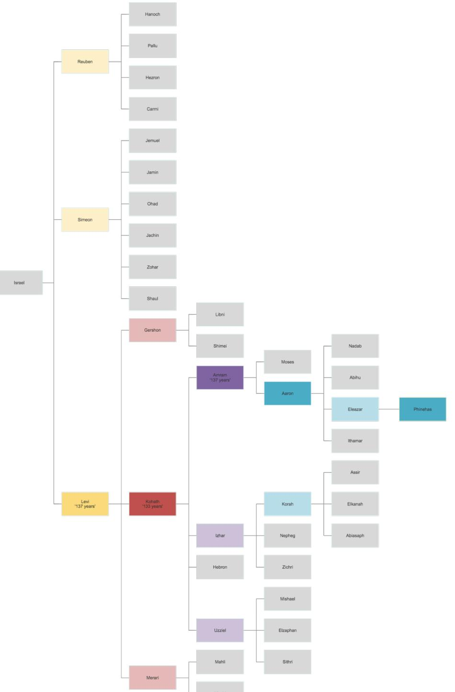
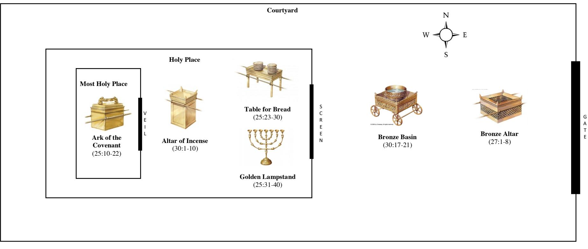
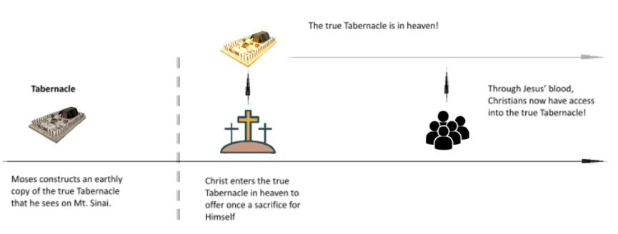

# **Exodus**

## *Who is Like You, O LORD?*

## **2022 Bible Study Notes**

*Youth & E02 Ministries*

| Exodus 1:1-2:25<br>3                           |
|------------------------------------------------|
| Exodus 3:1-4:31<br>6                           |
| Exodus 5:1-7:7<br>9                            |
| Exodus 7:8-10:29<br>13                         |
| Exodus 11:1-13:16<br>17                        |
| Exodus 13:17-15:21<br>20                       |
| Exodus 1-15 Review23                           |
| Exodus 15:22-17:7<br>25                        |
| Exodus 17:8-18:27<br>29                        |
| Exodus 19:1-20:21<br>32                        |
| Exodus 20:22-23:33<br>36                       |
| Exodus 24:1-18<br>39                           |
| Exodus 25:1-31:18<br>42                        |
| Exodus 32:1-29<br>46                           |
| Exodus 32:30-34:35<br>49                       |
| Exodus 1-40 Review52                           |
| Exodus 1:1-2:5 Sample Study (YY)55             |
| Exodus 3:1-4:31 Sample Study (Carmen)57        |
| Exodus 5:1-7:7 Sample Study (Leandra)<br>60    |
| Exodus 7:8-10:29 Sample Study (YY)<br>62       |
| Exodus 11:1-13:16 Sample Study (Paul)<br>64    |
| Exodus 13:17-15:21 Sample Study (Carmen)<br>67 |
| Exodus 15:22-17:7 Sample Study (YY)<br>69      |
| Exodus 17:8-18:37 Sample Study (Wey Tin)71     |
| Exodus 20:22-23:33 Sample Study (YY)<br>74     |
| Exodus 24:1-18 Sample Study (Carmen)77         |
| Exodus 25:1-31:18 Sample Study (Paul)<br>79    |
| Exodus 32:1-29 Sample Study (Josiah)82         |
| Exodus 32:30-34:35 Sample Study (Leandra)84    |

## Exodus 1:1-2:25

## **Main Point: Pharaoh's schemes are thwarted because God remembers His promise Purpose: Trust in the God who remembers His promises!**

**1:1-7** Israel multiplies in Egypt, according to promise **1:8-2:22** Pharaoh's schemes are repeatedly thwarted… **2:23-25** … because God remembers His promises to His people!

Exodus is introduced with a deliberate flashback to Genesis, connecting 1:1 to Genesis 46:8-27.1 This tells us we have to read Exodus with Genesis in mind! God's promises to Abraham and his descendants continue to be in view in Exodus. Right at the start, the big problem is introduced – the new Pharaoh begins afflicting and oppressing God's people (1:11)! Once again, God's promises appear to be under threat, this time by a powerful foreign king! However, Pharaoh's schemes are somehow thwarted time and time again: Israel continues to multiply despite being forced into slavery (1:8-14), and the midwives save the babies instead of killing them (1:15- 21)! Even the baby Moses is saved by Pharaoh's own daughter and successfully leaves Egypt, giving us a taste of Israel's coming exodus from Egypt (1:22-2:22)! 2:23-25 tell us why – God remembers His promise to His people! God's promises to His people are still absolutely secure because He is a God who remembers!

#### **Text Notes**

**1:1-7** Exodus begins with numerous allusions to Genesis, reminding us of God's big promises to Abraham! God promised Abraham that He will make his descendants a 'great nation' and bring blessing to all the nations (Genesis 12:1-3)!2 By the end of Genesis, the descendants of Jacob are seventy. A few generations passed, and now Jacob's descendants are now a 'people'! 1:7 tells us – the people of Israel were 'fruitful' and 'multiplied', showing that God's promises to both Isaac (Genesis 26:3-4) and Jacob (Genesis 28:3-4) are now coming to pass!

**1:8-2:22** But Egypt's new king enters the scene and begins to threaten God's promises. God wants His people to be 'fruitful and multiply', but Pharaoh wants the opposite (1:10 '*…lest they multiply*')! Pharaoh sets himself up not just as an evil king, but as one who directly opposes God's salvation plan! He employs a series of schemes, beginning with forced slavery (1:8-14)! Notice the harshness of Pharaoh's actions against Israel – 'afflict… with heavy burdens' (1:11), 'oppressed' (1:12), 'ruthlessly… work as slaves' (1:13-14)! But also notice the irony! The more Pharaoh 'oppressed' the more Israel 'multiplied', not less! Pharaoh then turns to the Hebrew midwives, telling them to kill all male babies (1:15-21). Again, Pharaoh's plans are thwarted – instead of killing the babies, the midwives 'feared God and did not do as the king of Egypt commanded them' (1:17)! Pharaoh's final scheme is terrifying – he commands every Hebrew baby to be drowned in the Nile (1:22)! Yet, one family manages to evade Pharaoh's genocidal actions! The baby Moses is rescued by being placed in a papyrus reed basket.3 Notice the irony again! Pharaoh's schemes are thwarted by his own daughter, who allows Moses' own mother to raise him at her expense (2:8-9)! Even in desperate situations, God's promises never fail! Moses' story in 2:1-22 also give us a 'sneak preview' of God's coming rescue in Exodus 3-15 – he is saved 'out of the water', an Egyptian is struck4 , flees Egypt, and finds a place to dwell from his 'sojourning' (2:21-22)!5

**2:23-25** The narrative is paused and the author of Exodus weighs in on what has been going on. Israel's cry for rescue is known by God! He hears, He sees, He knows, and He remembers!6 God's covenant with Abraham, Isaac, and Jacob is explicitly mentioned, telling us that His covenantal promises are not forgotten, despite the hostile and fearful actions of Pharaoh! The reason why Pharaoh's schemes are thwarted is because God remembers His promises!

<sup>1</sup> Spot the similarities in Exodus 1:1-7 with Genesis 46:6-27! Furthermore, Genesis ends with an expectation that God will bring Jacob's family out of Egypt! See

Genesis 50:22-26. 2 See also Genesis 15 and 17:1-8. 3 The term 'basket' is literally called 'ark' in Hebrew, a deliberate allusion to God's salvation of Noah's family in Genesis 6-8!

<sup>4</sup> Some think that Moses' action of striking the Egyptian was wrong. However, the New Testament doesn't appear to think so! Stephen in Acts 7:23-29 says that Moses 'defended the oppressed man', and instead blames the Israelites for not recognising Moses as God's appointed ruler and redeemer! Hebrews 11:24-26 says that Moses acted in faith in 'choosing to be mistreated with the people of God' and in leaving Egypt, 'not being afraid of the anger of the king'! 5 See Appendix 1 for a table of similarities between Moses' own mini 'exodus' and Israel's Exodus!

<sup>6</sup> Whenever we see that God 'remembers' His promises, we are not to think that God has somehow forgotten and has to be reminded. Rather, we are meant to see that God *has been remembering* His promises. Moreover, we are also meant to see that He is about to act to fulfill it!

**Trust that God remembers His promises:** The big truth about God in this passage is that He is trustworthy! Our God isn't a god with amnesia – whatever He says *will* come to pass! Think about Joshua's generation as they read this passage.7 This passage will encourage them to trust in the same God even when they face up against the armies of Jericho! Think about subsequent generations throughout Israel's history. However bleak the situation is, they can return to Exodus 1-2 and remember that God remembers and keeps His promises! Think also about the story of Jesus' birth in Matthew 2:13-15!8 God didn't forget His promises either – His promise of salvation through Jesus the Saviour is secure! In the same way, as New Testament Christians, we can also have absolute trust in our God! Recall God's gospel promises from Ephesians, the book we just studied! God has promised to unite all things in Christ, build His church, and fill the earth with His glory! Whenever we feel discouraged in both our ministry and personal life, we too can return to the truths of Exodus 1-2! Think about how God has demonstrated His faithfulness to His promises in your ministry and personal life!

**Don't fear those who oppose God and His promises:** If we are fully convinced in our hearts that God is faithful and remembers His promises, then it means we can live fearlessly and boldly for Him, even in the face of opposition! The Hebrew midwives in 1:15-21 are an example to us. Because they feared God more than Pharaoh, they were prepared to risk their lives and defy even Pharaoh himself! Moses also acted in faith, choosing to be mistreated with God's people and not fearing Pharaoh! There are many today who directly oppose our God and His gospel! They could be our teachers or professors in school, our bosses at work, our friends or colleagues, even family. But just as the midwives and Moses did not fear Pharaoh, so we ought to realize that we have no need to fear those who oppose God! Think about what living fearlessly and boldly for the gospel looks like in your life!

## **Appendix**

| Exodus 2:1-22                     | Exodus 3-15                       |
|-----------------------------------|-----------------------------------|
| Moses was rescued 'out of the     | Israel was rescued at Red Sea     |
| water' (2:10)                     | (14:1-31)                         |
|                                   |                                   |
| Moses 'struck down' the           | God struck down all the firstborn |
| Egyptian (2:12)                   | (12:12, 12:29)                    |
|                                   |                                   |
|                                   |                                   |
| Moses flees Egypt (2:15) to the   | Israel flees from Egypt to the    |
| mountain of God (3:1)             | mountain of God (15:17)           |
|                                   |                                   |
| Moses 'saved' and 'delivered' the | God 'saved' Israel (14:30) and    |
| daughters of Reuel (2:17, 2:19)   | 'delivered' them from the         |
|                                   | Egyptians (18:10)                 |

#### **1. Similarities between 2:1-22 and Exodus 3-15**

<sup>7</sup> Potentially the first readers of Exodus! We see that in Joshua 1:8 that there is already written for them the 'Book of the Law'. 8 There are many similarities in Matthew's account of Jesus' birth and Moses' birth in Exodus 2! Matthew even cites Hosea, drawing a direct link to the Exodus!

## **Exodus 1-2 Leader's Study**

- 1. Look at 1:8-14, 1:15-21, 1:22-2:22. How do you feel about Pharaoh's threats towards Israel? How does God demonstrate His faithfulness?
- 2. How does Moses' story in 2:1-22 give us a 'sneak preview' of God's deliverance in Exodus 1-15?
- 3. What connections / allusions are there to Genesis? How will this add to our understanding of what is going on in Exodus 1-2? (Hint: Read Genesis 1:22-31, 9:1-7, 12:1-2, 26:3-4, 28:3-4)
- 4. How is 2:23-25 an appropriate conclusion to this passage?
- 5. What's the Main Point and Purpose?

- 6. When might we find ourselves doubting God's gospel promises? What causes this doubt? How does this passage encourage us to trust in God?
- 7. What would living fearless and boldly for Jesus look like for you in (a) school, (b) work, and (c) at home?

## Exodus 3:1-4:31

## **Main Point: Yahweh is the covenant-keeping Creator who promises rescue Purpose: Trust in who Yahweh is, the covenant-keeping Creator!**

**3:1-22** Yahweh speaks: He is the covenant-keeping God who promises rescue! **4:1-17** Yahweh shows: He is the Creator! **4:18-31** So trust in who Yahweh is!

Exodus 1-2 has introduced the big problem. God's promises to Israel are under threat by Pharaoh! Yet 2:23-25 has told us - Pharaoh's schemes are thwarted because God remembers His promise! While God will display His mighty works against Egypt from 7:8 onwards, this next section (Exodus 3:1-7:7) teaches God's people who He is! The emphasis of these chapters is God's self-revelation of His name as Yahweh!9 As Yahweh speaks to Moses at His mountain, He defines for Moses and Israel what His name means! In 3:1-22, Yahweh reveals that He is the God of Abraham, Isaac, and Jacob, wanting Moses to know – His name is tied to His covenant-keeping character! Through a display of signs (4:1-17), Yahweh reveals Himself to be the Creator God! As Moses and Aaron speak these words and show these signs to Israel, the people believed (4:27-31), demonstrating the right response of trusting in who Yahweh is! Yahweh's revelation of Himself ought to inspire confidence in His rescue! Moses' weakness is a secondary theme in this passage, showing us that it is Yahweh alone who saves in spite of Moses!

#### **Text Notes**

**3:1-22** God appears to Moses in a burning bush10 on His mountain11, promising to 'deliver them out of the hand of the Egyptians' (3:8) to the promised land (3:7-10, repeated again in 3:16-22)!12 Yet Moses questions God (sense the doubt!) – 'who am *I* that *I* should go…' (3:11) and 'what is [Your] name? What shall I say to them?' (3:13). God's reply to Moses is the key thing to see in 3:1-22 – God replies by revealing who He is! He replies with His name 'I AM WHO I AM'13 (or Yahweh)! But what does His name mean? The *context* helps us – in the next verse, Yahweh wants Moses to know He is 'the God of your fathers, the God of Abraham… Isaac… and Jacob… this is my name forever…' (3:15, repeatedly emphasized in 3:6, 13, 16). This explains why Yahweh's promises to Abraham are alluded to in 3:7-10 and 3:16-22. The deliberate self-revelation of Yahweh as God of Abraham, Isaac, and Jacob show that covenant-keeping is what defines Him! Yahweh *is* the covenant-keeping God, and this encourages Moses (and Israel) to trust based on His track record in the past and present!14

**4:1-17** Despite Yahweh's self-revelation, Moses' cowardice continues - 'they will not believe me' (4:1), 'I am not eloquent' (4:10), 'please send someone else' (4:13), provoking Yahweh's anger (4:14)! In response, Yahweh gives Moses three signs: a staff that turns to a snake (4:2-5), a hand that turns leprous (4:6-7), and water that turns to blood (4:8-9) to display His power over creation! Yahweh's response in 4:12 'who has *made* man's mouth?' calls on Moses to trust - He is the Creator!

**4:18-31** Moses receives permission from Jethro and returns to Egypt (4:18-20). Yahweh repeats His promise of rescue: Pharaoh will refuse, plagues will fall, and Yahweh will slay Egypt's firstborn (4:21-23)! The 'strange' episode in 4:24-26 shows that Moses himself needs rescue. His firstborn will die unless he is rescued by blood.15 Moses and Aaron thus call on Israel and 'spoke all the words… and did the signs in the sight of the people' (4:30). The response of Israel shows the right response! As they hear and see who Yahweh is, they believe and worship, trusting in Yahweh!

<sup>9</sup> In Hebrew, God's name is spelt in 4 letters, 'YHWH', derived from the Hebrew phrase 'I AM'. The English versions either add in vowels – 'Jehovah' (KJV), 'Yahweh' (NLT), or translate it as 'the LORD' (ESV). For our purposes, we will use 'Yahweh' over 'LORD' because it sounds more like a *name* and less like a title! 10 The 'fire' motif is frequently used in Exodus to represent Yahweh's presence! For instance, Yahweh 'descended on [Sinai] in fire' (19:18, 24:17), and fire (and cloud) fills the Tabernacle (40:38). Even in Genesis 15:17, God is described as a smoking fire pot and a flaming torch when He seals His covenant with Abraham! 11 Horeb is another name for Sinai, both refer to the mountain of God! They are used interchangeably in the Pentateuch. See Exodus 33:6, Deuteronomy 4:15. 12 Bringing Abraham's descendants into the land has been promised to Abraham in Genesis. See the similarities between 3:8, 3:17 and Genesis 15:18-20. 13 Some take this to mean God is saying He is transcendent or self-existent. While this is definitely a right and good thing to say about who God is, the best

approach is to look at the context to see what Yahweh wants Moses to understand in particular about Himself! 14 Knowing *who Yahweh is* is an important theme throughout Exodus! Yahweh will reveal more on who He is in 6:1-13 and climactically in 34:6-7! 15 There is a debate amongst many on what this episode means. The 'him' in v24 could refer to Moses' son, and if so, Yahweh seeking to kill Moses' firstborn continues from His threat to kill Egypt's firstborn son. Moses' son is only spared when blood was spilt. This foreshadows what is going to happen at Passover. At the height of Yahweh's judgement, not even Israel is spared, unless a Passover lamb is killed and its blood painted on the doorposts!

**Know who Yahweh is:** While trust is the main response of this passage, the basis of trusting Yahweh is grounded on *knowing* who He is! J. I. Packer says, "Knowing about God is crucially important for the living of our lives… Disregard the study of God and you sentence yourself to stumble through life blindfolded, as it were, with no sense of direction and no understanding of what surrounds you. This way you can waste your life and lose your soul."16 Exodus 3 tells us that Yahweh is the covenant-keeping God! He is defined by His covenant-keeping character! For Israel then, they could rest secure that Yahweh has made a covenant with their forefathers. In a greater way, we too can rest secure in the new covenant that Yahweh has made through Jesus! This means that our God is *for us*, in Christ! Whenever we doubt that God is for us, we can turn to this passage! His covenantal relationship with us is written in His name! Exodus 4 also tells us that God is the Creator God! Whenever we feel that things are going out of control in this world, we can turn to this passage! The Creator God is always in control, and His mission will always be accomplished!

**Trust in who Yahweh is:** These two chapters give us strong reasons to trust in Yahweh and not in anything else! Moses looked to his own abilities and failed to trust God. Later on, Israel will also do the same! But these chapters teach us that our trust in Yahweh should be grounded on who our God inherently is, and not present circumstances on anything else! What would *trust* look like for us today? Think in terms of our daily walk with the Lord. When we feel that we're progressing slowly in Christian growth, we ought to remind ourselves to trust in who Yahweh is! Instead of looking to our own performance, look to who Yahweh is and what He has done for us. He is fully committed to grow and sanctify us! Think in terms of our journey towards the new creation. Although the Christian life is filled with trials, temptations, discouragements, we can place our trust in who Yahweh is! If He created the world, surely He can bring about the new creation. If He is the covenant-keeping God, we can be doubly sure that He will fulfill His promises! The author of Hebrews makes this point (Hebrews 6:13-20) that we can be doubly sure! God says He will save us (and this should be enough because 'it is impossible for God to lie'), but He made the new covenant with us so that we 'might have *strong* encouragement'!

<sup>16</sup> J. I. Packer, *Knowing God*, 1973, IVP, pg 19

## **Exodus 3-4 Leader's Study**

- 1. Look at 4:1-17. What signs does Yahweh provide Moses? What do they reveal about Yahweh? How would that encourage Moses (and Israel)? (*Hint: Any Genesis allusions?*)
- 2. Look at 3:1-22. List down what Yahweh reveals about Himself. Think in particular what is *emphasized* about Yahweh's revelation of Himself? How would that encourage Moses (and Israel)? (*Hint: Any Genesis echoes?*)
- 3. What picture of Moses are we given in this passage? Why do you think we are given such a view of Moses?
- 4. Having been told Yahweh's name, how will this shape the way we read the rest of Exodus?
- 5. What's the Main Point and Purpose?

- 6. What aspects of Yahweh's name excites you / strikes you? Which part of Yahweh's character do you most often neglect? What needs to change in your view of who He is?
- 7. How much do you think you trust Yahweh in your personal life? When is trusting Yahweh hardest for you? How might His (i) covenant-keeping character or His (i) power over creation encourage you?

## Exodus 5:1-7:7

## **Main Point: Israel (and Egypt) must know: Yahweh is the rescuing God! Purpose: Trust Yahweh the rescuing God even when affliction intensifies**

**5:1-23** Ignorant Pharaoh defies Yahweh, intensifying affliction! **6:1-9** Yahweh reveals to assure ignorant Israel: He is the rescuing God! **6:10-30** Moses (though weak and fearful) is Yahweh's chosen mediator **7:1-7** Ignorant Egypt will know Yahweh by coming acts of judgement!

Moses is now back in Egypt with his God-given commission to speak to Pharaoh! On the surface, nothing seems to have changed in 5:1-23. Pharaoh is ignorant of Yahweh and opposes Him (5:2) and Israel's afflictions are worsened! Pharaoh demands 'same brick quota, but no straw provided'! Surprisingly, like Pharaoh, Moses and Israel are also ignorant – their doubt reveals they don't truly know Yahweh yet (5:19-23)! To assure ignorant Israel, Yahweh again reveals Himself that they may 'know I am Yahweh your God' (6:7)! This time, Yahweh ties His name to His coming redemption!17 The genealogy (6:14-25) highlights Moses as Yahweh's mediator to save, yet it is 'sandwiched' by Moses' weak and fearful excuses (6:10-13, 26-30). 7:1-7 ends this passage, telling us Egypt will be compelled to know who Yahweh is (7:5) by His coming acts of judgement! From this passage, we are meant to see the right response in desperate times is to know & trust Yahweh, who reveals Himself as the redeeming God!

#### **Text Notes**

**5:1-23** Moses returns to Egypt speaks to a new Pharaoh, but nothing seems to have changed! This Pharaoh opposes Yahweh just as the previous Pharaoh did!18 Notice the opposition: (1) 'Thus says Yahweh' (5:1) vs 'Thus says Pharaoh' (5:10), (2) Pharaoh directly counters what Yahweh says! 'Thus says Yahweh…but Pharaoh said…' (5:1-2) and 'The God of the Hebrews… but the King of Egypt said…' (5:3-4)! Israel's afflictions also intensify from Exodus 1! Feel the harsh tone: 'no longer give the people straw…'(5:7), 'by no means reduce [no. of bricks]'(5:8), 'let heavier work be laid'(5:9), 'why have you not done all your task' (5:14), 'you are idle [x2]'(5:17)! 5:2 tells us the reason why – Pharaoh defies because he does not *know* Yahweh!19 Shockingly, both Israel (5:20-21, cf. 4:31) and Moses (5:22-23) suffer from ignorance too. They fail to *know* Yahweh despite His words and deeds (3:1-4:31)!

**6:1-9** Given that Israel is still ignorant, Yahweh reveals Himself once again 'I am Yahweh' (6:2, 8). Instead of repeating, Yahweh gives a *new* revelation which Israel's forefathers have not known (6:3)! He is not just 'God Almighty', He is Yahweh the rescuing God! Having defined Himself by past actions (Exodus 3-4), Yahweh now defines Himself by His future action, the coming Exodus! This is striking – Yahweh stakes *His name* on the rescue to come! See the assurance given: Yahweh repeats *7 times* in 3 verses (6:6-8) that He *will* rescue! All of this hinges on the name of Yahweh ('*I am Yahweh*' repeated x4!). This is what Israel must know – '…that I am Yahweh your God' (6:7)!

**6:10-30** We get an interesting inclusion of Aaron and Moses' genealogy (6:14-27). Notice it is sandwiched by Moses' continued fear and weakness – 'I am of uncircumcised lips' (6:10-13, 28-30). Yet the genealogy shows (see Appendix 1) Moses (and Aaron) are of great pedigree: they are Levites and linked to Phinehas, whom Yahweh promises a perpetual priesthood!20 Despite Moses' failures since Exodus 3, the genealogy shows Yahweh's commitment to use Moses as His chosen mediator (6:13, 26-27) to accomplish His promised rescue!

**7:1-7** Having assured Moses, Yahweh once again commissions him to go before Pharaoh. Consistent with previous promises, Yahweh will harden Pharaoh's heart (cf. 4:21) so that His mighty acts of judgement will be displayed! The point of these verses is 7:5. 5:1-23 has shown that Pharaoh and Egypt dismiss and defy Yahweh – they do not *know* Him! The coming plagues will force them to truly recognize Yahweh by His coming acts of judgement!

<sup>17</sup> In contrast to His previous self-revelation, where Yahweh defined Himself by His past actions, now Yahweh defines Himself by His future act of redemption! 18 The previous Pharaoh opposes Yahweh's plans for Israel to 'be fruitful and multiply' (see Exodus 1-2 notes)! It appears this Pharaoh opposes Israel's worship – he opposes them going to 'hold a feast to [Yahweh]' (5:1) and 'sacrific[ing] to Yahweh…' (5:3, also 5:17). Some even say Pharaoh opposes Sabbath 'rest' (5:5)! 19 Knowing Yahweh is the big theme of Exodus (see Exodus 3-4 notes)! Interestingly, the previous Pharaoh also 'did not know Joseph (1:8), and by extension,

God! <sup>20</sup> What unlocks the meaning of this genealogy is what it omits! See the genealogy in diagrammatical form in Appendix 1. The genealogy deliberately emphasizes and ends with Phinehas. Phinehas is significant for his mediator-like actions in Numbers 25: he 'turned back' Yahweh's wrath and 'made atonement' for an adulterous Israel and was promised a 'covenant of perpetual priesthood'! The inclusion of this genealogy ties Moses to Phinehas – they are chosen mediators!

**Know Yahweh is the rescuing God!** Yahweh's self-revelation continues in this passage (6:1-9), calling us to know Him as the rescuing God! Don't miss the weight of this statement - Yahweh defines Himself by His salvation of His people! When we think about who God is or what His attributes are, we often think of things like God's transcendence, His power as Creator, His holiness etc. But Exodus reminds us – rescue defines who Yahweh is! This gives us wonderful assurance! If rescue is part of Yahweh's nature, we have every reason to trust in His salvation! Subsequent generations of Israel can fully trust in Yahweh – when they are faced with powerful enemies, when they are lost in exile, when they are neck-deep in sin, they can turn to Yahweh because He is the rescuing God! Similarly, when we are persecuted for our faith, when we are in spiritually dark moments, when we think we are stuck in sin, we too can turn to Yahweh who *is* the rescuing God! The main theme from Exodus 1-7:7 has been all about who Yahweh is. This is a good time to reflect on all we have learnt about Yahweh. In spiritually dark times, we must know: (1) Yahweh hears, sees, and remembers His promises (Exodus 1-2), (2) Yahweh is the covenant-keeping God, we are secure (Exodus 3), (3) Yahweh is the Creator God, He is powerful to save (Exodus 4), and (4) Yahweh is the rescuing God, He is willing to save (Exodus 6)!

**Trust Yahweh when things don't seem to change:** This passage also teaches us to trust Yahweh when things don't seem to get better! The situation in Exodus 5 doesn't appear any different from Exodus 1. In fact, things look bleaker here! Israel's response of doubt reveals our own tendency to doubt. "The delay in the fulfillment of God's promises reveals His people's hearts. When they were promised blessing, they were excited. But when they 'realized they were in trouble', they started to complain about God. The delay tests them; their complaining displays that they, too, do not know the LORD."21 Our common response when things get harder and not better: we grumble and give up on God (like Israel), we get afraid (like Moses). But this passage teaches us – when things get more and more challenging spiritually, the solution isn't more willpower or positive thinking! The solution is to *know* Yahweh more. The more we grow in genuine knowledge of Yahweh, the more it grows our trust. In desperate times, is it enough to trust God if all we had was the knowledge of who He is? Exodus 1-7:7 tells us: yes! As we conclude this first section in Exodus (before Yahweh displays His power) from Exodus 1-7:7, this is a good time to reflect on our responses in spiritually challenging situations. Reflect: Can we trust Yahweh when it seems like He isn't there? (Exodus 1-2). Can we trust Yahweh when it seems like things are getting worse and not better? (Exodus 5-6

<sup>21</sup> T. Chester, *Exodus For You*, 2016. The Good Book Company, pg57

## **Appendix**

**2. Aaron and Moses' Genealogy (6:14-27)**



Noticing the omission of names in this genealogy helps us understand its purpose. For example, Israel had 12 sons, but only Reuben, Simeon, and Levi are recorded. 1 family out of 3 are recorded in each generation. The inclusion of '137 years' and '133 years' for Levi, Kohath, and Amram are signposts for where the genealogy is headed! This genealogy is not just to show that Moses and Aaron are Levites (we already know that from 2:1). The fact that this genealogy leads us to Phinehas (the only one from the 7th generation) means the author wants us to link Moses and Aaron to Phinehas. Phinehas (Num 25) is significant for his mediator-like actions. Israel was caught up in spiritual adultery – they 'yoked' themselves to Baal, and one Israelite even had the audacity to bring a Midianite woman in while they were repenting! Phinehas' act of killing the sinful man and woman 'turned back' Yahweh's wrath and 'made atonement' for Israel (Num 25:10-13). This genealogy thus shows us – Moses is Yahweh's chosen mediator despite his weaknesses and fear! This also seeds the idea that Moses is more than just a 'prince' (2:14), he is also a mediator (this becomes apparent later on in Exodus 32-34)!

## **Exodus 5-7:7 Leader's Study**

- 1. Compare 5:1-23 with 1:8-22. What are the similarities and differences in (a) the situation, (b) Pharaoh, and (c) Israel? What are we meant to see?
- 2. Compare Yahweh's revelation of Himself in 6:1-13 to 3:1-22. What is significant in this revelation? How would this encourage Moses and Israel?
- 3. BONUS: What do you think we are meant to see about this genealogy22? What do these verses add to our picture of Moses?
- 4. What are we meant to see from 7:1-7:7? How does this inform the way we view the coming plagues?
- 5. What's the Main Point and Purpose?

- 6. When things get harder and not better, how do you tend to react? What situations cause us to doubt God? Be honest!
- 7. Why is 'knowing who Yahweh is' enough for us to trust Him? How can we grow to know Yahweh more and more?
- 8. What do we lose if we forget that Yahweh is a rescuing God? Review all that you have learnt about Yahweh in Exodus 1-7:7. What excites you most about who Yahweh is? What do you personally need to remember about Yahweh?

<sup>22</sup> There's always a purpose in recording genealogies. Try and spot patterns or emphasis in the genealogy. For eg, Matthew's genealogy is clearly split into 3 generations of 14. The genealogy in Genesis 5 emphasizes the 7th and the 10th in the line. The genealogy in Luke 3 connects Jesus with Adam, etc.)

## Exodus 7:8-10:29

## **Main Point: Yahweh displays His unrivalled power in 'de-creation' judgement to deliver Purpose: Know Yahweh is unrivalled in power!**

#### **7:8-13 Preview: Yahweh will 'swallow up' Pharaoh**

#### **7:14-10:29 Plagues: Yahweh de-creates Egypt to display His unrivalled power!**

After 6 chapters, Yahweh now acts upon His promise to rescue! In 7:8-12 we get a preview of the plagues to come – a defiant Pharaoh attempts to match Yahweh's power but fails! In 7:13-10:29 we get 9 out of 10 plagues that Yahweh unleashes upon Egypt.23 The structure of the first 9 plagues is carefully arranged (see table below). The patterns show us important themes: (1) Yahweh is unrivalled, (2) His judgement is severe (in reversing creation and hardening Pharaoh) and (3) Israel is being delivered as they are set apart. We are told repeatedly – through Yahweh's display of unrivalled power by the plagues, Pharaoh will know there is none like Yahweh (cf. 7:5)! As Israel witnesses the plagues, they too will know their God Yahweh is unrivalled in power (10:2)! The authors of Dig Deeper summarise these chapters well: '*the plagues are God's megaphone: 'I am Yahweh. Look what happens if you oppose me*'!24

#### **Text Notes**

**7:8-13** This scene is a preview that sets up the pattern for the rest of the plagues. By Yahweh's power, Aaron's staff turns into a snake! Pharaoh defies Yahweh, able to replicate this, but his snakes are swallowed up by Aaron's snake!25 This tells us – despite Pharaoh possibly being the most powerful man in his day, he is powerless before Yahweh!

**7:14-10:29** Key observations from 7:14-10:29 are reflected in the table below. **(A) Triplets**: the first 9 plagues are recorded in triplets with the same pattern. Plagues 1, 4, and 7 begin with '…in the morning'. Plagues 2, 5, and 8 begin with 'go in to Pharaoh', and plagues 3, 6, and 9 are done without warning. Plagues 1-3 mention the stretching out of Aaron's staff that begins the plague. In plagues 4-6, Yahweh simply begins the plague. Plagues 7- 9 mention the stretching out of Moses' staff. The arrangement in triplets show these are not random plagues. They are part of Yahweh's plan to achieve His purposes! **(B) Judgement and Hardening**: The judgement theme is clear – the impact on Egypt intensifies as the plagues continue. Plague 6 begins targeting man, inflicting boils. Humans begin to die from Plague 7. Plagues 7-9 are clearly more cataclysmic than the rest – with the repeated phrase that these have never happened in Egypt before! The allusions and references to creation in Genesis show us that Yahweh is using His 'creation' power to 'de-create' Egypt in judgement! This is unsurprising as Yahweh has deliberately shown Himself as the Creator God in 4:1-17! Judgement is also pronounced on Pharaoh in the form of hardening his heart (*see Appendix 1 for more*). 6/9 times, Pharaoh hardens his own heart! The triplet structure helps us see intensification – Yahweh hardens Pharaoh's heart once in the 2nd set and twice in the 3rd set! **(C) Salvation**: Though not emphasized greatly, we begin to see Yahweh's deliverance of Israel where He makes a distinction between Egypt and Israel! Yahweh's rescue plan has begun as the plagues start falling! **(D) Purpose**: Having seen the various themes, we might ask - why does Yahweh harden Pharaoh's heart, deliberately prolonging the plagues? Yahweh Himself tells us why in the account! Repeatedly, Yahweh declares: by the plagues, Pharaoh shall know He is the unrivalled God! There is none like Him! This again is unsurprising. This is exactly Pharaoh's problem in 5:2 – he doesn't 'know Yahweh'! This is exactly what Yahweh mentioned in 7:4-5 – 'the Egyptians shall know'! The magicians fail to replicate the plagues and are forced to acknowledge Yahweh! To the Egyptians, they will know Yahweh in fear. As Israel witnesses the plagues and begin to experience Yahweh's rescue, they too are meant to know Yahweh! To Israel, they will know Yahweh by having confidence in Him! The unrivalled Yahweh's mighty acts of 'de-creation' judgement display to the world He alone is God! There is none like Yahweh in all the earth (9:14)!

<sup>23</sup> Clearly Moses intended for the 10th plague to be read on its own – the narrative of the 10th plague is interspersed with the institution of the Passover, consecration of the firstborn, and the feast of unleavened bread (11:1-13:16). 24 Sach, Andrew, and Richard Alldritt. *Dig Even Deeper: Unearthing Old Testament Treasure.* IVP, 2010. Pg 54

<sup>25</sup> Pharaoh's *serpent* being swallowed up may be an allusion to Genesis 3, telling us that Satan is being defeated. Pharaoh's actions so far have certainly been 'serpent-like' – opposing God's plans and purposes for His people!

#### **Plague table**

| (A) Triplets<br>(B) Judgement & Hardening<br>(C) Salvation<br>(D) Purpose: Know Yahweh is unrivalled!                                                          |                       |
|----------------------------------------------------------------------------------------------------------------------------------------------------------------|-----------------------|
| Plague<br>Passage<br>Instruction /<br>Who begins<br>Who hardens<br>Intensification /<br>Possible Allusions<br>Israel set<br>Magicians<br>Purpose of the plague |                       |
| Warning<br>the plague?26<br>Pharaoh's heart?27<br>Impact on Egypt<br>apart                                                                                     |                       |
| 1. Blood<br>7:14-25<br>Go to Pharaoh in<br>Aaron (7:19)<br>Pharaoh (7:22)<br>Can<br>By this Pharaoh shall                                                      |                       |
| the morning<br>replicate<br>know 'I am Yahweh'                                                                                                                 |                       |
| (7:15)<br>(7:22)<br>(7:17)                                                                                                                                     |                       |
| 2. Frogs<br>8:1-15<br>Go in to Pharaoh<br>Aaron (8:5)<br>Pharaoh (8:15)<br>'Swarm(ed)' with<br>Can                                                             | That Pharaoh may know |
| (8:1)<br>frogs (8:3)<br>replicate<br>there is none like                                                                                                        |                       |
| 'waters swarm with<br>(8:7)<br>Yahweh… (8:10)                                                                                                                  |                       |
| swarms of living                                                                                                                                               |                       |
| creatures' (Gen<br>1:20)                                                                                                                                       |                       |
| 3. Gnats<br>8:16-19<br>No warning<br>Aaron (8:16)<br>Pharaoh (8:19)<br>Cannot<br>Magicians know 'this is                                                       |                       |
| replicate<br>the finger of God' (8:19)                                                                                                                         |                       |
| (8:18)                                                                                                                                                         |                       |
| 4. Flies<br>8:20-32<br>Rise up early in<br>Yahweh<br>Pharaoh (8:32)<br>'the land was<br>Flies 'ruined' or<br>Israel set                                        | That Pharaoh may know |
| the morning<br>ruined' (8:24)<br>'corrupted' the land<br>apart (8:22)<br>'I am Yahweh in the                                                                   |                       |
| (8:20)<br>(8:24)<br>midst of the earth'                                                                                                                        |                       |
| '…earth was<br>(8:22)                                                                                                                                          |                       |
| corrupt…' (Gen 6:11)                                                                                                                                           |                       |
| 5. Livestock<br>9:1-7<br>Go in to Pharaoh<br>Yahweh<br>Pharaoh (9:7)<br>Israel set                                                                             |                       |
| (9:1)<br>apart (9:4)                                                                                                                                           |                       |
| 6. Boils<br>9:8-12<br>No warning<br>Yahweh<br>Yahweh (9:12)<br>First plague that<br>Could not                                                                  |                       |
| targets man<br>stand<br>before                                                                                                                                 |                       |
| Moses                                                                                                                                                          |                       |
| (9:11)                                                                                                                                                         |                       |
| 7. Hail<br>9:13-35<br>Rise up early in<br>Moses (9:22)<br>Pharaoh (9:34)<br>'never has been in<br>'every plant of the<br>Israel set                            | That Pharaoh may know |
| the morning<br>Egypt…' (9:18)<br>field and broke<br>apart (9:26)<br>there is none like                                                                         |                       |
| (9:13)<br>Egyptians die (9:19)<br>every tree' (9:25)<br>Yahweh in all the earth                                                                                |                       |
| 'every plant… and<br>(9:14)                                                                                                                                    |                       |
| every tree' (Gen                                                                                                                                               |                       |
| 1:29)                                                                                                                                                          |                       |
| 8. Locusts<br>10:1-20<br>Go in to Pharaoh<br>Moses (10:12)<br>Yahweh (10:20)<br>'never been before,<br>Locusts 'covered'<br>That Israel may know               |                       |
| (10:1)<br>not ever will be<br>the whole land<br>that 'I am Yahweh'!                                                                                            |                       |
| again' (10:14)<br>(10:15)<br>(10:2)                                                                                                                            |                       |
| 'remove this death<br>Flood 'covered' the                                                                                                                      |                       |
| from me' (10:17)<br>earth (Gen 7:17-19)<br>9. Darkness<br>10:21-29<br>No warning<br>Moses (10:21)<br>Yahweh (10:27)<br>'Darkness to be felt'<br>Israel set     |                       |
| (10:21) like in Gen<br>apart (10:23)                                                                                                                           |                       |
| 1:2 when the earth                                                                                                                                             |                       |
| was in 'darkness'                                                                                                                                              |                       |

<sup>26</sup> The action of 'stretching out' the hand or staff is done by Aaron in the first three plagues, and Moses in the last three plagues, but is not mentioned in plagues 4-6. 27 Yahweh's deliberate hardening of Pharaoh's heart is explicitly mentioned in plagues 6, 8 and 9.

**Know Yahweh is unrivalled!** Opposition to Yahweh is evident in our world today! There are many who oppose Yahweh directly (openly rejecting the gospel) or indirectly (those who think Jesus is just a god amongst many)! Spiritual forces are also still at work today! Faced with such opposition, we might be tempted to think Yahweh is powerless against them. We might feel that societal views on sexuality, gender, religion etc. are so strong and entrenched that it is impossible for evangelism in schools, at the workplace, or at home. We might fear our bosses or the 'Singapore education system', thinking that if we prioritized Yahweh above our career or studies, we might be 'punished' severely by the system! Israel too constantly feared their surrounding nations – Moses' own generation feared the Canaanites so much so that they did not enter the promised land! This passage calls on them then and us now to know – Yahweh is unrivalled! There is none like Yahweh in the midst of the earth! We ought to repent of the times when we lived as though our Yahweh is weak and powerless, and to truly take to heart who our God is!

**Expand your view of Yahweh:** We see more and more of who Yahweh is as we read Exodus. The plagues are 'revelatory' – they show the world and Yahweh's people who He is! From this passage, we can't miss the fact that Yahweh is not to be trifled with! We read of Yahweh who will judge and de-create His enemies! We read of Yahweh who hardens the heart of Pharaoh in judgement! We read of Yahweh who makes a distinction for Israel, even though they have done nothing to deserve it! We read of Yahweh who acts ultimately for His own glory (that He may be known)! At times, we might find who Yahweh is uncomfortable to us. We might be tempted to think 'Yahweh is too harsh to judge…' or 'Yahweh is too unfair in hardening hearts…' or 'it is scandalous to save murderers and rapists…', or 'Yahweh is too arrogant to act for His own glory…' This passage calls on us not to define Yahweh on our own terms, but to expand our view of who Yahweh is and shrink our inflated view of ourselves! Let's pray that Yahweh will help grow our view of Him!

**[Secondary]28 Be warned of hard-hearted rejection:** Although this would qualify as secondary application, it is worth thinking about Pharaoh as a 'case study' of hard-hearted rejection. Pharaoh hardened his heart 6/9 times, clearly showing us that his rejection of Yahweh is volitional. Pharaoh had multiple opportunities to repent but chose not to. Many times, this is the same for us – we find excuses for ourselves, we don't take sin seriously enough, we cover up our sins with more. This passage (and the rest of the Bible) gives God's people many warnings – be warned of hard-hearted rejection, urgently repent today!

## **Appendix**

**1. Divine hardening:** Some questions might arise on this topic. "How can Yahweh harden Pharaoh's heart?" "Is it still Pharaoh's fault if Yahweh hardened his heart?" In this passage, we see 2 important truths that go hand in hand. We see that we are responsible for our own actions (Pharaoh hardens his own heart). We also see that God is sovereign and in control (Yahweh hardens Pharaoh's heart)!

Quoting from *Dig Even Deeper*29: '*The Bible is clear: we are responsible for our actions and God is in control of them. We find this all over the place in Scripture. Out of jealousy, Joseph's brothers freely decided to sell him into slavery, yet God intended their action to save many lives (Genesis 50:20). Out of pride, the king of Assyria boasts in his plundering of Israel (Isaiah 10:7-11, 13-14), yet unbeknownst to him he was acting as an instrument of God's judgement, an axe in God's hand (Isaiah 10:5-6, 15). Out of greed, Judas freely decided to betray Jesus for money (Matthew 26:14-16), yet God planned that Jesus should be betrayed to save many lives (Acts 2:23; 4:28).*'

We must learn to 'let God be God'! God is absolutely sovereign, yet He is just, fair, and 'desires all people to be saved and come to the knowledge of the truth' (1 Tim 2:4). We never see God hardening someone who genuinely turns to Him! Nevertheless, this issue might be a painful subject for some, and it's important for us to exercise pastoral sensitivity on this!30 Feel free to speak to me if any issues arise during the study!

<sup>28</sup> If we applied the 'Who Am I' tool, we would be more like Israel in this passage than Pharaoh! 29 Sach, Andrew, and Richard Alldritt. *Dig Even Deeper: Unearthing Old Testament Treasure.* IVP, 2010. Pg 51

<sup>30</sup> Can also watch our preaching on Romans 9-10 in 2020. God's Sovereignty and Man's Accountability: https://www.youtube.com/watch?v=7VfGvjAyXlM and the Q&A session: https://www.youtube.com/watch?v=swqEg-fbUM0

## **Exodus 7:8-10:29 Leader's Study**

- 1. Fill in the 'Plague Table'. What patterns can you spot?
- 2. Given what you have observed in the 'Plague Table', what do the patterns tell you about the plagues?
- 3. What is Israel meant to see from the plagues?
- 4. What's the Main Point and Purpose?

- 5. Who are Yahweh's enemies today? When might we think Yahweh is powerless today and fear other powers instead? How does this passage show us how foolish that is?
- 6. How should we feel about Yahweh who (a) 'de-creates' His enemies in judgement, (b) is sovereign in hardening those who oppose Him, (c) mercifully saves His people? What would life look like if we took who Yahweh is to heart?
- 7. [Secondary] When might we share Pharaoh's hard-hearted attitude? How does this passage warn us of taking such attitudes towards Yahweh?

## Exodus 11:1-13:16

## **Main Point: Israel is redeemed from Yahweh's judgement by the blood of the lamb Purpose: Remember Yahweh redeemed you by the blood of the lamb**

#### **11:1-10, 12:29-42 Yahweh strikes Egypt with judgement and rescues, as promised! 12:1-28, 12:43-13:16 Yahweh establishes institutions: Remember your redemption by the blood of the lamb**

The events of this passage mark the climax of the plagues! The tenth plague is clearly different from the nine – Pharaoh finally relents, and Israel is set free (12:29-42)! Yahweh's promise to rescue in the earlier chapters (Ex 3- 6) are finally fulfilled! Pharaoh and Egypt are judged – just as they drowned every Israelite son (1:22), so now Yahweh kills all the firstborn of the Egyptians. However, the tenth plague is also recorded alongside three institutions: the Passover, the Feast of Unleavened Bread, and the Consecration of the Firstborn. These institutions shape the way we view this rescue – redemption from Yahweh's judgement is made possible by the blood of the lamb! These institutions are also established for all future generations to remember what Yahweh has done for them! The Exodus marks the start of Israel's new year – it is their defining event for all generations!

#### **Text Notes**

**11:1-10, 12:29-42** In 11:1-10, Yahweh threatens the final plague as judgement on Pharaoh, which He intended from the start (4:21-23). The text tells us Israel will be rescued after this final plague – 'he (Pharaoh) will drive you away completely' (11:1), 'get out, you and all the people who follow you' (11:8). Using the same language in plagues 7 and 8 (11:6, cf. 9:24, 10:14), this plague is extremely devastating. *All* the firstborn of the Egyptians will die (11:4-6). The narrative resumes in 12:29-42, where Yahweh strikes Egypt. As promised, all the Egyptian firstborn were struck (12:29-30), Pharaoh releases Israel unconditionally (12:31-32), and Israel 'plunders' the Egyptians (12:35-36 cf. 3:22)! Imagine the scene: after 430 long years (12:40), Yahweh mightily rescues Israel in fulfillment of His promises, and a huge multitude31 leaves Egypt! This night is a night to be remembered (12:42), where Yahweh acted decisively to rescue His people!

**12:1-28, 12:43-13:16** However, the tenth plague is told differently from the first nine. Three institutions are told together with the final plague - the Passover (12:1-13, 21-28), the Feast of Unleavened Bread (12:14-20, 13:3-10), and the Consecration of the Firstborn (13:1-2, 11-16). Firstly, these institutions shape the way we understand the final plague. The final plague is the only plague where Israel has to do something, and the Passover helps us understand why. An unblemished lamb is to be killed (12:3-6), its blood to be painted on the doorposts (12:7), and it is to be roasted (12:8-9). 12:27 explains why – the lamb is a 'sacrifice' that spares Israel! At the height of Yahweh's judgement, only the blood of the lamb can save!32 The Consecration of the Firstborn also emphasizes redemption - all the firstborn of Israel must be redeemed with a lamb (13:11-16)! Secondly, these institutions are also established for Israel to be remembered33 for all generations! 34All of these institutions remember a specific part of Yahweh's rescue, helping future generations experience this rescue! The instructions for the Passover reenacts the sparing of Israelite households by the blood of the lamb. The instructions for consecrating the firstborn reminds Israel that their firstborn are only spared because a lamb has died in its place. The Feast of the Unleavened Bread re-enacts the unleavened bread that Israel ate as they left, reminding them that they have left Egypt (in haste!) and now belong to Yahweh. These institutions are 'visual aids' to teach future generations (12:26-27, 13:14-16).35 Notice also that these institutions now form Israel's new calendar (12:2, 12:14). Israel's redemption is now the defining event for the nation! Their life from now on is shaped by their redemption!36

<sup>31</sup> Notice 12:38 mentions a mixed multitude, telling us that there were Egyptians who left with Israel! This isn't surprising given what we've seen about the

plagues – even the Egyptians will know that Yahweh alone is God (7:5)! 32 This is a major hint that what Israel needs to dwell with Yahweh is more than just a physical deliverance. The problem of sin needs to be addressed! <sup>33</sup> The idea of remembrance is repeated multiple in this passage (12:14, 13:3, 13:9, 13:16)!

<sup>34</sup> Remembering the Exodus is of great significance in the rest of the Old Testament. For instance: Psalm 77 finds comfort from remembering the Exodus, Psalm 78 remembers the Exodus for obedience, Psalm 106 makes the point that disobedience stems from forgetting the Exodus! *Blackburn, W. Ross. The God Who Makes Himself Known: The Missionary Heart of the Book of Exodus. IVP, 2012. Pg 52*

<sup>35</sup> Some go even further and make the point that these institutions are for future generations to 'participate' in the Exodus rescue! *Blackburn, W. Ross. The God Who Makes Himself Known: The Missionary Heart of the Book of Exodus. IVP, 2012. Pg 51*

<sup>36</sup> Their redemption now forms the basis of the Mosaic Law later on in Exodus 19-23. For example, see Exodus 22:21!

**Appreciate our redemption by the blood of the Lamb!** Just as Israel was redeemed from judgement by the blood of the lamb, as Christians living in the New Covenant, we too have been redeemed from judgement by the blood of Jesus Christ, our Passover Lamb (John 1:29, 1 Corinthians 5:7, 1 Peter 1:18-19). The first Lord's Supper also takes place during the Passover (Mark 14:1-25, Luke 22:14-23), showing us that Jesus' death on the cross was the substitutionary atonement for our sins. The Passover helps us appreciate that without the blood of the Lamb who dies in our place, we would have suffered under Yahweh's wrath just like the Egyptians! This also helps inform our understanding of the Lord's Supper, which also functions as a memorial of Jesus' death for us (1 Corinthians 7:23- 26)! What comes to mind when we take the Lord's Supper? Do we appreciate the cross of Jesus as a substitution that averts Yahweh's wrath? We might often just see the cross as just Jesus' display of love for us. This passage reminds us that we deserve to die for our rebellion against Yahweh, but Jesus our Passover Lamb was sacrificed in our place, that Yahweh's wrath would pass over us!

**Remember our redemption for all of life!** Israel's redemption marks the start of their new year. The institutions help future generations of Israelites to remember how Yahweh has redeemed them. In the same way, our redemption by the blood of Jesus should also shape all of life! Jesus' death and resurrection shapes our identity! What comes to mind when we think of our 'defining moment'? For every Christian, our defining moment must be our redemption at the cross! We are bought with the blood of Jesus. Like Israel, our redemption now affects every area of life. Think about how our redemption affects the way we live. If we were bought with a price, we must flee sexual immorality (1 Corinthians 7:20). If Christ loved us and gave Himself up for us, we must also walk in love and godliness (Ephesians 5:1-2).

## **Exodus 11:1-13:16 Leader's Study**

- 1. Read 11:1-10 and 12:29-42. How is this plague similar and different to the other nine plagues? Any connections to what we've seen in Exodus so far?
- 2. What is Israel supposed to do in each institution? (Passover: 12:1-13, 12:21-28, 12:43-51. Feast of Unleavened Bread: 12:14-20, 13:3-10. Consecration of Firstborn: 13:1-2, 13:11-16) How are these institutions related to the final plague?
- 3. What is the function of these institutions? Why do future generations need to know all this?
- 4. What's the Main Point and Purpose?
- 5. Any connections to the New Testament? How should New Testament Christians apply this passage?

- 6. How has your increased understanding of Exodus help you appreciate the significance of the Lord's Supper? How can we grow in our appreciation of the cross both (i) personally and (ii) corporately?
- 7. What do we lose when we forget our redemption by the blood of the Lamb? How does this shape the way we live from now on?

## Exodus 13:17-15:21

## **Main Point: Yahweh the unrivalled Warrior fights for and leads Israel to His sanctuary! Purpose: Trust Yahweh the unrivalled Warrior, He alone is worthy of praise**

#### **13:17-14:31 See and trust Yahweh! He fights for Israel and drowns Egypt! 15:1-21 Praise unrivalled Yahweh, the Warrior who fights for and leads Israel to His sanctuary!**

This passage concludes the first half of Exodus (1:1-15:21). 37Pharaoh heart is hardened for the last time so that Yahweh's might may be displayed (14:4). Egypt is drowned in the Red Sea (14:28), and Moses and Miriam sing a song of celebration (15:1-21). Yahweh's climactic victory is told in the narrative (13:17-14:31) and the songs in 15:1-21 help us see the spiritual significance of the event. The theme of 'seeing' and 'fearing' connects 13:17- 14:31. Israel saw Pharaoh's mighty army and feared greatly (14:10), but Yahweh calls on them to trust Him! As He fights for them (14:25) and displays His great power by drowning Egypt (14:31), Israel now fears Yahweh! Two ideas dominate the songs in 15:1-21. 15:1-10 looks back: Yahweh is the Warrior who fights for His people. 15:13- 21 looks forward: Yahweh will guide them to His sanctuary. The centre of the song (15:11-12) communicates the main idea we must know: Yahweh is unrivalled! Yahweh alone is worthy of all praise!

#### **Text Notes**

**13:17-14:31** After the 10th plague, Israel is now led out of Egypt with a pillar of cloud and fire! Moses taking Joseph's bones in 13:1938 reinforces what we've been seeing – Yahweh is the promise-keeping God! In similar fashion to the 10 plagues, all of Yahweh's actions here are deliberate.39 He led them through the wilderness and not through the land of the Philistines (13:17-18) and hardens Pharaoh's heart again (14:4) so that He may be glorified and known! It appears that Pharaoh and Egypt still do not *know* Yahweh, even after the plagues! He changes his mind (14:5), pursues and manages to catch up with Israel at the sea (14:9). Unsurprisingly, for the final time, Yahweh drowns40 the Egyptian army in judgement, so that the Egyptians 'shall know that I am Yahweh' (14:17-18). However, notice also that Israel (even after the 10 plagues!) still fail to trust Yahweh! Yahweh knows when they 'see' war they will fear (13:17). When they saw Pharaoh's army41, they 'feared greatly', accusing Moses (14:10-12)! Once again, Yahweh proves to Israel He alone is Yahweh – He mightily parts the Red Sea for Israel to cross (14:21-22), throws the Egyptian army into panic (14:24), and drowns them! Yahweh wants Israel to 'see'42 that He fights for them, that they may trust Him!

**15:1-21** The 2 songs in this section can be split into a chiastic structure (see diagram). Notice 15:1-3 and 15:19-21

contain the same call to praise Yahweh for His salvation 'Sing to Yahweh… triumphed gloriously… thrown into the sea'! The reason for praise? 15:4-10 speaks of the past! The multiple references to war in these verses tell us Yahweh is the Warrior who fights for

His people! The arrogant Egyptian army (15:4, 9) stands no chance against Yahweh, and are judged43 by His glorious might! 15:13-18 speaks of the future! Israel's future enemies are named (15:14-16), telling us their defeat is assured! Nothing can stop Yahweh's plan to rescue and bring His people to His sanctuary (15:13, 17)! The centre of the song (15:11-12) communicates the main idea: all His mighty deeds show there is *none* like Yahweh among the gods44! All who oppose Him will be swallowed up (15:12)! 15:1-21 is the first recorded song in the Bible, written for future generations – to engage their emotions to 're-live' the Exodus, that they may remember to trust and praise Yahweh, the unrivalled Warrior who fights for His people!

<sup>37</sup> 15:1-21 serves as the mid-point in Exodus. The first half of the song concludes the first 14 chapters, and the second half of the song looks forward to Israel reaching Yahweh's 'mountain' (Mt Sinai), the 'sanctuary' and 'abode' of Yahweh.

<sup>38</sup> See Genesis 50:24-25. 39 Recall that Yahweh deliberately hardened Yahweh's heart so that His name might be made known to all the world!

<sup>40</sup> Just as Pharaoh drowned the boys of Israel in 1:22, Yahweh now drowns the Egyptian army! 41 Chariots and horses are considered 'cutting-edge' military technology in those days! 42 The idea of seeing is repeated multiple times in this passage! 13:17 'see war', 14:10 'lifted their eyes', 14:13 'fear not, stand firm, and *see* the salvation… Egyptians whom you see… never see again', 14:30 'Israel saw the Egyptians dead…', 14:31 'Israel saw the great power'.

<sup>43</sup> Moses intentionally describes the waters of the Red Sea as a 'flood' (15:5, 8), possibly alluding to Yahweh's judgement by flooding the earth in Noah's time! 44 Likely a reference to the Egyptian deities, who have been proven to be powerless against Yahweh!

**Learn to trust the unrivalled Yahweh, don't fear!** Being afraid of the nations plagues nearly every generation of Israelites!45 This passage teaches Israel: even when Pharaoh and the Egyptian appear so strong, they must learn to trust Yahweh who fights for them! If Israel thought the plagues weren't sufficient proof, this mighty act by Yahweh ought to dispel all fears! Moses' song even mentions Israel's future enemies (15:14-16), who will tremble before Yahweh! As future generations of Israel read this passage and all that Yahweh has done so far, they must learn from the first generation – as they see the Egyptians dead, as they see the great power of Yahweh, they must believe! Think about what we fear today. What worldly and spiritual powers might cripple us and cause us to fear them more than Yahweh?46 What fears would make us want to return to our old non-Christian life (like Israel wanting to go back to Egypt)? We've been thinking on this theme of not fearing but trusting Yahweh since the start of our studies in Exodus. Reflect – have we grown to fear the world less? Have we learnt to trust Yahweh more? Are we convinced that it is utter folly to fear hostile forces, knowing who Yahweh is? What can we do to help ourselves 'see' the mighty salvation of the unrivalled Yahweh?

**Trust Yahweh the Warrior who fights for you!** This passage also teaches us that Yahweh is the Warrior who fights for His people! Might we doubt Yahweh's power? Might we doubt that Yahweh is *for* us? It is striking how Yahweh calls upon Israel to 'see' that 'Yahweh will fight for you' (14:15)! This Exodus rescue looks forward to the cross, where Jesus shows us He fights for us! At the cross, Jesus defeats Satan, puts him to shame, and triumphs over him (see Colossians 2:15)! Yahweh's victory over Egypt is a picture of the total victory that Christ has won for us at His death and resurrection. Think about how this helps and encourages us in our fight with sin. While we wrestle 'not against flesh and blood… [but] spiritual forces in the heavenly realms', we can rest assured we will have victory in Christ!

**Praise Yahweh for His salvation!** Praising Yahweh for His salvation was an important aspect of Israel's life! Moses' and Miriam's song now become Israel's theme song! Many Psalms allude to Exodus, calling Israel to remember and praise Yahweh for it!47 This teaches us also to praise Yahweh for the salvation He has achieved for us. We praise God for His redemptive act, the deliverance which the Exodus ultimately points toward. Does praise, singing, and joy characterize our Christian life now? Perhaps the reason we often find joy so fleeting is because we have forgotten Yahweh's salvation. Let's encourage one another to make praise for Yahweh's salvation an important aspect of our life!

<sup>45</sup> For example, read about Israel at Kadesh-Barnea in Numbers 14! 46 Revisit Exodus 7v8-10v29 notes on application! 47 Psalm 77, Psalm 78, Psalm 80, Psalm 105, Psalm 106 and many others!

## **Exodus 13:17-15:21 Leader's Study**

- 1. Read 13:17-14:31. What are we meant to see about (a) Yahweh, (b) Israel, and (c) Egypt?
- 2. Read 15:1-21. What are the songs (Moses' and Miriam's) communicating? What are the big ideas? (BONUS: Spot any structure in the songs?)
- 3. BONUS: What allusions (to Genesis or Exodus) can you spot in this passage?
- 4. How does this passage fit into the bigger story of Exodus?
- 5. [Purpose question] From 13:17-14:31, what is Israel supposed to learn? How do the songs (15:1-21) sharpen what Israel is meant to learn?
- 6. What's the Main Point and Purpose?

- 7. Reflect on this passage and the past chapters in Exodus. Have we grown to fear the world less? Have we learnt to trust Yahweh more? What can we do to help ourselves 'see' the mighty salvation of the unrivalled Yahweh?
- 8. Why is it assuring, knowing that Yahweh is the God who fights for His people? How does this truth encourage you in your fight against sin and temptation?
- 9. What can we do to help ourselves and one another rejoice in Yahweh's salvation?

## Exodus 1-15 Review

**Introduction:** *The Importance of Remembering*

#### **1. Main Point (Exodus 1-15):** Yahweh is unrivalled, the covenant-keeping mighty rescuer!

#### *The big problem: nobody knows Yahweh!*

- Exodus 1-2: Pharaoh #1 doesn't know…
- Exodus 5: Pharaoh #2 doesn't know too!
- Exodus 5, 14: What about Israel?

*The main point: Yahweh reveals who He is!* 

- Exodus 3-4: Covenant-keeping
- Exodus 7-15: Mighty rescuer!

**Discuss:** Share one major thing that struck you about who Yahweh is!

#### **Yahweh…48**

- …sees, hears, and knows when His people are suffering (2:23-25)
- …remembers His covenant (3:14-15)
- …is the Creator-God (4:1-12)
- …stakes His name on His rescue (6:2-9)
- …is mighty in power (7:14-10:29)
- …is unrivalled: there is none like Him (8:10, 8:22, 9:14)
- …rescues His people from judgement by the blood of the lamb (12:1-28)
- …is the Warrior who fights for His people (14:14, 15:3)
- …lovingly leads His people home (15:13-18)
- *(anything else that struck you?)*

<sup>48</sup> Non-exhaustive list of the things we've been learning about Yahweh in Exodus 1-15!

#### **2. Purpose (Exodus 1-15): Remember who Yahweh is!**

*Institutions: Passover, Consecration of Firstborn, Feast of Unleavened Bread (12:1-28, 12:43-13:16)*

- To remember the rescue
- To mark Israel's new year
- To teach future generations

#### *Song (15:1-21)*

- To engage the emotions of future generations
- To help future generations remember

#### **3. Implications**

- *Remember!*
- *Trust!*
- *Praise!*

- 1. Why is it important for us to remember *daily* who Yahweh is and what He has done for us? What can we do to help ourselves grow in this area?
- 2. What situations will cause us to doubt Yahweh and His goodness? How can we grow to trust Yahweh more in every situation? How does Exodus 1-15 help us in this?
- 3. What does praise look like for you? Share hymns and songs that have personally helped you to remember foundational truths about God and His gospel!

## Exodus 15:22-17:7

## **Main Point: Yahweh is gracious & merciful, even for grumbling & disobedient Israel! Purpose: Remember Yahweh's gracious and merciful character, warned of grumbling**

#### **15:22-27 Israel faithlessly grumbles, but Yahweh provides water**

#### **16:1-36 Israel faithlessly grumbles, failing the test, but Yahweh graciously provides food 17:1-7 Israel faithlessly grumbles and fails yet again, but Yahweh still graciously provides water**

Israel sets off from the Red Sea towards Sinai.49 The three scenes (15:22-27, 16:1-36 and 17:1-7) are meant to be read together. The language of grumbling50 and testing51 connect them. Notice the author has neatly structured the narrative (the 'bread' episode is sandwiched between two 'water' episodes)! In every scene, Israel faithlessly grumbles! Despite all that Yahweh had done for them, Israel persists in failing to trust Him?! Readers are meant to be warned of faithless grumbling. Surprisingly, Yahweh does not respond in judgement as He did to the Egyptians! We might have thought Yahweh's patience would run out by Israel's grumbling the third time! Yet in each instance He graciously provides! The naming in each scene (Marah, Manna, Massah and Meribah) calls on future generations to remember: Yahweh is amazingly gracious despite your sinful and faithless grumbling!

#### **Text Notes**

**15:22-27** Just three days after Israel experienced Yahweh's miraculous rescue at the Red Sea (Exodus 14-15), they begin to grumble (15:24) because the water at Marah was not potable. Yahweh displays His power once again and makes the bitter water sweet (15:25). Israel should have trusted Yahweh – they find lavish provision of water at their next stop Elim (15:27)! Notice the test that Yahweh issues in 15:25b-26 and a deliberate reference back to the plagues! A condition is given: if Israel listens, they will be spared the plagues. This sets up an expectation for what comes next – if Israel fails to 'diligently listen' to Yahweh, we know the plagues will fall on Israel…

**16:1-36** 1.5 months later, grumbling resumes (16:1-2). Feel the sting in the complaint (16:3) – "(if only) we had died by the hand of Yahweh in the land of Egypt…" & "you have brought us… to kill this whole assembly with hunger"! Their grumbling is serious because it is 'against Yahweh' (16:8).52 Even after Yahweh provides manna and quail, Israel still fails to 'diligently listen' (16:13, cf. 15:26)! They fail to 'walk in (Yahweh's) law' (16:4) - they don't gather the right amounts (16:16-18), tried to keep for the next day (16:19-20), and even tried to gather on the Sabbath (16:22-30)! All of this shows – they *still* don't trust Yahweh, even after the events of Exodus 1-15!53 But Yahweh's response in this section is shockingly gracious. Given how Yahweh dealt with Egypt and His words in 15:26, we would expect Yahweh to 'rain' hail (9:23) and 'cover' Israel's camp with frogs (8:6), locusts (10:5), or even the flood (15:5)! Instead, Yahweh graciously 'rains' bread from heaven (16:4) and 'covers' the camp with quail (16:13), despite their faithless grumbling against Him! His provision of manna and quail to a disobedient, grumbling, and faithless Israel shows who He is (16:12) – He is a gracious and merciful God! 16:31-36 calls on future generations to remember Yahweh's provision during the wilderness days.

**17:1-7** We get another water episode at Rephidim. Notice it is more serious this time – there is *no* water. Israel's grumbling intensifies – they wanted to stone Moses (17:4)! 17:7 reveals the heart of their grumbling – 'is Yahweh with us'? This question *may* appear sane if asked in Exodus 2 but an insane question to ask in Exodus 16! Again, with the mention of the 'staff with which (Moses) struck the Nile' (17:5), we might expect Yahweh to strike Israel with plagues!54 Yet Yahweh proves Himself to be gracious once more. When Moses strikes the rock, an abundance of water flows out for Israel.55 The place is named Massah and Meribah, to teach future generations to remember!

<sup>49</sup> Recall that Yahweh's plan was never simply to rescue them from Egypt. The plan was always to rescue Israel for relationship with Him! Cf. 3:12, 15:1-21 (Moses sings of both rescue and guiding them to His mountain.)

<sup>50</sup> The word grumbling and quarrelling appear multiple times in this passage (15:24, 16:2, 7, 8, 9, 12, 17:2, 3, 7)

<sup>51</sup> The theme of 'testing' is repeated in each section. 15:25 and 16:4 shows Yahweh testing Israel, and in 17:2 Israel's actions 'test' Yahweh! Moreover, Massah

and Meribah (17:7) means testing and quarrelling! 52 Israel's words and actions towards Yahweh are becoming more and more 'Pharaoh-like'… 53 Tim Chester makes the point that 'manna requires you to trust that God will provide today and then again tomorrow… you have to trust God one day at a time…' If they try to gather more manna or keep it for the next day to feel secure, it will stink or grow worms! If they fail to trust God and rest on the Sabbath, they won't find any manna! T. Chester, *Exodus For You*, 2016. The Good Book Company, pg57

<sup>54</sup> Recall the events of the 10 plagues! The plagues begin with Moses uses his staff to strike. See 7:20 and 8:16 for example.

<sup>55</sup> Some have suggested that this is a foreshadowing of the gospel. Blessings flow out to an underserving people as Yahweh Himself is struck (Yahweh is standing in front of the rock as it is struck). "Behold, I (Yahweh) will stand before you there on the rock at Horeb, and you shall strike the rock…" (17:5).

**Remember Yahweh's gracious character!** Yahweh's surprising mercy and grace are clearly seen in this passage. Three times we expect judgement to fall, but Yahweh shows more grace! This teaches future generations of Israel who Yahweh is – Yahweh is extravagantly merciful and gracious, *even when we fail Him*! Yahweh's mercy and grace are demonstrated supremely at the cross, where the Lord Jesus died for wretched sinners. Like Israel, all of us have failed Jesus in one way or another, and oftentimes repeatedly! We often fail to 'listen diligently' to Him! We might think we have 'run out' of grace, and that God is done with us. We might be tempted to despair and wallow in guilt. This passage reminds Israel and us – the only way back when we sin is to turn to God. We can always run to Jesus, the gracious and merciful God! This humbles us. When we sin, there is nowhere else to turn to, but to find refuge in the only God who is 'faithful and just to forgive us our sins and to cleanse us from all unrighteousness' (1 John 1:9)! How do we respond when we sin against God? What truths about God can we remind ourselves of?

**Be warned of grumbling!** Three instances of Israel's grumbling were given to warn future generations and us of grumbling against Yahweh! Throughout the rest of the Old Testament, Israel is often reminded and warned against repeating the incident at Massah and Meribah.56 The Psalmist warns his readers in Psalm 95:7-11 from repeating the same sin that the first generation of Israelites committed. And lest we think we are 'above' Israel's sin, the author of Hebrews repeats this same warning *again* in Hebrews 3:7-4:13! Israel's grumbling revealed their unbelief in Yahweh despite all that they have seen! We often suffer from the same condition too. Like Israel, when our present circumstances become difficult our faith in God is shaken! Think about what we grumble of today. We often find ourselves grumbling over receiving bad results, not getting our dream job, when it's costly to live for Jesus, or even grumbling over petty matters, etc. Our feelings of dissatisfaction often stem from thinking that Jesus hasn't provided enough for us! This passage (and many parts of the Bible) warns us against hardhearted grumbling. As we journey ourselves towards the true promised land (Hebrews 4:8-9), let us encourage one another in faith and endurance, remembering all that Jesus has done for us!

<sup>56</sup> Sadly, a similar incident happened in Numbers 20:1-13 when Israel departed from Sinai. This shows us Israel's (and our) utter sinfulness and inability to follow and trust Yahweh…

## **Exodus 15:22-17:7 Leader's Study**

- 1. What clues from the passage tell you that these 3 scenes should be read together? (*Hint: What words or phrases are repeated throughout this passage? How is this passage structured?*)
- 2. In each of the sections, how do you *feel* about Israel's grumbling? Why is their grumbling so serious given the context?
- 3. Given what Yahweh said in 15:26, what should the consequences of Israel's grumbling be?
- 4. How are Yahweh's actions reminiscent of the plagues in Egypt? Why do you think 'plague-like' language is used? What does this teach us about who Yahweh is?
- 5. Why do you think locations and details are named in this passage (15:23, 16:31-36, 17:7)? What's the purpose of naming?
- 6. What's the Main Point and Purpose?

- 7. Think about our place in salvation history. How are we similar to Israel in this passage? In what ways do we also grumble against Yahweh despite having been saved?
- 8. Read Psalm 95:7-11 and Hebrews 3:7-14. How can we be guarded against grumbling and disbelief?
- 9. What struck you about Yahweh's character in this passage? As New Testament Christians, how has Yahweh demonstrated mercy and grace towards us? What steps can we take to help us remember Yahweh's grace daily?

## **Exodus 15:22-17:7 Leader's Study**

- 1. What clues from the passage tell you that these 3 scenes should be read together? (*Hint: What words or phrases are repeated throughout this passage? How is this passage structured?*)
- 2. In each of the sections, how do you *feel* about Israel's grumbling? Why is their grumbling so serious given the context?
- 3. Given what Yahweh said in 15:26, what should the consequences of Israel's grumbling be?
- 4. How are Yahweh's actions reminiscent of the plagues in Egypt? Why do you think 'plague-like' language is used? What does this teach us about who Yahweh is?
- 5. Why do you think locations and details are named in this passage (15:23, 16:31-36, 17:7)? What's the purpose of naming?
- 6. What's the Main Point and Purpose?

- 7. Think about our place in salvation history. How are we similar to Israel in this passage? In what ways do we also grumble against Yahweh despite having been saved?
- 8. Read Psalm 95:7-11 and Hebrews 3:7-14. How can we be guarded against grumbling and disbelief?
- 9. What struck you about Yahweh's character in this passage? As New Testament Christians, how has Yahweh demonstrated mercy and grace towards us? What steps can we take to help us remember Yahweh's grace daily?

## Exodus 17:8-18:27

## **Main Point: Moses is weary, but Yahweh who saved will deal with your problem within Purpose: Praise Yahweh for His rescue, trusting He will deal with your problem within**

**17:8-16** Moses is weary in battle, but Yahweh defeats Amalek for Israel **18:1-12** Recap: It is the unrivalled Yahweh who delivers and triumphs over all gods! **18:13-27** Moses is weary in judging, but Yahweh provides for Israel's problem within

The issue that dominates the 2nd half of Exodus is the problem within! 15:22-17:7 revealed the grumbling and disobedience of Israel. Despite the important role that Moses occupies, this passage shows they *can't* turn to Moses alone! It is 'sandwiched' by two scenes that display Moses' 'weariness' to deal with new problems. In 17:8- 16, "Moses' hands grew *weary*" (17:12) in a battle against Amalek. In 18:13-27, Jethro comments that Moses will '*wear* (himself) out' if he deals with Israel's (dis)obedience (the work of a judge) alone. If Moses their leader is 'weary', what hope does Israel have? But Yahweh provides. He defeats the Amalekites and provides a solution for the problem within through Jethro! 18:1-12 is the heart of this passage, where Jethro recounts Yahweh's mighty rescue! Reading these three scenes as a whole, we see that just as Yahweh has dealt with the problem of Pharaoh, so Israel can trust Yahweh to deal with their problem within, despite Moses' weariness!

#### **Text Notes**

**17:8-16** While Israel was encamped at Rephidim, Amalek came and attacked Israel.57 Notice we get an explicit mention that Moses is weary (or lit. 'heavy'. See NASB) (17:12). Whenever Moses holds up the staff, Israel gets the advantage, but whenever he is weary and lowers it, Amalek gets the advantage (17:11). Moses can't do this alone! He requires help from Aaron and Hur to hold up his hands. Moses' weariness in this episode highlights it is Yahweh alone who fights and delivers His people! The raising of Moses' staff58 represents prayerful dependence on Yahweh (17:16). Moses himself builds an altar and confesses 'Yahweh is my *Banner*' 59, recognizing that victory belongs to Yahweh. Israel is meant to learn – Moses is weak, but Yahweh delivers nonetheless! They should put their trust in Yahweh alone in spite of Moses' weariness.

**18:1-12** Jethro visits Moses and Israel when they were at Mt Sinai (18:5).60 Moses proceeds to recount all that Yahweh has done for Israel (18:8). Particularly, Yahweh's deliverance is emphasized by Eliezer's name (18:4) and multiple references (18:8, 9, 10)! Hearing Moses' recap, Jethro displays the model response (18:10-12) despite being a Gentile priest! He gets the 'main point' of Exodus 1-15 and rejoices – Yahweh is greater than all gods; He is unrivalled (18:11, cf. 15:11-12, 7:5)! Furthermore, he worships Yahweh with sacrifices, which was what Israel was meant to do (3:18, 5:3)! Contrast his response with Israel's in the wilderness! Sandwiched between two scenes that display Moses' weariness to address new problems is the retelling of Yahweh's mighty deliverance! If Yahweh has delivered Israel from Egypt, surely Israel can trust Him to deal with their problem within!

**18:13-27** Israel's problem post Red Sea resurfaces – disputes arise (18:16) and they need to know and be warned of God's law for their obedience (18:20)! The previous passage has already shown their inability to 'diligently listen' (15:26) to God's law (16:20, 28). But once again, we are told Moses is not able to judge alone (18:18)! Jethro says he will 'wear' himself out for it is too 'heavy' (18:18, cf. 17:12). Just as Moses was weary in the battle with Amalek, dealing with Israel's obedience is too big a task for him!61 Jethro provides godly advice (18:19, 23) – able men who fear God will assist him in this task!62 Once again, Yahweh provides.63 The structure of the entire passage calls on Israel to trust Yahweh despite Moses' weakness – He will deal with your problem within!

<sup>57</sup> Deuteronomy 25:17-19 references this, describing Amalek as a wicked nation who attacked Israel when they were still weary and defenseless on their journey. 58 Although the staff is Moses', the use of the staff represents a dependence on Yahweh. In 7:17, Moses' staff is an 'agent' of Yahweh, where it is Yahweh Himself holding Moses' staff in His hand to bring about the first plague! Sach, Andrew, and Richard Alldritt. *Dig Even Deeper,* IVP, 2010, pg 85.

<sup>59</sup> A 'Banner' is a flag that ancient armies fight under. The use of war-like language is reminiscent of Yahweh the Warrior fighting for Israel at the Red Sea! 60 18:1-27 may possibly be out of chronology with the story, as the events take place at Mt Sinai, but Israel only leaves Rephidim in Exodus 19. This sometimes

happens in narratives, but we shouldn't be too worried. If anything, this improves the point on *authorial intent*! Clearly Moses wrote this first to make a point… 61 17:8-16 and 18:13-27 have many similarities: the mention of Moses' weariness (17:12, 18:18), the need to choose men (17:9-10, 18:21) and Moses requiring help from them (17:12, 18:25), it is a day's event (17:12b, 18:13), and even Moses' posture of sitting (17:12, 18:14)!

<sup>62</sup> We must be careful not to hastily apply this section as a teaching on management consultancy in church! When read in context, this emphasis of this section is

on Israel's need for obedience and Moses' inability to resolve this problem alone! 63 It may appear that the solution to Israel's disobedience is the Law + more judges. But as we read on, Israel's subsequent failure shows that the Law alone cannot ensure their obedience! Even the best of these additional leaders (Aaron) will fail spectacularly! They need something more to deal with this problem…

**Praise the unrivalled Yahweh for His deliverance** *(have you got it?!):* Jethro's response of praise is the model response for the first half of Exodus and serves as yet another reminder for us – have we got it? Like Jethro who declares 'now I know that Yahweh is greater than all other gods', have we truly grasped the fact that Yahweh is unrivalled? Like Jethro who rejoices "for all the good that Yahweh has done to Israel" (18:9), have we been rejoicing for all the good that Yahweh has done for us through the Lord Jesus? If even a Gentile priest can respond like this, how much more should Israel respond likewise (instead of grumbling)?! And how much more should New Testament Christians living on this side of the Cross respond in praise?! This passage is another opportunity for us to reflect on what we have been learning about Yahweh and His deliverance. Take stock of how we have been responding so far. Since the start of the year, have we grown in our understanding that Yahweh is unrivalled despite the seemingly powerful forces at work in the world (revisit Exodus 7:8-10:29 Leader's Notes on Application)? Have we responded in our hearts and grown in our appreciation of Yahweh's rescue? Does rejoicing and singing characterize our Christian life (revisit Exodus 13:17-15:21 Leader's Notes on Application)? Let's encourage each other to respond like Jethro!

**Trust in Yahweh, not human leaders**: This passage also highlights the weakness of Moses, particularly his inability to deal with a disobedient and sinful Israel. The sin problem is too great for any human to address! Only Yahweh alone can deal with the problem of our hearts. Do we ever put our trust in human leaders to deal with our problems within? While pastors, church leaders, spiritual mentors are God's gifts to the church, this passage teaches us not to place our ultimate confidence in them to deal with the problem of sin! The burden of the sin problem is too great for anyone to bear, save in our Lord Jesus Christ who died for our sins. Negatively, this means we should not elevate human leaders too highly or look to them for solutions when they can only be found in God and His word. Positively, this means we should be that much more prayerful! When we see our own sins and the sins of others, recognise the heaviness of the burden and run to Jesus and His cross. Burdens are (only!) lifted at Calvary!

## **Exodus 17:8-18:27 Leader's Study**

- 1. How is this passage structured? Any similarities between 17:8-16 and 18:13-27?
- 2. How is 17:8-16 similar to what we have seen in Exodus so far? How is it different?
- 3. What does Jethro praise Yahweh for in 18:1-12? What's so surprising and commendable about this?
- 4. What does 18:13-27 tell you about what Israel needs? How does this tie in with what came before (15:22- 17:7) and what is coming after (19-24)?
- 5. Why do you think there's a mix of 'forward-looking' (17:8-16, 18:13-27) and 'backward-looking' (18:1-12) events?
- 6. What's the Main Point and Purpose?

- 7. What struck you about Jethro's response? Reflect on what God has been teaching you in Exodus so far. Have you truly grasped who Yahweh is? Are you responding in joy in light of your salvation? What needs to change?
- 8. When might we look to human leaders for 'deliverance' for our sin problem? How has this passage showed us why we should not look to them but God instead?

## Exodus 19:1-20:21

**Main Point:** Obedience is necessary to dwell with the fearsome Yahweh who saved you **Purpose:** Obey Yahweh, compelled by your fear of Him!

#### **19:1-9a Israel agrees to the condition: they will obey to dwell with Yahweh 19:9b-25 Yahweh descends on Sinai, but it's a fearful experience! 20:1-17 Israel must obey Yahweh's 10 commandments: it's a 'return to Eden'! 20:18-21 The fear of Yahweh leads to obedience**

Israel finally reaches Sinai (19:2), the dwelling place of Yahweh (15:17). But there's a requirement. Yahweh lays out the condition - Israel must obey to dwell with Him (19:5-6). Obedience to Yahweh's Law is necessary to dwell with Him as His people! Yahweh descends on Sinai with Israel's agreement to obey64, but Yahweh's presence is frightening! This fearsome descent (19:9-25 & 20:18-21) 'sandwiches' the section on the 10 commandments.65 The 10 commandments (20:1-17) function as a summary of the Law, defining how they should relate to Yahweh and one another in light of their rescue. The Edenic echoes frame our view of the commandments – obedience is tied to dwelling with Yahweh! 20:18-21 explains the connection between fear and obedience – their fear of Yahweh will compel them to obedience! This passage is significant in context of Exodus – once slaves, Israel is now at Yahweh's dwelling place! The question emerges: will Israel be able to obey to dwell with Him?66

#### **Text Notes**

**19:1-9a** Reaching Mt. Sinai is significant for Israel! This was the goal of Yahweh's Exodus – to bring His redeemed people to Himself (19:4b), His 'own mountain' (15:17), His 'holy abode' (15:13).67 Yahweh retells His rescue (19:4) and establishes Israel as His people. But notice this is *conditional*! Yahweh says '…therefore, *if* you will indeed obey…' (19:5). It's a great honour to called Yahweh's 'treasured possession', 'a kingdom of priests', 'a holy nation', but all this is contingent upon Israel's obedience! Israel verbally agrees (19:8) and thus Yahweh descends to dwell.

**19:9b-25** Yahweh's descent onto Sinai is scary. Notice the emphasis in the story on Yahweh's frightening holiness: the people must be consecrated by washing their garments (19:10), they (even their cattle!) cannot touch the mountain (19:12-14), and they cannot have sexual relations at that time (19:15)! Accompanying Yahweh's descent are thunder, lightning, a thick cloud, a loud trumpet blast, and fire that causes Israel to tremble (19:16- 20)! Even Moses had to go back down the mountain to remind Israel, lest they perish by Yahweh's hand (19:21- 25)! All of this presents Yahweh as frightfully holy, declaring to Israel – you must be holy to dwell with Him!

**20:1-17** The Yahweh who brought Israel from Egypt (20:2) now demands obedience. The 10 commandments are stated first before the rest of the Law (20:22-23:19) and function as a summary. It intentionally begins with the *worship* of Yahweh (commandments 1-4, 20:3-11), serving as the foundation for the commandments on relating to one another (commandments 5-10, 20:12-17). There are multiple allusions to Eden and creation: 'image' and 'likeness' are mentioned in 20:4 (cf. Gen 1:26), the reason for the Sabbath commandment is tied to the 7 days of creation (20:11, cf. Gen 1-2:3)68, the 5th commandment mentions long life in the *land*, and the number '10' possibly echoes the 10 words spoken in creation69! The themes of obedience and dwelling with Yahweh are connected – if Israel obeys, it will be like a return to Eden where humanity once dwelt with God!

**20:18-21** The thunder, lightning, trumpet, and smoke return, reminding Israel of Yahweh's terrifying holiness they 'trembled' and 'stood far off' (20:18)! Moses differentiates a right fear and a wrong fear. Israel shouldn't fear Yahweh, thinking He desires to kill them! This can't be true, given His rescue and graciousness toward them! Rather, this is a holy, 'think-twice-before-you-sin'70 fear! The fear of Yahweh will compel Israel to obedience!

<sup>64</sup> Israel verbally agrees here, but the actual 'signing' or sealing of the covenant takes place later on in Exodus 24 after the entire Law is read out. 65 Yahweh's descent is marked by thunder, lightning, smoke, and the sound of a loud trumpet (see 19:16-19 and 20:18)

<sup>66</sup> This question will dominate this segment of Exodus (Exodus 19-34)! We are right if we doubt Israel's commitment to obey given what's to come! Stay tuned! 67 This is even more significant considering the context of the Pentateuch! Since the Fall (Gen 3), nobody could dwell with Yahweh or enter into His presence! 68 Compare this with Deuteronomy 5:1-21 which repeats the 10 commandments. Notice the Sabbath command here takes the reader back to the Exodus instead of Creation! The benefit of this 'sideway glance' helps us to see the distinct *emphasis* of both passages!

<sup>69</sup> The 10 commandments are known as the 10 words (34:28, see the footnote in the ESV), and are reminiscent of the 10 words spoken by God in creation! The phrase 'and God said' appears 10 times in Genesis 1.

<sup>70</sup> Sach, Andrew, and Richard Alldritt. *Dig Even Deeper,* IVP, 2010, pg 108

**Fear Yahweh!** This passage presents a God who is no pushover, but a fearsome and terrifyingly holy God! Our view of Yahweh must be adequately balanced – we must take care not to overemphasize His love to the extent where it takes away from His holiness! As Israel trembled and feared at the voice of Yahweh at Sinai, the same Yahweh is speaking to us today with the same terrifying voice! Like Israel, we must also 'offer to God acceptable worship, with *reverence* and *awe* (lit. fear!), for our God is a consuming fire' (Heb 12:28-29)! A healthy fear of Yahweh is essential for the Christian life – it causes us to 'think twice' before we sin! Reflect on your attitudes towards Yahweh – do we fear Him enough? What behaviour might we exhibit that reveals we don't fear Yahweh? When you are faced with temptation – will you consider what the holy and fearsome Yahweh will think of your actions? Will you consider how terrifying it will be to face Yahweh on judgement day? When you think of your fight against sin – do you try to find excuses for your sin? Do you try to explain away clear commands in the Bible? This passage is a strong reminder for us to have a healthy fear of Yahweh that leads to obedience!

**Obey Jesus' commands!** This passage calls Israel to obey the 10 commandments. *If* they obey, Yahweh will dwell with them. However, there's an important difference: in the New Covenant, we are saved by faith. Recall our studies in Ephesians – in Christ, we are being 'built together into a dwelling place for God by the Spirit' (Eph 2:22). Nevertheless, obedience is still a big part of Christian life! We are still called to obey Jesus in light of our salvation! Thus, while we are not under the Mosaic Law as New Testament Christians (see **Appendix 1** for more), they remind us of clear commands in the New Testament that we ought to listen to! See the parallel instructions in the New Testament in the table below. Which of these might you need to hear this week?

| The 10 Commandments                            | Applying Jesus' commands in the New Testament71      |
|------------------------------------------------|------------------------------------------------------|
| You shall have no other gods before me         | Do we regard anything or anyone higher than          |
|                                                | Yahweh?                                              |
|                                                | 1 Corinthians 8:5-6                                  |
| You shall not make for yourself a carved image | Might we be idolatrous in our lives? Ephesians 5:5   |
|                                                | warns against idolatry, in the form of covetousness! |
|                                                | 1 Corinthians 10:14                                  |
| You shall not take the name of Yahweh in vain  | Might we disregard Yahweh and fail to take His       |
|                                                | character seriously in all our thoughts and actions? |
|                                                | 1 Corinthians 10:31                                  |
| Remember the Sabbath day, to keep it holy      | Do you prioritise the gathering of God's people in   |
|                                                | your weekly schedule?72                              |
| Honour your father and mother                  | Do you honour your father and mother?                |
|                                                | Ephesians 6:2                                        |
| You shall not murder                           | When might our anger get the better of us?           |
|                                                | Matthew 5:21-22                                      |
| You shall not commit adultery                  | Do you have lustful thoughts?                        |
|                                                | Matthew 5:27-30                                      |
| You shall not steal                            | When might we be financially dishonest?              |
|                                                | Ephesians 4:28                                       |
| You shall not bear false witness               | When might we lie?                                   |
|                                                | Matthew 5:33-37                                      |
| You shall not covet                            | When might we covet things of the world?             |
|                                                | Colossians 3:2, Ephesians 5:5                        |

<sup>71</sup> This is a non-exhaustive list! 72 Sunday is not the 'Christian Sabbath'. We await the true Sabbath rest when we are with Yahweh in the New Creation (**Hebrews 4:8-11**). One of the best ways to look forward to this New Creation rest is to gather with our New Creation brothers and sisters and encourage one another as we see the day drawing near (**Hebrews 10:24-25**).

#### **Appendix**

**1. Applying the Mosaic Law as New Testament Christians**: Some argue that Christians are still under the Mosaic Law as Israel was. Others divide the Mosaic Law into three categories (moral, civil, ceremonial)73, and argue that the civil and ceremonial are abrogated but the moral law continues to be in force. It's important we see that we are no longer under the Mosaic Law (Paul clearly makes this point in Romans and Galatians)! In Galatians 3:1- 4:11, Paul makes the point that the Mosaic Law was temporary and is no longer in force when Christ came. Paul explains in Gal 4:1-11 that the Law acts as a 'guardian' and 'manager' for a young child, but when the child reaches adulthood (marked by the coming of Christ), he is no longer under his guardian! The Mosaic Law finds its culmination and termination in Christ.74

While we are not under the Mosaic Law like Israel was, Exodus 20:1-17 is still God's word that is 'profitable' to us (2 Tim 3:16)! How should we apply the Law as New Testament Christians? First, the Mosaic Law continues to teach us the character of the Yahweh the Law-giver (we will explore this in our next passage, Exodus 20:21-23:33). Second, we follow the lead of the New Testament authors. Both Jesus and the Apostles explicitly 'reapply' the Mosaic Law to the Christian life, and they are now to be regarded as the 'Law of Christ' (Gal 6:2) to which we must apply (an example of this is reflected in our **Application** section above)!75

<sup>73</sup> This is a weak argument in my opinion. Nowhere in the Bible (both in the Old and New Testaments) do we see the Mosaic Law divided into these categories! 74 Moo, Douglas. "The Law of Christ as the Fulfillment of the Law of Moses: A Modified Lutheran View." Essay. In *Five Views on Law and Gospel*, Zondervan, 1999, pg 357-359

## **Exodus 19:1-20:21 Leader's Study**

- 1. What's the significance of Israel reaching Sinai based on the context of Exodus so far? What should we expect to happen here?
- 2. From 19:1-9a, what's distinctive about this covenant between Yahweh and Israel?
- 3. How was Yahweh's descent described in 19:9b-25? What's the tone and feel of this section?
- 4. Anything significant in the way the 10 commandments were written? (for eg, how are they structured? Any allusions? What's the basis for these commandments? etc.)
- 5. What's the relationship between the big themes of this passage (obedience, fear, and dwelling)?
- 6. What's the Main Point and Purpose?
- 7. BONUS: How should we apply Old Testament Law as New Testament Christians?

- 8. How does this passage challenge us to view Yahweh as One who is terrifyingly holy? What place does the fear of the Lord have in your life? How will this compel us to obedience?
- 9. Consider the New Testament instructions in light of the 10 commandments (using the Table in Application). What needs to change in your worship of Yahweh (commandments 1-4)? What needs to change in how you relate to others (commandments 5-10)?

## Exodus 20:22-23:33

## **Main Point:** Israel must obey the just, compassionate, & holy Yahweh in all of life! **Purpose:** Pay attention and obey Yahweh's Law to dwell with Him in His land

**20:22-23:19** Yahweh's Law shows He is holy, just, compassionate, and demands 'all of life' obedience! **23:20-33** Obedience to the Law is necessary for Israel to enter and dwell in the land with Yahweh, pay attention!

This passage (20:22-23:33) contains the Law which Israel was meant to follow. They cover a wide range of issues (slavery, criminal justice, worship etc.). Israel's obedience is meant to be 'all of life'! Yahweh's character is also revealed in His Law, giving principles so that 'lower court judges' will know how to resolve disputes (recall 18:13- 27)! The laws dealing with criminal justice (21:12-22:17) reflect Yahweh's *just* character! The laws dealing with slavery (21:1-11) and sojourners (22:21-23:9) reflect Yahweh's *compassionate* character, and the rest show Yahweh alone is worthy of worship (20:22-26, 22:18-20, 23:10-19). 23:20-33 repeat the conditionality of Israel's obedience76 - if they obey, Yahweh will bring them to His land. In context, the laws in 20:22-23:19 are the 'terms' of their covenant with Yahweh (cf. 19:5-6, 24:7). This is what they promise to do so they can dwell with Yahweh!

#### **Text Notes**

**20:22-23:19** The laws in this section deal are comprehensive, showing that obedience to Yahweh is required in all of life! Nevertheless, these laws are not exhaustive, but function as 'case law' where principles are outlined and worked out77, so that the judges that were appointed by Moses (18:21-23) will know how to administer these laws! The character of Yahweh is revealed through His Law, which Israel needs to know to live with Him.

**(1) Laws on worship**78: the laws on worship (20:22-26, 22:18-20, 23:10-19) 'sandwich' the rest of laws, showing that the 'sacred and secular are not to be divorced'!79 These laws flesh out what it means to obey the first 4 commandments (20:3-11). Only the holy Yahweh is worthy of worship (20:23, 22:20, 23:13) and must be taken seriously (20:24-26, 23:10-17), pagan worship practices are expressly forbidden (22:18-19)!

**(2) Laws on slavery**: While slavery is mentioned, it doesn't mean Yahweh condones it (see *Appendix 1* for more)! The laws on slavery (21:1-11) reflect Yahweh's compassionate protection of slaves. Slaves (and their wives) will receive guaranteed freedom in their 7th year (21:2-3), slave girls cannot be sold to foreigners (21:8-9), and if she marries the son of an Israelite, she must be given the status of a daughter permanently or be compensated (21:10-12)!

**(3) Laws on criminal justice**: The main principle in these laws (21:12-22:17) is Yahweh's desire for fairness and justice. This is seen in the compensation and punishment that is required. For instance, if a man kills another man, the death penalty is applied (21:12-14). If a man injures another man or even animals, fair compensation is required for the damage done (21:18-19, 21:22-24, 22:1-4 for eg.)! Yahweh is a God of justice! Wickedness and sin committed by humanity will not go unpunished!

**(4) Laws on social responsibility:** The laws on social responsibility (22:21-23:9) are sandwiched by laws regarding the treatment of sojourners (22:21, 23:9). Various laws are given here on how the widowed (22:22-24), the fatherless (22:22-24), the poor (22:25-27, 23:1-3, 23:6) are to be treated, showing Yahweh's compassion for the lowly and vulnerable in society! 22:22-24 reminds Israel of how Yahweh was compassionate towards them and 'heard their cry' (22:23, cf. 2:23-25) when they themselves were slaves in Egypt! Their compassion for others (as required by Law) flows not simply from duty but from Yahweh's own compassion towards them!

**23:20-33** Yahweh promises Israel they will enter into the land.80 But notice again the *conditionality* (cf. 19:5-6) – Yahweh will destroy Israel's enemies (23:22b, 23:27-31) and bless them (23:25-26) *if* they carefully obey all of Yahweh's laws (23:22)! The blessings and security of dwelling with Yahweh are conditioned upon Israel's obedience to the Law! We are left with the same question as the passage before (19:1-20:21)… will Israel obey?

<sup>76</sup> The same linking word 'if' is used here in 23:22, like in 19:5-6. *If* Israel obeys, Yahweh will lead them into His promised land. 77 21:23-25 is an example where both the principle: payment for damages must be 'like for like' and examples are given: 'life for life, eye for eye,' etc. 78 Some argue that the Mosaic Law is copied from other ancient laws such as the Babylonian Code of Hammurabi, written 300 years before the Mosaic Law, because there are many similarities. However, there is a significant difference. The Mosaic Law is not simply an ancient civil code but rooted in the worship of Yahweh! If anything, the similarities show the societal problems of the day. Read more here: https://www.gotquestions.org/Moses-Hammurabi-code.html 79 Sach, Andrew, and Richard Alldritt. *Dig Even Deeper,* IVP, 2010, pg 116

```
80 The promised land, like Sinai, is another symbol of God dwelling with His people!
```
36

It's worth mentioning again that Christians are not under the Mosaic Law like Israel was then, and obedience to the Law is clearly not the way to salvation (as we shall see in Exodus later on)! But the Mosaic Law is still part of Scripture - it tells us the character of God, and we can apply it following the lead of how the New Testament authors understand them (See the *Appendix* of **Exodus 19:1-20:21 Leader's Notes**).

**Obedience to Yahweh involves all of life!** The Mosaic Law is comprehensive, telling us our obedience to Yahweh involves all of life! Might we have a tendency to compartmentalize obedience to God only to Sunday? Perhaps we act a certain way when we are in church on Sunday, but our conduct in school or at work is totally different. The Mosaic Law shows us – Yahweh cares about what goes on in our lives *everyday* of the week! Reflect honestly – is your conduct different in the weekdays compared to Sunday worship? Are there sins which you would not do on Sunday, but are 'ok' with doing any other day? What would your life look like if you lived everyday with reference and reverence to Yahweh?

**Value justice!** The laws on criminal justice show us that Yahweh is a just God. We ought to value the idea of justice in our everyday interactions with one another. This has many practical applications. For instance, we should see it's a good thing that there are penalties when someone hurts another (even if the offender is a loved one)! The laws also teach that we must be proportionate when we assign responsibility. One is less culpable if it was an accident (lesser blame should be assigned), but if the accident could have been prevented but the person failed to do so, he or she should be held responsible. Do we value justice in our everyday interactions? For those of us in leadership positions, are we just in the way we handle disputes?

**Be compassionate like Yahweh!** The laws on social responsibility and slavery reflect Yahweh's compassionate character. Israel was meant to be a society where the helpless and needy within are taken care of and not mistreated or abused! In the New Testament, the church is likewise called to care for the poor within and not show partiality! James reminds us we ought not to show partiality to the rich but to care for the poor within the church (James 2:1-5), and to provide for the needs of those who are poor (James 2:15-16). Paul calls on the church to honour widows within the church (1 Timothy 5:3-5). Reflect – do we know the genuine needs of those in our youth group? Will we volunteer to chip in financially so someone can attend our socials or camps? Are we ready to help a fellow church member with their medical bills? What stops us from being compassionate?

## **Appendix**

**1. Does this mean that the Bible condones slavery?** It is sad that some in the past have used this part of the Bible to justify human chattel slavery in the 16th to 19th century in America. That is a wrong conclusion to draw from the Law for at least two reasons!

(1) The slavery that is mentioned in the Bible isn't exactly the same as human chattel slavery in the 16th-19th century, which would have been condemned by the Law (21:16 – *Whoever steals a man and sells him, and anyone found in possession of him, shall be put to death*). The slavery mentioned in Exodus 21:1-11 allows for automatic freedom in the 7th year, and there is even a possibility for the slave to willingly decline the offer of freedom and remain in his master's house whom he has come to love (21:5)!

(2) The fact that the Bible mentions slavery doesn't mean it condones it! In Mark's gospel, we see the Pharisees making the wrong conclusion with regards to divorce (Mark 10:1-12). They mistakenly think that since there's a provision for divorce in the Law, God approves of divorce! Jesus rebukes them, revealing they neither understand Moses' Law nor God! Laws to *regulate* divorce were given because of the hardness of their hearts! In the same way, laws were given for slavery to regulate it, but it doesn't mean God approves of it!

## **Exodus 20:22-23:33 Leader's Study**

- 1. What do the laws in each category (20:22-26, 21:1-11, 21:12-22:17, 22:18-20, 22:21-23:9, 23:10-19?)
	- a. Reveal who Yahweh is? (Hint: For eg, what is Israel meant to learn about Yahweh in the Laws on slavery?)
	- b. Reveal how Israel is meant to live with Him? (Hint: what principles should Israel draw from these Laws?)
- 2. How does 23:20-33 frame the way we understand the theme of obedience to the Law in this passage?
- 3. What's the Main Point and Purpose?

- 4. In what ways might we limit our obedience to Yahweh (perhaps to Sundays only)? What does this passage teach us about what obedience ought to look like?
- 5. When might we fail to value justice in our everyday interactions? What needs to change?
- 6. Reflect on how we treat the poor, lowly, and vulnerable in our church. When might we mistreat them? What would it look like for us to practically care for them?

## Exodus 24:1-18

## **Main Point:** Israel's pledge to obey results in amazing 'Eden-like' fellowship with Yahweh! **Purpose:** Rejoice & long for 'Eden-like' fellowship with Yahweh!

**24:1-8** Israel pledges to obey Yahweh's words and ratifies the covenant… **24:9-18** …resulting in amazing 'Eden-like' fellowship with Yahweh!

This passage is a big step forward relationally between Yahweh and Israel! Moses, Aaron, Nadab, Abihu, and 70 elders were able to ascend the mountain and have fellowship with Yahweh (24:9-11)! This is significant – since the Fall in Genesis 3, humanity has yet to enjoy fellowship with God! Previously in Exodus, nobody (except Moses) could ascend the mountain (19:12, 19:23), so what changed? 24:3-8 gives us Israel's 'signing' of the covenant. Israel's simple agreement to obey results in an amazing 'Eden-like' fellowship with Yahweh! Even more stunning is the fact that Moses enters Yahweh's holy presence as he ascends the summit into the cloud! All of this shows Yahweh's commitment to dwell with Israel. Joy is the natural response! This is also a foretaste of what all of Israel can expect to experience *if* they fulfill their promise to obey! The same question remains… will Israel obey?

#### **Text Notes**

**24:1-8** The passage begins with Yahweh's invitation to Moses, Aaron, Nadab, Abihu, and 70 elders81 to ascend the mountain (24:1-2). But something must happen before they ascend (24:9) – 24:3-8 gives us a ritual. At the heart of this ritual is Israel's pledge to obey! Moses reminds Israel of Yahweh's words and rules [the 10 commandments (20:1-17) and the rest of the Law (20:22-23:19)] twice, once in 24:3 and again in 24:7. In both times, Israel commits to obey – "*all that Yahweh has spoken we will do, and we will be obedient*" (24:7, 24:3)! With Israel's pledge to obey, Moses performs the ritual82 to seal the covenant between Yahweh and Israel83 – "*Behold the blood of the covenant that the LORD has made with you in accordance with all these words*" (24:8)!

**24:9-18** With the covenant secured, Moses, Aaron, Nadab, Abihu, and the 70 elders are allowed up the mountain (24:9). Notice how the experience is described in 24:9-11: they 'saw the God of Israel'84 (think of Adam and Eve back in the garden), it was 'like the very heaven for clearness', they 'beheld God, and ate and drank'! Eating and drinking signifies fellowship with Yahweh Himself, a huge contrast to their first experience at Sinai that was marked by fear and trembling (19:9b-25, 20:18-21)! Moses himself is called up to the summit (24:12)85 to set the covenant in stone. He enters into Yahweh's glory on the *7th day* (24:16) and remains there for 40 days and nights86, another clear allusion to the Sabbath rest that was the goal of creation (Gen 1:1-2:3). 87All of this shows an amazing 'Eden-like' fellowship that Israel now enjoys with Yahweh! Despite their past faithlessness and failure to obey (recall the three incidents in 15:22-17:7), their mere commitment to obey results in a glorious and beautiful fellowship with Yahweh their Creator and Redeemer! Israel is meant to rejoice at this amazing privilege and see it is Yahweh's desire to dwell with His people! This is a huge step forward between Israel and Yahweh relationally. Although at this point only Israel's leadership can ascend the mountain, this represents a foretaste of what the whole nation of Israel can partake in if they obey! Exodus 19:1-24:18 as a whole have shown us obedience to Yahweh's Law is necessary to dwell with Him. Israel is really close to a 'return to Eden'! The only thing they need now is to obey. Will Israel obey?

<sup>81</sup> Possibly a reference to the full number of Israel's leadership!

<sup>82</sup> The burnt and peace offerings and the sprinkling of blood is an act of consecration, like how priests are consecrated (see Exodus 29:1-21). This likely means all of Israel are being consecrated as priests with their commitment to obey, as promised in 19:6! Some have suggested that the mention of blood connects this with the Passover, but this is unlikely. The weight of the language here (altar, sprinkling, oxen) is closer to the consecration ritual in Exodus 29. 83 Half of the blood is thrown on the altar, and half of the blood is thrown on the people, signifying the 2-sided nature of this covenant. Yahweh's promise to dwell is conditioned upon Israel's obedience!

<sup>84</sup> Moses, Aaron, Nadab, Abihu, and the 70 elders likely saw a manifestation of Yahweh's glory, since to literally see Him brings death (see 19:21, 33:20, also John 1:18). Dig Deeper helpfully explains that what they saw (the surroundings, the heaven-like pavement, the glory) was so powerful that it was sufficient to say they 'saw Yahweh'! Perhaps the author intentionally phrased it this way to communicate the shocking privilege of being in Yahweh's presence! Sach, Andrew, and

Richard Alldritt. *Dig Even Deeper,* IVP, 2010, pg 132-133. 85 Aaron, Nadab, Abihu, and the 70 elders only ascended Mt Sinai halfway, whereas Moses could ascend all the way to the summit. While this is already a

massive step, this tells us that there's still more to come! These layers of access will surface again at the tabernacle passage (stay tuned!). 86 Some suggest that this is an echo to Moses being a 'Noahic' figure, who leads God's people into a new beginning after 40 days and nights, just as Noah began

a 'new humanity' after the flood that lasted for 40 days and nights (see Gen 6-9). 87 The aim of creation was always for rest. 'Rest' doesn't mean a passive cessation of work (God continues to sustain and uphold creation)! Rather, the term 'rest' means the relationship between God and man that they can enjoy as they dwell with Him!

As with Exodus 19:1-20:21 and Exodus 20:22-23:33, this passage again emphasizes the conditionality of this covenant (Israel must obey to dwell with Yahweh). While *perfect* obedience is a possible way back to 'Eden', it is impossible for sinful humanity (Romans 1-3). As such, our purpose is *not* obedience to get salvation. Rather, we can apply this passage by what it reveals to us about who Yahweh is (a big theme in Exodus!) and what the fellowship between Yahweh and Israel's leadership signifies. Two lines of application:

**Rejoice, for Yahweh desires to dwell with man!** Yahweh is shown to be one who desires to dwell with His people – something we can be joyful and thankful for! We've seen much about who Yahweh is: He remembers His promises (Exodus 1-2), He is powerful to save (Exodus 3-7), He fights for His people (Exodus 8-15), He is merciful and gracious (Exodus 16-17), and in this passage we see Yahweh's desire to dwell with His people! This is shocking because of who He is and who we are. Yahweh is terrifyingly holy (recall Exodus 19-20) and we are desperately sinful (recall Exodus 15-17). Yet, with a mere pledge of obedience, Yahweh seals the covenant and invites Israel's leadership for a fellowship meal. In the New Testament, we see Yahweh's desire to dwell with His people manifested in the fullest sense! Yahweh Himself came to dwell amongst us – *"the Word became flesh and dwelt amongst us, and we have seen His glory, glory as of the only Son from the Father, full of grace and truth"* (John 1:14)! This should cause us to rejoice, for we have a God who loves and longs for a relationship with Him! How might this change the way we view Yahweh? When might we need to remember this truth about Yahweh? Perhaps in our loneliness? When we feel guilty? When we feel 'far' from God? Yahweh is not a distant uncaring God, He desires to dwell with us. Rejoice! He has made a way!

**Long for 'Eden-like' fellowship with Yahweh!**<sup>88</sup> The fellowship between Yahweh and Israel's leadership in this passage is a small picture of what we already enjoy with Yahweh, and what we can ultimately enjoy in the new creation! As New Testament Christians, we are immensely privileged to have what Israel yearned for! As Israel yearns to ascend the mountain into Yahweh's presence, Christ now 'dwells in our hearts through faith' (Ephesians 3:17) and we are 'filled with the fullness of God' (Ephesians 3:19). One day, we will be in the new creation, where we will finally 'see (God's) face, and His name will be on (our) foreheads' (Revelation 22:4). Are we thankful for the fellowship we now enjoy with Yahweh? If we are truly thankful, do we prioritize our relationship with Him daily? Think also about the coming new creation. Do we long for it? If we are truly yearning for the new creation, how much does it feature in the choices we make daily?

<sup>88</sup> This line of application will be further explored in our next passage!

## **Exodus 24:1-18 Leader's Study**

- 1. What do you make of the 'ritual' in 24:3-8? What does it represent?
- 2. Compare Exodus 24 with Exodus 19. Any difference in who can ascend the mountain? What made the difference? What tells you ascending the mountain is 'a big deal' (Hint: Allusion Tool)?
- 3. Think big picture. How does Exodus 24 fit in to the wider section on the Law (Exodus 19-24)?
- 4. What's the Main Point and Purpose?

- 5. Why is it so good that Yahweh *desires* to dwell with His people? When might we need to remember this truth?
- 6. In what ways do we now enjoy a greater fellowship with Yahweh than Israel in Exodus 24? What does it look like for us to be thankful and hopeful for a fellowship with Yahweh?

## Exodus 25:1-31:18

## **Main Point: Yahweh will descend to dwell in the holy 'Eden-like' tabernacle with Israel! Purpose: Rejoice & yearn for Sabbath rest with Yahweh in the 'true tabernacle'!**

**25:1-30:10** Tabernacle construction: it's an 'Eden-like', portable sanctuary for Yahweh to dwell with Israel **30:11-31:18** Tabernacle codes: Israel must keep these codes to dwell with Yahweh in Sabbath rest!

On the surface, Exodus 25-31 appears to be nothing more than an ancient construction guide. However, a closer look tells us the construction of the Tabernacle is of huge significance to God's people! It deliberately alludes to Genesis 1-3, showing it is an 'Eden-like' sanctuary where they can dwell with Yahweh their Creator! Moreover, the Tabernacle (a portable structure) mirrors Sinai, Yahweh's mountain and holy abode (15:17)! The Tabernacle's holiness is also seen in its design and codes (30:12-31:17) that accompany it, reminding Israel that obedience is necessary to dwell with Yahweh! Nevertheless, the Tabernacle is a major step forward relationally, further than what Israel experienced in Exodus 24! Instead of ascending the mountain of Yahweh, the mountain now descends (figuratively), and moves with Israel as they journey towards the promised land! This is great cause for Israel to rejoice & yearn89 to dwell with Yahweh if they obey… but will they?

## **Text Notes90**

**25:1-30:10** This section begins with Yahweh commanding the construction of the Tabernacle (25:1-9). Notice the purpose in 25:8 "…make me a sanctuary, that I may *dwell in their midst*." The Tabernacle is where Yahweh will dwell with His people, mediated by the priests (28:1-30:10)! 2 major themes in the Tabernacle's description:

**(1) 'Eden-like':** There are multiple allusions91 to Eden in the Tabernacle's description. **(a) Gold**: Pure gold is used almost everywhere inside the holy and most holy place (the Ark, the table and utensils, the lampstand etc.). Eden was a land of gold (Gen 2:11-12). **(b) Cherubim**: there are cherubim on the Ark (25:20) and embroidered into the curtains (26:1) and the veil (26:31). Cherubim guard the entrance to Eden (Gen 3:24). **(c) Lampstand**: The lampstand is designed to look like a tree (25:31-40). Eden was a garden with the tree of life (Gen 2:9). **(d) Eastern Gate**: The Tabernacle's gate is on the east (27:13). Eden's entrance is on the east (Gen 3:24). **(e) 7 speeches**: The Tabernacle is created in 7 speeches (the phrase *'Yahweh said'* is repeated x7, 25:1, 30:11, 30:17, 30:22, 30:34, 31:1, 31:12), with the 7th speech on Sabbath. This parallels the 7 days of creation (Gen 1:1-2:3), with the 7th day being a day of rest. The Tabernacle is *not* Eden, but an 'Eden-like'92 sanctuary where Israel can dwell with Yahweh!

**(2) 'Portable' Sanctuary:** The Tabernacle is also meant to parallel Sinai93, Yahweh's mountain. **(a) Tripartite Structure** (see *floorplan* on the next page): The materials used are of decreasing quality from the most holy place to the courtyard. Gold is used in the most holy and holy place (25:10-40). Silver is used for the base of the pillars of the holy place (26:32), and bronze is used in the courtyard: bronze altar (27:1-8), bronze basin (30:17-21) and bronze pillars (27:10). Similarly, the inner curtains are made of linen (26:1), and the outer coverings are made of rams' skins and goats' hair (26:7, 14). This parallels the levels of access at Sinai in Exodus 24! Moses can access the summit, Israel's leaders can ascend halfway, and Israel can only access the foot of the mountain. **(b) Fellowship Table**: The table for bread representing fellowship is in the holy place (25:23-30). Israel's leaders '*ate and drank'* halfway up the mountain (24:11). Given that the Tabernacle is portable94, this means they can 'carry Sinai' (or Yahweh's sanctuary) with them on their journey!

**30:11-31:18** Various Tabernacle codes are given that Israel must obey (with threats of expulsion or death), reminding them that obedience is necessary to dwell with Him! Holiness and obedience are still required to dwell with holy Yahweh! Yet the climax of this passage is the Sabbath, which functions as a 'sign' between Yahweh and Israel (31:13), highlighting the point that with the Tabernacle, Israel can enjoy Sabbath rest with Yahweh! This passage is the high point of the book. Israel is so close to a return to Eden in perfect relationship with Yahweh...

<sup>89</sup> Similar to Exodus 24, 'yearn' is used because the Tabernacle is a *representation* of Yahweh's sanctuary, not the actual sanctuary which is in heaven! Also, the

layers of access are still present in the Tabernacle, which leaves Israel longing for the day they can all enter Yahweh's presence! 90 These notes are not meant to be exhaustive (there's more we can say about the Tabernacle), but they cover what's important within the context of Exodus. 91 Cumulatively, the multiple allusions to Eden give us certainty that this was the author's intention for us to connect the Tabernacle with Eden! Other allusions include the Spirit of God filling Oholiab and Bezalel (31:1-11), bringing to mind the Spirit of God in creation (Gen 1:2). 92 It is 'Eden-like' and not Eden because the Tabernacle is *patterned* after the 'true Tabernacle' in heaven. Moses sees the true Tabernacle in the cloud and builds

a 'copy' (25:9, 25:40, 26:30, 27:8). This is consistent with how the New Testament views the Tabernacle. Hebrews 8:5 quotes Exodus 25:40 and calls the

Tabernacle in Exodus a 'copy and shadow', patterned after the true heavenly Tabernacle set up by the Lord and not man (Hebrews 8:2). 93 Some suggest that the blue, purple, and scarlet curtains are colours of the sky according to Jewish culture, which parallels the view on the mountaintop! 94 We know it's portable because everything is on poles (25:15, 25:27, 27:6-7, 30:5), and curtains are used instead of walls!

#### **The Tabernacle Floorplan**



The *Bible Timeline* tool helps us apply this passage as New Testament Christians.


The author of Hebrews looks back at these chapters in Exodus and argues that the physical Tabernacle was a copy and shadow of the true Tabernacle in heaven (Hebrews 8:1-5). Christ entered the true Tabernacle ('*the greater and more perfect tent*', Hebrews 9:11) to offer Himself as sacrifice to bear the sins of many (Hebrews 9:23-28), securing an eternal redemption! Therefore, as Christians in the New Testament, when we read this passage, we ought to:

**Rejoice! We can draw near to Yahweh through Jesus!** To Israel, the Tabernacle was a big deal. They didn't have to go to Mt Sinai to meet Yahweh anymore. Yahweh now dwells in the Tabernacle in their camp, as they journey towards the promised land. As Christians now, we have an even greater privilege. Yahweh has 'pitched His tent among us through Jesus'!96 Hebrews 10:22 tells us – 'let us draw near… in full assurance…' to Yahweh! Do we rejoice that Yahweh now dwells in us through Jesus? Think about how much better we have it than Israel in the Old Testament. In order to relate to Yahweh, they had to go through the priests in the tabernacle or temple, they had to have their sins regularly 'atoned' for etc. But for us, we are just 'a prayer away from the throne room of heaven'!97 Whether we are on the bus, in the exam hall, at our desk in the office, or even outfield in NS, we can *always* draw near to Yahweh in prayer through Jesus! Revisit your application from the previous passage. Have you grown in appreciating the relationship you have with Yahweh? Our relationship with Yahweh is something we have to affirm in our hearts daily in rejoicing and gratitude. How have these chapters reminded you of the great privilege you have?

**Yearn for the New Creation, the Tabernacle's ultimate fulfillment!** The Tabernacle points forward to the eternal home that we have in the New Creation. Consider how Revelation 22:1-5 describes the new heavens and the new earth (notice all the Edenic allusions!):

*"1 Then the angel showed me the river of the water of life, bright as crystal, flowing from the throne of God and of the Lamb 2 through the middle of the street of the city; also, on either side of the river, the tree of life with its twelve kinds of fruit, yielding its fruit each month. The leaves of the tree were for the healing of the nations. 3 No longer will there be anything accursed, but the throne of God and of the Lamb will be in it, and his servants will worship him. 4 They will see his face, and his name will be on their foreheads. 5 And night will be no more. They will need no light of lamp or sun, for the Lord God will be their light, and they will reign forever and ever."*

Our Lord Jesus is returning, and very soon, we will be in the New Creation enjoying true Sabbath rest with Yahweh our Creator. The Psalmist says to Yahweh: 'how lovely is your dwelling place' (Psalm 84:1-4)! Let us grow to yearn for the New Creation, to see how lovely it is, and grow to love our earthly homes less! What aspects of the New Creation are you most excited by? How can we grow in reminding ourselves and others of the New Creation?

<sup>95</sup> Adapted from Sach, Andrew, and Richard Alldritt. *Dig Even Deeper,* IVP, 2010, pg 149. 96 Tim Chester, *Exodus For You*, 2016. The Good Book Company, pg197. 97 Sach, Andrew, and Richard Alldritt. *Dig Even Deeper,* IVP, 2010, pg 152

## **Exodus 25:1-31:18 Leader's Study**

- 1. In the construction of the Tabernacle, what's significant (think *Allusions* or patterns) about:
	- a. The construction sequence (also think about structural markers)?
	- b. The furniture and appliances?
	- c. The materials used?
	- d. The floorplan?
	- e. Anything else?
- 2. Based on your answers in Q1 and from the text, *what is the Tabernacle*?
- 3. Context: How does this passage fit within the wider narrative? From what we've seen so far (Ex 19-24) and what's to come (Ex 32 onwards)?
- 4. What do you think is the purpose of the tabernacle passage? How does the tone & feel of this passage and the context help us?
- 5. What's the Main Point and Purpose?

- 6. BONUS: What New Testament passage(s) will help us in our application for this passage?
- 7. Read Hebrews 8:1-5, 9:11-14, and 9:23-30. What do these verses say about the Tabernacle that Israel built in Exodus? What difference does Jesus make?
- 8. Revisit your application from the previous passage. Have you grown in appreciating the relationship you have with Yahweh? How have these chapters reminded you of the great privilege you have?
- 9. Read Revelation 22:1-5. How is the New Creation a 'better' Tabernacle? What aspects of the New Creation are you most excited by? How can we grow in reminding ourselves and others of the New Creation?

## Exodus 32:1-29

## **Main Point:** Israel's idolatry shatters Covenant-relationship, receiving severe judgement **Purpose:** Be abhorred: idolatry shatters Covenant-relationship with Yahweh!

**32:1-6** Israel commits grievous idolatry, breaking Covenant-relationship **32:7-14** Yahweh's wrath burns hot against Israel (Moses' attempt to intercede is partial…) **32:15-29** Yahweh's judgement falls on wicked Israel with nowhere to turn to…

Exodus 32:1-29 is one of the most dismal passages in the Bible. While Yahweh was giving Moses Tabernacle instructions (recall His desire to dwell with Israel!), Israel commits grievous idolatry (32:1-6), breaking their Covenant-relationship with Yahweh! See His righteous wrath burn hot to consume all of Israel (32:7-10)! Moses' intercession finds limited success - while Yahweh relents from *completely* destroying Israel (32:11-14), damning judgement still falls on Israel in the following verses. He instructs the Levites to kill 3,000 of their brothers (32:27- 28).98 Israel has nowhere to turn: the covenant is broken (32:19), Moses the mediator becomes their accuser (32:15-20), Aaron the High Priest was complicit in their sin and blames them (32:21-24), and the Levites (priests) become an execution squad. Readers are meant to be abhorred – breaking the covenant is deathly serious!

#### **Text Notes**

**32:1-6** While Moses was still receiving instructions for the Tabernacle, Israel builds an idol - a golden calf!99 Feel how sacrilegious the act is: gold meant for the sanctuary (25:3) was used to build the calf (32:2-4). Aaron the consecrated High Priest (28:2) not only builds the calf but proclaims it as 'god' (32:4) and offers burnt and peace offerings meant for Yahweh (29:1-46) to the golden calf (32:6)! Instead of 'eating and drinking' with Yahweh (24:11), Israel had an immoral feast (32:6).100 Their Covenant-relationship with Yahweh is definitely shattered – at the very least101, commandments 1 and 2 were broken: they worshipped a false god and carved out an idol!

**32:7-14** Yahweh's words show the Covenant-relationship has indeed been broken – He deliberately distances Himself: 'go down, for *your* people, whom *you* brought up…' (32:7)! They've also 'corrupted' themselves (cf. Gen 6:11), and become 'stiff-necked' (perhaps reminiscent of Pharaoh's hardened heart)! Yahweh's decision to consume Israel and restart a nation with Moses (32:10) also brings to mind the flood account of Genesis 6! Upon hearing the disastrous words of Yahweh, Moses attempts to intercede on the basis of Yahweh's reputation (32:11-12), and also the Abrahamic covenant – notice Moses says 'Abraham, Isaac, and **Israel**…', intentionally replacing Jacob's name to insist that Israel the nation is covered in this Covenant! His intercession is partially successful - Yahweh relents from completely obliterating Israel (32:14), but it is nowhere near a restoration to what it was before. The following verses show the relationship is still in shambles!

**32:15-29** Israel's situation is extremely desperate – they have nowhere to turn! As Moses descends Sinai, he smashes the tablets (written by God Himself!) in anger, symbolizing the shattering of the Sinai Covenant (32:19). Moses, once their mediator, has become their accuser instead! His anger burns hot like Yahweh (32:19, cf. 32:10), forcing Israel to 'drink' the golden calf.102 Neither can Israel fall back on Aaron their High Priest to mend the broken relationship. He was complicit in Israel's sin (32:2-4), and even pushes the blame to Israel with a lame excuse – '…*they* gave it to me, and I threw it into the fire, and out came this calf' (32:24)!103 Because Israel 'broke loose'104 (32:25), Yahweh commands the Levites to kill the Israelites for their sin in judgement! The priests who were meant to offer sacrifices on behalf of Israel (cf. Ex 29) are now ordained and even blessed for executing Yahweh's judgement (32:29). Yahweh's judgement falls on a wicked Israel – where can they turn to for reconciliation?

<sup>98</sup> Yahweh also sends a plague on Israel in the next passage (32:35). 'Plague' reminds us of the 10 plagues against Egypt! Israel is no different from Egypt… 99 One author likens Israel's act to a wife committing adultery while the ink is still drying on the marriage certificate! 100 The phrase 'rose up to play' is probably a euphemism for a sexual orgy. This was certainly how Paul understood it in 1 Cor 15:6-8! 101 Israel also possibly broke the 3rd when they called the golden calf 'Yahweh' (32:5), the 4th when they held a worship festival for the calf instead of the

Sabbath, the chief worship festival, the 5th when they disobeyed their leader Moses and God their Father, the 7th at their idolatrous orgy, the 8th when they stole

from Yahweh, and the 9th when they told lies about Yahweh. 102 This is similar to the punishment for adultery in Num 5:11-31, where the adulterous woman drinks a cup of water and dust. Israel here is just like the

adulterous wife to Yahweh, who is made to drink the 'dust' of the golden calf! 103 Aaron's attempt to absolve himself by pushing the blame to Israel is reminiscent of the blame game between Adam and Eve in the garden! See Gen 3:9-13. 104 The term 'broken loose' is likely a wordplay by Moses, as it looks and sounds like 'Pharaoh' in Hebrew. See https://biblehub.com/interlinear/exodus/32.htm. Israel's sin made them enemies with Yahweh, just like Pharaoh!

**Be abhorred at your sin!** Despite experiencing Yahweh's amazing rescue (Exodus 1-15), receiving miraculous provision in the wilderness (Exodus 16-18), and being granted the privilege to dwell with the holy Yahweh (Exodus 24-31), Israel still 'turned aside' so quickly (32:8) from Yahweh by committing idolatry! But lest we are tempted to judge Israel, we must realise that deep down, we share the same heart condition as Israel, Pharaoh, and Adam!106 Just as we are rightly abhorred by Israel's sin despite Yahweh's gracious provision thus far, we must have the same abhorrence towards our own sin! Honestly reflect. In what ways are we like Israel? Have we forgotten all the grace that Yahweh has shown us, supremely in sending Jesus His Son to die for us? Are we 'quick' in turning away from godliness? Are we sinning against Yahweh *repeatedly*? Are we complacent or flippant towards sin? Are we quick to blame others for our sins, like Aaron? The aim of this passage is to help us feel the weight of sin and its consequences. Take this time to think honestly and practically – what areas of sin (idolatry, covetousness, sexual immorality, anger, disobedience etc.) must we repent of immediately? What would our life look like if we viewed our sin the way Yahweh sees it?

**Grasp the severity of a broken relationship!** As New Testament Christians, we know that Yahweh has sent Jesus His Son to reconcile us to Him. But we must be careful not to take this truth for granted! Before we see the mercy of Yahweh in the next passage, we must first and foremost grasp how dire the situation is to be in a broken relationship with Yahweh! This passage showed us Israel had nowhere to turn for help – the covenant was broken, Moses, Aaron, the priests, were no longer options. This was our situation before we were Christians – there's nothing we can do to merit Yahweh's grace! We can only truly appreciate Yahweh's salvation when we first grasp the severity of our broken relationship with Him. When might we think that a broken relationship with Yahweh is 'easy to fix'? How will this truth help us when we are tempted to sin?

<sup>105</sup> For this passage, we need to see the horror and feel the weight of sin before we read of Yahweh's steadfast love and compassion in the next passage. Let's not jump too quickly into God's mercy and grace in our application this week (we'll leave that to the next study!) but focus on grasping our dire situation! 106 As New Testament Christians, we now have a new heart within us. Nevertheless, while we wait for Jesus' return, sin will still be a battle! The 'old humanity' still lurks in the heart of the new humanity, until the day Jesus returns!

## **Exodus 32:1-29 Leader's Study**

- 1. Read 32:1-6. What was Israel's sin? Given the context, what makes this sin so shocking and severe?
- 2. Read 32:7-14. What do you make of Yahweh's reaction to Israel's sin? (Hint: What words does Yahweh use? BONUS: Any allusions here?) How does Moses intercede for Israel?
- 3. Read 32:15-29. What do these verses tell you about the *consequences* of sin? What's the tone and feel of this section? (BONUS: Any allusions here?)
- 4. How does this entire passage show how desperate the situation is for Israel? In what way has Israel 'run out of options'?
- 5. What's the Main Point and Purpose?

- 6. Think about *Application*. How can we help your youths & young adults better feel the severity of sin from this passage? How can we help them better apply this passage?
- 7. Look again at Israel's sin and reflect honestly. In what ways are we just like Israel? (Think about: our propensity to sin, our complacent attitudes towards sin, our reactions when we are 'called out' for our sin etc.)
- 8. Take this time to think honestly and practically what areas of sin (idolatry, covetousness, sexual immorality, anger, disobedience etc.) must we repent of immediately? What would our life look like if we viewed our sin the way Yahweh sees it?
- 9. When might we think that a broken relationship with Yahweh is 'easy to fix'? How will this passage help us when we are tempted to sin?

## Exodus 32:30-34:35

## **Main Point: Gracious Yahweh restores broken relationship through favored mediator Purpose: Appreciate gracious Yahweh who restores through favored mediator!**

**32:30-33:6** Covenant-relationship still broken: Moses' intercession fails, Yahweh will not journey with Israel **33:7-34:9** It takes Moses the favored intercessor and Yahweh's mercy & grace to mend relationship **34:10-35** Covenant-relationship restored: Israel receives renewed Covenant, able to behold Yahweh's glory!

Will Israel's relationship with Yahweh be restored? What will it take for that to happen? 32:30-33:6 leaves us pessimistic. The covenant-relationship is still broken. Moses' intercession fails (32:30-34), Yahweh sends a plague (32:35), and speaks a 'disastrous word' (33:4) – He will not go with them! But things change as Moses intercedes for the 3rd time! Because of Moses' *special relationship* with Yahweh (33:11, 17), Yahweh will go with Israel! Furthermore, 34:1-9 tell us the relationship is mended because of *who Yahweh is*! Yahweh proclaims: He is merciful, gracious, slow to anger, abounding in steadfast love and faithfulness (34:6)! 34:10-35 assures us the covenant-relationship is restored! The same Covenant and Laws are given to Israel, and Yahweh speaks to His people again. It takes a stunningly gracious God and a favored mediator to fix a relationship broken by sin!

#### **Text Notes**

**32:30-33:6** These verses show the covenant-relationship is still shattered. Moses attempts to make atonement107 for Israel's sin (32:30-32), but Yahweh rejects this (32:33-34)! The mention of 'plague' in 32:35 reminds us of the 10 plagues on Egypt – the same judgement now falls on Israel! Yahweh's deliberate distancing from Israel is still seen in 33:1 (cf. 32:7 'the people whom *you* have brought…'), Israel is called 'stiff-necked' (33:5, cf. 32:9) and He refuses to journey with them! Israel understands this is *disastrous* (33:4-6) even though they are still promised the land - the relationship they lost with Yahweh was what truly mattered!

**33:7-34:9** Things begin to change in this section – a tent of meeting is set up where Moses can speak to Yahweh (33:7-11). Although the tent is a far cry from what the tabernacle is (no gold!), it's 'outside the camp' (33:7, cf. 25:8), and Israel can only look from a distance (33:8, 10), still Moses is able to speak to Yahweh 'face to face', as a 'friend' (33:11)! 33:12-34:4 records Moses' 3rd intercession. Notice Moses pleads on the basis that he has '*found favor*' with Yahweh (33:12, 13, 16), and hopes that this favor can be extended to Israel (the repeated phrase 'I and *your people*' in 33:13, 16 is deliberately added by Moses!).108 It is on this basis that Yahweh restores His relationship with Israel (33:17)! Yahweh's show of glory in 33:18-34:5 (even if it's just the back) gives assurance that things are now ok! This section also tells us it is Yahweh's *gracious character* that Israel can return to restored relationship. Yahweh affirms: 'I will be gracious to whom I will be gracious…' (33:19)109, and as Yahweh displays His glory, He declares again who He is (34:6-9): '*merciful and gracious, slow to anger, and abounding in steadfast love and faithfulness… forgiving iniquity and transgression and sin…*'! Yahweh's gracious character is the reason why He forgives! The context of Exodus deepens the significance of this phrase – the major theme of Exodus is knowing who Yahweh is!110 At this climactic moment, Yahweh once again reveals His name: Yahweh *is* merciful and gracious! Yet 34:7b presents a slight tension between grace and judgement – Yahweh will 'by no means clear the guilty', hinting at the need for someone to bear our guilt and iniquity!111

**34:10-35** Relationship restored as Yahweh renews the covenant with Israel (34:10, cf. 24:8)! Laws112 are once again given (34:11-28, cf. 23:10-19), Moses ascends Sinai for 40 days and nights (34:28, cf. 24:18), and the 10 commandments are re-written (34:28, cf. 31:18)! Israel can behold Yahweh's veiled glory via the same arrangement as before: Yahweh à Moses à Leaders à Israel (recall the levels of access at Sinai and the Tabernacle)! Things are clearly back to what they once were. Yahweh's gracious character and Moses the favored mediator are what it takes to restore a broken relationship!

<sup>107</sup> Yahweh rejects Moses' offer for atonement not because atonement was the wrong thing to ask for. The next part of the Pentateuch (Leviticus) makes a big deal of atonement for sin! Rather, it is because Moses is imperfect and cannot be the atoning sacrifice for the nation's sin! Someone better is required… 108 In a sense this is also a display of Yahweh's grace. Since the start of Exodus, it has always been Yahweh's purpose to raise Moses up as a mediator who intercedes for Israel. Recall the inclusion of Moses' genealogy in 6:10-30 (see Exodus 5:1-7:7 Leader's Notes) for instance! Nevertheless, the text clearly emphasizes that the basis for Yahweh's grace and mercy is that Moses is His friend whom He knows by name!

<sup>109</sup> Notice the similarities of the phrase "*I will be* gracious to whom *I will be* gracious" to the 1st time Yahweh declares His name in 3:14 "I will be what I will be"! 110 Recall Yahweh's name (Exodus 3-7) is the basis for Israel's rescue from Egypt (Exodus 8-14). There is none like Yahweh who rescues and fights for His people (Exodus 15). The major theme of Yahweh's character climaxes here – He is also the one who is shockingly gracious and merciful in spite of Israel's sin! 111 The emphasis of this passage is Yahweh's gracious character, so our studies should reflect that. Nevertheless, Yahweh's just character mustn't be ignored. If we read the Pentateuch as a whole, sin continues to be a problem. Numbers 14:12 for eg, repeats the same mistakes. Deuteronomy 30 predicts Israel will break the covenant and go into exile. This is only resolved in the New Covenant: judgement must fall, but it falls on Jesus who bore Yahweh's wrath in our place! 112 Notice that the laws repeated in 34:11-28 are all related to worship, reminding Israel not to repeat their failure!

*Connecting to the New Testament…* To subsequent generations of Israel, this passage is where they turn to for hope when they sin!113 But Exodus 34 is still *not* the New Covenant. While Moses' friendship and favor with Yahweh is unique, he cannot make atonement for Israel's sin! Moses dies by the end of Deuteronomy and Israel is left waiting for Yahweh to provide someone like him!114 While Yahweh is gracious and merciful (34:6), He is also just (34:7). If Israel sins again (which they do!), judgement will surely fall! The New Covenant fulfills all of this hope - Jesus is the better Moses, the perfect mediator who takes on the guilt and iniquity of His people, displaying Yahweh's grace and mercy! In light of this, we ought to:

**Appreciate Jesus, our perfect mediator!** Israel's relationship was restored not because of anything they could do, but because one man found favor in Yahweh's sight, and He knows him by name! More significantly for us as New Testament Christians, Jesus is the one who knows Yahweh from eternity, and doesn't just find favor in Yahweh's sight, He is His only beloved Son! Amazingly, as Christians who believe in Jesus, the relationship that Jesus has with the Father is given to us (see John 17:20-26 for eg.)! The atonement that Moses could not provide for sinful Israel, Jesus provides by giving His life on the cross as the propitiation (atoning sacrifice) for our sins (Romans 3:21-26)! This passage should grow our appreciation for Jesus our perfect mediator, and humble us at the same time. We are used to finding answers from within ourselves, but the truth is that we need a perfect mediator to fix our broken relationship with Yahweh! When might we have thought it was easy to restore our relationship with Yahweh? How has this passage stretched your view of who Jesus is and what He has accomplished for us? Think also about who we turn to to fix our relationship with Yahweh. Might we turn to our parents? Or pastors? Or mature older Christians? As Bible Study leaders, might we subtly teach people to look to us for hope? We must turn only to Jesus alone, and call others to look to their only Shepherd for hope!

**Throw ourselves on Yahweh's mercy and grace!** This is the place that Israel keeps returning to when they sin against Yahweh! When they fail again in Numbers, Moses repeats Exodus 34:6-7 in Numbers 14:18 to the same generation, the Psalms (especially Book 4! See *footnote 7*) repeatedly quote this to future generations, the prophets call on Israel to fall back on Yahweh's mercy and grace (see Joel 2:13, Jonah 4:1-2, Nahum 1:3). This is instructive for us – when we sin and find ourselves guilty, we must throw ourselves on His merciful and gracious character! The depths of Yahweh's grace are shown here despite Israel's horrific transgression! This is the intrinsic character of Yahweh. No matter our sin, big or small, we are *never* beyond saving. We must return to Yahweh's gracious and merciful character! When might we forget this truth? We might be tempted at times to *overemphasize* doing certain actions for repentance, saying certain words, or even promising what we will do in the future, at the expense of clinging to the grace of God! This truth should be absolutely liberating. We can rest our confidence not in ourselves, but in the intrinsic nature of who Yahweh is!

*Not the labor of my hands Can fulfill Thy law's demands; Could my zeal no respite know, Could my tears forever flow, All for sin could not atone, Thou must save, and thou alone. Augustus Toplady, Rock of Ages*

<sup>113</sup> For example, Book 4 of the Psalms (Ps 90-106) repeatedly pray for Yahweh to display His steadfast love once again and end the exile (see Ps 90, 98, 99, 103, 105, 106)!

<sup>114</sup> Deuteronomy ends by stating that since Moses' death, there has not arisen a prophet like Moses (Deut 34:9-12), but it anticipates a new Moses-like prophet in the future (Deut 18:15-22)! In John 6:14, Jesus fulfills this prophecy as the better 'Moses-like' Prophet, who provides the *true* bread (not just manna) from heaven which gives eternal life (John 6:22-59)!

## **Exodus 32:1-29 Leader's Study**

- 1. Read 32:30-33:6. What tells you that the covenant-relationship between Yahweh and Israel is still shattered? What do you make of the *tone and feel* of these verses?
- 2. Read 33:7-34:9. What did it take for the relationship between Yahweh and Israel to be restored?
- 3. Read 34:10-35. What tells you that the covenant-relationship between Yahweh and Israel is restored to what it once was? (*BONUS: Why these particular commandments in 34:10-28?*)
- 4. How does this passage fit into the bigger story of Exodus? (Think about how it fits within the 2nd half of Exodus, and the book as a whole!)
- 5. What's the Main Point and Purpose? (*Think how future readers are meant to respond as they read about the first generation…*)
- 6. How do the truths revealed in this passage connect with the New Testament?

- 7. Who or what (other than God) might we usually turn to when we sin? Why are these wrong places to look? Reflect on what you think and do when you repent!
- 8. When might we have thought it was easy to restore our relationship with Yahweh? How has this passage stretched your view of who Jesus is and what He has accomplished for us?
- 9. How has this passage stretched your view of who Yahweh is? What might stop us from throwing ourselves onto His merciful and gracious character?
- 10. Review your answers to Question 8 in the previous study (Exodus 32:1-29 Leader's Notes). How does this passage give us hope and relief when we feel the weight of sin? Go to Yahweh in prayer, relying on His gracious and merciful character, trusting in the work of Jesus our perfect mediator!

## Exodus 1-40 Review

#### **Introduction: Where can lawbreakers find hope?**

- **1. Main Point of Exodus:** Hope for lawbreakers is found in Yahweh's merciful & gracious character, and His chosen favored mediator!
	- **a. Exodus 1:1-15:21**
		- **i.** Problem #1: Pharaoh & Egypt

ii. Solution #1: Yahweh the mighty Warrior!

#### **b. Exodus 15:22-40:38**

- **i.** Problem #2: the 'Pharaoh' within!
	- Introduced in the wilderness… (Exodus 15-18)
	- Explicitly at the golden calf! (Exodus 32-34)

ii. Not the Law… (Exodus 19-24)

iii. Solution #2: A man whom Yahweh "*knows by name*" & *"Yahweh, Yahweh, a God merciful and gracious…"!*

iv. Exodus 35-40: Tabernacle constructed: Yahweh dwells with His people!

**2. Purpose of Exodus: Faith in Yahweh's character, and His chosen favored mediator!**

#### **Application: Reflect on all that God has been teaching you this year!**

1. What have you learnt about the character of Yahweh through Exodus? How have you grown in knowing Yahweh better this year?

2. What have you learnt about yourself? Any areas of sin you must repent of immediately?

3. What have you learnt about the gospel through Exodus? What can you rejoice in?

## Exodus 1:1-2:5 Sample Study (YY)

Main Point: Pharaoh's schemes are thwarted because God remembers His promise Purpose: Trust in the God who remembers His promises!

#### 1:1-7 Israel multiplies in Egypt, according to promise

- 1. What is emphasized about Israel in 1:1-7? Look at Genesis 26:3-4 and Genesis 28:3-4. What's the significance of what we are told about Israel?
	- a. Israel

- i. In Egypt
- ii. 70 ppl à a people big enough to fill the land!
- iii. Emphasized: Fruitful, increased greatly, multiplied, grew exceedingly strong, filled the land!
- b. Significance
	- i. Gen 26:3-4 God's promise to Isaac '*multiply* your offspring'
	- ii. Gen 28:3-4 God's promise to Jacob 'make you *fruitful* and *multiply* you'
	- iii. God's promises to Isaac and Jacob (and ofc Abraham) are being fulfilled!

#### 1:8-2:22 Pharaoh's schemes are repeatedly thwarted…

- 2. Look at 1:8-10. What sounds ominous about the way Pharaoh is described?
	- a. New king who *did not know Joseph* (1:8)
	- b. Deal shrewdly with them (1:9)
	- c. SQ: Any significance in what Pharaoh says in 1:9 given what we've seen in 1:1-7?
		- i. Lest they *multiply*
		- ii. Pharaoh doesn't want them to *escape from the land* (of Egypt)
		- iii. Runs counter to God's promises! Pharaoh sets himself up as opposing not just Israel, but God!
- 3. Let's look at Pharaoh's schemes in this passage. How would you feel if you were an Israelite? Fill up the table below!

| Verses    | Pharaoh's schemes?                                                                                                                                                                                                      | How would you feel?                                               |
|-----------|-------------------------------------------------------------------------------------------------------------------------------------------------------------------------------------------------------------------------|-------------------------------------------------------------------|
| 1:8-14    | Make the people of Israel work as slaves (1:13)<br>SQ: Is this just offering Israel some employment?<br>-<br>Language is harsh and severe!<br>-<br>Taskmasters, heavy burdens<br>-<br>Afflict, oppress, ruthlessly etc. | Fearful, angry, powerless                                         |
| 1:15-21   | Kill all male babies through Hebrew midwives (1:15-16)                                                                                                                                                                  | Same as above                                                     |
| 1:22-2:10 | Drown every son of Israel! (1:22)                                                                                                                                                                                       | Escalation from the first! From slavery<br>to murder! A genocide! |

- 4. From 1:8-2:10, where Pharaoh's schemes successful?
	- a. Unsuccessful!
		- i. 1:8-14: But the more they were oppressed, the more they multiplied
		- ii. 1:15-21: And the people multiplied and grew very strong.
		- iii. 1:22-2:10 Maybe successful? But Moses escaped!
		- *b. SQ: Spot any irony in the way this story is told?* 
			- i. 1:8-14 The more suppression, the more Israel grew!
			- ii. 1:15-21 Pharaoh used midwives as his agents, but they helped save the babies instead!
			- iii. 1:22-2:10 Pharaoh wants to drown every baby, but Pharaoh's own daughter saves baby Moses!

#### 2:23-25 … because God remembers His promises to His people!

- 5. What are we told about God in 2:23-25? How is this a fitting conclusion to this passage?
	- a. God
- i. Hears, sees, knows, remembers
- ii. Faithful to His covenant to Abraham, Isaac, and Jacob!
- b. Fitting conclusion?
	- i. SQ: How does this explain why Pharaoh's schemes were so unsuccessful?
	- ii. The reason why Pharaoh's schemes are always thwarted!
	- iii. Even Moses' birth story Pharaoh's last ditch attempt (and the most scary one) just sets the ground for God's coming big rescue through Moses!
	- iv. Why? Because God is faithful to His covenant!
- 6. What's the Main Point and Purpose?

- 7. This passage wants us to trust in God's promises. How does God's promise to Israel then connect to us today? What are God's promises to us in the New Testament? (Hint: use your knowledge from Ephesians!)
	- a. Israel à God's chosen people. Us now à this promise expands to us (Gentiles) now! We are God's chosen people now.
	- b. Gospel promises
		- i. Christ will reign over all, We will one day be brought into the new creation, Christ's rule has begun with His resurrection, Resurrection power in us, Sanctifying, changing us daily
- 8. When might we find ourselves doubting God's gospel promises in (a) gospel proclamation, (b) church life, (c) personal life? What causes this doubt? How does this passage encourage us to trust in God?
	- a. Gospel proclamation
		- i. Persecution still rampant in the world today! Opposition still there
		- ii. Seems fearful, powerful forces at work here. But… just as more oppression led to more multiplying, not less… so more persecution leads to more gospel advance, not less!
	- b. Church life
		- i. Ministry seems tough, people slow to change
		- ii. Disunity, hard to work together
		- iii. But to remember God's word grows His church! The Spirit has been poured out. We will grow!
	- c. Personal life
		- i. When I sin, when I'm slow to change, when I feel guilty…
		- ii. God's promises: God is faithful to forgive when I sin, He is always with me, never alone because the Spirit is in me!
- 9. Because God's promises are secure, we can trust God and live boldly for Him. What would living fearless and boldly for Jesus look like for you in (a) school, (b) work, and (c) at home?
	- a. Be more generous with the way I spend money? Use money for the gospel! Won't lose out!
	- b. John Piper: Risk is Right. Basically if God's promises is absolutely secure, then actually failing to Risk is actually wrong! Usually we think of risk as being unwise. True, but it is actually unwise if we are unwilling to risk *for the gospel*!

## Exodus 3:1-4:31 Sample Study (Carmen)

Main Point: Yahweh is the covenant-keeping Creator who promises rescue Purpose: Trust in who Yahweh is, the covenant-keeping Creator!

#### 3:1-22 Yahweh speaks: He is the covenant-keeping God who promises rescue!

- 1. Summarise, in general terms, what God asks of Moses and how Moses responds.
	- God appears to Moses, and tells him that he has been chosen to rescue the Israelites out of the hand of the Egyptians. God assures Moses that he will be with him.
	- Moses is fearful, and doubts that the people will listen to him, anticipating that they will question his authority/legitimacy in representing God.

#### 2. In response to Moses' questions, by what name does God identify himself to His people?

• "I am" (v 14)

- Note: In Hebrew, God's name is spelt in 4 letters, 'YHWH', derived from the Hebrew phrase 'I AM'. The English versions either add in vowels – 'Jehovah' (KJV), 'Yahweh' (NLT), or translate it as 'the LORD' (ESV). For our purposes, we will use 'Yahweh' over 'LORD' because it sounds more like a name and less like a title!
- (But what does "Yahweh" mean? What is its significance?)
- 3. Tied to His identity as "Yahweh" is another descriptor that is repeated several times. How does God repeatedly characterise himself vis-à-vis His people?
	- V 6 "I am the God of your father, the God of Abraham, the God of Isaac, and the God of Jacob"
	- V 13 The God of your fathers
	- V 15 'The Lord, the God of your fathers, the God of Abraham, the God of Isaac, and the God of Jacob, has sent me to you.' This is my name forever, and thus I am to be remembered throughout all generations.
	- V 16 The Lord, the God of your fathers, the God of Abraham, of Isaac, and of Jacob, has appeared to me

#### 4. What significance would this descriptor have to the audience, i.e. Israel? What does it emphasise about who "Yahweh" is?

- It brings to mind the covenant God made with their forefathers.
	- o *Gen 12:1-3 – to Abram/Abraham*
	- *Gen 26:3-4 – to Isaac*
	- *Gen 28:3-4 – to Jacob*

Israel would be reminded that their God is here to fulfill his promises to them, as promised to earlier generations.

• The deliberate self-revelation of Yahweh as God of Abraham, Isaac, and Jacob shows that covenant-keeping is what defines Him! Yahweh is the covenant-keeping God, and this encourages Moses (and Israel) to trust, based on His track record in the past and present, that he *will* rescue!

#### 4:1-17 Yahweh shows: He is the Creator!

- 5. What signs does God give Moses? How would you describe the *nature* of these signs? (Supp: What is amazing about them?)
	- Staff that turns into a snake (v 2-5)
	- Hand that turns leprous (v 6-7)
	- Water that turns to blood (v 8-9)
	- They are nature-defying.

#### 6. What does this show us about who Yahweh is?

• He is the Creator God – he has power over creation because he is their creator.

- Moses remains fearful of the people's rejection and inadequate to fulfill the task. He continues to give excuses.
- V 1 "But behold, they will not believe me or listen to my voice, for they will say, 'The Lord did not appear to you.'"
- V 10 "I am not eloquent… I am slow of speech and of tongue"
- V 13 "please send someone else"
- 8. What does God's angry reaction show us about where Moses has failed in his response? (Supp: What about Moses' response caused God's anger?)
	- Even in witnessing God's power over creation, Moses remains unconvinced of God's power to be with him, and to give him the words to speak
		- o V 11 "Who has made man's mouth? Who makes him mute, or deaf, or seeing, or blind? Is it not I, the Lord?"
		- o V 12 "I will be with your mouth and teach you what you shall speak"
	- Moses' failure is that he did not trust God's power as creator

#### 4:18-31 So trust in who Yahweh is!

Moses receives permission from Jethro and returns to Egypt (4:18-20). Yahweh repeats His promise of rescue: Pharaoh will refuse, plagues will fall, and Yahweh will slay Egypt's firstborn (4:21-23)!

#### 9. What do you think is happening in v 24-26? What is the significance?

- Supp: Assuming the "he" in v 24 refers to Moses' son, who is being rescued, and how? o It is only by the shedding of blood that Moses' son is rescued
- Supp: Considering the threat to Pharaoh in v 23 and what you remember of the last plague, what does this show us about who needs rescuing and what is needed for rescue?
	- o There is a debate amongst many on what this episode means. The 'him' in v24 could refer to Moses' son, and if so, Yahweh seeking to kill Moses' firstborn continues from His threat to kill Egypt's firstborn son. Moses' son is only spared when blood was spilt. This foreshadows what is going to happen at Passover. At the height of Yahweh's judgement, not even Israel is spared, unless a Passover lamb is killed and its blood painted on the doorposts!

#### 10. How do the people of Israel respond to Moses and Aaron's sharing of Yahweh's rescue plan?

- They believed the words and signs that God had conveyed through Aaron and Moses, and trusted that he would deliver them from their affliction.
- They further responded by bowing their heads and worshipping him.

#### 11. How is this a fitting conclusion in comparison to Moses' response?

- Where Moses showed unbelief which angered God, Israel showed trust.
- By contrast, this is the response that God expects. This is the right response.

#### 12. Main point and purpose?

#### 13. What are some aspects of the new covenant do we enjoy as NT believers? How does God's character as a covenant-keeping God make you feel?

- Total forgiveness of sins by grace through faith
- Holy Spirit indwelling in us to help us walk in Christ
- Freedom from reign of sin; new life
- Free access to God
- Feel: Thankful and privileged to be part of the new covenant; can have faith that the same God who kept his word to his people in the OT will remain faithful to us in the NT, even to his promises that will materialise only in the future

#### 14. How may God's identity as Creator encourage us in our lives?

- Often when I think of God as creator, I think about what he has already created, e.g. nature, people, animals. But I don't often think about the fact that him being Creator means he has *power over creation*.
- God is always in control of circumstances in my life that are seemingly out of my own control. Given that he created all things, he has control/power over all.
- I can rest assured that even though I may not be in control of my circumstances, He is.
- It may also be liberating to remember that I don't have to fuss over being in control of everything, because someone else is doing that job (lol)

#### 15. What circumstances make it hard for us to trust who God is? How can we strengthen our trust in Him?

## Exodus 5:1-7:7 Sample Study (Leandra)

#### Main Point: Israel (and Egypt) must know: Yahweh is the rescuing God! Purpose: Trust Yahweh the rescuing God even when affliction intensifies

#### 5:1-23

- 1. What do we see about Pharaoh's response? What does it show us about his view of God?
	- Who is the LORD, I don't know the LORD (v2-3)
	- Doesn't view God as authoritative or powerful
	- He also increased the suffering of the Israelites (v6-14)
	- Does not fear God
- 2. How would you feel if you were the Israelites?
	- miserable, hopeless, dejected
- 3. How does Moses respond?
	- Doubts God, no confidence in God

#### 6:1-9

- 4. What is different about Gods revelation of himself this time? How did he appear to Abraham, Isaac, & Jacob vs now?
	- Previously known as God almighty
	- Now, the name LORD
- 5. Why is it significant that God mentions his name alongside what is he going to do? What is at stake here? What does it show us about how certain the rescue is?
	- He defines himself by what he will do (v7
	- His name is at stake
	- The rescue will certainly happen because Gods name is at stake
- 6. What does God want as the outcome of his rescue?
	- That they know he is their LORD (v7)
- 7. How does Israel respond to this?
	- Did not listen because of their broken spirit

#### 6:10-30

We get an interesting inclusion of Aaron and Moses' genealogy (6:14-27). Notice it is sandwiched by Moses' continued fear and weakness – 'I am of uncircumcised lips' (6:10-13, 28-30). Yet the genealogy shows (see Appendix 1) Moses (and Aaron) are of great pedigree: they are Levites and linked to Phinehas, whom Yahweh promises a perpetual priesthood! Despite Moses' failures since Exodus 3, the genealogy shows Yahweh's commitment to use Moses as His chosen mediator (6:13, 26-27) to accomplish His promised rescue!

#### 7:1-7

- 8. What do we see about the nature of the plagues that are to come
	- An act of judgment
- 9. What outcome does God want from it?
	- That the Egyptians know he is the LORD

#### SUMMARY TABLE:

|               | Attitude towards God                                                              | What God does/will do                                     | Intended Outcome                   |
|---------------|-----------------------------------------------------------------------------------|-----------------------------------------------------------|------------------------------------|
| Pharaoh/Egypt | Nonchalant, doesn't<br>know who God is<br>Increase the suffering of<br>Israelites | Will harden Pharaoh's<br>heart<br>Bring plagues on Egypt  | That they know the<br>LORD         |
| Moses         | Fearful, doubtful                                                                 | Reveals himself as the LORD,<br>promises to rescue Israel | To know he is the<br>LORD          |
| Israel        | Broken in spirit, lack of<br>confidence                                           | Promises his rescue by staking his<br>name                | For them to know he<br>is the LORD |

- 1. What do we think of when we think of Gods character? How does this passage increase our understanding of Gods character?
- 2. God has already sent Jesus and promises a full and final rescue of his people when he comes again. When do we struggle to believe this? How does the knowledge of Gods character encourage us?

## Exodus 7:8-10:29 Sample Study (YY)

Main Point: Yahweh displays His unrivalled power in 'de-creation' judgement to deliver Purpose: Know Yahweh is unrivalled in power!

#### 7:8-13 Preview: Yahweh will 'swallow up' Pharaoh

- 1. Read 7:8-13. What do these verses show us about (a) Pharaoh and (b) Yahweh?
	- a. Pharaoh
		- i. Want to defy Yahweh also made magicians replicate
		- ii. Heart remains hardened
	- b. Yahweh
		- i. Powerful makes Aaron's staff swallow Pharaoh's!
- 2. How do these verses set up what is to come?
	- a. Gives us a trailer of what's going to happen!
	- b. Yahweh going to display power to a defiant Pharaoh!

#### 7:14-10:29 Plagues: Yahweh de-creates Egypt to display His unrivalled power!

3. Take some time to fill up the table (from leaders notes)!

Clearly we are meant to see - the arrangement in triplets show these are not random plagues. They are part of Yahweh's plan to achieve His purposes!

- 4. Look at the columns under [B].
	- a. In the 'hardening' column, what are we meant to see about Yahweh and Pharaoh?
		- i. Pharaoh continues to persist in rebellion! 6/9 times! Despite losing time and time again, he persists!
		- ii. Yahweh judges in hardening! 3/9 times, and progressively more so (0 in first 3, 1 in second 3, 2 in third 3)!
	- b. In the 'impact on Egypt column', what do you see about the plagues as they progress? What can you tell about the nature of the plagues?
		- i. Intensification! Plagues 7-9 the worst!
		- ii. Nature of plagues: targets nature! All of Egypt impacted.
	- c. In the 'possible allusions' column, how do they add to our understanding of how bad the plagues were?
		- i. All the Genesis references show the plagues are a 'de-creation'! Bringing Egypt to nothing!
- 5. Look at column [C]. How does Yahweh treat Israel? What does this show about His plan?
	- a. Yahweh sets them apart! They are not touched.
	- b. Yahweh is rescuing them as the plagues fall!
- 6. Look at column [D].
	- a. What do you make of the 'magicians' thread? Why do you think Moses included the magicians in this narrative?
		- i. Magicians could replicate at the start, but are forced to acknowledge that Yahweh alone is God!
	- b. What are we told about the purpose of the plagues? Having witnessed the plagues, what should Israel and Egypt's response be? Any connections to our previous study?
		- i. Repeatedly told the plagues will cause all to know Yahweh is unrivalled!
		- ii. Exactly what we were told in Ex 5 and 7 Pharaoh does not know, so Yahweh will act in judgement that all of Egypt will know!

7. What's the Main Point and Purpose?

- 8. Who are Yahweh's enemies today? When might we think Yahweh is powerless today and fear other powers instead? How does this passage show us how foolish that is?
- 9. How should we feel about Yahweh who (a) 'de-creates' His enemies in judgement, (b) is sovereign in hardening those who oppose Him, (c) mercifully saves His people? What would life look like if we took who Yahweh is to heart?
- 10. [Secondary] When might we share Pharaoh's hard-hearted attitude? How does this passage warn us of taking such attitudes towards Yahweh?

## Exodus 11:1-13:16 Sample Study (Paul)

#### Main Point: Israel is redeemed from Yahweh's judgement by the blood of the lamb

#### Purpose: Remember Yahweh redeemed you by the blood of the lamb

Recap: From the previous study, we saw how through the nine plagues, Yahweh displayed His unrivalled power in 'decreation' judgement to deliver and we are to know that Yahweh is unrivalled in power. We saw that the nine plagues were not just any random plagues but were Yahweh's plan to achieve His purpose. We also saw the intensification of judgement and hardened heart of Pharaoh as the plague progressed. Lastly, we began to see Yahweh's deliverance of Israel where we saw how Israel was set apart for salvation and made a distinction between Egypt and Israel.

Today, we have come to the tenth plague, where we will see how Pharaoh finally relents and set Israel free.

#### 11:1-10, 12:29-41 Yahweh strikes Egypt with judgement and rescues, as promised!

#### Question: What does Yahweh promised for the outcome of the plague to be different from the previous ones?

• Pharaoh will release Israel from Egypt after this plague, unconditionally and completely. (11:1)

#### Question: What is this plague about? How is Israel distinct from Egypt in this plague?

#### SQ: What condition must Israel fulfil to be set apart?

- At midnight Yahweh will kill all the first born of Egypt, from Pharaoh all the way to the slave girl and even the cattle (11:4-5)
- It will be the worst plague/judgement and it has never happened before (11:6)
- Israel is set apart and spared (11:7)

#### Question: What is the size of physical Israel when comparing when they just came to Egypt and now that they are leaving Egypt? How long was Israel captive for? What does this show about Yahweh?

- Before: around seventy people from the house of Jacob (1:5)
- When they left Egypt (after 430 years, 12:40)): six hundred thousand men on foot, besides men and women and children, a mixed multitude (12:37-38)
- Difference: Grew in numbers, diverse in culture.
- 430 years in captivity.
- Yahweh showed His faithfulness to His promises to deliver Israel and allowed them to multiply greatly.

#### 12:1-8, 12:43-13:16 Yahweh establishes institutions: Remember your redemption by the blood of the lamb

#### Question: What is the action which Israel needs to do in this plague and what is the purpose for them to do so?

#### SQ: How is Israel saved from the killing of their firstborn? Why is there a need for them to do so?

- Israel has to kill an unblemished lamb (12:3-6)
- Blood to be painted on the doorposts (12:7)
- Meat has to be roasted (12:8-9)
- Only through the sacrifice of the Lamb was Israel saved (12:27)
- The problem of sin needs to be addressed
- 4:24-26 for a "similar" incident

#### Question: What were the institutions established by Yahweh?

- Passover (12:1-13, 21-28)
- Feast of the Unleavened Bread (12:14-20, 13:3-10)
- Consecration of the Firstborn (13:1-2, 11-16)

#### Question: Summarise what the purpose of Passover is.

SQ: Why was a sacrifice by the lamb needed? How is it a reminder of the method by which God delivered Israel?

- To be observed as statute for generations forever (12:25)
- Remember that Yahweh spared Israel and struck the Egyptians (12:27)
- Remember that Israel was saved from and through judgement (the plagues are a sign of God's judgement).
- Formed Israel's new calendar (12:2)

#### Question: Summarise what the Feast of the Unleavened Bread and its purpose is.

Summary:

- Eat unleavened bread for seven days, first day remove leaven out of the house (12:15)
- On first and seventh day, hold holy assembly, no work to be done (12:16)
- First month, from fourteenth evening to twenty-first evening, eat unleavened bread (12:18)

#### Purpose:

- A defining memorial day to be remembered and kept as a feast to the Lord throughout all generations forever (12:14, 13:9)
- Remember the day when Israel was brought out of Egypt (house of slavery), by the strong hand of Yahweh (13:3, 8)
- Re-enacts the unleavened bread that Israel ate as they left, reminding that they have left Egypt (in haste!)(12:33, 39) and now belong to Yahweh.

#### Question: Summarise what the Consecration of the Firstborn and its purpose is

#### SQ: What phrase is repeated? What does it show about the purpose of consecrating the firstborn?.

Summary:

- First born refer to whatever the first to open the womb (13:2)
- All firstborn animals and of man are to be redeemed by the lamb (13:12-13)

Purpose:

- Remember that it was by a strong hand that Yahweh brought Israel out of Egypt (13:14) (They are redeemed)
- Remember that Pharoah and all the firstborn of Egypt were killed because He stubbornly refused to let Israel go (13:14-15)

#### Question: What is the Main Point and Purpose?

Main Point: Israel is redeemed from Yahweh's judgement by the blood of the lamb

Purpose: Remember Yahweh redeemed you by the blood of the lamb

#### Question: How has your increased understanding of Exodus help you appreciate the significance of the Lord's Supper? How can we grow in our appreciation of the cross both (i) personally and (ii) corporately?

The Lord's Supper: For me, recognising that Israel were saved through judgement was something that helped me grow in my appreciation on the significance of the Lord's Supper.

Saved through judgement means that the plagues were a sign of God's judgement which was meant to destroy all firstborn were meant to be killed and only by the bloodshed of the unblemished lamb on the doorposts, were God's people spared. As such, in a very similar fashion, Jesus, the Lamb of God, have died and redeemed me of my sins and thus the Lord's Supper serves as a beautiful reminder of what happened on the Cross.

#### Appreciation of the cross

(i) Personally: Having a constant reminder of how powerless i am in fighting sin with nothing but the power of the Cross and Holy Spirit which i must rely on daily. I can grow in appreciation by not look back to indulge in the sins, but look forward to the glorified body in heaven one day, and constantly pray for grace and mercy to fight sin daily.

(ii) Corporately: Journey with fellow brothers and sisters who are fighting certain sin, to be genuine in showing love and concern. Participate in the universal effort of evangelism by pointing others to Christ and the ugliness of sin wherever we may be.

#### Question: What do we lose when we forget our redemption by the blood of the Lamb? How does this shape the way we live from now on?

We lose our true focus and get distracted by the worldliness and pleasures of the world. We rely on our own efforts to "solve" the problems that life hits us with. We gradually lose our love for God, and forget that God still loves us even though we fail to love Him.

I am reminded to look to the redemption that we received by the blood of the Lamb, to press on to live a sanctified life (not perfected). It should also give me the confidence that i am redeemed in Christ, my status have changed. God sees me as redeemed through Christ. I have joy and hope that one day all the ugliness caused by sin will pass away.

## Exodus 13:17-15:21 Sample Study (Carmen)

**Main Point:** Yahweh the unrivalled Warrior fights for and leads Israel to His sanctuary! **Purpose:** Trust Yahweh the unrivalled Warrior, He alone is worthy of praise

#### **13:17-14:31 See and trust Yahweh! He fights for Israel and drowns Egypt!**

- **1. How do the Israelites react upon discovering that the Egyptians have chased them? Is this familiar?**
	- 14:10-12
		- o They greatly feared Pharaoh's mighty army after they "lifted up their eyes" (v 10) and saw them chasing after
		- o Their faith in Yahweh wavers
		- o They blame Moses and Yahweh for bringing them out of Egypt
	- Reminds us of 5:20 when Israel cursed Moses and Aaron over the "no straw to make bricks" incident. Moses also questioned God (5:22-23)

#### **[Supp Question] What was God's response to the people then?**

- 6:1 But the Lord said to Moses, "Now you shall see what I will do to Pharaoh; for with a strong hand he will send them out, and with a strong hand he will drive them out of his land."
- The Lord had orchestrated this because he wanted the Israelites to see something.
- **2. What evidence do we have from 13:17-14:31 of Yahweh's hand in the whole situation Israel was facing? (i.e. that Yahweh was in control)**
	- He led them around the Philistines instead of through them to avoid war
		- o **[Supp Question] Why?**
		- o He knew that Israel may change their minds if they saw war.
		- o I.e. their faith would waver based on what they saw.
	- He provided them with a pillar of cloud by day and fire by night (13:22) which did not depart from them (13:21-22)
		- o Yahweh was with them all the way.
	- He hardened Pharaoh's heart that he would pursue Israel (14:8)
	- He hardened the Egyptians' hearts that they would go into the sea after the Israelites (14:17)
	- The angel of God stood between Israel and Egypt (14:19-20)
	- He drove the sea apart and made the land dry (14:21)
	- He used the pillar of fire and cloud to throw the Egyptians into a panic (14:24-25)
	- The Lord drown the Egyptians in the sea (14:26-28)

#### **3. In the midst of all this, what important realisation did the Egyptians come to?**

• The Lord was fighting for Israel against them (14:25)

#### **4. At its conclusion, what did the Israelites finally see (about Yahweh)? How did they respond?**

- They saw the Egyptians dead on the seashore (14:30), and saw the Lord's great power used against them (14:31)
- They responded with fear, and belief (14:31)

#### **15:1-21 Yahweh is unrivalled. He is worthy of praise!**

- **5. Look at Moses' and Miriam's songs in 15:1-21. Identify some major themes you observe.** *Moses' song*
	- *Yahweh's glory (v 1, 6, 11) and power*
	- *Yahweh's victory (v 1) and reign over the earthly kingdoms (v 18, v 14-16)*
	- *Salvation for the Israelites (v 2, 13, 16)*
	- *Miriam's song*
	- *Yahweh's glory*

#### • *Yahweh's triumph*

#### **6. How would you analyse the structure of the songs? Is there a pattern?**

- Note the chiastic structure.
- The emphasis is in the middle "Who is like You, O Yahweh"
- 15:1-3 and 15:19-21
	- o Contain the same call to praise Yahweh for his salvation 'Sing to Yahweh… triumphed gloriously… thrown into the sea'!
	- o What is the reason for praise?
- 15:4-10
	- o This section speaks of the past! The multiple references to war in these verses tell us Yahweh is the Warrior who fights for His people! The arrogant Egyptian army (15:4, 9) stands no chance against Yahweh, and are judged by His glorious might!
- 15:13-18
	- o This section speaks of the future! Israel's future enemies are named (15:14-16), telling us their defeat is assured! Nothing can stop Yahweh's plan to rescue and bring His people to His sanctuary (15:13, 17)!
- 15:11-12
	- o The centre of the song communicates the main idea: all His mighty deeds show there is *none* like Yahweh among the gods! All who oppose Him will be swallowed up (15:12)! 15:1-21 is the first recorded song in the Bible, written for future generations – to engage their emotions to 're-live' the Exodus, that they may remember to trust and praise Yahweh, the unrivalled Warrior who fights for His people!
- **7. Main point and purpose?**

**Main Point:** Yahweh the unrivalled Warrior fights for and leads Israel to His sanctuary! **Purpose:** Trust Yahweh the unrivalled Warrior, He alone is worthy of praise

- **8. What worldly and spiritual powers might cripple us and cause us to fear them more than Yahweh? What fears would make us want to return to our old non-Christian life (like Israel wanting to go back to Egypt)?**
- **9. How does knowing we have a God that fights for us and is in control encourage us?**
- **10. Have we been praising God for his salvation? What might it look like for us to do it more?**

## Exodus 15:22-17:7 Sample Study (YY)

**Main Point:** Yahweh is gracious & merciful, even for grumbling disobedient Israel! **Purpose:** Remember Yahweh's gracious & merciful character, warned of grumbling

#### *[Pray & Read passage]*

- 1. As you read the passage, what words / phrases / ideas are repeated in every scene? What tells you that these three scenes belong as the same section?
	- a. Grumbling & quarelling: 15:24, 16:2, 7, 8, 9, 12, 17:2, 7
	- b. Testing: 15:25, 16:4, 17:2, 17:7
	- c. Repeated ideas: supernatural provision in the wilderness!

#### **15:22-27 Israel faithlessly grumbles, but Yahweh provides water**

- 2. How do you *feel* about Israel's grumbling in 15:22-27? What makes it unreasonable?
	- *a. SQ: How might the context help? What happened just before this scene?*
	- i. Israel just crossed the Red Sea! Witnessed Yahweh parting the sea, all the plagues and all the signs! *b. SQ: Should they have doubted Yahweh?* 
		- i. Yahweh acts by miraculously turning the bitter water sweet!
			- ii. Israel finds a lavish provision of water at their next stop! 12 springs and 70 palm trees!
- 3. What's the test in 15:26? What are the consequences if Israel grumbles / disobeys Yahweh again?
	- a. Condition is given! *If* they diligently listen and do what is right…
	- b. If they fail, Yahweh will rain plagues on them instead! KIV this…

#### **16:1-36 Israel faithlessly grumbles, failing the test, but Yahweh graciously provides food**

- 4. List all the ways where Israel grumbles and fails the test in this scene! How do you feel about their failure?
	- a. 16:2-3 grumbled against Moses and Aaron because they are hungry!
		- i. Feel: unreasonable! Haven't learnt lesson from previous scene! Accusation is serious accusing Yahweh of killing them. Shocking – '…we sat by the meat pots and ate bread to the full…' Really?!
	- b. 16:16-18 Gathered wrong amounts
	- c. 16:19-20 Tried to keep for the next day when explicitly told not to
	- d. 16:22-30 Tried to gather on the Sabbath?!
- 5. What should the consequences of Israel's actions be, given:
	- a. The test in 15:26?
		- i. We expect Yahweh to put the diseases (plagues) on Israel!
	- b. The context of Exodus?

Before reading how Yahweh responded to Israel in 16:1-36, fill in the blanks based on the context of Exodus.

16:2-4 …the people of Israel grumbled against Moses and Aaron… '(if only) we had died by the hand of Yahweh in the land of Egypt… you have brought us out into this wilderness to kill this whole assembly with hunger. Then Yahweh said to Moses, "Behold, I am about to rain \_\_\_\_\_hail\_\_\_\_\_ (9:23)

16:8, 11-13 …your grumbling is not against us but against Yahweh... And Yahweh said to Moses, "I have heard the grumbling of the people of Israel. Say to them… Then you shall know that I am Yahweh your God. In the evening, \_\_frogs / locusts / flood\_\_\_\_\_\_\_\_\_\_ (8:6, 10:5, 15:5) came up and covered the camp.

- 6. How does Yahweh respond to Israel instead? Why do you think 'plague-like' language is used? What does this teach us about *who Yahweh is*?
	- a. Instead of hail, Yahweh rains bread from heaven! Instead of covering the camp with frogs / locusts / flood, Yahweh covers the camp with quail!
	- b. Plague-like language is used to highlight Yahweh's gracious and merciful character, despite their grumbling and disobedience!

#### **17:1-7 Israel faithlessly grumbles and fails yet again, but Yahweh still graciously provides water**

- 7. How are Israel's actions more serious this time round?
	- a. The 3rd time in this passage! Still grumbling.
	- b. The 2nd water episode! Forgot the lesson at Marah.
	- c. They wanted to stone Moses (17:4)!
	- d. They questioned: is Yahweh among us or not? (17:7) An insane question given the context! Completely disregarded everything Yahweh did the past 16 chapters!

#### 8. What do we expect Yahweh to do to Israel? (Hint: Try the same 'fill in the blanks' method we used in Q5!)

- a. We expect the plagues to fall!
- b. Fill in the blanks: "What shall I do with this people? They are almost ready to stone me." And Yahweh said to Moses… "… take in your hand *the staff with which you struck the Nile*… and you shall strike the rock, and \_\_\_\_\_water turns to blood / dust became gnats\_\_\_ (7:20, 8:16)
- 9. How does Yahweh respond instead? How does this reinforce what we are meant to see about who Yahweh is?
	- a. Yahweh responds by graciously providing water from the rock!
	- b. Yahweh is gracious and merciful!

#### **Purpose: Remember Yahweh's gracious & merciful character, warned of grumbling**

- 10. Why do you think locations and details are named in this passage (15:23, 16:31-36, 17:7)? What's the purpose of naming?
	- a. So future generations will not forget!
	- *b. SQ: What are future generations meant to remember?*
		- i. Warned of repeating the same grumbling…
		- ii. Remembering Yahweh's extravagant grace and mercy
- 11. What's the Main Point and Purpose?

#### **Application**

- 12. Think about our place in salvation history. How are we similar to Israel in this passage? In what ways do we grumble against Yahweh despite having been saved?
	- a. Like Israel was rescued from Egypt, we were also rescued by Jesus at the cross!
	- b. Grumbling: over petty day to day problems I face, when I don't get what I want, I subtly blame God / feel sorry for myself / use it as an excuse to sin (to get back at God)…
	- c. Disobedience: Even though Jesus saved me from the dominion of sin, I still want to go back (like going back to Egypt).

#### 13. Read Psalm 95:7-11 and Hebrews 3:7-14. How can we be guarded against grumbling and disbelief?

- a. Psalm 95:7-11. Reminder / warning not to sin! God takes sin seriously His wrath is upon those who sin!
- b. Hebrews 3:7-14 Be warned of an evil, unbelieving heart!
- c. Hebrews 3:13 Exhort one another Church community needs to help encourage one another! Oftentimes not intentional enough! Failing to ask for help because of pride…
- 14. What struck you about Yahweh's character in this passage? As New Testament Christians, how has Yahweh demonstrated mercy and grace towards us? What steps can we take to help us remember Yahweh's grace daily?
	- a. Amazingly gracious and merciful! Expected judgement to fall, but instead Yahweh gives grace and mercy!
	- b. At the cross and in our walk. Even when we stumble and fall, God is faithful and just to forgive our sins (1 John 1:9)
	- c. Preach the gospel to self daily take time off to reflect!

## Exodus 17:8-18:37 Sample Study (Wey Tin)

Main Point: Moses is weary in dealing the Israelites but YHWH who delivers will deal with their problem within

Purpose: Praise YHWH for his rescue and trust Him to deal with your problem within

#### Part 1

1. Read 17:8-16 and 18:13-27 and fill in the table below with evidence from the passages.

|                            | Israelites' problem | YHWH providing despite Moses's weariness                                                                                             |
|----------------------------|---------------------|--------------------------------------------------------------------------------------------------------------------------------------|
| 17:8-16 (in battle)<br>-   | External conflict   | 17:9 Staff of God<br>17:15 Banner: war language, YHWH fighting for his people                                                        |
| 18:13-27 (in judging)<br>- | Internal conflict   | 18:23 God be with you', 'God will direct you'<br>Godly men are appointed 18:21 –<br>'men who fear God'<br>People will leave in peace |

- 2. Are there any similar ideas/ repeated themes in these 2 passages?
	- a. Moses's inadequacy/ weariness/ weakness
		- i. 17:12, 18:18 (same word used to describe Moses's weariness, heavy= weary)
	- b. Aid to Moses in the form of other men: (17:12, 18:21,22)
	- c. A whole day's event (day to night)
	- i. 17:12 (until the going down of the sun), 18:14 (morning till evening)
	- d. God's providence/ deliverance (17:15, 18:23)
		- i. Banner: war language, YHWH fighting for his people
	- e. Emphasis on Moses's weakness and God's providence
- 3. Why is Moses's weariness here so surprising?

In the previous passages, Moses is seen to have led the Israelites out of captivity successfully and guided them in the wilderness. Tall order but he is successful thus far.

a. Why is Moses's weariness a big issue in both passages? What could the consequences be if he fails?

- b. 17:8-16: His failure to hold up the staff could mean the fall of Israel to Amalek (loss of the war)
- c. 18:13-27: Israel has been grumbling and faithless and has failed to diligently listen to and obey God's laws. If they continue to fail to obey, YHWH's judgement will fall upon them.

#### Part 2

- 4. Read 18:1-12, how are Moses's and Jethro's responses to Israel's freedom similar?
- Deliverance repeated. Both praise God for his deliverance
- Moses: V8 how Yahweh had delivered them, v9 He had delivered them.
- Jethro: v10 blessed be Yahweh who has delivered… and has delivered the people.
	- a. Who do they attribute the success of freeing Israel to? YHWH
- 5. Why is Jethro's response so surprising (keeping in mind his background) when contrasted with that of the Israelites?
- Jethro is a Midianite priest, a Gentile.
- Israel witnessed first-hand the deeds of Yahweh, and yet still grumble.
- Jethro hears second-hand the deeds of Yahweh, but praises!
	- a. How does his response model the right response?
		- Models the right respond, that of praise
		- Jethro does what Israel is supposed to do once they are out of Egypt worship and sacrifice to Yahweh! (3:18, 5:3)

#### Part 3 (Tying Part 1 & 2 together)

- 6. Structure: This passage follows a sandwich structure where 17:8-16 and 18:13-27 are the bread and 18:1-12 is the meat. Usually, the two repeated buns serve to emphasise the message of meat in the centre.
	- a. How do you think that works out in this passage?
		- Bun: External conflict and internal conflict showcase God's providence/deliverance and faithfulness
		- Meat: Praise God for he delivers
- 7. At the end of the passage, we do not exactly see a permanent solution to the problem of Israel's internal conflict.
	- Keeping in mind God's consistent deliverance of Israel from external problems, how might you expect God to react to Israel's internal problems?
		- o External deliverance: Amalek, Egypt
	- Don't look to Moses He alone can't bear the burden of dealing with obedience / the problem within!
	- Yahweh continues to provide and deliver! So trust Him even if Moses is weak!

- 8. Do we look to God for deliverance from our problem within (sin)? What might we tend to do instead? Why?
- Try to resolve sin alone, being complacent about our own ability to stop sin
- rely too heavily on others for accountability to keep ourselves in check
- basing our moral standards on more mature christians or leaders in church and thus giving excuses
- 9. How does this passage encourage us to rely on God for deliverance from our internal problems instead of human leaders?
- Moses's weakness
- God's faithfulness to the Israelites
- God's consistent rescue
- Jethro and Moses's insight to God's faithfulness
- God's ability to deal with sin, pray that the spirit will work (primary solution), other solutions like accountability partners or leaders guidance are insufficient in isolation
- 10. What practical steps can we take to remind ourselves to rely on God in our spiritual walk?

## Exodus 20:22-23:33 Sample Study (YY)

#### **Main Point:** Israel must obey the just, compassionate & holy Yahweh in all of life! **Purpose:** Pay attention and obey Yahweh's Law to dwell with Him in His land

#### *[Pray]*

We are in the Law section of Exodus – 3 chapters long so we will take the reading step by step! These are the Laws which Israel was meant to follow, we are not under the Law, but it still teaches us about who God is and principles can still be drawn on how we are meant to live in godliness!

Explain difference between legislative law and case law. This section is more like case law – helps lower court judges know what to do in different situations and help them draw principles from it.

#### **20:22-26, 22:18-20, 23:10-19 Laws on worship: Yahweh is holy (worthy of worship**)

- 1. Read these laws. What are these laws primarily concerned with? What do they show you about who Yahweh is?
	- a. Primarily concerned with worship!
		- i. 20:22-26 on worship
		- ii. 22:18-20 Pagan worship
		- iii. 23:10-19 deals with Sabbath and feasts
	- b. Show about Yahweh?
		- i. He does not tolerate the worship of other gods!
		- ii. He is holy, worthy of worship!

#### **21:1-11 Laws on slavery: Yahweh is compassionate**

This next section primarily deals with slavery. While slavery is mentioned here, does it mean that God condones slavery?

- 2. Read these laws. Anything in these laws show you that the slavery in those times is different from the human chattel slavery in the 16th-19th century? (Hint: see 21:16 also)
	- a. 21:16 steals a man and sells him shall be put to death you can't force someone into slavery! This deals more with people who are poor and choose to be slaves (still bad!)
	- b. 21:2-3 automatic freedom in the 7th year!
	- c. 21:5 possible to love the 'job' so much that he willingly chooses to stay

While the slavery here is less cruel than the human chattel slavery of the 16th-19th century, it is still slavery. But just because the Bible mentions it doesn't mean it condones it! In Mark's gospel, we see the Pharisees making the wrong conclusion with regards to divorce (Mark 10:1-12). They mistakenly think that since there's a provision for divorce in the Law, God approves of divorce! Jesus rebukes them, revealing they neither understand Moses' Law nor God! Laws to *regulate* divorce were given because of the hardness of their hearts! In the same way, laws were given for slavery to regulate it, but it doesn't mean God approves of it!

- 3. If slavery was happening in those times, what do you think these laws are for? What do they show about Yahweh?
	- a. Protects the slaves!
		- i. Guaranteed freedom (21:1-2), slave girls cannot be sold to foreigners (21:8-9), if she marries an Israelite, automatic status as wife and daughter (21:10-12)
		- ii. Provides compensation if she loses her status
	- b. Yahweh is compassionate!

#### **21:12-22:17 Laws on Criminal Justice: Yahweh is just!**

4. Read these laws and fill up the table below.

| Punishment    | Crime?                                                                                                                                                                            |
|---------------|-----------------------------------------------------------------------------------------------------------------------------------------------------------------------------------|
| Death penalty | Murder (21:12, 14, 20), strikes or curses parents (21:15, 17),<br>slavery (21:16), if your ox is known to gore people and you fail to<br>restrain it and it kills someone (21:29) |
|               |                                                                                                                                                                                   |

| Physical                                    | Harming unborn children – eye for eye, tooth for tooth, and for                                                                                                                                                                                                                                                                                                                                                 |
|---------------------------------------------|-----------------------------------------------------------------------------------------------------------------------------------------------------------------------------------------------------------------------------------------------------------------------------------------------------------------------------------------------------------------------------------------------------------------|
| punishment                                  | hand etc. (21:22-24)                                                                                                                                                                                                                                                                                                                                                                                            |
| Fine (in terms of<br>money or<br>resources) | Harming a pregnant woman but no damage to unborn child<br>(21:22), harming a slave (21:26-27), ox accidentally gores<br>someone (21:28, 32), someone falls into a hole you dug (21:33),<br>your ox gores another ox (21:35-36), stealing cattle (22:1-4),<br>doing damage in other people's fields (22:5-6), stealing money<br>or cattle (22:7-13), having sex with a virgin not betrothed to you<br>(22:16-17) |

#### 5. What do these laws show you about what matters to Yahweh? What principles are the lower court judges (cf. 18:21-23) supposed to draw from these?

- a. Justice matters to Yahweh!
- b. Crimes deserve punishment!
- c. Justice is shown in terms of proportion! Punishment befits the crim. Tiers in terms of punishment. Fairness shown in terms of compensation and restitution.
- d. So lower court judges know how to administer the appropriate punishment to reflect they live with a God of justice!

#### **22:21-23:9 Laws on social responsibility: Yahweh is compassionate!**

- 6. Read these laws. What group of people are these laws concerned with?
	- a. Sojourners (22:21, 23:9)
	- b. Widows and orphans (22:22)
	- c. Poor (22:25, 23:3, 23:6)
	- d. Mainly to deal with protecting the lowly and vulnerable in society
- 7. Why should Israel live in this way with the lowly and vulnerable in society? What does this show about Yahweh?
	- a. SQ: Do these laws offer any reasons?
		- i. Yahweh will 'hear their cry' (22:23), reminiscent of how Yahweh heard Israel's cry in 2:23-25!
		- ii. Yahweh is compassionate He will hear the cries of the poor (22:27)
			- iii. For your yourselves were sojourners! (23:9)
	- b. They were once slaves in Egypt they should not do the same to fellow Israelites now that they are free!
	- c. Yahweh is compassionate and hears the vulnerable, He protects them!

#### **23:20-33 Obedience to the Law is necessary for Israel to enter and dwell in the land with Yahweh, pay attention!**

- 8. Read 23:20-33. What do these verses teach you about obedience? Is this a new idea?
	- a. SQ: What are the results / consequences of obedience?
		- i. If Israel obeys, Yahweh will fight for them and bless them!
	- b. Israel is to pay close attention!
	- c. Obedience is necessary for Israel to enter the land!
	- d. SQ: Anything similar to 19:5-6?
		- i. Conditionality is the same! If you want to dwell, you have to obey!
	- e. Will Israel obey??? KIV!

#### **Summary**

9. Summarise what these laws have taught you about who Yahweh is (MP). What is the right response to the Law in this passage (P)?

It's worth mentioning again that Christians are not under the Mosaic Law like Israel was then, and obedience to the Law is clearly not the way to salvation (as we shall see in Exodus later on)! But the Mosaic Law is still part of Scripture - it tells us the character of God, and we can apply it following the lead of how the New Testament authors understand them!

Three big areas of Application that we will focus on!

- 10. **Obedience to Yahweh involves all of life!** In what ways might we limit our obedience to Yahweh (perhaps to Sundays only)? What does this passage teach us about what obedience ought to look like?
	- a. Yahweh is concerned with how I live my life in the weekdays as well.
	- b. Sometimes I don't take Yahweh seriously in parts of my life I think are more 'minor' or inconsequential like how I react when I drive, how I game (saying unkind words?), how I speak to others.
	- c. Very concerned with my conduct in church, but can let loose on weekdays.
- 11. **Value justice:** When might we fail to value justice in our everyday interactions? What needs to change?
	- a. Seeing that sometimes allowing a person (loved one) to 'get away' with doing something wrong is not good. Teaching my own nephews for eg. on consequences.
	- b. Owning up for mistakes (minor ones also) and acknowledging I hurt others in family etc. even when I think it's 'paiseh' to do so.
	- c. Illegal downloads etc.
- 12. **Be compassionate like Yahweh!** Read James 2:1-5, 2:15-16, and 1 Timothy 5:3-5. Reflect on how we treat the poor, lowly, and vulnerable in our church. When might we mistreat them? What would it look like for us to practically care for them?
	- a. If people (youths etc) don't share their needs, I might not ask. To do better in asking and finding out needs!
	- b. Being willing to help I tend to be quite protective of my own resources. Yes there's a space for being careful and wise, but sometimes it can stop me from being generous!

## Exodus 24:1-18 Sample Study (Carmen)

**Main Point:** Israel's pledge to obey results in amazing 'Eden-like' fellowship with Yahweh! **Purpose:** Rejoice & long for 'Eden-like' fellowship with Yahweh!

#### **A. 24:1-8 Israel pledges to obey Yahweh's words and ratifies the covenant…**

- **1. Before going up the mountain, Moses reminds Israel of the 10 commandments and the rest of the Law. How does Israel respond?**
	- They verbally pledge to obey (v 3, 7)
- **2. Following Israel's pledge, describe the ritual that is carried out.**
	- Sacrificing of animals.
	- Sprinkling of blood.
- **3. In contractual terms, how would you describe the significance of Israel's pledge and the ritual?**
	- Ratification of the covenant (i.e. confirmation or approval). Both parties signing the agreement.

#### **B. 24:9-18 …resulting in amazing 'Eden-like' fellowship with Yahweh!**

- **4. How does the ascension in this passage compare with the earlier passages (cf Exodus 19-20) in terms of: a. Who can ascend?**
	- 19:12, 23: Moses only
	- V 9: Moses, Aaron, Nadab, Abihu, and the 70 elders
		- **b. What the experience was like (hint: note the tone and feel)?**
	- 19:9b-25, 20:18-21: Fear, lots of trembling.
	- V 10-11: Blessed fellowship with Yahweh.
	- Note the stark contrast in the tone and feel.

#### **5. What is the cause of this change?**

- Israel's pledge to obey the commandments.
- **6. Note that Moses alone is called to further ascend to the summit to receive the stone tablets. What does this section show about the various layers of access to Yahweh?**
	- Israel has not reached the highest level of access yet, although there has been progress.
- **7. Are there any allusions you can identify in this section? What does dwelling with Yahweh as described here remind us of?**
	- Since the Fall in Genesis 3, humanity has yet to enjoy fellowship with God.
	- The descriptions in this section of seeing the God of Israel (v 9), eating and drinking in Yahweh's presence (v 11) bring to mind the close relational fellowship enjoyed by Adam and Eve in the garden of Eden.
	- Moses entering Yahweh's glory on the seventh day (v 16) is another allusion to the Sabbath rest that was the goal of creation (Gen 1:1-2:3).
- **8. What does this show about Yahweh's intention for fellowship with Israel?**
	- Yahweh is committed to dwelling with Israel.
	- **Supp Question: What does Yahweh's "increased access" on the basis of Israel's mere commitment to obey show about his intention?**
		- Israel's mere commitment to obeying Yahweh's law has resulted in a glorious, beautiful, Eden-like fellowship with him.
- This is in spite of their past faithlessness and failure to obey (recall the three incidents in 15:22- 17:7).
- Shows the extent of how much Yahweh desires to dwell with them.

#### **9. How is Israel supposed to feel, knowing that:**

- **a. Their mere pledge to obey (note: not obedience yet) already results in increased access to Yahweh?**
- Israel is meant to rejoice at this amazing privilege and see it is Yahweh's desire to dwell with His people!
- This is a huge step forward between Israel and Yahweh relationally.

#### **b. This experience is but a glimpse of what dwelling with Yahweh fully would look like?**

- Longing or looking forward to fully dwelling with Yahweh.
- Although at this point only Israel's leadership can ascend the mountain, this represents a foretaste of what the whole nation of Israel can partake in if they obey! Exodus 19:1-24:18 as a whole have shown us obedience to Yahweh's Law is necessary to dwell with Him
- Perfect obedience is a way back to Eden, in that sense.We will see if Israel is able to keep their commitment to obey.

#### **10. MP & P?**

**Main Point:** Israel's pledge to obey results in amazing 'Eden-like' fellowship with Yahweh! **Purpose:** Rejoice & long for 'Eden-like' fellowship with Yahweh!

#### **C. Application**

Yahweh is terrifyingly holy (recall Exodus 19-20) and we are desperately sinful (recall Exodus 15-17). Yet, with a mere pledge of obedience, Yahweh seals the covenant and invites Israel's leadership for a fellowship meal.

#### **11. How does it make us feel that Yahweh longs for a relationship with us? How might this be an encouragement to us (e.g. when we feel alone, overwhelmed)?**

As New Testament Christians, we are immensely privileged to have what Israel yearned for! As Israel yearns to ascend the mountain into Yahweh's presence, Christ now 'dwells in our hearts through faith' (Ephesians 3:17) and we are 'filled with the fullness of God' (Ephesians 3:19). One day, we will be in the new creation, where we will finally 'see (God's) face, and His name will be on (our) foreheads' (Revelation 22:4).

#### **12. Are we thankful for the relationship we currently enjoy with Yahweh? How much do we long for that perfect fellowship with Him in the new creation? What might it look like if we truly treasure our relationship with Yahweh?**

## Exodus 25:1-31:18 Sample Study (Paul)

**Main point: Yahweh will descend to dwell in the holy 'Eden-like' tabernacle with Israel!**

**Purpose: Rejoice & yearn for Sabbath rest with Yahweh in the 'true tabernacle'!**

#### **25:1-30:10 Tabernacle construction: it's an Eden-like, portable sanctuary for Yahweh to dwell with Israel**

**Question: What is Yahweh's main instruction to Israel in 25:1-9?**

- From every man a contribution is to be given to Yahweh (25:12-7).
- Israelites were to make Yahweh a sanctuary (25:8), that He may dwell in their midst (25:9).

#### **Question: What is the purpose of the sanctuary?**

• It was a place where Yahweh dwells with His people (25:9).

**Question: Look at the materials and appliances used to build the sanctuary below. How are they allusions to Eden? (Gen 2:11-12, 3:24, 2:9, 3:24, 1:1-2:3)**

| Appliances/material                                                                                                          | Tabernacle in Exodus                                                                                                                                                                                                                  | Eden in Genesis                                         |
|------------------------------------------------------------------------------------------------------------------------------|---------------------------------------------------------------------------------------------------------------------------------------------------------------------------------------------------------------------------------------|---------------------------------------------------------|
| Gold (focus on ESV header the ark<br>of the covenant, table for bread,<br>golden lampstand, tabernacle,<br>altar of incense) | Pure gold (25:17, 24-26, 29, 31, 38, 28:36,<br>30:5)<br>Pure gold is used almost everywhere inside<br>the holy and most holy place (the Ark, the<br>table and utensils, the lampstand etc.).                                          | Gen 2:11-12<br>Eden was a land of gold.                 |
| Cherubim (25:18-22, 26:1,31)                                                                                                 | There are cherubim on the Ark (25:20) and<br>embroidered into the curtains (26:1) and<br>the veil (26:31).                                                                                                                            | Gen 3:24<br>Cherubim guard the<br>entrance to Eden.     |
| Lampstand (25:31-40)                                                                                                         | The lampstand is designed to look like a<br>tree.                                                                                                                                                                                     | Gen 2:9<br>Eden was a garden with the<br>tree of life.  |
| Eastern Gate (27:13)                                                                                                         | The Tabernacle's gate is on the east.                                                                                                                                                                                                 | Gen 3:24<br>Eden's entrance is on the<br>east.          |
| 7 Speeches (25:1, 30:11, 30:17,<br>30:22, 30:34, 31:1, 31:12)                                                                | The Tabernacle is created in 7 speeches<br>(the phrase 'Yahweh (the LORD) said'<br>is<br>repeated x7, 25:1, 30:11, 30:17, 30:22,<br>30:34, 31:1, 31:12), with the 7th speech on<br>Sabbath. This parallels the 7 days of<br>creation. | Gen 1:1-2:3<br>With the 7th day being a day<br>of rest. |

#### **Question: What is the significance of drawing the similarities between Tabernacle and Eden?**

It is to show Israelites again the point that the Tabernacle constructed with the purpose for Yahweh to dwell in it, is just like a return to Eden, where Yahweh is with His people. The Tabernacle is not Eden, but an 'Eden-like' sanctuary where Israel can dwell with Yahweh!

**Question: Describe the order of construction and materials used in the structure of the sanctuary (from the Holy Place to outside).**

**SQ: What do you notice about the quality of the materials used at each part of the sanctuary? What do you think is the significance of using such materials?**

**SQ: Where was the fellowship table constructed? How is its location similar to the fellowship on the mountain we saw in the previous study?**

**SQ: How does the exclusivity show similarity to what we saw in Exodus 24?**

#### **Tripartite Structure**

The materials used are of decreasing quality from the most holy place to the courtyard. Gold is used in the most holy and holy place (25:10-40). Silver is used for the base of the pillars of the holy place (26:32, 27:10,17), and bronze is used in the courtyard: bronze altar (27:1-8), bronze basin (30:17-21) and bronze pillars (27:10). Similarly, the inner curtains are made of linen (26:1), and the outer coverings are made of rams' skins and goats' hair (26:7, 14).

This parallels the levels of access at Sinai in Exodus 24! Moses can access the summit, Israel's leaders can ascend halfway, and Israel can only access the foot of the mountain.

**Question: In what way is the Tabernacle like/different from Mt Sinai and what is the significance? How is Israel meant to feel about this?**

**SQ: How does the Fellowship Table (Tabe for Bread) and where is it placed depict the relationship between Yahweh and Israel?**

**SQ: How does the section on Priest Garments (28-29) draw similarity to what happened on Mt Sinai? [Ask only if got time]**

#### **Fellowship Table**

The table for bread representing fellowship is in the holy place (25:23-30). Israel's leaders '*ate and drank'* halfway up the mountain (24:11).

Given that the Tabernacle is portable, this means they can 'carry Sinai' (or Yahweh's sanctuary) with them on their journey!

**Priests Garments** represents who can enter which parts of the tabernacle, mirroring that of Mt Sinai, where gradually fewer people can gain access to God (Israelites > 70 leaders > Moses). Exodus 28:41 highlights the exclusivity of priests to serve God only if they are consecrated. Exodus 29:43-46 then highlights that only then will Yahweh meet His people, showing Yahweh's Holiness in dwelling with His people.

Israel now do not need to go to Mt Sinai to meet Yahweh anymore. Yahweh now dwells in the Tabernacle in their camp, as they journey towards the promised land. They ought to rejoice!

#### **30:11-31:18 Tabernacle codes: Israel must keep these codes to dwell with Yahweh in Sabbath rest!**

**Question: What are some of the Tabernacle codes which Israel must keep? What are the consequences should Israel not keep them? [ask only if got time, no need to spend too long here]**

Offering to Yahweh to make atonement for their lives (30:16)

Food offered to Yahweh must be washed with water, Aaron and his sons shall wash their hands and feet in the bronze basin before entering the tent of meeting and the altar (30:17-21)…If they do not do it they will die (30:21)

Holy anointing oil to be made and anointed on the tent of meeting and the ark of the testimony… (30:23-30)… Whoever compounds any like it or puts any of it on an outsider shall be cut off from his people (30:33)

Incense shall be made Holy only for Yahweh (30:37). Whoever makes any like it to use as perfume shall be cut off from His people (30:38).

Yahweh commanded specific Israelites with specific instructions, and they are to do all of it (31:11)

#### **Question: How does 31:12-18 sum up why Yahweh instructs Israelites to construct the Tabernacle? How is this significant?**

Above all, Israelites are to rest on the Sabbath and keep it holy (31:13,15)… Whoever does any work shall be cut off from among His people (31:14). The purpose for Israel to construct the Tabernacle is so that Yahweh can dwell in them and with them wherever they go. Additionally, Israelites can find rest on Sabbath and remember the sign forever between Yahweh and His people (31:17), mimicking events that happened during creation in Eden. Israel is so close to a return to Eden in perfect relationship with Yahweh…

#### **Question: How should Israel respond knowing the purpose of the Tabernacle construction?**

Israel should rejoice and yearn for the Sabbath rest with Yahweh in the 'true tabernacle' (31:16-17).

**Question: What is the Main Point and Purpose?**

#### **Application**



**Question: Read Hebrews 8:1-5, 9:11-12, 23-28. As NT Christians, we are thankful to have the privilege to gain direct access to God through Jesus. Revisit your application from the previous passage, in what ways have you grown/can still grow in appreciating the relationship you have with Yahweh? How have these chapters reminded you of the great privilege you have?**

Revisiting my application from the previous passage, i think i still need to be reminded daily about the truth that Yahweh is sovereign even in the midst of my trials and temptations. Knowing that Yahweh is always actively the one who seeks to dwell with His people, instead of distancing Himself from His people, should give me assurance that He will always be ready to receive me in all seasons of life, if only if I truly obey Him.

I think throughout my years of growing up, God has time and time again reminded me of His grace and mercy towards me and my relationship with Cherie. Just this week, he has again shown that He is in control by providing me a job opportunity which i have dreamt about in the past. Even though nothing is set in stone, i am in the process of continuing to put my faith and trust in the one who is in control.

#### **Question: Read Revelation 22:1-5. What aspects of the New Creation are you most excited by? How can we grow in reminding ourselves and others of the New Creation?**

I am most excited by having to spend eternity with Yahweh, and fellowshiping with Him. Granted that in the New Creation, the physical environment will be super beautiful, as i seek to grow in the local church community (a foretaste of the greater fellowship in heaven with the wider church community with God), i am excited to experience the true barrierless/borderless fellowship that we can enjoy as His people.

I can grow in reminding that our work on earth to share the gospel is never done until Christ returns. I ought to be fervently thinking of how to win souls for Christ in every aspect of my life (work, family, friends etc) and grow in Christlikeness by digging into His word more frequently and the encouragement by the fellow church community.

## Exodus 32:1-29 Sample Study (Josiah)

Main Point: Israel's idolatry shatters covenant-relationship, receiving sever judgement Purpose: Be abhorred: idolatry shatters covenant-relationship with Yahweh!

- 1. Context: Where and what were the Israelites supposed to be doing in today's section?
	- a. They were at the bottom of the mountain, supposed to wait for Moses' return
- 2. V1-6 What do the people of Israel do instead? What was so wrong about it? Sub: What was Israel's promise to Yahweh in 19:8?
	- a. They asked Aaron to make gods for them because they don't know what happened to Moses v1
	- b. They use the precious possession, given by God when they left Egypt to fashion another god v2
	- c. They accredited their deliverance from Egypt to these false gods v4
	- d. Instead of hold a feast to Yahweh, they held a feast to these false gods v5-6
	- e. They broke the 10 commandments which they promised to keep thereby breaking covenantal relationship
- 3. V7-10, What is Yahweh's response when He finds out about their action? Why does Yahweh respond this way? (Bonus: does the word "corrupt" and Yahweh's promise to make a new nation remind you of anything in Genesis?) Think about the significance and implications of Israel's actions!
	- a. He no longer calls them His people v7, but instead distance themselves twice in one sentence by calling them "your people" "whom you brought out"
	- b. He calls their sin, corruption
	- c. He calls out their sin of worshipping and sacrificing to another god
	- d. He wants to completely destroy and replace these people
- 4. Why were the people of Israel not completely destroyed and replaced v11-14?
	- a. Moses intercedes with 2 things,
		- i. Yahweh's will be known amongst the Egyptians that He alone is the Lord v14:17-18
		- ii. Remember the promise to AIJ but this time instead of saying Jacob, he replaces Jacob's name with his other name, Israel. Reminding God of his promise to Israel
- 5. What happens after Moses descends the mountain? Why is it so consequential v15-20? Sub: How is Moses' reaction similar to Yahweh? What does it mean for the people of Israel?
	- a. After he descends the mountain, he becomes angry as sees first-hand what the people has done, he breaks the tablet with God's writing vv19, and he made them drink the idol they made v20
	- b. As Moses sees the people commit idolatry, he shares the same reaction and Yahweh. This is serious because previously, they had Moses who pleaded their case before God, but now even Moses shares the same reaction as God, they have no one else to turn to!
- 6. After v20, did Israel have any one else to turn to for help v21-29? Sub: Was Aaron and the Levi's of any help? What did they do?
	- a. Aaron doesn't help them but instead shifts the blame to them v24
	- b. The levities execute judgement on the people of Israel v28 and killed 3000 people.
- 7. Summary Question: What was Israel supposed to do, what did they do instead, where does that leave them at the end of this episode and how do you feel about sin/breaking God's law?
	- a. They were supposed to wait for Moses to return, looking forward to fellowshipping with Yahweh in their new covenantal relationship,
	- b. I would feel like desperate and despair because there was no one else to help the people of Israel and it seemed like their covenantal relationship is over
- 8. What is the MP and P of the passage?

#### 9. How has today's passage sharpened your understanding of sinning against God?

Sinning used to be the idea of me choosing to what I want to do because it feels nice or good. Never really understood the intensity of the implications that comes from sinning, how much it angers God, how it spits on the good things that he's given to me. It used to be so causal but this passage reveals the intensity of the action of sin against God and how it is entirely appropriate for God to respond that way.

#### 10. How might we be similar to Israel? What are some areas of sin that we need to repent of immediately?

#### Prone to wander and prone to leave the God I claim to love!

I am prone to forget Yahweh who loves me and delivered me from the impossible situation of captivity in sin. I am also prone to forget the sweet and eden-like fellowship that Yahweh promises in this new relationship. I think I have to make my own fun in life when actually relationship with Yahweh is as sweet as can be already (:

#### 11. When might we think that a broken relationship with Yahweh is 'easy to fix'/'not as valuable and precious'? How will this passage help us when we are tempted to sin?

When I look at this passage, I realise that there is nothing I can do to salvage this relationship on my own. I have no merit to call my own. If Yahweh did not extend grace and relationship to me, the summit of the mountain is too high for me to climb. Praying that as I feel tempted to sin, I will treasure this relationship and not throw away the precious gift of relationship with Yahweh for a fake god who can be grounded to dust!

## Exodus 32:30-34:35 Sample Study (Leandra)

#### **Main Point: Gracious Yahweh restores broken relationship through favored mediator Purpose: Appreciate gracious Yahweh who restores through favored mediator!**

#### **Recap**

What was the big problem in the previous passage?

• Israel had sinned against the Lord by committing adultery

How severe was the problem?

• It shattered their covenant relationship with God

#### **32:30-33:6** Covenant-relationship still broken: Moses' intercession fails, Yahweh will not journey with Israel

- 1. How does Moses try to remedy the situation? How effective is it?
	- a. He wants to take Israel's place in God's judgment (v32)
	- b. It doesn't work because God will blot out whoever sins against him (v33). Moses is not able to satisfy God's justice.
- 2. What is God's response?
	- a. Rejects Moses
	- b. Told moses to bring the people to the promised land (v34), God will not go with them
	- c. Sent a plague on the people (v35)
- 3. What is so severe about God's response?
	- a. *How does he address israel?*
		- i. "You and the people you have brought up" (33:1)
	- b. God's presence is no longer with them (33:3)
	- c. If God were to be with his people they would be destroyed (33:3, 33:5)
- 4. What is the mood and tone of this section?
	- a. Bleak, hopeless, mournful

#### **33:7-34:9** It takes Moses the favored intercessor and Yahweh's mercy & grace to mend relationship

- 5. How does Moses intercede for Israel?
	- a. Moses has found favour in God's sight and asks God to extend it to Israel (33:13, 17)
- 6. What do we see about God's character in this section?
	- a. Gracious and merciful, slow to anger, abounding in steadfast love and forgiveness
- 7. Why is this significant in the context of Exodus?
	- a. Exodus has been about knowing who God is. Here we see added aspects of God's character.
- 8. The LORD declares about himself that he will "by no means clear the guilty" (34:7). What does this show about what is needed to deal with God's judgment?
	- a. Need someone who can bear the people's sin

#### **34:10-35** Covenant-relationship restored: Israel receives renewed Covenant, able to behold Yahweh's glory!

9. How do we see that the covenant relationship with Yahweh is restored? How is this similar to 23:10-19, 24:8, 31:18?

- 10. Why are these specific laws mentioned?
	- a. They have to do with worship!
- 11. How should israel be feeling at this point?
	- a. Joyful, glad, hopeful that God has not abandoned them in their sin.

Israel's relationship was restored not because of anything they could do, but because one man found favor in Yahweh's sight, and He knows him by name! More significantly for us as New Testament Christians, Jesus is the one who knows Yahweh from eternity, and doesn't just find favor in Yahweh's sight, He is His only beloved Son! Amazingly, as Christians who believe in Jesus, the relationship that Jesus has with the Father is given to us (see John 17:20-26 for eg.)! The atonement that Moses could not provide for sinful Israel, Jesus provides by giving His life on the cross as the propitiation (atoning sacrifice) for our sins (Romans 3:21-26)!

- 12. How does this passage help us appreciate Jesus more?
	- a. It makes me realise that it takes a lot to atone for my guilt and sin, and it's not something that just anyone could do. Jesus is really really necessary and i shouldn't dismiss his work on the cross as just another fact about Christianity. It makes me love Jesus and see just how much God wants to dwell with us.
- 13. Why is it important to remember God's character? How does seeing that God is gracious and merciful help us run to him every time we fail?
	- a. I often feel hopeless after sin and want to run further from God. But this passage helps me see that Yahweh's character is truly and greatly merciful, and i do not need anything apart from holding on to the mercy and grace that God offers through Jesus.