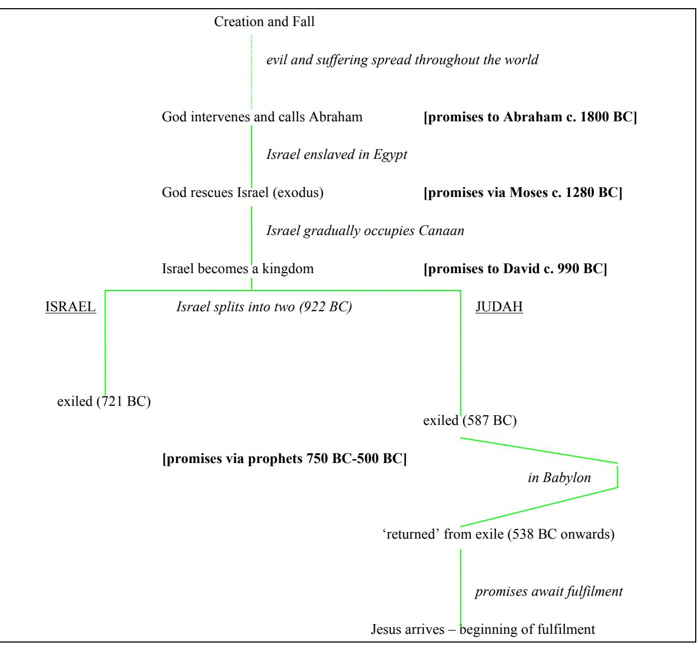
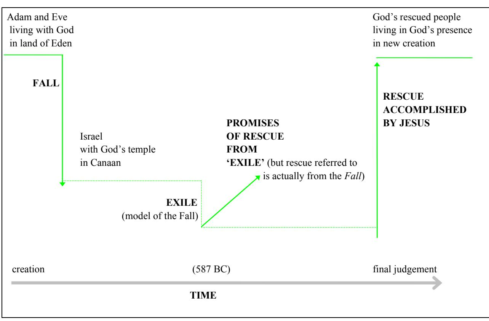
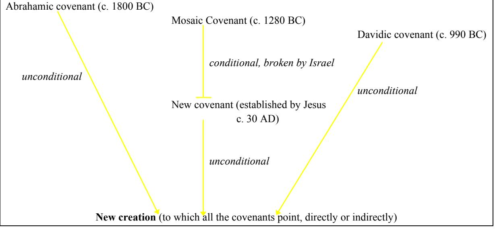

**bible study resources** 

# **Luke**

**© St Helen's, Bishopsgate. All rights reserved**

## **CONTENTS**

| Introduction 3 |                  |                                           |     |  |  |
|-------------------|------------------|-------------------------------------------|-----|--|--|
| 1                 | Luke 1:1-80      | Jesus' arrival announced                  | 7   |  |  |
| 2                 | Luke 2:1-3:20    | Jesus' birth                              | 14  |  |  |
| 3                 | Luke 3:21-4:30   | Jesus' ministry in outline                | 21  |  |  |
| 4                 | Luke 4:31-5:32   | Jesus begins his ministry                 | 28  |  |  |
| 5                 | Luke 5:33-6:49   | Conflict with the Jews                    | 35  |  |  |
| 6                 | Luke 7:1-8:3     | 'Are you the one who was to come?'        | 42  |  |  |
| 7                 | Luke 8:4-9:9     | 'Who is this?'                            | 49  |  |  |
| 8                 | Luke 9:10-50     | 'The Christ of God'                       | 56  |  |  |
| 9                 | Luke 9:51-10:42  | 'What must I do to inherit eternal life?' | 63  |  |  |
| 10                | Luke 11:1-12:12  | Not religion!                             | 70  |  |  |
| 11                | Luke 12:13-13:21 | Treasure in heaven                        | 77  |  |  |
| 12                | Luke 13:22-14:35 | Who will inherit the kingdom?             | 84  |  |  |
| 13                | Luke 15:1-16:15  | The long search!                          | 91  |  |  |
| 14                | Luke 16:16-18:8  | But what about ?                          | 98  |  |  |
| 15                | Luke 18:9-19:27  | Final teaching on eternal life            | 105 |  |  |
| 16                | Luke 19:28-21:4  | Jesus enters Jerusalem                    | 112 |  |  |
| 17                | Luke 21:5-22:38  | The new covenant                          | 119 |  |  |
| 18                | Luke 22:39-23:49 | Jesus crucified                           | 126 |  |  |
| 19                | Luke 23:50-24:53 | Jesus raised to life                      | 133 |  |  |

## **INTRODUCTION**

Welcome to this guide to studying Luke's gospel! Studying the Bible can be very exciting, and I hope you will find this is so as you work through Luke. But studying the Bible is also a very serious business, since it is about discovering what the living God has to say to us.

### **THE GOSPEL OF LUKE**

All Bible study is valuable, but there are three major reasons why studying a gospel, and Luke's in particular, is specially important:

- 1. **The gospels are the place where we come face-to-face with Jesus of Nazareth.** Jesus Christ is the person on whom Christianity centres and the person whom Christians love and worship, so he is the person we want to get to know better. But the place where we discover the real Jesus is the gospels.
- 2. **The gospels are the climax to the whole Bible story.** The Bible is the account of God's plan of salvation, and the highlight and key to everything that God is doing is recorded in the gospels. All the threads of God's plan come together in Jesus. So getting to know one of the gospels is an excellent way to see how all the parts of the Bible fit together, and so begin to understand the message of the whole Bible.
- 3. **Luke's gospel will help us become more certain of the truth of the Christian message.** In his preface (1:1-4) Luke tells us that he has carefully researched everything to do with Jesus, and that he has set out to write a carefully structured account of how God has fulfilled His purposes. His intention is to help Theophilus, his original reader, to become more certain of the truths of Christianity. By studying Luke, we too can benefit from his work and grow in our confidence of what God has done through Jesus.

Rather than examining Luke's themes, structure and style now, we'll work at discovering them for ourselves in the course of these studies. We have a thrilling task ahead of us!

### **AIM OF THIS STUDY GUIDE**

This guide has two main aims:

- **The particular aim of this guide is to help us discover Luke's** *overall message***.** Luke explicitly said (1:3) that he was writing an orderly (i.e. well-structured) account of Jesus, so we must try to discover what his overall message is. If we look at the individual parts of Luke but do not discover how they all fit together, then we may have learnt a lot, but we'll have missed the heart of Luke's gospel. In fact, part of the adventure of studying Luke is seeing Luke's main interests emerging and discovering why they are so important.
- **The aim of all Bible study is that our lives should be transformed by what God is saying through His Word.** We are not just engaged in an academic exercise. However, *we need to apply the book's main message*, since this is what Luke was aiming to communicate. It will take us a few studies to discover what this is, so the practical implications of our studies will build up gradually, but this is no bad thing. Realistically, we cannot absorb genuine applications frequently. If the whole of Luke leads to two or three genuine, long-lasting changes in our lives, this is far better than one application a week that is forgotten by the next week.

### **WHAT IS IN THIS STUDY GUIDE**

This guide divides the gospel of Luke up into nineteen studies. Because Luke is a long book, some of the studies are quite long, but don't be put off. You'll soon learn to tackle longer passages than you might have been used to, and it's exciting to work through a book relatively fast, getting a grasp of the author's

overall argument. If possible, resist the temptation to study only a part of the passage, or to divide each study up further. It makes it hard to pick up Luke's main message if we leave out large portions of what he is saying or go through it too slowly.

Each of the studies in this guide has various elements, designed to help us with different aspects of studying a great book like Luke. These include:

- **Summaries, introductions and conclusions.** These play an important part in helping us to understand Luke's overall message (i.e. his 'big picture'), by highlighting the main points in the passage we are studying and showing how they fit in with the rest of the gospel.
- **Questions.** These are the heart of the study, and they should give us a good grasp of the passage. Most of the questions have two or three closely related parts. As a general rule the first one or two parts help us discover what the passage says, and the following one or two parts are designed to help us think through what we have discovered, so that we see the significance of what is being said. There are also a few questions marked *optional*. These are usually somewhat harder and not absolutely essential, but answering them will give us deeper insight into what God is saying in the passage.
- **Notes, tips and articles.** These offer explanations of difficult points, help us with handling the Bible correctly, and examine various issues in more depth than is possible during the course of the study.

### **USING THIS STUDY GUIDE**

This guide is intended to be used both in group studies and by individuals, but whichever of these you are planning on, the key to studying the Bible is *individual study*. The best way to have really good group Bible studies is for every member of the group to have worked through the passage beforehand. Group sessions can then be times when you discuss the passage at a deeper level.

Individual Bible study does involve work, but it is the most effective way to hear the living God speak through His Word, and discovering what God is saying is worth a bit of effort! This guide has been designed to help you make the most of your individual study of Luke's gospel. Here are two suggestions for when to do this study:

- Some people find it best to set aside an hour or so, once a week, to work through the entire study. If this is for you, try to do it a couple of days before your group study, if you have one, so that you have a chance to digest what you have discovered.
- Other people find that they prefer fifteen minutes each day in their personal 'quiet' times with God. If this is what suits you best, then a good way to study Luke is to do two or three questions from this guide each day of the week. This will help you keep the sweep of Luke's message in mind, and so is probably better than breaking up each passage into smaller sections.

Study the Bible whichever way suits you best, but remember: Satan will try his hardest to distract you so that you don't feel like studying what God has said. You will just have to decide on a time and then get down to it, whatever you feel like doing instead!

### **SUGGESTIONS FOR PERSONAL STUDY**

The Bible is God's Word, and therefore it deserves to be studied conscientiously and with all the intellectual ability we have. Here are some suggestions to help us do this.

- **Pray that God will help you understand the passage**. God wrote it and He will help us understand it if we ask.
- **Read the passage through several times** before you begin to look at any part of it. Use a good modern translation, like the New International Version (NIV) or the Revised Standard Version (RSV). Older versions like the Authorised Version (King James Version) can make Bible study more difficult than it need be, while paraphrases like the Living Bible are not really accurate enough for serious study. This guide is based on the NIV, so you may find it more convenient to use this yourself.
- **Answer the questions in the guide** *thoughtfully*. Good Bible study is not easy, but it can be quite electrifying when we discover what the living God is saying. This guide aims to help us do the sort of serious study we need to do in order to get to the heart of Luke, but there is no substitute for *thinking*. With many of the questions in this guide you'll find that thinking about what they are driving at will show you that there is more to the passage than you first thought. Do resist the temptation to stop working on a question as soon as you have *an* answer: the aim is to discover *all* that the passage has to

say about the subject. The object of these studies is not to answer the questions in the guide, but to understand the Bible!

- **Keep looking at the text of the passage**. It is the *Bible* that is God's Word, and this guide is designed to be a help in understanding what the *Bible* is saying. So use the questions and notes to help you get into the Bible, rather than trying to answer them from what you already know.
- **Write down your answers**. This is an excellent way to help us think clearly and accurately about the issue we are examining. We're all tempted to stop when we've got a vague idea of the answer, but we miss out on a lot that the Bible is saying if we do this.
- **Obey what God is saying**. When we have discovered what God is saying in His Word we must change our thoughts and lives in response. If God has said something we cannot ignore it!

### **SUGGESTIONS FOR LEADERS**

Leading a group Bible study is an important responsibility; here are some thoughts to help you as you try to honour God by doing a good job. A good Bible study consists of:

- 1. **The leader understanding the Bible passage well**.
- 2. **The leader helping the other members understand the passage well**.
- 3. **Everyone responding obediently to what God is saying in His Word**.

Your work as leader is done in two parts:

### **BEFORE THE STUDY**

There are four things you can do before the study to help it go well:

- 1. **Pray**. Pray that God will help you understand the passage, that He will help others to understand it as well, that the discussion will be constructive and that people's lives will be changed as a result of their study.
- 2. **Understand the passage yourself**. The better you grasp what Luke is saying the better you will be able to help others grasp it. But understanding the passage is not the same as having a lot of information about it. This guide is designed to help you understand the passage, so use it by working through it fairly thoroughly. But you will need to *think* about the passage; this is the only way to discover what the Bible is saying. It will be a help if you can do your study a few days before the group meets, so that you have time to 'digest' your ideas.
- 3. **Prepare the questions you are going to use to lead the discussion**. The questions in this guide are designed to be used as they stand, but you may wish to 'fine-tune' them to suit your group. You will need to decide how long to spend on each topic. You may also find it useful to prepare supplementary questions to help the members of the group see what lies behind the questions in this guide, or to lead up to the questions in this guide. Sometimes you may find it a help to select some parts of the study to focus on particularly, rather than doing the whole study in the same depth, but it is probably worth covering everything that this guide does, even if some parts are done relatively quickly.
- 4. **Encourage others to prepare the passage**. One of the most important keys to making a group Bible study go well is for everybody to have thought about the passage before they come. If they do this it will revolutionise your group Bible studies by making the discussions Bible-centred and lively. This also makes your job as leader much easier, since all you have to do is chair a discussion of informed people. So anything you can do to encourage the other members to prepare will be very worthwhile.

### **DURING THE STUDY**

Every Bible study group is different, but here are a few thoughts which might help yours:

- **Pray before you start studying**, ask God to help you understand what He wrote.
- **Read the passage**. This is essential if the members of your group have not prepared their study. However, even if they have prepared you may still wish to read the passage, to refresh everybody's memory of what is in it.
- **Encourage discussion**. This is the *key* part of your job in the study. Very often, the first answer given to a question will not fully bring out all the issues, and it may even be wrong. Also, just because one person has the right answer doesn't mean that everyone else sees it. Even the person who produced the

right answer may not understand why it is right – it may just have been a good guess. Your job is to encourage discussion:

- in order to help everyone get to grips with the text in all its profoundness,
- in order to help everyone see *what* the right interpretation of it is, and
- in order to help everyone see *why* this interpretation is right.

Questions that may help with this include: 'what does everyone else think?', 'where in the passage do you get that from?', 'X, explain how you got to that' and 'do the rest of you agree with X?'.

- **Ask questions, don't give answers**. The art of leading a good study is to get others to see the answer for themselves from the passage, rather than telling them the answer. After you ask a question, don't worry if there is silence; people need to think about how to answer. If the silence goes on for too long, don't answer your own question, rephrase your question or ask a 'supplementary' question to give people a hint.
- **Avoid red herrings**. It is *very* easy to get distracted from the main study. At the time, 'red herrings' can appear interesting or valuable, but they almost always lead you away from examining what God has said in the passage you are studying. Stick to the passage you are studying unless the guide gives a cross-reference, and even then remember that you are studying Luke, not the cross-reference! Suggest that discussions that are 'interesting', but not about the passage, be continued *after* the study is over.
- **Respond to what God is saying in His Word by praying about what it says**. If we have discovered more about what God has revealed, then we should thank Him for speaking to us, thank Him for what we have discovered and pray through the implications it will have for us. Some groups combine their Bible studies with times of prayer for more general issues and with times of singing. If your group is one of these, then the best time to do these is *after* the study, since all prayer and worship should be a *response* to God and what He has revealed of Himself.

*STUDY 1* 

## **LUKE 1:1-80 JESUS' ARRIVAL ANNOUNCED**

### **THE STORY SO FAR**

It may seem a bit odd to begin our studies in Luke by looking at what has *already* happened, but the beginning of Luke's gospel is not the beginning of the Bible's account of what God is doing. The Old Testament is the beginning of this story, and the events Luke tells us about in his gospel are the *climax* of what God is doing. So, in order to understand what Luke is saying, we need to know a little about what God has already said and done.

Luke picks up two major Old Testament themes in his first chapter:

- **God made promises to Israel about what He would do in the future.** These promises were made over a period of about fifteen hundred years and, by the time Luke begins, they have become deeply ingrained in Israel's thinking. We will look at these promises in more detail later in this study.
- **God promised, in particular, to rescue His people.** When Luke begins his story, Israel has been under the rule of foreign nations almost continuously, for over six hundred years. Not surprisingly, therefore, Israel is longing for God to fulfil His promise and rescue her from her current oppressor, the Roman empire. But are God's promises to Israel about a rescue from political enemies, or does He have something even greater in mind? One of Luke's main concerns in his gospel is to help us understand what God's rescue is really about.

### **INTRODUCTION TO THIS PASSAGE**

In this chapter we see God doing two main things:

- 1. **He brings about the births of John the Baptist and Jesus.** Thus Luke begins his account at the very beginning of the events concerning Jesus, even before his conception.
- 2. **He explains why John the Baptist and Jesus will be important.** God's explanation of their importance (given through Gabriel, Mary and Zechariah) is expressed in terms of His great Old Testament promises – a fact which Luke's original readers would have spotted instantly. So we will need to take note of the references to the Old Testament in order to understand the significance of what is happening.

### **QUESTIONS FOR STUDY**

### *An Overview of the Passage*

*Let's begin this study by looking at Luke's introduction (1:1-4). Then we'll establish the overall picture of the rest of the chapter. Question (2) will give us a good foundation for the rest of our study, so don't be daunted by how much reading is involved in it.* 

**1.** In 1:1-4, what sort of account does Luke say he is writing? How should this influence the way we study what he says?

**2.** What are the four or five main events recorded in 1:5-80? In what ways is God intervening supernaturally in these events?

#### *Focus on ... what God says He is doing (1:68-79)*

*God explains the significance of John the Baptist and of Jesus in 1:50-55 and 1:68-79. Let's discover what God says He is doing by looking at the second of these passages.*

**3.** According to 1:68-75, what are the two main things God is doing? (N.B. 'redeem', 'save' and 'rescue' all express the same idea.) Why are these important?

**4.** What do 1:68-75 say God is rescuing His people *from*? What do they say He is rescuing them *for*?

**5.** According to 1:68-75, how large a part does 'rescue' play in what God intends to do through Jesus? How important is the concept of being rescued in your understanding of the gospel?

**6.** According to 1:68-75, which Old Testament promises will God fulfil as He rescues His people? [*Optional*: Why is it important that God has begun to fulfil these promises?] (See the *Supplementary note* on p.9 and *More about ... Old Testament promises* on p.11 for details about God's promises.)

#### **Supplementary note:** *Why does Zechariah refer to Abraham, David and the holy prophets in 1:69-73?*

The Old Testament contains many promises from God, but most of the promises were given to or through four individuals or groups who lived at crucial times in Israel's history (see fig. 1, p.13):

- **God made promises to Abraham** (e.g. Genesis 12:1-7). Abraham (or Abram, as he was originally called) was the father of the whole nation of Israel, and the promises God made to him when He called him are the foundation on which the rest of the Bible is built.
- **God made promises to Israel through Moses** (e.g. Deuteronomy 28). These promises were made when God was rescuing Israel from slavery in Egypt and giving her the land of Canaan to live in, and they are crucial to understanding what subsequently happens to Israel.
- **God made promises to David** (e.g. 2 Samuel 7:11b-16). David was Israel's greatest king, and the promises God made to him were the basis of Israel's monarchy.
- **God made many promises to Israel through the prophets around the time of the exile** (e.g. Isaiah 9:2-7). The exile was the end of Israel as an independent nation and the beginning of the six hundred years when she was ruled by her enemies. However, even as she was being conquered, God was making promises to her.

See *More about ... Old Testament promises* on p.11 for details about the *content* of these promises.

*Questions 3 – 6 introduce important ideas that Luke will develop at length in the rest of his gospel.*

### *Focus on ... what John and Jesus will do*

*God intends to work through John and Jesus in order to fulfil His promises concerning the rescue of His people, as we have seen. Let's now look more closely at the roles God has given them.*

**7.** What does this chapter say that John will do (see 1:13-17, 76)? How should this influence our understanding of John's ministry?

*At the very end of the Old Testament God promised that before He came in person He would send another prophet to Israel (Malachi 3:1). John has been sent to fulfil this prediction.* 

**8.** John is important, but Jesus is far more important. What does 1:31-33, 77 say about who Jesus will be and what he will do? [*Optional*: What is the significance of the fact that Jesus will be given 'the throne of his father David' (1:32)?] (You may find *More about ... Old Testament promises* on p.11 helpful.)

**Supplementary note:** *Why is Zechariah struck dumb for querying the angel (1:18-20) but Mary is not (1:34-38)?*

It is interesting to note how people respond differently to what God is doing in the events recorded in this passage. Despite her question, Mary's response is one of belief (1:45), humble acceptance of God's purposes (1:38) and profound joy (1:46-49). Zechariah, however, questions the angel because he does not believe that what has been said could happen (1:20) and so he is struck dumb. But, when John is born, Zechariah's behaviour shows that he has accepted what the angel has said, and he regains his speech (compare 1:13 with 1:62-64).

*Understanding Jesus and what he came to do is one of Luke's greatest themes, one which he will develop at length; here he is laying the foundations for a right understanding of Jesus.*

### *Closing Headlines*

*Let's conclude our study by drawing its various parts together and summarising.*

**9.** What are the two main points that Luke makes in 1:5-80? (Answering this well is challenging but rewarding.)

*Passages like this one will probably not lead to instant changes in the way we live, but the Bible says that the key to a changed life is actually a changed* mind *(Romans 12:2), and this chapter* can *change our thinking!* 

**10.** What is the main thing you have learnt from this chapter? How will this change your understanding of God and what He is doing?

#### **Tip on Bible study (#1):** *The value of everyone studying the passage before the group discussion.*

God Himself has spoken through the Bible, so it is essential for Christians to understand the Bible and also to live in the light of it. Studying a passage in a group is a good way to discover more about the Bible, but sometimes it can degenerate into a time when we share our ignorance. The way to avoid this is for all the members of the group to spend some time in the week before the study working through the passage on their own. Then when you meet you can share your insights, and discuss remaining problems at a deeper level. God wrote the Bible to be understood, but not without hard work!

This sort of personal study of the passage is a great practice in any Bible study group, where it will transform your group discussions, but it is particularly important in our studies in Luke where the passages we will be studying are often very long. These notes have been written to help you in your private study as well as in your group studies. Here are three tips for your personal study:

- **As you study the passage, pray and ask God to help you understand it.** He wrote it and, if we ask, He will help us to understand what it says.
- **Give yourself enough time.** Getting to know what God is saying in His word takes time, but it is worth it! If you find it hard to spend a long time on a passage – or if it is hard to find a long time – try spending a shorter time more often. One possibility is to prepare these Luke studies a bit each day in your personal times with God.
- **Focus on the Bible passage, not on these study notes!** These notes are designed to help you study the Bible, but it is easy to slip into the trap of just answering the questions in these notes without thinking about the text itself.

### **CONCLUSION**

Luke's objective in writing his gospel is to give a well-organised and reliable account of the life of Jesus, one in which his readers may expect to find the key issues being emphasised and in which all the parts fit together logically.

He begins by telling us of the events surrounding Jesus' conception. In this chapter we see God again speaking directly to Israel, after a gap of about four hundred years. Two truths dominate what He says:

- **God is about to rescue His people from their enemies,** not simply for their own benefit but in order that they may serve God in holiness and righteousness. This rescue is the heart of what God is going to do, and we need to focus on it if we want to understand what Jesus has come to do.
- **This rescue will be the fulfilment of the great promises God made in the Old Testament,**  especially those He made to Abraham and David. In this chapter Luke alludes only briefly to the content of these promises, but this is because they are so important in the Old Testament that he takes it for granted that his readers will know something about them.

Luke will develop both these truths at length in the rest of his gospel.

But God does not only *speak*, He has already begun to *act* through the miraculous conception of two babies:

- **Jesus will be God's Messiah,** His Son, the one through whom God will rescue His people and fulfil all His promises.
- **John will be God's promised messenger.** He is born first, because he has been sent to prepare the way for Jesus.

### **MORE ABOUT ... OLD TESTAMENT PROMISES**

The Old Testament opens with an account of God's creation of the world and humankind's rebellion against God (Genesis 1-3). This rebellion led to God and humans becoming enemies and creation being cursed. Suffering, hardship, death and evil spread throughout the world as a result of this 'Fall' (e.g. Genesis 4:3-12, 6:5-7). The Bible is the story of how God solves the problem of the Fall, and *the Old Testament promises are God's statement of what He will do as He rescues human beings from the consequences of their rebellion.*

### *What is the content of the Old Testament promises?*

God does not reveal all at once the full scope of what He will do. He gradually unveils His plans, and in this process four sets of promises are particularly important (see fig. 1, p.13).

#### *1. The promises to Abraham*

The story of Israel begins with God promising Abraham that He will undo some of the main effects of the Fall, for and through his descendants (e.g. Genesis 12:1-7, 17:1-8). The four main elements of God's promise to Abraham are:

- **A land** to enjoy for ever (to compensate for the loss of Eden),
- **Blessedness and being a blessing to others** (to compensate for the curse which resulted from the Fall),
- **A relationship with God** (to compensate for the enmity with God which lay at the heart of the curse)
- **Nationhood** (in Hebrew thought this implied people living together in harmony, to compensate for the strife which the Fall had caused).

This promise is the turning-point of the whole of God's dealings with humankind. Though the word 'save' is not used, the implication is that God is promising *to rescue humankind from the consequences of the Fall*.

#### *2. The promises to Israel through Moses*

When God rescues Israel from slavery in Egypt, He makes promises to her which build on the promises made to Abraham. The main elements of the promise to Abraham are restated and enhanced – for example the land will be a wonderful one 'flowing with milk and honey' (Exodus 3:15-17). So it appears that God is promising Israel that she will enjoy being rescued from the effects of the Fall.

However, the promises through Moses are *conditional* upon the people of Israel keeping the Law that God gives them. *If they are not obedient they will not enjoy the fulfilment of the promises*. In fact they will re-experience – in miniature, but still excruciatingly – the penalties of the Fall (e.g. Deuteronomy 28).

#### *3. The promises to David*

King David was a great military leader who saved Israel from her enemies. God made unconditional promises to him which further elaborate what He will do when He rescues humanity from the consequences of the Fall (2 Samuel 7:1-17):

- **God will rule His people through David's line for ever** i.e. God will rule His people and reverse the rebellion of the Fall through one of David's descendants.
- **One of David's descendants will build a 'house' for God** i.e. enable God to live with His people and so reverse the fact that, at the Fall, God expelled human beings from His presence.

#### *4. The promises to Israel through the prophets at time of the exile*

Israel split into two in the tenth century BC, and both parts were conquered and exiled*,* the northern part (Israel) in 721 BC and the southern part (Judah) in 587 BC. God sent many prophets to both parts of Israel around the time of the exile to warn her of what would happen and also to give her promises of hope. These promises are:

- **The exile will not last forever.** God will rescue Israel from her enemies.
- **When Israel is rescued she will enjoy the promises made to Abraham and David.** But these promises are restated and become indescribably wonderful. For example, the promised land is a transformed land like no other land on earth, full of peace and prosperity and joy. In fact, it is referred to as 'new heavens and a new earth', where the worst bit is as good as the garden of Eden! (e.g. Isaiah 51:1-3, 65:17-25). It is clear that God is no longer referring to Canaan (if, in fact, He ever was), but this idea is not developed further in the Old Testament.
- **When Israel is rescued she will be able to obey God and so not be judged again.** Israel will therefore enjoy the promised blessings *forever*, because God will write His laws on His people's hearts (Jeremiah 31:31-34).

### *When will these Old Testament promises be fulfilled?*

Israel did not, before the exile, enjoy the great blessings God had promised Abraham, Moses and David. In some ways it might appear that she did, but she seldom had peace and prosperity – and never of the sort God had originally promised. The reason she did not obtain God's blessings was that she did not obey the conditions God had laid down in His promise to Moses (e.g. Judges 2:1-23). The exile itself is the ultimate proof of the fact that God's original promises had not been fulfilled, because God had promised Abraham that his descendants would possess the land *forever* (Genesis 17:8).

The exile (at least of the southern kingdom, Judah) appeared to end in 538 BC, but the promised blessings *still* did not materialise! For example, Israel remained under the rule of her enemies – first the Persians, then the Greeks and finally the Romans – for almost all of the five hundred years between the apparent end of the exile and the beginning of Luke. For almost all this time Israel had no king of any description, far less the great and godly king of David's line that God had promised David. The Jews, however, remained convinced that God would one day bring the 'real' end to the exile and fulfil His promises.

So, as Luke opens all these Old Testament promises are still awaiting their fulfilment. The Jews understood that the promised king from David's line was the key: when he came all the other promises would also be fulfilled. This was why they were so eagerly awaiting the promised Davidic king (usually referred to as Messiah or Christ). In Luke 1 God is revealing that *Jesus is the Messiah through whom the promises will be fulfilled*. As we study Luke we will see how.

Fig. 1 — God's promises in relation to Israel's history

*STUDY 2* 

## **LUKE 2:1-3:20 JESUS' BIRTH**

### **THE STORY SO FAR**

In Chapter 1 Luke begins his account of Jesus at the point where God starts to reveal Himself and to work after a gap of about four hundred years. The three main things we saw were:

- 1. **God revealed that two women would miraculously conceive.** This duly occurred.
- 2. **God revealed that the two individuals to be born would be the people through whom He accomplishes His purposes.** One would be the long-awaited Messiah and the Son of God (1:32-33), the other (John the Baptist) would be a messenger preparing the way for him (1:17,76).
- 3. **These events mark the beginning of God's fulfilment of His promise to save His people through a Messiah from the line of David** (1:69-75). This promise is the subject of the whole of the Old Testament and the foundation on which the New Testament is built.

### **INTRODUCTION TO THIS PASSAGE**

This passage covers the period from Jesus' birth to just before he begins to reveal himself as God's chosen Messiah. As yet Jesus has not started his work, but God is busy preparing the ground for His Son. We will see Him do this particularly in the period immediately after Jesus' birth and again just before Jesus begins his own ministry. The passage divides into two:

- 2:1-52 tells us about several incidents from Jesus' birth and early childhood.
- 3:1-20 tells us about John the Baptist's ministry.

It will help us to get to the heart of what Luke is saying, however, if we divide up the main body of our study in a slightly different manner. We will look at two main *themes,* namely:

- 1. **God's revelation of what Jesus has come to do.**
- 2. **John's ministry of preparing the way for Jesus.**

As he records the beginning of Jesus' life, Luke shows his concern for history by locating Jesus in his historical context (2:1, 3:1-2). Christianity depends upon the historical truths about Jesus, and so Luke wants us to understand and be certain of them. (See *More about ... Luke the historian* on p.18 for details.)

### **QUESTIONS FOR STUDY**

### *An Overview of the Passage*

**1.** This passage spans about thirty years, but Luke focuses on only four periods within this: what are they? In which of these periods – and in what ways – do we see God intervening supernaturally?

**2.** In this passage we see God intervening supernaturally in various ways, but there are two features which occur in all of them: what are they? What do these teach us about what God is seeking to do here?

### *Focus on ... God's revelation of what Jesus has come to do*

**3.** What, according to this passage, are the two main things Jesus will do? (You will need to note all that is said about what Jesus will do, then divide these things into their two natural groups. See particularly 2:30-34,38, 3:16-17. Use the *Supplementary notes* on p.15 and below for help with 2:34 and 3:16, and note that 'winnowing' and 'fire' in 3:17 refer to judgement.) Why is it important to know that Jesus will do both these things?

**4.** In this passage, whom does God use to declare what Jesus will do? Why does He keep telling us what Jesus will do? (Compare what people at the time would have *seen* with what Jesus *will* do.)

**Supplementary note:** *What does John mean by saying that Jesus will baptise with the Holy Spirit (3:16)?*

When John says that Jesus will 'baptise with the Holy Spirit' he means Jesus will *save.* In fact, this is what Luke usually means in his gospel when he refers to people 'being baptised by the Spirit' or 'receiving the Spirit' (the exception is when he refers to Jesus receiving the Spirit). There are three pieces of evidence to support this interpretation:

- 1. The New Testament normally uses the idea of receiving the Holy Spirit as another way of referring to being *saved*, possibly since receiving the Spirit is such a crucial part of being saved, e.g. Romans 8:9, Ephesians 1:13.
- 2. When the Old Testament looks forward to the Holy Spirit being poured out on all people it is in the context of *salvation* from final judgement (Joel 2:28-32).
- 3. The fact that Luke's gospel, in particular, uses the phrases 'receiving the Holy Spirit' or being 'baptised with the Holy Spirit' in this way can be seen from their *contexts*. Thus, in 3:17 John is clearly talking about salvation and judgement, and this appears to be an elaboration of what he has just said in 3:16, implying that 'baptised with the Holy Spirit' must refer to being saved.

Simeon's words are a remarkable prophecy of how Jesus and the Jews will relate to each other, as we will see in our study of Luke: **Supplementary note:** *What is meant by 'destined to cause the falling and rising of many ...' (2:34-35)?*

- Jesus will 'be a sign that is spoken against' (2:34c) i.e. he will be opposed by many Jews.
- 'The thoughts of many hearts will be revealed' (2:35a) i.e. the Jews think of themselves as God's people, but their response to Jesus will reveal what their attitude to God really is!
- Jesus will 'cause the falling and rising of many in Israel' (2:34b) i.e. because of their opposition to Jesus many Jews will be judged by God, but others, who accept him, will be saved.
- Mary will find that 'a sword will pierce your own soul' (2:35b) since Jesus himself will be killed.
- **5.** How does the fact that Jesus is the one who saves God's people influence your attitude to him? How does the fact that he is the one who will judge all people affect your approach to him?

*Jesus is the key to Christianity. In order to become a Christian we need to understand (at least to some extent) who Jesus is and what he has come to do, and in order to grow as a Christian we need to grow in our understanding of Jesus' person and work. This is why Luke devotes a large part of his writings to helping Theophilus understand this theme.* 

### *Focus on ... how John the Baptist prepares the way for Jesus (3:1-18)*

*God appointed John the Baptist to prepare Israel for Jesus' arrival. By quoting Isaiah 40:3-5 (in Luke 3:4-6), Luke implies that John is the predicted 'voice', preparing the way for Jesus by what he* says*. This is confirmed by Luke's emphasis on John's message. As we look at what John says, note its urgency.*

**6.** What are the three most important points John is making in 3:7-18?

**7.** What danger is John warning the Jews about in 3:7-18? What are the three reasons John gives in 3:8- 9 as to why they need to be warned – despite the fact that they are Jews and so, historically, God's people?

*We will look at what it means for* us *to repent when Jesus himself speaks about the subject later in Luke.* 

#### **Supplementary note:** *The difficulty of understanding Jesus (2:41-52)*

Despite all God's revelation, even his parents, who have heard all that God has said, have difficulty understanding who Jesus is. One of the main reasons for Luke's inclusion of the account of Jesus as a boy in the temple is to show us this (2:50). This struggle of those around him to comprehend Jesus is one of Luke's themes (e.g. 7:18-19, 8:25, 9:45).

If even those who were closest to him when he walked on earth wrestled to understand him, then so will we. However, the effort will be well worthwhile, and one of the thrills of studying Luke is to be amazed at the real Jesus as we begin to understand him better.

**8.** [*Optional:* How does John's message prepare the way for Jesus?]

**9.** How should the fact that God's judgement is coming affect your life?

#### **Tip on Bible study (#2):** *The importance of looking at the major points in a passage*

*When we study a passage in the Bible we need to look at the main points being made*. When a biblical author like Luke writes, he has crucial pieces of information and ideas he wants to communicate. As we read his gospel it is these features we are trying to grasp. Luke also give us a lot of detail, *but this detail is intended to help us to understand his main points*. However, as we study books like Luke we are often tempted to concentrate on the detail, sometimes because we find it manageable, and sometimes because we find it fascinating. But when we do this we can easily get so engrossed in it that we miss the main points Luke is trying to convey: like most competent authors, Luke does not convey his main points in obscure corners of his text!

Spotting the main issues an author is writing about is one of the keys to good Bible study, and we will gradually learn how to do this better as we work our way through Luke. One useful tool is to ask ourselves the question: *why did Luke include this incident?* For example, in Luke's account of Simeon's prophecy (2:22-35), Luke's aim is that we should see the *content of the prophecy*. The content is the climax to this incident and the content is the means by which God is testifying to who this infant is – which is the thrust of the whole section from 2:8 to 2:38. Luke is not particularly interested in the details of how old Simeon was or how Simeon recognises Jesus or the fact that Simeon held Jesus in his arms – so we should not be either.

Once we have spotted the main points of a passage there are two things we must do:

- 1. **We must focus our attention on these main points.** If these are the major issues that Luke wants to communicate we need to see what he is saying about them and through them.
- 2. **We must look to the main points for our applications.** Our object in studying the Bible is to obey what it says. However, our aim must be to obey the major points its authors are making, rather than the incidental details which they only included in order to support, and to add colour to, their primary concerns.

### *Closing Headlines*

**10.** What are the two main points this passage is making?

**11.** What is the main thing you have learnt from this passage? How will this change your thinking?

#### **CONCLUSION**

Jesus, the Son of God, has come into this world to be the great, long-awaited Messiah who will save God's people, but he is also the one through whom God will judge the world and destroy His enemies. This passage does not need to spell out how he can fulfil both these functions since God has spent almost two thousand years setting the scene for Jesus (i.e. in the Old Testament), and He has already said that a day will come when the wicked will be judged and the righteous saved.

All this, however, still lies in the future, and in this passage we see Jesus only as a helpless human infant or a young boy. Because appearances are so deceptive, God is at work *preparing the way* for him by *revealing who Jesus is* through angels, and people like Simeon, Anna and John.

John the Baptist is the person God has particularly appointed to prepare Israel for Jesus' arrival, and in this passage we see him doing this by *preaching God's word*. God's word is *the* means He uses to deal with humankind, but John's message is very uncomfortable: the Jews are presuming upon their privileged descent from Abraham, they are not living lives pleasing to God and they appear unaware of the fact that God's judgement will affect them. But the person God has appointed as judge of the world is about to arrive, and in order to escape from his wrath John's hearers must repent. John's message prepares the way for Jesus since those who listen will be on the look-out for their Messiah, and will also be aware that they are sinners who are in danger of being judged. But, as we will see later on in *Luke*, it is precisely those who know their need to be rescued – and so who rely on Jesus' mercy – who will find that he is also a saviour!

### **MORE ABOUT ... LUKE THE HISTORIAN**

Luke, more than any other New Testament author, is consciously and explicitly seeking to write history. Thus in his preface he says that he is writing an 'account' (1:1), and the Greek word behind this is frequently used by ancient historians to describe their writings. His interest in history may also be seen, for example, in the unique care he takes in locating Jesus in his historical context (e.g. 2:1-2, 3:1-2). It will help us to understand what he is saying if we look at why he is so interested in history, how good a historian he is and how he goes about his task.

### *Why does he write about history?*

Jesus and the events surrounding his birth, life, death and resurrection are objective, historical events. Christianity is far more than moral teaching, a way of life or even an experience of God. *It is the truth about how the almighty, creator God intervened in human history – and the consequences of it.* The heart of His intervention in history was His sending of His Son Jesus to rescue humankind, and He will intervene once more on a grand scale when His Son comes a second time to bring human history to an end and to create new heavens and a new earth.

But the reality of our rescue and our certainty of God's promise for the future depend on the first coming of Jesus and the events surrounding it being *objectively, historically true*. If they are not, then we have not been saved, and there is no hope for the future (cf. 1 Corinthians 15:14-19). This is why, when he wants to assure Theophilus of the truth of Christianity, Luke writes about the historical events that are its heart.

### *How good a historian is Luke?*

Luke is an ancient historian, using the standards and methods of ancient history, which differ from those of modern history. Nonetheless, good ancient historians knew the importance of truth and accuracy. Shortly after Luke, the second century Greek writer Lucian of Samosata wrote, in a work entitled *How to Write History*, 'the historian's sole task is to tell the tale as it happened' and 'this ... is the one thing peculiar to history: only to truth must sacrifice be made'.

Luke seems well aware of this priority and in his preface (1:1-4) stresses his use of 'eyewitnesses', the fact that he has 'carefully investigated everything' and his desire for accuracy (implied by the Greek word behind 'orderly', which can also be translated 'accurate'). He did not personally witness the events which he records in his gospel but, as the apostle Paul's travelling companion, he was directly involved in many of the events which he records in his second volume, Acts. He also knew many of those who were involved from the beginning and is thus well placed to examine scrupulously everything that happened.

In general, modern research confirms Luke's remarkable accuracy. There are a few places where it is not currently clear how Luke's account fits in with what we know from other sources, but these may simply reflect a lack of sufficient information. It is worth remembering the eminent archaeologist Sir William Ramsay who worked last century. Ramsay began by believing that Luke was a historian of dubious value, but after conducting his research he concluded that Luke was 'a historian of the first rank'.

### *What is Luke's method as a writer of history?*

Modern historians clearly state the significance of the events they record and offer interpretations and judgements about them. Ancient historians such as Luke, however, often do not do this so explicitly. We find this confusing and frustrating and, as a result, often give up on trying to understand the significance of what he has recorded – to our great loss. However, Luke has in fact given us a lot of help in understanding the implications of what he wrote; he has just done it in a different way from that of a modern author.

There are two features of Luke's historical method we need to note if we want to understand his interpretation of the events he is recording:

- 1. **He has carefully selected his material to focus on what he considers crucial.** All historians have to select their material in order to focus attention on the main points and to avoid being swamped by detail, and Luke is no exception. It is virtually certain that he had far more information about Jesus than he included and that what we have in his gospel is the result of careful selection.
- 2. **He has carefully arranged his material to make his points.** Thus he often records incidents (or teaching) sideby-side where he means us to use them to comment on each other. Incidents in close proximity to each other may show the development of an idea, or we may be expected to draw lessons from the differences between them.

An example of this second point is in Chapter 1, where Zechariah and Mary are both visited by angels promising them the miraculous conception of sons. Both question the angel, but Zechariah does so out of unbelief (1:20) and is struck dumb until he shows by his actions that he accepted what the angel said (1:62-64). Mary, on the other hand, is said to have believed, despite her questioning (1:45). From this we may deduce what is involved in responding rightly to God. Unbelief will not stop God doing His will (Zechariah had a son despite his unbelief), but it may have serious repercussions on the person who does not believe. But belief does not mean accepting everything that is said without question, even if what is said is said by angels! The Bible makes it clear that there are false prophets (Jeremiah 23:30-32), counterfeit miracles, signs and wonders (2 Thessalonians 2:9-10) and false teaching which must be rejected even if it is taught by angels (Galatians 1:8). It is as wrong to accept what is not from God as it is to doubt what does come from God. So, if we are to discern what is right and what is wrong, we must be able to question and check what purports to come from God. The placing of these two stories side-by-side teaches us that what matters is not questioning, even questioning angels, but the attitude behind it.

In writing in this style Luke is adopting the same method as ancient historians like Thucydides. It means that the reader is expected to do more of the work, seeing connections and drawing conclusions. Studying Luke therefore

involves more than just reading the text; it involves thinking about it. We must constantly ask ourselves questions like 'Why is Luke including this incident?' and 'How should we understand the significance of this incident in the light of the incidents and teaching surrounding it?'. This style of reading Luke is not easy, but it forces us to think seriously about what Jesus is doing and saying – which is a good thing! Most of us find this approach difficult, but it is hoped that these notes will be of help.

*STUDY 3* 

## **LUKE 3:21-4:30 JESUS' MINISTRY IN OUTLINE**

### **THE STORY SO FAR**

Luke's first major section extends from 1:5 to 3:20. All we see of Jesus in this section is his birth and a little about his childhood, since Luke's primary concern is to show us *God* at work *preparing the way* for Jesus. We have seen:

- 1. God miraculously producing the conception of both Jesus and John the Baptist (Jesus' forerunner, 1:15-17).
- 2. God testifying that Jesus is the Saviour who will rescue God's people (2:28-32), the Messiah who will rule them (2:11) and the Judge who will divide humanity into those being saved and those being destroyed (3:16-17).
- 3. God using John the Baptist (as He said He would 1:15-17) to warn the Jews that they are in imminent danger of experiencing God's wrath, and that they need to repent (3:7-18).

The events of Luke 1, however, are not the beginning of God's preparation for Jesus. *The whole of the Old Testament is preparing the way for Jesus*, so Luke has shown us that Jesus is the long-awaited Messiah through whom God will fulfil the great promises He made to Abraham and David (1:69-73). Even John the Baptist's ministry of preparing Israel to receive Jesus was predicted in the Old Testament (1:17, 3:4-6).

### **INTRODUCTION TO THIS STUDY**

Jesus now arrives on the scene to begin the task he has come for. This passage gives us a summary of what Jesus has come to do, and its key points will be developed later in Luke*.* There are three main subsections:

- **3:21-4:13 introduces us to Jesus the Son of God**. Luke shows us some of the significance of that title and what it implies Jesus has come to do.
- **4:14-21 contains Jesus' own summary of what he has come to do**. 4:18-19 is often referred to as Jesus' 'manifesto' in which he lays down his programme at the beginning of his ministry.
- **4:22-30 gives us a good example of how Jesus and his fellow-countrymen relate**.

We will need to keep an eye on the Old Testament allusions in order to understand what Luke is saying.

### **QUESTIONS FOR STUDY**

### *An Overview of the Passage*

**1.** What are the main events in this passage?

### *Focus on ... 3:21-4:13 (Jesus the Son of God)*

**2.** What are the four things we are told about Jesus in 3:22? [*Optional*: If this is what Jesus is like, why does he need to be baptised in 3:21?]

*The nature of Jesus' sonship is the main theme in this subsection (e.g. 3:22, 4:3,9). In a sense, Adam was God's son too (3:38), and the genealogy tells that Jesus shares this sonship, to some extent, since he is descended from Adam. So the point of this subsection is to* contrast *Adam's sonship with Jesus', as we will see.* 

**3.** In 4:1-13, how is Jesus tempted? What are the two features that characterise how Jesus responds to each of the temptations? (One has to do with what he *says*, the other with what he *does.*) How does this differ from Adam and Eve's response when they were tempted (Genesis 3:3,6)?

**4.** What does Jesus' response to temptation show about his *attitude to God*? (N.B. This question will require some thought, and to see what 4:4 tells us about this subject you will need to complete Jesus' quotation by looking up Deuteronomy 8:3.) How does Jesus' attitude to God differ from Adam and Eve's in Genesis 3:5-6?

**5.** Summarising what we have seen so far, what does 3:21-4:13 tell us about what *sort* of 'Son of God' Jesus is?

### *Focus on ... 4:14-21 (what Jesus says he has come to do)*

**6.** From 4:18-21, list all the things Jesus said he came to do. In the light of the fact that Jesus has just won a battle over the devil, what do ideas like 'freedom for the prisoners' and 'to release the captives' mean? (See the *Supplementary note* on p.23.)

**7.** a) In 4:18-19 Jesus quotes from Isaiah 61. What is the passage in Isaiah talking about? (Isaiah is writing about one of the least understood – but most important – parts of Old Testament history, so you may need the *Supplementary note,* below, to answer this.) What, therefore, is Jesus saying he has come to do?

b) Why is fulfilling Isaiah 61 (as we have now understood it) an important thing for Jesus to do? How should this influence the way we look at everything Jesus does in the gospel?

**Supplementary note:** *What is the significance of the fact that Jesus quotes from Isaiah (4:18-19)?* 

The quote in 4:18-19 is from Isaiah 61 and, in its original context, is about God's promise *to rescue Israel from her exile in Babylon* in 587 BC. By saying that he has come to fulfil it (4:21), Jesus is saying that he has come to rescue God's people from their exile. In a sense Israel returned from exile in the period after 538 BC, but God's promises of what would happen when He rescued Israel were not fulfilled! Jesus' contemporaries, therefore, understand that the exile has not really come to an end, regardless of what happened in 538 BC, and they are waiting for God to fulfil His promises (see *More about* ... *Old Testament promises* in Study 1, p.11).

But if Jesus has come to rescue Israel from the exile, does this mean that what he is doing is just for the Jews and is not relevant for us? No, exactly the opposite is the case, because *the exile is actually a 'model' or 'picture' of humankind's Fall and exclusion from the garden of Eden at the beginning of history* (see *More about* ... *the contrast between Jesus and Adam*, p.26). So, when Jesus says that he has come to rescue God's people from the exile, what he is actually saying is that *he has come to rescue people from the Fall.* 

As a result of the Fall we are under Satan's domination, so being rescued from the Fall includes being rescued from Satan's rule. But this is exactly the conclusion we reach from looking at 4:18-19 in the context of the rest of Chapter 4 (as we see in question 6)! The Scriptures are a bit like a jigsaw puzzle or crossword puzzle: the right interpretation of a passage will fit regardless of which angle we look at it from.

**Supplementary note:** *Who are the 'poor' and 'oppressed' (4:18-19)?*

Some Christians think that Jesus' statement in 4:18-19 that he has come 'to preach good news to the poor', 'to proclaim freedom for the prisoners', etc. refers to only a portion of humankind, namely those who are literally financially poor or literally held as prisoners by oppressive regimes, etc. It is more likely that Jesus is referring to all humankind, oppressed and made spiritually poor *by Satan*. There are three reasons for this:

- 1. The context, both in Luke and Isaiah, where the quotation comes from, implies that the people in question are those who are victims of the Fall and oppressed by Satan (see the *Supplementary note* on the quotation from Isaiah).
- 2. If 4:18-19 refers to those who are literally poor and blind, then it contradicts the rest of Luke where many financially rich people accept Jesus (as we will see, e.g. in 8:3). Similarly, if 4:18-19 refers to those who are literally prisoners, then it contradicts the fact that John the Baptist is a prisoner, but Jesus does not free him.
- 3. In the Old Testament, words like 'poor' are often used to refer to those who are in need of God's help more generally (e.g. Psalm 40:17 where the context, e.g. v14, shows that David's need is more than just financial).

So Jesus has come for all humankind, but this does not mean that everyone will benefit from Jesus' offer of freedom. Only those who realise that they are poor and in captivity will accept what Jesus is offering. Jesus will not force his good news on those who do not think they need it. This will become clearer later on in Luke.

#### **Supplementary note:** *Does the devil have the right to give this world to whomever he wills (4:5-6)?*

In 4:5-6 the devil says that he has the right to give the kingdoms of the world to whom he wills, because they have been given to him. This might be a surprising claim, but Jesus does not dispute it, and it is consistent with what the rest of the Bible teaches (e.g. 1 John 5:19, and the titles given to the devil in John 14:30 and Ephesians 2:2). As a result of humankind's rebellion this world has been handed over to the devil. Jesus has come to rescue humankind from him. God's purpose is now the creation of new heavens and a new earth for those who have been rescued.

### *Focus on ... 4:22-30 (relations between Jesus and his compatriots)*

*In 4:18-19 Jesus stops quoting from Isaiah just before the point where Isaiah mentions judgement. Some people think this is because Jesus is emphasising his role in salvation. But salvation and judgement cannot be divorced: those who will not accept Jesus' salvation will face his wrath, and 4:22-30 begins to look at this.* 

**8.** In 4:23 Jesus verbalises what his original hearers are thinking, namely that they want him to demonstrate to them the miracles that he performed in Capernaum. What does Jesus' reply in 4:24 imply is wrong with their desire? In 4:22-30, how does their behaviour show that Jesus is right in his analysis of them?

**9.** In 4:25-26 Jesus is referring to 1 Kings 17:7-16, where God sent Elijah to feed, miraculously, a widow and her son during a great famine in Israel. But these two were not Israelites, although the famine affected all alike. So what point is Jesus making in Luke 4:25-26? Why are his original hearers so upset by this?

**Tip on Bible study (#3):** *The crucial role played by the context of a passage*

In order to understand a passage in the Bible correctly we need to read it in its *context*. Sometimes this is obvious: for example the second line of Psalm 14:1, taken on its own, says 'There is no God', but the first line states that this

is what the fool believes! Usually the need to read every part in its context is far less obvious than this, but the context is always essential if we want to discover what the Bible is really saying.

There are three types of context that we may need to take account of:

- 1. **The verse or two just before or after the one we are studying**. This is the easiest type of context to use, but it is still sometimes neglected, and the example of Psalm 14:1 shows us the danger of ignoring the immediate context.
- 2. **The larger section of a chapter or so around the passage we are looking at**. We use this context automatically when we read most other books, but we often ignore it when reading the Bible. This is partly because we tend to read only very small portions of the Bible at a time. However, this context is vital: for example, it transforms our understanding of the temptation of Jesus (4:1-12) if we read Luke's account of it in the light of 3:21-38, as we have seen. Studying large portions of Luke will help us to keep this type of context in mind.
- 3. **For a New Testament passage we need to use the Old Testament as context***.* This is the hardest type of context to use, but it is essential because the New Testament authors knew their Old Testament and assumed that their readers did as well. However, the original authors usually make their references to the Old Testament fairly clear – either by using events that are very well known (like Adam and Eve) or by explicitly quoting from the Old Testament. The temptation of Jesus (4:1-12) and Jesus' 'manifesto' (4:18-19) exemplify these types of Old Testament allusion and also show us the value of using this 'biblical' context.

### *Closing Headlines*

**10.** What are the main points Luke is making in this passage?

**11.** Which of Luke's main points has most struck you? How will it change your thinking and the way you live?

#### **CONCLUSION**

As Jesus begins his ministry, we get a summary of what he has come to do – and also of how Jesus and his fellow-Jews will get on. Three main ideas dominate the passage:

**Jesus shows us what sort of Son of God he is***.* God affirms that Jesus is His Son at his baptism, but he is a strikingly different sort of son from Adam, who is also referred to as God's son. Jesus, like Adam, is tempted by the devil, but Jesus takes God's word seriously and resists temptation, unlike Adam. He shows by his trust in God, worship of God and humility before God that he will treat God as God. In other words, *Jesus is the true Son of God, in contrast to Adam*.

- **Jesus summarises what he has come to do by stating that he has come to rescue humankind from the Fall**, i.e. from the consequences of Adam's failure to resist the devil's temptation. The fact that Adam succumbed to temptation *caused* all the problems that currently afflict the human race. By contrast, Jesus has come to *rescue* humankind from the results of Adam's failure. His victory over the devil both shows his credentials for doing this and shows us a bit about the nature of this rescue (namely that it is from Satan's dominion).
- **But many people will not be rescued, including many Jews**. This is the implication of the fact that the Jews from Jesus' home synagogue reject him. Jesus perceives their rejection despite their apparently positive reception, and they subsequently prove that he is right by their attempt to kill him as soon as he says something unpalatable. However, even in the Old Testament God often blessed Gentiles rather than Israelites, and Jesus implies that God will do the same again.

### **MORE ABOUT ... THE CONTRAST BETWEEN JESUS AND ADAM**

An understanding of the biblical account of Adam and his rebellion against God is crucial to an understanding of Jesus. It was Adam's rebellion that created the problem that Jesus has come to put right. If we are unclear about the problem, then we will struggle to understand the solution we see in Jesus.

It is normal today for the story of Adam and Eve to be treated as a myth and ignored. The Bible, however, will not allow us to do this. Jesus and the New Testament treat it as a fact, and so must we. This does not mean that we need to be simplistic, but it does mean that we must accept that it is important and in some way historical.

### *Adam's Fall – the beginning of humankind's problem*

Genesis 3 records how Adam and Eve, the parents of the human race, were lured by the serpent to rebel against God's commandment. As a result they, and through them all humanity, were doomed to die. They were also exiled from the land God had made for them and cast out from His presence, and the world itself was cursed.

This 'Fall' is humankind's fundamental problem (God's final judgement is a far more terrible problem, as we will see, but it *arises out of* the Fall). Death, disaster, disease, famine, war and the whole catalogue of human miseries in this world are simply symptoms of this deeper underlying problem (e.g. Genesis 4-11), and until the underlying rift with God is resolved all the other afflictions will remain.

### *The exile of Israel – putting the spotlight on humankind's problem*

At first sight it might appear that the Bible says little about the Fall after the early chapters of Genesis. However, this is not true. The sin and suffering which play such a large part in the Bible's story are direct consequences of the Fall.

But the Bible also makes the event of the Fall comprehensible by creating a 'model' of it which we can more easily relate to. This model is the exile of the nation of Israel to Babylon in 587 BC. Most Christians know very little about the exile, which is unfortunate because it is one of the most important events in the Old Testament (see fig. 1, p.13, to see where it fits in). It brought to an end many of Israel's hopes and aspirations: in particular, it marked the end of Israel as an independent nation, the end of the line of Davidic kings and the end (probably) of the ark of the covenant. About sixty percent of the entire Old Testament was, in fact, written around the time of the exile as God warned Israel of what was about to happen and explained what He was doing.

The exile is a 'model' of the Fall because, for most of the Old Testament, Israel was God's people living in the land God had given them, just as Adam and Eve were God's people living in Eden. Like Adam and Eve, Israel rebelled against God and so was exiled from her land, losing the temple, the symbol of God living with her, just as, at the Fall, Adam and Eve were thrown out of Eden and God's presence (see fig. 2). It is often difficult for us to understand and appreciate how terrible an event the Fall was. We have become hardened and oblivious to it and to its consequences. In fact, the fallen world we now live in seems 'normal'! The biblical account of the horrors of the exile give us some inkling of what the Fall really means: if the model is so appalling, how much more so must the real thing be!

### *Jesus – the solution to humankind's problem*

The exile, however, is not the end of the story in the Old Testament. God accompanied it with promises of a future rescue of Israel from her exile. But the promises of what He will do when He rescues her are actually referring to something far greater than the return of the nation of Israel from the exile in Babylon. For example, one promise is of a land which is blessed and not subject to decay, conflict or want (e.g. Isaiah 65:17-25) – a land which looks far more like Eden than Canaan – a land, in fact, referred to as 'new heavens and a new earth'! This sort of promise is too great to be fulfilled in this world order, so these promises *cannot* be about the restoration of Israel from the exile. Instead they must be about the restoration of humankind from the Fall.

Against this background we can understand more clearly what Jesus has come to do. The Bible expresses it in three closely related ways:

- **He has come to rescue God's people from the consequences of the Fall, in particular from Satan's dominion** – although this is sometimes phrased in terms of him rescuing Israel from the exile.
- **He has come to fulfil the Old Testament promises of blessing and restoration of everything that was lost at the Fall** – including eternal life, a perfect land (or world), a wonderful relationship with God, and harmony with other people (and nature). (See *More about* ... *Old Testament promises* in Study 1, p.11, for details.)
- **He has come to inaugurate a new humanity for God's new creation by succeeding where Adam failed***.* The parallel between Jesus and Adam is not developed further in Luke's gospel, but it is covered elsewhere in the New Testament (e.g. Romans 5:12-21, 1 Corinthians15:21-22).

Fig. 2 — Schematic diagram of how the exile is a 'model' of the Fall

*STUDY 4* 

## **LUKE 4:31-5:32 JESUS BEGINS HIS MINISTRY**

### **THE STORY SO FAR**

Luke's many accounts of incidents and the detail he supplies are all written in order to communicate one overall message. As we study Luke our aim is to understand this overall message, and to do this we need continually to step back and look at Luke as a whole. So far we have seen Luke make three main points:

- 1. **God has sent His Son Jesus to be the promised Messiah**.
	- *God has repeatedly revealed who Jesus is* (e.g. 1:30-33, 68-79, 2:10-12, 3:22).
	- *God has prepared Israel for his coming* by sending John the Baptist to warn the people of His impending judgement and show them their need for the salvation Jesus brings (1:13-17, 3:2-17).
- 2. **Jesus has given us, by his deeds and words, a summary of what he has come to do**.
	- He has come to be *the true Son of God*, in contrast to Adam (3:21-4:13).
	- He has come to *rescue men and women from the Fall* and, hence, Satan (4:16-21).
- 3. **But many will reject Jesus** and those from his home town have already done this. However, Jesus is also the judge and those who will not accept him will be rejected by God (2:34, 4:23-30).

Luke has been at pains to emphasise that all of this is *the fulfilment of what God promised in the Old Testament*: almost every single incident so far has contained a reference to the Old Testament, and many of these have been to God's promises (e.g. 1:17, 32, 55, 69-73, 3:4-6, 4:18-21).

### **INTRODUCTION TO THIS PASSAGE**

In this passage, Luke tells us about the early stages of Jesus' ministry; in particular how Jesus starts to reveal who he is and what he has come to do. Luke is making two main points in this passage:

- **Jesus has immense power and authority** which he reveals through the miracles he performs.
- **Jesus has some surprising priorities**. Luke records two of these here, and they tell us a lot about Jesus' underlying purposes.

As in previous studies, we will see Luke weave together the various incidents he records so that they say far more as a whole than as individual stories. (See *More about ... Luke the historian* in Study 2, p.18, for the reason why we must read Luke's stories in their context, and not in isolation.)

### **QUESTIONS FOR STUDY**

### *An Overview of the Passage*

*In this part of our study we will also look at Jesus' authority, the issue that dominates the passage.*

**1.** What are the main incidents in this passage? Make a note of what miracle(s) is associated with each of these incidents. (N.B. An alternative approach to this passage is to do questions 1-3 at the same time and to produce a table or chart with your conclusions.)

**2.** Jesus' miracles show us the sort of authority he has. In this passage, what is Jesus demonstrating authority *over*? Which of these do you find most striking?

**3.** For each of Jesus' miracles in this passage, what can be *seen* by those who are present? (In other words, what convinces the people at each incident that a tremendous miracle has really taken place?) How do the people around Jesus respond to these miracles?

**4.** Why is it important for us to see that Jesus has great authority? (In order to answer this question, you will need to think about this passage's *context,* i.e. the previous passage. You may also find *More about ... Jesus' miracles* on p.33 helpful.)

#### **Tip on Bible study (#4):** *Looking at the text*

When we study the Bible it is important to look at what the text actually says. This may sound obvious, but it is easy to think we know what is being said in the Bible. So, instead of looking at the text closely, some of us are liable to skim through it, reading in what we think it ought to be saying. In fact the Bible is full of surprises. After all, it is God's Word and is meant to teach us and challenge us. The only way to spot these surprises and so hear what God is saying is to look hard at the text and think about what it says.

Here are three hints on how to look at the text properly:

- 1. **Read the passage carefully,** several times. Look for the flow of the narrative or argument, i.e. the basic 'story line'. Connecting words like 'but', 'because' and 'therefore' are particularly important in this.
- 2. **Look for what does not fit in,** either with the 'story line' or with your ideas of what the passage 'ought' to be saying. For example, some people think that Jesus withdraws in 4:42 in order to *pray*, but this is not what the passage says. Again, it is easy to think that, in 5:20, the faith of the paralytic and his friends leads Jesus to *heal* him, but this is not what the text says.
- 3. **Do not get bogged down in detail.** The Bible's authors want to communicate their main points, not their detail, as we saw in *Tip (#2)*, p.17. The detail is there to help us understand the main points correctly, so we need to make sure we do not ignore it, but we must not allow the detail to hijack our attention.

### *Focus on ... what 4:31-44 teaches us about Jesus' priorities*

*This passage reveals two of Jesus' underlying priorities, and we will now look at the first of these.*

**5.** In 4:32, what is highlighted as having really amazed the people? And what do they mention *first* after Jesus casts out the evil spirit (4:36)? In what way is this a surprising response?

**6.** In 4:40-42 Jesus has a remarkable ministry which is giving him popularity and honour, but in 4:42-44 we see that he leaves it. Why does he do this, according to v43? Why is it important that he does this? (This may require some thought.)

*As we go on in Luke we will see that Jesus' emphasis on teaching continues throughout his ministry*

### *Focus on ... what 5:1-32 adds to our understanding of Jesus' priorities*

*It will help us to understand this section if we start at the end, with its punch line.* 

**7.** Why has Jesus come, according to 5:32? What does this mean? (You may find the *Supplementary note* below helpful.) [*Optional*: How does Jesus' statement of his mission in 5:32 fit in with his statement of his mission in 4:43?]

**Supplementary note:** *Who are the 'sinners' in 5:32?*

The term *sinner* in the New Testament can mean two different things:

- 1. According to the Old Testament, *everyone* has rebelled against God and so is a sinner (e.g. Psalm 53:2-3).
- 2. However, Jesus' contemporaries think that a person can be righteous if he or she tries hard enough, and that 'sinners' are those who break the Old Testament laws and do not repent.

Some translations of the Bible, like the NIV, try to clarify the situation by putting the word in inverted commas when it is being used in the latter sense. In the original languages, however, there is no way of distinguishing between the two meanings except from the context, and a *double entendre* is sometimes intended.

Jesus' statement in 5:32, therefore, has several levels of meaning:

- 1. *Jesus* means that he has come to save those who are unacceptable to God, i.e. everyone. He is not coming for the 'righteous' because there are none in God's eyes – but he has another, ironical, meaning here, because those who *think* that they are 'righteous' will not accept the forgiveness he is offering.
- 2. *The Jews,* on the other hand, think he is saying that he has come for the 'wrong' people, namely those who are not trying as hard as possible to keep the Law.

#### **Supplementary note:** *Why does Jesus send the healed leper to the priest (5:14)?*

In ancient Jewish culture, leprosy and the other skin diseases grouped together with it were among the most terrible of ailments. The reason for this is that, apart from the physical affliction itself, *a leper was ceremonially unclean and so unacceptable to a holy God*. This was a catastrophe which was exacerbated by the fact that they were banned from contact even with other humans (Leviticus 13:45-46). They were excluded from God's presence and God's people! When the leper is healed the greatest benefit he reaps is *being accepted again* – symbolically into God's presence and literally into God's people. Jesus sends him to the priest in order that his healing may be officially confirmed; he may then enter the temple and rejoin society.

**8.** Look at 5:17-26. What reason does Jesus give in vv23-24 for healing the man? What does Jesus see as the paralytic's greatest need?

**9.** How do all the four major incidents in 5:1-32 illustrate Jesus' mission to restore sinners to a right relationship with God (5:32)? (This is a challenging question, but one which will help us see how Luke weaves his material together. You may find the *Supplementary note* above helpful for seeing how the leper fits in.)

**10.** What sort of things do people today say that Jesus has come to do? How do these relate to Jesus' own statement of what he has come to do (in 5:32)?

**11.** What do the Pharisees and the teachers of the law think of Jesus for doing these things (i.e. in 5:21,30)? Why are they wrong in thinking this? (You may find the *Supplementary note* on 'sinners' helpful.)

*Jesus' concern to save sinners is one of Luke's most important themes. The clearest statement of this is Luke 19:10, but 5:32 is probably Jesus' second most important pronouncement on the subject.*

### *Closing Headlines*

**12.** What are the main points of this passage?

**13.** Which of these main points have you found most striking? How will it change the way you think and live?

### **CONCLUSION**

As Jesus begins his ministry in earnest, the most striking aspect of it is his remarkable authority, which he displays in both his actions and his teaching. He demonstrates his authority over sickness, evil spirits and people. He even has the authority to forgive sins – an authority that is God's alone! In fact, he is revealing that he has authority over the consequences of the Fall. In order to understand *why* Jesus reveals his authority we need to put this passage into the context of the previous one. Jesus is continuing to show that he really is the Messiah, the Son of God, and that he is able to rescue humankind from the Fall.

The magnitude of his authority makes Jesus' priorities all the more striking:

- **One of Jesus' priorities is to teach**. In Jesus' mind teaching, although unglamorous, is more important than healing and exorcising demons. Almost as striking is the fact that the people who witnessed first-hand, with amazement, his miracles are even more impressed by his teaching. Jesus needs to teach because he has come to rescue humankind from the *Fall*, as we saw in the previous study, and the only way people will learn about this, and so be able to benefit from it, is if he *teaches*. His miracles demonstrate this rescue, but they are not the rescue itself.
- **Another of Jesus' priorities is to call sinners**. He has come to restore sinners to God, and he demonstrates this symbolically by cleansing the leper. He has come for sinners because *forgiveness of sin is a person's greatest need,* even more important than being healed of paralysis! Sin was the cause of the Fall, and the consequences of the Fall cannot be solved until sin is dealt with. Another reason why Jesus has come to call sinners is that those who realise that they are sinners appreciate their need and accept him, unlike those who think that they are righteous.

### **MORE ABOUT ... JESUS' MIRACLES**

Miracles are a major part of Jesus' ministry, so we need to examine the role they play. Before we can do this, however, we must consider some confusion that is caused by the subject of miracles. Let's think about Jesus' miracles by trying to answer three questions:

### *Is Jesus really performing miracles?*

Many people today think that miracles that overturn the normal laws of nature cannot occur, so Jesus' miracles must be mythical. However, a God who created the laws of nature can easily alter or suspend them temporarily if He chooses to. To deny the possibility of miracles is to say that the God who created the universe does not exist or at least never intervenes in the universe He made.

If we accept that God exists, or even if we start with an open mind, then the evidence that Jesus is genuinely performing miracles is overwhelming:

- He performs many miracles in front of large crowds of people, to whom the individuals concerned are well known, and they are consistently amazed at his miracles; it is highly unlikely that they are being misled.
- Even those who oppose Jesus accept, in general, that he is performing miracles. Their arguments against him are based on other grounds, for example that his miracles come from the devil (e.g. Luke 11:14-20).
- The greatest miracle of all is Jesus' resurrection from the dead. If this miracle is genuine then there is no good reason to deny any of his other miracles. Crucially, this is by far the best attested miracle of all, as we will see in a later *More about ...* .

### *How special are Jesus' miracles?*

Jesus' miracles are clearly visible and utterly remarkable. People who have been bed-ridden and paralysed can instantly get up, walk and carry loads (e.g. Luke 5:17-26). There is no period of convalescence, no need for weakened muscles to be strengthened. Similarly, those with shrivelled limbs have them recreated instantly and in front of many witnesses (Luke 6:6-10). Again, when Jesus calms a storm, it is not just that the weather changes: the waves as well as the wind are instantly calmed (Luke 8:22-25), despite the fact that waves normally persist for quite some time after the wind has subsided.

Some people think that the sort of miracles Jesus performed occur relatively frequently. But it devalues Jesus' miracles to compare them lightly with other miracles. In fact, his miracles are in a class of their own:

- **Jesus' miracles regularly overturn the laws of nature,** but most other 'miracles' are only very unusual. For example, medical science knows that very occasionally there is remission of cancer. For the person whose cancer has suddenly improved dramatically, as well as for those round about, this is a genuine and exciting miracle, particularly if it is an answer to prayer. But, this is not the sort of miracle that Jesus is performing.
- **Jesus' miracles are performed with remarkable ease.** With one or two exceptions, Jesus does his miracles without fuss, without ceremony and without difficulty. A simple word is all that is necessary. Sometimes he does not even need to be near the person benefiting from the miracle (e.g. Luke 7:1-10).
- **Many of Jesus' miracles are very obvious and performed in front of many witnesses.** By contrast, many of the 'miracles' that are compared with those of Jesus are hard, if not impossible, to verify.

There is nothing to stop God from performing apparently 'impossible' but easily verifiable miracles today, but experience indicates that such miracles are very rare. Jesus, in contrast, performed a great number of them.

### *Why does Jesus work miracles like this?*

Some people think that Jesus' miracles teach us about the sort of miracles we should expect to enjoy if we are Christians or, even, the sort of miracles we should be able to perform ourselves. But Jesus' miracles are not meant to make us think about ourselves but *to point us to Jesus, i.e. to reveal who he is and what he came to do*.

#### *Jesus' miracles reveal who he is*

Jesus' miracles show that he is God's beloved Son, but we need to be careful about how we reach this conclusion. The performing of miracles does not, on its own, prove that a person is God's Son. The Old Testament tells us how various prophets sent from God performed great miracles (e.g. Moses and Elijah) and, in the New Testament, the apostles also performed great miracles. Other miracles are also to be found in history. Furthermore, the Bible says that even Satan can do miracles (2 Thessalonians 2:9). However, *Jesus' miracles are unique*. We have just seen three ways in which Jesus' miracles are different from most other miracles, but there is an even more striking difference between Jesus and all the other people who perform miracles, even the great Old Testament prophets and the New Testament apostles. This is the fact that 'their' miracles are really God's miracles, and the individuals are simply His instruments. On some occasions they do a miracle because God tells them to. At other times they ask Him to act miraculously. Similarly, if a miracle occurs today, it is because *God* (or Satan!) does something, often in response to our prayers. Yet Jesus does not pray (normally) or receive instructions from God before performing his miracles. He does not need to. He is God's only and beloved Son, God incarnate. He actually *possesses* authority over everything because he created everything. Thus *Jesus' miracles reveal who he is*.

If Jesus' miracles reveal who he is, then equating his miracles with miracles that occur today not only devalues his miracles, but it can also lead to devaluing Jesus *himself*!

#### *Jesus' miracles show his ability to rescue humankind*

Jesus' miracles are not arbitrary demonstrations of his power. When Satan tempts him to do precisely this he refuses (Luke 4:9-12). Instead, his miracles are demonstrations of his ability to overcome humankind's great enemies of sickness, evil spirits, hunger (Luke 9:10-17), the forces of nature (Luke 8:22-25) and, in particular, sin (Luke 5:17- 26) and death (Luke 7:11-17) – i.e. *the consequences of the Fall.*

Jesus has come to rescue humankind from the consequences of the Fall, but by far the most terrible consequence of the Fall is yet to come. The result of the Fall is *death*, but the physical death we experience in this world is only a *precursor* of the eternal death we face at God's final judgement. Jesus has come particularly to rescue us from this eternal death – but Jesus cannot show us this rescue *now* (we will only see it at the final judgement), so he performs other miracles as one of the means he uses to demonstrate *now* that he can save us from this great *future* danger. We see an example of this in Luke 5:17-26, where Jesus says that he has authority to forgive sins and then heals the paralytic to prove that this is the case.

*STUDY 5* 

## **LUKE 5:33-6:49 CONFLICT WITH THE JEWS**

### **THE STORY SO FAR**

In the first major section of the gospel (1:5-3:20), Luke records *God at work, beginning to fulfil what He promised in the Old Testament*. We saw:

- God bringing about the supernatural birth of His Son Jesus (1:30-37).
- God testifying that this Son will be the Saviour and Judge of the world (1:68-75, 2:34, 3:16-17).
- God sending John the Baptist to prepare Israel for Jesus' arrival (1:17, 3:3-18).

In his second major section (which began at 3:21), Luke is telling us about what *Jesus himself is doing*.

- **Jesus has shown himself to be the true Son of God, by continuing to trust God when tempted by the devil** (3:38-4:12) and by the authority he wields (e.g. 4:31-5:32).
- **Jesus has stated that he has come to fulfil the Old Testament and 'rescue Israel from her exile'** which means that he is going to rescue God's people from the Fall (4:17-21). But he displays some surprising priorities as he begins to do this, namely *teaching* (4:31-44) and *calling sinners* (5:1-32).
- **But Jesus is already in conflict with the Jews who will not accept him on his terms** (e.g. 4:23-30).

### **INTRODUCTION TO THIS PASSAGE**

We are still in the early stages of Jesus' ministry, but several major new developments take place in this passage. This passage divides into three closely related subsections:

- 1. 5:33-6:11 records *three arguments between Jesus and the religious Jews*. The Jews are finding what Jesus is doing intolerable, but the actions they dislike are *fundamental* to Jesus' person and work.
- 2. 6:12-16 is the turning point in this passage, as *Jesus calls twelve disciples* to be with him.
- 3. In 6:17-49 Jesus begins to *teach these disciples*, and the content of his teaching is utterly radical.

### **QUESTIONS FOR STUDY**

### *Focus on ... the conflict between Jesus and the Jews (5:33-6:11)*

**1.** What are the three main incidents in 5:33-6:11? What features do all three have in common?

**2.** How does Jesus' statement in 5:34-35 answer the Jews' accusation in 5:33? What does Jesus' answer teach us about Jesus himself? What does your answer mean?

#### **Supplementary note:** *Who are the Pharisees? (e.g. in 5:33)*

In first century Israel there were various 'parties', like today's political parties. However, as Israel was a religious state they were really religious parties. The Pharisees constituted one such party. Relatively few first century Jews appear to have been 'signed-up' members of any of these parties, but in different ways some of the groups wielded great influence. The Sadducees, whom we will meet later, usually held the highest official positions of power. However, the Pharisees' ideas appear to have been very influential with the population at large. They placed great emphasis on keeping God's Law and were considerably more ethical than their contemporaries.

All the gospels tell us that they were Jesus' main opponents. They did not like what he did and taught, because it contradicted their understanding of the Law. Jesus in turn criticised them for their hostility to him, and for the way they distorted the Old Testament by emphasising what a person *does*, rather than what he or she *thinks* (which is much more challenging), and so thinking that they could please God by what they did.

**3.** Jesus' parable in 5:36-38 gives another answer to the Jews' accusation of 5:33: what is it?

**4.** In 6:1-11, what is Jesus' attitude to the Sabbath? What reason does Jesus give for holding this view of the Sabbath? What does this teach us about who Jesus is claiming to be?

**5.** In 6:1-11, how do the Pharisees respond to Jesus' behaviour? Why are they so hostile to what he is doing?

**6.** In 5:33-6:11, how does Jesus expect his disciples to treat traditional Jewish religious activities like fasting and strict observance of the Sabbath? What does this indicate that Jesus is calling his disciples to be? (This may require some thought.)

*If the Jews prefer their old religion and will not accept Jesus and the 'new thing' – centred on himself – that he is bringing, then he will create a new people of God – or 'new Israel' – who will accept what God is doing. Jesus begins this process in 6:12-16 (the turning point in the passage) by calling 12 apostles as a symbolic parallel to the 12 tribes of the nation of Israel. See* More about ... Israel *on p.40 for a discussion about this 'true Israel'.*

### *Focus on ... Jesus' teaching to his disciples (6:17-49)*

*Having called this 'new Israel', Jesus begins to teach those who belong to it (i.e. his disciples) about what is involved in being part of it. Some of what Jesus is teaching is so profound that he will develop it at length later on (Chapters 10-19), so do not worry if you struggle slightly with it.* 

**7.** a) In 6:20-26, what will be given to those who are blessed? When do they hunger and weep? Where, according to the passage, will they be blessed?

b) When are those on whom Jesus pronounces 'woes' well-fed and laughing? When – by implication – will the 'rich' suffer their 'woes'?

c) Summarise the truth Jesus is teaching in 6:20-26 in a short phrase. How should this teaching affect your attitude to life in this world?

**8.** What clues are we given in 6:20-23 about whom Jesus means by the 'poor' who will be blessed?

*In 6:27-38 Jesus tells his disciples about how they are to live in the light of the truth of 6:20-26. It is easier to see what he is saying here if we focus on just 6:32-35.* 

**9.** According to 6:32-35, how are Jesus' disciples to behave? If we are to do good to those who cannot or will not repay, whom must we look to for our reward (v35) and when (from the context) will we receive it? Where are you looking for your reward?

*In 6:39-49 Jesus challenges his hearers to take stock of where they themselves stand, and to work out whether they are those who will be blessed or those who will suffer woes. In 6:39-40 he says that it is important whom we learn from, implying that we must follow him. In 6:41-42 Jesus tells his hearers to examine* themselves*, not each other.*

**10.** In 6:43-45, what, according to Jesus, is the real difference between the two types of people? In 6:46- 49, how do the two types of people actually differ? What do these two tests show you about yourself?

#### **Tip on Bible study (#5):** *The need to be careful when cross-referencing to other passages of Scripture*

When we study a passage there is a great temptation to refer to other parts of the Bible which appear to talk about the same subject. This can be very helpful: as we have seen, it is difficult to understand the New Testament without some understanding of what the Old Testament is saying. But not all 'cross-references' are helpful. This is the case, in particular, when we refer to passages that are, in fact, talking about a different subject – which can occur if we do not really understand the passage to which we are cross-referencing. For example, when we are studying Jesus' 'sermon on the plain' in Luke (6:17-49), it is tempting to refer to the 'sermon on the mount' (Matthew 5-7), which looks, at first sight, as though it is Matthew's account of the same sermon. However, they may well not be the same sermon, since Jesus almost certainly taught the same material many times. Even if they are the same sermon, Luke and Matthew may well be focusing on different aspects of what Jesus said. Cross-referencing between these two passages can, therefore, lead to us confusing ourselves as we muddle up Matthew's points with Luke's points. It can also lead to us thinking that there are contradictions between these two accounts when, in fact, they are actually accounts of different sermons.

There are two general rules to help us use cross-references correctly:

- **We must think about cross-references that the original author intended.** When we try to work out what the original author intended us to refer to, then the rule is that the New Testament authors refer (1) normally *only* to the Old Testament (since they did not have the rest of the New Testament), (2) usually to major Old Testament events (e.g. Adam and Eve), and (3) often by means of an explicit Old Testament quotation.
- **In all other cases it is wiser to stick with the passage we are studying and to try to work out what that is saying**. Studying one passage properly is quite demanding enough, without adding other passages to it.

### *Closing Headlines*

**11.** What are the three or four main points Luke is making in this passage? (When answering this question try to work out the points that underlie or sum up everything Luke is saying, i.e. the *most* important things he wants to communicate. Doing this well is an excellent way to get to the heart of the passage.)

**12.** Which of these main points has most struck you? How will it change the way you think and live?

### **CONCLUSION**

This passage and the previous one are closely linked:

- In 4:31-5:32 we saw Jesus revealing who he is by showing that he has God's own power and authority. In this passage we discover that one *consequence* of this is that true religion must focus on Jesus. It is inappropriate to fast now that he has come, and he is entitled to decide what is permissible on the Sabbath
- In 5:1-5:32 we saw Jesus revealing that he has come to call sinners. In this passage we discover what he is calling them *for*. He is *not* calling them to be good Jews but, rather, a people centred on himself.

The Jews have, until this point, had the honour of being *called* God's people. However, if they will not accept that their religion should focus on God's own Son, then they are not God's *true* people. Jesus, therefore, begins to *redefine* who God's people are, by calling 12 apostles to be the start of a 'new Israel' (see *More about ... Israel* on p.40 for details).

Jesus then begins to teach his disciples about what it means to be part of this 'new Israel':

- **There will be a 'great reversal'.** It is the 'poor' of this world who will inherit the kingdom of God, and so be rich in eternity. Conversely, those who are 'rich' in this world will not inherit heaven, and will be poor in the next world. But we must be careful to avoid a simplistic understanding of who is 'poor' and who is 'rich'. We saw in Study 3 (e.g. the *Supplementary note* on p.23) that 'poor' refers to those who are aware of living in a cursed world and of their need to be rescued by God. This understanding of the word 'poor' is confirmed when Jesus uses it of his disciples who are hated *for his sake* (6:20-22). By implication, the rich are those who are happy with this world.
- **This 'great reversal' must affect the way Jesus' disciples live.** Eternity is what matters, so they must not live only for this world. Instead they should look to God and eternity for their reward.
- **His hearers must examine themselves to be sure that they will inherit God's kingdom.** The two crucial questions are what they are like *inwardly* and whether they are *living* in the light of what Jesus says.

### **MORE ABOUT ... ISRAEL**

The Bible is, to a great extent, the story of the people of Israel, i.e. God's chosen people. However, in the Bible there are *two* 'Israels'! There is the 'nation of Israel' on the one hand and the 'new Israel' or the 'true Israel' on the other. We need to be clear which is which, because only one of these 'Israels' is really the people of God.

Christians have not always been clear about the relationship between these two Israels but, in fact, one of the main functions of the New Testament is to help us with this. Let's look at these two Israels.

### *The nation of Israel*

#### *The origin and nature of the nation of Israel*

The story of the nation of Israel begins in Genesis 12. When humankind's plight appeared hopeless as a result of the Fall, God intervened and called a man, Abram (later called 'Abraham'), to whom He made great promises. These promises were, effectively, that God would begin to undo the consequences of the Fall for Abraham's descendants. (See *More about ... Old Testament promises* in Study 1, p.11, for details.)

Abraham had two grandsons, Esau and Jacob, and the nation of Israel comes from the descendants of Jacob, whom God renamed 'Israel'. Jacob and all his family went to Egypt to escape a famine, and there they remained for four hundred years. By the end of this time they were a very numerous people, but they were in slavery! God then intervened again in order to rescue them from Egypt and to give them the land of Canaan to live in.

#### *Did the nation of Israel inherit God's promises?*

It appeared, therefore, that the promises God had made to Abraham were being fulfilled in the nation of Israel as she settled in Canaan. However, God made a covenant with Israel as He rescued her from Egypt, which stipulated that the Israelites would be blessed, live in Canaan and enjoy God's presence *if, and only if,* they lived in obedience to God's commands (e.g. Deuteronomy 28). *But the nation of Israel did not obey God, so she did not obtain what was promised*. It is crucial for us to grasp this if we are to understand the nation of Israel, because much of the Old Testament is the story of Israel's sin and punishment.

One reason why we sometimes do not realise that the nation of Israel does not inherit God's promises is because it only gradually becomes clear that this is what is happening, since God forgave the Israelites their sins on numerous occasions and gave them many chances to live righteously. But there was, in fact, no time in Israel's history when the people did not sin, although some periods were worse than others:

- They sinned repeatedly as they journeyed from Egypt to Canaan (e.g. by doubting God, Numbers 14).
- They sinned innumerable times throughout their time in Canaan and this, in the end, led to Israel being exiled from Canaan. (2 Kings 17:7-20 gives us a summary of the sin of Israel, while 2 Kings 21:1-18 gives a frightening account of the sin of one of the last kings – who even sacrificed his own son to an idol.)
- The southern part of Israel (i.e. Judah) 'returned' from exile, but the people still had not learnt their lesson and they continued to sin (e.g. by marrying foreigners who worshipped idols, Ezra 9).

The climax of these centuries of sin actually occurs in the New Testament, when the nation of Israel rejects and kills God's own Son (as we will see later in Luke). The reason Luke stresses the Jews' opposition to Jesus is because the Jews' rebellion against God is a major Old Testament theme which is fast approaching its conclusion.

### *The true Israel*

#### *The origin and nature of the true Israel*

The story of the true Israel also begins in Genesis 12. The promises that God made to Abraham were irrevocable, so if the nation of Israel was not to inherit them then *someone* must. The issue of who will inherit God's promises becomes more prominent as the Old Testament story progresses and it becomes clear that many of those who belong to the nation of Israel will not enjoy God's blessings. By the end of the Old Testament it is clear that only those who are *righteous* will benefit from the promises (e.g. Malachi 3:16-4:2). But who is righteous?

The New Testament tells us that *righteousness comes by faith in God*, and that everyone who has faith is righteous, regardless of whether they belong to the nation of Israel. So those who will inherit God's promises to Abraham are those who share Abraham's *faith* rather than those who share his genes (see Galatians 3:6-9, Romans 9:6-8). The true Israel, God's real people, are Abraham's *spiritual* descendants rather than his physical ones.

The story of the true Israel actually runs through the Old Testament alongside the story of the nation of Israel, because people who had faith in God existed during all periods of the Old Testament (Hebrews 11 provides a wonderful list of some of these people). The fact that the two Israels coexisted means that many of the promises which God apparently made to the nation of Israel are, in fact, actually made to the true Israel. In the Old Testament period, many of those who belonged to the true Israel were physically descended from Abraham, but some were not. However, whenever people who were not of Hebrew descent came to faith in God, they joined the nation of Israel (e.g. Ruth, the Moabite woman, Ruth 4:9-22). This is why it is not always clear in the Old Testament that there are two Israels.

In the New Testament this changes, and Jesus explicitly and openly establishes the true Israel as an entity distinct from the nation of Israel. Jesus has come to save God's people, as we have seen, and this necessitates clearly defining who God's people really are.

#### *How will the true Israel inherit God's promises?*

Jesus, however, does not simply define who the true Israel is. The nation of Israel failed to enjoy God's blessings because of her *sin*. Sadly, Christians continue to sin, so won't our sin similarly prevent us, the true Israel, from inheriting God's promises? The answer is that it will, and the true Israel will not inherit God's promises either, *unless the problem of sin is dealt with*. This is why Jesus sees sin, and God's anger against it, as humankind's greatest predicament (Luke 5:17-32). However, the true Israel will, in fact, inherit God's blessings *because Jesus has come to deal with the problem of sin,* and we will see how he does this later in Luke.

#### *The purpose and fate of the nation of Israel*

If the nation of Israel is not the true Israel, then why does the Old Testament tell us so much about her? Further, what will happen to her? The answer to the first question is that the nation of Israel *is* important, but *not* because she constitutes God's people. The apostle Paul deals with this issue in his letter to the Romans. Having shown that the Jews are no different from the non-Jews when it comes to salvation, he goes on to explain that the nation of Israel is special because God has *revealed* Himself through her (Romans 3:1-2). We cannot understand God and what He is doing without God's revelation of Himself, and *God has chosen to reveal Himself through the nation of Israel*. If it were not for the nation of Israel, we would not have the Old Testament, and we would not understand who God is and what He is doing through Jesus. This means that we should value the nation of Israel because of *what we can learn from God's revelation to her as recorded in the Old Testament*.

The answer to the second question comes later in Luke (e.g. Luke 20:9-18), so we will defer looking at it until then. It is worth being clear at this stage, however, that individual Jews can and will be saved, despite the fact that the nation of Israel is not God's true people. Many of the earliest Christians were Jewish! But, Jews are saved on exactly the same terms as anyone else, namely by faith in Jesus. They are not saved on the basis of their ancestry.

### *STUDY 6*

## **LUKE 7:1-8:3 'ARE YOU THE ONE WHO WAS TO COME?'**

### **THE STORY SO FAR**

As we study Luke our aim is to discover what its author's chief concerns are. This will enable us to see both what his main message is and how all his detail fits in. So far, three main, interrelated themes have emerged:

- 1. **Who Jesus is.** Luke's priority has been to show us that Jesus is the Son of God. This has been seen in his birth, at his baptism, in his temptation by the devil and, repeatedly, in his authority and power.
- 2. **What Jesus has come to do.** Jesus' main work is to rescue the people of God from their enemies, particularly the devil (e.g. 4:1-13, 31-37), the results of the Fall (e.g. 4:18) and the consequences of sin (e.g. 5:20). This is the fulfilment of what God promised in the Old Testament, and Jesus' emphasis, as he starts to do this, has been on teaching (e.g. 4:43-44) and calling sinners (e.g. 5:32).
- 3. **How his contemporaries are responding to him.** So far, we have seen that:
	- the people in general are amazed at Jesus' authority (e.g. 4:36, 5:26).
	- some people have left everything to follow Jesus (e.g. 5:11,28).
	- other people, however, including the Jewish religious establishment, are hostile; and this hostility has led to Jesus reconstituting 'Israel' around twelve disciples (6:1-16).

### **INTRODUCTION TO THIS PASSAGE**

Luke has two main concerns in this passage:

- 1. **Who Jesus is.** This theme, which has been so important in Luke so far, remains central. Jesus continues to reveal his authority since no-one can understand or accept what he is doing *until* they grasp who he is.
- 2. **How people are responding to Jesus.** As Jesus reveals more about who he is, so the question of how people respond to him – and how they ought to respond – becomes more pressing. His self-revelation is not an end in itself; rather it is meant to lead people to accept him as the Son of God. The question we face at this point in the plot is, will people accept or reject this tremendous but controversial Son of God?

At first sight the passage appears to be a disordered jumble of incidents but this is not so. Jesus' revelation of himself and how people respond to that revelation are inseparably bound together, so Luke does not deal with his two themes one at a time, but rather moves from one to the other and back again. However, it will help our study of this passage to separate the two themes and look at each in turn.

### **QUESTIONS FOR STUDY**

### *An Overview of the Passage*

**1.** What are the five main incidents in this passage?

### *Focus on ... Jesus' revelation of who he is*

**2.** In this passage, what do we see Jesus demonstrate power and authority over? Which aspects of Jesus' authority have we not seen before in Luke?

**3.** a) In 7:18-23 John the Baptist is puzzled by what Jesus is doing (see the *Supplementary note* for why he is confused). How does Jesus' answer in 7:21-22 show that he is 'the one' God promised? (Compare Jesus' answer with Isaiah 35:5-6, 61:1.) Why is it important to be certain that Jesus is God's Son and Messiah?

*If John is confused then it is likely that many other people are as well, and this gives us a clue that helps us with 7:1-17.* 

b) How do Jesus' actions in 7:1-17 confirm that he is entitled to do what he is doing? In what ways do you find yourself puzzled by what Jesus is doing? Do the events of 7:1-22 help you to accept what Jesus is doing?

### *Focus on ... how people are responding to Jesus*

*In 7:1-35 we see three different responses to Jesus. Let's look at these in turn.*

**4.** In 7:1-10 we see someone who responds in a right way to Jesus (and Jesus praises him for it in v9). How does the centurion display faith? How does v9b fit in with what we saw in Luke 6?

#### **Supplementary note:** *Why does John the Baptist have second thoughts as to who Jesus is (7:18-19)?*

We are not told exactly why John questions whether Jesus is the person he predicted in 3:16, but the context of his question suggests that it is a result of Jesus' actions in reconstituting Israel around the twelve disciples (which we saw in Chapter 6 and as we will see again later in Luke, e.g. 20:9-18). It is not surprising that John, as a Jew, is confused by this, since it might appear that Jesus is rejecting Israel rather than only judging those Jews who refuse to repent. Jesus is doing something far more radical than John expected, but Jesus' allusions (in 7:22) to Isaiah 35:5-6 and 61:1 imply that he is indeed rescuing *Israel* – but the true Israel rather than the nation of Israel (see *More about ... Israel* in Study 5, p.40, for details).

**5.** In 7:18-23 we see John, a truly godly man, but currently puzzled by Jesus. What does Jesus say about how people should respond when puzzled by him and what he is doing? What lessons does this have for us?

**6.** In 7:24-35 Jesus indicates that the people as a whole are responding wrongly to him. Let's examine these fairly complicated verses. (See the *Supplementary notes* for help with the details of these verses).

a) The people's response to John the Baptist is a good example of how they are responding wrongly. How does Jesus describe John the Baptist in vv24-28? What evidence is there (in vv24-26, 29) that the people agree with him? But how, according to v33, are most of them responding to John?

b) In 7:31-34 we see another way in which many people are responding wrongly. What do we learn about the people when we compare their responses (in vv33-34) to John and Jesus? To what extent do we respond to God in the same way as the people in vv24-35?

**Supplementary note:** *In what way is the 'least in the kingdom of God' 'greater' than John the Baptist (7:28)?* 

Verse 28 makes sense once we realise that 'greatness' *consists of understanding who Jesus is*. John has been the greatest up to this time because he has the clearest appreciation of who Jesus is, despite his questioning. However, every Christian knows who Jesus is, and so is greater than John. This explains the verse, but it is thought-provoking to see how God defines true greatness.

#### **Supplementary note:** *What is Jesus saying in 7:29-35?*

In 7:31-34 Jesus implies that the people are rejecting both John the Baptist and Jesus himself. But 7:29 appears to imply that the people accepted John, and are listening to what Jesus is saying, so in what way are they rejecting Jesus and John? These verses become clearer if we take them step by step:

- In vv29-30 the people in general *appear* to be accepting John's message although the Pharisees and the experts in the law do not even do this.
- In vv31-34, however, Jesus says that the criticisms that they are making about both John and Jesus show that they are not *really* accepting what God is doing, despite their words and apparent interest. This is the same point Jesus made in 6:46-49.
- In v35 Jesus indicates that this rejection does not invalidate what God is doing, because *some* will accept Jesus: v35 may be paraphrased as 'God's way (i.e. 'wisdom') is shown to be right by the fact that many (i.e. wisdom's 'children') genuinely do accept it'.

*So far we have seen that some people accept Jesus and have faith in him, but many do not. In 7:36-50 we begin to see* why *this is so. Let's now look at this issue.*

**7.** In 7:36-50, what reason does Jesus give for why some people love him more than others? How does this explain the different responses of the Pharisee and the woman? What is the Pharisee's real error? (Think about why he is wrong not to love Jesus more.)

**8.** This passage also gives us some clues about the type of person who accepts Jesus.

a) What sort of people do we find accepting Jesus and having faith in him, according to this passage (i.e. in 7:1-10, 7:36-8:3)? Why would first century Jews have been surprised by this?

b) What evidence is there that some of those who have faith are financially well off (e.g. in 7:1-10, 8:1-3)? How, therefore, should we interpret the last part of 7:22?

**9.** [*Optional*: An important part of responding correctly to Jesus is *understanding who he is*. Who do people think Jesus is (e.g. in 7:16, 39)? How is this response inadequate (though not strictly wrong)? What is wrong with an inadequate understanding of who Jesus is?]

**Supplementary note:** *In 7:36-50, which comes first, love or forgiveness?* 

Jesus pronounces forgiveness on the woman at the end of this incident. This might suggest that forgiveness is a *result* of love, yet, according to Jesus' parable in v41-43 it is the *cause* of love. Which is the case? The answer is that Jesus is not concerned here with the order in which faith, love and forgiveness come. In fact it is hard to disentangle them, because faith and love are a continuing *process* (see *More about ... faith* on p.47). However, it is important to note that faith and love do not *earn* forgiveness. That is a gift from God (cf. Ephesians 2:8-9).

Note also that the Pharisee's response and the woman's response are determined by how much they *know* they need to be forgiven, not by how much they *actually* need to be forgiven. The Pharisee *thinks* he is all right, so does not seek forgiveness nor love the person who can forgive his sins. The woman *knows* she is not all right, so loves the one who forgives her. *One of the main purposes of John the Baptist's ministry was to help people realise that they are sinners in need of forgiveness*. Those who have learnt this from John will be receptive to Jesus.

### *Closing Headlines*

*Summarising all that we have learnt is a great way to consolidate our understanding of the passage.* 

**10.** What are the three or four most important points of the passage?

**11.** Which of these main points has most struck you? How will this change the way you think and live?

#### **Tip on Bible study (#6):** *The need to understand the Bible's content*

In order to hear God speaking to us through His Word we need to understand its *content*. The importance of the Bible's content stems from the very nature of the Bible. The Bible is *God's revelation of Himself and what He is doing*, and it is the Bible's *content* that tells us about God and His activities.

So our aim in studying the Bible is to understand its content (i.e. its *objective meaning*). We will not always get it right. However, if we get it even partially right, then we have begun to hear God speak; and it is awe-inspiring to hear even some of what God has to say!

If we are to discover the Bible's content there are four things we need to bear in mind:

- 1. **Understanding the Bible's content is possible for all of us**, because God has given us His Holy Spirit to help us (1 Corinthians 2:12), and He has also chosen, in His grace, to make the most vital things especially clear.
- 2. **Understanding the Bible's content requires hard work!**
- 3. **How we interpret the Bible is important**, since this is the means by which we discover the Bible's content. For this reason, many of these *Tips* are about interpretation.
- 4. **The Bible's content is determined by its Author**, so we cannot say 'the passage means ... *to me'*. In the process of trying to understand a passage we may have different ideas about what it means, but God has fixed its content, so that it cannot mean one thing to one person and something very different to another person.

### **CONCLUSION**

Jesus continues to reveal his authority and power, in particular over humankind's great enemies of sin and death. Not only has he got the power to do this, but the incident of the centurion's slave shows that he can exercise his power at a distance and apparently effortlessly. Jesus *needs* to continue revealing his authority so that people will come to understand who he is and accept him as God's Son: at this time even John the Baptist is unclear about whether or not Jesus is the person God promised! But this confusion is not entirely surprising: Jesus' actions – in particular, his reconstitution of Israel – are utterly revolutionary and unexpected.

Luke's other main theme in this passage is how people *respond to Jesus*. Four points emerge:

- 1. **There are many different responses to Jesus, but only some responses are right.** Those who have *faith in Jesus*, like the centurion and the woman, are commended. But the majority of people are condemned because they will not have faith in Jesus – although they appear to be quite happy to listen to him and may even acknowledge that he is in some way special.
- 2. **Those who respond correctly to Jesus are very diverse.** The context of this passage is the calling of the true Israel, so the implication is that anyone who accepts Jesus will belong to it. God's people, therefore, comprises all sorts, including Gentiles (i.e. non-Jews, like the centurion) and women, rich and poor.
- 3. **Those who accept Jesus are those, like the woman, who recognise their need for forgiveness.** Those who think they are all right, like the Pharisee, do not accept him.
- 4. **The people's understanding of Jesus is still deficient.** At best he is perceived only as a great prophet, and even John the Baptist is confused. However, he really is the promised Messiah, and his authority and power prove it.

### **MORE ABOUT ... FAITH**

Luke has shown us that the heart of the gospel is Jesus, and that Jesus reveals himself so that people may have *faith* in him. But faith is a much misunderstood idea. The 'faith' that some people think they have – and others fear they cannot obtain – is often a far cry from the Bible's idea of faith, so let's examine what the Bible has to say.

### *Faith is built on understanding what God has revealed*

Understanding what God has revealed is the vital first ingredient of faith, but it is badly under-emphasised today. At the heart of Christianity lies the fact that God has revealed Himself and what He is doing. We need to take this revelation seriously because God Himself has repeatedly told us that *understanding what He has revealed is crucial*. For example, when God punished Israel for her sin and sent her into exile, His analysis of what went wrong was 'my people will go into exile for lack of understanding' (Isaiah 5:13). We will see this emphasis on understanding in Jesus' ministry as well, as he tries to get his hearers to understand who he is (e.g. Luke 24:25-27). In fact, genuine faith in Jesus is impossible until we have some genuine understanding of who he is, as we will see in the next few studies.

There are at least three reasons why it is so important to understand what God has revealed:

- If the God who created the universe has taken the trouble to speak to us, then the first step in a right relationship with Him is to listen to and understand what He has said.
- God is so unimaginably great that we cannot know anything about Him *except* what He has revealed. So we must work at understanding what He has revealed if we want to know God and what He is doing.
- Some of the most important truths about God do not *appear* to be true and are rejected by the culture we live in. But it is essential that we grasp these truths because they are fundamental to Christianity. For example, the world we live in often looks as though it will continue forever, but God has revealed that He will one day bring it to an end and judge all who have ever lived; it is impossible to understand what God is doing without some grasp of this truth (2 Peter 3:3-13).

So faith begins with *understanding* what God has said in His revelation and *acknowledging* that it is true.

#### *The Bible is the record of what God has revealed*

Faith, however, involves accepting *only* what God has revealed, not what He has not revealed. Christians are not gullible people who accept anything. *To believe things God has not said is not faith, but presumption*. But how do we know what God has revealed? The answer is that *God has revealed Himself in the Bible.* There are two pieces of evidence to support this assertion:

- **God has revealed Himself primarily in and through Jesus** (see e.g. John 1:18, Hebrews 1:1-3), **and we learn about Jesus and what he said from the Bible**. The Old Testament prepares the way for Jesus (see e.g. Luke 24:25-27, 44-48), and the New Testament tells us about Jesus and what he did. (See *More about ... Luke the historian* in Study 2, p.18, for why Luke's gospel, in particular, gives us an accurate historical record of Jesus' person and work.)
- **Only the Bible is absolutely trustworthy.** Jesus' words and works, most notably his resurrection, provide very good evidence for the fact that he is God in the flesh and that what he says is true (see *More about ... Jesus' miracles* in Study 4, p.33, for details). Jesus in turn has endorsed the Old Testament as true and bestowed authority on the New Testament authors to write truth under the inspiration of the Holy Spirit (see, e.g., Luke 24:45-49). We can, therefore, rely on the Bible as being God's revelation, but this is not true of anything else. God *may* speak through other means but everything that purports to come from God must be tested against the Scriptures, so only the Bible can reveal new things about God.

Faith, therefore, involves understanding and accepting what the Bible says.

### *Faith is living in obedience to what God has revealed*

*Obedience* is the second ingredient of faith. To understand the truth of God's revelation is essential but not enough: the Bible tells us that even the demons do this (James 2:19)! *Faith is living in the light of what we have come to accept intellectually*; in other words, faith is being so convinced that what God has said is true that we let His revelation shape the whole of our lives, including our values and our decisions about what we will do with time, energy, money, careers, relationships, etc. For example, faith means living to please God (since He is our Lord) and in the light of eternity (since He has told us to set our hearts on things above, e.g. Colossians 3:1); conversely, it means not living for ourselves and for this world. It also means trusting Jesus for our salvation, rather than thinking that we can save ourselves.

So faith is a *conscious decision* to bring our behaviour into line with God's revelation. It is an act of will rather than a feeling, although, of course, feelings may be associated with the decision. But the feelings we have are not a good guide to the state of our faith: all Christians experience times when they *feel* like trusting God and times when they do not. True faith is continuing to trust God and to live in the light of His revealed Word *despite* these feelings.

#### *True faith will grow*

True faith is not a static thing that we obtain when we become Christians but which never changes after that.

- **True faith involves becoming more obedient to what we understand**. None of us is perfectly obedient in this life, but true faith will seek to become more obedient to the God who loves us and whom we love.
- **True faith will seek to understand more about God and what He has revealed**. Faith in the God who created and now upholds the universe, and who loves us enough to send His only Son to die for us, must lead us to *want* to know more about Him. But increased knowledge gives us more to accept and more to live in the light of.

#### *Faith is the very opposite of Adam and Eve's rebellion*

Adam and Eve rebelled against God by refusing to accept the truth of His word and refusing to live in the light of it (Genesis 3:1-7). It is appropriate that, as God works to undo the effects of the Fall and to rescue us from it, He calls us to live as they ought to have done but did not.

*STUDY 7* 

## **LUKE 8:4-9:9 'WHO** *IS* **THIS?'**

### **THE STORY SO FAR**

The further we get into Luke's gospel the clearer his main interests are becoming. Three themes have predominated so far:

- 1. **Who Jesus is,** or *the person of Jesus*.
- 2. **What Jesus has come to do.**
- 3. **How people are responding to Jesus.** This consists of two sub-themes:
	- The Jews' rejection of Jesus and his calling out of a 'new' Israel
	- The response Jesus seeks, which is faith. This is what characterises the true Israel

The main themes so far, their importance, and how Luke has structured his gospel to major on them, are examined more closely in *More about ... the themes and structure of Luke so far* on p.54.

### **INTRODUCTION TO THIS PASSAGE**

This passage is really a continuation of the previous one: the only reason for making a division is to avoid an excessively long study. Luke continues to stress the themes of the person of Jesus and the response of faith that Jesus is seeking, in contrast to the response of rejection that has predominated so far. Luke focuses on two aspects of people's response to Jesus:

- 1. Jesus' explanation of *why* various people are responding in such very different ways to him.
- 2. *How* people are actually responding to Jesus at this stage of his life.

Luke will show us that there is more to faith than we might think. Jesus' disciples have given up everything to follow him, yet we will see them rebuked for their lack of faith! They can only really have faith in Jesus when they understand properly who he is – which is why Jesus continues to reveal himself.

### **QUESTIONS FOR STUDY**

### *An Overview of the Passage*

**1.** What are the main subsections of this passage? Give each subsection a title that highlights its main point. (This exercise is a valuable means of getting into any passage of scripture. See the *Tip on Bible study (#7),* p.51, for help on answering this question.)

### *Focus on ... why various people are responding to Jesus in such different ways (8:5-21)*

**2.** Look at the parable of the sower and Jesus' explanation of it (8:4-8,11-15).

a) What, according to Jesus, is the 'seed'? What, in *this* context, is meant by its being sown? (This is less obvious than it looks. Remember that the context is how people are responding to *Jesus*.)

b) What are the four possible responses to God's Word described in this passage? From 8:11-15, why do some people respond correctly while others do not?

**3.** According to 8:15 and 21, what is involved in responding correctly to Jesus? What privileges are given to those who respond correctly? What does this mean?

**4.** [*Optional*: In 8:10 Jesus gives another reason why various people respond to him differently. What is it? (We will see how this reason fits in with the reason Jesus gives in vv5-8, 11-15 later on in Luke, e.g. in the *More about* ... in Study 13, p.96.)]

#### **Supplementary note:** *What does 8:16-18 mean?*

These enigmatic verses make sense and fit the context if the 'lamp' refers to Jesus. The point of these verses is to set what Jesus has been saying in perspective. In 8:9-10 Jesus says that the 'knowledge of the secrets of the kingdom of God' is given only to *some,* and in 8:5-8 and 11-15 Jesus states that only *some* will resist the temptations of the world, the flesh and the devil and respond rightly to the Word of God, i.e. to Jesus himself and what he is saying. But, like a lamp, *Jesus has come to be revealed, not hidden,* and one day the whole world will see who he is (v17). Our fate *then*, when Jesus is revealed to everyone as Lord of the universe, will depend on how we respond to him *now* (v18), at a time when his true glory and power are still veiled.

#### **Tip on Bible study (#7):** *Subdividing a passage*

When studying almost any passage of Scripture a good way to get into it is to divide it up into its natural subdivisions. Subdividing is a tool to help us interpret a passage correctly by observing what the author is saying and how his account or argument is developing. Usually, there is no one 'right' way of subdividing a passage, but some ways are wrong in that they do not reflect the passage accurately, while others are particularly helpful in giving us insight into the passage. But every passage is different and must be treated as such. For example, some passages divide up naturally into quite small units, while others have larger subsections.

Having subdivided the passage, the next step is to give each subdivision a 'title'. This should reflect the main point of the subdivision. The object of this is to help us see what each part of the passage is about. Trying to work out what a whole passage is about can be very daunting, particularly if it's a complicated passage about several things. Looking at each subdivision in turn is a way of reducing the task to manageable proportions.

Having divided the passage into its natural subdivisions and seen what each is about, we can embark on a harder, but very helpful, step, namely to see how the subdivisions fit in with each other. For example, sometimes three or four subdivisions might form part of a larger subsection, making one point. Sometimes they form a developing argument. Whenever we discover patterns like this we make real progress in working out what the passage is saying and thus what God is saying. For example, in Luke 5:1-32 there are four incidents, each of which may be put in a separate subdivision. However, all four can also be grouped together as related incidents illustrating Jesus' purpose in coming, as stated in 5:32, as we saw.

### *Focus on ... how people are actually responding to Jesus (8:22-9:9)*

**5.** What is Jesus demonstrating authority over in 8:22-56? Which of these have we not seen before, and why is it important (see e.g. Psalm 104:4-7)?

**6.** a) In 8:22-25, what does Jesus criticise his disciples about? In what way is the disciples' fearful response to the storm understandable but wrong?

b) What does the disciples' response to the storm *before* Jesus' miracle show us about their understanding of who Jesus is? How do they respond *after* Jesus' miracle, and why do they respond in this way?

#### **Supplementary note:** *Why does Jesus send the demons into the pigs in 8:30-33?*

This part of the incident is very odd. The best explanation of it is that it shows vividly the number and destructive nature of the demons that Jesus is casting out, and so it shows the magnitude of what Jesus is doing. This would make it fit well with the other miracles of Luke 8, where the magnitude of Jesus' authority over major problems is stressed (e.g. in vv23-24 the wind and waves are *raging*, and the boat is in *great* danger), and where the genuineness of the miracles is clearly shown (e.g. in v55 the girl is given something to eat to prove conclusively that she is alive and well).

**7.** In 8:26-39, how do the people of the region of the Gerasenes respond to Jesus' miracle? Why do they respond in this way, and in what way is their response wrong? What does Jesus do as a result?

**8.** Look at the incident in 8:40-42, 49-56. (N.B. When Jesus says, in v52, that Jairus' daughter is asleep, he means that she is not *permanently* dead.) How do you think Jairus felt when Jesus paused to deal with the woman before going to his dying daughter? How does Jesus want Jairus to respond to the news of his daughter's death?

**9.** Let's summarise what we have learnt from 8:22-56.

a) How do the various people in 8:22-56 respond to Jesus? How much understanding do they have about who he is?

b) Why do you think Jesus lets his disciples worry about drowning and lets Jairus suffer the news of his daughter's death? (Presumably he could have healed her earlier 'at a distance' as in 7:1-10.) In what situations do you find it hard to trust Jesus?

**Supplementary note:** *Is 9:1-6 giving instructions about how* we *should engage in Christian ministry today?* 

Some Christians think that Jesus' instructions to his disciples here are meant to apply to all Christians and that they are a mandate to us to drive out demons and cure diseases. However:

- 1. The *context* of this passage is how people are responding to *Jesus*. We should expect this passage to be about something related to this theme.
- 2. The *conclusion* of these verses is actually 9:7-9, and this is about Herod's desire to know who *Jesus* is, and also about who the people think *Jesus* is. This is strong evidence that Luke is still concerned about how people are responding to Jesus.
- 3. The *content* of 9:1-6 is largely about how people respond to Jesus and the message about him. For example, the instructions of v3 are designed to make the disciples trust in God's provision while they serve Jesus. Similarly, vv 4-5 are instructions to the disciples about how to handle different responses to their message about Jesus.
- 4. There is no indication that any of these instructions are meant for us rather than just for the specific historical situation that the content and context imply. This is particularly significant since almost everyone agrees that 9:3 applies *only* to the original historical situation. But it is wrong to decide that some bits of a passage apply to us and that other bits of the same passage are specific to the historical situation, unless there are *clear* reasons from the text to legitimise it.

So these verses are probably *not* meant to be instructions for us about how to engage in Christian ministry.

*Luke 9:1-6 is still about the need to respond correctly to Jesus (see the* Supplementary note above*), but the disciples' mission is included primarily to introduce vv7-9.* 

**10.** In 9:7-9, who do the people think that Jesus is? Why does it matter that they think this?

### *Closing Headlines*

**11.** What are the three most important points Luke is making in this passage?

**12.** Which of these main points has most struck you? How will it change the way you think and live?

### **CONCLUSION**

Everyone who accepts Jesus becomes a member of his true family. However, many people are rejecting him, so Jesus gives his hearers two reasons for why people respond differently to God's revelation and to His Son. Together with the reason we saw in the previous study, this gives us three reasons in all:

- 1. Those who know their need for forgiveness accept and love Jesus, while those who are not aware of how great their need is don't (7:36-50).
- 2. The world, the flesh and the devil are all at war with God's Word, which, in this context, means that they are opposed to what *Jesus* is saying and doing.
- 3. God is sovereign in choosing to reveal the truth to some and not to others.

These three reasons must all be held together. To ignore reason (3) is to ignore the fact that God rules this universe. However, the first two reasons also have a vital part to play, since we are responsible human beings.

But Jesus is still beyond everyone's comprehension, despite the fact that he demonstrates authority even over death and the forces of nature. Even his own disciples still do not understand that he is God's own Son who will not drown futilely. In other words there is little sign so far of true faith, i.e. a faith built on a correct understanding of Jesus (see *More about ... faith* in Study 6, p.47). However, as Jesus continues to reveal himself, people are filled with amazement, astonishment and fear, and are wondering who he is (8:25, 9:9). As yet their suggestions are completely inadequate (9:7-8), and the question is 'when will this change?'.

### **MORE ABOUT ... THE THEMES AND STRUCTURE OF LUKE SO FAR**

In each of our studies so far we have tried to identify the key themes of the passages and their contribution to the overall picture of Luke. The time has come to examine why this is such an invaluable exercise and to summarise what we have learnt about the 'big picture' thus far.

### *Why are Luke's themes and structure so important?*

The book's themes and structure are important because:

- **The key to understanding what Luke is saying lies in the overall thrust of his gospel.** Luke was a competent writer, so his principal ideas are communicated in the overall argument he develops throughout the course of his book, rather than in details buried in obscure places.
- **God is saying what Luke is saying.** God is the author of Scripture, and He chose to use human beings whom He inspired through the Holy Spirit (2 Peter 1:20,21). He communicates through what the human authors are saying. If the human authors were not writing what He wanted to say, then He could easily have chosen other people or an alternative means of communicating.

So, putting these two points together, *it is essential that we keep our eye on the big picture if we are to hear what God is actually saying in Luke.* 

### *What are Luke's themes so far?*

Luke's main points in his first nine chapters are expressed in three closely-related main themes:

- 1. **The person of Jesus is fundamental**. Everything Luke wants to tell us is either about this or related to it. We have seen that Jesus is:
	- The *Christ*, born of David's line in fulfilment of the Old Testament (1:31-33, 68-75).
	- The *Son of God*, confirmed as such by God the Father, compared and contrasted with Adam (3:21-4:12).
	- *Someone who has God's power and authority*, one adequate to fulfil his mission (e.g. 5:17-26, 8:22-56).
	- *The focus of true religion* (5:33-6:5).
- 2. **Jesus has come to do a specific job**. All his actions are directed towards this end. He has come:
	- *To rescue God's people in fulfilment of God's Old Testament promises* (1:68-75).
	- *To rescue them from the consequences of the Fall*, in particular from the power of Satan, from sin and from death (4:1-13, 5:17-26, 7:11-17).
	- *To rescue them for benefits to be enjoyed in the next world* (6:20-23).
- *To 'redefine' Israel (i.e. those who will be saved) as being those who accept and follow him* (6:12-23).
- 3. **How people respond to Jesus matters.** People will not automatically benefit from Jesus' rescue operation, and Jesus is the judge as well as the rescuer (3:16-17)!
	- *The Jews as a whole have rejected him*. This is what led Jesus to call the 'new Israel' (e.g. 6:6-16).
	- *The response Jesus is looking for is faith*. But proper faith is based on a right understanding of who Jesus is, and this is still absent as we enter Chapter 9 (e.g. 8:22-25).
	- *Faith is a response that only some will have* (7:36-8:21).
	- *All kinds of people are beginning to respond with faith*, including Gentiles (7:1-10), prostitutes (7:36-50), rich women (8:1-3) and ordinary Jewish men (e.g. the twelve apostles).

### *What is Luke's structure so far?*

It may appear as if Luke has merely thrown together a series of incidents in rather a disordered fashion. But Luke claimed, in his preface (1:1-4), to be writing an orderly account, and we have seen that this is, indeed, the case. In fact, in what we have studied so far he has given us a report of two main phases of Jesus' ministry, though the second phase further divides into two:

**1:5-3:20: The preparation for Jesus' ministry**. God prepares the way for Jesus.

**3:21-9:50: The beginning of Jesus' ministry**. Jesus begins to reveal who he is and what he will do.

- 3:21-6:49: His actions show that he is God's Son who has come to rescue God's people.
- 6:12-9:50: He begins to form God's true people, based around himself.

Each of Luke's three themes develops in these sections, so we can lay out the themes and the structure as a table:

|           | The person of Jesus                                   | The work of Jesus                                                    | Responses to Jesus                                                |
|-----------|-------------------------------------------------------|----------------------------------------------------------------------|-------------------------------------------------------------------|
| 1:5-3:20  | He is predicted to be the Son                         | Predicted to be the rescuing of                                      | (Predicted to include rejection, but                              |
|           | of God and Christ                                     | God's people                                                         | relatively minor theme)                                           |
| 3:21-6:49 | He reveals himself through his power and authority | The rescue will be from the Fall and enjoyed in the next world | The Jews as a whole begin to reject Jesus, but many follow him |
| 6:12-9:50 | He continues to reveal                                | Calling the true people of God                                       | Faith is essential to a right                                     |
|           | himself, but people struggle                          | (i.e. defining who will be                                           | response, but faith requires a right                              |
|           | to understand who he is                               | saved)                                                               | understanding of who Jesus is                                     |

#### *What are the implications of all this?*

There are two main implications of what we have just seen:

- *If the emphases observed above are Luke's, they must also be ours*. We must concentrate our attention not on what we would like to find in Luke but on the person and work of Jesus, together with our response to him. It is very tempting to think that God has something to say on all the issues that interest us, but *God has His own agenda for what He wants to say to us*. As Christians, we know that God is entitled to decide what He wants to say.
- *We must read every incident in this part of Luke in the light of these themes*. Luke's main concern in this part of his gospel is to communicate these themes, so it is reasonable to assume that everything he writes is directed towards this end. If this is the way he wrote it, then we must read it this way. For example, an understanding of Luke's priorities in these chapters suggests that 9:1-6 are not meant to be a model for us, but rather are about how people are responding to Jesus – which is exactly the conclusion we reached, on other grounds, in the *Supplementary Note* on p.53.

*STUDY 8* 

## **LUKE 9:10-50 'THE CHRIST OF GOD'**

### **THE STORY SO FAR**

We have seen three main themes in Luke so far.

- 1. **Jesus is the promised and long-awaited Christ, the Son of God**.
- 2. **He has come to rescue God's people**, i.e. the new Israel, from Satan and the effects of the Fall.
- 3. **He is looking for a response of faith**, i.e. a recognition of who he is, and a consequent willingness to accept him, listen to him, obey him, follow him and trust him.

This is what Jesus has been revealing about himself (see *More about ... the themes and structure of Luke so far* in Study 7, p.54). However, no one – not even John the Baptist – recognises fully who he is or what he has come to do. This may seem astonishing in the light of everything he has done, but Jesus is too surprising and controversial and does not fit the Jews' expectations concerning the Messiah. Yet his miracles clearly show that he is utterly extraordinary, so people are now wrestling with the question of who this person is (8:25, 9:9).

### **INTRODUCTION TO THIS PASSAGE**

This passage is crucial in the development of Luke's account. It marks a turning-point in Jesus' ministry. Until this point Jesus' emphasis has been on revealing who he is by what he does; after this he sets out for Jerusalem to die (9:51). This passage, in fact, records the climax of the first major section of Jesus' ministry, and there are significant developments in all three of Luke's main themes.

### **QUESTIONS FOR STUDY**

#### *An Overview of the Passage*

**1.** Divide the passage into its main sections and give each section a title (see *Tip (#7),* p.51).

### *Focus on ... the feeding of the five thousand and Peter's confession of Jesus (9:10-21)*

**2.** a) The importance of the miracle in 9:10-17 is seen in the fact that it is the only miracle, apart from Jesus' resurrection, to be recorded in all four gospels. What does it teach us about Jesus and his power?

#### **Supplementary note:** *What is the significance of the feeding of the 5000 (vv14-17).*

Verses 14-17 are meant to remind the Jews of the Old Testament 'exodus'. At first sight this might appear a bit obscure, but the exodus was the *most* important event in Israel's history. Further, the fact that God fed the people of Israel during the exodus was one of the means by which the nation came to know God (Exodus 16:12), and a jar of this 'bread from heaven' was one of the most crucial reminders of God's great rescue that Israel possessed (Exodus 16:32-34). Even in New Testament times the special significance of the manna was clearly remembered (Hebrews 9:4). Furthermore, the Jews were waiting for God to perform another rescue like the exodus (see *More about ... God's rescue plan* on p.61). So, by performing one of the key miracles of the exodus, Jesus is implying that he is about to perform this rescue. This understanding is confirmed by the fact that what Jesus will accomplish in Jerusalem is referred to by Moses and Elijah as an 'exodus' (this is the Greek word translated 'departure' in v31). Finally, the fact that this miracle points to the exodus is made explicit in John's account of it (John 6:1-59).

b) What great Old Testament event does this miracle allude to? (See Exodus 16:1-12, and note that, in the Greek, the word translated 'remote' in Luke 9:12 is, literally, 'desert'.) [*Optional*: Why does Jesus allude to this event? (You may find it helpful to read the *Supplementary note* above and *More about ... God's rescue plan* on p.61.)]

**3.** What new development do we see in vv18-20? Why is this important? In what ways is Peter's description of Jesus radically different from everybody else's?

#### *Focus on ... what Jesus now begins to teach (9:22-26)*

*Now that he has been recognised as the Christ, Jesus goes on to teach his hearers what this implies. This is essential since many Jews had a host of unbiblical expectations of the 'Christ'*. *Jesus' teaching here is brief but important, and he will often return to the points he now makes.* 

**4.** In v22, what does Jesus say will happen to him? What are the two main reasons why Jesus' disciples would have been surprised by this? Do they surprise you?

**5.** Jesus' favourite way of referring to himself is 'Son of Man' (e.g. 9:22, 26, 44), which is a title that comes from Daniel 7:9-14. What is given to the Son of Man in Daniel 7:13-14? From Daniel 7:9-10, when will he be given this? So what is Jesus speaking about in Luke 9:26?

**6.** In vv23-26 Jesus tells his disciples *how* they should live and *why* (note the 'for' with which v24 begins. In the Greek, v25 and v26 also begin with 'for', although the NIV does not show this.)

a) *When* must we 'lose' our lives if we are to save them? And *when* will our lives be saved? (We need to be clear about this if we want to see what Jesus is saying. Use your answer to question 5.) How does this fit in with what Jesus himself is doing (e.g. from v22)?

b) According to these verses, how should Jesus' disciples live? What do Jesus' references to himself (note the emphasis on 'me' and 'my') teach us about what is involved in 'losing' our lives? What does this mean in practice for us?

### *Focus on ... the transfiguration and what happens afterwards (9:27-50)*

**7.** In vv28-36, what is said by the voice from the cloud? (The voice is God speaking – see, e.g., Exodus 19:9.) Why is it important that God should confirm who Jesus is (particularly in the light of what Jesus said in 9:22-27)?

#### **Supplementary note:** *What does v27 refer to?*

This verse has caused a great deal of confusion. Seeing it as a reference to the transfiguration is probably the best explanation. This is strongly supported by the fact that the transfiguration is linked closely with these words of Jesus in all the gospel records. Not only does the transfiguration follow immediately after Jesus' words recorded in v27, but it is connected also by the explicit mention of how many days elapsed (which is unusual in the gospels).

The meaning of the phrase 'kingdom of God' also supports this understanding. The word 'kingdom' usually referred, in ancient times, to the *activity of ruling*, rather than to the territory over which a king ruled. So rather than thinking of the kingdom of God as a place, we need to think of it as the *rule of God, exercised in all its fullness and glory*. This glorious rule will come only when Jesus returns as king, so no one has yet fully seen it; but the three disciples are to see *Jesus in all his kingly glory*. In other words, what Jesus is promising is confirmation of his claim to be the Son of Man who, one day, will exercise this rule for ever. This is precisely what the three disciples see during the transfiguration. Interpreting v27 as a prediction that his claim to be the heavenly ruler will soon be confirmed also explains *why* Jesus says these words at this point – something that many alternative interpretations do not do.

#### **Supplementary note:** *What is the significance of Moses and Elijah in vv30-36?*

Moses was the giver of the Law, and Elijah was considered the archetypal prophet, so together they represent the Old Testament. The point of vv30-31 is that the Old Testament bears witness to Jesus. But Jesus is far greater than even the greatest Old Testament characters, and in vv35-36 God Himself corrects Peter's misunderstanding by proclaiming Jesus to be His ultimate revelation.

*Despite God's confirmation of him, Jesus still finds little sign of true faith, as we now see in vv37-50.* 

**8.** a) In vv44-45, what do the disciples still not understand? Why do they need to understand this?

b) What are the disciples arguing over in v46? What does this show that they do not understand? [*Optional*: How does this fit in with what Jesus has been revealing about himself?]

### *Closing Headlines*

**9.** a) What does this passage teach us about who Jesus is and what he has come to do?

#### **Supplementary note:** *Why does Jesus refer to his hearers as an 'unbelieving ... generation' (9:41)?*

At first sight it is not clear why Jesus says 'O unbelieving and perverse generation'. The text gives no hint that it is because of his disciples' failure to drive the evil spirit out. The reason for Jesus' comment becomes clear, however, when we see that Luke uses v43b to link the healing of the possessed boy very closely to vv44-45, where Jesus shows how different his agenda is from everyone else's. Using vv44-45 as the clue which helps us understand 9:41, Jesus' point is: *God's Son is going to suffer and die in this world to win a kingdom in the next world, but everyone else is absorbed with the issues of this world, like driving out evil spirits (i.e. the exact opposite)*. No wonder Jesus calls them unbelieving and perverse, and tries to get his disciples to understand.

b) What have we discovered that has not come out clearly before? Why does Jesus introduce these ideas here? Why are they important?

**10.** At this stage in Luke's gospel, how are the disciples responding correctly to Jesus? How are they still responding wrongly to him?

**11.** What is the main thing you have learnt from this passage? How will you apply it? (See *Tip (#8)*.)

#### **Tip on Bible study (#8)**: *Applying the Bible (1)*

The aim of all Bible study is to produce a transformation in our lives. As we hear what the living God has revealed we must not merely file the information away in our minds. We need to *apply* the passage, and there are three questions we can ask ourselves to help us do this:

- 1. **Have I understood the passage correctly within the flow of the book?** This is the essential foundation for all application. If we miss out this step we might end up trying to respond to what God has not said!
- 2. **How should this passage change my values and priorities, i.e. my understanding of what life is about?** Genuine biblical application is not about superficial changes 'bolted' onto our normal lifestyles. However, profound change does not occur easily! It requires changes to our fundamental mindset and attitudes, and this will only happen as we think through and mull over what God has said to us through His Word – a process sometimes called *meditating* on His Word (cf. Joshua 1:8) – and so allow our thinking to be moulded by God's priorities and perspective.
- 3. **What changes to my behaviour should this lead to?** Once we have discovered and understood what God is saying, we must act on it. Specific changes may not result from every study, but over the course of these studies in Luke*,* God's Holy Spirit will convict us as we study His Word, and then we must obey.

### **CONCLUSION**

### **The feeding of the five thousand teaches us much about Jesus' identity and work**.

- It shows Jesus' ability to *create* which is something only God can do.
- Even more importantly, it shows that Jesus is performing a *rescue* like the Old Testament exodus. The Jews were waiting for a rescue like this (see *More about ... God's rescue plan,* below, for details).
- This is what the Messiah was expected to accomplish, so Jesus is at last recognised and confessed as the Christ.

### **As soon as he is called the 'Christ' Jesus begins to show his disciples what** *sort* **of Christ he really is**.

- He will suffer and be killed in this world, in contrast to Jewish expectations that he will be a military leader who rescues them from Roman occupation. Worse, it is the Jewish leaders who will be responsible for his rejection. However, it will not be until almost the end of the gospel that Luke tells us *why* Jesus must die.
- But he will rise from the dead and rule an everlasting kingdom in the *next* world. This is what was predicted of the 'Son of Man' in Daniel 7; so this is Jesus' favourite title for himself.
- More than this, he is the divine Son of God, and this is attested by God Himself at the transfiguration.

### **Jesus then tells his disciples how they must live** – i.e. in the light of what sort of Christ he is.

- They, like him, will have to sacrifice their lives in this world: the world to come is far more important.
- But 'losing' their lives in this world is not just a negative self-denial of everything. Rather it means living for Jesus, and his kingdom in the next world, instead – i.e. following him and publicly acknowledging him.

#### **But, the disciples still do not understand Jesus** – despite Peter's confession of Jesus as the Christ.

- They cannot see that Jesus is far greater than any of the Old Testament men of God.
- They cannot see that Jesus must die in this world his kingdom is not of this world but of the next.
- They cannot see that real greatness is, therefore, not measured by the criteria of this world. What matters is their service of Jesus, and this will result in them being considered least by other people in this world.
- In other words, we see them failing to understand precisely what Jesus has just revealed to them.

### **MORE ABOUT ... GOD'S RESCUE PLAN**

The Bible is about God's great rescue of His people. In order to teach us about this great rescue, the Bible records many examples of God rescuing His people, in a variety of situations. Two stand out, and it will help us understand how Jesus is rescuing God's people if we examine these.

### *The exodus is the great Old Testament* **example** *of God rescuing His people*

In the exodus God intervened to rescue Israel from slavery in Egypt, and this rescue led to the establishment of Israel as a nation. It was during this rescue that Israel really came to know God, since God told her that He wanted to be known as a *Rescuer* (e.g. Exodus 6:6-8, 20:2), and much of her religion was built around remembering and celebrating this rescue (e.g. Exodus 12:1-28).

The exodus also forms the *prototype* of all God's other rescues. Its main features are:

- Israel was incapable of saving herself she was in slavery.
- God intervened to save her because of the promise He had made to Abraham.
- He did so by His immense power (seen e.g. in the plagues Exodus 7-11), and through an individual (Moses).
- Rescuing Israel involved judgement falling on God's enemies (i.e. Egypt). Israel herself only escaped this judgement because of the sacrifice of the Passover (Exodus 12).
- God's rescue did not end with Israel being taken out from Egypt. It involved her being given her own land and enjoying a relationship with God in it, i.e. it involved the fulfilment of God's promise to Abraham (or at least its apparent fulfilment – see *More about ... Old Testament promises* in Study 1, p.11).
- But Israel did not obtain the promised land immediately. Instead she had a painful journey to it across the desert, and she was called to trust God in some difficult situations.

### *The exile is the occasion of God's greatest* **promises** *of rescue*

Many centuries after the exodus, Israel was exiled from the land God had given her. This was a result of the fact that she had sinned, even though God had warned her from the beginning that if she did sin she would be exiled (e.g. Deuteronomy 28:15-37). But, even as He sent her into exile, God promised that one day He would rescue her in a 'second exodus' (e.g. Isaiah 11:12,16).

However, this promised return from exile did not happen in Old Testament times. A return of sorts occurred, beginning in about 538 BC, but it was not the return predicted, and what God promised was not fulfilled then. For example, God had promised that the return would be marked by immense prosperity, but this did not occur. (Compare Isaiah 51:3, 54:11-12 with Nehemiah 1:3!) So the Old Testament ends with Israel looking forward to God accomplishing the rescue He had promised.

The rescue promised is so great that we must ask what sort of 'return from exile' God is referring to. The promises include, for example, nothing less than a new creation, unblemished by the Fall (e.g. Isaiah 11:1-10). This cannot be referring to anything in this world, so the 'rescue' promised cannot be of Israel from her exile from the land of Canaan. Instead what is being promised is the rescue of humanity from the Fall itself, i.e. from our exile from Eden – hence the promise of a land like Eden (e.g. Isaiah 51:3-6).

In other words, the Old Testament begins with the Fall and ends with God promising a rescue from the Fall (see *More about ... the contrast between Jesus and Adam*, in Study 3, p.26).

### *How does all this affect our understanding of Jesus' rescue of us?*

There are four implications of all this for our understanding of Jesus and the gospel:

- 1. **The heart of Jesus' work is rescue**. This is made clear not only by the New Testament, but by the thrust of the whole Old Testament which Jesus has come to fulfil. *Christianity is a religion of rescue*.
- 2. **The Old Testament background to Jesus' rescue of his people**. This helps explain why Luke stresses this theme without enlarging on the details as much as we might expect.
- 3. **Jesus is rescuing us from the Fall**. There are two pitfalls into which we sometimes fall. The first is to neglect the idea of rescue altogether and the second is to imagine that what Jesus came to rescue us from is whatever may be troubling us in the here-and-now (e.g. physical sickness, unemployment and lack of happiness). The Jews of Jesus' day fell into the second of these traps. But the *Fall* is humanity's great problem, and it will reach its climax in the final judgement, when the penalties of the Fall, like death and exclusion from God's presence, become absolute and everlasting. It is only when we understand this that we fully appreciate how wonderful Jesus' rescue of us is.
- 4. **This rescue will be along the lines of the exodus**. There are many implications of this. Three, which are worthy of special mention because they are often neglected today, are:
	- *We are totally unable to save ourselves and so are completely dependent on God*, just like the Israelites (cf. Romans 5:6).
	- *Although we have been rescued by Jesus through his death on the cross, we do not yet enjoy all the blessings this will bring*. Instead we are like the Israelites in the desert, journeying to what God has promised and having to trust Him in situations that are often tough. In fact, the main comparison that the New Testament draws between us and Israel in the Old Testament is a comparison with Israel's years *in the desert*, e.g. Hebrews 3:7-4:2.
	- *God's rescue of His people will involve judgement falling on His enemies* (i.e. everyone else). Many people would like to have rescue without judgement, but this is not possible: rescue is *from* judgement. One day both will happen (e.g. John 3:36, 1 Thessalonians 4:13-5:3).

*STUDY 9* 

## **LUKE 9:51-10:42 'WHAT MUST I DO TO INHERIT ETERNAL LIFE?'**

### **THE STORY SO FAR**

Luke has so far shown us that:

- **Jesus is the Christ and the Son of God.**
- **He has come to rescue God's people.**
- **He is looking for people to respond to him with faith.** However, the Jews in general have rejected him, and his disciples have only just *begun* to recognise who he really is.

At the end of the previous passage, immediately after his disciples began to recognise who he is, Jesus revealed more about what sort of Christ he is and what sort of response he is looking for. In particular:

- **He will be rejected, and will suffer and die in order to accomplish the rescue of God's people (9:22)**.
- **He will rise from the dead to rescue us for the** *next* **world,** which is where his kingdom is (9:22, 26), so his death will neither contradict the fact that he is God's chosen king, nor hinder the rescue.
- **His disciples should respond, therefore, by living for the next world, not for this one (9:23-26)**.

His disciples, however, are still a long way from understanding this new dimension of Jesus' teaching.

### **INTRODUCTION TO THIS PASSAGE**

We are at a turning-point in Luke, and the focus now shifts to the content of what Jesus is teaching his disciples. What we will see in the next few chapters is not, however, independent of what we have already seen, for in his teaching Jesus spells out the *implications* of what he has already revealed. In particular, in this passage:

- **Jesus tells his disciples more about what is involved in following him**.
- **He shows them why knowing and following him is so important**.
- **He says more about how an individual can be saved and brought to eternal life**. This subject has so far been dealt with only briefly.

### **QUESTIONS FOR STUDY**

#### *An Overview of the Passage*

**1.** Subdivide the passage and give each section a title (see *Tip (#7)* on p.51).

*9:51-56 is a transitional paragraph. Though we are less than half way through Luke, Jesus is near the end of his time on earth, and now he begins his last journey to Jerusalem. These verses show that the time has still not come for Jesus' enemies to be destroyed, but this will not be the case forever, as we will see later on in this passage.* 

### *Focus on ... 9:57-62 (what is involved in following Jesus)*

**2.** In 9:57-62, what does Jesus say is involved in following him? What general principles can we learn from these specific instructions? What practical implications do these principles have for you?

*We will only be prepared to pay the high price of following Jesus if we realise who he is. This is why Jesus reveals himself before showing what following him will involve. Another reason for paying the price of following Jesus comes from seeing the results of* not *following him, and Jesus now turns to this.* 

#### *Focus on ... 10:1-20 (the importance of following Jesus)*

*In 10:1-16, Jesus sends his disciples to prepare the way for him by preaching the good news of God's kingdom. This message is so urgent that they are not even to pause to greet people they might meet (10:4). The focus of these verses, however, is what happens to those who will* not *accept this message.* 

**3.** a) In 10:10-16, what does Jesus tell his disciples to do when they (and their message) are rejected? (cf. Acts 18:6) Why, according to v16, is rejecting the disciples' message serious?

b) What is the 'day' referred to in v12? What will happen 'on that day' to those who reject the disciples' message? (The story of Sodom is given in Genesis 19:12-28.)

**Supplementary note:** *What is the significance of Jesus' reference to Tyre and Sidon in 10:13-14?*

In the Old Testament, Tyre and Sidon were notorious enemies of God and His people, and the prophets predicted that God would punish them terribly (see, e.g., Ezekiel 26-28). Jesus' point is that, bad though they were, they would have repented if they had seen him and what he is doing. So the cities of Israel – e.g. Korazin and Bethsaida – that *have* seen him but still won't repent are even worse than Tyre and Sidon: so they will suffer an even worse fate on the last day when God comes to judge the world.

**4.** a) In 10:17-20, what do the disciples appear to be rejoicing about? But what does Jesus tell them they ought to be rejoicing about instead? Why does he say this? (See, e.g., Revelation 20:11-15, 21:10, 27.)

b) In what way is Jesus' view in 10:20 surprising? What lessons does this verse have for you?

#### *Focus on ... 10:21-42 (more about the importance of following Jesus)*

**5.** a) In 10:21-24, what are the main things Jesus teaches about how people get to know God? By comparing v21 with vv23-24, who are the 'little children' of v21?

b) What are the main things vv22-24 teach us about Jesus? What does this teach us about the importance of following Jesus?

#### **Supplementary note:** *What is the significance of the Samaritans in 9:52-56 and 10:30-37?*

The Samaritans were people who lived in part of the territory that had once belonged to Israel. They were in part descended from those Israelites of the old northern kingdom who had not been sent into exile in the eighth century, but they had intermarried, and their religion was a corrupted form of Israel's, based on only the first five books of the Old Testament. The Samaritans and the Jews hated each other, which explains the animosity of 9:52-56. It also makes the behaviour of the Samaritan in the parable of 10:30-37 utterly remarkable, far beyond what any real Samaritan or Jew could have conceived of, much less done.

**6.** In order to understand 10:25-37 correctly we will need to be clear about their context. So look first at 10:38-42. What is the 'better' thing that Mary chose? In the light of what Martha was doing, why is Jesus' statement actually quite surprising? What lessons does this have for us?

**7.** In 10:25 a question is asked which sets the agenda for the next eight chapters. In fact, the section is rounded off by a return to this question in 18:18. The answer is important, but it is also controversial and unpopular, so Jesus presents it subtly, and we need to disentangle his answer piece-by-piece.

a) In 10:25-37, what is the primary question Jesus is answering?

b) What is the initial answer Jesus gives in vv26-28? To what extent is it possible for anyone to fulfil these requirements? Justify your answer.

c) So how is eternal life to be obtained? (Be careful, the answer to this is not the obvious one. To answer it correctly we need to think about the *context,* i.e. v21-24, 38-42.)

#### **Tip on Bible study (#9):** *Using the context of a passage to help interpret it*

We saw in the *Tip* in Study 3 (p.24) that it is vital to bear in mind the context of a passage if we want to understand that passage correctly. However, we need to do more than just *observe* what the context is: we need to *use* it to help us understand the passage we are studying. We can do this by asking ourselves questions like:

- Is Luke using the passage to *reinforce* a point he has just made? If so he usually has a slightly different angle each time, and it is worth trying to identify what that angle is.
- Is he using the passage to *develop* the truth he has just taught? Often Luke wants to build a complex argument, in which case we can grasp what is happening only if we see that each bit is one element in a larger whole.
- Is he using the passage to *explain* or *illustrate* what he has just said?
- Is Luke starting or ending a section? If he is, there may be no direct connection between passages on different sides of the section break. However, it is uncommon for a passage not to have a close relationship with at least one of its immediate neighbours.

An example of the importance of using context is in the parable of the Good Samaritan (10:25-37). There Jesus is reinforcing what he has just said in 10:21-24 and what he is about to say in 10:38-42. But in the parable he is putting the *negative* side of his argument, i.e. how eternal life is *not* obtained. In order to understand the significance of all three pieces of teaching, we must take them together. Otherwise the first and third show us that Jesus is important, but they do not fully tell us *why*. Conversely, the second (i.e. the parable itself) may appear to be only about how we should love our neighbour – since the clues which indicate that it is not about this can easily be missed unless the context warns us to be on the look-out for them.

d) What evidence is there in vv25, 29 that the expert in the law is *not* honestly seeking the answer to his question, nor being honest with himself? In the light of this and your answers to (b) and (c) above what is the point of the parable in 10:30-37?

### *Closing Headlines*

**8.** What does the passage teach us about knowing and following Jesus, and why this is important?

**9.** What is the main thing you have learnt from this passage? How will it affect your life?

### **CONCLUSION**

Up to this point in Luke, Jesus has been revealing who he is and helping his disciples understand this. In this passage Jesus begins to spell out *why* knowing him is important.

- We need to understand who Jesus is if we are to follow him, because following him will be very costly and we will only be prepared to pay the price if we see who it is we are following.
- Everyone who will not follow him, but instead rejects him, will be condemned when God judges the world.
- The one and only true God of the whole universe can be known *only* through Jesus.
- Eternal life can *only* be obtained through Jesus. If we want to achieve it on our own we need to achieve God's standard, including loving Him *perfectly*, which is impossible. If we think we can love God perfectly, an honest attempt to obey 10:30-37 will show us the impossibility of achieving even the *much easier* task of loving our neighbour. (N.B. It is quite easy to *think* that we can love our neighbours. We only discover the difficulty of fulfilling this command when we obey what Jesus says in v37, and try to *do* it by showing genuine and practical love to neighbours we actually hate or despise. To meet God's standard we must show this sort of love on *every possible occasion*, not just occasionally!)

So knowing Jesus is essential. It is the only way to obtain the benefits of what he offers us. This is incomparably more important than anything we can do, even in his name or for him (10:20, 42). This does not mean that serving Jesus is not valuable – on the contrary, the Bible often tells us that we must serve him – but it puts even our most worthwhile service of him into its true perspective.

### **MORE ABOUT ... WHO JESUS IS**

We have noted repeatedly that this theme lies at the heart of Luke's gospel. The time has now come to summarise what we have seen, to look more closely at the answers that Luke has been giving us, and to see how the diverse pictures we now have of Jesus fit together.

#### *Jesus fulfils the Old Testament*

The Jews knew that the Messiah they were looking for is predicted and explained in the Old Testament. However, they did not take on board all that is said about him there, so they had a distorted expectation of what he would be like. In fact, one of the main purposes of the whole of the Old Testament is to point to Jesus (e.g. Matthew 5:17, Luke 24:25-27), so we need to examine what is said there in order to understand what Jesus reveals about himself.

#### *Jesus is the Christ or Messiah*

This is the best known of Jesus' titles and the most important in Jewish thinking. Its origins lie a thousand years earlier when God promised King David that one of his descendants would rule Israel for ever (2 Samuel 7:12-15). Israel's hopes for this promised king grew as successive kings fell short of what had been promised, and this was especially the case when Israel lost her monarchy altogether at the exile. Israel 'returned' from this exile in Babylon but failed to obtain the blessings God had promised (see *More about ... Old Testament promises* in Study 1, p.11, for details). As she looked forward to the time when the 'real' return from exile would occur and God would fulfil His promises, *this 'messianic' king was seen to be the key to the fulfilment of all God's promises*.

The Jews, however, were expecting a human king who would rescue them by military might, as David had. As we have seen, Jesus is not this sort of Messiah. The Old Testament clearly indicates that God was in fact promising a divine Messiah who would rule in a new creation (e.g. Isaiah 9:6-7, 11:1-9), but the Jews ignored this because they wanted a political salvation. Their resultant rejection of Jesus is a sobering warning of the need to avoid false expectations and to be clear about what God has actually promised.

#### *Jesus is the Son of God*

In the Old Testament, the king is occasionally referred to as the Son of God (e.g. Psalm 2). This does not, however, mean that calling Jesus the 'Son of God' is merely another way of saying that he is the king. 'Son of God', as applied to Jesus, is a title of *divinity*, as events like the transfiguration and verses like 10:22 make clear. John's gospel even calls Jesus 'God' (e.g. John 1:1). The reason why the Old Testament king is sometimes called 'Son of God' is that *the concept of 'king' was given to Israel to enable her to understand Jesus when he came*. Thus the Old Testament king is sometimes described in ways that really point to Jesus, i.e. the Old Testament references to the king being the 'Son of God' are *prophetic* and really refer to Jesus all along.

#### *Jesus is the Son of Man*

This is Jesus' favourite title for himself and it comes from Daniel 7. The Son of Man there is a king who will be given all authority for ever, but his kingdom clearly *begins* at the time of God's final judgement (Daniel 7:9-14). So it must be a kingdom in the next world rather than in this one.

The Jews do not appear to have connected this title with the coming Messiah. Jesus' emphasis on it is probably a result of two closely-related factors:

- A desire to correct the Jews' focus on this world by using a title that points to his rule in the next world.
- A desire to reveal himself as he really is, free from the Jews' false expectations.

#### *Jesus is the suffering servant*

This is probably the most surprising side to Jesus. The idea comes from Isaiah, particularly Chapter 53, where the prophet predicts that *God will send a man who will save His people from their sins by suffering and dying* (Isaiah 53:3-12). This facet of Jesus' life is one we have only begun to see, but it will become very much more important in Luke's account as Jesus nears Jerusalem, where Isaiah's prophecy will be fulfilled.

The Jews did not associate this Old Testament picture with their hoped-for Messiah. In fact, they may have thought that Isaiah was talking about Israel *as a whole*. The prophets do occasionally talk about the people of Israel as though they are an individual, but Isaiah's description of the suffering servant is far too clearly a real individual for this to be the case here (e.g. Isaiah 50:4-7, where the servant's physical features are referred to in more detail than would be the case if he were just a metaphor). The Jews' failure to link the suffering servant with the Messiah is not surprising; after all, who would think that Israel's triumphant king would suffer and die?

### *These descriptions are all of one man*

Luke shows us Jesus' first disciples struggling to reconcile the various facets of Jesus that they are seeing. They appear to be particularly puzzled about how Jesus can be the Messiah and also be rejected, and why he is not seeking power and glory in this world (either for himself or for his disciples). However, we can now see that the key to understanding Jesus is being clear about *what is for this world and what is for the world to come*:

- Jesus *is* the Messiah, but his rule will only be properly exercised and universally recognised in the *next* world, after he has come to judge everyone who has ever lived – so he is also the Son of Man, as foretold in Daniel 7.
- As Messiah, Jesus *will* enable God's people to enjoy all that God has promised. But he will do this by rescuing them from their 'exile' in this world in order to give them the blessings of the *next* world.
- In order to rescue God's people from their sins, Jesus must die! But there is no contradiction between his kingship and his suffering and rejection in *this* world, because his rule is in eternity.
- God's eternal rule in the next world can be entrusted to this Messiah because he is the divine Son of God.

### *Why is it important to know him as he is?*

We can now see why Jesus has concentrated on revealing who he is. A right understanding of Jesus is essential:

- *in order to understand God's purposes* including His rescue of His people and His fulfilment of His promises.
- *in order to respond to Jesus with genuine faith* which we need to do if we are to benefit from his rescue.
- *in order to live in accordance with God's plan* i.e. for the next world where Jesus will reign.
- *in order to worship Jesus correctly* otherwise we might find that the 'Jesus' we are worshipping is not the real Jesus, just as the Jews found that the Messiah they longed for was not the one God had promised!

*STUDY 10*

## **LUKE 11:1-12:12 NOT RELIGION!**

### **THE STORY SO FAR**

Luke 9:50 is a turning-point in Luke's gospel. Before it, Luke records Jesus' revelation of himself and of what he has come to do. Luke also shows us how people are responding to Jesus and the response that Jesus is looking for. Luke 9:51 begins another major section in which we have already seen that:

- Jesus is on his way to Jerusalem to suffer and accomplish the rescue he came for (9:22, 31, 51).
- Teaching continues to be Jesus' priority.
- What Jesus is teaching is linked to what he has already revealed. So we have seen him teaching people why knowing him is important: he is the only means of knowing God (10:22) and the only means of gaining eternal life (10:23-42). Rejecting him leads to condemnation (10:13-16), but following him demands everything (9:57-62).

### **INTRODUCTION TO THIS PASSAGE**

At first sight this passage looks confusing. It appears to be a jumble of different teachings interspersed with some brief references to what prompted them. Further, it is not obvious *why* this teaching comes here. (We cannot avoid the questions of why this teaching comes here, and how it fits together, by saying that Jesus is simply responding to various situations: Jesus could have replied differently to the questions and comments he received, and Luke did not have to record these incidents.) But closer examination shows that everything that Jesus is saying is focused on one major issue, and that this is an issue that is crying out to be dealt with here.

In order to understand this passage we need to keep its *context* clearly in mind. In the previous passage, Jesus began to deal with the question of how a person obtains eternal life (e.g. 10:25), and this subject sets the scene for the current passage. Using this context, we can make sense of what is happening in this passage.

### **QUESTIONS FOR STUDY**

### *An Overview of the Passage*

**1.** Subdivide the passage and give each section a title. (The complexities of the passage make this a harder exercise than usual. Keep an eye particularly on what Jesus is *teaching* about.)

### *Focus on ... 11:1-13 (prayer)*

**2.** Luke 11:2-4 is Luke's version of the Lord's prayer – probably the best known prayer of all time. In it, Jesus is giving his disciples instructions on what to pray about.

a) What are the first two things Jesus tells his disciples to pray about (i.e. in v2)? What are they a prayer for? (This may require some thought: consider *when* everyone will honour God's name.) What can we learn from the fact that Jesus starts with this?

b) What are the two things Jesus tells his disciples to pray *for* in v4? What subject lies at the heart of both these requests? Why does Jesus say so much about this subject?

c) The items we looked at in (a) and (b) account for 80% of what Jesus here tells his disciples they should pray for. What practical implications does this have for what you pray for?

#### **Tip on Bible study (#10):** *Studying Luke's more complicated passages*

Bible passages like the one we are examining here are not easy. They contain complicated material, put together in a manner that appears confusing. Many of us are tempted, therefore, just to dip into these passages, and we shy away from studying them seriously. As we have seen, however, authors like Luke did not just throw their material together, and if we do not sort out what they are saying we will miss some great treasures.

There are three questions we can use to help us tackle any passage, and these are particularly helpful with hard passages.

- 1. **What are the main sections in the passage?** It is a great benefit to be able to study one major section at a time. If we look at several major sections together there will be several main ideas, which will make things difficult. (See *Tip (#7),* p.51, for more information on how to divide a passage into its major sections.)
- 2. **What is the main idea in each section?** Identifying this will show us where the section as a whole is going. Further, trying to express this main idea as precisely as possible is a good way to increase our understanding.
- 3. **How do the various parts of the section fit in with this main theme?** In other words, we use the theme we spotted in (2) as the key to open up the passage. If we have got it right, then all the other pieces should fit in around the main theme. In practice we often find, initially, that some parts do not fit, which is a good indication that either the section we have chosen or the theme we have identified is not quite right. For example, in Luke 8:22-56 the main theme is 'Jesus' amazing authority shows that he is God incarnate, but no-one understands', and all the elements of this section contribute to this theme. Initially in our study of this passage, however, we might think that the theme is 'Jesus' miracles', but we soon see that this does not do justice to key verses like 8:25, which alerts us to the fact that our initial theme is not accurate enough.

*11:5-8 illustrate Jesus' more general points in 11:9-13. Let's focus on the latter.*

**3.** a) What is the main point Jesus is making in 11:9-10? What do vv11-13 add to this?

b) In the light of what Jesus taught in 11:2-4, what sort of request is Jesus promising this sort of answer to? How is this confirmed by his promise that the answer will take the form of the gift of the Holy Spirit? (See the *Supplementary note* in Study 2, p.15, for help with this.) How does this fit in with what we saw at the end of the previous passage (i.e. 10:21-42)?

#### *Focus on ... 11:14-36 (the Jews' growing hostility towards Jesus)*

**4.** In 11:14-16, what are two ways that some of the Jews attack Jesus? What are the two answers Jesus gives in 11:17-19 to the first of these attacks? Having shown why the Jews are wrong in their analysis of what is happening, what does Jesus say (in 11:20-22) is actually occurring?

**5.** But not everybody will benefit from Jesus' victory over Satan. According to 11:23 and 11:28, who *will* benefit? How does this fit with Jesus' teaching about the way to obtain eternal life (i.e. the context of this passage)? What implications do Jesus' words in 11:23 and 11:28 have for you?

*In 11:24-26, Jesus is probably saying that* beginning *as a Christian is not what matters. Rather, what matters is* continuing *to belong to him, so that the evil spirit cannot return. Jesus will return to this truth later on in Luke.* 

#### **Supplementary note:** *What is the 'sign of Jonah' (11:29)?*

Jesus' contemporaries want him to perform signs 'on-demand', which he refuses to do. All they will have is the 'sign of Jonah' which is that Jesus will rise from the dead after three days, just as Jonah spent three days 'out of this world' inside a large fish (see Matthew 12:40). Even this, however, is not really an exception to Jesus' refusal to give a sign on-demand, because this is hardly the sort of sign they are looking for! The real significance of the sign of Jonah is that Jonah gave the Ninevites a final warning of God's impending judgement, and Jesus, likewise, is doing this for his contemporaries (as we will see).

**6.** In 11:29-36, Jesus answers the second attack mentioned in vv14-16 (see the *Supplementary note* for help with v29). In vv30, 32, how did the Ninevites (who were very wicked) respond to *Jonah's* preaching? Why does this make the response of *Jesus'* contemporaries all the worse? So what will happen to Jesus' contemporaries?

*Jesus' reference to the Queen of the South coming to Solomon (v31) makes a very similar point.*

### *Focus on ... 11:37-12:12 (an argument over what true religion is)*

*Jesus' teaching in these verses is triggered by the Pharisee's surprise that he is not engaging in the normal Jewish religious practice of the time (11:38), and the issue of religion underlies all that is said in this section.* 

**7.** What does Jesus criticise the Pharisees about in 11:39-44? What is wrong with each of these things? (See the *Supplementary note* for v44 and *More about ... Christianity and religion* on p.75 for further help.) In what ways do you behave in a similar manner to the Pharisees?

*In 11:45-52, Jesus criticises the experts in the law in a similar way. But, because they are responsible for teaching, their errors actually* directly *harm others (11:46, 52), and so are even more dangerous.* 

#### **Supplementary note:** *What does 11:33-36 mean?*

These complicated verses form the conclusion to Jesus' reply to the Jews' attack. They can be paraphrased as: 'The point of a lamp is to shed useful light. Similarly, the point of what we hear and see (i.e. about Jesus) is to shed useful light in our minds (i.e. to change us). If we perceive Jesus wrongly then we will not be spiritually sound. So we must make sure that we understand Jesus correctly. Then we will be spiritually healthy.' So Jesus is concluding his reply to the Jews by pointing out the consequences of their continuing to misunderstand who he is.

#### **Supplementary note:** *What does 11:44 mean?*

In Jewish understanding, walking over a grave defiled a person and so rendered him or her unacceptable to God – until purified. An unmarked grave, therefore, is a piece of countryside (possibly very attractive countryside) that defiles people without them realising it. The Pharisees are the same in that they do great spiritual harm, despite their outwardly fine appearance – or even spiritual helpfulness!

**8.** Luke 12:1-12 continues the attack on Jewish religion (note 12:1b).

a) In 12:1 Jesus warns his disciples against being hypocritical like the Pharisees. How are the Pharisees (as described in 11:39-44) being hypocritical? Why is hypocrisy foolish, according to 12:2- 3? What is Jesus referring to when he says (12:2-3) that everything '*will* ... be made known'? (The answer to this comes, implicitly, in 12:4-10.)

b) In 12:4-8, whom are Jesus' disciples to 'fear'? From 12:5-7, what are the two reasons for fearing him? How does this fit in with what Jesus has just said in 12:1-3?

c) According to 12:8-12, what does right 'fear' involve? Why is this what God wants? (You may find *More about ... Christianity and religion* on p.75, helpful.) In what ways do you 'fear' people, and how should you be 'fearing' God more?

**Supplementary note:** *What is blasphemy against the Holy Spirit (12:10)?* 

Luke 12:10 has caused many people to worry that they might have committed the unforgivable sin. These worries are caused by taking this verse on its own, without considering other relevant parts of the Bible: this leads to unhelpful speculation. But this is not God's intention, and other passages show clearly what the unforgivable sin is. Passages like John 3:16 and John 3:36 clearly state that *everyone* who believes in Jesus will be saved and that he is the *only* criterion determining who will be forgiven. Therefore, blasphemy against the Holy Spirit *must* be the same as rejection of Jesus. If this is the case, then the question arises; how can the two ideas of 'blasphemy against the Holy Spirit' and 'rejecting Jesus' be the same thing? The answer is that God is at work in His son Jesus *through the Holy Spirit* (cf. Luke 3:22) and, furthermore, that when Jesus saves a person *he gives him or her the Holy Spirit* (cf. Luke 3:16, Romans 8:9-11). In other words, blasphemy against the Holy Spirit is *rejecting the Spirit as He works in Jesus and not accepting the Spirit by not becoming a Christian.*

### *Closing Headlines*

**9.** What are the main things this passage teaches about how we obtain eternal life? What are the main things it teaches about why many of the Jews will *not* obtain eternal life?

**10.** Which of the main points of this passage has most struck you? How will it affect the way you live?

### **CONCLUSION**

The key issue in this passage, 'how can we obtain eternal life?', continues on from Luke 10. The Jews thought the answer was to be scrupulously religious, but Jesus rebukes them severely for this. Their religion is actually all about doing things that *other people* will admire and approve of, rather than being about what *God* will approve of. They are ignoring the fact that God, unlike other people, looks at our heart, not superficial appearances! But, although other people can affect our lives in this world, it is God who ultimately decides our fate in eternity. Further, He cares for and helps His people, even in this world.

This passage shows us, by contrast, that eternal life

- **Comes by asking God for it**. He is a good God, and will give it to us if we ask for it. However, our asking must be genuine, and this will be seen in prayers that acknowledge our unworthiness to inherit eternal life unaided and a desire for God's new creation where we will experience this life.
- **Involves a rescue from Satan**, which is possible only because Jesus is stronger.
- **Requires a response of being on Jesus' side, continuing to follow him, and hearing and obeying God's word**.
- **Requires a response of being concerned with what God thinks**, which involves trusting His care, publicly acknowledging His Son Jesus and relying on His Holy Spirit.

### **MORE ABOUT .... CHRISTIANITY AND RELIGION**

In this passage Jesus criticises the Jews fiercely for their religious practices. We need to be clear about how the Jews had gone wrong in their religious activities, because they *thought* that what they were doing pleased God. It is very easy for us Christians to fall into the same trap and to think we are doing what God wants, when, in fact, we are displeasing Him.

### *God's criticism of the Jews' religion*

In the New Testament we see Jesus rebuking the Jews even for aspects of their religion that appear to be honouring God, such as their concern to keep the Sabbath holy (Luke 6:1-11) and their concern to tithe everything they have meticulously (Luke 11:42). However, the fact that they have gone wrong in such apparently 'good' things is not something new. In the Old Testament God rebukes the Jews repeatedly for their religious practices. Often this is because they are engaging in idolatry, but sometimes He opposes their religion when it appears to be focusing on *Him*, the true God. For example, in Isaiah He says that He *hates* their religious festivals and offerings (Isaiah 1:11-14). He even says that He will not listen to their prayers (Isaiah 1:15)!

So what is going on? All these are things commanded by God Himself. Why is He criticising the Jews when they do them? The answer is that they are abusing what God has given them.

### *The problem with the Jews' religion*

At the heart of God's criticism is the fact that the Jews' religion, although theoretically focusing on God, is in practice focusing on human beings. They are more concerned with what other people think and respect and value than with what God thinks and values. Luke 11:37-52 gives us some good examples of this.

#### *The Jews are concerned with what other people see, rather than with what God sees*

The Jews were concerned with issues like the ceremonial cleaning of themselves and the dishes they ate from, and with the meticulous observance of rules governing how much they had to give to God (Luke 11:39-42). The situation had reached the stage where those who kept these rules best were highly respected (cf. Matthew 23:5-7). However, God's concern is for what we are really like *inside*, and the reality is that on the inside everyone does what is wrong in God's eyes (e.g. Romans 3:10-12). We all experience feelings like greed, lust, hatred, selfishness, envy, etc.

Being outwardly religious will not deal with the problems inside ourselves. Instead it *distracts* us from facing the real problem. So, even when the Jews were following rules instituted by God, they were neglecting the real point of those rules, which is to show us how sinful we are and to teach us the only solution to this problem – namely God Himself. As a result, God sternly rebuked the Jews, saying that they were those who 'honour me with their lips, but their hearts are far from me' (Isaiah 29:13, Mark 7:6-7). What God wants is for us to confess our sinfulness honestly and sorrowfully and to turn constantly to Him for mercy (see e.g. Psalm 51:1-17).

#### *The Jews are concerned with religious activity, rather than with getting into heaven*

The Jews were not half-hearted or slipshod in their concern for rules about issues like ceremonial cleaning. On the contrary, groups like the Pharisees knew that God has high standards, so they had very demanding rules that they strove to keep. However, they had lost sight of what the point of it all was. They no longer saw their religion as being about getting into heaven (Luke 11:52, Matthew 23:13). Instead they turned their religion into a great edifice that was more concerned with religious activity as an end in itself, and they ignored all that God had revealed about His forthcoming judgement. But rescuing people from judgement to get them into heaven is, quite literally, God's passionate interest. He sent His Son to die to accomplish it!

God's main concern is with our fate in eternity. He is, of course, concerned with what happens to us now (hence Luke 11:3), but what happens in eternity is far more important. The worst that can happen to us now is a pale shadow of what will happen to those who end up in hell, and what happens there is everlasting. Conversely, the best that can happen now is the faintest hint of heaven, and what we have now always ends. It is not surprising that God's focus is on the future.

#### *The implications for us*

The Jews are far from unique in doing all these things in their religion. On the contrary, all of us are, by nature, concerned with outward show and activity and with impressing others. It is, therefore, very tempting for us to introduce these into our religious activities, even while we think that we are really doing what God wants.

Often Christians have succumbed to this temptation, becoming religious in a way that has attracted many, but abandoning the real God and what He is doing. But this is what the Jews did; they incurred God's wrath for turning their backs on what God had *actually* said in the Old Testament. True biblical Christianity is, in fact, so unreligious that some people have said that it is not a religion at all!

The problem of deceiving ourselves and turning away from God while thinking that we are pleasing Him, is made worse by the fact that there are so many different ways of doing this. Just because we have not succumbed to the religious ceremonies of some or the legalism of others does not mean that we are doing what God wants!

The only solution is to keep checking that our 'Christianity' is truly biblical and that we have not succumbed to our sinful human desires – however much they may be dressed in the cloak of religion. However long we have been Christians, we must keep studying the Bible to see what God has really said, and we must keep examining our own hearts and motives to ensure that they are in line with God's revealed Word to us.

*STUDY 11*

## **LUKE 12:13-13:21 TREASURE IN HEAVEN**

### **THE STORY SO FAR**

From Jesus' baptism to 9:50 the focus was on Jesus in action, as Luke reported Jesus' revelation of himself, what he came to do and the response he sought. From 9:51 the emphasis has shifted to Jesus' teaching, as he goes to Jerusalem to accomplish the rescue he came for. So far, the main thrust of Jesus' teaching has been closely related to what he revealed in 3:21-9:51, and it has focused on how a person inherits eternal life – which is what Jesus came to rescue God's people for. We have seen that:

- **Eternal life comes through Jesus alone**, and a rejection of Jesus leads to the opposite of eternal life, namely condemnation (10:13-42).
- **Our part is simply to ask God for it** (11: 2-13) and to *respond* to Him by hearing and obeying what He says (11:28), and trusting and acknowledging Him (12:5-10) – but this will cost everything we have (9:57-62).
- **Obtaining eternal life in this way is in stark contrast to the Jews' focus on religion** (11:37-52).

### **INTRODUCTION TO THIS PASSAGE**

This passage is almost entirely taken up with one major theme.

- In 12:13-34 the theme is introduced.
- In 12:35-13:21 Jesus draws out various implications from the theme.

If Jesus spent so much time teaching both his disciples and the crowds about this issue, then we need to discover what it is and what he has to say about it.

### **QUESTIONS FOR STUDY**

### *An Overview of the Passage*

**1.** Divide the passage into its main subdivisions, and give each subdivision a title.

### *Focus on ... 12:13-34 (the key theme introduced)*

*Jesus introduces the subject in response to a request from the crowd.* 

**2.** Let's look at Jesus' answer to the request in vv14-21. In the parable (vv16-20), what is the man's attitude to life? What does God say is wrong with this? How does this explain Jesus' introductory comment in v15?

**3.** Let's look next at Jesus' teaching to his disciples in vv22-34 about how they, in contrast to the man in the parable, should live. (Note the 'therefore' in v22 which links this teaching with what he has just said.)

a) What are the three main reasons Jesus gives his disciples for not being concerned about the things of this world, like food, drink and clothing?

b) What are Jesus' disciples to seek instead? What does this mean?

c) What does it mean to have 'treasure in heaven' (v33)? What reasons does Jesus give in this verse for why such treasure is valuable? How does v33 summarise what Jesus has been teaching in vv15- 32?

d) What does v34 mean? Why does Jesus put the verse this way around, when we might expect him to say that where our heart is our treasure will be as well?

**4.** Summarise the truths Jesus is teaching in vv15-34 as simply and clearly as you can. How, in practice, should these truths affect your life?

### *Focus on ... 12:35-13:9 (three implications of the key theme)*

**5.** We begin with 12:35-48, the first implication of what Jesus has just taught.

a) In vv35-40, what are the two pictures Jesus uses to make his point? What is the point he is making? How does this point fit in with what Jesus has just taught in vv15-34?

b) What additional point does Jesus make in vv42-48 as he answers the question Peter asks in v41? How should Jesus' teaching in vv35-48 affect your life?

**6.** The second implication of Jesus' teaching in 12:15-34 comes in 12:49-53. These remarkable words do not fit with what most people think of Jesus. What point is Jesus making in vv51-53? How does this point fit in with what he taught in vv15-34? How does this change your understanding of Jesus?

#### **Supplementary note:** *Does 12:46 mean that Christians can lose their salvation?*

The conclusion of Jesus' warning about the unfaithful servant implies that they can lose their salvation, and this appears to be the clear teaching of passages like Hebrews 6:4-6. But there are other passages, like John 10:28-29 which seem to say the opposite. So which is the case? The answer is, both. From God's perspective Christians cannot lose their salvation, but then, from His perspective, He chose us before the beginning of time (Ephesians 1:4)! From our perspective we chose to accept Jesus as our Lord and Saviour and so can choose to leave him: this verse is a solemn warning not to do so. See the *More about ...* in Study 13, p.96, for more details.

#### **Supplementary note:** *What does 12:49-50 mean?*

The 'fire' Jesus is referring to in v49 is probably the final judgement of the world, and the 'baptism' he is referring to in v50 is his own death. He wants judgement to begin (possibly because that is when everybody will honour God), but it still lies in the future. Before it can occur he must die, and his death is now beginning to cast its shadow over his life. The problems that Christians face of patient endurance (12:35-48) and family division

(12:51-53) result from the fact that both v49 and v50 are true. By his death he will call out a people of God who do not belong on earth, but they will have to continue to live uncomfortably in this fallen world until the judgement that will bring it to an end.

**Supplementary note:** *To whom does the fig-tree of 13:6-9 refer?* 

Our tendency, when reading this parable, is to assume that the fig-tree refers to us – and indeed it does. But primarily the fig-tree refers to *Israel*, and details like the time-scale of one year (vv8-9) apply directly to her. Within a year Jesus will have been killed in Jerusalem, and Israel (*as a nation*) will have lost her last chance to respond to what God is doing. This makes Jesus' rejection by a *Jewish* religious leader, in 13:10-16, all the more relevant. But the fig-tree also refers to us in a secondary sense because we are in a similar situation. We cannot, however, apply details like the one-year time-scale; this becomes part of the parable's non-specific 'colour'.

**7.** In 12:54-13:9 Jesus develops the third implication of what he taught in 12:15-34. He begins by rebuking his hearers for not understanding the times they are living in (12:54-56). These verses will be clearer if we begin with the parable Jesus tells in 13:6-9.

a) What does 13:6-9 reveal about God's perspective on this present time? (See the *Supplementary note* for what the fig-tree represents.) How does this help us understand Jesus' description of this present time in 12:56-59? How, therefore, does Jesus want his hearers to behave?

b) What additional point does Jesus make in 13:1-5? How does 12:54-13:9 fit in with the key idea that Jesus taught in 12:13-34?

*The incident recorded in 13:10-17 shows the continuing fruitlessness and lack of repentance of the Jewish religious leaders – and this despite the fact that they have been warned of the approaching judgement (e.g. 3:7-18). It also confirms the chasm Jesus described between the Jewish religion and God's will (see 11:37-12:12).* 

**8.** [*Optional*: Luke 13:18-21 is an appendix to this section. It deals with the question of how Jesus can say that the kingdom of God has come (e.g. 11:20) while teaching that our focus must be on the next world. According to these verses, what does the kingdom look like now? (cf. Mark 4:31-32. Note also that in the Greek original the yeast is *hidden* in the flour.) When will it be seen for what it is?]

#### **Tip on Bible study (#11)**: *The danger of reading too much into the text*

There is a danger, in studying any biblical text, that we will go further than the text allows us to, and read in more than the author intended to say. This can occur, for instance, when we come across a word or phrase which refers to a subject that we know about. It is then so tempting to assume that the biblical author is saying what we think he *ought* to be saying at this point, rather than looking to see what he is actually saying.

Two problems can result from this:

- 1. **We may miss what God is really saying**, because we see only what we have read in ourselves.
- 2. **We may read in things that God is not saying**. One reason for studying the Bible is to check that what we *think* is biblical really is, but reading in more than the author is saying defeats this objective.

For example, in Luke 11:9-10 Jesus is saying that the only thing we have to do to obtain eternal life is to ask the living God for it. It is tempting, however, to read into these verses a promise that we will obtain anything we pray for. But, if we do this, we run into problems because this is not our experience. Worse, we will miss the very important truth that this promise does apply in an undiluted form as far as obtaining eternal life is concerned.

The way to avoid reading in too much is to take nothing for granted and to examine carefully what the passage we are studying is *actually* saying. When we study a passage our aim is to see what *that particular* passage is saying. Only *after* we have worked out what that is can we begin to fit it in with what we thought we knew.

### *Closing Headlines*

**9.** What is the most important thing you have learnt about what eternal life is really all about, according to Jesus? How, therefore, should we spend our lives in this world?

**10.** Which of the main points of this passage has most struck you? How should this change the way you live? What practical steps will you take to change?

### **CONCLUSION**

In this passage Jesus continues his teaching on eternal life. We see that obtaining this life requires faithful perseverance in waiting for Jesus and repenting of sin. However, the focus has shifted from *how* we obtain life to *what* this eternal life is.

We have seen that the life Jesus has come to give God's people is primarily *life in the next world*. This idea is the theme that unifies and underlies the whole passage:

- Life in this world is transient and may end at any time, so we should not be concerned about it.
- The kingdom that God has promised to give His people and that we are to seek is in the next world, because only that will endure forever. Our focus, desire and efforts should, therefore, be directed to this next world, and the way to do this is to realise that this is where our real treasure is.
- Jesus has not come to bring blessings like peace to this world. On the contrary he is bringing conflict to this world as people respond to him in different ways.
- For Christians, life in this world is about waiting for Jesus' return and faithfully doing what he wants in the meantime. God is capable of providing everything we need while we wait, so we should leave that to Him.
- Life now is the last opportunity to repent and so obtain eternal life.
- One day, God's kingdom will be enormous, but in this world it is so tiny as to be invisible.

### **MORE ABOUT ... HOPE FOR A NEW CREATION**

Our hope for eternal life in the world to come lies at the heart of biblical Christianity. It is impossible to overstate its importance, and yet this hope is being largely neglected today. This is partly a reaction to the jeer that such a hope is 'pie in the sky when we die'. But we must not respond to this taunt by neglecting our hope for the next world; eternity is absolutely central to true Christianity as God has revealed it in the Bible.

### *God's purpose is focused on the world to come*

The truth we need to establish right away is that true, biblical Christianity really is all about God's plans for eternity. The evidence for this is that *the most crucial parts of the Bible all show us that God's purpose is focused on the next world, i.e. on the new creation*. For example:

#### *1. God's promises are of a new creation*

God's promises are the foundation on which the Bible is built. Not only does the Bible contain countless promises, much of the Bible is about God's fulfilment of these promises. Above all, Jesus himself has come to fulfil God's promises, as we have seen (e.g. Luke 1:69-73). But God's most important promises all point towards a *new creation* which is not in this world (e.g. Isaiah 65:17-25 – see *More about ... Old Testament promises* in Study 1, p.11, and *More about ... Jesus and Adam* in Study 3, p.26, for details).

#### *2. God is rescuing us for this new creation*

The Bible's primary description of Jesus' ministry is that he has come to *rescue* or *save* God's people (e.g. Luke 1:68-75), which indicates the centrality of rescue in God's plan. Similarly, the Old Testament contains numerous promises and examples of God rescuing His people so that we might understand His rescue plan. But a rescue always involves being rescued *from* a danger *for* something good, and God's rescue of His people through Jesus is for a *new creation* (e.g. Ezekiel 36:24-36 – see *More about ... God's rescue plan* in Study 8, p.61, for details).

#### *3. The overall shape of the Bible shows the importance of the new creation*

The overall structure of the Bible reveals that the object of God's plan is to rescue humankind for the next world. The Bible may be summarised as follows.

- In Genesis 3, right at the beginning of history, humankind rebels against God and is cursed.
- In Genesis 12-17 God begins His plan to rescue humankind by promising Abraham that his descendants will enjoy what they had lost at the Fall in Genesis 3.
- In the rest of the Old Testament we see that what God is promising is, in fact, a *new creation*, and this is not fulfilled in the nation of Israel. (See *More about ... Israel* in Study 5, p.40, for details.)
- In the New Testament Jesus accomplishes the rescue that is needed before we can enjoy the new creation.
- The Bible closes with a vision of the new creation (Revelation 21:1-22:6).

### *What God has promised for the world to come*

The reason why the new creation is so crucial is that it is the place where all God's plans, from before the beginning of time, will come to fruition (e.g. Ephesians 1:3-10, 1 Corinthians 15:22-28). The main elements of this new creation can be summarised as:

- *God is going to create a new heaven and a new earth.* He will do this to replace what was ruined in the Fall (e.g. Revelation 21:1-5). In this new creation there will be great blessing and everlasting life to replace the curse and death of the Fall (e.g. Revelation 21:4, 22:3). There will also be peace and harmony (e.g. Isaiah 65:17-25).
- *God will establish His perfect rule in this new creation.* Humankind rejected God's rule at the Fall, but in the new creation we will enjoy it again, and it will be exercised through Jesus. It is true that God rules now, but His rule is opposed and rejected by many at the present time and is often not visible. In the new creation His rule will be clearly seen and universally accepted (e.g. Ephesians 1:10, Philippians 2:10-11, Revelation 22:3).
- *God will make us new creations too.* In this new creation we too will be perfect, without the weakness, mortality and sinfulness that afflict us now (e.g. 1 Corinthians 15:42-54). 2 Corinthians 5:17 indicates that this process has already begun, but the context of this verse shows that we will *experience* being new creations only in the future (2 Corinthians 4:16-5:4).
- *God will live among His people in this new creation.* God's presence in our midst was one of the greatest blessings that we lost at the Fall. We will, however, enjoy it again in the new creation (Revelation 21:2, 22:3-4), and Jesus goes so far as to say that this is what eternal life is all about (John 17:3).

### *What God is doing in this world*

But if all these blessings are for the *next* world, then what is the purpose of *this* world? And are we not to enjoy these blessings now? The answer is that God is at work in this world to rescue His people *for* the next world. God has not promised us the blessings of His new creation in this world. This is why Jesus can say that he has come to bring conflict in this world (Luke 12:51-53), and also why he tells his disciples to lose their lives for his sake and to be prepared to suffer for him (e.g. Luke 9:23-26).

Does this mean that there is nothing for us to enjoy now in this world? On the contrary, God has given us His Holy Spirit now, and the Spirit's job includes guaranteeing us our inheritance in the next world, so that we may have great joy now as we look forward to that future (2 Corinthians 5:5, 1 Peter 1:3-9). The Holy Spirit also gives us a foretaste of the relationship we will have with God (e.g. Romans 8:15-16, 26-27). But this joy and this foretaste of heaven do not contradict the teaching of the rest of the Bible that we will suffer and face hardships now (e.g. 1 Peter 1:6, 4:12- 19, 5:10). In fact, the apostle Paul describes this life as one where 'we are wasting away' (2 Corinthians 4:16) and where 'we groan, longing to be clothed with our heavenly dwelling' (2 Corinthians 5:2). So our joy comes in the midst of this suffering as we look forward to our wonderful and certain future in eternity.

### *We should live for the world to come*

Since God's plan to bring about a new creation is absolutely certain to be fulfilled, it makes sense – as the Bible repeatedly affirms – to base our lives on the fact that this is what will one day happen. As Christians we are those who passionately want God's purposes to be accomplished, since we know how wonderful it will be. So we should look forward to the next world, live our lives in this world for the next world, and resist the temptation to live for this world. As Paul said, 'to me, to live is Christ and to die is gain' (Philippians 1:21), and 'if only for this life we have hope in Christ, we are to be pitied more than all men' (1 Corinthians 15:19).

The hope we have looked at here is said by the New Testament to be one of the three key marks, together with 'faith' and 'love', of being a Christian. In fact, Paul says that hope is the foundation for the other two (Colossians 1:5). So let's pray that God would help us to look forward to 'a new heaven and a new earth, the home of righteousness' (2 Peter 3:13).

### *STUDY 12*

## **LUKE 13:22-14:35 WHO WILL INHERIT THE KINGDOM?**

### **THE STORY SO FAR**

When Jesus began his final journey to Jerusalem (9:51), his emphasis shifted from revealing who he is to teaching about eternal life. So far he has said that:

- **Eternal life comes through Jesus** (10:16-24) which is why he could begin to teach about this only *after* he had revealed who he is and *after* his disciples had begun to understand who he is. But we need to *respond* to what he is doing, e.g. by asking God for eternal life (11:9-13) and listening to and fearing Him (11:28, 12:4-10).
- **Eternal life cannot be obtained by any other means**. Jesus teaches this unpopular and controversial truth by statements and parables which force his hearers (and Luke's readers) to think, and so see, the futility of the most popular alternatives – good works (10:25-37) and religion (11:37-12:3).
- **Eternal life is about life in the next world, not in this one**. Our natural tendency is to focus on this world, but we should set our hearts on heaven (12:33-34). This world is transient (12:16-20) and is not the place of blessings, like peace, but rather a place of conflict (12:51-53). In this world, Jesus' disciples are to live in anticipation of his return (12:35-40).

### **INTRODUCTION TO THIS PASSAGE**

Jesus' teaching continues to focus on eternal life and, in this passage, he deals with two further aspects of this great subject, both of which arise naturally out of what he has just said. The structure of the passage is similar to the previous one, with the two issues (which are closely related) first introduced and then developed. So:

- In 13:22-30 the two issues are introduced.
- In 13:31-14:35 the two issues are examined in more detail.

Neither of these two issues is entirely new but, by bringing them in here, Luke records how Jesus is making clear some radical and controversial points which have previously only been hinted at.

### **QUESTIONS FOR STUDY**

### *An Overview of the Passage*

**1.** Subdivide the passage and give each subsection a title. (Try to answer this question in such a way that your subdivisions and titles expose and summarise, briefly but accurately, what Luke is saying. Doing this well is not easy, but it's very helpful.)

### *Focus on ... 13:22-30 (the issues introduced)*

**2.** a) What are the three most important points Jesus makes in vv24-25, as he begins to answer the question in v23?

b) What does vv28-30 imply about who will be admitted into God's kingdom? What constitutes an *inadequate* effort to be saved, according to vv24-29? Why will there be a time when it is too late to enter God's kingdom? (See e.g. Malachi 4:1-3; see also *More about ... God's final judgement,* p.89.)

### *Focus on ... who will enter God's kingdom (13:31-14:24)*

*There are several different aspects to this issue and Jesus deals with each of them in turn. The first of these aspects is dealt with in 13:31-14:6, and Jesus introduces it by saying that he is going to Jerusalem, where he will be killed (vv31-33, see the* Supplementary note *on p.85 for more detail).* 

**3.** In 13:34-35, what are Jesus' feelings towards Jerusalem? Why does he feel like this? What light does this shed on who is primarily being referred to in 13:30?

*See the* Supplementary note *below for an explanation of the significance of the healing incident in 14:1-6.*

**Supplementary note:** *Why do two of Jesus' last miracles involve healing on the Sabbath (13:10-17, 14:1- 6)?*

The miracles referred to in these verses are two of the last of Jesus' miracles recorded in Luke. They are very similar to each other and not particularly remarkable apart from the fact that they take place on a Sabbath. This prompts us to ask what point Luke is making in recording them here, particularly since they do not, at first sight, fit with his focus on Jesus' teaching. The answer is that they show that, *in practice, the Jewish religious establishment is rejecting Jesus*. Jesus has been warning of impending judgement (12:54-56, 13:6-8), of the fact that many who are confident of their 'right' to God's kingdom will in fact not obtain it (13:28-30), of the futility of the Jewish religious system as a means of gaining eternal life (11:27-52) and, in particular, of the need to accept him as the only means of entering God's kingdom (12:8-9). The key question is whether or not the nation of Israel will listen to his warning, but the response of the Jewish religious leaders (representing the nation) to his healing on the Sabbath shows that they will not. They prefer to adhere to their religion, even where it departs from God's revealed Word, rather than to accept Jesus as God's Messiah with authority even over the Sabbath (6:5).

#### **Supplementary note:** *What point are 13:31-33 making?*

The Pharisees' approach to Jesus is probably intended to convey a threat rather than a friendly warning. In response, Jesus says that he will not be intimidated but will accomplish his purposes (v32). He will, however, move on, but only because his purposes require his death – and this must happen in Jerusalem, the focus of so much of Israel's rebellion against God and also of His promises to her.

**4.** The second implication of the theme of who will get into God's kingdom is dealt with in 14:7-11.

a) In these verses, what attitude is Jesus condemning? How does this fit in with what we have just seen in 13:24-35?

b) What attitude does Jesus say we *should* have? From what we have seen in Luke so far (e.g. 9:46- 48, 10:21-22), how will this attitude help us get into God's kingdom?

**5.** Jesus concludes his teaching on who will get into God's kingdom with the parable in 14:15-24.

a) What is the parable in these verses a picture of? How does this parable shed light on what we see in 13:28-14:6? (N.B. The parable helps us understand several different aspects of 13:28-14:6.)

#### **Supplementary note:** *What is the significance of showing hospitality to the less privileged (14:12-14)?*

In these verses, Jesus cannot be forbidding normal social engagements, because this would not fit in with the rest of the Bible (e.g. the wedding feast at Cana, John 2:1-10). So, we need to read the verses in the context of this chapter, where Jesus' main points are (1) many people who think that they will be saved won't be, and (2) his hearers need to ensure that they are among those who are saved. The two main possibilities for the meaning of vv12-14 are:

- It is an exhortation to value those who will be in God's kingdom, rather than those whom the world values.
- It is an exhortation to his followers not to look for gain now, but rather in the world to come.

#### **Supplementary note:** *What is the feast referred to in 13:29, 14:15?*

The Old Testament prophets introduced the idea of a great feast or banquet as a symbol of the blessings of God's kingdom when it is finally consummated at the end of time. It is used, for example, by Isaiah in Isaiah 25:6-8, where the prophet makes the first explicit prediction of God's final victory over death. So the 'feast in the kingdom of God' is a reference to the new heavens and new earth that God will create.

b) What is wrong with the excuses given by those originally invited to the feast? What similar excuses do we make today?

### *Focus on ... what we need to do to enter God's kingdom (14:25-35)*

*Having explained why many people who thought that they would get into God's kingdom will not, Jesus now looks at what we need to do if we are to be his disciples and so be among those who* will *get into God's kingdom.*

**6.** What criteria does Jesus give in v26 for being a disciple? What does Jesus mean by these – particularly since the New Testament also tells us to love our spouses and honour our parents, etc. (e.g. Ephesians 5:25-6:3)? Which of these do you find hardest?

**7.** What would v27 have meant to someone in the 1st century? So what is Jesus actually asking his disciples to do? How will this affect you?

**8.** a) In vv28-32 Jesus gives us two examples to illustrate one general principle. What is the principle? How do the examples illustrate it?

**Supplementary note:** *What do Jesus' words about 'salt' in 14:34-35 mean?*

These verses are a summary of vv26-33. Salt that is chemically pure cannot 'lose' its saltiness, but 'salt' in first century Palestine was far from pure. The sodium chloride could be leached out, leaving something which looked like salt but which, in fact, contained no true salt. Jesus' point, therefore, is that what matters is not outward appearances nor good beginnings, but remaining a genuine disciple to the end. Jesus underlines the importance of this point in his customary way, i.e. with an exhortation for those who have ears to hear to do so.

b) In v33, what does Jesus say that it takes to be a disciple? What, in practice, will this mean for you?

### *Closing Headlines*

**9.** What are the main truths Jesus is teaching in this passage? (Try to be brief, but exact.)

**10.** How should these truths affect your life?

#### **Tip on Bible study (#12)**: *The danger of reading too little from the text*

In studying any biblical text we walk a tight-rope between reading too much into the text and reading too little. We examined the former difficulty in the *Tip (#11)*. Let's now look at the latter problem, which we need to deal with in order to hear all that God is saying. There are three questions we can ask ourselves to help us to avoid this danger.

- 1. **Have we taken account of everything the author said**, without skipping difficult phrases or sentences, or incidents which do not appear to fit in with his main focus? We need to do this if we are to see everything he wants to say. Often the reason we find bits obscure is that we do not understand the truths contained in them. However, it is sometimes quite difficult to take account of everything the author said, and there may be a few bits we cannot fit in even after we have worked hard at a passage and discovered a great deal. This is a reflection of how rich Scripture is, and it should not lead us to despair. Instead, we should try to understand as much as possible and resolve to return to the passage to understand more in the future.
- 2. **Have we taken account of the context** and what it has to say about how the passage should be interpreted? As we have been seeing in these studies, the context is often an invaluable aid to understanding what the author is really driving at. (See the *Supplementary note* on p.85 about Jesus' healing miracles in Chapters 13 and 14, for an example of how the context can help us make sense of two incidents which initially do not appear to fit in to Luke's main thrust, and so enable us to see more than we otherwise would.)
- 3. **In the case of New Testament passages, have we spotted the Old Testament allusions the author is building on?** Remember that the Old Testament is the foundation on which the New Testament is built. For example, in 9:10-17, realising that the feeding of the five thousand is an allusion to the exodus is a great help in understanding the full significance of this striking event: it is Jesus' clearest revelation of himself as the Messiah who will rescue God's people in a 'second exodus'. The problem is that our knowledge of the Old Testament is often not all that it ought to be! But a good commentary can help here.

### **CONCLUSION**

In this section we have seen Jesus teaching about the eternal life he has come to bring God's people. But not everyone will obtain eternal life and, indeed, the time will come when it will be too late to choose to have it. So, in this passage, Jesus looks at the question of *who will obtain eternal life*, and he returns to the subject of *how eternal life is obtained*, so that his hearers can ensure that they are among those being saved.

On the subject of *who will be saved*, Jesus teaches that:

- 1. Many people who think that they have eternal life will discover, to their horror, that they do not.
	- Prominent among this group will be many Jews who think they are all right because of the privileges God extended to them in Old Testament times.
	- But their exclusion will be their own fault because they rejected Jesus God's invitation to eternal life.
	- Their problem is that they think too highly of themselves and do not see things as God does.
- 2. God will fill His kingdom with many people who, in this world, are of little account.

The answer to the question of *how eternal life is obtained* is, by being a disciple of Jesus, as we have seen. But we cannot be disciples if we are not prepared for the cost of it, so Jesus tells his hearers more about what this involves. Following Jesus requires being so committed to him that we will take everything that our culture considers most valuable and use it for him, or be prepared to give it up for him, including:

- even the closest relationships in this world;
- everything we possess;
- even our very lives.

### **MORE ABOUT ... GOD'S FINAL JUDGEMENT**

In *More about ... hope for a new creation* in Study 11 (p.82), we saw that God will create new heavens and a new earth which will be free from the terrible scars of the Fall and in which people will enjoy a perfect relationship with God Himself. Not everyone, however, will be part of this new creation. One of Jesus' greatest concerns is to warn everyone, before it is too late, of the danger of missing out on this new creation.

### *There will be a final judgement*

Before God creates His new heaven and new earth He will judge everyone who has ever lived in this world. Some will be admitted into the new creation but many will not (e.g. Revelation 21:27, Luke 13:24-28), and those who are not admitted will be condemned to spend eternity in hell (e.g. Matthew 25:46). This idea is probably the most unpopular concept in Christianity, but this does not permit us to dismiss it or ignore it. God is consistently portrayed throughout the Bible as a God who judges His enemies and His people's enemies. For example, in the Old Testament, we see God judging the Egyptians when they refuse to let His people go (e.g. Exodus 10:3-6). And, contrary to what some people suggest, God in the New Testament is the same God of judgement. Two examples showing this are, (1) Jesus' constant warnings of God's forthcoming judgement (e.g. Matthew 25:31-46), and (2) John's vision of the terrible final judgement which we find just before the end of the Bible (Revelation 20:10-15).

The reason that God judges is that He must do so if He is to be true to Himself and if He is to accomplish His purposes.

### *At the final judgement God will totally destroy His enemies*

God's rightful place is as the Centre and Ruler of the universe. This is not because He is egocentric, but because He is the One who made the universe and now upholds it, the One from whom every good thing comes. But there can be only one centre and ruler, and this means that God cannot coexist with any rival and still be true to Himself. He does not eradicate His enemies immediately owing to His plan to rescue humanity but, at the final judgement, He will totally destroy them and so be clearly seen to be God.

His enemies include:

- *Satan*, the cause of all rebellion against God (Revelation 20:10). It is impossible for God to endure continually someone whose main aim is to usurp His rightful authority.
- *Those people who persist in rebelling against God* (1 Corinthians 6:9-10, Revelation 20:15). Again, it is impossible for God to tolerate indefinitely people who will not accept Him as God and whose attitudes and behaviour deny Him and so are utterly offensive to Him. If God is to be God, then sin must come to an end, and this means that those who insist on sinning must be destroyed (cf. Habakkuk 1:13).
- *Death*, which the Bible calls the last enemy (1 Corinthians 15:26). But when God's other enemies have been destroyed then there will be no need for death, because those who are left will live for ever.

### *Final judgement and full salvation are inextricably linked*

Final judgement is an idea that many people find repulsive, but it is inseparably linked with salvation, so we cannot have the one without the other. This connection between judgement on God's enemies and salvation for God's people runs throughout the Bible, so, for example:

- At the exodus, God judges the Egyptians at the same time as He rescues Israel (Exodus 6:6, 13:14,15).
- The Old Testament prophets link God's final salvation of His people inextricably with final judgement: Isaiah in fact quotes God as saying that His *wrath* sustains Him as He works out His *salvation* (Isaiah 63:5)!
- The message of salvation and judgement are taught in the same breath by Jesus (e.g. John 3:36).
- In John's vision which concludes the Bible we find final judgement set alongside the most wonderful description of what God will one day do for those He has saved (Revelation 20:11-22:5).

There are two main links between salvation and final judgement:

- 1. **Salvation** *requires* **judgement on the enemies of God's people**. Salvation involves rescue from the consequences of the Fall, as we have seen, but this can only happen when those who caused the Fall and who now continue to persecute God's people have been destroyed. For example, one element of salvation is living in peace (e.g. Ezekiel 34:25-28), but this cannot occur so long as our enemies are still at large. Salvation, therefore, must involve the destruction of these enemies so that they can no longer attack God's people.
- 2. **Salvation is** *from* **judgement**. What Jesus accomplishes on the cross is a rescue from the final judgement (e.g. John 5:24). At the final judgement every human being deserves to be destroyed, because we have all rebelled against God (Romans 3:10-12) and, as we have just seen, God has to destroy those who rebel against Him. But, through Jesus' rescue, those who are his have their sins forgiven (Acts 10:42-43), and so cease to be God's enemies. They will not be condemned and destroyed (Romans 5:10). Scripture places even greater emphasis on this salvation from the coming wrath of God than on our salvation from the present consequences of the Fall.

### *Jesus himself is the judge and the basis of judgement*

The idea of final judgement for everyone is introduced in the Old Testament, but the New Testament teaches us two additional truths about it:

- 1. *Jesus will be the judge*. We usually think of Jesus as our rescuer, but in the New Testament we learn that he is also the judge (e.g. John 5:22, 27-30). Strikingly, John also refers to the 'wrath of the lamb' when talking about the final judgement (Revelation 6:15-17).
- 2. *Judgement will be on the basis of whether or not a person has faith in Jesus*. Jesus has come to rescue us from final judgement by dying in our place. But he does not force this salvation on anyone; rather, it is available to those who, by the grace of God, accept it by putting their trust in him (Romans 3:22-24).

*STUDY 13*

## **LUKE 15:1-16:15 THE LONG SEARCH!**

### **THE STORY SO FAR**

We are in the middle of a long section (extending from 9:51 to 19:27) which contains almost all of what Luke records of Jesus' teaching. Probably the most striking aspect of Jesus' teaching here is his *agenda*: he has focused almost exclusively on the subject of *eternal life*. So far, he has dealt with three main questions:

- 1. **How is eternal life obtained?** This is the heart of what Jesus is teaching here, and he has said that:
	- eternal life comes only through him (12:8-9) and not by other means, such as religion (11:37-52) or works (10:21-42).
	- our part is to ask God for it (11:5-13), to follow Jesus (14:25-35) and to be solely concerned for what God's opinion is (12:4-12).
- 2. **What is eternal life?** It is not primarily life in this world, which is transient (12:16-20), involves conflicts (12:49-53) and requires a willingness to give up everything for Jesus (14:26-33). Instead it is life in the world to come, which is where we are to set our hopes and desires (12:32-34).
- 3. **Who will obtain it?** Many unexpected people (13:30, 14:15-24), and many who think they will obtain it will not.

### **INTRODUCTION TO THIS PASSAGE**

Jesus' teaching in this passage falls into two main categories:

- 1. In 15:1-32 Jesus is answering two questions left outstanding from the previous passage.
	- He said in 14:15-24 that God would give His kingdom to many of the outcasts of society. But they, far more than the religious Jews, have rebelled against God. So why is God accepting them when, as we have seen, He is rejecting many of the Pharisees and other religious leaders?
	- In 14:26-35 Jesus said that being a disciple (and so having eternal life) demands everything. But earlier he said that eternal life is obtained by asking for it from God the good, heavenly Father. How can both be true?
- 2. In 16:1-15 Jesus looks at the subject of money, and its relationship with God and eternity.

### **QUESTIONS FOR STUDY**

### *An Overview of the Passage*

**1.** Subdivide the passage, and give each subsection a title.

### *Focus on ... 15:1-32*

*In the three parables of this section, the points Jesus is making are inextricably woven together, so we'll study the themes in the section, rather than working through the material sequentially.* 

**2.** What are the three parables in vv3-24 a picture of? Why do the first two parables refer to the sinner who 'repents' (vv7,10), even though neither the sheep nor the coin repent?

**3.** In the parable in vv11-24, what are the three things that the younger son thinks, does and says in order to be accepted back by his father? What does this teach us about what we need to do if we are to return to God?

*What the younger son does here is a picture that helps us to understand Jesus' more detailed teaching about the same idea in passages immediately surrounding this chapter (i.e. in 14:25-33, 16:1-15), so a correct appreciation of what the son is doing is particularly useful.* 

**4.** a) In these three parables, what is the response of the shepherd/woman/father when they discover that they have lost their sheep/coin/son? What are these responses a picture of? Why is this striking?

b) According to Chapter 15, what part does God play and what part do we play in our salvation? (See *More about ... God's sovereignty and human responsibility* on p.96 for a discussion of this.)

**Supplementary note:** *Does the end of 15:7 imply that there are some righteous people who do not need to repent?*

The end of 15:7 may appear to suggest that some people do not need to repent. Yet Jesus does not actually say that such people exist, and it would contradict the rest of Scripture if they did (e.g. Romans 3:23). There are two main possibilities:

- that Jesus is speaking hypothetically, i.e. that the one repentant sinner causes more joy in heaven than ninety-nine righteous – assuming that such people could be found.
- that Jesus is using the word 'righteous' ironically, i.e. that the one repentant sinner causes more joy than ninetynine people who, like the Pharisees, think that they are righteous but are not.
- **5.** a) What is the response of the shepherd/woman/father when they find what they have lost? What does Jesus say this response is a picture of?

b) If this is the response in heaven, how should we respond when someone turns to God? But how does the older son respond in vv25-30? Why does he respond in this way?

c) How is the older son's response related to the response of the Pharisees and the teachers of the law in vv1-2? How does this help to explain why Jesus tells these parables? (See the *Tip* on p.95 for an explanation of v31.)

### *Focus on ... 16:1-15*

*We need to work out what Jesus is saying in these challenging verses before we can apply them correctly. In the parable in vv1-9, the 'manager' is the person responsible for looking after the rich man's estates and belongings.* 

**6.** In 16:1-9, what does Jesus say is the main lesson of the parable? How is the manager, in the parable, putting into practice the principle of v9?

#### **Supplementary note:** *Why is the dishonest manager commended in 16:8?*

The fact that the dishonest manager is commended both by his master and, implicitly, by Jesus has caused some confusion. However, the manager is not being praised for his dishonesty but purely for his shrewdness in using his present opportunities to help himself after his present situation ends. Using present opportunities for future gain is the point of the parable, which is why it is appropriate that he is commended, and nothing can be read into any of the parable's other details. (See *Tip (#13)* on p.95 for why we must be careful not to read too much into details of a parable that have nothing to do with its main point.)

*In 16:10-15 Jesus develops the lesson of the parable in vv1-9* 

**7.** What is the principle Jesus is teaching in 16:10-12? In the context of this passage, what are the 'true riches' in v11? What is involved in being 'trustworthy' in this context?

**8.** What is the truth Jesus is teaching in v13? How does the parable of the lost son in 15:11-24 illustrate this truth? What does 16:13 add to what Jesus has taught in 16:1-12?

**9.** The description of the Pharisees as those who 'love money' shows that Jesus is still dealing with the subject of money in vv14-15: what does v15b teach us about this issue? Does this surprise you? Why? [*Optional*: How does this help us understand Jesus' diagnosis of the Pharisees in v15a? (See *More about ... Christianity and religion* in Study 10, p.75, for details.)]

**10.** What are the main points Jesus has made about money in 16:1-15? How should this change the way you view money? How should it change the way you use it?

#### **Tip on Bible study (#13)**: *Interpreting parables*

A parable is a form of teaching which involves telling listeners a striking story or illustration and letting them work out the lesson themselves. Jesus uses parables extensively in his teaching, probably for two reasons:

- To help his hearers accept some of his radical and controversial teaching which they might otherwise recoil from. They are more likely to accept the truth of what he is saying if they can first see the truth of it in a story which does not involve them (see 2 Samuel 11-12 for a good example of this in practice).
- To force his hearers to think about what he is saying, which will help them understand and digest what he is teaching and also remember what he has said.

Drawing up rules for interpreting parables is complicated by the fact that parables take a number of different forms. But three principles generally apply:

- 1. **Parables make only a few points**. The shorter ones usually make only one point, but the longer ones may make two or three. So the parables in 15:4-10 have only one point, but the one in 15:11-32 has two (i.e. the nature of repentance and God's joy at a repentant sinner contrasted with the Pharisees' jealous complaints). It is these main points that Jesus wants us to focus on.
- 2. **The passage often gives us a clue about what the parable's point is***.* Sometimes this takes the form of an explicit explanation which Jesus adds (e.g. 16:9 is the explanation of 16:1-8), but more often it is implicit from the context (e.g., in the parable in 15:11-32, both the main points are related to the parable's context – the contrast between God's joy and the Pharisees' grumbles comes from the immediate context of Chapter 15, while the nature of repentance is the subject of much of this major section).
- 3. **We must be careful when we look at detail in the parable**. Probably the most common problem in interpreting parables is to read too much in. Much of the detail in parables is there simply to make the story vivid, and we are not expected to try to draw lessons from it. So, when the father tells the older brother (15:31) that 'everything I have is yours' this does not mean that God is giving what He has to the Pharisees. Details which are part of the parable's main point(s) are more likely to contain lessons for us (e.g. the father's love for the lost younger son in 15:11-32); so our first priority in studying a parable must be to work out what its main thrust is.

### *Closing Headlines*

**11.** What are the most important points Luke is making in this passage?

**12.** Which of these main points has most struck you? How will it change the way you live?

#### **CONCLUSION**

Since 9:51, Luke's focus has been on Jesus' teaching, and it is very striking that Jesus' teaching has been almost exclusively about eternal life, which says a lot about his priorities. His main concern has been to show *how* it is obtained, and in this passage we see him returning to this. But Jesus does not teach by making straightforward statements. Instead, he forces his hearers to think through what he is saying by such means as parables. Here he has taught that:

- **We are saved because, quite amazingly, God takes the initiative and lovingly searches for us**, though we do not deserve it. But God's sovereign rule and our need to respond to Him are not mutually exclusive. On the contrary, both are essential, so
- **We need to go to God, ask Him for this salvation and throw ourselves on His mercy**. But we need to put aside our rebellion to do this, because we cannot simultaneously return to God and rebel against (i.e. leave) Him – as the parable of the prodigal son illustrates.
- **Returning to God means we must no longer seek the things of this world**. We cannot at the same time love God and things like money, because God is concerned with the things of His new creation and things like money are to do with this fallen creation. Instead of seeking the things of this world, we should use whatever we have of them for eternal ends, because only this matters in the long run.

The Pharisees' behaviour continues to demonstrate how far away they are from God. So, when sinners are saved, we see the Pharisees grumbling but God rejoicing. Also, the Pharisees want to have money and so be highly thought of by other people, but are not concerned with what God thinks of them. If they are to be saved (and 15:28 may indicate that this is still Jesus' desire), they must overcome their two fundamental problems, namely:

- their refusal to accept what God is doing when it does not suit them,
- their living for this world rather than the world to come.

### **MORE ABOUT ... GOD'S SOVEREIGNTY AND HUMAN RESPONSIBILITY**

Jesus teaches that God takes the initiative in looking for His lost people who need to be rescued (e.g. 15:3-10). But he also teaches that human beings have the responsibility of repenting of their rebellion against God and of returning to Him (e.g. 15:11-24). We find it hard to grasp that both can be simultaneously true, but this is not a new idea that Jesus is introducing. Both God's sovereign control and our individual responsibility are taught throughout the Bible, and we need to understand how each side has its part to play.

#### *God sovereignly takes the initiative in rescuing people*

God's sovereignty means that He can act exactly as He wants to. There is no higher authority for Him to answer to. What He has chosen to do is to rescue humankind – at least some of it – from its plight. We have no rights in this matter and no claims on Him – on the contrary, we are the rebels who deserve to be completely destroyed for spurning our Creator and rightful King in the first place.

But the Bible says that God has planned, from before the beginning of the world, to rescue His people for something far better than even the garden of Eden and to establish His Son Jesus as ruler over them (e.g. Ephesians 1:3-10). The Bible itself is the account of how God is implementing that plan, in His own way, in His own time, for His own chosen people, and for His own glory. The main elements of this plan are:

- God sovereignly called Abraham when he was an ordinary individual, and promised him that He, God, would perform this rescue and that his, Abraham's, descendants would be the ones to enjoy it (Genesis 12:2-7).
- God rescued the nation of Israel when she was helplessly enslaved (e.g. Deuteronomy 26:5-9). He then sovereignly made a covenant with her (e.g. Deuteronomy 28). Israel disobeyed God and so forfeited His blessings, but she was a key part of the implementation of God's plan as the means by which He revealed Himself (e.g. Romans 3:1-2).
- In particular, God chose David to be king over Israel although he was a young and insignificant boy at the time – and made great promises to him (2 Samuel 7:8-16).
- He sent His own Son Jesus, as we are seeing in Luke*,* to accomplish this rescue.
- He will send Jesus a second time to judge all the inhabitants of this creation, to bring it to an end, to create new heavens and a new earth, and to be acknowledged by everyone as king (e.g. Luke 17:24-35, 2 Peter 3:10-13).

So, the whole of the rescue of humankind, from beginning to end, is God's work. He planned it, revealed it, achieved it and will consummate it, as only He can. The fact that Christianity is about God's plan to rescue His chosen people is under-emphasised today, and the focus of our interest has shifted to issues like how we should worship God in our meetings or what we should be experiencing of His blessings here in this world. Of course these things have their place, but the Bible's emphasis is on God and what He is doing.

#### *Human beings are responsible for responding to God's initiative*

It is just as well that God has decided to rescue us, because we are totally unable to save ourselves. We are incapable of doing what is right (e.g. Romans 3:10-12), and even if we could, we deserve to be destroyed for our past rebellion. But the fact that God is the Sovereign Ruler of the universe and is working to complete His plan of salvation does not mean that what we do is irrelevant. Throughout the Bible we are taught that the way people respond to what God is doing is crucial, and we see this even where we most clearly see God sovereignly working out his purposes. So, in the same areas in which we have just seen God working out His plan:

- Abraham is praised for believing God when circumstances made it appear that God's promises could not come about (Genesis 15:6).
- Israel is repeatedly condemned for her continuing rebellion (e.g. Numbers 14:1-35).
- Israel is repeatedly commanded to repent and live in obedience to God's commandments (e.g. Isaiah 1:18-20).
- King David is both praised for his faith and condemned for his sin (Acts 13:22, 2 Samuel 11:27).
- Jesus repeatedly calls his hearers to repent of their rebellion against God and have faith in Him instead (e.g. Luke 12:4-7, 13:3, 5).

Responding to God correctly is crucial because God is not going to rescue everyone. Only those who will respond to what He is doing with repentance and belief will be saved (e.g. Acts 3:19). But the key to responding correctly to God is to grow in our understanding that *He is sovereignly implementing His plan*. Then we will respond with the repentance and belief that the Bible (and in particular, this part of Luke) commands: for example, by seeking to benefit from His rescue plan (e.g. Luke 13:24-30); by joyfully looking forward to the blessings that will come when the plan is consummated (e.g. 1 Peter 1:3-6); by using what we have now for the sake of the new creation (e.g. Luke 16:1-13); and by loving, above everything else, the one who implements God's plan (e.g. Luke 14:26, 33).

### *How can we reconcile God's sovereignty with human responsibility?*

How can we have a part to play if God is sovereign and in control of everything? This question has caused problems throughout the history of the church. But, however much we struggle to reconcile these two truths, we must accept that both are taught in the Bible, often in the same breath (as in Luke 15). We *must* realise that God is in total control and not minimise this great truth, otherwise we are in danger of no longer believing in the *real* God and engaging in idolatry! But, on the other hand, as we try to fit everything logically together, we must ensure that we do not evade our own responsibilities.

One of the basic tenets of Christianity is that we can know *only* what God has revealed to us (about matters to do with God, that is). He has told us what we *need* to know, but not necessarily everything we would *like* to know. So we will not be able fully to reconcile these two truths in this world, but God has revealed enough for us to begin to see how they might be reconciled. One possibility is that responding to God in faith and obedience is *the* mark of those whom God has chosen, so we show that God is sovereignly working in us by deciding to trust in Him.

This balance, between God being in absolute control of everything, on the one hand, and our needing to behave as though we have responsibility for responding to Him, on the other, applies in every aspect of our Christian lives:

- *It is true of the beginning of our Christian lives*. We are saved by God's grace (e.g. Ephesians 2:8) but have the responsibility of turning to Him in repentance and faith (e.g. Acts 3:19).
- *It is true of our on-going Christian lives*. God keeps us safe by His all-powerful hand (e.g. John 10:28, Romans 8:28-39), but we must persevere to the end if we want to be saved (e.g. Mark13:13).
- *It is true of our Christian service*. God enables us to serve Him, but we must work hard at it, often in the face of hardship and discouragement (e.g. Ephesians 2:10, Colossians 1:28-29 – do look up these wonderful passages on how the balance works in practice).

So let's humbly accept that God's sovereignty and human responsibility are both true, and not be disheartened if we do not fully grasp how this can be so!

## **LUKE 16:16-18:8 BUT WHAT ABOUT ... ?**

### **THE STORY SO FAR**

In the section which began in 9:51, Luke is focusing on Jesus' *teaching*. Virtually all of this has centred on *eternal life*, particularly how to obtain it. So far we have seen that:

- **Only Jesus can give eternal life** (12:8-9). Good works and religion cannot do this (10:21-42, 11:37- 52).
- **Eternal life is possible because God the Father has come searching for His lost people** (15:3-24).
- **We must, however, respond to God** by repenting of our rebellion against Him (15:17-21, 13:3,5), asking Him for salvation (11:5-13, 15:17-21) and accepting His son whom He sent (10:16).
- **But repenting and following Jesus demands everything** including our own lives (14:26-27), our closest relationships (14:26) and everything we possess (14:33).
- **The eternal life that is on offer is primarily life in the world to come** (12:32-34), and Jesus' disciples must live for the next world (12:22-34, 16:1-13).
- **Many unexpected people will obtain eternal life**, while many of those who think that they will have eternal life will be disappointed – particularly the Jewish leaders and establishment (13:24-14:24).

### **INTRODUCTION TO THIS PASSAGE**

This passage contains some perplexing verses, and it is not always easy to see the connections between all its different parts. But, as usual in Luke, closer examination shows a definite structure and links with what he has been recording.

The best way to understand the passage is probably to see Jesus teaching about three distinct subjects (although the headings introduced by the NIV's editors do not bring these out), namely:

- 1. **The place of the Old Testament in the light of Jesus' coming**.
- 2. **What true faith involves**.
- 3. **Issues to do with Jesus' return**.

### **QUESTIONS FOR STUDY**

### *An Overview of the Passage*

**1.** Divide the passage into its main subdivisions and give each subdivision a title. (The nature of this passage makes it quite tricky to do this well.)

### *Focus on ... 16:16-17:4 (the place of the Old Testament in the light of Jesus' coming)*

*Jesus introduces the subject of these verses in 16:16 (see the* Supplementary note *below for details). 'The Law and the Prophets', 'the Law' and 'Moses and the Prophets' are different ways of referring to the Old Testament.* 

**2.** In 16:17, what does Jesus say about the Old Testament? What does Jesus mean by this? (See *More about ... the function of the Old Testament* on p.103 for a discussion of this.)

*In v18 Jesus is probably using the subject of divorce to illustrate his views on the place of the Old Testament; his teaching shows that he is affirming the strictest reading of the Old Testament.* 

**3.** In 16:19-28, why is it important that we make sure *now* that we have life in the world to come? From vv29-31, how effective is the Old Testament in helping people see the need for eternal life? [*Optional*: In the light of what we have been seeing (e.g. 14:15-24, 16:14-15), why does Jesus need to make this point?]

*In 17:1-4 Jesus looks at the subject of sin. The link with 16:16-31 may be that one of the functions of the Old Testament is to show how universal and serious sin is, and Jesus wants to deal with two points arising from this.* 

**4.** In 17:1-3a, whom does Jesus warn especially? In what ways might you be doing what Jesus warns against? Are there any practical steps you need to take to obey Jesus' command in vv3b-4?

#### **Supplementary note:** *What is Jesus saying in 16:16?*

In v16 Jesus introduces the subject of the Old Testament because his teaching about how eternal life is obtained might appear to contradict what God has previously said. Until John the Baptist, the Old Testament was all that God had revealed (v16a), but with the coming of Jesus we know far more about God's everlasting rule and it is *Jesus* who is now proclaimed. This does not invalidate the Old Testament, as he goes on to say. But people will enter God's kingdom by a means *other* than strict obedience to the Old Testament commandments, and this is probably why Jesus refers to people 'forcing' their way in – this, in fact, was the case even before Jesus came, see e.g. Romans 4:1- 3, 13. When he says that 'everyone' is forcing his way in, he does not mean that everyone will enter the kingdom, but rather that everyone who enters will do so by this 'alternative' route.

#### **Supplementary note:** *Why is the rich man in hell and Lazarus in heaven (16:25)?*

Jesus tells us very little, in fact, about *why* the rich man and Lazarus end up where they do, because this is not the point of the parable. It cannot be simply for being rich or poor, because this would contradict other parts of the Bible, and these verses do not state that this is the case. Rather v25 is probably meant to point us back to 16:9, 13, which explain the role of money in determining who gets into heaven.

#### **Supplementary note:** *What is Jesus saying about faith in 17:6?*

The point of this verse is that the quantity of faith does not matter. The issue is what *sort* of faith we have. The smallest amount of true faith will accomplish the impossible. Jesus is not suggesting that those with true faith will literally uproot trees. On the contrary, this sort of thing is precisely what true faith does *not* ask, as the next few verses make clear, because true faith focuses on God rather than what we want. But true faith *will* accomplish our salvation, which is not only far more 'impossible' – and important – than moving trees but also God's purpose.

### *Focus on ... 17:5-19 (the nature of true faith)*

*Jesus' short answer to the apostles' question in v5 is that the* quantity *of faith is not the issue (see the*  Supplementary note *above for details). But having* true *faith* is *the issue, so Jesus goes on to look at what this involves.* 

**5.** What does vv7-10 teach us about how we should be responding to God? So what does it teach us about the nature of true faith?

**6.** How do all ten lepers display faith? However, note that it is the Samaritan's faith that Jesus commends (v19). What does this teach us about the nature of true faith (N.B. it teaches us at least two things)?

### *Focus on ... 17:20-18:8 (issues to do with Jesus' return)*

*In 17:20b-21 Jesus answers the Pharisees by saying that the kingdom of God has* already *come and is*  among *them (the NIV's margin translation is preferable – see the* Supplementary note *on p.101 for details). The Pharisees need to be made to think about Jesus'* first *coming because they will not accept him as God's appointed king. But for Jesus' disciples, who* have *accepted him, God's kingdom will come in glory when Jesus* returns*, so Jesus looks at several truths they need to understand about his return.* 

**7.** a) In 17:22-25, how will Jesus' disciples feel while they wait for his coming in glory (i.e. for 'the days of the Son of Man')? What temptation will his disciples face while they wait? Why do we so seldom feel the way Jesus says his disciples will?

#### **Supplementary note:** *What is Jesus saying about the kingdom of God in 17:20-21?*

In order to understand Jesus' answer in these verses we must observe that the question about when God's kingdom will come is being asked by the Pharisees, who are Jesus' enemies. Jesus begins by stating that the kingdom will not come *in the way they expect it*. Those, like the Pharisees, who have rejected Jesus will never see God's kingdom in its glory. But God's kingdom has, in fact, already arrived in the sense that God's king, Jesus himself, has arrived, and this is what Jesus is referring to in the last clause of v21. The word 'within' in v21 can equally well be translated 'among' (as in the NIV margin and RSV), and the context indicates that this is much more likely, since God's kingdom *cannot* be within the unbelieving Pharisees whom Jesus is addressing.

b) But what does Jesus say must happen before he comes in glory? Why does he mention this here?

**8.** a) In 17:26-30, what point is Jesus making with his references to people eating, drinking, buying, marrying, etc.? What lessons does this have for us as we wait for Jesus' return?

b) What point is Jesus making in 17:31-32 (see Genesis 19:1-29 to understand 'Lot's wife')? What does Jesus mean by 'no one ... should go back for anything' (v31)? How does v33 fit in with not 'going back'?

*17:34-35 is saying that when Jesus returns only* some *individuals will be saved.* 

**9.** a) What is the main point of the parable in 18:1-8? From what we have seen previously in Luke, when will God bring about justice for His people? (See *More about ... God's final judgement* in Study 12, p.89.) So what is Jesus, in fact, telling his disciples to pray for persistently? How does this understanding of what we are to pray for fit in with what Jesus has been teaching in 17:22-37?

#### **Supplementary note:** *What does 17:37 mean?*

Jesus' answer here is difficult to understand. Probably the best way to take these verses is to see the disciples' question as being 'where will your return be?', to which Jesus replies 'it will be as obvious as carrion is to the vultures' or 'just as you can tell from many miles away where the dead body is from the circling vultures, so my return will be obvious from far away'. In other words it is making a point similar to v24.

#### **Supplementary note:** *In 18:8 what does Jesus mean by 'quickly'?*

How can Jesus say that God will answer the prayers of His people 'quickly', when some 2000 years later He still has not done so? The answer seems to be that he is saying that God will not delay *unnecessarily*. We know from elsewhere in the Bible that the reason that there is any delay at all is that God is giving people the opportunity to repent (e.g. 2 Peter 3:9). This leads to Jesus' concluding question (18:8b), which expresses his longing to find people of faith when he returns – a challenge to his hearers to have faith that persists through all difficulties, and also to play their part in ensuring that as many others as possible will have such faith.

b) How should 18:1-8 affect what you pray for and how you pray for it?

#### *Closing Headlines*

**10.** What are the points Jesus most wants to get across to his hearers?

**11.** Which of these has most challenged you, and how will it affect your life?

#### **Tip on Bible study (#14):** *Applying the Bible (2)*

The aim of studying the Bible is to change both our minds and our lives. This must start with understanding the passage but it must not stop there (see *Tip (#8)*, p.60). However, most of us find that applying the Bible is not easy. One of the reasons for this is that it requires prayerful thought – which takes time. There is no short cut if we want God's word to have its full effect. Three suggestions which might help are:

- **Take the application questions in these studies seriously**. It is always possible to produce a quick answer, but this reduces the value of studying the Bible. These questions are trying to help us to get to grips with how the passage applies to us, but they will only do this if we think and pray through our answers.
- **Begin your personal study of the passage well before the group discussion**. One of the main reasons most of us do not think through applying the Bible is that we run out of time. This is why it is a good idea to start our personal study early in the week before, perhaps doing a few questions every day in our daily time with God.
- **Spend some time on your own after the study thinking through how the passage should affect you personally**. Doing this after the group discussion can be helpful, because by that time you will have had the benefit of other people's insights and thus a deeper understanding of the passage.

### **CONCLUSION**

This passage may be viewed as a tidying-up of loose ends which arise out of what Jesus has taught about eternal life. There are three issues that Jesus is dealing with:

- 1. The Old Testament message has been superseded by the message about the kingdom of God (i.e. Jesus himself). *But* the Old Testament is God's word and will remain valid for ever:
	- It does not give people the means of salvation; but its standards are God's standards and so cannot be abolished but must be obeyed or the penalty for disobedience paid.
	- It teaches people the need to take eternity seriously in fact, there is no more effective means of doing this..
	- Its condemnation of sin remains valid, so Jesus warns his disciples very solemnly not to lead other people into sin. But we must forgive those who sin against us.
- 2. The *quantity* of faith does not matter, but we need *true* faith, which is different from what we may imagine:
	- It is not about expecting God to do things for us, even when we have been doing what pleases Him. Rather, it is about understanding and accepting our place before God. We are His servants!
	- It is about thanking and praising God for what He has done.
- 3. Jesus himself is God's king, so the kingdom of God has come, and no-one who rejects him will see the kingdom in any other form. *But* there is far more to the kingdom than what we see now, and Jesus will return in glory to bring the rescue to final fulfilment for his followers. His return has several implications for our lives *now*:
	- His disciples will long for his return.
	- But they must not be deceived by rumours of Jesus' return. When he does return it will be very obvious.
	- Normal life will continue until he returns, i.e. there will be no signs to show that it is imminent.
	- But it is vital, when he returns, that his disciples do not look back longingly at this world which is destined for destruction (for that would indicate that they are not really his, but rather that they belong to this world).
	- At his return only some will be saved, and those who are saved will not then be able to help others.
	- While we wait we should be praying earnestly for his return, and God will not delay unnecessarily.

### **MORE ABOUT ... THE FUNCTION OF THE OLD TESTAMENT**

Throughout Luke we have seen that the Old Testament is vital for understanding who Jesus is and what he has come to do. But we have also learnt that the religion that the Jews built on it is not the means of obtaining eternal life. We need to examine the Old Testament's function more closely, so that we can see why it is so important, what we need to learn from it and how the Jews should have understood it.

#### *The Old Testament's function is to help us understand Jesus*

The Bible is God's revelation of His plan to rescue His people. Within this, the Old Testament has a special role. The New Testament tells us about God sending His Son Jesus to accomplish the rescue and draws out the implications of this. But this is only the *climax* of God's plan. God's plan to rescue His people began at the dawn of time, even before He created us (Ephesians 1:4), and He revealed some elements of that plan thousands of years before Jesus was born. The Old Testament is the record of what God revealed before Jesus came, and in it *God is preparing the way for Jesus*. So the New Testament does not contradict what God has revealed in the Old Testament, but, on the contrary, it *assumes, continues* and *builds on* it.

It will help us to see how the whole Old Testament points to Jesus if we set down its main teachings:

#### *It teaches us about humankind and its sinfulness*

Humankind was created by God in His own image (Genesis 1:27), but we rebelled against God and are now cursed. This rebellion began at the Fall (Genesis 3), but it did not stop there. As the Old Testament develops we see that *everyone* has sinned, even great men of God like King David (2 Samuel 11), and the nation of Israel, despite all her privileges, sinned terribly. In fact, one of the main purposes of the Old Testament law is to show everyone that they have sinned (Galatians 3:22). So the scene is set for the coming of Jesus as we see how humankind is totally incapable of dealing with sin on its own.

#### *It teaches us about God, His holiness, and His forthcoming judgement on human rebellion*

It is primarily in the Old Testament that God has revealed what He is like. He is portrayed as the One who created the whole universe, who is the only true God and who cannot tolerate rebellion against Himself, because He alone is God and worthy to be worshipped (e.g. Isaiah 40:12-31, 44:6-23). So all rebellion will be completely destroyed, and this, together with the previous point about universal sinfulness, means that humankind's situation is hopeless and desperate. Again, therefore, we see the Old Testament setting the scene for the coming of Jesus.

#### *It teaches us about God's promises to save humankind*

From the very beginning, however, God has taken the initiative to rescue humankind from the dual problem of the Fall and the final judgement. He began in the Old Testament by making promises, particularly to Abraham (e.g. Genesis 12:1-7), to David (2 Samuel 7:9-16) and through the prophets (e.g. Ezekiel 36:24-38). The making of these promises does not occupy many verses, but they shape much of the Old Testament as we see God revealing more about how they will be fulfilled. Jesus comes as the one through whom God will fulfil all His promises.

#### *It teaches us that something more than the nation of Israel is needed*

Initially it appears that God's promises will be fulfilled in the nation of Israel. As the Old Testament unfolds, however, it becomes clear that this is not the case. In the first place, God's promises are too wonderful to be fulfilled in this world (e.g. Isaiah 11:6-9). Secondly, Israel persists in rebelling against God, and so His covenant with her results in judgement rather than blessing (Deuteronomy 29:22-28, 28:15-68). So, as the New Testament dawns, we are waiting for God to inaugurate His new creation, and to deal with the intractable problem of sin – and Jesus has come to do just these things.

#### *It teaches us about how God will rescue us*

As well as showing us our need to be rescued and what we will be rescued for, the Old Testament teaches us a lot about *how* God will accomplish this rescue when He acts. In particular, it must involve a sacrifice to take away our sin (Hebrews 9:22), and will come through a king through whom God will exercise His rule (e.g. Isaiah 9:6-7), a suffering servant who will be the sacrifice for sin (Isaiah 52:13-53:12), and a conqueror who will destroy God's enemies (Isaiah 59:16-20). So we enter the New Testament looking for these people – and discover that they are all, in fact, one and the same person.

### *How should the Jews have responded to the Old Testament?*

Jesus' coming does not change the Old Testament, but, by fulfilling it, he makes its real function much clearer. So we can now see that almost all of the Old Testament is devoted to preparing the way for him. This is why, in Luke 16:16-17, Jesus can say that our message is now different but that the Old Testament remains absolutely valid.

But the Jews were wrong to develop a religion based upon pleasing God by what they did. The Old Testament's role has *never* been to give people the impression that they could please God if only they would try hard enough to keep His commandments. Twelve hundred years of almost continuous failure should have taught the Jews the futility of trying to do this. Instead, even in the Old Testament it is made clear that *faith* is the way to please God. For example, Abraham, the father of the Jewish nation, was considered righteous by God because of his *faith*, as the Bible points out (Genesis 15:6, Galatians 3:6). All the godly people in the Old Testament realised this and responded to God with faith, as Hebrews 11 makes clear, so the Jews had no excuse for failing to see it. It is true that we – with the benefit of the New Testament – can see more clearly what the object of our faith is, but the Old Testament gives quite enough information for its readers to respond correctly to God's revelation (Luke 16:31).

We too, today, must respond to the Old Testament with faith. Since it is God's Word we will need to study it, praising God for those elements of it that we have seen fulfilled in Jesus, and trusting Him for – and looking forward to – those parts that will be fulfilled only when Jesus returns.

## **LUKE 18:9-19:27 FINAL TEACHING ON ETERNAL LIFE**

### **THE STORY SO FAR**

Since 9:51 Luke has been focusing on Jesus' teaching as he travels towards Jerusalem. The subject that dominates Jesus' agenda is eternal life, and he has primarily been answering three questions, namely:

- 1. **How is eternal life inherited?**
- 2. **What is eternal life, and how does it relate to life in this world?**
- 3. **Who will inherit this eternal life**?

An analysis of this whole section is given in *More about ... Luke 9:51-19:27* on p.110.

### **INTRODUCTION TO THIS PASSAGE**

In this passage Luke shows Jesus coming to the close of all that he has been teaching since this section began in 9:51, and giving us a last good look at the theme of eternal life which has been so dominant. Jesus uses five 'case studies' to pull together all he has been saying about *how* we obtain eternal life and *who* will obtain eternal life. (N.B. Different terms are used to refer to obtaining eternal life, e.g. being justified, entering the kingdom and being saved.) The passage concludes with a parable in which Jesus summarises his teaching on what life on earth is all about.

Because so much in this passage is a summary of what Jesus has said, several of the *Questions for study* look back at the last eight chapters, to try to give us an overview of what Jesus has taught. It can be quite hard, sometimes, to remember what we looked at several studies ago, but it's an excellent way to consolidate our understanding of what Jesus taught.

### **QUESTIONS FOR STUDY**

### *An Overview of the Passage*

**1.** Subdivide the passage and give each subdivision a title.

### *Focus on ... 18:9-30 (the first three case studies)*

*The focus here is on what we must do to obtain eternal life.* 

**2.** In 18:9-14, why is the tax collector in the parable justified and the Pharisee not? And in 18:15-17, what must a person do to enter the kingdom of God? From what we have seen in Luke so far (e.g. 10:21-42, 15:11-32), why is this the way to be justified and to inherit God's kingdom?

#### **Supplementary note:** *Why does Jesus question the rich ruler for calling him 'good' (18:19)?*

Jesus' question does not imply that he is not good: he is the Son of God and so is good just as God the Father is. Rather, we need to see v19 in the light of the fact that Jesus is about to challenge the rich ruler to sell everything he has and to follow him (v22). If Jesus is God incarnate, then it is sensible and right to do this, but otherwise it is not. The rich ruler has said words that imply that Jesus is indeed God, but does he really believe what he has said? Jesus' question is probably meant to make him reflect on the significance of what he has just said and so come to the right conclusion. However, his response to Jesus' call indicates that he does not believe that Jesus is God and so worth following (v23).

**3.** a) In 18:18-30, what is the one key thing the rich ruler must do in order to inherit eternal life? From what we have seen in Luke so far (e.g. 10:21-42, 12:22-34, 14:26-35), why must he do this?

b) What, according to Jesus, is the real means by which anyone is saved? In v30, what does Jesus promise his disciples for this age, and what does he promise for the age to come? What is the difference between these two promises, and why is it important to be clear about them?

#### *Focus on ... 18:31-19:10 (the final two case studies)*

*These verses continue the shift in focus we have just seen (in question 3b), from what we must do to inherit eternal life to what God must do.* 

**4.** a) What does 18:31-34 teach us about Jesus? Why does Jesus remind his disciples of this now? (There are at least two reasons.)

b) But how much do the disciples understand of Jesus? Why is this surprising? In what ways are we like the disciples in v34?

#### **Supplementary note:** *Do we all need to sell everything we have and give to the poor (18:22)?*

Jesus repeatedly tells his disciples that they have to give up everything they have if they want to be his disciples (e.g. 12:33, 14:33). However, what he is demanding is giving *up* everything, not *necessarily* giving everything *away*. Jesus wants his disciples to see that, compared with him and what he is offering, nothing else is of any importance at all, so they should seek Jesus above everything else and use everything they have for him. This is the only interpretation that makes sense of what we actually see happening and being commended in the Bible. For example, Zacchaeus gives away only half of what he has (19:8), and the original disciples still have fishing boats to go back to after Jesus' crucifixion (John 21:3), despite the fact that they have 'left' everything (18:28). Jesus' command to the rich ruler to give everything away appears to be a *test* of the rich ruler's willingness to give up everything. We need to be wary of some of the approaches to Jesus' command to give up everything which lead to Christians becoming wrongly destitute and dependent on others, as has happened from time to time in the church's history. But we must also be careful not to water down Jesus' command. We are not told to give everything away instantly, but we *are* required to live *entirely* for Jesus and we need to take this very seriously indeed.

c) In what way is the disciples' problem in 18:34 like the beggar's in18:35-43? How is the beggar's problem solved? (There are two parts to the answer.) What does the healing of the beggar teach us about how the disciples' problem will be dealt with? (See the *Supplementary note* below for why we can make this link.)

**5.** 19:10 is the climax of Jesus' teaching before he enters Jerusalem – 19:11-27 are really an appendix – and is a wonderful summary of what Jesus is doing. What does it say about our state and Jesus' purpose? Why is it important to understand this? How is this illustrated in the story of Zacchaeus?

**6.** In these five case studies, what sort of people do we see being saved? How does this fit in with what Jesus has previously said about the sort of people who will be saved (e.g. in 10:21-24, 14:16-24)?

**Supplementary note:** *What is the significance of the healing of the beggar's blindness (18:42)?*

In the Old Testament, not *seeing* – i.e. not understanding – what God has revealed is a hallmark of people who are rebelling against Him and so are under His judgement (e.g. Isaiah 6:9-10, 42:18-25). Conversely, God's restoration of His people is often described in terms of making the blind *see* (e.g. Isaiah 35:4-5, 42:6-7). The Old Testament makes it clear that it is referring to the *spiritually* blind, not to the *physically* blind (e.g. Isaiah 32:3, 43:8). This is what Jesus alludes to in Luke 4:18. But in 18:34 we see that the disciples are *still* spiritually blind, and the question is 'how can they ever come to understand Jesus and what he is doing'? The healing of the blind beggar, coming as it does immediately after this, appears to be a *symbolic* answer to this question. It is a reminder that Jesus has the power to deal with blindness!

#### **Tip on Bible Study (#15)**: *The danger of 'presuppositions' in studying the Bible*

We all come to the Bible with *presuppositions* about it. These are the ideas we have about what the passage means that we bring *to* it (rather than learn *from* it) – for example, the convictions we have about what Jesus *must* be saying about a subject. Even if we know the Bible well our presuppositions may be wrong. Problems occur when we do not check our presuppositions against the text of Scripture, and even when we do check them it is sometimes hard for us to change them because they reflect deep-rooted beliefs.

A common presupposition, for example, is that 18:15-17 is saying that children will get into the kingdom of God because they are innocent. But this is not what Jesus is saying! Verse 16 itself is not explicit about why children will be saved, but the *context* shows that they will get into the kingdom because they are *helpless and prepared to ask for help.* This is the point Jesus has been making since 9:51, and it is most unlikely that he is suddenly changing tack now without giving any indication of it. Furthermore, experience teaches us that children are not innocent. The reason why children's innocence is often seen as the key factor here is not that the text suggests it, but that this is the view of children that prevails in our society.

We cannot get rid of all our presuppositions, but we do need to guard against them. We can do this by:

- **Being aware that we have presuppositions and accepting that they may be wrong**.
- **Checking our thinking against the text we are studying, rather than taking our understanding for granted**.
- **Studying the Bible in groups***.* It is often easier for others to see what we are presupposing than for us to spot it.

#### *Focus on ... 19:11-27 (the concluding parable)*

**7.** a) To what occasion does the 'return' of 19:15 refer? What evidence is there in 19:11-27 to support your answer? So when will the kingdom of God appear?

b) Why does Jesus tell this parable (19:11-27)? In what ways do we today fall into the same error as the people do in v11? Why is it important for us to be clear about when the kingdom is coming?

**8.** a) What does this parable teach us about how Jesus' disciples should live while they wait for his return? What, in practice, will this mean for you? [*Optional*: How do these verses fit in with what we have seen so far in this section of Luke (i.e. from 9:51 onwards)?]

b) When, according to Jesus, will his disciples' labour be rewarded? What will he do, when he returns, to his faithful servants, to his unfaithful servants and to his enemies?

### *Closing Headlines*

**9.** What are the main points Luke is making in this passage?

**10.** Which of these main points has most struck you? How will it change the way you live?

### **CONCLUSION**

The subject that has dominated the whole of this long section of Jesus' teaching, which began in 9:51, is *how we inherit eternal life*. Luke concludes the section here with five 'case studies' in which he summarises what he has been teaching. The first three case studies focus on different aspects of what our part is:

- We must understand and acknowledge that we are unworthy of salvation and ask God for mercy.
- We must receive what God offers without thinking that we have made any contribution to it.
- We must turn our backs on the things of this world and follow Jesus, whose kingdom is not in this world but in the one to come.

But all this actually accomplishes nothing on its own. Worse, it is impossible for a human being, unaided, to fulfil even these requirements (18:24-26). The disciples who have left everything to follow Jesus still cannot even understand what he tells them plainly. Inheriting eternal life is possible *only* because God has taken the initiative and come to do what is impossible for us (18:27). The final two case studies look at how God's side of salvation is, in fact, the crucial one:

- We must ask for salvation and respond to what Jesus does, but it is Jesus who *accomplishes* salvation.
- It takes a miracle to open peoples' 'spiritual eyes' so that they can see what God is doing. Without this we would all be like the disciples in 18:34, incapable of grasping what Jesus is saying.
- The initiative is actually all God's. He sent His son to save lost people in the first place.

The passage also shows us that:

- It is often the 'unexpected' who are saved, and nothing in a person's background affects whether or not they are saved. Thus we see both a rich tax collector and a blind beggar among those who are saved.
- God's kingdom has not yet appeared, and it will not appear until Jesus returns to judge the world and destroy his enemies. Until then Jesus' disciples are to use everything he has given them to further his interests for the time when he returns.

### **MORE ABOUT ... LUKE 9:51-19:27, TAKEN AS A WHOLE**

This study brings us to the end of Luke's longest, and probably most complex, section. It is also by far the longest single 'block' of Jesus' teaching to be found anywhere in the gospels. As we have seen, the few miracles and other incidents in it do not break it up but rather contribute directly to Jesus' teaching. So it will be helpful to look at this section as a whole, to see how it all fits together and to see what we can learn from what Jesus taught.

### *Jesus' style of teaching*

We need to begin by examining how Jesus goes about communicating with his hearers. At first sight his teaching is a disconnected jumble of points. However, Jesus has a sharply focused message and there is a very definite structure to this section. This structure is not immediately obvious because Jesus does not just state his main points in a straightforward way. Instead he develops his main points gradually and indirectly.

#### *Why does Jesus not just state his points in a simple, straightforward way?*

The reason why Jesus does not adopt a simple, straightforward approach is probably that what he is teaching is radical, and his hearers – including us – might well reject it if he just stated it baldly. Jesus, therefore, uses a more subtle, roundabout approach that:

- Allows the full significance of his teaching to dawn gradually, so that we understand it better.
- Compels his hearers (and us) to think through, and so absorb, what he is saying. He does not want people just to nod in superficial agreement with what he is teaching, but rather to live in the light of it. To do this we need to think about what he is saying, which is just what his teaching style encourages.

#### *So how does Jesus convey his message?*

We have seen Jesus use three main means to communicate his message:

- 1. *He uses parables*, since they help people to accept and think about difficult ideas (see *Tip(#13)*, p.95).
- 2. *He orders the material that he is teaching such that adjacent elements illuminate each other*. Sometimes the real purpose of Jesus' teaching goes far beyond what we might see if we took it out of context (e.g. the parable of the Good Samaritan, 10:25-37).
- 3. *He occasionally performs miracles which make points that visibly reinforce what he is saying*. The point is sometimes made by the miracle itself, but in most cases in this section the point is made by how other people *respond* to the miracle.

### *The structure of this section*

One consequence of Jesus' style is that it is hard to analyse the structure of this section precisely. But its basic shape can be laid out relatively simply, and it is a valuable aid to understanding this part of the gospel.

The content of this section clearly shows that its main theme is how we obtain eternal life, but Luke's overall structure also shows this by his use of a literary device known as an *inclusio*, i.e. opening and closing the whole section with the same point. So in 10:25 and 18:18 we find the identical question being put to Jesus, namely '*What must I do to inherit eternal life?'*, indicating that this issue governs and underlies the section as a whole. Another inclusio gives us the heart of the answer: it is less clear, but the thought of 10:20-24 is the same as that of 19:10, where Jesus says '*the Son of Man came to seek and to save what was lost'*.

Jesus looks at three facets of the subject of eternal life in this section:

- 1. *How is eternal life inherited?* This is the question Jesus spends most time on.
- 2. *What is eternal life all about?* Related to this is the question of what our life in this world is all about.
- 3. *Who will inherit eternal life?*

These three facets are reflected in the structure of this section.

#### *The structure we have seen in our studies is:*

- 9:51-12:12 The subject of eternal life through Jesus alone is introduced:
	- 9:57-10:42 Following Jesus is costly, but eternal life comes only through him.
	- 11:1-11:36 Eternal life comes to those who ask for it, since Jesus has the power to save.
	- 11:37-12:12 Eternal life does not come through being religious.
- 12:13-13:21 The nature of true (i.e. eternal) life is explained. It is not about life in this world, because this is transient, and in it we are called to sacrifice everything. Rather, it is life in the world to come that matters, and life in this world should be spent preparing for Jesus' return:
	- Believers prepare by waiting for him and serving faithfully in the meantime (12:35-48).
	- Unbelievers prepare by repenting of their sin before it is too late (12:54-13:17).
- 13:22-14:35 The question of who will inherit eternal life is examined. Many who expect to inherit it will not, including many Jews. And there will be many surprising people among those who do inherit eternal life. The reason for this 'reversal' is that being a disciple is very costly (14:25-35).
- 15:1-32 God's role is explained. He has taken the initiative to save 'lost' human beings because He longs for us to be saved. So whenever *anyone* is saved He rejoices, and so should we.
- 16:1-18:8 Four other issues are dealt with to tidy up loose ends:
	- Money and possessions in this world should be used for eternal ends (16:1-15).
	- Jesus' coming means that we have a new message to proclaim, but the Old Testament still remains valid (16:16-17:4).
	- True faith is seen to be a right appreciation of our status and God's (17:5-19).
	- Jesus teaches about what his return will be like and how that should influence how we live now (17:20-18:8).
- 18:9-19:27 The main teaching of the whole section is summarised in five case studies and a parable.

### *The implications of Jesus' teaching here*

Throughout the history of the church there have been pressures on Christians not to believe what Jesus is teaching here. The reason for this is not hard to see. Jesus' teaching is diametrically opposed to what the world thinks, so Christians, who are often too influenced by the world, are tempted and coerced away from it. Sometimes this results in Christians categorically rejecting what Jesus is teaching, but more often what happens is that we ignore and marginalise it, focusing on other aspects of Christianity. But if Jesus' priority is eternal life – as this section indicates it is – then this *must* be our priority too. For example, the gospel we proclaim must centre on Jesus' offer of eternal life – rather than more fashionable or glamorous blessings; and our own lives must centre on persevering to the end so that we will inherit this eternal life. Further, we must ensure we let Jesus tell us what eternal life is all about, how it is inherited and who will inherit it, because only he is in a position to know.

*STUDY 16*

## **LUKE 19:28-21:4 JESUS ENTERS JERUSALEM**

### **THE STORY SO FAR**

Luke's account has moved through three distinct phases:

- **1:5-3:20 is the preparation for Jesus' ministry**. It includes Luke's record of Jesus' conception, birth and childhood, and it covers the period up to the end of John the Baptist's ministry of preparing for Jesus.
- **3:21-9:50 is the first part of Jesus' ministry**. Luke indicates the main subject of this section by beginning and ending it with God testifying that Jesus is His Son, i.e. at his baptism (3:22) and his transfiguration (9:35). In between we see Jesus revealing who he is by demonstrating his immense, divine authority over illnesses, evil spirits, death and nature. We also see the first disciples, called as the nucleus of the new Israel but needing to understand who Jesus is – and the section ends shortly after they come to see that he is the Christ (9:20).
- **9:51-19:27 is the second part of Jesus' ministry**. Building on his disciples' recognition of him as the Christ, Jesus teaches them about eternal life, which is what he has come to give those who are lost (19:10) – provided they ask him for it and follow him. Luke again flags the central motif near the beginning and end of the section, this time with the question '*what must I do to inherit eternal life?*' (10:25, 18:18). Jesus also says, *first*, that eternal life cannot be obtained by what we do (10:21-42) and, *secondly*, that it will involve giving up the things of this world, because eternal life is not about life in this world (18:18-30).

### **INTRODUCTION TO THIS PASSAGE**

In this passage we see Jesus entering Jerusalem to begin his last few days on earth, and Luke now begins the fourth and last section in his gospel. In this final part of the gospel we find a shift in focus away from Jesus' teaching about eternal life. As Luke introduces his final section we find one dominant issue – but it is not entirely new.

### **QUESTIONS FOR STUDY**

### *An Overview of the Passage*

**1.** Subdivide the passage and give each subdivision a title.

### *Focus on ... 19:28-20:8 (Jesus' entry into Jerusalem)*

**2.** What does 19:30-38 teach us about Jesus? (It teaches us at least four things, but you will need to compare these verses with Zechariah 9:9 to spot them all.) Which of these ideas have we seen previously in Luke, and where?

**3.** In 19:41-44 Jesus predicts judgement on Jerusalem (see the *Supplementary note* below for details). What reason does he give for this happening, and what does he mean by this? What evidence is there in 19:28-48 that the Jews are actually doing what Jesus says they are doing? What have we seen, earlier in Luke, on this subject, and where?

**4.** In 20:1-8 the religious leaders challenge Jesus. Why do the religious leaders have difficulty in answering Jesus' question in vv3-4? What does their refusal to answer teach us about them?

#### **Supplementary note:** *What is Jesus' prediction in 19:43-44 referring to?*

Jesus is not referring to the final judgement of the world. Rather he is predicting a more immediate judgement on Jerusalem – and so on the nation of Israel – for its refusal to accept him, God's own Son, and this was fulfilled about forty years later. In AD 66 the Jews rebelled against the Romans, and in AD 70 the Romans besieged, conquered and systematically destroyed Jerusalem. It was so thoroughly demolished that Josephus (the ancient Jewish historian who witnessed the events) said that '... no one ... would ever believe that the spot had been inhabited'. A bit of wall and three towers were left, but the Romans did this deliberately, '... to reveal to posterity how great a city Jerusalem had been' – and so show the scale of its destruction!

#### **Supplementary note:** *What is Jesus accusing the Jews of in 19:46?*

It is often assumed that Jesus is attacking the Jewish religious leaders for abusing the trade in sacrificial animals, i.e. by mixing commerce and religion, or by making exorbitant profits. This is possible, but Jesus does not actually say that this is what he is upset about. A better explanation comes from examining the *contexts* of the two quotes Jesus uses, from Isaiah 56:7 and Jeremiah 7:11. The context of the former (i.e. Isaiah 56:2-12) is that God's temple is for *anyone* from *any nation* – as long as they truly belong to God. The context of the latter (i.e. Jeremiah 7:1-15) is that the Jews are warned that they cannot presume on having God's temple in their midst: if they continue to rebel against Him, *God will destroy them and their temple.* So Jesus' actions and words are both a *general accusation of rebellion against God*, and also a *prediction of judgement*. Israel and her religion are not fit for God's house and they will be cast out from God's presence. This interpretation also fits well with the rest of what this passage is teaching (cf. 19:41-44 and 20:9-18).

#### **Supplementary note:** *What does Jesus mean by 'John's baptism' (20:4)?*

Jesus may be referring to the time when John baptised Jesus himself and God Himself testified that Jesus is His Son (3:21-22). If the Jewish leaders accept that this was from God, then Jesus' authority is fully established. Alternatively, since John's baptism of him was not widely known, Jesus may be referring to John's baptism of all people in general. However, even John's general baptism vindicates Jesus: the Jews objected to Jesus' attacks on their behaviour and his warning of judgement, but by saying that the Messiah would judge the sinful people (3:7-9, 16-18), John was predicting precisely this!

### *Focus on ... 20:9-18 (a parable that explains what is happening)*

**5.** a) What do the 'owner', the 'servants' and the 'son' in vv9-16 represent? What about the vineyard? (See Isaiah 5:1-7. N.B. It is harder than it initially appears to get this exactly right!)

b) How does the parable in vv9-16 explain what we saw happening in 19:28-20:8? How does the parable answer the religious leaders' question in 20:2?

c) In what ways are you, like the Jewish leaders, tempted to reject Jesus when he lays claim to what you think belongs to you, but which is rightfully his?

**6.** a) What does Jesus say the owner of the vineyard will do? What does this mean in practice, and how does this relate to Jesus' prediction in 19:41-44? What does this teach us about the nation of Israel today?

b) In 20:17, what does the rejected stone refer to (cf. 1 Peter 2:4-8)? What will happen to this 'rejected stone', and what does this mean in practice? What does this teach us about whom the vineyard will be given to, i.e. who God's people really are?

*In 20:18, Jesus uses the picture of the stone to generalise 20:13-16.* Everybody *who rejects him will be judged.* 

*The parable in 20:9-18 is very important: not only does it explain what is happening in this passage, but also it helps us to understand a large part of Jesus' ministry and death.*

### *Focus on ... 20:19-21:4 (examples of 'fruitlessness' and 'fruitfulness' – cf. 20:10)*

**7.** In 20:20-26 the Jewish leaders' question (v22) is a trap because the Jewish people particularly hated paying taxes to their Romans overlords. How does Jesus 'lose', whether he tells them to pay or not to pay? What does Jesus' answer in v25 mean, and how does it get him out of the trap? (Cf. Jesus' teaching in 12:13-34, 16:13-15.)

**8.** In 20:27-40 the Sadducees come to Jesus with their trick question which they think disproves the resurrection (vv28-33). What are the two ways in which Jesus shows them that they are wrong?

*Having silenced his opponents with his answers (vv26,40), Jesus now takes the initiative and challenges them. He begins, in 20:41-44, by showing them that they are expecting too little from the Messiah. He will be not be less than King David but, rather, far greater.* 

**Supplementary note:** *What is Jesus' purpose in referring to Moses and the bush (20:37-38)?*

The Sadducees were one of the religious 'parties' that dominated the political scene in first century Israel. They were almost exclusively aristocrats and many of them were priests, often important priests. However, their religion was peculiar in that they accepted the validity of only the first five books of the Old Testament. The reason they did not accept the idea of the resurrection of the dead was that they thought this was a 'new-fashioned' idea that did not exist in those five books. Jesus' aim, therefore, is to show them that the resurrection is referred to precisely in the part of Scripture they did accept. He does this convincingly in vv37-38.

**9.** What is Jesus' criticism of the teachers of the law in 20:45-47? From what we have previously seen in Luke (e.g. 11:39-12:10, 16:13-15), why does Jesus say that such people will be punished most severely? In what ways are you tempted to behave in the same way as these teachers?

**10.** What does 21:1-4 teach us about the sort of 'fruit' Jesus is looking for? What implications does this have for us?

### *Closing Headlines*

**12.** What is the main issue that dominates this passage? Why is it so important?

#### **Tip on Bible study (#16)**: *How should we study narrative?*

A large part of the Bible (including most of Luke) consists of narrative. When we study this we cannot assume that what is said in the narrative is said directly to us, nor should we automatically equate ourselves with the characters in it. So, what Jesus does may not be what we are to do – e.g. Jesus' entry into Jerusalem in 19:28-44 is not a model of how we are to enter cities nor a model of how we should respond to other people's praises!

This does not mean that the narrative as a whole is irrelevant; on the contrary, the Bible's narrative is often very important indeed. But it gains its importance from what it tells us about God and what He did in history – with its eternal consequences. So we should study narrative primarily in order to understand what happened *then* and so come to know more about *God* and *His* rescue of us.

But biblical narrative does sometimes also have lessons for how we should live in the light of these truths. However, to work out correctly what these are involves two steps.

- 1. **We must first understand the passage in its original historical context**. This is so that we may understand *why* the original participants behaved as the passage says they did. We need to ensure that we learn the right lessons from what happened; for example, many verses are meant only for a unique historical situation (like 19:28-44).
- 2. **From a correct understanding of the passage we can deduce** *principles* **and then apply these**. For example, 19:41-20:19 is part of the Jewish nation's historically unique rejection of God, and *we* cannot reject God by killing His Son. But we can – and must – learn the principle of giving God the 'fruit' that is due to Him.

### **CONCLUSION**

In this passage we see Jesus coming into Jerusalem as the king, and he is acknowledged by his many followers. He comes as the king predicted in the Old Testament; as a humble king, without the trappings the world expects; and as a king whose aim is to save his people. But he also comes as God's great king (as we saw earlier in Luke) to lay claim to what is rightfully his.

But the Jewish leaders (representing the nation) are in rebellion against God, and they refuse to accept their rightful king, show no interest in discovering the truth about him and seek only to trap him and kill him. Further, their desire to be highly thought of in this world and to take what they can in it is radically opposed to what Jesus wants, namely a total giving of what we have to God. So Jesus rebukes them for their behaviour and their theology, and predicts judgement on the nation of Israel, particularly Jerusalem.

The parable in 20:9-18 is the key to understanding not only this passage, but also the whole of this section of Luke. In it, Jesus states that the Jewish nation's rejection of him is their final and ultimate rejection of God. After they kill him, the right to be God's chosen people will be taken away from the Jewish nation and given to another group of people founded on Jesus himself. This does not mean that there will be no Jews among God's chosen people – on the contrary, all the early disciples are Jews. But from now on *people will be in God's 'new Israel' because they belong to Jesus, not because they are Jews*.

### **MORE ABOUT ... SIN**

Luke has told us that salvation involves the forgiveness of sins (1:77), that Jesus has come for sinners (5:32), that we need to repent of our sins (13:1-5) and that heaven rejoices when a sinner repents (15:7,10). But what is sin? Who has sinned? Why does it matter? And how has Jesus rescued us from it? These are the questions we need to answer in order to understand what Jesus has done for us.

#### *What is sin?*

*Sin is rebellion against God*, i.e. the refusal to treat Him as the God who created this world and who, therefore, has the right to do and demand whatever He wants. Sometimes sin involves setting up an alternative 'God' (i.e. an idol), but more often it involves setting ourselves up as 'god' with the right to decide what is right and what is wrong. We do not usually express our rebellion as explicitly as this, but this is what it amounts to.

Wrong actions, thoughts and attitudes are *symptoms* of this underlying rebellion, since God has revealed that they displease Him. They are often referred to as 'sins'. But a person who attempts to behave and think correctly without changing his or her fundamental rebellion against God is not dealing with the real issue. This is why the Jews' rejection of Jesus, God's own Son, is the real test of the extent of their sinfulness (cf. 20:9-19).

So when we sin, *our offence is against God*. Biblically, this is the case even if our sin involves hurting another human being (see e.g. King David's response after he caused the death of Uriah the Hittite, 2 Samuel 12:7-13). So, *if we are guilty of sin it is because* God *views us as rebels*. Guilt in the Bible is not, primarily, something we feel about ourselves, nor something other people think about us.

#### *Who has sinned?*

One of the main functions of God's commandments is to show us the extent to which we sin. When we break God's commandments we are rebelling against Him, regardless of whether or not we think we are. But the Bible states that we have *all* broken God's laws to some degree or other (Romans 3:10-12), and *every* breach of God's commandments is rebellion against Him (e.g. James 2:10-11). So *we are all sinners!*

### *Why does sin matter?*

Sin matters because God is the ruler of all humankind, so we cannot rebel against Him with impunity.

#### *God cannot tolerate sin, so sin makes us His enemies*

Those who rebel against God cannot be His subjects or worshippers or friends. Instead they are His enemies (cf. Romans 5:10). One of the great themes of the Old Testament is that God cannot tolerate those who sin. For example, when Israel sinned during the exodus, God said that He could no longer live among them (Exodus 33:3). He appeared to relent as a result of Moses' plea, but the design of the tabernacle (and later, of the temple) which symbolised His presence among them from that time on, shows how He could not tolerate sin. So the innermost sanctuary, where God symbolically dwelt, was separated off and entered only once a year by the high priest, and even then only after he had made sacrifices for his sin (e.g. Hebrews 9:1-8).

#### *God has cursed the whole of humankind and creation for this rebellion*

God made this world and everything in it, including humankind. However, as a result of our sin, He has cursed both the world and humankind (e.g. Genesis 3:16-24, Romans 8:20-23). So nothing in this creation is as God originally made it: in particular, humankind is now plagued by suffering, hardship and death, and has been expelled from the garden of Eden (see *More about ... Jesus and Adam* in Study 3, p.26, for details). However, the link between sin and suffering is a general one, and we cannot usually link specific suffering with particular sins (see Luke 13:1-5).

#### *God will one day judge all sin*

The wrecking of this creation is not the only consequence of sin. Far more serious is the fact that God will not allow this rebellion to continue indefinitely. One day He will judge every human being who has ever lived. When that day of judgement comes, those who have sinned (and so are God's enemies) will be shut out from His presence totally and forever – and they will then spend eternity in hell (see *More about ... God's final judgement* in Study 12, p. 89). This link between sin and judgement is specific, and every individual will be judged for his or her own sins (e.g. Ezekiel 18:20). This is not much comfort, however, because we have *all* sinned, and God will condemn *all* rebellion.

### *How has Jesus dealt with sin and so rescued us?*

The fact that our offence is against God means that *He alone has the right to decide* whether or not to forgive, whom to forgive, and the terms on which He will forgive. God wants to forgive us because He is a God of love and mercy but, because God is just, the one thing He *cannot do* is simply dismiss our sin as though it had never occurred. Further, human beings cannot stop sinning. So even if we are admitted into God's heaven, how can we continue to stay there in the presence of God who cannot tolerate sin? Our guilt before God and our continuing sinfulness are the crucial problems from which Jesus has come to rescue us, and compared with them all other problems are trivial.

#### *He died in our place*

God's justice requires that rebellion against Him is paid for by death, so the only way to be forgiven is for a sinless person to die instead of us. It must be someone who is sin-free; otherwise that person would need to die for his or her own sin. No human being is sinless and so able to pay this 'ransom price', so God Himself came and, in the person of His Son Jesus, He rescued us by dying on the cross in our place, so that we might be forgiven. We will see more about this later in Luke.

#### *He will make us sinless*

The Bible's focus is on how God forgives human beings, but it also deals with the problem of our continuing sinfulness. It says that Jesus will establish a *new covenant*, under which those who are his people will be sinless because they have God's law written on their hearts (e.g. Hebrews 8:10). We will see him inaugurate this new covenant later on in Luke, and the Holy Spirit has been given to us to begin the work of making us holy. The real transformation will occur, however, only when Jesus returns finally to fulfil all that has been promised. That is when we will become sinless, and so fit to live in God's heaven (1 Corinthians 15:42-57).

## **LUKE 21:5-22:38 THE NEW COVENANT**

### **THE STORY SO FAR**

In his three main sections so far, Luke has shown us:

- **God preparing the way for Jesus** (1:5-3:20).
- **Jesus revealed as the Son of God, and his disciples beginning to grasp this** (3:21-9:50).
- **Jesus teaching what eternal life is, how it is inherited and who will inherit it** (9:51-19:27).

As Luke draws his account to its climax, several previously minor themes are assuming greater significance and we are beginning to see how they fit into place:

- **Jesus and the Jewish religious system are involved in a fight to the death**. This conflict began when Jesus began his ministry (4:23-30) and it has been a part of his life since then (e.g. 5:30-6:11, 11:15-23, 11:37-12:1). In this part of Luke (19:28-21:4), it becomes crucial.
- **Jesus is not just the divine Messiah, he is also the predicted suffering servant who will be rejected and killed** (20:13-15). From the moment that his disciples first recognised him, Jesus has repeatedly taught that this *must* happen (9:22,44, 18:31-33), but it now becomes *the* issue.
- **The nation of Israel will be judged for her refusal to accept Jesus** (19:41-46, 20:15b-18). Jesus has warned the Jews of their danger (e.g. 13:23-14:24), and he has also called the twelve apostles to be the nucleus of a 'new Israel', to replace the nation of Israel as God's people (6:1-26, 20:15b-18).

### **INTRODUCTION TO THIS PASSAGE**

This passage divides into two main parts:

- 1. In 21:5-36 Jesus teaches his disciples about the signs and timing of the 'end'. These verses make sense if we realise that Jesus is referring to *three* sets of events relating to *two different* 'ends', namely:
	- **Events which are signs of the destruction of Jerusalem and its temple**. The disciples' question in v7, which initiates Jesus' teaching, refers to this in the first instance.
	- **Events which are associated with the end of the age (i.e. the end of the world)***.* There is not a great deal about this subject in this passage, and the NIV's heading is misleading. Luke has already recorded some of Jesus' teaching about this issue in 17:22-37.
	- **Events which are not signs of either of these 'ends'**, even if they are often taken to be such.
- 2. 22:7-38 is Luke's account of Jesus' last supper with his disciples. What Jesus teaches at this meal is so crucial for appreciating what he has come to do that Christians throughout history have used its main elements in the communion service to remember Jesus. It is also, in fact, related to what Jesus teaches in Chapter 21.

In between these two main sections there is a brief section which tells us about Judas' betrayal of Jesus.

### **QUESTIONS FOR STUDY**

### *Focus on ... signs and timing of the 'end' (21:5-36)*

*In order to understand what Jesus is saying, we must carefully distinguish the three sets of events he is talking about.* 

**1.** What are the two questions Jesus' disciples ask him in 21:7? What are the 'these things' they are asking about?

*Jesus' answer focuses on the second of these questions, and he only touches briefly on the first in v32. However, his main concern is to tell his disciples how they should live while they wait for the end.* 

**2.** a) In 21:8-19 Jesus talks about some events which are often *wrongly* taken as specific signs of the end. Which does he mention? What does Jesus say is the relationship between these so-called 'signs' and the end?

b) While they wait for the end to arrive, Christians will have to face persecution as well as natural disasters and wars. According to vv12-19, why will Christians be persecuted? How can Jesus say both that some Christians will be killed (v16) *and* that not a hair of our heads will perish (v18)?

c) Jesus' main reason for talking about events that are *not* specific signs of the end, but rather a normal part of life in this world, is to tell his disciples how they should face these difficulties. How are Christians to respond to all the calamities, hardships and persecutions that they will face while they wait for the end to come?

*Having looked at what are not signs of the end in any sense, Jesus goes on in 21:20-24 to answer his disciples' original question by looking at an event that will be a sign of the* end of Jerusalem*.*

**3.** In 21:20-24, what will be the sign of the destruction of Jerusalem? How should Christians in Jerusalem behave when they see this sign? Why will Jerusalem be destroyed in this way?

*The destruction of Jerusalem is* not*, however, the end of this world (see the* Supplementary note *below for details), and Jesus goes on to the latter subject in 21:25-36. We can tell that Jesus is now speaking about the end of the world because of his use of the Old Testament's language for the end of the world (i.e. the heavenly bodies being shaken, cf. Isaiah 34:2-4) and his reference to the coming of the Son of Man.* 

*In 21:28-33 Jesus looks at the relationship between the events he has referred to (i.e. in 21:8-24) and the end of the world. The 'signs of this age' and the fall of Jerusalem will all occur within a generation and God's kingdom may come at any time after that. which means that Jesus' disciples can have hope as they persevere through hard times (see the* Supplementary note *below for details).* 

**4.** What danger does Jesus warn his disciples about in 21:34-36? What must they do to avoid this danger? What implications does this have for you?

**Supplementary note:** *Is the destruction of Jerusalem in 21:20-24 referring to the end of the world?*

There are three ways in which Jesus shows that the end of Jerusalem is not the same as the end of the world:

- He tells them to flee to the mountains in order to escape (21:21). This will be no help at all when the end of the world comes! (In fact, in AD 70 the church in Jerusalem obeyed this command and so survived.)
- In 21:24 he tells them that after the end of Jerusalem the Jews will be exiled and the Gentiles will trample on Jerusalem, implying that the world will continue after the end of Jerusalem.
- When Jesus does refer to the end of the age he makes it clear that he is talking about the whole world and all people (21:26,35), and the contrast makes it clear that this is not the same as the end of Jerusalem.

**Supplementary note:** *What is meant by 'this generation will ... not pass away until all these things have happened' (21:32)?*

21:32 often baffles people, because they take 'these things' to refer to everything Jesus has just talked about – even his return and the end of the world, which did not occur in Jesus' generation! However, Jesus may well be referring not just to his own generation but, more loosely, to all the people of the end times – i.e. to those who live in the period between his first and second comings. There is some evidence that, at the time, the word 'generation' was occasionally used this way.

However, a better solution may be to look more closely at what Jesus means by 'these things'. Apart from his return and the end of the world (referred to in vv26-28, 31), everything Jesus refers to actually occurred within forty years (i.e. a generation). But his return may not be included in what Jesus meant by 'these things'! So in v31, 'these things' are *distinct* from the coming of the kingdom, which arrives some time afterwards, and the same appears to be the case in v28. This interpretation fits the thrust of vv8-31, where Jesus' concern is to tell his disciples how to deal with events of *this age* as they wait for his coming. But then what does Jesus mean by saying that the kingdom is 'near' (vv28,31). The answer is that Jesus does *not* mean 'coming instantly', any more than summer comes the instant that new leaves appear. Rather, he means that it will come *without delay* and with no need for anything else to come first – just as summer follows the leaves without another season coming in between.

*In 21:37-22:6 we see Jesus' popularity with the people. This is a problem for the Jewish leaders, since they cannot arrest him – as they want to – without causing a riot. This difficulty is resolved when Judas offers to betray Jesus.* 

### *Focus on ... Jesus' last supper (22:7-38)*

*Let's begin our study of these verses by looking at the event that dominates it.*

**5.** a) How does Jesus link his own death with the Passover in 22:19? From the Old Testament background to the Passover, what is the significance of his doing this? (This may require a little thought. See the *Supplementary note* on p.122 for help on the Passover.)

b) From the Old Testament background to the 'covenant' and the 'new covenant', what is Jesus implying when he talks about 'the new covenant in my blood' (v20)? (See the *Supplementary note* on p.123 and *More about ... the new covenant* on p.124 for help on the background.) [*Optional*: How does the inauguration of the new covenant fit in with the judgement that Jesus has been predicting will befall the nation of Israel?]

**6.** a) What does the disciples' behaviour in 22:24 show about them, and what does Simon Peter's statement in 22:33 show about him? In the light of what Jesus has just revealed in 22:15-22, how is the disciples' behaviour particularly tragic? In what ways are we like the disciples in this passage?

b) According to Jesus in 22:25-30, in what way are the disciples wrong? Why is it vital to understand that Jesus is 'one who serves' (v27)? Why does Jesus remind them of his kingdom (vv29-30)?

*In 22:36-38 Jesus tells his disciples to do the opposite of what he told them to do when he sent them out on mission (9:3, 10:4). This, and the instruction to exchange their essential cloaks for swords, indicates that the situation is about to become desperate. The disciples' naive understanding of what he is saying (cf. v38) indicates that again they have misunderstood him, and Jesus' answer is one of rebuke. (This is confirmed by 22:49-51.)* 

**Supplementary note:** *What is the Passover?* 

The Passover was one of Israel's most important annual events. God inaugurated it at the time of Israel's exodus to teach Israel that God had rescued her from slavery in Egypt and from His judgement on everyone in Egypt (Exodus 12:1-28). At the original Passover, each family killed an unblemished lamb and put its blood on the door of their house so that God would not destroy those inside. God commanded that the Passover meal be celebrated every year; the way it was celebrated; and also the food that was eaten at it, were reminders of God's rescue of them (e.g. Exodus 12:21-27, also 12:15, 39). In 22:16 Jesus indicates that the Passover does not just look back to the original rescue from Egypt; it also has a fulfilment related to God's future kingdom.

#### **Supplementary note:** *What is the new covenant (22:20)?*

In the Bible, a covenant is a solemn agreement between two parties. When God rescued Israel from Egypt He made a covenant with her in which He promised to bless her if she obeyed Him (Exodus 19:1-6). In the event, Israel disobeyed God and broke her side of the covenant, so bringing judgement on herself instead of blessings. However, at the time of Israel's exile, God promised that He would make a *new covenant* with her when He came to rescue her again (Jeremiah 31:31-34; see *More about ... the new covenant* on p.124 for details). Covenants were often ratified (i.e. accepted by both sides) by means of the blood of one or more animals (e.g. Exodus 24:3-8).

### *Closing Headlines*

**7.** What are the main points Luke is making in this passage?

**8.** Which of these main points has most struck you? How will it change the way you think and live?

#### **Tip on Bible study (#17)**: *Events in the Bible and how to interpret them*

The Bible contains the record of numerous *events*. These may be accounts of God working or accounts of what Israel or individuals did, but they all have to be *interpreted* if we are to understand what is happening. Without an interpretation we do not know what to make of an event. For example, does a supernatural event constitute evidence of God at work or Satan at work? If it is God, is He working to encourage or to rebuke? Is a particular action of Israel, or an individual, good or bad?

We are not at liberty to invent our own interpretations. *The Bible tells us how to interpret the events it records*, and to interpret them in any other way is to distort God's Word. So, when we come across an event in the Bible we must look for its interpretation – although this will not always be found in the immediate context, and (in the case of the New Testament) may often come from the Old Testament background. For example, without an interpretation Jesus' death is just the death of a man or – if we have half the interpretation – the death of God! To show us what this event means the Holy Spirit has included passages like Luke 22:20, which interprets Jesus' death as the inauguration of the new covenant that was promised in the Old Testament. To ignore this biblical interpretation and say, for example, that he died to empathise with humankind's sufferings (as one theory suggests) is mistaken – and it carries potentially dire consequences!

### **CONCLUSION**

The passage begins with Jesus again predicting judgement on the nation of Israel, this time on her magnificent temple. In reply to his disciples' question about when this will occur and what signs will precede it, Jesus says:

- The things that are sometimes taken to be signs of the end e.g. wars, natural disasters and persecution of believers – are not, in fact, signs of the end at all.
- Jerusalem will be destroyed within a generation, and the sign of this will be Jerusalem being besieged.
- But the end of the world is something different. This far more terrible event will happen after the fall of Jerusalem, at which time Jesus will return to inaugurate God's kingdom and give his disciples all they are hoping for.

However, the key to Jesus' reply is that his disciples' behaviour, as they await the end, is crucial. They must persevere faithfully in the face of false messiahs, wars, natural disasters and persecution. They must also look forward to God's kingdom which is coming certainly and without unnecessary delay, and they must not become absorbed by this world.

In the second part of this passage Jesus has his last supper with his disciples. It is the Passover, and as Jesus approaches the climax of his mission, he teaches his disciples about his imminent death:

- He is dying in order to be the 'Passover sacrifice' for the new Israel and so rescue her from both this fallen world and God's impending judgement. The original Passover (by which Israel was rescued from Egypt) was a 'picture' of this.
- He is also dying to inaugurate the promised new covenant which will deal with the problem of our sinful nature. As the old covenant community of the nation of Israel approaches its end (which will occur when it kills God's own Son), God makes His new covenant with the new Israel.

But although Jesus' disciples are witnessing the greatest event in history, they *still* do not understand what is happening. They are still concerned with the things of this world rather than the things of the next; they still think too highly of themselves rather than seeing their need to be saved; and they still do not understand what sort of Messiah Jesus is – i.e. that he is here to serve his people and die for them.

### **MORE ABOUT ... THE NEW COVENANT**

The death of Jesus, God's own Son, is the most momentous event in history, and so we need to be clear about why it was necessary. As we saw in the *Tip* on p.123, the only correct way to understand an event like Jesus' death is to see how the Bible itself interprets it. The gospels tell us that one of the reasons Jesus died was to inaugurate the new covenant (22:20). But what is this new covenant, and why is it important enough to warrant the death of Jesus?

### *What is a covenant?*

The term 'covenant' in the Bible covers a variety of agreements between two parties with varying conditions, but usually along the lines of 'I will do *x* and you will do *y*' and stipulating (sometimes implicitly) severe penalties in the event of the covenant being broken. Sometimes both parties are human, but the covenants the Bible is most interested in are those which God makes with humans. In all of these God takes the initiative in setting up the covenant and He determines its terms. These biblical covenants come in two main forms: some require the human participants to do something, but others are so one-sided that they amount to a promise.

#### *What is the old covenant?*

The Old Testament mentions several covenants between God and humans, but the three most important are the Abrahamic, the Mosaic and the Davidic (see *More about ...Old Testament promises* in Study 1, p.11, for details). These lie at the heart of God's plan to undo the effects of the Fall. The Abrahamic and Davidic covenants are *unconditional;* they are promises from God which point to elements of the new creation (e.g. a perfect land). The Mosaic covenant, however, is *conditional*. *If* Israel obeys its conditions, *then* the Israelites will experience all that God has promised. *It is the Mosaic covenant that the Bible calls the 'old covenant' and that is replaced in the New Testament by the new covenan*t.

#### *What was wrong with the old covenant?*

The problem with the Mosaic covenant was that it depended upon humans obeying God's commandments, and Israel proved incapable of keeping her side of the covenant. So, instead of enjoying God's blessings, she was cursed – just as the covenant said she would be if she broke its terms. Thus the old covenant came to an end. The Mosaic covenant was inaugurated at a definite time during the exodus when God met with Israel at Mount Sinai (Exodus 19:1-8, 24:4b-8), but its ending was a more protracted affair. In the Old Testament we see Israel systematically breaking this covenant, and when God sent her into exile in 587 BC He implied that it had come to an end (Jeremiah 31:32,

Hebrews 8:7-13). However, it is only when Israel kills Jesus that the old covenant ends irrevocably (Luke 20:13-18, 23:45).

#### *What was the purpose of the old covenant?*

The main purpose of the old covenant appears to be to show us that *something radically better than the old covenant is necessary*. The blessings of the old covenant look like what is necessary to make living in this world enjoyable (e.g. Deuteronomy 28:1-14). Also, the old covenant looks relatively easy to keep – Israel repeatedly said she would keep it (e.g. Exodus 19:8, 24:7), even when warned that she could not (Joshua 24:19-22). But, in fact, *the old covenant cannot lead to a reversal of the effects of the Fall: it is only designed to show us our sinfulness, not to deal with it* (e.g. Hebrews 10:1-4). In order for us to be God's friends and to live as His people in His land under His rule – which is what the new creation is about (see *More about ... hope for a new creation* in Study 11, p.82) – *our sinful natures must be dealt with.*

### *What is the new covenant?*

In the Old Testament God told Israel that, one day, He would replace the Mosaic covenant with a new covenant. This new covenant makes *unconditional* promises about what God will do in the new creation (just as the Abrahamic and Davidic covenants do), namely that *God will deal with the problem of human sinfulness by enabling His people to obey Him perfectly*. This will solve the problem of our sinfulness which provokes God's wrath and which caused the Fall in the first place – and which is highlighted by the old covenant (Jeremiah 31:31-34, Hebrews 10:15-17). This is the covenant that Jesus is inaugurating for the *new* Israel in Luke 22:20 – although we will have to wait until the new creation to *be* sinless in reality.

The main covenants in the Bible may be represented as follows:

Fig. 3 — God's covenants with 'Israel'

## **LUKE 22:39-23:49 JESUS CRUCIFIED**

### **THE STORY SO FAR**

The fourth and final phase of Luke's account tells us of Jesus' time in Jerusalem. We are now in Jesus' last few days on earth, and Luke's focus is on the conflict between Jesus and the Jews. We have seen this theme throughout the gospel (e.g. 6:1-11), but in this section we have particularly noted the following:

- **The Jewish leaders refuse to accept Jesus.** They are not interested in the truth but only want to trap Jesus (e.g. 20:1-8), an act which will be the climax of their historical rejection of God (20:9-15).
- **This will lead to judgement on Israel** (20:15), particularly on Jerusalem (19:41-46, 21:5-6).
- **God's people will be reconstituted on a totally different basis:** from now on God's people will comprise Jesus' disciples rather than the Jews (20:15-18). Jesus formalises this by inaugurating a *new covenant* with his disciples (22:20), replacing the old covenant that the Jews have broken. But the blessings associated with this new covenant are primarily for the world to come. In this world Jesus' disciples must persevere and look forward to that future world in the face of persecution, false messiahs and the troubles of this world (21:8-36).
- **Jesus is the suffering Messiah.** Jesus has repeatedly predicted his suffering and death (e.g. 9:22), and they are now imminent (22:1-6, 19-22) – but the disciples *still* do not understand (22:24-30).

### **INTRODUCTION TO THIS PASSAGE**

One issue dominates this passage – Jesus' death. This is not surprising, since the death of God's only Son is the most momentous event in history, and the whole of Luke's gospel has been directed towards this point. The passage shows us different facets of Jesus' death:

- Jesus' attitude towards his death.
- The attitude of others to Jesus' death.
- Why Jesus is condemned to death.
- What the result of Jesus' death is.

The passage divides into three main subsections – Jesus' arrest, trial and crucifixion.

### **QUESTIONS FOR STUDY**

### *Focus on ... Jesus' arrest (22:39-62)*

**1.** a) In 22:39-46, what is Jesus' attitude to his approaching death? Why does he feel this so acutely? (At least two different aspects to the answer are implied in this passage. See the *Supplementary note* for the meaning of 'cup' in v42.) In the light of this, what should our response to Jesus be?

*Some early manuscripts do not have 22:43-44, but they are probably original, so we will assume them.* 

#### **Supplementary note:** *What does the 'cup' in 22:42 refer to?*

In the Old Testament God's 'cup of wrath' is a metaphor, or picture, referring to God's awful punishment on sinners (e.g. Jeremiah 25:15-38). It is this cup that Jesus refers to in 22:42 and it is clearly this that concerns him most, yet he must endure it since he must take God's just punishment on himself if he is to rescue humankind from sin (see *More about ... forgiveness for sins* on p.131). Martin Luther rightly said of Jesus that 'no one ever feared death so much as this man' – but he endured it for us!

b) According to *this* passage, if Jesus feels so strongly about his death, why doesn't he try to escape it? What does this teach us about Jesus? What does God's answer to his prayer teach us about how God views his impending death?

*Jesus' popularity means that arresting him during the day risks a riot, but arresting him at night is impossible without someone who knows where he is and who can identify him in the dark – which is what Judas does in 22:47.* 

**2.** a) What are the main things that 22:47-62 teaches us about the disciples (especially Peter)? In what way is their behaviour wrong? Why do they behave wrongly? (You may find it helpful to contrast their attitude with Jesus' in 22:42.)

b) In what ways are your attitude and behaviour similar to those of the disciples?

### *Focus on ... Jesus' trial (22:63-23:25)*

**3.** What are the charges brought against Jesus in 22:66-23:3? Which, if any, of these accusations is true? (See e.g. 20:20-25.) What are the two most important things that we can learn from Pilate's verdict in 23:4?

#### **Supplementary note:** *Why does Jesus not reply to Herod's questions (23:9)?*

Jesus answered both the Jewish religious leaders and Pilate, albeit briefly, but he does not answer Herod at all. The passage does not explicitly tell us why, but there are probably two reasons for this:

- 1. *He is asking the wrong questions*. All he wants, it appears, is to see a miracle (v8). The Jewish leaders are at least asking the right question, even if they are not interested in the answer.
- 2. *He has had his opportunity to respond, and now it is too late*. John the Baptist warned Herod of his sin, but Herod's only response was first to imprison John and then to execute him (3:19-20, 9:9)!

#### **Supplementary note:** *Why are the people against Jesus in 23:4-5, 13-18, when they previously supported him?*

When Luke talks about 'all the people' coming to Jesus (e.g. 19:48, 21:38), he almost certainly means 'large numbers from all strata of society', rather than 'every single ordinary person'. At Jesus' trial we see the other side of the picture: large crowds agree with their leaders that Jesus must be killed despite his innocence, thus showing that the religious leaders really are representative of the people as a whole. What happens after Jesus' resurrection supports this view; many Jews are converted, but far more are not.

**4.** List the ways that the Jews and their leaders behave wrongly in 22:66-23:25. How does their behaviour fit in with passages like 6:1-16, 14:15-24, 19:41-20:19?

### *Focus on ... Jesus' crucifixion and death (23:26-49)*

**5.** In the light of what Jesus said in 19:41-44 and 20:13-16, what does Jesus mean in 23:28-31? (23:31 probably means 'if the Romans crucify an innocent person, what will they do to the Jews when they rebel!') Why will God allow the disaster implied in v29-30 to happen to the Jews (see e.g. 20:9-18)?

**6.** a) In 23:35-39, who mock Jesus? How do they mock him? What truths are they expressing – without realising it – in their insults?

b) What do these verses show us about the sort of king Jesus really is? What does this teach us about what his kingdom is like?

**7.** From what we have seen in Luke, the second criminal says at least three right things in 23:40-43: what are they?

**8.** What is the significance of the darkness in 23:44-45a (cf. e.g. Zephaniah 1:14-18. See also Luke 20:9-18)? What implications does this have for us today?

#### **Tip on Bible study (#18):** *Asking 'why is this verse/passage here?'*

This is a valuable question to ask as we study the Bible. The right answer to it will help us in two ways:

- 1. **It helps us to understand what the verse/passage** *means*. If we can discover why the author (and God) wanted to write a particular verse or passage, then we can be reasonably confident that we have got to the heart of it. Conversely, the reason why we have difficulty working out what a verse is doing is often that we have not understood it or its context. For example, the sentence about the tearing of the temple curtain (23:45b) at first sight does not fit. Everything else in that subsection refers to what is happening in the immediate vicinity of the cross and is visible to those standing around it, but this sentence refers to something that is happening quite some distance away, out of the sight of most people. However, once we see that Luke is explaining what Jesus' death is *accomplishing*, then we can see the importance of this sentence.
- 2. **It also helps us to see how to** *apply* **the verse/passage correctly**. Many passages can be applied in several ways. Sometimes not all of these are appropriate, and even more often some are less important than others. We can be confident that our application is correct if we are applying the passage *as the author intended*. For example, in the account of Jesus praying on the Mount of Olives just before his death (22:39-46), there are at least three possible applications: (1) we should, like Jesus, pray for God's will to be done; (2) we must try to do better than the disciples who fell asleep when Jesus told them to pray; and (3) we must realise what our salvation cost Jesus and respond by being thankful, valuing the salvation he won at such cost. None of these is wrong, but the text indicates that Luke recorded this incident to teach us *about how Jesus viewed his impending death,* so the third application is the main one he wants us to learn. It is the least 'obvious' of the applications, so if we do not ask 'why is this incident recorded?' we might miss it – and this would be a serious loss, because we would then be focusing on what we do rather than what Jesus has done for us. Genuine thankfulness that Jesus died for us, and treasuring of the forgiveness his death brings are, in fact, great needs in the church today.

**9.** a) What is the significance of the curtain being torn at the time of Jesus' death in 23:45b (see the *Supplementary note* on p.131 for the significance of the curtain)? What implications does this have for us today?

b) From what we have seen in Luke so far, how does the tearing of the temple curtain symbolise the fulfilment of what Jesus has come to do (see e.g. 1:68-79, 15:1-24, 19:10)?

*The events around Jesus' death are so striking that even the centurion is forced to acknowledge that he must have been an innocent and good man, while the people at large realise that something awful has occurred (23:47-48).* 

### *Closing Headlines*

**10.** What are the main points Luke is making in this passage? Explain why you've selected these as Luke's most important points in these verses.

**11.** Which of these main points has most struck you? How will this affect what you think and how you live?

#### **Supplementary note:** *What is the significance of the curtain in the temple (23:45b)?*

The curtain referred to here is almost certainly the one which separated off the Most Holy Place from the remainder of the temple. God was understood to live in the Most Holy Place (1 Kings 8:6-11), even though it was recognised that heaven is God's real dwelling-place (1 Kings 8:27-30). The presence of the curtain indicated that humankind cannot come into contact with the all-holy God. Indeed, only the high priest was allowed behind the curtain – and only on one day a year and after offering a sacrifice to wash himself from his sin! But when Jesus dies the curtain is torn, and Hebrews 10:19-22 spells out the significance of this.

### **CONCLUSION**

Jesus' death dominates this passage:

- *Jesus dreads the prospect of his death –* and understandably, since it is by far the most horrific death in history. It is particularly awful because Jesus is being separated from his Father for the first time in eternity, and is taking on himself God's anger against the rebellion of the whole world.
- *He dies, however, because it is God's will*, in fulfilment of Old Testament prophecies.
- *His death is also voluntary*. He chooses to do his Father's will.
- *He is executed despite being innocent*. In fact, he dies for being God's chosen Messiah.
- *His death results in Israel being condemned* symbolised by the darkness over the land. (The darkness is sometimes taken to symbolise God's wrath falling on Jesus, but it is more likely to be falling on *Israel* since judgement on Israel has been one of Luke's main themes in this part of his gospel.)
- *His death results in the way to God being opened*, and the torn curtain in the temple symbolises this.

The attitudes of the various people to Jesus' death are noteworthy:

- *His disciples still do not understand that he must die*. This failure is underlined by the fact that one of them betrays him, while Peter denies him, despite having said just hours before that he was prepared to die for him.
- *The Jewish religious leaders are absolutely intent on killing him*.
- *Pilate, Herod and the centurion all see that Jesus is innocent*, but he is killed because the Jews are so insistent.
- *Those who see him die, mock him*. They include people from all strata of society: the leaders are by no means the only ones who are against him, although they orchestrate his death. But the irony is that what they think are taunts are in fact true: he *is* the Christ, and it is precisely by *not* saving himself that he saves others.
- *The other criminal, however, sees who Jesus really is, acknowledges his sinfulness and asks for salvation*. So Jesus promises that he will indeed be saved.

### **MORE ABOUT ... FORGIVENESS FOR SINS**

Right at the beginning of Luke's account, Zechariah prophesies that Jesus will bring forgiveness for sins (1:77). Now, at the end of Jesus' life, we see from the torn temple curtain that he has accomplished this and the way to God is open. The forgiveness that Jesus brings is one of the most wonderful truths in the Bible. Like all other great New Testament truths, however, the bringing of God's forgiveness is the climax of a major Old Testament theme, a theme whose purpose is to prepare the way for Jesus. In order to understand *how* Jesus has brought about God's forgiveness, we need to look at how this theme develops through the Bible.

### *What the Old Testament teaches us about forgiveness*

#### *Why forgiveness is necessary*

The Bible tells us that all human beings have sinned and so are God's enemies. The result of this is that this world and humankind are now cursed and, far worse, face God's final judgement. At that judgement He will destroy this creation and all His enemies. The only solution is for us to become His friends instead of His enemies. It is too late for us to *earn* this friendship since we *have* sinned *already*, and so fallen short of God's standard, which is perfection. So our only hope is for God to forgive us, which He alone can do (see *More about ...sin* in Study16, p.117, for why this is the case).

#### *How forgiveness is achieved*

God is *just*, which means that He cannot pretend that we have not sinned. What is required is for our sins to be paid for – the biblical term for this is 'atoned for', which carries the idea of 'covering over', 'wiping away' or 'a ransom being paid' – and in the Old Testament God tells us how such forgiveness is accomplished. A sinner deserves to die, but God in His mercy has decreed that *a perfect sacrifice may be killed instead* (e.g. Leviticus 5:17-19).

The Old Testament prescribes an immensely complex sacrificial system to deal with all the different types of sin. It includes sacrifices for individuals and for the community, for specific sins and for general sinfulness, for intentional sins and for unintentional sins, for sins of omission and for sins of commission. It involved daily, weekly, monthly and annual sacrifices as well as sacrifices on special occasions (e.g. Numbers 28 and 29).

#### *The futility of the Old Testament sacrificial system*

This incredible system of ceremony and activity continued through most of Israel's history, as Israel attempted to obtain forgiveness for all her sins. But the Old Testament sacrificial system is *not*, in fact, the means by which God's forgiveness is obtained, and there are indications of this even in the Old Testament:

- The prophets often point out that sacrifices are not pleasing to God (e.g. Isaiah 1:11).
- If sacrifices brought forgiveness, why did they need to be offered continually in such numbers? The New Testament develops this idea and points out that animals *cannot* be an adequate sacrifice (Hebrews 10:1-4).
- Israel was often punished for her sin, especially at the exile, so the sacrificial system did not bring forgiveness.

The reason the Old Testament sacrificial system could not bring forgiveness is that animals *cannot* be the perfect sacrifice that is needed to atone for our sins (Hebrews 10:4). A sacrifice that will satisfy God does not exist in the Old Testament, and the whole purpose of the sacrificial system, therefore, appears to be to act as a gigantic *visual aid*, helping us understand that *the sin we have committed must be dealt with* and that *the only way that sin can be dealt with is through a sacrifice*. When the Old Testament promises forgiveness of sins through animal sacrifices, this probably refers to forgiveness through the *New Testament* sacrifice which *does* work – and which the animal sacrifices pointed towards. This New Testament sacrifice is available for *everybody who has faith*, even those who lived in the Old Testament (Romans 3:25).

### *The New Testament climax to the theme of forgiveness*

The sacrificial system prepares the way for Jesus, so that when he dies on the cross we can understand what is happening. He is dying as a *sacrifice for our sins*, *instead of us*, and he is a sacrifice *acceptable to God*. The fact that he is an acceptable sacrifice is shown by the tearing of the temple curtain (which symbolised the problem the sacrificial system was trying to deal with). There are two aspects to Jesus being acceptable:

- *He is the Son of God*. The issue here is the *worth of the sacrifice*. Animals are *inadequate* sacrifices for human lives (Hebrews 10:4), but God's own Son is of infinite worth, and so is more than adequate (Hebrews 10:5-10).
- *He is sinless and so is the only perfect sacrifice*. The Old Testament animal sacrifices were unblemished *externally*, but God is concerned with the *heart*, not with externals – and only Jesus is perfect inwardly.

### *The results of being forgiven*

Three of the most important consequences of Jesus' once-for-all perfect sacrifice are:

- *We now have access to God*. Sin is what separates us from God, but as forgiven people we can approach Him freely, and this is one of the things the torn curtain symbolises. This access to the infinite God is something we will enjoy in all its fullness in the new creation (Revelation 22:3-4), but we have a foretaste of it now in prayer!
- *We no longer need to offer sacrifices*. This is why the Old Testament sacrificial system is no longer needed.
- *We now have hope*. We can now face God's final judgement with confidence and look forward to an eternity in God's presence in His wonderful new creation. This is not because we have stopped sinning, nor because God will ignore our sins, nor because *we* have found a way out. Rather, *God* has solved the problem through *Jesus*.

*STUDY 19*

## **LUKE 23:50-24:53 JESUS RAISED TO LIFE**

### **THE STORY SO FAR**

One of the main issues in this section (i.e. from 19:28) has been the conflict between Jesus and the Jews:

- This conflict began from the moment Jesus started his ministry (4:24-30), but now it has come to a head.
- The main cause of the conflict is the Jews' refusal to accept the fact that Jesus is God's appointed king (20:1-15).
- One result of the conflict is that the Jews have killed Jesus (23:13-25).
- Another result of this conflict is that God has judged the Jews and they are no longer His people (20:15-18). A sign of this judgement occurred at the moment of Jesus' death, when darkness covered the land, but an even clearer sign of it will occur when Jerusalem itself is destroyed (19:41-44).

But we have also seen Jesus accomplish – by his death – what he came to do:

- **He has inaugurated, with his blood, a new covenant with a new Israel (comprising his disciples),** to show that this new Israel is now God's people and the heir of God's promises (20:17, 22:20).
- **By being an adequate sacrifice, he has obtained forgiveness of sins and so access to God for God's people** (23:45).

### **INTRODUCTION TO THIS PASSAGE**

This passage is dominated by Luke's account of Jesus' resurrection. This is one of the two greatest events of history (the other being Jesus' death), and Luke deals with several aspects and implications of it. The passage divides into two main subsections:

- 23:50-24:12 Events at the tomb.
- 24:13-53 Events later on that first Easter Sunday and afterwards.

We also see Luke bringing his account of Jesus to a conclusion by restating one of the themes with which he began, a theme which has shaped a great deal of his gospel.

### **QUESTIONS FOR STUDY**

#### *Focus on ... events at the tomb (23:50-24:12)*

*In 23:50-56 we see Jesus reverently buried by Joseph of Arimathea (showing that even the Council contains some godly people) in the presence of the women who have come with Jesus from Galilee.* 

**1.** In 24:1-12, what two pieces of evidence does Luke give that Jesus has risen from the dead? Why is it important for us to be certain that Jesus has risen from the dead? (Two reasons are implied by these verses. See *More about ... the resurrection* on p.138 for some help.)

**2.** In 24:1-12, how do the women respond initially when they discover the empty tomb? Why do they respond this way (see the angels' words for a clue)? Can *you* remember the occasions (in Luke*)* when Jesus said that he would be killed and would rise?

### *Focus on ... events later on that first Easter Sunday and thereafter (24:13-53)*

**3.** In 24:13-49, what are the three main things that Jesus does to show that he really has risen?

**4.** a) In 24:13-32, what attitude do the two disciples display in the first part of the incident? What reason do *they* give for feeling this way? What wrong understanding of Jesus does their answer reveal?

#### **Supplementary note:** *Why do the two disciples on the road to Emmaus not recognise Jesus initially (24:15-16)?*

It may appear odd that Jesus' disciples do not recognise him, despite having lived close to him for some time. But there are three reasons why this is not as surprising as it first appears:

- 1. *Jesus has a new creation body*. We do not know what our resurrection bodies will be like (e.g. 1 Corinthians 15:35-49), but they probably will not look like our bodies just before we die (unless those who die old spend all eternity looking old!), so Jesus may well not have looked exactly as he did when they last saw him.
- 2. *Sheer unexpectedness would keep the disciples from recognising him*. This is the phenomenon we are all familiar with, of not recognising people when we see them in a totally different context from that which we expect.
- 3. *The disciples are still spiritually blind*. This is the reason Luke focuses on in this passage. We have seen that the disciples, on several occasions, have been unable to understand who Jesus is or what he is saying (e.g. 18:34). This is a symptom of the fact that they are still fallen and under God's judgement. Before they can understand, Jesus must work a miracle to open their 'spiritual eyes' – but this is precisely the sort of miracle that God promised would occur when He rescued His people (see the *Supplementary note* on the healing of the beggar in Luke 18:35-43 in Study 15, p.107, for further details). This incident appears to be part of this theme, as is shown by the fact that the disciples 'were kept from recognising him' (24:16) and are described as being 'slow of heart to believe' (24:25). The means that Jesus uses to help them 'see' is striking – he helps them to understand what God has said in the Bible!

b) What reason does *Jesus* give for their feeling downcast? What lessons does this have for why *we* sometimes feel downcast?

**5.** How does Jesus go about correcting his disciples' misunderstandings in both the main incidents in 24:13-49? Why does he use this means to correct them? What implications does this have for us?

**6.** a) As he corrects the disciples in 24:25-27, 44-49, what are the main things he teaches them about himself and what he has done? Why does he focus on these in particular?

b) Check your own understanding of the fact that Jesus *had* to be crucified by writing down the main points you have learnt from Luke about this subject. (Include the references to whereabouts in Luke your points come from.)

#### **Tip on Bible study (#19):** *Letting the Bible speak for itself.*

It is very tempting to try to force the Bible to say what it is not saying. This can occur because it does not appear to be speaking about a subject we want to know the answer to, or because we do not like what it is saying. But if we want to hear God in the Bible, we must let the Bible speak on its own terms. There are two facets to letting it speak for itself:

- 1. **We must let it speak about the issues it wants to and let it put the emphasis where it wants to***.* When we interpret the Bible correctly, we very often make the uncomfortable discovery that the subjects we are interested in are not the subjects the Bible has a great deal to say about and, conversely, the subjects it has a great deal to teach us about are not issues we are particularly concerned about. *We must let the Bible set the agenda*. God knows what concerns us, but He also knows what really matters, and *His* concern is to tell us what is important! We must be humble enough to accept that God knows best and let Him decide what He wants to speak about. If we do not, there is a danger that what we 'discover' from the Bible will not, in fact, be what God is saying at all!
- 2. **We must let it say what it wants to**. Sometimes what the Bible says is highly unpalatable. It may contradict what we want it to say, or our deep-seated beliefs. But the Bible is God's Word, and *God is always right,* whereas our desires and opinions are often fickle and faulty. Further, *at the heart of being a Christian and calling Jesus 'Lord' is accepting what he says*, even if we do not like it or it does not suit us. Submitting to Scripture is a real challenge for every Christian!
- **7.** What is the disciples' part in God's plan to be? How will Jesus help them in this? From what we've seen of the disciples in this chapter, why is this help essential? (In order to see how Jesus' promise is fulfilled, compare the disciples behaviour here with their behaviour in Acts, e.g. Acts 4:8-13.)

*Luke is going to devote his second volume (i.e. Acts) to describing what the disciples do, so he does not develop the theme further here.* 

### *Closing Headlines*

**8.** What are Luke's main points in this passage?

**9.** Which of these main points has most challenged you? How will it affect the way you think and live?

*Let's summarise and review what we've seen in Luke's gospel as a whole. This is quite demanding, but working at it is a valuable way to consolidate all that we've been learning from Luke.*

**10.** We have seen that Luke indicates the main point in each of his major sections by beginning and ending the section with that point (see *More about ... the structure of 9:51-19:27* on p.110 and *The story so far* in Study 16, p.112, for details). According to 1:69-70, 72-73 and 24:25-27, 44-46, what issue underlies the whole of Luke's gospel? To what extent is this in line with what you have seen in Luke? What are the five most important things Luke is saying about this subject? (Include references to where he says it.)

**11.** What are the six most important points in Luke's gospel as a whole? (Include references to where these points are made.) How has your understanding of Jesus and what he came to do been changed by studying Luke?

### **CONCLUSION**

This passage is all about Jesus' resurrection and it focuses, in particular, on two aspects of it:

- 1. Luke records the evidence that Jesus really is risen:
	- Jesus' body is not in the tomb when the women (and later Peter) visit it.
	- Two angels are there instead, and they say that Jesus has risen.
	- The risen Jesus is seen on several occasions and shown to be a genuine person who can be felt and who eats (unlike ghosts).
	- The disciples are completely convinced by the evidence and overwhelmed by joy.
- 2. Luke especially wants us to understand why the disciples have such difficulty accepting that Jesus has risen and also how Jesus remedies this situation:
	- Their doubts (before they recognise Jesus) arise from the fact that they do not remember his repeated predictions about his resurrection (e.g. 9:22, 18:31-33).
	- More importantly, they initially think of Jesus' death as indicating failure (the behaviour of the disciples on the Emmaus road shows this). Until Jesus reveals it to them, they still do not understand that God's plan *requires* His Messiah to suffer and die in order to rescue His people for the next world. So Jesus' death demonstrates his obedience to his Father, and his resurrection proves that his death is in accordance with God's plan. His resurrection is also the triumphant beginning of God's new creation, the climax of what God planned from before the beginning of time (see *More about ... the resurrection,* below, for details).
	- The reason that the disciples do not understand God's plan is that they do not understand the Old Testament, so Jesus spends his time with them after his resurrection showing how the Old Testament predicts and explains that the Messiah must die in order to accomplish God's rescue of His people (as we have seen in various *More about ...* articles throughout our studies in Luke).

In fact, Jesus' fulfilment of the Old Testament has been one of Luke's greatest themes. Luke indicates that this is his chief concern by beginning and ending his gospel with explicit statements that the Old Testament is being fulfilled (1:69-70, 72-73, 24:25-27, 44-46), and we have seen many examples of this in our studies in Luke. In other words, *Luke appears to have incorporated into his gospel what Jesus taught his disciples after his resurrection*.

### **MORE ABOUT ... THE RESURRECTION**

Paul the apostle's summary of the Christian gospel focuses on just two issues – Jesus' death for our sins and his resurrection from the dead (1 Corinthians 15:1-8). Biblical Christianity stands or falls on these events. There are two main reasons why Jesus' resurrection is important, but, before looking at these, let's first examine the evidence which proves that Jesus' resurrection was a genuine historical event.

### *The evidence for the resurrection of Jesus*

The three fundamental pieces of evidence that Jesus really rose from the dead are:

- 1. *Jesus' tomb was empty*. The evidence that the tomb was empty and that neither the authorities nor the disciples had the body, is overwhelming. If the authorities had had the body, they would have produced it in order to discredit the gospel as soon as Christianity became a nuisance – which it very quickly did (e.g. Acts 4:1-17). The disciples, on the other hand, had no opportunity to steal the body because the tomb was guarded (Matthew 27:62- 66). In any case, most of the disciples were executed painfully for their faith, and their deaths make no sense if they knew that it was all a lie.
- 2. *Jesus was seen by many people on several different occasions after his resurrection*. The New Testament describes many different meetings with Jesus after his resurrection, and he gave every proof that he was not a ghost (e.g. Luke 24:13-49, John 20:19-29). The possibility that those involved were hallucinating is precluded by the fact that large numbers of people saw him; on one occasion it was over five hundred (1 Corinthians 15:6).
- 3. *The disciples were radically transformed by his resurrection*. Throughout the gospel we have seen the disciples bewildered and unable to understand Jesus and what he has been teaching them. However, in the Acts of the Apostles they are taking the world by storm (e.g. Acts 4:13), and the gospel sweeps through the Roman empire in the first hundred years after Jesus. What changed the disciples from being weak and confused before Jesus' death into being people who proclaim the gospel fearlessly and powerfully afterwards? The only thing that can explain this is that Jesus really did rise from the dead, providing the disciples both with a firm foundation for their faith and with the promised Holy Spirit.

### *Jesus' resurrection proves that everything he claimed and said is true*

The first of the two major reasons why the resurrection is crucial is that it proves that Jesus really is who he says he is, and this in turn proves that everything else he says is true – since he is in a position to speak authoritatively if he is the Son of God.

Jesus made many remarkable claims for himself:

- that he was the long-awaited Messiah, God's own Son (e.g. Luke 22:67-70).
- that the Messiah *had* to die and be raised on the third day (e.g. Luke 18:31-33).
- that he had come to rescue God's people from their sin and its penalties (e.g. Luke 19:10).
- that the next world is what matters and that he will give this to his disciples (e.g. Luke 9:23-26, 12:4-9, 16:9).
- that God would disinherit the Jews for their rejection of him, Jesus, and that he, Jesus, was entitled to call a new Israel and to make a new covenant with her (e.g. Luke 20:13-18).

The resurrection proves the truth of these claims, because *it is God's vindication of Jesus*. Jesus himself was dead and so could do nothing, but God could do something and He did! Two thousand years after his death, the resurrection continues to provide proof that Jesus is who he claimed to be.

#### *Jesus' resurrection is the beginning of the new creation*

The second major reason why Jesus' resurrection is central to the gospel (and the one the Bible itself focuses on) is that it is pivotal in God's plan for the world, because *Jesus' resurrection is the beginning of God's new creation*.

There are two reasons why the new creation has to begin with Jesus' resurrection:

- 1. *Jesus has to be the first to rise into the new creation, because he enables the rest of us to rise into this new creation.* God is rescuing people from this world for His new creation, and this will involve the resurrection of all His people who have died in this world. But this resurrection cannot begin until God's people have been made fit to live in the new creation. Jesus' death has made God's people fit, as we have seen (see the *More about ...* articles in Studies 17 and 18, pp.124 and 131), so the resurrection can now begin – and he proves this by rising himself.
- 2. *By being the first to rise from the dead, Jesus has the rights of the 'first-born'*. In the Bible, the 'first-born son' has special privileges, since he is the heir. Jesus is God's Son and heir, so he is the first to be raised from the dead in order to confirm that he has the rights of the first-born and will be the ruler of the new creation (e.g. Colossians1:18).

There are two other points we need to note about Jesus' resurrection and God's new creation:

- *There is a fundamental difference between Jesus' resurrection and other 'resuscitations' from the dead in the period before Jesus returns* (e.g. the young man in Luke7:11-16). Everyone else the Bible refers to as raised from the dead was raised *back into this creation*. Jesus, on the other hand, has been raised *into the new creation*, and so he will never die again (e.g. Romans 6:9). All Christians who die before Jesus returns will experience this sort of resurrection – but not until he returns.
- *Christians are not yet new creations in the sense that Jesus is*. The New Testament refers to Christians as new creations (2 Corinthians 5:17), but this refers to our present *status*, not our present *experience*. Paul makes this clear (in the same passage as he calls us new creations) by describing the sufferings Christians still experience (2 Corinthians 4:7-11, 5:2-4) and saying that we still look *forward* to being raised to be with Jesus (2 Corinthians 4:14, 5:1-9). Jesus experiences the blessings of the new creation *now* (e.g. Hebrews 10:12-13), whereas we will experience them only when he returns (e.g. 1 Corinthians 15:22-23). What a wonderful future we have to look forward to!