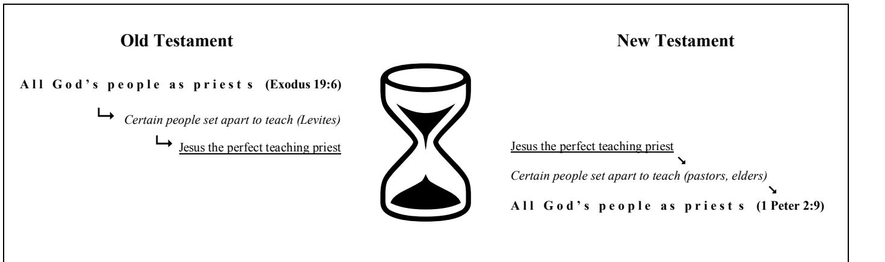
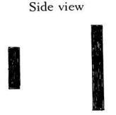

**bible study resources** 

# **Malachi**

**© St Helen's, Bishopsgate. All rights reserved**

#### **Study Notes** *Malachi 1:15*

#### **Main Point and Purpose**

*Through Malachi, God reassures Israel of his continued covenant love for them, demonstrated by his defeat and permanent hostility towards their enemies*. He does the same for us. Note that Malachi doesn't demand any particular response in this opening passage. He begins in the "indicative", simply declaring his love and promise for the future; the "imperatives" will follow in the rest of the book as Malachi urges us to respond. So it is important that the study this week should have an encouraging, reassuring feel to it rather than being an exhortation to *do* something particularly.

#### **Details**

**1** Oracle, translated "burden" in e.g. Zech 9:1 and 12:1, has the sense of a threatening, rebuking message of judgment. Malachi is like that, although there is also a great deal of positive encouragement alongside the reprimands. This oracle comes from God, literally "by the hand of Malachi". The fact that it is addressed "to Israel" is an encouragement: God is still on speaking terms with his people, and he still considers this small rump state of Judah to be "Israel" in the theological sense, i.e. they are his special covenant chosen people.

**2** The familiar pattern in Malachi is that God makes a statement, the people question it (whether Malachi is putting words to their perceived attitudes or reporting their actual responses doesn't really matter), and then God replies and expands on what he's said. God reminds Israel that he has loved them, because they have forgotten it. God could point to many things to show his love for them, but he focuses on his declaration of love for Jacob (also known as "Israel" see Genesis 32:28) as opposed to his twin brother Esau who did not inherit the blessing and promise of God passed on from Abraham. In effect he's saying, "I chose you, but not him", the people of Israel but not the people of Edom (another name for Esau, see Genesis 25:30).

**3** God's electing love for Israel is shown in the fact that he has destroyed Edom, the nonchosen people. This proves that the promise made so long ago to Jacob is still of relevance to the people of Malachi's day. This could sound petty and arbitrary, except for the fact that from the rest of the Bible we can see that Edom was an enemy of God (and his plan and his people) from very early on (see Numbers 20 where they try to prevent Israel occupying the land God has given them and 1 Samuel 14:47 where they are listed along with other major enemies such as the Philistines). In Isaiah 34, Jeremiah 49, Ezekiel 25 and other places, Edom is condemned by God, as he has become by the time of the exile a symbol of enmity against God and Israel. See the book of Obadiah for a stinging attack on Edom for helping the Babylonians to burn down Jerusalem and destroy it. They gloated over Israel's defeat, and helped pillage the promised land. We know from archaeological evidence, however, that Edom was effectively wiped off the map about this time.

**4** Edom might arrogantly assert its ability to come back from defeat, but God would see that this didn't happen, as a way of showing Israel that he still loved them. Unlike Israel, there would be no return from exile and destruction for Edom (see also Lamentations 4:22). God himself would see to it. So he destroyed Edom and he will continue his hostility against them from now on, Malachi says. This would be reassuring for Israel – they would be safe from an ancient enemy. It also demonstrates the faithfulness of God's promise to love and stand by Jacob, even 1500 years or so after the promise of blessing was given to Jacob. Part of that Abrahamic promise was, of course, that God would "curse those who dishnour you" (Genesis 12:3), and that's exactly what Edom had done to Israel.

**5** Israel might have been concerned at a possible resurgence of Edom, but God assures them that there was not going to be a comeback. They would see this themselves, and come to understand that God is a great king (see also 1:14) even beyond the borders of Israel. He is sovereign over the affairs of all humanity, ordering everything to demonstrate his covenant faithfulness and love.

#### **Application in the light of Scripture as a whole**

It is true that God demonstrates his love for us in sending Christ to die for us (1 John 4:9). But he also demonstrates his love for us by defeating our enemies. Ephesians 6:12 shows us that our enemies are not, now, "flesh and blood" (like Edomites) but spiritual forces of evil. In Colossians 2:15 we also learn that on the cross Christ triumphed over those very enemies. God therefore says to *us* here, I have loved you – and you can see that demonstrated in my defeat of the spiritual forces of evil.

Just as the victory was won in Malachi's time (Malachi 1:3) but would only be finally and decisively seen in the future (Malachi 1:45), so Christ's victory on the cross *has* defeated evil, but this will only be decisively seen in the future (see Revelation 18:21 24 for instance, where "Babylon" stands for all of the enemies of God and his people; and Revelation 20:10 where the Devil too meets his final end). However difficult things are for us now, we know the final result is certain.

Malachi 1:23 is quoted by Paul in Romans 9 as part of his discussion of predestination. I suggest that this is not the place to go in our studies this time, because Paul develops a different angle to Malachi and we are studying Malachi, not the use of Malachi in Romans. Malachi's own main thrust has to do with God's love being shown through his defeat of our/his enemies, which isn't what Romans 9 is about. In your further reflection on this passage during the week after the study, though, why not read Romans 9 and meditate on it?

*Malachi 1:614*

#### **Introduction**

In applying the Old Testament to today, it is important that we first understand how any particular passage is fulfilled in Jesus, since all Scripture is about him (John 5:39). However, although this is a vital first step, it is not the beall and endall of handling the Old Testament. If we only demonstrate how it is fulfilled in Jesus we will see how Scripture fits together and praise God for that, but we will not be applying Scripture to ourselves. Since Scripture is given to us not only to teach us about Christ but also to teach, reprove, correct, and train us in righteousness (2 Tim 3:1617) we should not stop until the passage has done these things. Hence we need to answer three questions: what does this passage say, how does it lead to Christ, and also how does this rebuke, correct, and train **us** in righteousness? The Pharisees that Jesus addressed in John 5:39 were content just to study Scripture to see how it fitted together, but they failed to use Scripture for the purposes for which it was provided, and were rebuked for doing so!

#### **Main Point and Purpose**

*Malachi exhorts the priests not to give God second best sacrifices, because of who he is, and warns them in their response not to make vows to change which they subsequently will not keep.* It is a provocative passage which is meant to shock the priests into action as they realise their halfheartedness.

#### **Details**

**69** Don't give God second best, but honour and respect him in the temple sacrificial system. Leviticus 22:22 stipulates that they should not accept substandard sheep and offer them to God. To do so shows how much they value God. They don't even think he is worthy of the same effort as their secular ruler (the "governor" verse 8).

**1011** God would rather the temple was closed for business than have second best. If they can't be bothered to honour him as he deserves, he would rather they didn't bother at all. For he is a great king (see also verse 14 and 1:5) who will one day be worshipped perfectly by people of every nation. In other words, God doesn't *need* you so that he will accept whatever you give him regardless of its quality.

**1213** Malachi returns to highlight the priests' rotten attitude towards God. They consider the effort required to honour God properly is too much trouble. God asks pointedly whether they really think he should accept such lacklustre commitment.

**14** Possibly, after hearing verses 613, the priests were sufficiently humbled to start considering how they should respond. So at the end of this section Malachi warns them that if they make promises to give God the best from now on, they need to keep those promises or be under God's curse of displeasure and discipline.

#### **Application in the light of Scripture as a whole**

The theme of "priests offering sacrifices" is fulfilled in the New Testament in Jesus Christ, the perfect priest, offering himself onceandforall as the perfect lamb of God. Verses such as Hebrews 9:2328 and 10:12 make this point. There is still, however, a sense in which we do offer sacrifices to God. Hebrews itself makes this point in Hebrews 13:1516 where we are told to offer the sacrifices of praise and good works which are pleasing to God (unlike the shoddy sacrifices of Malachi 1 in which God has no pleasure). See also Romans 12:1 where we are to present our bodies as a living sacrifice, acceptable to God. The big question of application therefore becomes: in what ways do we as Christians offer God substandard, secondbest sacrifices? And would we treat our bosses, or the Queen, in the same way and expect to get away with it or be blessed in return?

Leading on from that, Malachi 1:10 should shock us as much as it shocked Malachi's audience; if you can't be bothered to serve God with your whole life and whole heart, then don't bother! This is not meant to make us give up being Christians, but to prompt us to wholehearted dedication to God in every area of our lives. It's a rhetorical device to rouse us to action, not a literal command to give up if we've started to slip a bit. Malachi 1:11 is a prophecy about us – Gentiles from all nations do now worship God and sacrifice pure offerings to him (in fulfilment of Matthew 28:19, and Acts 1:8). This reminds us not to think too highly of ourselves – God doesn't *need* us for his plans to be fulfilled or to get the glory he deserves, since he is worshipped as a great king by multitudes of others who *can* be bothered to give him their very best. This is quite a challenge for us in our groups.

Verse 14 is a warning to us not to leave a study of Malachi 1 making great promises which we know we will not keep the next day and the next week. It is not saying that if we fail or fall or stumble then God will abandon us as Christians. But it *is* saying that if we persist in giving God second best then we cannot expect his blessing, or expect to enjoy our Christian lives and increase in godliness. He disciplines those he loves (Hebrew 12:56) in order to train them for righteousness and keep them in his way. We depend on God for everything, so we need to pray for his grace to sustain us, and his help to strengthen us as we press on. We will not achieve perfection, but should be making progress towards the prize (Philippians 3:1216).

*Malachi 2:19*

#### **Introduction**

Remember that it is important not just to show how the Old Testament is fulfilled in Christ and to discuss questions of how the Bible fits together; we must use God's word to correct, rebuke, and train ourselves in righteousness (2 Tim 3:1617).

#### **Main Point and Purpose**

*Malachi exhorts the priests to honour God by listening to him, teaching his word faithfully, and living it out in their own lives.* This is a conditional promise of a curse to fall on them if they do not take his words to heart, so it is intended to provoke them into repentance and action to avoid the curse.

#### **Details**

**13** Malachi continues talking to the priests directly, this time addressing them in terms of their teaching function rather than in terms of their responsibilities in the sacrificial system (see Deuteronomy 33:10 for both of these roles together). They must listen, take to heart what God says, and honour him. The curse for not doing this is described in graphic language – they will have faeces on their faces, the dung/offal/entrails from the sacrificial animals they dealt with which should have been disposed of and thrown away. This is symbolic of how their position and standing in society will suffer ("*despised and abased before all the people*" verse 9) as a result of ignoring God. Ironically, since the priests were meant to bless the people in God's name (see Numbers 6:2227 and Deuteronomy 10:8), God will "curse their blessings", making the priests a curse to people rather than a blessing). This process may have begun already (verse 2).

**47** God reminds the priests (who are from the tribe of Levi) that he has a covenant with them (see also Jeremiah 33:21 and Nehemiah 13:29 which mention this covenant). He wants that covenant to continue, which is why he is warning them here to keep their side of it. It is a covenant to bring life, peace, and reverence for God. The perfect priest is then described: this is how it used to be, says God, in the good old days. The main elements of the perfect priest's description are: true instruction, upright living, and a beneficial effect on others.

**89** They have corrupted the covenant with Levi by reversing it: their instruction is faulty, they themselves have "turned aside from the way" (the lifestyle they were mean to live), and they have caused others to stumble. They have shown partiality in their instruction (see Deut 16:19 where this is placed alongside bribery and the perversion of justice as a form of corruption). Since God does not show partiality (Deut 10:17, Romans 2:11) this is especially bad for those who are meant to be his messengers (Malachi 2:7). There are various ways they could have shown partiality to the rich or the powerful in allowing them to get away with things they ought not to have, or shown partiality to others by not rebuking them for their sin or by watering down God's commands in some way.

#### **Application in the light of Scripture as a whole**

The Levitical priests (priests of the tribe of Levi) were set apart for a particular function amongst the people of Israel, but the people themselves were in some way priests too: Exodus 19:6 calls them a "kingdom of priests and a holy nation." So the priesthood function narrows down from people to Levitical priests. The Old Testament theme of "priests as teachers and examples to others" is fulfilled in Jesus, the perfect teacher who taught God's word faithfully, lived what he taught, and turned many from iniquity. The priesthood theme then widens out again in the New Testament. 1 Peter 2:9 applies Exodus 19:6 to Christians: we are a royal priesthood (the "priesthood of all believers" as theologians call it). We can picture this development in a curvaceous hourglass diagram:

The New Testament does not call church leaders "priests". However, in terms of their *function* as described here in Malachi 2, their equivalent role in the New Testament is taken by pastorteachers. Church "elders" must be able to teach faithfully, live faithfully, and be model believers (see Titus 1:59 for instance). Like Malachi 2, the New Testament contains warnings such as James 3:1 for those who would be teachers of the word. As an *extended* application, Malachi 2 can be applied in an indirect way to parents as teachers of their children (Ephesians 6:4), to Bible study group leaders, to evangelists, and to all of us (Colossians 3:16 shows that we are all meant to be teachers of the word in some sense). It is a serious undertaking, in which we must give honour to God's name and listen to him, otherwise we will be "despised and abased" for hypocrisy.

#### *Malachi 2:1016*

#### **Introduction**

The footnotes in the ESV reveal quite a debate about how to translate this passage. Then it raises the controversial issues of marriage and divorce. And that is before we start thinking about how this OT teaching applies to us today as Christians! So we need to be aware that we will *not* be able to discuss / answer every question which might come up in this study.

#### **Main Point and Purpose**

*Malachi rebukes the people for breaking faith with God and one another by marrying outside the covenant, indulging in groundless divorce, and thinking they can cover such sins with a show of religion.* The word "*faithless*" is repeated five times. Malachi's purpose in such teaching is to warn / rebuke. Sin can't be hidden by religion or shows of religious enthusiasm.

#### **Details**

**1011** They have broken faith with one another which is itself a violation of the covenant God made with them and their ancestors. The fact that they have one Father (see Exodus 4:2223 and Malachi 1:6 for God as the Father of Israel) and were created (as a people) by one and the same God (see e.g. Isaiah 43:1,7 for God "creating" the nation of Israel) underpins the fact that to be faithless towards each other is wrong. The faithlessness involves "*abomination*", profaning what God has called holy (his "*sanctuary*") through marriage to women who worshipped other gods – explicitly forbidden in Exodus 34:1116 and Deuteronomy 7:34 (see also Ezra 9:12 for a description, using the words "*faithlessness*", "*abominations*", and "*holy*" of this very problem in Ezra's day, not long after Malachi). This, it was assumed, would inevitably lead to the Israelites worshipping other gods too (see Nehemiah 13:2329, which also mentions the example of Solomon). The sanctuary could be the temple (for temple language see 1:10, 3:1, 3:10) or the land as a whole (see Exodus 15:17).

**12** The invocation of a curse of banishment / alienation is due to the assumption that marriage to someone of another religion necessarily involved worshipping a God other than the LORD. Leviticus 20:24 uses the same sort of language in the case where someone "offers" their children to Molech – which could be a dedication ceremony insisted on by a nonIsraelite Molechworshipping mother, or even something more grisly. Such mixing of false religion with the worship of the true God would cut someone off from God and exclude them from God's people – even if they brought offerings to the LORD. The last clause is related to the rest of the sentence with an "even if" or an "and", making it clear that the anathema is in force even though the people involved might try to get around such an exclusion by still making sacrifices to the true God. A show of religion will not make up for profaning God's covenant and disobeying his commands.

**1314** Malachi flags up a second issue in which they are being unfaithful. The big issue in the second half of the passage seems to be divorce, but this is only brought up as a way of highlighting their hypocrisy. They realise God is not happy with them and respond in an overthetop way, reminiscent of pagan worship (see 1 Kings 18:2630, Ezekiel 8:15, Isaiah 15:23) in an attempt to persuade God to accept them. God, however, responds by pointing to the real problem. No matter how impressive their religious performance, he will not be manipulated by it, or persuaded to ignore their marital infidelity. As a witness to their childhood marriages (i.e. their first marriages, probably to Jewish women, probably arranged in childhood as many were) God holds them accountable for their failure to keep their vows. They have divorced their legitimate wives, probably to marry the foreign godless wives of verse 12! This was not only unnecessary, strictly speaking (since polygamy was tolerated in the Old Testament) but was a violation of the covenant. Divorce was permitted (though not encouraged) by Deuteronomy 24:14, but even then it was not to be "for *any* cause" (Matthew 19:3), i.e. not just because the husband got fed up, or fancied a change.

**1516** The ESV probably gets v.15 right in its main text, but several footnotes indicate that the Hebrew is difficult to translate and understand. Probably it means the one God who made and saved Israel wants Israel's offspring to follow him, and not be divided between their mother's god and their father's God. The big issue of the passage is clear without grasping all the details here. The NIV translates v.16 "I hate divorce." The Hebrew does not say that. The ESV's main text is most probably correct, making the divorcing husband the one who "hates" (as in Deuteronomy 24:3) to "hate and divorce" meaning to divorce one's wife because of a dislike for her. The point being made is that to do such a thing is a violent act. The exhortation to guard yourselves in your spirit (verses 15 and 16) probably means that such violent (i.e. groundless) divorce is harmful to *both* parties, not just the wife. It is certainly a violation of the covenant.

#### **Application in the light of Scripture as a whole**

1. *Marriage outside the covenant*. Christians should only marry Christians (1 Corinthians 7:39). If one becomes a Christian after marriage to a nonChristian, that is another matter (see 1 Corinthians 7). Malachi 2:12 seems a harsh sentence for a believer who has mistakenly married an unbeliever to bear, but the OT assumes that marrying an unbeliever means the believer giving up their exclusive faith in the one God and adopting the worship of a foreign god (or playing both sides). It is that abandonment of exclusive faith in the one God which incurs the penalty not marriage to a nonChristian *per se*.

2. *Religious show*. If we sense a problem in our relationship to God, the prescription is selfexamination not hypocritical emotionalism. This is the thrust of verses 1316, and it is the reason Malachi brings up divorce. He basically says, "Your marriage must be in good repair if you want God to listen to your prayer." That's a nice rhyme, and it chimes in well with 1 Peter 3:7 where the husband must treat his wife properly or his prayers will be "hindered." Can we expect God to be gracious to us and show his favour towards us if we treat his word with contempt (see also 1:9)? Thank God he *is* such a gracious God and overlooks many of our sins; but that is no excuse for us not dealing with them.

3. *Divorce*. Regardless of how we translate verse 16, God does not like divorce, and as a witness to all marriage covenants he holds both parties accountable. There is more in Scripture on the subject of divorce than just Malachi 2, and most divorces are complicated, so considerable care is necessary when talking about and applying this teaching.

#### *Malachi 2:173:5*

#### **Main Point and Purpose**

*God replies to accusations that he has abandoned justice by assuring the people that he is coming to purify some and to judge others.* The question which lingers is, "who can endure the day of his coming?" which prompts us to ponder whether we will be purified from all our unrighteousness (1 John 1:9) or judged for it. We don't really find out until 3:1617 the qualities of those who will be saved on that day (they are those who fear God and esteem his name).

#### **Details**

**2:17** God is fed up with people saying that he approves of evildoers, and fed up with people thinking he has disappeared. The key issue in Malachi, remember, is that they think God has forgotten or abandoned his covenant. So when they see evildoers (like those mentioned in 3:5?) prospering and getting away with it, they conclude that either the God of justice they read about in the Scriptures has disappeared or that he has changed his mind about whose side he's on. God does not approve of such thinking! (Psalm 73 expresses similar thoughts.)

**3:1** God's answer to the accusation that he has disappeared is to reaffirm that he is coming soon, as the God of justice. First he will send a messenger to prepare his way, and then he will come, just as they wanted him to, as a judge to enforce his covenant. The "*messenger of the covenant*" seems to be God himself: he is "*the Lord*" (that's *Adonai* a common title for God in e.g. Isaiah 6:1 which means Lord or Master, not YHWH which would be "LORD" in capital letters), and he is "*me*" (God). But God also refers to him in the third person: "*he* is coming…" rather than the expected "**I** am coming." So the one coming is God but can also be distinguished from God somehow…

**24** They claim to seek the arrival of God as judge, but are they ready for him to judge *them*? The priests and people of Malachi's day are themselves part of the problem. They need to be refined and purified before their offerings (so substandard in 1:1213, and hypocritically offered in 2:1213) will be brought "*in righteousness*" and be pleasing to God and that is what will happen when God the Messenger comes to his temple. He will start with the Levites (v.3) because they are the spiritual leaders of the people, cleansing them of their unrighteousness, but the offering of the people as a whole (v.4) is also thereby improved. Their relationship to God which is now in a terrible state (see 1:9, 2:13, 3:7) will be restored to how it was in the "good old days" (v.4) which they thought God had forgotten.

**5** This is part two of God's answer to the question in 2:17. Has the God of justice disappeared? No he is coming, to purify some, but to judge others. He was the *witness* to their covenant marriages (2:14); now he will be a *witness* against evildoers and enforce his covenant. The evildoers mentioned here are, perhaps, the kind of people whose prosperity in Malachi's day had prompted the original question of 2:17. This is a list of several types of sin condemned in the Law, with "the widow, the fatherless, and the sojourner", the weakest and most vulnerable members of society who God promised to defend, being put together as they often are in the Bible (e.g. Deuteronomy 10:18, 24:1921, 27:19). God sees injustice and will punish it on the day of his coming (verse 2), the day of the LORD (3:17, 4:1, 5).

#### **Application in the light of Scripture as a whole**

1. *The Preparatory Messenger*. From Mark 1:2 (which quotes Malachi 3:1 and Isaiah 40:3) we can see that the preparatory messenger of Malachi 3:1 was John the Baptist (see also Matthew 11:10 where Jesus makes this very clear). Making such an identification leads us to expect that the next person on the scene after John will be *God himself* in the person of the messenger of the covenant. That's who Jesus is: God himself – God the Son sent by God the Father –coming to his Temple.

2. *The Time Frame*. From the Old Testament perspective, the coming of the Messiah looks like this:

There is some judgment and some salvation involved in his coming, and it's hard sometimes to untangle those two things in the prophecies. But from our New Testament perspective, we can see that the coming of Jesus is actually like this:

Jesus came once to do away with sin by the sacrifice of himself (salvation); and he will appear a second time to judge the world (Hebrews 9:2628). We live in between the first and second comings of Jesus. Roughly speaking that means Malachi 3:14 prophesies the time around first coming of Jesus (see Acts 6:7 where many priests are "purified" and "refined" by becoming Christians as the gospel spreads in "Judea and Jerusalem") while Malachi 3:5 awaits fulfilment on the last day when Jesus comes again. In another sense, though, both the reformative (purifying) and punitive (punishing) justice of God are displayed in the same place at one time – in Jesus, on the cross (reflecting on John 9:39, 12:3132, 12:4748).

3. *The apologetic argument*. People who are not Christians still say today, "Where's your God when the world's in such a mess and evil men get away with things all the time." That's not exactly the same question as the covenant people of Malachi's day questioning God's continued commitment to his word, but there are similarities. The response can be similar too: the God you seek *has come* to sort it all out, in Jesus. And one day he *will come again* to judge the living and the dead. We can be as sure of the coming judgment as we are of the past salvation. Are you ready for him to judge *you*? Can *you* endure the day of his coming?

#### *Malachi 3:612*

#### **Main Point and Purpose**

*The gracious God calls rebellious Israel to return to him and, by demonstrating such a change of heart in their financial giving, to experience his blessings in return.* The main purpose is to get them to return to God: giving is the way in which that return would be made visible. There is an enticing promise of blessing and a challenge to test it out in our experience.

#### **Details**

**67** God is coming to purify and to judge (3:15) *for* he has not changed. But it is his unchangeableness that also safeguards the continued existence of the rebellious children of Jacob (who was a rebellious "deceiver" himself). He is unchanging in grace as well as in justice, which is why they have not been consumed or "finished off." They fully deserved such a fate as made clear in Ezekiel 22:1731 where refining imagery is used to describe not purification (as in Malachi 3:14) but destruction (same word: consumed, finished off). That they were not consumed was only down to God's grace (promised in Lev 26:44). There is a double meaning or pun here: literally it can be read something like "I the Lord do not change, and you children of Jacob haven't stopped", i.e. you haven't changed either! They *should* have been consumed by God (rather than graciously spared) since they were a rebellious generation of a rebellious people (verse 7). The call (as in Zechariah 1:16) is to return to God. But the people ask what would it look like to repent? What difference would it make?

**811** Their tithing was an indicator of their heart condition. They were halfhearted in obedience since they thought that God had forgotten his covenant promises. So they considered it wasn't worth their while tithing, as it would make no difference in the real world. Malachi therefore reminds them that God's word remains relevant by outlining God's promises of rewards for obedience and discipline for disobedience. As in Haggai 1:611, the problem is that God has withheld agricultural / economic blessing as discipline for their wrong attitude. Yet he promises to restore the blessings of rain and good harvests if they return to him. He invites them to test him, to see if he's telling the truth or not (rather than to provoke him as in "*You shall not put the LORD your God to the test*" in Deut 6:16, which uses a different word for "test"). They will see just how much he stands by his word when they obey it by bringing the full tithe in.

**12** If their hearts return to him and this is demonstrated by their actions in tithing, the consequent blessing will be so great it will be noticed by everyone. They will be a land of delight (see Psalm 16:3 and Isaiah 62:24 for God's delight in his people noticed by all). This is part of Malachi's hopeful look forward to a day where the praise and worship of God is not confined to the borders of Israel (1:5, 11, 14).

#### **Application in the light of Scripture as a whole**

1. We are not under the Mosaic Covenant anymore! So we do not have to tithe 10% as Israel did (e.g. in the context of his "collection", Paul says in 2 Cor 9:7 that our giving should not be under compulsion, i.e. not as a duty or legal requirement). So things for us do not work exactly as they did for the Israelites in Malachi's day (however we might conceive of the relationship between the Mosaic Covenant and the New Covenant). It is worth saying that, despite some superficial readings of the Law of Moses, it was never the case, even in the Old Covenant, that obedience to God's commands brought immediate and inevitable material blessings while disobedience brought curse (see Job for instance, or the comforting eternal perspective of Ps 73). Jesus, "born under the Law" (Gal 4:4) was perfectly obedient to that Law and yet was cursed in being crucified (Gal 3:13).

2. The principle of reaping from God in accordance with what we sow is still applicable in the New Covenant. This is seen clearly in 2 Corinthians 9:615 on the very issue of money. The more you sow the more you reap. However, it is vital to notice that the sowing of material gifts is *not* said to reap an equivalent material harvest but a "harvest of righteousness" (9:10). Giving is a righteous thing to do and righteousness lasts forever (9:9) while the giver is also enriched "in every way" (9:11). Gospelmotivated giving also brings glory to God as it demonstrates our submission to him (9:1113). The same principle also surfaces in Philippians 4 where Paul refers to both the profit accruing to the Philippians' "heavenly account" as a result of their generous material gifts to him, and also to God's present provision for their every need in return (Philippians 4:1519). In Philippians (and in Matthew 25:1430 and Galatians 6:710) the rewards may only be seen in eternity, but in 2 Corinthians there is also a temporal (now) element to the reaping.

3. This is not the place for a full and comprehensive examination of all that the Bible has to say on the subject of giving (for which see Craig Blomberg's excellent *Neither Poverty nor Riches* published by Apollos). It is important that we see not just the principles of how God works in the matter of giving (e.g. the doctrinal and biblicaltheological points above), but how Malachi particularly combines elements of this biblical teaching for his own distinctive purpose (see for instance the comments on verses 811 above). In the context of Malachi, then, this passage particularly provokes us to consider what our giving says about our attitude towards God's word, and forces us to examine our hearts to see if we are demonstrating a belief in its continued relevance. Are we honouring God, submitting to him, and "returning to him" in this matter, or robbing him of glory by withholding material things from him because we're not sure it's worth giving them up? We are invited to put our money where we claim our hearts are, and until we do so we will not experience such a "harvest of righteousness" and spiritual enrichment as Christians which we might otherwise. Test me in this, says God. See if it works in practice rather than scoffing or remaining unconvinced. Giving wealth for the gospel is good for the soul (but not necessarily for the wallet!).

4. If we obey God with all our hearts will we as Christians be seen by all to be blessed, as verse 12 says? Obviously there is a sense in which we will always in fact be hated by the world (see Matthew 10:22 and 2 Tim 3:12), but there is also something attractive to the world about a faithful community of wholehearted believers (see Acts 2:47 and Matthew 5:16). Verse 12 will only be fulfilled ultimately in the new creation (after death, as the Psalm 16 parallel cited above implies, in Psalm16:910).

*Malachi 3:13 – 4:6*

#### **Why put 3:13 – 4:6 together as one passage?**

The ESV keeps 3:1315 as part of the "robbing God" section of Malachi and starts a new division headed "The Book of Remembrance" at 3:16. It also gives chapter 4 its own heading as if it was a separate section. So is there a compelling reason to put all three sections together as one study? Yes! First, the "divine statement – question – divine answer" format we've seen at the start of other passages of Malachi (e.g. 1:2, 1:6, 2:17) indicates that 3:13 is in fact the start of a new section. Second, the question raised about whether it is vain to serve God while arrogant evildoers prosper is answered in 3:1618, especially verse 18 (which should, therefore, be joined to the question it answers). Third, the answer also continues into 4:1 (where the arrogant evildoers are seen not to prosper or escape judgement). There *is* an argument for splitting 4:46 off from 3:134:3, as a more general conclusion / summary, but we might as well put the last three verses into the last study anyway!

#### **Main Point and Purpose**

*However things look now, it is not vain to serve God in the light of the coming day when God will distinguish between those who serve him and those who don't. Until then, remember the Law and wait for the prophet.* Malachi encourages people to keep going in their service of God, even if it doesn't look profitable in the here and now, because one day it will be.

#### **Details**

**1315** God complains that their words have been harsh (cf. 2:17 where he is wearied by their words). Their complaint against him is that arrogant evildoers prosper while those who serve God do so in vain. This is similar to the complaint they had in 2:17 except that there it was a Godcentred question, "where is the God of justice?" whereas here it is the more personcentred, "why should I bother serving God?"

**1618** Uniquely, God does not answer straight away; instead, Malachi narrates what actually happened in his day. Just as the response called for throughout the book is to fear and honour of God (1:6, 14, 2:2, 5, 3:5) so now at last we hear that some of Malachi's hearers did just that. Those who honour God are honoured in return (see 1 Samuel 2:30) by having their names written in God's book (see the books opened in Daniel 7:10 and Revelation 20:12). Those who serve God will be his treasured possession (see Exodus 19:5) on the future day when he will make clear distinctions between people on the basis of whether they have served him. Thus some Old Testament saints are saved; they do not obey the Mosaic Law perfectly (only Jesus could do that) but presumably their fear is credited to them as righteousness.

**4:13** The answer to 3:1315 continues, picking up the vocabulary of arrogant evildoers (3:15) who have not in fact escaped judgment, which arrives on a coming "day" mentioned three times in 4:13), as does the vindication and rejoicing of those who have served God seemingly "as in mourning" (3:14) in this life. The refiner's fire of 3:2 endured by the saved, stands in stark contrast to the consuming fire of verse 1 which leaves the wicked as ashes in v 3. The joys of a new creation full of righteousness and healing are beautifully portrayed in v 2 along with the sobering picture of v 3, reminiscent of Isaiah 66:2224 where in the new creation people look at the bodies of the wicked.

**4:46** These verses are related to Malachi's central themes: first, the Law which they are called to remember in 4:4 has been alluded to, cited, and applied throughout the book, and is the very Law the people thought *God* had forgotten or was neglecting; and second, mention of "the day" in 4:5 fits in with the repeated mention of the "day" in 3:174:3. We know from the New Testament that the Elijah figure promised in 4:56 is the same person as the preparatory messenger of 3:1, because Jesus himself tells us so in Matthew 11:1014. John the Baptist's protestations to the contrary in John 1:21 probably mean either that he himself did not fully understand his own role, or that he discerned that the priests were asking if he was *literally* Elijah, come back from his whirlwind tour of heaven (see 2 Kings 2:11)! Through that Elijah, God had turned around the people's hearts to God (1 Kings 18:37); through the new Elijah he will also turn (or "return" – it is the same word as in 3:7) their hearts. Most likely this means he will turn the hearts of both fathers and sons (literally in Hebrew "fathers on top of sons") back to God, i.e. everybody. Indeed, the Baptiser's ministry in Matthew 3 is one of *repentance* (Matthew 3:2, 8, 11) and calling for the *fruit* of repentance to be shown (very much like Malachi does in 3:710). However, in Luke 1:1617, the Baptiser is said to turn people first back to God then second, turn fathers to their children and then third, the disobedient return to the wisdom of the righteous. Perhaps then, there is a threelayered meaning in this enigmatic phrase in 4:6? The alternative to repentance is the decree of utter destruction. Israel either repent when Elijah arrives, or face "utter destruction" (as Jericho did in Joshua 6:17, same word).

#### **Application in the light of Scripture as a whole**

1. Our main application: should we be tempted to think it is vain to serve Christ in the here and now, Malachi encourages us to look to the future day of judgment when Jesus comes again to clearly separate the sheep from the goats (Matthew 25:3146).

2. There are many ways in which we can see this passage being fulfilled in the coming of John the Baptist and then Jesus' second coming, which are brought out in the details of 4:46 above. Thank God for keeping his promise by sending John, and for the confidence this gives us that he *will* keep his other promise of final salvation and judgment through Jesus. It is also interesting to muse on the linking of Moses and Elijah again in Mark 9:213. But only if you have time!

3. The people of Malachi's day needed to stay under the supervision of their guardian Moses until Jesus arrived (Galatians 3:24). So the call to remember the Law of Moses in 4:4 does not mean that *we* should return to circumcisions, tithing laws, and bloody sacrifices made on altars by priests! We could, however, turn it into a general call to "remember Scripture." It could also function as a call to continually meditate on God's word "for all Israel" as a way of Å revealing our sin to us (see Romans 3:20) while we wait for the day when we shall be rid of it; Ç as a way of seeing how to be saved through faith in Christ Jesus (which is what 2 Timothy 3:15 says the Old Testament shows us); É as a way of training us in righteousness (which is what 2 Timothy 3:1617 says the Old Testament is useful for). The New Testament itself uses the books of Moses to do these three things in e.g. Romans 7:7, Romans 4:3 (see also verses 2324), and Ephesians 6:13.

# **Questions relating to Malachi as a whole Read all of Malachi through at least once (it's only 4 chapters!).** 1. What is the general thrust of the whole letter?

- 
- 2. Which bits make you go "hmmmm?"
- 3. Which bits make you go "What on earth is that about?"
- 4. List recurring words, phrases, and themes.

# **Questions relating to Malachi 1:15**

1. The word for "oracle" in Malachi 1:1 is used in Isaiah 13:1, 15:1, 17:1, 19:1, 21:1, Nahum 1:1, Zechariah 9:1 and Zechariah 12:1 and other places. Have a look at those other references – what sort of prophecy is an "oracle" or "burden"? i.e. what kind of tone and content do oracles usually have?

2. Read Genesis 25:1934 for background on Isaac and Esau.

3. Read Obadiah verses 1014 (if you can find it!). What had Edom done to Judah when the Babylonians had attacked and destroyed Jerusalem?

4. In Malachi 1:25 how does God say he has demonstrated his love towards his people?

5. Has God demonstrated his love towards *us* as Christians in any similar way? (It might help to think about who our enemies/God's enemies are today, in places like Ephesians 6 for instance).

# **Questions relating to Malachi 1:614**

1. In what way are the priests failing to honour God (verses 69 and verses 1213)?

2. We do not have priests and animal sacrifices as the people of Malachi's day did. So in what ways is this Old Testament theme fulfilled and developed in the New Testament? See Hebrews 10:12 and Romans 12:1.

3. So in what ways can we fail to honour God, like the priests of Malachi's day did?

4. What is God's response in verses 1011? How would this make the Israelites feel when they heard God saying this?

5. In what way can we cheat God (verse 14)?

# **Questions relating to Malachi 2:19** 1. What's the problem (verses 13, 89)?

- 
- 2. Why does God threaten and warn the priests (verse 4)?
- 3. What are the main elements of the covenant with Levi (verses 57)?
- 4. Does this apply to anyone today? How are things different?

# **Questions relating to Malachi 2:1016**

1. What is the key word / theme (repeated 5 times)?

2. Read Exodus 34:1116, Deuteronomy 7:34, Ezra 9:12 and Nehemiah 13:2329. What is the problem with marrying outside of the covenant people?

3. How does the curse of verse 12 apply today?

4. What is wrong with their religious attitude in verses 1314? How would that attitude express itself in *our* lives?

5. What is the main thrust of verses 1516 (a phrase repeated twice)?

# **Questions relating to Malachi 2:173:5** 1. What is God fed up with in 2:17?

- 
- 2. What is God's answer to this question in 3:14?
- 3. What is God's answer in 3:5?
- 4. Can you find the fulfilment of 3:1 in the New Testament somewhere?

# **Questions relating to Malachi 3:612**

1. What is the importance of the "therefore" in the middle of verse 6? (What's it therefor?). What aspect of God's character has not changed since he first saved Israel?

2. Why does God bring up tithing (i.e. what is it an example of)? How is this related to the big theme of Malachi?

- 3. What is the principle being applied from the Law of Moses in verse 811?
- 4. Does this principle apply in the New Testament? If no, why not? If so, has it changed at all?

# **Questions relating to Malachi 3:134:6**

1. What is the big issue in 3:1315, and how is it different from 2:17?

2. How is the immediate answer in verse 16 onwards different from other answers in the book?

3. Malachi 3:17 – 4:6 talks about a coming "day", just as 2:17 – 3:5 does. But how is the answer in 3:174:6 different from 3:15?

4. When is 4:13 fulfilled? And how would you explain 4:3 to a new Christian who found the idea very difficult to accept?

5. Many commentators think 4:46 was added to Malachi much later on as an "appendix" to the book, or to the Twelve Minor Prophets as a whole, or to the Prophets as a whole, or to the Old Testament as a whole. What do you think of that idea? Is there anything about these verses which shows they fit in with Malachi itself?

# **An Introduction to Malachi**

So let's start by reading Malachi. Now I've enjoyed reading this new book from Nigel Cawthorne, *The Strange Laws of Old England*. He has researched lots of the old laws of the land, many of which still apply today but which we probably think are a bit strange or silly. And, he says here on page 63 that "*a law was passed on 2 May 1648 making denying the Trinity, or doubting that the books of Habakkuk, Zephaniah, Haggai, Zecharia [sic] or Malachi in the Old Testament were not the word of God, punishable by death*." So let's treat what we're about to read as God's word – because it's the law!

# **Historical Background**

One of the first things we need to ask about any book of the Bible as we come to study it is, when was this written? It's essential that we have some idea of the historical context of the book because that provides vital clues to the meaning. So what is the immediate background to Malachi?

I know many of us can recite a Bible overview or timeline in our sleep, so forgive me if this seems like revision to you. In about 1000BC

King David ruled over the people of Israel in the promised land. They were happy, prosperous, and militarily superior to the surrounding nations and so safe from attack. But David's son Solomon was the last king to reign over a united people, as after him the kingdom broke in two – ten of the twelve tribes formed "Israel" in the North, and two formed "Judah" in the South, centred on Jerusalem.

After a couple of centuries the Northern kingdom was invaded and conquered by the Assyrians from the north. After that, they pretty much disappear from biblical history, while the two remaining tribes continue in the south.

But things don't go well for Judah in the South in the midst of Middle Eastern power politics, and just over a century after Israel is wiped off the map, Judah is also invaded and conquered by the Babylonians. The Old Testament prophets make it very clear that this is no accident, but a divinely ordered judgment from God because of the great sin of the nation and their leaders. Thousands of people are exiled away from the promised land and sent to Babylon and other cities, while Judah itself is left to go to rack and ruin a bit.

The Temple of God in Jerusalem, the symbol of God's presence with his people, is destroyed by the occupying armies and all seems lost for God's people – they have lost their promised land and seemingly the presence of God with them as well. God's plan to save the world through the descendants of Abraham seems to have failed.

All that history, about 1500 years from Abraham to the exile, seems to have ended in disaster and defeat. God's promise has come to nothing. So it's no wonder that by the rivers of Babylon, they sat down and wept.

While in exile, the people mused on the prophecies of Isaiah who had predicted all this and also mentioned a glorious restoration of the kingdom and all God's promises, which would be even greater and better than the magnificent kingdom of David and Solomon. God's messiah would rule God's people back in God's land, enjoying God's abundant blessing.

In October 539 BC, Cyrus the Persian conquered Babylon, and to cut a long story short, he decreed that the Jews could return home and rebuild. They returned home in dribs and drabs over the next few years, and started reconstruction.

But it wasn't at all like Isaiah and others had prophesied. They were expecting the glory days to return. But things were very tough economically, difficult politically, and dangerous on the security front as well. And when they rebuilt the Temple, it was a great big flop. Have a look at Ezra chapter 3 verse 10 on page 466…

*And when the builders laid the foundation of the temple of the LORD, the priests in their vestments came forward with trumpets, and the Levites, the sons of Asaph, with cymbals, to praise the LORD, according to the directions of David king of Israel. 11And they sang responsively, praising and giving thanks to the LORD, "For he is good, for his steadfast love endures forever toward Israel."* 

*And all the people shouted with a great shout when they praised the LORD, because the foundation of the house of the LORD was laid. 12 But many of the priests and Levites and heads of fathers' houses, old men who had seen the first house, wept with a loud voice when they saw the foundation of this house being laid, though many shouted aloud for joy, 13so that the people could not distinguish the sound of the joyful shout from the sound of the people's weeping, for the people shouted with a great shout, and the sound was heard far away.*

That pretty much sums up the return from exile really. Great joy, mingled with great disappointment. They were glad to be back, but it hadn't turned out as well as they had hoped. There's more about this in the books of Ezra and Nehemiah. And it's into *this* situation that Malachi speaks, sometime between 500 and 450BC.

So what does Malachi say? We've looked at his historical background, now let's move on to look at the theological themes of the book itself. But before we do that, are there any questions on the history?

### **Timeline**

**2000**BC Abraham

**1000**BC King David

**722**BC Exile of Israel (Northern Kingdom)

(Southern Kingdom)

# **475BC Malachi written**

**458**BC Jerusalem Ezra visits (*Ezra 7*)

# **0 Jesus born**

**33** Jesus died and rose again

**410** Alaric

invades and trashes Rome

**1066** William the Conqueror

**2005** Central Focus studies Malachi

\* All BC dates are approximate… The latest scholarship puts the crucifixion at 9am on 7 th April 30AD or 3 rd April 33AD (probably the latter

### **Theological Themes**

### *Structure*

Let's have a look at the structure of Malachi. As you probably picked up when we were reading the book, it has this statement, question, and answer format. So, in 1:2 God says, "I have loved you." The people reply with a question, "How have you loved us?" And then God answers with verses 25. This is repeated throughout the book. So it happens again in 1:6 for instance, and 2:17, "You have wearied the Lord" but you say, "How have we wearied him?" etc. So God says certain things, and the people question those statements, either out loud or in

their hearts so that Malachi can put words in their mouths which accurately reflect their state of mind. If we put all of God's statements in the book together we get the following theological definitions. Who is God?

God loves his people and has promised to keep loving them He is their Father, Master, and Creator He is the God of Justice He does not change… things like that.

God is a great king, we're told, and to emphasise that, the one title he is given most often in this book is "Lord of Hosts" or "Lord Almighty" as the NIV puts it.

Literally it is "Yahweh of the Armies", giving a sense that God is a powerful and Almighty God with hosts of angelic armies at his disposal.

And if we put together the picture Malachi paints of the people, we get something like this. What's the problem?

They have forgotten God's promises and his power They are giving God second best in all sorts of ways Their religious leaders are morally lax, theologically liberal, and also corrupt Their sexual morality isn't what it should be They doubt that it is worth serving God in the here and now…

And they know something is wrong with their relationship with God, but they just can't quite see it or sort it out.

Just skipping through the book like that to see what the big issues are is very helpful. And the structure nicely clarifies things for us by highlighting God's statements and the people's doubts. From that brief exercise, I think it's fairly clear that Malachi is a very contemporary book, which will have lots to teach us about God and some challenging things to say to us.

### *Response*

What response is Malachi preaching for? What does he hope his listeners will do as a result of hearing his prophecy? Well, let's skim through the book again:

Looking at 1:6, God wants to be **feared and honoured** as a Father and Master.

We can see that again in 3:16 – "*Those who feared the Lord spoke with one another. The Lord paid attention and heard them, and a book of remembrance was written before him of those who feared the Lord and esteemed his name*."

Then also in 3:18 there, God wants to be **served**. Back in chapter 1:5 the people will **say he is great**, they will "magnify his name" as the Old Testament sometimes puts it. Even the nations will do that says Malachi in 1:11, so we should too.

In 2:2 we are encouraged to **listen, take to heart God's words, and give honour to his name**.

The rest of that section there also makes it clear that there should be **reverence and awe** in our relationship to God. And in verse 610 there it's clear that we're meant to **keep God's ways and walk with him**.

The next section in 2:10 and following describes that as **faithfulness**, so 2:16 – "*guard yourselves in your spirit and do not be faithless*." And there's also teaching in chapter 3 about giving the full tithe, **giving generously to God**. All this is summed up in 4:4 as remembering the law of my servant Moses, or, in other words, **remembering Scripture**.

So in the face of their halfheartedness, God reminds them who he is, and challenges them to respond to his word with great respect for him and greater wholeheartedness in every area of their lives.

# *The Temple*

Interestingly, Malachi's message is quite focussed on the temple. Remember, the same poxy little temple that reduced grown men to tears because it seemed so small and insignificant? Well, God thinks it is quite important.

So there is mention of the temple all over this book. In the second section of chapter 1 the discussion is all about the sacrifices made in the temple. In chapter 2 we've got prophecy addressed to the priests who work in the temple. Then in 2:11 we're told that the sexual faithlessness of the people has "*profaned the sanctuary of the Lord, which he loves*." Sanctuary there is another name for the inside of the temple, and in 2:13 we hear also about the "Lord's altar" which was kept there.

In 3:1 we hear that the Lord himself is going to suddenly come to his temple. And in 3:10 God demands a full tithe be brought in to fill the cupboards of his house, the temple.

### So the people may

have thought of the temple as insignificant and tiny, nothing compared to the glorious temple of Solomon's days; but God thinks of it as his house, he cares deeply about what happens there, and he even says he loves it. So the people had no right to think of their religious practice or observance in the temple as something secondary or unimportant. How they behaved in the temple, their attitude towards the things of God, was a vital indicator of their attitude towards God himself.

# *Hope*

Obviously we could look at various different themes as they emerge throughout Malachi. But let's just look briefly at one more. Let's consider Malachi's view of the future. Because he's not just interested in diagnosing the problems of his own day. He also sought, as part of his response to the pastoral and theological issues he was faced with, to raise people's sights above the mundane things of this world to the future. What is going to happen in the future, according to Malachi? Well, let's look through the book again.

One day, God's people will see the final defeat of their enemies and say (1:5), "*Great is the Lord beyond the border of Israel*!"

Indeed, he is so great that (1:11), "*from the rising of the sun to its setting my name will be great among the nations, and in every place incense will be offered to my name, and a pure offering. For my name will be great among the nations, says the LORD of hosts*." Not just in Israel, but all over the world.

There's a very unpleasant day of judgement for the priests in chapter 2:3 if they don't buck up their ideas, similarly for others in 2:13 there will be condemnation. Chapter 3:1 5 is all about the future: it is hopeful because the messenger of the covenant is going to come, the Lord himself will arrive at his temple, preceded by a messenger to prepare the way before him. It is also a day of refinement (verse 3) leading to a renewed relationship with God (verse 4). But, (verse 5) it will also be a day of judgment.

In contrast to the conditional promise of judgement on the priests in chapter 2, chapter 3:1012 contain a conditional promise of blessing. If only they would give to God what is God's, then God would pour out his blessing upon them.

Then later on in chapter 3 we learn that one day God is going to make up his treasured possession out of his faithful people, and there will be a clear and obvious distinction between those who serve God and those who don't.

There's even more in chapter 4. But I don't want to spoil it all for you. Needless to say, hope and warning for the future is very important to Malachi.

### **The Central Issue**

So we've looked at various themes and issues as they have come up in the book. That's great to give us a flavour of what to expect as we study Malachi this term, and to get us orientated.

### *The Continuity of the Covenant*

But what is the central issue, Malachi's main concern in this book? I think we can boil it down to one thing, and that's the continuity of the covenant. You see the people in Malachi's day are asking themselves does God care? Does he still care about us? They've returned to the land, but there aren't very many of them and they don't control even as much of the southern kingdom of Judah as they used to, never mind the whole northern kingdom of Israel which is completely overrun with people like the Samaritans by this stage.

So we're a poxy little nation with a poxy little temple – does God still care about us? And if he doesn't care about us, why should we still care about him? Is God still with us, like he was with our ancestors in the land? And is the Bible still relevant to us – all those promises of a glorious future to come, do they mean anything now? All those warnings of judgment – does God stand by such things or is it all just old hat?

This book, *The Strange Laws of Old England* is pretty funny at times. There's a whole chapter devoted to silly laws made for the City here. So did you know that if you are a freeman of the City of London you have the right to herd sheep over London Bridge, go about the City with a drawn sword, and that you might well be allowed to be drunk and disorderly around the Square Mile without fear of arrest?

Did you know that Apprentices in the City are not allowed to wear hats that are more expensive than 5 shillings? And that they must under no circumstances contain any silk? An Apprentice's coat must not be made of broadcloth worth more than 10 shillings a yard, and they can under no circumstances wear Spanish leather shoes. This is probably news to our apprentices / associates here at St. Helen's!

But they need to be warned. Because it says here on page 185 that, "*For a first offence, the apprentice would receive a simple rebuke from his master; for a second offence, the apprentice was to be brought before the Chamberlain of the City and locked up for at least 18 hours and fined 3s 4d, half going to the poor of the parish and half to the person who informed on him*."

The Corporation of London is not sure whether these laws of 1611 are still in force or not. But generally we just laugh and ignore them, don't we?

But this is something like what was going on in Malachi's time. You see it had been 1500 years since God made his promises to Abraham. It was a thousand years or so since the Exodus and the giving of the law. That was as much a distant memory to them as the Battle of Hastings in 1066 is to us. An interesting historical episode… and there might be some strange laws around from old Israel. But surely they weren't still in force and applicable today? Surely we're not expected to take such oldfashioned stuff seriously just because it hasn't been officially repealed and removed from the statute book?

No, says God through Malachi. Scripture still applies. I still mean what I said.

So at the start of the book God says it again, "I have loved you." My promise to love you and stand by you is still in force. And at the end of the book he concludes by saying "*remember the law of my servant Moses, the statutes and rules that I commanded him at Horeb for all Israel*."

So explicitly God is saying that his covenant with them continues, despite their sin, despite their rebellion. And it still applies no matter how long ago the promises were given, no matter how many years have passed since the law was first revealed.

## *Malachi's Use of Scripture*

And this is also *implicit* in the way that Scripture is actually used in the book. So Malachi uses Scripture to **declare God's love**. I still love you, God says, because I promised to love Jacob. Events over a millennium ago, promises made centuries previously, recorded in Scripture – they still apply to you, poxy little Israel. So the promise to Jacob that we find in Genesis still applies at the other end of the Old Testament in Malachi.

And Malachi also uses Scripture to **expose the people's sin**. They are denounced in scriptural terms for failing to keep scriptural commands in scriptural ways. So the message the listeners would have got under as well as on the surface is that Scripture is still binding, scripture is still relevant to us.

And Malachi also uses older parts of the Old Testament to **explain hope**. He uses all the categories of Old Testament prophecies to expound and explain the future. So the phrase "day of the Lord" is used at the end of chapter 4, a phrase that comes up many times in the rest of the Old Testament in places like Isaiah, Joel, and Amos. The fact that Malachi uses it as well says to his congregation "this is still a reality, it's still going to happen just like those earlier prophets said."

And chapter 3:5 is almost a cliché, there are so many allusions to standard Old Testament language there. God is still a God of justice and judgment, he's saying, just as he always has been. Malachi's use of Scripture makes that point very strongly.

And finally he uses the Old Testament to **direct their response**, or even *dictate* their response. Remember what we said earlier about the response that was necessary from the people? They were to fear God, honour his name, listen to his words, remember his law. There's nothing new here. It's exactly what Deuteronomy says, and it's exactly what Proverbs teaches.

I'm saying more than just "Malachi is an Old Testament prophet who uses Old Testament language." I think he deliberately goes out of his way to use such language and to allude to earlier parts of Scripture as a way of making his main point even stronger. God is still committed to his covenant. He still cares – and so should you. The Bible – the covenant document remains as relevant as it always has been. And to prove it, Malachi is saturated with covenant promises and covenant warnings, and calls for a response of covenant faithfulness.

And the Old Testament is, of course, equally relevant to us, another 2½ thousand years later. So we will find as we study Malachi that he will declare God's love to us, expose our sin, explain our hope, and direct us to respond. He remains faithful to his covenant promise made to Abraham, and his word endures. He still cares for his people and is hurt when they give him second best.

Malachi calls us to honour God, even if the glory days seem to have passed. They seemed to have gone forever in the 6 th century BC. And for many of us the glory days of being all out for God, being full of enthusiasm and keenness to serve the Lord Jesus also seem to have gone. We don't feel so motivated anymore, there isn't that same urgency as when we first became Christians all those years ago.

If we've lost that impetus, that energy as Christians and started to coast along a bit instead of being fervent and passionate about Christ and his gospel – then Malachi is the book for us. It won't be pleasant studying all this stuff. It might be painful, as Malachi uncovers careless, slapdash attitudes in our hearts and demands that we give God our very best.

If we've started to drift away, Malachi will snap us back and remind us of some important truths. So if we've started to slide, this is certainly going to be the right prescription. But if we are still firing on all cylinders for God, then Malachi is a good inoculation, a way of immunising ourselves against the temptation to halfheartedness.

## *Malachi and the New Testament*

I should say just a few things about Malachi and the New Testament. It's important to say that we know more now than Malachi ever did, about God and about his plan for the world. And that will have an impact on how we understand some of the things he says. So, for instance, when he's talking about sacrificing sheep and goats, we need to understand that in the light of the cross, where Jesus died as our one perfect and fullysufficient sacrifice.

And when Malachi mentions the temple, we will have to remember that Christ has come to fulfil what the temple stood for. When he talks about tithes we need to understand that in the light of the gospel and the fact that in some sense the law of Moses has been abolished, as we saw in Ephesians 2 last year.

Our understanding of God's love has also been enlarged, so that we look back not to the Exodus, the return from exile, and the defeat of earthly enemies like Edom but to the cross, to reconciliation with God through Jesus, and to his decisive victory over evil.

Our *hope* is in one sense the same as Malachi's but in another sense different. The messenger of the covenant has come to his temple, in the person of the Lord Jesus. God is acknowledged as a great king by Christians in many nations of the world in a way that Malachi could only dream about when he wrote 1:11. Those things have happened, they were Malachi's future but are in our past.

But we still look forward to a day, don't we, when we will leap like calves released from the stall, when the sun of righteousness will rise with healing in its wings? We still look forward to a day when evil will be wiped out and sin will be no more, when our hearts will be purified and our offerings perfect.

We'll need to do a bit of work on these things over the next few months to make sure we don't misunderstand Malachi in the light of the rest of Scripture. Things have changed this side of the cross and resurrection of Christ.

But they haven't changed so as to make God's word defunct. This is still as relevant and as powerful today – properly understood as it was in Malachi's day. And I hope that this term we will grasp something of the profound depth of the challenge to our hearts that God intended when he put this book into our Bibles.

**Lee Gatiss**