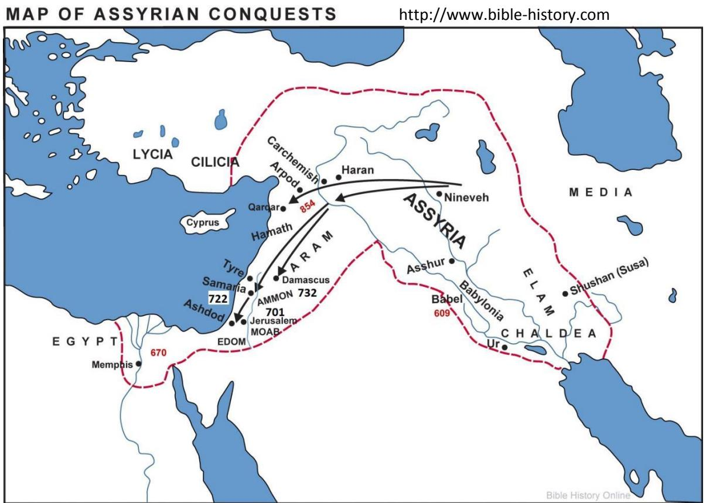
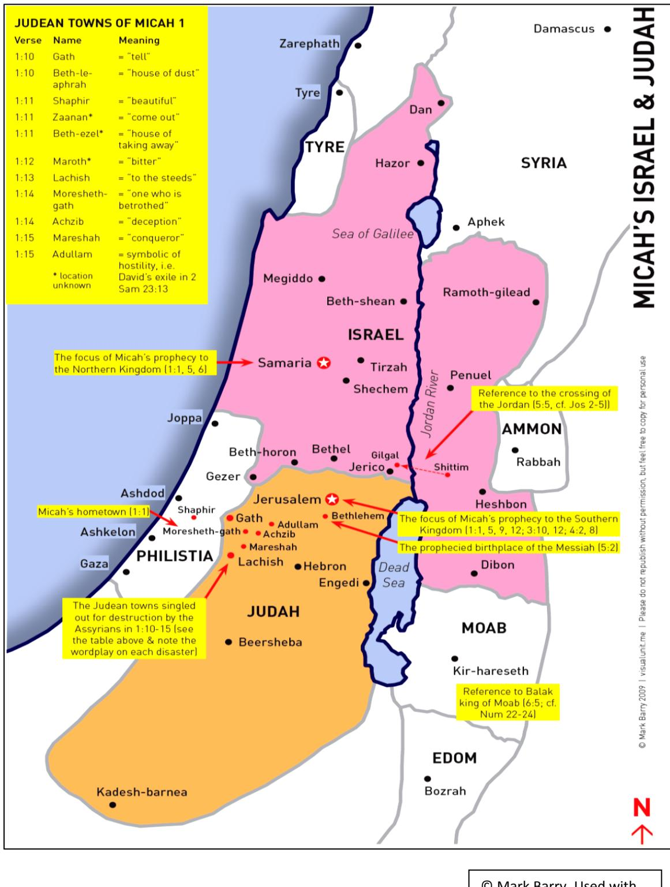
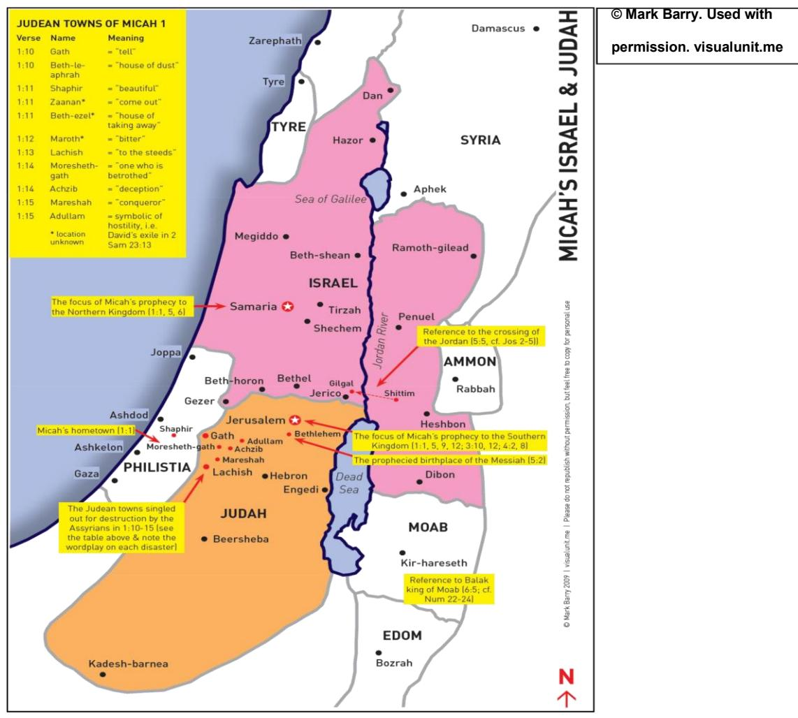
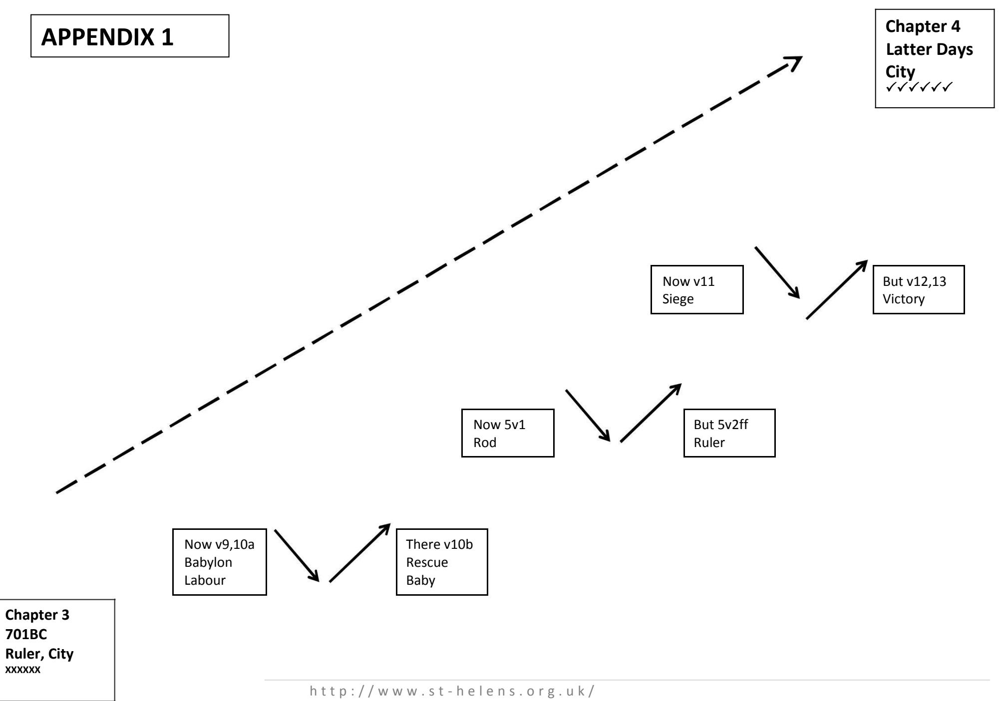

**bible study resources** 

# **Micah**

**© St Helen's, Bishopsgate. All rights reserved**

# **Study Notes on Micah**

# **TABLE OF CONTENTS**

| Contents            |                         | Page |
|---------------------|-------------------------|------|
| Micah preparation   | …………………………………………………………… | 3    |
| Study Notes Micah 1 | ……………………………………………….………… | 11   |
| Study Notes Micah 2 | …………………………………………….…………… | 16   |
| Study Notes Micah 3 | ……………………………………….………………… | 20   |
| Study Notes Micah 4 | ……………………………………………………    | 25   |
| Study Notes Micah 5 | …………………………………………………………… | 30   |
| Study Notes Micah 6 | ………………………………………………….……… | 34   |
| Study Notes Micah 7 | …………………………………………………………… | 38   |
| PREP QUESTIONS      | …………………………………………………………  | 43   |
| Appendix 1          | …………………………………………………………  | 49   |

# **Study Notes on Micah Micah Preparation**

It would be a mistake to view Micah as a difficult book from which to lead Bible studies. Prophecy is very different to the New Testament epistles, but those very differences can lead to exciting, life-changing Bible studies. Micah had an urgent message for the people of his day, and his word-pictures leap off the page, sometimes with visceral force.

This first guide is intended to help us as leaders do advanced work on the book as a whole. That's as simple as the normal work of reading the whole book slowly and carefully, while trying to work out how Micah is using what he says to make his point. A couple of hours per week in the month *before* starting studies in Micah should repay us later: in the week by week scramble to prepare individual studies, we will find preparation both easier to do, and more fruitful for our groups.

### **Micah's Situation**

1v1 is Micah's introduction to his book. It contains, for an Old Testament Israelite, everything Micah thinks you need to know to understand his book.

Notice, first, the careful statement of the scope of the book. This is the word of Yahweh TO Judah. The three kings named cover a (maximum) period of 56 years in the history of the Southern kingdom of Judah: Jotham (742-735BC), Ahaz (735-715BC), and Hezekiah (715- 686BC). He does not name Pekah or Hoshea who were kings of Northern Israel in the same period. But the subject/content of the word is 'concerning' the capital cities of both Judah and Israel, Jerusalem and Samaria.

Notice, second, the tone of the book. The word 'concerning' in v1 is more literally 'against.' This sense fits the rest of the book. The words are 'against Samaria and Jerusalem.' The message to the situation of the first hearers was a warning and an accusation. Significant sections of the book imagine a court-room scene with Micah acting as prosecuting barrister, and God's people as the accused in the dock.

Notice, third, the particular period of history. Micah operated in the same place and time as Isaiah. Reading 2 Kings 15-20 would give us most of the Old Testament background that Micah assumes. (Reading Isaiah 1-39, or Amos for the Northern Kingdom, would give much more detail.) In this period Assyria took over as the regional super-power from Syria. The two names sound confusingly similar to us, but to contemporaries they were as different as Germany and Russia during WW2. (Often Bible writers refer to them by their capital cities – Assur & Nineveh for Assyria; Damascus for Syria.) Assyria conquered Syria & captured Damascus in 732BC, conquered Israel & captured Samaria in 722BC, and conquered Judah & besieged Jerusalem in 701BC. They failed to capture Jerusalem and withdrew leading to a new status quo in which only Judah survives of Solomon's empire, but under Hezekiah they enter a new period of security and stability.

Micah also draws on older episodes in Israel's history. You could read Exodus 15 for Moses, Aaron and Miriam (6v4), Numbers 22-24 for Balak and Balaam (6v5), Numbers 25 for Shittim (6v5), Joshua 3-5 for Gilgal (6v5), and 1 Kings 16-2 Kings 11 for Omri and Ahab (6v16).

#### **Structure**

Micah's book is structured around the command to 'Hear' at the beginning of each new section (1v2; 3v1; 6v1). Each section begins with judgement before it moves to rescue.

The first two sections are clearly in chronological order, and relate to the time before and during the great traumatic events of the Assyrian invasions. I suggest that the third section is also tied chronologically, and relates to Hezekiah's reign after the Assyrian withdrawal.

#### **Section 1 (chs 1&2)**

1v6 clearly pre-dates the fall of Samaria in 722BC; 1v10-16 clearly pre-dates the fall of the Shephelah (the rural region SW of Jerusalem where Micah grew up) in 701BC.

#### **Section 2 (chs 3-5)**

3v12 takes the already fulfilled fall of Samaria and threatens Jerusalem with the same fate. Jeremiah 26v16-19 confirms this is the setting of Micah 3: Hezekiah's reign under threat from Assyria, and before the repentance that led to God's rescue.

4v10 looks ahead to a distant future exile in Babylon despite the only current threat being from Assyria. (cf 5v6 Assyria rules Nimrod/Babylon in Micah's day.)

#### **Section 3 (chs 6&7)**

Chapters 6&7 don't contain any direct time-markers. But the call in 6v9 is to pay attention to a recent experience of 'the rod'. This would fit the second half of Hezekiah's reign very well. Israel seems to be more religious (6v6&7) than earlier in the book, but no less sinful (6v10ff; 7v1ff).

| Section 1: Chapters 1&2     |         | Section 2: Chapters 3-5       |          | Section 3: Chapters 6&7 |        |
|-----------------------------|---------|-------------------------------|----------|-------------------------|--------|
| Pre-fall of Samaria (722BC) |         | c. siege of Jerusalem (701BC) |          | After 701BC             |        |
| Judgement                   | Rescue  | Judgement                     | Rescue   | Judgement               | Rescue |
| 1v1-2v11                    | 2v11-12 | 3v1-12                        | 4v1-5v15 | 6v1-7v8                 | 7v9-20 |

© Mark Barry. Used with permission. visualunit.me

# **Tools**

Using 1v2-5 as an example we can see some of the stylistic tools Micah uses throughout the book.

- **Poetic overstatement:** Micah wants us to imagine the approach of something/someone who can melt mountains. How would it feel to stand in Jerusalem and watch v4 coming nearer?
- **Personification:** The word 'what' in v5 is really 'who.' Frequently in the book Jerusalem is imagined as a person.
- **Shock reveal:** v3,4 would sound like good news to an Israelite as God comes to judge their enemies. Dale Ralph Davis suggests that Psalm 68 would be the soundtrack playing in their heads. Then v5a,b says that God is coming to judge Israel –shock. And v5c focuses Israel's sin on the indestructible fortress of Samaria –shock. And v5d asks a worse question about pure-blood Davidic Judah, 'where is their idolatrous 'high-place'?' It is the holy dwelling-place of God (cf 1v3), Jerusalem herself –total shock.

# **Route to Application**

Throughout the book we have the words of a prophet to the people of Judah. In the first two sections this is principally *to* the people but *about* the failings of their leaders. As the book develops it becomes clearer that Micah is most interested in a faithful remnant *within* the people of Judah. They are the ones who God will rescue.

We need to resist two easy but false routes to application. A) Rather than thinking we are most like the prophet himself, we are, in fact, more like the people to whom Micah is speaking. We need to do the hard work of finding out Micah's application to the people to whom he was speaking. B) Rather than thinking we live in the same age in salvation history as Micah's first audience, we need to do the hard work of adjusting Micah's message for people after Jesus's death and resurrection. In particular some, but not yet all, of Micah's prophecies have now been fulfilled.

It is important to remember that the job of a prophet was to enforce the covenant (e.g. the blessings & curses in Leviticus 26 or Deuteronomy 4 & 28-32) by reminding the people what God would do if they did not repent. This means that their predictions are often hypothetical 'IF you do not repent THEN God will…' even if they do not say so explicitly. A prophecy that does not come true (e.g. 3v12) may represent an achieving of the prophet's aim rather than a failure of his prophetic gift.

#### **Further considerations**

New Testament context (these may provide fulfilment, or application. The New Testament always controls our reading of the Old Testament, but may not exhaust what the OT writer is intending):

- Micah 5v2=Matthew 2v6
- Micah 7v6=Matthew 10v35-36
- Micah 6v8 is very popular on the internet. Matthew 23v23 & Mark 12v33 seem to be alluding to it. See also Hosea 6v6 & Matthew 9v13 & 12v7.

Micah's name:

Micah's name means 'who is like Yahweh?' & the book finishes with his answer to that question (7v18). It is the same question as we find in the song of Miriam in Exodus 15 (v11).

Both refer to a great rescue by Yahweh, and both agree that there is no one to compare with Yahweh, but the reason has changed. In Exodus the stress is on Yahweh's power to destroy the evil enemies of Israel. By the time of Micah it is clear that Judah is one of the evil enemies of Yahweh; that the judgement of exile is inevitable; and his uniqueness is seen most clearly in forgiving Israel's sin.

Section 1: Serious problem serious warning no repentance destruction Section 2: Serious problem serious warning last-minute repentance rescue Section 3: =superficial repentance what future? Transgression and sin:

The paired terms 'transgression and sin' appear together at key moments in the book suggesting that Micah's main subject is how God will respond to the sin of his people.

| Transgression: | 1v5,13 | 3v8 | 6v7       | 7v18 |
|----------------|--------|-----|-----------|------|
| & Sin:         | 1v5,13 | 3v8 | 6v7 (&13) | 7v19 |

There is a very clear and wrong answer available from the false prophets in chapters 2&3 – "disgrace/disaster will never come on God's people" because he is a God of mercy.

In contrast Micah's answer is that mercy can only come after judgement, or through judgement. Salvation will involve exile, a new purifying David, and God's decision to carry our sin himself.

The main purpose will be about response to that truth, principally that we should listen ('hear') Yahweh's explanation of himself. Those who lie about what God is like should listen to the warning; we should support those who speak the truth about God as others try to silence them; and those who trust in God should pay attention to his discipline, bear the temporal consequences of his anger against our sin, and wait for his rescue after judgement.

#### *Commentaries:*

- *1. Bruce K Waltke (Eerdmans 2007) –big, fat and detailed. (70x as many pages as Micah).*
- *2. Dale Ralph Davis (EP&S 2010) –half the length of Waltke; easy to read, quick to apply.*

# **Study Notes on Micah**

# **Micah 1:1-16**

# **Big Idea**

Despite who you think God is, pay attention to the God who judges.

# **Context:**

- History: The setting is before the Assyrian destruction of Samaria (722BC), probably long before in the reign of King Jotham (742-735BC), when Syria still stood between Israel and Assyria. Israel had split into a Northern Kingdom (capital city Samaria) and a Southern Kingdom (capital city Jerusalem) 200 years previously, but both were relatively prosperous and secure.
- Ideas: In Jerusalem they think they know who God is, saying things like, 'yet they lean on the Lord and say, "Is not the Lord in the midst of us? No disaster shall come upon us."' (Micah 3v11 ESV cf 2v6,7). They think that their God will only ever do good to Jerusalem. A visit from Him could only mean destruction for their enemies and rescue for them. God has promised to go on doing this no matter how His people behave.

### **Message of the whole book**

Jerusalem assumes that God will always save them, but Micah's main message in the book is that 'God only saves through/after judgement.' Chapter 1 introduces them to the judgement part of that message. The intention of chapter 1 is to frighten a complacent nation who has forgotten to pay attention to what God has said about himself.

# **What is this passage saying?**

The whole book will answer the question **'Who is like God?'** (7v18), and Chapter 1 begins by saying he is the God who will judge Israel and Judah. The chapter works as a series of

shocks. God begins far away and comes in judgement closer and closer until he is at the very gates of Jerusalem.

V2-7 are the main argument of the chapter; v8-16 support and drive home the emotional impact.

## **Essential text notes**

**V1** The name 'Micah' means 'Who is like Yahewh?' (see 7v18).

**V1** provides all the background an OT Israelite would need to understand Micah's book (see 2 Kings 15-20 to access that background.)

**V2** 'Hear' introduces all three major sections of the book. (cf 3v1; 6v1)

**V3-5** work on the imagination like a terrifying horror-film monster, but this is God, and the enemies He judges are from the house of Israel. We work closer to home, via Samaria as the focus of Israel's sin, and then Jerusalem as the focus of the sinful idolatry of Judah. ('High place' is a normal term for an idolatrous shrine in 2 Kings, but also refers to Jerusalem's high, exalted location. The double meaning is meant to shock and build tension.)

**V6** predicts the destruction of Samaria which came true in 722BC (2 Kings 17). We are deliberately left hanging on the fate of equally sinful Jerusalem.

**V7** provides one detailed example of how the punishment fits the crime. Samaria's great 'tourist sites' were richly decorated pagan temples, paid for by fees from shrineprostitution. God in judgement will bring Assyrian soldiers to melt the idols down, and use the proceeds to pay for prostitutes in their home cities.

**V8 & V16** bracket the next section with expressions of utter grief. This is how Micah wants us to feel.

**V9** finally relieves the suspense of v5 and announces a similar judgement on Judah. There is no cure, and it will reach even to the gates of Jerusalem.

**V10-15** support v9 by taking the judgement local. The verses are full of word-play in Hebrew. Time in groups won't be best spent understanding each one in detail, but in building the cumulative picture and how it supports Micah's explanation of God's character. *On the page 15 is a map which shows the location, if known, and suggests some meanings of the name. Also copied there is Dale Ralph Davis's imaginative re-translation which attempts to bring out the feel of the text. You could copy those and give them out during the study. (See also the footnotes in NIV.)*

The main themes are reversal (e.g. conquest-town will be conquered; beauty-berg will be full of nakedness and shame) and reality. By naming the small, local towns where he grew up Micah brings the judgement home to Jerusalem. Imagine Basingstoke, Slough, Chingford, Croydon, Barnet and Wood Green for the same effect.

Some details contribute more significantly to the argument, for example, v12 which contrasts the good they expected with the evil God is actually bringing (see footnote to 2v3: 'disaster' is the same word as 'evil') or v13 which explains where the sin came from.

# **Big Applications**

For Micah's first audience everything about chapter 1 was a radical challenge to their idea of God.

The main applications to us will also be about God's character.

Do we share some of the complacency of ancient Jerusalem in our attitude to God? Does this terrifying God who destroys cities fit with the God we believe in, pray to or talk about? How can we pay attention more closely to the full revelation of God's character? How does this passage help us see how important the cross is?

# **A few starter questions (not a complete study…)**

- 1) How would most Londoners describe God?
- 2) Is that the same or different to the view of God in Micah's Jerusalem?
- 3) v2-7 What do we learn about God's judgement? Why is God coming to judge? Who is God coming to judge? How shocking would this have been to Micah's audience? (with their 3v11 view.)
- 4) How do v8-16 support Micah's appeal to listen to the real God of judgement? How does Micah drive home his points?
- 5) Does our view of God fit the one in chapter 1? How might we pay more attention (v2)?

- Don't gab about it in Gath! Don't go weeping at all!
- In Dust-town [Beth-le-aphrah] roll yourself in dust!
- Pass on for yourselves, resident of Beautyberg [Shaphir] in shameful nakedness!
- The residents of Marchville [Zaanan] do not march forth;
- Lamentation in Beth-ha-ezel its standing place will be taken from you.
- To be sure, the resident of Bitterton [Maroth] longs for good,
- but disaster has come down from Yahweh to the gate of Jerusalem.
- Hitch up the chariot to the horses [rekesh], resident of Lachish!
- It was the beginning of sin to Daughter Zion, for the rebellions of Israel were found in you. Therefore you will give parting gifts to Moresheth-gath;
- The houses of Deceitville [Achzib] have proven deceitful to the Kings of Israel. I will again bring the conqueror to you, resident of Conquest [Mareshah]; The glory of Israel will come all the way to Adullam.

*Micah 1v10-15 taken from Dale Ralph Davis (EP&S 2010) 'Micah'*

# **Study Notes on Micah**

# **Micah 2:1-13**

# **Big Idea**

Despite the prophets who lie to you, God must judge before he saves a remnant.

# **Message of the whole book**

Chapter 2 begins to provide the reasons why the judgement of God in chapter 1 is right. It also introduces us to one of Micah's main targets – the false prophets who speak a far more attractive, but untrue, message.

# **What is this passage saying?**

**V1-5** provides one worked example of the sins of Judah. v1-2 focuses on the corrupt and abusive property deals of the powerful, and v3-5 explains how God's judgement will fit the crime perfectly.

**V6-11** focuses on the false prophets. They try to stop Micah from speaking because they have a fundamentally different view of God. The false prophets bookend these verses and, in between, v8-10 provides evidence that their message of comfort simply isn't appropriate to such a sinful people.

**V12-13** is an abrupt change of scene. Suddenly a great multitude is being saved from exile. Classic OT imagery is used: sheep gathered together and led by their God, the shepherd-king.

The theme of salvation will be developed far more fully in chapters 4&5. Here Micah only wants to locate God's salvation in the right place in relation to judgement. God has promised finally to save those of his people who are faithful, but only after judgement and exile (cf Deuteronomy 30v1-6).

### **Essential text notes**

**V1-5** shows us a just God doing to them what they do to others. v1 they devise evil and do it. And then in v3 God devises evil against them ('evil' v1 is the same word as 'disaster' v3). The specific example is the theft of land through corrupt courts. Stealing land from a subsistence farmer takes away his family's freedom, and stealing land from God's people reverses God's allocation in the book of Joshua. In judgement, an invader will re-allocate the evil-doers' fields, and on that day, there will be no one on the 'inside' to give them the court verdict they want. 'Cast the line by lot' in v5 is about how land allocation was decided. v4 is probably a sarcastic song.

**V6-11** is very clear in overall message, but different English translations will arrange the text differently. That's because the ancient manuscripts disagree, and the translators also have to decide who is speaking when - there are no speech marks in the original.

I think that nearly all of v6 and 7 are the words of the false prophets. They try to silence Micah's message of judgement on the basis that he is wrong about God. They deny judgement 'disgrace will not overtake us'; they call it immoral 'should this be said?'; they say God's character isn't capable of it 'Has the Lord grown impatient?'; and that his acts in history aren't like this 'Are these his deeds?'; and, most shockingly, they claim the blessings of God for their good behaviour in what sounds like a quote from the law 'Do not my words do good to him who walks uprightly?' (cf Deuteronomy 6v18 or Psalm 125v4). At some point there is a transition to God replying through Micah. This has certainly happened by v8 and perhaps earlier.

**V8&9** give more examples of the same kind of sin as v1&2, and v10 announces the expected OT curse for this behaviour: exile. Micah is probably echoing the language of their bailiffs as they evict their victims, 'Arise and go.'

**V11** is Micah's final sarcastic attack on the false prophets. They are so committed to saying what people want to hear that they might as well say 'God wants you all to get very drunk.' That would be just as untrue and even more popular. (The word for 'lie' (sheqer) sounds very like the word for 'strong drink' (shekar)).

**V12&13** are abrupt. They assume that the curses of chapters 1&2 have already happened, and that God is now rescuing the people from them (ie this is not about the rescue of 701BC but about a more distant future after the Babylonian exile.) The noise in v12 is probably positive –so many people that it is noisy. The titles in v13 all belong to the same individual: Yahweh the breach-opener and the King. In v12 they have been scattered and now God will gather them. In v13 they have been imprisoned and now God will break them out. This is the first mention in Micah of a 'remnant' of Israel. Instead of salvation for all without any judgement, the true God will save a remnant after judgement, and out of judgement.

# **Big Applications**

Our big applications will again be about what God is like. It is tempting to apply as if we were prophets and jump quickly to what we say to others. Far better first to apply to us as the people of God along the lines of who we listen to as we're taught about God, and what we believe about God.

V1-5's material about the evil done is supportive, not the main point. It is designed to make us angry and to establish that God is right to judge. The main applications of the chapter are not about land deals, but about God's response to sin – he does judge and it is precisely fair. Are we glad that God's judgement is like this?

V6-11 is the main weight of chapter 2. Don't believe the comforting lies of false prophets. The better we understand the false prophets and their appeal, the easier we'll find it to apply. They quote scripture and the promises of God, but they edit out all the negatives. They appeal to the character of God 'he's not like that.' There are important applications here to who we listen to today, and how we distinguish those who speak about the true God. Where do we hear this 'editing out' today?

V12-13 are also supportive of v6-11. The false prophets are right to say that God saves, but wrong when they suggest that he saves everyone, without judgement, regardless of sin. There will be a major focus on salvation in this book, but it is salvation after judgement. How does this chapter sharpen the gospel message we believe?

# **A few starter questions (not a complete study…)**

- 1) What criticisms would be levelled at a preacher of Judgement today?
- 2) How do you feel about the people in v1&2? Why is it good that God gives them their own medicine?
- 3) Why don't the other prophets want Micah to prophecy?
- 4) What is their God like? What do they think about themselves? Is that right (v8-10?) What kind of prophet would be just the preacher for London in 2017?
- 5) Why isn't v12&13 the same message as the false prophets? Isn't this about rescue for bad people as well? How does Micah fit together judgement and rescue?

# **Study Notes on Micah**

# **Micah 3:1-12**

#### **Big Idea**

Chapters 1&2: Despite the prophets who lie to you about God, he must judge evil before he saves a remnant.

Chapters 3-5: Expect God to judge before his king brings perfect rule.

Chapter 3: Abusive rulers have bought a replacement message of 'no disaster' from corrupt prophets; God must judge them.

# **Message of the whole book**

In chapters 1&2 Judah was introduced to the true God who only saves after/through judgement. Those chapters explained the judgement and the reasons for it; they touched on salvation after judgement, and argued that only the liars preach that God isn't like this.

In chapters 3-5 the main point is still about the character of God. Jeremiah 26v16-19 locates the situation into which Micah first preached chapter 3. Hezekiah is king, and the date must be close to 701BC, something like 35 years after Micah preached chapter 1. 1v6 came true in 722BC when Samaria was destroyed, and now 1v8-16 is coming true as Sennacharib invades Judah and advances on Jerusalem. The general rule on using whole bible context is that it always gives accurate (God-inspired) control to the interpretation of a passage, but it may not give us the primary application.

In this case, Jeremiah 26 tells us how Hezekiah and the people responded to Micah chapter 3. They entreated the favour of the Lord, and God relented of the disaster pronounced by Micah - i.e. Micah 3 as an original sermon aimed at repentance; and the withdrawal of the Assyrians in 701BC (2 Kings 19) was the result of that repentance.

We now need to work out how the book of Micah is making use of that sermon preserved in Micah 3. The repentance under Hezekiah would be well-known in the same way as the victory of the Allies at D-Day is today, and the book of Micah is making use of those events to make his wider points. But, it is significant that there is no call to repentance in the whole book, and no explicit mention of Hezekiah or the deliverance from the Assyrians. The book's bigger points are still about the character of God.

### **What is the passage saying?**

Chapter 3 revisits the themes of chapter 2 with more focus on the leadership of Jerusalem. This sets up the contrast with the perfect city in chapter 4, and the perfect King in chapter 5.

The chapter starts (v1-4) with an accusation & judgement for rulers, then repeats (v5-8) with an accusation and judgement for prophets, then finishes (v9-12) with a summary of that judgement. Micah intends us to feel how evil they are, and to be glad that God cares about the suffering of his people and will act in judgement.

The focus is again on two contrasting views of God. The rulers believe in a '3v11 God' who promises never to bring disaster however badly they treat the people. Micah tells them about a God who cares about justice (v8) and so will destroy Jerusalem (v12).

# **Essential text notes**

**V1-4** uses hyperbole. Cannibalism serves as a graphic metaphor for the oppression by the rulers. It is hard to imagine anything more abusive than cooking your people, but it is also fair. When they defraud a farmer of his land, allow his children to starve to death, and grow fat on the proceeds – they might just as well have cooked and eaten those children.

**V4** these rulers are not atheists; they are very religious. They think God will go on rescuing them. 'at that time' probably refers to the day a foreign army arrives to threaten destruction. The judgement fits the crime –God will not save those who have acted so evilly.

**V5-8** The prophets are revealed as completely bribed. If you feed them then they will say that God's message to you is 'peace.' If you don't feed them then God's message is 'war' or judgement. NB how this reveals that 2v6,7 was hypocrisy. They are quite willing to talk about God's judgement when it keeps them well fed.

**V6-7** again the punishment fits the crime. They sold answers from God, and now they will no longer hear from him. Terrifyingly the judgement implies that they had been genuine prophets who saw visions and heard messages from God.

**V8** is an addition to the structure of accusation followed by judgement. It tells us what is different about Micah by way of contrast. It highlights the stupidity of the evil rulers in listening to prophets they have bribed. Real prophets are available, speaking the word of God, but they will tell the rulers about their sin. The rulers don't want to hear that because otherwise they would have to stop growing fat from the deaths of their people's children.

**V9-12** is a summary of v1-8 followed by a final pronouncement of judgement in v12. There is no safety for a city built of the blood of the innocent. This is the same judgement as for Samaria in 1v6. **v11** be careful of too much cross-referencing other books of the bible in this study. There are lots of echoes of passages about bad shepherds that group-members may want to talk about. I suggest we limit ourselves to the 2 clearest, one from before Micah's day and one from after. Jeremiah 26 is the after, as discussed above, and the prep questions for group members will encourage them to think about it. 1 Kings 9v8 is the one from before. When Solomon first built the temple God spoke to him and it is the opposite of their false belief in Micah 3v11. 3v11 is a selective butchering of God's promises to Jerusalem and the temple. 1 Kings 9v6-9 makes it clear that protection was always conditional on obedience and faithfulness. If they turn aside then 'this house will become a heap of ruins.'

**V12** we shouldn't allow our familiarity with the whole bible story to blind us to the total shock of this verse. God's city and house will be destroyed; God living with his people appears to be at an end.

### **Big Applications**

It is tempting to apply to the modern equivalents of 3v1 & 3v5. It would be good for those people to pay attention to Micah 3 and repent, and behave like the people in Jeremiah 26. But that is not the main purpose of Micah 3 within the book as a whole.

This is a book written TO the faithful remnant ABOUT the character of their God. The victims of the injustice are listening in as God talks about their abusers. The main application for the main audience is again to bring their thinking about God into line with what he says. The ruler who is getting fat from the death of their children is wrong to say God is on his side and will protect him.

God knows about your suffering; he is not blind to it and will not leave it unpunished.

Detailed applications to those in this situation would include: be consoled; continue to trust God; don't believe every prophet who can make an argument from God's word; look for the whole revelation of God – he doesn't sponsor wickedness.

Many modern churches respond to social oppression by seeking to feed the poor, while remaining silent about God's judgement. Micah, the Spirit-filled preacher does the opposite –he speaks to the victims about God's judgement.

### **A few starter questions (not a complete study…)**

Historical situation of Micah 3: Read Jeremiah 26v16-19. This tells us that Micah 3 was first preached as a sermon in the days of Hezekiah during Sennacharib's invasion of Judah.

- 1) How big a deal in the national life of Old Testament Judah were the events of Jeremiah 26v16-19?
- 2) Why do you think Micah doesn't mention the repentance in his book?
- 3) Micah 3 v1-4 speaks to the rulers in Jerusalem. How is this description intended to make us feel:
	- a) About them &
	- b) The judgment planned for them
- 4) V5-8 speak to the prophets in Jerusalem. In v5 what is it that determines what kind of message someone gets from the prophets? How are we meant to feel about that approach? & how are we meant to feel about the judgement planned for them? v8 what's different about Micah?
- 5) In V9-12 what view of God do they have? What bible evidence would they have for their view?

# **Study Notes on Micah**

# **Micah 4:1-13**

### **Big Idea**

Chapters 1&2: Despite the prophets who lie to you about God, he must judge evil before he saves a remnant.

Chapters 3-5: Expect God to judge before his king brings perfect rule.

Chapter 4: Between now and God's perfect restored Jerusalem must come a time of painful judgement; walk in confident trust until then.

# **Message of the whole book**

Chapters 4&5 are one unit, and form the main sustained explanation of God's salvation in the book. They are concerned with the timeline of salvation, but if we try to force chapter 4 to be in consecutive chronological order then we will quickly get confused.

The timeline diagram in *Appendix 1* of these notes sets out a framework in which to place chapter 4. There are two time periods it is easy to separate –the 1st is the time in which Micah the prophet lives, as described in chapter 3. This time is marked by sin, corruption and God's condemnation, and so is represented on the diagram in *Appendix 1* below. (Imagine that the higher up the diagram you go, the more godliness and blessing; and the further across the diagram the further forward in time).

Chapter 3 focuses particularly on rulers (v1), teachers (v5,11), and the resulting defilement (v10).

The second clear period, 'the latter days,' is described in 4v1-8. This is in the distant future for Micah (and perhaps for us.) This future is marked by perfection, obedience, and the presence of God, and so is represented on the diagram at the top. 4v1-8 focuses on the teaching and the city (chapter 5 will add a perfect ruler and a purified city.)

So, Micah 4&5 sets up something of a bible overview, and a sharp contrast. The current Jerusalem must be judged, but in the distant future God will re-establish a perfect, new Jerusalem. 4v9-13 then turns to the period between 701BC (Micah's time) and that perfect future. The same pattern in history is described three times –each new section begins with the word 'now' (4v9; 4v11; 5v1). Each one starts with a negative situation (4v9,10a; 4v11; 5v1) which is followed by a surprising positive reversal (4v10b; 4v12,13; 5v2ff). These periods are represented on the diagram by down and up arrows, but Micah does not give us a definitive order in which to place them.

The three sections cannot refer to the same period in history; in 4v10 Jerusalem is conquered and the people deported to Babylon, but in 4v13 the people break a siege of Jerusalem with a major military victory. Micah's interest is in the nature of the whole period between his terrible days, and the perfect latter days. He is far more interested in preparing people to trust God through that period, than in providing a predictive guide to consecutive events. Again, the character of God is his biggest point. Micah 1-3 majors on God's holiness and judgement. Now in chapters 4&5 he talks about a God who saves precisely at the low point of his judgement. The illustration in v9 is programmatic –like labour pains are followed by joyful birth, the in-between period in history will be marked by pregnant suffering, to be followed by new birth in God's salvation, and eventually by the perfect 'baby' of New Jerusalem.

The rescue of Hezekiah's Jerusalem in 701BC (described in 2 Kings 19) may well be in Micah's mind as an example of the general pattern, and in particular in 4v11-13, but that doesn't mean that every detail of 4v13 has to fit the events of 2 Kings 19 completely. The final victory over God's enemies will be more complete and global.

#### **What is the passage saying?**

4v1 introduces a shockingly positive contrast to chapter 3. The ruined city of 3v12 is suddenly the centre of the world. v1-5 speak about the conversion of people from many nations to Yahweh because of the clear and pure word of God from Jerusalem. v6-8 speak about the return of ethnic Israel from their various exiles to Jerusalem, and a restored Davidic kingdom.

Having spoken about that shock perfect future v9-10 and v11-13 answer the question 'what about the time in-between?' Between now and God's perfect restored Jerusalem must come a time of painful judgement. Micah wants to encourage the faithful remnant to walk in confident trust until then.

### **Essential text notes**

**V1** 'latter days' here refers to the ideal and final future for God's people, in New Testament terms 'the last days.' The Hebrew phrase does not always mean this, but in context that is clearly the sense Micah intends.

**v1,2** 'mountain of the house of the Lord', 'mountain of the Lord', 'house of the God of Jacob', and 'Zion' are all vocabulary for the temple in Jerusalem, or Jerusalem the City.

**V1** many of the details form deliberate contrasts e.g. high place (1v5), teach (3v11), judge (3v1), peace/prosperity (2v2,9).

**V1-5** Isaiah 2 is similar but not identical. There are various theories about which version came first which need not concern us. We know Micah and Isaiah were prophets with the same message in the same town at the same time –the sharing of material is evidence that they were co-operative team-members.

**V5** sounds like it says the people who come to Jerusalem in v1 are still following their pagan gods. Given everything Micah says in the rest of the book about idolatry, and the clear contrast in v5 itself, that cannot be what he means. It is best to take v5 as application. While the remnant live in an imperfect world, among pagans, they can have confidence to go on walking in the name of the Lord, because they know that one day large numbers of pagans will convert.

**V6-8** develops the teaching of 2v12 about the salvation of Israelites from exile. The term 'remnant' is very significant in Micah's overall message. The rulers and leaders in Micah's Jerusalem presume on God's promises, but have no future. God's promises do continue, however, but only for those who trust in God. They are the afflicted now in Micah's Jerusalem, and will be afflicted further when God judges Jerusalem with exile. But after judgement comes the full restoration of the kingdom promised to David in Jerusalem.

**V9** is clearly negative, but it is difficult to be certain of the meaning. It is probably intended in an ironic and mocking tone. The 'King' meant is probably one of the failing human rulers of sinful Judah.

**V10** liberal scholars who don't believe that God could accurately predict the future through his prophets would say that this reference to Babylon must have been inserted after Micah's time. There is no reason to think that is right. 2 Kings 20v17 confirms that the prophet Isaiah was warning Hezekiah of future exile to Babylon at precisely this period in history.

# **Big Applications**

Chapters 4&5 don't have sections explicitly telling us how to apply them. The general application again is to respond in faith to the character of God. This is still a book written to the faithful remnant about the character of their God. The chapters look ahead to a long period of history marked by judgements followed by salvations, and has confidence in a final total salvation. How should a faithful remnant live in that time? 4v5 gets closest to a detailed application: 'despite those around you, continue to walk in the name of the Lord.'

Response to the passage would require a change of mind about pagans specifically, and about suffering, hardship and the delay of salvation in general. If we, in the West, are living through a time when God's church is under judgement, then we should not conclude that his victory is uncertain, or that his promises are threatened.

Knowing the future changes how we behave now. Micah shows us that God's future city is a place where the true word of God will be central to the salvation of people from all nations. That helps us to have confidence to trust and proclaim his word now, even in places more like the false teaching-filled Jerusalem of chapter 3.

**A few starter questions (not a complete study…)**

# **Study Notes on Micah**

# **Micah 5:1-15**

# **Big Idea**

Chapters 1&2: Despite the prophets who lie to you about God, he must judge evil before he saves a remnant.

Chapters 3-5: Expect God to judge before his king brings perfect rule.

Chapter 5: Expect painful judgement before the birth of God's king who brings security and purity.

# **Message of the whole book**

Chapter 5 is a single unit with chapter 4, and much in the notes from chapter 4 also apply to chapter 3. Chapter 5 contains material relating to the last days of perfect future salvation (5v4-15) and also material relating to the period before then (5v1-3). 5v1-4 is the third in a set of 'before and after' pictures (4v9-10; 4v11-13; 5v1-4.) Micah teaches his audience to expect judgement before salvation; the controlling illustration is still that of labour pains before birth (4v9,10) but the surprise in chapter 5 is that there will be a literal birth –that of a new king in David's line (5v3). This puts the restored line of kings at the heart of God's plan to save the world.

Micah's book comes at a relatively early stage in the progressive revelation of the Old Testament. As Micah looks forward from his early perspective he sees a single last day when the birth of the king will bring in the perfect future. Much of the New Testament is spent explaining why the single last day they were expecting was fulfilled in Jesus as two days/comings, separated by a long period of kingdom expansion.

### **What is the passage saying?**

Chapter 5 concentrates on the person of the king, and on what he will achieve. Like the other three 'before and after' sections the focus is on the surprising reversal of Israel's fortunes, just when things were at their worst. The king himself is surprising, from unimportant Bethlehem and only a baby, but he is also from ancient days and will rule to the ends of the earth.

The achievement of the king is security (5v5-9) and purity (5v10-15). Those aren't what we tend to think of immediately as Jesus's work which is a sign of how much we focus on his first coming rather than his second. They are, however, precisely where the kings of Micah's time are failing, and what the writer of 1 & 2 Kings sees as the core responsibilities of a king. Security and purity are linked if God's character is that of judgement as well as mercy; the failure of the kings to maintain purity is what caused the exile.

#### **Essential text notes**

**V1** is part of chapter 4 in the medieval Hebrew manuscripts but that forces a break between v1 and v2. It seems far better not to break the repeated pattern of 'now…then' (4v9-10; 4v11-13; 5v1-4).

5v1 therefore starts a new mini-section within the larger unit of 4v9-5v4

**V1** is the negative 'before'. Jerusalem (personified as 'daughter of troops') needs to muster because there is again a siege against her. This time the king ('judge of Israel') is personally humiliated and suffering.

**V2** the reversal is also king-focused. Bethlehem is where small, insignificant David began, but this new baby king is additionally 'from of old' and 'from ancient days.' Those phrases might only mean that his kingly *line* is ancient, and different translations make different decisions. It seems best to read it as a full claim to divine pre-existence; the book of Micah elsewhere blurs the work of the king and the work of the Lord (e.g. 2v12, 13 cf 5v4,10; 7v14). This makes for a far greater contrast: at the point when the old king is being struck on the cheek, he is replaced by a baby who looks insignificant but is actually God in person.

**V3,4** is not a different period of time after v1,2. Instead it recaps the period from exile to the birth of the new king. The actual birth of the baby king in v3is the signal that the metaphorical labour pains of 4v9&10 have come to an end.

**V5,6** uses images from the geopolitics of Micah's day to explain the last days. Nimrod in Genesis 10v9-12 includes Babylon and Assyria. Seven is the number of completeness; eight is the number of even more than perfect. The message of v5&6 is that the new king will respond to invasion with an unbeatable army commanded by a full suite of undershepherds.

**V7-9** develops the idea of the remnant from 4v7. The remnant is Micah's main audience. His book is to help them trust God's character through judgement to future salvation. It is clear that the verses describe a total reversal in their fortunes. v8 is easy to understand –the weak exiles will become as strong as lions in a field of sheep. v7 could be taken in several different ways. Dale Ralph Davis thinks it speaks about the remnant refreshing the pagan nations they live among. That doesn't seem to be a good fit to behaving like lions in the next verse; in Proverbs 19v12 they are opposites. It may be that we, in our culture, have a very different understanding of 'dew' than they did in theirs. 'Dew' appears to be a military metaphor in some other hard to understand verses (e.g. Psalm 110v3 cf 2 Samuel 17v12). The clear main point is the reversal in their fortunes.

**V10** the active agent here is the Lord, but that doesn't mean that we have moved away from the achievements of his king. Purification from idolatry is the key measure by which 1&2 Kings distinguishes bad kings from good.

**V10-14** is about the purification of Israel (and probably Jerusalem in particular) rather than about a judgement on an enemy (enemies feature in v15.) All the examples are of idolatry including horses, chariots, cities and strongholds. The Old Testament contains many warnings to the people and the king not to trust in human strength, and horses from Egypt are mentioned particularly (Deut. 17v16; Isaiah 31v1). In Micah 1v13 this may be what the 'transgressions of Israel' refers to: Lachish was the main fortress and garrison town in Judah.

# **Big Applications**

The application will be the same as chapter 4, but focused now on the person of Jesus as the promised king, and the role of his rule in bringing in the perfect future. The remnant in 701BC needed to trust that God would still bring his king to rule the world for their benefit. Today, after fulfilment in the first coming of Jesus (eg Matthew 2v6), we have many more reasons to trust that Micah's description of Jesus's second coming will also be fulfilled.

**A few starter questions (not a complete study…)**

# **Study Notes on Micah**

# **Micah 6:1-16**

### **Big Idea**

Chapters 1&2: Despite the prophets who lie to you about God, he must judge evil before he saves a remnant.

Chapters 3-5: Expect God to judge before his king brings perfect rule.

Chapters 6&7: God will rescue those who trust him in a world under judgement.

Chapter 6: God is not wearisomely strict, so we should listen to his right judgement.

#### **Message of the whole book**

6v1 'hear' marks the beginning of the final section in the book. Unlike the previous two sections, this section doesn't contain a concrete time-marker. It seems most likely, however, that Micah has continued to move forwards chronologically and that we are now hearing about Judah in the period after God rescued Jerusalem from the Assyrians (701BC).

Chapter 6 is the prosecution case of the Lord against his people (6v2). They are still wrong about his character, but now in a new and opposite direction. Before 701BC they thought that God was only merciful, and would always rescue them no matter how they behaved (e.g. 3v11). In chapter 6 they think God is a demanding, burdensome God (6v3) who demands extreme levels of sacrifice before he will be pleased with his people (6v7). In the message of the whole book this gives Micah a further chance to explain that God's character perfectly combines justice AND mercy.

The Assyrian invasion has made them reconsider their view of God, but it is clear in the second half of chapter 6 that there has been no lasting moral progress since chapter 3. The rich still abuse the poor, and God cannot continue to be patient with this behaviour forever (6v10,11). Micah now explains that the repentance in 701BC, that caused God to save them from the Assyrians, was only skin deep. This is still a people under judgement and exile is still coming.

6v9 tells them how they should have responded to the Assyrian invasion; chapter 7 will tell the remnant how to live in a world under judgement.

# **What is the passage saying?**

**V1-5** introduces formal court proceedings against God's people. Before we are told about their continuing abuses of the poor, God first defends himself against the charge that he has 'wearied' them. He first reminds them of the rescue from Egypt (v4-5) – the action of a saving God, not a wearisome one.

**V6-8** continues to defend God from this charge. 6v6,7 consists of words put into the mouth of the people. 6v8 is the prophet correcting their false view. God does not require huge, burdensome sacrifices before he will be pleased. He simply asked for basic humanity and humility.

**V9-16** begins with a verse about what they should have done: 'hear/heed the rod and him who appointed it.' Their recent experience of judgement should have caused them wisely to fear God's name. Instead v10-16 outlines in familiar terms their continuing abuses, and the fair judgement that must follow.

# **Essential text notes**

**V1,2** recalls the language of 1v2ff. The shock is that God still has to say this after 30 years of Micah's preaching, and God's judgement.

**V3** assumes a prior accusation from the people about God. Their new view is very different from what they thought in 3v11, but no better.

**V4** lists Moses, the leader and prophet, together with Aaron the priest, perhaps in contrast to the corrupt leadership in chapter 3. The inclusion of Miriam is a way of referencing her song in Exodus 15v21 and therefore the question at the heart of that chapter (15v11) 'who is like you O Lord?' which is how Micah will end his book (7v18).

**V5** covers the journey of the people of Israel all the way from Balak & Balaam (Numbers 22-24) to Gilgal, the first camp on the West bank of the river Jordan (Joshua 4&5). Shittim is both the place where the sin of Numbers 25 took place, and the last camp on the East bank of the river Jordan (Joshua 2&3). Taken together this history proves that the Lord's treatment of them has been full of gracious salvation, and not at all about wearying them.

**V6-7** move rapidly from normal offerings required in the law, through wildly exaggerated versions ('thousands of rams'), to the terrible Canaanite sin of child sacrifices, as practised by Manasseh (2 Kings 21v6). Manasseh was the very next King of Judah after Micah's time of writing. The exaggeration shows how unfair they are being to say that God has wearied them. The Assyrian judgement has terrified them into frantic religious attempts to pay God for their sins. Again we can see a change in their understanding of God's character, but they have now lost sight of his mercy.

**V8** should be understood as making this same point. v8 is not there to provide the application of the chapter, but to prove again that God has not wearied them by asking too much. We could paraphrase: 'instead of asking for the sacrifice of your children, ALL I asked for was...' This is a simple re-phrase of Deuteronomy 10v12. Some give v8 an enormous place in how we should live as New Testament Christians which it was never designed to bear.

**V6-8** is background for Matthew 23v23 & Mark 12v33 (see also Hosea 6v6 & Matthew 9v13 & 12v7). The point is the same. The Pharisees emphasise exaggerated versions of the law's demands but neglect basic moral treatment of their neighbour and God.

**V9** is hard to translate. It clearly forms part of the rebuke that follows. The first half of the verse commands more listening to God and more fear of God. The second half is more specific. They should listen to what God has just been saying to them through the rod of Assyrian judgement, and recognise that he appointed that judgement. Their new religious terror of God is not proper listening, in particular because it has not led to real repentance.

**V10-12** covers ground familiar from chapters 2&3. Coming after 701BC this repetition shows that the repentance then was only superficial.

**V13-15** announces fair judgement on their ongoing sin.

**V16** is the most serious accusation that could be levelled at a king of Judah (cf. 1 Kings 16); 1v13 has already suggested that Jerusalem was infected with the worst sins of their northern neighbours. The intensified repeat now, five chapters and thirty years later is far more damning. Future exile to Babylon is certainly coming.

### **Big Applications**

Chapters 6&7 focus in application even more sharply on the remnant than the chapters before. Chapter 6 is here to persuade them that, despite their recent experience of God saving Jerusalem, the long-term future is still exile to Babylon. The continued sinfulness of the people, and their continued refusal to accept God's explanation of his own character makes this certain.

The main application this week is a change of thinking which gets us ready for the applications in chapter 7. Then we will be told how to live in a world on its way to certain judgement.

**A few starter questions (not a complete study…)**

# **Study Notes on Micah**

# **Micah 7:1-20**

# **Big Idea**

Chapters 1&2: Despite the prophets who lie to you about God, he must judge evil before he saves a remnant.

Chapters 3-5: Expect God to judge before his king brings perfect rule.

Chapters 6&7: God will rescue those who trust him in a world under judgement.

Chapter 7: God will rescue those who wait for him through judgement.

# **Message of the whole book**

Chapter 7 repeats themes from earlier in the book. 7v1-7 reprises the terrible state of the people even after Assyrian invasion and apparent repentance. 7v11-17 looks ahead to a future restored Jerusalem and King. This chapter confirms where they live in salvation history: they live on the down-slope of God's judgement and things are going to get worse. But, the promises of God have not failed and there is a secure future waiting. That future is for a remnant who will share in the suffering of judgement, but then be rescued after it for the perfect future.

Chapter 7 contains much of the direct application of the book. This is how to live on the down-slope of the history of God's people. There is no call to the whole nation to repent in order to prevent judgement. Instead this is how the few faithful believers should live while they wait for judgement to fall. v7 and v9 tell us how Micah intends to live. Between them they fill out the response to God's character that Micah has been arguing for through the entire book.

The final verses of the chapter describe God's character. Sin and Transgression have been key ideas throughout the book. They appear together in each section (1v5,13; 3v8; 6v7). The problem of the book has been the sin and transgression of God's people. He must judge it (1v5); Micah must preach about it (3v8); and exaggerated religious observance cannot pay for it (6v7.) The final answer is that God will pay for the sin of his remnant. That is the only way he is able to be faithful to his original promises to Abraham. God will deal with sin because of his love and faithfulness.

### **What is the passage saying?**

7v1-7 is very personal in the same way 1v8ff was. Micah, probably now an older man, describes the people of Judah. Much of the language echoes earlier chapters but things are even worse. v1&2 stress that we are talking about everyone, not just the leaders or the rich. v5&6 make the same point by specifically including those closest to you.

v7 is then a surprise. Micah is full of woe about how things are now, but he has not given up hope.

With confidence in God's character he waits for God to hear and act.

7v8-17 explains this confidence and introduces one further attitude for the time of waiting. Micah expects a great reversal. Yes there is further to go on the down-slope, and there will be enemies to rejoice as Micah and the remnant fall further (v8). They will ask 'where is the Lord your God?' (v10). But those positions will be reversed by God. The enemy will be ashamed and the remnant will rise and be vindicated. v11-17 reasserts how good that future will be in familiar terms from earlier in the book, with an emphasis on City, nations, Shepherd, and prosperity. Micah is expecting a new Exodus (v15.)

V9 contains the application and it is far more than 'wait for vindication.' v7 and v9 go together but describe different attitudes. The faithful remnant need to admit that they are also sinners, and that the judgement that is coming on Judah is also deserved by them. v2 hinted that there were no godly people at all; v9 confirms that Micah is including himself and all the rest of the remnant. v9 combines acceptance of deserved judgement with complete trust for the future. It is remarkable for an acknowledged sinner to ask for judgement, light and vindication. v7 and v9 combine most of fully developed New Testament faith as we find it in the book of Romans. Confidence in God's character means that Micah can be honest about his sin, accepting of a world under judgement and his place in that, and yet utterly confident for future justification/vindication.

V18-20 is the conclusion to Micah's book. The verbal link to Micah's name ('who is like Yahweh?') underlines v18 as the final word on God's character. Much of the book has explained that God is a God of judgement, unlike the wrong ideas of the prophets and priests in pre-701BC Jerusalem. Now Micah reasserts that God is also a God who saves. He is, in fact, both. He is the God who saves after judgement, and through judgement. He perfectly combines right judgement and free mercy. When verse 18 says he is a God 'pardoning iniquity' the word 'pardoning' is the same verb as 'bear' in v9. In some Old Testament texts that only means that God 'takes away' sin. In other texts, however, it means 'bear' in the sense of transfer the sin onto someone who carries it on themselves. The most significant examples are Leviticus 16v22 where the scapegoat on the Day of Atonement 'carries upon himself all their iniquities' and in Isaiah 53v12 where the servant 'bore the sins of many.' The idea lies at the heart of the sacrificial system (Leviticus 16) and was at the heart of Isaiah's message of how God could forgive a guilty Israel. Given Isaiah and Micah were contemporaries with very similar messages, it seems best to take 'pardoning' as 'carry' and as the answer to the dilemma of God's character in the whole book.

#### **Essential text notes**

**V1** vines and figs are common metaphors for the people of God in the Old Testament, e.g Isaiah 5.

**V4** 'the watchmen' may be intended literally (the city guards will see the Babylonian armies approaching) or metaphorically (the prophets who refused to do their job as watchmen will find to their confusion that judgement does come.)

**V5&6** are taken by Jesus (Matthew 10v35-36) as a description of life in the age of gospel proclamation before he returns. That helps us apply chapter 7 with confidence to life in our day.

**V7** uses expressive vocabulary for trust 'look to' and 'wait' both express confident patience. The book has been all about Micah asking people to 'hear' God; now Micah says he is trusting God to hear him.

**V9** 'bear' is the normal verb for carrying or lifting. It is again expressive language for shouldering and carrying something. Micah does not intend to complain about what he knows is coming, even though the faithful will be caught up in the destruction. Romans 1v18-32 has a similar perspective on what is going on in our world, and, later in the book, a similar attitude to suffering.

**V9** 'plead my cause' is the same vocabulary as 6v1&2. The God who had a case against his people will one day plead in court on behalf of the remnant.

**V10** given how much v11-13 focus on restored Jerusalem it may be that v10 is about the city of Jerusalem and the city of Babylon.

**V11-17** revisits much from chapters 4&5.

**V14-17** as elsewhere in Micah the pronouns seem to change unpredictably between verses. 'You' in v14 could be God or the King, but 'you' in v15 must be the people. In v17 'our' is probably Micah & the remnant, and 'you' is the remnant.

**V18** Micah's name means 'Who is like Yahweh?' v18 isn't precisely the same but a Hebrew reader would recognise the link.

**V18** As noted by 6v4 the reference to Miriam in chapter 6 is probably intended to remind the reader of the great song of victory in Exodus 15. At the heart of that song is the same question as 7v18: 'who is like you, O Lord, among the gods?' (Exodus 15v11). In Exodus the answer is the God is unique in his holiness, and in his destruction of the wicked enemies of God's people. However, as the book of Exodus goes on we realise that God has to forgive his people; they are wicked too. In particular Exodus 34v6&7 has much of the same vocabulary as Micah 7v18-20. After 700 years of the rebellion of God's people Micah's generation now accepts that they are the enemies of God (7v9). The true uniqueness of God is that he is able to pardon his people rather than destroy them as enemies.

**V18** the verb 'pardoning' appears three times in the final servant song in Isaiah (52v13; 53v4,12). The importance in Micah of the problem of a holy God's ability to save, and the close use of the word in v9 suggests that Micah intends us to translate it as 'bear'.

**v20** Micah's book has referred to many of the significant stages in God's dealings with Israel. The promises to David (1v10; 5v2), the Exodus rescue under Moses (6v4-5), and now the promises to Abraham will all be fulfilled when God's full rescue comes.

#### **Big Applications**

Chapter 7 tells us how to live in a world on its way to certain judgement. There will be applications of right understanding: we need to accept that the world is as bad as Micah and Jesus describe; we need to accept that we share in the guilt of sin; and we need to believe in the future new creation. There are also applications about the nature of faith: are we able to wait, and look to God throughout a period of continued downward slide? Or, are we only able to trust God based on imaginary promises of prosperity, or of quick revival? In particular, are we able to respond to the suffering caused by sin and God's current judgement, by bearing it rather than arguing against it?

The main applications of the whole book are about listening to God as he reveals his character. The final verses (7v18-20) are wonderful on their own, but as the conclusion to a book that has argued for the rightness of a God of judgement, they are incredible. The God of right holy anger has found a way to keep his promises blessing despite the sin of his people. Micah did now know how God would bear/pardon the sin of his people, but as New Testament people this book should give us a new appreciation for the death of Jesus.

**A few starter questions (not a complete study…)**

# **Study Notes on Micah**

# **Prep Questions**

# **Prep Questions for Micah 1**

*Read the whole of Micah a couple of times. (14 days… 7 chapters…)*

- How would it feel for an Israelite to hear 1v2-7 long before it came true?
- How does 1v8-16 build on the picture in 1v2-7?
- How does chapter 1 expand our view of God?

# **Prep Questions for Micah 2**

*Chapter 1 introduced Micah's readers to a God who cares enough about sin to bring judgement even to people and cities in Israel and Judah.*

*Chapter 2 starts with a section about their sin and God's judgement (2:1-5). Next is a section about those who disagree with Micah about the nature of God (2:6-11). The final section begins to talk about who God will save (2:12, 13).*

#### 2:1-5

- How does Micah want us to feel about the evil done by these people?
- How does Micah want us to feel about the God who judges them?

#### 2:6-11

*It is hard to be 100% certain who is speaking when in these verses. Probably the ESV has cut off the false preachers too soon and they go on speaking for most or all of v7, as well as most of v6.*

- What kind of God do the false preachers believe in?
- How would that kind of God be convenient for the evildoers of 2:1-5?
- How does Micah prove them wrong?
- What's the effect of v11?

#### 2:12-13

- Who will God save, and when?
- How does that contribute to Micah's argument with the false preachers?

# **Prep Questions for Micah 3**

*Historical situation of Micah 3: Read Jeremiah 26v16-19. This tells us that Micah 3 was first preached as a sermon in the days of Hezekiah during Sennacharib's invasion of Judah.*

- How big a deal in the national life of Old Testament Judah were the events of Jeremiah 26v16-19?
- Why do you think Micah doesn't mention the repentance in his book?

#### 3:1-4

*Speaks to the rulers in Jerusalem*

 How is this description intended to make us feel about them? & about the judgement planned for them?

#### 3:5-8

#### *Speaks to the prophets in Jerusalem*

- In v5 what is it that determines what kind of message someone gets from the prophets?
- How are we meant to feel about that approach? & how are we meant to feel about the judgement planned for them?
- V8, what's different about Micah?

#### 3:9-12

- What view of God do they have?
- What Bible evidence would they have for their view? & what have they misunderstood about God? (You may find 1 Kings 9v6-9 helpful background.)
- What is God's real response to their abuses?
- How would that be good news for the faithful people in Jerusalem?

# **Prep Questions for Micah 4**

*4v1-8 describes a perfect future Jerusalem. 4v9-13 describe the normal pattern of life until then*

4:1-5

- How many contrasts to the Jerusalem of Micah's day do you notice?
- What kind of future is waiting for Jerusalem? What seems to be emphasised?

#### 4:6-8

- How does this expand on 2v12?
- How are the promises of God to Israel going to come true? What kind of Israelites will benefit?

*4v9-10 & 4v11-13 both work on a contrast between an experience of judgement ('now') that is followed by a rescue. (There is a third contrast in 5v1ff.) The 'now' need not refer to Micah's historical 'now' in 701BC, nor do the sections flow chronologically. They describe the normal pattern of life, and the God who works in it.*

#### 4:9-10

 How is the illustration (of labour pains followed by birth) a good fit to the experience of Israel at the exile to Babylon?

#### 4:11-13

- How are we meant to feel about the judgement followed by victory here?
- What do the two sections (4v9-10 & 4v11-13) teach us about God's character? Is he a God of 100% salvation, or 100% judgement, or something more complex? How would you describe him? How does chapter 4 encourage us to trust him in difficult times?

# **Prep Questions for Micah 5**

*Micah chapter 5 is the second half of Micah chapter 4 and follows on directly. 5v5-15 describes the perfect future Jerusalem. 5v1-4 describes how the arrival of a new king will be the turning point in the normal pattern of life until then.*

#### 5:1-4

 Who is the king and what does he do? (v3&4 don't describe a time after the birth of the king, but recap the time from exile to his birth.)

### 5:5-15

- What benefits come once the king arrives?
- What will life be like for the faithful remnant then? It may help to draw out what is emphasised in each of the following sections:
	- a. v5-6
	- b. v7-9
	- c. v10-15

#### 5:10-14

*Refers to purifying God's people, not to a judgement on his enemies*

Try to put chapters 4 and 5 together:

- What have we learned about the time before God saves? and about the time after he saves?
- What have we learned about God's character?
- How do these chapters encourage us to trust him in until Jesus returns?

# **Prep Questions for Micah 6**

*Micah 6 opens the last section in the book. The historical setting is after the rescue from the Assyrians 701BC*

### 6:1-5

*God still has an accusation against His people.* 

- V3 How are they now wrong about God? Is this the same mistake as 3v11?
- V4-5 What is God's answer?

#### 6:6-8

- V6-7 describes the hyper-religious attitude of the people after 701BC. Is this a better or worse attitude than 3v11?
- V8 What is God's answer?
- How does v8 contrast with v6-7?
- Summarise v1-8, what do they have wrong about God's character now? Why do you think this is?

#### 6:9-16

- V9 How should they have responded to the rod (ie to the Assyrian invasion)?
- Instead, v10-16, have they changed since chapters 1-3?
- How will God respond?

# **Prep Questions for Micah 7**

*Chapter 7 is addressed to the faithful remnant about how to live when they know judgement is coming.*

7:1-7

- Has there been any improvement in the godliness of God's people since chapter 1?
- How does Micah feel about this? Do we agree?

V7 is the godly response to this situation. What surprises us about it?

#### 7:v8-17

- What does Micah expect in the future? (Much is the same as in chapters 4 & 5. What is repeated and emphasised?)
- V9 is the godly response while you wait for judgement and rescue. What surprises us about it?
- In particular, how does Micah teach them to feel about our suffering caused by God's judgement on a sinful people? How would that have helped the remnant prepare for exile? What parallels are there to our situation?

#### 7:18-20

- Micah's name means 'Who is like Yahweh'.
- How would you summarise the character of God from v18-20?
- How would you summarise the character of God from the whole book?
- Why does he save, and how does Micah want us to feel about that?

#### **Whole book**

- How has Micah helped you understand God?
- How has Micah helped you live in a sinful world?

