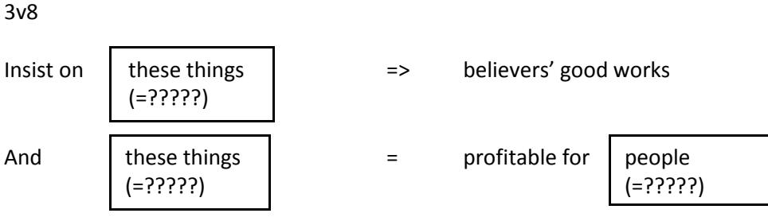
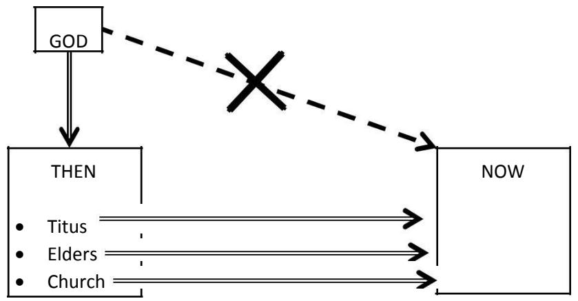
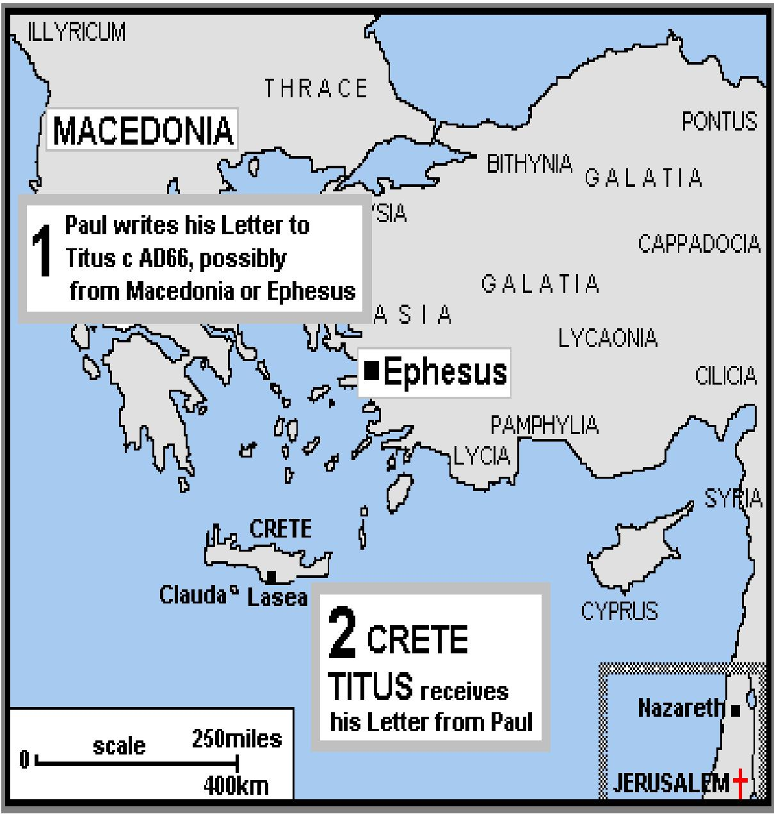

**bible study resources** 

# **Titus**

**© St Helen's, Bishopsgate. All rights reserved**

# **TABLE OF CONTENTS**

| Contents                  | Page                       |    |
|---------------------------|----------------------------|----|
| Introductory Notes        | ……………………………………………………………    | 3  |
| Map of Titus              | …………………………………………………………………  | 5  |
| Study Notes Titus 1:1-4   | …………………………………………………        | 6  |
| Study Notes Titus 1:5-9   | …………………………………………………        | 9  |
| Study Notes Titus 1:10-16 | …………………………………………………        | 13 |
| Study Notes Titus 2:1-10  | ………………………………………………         | 17 |
| Study Notes Titus 2:11-15 | ……………………………………………………       | 22 |
| Study Notes Titus 3:1-11  | …………………………………………………        | 27 |
| Study Notes Titus 3:12-15 | ……………………………………………………       | 33 |
|                           | Titus Leaders Review Notes | 38 |
| Appendix 1                | …………………………………………………………………… | 43 |

# **Introductory Notes**

What are the repeated ideas and themes of the letter?

What is the tone of the letter?

1) Bad behaviour

1v12 ct 1v2, 1v5-9

The hopeless task

2) Good behaviour

2v12 2v5, 8, 10

The hope of the culture

3) False teaching

1v10-12,16 Morals= 1v10,14; 3v9 Teaching= 1v15 Appeal=

cf. 1 Timothy 4v1-5 How would you describe the morals, teaching and appeal of the false teachers in Ephesus?

The false hope

4) Healthy teaching

In particular, what is the link between the teaching and the behaviour?

K. of the T. ? Godliness

#### 5) Purpose

Knowledge & godliness? OR godliness & its effect?

2v5,8,10

#### 6) How to apply Titus

3v15 'All with me greet thee. Thee greet those who love us. Grace be with y'all all.'

#### *Possible Commentary Purchases:*

*P.H. Towner 'The letters to Timothy and Titus' (Eerdmans, NICNT, 2006) W.D. Mounce 'Pastoral Epistles' (Thomas Nelson, Word, 2000)*

# **Titus Map**

Maps by Gordon Smith can be used without further permission. Please quot[e http://www.ccel.org/bible/phillips/JBPhillips.htm](http://www.ccel.org/bible/phillips/JBPhillips.htm)

# **Titus 1:1-4**

# **Big idea**

Paul wants the elect to know that the true gospel leads to godliness

### **What is this passage saying?**

As Paul introduces himself and his ministry, he focuses on two key ideas. The first is that **knowing gospel truth leads to godliness** (v1); the other is the **'true' and authoritative nature of that gospel truth** (vv2-3).

Paul is encouraging and reminding Titus (v4) about these two things before he goes on to instruct Titus about his own role. Paul outlines a purpose of the gospel: it produces or leads to godliness. In other words, godliness in Christians is caused by them knowing the true gospel. Paul then reminds Titus of his authority to preach this message and the nature of the message itself. Paul is under God (and Christ's) command to preach this truth; the gospel itself has divine and eternal origins and is a revealed word and message from God – who never lies (a somewhat surprising statement).

### **Essential text notes**

V1 The elect are those who already have faith and those yet to have faith in the true gospel. V1 One big question which springs from the text is **the relationship between knowledge of the truth and godliness**. The ESV translates it as knowledge of the truth *which accords* with godliness. The NIV translates it as knowledge of the truth *that leads* to godliness. The first sounds looser – godliness is in keeping with the truth, it 'happens' to fit. The second connection is stronger – truth produces the godliness. Both are possible and are in the letter. However, we think the stronger is a better fit for the letter as a whole. Why? First, the previous phrase contains a similar preposition in the original Greek ('for the sake of') and has the sense of Paul working to produce or strengthen faith. Second, in the key places in the letter where the relationship is elaborated it demands this stronger connection, e.g. in 2:11-12 where 'the grace of God has appeared … training us to renounce ungodliness'.

# **Why does Paul say this here?**

Paul starts his letter in this way because these ideas are directly connecting with the situation in which Titus and the Christians in Crete find themselves.

Crete is a place marked by lies, evil brutality and excess – in the words of one of their own poets (1:12). It would be easy for Titus and the Christians to doubt whether the gospel has any relevance or power in a setting like this. Paul is keen to establish right from the start that knowledge of the truth does lead to godliness. The gospel is the thing that works, even in a place that is given over to such a lifestyle and which seems so far from God.

Indeed there are already false talkers and teachers who are present and active and appear to have a different and inevitably attractive answer for pagan Crete (we will meet them in 1:10-16). Paul is keen to establish, in a culture of lying and a false gospel in the church, that he has the eternal and true message, from the God who 'never lies' (v2). Paul is on the 'front foot'. Far from being defensive, he is confident that this gospel will work.

Titus is also probably quite young (he is to be an example particularly to the younger men in 2:7). These opening verses re-establish his connection with both Paul and the gospel – which is necessary for him and for the wider churches hearing the letter ('you' in 3:15 is plural). Titus is therefore strengthened personally and given backing and ballast in a setting where he could be easily disregarded (2:15).

# **Big applications**

These applications flow from the big idea, as they engage with the Cretan context – and we see the connections to us.

Our perspective on **London**: Given London is increasingly like ancient Crete (1:12), the applications should be easy to bring across to us. As we live and work amongst many whose lives look like pagan Crete, the challenges will be the same: do we believe that the gospel truth which leads to godliness is what is needed and what will work in pagan London too?

Our perspective on **truth**: Do we really believe truth is the answer – or do we still think truth is part of the problem? In a world where many prefer 'alternative facts', and we are encouraged to define our own truth about all sorts of things, including ourselves, this is challenging. When Christians stand for the truth and defend it, doesn't it seem very unattractive? Paul would challenge us strongly – the gospel truth is the only truth that works and it's what London needs. Nothing else will save people or produce the godly life.

How does Paul persuade us of the value of the gospel and even excite us, even in these few verses?

Our listening to the **truth**: As those being taught (on a Sunday and in Central Focus, as we read the Bible ourselves) this should surely challenge us as listeners too (more direct application will come to us on our godliness later). How well are we doing in our listening to the gospel as we're taught week by week. Do we still value the gospel? Are we listening well enough that we're gripped, so that we can grow in godliness?

# **A few starter questions (not a complete study…)**

What might make a Christian give up on trying to make a difference in London (engaging with people, evangelising)? What are the signs we might be giving up?

- What is Paul's role?
	- o How would you put v1 in your own words? What's the relationship between knowledge and godliness? Why do both parts matter?
- Why might he be telling Titus (and the wider churches) this? Why might this be necessary in Crete?
- What do we learn about God? How does that strengthen our view of the truth in vv2-3? What are the different angles? What do we make of that description?
- Why might he be telling Titus (and the wider churches) this? Why might this be necessary in Crete?

# **Titus 1:5-9**

### **Big idea**

Titus must put things in order and appoint elders who are genuinely godly

### **What is this passage saying?**

In v5, we now learn what Titus' job is – and why Paul has left him in Crete. First, he is to put in order what was left unfinished; second, he is to appoint elders. It's probably simplest to take the appointment of elders as how he achieves that order. The rest of the passage helps Titus in his selection process.

In vv6-8 Paul gives a list of attributes or character traits that would disqualify and qualify someone to be appointed elder. As someone who will be a steward overseeing God's household an elder must be a man who has already demonstrated his ability and faithfulness in doing that over his own household. He is to be above reproach – that is, with a reputation for living a good, godly life, 'under control', in contrast to a wild, destructive and dishonest life. The qualities are not simply 'cut and pasted' from 1 Timothy 3, which contains similar instruction. In Titus, they are more colourful and extreme, reflecting the Cretan situation and what is to be different about leaders in God's church.

In v9, we finally learn more of what the elder is to do. He is to encourage or instruct in sound or 'healthy' doctrine, and rebuke those who are teaching error. Surprisingly, the focus is still on the character-trait he needs to be able to do the job in a demanding situation. An elder must hold firm to the truth. In other words he needs a tenacious, even stubborn, determination to stick with the truth whatever else is being taught. Paul's focus is primarily on character throughout.

### **Essential text notes**

V5 – Titus' job has two instructions: to put in order and appoint. He is to finish off, and perhaps reform things that have gone awry, and he is to appoint elders. Appointing elders could be a separate step but it seems most likely that elders will achieve the order. The appointment of elders could even be the unfinished work itself. Whichever way it is read,

the sense is of Titus taking Paul's mission to Crete on from stage one to stage two, and appointing elders is the crucial next step.

V6 – 'above reproach' (NIV 'blameless') cannot mean perfect. It is a high bar compared to the Cretan culture but it is a relatively low bar in that these are observable qualities in everyday life. They are not unique to an elder but he is to be exemplary in living a 'normal' godly life.

V8 – 'hospitable' is literally 'love of strangers'. It might include therefore a Christian opening his or her home to an unknown gospel worker passing through town (see 3:13) or to fellow believers in need.

V8 – Self-control and discipline do overlap a little in meaning. Self-control is more in the realm of thoughts and emotions (with actions flowing from these); discipline is more in the area of the physical appetites (often but not exclusively used of sexual behaviour).

V9 – the 'trustworthy word as taught' is the gospel truth – the preaching entrusted to Paul (1:3).

### **Why does Paul say this here?**

Paul has been on mission to Crete and there is a young church – Titus is his man to continue the task.

Titus already knows his role but the wider church (3:15) also needs to know it, as it may not be the obvious way to win and clean up Crete. Having established that gospel truth leads to godliness in 1:1-4, they – and we – might expect Paul to urge Titus to preach this truth to Crete. But he doesn't. What Crete needs is not just one man, but many men to get the truth out, an elder or elders in every town. This gives an indication of the scale of the task and the seriousness of the situation. Even having established multiple 'channels' of truth, Titus' focus isn't to instruct them what to teach. He is to select godly men. Why does Paul focus on godliness? Truth is not being ignored. In Crete, there are different truth-speakers (1:10), so knowing who has the genuine truth is critical. How do we know? If truth leads to godliness, a Christian who is living a godly life is identifiable as someone who has been gripped by the truth. If that kind of elder is teaching, he is the one to listen to.

Paul is on the front foot. Everyone in the Cretan church would originally have been just like their culture (1:12). He knows Titus will be able to find elders to appoint because the gospel truth has already taken hold of individuals and turned their lives around. The 'clean-up' has started in the lives of individuals in the church. The gospel truth has evidently worked.

These verses have unpacked some of Titus' job – the appointment of elders. We must read on to see if Paul has further instructions to him for mission in Crete to go forward.

## **Big applications**

Our main application will be in the area of our church leaders. For us, elders will be our Sunday preachers and our church wardens; our small group leaders also have overseeing responsibility.

On our **leaders**: how does this passage persuade us that our leaders' godliness really matters? What would it be like to listen to someone teaching whose life looked like the negative qualities of v7? As we look to our current leaders, are we valuing the right things, or only what they teach? Do we value their refuting of error as much as their encouragement of us? How might this passage change the way we pray for our leaders and/or the conversations we have with them?

On **raising up new leaders**: as we select new small group leaders, associates and apprentices every year, what questions does this passage demand we ask? How do you think we are doing?

On **choosing a new church**: Many of us will know friends leaving St Helen's – how does this passage help us have good conversations with them about finding a new church? What should they look for? How are we persuaded talking to them about it is a good idea?

On **choosing who to listen to**: what does this passage have to say about listening to internet preachers? Are there any cautions here for us?

## **A few starter questions (not a complete study…)**

What do we value more in a church leader? Someone who is dynamic and draws people in or someone who is steady, and regularly stands up for the truth?

- What is Titus' job?
	- o Given 1:1-4, is that what we expect? Why/why not?
- Why might Crete need lots of elders?
- What makes a good elder? Is there anything surprising about what Paul does and doesn't include in his description?
- Why might Crete need elders like this?

# **Titus 1:10-16**

# **Big idea**

Titus must rebuke the false 'purity' teaching – it is fake godliness, Cretan at heart, which denies God.

# **What is this passage saying?**

In this passage, Paul turns particularly to talk about the false teachers. As he does this, we discover what they are like, the effect of their ministry, and something of the nature and content of their message. Paul instructs Titus specifically to rebuke and stop them, as an exemplary elder.

The false teachers' ministry is having a devastating effect – it is upsetting, turning over or ruining families. That is reason enough (note the 'for' of v10) for them to be silenced (v11). But why is it that people have been taken in by it? Why would Cretans – either Christians or not – think this was the truth to follow?

This is perplexing as Paul's critique of the false teachers is as devastating as it is repulsive. He builds to v12 where, borrowing a Cretan prophet's analysis of his own people, he declares that this analysis is not just true of Crete, but it is still true of the false teachers (v13). They are still liars, evil beasts and lazy gluttons. But this cannot be immediately obvious to those listening to them.

The draw of the false-teaching lies in the Jewish veneer the teaching has. The circumcision party are involved (v10); the teaching seems to include Jewish myths and human commands, likely to be traditions and extra laws (14); and the language of purity and defilement in v15 makes this even clearer. What the false teachers are offering is a route to religious, ritualistic purity. Their message sounds so attractive in the context of Crete. It offers a form of 'godliness' requiring little effort, and which looks impressive. This 'purity' needs attention for perhaps an hour or two a week. It is religion on display but in defined and restricted areas, essentially leaving the rest of life untouched. The Cretans can carry on being Cretan in virtually every respect (why Paul can say v12) yet with a religious veneer on show at the appropriate moments. It is a 'truth' leading to 'godliness' which Paul exposes for what it really is: the exact opposite of its claims. It is lies leading to brutality, with religious polish on the outside.

V15 Paul employs logic and shows that there are only two paths. One path is true purity (this is the path of truth – more on this in following passages) which comes from belief. It cannot be defiled. The other path is defilement where, because of no belief, no purity is possible. Despite the false teachers offering purity, these last verses make it absolutely clear that they can only be on the path of defilement. Paul nails his analysis: despite their profession to know God, they deny God in every other way and show the reality of their situation. They are not pure and are useless to him.

In the midst of this it would be easy to miss the surprise of v13. Paul has every expectation that as Titus rebukes these false teachers, sharply, some will be brought to, or back to, sound or healthy faith. He is confident in the power of the true gospel.

#### **Essential text notes**

V12 commentators debate over who the prophet or poet is. Most think it is Epimenides, who was writing in the 6thor 5th century BC. Even if another, it is clearly a Cretan poet, speaking of his own people and culture, meaning Cretans would agree with the analysis, albeit reluctantly.

V13 rebuke them: rebuke is the same word as rebuke in v9 (with the ESV, not NIV) creating a close tie between passages. The 'them' is most likely to be the false teachers as this is the topic of the rest of the verses. The condemnation is quite harsh, fitting for those actually teaching falsehood; in addition, believers are addressed in the next passage. However, the 'them' could be the whole families from v11 with one argument being that they are more likely to be brought back to sound faith. With either reading, it doesn't change Paul's analysis of the false teaching or the bulk of what elders and Titus are to do. It simply brings into the frame an additional group to rebuke at this point.

V15 may be a saying; it may use some of the false-teachers' own words. At root, it exposes the false teachers, even as we learn more of their false message. Purity is the prize they are offering. The surrounding verses have shown its Jewish flavour and this verse is where we see it strongest. The language of purity and defilement is reminiscent of passages like Mark 7:1-23 (and Luke 11:37-41) and, closer to Titus' time and setting, 1 Timothy 4:1-5. Jewish law and traditions held ritual cleanliness to be an outer state (and a clean person could approach God). A person could be contaminated by what they ate or touched, hence the obsession with ritual washings and abstaining from eating 'unclean' foods. However, with

the gospel truth, Jesus declares all foods to be clean (Mark 7) and that if someone is clean 'in the gospel' (as the real issue of a bad heart and internal defilement is dealt with by Jesus) then all things are clean to a person. They cannot be contaminated by food or touch. Because the false teachers 'don't believe' Jesus' teaching on clean foods, or indeed how one

is clean on the inside, they can only ever be defiled.

V16 Paul drives their own logic home. If they are defiled in their understanding (because they don't believe Jesus), then this defilement contaminates even their profession to know God. Every part of them is defiled; a fact which is self-evident from their wider lives. Their route to purity is exposed. It is evidence not of purity but of total corruption - corrupt thinking and conscience, because there is no belief in the true gospel which does cleanse.

# **Why does Paul say this here?**

Having established that gospel truth leads to godliness in 1:1-4, Paul helped us understand that the ongoing clean-up of Crete wasn't Titus' job alone. This next stage of mission required multiple channels in the form of godly elders in every town. They needed to be godly as evidence that they had been gripped by the right gospel truth, which leads to godliness. The task of these selected elders was then to encourage and rebuke with the gospel truth, a task needing tenacity and grit.

This passage immediately helps us understand why rebuking is necessary and why it might be hard. There is a fake gospel being peddled, offering what sounds like superior godliness, in an evidently ungodly and brutal culture. However, this false 'truth' must be silenced: it leaves people in their ungodliness whilst deceiving them that they are being godly. It is devastating. It is 'godliness' leading to corruption for all who follow their teaching. Far from cleaning up Crete, this teaching leaves Crete in a worse state. She is still corrupt but deceived into thinking she is better.

This passage also proves that if elders are ungodly, under albeit a religious veneer, they do not have the truth – they should not have a hearing.

Titus is told to be a model elder, undertaking some silencing and rebuking himself but, because of the previous verses, being an example for the other elders as they too join in the task. They are together helping to put things (back) in order (1:5).

As well as equipping the elders, this passage is also helping the wider church (3:15) understand why elders need to be doing this ministry. It may not be popular but it is vital for the healthy faith of Christians, Crete and, potentially, even for some of the false teachers themselves.

# **Big applications**

On our **leaders**: How does this passage help us understand our leaders' responsibilities better? (Think about William and our teaching staff, church wardens, small group leaders)? How can we encourage them and support them better? What can we pray for them? Will we back them as they name and rebuke false teachers and teaching, even when it is a cause of embarrassment and mocking in the wider church and society? What might that look and sound like for us to do that? If I am helping to lead a small group at St Helen's or in the workplace, what might I need to do or say differently?

On **false teaching**: where have you heard or seen false teaching like this? Where do you think this false teaching exists today, in London? Where might we expect to find it, given the religious veneer to the false teaching? How do you feel about that? What would be good to pray from this passage, in the light of false teaching?

On our **leaders' godliness**: now we've seen the fake godliness of the false teachers, how might this passage cause us to evaluate our leaders' godliness more carefully? In what ways can we be encouraging them, challenging them and praying for them in the light of this passage?

# **A few starter questions (not a complete study…)**

- In this passage, we finally get to see what's going on in Crete. Who are the different people or groups of people in this passage? What's going on?
	- o Who is Paul talking about in v12 as he quotes the Cretan prophet?
	- o What is Titus to do? Why?
- What is the false-teaching in Crete?
	- o What's attractive about it? Why's it so dangerous?
- Why might Crete need elders like those in 1:5-9?

# **Titus 2:1-10**

### **Big idea**

Titus must teach godliness that comes from the gospel to all the church

## **What is this passage saying?**

Paul now outlines the next part of Titus' job. He – and those he appoints to be elders with him – is to teach what is in accord with, or what is in keeping with, sound, healthy doctrine (v1). He is also to be a model of what he's teaching (vv7-8). V1 acts as a header for the rest of the passage.

In vv2-10, different groups are addressed: older men, older women, younger women, younger men and slaves: different adult parties found in the domestic, household environment. 'Home' life in the first century was a far cry from any sense we might have today of retreating to a private space. Life would have been visible to, and mixed up much more with, the wider community, especially with 'work' and business happening at, or near, home. Each party has their own particular areas of godliness highlighted, with a mixture of inward and outward qualities. There are recurring themes across the groups – in the areas of godliness and in the adjectives used to describe them. Some particular colours come from: self-control (vv2, 5, 6), soundness (that is healthiness – vv1, 2, 8), love (vv2, 4), goodness (vv3, 7, 10), purity (v5) and a sense of respect and order (vv2, 3, 5, 9). Overall, the descriptions are of individual lives having been gripped and transformed by the gospel. They are for every Christian, in the everyday normality of household relationships.

It is worth noting that Titus also recruits older women (v3), presumably once they themselves are taught, to exercise a teaching ministry alongside him. This is the way younger women will be taught to be godly. He instructs the older men himself and is an example to the younger.

The passage also explains why this living matters: even though the content of the gospel isn't mentioned (see the next passage), the reputation of the gospel truth is at stake. Godly living protects the truth (v5); silences the opposition (v8) and, on the front foot, slaves have the wonderful responsibility of adorning the gospel (v10) - showing it off or making it look – as it truly is – beautiful.

# **Essential text notes**

v1 what accords with: is different from the words translated 'for the sake of' and 'which accords' in 1:1-2. Here, it is what is 'fitting with', 'appropriate to', 'becoming (to)' sound doctrine.

vv1, 2, 8 sound has the sense of healthiness. It is the root from which we get our word hygiene. It is 'correct' but there is much more of a sense of well-being attached then we may realise.

vv2, 3 Older and vv4, 6 younger – these terms are at a basic level markers of age and lifestage (younger meant anything south of 40); an older person normally had maturity and wisdom accrued with increasing years. In spiritual terms, the older-younger distinctions may be less clear-cut. The 'natural' pattern may often still be true but someone younger in physical years could be an 'elder'. Titus is a case in point – clearly mature, but probably younger (2:15). Spiritual maturity will not, therefore, always match age, particularly in this early missionary stage of the church. It is worth noting that the word for 'older' is same word used for elders in chapter 1. This helps us appreciate that 'eldership' is as much an issue of maturity and character as it is a formal office.

v9 slaves are household workers and servants, often bonded for life but not in the degrading conditions of the slave-trade of much later centuries. Hence the parallel today to our own places of work is not a far stretch.

V8 an opponent: most likely to be the false-teachers of 1:10-16 and so within the church, but they could also be from wider society.

# **Why does Paul say this here?**

Having established that knowledge of the gospel truth leads to godliness in 1:1-4, Paul helped us understand that the ongoing clean-up of Crete wasn't Titus' job alone (1:5-9). Multiple elders, validated by their lives having been shaped by the gospel truth, were needed in every town. They were to stick at the task of encouraging and rebuking with the gospel truth, a task made all the more necessary because of the damaging false teachers. The false teachers' attractive offer of 'godliness' (Jewish, outward, ritualistic) was nothing more than deception. It looked good and religious on the outside but left the rest of immoral and brutal Cretan life untouched. Worse, Cretans were fooled into thinking they were pure when they were still denying God. In rebuking the false teachers, Paul had confidence that the gospel might even draw some of them to sound faith. 2:1-10 shows that Paul's strategy to clean-up Crete extends further. Titus' (and by implication the elders')

teaching role is still in view. This is striking, as they already know their role in encouraging and rebuking. And they know their lives must be exemplary as proof they have the truth. Why is that not sufficient?

In this passage, we see more of what Titus and the elders must teach. It is in clear contrast to the false teachers – 'But, as for you', v1. However, we still haven't arrived at the content of the truth. Instead Titus is to spell out the godliness that comes from the truth for every Christian. This is Paul's – and God's – genius strategy. So the big question is: how does this wider-scale godliness clean up pagan Crete?

At the very least, this passage is helping Christians realise afresh that it is only the gospel truth which produces this godliness. The connection is vital – no other truth or method will produce this life. So, this passage helps Cretan Christians keep the godliness they have, in a surrounding culture of lies and bad fruit. The church – and the gospel – is safeguarded.

However, there are further reasons why this 'living' and 'truth' connection must be evident. If every Christian is living this way, it has an impact on the gospel spreading in Crete. 2:1-10 in practice is a widespread display and advertisement for the truth. How does this help the gospel to spread in Crete?

First, this godliness is shown to work, precisely because it happens in the sphere of normal, everyday life. This is not religious ritual restricted to an hour in church on a Sunday, which didn't even touch the underlying Cretan brutality. It is godliness which is on display 24/7 and 365 days a year. It is visible and, perhaps because of where it is lived out – in the nitty gritty of everyday life - not easily faked either. Indeed, the people living like this are fellow Cretans who have had their lives turned around from the brutal opposite. By connecting this godliness back to the sound doctrine which produces it (v1), the Cretans – and perhaps even the false teaching Cretans – will be able to appreciate the genuine gospel truth that produces this fruit. Nothing else can transform like this. This godliness will uphold and broadcast the gospel's reputation.

Second, the godliness on display is self-evidently good and attractive – relationships like this are healthy, beneficial and a safe place to be. If there is any merit in the argument that the Cretans were looking for self-controlled, upright and godly lives (a summary in 2:12) then the passage lays out in expanded detail a beautiful advert of the very thing they were seeking. They may not have needed persuading that this was what they wanted. By being drawn to the display, they will discover what produces it. They are only a step away from the gospel truth.

Last, it is striking that the gospel doesn't just work for Christian teachers or an elite religious group – it is powerful to transform every follower. Titus' example, although important, is not sufficient. The whole church family is living proof of where the wonderful and true gospel can be found.

Christians overhearing this letter (3:15) will have their own confidence built in Paul's gospel strategy – and will understand, be motivated for and equipped for their own role.

### **Big applications**

On **a gospel pattern for ministry**: how does this help us understand the role of our preachers and small group leaders better? How can we pray for them and encourage them as they teach us? As we share God's word with one another (speaking the truth in love) and help each other in the Christian life, how does this passage equip us do this better? If we are an 'older' woman how might this passage shape our ministry further? Is there a particular younger woman you could help?

On **our attitude to godly living**: The Cretans may well have valued this kind of living – selfcontrolled, good lives where individuals have a grip on their attitudes and behaviour. Given this, it's worth us stopping and thinking about our own view of this godly 'Christian' life. Do we value and prize it? Why/why not?

On **living a godly life**: whether we are younger or older, a man or a woman, living an ordered, self-controlled life is what Paul is telling Titus to teach. How are we getting on personally and as a church? What would our own lives say about the gospel? Are we looking Christian or are we looking 'Cretan'? If you had to identify one area where you'd like to make progress, or safeguard your godliness (you can decide which specific group you fall into!) what would it be? What motivations are there in the passage for working at our godliness – why does it matter? And, crucially, how are we going to remain godly and grown in godliness? Do we believe this? How does Paul give us a different answer to the world and even much of the church? How much of our domestic and work life do our non-Christian friends and family see? How can we help them to see more?

### **A few starter questions (not a complete study…)**

 In today's passage we learn more of Titus' role. What is it? Is this what you would expect? Why/why not?

- Who are the different groups addressed? What instructions are unique to each group and what seems to be common to all? What do you make of the overall description?
- Why do the different groups need to put these things into practice? How might this contribute to Paul's plan to clean up Crete?

# **Titus 2:11-15**

# **Big idea**

The gospel for all which Titus must teach: Jesus redeems from pagan lawlessness to purity and good works

# **What is this passage saying?**

We are still learning more of Titus' job. Finally, as readers, we hear what Titus is to declare (v15) – this is the sound doctrine itself that he's to teach with Paul's apostolic authority. This is the truth that lies behind the godliness outlined in 2:2-10, which we know because of the 'For' in v11. We'll look at the truth and see more of how it leads to godliness.

What the sound doctrine is: Titus is to teach the gospel, which Paul explains first in v11-13a and then again in v13b-14. Each outline has an element of past, present and future. The first focuses on the present day transformation possible, because of future realities presented in the second – particularly in the area of godliness and good works.

The gospel is authoritative and revealed truth - about our **Saviour Jesus Christ** appearing. This glorious description of Jesus is meant to make us realise the enormity of who he is and what he's done. He is bringing a salvation that is broad in scope: it is **for all people** (even to Crete, and this keeps a right outward focus for the readers) and it is salvation that powerfully and fundamentally **transforms** people, and is currently working in them. The purpose of Jesus' redemption (vv13b-14) is 'to purify for himself a people for his own possession who are zealous for good works'. This will certainly be our experience in the future, when Jesus appears for a second time (v13b) and will include even people like the Cretans. However in vv11-13a, we see that these future realities break in and change the Cretan Christians (and us) even now. This 'grace' trains them to live self-controlled, upright and godly lives (a good summary of godliness in stark contrast to pagan Crete) – because salvation means they are already pure or clean in Christ, in the present age.

**Godliness and good works** are, therefore, an integral part of the gospel. The gospel is, at heart, a message of redemption from one way of life (lawlessness) to a new way of life (godliness and a zeal for good works) – if you like, a change of **purpose**; it is about being bought and gathered by a new master (the Saviour and King Jesus who has appeared) – a change of **ownership**; and this master is one who, wonderfully gave himself to purify us – a change of **status**. It is an explanation that fits perfectly given the focus on godliness we have had so far in the letter. But is it how we usually explain the gospel? We are right to speak of Jesus forgiving our sins (tied up here in the language of redemption). But, if we stop there, we lose the wonder of our Saviour rescuing us not just from sin and judgement but from a lost, lawless, God-denying life. And he has rescued us for a pure, good and purposeful new life, as we belong to Him.

How the truth works: The passage gives us the 'how' of godliness – the Cretan Christians are trained by the knowledge of the truth about these new realities. It is a present and continuous training – an ongoing growth in knowledge and belief in gospel truths which means they can say 'no' to their old identity and life– lying brutal Cretans – and 'yes' to their new life. It's our 'how' too.

The passage also gives us the 'why' of godliness – the transforming of the Cretans' lives is inherent to the gospel and what Jesus has done. It isn't simply an implication or an outworking. It is the gospel. The gospel has never just been about what they've been saved from, or simply who they have become. It is also about what they've been saved for. This is the same 'why' for us.

#### **Essential text notes**

V11 the grace of God has appeared. This could be Jesus himself (note the second 'appearing' in v13 and also 3:4). Or it could be the truth/the message about him manifested/revealed to Paul (1:3). Whichever, the grace is either a divine person or it is divine truth about him: strikingly different to our common definitions of grace (such as 'God's riches at Christ's expense' which is more of 'a thing'; or 'God doing what we could not do'. These are useful shorthand but they don't capture Titus' unique angle). This has important implications for what and who we look to in order to be 'trained'.

V13 the glory of our great God and Saviour Jesus Christ: it is disputed whether this phrase tells us of Christ's divinity or that he will reveal the glory of God (the Father) when he appears again. Whichever, this is the most expansive and elevated description of Jesus so far. He is no less than God's heavenly Saviour and King, who has appeared and who will gloriously reappear. This is hugely attractive - and empowering - and particularly so in a culture of emperors and man-made 'gods'.

V14 a people for his own possession: significant language echoing Exodus 19, where God first gathered a people.

V14 zealous for good works: similar to the elders' qualities, this is primarily an attitude but which does produce action. A self-controlled, upright and godly life is a life under control so that we can do good; zealous captures the essence of us wanting to do this. This is why we now live.

V15 these things: the content of at least vv11-14 (and probably also 2:1-10 – see below).

# **Why does Paul say this here?**

Having established that knowledge of the gospel truth leads to godliness in 1:1-4, Paul helped us understand that the ongoing clean-up of Crete wasn't Titus' job alone (1:5-9). Multiple elders, validated by their lives having been shaped by the gospel truth, were needed in every town. They were to stick at the task of encouraging and rebuking with the gospel truth, a task made all the more necessary because of the damaging false teachers. The false teachers' attractive offer of religious 'godliness' was nothing more than deception. It looked good on the outside but left the rest of immoral and brutal Cretan life untouched. Worse, Cretans were fooled into thinking they were pure when they were still denying God. Paul had every expectation for false teachers to be made 'sound'.

We then saw that, with right teachers in place and false-teaching being combated, all Christians were needed to clean up Crete. In 2:1-10, Titus (and the elders) were to teach all Christians what godliness looked like in the nitty-gritty of everyday household life – their domestic and working spheres. This was God – and Paul's – genius stroke. Here, godliness would be visible 24/7, 365 days a year. It was for the whole of life, and for every Christian not just for a few hours and for a few leaders shut away in church. And it was a beautiful defence, advert and display, therefore, of the gospel truth which produced this life. This godliness was what the Cretans craved – self-controlled, good lives, for everyday life: they would be just a step away from the truth that produces it.

In this passage, we finally arrive at this truth – which Titus and the elders are to teach and uphold; the gospel truth that produces self-controlled, upright and godly life, even in Crete. Having waited so long, our appreciation of the gospel is heightened as we hear it. We have been looking at the fruit, appreciating its beauty. As we hear, we can see the wonderful reality that the truth is an exact match. People don't have to add things in to be godly, or simply try harder. Godliness is an inherent part of the gospel – of who we now are and the life that stems from that.

Picking up on the language of 1:15, this is where we see that this gospel does really make people pure. It is a permanent and newfound status, not something done by us but by Christ, and not having to be topped up or re-polished regularly by us.

If transformation - from ungodliness to godliness - is at the heart of the gospel truth, we are perhaps able to tighten our understanding of what Titus is to teach in 2:1 and following. If the 'sound doctrine' of v1 already includes godly living, then 'what accords' with it in vv2-10 is Paul outlining specifics applications for the different groups. V12's 'self-controlled, upright, and godly lives' is genuinely a summary; 2:2-10 are specific applications for the different groups. The 'these things' that Titus is to teach in v15, may well, then, include all of 2:2-14.

As before, this passage is being overhead by the wider church (3:15). It gives the church confidence that when Titus – and their elders teach this – it genuinely is the truth that will help them to live godly lives, even as others may scoff. This is the apostolic and authoritative gospel – the truth Paul's been entrusted to preach (1:3) and the trustworthy word as taught (1:9). The passage also reminds the church of its own high calling in Crete. They are living embodiments of this glorious gospel of transformation. They are proof to Crete of the truth that works and are crucial to Paul's plans.

#### **Big applications**

On **the gospel**: how does this explanation of the gospel challenge us in our understanding of the gospel? Do we have the same content and emphases as Paul? What's the implication of only having redemption? What happens if we miss out our new status of purity? What happens if we miss the transforming element, from lives of lawlessness to godliness? It's worth considering this for our Christian lives but also for our evangelism.

On **godliness**: how does this passage help us see the importance of godliness? How does it motivate us to be godly? How does it help us 'say no' or renounce ungodliness? How does it help us, actively, to be godly? And zealous? What does 'training' look like in practice? Think back to last week's passage and the particular areas of godliness that you highlighted to safeguard/make progress in. How can you use the truths of vv11-14 to train yourself in those particular areas? What might it sound like to preach these things to yourself or to a brother or sister?

On **our teachers:** how does this passage help us understand our teachers' job better? How can we pray for them in the light of this passage?

# **A few starter questions (not a complete study…)**

Before you read this passage, how would you (and many Christians) normally summarise the gospel?

- What is the gospel, according to this passage? Is that a surprise to us? Why/why not?
- Why does this explanation come here in the letter *after* all the description of godliness in 2:1-10?
- Why might the church in Crete need to have the gospel spelt out like this?

# **Titus 3:1-11**

#### **Big idea**

Titus is to remind the church: Be devoted to good works in the public sphere and to all, because God has loved us and cleansed us by the Spirit – and it's profitable.

### **What is this passage saying?**

We are still learning more of Titus' job – more of what he is to insist on and remind the Christians in Crete (v1, v8). This passage begins with more instructions for godliness (vv1-2), followed by a gospel outline (vv3-7), which serves as a reason for the instructions ('For', v3). V8 is a key verse for this passage (and the letter). It summarises both what the Cretan Christians are to do and highlights the profitable effect it will have for Crete. Vv9-11 present the contrasting, unprofitable effect of the false teachers and explains how Titus is to treat them.

In 3:1-2, Titus is to remind the Cretan Christians that they are to be model citizens – in the way that they relate to the state and to wider society and people as a whole. It is broad, challenging and all-encompassing, shown by the use of 'every',' all', 'no-one' and 'perfect'. There is no doubt that this is very good living - noticeable and deeply attractive.

The gospel outline that follows (in vv3-7) gives both the reason for the Cretan Christians (and us) to live this way and shows how this high and potentially daunting standard is possible. It is another wonderfully rich picture of the appearing of Jesus our Saviour - but there are some different angles here compared to 2:11-14. First, **our lack of contribution** is emphasised. V3 reminds the Cretans exactly what they and even Paul and Titus ('we, ourselves') were like. God saved them, not because of any works (Jewish or otherwise), but because of his mercy. Justification by grace in v8 supports this idea. God has done it all. Second, we see that as Jesus saves us he **reveals to us the loving kindness of God**. It is a love specifically for mankind, or people. If God has loved people – even the Cretans – then he has shown the Cretan Christians how to love their fellow citizens, however far off and unlovable they may seem. Third, Jesus is the means of our salvation in that he **pours out the Spirit** on us. This is a highly significant promise of the new covenant. What is highlighted here is God's work of cleansing (the purity the Cretans are after) and enabling to be obedient (cf Ezekiel 36 and below). This is a great encouragement given the demands of vv1-2 and even the language of obedience there (v2) as the Cretan Christians seek to live godly lives. In addition, the Spirit being 'poured out' is then a picture of abundance and availability for all (cf Joel and below).

V8 underlines the truthfulness and importance of both the gospel (the 'saying') of vv3-7 and the godliness that it leads to. Titus is to insist on both – and so Christians are to be careful to devote themselves to these good works – something requiring both thought and action. We see why this is so important in v8: the good works are profitable for people. In the context of this passage (and the book) we can see why. This is a good life and society self-evidently works better when more people live like this. But Paul's aim in this letter has always gone that next step and we see it here. As Christians live these lives in this setting, they are living embodiments of the gospel truth – of God's character and the Spirit's cleansing and purifying work. They are advertising in public where to find the truth that produces this genuinely 'excellent' and good life.

Vv9-11 are then a final contrast with the false teachers. Their behaviour and teaching is contrasted in several ways with the godliness of vv1-2 and in v8 (unprofitable). Titus is to try to win them over, several times, but is then to avoid them, to protect the church and ongoing mission.

#### **Essential text notes**

V1 to be submissive, to be obedient, to be ready, to speak, to avoid, to be gentle, to show. These 7 verbs are a list of infinitives. Grammatically, none has particular priority (i.e. the first isn't a header, with the rest being an expansion) but it makes a lot of sense to see the first three as relating to the official state and the last four broadening to refer to wider society and people in general.

V2 no-one, all people – in the context of these verses and this chapter, this is as broad as is sounds: all people, in wider society, even brutal Cretans. This cannot just be within the Christian community.

V3 we, ourselves – is at least Paul and Titus and is true for all Christians. It is a distinct group in contrast from the 'all people' of v2.

V4 loving kindness of God our Saviour appeared – the word for love is where we get our word 'philanthropy' from – love for people. This is the only time Paul uses it – important in the context as this is how God has loved even the people of Crete, and should shape the Christians' godliness and good works to Cretan people too. The word translated 'people' in v2, v8 (and in 2:11) is anthrōpos.

V4 appeared – this is the same verb as in 2:11 & 13. God's loving kindness appeared in the person of Christ.

V5 washing of regeneration and renewal of the Holy Spirit – is a complex phrase but is best understood with regeneration (new birth) and renewal being so similar as to be two ways of describing the one event - conversion. The washing produces this new life, all achieved by and through the Holy Spirit. The language is drawing on the big, newcovenant promises laid out in Ezekiel 36:16-38, particularly vv24-28 which speak of cleansing water, a new heart - resulting in obedience.

V6 poured out – this language fits with the washing language in v5 and is drawing on another key Old Testament text promising the pouring out of the Spirit on all peoples, in the day of salvation. See Joel 2:28 (which is fulfilled at Pentecost, recorded in Acts 2).

V8 The saying – is probably vv3-7.

V8 These things (first occurrence) could refer to vv3-7, the saying, or they could refer to vv1-7 the saying/truth and the godliness it produces (i.e. preserving the connection between the two). Whichever, the reason is clear – what Titus teaches is meant to lead to Christians devoting themselves to good works. These things (second occurrence) could be the same as the first these things, above, or it could refer more explicitly to the good works, immediately before. Wherever one lands – and because of the mission-focus of the whole letter – the end point seems to be that Christians doing good works is profitable because of its connection to the truth. It seems most unlikely that Paul would be focusing on good works in themselves.

V8 people – the people who benefit from Christians being devoted to good works are at least other Christians but it is most likely Paul has wider Crete in view still, because of the wider context of 3:1-2 and the language there of 'all people'.

V9 unprofitable – is the same word root as profitable, helping us see the final contrast with the false teachers, who have the wrong 'truth' and therefore the wrong behaviour.

#### **Why does Paul say this here?**

Having established that knowledge of the gospel truth leads to godliness in 1:1-4, Paul helped us understand that the ongoing clean-up of Crete wasn't Titus' job alone (1:5-9). Multiple elders, validated by their lives having been shaped by the gospel truth, were needed in every town. They were to stick at the task of encouraging and rebuking with the gospel truth, a task made all the more necessary because of the damaging false teachers. The false teachers' attractive offer of religious 'godliness' was nothing more than deception. It looked good on the outside but left the rest of immoral and brutal Cretan life untouched. Worse, Cretans were fooled into thinking they were pure when they were still denying God. Paul had every expectation for false teachers to be made 'sound'.

We then saw that, with right teachers in place and false-teaching being combated, all Christians were needed to clean up Crete. In 2:1-10, Titus (and the elders) were to teach all Christians what godliness looked like in the nitty-gritty of everyday household life – their domestic and working spheres. This was God – and Paul's – genius stroke. Here, godliness would be visible 24/7, 365 days a year. It was for the whole of life, and for every Christian not just for a few hours and for a few leaders shut away in church. And it was a beautiful defence, advert and display, therefore, of the gospel truth which produced this life. This godliness was what the Cretans craved – self-controlled, good lives, for everyday life: they would be just a step away from the truth that produces it.

Only then did Paul lay out the gospel truth, as he urged Titus to declare it. It was and is a gospel of powerful transformation – producing self-controlled, upright and godly lives from truly purified people who have been redeemed and claimed by Jesus – God's grace who has appeared us and who will appear again in glory. And all of this out of the raw material of brutal Crete: this is the gospel able to make Crete truly beautiful – and it's already started with the church. The gospel is godliness.

Paul could have stopped his letter to Titus there. So we need to work out why we need chapter 3, and for now, vv1-11. At a quick survey, we cover similar territory: we learn what Titus is to teach and, like chapter 2, it is instructions for godly living followed by an outline of the gospel truth. So what is different?

First, the godly living is to happen in the broadest possible sphere – with the state and authorities and with society as a whole. This means that the gospel is being put on display and 'adorned' not just in the day-to-day life of a household and work but in every other public sphere of life. This last chapter gives the gospel maximum exposure – and the Cretans every possible opportunity to find the thing that is 'profitable for them' – the good works and most crucially, the gospel that produces them.

Second, Paul unfolds the gospel in such a way that it is the perfect match for this sizeable task of godly living. The gospel is both what the Cretans are modelling and what enables them to live this way. We see that Christians have been shown the love they are to have for their fellow citizens (it's the love God has shown them), and they have already been washed, cleansed and enabled by the pouring out of God's Spirit.

There is a closing contrast with the false teachers – but language from this chapter is also reminiscent of 1:10-16 (they are described there as disobedient). The warning in this chapter may

well still be with a view to winning them (back) to the sound faith of 1:13 – but not at the cost of wrecking the church. Avoidance is a necessary but last resort.

As before, this passage is being overhead by the wider church (3:15). The church will need to know this is Paul's command to them – via Titus – as it sounds an even higher calling than the one outlined in chapter 2. It is the passage which lays out most clearly their mission and yet crucially their Spirit-given ability to do good to Crete in the public and widest sphere possible. This is all the more necessary given the presence and divisive nature of the false teaching (v9). The Cretan Christians will be clearer on the wonder and breadth of the apostolic gospel which Paul clearly has embraced personally – and its trustworthiness, value and ability to help them to do their work.

# **Big applications**

On **godliness**: in what new ways does this passage help us see the importance of godliness? How does it motivate us to be godly? How does it persuade us we can be godly? What might it look like 'to be careful to be devoted to good works'? How does this passage help us be clear on the purpose of good works in wider society? Where might being submissive to rulers and authorities and showing perfect courtesy to all people (taking two examples) 'bite' for us?

On **the gospel**: how does this explanation of the gospel compare with our 'normal' version? What is so encouraging/challenging? Why are God's character, the Spirit's work and our lack of contribution so important? How do they help us be godly? Why do you think we need this 'version' of the gospel as well as 2:11-14? Think about these questions for our own Christian lives but also for our evangelism.

On **our teachers:** how does this passage help us understand our teachers' job better? If our teachers are 'insisting' on the truth and godliness in our congregations and also 'avoiding' false teachers how might we feel? How does this passage help us appreciate these actions? How can we pray for them in the light of this passage?

#### **A few starter questions (not a complete study…)**

- What does godliness look like in these verses? How does this compare and contrast to chapter 2?
- What is the gospel according to these verses? How does his compare and contrast to chapter 2?
- Why do you think Paul doesn't stop writing at the end of chapter 2? Why does the mission to clean up Crete need chapter 3?

# **Titus 3:12-15**

# **Big idea**

Titus and the Cretan church are to support Paul's wider apostolic mission beyond Crete – a specific example of learning devotion to good works.

# **What is this passage saying?**

We have our final instructions to Titus. They break into two sets but in all likelihood are connected. The first (vv12-13) outlines various movements of Paul's co-workers (including Titus) and how best Titus is to support Paul in the wider apostolic mission beyond Crete; the second (v14) is a final instruction for the Cretan church, encouraging them to learn to be devoted to good works. In context, the likely implication is that they are to join Titus in fulfilling his responsibilities to provide for these co-workers.

Paul is sending a replacement worker (either Artemas or Tychicus) to Crete. When he has arrived to take the helm, Titus is to leave as quickly as he can and meet Paul in Nicopolis, for the winter and, presumably, ministry there. In the meantime, he is to help Zenas and Apollos (other co-workers' of Paul) on their way. They are probably delivering Paul's letter to Titus en-route to another destination. Given v14 flows straight on, it is likely that Paul envisages the church joining Titus in supplying these workers with what they need. This is the current urgent need – in terms of immediacy but perhaps also in terms of priority. This is furthering the apostolic mission both in Crete (as the Christians demonstrate good lives, here of hospitality) and as workers are enabled to travel on elsewhere.

This practical example clearly isn't the only way of being devoted to good deeds, but it may give a helpful sense of prioritising the good the Cretan Christians – and we – are to do, even as they seek to do good in the widest possible public sphere. Meeting urgent needs rather than simply doing good works for the sake of it may be more useful; it certainly would have been disgraceful and a demonstration of ungodliness if visiting Christian leaders were not cared for by the church.

# **Essential text notes**

V12 Artemas and Tychicus – we don't know anything about Artemas – he's not mentioned elsewhere in the New Testament. Tychicus is mentioned in Acts 20:3-4, Ephesians 6:21, Colossians 4:7 and 2 Timothy 4:12. He is a gospel co-worker, accompanying Paul and being his messenger.

V13 Zenas and Apollos – This is the only time Zenas is mentioned – it's a Greek name. Apollos is a gospel co-worker, teacher and leader who appears in Acts 18:24, 1 Corinthians 3:5-6.

v14 Our people – those associating with Paul, Titus and the apostolic mission, that is the Cretan Christians.

v14 learn – in the sense of learning in practice, by doing, rather than through formal instruction.

v14 Devote themselves to doing good works – this is exactly the same phrase as in v8.

v14 Unfruitful – Paul has shifted metaphor but being fruitful (not being unfruitful) is most easily understood as being the equivalent of doing good works.

### **Why does Paul say this here?**

Having established that knowledge of the gospel truth leads to godliness in 1:1-4, Paul helped us understand that the ongoing clean-up of Crete wasn't Titus' job alone (1:5-9). Multiple elders, validated by their lives having been shaped by the gospel truth, were needed in every town. They were to stick at the task of encouraging and rebuking with the gospel truth, a task made all the more necessary because of the damaging false teachers. The false teachers' attractive offer of religious 'godliness' was nothing more than deception. It looked good on the outside but left the rest of immoral and brutal Cretan life untouched. Worse, Cretans were fooled into thinking they were pure when they were still denying God. Paul had every expectation for false teachers to be made 'sound'.

We then saw that, with right teachers in place and false-teaching being combated, all Christians were needed to clean up Crete. In 2:1-10, Titus (and the elders) were to teach all Christians what godliness looked like in the nitty-gritty of everyday household life – their domestic and working spheres. This was God – and Paul's – genius stroke. Here, godliness would be visible 24/7, 365 days a year. It was for the whole of life, and for every Christian not just for a few hours and for a few leaders shut away in church. And it was a beautiful defence, advert and display, therefore, of the gospel truth which produced this life. This godliness was what the Cretans craved – self-controlled, good lives, for everyday life: they would be just a step away from the truth that produces it.

Only then did Paul lay out the gospel truth, as he urged Titus to declare it. It was and is a gospel of powerful transformation – producing self-controlled, upright and godly lives from truly purified people who have been redeemed and claimed by Jesus – God's grace who has appeared us and who will appear again in glory. And all of this out of the raw material of brutal Crete: this is the gospel able to make Crete truly beautiful – and it's already started with the church. The gospel is godliness.

Chapter 3 covers similar territory: we are given a cameo of godliness and another rich outline of the gospel truth that produces it. What is striking about this 'version' is that the godliness is to be lived out in the broadest possible sphere – with the state and authorities and within society as a whole.

This means that the gospel is being put on display and 'adorned' not just in the day to day life of a household and work but in every other public sphere of life. This last chapter gives the gospel maximum exposure – and the Cretans every possible opportunity to find the thing that is 'profitable for them' – the good works and most crucially, the gospel that produces them. Paul's unfolding of the gospel truth is then a perfect match this sizeable task for the Cretan Christians. We see that Christians have been shown the love they are to have for their fellow citizens (it's the love God has shown them), and they have already been washed, cleansed and enabled by the pouring out of God's Spirit (the cleanliness the Cretans long to find) – both through the appearing of Christ our Saviour. And God's ability, action and mercy are stressed – Cretans bring nothing to the table. This gospel is what they model to the Cretans and it's the gospel which will enable them to live this way.

Last, Titus is called to warn divisive false-teachers – whose behaviour is by contrast, ungodly. Recalling 1:10-16, this may still be with a view to winning them (back) to the sound faith of 1:13 – but not at the cost of wrecking the church. Avoidance is a necessary but last resort.

The letter could have ended there but these last few verses add a specific example of devotion to good works – in the context of supporting co-workers in the apostolic mission. The named workers may not have been known to the Cretan Christians and, so, this is a good chance for them to further the apostolic mission: they demonstrate godliness to Crete i) as they exercise hospitality to these men (cf 1:8, where hospitality is literally this 'love of stranger'); ii) they also show right care for elders and those worthy of respect. Then, as they send the men on their way, they may well be supporting mission elsewhere.

The letter closes as it began – with Paul's broader mission plans in view. This persuades the Cretan church – and us – that the devotion to good works (3:8, 3:14) and fruitfulness (3:14) is directly connected to this apostolic concern for the faith of God's elect (1:1). The profit of these godly lives and good works is that the Cretans will be brought to faith as they discover the truth producing this good life. As we have seen throughout our studies, 3:15 underlines Paul's wish for the whole church to understand Titus' role and, in these last verses, not just for them but for the wider apostolic mission. Paul finishes the letter by showing the Cretan Christians that they too have a part to play in the wider apostolic mission.

# **Big applications**

On **godliness**: how might 'learning' to be devoted to good works help us as we strive for godliness?

How does the dual focus on 'urgent need' and the wider apostolic mission help us in our godliness?

On **our teachers:** how does this passage shape the way we view other Christian workers? How are we being/how can we be better in being devoted to good works for these workers?

# **A few starter questions (not a complete study…)**

Why do you think Paul finishes the letter with these 4 verses?

Why do we have the language of 'devote themselves to good works' again?

# **Titus Review**

#### **The aim of a review study**

In reviewing the whole book we hope to get really clear on the big thing Paul is saying (you could say the main point), and feel the force of it as we genuinely see it worked through the book. That will help us to be clear why Paul is saying this (purpose) and be able to see how that purpose comes across to us today. Having the purpose clear will then help us to revisit, clarify and press home the big areas of application that flow from this and which we have been looking at through all of our studies.

Please pray that we don't just come away with an 'understanding' of this but that, more, each group and member will be able to articulate how the letter has encouraged, challenged and begun to change them. To that end, it would be a great aim for the group and/or individuals to have some 'take home' points – things to remember and act on.

# **The big idea of the letter**

Here is a suggestion – but please do work out your own.

Titus is to set up the church so that it is taught the truth and the godliness that comes from the truth. The church is to be godly in all of life so that Crete can find the truth that produces it.

More generalised (for us):

A wayward society needs the church to live a good life as broadly as possible – so that society finds the gospel which produces it. The church is to hold onto and be taught the truth and be devoted to the good works it leads to.

### **Reviewing the big idea(s)**

Paul's big principle: **knowledge of the truth leads to godliness** (1:1-4)

# Logical mission steps:

- 1. Titus is to appoint elders who are godly (evidence of the truth at work), who are to teach truth and refute error (1:5-9) (unpacked below – b and c are laid out in letterorder but logically can be reversed). The last page of these notes includes a diagram you can adapt (with the logic expressed slightly differently again).
- 2.
- a) Titus and the elders are to refute (silence) the false teachers who are offering false 'godliness' based on false 'truth' which on close inspection is ungodliness in its most destructive and brutal form – it doesn't change Crete at all (1:10-16 & 3:9-11).
- b) Titus is to teach the church what godliness coming from the truth looks like so the gospel is adorned and put on display for the Cretans (2 different environments – the household (2:1-10) and in the widest public sphere of the authorities and society (3:1-2, 8, 12-14)).
- c) Titus is to teach the gospel truth which leads to/is godliness, the why and how of living godly lives. God's grace to us in Christ has appeared: his work of redeeming a people to be pure, his cleansing work (through the Spirit), all showing God's love to us. This is what trains and enables us to live godly lives. It is who we now are. (2 different angles on the gospel in chapter 2:11-14 & 3:3-7)
- 3. The big implication is that Cretans, in seeing, encountering and benefiting from their Christians living this good life – and which they seem to be searching for – will find the truth that produces it. This is ultimately what is profitable for wider Crete(3:8) and Paul's apostolic aim (1:1-4; 3:12-15). Crete will be cleaned-up as individuals discover the truth and are converted – truly purified.

You will probably only have time to go through this once but here are a few possible routes to arrive at the big idea(s) and Paul's logic for how mission is to be continued in Crete, indeed, how Crete is to be cleaned up):

### **A)Starting with the different groups of people (and how they're relating)**

- 1. Who are the different groups of people in Crete what's it like there?
- 2. How is the mission to clean up Crete going to happen?
	- a. What's the big principle Paul reminds Titus of at the beginning?
	- b. With this in mind, work out the mission, step by step, as you think about the different individuals or groups of people.

Aim to get out the big principle (i.e. knowledge of the truth leading to godliness) and then work out what the logical steps are in Paul's mission plan, starting with Titus appointing elders and ending with the whole church living out godliness in the public sphere (or the specific eg of godliness in caring for the urgent needs, here of visiting gospel leaders) – arriving at the profit for all people.

#### **B)A slightly more thematic approach might be looking at the different roles:**

- 1. What's the big principle Paul reminds Titus of at the beginning?
- 2. What's Titus' role and how does it relate to this?
- 3. What's the church's role and how does it relate to this?
- 4. How do we see godliness and truth working through the letter?
- 5. How does this work to clean up Crete? (you will need to bring out the false 'truth' and false 'godliness' here or earlier).

#### **C) Another route might be via definitions:**

- 1. What is the gospel, as Paul explains it to Crete? (ask questions, or even negative questions to draw out surprising angles)
- 2. What is godliness? Summarise it? How does this relate to the gospel?
- 3. How do we see the truth of the gospel and godliness working through the letter?
- 4. How does this work to further the mission in Crete?

# **Getting clear on the purpose**

Having done the work on getting clear on the big idea, summarise it. Then move towards a purpose. It will help to do the interim work of getting a clear purpose for Titus, before moving across to us, given Titus is an elder and we are broadly applying to the book to us from the angle of the church 'overhearing' this letter from the vantage point of 3:15. Here is an example of a purpose for Titus:

**Titus**: Appoint elders to teach the church godliness and the gospel that produces it and to refute error. Also teach and model this yourself.

Here are a few possible purposes for us (which are obviously all similar and linked). We have assumed London and Crete to be similar enough to have the same purpose.

**Us**: We must seek to be taught the truth, and support truth-teachers, so that we can godly and devoted to good works in all of life – so that Crete/London can benefit from the gospel for themselves.

**Us**: Be devoted to good works and godliness in all of life by being taught the truth, so that London profits.

**Us**: Clean up London by adorning the gospel in every area of life – which we can only do by having godly teachers teach us the truth which produces it.

### **Driving home the big applications**

This is where we want to help groups articulate and drive home the big applications coming from the purpose, and identify something they want to take away to dwell and act upon as appropriate.

- What has struck us/me personally most (something new, clarified, corrected etc.) about: The truth (content and its role)
- Godliness (content and where it is to be lived out, it's effect e.g. 3:8)
- The connection between the truth and godliness (and implications for teaching, living, ministry to one another, evangelism)
- The elders (and leaders to some degree)
- (False teachers & teaching perhaps how persuasive it is, the effect of it) London and mission to London

Here are some suggested ways to help people personalise and take away something:

- How has the letter already changed you? How would you like the letter to change you more? What do you or would you like to:
	- Think differently?
	- Do differently?
	- Pray?
- How might the letter shape the conversations I have with my Christian friends (for the sake of wider London)?
- Try learning 2:11-14 and 3:3-7 (and discuss why this might be a sensible thing to do in the light of the letter – e.g. this is the engine for godliness)

# **Appendix 1**

# **Prep Questions for Titus Studies**

# **Titus 1:1-4**

- Read the whole of Paul's letter to Titus.
- Read Titus 1:1-4 slowly. What is Paul saying?
- Why do you think Paul starts his letter to Titus like this?

# **Titus 1:5-9**

- Read the whole of Paul's letter to Titus.
- Read Titus 1:5-9 slowly. What is Titus' job?
- Why is this Paul's strategy to 'clean up' Crete? Is it what we'd expect Paul to say?

### **Titus 1:5-9**

- Read the whole of Paul's letter to Titus.
- Read Titus 1:5-9 slowly. What is Titus' job?
- Why is this Paul's strategy to 'clean up' Crete? Is it what we'd expect Paul to say?

# **Titus 1:10-16**

- Read the whole of Paul's letter to Titus.
- Read Titus 1:10-16 slowly. Who are the different people or groups of people in this passage? What's going on?
- What is the false-teaching in Crete? Why is it so attractive? Why is it so dangerous?

# **Titus 1:10-16**

- Read the whole of Paul's letter to Titus.
- Read Titus 1:10-16 slowly. Who are the different people or groups of people in this passage? What's going on?
- What is the false-teaching in Crete? Why is it so attractive? Why is it so dangerous?

# **Titus 2:1-10**

- Read the whole of Paul's letter to Titus.
- Read Titus 2:1-10. What more do we learn about Titus' role? Who are different groups addressed? What instructions are unique to each group and what seems common to all?
- Why is this the next step in Paul's plan to clean up Crete? Why is chapter 1 not enough?

# **Titus 2:11-15**

- Read the whole of Paul's letter to Titus.
- Read Titus 2:11-15 slowly. What is the gospel, according to this passage? How does this compare with our 'normal' outlines of the gospel?
- Why might the church in Crete need to have the gospel spelled out a) in this way and b) at this point in the letter?

#### **Titus 3:1-11**

- Read the whole of Paul's letter to Titus.
- Read Titus 3:1-11. How is this passage similar to chapter 2 and how is it different?
- Why does Paul not stop writing at the end of chapter 2? How does chapter 3 contribute to the mission to clean up Crete?

# **Titus 3:12-15 and reviewing Titus:**

- Read the whole of Paul's letter to Titus.
- Read Titus 3:12-15. Why are these verses important?
- In the whole letter, what are the big things Paul has said about the gospel, godliness and teachers? What has struck you most?
- How far can you get in summarising how those three themes work together in the letter?